cola Report for Consensus Partitioning
==================

**Date**: 2019-12-07 19:34:18 CET, **cola version**: 1.3.2

----------------------------------------------------------------

<style type='text/css'>

body, td, th {
   font-family: Arial,Helvetica,sans-serif;
   background-color: white;
   font-size: 13px;
  max-width: 800px;
  margin: auto;
  margin-left:210px;
  padding: 0px 10px 0px 10px;
  border-left: 1px solid #EEEEEE;
  line-height: 150%;
}

tt, code, pre {
   font-family: 'DejaVu Sans Mono', 'Droid Sans Mono', 'Lucida Console', Consolas, Monaco, 

monospace;
}

h1 {
   font-size:2.2em;
}

h2 {
   font-size:1.8em;
}

h3 {
   font-size:1.4em;
}

h4 {
   font-size:1.0em;
}

h5 {
   font-size:0.9em;
}

h6 {
   font-size:0.8em;
}

a {
  text-decoration: none;
  color: #0366d6;
}

a:hover {
  text-decoration: underline;
}

a:visited {
   color: #0366d6;
}

pre, img {
  max-width: 100%;
}
pre {
  overflow-x: auto;
}
pre code {
   display: block; padding: 0.5em;
}

code {
  font-size: 92%;
  border: 1px solid #ccc;
}

code[class] {
  background-color: #F8F8F8;
}

table, td, th {
  border: 1px solid #ccc;
}

blockquote {
   color:#666666;
   margin:0;
   padding-left: 1em;
   border-left: 0.5em #EEE solid;
}

hr {
   height: 0px;
   border-bottom: none;
   border-top-width: thin;
   border-top-style: dotted;
   border-top-color: #999999;
}

@media print {
   * {
      background: transparent !important;
      color: black !important;
      filter:none !important;
      -ms-filter: none !important;
   }

   body {
      font-size:12pt;
      max-width:100%;
   }

   a, a:visited {
      text-decoration: underline;
   }

   hr {
      visibility: hidden;
      page-break-before: always;
   }

   pre, blockquote {
      padding-right: 1em;
      page-break-inside: avoid;
   }

   tr, img {
      page-break-inside: avoid;
   }

   img {
      max-width: 100% !important;
   }

   @page :left {
      margin: 15mm 20mm 15mm 10mm;
   }

   @page :right {
      margin: 15mm 10mm 15mm 20mm;
   }

   p, h2, h3 {
      orphans: 3; widows: 3;
   }

   h2, h3 {
      page-break-after: avoid;
   }
}
</style>


## Summary


All available functions which can be applied to this `res_list` object:


```r
res_list
```

```
#> A 'ConsensusPartitionList' object with 24 methods.
#>   On a matrix with 17377 rows and 265 columns.
#>   Top rows are extracted by 'SD, CV, MAD, ATC' methods.
#>   Subgroups are detected by 'hclust, kmeans, skmeans, pam, mclust, NMF' method.
#>   Number of partitions are tried for k = 2, 3, 4, 5, 6.
#>   Performed in total 30000 partitions by row resampling.
#> 
#> Following methods can be applied to this 'ConsensusPartitionList' object:
#>  [1] "cola_report"           "collect_classes"       "collect_plots"         "collect_stats"        
#>  [5] "colnames"              "functional_enrichment" "get_anno_col"          "get_anno"             
#>  [9] "get_classes"           "get_matrix"            "get_membership"        "get_stats"            
#> [13] "is_best_k"             "is_stable_k"           "ncol"                  "nrow"                 
#> [17] "rownames"              "show"                  "suggest_best_k"        "test_to_known_factors"
#> [21] "top_rows_heatmap"      "top_rows_overlap"     
#> 
#> You can get result for a single method by, e.g. object["SD", "hclust"] or object["SD:hclust"]
#> or a subset of methods by object[c("SD", "CV")], c("hclust", "kmeans")]
```

The call of `run_all_consensus_partition_methods()` was:


```
#> run_all_consensus_partition_methods(data = mat, mc.cores = 4)
```

Dimension of the input matrix:


```r
mat = get_matrix(res_list)
dim(mat)
```

```
#> [1] 17377   265
```

### Density distribution

The density distribution for each sample is visualized as in one column in the
following heatmap. The clustering is based on the distance which is the
Kolmogorov-Smirnov statistic between two distributions.


```r
library(ComplexHeatmap)
densityHeatmap(mat, ylab = "value", cluster_columns = TRUE, show_column_names = FALSE,
    mc.cores = 4)
```


### Suggest the best k


Folowing table shows the best `k` (number of partitions) for each combination
of top-value methods and partition methods. Clicking on the method name in
the table goes to the section for a single combination of methods.

[The cola vignette](http://bioconductor.org/packages/devel/bioc/vignettes/cola/inst/doc/cola.html#toc_13)
explains the definition of the metrics used for determining the best
number of partitions.


```r
suggest_best_k(res_list)
```


|                            | The best k| 1-PAC| Mean silhouette| Concordance|   |Optional k |
|:---------------------------|----------:|-----:|---------------:|-----------:|:--|:----------|
|[SD:pam](#SD-pam)           |          2| 1.000|           0.974|       0.990|** |           |
|[SD:mclust](#SD-mclust)     |          2| 1.000|           0.974|       0.989|** |           |
|[MAD:pam](#MAD-pam)         |          2| 1.000|           0.965|       0.984|** |           |
|[MAD:mclust](#MAD-mclust)   |          2| 1.000|           0.956|       0.984|** |           |
|[ATC:kmeans](#ATC-kmeans)   |          2| 1.000|           0.981|       0.992|** |           |
|[ATC:skmeans](#ATC-skmeans) |          3| 1.000|           0.974|       0.986|** |2          |
|[CV:pam](#CV-pam)           |          2| 0.992|           0.950|       0.979|** |           |
|[ATC:mclust](#ATC-mclust)   |          3| 0.985|           0.932|       0.968|** |2          |
|[ATC:pam](#ATC-pam)         |          2| 0.984|           0.967|       0.985|** |           |
|[CV:kmeans](#CV-kmeans)     |          3| 0.982|           0.939|       0.947|** |           |
|[ATC:NMF](#ATC-NMF)         |          3| 0.952|           0.941|       0.976|** |2          |
|[SD:skmeans](#SD-skmeans)   |          5| 0.942|           0.915|       0.961|*  |2,3,4      |
|[CV:NMF](#CV-NMF)           |          3| 0.941|           0.933|       0.973|*  |           |
|[MAD:skmeans](#MAD-skmeans) |          5| 0.940|           0.896|       0.954|*  |2,3,4      |
|[CV:mclust](#CV-mclust)     |          3| 0.933|           0.906|       0.964|*  |           |
|[MAD:NMF](#MAD-NMF)         |          3| 0.927|           0.921|       0.967|*  |2          |
|[MAD:kmeans](#MAD-kmeans)   |          3| 0.926|           0.925|       0.955|*  |           |
|[CV:skmeans](#CV-skmeans)   |          4| 0.915|           0.865|       0.942|*  |2,3        |
|[CV:hclust](#CV-hclust)     |          2| 0.913|           0.935|       0.971|*  |           |
|[SD:NMF](#SD-NMF)           |          5| 0.908|           0.860|       0.934|*  |2,3        |
|[SD:kmeans](#SD-kmeans)     |          2| 0.760|           0.869|       0.948|   |           |
|[SD:hclust](#SD-hclust)     |          2| 0.654|           0.898|       0.941|   |           |
|[ATC:hclust](#ATC-hclust)   |          3| 0.427|           0.658|       0.822|   |           |
|[MAD:hclust](#MAD-hclust)   |          2| 0.350|           0.769|       0.865|   |           |

\*\*: 1-PAC > 0.95, \*: 1-PAC > 0.9


### CDF of consensus matrices

Cumulative distribution function curves of consensus matrix for all methods.


```r
collect_plots(res_list, fun = plot_ecdf)
```


### Consensus heatmap

Consensus heatmaps for all methods. ([What is a consensus heatmap?](http://bioconductor.org/packages/devel/bioc/vignettes/cola/inst/doc/cola.html#toc_9))


<style type='text/css'>


.ui-helper-hidden {
	display: none;
}
.ui-helper-hidden-accessible {
	border: 0;
	clip: rect(0 0 0 0);
	height: 1px;
	margin: -1px;
	overflow: hidden;
	padding: 0;
	position: absolute;
	width: 1px;
}
.ui-helper-reset {
	margin: 0;
	padding: 0;
	border: 0;
	outline: 0;
	line-height: 1.3;
	text-decoration: none;
	font-size: 100%;
	list-style: none;
}
.ui-helper-clearfix:before,
.ui-helper-clearfix:after {
	content: "";
	display: table;
	border-collapse: collapse;
}
.ui-helper-clearfix:after {
	clear: both;
}
.ui-helper-zfix {
	width: 100%;
	height: 100%;
	top: 0;
	left: 0;
	position: absolute;
	opacity: 0;
	filter:Alpha(Opacity=0); 
}

.ui-front {
	z-index: 100;
}


.ui-state-disabled {
	cursor: default !important;
	pointer-events: none;
}


.ui-icon {
	display: inline-block;
	vertical-align: middle;
	margin-top: -.25em;
	position: relative;
	text-indent: -99999px;
	overflow: hidden;
	background-repeat: no-repeat;
}

.ui-widget-icon-block {
	left: 50%;
	margin-left: -8px;
	display: block;
}


.ui-widget-overlay {
	position: fixed;
	top: 0;
	left: 0;
	width: 100%;
	height: 100%;
}
.ui-accordion .ui-accordion-header {
	display: block;
	cursor: pointer;
	position: relative;
	margin: 2px 0 0 0;
	padding: .5em .5em .5em .7em;
	font-size: 100%;
}
.ui-accordion .ui-accordion-content {
	padding: 1em 2.2em;
	border-top: 0;
	overflow: auto;
}
.ui-autocomplete {
	position: absolute;
	top: 0;
	left: 0;
	cursor: default;
}
.ui-menu {
	list-style: none;
	padding: 0;
	margin: 0;
	display: block;
	outline: 0;
}
.ui-menu .ui-menu {
	position: absolute;
}
.ui-menu .ui-menu-item {
	margin: 0;
	cursor: pointer;
	
	list-style-image: url("data:image/gif;base64,R0lGODlhAQABAIAAAAAAAP///yH5BAEAAAAALAAAAAABAAEAAAIBRAA7");
}
.ui-menu .ui-menu-item-wrapper {
	position: relative;
	padding: 3px 1em 3px .4em;
}
.ui-menu .ui-menu-divider {
	margin: 5px 0;
	height: 0;
	font-size: 0;
	line-height: 0;
	border-width: 1px 0 0 0;
}
.ui-menu .ui-state-focus,
.ui-menu .ui-state-active {
	margin: -1px;
}


.ui-menu-icons {
	position: relative;
}
.ui-menu-icons .ui-menu-item-wrapper {
	padding-left: 2em;
}


.ui-menu .ui-icon {
	position: absolute;
	top: 0;
	bottom: 0;
	left: .2em;
	margin: auto 0;
}


.ui-menu .ui-menu-icon {
	left: auto;
	right: 0;
}
.ui-button {
	padding: .4em 1em;
	display: inline-block;
	position: relative;
	line-height: normal;
	margin-right: .1em;
	cursor: pointer;
	vertical-align: middle;
	text-align: center;
	-webkit-user-select: none;
	-moz-user-select: none;
	-ms-user-select: none;
	user-select: none;

	
	overflow: visible;
}

.ui-button,
.ui-button:link,
.ui-button:visited,
.ui-button:hover,
.ui-button:active {
	text-decoration: none;
}


.ui-button-icon-only {
	width: 2em;
	box-sizing: border-box;
	text-indent: -9999px;
	white-space: nowrap;
}


input.ui-button.ui-button-icon-only {
	text-indent: 0;
}


.ui-button-icon-only .ui-icon {
	position: absolute;
	top: 50%;
	left: 50%;
	margin-top: -8px;
	margin-left: -8px;
}

.ui-button.ui-icon-notext .ui-icon {
	padding: 0;
	width: 2.1em;
	height: 2.1em;
	text-indent: -9999px;
	white-space: nowrap;

}

input.ui-button.ui-icon-notext .ui-icon {
	width: auto;
	height: auto;
	text-indent: 0;
	white-space: normal;
	padding: .4em 1em;
}


input.ui-button::-moz-focus-inner,
button.ui-button::-moz-focus-inner {
	border: 0;
	padding: 0;
}
.ui-controlgroup {
	vertical-align: middle;
	display: inline-block;
}
.ui-controlgroup > .ui-controlgroup-item {
	float: left;
	margin-left: 0;
	margin-right: 0;
}
.ui-controlgroup > .ui-controlgroup-item:focus,
.ui-controlgroup > .ui-controlgroup-item.ui-visual-focus {
	z-index: 9999;
}
.ui-controlgroup-vertical > .ui-controlgroup-item {
	display: block;
	float: none;
	width: 100%;
	margin-top: 0;
	margin-bottom: 0;
	text-align: left;
}
.ui-controlgroup-vertical .ui-controlgroup-item {
	box-sizing: border-box;
}
.ui-controlgroup .ui-controlgroup-label {
	padding: .4em 1em;
}
.ui-controlgroup .ui-controlgroup-label span {
	font-size: 80%;
}
.ui-controlgroup-horizontal .ui-controlgroup-label + .ui-controlgroup-item {
	border-left: none;
}
.ui-controlgroup-vertical .ui-controlgroup-label + .ui-controlgroup-item {
	border-top: none;
}
.ui-controlgroup-horizontal .ui-controlgroup-label.ui-widget-content {
	border-right: none;
}
.ui-controlgroup-vertical .ui-controlgroup-label.ui-widget-content {
	border-bottom: none;
}


.ui-controlgroup-vertical .ui-spinner-input {

	
	width: 75%;
	width: calc( 100% - 2.4em );
}
.ui-controlgroup-vertical .ui-spinner .ui-spinner-up {
	border-top-style: solid;
}

.ui-checkboxradio-label .ui-icon-background {
	box-shadow: inset 1px 1px 1px #ccc;
	border-radius: .12em;
	border: none;
}
.ui-checkboxradio-radio-label .ui-icon-background {
	width: 16px;
	height: 16px;
	border-radius: 1em;
	overflow: visible;
	border: none;
}
.ui-checkboxradio-radio-label.ui-checkboxradio-checked .ui-icon,
.ui-checkboxradio-radio-label.ui-checkboxradio-checked:hover .ui-icon {
	background-image: none;
	width: 8px;
	height: 8px;
	border-width: 4px;
	border-style: solid;
}
.ui-checkboxradio-disabled {
	pointer-events: none;
}
.ui-datepicker {
	width: 17em;
	padding: .2em .2em 0;
	display: none;
}
.ui-datepicker .ui-datepicker-header {
	position: relative;
	padding: .2em 0;
}
.ui-datepicker .ui-datepicker-prev,
.ui-datepicker .ui-datepicker-next {
	position: absolute;
	top: 2px;
	width: 1.8em;
	height: 1.8em;
}
.ui-datepicker .ui-datepicker-prev-hover,
.ui-datepicker .ui-datepicker-next-hover {
	top: 1px;
}
.ui-datepicker .ui-datepicker-prev {
	left: 2px;
}
.ui-datepicker .ui-datepicker-next {
	right: 2px;
}
.ui-datepicker .ui-datepicker-prev-hover {
	left: 1px;
}
.ui-datepicker .ui-datepicker-next-hover {
	right: 1px;
}
.ui-datepicker .ui-datepicker-prev span,
.ui-datepicker .ui-datepicker-next span {
	display: block;
	position: absolute;
	left: 50%;
	margin-left: -8px;
	top: 50%;
	margin-top: -8px;
}
.ui-datepicker .ui-datepicker-title {
	margin: 0 2.3em;
	line-height: 1.8em;
	text-align: center;
}
.ui-datepicker .ui-datepicker-title select {
	font-size: 1em;
	margin: 1px 0;
}
.ui-datepicker select.ui-datepicker-month,
.ui-datepicker select.ui-datepicker-year {
	width: 45%;
}
.ui-datepicker table {
	width: 100%;
	font-size: .9em;
	border-collapse: collapse;
	margin: 0 0 .4em;
}
.ui-datepicker th {
	padding: .7em .3em;
	text-align: center;
	font-weight: bold;
	border: 0;
}
.ui-datepicker td {
	border: 0;
	padding: 1px;
}
.ui-datepicker td span,
.ui-datepicker td a {
	display: block;
	padding: .2em;
	text-align: right;
	text-decoration: none;
}
.ui-datepicker .ui-datepicker-buttonpane {
	background-image: none;
	margin: .7em 0 0 0;
	padding: 0 .2em;
	border-left: 0;
	border-right: 0;
	border-bottom: 0;
}
.ui-datepicker .ui-datepicker-buttonpane button {
	float: right;
	margin: .5em .2em .4em;
	cursor: pointer;
	padding: .2em .6em .3em .6em;
	width: auto;
	overflow: visible;
}
.ui-datepicker .ui-datepicker-buttonpane button.ui-datepicker-current {
	float: left;
}


.ui-datepicker.ui-datepicker-multi {
	width: auto;
}
.ui-datepicker-multi .ui-datepicker-group {
	float: left;
}
.ui-datepicker-multi .ui-datepicker-group table {
	width: 95%;
	margin: 0 auto .4em;
}
.ui-datepicker-multi-2 .ui-datepicker-group {
	width: 50%;
}
.ui-datepicker-multi-3 .ui-datepicker-group {
	width: 33.3%;
}
.ui-datepicker-multi-4 .ui-datepicker-group {
	width: 25%;
}
.ui-datepicker-multi .ui-datepicker-group-last .ui-datepicker-header,
.ui-datepicker-multi .ui-datepicker-group-middle .ui-datepicker-header {
	border-left-width: 0;
}
.ui-datepicker-multi .ui-datepicker-buttonpane {
	clear: left;
}
.ui-datepicker-row-break {
	clear: both;
	width: 100%;
	font-size: 0;
}


.ui-datepicker-rtl {
	direction: rtl;
}
.ui-datepicker-rtl .ui-datepicker-prev {
	right: 2px;
	left: auto;
}
.ui-datepicker-rtl .ui-datepicker-next {
	left: 2px;
	right: auto;
}
.ui-datepicker-rtl .ui-datepicker-prev:hover {
	right: 1px;
	left: auto;
}
.ui-datepicker-rtl .ui-datepicker-next:hover {
	left: 1px;
	right: auto;
}
.ui-datepicker-rtl .ui-datepicker-buttonpane {
	clear: right;
}
.ui-datepicker-rtl .ui-datepicker-buttonpane button {
	float: left;
}
.ui-datepicker-rtl .ui-datepicker-buttonpane button.ui-datepicker-current,
.ui-datepicker-rtl .ui-datepicker-group {
	float: right;
}
.ui-datepicker-rtl .ui-datepicker-group-last .ui-datepicker-header,
.ui-datepicker-rtl .ui-datepicker-group-middle .ui-datepicker-header {
	border-right-width: 0;
	border-left-width: 1px;
}


.ui-datepicker .ui-icon {
	display: block;
	text-indent: -99999px;
	overflow: hidden;
	background-repeat: no-repeat;
	left: .5em;
	top: .3em;
}
.ui-dialog {
	position: absolute;
	top: 0;
	left: 0;
	padding: .2em;
	outline: 0;
}
.ui-dialog .ui-dialog-titlebar {
	padding: .4em 1em;
	position: relative;
}
.ui-dialog .ui-dialog-title {
	float: left;
	margin: .1em 0;
	white-space: nowrap;
	width: 90%;
	overflow: hidden;
	text-overflow: ellipsis;
}
.ui-dialog .ui-dialog-titlebar-close {
	position: absolute;
	right: .3em;
	top: 50%;
	width: 20px;
	margin: -10px 0 0 0;
	padding: 1px;
	height: 20px;
}
.ui-dialog .ui-dialog-content {
	position: relative;
	border: 0;
	padding: .5em 1em;
	background: none;
	overflow: auto;
}
.ui-dialog .ui-dialog-buttonpane {
	text-align: left;
	border-width: 1px 0 0 0;
	background-image: none;
	margin-top: .5em;
	padding: .3em 1em .5em .4em;
}
.ui-dialog .ui-dialog-buttonpane .ui-dialog-buttonset {
	float: right;
}
.ui-dialog .ui-dialog-buttonpane button {
	margin: .5em .4em .5em 0;
	cursor: pointer;
}
.ui-dialog .ui-resizable-n {
	height: 2px;
	top: 0;
}
.ui-dialog .ui-resizable-e {
	width: 2px;
	right: 0;
}
.ui-dialog .ui-resizable-s {
	height: 2px;
	bottom: 0;
}
.ui-dialog .ui-resizable-w {
	width: 2px;
	left: 0;
}
.ui-dialog .ui-resizable-se,
.ui-dialog .ui-resizable-sw,
.ui-dialog .ui-resizable-ne,
.ui-dialog .ui-resizable-nw {
	width: 7px;
	height: 7px;
}
.ui-dialog .ui-resizable-se {
	right: 0;
	bottom: 0;
}
.ui-dialog .ui-resizable-sw {
	left: 0;
	bottom: 0;
}
.ui-dialog .ui-resizable-ne {
	right: 0;
	top: 0;
}
.ui-dialog .ui-resizable-nw {
	left: 0;
	top: 0;
}
.ui-draggable .ui-dialog-titlebar {
	cursor: move;
}
.ui-draggable-handle {
	-ms-touch-action: none;
	touch-action: none;
}
.ui-resizable {
	position: relative;
}
.ui-resizable-handle {
	position: absolute;
	font-size: 0.1px;
	display: block;
	-ms-touch-action: none;
	touch-action: none;
}
.ui-resizable-disabled .ui-resizable-handle,
.ui-resizable-autohide .ui-resizable-handle {
	display: none;
}
.ui-resizable-n {
	cursor: n-resize;
	height: 7px;
	width: 100%;
	top: -5px;
	left: 0;
}
.ui-resizable-s {
	cursor: s-resize;
	height: 7px;
	width: 100%;
	bottom: -5px;
	left: 0;
}
.ui-resizable-e {
	cursor: e-resize;
	width: 7px;
	right: -5px;
	top: 0;
	height: 100%;
}
.ui-resizable-w {
	cursor: w-resize;
	width: 7px;
	left: -5px;
	top: 0;
	height: 100%;
}
.ui-resizable-se {
	cursor: se-resize;
	width: 12px;
	height: 12px;
	right: 1px;
	bottom: 1px;
}
.ui-resizable-sw {
	cursor: sw-resize;
	width: 9px;
	height: 9px;
	left: -5px;
	bottom: -5px;
}
.ui-resizable-nw {
	cursor: nw-resize;
	width: 9px;
	height: 9px;
	left: -5px;
	top: -5px;
}
.ui-resizable-ne {
	cursor: ne-resize;
	width: 9px;
	height: 9px;
	right: -5px;
	top: -5px;
}
.ui-progressbar {
	height: 2em;
	text-align: left;
	overflow: hidden;
}
.ui-progressbar .ui-progressbar-value {
	margin: -1px;
	height: 100%;
}
.ui-progressbar .ui-progressbar-overlay {
	background: url("data:image/gif;base64,R0lGODlhKAAoAIABAAAAAP///yH/C05FVFNDQVBFMi4wAwEAAAAh+QQJAQABACwAAAAAKAAoAAACkYwNqXrdC52DS06a7MFZI+4FHBCKoDeWKXqymPqGqxvJrXZbMx7Ttc+w9XgU2FB3lOyQRWET2IFGiU9m1frDVpxZZc6bfHwv4c1YXP6k1Vdy292Fb6UkuvFtXpvWSzA+HycXJHUXiGYIiMg2R6W459gnWGfHNdjIqDWVqemH2ekpObkpOlppWUqZiqr6edqqWQAAIfkECQEAAQAsAAAAACgAKAAAApSMgZnGfaqcg1E2uuzDmmHUBR8Qil95hiPKqWn3aqtLsS18y7G1SzNeowWBENtQd+T1JktP05nzPTdJZlR6vUxNWWjV+vUWhWNkWFwxl9VpZRedYcflIOLafaa28XdsH/ynlcc1uPVDZxQIR0K25+cICCmoqCe5mGhZOfeYSUh5yJcJyrkZWWpaR8doJ2o4NYq62lAAACH5BAkBAAEALAAAAAAoACgAAAKVDI4Yy22ZnINRNqosw0Bv7i1gyHUkFj7oSaWlu3ovC8GxNso5fluz3qLVhBVeT/Lz7ZTHyxL5dDalQWPVOsQWtRnuwXaFTj9jVVh8pma9JjZ4zYSj5ZOyma7uuolffh+IR5aW97cHuBUXKGKXlKjn+DiHWMcYJah4N0lYCMlJOXipGRr5qdgoSTrqWSq6WFl2ypoaUAAAIfkECQEAAQAsAAAAACgAKAAAApaEb6HLgd/iO7FNWtcFWe+ufODGjRfoiJ2akShbueb0wtI50zm02pbvwfWEMWBQ1zKGlLIhskiEPm9R6vRXxV4ZzWT2yHOGpWMyorblKlNp8HmHEb/lCXjcW7bmtXP8Xt229OVWR1fod2eWqNfHuMjXCPkIGNileOiImVmCOEmoSfn3yXlJWmoHGhqp6ilYuWYpmTqKUgAAIfkECQEAAQAsAAAAACgAKAAAApiEH6kb58biQ3FNWtMFWW3eNVcojuFGfqnZqSebuS06w5V80/X02pKe8zFwP6EFWOT1lDFk8rGERh1TTNOocQ61Hm4Xm2VexUHpzjymViHrFbiELsefVrn6XKfnt2Q9G/+Xdie499XHd2g4h7ioOGhXGJboGAnXSBnoBwKYyfioubZJ2Hn0RuRZaflZOil56Zp6iioKSXpUAAAh+QQJAQABACwAAAAAKAAoAAACkoQRqRvnxuI7kU1a1UU5bd5tnSeOZXhmn5lWK3qNTWvRdQxP8qvaC+/yaYQzXO7BMvaUEmJRd3TsiMAgswmNYrSgZdYrTX6tSHGZO73ezuAw2uxuQ+BbeZfMxsexY35+/Qe4J1inV0g4x3WHuMhIl2jXOKT2Q+VU5fgoSUI52VfZyfkJGkha6jmY+aaYdirq+lQAACH5BAkBAAEALAAAAAAoACgAAAKWBIKpYe0L3YNKToqswUlvznigd4wiR4KhZrKt9Upqip61i9E3vMvxRdHlbEFiEXfk9YARYxOZZD6VQ2pUunBmtRXo1Lf8hMVVcNl8JafV38aM2/Fu5V16Bn63r6xt97j09+MXSFi4BniGFae3hzbH9+hYBzkpuUh5aZmHuanZOZgIuvbGiNeomCnaxxap2upaCZsq+1kAACH5BAkBAAEALAAAAAAoACgAAAKXjI8By5zf4kOxTVrXNVlv1X0d8IGZGKLnNpYtm8Lr9cqVeuOSvfOW79D9aDHizNhDJidFZhNydEahOaDH6nomtJjp1tutKoNWkvA6JqfRVLHU/QUfau9l2x7G54d1fl995xcIGAdXqMfBNadoYrhH+Mg2KBlpVpbluCiXmMnZ2Sh4GBqJ+ckIOqqJ6LmKSllZmsoq6wpQAAAh+QQJAQABACwAAAAAKAAoAAAClYx/oLvoxuJDkU1a1YUZbJ59nSd2ZXhWqbRa2/gF8Gu2DY3iqs7yrq+xBYEkYvFSM8aSSObE+ZgRl1BHFZNr7pRCavZ5BW2142hY3AN/zWtsmf12p9XxxFl2lpLn1rseztfXZjdIWIf2s5dItwjYKBgo9yg5pHgzJXTEeGlZuenpyPmpGQoKOWkYmSpaSnqKileI2FAAACH5BAkBAAEALAAAAAAoACgAAAKVjB+gu+jG4kORTVrVhRlsnn2dJ3ZleFaptFrb+CXmO9OozeL5VfP99HvAWhpiUdcwkpBH3825AwYdU8xTqlLGhtCosArKMpvfa1mMRae9VvWZfeB2XfPkeLmm18lUcBj+p5dnN8jXZ3YIGEhYuOUn45aoCDkp16hl5IjYJvjWKcnoGQpqyPlpOhr3aElaqrq56Bq7VAAAOw==");
	height: 100%;
	filter: alpha(opacity=25); 
	opacity: 0.25;
}
.ui-progressbar-indeterminate .ui-progressbar-value {
	background-image: none;
}
.ui-selectable {
	-ms-touch-action: none;
	touch-action: none;
}
.ui-selectable-helper {
	position: absolute;
	z-index: 100;
	border: 1px dotted black;
}
.ui-selectmenu-menu {
	padding: 0;
	margin: 0;
	position: absolute;
	top: 0;
	left: 0;
	display: none;
}
.ui-selectmenu-menu .ui-menu {
	overflow: auto;
	overflow-x: hidden;
	padding-bottom: 1px;
}
.ui-selectmenu-menu .ui-menu .ui-selectmenu-optgroup {
	font-size: 1em;
	font-weight: bold;
	line-height: 1.5;
	padding: 2px 0.4em;
	margin: 0.5em 0 0 0;
	height: auto;
	border: 0;
}
.ui-selectmenu-open {
	display: block;
}
.ui-selectmenu-text {
	display: block;
	margin-right: 20px;
	overflow: hidden;
	text-overflow: ellipsis;
}
.ui-selectmenu-button.ui-button {
	text-align: left;
	white-space: nowrap;
	width: 14em;
}
.ui-selectmenu-icon.ui-icon {
	float: right;
	margin-top: 0;
}
.ui-slider {
	position: relative;
	text-align: left;
}
.ui-slider .ui-slider-handle {
	position: absolute;
	z-index: 2;
	width: 1.2em;
	height: 1.2em;
	cursor: default;
	-ms-touch-action: none;
	touch-action: none;
}
.ui-slider .ui-slider-range {
	position: absolute;
	z-index: 1;
	font-size: .7em;
	display: block;
	border: 0;
	background-position: 0 0;
}


.ui-slider.ui-state-disabled .ui-slider-handle,
.ui-slider.ui-state-disabled .ui-slider-range {
	filter: inherit;
}

.ui-slider-horizontal {
	height: .8em;
}
.ui-slider-horizontal .ui-slider-handle {
	top: -.3em;
	margin-left: -.6em;
}
.ui-slider-horizontal .ui-slider-range {
	top: 0;
	height: 100%;
}
.ui-slider-horizontal .ui-slider-range-min {
	left: 0;
}
.ui-slider-horizontal .ui-slider-range-max {
	right: 0;
}

.ui-slider-vertical {
	width: .8em;
	height: 100px;
}
.ui-slider-vertical .ui-slider-handle {
	left: -.3em;
	margin-left: 0;
	margin-bottom: -.6em;
}
.ui-slider-vertical .ui-slider-range {
	left: 0;
	width: 100%;
}
.ui-slider-vertical .ui-slider-range-min {
	bottom: 0;
}
.ui-slider-vertical .ui-slider-range-max {
	top: 0;
}
.ui-sortable-handle {
	-ms-touch-action: none;
	touch-action: none;
}
.ui-spinner {
	position: relative;
	display: inline-block;
	overflow: hidden;
	padding: 0;
	vertical-align: middle;
}
.ui-spinner-input {
	border: none;
	background: none;
	color: inherit;
	padding: .222em 0;
	margin: .2em 0;
	vertical-align: middle;
	margin-left: .4em;
	margin-right: 2em;
}
.ui-spinner-button {
	width: 1.6em;
	height: 50%;
	font-size: .5em;
	padding: 0;
	margin: 0;
	text-align: center;
	position: absolute;
	cursor: default;
	display: block;
	overflow: hidden;
	right: 0;
}

.ui-spinner a.ui-spinner-button {
	border-top-style: none;
	border-bottom-style: none;
	border-right-style: none;
}
.ui-spinner-up {
	top: 0;
}
.ui-spinner-down {
	bottom: 0;
}
.ui-tabs {
	position: relative;
	padding: .2em;
}
.ui-tabs .ui-tabs-nav {
	margin: 0;
	padding: .2em .2em 0;
}
.ui-tabs .ui-tabs-nav li {
	list-style: none;
	float: left;
	position: relative;
	top: 0;
	margin: 1px .2em 0 0;
	border-bottom-width: 0;
	padding: 0;
	white-space: nowrap;
}
.ui-tabs .ui-tabs-nav .ui-tabs-anchor {
	float: left;
	padding: .5em 1em;
	text-decoration: none;
}
.ui-tabs .ui-tabs-nav li.ui-tabs-active {
	margin-bottom: -1px;
	padding-bottom: 1px;
}
.ui-tabs .ui-tabs-nav li.ui-tabs-active .ui-tabs-anchor,
.ui-tabs .ui-tabs-nav li.ui-state-disabled .ui-tabs-anchor,
.ui-tabs .ui-tabs-nav li.ui-tabs-loading .ui-tabs-anchor {
	cursor: text;
}
.ui-tabs-collapsible .ui-tabs-nav li.ui-tabs-active .ui-tabs-anchor {
	cursor: pointer;
}
.ui-tabs .ui-tabs-panel {
	display: block;
	border-width: 0;
	padding: 1em 1.4em;
	background: none;
}
.ui-tooltip {
	padding: 8px;
	position: absolute;
	z-index: 9999;
	max-width: 300px;
}
body .ui-tooltip {
	border-width: 2px;
}

.ui-widget {
	font-family: Arial,Helvetica,sans-serif;
	font-size: 1em;
}
.ui-widget .ui-widget {
	font-size: 1em;
}
.ui-widget input,
.ui-widget select,
.ui-widget textarea,
.ui-widget button {
	font-family: Arial,Helvetica,sans-serif;
	font-size: 1em;
}
.ui-widget.ui-widget-content {
	border: 1px solid #c5c5c5;
}
.ui-widget-content {
	border: 1px solid #dddddd;
	background: #ffffff;
	color: #333333;
}
.ui-widget-content a {
	color: #333333;
}
.ui-widget-header {
	border: 1px solid #dddddd;
	background: #e9e9e9;
	color: #333333;
	font-weight: bold;
}
.ui-widget-header a {
	color: #333333;
}


.ui-state-default,
.ui-widget-content .ui-state-default,
.ui-widget-header .ui-state-default,
.ui-button,


html .ui-button.ui-state-disabled:hover,
html .ui-button.ui-state-disabled:active {
	border: 1px solid #c5c5c5;
	background: #f6f6f6;
	font-weight: normal;
	color: #454545;
}
.ui-state-default a,
.ui-state-default a:link,
.ui-state-default a:visited,
a.ui-button,
a:link.ui-button,
a:visited.ui-button,
.ui-button {
	color: #454545;
	text-decoration: none;
}
.ui-state-hover,
.ui-widget-content .ui-state-hover,
.ui-widget-header .ui-state-hover,
.ui-state-focus,
.ui-widget-content .ui-state-focus,
.ui-widget-header .ui-state-focus,
.ui-button:hover,
.ui-button:focus {
	border: 1px solid #cccccc;
	background: #ededed;
	font-weight: normal;
	color: #2b2b2b;
}
.ui-state-hover a,
.ui-state-hover a:hover,
.ui-state-hover a:link,
.ui-state-hover a:visited,
.ui-state-focus a,
.ui-state-focus a:hover,
.ui-state-focus a:link,
.ui-state-focus a:visited,
a.ui-button:hover,
a.ui-button:focus {
	color: #2b2b2b;
	text-decoration: none;
}

.ui-visual-focus {
	box-shadow: 0 0 3px 1px rgb(94, 158, 214);
}
.ui-state-active,
.ui-widget-content .ui-state-active,
.ui-widget-header .ui-state-active,
a.ui-button:active,
.ui-button:active,
.ui-button.ui-state-active:hover {
	border: 1px solid #003eff;
	background: #007fff;
	font-weight: normal;
	color: #ffffff;
}
.ui-icon-background,
.ui-state-active .ui-icon-background {
	border: #003eff;
	background-color: #ffffff;
}
.ui-state-active a,
.ui-state-active a:link,
.ui-state-active a:visited {
	color: #ffffff;
	text-decoration: none;
}


.ui-state-highlight,
.ui-widget-content .ui-state-highlight,
.ui-widget-header .ui-state-highlight {
	border: 1px solid #dad55e;
	background: #fffa90;
	color: #777620;
}
.ui-state-checked {
	border: 1px solid #dad55e;
	background: #fffa90;
}
.ui-state-highlight a,
.ui-widget-content .ui-state-highlight a,
.ui-widget-header .ui-state-highlight a {
	color: #777620;
}
.ui-state-error,
.ui-widget-content .ui-state-error,
.ui-widget-header .ui-state-error {
	border: 1px solid #f1a899;
	background: #fddfdf;
	color: #5f3f3f;
}
.ui-state-error a,
.ui-widget-content .ui-state-error a,
.ui-widget-header .ui-state-error a {
	color: #5f3f3f;
}
.ui-state-error-text,
.ui-widget-content .ui-state-error-text,
.ui-widget-header .ui-state-error-text {
	color: #5f3f3f;
}
.ui-priority-primary,
.ui-widget-content .ui-priority-primary,
.ui-widget-header .ui-priority-primary {
	font-weight: bold;
}
.ui-priority-secondary,
.ui-widget-content .ui-priority-secondary,
.ui-widget-header .ui-priority-secondary {
	opacity: .7;
	filter:Alpha(Opacity=70); 
	font-weight: normal;
}
.ui-state-disabled,
.ui-widget-content .ui-state-disabled,
.ui-widget-header .ui-state-disabled {
	opacity: .35;
	filter:Alpha(Opacity=35); 
	background-image: none;
}
.ui-state-disabled .ui-icon {
	filter:Alpha(Opacity=35); 
}


.ui-icon {
	width: 16px;
	height: 16px;
}
.ui-icon,
.ui-widget-content .ui-icon {
	background-image: url("images/ui-icons_444444_256x240.png");
}
.ui-widget-header .ui-icon {
	background-image: url("images/ui-icons_444444_256x240.png");
}
.ui-state-hover .ui-icon,
.ui-state-focus .ui-icon,
.ui-button:hover .ui-icon,
.ui-button:focus .ui-icon {
	background-image: url("images/ui-icons_555555_256x240.png");
}
.ui-state-active .ui-icon,
.ui-button:active .ui-icon {
	background-image: url("images/ui-icons_ffffff_256x240.png");
}
.ui-state-highlight .ui-icon,
.ui-button .ui-state-highlight.ui-icon {
	background-image: url("images/ui-icons_777620_256x240.png");
}
.ui-state-error .ui-icon,
.ui-state-error-text .ui-icon {
	background-image: url("images/ui-icons_cc0000_256x240.png");
}
.ui-button .ui-icon {
	background-image: url("images/ui-icons_777777_256x240.png");
}


.ui-icon-blank { background-position: 16px 16px; }
.ui-icon-caret-1-n { background-position: 0 0; }
.ui-icon-caret-1-ne { background-position: -16px 0; }
.ui-icon-caret-1-e { background-position: -32px 0; }
.ui-icon-caret-1-se { background-position: -48px 0; }
.ui-icon-caret-1-s { background-position: -65px 0; }
.ui-icon-caret-1-sw { background-position: -80px 0; }
.ui-icon-caret-1-w { background-position: -96px 0; }
.ui-icon-caret-1-nw { background-position: -112px 0; }
.ui-icon-caret-2-n-s { background-position: -128px 0; }
.ui-icon-caret-2-e-w { background-position: -144px 0; }
.ui-icon-triangle-1-n { background-position: 0 -16px; }
.ui-icon-triangle-1-ne { background-position: -16px -16px; }
.ui-icon-triangle-1-e { background-position: -32px -16px; }
.ui-icon-triangle-1-se { background-position: -48px -16px; }
.ui-icon-triangle-1-s { background-position: -65px -16px; }
.ui-icon-triangle-1-sw { background-position: -80px -16px; }
.ui-icon-triangle-1-w { background-position: -96px -16px; }
.ui-icon-triangle-1-nw { background-position: -112px -16px; }
.ui-icon-triangle-2-n-s { background-position: -128px -16px; }
.ui-icon-triangle-2-e-w { background-position: -144px -16px; }
.ui-icon-arrow-1-n { background-position: 0 -32px; }
.ui-icon-arrow-1-ne { background-position: -16px -32px; }
.ui-icon-arrow-1-e { background-position: -32px -32px; }
.ui-icon-arrow-1-se { background-position: -48px -32px; }
.ui-icon-arrow-1-s { background-position: -65px -32px; }
.ui-icon-arrow-1-sw { background-position: -80px -32px; }
.ui-icon-arrow-1-w { background-position: -96px -32px; }
.ui-icon-arrow-1-nw { background-position: -112px -32px; }
.ui-icon-arrow-2-n-s { background-position: -128px -32px; }
.ui-icon-arrow-2-ne-sw { background-position: -144px -32px; }
.ui-icon-arrow-2-e-w { background-position: -160px -32px; }
.ui-icon-arrow-2-se-nw { background-position: -176px -32px; }
.ui-icon-arrowstop-1-n { background-position: -192px -32px; }
.ui-icon-arrowstop-1-e { background-position: -208px -32px; }
.ui-icon-arrowstop-1-s { background-position: -224px -32px; }
.ui-icon-arrowstop-1-w { background-position: -240px -32px; }
.ui-icon-arrowthick-1-n { background-position: 1px -48px; }
.ui-icon-arrowthick-1-ne { background-position: -16px -48px; }
.ui-icon-arrowthick-1-e { background-position: -32px -48px; }
.ui-icon-arrowthick-1-se { background-position: -48px -48px; }
.ui-icon-arrowthick-1-s { background-position: -64px -48px; }
.ui-icon-arrowthick-1-sw { background-position: -80px -48px; }
.ui-icon-arrowthick-1-w { background-position: -96px -48px; }
.ui-icon-arrowthick-1-nw { background-position: -112px -48px; }
.ui-icon-arrowthick-2-n-s { background-position: -128px -48px; }
.ui-icon-arrowthick-2-ne-sw { background-position: -144px -48px; }
.ui-icon-arrowthick-2-e-w { background-position: -160px -48px; }
.ui-icon-arrowthick-2-se-nw { background-position: -176px -48px; }
.ui-icon-arrowthickstop-1-n { background-position: -192px -48px; }
.ui-icon-arrowthickstop-1-e { background-position: -208px -48px; }
.ui-icon-arrowthickstop-1-s { background-position: -224px -48px; }
.ui-icon-arrowthickstop-1-w { background-position: -240px -48px; }
.ui-icon-arrowreturnthick-1-w { background-position: 0 -64px; }
.ui-icon-arrowreturnthick-1-n { background-position: -16px -64px; }
.ui-icon-arrowreturnthick-1-e { background-position: -32px -64px; }
.ui-icon-arrowreturnthick-1-s { background-position: -48px -64px; }
.ui-icon-arrowreturn-1-w { background-position: -64px -64px; }
.ui-icon-arrowreturn-1-n { background-position: -80px -64px; }
.ui-icon-arrowreturn-1-e { background-position: -96px -64px; }
.ui-icon-arrowreturn-1-s { background-position: -112px -64px; }
.ui-icon-arrowrefresh-1-w { background-position: -128px -64px; }
.ui-icon-arrowrefresh-1-n { background-position: -144px -64px; }
.ui-icon-arrowrefresh-1-e { background-position: -160px -64px; }
.ui-icon-arrowrefresh-1-s { background-position: -176px -64px; }
.ui-icon-arrow-4 { background-position: 0 -80px; }
.ui-icon-arrow-4-diag { background-position: -16px -80px; }
.ui-icon-extlink { background-position: -32px -80px; }
.ui-icon-newwin { background-position: -48px -80px; }
.ui-icon-refresh { background-position: -64px -80px; }
.ui-icon-shuffle { background-position: -80px -80px; }
.ui-icon-transfer-e-w { background-position: -96px -80px; }
.ui-icon-transferthick-e-w { background-position: -112px -80px; }
.ui-icon-folder-collapsed { background-position: 0 -96px; }
.ui-icon-folder-open { background-position: -16px -96px; }
.ui-icon-document { background-position: -32px -96px; }
.ui-icon-document-b { background-position: -48px -96px; }
.ui-icon-note { background-position: -64px -96px; }
.ui-icon-mail-closed { background-position: -80px -96px; }
.ui-icon-mail-open { background-position: -96px -96px; }
.ui-icon-suitcase { background-position: -112px -96px; }
.ui-icon-comment { background-position: -128px -96px; }
.ui-icon-person { background-position: -144px -96px; }
.ui-icon-print { background-position: -160px -96px; }
.ui-icon-trash { background-position: -176px -96px; }
.ui-icon-locked { background-position: -192px -96px; }
.ui-icon-unlocked { background-position: -208px -96px; }
.ui-icon-bookmark { background-position: -224px -96px; }
.ui-icon-tag { background-position: -240px -96px; }
.ui-icon-home { background-position: 0 -112px; }
.ui-icon-flag { background-position: -16px -112px; }
.ui-icon-calendar { background-position: -32px -112px; }
.ui-icon-cart { background-position: -48px -112px; }
.ui-icon-pencil { background-position: -64px -112px; }
.ui-icon-clock { background-position: -80px -112px; }
.ui-icon-disk { background-position: -96px -112px; }
.ui-icon-calculator { background-position: -112px -112px; }
.ui-icon-zoomin { background-position: -128px -112px; }
.ui-icon-zoomout { background-position: -144px -112px; }
.ui-icon-search { background-position: -160px -112px; }
.ui-icon-wrench { background-position: -176px -112px; }
.ui-icon-gear { background-position: -192px -112px; }
.ui-icon-heart { background-position: -208px -112px; }
.ui-icon-star { background-position: -224px -112px; }
.ui-icon-link { background-position: -240px -112px; }
.ui-icon-cancel { background-position: 0 -128px; }
.ui-icon-plus { background-position: -16px -128px; }
.ui-icon-plusthick { background-position: -32px -128px; }
.ui-icon-minus { background-position: -48px -128px; }
.ui-icon-minusthick { background-position: -64px -128px; }
.ui-icon-close { background-position: -80px -128px; }
.ui-icon-closethick { background-position: -96px -128px; }
.ui-icon-key { background-position: -112px -128px; }
.ui-icon-lightbulb { background-position: -128px -128px; }
.ui-icon-scissors { background-position: -144px -128px; }
.ui-icon-clipboard { background-position: -160px -128px; }
.ui-icon-copy { background-position: -176px -128px; }
.ui-icon-contact { background-position: -192px -128px; }
.ui-icon-image { background-position: -208px -128px; }
.ui-icon-video { background-position: -224px -128px; }
.ui-icon-script { background-position: -240px -128px; }
.ui-icon-alert { background-position: 0 -144px; }
.ui-icon-info { background-position: -16px -144px; }
.ui-icon-notice { background-position: -32px -144px; }
.ui-icon-help { background-position: -48px -144px; }
.ui-icon-check { background-position: -64px -144px; }
.ui-icon-bullet { background-position: -80px -144px; }
.ui-icon-radio-on { background-position: -96px -144px; }
.ui-icon-radio-off { background-position: -112px -144px; }
.ui-icon-pin-w { background-position: -128px -144px; }
.ui-icon-pin-s { background-position: -144px -144px; }
.ui-icon-play { background-position: 0 -160px; }
.ui-icon-pause { background-position: -16px -160px; }
.ui-icon-seek-next { background-position: -32px -160px; }
.ui-icon-seek-prev { background-position: -48px -160px; }
.ui-icon-seek-end { background-position: -64px -160px; }
.ui-icon-seek-start { background-position: -80px -160px; }

.ui-icon-seek-first { background-position: -80px -160px; }
.ui-icon-stop { background-position: -96px -160px; }
.ui-icon-eject { background-position: -112px -160px; }
.ui-icon-volume-off { background-position: -128px -160px; }
.ui-icon-volume-on { background-position: -144px -160px; }
.ui-icon-power { background-position: 0 -176px; }
.ui-icon-signal-diag { background-position: -16px -176px; }
.ui-icon-signal { background-position: -32px -176px; }
.ui-icon-battery-0 { background-position: -48px -176px; }
.ui-icon-battery-1 { background-position: -64px -176px; }
.ui-icon-battery-2 { background-position: -80px -176px; }
.ui-icon-battery-3 { background-position: -96px -176px; }
.ui-icon-circle-plus { background-position: 0 -192px; }
.ui-icon-circle-minus { background-position: -16px -192px; }
.ui-icon-circle-close { background-position: -32px -192px; }
.ui-icon-circle-triangle-e { background-position: -48px -192px; }
.ui-icon-circle-triangle-s { background-position: -64px -192px; }
.ui-icon-circle-triangle-w { background-position: -80px -192px; }
.ui-icon-circle-triangle-n { background-position: -96px -192px; }
.ui-icon-circle-arrow-e { background-position: -112px -192px; }
.ui-icon-circle-arrow-s { background-position: -128px -192px; }
.ui-icon-circle-arrow-w { background-position: -144px -192px; }
.ui-icon-circle-arrow-n { background-position: -160px -192px; }
.ui-icon-circle-zoomin { background-position: -176px -192px; }
.ui-icon-circle-zoomout { background-position: -192px -192px; }
.ui-icon-circle-check { background-position: -208px -192px; }
.ui-icon-circlesmall-plus { background-position: 0 -208px; }
.ui-icon-circlesmall-minus { background-position: -16px -208px; }
.ui-icon-circlesmall-close { background-position: -32px -208px; }
.ui-icon-squaresmall-plus { background-position: -48px -208px; }
.ui-icon-squaresmall-minus { background-position: -64px -208px; }
.ui-icon-squaresmall-close { background-position: -80px -208px; }
.ui-icon-grip-dotted-vertical { background-position: 0 -224px; }
.ui-icon-grip-dotted-horizontal { background-position: -16px -224px; }
.ui-icon-grip-solid-vertical { background-position: -32px -224px; }
.ui-icon-grip-solid-horizontal { background-position: -48px -224px; }
.ui-icon-gripsmall-diagonal-se { background-position: -64px -224px; }
.ui-icon-grip-diagonal-se { background-position: -80px -224px; }


.ui-corner-all,
.ui-corner-top,
.ui-corner-left,
.ui-corner-tl {
	border-top-left-radius: 3px;
}
.ui-corner-all,
.ui-corner-top,
.ui-corner-right,
.ui-corner-tr {
	border-top-right-radius: 3px;
}
.ui-corner-all,
.ui-corner-bottom,
.ui-corner-left,
.ui-corner-bl {
	border-bottom-left-radius: 3px;
}
.ui-corner-all,
.ui-corner-bottom,
.ui-corner-right,
.ui-corner-br {
	border-bottom-right-radius: 3px;
}


.ui-widget-overlay {
	background: #aaaaaa;
	opacity: .3;
	filter: Alpha(Opacity=30); 
}
.ui-widget-shadow {
	-webkit-box-shadow: 0px 0px 5px #666666;
	box-shadow: 0px 0px 5px #666666;
} 
</style>
<script src='js/jquery-1.12.4.js'></script>
<script src='js/jquery-ui.js'></script>

<script>
$( function() {
	$( '#tabs-collect-consensus-heatmap' ).tabs();
} );
</script>
<div id='tabs-collect-consensus-heatmap'>
<ul>
<li><a href='#tab-collect-consensus-heatmap-1'>k = 2</a></li>
<li><a href='#tab-collect-consensus-heatmap-2'>k = 3</a></li>
<li><a href='#tab-collect-consensus-heatmap-3'>k = 4</a></li>
<li><a href='#tab-collect-consensus-heatmap-4'>k = 5</a></li>
<li><a href='#tab-collect-consensus-heatmap-5'>k = 6</a></li>
</ul>
<div id='tab-collect-consensus-heatmap-1'>
<pre><code class="r">collect_plots(res_list, k = 2, fun = consensus_heatmap, mc.cores = 4)
</code></pre>

<p></p>

</div>
<div id='tab-collect-consensus-heatmap-2'>
<pre><code class="r">collect_plots(res_list, k = 3, fun = consensus_heatmap, mc.cores = 4)
</code></pre>

<p>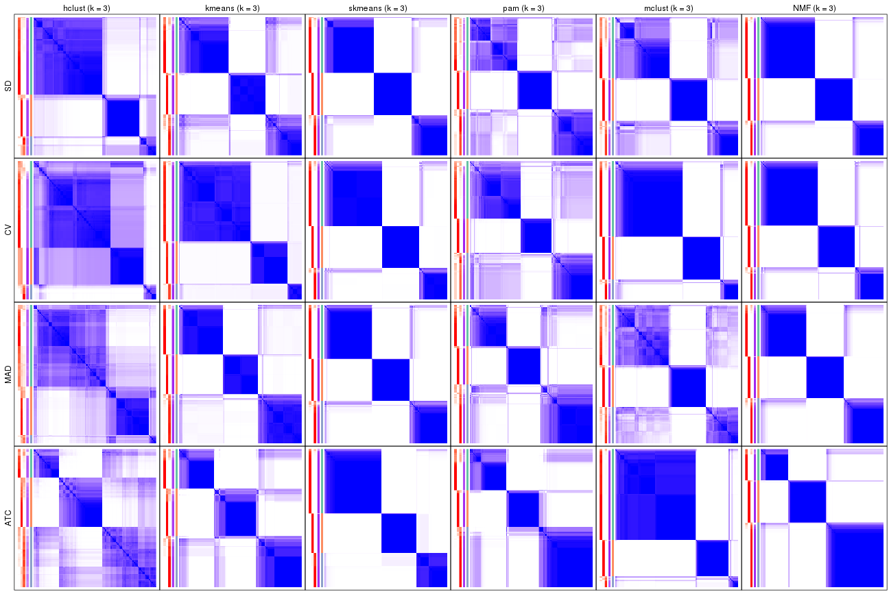</p>

</div>
<div id='tab-collect-consensus-heatmap-3'>
<pre><code class="r">collect_plots(res_list, k = 4, fun = consensus_heatmap, mc.cores = 4)
</code></pre>

<p></p>

</div>
<div id='tab-collect-consensus-heatmap-4'>
<pre><code class="r">collect_plots(res_list, k = 5, fun = consensus_heatmap, mc.cores = 4)
</code></pre>

<p></p>

</div>
<div id='tab-collect-consensus-heatmap-5'>
<pre><code class="r">collect_plots(res_list, k = 6, fun = consensus_heatmap, mc.cores = 4)
</code></pre>

<p></p>

</div>
</div>


### Membership heatmap

Membership heatmaps for all methods. ([What is a membership heatmap?](http://bioconductor.org/packages/devel/bioc/vignettes/cola/inst/doc/cola.html#toc_12))


<script>
$( function() {
	$( '#tabs-collect-membership-heatmap' ).tabs();
} );
</script>
<div id='tabs-collect-membership-heatmap'>
<ul>
<li><a href='#tab-collect-membership-heatmap-1'>k = 2</a></li>
<li><a href='#tab-collect-membership-heatmap-2'>k = 3</a></li>
<li><a href='#tab-collect-membership-heatmap-3'>k = 4</a></li>
<li><a href='#tab-collect-membership-heatmap-4'>k = 5</a></li>
<li><a href='#tab-collect-membership-heatmap-5'>k = 6</a></li>
</ul>
<div id='tab-collect-membership-heatmap-1'>
<pre><code class="r">collect_plots(res_list, k = 2, fun = membership_heatmap, mc.cores = 4)
</code></pre>

<p></p>

</div>
<div id='tab-collect-membership-heatmap-2'>
<pre><code class="r">collect_plots(res_list, k = 3, fun = membership_heatmap, mc.cores = 4)
</code></pre>

<p></p>

</div>
<div id='tab-collect-membership-heatmap-3'>
<pre><code class="r">collect_plots(res_list, k = 4, fun = membership_heatmap, mc.cores = 4)
</code></pre>

<p></p>

</div>
<div id='tab-collect-membership-heatmap-4'>
<pre><code class="r">collect_plots(res_list, k = 5, fun = membership_heatmap, mc.cores = 4)
</code></pre>

<p></p>

</div>
<div id='tab-collect-membership-heatmap-5'>
<pre><code class="r">collect_plots(res_list, k = 6, fun = membership_heatmap, mc.cores = 4)
</code></pre>

<p></p>

</div>
</div>


### Signature heatmap

Signature heatmaps for all methods. ([What is a signature heatmap?](http://bioconductor.org/packages/devel/bioc/vignettes/cola/inst/doc/cola.html#toc_22))


Note in following heatmaps, rows are scaled.


<script>
$( function() {
	$( '#tabs-collect-get-signatures' ).tabs();
} );
</script>
<div id='tabs-collect-get-signatures'>
<ul>
<li><a href='#tab-collect-get-signatures-1'>k = 2</a></li>
<li><a href='#tab-collect-get-signatures-2'>k = 3</a></li>
<li><a href='#tab-collect-get-signatures-3'>k = 4</a></li>
<li><a href='#tab-collect-get-signatures-4'>k = 5</a></li>
<li><a href='#tab-collect-get-signatures-5'>k = 6</a></li>
</ul>
<div id='tab-collect-get-signatures-1'>
<pre><code class="r">collect_plots(res_list, k = 2, fun = get_signatures, mc.cores = 4)
</code></pre>

<p></p>

</div>
<div id='tab-collect-get-signatures-2'>
<pre><code class="r">collect_plots(res_list, k = 3, fun = get_signatures, mc.cores = 4)
</code></pre>

<p></p>

</div>
<div id='tab-collect-get-signatures-3'>
<pre><code class="r">collect_plots(res_list, k = 4, fun = get_signatures, mc.cores = 4)
</code></pre>

<p>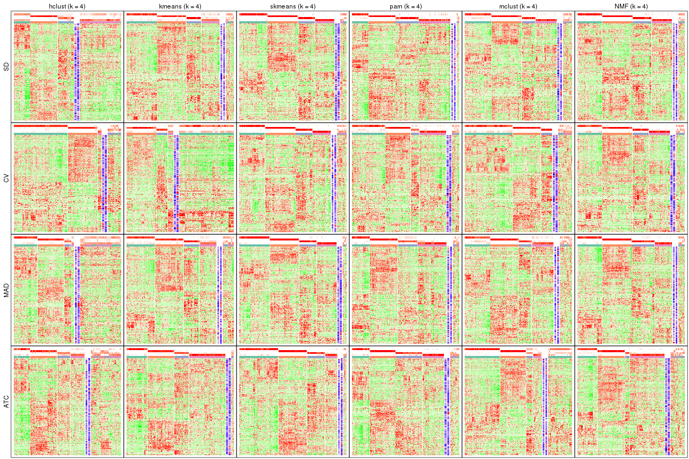</p>

</div>
<div id='tab-collect-get-signatures-4'>
<pre><code class="r">collect_plots(res_list, k = 5, fun = get_signatures, mc.cores = 4)
</code></pre>

<p></p>

</div>
<div id='tab-collect-get-signatures-5'>
<pre><code class="r">collect_plots(res_list, k = 6, fun = get_signatures, mc.cores = 4)
</code></pre>

<p></p>

</div>
</div>


### Statistics table

The statistics used for measuring the stability of consensus partitioning.
([How are they
defined?](http://bioconductor.org/packages/devel/bioc/vignettes/cola/inst/doc/cola.html#toc_13))


<script>
$( function() {
	$( '#tabs-get-stats-from-consensus-partition-list' ).tabs();
} );
</script>
<div id='tabs-get-stats-from-consensus-partition-list'>
<ul>
<li><a href='#tab-get-stats-from-consensus-partition-list-1'>k = 2</a></li>
<li><a href='#tab-get-stats-from-consensus-partition-list-2'>k = 3</a></li>
<li><a href='#tab-get-stats-from-consensus-partition-list-3'>k = 4</a></li>
<li><a href='#tab-get-stats-from-consensus-partition-list-4'>k = 5</a></li>
<li><a href='#tab-get-stats-from-consensus-partition-list-5'>k = 6</a></li>
</ul>
<div id='tab-get-stats-from-consensus-partition-list-1'>
<pre><code class="r">get_stats(res_list, k = 2)
</code></pre>

<pre><code>#&gt;             k 1-PAC mean_silhouette concordance area_increased  Rand Jaccard
#&gt; SD:NMF      2 0.976           0.958       0.982          0.469 0.528   0.528
#&gt; CV:NMF      2 0.802           0.848       0.940          0.460 0.555   0.555
#&gt; MAD:NMF     2 0.968           0.963       0.984          0.480 0.521   0.521
#&gt; ATC:NMF     2 0.945           0.954       0.979          0.421 0.577   0.577
#&gt; SD:skmeans  2 1.000           0.987       0.994          0.494 0.506   0.506
#&gt; CV:skmeans  2 1.000           0.986       0.994          0.493 0.507   0.507
#&gt; MAD:skmeans 2 1.000           0.981       0.992          0.493 0.508   0.508
#&gt; ATC:skmeans 2 1.000           0.973       0.989          0.501 0.500   0.500
#&gt; SD:mclust   2 1.000           0.974       0.989          0.438 0.560   0.560
#&gt; CV:mclust   2 0.746           0.891       0.950          0.460 0.563   0.563
#&gt; MAD:mclust  2 1.000           0.956       0.984          0.430 0.565   0.565
#&gt; ATC:mclust  2 1.000           0.982       0.993          0.438 0.568   0.568
#&gt; SD:kmeans   2 0.760           0.869       0.948          0.449 0.574   0.574
#&gt; CV:kmeans   2 0.434           0.850       0.861          0.379 0.514   0.514
#&gt; MAD:kmeans  2 0.837           0.904       0.957          0.460 0.525   0.525
#&gt; ATC:kmeans  2 1.000           0.981       0.992          0.495 0.506   0.506
#&gt; SD:pam      2 1.000           0.974       0.990          0.413 0.589   0.589
#&gt; CV:pam      2 0.992           0.950       0.979          0.400 0.606   0.606
#&gt; MAD:pam     2 1.000           0.965       0.984          0.414 0.593   0.593
#&gt; ATC:pam     2 0.984           0.967       0.985          0.469 0.528   0.528
#&gt; SD:hclust   2 0.654           0.898       0.941          0.486 0.505   0.505
#&gt; CV:hclust   2 0.913           0.935       0.971          0.196 0.822   0.822
#&gt; MAD:hclust  2 0.350           0.769       0.865          0.471 0.505   0.505
#&gt; ATC:hclust  2 0.354           0.693       0.860          0.415 0.545   0.545
</code></pre>

</div>
<div id='tab-get-stats-from-consensus-partition-list-2'>
<pre><code class="r">get_stats(res_list, k = 3)
</code></pre>

<pre><code>#&gt;             k 1-PAC mean_silhouette concordance area_increased  Rand Jaccard
#&gt; SD:NMF      3 0.972           0.946       0.978          0.382 0.769   0.584
#&gt; CV:NMF      3 0.941           0.933       0.973          0.390 0.779   0.611
#&gt; MAD:NMF     3 0.927           0.921       0.967          0.384 0.722   0.509
#&gt; ATC:NMF     3 0.952           0.941       0.976          0.515 0.657   0.465
#&gt; SD:skmeans  3 0.909           0.934       0.970          0.341 0.743   0.533
#&gt; CV:skmeans  3 0.945           0.936       0.972          0.297 0.806   0.635
#&gt; MAD:skmeans 3 0.963           0.932       0.972          0.344 0.737   0.524
#&gt; ATC:skmeans 3 1.000           0.974       0.986          0.285 0.803   0.626
#&gt; SD:mclust   3 0.693           0.726       0.853          0.481 0.767   0.592
#&gt; CV:mclust   3 0.933           0.906       0.964          0.290 0.832   0.707
#&gt; MAD:mclust  3 0.580           0.741       0.815          0.509 0.765   0.590
#&gt; ATC:mclust  3 0.985           0.932       0.968          0.143 0.931   0.880
#&gt; SD:kmeans   3 0.797           0.832       0.920          0.446 0.760   0.583
#&gt; CV:kmeans   3 0.982           0.939       0.947          0.477 0.922   0.849
#&gt; MAD:kmeans  3 0.926           0.925       0.955          0.437 0.708   0.493
#&gt; ATC:kmeans  3 0.756           0.826       0.873          0.329 0.724   0.506
#&gt; SD:pam      3 0.635           0.789       0.881          0.587 0.732   0.551
#&gt; CV:pam      3 0.615           0.797       0.849          0.543 0.713   0.536
#&gt; MAD:pam     3 0.742           0.800       0.918          0.589 0.739   0.564
#&gt; ATC:pam     3 0.810           0.858       0.936          0.375 0.672   0.455
#&gt; SD:hclust   3 0.715           0.843       0.911          0.169 0.910   0.823
#&gt; CV:hclust   3 0.425           0.737       0.768          1.275 0.648   0.573
#&gt; MAD:hclust  3 0.351           0.661       0.812          0.155 0.899   0.812
#&gt; ATC:hclust  3 0.427           0.658       0.822          0.516 0.646   0.437
</code></pre>

</div>
<div id='tab-get-stats-from-consensus-partition-list-3'>
<pre><code class="r">get_stats(res_list, k = 4)
</code></pre>

<pre><code>#&gt;             k 1-PAC mean_silhouette concordance area_increased  Rand Jaccard
#&gt; SD:NMF      4 0.870           0.869       0.943          0.150 0.860   0.624
#&gt; CV:NMF      4 0.839           0.817       0.908          0.162 0.847   0.601
#&gt; MAD:NMF     4 0.856           0.844       0.927          0.123 0.877   0.655
#&gt; ATC:NMF     4 0.716           0.753       0.877          0.122 0.895   0.723
#&gt; SD:skmeans  4 0.914           0.892       0.957          0.118 0.840   0.578
#&gt; CV:skmeans  4 0.915           0.865       0.942          0.163 0.850   0.610
#&gt; MAD:skmeans 4 0.928           0.915       0.963          0.116 0.873   0.649
#&gt; ATC:skmeans 4 0.887           0.881       0.942          0.114 0.906   0.747
#&gt; SD:mclust   4 0.764           0.813       0.898          0.127 0.901   0.724
#&gt; CV:mclust   4 0.706           0.754       0.839          0.131 0.944   0.865
#&gt; MAD:mclust  4 0.637           0.722       0.831          0.127 0.892   0.697
#&gt; ATC:mclust  4 0.682           0.664       0.825          0.248 0.897   0.797
#&gt; SD:kmeans   4 0.704           0.783       0.861          0.118 0.836   0.575
#&gt; CV:kmeans   4 0.653           0.496       0.761          0.211 0.932   0.848
#&gt; MAD:kmeans  4 0.698           0.743       0.839          0.113 0.840   0.576
#&gt; ATC:kmeans  4 0.799           0.858       0.919          0.105 0.818   0.539
#&gt; SD:pam      4 0.826           0.848       0.921          0.135 0.907   0.729
#&gt; CV:pam      4 0.718           0.786       0.866          0.150 0.926   0.790
#&gt; MAD:pam     4 0.771           0.809       0.874          0.130 0.839   0.577
#&gt; ATC:pam     4 0.734           0.813       0.906          0.143 0.838   0.575
#&gt; SD:hclust   4 0.578           0.593       0.694          0.210 0.846   0.641
#&gt; CV:hclust   4 0.659           0.788       0.878          0.317 0.885   0.770
#&gt; MAD:hclust  4 0.510           0.492       0.724          0.220 0.801   0.589
#&gt; ATC:hclust  4 0.517           0.587       0.745          0.148 0.842   0.594
</code></pre>

</div>
<div id='tab-get-stats-from-consensus-partition-list-4'>
<pre><code class="r">get_stats(res_list, k = 5)
</code></pre>

<pre><code>#&gt;             k 1-PAC mean_silhouette concordance area_increased  Rand Jaccard
#&gt; SD:NMF      5 0.908           0.860       0.934         0.0550 0.885   0.606
#&gt; CV:NMF      5 0.838           0.802       0.874         0.0620 0.914   0.688
#&gt; MAD:NMF     5 0.809           0.793       0.888         0.0517 0.876   0.579
#&gt; ATC:NMF     5 0.724           0.620       0.805         0.0956 0.829   0.502
#&gt; SD:skmeans  5 0.942           0.915       0.961         0.0655 0.888   0.618
#&gt; CV:skmeans  5 0.851           0.878       0.917         0.0616 0.897   0.638
#&gt; MAD:skmeans 5 0.940           0.896       0.954         0.0670 0.889   0.619
#&gt; ATC:skmeans 5 0.854           0.815       0.917         0.0812 0.931   0.768
#&gt; SD:mclust   5 0.788           0.796       0.888         0.0589 0.940   0.784
#&gt; CV:mclust   5 0.655           0.601       0.727         0.0793 0.923   0.794
#&gt; MAD:mclust  5 0.685           0.694       0.799         0.0553 0.945   0.798
#&gt; ATC:mclust  5 0.687           0.700       0.842         0.1193 0.910   0.786
#&gt; SD:kmeans   5 0.767           0.738       0.791         0.0714 0.901   0.658
#&gt; CV:kmeans   5 0.654           0.496       0.699         0.1116 0.807   0.534
#&gt; MAD:kmeans  5 0.726           0.734       0.788         0.0668 0.912   0.683
#&gt; ATC:kmeans  5 0.763           0.743       0.839         0.0755 0.865   0.563
#&gt; SD:pam      5 0.894           0.885       0.948         0.0506 0.946   0.798
#&gt; CV:pam      5 0.796           0.796       0.891         0.0806 0.925   0.746
#&gt; MAD:pam     5 0.894           0.842       0.932         0.0620 0.939   0.770
#&gt; ATC:pam     5 0.842           0.810       0.920         0.0579 0.947   0.797
#&gt; SD:hclust   5 0.614           0.483       0.695         0.0756 0.846   0.552
#&gt; CV:hclust   5 0.683           0.748       0.848         0.0991 0.993   0.983
#&gt; MAD:hclust  5 0.566           0.653       0.724         0.1174 0.846   0.536
#&gt; ATC:hclust  5 0.573           0.541       0.698         0.0649 0.930   0.749
</code></pre>

</div>
<div id='tab-get-stats-from-consensus-partition-list-5'>
<pre><code class="r">get_stats(res_list, k = 6)
</code></pre>

<pre><code>#&gt;             k 1-PAC mean_silhouette concordance area_increased  Rand Jaccard
#&gt; SD:NMF      6 0.850           0.762       0.885         0.0275 0.961   0.830
#&gt; CV:NMF      6 0.847           0.855       0.902         0.0430 0.937   0.720
#&gt; MAD:NMF     6 0.818           0.747       0.868         0.0241 0.941   0.753
#&gt; ATC:NMF     6 0.705           0.561       0.739         0.0445 0.886   0.564
#&gt; SD:skmeans  6 0.881           0.876       0.917         0.0464 0.960   0.812
#&gt; CV:skmeans  6 0.898           0.893       0.918         0.0460 0.953   0.779
#&gt; MAD:skmeans 6 0.830           0.736       0.843         0.0444 0.950   0.765
#&gt; ATC:skmeans 6 0.852           0.823       0.903         0.0346 0.959   0.827
#&gt; SD:mclust   6 0.773           0.715       0.816         0.0401 0.977   0.903
#&gt; CV:mclust   6 0.660           0.669       0.751         0.0546 0.896   0.690
#&gt; MAD:mclust  6 0.665           0.548       0.725         0.0392 0.937   0.750
#&gt; ATC:mclust  6 0.619           0.627       0.769         0.1011 0.824   0.527
#&gt; SD:kmeans   6 0.745           0.679       0.782         0.0455 0.937   0.718
#&gt; CV:kmeans   6 0.679           0.794       0.771         0.0590 0.879   0.560
#&gt; MAD:kmeans  6 0.738           0.688       0.779         0.0400 0.936   0.714
#&gt; ATC:kmeans  6 0.769           0.674       0.817         0.0475 0.941   0.737
#&gt; SD:pam      6 0.894           0.874       0.943         0.0504 0.950   0.774
#&gt; CV:pam      6 0.886           0.852       0.931         0.0532 0.940   0.751
#&gt; MAD:pam     6 0.810           0.758       0.846         0.0420 0.944   0.746
#&gt; ATC:pam     6 0.780           0.678       0.841         0.0361 0.935   0.739
#&gt; SD:hclust   6 0.664           0.669       0.764         0.0475 0.882   0.592
#&gt; CV:hclust   6 0.668           0.559       0.777         0.0566 0.918   0.802
#&gt; MAD:hclust  6 0.659           0.651       0.789         0.0618 0.985   0.930
#&gt; ATC:hclust  6 0.614           0.498       0.663         0.0398 0.910   0.651
</code></pre>

</div>
</div>

Following heatmap plots the partition for each combination of methods and the
lightness correspond to the silhouette scores for samples in each method. On
top the consensus subgroup is inferred from all methods by taking the mean
silhouette scores as weight.


<script>
$( function() {
	$( '#tabs-collect-stats-from-consensus-partition-list' ).tabs();
} );
</script>
<div id='tabs-collect-stats-from-consensus-partition-list'>
<ul>
<li><a href='#tab-collect-stats-from-consensus-partition-list-1'>k = 2</a></li>
<li><a href='#tab-collect-stats-from-consensus-partition-list-2'>k = 3</a></li>
<li><a href='#tab-collect-stats-from-consensus-partition-list-3'>k = 4</a></li>
<li><a href='#tab-collect-stats-from-consensus-partition-list-4'>k = 5</a></li>
<li><a href='#tab-collect-stats-from-consensus-partition-list-5'>k = 6</a></li>
</ul>
<div id='tab-collect-stats-from-consensus-partition-list-1'>
<pre><code class="r">collect_stats(res_list, k = 2)
</code></pre>

<p></p>

</div>
<div id='tab-collect-stats-from-consensus-partition-list-2'>
<pre><code class="r">collect_stats(res_list, k = 3)
</code></pre>

<p></p>

</div>
<div id='tab-collect-stats-from-consensus-partition-list-3'>
<pre><code class="r">collect_stats(res_list, k = 4)
</code></pre>

<p></p>

</div>
<div id='tab-collect-stats-from-consensus-partition-list-4'>
<pre><code class="r">collect_stats(res_list, k = 5)
</code></pre>

<p></p>

</div>
<div id='tab-collect-stats-from-consensus-partition-list-5'>
<pre><code class="r">collect_stats(res_list, k = 6)
</code></pre>

<p></p>

</div>
</div>

### Partition from all methods


Collect partitions from all methods:


<script>
$( function() {
	$( '#tabs-collect-classes-from-consensus-partition-list' ).tabs();
} );
</script>
<div id='tabs-collect-classes-from-consensus-partition-list'>
<ul>
<li><a href='#tab-collect-classes-from-consensus-partition-list-1'>k = 2</a></li>
<li><a href='#tab-collect-classes-from-consensus-partition-list-2'>k = 3</a></li>
<li><a href='#tab-collect-classes-from-consensus-partition-list-3'>k = 4</a></li>
<li><a href='#tab-collect-classes-from-consensus-partition-list-4'>k = 5</a></li>
<li><a href='#tab-collect-classes-from-consensus-partition-list-5'>k = 6</a></li>
</ul>
<div id='tab-collect-classes-from-consensus-partition-list-1'>
<pre><code class="r">collect_classes(res_list, k = 2)
</code></pre>

<p></p>

</div>
<div id='tab-collect-classes-from-consensus-partition-list-2'>
<pre><code class="r">collect_classes(res_list, k = 3)
</code></pre>

<p></p>

</div>
<div id='tab-collect-classes-from-consensus-partition-list-3'>
<pre><code class="r">collect_classes(res_list, k = 4)
</code></pre>

<p></p>

</div>
<div id='tab-collect-classes-from-consensus-partition-list-4'>
<pre><code class="r">collect_classes(res_list, k = 5)
</code></pre>

<p></p>

</div>
<div id='tab-collect-classes-from-consensus-partition-list-5'>
<pre><code class="r">collect_classes(res_list, k = 6)
</code></pre>

<p></p>

</div>
</div>


### Top rows overlap


Overlap of top rows from different top-row methods:


<script>
$( function() {
	$( '#tabs-top-rows-overlap-by-euler' ).tabs();
} );
</script>
<div id='tabs-top-rows-overlap-by-euler'>
<ul>
<li><a href='#tab-top-rows-overlap-by-euler-1'>top_n = 1000</a></li>
<li><a href='#tab-top-rows-overlap-by-euler-2'>top_n = 2000</a></li>
<li><a href='#tab-top-rows-overlap-by-euler-3'>top_n = 3000</a></li>
<li><a href='#tab-top-rows-overlap-by-euler-4'>top_n = 4000</a></li>
<li><a href='#tab-top-rows-overlap-by-euler-5'>top_n = 5000</a></li>
</ul>
<div id='tab-top-rows-overlap-by-euler-1'>
<pre><code class="r">top_rows_overlap(res_list, top_n = 1000, method = &quot;euler&quot;)
</code></pre>

<p></p>

</div>
<div id='tab-top-rows-overlap-by-euler-2'>
<pre><code class="r">top_rows_overlap(res_list, top_n = 2000, method = &quot;euler&quot;)
</code></pre>

<p></p>

</div>
<div id='tab-top-rows-overlap-by-euler-3'>
<pre><code class="r">top_rows_overlap(res_list, top_n = 3000, method = &quot;euler&quot;)
</code></pre>

<p></p>

</div>
<div id='tab-top-rows-overlap-by-euler-4'>
<pre><code class="r">top_rows_overlap(res_list, top_n = 4000, method = &quot;euler&quot;)
</code></pre>

<p></p>

</div>
<div id='tab-top-rows-overlap-by-euler-5'>
<pre><code class="r">top_rows_overlap(res_list, top_n = 5000, method = &quot;euler&quot;)
</code></pre>

<p></p>

</div>
</div>

Also visualize the correspondance of rankings between different top-row methods:


<script>
$( function() {
	$( '#tabs-top-rows-overlap-by-correspondance' ).tabs();
} );
</script>
<div id='tabs-top-rows-overlap-by-correspondance'>
<ul>
<li><a href='#tab-top-rows-overlap-by-correspondance-1'>top_n = 1000</a></li>
<li><a href='#tab-top-rows-overlap-by-correspondance-2'>top_n = 2000</a></li>
<li><a href='#tab-top-rows-overlap-by-correspondance-3'>top_n = 3000</a></li>
<li><a href='#tab-top-rows-overlap-by-correspondance-4'>top_n = 4000</a></li>
<li><a href='#tab-top-rows-overlap-by-correspondance-5'>top_n = 5000</a></li>
</ul>
<div id='tab-top-rows-overlap-by-correspondance-1'>
<pre><code class="r">top_rows_overlap(res_list, top_n = 1000, method = &quot;correspondance&quot;)
</code></pre>

<p></p>

</div>
<div id='tab-top-rows-overlap-by-correspondance-2'>
<pre><code class="r">top_rows_overlap(res_list, top_n = 2000, method = &quot;correspondance&quot;)
</code></pre>

<p></p>

</div>
<div id='tab-top-rows-overlap-by-correspondance-3'>
<pre><code class="r">top_rows_overlap(res_list, top_n = 3000, method = &quot;correspondance&quot;)
</code></pre>

<p></p>

</div>
<div id='tab-top-rows-overlap-by-correspondance-4'>
<pre><code class="r">top_rows_overlap(res_list, top_n = 4000, method = &quot;correspondance&quot;)
</code></pre>

<p></p>

</div>
<div id='tab-top-rows-overlap-by-correspondance-5'>
<pre><code class="r">top_rows_overlap(res_list, top_n = 5000, method = &quot;correspondance&quot;)
</code></pre>

<p></p>

</div>
</div>


Heatmaps of the top rows:


<script>
$( function() {
	$( '#tabs-top-rows-heatmap' ).tabs();
} );
</script>
<div id='tabs-top-rows-heatmap'>
<ul>
<li><a href='#tab-top-rows-heatmap-1'>top_n = 1000</a></li>
<li><a href='#tab-top-rows-heatmap-2'>top_n = 2000</a></li>
<li><a href='#tab-top-rows-heatmap-3'>top_n = 3000</a></li>
<li><a href='#tab-top-rows-heatmap-4'>top_n = 4000</a></li>
<li><a href='#tab-top-rows-heatmap-5'>top_n = 5000</a></li>
</ul>
<div id='tab-top-rows-heatmap-1'>
<pre><code class="r">top_rows_heatmap(res_list, top_n = 1000)
</code></pre>

<p></p>

</div>
<div id='tab-top-rows-heatmap-2'>
<pre><code class="r">top_rows_heatmap(res_list, top_n = 2000)
</code></pre>

<p></p>

</div>
<div id='tab-top-rows-heatmap-3'>
<pre><code class="r">top_rows_heatmap(res_list, top_n = 3000)
</code></pre>

<p></p>

</div>
<div id='tab-top-rows-heatmap-4'>
<pre><code class="r">top_rows_heatmap(res_list, top_n = 4000)
</code></pre>

<p></p>

</div>
<div id='tab-top-rows-heatmap-5'>
<pre><code class="r">top_rows_heatmap(res_list, top_n = 5000)
</code></pre>

<p></p>

</div>
</div>


 
## Results for each method


---------------------------------------------------


### SD:hclust


The object with results only for a single top-value method and a single partition method 
can be extracted as:

```r
res = res_list["SD", "hclust"]
# you can also extract it by
# res = res_list["SD:hclust"]
```

A summary of `res` and all the functions that can be applied to it:

```r
res
```

```
#> A 'ConsensusPartition' object with k = 2, 3, 4, 5, 6.
#>   On a matrix with 17377 rows and 265 columns.
#>   Top rows (1000, 2000, 3000, 4000, 5000) are extracted by 'SD' method.
#>   Subgroups are detected by 'hclust' method.
#>   Performed in total 1250 partitions by row resampling.
#>   Best k for subgroups seems to be 2.
#> 
#> Following methods can be applied to this 'ConsensusPartition' object:
#>  [1] "cola_report"             "collect_classes"         "collect_plots"          
#>  [4] "collect_stats"           "colnames"                "compare_signatures"     
#>  [7] "consensus_heatmap"       "dimension_reduction"     "functional_enrichment"  
#> [10] "get_anno_col"            "get_anno"                "get_classes"            
#> [13] "get_consensus"           "get_matrix"              "get_membership"         
#> [16] "get_param"               "get_signatures"          "get_stats"              
#> [19] "is_best_k"               "is_stable_k"             "membership_heatmap"     
#> [22] "ncol"                    "nrow"                    "plot_ecdf"              
#> [25] "rownames"                "select_partition_number" "show"                   
#> [28] "suggest_best_k"          "test_to_known_factors"
```

`collect_plots()` function collects all the plots made from `res` for all `k` (number of partitions)
into one single page to provide an easy and fast comparison between different `k`.

```r
collect_plots(res)
```


The plots are:

- The first row: a plot of the ECDF (Empirical cumulative distribution
  function) curves of the consensus matrix for each `k` and the heatmap of
  predicted classes for each `k`.
- The second row: heatmaps of the consensus matrix for each `k`.
- The third row: heatmaps of the membership matrix for each `k`.
- The fouth row: heatmaps of the signatures for each `k`.

All the plots in panels can be made by individual functions and they are
plotted later in this section.

`select_partition_number()` produces several plots showing different
statistics for choosing "optimized" `k`. There are following statistics:

- ECDF curves of the consensus matrix for each `k`;
- 1-PAC. [The PAC
  score](https://en.wikipedia.org/wiki/Consensus_clustering#Over-interpretation_potential_of_consensus_clustering)
  measures the proportion of the ambiguous subgrouping.
- Mean silhouette score.
- Concordance. The mean probability of fiting the consensus class ids in all
  partitions.
- Area increased. Denote $A_k$ as the area under the ECDF curve for current
  `k`, the area increased is defined as $A_k - A_{k-1}$.
- Rand index. The percent of pairs of samples that are both in a same cluster
  or both are not in a same cluster in the partition of k and k-1.
- Jaccard index. The ratio of pairs of samples are both in a same cluster in
  the partition of k and k-1 and the pairs of samples are both in a same
  cluster in the partition k or k-1.

The detailed explanations of these statistics can be found in [the cola
vignette](http://bioconductor.org/packages/devel/bioc/vignettes/cola/inst/doc/cola.html#toc_13).

Generally speaking, lower PAC score, higher mean silhouette score or higher
concordance corresponds to better partition. Rand index and Jaccard index
measure how similar the current partition is compared to partition with `k-1`.
If they are too similar, we won't accept `k` is better than `k-1`.

```r
select_partition_number(res)
```


The numeric values for all these statistics can be obtained by `get_stats()`.

```r
get_stats(res)
```

```
#>   k 1-PAC mean_silhouette concordance area_increased  Rand Jaccard
#> 2 2 0.654           0.898       0.941         0.4865 0.505   0.505
#> 3 3 0.715           0.843       0.911         0.1689 0.910   0.823
#> 4 4 0.578           0.593       0.694         0.2101 0.846   0.641
#> 5 5 0.614           0.483       0.695         0.0756 0.846   0.552
#> 6 6 0.664           0.669       0.764         0.0475 0.882   0.592
```

`suggest_best_k()` suggests the best $k$ based on these statistics. The rules are as follows:

- All $k$ with Jaccard index larger than 0.95 are removed because the increase of
  the partition number does not provides enough extra information. If all $k$ are removed,
  the best $k$ is assigned by `NA`.
- For $k$ with 1-PAC larger than 0.9, the maximal $k$ is taken as the "best k". Other $k$ is called "optional k".
- If it does not fit the second rule. The $k$ with the highest vote of highest
  1-PAC, mean silhouette and concordance is taken as the "best k".

```r
suggest_best_k(res)
```

```
#> [1] 2
```


Following shows the table of the partitions (You need to click the **show/hide
code output** link to see it). The membership matrix (columns with name `p*`)
is inferred by
[`clue::cl_consensus()`](https://www.rdocumentation.org/link/cl_consensus?package=clue)
function with the `SE` method. Basically the value in the membership matrix
represents the probability to belong to a certain group. The finall class
label for an item is determined with the group with highest probability it
belongs to.

In `get_classes()` function, the entropy is calculated from the membership
matrix and the silhouette score is calculated from the consensus matrix.


<script>
$( function() {
	$( '#tabs-SD-hclust-get-classes' ).tabs();
} );
</script>
<div id='tabs-SD-hclust-get-classes'>
<ul>
<li><a href='#tab-SD-hclust-get-classes-1'>k = 2</a></li>
<li><a href='#tab-SD-hclust-get-classes-2'>k = 3</a></li>
<li><a href='#tab-SD-hclust-get-classes-3'>k = 4</a></li>
<li><a href='#tab-SD-hclust-get-classes-4'>k = 5</a></li>
<li><a href='#tab-SD-hclust-get-classes-5'>k = 6</a></li>
</ul>

<div id='tab-SD-hclust-get-classes-1'>
<p><a id='tab-SD-hclust-get-classes-1-a' style='color:#0366d6' href='#'>show/hide code output</a></p>
<pre><code class="r">cbind(get_classes(res, k = 2), get_membership(res, k = 2))
</code></pre>

<pre><code>#&gt;                                      class entropy silhouette    p1    p2
#&gt; D30CF518-5FC6-4A54-8D5D-BA420EA1836D     2  0.0000      0.937 0.000 1.000
#&gt; 92298FF7-1215-4756-B976-A7D88B91AD76     1  0.3733      0.919 0.928 0.072
#&gt; 0E244FE2-7C17-4642-A51F-2CCA796D9C70     2  0.0000      0.937 0.000 1.000
#&gt; 75435ED8-93E8-45FB-8480-98D8EB2EF8CB     2  0.0000      0.937 0.000 1.000
#&gt; B6D11678-15A9-4F43-A0A2-225067DCAF1C     1  0.4161      0.913 0.916 0.084
#&gt; B7F5A41E-9559-4329-81F5-1B88A74730B7     2  0.0000      0.937 0.000 1.000
#&gt; 39414B2A-7FB0-4669-8DFE-86D9AF7AD2D9     1  0.7219      0.811 0.800 0.200
#&gt; 04823F53-A12D-4852-8F34-77B9DCBB7DF0     2  0.0000      0.937 0.000 1.000
#&gt; 49684C2B-D31C-4B45-A400-3497C3CCEC01     2  0.0000      0.937 0.000 1.000
#&gt; 96A04875-58E2-4BE7-8E0F-CAB55F4CA54F     1  0.0938      0.938 0.988 0.012
#&gt; 1F101D63-478B-40B9-A951-DC3887CFF067     1  0.4562      0.908 0.904 0.096
#&gt; DD290860-E0B7-48FC-BE12-2AF729994C21     2  0.0000      0.937 0.000 1.000
#&gt; FFDD7A12-DDEF-4974-8D60-64B7EEAAC994     2  0.0000      0.937 0.000 1.000
#&gt; E076A9A9-EA2A-4FF7-92A8-F2DA7F30279E     2  0.7376      0.771 0.208 0.792
#&gt; 830DFA6F-A85A-4317-82B2-791FAB998A01     2  0.0000      0.937 0.000 1.000
#&gt; 58578614-E4A3-4655-BBAB-F65851625E0A     1  0.0938      0.938 0.988 0.012
#&gt; 1CBFB672-4D66-430B-83F3-7CE3BE20ABF6     1  0.0938      0.938 0.988 0.012
#&gt; 6C34A7D7-3756-4DCC-9A9F-B5FC4A148B7E     2  0.1184      0.931 0.016 0.984
#&gt; D97ED7B4-5DF2-4B62-8796-AA51CA79DBBB     1  0.1843      0.935 0.972 0.028
#&gt; 45F15851-55F6-4169-834E-38958C38B6A9     1  0.0000      0.937 1.000 0.000
#&gt; 4139E0C9-F712-4A25-8B59-587533B93B3E     2  0.9850      0.325 0.428 0.572
#&gt; 2C3007BF-009E-404F-A3BF-8B921698D85B     1  0.0000      0.937 1.000 0.000
#&gt; 2189F8E5-FF98-4C1A-BD04-5595DB553130     1  0.4815      0.907 0.896 0.104
#&gt; FFAA0310-0D78-4499-8FB8-5BC46E4FCE58     2  0.7376      0.771 0.208 0.792
#&gt; 0C375B2F-67BE-4708-BEB2-544DEC812DCA     2  0.0000      0.937 0.000 1.000
#&gt; AB6324A1-19AB-400C-8001-54765D190E27     2  0.0000      0.937 0.000 1.000
#&gt; A32C4DCD-DC4C-4132-9ED1-B159F5561A2D     1  0.0000      0.937 1.000 0.000
#&gt; 2AE7105D-D494-45B0-947A-315D8C20ECDC     1  0.0938      0.938 0.988 0.012
#&gt; 60FE9D59-FC0F-4B9C-ABF8-1C00BC761928     1  0.0000      0.937 1.000 0.000
#&gt; 056442DC-E87A-4315-965C-C19D7B4FC40E     1  0.0000      0.937 1.000 0.000
#&gt; 455111E5-18EF-4E3F-9DFF-8FA017D92461     1  0.7219      0.811 0.800 0.200
#&gt; 10632BC6-0B81-433C-8832-6B2ABC73A94B     1  0.0938      0.938 0.988 0.012
#&gt; AC6F82AD-C682-4EB3-BEC3-FD950F57609D     1  0.0000      0.937 1.000 0.000
#&gt; D9ABDB75-04DA-4D33-A69F-701729494533     1  0.0000      0.937 1.000 0.000
#&gt; 27BBF44D-F4D7-4C5A-935F-3310A363A670     2  0.0000      0.937 0.000 1.000
#&gt; E7AA12EE-6E14-4B33-A52C-B13589436023     1  0.0000      0.937 1.000 0.000
#&gt; DFA6D41A-D231-413E-A180-E42DF26C3E2B     2  0.7376      0.770 0.208 0.792
#&gt; 655BD3AF-5094-4B19-93A8-401C70369B17     2  0.8499      0.637 0.276 0.724
#&gt; 9DFEF253-923F-4EE2-8E3D-C75805387B20     2  0.8608      0.621 0.284 0.716
#&gt; 3B0EE948-B2CD-4191-90E2-BDD155F3B580     1  0.8327      0.707 0.736 0.264
#&gt; 177C7EF4-2D54-4555-947C-44EE7C688917     2  0.0672      0.935 0.008 0.992
#&gt; 1F8E8BB7-D159-4556-8B04-E5DD027CC444     2  0.0000      0.937 0.000 1.000
#&gt; 619F37D2-6771-4727-9079-56BED07F1CF6     2  0.8661      0.618 0.288 0.712
#&gt; ACAE29BE-ECB8-4A98-BC71-7A2D4857134E     2  0.1184      0.931 0.016 0.984
#&gt; C5C3241A-684C-4238-9333-9AF8630EC086     2  0.0000      0.937 0.000 1.000
#&gt; AD319DC2-140F-4E7B-A899-010687D8B714     2  0.0000      0.937 0.000 1.000
#&gt; 2AFF397C-ED2A-4FD9-A7F0-E4C61E9FB603     2  0.0672      0.935 0.008 0.992
#&gt; FB4C7892-3DBB-4148-AAE9-75B19A1A4031     1  0.4690      0.907 0.900 0.100
#&gt; 6F5C4500-1ED1-4E81-B4F5-EEA64CE2336A     1  0.0376      0.938 0.996 0.004
#&gt; BD027C69-3C10-4047-8E1E-218600FF2B73     2  0.0000      0.937 0.000 1.000
#&gt; 11B473A9-4CC5-461F-BC57-CC9141F3591D     1  0.7299      0.806 0.796 0.204
#&gt; 69A036E5-3E6A-4862-A7F8-2D203ED2FC9E     1  0.2043      0.935 0.968 0.032
#&gt; 9C0BDF24-F011-4855-B95A-1B6BEFA808F7     1  0.1414      0.938 0.980 0.020
#&gt; 9E205254-8C0C-4C05-AF5A-86E679CF732C     1  0.4690      0.905 0.900 0.100
#&gt; 935CCE4A-8AA8-454E-9DFF-7DE27D0BD2E2     1  0.4022      0.917 0.920 0.080
#&gt; 01E5E1FE-41D3-428B-90BC-7A000829E102     1  0.0672      0.938 0.992 0.008
#&gt; B344A530-92CD-468B-847A-DF8E25688081     2  0.6712      0.806 0.176 0.824
#&gt; F79F32A7-9F7B-4D62-8426-4A4CF10ED319     1  0.0000      0.937 1.000 0.000
#&gt; C2E1C6FA-82F9-467C-99AE-9B39FAAC810C     1  0.0000      0.937 1.000 0.000
#&gt; BF7CD9BD-776A-4957-8A6E-EF8AD83EA9D3     2  0.0000      0.937 0.000 1.000
#&gt; 8A2C1409-E83B-435E-A20F-5FCA94801C9F     2  0.0000      0.937 0.000 1.000
#&gt; B6BEFFB5-2F62-477B-A4C8-478D29577CBD     2  0.0000      0.937 0.000 1.000
#&gt; 8622CBD0-F8E9-4AC1-8175-CC9A742B86F9     1  0.0000      0.937 1.000 0.000
#&gt; 565DD660-ED58-4065-8619-260BEA6FCFEB     1  0.4562      0.908 0.904 0.096
#&gt; 96038E42-0FBA-497D-819C-38F7689F10FF     1  0.0938      0.938 0.988 0.012
#&gt; CA685549-F8BA-43F1-8461-5D2D3B17CFC5     1  0.7674      0.773 0.776 0.224
#&gt; 52020307-71A6-46E5-ACB3-8F885CA8F1EB     1  0.0000      0.937 1.000 0.000
#&gt; 7656DA98-76DC-424B-B02C-D7001DAAA0E4     1  0.4690      0.905 0.900 0.100
#&gt; 74DBA640-45E2-42A6-8F1E-69C073D66EE6     1  0.0000      0.937 1.000 0.000
#&gt; 251094BE-C33D-44F0-BD98-8618D71F520C     1  0.4022      0.919 0.920 0.080
#&gt; AB914CC5-5FF1-4257-A353-6A99D11B9478     1  0.0672      0.938 0.992 0.008
#&gt; 38B8B893-0E08-4B71-B51C-B32A7B2724E0     1  0.4690      0.905 0.900 0.100
#&gt; 7C7CD8FF-99A4-41D7-B7E1-5A517001F551     2  0.0000      0.937 0.000 1.000
#&gt; BFC5B75A-E4AE-486B-BA30-23BBAA33A125     2  0.0000      0.937 0.000 1.000
#&gt; 182AC78E-A07C-4B34-B216-B5F573E9F036     2  0.8499      0.640 0.276 0.724
#&gt; B38C5F72-8F46-4531-9C2D-96EEE07A5B22     2  0.0000      0.937 0.000 1.000
#&gt; DB9333A6-A723-4B8F-9221-25B8B23D5126     1  0.6531      0.853 0.832 0.168
#&gt; CD67DD21-C1B6-4D58-AC8E-1F4536C7DA70     2  0.6712      0.806 0.176 0.824
#&gt; 3D76A56E-4B66-48AE-AA60-D9C1004C7140     1  0.0000      0.937 1.000 0.000
#&gt; 71ED572F-7780-47A4-A9F8-D320C737690D     1  0.0938      0.939 0.988 0.012
#&gt; B449FEA1-C4B0-400F-903C-59E13D0BA313     2  0.0000      0.937 0.000 1.000
#&gt; 3F120E90-1486-4215-B9B9-79D5B413CAAC     1  0.6048      0.869 0.852 0.148
#&gt; A071894B-D8C0-4740-BD55-93EA0C86EDF7     1  0.2043      0.935 0.968 0.032
#&gt; 58848D57-D7A9-4ABB-86A2-A8AE2B23F654     1  0.0000      0.937 1.000 0.000
#&gt; CD6F9E20-B301-4663-87EC-953EDF49754F     2  0.0672      0.935 0.008 0.992
#&gt; 367D89F3-D527-4929-B830-8B6D553DF9E1     1  0.5408      0.891 0.876 0.124
#&gt; BE8D7DCB-648B-42DD-9FA8-8B85B5D816B2     1  0.0000      0.937 1.000 0.000
#&gt; AA46F56B-BD9C-40A4-8EA8-35E2568C964D     2  0.0000      0.937 0.000 1.000
#&gt; 6393220A-7C57-413F-81A8-4E38C21E779E     2  0.0000      0.937 0.000 1.000
#&gt; 89AE566C-F65F-43C2-BA97-621A7AC8B6DC     1  0.0376      0.938 0.996 0.004
#&gt; AA6A4BFF-8C62-4B70-B85A-9EDF403B06BA     1  0.0000      0.937 1.000 0.000
#&gt; BCE877A6-9C65-4495-A45D-05753F2D0E15     1  0.0938      0.938 0.988 0.012
#&gt; D7BDDF49-C54B-4F8E-ACA0-C3684AB68B5C     2  0.5629      0.838 0.132 0.868
#&gt; D0800D49-0033-44B2-8D7B-29B16F87ADA6     2  0.0000      0.937 0.000 1.000
#&gt; 151D60B5-5AF1-4B61-B97F-ABC7531D9F89     1  0.7219      0.811 0.800 0.200
#&gt; CBBAEB5B-25FA-4B6D-A40C-357E37033E36     1  0.7219      0.811 0.800 0.200
#&gt; 317CD049-3151-40B7-8E88-B0B8813338D6     1  0.0938      0.939 0.988 0.012
#&gt; 93835C77-F8FA-4928-843C-8016A91881FA     1  0.0000      0.937 1.000 0.000
#&gt; 02A6950F-647D-4F20-B2D0-0238C1441C70     1  0.0672      0.938 0.992 0.008
#&gt; 4D54E415-134F-4F6F-8718-3E0475EF5477     1  0.0000      0.937 1.000 0.000
#&gt; 82AB290A-3993-45E5-8B15-6125A019778C     1  0.1184      0.938 0.984 0.016
#&gt; 3B5EAD14-E506-4A22-804D-BF925A2D5247     2  0.0000      0.937 0.000 1.000
#&gt; 19CF7DDF-4F3A-4D2F-B84A-6451A5C3112C     2  0.0672      0.935 0.008 0.992
#&gt; 2FB00DAA-C274-42B1-A06B-611FE5E96844     1  0.2236      0.935 0.964 0.036
#&gt; 2B1F01C3-8145-4296-8111-2B0474AB9A2C     2  0.0000      0.937 0.000 1.000
#&gt; 3F0865F1-8256-4778-966F-D53637B415B6     2  0.6712      0.806 0.176 0.824
#&gt; 5473210D-37F9-4192-86D2-E2A2C77F3BD2     2  0.6712      0.806 0.176 0.824
#&gt; 5EDB6ACF-4F3F-471A-9DDC-661607CACCC4     1  0.0672      0.938 0.992 0.008
#&gt; 6A252A3A-7EEB-47B6-9C23-D69BD2EA846F     2  0.0672      0.935 0.008 0.992
#&gt; 0A7FFCBB-4BAA-4A5F-8B2D-B427C4D982A8     1  0.0000      0.937 1.000 0.000
#&gt; 1603AFB8-5AD7-4794-9991-BDBE96B4D997     2  0.0000      0.937 0.000 1.000
#&gt; 644299E9-62B7-4DFE-9E6D-D7556A01B40A     1  0.0000      0.937 1.000 0.000
#&gt; EF12E923-1860-4269-B57B-BA6238FA4403     1  0.6712      0.837 0.824 0.176
#&gt; 51B7241E-F0BE-482A-88AE-89004BB68989     1  0.2043      0.935 0.968 0.032
#&gt; 1C007DF3-8A9F-4940-9A4C-DE2A412BB023     2  0.0672      0.935 0.008 0.992
#&gt; 89FCFDE6-9625-432C-AA35-9C5FCCF40031     1  0.4161      0.920 0.916 0.084
#&gt; 7955FC55-386D-497E-AFED-019BBBAD428E     2  0.7376      0.771 0.208 0.792
#&gt; 37FF09ED-73EC-4D10-B2AC-7D8EBA9304ED     1  0.8327      0.707 0.736 0.264
#&gt; C2CD2742-2FB4-468E-90FF-8F65A5C425A9     1  0.1184      0.938 0.984 0.016
#&gt; 766FE08F-3393-4868-B1C1-FA98C9FF16E0     2  0.6531      0.811 0.168 0.832
#&gt; 63E2B578-2221-4255-8C45-7FD030B1C94D     1  0.0938      0.938 0.988 0.012
#&gt; C14B1A44-43F7-45F0-A583-5667A4D3BD95     1  0.2423      0.933 0.960 0.040
#&gt; D9CB551A-CE20-4BF7-8AC9-839112346C3D     1  0.1414      0.937 0.980 0.020
#&gt; 05BAA71A-E5B3-4A3A-A3F2-013A975087F0     2  0.0000      0.937 0.000 1.000
#&gt; AC8DA7DE-4D83-4768-BEFD-9A1B2DA943CE     2  0.0938      0.933 0.012 0.988
#&gt; E89DCE9D-F8A5-499C-85BB-BB500BADB9FB     1  0.4562      0.907 0.904 0.096
#&gt; C16F9B5E-2B52-40F6-856D-C0D6FBDD16C1     1  0.0000      0.937 1.000 0.000
#&gt; 8FF234D4-823A-4C80-82F7-2E92D72DBF88     2  0.0000      0.937 0.000 1.000
#&gt; C9F94A6E-D104-4D8D-8EC5-EADECD85F092     2  0.8499      0.637 0.276 0.724
#&gt; 45C9756F-A154-4537-852E-ECBF27B92FE1     2  0.0000      0.937 0.000 1.000
#&gt; 0F1A5708-341E-4713-BC70-76D702F826D6     2  0.6343      0.819 0.160 0.840
#&gt; 2ECFBCA0-AB35-461A-A4B5-C60B2651A962     2  0.0000      0.937 0.000 1.000
#&gt; 7DFAC404-3AB3-4274-A533-CFDAF4CE122D     1  0.0000      0.937 1.000 0.000
#&gt; A90AF55C-4386-42AB-A812-9230026EA5A5     2  0.0000      0.937 0.000 1.000
#&gt; 6258A757-4E18-4CD1-8417-189521E990B6     2  0.0000      0.937 0.000 1.000
#&gt; EBFAD137-050F-47D0-A43D-72B8F7D70C2B     1  0.0938      0.938 0.988 0.012
#&gt; 08B5EBFB-2807-4229-95A6-81AB7F377A56     2  0.0000      0.937 0.000 1.000
#&gt; 4780A59C-0589-4995-B044-3201F09AF859     1  0.4562      0.909 0.904 0.096
#&gt; 0AB81429-C287-48AA-9035-3A7A6F4C7328     2  0.0000      0.937 0.000 1.000
#&gt; 20C4D047-28DA-4AB7-9B3C-32EDA6B22C9D     2  0.0938      0.933 0.012 0.988
#&gt; 77C4E01F-84A6-4BFD-AA8E-D7875456F546     2  0.0672      0.935 0.008 0.992
#&gt; 8B28383F-CF14-4CC5-A1E2-72AD915C0AE8     1  0.4022      0.921 0.920 0.080
#&gt; E12E1F48-6A52-4F74-925C-C4EE1BF5C573     2  0.0000      0.937 0.000 1.000
#&gt; 9B179BC5-BB4C-4CEE-99BC-BC552BC384A1     1  0.4161      0.913 0.916 0.084
#&gt; 5548C91A-D3DE-48F5-B4A4-124BE177B99A     1  0.7299      0.806 0.796 0.204
#&gt; 0E22B729-C381-4B0C-9897-62DD38F51722     1  0.4690      0.905 0.900 0.100
#&gt; 7BC4937F-04E2-4B46-BA7C-FE9AC738C8A9     1  0.0000      0.937 1.000 0.000
#&gt; EE6A0D3F-3F8A-4AA8-B3EF-32372EF37A29     1  0.7219      0.807 0.800 0.200
#&gt; 08AC2706-7651-409F-BE6B-BCED1C2D1796     1  0.0938      0.938 0.988 0.012
#&gt; A68B078D-8979-4070-BB4D-F526704ED3DC     1  0.0000      0.937 1.000 0.000
#&gt; C319A5EE-69FA-4AAB-85A9-2EAAD8E4C703     1  0.7219      0.811 0.800 0.200
#&gt; 0D7CAABD-D20C-4F82-BCBC-8B7276E8EDE2     1  0.0000      0.937 1.000 0.000
#&gt; 09444DCC-44BA-4A3F-ACC5-863A54578B9F     1  0.6148      0.863 0.848 0.152
#&gt; 2E32B047-C6E1-4743-A6C8-E98370A32145     1  0.7219      0.811 0.800 0.200
#&gt; 6A6878A7-76B2-40DE-958B-804442AC6A5D     1  0.6247      0.863 0.844 0.156
#&gt; 39F27293-0BFF-4EA2-8439-A299E3226D20     1  0.4161      0.920 0.916 0.084
#&gt; 7EAE9C30-6080-405F-A7E6-1FED57674279     1  0.4022      0.921 0.920 0.080
#&gt; 79499169-A093-4E0A-B6BD-010CD7BE5035     1  0.0000      0.937 1.000 0.000
#&gt; 1F8BF4E8-BD84-4EFE-9E3E-89E7CE8FA72D     2  0.6712      0.806 0.176 0.824
#&gt; 62B7988F-98E5-4AB8-8A16-D661A07455E8     1  0.6973      0.825 0.812 0.188
#&gt; B7005B5F-217E-4073-BFB5-CE7E884B80C0     2  0.0000      0.937 0.000 1.000
#&gt; B981568F-2C08-4696-B589-E157A49BE72B     2  0.0000      0.937 0.000 1.000
#&gt; A3D85C0A-3202-40C2-88E1-052AC6C5184B     1  0.0672      0.938 0.992 0.008
#&gt; 4CA783B9-9B99-46B8-962A-77194ECB7942     2  0.7376      0.771 0.208 0.792
#&gt; D4024B08-4879-47EA-99E5-D9FCE1CD40DF     1  0.0938      0.938 0.988 0.012
#&gt; 1D41CDA2-0B29-48FD-B83A-E60C174DBCB3     1  0.4022      0.919 0.920 0.080
#&gt; A1923B2A-B233-4760-8AF9-C04C1CAEB100     1  0.4562      0.909 0.904 0.096
#&gt; 80880D71-BFDE-4D88-892F-5ADF27A38940     2  0.0672      0.935 0.008 0.992
#&gt; 55D1629D-30FD-49AA-88CE-EA3CA9B30A3F     2  0.0000      0.937 0.000 1.000
#&gt; B71C409E-926D-48AD-8BD8-9F707CA4FB01     2  0.0000      0.937 0.000 1.000
#&gt; 54A92C57-BD19-4A47-BA76-3ACA2DC36212     2  0.8861      0.600 0.304 0.696
#&gt; B2AB74B8-506C-4C27-9105-E86A6AAA89D4     1  0.7219      0.811 0.800 0.200
#&gt; 0356AE49-7A5C-42CC-A39C-7C8DFBFF8842     2  0.0000      0.937 0.000 1.000
#&gt; ACA260A3-DC3F-4FF4-B9C5-2D4BC4F81783     1  0.4022      0.916 0.920 0.080
#&gt; 9B440917-E5A4-43B9-A48D-6ABFEDCA6CFD     1  0.0672      0.938 0.992 0.008
#&gt; 47464828-52EA-413B-B30C-BD8B55903D78     2  0.0000      0.937 0.000 1.000
#&gt; C1D1FC82-B50D-4C82-8F03-06CEE3C08D18     1  0.0000      0.937 1.000 0.000
#&gt; E5ABFC43-E2A3-4B1A-BBA3-8196C0B026A5     2  0.7299      0.762 0.204 0.796
#&gt; 1D3C16CC-D0D5-4637-AAC7-91672DFF3317     1  0.0000      0.937 1.000 0.000
#&gt; 4D038320-ADEA-4990-8371-68B4B8162E1A     2  0.8443      0.644 0.272 0.728
#&gt; A75594CC-3E49-4869-8656-BBB4E72BF59D     2  0.0000      0.937 0.000 1.000
#&gt; 7CABAA19-5FB2-4A58-BDA3-4F1FFB532C20     1  0.4690      0.905 0.900 0.100
#&gt; 534EF1E9-9513-426E-B41E-A394AB2E4410     2  0.0376      0.936 0.004 0.996
#&gt; 649F35A1-A08C-497D-A9B6-CB3084D5FB8D     1  0.4161      0.913 0.916 0.084
#&gt; 7CA30F3C-1C98-480C-B8B5-A248AABFB468     1  0.4161      0.920 0.916 0.084
#&gt; A9F8DA21-A802-44CF-9F5D-96A36687DCDD     2  0.7376      0.771 0.208 0.792
#&gt; A7AE1ED1-86CB-4A50-97B2-66785C7191FE     1  0.0000      0.937 1.000 0.000
#&gt; D0091AD4-D3D7-4C03-ACD9-DA9F8B6076C6     1  0.7219      0.811 0.800 0.200
#&gt; 46EE1C2B-13F7-44A7-B27E-4EBB9DF0CA83     2  0.0000      0.937 0.000 1.000
#&gt; CB9301B8-0282-43D6-AF5E-B753A9C7BFCB     2  0.2043      0.919 0.032 0.968
#&gt; A0E77A39-885A-4472-9A10-2D1E51DBFDA4     1  0.4562      0.909 0.904 0.096
#&gt; C06603C2-163D-40B6-A9FE-882424F18FE9     1  0.0938      0.938 0.988 0.012
#&gt; C3921A29-80FF-4B9D-B366-5C0238A42231     2  0.8861      0.600 0.304 0.696
#&gt; BB99B4E7-C834-4BB8-973F-8FA039E2798F     1  0.0000      0.937 1.000 0.000
#&gt; 5CD78C2F-05E9-409A-8405-3EE936A6876E     2  0.6712      0.806 0.176 0.824
#&gt; 6C126CC7-0C03-48F0-A2C2-F090CA239B70     2  0.0000      0.937 0.000 1.000
#&gt; 7118B08A-E94C-49F4-8D76-26455C34D85F     2  0.0000      0.937 0.000 1.000
#&gt; 266DAF30-CF3E-493E-8B24-3931D0039450     1  0.4161      0.913 0.916 0.084
#&gt; DAB5F5B9-4FE5-468F-AD2B-B39BBC4317A0     2  0.1184      0.931 0.016 0.984
#&gt; 9A9EB6D6-312E-4A98-8762-30D3ABD8193D     2  0.0672      0.935 0.008 0.992
#&gt; CED15676-B901-4FC8-9C8D-51E529D9441D     1  0.4690      0.907 0.900 0.100
#&gt; 827232CC-8035-440C-8B12-02C789C70B1B     1  0.2236      0.934 0.964 0.036
#&gt; 04D5FB28-FB50-4EAE-95FB-72ABF0E618CA     2  0.0000      0.937 0.000 1.000
#&gt; 6C96A851-97FC-4845-B895-D255191D9F25     1  0.0000      0.937 1.000 0.000
#&gt; 3EC982CB-D013-443E-B21D-39DE6B8EF370     2  0.0672      0.935 0.008 0.992
#&gt; 2E24A786-4370-42A1-AD50-D651F89819CC     2  0.0000      0.937 0.000 1.000
#&gt; 7653BFA9-ADA5-44CA-8555-807FBBFC6DE2     1  0.1184      0.938 0.984 0.016
#&gt; 7A110994-5741-4013-91F0-DD2E1D343F91     2  0.0000      0.937 0.000 1.000
#&gt; 0A760E0C-11C5-4201-8452-18DBC1FEACEB     1  0.0000      0.937 1.000 0.000
#&gt; 909B76A1-BB9F-4906-95BC-58CD1A46D3B8     2  0.0000      0.937 0.000 1.000
#&gt; A782EE71-EDA4-4385-83B3-D16DE81296C0     2  0.0672      0.935 0.008 0.992
#&gt; BD50E276-914F-4924-8CEA-FF47A66DB175     2  0.0000      0.937 0.000 1.000
#&gt; 505D5CA8-0279-4BC7-8CC0-8C7A0165BF91     2  0.0000      0.937 0.000 1.000
#&gt; D51FC997-E662-4AE7-BC9C-14183DA42DE1     2  0.0000      0.937 0.000 1.000
#&gt; 8AD67970-84F1-4C0A-B47A-8FA4108F9FE3     1  0.0376      0.938 0.996 0.004
#&gt; 6E33B1B6-7089-4BC3-B2B0-EC2C3B5D8B74     1  0.1843      0.936 0.972 0.028
#&gt; 88C4EA46-2546-401C-A8E7-603EECFDFBA0     1  0.4431      0.909 0.908 0.092
#&gt; 375D2D72-C998-4627-BA35-24E82A9A55FF     1  0.4562      0.909 0.904 0.096
#&gt; 76D0F834-7064-46C6-96F4-E861CF5452B6     2  0.8499      0.637 0.276 0.724
#&gt; 87159081-C97A-4004-AF0A-7EB6EF0EC47A     1  0.3733      0.920 0.928 0.072
#&gt; 24A57006-800B-4174-AF4E-7EA57A8A756E     1  0.4562      0.909 0.904 0.096
#&gt; AD68CBC6-8A13-4A65-AF62-E99AFA81D031     2  0.0672      0.935 0.008 0.992
#&gt; 22863A57-F066-4DD1-A859-4336F43D144C     1  0.7219      0.811 0.800 0.200
#&gt; 8F6F0362-9165-4DCC-992C-AF871A3C51E7     1  0.0000      0.937 1.000 0.000
#&gt; 76ABF0B7-E707-4DB2-9486-3814439BDBA5     1  0.0000      0.937 1.000 0.000
#&gt; BC72372F-3577-40E5-BA0F-41A084AA93AD     1  0.0000      0.937 1.000 0.000
#&gt; 8E566039-B56C-4F41-B9EF-DE18BEEF2C95     1  0.0938      0.939 0.988 0.012
#&gt; F096F016-3EF5-4A67-A7C2-8A45E1585232     1  0.0000      0.937 1.000 0.000
#&gt; BB37913E-534B-43DD-BE3D-E13B29FD8172     2  0.0000      0.937 0.000 1.000
#&gt; E344638F-9060-460F-8F7A-60D19442F294     2  0.3114      0.903 0.056 0.944
#&gt; 6A0EAAD0-89D5-4F12-8B45-9D5A25182FAD     2  0.0000      0.937 0.000 1.000
#&gt; A5199E3A-9D67-4543-88AB-24398C98E38E     1  0.8327      0.707 0.736 0.264
#&gt; 23917D52-7864-4F84-9C77-DF8EA9407345     2  0.0000      0.937 0.000 1.000
#&gt; 9AA96080-19D8-40C3-BDD1-6044D2D422D5     1  0.0000      0.937 1.000 0.000
#&gt; 0ED65D91-260C-4662-9903-EE36A2E3B2D0     2  0.0000      0.937 0.000 1.000
#&gt; 64BF1BC5-7A9A-4E1D-AEAB-AFE30B92AAF4     2  0.6973      0.792 0.188 0.812
#&gt; F02301F1-9054-4DC6-8DC9-2451A0F53EFC     2  0.0376      0.936 0.004 0.996
#&gt; 3264649A-5684-4181-83D0-A7E4D7E2E1FD     1  0.4022      0.916 0.920 0.080
#&gt; 3F8DA39C-BC9B-4343-8838-5CE271E80C51     2  0.6438      0.805 0.164 0.836
#&gt; BCC681CB-2AF4-4BB6-B53A-7544A2399454     1  0.0000      0.937 1.000 0.000
#&gt; DCB50E17-5E2D-443B-8DCC-272FBB734C2E     1  0.0000      0.937 1.000 0.000
#&gt; B5E47C38-CB6A-44C0-AA9B-56951B9EF78D     1  0.0376      0.938 0.996 0.004
#&gt; B15B0185-9C28-4A00-9CEC-05EFECEA6709     1  0.1843      0.936 0.972 0.028
#&gt; 61D4E8E7-0110-480A-A4A7-D406DE74C31E     1  0.4562      0.909 0.904 0.096
#&gt; CA8DB3AD-3F6B-4622-BF73-47041EC96E42     1  0.5737      0.877 0.864 0.136
#&gt; 5EECB1C4-172C-4494-871A-ADB650CD82BD     2  0.0000      0.937 0.000 1.000
#&gt; 019B857C-D4F7-4B67-B699-56E52A60805B     2  0.0376      0.936 0.004 0.996
#&gt; E9C28902-05C9-4883-97A4-D612D54E46B4     1  0.4022      0.916 0.920 0.080
#&gt; C5D3D9A0-FC14-408D-AB6C-662018A5E5CA     1  0.0938      0.938 0.988 0.012
#&gt; 7EB24744-509B-4854-B7D0-0BAFA210A345     2  0.0000      0.937 0.000 1.000
#&gt; B8B7A721-2284-40AB-98F5-EF1351C30B66     2  0.0000      0.937 0.000 1.000
#&gt; 3C12F39D-0D21-4F69-A539-4120B73C7A79     2  0.0000      0.937 0.000 1.000
#&gt; 08D3F984-6850-45B2-9DF9-EC7F5A4060A4     1  0.4161      0.913 0.916 0.084
#&gt; 9BD0EE79-1EED-4F6D-A5AB-43ADB8526F1E     1  0.8327      0.722 0.736 0.264
#&gt; E489A871-3CF4-4F3D-8EAF-63B507054201     2  0.0000      0.937 0.000 1.000
#&gt; 8CF8FD2E-1DBA-4257-9715-04D956D46B71     2  0.0000      0.937 0.000 1.000
#&gt; F6193AF0-7A19-46CB-A818-1B01E7460791     1  0.0000      0.937 1.000 0.000
#&gt; 96392D6B-D4FF-4393-93BA-08E469E8BBE1     1  0.3431      0.927 0.936 0.064
#&gt; DABCBE5A-C591-46A2-AF66-DA3DB6106751     1  0.0000      0.937 1.000 0.000
#&gt; 8B75F7D4-98D8-44DE-B19D-B733D6A031DB     1  0.0000      0.937 1.000 0.000
#&gt; AAD9685A-564B-42E9-91E3-431951154BA7     2  0.6438      0.805 0.164 0.836
#&gt; 90A43152-4E3B-4365-A39F-7B0E5CA66E55     1  0.4022      0.921 0.920 0.080
#&gt; EFB76FCF-AC9C-4852-B91C-E055DA666FA0     1  0.0000      0.937 1.000 0.000
#&gt; 6EBCFFE3-706F-440A-ABA9-012A924A07C6     2  0.0000      0.937 0.000 1.000
#&gt; E922A244-F1C8-4310-ABB2-62B06E022E4C     1  0.0000      0.937 1.000 0.000
</code></pre>

<script>
$('#tab-SD-hclust-get-classes-1-a').parent().next().next().hide();
$('#tab-SD-hclust-get-classes-1-a').click(function(){
  $('#tab-SD-hclust-get-classes-1-a').parent().next().next().toggle();
  return(false);
});
</script>
</div>

<div id='tab-SD-hclust-get-classes-2'>
<p><a id='tab-SD-hclust-get-classes-2-a' style='color:#0366d6' href='#'>show/hide code output</a></p>
<pre><code class="r">cbind(get_classes(res, k = 3), get_membership(res, k = 3))
</code></pre>

<pre><code>#&gt;                                      class entropy silhouette    p1    p2    p3
#&gt; D30CF518-5FC6-4A54-8D5D-BA420EA1836D     2  0.0000      0.914 0.000 1.000 0.000
#&gt; 92298FF7-1215-4756-B976-A7D88B91AD76     1  0.2804      0.909 0.924 0.060 0.016
#&gt; 0E244FE2-7C17-4642-A51F-2CCA796D9C70     2  0.0000      0.914 0.000 1.000 0.000
#&gt; 75435ED8-93E8-45FB-8480-98D8EB2EF8CB     2  0.0000      0.914 0.000 1.000 0.000
#&gt; B6D11678-15A9-4F43-A0A2-225067DCAF1C     1  0.3155      0.907 0.916 0.040 0.044
#&gt; B7F5A41E-9559-4329-81F5-1B88A74730B7     2  0.0000      0.914 0.000 1.000 0.000
#&gt; 39414B2A-7FB0-4669-8DFE-86D9AF7AD2D9     1  0.5892      0.814 0.796 0.100 0.104
#&gt; 04823F53-A12D-4852-8F34-77B9DCBB7DF0     2  0.0000      0.914 0.000 1.000 0.000
#&gt; 49684C2B-D31C-4B45-A400-3497C3CCEC01     2  0.0000      0.914 0.000 1.000 0.000
#&gt; 96A04875-58E2-4BE7-8E0F-CAB55F4CA54F     1  0.0661      0.932 0.988 0.004 0.008
#&gt; 1F101D63-478B-40B9-A951-DC3887CFF067     1  0.3207      0.899 0.904 0.084 0.012
#&gt; DD290860-E0B7-48FC-BE12-2AF729994C21     2  0.0000      0.914 0.000 1.000 0.000
#&gt; FFDD7A12-DDEF-4974-8D60-64B7EEAAC994     2  0.0000      0.914 0.000 1.000 0.000
#&gt; E076A9A9-EA2A-4FF7-92A8-F2DA7F30279E     3  0.0237      0.725 0.000 0.004 0.996
#&gt; 830DFA6F-A85A-4317-82B2-791FAB998A01     2  0.0000      0.914 0.000 1.000 0.000
#&gt; 58578614-E4A3-4655-BBAB-F65851625E0A     1  0.0661      0.932 0.988 0.008 0.004
#&gt; 1CBFB672-4D66-430B-83F3-7CE3BE20ABF6     1  0.0661      0.932 0.988 0.004 0.008
#&gt; 6C34A7D7-3756-4DCC-9A9F-B5FC4A148B7E     3  0.6075      0.758 0.008 0.316 0.676
#&gt; D97ED7B4-5DF2-4B62-8796-AA51CA79DBBB     1  0.1482      0.929 0.968 0.020 0.012
#&gt; 45F15851-55F6-4169-834E-38958C38B6A9     1  0.0000      0.931 1.000 0.000 0.000
#&gt; 4139E0C9-F712-4A25-8B59-587533B93B3E     1  0.9975     -0.307 0.368 0.312 0.320
#&gt; 2C3007BF-009E-404F-A3BF-8B921698D85B     1  0.0000      0.931 1.000 0.000 0.000
#&gt; 2189F8E5-FF98-4C1A-BD04-5595DB553130     1  0.3528      0.893 0.892 0.092 0.016
#&gt; FFAA0310-0D78-4499-8FB8-5BC46E4FCE58     3  0.0237      0.725 0.000 0.004 0.996
#&gt; 0C375B2F-67BE-4708-BEB2-544DEC812DCA     2  0.0000      0.914 0.000 1.000 0.000
#&gt; AB6324A1-19AB-400C-8001-54765D190E27     2  0.0000      0.914 0.000 1.000 0.000
#&gt; A32C4DCD-DC4C-4132-9ED1-B159F5561A2D     1  0.0000      0.931 1.000 0.000 0.000
#&gt; 2AE7105D-D494-45B0-947A-315D8C20ECDC     1  0.0661      0.932 0.988 0.008 0.004
#&gt; 60FE9D59-FC0F-4B9C-ABF8-1C00BC761928     1  0.0000      0.931 1.000 0.000 0.000
#&gt; 056442DC-E87A-4315-965C-C19D7B4FC40E     1  0.0000      0.931 1.000 0.000 0.000
#&gt; 455111E5-18EF-4E3F-9DFF-8FA017D92461     1  0.5892      0.814 0.796 0.100 0.104
#&gt; 10632BC6-0B81-433C-8832-6B2ABC73A94B     1  0.0661      0.932 0.988 0.004 0.008
#&gt; AC6F82AD-C682-4EB3-BEC3-FD950F57609D     1  0.0000      0.931 1.000 0.000 0.000
#&gt; D9ABDB75-04DA-4D33-A69F-701729494533     1  0.0000      0.931 1.000 0.000 0.000
#&gt; 27BBF44D-F4D7-4C5A-935F-3310A363A670     2  0.0000      0.914 0.000 1.000 0.000
#&gt; E7AA12EE-6E14-4B33-A52C-B13589436023     1  0.0000      0.931 1.000 0.000 0.000
#&gt; DFA6D41A-D231-413E-A180-E42DF26C3E2B     2  0.6027      0.587 0.164 0.776 0.060
#&gt; 655BD3AF-5094-4B19-93A8-401C70369B17     2  0.9914     -0.268 0.272 0.380 0.348
#&gt; 9DFEF253-923F-4EE2-8E3D-C75805387B20     2  0.9938     -0.281 0.280 0.368 0.352
#&gt; 3B0EE948-B2CD-4191-90E2-BDD155F3B580     1  0.6949      0.734 0.732 0.112 0.156
#&gt; 177C7EF4-2D54-4555-947C-44EE7C688917     3  0.5760      0.751 0.000 0.328 0.672
#&gt; 1F8E8BB7-D159-4556-8B04-E5DD027CC444     2  0.0000      0.914 0.000 1.000 0.000
#&gt; 619F37D2-6771-4727-9079-56BED07F1CF6     3  0.9598      0.448 0.276 0.248 0.476
#&gt; ACAE29BE-ECB8-4A98-BC71-7A2D4857134E     3  0.6129      0.753 0.008 0.324 0.668
#&gt; C5C3241A-684C-4238-9333-9AF8630EC086     2  0.0000      0.914 0.000 1.000 0.000
#&gt; AD319DC2-140F-4E7B-A899-010687D8B714     2  0.0000      0.914 0.000 1.000 0.000
#&gt; 2AFF397C-ED2A-4FD9-A7F0-E4C61E9FB603     3  0.5733      0.755 0.000 0.324 0.676
#&gt; FB4C7892-3DBB-4148-AAE9-75B19A1A4031     1  0.3502      0.897 0.896 0.084 0.020
#&gt; 6F5C4500-1ED1-4E81-B4F5-EEA64CE2336A     1  0.0237      0.932 0.996 0.000 0.004
#&gt; BD027C69-3C10-4047-8E1E-218600FF2B73     2  0.0000      0.914 0.000 1.000 0.000
#&gt; 11B473A9-4CC5-461F-BC57-CC9141F3591D     1  0.5966      0.809 0.792 0.104 0.104
#&gt; 69A036E5-3E6A-4862-A7F8-2D203ED2FC9E     1  0.1482      0.929 0.968 0.012 0.020
#&gt; 9C0BDF24-F011-4855-B95A-1B6BEFA808F7     1  0.1315      0.931 0.972 0.008 0.020
#&gt; 9E205254-8C0C-4C05-AF5A-86E679CF732C     1  0.3550      0.896 0.896 0.080 0.024
#&gt; 935CCE4A-8AA8-454E-9DFF-7DE27D0BD2E2     1  0.3042      0.910 0.920 0.040 0.040
#&gt; 01E5E1FE-41D3-428B-90BC-7A000829E102     1  0.0475      0.932 0.992 0.004 0.004
#&gt; B344A530-92CD-468B-847A-DF8E25688081     3  0.1411      0.741 0.000 0.036 0.964
#&gt; F79F32A7-9F7B-4D62-8426-4A4CF10ED319     1  0.0000      0.931 1.000 0.000 0.000
#&gt; C2E1C6FA-82F9-467C-99AE-9B39FAAC810C     1  0.0000      0.931 1.000 0.000 0.000
#&gt; BF7CD9BD-776A-4957-8A6E-EF8AD83EA9D3     2  0.0000      0.914 0.000 1.000 0.000
#&gt; 8A2C1409-E83B-435E-A20F-5FCA94801C9F     2  0.0000      0.914 0.000 1.000 0.000
#&gt; B6BEFFB5-2F62-477B-A4C8-478D29577CBD     2  0.0000      0.914 0.000 1.000 0.000
#&gt; 8622CBD0-F8E9-4AC1-8175-CC9A742B86F9     1  0.0000      0.931 1.000 0.000 0.000
#&gt; 565DD660-ED58-4065-8619-260BEA6FCFEB     1  0.3207      0.899 0.904 0.084 0.012
#&gt; 96038E42-0FBA-497D-819C-38F7689F10FF     1  0.0661      0.932 0.988 0.004 0.008
#&gt; CA685549-F8BA-43F1-8461-5D2D3B17CFC5     1  0.6322      0.790 0.772 0.108 0.120
#&gt; 52020307-71A6-46E5-ACB3-8F885CA8F1EB     1  0.0000      0.931 1.000 0.000 0.000
#&gt; 7656DA98-76DC-424B-B02C-D7001DAAA0E4     1  0.3550      0.896 0.896 0.080 0.024
#&gt; 74DBA640-45E2-42A6-8F1E-69C073D66EE6     1  0.0000      0.931 1.000 0.000 0.000
#&gt; 251094BE-C33D-44F0-BD98-8618D71F520C     1  0.3141      0.908 0.912 0.068 0.020
#&gt; AB914CC5-5FF1-4257-A353-6A99D11B9478     1  0.0475      0.932 0.992 0.004 0.004
#&gt; 38B8B893-0E08-4B71-B51C-B32A7B2724E0     1  0.3550      0.896 0.896 0.080 0.024
#&gt; 7C7CD8FF-99A4-41D7-B7E1-5A517001F551     2  0.0000      0.914 0.000 1.000 0.000
#&gt; BFC5B75A-E4AE-486B-BA30-23BBAA33A125     2  0.0000      0.914 0.000 1.000 0.000
#&gt; 182AC78E-A07C-4B34-B216-B5F573E9F036     2  0.9906     -0.252 0.272 0.388 0.340
#&gt; B38C5F72-8F46-4531-9C2D-96EEE07A5B22     2  0.0000      0.914 0.000 1.000 0.000
#&gt; DB9333A6-A723-4B8F-9221-25B8B23D5126     1  0.5094      0.839 0.824 0.136 0.040
#&gt; CD67DD21-C1B6-4D58-AC8E-1F4536C7DA70     3  0.1411      0.741 0.000 0.036 0.964
#&gt; 3D76A56E-4B66-48AE-AA60-D9C1004C7140     1  0.0000      0.931 1.000 0.000 0.000
#&gt; 71ED572F-7780-47A4-A9F8-D320C737690D     1  0.0592      0.933 0.988 0.012 0.000
#&gt; B449FEA1-C4B0-400F-903C-59E13D0BA313     2  0.0000      0.914 0.000 1.000 0.000
#&gt; 3F120E90-1486-4215-B9B9-79D5B413CAAC     1  0.4807      0.864 0.848 0.092 0.060
#&gt; A071894B-D8C0-4740-BD55-93EA0C86EDF7     1  0.1482      0.929 0.968 0.012 0.020
#&gt; 58848D57-D7A9-4ABB-86A2-A8AE2B23F654     1  0.0000      0.931 1.000 0.000 0.000
#&gt; CD6F9E20-B301-4663-87EC-953EDF49754F     3  0.5760      0.751 0.000 0.328 0.672
#&gt; 367D89F3-D527-4929-B830-8B6D553DF9E1     1  0.4121      0.886 0.876 0.084 0.040
#&gt; BE8D7DCB-648B-42DD-9FA8-8B85B5D816B2     1  0.0000      0.931 1.000 0.000 0.000
#&gt; AA46F56B-BD9C-40A4-8EA8-35E2568C964D     2  0.0000      0.914 0.000 1.000 0.000
#&gt; 6393220A-7C57-413F-81A8-4E38C21E779E     2  0.0000      0.914 0.000 1.000 0.000
#&gt; 89AE566C-F65F-43C2-BA97-621A7AC8B6DC     1  0.0237      0.932 0.996 0.000 0.004
#&gt; AA6A4BFF-8C62-4B70-B85A-9EDF403B06BA     1  0.0000      0.931 1.000 0.000 0.000
#&gt; BCE877A6-9C65-4495-A45D-05753F2D0E15     1  0.0661      0.932 0.988 0.004 0.008
#&gt; D7BDDF49-C54B-4F8E-ACA0-C3684AB68B5C     3  0.8582      0.647 0.124 0.308 0.568
#&gt; D0800D49-0033-44B2-8D7B-29B16F87ADA6     2  0.0000      0.914 0.000 1.000 0.000
#&gt; 151D60B5-5AF1-4B61-B97F-ABC7531D9F89     1  0.5892      0.814 0.796 0.100 0.104
#&gt; CBBAEB5B-25FA-4B6D-A40C-357E37033E36     1  0.5892      0.814 0.796 0.100 0.104
#&gt; 317CD049-3151-40B7-8E88-B0B8813338D6     1  0.0661      0.933 0.988 0.008 0.004
#&gt; 93835C77-F8FA-4928-843C-8016A91881FA     1  0.0000      0.931 1.000 0.000 0.000
#&gt; 02A6950F-647D-4F20-B2D0-0238C1441C70     1  0.0475      0.932 0.992 0.004 0.004
#&gt; 4D54E415-134F-4F6F-8718-3E0475EF5477     1  0.0000      0.931 1.000 0.000 0.000
#&gt; 82AB290A-3993-45E5-8B15-6125A019778C     1  0.0829      0.931 0.984 0.004 0.012
#&gt; 3B5EAD14-E506-4A22-804D-BF925A2D5247     2  0.0000      0.914 0.000 1.000 0.000
#&gt; 19CF7DDF-4F3A-4D2F-B84A-6451A5C3112C     3  0.5706      0.758 0.000 0.320 0.680
#&gt; 2FB00DAA-C274-42B1-A06B-611FE5E96844     1  0.1620      0.928 0.964 0.012 0.024
#&gt; 2B1F01C3-8145-4296-8111-2B0474AB9A2C     2  0.0000      0.914 0.000 1.000 0.000
#&gt; 3F0865F1-8256-4778-966F-D53637B415B6     3  0.1529      0.742 0.000 0.040 0.960
#&gt; 5473210D-37F9-4192-86D2-E2A2C77F3BD2     3  0.1411      0.741 0.000 0.036 0.964
#&gt; 5EDB6ACF-4F3F-471A-9DDC-661607CACCC4     1  0.0424      0.932 0.992 0.008 0.000
#&gt; 6A252A3A-7EEB-47B6-9C23-D69BD2EA846F     3  0.5706      0.757 0.000 0.320 0.680
#&gt; 0A7FFCBB-4BAA-4A5F-8B2D-B427C4D982A8     1  0.0000      0.931 1.000 0.000 0.000
#&gt; 1603AFB8-5AD7-4794-9991-BDBE96B4D997     2  0.0000      0.914 0.000 1.000 0.000
#&gt; 644299E9-62B7-4DFE-9E6D-D7556A01B40A     1  0.0424      0.932 0.992 0.000 0.008
#&gt; EF12E923-1860-4269-B57B-BA6238FA4403     1  0.5423      0.840 0.820 0.084 0.096
#&gt; 51B7241E-F0BE-482A-88AE-89004BB68989     1  0.1482      0.928 0.968 0.012 0.020
#&gt; 1C007DF3-8A9F-4940-9A4C-DE2A412BB023     3  0.5706      0.758 0.000 0.320 0.680
#&gt; 89FCFDE6-9625-432C-AA35-9C5FCCF40031     1  0.2939      0.910 0.916 0.072 0.012
#&gt; 7955FC55-386D-497E-AFED-019BBBAD428E     3  0.0237      0.725 0.000 0.004 0.996
#&gt; 37FF09ED-73EC-4D10-B2AC-7D8EBA9304ED     1  0.6949      0.734 0.732 0.112 0.156
#&gt; C2CD2742-2FB4-468E-90FF-8F65A5C425A9     1  0.0848      0.931 0.984 0.008 0.008
#&gt; 766FE08F-3393-4868-B1C1-FA98C9FF16E0     3  0.8508      0.660 0.160 0.232 0.608
#&gt; 63E2B578-2221-4255-8C45-7FD030B1C94D     1  0.0661      0.932 0.988 0.004 0.008
#&gt; C14B1A44-43F7-45F0-A583-5667A4D3BD95     1  0.1711      0.926 0.960 0.008 0.032
#&gt; D9CB551A-CE20-4BF7-8AC9-839112346C3D     1  0.1015      0.931 0.980 0.012 0.008
#&gt; 05BAA71A-E5B3-4A3A-A3F2-013A975087F0     2  0.0000      0.914 0.000 1.000 0.000
#&gt; AC8DA7DE-4D83-4768-BEFD-9A1B2DA943CE     3  0.5902      0.760 0.004 0.316 0.680
#&gt; E89DCE9D-F8A5-499C-85BB-BB500BADB9FB     1  0.3583      0.900 0.900 0.044 0.056
#&gt; C16F9B5E-2B52-40F6-856D-C0D6FBDD16C1     1  0.0000      0.931 1.000 0.000 0.000
#&gt; 8FF234D4-823A-4C80-82F7-2E92D72DBF88     2  0.0000      0.914 0.000 1.000 0.000
#&gt; C9F94A6E-D104-4D8D-8EC5-EADECD85F092     2  0.9914     -0.268 0.272 0.380 0.348
#&gt; 45C9756F-A154-4537-852E-ECBF27B92FE1     2  0.0000      0.914 0.000 1.000 0.000
#&gt; 0F1A5708-341E-4713-BC70-76D702F826D6     3  0.8637      0.650 0.152 0.260 0.588
#&gt; 2ECFBCA0-AB35-461A-A4B5-C60B2651A962     2  0.0000      0.914 0.000 1.000 0.000
#&gt; 7DFAC404-3AB3-4274-A533-CFDAF4CE122D     1  0.0000      0.931 1.000 0.000 0.000
#&gt; A90AF55C-4386-42AB-A812-9230026EA5A5     2  0.0000      0.914 0.000 1.000 0.000
#&gt; 6258A757-4E18-4CD1-8417-189521E990B6     2  0.0000      0.914 0.000 1.000 0.000
#&gt; EBFAD137-050F-47D0-A43D-72B8F7D70C2B     1  0.0661      0.932 0.988 0.004 0.008
#&gt; 08B5EBFB-2807-4229-95A6-81AB7F377A56     2  0.0000      0.914 0.000 1.000 0.000
#&gt; 4780A59C-0589-4995-B044-3201F09AF859     1  0.3359      0.897 0.900 0.084 0.016
#&gt; 0AB81429-C287-48AA-9035-3A7A6F4C7328     2  0.0000      0.914 0.000 1.000 0.000
#&gt; 20C4D047-28DA-4AB7-9B3C-32EDA6B22C9D     3  0.5902      0.760 0.004 0.316 0.680
#&gt; 77C4E01F-84A6-4BFD-AA8E-D7875456F546     3  0.5760      0.751 0.000 0.328 0.672
#&gt; 8B28383F-CF14-4CC5-A1E2-72AD915C0AE8     1  0.2774      0.911 0.920 0.072 0.008
#&gt; E12E1F48-6A52-4F74-925C-C4EE1BF5C573     2  0.0000      0.914 0.000 1.000 0.000
#&gt; 9B179BC5-BB4C-4CEE-99BC-BC552BC384A1     1  0.3155      0.907 0.916 0.040 0.044
#&gt; 5548C91A-D3DE-48F5-B4A4-124BE177B99A     1  0.5966      0.809 0.792 0.104 0.104
#&gt; 0E22B729-C381-4B0C-9897-62DD38F51722     1  0.3502      0.896 0.896 0.084 0.020
#&gt; 7BC4937F-04E2-4B46-BA7C-FE9AC738C8A9     1  0.0237      0.932 0.996 0.000 0.004
#&gt; EE6A0D3F-3F8A-4AA8-B3EF-32372EF37A29     1  0.5892      0.819 0.796 0.104 0.100
#&gt; 08AC2706-7651-409F-BE6B-BCED1C2D1796     1  0.0661      0.932 0.988 0.004 0.008
#&gt; A68B078D-8979-4070-BB4D-F526704ED3DC     1  0.0000      0.931 1.000 0.000 0.000
#&gt; C319A5EE-69FA-4AAB-85A9-2EAAD8E4C703     1  0.5892      0.814 0.796 0.100 0.104
#&gt; 0D7CAABD-D20C-4F82-BCBC-8B7276E8EDE2     1  0.0000      0.931 1.000 0.000 0.000
#&gt; 09444DCC-44BA-4A3F-ACC5-863A54578B9F     1  0.4749      0.852 0.844 0.116 0.040
#&gt; 2E32B047-C6E1-4743-A6C8-E98370A32145     1  0.5892      0.814 0.796 0.100 0.104
#&gt; 6A6878A7-76B2-40DE-958B-804442AC6A5D     1  0.4744      0.846 0.836 0.136 0.028
#&gt; 39F27293-0BFF-4EA2-8439-A299E3226D20     1  0.2939      0.910 0.916 0.072 0.012
#&gt; 7EAE9C30-6080-405F-A7E6-1FED57674279     1  0.2682      0.910 0.920 0.076 0.004
#&gt; 79499169-A093-4E0A-B6BD-010CD7BE5035     1  0.0000      0.931 1.000 0.000 0.000
#&gt; 1F8BF4E8-BD84-4EFE-9E3E-89E7CE8FA72D     3  0.1411      0.741 0.000 0.036 0.964
#&gt; 62B7988F-98E5-4AB8-8A16-D661A07455E8     1  0.5662      0.826 0.808 0.092 0.100
#&gt; B7005B5F-217E-4073-BFB5-CE7E884B80C0     2  0.0000      0.914 0.000 1.000 0.000
#&gt; B981568F-2C08-4696-B589-E157A49BE72B     2  0.0000      0.914 0.000 1.000 0.000
#&gt; A3D85C0A-3202-40C2-88E1-052AC6C5184B     1  0.0475      0.932 0.992 0.004 0.004
#&gt; 4CA783B9-9B99-46B8-962A-77194ECB7942     3  0.0237      0.725 0.000 0.004 0.996
#&gt; D4024B08-4879-47EA-99E5-D9FCE1CD40DF     1  0.0661      0.932 0.988 0.004 0.008
#&gt; 1D41CDA2-0B29-48FD-B83A-E60C174DBCB3     1  0.3141      0.908 0.912 0.068 0.020
#&gt; A1923B2A-B233-4760-8AF9-C04C1CAEB100     1  0.3359      0.897 0.900 0.084 0.016
#&gt; 80880D71-BFDE-4D88-892F-5ADF27A38940     3  0.5760      0.751 0.000 0.328 0.672
#&gt; 55D1629D-30FD-49AA-88CE-EA3CA9B30A3F     2  0.0000      0.914 0.000 1.000 0.000
#&gt; B71C409E-926D-48AD-8BD8-9F707CA4FB01     2  0.0000      0.914 0.000 1.000 0.000
#&gt; 54A92C57-BD19-4A47-BA76-3ACA2DC36212     3  0.8645      0.528 0.300 0.132 0.568
#&gt; B2AB74B8-506C-4C27-9105-E86A6AAA89D4     1  0.5892      0.814 0.796 0.100 0.104
#&gt; 0356AE49-7A5C-42CC-A39C-7C8DFBFF8842     2  0.0000      0.914 0.000 1.000 0.000
#&gt; ACA260A3-DC3F-4FF4-B9C5-2D4BC4F81783     1  0.3042      0.909 0.920 0.040 0.040
#&gt; 9B440917-E5A4-43B9-A48D-6ABFEDCA6CFD     1  0.0424      0.932 0.992 0.008 0.000
#&gt; 47464828-52EA-413B-B30C-BD8B55903D78     2  0.0000      0.914 0.000 1.000 0.000
#&gt; C1D1FC82-B50D-4C82-8F03-06CEE3C08D18     1  0.0424      0.932 0.992 0.000 0.008
#&gt; E5ABFC43-E2A3-4B1A-BBA3-8196C0B026A5     2  0.5826      0.517 0.204 0.764 0.032
#&gt; 1D3C16CC-D0D5-4637-AAC7-91672DFF3317     1  0.0237      0.932 0.996 0.000 0.004
#&gt; 4D038320-ADEA-4990-8371-68B4B8162E1A     2  0.9873     -0.230 0.268 0.404 0.328
#&gt; A75594CC-3E49-4869-8656-BBB4E72BF59D     2  0.0000      0.914 0.000 1.000 0.000
#&gt; 7CABAA19-5FB2-4A58-BDA3-4F1FFB532C20     1  0.3550      0.896 0.896 0.080 0.024
#&gt; 534EF1E9-9513-426E-B41E-A394AB2E4410     2  0.0237      0.908 0.004 0.996 0.000
#&gt; 649F35A1-A08C-497D-A9B6-CB3084D5FB8D     1  0.3263      0.905 0.912 0.040 0.048
#&gt; 7CA30F3C-1C98-480C-B8B5-A248AABFB468     1  0.2866      0.910 0.916 0.076 0.008
#&gt; A9F8DA21-A802-44CF-9F5D-96A36687DCDD     3  0.0237      0.725 0.000 0.004 0.996
#&gt; A7AE1ED1-86CB-4A50-97B2-66785C7191FE     1  0.0000      0.931 1.000 0.000 0.000
#&gt; D0091AD4-D3D7-4C03-ACD9-DA9F8B6076C6     1  0.5892      0.814 0.796 0.100 0.104
#&gt; 46EE1C2B-13F7-44A7-B27E-4EBB9DF0CA83     2  0.0000      0.914 0.000 1.000 0.000
#&gt; CB9301B8-0282-43D6-AF5E-B753A9C7BFCB     2  0.2806      0.826 0.032 0.928 0.040
#&gt; A0E77A39-885A-4472-9A10-2D1E51DBFDA4     1  0.3359      0.897 0.900 0.084 0.016
#&gt; C06603C2-163D-40B6-A9FE-882424F18FE9     1  0.0661      0.932 0.988 0.008 0.004
#&gt; C3921A29-80FF-4B9D-B366-5C0238A42231     3  0.8645      0.528 0.300 0.132 0.568
#&gt; BB99B4E7-C834-4BB8-973F-8FA039E2798F     1  0.0000      0.931 1.000 0.000 0.000
#&gt; 5CD78C2F-05E9-409A-8405-3EE936A6876E     3  0.1411      0.741 0.000 0.036 0.964
#&gt; 6C126CC7-0C03-48F0-A2C2-F090CA239B70     2  0.0000      0.914 0.000 1.000 0.000
#&gt; 7118B08A-E94C-49F4-8D76-26455C34D85F     2  0.0000      0.914 0.000 1.000 0.000
#&gt; 266DAF30-CF3E-493E-8B24-3931D0039450     1  0.3155      0.907 0.916 0.040 0.044
#&gt; DAB5F5B9-4FE5-468F-AD2B-B39BBC4317A0     3  0.6129      0.753 0.008 0.324 0.668
#&gt; 9A9EB6D6-312E-4A98-8762-30D3ABD8193D     3  0.5760      0.751 0.000 0.328 0.672
#&gt; CED15676-B901-4FC8-9C8D-51E529D9441D     1  0.3502      0.897 0.896 0.084 0.020
#&gt; 827232CC-8035-440C-8B12-02C789C70B1B     1  0.1636      0.927 0.964 0.020 0.016
#&gt; 04D5FB28-FB50-4EAE-95FB-72ABF0E618CA     2  0.0000      0.914 0.000 1.000 0.000
#&gt; 6C96A851-97FC-4845-B895-D255191D9F25     1  0.0000      0.931 1.000 0.000 0.000
#&gt; 3EC982CB-D013-443E-B21D-39DE6B8EF370     3  0.5733      0.754 0.000 0.324 0.676
#&gt; 2E24A786-4370-42A1-AD50-D651F89819CC     2  0.0000      0.914 0.000 1.000 0.000
#&gt; 7653BFA9-ADA5-44CA-8555-807FBBFC6DE2     1  0.2448      0.898 0.924 0.000 0.076
#&gt; 7A110994-5741-4013-91F0-DD2E1D343F91     2  0.0000      0.914 0.000 1.000 0.000
#&gt; 0A760E0C-11C5-4201-8452-18DBC1FEACEB     1  0.0000      0.931 1.000 0.000 0.000
#&gt; 909B76A1-BB9F-4906-95BC-58CD1A46D3B8     2  0.0000      0.914 0.000 1.000 0.000
#&gt; A782EE71-EDA4-4385-83B3-D16DE81296C0     3  0.5706      0.758 0.000 0.320 0.680
#&gt; BD50E276-914F-4924-8CEA-FF47A66DB175     2  0.0000      0.914 0.000 1.000 0.000
#&gt; 505D5CA8-0279-4BC7-8CC0-8C7A0165BF91     2  0.0000      0.914 0.000 1.000 0.000
#&gt; D51FC997-E662-4AE7-BC9C-14183DA42DE1     2  0.0000      0.914 0.000 1.000 0.000
#&gt; 8AD67970-84F1-4C0A-B47A-8FA4108F9FE3     1  0.0237      0.932 0.996 0.000 0.004
#&gt; 6E33B1B6-7089-4BC3-B2B0-EC2C3B5D8B74     1  0.1337      0.930 0.972 0.012 0.016
#&gt; 88C4EA46-2546-401C-A8E7-603EECFDFBA0     1  0.3481      0.902 0.904 0.044 0.052
#&gt; 375D2D72-C998-4627-BA35-24E82A9A55FF     1  0.3359      0.897 0.900 0.084 0.016
#&gt; 76D0F834-7064-46C6-96F4-E861CF5452B6     2  0.9914     -0.268 0.272 0.380 0.348
#&gt; 87159081-C97A-4004-AF0A-7EB6EF0EC47A     1  0.2806      0.913 0.928 0.040 0.032
#&gt; 24A57006-800B-4174-AF4E-7EA57A8A756E     1  0.3359      0.897 0.900 0.084 0.016
#&gt; AD68CBC6-8A13-4A65-AF62-E99AFA81D031     3  0.5706      0.758 0.000 0.320 0.680
#&gt; 22863A57-F066-4DD1-A859-4336F43D144C     1  0.5892      0.814 0.796 0.100 0.104
#&gt; 8F6F0362-9165-4DCC-992C-AF871A3C51E7     1  0.0000      0.931 1.000 0.000 0.000
#&gt; 76ABF0B7-E707-4DB2-9486-3814439BDBA5     1  0.0000      0.931 1.000 0.000 0.000
#&gt; BC72372F-3577-40E5-BA0F-41A084AA93AD     1  0.0000      0.931 1.000 0.000 0.000
#&gt; 8E566039-B56C-4F41-B9EF-DE18BEEF2C95     1  0.0661      0.932 0.988 0.008 0.004
#&gt; F096F016-3EF5-4A67-A7C2-8A45E1585232     1  0.0000      0.931 1.000 0.000 0.000
#&gt; BB37913E-534B-43DD-BE3D-E13B29FD8172     2  0.0000      0.914 0.000 1.000 0.000
#&gt; E344638F-9060-460F-8F7A-60D19442F294     3  0.7401      0.705 0.048 0.340 0.612
#&gt; 6A0EAAD0-89D5-4F12-8B45-9D5A25182FAD     2  0.0000      0.914 0.000 1.000 0.000
#&gt; A5199E3A-9D67-4543-88AB-24398C98E38E     1  0.6949      0.734 0.732 0.112 0.156
#&gt; 23917D52-7864-4F84-9C77-DF8EA9407345     2  0.0000      0.914 0.000 1.000 0.000
#&gt; 9AA96080-19D8-40C3-BDD1-6044D2D422D5     1  0.0000      0.931 1.000 0.000 0.000
#&gt; 0ED65D91-260C-4662-9903-EE36A2E3B2D0     2  0.0000      0.914 0.000 1.000 0.000
#&gt; 64BF1BC5-7A9A-4E1D-AEAB-AFE30B92AAF4     3  0.2446      0.740 0.012 0.052 0.936
#&gt; F02301F1-9054-4DC6-8DC9-2451A0F53EFC     2  0.0237      0.908 0.004 0.996 0.000
#&gt; 3264649A-5684-4181-83D0-A7E4D7E2E1FD     1  0.3042      0.909 0.920 0.040 0.040
#&gt; 3F8DA39C-BC9B-4343-8838-5CE271E80C51     2  0.7975      0.349 0.160 0.660 0.180
#&gt; BCC681CB-2AF4-4BB6-B53A-7544A2399454     1  0.0000      0.931 1.000 0.000 0.000
#&gt; DCB50E17-5E2D-443B-8DCC-272FBB734C2E     1  0.0000      0.931 1.000 0.000 0.000
#&gt; B5E47C38-CB6A-44C0-AA9B-56951B9EF78D     1  0.0475      0.932 0.992 0.004 0.004
#&gt; B15B0185-9C28-4A00-9CEC-05EFECEA6709     1  0.1163      0.929 0.972 0.028 0.000
#&gt; 61D4E8E7-0110-480A-A4A7-D406DE74C31E     1  0.3359      0.897 0.900 0.084 0.016
#&gt; CA8DB3AD-3F6B-4622-BF73-47041EC96E42     1  0.4446      0.865 0.856 0.112 0.032
#&gt; 5EECB1C4-172C-4494-871A-ADB650CD82BD     2  0.0000      0.914 0.000 1.000 0.000
#&gt; 019B857C-D4F7-4B67-B699-56E52A60805B     2  0.0475      0.904 0.004 0.992 0.004
#&gt; E9C28902-05C9-4883-97A4-D612D54E46B4     1  0.3042      0.909 0.920 0.040 0.040
#&gt; C5D3D9A0-FC14-408D-AB6C-662018A5E5CA     1  0.0661      0.932 0.988 0.004 0.008
#&gt; 7EB24744-509B-4854-B7D0-0BAFA210A345     2  0.0000      0.914 0.000 1.000 0.000
#&gt; B8B7A721-2284-40AB-98F5-EF1351C30B66     2  0.0000      0.914 0.000 1.000 0.000
#&gt; 3C12F39D-0D21-4F69-A539-4120B73C7A79     2  0.0000      0.914 0.000 1.000 0.000
#&gt; 08D3F984-6850-45B2-9DF9-EC7F5A4060A4     1  0.3155      0.907 0.916 0.040 0.044
#&gt; 9BD0EE79-1EED-4F6D-A5AB-43ADB8526F1E     1  0.6920      0.730 0.732 0.164 0.104
#&gt; E489A871-3CF4-4F3D-8EAF-63B507054201     2  0.0000      0.914 0.000 1.000 0.000
#&gt; 8CF8FD2E-1DBA-4257-9715-04D956D46B71     2  0.0000      0.914 0.000 1.000 0.000
#&gt; F6193AF0-7A19-46CB-A818-1B01E7460791     1  0.0000      0.931 1.000 0.000 0.000
#&gt; 96392D6B-D4FF-4393-93BA-08E469E8BBE1     1  0.2165      0.916 0.936 0.064 0.000
#&gt; DABCBE5A-C591-46A2-AF66-DA3DB6106751     1  0.0000      0.931 1.000 0.000 0.000
#&gt; 8B75F7D4-98D8-44DE-B19D-B733D6A031DB     1  0.0237      0.932 0.996 0.000 0.004
#&gt; AAD9685A-564B-42E9-91E3-431951154BA7     2  0.7327      0.451 0.160 0.708 0.132
#&gt; 90A43152-4E3B-4365-A39F-7B0E5CA66E55     1  0.2774      0.911 0.920 0.072 0.008
#&gt; EFB76FCF-AC9C-4852-B91C-E055DA666FA0     1  0.0424      0.932 0.992 0.000 0.008
#&gt; 6EBCFFE3-706F-440A-ABA9-012A924A07C6     2  0.0000      0.914 0.000 1.000 0.000
#&gt; E922A244-F1C8-4310-ABB2-62B06E022E4C     1  0.0000      0.931 1.000 0.000 0.000
</code></pre>

<script>
$('#tab-SD-hclust-get-classes-2-a').parent().next().next().hide();
$('#tab-SD-hclust-get-classes-2-a').click(function(){
  $('#tab-SD-hclust-get-classes-2-a').parent().next().next().toggle();
  return(false);
});
</script>
</div>

<div id='tab-SD-hclust-get-classes-3'>
<p><a id='tab-SD-hclust-get-classes-3-a' style='color:#0366d6' href='#'>show/hide code output</a></p>
<pre><code class="r">cbind(get_classes(res, k = 4), get_membership(res, k = 4))
</code></pre>

<pre><code>#&gt;                                      class entropy silhouette    p1    p2    p3    p4
#&gt; D30CF518-5FC6-4A54-8D5D-BA420EA1836D     2  0.1305    0.94198 0.036 0.960 0.004 0.000
#&gt; 92298FF7-1215-4756-B976-A7D88B91AD76     4  0.1677    0.47910 0.040 0.000 0.012 0.948
#&gt; 0E244FE2-7C17-4642-A51F-2CCA796D9C70     2  0.0000    0.96038 0.000 1.000 0.000 0.000
#&gt; 75435ED8-93E8-45FB-8480-98D8EB2EF8CB     2  0.1305    0.94198 0.036 0.960 0.004 0.000
#&gt; B6D11678-15A9-4F43-A0A2-225067DCAF1C     4  0.6226    0.37503 0.408 0.020 0.024 0.548
#&gt; B7F5A41E-9559-4329-81F5-1B88A74730B7     2  0.0336    0.95930 0.008 0.992 0.000 0.000
#&gt; 39414B2A-7FB0-4669-8DFE-86D9AF7AD2D9     4  0.7314    0.42514 0.372 0.032 0.076 0.520
#&gt; 04823F53-A12D-4852-8F34-77B9DCBB7DF0     2  0.0000    0.96038 0.000 1.000 0.000 0.000
#&gt; 49684C2B-D31C-4B45-A400-3497C3CCEC01     2  0.1118    0.94389 0.036 0.964 0.000 0.000
#&gt; 96A04875-58E2-4BE7-8E0F-CAB55F4CA54F     4  0.3172    0.29834 0.160 0.000 0.000 0.840
#&gt; 1F101D63-478B-40B9-A951-DC3887CFF067     4  0.3095    0.48056 0.076 0.012 0.020 0.892
#&gt; DD290860-E0B7-48FC-BE12-2AF729994C21     2  0.0000    0.96038 0.000 1.000 0.000 0.000
#&gt; FFDD7A12-DDEF-4974-8D60-64B7EEAAC994     2  0.0188    0.96018 0.004 0.996 0.000 0.000
#&gt; E076A9A9-EA2A-4FF7-92A8-F2DA7F30279E     3  0.1940    0.73003 0.076 0.000 0.924 0.000
#&gt; 830DFA6F-A85A-4317-82B2-791FAB998A01     2  0.1209    0.94445 0.032 0.964 0.004 0.000
#&gt; 58578614-E4A3-4655-BBAB-F65851625E0A     4  0.4996   -0.23036 0.484 0.000 0.000 0.516
#&gt; 1CBFB672-4D66-430B-83F3-7CE3BE20ABF6     4  0.3356    0.27604 0.176 0.000 0.000 0.824
#&gt; 6C34A7D7-3756-4DCC-9A9F-B5FC4A148B7E     3  0.5943    0.77704 0.040 0.216 0.708 0.036
#&gt; D97ED7B4-5DF2-4B62-8796-AA51CA79DBBB     4  0.3311    0.34595 0.172 0.000 0.000 0.828
#&gt; 45F15851-55F6-4169-834E-38958C38B6A9     1  0.4992    0.78884 0.524 0.000 0.000 0.476
#&gt; 4139E0C9-F712-4A25-8B59-587533B93B3E     1  0.9911   -0.43481 0.284 0.248 0.280 0.188
#&gt; 2C3007BF-009E-404F-A3BF-8B921698D85B     1  0.4804    0.76851 0.616 0.000 0.000 0.384
#&gt; 2189F8E5-FF98-4C1A-BD04-5595DB553130     4  0.5282    0.46397 0.240 0.028 0.012 0.720
#&gt; FFAA0310-0D78-4499-8FB8-5BC46E4FCE58     3  0.1940    0.73003 0.076 0.000 0.924 0.000
#&gt; 0C375B2F-67BE-4708-BEB2-544DEC812DCA     2  0.0000    0.96038 0.000 1.000 0.000 0.000
#&gt; AB6324A1-19AB-400C-8001-54765D190E27     2  0.0336    0.95930 0.008 0.992 0.000 0.000
#&gt; A32C4DCD-DC4C-4132-9ED1-B159F5561A2D     1  0.4992    0.78884 0.524 0.000 0.000 0.476
#&gt; 2AE7105D-D494-45B0-947A-315D8C20ECDC     4  0.4996   -0.23036 0.484 0.000 0.000 0.516
#&gt; 60FE9D59-FC0F-4B9C-ABF8-1C00BC761928     1  0.4989    0.79378 0.528 0.000 0.000 0.472
#&gt; 056442DC-E87A-4315-965C-C19D7B4FC40E     1  0.4955    0.79877 0.556 0.000 0.000 0.444
#&gt; 455111E5-18EF-4E3F-9DFF-8FA017D92461     4  0.7314    0.42514 0.372 0.032 0.076 0.520
#&gt; 10632BC6-0B81-433C-8832-6B2ABC73A94B     4  0.4500   -0.17120 0.316 0.000 0.000 0.684
#&gt; AC6F82AD-C682-4EB3-BEC3-FD950F57609D     1  0.4981    0.78405 0.536 0.000 0.000 0.464
#&gt; D9ABDB75-04DA-4D33-A69F-701729494533     1  0.4981    0.80084 0.536 0.000 0.000 0.464
#&gt; 27BBF44D-F4D7-4C5A-935F-3310A363A670     2  0.0336    0.95930 0.008 0.992 0.000 0.000
#&gt; E7AA12EE-6E14-4B33-A52C-B13589436023     1  0.4933    0.81040 0.568 0.000 0.000 0.432
#&gt; DFA6D41A-D231-413E-A180-E42DF26C3E2B     2  0.6522    0.57061 0.188 0.692 0.072 0.048
#&gt; 655BD3AF-5094-4B19-93A8-401C70369B17     3  0.9637    0.52908 0.140 0.216 0.328 0.316
#&gt; 9DFEF253-923F-4EE2-8E3D-C75805387B20     3  0.9647    0.52258 0.148 0.204 0.328 0.320
#&gt; 3B0EE948-B2CD-4191-90E2-BDD155F3B580     4  0.6255    0.42871 0.144 0.012 0.148 0.696
#&gt; 177C7EF4-2D54-4555-947C-44EE7C688917     3  0.5992    0.77287 0.048 0.224 0.700 0.028
#&gt; 1F8E8BB7-D159-4556-8B04-E5DD027CC444     2  0.0336    0.95930 0.008 0.992 0.000 0.000
#&gt; 619F37D2-6771-4727-9079-56BED07F1CF6     3  0.8750    0.57335 0.116 0.108 0.456 0.320
#&gt; ACAE29BE-ECB8-4A98-BC71-7A2D4857134E     3  0.6010    0.77272 0.040 0.224 0.700 0.036
#&gt; C5C3241A-684C-4238-9333-9AF8630EC086     2  0.1118    0.94389 0.036 0.964 0.000 0.000
#&gt; AD319DC2-140F-4E7B-A899-010687D8B714     2  0.0000    0.96038 0.000 1.000 0.000 0.000
#&gt; 2AFF397C-ED2A-4FD9-A7F0-E4C61E9FB603     3  0.5992    0.77311 0.048 0.224 0.700 0.028
#&gt; FB4C7892-3DBB-4148-AAE9-75B19A1A4031     4  0.1762    0.48542 0.016 0.012 0.020 0.952
#&gt; 6F5C4500-1ED1-4E81-B4F5-EEA64CE2336A     1  0.4761    0.69051 0.628 0.000 0.000 0.372
#&gt; BD027C69-3C10-4047-8E1E-218600FF2B73     2  0.0336    0.95930 0.008 0.992 0.000 0.000
#&gt; 11B473A9-4CC5-461F-BC57-CC9141F3591D     4  0.7368    0.42448 0.372 0.032 0.080 0.516
#&gt; 69A036E5-3E6A-4862-A7F8-2D203ED2FC9E     4  0.5330    0.03409 0.476 0.004 0.004 0.516
#&gt; 9C0BDF24-F011-4855-B95A-1B6BEFA808F7     4  0.4304    0.08580 0.284 0.000 0.000 0.716
#&gt; 9E205254-8C0C-4C05-AF5A-86E679CF732C     4  0.2002    0.48623 0.044 0.000 0.020 0.936
#&gt; 935CCE4A-8AA8-454E-9DFF-7DE27D0BD2E2     4  0.6025    0.37842 0.404 0.020 0.016 0.560
#&gt; 01E5E1FE-41D3-428B-90BC-7A000829E102     4  0.4522   -0.16092 0.320 0.000 0.000 0.680
#&gt; B344A530-92CD-468B-847A-DF8E25688081     3  0.2856    0.74595 0.072 0.024 0.900 0.004
#&gt; F79F32A7-9F7B-4D62-8426-4A4CF10ED319     1  0.4989    0.79378 0.528 0.000 0.000 0.472
#&gt; C2E1C6FA-82F9-467C-99AE-9B39FAAC810C     1  0.4989    0.79378 0.528 0.000 0.000 0.472
#&gt; BF7CD9BD-776A-4957-8A6E-EF8AD83EA9D3     2  0.1305    0.94198 0.036 0.960 0.004 0.000
#&gt; 8A2C1409-E83B-435E-A20F-5FCA94801C9F     2  0.0336    0.95930 0.008 0.992 0.000 0.000
#&gt; B6BEFFB5-2F62-477B-A4C8-478D29577CBD     2  0.0336    0.95930 0.008 0.992 0.000 0.000
#&gt; 8622CBD0-F8E9-4AC1-8175-CC9A742B86F9     1  0.4985    0.77876 0.532 0.000 0.000 0.468
#&gt; 565DD660-ED58-4065-8619-260BEA6FCFEB     4  0.3095    0.48056 0.076 0.012 0.020 0.892
#&gt; 96038E42-0FBA-497D-819C-38F7689F10FF     4  0.4250   -0.01222 0.276 0.000 0.000 0.724
#&gt; CA685549-F8BA-43F1-8461-5D2D3B17CFC5     4  0.6144    0.44647 0.180 0.012 0.108 0.700
#&gt; 52020307-71A6-46E5-ACB3-8F885CA8F1EB     1  0.4933    0.81040 0.568 0.000 0.000 0.432
#&gt; 7656DA98-76DC-424B-B02C-D7001DAAA0E4     4  0.2002    0.48623 0.044 0.000 0.020 0.936
#&gt; 74DBA640-45E2-42A6-8F1E-69C073D66EE6     1  0.4898    0.77185 0.584 0.000 0.000 0.416
#&gt; 251094BE-C33D-44F0-BD98-8618D71F520C     4  0.4178    0.43123 0.160 0.008 0.020 0.812
#&gt; AB914CC5-5FF1-4257-A353-6A99D11B9478     4  0.4193    0.01409 0.268 0.000 0.000 0.732
#&gt; 38B8B893-0E08-4B71-B51C-B32A7B2724E0     4  0.2002    0.48623 0.044 0.000 0.020 0.936
#&gt; 7C7CD8FF-99A4-41D7-B7E1-5A517001F551     2  0.1305    0.94198 0.036 0.960 0.004 0.000
#&gt; BFC5B75A-E4AE-486B-BA30-23BBAA33A125     2  0.0188    0.96018 0.004 0.996 0.000 0.000
#&gt; 182AC78E-A07C-4B34-B216-B5F573E9F036     3  0.9620    0.50967 0.128 0.240 0.320 0.312
#&gt; B38C5F72-8F46-4531-9C2D-96EEE07A5B22     2  0.0188    0.96018 0.004 0.996 0.000 0.000
#&gt; DB9333A6-A723-4B8F-9221-25B8B23D5126     4  0.5589    0.49835 0.196 0.036 0.032 0.736
#&gt; CD67DD21-C1B6-4D58-AC8E-1F4536C7DA70     3  0.2856    0.74595 0.072 0.024 0.900 0.004
#&gt; 3D76A56E-4B66-48AE-AA60-D9C1004C7140     1  0.4790    0.76291 0.620 0.000 0.000 0.380
#&gt; 71ED572F-7780-47A4-A9F8-D320C737690D     4  0.3975    0.19464 0.240 0.000 0.000 0.760
#&gt; B449FEA1-C4B0-400F-903C-59E13D0BA313     2  0.1118    0.94389 0.036 0.964 0.000 0.000
#&gt; 3F120E90-1486-4215-B9B9-79D5B413CAAC     4  0.6534    0.43691 0.360 0.032 0.032 0.576
#&gt; A071894B-D8C0-4740-BD55-93EA0C86EDF7     4  0.5330    0.03409 0.476 0.004 0.004 0.516
#&gt; 58848D57-D7A9-4ABB-86A2-A8AE2B23F654     1  0.4877    0.78531 0.592 0.000 0.000 0.408
#&gt; CD6F9E20-B301-4663-87EC-953EDF49754F     3  0.5992    0.77287 0.048 0.224 0.700 0.028
#&gt; 367D89F3-D527-4929-B830-8B6D553DF9E1     4  0.6149    0.43664 0.352 0.028 0.020 0.600
#&gt; BE8D7DCB-648B-42DD-9FA8-8B85B5D816B2     1  0.4981    0.80084 0.536 0.000 0.000 0.464
#&gt; AA46F56B-BD9C-40A4-8EA8-35E2568C964D     2  0.0000    0.96038 0.000 1.000 0.000 0.000
#&gt; 6393220A-7C57-413F-81A8-4E38C21E779E     2  0.0336    0.95930 0.008 0.992 0.000 0.000
#&gt; 89AE566C-F65F-43C2-BA97-621A7AC8B6DC     1  0.4761    0.69051 0.628 0.000 0.000 0.372
#&gt; AA6A4BFF-8C62-4B70-B85A-9EDF403B06BA     1  0.4888    0.78087 0.588 0.000 0.000 0.412
#&gt; BCE877A6-9C65-4495-A45D-05753F2D0E15     4  0.3356    0.27604 0.176 0.000 0.000 0.824
#&gt; D7BDDF49-C54B-4F8E-ACA0-C3684AB68B5C     3  0.7550    0.74977 0.044 0.192 0.608 0.156
#&gt; D0800D49-0033-44B2-8D7B-29B16F87ADA6     2  0.1305    0.94198 0.036 0.960 0.004 0.000
#&gt; 151D60B5-5AF1-4B61-B97F-ABC7531D9F89     4  0.7323    0.42184 0.376 0.032 0.076 0.516
#&gt; CBBAEB5B-25FA-4B6D-A40C-357E37033E36     4  0.7314    0.42514 0.372 0.032 0.076 0.520
#&gt; 317CD049-3151-40B7-8E88-B0B8813338D6     1  0.5070    0.75103 0.580 0.000 0.004 0.416
#&gt; 93835C77-F8FA-4928-843C-8016A91881FA     1  0.4933    0.80622 0.568 0.000 0.000 0.432
#&gt; 02A6950F-647D-4F20-B2D0-0238C1441C70     4  0.4522   -0.16092 0.320 0.000 0.000 0.680
#&gt; 4D54E415-134F-4F6F-8718-3E0475EF5477     1  0.4989    0.79378 0.528 0.000 0.000 0.472
#&gt; 82AB290A-3993-45E5-8B15-6125A019778C     4  0.3123    0.30349 0.156 0.000 0.000 0.844
#&gt; 3B5EAD14-E506-4A22-804D-BF925A2D5247     2  0.0188    0.96018 0.004 0.996 0.000 0.000
#&gt; 19CF7DDF-4F3A-4D2F-B84A-6451A5C3112C     3  0.5371    0.77115 0.028 0.224 0.728 0.020
#&gt; 2FB00DAA-C274-42B1-A06B-611FE5E96844     1  0.5464    0.01221 0.496 0.004 0.008 0.492
#&gt; 2B1F01C3-8145-4296-8111-2B0474AB9A2C     2  0.0336    0.95930 0.008 0.992 0.000 0.000
#&gt; 3F0865F1-8256-4778-966F-D53637B415B6     3  0.3001    0.74817 0.072 0.024 0.896 0.008
#&gt; 5473210D-37F9-4192-86D2-E2A2C77F3BD2     3  0.3072    0.74733 0.076 0.024 0.892 0.008
#&gt; 5EDB6ACF-4F3F-471A-9DDC-661607CACCC4     1  0.4925    0.75768 0.572 0.000 0.000 0.428
#&gt; 6A252A3A-7EEB-47B6-9C23-D69BD2EA846F     3  0.5747    0.77334 0.036 0.224 0.712 0.028
#&gt; 0A7FFCBB-4BAA-4A5F-8B2D-B427C4D982A8     4  0.4999   -0.73125 0.492 0.000 0.000 0.508
#&gt; 1603AFB8-5AD7-4794-9991-BDBE96B4D997     2  0.0188    0.96018 0.004 0.996 0.000 0.000
#&gt; 644299E9-62B7-4DFE-9E6D-D7556A01B40A     4  0.4992   -0.67451 0.476 0.000 0.000 0.524
#&gt; EF12E923-1860-4269-B57B-BA6238FA4403     4  0.6926    0.43407 0.368 0.020 0.068 0.544
#&gt; 51B7241E-F0BE-482A-88AE-89004BB68989     4  0.5328    0.05197 0.472 0.004 0.004 0.520
#&gt; 1C007DF3-8A9F-4940-9A4C-DE2A412BB023     3  0.5472    0.77226 0.024 0.224 0.724 0.028
#&gt; 89FCFDE6-9625-432C-AA35-9C5FCCF40031     4  0.4444    0.48079 0.184 0.020 0.008 0.788
#&gt; 7955FC55-386D-497E-AFED-019BBBAD428E     3  0.1940    0.73003 0.076 0.000 0.924 0.000
#&gt; 37FF09ED-73EC-4D10-B2AC-7D8EBA9304ED     4  0.6255    0.42871 0.144 0.012 0.148 0.696
#&gt; C2CD2742-2FB4-468E-90FF-8F65A5C425A9     4  0.3219    0.29963 0.164 0.000 0.000 0.836
#&gt; 766FE08F-3393-4868-B1C1-FA98C9FF16E0     3  0.7361    0.72087 0.048 0.128 0.628 0.196
#&gt; 63E2B578-2221-4255-8C45-7FD030B1C94D     4  0.3123    0.30702 0.156 0.000 0.000 0.844
#&gt; C14B1A44-43F7-45F0-A583-5667A4D3BD95     4  0.5161    0.28133 0.400 0.000 0.008 0.592
#&gt; D9CB551A-CE20-4BF7-8AC9-839112346C3D     4  0.3266    0.31495 0.168 0.000 0.000 0.832
#&gt; 05BAA71A-E5B3-4A3A-A3F2-013A975087F0     2  0.0000    0.96038 0.000 1.000 0.000 0.000
#&gt; AC8DA7DE-4D83-4768-BEFD-9A1B2DA943CE     3  0.5438    0.77440 0.024 0.220 0.728 0.028
#&gt; E89DCE9D-F8A5-499C-85BB-BB500BADB9FB     4  0.6314    0.38777 0.408 0.020 0.028 0.544
#&gt; C16F9B5E-2B52-40F6-856D-C0D6FBDD16C1     1  0.4989    0.62690 0.528 0.000 0.000 0.472
#&gt; 8FF234D4-823A-4C80-82F7-2E92D72DBF88     2  0.0188    0.96018 0.004 0.996 0.000 0.000
#&gt; C9F94A6E-D104-4D8D-8EC5-EADECD85F092     3  0.9637    0.52908 0.140 0.216 0.328 0.316
#&gt; 45C9756F-A154-4537-852E-ECBF27B92FE1     2  0.0188    0.96018 0.004 0.996 0.000 0.000
#&gt; 0F1A5708-341E-4713-BC70-76D702F826D6     3  0.7653    0.72585 0.056 0.148 0.608 0.188
#&gt; 2ECFBCA0-AB35-461A-A4B5-C60B2651A962     2  0.0000    0.96038 0.000 1.000 0.000 0.000
#&gt; 7DFAC404-3AB3-4274-A533-CFDAF4CE122D     1  0.4790    0.76291 0.620 0.000 0.000 0.380
#&gt; A90AF55C-4386-42AB-A812-9230026EA5A5     2  0.1305    0.94198 0.036 0.960 0.004 0.000
#&gt; 6258A757-4E18-4CD1-8417-189521E990B6     2  0.0336    0.95930 0.008 0.992 0.000 0.000
#&gt; EBFAD137-050F-47D0-A43D-72B8F7D70C2B     4  0.3610    0.23048 0.200 0.000 0.000 0.800
#&gt; 08B5EBFB-2807-4229-95A6-81AB7F377A56     2  0.0336    0.95930 0.008 0.992 0.000 0.000
#&gt; 4780A59C-0589-4995-B044-3201F09AF859     4  0.1648    0.48482 0.016 0.012 0.016 0.956
#&gt; 0AB81429-C287-48AA-9035-3A7A6F4C7328     2  0.0336    0.95930 0.008 0.992 0.000 0.000
#&gt; 20C4D047-28DA-4AB7-9B3C-32EDA6B22C9D     3  0.5438    0.77440 0.024 0.220 0.728 0.028
#&gt; 77C4E01F-84A6-4BFD-AA8E-D7875456F546     3  0.5992    0.77287 0.048 0.224 0.700 0.028
#&gt; 8B28383F-CF14-4CC5-A1E2-72AD915C0AE8     4  0.4303    0.47849 0.184 0.020 0.004 0.792
#&gt; E12E1F48-6A52-4F74-925C-C4EE1BF5C573     2  0.0707    0.95233 0.020 0.980 0.000 0.000
#&gt; 9B179BC5-BB4C-4CEE-99BC-BC552BC384A1     4  0.6226    0.37503 0.408 0.020 0.024 0.548
#&gt; 5548C91A-D3DE-48F5-B4A4-124BE177B99A     4  0.7368    0.42448 0.372 0.032 0.080 0.516
#&gt; 0E22B729-C381-4B0C-9897-62DD38F51722     4  0.3272    0.48714 0.080 0.012 0.024 0.884
#&gt; 7BC4937F-04E2-4B46-BA7C-FE9AC738C8A9     4  0.4790   -0.34036 0.380 0.000 0.000 0.620
#&gt; EE6A0D3F-3F8A-4AA8-B3EF-32372EF37A29     4  0.5797    0.45926 0.180 0.012 0.084 0.724
#&gt; 08AC2706-7651-409F-BE6B-BCED1C2D1796     4  0.4250   -0.01189 0.276 0.000 0.000 0.724
#&gt; A68B078D-8979-4070-BB4D-F526704ED3DC     1  0.4981    0.80084 0.536 0.000 0.000 0.464
#&gt; C319A5EE-69FA-4AAB-85A9-2EAAD8E4C703     4  0.7314    0.42514 0.372 0.032 0.076 0.520
#&gt; 0D7CAABD-D20C-4F82-BCBC-8B7276E8EDE2     1  0.4790    0.76291 0.620 0.000 0.000 0.380
#&gt; 09444DCC-44BA-4A3F-ACC5-863A54578B9F     4  0.3201    0.47198 0.024 0.032 0.048 0.896
#&gt; 2E32B047-C6E1-4743-A6C8-E98370A32145     4  0.7314    0.42514 0.372 0.032 0.076 0.520
#&gt; 6A6878A7-76B2-40DE-958B-804442AC6A5D     4  0.4739    0.49464 0.136 0.028 0.032 0.804
#&gt; 39F27293-0BFF-4EA2-8439-A299E3226D20     4  0.4444    0.48079 0.184 0.020 0.008 0.788
#&gt; 7EAE9C30-6080-405F-A7E6-1FED57674279     4  0.4328    0.47670 0.164 0.024 0.008 0.804
#&gt; 79499169-A093-4E0A-B6BD-010CD7BE5035     1  0.4989    0.62690 0.528 0.000 0.000 0.472
#&gt; 1F8BF4E8-BD84-4EFE-9E3E-89E7CE8FA72D     3  0.2856    0.74595 0.072 0.024 0.900 0.004
#&gt; 62B7988F-98E5-4AB8-8A16-D661A07455E8     4  0.7348    0.40843 0.388 0.032 0.076 0.504
#&gt; B7005B5F-217E-4073-BFB5-CE7E884B80C0     2  0.0188    0.96018 0.004 0.996 0.000 0.000
#&gt; B981568F-2C08-4696-B589-E157A49BE72B     2  0.0000    0.96038 0.000 1.000 0.000 0.000
#&gt; A3D85C0A-3202-40C2-88E1-052AC6C5184B     4  0.4222    0.00119 0.272 0.000 0.000 0.728
#&gt; 4CA783B9-9B99-46B8-962A-77194ECB7942     3  0.1940    0.73003 0.076 0.000 0.924 0.000
#&gt; D4024B08-4879-47EA-99E5-D9FCE1CD40DF     4  0.4250   -0.01189 0.276 0.000 0.000 0.724
#&gt; 1D41CDA2-0B29-48FD-B83A-E60C174DBCB3     4  0.4178    0.43123 0.160 0.008 0.020 0.812
#&gt; A1923B2A-B233-4760-8AF9-C04C1CAEB100     4  0.1648    0.48482 0.016 0.012 0.016 0.956
#&gt; 80880D71-BFDE-4D88-892F-5ADF27A38940     3  0.5992    0.77287 0.048 0.224 0.700 0.028
#&gt; 55D1629D-30FD-49AA-88CE-EA3CA9B30A3F     2  0.1305    0.94198 0.036 0.960 0.004 0.000
#&gt; B71C409E-926D-48AD-8BD8-9F707CA4FB01     2  0.1305    0.94198 0.036 0.960 0.004 0.000
#&gt; 54A92C57-BD19-4A47-BA76-3ACA2DC36212     3  0.7634    0.51558 0.096 0.056 0.576 0.272
#&gt; B2AB74B8-506C-4C27-9105-E86A6AAA89D4     4  0.7323    0.42184 0.376 0.032 0.076 0.516
#&gt; 0356AE49-7A5C-42CC-A39C-7C8DFBFF8842     2  0.0592    0.95426 0.016 0.984 0.000 0.000
#&gt; ACA260A3-DC3F-4FF4-B9C5-2D4BC4F81783     4  0.6133    0.37288 0.408 0.020 0.020 0.552
#&gt; 9B440917-E5A4-43B9-A48D-6ABFEDCA6CFD     1  0.4967    0.74537 0.548 0.000 0.000 0.452
#&gt; 47464828-52EA-413B-B30C-BD8B55903D78     2  0.0336    0.95930 0.008 0.992 0.000 0.000
#&gt; C1D1FC82-B50D-4C82-8F03-06CEE3C08D18     4  0.4877   -0.46963 0.408 0.000 0.000 0.592
#&gt; E5ABFC43-E2A3-4B1A-BBA3-8196C0B026A5     2  0.6447    0.50229 0.092 0.688 0.028 0.192
#&gt; 1D3C16CC-D0D5-4637-AAC7-91672DFF3317     4  0.4996   -0.71283 0.484 0.000 0.000 0.516
#&gt; 4D038320-ADEA-4990-8371-68B4B8162E1A     3  0.9694    0.51166 0.140 0.240 0.312 0.308
#&gt; A75594CC-3E49-4869-8656-BBB4E72BF59D     2  0.0000    0.96038 0.000 1.000 0.000 0.000
#&gt; 7CABAA19-5FB2-4A58-BDA3-4F1FFB532C20     4  0.2002    0.48623 0.044 0.000 0.020 0.936
#&gt; 534EF1E9-9513-426E-B41E-A394AB2E4410     2  0.2570    0.90533 0.052 0.916 0.028 0.004
#&gt; 649F35A1-A08C-497D-A9B6-CB3084D5FB8D     4  0.6234    0.37689 0.412 0.020 0.024 0.544
#&gt; 7CA30F3C-1C98-480C-B8B5-A248AABFB468     4  0.4374    0.47870 0.168 0.024 0.008 0.800
#&gt; A9F8DA21-A802-44CF-9F5D-96A36687DCDD     3  0.1940    0.73003 0.076 0.000 0.924 0.000
#&gt; A7AE1ED1-86CB-4A50-97B2-66785C7191FE     1  0.4992    0.59492 0.524 0.000 0.000 0.476
#&gt; D0091AD4-D3D7-4C03-ACD9-DA9F8B6076C6     4  0.7314    0.42514 0.372 0.032 0.076 0.520
#&gt; 46EE1C2B-13F7-44A7-B27E-4EBB9DF0CA83     2  0.0336    0.95930 0.008 0.992 0.000 0.000
#&gt; CB9301B8-0282-43D6-AF5E-B753A9C7BFCB     2  0.3578    0.84542 0.052 0.880 0.032 0.036
#&gt; A0E77A39-885A-4472-9A10-2D1E51DBFDA4     4  0.1648    0.48482 0.016 0.012 0.016 0.956
#&gt; C06603C2-163D-40B6-A9FE-882424F18FE9     4  0.4996   -0.23036 0.484 0.000 0.000 0.516
#&gt; C3921A29-80FF-4B9D-B366-5C0238A42231     3  0.7634    0.51558 0.096 0.056 0.576 0.272
#&gt; BB99B4E7-C834-4BB8-973F-8FA039E2798F     1  0.4907    0.80682 0.580 0.000 0.000 0.420
#&gt; 5CD78C2F-05E9-409A-8405-3EE936A6876E     3  0.2856    0.74595 0.072 0.024 0.900 0.004
#&gt; 6C126CC7-0C03-48F0-A2C2-F090CA239B70     2  0.0000    0.96038 0.000 1.000 0.000 0.000
#&gt; 7118B08A-E94C-49F4-8D76-26455C34D85F     2  0.0336    0.95930 0.008 0.992 0.000 0.000
#&gt; 266DAF30-CF3E-493E-8B24-3931D0039450     4  0.6226    0.37503 0.408 0.020 0.024 0.548
#&gt; DAB5F5B9-4FE5-468F-AD2B-B39BBC4317A0     3  0.6010    0.77272 0.040 0.224 0.700 0.036
#&gt; 9A9EB6D6-312E-4A98-8762-30D3ABD8193D     3  0.5992    0.77287 0.048 0.224 0.700 0.028
#&gt; CED15676-B901-4FC8-9C8D-51E529D9441D     4  0.1762    0.48542 0.016 0.012 0.020 0.952
#&gt; 827232CC-8035-440C-8B12-02C789C70B1B     4  0.2408    0.41041 0.104 0.000 0.000 0.896
#&gt; 04D5FB28-FB50-4EAE-95FB-72ABF0E618CA     2  0.0336    0.95930 0.008 0.992 0.000 0.000
#&gt; 6C96A851-97FC-4845-B895-D255191D9F25     1  0.4981    0.80084 0.536 0.000 0.000 0.464
#&gt; 3EC982CB-D013-443E-B21D-39DE6B8EF370     3  0.5832    0.77297 0.040 0.224 0.708 0.028
#&gt; 2E24A786-4370-42A1-AD50-D651F89819CC     2  0.0000    0.96038 0.000 1.000 0.000 0.000
#&gt; 7653BFA9-ADA5-44CA-8555-807FBBFC6DE2     1  0.6123    0.37343 0.572 0.000 0.056 0.372
#&gt; 7A110994-5741-4013-91F0-DD2E1D343F91     2  0.1118    0.94389 0.036 0.964 0.000 0.000
#&gt; 0A760E0C-11C5-4201-8452-18DBC1FEACEB     1  0.4992    0.78907 0.524 0.000 0.000 0.476
#&gt; 909B76A1-BB9F-4906-95BC-58CD1A46D3B8     2  0.0188    0.96018 0.004 0.996 0.000 0.000
#&gt; A782EE71-EDA4-4385-83B3-D16DE81296C0     3  0.5371    0.77115 0.028 0.224 0.728 0.020
#&gt; BD50E276-914F-4924-8CEA-FF47A66DB175     2  0.0336    0.95778 0.008 0.992 0.000 0.000
#&gt; 505D5CA8-0279-4BC7-8CC0-8C7A0165BF91     2  0.0336    0.95930 0.008 0.992 0.000 0.000
#&gt; D51FC997-E662-4AE7-BC9C-14183DA42DE1     2  0.0000    0.96038 0.000 1.000 0.000 0.000
#&gt; 8AD67970-84F1-4C0A-B47A-8FA4108F9FE3     1  0.4776    0.69718 0.624 0.000 0.000 0.376
#&gt; 6E33B1B6-7089-4BC3-B2B0-EC2C3B5D8B74     4  0.2868    0.36349 0.136 0.000 0.000 0.864
#&gt; 88C4EA46-2546-401C-A8E7-603EECFDFBA0     4  0.6413    0.36090 0.416 0.020 0.032 0.532
#&gt; 375D2D72-C998-4627-BA35-24E82A9A55FF     4  0.1648    0.48482 0.016 0.012 0.016 0.956
#&gt; 76D0F834-7064-46C6-96F4-E861CF5452B6     3  0.9637    0.52908 0.140 0.216 0.328 0.316
#&gt; 87159081-C97A-4004-AF0A-7EB6EF0EC47A     4  0.5928    0.36658 0.408 0.020 0.012 0.560
#&gt; 24A57006-800B-4174-AF4E-7EA57A8A756E     4  0.1648    0.48482 0.016 0.012 0.016 0.956
#&gt; AD68CBC6-8A13-4A65-AF62-E99AFA81D031     3  0.5371    0.77115 0.028 0.224 0.728 0.020
#&gt; 22863A57-F066-4DD1-A859-4336F43D144C     4  0.7323    0.42184 0.376 0.032 0.076 0.516
#&gt; 8F6F0362-9165-4DCC-992C-AF871A3C51E7     1  0.4981    0.80084 0.536 0.000 0.000 0.464
#&gt; 76ABF0B7-E707-4DB2-9486-3814439BDBA5     1  0.4877    0.78531 0.592 0.000 0.000 0.408
#&gt; BC72372F-3577-40E5-BA0F-41A084AA93AD     1  0.4933    0.81040 0.568 0.000 0.000 0.432
#&gt; 8E566039-B56C-4F41-B9EF-DE18BEEF2C95     4  0.3975    0.11764 0.240 0.000 0.000 0.760
#&gt; F096F016-3EF5-4A67-A7C2-8A45E1585232     1  0.4933    0.80622 0.568 0.000 0.000 0.432
#&gt; BB37913E-534B-43DD-BE3D-E13B29FD8172     2  0.0000    0.96038 0.000 1.000 0.000 0.000
#&gt; E344638F-9060-460F-8F7A-60D19442F294     3  0.7176    0.75642 0.064 0.224 0.636 0.076
#&gt; 6A0EAAD0-89D5-4F12-8B45-9D5A25182FAD     2  0.1209    0.94445 0.032 0.964 0.004 0.000
#&gt; A5199E3A-9D67-4543-88AB-24398C98E38E     4  0.6255    0.42871 0.144 0.012 0.148 0.696
#&gt; 23917D52-7864-4F84-9C77-DF8EA9407345     2  0.0336    0.95930 0.008 0.992 0.000 0.000
#&gt; 9AA96080-19D8-40C3-BDD1-6044D2D422D5     1  0.4933    0.81040 0.568 0.000 0.000 0.432
#&gt; 0ED65D91-260C-4662-9903-EE36A2E3B2D0     2  0.0000    0.96038 0.000 1.000 0.000 0.000
#&gt; 64BF1BC5-7A9A-4E1D-AEAB-AFE30B92AAF4     3  0.3841    0.74521 0.108 0.024 0.852 0.016
#&gt; F02301F1-9054-4DC6-8DC9-2451A0F53EFC     2  0.2570    0.90533 0.052 0.916 0.028 0.004
#&gt; 3264649A-5684-4181-83D0-A7E4D7E2E1FD     4  0.6133    0.37290 0.408 0.020 0.020 0.552
#&gt; 3F8DA39C-BC9B-4343-8838-5CE271E80C51     2  0.8493    0.17144 0.116 0.548 0.152 0.184
#&gt; BCC681CB-2AF4-4BB6-B53A-7544A2399454     1  0.4790    0.76291 0.620 0.000 0.000 0.380
#&gt; DCB50E17-5E2D-443B-8DCC-272FBB734C2E     1  0.4977    0.79136 0.540 0.000 0.000 0.460
#&gt; B5E47C38-CB6A-44C0-AA9B-56951B9EF78D     4  0.4948   -0.53783 0.440 0.000 0.000 0.560
#&gt; B15B0185-9C28-4A00-9CEC-05EFECEA6709     4  0.4072    0.27214 0.252 0.000 0.000 0.748
#&gt; 61D4E8E7-0110-480A-A4A7-D406DE74C31E     4  0.1648    0.48482 0.016 0.012 0.016 0.956
#&gt; CA8DB3AD-3F6B-4622-BF73-47041EC96E42     4  0.3882    0.48913 0.112 0.012 0.028 0.848
#&gt; 5EECB1C4-172C-4494-871A-ADB650CD82BD     2  0.0000    0.96038 0.000 1.000 0.000 0.000
#&gt; 019B857C-D4F7-4B67-B699-56E52A60805B     2  0.2652    0.90102 0.056 0.912 0.028 0.004
#&gt; E9C28902-05C9-4883-97A4-D612D54E46B4     4  0.6133    0.37288 0.408 0.020 0.020 0.552
#&gt; C5D3D9A0-FC14-408D-AB6C-662018A5E5CA     4  0.3356    0.27604 0.176 0.000 0.000 0.824
#&gt; 7EB24744-509B-4854-B7D0-0BAFA210A345     2  0.0336    0.95930 0.008 0.992 0.000 0.000
#&gt; B8B7A721-2284-40AB-98F5-EF1351C30B66     2  0.0000    0.96038 0.000 1.000 0.000 0.000
#&gt; 3C12F39D-0D21-4F69-A539-4120B73C7A79     2  0.0188    0.96018 0.004 0.996 0.000 0.000
#&gt; 08D3F984-6850-45B2-9DF9-EC7F5A4060A4     4  0.6226    0.37503 0.408 0.020 0.024 0.548
#&gt; 9BD0EE79-1EED-4F6D-A5AB-43ADB8526F1E     4  0.8266    0.38796 0.328 0.104 0.076 0.492
#&gt; E489A871-3CF4-4F3D-8EAF-63B507054201     2  0.0000    0.96038 0.000 1.000 0.000 0.000
#&gt; 8CF8FD2E-1DBA-4257-9715-04D956D46B71     2  0.0000    0.96038 0.000 1.000 0.000 0.000
#&gt; F6193AF0-7A19-46CB-A818-1B01E7460791     1  0.4977    0.79136 0.540 0.000 0.000 0.460
#&gt; 96392D6B-D4FF-4393-93BA-08E469E8BBE1     4  0.4079    0.46439 0.180 0.020 0.000 0.800
#&gt; DABCBE5A-C591-46A2-AF66-DA3DB6106751     1  0.4977    0.79136 0.540 0.000 0.000 0.460
#&gt; 8B75F7D4-98D8-44DE-B19D-B733D6A031DB     4  0.4898   -0.53127 0.416 0.000 0.000 0.584
#&gt; AAD9685A-564B-42E9-91E3-431951154BA7     2  0.7472    0.39174 0.068 0.632 0.120 0.180
#&gt; 90A43152-4E3B-4365-A39F-7B0E5CA66E55     4  0.4303    0.47849 0.184 0.020 0.004 0.792
#&gt; EFB76FCF-AC9C-4852-B91C-E055DA666FA0     4  0.4925   -0.53373 0.428 0.000 0.000 0.572
#&gt; 6EBCFFE3-706F-440A-ABA9-012A924A07C6     2  0.0188    0.96018 0.004 0.996 0.000 0.000
#&gt; E922A244-F1C8-4310-ABB2-62B06E022E4C     4  0.4999   -0.73125 0.492 0.000 0.000 0.508
</code></pre>

<script>
$('#tab-SD-hclust-get-classes-3-a').parent().next().next().hide();
$('#tab-SD-hclust-get-classes-3-a').click(function(){
  $('#tab-SD-hclust-get-classes-3-a').parent().next().next().toggle();
  return(false);
});
</script>
</div>

<div id='tab-SD-hclust-get-classes-4'>
<p><a id='tab-SD-hclust-get-classes-4-a' style='color:#0366d6' href='#'>show/hide code output</a></p>
<pre><code class="r">cbind(get_classes(res, k = 5), get_membership(res, k = 5))
</code></pre>

<pre><code>#&gt;                                      class entropy silhouette    p1    p2    p3    p4    p5
#&gt; D30CF518-5FC6-4A54-8D5D-BA420EA1836D     2  0.1704   0.905119 0.068 0.928 0.000 0.004 0.000
#&gt; 92298FF7-1215-4756-B976-A7D88B91AD76     5  0.4502   0.413932 0.076 0.000 0.000 0.180 0.744
#&gt; 0E244FE2-7C17-4642-A51F-2CCA796D9C70     2  0.0000   0.937087 0.000 1.000 0.000 0.000 0.000
#&gt; 75435ED8-93E8-45FB-8480-98D8EB2EF8CB     2  0.1704   0.905119 0.068 0.928 0.000 0.004 0.000
#&gt; B6D11678-15A9-4F43-A0A2-225067DCAF1C     4  0.5928   0.379342 0.076 0.004 0.008 0.548 0.364
#&gt; B7F5A41E-9559-4329-81F5-1B88A74730B7     2  0.0880   0.931935 0.032 0.968 0.000 0.000 0.000
#&gt; 39414B2A-7FB0-4669-8DFE-86D9AF7AD2D9     4  0.6715   0.346073 0.104 0.004 0.044 0.556 0.292
#&gt; 04823F53-A12D-4852-8F34-77B9DCBB7DF0     2  0.0000   0.937087 0.000 1.000 0.000 0.000 0.000
#&gt; 49684C2B-D31C-4B45-A400-3497C3CCEC01     2  0.1544   0.907065 0.068 0.932 0.000 0.000 0.000
#&gt; 96A04875-58E2-4BE7-8E0F-CAB55F4CA54F     5  0.1082   0.463879 0.028 0.000 0.000 0.008 0.964
#&gt; 1F101D63-478B-40B9-A951-DC3887CFF067     5  0.4514   0.399671 0.072 0.000 0.000 0.188 0.740
#&gt; DD290860-E0B7-48FC-BE12-2AF729994C21     2  0.0000   0.937087 0.000 1.000 0.000 0.000 0.000
#&gt; FFDD7A12-DDEF-4974-8D60-64B7EEAAC994     2  0.0404   0.936423 0.012 0.988 0.000 0.000 0.000
#&gt; E076A9A9-EA2A-4FF7-92A8-F2DA7F30279E     3  0.0880   0.541748 0.032 0.000 0.968 0.000 0.000
#&gt; 830DFA6F-A85A-4317-82B2-791FAB998A01     2  0.1638   0.907719 0.064 0.932 0.000 0.004 0.000
#&gt; 58578614-E4A3-4655-BBAB-F65851625E0A     4  0.4757   0.239548 0.024 0.000 0.000 0.596 0.380
#&gt; 1CBFB672-4D66-430B-83F3-7CE3BE20ABF6     5  0.1117   0.462603 0.020 0.000 0.000 0.016 0.964
#&gt; 6C34A7D7-3756-4DCC-9A9F-B5FC4A148B7E     3  0.5911   0.673063 0.432 0.044 0.500 0.016 0.008
#&gt; D97ED7B4-5DF2-4B62-8796-AA51CA79DBBB     5  0.3164   0.440052 0.044 0.000 0.000 0.104 0.852
#&gt; 45F15851-55F6-4169-834E-38958C38B6A9     5  0.4696   0.153210 0.016 0.000 0.000 0.428 0.556
#&gt; 4139E0C9-F712-4A25-8B59-587533B93B3E     1  0.9492   0.418438 0.340 0.212 0.148 0.204 0.096
#&gt; 2C3007BF-009E-404F-A3BF-8B921698D85B     4  0.5322   0.037674 0.056 0.000 0.000 0.552 0.392
#&gt; 2189F8E5-FF98-4C1A-BD04-5595DB553130     5  0.5584   0.000447 0.076 0.000 0.000 0.392 0.532
#&gt; FFAA0310-0D78-4499-8FB8-5BC46E4FCE58     3  0.0880   0.541748 0.032 0.000 0.968 0.000 0.000
#&gt; 0C375B2F-67BE-4708-BEB2-544DEC812DCA     2  0.0000   0.937087 0.000 1.000 0.000 0.000 0.000
#&gt; AB6324A1-19AB-400C-8001-54765D190E27     2  0.0880   0.931935 0.032 0.968 0.000 0.000 0.000
#&gt; A32C4DCD-DC4C-4132-9ED1-B159F5561A2D     5  0.4696   0.153210 0.016 0.000 0.000 0.428 0.556
#&gt; 2AE7105D-D494-45B0-947A-315D8C20ECDC     4  0.4757   0.239548 0.024 0.000 0.000 0.596 0.380
#&gt; 60FE9D59-FC0F-4B9C-ABF8-1C00BC761928     5  0.4708   0.143130 0.016 0.000 0.000 0.436 0.548
#&gt; 056442DC-E87A-4315-965C-C19D7B4FC40E     5  0.4904   0.087295 0.024 0.000 0.000 0.472 0.504
#&gt; 455111E5-18EF-4E3F-9DFF-8FA017D92461     4  0.6715   0.346073 0.104 0.004 0.044 0.556 0.292
#&gt; 10632BC6-0B81-433C-8832-6B2ABC73A94B     5  0.2971   0.397581 0.008 0.000 0.000 0.156 0.836
#&gt; AC6F82AD-C682-4EB3-BEC3-FD950F57609D     5  0.4803   0.137210 0.020 0.000 0.000 0.444 0.536
#&gt; D9ABDB75-04DA-4D33-A69F-701729494533     5  0.4811   0.114497 0.020 0.000 0.000 0.452 0.528
#&gt; 27BBF44D-F4D7-4C5A-935F-3310A363A670     2  0.0880   0.931935 0.032 0.968 0.000 0.000 0.000
#&gt; E7AA12EE-6E14-4B33-A52C-B13589436023     4  0.5115  -0.060352 0.036 0.000 0.000 0.484 0.480
#&gt; DFA6D41A-D231-413E-A180-E42DF26C3E2B     2  0.6792   0.406865 0.228 0.600 0.032 0.116 0.024
#&gt; 655BD3AF-5094-4B19-93A8-401C70369B17     1  0.8409   0.739305 0.488 0.096 0.136 0.064 0.216
#&gt; 9DFEF253-923F-4EE2-8E3D-C75805387B20     1  0.8352   0.726294 0.492 0.084 0.136 0.068 0.220
#&gt; 3B0EE948-B2CD-4191-90E2-BDD155F3B580     5  0.7596   0.075674 0.140 0.000 0.104 0.284 0.472
#&gt; 177C7EF4-2D54-4555-947C-44EE7C688917     3  0.5801   0.674139 0.436 0.048 0.496 0.020 0.000
#&gt; 1F8E8BB7-D159-4556-8B04-E5DD027CC444     2  0.0880   0.931935 0.032 0.968 0.000 0.000 0.000
#&gt; 619F37D2-6771-4727-9079-56BED07F1CF6     1  0.8375   0.569299 0.400 0.032 0.284 0.068 0.216
#&gt; ACAE29BE-ECB8-4A98-BC71-7A2D4857134E     3  0.5971   0.672479 0.432 0.048 0.496 0.016 0.008
#&gt; C5C3241A-684C-4238-9333-9AF8630EC086     2  0.1544   0.907065 0.068 0.932 0.000 0.000 0.000
#&gt; AD319DC2-140F-4E7B-A899-010687D8B714     2  0.0000   0.937087 0.000 1.000 0.000 0.000 0.000
#&gt; 2AFF397C-ED2A-4FD9-A7F0-E4C61E9FB603     3  0.5790   0.678097 0.424 0.048 0.508 0.020 0.000
#&gt; FB4C7892-3DBB-4148-AAE9-75B19A1A4031     5  0.4645   0.406425 0.092 0.004 0.004 0.140 0.760
#&gt; 6F5C4500-1ED1-4E81-B4F5-EEA64CE2336A     4  0.5022   0.148648 0.048 0.000 0.000 0.620 0.332
#&gt; BD027C69-3C10-4047-8E1E-218600FF2B73     2  0.0880   0.931935 0.032 0.968 0.000 0.000 0.000
#&gt; 11B473A9-4CC5-461F-BC57-CC9141F3591D     4  0.6780   0.341646 0.112 0.004 0.044 0.552 0.288
#&gt; 69A036E5-3E6A-4862-A7F8-2D203ED2FC9E     4  0.4950   0.307930 0.040 0.000 0.000 0.612 0.348
#&gt; 9C0BDF24-F011-4855-B95A-1B6BEFA808F7     5  0.3061   0.422381 0.020 0.000 0.000 0.136 0.844
#&gt; 9E205254-8C0C-4C05-AF5A-86E679CF732C     5  0.4609   0.395017 0.104 0.000 0.000 0.152 0.744
#&gt; 935CCE4A-8AA8-454E-9DFF-7DE27D0BD2E2     4  0.5965   0.367896 0.076 0.004 0.008 0.532 0.380
#&gt; 01E5E1FE-41D3-428B-90BC-7A000829E102     5  0.2813   0.396659 0.000 0.000 0.000 0.168 0.832
#&gt; B344A530-92CD-468B-847A-DF8E25688081     3  0.0000   0.559230 0.000 0.000 1.000 0.000 0.000
#&gt; F79F32A7-9F7B-4D62-8426-4A4CF10ED319     5  0.4708   0.143130 0.016 0.000 0.000 0.436 0.548
#&gt; C2E1C6FA-82F9-467C-99AE-9B39FAAC810C     5  0.4674   0.167353 0.016 0.000 0.000 0.416 0.568
#&gt; BF7CD9BD-776A-4957-8A6E-EF8AD83EA9D3     2  0.1704   0.905119 0.068 0.928 0.000 0.004 0.000
#&gt; 8A2C1409-E83B-435E-A20F-5FCA94801C9F     2  0.0880   0.931935 0.032 0.968 0.000 0.000 0.000
#&gt; B6BEFFB5-2F62-477B-A4C8-478D29577CBD     2  0.0880   0.931935 0.032 0.968 0.000 0.000 0.000
#&gt; 8622CBD0-F8E9-4AC1-8175-CC9A742B86F9     5  0.4630   0.190733 0.016 0.000 0.000 0.396 0.588
#&gt; 565DD660-ED58-4065-8619-260BEA6FCFEB     5  0.4514   0.399671 0.072 0.000 0.000 0.188 0.740
#&gt; 96038E42-0FBA-497D-819C-38F7689F10FF     5  0.2286   0.427767 0.004 0.000 0.000 0.108 0.888
#&gt; CA685549-F8BA-43F1-8461-5D2D3B17CFC5     5  0.7121   0.037747 0.128 0.000 0.056 0.344 0.472
#&gt; 52020307-71A6-46E5-ACB3-8F885CA8F1EB     4  0.5115  -0.060352 0.036 0.000 0.000 0.484 0.480
#&gt; 7656DA98-76DC-424B-B02C-D7001DAAA0E4     5  0.4609   0.395017 0.104 0.000 0.000 0.152 0.744
#&gt; 74DBA640-45E2-42A6-8F1E-69C073D66EE6     4  0.4886   0.071966 0.024 0.000 0.000 0.528 0.448
#&gt; 251094BE-C33D-44F0-BD98-8618D71F520C     5  0.4647   0.416145 0.084 0.000 0.000 0.184 0.732
#&gt; AB914CC5-5FF1-4257-A353-6A99D11B9478     5  0.2470   0.437390 0.012 0.000 0.000 0.104 0.884
#&gt; 38B8B893-0E08-4B71-B51C-B32A7B2724E0     5  0.4609   0.395017 0.104 0.000 0.000 0.152 0.744
#&gt; 7C7CD8FF-99A4-41D7-B7E1-5A517001F551     2  0.1704   0.905119 0.068 0.928 0.000 0.004 0.000
#&gt; BFC5B75A-E4AE-486B-BA30-23BBAA33A125     2  0.0404   0.936423 0.012 0.988 0.000 0.000 0.000
#&gt; 182AC78E-A07C-4B34-B216-B5F573E9F036     1  0.8667   0.706585 0.448 0.144 0.132 0.052 0.224
#&gt; B38C5F72-8F46-4531-9C2D-96EEE07A5B22     2  0.0162   0.937035 0.004 0.996 0.000 0.000 0.000
#&gt; DB9333A6-A723-4B8F-9221-25B8B23D5126     5  0.6501   0.142651 0.136 0.008 0.008 0.312 0.536
#&gt; CD67DD21-C1B6-4D58-AC8E-1F4536C7DA70     3  0.0000   0.559230 0.000 0.000 1.000 0.000 0.000
#&gt; 3D76A56E-4B66-48AE-AA60-D9C1004C7140     4  0.5313   0.039853 0.056 0.000 0.000 0.556 0.388
#&gt; 71ED572F-7780-47A4-A9F8-D320C737690D     5  0.2864   0.412217 0.012 0.000 0.000 0.136 0.852
#&gt; B449FEA1-C4B0-400F-903C-59E13D0BA313     2  0.1544   0.907065 0.068 0.932 0.000 0.000 0.000
#&gt; 3F120E90-1486-4215-B9B9-79D5B413CAAC     4  0.6170   0.347846 0.100 0.004 0.012 0.564 0.320
#&gt; A071894B-D8C0-4740-BD55-93EA0C86EDF7     4  0.4950   0.307930 0.040 0.000 0.000 0.612 0.348
#&gt; 58848D57-D7A9-4ABB-86A2-A8AE2B23F654     4  0.4882   0.067588 0.024 0.000 0.000 0.532 0.444
#&gt; CD6F9E20-B301-4663-87EC-953EDF49754F     3  0.5801   0.674139 0.436 0.048 0.496 0.020 0.000
#&gt; 367D89F3-D527-4929-B830-8B6D553DF9E1     4  0.5888   0.343125 0.092 0.000 0.008 0.564 0.336
#&gt; BE8D7DCB-648B-42DD-9FA8-8B85B5D816B2     5  0.4815   0.110136 0.020 0.000 0.000 0.456 0.524
#&gt; AA46F56B-BD9C-40A4-8EA8-35E2568C964D     2  0.0000   0.937087 0.000 1.000 0.000 0.000 0.000
#&gt; 6393220A-7C57-413F-81A8-4E38C21E779E     2  0.0880   0.931935 0.032 0.968 0.000 0.000 0.000
#&gt; 89AE566C-F65F-43C2-BA97-621A7AC8B6DC     4  0.5022   0.148648 0.048 0.000 0.000 0.620 0.332
#&gt; AA6A4BFF-8C62-4B70-B85A-9EDF403B06BA     4  0.4882   0.070671 0.024 0.000 0.000 0.532 0.444
#&gt; BCE877A6-9C65-4495-A45D-05753F2D0E15     5  0.1117   0.462603 0.020 0.000 0.000 0.016 0.964
#&gt; D7BDDF49-C54B-4F8E-ACA0-C3684AB68B5C     3  0.7562   0.502396 0.332 0.044 0.484 0.044 0.096
#&gt; D0800D49-0033-44B2-8D7B-29B16F87ADA6     2  0.1704   0.905119 0.068 0.928 0.000 0.004 0.000
#&gt; 151D60B5-5AF1-4B61-B97F-ABC7531D9F89     4  0.6747   0.348814 0.112 0.004 0.044 0.560 0.280
#&gt; CBBAEB5B-25FA-4B6D-A40C-357E37033E36     4  0.6715   0.346073 0.104 0.004 0.044 0.556 0.292
#&gt; 317CD049-3151-40B7-8E88-B0B8813338D6     4  0.4886   0.084097 0.024 0.000 0.000 0.528 0.448
#&gt; 93835C77-F8FA-4928-843C-8016A91881FA     4  0.4980  -0.015733 0.028 0.000 0.000 0.488 0.484
#&gt; 02A6950F-647D-4F20-B2D0-0238C1441C70     5  0.2813   0.396659 0.000 0.000 0.000 0.168 0.832
#&gt; 4D54E415-134F-4F6F-8718-3E0475EF5477     5  0.4708   0.143130 0.016 0.000 0.000 0.436 0.548
#&gt; 82AB290A-3993-45E5-8B15-6125A019778C     5  0.1281   0.464187 0.032 0.000 0.000 0.012 0.956
#&gt; 3B5EAD14-E506-4A22-804D-BF925A2D5247     2  0.0404   0.936423 0.012 0.988 0.000 0.000 0.000
#&gt; 19CF7DDF-4F3A-4D2F-B84A-6451A5C3112C     3  0.5465   0.684398 0.392 0.048 0.552 0.008 0.000
#&gt; 2FB00DAA-C274-42B1-A06B-611FE5E96844     4  0.5071   0.302767 0.040 0.000 0.004 0.616 0.340
#&gt; 2B1F01C3-8145-4296-8111-2B0474AB9A2C     2  0.0880   0.931935 0.032 0.968 0.000 0.000 0.000
#&gt; 3F0865F1-8256-4778-966F-D53637B415B6     3  0.0794   0.569894 0.028 0.000 0.972 0.000 0.000
#&gt; 5473210D-37F9-4192-86D2-E2A2C77F3BD2     3  0.0290   0.561102 0.008 0.000 0.992 0.000 0.000
#&gt; 5EDB6ACF-4F3F-471A-9DDC-661607CACCC4     4  0.4897   0.068880 0.024 0.000 0.000 0.516 0.460
#&gt; 6A252A3A-7EEB-47B6-9C23-D69BD2EA846F     3  0.5678   0.682544 0.404 0.048 0.532 0.016 0.000
#&gt; 0A7FFCBB-4BAA-4A5F-8B2D-B427C4D982A8     5  0.4610   0.197424 0.016 0.000 0.000 0.388 0.596
#&gt; 1603AFB8-5AD7-4794-9991-BDBE96B4D997     2  0.0404   0.936423 0.012 0.988 0.000 0.000 0.000
#&gt; 644299E9-62B7-4DFE-9E6D-D7556A01B40A     5  0.4800   0.210264 0.028 0.000 0.000 0.368 0.604
#&gt; EF12E923-1860-4269-B57B-BA6238FA4403     4  0.6534   0.322961 0.088 0.000 0.044 0.536 0.332
#&gt; 51B7241E-F0BE-482A-88AE-89004BB68989     4  0.4866   0.316390 0.036 0.000 0.000 0.620 0.344
#&gt; 1C007DF3-8A9F-4940-9A4C-DE2A412BB023     3  0.5473   0.682905 0.396 0.048 0.548 0.008 0.000
#&gt; 89FCFDE6-9625-432C-AA35-9C5FCCF40031     5  0.5172   0.155308 0.048 0.000 0.004 0.332 0.616
#&gt; 7955FC55-386D-497E-AFED-019BBBAD428E     3  0.0880   0.541748 0.032 0.000 0.968 0.000 0.000
#&gt; 37FF09ED-73EC-4D10-B2AC-7D8EBA9304ED     5  0.7596   0.075674 0.140 0.000 0.104 0.284 0.472
#&gt; C2CD2742-2FB4-468E-90FF-8F65A5C425A9     5  0.1211   0.462984 0.024 0.000 0.000 0.016 0.960
#&gt; 766FE08F-3393-4868-B1C1-FA98C9FF16E0     3  0.7995   0.412529 0.320 0.040 0.440 0.048 0.152
#&gt; 63E2B578-2221-4255-8C45-7FD030B1C94D     5  0.0955   0.463586 0.028 0.000 0.000 0.004 0.968
#&gt; C14B1A44-43F7-45F0-A583-5667A4D3BD95     4  0.5071   0.289153 0.036 0.000 0.000 0.540 0.424
#&gt; D9CB551A-CE20-4BF7-8AC9-839112346C3D     5  0.1579   0.462401 0.032 0.000 0.000 0.024 0.944
#&gt; 05BAA71A-E5B3-4A3A-A3F2-013A975087F0     2  0.0000   0.937087 0.000 1.000 0.000 0.000 0.000
#&gt; AC8DA7DE-4D83-4768-BEFD-9A1B2DA943CE     3  0.5612   0.683554 0.392 0.048 0.548 0.008 0.004
#&gt; E89DCE9D-F8A5-499C-85BB-BB500BADB9FB     4  0.6076   0.374671 0.080 0.004 0.012 0.540 0.364
#&gt; C16F9B5E-2B52-40F6-856D-C0D6FBDD16C1     4  0.4894   0.104140 0.024 0.000 0.000 0.520 0.456
#&gt; 8FF234D4-823A-4C80-82F7-2E92D72DBF88     2  0.0404   0.936423 0.012 0.988 0.000 0.000 0.000
#&gt; C9F94A6E-D104-4D8D-8EC5-EADECD85F092     1  0.8409   0.739305 0.488 0.096 0.136 0.064 0.216
#&gt; 45C9756F-A154-4537-852E-ECBF27B92FE1     2  0.0290   0.936806 0.008 0.992 0.000 0.000 0.000
#&gt; 0F1A5708-341E-4713-BC70-76D702F826D6     3  0.8181   0.390168 0.332 0.056 0.420 0.048 0.144
#&gt; 2ECFBCA0-AB35-461A-A4B5-C60B2651A962     2  0.0162   0.936787 0.004 0.996 0.000 0.000 0.000
#&gt; 7DFAC404-3AB3-4274-A533-CFDAF4CE122D     4  0.5313   0.039853 0.056 0.000 0.000 0.556 0.388
#&gt; A90AF55C-4386-42AB-A812-9230026EA5A5     2  0.1704   0.905119 0.068 0.928 0.000 0.004 0.000
#&gt; 6258A757-4E18-4CD1-8417-189521E990B6     2  0.0880   0.931935 0.032 0.968 0.000 0.000 0.000
#&gt; EBFAD137-050F-47D0-A43D-72B8F7D70C2B     5  0.1638   0.455295 0.004 0.000 0.000 0.064 0.932
#&gt; 08B5EBFB-2807-4229-95A6-81AB7F377A56     2  0.0880   0.931935 0.032 0.968 0.000 0.000 0.000
#&gt; 4780A59C-0589-4995-B044-3201F09AF859     5  0.4489   0.408882 0.092 0.004 0.000 0.140 0.764
#&gt; 0AB81429-C287-48AA-9035-3A7A6F4C7328     2  0.0880   0.931935 0.032 0.968 0.000 0.000 0.000
#&gt; 20C4D047-28DA-4AB7-9B3C-32EDA6B22C9D     3  0.5612   0.683554 0.392 0.048 0.548 0.008 0.004
#&gt; 77C4E01F-84A6-4BFD-AA8E-D7875456F546     3  0.5801   0.674139 0.436 0.048 0.496 0.020 0.000
#&gt; 8B28383F-CF14-4CC5-A1E2-72AD915C0AE8     5  0.5022   0.159414 0.048 0.000 0.000 0.332 0.620
#&gt; E12E1F48-6A52-4F74-925C-C4EE1BF5C573     2  0.1121   0.919872 0.044 0.956 0.000 0.000 0.000
#&gt; 9B179BC5-BB4C-4CEE-99BC-BC552BC384A1     4  0.5928   0.379342 0.076 0.004 0.008 0.548 0.364
#&gt; 5548C91A-D3DE-48F5-B4A4-124BE177B99A     4  0.6796   0.341615 0.112 0.004 0.044 0.548 0.292
#&gt; 0E22B729-C381-4B0C-9897-62DD38F51722     5  0.4725   0.391257 0.076 0.000 0.004 0.188 0.732
#&gt; 7BC4937F-04E2-4B46-BA7C-FE9AC738C8A9     5  0.4508   0.268762 0.020 0.000 0.000 0.332 0.648
#&gt; EE6A0D3F-3F8A-4AA8-B3EF-32372EF37A29     5  0.6848   0.058526 0.116 0.000 0.044 0.344 0.496
#&gt; 08AC2706-7651-409F-BE6B-BCED1C2D1796     5  0.2286   0.427632 0.004 0.000 0.000 0.108 0.888
#&gt; A68B078D-8979-4070-BB4D-F526704ED3DC     5  0.4811   0.114497 0.020 0.000 0.000 0.452 0.528
#&gt; C319A5EE-69FA-4AAB-85A9-2EAAD8E4C703     4  0.6715   0.346073 0.104 0.004 0.044 0.556 0.292
#&gt; 0D7CAABD-D20C-4F82-BCBC-8B7276E8EDE2     4  0.5313   0.039853 0.056 0.000 0.000 0.556 0.388
#&gt; 09444DCC-44BA-4A3F-ACC5-863A54578B9F     5  0.5597   0.380177 0.132 0.008 0.016 0.144 0.700
#&gt; 2E32B047-C6E1-4743-A6C8-E98370A32145     4  0.6715   0.346073 0.104 0.004 0.044 0.556 0.292
#&gt; 6A6878A7-76B2-40DE-958B-804442AC6A5D     5  0.5866   0.277242 0.144 0.004 0.000 0.240 0.612
#&gt; 39F27293-0BFF-4EA2-8439-A299E3226D20     5  0.5172   0.155308 0.048 0.000 0.004 0.332 0.616
#&gt; 7EAE9C30-6080-405F-A7E6-1FED57674279     5  0.5219   0.170547 0.052 0.004 0.000 0.328 0.616
#&gt; 79499169-A093-4E0A-B6BD-010CD7BE5035     4  0.4894   0.104140 0.024 0.000 0.000 0.520 0.456
#&gt; 1F8BF4E8-BD84-4EFE-9E3E-89E7CE8FA72D     3  0.0000   0.559230 0.000 0.000 1.000 0.000 0.000
#&gt; 62B7988F-98E5-4AB8-8A16-D661A07455E8     4  0.6906   0.361891 0.116 0.004 0.044 0.524 0.312
#&gt; B7005B5F-217E-4073-BFB5-CE7E884B80C0     2  0.0404   0.936423 0.012 0.988 0.000 0.000 0.000
#&gt; B981568F-2C08-4696-B589-E157A49BE72B     2  0.0000   0.937087 0.000 1.000 0.000 0.000 0.000
#&gt; A3D85C0A-3202-40C2-88E1-052AC6C5184B     5  0.3098   0.410405 0.016 0.000 0.000 0.148 0.836
#&gt; 4CA783B9-9B99-46B8-962A-77194ECB7942     3  0.0880   0.541748 0.032 0.000 0.968 0.000 0.000
#&gt; D4024B08-4879-47EA-99E5-D9FCE1CD40DF     5  0.2286   0.427632 0.004 0.000 0.000 0.108 0.888
#&gt; 1D41CDA2-0B29-48FD-B83A-E60C174DBCB3     5  0.4647   0.416145 0.084 0.000 0.000 0.184 0.732
#&gt; A1923B2A-B233-4760-8AF9-C04C1CAEB100     5  0.4489   0.408882 0.092 0.004 0.000 0.140 0.764
#&gt; 80880D71-BFDE-4D88-892F-5ADF27A38940     3  0.5801   0.674139 0.436 0.048 0.496 0.020 0.000
#&gt; 55D1629D-30FD-49AA-88CE-EA3CA9B30A3F     2  0.1704   0.905119 0.068 0.928 0.000 0.004 0.000
#&gt; B71C409E-926D-48AD-8BD8-9F707CA4FB01     2  0.1704   0.905119 0.068 0.928 0.000 0.004 0.000
#&gt; 54A92C57-BD19-4A47-BA76-3ACA2DC36212     3  0.8288   0.212296 0.288 0.004 0.376 0.124 0.208
#&gt; B2AB74B8-506C-4C27-9105-E86A6AAA89D4     4  0.6747   0.348814 0.112 0.004 0.044 0.560 0.280
#&gt; 0356AE49-7A5C-42CC-A39C-7C8DFBFF8842     2  0.0880   0.925937 0.032 0.968 0.000 0.000 0.000
#&gt; ACA260A3-DC3F-4FF4-B9C5-2D4BC4F81783     4  0.5815   0.378837 0.076 0.004 0.004 0.552 0.364
#&gt; 9B440917-E5A4-43B9-A48D-6ABFEDCA6CFD     5  0.4980  -0.051602 0.028 0.000 0.000 0.484 0.488
#&gt; 47464828-52EA-413B-B30C-BD8B55903D78     2  0.0880   0.931935 0.032 0.968 0.000 0.000 0.000
#&gt; C1D1FC82-B50D-4C82-8F03-06CEE3C08D18     5  0.4491   0.281933 0.020 0.000 0.000 0.328 0.652
#&gt; E5ABFC43-E2A3-4B1A-BBA3-8196C0B026A5     2  0.6474   0.339403 0.152 0.632 0.000 0.068 0.148
#&gt; 1D3C16CC-D0D5-4637-AAC7-91672DFF3317     5  0.4626   0.213164 0.020 0.000 0.000 0.364 0.616
#&gt; 4D038320-ADEA-4990-8371-68B4B8162E1A     1  0.8824   0.670830 0.440 0.148 0.136 0.064 0.212
#&gt; A75594CC-3E49-4869-8656-BBB4E72BF59D     2  0.0000   0.937087 0.000 1.000 0.000 0.000 0.000
#&gt; 7CABAA19-5FB2-4A58-BDA3-4F1FFB532C20     5  0.4609   0.395017 0.104 0.000 0.000 0.152 0.744
#&gt; 534EF1E9-9513-426E-B41E-A394AB2E4410     2  0.3421   0.805548 0.152 0.824 0.008 0.016 0.000
#&gt; 649F35A1-A08C-497D-A9B6-CB3084D5FB8D     4  0.5976   0.378259 0.080 0.004 0.008 0.544 0.364
#&gt; 7CA30F3C-1C98-480C-B8B5-A248AABFB468     5  0.5234   0.162666 0.052 0.004 0.000 0.332 0.612
#&gt; A9F8DA21-A802-44CF-9F5D-96A36687DCDD     3  0.0880   0.541748 0.032 0.000 0.968 0.000 0.000
#&gt; A7AE1ED1-86CB-4A50-97B2-66785C7191FE     4  0.4971   0.111689 0.028 0.000 0.000 0.512 0.460
#&gt; D0091AD4-D3D7-4C03-ACD9-DA9F8B6076C6     4  0.6715   0.346073 0.104 0.004 0.044 0.556 0.292
#&gt; 46EE1C2B-13F7-44A7-B27E-4EBB9DF0CA83     2  0.0880   0.931935 0.032 0.968 0.000 0.000 0.000
#&gt; CB9301B8-0282-43D6-AF5E-B753A9C7BFCB     2  0.3685   0.790208 0.124 0.832 0.008 0.012 0.024
#&gt; A0E77A39-885A-4472-9A10-2D1E51DBFDA4     5  0.4489   0.408882 0.092 0.004 0.000 0.140 0.764
#&gt; C06603C2-163D-40B6-A9FE-882424F18FE9     4  0.4757   0.239548 0.024 0.000 0.000 0.596 0.380
#&gt; C3921A29-80FF-4B9D-B366-5C0238A42231     3  0.8288   0.212296 0.288 0.004 0.376 0.124 0.208
#&gt; BB99B4E7-C834-4BB8-973F-8FA039E2798F     4  0.4977  -0.008395 0.028 0.000 0.000 0.500 0.472
#&gt; 5CD78C2F-05E9-409A-8405-3EE936A6876E     3  0.0000   0.559230 0.000 0.000 1.000 0.000 0.000
#&gt; 6C126CC7-0C03-48F0-A2C2-F090CA239B70     2  0.0000   0.937087 0.000 1.000 0.000 0.000 0.000
#&gt; 7118B08A-E94C-49F4-8D76-26455C34D85F     2  0.0880   0.931935 0.032 0.968 0.000 0.000 0.000
#&gt; 266DAF30-CF3E-493E-8B24-3931D0039450     4  0.5928   0.379342 0.076 0.004 0.008 0.548 0.364
#&gt; DAB5F5B9-4FE5-468F-AD2B-B39BBC4317A0     3  0.5971   0.672479 0.432 0.048 0.496 0.016 0.008
#&gt; 9A9EB6D6-312E-4A98-8762-30D3ABD8193D     3  0.5801   0.674139 0.436 0.048 0.496 0.020 0.000
#&gt; CED15676-B901-4FC8-9C8D-51E529D9441D     5  0.4645   0.406425 0.092 0.004 0.004 0.140 0.760
#&gt; 827232CC-8035-440C-8B12-02C789C70B1B     5  0.2797   0.445371 0.060 0.000 0.000 0.060 0.880
#&gt; 04D5FB28-FB50-4EAE-95FB-72ABF0E618CA     2  0.0880   0.931935 0.032 0.968 0.000 0.000 0.000
#&gt; 6C96A851-97FC-4845-B895-D255191D9F25     5  0.4811   0.114497 0.020 0.000 0.000 0.452 0.528
#&gt; 3EC982CB-D013-443E-B21D-39DE6B8EF370     3  0.5715   0.676684 0.432 0.048 0.504 0.016 0.000
#&gt; 2E24A786-4370-42A1-AD50-D651F89819CC     2  0.0000   0.937087 0.000 1.000 0.000 0.000 0.000
#&gt; 7653BFA9-ADA5-44CA-8555-807FBBFC6DE2     4  0.6306   0.183852 0.108 0.000 0.024 0.564 0.304
#&gt; 7A110994-5741-4013-91F0-DD2E1D343F91     2  0.1544   0.907065 0.068 0.932 0.000 0.000 0.000
#&gt; 0A760E0C-11C5-4201-8452-18DBC1FEACEB     5  0.4702   0.143026 0.016 0.000 0.000 0.432 0.552
#&gt; 909B76A1-BB9F-4906-95BC-58CD1A46D3B8     2  0.0404   0.936423 0.012 0.988 0.000 0.000 0.000
#&gt; A782EE71-EDA4-4385-83B3-D16DE81296C0     3  0.5465   0.684398 0.392 0.048 0.552 0.008 0.000
#&gt; BD50E276-914F-4924-8CEA-FF47A66DB175     2  0.0703   0.929268 0.024 0.976 0.000 0.000 0.000
#&gt; 505D5CA8-0279-4BC7-8CC0-8C7A0165BF91     2  0.0703   0.934127 0.024 0.976 0.000 0.000 0.000
#&gt; D51FC997-E662-4AE7-BC9C-14183DA42DE1     2  0.0000   0.937087 0.000 1.000 0.000 0.000 0.000
#&gt; 8AD67970-84F1-4C0A-B47A-8FA4108F9FE3     4  0.5052   0.140400 0.048 0.000 0.000 0.612 0.340
#&gt; 6E33B1B6-7089-4BC3-B2B0-EC2C3B5D8B74     5  0.1981   0.458069 0.048 0.000 0.000 0.028 0.924
#&gt; 88C4EA46-2546-401C-A8E7-603EECFDFBA0     4  0.6037   0.373399 0.068 0.004 0.016 0.540 0.372
#&gt; 375D2D72-C998-4627-BA35-24E82A9A55FF     5  0.4489   0.408882 0.092 0.004 0.000 0.140 0.764
#&gt; 76D0F834-7064-46C6-96F4-E861CF5452B6     1  0.8409   0.739305 0.488 0.096 0.136 0.064 0.216
#&gt; 87159081-C97A-4004-AF0A-7EB6EF0EC47A     4  0.5668   0.375849 0.076 0.004 0.000 0.556 0.364
#&gt; 24A57006-800B-4174-AF4E-7EA57A8A756E     5  0.4489   0.408882 0.092 0.004 0.000 0.140 0.764
#&gt; AD68CBC6-8A13-4A65-AF62-E99AFA81D031     3  0.5465   0.684398 0.392 0.048 0.552 0.008 0.000
#&gt; 22863A57-F066-4DD1-A859-4336F43D144C     4  0.6747   0.348814 0.112 0.004 0.044 0.560 0.280
#&gt; 8F6F0362-9165-4DCC-992C-AF871A3C51E7     5  0.4815   0.110136 0.020 0.000 0.000 0.456 0.524
#&gt; 76ABF0B7-E707-4DB2-9486-3814439BDBA5     4  0.4882   0.067588 0.024 0.000 0.000 0.532 0.444
#&gt; BC72372F-3577-40E5-BA0F-41A084AA93AD     4  0.5115  -0.060352 0.036 0.000 0.000 0.484 0.480
#&gt; 8E566039-B56C-4F41-B9EF-DE18BEEF2C95     5  0.2561   0.445536 0.020 0.000 0.000 0.096 0.884
#&gt; F096F016-3EF5-4A67-A7C2-8A45E1585232     4  0.4980  -0.015733 0.028 0.000 0.000 0.488 0.484
#&gt; BB37913E-534B-43DD-BE3D-E13B29FD8172     2  0.0000   0.937087 0.000 1.000 0.000 0.000 0.000
#&gt; E344638F-9060-460F-8F7A-60D19442F294     1  0.6809  -0.646620 0.456 0.048 0.428 0.040 0.028
#&gt; 6A0EAAD0-89D5-4F12-8B45-9D5A25182FAD     2  0.1638   0.907719 0.064 0.932 0.000 0.004 0.000
#&gt; A5199E3A-9D67-4543-88AB-24398C98E38E     5  0.7596   0.075674 0.140 0.000 0.104 0.284 0.472
#&gt; 23917D52-7864-4F84-9C77-DF8EA9407345     2  0.0880   0.931935 0.032 0.968 0.000 0.000 0.000
#&gt; 9AA96080-19D8-40C3-BDD1-6044D2D422D5     4  0.5115  -0.060352 0.036 0.000 0.000 0.484 0.480
#&gt; 0ED65D91-260C-4662-9903-EE36A2E3B2D0     2  0.0000   0.937087 0.000 1.000 0.000 0.000 0.000
#&gt; 64BF1BC5-7A9A-4E1D-AEAB-AFE30B92AAF4     3  0.2103   0.530448 0.056 0.000 0.920 0.020 0.004
#&gt; F02301F1-9054-4DC6-8DC9-2451A0F53EFC     2  0.3421   0.805548 0.152 0.824 0.008 0.016 0.000
#&gt; 3264649A-5684-4181-83D0-A7E4D7E2E1FD     4  0.5815   0.378793 0.076 0.004 0.004 0.552 0.364
#&gt; 3F8DA39C-BC9B-4343-8838-5CE271E80C51     2  0.8055  -0.254838 0.312 0.448 0.076 0.032 0.132
#&gt; BCC681CB-2AF4-4BB6-B53A-7544A2399454     4  0.5313   0.039853 0.056 0.000 0.000 0.556 0.388
#&gt; DCB50E17-5E2D-443B-8DCC-272FBB734C2E     5  0.4649   0.181713 0.016 0.000 0.000 0.404 0.580
#&gt; B5E47C38-CB6A-44C0-AA9B-56951B9EF78D     5  0.4675   0.215706 0.020 0.000 0.000 0.380 0.600
#&gt; B15B0185-9C28-4A00-9CEC-05EFECEA6709     5  0.4564   0.238745 0.016 0.000 0.000 0.372 0.612
#&gt; 61D4E8E7-0110-480A-A4A7-D406DE74C31E     5  0.4489   0.408882 0.092 0.004 0.000 0.140 0.764
#&gt; CA8DB3AD-3F6B-4622-BF73-47041EC96E42     5  0.5516   0.310543 0.136 0.000 0.000 0.220 0.644
#&gt; 5EECB1C4-172C-4494-871A-ADB650CD82BD     2  0.0000   0.937087 0.000 1.000 0.000 0.000 0.000
#&gt; 019B857C-D4F7-4B67-B699-56E52A60805B     2  0.3463   0.800883 0.156 0.820 0.008 0.016 0.000
#&gt; E9C28902-05C9-4883-97A4-D612D54E46B4     4  0.5815   0.378837 0.076 0.004 0.004 0.552 0.364
#&gt; C5D3D9A0-FC14-408D-AB6C-662018A5E5CA     5  0.1117   0.462603 0.020 0.000 0.000 0.016 0.964
#&gt; 7EB24744-509B-4854-B7D0-0BAFA210A345     2  0.0880   0.931935 0.032 0.968 0.000 0.000 0.000
#&gt; B8B7A721-2284-40AB-98F5-EF1351C30B66     2  0.0000   0.937087 0.000 1.000 0.000 0.000 0.000
#&gt; 3C12F39D-0D21-4F69-A539-4120B73C7A79     2  0.0404   0.936423 0.012 0.988 0.000 0.000 0.000
#&gt; 08D3F984-6850-45B2-9DF9-EC7F5A4060A4     4  0.5928   0.379342 0.076 0.004 0.008 0.548 0.364
#&gt; 9BD0EE79-1EED-4F6D-A5AB-43ADB8526F1E     4  0.7841   0.301678 0.108 0.076 0.040 0.508 0.268
#&gt; E489A871-3CF4-4F3D-8EAF-63B507054201     2  0.0000   0.937087 0.000 1.000 0.000 0.000 0.000
#&gt; 8CF8FD2E-1DBA-4257-9715-04D956D46B71     2  0.0000   0.937087 0.000 1.000 0.000 0.000 0.000
#&gt; F6193AF0-7A19-46CB-A818-1B01E7460791     5  0.4658   0.177152 0.016 0.000 0.000 0.408 0.576
#&gt; 96392D6B-D4FF-4393-93BA-08E469E8BBE1     5  0.4661   0.197949 0.032 0.000 0.000 0.312 0.656
#&gt; DABCBE5A-C591-46A2-AF66-DA3DB6106751     5  0.4649   0.181713 0.016 0.000 0.000 0.404 0.580
#&gt; 8B75F7D4-98D8-44DE-B19D-B733D6A031DB     5  0.4555   0.261679 0.020 0.000 0.000 0.344 0.636
#&gt; AAD9685A-564B-42E9-91E3-431951154BA7     2  0.7503   0.146133 0.204 0.564 0.068 0.032 0.132
#&gt; 90A43152-4E3B-4365-A39F-7B0E5CA66E55     5  0.5022   0.159414 0.048 0.000 0.000 0.332 0.620
#&gt; EFB76FCF-AC9C-4852-B91C-E055DA666FA0     5  0.4768   0.226535 0.024 0.000 0.000 0.384 0.592
#&gt; 6EBCFFE3-706F-440A-ABA9-012A924A07C6     2  0.0404   0.936423 0.012 0.988 0.000 0.000 0.000
#&gt; E922A244-F1C8-4310-ABB2-62B06E022E4C     5  0.4610   0.197424 0.016 0.000 0.000 0.388 0.596
</code></pre>

<script>
$('#tab-SD-hclust-get-classes-4-a').parent().next().next().hide();
$('#tab-SD-hclust-get-classes-4-a').click(function(){
  $('#tab-SD-hclust-get-classes-4-a').parent().next().next().toggle();
  return(false);
});
</script>
</div>

<div id='tab-SD-hclust-get-classes-5'>
<p><a id='tab-SD-hclust-get-classes-5-a' style='color:#0366d6' href='#'>show/hide code output</a></p>
<pre><code class="r">cbind(get_classes(res, k = 6), get_membership(res, k = 6))
</code></pre>

<pre><code>#&gt;                                      class entropy silhouette    p1    p2    p3    p4    p5    p6
#&gt; D30CF518-5FC6-4A54-8D5D-BA420EA1836D     2  0.1765    0.91342 0.000 0.924 0.000 0.024 0.000 0.052
#&gt; 92298FF7-1215-4756-B976-A7D88B91AD76     5  0.2754    0.60259 0.116 0.000 0.004 0.012 0.860 0.008
#&gt; 0E244FE2-7C17-4642-A51F-2CCA796D9C70     2  0.0000    0.94354 0.000 1.000 0.000 0.000 0.000 0.000
#&gt; 75435ED8-93E8-45FB-8480-98D8EB2EF8CB     2  0.1765    0.91342 0.000 0.924 0.000 0.024 0.000 0.052
#&gt; B6D11678-15A9-4F43-A0A2-225067DCAF1C     4  0.5199    0.79132 0.120 0.000 0.000 0.580 0.300 0.000
#&gt; B7F5A41E-9559-4329-81F5-1B88A74730B7     2  0.1007    0.93930 0.000 0.968 0.004 0.004 0.008 0.016
#&gt; 39414B2A-7FB0-4669-8DFE-86D9AF7AD2D9     4  0.5847    0.78143 0.044 0.000 0.088 0.544 0.324 0.000
#&gt; 04823F53-A12D-4852-8F34-77B9DCBB7DF0     2  0.0000    0.94354 0.000 1.000 0.000 0.000 0.000 0.000
#&gt; 49684C2B-D31C-4B45-A400-3497C3CCEC01     2  0.1682    0.91509 0.000 0.928 0.000 0.020 0.000 0.052
#&gt; 96A04875-58E2-4BE7-8E0F-CAB55F4CA54F     5  0.3309    0.51354 0.280 0.000 0.000 0.000 0.720 0.000
#&gt; 1F101D63-478B-40B9-A951-DC3887CFF067     5  0.3979    0.58853 0.120 0.000 0.024 0.044 0.800 0.012
#&gt; DD290860-E0B7-48FC-BE12-2AF729994C21     2  0.0000    0.94354 0.000 1.000 0.000 0.000 0.000 0.000
#&gt; FFDD7A12-DDEF-4974-8D60-64B7EEAAC994     2  0.0363    0.94305 0.000 0.988 0.000 0.000 0.000 0.012
#&gt; E076A9A9-EA2A-4FF7-92A8-F2DA7F30279E     6  0.3330    0.95144 0.000 0.000 0.284 0.000 0.000 0.716
#&gt; 830DFA6F-A85A-4317-82B2-791FAB998A01     2  0.1700    0.91573 0.000 0.928 0.000 0.024 0.000 0.048
#&gt; 58578614-E4A3-4655-BBAB-F65851625E0A     1  0.5767    0.03179 0.484 0.000 0.000 0.324 0.192 0.000
#&gt; 1CBFB672-4D66-430B-83F3-7CE3BE20ABF6     5  0.3371    0.49696 0.292 0.000 0.000 0.000 0.708 0.000
#&gt; 6C34A7D7-3756-4DCC-9A9F-B5FC4A148B7E     3  0.0603    0.83421 0.000 0.000 0.980 0.000 0.016 0.004
#&gt; D97ED7B4-5DF2-4B62-8796-AA51CA79DBBB     5  0.4352    0.53511 0.276 0.000 0.004 0.024 0.684 0.012
#&gt; 45F15851-55F6-4169-834E-38958C38B6A9     1  0.2668    0.71836 0.828 0.000 0.000 0.004 0.168 0.000
#&gt; 4139E0C9-F712-4A25-8B59-587533B93B3E     4  0.8168   -0.21606 0.076 0.204 0.000 0.396 0.116 0.208
#&gt; 2C3007BF-009E-404F-A3BF-8B921698D85B     1  0.2170    0.67428 0.888 0.000 0.000 0.100 0.012 0.000
#&gt; 2189F8E5-FF98-4C1A-BD04-5595DB553130     5  0.5146   -0.00702 0.060 0.000 0.036 0.260 0.644 0.000
#&gt; FFAA0310-0D78-4499-8FB8-5BC46E4FCE58     6  0.3330    0.95144 0.000 0.000 0.284 0.000 0.000 0.716
#&gt; 0C375B2F-67BE-4708-BEB2-544DEC812DCA     2  0.0000    0.94354 0.000 1.000 0.000 0.000 0.000 0.000
#&gt; AB6324A1-19AB-400C-8001-54765D190E27     2  0.1007    0.93930 0.000 0.968 0.004 0.004 0.008 0.016
#&gt; A32C4DCD-DC4C-4132-9ED1-B159F5561A2D     1  0.2668    0.71836 0.828 0.000 0.000 0.004 0.168 0.000
#&gt; 2AE7105D-D494-45B0-947A-315D8C20ECDC     1  0.5767    0.03179 0.484 0.000 0.000 0.324 0.192 0.000
#&gt; 60FE9D59-FC0F-4B9C-ABF8-1C00BC761928     1  0.2558    0.72350 0.840 0.000 0.000 0.004 0.156 0.000
#&gt; 056442DC-E87A-4315-965C-C19D7B4FC40E     1  0.1957    0.73417 0.888 0.000 0.000 0.000 0.112 0.000
#&gt; 455111E5-18EF-4E3F-9DFF-8FA017D92461     4  0.5847    0.78143 0.044 0.000 0.088 0.544 0.324 0.000
#&gt; 10632BC6-0B81-433C-8832-6B2ABC73A94B     5  0.3864    0.07463 0.480 0.000 0.000 0.000 0.520 0.000
#&gt; AC6F82AD-C682-4EB3-BEC3-FD950F57609D     1  0.2527    0.70779 0.832 0.000 0.000 0.000 0.168 0.000
#&gt; D9ABDB75-04DA-4D33-A69F-701729494533     1  0.2048    0.73568 0.880 0.000 0.000 0.000 0.120 0.000
#&gt; 27BBF44D-F4D7-4C5A-935F-3310A363A670     2  0.1007    0.93930 0.000 0.968 0.004 0.004 0.008 0.016
#&gt; E7AA12EE-6E14-4B33-A52C-B13589436023     1  0.1625    0.73663 0.928 0.000 0.000 0.012 0.060 0.000
#&gt; DFA6D41A-D231-413E-A180-E42DF26C3E2B     2  0.6464    0.52674 0.036 0.588 0.028 0.248 0.020 0.080
#&gt; 655BD3AF-5094-4B19-93A8-401C70369B17     5  0.8079    0.04345 0.004 0.080 0.052 0.296 0.324 0.244
#&gt; 9DFEF253-923F-4EE2-8E3D-C75805387B20     5  0.8094    0.05088 0.008 0.072 0.052 0.292 0.336 0.240
#&gt; 3B0EE948-B2CD-4191-90E2-BDD155F3B580     5  0.5822    0.16868 0.028 0.000 0.164 0.148 0.640 0.020
#&gt; 177C7EF4-2D54-4555-947C-44EE7C688917     3  0.0291    0.83687 0.000 0.000 0.992 0.004 0.004 0.000
#&gt; 1F8E8BB7-D159-4556-8B04-E5DD027CC444     2  0.1007    0.93930 0.000 0.968 0.004 0.004 0.008 0.016
#&gt; 619F37D2-6771-4727-9079-56BED07F1CF6     5  0.8060   -0.08812 0.004 0.024 0.144 0.292 0.324 0.212
#&gt; ACAE29BE-ECB8-4A98-BC71-7A2D4857134E     3  0.0508    0.83515 0.000 0.000 0.984 0.000 0.012 0.004
#&gt; C5C3241A-684C-4238-9333-9AF8630EC086     2  0.1682    0.91509 0.000 0.928 0.000 0.020 0.000 0.052
#&gt; AD319DC2-140F-4E7B-A899-010687D8B714     2  0.0000    0.94354 0.000 1.000 0.000 0.000 0.000 0.000
#&gt; 2AFF397C-ED2A-4FD9-A7F0-E4C61E9FB603     3  0.0508    0.83341 0.000 0.000 0.984 0.004 0.000 0.012
#&gt; FB4C7892-3DBB-4148-AAE9-75B19A1A4031     5  0.2825    0.59661 0.076 0.000 0.024 0.016 0.876 0.008
#&gt; 6F5C4500-1ED1-4E81-B4F5-EEA64CE2336A     1  0.3740    0.61221 0.740 0.000 0.000 0.228 0.032 0.000
#&gt; BD027C69-3C10-4047-8E1E-218600FF2B73     2  0.1007    0.93930 0.000 0.968 0.004 0.004 0.008 0.016
#&gt; 11B473A9-4CC5-461F-BC57-CC9141F3591D     4  0.5880    0.77517 0.040 0.000 0.096 0.536 0.328 0.000
#&gt; 69A036E5-3E6A-4862-A7F8-2D203ED2FC9E     4  0.5991    0.39334 0.380 0.000 0.004 0.420 0.196 0.000
#&gt; 9C0BDF24-F011-4855-B95A-1B6BEFA808F7     5  0.4238    0.28253 0.404 0.000 0.008 0.008 0.580 0.000
#&gt; 9E205254-8C0C-4C05-AF5A-86E679CF732C     5  0.2823    0.58848 0.068 0.000 0.020 0.016 0.880 0.016
#&gt; 935CCE4A-8AA8-454E-9DFF-7DE27D0BD2E2     4  0.5521    0.78507 0.132 0.000 0.008 0.564 0.296 0.000
#&gt; 01E5E1FE-41D3-428B-90BC-7A000829E102     5  0.3996    0.05246 0.484 0.000 0.000 0.004 0.512 0.000
#&gt; B344A530-92CD-468B-847A-DF8E25688081     6  0.3482    0.95340 0.000 0.000 0.316 0.000 0.000 0.684
#&gt; F79F32A7-9F7B-4D62-8426-4A4CF10ED319     1  0.2558    0.72350 0.840 0.000 0.000 0.004 0.156 0.000
#&gt; C2E1C6FA-82F9-467C-99AE-9B39FAAC810C     1  0.2994    0.68606 0.788 0.000 0.000 0.004 0.208 0.000
#&gt; BF7CD9BD-776A-4957-8A6E-EF8AD83EA9D3     2  0.1765    0.91342 0.000 0.924 0.000 0.024 0.000 0.052
#&gt; 8A2C1409-E83B-435E-A20F-5FCA94801C9F     2  0.1007    0.93930 0.000 0.968 0.004 0.004 0.008 0.016
#&gt; B6BEFFB5-2F62-477B-A4C8-478D29577CBD     2  0.1007    0.93930 0.000 0.968 0.004 0.004 0.008 0.016
#&gt; 8622CBD0-F8E9-4AC1-8175-CC9A742B86F9     1  0.3198    0.60917 0.740 0.000 0.000 0.000 0.260 0.000
#&gt; 565DD660-ED58-4065-8619-260BEA6FCFEB     5  0.3979    0.58853 0.120 0.000 0.024 0.044 0.800 0.012
#&gt; 96038E42-0FBA-497D-819C-38F7689F10FF     5  0.3817    0.22898 0.432 0.000 0.000 0.000 0.568 0.000
#&gt; CA685549-F8BA-43F1-8461-5D2D3B17CFC5     5  0.5809    0.09131 0.032 0.000 0.108 0.204 0.636 0.020
#&gt; 52020307-71A6-46E5-ACB3-8F885CA8F1EB     1  0.1625    0.73663 0.928 0.000 0.000 0.012 0.060 0.000
#&gt; 7656DA98-76DC-424B-B02C-D7001DAAA0E4     5  0.2823    0.58848 0.068 0.000 0.020 0.016 0.880 0.016
#&gt; 74DBA640-45E2-42A6-8F1E-69C073D66EE6     1  0.3607    0.70377 0.796 0.000 0.000 0.112 0.092 0.000
#&gt; 251094BE-C33D-44F0-BD98-8618D71F520C     5  0.4692    0.55821 0.224 0.000 0.028 0.036 0.704 0.008
#&gt; AB914CC5-5FF1-4257-A353-6A99D11B9478     5  0.3899    0.29771 0.404 0.000 0.000 0.004 0.592 0.000
#&gt; 38B8B893-0E08-4B71-B51C-B32A7B2724E0     5  0.2823    0.58848 0.068 0.000 0.020 0.016 0.880 0.016
#&gt; 7C7CD8FF-99A4-41D7-B7E1-5A517001F551     2  0.1765    0.91342 0.000 0.924 0.000 0.024 0.000 0.052
#&gt; BFC5B75A-E4AE-486B-BA30-23BBAA33A125     2  0.0363    0.94305 0.000 0.988 0.000 0.000 0.000 0.012
#&gt; 182AC78E-A07C-4B34-B216-B5F573E9F036     5  0.8297    0.04813 0.008 0.128 0.040 0.280 0.320 0.224
#&gt; B38C5F72-8F46-4531-9C2D-96EEE07A5B22     2  0.0146    0.94352 0.000 0.996 0.000 0.000 0.000 0.004
#&gt; DB9333A6-A723-4B8F-9221-25B8B23D5126     5  0.5617    0.17747 0.056 0.000 0.068 0.200 0.660 0.016
#&gt; CD67DD21-C1B6-4D58-AC8E-1F4536C7DA70     6  0.3482    0.95340 0.000 0.000 0.316 0.000 0.000 0.684
#&gt; 3D76A56E-4B66-48AE-AA60-D9C1004C7140     1  0.2070    0.67036 0.892 0.000 0.000 0.100 0.008 0.000
#&gt; 71ED572F-7780-47A4-A9F8-D320C737690D     5  0.4718    0.44288 0.316 0.000 0.000 0.068 0.616 0.000
#&gt; B449FEA1-C4B0-400F-903C-59E13D0BA313     2  0.1682    0.91509 0.000 0.928 0.000 0.020 0.000 0.052
#&gt; 3F120E90-1486-4215-B9B9-79D5B413CAAC     4  0.5707    0.78760 0.076 0.000 0.040 0.544 0.340 0.000
#&gt; A071894B-D8C0-4740-BD55-93EA0C86EDF7     4  0.5991    0.39334 0.380 0.000 0.004 0.420 0.196 0.000
#&gt; 58848D57-D7A9-4ABB-86A2-A8AE2B23F654     1  0.3361    0.71181 0.816 0.000 0.000 0.108 0.076 0.000
#&gt; CD6F9E20-B301-4663-87EC-953EDF49754F     3  0.0291    0.83687 0.000 0.000 0.992 0.004 0.004 0.000
#&gt; 367D89F3-D527-4929-B830-8B6D553DF9E1     4  0.5688    0.78565 0.092 0.000 0.028 0.540 0.340 0.000
#&gt; BE8D7DCB-648B-42DD-9FA8-8B85B5D816B2     1  0.2092    0.73552 0.876 0.000 0.000 0.000 0.124 0.000
#&gt; AA46F56B-BD9C-40A4-8EA8-35E2568C964D     2  0.0000    0.94354 0.000 1.000 0.000 0.000 0.000 0.000
#&gt; 6393220A-7C57-413F-81A8-4E38C21E779E     2  0.1007    0.93930 0.000 0.968 0.004 0.004 0.008 0.016
#&gt; 89AE566C-F65F-43C2-BA97-621A7AC8B6DC     1  0.3740    0.61221 0.740 0.000 0.000 0.228 0.032 0.000
#&gt; AA6A4BFF-8C62-4B70-B85A-9EDF403B06BA     1  0.3464    0.70762 0.808 0.000 0.000 0.108 0.084 0.000
#&gt; BCE877A6-9C65-4495-A45D-05753F2D0E15     5  0.3371    0.49696 0.292 0.000 0.000 0.000 0.708 0.000
#&gt; D7BDDF49-C54B-4F8E-ACA0-C3684AB68B5C     3  0.3966    0.62627 0.000 0.000 0.772 0.008 0.148 0.072
#&gt; D0800D49-0033-44B2-8D7B-29B16F87ADA6     2  0.1765    0.91342 0.000 0.924 0.000 0.024 0.000 0.052
#&gt; 151D60B5-5AF1-4B61-B97F-ABC7531D9F89     4  0.5778    0.78102 0.040 0.000 0.088 0.552 0.320 0.000
#&gt; CBBAEB5B-25FA-4B6D-A40C-357E37033E36     4  0.5847    0.78143 0.044 0.000 0.088 0.544 0.324 0.000
#&gt; 317CD049-3151-40B7-8E88-B0B8813338D6     1  0.3869    0.69093 0.772 0.000 0.000 0.128 0.100 0.000
#&gt; 93835C77-F8FA-4928-843C-8016A91881FA     1  0.2625    0.73399 0.872 0.000 0.000 0.056 0.072 0.000
#&gt; 02A6950F-647D-4F20-B2D0-0238C1441C70     5  0.3997    0.03732 0.488 0.000 0.000 0.004 0.508 0.000
#&gt; 4D54E415-134F-4F6F-8718-3E0475EF5477     1  0.2558    0.72350 0.840 0.000 0.000 0.004 0.156 0.000
#&gt; 82AB290A-3993-45E5-8B15-6125A019778C     5  0.3266    0.52235 0.272 0.000 0.000 0.000 0.728 0.000
#&gt; 3B5EAD14-E506-4A22-804D-BF925A2D5247     2  0.0363    0.94305 0.000 0.988 0.000 0.000 0.000 0.012
#&gt; 19CF7DDF-4F3A-4D2F-B84A-6451A5C3112C     3  0.1387    0.80089 0.000 0.000 0.932 0.000 0.000 0.068
#&gt; 2FB00DAA-C274-42B1-A06B-611FE5E96844     1  0.6039   -0.31565 0.416 0.000 0.008 0.392 0.184 0.000
#&gt; 2B1F01C3-8145-4296-8111-2B0474AB9A2C     2  0.1007    0.93930 0.000 0.968 0.004 0.004 0.008 0.016
#&gt; 3F0865F1-8256-4778-966F-D53637B415B6     6  0.3841    0.87061 0.000 0.000 0.380 0.000 0.004 0.616
#&gt; 5473210D-37F9-4192-86D2-E2A2C77F3BD2     6  0.3531    0.94455 0.000 0.000 0.328 0.000 0.000 0.672
#&gt; 5EDB6ACF-4F3F-471A-9DDC-661607CACCC4     1  0.3828    0.69302 0.776 0.000 0.000 0.124 0.100 0.000
#&gt; 6A252A3A-7EEB-47B6-9C23-D69BD2EA846F     3  0.1152    0.81787 0.000 0.000 0.952 0.004 0.000 0.044
#&gt; 0A7FFCBB-4BAA-4A5F-8B2D-B427C4D982A8     1  0.3050    0.65957 0.764 0.000 0.000 0.000 0.236 0.000
#&gt; 1603AFB8-5AD7-4794-9991-BDBE96B4D997     2  0.0363    0.94305 0.000 0.988 0.000 0.000 0.000 0.012
#&gt; 644299E9-62B7-4DFE-9E6D-D7556A01B40A     1  0.4015    0.57344 0.684 0.000 0.004 0.008 0.296 0.008
#&gt; EF12E923-1860-4269-B57B-BA6238FA4403     4  0.6052    0.74718 0.048 0.000 0.080 0.500 0.368 0.004
#&gt; 51B7241E-F0BE-482A-88AE-89004BB68989     4  0.5856    0.41990 0.368 0.000 0.000 0.436 0.196 0.000
#&gt; 1C007DF3-8A9F-4940-9A4C-DE2A412BB023     3  0.1267    0.80288 0.000 0.000 0.940 0.000 0.000 0.060
#&gt; 89FCFDE6-9625-432C-AA35-9C5FCCF40031     5  0.4209    0.27414 0.052 0.000 0.016 0.188 0.744 0.000
#&gt; 7955FC55-386D-497E-AFED-019BBBAD428E     6  0.3330    0.95144 0.000 0.000 0.284 0.000 0.000 0.716
#&gt; 37FF09ED-73EC-4D10-B2AC-7D8EBA9304ED     5  0.5822    0.16868 0.028 0.000 0.164 0.148 0.640 0.020
#&gt; C2CD2742-2FB4-468E-90FF-8F65A5C425A9     5  0.3309    0.51255 0.280 0.000 0.000 0.000 0.720 0.000
#&gt; 766FE08F-3393-4868-B1C1-FA98C9FF16E0     3  0.3676    0.58997 0.012 0.000 0.784 0.012 0.180 0.012
#&gt; 63E2B578-2221-4255-8C45-7FD030B1C94D     5  0.3244    0.52277 0.268 0.000 0.000 0.000 0.732 0.000
#&gt; C14B1A44-43F7-45F0-A583-5667A4D3BD95     4  0.6076    0.57371 0.260 0.000 0.004 0.452 0.284 0.000
#&gt; D9CB551A-CE20-4BF7-8AC9-839112346C3D     5  0.3650    0.52423 0.272 0.000 0.000 0.004 0.716 0.008
#&gt; 05BAA71A-E5B3-4A3A-A3F2-013A975087F0     2  0.0000    0.94354 0.000 1.000 0.000 0.000 0.000 0.000
#&gt; AC8DA7DE-4D83-4768-BEFD-9A1B2DA943CE     3  0.1471    0.80494 0.000 0.000 0.932 0.000 0.004 0.064
#&gt; E89DCE9D-F8A5-499C-85BB-BB500BADB9FB     4  0.5518    0.79403 0.116 0.000 0.012 0.564 0.308 0.000
#&gt; C16F9B5E-2B52-40F6-856D-C0D6FBDD16C1     1  0.4643    0.60376 0.688 0.000 0.000 0.184 0.128 0.000
#&gt; 8FF234D4-823A-4C80-82F7-2E92D72DBF88     2  0.0363    0.94305 0.000 0.988 0.000 0.000 0.000 0.012
#&gt; C9F94A6E-D104-4D8D-8EC5-EADECD85F092     5  0.8079    0.04345 0.004 0.080 0.052 0.296 0.324 0.244
#&gt; 45C9756F-A154-4537-852E-ECBF27B92FE1     2  0.0260    0.94335 0.000 0.992 0.000 0.000 0.000 0.008
#&gt; 0F1A5708-341E-4713-BC70-76D702F826D6     3  0.4309    0.58011 0.012 0.016 0.764 0.016 0.172 0.020
#&gt; 2ECFBCA0-AB35-461A-A4B5-C60B2651A962     2  0.0146    0.94332 0.000 0.996 0.000 0.000 0.000 0.004
#&gt; 7DFAC404-3AB3-4274-A533-CFDAF4CE122D     1  0.2070    0.67036 0.892 0.000 0.000 0.100 0.008 0.000
#&gt; A90AF55C-4386-42AB-A812-9230026EA5A5     2  0.1765    0.91342 0.000 0.924 0.000 0.024 0.000 0.052
#&gt; 6258A757-4E18-4CD1-8417-189521E990B6     2  0.1007    0.93930 0.000 0.968 0.004 0.004 0.008 0.016
#&gt; EBFAD137-050F-47D0-A43D-72B8F7D70C2B     5  0.3668    0.44838 0.328 0.000 0.000 0.004 0.668 0.000
#&gt; 08B5EBFB-2807-4229-95A6-81AB7F377A56     2  0.1007    0.93930 0.000 0.968 0.004 0.004 0.008 0.016
#&gt; 4780A59C-0589-4995-B044-3201F09AF859     5  0.2742    0.59747 0.076 0.000 0.020 0.016 0.880 0.008
#&gt; 0AB81429-C287-48AA-9035-3A7A6F4C7328     2  0.1007    0.93930 0.000 0.968 0.004 0.004 0.008 0.016
#&gt; 20C4D047-28DA-4AB7-9B3C-32EDA6B22C9D     3  0.1471    0.80494 0.000 0.000 0.932 0.000 0.004 0.064
#&gt; 77C4E01F-84A6-4BFD-AA8E-D7875456F546     3  0.0291    0.83687 0.000 0.000 0.992 0.004 0.004 0.000
#&gt; 8B28383F-CF14-4CC5-A1E2-72AD915C0AE8     5  0.4148    0.28355 0.056 0.000 0.012 0.184 0.748 0.000
#&gt; E12E1F48-6A52-4F74-925C-C4EE1BF5C573     2  0.1151    0.92835 0.000 0.956 0.000 0.012 0.000 0.032
#&gt; 9B179BC5-BB4C-4CEE-99BC-BC552BC384A1     4  0.5199    0.79132 0.120 0.000 0.000 0.580 0.300 0.000
#&gt; 5548C91A-D3DE-48F5-B4A4-124BE177B99A     4  0.5926    0.77573 0.044 0.000 0.096 0.536 0.324 0.000
#&gt; 0E22B729-C381-4B0C-9897-62DD38F51722     5  0.3998    0.58236 0.108 0.000 0.032 0.044 0.804 0.012
#&gt; 7BC4937F-04E2-4B46-BA7C-FE9AC738C8A9     1  0.4979    0.33521 0.556 0.000 0.004 0.064 0.376 0.000
#&gt; EE6A0D3F-3F8A-4AA8-B3EF-32372EF37A29     5  0.5699    0.12743 0.040 0.000 0.088 0.212 0.644 0.016
#&gt; 08AC2706-7651-409F-BE6B-BCED1C2D1796     5  0.3804    0.25186 0.424 0.000 0.000 0.000 0.576 0.000
#&gt; A68B078D-8979-4070-BB4D-F526704ED3DC     1  0.2048    0.73568 0.880 0.000 0.000 0.000 0.120 0.000
#&gt; C319A5EE-69FA-4AAB-85A9-2EAAD8E4C703     4  0.5847    0.78143 0.044 0.000 0.088 0.544 0.324 0.000
#&gt; 0D7CAABD-D20C-4F82-BCBC-8B7276E8EDE2     1  0.2070    0.67036 0.892 0.000 0.000 0.100 0.008 0.000
#&gt; 09444DCC-44BA-4A3F-ACC5-863A54578B9F     5  0.3514    0.57782 0.068 0.000 0.080 0.012 0.832 0.008
#&gt; 2E32B047-C6E1-4743-A6C8-E98370A32145     4  0.5847    0.78143 0.044 0.000 0.088 0.544 0.324 0.000
#&gt; 6A6878A7-76B2-40DE-958B-804442AC6A5D     5  0.4685    0.43954 0.056 0.000 0.064 0.100 0.764 0.016
#&gt; 39F27293-0BFF-4EA2-8439-A299E3226D20     5  0.4209    0.27414 0.052 0.000 0.016 0.188 0.744 0.000
#&gt; 7EAE9C30-6080-405F-A7E6-1FED57674279     5  0.4593    0.29514 0.068 0.000 0.020 0.180 0.728 0.004
#&gt; 79499169-A093-4E0A-B6BD-010CD7BE5035     1  0.4643    0.60376 0.688 0.000 0.000 0.184 0.128 0.000
#&gt; 1F8BF4E8-BD84-4EFE-9E3E-89E7CE8FA72D     6  0.3482    0.95340 0.000 0.000 0.316 0.000 0.000 0.684
#&gt; 62B7988F-98E5-4AB8-8A16-D661A07455E8     4  0.6332    0.78580 0.096 0.000 0.088 0.528 0.288 0.000
#&gt; B7005B5F-217E-4073-BFB5-CE7E884B80C0     2  0.0363    0.94305 0.000 0.988 0.000 0.000 0.000 0.012
#&gt; B981568F-2C08-4696-B589-E157A49BE72B     2  0.0000    0.94354 0.000 1.000 0.000 0.000 0.000 0.000
#&gt; A3D85C0A-3202-40C2-88E1-052AC6C5184B     5  0.3866    0.10889 0.484 0.000 0.000 0.000 0.516 0.000
#&gt; 4CA783B9-9B99-46B8-962A-77194ECB7942     6  0.3330    0.95144 0.000 0.000 0.284 0.000 0.000 0.716
#&gt; D4024B08-4879-47EA-99E5-D9FCE1CD40DF     5  0.3804    0.25186 0.424 0.000 0.000 0.000 0.576 0.000
#&gt; 1D41CDA2-0B29-48FD-B83A-E60C174DBCB3     5  0.4692    0.55821 0.224 0.000 0.028 0.036 0.704 0.008
#&gt; A1923B2A-B233-4760-8AF9-C04C1CAEB100     5  0.2742    0.59747 0.076 0.000 0.020 0.016 0.880 0.008
#&gt; 80880D71-BFDE-4D88-892F-5ADF27A38940     3  0.0291    0.83687 0.000 0.000 0.992 0.004 0.004 0.000
#&gt; 55D1629D-30FD-49AA-88CE-EA3CA9B30A3F     2  0.1765    0.91342 0.000 0.924 0.000 0.024 0.000 0.052
#&gt; B71C409E-926D-48AD-8BD8-9F707CA4FB01     2  0.1765    0.91342 0.000 0.924 0.000 0.024 0.000 0.052
#&gt; 54A92C57-BD19-4A47-BA76-3ACA2DC36212     3  0.5397    0.41429 0.020 0.000 0.656 0.100 0.212 0.012
#&gt; B2AB74B8-506C-4C27-9105-E86A6AAA89D4     4  0.5778    0.78102 0.040 0.000 0.088 0.552 0.320 0.000
#&gt; 0356AE49-7A5C-42CC-A39C-7C8DFBFF8842     2  0.0891    0.93372 0.000 0.968 0.000 0.008 0.000 0.024
#&gt; ACA260A3-DC3F-4FF4-B9C5-2D4BC4F81783     4  0.5234    0.78949 0.124 0.000 0.000 0.576 0.300 0.000
#&gt; 9B440917-E5A4-43B9-A48D-6ABFEDCA6CFD     1  0.3958    0.69809 0.764 0.000 0.000 0.108 0.128 0.000
#&gt; 47464828-52EA-413B-B30C-BD8B55903D78     2  0.1007    0.93930 0.000 0.968 0.004 0.004 0.008 0.016
#&gt; C1D1FC82-B50D-4C82-8F03-06CEE3C08D18     1  0.4224    0.39256 0.600 0.000 0.004 0.008 0.384 0.004
#&gt; E5ABFC43-E2A3-4B1A-BBA3-8196C0B026A5     2  0.6393    0.51023 0.008 0.624 0.032 0.068 0.184 0.084
#&gt; 1D3C16CC-D0D5-4637-AAC7-91672DFF3317     1  0.3448    0.60396 0.716 0.000 0.004 0.000 0.280 0.000
#&gt; 4D038320-ADEA-4990-8371-68B4B8162E1A     5  0.8143    0.01976 0.004 0.140 0.032 0.296 0.320 0.208
#&gt; A75594CC-3E49-4869-8656-BBB4E72BF59D     2  0.0000    0.94354 0.000 1.000 0.000 0.000 0.000 0.000
#&gt; 7CABAA19-5FB2-4A58-BDA3-4F1FFB532C20     5  0.2823    0.58848 0.068 0.000 0.020 0.016 0.880 0.016
#&gt; 534EF1E9-9513-426E-B41E-A394AB2E4410     2  0.3912    0.82841 0.000 0.812 0.028 0.096 0.012 0.052
#&gt; 649F35A1-A08C-497D-A9B6-CB3084D5FB8D     4  0.5297    0.79203 0.116 0.000 0.004 0.580 0.300 0.000
#&gt; 7CA30F3C-1C98-480C-B8B5-A248AABFB468     5  0.4624    0.28492 0.068 0.000 0.020 0.184 0.724 0.004
#&gt; A9F8DA21-A802-44CF-9F5D-96A36687DCDD     6  0.3330    0.95144 0.000 0.000 0.284 0.000 0.000 0.716
#&gt; A7AE1ED1-86CB-4A50-97B2-66785C7191FE     1  0.4756    0.57943 0.672 0.000 0.000 0.200 0.128 0.000
#&gt; D0091AD4-D3D7-4C03-ACD9-DA9F8B6076C6     4  0.5847    0.78143 0.044 0.000 0.088 0.544 0.324 0.000
#&gt; 46EE1C2B-13F7-44A7-B27E-4EBB9DF0CA83     2  0.1007    0.93930 0.000 0.968 0.004 0.004 0.008 0.016
#&gt; CB9301B8-0282-43D6-AF5E-B753A9C7BFCB     2  0.3737    0.82019 0.000 0.828 0.020 0.024 0.044 0.084
#&gt; A0E77A39-885A-4472-9A10-2D1E51DBFDA4     5  0.2742    0.59747 0.076 0.000 0.020 0.016 0.880 0.008
#&gt; C06603C2-163D-40B6-A9FE-882424F18FE9     1  0.5767    0.03179 0.484 0.000 0.000 0.324 0.192 0.000
#&gt; C3921A29-80FF-4B9D-B366-5C0238A42231     3  0.5397    0.41429 0.020 0.000 0.656 0.100 0.212 0.012
#&gt; BB99B4E7-C834-4BB8-973F-8FA039E2798F     1  0.2384    0.73443 0.888 0.000 0.000 0.048 0.064 0.000
#&gt; 5CD78C2F-05E9-409A-8405-3EE936A6876E     6  0.3482    0.95340 0.000 0.000 0.316 0.000 0.000 0.684
#&gt; 6C126CC7-0C03-48F0-A2C2-F090CA239B70     2  0.0000    0.94354 0.000 1.000 0.000 0.000 0.000 0.000
#&gt; 7118B08A-E94C-49F4-8D76-26455C34D85F     2  0.1007    0.93930 0.000 0.968 0.004 0.004 0.008 0.016
#&gt; 266DAF30-CF3E-493E-8B24-3931D0039450     4  0.5199    0.79132 0.120 0.000 0.000 0.580 0.300 0.000
#&gt; DAB5F5B9-4FE5-468F-AD2B-B39BBC4317A0     3  0.0508    0.83515 0.000 0.000 0.984 0.000 0.012 0.004
#&gt; 9A9EB6D6-312E-4A98-8762-30D3ABD8193D     3  0.0291    0.83687 0.000 0.000 0.992 0.004 0.004 0.000
#&gt; CED15676-B901-4FC8-9C8D-51E529D9441D     5  0.2825    0.59661 0.076 0.000 0.024 0.016 0.876 0.008
#&gt; 827232CC-8035-440C-8B12-02C789C70B1B     5  0.3624    0.59937 0.188 0.000 0.004 0.016 0.780 0.012
#&gt; 04D5FB28-FB50-4EAE-95FB-72ABF0E618CA     2  0.1007    0.93930 0.000 0.968 0.004 0.004 0.008 0.016
#&gt; 6C96A851-97FC-4845-B895-D255191D9F25     1  0.2135    0.73433 0.872 0.000 0.000 0.000 0.128 0.000
#&gt; 3EC982CB-D013-443E-B21D-39DE6B8EF370     3  0.0291    0.83633 0.000 0.000 0.992 0.000 0.004 0.004
#&gt; 2E24A786-4370-42A1-AD50-D651F89819CC     2  0.0000    0.94354 0.000 1.000 0.000 0.000 0.000 0.000
#&gt; 7653BFA9-ADA5-44CA-8555-807FBBFC6DE2     1  0.5535    0.33492 0.536 0.000 0.000 0.364 0.072 0.028
#&gt; 7A110994-5741-4013-91F0-DD2E1D343F91     2  0.1682    0.91509 0.000 0.928 0.000 0.020 0.000 0.052
#&gt; 0A760E0C-11C5-4201-8452-18DBC1FEACEB     1  0.2664    0.70918 0.816 0.000 0.000 0.000 0.184 0.000
#&gt; 909B76A1-BB9F-4906-95BC-58CD1A46D3B8     2  0.0363    0.94305 0.000 0.988 0.000 0.000 0.000 0.012
#&gt; A782EE71-EDA4-4385-83B3-D16DE81296C0     3  0.1387    0.80089 0.000 0.000 0.932 0.000 0.000 0.068
#&gt; BD50E276-914F-4924-8CEA-FF47A66DB175     2  0.0692    0.93664 0.000 0.976 0.000 0.004 0.000 0.020
#&gt; 505D5CA8-0279-4BC7-8CC0-8C7A0165BF91     2  0.0798    0.94121 0.000 0.976 0.004 0.004 0.004 0.012
#&gt; D51FC997-E662-4AE7-BC9C-14183DA42DE1     2  0.0000    0.94354 0.000 1.000 0.000 0.000 0.000 0.000
#&gt; 8AD67970-84F1-4C0A-B47A-8FA4108F9FE3     1  0.3686    0.61720 0.748 0.000 0.000 0.220 0.032 0.000
#&gt; 6E33B1B6-7089-4BC3-B2B0-EC2C3B5D8B74     5  0.3469    0.57013 0.220 0.000 0.004 0.004 0.764 0.008
#&gt; 88C4EA46-2546-401C-A8E7-603EECFDFBA0     4  0.5749    0.77258 0.152 0.000 0.012 0.544 0.292 0.000
#&gt; 375D2D72-C998-4627-BA35-24E82A9A55FF     5  0.2742    0.59747 0.076 0.000 0.020 0.016 0.880 0.008
#&gt; 76D0F834-7064-46C6-96F4-E861CF5452B6     5  0.8079    0.04345 0.004 0.080 0.052 0.296 0.324 0.244
#&gt; 87159081-C97A-4004-AF0A-7EB6EF0EC47A     4  0.5304    0.77844 0.136 0.000 0.000 0.572 0.292 0.000
#&gt; 24A57006-800B-4174-AF4E-7EA57A8A756E     5  0.2742    0.59747 0.076 0.000 0.020 0.016 0.880 0.008
#&gt; AD68CBC6-8A13-4A65-AF62-E99AFA81D031     3  0.1387    0.80089 0.000 0.000 0.932 0.000 0.000 0.068
#&gt; 22863A57-F066-4DD1-A859-4336F43D144C     4  0.5778    0.78102 0.040 0.000 0.088 0.552 0.320 0.000
#&gt; 8F6F0362-9165-4DCC-992C-AF871A3C51E7     1  0.2092    0.73552 0.876 0.000 0.000 0.000 0.124 0.000
#&gt; 76ABF0B7-E707-4DB2-9486-3814439BDBA5     1  0.3361    0.71181 0.816 0.000 0.000 0.108 0.076 0.000
#&gt; BC72372F-3577-40E5-BA0F-41A084AA93AD     1  0.1625    0.73663 0.928 0.000 0.000 0.012 0.060 0.000
#&gt; 8E566039-B56C-4F41-B9EF-DE18BEEF2C95     5  0.3695    0.37376 0.376 0.000 0.000 0.000 0.624 0.000
#&gt; F096F016-3EF5-4A67-A7C2-8A45E1585232     1  0.2625    0.73399 0.872 0.000 0.000 0.056 0.072 0.000
#&gt; BB37913E-534B-43DD-BE3D-E13B29FD8172     2  0.0000    0.94354 0.000 1.000 0.000 0.000 0.000 0.000
#&gt; E344638F-9060-460F-8F7A-60D19442F294     3  0.1820    0.78336 0.000 0.000 0.924 0.012 0.056 0.008
#&gt; 6A0EAAD0-89D5-4F12-8B45-9D5A25182FAD     2  0.1700    0.91573 0.000 0.928 0.000 0.024 0.000 0.048
#&gt; A5199E3A-9D67-4543-88AB-24398C98E38E     5  0.5822    0.16868 0.028 0.000 0.164 0.148 0.640 0.020
#&gt; 23917D52-7864-4F84-9C77-DF8EA9407345     2  0.1007    0.93930 0.000 0.968 0.004 0.004 0.008 0.016
#&gt; 9AA96080-19D8-40C3-BDD1-6044D2D422D5     1  0.1625    0.73663 0.928 0.000 0.000 0.012 0.060 0.000
#&gt; 0ED65D91-260C-4662-9903-EE36A2E3B2D0     2  0.0000    0.94354 0.000 1.000 0.000 0.000 0.000 0.000
#&gt; 64BF1BC5-7A9A-4E1D-AEAB-AFE30B92AAF4     6  0.4419    0.84210 0.000 0.000 0.348 0.008 0.024 0.620
#&gt; F02301F1-9054-4DC6-8DC9-2451A0F53EFC     2  0.3912    0.82841 0.000 0.812 0.028 0.096 0.012 0.052
#&gt; 3264649A-5684-4181-83D0-A7E4D7E2E1FD     4  0.5219    0.78738 0.124 0.000 0.000 0.580 0.296 0.000
#&gt; 3F8DA39C-BC9B-4343-8838-5CE271E80C51     2  0.7800    0.17680 0.000 0.436 0.040 0.172 0.212 0.140
#&gt; BCC681CB-2AF4-4BB6-B53A-7544A2399454     1  0.2070    0.67036 0.892 0.000 0.000 0.100 0.008 0.000
#&gt; DCB50E17-5E2D-443B-8DCC-272FBB734C2E     1  0.3151    0.61973 0.748 0.000 0.000 0.000 0.252 0.000
#&gt; B5E47C38-CB6A-44C0-AA9B-56951B9EF78D     1  0.4766    0.49196 0.616 0.000 0.004 0.060 0.320 0.000
#&gt; B15B0185-9C28-4A00-9CEC-05EFECEA6709     5  0.5185    0.32928 0.328 0.000 0.000 0.108 0.564 0.000
#&gt; 61D4E8E7-0110-480A-A4A7-D406DE74C31E     5  0.2742    0.59747 0.076 0.000 0.020 0.016 0.880 0.008
#&gt; CA8DB3AD-3F6B-4622-BF73-47041EC96E42     5  0.4269    0.48272 0.052 0.000 0.056 0.080 0.796 0.016
#&gt; 5EECB1C4-172C-4494-871A-ADB650CD82BD     2  0.0000    0.94354 0.000 1.000 0.000 0.000 0.000 0.000
#&gt; 019B857C-D4F7-4B67-B699-56E52A60805B     2  0.4003    0.82470 0.000 0.808 0.028 0.096 0.016 0.052
#&gt; E9C28902-05C9-4883-97A4-D612D54E46B4     4  0.5234    0.78949 0.124 0.000 0.000 0.576 0.300 0.000
#&gt; C5D3D9A0-FC14-408D-AB6C-662018A5E5CA     5  0.3371    0.49696 0.292 0.000 0.000 0.000 0.708 0.000
#&gt; 7EB24744-509B-4854-B7D0-0BAFA210A345     2  0.1007    0.93930 0.000 0.968 0.004 0.004 0.008 0.016
#&gt; B8B7A721-2284-40AB-98F5-EF1351C30B66     2  0.0000    0.94354 0.000 1.000 0.000 0.000 0.000 0.000
#&gt; 3C12F39D-0D21-4F69-A539-4120B73C7A79     2  0.0363    0.94305 0.000 0.988 0.000 0.000 0.000 0.012
#&gt; 08D3F984-6850-45B2-9DF9-EC7F5A4060A4     4  0.5199    0.79132 0.120 0.000 0.000 0.580 0.300 0.000
#&gt; 9BD0EE79-1EED-4F6D-A5AB-43ADB8526F1E     4  0.6963    0.70611 0.044 0.072 0.088 0.500 0.296 0.000
#&gt; E489A871-3CF4-4F3D-8EAF-63B507054201     2  0.0000    0.94354 0.000 1.000 0.000 0.000 0.000 0.000
#&gt; 8CF8FD2E-1DBA-4257-9715-04D956D46B71     2  0.0000    0.94354 0.000 1.000 0.000 0.000 0.000 0.000
#&gt; F6193AF0-7A19-46CB-A818-1B01E7460791     1  0.3126    0.62511 0.752 0.000 0.000 0.000 0.248 0.000
#&gt; 96392D6B-D4FF-4393-93BA-08E469E8BBE1     5  0.4233    0.33174 0.080 0.000 0.004 0.180 0.736 0.000
#&gt; DABCBE5A-C591-46A2-AF66-DA3DB6106751     1  0.3151    0.61973 0.748 0.000 0.000 0.000 0.252 0.000
#&gt; 8B75F7D4-98D8-44DE-B19D-B733D6A031DB     1  0.4009    0.46153 0.632 0.000 0.004 0.008 0.356 0.000
#&gt; AAD9685A-564B-42E9-91E3-431951154BA7     2  0.6765    0.40703 0.000 0.552 0.024 0.156 0.200 0.068
#&gt; 90A43152-4E3B-4365-A39F-7B0E5CA66E55     5  0.4148    0.28355 0.056 0.000 0.012 0.184 0.748 0.000
#&gt; EFB76FCF-AC9C-4852-B91C-E055DA666FA0     1  0.4588    0.49437 0.620 0.000 0.004 0.044 0.332 0.000
#&gt; 6EBCFFE3-706F-440A-ABA9-012A924A07C6     2  0.0363    0.94305 0.000 0.988 0.000 0.000 0.000 0.012
#&gt; E922A244-F1C8-4310-ABB2-62B06E022E4C     1  0.3050    0.65957 0.764 0.000 0.000 0.000 0.236 0.000
</code></pre>

<script>
$('#tab-SD-hclust-get-classes-5-a').parent().next().next().hide();
$('#tab-SD-hclust-get-classes-5-a').click(function(){
  $('#tab-SD-hclust-get-classes-5-a').parent().next().next().toggle();
  return(false);
});
</script>
</div>
</div>

Heatmaps for the consensus matrix. It visualizes the probability of two
samples to be in a same group.


<script>
$( function() {
	$( '#tabs-SD-hclust-consensus-heatmap' ).tabs();
} );
</script>
<div id='tabs-SD-hclust-consensus-heatmap'>
<ul>
<li><a href='#tab-SD-hclust-consensus-heatmap-1'>k = 2</a></li>
<li><a href='#tab-SD-hclust-consensus-heatmap-2'>k = 3</a></li>
<li><a href='#tab-SD-hclust-consensus-heatmap-3'>k = 4</a></li>
<li><a href='#tab-SD-hclust-consensus-heatmap-4'>k = 5</a></li>
<li><a href='#tab-SD-hclust-consensus-heatmap-5'>k = 6</a></li>
</ul>
<div id='tab-SD-hclust-consensus-heatmap-1'>
<pre><code class="r">consensus_heatmap(res, k = 2)
</code></pre>

<p></p>

</div>
<div id='tab-SD-hclust-consensus-heatmap-2'>
<pre><code class="r">consensus_heatmap(res, k = 3)
</code></pre>

<p></p>

</div>
<div id='tab-SD-hclust-consensus-heatmap-3'>
<pre><code class="r">consensus_heatmap(res, k = 4)
</code></pre>

<p></p>

</div>
<div id='tab-SD-hclust-consensus-heatmap-4'>
<pre><code class="r">consensus_heatmap(res, k = 5)
</code></pre>

<p></p>

</div>
<div id='tab-SD-hclust-consensus-heatmap-5'>
<pre><code class="r">consensus_heatmap(res, k = 6)
</code></pre>

<p></p>

</div>
</div>

Heatmaps for the membership of samples in all partitions to see how consistent they are:


<script>
$( function() {
	$( '#tabs-SD-hclust-membership-heatmap' ).tabs();
} );
</script>
<div id='tabs-SD-hclust-membership-heatmap'>
<ul>
<li><a href='#tab-SD-hclust-membership-heatmap-1'>k = 2</a></li>
<li><a href='#tab-SD-hclust-membership-heatmap-2'>k = 3</a></li>
<li><a href='#tab-SD-hclust-membership-heatmap-3'>k = 4</a></li>
<li><a href='#tab-SD-hclust-membership-heatmap-4'>k = 5</a></li>
<li><a href='#tab-SD-hclust-membership-heatmap-5'>k = 6</a></li>
</ul>
<div id='tab-SD-hclust-membership-heatmap-1'>
<pre><code class="r">membership_heatmap(res, k = 2)
</code></pre>

<p></p>

</div>
<div id='tab-SD-hclust-membership-heatmap-2'>
<pre><code class="r">membership_heatmap(res, k = 3)
</code></pre>

<p></p>

</div>
<div id='tab-SD-hclust-membership-heatmap-3'>
<pre><code class="r">membership_heatmap(res, k = 4)
</code></pre>

<p></p>

</div>
<div id='tab-SD-hclust-membership-heatmap-4'>
<pre><code class="r">membership_heatmap(res, k = 5)
</code></pre>

<p></p>

</div>
<div id='tab-SD-hclust-membership-heatmap-5'>
<pre><code class="r">membership_heatmap(res, k = 6)
</code></pre>

<p></p>

</div>
</div>

As soon as we have had the classes for columns, we can look for signatures
which are significantly different between classes which can be candidate marks
for certain classes. Following are the heatmaps for signatures.


Signature heatmaps where rows are scaled:


<script>
$( function() {
	$( '#tabs-SD-hclust-get-signatures' ).tabs();
} );
</script>
<div id='tabs-SD-hclust-get-signatures'>
<ul>
<li><a href='#tab-SD-hclust-get-signatures-1'>k = 2</a></li>
<li><a href='#tab-SD-hclust-get-signatures-2'>k = 3</a></li>
<li><a href='#tab-SD-hclust-get-signatures-3'>k = 4</a></li>
<li><a href='#tab-SD-hclust-get-signatures-4'>k = 5</a></li>
<li><a href='#tab-SD-hclust-get-signatures-5'>k = 6</a></li>
</ul>
<div id='tab-SD-hclust-get-signatures-1'>
<pre><code class="r">get_signatures(res, k = 2)
</code></pre>

<p></p>

</div>
<div id='tab-SD-hclust-get-signatures-2'>
<pre><code class="r">get_signatures(res, k = 3)
</code></pre>

<p></p>

</div>
<div id='tab-SD-hclust-get-signatures-3'>
<pre><code class="r">get_signatures(res, k = 4)
</code></pre>

<p></p>

</div>
<div id='tab-SD-hclust-get-signatures-4'>
<pre><code class="r">get_signatures(res, k = 5)
</code></pre>

<p></p>

</div>
<div id='tab-SD-hclust-get-signatures-5'>
<pre><code class="r">get_signatures(res, k = 6)
</code></pre>

<p></p>

</div>
</div>


Signature heatmaps where rows are not scaled:


<script>
$( function() {
	$( '#tabs-SD-hclust-get-signatures-no-scale' ).tabs();
} );
</script>
<div id='tabs-SD-hclust-get-signatures-no-scale'>
<ul>
<li><a href='#tab-SD-hclust-get-signatures-no-scale-1'>k = 2</a></li>
<li><a href='#tab-SD-hclust-get-signatures-no-scale-2'>k = 3</a></li>
<li><a href='#tab-SD-hclust-get-signatures-no-scale-3'>k = 4</a></li>
<li><a href='#tab-SD-hclust-get-signatures-no-scale-4'>k = 5</a></li>
<li><a href='#tab-SD-hclust-get-signatures-no-scale-5'>k = 6</a></li>
</ul>
<div id='tab-SD-hclust-get-signatures-no-scale-1'>
<pre><code class="r">get_signatures(res, k = 2, scale_rows = FALSE)
</code></pre>

<p></p>

</div>
<div id='tab-SD-hclust-get-signatures-no-scale-2'>
<pre><code class="r">get_signatures(res, k = 3, scale_rows = FALSE)
</code></pre>

<p></p>

</div>
<div id='tab-SD-hclust-get-signatures-no-scale-3'>
<pre><code class="r">get_signatures(res, k = 4, scale_rows = FALSE)
</code></pre>

<p></p>

</div>
<div id='tab-SD-hclust-get-signatures-no-scale-4'>
<pre><code class="r">get_signatures(res, k = 5, scale_rows = FALSE)
</code></pre>

<p></p>

</div>
<div id='tab-SD-hclust-get-signatures-no-scale-5'>
<pre><code class="r">get_signatures(res, k = 6, scale_rows = FALSE)
</code></pre>

<p></p>

</div>
</div>


Compare the overlap of signatures from different k:

```r
compare_signatures(res)
```


`get_signature()` returns a data frame invisibly. TO get the list of signatures, the function
call should be assigned to a variable explicitly. In following code, if `plot` argument is set
to `FALSE`, no heatmap is plotted while only the differential analysis is performed.

```r
# code only for demonstration
tb = get_signature(res, k = ..., plot = FALSE)
```

An example of the output of `tb` is:

```
#>   which_row         fdr    mean_1    mean_2 scaled_mean_1 scaled_mean_2 km
#> 1        38 0.042760348  8.373488  9.131774    -0.5533452     0.5164555  1
#> 2        40 0.018707592  7.106213  8.469186    -0.6173731     0.5762149  1
#> 3        55 0.019134737 10.221463 11.207825    -0.6159697     0.5749050  1
#> 4        59 0.006059896  5.921854  7.869574    -0.6899429     0.6439467  1
#> 5        60 0.018055526  8.928898 10.211722    -0.6204761     0.5791110  1
#> 6        98 0.009384629 15.714769 14.887706     0.6635654    -0.6193277  2
...
```

The columns in `tb` are:

1. `which_row`: row indices corresponding to the input matrix.
2. `fdr`: FDR for the differential test. 
3. `mean_x`: The mean value in group x.
4. `scaled_mean_x`: The mean value in group x after rows are scaled.
5. `km`: Row groups if k-means clustering is applied to rows.


UMAP plot which shows how samples are separated.


<script>
$( function() {
	$( '#tabs-SD-hclust-dimension-reduction' ).tabs();
} );
</script>
<div id='tabs-SD-hclust-dimension-reduction'>
<ul>
<li><a href='#tab-SD-hclust-dimension-reduction-1'>k = 2</a></li>
<li><a href='#tab-SD-hclust-dimension-reduction-2'>k = 3</a></li>
<li><a href='#tab-SD-hclust-dimension-reduction-3'>k = 4</a></li>
<li><a href='#tab-SD-hclust-dimension-reduction-4'>k = 5</a></li>
<li><a href='#tab-SD-hclust-dimension-reduction-5'>k = 6</a></li>
</ul>
<div id='tab-SD-hclust-dimension-reduction-1'>
<pre><code class="r">dimension_reduction(res, k = 2, method = &quot;UMAP&quot;)
</code></pre>

<p></p>

</div>
<div id='tab-SD-hclust-dimension-reduction-2'>
<pre><code class="r">dimension_reduction(res, k = 3, method = &quot;UMAP&quot;)
</code></pre>

<p></p>

</div>
<div id='tab-SD-hclust-dimension-reduction-3'>
<pre><code class="r">dimension_reduction(res, k = 4, method = &quot;UMAP&quot;)
</code></pre>

<p></p>

</div>
<div id='tab-SD-hclust-dimension-reduction-4'>
<pre><code class="r">dimension_reduction(res, k = 5, method = &quot;UMAP&quot;)
</code></pre>

<p></p>

</div>
<div id='tab-SD-hclust-dimension-reduction-5'>
<pre><code class="r">dimension_reduction(res, k = 6, method = &quot;UMAP&quot;)
</code></pre>

<p></p>

</div>
</div>


Following heatmap shows how subgroups are split when increasing `k`:

```r
collect_classes(res)
```


If matrix rows can be associated to genes, consider to use `GO_Enrichment(res,
...)` to perform function enrichment for the signature genes.


 

---------------------------------------------------


### SD:kmeans


The object with results only for a single top-value method and a single partition method 
can be extracted as:

```r
res = res_list["SD", "kmeans"]
# you can also extract it by
# res = res_list["SD:kmeans"]
```

A summary of `res` and all the functions that can be applied to it:

```r
res
```

```
#> A 'ConsensusPartition' object with k = 2, 3, 4, 5, 6.
#>   On a matrix with 17377 rows and 265 columns.
#>   Top rows (1000, 2000, 3000, 4000, 5000) are extracted by 'SD' method.
#>   Subgroups are detected by 'kmeans' method.
#>   Performed in total 1250 partitions by row resampling.
#>   Best k for subgroups seems to be 2.
#> 
#> Following methods can be applied to this 'ConsensusPartition' object:
#>  [1] "cola_report"             "collect_classes"         "collect_plots"          
#>  [4] "collect_stats"           "colnames"                "compare_signatures"     
#>  [7] "consensus_heatmap"       "dimension_reduction"     "functional_enrichment"  
#> [10] "get_anno_col"            "get_anno"                "get_classes"            
#> [13] "get_consensus"           "get_matrix"              "get_membership"         
#> [16] "get_param"               "get_signatures"          "get_stats"              
#> [19] "is_best_k"               "is_stable_k"             "membership_heatmap"     
#> [22] "ncol"                    "nrow"                    "plot_ecdf"              
#> [25] "rownames"                "select_partition_number" "show"                   
#> [28] "suggest_best_k"          "test_to_known_factors"
```

`collect_plots()` function collects all the plots made from `res` for all `k` (number of partitions)
into one single page to provide an easy and fast comparison between different `k`.

```r
collect_plots(res)
```

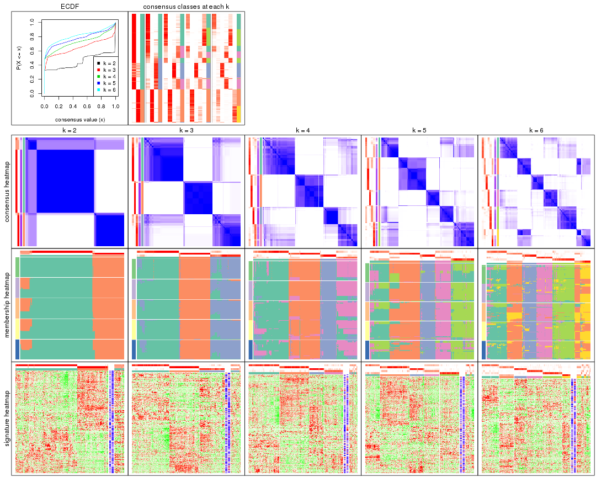

The plots are:

- The first row: a plot of the ECDF (Empirical cumulative distribution
  function) curves of the consensus matrix for each `k` and the heatmap of
  predicted classes for each `k`.
- The second row: heatmaps of the consensus matrix for each `k`.
- The third row: heatmaps of the membership matrix for each `k`.
- The fouth row: heatmaps of the signatures for each `k`.

All the plots in panels can be made by individual functions and they are
plotted later in this section.

`select_partition_number()` produces several plots showing different
statistics for choosing "optimized" `k`. There are following statistics:

- ECDF curves of the consensus matrix for each `k`;
- 1-PAC. [The PAC
  score](https://en.wikipedia.org/wiki/Consensus_clustering#Over-interpretation_potential_of_consensus_clustering)
  measures the proportion of the ambiguous subgrouping.
- Mean silhouette score.
- Concordance. The mean probability of fiting the consensus class ids in all
  partitions.
- Area increased. Denote $A_k$ as the area under the ECDF curve for current
  `k`, the area increased is defined as $A_k - A_{k-1}$.
- Rand index. The percent of pairs of samples that are both in a same cluster
  or both are not in a same cluster in the partition of k and k-1.
- Jaccard index. The ratio of pairs of samples are both in a same cluster in
  the partition of k and k-1 and the pairs of samples are both in a same
  cluster in the partition k or k-1.

The detailed explanations of these statistics can be found in [the cola
vignette](http://bioconductor.org/packages/devel/bioc/vignettes/cola/inst/doc/cola.html#toc_13).

Generally speaking, lower PAC score, higher mean silhouette score or higher
concordance corresponds to better partition. Rand index and Jaccard index
measure how similar the current partition is compared to partition with `k-1`.
If they are too similar, we won't accept `k` is better than `k-1`.

```r
select_partition_number(res)
```


The numeric values for all these statistics can be obtained by `get_stats()`.

```r
get_stats(res)
```

```
#>   k 1-PAC mean_silhouette concordance area_increased  Rand Jaccard
#> 2 2 0.760           0.869       0.948         0.4492 0.574   0.574
#> 3 3 0.797           0.832       0.920         0.4462 0.760   0.583
#> 4 4 0.704           0.783       0.861         0.1181 0.836   0.575
#> 5 5 0.767           0.738       0.791         0.0714 0.901   0.658
#> 6 6 0.745           0.679       0.782         0.0455 0.937   0.718
```

`suggest_best_k()` suggests the best $k$ based on these statistics. The rules are as follows:

- All $k$ with Jaccard index larger than 0.95 are removed because the increase of
  the partition number does not provides enough extra information. If all $k$ are removed,
  the best $k$ is assigned by `NA`.
- For $k$ with 1-PAC larger than 0.9, the maximal $k$ is taken as the "best k". Other $k$ is called "optional k".
- If it does not fit the second rule. The $k$ with the highest vote of highest
  1-PAC, mean silhouette and concordance is taken as the "best k".

```r
suggest_best_k(res)
```

```
#> [1] 2
```


Following shows the table of the partitions (You need to click the **show/hide
code output** link to see it). The membership matrix (columns with name `p*`)
is inferred by
[`clue::cl_consensus()`](https://www.rdocumentation.org/link/cl_consensus?package=clue)
function with the `SE` method. Basically the value in the membership matrix
represents the probability to belong to a certain group. The finall class
label for an item is determined with the group with highest probability it
belongs to.

In `get_classes()` function, the entropy is calculated from the membership
matrix and the silhouette score is calculated from the consensus matrix.


<script>
$( function() {
	$( '#tabs-SD-kmeans-get-classes' ).tabs();
} );
</script>
<div id='tabs-SD-kmeans-get-classes'>
<ul>
<li><a href='#tab-SD-kmeans-get-classes-1'>k = 2</a></li>
<li><a href='#tab-SD-kmeans-get-classes-2'>k = 3</a></li>
<li><a href='#tab-SD-kmeans-get-classes-3'>k = 4</a></li>
<li><a href='#tab-SD-kmeans-get-classes-4'>k = 5</a></li>
<li><a href='#tab-SD-kmeans-get-classes-5'>k = 6</a></li>
</ul>

<div id='tab-SD-kmeans-get-classes-1'>
<p><a id='tab-SD-kmeans-get-classes-1-a' style='color:#0366d6' href='#'>show/hide code output</a></p>
<pre><code class="r">cbind(get_classes(res, k = 2), get_membership(res, k = 2))
</code></pre>

<pre><code>#&gt;                                      class entropy silhouette    p1    p2
#&gt; D30CF518-5FC6-4A54-8D5D-BA420EA1836D     2   0.000      0.979 0.000 1.000
#&gt; 92298FF7-1215-4756-B976-A7D88B91AD76     1   0.000      0.928 1.000 0.000
#&gt; 0E244FE2-7C17-4642-A51F-2CCA796D9C70     2   0.000      0.979 0.000 1.000
#&gt; 75435ED8-93E8-45FB-8480-98D8EB2EF8CB     2   0.000      0.979 0.000 1.000
#&gt; B6D11678-15A9-4F43-A0A2-225067DCAF1C     1   0.000      0.928 1.000 0.000
#&gt; B7F5A41E-9559-4329-81F5-1B88A74730B7     2   0.000      0.979 0.000 1.000
#&gt; 39414B2A-7FB0-4669-8DFE-86D9AF7AD2D9     1   0.000      0.928 1.000 0.000
#&gt; 04823F53-A12D-4852-8F34-77B9DCBB7DF0     2   0.000      0.979 0.000 1.000
#&gt; 49684C2B-D31C-4B45-A400-3497C3CCEC01     2   0.000      0.979 0.000 1.000
#&gt; 96A04875-58E2-4BE7-8E0F-CAB55F4CA54F     1   0.000      0.928 1.000 0.000
#&gt; 1F101D63-478B-40B9-A951-DC3887CFF067     1   0.000      0.928 1.000 0.000
#&gt; DD290860-E0B7-48FC-BE12-2AF729994C21     2   0.000      0.979 0.000 1.000
#&gt; FFDD7A12-DDEF-4974-8D60-64B7EEAAC994     2   0.000      0.979 0.000 1.000
#&gt; E076A9A9-EA2A-4FF7-92A8-F2DA7F30279E     1   0.971      0.390 0.600 0.400
#&gt; 830DFA6F-A85A-4317-82B2-791FAB998A01     2   0.000      0.979 0.000 1.000
#&gt; 58578614-E4A3-4655-BBAB-F65851625E0A     1   0.000      0.928 1.000 0.000
#&gt; 1CBFB672-4D66-430B-83F3-7CE3BE20ABF6     1   0.000      0.928 1.000 0.000
#&gt; 6C34A7D7-3756-4DCC-9A9F-B5FC4A148B7E     1   0.788      0.680 0.764 0.236
#&gt; D97ED7B4-5DF2-4B62-8796-AA51CA79DBBB     1   0.000      0.928 1.000 0.000
#&gt; 45F15851-55F6-4169-834E-38958C38B6A9     1   0.000      0.928 1.000 0.000
#&gt; 4139E0C9-F712-4A25-8B59-587533B93B3E     2   0.680      0.756 0.180 0.820
#&gt; 2C3007BF-009E-404F-A3BF-8B921698D85B     1   0.000      0.928 1.000 0.000
#&gt; 2189F8E5-FF98-4C1A-BD04-5595DB553130     1   0.000      0.928 1.000 0.000
#&gt; FFAA0310-0D78-4499-8FB8-5BC46E4FCE58     1   0.973      0.381 0.596 0.404
#&gt; 0C375B2F-67BE-4708-BEB2-544DEC812DCA     2   0.000      0.979 0.000 1.000
#&gt; AB6324A1-19AB-400C-8001-54765D190E27     2   0.000      0.979 0.000 1.000
#&gt; A32C4DCD-DC4C-4132-9ED1-B159F5561A2D     1   0.000      0.928 1.000 0.000
#&gt; 2AE7105D-D494-45B0-947A-315D8C20ECDC     1   0.000      0.928 1.000 0.000
#&gt; 60FE9D59-FC0F-4B9C-ABF8-1C00BC761928     1   0.000      0.928 1.000 0.000
#&gt; 056442DC-E87A-4315-965C-C19D7B4FC40E     1   0.000      0.928 1.000 0.000
#&gt; 455111E5-18EF-4E3F-9DFF-8FA017D92461     1   0.000      0.928 1.000 0.000
#&gt; 10632BC6-0B81-433C-8832-6B2ABC73A94B     1   0.000      0.928 1.000 0.000
#&gt; AC6F82AD-C682-4EB3-BEC3-FD950F57609D     1   0.000      0.928 1.000 0.000
#&gt; D9ABDB75-04DA-4D33-A69F-701729494533     1   0.000      0.928 1.000 0.000
#&gt; 27BBF44D-F4D7-4C5A-935F-3310A363A670     2   0.000      0.979 0.000 1.000
#&gt; E7AA12EE-6E14-4B33-A52C-B13589436023     1   0.000      0.928 1.000 0.000
#&gt; DFA6D41A-D231-413E-A180-E42DF26C3E2B     2   0.876      0.532 0.296 0.704
#&gt; 655BD3AF-5094-4B19-93A8-401C70369B17     2   0.000      0.979 0.000 1.000
#&gt; 9DFEF253-923F-4EE2-8E3D-C75805387B20     1   0.184      0.905 0.972 0.028
#&gt; 3B0EE948-B2CD-4191-90E2-BDD155F3B580     1   0.000      0.928 1.000 0.000
#&gt; 177C7EF4-2D54-4555-947C-44EE7C688917     1   0.992      0.278 0.552 0.448
#&gt; 1F8E8BB7-D159-4556-8B04-E5DD027CC444     2   0.000      0.979 0.000 1.000
#&gt; 619F37D2-6771-4727-9079-56BED07F1CF6     1   0.996      0.235 0.536 0.464
#&gt; ACAE29BE-ECB8-4A98-BC71-7A2D4857134E     1   0.000      0.928 1.000 0.000
#&gt; C5C3241A-684C-4238-9333-9AF8630EC086     2   0.000      0.979 0.000 1.000
#&gt; AD319DC2-140F-4E7B-A899-010687D8B714     2   0.000      0.979 0.000 1.000
#&gt; 2AFF397C-ED2A-4FD9-A7F0-E4C61E9FB603     1   0.996      0.235 0.536 0.464
#&gt; FB4C7892-3DBB-4148-AAE9-75B19A1A4031     1   0.000      0.928 1.000 0.000
#&gt; 6F5C4500-1ED1-4E81-B4F5-EEA64CE2336A     1   0.000      0.928 1.000 0.000
#&gt; BD027C69-3C10-4047-8E1E-218600FF2B73     2   0.000      0.979 0.000 1.000
#&gt; 11B473A9-4CC5-461F-BC57-CC9141F3591D     1   0.000      0.928 1.000 0.000
#&gt; 69A036E5-3E6A-4862-A7F8-2D203ED2FC9E     1   0.000      0.928 1.000 0.000
#&gt; 9C0BDF24-F011-4855-B95A-1B6BEFA808F7     1   0.000      0.928 1.000 0.000
#&gt; 9E205254-8C0C-4C05-AF5A-86E679CF732C     1   0.000      0.928 1.000 0.000
#&gt; 935CCE4A-8AA8-454E-9DFF-7DE27D0BD2E2     1   0.000      0.928 1.000 0.000
#&gt; 01E5E1FE-41D3-428B-90BC-7A000829E102     1   0.000      0.928 1.000 0.000
#&gt; B344A530-92CD-468B-847A-DF8E25688081     1   0.996      0.235 0.536 0.464
#&gt; F79F32A7-9F7B-4D62-8426-4A4CF10ED319     1   0.000      0.928 1.000 0.000
#&gt; C2E1C6FA-82F9-467C-99AE-9B39FAAC810C     1   0.000      0.928 1.000 0.000
#&gt; BF7CD9BD-776A-4957-8A6E-EF8AD83EA9D3     2   0.000      0.979 0.000 1.000
#&gt; 8A2C1409-E83B-435E-A20F-5FCA94801C9F     2   0.000      0.979 0.000 1.000
#&gt; B6BEFFB5-2F62-477B-A4C8-478D29577CBD     2   0.000      0.979 0.000 1.000
#&gt; 8622CBD0-F8E9-4AC1-8175-CC9A742B86F9     1   0.000      0.928 1.000 0.000
#&gt; 565DD660-ED58-4065-8619-260BEA6FCFEB     1   0.000      0.928 1.000 0.000
#&gt; 96038E42-0FBA-497D-819C-38F7689F10FF     1   0.000      0.928 1.000 0.000
#&gt; CA685549-F8BA-43F1-8461-5D2D3B17CFC5     1   0.000      0.928 1.000 0.000
#&gt; 52020307-71A6-46E5-ACB3-8F885CA8F1EB     1   0.000      0.928 1.000 0.000
#&gt; 7656DA98-76DC-424B-B02C-D7001DAAA0E4     1   0.000      0.928 1.000 0.000
#&gt; 74DBA640-45E2-42A6-8F1E-69C073D66EE6     1   0.000      0.928 1.000 0.000
#&gt; 251094BE-C33D-44F0-BD98-8618D71F520C     1   0.000      0.928 1.000 0.000
#&gt; AB914CC5-5FF1-4257-A353-6A99D11B9478     1   0.000      0.928 1.000 0.000
#&gt; 38B8B893-0E08-4B71-B51C-B32A7B2724E0     1   0.000      0.928 1.000 0.000
#&gt; 7C7CD8FF-99A4-41D7-B7E1-5A517001F551     2   0.000      0.979 0.000 1.000
#&gt; BFC5B75A-E4AE-486B-BA30-23BBAA33A125     2   0.000      0.979 0.000 1.000
#&gt; 182AC78E-A07C-4B34-B216-B5F573E9F036     2   0.680      0.756 0.180 0.820
#&gt; B38C5F72-8F46-4531-9C2D-96EEE07A5B22     2   0.000      0.979 0.000 1.000
#&gt; DB9333A6-A723-4B8F-9221-25B8B23D5126     1   0.000      0.928 1.000 0.000
#&gt; CD67DD21-C1B6-4D58-AC8E-1F4536C7DA70     1   0.996      0.235 0.536 0.464
#&gt; 3D76A56E-4B66-48AE-AA60-D9C1004C7140     1   0.000      0.928 1.000 0.000
#&gt; 71ED572F-7780-47A4-A9F8-D320C737690D     1   0.000      0.928 1.000 0.000
#&gt; B449FEA1-C4B0-400F-903C-59E13D0BA313     2   0.000      0.979 0.000 1.000
#&gt; 3F120E90-1486-4215-B9B9-79D5B413CAAC     1   0.738      0.718 0.792 0.208
#&gt; A071894B-D8C0-4740-BD55-93EA0C86EDF7     1   0.000      0.928 1.000 0.000
#&gt; 58848D57-D7A9-4ABB-86A2-A8AE2B23F654     1   0.000      0.928 1.000 0.000
#&gt; CD6F9E20-B301-4663-87EC-953EDF49754F     1   0.996      0.235 0.536 0.464
#&gt; 367D89F3-D527-4929-B830-8B6D553DF9E1     1   0.000      0.928 1.000 0.000
#&gt; BE8D7DCB-648B-42DD-9FA8-8B85B5D816B2     1   0.000      0.928 1.000 0.000
#&gt; AA46F56B-BD9C-40A4-8EA8-35E2568C964D     2   0.000      0.979 0.000 1.000
#&gt; 6393220A-7C57-413F-81A8-4E38C21E779E     2   0.000      0.979 0.000 1.000
#&gt; 89AE566C-F65F-43C2-BA97-621A7AC8B6DC     1   0.000      0.928 1.000 0.000
#&gt; AA6A4BFF-8C62-4B70-B85A-9EDF403B06BA     1   0.000      0.928 1.000 0.000
#&gt; BCE877A6-9C65-4495-A45D-05753F2D0E15     1   0.000      0.928 1.000 0.000
#&gt; D7BDDF49-C54B-4F8E-ACA0-C3684AB68B5C     1   0.000      0.928 1.000 0.000
#&gt; D0800D49-0033-44B2-8D7B-29B16F87ADA6     2   0.000      0.979 0.000 1.000
#&gt; 151D60B5-5AF1-4B61-B97F-ABC7531D9F89     1   0.000      0.928 1.000 0.000
#&gt; CBBAEB5B-25FA-4B6D-A40C-357E37033E36     1   0.000      0.928 1.000 0.000
#&gt; 317CD049-3151-40B7-8E88-B0B8813338D6     1   0.000      0.928 1.000 0.000
#&gt; 93835C77-F8FA-4928-843C-8016A91881FA     1   0.000      0.928 1.000 0.000
#&gt; 02A6950F-647D-4F20-B2D0-0238C1441C70     1   0.000      0.928 1.000 0.000
#&gt; 4D54E415-134F-4F6F-8718-3E0475EF5477     1   0.000      0.928 1.000 0.000
#&gt; 82AB290A-3993-45E5-8B15-6125A019778C     1   0.000      0.928 1.000 0.000
#&gt; 3B5EAD14-E506-4A22-804D-BF925A2D5247     2   0.000      0.979 0.000 1.000
#&gt; 19CF7DDF-4F3A-4D2F-B84A-6451A5C3112C     1   0.983      0.337 0.576 0.424
#&gt; 2FB00DAA-C274-42B1-A06B-611FE5E96844     1   0.000      0.928 1.000 0.000
#&gt; 2B1F01C3-8145-4296-8111-2B0474AB9A2C     2   0.000      0.979 0.000 1.000
#&gt; 3F0865F1-8256-4778-966F-D53637B415B6     1   0.996      0.235 0.536 0.464
#&gt; 5473210D-37F9-4192-86D2-E2A2C77F3BD2     1   0.996      0.235 0.536 0.464
#&gt; 5EDB6ACF-4F3F-471A-9DDC-661607CACCC4     1   0.000      0.928 1.000 0.000
#&gt; 6A252A3A-7EEB-47B6-9C23-D69BD2EA846F     1   0.996      0.235 0.536 0.464
#&gt; 0A7FFCBB-4BAA-4A5F-8B2D-B427C4D982A8     1   0.000      0.928 1.000 0.000
#&gt; 1603AFB8-5AD7-4794-9991-BDBE96B4D997     2   0.000      0.979 0.000 1.000
#&gt; 644299E9-62B7-4DFE-9E6D-D7556A01B40A     1   0.000      0.928 1.000 0.000
#&gt; EF12E923-1860-4269-B57B-BA6238FA4403     1   0.000      0.928 1.000 0.000
#&gt; 51B7241E-F0BE-482A-88AE-89004BB68989     1   0.000      0.928 1.000 0.000
#&gt; 1C007DF3-8A9F-4940-9A4C-DE2A412BB023     1   0.996      0.235 0.536 0.464
#&gt; 89FCFDE6-9625-432C-AA35-9C5FCCF40031     1   0.000      0.928 1.000 0.000
#&gt; 7955FC55-386D-497E-AFED-019BBBAD428E     1   0.996      0.235 0.536 0.464
#&gt; 37FF09ED-73EC-4D10-B2AC-7D8EBA9304ED     1   0.000      0.928 1.000 0.000
#&gt; C2CD2742-2FB4-468E-90FF-8F65A5C425A9     1   0.000      0.928 1.000 0.000
#&gt; 766FE08F-3393-4868-B1C1-FA98C9FF16E0     1   0.000      0.928 1.000 0.000
#&gt; 63E2B578-2221-4255-8C45-7FD030B1C94D     1   0.000      0.928 1.000 0.000
#&gt; C14B1A44-43F7-45F0-A583-5667A4D3BD95     1   0.000      0.928 1.000 0.000
#&gt; D9CB551A-CE20-4BF7-8AC9-839112346C3D     1   0.000      0.928 1.000 0.000
#&gt; 05BAA71A-E5B3-4A3A-A3F2-013A975087F0     2   0.000      0.979 0.000 1.000
#&gt; AC8DA7DE-4D83-4768-BEFD-9A1B2DA943CE     1   0.855      0.616 0.720 0.280
#&gt; E89DCE9D-F8A5-499C-85BB-BB500BADB9FB     1   0.000      0.928 1.000 0.000
#&gt; C16F9B5E-2B52-40F6-856D-C0D6FBDD16C1     1   0.000      0.928 1.000 0.000
#&gt; 8FF234D4-823A-4C80-82F7-2E92D72DBF88     2   0.000      0.979 0.000 1.000
#&gt; C9F94A6E-D104-4D8D-8EC5-EADECD85F092     2   0.680      0.756 0.180 0.820
#&gt; 45C9756F-A154-4537-852E-ECBF27B92FE1     2   0.000      0.979 0.000 1.000
#&gt; 0F1A5708-341E-4713-BC70-76D702F826D6     2   0.745      0.702 0.212 0.788
#&gt; 2ECFBCA0-AB35-461A-A4B5-C60B2651A962     2   0.000      0.979 0.000 1.000
#&gt; 7DFAC404-3AB3-4274-A533-CFDAF4CE122D     1   0.000      0.928 1.000 0.000
#&gt; A90AF55C-4386-42AB-A812-9230026EA5A5     2   0.000      0.979 0.000 1.000
#&gt; 6258A757-4E18-4CD1-8417-189521E990B6     2   0.000      0.979 0.000 1.000
#&gt; EBFAD137-050F-47D0-A43D-72B8F7D70C2B     1   0.000      0.928 1.000 0.000
#&gt; 08B5EBFB-2807-4229-95A6-81AB7F377A56     2   0.000      0.979 0.000 1.000
#&gt; 4780A59C-0589-4995-B044-3201F09AF859     1   0.000      0.928 1.000 0.000
#&gt; 0AB81429-C287-48AA-9035-3A7A6F4C7328     2   0.000      0.979 0.000 1.000
#&gt; 20C4D047-28DA-4AB7-9B3C-32EDA6B22C9D     1   0.994      0.257 0.544 0.456
#&gt; 77C4E01F-84A6-4BFD-AA8E-D7875456F546     1   0.996      0.235 0.536 0.464
#&gt; 8B28383F-CF14-4CC5-A1E2-72AD915C0AE8     1   0.000      0.928 1.000 0.000
#&gt; E12E1F48-6A52-4F74-925C-C4EE1BF5C573     2   0.000      0.979 0.000 1.000
#&gt; 9B179BC5-BB4C-4CEE-99BC-BC552BC384A1     1   0.000      0.928 1.000 0.000
#&gt; 5548C91A-D3DE-48F5-B4A4-124BE177B99A     1   0.000      0.928 1.000 0.000
#&gt; 0E22B729-C381-4B0C-9897-62DD38F51722     1   0.000      0.928 1.000 0.000
#&gt; 7BC4937F-04E2-4B46-BA7C-FE9AC738C8A9     1   0.000      0.928 1.000 0.000
#&gt; EE6A0D3F-3F8A-4AA8-B3EF-32372EF37A29     1   0.000      0.928 1.000 0.000
#&gt; 08AC2706-7651-409F-BE6B-BCED1C2D1796     1   0.000      0.928 1.000 0.000
#&gt; A68B078D-8979-4070-BB4D-F526704ED3DC     1   0.000      0.928 1.000 0.000
#&gt; C319A5EE-69FA-4AAB-85A9-2EAAD8E4C703     1   0.000      0.928 1.000 0.000
#&gt; 0D7CAABD-D20C-4F82-BCBC-8B7276E8EDE2     1   0.000      0.928 1.000 0.000
#&gt; 09444DCC-44BA-4A3F-ACC5-863A54578B9F     1   0.000      0.928 1.000 0.000
#&gt; 2E32B047-C6E1-4743-A6C8-E98370A32145     1   0.000      0.928 1.000 0.000
#&gt; 6A6878A7-76B2-40DE-958B-804442AC6A5D     1   0.000      0.928 1.000 0.000
#&gt; 39F27293-0BFF-4EA2-8439-A299E3226D20     1   0.000      0.928 1.000 0.000
#&gt; 7EAE9C30-6080-405F-A7E6-1FED57674279     1   0.000      0.928 1.000 0.000
#&gt; 79499169-A093-4E0A-B6BD-010CD7BE5035     1   0.000      0.928 1.000 0.000
#&gt; 1F8BF4E8-BD84-4EFE-9E3E-89E7CE8FA72D     1   0.996      0.235 0.536 0.464
#&gt; 62B7988F-98E5-4AB8-8A16-D661A07455E8     1   0.000      0.928 1.000 0.000
#&gt; B7005B5F-217E-4073-BFB5-CE7E884B80C0     2   0.000      0.979 0.000 1.000
#&gt; B981568F-2C08-4696-B589-E157A49BE72B     2   0.000      0.979 0.000 1.000
#&gt; A3D85C0A-3202-40C2-88E1-052AC6C5184B     1   0.000      0.928 1.000 0.000
#&gt; 4CA783B9-9B99-46B8-962A-77194ECB7942     1   0.996      0.235 0.536 0.464
#&gt; D4024B08-4879-47EA-99E5-D9FCE1CD40DF     1   0.000      0.928 1.000 0.000
#&gt; 1D41CDA2-0B29-48FD-B83A-E60C174DBCB3     1   0.000      0.928 1.000 0.000
#&gt; A1923B2A-B233-4760-8AF9-C04C1CAEB100     1   0.000      0.928 1.000 0.000
#&gt; 80880D71-BFDE-4D88-892F-5ADF27A38940     1   0.730      0.723 0.796 0.204
#&gt; 55D1629D-30FD-49AA-88CE-EA3CA9B30A3F     2   0.000      0.979 0.000 1.000
#&gt; B71C409E-926D-48AD-8BD8-9F707CA4FB01     2   0.000      0.979 0.000 1.000
#&gt; 54A92C57-BD19-4A47-BA76-3ACA2DC36212     1   0.000      0.928 1.000 0.000
#&gt; B2AB74B8-506C-4C27-9105-E86A6AAA89D4     1   0.000      0.928 1.000 0.000
#&gt; 0356AE49-7A5C-42CC-A39C-7C8DFBFF8842     2   0.000      0.979 0.000 1.000
#&gt; ACA260A3-DC3F-4FF4-B9C5-2D4BC4F81783     1   0.000      0.928 1.000 0.000
#&gt; 9B440917-E5A4-43B9-A48D-6ABFEDCA6CFD     1   0.000      0.928 1.000 0.000
#&gt; 47464828-52EA-413B-B30C-BD8B55903D78     2   0.000      0.979 0.000 1.000
#&gt; C1D1FC82-B50D-4C82-8F03-06CEE3C08D18     1   0.000      0.928 1.000 0.000
#&gt; E5ABFC43-E2A3-4B1A-BBA3-8196C0B026A5     2   0.000      0.979 0.000 1.000
#&gt; 1D3C16CC-D0D5-4637-AAC7-91672DFF3317     1   0.000      0.928 1.000 0.000
#&gt; 4D038320-ADEA-4990-8371-68B4B8162E1A     2   0.000      0.979 0.000 1.000
#&gt; A75594CC-3E49-4869-8656-BBB4E72BF59D     2   0.000      0.979 0.000 1.000
#&gt; 7CABAA19-5FB2-4A58-BDA3-4F1FFB532C20     1   0.000      0.928 1.000 0.000
#&gt; 534EF1E9-9513-426E-B41E-A394AB2E4410     2   0.000      0.979 0.000 1.000
#&gt; 649F35A1-A08C-497D-A9B6-CB3084D5FB8D     1   0.000      0.928 1.000 0.000
#&gt; 7CA30F3C-1C98-480C-B8B5-A248AABFB468     1   0.000      0.928 1.000 0.000
#&gt; A9F8DA21-A802-44CF-9F5D-96A36687DCDD     1   0.996      0.235 0.536 0.464
#&gt; A7AE1ED1-86CB-4A50-97B2-66785C7191FE     1   0.000      0.928 1.000 0.000
#&gt; D0091AD4-D3D7-4C03-ACD9-DA9F8B6076C6     1   0.000      0.928 1.000 0.000
#&gt; 46EE1C2B-13F7-44A7-B27E-4EBB9DF0CA83     2   0.000      0.979 0.000 1.000
#&gt; CB9301B8-0282-43D6-AF5E-B753A9C7BFCB     2   0.000      0.979 0.000 1.000
#&gt; A0E77A39-885A-4472-9A10-2D1E51DBFDA4     1   0.000      0.928 1.000 0.000
#&gt; C06603C2-163D-40B6-A9FE-882424F18FE9     1   0.000      0.928 1.000 0.000
#&gt; C3921A29-80FF-4B9D-B366-5C0238A42231     1   0.000      0.928 1.000 0.000
#&gt; BB99B4E7-C834-4BB8-973F-8FA039E2798F     1   0.000      0.928 1.000 0.000
#&gt; 5CD78C2F-05E9-409A-8405-3EE936A6876E     1   0.996      0.235 0.536 0.464
#&gt; 6C126CC7-0C03-48F0-A2C2-F090CA239B70     2   0.000      0.979 0.000 1.000
#&gt; 7118B08A-E94C-49F4-8D76-26455C34D85F     2   0.000      0.979 0.000 1.000
#&gt; 266DAF30-CF3E-493E-8B24-3931D0039450     1   0.000      0.928 1.000 0.000
#&gt; DAB5F5B9-4FE5-468F-AD2B-B39BBC4317A0     1   0.680      0.752 0.820 0.180
#&gt; 9A9EB6D6-312E-4A98-8762-30D3ABD8193D     1   0.996      0.235 0.536 0.464
#&gt; CED15676-B901-4FC8-9C8D-51E529D9441D     1   0.000      0.928 1.000 0.000
#&gt; 827232CC-8035-440C-8B12-02C789C70B1B     1   0.000      0.928 1.000 0.000
#&gt; 04D5FB28-FB50-4EAE-95FB-72ABF0E618CA     2   0.000      0.979 0.000 1.000
#&gt; 6C96A851-97FC-4845-B895-D255191D9F25     1   0.000      0.928 1.000 0.000
#&gt; 3EC982CB-D013-443E-B21D-39DE6B8EF370     1   0.996      0.235 0.536 0.464
#&gt; 2E24A786-4370-42A1-AD50-D651F89819CC     2   0.000      0.979 0.000 1.000
#&gt; 7653BFA9-ADA5-44CA-8555-807FBBFC6DE2     1   0.000      0.928 1.000 0.000
#&gt; 7A110994-5741-4013-91F0-DD2E1D343F91     2   0.000      0.979 0.000 1.000
#&gt; 0A760E0C-11C5-4201-8452-18DBC1FEACEB     1   0.000      0.928 1.000 0.000
#&gt; 909B76A1-BB9F-4906-95BC-58CD1A46D3B8     2   0.000      0.979 0.000 1.000
#&gt; A782EE71-EDA4-4385-83B3-D16DE81296C0     1   0.000      0.928 1.000 0.000
#&gt; BD50E276-914F-4924-8CEA-FF47A66DB175     2   0.000      0.979 0.000 1.000
#&gt; 505D5CA8-0279-4BC7-8CC0-8C7A0165BF91     2   0.000      0.979 0.000 1.000
#&gt; D51FC997-E662-4AE7-BC9C-14183DA42DE1     2   0.000      0.979 0.000 1.000
#&gt; 8AD67970-84F1-4C0A-B47A-8FA4108F9FE3     1   0.000      0.928 1.000 0.000
#&gt; 6E33B1B6-7089-4BC3-B2B0-EC2C3B5D8B74     1   0.000      0.928 1.000 0.000
#&gt; 88C4EA46-2546-401C-A8E7-603EECFDFBA0     1   0.000      0.928 1.000 0.000
#&gt; 375D2D72-C998-4627-BA35-24E82A9A55FF     1   0.000      0.928 1.000 0.000
#&gt; 76D0F834-7064-46C6-96F4-E861CF5452B6     2   0.000      0.979 0.000 1.000
#&gt; 87159081-C97A-4004-AF0A-7EB6EF0EC47A     1   0.000      0.928 1.000 0.000
#&gt; 24A57006-800B-4174-AF4E-7EA57A8A756E     1   0.000      0.928 1.000 0.000
#&gt; AD68CBC6-8A13-4A65-AF62-E99AFA81D031     1   0.996      0.235 0.536 0.464
#&gt; 22863A57-F066-4DD1-A859-4336F43D144C     1   0.000      0.928 1.000 0.000
#&gt; 8F6F0362-9165-4DCC-992C-AF871A3C51E7     1   0.000      0.928 1.000 0.000
#&gt; 76ABF0B7-E707-4DB2-9486-3814439BDBA5     1   0.000      0.928 1.000 0.000
#&gt; BC72372F-3577-40E5-BA0F-41A084AA93AD     1   0.000      0.928 1.000 0.000
#&gt; 8E566039-B56C-4F41-B9EF-DE18BEEF2C95     1   0.000      0.928 1.000 0.000
#&gt; F096F016-3EF5-4A67-A7C2-8A45E1585232     1   0.000      0.928 1.000 0.000
#&gt; BB37913E-534B-43DD-BE3D-E13B29FD8172     2   0.000      0.979 0.000 1.000
#&gt; E344638F-9060-460F-8F7A-60D19442F294     1   0.866      0.603 0.712 0.288
#&gt; 6A0EAAD0-89D5-4F12-8B45-9D5A25182FAD     2   0.000      0.979 0.000 1.000
#&gt; A5199E3A-9D67-4543-88AB-24398C98E38E     1   0.000      0.928 1.000 0.000
#&gt; 23917D52-7864-4F84-9C77-DF8EA9407345     2   0.000      0.979 0.000 1.000
#&gt; 9AA96080-19D8-40C3-BDD1-6044D2D422D5     1   0.000      0.928 1.000 0.000
#&gt; 0ED65D91-260C-4662-9903-EE36A2E3B2D0     2   0.000      0.979 0.000 1.000
#&gt; 64BF1BC5-7A9A-4E1D-AEAB-AFE30B92AAF4     1   0.991      0.288 0.556 0.444
#&gt; F02301F1-9054-4DC6-8DC9-2451A0F53EFC     2   0.000      0.979 0.000 1.000
#&gt; 3264649A-5684-4181-83D0-A7E4D7E2E1FD     1   0.000      0.928 1.000 0.000
#&gt; 3F8DA39C-BC9B-4343-8838-5CE271E80C51     2   0.988      0.178 0.436 0.564
#&gt; BCC681CB-2AF4-4BB6-B53A-7544A2399454     1   0.000      0.928 1.000 0.000
#&gt; DCB50E17-5E2D-443B-8DCC-272FBB734C2E     1   0.000      0.928 1.000 0.000
#&gt; B5E47C38-CB6A-44C0-AA9B-56951B9EF78D     1   0.000      0.928 1.000 0.000
#&gt; B15B0185-9C28-4A00-9CEC-05EFECEA6709     1   0.000      0.928 1.000 0.000
#&gt; 61D4E8E7-0110-480A-A4A7-D406DE74C31E     1   0.000      0.928 1.000 0.000
#&gt; CA8DB3AD-3F6B-4622-BF73-47041EC96E42     1   0.000      0.928 1.000 0.000
#&gt; 5EECB1C4-172C-4494-871A-ADB650CD82BD     2   0.000      0.979 0.000 1.000
#&gt; 019B857C-D4F7-4B67-B699-56E52A60805B     2   0.000      0.979 0.000 1.000
#&gt; E9C28902-05C9-4883-97A4-D612D54E46B4     1   0.000      0.928 1.000 0.000
#&gt; C5D3D9A0-FC14-408D-AB6C-662018A5E5CA     1   0.000      0.928 1.000 0.000
#&gt; 7EB24744-509B-4854-B7D0-0BAFA210A345     2   0.000      0.979 0.000 1.000
#&gt; B8B7A721-2284-40AB-98F5-EF1351C30B66     2   0.000      0.979 0.000 1.000
#&gt; 3C12F39D-0D21-4F69-A539-4120B73C7A79     2   0.000      0.979 0.000 1.000
#&gt; 08D3F984-6850-45B2-9DF9-EC7F5A4060A4     1   0.000      0.928 1.000 0.000
#&gt; 9BD0EE79-1EED-4F6D-A5AB-43ADB8526F1E     1   0.000      0.928 1.000 0.000
#&gt; E489A871-3CF4-4F3D-8EAF-63B507054201     2   0.000      0.979 0.000 1.000
#&gt; 8CF8FD2E-1DBA-4257-9715-04D956D46B71     2   0.000      0.979 0.000 1.000
#&gt; F6193AF0-7A19-46CB-A818-1B01E7460791     1   0.000      0.928 1.000 0.000
#&gt; 96392D6B-D4FF-4393-93BA-08E469E8BBE1     1   0.000      0.928 1.000 0.000
#&gt; DABCBE5A-C591-46A2-AF66-DA3DB6106751     1   0.000      0.928 1.000 0.000
#&gt; 8B75F7D4-98D8-44DE-B19D-B733D6A031DB     1   0.000      0.928 1.000 0.000
#&gt; AAD9685A-564B-42E9-91E3-431951154BA7     2   0.000      0.979 0.000 1.000
#&gt; 90A43152-4E3B-4365-A39F-7B0E5CA66E55     1   0.000      0.928 1.000 0.000
#&gt; EFB76FCF-AC9C-4852-B91C-E055DA666FA0     1   0.000      0.928 1.000 0.000
#&gt; 6EBCFFE3-706F-440A-ABA9-012A924A07C6     2   0.000      0.979 0.000 1.000
#&gt; E922A244-F1C8-4310-ABB2-62B06E022E4C     1   0.000      0.928 1.000 0.000
</code></pre>

<script>
$('#tab-SD-kmeans-get-classes-1-a').parent().next().next().hide();
$('#tab-SD-kmeans-get-classes-1-a').click(function(){
  $('#tab-SD-kmeans-get-classes-1-a').parent().next().next().toggle();
  return(false);
});
</script>
</div>

<div id='tab-SD-kmeans-get-classes-2'>
<p><a id='tab-SD-kmeans-get-classes-2-a' style='color:#0366d6' href='#'>show/hide code output</a></p>
<pre><code class="r">cbind(get_classes(res, k = 3), get_membership(res, k = 3))
</code></pre>

<pre><code>#&gt;                                      class entropy silhouette    p1    p2    p3
#&gt; D30CF518-5FC6-4A54-8D5D-BA420EA1836D     2  0.0424     0.9721 0.000 0.992 0.008
#&gt; 92298FF7-1215-4756-B976-A7D88B91AD76     1  0.0000     0.9177 1.000 0.000 0.000
#&gt; 0E244FE2-7C17-4642-A51F-2CCA796D9C70     2  0.0237     0.9730 0.000 0.996 0.004
#&gt; 75435ED8-93E8-45FB-8480-98D8EB2EF8CB     2  0.0424     0.9721 0.000 0.992 0.008
#&gt; B6D11678-15A9-4F43-A0A2-225067DCAF1C     3  0.6095     0.4377 0.392 0.000 0.608
#&gt; B7F5A41E-9559-4329-81F5-1B88A74730B7     2  0.0000     0.9732 0.000 1.000 0.000
#&gt; 39414B2A-7FB0-4669-8DFE-86D9AF7AD2D9     3  0.5529     0.6194 0.296 0.000 0.704
#&gt; 04823F53-A12D-4852-8F34-77B9DCBB7DF0     2  0.0000     0.9732 0.000 1.000 0.000
#&gt; 49684C2B-D31C-4B45-A400-3497C3CCEC01     2  0.0424     0.9721 0.000 0.992 0.008
#&gt; 96A04875-58E2-4BE7-8E0F-CAB55F4CA54F     1  0.0000     0.9177 1.000 0.000 0.000
#&gt; 1F101D63-478B-40B9-A951-DC3887CFF067     1  0.2959     0.8307 0.900 0.000 0.100
#&gt; DD290860-E0B7-48FC-BE12-2AF729994C21     2  0.0000     0.9732 0.000 1.000 0.000
#&gt; FFDD7A12-DDEF-4974-8D60-64B7EEAAC994     2  0.0237     0.9726 0.000 0.996 0.004
#&gt; E076A9A9-EA2A-4FF7-92A8-F2DA7F30279E     3  0.1877     0.8430 0.012 0.032 0.956
#&gt; 830DFA6F-A85A-4317-82B2-791FAB998A01     2  0.0592     0.9713 0.000 0.988 0.012
#&gt; 58578614-E4A3-4655-BBAB-F65851625E0A     1  0.1529     0.9016 0.960 0.000 0.040
#&gt; 1CBFB672-4D66-430B-83F3-7CE3BE20ABF6     1  0.0000     0.9177 1.000 0.000 0.000
#&gt; 6C34A7D7-3756-4DCC-9A9F-B5FC4A148B7E     3  0.2152     0.8428 0.016 0.036 0.948
#&gt; D97ED7B4-5DF2-4B62-8796-AA51CA79DBBB     1  0.0000     0.9177 1.000 0.000 0.000
#&gt; 45F15851-55F6-4169-834E-38958C38B6A9     1  0.0000     0.9177 1.000 0.000 0.000
#&gt; 4139E0C9-F712-4A25-8B59-587533B93B3E     2  0.6516     0.0664 0.004 0.516 0.480
#&gt; 2C3007BF-009E-404F-A3BF-8B921698D85B     1  0.0000     0.9177 1.000 0.000 0.000
#&gt; 2189F8E5-FF98-4C1A-BD04-5595DB553130     1  0.5591     0.5115 0.696 0.000 0.304
#&gt; FFAA0310-0D78-4499-8FB8-5BC46E4FCE58     3  0.1877     0.8430 0.012 0.032 0.956
#&gt; 0C375B2F-67BE-4708-BEB2-544DEC812DCA     2  0.0237     0.9730 0.000 0.996 0.004
#&gt; AB6324A1-19AB-400C-8001-54765D190E27     2  0.0237     0.9726 0.000 0.996 0.004
#&gt; A32C4DCD-DC4C-4132-9ED1-B159F5561A2D     1  0.0000     0.9177 1.000 0.000 0.000
#&gt; 2AE7105D-D494-45B0-947A-315D8C20ECDC     1  0.3340     0.8317 0.880 0.000 0.120
#&gt; 60FE9D59-FC0F-4B9C-ABF8-1C00BC761928     1  0.0000     0.9177 1.000 0.000 0.000
#&gt; 056442DC-E87A-4315-965C-C19D7B4FC40E     1  0.0000     0.9177 1.000 0.000 0.000
#&gt; 455111E5-18EF-4E3F-9DFF-8FA017D92461     3  0.4555     0.7295 0.200 0.000 0.800
#&gt; 10632BC6-0B81-433C-8832-6B2ABC73A94B     1  0.0000     0.9177 1.000 0.000 0.000
#&gt; AC6F82AD-C682-4EB3-BEC3-FD950F57609D     1  0.0000     0.9177 1.000 0.000 0.000
#&gt; D9ABDB75-04DA-4D33-A69F-701729494533     1  0.0000     0.9177 1.000 0.000 0.000
#&gt; 27BBF44D-F4D7-4C5A-935F-3310A363A670     2  0.0000     0.9732 0.000 1.000 0.000
#&gt; E7AA12EE-6E14-4B33-A52C-B13589436023     1  0.0000     0.9177 1.000 0.000 0.000
#&gt; DFA6D41A-D231-413E-A180-E42DF26C3E2B     2  0.5873     0.5364 0.004 0.684 0.312
#&gt; 655BD3AF-5094-4B19-93A8-401C70369B17     2  0.0237     0.9726 0.000 0.996 0.004
#&gt; 9DFEF253-923F-4EE2-8E3D-C75805387B20     1  0.2711     0.8338 0.912 0.088 0.000
#&gt; 3B0EE948-B2CD-4191-90E2-BDD155F3B580     3  0.5926     0.5620 0.356 0.000 0.644
#&gt; 177C7EF4-2D54-4555-947C-44EE7C688917     3  0.2116     0.8426 0.012 0.040 0.948
#&gt; 1F8E8BB7-D159-4556-8B04-E5DD027CC444     2  0.0000     0.9732 0.000 1.000 0.000
#&gt; 619F37D2-6771-4727-9079-56BED07F1CF6     3  0.1950     0.8397 0.008 0.040 0.952
#&gt; ACAE29BE-ECB8-4A98-BC71-7A2D4857134E     3  0.0892     0.8398 0.020 0.000 0.980
#&gt; C5C3241A-684C-4238-9333-9AF8630EC086     2  0.0424     0.9721 0.000 0.992 0.008
#&gt; AD319DC2-140F-4E7B-A899-010687D8B714     2  0.0237     0.9730 0.000 0.996 0.004
#&gt; 2AFF397C-ED2A-4FD9-A7F0-E4C61E9FB603     3  0.2116     0.8426 0.012 0.040 0.948
#&gt; FB4C7892-3DBB-4148-AAE9-75B19A1A4031     3  0.4654     0.7367 0.208 0.000 0.792
#&gt; 6F5C4500-1ED1-4E81-B4F5-EEA64CE2336A     1  0.1529     0.9016 0.960 0.000 0.040
#&gt; BD027C69-3C10-4047-8E1E-218600FF2B73     2  0.0237     0.9726 0.000 0.996 0.004
#&gt; 11B473A9-4CC5-461F-BC57-CC9141F3591D     3  0.5621     0.6016 0.308 0.000 0.692
#&gt; 69A036E5-3E6A-4862-A7F8-2D203ED2FC9E     1  0.4654     0.7229 0.792 0.000 0.208
#&gt; 9C0BDF24-F011-4855-B95A-1B6BEFA808F7     1  0.0000     0.9177 1.000 0.000 0.000
#&gt; 9E205254-8C0C-4C05-AF5A-86E679CF732C     3  0.6267     0.3667 0.452 0.000 0.548
#&gt; 935CCE4A-8AA8-454E-9DFF-7DE27D0BD2E2     1  0.5591     0.5515 0.696 0.000 0.304
#&gt; 01E5E1FE-41D3-428B-90BC-7A000829E102     1  0.0000     0.9177 1.000 0.000 0.000
#&gt; B344A530-92CD-468B-847A-DF8E25688081     3  0.2116     0.8426 0.012 0.040 0.948
#&gt; F79F32A7-9F7B-4D62-8426-4A4CF10ED319     1  0.0000     0.9177 1.000 0.000 0.000
#&gt; C2E1C6FA-82F9-467C-99AE-9B39FAAC810C     1  0.0000     0.9177 1.000 0.000 0.000
#&gt; BF7CD9BD-776A-4957-8A6E-EF8AD83EA9D3     2  0.0424     0.9721 0.000 0.992 0.008
#&gt; 8A2C1409-E83B-435E-A20F-5FCA94801C9F     2  0.0000     0.9732 0.000 1.000 0.000
#&gt; B6BEFFB5-2F62-477B-A4C8-478D29577CBD     2  0.0237     0.9726 0.000 0.996 0.004
#&gt; 8622CBD0-F8E9-4AC1-8175-CC9A742B86F9     1  0.0000     0.9177 1.000 0.000 0.000
#&gt; 565DD660-ED58-4065-8619-260BEA6FCFEB     1  0.0000     0.9177 1.000 0.000 0.000
#&gt; 96038E42-0FBA-497D-819C-38F7689F10FF     1  0.0000     0.9177 1.000 0.000 0.000
#&gt; CA685549-F8BA-43F1-8461-5D2D3B17CFC5     3  0.0592     0.8388 0.012 0.000 0.988
#&gt; 52020307-71A6-46E5-ACB3-8F885CA8F1EB     1  0.0000     0.9177 1.000 0.000 0.000
#&gt; 7656DA98-76DC-424B-B02C-D7001DAAA0E4     3  0.5760     0.6169 0.328 0.000 0.672
#&gt; 74DBA640-45E2-42A6-8F1E-69C073D66EE6     1  0.1529     0.9016 0.960 0.000 0.040
#&gt; 251094BE-C33D-44F0-BD98-8618D71F520C     1  0.0000     0.9177 1.000 0.000 0.000
#&gt; AB914CC5-5FF1-4257-A353-6A99D11B9478     1  0.0000     0.9177 1.000 0.000 0.000
#&gt; 38B8B893-0E08-4B71-B51C-B32A7B2724E0     3  0.6286     0.3321 0.464 0.000 0.536
#&gt; 7C7CD8FF-99A4-41D7-B7E1-5A517001F551     2  0.0592     0.9713 0.000 0.988 0.012
#&gt; BFC5B75A-E4AE-486B-BA30-23BBAA33A125     2  0.0237     0.9726 0.000 0.996 0.004
#&gt; 182AC78E-A07C-4B34-B216-B5F573E9F036     2  0.2096     0.9234 0.004 0.944 0.052
#&gt; B38C5F72-8F46-4531-9C2D-96EEE07A5B22     2  0.0237     0.9730 0.000 0.996 0.004
#&gt; DB9333A6-A723-4B8F-9221-25B8B23D5126     3  0.5621     0.6037 0.308 0.000 0.692
#&gt; CD67DD21-C1B6-4D58-AC8E-1F4536C7DA70     3  0.2116     0.8426 0.012 0.040 0.948
#&gt; 3D76A56E-4B66-48AE-AA60-D9C1004C7140     1  0.0592     0.9138 0.988 0.000 0.012
#&gt; 71ED572F-7780-47A4-A9F8-D320C737690D     1  0.0000     0.9177 1.000 0.000 0.000
#&gt; B449FEA1-C4B0-400F-903C-59E13D0BA313     2  0.0424     0.9721 0.000 0.992 0.008
#&gt; 3F120E90-1486-4215-B9B9-79D5B413CAAC     3  0.1163     0.8369 0.028 0.000 0.972
#&gt; A071894B-D8C0-4740-BD55-93EA0C86EDF7     1  0.4796     0.7052 0.780 0.000 0.220
#&gt; 58848D57-D7A9-4ABB-86A2-A8AE2B23F654     1  0.1411     0.9037 0.964 0.000 0.036
#&gt; CD6F9E20-B301-4663-87EC-953EDF49754F     3  0.2116     0.8426 0.012 0.040 0.948
#&gt; 367D89F3-D527-4929-B830-8B6D553DF9E1     1  0.5988     0.4023 0.632 0.000 0.368
#&gt; BE8D7DCB-648B-42DD-9FA8-8B85B5D816B2     1  0.0000     0.9177 1.000 0.000 0.000
#&gt; AA46F56B-BD9C-40A4-8EA8-35E2568C964D     2  0.0000     0.9732 0.000 1.000 0.000
#&gt; 6393220A-7C57-413F-81A8-4E38C21E779E     2  0.0000     0.9732 0.000 1.000 0.000
#&gt; 89AE566C-F65F-43C2-BA97-621A7AC8B6DC     1  0.1529     0.9016 0.960 0.000 0.040
#&gt; AA6A4BFF-8C62-4B70-B85A-9EDF403B06BA     1  0.1529     0.9016 0.960 0.000 0.040
#&gt; BCE877A6-9C65-4495-A45D-05753F2D0E15     1  0.0000     0.9177 1.000 0.000 0.000
#&gt; D7BDDF49-C54B-4F8E-ACA0-C3684AB68B5C     3  0.1860     0.8349 0.052 0.000 0.948
#&gt; D0800D49-0033-44B2-8D7B-29B16F87ADA6     2  0.0424     0.9721 0.000 0.992 0.008
#&gt; 151D60B5-5AF1-4B61-B97F-ABC7531D9F89     3  0.0592     0.8388 0.012 0.000 0.988
#&gt; CBBAEB5B-25FA-4B6D-A40C-357E37033E36     3  0.4399     0.7401 0.188 0.000 0.812
#&gt; 317CD049-3151-40B7-8E88-B0B8813338D6     1  0.1529     0.9016 0.960 0.000 0.040
#&gt; 93835C77-F8FA-4928-843C-8016A91881FA     1  0.1411     0.9037 0.964 0.000 0.036
#&gt; 02A6950F-647D-4F20-B2D0-0238C1441C70     1  0.0000     0.9177 1.000 0.000 0.000
#&gt; 4D54E415-134F-4F6F-8718-3E0475EF5477     1  0.0000     0.9177 1.000 0.000 0.000
#&gt; 82AB290A-3993-45E5-8B15-6125A019778C     1  0.0000     0.9177 1.000 0.000 0.000
#&gt; 3B5EAD14-E506-4A22-804D-BF925A2D5247     2  0.0237     0.9726 0.000 0.996 0.004
#&gt; 19CF7DDF-4F3A-4D2F-B84A-6451A5C3112C     3  0.2116     0.8426 0.012 0.040 0.948
#&gt; 2FB00DAA-C274-42B1-A06B-611FE5E96844     1  0.3340     0.8317 0.880 0.000 0.120
#&gt; 2B1F01C3-8145-4296-8111-2B0474AB9A2C     2  0.0000     0.9732 0.000 1.000 0.000
#&gt; 3F0865F1-8256-4778-966F-D53637B415B6     3  0.2116     0.8426 0.012 0.040 0.948
#&gt; 5473210D-37F9-4192-86D2-E2A2C77F3BD2     3  0.2116     0.8426 0.012 0.040 0.948
#&gt; 5EDB6ACF-4F3F-471A-9DDC-661607CACCC4     1  0.1529     0.9016 0.960 0.000 0.040
#&gt; 6A252A3A-7EEB-47B6-9C23-D69BD2EA846F     3  0.2116     0.8426 0.012 0.040 0.948
#&gt; 0A7FFCBB-4BAA-4A5F-8B2D-B427C4D982A8     1  0.0000     0.9177 1.000 0.000 0.000
#&gt; 1603AFB8-5AD7-4794-9991-BDBE96B4D997     2  0.0237     0.9726 0.000 0.996 0.004
#&gt; 644299E9-62B7-4DFE-9E6D-D7556A01B40A     1  0.0000     0.9177 1.000 0.000 0.000
#&gt; EF12E923-1860-4269-B57B-BA6238FA4403     3  0.3192     0.7978 0.112 0.000 0.888
#&gt; 51B7241E-F0BE-482A-88AE-89004BB68989     1  0.4974     0.6802 0.764 0.000 0.236
#&gt; 1C007DF3-8A9F-4940-9A4C-DE2A412BB023     3  0.2116     0.8426 0.012 0.040 0.948
#&gt; 89FCFDE6-9625-432C-AA35-9C5FCCF40031     3  0.5760     0.5786 0.328 0.000 0.672
#&gt; 7955FC55-386D-497E-AFED-019BBBAD428E     3  0.2116     0.8426 0.012 0.040 0.948
#&gt; 37FF09ED-73EC-4D10-B2AC-7D8EBA9304ED     3  0.0592     0.8388 0.012 0.000 0.988
#&gt; C2CD2742-2FB4-468E-90FF-8F65A5C425A9     1  0.0000     0.9177 1.000 0.000 0.000
#&gt; 766FE08F-3393-4868-B1C1-FA98C9FF16E0     3  0.2187     0.8420 0.028 0.024 0.948
#&gt; 63E2B578-2221-4255-8C45-7FD030B1C94D     1  0.0000     0.9177 1.000 0.000 0.000
#&gt; C14B1A44-43F7-45F0-A583-5667A4D3BD95     1  0.3267     0.8361 0.884 0.000 0.116
#&gt; D9CB551A-CE20-4BF7-8AC9-839112346C3D     1  0.0000     0.9177 1.000 0.000 0.000
#&gt; 05BAA71A-E5B3-4A3A-A3F2-013A975087F0     2  0.0000     0.9732 0.000 1.000 0.000
#&gt; AC8DA7DE-4D83-4768-BEFD-9A1B2DA943CE     3  0.2116     0.8426 0.012 0.040 0.948
#&gt; E89DCE9D-F8A5-499C-85BB-BB500BADB9FB     3  0.6095     0.4377 0.392 0.000 0.608
#&gt; C16F9B5E-2B52-40F6-856D-C0D6FBDD16C1     1  0.1529     0.9016 0.960 0.000 0.040
#&gt; 8FF234D4-823A-4C80-82F7-2E92D72DBF88     2  0.0237     0.9726 0.000 0.996 0.004
#&gt; C9F94A6E-D104-4D8D-8EC5-EADECD85F092     2  0.6521     0.0212 0.004 0.504 0.492
#&gt; 45C9756F-A154-4537-852E-ECBF27B92FE1     2  0.0000     0.9732 0.000 1.000 0.000
#&gt; 0F1A5708-341E-4713-BC70-76D702F826D6     3  0.3340     0.7618 0.000 0.120 0.880
#&gt; 2ECFBCA0-AB35-461A-A4B5-C60B2651A962     2  0.0237     0.9730 0.000 0.996 0.004
#&gt; 7DFAC404-3AB3-4274-A533-CFDAF4CE122D     1  0.0237     0.9165 0.996 0.000 0.004
#&gt; A90AF55C-4386-42AB-A812-9230026EA5A5     2  0.0424     0.9721 0.000 0.992 0.008
#&gt; 6258A757-4E18-4CD1-8417-189521E990B6     2  0.0000     0.9732 0.000 1.000 0.000
#&gt; EBFAD137-050F-47D0-A43D-72B8F7D70C2B     1  0.0000     0.9177 1.000 0.000 0.000
#&gt; 08B5EBFB-2807-4229-95A6-81AB7F377A56     2  0.0000     0.9732 0.000 1.000 0.000
#&gt; 4780A59C-0589-4995-B044-3201F09AF859     3  0.4842     0.7241 0.224 0.000 0.776
#&gt; 0AB81429-C287-48AA-9035-3A7A6F4C7328     2  0.0000     0.9732 0.000 1.000 0.000
#&gt; 20C4D047-28DA-4AB7-9B3C-32EDA6B22C9D     3  0.2116     0.8426 0.012 0.040 0.948
#&gt; 77C4E01F-84A6-4BFD-AA8E-D7875456F546     3  0.2116     0.8426 0.012 0.040 0.948
#&gt; 8B28383F-CF14-4CC5-A1E2-72AD915C0AE8     1  0.6062     0.2356 0.616 0.000 0.384
#&gt; E12E1F48-6A52-4F74-925C-C4EE1BF5C573     2  0.0424     0.9721 0.000 0.992 0.008
#&gt; 9B179BC5-BB4C-4CEE-99BC-BC552BC384A1     3  0.5178     0.6703 0.256 0.000 0.744
#&gt; 5548C91A-D3DE-48F5-B4A4-124BE177B99A     3  0.1529     0.8337 0.040 0.000 0.960
#&gt; 0E22B729-C381-4B0C-9897-62DD38F51722     1  0.6026     0.2727 0.624 0.000 0.376
#&gt; 7BC4937F-04E2-4B46-BA7C-FE9AC738C8A9     1  0.0592     0.9139 0.988 0.000 0.012
#&gt; EE6A0D3F-3F8A-4AA8-B3EF-32372EF37A29     3  0.6309     0.0948 0.496 0.000 0.504
#&gt; 08AC2706-7651-409F-BE6B-BCED1C2D1796     1  0.0000     0.9177 1.000 0.000 0.000
#&gt; A68B078D-8979-4070-BB4D-F526704ED3DC     1  0.0000     0.9177 1.000 0.000 0.000
#&gt; C319A5EE-69FA-4AAB-85A9-2EAAD8E4C703     3  0.0592     0.8388 0.012 0.000 0.988
#&gt; 0D7CAABD-D20C-4F82-BCBC-8B7276E8EDE2     1  0.0000     0.9177 1.000 0.000 0.000
#&gt; 09444DCC-44BA-4A3F-ACC5-863A54578B9F     3  0.3551     0.8032 0.132 0.000 0.868
#&gt; 2E32B047-C6E1-4743-A6C8-E98370A32145     3  0.5733     0.5759 0.324 0.000 0.676
#&gt; 6A6878A7-76B2-40DE-958B-804442AC6A5D     3  0.6286     0.3269 0.464 0.000 0.536
#&gt; 39F27293-0BFF-4EA2-8439-A299E3226D20     1  0.6095     0.2065 0.608 0.000 0.392
#&gt; 7EAE9C30-6080-405F-A7E6-1FED57674279     1  0.2261     0.8649 0.932 0.000 0.068
#&gt; 79499169-A093-4E0A-B6BD-010CD7BE5035     1  0.1529     0.9016 0.960 0.000 0.040
#&gt; 1F8BF4E8-BD84-4EFE-9E3E-89E7CE8FA72D     3  0.2116     0.8426 0.012 0.040 0.948
#&gt; 62B7988F-98E5-4AB8-8A16-D661A07455E8     3  0.0892     0.8383 0.020 0.000 0.980
#&gt; B7005B5F-217E-4073-BFB5-CE7E884B80C0     2  0.0237     0.9726 0.000 0.996 0.004
#&gt; B981568F-2C08-4696-B589-E157A49BE72B     2  0.0237     0.9730 0.000 0.996 0.004
#&gt; A3D85C0A-3202-40C2-88E1-052AC6C5184B     1  0.0000     0.9177 1.000 0.000 0.000
#&gt; 4CA783B9-9B99-46B8-962A-77194ECB7942     3  0.2116     0.8426 0.012 0.040 0.948
#&gt; D4024B08-4879-47EA-99E5-D9FCE1CD40DF     1  0.0000     0.9177 1.000 0.000 0.000
#&gt; 1D41CDA2-0B29-48FD-B83A-E60C174DBCB3     1  0.0424     0.9152 0.992 0.000 0.008
#&gt; A1923B2A-B233-4760-8AF9-C04C1CAEB100     1  0.0237     0.9157 0.996 0.000 0.004
#&gt; 80880D71-BFDE-4D88-892F-5ADF27A38940     3  0.2176     0.8429 0.020 0.032 0.948
#&gt; 55D1629D-30FD-49AA-88CE-EA3CA9B30A3F     2  0.0592     0.9713 0.000 0.988 0.012
#&gt; B71C409E-926D-48AD-8BD8-9F707CA4FB01     2  0.0592     0.9713 0.000 0.988 0.012
#&gt; 54A92C57-BD19-4A47-BA76-3ACA2DC36212     3  0.0592     0.8388 0.012 0.000 0.988
#&gt; B2AB74B8-506C-4C27-9105-E86A6AAA89D4     3  0.0747     0.8387 0.016 0.000 0.984
#&gt; 0356AE49-7A5C-42CC-A39C-7C8DFBFF8842     2  0.0424     0.9721 0.000 0.992 0.008
#&gt; ACA260A3-DC3F-4FF4-B9C5-2D4BC4F81783     1  0.5988     0.4023 0.632 0.000 0.368
#&gt; 9B440917-E5A4-43B9-A48D-6ABFEDCA6CFD     1  0.0237     0.9165 0.996 0.000 0.004
#&gt; 47464828-52EA-413B-B30C-BD8B55903D78     2  0.0000     0.9732 0.000 1.000 0.000
#&gt; C1D1FC82-B50D-4C82-8F03-06CEE3C08D18     1  0.0000     0.9177 1.000 0.000 0.000
#&gt; E5ABFC43-E2A3-4B1A-BBA3-8196C0B026A5     2  0.0424     0.9721 0.000 0.992 0.008
#&gt; 1D3C16CC-D0D5-4637-AAC7-91672DFF3317     1  0.0000     0.9177 1.000 0.000 0.000
#&gt; 4D038320-ADEA-4990-8371-68B4B8162E1A     2  0.0424     0.9719 0.000 0.992 0.008
#&gt; A75594CC-3E49-4869-8656-BBB4E72BF59D     2  0.0237     0.9730 0.000 0.996 0.004
#&gt; 7CABAA19-5FB2-4A58-BDA3-4F1FFB532C20     3  0.3619     0.8006 0.136 0.000 0.864
#&gt; 534EF1E9-9513-426E-B41E-A394AB2E4410     2  0.0424     0.9721 0.000 0.992 0.008
#&gt; 649F35A1-A08C-497D-A9B6-CB3084D5FB8D     3  0.6079     0.4468 0.388 0.000 0.612
#&gt; 7CA30F3C-1C98-480C-B8B5-A248AABFB468     1  0.6126     0.2520 0.600 0.000 0.400
#&gt; A9F8DA21-A802-44CF-9F5D-96A36687DCDD     3  0.2116     0.8426 0.012 0.040 0.948
#&gt; A7AE1ED1-86CB-4A50-97B2-66785C7191FE     1  0.1529     0.9016 0.960 0.000 0.040
#&gt; D0091AD4-D3D7-4C03-ACD9-DA9F8B6076C6     3  0.5431     0.6353 0.284 0.000 0.716
#&gt; 46EE1C2B-13F7-44A7-B27E-4EBB9DF0CA83     2  0.0000     0.9732 0.000 1.000 0.000
#&gt; CB9301B8-0282-43D6-AF5E-B753A9C7BFCB     2  0.0237     0.9730 0.000 0.996 0.004
#&gt; A0E77A39-885A-4472-9A10-2D1E51DBFDA4     1  0.2959     0.8307 0.900 0.000 0.100
#&gt; C06603C2-163D-40B6-A9FE-882424F18FE9     1  0.1529     0.9016 0.960 0.000 0.040
#&gt; C3921A29-80FF-4B9D-B366-5C0238A42231     3  0.0592     0.8388 0.012 0.000 0.988
#&gt; BB99B4E7-C834-4BB8-973F-8FA039E2798F     1  0.0237     0.9165 0.996 0.000 0.004
#&gt; 5CD78C2F-05E9-409A-8405-3EE936A6876E     3  0.2116     0.8426 0.012 0.040 0.948
#&gt; 6C126CC7-0C03-48F0-A2C2-F090CA239B70     2  0.0237     0.9730 0.000 0.996 0.004
#&gt; 7118B08A-E94C-49F4-8D76-26455C34D85F     2  0.0000     0.9732 0.000 1.000 0.000
#&gt; 266DAF30-CF3E-493E-8B24-3931D0039450     3  0.6062     0.4559 0.384 0.000 0.616
#&gt; DAB5F5B9-4FE5-468F-AD2B-B39BBC4317A0     3  0.2050     0.8433 0.020 0.028 0.952
#&gt; 9A9EB6D6-312E-4A98-8762-30D3ABD8193D     3  0.2116     0.8426 0.012 0.040 0.948
#&gt; CED15676-B901-4FC8-9C8D-51E529D9441D     3  0.6305     0.2687 0.484 0.000 0.516
#&gt; 827232CC-8035-440C-8B12-02C789C70B1B     3  0.6140     0.4849 0.404 0.000 0.596
#&gt; 04D5FB28-FB50-4EAE-95FB-72ABF0E618CA     2  0.0000     0.9732 0.000 1.000 0.000
#&gt; 6C96A851-97FC-4845-B895-D255191D9F25     1  0.0000     0.9177 1.000 0.000 0.000
#&gt; 3EC982CB-D013-443E-B21D-39DE6B8EF370     3  0.2116     0.8426 0.012 0.040 0.948
#&gt; 2E24A786-4370-42A1-AD50-D651F89819CC     2  0.0237     0.9730 0.000 0.996 0.004
#&gt; 7653BFA9-ADA5-44CA-8555-807FBBFC6DE2     1  0.3412     0.8273 0.876 0.000 0.124
#&gt; 7A110994-5741-4013-91F0-DD2E1D343F91     2  0.0424     0.9721 0.000 0.992 0.008
#&gt; 0A760E0C-11C5-4201-8452-18DBC1FEACEB     1  0.0000     0.9177 1.000 0.000 0.000
#&gt; 909B76A1-BB9F-4906-95BC-58CD1A46D3B8     2  0.0237     0.9726 0.000 0.996 0.004
#&gt; A782EE71-EDA4-4385-83B3-D16DE81296C0     3  0.0592     0.8388 0.012 0.000 0.988
#&gt; BD50E276-914F-4924-8CEA-FF47A66DB175     2  0.0237     0.9730 0.000 0.996 0.004
#&gt; 505D5CA8-0279-4BC7-8CC0-8C7A0165BF91     2  0.0000     0.9732 0.000 1.000 0.000
#&gt; D51FC997-E662-4AE7-BC9C-14183DA42DE1     2  0.0000     0.9732 0.000 1.000 0.000
#&gt; 8AD67970-84F1-4C0A-B47A-8FA4108F9FE3     1  0.1529     0.9016 0.960 0.000 0.040
#&gt; 6E33B1B6-7089-4BC3-B2B0-EC2C3B5D8B74     1  0.2448     0.8570 0.924 0.000 0.076
#&gt; 88C4EA46-2546-401C-A8E7-603EECFDFBA0     3  0.5968     0.5000 0.364 0.000 0.636
#&gt; 375D2D72-C998-4627-BA35-24E82A9A55FF     3  0.2066     0.8325 0.060 0.000 0.940
#&gt; 76D0F834-7064-46C6-96F4-E861CF5452B6     2  0.0237     0.9726 0.000 0.996 0.004
#&gt; 87159081-C97A-4004-AF0A-7EB6EF0EC47A     1  0.5988     0.4023 0.632 0.000 0.368
#&gt; 24A57006-800B-4174-AF4E-7EA57A8A756E     3  0.2448     0.8267 0.076 0.000 0.924
#&gt; AD68CBC6-8A13-4A65-AF62-E99AFA81D031     3  0.2116     0.8426 0.012 0.040 0.948
#&gt; 22863A57-F066-4DD1-A859-4336F43D144C     3  0.0592     0.8388 0.012 0.000 0.988
#&gt; 8F6F0362-9165-4DCC-992C-AF871A3C51E7     1  0.0000     0.9177 1.000 0.000 0.000
#&gt; 76ABF0B7-E707-4DB2-9486-3814439BDBA5     1  0.1289     0.9057 0.968 0.000 0.032
#&gt; BC72372F-3577-40E5-BA0F-41A084AA93AD     1  0.0000     0.9177 1.000 0.000 0.000
#&gt; 8E566039-B56C-4F41-B9EF-DE18BEEF2C95     1  0.0000     0.9177 1.000 0.000 0.000
#&gt; F096F016-3EF5-4A67-A7C2-8A45E1585232     1  0.1289     0.9056 0.968 0.000 0.032
#&gt; BB37913E-534B-43DD-BE3D-E13B29FD8172     2  0.0000     0.9732 0.000 1.000 0.000
#&gt; E344638F-9060-460F-8F7A-60D19442F294     3  0.2187     0.8426 0.024 0.028 0.948
#&gt; 6A0EAAD0-89D5-4F12-8B45-9D5A25182FAD     2  0.1031     0.9627 0.000 0.976 0.024
#&gt; A5199E3A-9D67-4543-88AB-24398C98E38E     3  0.0592     0.8388 0.012 0.000 0.988
#&gt; 23917D52-7864-4F84-9C77-DF8EA9407345     2  0.0237     0.9726 0.000 0.996 0.004
#&gt; 9AA96080-19D8-40C3-BDD1-6044D2D422D5     1  0.1411     0.9037 0.964 0.000 0.036
#&gt; 0ED65D91-260C-4662-9903-EE36A2E3B2D0     2  0.0237     0.9730 0.000 0.996 0.004
#&gt; 64BF1BC5-7A9A-4E1D-AEAB-AFE30B92AAF4     3  0.2116     0.8426 0.012 0.040 0.948
#&gt; F02301F1-9054-4DC6-8DC9-2451A0F53EFC     2  0.0424     0.9721 0.000 0.992 0.008
#&gt; 3264649A-5684-4181-83D0-A7E4D7E2E1FD     3  0.6079     0.4468 0.388 0.000 0.612
#&gt; 3F8DA39C-BC9B-4343-8838-5CE271E80C51     2  0.6215     0.2500 0.428 0.572 0.000
#&gt; BCC681CB-2AF4-4BB6-B53A-7544A2399454     1  0.0000     0.9177 1.000 0.000 0.000
#&gt; DCB50E17-5E2D-443B-8DCC-272FBB734C2E     1  0.0000     0.9177 1.000 0.000 0.000
#&gt; B5E47C38-CB6A-44C0-AA9B-56951B9EF78D     1  0.0747     0.9124 0.984 0.000 0.016
#&gt; B15B0185-9C28-4A00-9CEC-05EFECEA6709     1  0.0000     0.9177 1.000 0.000 0.000
#&gt; 61D4E8E7-0110-480A-A4A7-D406DE74C31E     1  0.5835     0.3737 0.660 0.000 0.340
#&gt; CA8DB3AD-3F6B-4622-BF73-47041EC96E42     3  0.6274     0.3363 0.456 0.000 0.544
#&gt; 5EECB1C4-172C-4494-871A-ADB650CD82BD     2  0.0237     0.9730 0.000 0.996 0.004
#&gt; 019B857C-D4F7-4B67-B699-56E52A60805B     2  0.0424     0.9721 0.000 0.992 0.008
#&gt; E9C28902-05C9-4883-97A4-D612D54E46B4     1  0.5760     0.5000 0.672 0.000 0.328
#&gt; C5D3D9A0-FC14-408D-AB6C-662018A5E5CA     1  0.0000     0.9177 1.000 0.000 0.000
#&gt; 7EB24744-509B-4854-B7D0-0BAFA210A345     2  0.0000     0.9732 0.000 1.000 0.000
#&gt; B8B7A721-2284-40AB-98F5-EF1351C30B66     2  0.0000     0.9732 0.000 1.000 0.000
#&gt; 3C12F39D-0D21-4F69-A539-4120B73C7A79     2  0.0237     0.9726 0.000 0.996 0.004
#&gt; 08D3F984-6850-45B2-9DF9-EC7F5A4060A4     1  0.6295     0.0275 0.528 0.000 0.472
#&gt; 9BD0EE79-1EED-4F6D-A5AB-43ADB8526F1E     3  0.4002     0.7634 0.160 0.000 0.840
#&gt; E489A871-3CF4-4F3D-8EAF-63B507054201     2  0.0000     0.9732 0.000 1.000 0.000
#&gt; 8CF8FD2E-1DBA-4257-9715-04D956D46B71     2  0.0000     0.9732 0.000 1.000 0.000
#&gt; F6193AF0-7A19-46CB-A818-1B01E7460791     1  0.0000     0.9177 1.000 0.000 0.000
#&gt; 96392D6B-D4FF-4393-93BA-08E469E8BBE1     1  0.6079     0.2745 0.612 0.000 0.388
#&gt; DABCBE5A-C591-46A2-AF66-DA3DB6106751     1  0.0000     0.9177 1.000 0.000 0.000
#&gt; 8B75F7D4-98D8-44DE-B19D-B733D6A031DB     1  0.0000     0.9177 1.000 0.000 0.000
#&gt; AAD9685A-564B-42E9-91E3-431951154BA7     2  0.0237     0.9726 0.000 0.996 0.004
#&gt; 90A43152-4E3B-4365-A39F-7B0E5CA66E55     1  0.3879     0.7624 0.848 0.000 0.152
#&gt; EFB76FCF-AC9C-4852-B91C-E055DA666FA0     1  0.1289     0.9056 0.968 0.000 0.032
#&gt; 6EBCFFE3-706F-440A-ABA9-012A924A07C6     2  0.0237     0.9726 0.000 0.996 0.004
#&gt; E922A244-F1C8-4310-ABB2-62B06E022E4C     1  0.0000     0.9177 1.000 0.000 0.000
</code></pre>

<script>
$('#tab-SD-kmeans-get-classes-2-a').parent().next().next().hide();
$('#tab-SD-kmeans-get-classes-2-a').click(function(){
  $('#tab-SD-kmeans-get-classes-2-a').parent().next().next().toggle();
  return(false);
});
</script>
</div>

<div id='tab-SD-kmeans-get-classes-3'>
<p><a id='tab-SD-kmeans-get-classes-3-a' style='color:#0366d6' href='#'>show/hide code output</a></p>
<pre><code class="r">cbind(get_classes(res, k = 4), get_membership(res, k = 4))
</code></pre>

<pre><code>#&gt;                                      class entropy silhouette    p1    p2    p3    p4
#&gt; D30CF518-5FC6-4A54-8D5D-BA420EA1836D     2  0.3486     0.8719 0.000 0.812 0.000 0.188
#&gt; 92298FF7-1215-4756-B976-A7D88B91AD76     1  0.1389     0.8152 0.952 0.000 0.000 0.048
#&gt; 0E244FE2-7C17-4642-A51F-2CCA796D9C70     2  0.0817     0.9234 0.000 0.976 0.000 0.024
#&gt; 75435ED8-93E8-45FB-8480-98D8EB2EF8CB     2  0.3486     0.8719 0.000 0.812 0.000 0.188
#&gt; B6D11678-15A9-4F43-A0A2-225067DCAF1C     4  0.5102     0.7929 0.100 0.000 0.136 0.764
#&gt; B7F5A41E-9559-4329-81F5-1B88A74730B7     2  0.0592     0.9239 0.000 0.984 0.000 0.016
#&gt; 39414B2A-7FB0-4669-8DFE-86D9AF7AD2D9     4  0.5436     0.7664 0.092 0.000 0.176 0.732
#&gt; 04823F53-A12D-4852-8F34-77B9DCBB7DF0     2  0.0592     0.9239 0.000 0.984 0.000 0.016
#&gt; 49684C2B-D31C-4B45-A400-3497C3CCEC01     2  0.3486     0.8719 0.000 0.812 0.000 0.188
#&gt; 96A04875-58E2-4BE7-8E0F-CAB55F4CA54F     1  0.0000     0.8249 1.000 0.000 0.000 0.000
#&gt; 1F101D63-478B-40B9-A951-DC3887CFF067     1  0.3266     0.7640 0.868 0.000 0.024 0.108
#&gt; DD290860-E0B7-48FC-BE12-2AF729994C21     2  0.0000     0.9238 0.000 1.000 0.000 0.000
#&gt; FFDD7A12-DDEF-4974-8D60-64B7EEAAC994     2  0.0921     0.9225 0.000 0.972 0.000 0.028
#&gt; E076A9A9-EA2A-4FF7-92A8-F2DA7F30279E     3  0.0000     0.9486 0.000 0.000 1.000 0.000
#&gt; 830DFA6F-A85A-4317-82B2-791FAB998A01     2  0.4086     0.8656 0.000 0.776 0.008 0.216
#&gt; 58578614-E4A3-4655-BBAB-F65851625E0A     4  0.4382     0.7140 0.296 0.000 0.000 0.704
#&gt; 1CBFB672-4D66-430B-83F3-7CE3BE20ABF6     1  0.2469     0.7806 0.892 0.000 0.000 0.108
#&gt; 6C34A7D7-3756-4DCC-9A9F-B5FC4A148B7E     3  0.0000     0.9486 0.000 0.000 1.000 0.000
#&gt; D97ED7B4-5DF2-4B62-8796-AA51CA79DBBB     1  0.0592     0.8237 0.984 0.000 0.000 0.016
#&gt; 45F15851-55F6-4169-834E-38958C38B6A9     1  0.0000     0.8249 1.000 0.000 0.000 0.000
#&gt; 4139E0C9-F712-4A25-8B59-587533B93B3E     2  0.7527     0.3144 0.000 0.452 0.356 0.192
#&gt; 2C3007BF-009E-404F-A3BF-8B921698D85B     1  0.1557     0.8144 0.944 0.000 0.000 0.056
#&gt; 2189F8E5-FF98-4C1A-BD04-5595DB553130     1  0.6464     0.1223 0.540 0.000 0.076 0.384
#&gt; FFAA0310-0D78-4499-8FB8-5BC46E4FCE58     3  0.0000     0.9486 0.000 0.000 1.000 0.000
#&gt; 0C375B2F-67BE-4708-BEB2-544DEC812DCA     2  0.0817     0.9234 0.000 0.976 0.000 0.024
#&gt; AB6324A1-19AB-400C-8001-54765D190E27     2  0.0921     0.9225 0.000 0.972 0.000 0.028
#&gt; A32C4DCD-DC4C-4132-9ED1-B159F5561A2D     1  0.0000     0.8249 1.000 0.000 0.000 0.000
#&gt; 2AE7105D-D494-45B0-947A-315D8C20ECDC     4  0.4098     0.7662 0.204 0.000 0.012 0.784
#&gt; 60FE9D59-FC0F-4B9C-ABF8-1C00BC761928     1  0.1474     0.8166 0.948 0.000 0.000 0.052
#&gt; 056442DC-E87A-4315-965C-C19D7B4FC40E     1  0.1474     0.8166 0.948 0.000 0.000 0.052
#&gt; 455111E5-18EF-4E3F-9DFF-8FA017D92461     4  0.5395     0.7582 0.084 0.000 0.184 0.732
#&gt; 10632BC6-0B81-433C-8832-6B2ABC73A94B     1  0.0000     0.8249 1.000 0.000 0.000 0.000
#&gt; AC6F82AD-C682-4EB3-BEC3-FD950F57609D     1  0.1474     0.8166 0.948 0.000 0.000 0.052
#&gt; D9ABDB75-04DA-4D33-A69F-701729494533     1  0.1474     0.8166 0.948 0.000 0.000 0.052
#&gt; 27BBF44D-F4D7-4C5A-935F-3310A363A670     2  0.0592     0.9239 0.000 0.984 0.000 0.016
#&gt; E7AA12EE-6E14-4B33-A52C-B13589436023     1  0.3610     0.6427 0.800 0.000 0.000 0.200
#&gt; DFA6D41A-D231-413E-A180-E42DF26C3E2B     2  0.6289     0.7409 0.000 0.648 0.116 0.236
#&gt; 655BD3AF-5094-4B19-93A8-401C70369B17     2  0.2081     0.9139 0.000 0.916 0.000 0.084
#&gt; 9DFEF253-923F-4EE2-8E3D-C75805387B20     1  0.2300     0.7791 0.920 0.064 0.000 0.016
#&gt; 3B0EE948-B2CD-4191-90E2-BDD155F3B580     1  0.5834     0.5969 0.704 0.000 0.124 0.172
#&gt; 177C7EF4-2D54-4555-947C-44EE7C688917     3  0.0000     0.9486 0.000 0.000 1.000 0.000
#&gt; 1F8E8BB7-D159-4556-8B04-E5DD027CC444     2  0.0188     0.9239 0.000 0.996 0.000 0.004
#&gt; 619F37D2-6771-4727-9079-56BED07F1CF6     3  0.1792     0.8880 0.000 0.000 0.932 0.068
#&gt; ACAE29BE-ECB8-4A98-BC71-7A2D4857134E     3  0.2530     0.8436 0.004 0.000 0.896 0.100
#&gt; C5C3241A-684C-4238-9333-9AF8630EC086     2  0.3486     0.8719 0.000 0.812 0.000 0.188
#&gt; AD319DC2-140F-4E7B-A899-010687D8B714     2  0.0817     0.9234 0.000 0.976 0.000 0.024
#&gt; 2AFF397C-ED2A-4FD9-A7F0-E4C61E9FB603     3  0.0000     0.9486 0.000 0.000 1.000 0.000
#&gt; FB4C7892-3DBB-4148-AAE9-75B19A1A4031     3  0.4933     0.1836 0.432 0.000 0.568 0.000
#&gt; 6F5C4500-1ED1-4E81-B4F5-EEA64CE2336A     4  0.4543     0.6876 0.324 0.000 0.000 0.676
#&gt; BD027C69-3C10-4047-8E1E-218600FF2B73     2  0.0921     0.9225 0.000 0.972 0.000 0.028
#&gt; 11B473A9-4CC5-461F-BC57-CC9141F3591D     4  0.5454     0.7697 0.096 0.000 0.172 0.732
#&gt; 69A036E5-3E6A-4862-A7F8-2D203ED2FC9E     4  0.4642     0.7548 0.240 0.000 0.020 0.740
#&gt; 9C0BDF24-F011-4855-B95A-1B6BEFA808F7     1  0.1302     0.8167 0.956 0.000 0.000 0.044
#&gt; 9E205254-8C0C-4C05-AF5A-86E679CF732C     1  0.5010     0.6685 0.772 0.000 0.120 0.108
#&gt; 935CCE4A-8AA8-454E-9DFF-7DE27D0BD2E2     4  0.4776     0.7880 0.164 0.000 0.060 0.776
#&gt; 01E5E1FE-41D3-428B-90BC-7A000829E102     1  0.0000     0.8249 1.000 0.000 0.000 0.000
#&gt; B344A530-92CD-468B-847A-DF8E25688081     3  0.0000     0.9486 0.000 0.000 1.000 0.000
#&gt; F79F32A7-9F7B-4D62-8426-4A4CF10ED319     1  0.1474     0.8166 0.948 0.000 0.000 0.052
#&gt; C2E1C6FA-82F9-467C-99AE-9B39FAAC810C     1  0.0592     0.8244 0.984 0.000 0.000 0.016
#&gt; BF7CD9BD-776A-4957-8A6E-EF8AD83EA9D3     2  0.3486     0.8719 0.000 0.812 0.000 0.188
#&gt; 8A2C1409-E83B-435E-A20F-5FCA94801C9F     2  0.0707     0.9236 0.000 0.980 0.000 0.020
#&gt; B6BEFFB5-2F62-477B-A4C8-478D29577CBD     2  0.0921     0.9225 0.000 0.972 0.000 0.028
#&gt; 8622CBD0-F8E9-4AC1-8175-CC9A742B86F9     1  0.0188     0.8245 0.996 0.000 0.000 0.004
#&gt; 565DD660-ED58-4065-8619-260BEA6FCFEB     1  0.0000     0.8249 1.000 0.000 0.000 0.000
#&gt; 96038E42-0FBA-497D-819C-38F7689F10FF     1  0.0000     0.8249 1.000 0.000 0.000 0.000
#&gt; CA685549-F8BA-43F1-8461-5D2D3B17CFC5     3  0.4643     0.4123 0.000 0.000 0.656 0.344
#&gt; 52020307-71A6-46E5-ACB3-8F885CA8F1EB     1  0.3610     0.6427 0.800 0.000 0.000 0.200
#&gt; 7656DA98-76DC-424B-B02C-D7001DAAA0E4     1  0.5314     0.6394 0.748 0.000 0.144 0.108
#&gt; 74DBA640-45E2-42A6-8F1E-69C073D66EE6     4  0.4500     0.6946 0.316 0.000 0.000 0.684
#&gt; 251094BE-C33D-44F0-BD98-8618D71F520C     1  0.2921     0.7688 0.860 0.000 0.000 0.140
#&gt; AB914CC5-5FF1-4257-A353-6A99D11B9478     1  0.0000     0.8249 1.000 0.000 0.000 0.000
#&gt; 38B8B893-0E08-4B71-B51C-B32A7B2724E0     1  0.4956     0.6735 0.776 0.000 0.116 0.108
#&gt; 7C7CD8FF-99A4-41D7-B7E1-5A517001F551     2  0.3764     0.8695 0.000 0.784 0.000 0.216
#&gt; BFC5B75A-E4AE-486B-BA30-23BBAA33A125     2  0.0921     0.9225 0.000 0.972 0.000 0.028
#&gt; 182AC78E-A07C-4B34-B216-B5F573E9F036     2  0.4687     0.8379 0.004 0.752 0.020 0.224
#&gt; B38C5F72-8F46-4531-9C2D-96EEE07A5B22     2  0.0817     0.9234 0.000 0.976 0.000 0.024
#&gt; DB9333A6-A723-4B8F-9221-25B8B23D5126     4  0.5719     0.7630 0.112 0.000 0.176 0.712
#&gt; CD67DD21-C1B6-4D58-AC8E-1F4536C7DA70     3  0.0000     0.9486 0.000 0.000 1.000 0.000
#&gt; 3D76A56E-4B66-48AE-AA60-D9C1004C7140     1  0.2530     0.7701 0.888 0.000 0.000 0.112
#&gt; 71ED572F-7780-47A4-A9F8-D320C737690D     1  0.0000     0.8249 1.000 0.000 0.000 0.000
#&gt; B449FEA1-C4B0-400F-903C-59E13D0BA313     2  0.3486     0.8719 0.000 0.812 0.000 0.188
#&gt; 3F120E90-1486-4215-B9B9-79D5B413CAAC     4  0.4452     0.6464 0.008 0.000 0.260 0.732
#&gt; A071894B-D8C0-4740-BD55-93EA0C86EDF7     4  0.4307     0.7739 0.192 0.000 0.024 0.784
#&gt; 58848D57-D7A9-4ABB-86A2-A8AE2B23F654     4  0.4972     0.4361 0.456 0.000 0.000 0.544
#&gt; CD6F9E20-B301-4663-87EC-953EDF49754F     3  0.0000     0.9486 0.000 0.000 1.000 0.000
#&gt; 367D89F3-D527-4929-B830-8B6D553DF9E1     4  0.4758     0.7903 0.156 0.000 0.064 0.780
#&gt; BE8D7DCB-648B-42DD-9FA8-8B85B5D816B2     1  0.1474     0.8166 0.948 0.000 0.000 0.052
#&gt; AA46F56B-BD9C-40A4-8EA8-35E2568C964D     2  0.0469     0.9241 0.000 0.988 0.000 0.012
#&gt; 6393220A-7C57-413F-81A8-4E38C21E779E     2  0.0000     0.9238 0.000 1.000 0.000 0.000
#&gt; 89AE566C-F65F-43C2-BA97-621A7AC8B6DC     4  0.4543     0.6876 0.324 0.000 0.000 0.676
#&gt; AA6A4BFF-8C62-4B70-B85A-9EDF403B06BA     4  0.4543     0.6876 0.324 0.000 0.000 0.676
#&gt; BCE877A6-9C65-4495-A45D-05753F2D0E15     1  0.1302     0.8167 0.956 0.000 0.000 0.044
#&gt; D7BDDF49-C54B-4F8E-ACA0-C3684AB68B5C     3  0.0188     0.9451 0.004 0.000 0.996 0.000
#&gt; D0800D49-0033-44B2-8D7B-29B16F87ADA6     2  0.3486     0.8719 0.000 0.812 0.000 0.188
#&gt; 151D60B5-5AF1-4B61-B97F-ABC7531D9F89     4  0.4372     0.6370 0.004 0.000 0.268 0.728
#&gt; CBBAEB5B-25FA-4B6D-A40C-357E37033E36     4  0.5371     0.7540 0.080 0.000 0.188 0.732
#&gt; 317CD049-3151-40B7-8E88-B0B8813338D6     4  0.4543     0.6876 0.324 0.000 0.000 0.676
#&gt; 93835C77-F8FA-4928-843C-8016A91881FA     4  0.4977     0.4252 0.460 0.000 0.000 0.540
#&gt; 02A6950F-647D-4F20-B2D0-0238C1441C70     1  0.0000     0.8249 1.000 0.000 0.000 0.000
#&gt; 4D54E415-134F-4F6F-8718-3E0475EF5477     1  0.1211     0.8206 0.960 0.000 0.000 0.040
#&gt; 82AB290A-3993-45E5-8B15-6125A019778C     1  0.0000     0.8249 1.000 0.000 0.000 0.000
#&gt; 3B5EAD14-E506-4A22-804D-BF925A2D5247     2  0.0921     0.9225 0.000 0.972 0.000 0.028
#&gt; 19CF7DDF-4F3A-4D2F-B84A-6451A5C3112C     3  0.0000     0.9486 0.000 0.000 1.000 0.000
#&gt; 2FB00DAA-C274-42B1-A06B-611FE5E96844     4  0.4718     0.7281 0.280 0.000 0.012 0.708
#&gt; 2B1F01C3-8145-4296-8111-2B0474AB9A2C     2  0.0000     0.9238 0.000 1.000 0.000 0.000
#&gt; 3F0865F1-8256-4778-966F-D53637B415B6     3  0.0000     0.9486 0.000 0.000 1.000 0.000
#&gt; 5473210D-37F9-4192-86D2-E2A2C77F3BD2     3  0.0000     0.9486 0.000 0.000 1.000 0.000
#&gt; 5EDB6ACF-4F3F-471A-9DDC-661607CACCC4     4  0.4500     0.6946 0.316 0.000 0.000 0.684
#&gt; 6A252A3A-7EEB-47B6-9C23-D69BD2EA846F     3  0.0000     0.9486 0.000 0.000 1.000 0.000
#&gt; 0A7FFCBB-4BAA-4A5F-8B2D-B427C4D982A8     1  0.1474     0.8166 0.948 0.000 0.000 0.052
#&gt; 1603AFB8-5AD7-4794-9991-BDBE96B4D997     2  0.0921     0.9225 0.000 0.972 0.000 0.028
#&gt; 644299E9-62B7-4DFE-9E6D-D7556A01B40A     1  0.1211     0.8206 0.960 0.000 0.000 0.040
#&gt; EF12E923-1860-4269-B57B-BA6238FA4403     4  0.5102     0.7118 0.048 0.000 0.220 0.732
#&gt; 51B7241E-F0BE-482A-88AE-89004BB68989     4  0.4307     0.7739 0.192 0.000 0.024 0.784
#&gt; 1C007DF3-8A9F-4940-9A4C-DE2A412BB023     3  0.0000     0.9486 0.000 0.000 1.000 0.000
#&gt; 89FCFDE6-9625-432C-AA35-9C5FCCF40031     4  0.7065     0.2994 0.404 0.000 0.124 0.472
#&gt; 7955FC55-386D-497E-AFED-019BBBAD428E     3  0.0000     0.9486 0.000 0.000 1.000 0.000
#&gt; 37FF09ED-73EC-4D10-B2AC-7D8EBA9304ED     3  0.2469     0.8385 0.000 0.000 0.892 0.108
#&gt; C2CD2742-2FB4-468E-90FF-8F65A5C425A9     1  0.1940     0.8018 0.924 0.000 0.000 0.076
#&gt; 766FE08F-3393-4868-B1C1-FA98C9FF16E0     3  0.0000     0.9486 0.000 0.000 1.000 0.000
#&gt; 63E2B578-2221-4255-8C45-7FD030B1C94D     1  0.1302     0.8167 0.956 0.000 0.000 0.044
#&gt; C14B1A44-43F7-45F0-A583-5667A4D3BD95     4  0.4098     0.7662 0.204 0.000 0.012 0.784
#&gt; D9CB551A-CE20-4BF7-8AC9-839112346C3D     1  0.1940     0.8018 0.924 0.000 0.000 0.076
#&gt; 05BAA71A-E5B3-4A3A-A3F2-013A975087F0     2  0.0469     0.9241 0.000 0.988 0.000 0.012
#&gt; AC8DA7DE-4D83-4768-BEFD-9A1B2DA943CE     3  0.0000     0.9486 0.000 0.000 1.000 0.000
#&gt; E89DCE9D-F8A5-499C-85BB-BB500BADB9FB     4  0.5051     0.7938 0.100 0.000 0.132 0.768
#&gt; C16F9B5E-2B52-40F6-856D-C0D6FBDD16C1     4  0.4543     0.6876 0.324 0.000 0.000 0.676
#&gt; 8FF234D4-823A-4C80-82F7-2E92D72DBF88     2  0.0921     0.9225 0.000 0.972 0.000 0.028
#&gt; C9F94A6E-D104-4D8D-8EC5-EADECD85F092     2  0.7368     0.2919 0.000 0.460 0.376 0.164
#&gt; 45C9756F-A154-4537-852E-ECBF27B92FE1     2  0.0592     0.9239 0.000 0.984 0.000 0.016
#&gt; 0F1A5708-341E-4713-BC70-76D702F826D6     3  0.4356     0.7580 0.000 0.048 0.804 0.148
#&gt; 2ECFBCA0-AB35-461A-A4B5-C60B2651A962     2  0.0707     0.9237 0.000 0.980 0.000 0.020
#&gt; 7DFAC404-3AB3-4274-A533-CFDAF4CE122D     1  0.1940     0.8022 0.924 0.000 0.000 0.076
#&gt; A90AF55C-4386-42AB-A812-9230026EA5A5     2  0.3486     0.8719 0.000 0.812 0.000 0.188
#&gt; 6258A757-4E18-4CD1-8417-189521E990B6     2  0.0592     0.9239 0.000 0.984 0.000 0.016
#&gt; EBFAD137-050F-47D0-A43D-72B8F7D70C2B     1  0.1940     0.8018 0.924 0.000 0.000 0.076
#&gt; 08B5EBFB-2807-4229-95A6-81AB7F377A56     2  0.0707     0.9236 0.000 0.980 0.000 0.020
#&gt; 4780A59C-0589-4995-B044-3201F09AF859     1  0.6616     0.4254 0.584 0.000 0.308 0.108
#&gt; 0AB81429-C287-48AA-9035-3A7A6F4C7328     2  0.0707     0.9236 0.000 0.980 0.000 0.020
#&gt; 20C4D047-28DA-4AB7-9B3C-32EDA6B22C9D     3  0.0000     0.9486 0.000 0.000 1.000 0.000
#&gt; 77C4E01F-84A6-4BFD-AA8E-D7875456F546     3  0.0000     0.9486 0.000 0.000 1.000 0.000
#&gt; 8B28383F-CF14-4CC5-A1E2-72AD915C0AE8     1  0.5690     0.5664 0.700 0.000 0.084 0.216
#&gt; E12E1F48-6A52-4F74-925C-C4EE1BF5C573     2  0.3486     0.8719 0.000 0.812 0.000 0.188
#&gt; 9B179BC5-BB4C-4CEE-99BC-BC552BC384A1     4  0.5376     0.7676 0.088 0.000 0.176 0.736
#&gt; 5548C91A-D3DE-48F5-B4A4-124BE177B99A     4  0.4706     0.6670 0.020 0.000 0.248 0.732
#&gt; 0E22B729-C381-4B0C-9897-62DD38F51722     1  0.4834     0.6829 0.784 0.000 0.096 0.120
#&gt; 7BC4937F-04E2-4B46-BA7C-FE9AC738C8A9     1  0.4222     0.5780 0.728 0.000 0.000 0.272
#&gt; EE6A0D3F-3F8A-4AA8-B3EF-32372EF37A29     4  0.5199     0.7895 0.144 0.000 0.100 0.756
#&gt; 08AC2706-7651-409F-BE6B-BCED1C2D1796     1  0.0921     0.8215 0.972 0.000 0.000 0.028
#&gt; A68B078D-8979-4070-BB4D-F526704ED3DC     1  0.1474     0.8166 0.948 0.000 0.000 0.052
#&gt; C319A5EE-69FA-4AAB-85A9-2EAAD8E4C703     4  0.4372     0.6370 0.004 0.000 0.268 0.728
#&gt; 0D7CAABD-D20C-4F82-BCBC-8B7276E8EDE2     1  0.1474     0.8166 0.948 0.000 0.000 0.052
#&gt; 09444DCC-44BA-4A3F-ACC5-863A54578B9F     1  0.6911     0.1611 0.480 0.000 0.412 0.108
#&gt; 2E32B047-C6E1-4743-A6C8-E98370A32145     4  0.5280     0.7799 0.096 0.000 0.156 0.748
#&gt; 6A6878A7-76B2-40DE-958B-804442AC6A5D     1  0.5434     0.6396 0.740 0.000 0.128 0.132
#&gt; 39F27293-0BFF-4EA2-8439-A299E3226D20     1  0.5938     0.5255 0.676 0.000 0.092 0.232
#&gt; 7EAE9C30-6080-405F-A7E6-1FED57674279     1  0.3324     0.7537 0.852 0.000 0.012 0.136
#&gt; 79499169-A093-4E0A-B6BD-010CD7BE5035     4  0.4543     0.6876 0.324 0.000 0.000 0.676
#&gt; 1F8BF4E8-BD84-4EFE-9E3E-89E7CE8FA72D     3  0.0000     0.9486 0.000 0.000 1.000 0.000
#&gt; 62B7988F-98E5-4AB8-8A16-D661A07455E8     4  0.4343     0.6460 0.004 0.000 0.264 0.732
#&gt; B7005B5F-217E-4073-BFB5-CE7E884B80C0     2  0.0921     0.9225 0.000 0.972 0.000 0.028
#&gt; B981568F-2C08-4696-B589-E157A49BE72B     2  0.0817     0.9234 0.000 0.976 0.000 0.024
#&gt; A3D85C0A-3202-40C2-88E1-052AC6C5184B     1  0.0707     0.8238 0.980 0.000 0.000 0.020
#&gt; 4CA783B9-9B99-46B8-962A-77194ECB7942     3  0.0000     0.9486 0.000 0.000 1.000 0.000
#&gt; D4024B08-4879-47EA-99E5-D9FCE1CD40DF     1  0.0921     0.8215 0.972 0.000 0.000 0.028
#&gt; 1D41CDA2-0B29-48FD-B83A-E60C174DBCB3     1  0.4382     0.5453 0.704 0.000 0.000 0.296
#&gt; A1923B2A-B233-4760-8AF9-C04C1CAEB100     1  0.1940     0.8018 0.924 0.000 0.000 0.076
#&gt; 80880D71-BFDE-4D88-892F-5ADF27A38940     3  0.0000     0.9486 0.000 0.000 1.000 0.000
#&gt; 55D1629D-30FD-49AA-88CE-EA3CA9B30A3F     2  0.3726     0.8697 0.000 0.788 0.000 0.212
#&gt; B71C409E-926D-48AD-8BD8-9F707CA4FB01     2  0.3726     0.8697 0.000 0.788 0.000 0.212
#&gt; 54A92C57-BD19-4A47-BA76-3ACA2DC36212     3  0.0000     0.9486 0.000 0.000 1.000 0.000
#&gt; B2AB74B8-506C-4C27-9105-E86A6AAA89D4     4  0.4343     0.6422 0.004 0.000 0.264 0.732
#&gt; 0356AE49-7A5C-42CC-A39C-7C8DFBFF8842     2  0.3486     0.8719 0.000 0.812 0.000 0.188
#&gt; ACA260A3-DC3F-4FF4-B9C5-2D4BC4F81783     4  0.4685     0.7893 0.156 0.000 0.060 0.784
#&gt; 9B440917-E5A4-43B9-A48D-6ABFEDCA6CFD     1  0.1557     0.8144 0.944 0.000 0.000 0.056
#&gt; 47464828-52EA-413B-B30C-BD8B55903D78     2  0.0707     0.9236 0.000 0.980 0.000 0.020
#&gt; C1D1FC82-B50D-4C82-8F03-06CEE3C08D18     1  0.0469     0.8244 0.988 0.000 0.000 0.012
#&gt; E5ABFC43-E2A3-4B1A-BBA3-8196C0B026A5     2  0.3688     0.8602 0.000 0.792 0.000 0.208
#&gt; 1D3C16CC-D0D5-4637-AAC7-91672DFF3317     1  0.0592     0.8241 0.984 0.000 0.000 0.016
#&gt; 4D038320-ADEA-4990-8371-68B4B8162E1A     2  0.3219     0.8859 0.000 0.836 0.000 0.164
#&gt; A75594CC-3E49-4869-8656-BBB4E72BF59D     2  0.0817     0.9234 0.000 0.976 0.000 0.024
#&gt; 7CABAA19-5FB2-4A58-BDA3-4F1FFB532C20     1  0.6717     0.3804 0.560 0.000 0.332 0.108
#&gt; 534EF1E9-9513-426E-B41E-A394AB2E4410     2  0.3486     0.8719 0.000 0.812 0.000 0.188
#&gt; 649F35A1-A08C-497D-A9B6-CB3084D5FB8D     4  0.5140     0.7879 0.096 0.000 0.144 0.760
#&gt; 7CA30F3C-1C98-480C-B8B5-A248AABFB468     1  0.6801    -0.2105 0.452 0.000 0.096 0.452
#&gt; A9F8DA21-A802-44CF-9F5D-96A36687DCDD     3  0.0000     0.9486 0.000 0.000 1.000 0.000
#&gt; A7AE1ED1-86CB-4A50-97B2-66785C7191FE     4  0.3764     0.7562 0.216 0.000 0.000 0.784
#&gt; D0091AD4-D3D7-4C03-ACD9-DA9F8B6076C6     4  0.5436     0.7664 0.092 0.000 0.176 0.732
#&gt; 46EE1C2B-13F7-44A7-B27E-4EBB9DF0CA83     2  0.0817     0.9231 0.000 0.976 0.000 0.024
#&gt; CB9301B8-0282-43D6-AF5E-B753A9C7BFCB     2  0.0817     0.9234 0.000 0.976 0.000 0.024
#&gt; A0E77A39-885A-4472-9A10-2D1E51DBFDA4     1  0.2949     0.7800 0.888 0.000 0.024 0.088
#&gt; C06603C2-163D-40B6-A9FE-882424F18FE9     4  0.4304     0.7226 0.284 0.000 0.000 0.716
#&gt; C3921A29-80FF-4B9D-B366-5C0238A42231     3  0.2530     0.8345 0.000 0.000 0.888 0.112
#&gt; BB99B4E7-C834-4BB8-973F-8FA039E2798F     1  0.2081     0.7959 0.916 0.000 0.000 0.084
#&gt; 5CD78C2F-05E9-409A-8405-3EE936A6876E     3  0.0000     0.9486 0.000 0.000 1.000 0.000
#&gt; 6C126CC7-0C03-48F0-A2C2-F090CA239B70     2  0.0817     0.9234 0.000 0.976 0.000 0.024
#&gt; 7118B08A-E94C-49F4-8D76-26455C34D85F     2  0.0469     0.9240 0.000 0.988 0.000 0.012
#&gt; 266DAF30-CF3E-493E-8B24-3931D0039450     4  0.5140     0.7879 0.096 0.000 0.144 0.760
#&gt; DAB5F5B9-4FE5-468F-AD2B-B39BBC4317A0     3  0.0000     0.9486 0.000 0.000 1.000 0.000
#&gt; 9A9EB6D6-312E-4A98-8762-30D3ABD8193D     3  0.0000     0.9486 0.000 0.000 1.000 0.000
#&gt; CED15676-B901-4FC8-9C8D-51E529D9441D     1  0.4901     0.6771 0.780 0.000 0.112 0.108
#&gt; 827232CC-8035-440C-8B12-02C789C70B1B     1  0.5496     0.6243 0.732 0.000 0.160 0.108
#&gt; 04D5FB28-FB50-4EAE-95FB-72ABF0E618CA     2  0.0000     0.9238 0.000 1.000 0.000 0.000
#&gt; 6C96A851-97FC-4845-B895-D255191D9F25     1  0.1474     0.8166 0.948 0.000 0.000 0.052
#&gt; 3EC982CB-D013-443E-B21D-39DE6B8EF370     3  0.0000     0.9486 0.000 0.000 1.000 0.000
#&gt; 2E24A786-4370-42A1-AD50-D651F89819CC     2  0.0817     0.9234 0.000 0.976 0.000 0.024
#&gt; 7653BFA9-ADA5-44CA-8555-807FBBFC6DE2     4  0.5159     0.6296 0.364 0.000 0.012 0.624
#&gt; 7A110994-5741-4013-91F0-DD2E1D343F91     2  0.3486     0.8719 0.000 0.812 0.000 0.188
#&gt; 0A760E0C-11C5-4201-8452-18DBC1FEACEB     1  0.1474     0.8166 0.948 0.000 0.000 0.052
#&gt; 909B76A1-BB9F-4906-95BC-58CD1A46D3B8     2  0.0921     0.9225 0.000 0.972 0.000 0.028
#&gt; A782EE71-EDA4-4385-83B3-D16DE81296C0     3  0.0000     0.9486 0.000 0.000 1.000 0.000
#&gt; BD50E276-914F-4924-8CEA-FF47A66DB175     2  0.0817     0.9234 0.000 0.976 0.000 0.024
#&gt; 505D5CA8-0279-4BC7-8CC0-8C7A0165BF91     2  0.0817     0.9231 0.000 0.976 0.000 0.024
#&gt; D51FC997-E662-4AE7-BC9C-14183DA42DE1     2  0.0336     0.9241 0.000 0.992 0.000 0.008
#&gt; 8AD67970-84F1-4C0A-B47A-8FA4108F9FE3     4  0.4543     0.6876 0.324 0.000 0.000 0.676
#&gt; 6E33B1B6-7089-4BC3-B2B0-EC2C3B5D8B74     1  0.2924     0.7765 0.884 0.000 0.016 0.100
#&gt; 88C4EA46-2546-401C-A8E7-603EECFDFBA0     4  0.5140     0.7879 0.096 0.000 0.144 0.760
#&gt; 375D2D72-C998-4627-BA35-24E82A9A55FF     3  0.3486     0.7274 0.188 0.000 0.812 0.000
#&gt; 76D0F834-7064-46C6-96F4-E861CF5452B6     2  0.2921     0.8954 0.000 0.860 0.000 0.140
#&gt; 87159081-C97A-4004-AF0A-7EB6EF0EC47A     4  0.4758     0.7903 0.156 0.000 0.064 0.780
#&gt; 24A57006-800B-4174-AF4E-7EA57A8A756E     1  0.6801     0.0452 0.452 0.000 0.452 0.096
#&gt; AD68CBC6-8A13-4A65-AF62-E99AFA81D031     3  0.0000     0.9486 0.000 0.000 1.000 0.000
#&gt; 22863A57-F066-4DD1-A859-4336F43D144C     4  0.4804     0.4319 0.000 0.000 0.384 0.616
#&gt; 8F6F0362-9165-4DCC-992C-AF871A3C51E7     1  0.1474     0.8166 0.948 0.000 0.000 0.052
#&gt; 76ABF0B7-E707-4DB2-9486-3814439BDBA5     1  0.5000    -0.3286 0.500 0.000 0.000 0.500
#&gt; BC72372F-3577-40E5-BA0F-41A084AA93AD     1  0.3649     0.6385 0.796 0.000 0.000 0.204
#&gt; 8E566039-B56C-4F41-B9EF-DE18BEEF2C95     1  0.0000     0.8249 1.000 0.000 0.000 0.000
#&gt; F096F016-3EF5-4A67-A7C2-8A45E1585232     4  0.4992     0.3821 0.476 0.000 0.000 0.524
#&gt; BB37913E-534B-43DD-BE3D-E13B29FD8172     2  0.0188     0.9241 0.000 0.996 0.000 0.004
#&gt; E344638F-9060-460F-8F7A-60D19442F294     3  0.0188     0.9451 0.004 0.000 0.996 0.000
#&gt; 6A0EAAD0-89D5-4F12-8B45-9D5A25182FAD     2  0.5219     0.8288 0.000 0.728 0.056 0.216
#&gt; A5199E3A-9D67-4543-88AB-24398C98E38E     3  0.2469     0.8385 0.000 0.000 0.892 0.108
#&gt; 23917D52-7864-4F84-9C77-DF8EA9407345     2  0.0921     0.9225 0.000 0.972 0.000 0.028
#&gt; 9AA96080-19D8-40C3-BDD1-6044D2D422D5     4  0.5000     0.3082 0.500 0.000 0.000 0.500
#&gt; 0ED65D91-260C-4662-9903-EE36A2E3B2D0     2  0.0817     0.9234 0.000 0.976 0.000 0.024
#&gt; 64BF1BC5-7A9A-4E1D-AEAB-AFE30B92AAF4     3  0.0000     0.9486 0.000 0.000 1.000 0.000
#&gt; F02301F1-9054-4DC6-8DC9-2451A0F53EFC     2  0.3486     0.8719 0.000 0.812 0.000 0.188
#&gt; 3264649A-5684-4181-83D0-A7E4D7E2E1FD     4  0.5140     0.7879 0.096 0.000 0.144 0.760
#&gt; 3F8DA39C-BC9B-4343-8838-5CE271E80C51     2  0.5766     0.3002 0.404 0.564 0.000 0.032
#&gt; BCC681CB-2AF4-4BB6-B53A-7544A2399454     1  0.1557     0.8144 0.944 0.000 0.000 0.056
#&gt; DCB50E17-5E2D-443B-8DCC-272FBB734C2E     1  0.1474     0.8166 0.948 0.000 0.000 0.052
#&gt; B5E47C38-CB6A-44C0-AA9B-56951B9EF78D     1  0.3801     0.6157 0.780 0.000 0.000 0.220
#&gt; B15B0185-9C28-4A00-9CEC-05EFECEA6709     1  0.1474     0.8166 0.948 0.000 0.000 0.052
#&gt; 61D4E8E7-0110-480A-A4A7-D406DE74C31E     1  0.4411     0.7097 0.812 0.000 0.080 0.108
#&gt; CA8DB3AD-3F6B-4622-BF73-47041EC96E42     1  0.6346     0.4851 0.640 0.000 0.116 0.244
#&gt; 5EECB1C4-172C-4494-871A-ADB650CD82BD     2  0.0817     0.9234 0.000 0.976 0.000 0.024
#&gt; 019B857C-D4F7-4B67-B699-56E52A60805B     2  0.3486     0.8719 0.000 0.812 0.000 0.188
#&gt; E9C28902-05C9-4883-97A4-D612D54E46B4     4  0.4776     0.7886 0.164 0.000 0.060 0.776
#&gt; C5D3D9A0-FC14-408D-AB6C-662018A5E5CA     1  0.1940     0.8018 0.924 0.000 0.000 0.076
#&gt; 7EB24744-509B-4854-B7D0-0BAFA210A345     2  0.0921     0.9225 0.000 0.972 0.000 0.028
#&gt; B8B7A721-2284-40AB-98F5-EF1351C30B66     2  0.0188     0.9241 0.000 0.996 0.000 0.004
#&gt; 3C12F39D-0D21-4F69-A539-4120B73C7A79     2  0.0921     0.9225 0.000 0.972 0.000 0.028
#&gt; 08D3F984-6850-45B2-9DF9-EC7F5A4060A4     4  0.5042     0.7922 0.136 0.000 0.096 0.768
#&gt; 9BD0EE79-1EED-4F6D-A5AB-43ADB8526F1E     4  0.5346     0.7494 0.076 0.000 0.192 0.732
#&gt; E489A871-3CF4-4F3D-8EAF-63B507054201     2  0.0469     0.9241 0.000 0.988 0.000 0.012
#&gt; 8CF8FD2E-1DBA-4257-9715-04D956D46B71     2  0.0336     0.9241 0.000 0.992 0.000 0.008
#&gt; F6193AF0-7A19-46CB-A818-1B01E7460791     1  0.1211     0.8204 0.960 0.000 0.000 0.040
#&gt; 96392D6B-D4FF-4393-93BA-08E469E8BBE1     1  0.6440     0.2205 0.564 0.000 0.080 0.356
#&gt; DABCBE5A-C591-46A2-AF66-DA3DB6106751     1  0.1211     0.8204 0.960 0.000 0.000 0.040
#&gt; 8B75F7D4-98D8-44DE-B19D-B733D6A031DB     1  0.0592     0.8241 0.984 0.000 0.000 0.016
#&gt; AAD9685A-564B-42E9-91E3-431951154BA7     2  0.1637     0.9196 0.000 0.940 0.000 0.060
#&gt; 90A43152-4E3B-4365-A39F-7B0E5CA66E55     1  0.3659     0.7443 0.840 0.000 0.024 0.136
#&gt; EFB76FCF-AC9C-4852-B91C-E055DA666FA0     1  0.4998    -0.2895 0.512 0.000 0.000 0.488
#&gt; 6EBCFFE3-706F-440A-ABA9-012A924A07C6     2  0.0921     0.9225 0.000 0.972 0.000 0.028
#&gt; E922A244-F1C8-4310-ABB2-62B06E022E4C     1  0.1211     0.8204 0.960 0.000 0.000 0.040
</code></pre>

<script>
$('#tab-SD-kmeans-get-classes-3-a').parent().next().next().hide();
$('#tab-SD-kmeans-get-classes-3-a').click(function(){
  $('#tab-SD-kmeans-get-classes-3-a').parent().next().next().toggle();
  return(false);
});
</script>
</div>

<div id='tab-SD-kmeans-get-classes-4'>
<p><a id='tab-SD-kmeans-get-classes-4-a' style='color:#0366d6' href='#'>show/hide code output</a></p>
<pre><code class="r">cbind(get_classes(res, k = 5), get_membership(res, k = 5))
</code></pre>

<pre><code>#&gt;                                      class entropy silhouette    p1    p2    p3    p4    p5
#&gt; D30CF518-5FC6-4A54-8D5D-BA420EA1836D     2  0.4074     0.7489 0.000 0.636 0.000 0.364 0.000
#&gt; 92298FF7-1215-4756-B976-A7D88B91AD76     5  0.1251     0.7953 0.036 0.000 0.000 0.008 0.956
#&gt; 0E244FE2-7C17-4642-A51F-2CCA796D9C70     2  0.0510     0.8663 0.000 0.984 0.000 0.016 0.000
#&gt; 75435ED8-93E8-45FB-8480-98D8EB2EF8CB     2  0.4074     0.7489 0.000 0.636 0.000 0.364 0.000
#&gt; B6D11678-15A9-4F43-A0A2-225067DCAF1C     4  0.6203     0.8978 0.352 0.000 0.032 0.544 0.072
#&gt; B7F5A41E-9559-4329-81F5-1B88A74730B7     2  0.1818     0.8656 0.044 0.932 0.000 0.024 0.000
#&gt; 39414B2A-7FB0-4669-8DFE-86D9AF7AD2D9     4  0.6354     0.8953 0.320 0.000 0.044 0.560 0.076
#&gt; 04823F53-A12D-4852-8F34-77B9DCBB7DF0     2  0.1012     0.8665 0.012 0.968 0.000 0.020 0.000
#&gt; 49684C2B-D31C-4B45-A400-3497C3CCEC01     2  0.4074     0.7489 0.000 0.636 0.000 0.364 0.000
#&gt; 96A04875-58E2-4BE7-8E0F-CAB55F4CA54F     5  0.1043     0.7884 0.040 0.000 0.000 0.000 0.960
#&gt; 1F101D63-478B-40B9-A951-DC3887CFF067     5  0.1012     0.8037 0.000 0.000 0.012 0.020 0.968
#&gt; DD290860-E0B7-48FC-BE12-2AF729994C21     2  0.0162     0.8663 0.004 0.996 0.000 0.000 0.000
#&gt; FFDD7A12-DDEF-4974-8D60-64B7EEAAC994     2  0.1907     0.8652 0.044 0.928 0.000 0.028 0.000
#&gt; E076A9A9-EA2A-4FF7-92A8-F2DA7F30279E     3  0.0693     0.9382 0.012 0.000 0.980 0.008 0.000
#&gt; 830DFA6F-A85A-4317-82B2-791FAB998A01     2  0.4490     0.7364 0.004 0.588 0.004 0.404 0.000
#&gt; 58578614-E4A3-4655-BBAB-F65851625E0A     4  0.5454     0.7571 0.452 0.000 0.000 0.488 0.060
#&gt; 1CBFB672-4D66-430B-83F3-7CE3BE20ABF6     5  0.0404     0.8043 0.000 0.000 0.000 0.012 0.988
#&gt; 6C34A7D7-3756-4DCC-9A9F-B5FC4A148B7E     3  0.1300     0.9281 0.000 0.000 0.956 0.028 0.016
#&gt; D97ED7B4-5DF2-4B62-8796-AA51CA79DBBB     5  0.1041     0.7941 0.032 0.000 0.000 0.004 0.964
#&gt; 45F15851-55F6-4169-834E-38958C38B6A9     5  0.3612     0.3816 0.268 0.000 0.000 0.000 0.732
#&gt; 4139E0C9-F712-4A25-8B59-587533B93B3E     4  0.7037    -0.5053 0.012 0.360 0.244 0.384 0.000
#&gt; 2C3007BF-009E-404F-A3BF-8B921698D85B     1  0.4192     0.6654 0.596 0.000 0.000 0.000 0.404
#&gt; 2189F8E5-FF98-4C1A-BD04-5595DB553130     5  0.4342     0.6302 0.116 0.000 0.012 0.084 0.788
#&gt; FFAA0310-0D78-4499-8FB8-5BC46E4FCE58     3  0.0693     0.9382 0.012 0.000 0.980 0.008 0.000
#&gt; 0C375B2F-67BE-4708-BEB2-544DEC812DCA     2  0.0510     0.8663 0.000 0.984 0.000 0.016 0.000
#&gt; AB6324A1-19AB-400C-8001-54765D190E27     2  0.2054     0.8642 0.052 0.920 0.000 0.028 0.000
#&gt; A32C4DCD-DC4C-4132-9ED1-B159F5561A2D     5  0.3684     0.3451 0.280 0.000 0.000 0.000 0.720
#&gt; 2AE7105D-D494-45B0-947A-315D8C20ECDC     4  0.5672     0.8746 0.368 0.000 0.000 0.544 0.088
#&gt; 60FE9D59-FC0F-4B9C-ABF8-1C00BC761928     1  0.4201     0.6637 0.592 0.000 0.000 0.000 0.408
#&gt; 056442DC-E87A-4315-965C-C19D7B4FC40E     1  0.4201     0.6637 0.592 0.000 0.000 0.000 0.408
#&gt; 455111E5-18EF-4E3F-9DFF-8FA017D92461     4  0.6433     0.8850 0.308 0.000 0.052 0.564 0.076
#&gt; 10632BC6-0B81-433C-8832-6B2ABC73A94B     5  0.1043     0.7884 0.040 0.000 0.000 0.000 0.960
#&gt; AC6F82AD-C682-4EB3-BEC3-FD950F57609D     1  0.4201     0.6637 0.592 0.000 0.000 0.000 0.408
#&gt; D9ABDB75-04DA-4D33-A69F-701729494533     1  0.4201     0.6637 0.592 0.000 0.000 0.000 0.408
#&gt; 27BBF44D-F4D7-4C5A-935F-3310A363A670     2  0.1818     0.8656 0.044 0.932 0.000 0.024 0.000
#&gt; E7AA12EE-6E14-4B33-A52C-B13589436023     1  0.4152     0.6643 0.692 0.000 0.000 0.012 0.296
#&gt; DFA6D41A-D231-413E-A180-E42DF26C3E2B     2  0.5987     0.6560 0.012 0.516 0.080 0.392 0.000
#&gt; 655BD3AF-5094-4B19-93A8-401C70369B17     2  0.4096     0.8262 0.052 0.772 0.000 0.176 0.000
#&gt; 9DFEF253-923F-4EE2-8E3D-C75805387B20     5  0.4550     0.6713 0.084 0.080 0.000 0.044 0.792
#&gt; 3B0EE948-B2CD-4191-90E2-BDD155F3B580     5  0.4526     0.6567 0.040 0.000 0.032 0.156 0.772
#&gt; 177C7EF4-2D54-4555-947C-44EE7C688917     3  0.0566     0.9407 0.000 0.000 0.984 0.012 0.004
#&gt; 1F8E8BB7-D159-4556-8B04-E5DD027CC444     2  0.0609     0.8668 0.020 0.980 0.000 0.000 0.000
#&gt; 619F37D2-6771-4727-9079-56BED07F1CF6     3  0.4141     0.7802 0.020 0.000 0.768 0.196 0.016
#&gt; ACAE29BE-ECB8-4A98-BC71-7A2D4857134E     3  0.3003     0.8535 0.000 0.000 0.864 0.044 0.092
#&gt; C5C3241A-684C-4238-9333-9AF8630EC086     2  0.4060     0.7499 0.000 0.640 0.000 0.360 0.000
#&gt; AD319DC2-140F-4E7B-A899-010687D8B714     2  0.0510     0.8663 0.000 0.984 0.000 0.016 0.000
#&gt; 2AFF397C-ED2A-4FD9-A7F0-E4C61E9FB603     3  0.0566     0.9407 0.000 0.000 0.984 0.012 0.004
#&gt; FB4C7892-3DBB-4148-AAE9-75B19A1A4031     5  0.4021     0.6506 0.000 0.000 0.200 0.036 0.764
#&gt; 6F5C4500-1ED1-4E81-B4F5-EEA64CE2336A     1  0.4333     0.0501 0.752 0.000 0.000 0.188 0.060
#&gt; BD027C69-3C10-4047-8E1E-218600FF2B73     2  0.1965     0.8650 0.052 0.924 0.000 0.024 0.000
#&gt; 11B473A9-4CC5-461F-BC57-CC9141F3591D     4  0.6354     0.8953 0.320 0.000 0.044 0.560 0.076
#&gt; 69A036E5-3E6A-4862-A7F8-2D203ED2FC9E     4  0.5527     0.8546 0.388 0.000 0.000 0.540 0.072
#&gt; 9C0BDF24-F011-4855-B95A-1B6BEFA808F7     5  0.0771     0.8008 0.020 0.000 0.000 0.004 0.976
#&gt; 9E205254-8C0C-4C05-AF5A-86E679CF732C     5  0.2153     0.7850 0.000 0.000 0.044 0.040 0.916
#&gt; 935CCE4A-8AA8-454E-9DFF-7DE27D0BD2E2     4  0.6046     0.8915 0.356 0.000 0.016 0.544 0.084
#&gt; 01E5E1FE-41D3-428B-90BC-7A000829E102     5  0.1121     0.7858 0.044 0.000 0.000 0.000 0.956
#&gt; B344A530-92CD-468B-847A-DF8E25688081     3  0.0566     0.9389 0.012 0.000 0.984 0.004 0.000
#&gt; F79F32A7-9F7B-4D62-8426-4A4CF10ED319     1  0.4201     0.6637 0.592 0.000 0.000 0.000 0.408
#&gt; C2E1C6FA-82F9-467C-99AE-9B39FAAC810C     1  0.4300     0.5293 0.524 0.000 0.000 0.000 0.476
#&gt; BF7CD9BD-776A-4957-8A6E-EF8AD83EA9D3     2  0.4101     0.7441 0.000 0.628 0.000 0.372 0.000
#&gt; 8A2C1409-E83B-435E-A20F-5FCA94801C9F     2  0.1965     0.8650 0.052 0.924 0.000 0.024 0.000
#&gt; B6BEFFB5-2F62-477B-A4C8-478D29577CBD     2  0.2124     0.8637 0.056 0.916 0.000 0.028 0.000
#&gt; 8622CBD0-F8E9-4AC1-8175-CC9A742B86F9     5  0.3143     0.5466 0.204 0.000 0.000 0.000 0.796
#&gt; 565DD660-ED58-4065-8619-260BEA6FCFEB     5  0.1270     0.7800 0.052 0.000 0.000 0.000 0.948
#&gt; 96038E42-0FBA-497D-819C-38F7689F10FF     5  0.1608     0.7602 0.072 0.000 0.000 0.000 0.928
#&gt; CA685549-F8BA-43F1-8461-5D2D3B17CFC5     4  0.6721     0.6350 0.160 0.000 0.244 0.560 0.036
#&gt; 52020307-71A6-46E5-ACB3-8F885CA8F1EB     1  0.4152     0.6643 0.692 0.000 0.000 0.012 0.296
#&gt; 7656DA98-76DC-424B-B02C-D7001DAAA0E4     5  0.2304     0.7828 0.000 0.000 0.044 0.048 0.908
#&gt; 74DBA640-45E2-42A6-8F1E-69C073D66EE6     1  0.4617    -0.0861 0.716 0.000 0.000 0.224 0.060
#&gt; 251094BE-C33D-44F0-BD98-8618D71F520C     5  0.2824     0.7311 0.116 0.000 0.000 0.020 0.864
#&gt; AB914CC5-5FF1-4257-A353-6A99D11B9478     5  0.1121     0.7858 0.044 0.000 0.000 0.000 0.956
#&gt; 38B8B893-0E08-4B71-B51C-B32A7B2724E0     5  0.2153     0.7873 0.000 0.000 0.040 0.044 0.916
#&gt; 7C7CD8FF-99A4-41D7-B7E1-5A517001F551     2  0.4331     0.7417 0.004 0.596 0.000 0.400 0.000
#&gt; BFC5B75A-E4AE-486B-BA30-23BBAA33A125     2  0.1981     0.8648 0.048 0.924 0.000 0.028 0.000
#&gt; 182AC78E-A07C-4B34-B216-B5F573E9F036     2  0.4916     0.7401 0.020 0.600 0.000 0.372 0.008
#&gt; B38C5F72-8F46-4531-9C2D-96EEE07A5B22     2  0.0510     0.8663 0.000 0.984 0.000 0.016 0.000
#&gt; DB9333A6-A723-4B8F-9221-25B8B23D5126     4  0.6437     0.8732 0.292 0.000 0.044 0.572 0.092
#&gt; CD67DD21-C1B6-4D58-AC8E-1F4536C7DA70     3  0.0566     0.9389 0.012 0.000 0.984 0.004 0.000
#&gt; 3D76A56E-4B66-48AE-AA60-D9C1004C7140     1  0.4088     0.6690 0.632 0.000 0.000 0.000 0.368
#&gt; 71ED572F-7780-47A4-A9F8-D320C737690D     5  0.1121     0.7858 0.044 0.000 0.000 0.000 0.956
#&gt; B449FEA1-C4B0-400F-903C-59E13D0BA313     2  0.4074     0.7489 0.000 0.636 0.000 0.364 0.000
#&gt; 3F120E90-1486-4215-B9B9-79D5B413CAAC     4  0.6328     0.8593 0.300 0.000 0.080 0.576 0.044
#&gt; A071894B-D8C0-4740-BD55-93EA0C86EDF7     4  0.5682     0.8725 0.372 0.000 0.000 0.540 0.088
#&gt; 58848D57-D7A9-4ABB-86A2-A8AE2B23F654     1  0.2439     0.5634 0.876 0.000 0.000 0.004 0.120
#&gt; CD6F9E20-B301-4663-87EC-953EDF49754F     3  0.0566     0.9407 0.000 0.000 0.984 0.012 0.004
#&gt; 367D89F3-D527-4929-B830-8B6D553DF9E1     4  0.6020     0.8886 0.364 0.000 0.016 0.540 0.080
#&gt; BE8D7DCB-648B-42DD-9FA8-8B85B5D816B2     1  0.4201     0.6637 0.592 0.000 0.000 0.000 0.408
#&gt; AA46F56B-BD9C-40A4-8EA8-35E2568C964D     2  0.0510     0.8663 0.000 0.984 0.000 0.016 0.000
#&gt; 6393220A-7C57-413F-81A8-4E38C21E779E     2  0.0404     0.8668 0.012 0.988 0.000 0.000 0.000
#&gt; 89AE566C-F65F-43C2-BA97-621A7AC8B6DC     1  0.4263     0.0736 0.760 0.000 0.000 0.180 0.060
#&gt; AA6A4BFF-8C62-4B70-B85A-9EDF403B06BA     1  0.3051     0.3514 0.864 0.000 0.000 0.076 0.060
#&gt; BCE877A6-9C65-4495-A45D-05753F2D0E15     5  0.0703     0.7986 0.024 0.000 0.000 0.000 0.976
#&gt; D7BDDF49-C54B-4F8E-ACA0-C3684AB68B5C     3  0.1582     0.9219 0.000 0.000 0.944 0.028 0.028
#&gt; D0800D49-0033-44B2-8D7B-29B16F87ADA6     2  0.4101     0.7441 0.000 0.628 0.000 0.372 0.000
#&gt; 151D60B5-5AF1-4B61-B97F-ABC7531D9F89     4  0.6358     0.8563 0.300 0.000 0.088 0.572 0.040
#&gt; CBBAEB5B-25FA-4B6D-A40C-357E37033E36     4  0.6374     0.8923 0.320 0.000 0.052 0.560 0.068
#&gt; 317CD049-3151-40B7-8E88-B0B8813338D6     1  0.4924    -0.2524 0.668 0.000 0.000 0.272 0.060
#&gt; 93835C77-F8FA-4928-843C-8016A91881FA     1  0.2536     0.5761 0.868 0.000 0.000 0.004 0.128
#&gt; 02A6950F-647D-4F20-B2D0-0238C1441C70     5  0.2561     0.6638 0.144 0.000 0.000 0.000 0.856
#&gt; 4D54E415-134F-4F6F-8718-3E0475EF5477     1  0.4210     0.6570 0.588 0.000 0.000 0.000 0.412
#&gt; 82AB290A-3993-45E5-8B15-6125A019778C     5  0.1043     0.7884 0.040 0.000 0.000 0.000 0.960
#&gt; 3B5EAD14-E506-4A22-804D-BF925A2D5247     2  0.1907     0.8652 0.044 0.928 0.000 0.028 0.000
#&gt; 19CF7DDF-4F3A-4D2F-B84A-6451A5C3112C     3  0.0000     0.9409 0.000 0.000 1.000 0.000 0.000
#&gt; 2FB00DAA-C274-42B1-A06B-611FE5E96844     4  0.5345     0.8315 0.404 0.000 0.000 0.540 0.056
#&gt; 2B1F01C3-8145-4296-8111-2B0474AB9A2C     2  0.0510     0.8670 0.016 0.984 0.000 0.000 0.000
#&gt; 3F0865F1-8256-4778-966F-D53637B415B6     3  0.0451     0.9402 0.004 0.000 0.988 0.008 0.000
#&gt; 5473210D-37F9-4192-86D2-E2A2C77F3BD2     3  0.0566     0.9389 0.012 0.000 0.984 0.004 0.000
#&gt; 5EDB6ACF-4F3F-471A-9DDC-661607CACCC4     1  0.4558    -0.0573 0.724 0.000 0.000 0.216 0.060
#&gt; 6A252A3A-7EEB-47B6-9C23-D69BD2EA846F     3  0.0566     0.9407 0.000 0.000 0.984 0.012 0.004
#&gt; 0A7FFCBB-4BAA-4A5F-8B2D-B427C4D982A8     1  0.4201     0.6637 0.592 0.000 0.000 0.000 0.408
#&gt; 1603AFB8-5AD7-4794-9991-BDBE96B4D997     2  0.2054     0.8643 0.052 0.920 0.000 0.028 0.000
#&gt; 644299E9-62B7-4DFE-9E6D-D7556A01B40A     1  0.4455     0.6558 0.588 0.000 0.000 0.008 0.404
#&gt; EF12E923-1860-4269-B57B-BA6238FA4403     4  0.6421     0.8859 0.316 0.000 0.064 0.560 0.060
#&gt; 51B7241E-F0BE-482A-88AE-89004BB68989     4  0.5682     0.8725 0.372 0.000 0.000 0.540 0.088
#&gt; 1C007DF3-8A9F-4940-9A4C-DE2A412BB023     3  0.0162     0.9408 0.000 0.000 0.996 0.004 0.000
#&gt; 89FCFDE6-9625-432C-AA35-9C5FCCF40031     5  0.4923     0.5674 0.176 0.000 0.020 0.068 0.736
#&gt; 7955FC55-386D-497E-AFED-019BBBAD428E     3  0.0693     0.9382 0.012 0.000 0.980 0.008 0.000
#&gt; 37FF09ED-73EC-4D10-B2AC-7D8EBA9304ED     3  0.4744     0.6314 0.000 0.000 0.692 0.252 0.056
#&gt; C2CD2742-2FB4-468E-90FF-8F65A5C425A9     5  0.0290     0.8033 0.008 0.000 0.000 0.000 0.992
#&gt; 766FE08F-3393-4868-B1C1-FA98C9FF16E0     3  0.0566     0.9407 0.000 0.000 0.984 0.012 0.004
#&gt; 63E2B578-2221-4255-8C45-7FD030B1C94D     5  0.0703     0.7986 0.024 0.000 0.000 0.000 0.976
#&gt; C14B1A44-43F7-45F0-A583-5667A4D3BD95     4  0.5682     0.8725 0.372 0.000 0.000 0.540 0.088
#&gt; D9CB551A-CE20-4BF7-8AC9-839112346C3D     5  0.0404     0.8025 0.012 0.000 0.000 0.000 0.988
#&gt; 05BAA71A-E5B3-4A3A-A3F2-013A975087F0     2  0.0510     0.8663 0.000 0.984 0.000 0.016 0.000
#&gt; AC8DA7DE-4D83-4768-BEFD-9A1B2DA943CE     3  0.0324     0.9412 0.000 0.000 0.992 0.004 0.004
#&gt; E89DCE9D-F8A5-499C-85BB-BB500BADB9FB     4  0.6203     0.8978 0.352 0.000 0.032 0.544 0.072
#&gt; C16F9B5E-2B52-40F6-856D-C0D6FBDD16C1     1  0.3543     0.2753 0.828 0.000 0.000 0.112 0.060
#&gt; 8FF234D4-823A-4C80-82F7-2E92D72DBF88     2  0.2054     0.8643 0.052 0.920 0.000 0.028 0.000
#&gt; C9F94A6E-D104-4D8D-8EC5-EADECD85F092     2  0.7633     0.3370 0.024 0.364 0.264 0.336 0.012
#&gt; 45C9756F-A154-4537-852E-ECBF27B92FE1     2  0.1485     0.8664 0.032 0.948 0.000 0.020 0.000
#&gt; 0F1A5708-341E-4713-BC70-76D702F826D6     3  0.5397     0.6089 0.004 0.036 0.600 0.348 0.012
#&gt; 2ECFBCA0-AB35-461A-A4B5-C60B2651A962     2  0.0510     0.8663 0.000 0.984 0.000 0.016 0.000
#&gt; 7DFAC404-3AB3-4274-A533-CFDAF4CE122D     1  0.4161     0.6675 0.608 0.000 0.000 0.000 0.392
#&gt; A90AF55C-4386-42AB-A812-9230026EA5A5     2  0.4074     0.7489 0.000 0.636 0.000 0.364 0.000
#&gt; 6258A757-4E18-4CD1-8417-189521E990B6     2  0.1818     0.8656 0.044 0.932 0.000 0.024 0.000
#&gt; EBFAD137-050F-47D0-A43D-72B8F7D70C2B     5  0.0290     0.8033 0.008 0.000 0.000 0.000 0.992
#&gt; 08B5EBFB-2807-4229-95A6-81AB7F377A56     2  0.1965     0.8650 0.052 0.924 0.000 0.024 0.000
#&gt; 4780A59C-0589-4995-B044-3201F09AF859     5  0.3242     0.7230 0.000 0.000 0.116 0.040 0.844
#&gt; 0AB81429-C287-48AA-9035-3A7A6F4C7328     2  0.1818     0.8656 0.044 0.932 0.000 0.024 0.000
#&gt; 20C4D047-28DA-4AB7-9B3C-32EDA6B22C9D     3  0.0324     0.9412 0.000 0.000 0.992 0.004 0.004
#&gt; 77C4E01F-84A6-4BFD-AA8E-D7875456F546     3  0.0566     0.9407 0.000 0.000 0.984 0.012 0.004
#&gt; 8B28383F-CF14-4CC5-A1E2-72AD915C0AE8     5  0.2067     0.7821 0.032 0.000 0.012 0.028 0.928
#&gt; E12E1F48-6A52-4F74-925C-C4EE1BF5C573     2  0.4060     0.7499 0.000 0.640 0.000 0.360 0.000
#&gt; 9B179BC5-BB4C-4CEE-99BC-BC552BC384A1     4  0.6368     0.8980 0.340 0.000 0.044 0.544 0.072
#&gt; 5548C91A-D3DE-48F5-B4A4-124BE177B99A     4  0.6376     0.8580 0.300 0.000 0.084 0.572 0.044
#&gt; 0E22B729-C381-4B0C-9897-62DD38F51722     5  0.1862     0.7951 0.004 0.000 0.016 0.048 0.932
#&gt; 7BC4937F-04E2-4B46-BA7C-FE9AC738C8A9     1  0.5049     0.6277 0.644 0.000 0.000 0.060 0.296
#&gt; EE6A0D3F-3F8A-4AA8-B3EF-32372EF37A29     4  0.6073     0.8943 0.336 0.000 0.020 0.560 0.084
#&gt; 08AC2706-7651-409F-BE6B-BCED1C2D1796     5  0.0880     0.7944 0.032 0.000 0.000 0.000 0.968
#&gt; A68B078D-8979-4070-BB4D-F526704ED3DC     1  0.4201     0.6637 0.592 0.000 0.000 0.000 0.408
#&gt; C319A5EE-69FA-4AAB-85A9-2EAAD8E4C703     4  0.6358     0.8563 0.300 0.000 0.088 0.572 0.040
#&gt; 0D7CAABD-D20C-4F82-BCBC-8B7276E8EDE2     1  0.4192     0.6654 0.596 0.000 0.000 0.000 0.404
#&gt; 09444DCC-44BA-4A3F-ACC5-863A54578B9F     5  0.3649     0.6867 0.000 0.000 0.152 0.040 0.808
#&gt; 2E32B047-C6E1-4743-A6C8-E98370A32145     4  0.6303     0.8961 0.324 0.000 0.040 0.560 0.076
#&gt; 6A6878A7-76B2-40DE-958B-804442AC6A5D     5  0.2584     0.7818 0.008 0.000 0.040 0.052 0.900
#&gt; 39F27293-0BFF-4EA2-8439-A299E3226D20     5  0.2472     0.7691 0.044 0.000 0.012 0.036 0.908
#&gt; 7EAE9C30-6080-405F-A7E6-1FED57674279     5  0.0771     0.8041 0.000 0.000 0.004 0.020 0.976
#&gt; 79499169-A093-4E0A-B6BD-010CD7BE5035     1  0.3543     0.2753 0.828 0.000 0.000 0.112 0.060
#&gt; 1F8BF4E8-BD84-4EFE-9E3E-89E7CE8FA72D     3  0.0566     0.9389 0.012 0.000 0.984 0.004 0.000
#&gt; 62B7988F-98E5-4AB8-8A16-D661A07455E8     4  0.6379     0.8684 0.324 0.000 0.088 0.552 0.036
#&gt; B7005B5F-217E-4073-BFB5-CE7E884B80C0     2  0.2054     0.8643 0.052 0.920 0.000 0.028 0.000
#&gt; B981568F-2C08-4696-B589-E157A49BE72B     2  0.0510     0.8663 0.000 0.984 0.000 0.016 0.000
#&gt; A3D85C0A-3202-40C2-88E1-052AC6C5184B     5  0.4307    -0.4689 0.496 0.000 0.000 0.000 0.504
#&gt; 4CA783B9-9B99-46B8-962A-77194ECB7942     3  0.0693     0.9382 0.012 0.000 0.980 0.008 0.000
#&gt; D4024B08-4879-47EA-99E5-D9FCE1CD40DF     5  0.0794     0.7967 0.028 0.000 0.000 0.000 0.972
#&gt; 1D41CDA2-0B29-48FD-B83A-E60C174DBCB3     5  0.5798     0.2919 0.236 0.000 0.000 0.156 0.608
#&gt; A1923B2A-B233-4760-8AF9-C04C1CAEB100     5  0.0162     0.8040 0.004 0.000 0.000 0.000 0.996
#&gt; 80880D71-BFDE-4D88-892F-5ADF27A38940     3  0.0566     0.9407 0.000 0.000 0.984 0.012 0.004
#&gt; 55D1629D-30FD-49AA-88CE-EA3CA9B30A3F     2  0.4331     0.7417 0.004 0.596 0.000 0.400 0.000
#&gt; B71C409E-926D-48AD-8BD8-9F707CA4FB01     2  0.4331     0.7417 0.004 0.596 0.000 0.400 0.000
#&gt; 54A92C57-BD19-4A47-BA76-3ACA2DC36212     3  0.1041     0.9327 0.000 0.000 0.964 0.032 0.004
#&gt; B2AB74B8-506C-4C27-9105-E86A6AAA89D4     4  0.6352     0.8666 0.316 0.000 0.088 0.560 0.036
#&gt; 0356AE49-7A5C-42CC-A39C-7C8DFBFF8842     2  0.4060     0.7499 0.000 0.640 0.000 0.360 0.000
#&gt; ACA260A3-DC3F-4FF4-B9C5-2D4BC4F81783     4  0.5938     0.8853 0.368 0.000 0.012 0.540 0.080
#&gt; 9B440917-E5A4-43B9-A48D-6ABFEDCA6CFD     1  0.4182     0.6671 0.600 0.000 0.000 0.000 0.400
#&gt; 47464828-52EA-413B-B30C-BD8B55903D78     2  0.1965     0.8650 0.052 0.924 0.000 0.024 0.000
#&gt; C1D1FC82-B50D-4C82-8F03-06CEE3C08D18     5  0.4656    -0.4268 0.480 0.000 0.000 0.012 0.508
#&gt; E5ABFC43-E2A3-4B1A-BBA3-8196C0B026A5     2  0.4530     0.7370 0.004 0.612 0.000 0.376 0.008
#&gt; 1D3C16CC-D0D5-4637-AAC7-91672DFF3317     1  0.4637     0.5563 0.536 0.000 0.000 0.012 0.452
#&gt; 4D038320-ADEA-4990-8371-68B4B8162E1A     2  0.4890     0.7606 0.040 0.628 0.000 0.332 0.000
#&gt; A75594CC-3E49-4869-8656-BBB4E72BF59D     2  0.0510     0.8663 0.000 0.984 0.000 0.016 0.000
#&gt; 7CABAA19-5FB2-4A58-BDA3-4F1FFB532C20     5  0.3389     0.7196 0.000 0.000 0.116 0.048 0.836
#&gt; 534EF1E9-9513-426E-B41E-A394AB2E4410     2  0.4074     0.7489 0.000 0.636 0.000 0.364 0.000
#&gt; 649F35A1-A08C-497D-A9B6-CB3084D5FB8D     4  0.6218     0.8971 0.348 0.000 0.028 0.544 0.080
#&gt; 7CA30F3C-1C98-480C-B8B5-A248AABFB468     5  0.6421     0.2209 0.160 0.000 0.020 0.244 0.576
#&gt; A9F8DA21-A802-44CF-9F5D-96A36687DCDD     3  0.0693     0.9382 0.012 0.000 0.980 0.008 0.000
#&gt; A7AE1ED1-86CB-4A50-97B2-66785C7191FE     1  0.5773    -0.7383 0.476 0.000 0.000 0.436 0.088
#&gt; D0091AD4-D3D7-4C03-ACD9-DA9F8B6076C6     4  0.6354     0.8953 0.320 0.000 0.044 0.560 0.076
#&gt; 46EE1C2B-13F7-44A7-B27E-4EBB9DF0CA83     2  0.1965     0.8650 0.052 0.924 0.000 0.024 0.000
#&gt; CB9301B8-0282-43D6-AF5E-B753A9C7BFCB     2  0.0912     0.8671 0.012 0.972 0.000 0.016 0.000
#&gt; A0E77A39-885A-4472-9A10-2D1E51DBFDA4     5  0.1012     0.8037 0.000 0.000 0.012 0.020 0.968
#&gt; C06603C2-163D-40B6-A9FE-882424F18FE9     4  0.5401     0.7649 0.452 0.000 0.000 0.492 0.056
#&gt; C3921A29-80FF-4B9D-B366-5C0238A42231     3  0.4930     0.5996 0.004 0.000 0.676 0.268 0.052
#&gt; BB99B4E7-C834-4BB8-973F-8FA039E2798F     1  0.4114     0.6696 0.624 0.000 0.000 0.000 0.376
#&gt; 5CD78C2F-05E9-409A-8405-3EE936A6876E     3  0.0566     0.9389 0.012 0.000 0.984 0.004 0.000
#&gt; 6C126CC7-0C03-48F0-A2C2-F090CA239B70     2  0.0510     0.8663 0.000 0.984 0.000 0.016 0.000
#&gt; 7118B08A-E94C-49F4-8D76-26455C34D85F     2  0.1300     0.8669 0.028 0.956 0.000 0.016 0.000
#&gt; 266DAF30-CF3E-493E-8B24-3931D0039450     4  0.6241     0.8984 0.348 0.000 0.032 0.544 0.076
#&gt; DAB5F5B9-4FE5-468F-AD2B-B39BBC4317A0     3  0.1082     0.9322 0.000 0.000 0.964 0.028 0.008
#&gt; 9A9EB6D6-312E-4A98-8762-30D3ABD8193D     3  0.0566     0.9407 0.000 0.000 0.984 0.012 0.004
#&gt; CED15676-B901-4FC8-9C8D-51E529D9441D     5  0.1997     0.7898 0.000 0.000 0.036 0.040 0.924
#&gt; 827232CC-8035-440C-8B12-02C789C70B1B     5  0.2221     0.7817 0.000 0.000 0.052 0.036 0.912
#&gt; 04D5FB28-FB50-4EAE-95FB-72ABF0E618CA     2  0.0404     0.8668 0.012 0.988 0.000 0.000 0.000
#&gt; 6C96A851-97FC-4845-B895-D255191D9F25     1  0.4201     0.6637 0.592 0.000 0.000 0.000 0.408
#&gt; 3EC982CB-D013-443E-B21D-39DE6B8EF370     3  0.0865     0.9359 0.000 0.000 0.972 0.024 0.004
#&gt; 2E24A786-4370-42A1-AD50-D651F89819CC     2  0.0510     0.8663 0.000 0.984 0.000 0.016 0.000
#&gt; 7653BFA9-ADA5-44CA-8555-807FBBFC6DE2     1  0.4841     0.0500 0.708 0.000 0.000 0.208 0.084
#&gt; 7A110994-5741-4013-91F0-DD2E1D343F91     2  0.4074     0.7489 0.000 0.636 0.000 0.364 0.000
#&gt; 0A760E0C-11C5-4201-8452-18DBC1FEACEB     1  0.4201     0.6637 0.592 0.000 0.000 0.000 0.408
#&gt; 909B76A1-BB9F-4906-95BC-58CD1A46D3B8     2  0.2124     0.8637 0.056 0.916 0.000 0.028 0.000
#&gt; A782EE71-EDA4-4385-83B3-D16DE81296C0     3  0.0451     0.9412 0.004 0.000 0.988 0.008 0.000
#&gt; BD50E276-914F-4924-8CEA-FF47A66DB175     2  0.0510     0.8663 0.000 0.984 0.000 0.016 0.000
#&gt; 505D5CA8-0279-4BC7-8CC0-8C7A0165BF91     2  0.1965     0.8650 0.052 0.924 0.000 0.024 0.000
#&gt; D51FC997-E662-4AE7-BC9C-14183DA42DE1     2  0.0404     0.8665 0.000 0.988 0.000 0.012 0.000
#&gt; 8AD67970-84F1-4C0A-B47A-8FA4108F9FE3     1  0.3390     0.3020 0.840 0.000 0.000 0.100 0.060
#&gt; 6E33B1B6-7089-4BC3-B2B0-EC2C3B5D8B74     5  0.0798     0.8041 0.000 0.000 0.008 0.016 0.976
#&gt; 88C4EA46-2546-401C-A8E7-603EECFDFBA0     4  0.6230     0.8987 0.344 0.000 0.032 0.548 0.076
#&gt; 375D2D72-C998-4627-BA35-24E82A9A55FF     5  0.4657     0.4927 0.000 0.000 0.296 0.036 0.668
#&gt; 76D0F834-7064-46C6-96F4-E861CF5452B6     2  0.4708     0.7806 0.040 0.668 0.000 0.292 0.000
#&gt; 87159081-C97A-4004-AF0A-7EB6EF0EC47A     4  0.6020     0.8886 0.364 0.000 0.016 0.540 0.080
#&gt; 24A57006-800B-4174-AF4E-7EA57A8A756E     5  0.3731     0.6780 0.000 0.000 0.160 0.040 0.800
#&gt; AD68CBC6-8A13-4A65-AF62-E99AFA81D031     3  0.0451     0.9398 0.008 0.000 0.988 0.004 0.000
#&gt; 22863A57-F066-4DD1-A859-4336F43D144C     4  0.6703     0.7891 0.248 0.000 0.164 0.556 0.032
#&gt; 8F6F0362-9165-4DCC-992C-AF871A3C51E7     1  0.4201     0.6637 0.592 0.000 0.000 0.000 0.408
#&gt; 76ABF0B7-E707-4DB2-9486-3814439BDBA5     1  0.2890     0.6150 0.836 0.000 0.000 0.004 0.160
#&gt; BC72372F-3577-40E5-BA0F-41A084AA93AD     1  0.4152     0.6643 0.692 0.000 0.000 0.012 0.296
#&gt; 8E566039-B56C-4F41-B9EF-DE18BEEF2C95     5  0.1043     0.7884 0.040 0.000 0.000 0.000 0.960
#&gt; F096F016-3EF5-4A67-A7C2-8A45E1585232     1  0.2583     0.5812 0.864 0.000 0.000 0.004 0.132
#&gt; BB37913E-534B-43DD-BE3D-E13B29FD8172     2  0.0162     0.8665 0.000 0.996 0.000 0.004 0.000
#&gt; E344638F-9060-460F-8F7A-60D19442F294     3  0.2153     0.9032 0.000 0.000 0.916 0.040 0.044
#&gt; 6A0EAAD0-89D5-4F12-8B45-9D5A25182FAD     2  0.5624     0.6911 0.012 0.544 0.052 0.392 0.000
#&gt; A5199E3A-9D67-4543-88AB-24398C98E38E     3  0.4844     0.5849 0.000 0.000 0.668 0.280 0.052
#&gt; 23917D52-7864-4F84-9C77-DF8EA9407345     2  0.2124     0.8637 0.056 0.916 0.000 0.028 0.000
#&gt; 9AA96080-19D8-40C3-BDD1-6044D2D422D5     1  0.2763     0.6021 0.848 0.000 0.000 0.004 0.148
#&gt; 0ED65D91-260C-4662-9903-EE36A2E3B2D0     2  0.0510     0.8663 0.000 0.984 0.000 0.016 0.000
#&gt; 64BF1BC5-7A9A-4E1D-AEAB-AFE30B92AAF4     3  0.0912     0.9400 0.012 0.000 0.972 0.016 0.000
#&gt; F02301F1-9054-4DC6-8DC9-2451A0F53EFC     2  0.4074     0.7489 0.000 0.636 0.000 0.364 0.000
#&gt; 3264649A-5684-4181-83D0-A7E4D7E2E1FD     4  0.6241     0.8984 0.348 0.000 0.032 0.544 0.076
#&gt; 3F8DA39C-BC9B-4343-8838-5CE271E80C51     2  0.6441     0.4942 0.176 0.608 0.000 0.036 0.180
#&gt; BCC681CB-2AF4-4BB6-B53A-7544A2399454     1  0.4192     0.6654 0.596 0.000 0.000 0.000 0.404
#&gt; DCB50E17-5E2D-443B-8DCC-272FBB734C2E     1  0.4201     0.6637 0.592 0.000 0.000 0.000 0.408
#&gt; B5E47C38-CB6A-44C0-AA9B-56951B9EF78D     1  0.3906     0.6651 0.704 0.000 0.000 0.004 0.292
#&gt; B15B0185-9C28-4A00-9CEC-05EFECEA6709     1  0.4201     0.6637 0.592 0.000 0.000 0.000 0.408
#&gt; 61D4E8E7-0110-480A-A4A7-D406DE74C31E     5  0.1310     0.8006 0.000 0.000 0.024 0.020 0.956
#&gt; CA8DB3AD-3F6B-4622-BF73-47041EC96E42     5  0.5065     0.6082 0.076 0.000 0.032 0.152 0.740
#&gt; 5EECB1C4-172C-4494-871A-ADB650CD82BD     2  0.0510     0.8663 0.000 0.984 0.000 0.016 0.000
#&gt; 019B857C-D4F7-4B67-B699-56E52A60805B     2  0.4114     0.7432 0.000 0.624 0.000 0.376 0.000
#&gt; E9C28902-05C9-4883-97A4-D612D54E46B4     4  0.6057     0.8903 0.360 0.000 0.016 0.540 0.084
#&gt; C5D3D9A0-FC14-408D-AB6C-662018A5E5CA     5  0.0404     0.8025 0.012 0.000 0.000 0.000 0.988
#&gt; 7EB24744-509B-4854-B7D0-0BAFA210A345     2  0.1965     0.8650 0.052 0.924 0.000 0.024 0.000
#&gt; B8B7A721-2284-40AB-98F5-EF1351C30B66     2  0.0162     0.8665 0.000 0.996 0.000 0.004 0.000
#&gt; 3C12F39D-0D21-4F69-A539-4120B73C7A79     2  0.1907     0.8652 0.044 0.928 0.000 0.028 0.000
#&gt; 08D3F984-6850-45B2-9DF9-EC7F5A4060A4     4  0.6084     0.8939 0.356 0.000 0.020 0.544 0.080
#&gt; 9BD0EE79-1EED-4F6D-A5AB-43ADB8526F1E     4  0.6244     0.8778 0.300 0.000 0.052 0.584 0.064
#&gt; E489A871-3CF4-4F3D-8EAF-63B507054201     2  0.0510     0.8663 0.000 0.984 0.000 0.016 0.000
#&gt; 8CF8FD2E-1DBA-4257-9715-04D956D46B71     2  0.0404     0.8665 0.000 0.988 0.000 0.012 0.000
#&gt; F6193AF0-7A19-46CB-A818-1B01E7460791     1  0.4201     0.6637 0.592 0.000 0.000 0.000 0.408
#&gt; 96392D6B-D4FF-4393-93BA-08E469E8BBE1     5  0.3628     0.6877 0.104 0.000 0.012 0.048 0.836
#&gt; DABCBE5A-C591-46A2-AF66-DA3DB6106751     1  0.4242     0.6298 0.572 0.000 0.000 0.000 0.428
#&gt; 8B75F7D4-98D8-44DE-B19D-B733D6A031DB     5  0.4656    -0.4268 0.480 0.000 0.000 0.012 0.508
#&gt; AAD9685A-564B-42E9-91E3-431951154BA7     2  0.3527     0.8457 0.056 0.828 0.000 0.116 0.000
#&gt; 90A43152-4E3B-4365-A39F-7B0E5CA66E55     5  0.1012     0.8027 0.000 0.000 0.012 0.020 0.968
#&gt; EFB76FCF-AC9C-4852-B91C-E055DA666FA0     1  0.2953     0.5909 0.844 0.000 0.000 0.012 0.144
#&gt; 6EBCFFE3-706F-440A-ABA9-012A924A07C6     2  0.1907     0.8652 0.044 0.928 0.000 0.028 0.000
#&gt; E922A244-F1C8-4310-ABB2-62B06E022E4C     1  0.4219     0.6497 0.584 0.000 0.000 0.000 0.416
</code></pre>

<script>
$('#tab-SD-kmeans-get-classes-4-a').parent().next().next().hide();
$('#tab-SD-kmeans-get-classes-4-a').click(function(){
  $('#tab-SD-kmeans-get-classes-4-a').parent().next().next().toggle();
  return(false);
});
</script>
</div>

<div id='tab-SD-kmeans-get-classes-5'>
<p><a id='tab-SD-kmeans-get-classes-5-a' style='color:#0366d6' href='#'>show/hide code output</a></p>
<pre><code class="r">cbind(get_classes(res, k = 6), get_membership(res, k = 6))
</code></pre>

<pre><code>#&gt;                                      class entropy silhouette    p1    p2    p3    p4    p5    p6
#&gt; D30CF518-5FC6-4A54-8D5D-BA420EA1836D     6  0.0363    0.57243 0.000 0.012 0.000 0.000 0.000 0.988
#&gt; 92298FF7-1215-4756-B976-A7D88B91AD76     5  0.2821    0.82123 0.096 0.040 0.000 0.004 0.860 0.000
#&gt; 0E244FE2-7C17-4642-A51F-2CCA796D9C70     6  0.5737   -0.67695 0.056 0.448 0.000 0.032 0.008 0.456
#&gt; 75435ED8-93E8-45FB-8480-98D8EB2EF8CB     6  0.0363    0.57243 0.000 0.012 0.000 0.000 0.000 0.988
#&gt; B6D11678-15A9-4F43-A0A2-225067DCAF1C     4  0.1905    0.90314 0.020 0.012 0.016 0.932 0.020 0.000
#&gt; B7F5A41E-9559-4329-81F5-1B88A74730B7     2  0.3634    0.83987 0.000 0.644 0.000 0.000 0.000 0.356
#&gt; 39414B2A-7FB0-4669-8DFE-86D9AF7AD2D9     4  0.2318    0.90241 0.000 0.048 0.020 0.904 0.028 0.000
#&gt; 04823F53-A12D-4852-8F34-77B9DCBB7DF0     2  0.5658    0.78652 0.056 0.532 0.000 0.032 0.008 0.372
#&gt; 49684C2B-D31C-4B45-A400-3497C3CCEC01     6  0.0458    0.57148 0.000 0.016 0.000 0.000 0.000 0.984
#&gt; 96A04875-58E2-4BE7-8E0F-CAB55F4CA54F     5  0.1327    0.84653 0.064 0.000 0.000 0.000 0.936 0.000
#&gt; 1F101D63-478B-40B9-A951-DC3887CFF067     5  0.1406    0.85388 0.016 0.008 0.004 0.020 0.952 0.000
#&gt; DD290860-E0B7-48FC-BE12-2AF729994C21     2  0.5654    0.75141 0.052 0.508 0.000 0.032 0.008 0.400
#&gt; FFDD7A12-DDEF-4974-8D60-64B7EEAAC994     2  0.4793    0.82127 0.040 0.608 0.000 0.008 0.004 0.340
#&gt; E076A9A9-EA2A-4FF7-92A8-F2DA7F30279E     3  0.2070    0.88791 0.012 0.092 0.896 0.000 0.000 0.000
#&gt; 830DFA6F-A85A-4317-82B2-791FAB998A01     6  0.2781    0.54526 0.032 0.060 0.004 0.004 0.016 0.884
#&gt; 58578614-E4A3-4655-BBAB-F65851625E0A     4  0.3969    0.75615 0.140 0.064 0.000 0.780 0.016 0.000
#&gt; 1CBFB672-4D66-430B-83F3-7CE3BE20ABF6     5  0.1401    0.85466 0.028 0.004 0.000 0.020 0.948 0.000
#&gt; 6C34A7D7-3756-4DCC-9A9F-B5FC4A148B7E     3  0.1899    0.88183 0.000 0.032 0.928 0.008 0.028 0.004
#&gt; D97ED7B4-5DF2-4B62-8796-AA51CA79DBBB     5  0.2799    0.82597 0.064 0.076 0.000 0.000 0.860 0.000
#&gt; 45F15851-55F6-4169-834E-38958C38B6A9     5  0.3915    0.24242 0.412 0.004 0.000 0.000 0.584 0.000
#&gt; 4139E0C9-F712-4A25-8B59-587533B93B3E     6  0.5472    0.44585 0.060 0.172 0.052 0.004 0.020 0.692
#&gt; 2C3007BF-009E-404F-A3BF-8B921698D85B     1  0.3172    0.81548 0.816 0.036 0.000 0.000 0.148 0.000
#&gt; 2189F8E5-FF98-4C1A-BD04-5595DB553130     5  0.3085    0.77600 0.012 0.008 0.004 0.148 0.828 0.000
#&gt; FFAA0310-0D78-4499-8FB8-5BC46E4FCE58     3  0.1970    0.88956 0.008 0.092 0.900 0.000 0.000 0.000
#&gt; 0C375B2F-67BE-4708-BEB2-544DEC812DCA     6  0.5690   -0.67674 0.052 0.452 0.000 0.032 0.008 0.456
#&gt; AB6324A1-19AB-400C-8001-54765D190E27     2  0.3728    0.83252 0.004 0.652 0.000 0.000 0.000 0.344
#&gt; A32C4DCD-DC4C-4132-9ED1-B159F5561A2D     5  0.3937    0.20355 0.424 0.004 0.000 0.000 0.572 0.000
#&gt; 2AE7105D-D494-45B0-947A-315D8C20ECDC     4  0.1401    0.90024 0.028 0.004 0.000 0.948 0.020 0.000
#&gt; 60FE9D59-FC0F-4B9C-ABF8-1C00BC761928     1  0.2968    0.81343 0.816 0.016 0.000 0.000 0.168 0.000
#&gt; 056442DC-E87A-4315-965C-C19D7B4FC40E     1  0.3088    0.80886 0.808 0.020 0.000 0.000 0.172 0.000
#&gt; 455111E5-18EF-4E3F-9DFF-8FA017D92461     4  0.2541    0.89809 0.000 0.052 0.024 0.892 0.032 0.000
#&gt; 10632BC6-0B81-433C-8832-6B2ABC73A94B     5  0.1806    0.83342 0.088 0.004 0.000 0.000 0.908 0.000
#&gt; AC6F82AD-C682-4EB3-BEC3-FD950F57609D     1  0.3168    0.80752 0.804 0.024 0.000 0.000 0.172 0.000
#&gt; D9ABDB75-04DA-4D33-A69F-701729494533     1  0.2743    0.81328 0.828 0.008 0.000 0.000 0.164 0.000
#&gt; 27BBF44D-F4D7-4C5A-935F-3310A363A670     2  0.3634    0.83987 0.000 0.644 0.000 0.000 0.000 0.356
#&gt; E7AA12EE-6E14-4B33-A52C-B13589436023     1  0.4186    0.80346 0.772 0.068 0.000 0.028 0.132 0.000
#&gt; DFA6D41A-D231-413E-A180-E42DF26C3E2B     6  0.3842    0.51253 0.032 0.100 0.032 0.004 0.012 0.820
#&gt; 655BD3AF-5094-4B19-93A8-401C70369B17     6  0.5507   -0.08323 0.068 0.376 0.000 0.004 0.020 0.532
#&gt; 9DFEF253-923F-4EE2-8E3D-C75805387B20     5  0.6440    0.51533 0.172 0.240 0.008 0.008 0.544 0.028
#&gt; 3B0EE948-B2CD-4191-90E2-BDD155F3B580     5  0.5731    0.57272 0.004 0.160 0.020 0.212 0.604 0.000
#&gt; 177C7EF4-2D54-4555-947C-44EE7C688917     3  0.0551    0.90467 0.000 0.000 0.984 0.004 0.008 0.004
#&gt; 1F8E8BB7-D159-4556-8B04-E5DD027CC444     2  0.5155    0.79058 0.032 0.548 0.000 0.020 0.008 0.392
#&gt; 619F37D2-6771-4727-9079-56BED07F1CF6     3  0.7609    0.32350 0.068 0.212 0.412 0.004 0.032 0.272
#&gt; ACAE29BE-ECB8-4A98-BC71-7A2D4857134E     3  0.3869    0.79359 0.000 0.052 0.812 0.040 0.092 0.004
#&gt; C5C3241A-684C-4238-9333-9AF8630EC086     6  0.0458    0.57148 0.000 0.016 0.000 0.000 0.000 0.984
#&gt; AD319DC2-140F-4E7B-A899-010687D8B714     6  0.5690   -0.67674 0.052 0.452 0.000 0.032 0.008 0.456
#&gt; 2AFF397C-ED2A-4FD9-A7F0-E4C61E9FB603     3  0.0551    0.90467 0.000 0.000 0.984 0.004 0.008 0.004
#&gt; FB4C7892-3DBB-4148-AAE9-75B19A1A4031     5  0.2933    0.80437 0.004 0.032 0.088 0.012 0.864 0.000
#&gt; 6F5C4500-1ED1-4E81-B4F5-EEA64CE2336A     1  0.5319    0.41546 0.548 0.072 0.000 0.364 0.016 0.000
#&gt; BD027C69-3C10-4047-8E1E-218600FF2B73     2  0.3833    0.83190 0.008 0.648 0.000 0.000 0.000 0.344
#&gt; 11B473A9-4CC5-461F-BC57-CC9141F3591D     4  0.2394    0.90123 0.000 0.048 0.020 0.900 0.032 0.000
#&gt; 69A036E5-3E6A-4862-A7F8-2D203ED2FC9E     4  0.2419    0.87370 0.060 0.028 0.000 0.896 0.016 0.000
#&gt; 9C0BDF24-F011-4855-B95A-1B6BEFA808F7     5  0.1951    0.85009 0.060 0.020 0.000 0.004 0.916 0.000
#&gt; 9E205254-8C0C-4C05-AF5A-86E679CF732C     5  0.2399    0.83968 0.004 0.044 0.024 0.024 0.904 0.000
#&gt; 935CCE4A-8AA8-454E-9DFF-7DE27D0BD2E2     4  0.1401    0.90205 0.028 0.000 0.004 0.948 0.020 0.000
#&gt; 01E5E1FE-41D3-428B-90BC-7A000829E102     5  0.1471    0.84528 0.064 0.004 0.000 0.000 0.932 0.000
#&gt; B344A530-92CD-468B-847A-DF8E25688081     3  0.1918    0.89068 0.008 0.088 0.904 0.000 0.000 0.000
#&gt; F79F32A7-9F7B-4D62-8426-4A4CF10ED319     1  0.2778    0.81248 0.824 0.008 0.000 0.000 0.168 0.000
#&gt; C2E1C6FA-82F9-467C-99AE-9B39FAAC810C     1  0.3564    0.72291 0.724 0.012 0.000 0.000 0.264 0.000
#&gt; BF7CD9BD-776A-4957-8A6E-EF8AD83EA9D3     6  0.0146    0.57392 0.000 0.000 0.000 0.004 0.000 0.996
#&gt; 8A2C1409-E83B-435E-A20F-5FCA94801C9F     2  0.3620    0.83873 0.000 0.648 0.000 0.000 0.000 0.352
#&gt; B6BEFFB5-2F62-477B-A4C8-478D29577CBD     2  0.3728    0.83252 0.004 0.652 0.000 0.000 0.000 0.344
#&gt; 8622CBD0-F8E9-4AC1-8175-CC9A742B86F9     5  0.4105    0.37951 0.348 0.020 0.000 0.000 0.632 0.000
#&gt; 565DD660-ED58-4065-8619-260BEA6FCFEB     5  0.3108    0.78995 0.128 0.044 0.000 0.000 0.828 0.000
#&gt; 96038E42-0FBA-497D-819C-38F7689F10FF     5  0.2362    0.79379 0.136 0.004 0.000 0.000 0.860 0.000
#&gt; CA685549-F8BA-43F1-8461-5D2D3B17CFC5     4  0.3809    0.82077 0.000 0.080 0.084 0.808 0.028 0.000
#&gt; 52020307-71A6-46E5-ACB3-8F885CA8F1EB     1  0.4186    0.80346 0.772 0.068 0.000 0.028 0.132 0.000
#&gt; 7656DA98-76DC-424B-B02C-D7001DAAA0E4     5  0.3920    0.78652 0.004 0.140 0.032 0.032 0.792 0.000
#&gt; 74DBA640-45E2-42A6-8F1E-69C073D66EE6     1  0.5315    0.27277 0.504 0.064 0.000 0.416 0.016 0.000
#&gt; 251094BE-C33D-44F0-BD98-8618D71F520C     5  0.5090    0.65821 0.176 0.120 0.000 0.024 0.680 0.000
#&gt; AB914CC5-5FF1-4257-A353-6A99D11B9478     5  0.1471    0.84528 0.064 0.004 0.000 0.000 0.932 0.000
#&gt; 38B8B893-0E08-4B71-B51C-B32A7B2724E0     5  0.2713    0.83451 0.004 0.064 0.024 0.024 0.884 0.000
#&gt; 7C7CD8FF-99A4-41D7-B7E1-5A517001F551     6  0.2017    0.55334 0.020 0.048 0.000 0.004 0.008 0.920
#&gt; BFC5B75A-E4AE-486B-BA30-23BBAA33A125     2  0.4793    0.82127 0.040 0.608 0.000 0.008 0.004 0.340
#&gt; 182AC78E-A07C-4B34-B216-B5F573E9F036     6  0.4494    0.48483 0.064 0.156 0.000 0.004 0.028 0.748
#&gt; B38C5F72-8F46-4531-9C2D-96EEE07A5B22     6  0.5737   -0.67695 0.056 0.448 0.000 0.032 0.008 0.456
#&gt; DB9333A6-A723-4B8F-9221-25B8B23D5126     4  0.3903    0.84469 0.004 0.108 0.028 0.804 0.056 0.000
#&gt; CD67DD21-C1B6-4D58-AC8E-1F4536C7DA70     3  0.1918    0.89068 0.008 0.088 0.904 0.000 0.000 0.000
#&gt; 3D76A56E-4B66-48AE-AA60-D9C1004C7140     1  0.3266    0.81544 0.824 0.036 0.000 0.008 0.132 0.000
#&gt; 71ED572F-7780-47A4-A9F8-D320C737690D     5  0.1411    0.84697 0.060 0.004 0.000 0.000 0.936 0.000
#&gt; B449FEA1-C4B0-400F-903C-59E13D0BA313     6  0.0458    0.57148 0.000 0.016 0.000 0.000 0.000 0.984
#&gt; 3F120E90-1486-4215-B9B9-79D5B413CAAC     4  0.2467    0.89240 0.000 0.048 0.036 0.896 0.020 0.000
#&gt; A071894B-D8C0-4740-BD55-93EA0C86EDF7     4  0.1913    0.89099 0.044 0.016 0.000 0.924 0.016 0.000
#&gt; 58848D57-D7A9-4ABB-86A2-A8AE2B23F654     1  0.4305    0.75439 0.772 0.064 0.000 0.116 0.048 0.000
#&gt; CD6F9E20-B301-4663-87EC-953EDF49754F     3  0.0551    0.90467 0.000 0.000 0.984 0.004 0.008 0.004
#&gt; 367D89F3-D527-4929-B830-8B6D553DF9E1     4  0.2749    0.87671 0.044 0.048 0.004 0.884 0.020 0.000
#&gt; BE8D7DCB-648B-42DD-9FA8-8B85B5D816B2     1  0.2668    0.81151 0.828 0.004 0.000 0.000 0.168 0.000
#&gt; AA46F56B-BD9C-40A4-8EA8-35E2568C964D     2  0.5690    0.66910 0.052 0.456 0.000 0.032 0.008 0.452
#&gt; 6393220A-7C57-413F-81A8-4E38C21E779E     2  0.5376    0.76953 0.036 0.524 0.000 0.028 0.008 0.404
#&gt; 89AE566C-F65F-43C2-BA97-621A7AC8B6DC     1  0.5252    0.39487 0.544 0.064 0.000 0.376 0.016 0.000
#&gt; AA6A4BFF-8C62-4B70-B85A-9EDF403B06BA     1  0.4731    0.63431 0.684 0.068 0.000 0.232 0.016 0.000
#&gt; BCE877A6-9C65-4495-A45D-05753F2D0E15     5  0.1349    0.85053 0.056 0.000 0.000 0.004 0.940 0.000
#&gt; D7BDDF49-C54B-4F8E-ACA0-C3684AB68B5C     3  0.4215    0.73840 0.008 0.092 0.752 0.000 0.148 0.000
#&gt; D0800D49-0033-44B2-8D7B-29B16F87ADA6     6  0.0146    0.57392 0.000 0.000 0.000 0.004 0.000 0.996
#&gt; 151D60B5-5AF1-4B61-B97F-ABC7531D9F89     4  0.2532    0.89056 0.000 0.052 0.036 0.892 0.020 0.000
#&gt; CBBAEB5B-25FA-4B6D-A40C-357E37033E36     4  0.2231    0.90213 0.000 0.048 0.028 0.908 0.016 0.000
#&gt; 317CD049-3151-40B7-8E88-B0B8813338D6     1  0.5379    0.18528 0.472 0.068 0.000 0.444 0.016 0.000
#&gt; 93835C77-F8FA-4928-843C-8016A91881FA     1  0.4506    0.74191 0.752 0.064 0.000 0.136 0.048 0.000
#&gt; 02A6950F-647D-4F20-B2D0-0238C1441C70     5  0.3189    0.65715 0.236 0.004 0.000 0.000 0.760 0.000
#&gt; 4D54E415-134F-4F6F-8718-3E0475EF5477     1  0.3078    0.80041 0.796 0.012 0.000 0.000 0.192 0.000
#&gt; 82AB290A-3993-45E5-8B15-6125A019778C     5  0.1327    0.84653 0.064 0.000 0.000 0.000 0.936 0.000
#&gt; 3B5EAD14-E506-4A22-804D-BF925A2D5247     2  0.4853    0.82020 0.044 0.604 0.000 0.008 0.004 0.340
#&gt; 19CF7DDF-4F3A-4D2F-B84A-6451A5C3112C     3  0.0810    0.90494 0.000 0.008 0.976 0.004 0.008 0.004
#&gt; 2FB00DAA-C274-42B1-A06B-611FE5E96844     4  0.3439    0.81684 0.096 0.060 0.000 0.828 0.016 0.000
#&gt; 2B1F01C3-8145-4296-8111-2B0474AB9A2C     2  0.5176    0.77825 0.032 0.536 0.000 0.020 0.008 0.404
#&gt; 3F0865F1-8256-4778-966F-D53637B415B6     3  0.1429    0.89929 0.000 0.052 0.940 0.000 0.004 0.004
#&gt; 5473210D-37F9-4192-86D2-E2A2C77F3BD2     3  0.1462    0.89742 0.008 0.056 0.936 0.000 0.000 0.000
#&gt; 5EDB6ACF-4F3F-471A-9DDC-661607CACCC4     1  0.5315    0.27277 0.504 0.064 0.000 0.416 0.016 0.000
#&gt; 6A252A3A-7EEB-47B6-9C23-D69BD2EA846F     3  0.0551    0.90467 0.000 0.000 0.984 0.004 0.008 0.004
#&gt; 0A7FFCBB-4BAA-4A5F-8B2D-B427C4D982A8     1  0.3318    0.80359 0.796 0.032 0.000 0.000 0.172 0.000
#&gt; 1603AFB8-5AD7-4794-9991-BDBE96B4D997     2  0.4508    0.82017 0.028 0.620 0.000 0.004 0.004 0.344
#&gt; 644299E9-62B7-4DFE-9E6D-D7556A01B40A     1  0.3907    0.78921 0.756 0.068 0.000 0.000 0.176 0.000
#&gt; EF12E923-1860-4269-B57B-BA6238FA4403     4  0.2401    0.89944 0.000 0.048 0.028 0.900 0.024 0.000
#&gt; 51B7241E-F0BE-482A-88AE-89004BB68989     4  0.2568    0.87206 0.060 0.036 0.000 0.888 0.016 0.000
#&gt; 1C007DF3-8A9F-4940-9A4C-DE2A412BB023     3  0.1096    0.90497 0.000 0.020 0.964 0.004 0.008 0.004
#&gt; 89FCFDE6-9625-432C-AA35-9C5FCCF40031     5  0.2921    0.76356 0.000 0.008 0.008 0.156 0.828 0.000
#&gt; 7955FC55-386D-497E-AFED-019BBBAD428E     3  0.1970    0.88956 0.008 0.092 0.900 0.000 0.000 0.000
#&gt; 37FF09ED-73EC-4D10-B2AC-7D8EBA9304ED     3  0.6147    0.01487 0.000 0.112 0.432 0.416 0.040 0.000
#&gt; C2CD2742-2FB4-468E-90FF-8F65A5C425A9     5  0.1265    0.85342 0.044 0.000 0.000 0.008 0.948 0.000
#&gt; 766FE08F-3393-4868-B1C1-FA98C9FF16E0     3  0.0696    0.90393 0.000 0.004 0.980 0.004 0.008 0.004
#&gt; 63E2B578-2221-4255-8C45-7FD030B1C94D     5  0.1285    0.85133 0.052 0.000 0.000 0.004 0.944 0.000
#&gt; C14B1A44-43F7-45F0-A583-5667A4D3BD95     4  0.2068    0.88745 0.048 0.020 0.000 0.916 0.016 0.000
#&gt; D9CB551A-CE20-4BF7-8AC9-839112346C3D     5  0.1265    0.85342 0.044 0.000 0.000 0.008 0.948 0.000
#&gt; 05BAA71A-E5B3-4A3A-A3F2-013A975087F0     2  0.5690    0.66910 0.052 0.456 0.000 0.032 0.008 0.452
#&gt; AC8DA7DE-4D83-4768-BEFD-9A1B2DA943CE     3  0.0696    0.90487 0.000 0.004 0.980 0.004 0.008 0.004
#&gt; E89DCE9D-F8A5-499C-85BB-BB500BADB9FB     4  0.1364    0.90579 0.012 0.000 0.016 0.952 0.020 0.000
#&gt; C16F9B5E-2B52-40F6-856D-C0D6FBDD16C1     1  0.4836    0.59896 0.660 0.064 0.000 0.260 0.016 0.000
#&gt; 8FF234D4-823A-4C80-82F7-2E92D72DBF88     2  0.4508    0.82017 0.028 0.620 0.000 0.004 0.004 0.344
#&gt; C9F94A6E-D104-4D8D-8EC5-EADECD85F092     6  0.6171    0.41994 0.064 0.188 0.088 0.004 0.024 0.632
#&gt; 45C9756F-A154-4537-852E-ECBF27B92FE1     2  0.4242    0.83380 0.012 0.612 0.000 0.008 0.000 0.368
#&gt; 0F1A5708-341E-4713-BC70-76D702F826D6     6  0.6044   -0.18189 0.032 0.048 0.400 0.004 0.024 0.492
#&gt; 2ECFBCA0-AB35-461A-A4B5-C60B2651A962     6  0.5690   -0.67674 0.052 0.452 0.000 0.032 0.008 0.456
#&gt; 7DFAC404-3AB3-4274-A533-CFDAF4CE122D     1  0.3172    0.81548 0.816 0.036 0.000 0.000 0.148 0.000
#&gt; A90AF55C-4386-42AB-A812-9230026EA5A5     6  0.0363    0.57243 0.000 0.012 0.000 0.000 0.000 0.988
#&gt; 6258A757-4E18-4CD1-8417-189521E990B6     2  0.3672    0.83657 0.000 0.632 0.000 0.000 0.000 0.368
#&gt; EBFAD137-050F-47D0-A43D-72B8F7D70C2B     5  0.1410    0.85336 0.044 0.004 0.000 0.008 0.944 0.000
#&gt; 08B5EBFB-2807-4229-95A6-81AB7F377A56     2  0.3634    0.83987 0.000 0.644 0.000 0.000 0.000 0.356
#&gt; 4780A59C-0589-4995-B044-3201F09AF859     5  0.2449    0.82618 0.000 0.024 0.056 0.024 0.896 0.000
#&gt; 0AB81429-C287-48AA-9035-3A7A6F4C7328     2  0.3634    0.83987 0.000 0.644 0.000 0.000 0.000 0.356
#&gt; 20C4D047-28DA-4AB7-9B3C-32EDA6B22C9D     3  0.0696    0.90487 0.000 0.004 0.980 0.004 0.008 0.004
#&gt; 77C4E01F-84A6-4BFD-AA8E-D7875456F546     3  0.0551    0.90467 0.000 0.000 0.984 0.004 0.008 0.004
#&gt; 8B28383F-CF14-4CC5-A1E2-72AD915C0AE8     5  0.1976    0.84091 0.008 0.008 0.008 0.056 0.920 0.000
#&gt; E12E1F48-6A52-4F74-925C-C4EE1BF5C573     6  0.0458    0.57148 0.000 0.016 0.000 0.000 0.000 0.984
#&gt; 9B179BC5-BB4C-4CEE-99BC-BC552BC384A1     4  0.1490    0.90587 0.008 0.004 0.024 0.948 0.016 0.000
#&gt; 5548C91A-D3DE-48F5-B4A4-124BE177B99A     4  0.2532    0.89056 0.000 0.052 0.036 0.892 0.020 0.000
#&gt; 0E22B729-C381-4B0C-9897-62DD38F51722     5  0.3551    0.81285 0.008 0.092 0.012 0.060 0.828 0.000
#&gt; 7BC4937F-04E2-4B46-BA7C-FE9AC738C8A9     1  0.6063    0.71072 0.616 0.112 0.000 0.136 0.136 0.000
#&gt; EE6A0D3F-3F8A-4AA8-B3EF-32372EF37A29     4  0.2732    0.89630 0.008 0.076 0.012 0.880 0.024 0.000
#&gt; 08AC2706-7651-409F-BE6B-BCED1C2D1796     5  0.1411    0.84796 0.060 0.004 0.000 0.000 0.936 0.000
#&gt; A68B078D-8979-4070-BB4D-F526704ED3DC     1  0.2706    0.81392 0.832 0.008 0.000 0.000 0.160 0.000
#&gt; C319A5EE-69FA-4AAB-85A9-2EAAD8E4C703     4  0.2532    0.89056 0.000 0.052 0.036 0.892 0.020 0.000
#&gt; 0D7CAABD-D20C-4F82-BCBC-8B7276E8EDE2     1  0.3176    0.81498 0.812 0.032 0.000 0.000 0.156 0.000
#&gt; 09444DCC-44BA-4A3F-ACC5-863A54578B9F     5  0.2763    0.81342 0.000 0.028 0.072 0.024 0.876 0.000
#&gt; 2E32B047-C6E1-4743-A6C8-E98370A32145     4  0.2295    0.90341 0.004 0.048 0.016 0.908 0.024 0.000
#&gt; 6A6878A7-76B2-40DE-958B-804442AC6A5D     5  0.3980    0.79103 0.008 0.128 0.032 0.036 0.796 0.000
#&gt; 39F27293-0BFF-4EA2-8439-A299E3226D20     5  0.1925    0.83834 0.004 0.008 0.008 0.060 0.920 0.000
#&gt; 7EAE9C30-6080-405F-A7E6-1FED57674279     5  0.1518    0.85420 0.024 0.008 0.000 0.024 0.944 0.000
#&gt; 79499169-A093-4E0A-B6BD-010CD7BE5035     1  0.4857    0.59413 0.656 0.064 0.000 0.264 0.016 0.000
#&gt; 1F8BF4E8-BD84-4EFE-9E3E-89E7CE8FA72D     3  0.1918    0.89068 0.008 0.088 0.904 0.000 0.000 0.000
#&gt; 62B7988F-98E5-4AB8-8A16-D661A07455E8     4  0.2313    0.89563 0.000 0.044 0.036 0.904 0.016 0.000
#&gt; B7005B5F-217E-4073-BFB5-CE7E884B80C0     2  0.3969    0.83206 0.008 0.644 0.000 0.004 0.000 0.344
#&gt; B981568F-2C08-4696-B589-E157A49BE72B     6  0.5690   -0.67674 0.052 0.452 0.000 0.032 0.008 0.456
#&gt; A3D85C0A-3202-40C2-88E1-052AC6C5184B     1  0.4110    0.74083 0.712 0.052 0.000 0.000 0.236 0.000
#&gt; 4CA783B9-9B99-46B8-962A-77194ECB7942     3  0.1970    0.88956 0.008 0.092 0.900 0.000 0.000 0.000
#&gt; D4024B08-4879-47EA-99E5-D9FCE1CD40DF     5  0.1411    0.84796 0.060 0.004 0.000 0.000 0.936 0.000
#&gt; 1D41CDA2-0B29-48FD-B83A-E60C174DBCB3     5  0.6952    0.35862 0.136 0.132 0.000 0.264 0.468 0.000
#&gt; A1923B2A-B233-4760-8AF9-C04C1CAEB100     5  0.1196    0.85410 0.040 0.000 0.000 0.008 0.952 0.000
#&gt; 80880D71-BFDE-4D88-892F-5ADF27A38940     3  0.0551    0.90467 0.000 0.000 0.984 0.004 0.008 0.004
#&gt; 55D1629D-30FD-49AA-88CE-EA3CA9B30A3F     6  0.2051    0.55345 0.020 0.044 0.000 0.004 0.012 0.920
#&gt; B71C409E-926D-48AD-8BD8-9F707CA4FB01     6  0.2051    0.55345 0.020 0.044 0.000 0.004 0.012 0.920
#&gt; 54A92C57-BD19-4A47-BA76-3ACA2DC36212     3  0.2133    0.86866 0.000 0.052 0.912 0.020 0.016 0.000
#&gt; B2AB74B8-506C-4C27-9105-E86A6AAA89D4     4  0.2380    0.89396 0.000 0.048 0.036 0.900 0.016 0.000
#&gt; 0356AE49-7A5C-42CC-A39C-7C8DFBFF8842     6  0.0458    0.57148 0.000 0.016 0.000 0.000 0.000 0.984
#&gt; ACA260A3-DC3F-4FF4-B9C5-2D4BC4F81783     4  0.2467    0.88035 0.048 0.036 0.000 0.896 0.020 0.000
#&gt; 9B440917-E5A4-43B9-A48D-6ABFEDCA6CFD     1  0.4035    0.80621 0.776 0.060 0.000 0.020 0.144 0.000
#&gt; 47464828-52EA-413B-B30C-BD8B55903D78     2  0.3634    0.83987 0.000 0.644 0.000 0.000 0.000 0.356
#&gt; C1D1FC82-B50D-4C82-8F03-06CEE3C08D18     1  0.4750    0.68269 0.656 0.100 0.000 0.000 0.244 0.000
#&gt; E5ABFC43-E2A3-4B1A-BBA3-8196C0B026A5     6  0.2050    0.55915 0.036 0.032 0.000 0.004 0.008 0.920
#&gt; 1D3C16CC-D0D5-4637-AAC7-91672DFF3317     1  0.4503    0.73761 0.696 0.100 0.000 0.000 0.204 0.000
#&gt; 4D038320-ADEA-4990-8371-68B4B8162E1A     6  0.4409    0.45435 0.064 0.164 0.000 0.004 0.020 0.748
#&gt; A75594CC-3E49-4869-8656-BBB4E72BF59D     6  0.5737   -0.67695 0.056 0.448 0.000 0.032 0.008 0.456
#&gt; 7CABAA19-5FB2-4A58-BDA3-4F1FFB532C20     5  0.4318    0.77275 0.004 0.124 0.068 0.032 0.772 0.000
#&gt; 534EF1E9-9513-426E-B41E-A394AB2E4410     6  0.0508    0.57314 0.000 0.012 0.000 0.004 0.000 0.984
#&gt; 649F35A1-A08C-497D-A9B6-CB3084D5FB8D     4  0.1804    0.90410 0.020 0.008 0.016 0.936 0.020 0.000
#&gt; 7CA30F3C-1C98-480C-B8B5-A248AABFB468     5  0.4676    0.36192 0.008 0.016 0.012 0.376 0.588 0.000
#&gt; A9F8DA21-A802-44CF-9F5D-96A36687DCDD     3  0.1970    0.88956 0.008 0.092 0.900 0.000 0.000 0.000
#&gt; A7AE1ED1-86CB-4A50-97B2-66785C7191FE     4  0.4524    0.63597 0.208 0.064 0.000 0.712 0.016 0.000
#&gt; D0091AD4-D3D7-4C03-ACD9-DA9F8B6076C6     4  0.2239    0.90317 0.000 0.048 0.020 0.908 0.024 0.000
#&gt; 46EE1C2B-13F7-44A7-B27E-4EBB9DF0CA83     2  0.3592    0.83489 0.000 0.656 0.000 0.000 0.000 0.344
#&gt; CB9301B8-0282-43D6-AF5E-B753A9C7BFCB     2  0.5448    0.69066 0.048 0.464 0.000 0.020 0.008 0.460
#&gt; A0E77A39-885A-4472-9A10-2D1E51DBFDA4     5  0.1375    0.85522 0.028 0.008 0.004 0.008 0.952 0.000
#&gt; C06603C2-163D-40B6-A9FE-882424F18FE9     4  0.3850    0.77232 0.128 0.064 0.000 0.792 0.016 0.000
#&gt; C3921A29-80FF-4B9D-B366-5C0238A42231     3  0.6032   -0.00995 0.000 0.104 0.436 0.424 0.036 0.000
#&gt; BB99B4E7-C834-4BB8-973F-8FA039E2798F     1  0.3293    0.81285 0.812 0.048 0.000 0.000 0.140 0.000
#&gt; 5CD78C2F-05E9-409A-8405-3EE936A6876E     3  0.1918    0.89068 0.008 0.088 0.904 0.000 0.000 0.000
#&gt; 6C126CC7-0C03-48F0-A2C2-F090CA239B70     6  0.5690   -0.67674 0.052 0.452 0.000 0.032 0.008 0.456
#&gt; 7118B08A-E94C-49F4-8D76-26455C34D85F     2  0.4978    0.81245 0.024 0.576 0.000 0.020 0.008 0.372
#&gt; 266DAF30-CF3E-493E-8B24-3931D0039450     4  0.1905    0.90314 0.020 0.012 0.016 0.932 0.020 0.000
#&gt; DAB5F5B9-4FE5-468F-AD2B-B39BBC4317A0     3  0.1377    0.89437 0.000 0.024 0.952 0.004 0.016 0.004
#&gt; 9A9EB6D6-312E-4A98-8762-30D3ABD8193D     3  0.0551    0.90467 0.000 0.000 0.984 0.004 0.008 0.004
#&gt; CED15676-B901-4FC8-9C8D-51E529D9441D     5  0.2399    0.83968 0.004 0.044 0.024 0.024 0.904 0.000
#&gt; 827232CC-8035-440C-8B12-02C789C70B1B     5  0.1434    0.84632 0.000 0.008 0.020 0.024 0.948 0.000
#&gt; 04D5FB28-FB50-4EAE-95FB-72ABF0E618CA     2  0.5302    0.77159 0.036 0.532 0.000 0.024 0.008 0.400
#&gt; 6C96A851-97FC-4845-B895-D255191D9F25     1  0.2668    0.81151 0.828 0.004 0.000 0.000 0.168 0.000
#&gt; 3EC982CB-D013-443E-B21D-39DE6B8EF370     3  0.0696    0.90379 0.000 0.004 0.980 0.004 0.008 0.004
#&gt; 2E24A786-4370-42A1-AD50-D651F89819CC     6  0.5737   -0.67695 0.056 0.448 0.000 0.032 0.008 0.456
#&gt; 7653BFA9-ADA5-44CA-8555-807FBBFC6DE2     1  0.5295    0.30095 0.520 0.064 0.000 0.400 0.016 0.000
#&gt; 7A110994-5741-4013-91F0-DD2E1D343F91     6  0.0363    0.57243 0.000 0.012 0.000 0.000 0.000 0.988
#&gt; 0A760E0C-11C5-4201-8452-18DBC1FEACEB     1  0.2632    0.81231 0.832 0.004 0.000 0.000 0.164 0.000
#&gt; 909B76A1-BB9F-4906-95BC-58CD1A46D3B8     2  0.3969    0.83206 0.008 0.644 0.000 0.004 0.000 0.344
#&gt; A782EE71-EDA4-4385-83B3-D16DE81296C0     3  0.0551    0.90447 0.000 0.008 0.984 0.004 0.000 0.004
#&gt; BD50E276-914F-4924-8CEA-FF47A66DB175     6  0.5690   -0.67674 0.052 0.452 0.000 0.032 0.008 0.456
#&gt; 505D5CA8-0279-4BC7-8CC0-8C7A0165BF91     2  0.3634    0.83987 0.000 0.644 0.000 0.000 0.000 0.356
#&gt; D51FC997-E662-4AE7-BC9C-14183DA42DE1     2  0.5737    0.67758 0.056 0.456 0.000 0.032 0.008 0.448
#&gt; 8AD67970-84F1-4C0A-B47A-8FA4108F9FE3     1  0.4978    0.58899 0.644 0.072 0.000 0.268 0.016 0.000
#&gt; 6E33B1B6-7089-4BC3-B2B0-EC2C3B5D8B74     5  0.1570    0.85475 0.028 0.008 0.004 0.016 0.944 0.000
#&gt; 88C4EA46-2546-401C-A8E7-603EECFDFBA0     4  0.1406    0.90679 0.004 0.008 0.016 0.952 0.020 0.000
#&gt; 375D2D72-C998-4627-BA35-24E82A9A55FF     5  0.3252    0.76225 0.000 0.032 0.128 0.012 0.828 0.000
#&gt; 76D0F834-7064-46C6-96F4-E861CF5452B6     6  0.4900    0.36060 0.068 0.224 0.000 0.004 0.020 0.684
#&gt; 87159081-C97A-4004-AF0A-7EB6EF0EC47A     4  0.2544    0.88322 0.044 0.036 0.004 0.896 0.020 0.000
#&gt; 24A57006-800B-4174-AF4E-7EA57A8A756E     5  0.2818    0.81020 0.000 0.028 0.076 0.024 0.872 0.000
#&gt; AD68CBC6-8A13-4A65-AF62-E99AFA81D031     3  0.0837    0.90353 0.000 0.020 0.972 0.004 0.000 0.004
#&gt; 22863A57-F066-4DD1-A859-4336F43D144C     4  0.2507    0.88503 0.000 0.036 0.056 0.892 0.016 0.000
#&gt; 8F6F0362-9165-4DCC-992C-AF871A3C51E7     1  0.2814    0.80917 0.820 0.008 0.000 0.000 0.172 0.000
#&gt; 76ABF0B7-E707-4DB2-9486-3814439BDBA5     1  0.4262    0.75647 0.776 0.064 0.000 0.112 0.048 0.000
#&gt; BC72372F-3577-40E5-BA0F-41A084AA93AD     1  0.3934    0.80069 0.796 0.068 0.000 0.028 0.108 0.000
#&gt; 8E566039-B56C-4F41-B9EF-DE18BEEF2C95     5  0.1267    0.84777 0.060 0.000 0.000 0.000 0.940 0.000
#&gt; F096F016-3EF5-4A67-A7C2-8A45E1585232     1  0.4503    0.75178 0.756 0.068 0.000 0.124 0.052 0.000
#&gt; BB37913E-534B-43DD-BE3D-E13B29FD8172     2  0.5733    0.70800 0.056 0.472 0.000 0.032 0.008 0.432
#&gt; E344638F-9060-460F-8F7A-60D19442F294     3  0.5055    0.72187 0.028 0.120 0.716 0.012 0.124 0.000
#&gt; 6A0EAAD0-89D5-4F12-8B45-9D5A25182FAD     6  0.3907    0.51932 0.044 0.100 0.016 0.004 0.020 0.816
#&gt; A5199E3A-9D67-4543-88AB-24398C98E38E     4  0.6115    0.02006 0.000 0.108 0.412 0.440 0.040 0.000
#&gt; 23917D52-7864-4F84-9C77-DF8EA9407345     2  0.3969    0.83206 0.008 0.644 0.000 0.004 0.000 0.344
#&gt; 9AA96080-19D8-40C3-BDD1-6044D2D422D5     1  0.4533    0.76081 0.756 0.092 0.000 0.104 0.048 0.000
#&gt; 0ED65D91-260C-4662-9903-EE36A2E3B2D0     6  0.5690   -0.67674 0.052 0.452 0.000 0.032 0.008 0.456
#&gt; 64BF1BC5-7A9A-4E1D-AEAB-AFE30B92AAF4     3  0.1643    0.89534 0.008 0.068 0.924 0.000 0.000 0.000
#&gt; F02301F1-9054-4DC6-8DC9-2451A0F53EFC     6  0.0508    0.57314 0.000 0.012 0.000 0.004 0.000 0.984
#&gt; 3264649A-5684-4181-83D0-A7E4D7E2E1FD     4  0.1508    0.90558 0.012 0.004 0.016 0.948 0.020 0.000
#&gt; 3F8DA39C-BC9B-4343-8838-5CE271E80C51     2  0.6597    0.09589 0.232 0.516 0.000 0.000 0.076 0.176
#&gt; BCC681CB-2AF4-4BB6-B53A-7544A2399454     1  0.3027    0.81612 0.824 0.028 0.000 0.000 0.148 0.000
#&gt; DCB50E17-5E2D-443B-8DCC-272FBB734C2E     1  0.3122    0.80724 0.804 0.020 0.000 0.000 0.176 0.000
#&gt; B5E47C38-CB6A-44C0-AA9B-56951B9EF78D     1  0.4543    0.80933 0.752 0.068 0.000 0.052 0.128 0.000
#&gt; B15B0185-9C28-4A00-9CEC-05EFECEA6709     1  0.2877    0.81293 0.820 0.012 0.000 0.000 0.168 0.000
#&gt; 61D4E8E7-0110-480A-A4A7-D406DE74C31E     5  0.1425    0.85136 0.008 0.008 0.012 0.020 0.952 0.000
#&gt; CA8DB3AD-3F6B-4622-BF73-47041EC96E42     5  0.5891    0.55383 0.004 0.156 0.028 0.220 0.592 0.000
#&gt; 5EECB1C4-172C-4494-871A-ADB650CD82BD     6  0.5690   -0.67674 0.052 0.452 0.000 0.032 0.008 0.456
#&gt; 019B857C-D4F7-4B67-B699-56E52A60805B     6  0.0146    0.57392 0.000 0.000 0.000 0.004 0.000 0.996
#&gt; E9C28902-05C9-4883-97A4-D612D54E46B4     4  0.2544    0.88322 0.044 0.036 0.004 0.896 0.020 0.000
#&gt; C5D3D9A0-FC14-408D-AB6C-662018A5E5CA     5  0.1333    0.85264 0.048 0.000 0.000 0.008 0.944 0.000
#&gt; 7EB24744-509B-4854-B7D0-0BAFA210A345     2  0.3592    0.83489 0.000 0.656 0.000 0.000 0.000 0.344
#&gt; B8B7A721-2284-40AB-98F5-EF1351C30B66     2  0.5730    0.71433 0.056 0.476 0.000 0.032 0.008 0.428
#&gt; 3C12F39D-0D21-4F69-A539-4120B73C7A79     2  0.4793    0.82127 0.040 0.608 0.000 0.008 0.004 0.340
#&gt; 08D3F984-6850-45B2-9DF9-EC7F5A4060A4     4  0.2295    0.89324 0.032 0.028 0.008 0.912 0.020 0.000
#&gt; 9BD0EE79-1EED-4F6D-A5AB-43ADB8526F1E     4  0.2541    0.89809 0.000 0.052 0.024 0.892 0.032 0.000
#&gt; E489A871-3CF4-4F3D-8EAF-63B507054201     2  0.5690    0.66910 0.052 0.456 0.000 0.032 0.008 0.452
#&gt; 8CF8FD2E-1DBA-4257-9715-04D956D46B71     2  0.5690    0.67757 0.052 0.460 0.000 0.032 0.008 0.448
#&gt; F6193AF0-7A19-46CB-A818-1B01E7460791     1  0.3156    0.80452 0.800 0.020 0.000 0.000 0.180 0.000
#&gt; 96392D6B-D4FF-4393-93BA-08E469E8BBE1     5  0.2820    0.80455 0.012 0.008 0.008 0.112 0.860 0.000
#&gt; DABCBE5A-C591-46A2-AF66-DA3DB6106751     1  0.3592    0.75558 0.740 0.020 0.000 0.000 0.240 0.000
#&gt; 8B75F7D4-98D8-44DE-B19D-B733D6A031DB     1  0.4809    0.68056 0.652 0.108 0.000 0.000 0.240 0.000
#&gt; AAD9685A-564B-42E9-91E3-431951154BA7     6  0.5094   -0.36380 0.040 0.472 0.000 0.004 0.012 0.472
#&gt; 90A43152-4E3B-4365-A39F-7B0E5CA66E55     5  0.1579    0.85377 0.020 0.008 0.004 0.024 0.944 0.000
#&gt; EFB76FCF-AC9C-4852-B91C-E055DA666FA0     1  0.5323    0.74100 0.684 0.116 0.000 0.140 0.060 0.000
#&gt; 6EBCFFE3-706F-440A-ABA9-012A924A07C6     2  0.4793    0.82127 0.040 0.608 0.000 0.008 0.004 0.340
#&gt; E922A244-F1C8-4310-ABB2-62B06E022E4C     1  0.3588    0.79320 0.776 0.044 0.000 0.000 0.180 0.000
</code></pre>

<script>
$('#tab-SD-kmeans-get-classes-5-a').parent().next().next().hide();
$('#tab-SD-kmeans-get-classes-5-a').click(function(){
  $('#tab-SD-kmeans-get-classes-5-a').parent().next().next().toggle();
  return(false);
});
</script>
</div>
</div>

Heatmaps for the consensus matrix. It visualizes the probability of two
samples to be in a same group.


<script>
$( function() {
	$( '#tabs-SD-kmeans-consensus-heatmap' ).tabs();
} );
</script>
<div id='tabs-SD-kmeans-consensus-heatmap'>
<ul>
<li><a href='#tab-SD-kmeans-consensus-heatmap-1'>k = 2</a></li>
<li><a href='#tab-SD-kmeans-consensus-heatmap-2'>k = 3</a></li>
<li><a href='#tab-SD-kmeans-consensus-heatmap-3'>k = 4</a></li>
<li><a href='#tab-SD-kmeans-consensus-heatmap-4'>k = 5</a></li>
<li><a href='#tab-SD-kmeans-consensus-heatmap-5'>k = 6</a></li>
</ul>
<div id='tab-SD-kmeans-consensus-heatmap-1'>
<pre><code class="r">consensus_heatmap(res, k = 2)
</code></pre>

<p></p>

</div>
<div id='tab-SD-kmeans-consensus-heatmap-2'>
<pre><code class="r">consensus_heatmap(res, k = 3)
</code></pre>

<p></p>

</div>
<div id='tab-SD-kmeans-consensus-heatmap-3'>
<pre><code class="r">consensus_heatmap(res, k = 4)
</code></pre>

<p>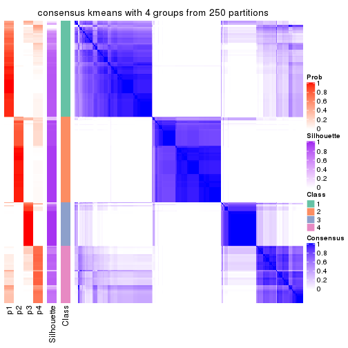</p>

</div>
<div id='tab-SD-kmeans-consensus-heatmap-4'>
<pre><code class="r">consensus_heatmap(res, k = 5)
</code></pre>

<p></p>

</div>
<div id='tab-SD-kmeans-consensus-heatmap-5'>
<pre><code class="r">consensus_heatmap(res, k = 6)
</code></pre>

<p></p>

</div>
</div>

Heatmaps for the membership of samples in all partitions to see how consistent they are:


<script>
$( function() {
	$( '#tabs-SD-kmeans-membership-heatmap' ).tabs();
} );
</script>
<div id='tabs-SD-kmeans-membership-heatmap'>
<ul>
<li><a href='#tab-SD-kmeans-membership-heatmap-1'>k = 2</a></li>
<li><a href='#tab-SD-kmeans-membership-heatmap-2'>k = 3</a></li>
<li><a href='#tab-SD-kmeans-membership-heatmap-3'>k = 4</a></li>
<li><a href='#tab-SD-kmeans-membership-heatmap-4'>k = 5</a></li>
<li><a href='#tab-SD-kmeans-membership-heatmap-5'>k = 6</a></li>
</ul>
<div id='tab-SD-kmeans-membership-heatmap-1'>
<pre><code class="r">membership_heatmap(res, k = 2)
</code></pre>

<p></p>

</div>
<div id='tab-SD-kmeans-membership-heatmap-2'>
<pre><code class="r">membership_heatmap(res, k = 3)
</code></pre>

<p></p>

</div>
<div id='tab-SD-kmeans-membership-heatmap-3'>
<pre><code class="r">membership_heatmap(res, k = 4)
</code></pre>

<p></p>

</div>
<div id='tab-SD-kmeans-membership-heatmap-4'>
<pre><code class="r">membership_heatmap(res, k = 5)
</code></pre>

<p></p>

</div>
<div id='tab-SD-kmeans-membership-heatmap-5'>
<pre><code class="r">membership_heatmap(res, k = 6)
</code></pre>

<p></p>

</div>
</div>

As soon as we have had the classes for columns, we can look for signatures
which are significantly different between classes which can be candidate marks
for certain classes. Following are the heatmaps for signatures.


Signature heatmaps where rows are scaled:


<script>
$( function() {
	$( '#tabs-SD-kmeans-get-signatures' ).tabs();
} );
</script>
<div id='tabs-SD-kmeans-get-signatures'>
<ul>
<li><a href='#tab-SD-kmeans-get-signatures-1'>k = 2</a></li>
<li><a href='#tab-SD-kmeans-get-signatures-2'>k = 3</a></li>
<li><a href='#tab-SD-kmeans-get-signatures-3'>k = 4</a></li>
<li><a href='#tab-SD-kmeans-get-signatures-4'>k = 5</a></li>
<li><a href='#tab-SD-kmeans-get-signatures-5'>k = 6</a></li>
</ul>
<div id='tab-SD-kmeans-get-signatures-1'>
<pre><code class="r">get_signatures(res, k = 2)
</code></pre>

<p></p>

</div>
<div id='tab-SD-kmeans-get-signatures-2'>
<pre><code class="r">get_signatures(res, k = 3)
</code></pre>

<p></p>

</div>
<div id='tab-SD-kmeans-get-signatures-3'>
<pre><code class="r">get_signatures(res, k = 4)
</code></pre>

<p>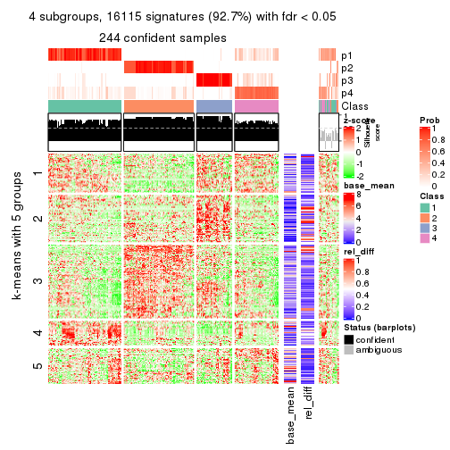</p>

</div>
<div id='tab-SD-kmeans-get-signatures-4'>
<pre><code class="r">get_signatures(res, k = 5)
</code></pre>

<p></p>

</div>
<div id='tab-SD-kmeans-get-signatures-5'>
<pre><code class="r">get_signatures(res, k = 6)
</code></pre>

<p></p>

</div>
</div>


Signature heatmaps where rows are not scaled:


<script>
$( function() {
	$( '#tabs-SD-kmeans-get-signatures-no-scale' ).tabs();
} );
</script>
<div id='tabs-SD-kmeans-get-signatures-no-scale'>
<ul>
<li><a href='#tab-SD-kmeans-get-signatures-no-scale-1'>k = 2</a></li>
<li><a href='#tab-SD-kmeans-get-signatures-no-scale-2'>k = 3</a></li>
<li><a href='#tab-SD-kmeans-get-signatures-no-scale-3'>k = 4</a></li>
<li><a href='#tab-SD-kmeans-get-signatures-no-scale-4'>k = 5</a></li>
<li><a href='#tab-SD-kmeans-get-signatures-no-scale-5'>k = 6</a></li>
</ul>
<div id='tab-SD-kmeans-get-signatures-no-scale-1'>
<pre><code class="r">get_signatures(res, k = 2, scale_rows = FALSE)
</code></pre>

<p></p>

</div>
<div id='tab-SD-kmeans-get-signatures-no-scale-2'>
<pre><code class="r">get_signatures(res, k = 3, scale_rows = FALSE)
</code></pre>

<p></p>

</div>
<div id='tab-SD-kmeans-get-signatures-no-scale-3'>
<pre><code class="r">get_signatures(res, k = 4, scale_rows = FALSE)
</code></pre>

<p>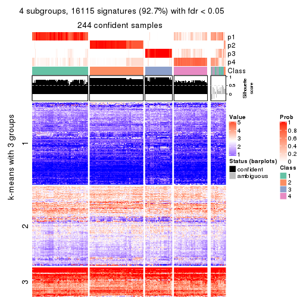</p>

</div>
<div id='tab-SD-kmeans-get-signatures-no-scale-4'>
<pre><code class="r">get_signatures(res, k = 5, scale_rows = FALSE)
</code></pre>

<p></p>

</div>
<div id='tab-SD-kmeans-get-signatures-no-scale-5'>
<pre><code class="r">get_signatures(res, k = 6, scale_rows = FALSE)
</code></pre>

<p></p>

</div>
</div>


Compare the overlap of signatures from different k:

```r
compare_signatures(res)
```


`get_signature()` returns a data frame invisibly. TO get the list of signatures, the function
call should be assigned to a variable explicitly. In following code, if `plot` argument is set
to `FALSE`, no heatmap is plotted while only the differential analysis is performed.

```r
# code only for demonstration
tb = get_signature(res, k = ..., plot = FALSE)
```

An example of the output of `tb` is:

```
#>   which_row         fdr    mean_1    mean_2 scaled_mean_1 scaled_mean_2 km
#> 1        38 0.042760348  8.373488  9.131774    -0.5533452     0.5164555  1
#> 2        40 0.018707592  7.106213  8.469186    -0.6173731     0.5762149  1
#> 3        55 0.019134737 10.221463 11.207825    -0.6159697     0.5749050  1
#> 4        59 0.006059896  5.921854  7.869574    -0.6899429     0.6439467  1
#> 5        60 0.018055526  8.928898 10.211722    -0.6204761     0.5791110  1
#> 6        98 0.009384629 15.714769 14.887706     0.6635654    -0.6193277  2
...
```

The columns in `tb` are:

1. `which_row`: row indices corresponding to the input matrix.
2. `fdr`: FDR for the differential test. 
3. `mean_x`: The mean value in group x.
4. `scaled_mean_x`: The mean value in group x after rows are scaled.
5. `km`: Row groups if k-means clustering is applied to rows.


UMAP plot which shows how samples are separated.


<script>
$( function() {
	$( '#tabs-SD-kmeans-dimension-reduction' ).tabs();
} );
</script>
<div id='tabs-SD-kmeans-dimension-reduction'>
<ul>
<li><a href='#tab-SD-kmeans-dimension-reduction-1'>k = 2</a></li>
<li><a href='#tab-SD-kmeans-dimension-reduction-2'>k = 3</a></li>
<li><a href='#tab-SD-kmeans-dimension-reduction-3'>k = 4</a></li>
<li><a href='#tab-SD-kmeans-dimension-reduction-4'>k = 5</a></li>
<li><a href='#tab-SD-kmeans-dimension-reduction-5'>k = 6</a></li>
</ul>
<div id='tab-SD-kmeans-dimension-reduction-1'>
<pre><code class="r">dimension_reduction(res, k = 2, method = &quot;UMAP&quot;)
</code></pre>

<p></p>

</div>
<div id='tab-SD-kmeans-dimension-reduction-2'>
<pre><code class="r">dimension_reduction(res, k = 3, method = &quot;UMAP&quot;)
</code></pre>

<p></p>

</div>
<div id='tab-SD-kmeans-dimension-reduction-3'>
<pre><code class="r">dimension_reduction(res, k = 4, method = &quot;UMAP&quot;)
</code></pre>

<p></p>

</div>
<div id='tab-SD-kmeans-dimension-reduction-4'>
<pre><code class="r">dimension_reduction(res, k = 5, method = &quot;UMAP&quot;)
</code></pre>

<p></p>

</div>
<div id='tab-SD-kmeans-dimension-reduction-5'>
<pre><code class="r">dimension_reduction(res, k = 6, method = &quot;UMAP&quot;)
</code></pre>

<p></p>

</div>
</div>


Following heatmap shows how subgroups are split when increasing `k`:

```r
collect_classes(res)
```


If matrix rows can be associated to genes, consider to use `GO_Enrichment(res,
...)` to perform function enrichment for the signature genes.


 

---------------------------------------------------


### SD:skmeans*


The object with results only for a single top-value method and a single partition method 
can be extracted as:

```r
res = res_list["SD", "skmeans"]
# you can also extract it by
# res = res_list["SD:skmeans"]
```

A summary of `res` and all the functions that can be applied to it:

```r
res
```

```
#> A 'ConsensusPartition' object with k = 2, 3, 4, 5, 6.
#>   On a matrix with 17377 rows and 265 columns.
#>   Top rows (1000, 2000, 3000, 4000, 5000) are extracted by 'SD' method.
#>   Subgroups are detected by 'skmeans' method.
#>   Performed in total 1250 partitions by row resampling.
#>   Best k for subgroups seems to be 5.
#> 
#> Following methods can be applied to this 'ConsensusPartition' object:
#>  [1] "cola_report"             "collect_classes"         "collect_plots"          
#>  [4] "collect_stats"           "colnames"                "compare_signatures"     
#>  [7] "consensus_heatmap"       "dimension_reduction"     "functional_enrichment"  
#> [10] "get_anno_col"            "get_anno"                "get_classes"            
#> [13] "get_consensus"           "get_matrix"              "get_membership"         
#> [16] "get_param"               "get_signatures"          "get_stats"              
#> [19] "is_best_k"               "is_stable_k"             "membership_heatmap"     
#> [22] "ncol"                    "nrow"                    "plot_ecdf"              
#> [25] "rownames"                "select_partition_number" "show"                   
#> [28] "suggest_best_k"          "test_to_known_factors"
```

`collect_plots()` function collects all the plots made from `res` for all `k` (number of partitions)
into one single page to provide an easy and fast comparison between different `k`.

```r
collect_plots(res)
```


The plots are:

- The first row: a plot of the ECDF (Empirical cumulative distribution
  function) curves of the consensus matrix for each `k` and the heatmap of
  predicted classes for each `k`.
- The second row: heatmaps of the consensus matrix for each `k`.
- The third row: heatmaps of the membership matrix for each `k`.
- The fouth row: heatmaps of the signatures for each `k`.

All the plots in panels can be made by individual functions and they are
plotted later in this section.

`select_partition_number()` produces several plots showing different
statistics for choosing "optimized" `k`. There are following statistics:

- ECDF curves of the consensus matrix for each `k`;
- 1-PAC. [The PAC
  score](https://en.wikipedia.org/wiki/Consensus_clustering#Over-interpretation_potential_of_consensus_clustering)
  measures the proportion of the ambiguous subgrouping.
- Mean silhouette score.
- Concordance. The mean probability of fiting the consensus class ids in all
  partitions.
- Area increased. Denote $A_k$ as the area under the ECDF curve for current
  `k`, the area increased is defined as $A_k - A_{k-1}$.
- Rand index. The percent of pairs of samples that are both in a same cluster
  or both are not in a same cluster in the partition of k and k-1.
- Jaccard index. The ratio of pairs of samples are both in a same cluster in
  the partition of k and k-1 and the pairs of samples are both in a same
  cluster in the partition k or k-1.

The detailed explanations of these statistics can be found in [the cola
vignette](http://bioconductor.org/packages/devel/bioc/vignettes/cola/inst/doc/cola.html#toc_13).

Generally speaking, lower PAC score, higher mean silhouette score or higher
concordance corresponds to better partition. Rand index and Jaccard index
measure how similar the current partition is compared to partition with `k-1`.
If they are too similar, we won't accept `k` is better than `k-1`.

```r
select_partition_number(res)
```


The numeric values for all these statistics can be obtained by `get_stats()`.

```r
get_stats(res)
```

```
#>   k 1-PAC mean_silhouette concordance area_increased  Rand Jaccard
#> 2 2 1.000           0.987       0.994         0.4935 0.506   0.506
#> 3 3 0.909           0.934       0.970         0.3407 0.743   0.533
#> 4 4 0.914           0.892       0.957         0.1178 0.840   0.578
#> 5 5 0.942           0.915       0.961         0.0655 0.888   0.618
#> 6 6 0.881           0.876       0.917         0.0464 0.960   0.812
```

`suggest_best_k()` suggests the best $k$ based on these statistics. The rules are as follows:

- All $k$ with Jaccard index larger than 0.95 are removed because the increase of
  the partition number does not provides enough extra information. If all $k$ are removed,
  the best $k$ is assigned by `NA`.
- For $k$ with 1-PAC larger than 0.9, the maximal $k$ is taken as the "best k". Other $k$ is called "optional k".
- If it does not fit the second rule. The $k$ with the highest vote of highest
  1-PAC, mean silhouette and concordance is taken as the "best k".

```r
suggest_best_k(res)
```

```
#> [1] 5
#> attr(,"optional")
#> [1] 2 3 4
```

There is also optional best $k$ = 2 3 4 that is worth to check.

Following shows the table of the partitions (You need to click the **show/hide
code output** link to see it). The membership matrix (columns with name `p*`)
is inferred by
[`clue::cl_consensus()`](https://www.rdocumentation.org/link/cl_consensus?package=clue)
function with the `SE` method. Basically the value in the membership matrix
represents the probability to belong to a certain group. The finall class
label for an item is determined with the group with highest probability it
belongs to.

In `get_classes()` function, the entropy is calculated from the membership
matrix and the silhouette score is calculated from the consensus matrix.


<script>
$( function() {
	$( '#tabs-SD-skmeans-get-classes' ).tabs();
} );
</script>
<div id='tabs-SD-skmeans-get-classes'>
<ul>
<li><a href='#tab-SD-skmeans-get-classes-1'>k = 2</a></li>
<li><a href='#tab-SD-skmeans-get-classes-2'>k = 3</a></li>
<li><a href='#tab-SD-skmeans-get-classes-3'>k = 4</a></li>
<li><a href='#tab-SD-skmeans-get-classes-4'>k = 5</a></li>
<li><a href='#tab-SD-skmeans-get-classes-5'>k = 6</a></li>
</ul>

<div id='tab-SD-skmeans-get-classes-1'>
<p><a id='tab-SD-skmeans-get-classes-1-a' style='color:#0366d6' href='#'>show/hide code output</a></p>
<pre><code class="r">cbind(get_classes(res, k = 2), get_membership(res, k = 2))
</code></pre>

<pre><code>#&gt;                                      class entropy silhouette    p1    p2
#&gt; D30CF518-5FC6-4A54-8D5D-BA420EA1836D     2  0.0000      0.989 0.000 1.000
#&gt; 92298FF7-1215-4756-B976-A7D88B91AD76     1  0.0000      0.998 1.000 0.000
#&gt; 0E244FE2-7C17-4642-A51F-2CCA796D9C70     2  0.0000      0.989 0.000 1.000
#&gt; 75435ED8-93E8-45FB-8480-98D8EB2EF8CB     2  0.0000      0.989 0.000 1.000
#&gt; B6D11678-15A9-4F43-A0A2-225067DCAF1C     1  0.0000      0.998 1.000 0.000
#&gt; B7F5A41E-9559-4329-81F5-1B88A74730B7     2  0.0000      0.989 0.000 1.000
#&gt; 39414B2A-7FB0-4669-8DFE-86D9AF7AD2D9     1  0.0000      0.998 1.000 0.000
#&gt; 04823F53-A12D-4852-8F34-77B9DCBB7DF0     2  0.0000      0.989 0.000 1.000
#&gt; 49684C2B-D31C-4B45-A400-3497C3CCEC01     2  0.0000      0.989 0.000 1.000
#&gt; 96A04875-58E2-4BE7-8E0F-CAB55F4CA54F     1  0.0000      0.998 1.000 0.000
#&gt; 1F101D63-478B-40B9-A951-DC3887CFF067     1  0.0000      0.998 1.000 0.000
#&gt; DD290860-E0B7-48FC-BE12-2AF729994C21     2  0.0000      0.989 0.000 1.000
#&gt; FFDD7A12-DDEF-4974-8D60-64B7EEAAC994     2  0.0000      0.989 0.000 1.000
#&gt; E076A9A9-EA2A-4FF7-92A8-F2DA7F30279E     2  0.0000      0.989 0.000 1.000
#&gt; 830DFA6F-A85A-4317-82B2-791FAB998A01     2  0.0000      0.989 0.000 1.000
#&gt; 58578614-E4A3-4655-BBAB-F65851625E0A     1  0.0000      0.998 1.000 0.000
#&gt; 1CBFB672-4D66-430B-83F3-7CE3BE20ABF6     1  0.0000      0.998 1.000 0.000
#&gt; 6C34A7D7-3756-4DCC-9A9F-B5FC4A148B7E     2  0.0376      0.985 0.004 0.996
#&gt; D97ED7B4-5DF2-4B62-8796-AA51CA79DBBB     1  0.0000      0.998 1.000 0.000
#&gt; 45F15851-55F6-4169-834E-38958C38B6A9     1  0.0000      0.998 1.000 0.000
#&gt; 4139E0C9-F712-4A25-8B59-587533B93B3E     2  0.0000      0.989 0.000 1.000
#&gt; 2C3007BF-009E-404F-A3BF-8B921698D85B     1  0.0000      0.998 1.000 0.000
#&gt; 2189F8E5-FF98-4C1A-BD04-5595DB553130     1  0.0000      0.998 1.000 0.000
#&gt; FFAA0310-0D78-4499-8FB8-5BC46E4FCE58     2  0.0000      0.989 0.000 1.000
#&gt; 0C375B2F-67BE-4708-BEB2-544DEC812DCA     2  0.0000      0.989 0.000 1.000
#&gt; AB6324A1-19AB-400C-8001-54765D190E27     2  0.0000      0.989 0.000 1.000
#&gt; A32C4DCD-DC4C-4132-9ED1-B159F5561A2D     1  0.0000      0.998 1.000 0.000
#&gt; 2AE7105D-D494-45B0-947A-315D8C20ECDC     1  0.0000      0.998 1.000 0.000
#&gt; 60FE9D59-FC0F-4B9C-ABF8-1C00BC761928     1  0.0000      0.998 1.000 0.000
#&gt; 056442DC-E87A-4315-965C-C19D7B4FC40E     1  0.0000      0.998 1.000 0.000
#&gt; 455111E5-18EF-4E3F-9DFF-8FA017D92461     1  0.0000      0.998 1.000 0.000
#&gt; 10632BC6-0B81-433C-8832-6B2ABC73A94B     1  0.0000      0.998 1.000 0.000
#&gt; AC6F82AD-C682-4EB3-BEC3-FD950F57609D     1  0.0000      0.998 1.000 0.000
#&gt; D9ABDB75-04DA-4D33-A69F-701729494533     1  0.0000      0.998 1.000 0.000
#&gt; 27BBF44D-F4D7-4C5A-935F-3310A363A670     2  0.0000      0.989 0.000 1.000
#&gt; E7AA12EE-6E14-4B33-A52C-B13589436023     1  0.0000      0.998 1.000 0.000
#&gt; DFA6D41A-D231-413E-A180-E42DF26C3E2B     2  0.0000      0.989 0.000 1.000
#&gt; 655BD3AF-5094-4B19-93A8-401C70369B17     2  0.0000      0.989 0.000 1.000
#&gt; 9DFEF253-923F-4EE2-8E3D-C75805387B20     2  0.5519      0.854 0.128 0.872
#&gt; 3B0EE948-B2CD-4191-90E2-BDD155F3B580     1  0.0000      0.998 1.000 0.000
#&gt; 177C7EF4-2D54-4555-947C-44EE7C688917     2  0.0000      0.989 0.000 1.000
#&gt; 1F8E8BB7-D159-4556-8B04-E5DD027CC444     2  0.0000      0.989 0.000 1.000
#&gt; 619F37D2-6771-4727-9079-56BED07F1CF6     2  0.0000      0.989 0.000 1.000
#&gt; ACAE29BE-ECB8-4A98-BC71-7A2D4857134E     1  0.0000      0.998 1.000 0.000
#&gt; C5C3241A-684C-4238-9333-9AF8630EC086     2  0.0000      0.989 0.000 1.000
#&gt; AD319DC2-140F-4E7B-A899-010687D8B714     2  0.0000      0.989 0.000 1.000
#&gt; 2AFF397C-ED2A-4FD9-A7F0-E4C61E9FB603     2  0.0000      0.989 0.000 1.000
#&gt; FB4C7892-3DBB-4148-AAE9-75B19A1A4031     1  0.0000      0.998 1.000 0.000
#&gt; 6F5C4500-1ED1-4E81-B4F5-EEA64CE2336A     1  0.0000      0.998 1.000 0.000
#&gt; BD027C69-3C10-4047-8E1E-218600FF2B73     2  0.0000      0.989 0.000 1.000
#&gt; 11B473A9-4CC5-461F-BC57-CC9141F3591D     1  0.0000      0.998 1.000 0.000
#&gt; 69A036E5-3E6A-4862-A7F8-2D203ED2FC9E     1  0.0000      0.998 1.000 0.000
#&gt; 9C0BDF24-F011-4855-B95A-1B6BEFA808F7     1  0.0000      0.998 1.000 0.000
#&gt; 9E205254-8C0C-4C05-AF5A-86E679CF732C     1  0.0000      0.998 1.000 0.000
#&gt; 935CCE4A-8AA8-454E-9DFF-7DE27D0BD2E2     1  0.0000      0.998 1.000 0.000
#&gt; 01E5E1FE-41D3-428B-90BC-7A000829E102     1  0.0000      0.998 1.000 0.000
#&gt; B344A530-92CD-468B-847A-DF8E25688081     2  0.0000      0.989 0.000 1.000
#&gt; F79F32A7-9F7B-4D62-8426-4A4CF10ED319     1  0.0000      0.998 1.000 0.000
#&gt; C2E1C6FA-82F9-467C-99AE-9B39FAAC810C     1  0.0000      0.998 1.000 0.000
#&gt; BF7CD9BD-776A-4957-8A6E-EF8AD83EA9D3     2  0.0000      0.989 0.000 1.000
#&gt; 8A2C1409-E83B-435E-A20F-5FCA94801C9F     2  0.0000      0.989 0.000 1.000
#&gt; B6BEFFB5-2F62-477B-A4C8-478D29577CBD     2  0.0000      0.989 0.000 1.000
#&gt; 8622CBD0-F8E9-4AC1-8175-CC9A742B86F9     1  0.0000      0.998 1.000 0.000
#&gt; 565DD660-ED58-4065-8619-260BEA6FCFEB     1  0.0000      0.998 1.000 0.000
#&gt; 96038E42-0FBA-497D-819C-38F7689F10FF     1  0.0000      0.998 1.000 0.000
#&gt; CA685549-F8BA-43F1-8461-5D2D3B17CFC5     1  0.0000      0.998 1.000 0.000
#&gt; 52020307-71A6-46E5-ACB3-8F885CA8F1EB     1  0.0000      0.998 1.000 0.000
#&gt; 7656DA98-76DC-424B-B02C-D7001DAAA0E4     1  0.0000      0.998 1.000 0.000
#&gt; 74DBA640-45E2-42A6-8F1E-69C073D66EE6     1  0.0000      0.998 1.000 0.000
#&gt; 251094BE-C33D-44F0-BD98-8618D71F520C     1  0.0000      0.998 1.000 0.000
#&gt; AB914CC5-5FF1-4257-A353-6A99D11B9478     1  0.0000      0.998 1.000 0.000
#&gt; 38B8B893-0E08-4B71-B51C-B32A7B2724E0     1  0.0000      0.998 1.000 0.000
#&gt; 7C7CD8FF-99A4-41D7-B7E1-5A517001F551     2  0.0000      0.989 0.000 1.000
#&gt; BFC5B75A-E4AE-486B-BA30-23BBAA33A125     2  0.0000      0.989 0.000 1.000
#&gt; 182AC78E-A07C-4B34-B216-B5F573E9F036     2  0.0000      0.989 0.000 1.000
#&gt; B38C5F72-8F46-4531-9C2D-96EEE07A5B22     2  0.0000      0.989 0.000 1.000
#&gt; DB9333A6-A723-4B8F-9221-25B8B23D5126     1  0.0000      0.998 1.000 0.000
#&gt; CD67DD21-C1B6-4D58-AC8E-1F4536C7DA70     2  0.0000      0.989 0.000 1.000
#&gt; 3D76A56E-4B66-48AE-AA60-D9C1004C7140     1  0.0000      0.998 1.000 0.000
#&gt; 71ED572F-7780-47A4-A9F8-D320C737690D     1  0.0000      0.998 1.000 0.000
#&gt; B449FEA1-C4B0-400F-903C-59E13D0BA313     2  0.0000      0.989 0.000 1.000
#&gt; 3F120E90-1486-4215-B9B9-79D5B413CAAC     2  0.0000      0.989 0.000 1.000
#&gt; A071894B-D8C0-4740-BD55-93EA0C86EDF7     1  0.0000      0.998 1.000 0.000
#&gt; 58848D57-D7A9-4ABB-86A2-A8AE2B23F654     1  0.0000      0.998 1.000 0.000
#&gt; CD6F9E20-B301-4663-87EC-953EDF49754F     2  0.0000      0.989 0.000 1.000
#&gt; 367D89F3-D527-4929-B830-8B6D553DF9E1     1  0.0000      0.998 1.000 0.000
#&gt; BE8D7DCB-648B-42DD-9FA8-8B85B5D816B2     1  0.0000      0.998 1.000 0.000
#&gt; AA46F56B-BD9C-40A4-8EA8-35E2568C964D     2  0.0000      0.989 0.000 1.000
#&gt; 6393220A-7C57-413F-81A8-4E38C21E779E     2  0.0000      0.989 0.000 1.000
#&gt; 89AE566C-F65F-43C2-BA97-621A7AC8B6DC     1  0.0000      0.998 1.000 0.000
#&gt; AA6A4BFF-8C62-4B70-B85A-9EDF403B06BA     1  0.0000      0.998 1.000 0.000
#&gt; BCE877A6-9C65-4495-A45D-05753F2D0E15     1  0.0000      0.998 1.000 0.000
#&gt; D7BDDF49-C54B-4F8E-ACA0-C3684AB68B5C     2  0.0000      0.989 0.000 1.000
#&gt; D0800D49-0033-44B2-8D7B-29B16F87ADA6     2  0.0000      0.989 0.000 1.000
#&gt; 151D60B5-5AF1-4B61-B97F-ABC7531D9F89     1  0.0000      0.998 1.000 0.000
#&gt; CBBAEB5B-25FA-4B6D-A40C-357E37033E36     1  0.0000      0.998 1.000 0.000
#&gt; 317CD049-3151-40B7-8E88-B0B8813338D6     1  0.0000      0.998 1.000 0.000
#&gt; 93835C77-F8FA-4928-843C-8016A91881FA     1  0.0000      0.998 1.000 0.000
#&gt; 02A6950F-647D-4F20-B2D0-0238C1441C70     1  0.0000      0.998 1.000 0.000
#&gt; 4D54E415-134F-4F6F-8718-3E0475EF5477     1  0.0000      0.998 1.000 0.000
#&gt; 82AB290A-3993-45E5-8B15-6125A019778C     1  0.0000      0.998 1.000 0.000
#&gt; 3B5EAD14-E506-4A22-804D-BF925A2D5247     2  0.0000      0.989 0.000 1.000
#&gt; 19CF7DDF-4F3A-4D2F-B84A-6451A5C3112C     2  0.0000      0.989 0.000 1.000
#&gt; 2FB00DAA-C274-42B1-A06B-611FE5E96844     1  0.0000      0.998 1.000 0.000
#&gt; 2B1F01C3-8145-4296-8111-2B0474AB9A2C     2  0.0000      0.989 0.000 1.000
#&gt; 3F0865F1-8256-4778-966F-D53637B415B6     2  0.0000      0.989 0.000 1.000
#&gt; 5473210D-37F9-4192-86D2-E2A2C77F3BD2     2  0.0000      0.989 0.000 1.000
#&gt; 5EDB6ACF-4F3F-471A-9DDC-661607CACCC4     1  0.0000      0.998 1.000 0.000
#&gt; 6A252A3A-7EEB-47B6-9C23-D69BD2EA846F     2  0.0000      0.989 0.000 1.000
#&gt; 0A7FFCBB-4BAA-4A5F-8B2D-B427C4D982A8     1  0.0000      0.998 1.000 0.000
#&gt; 1603AFB8-5AD7-4794-9991-BDBE96B4D997     2  0.0000      0.989 0.000 1.000
#&gt; 644299E9-62B7-4DFE-9E6D-D7556A01B40A     1  0.0000      0.998 1.000 0.000
#&gt; EF12E923-1860-4269-B57B-BA6238FA4403     1  0.0000      0.998 1.000 0.000
#&gt; 51B7241E-F0BE-482A-88AE-89004BB68989     1  0.0000      0.998 1.000 0.000
#&gt; 1C007DF3-8A9F-4940-9A4C-DE2A412BB023     2  0.0000      0.989 0.000 1.000
#&gt; 89FCFDE6-9625-432C-AA35-9C5FCCF40031     1  0.0000      0.998 1.000 0.000
#&gt; 7955FC55-386D-497E-AFED-019BBBAD428E     2  0.0000      0.989 0.000 1.000
#&gt; 37FF09ED-73EC-4D10-B2AC-7D8EBA9304ED     1  0.2043      0.965 0.968 0.032
#&gt; C2CD2742-2FB4-468E-90FF-8F65A5C425A9     1  0.0000      0.998 1.000 0.000
#&gt; 766FE08F-3393-4868-B1C1-FA98C9FF16E0     2  0.6247      0.820 0.156 0.844
#&gt; 63E2B578-2221-4255-8C45-7FD030B1C94D     1  0.0000      0.998 1.000 0.000
#&gt; C14B1A44-43F7-45F0-A583-5667A4D3BD95     1  0.0000      0.998 1.000 0.000
#&gt; D9CB551A-CE20-4BF7-8AC9-839112346C3D     1  0.0000      0.998 1.000 0.000
#&gt; 05BAA71A-E5B3-4A3A-A3F2-013A975087F0     2  0.0000      0.989 0.000 1.000
#&gt; AC8DA7DE-4D83-4768-BEFD-9A1B2DA943CE     2  0.3733      0.918 0.072 0.928
#&gt; E89DCE9D-F8A5-499C-85BB-BB500BADB9FB     1  0.0000      0.998 1.000 0.000
#&gt; C16F9B5E-2B52-40F6-856D-C0D6FBDD16C1     1  0.0000      0.998 1.000 0.000
#&gt; 8FF234D4-823A-4C80-82F7-2E92D72DBF88     2  0.0000      0.989 0.000 1.000
#&gt; C9F94A6E-D104-4D8D-8EC5-EADECD85F092     2  0.0000      0.989 0.000 1.000
#&gt; 45C9756F-A154-4537-852E-ECBF27B92FE1     2  0.0000      0.989 0.000 1.000
#&gt; 0F1A5708-341E-4713-BC70-76D702F826D6     2  0.0000      0.989 0.000 1.000
#&gt; 2ECFBCA0-AB35-461A-A4B5-C60B2651A962     2  0.0000      0.989 0.000 1.000
#&gt; 7DFAC404-3AB3-4274-A533-CFDAF4CE122D     1  0.0000      0.998 1.000 0.000
#&gt; A90AF55C-4386-42AB-A812-9230026EA5A5     2  0.0000      0.989 0.000 1.000
#&gt; 6258A757-4E18-4CD1-8417-189521E990B6     2  0.0000      0.989 0.000 1.000
#&gt; EBFAD137-050F-47D0-A43D-72B8F7D70C2B     1  0.0000      0.998 1.000 0.000
#&gt; 08B5EBFB-2807-4229-95A6-81AB7F377A56     2  0.0000      0.989 0.000 1.000
#&gt; 4780A59C-0589-4995-B044-3201F09AF859     1  0.0000      0.998 1.000 0.000
#&gt; 0AB81429-C287-48AA-9035-3A7A6F4C7328     2  0.0000      0.989 0.000 1.000
#&gt; 20C4D047-28DA-4AB7-9B3C-32EDA6B22C9D     2  0.0000      0.989 0.000 1.000
#&gt; 77C4E01F-84A6-4BFD-AA8E-D7875456F546     2  0.0000      0.989 0.000 1.000
#&gt; 8B28383F-CF14-4CC5-A1E2-72AD915C0AE8     1  0.0000      0.998 1.000 0.000
#&gt; E12E1F48-6A52-4F74-925C-C4EE1BF5C573     2  0.0000      0.989 0.000 1.000
#&gt; 9B179BC5-BB4C-4CEE-99BC-BC552BC384A1     1  0.0000      0.998 1.000 0.000
#&gt; 5548C91A-D3DE-48F5-B4A4-124BE177B99A     1  0.0000      0.998 1.000 0.000
#&gt; 0E22B729-C381-4B0C-9897-62DD38F51722     1  0.0000      0.998 1.000 0.000
#&gt; 7BC4937F-04E2-4B46-BA7C-FE9AC738C8A9     1  0.0000      0.998 1.000 0.000
#&gt; EE6A0D3F-3F8A-4AA8-B3EF-32372EF37A29     1  0.0000      0.998 1.000 0.000
#&gt; 08AC2706-7651-409F-BE6B-BCED1C2D1796     1  0.0000      0.998 1.000 0.000
#&gt; A68B078D-8979-4070-BB4D-F526704ED3DC     1  0.0000      0.998 1.000 0.000
#&gt; C319A5EE-69FA-4AAB-85A9-2EAAD8E4C703     1  0.7299      0.740 0.796 0.204
#&gt; 0D7CAABD-D20C-4F82-BCBC-8B7276E8EDE2     1  0.0000      0.998 1.000 0.000
#&gt; 09444DCC-44BA-4A3F-ACC5-863A54578B9F     1  0.0000      0.998 1.000 0.000
#&gt; 2E32B047-C6E1-4743-A6C8-E98370A32145     1  0.0000      0.998 1.000 0.000
#&gt; 6A6878A7-76B2-40DE-958B-804442AC6A5D     1  0.0000      0.998 1.000 0.000
#&gt; 39F27293-0BFF-4EA2-8439-A299E3226D20     1  0.0000      0.998 1.000 0.000
#&gt; 7EAE9C30-6080-405F-A7E6-1FED57674279     1  0.0000      0.998 1.000 0.000
#&gt; 79499169-A093-4E0A-B6BD-010CD7BE5035     1  0.0000      0.998 1.000 0.000
#&gt; 1F8BF4E8-BD84-4EFE-9E3E-89E7CE8FA72D     2  0.0000      0.989 0.000 1.000
#&gt; 62B7988F-98E5-4AB8-8A16-D661A07455E8     1  0.0000      0.998 1.000 0.000
#&gt; B7005B5F-217E-4073-BFB5-CE7E884B80C0     2  0.0000      0.989 0.000 1.000
#&gt; B981568F-2C08-4696-B589-E157A49BE72B     2  0.0000      0.989 0.000 1.000
#&gt; A3D85C0A-3202-40C2-88E1-052AC6C5184B     1  0.0000      0.998 1.000 0.000
#&gt; 4CA783B9-9B99-46B8-962A-77194ECB7942     2  0.0000      0.989 0.000 1.000
#&gt; D4024B08-4879-47EA-99E5-D9FCE1CD40DF     1  0.0000      0.998 1.000 0.000
#&gt; 1D41CDA2-0B29-48FD-B83A-E60C174DBCB3     1  0.0000      0.998 1.000 0.000
#&gt; A1923B2A-B233-4760-8AF9-C04C1CAEB100     1  0.0000      0.998 1.000 0.000
#&gt; 80880D71-BFDE-4D88-892F-5ADF27A38940     2  0.7139      0.764 0.196 0.804
#&gt; 55D1629D-30FD-49AA-88CE-EA3CA9B30A3F     2  0.0000      0.989 0.000 1.000
#&gt; B71C409E-926D-48AD-8BD8-9F707CA4FB01     2  0.0000      0.989 0.000 1.000
#&gt; 54A92C57-BD19-4A47-BA76-3ACA2DC36212     1  0.0000      0.998 1.000 0.000
#&gt; B2AB74B8-506C-4C27-9105-E86A6AAA89D4     1  0.0000      0.998 1.000 0.000
#&gt; 0356AE49-7A5C-42CC-A39C-7C8DFBFF8842     2  0.0000      0.989 0.000 1.000
#&gt; ACA260A3-DC3F-4FF4-B9C5-2D4BC4F81783     1  0.0000      0.998 1.000 0.000
#&gt; 9B440917-E5A4-43B9-A48D-6ABFEDCA6CFD     1  0.0000      0.998 1.000 0.000
#&gt; 47464828-52EA-413B-B30C-BD8B55903D78     2  0.0000      0.989 0.000 1.000
#&gt; C1D1FC82-B50D-4C82-8F03-06CEE3C08D18     1  0.0000      0.998 1.000 0.000
#&gt; E5ABFC43-E2A3-4B1A-BBA3-8196C0B026A5     2  0.0000      0.989 0.000 1.000
#&gt; 1D3C16CC-D0D5-4637-AAC7-91672DFF3317     1  0.0000      0.998 1.000 0.000
#&gt; 4D038320-ADEA-4990-8371-68B4B8162E1A     2  0.0000      0.989 0.000 1.000
#&gt; A75594CC-3E49-4869-8656-BBB4E72BF59D     2  0.0000      0.989 0.000 1.000
#&gt; 7CABAA19-5FB2-4A58-BDA3-4F1FFB532C20     1  0.0000      0.998 1.000 0.000
#&gt; 534EF1E9-9513-426E-B41E-A394AB2E4410     2  0.0000      0.989 0.000 1.000
#&gt; 649F35A1-A08C-497D-A9B6-CB3084D5FB8D     1  0.0000      0.998 1.000 0.000
#&gt; 7CA30F3C-1C98-480C-B8B5-A248AABFB468     1  0.0000      0.998 1.000 0.000
#&gt; A9F8DA21-A802-44CF-9F5D-96A36687DCDD     2  0.0000      0.989 0.000 1.000
#&gt; A7AE1ED1-86CB-4A50-97B2-66785C7191FE     1  0.0000      0.998 1.000 0.000
#&gt; D0091AD4-D3D7-4C03-ACD9-DA9F8B6076C6     1  0.0000      0.998 1.000 0.000
#&gt; 46EE1C2B-13F7-44A7-B27E-4EBB9DF0CA83     2  0.0000      0.989 0.000 1.000
#&gt; CB9301B8-0282-43D6-AF5E-B753A9C7BFCB     2  0.0000      0.989 0.000 1.000
#&gt; A0E77A39-885A-4472-9A10-2D1E51DBFDA4     1  0.0000      0.998 1.000 0.000
#&gt; C06603C2-163D-40B6-A9FE-882424F18FE9     1  0.0000      0.998 1.000 0.000
#&gt; C3921A29-80FF-4B9D-B366-5C0238A42231     1  0.0000      0.998 1.000 0.000
#&gt; BB99B4E7-C834-4BB8-973F-8FA039E2798F     1  0.0000      0.998 1.000 0.000
#&gt; 5CD78C2F-05E9-409A-8405-3EE936A6876E     2  0.0000      0.989 0.000 1.000
#&gt; 6C126CC7-0C03-48F0-A2C2-F090CA239B70     2  0.0000      0.989 0.000 1.000
#&gt; 7118B08A-E94C-49F4-8D76-26455C34D85F     2  0.0000      0.989 0.000 1.000
#&gt; 266DAF30-CF3E-493E-8B24-3931D0039450     1  0.0000      0.998 1.000 0.000
#&gt; DAB5F5B9-4FE5-468F-AD2B-B39BBC4317A0     2  0.7219      0.758 0.200 0.800
#&gt; 9A9EB6D6-312E-4A98-8762-30D3ABD8193D     2  0.0000      0.989 0.000 1.000
#&gt; CED15676-B901-4FC8-9C8D-51E529D9441D     1  0.0000      0.998 1.000 0.000
#&gt; 827232CC-8035-440C-8B12-02C789C70B1B     1  0.0000      0.998 1.000 0.000
#&gt; 04D5FB28-FB50-4EAE-95FB-72ABF0E618CA     2  0.0000      0.989 0.000 1.000
#&gt; 6C96A851-97FC-4845-B895-D255191D9F25     1  0.0000      0.998 1.000 0.000
#&gt; 3EC982CB-D013-443E-B21D-39DE6B8EF370     2  0.0000      0.989 0.000 1.000
#&gt; 2E24A786-4370-42A1-AD50-D651F89819CC     2  0.0000      0.989 0.000 1.000
#&gt; 7653BFA9-ADA5-44CA-8555-807FBBFC6DE2     1  0.0000      0.998 1.000 0.000
#&gt; 7A110994-5741-4013-91F0-DD2E1D343F91     2  0.0000      0.989 0.000 1.000
#&gt; 0A760E0C-11C5-4201-8452-18DBC1FEACEB     1  0.0000      0.998 1.000 0.000
#&gt; 909B76A1-BB9F-4906-95BC-58CD1A46D3B8     2  0.0000      0.989 0.000 1.000
#&gt; A782EE71-EDA4-4385-83B3-D16DE81296C0     2  0.8386      0.644 0.268 0.732
#&gt; BD50E276-914F-4924-8CEA-FF47A66DB175     2  0.0000      0.989 0.000 1.000
#&gt; 505D5CA8-0279-4BC7-8CC0-8C7A0165BF91     2  0.0000      0.989 0.000 1.000
#&gt; D51FC997-E662-4AE7-BC9C-14183DA42DE1     2  0.0000      0.989 0.000 1.000
#&gt; 8AD67970-84F1-4C0A-B47A-8FA4108F9FE3     1  0.0000      0.998 1.000 0.000
#&gt; 6E33B1B6-7089-4BC3-B2B0-EC2C3B5D8B74     1  0.0000      0.998 1.000 0.000
#&gt; 88C4EA46-2546-401C-A8E7-603EECFDFBA0     1  0.0672      0.990 0.992 0.008
#&gt; 375D2D72-C998-4627-BA35-24E82A9A55FF     1  0.0000      0.998 1.000 0.000
#&gt; 76D0F834-7064-46C6-96F4-E861CF5452B6     2  0.0000      0.989 0.000 1.000
#&gt; 87159081-C97A-4004-AF0A-7EB6EF0EC47A     1  0.0000      0.998 1.000 0.000
#&gt; 24A57006-800B-4174-AF4E-7EA57A8A756E     1  0.0000      0.998 1.000 0.000
#&gt; AD68CBC6-8A13-4A65-AF62-E99AFA81D031     2  0.0000      0.989 0.000 1.000
#&gt; 22863A57-F066-4DD1-A859-4336F43D144C     1  0.0376      0.994 0.996 0.004
#&gt; 8F6F0362-9165-4DCC-992C-AF871A3C51E7     1  0.0000      0.998 1.000 0.000
#&gt; 76ABF0B7-E707-4DB2-9486-3814439BDBA5     1  0.0000      0.998 1.000 0.000
#&gt; BC72372F-3577-40E5-BA0F-41A084AA93AD     1  0.0000      0.998 1.000 0.000
#&gt; 8E566039-B56C-4F41-B9EF-DE18BEEF2C95     1  0.0000      0.998 1.000 0.000
#&gt; F096F016-3EF5-4A67-A7C2-8A45E1585232     1  0.0000      0.998 1.000 0.000
#&gt; BB37913E-534B-43DD-BE3D-E13B29FD8172     2  0.0000      0.989 0.000 1.000
#&gt; E344638F-9060-460F-8F7A-60D19442F294     2  0.0000      0.989 0.000 1.000
#&gt; 6A0EAAD0-89D5-4F12-8B45-9D5A25182FAD     2  0.0000      0.989 0.000 1.000
#&gt; A5199E3A-9D67-4543-88AB-24398C98E38E     1  0.0000      0.998 1.000 0.000
#&gt; 23917D52-7864-4F84-9C77-DF8EA9407345     2  0.0000      0.989 0.000 1.000
#&gt; 9AA96080-19D8-40C3-BDD1-6044D2D422D5     1  0.0000      0.998 1.000 0.000
#&gt; 0ED65D91-260C-4662-9903-EE36A2E3B2D0     2  0.0000      0.989 0.000 1.000
#&gt; 64BF1BC5-7A9A-4E1D-AEAB-AFE30B92AAF4     2  0.0000      0.989 0.000 1.000
#&gt; F02301F1-9054-4DC6-8DC9-2451A0F53EFC     2  0.0000      0.989 0.000 1.000
#&gt; 3264649A-5684-4181-83D0-A7E4D7E2E1FD     1  0.0000      0.998 1.000 0.000
#&gt; 3F8DA39C-BC9B-4343-8838-5CE271E80C51     2  0.0000      0.989 0.000 1.000
#&gt; BCC681CB-2AF4-4BB6-B53A-7544A2399454     1  0.0000      0.998 1.000 0.000
#&gt; DCB50E17-5E2D-443B-8DCC-272FBB734C2E     1  0.0000      0.998 1.000 0.000
#&gt; B5E47C38-CB6A-44C0-AA9B-56951B9EF78D     1  0.0000      0.998 1.000 0.000
#&gt; B15B0185-9C28-4A00-9CEC-05EFECEA6709     1  0.0000      0.998 1.000 0.000
#&gt; 61D4E8E7-0110-480A-A4A7-D406DE74C31E     1  0.0000      0.998 1.000 0.000
#&gt; CA8DB3AD-3F6B-4622-BF73-47041EC96E42     1  0.0000      0.998 1.000 0.000
#&gt; 5EECB1C4-172C-4494-871A-ADB650CD82BD     2  0.0000      0.989 0.000 1.000
#&gt; 019B857C-D4F7-4B67-B699-56E52A60805B     2  0.0000      0.989 0.000 1.000
#&gt; E9C28902-05C9-4883-97A4-D612D54E46B4     1  0.0000      0.998 1.000 0.000
#&gt; C5D3D9A0-FC14-408D-AB6C-662018A5E5CA     1  0.0000      0.998 1.000 0.000
#&gt; 7EB24744-509B-4854-B7D0-0BAFA210A345     2  0.0000      0.989 0.000 1.000
#&gt; B8B7A721-2284-40AB-98F5-EF1351C30B66     2  0.0000      0.989 0.000 1.000
#&gt; 3C12F39D-0D21-4F69-A539-4120B73C7A79     2  0.0000      0.989 0.000 1.000
#&gt; 08D3F984-6850-45B2-9DF9-EC7F5A4060A4     1  0.0000      0.998 1.000 0.000
#&gt; 9BD0EE79-1EED-4F6D-A5AB-43ADB8526F1E     2  0.8661      0.605 0.288 0.712
#&gt; E489A871-3CF4-4F3D-8EAF-63B507054201     2  0.0000      0.989 0.000 1.000
#&gt; 8CF8FD2E-1DBA-4257-9715-04D956D46B71     2  0.0000      0.989 0.000 1.000
#&gt; F6193AF0-7A19-46CB-A818-1B01E7460791     1  0.0000      0.998 1.000 0.000
#&gt; 96392D6B-D4FF-4393-93BA-08E469E8BBE1     1  0.0000      0.998 1.000 0.000
#&gt; DABCBE5A-C591-46A2-AF66-DA3DB6106751     1  0.0000      0.998 1.000 0.000
#&gt; 8B75F7D4-98D8-44DE-B19D-B733D6A031DB     1  0.0000      0.998 1.000 0.000
#&gt; AAD9685A-564B-42E9-91E3-431951154BA7     2  0.0000      0.989 0.000 1.000
#&gt; 90A43152-4E3B-4365-A39F-7B0E5CA66E55     1  0.0000      0.998 1.000 0.000
#&gt; EFB76FCF-AC9C-4852-B91C-E055DA666FA0     1  0.0000      0.998 1.000 0.000
#&gt; 6EBCFFE3-706F-440A-ABA9-012A924A07C6     2  0.0000      0.989 0.000 1.000
#&gt; E922A244-F1C8-4310-ABB2-62B06E022E4C     1  0.0000      0.998 1.000 0.000
</code></pre>

<script>
$('#tab-SD-skmeans-get-classes-1-a').parent().next().next().hide();
$('#tab-SD-skmeans-get-classes-1-a').click(function(){
  $('#tab-SD-skmeans-get-classes-1-a').parent().next().next().toggle();
  return(false);
});
</script>
</div>

<div id='tab-SD-skmeans-get-classes-2'>
<p><a id='tab-SD-skmeans-get-classes-2-a' style='color:#0366d6' href='#'>show/hide code output</a></p>
<pre><code class="r">cbind(get_classes(res, k = 3), get_membership(res, k = 3))
</code></pre>

<pre><code>#&gt;                                      class entropy silhouette    p1    p2    p3
#&gt; D30CF518-5FC6-4A54-8D5D-BA420EA1836D     2  0.0000     1.0000 0.000 1.000 0.000
#&gt; 92298FF7-1215-4756-B976-A7D88B91AD76     1  0.0000     0.9600 1.000 0.000 0.000
#&gt; 0E244FE2-7C17-4642-A51F-2CCA796D9C70     2  0.0000     1.0000 0.000 1.000 0.000
#&gt; 75435ED8-93E8-45FB-8480-98D8EB2EF8CB     2  0.0000     1.0000 0.000 1.000 0.000
#&gt; B6D11678-15A9-4F43-A0A2-225067DCAF1C     3  0.2796     0.8742 0.092 0.000 0.908
#&gt; B7F5A41E-9559-4329-81F5-1B88A74730B7     2  0.0000     1.0000 0.000 1.000 0.000
#&gt; 39414B2A-7FB0-4669-8DFE-86D9AF7AD2D9     3  0.0000     0.9458 0.000 0.000 1.000
#&gt; 04823F53-A12D-4852-8F34-77B9DCBB7DF0     2  0.0000     1.0000 0.000 1.000 0.000
#&gt; 49684C2B-D31C-4B45-A400-3497C3CCEC01     2  0.0000     1.0000 0.000 1.000 0.000
#&gt; 96A04875-58E2-4BE7-8E0F-CAB55F4CA54F     1  0.0000     0.9600 1.000 0.000 0.000
#&gt; 1F101D63-478B-40B9-A951-DC3887CFF067     1  0.0000     0.9600 1.000 0.000 0.000
#&gt; DD290860-E0B7-48FC-BE12-2AF729994C21     2  0.0000     1.0000 0.000 1.000 0.000
#&gt; FFDD7A12-DDEF-4974-8D60-64B7EEAAC994     2  0.0000     1.0000 0.000 1.000 0.000
#&gt; E076A9A9-EA2A-4FF7-92A8-F2DA7F30279E     3  0.0000     0.9458 0.000 0.000 1.000
#&gt; 830DFA6F-A85A-4317-82B2-791FAB998A01     2  0.0000     1.0000 0.000 1.000 0.000
#&gt; 58578614-E4A3-4655-BBAB-F65851625E0A     1  0.0000     0.9600 1.000 0.000 0.000
#&gt; 1CBFB672-4D66-430B-83F3-7CE3BE20ABF6     1  0.0000     0.9600 1.000 0.000 0.000
#&gt; 6C34A7D7-3756-4DCC-9A9F-B5FC4A148B7E     3  0.0000     0.9458 0.000 0.000 1.000
#&gt; D97ED7B4-5DF2-4B62-8796-AA51CA79DBBB     1  0.0000     0.9600 1.000 0.000 0.000
#&gt; 45F15851-55F6-4169-834E-38958C38B6A9     1  0.0000     0.9600 1.000 0.000 0.000
#&gt; 4139E0C9-F712-4A25-8B59-587533B93B3E     2  0.0000     1.0000 0.000 1.000 0.000
#&gt; 2C3007BF-009E-404F-A3BF-8B921698D85B     1  0.0000     0.9600 1.000 0.000 0.000
#&gt; 2189F8E5-FF98-4C1A-BD04-5595DB553130     1  0.0237     0.9568 0.996 0.000 0.004
#&gt; FFAA0310-0D78-4499-8FB8-5BC46E4FCE58     3  0.0000     0.9458 0.000 0.000 1.000
#&gt; 0C375B2F-67BE-4708-BEB2-544DEC812DCA     2  0.0000     1.0000 0.000 1.000 0.000
#&gt; AB6324A1-19AB-400C-8001-54765D190E27     2  0.0000     1.0000 0.000 1.000 0.000
#&gt; A32C4DCD-DC4C-4132-9ED1-B159F5561A2D     1  0.0000     0.9600 1.000 0.000 0.000
#&gt; 2AE7105D-D494-45B0-947A-315D8C20ECDC     1  0.3551     0.8433 0.868 0.000 0.132
#&gt; 60FE9D59-FC0F-4B9C-ABF8-1C00BC761928     1  0.0000     0.9600 1.000 0.000 0.000
#&gt; 056442DC-E87A-4315-965C-C19D7B4FC40E     1  0.0000     0.9600 1.000 0.000 0.000
#&gt; 455111E5-18EF-4E3F-9DFF-8FA017D92461     3  0.0000     0.9458 0.000 0.000 1.000
#&gt; 10632BC6-0B81-433C-8832-6B2ABC73A94B     1  0.0000     0.9600 1.000 0.000 0.000
#&gt; AC6F82AD-C682-4EB3-BEC3-FD950F57609D     1  0.0000     0.9600 1.000 0.000 0.000
#&gt; D9ABDB75-04DA-4D33-A69F-701729494533     1  0.0000     0.9600 1.000 0.000 0.000
#&gt; 27BBF44D-F4D7-4C5A-935F-3310A363A670     2  0.0000     1.0000 0.000 1.000 0.000
#&gt; E7AA12EE-6E14-4B33-A52C-B13589436023     1  0.0000     0.9600 1.000 0.000 0.000
#&gt; DFA6D41A-D231-413E-A180-E42DF26C3E2B     2  0.0000     1.0000 0.000 1.000 0.000
#&gt; 655BD3AF-5094-4B19-93A8-401C70369B17     2  0.0000     1.0000 0.000 1.000 0.000
#&gt; 9DFEF253-923F-4EE2-8E3D-C75805387B20     1  0.6204     0.2726 0.576 0.424 0.000
#&gt; 3B0EE948-B2CD-4191-90E2-BDD155F3B580     3  0.1753     0.9181 0.048 0.000 0.952
#&gt; 177C7EF4-2D54-4555-947C-44EE7C688917     3  0.0000     0.9458 0.000 0.000 1.000
#&gt; 1F8E8BB7-D159-4556-8B04-E5DD027CC444     2  0.0000     1.0000 0.000 1.000 0.000
#&gt; 619F37D2-6771-4727-9079-56BED07F1CF6     2  0.0000     1.0000 0.000 1.000 0.000
#&gt; ACAE29BE-ECB8-4A98-BC71-7A2D4857134E     3  0.0000     0.9458 0.000 0.000 1.000
#&gt; C5C3241A-684C-4238-9333-9AF8630EC086     2  0.0000     1.0000 0.000 1.000 0.000
#&gt; AD319DC2-140F-4E7B-A899-010687D8B714     2  0.0000     1.0000 0.000 1.000 0.000
#&gt; 2AFF397C-ED2A-4FD9-A7F0-E4C61E9FB603     3  0.0000     0.9458 0.000 0.000 1.000
#&gt; FB4C7892-3DBB-4148-AAE9-75B19A1A4031     3  0.3816     0.8321 0.148 0.000 0.852
#&gt; 6F5C4500-1ED1-4E81-B4F5-EEA64CE2336A     1  0.0000     0.9600 1.000 0.000 0.000
#&gt; BD027C69-3C10-4047-8E1E-218600FF2B73     2  0.0000     1.0000 0.000 1.000 0.000
#&gt; 11B473A9-4CC5-461F-BC57-CC9141F3591D     3  0.0000     0.9458 0.000 0.000 1.000
#&gt; 69A036E5-3E6A-4862-A7F8-2D203ED2FC9E     1  0.3686     0.8349 0.860 0.000 0.140
#&gt; 9C0BDF24-F011-4855-B95A-1B6BEFA808F7     1  0.0000     0.9600 1.000 0.000 0.000
#&gt; 9E205254-8C0C-4C05-AF5A-86E679CF732C     3  0.5397     0.6559 0.280 0.000 0.720
#&gt; 935CCE4A-8AA8-454E-9DFF-7DE27D0BD2E2     1  0.2711     0.8859 0.912 0.000 0.088
#&gt; 01E5E1FE-41D3-428B-90BC-7A000829E102     1  0.0000     0.9600 1.000 0.000 0.000
#&gt; B344A530-92CD-468B-847A-DF8E25688081     3  0.0000     0.9458 0.000 0.000 1.000
#&gt; F79F32A7-9F7B-4D62-8426-4A4CF10ED319     1  0.0000     0.9600 1.000 0.000 0.000
#&gt; C2E1C6FA-82F9-467C-99AE-9B39FAAC810C     1  0.0000     0.9600 1.000 0.000 0.000
#&gt; BF7CD9BD-776A-4957-8A6E-EF8AD83EA9D3     2  0.0000     1.0000 0.000 1.000 0.000
#&gt; 8A2C1409-E83B-435E-A20F-5FCA94801C9F     2  0.0000     1.0000 0.000 1.000 0.000
#&gt; B6BEFFB5-2F62-477B-A4C8-478D29577CBD     2  0.0000     1.0000 0.000 1.000 0.000
#&gt; 8622CBD0-F8E9-4AC1-8175-CC9A742B86F9     1  0.0000     0.9600 1.000 0.000 0.000
#&gt; 565DD660-ED58-4065-8619-260BEA6FCFEB     1  0.0000     0.9600 1.000 0.000 0.000
#&gt; 96038E42-0FBA-497D-819C-38F7689F10FF     1  0.0000     0.9600 1.000 0.000 0.000
#&gt; CA685549-F8BA-43F1-8461-5D2D3B17CFC5     3  0.0000     0.9458 0.000 0.000 1.000
#&gt; 52020307-71A6-46E5-ACB3-8F885CA8F1EB     1  0.0000     0.9600 1.000 0.000 0.000
#&gt; 7656DA98-76DC-424B-B02C-D7001DAAA0E4     3  0.3551     0.8470 0.132 0.000 0.868
#&gt; 74DBA640-45E2-42A6-8F1E-69C073D66EE6     1  0.0000     0.9600 1.000 0.000 0.000
#&gt; 251094BE-C33D-44F0-BD98-8618D71F520C     1  0.0000     0.9600 1.000 0.000 0.000
#&gt; AB914CC5-5FF1-4257-A353-6A99D11B9478     1  0.0000     0.9600 1.000 0.000 0.000
#&gt; 38B8B893-0E08-4B71-B51C-B32A7B2724E0     3  0.5497     0.6354 0.292 0.000 0.708
#&gt; 7C7CD8FF-99A4-41D7-B7E1-5A517001F551     2  0.0000     1.0000 0.000 1.000 0.000
#&gt; BFC5B75A-E4AE-486B-BA30-23BBAA33A125     2  0.0000     1.0000 0.000 1.000 0.000
#&gt; 182AC78E-A07C-4B34-B216-B5F573E9F036     2  0.0000     1.0000 0.000 1.000 0.000
#&gt; B38C5F72-8F46-4531-9C2D-96EEE07A5B22     2  0.0000     1.0000 0.000 1.000 0.000
#&gt; DB9333A6-A723-4B8F-9221-25B8B23D5126     3  0.0424     0.9415 0.008 0.000 0.992
#&gt; CD67DD21-C1B6-4D58-AC8E-1F4536C7DA70     3  0.0000     0.9458 0.000 0.000 1.000
#&gt; 3D76A56E-4B66-48AE-AA60-D9C1004C7140     1  0.0000     0.9600 1.000 0.000 0.000
#&gt; 71ED572F-7780-47A4-A9F8-D320C737690D     1  0.0000     0.9600 1.000 0.000 0.000
#&gt; B449FEA1-C4B0-400F-903C-59E13D0BA313     2  0.0000     1.0000 0.000 1.000 0.000
#&gt; 3F120E90-1486-4215-B9B9-79D5B413CAAC     3  0.0000     0.9458 0.000 0.000 1.000
#&gt; A071894B-D8C0-4740-BD55-93EA0C86EDF7     1  0.3686     0.8349 0.860 0.000 0.140
#&gt; 58848D57-D7A9-4ABB-86A2-A8AE2B23F654     1  0.0000     0.9600 1.000 0.000 0.000
#&gt; CD6F9E20-B301-4663-87EC-953EDF49754F     3  0.0000     0.9458 0.000 0.000 1.000
#&gt; 367D89F3-D527-4929-B830-8B6D553DF9E1     1  0.3619     0.8393 0.864 0.000 0.136
#&gt; BE8D7DCB-648B-42DD-9FA8-8B85B5D816B2     1  0.0000     0.9600 1.000 0.000 0.000
#&gt; AA46F56B-BD9C-40A4-8EA8-35E2568C964D     2  0.0000     1.0000 0.000 1.000 0.000
#&gt; 6393220A-7C57-413F-81A8-4E38C21E779E     2  0.0000     1.0000 0.000 1.000 0.000
#&gt; 89AE566C-F65F-43C2-BA97-621A7AC8B6DC     1  0.0000     0.9600 1.000 0.000 0.000
#&gt; AA6A4BFF-8C62-4B70-B85A-9EDF403B06BA     1  0.0000     0.9600 1.000 0.000 0.000
#&gt; BCE877A6-9C65-4495-A45D-05753F2D0E15     1  0.0000     0.9600 1.000 0.000 0.000
#&gt; D7BDDF49-C54B-4F8E-ACA0-C3684AB68B5C     3  0.0000     0.9458 0.000 0.000 1.000
#&gt; D0800D49-0033-44B2-8D7B-29B16F87ADA6     2  0.0000     1.0000 0.000 1.000 0.000
#&gt; 151D60B5-5AF1-4B61-B97F-ABC7531D9F89     3  0.0000     0.9458 0.000 0.000 1.000
#&gt; CBBAEB5B-25FA-4B6D-A40C-357E37033E36     3  0.0000     0.9458 0.000 0.000 1.000
#&gt; 317CD049-3151-40B7-8E88-B0B8813338D6     1  0.0000     0.9600 1.000 0.000 0.000
#&gt; 93835C77-F8FA-4928-843C-8016A91881FA     1  0.0000     0.9600 1.000 0.000 0.000
#&gt; 02A6950F-647D-4F20-B2D0-0238C1441C70     1  0.0000     0.9600 1.000 0.000 0.000
#&gt; 4D54E415-134F-4F6F-8718-3E0475EF5477     1  0.0000     0.9600 1.000 0.000 0.000
#&gt; 82AB290A-3993-45E5-8B15-6125A019778C     1  0.0000     0.9600 1.000 0.000 0.000
#&gt; 3B5EAD14-E506-4A22-804D-BF925A2D5247     2  0.0000     1.0000 0.000 1.000 0.000
#&gt; 19CF7DDF-4F3A-4D2F-B84A-6451A5C3112C     3  0.0000     0.9458 0.000 0.000 1.000
#&gt; 2FB00DAA-C274-42B1-A06B-611FE5E96844     1  0.3551     0.8433 0.868 0.000 0.132
#&gt; 2B1F01C3-8145-4296-8111-2B0474AB9A2C     2  0.0000     1.0000 0.000 1.000 0.000
#&gt; 3F0865F1-8256-4778-966F-D53637B415B6     3  0.0000     0.9458 0.000 0.000 1.000
#&gt; 5473210D-37F9-4192-86D2-E2A2C77F3BD2     3  0.0000     0.9458 0.000 0.000 1.000
#&gt; 5EDB6ACF-4F3F-471A-9DDC-661607CACCC4     1  0.0000     0.9600 1.000 0.000 0.000
#&gt; 6A252A3A-7EEB-47B6-9C23-D69BD2EA846F     3  0.0000     0.9458 0.000 0.000 1.000
#&gt; 0A7FFCBB-4BAA-4A5F-8B2D-B427C4D982A8     1  0.0000     0.9600 1.000 0.000 0.000
#&gt; 1603AFB8-5AD7-4794-9991-BDBE96B4D997     2  0.0000     1.0000 0.000 1.000 0.000
#&gt; 644299E9-62B7-4DFE-9E6D-D7556A01B40A     1  0.0000     0.9600 1.000 0.000 0.000
#&gt; EF12E923-1860-4269-B57B-BA6238FA4403     3  0.0000     0.9458 0.000 0.000 1.000
#&gt; 51B7241E-F0BE-482A-88AE-89004BB68989     1  0.3551     0.8433 0.868 0.000 0.132
#&gt; 1C007DF3-8A9F-4940-9A4C-DE2A412BB023     3  0.0000     0.9458 0.000 0.000 1.000
#&gt; 89FCFDE6-9625-432C-AA35-9C5FCCF40031     3  0.2625     0.8886 0.084 0.000 0.916
#&gt; 7955FC55-386D-497E-AFED-019BBBAD428E     3  0.0000     0.9458 0.000 0.000 1.000
#&gt; 37FF09ED-73EC-4D10-B2AC-7D8EBA9304ED     3  0.0000     0.9458 0.000 0.000 1.000
#&gt; C2CD2742-2FB4-468E-90FF-8F65A5C425A9     1  0.0000     0.9600 1.000 0.000 0.000
#&gt; 766FE08F-3393-4868-B1C1-FA98C9FF16E0     3  0.0000     0.9458 0.000 0.000 1.000
#&gt; 63E2B578-2221-4255-8C45-7FD030B1C94D     1  0.0000     0.9600 1.000 0.000 0.000
#&gt; C14B1A44-43F7-45F0-A583-5667A4D3BD95     1  0.3482     0.8474 0.872 0.000 0.128
#&gt; D9CB551A-CE20-4BF7-8AC9-839112346C3D     1  0.0000     0.9600 1.000 0.000 0.000
#&gt; 05BAA71A-E5B3-4A3A-A3F2-013A975087F0     2  0.0000     1.0000 0.000 1.000 0.000
#&gt; AC8DA7DE-4D83-4768-BEFD-9A1B2DA943CE     3  0.0000     0.9458 0.000 0.000 1.000
#&gt; E89DCE9D-F8A5-499C-85BB-BB500BADB9FB     3  0.2796     0.8742 0.092 0.000 0.908
#&gt; C16F9B5E-2B52-40F6-856D-C0D6FBDD16C1     1  0.0000     0.9600 1.000 0.000 0.000
#&gt; 8FF234D4-823A-4C80-82F7-2E92D72DBF88     2  0.0000     1.0000 0.000 1.000 0.000
#&gt; C9F94A6E-D104-4D8D-8EC5-EADECD85F092     2  0.0000     1.0000 0.000 1.000 0.000
#&gt; 45C9756F-A154-4537-852E-ECBF27B92FE1     2  0.0000     1.0000 0.000 1.000 0.000
#&gt; 0F1A5708-341E-4713-BC70-76D702F826D6     3  0.5497     0.5937 0.000 0.292 0.708
#&gt; 2ECFBCA0-AB35-461A-A4B5-C60B2651A962     2  0.0000     1.0000 0.000 1.000 0.000
#&gt; 7DFAC404-3AB3-4274-A533-CFDAF4CE122D     1  0.0000     0.9600 1.000 0.000 0.000
#&gt; A90AF55C-4386-42AB-A812-9230026EA5A5     2  0.0000     1.0000 0.000 1.000 0.000
#&gt; 6258A757-4E18-4CD1-8417-189521E990B6     2  0.0000     1.0000 0.000 1.000 0.000
#&gt; EBFAD137-050F-47D0-A43D-72B8F7D70C2B     1  0.0000     0.9600 1.000 0.000 0.000
#&gt; 08B5EBFB-2807-4229-95A6-81AB7F377A56     2  0.0000     1.0000 0.000 1.000 0.000
#&gt; 4780A59C-0589-4995-B044-3201F09AF859     3  0.3752     0.8359 0.144 0.000 0.856
#&gt; 0AB81429-C287-48AA-9035-3A7A6F4C7328     2  0.0000     1.0000 0.000 1.000 0.000
#&gt; 20C4D047-28DA-4AB7-9B3C-32EDA6B22C9D     3  0.0000     0.9458 0.000 0.000 1.000
#&gt; 77C4E01F-84A6-4BFD-AA8E-D7875456F546     3  0.0000     0.9458 0.000 0.000 1.000
#&gt; 8B28383F-CF14-4CC5-A1E2-72AD915C0AE8     1  0.6111     0.2997 0.604 0.000 0.396
#&gt; E12E1F48-6A52-4F74-925C-C4EE1BF5C573     2  0.0000     1.0000 0.000 1.000 0.000
#&gt; 9B179BC5-BB4C-4CEE-99BC-BC552BC384A1     3  0.0000     0.9458 0.000 0.000 1.000
#&gt; 5548C91A-D3DE-48F5-B4A4-124BE177B99A     3  0.0000     0.9458 0.000 0.000 1.000
#&gt; 0E22B729-C381-4B0C-9897-62DD38F51722     1  0.0592     0.9502 0.988 0.000 0.012
#&gt; 7BC4937F-04E2-4B46-BA7C-FE9AC738C8A9     1  0.0000     0.9600 1.000 0.000 0.000
#&gt; EE6A0D3F-3F8A-4AA8-B3EF-32372EF37A29     3  0.6299     0.0707 0.476 0.000 0.524
#&gt; 08AC2706-7651-409F-BE6B-BCED1C2D1796     1  0.0000     0.9600 1.000 0.000 0.000
#&gt; A68B078D-8979-4070-BB4D-F526704ED3DC     1  0.0000     0.9600 1.000 0.000 0.000
#&gt; C319A5EE-69FA-4AAB-85A9-2EAAD8E4C703     3  0.0000     0.9458 0.000 0.000 1.000
#&gt; 0D7CAABD-D20C-4F82-BCBC-8B7276E8EDE2     1  0.0000     0.9600 1.000 0.000 0.000
#&gt; 09444DCC-44BA-4A3F-ACC5-863A54578B9F     3  0.3551     0.8470 0.132 0.000 0.868
#&gt; 2E32B047-C6E1-4743-A6C8-E98370A32145     3  0.0000     0.9458 0.000 0.000 1.000
#&gt; 6A6878A7-76B2-40DE-958B-804442AC6A5D     3  0.5835     0.5442 0.340 0.000 0.660
#&gt; 39F27293-0BFF-4EA2-8439-A299E3226D20     1  0.6168     0.2490 0.588 0.000 0.412
#&gt; 7EAE9C30-6080-405F-A7E6-1FED57674279     1  0.0000     0.9600 1.000 0.000 0.000
#&gt; 79499169-A093-4E0A-B6BD-010CD7BE5035     1  0.0000     0.9600 1.000 0.000 0.000
#&gt; 1F8BF4E8-BD84-4EFE-9E3E-89E7CE8FA72D     3  0.0000     0.9458 0.000 0.000 1.000
#&gt; 62B7988F-98E5-4AB8-8A16-D661A07455E8     3  0.0000     0.9458 0.000 0.000 1.000
#&gt; B7005B5F-217E-4073-BFB5-CE7E884B80C0     2  0.0000     1.0000 0.000 1.000 0.000
#&gt; B981568F-2C08-4696-B589-E157A49BE72B     2  0.0000     1.0000 0.000 1.000 0.000
#&gt; A3D85C0A-3202-40C2-88E1-052AC6C5184B     1  0.0000     0.9600 1.000 0.000 0.000
#&gt; 4CA783B9-9B99-46B8-962A-77194ECB7942     3  0.0000     0.9458 0.000 0.000 1.000
#&gt; D4024B08-4879-47EA-99E5-D9FCE1CD40DF     1  0.0000     0.9600 1.000 0.000 0.000
#&gt; 1D41CDA2-0B29-48FD-B83A-E60C174DBCB3     1  0.0000     0.9600 1.000 0.000 0.000
#&gt; A1923B2A-B233-4760-8AF9-C04C1CAEB100     1  0.0000     0.9600 1.000 0.000 0.000
#&gt; 80880D71-BFDE-4D88-892F-5ADF27A38940     3  0.0000     0.9458 0.000 0.000 1.000
#&gt; 55D1629D-30FD-49AA-88CE-EA3CA9B30A3F     2  0.0000     1.0000 0.000 1.000 0.000
#&gt; B71C409E-926D-48AD-8BD8-9F707CA4FB01     2  0.0000     1.0000 0.000 1.000 0.000
#&gt; 54A92C57-BD19-4A47-BA76-3ACA2DC36212     3  0.0000     0.9458 0.000 0.000 1.000
#&gt; B2AB74B8-506C-4C27-9105-E86A6AAA89D4     3  0.0000     0.9458 0.000 0.000 1.000
#&gt; 0356AE49-7A5C-42CC-A39C-7C8DFBFF8842     2  0.0000     1.0000 0.000 1.000 0.000
#&gt; ACA260A3-DC3F-4FF4-B9C5-2D4BC4F81783     1  0.3551     0.8433 0.868 0.000 0.132
#&gt; 9B440917-E5A4-43B9-A48D-6ABFEDCA6CFD     1  0.0000     0.9600 1.000 0.000 0.000
#&gt; 47464828-52EA-413B-B30C-BD8B55903D78     2  0.0000     1.0000 0.000 1.000 0.000
#&gt; C1D1FC82-B50D-4C82-8F03-06CEE3C08D18     1  0.0000     0.9600 1.000 0.000 0.000
#&gt; E5ABFC43-E2A3-4B1A-BBA3-8196C0B026A5     2  0.0000     1.0000 0.000 1.000 0.000
#&gt; 1D3C16CC-D0D5-4637-AAC7-91672DFF3317     1  0.0000     0.9600 1.000 0.000 0.000
#&gt; 4D038320-ADEA-4990-8371-68B4B8162E1A     2  0.0000     1.0000 0.000 1.000 0.000
#&gt; A75594CC-3E49-4869-8656-BBB4E72BF59D     2  0.0000     1.0000 0.000 1.000 0.000
#&gt; 7CABAA19-5FB2-4A58-BDA3-4F1FFB532C20     3  0.3551     0.8470 0.132 0.000 0.868
#&gt; 534EF1E9-9513-426E-B41E-A394AB2E4410     2  0.0000     1.0000 0.000 1.000 0.000
#&gt; 649F35A1-A08C-497D-A9B6-CB3084D5FB8D     3  0.0747     0.9364 0.016 0.000 0.984
#&gt; 7CA30F3C-1C98-480C-B8B5-A248AABFB468     1  0.4974     0.6724 0.764 0.000 0.236
#&gt; A9F8DA21-A802-44CF-9F5D-96A36687DCDD     3  0.0000     0.9458 0.000 0.000 1.000
#&gt; A7AE1ED1-86CB-4A50-97B2-66785C7191FE     1  0.0000     0.9600 1.000 0.000 0.000
#&gt; D0091AD4-D3D7-4C03-ACD9-DA9F8B6076C6     3  0.0000     0.9458 0.000 0.000 1.000
#&gt; 46EE1C2B-13F7-44A7-B27E-4EBB9DF0CA83     2  0.0000     1.0000 0.000 1.000 0.000
#&gt; CB9301B8-0282-43D6-AF5E-B753A9C7BFCB     2  0.0000     1.0000 0.000 1.000 0.000
#&gt; A0E77A39-885A-4472-9A10-2D1E51DBFDA4     1  0.0000     0.9600 1.000 0.000 0.000
#&gt; C06603C2-163D-40B6-A9FE-882424F18FE9     1  0.0000     0.9600 1.000 0.000 0.000
#&gt; C3921A29-80FF-4B9D-B366-5C0238A42231     3  0.0000     0.9458 0.000 0.000 1.000
#&gt; BB99B4E7-C834-4BB8-973F-8FA039E2798F     1  0.0000     0.9600 1.000 0.000 0.000
#&gt; 5CD78C2F-05E9-409A-8405-3EE936A6876E     3  0.0000     0.9458 0.000 0.000 1.000
#&gt; 6C126CC7-0C03-48F0-A2C2-F090CA239B70     2  0.0000     1.0000 0.000 1.000 0.000
#&gt; 7118B08A-E94C-49F4-8D76-26455C34D85F     2  0.0000     1.0000 0.000 1.000 0.000
#&gt; 266DAF30-CF3E-493E-8B24-3931D0039450     3  0.0592     0.9390 0.012 0.000 0.988
#&gt; DAB5F5B9-4FE5-468F-AD2B-B39BBC4317A0     3  0.0000     0.9458 0.000 0.000 1.000
#&gt; 9A9EB6D6-312E-4A98-8762-30D3ABD8193D     3  0.0000     0.9458 0.000 0.000 1.000
#&gt; CED15676-B901-4FC8-9C8D-51E529D9441D     3  0.6111     0.4108 0.396 0.000 0.604
#&gt; 827232CC-8035-440C-8B12-02C789C70B1B     3  0.4121     0.8111 0.168 0.000 0.832
#&gt; 04D5FB28-FB50-4EAE-95FB-72ABF0E618CA     2  0.0000     1.0000 0.000 1.000 0.000
#&gt; 6C96A851-97FC-4845-B895-D255191D9F25     1  0.0000     0.9600 1.000 0.000 0.000
#&gt; 3EC982CB-D013-443E-B21D-39DE6B8EF370     3  0.0000     0.9458 0.000 0.000 1.000
#&gt; 2E24A786-4370-42A1-AD50-D651F89819CC     2  0.0000     1.0000 0.000 1.000 0.000
#&gt; 7653BFA9-ADA5-44CA-8555-807FBBFC6DE2     1  0.3482     0.8474 0.872 0.000 0.128
#&gt; 7A110994-5741-4013-91F0-DD2E1D343F91     2  0.0000     1.0000 0.000 1.000 0.000
#&gt; 0A760E0C-11C5-4201-8452-18DBC1FEACEB     1  0.0000     0.9600 1.000 0.000 0.000
#&gt; 909B76A1-BB9F-4906-95BC-58CD1A46D3B8     2  0.0000     1.0000 0.000 1.000 0.000
#&gt; A782EE71-EDA4-4385-83B3-D16DE81296C0     3  0.0000     0.9458 0.000 0.000 1.000
#&gt; BD50E276-914F-4924-8CEA-FF47A66DB175     2  0.0000     1.0000 0.000 1.000 0.000
#&gt; 505D5CA8-0279-4BC7-8CC0-8C7A0165BF91     2  0.0000     1.0000 0.000 1.000 0.000
#&gt; D51FC997-E662-4AE7-BC9C-14183DA42DE1     2  0.0000     1.0000 0.000 1.000 0.000
#&gt; 8AD67970-84F1-4C0A-B47A-8FA4108F9FE3     1  0.0000     0.9600 1.000 0.000 0.000
#&gt; 6E33B1B6-7089-4BC3-B2B0-EC2C3B5D8B74     1  0.0000     0.9600 1.000 0.000 0.000
#&gt; 88C4EA46-2546-401C-A8E7-603EECFDFBA0     3  0.2625     0.8812 0.084 0.000 0.916
#&gt; 375D2D72-C998-4627-BA35-24E82A9A55FF     3  0.3551     0.8470 0.132 0.000 0.868
#&gt; 76D0F834-7064-46C6-96F4-E861CF5452B6     2  0.0000     1.0000 0.000 1.000 0.000
#&gt; 87159081-C97A-4004-AF0A-7EB6EF0EC47A     1  0.3816     0.8265 0.852 0.000 0.148
#&gt; 24A57006-800B-4174-AF4E-7EA57A8A756E     3  0.3551     0.8470 0.132 0.000 0.868
#&gt; AD68CBC6-8A13-4A65-AF62-E99AFA81D031     3  0.0000     0.9458 0.000 0.000 1.000
#&gt; 22863A57-F066-4DD1-A859-4336F43D144C     3  0.0000     0.9458 0.000 0.000 1.000
#&gt; 8F6F0362-9165-4DCC-992C-AF871A3C51E7     1  0.0000     0.9600 1.000 0.000 0.000
#&gt; 76ABF0B7-E707-4DB2-9486-3814439BDBA5     1  0.0000     0.9600 1.000 0.000 0.000
#&gt; BC72372F-3577-40E5-BA0F-41A084AA93AD     1  0.0000     0.9600 1.000 0.000 0.000
#&gt; 8E566039-B56C-4F41-B9EF-DE18BEEF2C95     1  0.0000     0.9600 1.000 0.000 0.000
#&gt; F096F016-3EF5-4A67-A7C2-8A45E1585232     1  0.0000     0.9600 1.000 0.000 0.000
#&gt; BB37913E-534B-43DD-BE3D-E13B29FD8172     2  0.0000     1.0000 0.000 1.000 0.000
#&gt; E344638F-9060-460F-8F7A-60D19442F294     3  0.0000     0.9458 0.000 0.000 1.000
#&gt; 6A0EAAD0-89D5-4F12-8B45-9D5A25182FAD     2  0.0000     1.0000 0.000 1.000 0.000
#&gt; A5199E3A-9D67-4543-88AB-24398C98E38E     3  0.0000     0.9458 0.000 0.000 1.000
#&gt; 23917D52-7864-4F84-9C77-DF8EA9407345     2  0.0000     1.0000 0.000 1.000 0.000
#&gt; 9AA96080-19D8-40C3-BDD1-6044D2D422D5     1  0.0000     0.9600 1.000 0.000 0.000
#&gt; 0ED65D91-260C-4662-9903-EE36A2E3B2D0     2  0.0000     1.0000 0.000 1.000 0.000
#&gt; 64BF1BC5-7A9A-4E1D-AEAB-AFE30B92AAF4     3  0.0000     0.9458 0.000 0.000 1.000
#&gt; F02301F1-9054-4DC6-8DC9-2451A0F53EFC     2  0.0000     1.0000 0.000 1.000 0.000
#&gt; 3264649A-5684-4181-83D0-A7E4D7E2E1FD     3  0.0592     0.9390 0.012 0.000 0.988
#&gt; 3F8DA39C-BC9B-4343-8838-5CE271E80C51     2  0.0000     1.0000 0.000 1.000 0.000
#&gt; BCC681CB-2AF4-4BB6-B53A-7544A2399454     1  0.0000     0.9600 1.000 0.000 0.000
#&gt; DCB50E17-5E2D-443B-8DCC-272FBB734C2E     1  0.0000     0.9600 1.000 0.000 0.000
#&gt; B5E47C38-CB6A-44C0-AA9B-56951B9EF78D     1  0.0000     0.9600 1.000 0.000 0.000
#&gt; B15B0185-9C28-4A00-9CEC-05EFECEA6709     1  0.0000     0.9600 1.000 0.000 0.000
#&gt; 61D4E8E7-0110-480A-A4A7-D406DE74C31E     1  0.5216     0.6298 0.740 0.000 0.260
#&gt; CA8DB3AD-3F6B-4622-BF73-47041EC96E42     3  0.5529     0.6282 0.296 0.000 0.704
#&gt; 5EECB1C4-172C-4494-871A-ADB650CD82BD     2  0.0000     1.0000 0.000 1.000 0.000
#&gt; 019B857C-D4F7-4B67-B699-56E52A60805B     2  0.0000     1.0000 0.000 1.000 0.000
#&gt; E9C28902-05C9-4883-97A4-D612D54E46B4     1  0.3551     0.8433 0.868 0.000 0.132
#&gt; C5D3D9A0-FC14-408D-AB6C-662018A5E5CA     1  0.0000     0.9600 1.000 0.000 0.000
#&gt; 7EB24744-509B-4854-B7D0-0BAFA210A345     2  0.0000     1.0000 0.000 1.000 0.000
#&gt; B8B7A721-2284-40AB-98F5-EF1351C30B66     2  0.0000     1.0000 0.000 1.000 0.000
#&gt; 3C12F39D-0D21-4F69-A539-4120B73C7A79     2  0.0000     1.0000 0.000 1.000 0.000
#&gt; 08D3F984-6850-45B2-9DF9-EC7F5A4060A4     1  0.5706     0.5598 0.680 0.000 0.320
#&gt; 9BD0EE79-1EED-4F6D-A5AB-43ADB8526F1E     3  0.0000     0.9458 0.000 0.000 1.000
#&gt; E489A871-3CF4-4F3D-8EAF-63B507054201     2  0.0000     1.0000 0.000 1.000 0.000
#&gt; 8CF8FD2E-1DBA-4257-9715-04D956D46B71     2  0.0000     1.0000 0.000 1.000 0.000
#&gt; F6193AF0-7A19-46CB-A818-1B01E7460791     1  0.0000     0.9600 1.000 0.000 0.000
#&gt; 96392D6B-D4FF-4393-93BA-08E469E8BBE1     1  0.5178     0.6372 0.744 0.000 0.256
#&gt; DABCBE5A-C591-46A2-AF66-DA3DB6106751     1  0.0000     0.9600 1.000 0.000 0.000
#&gt; 8B75F7D4-98D8-44DE-B19D-B733D6A031DB     1  0.0000     0.9600 1.000 0.000 0.000
#&gt; AAD9685A-564B-42E9-91E3-431951154BA7     2  0.0000     1.0000 0.000 1.000 0.000
#&gt; 90A43152-4E3B-4365-A39F-7B0E5CA66E55     1  0.0000     0.9600 1.000 0.000 0.000
#&gt; EFB76FCF-AC9C-4852-B91C-E055DA666FA0     1  0.0000     0.9600 1.000 0.000 0.000
#&gt; 6EBCFFE3-706F-440A-ABA9-012A924A07C6     2  0.0000     1.0000 0.000 1.000 0.000
#&gt; E922A244-F1C8-4310-ABB2-62B06E022E4C     1  0.0000     0.9600 1.000 0.000 0.000
</code></pre>

<script>
$('#tab-SD-skmeans-get-classes-2-a').parent().next().next().hide();
$('#tab-SD-skmeans-get-classes-2-a').click(function(){
  $('#tab-SD-skmeans-get-classes-2-a').parent().next().next().toggle();
  return(false);
});
</script>
</div>

<div id='tab-SD-skmeans-get-classes-3'>
<p><a id='tab-SD-skmeans-get-classes-3-a' style='color:#0366d6' href='#'>show/hide code output</a></p>
<pre><code class="r">cbind(get_classes(res, k = 4), get_membership(res, k = 4))
</code></pre>

<pre><code>#&gt;                                      class entropy silhouette    p1    p2    p3    p4
#&gt; D30CF518-5FC6-4A54-8D5D-BA420EA1836D     2  0.0000     0.9949 0.000 1.000 0.000 0.000
#&gt; 92298FF7-1215-4756-B976-A7D88B91AD76     1  0.0000     0.9385 1.000 0.000 0.000 0.000
#&gt; 0E244FE2-7C17-4642-A51F-2CCA796D9C70     2  0.0000     0.9949 0.000 1.000 0.000 0.000
#&gt; 75435ED8-93E8-45FB-8480-98D8EB2EF8CB     2  0.0000     0.9949 0.000 1.000 0.000 0.000
#&gt; B6D11678-15A9-4F43-A0A2-225067DCAF1C     4  0.0000     0.9038 0.000 0.000 0.000 1.000
#&gt; B7F5A41E-9559-4329-81F5-1B88A74730B7     2  0.0000     0.9949 0.000 1.000 0.000 0.000
#&gt; 39414B2A-7FB0-4669-8DFE-86D9AF7AD2D9     4  0.0000     0.9038 0.000 0.000 0.000 1.000
#&gt; 04823F53-A12D-4852-8F34-77B9DCBB7DF0     2  0.0000     0.9949 0.000 1.000 0.000 0.000
#&gt; 49684C2B-D31C-4B45-A400-3497C3CCEC01     2  0.0000     0.9949 0.000 1.000 0.000 0.000
#&gt; 96A04875-58E2-4BE7-8E0F-CAB55F4CA54F     1  0.0000     0.9385 1.000 0.000 0.000 0.000
#&gt; 1F101D63-478B-40B9-A951-DC3887CFF067     1  0.0000     0.9385 1.000 0.000 0.000 0.000
#&gt; DD290860-E0B7-48FC-BE12-2AF729994C21     2  0.0000     0.9949 0.000 1.000 0.000 0.000
#&gt; FFDD7A12-DDEF-4974-8D60-64B7EEAAC994     2  0.0000     0.9949 0.000 1.000 0.000 0.000
#&gt; E076A9A9-EA2A-4FF7-92A8-F2DA7F30279E     3  0.0000     0.9501 0.000 0.000 1.000 0.000
#&gt; 830DFA6F-A85A-4317-82B2-791FAB998A01     2  0.0000     0.9949 0.000 1.000 0.000 0.000
#&gt; 58578614-E4A3-4655-BBAB-F65851625E0A     4  0.0000     0.9038 0.000 0.000 0.000 1.000
#&gt; 1CBFB672-4D66-430B-83F3-7CE3BE20ABF6     1  0.0000     0.9385 1.000 0.000 0.000 0.000
#&gt; 6C34A7D7-3756-4DCC-9A9F-B5FC4A148B7E     3  0.0000     0.9501 0.000 0.000 1.000 0.000
#&gt; D97ED7B4-5DF2-4B62-8796-AA51CA79DBBB     1  0.0000     0.9385 1.000 0.000 0.000 0.000
#&gt; 45F15851-55F6-4169-834E-38958C38B6A9     1  0.0000     0.9385 1.000 0.000 0.000 0.000
#&gt; 4139E0C9-F712-4A25-8B59-587533B93B3E     2  0.3569     0.7505 0.000 0.804 0.196 0.000
#&gt; 2C3007BF-009E-404F-A3BF-8B921698D85B     1  0.0000     0.9385 1.000 0.000 0.000 0.000
#&gt; 2189F8E5-FF98-4C1A-BD04-5595DB553130     4  0.4961     0.2113 0.448 0.000 0.000 0.552
#&gt; FFAA0310-0D78-4499-8FB8-5BC46E4FCE58     3  0.0000     0.9501 0.000 0.000 1.000 0.000
#&gt; 0C375B2F-67BE-4708-BEB2-544DEC812DCA     2  0.0000     0.9949 0.000 1.000 0.000 0.000
#&gt; AB6324A1-19AB-400C-8001-54765D190E27     2  0.0000     0.9949 0.000 1.000 0.000 0.000
#&gt; A32C4DCD-DC4C-4132-9ED1-B159F5561A2D     1  0.0000     0.9385 1.000 0.000 0.000 0.000
#&gt; 2AE7105D-D494-45B0-947A-315D8C20ECDC     4  0.0000     0.9038 0.000 0.000 0.000 1.000
#&gt; 60FE9D59-FC0F-4B9C-ABF8-1C00BC761928     1  0.0000     0.9385 1.000 0.000 0.000 0.000
#&gt; 056442DC-E87A-4315-965C-C19D7B4FC40E     1  0.0000     0.9385 1.000 0.000 0.000 0.000
#&gt; 455111E5-18EF-4E3F-9DFF-8FA017D92461     4  0.0000     0.9038 0.000 0.000 0.000 1.000
#&gt; 10632BC6-0B81-433C-8832-6B2ABC73A94B     1  0.0000     0.9385 1.000 0.000 0.000 0.000
#&gt; AC6F82AD-C682-4EB3-BEC3-FD950F57609D     1  0.0000     0.9385 1.000 0.000 0.000 0.000
#&gt; D9ABDB75-04DA-4D33-A69F-701729494533     1  0.0000     0.9385 1.000 0.000 0.000 0.000
#&gt; 27BBF44D-F4D7-4C5A-935F-3310A363A670     2  0.0000     0.9949 0.000 1.000 0.000 0.000
#&gt; E7AA12EE-6E14-4B33-A52C-B13589436023     1  0.3356     0.7497 0.824 0.000 0.000 0.176
#&gt; DFA6D41A-D231-413E-A180-E42DF26C3E2B     2  0.0000     0.9949 0.000 1.000 0.000 0.000
#&gt; 655BD3AF-5094-4B19-93A8-401C70369B17     2  0.0000     0.9949 0.000 1.000 0.000 0.000
#&gt; 9DFEF253-923F-4EE2-8E3D-C75805387B20     1  0.3610     0.7093 0.800 0.200 0.000 0.000
#&gt; 3B0EE948-B2CD-4191-90E2-BDD155F3B580     1  0.3913     0.7772 0.824 0.000 0.148 0.028
#&gt; 177C7EF4-2D54-4555-947C-44EE7C688917     3  0.0000     0.9501 0.000 0.000 1.000 0.000
#&gt; 1F8E8BB7-D159-4556-8B04-E5DD027CC444     2  0.0000     0.9949 0.000 1.000 0.000 0.000
#&gt; 619F37D2-6771-4727-9079-56BED07F1CF6     3  0.0188     0.9467 0.000 0.004 0.996 0.000
#&gt; ACAE29BE-ECB8-4A98-BC71-7A2D4857134E     3  0.0000     0.9501 0.000 0.000 1.000 0.000
#&gt; C5C3241A-684C-4238-9333-9AF8630EC086     2  0.0000     0.9949 0.000 1.000 0.000 0.000
#&gt; AD319DC2-140F-4E7B-A899-010687D8B714     2  0.0000     0.9949 0.000 1.000 0.000 0.000
#&gt; 2AFF397C-ED2A-4FD9-A7F0-E4C61E9FB603     3  0.0000     0.9501 0.000 0.000 1.000 0.000
#&gt; FB4C7892-3DBB-4148-AAE9-75B19A1A4031     3  0.3649     0.7418 0.204 0.000 0.796 0.000
#&gt; 6F5C4500-1ED1-4E81-B4F5-EEA64CE2336A     4  0.0000     0.9038 0.000 0.000 0.000 1.000
#&gt; BD027C69-3C10-4047-8E1E-218600FF2B73     2  0.0000     0.9949 0.000 1.000 0.000 0.000
#&gt; 11B473A9-4CC5-461F-BC57-CC9141F3591D     4  0.0000     0.9038 0.000 0.000 0.000 1.000
#&gt; 69A036E5-3E6A-4862-A7F8-2D203ED2FC9E     4  0.0000     0.9038 0.000 0.000 0.000 1.000
#&gt; 9C0BDF24-F011-4855-B95A-1B6BEFA808F7     1  0.0000     0.9385 1.000 0.000 0.000 0.000
#&gt; 9E205254-8C0C-4C05-AF5A-86E679CF732C     1  0.4790     0.3634 0.620 0.000 0.380 0.000
#&gt; 935CCE4A-8AA8-454E-9DFF-7DE27D0BD2E2     4  0.0000     0.9038 0.000 0.000 0.000 1.000
#&gt; 01E5E1FE-41D3-428B-90BC-7A000829E102     1  0.0000     0.9385 1.000 0.000 0.000 0.000
#&gt; B344A530-92CD-468B-847A-DF8E25688081     3  0.0000     0.9501 0.000 0.000 1.000 0.000
#&gt; F79F32A7-9F7B-4D62-8426-4A4CF10ED319     1  0.0000     0.9385 1.000 0.000 0.000 0.000
#&gt; C2E1C6FA-82F9-467C-99AE-9B39FAAC810C     1  0.0000     0.9385 1.000 0.000 0.000 0.000
#&gt; BF7CD9BD-776A-4957-8A6E-EF8AD83EA9D3     2  0.0000     0.9949 0.000 1.000 0.000 0.000
#&gt; 8A2C1409-E83B-435E-A20F-5FCA94801C9F     2  0.0000     0.9949 0.000 1.000 0.000 0.000
#&gt; B6BEFFB5-2F62-477B-A4C8-478D29577CBD     2  0.0000     0.9949 0.000 1.000 0.000 0.000
#&gt; 8622CBD0-F8E9-4AC1-8175-CC9A742B86F9     1  0.0000     0.9385 1.000 0.000 0.000 0.000
#&gt; 565DD660-ED58-4065-8619-260BEA6FCFEB     1  0.0000     0.9385 1.000 0.000 0.000 0.000
#&gt; 96038E42-0FBA-497D-819C-38F7689F10FF     1  0.0000     0.9385 1.000 0.000 0.000 0.000
#&gt; CA685549-F8BA-43F1-8461-5D2D3B17CFC5     3  0.0336     0.9435 0.000 0.000 0.992 0.008
#&gt; 52020307-71A6-46E5-ACB3-8F885CA8F1EB     1  0.3356     0.7497 0.824 0.000 0.000 0.176
#&gt; 7656DA98-76DC-424B-B02C-D7001DAAA0E4     1  0.4916     0.2373 0.576 0.000 0.424 0.000
#&gt; 74DBA640-45E2-42A6-8F1E-69C073D66EE6     4  0.0000     0.9038 0.000 0.000 0.000 1.000
#&gt; 251094BE-C33D-44F0-BD98-8618D71F520C     1  0.0188     0.9354 0.996 0.000 0.000 0.004
#&gt; AB914CC5-5FF1-4257-A353-6A99D11B9478     1  0.0000     0.9385 1.000 0.000 0.000 0.000
#&gt; 38B8B893-0E08-4B71-B51C-B32A7B2724E0     1  0.4661     0.4427 0.652 0.000 0.348 0.000
#&gt; 7C7CD8FF-99A4-41D7-B7E1-5A517001F551     2  0.0000     0.9949 0.000 1.000 0.000 0.000
#&gt; BFC5B75A-E4AE-486B-BA30-23BBAA33A125     2  0.0000     0.9949 0.000 1.000 0.000 0.000
#&gt; 182AC78E-A07C-4B34-B216-B5F573E9F036     2  0.0000     0.9949 0.000 1.000 0.000 0.000
#&gt; B38C5F72-8F46-4531-9C2D-96EEE07A5B22     2  0.0000     0.9949 0.000 1.000 0.000 0.000
#&gt; DB9333A6-A723-4B8F-9221-25B8B23D5126     4  0.1398     0.8712 0.040 0.000 0.004 0.956
#&gt; CD67DD21-C1B6-4D58-AC8E-1F4536C7DA70     3  0.0000     0.9501 0.000 0.000 1.000 0.000
#&gt; 3D76A56E-4B66-48AE-AA60-D9C1004C7140     1  0.0817     0.9196 0.976 0.000 0.000 0.024
#&gt; 71ED572F-7780-47A4-A9F8-D320C737690D     1  0.0000     0.9385 1.000 0.000 0.000 0.000
#&gt; B449FEA1-C4B0-400F-903C-59E13D0BA313     2  0.0000     0.9949 0.000 1.000 0.000 0.000
#&gt; 3F120E90-1486-4215-B9B9-79D5B413CAAC     4  0.0188     0.9010 0.000 0.000 0.004 0.996
#&gt; A071894B-D8C0-4740-BD55-93EA0C86EDF7     4  0.0000     0.9038 0.000 0.000 0.000 1.000
#&gt; 58848D57-D7A9-4ABB-86A2-A8AE2B23F654     4  0.4855     0.3750 0.400 0.000 0.000 0.600
#&gt; CD6F9E20-B301-4663-87EC-953EDF49754F     3  0.0000     0.9501 0.000 0.000 1.000 0.000
#&gt; 367D89F3-D527-4929-B830-8B6D553DF9E1     4  0.0000     0.9038 0.000 0.000 0.000 1.000
#&gt; BE8D7DCB-648B-42DD-9FA8-8B85B5D816B2     1  0.0000     0.9385 1.000 0.000 0.000 0.000
#&gt; AA46F56B-BD9C-40A4-8EA8-35E2568C964D     2  0.0000     0.9949 0.000 1.000 0.000 0.000
#&gt; 6393220A-7C57-413F-81A8-4E38C21E779E     2  0.0000     0.9949 0.000 1.000 0.000 0.000
#&gt; 89AE566C-F65F-43C2-BA97-621A7AC8B6DC     4  0.0000     0.9038 0.000 0.000 0.000 1.000
#&gt; AA6A4BFF-8C62-4B70-B85A-9EDF403B06BA     4  0.0000     0.9038 0.000 0.000 0.000 1.000
#&gt; BCE877A6-9C65-4495-A45D-05753F2D0E15     1  0.0000     0.9385 1.000 0.000 0.000 0.000
#&gt; D7BDDF49-C54B-4F8E-ACA0-C3684AB68B5C     3  0.0000     0.9501 0.000 0.000 1.000 0.000
#&gt; D0800D49-0033-44B2-8D7B-29B16F87ADA6     2  0.0000     0.9949 0.000 1.000 0.000 0.000
#&gt; 151D60B5-5AF1-4B61-B97F-ABC7531D9F89     4  0.1637     0.8561 0.000 0.000 0.060 0.940
#&gt; CBBAEB5B-25FA-4B6D-A40C-357E37033E36     4  0.0000     0.9038 0.000 0.000 0.000 1.000
#&gt; 317CD049-3151-40B7-8E88-B0B8813338D6     4  0.0000     0.9038 0.000 0.000 0.000 1.000
#&gt; 93835C77-F8FA-4928-843C-8016A91881FA     4  0.4866     0.3656 0.404 0.000 0.000 0.596
#&gt; 02A6950F-647D-4F20-B2D0-0238C1441C70     1  0.0000     0.9385 1.000 0.000 0.000 0.000
#&gt; 4D54E415-134F-4F6F-8718-3E0475EF5477     1  0.0000     0.9385 1.000 0.000 0.000 0.000
#&gt; 82AB290A-3993-45E5-8B15-6125A019778C     1  0.0000     0.9385 1.000 0.000 0.000 0.000
#&gt; 3B5EAD14-E506-4A22-804D-BF925A2D5247     2  0.0000     0.9949 0.000 1.000 0.000 0.000
#&gt; 19CF7DDF-4F3A-4D2F-B84A-6451A5C3112C     3  0.0000     0.9501 0.000 0.000 1.000 0.000
#&gt; 2FB00DAA-C274-42B1-A06B-611FE5E96844     4  0.0000     0.9038 0.000 0.000 0.000 1.000
#&gt; 2B1F01C3-8145-4296-8111-2B0474AB9A2C     2  0.0000     0.9949 0.000 1.000 0.000 0.000
#&gt; 3F0865F1-8256-4778-966F-D53637B415B6     3  0.0000     0.9501 0.000 0.000 1.000 0.000
#&gt; 5473210D-37F9-4192-86D2-E2A2C77F3BD2     3  0.0000     0.9501 0.000 0.000 1.000 0.000
#&gt; 5EDB6ACF-4F3F-471A-9DDC-661607CACCC4     4  0.0000     0.9038 0.000 0.000 0.000 1.000
#&gt; 6A252A3A-7EEB-47B6-9C23-D69BD2EA846F     3  0.0000     0.9501 0.000 0.000 1.000 0.000
#&gt; 0A7FFCBB-4BAA-4A5F-8B2D-B427C4D982A8     1  0.0000     0.9385 1.000 0.000 0.000 0.000
#&gt; 1603AFB8-5AD7-4794-9991-BDBE96B4D997     2  0.0000     0.9949 0.000 1.000 0.000 0.000
#&gt; 644299E9-62B7-4DFE-9E6D-D7556A01B40A     1  0.0000     0.9385 1.000 0.000 0.000 0.000
#&gt; EF12E923-1860-4269-B57B-BA6238FA4403     4  0.0000     0.9038 0.000 0.000 0.000 1.000
#&gt; 51B7241E-F0BE-482A-88AE-89004BB68989     4  0.0000     0.9038 0.000 0.000 0.000 1.000
#&gt; 1C007DF3-8A9F-4940-9A4C-DE2A412BB023     3  0.0000     0.9501 0.000 0.000 1.000 0.000
#&gt; 89FCFDE6-9625-432C-AA35-9C5FCCF40031     4  0.4454     0.5473 0.308 0.000 0.000 0.692
#&gt; 7955FC55-386D-497E-AFED-019BBBAD428E     3  0.0000     0.9501 0.000 0.000 1.000 0.000
#&gt; 37FF09ED-73EC-4D10-B2AC-7D8EBA9304ED     3  0.0000     0.9501 0.000 0.000 1.000 0.000
#&gt; C2CD2742-2FB4-468E-90FF-8F65A5C425A9     1  0.0000     0.9385 1.000 0.000 0.000 0.000
#&gt; 766FE08F-3393-4868-B1C1-FA98C9FF16E0     3  0.0000     0.9501 0.000 0.000 1.000 0.000
#&gt; 63E2B578-2221-4255-8C45-7FD030B1C94D     1  0.0000     0.9385 1.000 0.000 0.000 0.000
#&gt; C14B1A44-43F7-45F0-A583-5667A4D3BD95     4  0.0000     0.9038 0.000 0.000 0.000 1.000
#&gt; D9CB551A-CE20-4BF7-8AC9-839112346C3D     1  0.0000     0.9385 1.000 0.000 0.000 0.000
#&gt; 05BAA71A-E5B3-4A3A-A3F2-013A975087F0     2  0.0000     0.9949 0.000 1.000 0.000 0.000
#&gt; AC8DA7DE-4D83-4768-BEFD-9A1B2DA943CE     3  0.0000     0.9501 0.000 0.000 1.000 0.000
#&gt; E89DCE9D-F8A5-499C-85BB-BB500BADB9FB     4  0.0000     0.9038 0.000 0.000 0.000 1.000
#&gt; C16F9B5E-2B52-40F6-856D-C0D6FBDD16C1     4  0.0000     0.9038 0.000 0.000 0.000 1.000
#&gt; 8FF234D4-823A-4C80-82F7-2E92D72DBF88     2  0.0000     0.9949 0.000 1.000 0.000 0.000
#&gt; C9F94A6E-D104-4D8D-8EC5-EADECD85F092     2  0.3569     0.7506 0.000 0.804 0.196 0.000
#&gt; 45C9756F-A154-4537-852E-ECBF27B92FE1     2  0.0000     0.9949 0.000 1.000 0.000 0.000
#&gt; 0F1A5708-341E-4713-BC70-76D702F826D6     3  0.3444     0.7563 0.000 0.184 0.816 0.000
#&gt; 2ECFBCA0-AB35-461A-A4B5-C60B2651A962     2  0.0000     0.9949 0.000 1.000 0.000 0.000
#&gt; 7DFAC404-3AB3-4274-A533-CFDAF4CE122D     1  0.0000     0.9385 1.000 0.000 0.000 0.000
#&gt; A90AF55C-4386-42AB-A812-9230026EA5A5     2  0.0000     0.9949 0.000 1.000 0.000 0.000
#&gt; 6258A757-4E18-4CD1-8417-189521E990B6     2  0.0000     0.9949 0.000 1.000 0.000 0.000
#&gt; EBFAD137-050F-47D0-A43D-72B8F7D70C2B     1  0.0000     0.9385 1.000 0.000 0.000 0.000
#&gt; 08B5EBFB-2807-4229-95A6-81AB7F377A56     2  0.0000     0.9949 0.000 1.000 0.000 0.000
#&gt; 4780A59C-0589-4995-B044-3201F09AF859     3  0.4961     0.1970 0.448 0.000 0.552 0.000
#&gt; 0AB81429-C287-48AA-9035-3A7A6F4C7328     2  0.0000     0.9949 0.000 1.000 0.000 0.000
#&gt; 20C4D047-28DA-4AB7-9B3C-32EDA6B22C9D     3  0.0000     0.9501 0.000 0.000 1.000 0.000
#&gt; 77C4E01F-84A6-4BFD-AA8E-D7875456F546     3  0.0000     0.9501 0.000 0.000 1.000 0.000
#&gt; 8B28383F-CF14-4CC5-A1E2-72AD915C0AE8     1  0.4331     0.5561 0.712 0.000 0.000 0.288
#&gt; E12E1F48-6A52-4F74-925C-C4EE1BF5C573     2  0.0000     0.9949 0.000 1.000 0.000 0.000
#&gt; 9B179BC5-BB4C-4CEE-99BC-BC552BC384A1     4  0.0000     0.9038 0.000 0.000 0.000 1.000
#&gt; 5548C91A-D3DE-48F5-B4A4-124BE177B99A     4  0.0000     0.9038 0.000 0.000 0.000 1.000
#&gt; 0E22B729-C381-4B0C-9897-62DD38F51722     1  0.0000     0.9385 1.000 0.000 0.000 0.000
#&gt; 7BC4937F-04E2-4B46-BA7C-FE9AC738C8A9     1  0.3649     0.7081 0.796 0.000 0.000 0.204
#&gt; EE6A0D3F-3F8A-4AA8-B3EF-32372EF37A29     4  0.0000     0.9038 0.000 0.000 0.000 1.000
#&gt; 08AC2706-7651-409F-BE6B-BCED1C2D1796     1  0.0000     0.9385 1.000 0.000 0.000 0.000
#&gt; A68B078D-8979-4070-BB4D-F526704ED3DC     1  0.0000     0.9385 1.000 0.000 0.000 0.000
#&gt; C319A5EE-69FA-4AAB-85A9-2EAAD8E4C703     4  0.1867     0.8449 0.000 0.000 0.072 0.928
#&gt; 0D7CAABD-D20C-4F82-BCBC-8B7276E8EDE2     1  0.0000     0.9385 1.000 0.000 0.000 0.000
#&gt; 09444DCC-44BA-4A3F-ACC5-863A54578B9F     3  0.3649     0.7418 0.204 0.000 0.796 0.000
#&gt; 2E32B047-C6E1-4743-A6C8-E98370A32145     4  0.0000     0.9038 0.000 0.000 0.000 1.000
#&gt; 6A6878A7-76B2-40DE-958B-804442AC6A5D     3  0.4999     0.0369 0.492 0.000 0.508 0.000
#&gt; 39F27293-0BFF-4EA2-8439-A299E3226D20     1  0.4661     0.4241 0.652 0.000 0.000 0.348
#&gt; 7EAE9C30-6080-405F-A7E6-1FED57674279     1  0.0000     0.9385 1.000 0.000 0.000 0.000
#&gt; 79499169-A093-4E0A-B6BD-010CD7BE5035     4  0.0000     0.9038 0.000 0.000 0.000 1.000
#&gt; 1F8BF4E8-BD84-4EFE-9E3E-89E7CE8FA72D     3  0.0000     0.9501 0.000 0.000 1.000 0.000
#&gt; 62B7988F-98E5-4AB8-8A16-D661A07455E8     4  0.0000     0.9038 0.000 0.000 0.000 1.000
#&gt; B7005B5F-217E-4073-BFB5-CE7E884B80C0     2  0.0000     0.9949 0.000 1.000 0.000 0.000
#&gt; B981568F-2C08-4696-B589-E157A49BE72B     2  0.0000     0.9949 0.000 1.000 0.000 0.000
#&gt; A3D85C0A-3202-40C2-88E1-052AC6C5184B     1  0.0000     0.9385 1.000 0.000 0.000 0.000
#&gt; 4CA783B9-9B99-46B8-962A-77194ECB7942     3  0.0000     0.9501 0.000 0.000 1.000 0.000
#&gt; D4024B08-4879-47EA-99E5-D9FCE1CD40DF     1  0.0000     0.9385 1.000 0.000 0.000 0.000
#&gt; 1D41CDA2-0B29-48FD-B83A-E60C174DBCB3     1  0.3688     0.7015 0.792 0.000 0.000 0.208
#&gt; A1923B2A-B233-4760-8AF9-C04C1CAEB100     1  0.0000     0.9385 1.000 0.000 0.000 0.000
#&gt; 80880D71-BFDE-4D88-892F-5ADF27A38940     3  0.0000     0.9501 0.000 0.000 1.000 0.000
#&gt; 55D1629D-30FD-49AA-88CE-EA3CA9B30A3F     2  0.0000     0.9949 0.000 1.000 0.000 0.000
#&gt; B71C409E-926D-48AD-8BD8-9F707CA4FB01     2  0.0000     0.9949 0.000 1.000 0.000 0.000
#&gt; 54A92C57-BD19-4A47-BA76-3ACA2DC36212     3  0.0000     0.9501 0.000 0.000 1.000 0.000
#&gt; B2AB74B8-506C-4C27-9105-E86A6AAA89D4     4  0.0000     0.9038 0.000 0.000 0.000 1.000
#&gt; 0356AE49-7A5C-42CC-A39C-7C8DFBFF8842     2  0.0000     0.9949 0.000 1.000 0.000 0.000
#&gt; ACA260A3-DC3F-4FF4-B9C5-2D4BC4F81783     4  0.0000     0.9038 0.000 0.000 0.000 1.000
#&gt; 9B440917-E5A4-43B9-A48D-6ABFEDCA6CFD     1  0.0000     0.9385 1.000 0.000 0.000 0.000
#&gt; 47464828-52EA-413B-B30C-BD8B55903D78     2  0.0000     0.9949 0.000 1.000 0.000 0.000
#&gt; C1D1FC82-B50D-4C82-8F03-06CEE3C08D18     1  0.0000     0.9385 1.000 0.000 0.000 0.000
#&gt; E5ABFC43-E2A3-4B1A-BBA3-8196C0B026A5     2  0.0000     0.9949 0.000 1.000 0.000 0.000
#&gt; 1D3C16CC-D0D5-4637-AAC7-91672DFF3317     1  0.0000     0.9385 1.000 0.000 0.000 0.000
#&gt; 4D038320-ADEA-4990-8371-68B4B8162E1A     2  0.0000     0.9949 0.000 1.000 0.000 0.000
#&gt; A75594CC-3E49-4869-8656-BBB4E72BF59D     2  0.0000     0.9949 0.000 1.000 0.000 0.000
#&gt; 7CABAA19-5FB2-4A58-BDA3-4F1FFB532C20     3  0.3688     0.7360 0.208 0.000 0.792 0.000
#&gt; 534EF1E9-9513-426E-B41E-A394AB2E4410     2  0.0000     0.9949 0.000 1.000 0.000 0.000
#&gt; 649F35A1-A08C-497D-A9B6-CB3084D5FB8D     4  0.0000     0.9038 0.000 0.000 0.000 1.000
#&gt; 7CA30F3C-1C98-480C-B8B5-A248AABFB468     4  0.4543     0.5175 0.324 0.000 0.000 0.676
#&gt; A9F8DA21-A802-44CF-9F5D-96A36687DCDD     3  0.0000     0.9501 0.000 0.000 1.000 0.000
#&gt; A7AE1ED1-86CB-4A50-97B2-66785C7191FE     4  0.0000     0.9038 0.000 0.000 0.000 1.000
#&gt; D0091AD4-D3D7-4C03-ACD9-DA9F8B6076C6     4  0.0000     0.9038 0.000 0.000 0.000 1.000
#&gt; 46EE1C2B-13F7-44A7-B27E-4EBB9DF0CA83     2  0.0000     0.9949 0.000 1.000 0.000 0.000
#&gt; CB9301B8-0282-43D6-AF5E-B753A9C7BFCB     2  0.0000     0.9949 0.000 1.000 0.000 0.000
#&gt; A0E77A39-885A-4472-9A10-2D1E51DBFDA4     1  0.0000     0.9385 1.000 0.000 0.000 0.000
#&gt; C06603C2-163D-40B6-A9FE-882424F18FE9     4  0.0000     0.9038 0.000 0.000 0.000 1.000
#&gt; C3921A29-80FF-4B9D-B366-5C0238A42231     3  0.0000     0.9501 0.000 0.000 1.000 0.000
#&gt; BB99B4E7-C834-4BB8-973F-8FA039E2798F     1  0.0707     0.9222 0.980 0.000 0.000 0.020
#&gt; 5CD78C2F-05E9-409A-8405-3EE936A6876E     3  0.0000     0.9501 0.000 0.000 1.000 0.000
#&gt; 6C126CC7-0C03-48F0-A2C2-F090CA239B70     2  0.0000     0.9949 0.000 1.000 0.000 0.000
#&gt; 7118B08A-E94C-49F4-8D76-26455C34D85F     2  0.0000     0.9949 0.000 1.000 0.000 0.000
#&gt; 266DAF30-CF3E-493E-8B24-3931D0039450     4  0.0000     0.9038 0.000 0.000 0.000 1.000
#&gt; DAB5F5B9-4FE5-468F-AD2B-B39BBC4317A0     3  0.0000     0.9501 0.000 0.000 1.000 0.000
#&gt; 9A9EB6D6-312E-4A98-8762-30D3ABD8193D     3  0.0000     0.9501 0.000 0.000 1.000 0.000
#&gt; CED15676-B901-4FC8-9C8D-51E529D9441D     1  0.3649     0.7140 0.796 0.000 0.204 0.000
#&gt; 827232CC-8035-440C-8B12-02C789C70B1B     1  0.4830     0.3314 0.608 0.000 0.392 0.000
#&gt; 04D5FB28-FB50-4EAE-95FB-72ABF0E618CA     2  0.0000     0.9949 0.000 1.000 0.000 0.000
#&gt; 6C96A851-97FC-4845-B895-D255191D9F25     1  0.0000     0.9385 1.000 0.000 0.000 0.000
#&gt; 3EC982CB-D013-443E-B21D-39DE6B8EF370     3  0.0000     0.9501 0.000 0.000 1.000 0.000
#&gt; 2E24A786-4370-42A1-AD50-D651F89819CC     2  0.0000     0.9949 0.000 1.000 0.000 0.000
#&gt; 7653BFA9-ADA5-44CA-8555-807FBBFC6DE2     4  0.3801     0.6910 0.220 0.000 0.000 0.780
#&gt; 7A110994-5741-4013-91F0-DD2E1D343F91     2  0.0000     0.9949 0.000 1.000 0.000 0.000
#&gt; 0A760E0C-11C5-4201-8452-18DBC1FEACEB     1  0.0000     0.9385 1.000 0.000 0.000 0.000
#&gt; 909B76A1-BB9F-4906-95BC-58CD1A46D3B8     2  0.0000     0.9949 0.000 1.000 0.000 0.000
#&gt; A782EE71-EDA4-4385-83B3-D16DE81296C0     3  0.0000     0.9501 0.000 0.000 1.000 0.000
#&gt; BD50E276-914F-4924-8CEA-FF47A66DB175     2  0.0000     0.9949 0.000 1.000 0.000 0.000
#&gt; 505D5CA8-0279-4BC7-8CC0-8C7A0165BF91     2  0.0000     0.9949 0.000 1.000 0.000 0.000
#&gt; D51FC997-E662-4AE7-BC9C-14183DA42DE1     2  0.0000     0.9949 0.000 1.000 0.000 0.000
#&gt; 8AD67970-84F1-4C0A-B47A-8FA4108F9FE3     4  0.0000     0.9038 0.000 0.000 0.000 1.000
#&gt; 6E33B1B6-7089-4BC3-B2B0-EC2C3B5D8B74     1  0.0000     0.9385 1.000 0.000 0.000 0.000
#&gt; 88C4EA46-2546-401C-A8E7-603EECFDFBA0     4  0.0000     0.9038 0.000 0.000 0.000 1.000
#&gt; 375D2D72-C998-4627-BA35-24E82A9A55FF     3  0.0469     0.9404 0.012 0.000 0.988 0.000
#&gt; 76D0F834-7064-46C6-96F4-E861CF5452B6     2  0.0000     0.9949 0.000 1.000 0.000 0.000
#&gt; 87159081-C97A-4004-AF0A-7EB6EF0EC47A     4  0.0000     0.9038 0.000 0.000 0.000 1.000
#&gt; 24A57006-800B-4174-AF4E-7EA57A8A756E     3  0.3486     0.7628 0.188 0.000 0.812 0.000
#&gt; AD68CBC6-8A13-4A65-AF62-E99AFA81D031     3  0.0000     0.9501 0.000 0.000 1.000 0.000
#&gt; 22863A57-F066-4DD1-A859-4336F43D144C     4  0.3610     0.6981 0.000 0.000 0.200 0.800
#&gt; 8F6F0362-9165-4DCC-992C-AF871A3C51E7     1  0.0000     0.9385 1.000 0.000 0.000 0.000
#&gt; 76ABF0B7-E707-4DB2-9486-3814439BDBA5     4  0.4981     0.2011 0.464 0.000 0.000 0.536
#&gt; BC72372F-3577-40E5-BA0F-41A084AA93AD     1  0.3356     0.7497 0.824 0.000 0.000 0.176
#&gt; 8E566039-B56C-4F41-B9EF-DE18BEEF2C95     1  0.0000     0.9385 1.000 0.000 0.000 0.000
#&gt; F096F016-3EF5-4A67-A7C2-8A45E1585232     4  0.4877     0.3561 0.408 0.000 0.000 0.592
#&gt; BB37913E-534B-43DD-BE3D-E13B29FD8172     2  0.0000     0.9949 0.000 1.000 0.000 0.000
#&gt; E344638F-9060-460F-8F7A-60D19442F294     3  0.0000     0.9501 0.000 0.000 1.000 0.000
#&gt; 6A0EAAD0-89D5-4F12-8B45-9D5A25182FAD     2  0.0000     0.9949 0.000 1.000 0.000 0.000
#&gt; A5199E3A-9D67-4543-88AB-24398C98E38E     3  0.0000     0.9501 0.000 0.000 1.000 0.000
#&gt; 23917D52-7864-4F84-9C77-DF8EA9407345     2  0.0000     0.9949 0.000 1.000 0.000 0.000
#&gt; 9AA96080-19D8-40C3-BDD1-6044D2D422D5     4  0.4967     0.2372 0.452 0.000 0.000 0.548
#&gt; 0ED65D91-260C-4662-9903-EE36A2E3B2D0     2  0.0000     0.9949 0.000 1.000 0.000 0.000
#&gt; 64BF1BC5-7A9A-4E1D-AEAB-AFE30B92AAF4     3  0.0000     0.9501 0.000 0.000 1.000 0.000
#&gt; F02301F1-9054-4DC6-8DC9-2451A0F53EFC     2  0.0000     0.9949 0.000 1.000 0.000 0.000
#&gt; 3264649A-5684-4181-83D0-A7E4D7E2E1FD     4  0.0000     0.9038 0.000 0.000 0.000 1.000
#&gt; 3F8DA39C-BC9B-4343-8838-5CE271E80C51     2  0.0000     0.9949 0.000 1.000 0.000 0.000
#&gt; BCC681CB-2AF4-4BB6-B53A-7544A2399454     1  0.0000     0.9385 1.000 0.000 0.000 0.000
#&gt; DCB50E17-5E2D-443B-8DCC-272FBB734C2E     1  0.0000     0.9385 1.000 0.000 0.000 0.000
#&gt; B5E47C38-CB6A-44C0-AA9B-56951B9EF78D     1  0.3400     0.7466 0.820 0.000 0.000 0.180
#&gt; B15B0185-9C28-4A00-9CEC-05EFECEA6709     1  0.0000     0.9385 1.000 0.000 0.000 0.000
#&gt; 61D4E8E7-0110-480A-A4A7-D406DE74C31E     1  0.0000     0.9385 1.000 0.000 0.000 0.000
#&gt; CA8DB3AD-3F6B-4622-BF73-47041EC96E42     1  0.6654     0.4331 0.588 0.000 0.296 0.116
#&gt; 5EECB1C4-172C-4494-871A-ADB650CD82BD     2  0.0000     0.9949 0.000 1.000 0.000 0.000
#&gt; 019B857C-D4F7-4B67-B699-56E52A60805B     2  0.0000     0.9949 0.000 1.000 0.000 0.000
#&gt; E9C28902-05C9-4883-97A4-D612D54E46B4     4  0.0000     0.9038 0.000 0.000 0.000 1.000
#&gt; C5D3D9A0-FC14-408D-AB6C-662018A5E5CA     1  0.0000     0.9385 1.000 0.000 0.000 0.000
#&gt; 7EB24744-509B-4854-B7D0-0BAFA210A345     2  0.0000     0.9949 0.000 1.000 0.000 0.000
#&gt; B8B7A721-2284-40AB-98F5-EF1351C30B66     2  0.0000     0.9949 0.000 1.000 0.000 0.000
#&gt; 3C12F39D-0D21-4F69-A539-4120B73C7A79     2  0.0000     0.9949 0.000 1.000 0.000 0.000
#&gt; 08D3F984-6850-45B2-9DF9-EC7F5A4060A4     4  0.0000     0.9038 0.000 0.000 0.000 1.000
#&gt; 9BD0EE79-1EED-4F6D-A5AB-43ADB8526F1E     4  0.0188     0.9010 0.000 0.000 0.004 0.996
#&gt; E489A871-3CF4-4F3D-8EAF-63B507054201     2  0.0000     0.9949 0.000 1.000 0.000 0.000
#&gt; 8CF8FD2E-1DBA-4257-9715-04D956D46B71     2  0.0000     0.9949 0.000 1.000 0.000 0.000
#&gt; F6193AF0-7A19-46CB-A818-1B01E7460791     1  0.0000     0.9385 1.000 0.000 0.000 0.000
#&gt; 96392D6B-D4FF-4393-93BA-08E469E8BBE1     4  0.4999     0.0625 0.492 0.000 0.000 0.508
#&gt; DABCBE5A-C591-46A2-AF66-DA3DB6106751     1  0.0000     0.9385 1.000 0.000 0.000 0.000
#&gt; 8B75F7D4-98D8-44DE-B19D-B733D6A031DB     1  0.0000     0.9385 1.000 0.000 0.000 0.000
#&gt; AAD9685A-564B-42E9-91E3-431951154BA7     2  0.0000     0.9949 0.000 1.000 0.000 0.000
#&gt; 90A43152-4E3B-4365-A39F-7B0E5CA66E55     1  0.0000     0.9385 1.000 0.000 0.000 0.000
#&gt; EFB76FCF-AC9C-4852-B91C-E055DA666FA0     4  0.4985     0.1881 0.468 0.000 0.000 0.532
#&gt; 6EBCFFE3-706F-440A-ABA9-012A924A07C6     2  0.0000     0.9949 0.000 1.000 0.000 0.000
#&gt; E922A244-F1C8-4310-ABB2-62B06E022E4C     1  0.0000     0.9385 1.000 0.000 0.000 0.000
</code></pre>

<script>
$('#tab-SD-skmeans-get-classes-3-a').parent().next().next().hide();
$('#tab-SD-skmeans-get-classes-3-a').click(function(){
  $('#tab-SD-skmeans-get-classes-3-a').parent().next().next().toggle();
  return(false);
});
</script>
</div>

<div id='tab-SD-skmeans-get-classes-4'>
<p><a id='tab-SD-skmeans-get-classes-4-a' style='color:#0366d6' href='#'>show/hide code output</a></p>
<pre><code class="r">cbind(get_classes(res, k = 5), get_membership(res, k = 5))
</code></pre>

<pre><code>#&gt;                                      class entropy silhouette    p1    p2    p3    p4    p5
#&gt; D30CF518-5FC6-4A54-8D5D-BA420EA1836D     2  0.0162      0.984 0.004 0.996 0.000 0.000 0.000
#&gt; 92298FF7-1215-4756-B976-A7D88B91AD76     1  0.3774      0.577 0.704 0.000 0.000 0.000 0.296
#&gt; 0E244FE2-7C17-4642-A51F-2CCA796D9C70     2  0.0000      0.985 0.000 1.000 0.000 0.000 0.000
#&gt; 75435ED8-93E8-45FB-8480-98D8EB2EF8CB     2  0.0162      0.984 0.004 0.996 0.000 0.000 0.000
#&gt; B6D11678-15A9-4F43-A0A2-225067DCAF1C     4  0.0000      0.962 0.000 0.000 0.000 1.000 0.000
#&gt; B7F5A41E-9559-4329-81F5-1B88A74730B7     2  0.0162      0.985 0.000 0.996 0.000 0.000 0.004
#&gt; 39414B2A-7FB0-4669-8DFE-86D9AF7AD2D9     4  0.0000      0.962 0.000 0.000 0.000 1.000 0.000
#&gt; 04823F53-A12D-4852-8F34-77B9DCBB7DF0     2  0.0162      0.985 0.000 0.996 0.000 0.000 0.004
#&gt; 49684C2B-D31C-4B45-A400-3497C3CCEC01     2  0.0162      0.984 0.004 0.996 0.000 0.000 0.000
#&gt; 96A04875-58E2-4BE7-8E0F-CAB55F4CA54F     5  0.0162      0.945 0.004 0.000 0.000 0.000 0.996
#&gt; 1F101D63-478B-40B9-A951-DC3887CFF067     5  0.0162      0.945 0.004 0.000 0.000 0.000 0.996
#&gt; DD290860-E0B7-48FC-BE12-2AF729994C21     2  0.0000      0.985 0.000 1.000 0.000 0.000 0.000
#&gt; FFDD7A12-DDEF-4974-8D60-64B7EEAAC994     2  0.0162      0.985 0.000 0.996 0.000 0.000 0.004
#&gt; E076A9A9-EA2A-4FF7-92A8-F2DA7F30279E     3  0.0000      0.983 0.000 0.000 1.000 0.000 0.000
#&gt; 830DFA6F-A85A-4317-82B2-791FAB998A01     2  0.0324      0.982 0.004 0.992 0.004 0.000 0.000
#&gt; 58578614-E4A3-4655-BBAB-F65851625E0A     4  0.3480      0.650 0.248 0.000 0.000 0.752 0.000
#&gt; 1CBFB672-4D66-430B-83F3-7CE3BE20ABF6     5  0.0162      0.945 0.004 0.000 0.000 0.000 0.996
#&gt; 6C34A7D7-3756-4DCC-9A9F-B5FC4A148B7E     3  0.0000      0.983 0.000 0.000 1.000 0.000 0.000
#&gt; D97ED7B4-5DF2-4B62-8796-AA51CA79DBBB     5  0.0609      0.934 0.020 0.000 0.000 0.000 0.980
#&gt; 45F15851-55F6-4169-834E-38958C38B6A9     1  0.4114      0.398 0.624 0.000 0.000 0.000 0.376
#&gt; 4139E0C9-F712-4A25-8B59-587533B93B3E     2  0.4426      0.382 0.004 0.612 0.380 0.000 0.004
#&gt; 2C3007BF-009E-404F-A3BF-8B921698D85B     1  0.0162      0.917 0.996 0.000 0.000 0.000 0.004
#&gt; 2189F8E5-FF98-4C1A-BD04-5595DB553130     5  0.1732      0.878 0.000 0.000 0.000 0.080 0.920
#&gt; FFAA0310-0D78-4499-8FB8-5BC46E4FCE58     3  0.0000      0.983 0.000 0.000 1.000 0.000 0.000
#&gt; 0C375B2F-67BE-4708-BEB2-544DEC812DCA     2  0.0000      0.985 0.000 1.000 0.000 0.000 0.000
#&gt; AB6324A1-19AB-400C-8001-54765D190E27     2  0.0162      0.985 0.000 0.996 0.000 0.000 0.004
#&gt; A32C4DCD-DC4C-4132-9ED1-B159F5561A2D     1  0.4101      0.409 0.628 0.000 0.000 0.000 0.372
#&gt; 2AE7105D-D494-45B0-947A-315D8C20ECDC     4  0.0000      0.962 0.000 0.000 0.000 1.000 0.000
#&gt; 60FE9D59-FC0F-4B9C-ABF8-1C00BC761928     1  0.0162      0.917 0.996 0.000 0.000 0.000 0.004
#&gt; 056442DC-E87A-4315-965C-C19D7B4FC40E     1  0.0162      0.917 0.996 0.000 0.000 0.000 0.004
#&gt; 455111E5-18EF-4E3F-9DFF-8FA017D92461     4  0.0000      0.962 0.000 0.000 0.000 1.000 0.000
#&gt; 10632BC6-0B81-433C-8832-6B2ABC73A94B     5  0.0162      0.945 0.004 0.000 0.000 0.000 0.996
#&gt; AC6F82AD-C682-4EB3-BEC3-FD950F57609D     1  0.0162      0.917 0.996 0.000 0.000 0.000 0.004
#&gt; D9ABDB75-04DA-4D33-A69F-701729494533     1  0.0162      0.917 0.996 0.000 0.000 0.000 0.004
#&gt; 27BBF44D-F4D7-4C5A-935F-3310A363A670     2  0.0162      0.985 0.000 0.996 0.000 0.000 0.004
#&gt; E7AA12EE-6E14-4B33-A52C-B13589436023     1  0.0162      0.917 0.996 0.000 0.000 0.000 0.004
#&gt; DFA6D41A-D231-413E-A180-E42DF26C3E2B     2  0.0162      0.984 0.004 0.996 0.000 0.000 0.000
#&gt; 655BD3AF-5094-4B19-93A8-401C70369B17     2  0.0162      0.985 0.000 0.996 0.000 0.000 0.004
#&gt; 9DFEF253-923F-4EE2-8E3D-C75805387B20     1  0.4248      0.630 0.728 0.240 0.000 0.000 0.032
#&gt; 3B0EE948-B2CD-4191-90E2-BDD155F3B580     5  0.4040      0.637 0.016 0.000 0.000 0.260 0.724
#&gt; 177C7EF4-2D54-4555-947C-44EE7C688917     3  0.0000      0.983 0.000 0.000 1.000 0.000 0.000
#&gt; 1F8E8BB7-D159-4556-8B04-E5DD027CC444     2  0.0162      0.985 0.000 0.996 0.000 0.000 0.004
#&gt; 619F37D2-6771-4727-9079-56BED07F1CF6     3  0.0324      0.977 0.004 0.000 0.992 0.000 0.004
#&gt; ACAE29BE-ECB8-4A98-BC71-7A2D4857134E     3  0.0000      0.983 0.000 0.000 1.000 0.000 0.000
#&gt; C5C3241A-684C-4238-9333-9AF8630EC086     2  0.0162      0.984 0.004 0.996 0.000 0.000 0.000
#&gt; AD319DC2-140F-4E7B-A899-010687D8B714     2  0.0000      0.985 0.000 1.000 0.000 0.000 0.000
#&gt; 2AFF397C-ED2A-4FD9-A7F0-E4C61E9FB603     3  0.0000      0.983 0.000 0.000 1.000 0.000 0.000
#&gt; FB4C7892-3DBB-4148-AAE9-75B19A1A4031     5  0.0290      0.940 0.000 0.000 0.008 0.000 0.992
#&gt; 6F5C4500-1ED1-4E81-B4F5-EEA64CE2336A     1  0.4101      0.436 0.628 0.000 0.000 0.372 0.000
#&gt; BD027C69-3C10-4047-8E1E-218600FF2B73     2  0.0162      0.985 0.000 0.996 0.000 0.000 0.004
#&gt; 11B473A9-4CC5-461F-BC57-CC9141F3591D     4  0.0000      0.962 0.000 0.000 0.000 1.000 0.000
#&gt; 69A036E5-3E6A-4862-A7F8-2D203ED2FC9E     4  0.1043      0.927 0.040 0.000 0.000 0.960 0.000
#&gt; 9C0BDF24-F011-4855-B95A-1B6BEFA808F7     5  0.0162      0.945 0.004 0.000 0.000 0.000 0.996
#&gt; 9E205254-8C0C-4C05-AF5A-86E679CF732C     5  0.0162      0.943 0.000 0.000 0.004 0.000 0.996
#&gt; 935CCE4A-8AA8-454E-9DFF-7DE27D0BD2E2     4  0.0000      0.962 0.000 0.000 0.000 1.000 0.000
#&gt; 01E5E1FE-41D3-428B-90BC-7A000829E102     5  0.0162      0.945 0.004 0.000 0.000 0.000 0.996
#&gt; B344A530-92CD-468B-847A-DF8E25688081     3  0.0000      0.983 0.000 0.000 1.000 0.000 0.000
#&gt; F79F32A7-9F7B-4D62-8426-4A4CF10ED319     1  0.0162      0.917 0.996 0.000 0.000 0.000 0.004
#&gt; C2E1C6FA-82F9-467C-99AE-9B39FAAC810C     1  0.1121      0.891 0.956 0.000 0.000 0.000 0.044
#&gt; BF7CD9BD-776A-4957-8A6E-EF8AD83EA9D3     2  0.0162      0.984 0.004 0.996 0.000 0.000 0.000
#&gt; 8A2C1409-E83B-435E-A20F-5FCA94801C9F     2  0.0162      0.985 0.000 0.996 0.000 0.000 0.004
#&gt; B6BEFFB5-2F62-477B-A4C8-478D29577CBD     2  0.0162      0.985 0.000 0.996 0.000 0.000 0.004
#&gt; 8622CBD0-F8E9-4AC1-8175-CC9A742B86F9     5  0.3752      0.599 0.292 0.000 0.000 0.000 0.708
#&gt; 565DD660-ED58-4065-8619-260BEA6FCFEB     5  0.3796      0.578 0.300 0.000 0.000 0.000 0.700
#&gt; 96038E42-0FBA-497D-819C-38F7689F10FF     5  0.2280      0.839 0.120 0.000 0.000 0.000 0.880
#&gt; CA685549-F8BA-43F1-8461-5D2D3B17CFC5     4  0.3586      0.607 0.000 0.000 0.264 0.736 0.000
#&gt; 52020307-71A6-46E5-ACB3-8F885CA8F1EB     1  0.0162      0.917 0.996 0.000 0.000 0.000 0.004
#&gt; 7656DA98-76DC-424B-B02C-D7001DAAA0E4     5  0.0162      0.943 0.000 0.000 0.004 0.000 0.996
#&gt; 74DBA640-45E2-42A6-8F1E-69C073D66EE6     1  0.3336      0.712 0.772 0.000 0.000 0.228 0.000
#&gt; 251094BE-C33D-44F0-BD98-8618D71F520C     1  0.3913      0.514 0.676 0.000 0.000 0.000 0.324
#&gt; AB914CC5-5FF1-4257-A353-6A99D11B9478     5  0.0162      0.945 0.004 0.000 0.000 0.000 0.996
#&gt; 38B8B893-0E08-4B71-B51C-B32A7B2724E0     5  0.0162      0.943 0.000 0.000 0.004 0.000 0.996
#&gt; 7C7CD8FF-99A4-41D7-B7E1-5A517001F551     2  0.0162      0.984 0.004 0.996 0.000 0.000 0.000
#&gt; BFC5B75A-E4AE-486B-BA30-23BBAA33A125     2  0.0162      0.985 0.000 0.996 0.000 0.000 0.004
#&gt; 182AC78E-A07C-4B34-B216-B5F573E9F036     2  0.0324      0.984 0.004 0.992 0.000 0.000 0.004
#&gt; B38C5F72-8F46-4531-9C2D-96EEE07A5B22     2  0.0000      0.985 0.000 1.000 0.000 0.000 0.000
#&gt; DB9333A6-A723-4B8F-9221-25B8B23D5126     4  0.0609      0.945 0.000 0.000 0.000 0.980 0.020
#&gt; CD67DD21-C1B6-4D58-AC8E-1F4536C7DA70     3  0.0000      0.983 0.000 0.000 1.000 0.000 0.000
#&gt; 3D76A56E-4B66-48AE-AA60-D9C1004C7140     1  0.0162      0.917 0.996 0.000 0.000 0.000 0.004
#&gt; 71ED572F-7780-47A4-A9F8-D320C737690D     5  0.0162      0.945 0.004 0.000 0.000 0.000 0.996
#&gt; B449FEA1-C4B0-400F-903C-59E13D0BA313     2  0.0162      0.984 0.004 0.996 0.000 0.000 0.000
#&gt; 3F120E90-1486-4215-B9B9-79D5B413CAAC     4  0.0000      0.962 0.000 0.000 0.000 1.000 0.000
#&gt; A071894B-D8C0-4740-BD55-93EA0C86EDF7     4  0.0000      0.962 0.000 0.000 0.000 1.000 0.000
#&gt; 58848D57-D7A9-4ABB-86A2-A8AE2B23F654     1  0.0162      0.915 0.996 0.000 0.000 0.004 0.000
#&gt; CD6F9E20-B301-4663-87EC-953EDF49754F     3  0.0000      0.983 0.000 0.000 1.000 0.000 0.000
#&gt; 367D89F3-D527-4929-B830-8B6D553DF9E1     4  0.0000      0.962 0.000 0.000 0.000 1.000 0.000
#&gt; BE8D7DCB-648B-42DD-9FA8-8B85B5D816B2     1  0.0162      0.917 0.996 0.000 0.000 0.000 0.004
#&gt; AA46F56B-BD9C-40A4-8EA8-35E2568C964D     2  0.0000      0.985 0.000 1.000 0.000 0.000 0.000
#&gt; 6393220A-7C57-413F-81A8-4E38C21E779E     2  0.0000      0.985 0.000 1.000 0.000 0.000 0.000
#&gt; 89AE566C-F65F-43C2-BA97-621A7AC8B6DC     1  0.3966      0.521 0.664 0.000 0.000 0.336 0.000
#&gt; AA6A4BFF-8C62-4B70-B85A-9EDF403B06BA     1  0.2516      0.808 0.860 0.000 0.000 0.140 0.000
#&gt; BCE877A6-9C65-4495-A45D-05753F2D0E15     5  0.0162      0.945 0.004 0.000 0.000 0.000 0.996
#&gt; D7BDDF49-C54B-4F8E-ACA0-C3684AB68B5C     3  0.0000      0.983 0.000 0.000 1.000 0.000 0.000
#&gt; D0800D49-0033-44B2-8D7B-29B16F87ADA6     2  0.0162      0.984 0.004 0.996 0.000 0.000 0.000
#&gt; 151D60B5-5AF1-4B61-B97F-ABC7531D9F89     4  0.0000      0.962 0.000 0.000 0.000 1.000 0.000
#&gt; CBBAEB5B-25FA-4B6D-A40C-357E37033E36     4  0.0000      0.962 0.000 0.000 0.000 1.000 0.000
#&gt; 317CD049-3151-40B7-8E88-B0B8813338D6     1  0.3837      0.574 0.692 0.000 0.000 0.308 0.000
#&gt; 93835C77-F8FA-4928-843C-8016A91881FA     1  0.0162      0.915 0.996 0.000 0.000 0.004 0.000
#&gt; 02A6950F-647D-4F20-B2D0-0238C1441C70     5  0.3774      0.582 0.296 0.000 0.000 0.000 0.704
#&gt; 4D54E415-134F-4F6F-8718-3E0475EF5477     1  0.0162      0.917 0.996 0.000 0.000 0.000 0.004
#&gt; 82AB290A-3993-45E5-8B15-6125A019778C     5  0.0162      0.945 0.004 0.000 0.000 0.000 0.996
#&gt; 3B5EAD14-E506-4A22-804D-BF925A2D5247     2  0.0162      0.985 0.000 0.996 0.000 0.000 0.004
#&gt; 19CF7DDF-4F3A-4D2F-B84A-6451A5C3112C     3  0.0000      0.983 0.000 0.000 1.000 0.000 0.000
#&gt; 2FB00DAA-C274-42B1-A06B-611FE5E96844     4  0.2690      0.799 0.156 0.000 0.000 0.844 0.000
#&gt; 2B1F01C3-8145-4296-8111-2B0474AB9A2C     2  0.0000      0.985 0.000 1.000 0.000 0.000 0.000
#&gt; 3F0865F1-8256-4778-966F-D53637B415B6     3  0.0000      0.983 0.000 0.000 1.000 0.000 0.000
#&gt; 5473210D-37F9-4192-86D2-E2A2C77F3BD2     3  0.0000      0.983 0.000 0.000 1.000 0.000 0.000
#&gt; 5EDB6ACF-4F3F-471A-9DDC-661607CACCC4     1  0.3336      0.712 0.772 0.000 0.000 0.228 0.000
#&gt; 6A252A3A-7EEB-47B6-9C23-D69BD2EA846F     3  0.0000      0.983 0.000 0.000 1.000 0.000 0.000
#&gt; 0A7FFCBB-4BAA-4A5F-8B2D-B427C4D982A8     1  0.0162      0.917 0.996 0.000 0.000 0.000 0.004
#&gt; 1603AFB8-5AD7-4794-9991-BDBE96B4D997     2  0.0162      0.985 0.000 0.996 0.000 0.000 0.004
#&gt; 644299E9-62B7-4DFE-9E6D-D7556A01B40A     1  0.0162      0.917 0.996 0.000 0.000 0.000 0.004
#&gt; EF12E923-1860-4269-B57B-BA6238FA4403     4  0.0000      0.962 0.000 0.000 0.000 1.000 0.000
#&gt; 51B7241E-F0BE-482A-88AE-89004BB68989     4  0.0000      0.962 0.000 0.000 0.000 1.000 0.000
#&gt; 1C007DF3-8A9F-4940-9A4C-DE2A412BB023     3  0.0000      0.983 0.000 0.000 1.000 0.000 0.000
#&gt; 89FCFDE6-9625-432C-AA35-9C5FCCF40031     5  0.0290      0.941 0.000 0.000 0.000 0.008 0.992
#&gt; 7955FC55-386D-497E-AFED-019BBBAD428E     3  0.0000      0.983 0.000 0.000 1.000 0.000 0.000
#&gt; 37FF09ED-73EC-4D10-B2AC-7D8EBA9304ED     3  0.2329      0.856 0.000 0.000 0.876 0.124 0.000
#&gt; C2CD2742-2FB4-468E-90FF-8F65A5C425A9     5  0.0162      0.945 0.004 0.000 0.000 0.000 0.996
#&gt; 766FE08F-3393-4868-B1C1-FA98C9FF16E0     3  0.0000      0.983 0.000 0.000 1.000 0.000 0.000
#&gt; 63E2B578-2221-4255-8C45-7FD030B1C94D     5  0.0162      0.945 0.004 0.000 0.000 0.000 0.996
#&gt; C14B1A44-43F7-45F0-A583-5667A4D3BD95     4  0.0000      0.962 0.000 0.000 0.000 1.000 0.000
#&gt; D9CB551A-CE20-4BF7-8AC9-839112346C3D     5  0.0162      0.945 0.004 0.000 0.000 0.000 0.996
#&gt; 05BAA71A-E5B3-4A3A-A3F2-013A975087F0     2  0.0000      0.985 0.000 1.000 0.000 0.000 0.000
#&gt; AC8DA7DE-4D83-4768-BEFD-9A1B2DA943CE     3  0.0000      0.983 0.000 0.000 1.000 0.000 0.000
#&gt; E89DCE9D-F8A5-499C-85BB-BB500BADB9FB     4  0.0000      0.962 0.000 0.000 0.000 1.000 0.000
#&gt; C16F9B5E-2B52-40F6-856D-C0D6FBDD16C1     1  0.2561      0.805 0.856 0.000 0.000 0.144 0.000
#&gt; 8FF234D4-823A-4C80-82F7-2E92D72DBF88     2  0.0162      0.985 0.000 0.996 0.000 0.000 0.004
#&gt; C9F94A6E-D104-4D8D-8EC5-EADECD85F092     2  0.4402      0.402 0.004 0.620 0.372 0.000 0.004
#&gt; 45C9756F-A154-4537-852E-ECBF27B92FE1     2  0.0162      0.985 0.000 0.996 0.000 0.000 0.004
#&gt; 0F1A5708-341E-4713-BC70-76D702F826D6     3  0.2848      0.786 0.004 0.156 0.840 0.000 0.000
#&gt; 2ECFBCA0-AB35-461A-A4B5-C60B2651A962     2  0.0000      0.985 0.000 1.000 0.000 0.000 0.000
#&gt; 7DFAC404-3AB3-4274-A533-CFDAF4CE122D     1  0.0162      0.917 0.996 0.000 0.000 0.000 0.004
#&gt; A90AF55C-4386-42AB-A812-9230026EA5A5     2  0.0162      0.984 0.004 0.996 0.000 0.000 0.000
#&gt; 6258A757-4E18-4CD1-8417-189521E990B6     2  0.0162      0.985 0.000 0.996 0.000 0.000 0.004
#&gt; EBFAD137-050F-47D0-A43D-72B8F7D70C2B     5  0.0162      0.945 0.004 0.000 0.000 0.000 0.996
#&gt; 08B5EBFB-2807-4229-95A6-81AB7F377A56     2  0.0162      0.985 0.000 0.996 0.000 0.000 0.004
#&gt; 4780A59C-0589-4995-B044-3201F09AF859     5  0.0162      0.943 0.000 0.000 0.004 0.000 0.996
#&gt; 0AB81429-C287-48AA-9035-3A7A6F4C7328     2  0.0162      0.985 0.000 0.996 0.000 0.000 0.004
#&gt; 20C4D047-28DA-4AB7-9B3C-32EDA6B22C9D     3  0.0000      0.983 0.000 0.000 1.000 0.000 0.000
#&gt; 77C4E01F-84A6-4BFD-AA8E-D7875456F546     3  0.0000      0.983 0.000 0.000 1.000 0.000 0.000
#&gt; 8B28383F-CF14-4CC5-A1E2-72AD915C0AE8     5  0.0162      0.943 0.000 0.000 0.000 0.004 0.996
#&gt; E12E1F48-6A52-4F74-925C-C4EE1BF5C573     2  0.0162      0.984 0.004 0.996 0.000 0.000 0.000
#&gt; 9B179BC5-BB4C-4CEE-99BC-BC552BC384A1     4  0.0000      0.962 0.000 0.000 0.000 1.000 0.000
#&gt; 5548C91A-D3DE-48F5-B4A4-124BE177B99A     4  0.0000      0.962 0.000 0.000 0.000 1.000 0.000
#&gt; 0E22B729-C381-4B0C-9897-62DD38F51722     5  0.0162      0.945 0.004 0.000 0.000 0.000 0.996
#&gt; 7BC4937F-04E2-4B46-BA7C-FE9AC738C8A9     1  0.0771      0.906 0.976 0.000 0.000 0.020 0.004
#&gt; EE6A0D3F-3F8A-4AA8-B3EF-32372EF37A29     4  0.0000      0.962 0.000 0.000 0.000 1.000 0.000
#&gt; 08AC2706-7651-409F-BE6B-BCED1C2D1796     5  0.0162      0.945 0.004 0.000 0.000 0.000 0.996
#&gt; A68B078D-8979-4070-BB4D-F526704ED3DC     1  0.0162      0.917 0.996 0.000 0.000 0.000 0.004
#&gt; C319A5EE-69FA-4AAB-85A9-2EAAD8E4C703     4  0.0000      0.962 0.000 0.000 0.000 1.000 0.000
#&gt; 0D7CAABD-D20C-4F82-BCBC-8B7276E8EDE2     1  0.0162      0.917 0.996 0.000 0.000 0.000 0.004
#&gt; 09444DCC-44BA-4A3F-ACC5-863A54578B9F     5  0.0290      0.940 0.000 0.000 0.008 0.000 0.992
#&gt; 2E32B047-C6E1-4743-A6C8-E98370A32145     4  0.0000      0.962 0.000 0.000 0.000 1.000 0.000
#&gt; 6A6878A7-76B2-40DE-958B-804442AC6A5D     5  0.4671      0.469 0.028 0.000 0.332 0.000 0.640
#&gt; 39F27293-0BFF-4EA2-8439-A299E3226D20     5  0.0162      0.943 0.000 0.000 0.000 0.004 0.996
#&gt; 7EAE9C30-6080-405F-A7E6-1FED57674279     5  0.0162      0.945 0.004 0.000 0.000 0.000 0.996
#&gt; 79499169-A093-4E0A-B6BD-010CD7BE5035     1  0.2561      0.805 0.856 0.000 0.000 0.144 0.000
#&gt; 1F8BF4E8-BD84-4EFE-9E3E-89E7CE8FA72D     3  0.0000      0.983 0.000 0.000 1.000 0.000 0.000
#&gt; 62B7988F-98E5-4AB8-8A16-D661A07455E8     4  0.0000      0.962 0.000 0.000 0.000 1.000 0.000
#&gt; B7005B5F-217E-4073-BFB5-CE7E884B80C0     2  0.0162      0.985 0.000 0.996 0.000 0.000 0.004
#&gt; B981568F-2C08-4696-B589-E157A49BE72B     2  0.0000      0.985 0.000 1.000 0.000 0.000 0.000
#&gt; A3D85C0A-3202-40C2-88E1-052AC6C5184B     1  0.0290      0.915 0.992 0.000 0.000 0.000 0.008
#&gt; 4CA783B9-9B99-46B8-962A-77194ECB7942     3  0.0000      0.983 0.000 0.000 1.000 0.000 0.000
#&gt; D4024B08-4879-47EA-99E5-D9FCE1CD40DF     5  0.0162      0.945 0.004 0.000 0.000 0.000 0.996
#&gt; 1D41CDA2-0B29-48FD-B83A-E60C174DBCB3     1  0.3687      0.741 0.792 0.000 0.000 0.180 0.028
#&gt; A1923B2A-B233-4760-8AF9-C04C1CAEB100     5  0.0162      0.945 0.004 0.000 0.000 0.000 0.996
#&gt; 80880D71-BFDE-4D88-892F-5ADF27A38940     3  0.0000      0.983 0.000 0.000 1.000 0.000 0.000
#&gt; 55D1629D-30FD-49AA-88CE-EA3CA9B30A3F     2  0.0162      0.984 0.004 0.996 0.000 0.000 0.000
#&gt; B71C409E-926D-48AD-8BD8-9F707CA4FB01     2  0.0162      0.984 0.004 0.996 0.000 0.000 0.000
#&gt; 54A92C57-BD19-4A47-BA76-3ACA2DC36212     3  0.0000      0.983 0.000 0.000 1.000 0.000 0.000
#&gt; B2AB74B8-506C-4C27-9105-E86A6AAA89D4     4  0.0000      0.962 0.000 0.000 0.000 1.000 0.000
#&gt; 0356AE49-7A5C-42CC-A39C-7C8DFBFF8842     2  0.0162      0.984 0.004 0.996 0.000 0.000 0.000
#&gt; ACA260A3-DC3F-4FF4-B9C5-2D4BC4F81783     4  0.0000      0.962 0.000 0.000 0.000 1.000 0.000
#&gt; 9B440917-E5A4-43B9-A48D-6ABFEDCA6CFD     1  0.0162      0.917 0.996 0.000 0.000 0.000 0.004
#&gt; 47464828-52EA-413B-B30C-BD8B55903D78     2  0.0162      0.985 0.000 0.996 0.000 0.000 0.004
#&gt; C1D1FC82-B50D-4C82-8F03-06CEE3C08D18     1  0.0290      0.915 0.992 0.000 0.000 0.000 0.008
#&gt; E5ABFC43-E2A3-4B1A-BBA3-8196C0B026A5     2  0.0162      0.984 0.004 0.996 0.000 0.000 0.000
#&gt; 1D3C16CC-D0D5-4637-AAC7-91672DFF3317     1  0.0162      0.917 0.996 0.000 0.000 0.000 0.004
#&gt; 4D038320-ADEA-4990-8371-68B4B8162E1A     2  0.0324      0.984 0.004 0.992 0.000 0.000 0.004
#&gt; A75594CC-3E49-4869-8656-BBB4E72BF59D     2  0.0000      0.985 0.000 1.000 0.000 0.000 0.000
#&gt; 7CABAA19-5FB2-4A58-BDA3-4F1FFB532C20     5  0.0290      0.940 0.000 0.000 0.008 0.000 0.992
#&gt; 534EF1E9-9513-426E-B41E-A394AB2E4410     2  0.0162      0.984 0.004 0.996 0.000 0.000 0.000
#&gt; 649F35A1-A08C-497D-A9B6-CB3084D5FB8D     4  0.0000      0.962 0.000 0.000 0.000 1.000 0.000
#&gt; 7CA30F3C-1C98-480C-B8B5-A248AABFB468     5  0.4538      0.179 0.008 0.000 0.000 0.452 0.540
#&gt; A9F8DA21-A802-44CF-9F5D-96A36687DCDD     3  0.0000      0.983 0.000 0.000 1.000 0.000 0.000
#&gt; A7AE1ED1-86CB-4A50-97B2-66785C7191FE     4  0.4101      0.362 0.372 0.000 0.000 0.628 0.000
#&gt; D0091AD4-D3D7-4C03-ACD9-DA9F8B6076C6     4  0.0000      0.962 0.000 0.000 0.000 1.000 0.000
#&gt; 46EE1C2B-13F7-44A7-B27E-4EBB9DF0CA83     2  0.0162      0.985 0.000 0.996 0.000 0.000 0.004
#&gt; CB9301B8-0282-43D6-AF5E-B753A9C7BFCB     2  0.0000      0.985 0.000 1.000 0.000 0.000 0.000
#&gt; A0E77A39-885A-4472-9A10-2D1E51DBFDA4     5  0.0162      0.945 0.004 0.000 0.000 0.000 0.996
#&gt; C06603C2-163D-40B6-A9FE-882424F18FE9     4  0.3395      0.669 0.236 0.000 0.000 0.764 0.000
#&gt; C3921A29-80FF-4B9D-B366-5C0238A42231     3  0.0963      0.951 0.000 0.000 0.964 0.036 0.000
#&gt; BB99B4E7-C834-4BB8-973F-8FA039E2798F     1  0.0162      0.917 0.996 0.000 0.000 0.000 0.004
#&gt; 5CD78C2F-05E9-409A-8405-3EE936A6876E     3  0.0000      0.983 0.000 0.000 1.000 0.000 0.000
#&gt; 6C126CC7-0C03-48F0-A2C2-F090CA239B70     2  0.0000      0.985 0.000 1.000 0.000 0.000 0.000
#&gt; 7118B08A-E94C-49F4-8D76-26455C34D85F     2  0.0162      0.985 0.000 0.996 0.000 0.000 0.004
#&gt; 266DAF30-CF3E-493E-8B24-3931D0039450     4  0.0000      0.962 0.000 0.000 0.000 1.000 0.000
#&gt; DAB5F5B9-4FE5-468F-AD2B-B39BBC4317A0     3  0.0000      0.983 0.000 0.000 1.000 0.000 0.000
#&gt; 9A9EB6D6-312E-4A98-8762-30D3ABD8193D     3  0.0000      0.983 0.000 0.000 1.000 0.000 0.000
#&gt; CED15676-B901-4FC8-9C8D-51E529D9441D     5  0.0162      0.943 0.000 0.000 0.004 0.000 0.996
#&gt; 827232CC-8035-440C-8B12-02C789C70B1B     5  0.0162      0.943 0.000 0.000 0.004 0.000 0.996
#&gt; 04D5FB28-FB50-4EAE-95FB-72ABF0E618CA     2  0.0000      0.985 0.000 1.000 0.000 0.000 0.000
#&gt; 6C96A851-97FC-4845-B895-D255191D9F25     1  0.0162      0.917 0.996 0.000 0.000 0.000 0.004
#&gt; 3EC982CB-D013-443E-B21D-39DE6B8EF370     3  0.0000      0.983 0.000 0.000 1.000 0.000 0.000
#&gt; 2E24A786-4370-42A1-AD50-D651F89819CC     2  0.0000      0.985 0.000 1.000 0.000 0.000 0.000
#&gt; 7653BFA9-ADA5-44CA-8555-807FBBFC6DE2     1  0.3395      0.685 0.764 0.000 0.000 0.236 0.000
#&gt; 7A110994-5741-4013-91F0-DD2E1D343F91     2  0.0162      0.984 0.004 0.996 0.000 0.000 0.000
#&gt; 0A760E0C-11C5-4201-8452-18DBC1FEACEB     1  0.0162      0.917 0.996 0.000 0.000 0.000 0.004
#&gt; 909B76A1-BB9F-4906-95BC-58CD1A46D3B8     2  0.0162      0.985 0.000 0.996 0.000 0.000 0.004
#&gt; A782EE71-EDA4-4385-83B3-D16DE81296C0     3  0.0000      0.983 0.000 0.000 1.000 0.000 0.000
#&gt; BD50E276-914F-4924-8CEA-FF47A66DB175     2  0.0000      0.985 0.000 1.000 0.000 0.000 0.000
#&gt; 505D5CA8-0279-4BC7-8CC0-8C7A0165BF91     2  0.0162      0.985 0.000 0.996 0.000 0.000 0.004
#&gt; D51FC997-E662-4AE7-BC9C-14183DA42DE1     2  0.0000      0.985 0.000 1.000 0.000 0.000 0.000
#&gt; 8AD67970-84F1-4C0A-B47A-8FA4108F9FE3     1  0.2891      0.772 0.824 0.000 0.000 0.176 0.000
#&gt; 6E33B1B6-7089-4BC3-B2B0-EC2C3B5D8B74     5  0.0162      0.945 0.004 0.000 0.000 0.000 0.996
#&gt; 88C4EA46-2546-401C-A8E7-603EECFDFBA0     4  0.0000      0.962 0.000 0.000 0.000 1.000 0.000
#&gt; 375D2D72-C998-4627-BA35-24E82A9A55FF     5  0.1121      0.912 0.000 0.000 0.044 0.000 0.956
#&gt; 76D0F834-7064-46C6-96F4-E861CF5452B6     2  0.0324      0.984 0.004 0.992 0.000 0.000 0.004
#&gt; 87159081-C97A-4004-AF0A-7EB6EF0EC47A     4  0.0000      0.962 0.000 0.000 0.000 1.000 0.000
#&gt; 24A57006-800B-4174-AF4E-7EA57A8A756E     5  0.0290      0.940 0.000 0.000 0.008 0.000 0.992
#&gt; AD68CBC6-8A13-4A65-AF62-E99AFA81D031     3  0.0000      0.983 0.000 0.000 1.000 0.000 0.000
#&gt; 22863A57-F066-4DD1-A859-4336F43D144C     4  0.0000      0.962 0.000 0.000 0.000 1.000 0.000
#&gt; 8F6F0362-9165-4DCC-992C-AF871A3C51E7     1  0.0162      0.917 0.996 0.000 0.000 0.000 0.004
#&gt; 76ABF0B7-E707-4DB2-9486-3814439BDBA5     1  0.0162      0.915 0.996 0.000 0.000 0.004 0.000
#&gt; BC72372F-3577-40E5-BA0F-41A084AA93AD     1  0.0162      0.917 0.996 0.000 0.000 0.000 0.004
#&gt; 8E566039-B56C-4F41-B9EF-DE18BEEF2C95     5  0.0162      0.945 0.004 0.000 0.000 0.000 0.996
#&gt; F096F016-3EF5-4A67-A7C2-8A45E1585232     1  0.0162      0.915 0.996 0.000 0.000 0.004 0.000
#&gt; BB37913E-534B-43DD-BE3D-E13B29FD8172     2  0.0000      0.985 0.000 1.000 0.000 0.000 0.000
#&gt; E344638F-9060-460F-8F7A-60D19442F294     3  0.0000      0.983 0.000 0.000 1.000 0.000 0.000
#&gt; 6A0EAAD0-89D5-4F12-8B45-9D5A25182FAD     2  0.0486      0.982 0.004 0.988 0.004 0.000 0.004
#&gt; A5199E3A-9D67-4543-88AB-24398C98E38E     3  0.3424      0.690 0.000 0.000 0.760 0.240 0.000
#&gt; 23917D52-7864-4F84-9C77-DF8EA9407345     2  0.0162      0.985 0.000 0.996 0.000 0.000 0.004
#&gt; 9AA96080-19D8-40C3-BDD1-6044D2D422D5     1  0.0162      0.915 0.996 0.000 0.000 0.004 0.000
#&gt; 0ED65D91-260C-4662-9903-EE36A2E3B2D0     2  0.0000      0.985 0.000 1.000 0.000 0.000 0.000
#&gt; 64BF1BC5-7A9A-4E1D-AEAB-AFE30B92AAF4     3  0.0000      0.983 0.000 0.000 1.000 0.000 0.000
#&gt; F02301F1-9054-4DC6-8DC9-2451A0F53EFC     2  0.0162      0.984 0.004 0.996 0.000 0.000 0.000
#&gt; 3264649A-5684-4181-83D0-A7E4D7E2E1FD     4  0.0000      0.962 0.000 0.000 0.000 1.000 0.000
#&gt; 3F8DA39C-BC9B-4343-8838-5CE271E80C51     2  0.3300      0.739 0.204 0.792 0.000 0.000 0.004
#&gt; BCC681CB-2AF4-4BB6-B53A-7544A2399454     1  0.0162      0.917 0.996 0.000 0.000 0.000 0.004
#&gt; DCB50E17-5E2D-443B-8DCC-272FBB734C2E     1  0.0290      0.915 0.992 0.000 0.000 0.000 0.008
#&gt; B5E47C38-CB6A-44C0-AA9B-56951B9EF78D     1  0.0162      0.917 0.996 0.000 0.000 0.000 0.004
#&gt; B15B0185-9C28-4A00-9CEC-05EFECEA6709     1  0.0162      0.917 0.996 0.000 0.000 0.000 0.004
#&gt; 61D4E8E7-0110-480A-A4A7-D406DE74C31E     5  0.0162      0.945 0.004 0.000 0.000 0.000 0.996
#&gt; CA8DB3AD-3F6B-4622-BF73-47041EC96E42     5  0.4122      0.563 0.004 0.000 0.004 0.304 0.688
#&gt; 5EECB1C4-172C-4494-871A-ADB650CD82BD     2  0.0000      0.985 0.000 1.000 0.000 0.000 0.000
#&gt; 019B857C-D4F7-4B67-B699-56E52A60805B     2  0.0162      0.984 0.004 0.996 0.000 0.000 0.000
#&gt; E9C28902-05C9-4883-97A4-D612D54E46B4     4  0.0000      0.962 0.000 0.000 0.000 1.000 0.000
#&gt; C5D3D9A0-FC14-408D-AB6C-662018A5E5CA     5  0.0162      0.945 0.004 0.000 0.000 0.000 0.996
#&gt; 7EB24744-509B-4854-B7D0-0BAFA210A345     2  0.0162      0.985 0.000 0.996 0.000 0.000 0.004
#&gt; B8B7A721-2284-40AB-98F5-EF1351C30B66     2  0.0000      0.985 0.000 1.000 0.000 0.000 0.000
#&gt; 3C12F39D-0D21-4F69-A539-4120B73C7A79     2  0.0162      0.985 0.000 0.996 0.000 0.000 0.004
#&gt; 08D3F984-6850-45B2-9DF9-EC7F5A4060A4     4  0.0000      0.962 0.000 0.000 0.000 1.000 0.000
#&gt; 9BD0EE79-1EED-4F6D-A5AB-43ADB8526F1E     4  0.0000      0.962 0.000 0.000 0.000 1.000 0.000
#&gt; E489A871-3CF4-4F3D-8EAF-63B507054201     2  0.0000      0.985 0.000 1.000 0.000 0.000 0.000
#&gt; 8CF8FD2E-1DBA-4257-9715-04D956D46B71     2  0.0000      0.985 0.000 1.000 0.000 0.000 0.000
#&gt; F6193AF0-7A19-46CB-A818-1B01E7460791     1  0.0290      0.915 0.992 0.000 0.000 0.000 0.008
#&gt; 96392D6B-D4FF-4393-93BA-08E469E8BBE1     5  0.0290      0.941 0.000 0.000 0.000 0.008 0.992
#&gt; DABCBE5A-C591-46A2-AF66-DA3DB6106751     1  0.0609      0.908 0.980 0.000 0.000 0.000 0.020
#&gt; 8B75F7D4-98D8-44DE-B19D-B733D6A031DB     1  0.0162      0.917 0.996 0.000 0.000 0.000 0.004
#&gt; AAD9685A-564B-42E9-91E3-431951154BA7     2  0.0162      0.985 0.000 0.996 0.000 0.000 0.004
#&gt; 90A43152-4E3B-4365-A39F-7B0E5CA66E55     5  0.0162      0.945 0.004 0.000 0.000 0.000 0.996
#&gt; EFB76FCF-AC9C-4852-B91C-E055DA666FA0     1  0.0162      0.915 0.996 0.000 0.000 0.004 0.000
#&gt; 6EBCFFE3-706F-440A-ABA9-012A924A07C6     2  0.0162      0.985 0.000 0.996 0.000 0.000 0.004
#&gt; E922A244-F1C8-4310-ABB2-62B06E022E4C     1  0.0162      0.917 0.996 0.000 0.000 0.000 0.004
</code></pre>

<script>
$('#tab-SD-skmeans-get-classes-4-a').parent().next().next().hide();
$('#tab-SD-skmeans-get-classes-4-a').click(function(){
  $('#tab-SD-skmeans-get-classes-4-a').parent().next().next().toggle();
  return(false);
});
</script>
</div>

<div id='tab-SD-skmeans-get-classes-5'>
<p><a id='tab-SD-skmeans-get-classes-5-a' style='color:#0366d6' href='#'>show/hide code output</a></p>
<pre><code class="r">cbind(get_classes(res, k = 6), get_membership(res, k = 6))
</code></pre>

<pre><code>#&gt;                                      class entropy silhouette    p1    p2    p3    p4    p5    p6
#&gt; D30CF518-5FC6-4A54-8D5D-BA420EA1836D     6  0.2697      0.955 0.000 0.188 0.000 0.000 0.000 0.812
#&gt; 92298FF7-1215-4756-B976-A7D88B91AD76     1  0.3394      0.648 0.752 0.000 0.000 0.000 0.236 0.012
#&gt; 0E244FE2-7C17-4642-A51F-2CCA796D9C70     2  0.1863      0.905 0.000 0.896 0.000 0.000 0.000 0.104
#&gt; 75435ED8-93E8-45FB-8480-98D8EB2EF8CB     6  0.2697      0.955 0.000 0.188 0.000 0.000 0.000 0.812
#&gt; B6D11678-15A9-4F43-A0A2-225067DCAF1C     4  0.0547      0.921 0.000 0.000 0.000 0.980 0.000 0.020
#&gt; B7F5A41E-9559-4329-81F5-1B88A74730B7     2  0.0260      0.936 0.000 0.992 0.000 0.000 0.000 0.008
#&gt; 39414B2A-7FB0-4669-8DFE-86D9AF7AD2D9     4  0.1387      0.919 0.000 0.000 0.000 0.932 0.000 0.068
#&gt; 04823F53-A12D-4852-8F34-77B9DCBB7DF0     2  0.0260      0.936 0.000 0.992 0.000 0.000 0.000 0.008
#&gt; 49684C2B-D31C-4B45-A400-3497C3CCEC01     6  0.2697      0.955 0.000 0.188 0.000 0.000 0.000 0.812
#&gt; 96A04875-58E2-4BE7-8E0F-CAB55F4CA54F     5  0.0000      0.927 0.000 0.000 0.000 0.000 1.000 0.000
#&gt; 1F101D63-478B-40B9-A951-DC3887CFF067     5  0.0146      0.926 0.000 0.000 0.000 0.000 0.996 0.004
#&gt; DD290860-E0B7-48FC-BE12-2AF729994C21     2  0.0790      0.933 0.000 0.968 0.000 0.000 0.000 0.032
#&gt; FFDD7A12-DDEF-4974-8D60-64B7EEAAC994     2  0.0146      0.935 0.000 0.996 0.000 0.000 0.000 0.004
#&gt; E076A9A9-EA2A-4FF7-92A8-F2DA7F30279E     3  0.0363      0.971 0.000 0.000 0.988 0.000 0.000 0.012
#&gt; 830DFA6F-A85A-4317-82B2-791FAB998A01     6  0.2697      0.949 0.000 0.188 0.000 0.000 0.000 0.812
#&gt; 58578614-E4A3-4655-BBAB-F65851625E0A     4  0.3858      0.659 0.216 0.000 0.000 0.740 0.000 0.044
#&gt; 1CBFB672-4D66-430B-83F3-7CE3BE20ABF6     5  0.0000      0.927 0.000 0.000 0.000 0.000 1.000 0.000
#&gt; 6C34A7D7-3756-4DCC-9A9F-B5FC4A148B7E     3  0.0000      0.973 0.000 0.000 1.000 0.000 0.000 0.000
#&gt; D97ED7B4-5DF2-4B62-8796-AA51CA79DBBB     5  0.2647      0.843 0.088 0.000 0.000 0.000 0.868 0.044
#&gt; 45F15851-55F6-4169-834E-38958C38B6A9     1  0.3499      0.500 0.680 0.000 0.000 0.000 0.320 0.000
#&gt; 4139E0C9-F712-4A25-8B59-587533B93B3E     6  0.3416      0.868 0.000 0.140 0.056 0.000 0.000 0.804
#&gt; 2C3007BF-009E-404F-A3BF-8B921698D85B     1  0.0547      0.886 0.980 0.000 0.000 0.000 0.000 0.020
#&gt; 2189F8E5-FF98-4C1A-BD04-5595DB553130     5  0.1075      0.894 0.000 0.000 0.000 0.048 0.952 0.000
#&gt; FFAA0310-0D78-4499-8FB8-5BC46E4FCE58     3  0.0363      0.971 0.000 0.000 0.988 0.000 0.000 0.012
#&gt; 0C375B2F-67BE-4708-BEB2-544DEC812DCA     2  0.1863      0.905 0.000 0.896 0.000 0.000 0.000 0.104
#&gt; AB6324A1-19AB-400C-8001-54765D190E27     2  0.0146      0.935 0.000 0.996 0.000 0.000 0.000 0.004
#&gt; A32C4DCD-DC4C-4132-9ED1-B159F5561A2D     1  0.3515      0.492 0.676 0.000 0.000 0.000 0.324 0.000
#&gt; 2AE7105D-D494-45B0-947A-315D8C20ECDC     4  0.0146      0.923 0.000 0.000 0.000 0.996 0.000 0.004
#&gt; 60FE9D59-FC0F-4B9C-ABF8-1C00BC761928     1  0.0000      0.886 1.000 0.000 0.000 0.000 0.000 0.000
#&gt; 056442DC-E87A-4315-965C-C19D7B4FC40E     1  0.0363      0.886 0.988 0.000 0.000 0.000 0.000 0.012
#&gt; 455111E5-18EF-4E3F-9DFF-8FA017D92461     4  0.1387      0.919 0.000 0.000 0.000 0.932 0.000 0.068
#&gt; 10632BC6-0B81-433C-8832-6B2ABC73A94B     5  0.0363      0.923 0.012 0.000 0.000 0.000 0.988 0.000
#&gt; AC6F82AD-C682-4EB3-BEC3-FD950F57609D     1  0.0713      0.884 0.972 0.000 0.000 0.000 0.000 0.028
#&gt; D9ABDB75-04DA-4D33-A69F-701729494533     1  0.0000      0.886 1.000 0.000 0.000 0.000 0.000 0.000
#&gt; 27BBF44D-F4D7-4C5A-935F-3310A363A670     2  0.0146      0.936 0.000 0.996 0.000 0.000 0.000 0.004
#&gt; E7AA12EE-6E14-4B33-A52C-B13589436023     1  0.1007      0.884 0.956 0.000 0.000 0.000 0.000 0.044
#&gt; DFA6D41A-D231-413E-A180-E42DF26C3E2B     6  0.2668      0.942 0.000 0.168 0.004 0.000 0.000 0.828
#&gt; 655BD3AF-5094-4B19-93A8-401C70369B17     2  0.0632      0.924 0.000 0.976 0.000 0.000 0.000 0.024
#&gt; 9DFEF253-923F-4EE2-8E3D-C75805387B20     1  0.5247      0.304 0.528 0.392 0.000 0.000 0.012 0.068
#&gt; 3B0EE948-B2CD-4191-90E2-BDD155F3B580     5  0.5240      0.573 0.012 0.000 0.000 0.212 0.640 0.136
#&gt; 177C7EF4-2D54-4555-947C-44EE7C688917     3  0.0000      0.973 0.000 0.000 1.000 0.000 0.000 0.000
#&gt; 1F8E8BB7-D159-4556-8B04-E5DD027CC444     2  0.0363      0.936 0.000 0.988 0.000 0.000 0.000 0.012
#&gt; 619F37D2-6771-4727-9079-56BED07F1CF6     3  0.2798      0.847 0.000 0.036 0.852 0.000 0.000 0.112
#&gt; ACAE29BE-ECB8-4A98-BC71-7A2D4857134E     3  0.0363      0.967 0.000 0.000 0.988 0.000 0.000 0.012
#&gt; C5C3241A-684C-4238-9333-9AF8630EC086     6  0.2697      0.955 0.000 0.188 0.000 0.000 0.000 0.812
#&gt; AD319DC2-140F-4E7B-A899-010687D8B714     2  0.1814      0.908 0.000 0.900 0.000 0.000 0.000 0.100
#&gt; 2AFF397C-ED2A-4FD9-A7F0-E4C61E9FB603     3  0.0000      0.973 0.000 0.000 1.000 0.000 0.000 0.000
#&gt; FB4C7892-3DBB-4148-AAE9-75B19A1A4031     5  0.0146      0.926 0.000 0.000 0.000 0.000 0.996 0.004
#&gt; 6F5C4500-1ED1-4E81-B4F5-EEA64CE2336A     1  0.4808      0.313 0.536 0.000 0.000 0.408 0.000 0.056
#&gt; BD027C69-3C10-4047-8E1E-218600FF2B73     2  0.0146      0.935 0.000 0.996 0.000 0.000 0.000 0.004
#&gt; 11B473A9-4CC5-461F-BC57-CC9141F3591D     4  0.1387      0.919 0.000 0.000 0.000 0.932 0.000 0.068
#&gt; 69A036E5-3E6A-4862-A7F8-2D203ED2FC9E     4  0.1257      0.908 0.028 0.000 0.000 0.952 0.000 0.020
#&gt; 9C0BDF24-F011-4855-B95A-1B6BEFA808F7     5  0.0820      0.917 0.016 0.000 0.000 0.000 0.972 0.012
#&gt; 9E205254-8C0C-4C05-AF5A-86E679CF732C     5  0.0363      0.924 0.000 0.000 0.000 0.000 0.988 0.012
#&gt; 935CCE4A-8AA8-454E-9DFF-7DE27D0BD2E2     4  0.0458      0.922 0.000 0.000 0.000 0.984 0.000 0.016
#&gt; 01E5E1FE-41D3-428B-90BC-7A000829E102     5  0.0458      0.921 0.016 0.000 0.000 0.000 0.984 0.000
#&gt; B344A530-92CD-468B-847A-DF8E25688081     3  0.0260      0.972 0.000 0.000 0.992 0.000 0.000 0.008
#&gt; F79F32A7-9F7B-4D62-8426-4A4CF10ED319     1  0.0000      0.886 1.000 0.000 0.000 0.000 0.000 0.000
#&gt; C2E1C6FA-82F9-467C-99AE-9B39FAAC810C     1  0.0632      0.881 0.976 0.000 0.000 0.000 0.024 0.000
#&gt; BF7CD9BD-776A-4957-8A6E-EF8AD83EA9D3     6  0.2697      0.955 0.000 0.188 0.000 0.000 0.000 0.812
#&gt; 8A2C1409-E83B-435E-A20F-5FCA94801C9F     2  0.0000      0.935 0.000 1.000 0.000 0.000 0.000 0.000
#&gt; B6BEFFB5-2F62-477B-A4C8-478D29577CBD     2  0.0146      0.935 0.000 0.996 0.000 0.000 0.000 0.004
#&gt; 8622CBD0-F8E9-4AC1-8175-CC9A742B86F9     5  0.3940      0.469 0.348 0.000 0.000 0.000 0.640 0.012
#&gt; 565DD660-ED58-4065-8619-260BEA6FCFEB     5  0.4362      0.362 0.388 0.000 0.000 0.000 0.584 0.028
#&gt; 96038E42-0FBA-497D-819C-38F7689F10FF     5  0.2793      0.739 0.200 0.000 0.000 0.000 0.800 0.000
#&gt; CA685549-F8BA-43F1-8461-5D2D3B17CFC5     4  0.4455      0.612 0.000 0.000 0.232 0.688 0.000 0.080
#&gt; 52020307-71A6-46E5-ACB3-8F885CA8F1EB     1  0.1007      0.884 0.956 0.000 0.000 0.000 0.000 0.044
#&gt; 7656DA98-76DC-424B-B02C-D7001DAAA0E4     5  0.1610      0.885 0.000 0.000 0.000 0.000 0.916 0.084
#&gt; 74DBA640-45E2-42A6-8F1E-69C073D66EE6     1  0.4085      0.648 0.704 0.000 0.000 0.252 0.000 0.044
#&gt; 251094BE-C33D-44F0-BD98-8618D71F520C     1  0.4272      0.528 0.668 0.000 0.000 0.000 0.288 0.044
#&gt; AB914CC5-5FF1-4257-A353-6A99D11B9478     5  0.0146      0.926 0.004 0.000 0.000 0.000 0.996 0.000
#&gt; 38B8B893-0E08-4B71-B51C-B32A7B2724E0     5  0.0632      0.918 0.000 0.000 0.000 0.000 0.976 0.024
#&gt; 7C7CD8FF-99A4-41D7-B7E1-5A517001F551     6  0.2730      0.950 0.000 0.192 0.000 0.000 0.000 0.808
#&gt; BFC5B75A-E4AE-486B-BA30-23BBAA33A125     2  0.0146      0.935 0.000 0.996 0.000 0.000 0.000 0.004
#&gt; 182AC78E-A07C-4B34-B216-B5F573E9F036     6  0.3288      0.841 0.000 0.276 0.000 0.000 0.000 0.724
#&gt; B38C5F72-8F46-4531-9C2D-96EEE07A5B22     2  0.1863      0.905 0.000 0.896 0.000 0.000 0.000 0.104
#&gt; DB9333A6-A723-4B8F-9221-25B8B23D5126     4  0.1951      0.908 0.000 0.000 0.000 0.908 0.016 0.076
#&gt; CD67DD21-C1B6-4D58-AC8E-1F4536C7DA70     3  0.0260      0.972 0.000 0.000 0.992 0.000 0.000 0.008
#&gt; 3D76A56E-4B66-48AE-AA60-D9C1004C7140     1  0.0632      0.886 0.976 0.000 0.000 0.000 0.000 0.024
#&gt; 71ED572F-7780-47A4-A9F8-D320C737690D     5  0.0000      0.927 0.000 0.000 0.000 0.000 1.000 0.000
#&gt; B449FEA1-C4B0-400F-903C-59E13D0BA313     6  0.2697      0.955 0.000 0.188 0.000 0.000 0.000 0.812
#&gt; 3F120E90-1486-4215-B9B9-79D5B413CAAC     4  0.1387      0.919 0.000 0.000 0.000 0.932 0.000 0.068
#&gt; A071894B-D8C0-4740-BD55-93EA0C86EDF7     4  0.0547      0.922 0.000 0.000 0.000 0.980 0.000 0.020
#&gt; 58848D57-D7A9-4ABB-86A2-A8AE2B23F654     1  0.1367      0.873 0.944 0.000 0.000 0.012 0.000 0.044
#&gt; CD6F9E20-B301-4663-87EC-953EDF49754F     3  0.0000      0.973 0.000 0.000 1.000 0.000 0.000 0.000
#&gt; 367D89F3-D527-4929-B830-8B6D553DF9E1     4  0.1152      0.911 0.004 0.000 0.000 0.952 0.000 0.044
#&gt; BE8D7DCB-648B-42DD-9FA8-8B85B5D816B2     1  0.0000      0.886 1.000 0.000 0.000 0.000 0.000 0.000
#&gt; AA46F56B-BD9C-40A4-8EA8-35E2568C964D     2  0.1814      0.908 0.000 0.900 0.000 0.000 0.000 0.100
#&gt; 6393220A-7C57-413F-81A8-4E38C21E779E     2  0.0790      0.933 0.000 0.968 0.000 0.000 0.000 0.032
#&gt; 89AE566C-F65F-43C2-BA97-621A7AC8B6DC     1  0.4747      0.402 0.568 0.000 0.000 0.376 0.000 0.056
#&gt; AA6A4BFF-8C62-4B70-B85A-9EDF403B06BA     1  0.3802      0.705 0.748 0.000 0.000 0.208 0.000 0.044
#&gt; BCE877A6-9C65-4495-A45D-05753F2D0E15     5  0.0000      0.927 0.000 0.000 0.000 0.000 1.000 0.000
#&gt; D7BDDF49-C54B-4F8E-ACA0-C3684AB68B5C     3  0.0260      0.972 0.000 0.000 0.992 0.000 0.000 0.008
#&gt; D0800D49-0033-44B2-8D7B-29B16F87ADA6     6  0.2697      0.955 0.000 0.188 0.000 0.000 0.000 0.812
#&gt; 151D60B5-5AF1-4B61-B97F-ABC7531D9F89     4  0.1387      0.919 0.000 0.000 0.000 0.932 0.000 0.068
#&gt; CBBAEB5B-25FA-4B6D-A40C-357E37033E36     4  0.1387      0.919 0.000 0.000 0.000 0.932 0.000 0.068
#&gt; 317CD049-3151-40B7-8E88-B0B8813338D6     1  0.4518      0.456 0.604 0.000 0.000 0.352 0.000 0.044
#&gt; 93835C77-F8FA-4928-843C-8016A91881FA     1  0.2003      0.857 0.912 0.000 0.000 0.044 0.000 0.044
#&gt; 02A6950F-647D-4F20-B2D0-0238C1441C70     5  0.3659      0.450 0.364 0.000 0.000 0.000 0.636 0.000
#&gt; 4D54E415-134F-4F6F-8718-3E0475EF5477     1  0.0000      0.886 1.000 0.000 0.000 0.000 0.000 0.000
#&gt; 82AB290A-3993-45E5-8B15-6125A019778C     5  0.0260      0.924 0.008 0.000 0.000 0.000 0.992 0.000
#&gt; 3B5EAD14-E506-4A22-804D-BF925A2D5247     2  0.0146      0.935 0.000 0.996 0.000 0.000 0.000 0.004
#&gt; 19CF7DDF-4F3A-4D2F-B84A-6451A5C3112C     3  0.0000      0.973 0.000 0.000 1.000 0.000 0.000 0.000
#&gt; 2FB00DAA-C274-42B1-A06B-611FE5E96844     4  0.3336      0.775 0.132 0.000 0.000 0.812 0.000 0.056
#&gt; 2B1F01C3-8145-4296-8111-2B0474AB9A2C     2  0.0790      0.933 0.000 0.968 0.000 0.000 0.000 0.032
#&gt; 3F0865F1-8256-4778-966F-D53637B415B6     3  0.0260      0.972 0.000 0.000 0.992 0.000 0.000 0.008
#&gt; 5473210D-37F9-4192-86D2-E2A2C77F3BD2     3  0.0260      0.972 0.000 0.000 0.992 0.000 0.000 0.008
#&gt; 5EDB6ACF-4F3F-471A-9DDC-661607CACCC4     1  0.4085      0.648 0.704 0.000 0.000 0.252 0.000 0.044
#&gt; 6A252A3A-7EEB-47B6-9C23-D69BD2EA846F     3  0.0000      0.973 0.000 0.000 1.000 0.000 0.000 0.000
#&gt; 0A7FFCBB-4BAA-4A5F-8B2D-B427C4D982A8     1  0.0937      0.881 0.960 0.000 0.000 0.000 0.000 0.040
#&gt; 1603AFB8-5AD7-4794-9991-BDBE96B4D997     2  0.0146      0.935 0.000 0.996 0.000 0.000 0.000 0.004
#&gt; 644299E9-62B7-4DFE-9E6D-D7556A01B40A     1  0.0865      0.880 0.964 0.000 0.000 0.000 0.000 0.036
#&gt; EF12E923-1860-4269-B57B-BA6238FA4403     4  0.1387      0.919 0.000 0.000 0.000 0.932 0.000 0.068
#&gt; 51B7241E-F0BE-482A-88AE-89004BB68989     4  0.1007      0.913 0.000 0.000 0.000 0.956 0.000 0.044
#&gt; 1C007DF3-8A9F-4940-9A4C-DE2A412BB023     3  0.0000      0.973 0.000 0.000 1.000 0.000 0.000 0.000
#&gt; 89FCFDE6-9625-432C-AA35-9C5FCCF40031     5  0.0000      0.927 0.000 0.000 0.000 0.000 1.000 0.000
#&gt; 7955FC55-386D-497E-AFED-019BBBAD428E     3  0.0363      0.971 0.000 0.000 0.988 0.000 0.000 0.012
#&gt; 37FF09ED-73EC-4D10-B2AC-7D8EBA9304ED     3  0.3558      0.800 0.000 0.000 0.800 0.112 0.000 0.088
#&gt; C2CD2742-2FB4-468E-90FF-8F65A5C425A9     5  0.0000      0.927 0.000 0.000 0.000 0.000 1.000 0.000
#&gt; 766FE08F-3393-4868-B1C1-FA98C9FF16E0     3  0.0000      0.973 0.000 0.000 1.000 0.000 0.000 0.000
#&gt; 63E2B578-2221-4255-8C45-7FD030B1C94D     5  0.0000      0.927 0.000 0.000 0.000 0.000 1.000 0.000
#&gt; C14B1A44-43F7-45F0-A583-5667A4D3BD95     4  0.0713      0.919 0.000 0.000 0.000 0.972 0.000 0.028
#&gt; D9CB551A-CE20-4BF7-8AC9-839112346C3D     5  0.0000      0.927 0.000 0.000 0.000 0.000 1.000 0.000
#&gt; 05BAA71A-E5B3-4A3A-A3F2-013A975087F0     2  0.1814      0.908 0.000 0.900 0.000 0.000 0.000 0.100
#&gt; AC8DA7DE-4D83-4768-BEFD-9A1B2DA943CE     3  0.0000      0.973 0.000 0.000 1.000 0.000 0.000 0.000
#&gt; E89DCE9D-F8A5-499C-85BB-BB500BADB9FB     4  0.0000      0.923 0.000 0.000 0.000 1.000 0.000 0.000
#&gt; C16F9B5E-2B52-40F6-856D-C0D6FBDD16C1     1  0.3830      0.700 0.744 0.000 0.000 0.212 0.000 0.044
#&gt; 8FF234D4-823A-4C80-82F7-2E92D72DBF88     2  0.0146      0.935 0.000 0.996 0.000 0.000 0.000 0.004
#&gt; C9F94A6E-D104-4D8D-8EC5-EADECD85F092     6  0.4920      0.749 0.000 0.220 0.132 0.000 0.000 0.648
#&gt; 45C9756F-A154-4537-852E-ECBF27B92FE1     2  0.0547      0.935 0.000 0.980 0.000 0.000 0.000 0.020
#&gt; 0F1A5708-341E-4713-BC70-76D702F826D6     6  0.4024      0.587 0.000 0.036 0.264 0.000 0.000 0.700
#&gt; 2ECFBCA0-AB35-461A-A4B5-C60B2651A962     2  0.1863      0.905 0.000 0.896 0.000 0.000 0.000 0.104
#&gt; 7DFAC404-3AB3-4274-A533-CFDAF4CE122D     1  0.0547      0.886 0.980 0.000 0.000 0.000 0.000 0.020
#&gt; A90AF55C-4386-42AB-A812-9230026EA5A5     6  0.2697      0.955 0.000 0.188 0.000 0.000 0.000 0.812
#&gt; 6258A757-4E18-4CD1-8417-189521E990B6     2  0.0260      0.936 0.000 0.992 0.000 0.000 0.000 0.008
#&gt; EBFAD137-050F-47D0-A43D-72B8F7D70C2B     5  0.0000      0.927 0.000 0.000 0.000 0.000 1.000 0.000
#&gt; 08B5EBFB-2807-4229-95A6-81AB7F377A56     2  0.0000      0.935 0.000 1.000 0.000 0.000 0.000 0.000
#&gt; 4780A59C-0589-4995-B044-3201F09AF859     5  0.0146      0.926 0.000 0.000 0.000 0.000 0.996 0.004
#&gt; 0AB81429-C287-48AA-9035-3A7A6F4C7328     2  0.0000      0.935 0.000 1.000 0.000 0.000 0.000 0.000
#&gt; 20C4D047-28DA-4AB7-9B3C-32EDA6B22C9D     3  0.0000      0.973 0.000 0.000 1.000 0.000 0.000 0.000
#&gt; 77C4E01F-84A6-4BFD-AA8E-D7875456F546     3  0.0000      0.973 0.000 0.000 1.000 0.000 0.000 0.000
#&gt; 8B28383F-CF14-4CC5-A1E2-72AD915C0AE8     5  0.0000      0.927 0.000 0.000 0.000 0.000 1.000 0.000
#&gt; E12E1F48-6A52-4F74-925C-C4EE1BF5C573     6  0.2697      0.955 0.000 0.188 0.000 0.000 0.000 0.812
#&gt; 9B179BC5-BB4C-4CEE-99BC-BC552BC384A1     4  0.0458      0.922 0.000 0.000 0.000 0.984 0.000 0.016
#&gt; 5548C91A-D3DE-48F5-B4A4-124BE177B99A     4  0.1387      0.919 0.000 0.000 0.000 0.932 0.000 0.068
#&gt; 0E22B729-C381-4B0C-9897-62DD38F51722     5  0.0935      0.913 0.000 0.000 0.000 0.004 0.964 0.032
#&gt; 7BC4937F-04E2-4B46-BA7C-FE9AC738C8A9     1  0.1926      0.868 0.912 0.000 0.000 0.020 0.000 0.068
#&gt; EE6A0D3F-3F8A-4AA8-B3EF-32372EF37A29     4  0.1501      0.917 0.000 0.000 0.000 0.924 0.000 0.076
#&gt; 08AC2706-7651-409F-BE6B-BCED1C2D1796     5  0.0146      0.926 0.004 0.000 0.000 0.000 0.996 0.000
#&gt; A68B078D-8979-4070-BB4D-F526704ED3DC     1  0.0000      0.886 1.000 0.000 0.000 0.000 0.000 0.000
#&gt; C319A5EE-69FA-4AAB-85A9-2EAAD8E4C703     4  0.1387      0.919 0.000 0.000 0.000 0.932 0.000 0.068
#&gt; 0D7CAABD-D20C-4F82-BCBC-8B7276E8EDE2     1  0.0363      0.886 0.988 0.000 0.000 0.000 0.000 0.012
#&gt; 09444DCC-44BA-4A3F-ACC5-863A54578B9F     5  0.0146      0.926 0.000 0.000 0.000 0.000 0.996 0.004
#&gt; 2E32B047-C6E1-4743-A6C8-E98370A32145     4  0.1387      0.919 0.000 0.000 0.000 0.932 0.000 0.068
#&gt; 6A6878A7-76B2-40DE-958B-804442AC6A5D     5  0.5385      0.449 0.052 0.000 0.312 0.000 0.592 0.044
#&gt; 39F27293-0BFF-4EA2-8439-A299E3226D20     5  0.0000      0.927 0.000 0.000 0.000 0.000 1.000 0.000
#&gt; 7EAE9C30-6080-405F-A7E6-1FED57674279     5  0.0000      0.927 0.000 0.000 0.000 0.000 1.000 0.000
#&gt; 79499169-A093-4E0A-B6BD-010CD7BE5035     1  0.3802      0.705 0.748 0.000 0.000 0.208 0.000 0.044
#&gt; 1F8BF4E8-BD84-4EFE-9E3E-89E7CE8FA72D     3  0.0260      0.972 0.000 0.000 0.992 0.000 0.000 0.008
#&gt; 62B7988F-98E5-4AB8-8A16-D661A07455E8     4  0.1267      0.920 0.000 0.000 0.000 0.940 0.000 0.060
#&gt; B7005B5F-217E-4073-BFB5-CE7E884B80C0     2  0.0146      0.935 0.000 0.996 0.000 0.000 0.000 0.004
#&gt; B981568F-2C08-4696-B589-E157A49BE72B     2  0.1814      0.908 0.000 0.900 0.000 0.000 0.000 0.100
#&gt; A3D85C0A-3202-40C2-88E1-052AC6C5184B     1  0.1010      0.882 0.960 0.000 0.000 0.000 0.004 0.036
#&gt; 4CA783B9-9B99-46B8-962A-77194ECB7942     3  0.0363      0.971 0.000 0.000 0.988 0.000 0.000 0.012
#&gt; D4024B08-4879-47EA-99E5-D9FCE1CD40DF     5  0.0260      0.924 0.008 0.000 0.000 0.000 0.992 0.000
#&gt; 1D41CDA2-0B29-48FD-B83A-E60C174DBCB3     1  0.4322      0.720 0.744 0.000 0.000 0.160 0.012 0.084
#&gt; A1923B2A-B233-4760-8AF9-C04C1CAEB100     5  0.0000      0.927 0.000 0.000 0.000 0.000 1.000 0.000
#&gt; 80880D71-BFDE-4D88-892F-5ADF27A38940     3  0.0000      0.973 0.000 0.000 1.000 0.000 0.000 0.000
#&gt; 55D1629D-30FD-49AA-88CE-EA3CA9B30A3F     6  0.2697      0.949 0.000 0.188 0.000 0.000 0.000 0.812
#&gt; B71C409E-926D-48AD-8BD8-9F707CA4FB01     6  0.2697      0.949 0.000 0.188 0.000 0.000 0.000 0.812
#&gt; 54A92C57-BD19-4A47-BA76-3ACA2DC36212     3  0.1141      0.936 0.000 0.000 0.948 0.000 0.000 0.052
#&gt; B2AB74B8-506C-4C27-9105-E86A6AAA89D4     4  0.1387      0.919 0.000 0.000 0.000 0.932 0.000 0.068
#&gt; 0356AE49-7A5C-42CC-A39C-7C8DFBFF8842     6  0.2697      0.955 0.000 0.188 0.000 0.000 0.000 0.812
#&gt; ACA260A3-DC3F-4FF4-B9C5-2D4BC4F81783     4  0.1007      0.913 0.000 0.000 0.000 0.956 0.000 0.044
#&gt; 9B440917-E5A4-43B9-A48D-6ABFEDCA6CFD     1  0.1168      0.879 0.956 0.000 0.000 0.016 0.000 0.028
#&gt; 47464828-52EA-413B-B30C-BD8B55903D78     2  0.0146      0.936 0.000 0.996 0.000 0.000 0.000 0.004
#&gt; C1D1FC82-B50D-4C82-8F03-06CEE3C08D18     1  0.1285      0.876 0.944 0.000 0.000 0.000 0.004 0.052
#&gt; E5ABFC43-E2A3-4B1A-BBA3-8196C0B026A5     6  0.2697      0.955 0.000 0.188 0.000 0.000 0.000 0.812
#&gt; 1D3C16CC-D0D5-4637-AAC7-91672DFF3317     1  0.1075      0.879 0.952 0.000 0.000 0.000 0.000 0.048
#&gt; 4D038320-ADEA-4990-8371-68B4B8162E1A     2  0.3371      0.420 0.000 0.708 0.000 0.000 0.000 0.292
#&gt; A75594CC-3E49-4869-8656-BBB4E72BF59D     2  0.1863      0.905 0.000 0.896 0.000 0.000 0.000 0.104
#&gt; 7CABAA19-5FB2-4A58-BDA3-4F1FFB532C20     5  0.1444      0.892 0.000 0.000 0.000 0.000 0.928 0.072
#&gt; 534EF1E9-9513-426E-B41E-A394AB2E4410     6  0.2697      0.955 0.000 0.188 0.000 0.000 0.000 0.812
#&gt; 649F35A1-A08C-497D-A9B6-CB3084D5FB8D     4  0.0713      0.919 0.000 0.000 0.000 0.972 0.000 0.028
#&gt; 7CA30F3C-1C98-480C-B8B5-A248AABFB468     5  0.4063      0.273 0.004 0.000 0.000 0.420 0.572 0.004
#&gt; A9F8DA21-A802-44CF-9F5D-96A36687DCDD     3  0.0363      0.971 0.000 0.000 0.988 0.000 0.000 0.012
#&gt; A7AE1ED1-86CB-4A50-97B2-66785C7191FE     4  0.4291      0.493 0.292 0.000 0.000 0.664 0.000 0.044
#&gt; D0091AD4-D3D7-4C03-ACD9-DA9F8B6076C6     4  0.1387      0.919 0.000 0.000 0.000 0.932 0.000 0.068
#&gt; 46EE1C2B-13F7-44A7-B27E-4EBB9DF0CA83     2  0.0146      0.935 0.000 0.996 0.000 0.000 0.000 0.004
#&gt; CB9301B8-0282-43D6-AF5E-B753A9C7BFCB     2  0.1814      0.908 0.000 0.900 0.000 0.000 0.000 0.100
#&gt; A0E77A39-885A-4472-9A10-2D1E51DBFDA4     5  0.0146      0.926 0.000 0.000 0.000 0.000 0.996 0.004
#&gt; C06603C2-163D-40B6-A9FE-882424F18FE9     4  0.3989      0.622 0.236 0.000 0.000 0.720 0.000 0.044
#&gt; C3921A29-80FF-4B9D-B366-5C0238A42231     3  0.2571      0.871 0.000 0.000 0.876 0.060 0.000 0.064
#&gt; BB99B4E7-C834-4BB8-973F-8FA039E2798F     1  0.0547      0.884 0.980 0.000 0.000 0.000 0.000 0.020
#&gt; 5CD78C2F-05E9-409A-8405-3EE936A6876E     3  0.0260      0.972 0.000 0.000 0.992 0.000 0.000 0.008
#&gt; 6C126CC7-0C03-48F0-A2C2-F090CA239B70     2  0.1863      0.905 0.000 0.896 0.000 0.000 0.000 0.104
#&gt; 7118B08A-E94C-49F4-8D76-26455C34D85F     2  0.0260      0.936 0.000 0.992 0.000 0.000 0.000 0.008
#&gt; 266DAF30-CF3E-493E-8B24-3931D0039450     4  0.0632      0.920 0.000 0.000 0.000 0.976 0.000 0.024
#&gt; DAB5F5B9-4FE5-468F-AD2B-B39BBC4317A0     3  0.0000      0.973 0.000 0.000 1.000 0.000 0.000 0.000
#&gt; 9A9EB6D6-312E-4A98-8762-30D3ABD8193D     3  0.0000      0.973 0.000 0.000 1.000 0.000 0.000 0.000
#&gt; CED15676-B901-4FC8-9C8D-51E529D9441D     5  0.0363      0.924 0.000 0.000 0.000 0.000 0.988 0.012
#&gt; 827232CC-8035-440C-8B12-02C789C70B1B     5  0.0000      0.927 0.000 0.000 0.000 0.000 1.000 0.000
#&gt; 04D5FB28-FB50-4EAE-95FB-72ABF0E618CA     2  0.0713      0.933 0.000 0.972 0.000 0.000 0.000 0.028
#&gt; 6C96A851-97FC-4845-B895-D255191D9F25     1  0.0000      0.886 1.000 0.000 0.000 0.000 0.000 0.000
#&gt; 3EC982CB-D013-443E-B21D-39DE6B8EF370     3  0.0000      0.973 0.000 0.000 1.000 0.000 0.000 0.000
#&gt; 2E24A786-4370-42A1-AD50-D651F89819CC     2  0.1863      0.905 0.000 0.896 0.000 0.000 0.000 0.104
#&gt; 7653BFA9-ADA5-44CA-8555-807FBBFC6DE2     1  0.4065      0.682 0.724 0.000 0.000 0.220 0.000 0.056
#&gt; 7A110994-5741-4013-91F0-DD2E1D343F91     6  0.2697      0.955 0.000 0.188 0.000 0.000 0.000 0.812
#&gt; 0A760E0C-11C5-4201-8452-18DBC1FEACEB     1  0.0146      0.886 0.996 0.000 0.000 0.000 0.000 0.004
#&gt; 909B76A1-BB9F-4906-95BC-58CD1A46D3B8     2  0.0146      0.935 0.000 0.996 0.000 0.000 0.000 0.004
#&gt; A782EE71-EDA4-4385-83B3-D16DE81296C0     3  0.0000      0.973 0.000 0.000 1.000 0.000 0.000 0.000
#&gt; BD50E276-914F-4924-8CEA-FF47A66DB175     2  0.1863      0.905 0.000 0.896 0.000 0.000 0.000 0.104
#&gt; 505D5CA8-0279-4BC7-8CC0-8C7A0165BF91     2  0.0146      0.935 0.000 0.996 0.000 0.000 0.000 0.004
#&gt; D51FC997-E662-4AE7-BC9C-14183DA42DE1     2  0.1765      0.910 0.000 0.904 0.000 0.000 0.000 0.096
#&gt; 8AD67970-84F1-4C0A-B47A-8FA4108F9FE3     1  0.4284      0.639 0.688 0.000 0.000 0.256 0.000 0.056
#&gt; 6E33B1B6-7089-4BC3-B2B0-EC2C3B5D8B74     5  0.0000      0.927 0.000 0.000 0.000 0.000 1.000 0.000
#&gt; 88C4EA46-2546-401C-A8E7-603EECFDFBA0     4  0.0000      0.923 0.000 0.000 0.000 1.000 0.000 0.000
#&gt; 375D2D72-C998-4627-BA35-24E82A9A55FF     5  0.1010      0.904 0.000 0.000 0.036 0.000 0.960 0.004
#&gt; 76D0F834-7064-46C6-96F4-E861CF5452B6     2  0.2454      0.751 0.000 0.840 0.000 0.000 0.000 0.160
#&gt; 87159081-C97A-4004-AF0A-7EB6EF0EC47A     4  0.1007      0.913 0.000 0.000 0.000 0.956 0.000 0.044
#&gt; 24A57006-800B-4174-AF4E-7EA57A8A756E     5  0.0146      0.926 0.000 0.000 0.000 0.000 0.996 0.004
#&gt; AD68CBC6-8A13-4A65-AF62-E99AFA81D031     3  0.0000      0.973 0.000 0.000 1.000 0.000 0.000 0.000
#&gt; 22863A57-F066-4DD1-A859-4336F43D144C     4  0.1007      0.922 0.000 0.000 0.000 0.956 0.000 0.044
#&gt; 8F6F0362-9165-4DCC-992C-AF871A3C51E7     1  0.0000      0.886 1.000 0.000 0.000 0.000 0.000 0.000
#&gt; 76ABF0B7-E707-4DB2-9486-3814439BDBA5     1  0.1367      0.873 0.944 0.000 0.000 0.012 0.000 0.044
#&gt; BC72372F-3577-40E5-BA0F-41A084AA93AD     1  0.1007      0.884 0.956 0.000 0.000 0.000 0.000 0.044
#&gt; 8E566039-B56C-4F41-B9EF-DE18BEEF2C95     5  0.0000      0.927 0.000 0.000 0.000 0.000 1.000 0.000
#&gt; F096F016-3EF5-4A67-A7C2-8A45E1585232     1  0.1934      0.859 0.916 0.000 0.000 0.040 0.000 0.044
#&gt; BB37913E-534B-43DD-BE3D-E13B29FD8172     2  0.1663      0.913 0.000 0.912 0.000 0.000 0.000 0.088
#&gt; E344638F-9060-460F-8F7A-60D19442F294     3  0.0790      0.953 0.000 0.000 0.968 0.000 0.000 0.032
#&gt; 6A0EAAD0-89D5-4F12-8B45-9D5A25182FAD     6  0.2980      0.925 0.000 0.192 0.008 0.000 0.000 0.800
#&gt; A5199E3A-9D67-4543-88AB-24398C98E38E     3  0.4596      0.594 0.000 0.000 0.672 0.240 0.000 0.088
#&gt; 23917D52-7864-4F84-9C77-DF8EA9407345     2  0.0146      0.935 0.000 0.996 0.000 0.000 0.000 0.004
#&gt; 9AA96080-19D8-40C3-BDD1-6044D2D422D5     1  0.1563      0.874 0.932 0.000 0.000 0.012 0.000 0.056
#&gt; 0ED65D91-260C-4662-9903-EE36A2E3B2D0     2  0.1863      0.905 0.000 0.896 0.000 0.000 0.000 0.104
#&gt; 64BF1BC5-7A9A-4E1D-AEAB-AFE30B92AAF4     3  0.0363      0.971 0.000 0.000 0.988 0.000 0.000 0.012
#&gt; F02301F1-9054-4DC6-8DC9-2451A0F53EFC     6  0.2697      0.955 0.000 0.188 0.000 0.000 0.000 0.812
#&gt; 3264649A-5684-4181-83D0-A7E4D7E2E1FD     4  0.0458      0.922 0.000 0.000 0.000 0.984 0.000 0.016
#&gt; 3F8DA39C-BC9B-4343-8838-5CE271E80C51     2  0.1856      0.853 0.032 0.920 0.000 0.000 0.000 0.048
#&gt; BCC681CB-2AF4-4BB6-B53A-7544A2399454     1  0.0363      0.886 0.988 0.000 0.000 0.000 0.000 0.012
#&gt; DCB50E17-5E2D-443B-8DCC-272FBB734C2E     1  0.0622      0.885 0.980 0.000 0.000 0.000 0.008 0.012
#&gt; B5E47C38-CB6A-44C0-AA9B-56951B9EF78D     1  0.0713      0.886 0.972 0.000 0.000 0.000 0.000 0.028
#&gt; B15B0185-9C28-4A00-9CEC-05EFECEA6709     1  0.0146      0.886 0.996 0.000 0.000 0.000 0.000 0.004
#&gt; 61D4E8E7-0110-480A-A4A7-D406DE74C31E     5  0.0000      0.927 0.000 0.000 0.000 0.000 1.000 0.000
#&gt; CA8DB3AD-3F6B-4622-BF73-47041EC96E42     5  0.5728      0.430 0.016 0.000 0.008 0.288 0.576 0.112
#&gt; 5EECB1C4-172C-4494-871A-ADB650CD82BD     2  0.1863      0.905 0.000 0.896 0.000 0.000 0.000 0.104
#&gt; 019B857C-D4F7-4B67-B699-56E52A60805B     6  0.2697      0.955 0.000 0.188 0.000 0.000 0.000 0.812
#&gt; E9C28902-05C9-4883-97A4-D612D54E46B4     4  0.1007      0.913 0.000 0.000 0.000 0.956 0.000 0.044
#&gt; C5D3D9A0-FC14-408D-AB6C-662018A5E5CA     5  0.0000      0.927 0.000 0.000 0.000 0.000 1.000 0.000
#&gt; 7EB24744-509B-4854-B7D0-0BAFA210A345     2  0.0146      0.935 0.000 0.996 0.000 0.000 0.000 0.004
#&gt; B8B7A721-2284-40AB-98F5-EF1351C30B66     2  0.1610      0.915 0.000 0.916 0.000 0.000 0.000 0.084
#&gt; 3C12F39D-0D21-4F69-A539-4120B73C7A79     2  0.0146      0.935 0.000 0.996 0.000 0.000 0.000 0.004
#&gt; 08D3F984-6850-45B2-9DF9-EC7F5A4060A4     4  0.0865      0.916 0.000 0.000 0.000 0.964 0.000 0.036
#&gt; 9BD0EE79-1EED-4F6D-A5AB-43ADB8526F1E     4  0.1387      0.919 0.000 0.000 0.000 0.932 0.000 0.068
#&gt; E489A871-3CF4-4F3D-8EAF-63B507054201     2  0.1814      0.908 0.000 0.900 0.000 0.000 0.000 0.100
#&gt; 8CF8FD2E-1DBA-4257-9715-04D956D46B71     2  0.1765      0.910 0.000 0.904 0.000 0.000 0.000 0.096
#&gt; F6193AF0-7A19-46CB-A818-1B01E7460791     1  0.0508      0.886 0.984 0.000 0.000 0.000 0.004 0.012
#&gt; 96392D6B-D4FF-4393-93BA-08E469E8BBE1     5  0.0000      0.927 0.000 0.000 0.000 0.000 1.000 0.000
#&gt; DABCBE5A-C591-46A2-AF66-DA3DB6106751     1  0.1151      0.877 0.956 0.000 0.000 0.000 0.032 0.012
#&gt; 8B75F7D4-98D8-44DE-B19D-B733D6A031DB     1  0.1349      0.875 0.940 0.000 0.000 0.000 0.004 0.056
#&gt; AAD9685A-564B-42E9-91E3-431951154BA7     2  0.0260      0.932 0.000 0.992 0.000 0.000 0.000 0.008
#&gt; 90A43152-4E3B-4365-A39F-7B0E5CA66E55     5  0.0000      0.927 0.000 0.000 0.000 0.000 1.000 0.000
#&gt; EFB76FCF-AC9C-4852-B91C-E055DA666FA0     1  0.2106      0.873 0.904 0.000 0.000 0.032 0.000 0.064
#&gt; 6EBCFFE3-706F-440A-ABA9-012A924A07C6     2  0.0146      0.935 0.000 0.996 0.000 0.000 0.000 0.004
#&gt; E922A244-F1C8-4310-ABB2-62B06E022E4C     1  0.0937      0.881 0.960 0.000 0.000 0.000 0.000 0.040
</code></pre>

<script>
$('#tab-SD-skmeans-get-classes-5-a').parent().next().next().hide();
$('#tab-SD-skmeans-get-classes-5-a').click(function(){
  $('#tab-SD-skmeans-get-classes-5-a').parent().next().next().toggle();
  return(false);
});
</script>
</div>
</div>

Heatmaps for the consensus matrix. It visualizes the probability of two
samples to be in a same group.


<script>
$( function() {
	$( '#tabs-SD-skmeans-consensus-heatmap' ).tabs();
} );
</script>
<div id='tabs-SD-skmeans-consensus-heatmap'>
<ul>
<li><a href='#tab-SD-skmeans-consensus-heatmap-1'>k = 2</a></li>
<li><a href='#tab-SD-skmeans-consensus-heatmap-2'>k = 3</a></li>
<li><a href='#tab-SD-skmeans-consensus-heatmap-3'>k = 4</a></li>
<li><a href='#tab-SD-skmeans-consensus-heatmap-4'>k = 5</a></li>
<li><a href='#tab-SD-skmeans-consensus-heatmap-5'>k = 6</a></li>
</ul>
<div id='tab-SD-skmeans-consensus-heatmap-1'>
<pre><code class="r">consensus_heatmap(res, k = 2)
</code></pre>

<p></p>

</div>
<div id='tab-SD-skmeans-consensus-heatmap-2'>
<pre><code class="r">consensus_heatmap(res, k = 3)
</code></pre>

<p></p>

</div>
<div id='tab-SD-skmeans-consensus-heatmap-3'>
<pre><code class="r">consensus_heatmap(res, k = 4)
</code></pre>

<p></p>

</div>
<div id='tab-SD-skmeans-consensus-heatmap-4'>
<pre><code class="r">consensus_heatmap(res, k = 5)
</code></pre>

<p></p>

</div>
<div id='tab-SD-skmeans-consensus-heatmap-5'>
<pre><code class="r">consensus_heatmap(res, k = 6)
</code></pre>

<p></p>

</div>
</div>

Heatmaps for the membership of samples in all partitions to see how consistent they are:


<script>
$( function() {
	$( '#tabs-SD-skmeans-membership-heatmap' ).tabs();
} );
</script>
<div id='tabs-SD-skmeans-membership-heatmap'>
<ul>
<li><a href='#tab-SD-skmeans-membership-heatmap-1'>k = 2</a></li>
<li><a href='#tab-SD-skmeans-membership-heatmap-2'>k = 3</a></li>
<li><a href='#tab-SD-skmeans-membership-heatmap-3'>k = 4</a></li>
<li><a href='#tab-SD-skmeans-membership-heatmap-4'>k = 5</a></li>
<li><a href='#tab-SD-skmeans-membership-heatmap-5'>k = 6</a></li>
</ul>
<div id='tab-SD-skmeans-membership-heatmap-1'>
<pre><code class="r">membership_heatmap(res, k = 2)
</code></pre>

<p></p>

</div>
<div id='tab-SD-skmeans-membership-heatmap-2'>
<pre><code class="r">membership_heatmap(res, k = 3)
</code></pre>

<p></p>

</div>
<div id='tab-SD-skmeans-membership-heatmap-3'>
<pre><code class="r">membership_heatmap(res, k = 4)
</code></pre>

<p></p>

</div>
<div id='tab-SD-skmeans-membership-heatmap-4'>
<pre><code class="r">membership_heatmap(res, k = 5)
</code></pre>

<p></p>

</div>
<div id='tab-SD-skmeans-membership-heatmap-5'>
<pre><code class="r">membership_heatmap(res, k = 6)
</code></pre>

<p></p>

</div>
</div>

As soon as we have had the classes for columns, we can look for signatures
which are significantly different between classes which can be candidate marks
for certain classes. Following are the heatmaps for signatures.


Signature heatmaps where rows are scaled:


<script>
$( function() {
	$( '#tabs-SD-skmeans-get-signatures' ).tabs();
} );
</script>
<div id='tabs-SD-skmeans-get-signatures'>
<ul>
<li><a href='#tab-SD-skmeans-get-signatures-1'>k = 2</a></li>
<li><a href='#tab-SD-skmeans-get-signatures-2'>k = 3</a></li>
<li><a href='#tab-SD-skmeans-get-signatures-3'>k = 4</a></li>
<li><a href='#tab-SD-skmeans-get-signatures-4'>k = 5</a></li>
<li><a href='#tab-SD-skmeans-get-signatures-5'>k = 6</a></li>
</ul>
<div id='tab-SD-skmeans-get-signatures-1'>
<pre><code class="r">get_signatures(res, k = 2)
</code></pre>

<p></p>

</div>
<div id='tab-SD-skmeans-get-signatures-2'>
<pre><code class="r">get_signatures(res, k = 3)
</code></pre>

<p></p>

</div>
<div id='tab-SD-skmeans-get-signatures-3'>
<pre><code class="r">get_signatures(res, k = 4)
</code></pre>

<p></p>

</div>
<div id='tab-SD-skmeans-get-signatures-4'>
<pre><code class="r">get_signatures(res, k = 5)
</code></pre>

<p></p>

</div>
<div id='tab-SD-skmeans-get-signatures-5'>
<pre><code class="r">get_signatures(res, k = 6)
</code></pre>

<p></p>

</div>
</div>


Signature heatmaps where rows are not scaled:


<script>
$( function() {
	$( '#tabs-SD-skmeans-get-signatures-no-scale' ).tabs();
} );
</script>
<div id='tabs-SD-skmeans-get-signatures-no-scale'>
<ul>
<li><a href='#tab-SD-skmeans-get-signatures-no-scale-1'>k = 2</a></li>
<li><a href='#tab-SD-skmeans-get-signatures-no-scale-2'>k = 3</a></li>
<li><a href='#tab-SD-skmeans-get-signatures-no-scale-3'>k = 4</a></li>
<li><a href='#tab-SD-skmeans-get-signatures-no-scale-4'>k = 5</a></li>
<li><a href='#tab-SD-skmeans-get-signatures-no-scale-5'>k = 6</a></li>
</ul>
<div id='tab-SD-skmeans-get-signatures-no-scale-1'>
<pre><code class="r">get_signatures(res, k = 2, scale_rows = FALSE)
</code></pre>

<p></p>

</div>
<div id='tab-SD-skmeans-get-signatures-no-scale-2'>
<pre><code class="r">get_signatures(res, k = 3, scale_rows = FALSE)
</code></pre>

<p></p>

</div>
<div id='tab-SD-skmeans-get-signatures-no-scale-3'>
<pre><code class="r">get_signatures(res, k = 4, scale_rows = FALSE)
</code></pre>

<p></p>

</div>
<div id='tab-SD-skmeans-get-signatures-no-scale-4'>
<pre><code class="r">get_signatures(res, k = 5, scale_rows = FALSE)
</code></pre>

<p></p>

</div>
<div id='tab-SD-skmeans-get-signatures-no-scale-5'>
<pre><code class="r">get_signatures(res, k = 6, scale_rows = FALSE)
</code></pre>

<p></p>

</div>
</div>


Compare the overlap of signatures from different k:

```r
compare_signatures(res)
```


`get_signature()` returns a data frame invisibly. TO get the list of signatures, the function
call should be assigned to a variable explicitly. In following code, if `plot` argument is set
to `FALSE`, no heatmap is plotted while only the differential analysis is performed.

```r
# code only for demonstration
tb = get_signature(res, k = ..., plot = FALSE)
```

An example of the output of `tb` is:

```
#>   which_row         fdr    mean_1    mean_2 scaled_mean_1 scaled_mean_2 km
#> 1        38 0.042760348  8.373488  9.131774    -0.5533452     0.5164555  1
#> 2        40 0.018707592  7.106213  8.469186    -0.6173731     0.5762149  1
#> 3        55 0.019134737 10.221463 11.207825    -0.6159697     0.5749050  1
#> 4        59 0.006059896  5.921854  7.869574    -0.6899429     0.6439467  1
#> 5        60 0.018055526  8.928898 10.211722    -0.6204761     0.5791110  1
#> 6        98 0.009384629 15.714769 14.887706     0.6635654    -0.6193277  2
...
```

The columns in `tb` are:

1. `which_row`: row indices corresponding to the input matrix.
2. `fdr`: FDR for the differential test. 
3. `mean_x`: The mean value in group x.
4. `scaled_mean_x`: The mean value in group x after rows are scaled.
5. `km`: Row groups if k-means clustering is applied to rows.


UMAP plot which shows how samples are separated.


<script>
$( function() {
	$( '#tabs-SD-skmeans-dimension-reduction' ).tabs();
} );
</script>
<div id='tabs-SD-skmeans-dimension-reduction'>
<ul>
<li><a href='#tab-SD-skmeans-dimension-reduction-1'>k = 2</a></li>
<li><a href='#tab-SD-skmeans-dimension-reduction-2'>k = 3</a></li>
<li><a href='#tab-SD-skmeans-dimension-reduction-3'>k = 4</a></li>
<li><a href='#tab-SD-skmeans-dimension-reduction-4'>k = 5</a></li>
<li><a href='#tab-SD-skmeans-dimension-reduction-5'>k = 6</a></li>
</ul>
<div id='tab-SD-skmeans-dimension-reduction-1'>
<pre><code class="r">dimension_reduction(res, k = 2, method = &quot;UMAP&quot;)
</code></pre>

<p></p>

</div>
<div id='tab-SD-skmeans-dimension-reduction-2'>
<pre><code class="r">dimension_reduction(res, k = 3, method = &quot;UMAP&quot;)
</code></pre>

<p></p>

</div>
<div id='tab-SD-skmeans-dimension-reduction-3'>
<pre><code class="r">dimension_reduction(res, k = 4, method = &quot;UMAP&quot;)
</code></pre>

<p></p>

</div>
<div id='tab-SD-skmeans-dimension-reduction-4'>
<pre><code class="r">dimension_reduction(res, k = 5, method = &quot;UMAP&quot;)
</code></pre>

<p></p>

</div>
<div id='tab-SD-skmeans-dimension-reduction-5'>
<pre><code class="r">dimension_reduction(res, k = 6, method = &quot;UMAP&quot;)
</code></pre>

<p></p>

</div>
</div>


Following heatmap shows how subgroups are split when increasing `k`:

```r
collect_classes(res)
```


If matrix rows can be associated to genes, consider to use `GO_Enrichment(res,
...)` to perform function enrichment for the signature genes.


 

---------------------------------------------------


### SD:pam**


The object with results only for a single top-value method and a single partition method 
can be extracted as:

```r
res = res_list["SD", "pam"]
# you can also extract it by
# res = res_list["SD:pam"]
```

A summary of `res` and all the functions that can be applied to it:

```r
res
```

```
#> A 'ConsensusPartition' object with k = 2, 3, 4, 5, 6.
#>   On a matrix with 17377 rows and 265 columns.
#>   Top rows (1000, 2000, 3000, 4000, 5000) are extracted by 'SD' method.
#>   Subgroups are detected by 'pam' method.
#>   Performed in total 1250 partitions by row resampling.
#>   Best k for subgroups seems to be 2.
#> 
#> Following methods can be applied to this 'ConsensusPartition' object:
#>  [1] "cola_report"             "collect_classes"         "collect_plots"          
#>  [4] "collect_stats"           "colnames"                "compare_signatures"     
#>  [7] "consensus_heatmap"       "dimension_reduction"     "functional_enrichment"  
#> [10] "get_anno_col"            "get_anno"                "get_classes"            
#> [13] "get_consensus"           "get_matrix"              "get_membership"         
#> [16] "get_param"               "get_signatures"          "get_stats"              
#> [19] "is_best_k"               "is_stable_k"             "membership_heatmap"     
#> [22] "ncol"                    "nrow"                    "plot_ecdf"              
#> [25] "rownames"                "select_partition_number" "show"                   
#> [28] "suggest_best_k"          "test_to_known_factors"
```

`collect_plots()` function collects all the plots made from `res` for all `k` (number of partitions)
into one single page to provide an easy and fast comparison between different `k`.

```r
collect_plots(res)
```

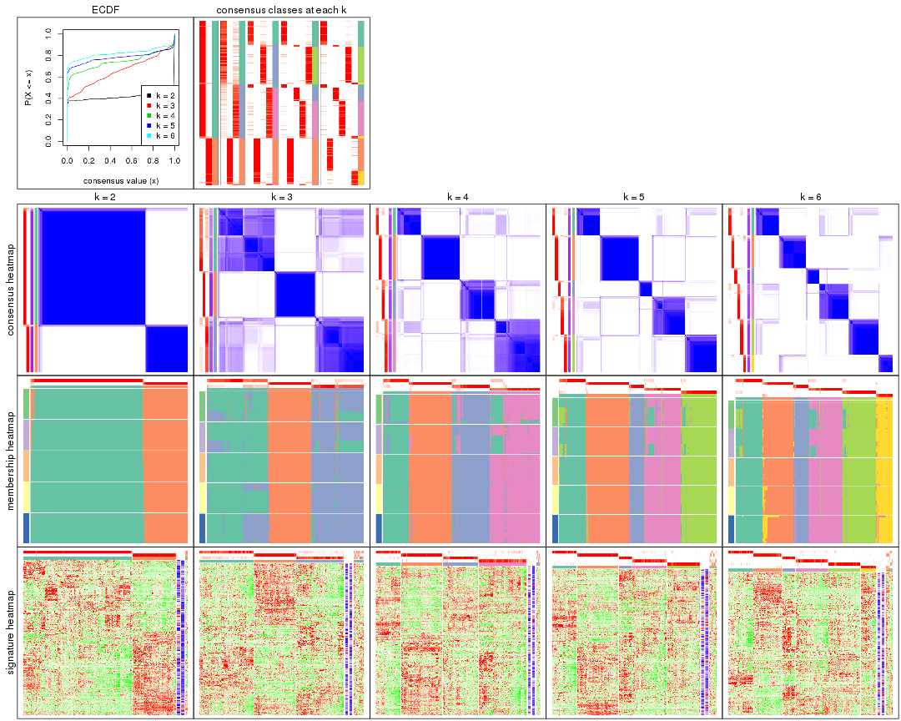

The plots are:

- The first row: a plot of the ECDF (Empirical cumulative distribution
  function) curves of the consensus matrix for each `k` and the heatmap of
  predicted classes for each `k`.
- The second row: heatmaps of the consensus matrix for each `k`.
- The third row: heatmaps of the membership matrix for each `k`.
- The fouth row: heatmaps of the signatures for each `k`.

All the plots in panels can be made by individual functions and they are
plotted later in this section.

`select_partition_number()` produces several plots showing different
statistics for choosing "optimized" `k`. There are following statistics:

- ECDF curves of the consensus matrix for each `k`;
- 1-PAC. [The PAC
  score](https://en.wikipedia.org/wiki/Consensus_clustering#Over-interpretation_potential_of_consensus_clustering)
  measures the proportion of the ambiguous subgrouping.
- Mean silhouette score.
- Concordance. The mean probability of fiting the consensus class ids in all
  partitions.
- Area increased. Denote $A_k$ as the area under the ECDF curve for current
  `k`, the area increased is defined as $A_k - A_{k-1}$.
- Rand index. The percent of pairs of samples that are both in a same cluster
  or both are not in a same cluster in the partition of k and k-1.
- Jaccard index. The ratio of pairs of samples are both in a same cluster in
  the partition of k and k-1 and the pairs of samples are both in a same
  cluster in the partition k or k-1.

The detailed explanations of these statistics can be found in [the cola
vignette](http://bioconductor.org/packages/devel/bioc/vignettes/cola/inst/doc/cola.html#toc_13).

Generally speaking, lower PAC score, higher mean silhouette score or higher
concordance corresponds to better partition. Rand index and Jaccard index
measure how similar the current partition is compared to partition with `k-1`.
If they are too similar, we won't accept `k` is better than `k-1`.

```r
select_partition_number(res)
```


The numeric values for all these statistics can be obtained by `get_stats()`.

```r
get_stats(res)
```

```
#>   k 1-PAC mean_silhouette concordance area_increased  Rand Jaccard
#> 2 2 1.000           0.974       0.990         0.4129 0.589   0.589
#> 3 3 0.635           0.789       0.881         0.5873 0.732   0.551
#> 4 4 0.826           0.848       0.921         0.1355 0.907   0.729
#> 5 5 0.894           0.885       0.948         0.0506 0.946   0.798
#> 6 6 0.894           0.874       0.943         0.0504 0.950   0.774
```

`suggest_best_k()` suggests the best $k$ based on these statistics. The rules are as follows:

- All $k$ with Jaccard index larger than 0.95 are removed because the increase of
  the partition number does not provides enough extra information. If all $k$ are removed,
  the best $k$ is assigned by `NA`.
- For $k$ with 1-PAC larger than 0.9, the maximal $k$ is taken as the "best k". Other $k$ is called "optional k".
- If it does not fit the second rule. The $k$ with the highest vote of highest
  1-PAC, mean silhouette and concordance is taken as the "best k".

```r
suggest_best_k(res)
```

```
#> [1] 2
```


Following shows the table of the partitions (You need to click the **show/hide
code output** link to see it). The membership matrix (columns with name `p*`)
is inferred by
[`clue::cl_consensus()`](https://www.rdocumentation.org/link/cl_consensus?package=clue)
function with the `SE` method. Basically the value in the membership matrix
represents the probability to belong to a certain group. The finall class
label for an item is determined with the group with highest probability it
belongs to.

In `get_classes()` function, the entropy is calculated from the membership
matrix and the silhouette score is calculated from the consensus matrix.


<script>
$( function() {
	$( '#tabs-SD-pam-get-classes' ).tabs();
} );
</script>
<div id='tabs-SD-pam-get-classes'>
<ul>
<li><a href='#tab-SD-pam-get-classes-1'>k = 2</a></li>
<li><a href='#tab-SD-pam-get-classes-2'>k = 3</a></li>
<li><a href='#tab-SD-pam-get-classes-3'>k = 4</a></li>
<li><a href='#tab-SD-pam-get-classes-4'>k = 5</a></li>
<li><a href='#tab-SD-pam-get-classes-5'>k = 6</a></li>
</ul>

<div id='tab-SD-pam-get-classes-1'>
<p><a id='tab-SD-pam-get-classes-1-a' style='color:#0366d6' href='#'>show/hide code output</a></p>
<pre><code class="r">cbind(get_classes(res, k = 2), get_membership(res, k = 2))
</code></pre>

<pre><code>#&gt;                                      class entropy silhouette    p1    p2
#&gt; D30CF518-5FC6-4A54-8D5D-BA420EA1836D     2  0.0000     0.9852 0.000 1.000
#&gt; 92298FF7-1215-4756-B976-A7D88B91AD76     1  0.0000     0.9909 1.000 0.000
#&gt; 0E244FE2-7C17-4642-A51F-2CCA796D9C70     2  0.0000     0.9852 0.000 1.000
#&gt; 75435ED8-93E8-45FB-8480-98D8EB2EF8CB     2  0.0000     0.9852 0.000 1.000
#&gt; B6D11678-15A9-4F43-A0A2-225067DCAF1C     1  0.0000     0.9909 1.000 0.000
#&gt; B7F5A41E-9559-4329-81F5-1B88A74730B7     2  0.0000     0.9852 0.000 1.000
#&gt; 39414B2A-7FB0-4669-8DFE-86D9AF7AD2D9     1  0.0000     0.9909 1.000 0.000
#&gt; 04823F53-A12D-4852-8F34-77B9DCBB7DF0     2  0.0000     0.9852 0.000 1.000
#&gt; 49684C2B-D31C-4B45-A400-3497C3CCEC01     2  0.0000     0.9852 0.000 1.000
#&gt; 96A04875-58E2-4BE7-8E0F-CAB55F4CA54F     1  0.0000     0.9909 1.000 0.000
#&gt; 1F101D63-478B-40B9-A951-DC3887CFF067     1  0.0000     0.9909 1.000 0.000
#&gt; DD290860-E0B7-48FC-BE12-2AF729994C21     2  0.0000     0.9852 0.000 1.000
#&gt; FFDD7A12-DDEF-4974-8D60-64B7EEAAC994     2  0.0000     0.9852 0.000 1.000
#&gt; E076A9A9-EA2A-4FF7-92A8-F2DA7F30279E     1  0.0000     0.9909 1.000 0.000
#&gt; 830DFA6F-A85A-4317-82B2-791FAB998A01     2  0.0000     0.9852 0.000 1.000
#&gt; 58578614-E4A3-4655-BBAB-F65851625E0A     1  0.0000     0.9909 1.000 0.000
#&gt; 1CBFB672-4D66-430B-83F3-7CE3BE20ABF6     1  0.0000     0.9909 1.000 0.000
#&gt; 6C34A7D7-3756-4DCC-9A9F-B5FC4A148B7E     1  0.0000     0.9909 1.000 0.000
#&gt; D97ED7B4-5DF2-4B62-8796-AA51CA79DBBB     1  0.0000     0.9909 1.000 0.000
#&gt; 45F15851-55F6-4169-834E-38958C38B6A9     1  0.0000     0.9909 1.000 0.000
#&gt; 4139E0C9-F712-4A25-8B59-587533B93B3E     1  0.7219     0.7473 0.800 0.200
#&gt; 2C3007BF-009E-404F-A3BF-8B921698D85B     1  0.0000     0.9909 1.000 0.000
#&gt; 2189F8E5-FF98-4C1A-BD04-5595DB553130     1  0.0000     0.9909 1.000 0.000
#&gt; FFAA0310-0D78-4499-8FB8-5BC46E4FCE58     1  0.0000     0.9909 1.000 0.000
#&gt; 0C375B2F-67BE-4708-BEB2-544DEC812DCA     2  0.0000     0.9852 0.000 1.000
#&gt; AB6324A1-19AB-400C-8001-54765D190E27     2  0.0000     0.9852 0.000 1.000
#&gt; A32C4DCD-DC4C-4132-9ED1-B159F5561A2D     1  0.0000     0.9909 1.000 0.000
#&gt; 2AE7105D-D494-45B0-947A-315D8C20ECDC     1  0.0000     0.9909 1.000 0.000
#&gt; 60FE9D59-FC0F-4B9C-ABF8-1C00BC761928     1  0.0000     0.9909 1.000 0.000
#&gt; 056442DC-E87A-4315-965C-C19D7B4FC40E     1  0.0000     0.9909 1.000 0.000
#&gt; 455111E5-18EF-4E3F-9DFF-8FA017D92461     1  0.0000     0.9909 1.000 0.000
#&gt; 10632BC6-0B81-433C-8832-6B2ABC73A94B     1  0.0000     0.9909 1.000 0.000
#&gt; AC6F82AD-C682-4EB3-BEC3-FD950F57609D     1  0.0000     0.9909 1.000 0.000
#&gt; D9ABDB75-04DA-4D33-A69F-701729494533     1  0.0376     0.9872 0.996 0.004
#&gt; 27BBF44D-F4D7-4C5A-935F-3310A363A670     2  0.0000     0.9852 0.000 1.000
#&gt; E7AA12EE-6E14-4B33-A52C-B13589436023     1  0.0376     0.9872 0.996 0.004
#&gt; DFA6D41A-D231-413E-A180-E42DF26C3E2B     1  0.8955     0.5460 0.688 0.312
#&gt; 655BD3AF-5094-4B19-93A8-401C70369B17     2  0.3879     0.9084 0.076 0.924
#&gt; 9DFEF253-923F-4EE2-8E3D-C75805387B20     1  0.6531     0.7948 0.832 0.168
#&gt; 3B0EE948-B2CD-4191-90E2-BDD155F3B580     1  0.0000     0.9909 1.000 0.000
#&gt; 177C7EF4-2D54-4555-947C-44EE7C688917     1  0.0000     0.9909 1.000 0.000
#&gt; 1F8E8BB7-D159-4556-8B04-E5DD027CC444     2  0.0000     0.9852 0.000 1.000
#&gt; 619F37D2-6771-4727-9079-56BED07F1CF6     1  0.1184     0.9757 0.984 0.016
#&gt; ACAE29BE-ECB8-4A98-BC71-7A2D4857134E     1  0.0000     0.9909 1.000 0.000
#&gt; C5C3241A-684C-4238-9333-9AF8630EC086     2  0.0376     0.9818 0.004 0.996
#&gt; AD319DC2-140F-4E7B-A899-010687D8B714     2  0.0000     0.9852 0.000 1.000
#&gt; 2AFF397C-ED2A-4FD9-A7F0-E4C61E9FB603     1  0.0000     0.9909 1.000 0.000
#&gt; FB4C7892-3DBB-4148-AAE9-75B19A1A4031     1  0.0000     0.9909 1.000 0.000
#&gt; 6F5C4500-1ED1-4E81-B4F5-EEA64CE2336A     1  0.0000     0.9909 1.000 0.000
#&gt; BD027C69-3C10-4047-8E1E-218600FF2B73     2  0.0000     0.9852 0.000 1.000
#&gt; 11B473A9-4CC5-461F-BC57-CC9141F3591D     1  0.0000     0.9909 1.000 0.000
#&gt; 69A036E5-3E6A-4862-A7F8-2D203ED2FC9E     1  0.0000     0.9909 1.000 0.000
#&gt; 9C0BDF24-F011-4855-B95A-1B6BEFA808F7     1  0.0000     0.9909 1.000 0.000
#&gt; 9E205254-8C0C-4C05-AF5A-86E679CF732C     1  0.0000     0.9909 1.000 0.000
#&gt; 935CCE4A-8AA8-454E-9DFF-7DE27D0BD2E2     1  0.0000     0.9909 1.000 0.000
#&gt; 01E5E1FE-41D3-428B-90BC-7A000829E102     1  0.0000     0.9909 1.000 0.000
#&gt; B344A530-92CD-468B-847A-DF8E25688081     1  0.0000     0.9909 1.000 0.000
#&gt; F79F32A7-9F7B-4D62-8426-4A4CF10ED319     1  0.0000     0.9909 1.000 0.000
#&gt; C2E1C6FA-82F9-467C-99AE-9B39FAAC810C     1  0.0000     0.9909 1.000 0.000
#&gt; BF7CD9BD-776A-4957-8A6E-EF8AD83EA9D3     2  0.0000     0.9852 0.000 1.000
#&gt; 8A2C1409-E83B-435E-A20F-5FCA94801C9F     2  0.0000     0.9852 0.000 1.000
#&gt; B6BEFFB5-2F62-477B-A4C8-478D29577CBD     2  0.0000     0.9852 0.000 1.000
#&gt; 8622CBD0-F8E9-4AC1-8175-CC9A742B86F9     1  0.0000     0.9909 1.000 0.000
#&gt; 565DD660-ED58-4065-8619-260BEA6FCFEB     1  0.0000     0.9909 1.000 0.000
#&gt; 96038E42-0FBA-497D-819C-38F7689F10FF     1  0.0000     0.9909 1.000 0.000
#&gt; CA685549-F8BA-43F1-8461-5D2D3B17CFC5     1  0.0000     0.9909 1.000 0.000
#&gt; 52020307-71A6-46E5-ACB3-8F885CA8F1EB     1  0.0000     0.9909 1.000 0.000
#&gt; 7656DA98-76DC-424B-B02C-D7001DAAA0E4     1  0.0000     0.9909 1.000 0.000
#&gt; 74DBA640-45E2-42A6-8F1E-69C073D66EE6     1  0.0000     0.9909 1.000 0.000
#&gt; 251094BE-C33D-44F0-BD98-8618D71F520C     1  0.0000     0.9909 1.000 0.000
#&gt; AB914CC5-5FF1-4257-A353-6A99D11B9478     1  0.0000     0.9909 1.000 0.000
#&gt; 38B8B893-0E08-4B71-B51C-B32A7B2724E0     1  0.0000     0.9909 1.000 0.000
#&gt; 7C7CD8FF-99A4-41D7-B7E1-5A517001F551     2  0.0000     0.9852 0.000 1.000
#&gt; BFC5B75A-E4AE-486B-BA30-23BBAA33A125     2  0.0000     0.9852 0.000 1.000
#&gt; 182AC78E-A07C-4B34-B216-B5F573E9F036     1  0.9775     0.2955 0.588 0.412
#&gt; B38C5F72-8F46-4531-9C2D-96EEE07A5B22     2  0.0000     0.9852 0.000 1.000
#&gt; DB9333A6-A723-4B8F-9221-25B8B23D5126     1  0.0000     0.9909 1.000 0.000
#&gt; CD67DD21-C1B6-4D58-AC8E-1F4536C7DA70     1  0.0000     0.9909 1.000 0.000
#&gt; 3D76A56E-4B66-48AE-AA60-D9C1004C7140     1  0.0000     0.9909 1.000 0.000
#&gt; 71ED572F-7780-47A4-A9F8-D320C737690D     1  0.0000     0.9909 1.000 0.000
#&gt; B449FEA1-C4B0-400F-903C-59E13D0BA313     2  0.0000     0.9852 0.000 1.000
#&gt; 3F120E90-1486-4215-B9B9-79D5B413CAAC     1  0.0000     0.9909 1.000 0.000
#&gt; A071894B-D8C0-4740-BD55-93EA0C86EDF7     1  0.0000     0.9909 1.000 0.000
#&gt; 58848D57-D7A9-4ABB-86A2-A8AE2B23F654     1  0.0000     0.9909 1.000 0.000
#&gt; CD6F9E20-B301-4663-87EC-953EDF49754F     1  0.0376     0.9872 0.996 0.004
#&gt; 367D89F3-D527-4929-B830-8B6D553DF9E1     1  0.0000     0.9909 1.000 0.000
#&gt; BE8D7DCB-648B-42DD-9FA8-8B85B5D816B2     1  0.0000     0.9909 1.000 0.000
#&gt; AA46F56B-BD9C-40A4-8EA8-35E2568C964D     2  0.0000     0.9852 0.000 1.000
#&gt; 6393220A-7C57-413F-81A8-4E38C21E779E     2  0.0000     0.9852 0.000 1.000
#&gt; 89AE566C-F65F-43C2-BA97-621A7AC8B6DC     1  0.0000     0.9909 1.000 0.000
#&gt; AA6A4BFF-8C62-4B70-B85A-9EDF403B06BA     1  0.0000     0.9909 1.000 0.000
#&gt; BCE877A6-9C65-4495-A45D-05753F2D0E15     1  0.0000     0.9909 1.000 0.000
#&gt; D7BDDF49-C54B-4F8E-ACA0-C3684AB68B5C     1  0.0000     0.9909 1.000 0.000
#&gt; D0800D49-0033-44B2-8D7B-29B16F87ADA6     2  0.0376     0.9818 0.004 0.996
#&gt; 151D60B5-5AF1-4B61-B97F-ABC7531D9F89     1  0.0000     0.9909 1.000 0.000
#&gt; CBBAEB5B-25FA-4B6D-A40C-357E37033E36     1  0.0000     0.9909 1.000 0.000
#&gt; 317CD049-3151-40B7-8E88-B0B8813338D6     1  0.0000     0.9909 1.000 0.000
#&gt; 93835C77-F8FA-4928-843C-8016A91881FA     1  0.0000     0.9909 1.000 0.000
#&gt; 02A6950F-647D-4F20-B2D0-0238C1441C70     1  0.0000     0.9909 1.000 0.000
#&gt; 4D54E415-134F-4F6F-8718-3E0475EF5477     1  0.0000     0.9909 1.000 0.000
#&gt; 82AB290A-3993-45E5-8B15-6125A019778C     1  0.0000     0.9909 1.000 0.000
#&gt; 3B5EAD14-E506-4A22-804D-BF925A2D5247     2  0.0000     0.9852 0.000 1.000
#&gt; 19CF7DDF-4F3A-4D2F-B84A-6451A5C3112C     1  0.0000     0.9909 1.000 0.000
#&gt; 2FB00DAA-C274-42B1-A06B-611FE5E96844     1  0.0000     0.9909 1.000 0.000
#&gt; 2B1F01C3-8145-4296-8111-2B0474AB9A2C     2  0.0000     0.9852 0.000 1.000
#&gt; 3F0865F1-8256-4778-966F-D53637B415B6     1  0.0000     0.9909 1.000 0.000
#&gt; 5473210D-37F9-4192-86D2-E2A2C77F3BD2     1  0.0000     0.9909 1.000 0.000
#&gt; 5EDB6ACF-4F3F-471A-9DDC-661607CACCC4     1  0.0000     0.9909 1.000 0.000
#&gt; 6A252A3A-7EEB-47B6-9C23-D69BD2EA846F     1  0.0000     0.9909 1.000 0.000
#&gt; 0A7FFCBB-4BAA-4A5F-8B2D-B427C4D982A8     1  0.0000     0.9909 1.000 0.000
#&gt; 1603AFB8-5AD7-4794-9991-BDBE96B4D997     2  0.0000     0.9852 0.000 1.000
#&gt; 644299E9-62B7-4DFE-9E6D-D7556A01B40A     1  0.0000     0.9909 1.000 0.000
#&gt; EF12E923-1860-4269-B57B-BA6238FA4403     1  0.0000     0.9909 1.000 0.000
#&gt; 51B7241E-F0BE-482A-88AE-89004BB68989     1  0.0000     0.9909 1.000 0.000
#&gt; 1C007DF3-8A9F-4940-9A4C-DE2A412BB023     1  0.0000     0.9909 1.000 0.000
#&gt; 89FCFDE6-9625-432C-AA35-9C5FCCF40031     1  0.0000     0.9909 1.000 0.000
#&gt; 7955FC55-386D-497E-AFED-019BBBAD428E     1  0.0000     0.9909 1.000 0.000
#&gt; 37FF09ED-73EC-4D10-B2AC-7D8EBA9304ED     1  0.0000     0.9909 1.000 0.000
#&gt; C2CD2742-2FB4-468E-90FF-8F65A5C425A9     1  0.0000     0.9909 1.000 0.000
#&gt; 766FE08F-3393-4868-B1C1-FA98C9FF16E0     1  0.0000     0.9909 1.000 0.000
#&gt; 63E2B578-2221-4255-8C45-7FD030B1C94D     1  0.0000     0.9909 1.000 0.000
#&gt; C14B1A44-43F7-45F0-A583-5667A4D3BD95     1  0.0000     0.9909 1.000 0.000
#&gt; D9CB551A-CE20-4BF7-8AC9-839112346C3D     1  0.0000     0.9909 1.000 0.000
#&gt; 05BAA71A-E5B3-4A3A-A3F2-013A975087F0     2  0.0000     0.9852 0.000 1.000
#&gt; AC8DA7DE-4D83-4768-BEFD-9A1B2DA943CE     1  0.0000     0.9909 1.000 0.000
#&gt; E89DCE9D-F8A5-499C-85BB-BB500BADB9FB     1  0.0000     0.9909 1.000 0.000
#&gt; C16F9B5E-2B52-40F6-856D-C0D6FBDD16C1     1  0.0000     0.9909 1.000 0.000
#&gt; 8FF234D4-823A-4C80-82F7-2E92D72DBF88     2  0.0000     0.9852 0.000 1.000
#&gt; C9F94A6E-D104-4D8D-8EC5-EADECD85F092     1  0.9427     0.4355 0.640 0.360
#&gt; 45C9756F-A154-4537-852E-ECBF27B92FE1     2  0.0000     0.9852 0.000 1.000
#&gt; 0F1A5708-341E-4713-BC70-76D702F826D6     1  0.7056     0.7595 0.808 0.192
#&gt; 2ECFBCA0-AB35-461A-A4B5-C60B2651A962     2  0.0000     0.9852 0.000 1.000
#&gt; 7DFAC404-3AB3-4274-A533-CFDAF4CE122D     1  0.0000     0.9909 1.000 0.000
#&gt; A90AF55C-4386-42AB-A812-9230026EA5A5     2  0.0000     0.9852 0.000 1.000
#&gt; 6258A757-4E18-4CD1-8417-189521E990B6     2  0.0000     0.9852 0.000 1.000
#&gt; EBFAD137-050F-47D0-A43D-72B8F7D70C2B     1  0.0000     0.9909 1.000 0.000
#&gt; 08B5EBFB-2807-4229-95A6-81AB7F377A56     2  0.0000     0.9852 0.000 1.000
#&gt; 4780A59C-0589-4995-B044-3201F09AF859     1  0.0000     0.9909 1.000 0.000
#&gt; 0AB81429-C287-48AA-9035-3A7A6F4C7328     2  0.0000     0.9852 0.000 1.000
#&gt; 20C4D047-28DA-4AB7-9B3C-32EDA6B22C9D     1  0.0000     0.9909 1.000 0.000
#&gt; 77C4E01F-84A6-4BFD-AA8E-D7875456F546     1  0.0000     0.9909 1.000 0.000
#&gt; 8B28383F-CF14-4CC5-A1E2-72AD915C0AE8     1  0.0000     0.9909 1.000 0.000
#&gt; E12E1F48-6A52-4F74-925C-C4EE1BF5C573     2  0.0000     0.9852 0.000 1.000
#&gt; 9B179BC5-BB4C-4CEE-99BC-BC552BC384A1     1  0.0000     0.9909 1.000 0.000
#&gt; 5548C91A-D3DE-48F5-B4A4-124BE177B99A     1  0.0000     0.9909 1.000 0.000
#&gt; 0E22B729-C381-4B0C-9897-62DD38F51722     1  0.0000     0.9909 1.000 0.000
#&gt; 7BC4937F-04E2-4B46-BA7C-FE9AC738C8A9     1  0.0000     0.9909 1.000 0.000
#&gt; EE6A0D3F-3F8A-4AA8-B3EF-32372EF37A29     1  0.0000     0.9909 1.000 0.000
#&gt; 08AC2706-7651-409F-BE6B-BCED1C2D1796     1  0.0000     0.9909 1.000 0.000
#&gt; A68B078D-8979-4070-BB4D-F526704ED3DC     1  0.0376     0.9872 0.996 0.004
#&gt; C319A5EE-69FA-4AAB-85A9-2EAAD8E4C703     1  0.0000     0.9909 1.000 0.000
#&gt; 0D7CAABD-D20C-4F82-BCBC-8B7276E8EDE2     1  0.0000     0.9909 1.000 0.000
#&gt; 09444DCC-44BA-4A3F-ACC5-863A54578B9F     1  0.0000     0.9909 1.000 0.000
#&gt; 2E32B047-C6E1-4743-A6C8-E98370A32145     1  0.0000     0.9909 1.000 0.000
#&gt; 6A6878A7-76B2-40DE-958B-804442AC6A5D     1  0.0000     0.9909 1.000 0.000
#&gt; 39F27293-0BFF-4EA2-8439-A299E3226D20     1  0.0000     0.9909 1.000 0.000
#&gt; 7EAE9C30-6080-405F-A7E6-1FED57674279     1  0.0000     0.9909 1.000 0.000
#&gt; 79499169-A093-4E0A-B6BD-010CD7BE5035     1  0.0000     0.9909 1.000 0.000
#&gt; 1F8BF4E8-BD84-4EFE-9E3E-89E7CE8FA72D     1  0.0000     0.9909 1.000 0.000
#&gt; 62B7988F-98E5-4AB8-8A16-D661A07455E8     1  0.0000     0.9909 1.000 0.000
#&gt; B7005B5F-217E-4073-BFB5-CE7E884B80C0     2  0.0000     0.9852 0.000 1.000
#&gt; B981568F-2C08-4696-B589-E157A49BE72B     2  0.0000     0.9852 0.000 1.000
#&gt; A3D85C0A-3202-40C2-88E1-052AC6C5184B     1  0.0000     0.9909 1.000 0.000
#&gt; 4CA783B9-9B99-46B8-962A-77194ECB7942     1  0.0000     0.9909 1.000 0.000
#&gt; D4024B08-4879-47EA-99E5-D9FCE1CD40DF     1  0.0000     0.9909 1.000 0.000
#&gt; 1D41CDA2-0B29-48FD-B83A-E60C174DBCB3     1  0.0000     0.9909 1.000 0.000
#&gt; A1923B2A-B233-4760-8AF9-C04C1CAEB100     1  0.0000     0.9909 1.000 0.000
#&gt; 80880D71-BFDE-4D88-892F-5ADF27A38940     1  0.0000     0.9909 1.000 0.000
#&gt; 55D1629D-30FD-49AA-88CE-EA3CA9B30A3F     2  0.0000     0.9852 0.000 1.000
#&gt; B71C409E-926D-48AD-8BD8-9F707CA4FB01     2  0.0000     0.9852 0.000 1.000
#&gt; 54A92C57-BD19-4A47-BA76-3ACA2DC36212     1  0.0000     0.9909 1.000 0.000
#&gt; B2AB74B8-506C-4C27-9105-E86A6AAA89D4     1  0.0000     0.9909 1.000 0.000
#&gt; 0356AE49-7A5C-42CC-A39C-7C8DFBFF8842     2  0.0000     0.9852 0.000 1.000
#&gt; ACA260A3-DC3F-4FF4-B9C5-2D4BC4F81783     1  0.0000     0.9909 1.000 0.000
#&gt; 9B440917-E5A4-43B9-A48D-6ABFEDCA6CFD     1  0.0000     0.9909 1.000 0.000
#&gt; 47464828-52EA-413B-B30C-BD8B55903D78     2  0.0000     0.9852 0.000 1.000
#&gt; C1D1FC82-B50D-4C82-8F03-06CEE3C08D18     1  0.0000     0.9909 1.000 0.000
#&gt; E5ABFC43-E2A3-4B1A-BBA3-8196C0B026A5     2  0.0376     0.9818 0.004 0.996
#&gt; 1D3C16CC-D0D5-4637-AAC7-91672DFF3317     1  0.0000     0.9909 1.000 0.000
#&gt; 4D038320-ADEA-4990-8371-68B4B8162E1A     2  0.0000     0.9852 0.000 1.000
#&gt; A75594CC-3E49-4869-8656-BBB4E72BF59D     2  0.0000     0.9852 0.000 1.000
#&gt; 7CABAA19-5FB2-4A58-BDA3-4F1FFB532C20     1  0.0000     0.9909 1.000 0.000
#&gt; 534EF1E9-9513-426E-B41E-A394AB2E4410     2  0.0000     0.9852 0.000 1.000
#&gt; 649F35A1-A08C-497D-A9B6-CB3084D5FB8D     1  0.0000     0.9909 1.000 0.000
#&gt; 7CA30F3C-1C98-480C-B8B5-A248AABFB468     1  0.0000     0.9909 1.000 0.000
#&gt; A9F8DA21-A802-44CF-9F5D-96A36687DCDD     1  0.0000     0.9909 1.000 0.000
#&gt; A7AE1ED1-86CB-4A50-97B2-66785C7191FE     1  0.0000     0.9909 1.000 0.000
#&gt; D0091AD4-D3D7-4C03-ACD9-DA9F8B6076C6     1  0.0000     0.9909 1.000 0.000
#&gt; 46EE1C2B-13F7-44A7-B27E-4EBB9DF0CA83     2  0.0000     0.9852 0.000 1.000
#&gt; CB9301B8-0282-43D6-AF5E-B753A9C7BFCB     2  0.0000     0.9852 0.000 1.000
#&gt; A0E77A39-885A-4472-9A10-2D1E51DBFDA4     1  0.0000     0.9909 1.000 0.000
#&gt; C06603C2-163D-40B6-A9FE-882424F18FE9     1  0.0000     0.9909 1.000 0.000
#&gt; C3921A29-80FF-4B9D-B366-5C0238A42231     1  0.0000     0.9909 1.000 0.000
#&gt; BB99B4E7-C834-4BB8-973F-8FA039E2798F     1  0.0000     0.9909 1.000 0.000
#&gt; 5CD78C2F-05E9-409A-8405-3EE936A6876E     1  0.0000     0.9909 1.000 0.000
#&gt; 6C126CC7-0C03-48F0-A2C2-F090CA239B70     2  0.0000     0.9852 0.000 1.000
#&gt; 7118B08A-E94C-49F4-8D76-26455C34D85F     2  0.0000     0.9852 0.000 1.000
#&gt; 266DAF30-CF3E-493E-8B24-3931D0039450     1  0.0000     0.9909 1.000 0.000
#&gt; DAB5F5B9-4FE5-468F-AD2B-B39BBC4317A0     1  0.0000     0.9909 1.000 0.000
#&gt; 9A9EB6D6-312E-4A98-8762-30D3ABD8193D     1  0.0000     0.9909 1.000 0.000
#&gt; CED15676-B901-4FC8-9C8D-51E529D9441D     1  0.0000     0.9909 1.000 0.000
#&gt; 827232CC-8035-440C-8B12-02C789C70B1B     1  0.0000     0.9909 1.000 0.000
#&gt; 04D5FB28-FB50-4EAE-95FB-72ABF0E618CA     2  0.0000     0.9852 0.000 1.000
#&gt; 6C96A851-97FC-4845-B895-D255191D9F25     1  0.0000     0.9909 1.000 0.000
#&gt; 3EC982CB-D013-443E-B21D-39DE6B8EF370     1  0.0000     0.9909 1.000 0.000
#&gt; 2E24A786-4370-42A1-AD50-D651F89819CC     2  0.0000     0.9852 0.000 1.000
#&gt; 7653BFA9-ADA5-44CA-8555-807FBBFC6DE2     1  0.0000     0.9909 1.000 0.000
#&gt; 7A110994-5741-4013-91F0-DD2E1D343F91     2  0.0000     0.9852 0.000 1.000
#&gt; 0A760E0C-11C5-4201-8452-18DBC1FEACEB     1  0.0000     0.9909 1.000 0.000
#&gt; 909B76A1-BB9F-4906-95BC-58CD1A46D3B8     2  0.0000     0.9852 0.000 1.000
#&gt; A782EE71-EDA4-4385-83B3-D16DE81296C0     1  0.0000     0.9909 1.000 0.000
#&gt; BD50E276-914F-4924-8CEA-FF47A66DB175     2  0.0000     0.9852 0.000 1.000
#&gt; 505D5CA8-0279-4BC7-8CC0-8C7A0165BF91     2  0.0000     0.9852 0.000 1.000
#&gt; D51FC997-E662-4AE7-BC9C-14183DA42DE1     2  0.0000     0.9852 0.000 1.000
#&gt; 8AD67970-84F1-4C0A-B47A-8FA4108F9FE3     1  0.0000     0.9909 1.000 0.000
#&gt; 6E33B1B6-7089-4BC3-B2B0-EC2C3B5D8B74     1  0.0000     0.9909 1.000 0.000
#&gt; 88C4EA46-2546-401C-A8E7-603EECFDFBA0     1  0.0000     0.9909 1.000 0.000
#&gt; 375D2D72-C998-4627-BA35-24E82A9A55FF     1  0.0000     0.9909 1.000 0.000
#&gt; 76D0F834-7064-46C6-96F4-E861CF5452B6     2  0.0000     0.9852 0.000 1.000
#&gt; 87159081-C97A-4004-AF0A-7EB6EF0EC47A     1  0.0000     0.9909 1.000 0.000
#&gt; 24A57006-800B-4174-AF4E-7EA57A8A756E     1  0.0000     0.9909 1.000 0.000
#&gt; AD68CBC6-8A13-4A65-AF62-E99AFA81D031     1  0.0000     0.9909 1.000 0.000
#&gt; 22863A57-F066-4DD1-A859-4336F43D144C     1  0.0000     0.9909 1.000 0.000
#&gt; 8F6F0362-9165-4DCC-992C-AF871A3C51E7     1  0.0000     0.9909 1.000 0.000
#&gt; 76ABF0B7-E707-4DB2-9486-3814439BDBA5     1  0.0000     0.9909 1.000 0.000
#&gt; BC72372F-3577-40E5-BA0F-41A084AA93AD     1  0.0672     0.9834 0.992 0.008
#&gt; 8E566039-B56C-4F41-B9EF-DE18BEEF2C95     1  0.0000     0.9909 1.000 0.000
#&gt; F096F016-3EF5-4A67-A7C2-8A45E1585232     1  0.0000     0.9909 1.000 0.000
#&gt; BB37913E-534B-43DD-BE3D-E13B29FD8172     2  0.0000     0.9852 0.000 1.000
#&gt; E344638F-9060-460F-8F7A-60D19442F294     1  0.0000     0.9909 1.000 0.000
#&gt; 6A0EAAD0-89D5-4F12-8B45-9D5A25182FAD     2  0.9460     0.4254 0.364 0.636
#&gt; A5199E3A-9D67-4543-88AB-24398C98E38E     1  0.0000     0.9909 1.000 0.000
#&gt; 23917D52-7864-4F84-9C77-DF8EA9407345     2  0.0000     0.9852 0.000 1.000
#&gt; 9AA96080-19D8-40C3-BDD1-6044D2D422D5     1  0.0000     0.9909 1.000 0.000
#&gt; 0ED65D91-260C-4662-9903-EE36A2E3B2D0     2  0.0000     0.9852 0.000 1.000
#&gt; 64BF1BC5-7A9A-4E1D-AEAB-AFE30B92AAF4     1  0.0000     0.9909 1.000 0.000
#&gt; F02301F1-9054-4DC6-8DC9-2451A0F53EFC     2  0.0376     0.9818 0.004 0.996
#&gt; 3264649A-5684-4181-83D0-A7E4D7E2E1FD     1  0.0000     0.9909 1.000 0.000
#&gt; 3F8DA39C-BC9B-4343-8838-5CE271E80C51     2  0.9993     0.0551 0.484 0.516
#&gt; BCC681CB-2AF4-4BB6-B53A-7544A2399454     1  0.0000     0.9909 1.000 0.000
#&gt; DCB50E17-5E2D-443B-8DCC-272FBB734C2E     1  0.0000     0.9909 1.000 0.000
#&gt; B5E47C38-CB6A-44C0-AA9B-56951B9EF78D     1  0.0000     0.9909 1.000 0.000
#&gt; B15B0185-9C28-4A00-9CEC-05EFECEA6709     1  0.0000     0.9909 1.000 0.000
#&gt; 61D4E8E7-0110-480A-A4A7-D406DE74C31E     1  0.0000     0.9909 1.000 0.000
#&gt; CA8DB3AD-3F6B-4622-BF73-47041EC96E42     1  0.0000     0.9909 1.000 0.000
#&gt; 5EECB1C4-172C-4494-871A-ADB650CD82BD     2  0.0000     0.9852 0.000 1.000
#&gt; 019B857C-D4F7-4B67-B699-56E52A60805B     2  0.0000     0.9852 0.000 1.000
#&gt; E9C28902-05C9-4883-97A4-D612D54E46B4     1  0.0000     0.9909 1.000 0.000
#&gt; C5D3D9A0-FC14-408D-AB6C-662018A5E5CA     1  0.0000     0.9909 1.000 0.000
#&gt; 7EB24744-509B-4854-B7D0-0BAFA210A345     2  0.0000     0.9852 0.000 1.000
#&gt; B8B7A721-2284-40AB-98F5-EF1351C30B66     2  0.0000     0.9852 0.000 1.000
#&gt; 3C12F39D-0D21-4F69-A539-4120B73C7A79     2  0.0000     0.9852 0.000 1.000
#&gt; 08D3F984-6850-45B2-9DF9-EC7F5A4060A4     1  0.0000     0.9909 1.000 0.000
#&gt; 9BD0EE79-1EED-4F6D-A5AB-43ADB8526F1E     1  0.0000     0.9909 1.000 0.000
#&gt; E489A871-3CF4-4F3D-8EAF-63B507054201     2  0.0000     0.9852 0.000 1.000
#&gt; 8CF8FD2E-1DBA-4257-9715-04D956D46B71     2  0.0000     0.9852 0.000 1.000
#&gt; F6193AF0-7A19-46CB-A818-1B01E7460791     1  0.0000     0.9909 1.000 0.000
#&gt; 96392D6B-D4FF-4393-93BA-08E469E8BBE1     1  0.0000     0.9909 1.000 0.000
#&gt; DABCBE5A-C591-46A2-AF66-DA3DB6106751     1  0.0000     0.9909 1.000 0.000
#&gt; 8B75F7D4-98D8-44DE-B19D-B733D6A031DB     1  0.0000     0.9909 1.000 0.000
#&gt; AAD9685A-564B-42E9-91E3-431951154BA7     2  0.6048     0.8198 0.148 0.852
#&gt; 90A43152-4E3B-4365-A39F-7B0E5CA66E55     1  0.0000     0.9909 1.000 0.000
#&gt; EFB76FCF-AC9C-4852-B91C-E055DA666FA0     1  0.0000     0.9909 1.000 0.000
#&gt; 6EBCFFE3-706F-440A-ABA9-012A924A07C6     2  0.0000     0.9852 0.000 1.000
#&gt; E922A244-F1C8-4310-ABB2-62B06E022E4C     1  0.0000     0.9909 1.000 0.000
</code></pre>

<script>
$('#tab-SD-pam-get-classes-1-a').parent().next().next().hide();
$('#tab-SD-pam-get-classes-1-a').click(function(){
  $('#tab-SD-pam-get-classes-1-a').parent().next().next().toggle();
  return(false);
});
</script>
</div>

<div id='tab-SD-pam-get-classes-2'>
<p><a id='tab-SD-pam-get-classes-2-a' style='color:#0366d6' href='#'>show/hide code output</a></p>
<pre><code class="r">cbind(get_classes(res, k = 3), get_membership(res, k = 3))
</code></pre>

<pre><code>#&gt;                                      class entropy silhouette    p1    p2    p3
#&gt; D30CF518-5FC6-4A54-8D5D-BA420EA1836D     2  0.0000     0.9853 0.000 1.000 0.000
#&gt; 92298FF7-1215-4756-B976-A7D88B91AD76     1  0.5327     0.6510 0.728 0.000 0.272
#&gt; 0E244FE2-7C17-4642-A51F-2CCA796D9C70     2  0.0000     0.9853 0.000 1.000 0.000
#&gt; 75435ED8-93E8-45FB-8480-98D8EB2EF8CB     2  0.0000     0.9853 0.000 1.000 0.000
#&gt; B6D11678-15A9-4F43-A0A2-225067DCAF1C     3  0.1411     0.8416 0.036 0.000 0.964
#&gt; B7F5A41E-9559-4329-81F5-1B88A74730B7     2  0.0000     0.9853 0.000 1.000 0.000
#&gt; 39414B2A-7FB0-4669-8DFE-86D9AF7AD2D9     3  0.2448     0.8516 0.076 0.000 0.924
#&gt; 04823F53-A12D-4852-8F34-77B9DCBB7DF0     2  0.0000     0.9853 0.000 1.000 0.000
#&gt; 49684C2B-D31C-4B45-A400-3497C3CCEC01     2  0.0000     0.9853 0.000 1.000 0.000
#&gt; 96A04875-58E2-4BE7-8E0F-CAB55F4CA54F     1  0.0000     0.7676 1.000 0.000 0.000
#&gt; 1F101D63-478B-40B9-A951-DC3887CFF067     1  0.0237     0.7672 0.996 0.000 0.004
#&gt; DD290860-E0B7-48FC-BE12-2AF729994C21     2  0.0000     0.9853 0.000 1.000 0.000
#&gt; FFDD7A12-DDEF-4974-8D60-64B7EEAAC994     2  0.0000     0.9853 0.000 1.000 0.000
#&gt; E076A9A9-EA2A-4FF7-92A8-F2DA7F30279E     3  0.3752     0.8549 0.144 0.000 0.856
#&gt; 830DFA6F-A85A-4317-82B2-791FAB998A01     2  0.0237     0.9814 0.000 0.996 0.004
#&gt; 58578614-E4A3-4655-BBAB-F65851625E0A     3  0.0000     0.8273 0.000 0.000 1.000
#&gt; 1CBFB672-4D66-430B-83F3-7CE3BE20ABF6     1  0.5216     0.6449 0.740 0.000 0.260
#&gt; 6C34A7D7-3756-4DCC-9A9F-B5FC4A148B7E     1  0.5650     0.5697 0.688 0.000 0.312
#&gt; D97ED7B4-5DF2-4B62-8796-AA51CA79DBBB     1  0.3116     0.7413 0.892 0.000 0.108
#&gt; 45F15851-55F6-4169-834E-38958C38B6A9     1  0.1643     0.7640 0.956 0.000 0.044
#&gt; 4139E0C9-F712-4A25-8B59-587533B93B3E     3  0.8016     0.6255 0.156 0.188 0.656
#&gt; 2C3007BF-009E-404F-A3BF-8B921698D85B     1  0.3816     0.7333 0.852 0.000 0.148
#&gt; 2189F8E5-FF98-4C1A-BD04-5595DB553130     1  0.5254     0.6429 0.736 0.000 0.264
#&gt; FFAA0310-0D78-4499-8FB8-5BC46E4FCE58     3  0.3686     0.8561 0.140 0.000 0.860
#&gt; 0C375B2F-67BE-4708-BEB2-544DEC812DCA     2  0.0000     0.9853 0.000 1.000 0.000
#&gt; AB6324A1-19AB-400C-8001-54765D190E27     2  0.0000     0.9853 0.000 1.000 0.000
#&gt; A32C4DCD-DC4C-4132-9ED1-B159F5561A2D     1  0.2356     0.7582 0.928 0.000 0.072
#&gt; 2AE7105D-D494-45B0-947A-315D8C20ECDC     3  0.0000     0.8273 0.000 0.000 1.000
#&gt; 60FE9D59-FC0F-4B9C-ABF8-1C00BC761928     1  0.3686     0.7359 0.860 0.000 0.140
#&gt; 056442DC-E87A-4315-965C-C19D7B4FC40E     1  0.3686     0.7359 0.860 0.000 0.140
#&gt; 455111E5-18EF-4E3F-9DFF-8FA017D92461     3  0.3686     0.8561 0.140 0.000 0.860
#&gt; 10632BC6-0B81-433C-8832-6B2ABC73A94B     1  0.0000     0.7676 1.000 0.000 0.000
#&gt; AC6F82AD-C682-4EB3-BEC3-FD950F57609D     1  0.3816     0.7333 0.852 0.000 0.148
#&gt; D9ABDB75-04DA-4D33-A69F-701729494533     1  0.3686     0.7359 0.860 0.000 0.140
#&gt; 27BBF44D-F4D7-4C5A-935F-3310A363A670     2  0.0000     0.9853 0.000 1.000 0.000
#&gt; E7AA12EE-6E14-4B33-A52C-B13589436023     1  0.3879     0.7328 0.848 0.000 0.152
#&gt; DFA6D41A-D231-413E-A180-E42DF26C3E2B     3  0.1832     0.8315 0.036 0.008 0.956
#&gt; 655BD3AF-5094-4B19-93A8-401C70369B17     2  0.0000     0.9853 0.000 1.000 0.000
#&gt; 9DFEF253-923F-4EE2-8E3D-C75805387B20     1  0.3573     0.7113 0.876 0.120 0.004
#&gt; 3B0EE948-B2CD-4191-90E2-BDD155F3B580     3  0.5882     0.5281 0.348 0.000 0.652
#&gt; 177C7EF4-2D54-4555-947C-44EE7C688917     3  0.3816     0.8522 0.148 0.000 0.852
#&gt; 1F8E8BB7-D159-4556-8B04-E5DD027CC444     2  0.0000     0.9853 0.000 1.000 0.000
#&gt; 619F37D2-6771-4727-9079-56BED07F1CF6     1  0.7211     0.6572 0.716 0.128 0.156
#&gt; ACAE29BE-ECB8-4A98-BC71-7A2D4857134E     3  0.5098     0.7518 0.248 0.000 0.752
#&gt; C5C3241A-684C-4238-9333-9AF8630EC086     2  0.0592     0.9732 0.000 0.988 0.012
#&gt; AD319DC2-140F-4E7B-A899-010687D8B714     2  0.0000     0.9853 0.000 1.000 0.000
#&gt; 2AFF397C-ED2A-4FD9-A7F0-E4C61E9FB603     3  0.3686     0.8561 0.140 0.000 0.860
#&gt; FB4C7892-3DBB-4148-AAE9-75B19A1A4031     1  0.4654     0.6891 0.792 0.000 0.208
#&gt; 6F5C4500-1ED1-4E81-B4F5-EEA64CE2336A     3  0.0424     0.8245 0.008 0.000 0.992
#&gt; BD027C69-3C10-4047-8E1E-218600FF2B73     2  0.0000     0.9853 0.000 1.000 0.000
#&gt; 11B473A9-4CC5-461F-BC57-CC9141F3591D     3  0.3619     0.8569 0.136 0.000 0.864
#&gt; 69A036E5-3E6A-4862-A7F8-2D203ED2FC9E     3  0.0000     0.8273 0.000 0.000 1.000
#&gt; 9C0BDF24-F011-4855-B95A-1B6BEFA808F7     1  0.5138     0.6526 0.748 0.000 0.252
#&gt; 9E205254-8C0C-4C05-AF5A-86E679CF732C     1  0.5178     0.6489 0.744 0.000 0.256
#&gt; 935CCE4A-8AA8-454E-9DFF-7DE27D0BD2E2     3  0.0000     0.8273 0.000 0.000 1.000
#&gt; 01E5E1FE-41D3-428B-90BC-7A000829E102     1  0.0000     0.7676 1.000 0.000 0.000
#&gt; B344A530-92CD-468B-847A-DF8E25688081     3  0.5291     0.7079 0.268 0.000 0.732
#&gt; F79F32A7-9F7B-4D62-8426-4A4CF10ED319     1  0.3686     0.7359 0.860 0.000 0.140
#&gt; C2E1C6FA-82F9-467C-99AE-9B39FAAC810C     1  0.2448     0.7576 0.924 0.000 0.076
#&gt; BF7CD9BD-776A-4957-8A6E-EF8AD83EA9D3     2  0.0000     0.9853 0.000 1.000 0.000
#&gt; 8A2C1409-E83B-435E-A20F-5FCA94801C9F     2  0.0000     0.9853 0.000 1.000 0.000
#&gt; B6BEFFB5-2F62-477B-A4C8-478D29577CBD     2  0.0000     0.9853 0.000 1.000 0.000
#&gt; 8622CBD0-F8E9-4AC1-8175-CC9A742B86F9     1  0.0000     0.7676 1.000 0.000 0.000
#&gt; 565DD660-ED58-4065-8619-260BEA6FCFEB     1  0.0000     0.7676 1.000 0.000 0.000
#&gt; 96038E42-0FBA-497D-819C-38F7689F10FF     1  0.0000     0.7676 1.000 0.000 0.000
#&gt; CA685549-F8BA-43F1-8461-5D2D3B17CFC5     3  0.3686     0.8561 0.140 0.000 0.860
#&gt; 52020307-71A6-46E5-ACB3-8F885CA8F1EB     1  0.4062     0.7307 0.836 0.000 0.164
#&gt; 7656DA98-76DC-424B-B02C-D7001DAAA0E4     1  0.5706     0.5573 0.680 0.000 0.320
#&gt; 74DBA640-45E2-42A6-8F1E-69C073D66EE6     1  0.6045     0.6445 0.620 0.000 0.380
#&gt; 251094BE-C33D-44F0-BD98-8618D71F520C     1  0.2537     0.7627 0.920 0.000 0.080
#&gt; AB914CC5-5FF1-4257-A353-6A99D11B9478     1  0.0000     0.7676 1.000 0.000 0.000
#&gt; 38B8B893-0E08-4B71-B51C-B32A7B2724E0     1  0.5254     0.6404 0.736 0.000 0.264
#&gt; 7C7CD8FF-99A4-41D7-B7E1-5A517001F551     2  0.0000     0.9853 0.000 1.000 0.000
#&gt; BFC5B75A-E4AE-486B-BA30-23BBAA33A125     2  0.0000     0.9853 0.000 1.000 0.000
#&gt; 182AC78E-A07C-4B34-B216-B5F573E9F036     3  0.9091     0.3082 0.152 0.344 0.504
#&gt; B38C5F72-8F46-4531-9C2D-96EEE07A5B22     2  0.0000     0.9853 0.000 1.000 0.000
#&gt; DB9333A6-A723-4B8F-9221-25B8B23D5126     3  0.4062     0.8453 0.164 0.000 0.836
#&gt; CD67DD21-C1B6-4D58-AC8E-1F4536C7DA70     3  0.3816     0.8522 0.148 0.000 0.852
#&gt; 3D76A56E-4B66-48AE-AA60-D9C1004C7140     3  0.6079     0.2171 0.388 0.000 0.612
#&gt; 71ED572F-7780-47A4-A9F8-D320C737690D     1  0.0000     0.7676 1.000 0.000 0.000
#&gt; B449FEA1-C4B0-400F-903C-59E13D0BA313     2  0.0000     0.9853 0.000 1.000 0.000
#&gt; 3F120E90-1486-4215-B9B9-79D5B413CAAC     3  0.3686     0.8561 0.140 0.000 0.860
#&gt; A071894B-D8C0-4740-BD55-93EA0C86EDF7     3  0.0000     0.8273 0.000 0.000 1.000
#&gt; 58848D57-D7A9-4ABB-86A2-A8AE2B23F654     3  0.5650     0.3844 0.312 0.000 0.688
#&gt; CD6F9E20-B301-4663-87EC-953EDF49754F     1  0.6062     0.4272 0.616 0.000 0.384
#&gt; 367D89F3-D527-4929-B830-8B6D553DF9E1     3  0.0000     0.8273 0.000 0.000 1.000
#&gt; BE8D7DCB-648B-42DD-9FA8-8B85B5D816B2     1  0.3686     0.7359 0.860 0.000 0.140
#&gt; AA46F56B-BD9C-40A4-8EA8-35E2568C964D     2  0.0000     0.9853 0.000 1.000 0.000
#&gt; 6393220A-7C57-413F-81A8-4E38C21E779E     2  0.0000     0.9853 0.000 1.000 0.000
#&gt; 89AE566C-F65F-43C2-BA97-621A7AC8B6DC     3  0.0424     0.8245 0.008 0.000 0.992
#&gt; AA6A4BFF-8C62-4B70-B85A-9EDF403B06BA     1  0.3816     0.7333 0.852 0.000 0.148
#&gt; BCE877A6-9C65-4495-A45D-05753F2D0E15     1  0.0000     0.7676 1.000 0.000 0.000
#&gt; D7BDDF49-C54B-4F8E-ACA0-C3684AB68B5C     1  0.5254     0.6419 0.736 0.000 0.264
#&gt; D0800D49-0033-44B2-8D7B-29B16F87ADA6     2  0.4121     0.7628 0.000 0.832 0.168
#&gt; 151D60B5-5AF1-4B61-B97F-ABC7531D9F89     3  0.3686     0.8561 0.140 0.000 0.860
#&gt; CBBAEB5B-25FA-4B6D-A40C-357E37033E36     3  0.2448     0.8516 0.076 0.000 0.924
#&gt; 317CD049-3151-40B7-8E88-B0B8813338D6     1  0.5926     0.6639 0.644 0.000 0.356
#&gt; 93835C77-F8FA-4928-843C-8016A91881FA     1  0.6180     0.3789 0.584 0.000 0.416
#&gt; 02A6950F-647D-4F20-B2D0-0238C1441C70     1  0.0000     0.7676 1.000 0.000 0.000
#&gt; 4D54E415-134F-4F6F-8718-3E0475EF5477     1  0.3686     0.7359 0.860 0.000 0.140
#&gt; 82AB290A-3993-45E5-8B15-6125A019778C     1  0.0000     0.7676 1.000 0.000 0.000
#&gt; 3B5EAD14-E506-4A22-804D-BF925A2D5247     2  0.0000     0.9853 0.000 1.000 0.000
#&gt; 19CF7DDF-4F3A-4D2F-B84A-6451A5C3112C     3  0.3686     0.8561 0.140 0.000 0.860
#&gt; 2FB00DAA-C274-42B1-A06B-611FE5E96844     3  0.0000     0.8273 0.000 0.000 1.000
#&gt; 2B1F01C3-8145-4296-8111-2B0474AB9A2C     2  0.0000     0.9853 0.000 1.000 0.000
#&gt; 3F0865F1-8256-4778-966F-D53637B415B6     3  0.3752     0.8542 0.144 0.000 0.856
#&gt; 5473210D-37F9-4192-86D2-E2A2C77F3BD2     3  0.5835     0.5551 0.340 0.000 0.660
#&gt; 5EDB6ACF-4F3F-471A-9DDC-661607CACCC4     1  0.6062     0.6410 0.616 0.000 0.384
#&gt; 6A252A3A-7EEB-47B6-9C23-D69BD2EA846F     3  0.3941     0.8481 0.156 0.000 0.844
#&gt; 0A7FFCBB-4BAA-4A5F-8B2D-B427C4D982A8     1  0.3816     0.7333 0.852 0.000 0.148
#&gt; 1603AFB8-5AD7-4794-9991-BDBE96B4D997     2  0.0000     0.9853 0.000 1.000 0.000
#&gt; 644299E9-62B7-4DFE-9E6D-D7556A01B40A     1  0.3879     0.7344 0.848 0.000 0.152
#&gt; EF12E923-1860-4269-B57B-BA6238FA4403     3  0.3686     0.8561 0.140 0.000 0.860
#&gt; 51B7241E-F0BE-482A-88AE-89004BB68989     3  0.0000     0.8273 0.000 0.000 1.000
#&gt; 1C007DF3-8A9F-4940-9A4C-DE2A412BB023     3  0.3816     0.8528 0.148 0.000 0.852
#&gt; 89FCFDE6-9625-432C-AA35-9C5FCCF40031     1  0.5465     0.6074 0.712 0.000 0.288
#&gt; 7955FC55-386D-497E-AFED-019BBBAD428E     3  0.3686     0.8561 0.140 0.000 0.860
#&gt; 37FF09ED-73EC-4D10-B2AC-7D8EBA9304ED     3  0.3816     0.8522 0.148 0.000 0.852
#&gt; C2CD2742-2FB4-468E-90FF-8F65A5C425A9     1  0.4842     0.6779 0.776 0.000 0.224
#&gt; 766FE08F-3393-4868-B1C1-FA98C9FF16E0     3  0.4555     0.8062 0.200 0.000 0.800
#&gt; 63E2B578-2221-4255-8C45-7FD030B1C94D     1  0.0000     0.7676 1.000 0.000 0.000
#&gt; C14B1A44-43F7-45F0-A583-5667A4D3BD95     3  0.0000     0.8273 0.000 0.000 1.000
#&gt; D9CB551A-CE20-4BF7-8AC9-839112346C3D     1  0.0424     0.7670 0.992 0.000 0.008
#&gt; 05BAA71A-E5B3-4A3A-A3F2-013A975087F0     2  0.0000     0.9853 0.000 1.000 0.000
#&gt; AC8DA7DE-4D83-4768-BEFD-9A1B2DA943CE     3  0.4452     0.8207 0.192 0.000 0.808
#&gt; E89DCE9D-F8A5-499C-85BB-BB500BADB9FB     3  0.0000     0.8273 0.000 0.000 1.000
#&gt; C16F9B5E-2B52-40F6-856D-C0D6FBDD16C1     3  0.5291     0.4601 0.268 0.000 0.732
#&gt; 8FF234D4-823A-4C80-82F7-2E92D72DBF88     2  0.0000     0.9853 0.000 1.000 0.000
#&gt; C9F94A6E-D104-4D8D-8EC5-EADECD85F092     1  0.9880     0.2712 0.384 0.356 0.260
#&gt; 45C9756F-A154-4537-852E-ECBF27B92FE1     2  0.0000     0.9853 0.000 1.000 0.000
#&gt; 0F1A5708-341E-4713-BC70-76D702F826D6     1  0.9048     0.4703 0.548 0.184 0.268
#&gt; 2ECFBCA0-AB35-461A-A4B5-C60B2651A962     2  0.0000     0.9853 0.000 1.000 0.000
#&gt; 7DFAC404-3AB3-4274-A533-CFDAF4CE122D     1  0.6252     0.2995 0.556 0.000 0.444
#&gt; A90AF55C-4386-42AB-A812-9230026EA5A5     2  0.0000     0.9853 0.000 1.000 0.000
#&gt; 6258A757-4E18-4CD1-8417-189521E990B6     2  0.0000     0.9853 0.000 1.000 0.000
#&gt; EBFAD137-050F-47D0-A43D-72B8F7D70C2B     1  0.5138     0.6526 0.748 0.000 0.252
#&gt; 08B5EBFB-2807-4229-95A6-81AB7F377A56     2  0.0000     0.9853 0.000 1.000 0.000
#&gt; 4780A59C-0589-4995-B044-3201F09AF859     1  0.5254     0.6401 0.736 0.000 0.264
#&gt; 0AB81429-C287-48AA-9035-3A7A6F4C7328     2  0.0000     0.9853 0.000 1.000 0.000
#&gt; 20C4D047-28DA-4AB7-9B3C-32EDA6B22C9D     3  0.5138     0.7431 0.252 0.000 0.748
#&gt; 77C4E01F-84A6-4BFD-AA8E-D7875456F546     3  0.3816     0.8522 0.148 0.000 0.852
#&gt; 8B28383F-CF14-4CC5-A1E2-72AD915C0AE8     1  0.5216     0.6449 0.740 0.000 0.260
#&gt; E12E1F48-6A52-4F74-925C-C4EE1BF5C573     2  0.0000     0.9853 0.000 1.000 0.000
#&gt; 9B179BC5-BB4C-4CEE-99BC-BC552BC384A1     3  0.3686     0.8561 0.140 0.000 0.860
#&gt; 5548C91A-D3DE-48F5-B4A4-124BE177B99A     3  0.3686     0.8561 0.140 0.000 0.860
#&gt; 0E22B729-C381-4B0C-9897-62DD38F51722     1  0.5465     0.6083 0.712 0.000 0.288
#&gt; 7BC4937F-04E2-4B46-BA7C-FE9AC738C8A9     3  0.0237     0.8262 0.004 0.000 0.996
#&gt; EE6A0D3F-3F8A-4AA8-B3EF-32372EF37A29     3  0.4399     0.8247 0.188 0.000 0.812
#&gt; 08AC2706-7651-409F-BE6B-BCED1C2D1796     1  0.4654     0.6888 0.792 0.000 0.208
#&gt; A68B078D-8979-4070-BB4D-F526704ED3DC     1  0.3752     0.7349 0.856 0.000 0.144
#&gt; C319A5EE-69FA-4AAB-85A9-2EAAD8E4C703     3  0.3686     0.8561 0.140 0.000 0.860
#&gt; 0D7CAABD-D20C-4F82-BCBC-8B7276E8EDE2     1  0.3752     0.7349 0.856 0.000 0.144
#&gt; 09444DCC-44BA-4A3F-ACC5-863A54578B9F     1  0.5291     0.6358 0.732 0.000 0.268
#&gt; 2E32B047-C6E1-4743-A6C8-E98370A32145     3  0.0892     0.8361 0.020 0.000 0.980
#&gt; 6A6878A7-76B2-40DE-958B-804442AC6A5D     1  0.5905     0.5003 0.648 0.000 0.352
#&gt; 39F27293-0BFF-4EA2-8439-A299E3226D20     1  0.5216     0.6449 0.740 0.000 0.260
#&gt; 7EAE9C30-6080-405F-A7E6-1FED57674279     1  0.4974     0.6674 0.764 0.000 0.236
#&gt; 79499169-A093-4E0A-B6BD-010CD7BE5035     3  0.5291     0.4598 0.268 0.000 0.732
#&gt; 1F8BF4E8-BD84-4EFE-9E3E-89E7CE8FA72D     3  0.3816     0.8522 0.148 0.000 0.852
#&gt; 62B7988F-98E5-4AB8-8A16-D661A07455E8     3  0.2796     0.8545 0.092 0.000 0.908
#&gt; B7005B5F-217E-4073-BFB5-CE7E884B80C0     2  0.0000     0.9853 0.000 1.000 0.000
#&gt; B981568F-2C08-4696-B589-E157A49BE72B     2  0.0000     0.9853 0.000 1.000 0.000
#&gt; A3D85C0A-3202-40C2-88E1-052AC6C5184B     1  0.0000     0.7676 1.000 0.000 0.000
#&gt; 4CA783B9-9B99-46B8-962A-77194ECB7942     3  0.3686     0.8561 0.140 0.000 0.860
#&gt; D4024B08-4879-47EA-99E5-D9FCE1CD40DF     1  0.4002     0.7174 0.840 0.000 0.160
#&gt; 1D41CDA2-0B29-48FD-B83A-E60C174DBCB3     3  0.0424     0.8255 0.008 0.000 0.992
#&gt; A1923B2A-B233-4760-8AF9-C04C1CAEB100     1  0.0000     0.7676 1.000 0.000 0.000
#&gt; 80880D71-BFDE-4D88-892F-5ADF27A38940     1  0.6062     0.4272 0.616 0.000 0.384
#&gt; 55D1629D-30FD-49AA-88CE-EA3CA9B30A3F     2  0.0000     0.9853 0.000 1.000 0.000
#&gt; B71C409E-926D-48AD-8BD8-9F707CA4FB01     2  0.0000     0.9853 0.000 1.000 0.000
#&gt; 54A92C57-BD19-4A47-BA76-3ACA2DC36212     3  0.3686     0.8561 0.140 0.000 0.860
#&gt; B2AB74B8-506C-4C27-9105-E86A6AAA89D4     3  0.3551     0.8571 0.132 0.000 0.868
#&gt; 0356AE49-7A5C-42CC-A39C-7C8DFBFF8842     2  0.0000     0.9853 0.000 1.000 0.000
#&gt; ACA260A3-DC3F-4FF4-B9C5-2D4BC4F81783     3  0.0237     0.8263 0.004 0.000 0.996
#&gt; 9B440917-E5A4-43B9-A48D-6ABFEDCA6CFD     1  0.2959     0.7519 0.900 0.000 0.100
#&gt; 47464828-52EA-413B-B30C-BD8B55903D78     2  0.0000     0.9853 0.000 1.000 0.000
#&gt; C1D1FC82-B50D-4C82-8F03-06CEE3C08D18     1  0.0237     0.7676 0.996 0.000 0.004
#&gt; E5ABFC43-E2A3-4B1A-BBA3-8196C0B026A5     3  0.6305     0.1218 0.000 0.484 0.516
#&gt; 1D3C16CC-D0D5-4637-AAC7-91672DFF3317     1  0.3686     0.7359 0.860 0.000 0.140
#&gt; 4D038320-ADEA-4990-8371-68B4B8162E1A     2  0.0000     0.9853 0.000 1.000 0.000
#&gt; A75594CC-3E49-4869-8656-BBB4E72BF59D     2  0.0000     0.9853 0.000 1.000 0.000
#&gt; 7CABAA19-5FB2-4A58-BDA3-4F1FFB532C20     1  0.5810     0.5291 0.664 0.000 0.336
#&gt; 534EF1E9-9513-426E-B41E-A394AB2E4410     2  0.0000     0.9853 0.000 1.000 0.000
#&gt; 649F35A1-A08C-497D-A9B6-CB3084D5FB8D     3  0.2711     0.8545 0.088 0.000 0.912
#&gt; 7CA30F3C-1C98-480C-B8B5-A248AABFB468     1  0.5431     0.6201 0.716 0.000 0.284
#&gt; A9F8DA21-A802-44CF-9F5D-96A36687DCDD     3  0.3686     0.8561 0.140 0.000 0.860
#&gt; A7AE1ED1-86CB-4A50-97B2-66785C7191FE     3  0.0000     0.8273 0.000 0.000 1.000
#&gt; D0091AD4-D3D7-4C03-ACD9-DA9F8B6076C6     3  0.3686     0.8561 0.140 0.000 0.860
#&gt; 46EE1C2B-13F7-44A7-B27E-4EBB9DF0CA83     2  0.0000     0.9853 0.000 1.000 0.000
#&gt; CB9301B8-0282-43D6-AF5E-B753A9C7BFCB     2  0.0000     0.9853 0.000 1.000 0.000
#&gt; A0E77A39-885A-4472-9A10-2D1E51DBFDA4     1  0.4796     0.6803 0.780 0.000 0.220
#&gt; C06603C2-163D-40B6-A9FE-882424F18FE9     3  0.0592     0.8233 0.012 0.000 0.988
#&gt; C3921A29-80FF-4B9D-B366-5C0238A42231     3  0.3619     0.8568 0.136 0.000 0.864
#&gt; BB99B4E7-C834-4BB8-973F-8FA039E2798F     1  0.3816     0.7333 0.852 0.000 0.148
#&gt; 5CD78C2F-05E9-409A-8405-3EE936A6876E     3  0.3816     0.8522 0.148 0.000 0.852
#&gt; 6C126CC7-0C03-48F0-A2C2-F090CA239B70     2  0.0000     0.9853 0.000 1.000 0.000
#&gt; 7118B08A-E94C-49F4-8D76-26455C34D85F     2  0.0000     0.9853 0.000 1.000 0.000
#&gt; 266DAF30-CF3E-493E-8B24-3931D0039450     3  0.0000     0.8273 0.000 0.000 1.000
#&gt; DAB5F5B9-4FE5-468F-AD2B-B39BBC4317A0     3  0.4555     0.8119 0.200 0.000 0.800
#&gt; 9A9EB6D6-312E-4A98-8762-30D3ABD8193D     3  0.3816     0.8522 0.148 0.000 0.852
#&gt; CED15676-B901-4FC8-9C8D-51E529D9441D     1  0.0592     0.7662 0.988 0.000 0.012
#&gt; 827232CC-8035-440C-8B12-02C789C70B1B     1  0.5254     0.6406 0.736 0.000 0.264
#&gt; 04D5FB28-FB50-4EAE-95FB-72ABF0E618CA     2  0.0000     0.9853 0.000 1.000 0.000
#&gt; 6C96A851-97FC-4845-B895-D255191D9F25     1  0.3686     0.7359 0.860 0.000 0.140
#&gt; 3EC982CB-D013-443E-B21D-39DE6B8EF370     3  0.5760     0.6021 0.328 0.000 0.672
#&gt; 2E24A786-4370-42A1-AD50-D651F89819CC     2  0.0000     0.9853 0.000 1.000 0.000
#&gt; 7653BFA9-ADA5-44CA-8555-807FBBFC6DE2     3  0.0892     0.8141 0.020 0.000 0.980
#&gt; 7A110994-5741-4013-91F0-DD2E1D343F91     2  0.0000     0.9853 0.000 1.000 0.000
#&gt; 0A760E0C-11C5-4201-8452-18DBC1FEACEB     1  0.3752     0.7349 0.856 0.000 0.144
#&gt; 909B76A1-BB9F-4906-95BC-58CD1A46D3B8     2  0.0000     0.9853 0.000 1.000 0.000
#&gt; A782EE71-EDA4-4385-83B3-D16DE81296C0     3  0.3619     0.8568 0.136 0.000 0.864
#&gt; BD50E276-914F-4924-8CEA-FF47A66DB175     2  0.0000     0.9853 0.000 1.000 0.000
#&gt; 505D5CA8-0279-4BC7-8CC0-8C7A0165BF91     2  0.0000     0.9853 0.000 1.000 0.000
#&gt; D51FC997-E662-4AE7-BC9C-14183DA42DE1     2  0.0000     0.9853 0.000 1.000 0.000
#&gt; 8AD67970-84F1-4C0A-B47A-8FA4108F9FE3     3  0.2165     0.7846 0.064 0.000 0.936
#&gt; 6E33B1B6-7089-4BC3-B2B0-EC2C3B5D8B74     1  0.5098     0.6566 0.752 0.000 0.248
#&gt; 88C4EA46-2546-401C-A8E7-603EECFDFBA0     3  0.0000     0.8273 0.000 0.000 1.000
#&gt; 375D2D72-C998-4627-BA35-24E82A9A55FF     1  0.5016     0.6639 0.760 0.000 0.240
#&gt; 76D0F834-7064-46C6-96F4-E861CF5452B6     2  0.0000     0.9853 0.000 1.000 0.000
#&gt; 87159081-C97A-4004-AF0A-7EB6EF0EC47A     3  0.0000     0.8273 0.000 0.000 1.000
#&gt; 24A57006-800B-4174-AF4E-7EA57A8A756E     1  0.5216     0.6447 0.740 0.000 0.260
#&gt; AD68CBC6-8A13-4A65-AF62-E99AFA81D031     3  0.3686     0.8561 0.140 0.000 0.860
#&gt; 22863A57-F066-4DD1-A859-4336F43D144C     3  0.2066     0.8488 0.060 0.000 0.940
#&gt; 8F6F0362-9165-4DCC-992C-AF871A3C51E7     1  0.3686     0.7359 0.860 0.000 0.140
#&gt; 76ABF0B7-E707-4DB2-9486-3814439BDBA5     3  0.5678     0.3756 0.316 0.000 0.684
#&gt; BC72372F-3577-40E5-BA0F-41A084AA93AD     1  0.4931     0.6845 0.768 0.000 0.232
#&gt; 8E566039-B56C-4F41-B9EF-DE18BEEF2C95     1  0.0000     0.7676 1.000 0.000 0.000
#&gt; F096F016-3EF5-4A67-A7C2-8A45E1585232     1  0.4555     0.7041 0.800 0.000 0.200
#&gt; BB37913E-534B-43DD-BE3D-E13B29FD8172     2  0.0000     0.9853 0.000 1.000 0.000
#&gt; E344638F-9060-460F-8F7A-60D19442F294     1  0.5905     0.4988 0.648 0.000 0.352
#&gt; 6A0EAAD0-89D5-4F12-8B45-9D5A25182FAD     2  0.7256     0.5983 0.124 0.712 0.164
#&gt; A5199E3A-9D67-4543-88AB-24398C98E38E     3  0.3686     0.8561 0.140 0.000 0.860
#&gt; 23917D52-7864-4F84-9C77-DF8EA9407345     2  0.0000     0.9853 0.000 1.000 0.000
#&gt; 9AA96080-19D8-40C3-BDD1-6044D2D422D5     1  0.5968     0.5066 0.636 0.000 0.364
#&gt; 0ED65D91-260C-4662-9903-EE36A2E3B2D0     2  0.0000     0.9853 0.000 1.000 0.000
#&gt; 64BF1BC5-7A9A-4E1D-AEAB-AFE30B92AAF4     1  0.6062     0.4272 0.616 0.000 0.384
#&gt; F02301F1-9054-4DC6-8DC9-2451A0F53EFC     3  0.4931     0.6613 0.004 0.212 0.784
#&gt; 3264649A-5684-4181-83D0-A7E4D7E2E1FD     3  0.3038     0.8557 0.104 0.000 0.896
#&gt; 3F8DA39C-BC9B-4343-8838-5CE271E80C51     1  0.6669     0.0294 0.524 0.468 0.008
#&gt; BCC681CB-2AF4-4BB6-B53A-7544A2399454     1  0.3816     0.7333 0.852 0.000 0.148
#&gt; DCB50E17-5E2D-443B-8DCC-272FBB734C2E     1  0.2625     0.7557 0.916 0.000 0.084
#&gt; B5E47C38-CB6A-44C0-AA9B-56951B9EF78D     3  0.0592     0.8236 0.012 0.000 0.988
#&gt; B15B0185-9C28-4A00-9CEC-05EFECEA6709     1  0.0000     0.7676 1.000 0.000 0.000
#&gt; 61D4E8E7-0110-480A-A4A7-D406DE74C31E     1  0.4842     0.6777 0.776 0.000 0.224
#&gt; CA8DB3AD-3F6B-4622-BF73-47041EC96E42     3  0.3482     0.8574 0.128 0.000 0.872
#&gt; 5EECB1C4-172C-4494-871A-ADB650CD82BD     2  0.0000     0.9853 0.000 1.000 0.000
#&gt; 019B857C-D4F7-4B67-B699-56E52A60805B     2  0.6235     0.1573 0.000 0.564 0.436
#&gt; E9C28902-05C9-4883-97A4-D612D54E46B4     3  0.1753     0.8040 0.048 0.000 0.952
#&gt; C5D3D9A0-FC14-408D-AB6C-662018A5E5CA     1  0.0000     0.7676 1.000 0.000 0.000
#&gt; 7EB24744-509B-4854-B7D0-0BAFA210A345     2  0.0000     0.9853 0.000 1.000 0.000
#&gt; B8B7A721-2284-40AB-98F5-EF1351C30B66     2  0.0000     0.9853 0.000 1.000 0.000
#&gt; 3C12F39D-0D21-4F69-A539-4120B73C7A79     2  0.0000     0.9853 0.000 1.000 0.000
#&gt; 08D3F984-6850-45B2-9DF9-EC7F5A4060A4     1  0.6252     0.2564 0.556 0.000 0.444
#&gt; 9BD0EE79-1EED-4F6D-A5AB-43ADB8526F1E     3  0.4062     0.8437 0.164 0.000 0.836
#&gt; E489A871-3CF4-4F3D-8EAF-63B507054201     2  0.0000     0.9853 0.000 1.000 0.000
#&gt; 8CF8FD2E-1DBA-4257-9715-04D956D46B71     2  0.0000     0.9853 0.000 1.000 0.000
#&gt; F6193AF0-7A19-46CB-A818-1B01E7460791     1  0.2711     0.7545 0.912 0.000 0.088
#&gt; 96392D6B-D4FF-4393-93BA-08E469E8BBE1     1  0.5254     0.6401 0.736 0.000 0.264
#&gt; DABCBE5A-C591-46A2-AF66-DA3DB6106751     1  0.0000     0.7676 1.000 0.000 0.000
#&gt; 8B75F7D4-98D8-44DE-B19D-B733D6A031DB     1  0.2261     0.7623 0.932 0.000 0.068
#&gt; AAD9685A-564B-42E9-91E3-431951154BA7     2  0.2261     0.9179 0.068 0.932 0.000
#&gt; 90A43152-4E3B-4365-A39F-7B0E5CA66E55     1  0.5216     0.6449 0.740 0.000 0.260
#&gt; EFB76FCF-AC9C-4852-B91C-E055DA666FA0     3  0.0892     0.8170 0.020 0.000 0.980
#&gt; 6EBCFFE3-706F-440A-ABA9-012A924A07C6     2  0.0000     0.9853 0.000 1.000 0.000
#&gt; E922A244-F1C8-4310-ABB2-62B06E022E4C     1  0.3816     0.7333 0.852 0.000 0.148
</code></pre>

<script>
$('#tab-SD-pam-get-classes-2-a').parent().next().next().hide();
$('#tab-SD-pam-get-classes-2-a').click(function(){
  $('#tab-SD-pam-get-classes-2-a').parent().next().next().toggle();
  return(false);
});
</script>
</div>

<div id='tab-SD-pam-get-classes-3'>
<p><a id='tab-SD-pam-get-classes-3-a' style='color:#0366d6' href='#'>show/hide code output</a></p>
<pre><code class="r">cbind(get_classes(res, k = 4), get_membership(res, k = 4))
</code></pre>

<pre><code>#&gt;                                      class entropy silhouette    p1    p2    p3    p4
#&gt; D30CF518-5FC6-4A54-8D5D-BA420EA1836D     2  0.0000     0.9778 0.000 1.000 0.000 0.000
#&gt; 92298FF7-1215-4756-B976-A7D88B91AD76     3  0.1488     0.8807 0.032 0.000 0.956 0.012
#&gt; 0E244FE2-7C17-4642-A51F-2CCA796D9C70     2  0.0000     0.9778 0.000 1.000 0.000 0.000
#&gt; 75435ED8-93E8-45FB-8480-98D8EB2EF8CB     2  0.1389     0.9295 0.000 0.952 0.000 0.048
#&gt; B6D11678-15A9-4F43-A0A2-225067DCAF1C     4  0.1398     0.8669 0.040 0.000 0.004 0.956
#&gt; B7F5A41E-9559-4329-81F5-1B88A74730B7     2  0.0000     0.9778 0.000 1.000 0.000 0.000
#&gt; 39414B2A-7FB0-4669-8DFE-86D9AF7AD2D9     4  0.0779     0.8722 0.016 0.000 0.004 0.980
#&gt; 04823F53-A12D-4852-8F34-77B9DCBB7DF0     2  0.0000     0.9778 0.000 1.000 0.000 0.000
#&gt; 49684C2B-D31C-4B45-A400-3497C3CCEC01     2  0.0000     0.9778 0.000 1.000 0.000 0.000
#&gt; 96A04875-58E2-4BE7-8E0F-CAB55F4CA54F     3  0.0000     0.9023 0.000 0.000 1.000 0.000
#&gt; 1F101D63-478B-40B9-A951-DC3887CFF067     3  0.0000     0.9023 0.000 0.000 1.000 0.000
#&gt; DD290860-E0B7-48FC-BE12-2AF729994C21     2  0.0000     0.9778 0.000 1.000 0.000 0.000
#&gt; FFDD7A12-DDEF-4974-8D60-64B7EEAAC994     2  0.0000     0.9778 0.000 1.000 0.000 0.000
#&gt; E076A9A9-EA2A-4FF7-92A8-F2DA7F30279E     4  0.1975     0.8575 0.016 0.000 0.048 0.936
#&gt; 830DFA6F-A85A-4317-82B2-791FAB998A01     2  0.3123     0.8055 0.000 0.844 0.000 0.156
#&gt; 58578614-E4A3-4655-BBAB-F65851625E0A     4  0.4431     0.6732 0.304 0.000 0.000 0.696
#&gt; 1CBFB672-4D66-430B-83F3-7CE3BE20ABF6     3  0.0000     0.9023 0.000 0.000 1.000 0.000
#&gt; 6C34A7D7-3756-4DCC-9A9F-B5FC4A148B7E     3  0.3873     0.7203 0.000 0.000 0.772 0.228
#&gt; D97ED7B4-5DF2-4B62-8796-AA51CA79DBBB     3  0.0000     0.9023 0.000 0.000 1.000 0.000
#&gt; 45F15851-55F6-4169-834E-38958C38B6A9     1  0.4103     0.6986 0.744 0.000 0.256 0.000
#&gt; 4139E0C9-F712-4A25-8B59-587533B93B3E     4  0.3424     0.8232 0.004 0.052 0.068 0.876
#&gt; 2C3007BF-009E-404F-A3BF-8B921698D85B     1  0.0707     0.9138 0.980 0.000 0.020 0.000
#&gt; 2189F8E5-FF98-4C1A-BD04-5595DB553130     3  0.0000     0.9023 0.000 0.000 1.000 0.000
#&gt; FFAA0310-0D78-4499-8FB8-5BC46E4FCE58     4  0.0592     0.8690 0.016 0.000 0.000 0.984
#&gt; 0C375B2F-67BE-4708-BEB2-544DEC812DCA     2  0.0000     0.9778 0.000 1.000 0.000 0.000
#&gt; AB6324A1-19AB-400C-8001-54765D190E27     2  0.0000     0.9778 0.000 1.000 0.000 0.000
#&gt; A32C4DCD-DC4C-4132-9ED1-B159F5561A2D     1  0.3610     0.7698 0.800 0.000 0.200 0.000
#&gt; 2AE7105D-D494-45B0-947A-315D8C20ECDC     4  0.3528     0.7744 0.192 0.000 0.000 0.808
#&gt; 60FE9D59-FC0F-4B9C-ABF8-1C00BC761928     1  0.0707     0.9138 0.980 0.000 0.020 0.000
#&gt; 056442DC-E87A-4315-965C-C19D7B4FC40E     1  0.0707     0.9138 0.980 0.000 0.020 0.000
#&gt; 455111E5-18EF-4E3F-9DFF-8FA017D92461     4  0.0779     0.8725 0.004 0.000 0.016 0.980
#&gt; 10632BC6-0B81-433C-8832-6B2ABC73A94B     3  0.0000     0.9023 0.000 0.000 1.000 0.000
#&gt; AC6F82AD-C682-4EB3-BEC3-FD950F57609D     1  0.0707     0.9138 0.980 0.000 0.020 0.000
#&gt; D9ABDB75-04DA-4D33-A69F-701729494533     1  0.0707     0.9138 0.980 0.000 0.020 0.000
#&gt; 27BBF44D-F4D7-4C5A-935F-3310A363A670     2  0.0000     0.9778 0.000 1.000 0.000 0.000
#&gt; E7AA12EE-6E14-4B33-A52C-B13589436023     1  0.0672     0.9085 0.984 0.000 0.008 0.008
#&gt; DFA6D41A-D231-413E-A180-E42DF26C3E2B     4  0.1474     0.8645 0.052 0.000 0.000 0.948
#&gt; 655BD3AF-5094-4B19-93A8-401C70369B17     2  0.1211     0.9376 0.000 0.960 0.040 0.000
#&gt; 9DFEF253-923F-4EE2-8E3D-C75805387B20     1  0.6295     0.6295 0.660 0.144 0.196 0.000
#&gt; 3B0EE948-B2CD-4191-90E2-BDD155F3B580     4  0.5004     0.3438 0.004 0.000 0.392 0.604
#&gt; 177C7EF4-2D54-4555-947C-44EE7C688917     4  0.0592     0.8690 0.016 0.000 0.000 0.984
#&gt; 1F8E8BB7-D159-4556-8B04-E5DD027CC444     2  0.0000     0.9778 0.000 1.000 0.000 0.000
#&gt; 619F37D2-6771-4727-9079-56BED07F1CF6     3  0.2744     0.8515 0.020 0.008 0.908 0.064
#&gt; ACAE29BE-ECB8-4A98-BC71-7A2D4857134E     4  0.3311     0.7733 0.000 0.000 0.172 0.828
#&gt; C5C3241A-684C-4238-9333-9AF8630EC086     2  0.3837     0.7137 0.000 0.776 0.000 0.224
#&gt; AD319DC2-140F-4E7B-A899-010687D8B714     2  0.0000     0.9778 0.000 1.000 0.000 0.000
#&gt; 2AFF397C-ED2A-4FD9-A7F0-E4C61E9FB603     4  0.0469     0.8696 0.012 0.000 0.000 0.988
#&gt; FB4C7892-3DBB-4148-AAE9-75B19A1A4031     3  0.0000     0.9023 0.000 0.000 1.000 0.000
#&gt; 6F5C4500-1ED1-4E81-B4F5-EEA64CE2336A     4  0.4431     0.6732 0.304 0.000 0.000 0.696
#&gt; BD027C69-3C10-4047-8E1E-218600FF2B73     2  0.0000     0.9778 0.000 1.000 0.000 0.000
#&gt; 11B473A9-4CC5-461F-BC57-CC9141F3591D     4  0.0779     0.8725 0.004 0.000 0.016 0.980
#&gt; 69A036E5-3E6A-4862-A7F8-2D203ED2FC9E     4  0.0921     0.8703 0.028 0.000 0.000 0.972
#&gt; 9C0BDF24-F011-4855-B95A-1B6BEFA808F7     3  0.0000     0.9023 0.000 0.000 1.000 0.000
#&gt; 9E205254-8C0C-4C05-AF5A-86E679CF732C     3  0.0000     0.9023 0.000 0.000 1.000 0.000
#&gt; 935CCE4A-8AA8-454E-9DFF-7DE27D0BD2E2     4  0.4382     0.6810 0.296 0.000 0.000 0.704
#&gt; 01E5E1FE-41D3-428B-90BC-7A000829E102     3  0.0000     0.9023 0.000 0.000 1.000 0.000
#&gt; B344A530-92CD-468B-847A-DF8E25688081     4  0.3166     0.7923 0.016 0.000 0.116 0.868
#&gt; F79F32A7-9F7B-4D62-8426-4A4CF10ED319     1  0.0707     0.9138 0.980 0.000 0.020 0.000
#&gt; C2E1C6FA-82F9-467C-99AE-9B39FAAC810C     1  0.3486     0.7832 0.812 0.000 0.188 0.000
#&gt; BF7CD9BD-776A-4957-8A6E-EF8AD83EA9D3     2  0.0188     0.9739 0.000 0.996 0.000 0.004
#&gt; 8A2C1409-E83B-435E-A20F-5FCA94801C9F     2  0.0000     0.9778 0.000 1.000 0.000 0.000
#&gt; B6BEFFB5-2F62-477B-A4C8-478D29577CBD     2  0.0000     0.9778 0.000 1.000 0.000 0.000
#&gt; 8622CBD0-F8E9-4AC1-8175-CC9A742B86F9     3  0.4989    -0.0743 0.472 0.000 0.528 0.000
#&gt; 565DD660-ED58-4065-8619-260BEA6FCFEB     3  0.4605     0.3930 0.336 0.000 0.664 0.000
#&gt; 96038E42-0FBA-497D-819C-38F7689F10FF     3  0.0000     0.9023 0.000 0.000 1.000 0.000
#&gt; CA685549-F8BA-43F1-8461-5D2D3B17CFC5     4  0.0779     0.8725 0.004 0.000 0.016 0.980
#&gt; 52020307-71A6-46E5-ACB3-8F885CA8F1EB     1  0.0657     0.9064 0.984 0.000 0.004 0.012
#&gt; 7656DA98-76DC-424B-B02C-D7001DAAA0E4     3  0.2053     0.8584 0.004 0.000 0.924 0.072
#&gt; 74DBA640-45E2-42A6-8F1E-69C073D66EE6     3  0.4868     0.5466 0.304 0.000 0.684 0.012
#&gt; 251094BE-C33D-44F0-BD98-8618D71F520C     3  0.3852     0.7306 0.180 0.000 0.808 0.012
#&gt; AB914CC5-5FF1-4257-A353-6A99D11B9478     3  0.0000     0.9023 0.000 0.000 1.000 0.000
#&gt; 38B8B893-0E08-4B71-B51C-B32A7B2724E0     3  0.0188     0.9006 0.000 0.000 0.996 0.004
#&gt; 7C7CD8FF-99A4-41D7-B7E1-5A517001F551     2  0.0000     0.9778 0.000 1.000 0.000 0.000
#&gt; BFC5B75A-E4AE-486B-BA30-23BBAA33A125     2  0.0000     0.9778 0.000 1.000 0.000 0.000
#&gt; 182AC78E-A07C-4B34-B216-B5F573E9F036     4  0.6669     0.3137 0.000 0.108 0.320 0.572
#&gt; B38C5F72-8F46-4531-9C2D-96EEE07A5B22     2  0.0000     0.9778 0.000 1.000 0.000 0.000
#&gt; DB9333A6-A723-4B8F-9221-25B8B23D5126     4  0.1004     0.8714 0.004 0.000 0.024 0.972
#&gt; CD67DD21-C1B6-4D58-AC8E-1F4536C7DA70     4  0.0592     0.8690 0.016 0.000 0.000 0.984
#&gt; 3D76A56E-4B66-48AE-AA60-D9C1004C7140     1  0.0657     0.9064 0.984 0.000 0.004 0.012
#&gt; 71ED572F-7780-47A4-A9F8-D320C737690D     3  0.0000     0.9023 0.000 0.000 1.000 0.000
#&gt; B449FEA1-C4B0-400F-903C-59E13D0BA313     2  0.0000     0.9778 0.000 1.000 0.000 0.000
#&gt; 3F120E90-1486-4215-B9B9-79D5B413CAAC     4  0.0779     0.8725 0.004 0.000 0.016 0.980
#&gt; A071894B-D8C0-4740-BD55-93EA0C86EDF7     4  0.2704     0.8238 0.124 0.000 0.000 0.876
#&gt; 58848D57-D7A9-4ABB-86A2-A8AE2B23F654     1  0.0657     0.9064 0.984 0.000 0.004 0.012
#&gt; CD6F9E20-B301-4663-87EC-953EDF49754F     3  0.5069     0.5781 0.016 0.000 0.664 0.320
#&gt; 367D89F3-D527-4929-B830-8B6D553DF9E1     4  0.4431     0.6732 0.304 0.000 0.000 0.696
#&gt; BE8D7DCB-648B-42DD-9FA8-8B85B5D816B2     1  0.0707     0.9138 0.980 0.000 0.020 0.000
#&gt; AA46F56B-BD9C-40A4-8EA8-35E2568C964D     2  0.0000     0.9778 0.000 1.000 0.000 0.000
#&gt; 6393220A-7C57-413F-81A8-4E38C21E779E     2  0.0000     0.9778 0.000 1.000 0.000 0.000
#&gt; 89AE566C-F65F-43C2-BA97-621A7AC8B6DC     4  0.4431     0.6732 0.304 0.000 0.000 0.696
#&gt; AA6A4BFF-8C62-4B70-B85A-9EDF403B06BA     1  0.0657     0.9064 0.984 0.000 0.004 0.012
#&gt; BCE877A6-9C65-4495-A45D-05753F2D0E15     3  0.0000     0.9023 0.000 0.000 1.000 0.000
#&gt; D7BDDF49-C54B-4F8E-ACA0-C3684AB68B5C     3  0.0657     0.8940 0.004 0.000 0.984 0.012
#&gt; D0800D49-0033-44B2-8D7B-29B16F87ADA6     2  0.4431     0.5601 0.000 0.696 0.000 0.304
#&gt; 151D60B5-5AF1-4B61-B97F-ABC7531D9F89     4  0.0657     0.8727 0.004 0.000 0.012 0.984
#&gt; CBBAEB5B-25FA-4B6D-A40C-357E37033E36     4  0.0779     0.8722 0.016 0.000 0.004 0.980
#&gt; 317CD049-3151-40B7-8E88-B0B8813338D6     3  0.4868     0.5466 0.304 0.000 0.684 0.012
#&gt; 93835C77-F8FA-4928-843C-8016A91881FA     1  0.0657     0.9064 0.984 0.000 0.004 0.012
#&gt; 02A6950F-647D-4F20-B2D0-0238C1441C70     3  0.0817     0.8861 0.024 0.000 0.976 0.000
#&gt; 4D54E415-134F-4F6F-8718-3E0475EF5477     1  0.0921     0.9099 0.972 0.000 0.028 0.000
#&gt; 82AB290A-3993-45E5-8B15-6125A019778C     3  0.0000     0.9023 0.000 0.000 1.000 0.000
#&gt; 3B5EAD14-E506-4A22-804D-BF925A2D5247     2  0.0000     0.9778 0.000 1.000 0.000 0.000
#&gt; 19CF7DDF-4F3A-4D2F-B84A-6451A5C3112C     4  0.0592     0.8690 0.016 0.000 0.000 0.984
#&gt; 2FB00DAA-C274-42B1-A06B-611FE5E96844     4  0.4277     0.6955 0.280 0.000 0.000 0.720
#&gt; 2B1F01C3-8145-4296-8111-2B0474AB9A2C     2  0.0000     0.9778 0.000 1.000 0.000 0.000
#&gt; 3F0865F1-8256-4778-966F-D53637B415B6     4  0.1510     0.8612 0.016 0.000 0.028 0.956
#&gt; 5473210D-37F9-4192-86D2-E2A2C77F3BD2     4  0.4831     0.5282 0.016 0.000 0.280 0.704
#&gt; 5EDB6ACF-4F3F-471A-9DDC-661607CACCC4     3  0.4868     0.5466 0.304 0.000 0.684 0.012
#&gt; 6A252A3A-7EEB-47B6-9C23-D69BD2EA846F     4  0.0927     0.8683 0.016 0.000 0.008 0.976
#&gt; 0A7FFCBB-4BAA-4A5F-8B2D-B427C4D982A8     1  0.0707     0.9138 0.980 0.000 0.020 0.000
#&gt; 1603AFB8-5AD7-4794-9991-BDBE96B4D997     2  0.0000     0.9778 0.000 1.000 0.000 0.000
#&gt; 644299E9-62B7-4DFE-9E6D-D7556A01B40A     1  0.0707     0.9138 0.980 0.000 0.020 0.000
#&gt; EF12E923-1860-4269-B57B-BA6238FA4403     4  0.0779     0.8725 0.004 0.000 0.016 0.980
#&gt; 51B7241E-F0BE-482A-88AE-89004BB68989     4  0.4406     0.6774 0.300 0.000 0.000 0.700
#&gt; 1C007DF3-8A9F-4940-9A4C-DE2A412BB023     4  0.0779     0.8689 0.016 0.000 0.004 0.980
#&gt; 89FCFDE6-9625-432C-AA35-9C5FCCF40031     3  0.0779     0.8918 0.004 0.000 0.980 0.016
#&gt; 7955FC55-386D-497E-AFED-019BBBAD428E     4  0.0592     0.8690 0.016 0.000 0.000 0.984
#&gt; 37FF09ED-73EC-4D10-B2AC-7D8EBA9304ED     4  0.0469     0.8725 0.000 0.000 0.012 0.988
#&gt; C2CD2742-2FB4-468E-90FF-8F65A5C425A9     3  0.0000     0.9023 0.000 0.000 1.000 0.000
#&gt; 766FE08F-3393-4868-B1C1-FA98C9FF16E0     4  0.2081     0.8352 0.000 0.000 0.084 0.916
#&gt; 63E2B578-2221-4255-8C45-7FD030B1C94D     3  0.0000     0.9023 0.000 0.000 1.000 0.000
#&gt; C14B1A44-43F7-45F0-A583-5667A4D3BD95     4  0.4431     0.6732 0.304 0.000 0.000 0.696
#&gt; D9CB551A-CE20-4BF7-8AC9-839112346C3D     3  0.0000     0.9023 0.000 0.000 1.000 0.000
#&gt; 05BAA71A-E5B3-4A3A-A3F2-013A975087F0     2  0.0000     0.9778 0.000 1.000 0.000 0.000
#&gt; AC8DA7DE-4D83-4768-BEFD-9A1B2DA943CE     4  0.1706     0.8632 0.016 0.000 0.036 0.948
#&gt; E89DCE9D-F8A5-499C-85BB-BB500BADB9FB     4  0.0707     0.8715 0.020 0.000 0.000 0.980
#&gt; C16F9B5E-2B52-40F6-856D-C0D6FBDD16C1     1  0.0707     0.9002 0.980 0.000 0.000 0.020
#&gt; 8FF234D4-823A-4C80-82F7-2E92D72DBF88     2  0.0000     0.9778 0.000 1.000 0.000 0.000
#&gt; C9F94A6E-D104-4D8D-8EC5-EADECD85F092     3  0.6739     0.5658 0.000 0.172 0.612 0.216
#&gt; 45C9756F-A154-4537-852E-ECBF27B92FE1     2  0.0000     0.9778 0.000 1.000 0.000 0.000
#&gt; 0F1A5708-341E-4713-BC70-76D702F826D6     3  0.5446     0.6160 0.000 0.044 0.680 0.276
#&gt; 2ECFBCA0-AB35-461A-A4B5-C60B2651A962     2  0.0000     0.9778 0.000 1.000 0.000 0.000
#&gt; 7DFAC404-3AB3-4274-A533-CFDAF4CE122D     1  0.0707     0.9138 0.980 0.000 0.020 0.000
#&gt; A90AF55C-4386-42AB-A812-9230026EA5A5     2  0.0000     0.9778 0.000 1.000 0.000 0.000
#&gt; 6258A757-4E18-4CD1-8417-189521E990B6     2  0.0000     0.9778 0.000 1.000 0.000 0.000
#&gt; EBFAD137-050F-47D0-A43D-72B8F7D70C2B     3  0.0000     0.9023 0.000 0.000 1.000 0.000
#&gt; 08B5EBFB-2807-4229-95A6-81AB7F377A56     2  0.0000     0.9778 0.000 1.000 0.000 0.000
#&gt; 4780A59C-0589-4995-B044-3201F09AF859     3  0.0188     0.9006 0.000 0.000 0.996 0.004
#&gt; 0AB81429-C287-48AA-9035-3A7A6F4C7328     2  0.0000     0.9778 0.000 1.000 0.000 0.000
#&gt; 20C4D047-28DA-4AB7-9B3C-32EDA6B22C9D     4  0.3495     0.7723 0.016 0.000 0.140 0.844
#&gt; 77C4E01F-84A6-4BFD-AA8E-D7875456F546     4  0.0592     0.8690 0.016 0.000 0.000 0.984
#&gt; 8B28383F-CF14-4CC5-A1E2-72AD915C0AE8     3  0.0000     0.9023 0.000 0.000 1.000 0.000
#&gt; E12E1F48-6A52-4F74-925C-C4EE1BF5C573     2  0.0000     0.9778 0.000 1.000 0.000 0.000
#&gt; 9B179BC5-BB4C-4CEE-99BC-BC552BC384A1     4  0.0779     0.8725 0.004 0.000 0.016 0.980
#&gt; 5548C91A-D3DE-48F5-B4A4-124BE177B99A     4  0.0779     0.8725 0.004 0.000 0.016 0.980
#&gt; 0E22B729-C381-4B0C-9897-62DD38F51722     3  0.0657     0.8940 0.004 0.000 0.984 0.012
#&gt; 7BC4937F-04E2-4B46-BA7C-FE9AC738C8A9     4  0.4431     0.6732 0.304 0.000 0.000 0.696
#&gt; EE6A0D3F-3F8A-4AA8-B3EF-32372EF37A29     4  0.4283     0.6667 0.004 0.000 0.256 0.740
#&gt; 08AC2706-7651-409F-BE6B-BCED1C2D1796     3  0.0000     0.9023 0.000 0.000 1.000 0.000
#&gt; A68B078D-8979-4070-BB4D-F526704ED3DC     1  0.0707     0.9138 0.980 0.000 0.020 0.000
#&gt; C319A5EE-69FA-4AAB-85A9-2EAAD8E4C703     4  0.0657     0.8727 0.004 0.000 0.012 0.984
#&gt; 0D7CAABD-D20C-4F82-BCBC-8B7276E8EDE2     1  0.0707     0.9138 0.980 0.000 0.020 0.000
#&gt; 09444DCC-44BA-4A3F-ACC5-863A54578B9F     3  0.0524     0.8964 0.004 0.000 0.988 0.008
#&gt; 2E32B047-C6E1-4743-A6C8-E98370A32145     4  0.0707     0.8715 0.020 0.000 0.000 0.980
#&gt; 6A6878A7-76B2-40DE-958B-804442AC6A5D     3  0.1489     0.8779 0.004 0.000 0.952 0.044
#&gt; 39F27293-0BFF-4EA2-8439-A299E3226D20     3  0.0000     0.9023 0.000 0.000 1.000 0.000
#&gt; 7EAE9C30-6080-405F-A7E6-1FED57674279     3  0.0000     0.9023 0.000 0.000 1.000 0.000
#&gt; 79499169-A093-4E0A-B6BD-010CD7BE5035     1  0.0592     0.9030 0.984 0.000 0.000 0.016
#&gt; 1F8BF4E8-BD84-4EFE-9E3E-89E7CE8FA72D     4  0.0592     0.8690 0.016 0.000 0.000 0.984
#&gt; 62B7988F-98E5-4AB8-8A16-D661A07455E8     4  0.0672     0.8728 0.008 0.000 0.008 0.984
#&gt; B7005B5F-217E-4073-BFB5-CE7E884B80C0     2  0.0000     0.9778 0.000 1.000 0.000 0.000
#&gt; B981568F-2C08-4696-B589-E157A49BE72B     2  0.0000     0.9778 0.000 1.000 0.000 0.000
#&gt; A3D85C0A-3202-40C2-88E1-052AC6C5184B     1  0.4522     0.5973 0.680 0.000 0.320 0.000
#&gt; 4CA783B9-9B99-46B8-962A-77194ECB7942     4  0.0592     0.8690 0.016 0.000 0.000 0.984
#&gt; D4024B08-4879-47EA-99E5-D9FCE1CD40DF     3  0.0000     0.9023 0.000 0.000 1.000 0.000
#&gt; 1D41CDA2-0B29-48FD-B83A-E60C174DBCB3     4  0.4746     0.6679 0.304 0.000 0.008 0.688
#&gt; A1923B2A-B233-4760-8AF9-C04C1CAEB100     3  0.0000     0.9023 0.000 0.000 1.000 0.000
#&gt; 80880D71-BFDE-4D88-892F-5ADF27A38940     3  0.5047     0.5816 0.016 0.000 0.668 0.316
#&gt; 55D1629D-30FD-49AA-88CE-EA3CA9B30A3F     2  0.0000     0.9778 0.000 1.000 0.000 0.000
#&gt; B71C409E-926D-48AD-8BD8-9F707CA4FB01     2  0.0000     0.9778 0.000 1.000 0.000 0.000
#&gt; 54A92C57-BD19-4A47-BA76-3ACA2DC36212     4  0.0336     0.8704 0.008 0.000 0.000 0.992
#&gt; B2AB74B8-506C-4C27-9105-E86A6AAA89D4     4  0.0657     0.8727 0.004 0.000 0.012 0.984
#&gt; 0356AE49-7A5C-42CC-A39C-7C8DFBFF8842     2  0.0000     0.9778 0.000 1.000 0.000 0.000
#&gt; ACA260A3-DC3F-4FF4-B9C5-2D4BC4F81783     4  0.4431     0.6732 0.304 0.000 0.000 0.696
#&gt; 9B440917-E5A4-43B9-A48D-6ABFEDCA6CFD     3  0.3801     0.6813 0.220 0.000 0.780 0.000
#&gt; 47464828-52EA-413B-B30C-BD8B55903D78     2  0.0000     0.9778 0.000 1.000 0.000 0.000
#&gt; C1D1FC82-B50D-4C82-8F03-06CEE3C08D18     1  0.4356     0.6427 0.708 0.000 0.292 0.000
#&gt; E5ABFC43-E2A3-4B1A-BBA3-8196C0B026A5     4  0.3907     0.6735 0.000 0.232 0.000 0.768
#&gt; 1D3C16CC-D0D5-4637-AAC7-91672DFF3317     1  0.0707     0.9138 0.980 0.000 0.020 0.000
#&gt; 4D038320-ADEA-4990-8371-68B4B8162E1A     2  0.0000     0.9778 0.000 1.000 0.000 0.000
#&gt; A75594CC-3E49-4869-8656-BBB4E72BF59D     2  0.0000     0.9778 0.000 1.000 0.000 0.000
#&gt; 7CABAA19-5FB2-4A58-BDA3-4F1FFB532C20     3  0.3355     0.7848 0.004 0.000 0.836 0.160
#&gt; 534EF1E9-9513-426E-B41E-A394AB2E4410     2  0.0000     0.9778 0.000 1.000 0.000 0.000
#&gt; 649F35A1-A08C-497D-A9B6-CB3084D5FB8D     4  0.3598     0.8144 0.124 0.000 0.028 0.848
#&gt; 7CA30F3C-1C98-480C-B8B5-A248AABFB468     3  0.1004     0.8882 0.004 0.000 0.972 0.024
#&gt; A9F8DA21-A802-44CF-9F5D-96A36687DCDD     4  0.0592     0.8690 0.016 0.000 0.000 0.984
#&gt; A7AE1ED1-86CB-4A50-97B2-66785C7191FE     4  0.4431     0.6732 0.304 0.000 0.000 0.696
#&gt; D0091AD4-D3D7-4C03-ACD9-DA9F8B6076C6     4  0.0779     0.8725 0.004 0.000 0.016 0.980
#&gt; 46EE1C2B-13F7-44A7-B27E-4EBB9DF0CA83     2  0.0000     0.9778 0.000 1.000 0.000 0.000
#&gt; CB9301B8-0282-43D6-AF5E-B753A9C7BFCB     2  0.0000     0.9778 0.000 1.000 0.000 0.000
#&gt; A0E77A39-885A-4472-9A10-2D1E51DBFDA4     3  0.0000     0.9023 0.000 0.000 1.000 0.000
#&gt; C06603C2-163D-40B6-A9FE-882424F18FE9     4  0.4522     0.6532 0.320 0.000 0.000 0.680
#&gt; C3921A29-80FF-4B9D-B366-5C0238A42231     4  0.0657     0.8727 0.004 0.000 0.012 0.984
#&gt; BB99B4E7-C834-4BB8-973F-8FA039E2798F     1  0.0707     0.9138 0.980 0.000 0.020 0.000
#&gt; 5CD78C2F-05E9-409A-8405-3EE936A6876E     4  0.0592     0.8690 0.016 0.000 0.000 0.984
#&gt; 6C126CC7-0C03-48F0-A2C2-F090CA239B70     2  0.0000     0.9778 0.000 1.000 0.000 0.000
#&gt; 7118B08A-E94C-49F4-8D76-26455C34D85F     2  0.0000     0.9778 0.000 1.000 0.000 0.000
#&gt; 266DAF30-CF3E-493E-8B24-3931D0039450     4  0.0707     0.8715 0.020 0.000 0.000 0.980
#&gt; DAB5F5B9-4FE5-468F-AD2B-B39BBC4317A0     4  0.1256     0.8689 0.008 0.000 0.028 0.964
#&gt; 9A9EB6D6-312E-4A98-8762-30D3ABD8193D     4  0.0592     0.8690 0.016 0.000 0.000 0.984
#&gt; CED15676-B901-4FC8-9C8D-51E529D9441D     3  0.0000     0.9023 0.000 0.000 1.000 0.000
#&gt; 827232CC-8035-440C-8B12-02C789C70B1B     3  0.0000     0.9023 0.000 0.000 1.000 0.000
#&gt; 04D5FB28-FB50-4EAE-95FB-72ABF0E618CA     2  0.0000     0.9778 0.000 1.000 0.000 0.000
#&gt; 6C96A851-97FC-4845-B895-D255191D9F25     1  0.0707     0.9138 0.980 0.000 0.020 0.000
#&gt; 3EC982CB-D013-443E-B21D-39DE6B8EF370     4  0.3047     0.8098 0.012 0.000 0.116 0.872
#&gt; 2E24A786-4370-42A1-AD50-D651F89819CC     2  0.0000     0.9778 0.000 1.000 0.000 0.000
#&gt; 7653BFA9-ADA5-44CA-8555-807FBBFC6DE2     4  0.4522     0.6520 0.320 0.000 0.000 0.680
#&gt; 7A110994-5741-4013-91F0-DD2E1D343F91     2  0.0000     0.9778 0.000 1.000 0.000 0.000
#&gt; 0A760E0C-11C5-4201-8452-18DBC1FEACEB     1  0.0707     0.9138 0.980 0.000 0.020 0.000
#&gt; 909B76A1-BB9F-4906-95BC-58CD1A46D3B8     2  0.0000     0.9778 0.000 1.000 0.000 0.000
#&gt; A782EE71-EDA4-4385-83B3-D16DE81296C0     4  0.0469     0.8696 0.012 0.000 0.000 0.988
#&gt; BD50E276-914F-4924-8CEA-FF47A66DB175     2  0.0000     0.9778 0.000 1.000 0.000 0.000
#&gt; 505D5CA8-0279-4BC7-8CC0-8C7A0165BF91     2  0.0000     0.9778 0.000 1.000 0.000 0.000
#&gt; D51FC997-E662-4AE7-BC9C-14183DA42DE1     2  0.0000     0.9778 0.000 1.000 0.000 0.000
#&gt; 8AD67970-84F1-4C0A-B47A-8FA4108F9FE3     4  0.4855     0.5199 0.400 0.000 0.000 0.600
#&gt; 6E33B1B6-7089-4BC3-B2B0-EC2C3B5D8B74     3  0.0000     0.9023 0.000 0.000 1.000 0.000
#&gt; 88C4EA46-2546-401C-A8E7-603EECFDFBA0     4  0.0707     0.8715 0.020 0.000 0.000 0.980
#&gt; 375D2D72-C998-4627-BA35-24E82A9A55FF     3  0.0000     0.9023 0.000 0.000 1.000 0.000
#&gt; 76D0F834-7064-46C6-96F4-E861CF5452B6     2  0.0000     0.9778 0.000 1.000 0.000 0.000
#&gt; 87159081-C97A-4004-AF0A-7EB6EF0EC47A     4  0.4431     0.6732 0.304 0.000 0.000 0.696
#&gt; 24A57006-800B-4174-AF4E-7EA57A8A756E     3  0.0188     0.9006 0.000 0.000 0.996 0.004
#&gt; AD68CBC6-8A13-4A65-AF62-E99AFA81D031     4  0.0592     0.8690 0.016 0.000 0.000 0.984
#&gt; 22863A57-F066-4DD1-A859-4336F43D144C     4  0.0376     0.8723 0.004 0.000 0.004 0.992
#&gt; 8F6F0362-9165-4DCC-992C-AF871A3C51E7     1  0.0707     0.9138 0.980 0.000 0.020 0.000
#&gt; 76ABF0B7-E707-4DB2-9486-3814439BDBA5     1  0.0657     0.9064 0.984 0.000 0.004 0.012
#&gt; BC72372F-3577-40E5-BA0F-41A084AA93AD     1  0.0707     0.9138 0.980 0.000 0.020 0.000
#&gt; 8E566039-B56C-4F41-B9EF-DE18BEEF2C95     3  0.0000     0.9023 0.000 0.000 1.000 0.000
#&gt; F096F016-3EF5-4A67-A7C2-8A45E1585232     1  0.0657     0.9064 0.984 0.000 0.004 0.012
#&gt; BB37913E-534B-43DD-BE3D-E13B29FD8172     2  0.0000     0.9778 0.000 1.000 0.000 0.000
#&gt; E344638F-9060-460F-8F7A-60D19442F294     3  0.3837     0.7228 0.000 0.000 0.776 0.224
#&gt; 6A0EAAD0-89D5-4F12-8B45-9D5A25182FAD     2  0.6784     0.2158 0.000 0.528 0.368 0.104
#&gt; A5199E3A-9D67-4543-88AB-24398C98E38E     4  0.0469     0.8725 0.000 0.000 0.012 0.988
#&gt; 23917D52-7864-4F84-9C77-DF8EA9407345     2  0.0000     0.9778 0.000 1.000 0.000 0.000
#&gt; 9AA96080-19D8-40C3-BDD1-6044D2D422D5     1  0.0657     0.9064 0.984 0.000 0.004 0.012
#&gt; 0ED65D91-260C-4662-9903-EE36A2E3B2D0     2  0.0000     0.9778 0.000 1.000 0.000 0.000
#&gt; 64BF1BC5-7A9A-4E1D-AEAB-AFE30B92AAF4     3  0.5167     0.5414 0.016 0.000 0.644 0.340
#&gt; F02301F1-9054-4DC6-8DC9-2451A0F53EFC     4  0.2489     0.8386 0.020 0.068 0.000 0.912
#&gt; 3264649A-5684-4181-83D0-A7E4D7E2E1FD     4  0.1284     0.8715 0.024 0.000 0.012 0.964
#&gt; 3F8DA39C-BC9B-4343-8838-5CE271E80C51     1  0.5427     0.2816 0.568 0.416 0.016 0.000
#&gt; BCC681CB-2AF4-4BB6-B53A-7544A2399454     1  0.0707     0.9138 0.980 0.000 0.020 0.000
#&gt; DCB50E17-5E2D-443B-8DCC-272FBB734C2E     1  0.3356     0.7955 0.824 0.000 0.176 0.000
#&gt; B5E47C38-CB6A-44C0-AA9B-56951B9EF78D     4  0.4277     0.6955 0.280 0.000 0.000 0.720
#&gt; B15B0185-9C28-4A00-9CEC-05EFECEA6709     1  0.4522     0.5973 0.680 0.000 0.320 0.000
#&gt; 61D4E8E7-0110-480A-A4A7-D406DE74C31E     3  0.0000     0.9023 0.000 0.000 1.000 0.000
#&gt; CA8DB3AD-3F6B-4622-BF73-47041EC96E42     4  0.1209     0.8691 0.004 0.000 0.032 0.964
#&gt; 5EECB1C4-172C-4494-871A-ADB650CD82BD     2  0.0000     0.9778 0.000 1.000 0.000 0.000
#&gt; 019B857C-D4F7-4B67-B699-56E52A60805B     4  0.4431     0.5454 0.000 0.304 0.000 0.696
#&gt; E9C28902-05C9-4883-97A4-D612D54E46B4     4  0.4746     0.6681 0.304 0.000 0.008 0.688
#&gt; C5D3D9A0-FC14-408D-AB6C-662018A5E5CA     3  0.0000     0.9023 0.000 0.000 1.000 0.000
#&gt; 7EB24744-509B-4854-B7D0-0BAFA210A345     2  0.0000     0.9778 0.000 1.000 0.000 0.000
#&gt; B8B7A721-2284-40AB-98F5-EF1351C30B66     2  0.0000     0.9778 0.000 1.000 0.000 0.000
#&gt; 3C12F39D-0D21-4F69-A539-4120B73C7A79     2  0.0000     0.9778 0.000 1.000 0.000 0.000
#&gt; 08D3F984-6850-45B2-9DF9-EC7F5A4060A4     3  0.5355     0.3397 0.020 0.000 0.620 0.360
#&gt; 9BD0EE79-1EED-4F6D-A5AB-43ADB8526F1E     4  0.1305     0.8679 0.004 0.000 0.036 0.960
#&gt; E489A871-3CF4-4F3D-8EAF-63B507054201     2  0.0000     0.9778 0.000 1.000 0.000 0.000
#&gt; 8CF8FD2E-1DBA-4257-9715-04D956D46B71     2  0.0000     0.9778 0.000 1.000 0.000 0.000
#&gt; F6193AF0-7A19-46CB-A818-1B01E7460791     1  0.3266     0.8033 0.832 0.000 0.168 0.000
#&gt; 96392D6B-D4FF-4393-93BA-08E469E8BBE1     3  0.0188     0.9006 0.000 0.000 0.996 0.004
#&gt; DABCBE5A-C591-46A2-AF66-DA3DB6106751     1  0.4522     0.5973 0.680 0.000 0.320 0.000
#&gt; 8B75F7D4-98D8-44DE-B19D-B733D6A031DB     1  0.3356     0.7891 0.824 0.000 0.176 0.000
#&gt; AAD9685A-564B-42E9-91E3-431951154BA7     2  0.3486     0.7544 0.000 0.812 0.188 0.000
#&gt; 90A43152-4E3B-4365-A39F-7B0E5CA66E55     3  0.0000     0.9023 0.000 0.000 1.000 0.000
#&gt; EFB76FCF-AC9C-4852-B91C-E055DA666FA0     4  0.4431     0.6732 0.304 0.000 0.000 0.696
#&gt; 6EBCFFE3-706F-440A-ABA9-012A924A07C6     2  0.0000     0.9778 0.000 1.000 0.000 0.000
#&gt; E922A244-F1C8-4310-ABB2-62B06E022E4C     1  0.0707     0.9138 0.980 0.000 0.020 0.000
</code></pre>

<script>
$('#tab-SD-pam-get-classes-3-a').parent().next().next().hide();
$('#tab-SD-pam-get-classes-3-a').click(function(){
  $('#tab-SD-pam-get-classes-3-a').parent().next().next().toggle();
  return(false);
});
</script>
</div>

<div id='tab-SD-pam-get-classes-4'>
<p><a id='tab-SD-pam-get-classes-4-a' style='color:#0366d6' href='#'>show/hide code output</a></p>
<pre><code class="r">cbind(get_classes(res, k = 5), get_membership(res, k = 5))
</code></pre>

<pre><code>#&gt;                                      class entropy silhouette    p1    p2    p3    p4    p5
#&gt; D30CF518-5FC6-4A54-8D5D-BA420EA1836D     2  0.0000    0.97964 0.000 1.000 0.000 0.000 0.000
#&gt; 92298FF7-1215-4756-B976-A7D88B91AD76     5  0.0609    0.93336 0.020 0.000 0.000 0.000 0.980
#&gt; 0E244FE2-7C17-4642-A51F-2CCA796D9C70     2  0.0000    0.97964 0.000 1.000 0.000 0.000 0.000
#&gt; 75435ED8-93E8-45FB-8480-98D8EB2EF8CB     2  0.0000    0.97964 0.000 1.000 0.000 0.000 0.000
#&gt; B6D11678-15A9-4F43-A0A2-225067DCAF1C     4  0.0794    0.88582 0.028 0.000 0.000 0.972 0.000
#&gt; B7F5A41E-9559-4329-81F5-1B88A74730B7     2  0.0000    0.97964 0.000 1.000 0.000 0.000 0.000
#&gt; 39414B2A-7FB0-4669-8DFE-86D9AF7AD2D9     4  0.0000    0.89055 0.000 0.000 0.000 1.000 0.000
#&gt; 04823F53-A12D-4852-8F34-77B9DCBB7DF0     2  0.0000    0.97964 0.000 1.000 0.000 0.000 0.000
#&gt; 49684C2B-D31C-4B45-A400-3497C3CCEC01     2  0.0000    0.97964 0.000 1.000 0.000 0.000 0.000
#&gt; 96A04875-58E2-4BE7-8E0F-CAB55F4CA54F     5  0.0000    0.94743 0.000 0.000 0.000 0.000 1.000
#&gt; 1F101D63-478B-40B9-A951-DC3887CFF067     5  0.0000    0.94743 0.000 0.000 0.000 0.000 1.000
#&gt; DD290860-E0B7-48FC-BE12-2AF729994C21     2  0.0000    0.97964 0.000 1.000 0.000 0.000 0.000
#&gt; FFDD7A12-DDEF-4974-8D60-64B7EEAAC994     2  0.0000    0.97964 0.000 1.000 0.000 0.000 0.000
#&gt; E076A9A9-EA2A-4FF7-92A8-F2DA7F30279E     3  0.0000    0.94877 0.000 0.000 1.000 0.000 0.000
#&gt; 830DFA6F-A85A-4317-82B2-791FAB998A01     2  0.0290    0.97167 0.000 0.992 0.000 0.008 0.000
#&gt; 58578614-E4A3-4655-BBAB-F65851625E0A     4  0.3242    0.77451 0.216 0.000 0.000 0.784 0.000
#&gt; 1CBFB672-4D66-430B-83F3-7CE3BE20ABF6     5  0.0000    0.94743 0.000 0.000 0.000 0.000 1.000
#&gt; 6C34A7D7-3756-4DCC-9A9F-B5FC4A148B7E     5  0.0794    0.92757 0.000 0.000 0.000 0.028 0.972
#&gt; D97ED7B4-5DF2-4B62-8796-AA51CA79DBBB     5  0.0000    0.94743 0.000 0.000 0.000 0.000 1.000
#&gt; 45F15851-55F6-4169-834E-38958C38B6A9     1  0.2852    0.78978 0.828 0.000 0.000 0.000 0.172
#&gt; 4139E0C9-F712-4A25-8B59-587533B93B3E     4  0.5289    0.61781 0.000 0.180 0.004 0.688 0.128
#&gt; 2C3007BF-009E-404F-A3BF-8B921698D85B     1  0.0000    0.92148 1.000 0.000 0.000 0.000 0.000
#&gt; 2189F8E5-FF98-4C1A-BD04-5595DB553130     5  0.0000    0.94743 0.000 0.000 0.000 0.000 1.000
#&gt; FFAA0310-0D78-4499-8FB8-5BC46E4FCE58     3  0.0000    0.94877 0.000 0.000 1.000 0.000 0.000
#&gt; 0C375B2F-67BE-4708-BEB2-544DEC812DCA     2  0.0000    0.97964 0.000 1.000 0.000 0.000 0.000
#&gt; AB6324A1-19AB-400C-8001-54765D190E27     2  0.0000    0.97964 0.000 1.000 0.000 0.000 0.000
#&gt; A32C4DCD-DC4C-4132-9ED1-B159F5561A2D     1  0.2471    0.82311 0.864 0.000 0.000 0.000 0.136
#&gt; 2AE7105D-D494-45B0-947A-315D8C20ECDC     4  0.0404    0.88864 0.012 0.000 0.000 0.988 0.000
#&gt; 60FE9D59-FC0F-4B9C-ABF8-1C00BC761928     1  0.0000    0.92148 1.000 0.000 0.000 0.000 0.000
#&gt; 056442DC-E87A-4315-965C-C19D7B4FC40E     1  0.0000    0.92148 1.000 0.000 0.000 0.000 0.000
#&gt; 455111E5-18EF-4E3F-9DFF-8FA017D92461     4  0.0000    0.89055 0.000 0.000 0.000 1.000 0.000
#&gt; 10632BC6-0B81-433C-8832-6B2ABC73A94B     5  0.0162    0.94487 0.004 0.000 0.000 0.000 0.996
#&gt; AC6F82AD-C682-4EB3-BEC3-FD950F57609D     1  0.0000    0.92148 1.000 0.000 0.000 0.000 0.000
#&gt; D9ABDB75-04DA-4D33-A69F-701729494533     1  0.0000    0.92148 1.000 0.000 0.000 0.000 0.000
#&gt; 27BBF44D-F4D7-4C5A-935F-3310A363A670     2  0.0000    0.97964 0.000 1.000 0.000 0.000 0.000
#&gt; E7AA12EE-6E14-4B33-A52C-B13589436023     1  0.0000    0.92148 1.000 0.000 0.000 0.000 0.000
#&gt; DFA6D41A-D231-413E-A180-E42DF26C3E2B     4  0.3132    0.80357 0.172 0.008 0.000 0.820 0.000
#&gt; 655BD3AF-5094-4B19-93A8-401C70369B17     2  0.1043    0.93642 0.000 0.960 0.000 0.000 0.040
#&gt; 9DFEF253-923F-4EE2-8E3D-C75805387B20     1  0.4454    0.72551 0.760 0.112 0.000 0.000 0.128
#&gt; 3B0EE948-B2CD-4191-90E2-BDD155F3B580     4  0.3452    0.62716 0.000 0.000 0.000 0.756 0.244
#&gt; 177C7EF4-2D54-4555-947C-44EE7C688917     3  0.0000    0.94877 0.000 0.000 1.000 0.000 0.000
#&gt; 1F8E8BB7-D159-4556-8B04-E5DD027CC444     2  0.0000    0.97964 0.000 1.000 0.000 0.000 0.000
#&gt; 619F37D2-6771-4727-9079-56BED07F1CF6     5  0.1405    0.92053 0.020 0.008 0.000 0.016 0.956
#&gt; ACAE29BE-ECB8-4A98-BC71-7A2D4857134E     4  0.2929    0.75150 0.000 0.000 0.000 0.820 0.180
#&gt; C5C3241A-684C-4238-9333-9AF8630EC086     2  0.0510    0.96357 0.000 0.984 0.000 0.016 0.000
#&gt; AD319DC2-140F-4E7B-A899-010687D8B714     2  0.0000    0.97964 0.000 1.000 0.000 0.000 0.000
#&gt; 2AFF397C-ED2A-4FD9-A7F0-E4C61E9FB603     4  0.3534    0.65620 0.000 0.000 0.256 0.744 0.000
#&gt; FB4C7892-3DBB-4148-AAE9-75B19A1A4031     5  0.0000    0.94743 0.000 0.000 0.000 0.000 1.000
#&gt; 6F5C4500-1ED1-4E81-B4F5-EEA64CE2336A     4  0.3242    0.77451 0.216 0.000 0.000 0.784 0.000
#&gt; BD027C69-3C10-4047-8E1E-218600FF2B73     2  0.0000    0.97964 0.000 1.000 0.000 0.000 0.000
#&gt; 11B473A9-4CC5-461F-BC57-CC9141F3591D     4  0.0000    0.89055 0.000 0.000 0.000 1.000 0.000
#&gt; 69A036E5-3E6A-4862-A7F8-2D203ED2FC9E     4  0.0000    0.89055 0.000 0.000 0.000 1.000 0.000
#&gt; 9C0BDF24-F011-4855-B95A-1B6BEFA808F7     5  0.0000    0.94743 0.000 0.000 0.000 0.000 1.000
#&gt; 9E205254-8C0C-4C05-AF5A-86E679CF732C     5  0.0000    0.94743 0.000 0.000 0.000 0.000 1.000
#&gt; 935CCE4A-8AA8-454E-9DFF-7DE27D0BD2E2     4  0.0510    0.88759 0.016 0.000 0.000 0.984 0.000
#&gt; 01E5E1FE-41D3-428B-90BC-7A000829E102     5  0.0000    0.94743 0.000 0.000 0.000 0.000 1.000
#&gt; B344A530-92CD-468B-847A-DF8E25688081     3  0.0000    0.94877 0.000 0.000 1.000 0.000 0.000
#&gt; F79F32A7-9F7B-4D62-8426-4A4CF10ED319     1  0.0000    0.92148 1.000 0.000 0.000 0.000 0.000
#&gt; C2E1C6FA-82F9-467C-99AE-9B39FAAC810C     1  0.2424    0.82717 0.868 0.000 0.000 0.000 0.132
#&gt; BF7CD9BD-776A-4957-8A6E-EF8AD83EA9D3     2  0.0000    0.97964 0.000 1.000 0.000 0.000 0.000
#&gt; 8A2C1409-E83B-435E-A20F-5FCA94801C9F     2  0.0000    0.97964 0.000 1.000 0.000 0.000 0.000
#&gt; B6BEFFB5-2F62-477B-A4C8-478D29577CBD     2  0.0000    0.97964 0.000 1.000 0.000 0.000 0.000
#&gt; 8622CBD0-F8E9-4AC1-8175-CC9A742B86F9     1  0.4256    0.31136 0.564 0.000 0.000 0.000 0.436
#&gt; 565DD660-ED58-4065-8619-260BEA6FCFEB     5  0.4219    0.20109 0.416 0.000 0.000 0.000 0.584
#&gt; 96038E42-0FBA-497D-819C-38F7689F10FF     5  0.0000    0.94743 0.000 0.000 0.000 0.000 1.000
#&gt; CA685549-F8BA-43F1-8461-5D2D3B17CFC5     4  0.0000    0.89055 0.000 0.000 0.000 1.000 0.000
#&gt; 52020307-71A6-46E5-ACB3-8F885CA8F1EB     1  0.0000    0.92148 1.000 0.000 0.000 0.000 0.000
#&gt; 7656DA98-76DC-424B-B02C-D7001DAAA0E4     5  0.2127    0.85253 0.000 0.000 0.000 0.108 0.892
#&gt; 74DBA640-45E2-42A6-8F1E-69C073D66EE6     5  0.3305    0.71138 0.224 0.000 0.000 0.000 0.776
#&gt; 251094BE-C33D-44F0-BD98-8618D71F520C     5  0.2471    0.81972 0.136 0.000 0.000 0.000 0.864
#&gt; AB914CC5-5FF1-4257-A353-6A99D11B9478     5  0.0000    0.94743 0.000 0.000 0.000 0.000 1.000
#&gt; 38B8B893-0E08-4B71-B51C-B32A7B2724E0     5  0.0000    0.94743 0.000 0.000 0.000 0.000 1.000
#&gt; 7C7CD8FF-99A4-41D7-B7E1-5A517001F551     2  0.0000    0.97964 0.000 1.000 0.000 0.000 0.000
#&gt; BFC5B75A-E4AE-486B-BA30-23BBAA33A125     2  0.0000    0.97964 0.000 1.000 0.000 0.000 0.000
#&gt; 182AC78E-A07C-4B34-B216-B5F573E9F036     4  0.6792    0.11270 0.000 0.296 0.000 0.380 0.324
#&gt; B38C5F72-8F46-4531-9C2D-96EEE07A5B22     2  0.0000    0.97964 0.000 1.000 0.000 0.000 0.000
#&gt; DB9333A6-A723-4B8F-9221-25B8B23D5126     4  0.1478    0.85600 0.000 0.000 0.000 0.936 0.064
#&gt; CD67DD21-C1B6-4D58-AC8E-1F4536C7DA70     3  0.0000    0.94877 0.000 0.000 1.000 0.000 0.000
#&gt; 3D76A56E-4B66-48AE-AA60-D9C1004C7140     1  0.0000    0.92148 1.000 0.000 0.000 0.000 0.000
#&gt; 71ED572F-7780-47A4-A9F8-D320C737690D     5  0.0000    0.94743 0.000 0.000 0.000 0.000 1.000
#&gt; B449FEA1-C4B0-400F-903C-59E13D0BA313     2  0.0000    0.97964 0.000 1.000 0.000 0.000 0.000
#&gt; 3F120E90-1486-4215-B9B9-79D5B413CAAC     4  0.0000    0.89055 0.000 0.000 0.000 1.000 0.000
#&gt; A071894B-D8C0-4740-BD55-93EA0C86EDF7     4  0.0162    0.89011 0.004 0.000 0.000 0.996 0.000
#&gt; 58848D57-D7A9-4ABB-86A2-A8AE2B23F654     1  0.0000    0.92148 1.000 0.000 0.000 0.000 0.000
#&gt; CD6F9E20-B301-4663-87EC-953EDF49754F     3  0.0510    0.93860 0.000 0.000 0.984 0.016 0.000
#&gt; 367D89F3-D527-4929-B830-8B6D553DF9E1     4  0.3242    0.77451 0.216 0.000 0.000 0.784 0.000
#&gt; BE8D7DCB-648B-42DD-9FA8-8B85B5D816B2     1  0.0000    0.92148 1.000 0.000 0.000 0.000 0.000
#&gt; AA46F56B-BD9C-40A4-8EA8-35E2568C964D     2  0.0000    0.97964 0.000 1.000 0.000 0.000 0.000
#&gt; 6393220A-7C57-413F-81A8-4E38C21E779E     2  0.0000    0.97964 0.000 1.000 0.000 0.000 0.000
#&gt; 89AE566C-F65F-43C2-BA97-621A7AC8B6DC     4  0.3242    0.77451 0.216 0.000 0.000 0.784 0.000
#&gt; AA6A4BFF-8C62-4B70-B85A-9EDF403B06BA     1  0.0000    0.92148 1.000 0.000 0.000 0.000 0.000
#&gt; BCE877A6-9C65-4495-A45D-05753F2D0E15     5  0.0000    0.94743 0.000 0.000 0.000 0.000 1.000
#&gt; D7BDDF49-C54B-4F8E-ACA0-C3684AB68B5C     5  0.0000    0.94743 0.000 0.000 0.000 0.000 1.000
#&gt; D0800D49-0033-44B2-8D7B-29B16F87ADA6     2  0.2813    0.77077 0.000 0.832 0.000 0.168 0.000
#&gt; 151D60B5-5AF1-4B61-B97F-ABC7531D9F89     4  0.0000    0.89055 0.000 0.000 0.000 1.000 0.000
#&gt; CBBAEB5B-25FA-4B6D-A40C-357E37033E36     4  0.0000    0.89055 0.000 0.000 0.000 1.000 0.000
#&gt; 317CD049-3151-40B7-8E88-B0B8813338D6     5  0.3242    0.72129 0.216 0.000 0.000 0.000 0.784
#&gt; 93835C77-F8FA-4928-843C-8016A91881FA     1  0.0000    0.92148 1.000 0.000 0.000 0.000 0.000
#&gt; 02A6950F-647D-4F20-B2D0-0238C1441C70     5  0.0963    0.91969 0.036 0.000 0.000 0.000 0.964
#&gt; 4D54E415-134F-4F6F-8718-3E0475EF5477     1  0.0162    0.91918 0.996 0.000 0.000 0.000 0.004
#&gt; 82AB290A-3993-45E5-8B15-6125A019778C     5  0.0000    0.94743 0.000 0.000 0.000 0.000 1.000
#&gt; 3B5EAD14-E506-4A22-804D-BF925A2D5247     2  0.0000    0.97964 0.000 1.000 0.000 0.000 0.000
#&gt; 19CF7DDF-4F3A-4D2F-B84A-6451A5C3112C     3  0.0000    0.94877 0.000 0.000 1.000 0.000 0.000
#&gt; 2FB00DAA-C274-42B1-A06B-611FE5E96844     4  0.1043    0.88115 0.040 0.000 0.000 0.960 0.000
#&gt; 2B1F01C3-8145-4296-8111-2B0474AB9A2C     2  0.0000    0.97964 0.000 1.000 0.000 0.000 0.000
#&gt; 3F0865F1-8256-4778-966F-D53637B415B6     3  0.0000    0.94877 0.000 0.000 1.000 0.000 0.000
#&gt; 5473210D-37F9-4192-86D2-E2A2C77F3BD2     3  0.0000    0.94877 0.000 0.000 1.000 0.000 0.000
#&gt; 5EDB6ACF-4F3F-471A-9DDC-661607CACCC4     5  0.3242    0.72129 0.216 0.000 0.000 0.000 0.784
#&gt; 6A252A3A-7EEB-47B6-9C23-D69BD2EA846F     3  0.0609    0.93609 0.000 0.000 0.980 0.020 0.000
#&gt; 0A7FFCBB-4BAA-4A5F-8B2D-B427C4D982A8     1  0.0000    0.92148 1.000 0.000 0.000 0.000 0.000
#&gt; 1603AFB8-5AD7-4794-9991-BDBE96B4D997     2  0.0000    0.97964 0.000 1.000 0.000 0.000 0.000
#&gt; 644299E9-62B7-4DFE-9E6D-D7556A01B40A     1  0.0000    0.92148 1.000 0.000 0.000 0.000 0.000
#&gt; EF12E923-1860-4269-B57B-BA6238FA4403     4  0.0000    0.89055 0.000 0.000 0.000 1.000 0.000
#&gt; 51B7241E-F0BE-482A-88AE-89004BB68989     4  0.1965    0.85486 0.096 0.000 0.000 0.904 0.000
#&gt; 1C007DF3-8A9F-4940-9A4C-DE2A412BB023     3  0.0000    0.94877 0.000 0.000 1.000 0.000 0.000
#&gt; 89FCFDE6-9625-432C-AA35-9C5FCCF40031     5  0.0000    0.94743 0.000 0.000 0.000 0.000 1.000
#&gt; 7955FC55-386D-497E-AFED-019BBBAD428E     3  0.0000    0.94877 0.000 0.000 1.000 0.000 0.000
#&gt; 37FF09ED-73EC-4D10-B2AC-7D8EBA9304ED     4  0.0000    0.89055 0.000 0.000 0.000 1.000 0.000
#&gt; C2CD2742-2FB4-468E-90FF-8F65A5C425A9     5  0.0000    0.94743 0.000 0.000 0.000 0.000 1.000
#&gt; 766FE08F-3393-4868-B1C1-FA98C9FF16E0     4  0.3051    0.78919 0.000 0.000 0.028 0.852 0.120
#&gt; 63E2B578-2221-4255-8C45-7FD030B1C94D     5  0.0000    0.94743 0.000 0.000 0.000 0.000 1.000
#&gt; C14B1A44-43F7-45F0-A583-5667A4D3BD95     4  0.1121    0.88007 0.044 0.000 0.000 0.956 0.000
#&gt; D9CB551A-CE20-4BF7-8AC9-839112346C3D     5  0.0000    0.94743 0.000 0.000 0.000 0.000 1.000
#&gt; 05BAA71A-E5B3-4A3A-A3F2-013A975087F0     2  0.0000    0.97964 0.000 1.000 0.000 0.000 0.000
#&gt; AC8DA7DE-4D83-4768-BEFD-9A1B2DA943CE     3  0.0000    0.94877 0.000 0.000 1.000 0.000 0.000
#&gt; E89DCE9D-F8A5-499C-85BB-BB500BADB9FB     4  0.0000    0.89055 0.000 0.000 0.000 1.000 0.000
#&gt; C16F9B5E-2B52-40F6-856D-C0D6FBDD16C1     1  0.0162    0.91822 0.996 0.000 0.000 0.004 0.000
#&gt; 8FF234D4-823A-4C80-82F7-2E92D72DBF88     2  0.0000    0.97964 0.000 1.000 0.000 0.000 0.000
#&gt; C9F94A6E-D104-4D8D-8EC5-EADECD85F092     5  0.4283    0.45322 0.000 0.348 0.000 0.008 0.644
#&gt; 45C9756F-A154-4537-852E-ECBF27B92FE1     2  0.0000    0.97964 0.000 1.000 0.000 0.000 0.000
#&gt; 0F1A5708-341E-4713-BC70-76D702F826D6     5  0.3476    0.72410 0.000 0.176 0.000 0.020 0.804
#&gt; 2ECFBCA0-AB35-461A-A4B5-C60B2651A962     2  0.0000    0.97964 0.000 1.000 0.000 0.000 0.000
#&gt; 7DFAC404-3AB3-4274-A533-CFDAF4CE122D     1  0.0000    0.92148 1.000 0.000 0.000 0.000 0.000
#&gt; A90AF55C-4386-42AB-A812-9230026EA5A5     2  0.0000    0.97964 0.000 1.000 0.000 0.000 0.000
#&gt; 6258A757-4E18-4CD1-8417-189521E990B6     2  0.0000    0.97964 0.000 1.000 0.000 0.000 0.000
#&gt; EBFAD137-050F-47D0-A43D-72B8F7D70C2B     5  0.0000    0.94743 0.000 0.000 0.000 0.000 1.000
#&gt; 08B5EBFB-2807-4229-95A6-81AB7F377A56     2  0.0000    0.97964 0.000 1.000 0.000 0.000 0.000
#&gt; 4780A59C-0589-4995-B044-3201F09AF859     5  0.0000    0.94743 0.000 0.000 0.000 0.000 1.000
#&gt; 0AB81429-C287-48AA-9035-3A7A6F4C7328     2  0.0000    0.97964 0.000 1.000 0.000 0.000 0.000
#&gt; 20C4D047-28DA-4AB7-9B3C-32EDA6B22C9D     3  0.0963    0.91907 0.000 0.000 0.964 0.036 0.000
#&gt; 77C4E01F-84A6-4BFD-AA8E-D7875456F546     3  0.0162    0.94643 0.000 0.000 0.996 0.004 0.000
#&gt; 8B28383F-CF14-4CC5-A1E2-72AD915C0AE8     5  0.0000    0.94743 0.000 0.000 0.000 0.000 1.000
#&gt; E12E1F48-6A52-4F74-925C-C4EE1BF5C573     2  0.0000    0.97964 0.000 1.000 0.000 0.000 0.000
#&gt; 9B179BC5-BB4C-4CEE-99BC-BC552BC384A1     4  0.0000    0.89055 0.000 0.000 0.000 1.000 0.000
#&gt; 5548C91A-D3DE-48F5-B4A4-124BE177B99A     4  0.0000    0.89055 0.000 0.000 0.000 1.000 0.000
#&gt; 0E22B729-C381-4B0C-9897-62DD38F51722     5  0.0404    0.93935 0.000 0.000 0.000 0.012 0.988
#&gt; 7BC4937F-04E2-4B46-BA7C-FE9AC738C8A9     4  0.1478    0.87116 0.064 0.000 0.000 0.936 0.000
#&gt; EE6A0D3F-3F8A-4AA8-B3EF-32372EF37A29     4  0.0703    0.88100 0.000 0.000 0.000 0.976 0.024
#&gt; 08AC2706-7651-409F-BE6B-BCED1C2D1796     5  0.0000    0.94743 0.000 0.000 0.000 0.000 1.000
#&gt; A68B078D-8979-4070-BB4D-F526704ED3DC     1  0.0000    0.92148 1.000 0.000 0.000 0.000 0.000
#&gt; C319A5EE-69FA-4AAB-85A9-2EAAD8E4C703     4  0.0000    0.89055 0.000 0.000 0.000 1.000 0.000
#&gt; 0D7CAABD-D20C-4F82-BCBC-8B7276E8EDE2     1  0.0000    0.92148 1.000 0.000 0.000 0.000 0.000
#&gt; 09444DCC-44BA-4A3F-ACC5-863A54578B9F     5  0.0000    0.94743 0.000 0.000 0.000 0.000 1.000
#&gt; 2E32B047-C6E1-4743-A6C8-E98370A32145     4  0.0000    0.89055 0.000 0.000 0.000 1.000 0.000
#&gt; 6A6878A7-76B2-40DE-958B-804442AC6A5D     5  0.0000    0.94743 0.000 0.000 0.000 0.000 1.000
#&gt; 39F27293-0BFF-4EA2-8439-A299E3226D20     5  0.0000    0.94743 0.000 0.000 0.000 0.000 1.000
#&gt; 7EAE9C30-6080-405F-A7E6-1FED57674279     5  0.0000    0.94743 0.000 0.000 0.000 0.000 1.000
#&gt; 79499169-A093-4E0A-B6BD-010CD7BE5035     1  0.0404    0.91151 0.988 0.000 0.000 0.012 0.000
#&gt; 1F8BF4E8-BD84-4EFE-9E3E-89E7CE8FA72D     3  0.0000    0.94877 0.000 0.000 1.000 0.000 0.000
#&gt; 62B7988F-98E5-4AB8-8A16-D661A07455E8     4  0.0000    0.89055 0.000 0.000 0.000 1.000 0.000
#&gt; B7005B5F-217E-4073-BFB5-CE7E884B80C0     2  0.0000    0.97964 0.000 1.000 0.000 0.000 0.000
#&gt; B981568F-2C08-4696-B589-E157A49BE72B     2  0.0000    0.97964 0.000 1.000 0.000 0.000 0.000
#&gt; A3D85C0A-3202-40C2-88E1-052AC6C5184B     1  0.3242    0.74229 0.784 0.000 0.000 0.000 0.216
#&gt; 4CA783B9-9B99-46B8-962A-77194ECB7942     3  0.0000    0.94877 0.000 0.000 1.000 0.000 0.000
#&gt; D4024B08-4879-47EA-99E5-D9FCE1CD40DF     5  0.0000    0.94743 0.000 0.000 0.000 0.000 1.000
#&gt; 1D41CDA2-0B29-48FD-B83A-E60C174DBCB3     4  0.0703    0.88634 0.024 0.000 0.000 0.976 0.000
#&gt; A1923B2A-B233-4760-8AF9-C04C1CAEB100     5  0.0000    0.94743 0.000 0.000 0.000 0.000 1.000
#&gt; 80880D71-BFDE-4D88-892F-5ADF27A38940     3  0.3192    0.81864 0.000 0.000 0.848 0.040 0.112
#&gt; 55D1629D-30FD-49AA-88CE-EA3CA9B30A3F     2  0.0000    0.97964 0.000 1.000 0.000 0.000 0.000
#&gt; B71C409E-926D-48AD-8BD8-9F707CA4FB01     2  0.0000    0.97964 0.000 1.000 0.000 0.000 0.000
#&gt; 54A92C57-BD19-4A47-BA76-3ACA2DC36212     4  0.0000    0.89055 0.000 0.000 0.000 1.000 0.000
#&gt; B2AB74B8-506C-4C27-9105-E86A6AAA89D4     4  0.0000    0.89055 0.000 0.000 0.000 1.000 0.000
#&gt; 0356AE49-7A5C-42CC-A39C-7C8DFBFF8842     2  0.0000    0.97964 0.000 1.000 0.000 0.000 0.000
#&gt; ACA260A3-DC3F-4FF4-B9C5-2D4BC4F81783     4  0.3628    0.76810 0.216 0.000 0.000 0.772 0.012
#&gt; 9B440917-E5A4-43B9-A48D-6ABFEDCA6CFD     5  0.2773    0.78977 0.164 0.000 0.000 0.000 0.836
#&gt; 47464828-52EA-413B-B30C-BD8B55903D78     2  0.0000    0.97964 0.000 1.000 0.000 0.000 0.000
#&gt; C1D1FC82-B50D-4C82-8F03-06CEE3C08D18     1  0.3074    0.76506 0.804 0.000 0.000 0.000 0.196
#&gt; E5ABFC43-E2A3-4B1A-BBA3-8196C0B026A5     4  0.4300    0.13817 0.000 0.476 0.000 0.524 0.000
#&gt; 1D3C16CC-D0D5-4637-AAC7-91672DFF3317     1  0.0000    0.92148 1.000 0.000 0.000 0.000 0.000
#&gt; 4D038320-ADEA-4990-8371-68B4B8162E1A     2  0.0000    0.97964 0.000 1.000 0.000 0.000 0.000
#&gt; A75594CC-3E49-4869-8656-BBB4E72BF59D     2  0.0000    0.97964 0.000 1.000 0.000 0.000 0.000
#&gt; 7CABAA19-5FB2-4A58-BDA3-4F1FFB532C20     5  0.1197    0.91115 0.000 0.000 0.000 0.048 0.952
#&gt; 534EF1E9-9513-426E-B41E-A394AB2E4410     2  0.0000    0.97964 0.000 1.000 0.000 0.000 0.000
#&gt; 649F35A1-A08C-497D-A9B6-CB3084D5FB8D     4  0.0510    0.88817 0.016 0.000 0.000 0.984 0.000
#&gt; 7CA30F3C-1C98-480C-B8B5-A248AABFB468     5  0.0290    0.94175 0.000 0.000 0.000 0.008 0.992
#&gt; A9F8DA21-A802-44CF-9F5D-96A36687DCDD     3  0.0000    0.94877 0.000 0.000 1.000 0.000 0.000
#&gt; A7AE1ED1-86CB-4A50-97B2-66785C7191FE     4  0.3242    0.77451 0.216 0.000 0.000 0.784 0.000
#&gt; D0091AD4-D3D7-4C03-ACD9-DA9F8B6076C6     4  0.0000    0.89055 0.000 0.000 0.000 1.000 0.000
#&gt; 46EE1C2B-13F7-44A7-B27E-4EBB9DF0CA83     2  0.0000    0.97964 0.000 1.000 0.000 0.000 0.000
#&gt; CB9301B8-0282-43D6-AF5E-B753A9C7BFCB     2  0.0000    0.97964 0.000 1.000 0.000 0.000 0.000
#&gt; A0E77A39-885A-4472-9A10-2D1E51DBFDA4     5  0.0000    0.94743 0.000 0.000 0.000 0.000 1.000
#&gt; C06603C2-163D-40B6-A9FE-882424F18FE9     4  0.3242    0.77451 0.216 0.000 0.000 0.784 0.000
#&gt; C3921A29-80FF-4B9D-B366-5C0238A42231     4  0.0000    0.89055 0.000 0.000 0.000 1.000 0.000
#&gt; BB99B4E7-C834-4BB8-973F-8FA039E2798F     1  0.0000    0.92148 1.000 0.000 0.000 0.000 0.000
#&gt; 5CD78C2F-05E9-409A-8405-3EE936A6876E     3  0.0000    0.94877 0.000 0.000 1.000 0.000 0.000
#&gt; 6C126CC7-0C03-48F0-A2C2-F090CA239B70     2  0.0000    0.97964 0.000 1.000 0.000 0.000 0.000
#&gt; 7118B08A-E94C-49F4-8D76-26455C34D85F     2  0.0000    0.97964 0.000 1.000 0.000 0.000 0.000
#&gt; 266DAF30-CF3E-493E-8B24-3931D0039450     4  0.0000    0.89055 0.000 0.000 0.000 1.000 0.000
#&gt; DAB5F5B9-4FE5-468F-AD2B-B39BBC4317A0     4  0.3496    0.71972 0.000 0.000 0.012 0.788 0.200
#&gt; 9A9EB6D6-312E-4A98-8762-30D3ABD8193D     3  0.0000    0.94877 0.000 0.000 1.000 0.000 0.000
#&gt; CED15676-B901-4FC8-9C8D-51E529D9441D     5  0.0000    0.94743 0.000 0.000 0.000 0.000 1.000
#&gt; 827232CC-8035-440C-8B12-02C789C70B1B     5  0.0000    0.94743 0.000 0.000 0.000 0.000 1.000
#&gt; 04D5FB28-FB50-4EAE-95FB-72ABF0E618CA     2  0.0000    0.97964 0.000 1.000 0.000 0.000 0.000
#&gt; 6C96A851-97FC-4845-B895-D255191D9F25     1  0.0000    0.92148 1.000 0.000 0.000 0.000 0.000
#&gt; 3EC982CB-D013-443E-B21D-39DE6B8EF370     3  0.5987    0.35644 0.000 0.000 0.544 0.324 0.132
#&gt; 2E24A786-4370-42A1-AD50-D651F89819CC     2  0.0000    0.97964 0.000 1.000 0.000 0.000 0.000
#&gt; 7653BFA9-ADA5-44CA-8555-807FBBFC6DE2     4  0.2516    0.83131 0.140 0.000 0.000 0.860 0.000
#&gt; 7A110994-5741-4013-91F0-DD2E1D343F91     2  0.0000    0.97964 0.000 1.000 0.000 0.000 0.000
#&gt; 0A760E0C-11C5-4201-8452-18DBC1FEACEB     1  0.0000    0.92148 1.000 0.000 0.000 0.000 0.000
#&gt; 909B76A1-BB9F-4906-95BC-58CD1A46D3B8     2  0.0000    0.97964 0.000 1.000 0.000 0.000 0.000
#&gt; A782EE71-EDA4-4385-83B3-D16DE81296C0     3  0.4300    0.00297 0.000 0.000 0.524 0.476 0.000
#&gt; BD50E276-914F-4924-8CEA-FF47A66DB175     2  0.0000    0.97964 0.000 1.000 0.000 0.000 0.000
#&gt; 505D5CA8-0279-4BC7-8CC0-8C7A0165BF91     2  0.0000    0.97964 0.000 1.000 0.000 0.000 0.000
#&gt; D51FC997-E662-4AE7-BC9C-14183DA42DE1     2  0.0000    0.97964 0.000 1.000 0.000 0.000 0.000
#&gt; 8AD67970-84F1-4C0A-B47A-8FA4108F9FE3     4  0.4201    0.47043 0.408 0.000 0.000 0.592 0.000
#&gt; 6E33B1B6-7089-4BC3-B2B0-EC2C3B5D8B74     5  0.0000    0.94743 0.000 0.000 0.000 0.000 1.000
#&gt; 88C4EA46-2546-401C-A8E7-603EECFDFBA0     4  0.0000    0.89055 0.000 0.000 0.000 1.000 0.000
#&gt; 375D2D72-C998-4627-BA35-24E82A9A55FF     5  0.0000    0.94743 0.000 0.000 0.000 0.000 1.000
#&gt; 76D0F834-7064-46C6-96F4-E861CF5452B6     2  0.0000    0.97964 0.000 1.000 0.000 0.000 0.000
#&gt; 87159081-C97A-4004-AF0A-7EB6EF0EC47A     4  0.2966    0.79920 0.184 0.000 0.000 0.816 0.000
#&gt; 24A57006-800B-4174-AF4E-7EA57A8A756E     5  0.0000    0.94743 0.000 0.000 0.000 0.000 1.000
#&gt; AD68CBC6-8A13-4A65-AF62-E99AFA81D031     3  0.0000    0.94877 0.000 0.000 1.000 0.000 0.000
#&gt; 22863A57-F066-4DD1-A859-4336F43D144C     4  0.0000    0.89055 0.000 0.000 0.000 1.000 0.000
#&gt; 8F6F0362-9165-4DCC-992C-AF871A3C51E7     1  0.0000    0.92148 1.000 0.000 0.000 0.000 0.000
#&gt; 76ABF0B7-E707-4DB2-9486-3814439BDBA5     1  0.0000    0.92148 1.000 0.000 0.000 0.000 0.000
#&gt; BC72372F-3577-40E5-BA0F-41A084AA93AD     1  0.0000    0.92148 1.000 0.000 0.000 0.000 0.000
#&gt; 8E566039-B56C-4F41-B9EF-DE18BEEF2C95     5  0.0000    0.94743 0.000 0.000 0.000 0.000 1.000
#&gt; F096F016-3EF5-4A67-A7C2-8A45E1585232     1  0.0000    0.92148 1.000 0.000 0.000 0.000 0.000
#&gt; BB37913E-534B-43DD-BE3D-E13B29FD8172     2  0.0000    0.97964 0.000 1.000 0.000 0.000 0.000
#&gt; E344638F-9060-460F-8F7A-60D19442F294     5  0.0510    0.93608 0.000 0.000 0.000 0.016 0.984
#&gt; 6A0EAAD0-89D5-4F12-8B45-9D5A25182FAD     2  0.4101    0.39735 0.000 0.628 0.000 0.000 0.372
#&gt; A5199E3A-9D67-4543-88AB-24398C98E38E     4  0.0000    0.89055 0.000 0.000 0.000 1.000 0.000
#&gt; 23917D52-7864-4F84-9C77-DF8EA9407345     2  0.0000    0.97964 0.000 1.000 0.000 0.000 0.000
#&gt; 9AA96080-19D8-40C3-BDD1-6044D2D422D5     1  0.0000    0.92148 1.000 0.000 0.000 0.000 0.000
#&gt; 0ED65D91-260C-4662-9903-EE36A2E3B2D0     2  0.0000    0.97964 0.000 1.000 0.000 0.000 0.000
#&gt; 64BF1BC5-7A9A-4E1D-AEAB-AFE30B92AAF4     3  0.0000    0.94877 0.000 0.000 1.000 0.000 0.000
#&gt; F02301F1-9054-4DC6-8DC9-2451A0F53EFC     4  0.1952    0.82922 0.004 0.084 0.000 0.912 0.000
#&gt; 3264649A-5684-4181-83D0-A7E4D7E2E1FD     4  0.0162    0.89009 0.004 0.000 0.000 0.996 0.000
#&gt; 3F8DA39C-BC9B-4343-8838-5CE271E80C51     1  0.4489    0.26698 0.572 0.420 0.000 0.000 0.008
#&gt; BCC681CB-2AF4-4BB6-B53A-7544A2399454     1  0.0000    0.92148 1.000 0.000 0.000 0.000 0.000
#&gt; DCB50E17-5E2D-443B-8DCC-272FBB734C2E     1  0.2127    0.84712 0.892 0.000 0.000 0.000 0.108
#&gt; B5E47C38-CB6A-44C0-AA9B-56951B9EF78D     4  0.0880    0.88440 0.032 0.000 0.000 0.968 0.000
#&gt; B15B0185-9C28-4A00-9CEC-05EFECEA6709     1  0.3242    0.74229 0.784 0.000 0.000 0.000 0.216
#&gt; 61D4E8E7-0110-480A-A4A7-D406DE74C31E     5  0.0000    0.94743 0.000 0.000 0.000 0.000 1.000
#&gt; CA8DB3AD-3F6B-4622-BF73-47041EC96E42     4  0.0000    0.89055 0.000 0.000 0.000 1.000 0.000
#&gt; 5EECB1C4-172C-4494-871A-ADB650CD82BD     2  0.0000    0.97964 0.000 1.000 0.000 0.000 0.000
#&gt; 019B857C-D4F7-4B67-B699-56E52A60805B     2  0.4278    0.11067 0.000 0.548 0.000 0.452 0.000
#&gt; E9C28902-05C9-4883-97A4-D612D54E46B4     4  0.4150    0.75209 0.216 0.000 0.000 0.748 0.036
#&gt; C5D3D9A0-FC14-408D-AB6C-662018A5E5CA     5  0.0000    0.94743 0.000 0.000 0.000 0.000 1.000
#&gt; 7EB24744-509B-4854-B7D0-0BAFA210A345     2  0.0000    0.97964 0.000 1.000 0.000 0.000 0.000
#&gt; B8B7A721-2284-40AB-98F5-EF1351C30B66     2  0.0000    0.97964 0.000 1.000 0.000 0.000 0.000
#&gt; 3C12F39D-0D21-4F69-A539-4120B73C7A79     2  0.0000    0.97964 0.000 1.000 0.000 0.000 0.000
#&gt; 08D3F984-6850-45B2-9DF9-EC7F5A4060A4     5  0.4570    0.36863 0.020 0.000 0.000 0.348 0.632
#&gt; 9BD0EE79-1EED-4F6D-A5AB-43ADB8526F1E     4  0.0000    0.89055 0.000 0.000 0.000 1.000 0.000
#&gt; E489A871-3CF4-4F3D-8EAF-63B507054201     2  0.0000    0.97964 0.000 1.000 0.000 0.000 0.000
#&gt; 8CF8FD2E-1DBA-4257-9715-04D956D46B71     2  0.0000    0.97964 0.000 1.000 0.000 0.000 0.000
#&gt; F6193AF0-7A19-46CB-A818-1B01E7460791     1  0.2230    0.84123 0.884 0.000 0.000 0.000 0.116
#&gt; 96392D6B-D4FF-4393-93BA-08E469E8BBE1     5  0.0000    0.94743 0.000 0.000 0.000 0.000 1.000
#&gt; DABCBE5A-C591-46A2-AF66-DA3DB6106751     1  0.3242    0.74229 0.784 0.000 0.000 0.000 0.216
#&gt; 8B75F7D4-98D8-44DE-B19D-B733D6A031DB     1  0.2423    0.85560 0.896 0.000 0.000 0.024 0.080
#&gt; AAD9685A-564B-42E9-91E3-431951154BA7     2  0.3039    0.74210 0.000 0.808 0.000 0.000 0.192
#&gt; 90A43152-4E3B-4365-A39F-7B0E5CA66E55     5  0.0000    0.94743 0.000 0.000 0.000 0.000 1.000
#&gt; EFB76FCF-AC9C-4852-B91C-E055DA666FA0     4  0.3242    0.77451 0.216 0.000 0.000 0.784 0.000
#&gt; 6EBCFFE3-706F-440A-ABA9-012A924A07C6     2  0.0000    0.97964 0.000 1.000 0.000 0.000 0.000
#&gt; E922A244-F1C8-4310-ABB2-62B06E022E4C     1  0.0000    0.92148 1.000 0.000 0.000 0.000 0.000
</code></pre>

<script>
$('#tab-SD-pam-get-classes-4-a').parent().next().next().hide();
$('#tab-SD-pam-get-classes-4-a').click(function(){
  $('#tab-SD-pam-get-classes-4-a').parent().next().next().toggle();
  return(false);
});
</script>
</div>

<div id='tab-SD-pam-get-classes-5'>
<p><a id='tab-SD-pam-get-classes-5-a' style='color:#0366d6' href='#'>show/hide code output</a></p>
<pre><code class="r">cbind(get_classes(res, k = 6), get_membership(res, k = 6))
</code></pre>

<pre><code>#&gt;                                      class entropy silhouette    p1    p2    p3    p4    p5    p6
#&gt; D30CF518-5FC6-4A54-8D5D-BA420EA1836D     6  0.0547     0.9323 0.000 0.020 0.000 0.000 0.000 0.980
#&gt; 92298FF7-1215-4756-B976-A7D88B91AD76     5  0.0547     0.9424 0.020 0.000 0.000 0.000 0.980 0.000
#&gt; 0E244FE2-7C17-4642-A51F-2CCA796D9C70     2  0.0146     0.9328 0.000 0.996 0.000 0.000 0.000 0.004
#&gt; 75435ED8-93E8-45FB-8480-98D8EB2EF8CB     6  0.1007     0.9173 0.000 0.044 0.000 0.000 0.000 0.956
#&gt; B6D11678-15A9-4F43-A0A2-225067DCAF1C     4  0.0865     0.9033 0.036 0.000 0.000 0.964 0.000 0.000
#&gt; B7F5A41E-9559-4329-81F5-1B88A74730B7     2  0.0363     0.9317 0.000 0.988 0.000 0.000 0.000 0.012
#&gt; 39414B2A-7FB0-4669-8DFE-86D9AF7AD2D9     4  0.0000     0.9153 0.000 0.000 0.000 1.000 0.000 0.000
#&gt; 04823F53-A12D-4852-8F34-77B9DCBB7DF0     2  0.0363     0.9317 0.000 0.988 0.000 0.000 0.000 0.012
#&gt; 49684C2B-D31C-4B45-A400-3497C3CCEC01     6  0.0363     0.9346 0.000 0.012 0.000 0.000 0.000 0.988
#&gt; 96A04875-58E2-4BE7-8E0F-CAB55F4CA54F     5  0.0000     0.9581 0.000 0.000 0.000 0.000 1.000 0.000
#&gt; 1F101D63-478B-40B9-A951-DC3887CFF067     5  0.0000     0.9581 0.000 0.000 0.000 0.000 1.000 0.000
#&gt; DD290860-E0B7-48FC-BE12-2AF729994C21     2  0.0146     0.9328 0.000 0.996 0.000 0.000 0.000 0.004
#&gt; FFDD7A12-DDEF-4974-8D60-64B7EEAAC994     2  0.3672     0.4640 0.000 0.632 0.000 0.000 0.000 0.368
#&gt; E076A9A9-EA2A-4FF7-92A8-F2DA7F30279E     3  0.0000     0.9416 0.000 0.000 1.000 0.000 0.000 0.000
#&gt; 830DFA6F-A85A-4317-82B2-791FAB998A01     6  0.0146     0.9329 0.000 0.004 0.000 0.000 0.000 0.996
#&gt; 58578614-E4A3-4655-BBAB-F65851625E0A     4  0.2941     0.7811 0.220 0.000 0.000 0.780 0.000 0.000
#&gt; 1CBFB672-4D66-430B-83F3-7CE3BE20ABF6     5  0.0000     0.9581 0.000 0.000 0.000 0.000 1.000 0.000
#&gt; 6C34A7D7-3756-4DCC-9A9F-B5FC4A148B7E     5  0.0363     0.9485 0.000 0.000 0.000 0.012 0.988 0.000
#&gt; D97ED7B4-5DF2-4B62-8796-AA51CA79DBBB     5  0.0000     0.9581 0.000 0.000 0.000 0.000 1.000 0.000
#&gt; 45F15851-55F6-4169-834E-38958C38B6A9     1  0.2597     0.7865 0.824 0.000 0.000 0.000 0.176 0.000
#&gt; 4139E0C9-F712-4A25-8B59-587533B93B3E     6  0.0146     0.9329 0.000 0.004 0.000 0.000 0.000 0.996
#&gt; 2C3007BF-009E-404F-A3BF-8B921698D85B     1  0.0000     0.9211 1.000 0.000 0.000 0.000 0.000 0.000
#&gt; 2189F8E5-FF98-4C1A-BD04-5595DB553130     5  0.0000     0.9581 0.000 0.000 0.000 0.000 1.000 0.000
#&gt; FFAA0310-0D78-4499-8FB8-5BC46E4FCE58     3  0.0000     0.9416 0.000 0.000 1.000 0.000 0.000 0.000
#&gt; 0C375B2F-67BE-4708-BEB2-544DEC812DCA     2  0.0146     0.9328 0.000 0.996 0.000 0.000 0.000 0.004
#&gt; AB6324A1-19AB-400C-8001-54765D190E27     2  0.0363     0.9317 0.000 0.988 0.000 0.000 0.000 0.012
#&gt; A32C4DCD-DC4C-4132-9ED1-B159F5561A2D     1  0.2260     0.8200 0.860 0.000 0.000 0.000 0.140 0.000
#&gt; 2AE7105D-D494-45B0-947A-315D8C20ECDC     4  0.0000     0.9153 0.000 0.000 0.000 1.000 0.000 0.000
#&gt; 60FE9D59-FC0F-4B9C-ABF8-1C00BC761928     1  0.0000     0.9211 1.000 0.000 0.000 0.000 0.000 0.000
#&gt; 056442DC-E87A-4315-965C-C19D7B4FC40E     1  0.0000     0.9211 1.000 0.000 0.000 0.000 0.000 0.000
#&gt; 455111E5-18EF-4E3F-9DFF-8FA017D92461     4  0.0000     0.9153 0.000 0.000 0.000 1.000 0.000 0.000
#&gt; 10632BC6-0B81-433C-8832-6B2ABC73A94B     5  0.0146     0.9553 0.004 0.000 0.000 0.000 0.996 0.000
#&gt; AC6F82AD-C682-4EB3-BEC3-FD950F57609D     1  0.0000     0.9211 1.000 0.000 0.000 0.000 0.000 0.000
#&gt; D9ABDB75-04DA-4D33-A69F-701729494533     1  0.0000     0.9211 1.000 0.000 0.000 0.000 0.000 0.000
#&gt; 27BBF44D-F4D7-4C5A-935F-3310A363A670     2  0.0363     0.9317 0.000 0.988 0.000 0.000 0.000 0.012
#&gt; E7AA12EE-6E14-4B33-A52C-B13589436023     1  0.0000     0.9211 1.000 0.000 0.000 0.000 0.000 0.000
#&gt; DFA6D41A-D231-413E-A180-E42DF26C3E2B     6  0.3189     0.6350 0.004 0.000 0.000 0.236 0.000 0.760
#&gt; 655BD3AF-5094-4B19-93A8-401C70369B17     6  0.0937     0.9129 0.000 0.040 0.000 0.000 0.000 0.960
#&gt; 9DFEF253-923F-4EE2-8E3D-C75805387B20     1  0.4550     0.7438 0.756 0.080 0.000 0.000 0.108 0.056
#&gt; 3B0EE948-B2CD-4191-90E2-BDD155F3B580     4  0.3101     0.6386 0.000 0.000 0.000 0.756 0.244 0.000
#&gt; 177C7EF4-2D54-4555-947C-44EE7C688917     3  0.0000     0.9416 0.000 0.000 1.000 0.000 0.000 0.000
#&gt; 1F8E8BB7-D159-4556-8B04-E5DD027CC444     2  0.0363     0.9317 0.000 0.988 0.000 0.000 0.000 0.012
#&gt; 619F37D2-6771-4727-9079-56BED07F1CF6     6  0.1845     0.8645 0.008 0.004 0.000 0.000 0.072 0.916
#&gt; ACAE29BE-ECB8-4A98-BC71-7A2D4857134E     4  0.2631     0.7597 0.000 0.000 0.000 0.820 0.180 0.000
#&gt; C5C3241A-684C-4238-9333-9AF8630EC086     6  0.2416     0.8046 0.000 0.156 0.000 0.000 0.000 0.844
#&gt; AD319DC2-140F-4E7B-A899-010687D8B714     2  0.0146     0.9328 0.000 0.996 0.000 0.000 0.000 0.004
#&gt; 2AFF397C-ED2A-4FD9-A7F0-E4C61E9FB603     4  0.3266     0.6429 0.000 0.000 0.272 0.728 0.000 0.000
#&gt; FB4C7892-3DBB-4148-AAE9-75B19A1A4031     5  0.0000     0.9581 0.000 0.000 0.000 0.000 1.000 0.000
#&gt; 6F5C4500-1ED1-4E81-B4F5-EEA64CE2336A     4  0.2941     0.7811 0.220 0.000 0.000 0.780 0.000 0.000
#&gt; BD027C69-3C10-4047-8E1E-218600FF2B73     2  0.0363     0.9317 0.000 0.988 0.000 0.000 0.000 0.012
#&gt; 11B473A9-4CC5-461F-BC57-CC9141F3591D     4  0.0000     0.9153 0.000 0.000 0.000 1.000 0.000 0.000
#&gt; 69A036E5-3E6A-4862-A7F8-2D203ED2FC9E     4  0.0000     0.9153 0.000 0.000 0.000 1.000 0.000 0.000
#&gt; 9C0BDF24-F011-4855-B95A-1B6BEFA808F7     5  0.0000     0.9581 0.000 0.000 0.000 0.000 1.000 0.000
#&gt; 9E205254-8C0C-4C05-AF5A-86E679CF732C     5  0.0000     0.9581 0.000 0.000 0.000 0.000 1.000 0.000
#&gt; 935CCE4A-8AA8-454E-9DFF-7DE27D0BD2E2     4  0.0000     0.9153 0.000 0.000 0.000 1.000 0.000 0.000
#&gt; 01E5E1FE-41D3-428B-90BC-7A000829E102     5  0.0000     0.9581 0.000 0.000 0.000 0.000 1.000 0.000
#&gt; B344A530-92CD-468B-847A-DF8E25688081     3  0.0000     0.9416 0.000 0.000 1.000 0.000 0.000 0.000
#&gt; F79F32A7-9F7B-4D62-8426-4A4CF10ED319     1  0.0000     0.9211 1.000 0.000 0.000 0.000 0.000 0.000
#&gt; C2E1C6FA-82F9-467C-99AE-9B39FAAC810C     1  0.2219     0.8240 0.864 0.000 0.000 0.000 0.136 0.000
#&gt; BF7CD9BD-776A-4957-8A6E-EF8AD83EA9D3     6  0.0363     0.9346 0.000 0.012 0.000 0.000 0.000 0.988
#&gt; 8A2C1409-E83B-435E-A20F-5FCA94801C9F     2  0.0363     0.9317 0.000 0.988 0.000 0.000 0.000 0.012
#&gt; B6BEFFB5-2F62-477B-A4C8-478D29577CBD     2  0.0363     0.9317 0.000 0.988 0.000 0.000 0.000 0.012
#&gt; 8622CBD0-F8E9-4AC1-8175-CC9A742B86F9     1  0.3828     0.2974 0.560 0.000 0.000 0.000 0.440 0.000
#&gt; 565DD660-ED58-4065-8619-260BEA6FCFEB     5  0.3782     0.2141 0.412 0.000 0.000 0.000 0.588 0.000
#&gt; 96038E42-0FBA-497D-819C-38F7689F10FF     5  0.0000     0.9581 0.000 0.000 0.000 0.000 1.000 0.000
#&gt; CA685549-F8BA-43F1-8461-5D2D3B17CFC5     4  0.0000     0.9153 0.000 0.000 0.000 1.000 0.000 0.000
#&gt; 52020307-71A6-46E5-ACB3-8F885CA8F1EB     1  0.0000     0.9211 1.000 0.000 0.000 0.000 0.000 0.000
#&gt; 7656DA98-76DC-424B-B02C-D7001DAAA0E4     5  0.1863     0.8592 0.000 0.000 0.000 0.104 0.896 0.000
#&gt; 74DBA640-45E2-42A6-8F1E-69C073D66EE6     5  0.2996     0.7042 0.228 0.000 0.000 0.000 0.772 0.000
#&gt; 251094BE-C33D-44F0-BD98-8618D71F520C     5  0.2260     0.8171 0.140 0.000 0.000 0.000 0.860 0.000
#&gt; AB914CC5-5FF1-4257-A353-6A99D11B9478     5  0.0000     0.9581 0.000 0.000 0.000 0.000 1.000 0.000
#&gt; 38B8B893-0E08-4B71-B51C-B32A7B2724E0     5  0.0000     0.9581 0.000 0.000 0.000 0.000 1.000 0.000
#&gt; 7C7CD8FF-99A4-41D7-B7E1-5A517001F551     6  0.0146     0.9329 0.000 0.004 0.000 0.000 0.000 0.996
#&gt; BFC5B75A-E4AE-486B-BA30-23BBAA33A125     2  0.3857     0.1855 0.000 0.532 0.000 0.000 0.000 0.468
#&gt; 182AC78E-A07C-4B34-B216-B5F573E9F036     6  0.0146     0.9329 0.000 0.004 0.000 0.000 0.000 0.996
#&gt; B38C5F72-8F46-4531-9C2D-96EEE07A5B22     2  0.0146     0.9328 0.000 0.996 0.000 0.000 0.000 0.004
#&gt; DB9333A6-A723-4B8F-9221-25B8B23D5126     4  0.1387     0.8710 0.000 0.000 0.000 0.932 0.068 0.000
#&gt; CD67DD21-C1B6-4D58-AC8E-1F4536C7DA70     3  0.0000     0.9416 0.000 0.000 1.000 0.000 0.000 0.000
#&gt; 3D76A56E-4B66-48AE-AA60-D9C1004C7140     1  0.0000     0.9211 1.000 0.000 0.000 0.000 0.000 0.000
#&gt; 71ED572F-7780-47A4-A9F8-D320C737690D     5  0.0000     0.9581 0.000 0.000 0.000 0.000 1.000 0.000
#&gt; B449FEA1-C4B0-400F-903C-59E13D0BA313     6  0.0363     0.9346 0.000 0.012 0.000 0.000 0.000 0.988
#&gt; 3F120E90-1486-4215-B9B9-79D5B413CAAC     4  0.0000     0.9153 0.000 0.000 0.000 1.000 0.000 0.000
#&gt; A071894B-D8C0-4740-BD55-93EA0C86EDF7     4  0.0000     0.9153 0.000 0.000 0.000 1.000 0.000 0.000
#&gt; 58848D57-D7A9-4ABB-86A2-A8AE2B23F654     1  0.0000     0.9211 1.000 0.000 0.000 0.000 0.000 0.000
#&gt; CD6F9E20-B301-4663-87EC-953EDF49754F     3  0.0146     0.9388 0.000 0.000 0.996 0.004 0.000 0.000
#&gt; 367D89F3-D527-4929-B830-8B6D553DF9E1     4  0.2941     0.7811 0.220 0.000 0.000 0.780 0.000 0.000
#&gt; BE8D7DCB-648B-42DD-9FA8-8B85B5D816B2     1  0.0000     0.9211 1.000 0.000 0.000 0.000 0.000 0.000
#&gt; AA46F56B-BD9C-40A4-8EA8-35E2568C964D     2  0.0146     0.9328 0.000 0.996 0.000 0.000 0.000 0.004
#&gt; 6393220A-7C57-413F-81A8-4E38C21E779E     2  0.0146     0.9328 0.000 0.996 0.000 0.000 0.000 0.004
#&gt; 89AE566C-F65F-43C2-BA97-621A7AC8B6DC     4  0.2941     0.7811 0.220 0.000 0.000 0.780 0.000 0.000
#&gt; AA6A4BFF-8C62-4B70-B85A-9EDF403B06BA     1  0.0000     0.9211 1.000 0.000 0.000 0.000 0.000 0.000
#&gt; BCE877A6-9C65-4495-A45D-05753F2D0E15     5  0.0000     0.9581 0.000 0.000 0.000 0.000 1.000 0.000
#&gt; D7BDDF49-C54B-4F8E-ACA0-C3684AB68B5C     5  0.0000     0.9581 0.000 0.000 0.000 0.000 1.000 0.000
#&gt; D0800D49-0033-44B2-8D7B-29B16F87ADA6     6  0.0363     0.9346 0.000 0.012 0.000 0.000 0.000 0.988
#&gt; 151D60B5-5AF1-4B61-B97F-ABC7531D9F89     4  0.0000     0.9153 0.000 0.000 0.000 1.000 0.000 0.000
#&gt; CBBAEB5B-25FA-4B6D-A40C-357E37033E36     4  0.0000     0.9153 0.000 0.000 0.000 1.000 0.000 0.000
#&gt; 317CD049-3151-40B7-8E88-B0B8813338D6     5  0.2941     0.7145 0.220 0.000 0.000 0.000 0.780 0.000
#&gt; 93835C77-F8FA-4928-843C-8016A91881FA     1  0.0000     0.9211 1.000 0.000 0.000 0.000 0.000 0.000
#&gt; 02A6950F-647D-4F20-B2D0-0238C1441C70     5  0.0865     0.9280 0.036 0.000 0.000 0.000 0.964 0.000
#&gt; 4D54E415-134F-4F6F-8718-3E0475EF5477     1  0.0146     0.9188 0.996 0.000 0.000 0.000 0.004 0.000
#&gt; 82AB290A-3993-45E5-8B15-6125A019778C     5  0.0000     0.9581 0.000 0.000 0.000 0.000 1.000 0.000
#&gt; 3B5EAD14-E506-4A22-804D-BF925A2D5247     2  0.2664     0.7692 0.000 0.816 0.000 0.000 0.000 0.184
#&gt; 19CF7DDF-4F3A-4D2F-B84A-6451A5C3112C     3  0.0000     0.9416 0.000 0.000 1.000 0.000 0.000 0.000
#&gt; 2FB00DAA-C274-42B1-A06B-611FE5E96844     4  0.0713     0.9061 0.028 0.000 0.000 0.972 0.000 0.000
#&gt; 2B1F01C3-8145-4296-8111-2B0474AB9A2C     2  0.0146     0.9324 0.000 0.996 0.000 0.000 0.000 0.004
#&gt; 3F0865F1-8256-4778-966F-D53637B415B6     3  0.1556     0.8691 0.000 0.000 0.920 0.000 0.000 0.080
#&gt; 5473210D-37F9-4192-86D2-E2A2C77F3BD2     3  0.0000     0.9416 0.000 0.000 1.000 0.000 0.000 0.000
#&gt; 5EDB6ACF-4F3F-471A-9DDC-661607CACCC4     5  0.2941     0.7145 0.220 0.000 0.000 0.000 0.780 0.000
#&gt; 6A252A3A-7EEB-47B6-9C23-D69BD2EA846F     3  0.0146     0.9388 0.000 0.000 0.996 0.004 0.000 0.000
#&gt; 0A7FFCBB-4BAA-4A5F-8B2D-B427C4D982A8     1  0.0000     0.9211 1.000 0.000 0.000 0.000 0.000 0.000
#&gt; 1603AFB8-5AD7-4794-9991-BDBE96B4D997     2  0.2823     0.7447 0.000 0.796 0.000 0.000 0.000 0.204
#&gt; 644299E9-62B7-4DFE-9E6D-D7556A01B40A     1  0.0000     0.9211 1.000 0.000 0.000 0.000 0.000 0.000
#&gt; EF12E923-1860-4269-B57B-BA6238FA4403     4  0.0000     0.9153 0.000 0.000 0.000 1.000 0.000 0.000
#&gt; 51B7241E-F0BE-482A-88AE-89004BB68989     4  0.1814     0.8680 0.100 0.000 0.000 0.900 0.000 0.000
#&gt; 1C007DF3-8A9F-4940-9A4C-DE2A412BB023     3  0.0000     0.9416 0.000 0.000 1.000 0.000 0.000 0.000
#&gt; 89FCFDE6-9625-432C-AA35-9C5FCCF40031     5  0.0000     0.9581 0.000 0.000 0.000 0.000 1.000 0.000
#&gt; 7955FC55-386D-497E-AFED-019BBBAD428E     3  0.0000     0.9416 0.000 0.000 1.000 0.000 0.000 0.000
#&gt; 37FF09ED-73EC-4D10-B2AC-7D8EBA9304ED     4  0.0000     0.9153 0.000 0.000 0.000 1.000 0.000 0.000
#&gt; C2CD2742-2FB4-468E-90FF-8F65A5C425A9     5  0.0000     0.9581 0.000 0.000 0.000 0.000 1.000 0.000
#&gt; 766FE08F-3393-4868-B1C1-FA98C9FF16E0     4  0.2858     0.7965 0.000 0.000 0.032 0.844 0.124 0.000
#&gt; 63E2B578-2221-4255-8C45-7FD030B1C94D     5  0.0000     0.9581 0.000 0.000 0.000 0.000 1.000 0.000
#&gt; C14B1A44-43F7-45F0-A583-5667A4D3BD95     4  0.0937     0.9012 0.040 0.000 0.000 0.960 0.000 0.000
#&gt; D9CB551A-CE20-4BF7-8AC9-839112346C3D     5  0.0000     0.9581 0.000 0.000 0.000 0.000 1.000 0.000
#&gt; 05BAA71A-E5B3-4A3A-A3F2-013A975087F0     2  0.0146     0.9328 0.000 0.996 0.000 0.000 0.000 0.004
#&gt; AC8DA7DE-4D83-4768-BEFD-9A1B2DA943CE     3  0.0000     0.9416 0.000 0.000 1.000 0.000 0.000 0.000
#&gt; E89DCE9D-F8A5-499C-85BB-BB500BADB9FB     4  0.0000     0.9153 0.000 0.000 0.000 1.000 0.000 0.000
#&gt; C16F9B5E-2B52-40F6-856D-C0D6FBDD16C1     1  0.0146     0.9179 0.996 0.000 0.000 0.004 0.000 0.000
#&gt; 8FF234D4-823A-4C80-82F7-2E92D72DBF88     2  0.2664     0.7692 0.000 0.816 0.000 0.000 0.000 0.184
#&gt; C9F94A6E-D104-4D8D-8EC5-EADECD85F092     6  0.0146     0.9329 0.000 0.004 0.000 0.000 0.000 0.996
#&gt; 45C9756F-A154-4537-852E-ECBF27B92FE1     2  0.0363     0.9317 0.000 0.988 0.000 0.000 0.000 0.012
#&gt; 0F1A5708-341E-4713-BC70-76D702F826D6     6  0.0458     0.9257 0.000 0.000 0.000 0.000 0.016 0.984
#&gt; 2ECFBCA0-AB35-461A-A4B5-C60B2651A962     2  0.0146     0.9328 0.000 0.996 0.000 0.000 0.000 0.004
#&gt; 7DFAC404-3AB3-4274-A533-CFDAF4CE122D     1  0.0000     0.9211 1.000 0.000 0.000 0.000 0.000 0.000
#&gt; A90AF55C-4386-42AB-A812-9230026EA5A5     6  0.0363     0.9346 0.000 0.012 0.000 0.000 0.000 0.988
#&gt; 6258A757-4E18-4CD1-8417-189521E990B6     2  0.0363     0.9317 0.000 0.988 0.000 0.000 0.000 0.012
#&gt; EBFAD137-050F-47D0-A43D-72B8F7D70C2B     5  0.0000     0.9581 0.000 0.000 0.000 0.000 1.000 0.000
#&gt; 08B5EBFB-2807-4229-95A6-81AB7F377A56     2  0.0363     0.9317 0.000 0.988 0.000 0.000 0.000 0.012
#&gt; 4780A59C-0589-4995-B044-3201F09AF859     5  0.0000     0.9581 0.000 0.000 0.000 0.000 1.000 0.000
#&gt; 0AB81429-C287-48AA-9035-3A7A6F4C7328     2  0.0363     0.9317 0.000 0.988 0.000 0.000 0.000 0.012
#&gt; 20C4D047-28DA-4AB7-9B3C-32EDA6B22C9D     3  0.0865     0.9080 0.000 0.000 0.964 0.036 0.000 0.000
#&gt; 77C4E01F-84A6-4BFD-AA8E-D7875456F546     3  0.0000     0.9416 0.000 0.000 1.000 0.000 0.000 0.000
#&gt; 8B28383F-CF14-4CC5-A1E2-72AD915C0AE8     5  0.0000     0.9581 0.000 0.000 0.000 0.000 1.000 0.000
#&gt; E12E1F48-6A52-4F74-925C-C4EE1BF5C573     2  0.3833     0.2148 0.000 0.556 0.000 0.000 0.000 0.444
#&gt; 9B179BC5-BB4C-4CEE-99BC-BC552BC384A1     4  0.0000     0.9153 0.000 0.000 0.000 1.000 0.000 0.000
#&gt; 5548C91A-D3DE-48F5-B4A4-124BE177B99A     4  0.0000     0.9153 0.000 0.000 0.000 1.000 0.000 0.000
#&gt; 0E22B729-C381-4B0C-9897-62DD38F51722     5  0.0458     0.9456 0.000 0.000 0.000 0.016 0.984 0.000
#&gt; 7BC4937F-04E2-4B46-BA7C-FE9AC738C8A9     4  0.1267     0.8911 0.060 0.000 0.000 0.940 0.000 0.000
#&gt; EE6A0D3F-3F8A-4AA8-B3EF-32372EF37A29     4  0.0363     0.9086 0.000 0.000 0.000 0.988 0.012 0.000
#&gt; 08AC2706-7651-409F-BE6B-BCED1C2D1796     5  0.0000     0.9581 0.000 0.000 0.000 0.000 1.000 0.000
#&gt; A68B078D-8979-4070-BB4D-F526704ED3DC     1  0.0000     0.9211 1.000 0.000 0.000 0.000 0.000 0.000
#&gt; C319A5EE-69FA-4AAB-85A9-2EAAD8E4C703     4  0.0000     0.9153 0.000 0.000 0.000 1.000 0.000 0.000
#&gt; 0D7CAABD-D20C-4F82-BCBC-8B7276E8EDE2     1  0.0000     0.9211 1.000 0.000 0.000 0.000 0.000 0.000
#&gt; 09444DCC-44BA-4A3F-ACC5-863A54578B9F     5  0.0000     0.9581 0.000 0.000 0.000 0.000 1.000 0.000
#&gt; 2E32B047-C6E1-4743-A6C8-E98370A32145     4  0.0000     0.9153 0.000 0.000 0.000 1.000 0.000 0.000
#&gt; 6A6878A7-76B2-40DE-958B-804442AC6A5D     5  0.0000     0.9581 0.000 0.000 0.000 0.000 1.000 0.000
#&gt; 39F27293-0BFF-4EA2-8439-A299E3226D20     5  0.0000     0.9581 0.000 0.000 0.000 0.000 1.000 0.000
#&gt; 7EAE9C30-6080-405F-A7E6-1FED57674279     5  0.0000     0.9581 0.000 0.000 0.000 0.000 1.000 0.000
#&gt; 79499169-A093-4E0A-B6BD-010CD7BE5035     1  0.0363     0.9112 0.988 0.000 0.000 0.012 0.000 0.000
#&gt; 1F8BF4E8-BD84-4EFE-9E3E-89E7CE8FA72D     3  0.0000     0.9416 0.000 0.000 1.000 0.000 0.000 0.000
#&gt; 62B7988F-98E5-4AB8-8A16-D661A07455E8     4  0.0000     0.9153 0.000 0.000 0.000 1.000 0.000 0.000
#&gt; B7005B5F-217E-4073-BFB5-CE7E884B80C0     2  0.0363     0.9317 0.000 0.988 0.000 0.000 0.000 0.012
#&gt; B981568F-2C08-4696-B589-E157A49BE72B     2  0.0146     0.9328 0.000 0.996 0.000 0.000 0.000 0.004
#&gt; A3D85C0A-3202-40C2-88E1-052AC6C5184B     1  0.2941     0.7389 0.780 0.000 0.000 0.000 0.220 0.000
#&gt; 4CA783B9-9B99-46B8-962A-77194ECB7942     3  0.0000     0.9416 0.000 0.000 1.000 0.000 0.000 0.000
#&gt; D4024B08-4879-47EA-99E5-D9FCE1CD40DF     5  0.0000     0.9581 0.000 0.000 0.000 0.000 1.000 0.000
#&gt; 1D41CDA2-0B29-48FD-B83A-E60C174DBCB3     4  0.0260     0.9133 0.008 0.000 0.000 0.992 0.000 0.000
#&gt; A1923B2A-B233-4760-8AF9-C04C1CAEB100     5  0.0000     0.9581 0.000 0.000 0.000 0.000 1.000 0.000
#&gt; 80880D71-BFDE-4D88-892F-5ADF27A38940     3  0.2740     0.7923 0.000 0.000 0.852 0.028 0.120 0.000
#&gt; 55D1629D-30FD-49AA-88CE-EA3CA9B30A3F     6  0.0363     0.9346 0.000 0.012 0.000 0.000 0.000 0.988
#&gt; B71C409E-926D-48AD-8BD8-9F707CA4FB01     6  0.0363     0.9346 0.000 0.012 0.000 0.000 0.000 0.988
#&gt; 54A92C57-BD19-4A47-BA76-3ACA2DC36212     4  0.0000     0.9153 0.000 0.000 0.000 1.000 0.000 0.000
#&gt; B2AB74B8-506C-4C27-9105-E86A6AAA89D4     4  0.0000     0.9153 0.000 0.000 0.000 1.000 0.000 0.000
#&gt; 0356AE49-7A5C-42CC-A39C-7C8DFBFF8842     6  0.3804     0.2823 0.000 0.424 0.000 0.000 0.000 0.576
#&gt; ACA260A3-DC3F-4FF4-B9C5-2D4BC4F81783     4  0.3190     0.7764 0.220 0.000 0.000 0.772 0.008 0.000
#&gt; 9B440917-E5A4-43B9-A48D-6ABFEDCA6CFD     5  0.2527     0.7856 0.168 0.000 0.000 0.000 0.832 0.000
#&gt; 47464828-52EA-413B-B30C-BD8B55903D78     2  0.0363     0.9317 0.000 0.988 0.000 0.000 0.000 0.012
#&gt; C1D1FC82-B50D-4C82-8F03-06CEE3C08D18     1  0.2793     0.7619 0.800 0.000 0.000 0.000 0.200 0.000
#&gt; E5ABFC43-E2A3-4B1A-BBA3-8196C0B026A5     2  0.5607     0.0505 0.000 0.448 0.000 0.408 0.000 0.144
#&gt; 1D3C16CC-D0D5-4637-AAC7-91672DFF3317     1  0.0000     0.9211 1.000 0.000 0.000 0.000 0.000 0.000
#&gt; 4D038320-ADEA-4990-8371-68B4B8162E1A     6  0.0632     0.9251 0.000 0.024 0.000 0.000 0.000 0.976
#&gt; A75594CC-3E49-4869-8656-BBB4E72BF59D     2  0.0146     0.9328 0.000 0.996 0.000 0.000 0.000 0.004
#&gt; 7CABAA19-5FB2-4A58-BDA3-4F1FFB532C20     5  0.0865     0.9282 0.000 0.000 0.000 0.036 0.964 0.000
#&gt; 534EF1E9-9513-426E-B41E-A394AB2E4410     6  0.0363     0.9346 0.000 0.012 0.000 0.000 0.000 0.988
#&gt; 649F35A1-A08C-497D-A9B6-CB3084D5FB8D     4  0.0146     0.9143 0.004 0.000 0.000 0.996 0.000 0.000
#&gt; 7CA30F3C-1C98-480C-B8B5-A248AABFB468     5  0.0260     0.9520 0.000 0.000 0.000 0.008 0.992 0.000
#&gt; A9F8DA21-A802-44CF-9F5D-96A36687DCDD     3  0.0000     0.9416 0.000 0.000 1.000 0.000 0.000 0.000
#&gt; A7AE1ED1-86CB-4A50-97B2-66785C7191FE     4  0.2941     0.7811 0.220 0.000 0.000 0.780 0.000 0.000
#&gt; D0091AD4-D3D7-4C03-ACD9-DA9F8B6076C6     4  0.0000     0.9153 0.000 0.000 0.000 1.000 0.000 0.000
#&gt; 46EE1C2B-13F7-44A7-B27E-4EBB9DF0CA83     2  0.0363     0.9317 0.000 0.988 0.000 0.000 0.000 0.012
#&gt; CB9301B8-0282-43D6-AF5E-B753A9C7BFCB     2  0.0146     0.9328 0.000 0.996 0.000 0.000 0.000 0.004
#&gt; A0E77A39-885A-4472-9A10-2D1E51DBFDA4     5  0.0000     0.9581 0.000 0.000 0.000 0.000 1.000 0.000
#&gt; C06603C2-163D-40B6-A9FE-882424F18FE9     4  0.2941     0.7811 0.220 0.000 0.000 0.780 0.000 0.000
#&gt; C3921A29-80FF-4B9D-B366-5C0238A42231     4  0.0000     0.9153 0.000 0.000 0.000 1.000 0.000 0.000
#&gt; BB99B4E7-C834-4BB8-973F-8FA039E2798F     1  0.0000     0.9211 1.000 0.000 0.000 0.000 0.000 0.000
#&gt; 5CD78C2F-05E9-409A-8405-3EE936A6876E     3  0.0000     0.9416 0.000 0.000 1.000 0.000 0.000 0.000
#&gt; 6C126CC7-0C03-48F0-A2C2-F090CA239B70     2  0.0146     0.9328 0.000 0.996 0.000 0.000 0.000 0.004
#&gt; 7118B08A-E94C-49F4-8D76-26455C34D85F     2  0.0000     0.9327 0.000 1.000 0.000 0.000 0.000 0.000
#&gt; 266DAF30-CF3E-493E-8B24-3931D0039450     4  0.0000     0.9153 0.000 0.000 0.000 1.000 0.000 0.000
#&gt; DAB5F5B9-4FE5-468F-AD2B-B39BBC4317A0     4  0.3230     0.7133 0.000 0.000 0.012 0.776 0.212 0.000
#&gt; 9A9EB6D6-312E-4A98-8762-30D3ABD8193D     3  0.0000     0.9416 0.000 0.000 1.000 0.000 0.000 0.000
#&gt; CED15676-B901-4FC8-9C8D-51E529D9441D     5  0.0000     0.9581 0.000 0.000 0.000 0.000 1.000 0.000
#&gt; 827232CC-8035-440C-8B12-02C789C70B1B     5  0.0000     0.9581 0.000 0.000 0.000 0.000 1.000 0.000
#&gt; 04D5FB28-FB50-4EAE-95FB-72ABF0E618CA     2  0.0146     0.9328 0.000 0.996 0.000 0.000 0.000 0.004
#&gt; 6C96A851-97FC-4845-B895-D255191D9F25     1  0.0000     0.9211 1.000 0.000 0.000 0.000 0.000 0.000
#&gt; 3EC982CB-D013-443E-B21D-39DE6B8EF370     3  0.5391     0.3819 0.000 0.000 0.552 0.308 0.140 0.000
#&gt; 2E24A786-4370-42A1-AD50-D651F89819CC     2  0.0146     0.9328 0.000 0.996 0.000 0.000 0.000 0.004
#&gt; 7653BFA9-ADA5-44CA-8555-807FBBFC6DE2     4  0.2260     0.8441 0.140 0.000 0.000 0.860 0.000 0.000
#&gt; 7A110994-5741-4013-91F0-DD2E1D343F91     6  0.0363     0.9346 0.000 0.012 0.000 0.000 0.000 0.988
#&gt; 0A760E0C-11C5-4201-8452-18DBC1FEACEB     1  0.0000     0.9211 1.000 0.000 0.000 0.000 0.000 0.000
#&gt; 909B76A1-BB9F-4906-95BC-58CD1A46D3B8     2  0.0363     0.9317 0.000 0.988 0.000 0.000 0.000 0.012
#&gt; A782EE71-EDA4-4385-83B3-D16DE81296C0     3  0.3854     0.0455 0.000 0.000 0.536 0.464 0.000 0.000
#&gt; BD50E276-914F-4924-8CEA-FF47A66DB175     2  0.0146     0.9328 0.000 0.996 0.000 0.000 0.000 0.004
#&gt; 505D5CA8-0279-4BC7-8CC0-8C7A0165BF91     2  0.0363     0.9317 0.000 0.988 0.000 0.000 0.000 0.012
#&gt; D51FC997-E662-4AE7-BC9C-14183DA42DE1     2  0.0146     0.9328 0.000 0.996 0.000 0.000 0.000 0.004
#&gt; 8AD67970-84F1-4C0A-B47A-8FA4108F9FE3     4  0.3774     0.4683 0.408 0.000 0.000 0.592 0.000 0.000
#&gt; 6E33B1B6-7089-4BC3-B2B0-EC2C3B5D8B74     5  0.0000     0.9581 0.000 0.000 0.000 0.000 1.000 0.000
#&gt; 88C4EA46-2546-401C-A8E7-603EECFDFBA0     4  0.0000     0.9153 0.000 0.000 0.000 1.000 0.000 0.000
#&gt; 375D2D72-C998-4627-BA35-24E82A9A55FF     5  0.0000     0.9581 0.000 0.000 0.000 0.000 1.000 0.000
#&gt; 76D0F834-7064-46C6-96F4-E861CF5452B6     6  0.0363     0.9313 0.000 0.012 0.000 0.000 0.000 0.988
#&gt; 87159081-C97A-4004-AF0A-7EB6EF0EC47A     4  0.2697     0.8069 0.188 0.000 0.000 0.812 0.000 0.000
#&gt; 24A57006-800B-4174-AF4E-7EA57A8A756E     5  0.0000     0.9581 0.000 0.000 0.000 0.000 1.000 0.000
#&gt; AD68CBC6-8A13-4A65-AF62-E99AFA81D031     3  0.0000     0.9416 0.000 0.000 1.000 0.000 0.000 0.000
#&gt; 22863A57-F066-4DD1-A859-4336F43D144C     4  0.0000     0.9153 0.000 0.000 0.000 1.000 0.000 0.000
#&gt; 8F6F0362-9165-4DCC-992C-AF871A3C51E7     1  0.0000     0.9211 1.000 0.000 0.000 0.000 0.000 0.000
#&gt; 76ABF0B7-E707-4DB2-9486-3814439BDBA5     1  0.0000     0.9211 1.000 0.000 0.000 0.000 0.000 0.000
#&gt; BC72372F-3577-40E5-BA0F-41A084AA93AD     1  0.0000     0.9211 1.000 0.000 0.000 0.000 0.000 0.000
#&gt; 8E566039-B56C-4F41-B9EF-DE18BEEF2C95     5  0.0000     0.9581 0.000 0.000 0.000 0.000 1.000 0.000
#&gt; F096F016-3EF5-4A67-A7C2-8A45E1585232     1  0.0000     0.9211 1.000 0.000 0.000 0.000 0.000 0.000
#&gt; BB37913E-534B-43DD-BE3D-E13B29FD8172     2  0.0146     0.9328 0.000 0.996 0.000 0.000 0.000 0.004
#&gt; E344638F-9060-460F-8F7A-60D19442F294     5  0.0146     0.9553 0.000 0.000 0.000 0.004 0.996 0.000
#&gt; 6A0EAAD0-89D5-4F12-8B45-9D5A25182FAD     6  0.0146     0.9329 0.000 0.004 0.000 0.000 0.000 0.996
#&gt; A5199E3A-9D67-4543-88AB-24398C98E38E     4  0.0000     0.9153 0.000 0.000 0.000 1.000 0.000 0.000
#&gt; 23917D52-7864-4F84-9C77-DF8EA9407345     2  0.0363     0.9317 0.000 0.988 0.000 0.000 0.000 0.012
#&gt; 9AA96080-19D8-40C3-BDD1-6044D2D422D5     1  0.0000     0.9211 1.000 0.000 0.000 0.000 0.000 0.000
#&gt; 0ED65D91-260C-4662-9903-EE36A2E3B2D0     2  0.0146     0.9328 0.000 0.996 0.000 0.000 0.000 0.004
#&gt; 64BF1BC5-7A9A-4E1D-AEAB-AFE30B92AAF4     3  0.0000     0.9416 0.000 0.000 1.000 0.000 0.000 0.000
#&gt; F02301F1-9054-4DC6-8DC9-2451A0F53EFC     6  0.1007     0.9033 0.000 0.000 0.000 0.044 0.000 0.956
#&gt; 3264649A-5684-4181-83D0-A7E4D7E2E1FD     4  0.0000     0.9153 0.000 0.000 0.000 1.000 0.000 0.000
#&gt; 3F8DA39C-BC9B-4343-8838-5CE271E80C51     1  0.4393     0.1375 0.532 0.448 0.000 0.000 0.008 0.012
#&gt; BCC681CB-2AF4-4BB6-B53A-7544A2399454     1  0.0000     0.9211 1.000 0.000 0.000 0.000 0.000 0.000
#&gt; DCB50E17-5E2D-443B-8DCC-272FBB734C2E     1  0.1957     0.8441 0.888 0.000 0.000 0.000 0.112 0.000
#&gt; B5E47C38-CB6A-44C0-AA9B-56951B9EF78D     4  0.0547     0.9096 0.020 0.000 0.000 0.980 0.000 0.000
#&gt; B15B0185-9C28-4A00-9CEC-05EFECEA6709     1  0.2941     0.7389 0.780 0.000 0.000 0.000 0.220 0.000
#&gt; 61D4E8E7-0110-480A-A4A7-D406DE74C31E     5  0.0000     0.9581 0.000 0.000 0.000 0.000 1.000 0.000
#&gt; CA8DB3AD-3F6B-4622-BF73-47041EC96E42     4  0.0000     0.9153 0.000 0.000 0.000 1.000 0.000 0.000
#&gt; 5EECB1C4-172C-4494-871A-ADB650CD82BD     2  0.0146     0.9328 0.000 0.996 0.000 0.000 0.000 0.004
#&gt; 019B857C-D4F7-4B67-B699-56E52A60805B     6  0.0146     0.9344 0.000 0.004 0.000 0.000 0.000 0.996
#&gt; E9C28902-05C9-4883-97A4-D612D54E46B4     4  0.3686     0.7592 0.220 0.000 0.000 0.748 0.032 0.000
#&gt; C5D3D9A0-FC14-408D-AB6C-662018A5E5CA     5  0.0000     0.9581 0.000 0.000 0.000 0.000 1.000 0.000
#&gt; 7EB24744-509B-4854-B7D0-0BAFA210A345     2  0.0363     0.9317 0.000 0.988 0.000 0.000 0.000 0.012
#&gt; B8B7A721-2284-40AB-98F5-EF1351C30B66     2  0.0146     0.9328 0.000 0.996 0.000 0.000 0.000 0.004
#&gt; 3C12F39D-0D21-4F69-A539-4120B73C7A79     2  0.3076     0.6954 0.000 0.760 0.000 0.000 0.000 0.240
#&gt; 08D3F984-6850-45B2-9DF9-EC7F5A4060A4     5  0.4105     0.3852 0.020 0.000 0.000 0.348 0.632 0.000
#&gt; 9BD0EE79-1EED-4F6D-A5AB-43ADB8526F1E     4  0.0000     0.9153 0.000 0.000 0.000 1.000 0.000 0.000
#&gt; E489A871-3CF4-4F3D-8EAF-63B507054201     2  0.0146     0.9328 0.000 0.996 0.000 0.000 0.000 0.004
#&gt; 8CF8FD2E-1DBA-4257-9715-04D956D46B71     2  0.0146     0.9328 0.000 0.996 0.000 0.000 0.000 0.004
#&gt; F6193AF0-7A19-46CB-A818-1B01E7460791     1  0.2048     0.8381 0.880 0.000 0.000 0.000 0.120 0.000
#&gt; 96392D6B-D4FF-4393-93BA-08E469E8BBE1     5  0.0000     0.9581 0.000 0.000 0.000 0.000 1.000 0.000
#&gt; DABCBE5A-C591-46A2-AF66-DA3DB6106751     1  0.2941     0.7389 0.780 0.000 0.000 0.000 0.220 0.000
#&gt; 8B75F7D4-98D8-44DE-B19D-B733D6A031DB     1  0.2404     0.8488 0.884 0.000 0.000 0.036 0.080 0.000
#&gt; AAD9685A-564B-42E9-91E3-431951154BA7     6  0.3050     0.6624 0.000 0.236 0.000 0.000 0.000 0.764
#&gt; 90A43152-4E3B-4365-A39F-7B0E5CA66E55     5  0.0000     0.9581 0.000 0.000 0.000 0.000 1.000 0.000
#&gt; EFB76FCF-AC9C-4852-B91C-E055DA666FA0     4  0.2941     0.7811 0.220 0.000 0.000 0.780 0.000 0.000
#&gt; 6EBCFFE3-706F-440A-ABA9-012A924A07C6     2  0.3592     0.5156 0.000 0.656 0.000 0.000 0.000 0.344
#&gt; E922A244-F1C8-4310-ABB2-62B06E022E4C     1  0.0000     0.9211 1.000 0.000 0.000 0.000 0.000 0.000
</code></pre>

<script>
$('#tab-SD-pam-get-classes-5-a').parent().next().next().hide();
$('#tab-SD-pam-get-classes-5-a').click(function(){
  $('#tab-SD-pam-get-classes-5-a').parent().next().next().toggle();
  return(false);
});
</script>
</div>
</div>

Heatmaps for the consensus matrix. It visualizes the probability of two
samples to be in a same group.


<script>
$( function() {
	$( '#tabs-SD-pam-consensus-heatmap' ).tabs();
} );
</script>
<div id='tabs-SD-pam-consensus-heatmap'>
<ul>
<li><a href='#tab-SD-pam-consensus-heatmap-1'>k = 2</a></li>
<li><a href='#tab-SD-pam-consensus-heatmap-2'>k = 3</a></li>
<li><a href='#tab-SD-pam-consensus-heatmap-3'>k = 4</a></li>
<li><a href='#tab-SD-pam-consensus-heatmap-4'>k = 5</a></li>
<li><a href='#tab-SD-pam-consensus-heatmap-5'>k = 6</a></li>
</ul>
<div id='tab-SD-pam-consensus-heatmap-1'>
<pre><code class="r">consensus_heatmap(res, k = 2)
</code></pre>

<p></p>

</div>
<div id='tab-SD-pam-consensus-heatmap-2'>
<pre><code class="r">consensus_heatmap(res, k = 3)
</code></pre>

<p></p>

</div>
<div id='tab-SD-pam-consensus-heatmap-3'>
<pre><code class="r">consensus_heatmap(res, k = 4)
</code></pre>

<p></p>

</div>
<div id='tab-SD-pam-consensus-heatmap-4'>
<pre><code class="r">consensus_heatmap(res, k = 5)
</code></pre>

<p></p>

</div>
<div id='tab-SD-pam-consensus-heatmap-5'>
<pre><code class="r">consensus_heatmap(res, k = 6)
</code></pre>

<p></p>

</div>
</div>

Heatmaps for the membership of samples in all partitions to see how consistent they are:


<script>
$( function() {
	$( '#tabs-SD-pam-membership-heatmap' ).tabs();
} );
</script>
<div id='tabs-SD-pam-membership-heatmap'>
<ul>
<li><a href='#tab-SD-pam-membership-heatmap-1'>k = 2</a></li>
<li><a href='#tab-SD-pam-membership-heatmap-2'>k = 3</a></li>
<li><a href='#tab-SD-pam-membership-heatmap-3'>k = 4</a></li>
<li><a href='#tab-SD-pam-membership-heatmap-4'>k = 5</a></li>
<li><a href='#tab-SD-pam-membership-heatmap-5'>k = 6</a></li>
</ul>
<div id='tab-SD-pam-membership-heatmap-1'>
<pre><code class="r">membership_heatmap(res, k = 2)
</code></pre>

<p></p>

</div>
<div id='tab-SD-pam-membership-heatmap-2'>
<pre><code class="r">membership_heatmap(res, k = 3)
</code></pre>

<p></p>

</div>
<div id='tab-SD-pam-membership-heatmap-3'>
<pre><code class="r">membership_heatmap(res, k = 4)
</code></pre>

<p></p>

</div>
<div id='tab-SD-pam-membership-heatmap-4'>
<pre><code class="r">membership_heatmap(res, k = 5)
</code></pre>

<p></p>

</div>
<div id='tab-SD-pam-membership-heatmap-5'>
<pre><code class="r">membership_heatmap(res, k = 6)
</code></pre>

<p></p>

</div>
</div>

As soon as we have had the classes for columns, we can look for signatures
which are significantly different between classes which can be candidate marks
for certain classes. Following are the heatmaps for signatures.


Signature heatmaps where rows are scaled:


<script>
$( function() {
	$( '#tabs-SD-pam-get-signatures' ).tabs();
} );
</script>
<div id='tabs-SD-pam-get-signatures'>
<ul>
<li><a href='#tab-SD-pam-get-signatures-1'>k = 2</a></li>
<li><a href='#tab-SD-pam-get-signatures-2'>k = 3</a></li>
<li><a href='#tab-SD-pam-get-signatures-3'>k = 4</a></li>
<li><a href='#tab-SD-pam-get-signatures-4'>k = 5</a></li>
<li><a href='#tab-SD-pam-get-signatures-5'>k = 6</a></li>
</ul>
<div id='tab-SD-pam-get-signatures-1'>
<pre><code class="r">get_signatures(res, k = 2)
</code></pre>

<p></p>

</div>
<div id='tab-SD-pam-get-signatures-2'>
<pre><code class="r">get_signatures(res, k = 3)
</code></pre>

<p></p>

</div>
<div id='tab-SD-pam-get-signatures-3'>
<pre><code class="r">get_signatures(res, k = 4)
</code></pre>

<p>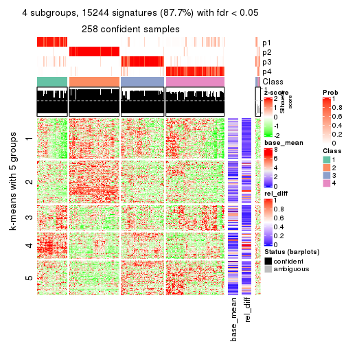</p>

</div>
<div id='tab-SD-pam-get-signatures-4'>
<pre><code class="r">get_signatures(res, k = 5)
</code></pre>

<p></p>

</div>
<div id='tab-SD-pam-get-signatures-5'>
<pre><code class="r">get_signatures(res, k = 6)
</code></pre>

<p></p>

</div>
</div>


Signature heatmaps where rows are not scaled:


<script>
$( function() {
	$( '#tabs-SD-pam-get-signatures-no-scale' ).tabs();
} );
</script>
<div id='tabs-SD-pam-get-signatures-no-scale'>
<ul>
<li><a href='#tab-SD-pam-get-signatures-no-scale-1'>k = 2</a></li>
<li><a href='#tab-SD-pam-get-signatures-no-scale-2'>k = 3</a></li>
<li><a href='#tab-SD-pam-get-signatures-no-scale-3'>k = 4</a></li>
<li><a href='#tab-SD-pam-get-signatures-no-scale-4'>k = 5</a></li>
<li><a href='#tab-SD-pam-get-signatures-no-scale-5'>k = 6</a></li>
</ul>
<div id='tab-SD-pam-get-signatures-no-scale-1'>
<pre><code class="r">get_signatures(res, k = 2, scale_rows = FALSE)
</code></pre>

<p></p>

</div>
<div id='tab-SD-pam-get-signatures-no-scale-2'>
<pre><code class="r">get_signatures(res, k = 3, scale_rows = FALSE)
</code></pre>

<p></p>

</div>
<div id='tab-SD-pam-get-signatures-no-scale-3'>
<pre><code class="r">get_signatures(res, k = 4, scale_rows = FALSE)
</code></pre>

<p></p>

</div>
<div id='tab-SD-pam-get-signatures-no-scale-4'>
<pre><code class="r">get_signatures(res, k = 5, scale_rows = FALSE)
</code></pre>

<p></p>

</div>
<div id='tab-SD-pam-get-signatures-no-scale-5'>
<pre><code class="r">get_signatures(res, k = 6, scale_rows = FALSE)
</code></pre>

<p></p>

</div>
</div>


Compare the overlap of signatures from different k:

```r
compare_signatures(res)
```


`get_signature()` returns a data frame invisibly. TO get the list of signatures, the function
call should be assigned to a variable explicitly. In following code, if `plot` argument is set
to `FALSE`, no heatmap is plotted while only the differential analysis is performed.

```r
# code only for demonstration
tb = get_signature(res, k = ..., plot = FALSE)
```

An example of the output of `tb` is:

```
#>   which_row         fdr    mean_1    mean_2 scaled_mean_1 scaled_mean_2 km
#> 1        38 0.042760348  8.373488  9.131774    -0.5533452     0.5164555  1
#> 2        40 0.018707592  7.106213  8.469186    -0.6173731     0.5762149  1
#> 3        55 0.019134737 10.221463 11.207825    -0.6159697     0.5749050  1
#> 4        59 0.006059896  5.921854  7.869574    -0.6899429     0.6439467  1
#> 5        60 0.018055526  8.928898 10.211722    -0.6204761     0.5791110  1
#> 6        98 0.009384629 15.714769 14.887706     0.6635654    -0.6193277  2
...
```

The columns in `tb` are:

1. `which_row`: row indices corresponding to the input matrix.
2. `fdr`: FDR for the differential test. 
3. `mean_x`: The mean value in group x.
4. `scaled_mean_x`: The mean value in group x after rows are scaled.
5. `km`: Row groups if k-means clustering is applied to rows.


UMAP plot which shows how samples are separated.


<script>
$( function() {
	$( '#tabs-SD-pam-dimension-reduction' ).tabs();
} );
</script>
<div id='tabs-SD-pam-dimension-reduction'>
<ul>
<li><a href='#tab-SD-pam-dimension-reduction-1'>k = 2</a></li>
<li><a href='#tab-SD-pam-dimension-reduction-2'>k = 3</a></li>
<li><a href='#tab-SD-pam-dimension-reduction-3'>k = 4</a></li>
<li><a href='#tab-SD-pam-dimension-reduction-4'>k = 5</a></li>
<li><a href='#tab-SD-pam-dimension-reduction-5'>k = 6</a></li>
</ul>
<div id='tab-SD-pam-dimension-reduction-1'>
<pre><code class="r">dimension_reduction(res, k = 2, method = &quot;UMAP&quot;)
</code></pre>

<p></p>

</div>
<div id='tab-SD-pam-dimension-reduction-2'>
<pre><code class="r">dimension_reduction(res, k = 3, method = &quot;UMAP&quot;)
</code></pre>

<p></p>

</div>
<div id='tab-SD-pam-dimension-reduction-3'>
<pre><code class="r">dimension_reduction(res, k = 4, method = &quot;UMAP&quot;)
</code></pre>

<p></p>

</div>
<div id='tab-SD-pam-dimension-reduction-4'>
<pre><code class="r">dimension_reduction(res, k = 5, method = &quot;UMAP&quot;)
</code></pre>

<p></p>

</div>
<div id='tab-SD-pam-dimension-reduction-5'>
<pre><code class="r">dimension_reduction(res, k = 6, method = &quot;UMAP&quot;)
</code></pre>

<p></p>

</div>
</div>


Following heatmap shows how subgroups are split when increasing `k`:

```r
collect_classes(res)
```


If matrix rows can be associated to genes, consider to use `GO_Enrichment(res,
...)` to perform function enrichment for the signature genes.


 

---------------------------------------------------


### SD:mclust**


The object with results only for a single top-value method and a single partition method 
can be extracted as:

```r
res = res_list["SD", "mclust"]
# you can also extract it by
# res = res_list["SD:mclust"]
```

A summary of `res` and all the functions that can be applied to it:

```r
res
```

```
#> A 'ConsensusPartition' object with k = 2, 3, 4, 5, 6.
#>   On a matrix with 17377 rows and 265 columns.
#>   Top rows (1000, 2000, 3000, 4000, 5000) are extracted by 'SD' method.
#>   Subgroups are detected by 'mclust' method.
#>   Performed in total 1250 partitions by row resampling.
#>   Best k for subgroups seems to be 2.
#> 
#> Following methods can be applied to this 'ConsensusPartition' object:
#>  [1] "cola_report"             "collect_classes"         "collect_plots"          
#>  [4] "collect_stats"           "colnames"                "compare_signatures"     
#>  [7] "consensus_heatmap"       "dimension_reduction"     "functional_enrichment"  
#> [10] "get_anno_col"            "get_anno"                "get_classes"            
#> [13] "get_consensus"           "get_matrix"              "get_membership"         
#> [16] "get_param"               "get_signatures"          "get_stats"              
#> [19] "is_best_k"               "is_stable_k"             "membership_heatmap"     
#> [22] "ncol"                    "nrow"                    "plot_ecdf"              
#> [25] "rownames"                "select_partition_number" "show"                   
#> [28] "suggest_best_k"          "test_to_known_factors"
```

`collect_plots()` function collects all the plots made from `res` for all `k` (number of partitions)
into one single page to provide an easy and fast comparison between different `k`.

```r
collect_plots(res)
```


The plots are:

- The first row: a plot of the ECDF (Empirical cumulative distribution
  function) curves of the consensus matrix for each `k` and the heatmap of
  predicted classes for each `k`.
- The second row: heatmaps of the consensus matrix for each `k`.
- The third row: heatmaps of the membership matrix for each `k`.
- The fouth row: heatmaps of the signatures for each `k`.

All the plots in panels can be made by individual functions and they are
plotted later in this section.

`select_partition_number()` produces several plots showing different
statistics for choosing "optimized" `k`. There are following statistics:

- ECDF curves of the consensus matrix for each `k`;
- 1-PAC. [The PAC
  score](https://en.wikipedia.org/wiki/Consensus_clustering#Over-interpretation_potential_of_consensus_clustering)
  measures the proportion of the ambiguous subgrouping.
- Mean silhouette score.
- Concordance. The mean probability of fiting the consensus class ids in all
  partitions.
- Area increased. Denote $A_k$ as the area under the ECDF curve for current
  `k`, the area increased is defined as $A_k - A_{k-1}$.
- Rand index. The percent of pairs of samples that are both in a same cluster
  or both are not in a same cluster in the partition of k and k-1.
- Jaccard index. The ratio of pairs of samples are both in a same cluster in
  the partition of k and k-1 and the pairs of samples are both in a same
  cluster in the partition k or k-1.

The detailed explanations of these statistics can be found in [the cola
vignette](http://bioconductor.org/packages/devel/bioc/vignettes/cola/inst/doc/cola.html#toc_13).

Generally speaking, lower PAC score, higher mean silhouette score or higher
concordance corresponds to better partition. Rand index and Jaccard index
measure how similar the current partition is compared to partition with `k-1`.
If they are too similar, we won't accept `k` is better than `k-1`.

```r
select_partition_number(res)
```


The numeric values for all these statistics can be obtained by `get_stats()`.

```r
get_stats(res)
```

```
#>   k 1-PAC mean_silhouette concordance area_increased  Rand Jaccard
#> 2 2 1.000           0.974       0.989         0.4378 0.560   0.560
#> 3 3 0.693           0.726       0.853         0.4814 0.767   0.592
#> 4 4 0.764           0.813       0.898         0.1267 0.901   0.724
#> 5 5 0.788           0.796       0.888         0.0589 0.940   0.784
#> 6 6 0.773           0.715       0.816         0.0401 0.977   0.903
```

`suggest_best_k()` suggests the best $k$ based on these statistics. The rules are as follows:

- All $k$ with Jaccard index larger than 0.95 are removed because the increase of
  the partition number does not provides enough extra information. If all $k$ are removed,
  the best $k$ is assigned by `NA`.
- For $k$ with 1-PAC larger than 0.9, the maximal $k$ is taken as the "best k". Other $k$ is called "optional k".
- If it does not fit the second rule. The $k$ with the highest vote of highest
  1-PAC, mean silhouette and concordance is taken as the "best k".

```r
suggest_best_k(res)
```

```
#> [1] 2
```


Following shows the table of the partitions (You need to click the **show/hide
code output** link to see it). The membership matrix (columns with name `p*`)
is inferred by
[`clue::cl_consensus()`](https://www.rdocumentation.org/link/cl_consensus?package=clue)
function with the `SE` method. Basically the value in the membership matrix
represents the probability to belong to a certain group. The finall class
label for an item is determined with the group with highest probability it
belongs to.

In `get_classes()` function, the entropy is calculated from the membership
matrix and the silhouette score is calculated from the consensus matrix.


<script>
$( function() {
	$( '#tabs-SD-mclust-get-classes' ).tabs();
} );
</script>
<div id='tabs-SD-mclust-get-classes'>
<ul>
<li><a href='#tab-SD-mclust-get-classes-1'>k = 2</a></li>
<li><a href='#tab-SD-mclust-get-classes-2'>k = 3</a></li>
<li><a href='#tab-SD-mclust-get-classes-3'>k = 4</a></li>
<li><a href='#tab-SD-mclust-get-classes-4'>k = 5</a></li>
<li><a href='#tab-SD-mclust-get-classes-5'>k = 6</a></li>
</ul>

<div id='tab-SD-mclust-get-classes-1'>
<p><a id='tab-SD-mclust-get-classes-1-a' style='color:#0366d6' href='#'>show/hide code output</a></p>
<pre><code class="r">cbind(get_classes(res, k = 2), get_membership(res, k = 2))
</code></pre>

<pre><code>#&gt;                                      class entropy silhouette    p1    p2
#&gt; D30CF518-5FC6-4A54-8D5D-BA420EA1836D     2  0.0000      0.977 0.000 1.000
#&gt; 92298FF7-1215-4756-B976-A7D88B91AD76     1  0.0000      0.994 1.000 0.000
#&gt; 0E244FE2-7C17-4642-A51F-2CCA796D9C70     2  0.0000      0.977 0.000 1.000
#&gt; 75435ED8-93E8-45FB-8480-98D8EB2EF8CB     2  0.0000      0.977 0.000 1.000
#&gt; B6D11678-15A9-4F43-A0A2-225067DCAF1C     1  0.0000      0.994 1.000 0.000
#&gt; B7F5A41E-9559-4329-81F5-1B88A74730B7     2  0.0000      0.977 0.000 1.000
#&gt; 39414B2A-7FB0-4669-8DFE-86D9AF7AD2D9     1  0.0000      0.994 1.000 0.000
#&gt; 04823F53-A12D-4852-8F34-77B9DCBB7DF0     2  0.0000      0.977 0.000 1.000
#&gt; 49684C2B-D31C-4B45-A400-3497C3CCEC01     2  0.0000      0.977 0.000 1.000
#&gt; 96A04875-58E2-4BE7-8E0F-CAB55F4CA54F     1  0.0000      0.994 1.000 0.000
#&gt; 1F101D63-478B-40B9-A951-DC3887CFF067     1  0.0000      0.994 1.000 0.000
#&gt; DD290860-E0B7-48FC-BE12-2AF729994C21     2  0.0000      0.977 0.000 1.000
#&gt; FFDD7A12-DDEF-4974-8D60-64B7EEAAC994     2  0.0000      0.977 0.000 1.000
#&gt; E076A9A9-EA2A-4FF7-92A8-F2DA7F30279E     1  0.0000      0.994 1.000 0.000
#&gt; 830DFA6F-A85A-4317-82B2-791FAB998A01     2  0.0000      0.977 0.000 1.000
#&gt; 58578614-E4A3-4655-BBAB-F65851625E0A     1  0.0000      0.994 1.000 0.000
#&gt; 1CBFB672-4D66-430B-83F3-7CE3BE20ABF6     1  0.0000      0.994 1.000 0.000
#&gt; 6C34A7D7-3756-4DCC-9A9F-B5FC4A148B7E     1  0.0000      0.994 1.000 0.000
#&gt; D97ED7B4-5DF2-4B62-8796-AA51CA79DBBB     1  0.0000      0.994 1.000 0.000
#&gt; 45F15851-55F6-4169-834E-38958C38B6A9     1  0.0000      0.994 1.000 0.000
#&gt; 4139E0C9-F712-4A25-8B59-587533B93B3E     2  0.7299      0.756 0.204 0.796
#&gt; 2C3007BF-009E-404F-A3BF-8B921698D85B     1  0.0000      0.994 1.000 0.000
#&gt; 2189F8E5-FF98-4C1A-BD04-5595DB553130     1  0.0000      0.994 1.000 0.000
#&gt; FFAA0310-0D78-4499-8FB8-5BC46E4FCE58     1  0.0000      0.994 1.000 0.000
#&gt; 0C375B2F-67BE-4708-BEB2-544DEC812DCA     2  0.0000      0.977 0.000 1.000
#&gt; AB6324A1-19AB-400C-8001-54765D190E27     2  0.0000      0.977 0.000 1.000
#&gt; A32C4DCD-DC4C-4132-9ED1-B159F5561A2D     1  0.0000      0.994 1.000 0.000
#&gt; 2AE7105D-D494-45B0-947A-315D8C20ECDC     1  0.0000      0.994 1.000 0.000
#&gt; 60FE9D59-FC0F-4B9C-ABF8-1C00BC761928     1  0.0000      0.994 1.000 0.000
#&gt; 056442DC-E87A-4315-965C-C19D7B4FC40E     1  0.0000      0.994 1.000 0.000
#&gt; 455111E5-18EF-4E3F-9DFF-8FA017D92461     1  0.0000      0.994 1.000 0.000
#&gt; 10632BC6-0B81-433C-8832-6B2ABC73A94B     1  0.0000      0.994 1.000 0.000
#&gt; AC6F82AD-C682-4EB3-BEC3-FD950F57609D     1  0.0000      0.994 1.000 0.000
#&gt; D9ABDB75-04DA-4D33-A69F-701729494533     2  0.7674      0.726 0.224 0.776
#&gt; 27BBF44D-F4D7-4C5A-935F-3310A363A670     2  0.0000      0.977 0.000 1.000
#&gt; E7AA12EE-6E14-4B33-A52C-B13589436023     1  0.0000      0.994 1.000 0.000
#&gt; DFA6D41A-D231-413E-A180-E42DF26C3E2B     2  0.0376      0.973 0.004 0.996
#&gt; 655BD3AF-5094-4B19-93A8-401C70369B17     2  0.0000      0.977 0.000 1.000
#&gt; 9DFEF253-923F-4EE2-8E3D-C75805387B20     2  0.9323      0.493 0.348 0.652
#&gt; 3B0EE948-B2CD-4191-90E2-BDD155F3B580     1  0.0000      0.994 1.000 0.000
#&gt; 177C7EF4-2D54-4555-947C-44EE7C688917     1  0.0000      0.994 1.000 0.000
#&gt; 1F8E8BB7-D159-4556-8B04-E5DD027CC444     2  0.0000      0.977 0.000 1.000
#&gt; 619F37D2-6771-4727-9079-56BED07F1CF6     2  0.7139      0.767 0.196 0.804
#&gt; ACAE29BE-ECB8-4A98-BC71-7A2D4857134E     1  0.0000      0.994 1.000 0.000
#&gt; C5C3241A-684C-4238-9333-9AF8630EC086     2  0.0000      0.977 0.000 1.000
#&gt; AD319DC2-140F-4E7B-A899-010687D8B714     2  0.0000      0.977 0.000 1.000
#&gt; 2AFF397C-ED2A-4FD9-A7F0-E4C61E9FB603     1  0.0000      0.994 1.000 0.000
#&gt; FB4C7892-3DBB-4148-AAE9-75B19A1A4031     1  0.0000      0.994 1.000 0.000
#&gt; 6F5C4500-1ED1-4E81-B4F5-EEA64CE2336A     1  0.0000      0.994 1.000 0.000
#&gt; BD027C69-3C10-4047-8E1E-218600FF2B73     2  0.0000      0.977 0.000 1.000
#&gt; 11B473A9-4CC5-461F-BC57-CC9141F3591D     1  0.0000      0.994 1.000 0.000
#&gt; 69A036E5-3E6A-4862-A7F8-2D203ED2FC9E     1  0.0000      0.994 1.000 0.000
#&gt; 9C0BDF24-F011-4855-B95A-1B6BEFA808F7     1  0.0000      0.994 1.000 0.000
#&gt; 9E205254-8C0C-4C05-AF5A-86E679CF732C     1  0.0000      0.994 1.000 0.000
#&gt; 935CCE4A-8AA8-454E-9DFF-7DE27D0BD2E2     1  0.0000      0.994 1.000 0.000
#&gt; 01E5E1FE-41D3-428B-90BC-7A000829E102     1  0.0000      0.994 1.000 0.000
#&gt; B344A530-92CD-468B-847A-DF8E25688081     1  0.0000      0.994 1.000 0.000
#&gt; F79F32A7-9F7B-4D62-8426-4A4CF10ED319     1  0.0000      0.994 1.000 0.000
#&gt; C2E1C6FA-82F9-467C-99AE-9B39FAAC810C     1  0.0000      0.994 1.000 0.000
#&gt; BF7CD9BD-776A-4957-8A6E-EF8AD83EA9D3     2  0.0000      0.977 0.000 1.000
#&gt; 8A2C1409-E83B-435E-A20F-5FCA94801C9F     2  0.0000      0.977 0.000 1.000
#&gt; B6BEFFB5-2F62-477B-A4C8-478D29577CBD     2  0.0000      0.977 0.000 1.000
#&gt; 8622CBD0-F8E9-4AC1-8175-CC9A742B86F9     1  0.0000      0.994 1.000 0.000
#&gt; 565DD660-ED58-4065-8619-260BEA6FCFEB     1  0.0000      0.994 1.000 0.000
#&gt; 96038E42-0FBA-497D-819C-38F7689F10FF     1  0.0000      0.994 1.000 0.000
#&gt; CA685549-F8BA-43F1-8461-5D2D3B17CFC5     1  0.0000      0.994 1.000 0.000
#&gt; 52020307-71A6-46E5-ACB3-8F885CA8F1EB     1  0.0000      0.994 1.000 0.000
#&gt; 7656DA98-76DC-424B-B02C-D7001DAAA0E4     1  0.0000      0.994 1.000 0.000
#&gt; 74DBA640-45E2-42A6-8F1E-69C073D66EE6     1  0.0000      0.994 1.000 0.000
#&gt; 251094BE-C33D-44F0-BD98-8618D71F520C     1  0.0000      0.994 1.000 0.000
#&gt; AB914CC5-5FF1-4257-A353-6A99D11B9478     1  0.0000      0.994 1.000 0.000
#&gt; 38B8B893-0E08-4B71-B51C-B32A7B2724E0     1  0.0000      0.994 1.000 0.000
#&gt; 7C7CD8FF-99A4-41D7-B7E1-5A517001F551     2  0.0000      0.977 0.000 1.000
#&gt; BFC5B75A-E4AE-486B-BA30-23BBAA33A125     2  0.0000      0.977 0.000 1.000
#&gt; 182AC78E-A07C-4B34-B216-B5F573E9F036     2  0.0000      0.977 0.000 1.000
#&gt; B38C5F72-8F46-4531-9C2D-96EEE07A5B22     2  0.0000      0.977 0.000 1.000
#&gt; DB9333A6-A723-4B8F-9221-25B8B23D5126     1  0.0000      0.994 1.000 0.000
#&gt; CD67DD21-C1B6-4D58-AC8E-1F4536C7DA70     1  0.0000      0.994 1.000 0.000
#&gt; 3D76A56E-4B66-48AE-AA60-D9C1004C7140     1  0.0000      0.994 1.000 0.000
#&gt; 71ED572F-7780-47A4-A9F8-D320C737690D     1  0.0000      0.994 1.000 0.000
#&gt; B449FEA1-C4B0-400F-903C-59E13D0BA313     2  0.0000      0.977 0.000 1.000
#&gt; 3F120E90-1486-4215-B9B9-79D5B413CAAC     2  0.7950      0.702 0.240 0.760
#&gt; A071894B-D8C0-4740-BD55-93EA0C86EDF7     1  0.0000      0.994 1.000 0.000
#&gt; 58848D57-D7A9-4ABB-86A2-A8AE2B23F654     1  0.0000      0.994 1.000 0.000
#&gt; CD6F9E20-B301-4663-87EC-953EDF49754F     1  0.0000      0.994 1.000 0.000
#&gt; 367D89F3-D527-4929-B830-8B6D553DF9E1     1  0.0000      0.994 1.000 0.000
#&gt; BE8D7DCB-648B-42DD-9FA8-8B85B5D816B2     1  0.0000      0.994 1.000 0.000
#&gt; AA46F56B-BD9C-40A4-8EA8-35E2568C964D     2  0.0000      0.977 0.000 1.000
#&gt; 6393220A-7C57-413F-81A8-4E38C21E779E     2  0.0000      0.977 0.000 1.000
#&gt; 89AE566C-F65F-43C2-BA97-621A7AC8B6DC     1  0.0000      0.994 1.000 0.000
#&gt; AA6A4BFF-8C62-4B70-B85A-9EDF403B06BA     1  0.0000      0.994 1.000 0.000
#&gt; BCE877A6-9C65-4495-A45D-05753F2D0E15     1  0.0000      0.994 1.000 0.000
#&gt; D7BDDF49-C54B-4F8E-ACA0-C3684AB68B5C     1  0.0376      0.990 0.996 0.004
#&gt; D0800D49-0033-44B2-8D7B-29B16F87ADA6     2  0.0000      0.977 0.000 1.000
#&gt; 151D60B5-5AF1-4B61-B97F-ABC7531D9F89     1  0.0000      0.994 1.000 0.000
#&gt; CBBAEB5B-25FA-4B6D-A40C-357E37033E36     1  0.0000      0.994 1.000 0.000
#&gt; 317CD049-3151-40B7-8E88-B0B8813338D6     1  0.0000      0.994 1.000 0.000
#&gt; 93835C77-F8FA-4928-843C-8016A91881FA     1  0.0000      0.994 1.000 0.000
#&gt; 02A6950F-647D-4F20-B2D0-0238C1441C70     1  0.0000      0.994 1.000 0.000
#&gt; 4D54E415-134F-4F6F-8718-3E0475EF5477     1  0.0000      0.994 1.000 0.000
#&gt; 82AB290A-3993-45E5-8B15-6125A019778C     1  0.0000      0.994 1.000 0.000
#&gt; 3B5EAD14-E506-4A22-804D-BF925A2D5247     2  0.0000      0.977 0.000 1.000
#&gt; 19CF7DDF-4F3A-4D2F-B84A-6451A5C3112C     1  0.0000      0.994 1.000 0.000
#&gt; 2FB00DAA-C274-42B1-A06B-611FE5E96844     1  0.0000      0.994 1.000 0.000
#&gt; 2B1F01C3-8145-4296-8111-2B0474AB9A2C     2  0.0000      0.977 0.000 1.000
#&gt; 3F0865F1-8256-4778-966F-D53637B415B6     1  0.0000      0.994 1.000 0.000
#&gt; 5473210D-37F9-4192-86D2-E2A2C77F3BD2     1  0.0000      0.994 1.000 0.000
#&gt; 5EDB6ACF-4F3F-471A-9DDC-661607CACCC4     1  0.0000      0.994 1.000 0.000
#&gt; 6A252A3A-7EEB-47B6-9C23-D69BD2EA846F     1  0.0000      0.994 1.000 0.000
#&gt; 0A7FFCBB-4BAA-4A5F-8B2D-B427C4D982A8     1  0.0000      0.994 1.000 0.000
#&gt; 1603AFB8-5AD7-4794-9991-BDBE96B4D997     2  0.0000      0.977 0.000 1.000
#&gt; 644299E9-62B7-4DFE-9E6D-D7556A01B40A     1  0.0000      0.994 1.000 0.000
#&gt; EF12E923-1860-4269-B57B-BA6238FA4403     1  0.0000      0.994 1.000 0.000
#&gt; 51B7241E-F0BE-482A-88AE-89004BB68989     1  0.0000      0.994 1.000 0.000
#&gt; 1C007DF3-8A9F-4940-9A4C-DE2A412BB023     1  0.0000      0.994 1.000 0.000
#&gt; 89FCFDE6-9625-432C-AA35-9C5FCCF40031     1  0.0000      0.994 1.000 0.000
#&gt; 7955FC55-386D-497E-AFED-019BBBAD428E     1  0.0000      0.994 1.000 0.000
#&gt; 37FF09ED-73EC-4D10-B2AC-7D8EBA9304ED     1  0.0000      0.994 1.000 0.000
#&gt; C2CD2742-2FB4-468E-90FF-8F65A5C425A9     1  0.0000      0.994 1.000 0.000
#&gt; 766FE08F-3393-4868-B1C1-FA98C9FF16E0     1  0.0000      0.994 1.000 0.000
#&gt; 63E2B578-2221-4255-8C45-7FD030B1C94D     1  0.0000      0.994 1.000 0.000
#&gt; C14B1A44-43F7-45F0-A583-5667A4D3BD95     1  0.0000      0.994 1.000 0.000
#&gt; D9CB551A-CE20-4BF7-8AC9-839112346C3D     1  0.0000      0.994 1.000 0.000
#&gt; 05BAA71A-E5B3-4A3A-A3F2-013A975087F0     2  0.0000      0.977 0.000 1.000
#&gt; AC8DA7DE-4D83-4768-BEFD-9A1B2DA943CE     1  0.0000      0.994 1.000 0.000
#&gt; E89DCE9D-F8A5-499C-85BB-BB500BADB9FB     1  0.0000      0.994 1.000 0.000
#&gt; C16F9B5E-2B52-40F6-856D-C0D6FBDD16C1     1  0.0000      0.994 1.000 0.000
#&gt; 8FF234D4-823A-4C80-82F7-2E92D72DBF88     2  0.0000      0.977 0.000 1.000
#&gt; C9F94A6E-D104-4D8D-8EC5-EADECD85F092     2  0.6973      0.778 0.188 0.812
#&gt; 45C9756F-A154-4537-852E-ECBF27B92FE1     2  0.0000      0.977 0.000 1.000
#&gt; 0F1A5708-341E-4713-BC70-76D702F826D6     2  0.7219      0.762 0.200 0.800
#&gt; 2ECFBCA0-AB35-461A-A4B5-C60B2651A962     2  0.0000      0.977 0.000 1.000
#&gt; 7DFAC404-3AB3-4274-A533-CFDAF4CE122D     1  0.0000      0.994 1.000 0.000
#&gt; A90AF55C-4386-42AB-A812-9230026EA5A5     2  0.0000      0.977 0.000 1.000
#&gt; 6258A757-4E18-4CD1-8417-189521E990B6     2  0.0000      0.977 0.000 1.000
#&gt; EBFAD137-050F-47D0-A43D-72B8F7D70C2B     1  0.0000      0.994 1.000 0.000
#&gt; 08B5EBFB-2807-4229-95A6-81AB7F377A56     2  0.0000      0.977 0.000 1.000
#&gt; 4780A59C-0589-4995-B044-3201F09AF859     1  0.0000      0.994 1.000 0.000
#&gt; 0AB81429-C287-48AA-9035-3A7A6F4C7328     2  0.0000      0.977 0.000 1.000
#&gt; 20C4D047-28DA-4AB7-9B3C-32EDA6B22C9D     1  0.0000      0.994 1.000 0.000
#&gt; 77C4E01F-84A6-4BFD-AA8E-D7875456F546     1  0.0000      0.994 1.000 0.000
#&gt; 8B28383F-CF14-4CC5-A1E2-72AD915C0AE8     1  0.0000      0.994 1.000 0.000
#&gt; E12E1F48-6A52-4F74-925C-C4EE1BF5C573     2  0.0000      0.977 0.000 1.000
#&gt; 9B179BC5-BB4C-4CEE-99BC-BC552BC384A1     1  0.0000      0.994 1.000 0.000
#&gt; 5548C91A-D3DE-48F5-B4A4-124BE177B99A     1  0.0000      0.994 1.000 0.000
#&gt; 0E22B729-C381-4B0C-9897-62DD38F51722     1  0.0376      0.990 0.996 0.004
#&gt; 7BC4937F-04E2-4B46-BA7C-FE9AC738C8A9     1  0.0000      0.994 1.000 0.000
#&gt; EE6A0D3F-3F8A-4AA8-B3EF-32372EF37A29     1  0.0000      0.994 1.000 0.000
#&gt; 08AC2706-7651-409F-BE6B-BCED1C2D1796     1  0.0000      0.994 1.000 0.000
#&gt; A68B078D-8979-4070-BB4D-F526704ED3DC     2  0.9248      0.511 0.340 0.660
#&gt; C319A5EE-69FA-4AAB-85A9-2EAAD8E4C703     1  0.0000      0.994 1.000 0.000
#&gt; 0D7CAABD-D20C-4F82-BCBC-8B7276E8EDE2     1  0.0000      0.994 1.000 0.000
#&gt; 09444DCC-44BA-4A3F-ACC5-863A54578B9F     1  0.0000      0.994 1.000 0.000
#&gt; 2E32B047-C6E1-4743-A6C8-E98370A32145     1  0.0000      0.994 1.000 0.000
#&gt; 6A6878A7-76B2-40DE-958B-804442AC6A5D     1  0.0000      0.994 1.000 0.000
#&gt; 39F27293-0BFF-4EA2-8439-A299E3226D20     1  0.0000      0.994 1.000 0.000
#&gt; 7EAE9C30-6080-405F-A7E6-1FED57674279     1  0.0000      0.994 1.000 0.000
#&gt; 79499169-A093-4E0A-B6BD-010CD7BE5035     1  0.0000      0.994 1.000 0.000
#&gt; 1F8BF4E8-BD84-4EFE-9E3E-89E7CE8FA72D     1  0.0000      0.994 1.000 0.000
#&gt; 62B7988F-98E5-4AB8-8A16-D661A07455E8     1  0.0000      0.994 1.000 0.000
#&gt; B7005B5F-217E-4073-BFB5-CE7E884B80C0     2  0.0000      0.977 0.000 1.000
#&gt; B981568F-2C08-4696-B589-E157A49BE72B     2  0.0000      0.977 0.000 1.000
#&gt; A3D85C0A-3202-40C2-88E1-052AC6C5184B     1  0.0000      0.994 1.000 0.000
#&gt; 4CA783B9-9B99-46B8-962A-77194ECB7942     1  0.0000      0.994 1.000 0.000
#&gt; D4024B08-4879-47EA-99E5-D9FCE1CD40DF     1  0.0000      0.994 1.000 0.000
#&gt; 1D41CDA2-0B29-48FD-B83A-E60C174DBCB3     1  0.0000      0.994 1.000 0.000
#&gt; A1923B2A-B233-4760-8AF9-C04C1CAEB100     1  0.0000      0.994 1.000 0.000
#&gt; 80880D71-BFDE-4D88-892F-5ADF27A38940     1  0.0000      0.994 1.000 0.000
#&gt; 55D1629D-30FD-49AA-88CE-EA3CA9B30A3F     2  0.0000      0.977 0.000 1.000
#&gt; B71C409E-926D-48AD-8BD8-9F707CA4FB01     2  0.0000      0.977 0.000 1.000
#&gt; 54A92C57-BD19-4A47-BA76-3ACA2DC36212     1  0.0000      0.994 1.000 0.000
#&gt; B2AB74B8-506C-4C27-9105-E86A6AAA89D4     1  0.0000      0.994 1.000 0.000
#&gt; 0356AE49-7A5C-42CC-A39C-7C8DFBFF8842     2  0.0000      0.977 0.000 1.000
#&gt; ACA260A3-DC3F-4FF4-B9C5-2D4BC4F81783     1  0.0000      0.994 1.000 0.000
#&gt; 9B440917-E5A4-43B9-A48D-6ABFEDCA6CFD     1  0.0000      0.994 1.000 0.000
#&gt; 47464828-52EA-413B-B30C-BD8B55903D78     2  0.0000      0.977 0.000 1.000
#&gt; C1D1FC82-B50D-4C82-8F03-06CEE3C08D18     1  0.0000      0.994 1.000 0.000
#&gt; E5ABFC43-E2A3-4B1A-BBA3-8196C0B026A5     2  0.0000      0.977 0.000 1.000
#&gt; 1D3C16CC-D0D5-4637-AAC7-91672DFF3317     1  0.6531      0.791 0.832 0.168
#&gt; 4D038320-ADEA-4990-8371-68B4B8162E1A     2  0.0000      0.977 0.000 1.000
#&gt; A75594CC-3E49-4869-8656-BBB4E72BF59D     2  0.0000      0.977 0.000 1.000
#&gt; 7CABAA19-5FB2-4A58-BDA3-4F1FFB532C20     1  0.0000      0.994 1.000 0.000
#&gt; 534EF1E9-9513-426E-B41E-A394AB2E4410     2  0.0000      0.977 0.000 1.000
#&gt; 649F35A1-A08C-497D-A9B6-CB3084D5FB8D     1  0.0000      0.994 1.000 0.000
#&gt; 7CA30F3C-1C98-480C-B8B5-A248AABFB468     1  0.0000      0.994 1.000 0.000
#&gt; A9F8DA21-A802-44CF-9F5D-96A36687DCDD     1  0.0000      0.994 1.000 0.000
#&gt; A7AE1ED1-86CB-4A50-97B2-66785C7191FE     1  0.0000      0.994 1.000 0.000
#&gt; D0091AD4-D3D7-4C03-ACD9-DA9F8B6076C6     1  0.0000      0.994 1.000 0.000
#&gt; 46EE1C2B-13F7-44A7-B27E-4EBB9DF0CA83     2  0.0000      0.977 0.000 1.000
#&gt; CB9301B8-0282-43D6-AF5E-B753A9C7BFCB     2  0.0000      0.977 0.000 1.000
#&gt; A0E77A39-885A-4472-9A10-2D1E51DBFDA4     1  0.0000      0.994 1.000 0.000
#&gt; C06603C2-163D-40B6-A9FE-882424F18FE9     1  0.0000      0.994 1.000 0.000
#&gt; C3921A29-80FF-4B9D-B366-5C0238A42231     1  0.0000      0.994 1.000 0.000
#&gt; BB99B4E7-C834-4BB8-973F-8FA039E2798F     1  0.0000      0.994 1.000 0.000
#&gt; 5CD78C2F-05E9-409A-8405-3EE936A6876E     1  0.0000      0.994 1.000 0.000
#&gt; 6C126CC7-0C03-48F0-A2C2-F090CA239B70     2  0.0000      0.977 0.000 1.000
#&gt; 7118B08A-E94C-49F4-8D76-26455C34D85F     2  0.0000      0.977 0.000 1.000
#&gt; 266DAF30-CF3E-493E-8B24-3931D0039450     1  0.0000      0.994 1.000 0.000
#&gt; DAB5F5B9-4FE5-468F-AD2B-B39BBC4317A0     1  0.0000      0.994 1.000 0.000
#&gt; 9A9EB6D6-312E-4A98-8762-30D3ABD8193D     1  0.0000      0.994 1.000 0.000
#&gt; CED15676-B901-4FC8-9C8D-51E529D9441D     1  0.0000      0.994 1.000 0.000
#&gt; 827232CC-8035-440C-8B12-02C789C70B1B     1  0.0000      0.994 1.000 0.000
#&gt; 04D5FB28-FB50-4EAE-95FB-72ABF0E618CA     2  0.0000      0.977 0.000 1.000
#&gt; 6C96A851-97FC-4845-B895-D255191D9F25     1  0.0000      0.994 1.000 0.000
#&gt; 3EC982CB-D013-443E-B21D-39DE6B8EF370     1  0.0000      0.994 1.000 0.000
#&gt; 2E24A786-4370-42A1-AD50-D651F89819CC     2  0.0000      0.977 0.000 1.000
#&gt; 7653BFA9-ADA5-44CA-8555-807FBBFC6DE2     1  0.0000      0.994 1.000 0.000
#&gt; 7A110994-5741-4013-91F0-DD2E1D343F91     2  0.0000      0.977 0.000 1.000
#&gt; 0A760E0C-11C5-4201-8452-18DBC1FEACEB     1  0.0000      0.994 1.000 0.000
#&gt; 909B76A1-BB9F-4906-95BC-58CD1A46D3B8     2  0.0000      0.977 0.000 1.000
#&gt; A782EE71-EDA4-4385-83B3-D16DE81296C0     1  0.0000      0.994 1.000 0.000
#&gt; BD50E276-914F-4924-8CEA-FF47A66DB175     2  0.0000      0.977 0.000 1.000
#&gt; 505D5CA8-0279-4BC7-8CC0-8C7A0165BF91     2  0.0000      0.977 0.000 1.000
#&gt; D51FC997-E662-4AE7-BC9C-14183DA42DE1     2  0.0000      0.977 0.000 1.000
#&gt; 8AD67970-84F1-4C0A-B47A-8FA4108F9FE3     1  0.0000      0.994 1.000 0.000
#&gt; 6E33B1B6-7089-4BC3-B2B0-EC2C3B5D8B74     1  0.0000      0.994 1.000 0.000
#&gt; 88C4EA46-2546-401C-A8E7-603EECFDFBA0     1  0.4562      0.888 0.904 0.096
#&gt; 375D2D72-C998-4627-BA35-24E82A9A55FF     1  0.0000      0.994 1.000 0.000
#&gt; 76D0F834-7064-46C6-96F4-E861CF5452B6     2  0.0000      0.977 0.000 1.000
#&gt; 87159081-C97A-4004-AF0A-7EB6EF0EC47A     1  0.0000      0.994 1.000 0.000
#&gt; 24A57006-800B-4174-AF4E-7EA57A8A756E     1  0.0000      0.994 1.000 0.000
#&gt; AD68CBC6-8A13-4A65-AF62-E99AFA81D031     1  0.0000      0.994 1.000 0.000
#&gt; 22863A57-F066-4DD1-A859-4336F43D144C     1  0.0000      0.994 1.000 0.000
#&gt; 8F6F0362-9165-4DCC-992C-AF871A3C51E7     1  0.0000      0.994 1.000 0.000
#&gt; 76ABF0B7-E707-4DB2-9486-3814439BDBA5     1  0.0000      0.994 1.000 0.000
#&gt; BC72372F-3577-40E5-BA0F-41A084AA93AD     1  0.9661      0.328 0.608 0.392
#&gt; 8E566039-B56C-4F41-B9EF-DE18BEEF2C95     1  0.0000      0.994 1.000 0.000
#&gt; F096F016-3EF5-4A67-A7C2-8A45E1585232     1  0.0000      0.994 1.000 0.000
#&gt; BB37913E-534B-43DD-BE3D-E13B29FD8172     2  0.0000      0.977 0.000 1.000
#&gt; E344638F-9060-460F-8F7A-60D19442F294     1  0.0376      0.990 0.996 0.004
#&gt; 6A0EAAD0-89D5-4F12-8B45-9D5A25182FAD     2  0.0000      0.977 0.000 1.000
#&gt; A5199E3A-9D67-4543-88AB-24398C98E38E     1  0.0000      0.994 1.000 0.000
#&gt; 23917D52-7864-4F84-9C77-DF8EA9407345     2  0.0000      0.977 0.000 1.000
#&gt; 9AA96080-19D8-40C3-BDD1-6044D2D422D5     1  0.0000      0.994 1.000 0.000
#&gt; 0ED65D91-260C-4662-9903-EE36A2E3B2D0     2  0.0000      0.977 0.000 1.000
#&gt; 64BF1BC5-7A9A-4E1D-AEAB-AFE30B92AAF4     1  0.0000      0.994 1.000 0.000
#&gt; F02301F1-9054-4DC6-8DC9-2451A0F53EFC     2  0.0000      0.977 0.000 1.000
#&gt; 3264649A-5684-4181-83D0-A7E4D7E2E1FD     1  0.0000      0.994 1.000 0.000
#&gt; 3F8DA39C-BC9B-4343-8838-5CE271E80C51     2  0.0000      0.977 0.000 1.000
#&gt; BCC681CB-2AF4-4BB6-B53A-7544A2399454     1  0.0000      0.994 1.000 0.000
#&gt; DCB50E17-5E2D-443B-8DCC-272FBB734C2E     1  0.0000      0.994 1.000 0.000
#&gt; B5E47C38-CB6A-44C0-AA9B-56951B9EF78D     1  0.0000      0.994 1.000 0.000
#&gt; B15B0185-9C28-4A00-9CEC-05EFECEA6709     1  0.0000      0.994 1.000 0.000
#&gt; 61D4E8E7-0110-480A-A4A7-D406DE74C31E     1  0.0000      0.994 1.000 0.000
#&gt; CA8DB3AD-3F6B-4622-BF73-47041EC96E42     1  0.0000      0.994 1.000 0.000
#&gt; 5EECB1C4-172C-4494-871A-ADB650CD82BD     2  0.0000      0.977 0.000 1.000
#&gt; 019B857C-D4F7-4B67-B699-56E52A60805B     2  0.0000      0.977 0.000 1.000
#&gt; E9C28902-05C9-4883-97A4-D612D54E46B4     1  0.0000      0.994 1.000 0.000
#&gt; C5D3D9A0-FC14-408D-AB6C-662018A5E5CA     1  0.0000      0.994 1.000 0.000
#&gt; 7EB24744-509B-4854-B7D0-0BAFA210A345     2  0.0000      0.977 0.000 1.000
#&gt; B8B7A721-2284-40AB-98F5-EF1351C30B66     2  0.0000      0.977 0.000 1.000
#&gt; 3C12F39D-0D21-4F69-A539-4120B73C7A79     2  0.0000      0.977 0.000 1.000
#&gt; 08D3F984-6850-45B2-9DF9-EC7F5A4060A4     1  0.0000      0.994 1.000 0.000
#&gt; 9BD0EE79-1EED-4F6D-A5AB-43ADB8526F1E     1  0.9427      0.416 0.640 0.360
#&gt; E489A871-3CF4-4F3D-8EAF-63B507054201     2  0.0000      0.977 0.000 1.000
#&gt; 8CF8FD2E-1DBA-4257-9715-04D956D46B71     2  0.0000      0.977 0.000 1.000
#&gt; F6193AF0-7A19-46CB-A818-1B01E7460791     1  0.0000      0.994 1.000 0.000
#&gt; 96392D6B-D4FF-4393-93BA-08E469E8BBE1     1  0.0000      0.994 1.000 0.000
#&gt; DABCBE5A-C591-46A2-AF66-DA3DB6106751     1  0.0000      0.994 1.000 0.000
#&gt; 8B75F7D4-98D8-44DE-B19D-B733D6A031DB     1  0.0000      0.994 1.000 0.000
#&gt; AAD9685A-564B-42E9-91E3-431951154BA7     2  0.0000      0.977 0.000 1.000
#&gt; 90A43152-4E3B-4365-A39F-7B0E5CA66E55     1  0.0000      0.994 1.000 0.000
#&gt; EFB76FCF-AC9C-4852-B91C-E055DA666FA0     1  0.0000      0.994 1.000 0.000
#&gt; 6EBCFFE3-706F-440A-ABA9-012A924A07C6     2  0.0000      0.977 0.000 1.000
#&gt; E922A244-F1C8-4310-ABB2-62B06E022E4C     1  0.0000      0.994 1.000 0.000
</code></pre>

<script>
$('#tab-SD-mclust-get-classes-1-a').parent().next().next().hide();
$('#tab-SD-mclust-get-classes-1-a').click(function(){
  $('#tab-SD-mclust-get-classes-1-a').parent().next().next().toggle();
  return(false);
});
</script>
</div>

<div id='tab-SD-mclust-get-classes-2'>
<p><a id='tab-SD-mclust-get-classes-2-a' style='color:#0366d6' href='#'>show/hide code output</a></p>
<pre><code class="r">cbind(get_classes(res, k = 3), get_membership(res, k = 3))
</code></pre>

<pre><code>#&gt;                                      class entropy silhouette    p1    p2    p3
#&gt; D30CF518-5FC6-4A54-8D5D-BA420EA1836D     2  0.0000     0.9819 0.000 1.000 0.000
#&gt; 92298FF7-1215-4756-B976-A7D88B91AD76     1  0.0000     0.7685 1.000 0.000 0.000
#&gt; 0E244FE2-7C17-4642-A51F-2CCA796D9C70     2  0.0000     0.9819 0.000 1.000 0.000
#&gt; 75435ED8-93E8-45FB-8480-98D8EB2EF8CB     2  0.0000     0.9819 0.000 1.000 0.000
#&gt; B6D11678-15A9-4F43-A0A2-225067DCAF1C     3  0.2356     0.8344 0.072 0.000 0.928
#&gt; B7F5A41E-9559-4329-81F5-1B88A74730B7     2  0.0000     0.9819 0.000 1.000 0.000
#&gt; 39414B2A-7FB0-4669-8DFE-86D9AF7AD2D9     3  0.2356     0.8344 0.072 0.000 0.928
#&gt; 04823F53-A12D-4852-8F34-77B9DCBB7DF0     2  0.0000     0.9819 0.000 1.000 0.000
#&gt; 49684C2B-D31C-4B45-A400-3497C3CCEC01     2  0.0000     0.9819 0.000 1.000 0.000
#&gt; 96A04875-58E2-4BE7-8E0F-CAB55F4CA54F     1  0.0000     0.7685 1.000 0.000 0.000
#&gt; 1F101D63-478B-40B9-A951-DC3887CFF067     1  0.0000     0.7685 1.000 0.000 0.000
#&gt; DD290860-E0B7-48FC-BE12-2AF729994C21     2  0.0000     0.9819 0.000 1.000 0.000
#&gt; FFDD7A12-DDEF-4974-8D60-64B7EEAAC994     2  0.0000     0.9819 0.000 1.000 0.000
#&gt; E076A9A9-EA2A-4FF7-92A8-F2DA7F30279E     1  0.6309     0.2803 0.504 0.000 0.496
#&gt; 830DFA6F-A85A-4317-82B2-791FAB998A01     2  0.0000     0.9819 0.000 1.000 0.000
#&gt; 58578614-E4A3-4655-BBAB-F65851625E0A     3  0.2356     0.8344 0.072 0.000 0.928
#&gt; 1CBFB672-4D66-430B-83F3-7CE3BE20ABF6     1  0.0000     0.7685 1.000 0.000 0.000
#&gt; 6C34A7D7-3756-4DCC-9A9F-B5FC4A148B7E     1  0.6274     0.3792 0.544 0.000 0.456
#&gt; D97ED7B4-5DF2-4B62-8796-AA51CA79DBBB     1  0.0000     0.7685 1.000 0.000 0.000
#&gt; 45F15851-55F6-4169-834E-38958C38B6A9     1  0.0237     0.7669 0.996 0.000 0.004
#&gt; 4139E0C9-F712-4A25-8B59-587533B93B3E     2  0.7064     0.6062 0.076 0.704 0.220
#&gt; 2C3007BF-009E-404F-A3BF-8B921698D85B     1  0.6309    -0.2053 0.504 0.000 0.496
#&gt; 2189F8E5-FF98-4C1A-BD04-5595DB553130     3  0.6305     0.1990 0.484 0.000 0.516
#&gt; FFAA0310-0D78-4499-8FB8-5BC46E4FCE58     3  0.6309    -0.2860 0.500 0.000 0.500
#&gt; 0C375B2F-67BE-4708-BEB2-544DEC812DCA     2  0.0000     0.9819 0.000 1.000 0.000
#&gt; AB6324A1-19AB-400C-8001-54765D190E27     2  0.0000     0.9819 0.000 1.000 0.000
#&gt; A32C4DCD-DC4C-4132-9ED1-B159F5561A2D     1  0.2261     0.7209 0.932 0.000 0.068
#&gt; 2AE7105D-D494-45B0-947A-315D8C20ECDC     3  0.2356     0.8344 0.072 0.000 0.928
#&gt; 60FE9D59-FC0F-4B9C-ABF8-1C00BC761928     1  0.5529     0.3518 0.704 0.000 0.296
#&gt; 056442DC-E87A-4315-965C-C19D7B4FC40E     1  0.0000     0.7685 1.000 0.000 0.000
#&gt; 455111E5-18EF-4E3F-9DFF-8FA017D92461     3  0.4062     0.7599 0.164 0.000 0.836
#&gt; 10632BC6-0B81-433C-8832-6B2ABC73A94B     1  0.0000     0.7685 1.000 0.000 0.000
#&gt; AC6F82AD-C682-4EB3-BEC3-FD950F57609D     1  0.0000     0.7685 1.000 0.000 0.000
#&gt; D9ABDB75-04DA-4D33-A69F-701729494533     1  0.8353     0.4211 0.628 0.180 0.192
#&gt; 27BBF44D-F4D7-4C5A-935F-3310A363A670     2  0.0000     0.9819 0.000 1.000 0.000
#&gt; E7AA12EE-6E14-4B33-A52C-B13589436023     1  0.4452     0.6506 0.808 0.000 0.192
#&gt; DFA6D41A-D231-413E-A180-E42DF26C3E2B     2  0.1411     0.9472 0.000 0.964 0.036
#&gt; 655BD3AF-5094-4B19-93A8-401C70369B17     2  0.0000     0.9819 0.000 1.000 0.000
#&gt; 9DFEF253-923F-4EE2-8E3D-C75805387B20     1  0.8527     0.2276 0.504 0.400 0.096
#&gt; 3B0EE948-B2CD-4191-90E2-BDD155F3B580     1  0.1289     0.7575 0.968 0.000 0.032
#&gt; 177C7EF4-2D54-4555-947C-44EE7C688917     1  0.6274     0.3792 0.544 0.000 0.456
#&gt; 1F8E8BB7-D159-4556-8B04-E5DD027CC444     2  0.0000     0.9819 0.000 1.000 0.000
#&gt; 619F37D2-6771-4727-9079-56BED07F1CF6     2  0.8261     0.4483 0.260 0.616 0.124
#&gt; ACAE29BE-ECB8-4A98-BC71-7A2D4857134E     1  0.6045     0.4131 0.620 0.000 0.380
#&gt; C5C3241A-684C-4238-9333-9AF8630EC086     2  0.0000     0.9819 0.000 1.000 0.000
#&gt; AD319DC2-140F-4E7B-A899-010687D8B714     2  0.0000     0.9819 0.000 1.000 0.000
#&gt; 2AFF397C-ED2A-4FD9-A7F0-E4C61E9FB603     1  0.6274     0.3792 0.544 0.000 0.456
#&gt; FB4C7892-3DBB-4148-AAE9-75B19A1A4031     1  0.0592     0.7637 0.988 0.000 0.012
#&gt; 6F5C4500-1ED1-4E81-B4F5-EEA64CE2336A     3  0.2356     0.8344 0.072 0.000 0.928
#&gt; BD027C69-3C10-4047-8E1E-218600FF2B73     2  0.0000     0.9819 0.000 1.000 0.000
#&gt; 11B473A9-4CC5-461F-BC57-CC9141F3591D     3  0.4702     0.7067 0.212 0.000 0.788
#&gt; 69A036E5-3E6A-4862-A7F8-2D203ED2FC9E     3  0.2356     0.8344 0.072 0.000 0.928
#&gt; 9C0BDF24-F011-4855-B95A-1B6BEFA808F7     1  0.0000     0.7685 1.000 0.000 0.000
#&gt; 9E205254-8C0C-4C05-AF5A-86E679CF732C     1  0.0000     0.7685 1.000 0.000 0.000
#&gt; 935CCE4A-8AA8-454E-9DFF-7DE27D0BD2E2     3  0.2356     0.8344 0.072 0.000 0.928
#&gt; 01E5E1FE-41D3-428B-90BC-7A000829E102     1  0.0000     0.7685 1.000 0.000 0.000
#&gt; B344A530-92CD-468B-847A-DF8E25688081     1  0.6274     0.3792 0.544 0.000 0.456
#&gt; F79F32A7-9F7B-4D62-8426-4A4CF10ED319     1  0.3752     0.6429 0.856 0.000 0.144
#&gt; C2E1C6FA-82F9-467C-99AE-9B39FAAC810C     1  0.0000     0.7685 1.000 0.000 0.000
#&gt; BF7CD9BD-776A-4957-8A6E-EF8AD83EA9D3     2  0.0000     0.9819 0.000 1.000 0.000
#&gt; 8A2C1409-E83B-435E-A20F-5FCA94801C9F     2  0.0000     0.9819 0.000 1.000 0.000
#&gt; B6BEFFB5-2F62-477B-A4C8-478D29577CBD     2  0.0000     0.9819 0.000 1.000 0.000
#&gt; 8622CBD0-F8E9-4AC1-8175-CC9A742B86F9     1  0.0000     0.7685 1.000 0.000 0.000
#&gt; 565DD660-ED58-4065-8619-260BEA6FCFEB     1  0.0000     0.7685 1.000 0.000 0.000
#&gt; 96038E42-0FBA-497D-819C-38F7689F10FF     1  0.0000     0.7685 1.000 0.000 0.000
#&gt; CA685549-F8BA-43F1-8461-5D2D3B17CFC5     1  0.6267     0.2072 0.548 0.000 0.452
#&gt; 52020307-71A6-46E5-ACB3-8F885CA8F1EB     1  0.3752     0.6885 0.856 0.000 0.144
#&gt; 7656DA98-76DC-424B-B02C-D7001DAAA0E4     1  0.0237     0.7672 0.996 0.000 0.004
#&gt; 74DBA640-45E2-42A6-8F1E-69C073D66EE6     3  0.2356     0.8344 0.072 0.000 0.928
#&gt; 251094BE-C33D-44F0-BD98-8618D71F520C     1  0.0592     0.7655 0.988 0.000 0.012
#&gt; AB914CC5-5FF1-4257-A353-6A99D11B9478     1  0.0000     0.7685 1.000 0.000 0.000
#&gt; 38B8B893-0E08-4B71-B51C-B32A7B2724E0     1  0.0237     0.7672 0.996 0.000 0.004
#&gt; 7C7CD8FF-99A4-41D7-B7E1-5A517001F551     2  0.0000     0.9819 0.000 1.000 0.000
#&gt; BFC5B75A-E4AE-486B-BA30-23BBAA33A125     2  0.0000     0.9819 0.000 1.000 0.000
#&gt; 182AC78E-A07C-4B34-B216-B5F573E9F036     2  0.0424     0.9744 0.000 0.992 0.008
#&gt; B38C5F72-8F46-4531-9C2D-96EEE07A5B22     2  0.0000     0.9819 0.000 1.000 0.000
#&gt; DB9333A6-A723-4B8F-9221-25B8B23D5126     3  0.5591     0.5558 0.304 0.000 0.696
#&gt; CD67DD21-C1B6-4D58-AC8E-1F4536C7DA70     1  0.6274     0.3792 0.544 0.000 0.456
#&gt; 3D76A56E-4B66-48AE-AA60-D9C1004C7140     3  0.6045     0.4338 0.380 0.000 0.620
#&gt; 71ED572F-7780-47A4-A9F8-D320C737690D     1  0.0747     0.7606 0.984 0.000 0.016
#&gt; B449FEA1-C4B0-400F-903C-59E13D0BA313     2  0.0000     0.9819 0.000 1.000 0.000
#&gt; 3F120E90-1486-4215-B9B9-79D5B413CAAC     3  0.9062     0.1864 0.136 0.412 0.452
#&gt; A071894B-D8C0-4740-BD55-93EA0C86EDF7     3  0.2356     0.8344 0.072 0.000 0.928
#&gt; 58848D57-D7A9-4ABB-86A2-A8AE2B23F654     3  0.4796     0.6913 0.220 0.000 0.780
#&gt; CD6F9E20-B301-4663-87EC-953EDF49754F     1  0.6260     0.3914 0.552 0.000 0.448
#&gt; 367D89F3-D527-4929-B830-8B6D553DF9E1     3  0.2356     0.8344 0.072 0.000 0.928
#&gt; BE8D7DCB-648B-42DD-9FA8-8B85B5D816B2     1  0.0000     0.7685 1.000 0.000 0.000
#&gt; AA46F56B-BD9C-40A4-8EA8-35E2568C964D     2  0.0000     0.9819 0.000 1.000 0.000
#&gt; 6393220A-7C57-413F-81A8-4E38C21E779E     2  0.0000     0.9819 0.000 1.000 0.000
#&gt; 89AE566C-F65F-43C2-BA97-621A7AC8B6DC     3  0.2356     0.8344 0.072 0.000 0.928
#&gt; AA6A4BFF-8C62-4B70-B85A-9EDF403B06BA     3  0.2448     0.8322 0.076 0.000 0.924
#&gt; BCE877A6-9C65-4495-A45D-05753F2D0E15     1  0.0000     0.7685 1.000 0.000 0.000
#&gt; D7BDDF49-C54B-4F8E-ACA0-C3684AB68B5C     1  0.3412     0.7157 0.876 0.000 0.124
#&gt; D0800D49-0033-44B2-8D7B-29B16F87ADA6     2  0.0000     0.9819 0.000 1.000 0.000
#&gt; 151D60B5-5AF1-4B61-B97F-ABC7531D9F89     3  0.4974     0.6794 0.236 0.000 0.764
#&gt; CBBAEB5B-25FA-4B6D-A40C-357E37033E36     3  0.2356     0.8344 0.072 0.000 0.928
#&gt; 317CD049-3151-40B7-8E88-B0B8813338D6     3  0.2356     0.8344 0.072 0.000 0.928
#&gt; 93835C77-F8FA-4928-843C-8016A91881FA     3  0.4002     0.7595 0.160 0.000 0.840
#&gt; 02A6950F-647D-4F20-B2D0-0238C1441C70     1  0.0000     0.7685 1.000 0.000 0.000
#&gt; 4D54E415-134F-4F6F-8718-3E0475EF5477     1  0.1643     0.7407 0.956 0.000 0.044
#&gt; 82AB290A-3993-45E5-8B15-6125A019778C     1  0.0237     0.7673 0.996 0.000 0.004
#&gt; 3B5EAD14-E506-4A22-804D-BF925A2D5247     2  0.0000     0.9819 0.000 1.000 0.000
#&gt; 19CF7DDF-4F3A-4D2F-B84A-6451A5C3112C     1  0.6274     0.3792 0.544 0.000 0.456
#&gt; 2FB00DAA-C274-42B1-A06B-611FE5E96844     3  0.2356     0.8344 0.072 0.000 0.928
#&gt; 2B1F01C3-8145-4296-8111-2B0474AB9A2C     2  0.0000     0.9819 0.000 1.000 0.000
#&gt; 3F0865F1-8256-4778-966F-D53637B415B6     1  0.6274     0.3792 0.544 0.000 0.456
#&gt; 5473210D-37F9-4192-86D2-E2A2C77F3BD2     1  0.6274     0.3792 0.544 0.000 0.456
#&gt; 5EDB6ACF-4F3F-471A-9DDC-661607CACCC4     3  0.2448     0.8322 0.076 0.000 0.924
#&gt; 6A252A3A-7EEB-47B6-9C23-D69BD2EA846F     1  0.6274     0.3792 0.544 0.000 0.456
#&gt; 0A7FFCBB-4BAA-4A5F-8B2D-B427C4D982A8     1  0.0000     0.7685 1.000 0.000 0.000
#&gt; 1603AFB8-5AD7-4794-9991-BDBE96B4D997     2  0.0000     0.9819 0.000 1.000 0.000
#&gt; 644299E9-62B7-4DFE-9E6D-D7556A01B40A     1  0.0892     0.7579 0.980 0.000 0.020
#&gt; EF12E923-1860-4269-B57B-BA6238FA4403     3  0.2711     0.8251 0.088 0.000 0.912
#&gt; 51B7241E-F0BE-482A-88AE-89004BB68989     3  0.2356     0.8344 0.072 0.000 0.928
#&gt; 1C007DF3-8A9F-4940-9A4C-DE2A412BB023     1  0.6274     0.3792 0.544 0.000 0.456
#&gt; 89FCFDE6-9625-432C-AA35-9C5FCCF40031     3  0.6140     0.3812 0.404 0.000 0.596
#&gt; 7955FC55-386D-497E-AFED-019BBBAD428E     3  0.6299    -0.2142 0.476 0.000 0.524
#&gt; 37FF09ED-73EC-4D10-B2AC-7D8EBA9304ED     1  0.6274     0.3792 0.544 0.000 0.456
#&gt; C2CD2742-2FB4-468E-90FF-8F65A5C425A9     1  0.0000     0.7685 1.000 0.000 0.000
#&gt; 766FE08F-3393-4868-B1C1-FA98C9FF16E0     1  0.6140     0.3879 0.596 0.000 0.404
#&gt; 63E2B578-2221-4255-8C45-7FD030B1C94D     1  0.0000     0.7685 1.000 0.000 0.000
#&gt; C14B1A44-43F7-45F0-A583-5667A4D3BD95     3  0.2356     0.8344 0.072 0.000 0.928
#&gt; D9CB551A-CE20-4BF7-8AC9-839112346C3D     1  0.0000     0.7685 1.000 0.000 0.000
#&gt; 05BAA71A-E5B3-4A3A-A3F2-013A975087F0     2  0.0000     0.9819 0.000 1.000 0.000
#&gt; AC8DA7DE-4D83-4768-BEFD-9A1B2DA943CE     1  0.6274     0.3792 0.544 0.000 0.456
#&gt; E89DCE9D-F8A5-499C-85BB-BB500BADB9FB     3  0.2356     0.8344 0.072 0.000 0.928
#&gt; C16F9B5E-2B52-40F6-856D-C0D6FBDD16C1     3  0.2356     0.8344 0.072 0.000 0.928
#&gt; 8FF234D4-823A-4C80-82F7-2E92D72DBF88     2  0.0000     0.9819 0.000 1.000 0.000
#&gt; C9F94A6E-D104-4D8D-8EC5-EADECD85F092     2  0.5500     0.7748 0.100 0.816 0.084
#&gt; 45C9756F-A154-4537-852E-ECBF27B92FE1     2  0.0000     0.9819 0.000 1.000 0.000
#&gt; 0F1A5708-341E-4713-BC70-76D702F826D6     2  0.9457     0.1666 0.264 0.500 0.236
#&gt; 2ECFBCA0-AB35-461A-A4B5-C60B2651A962     2  0.0000     0.9819 0.000 1.000 0.000
#&gt; 7DFAC404-3AB3-4274-A533-CFDAF4CE122D     1  0.6274    -0.0897 0.544 0.000 0.456
#&gt; A90AF55C-4386-42AB-A812-9230026EA5A5     2  0.0000     0.9819 0.000 1.000 0.000
#&gt; 6258A757-4E18-4CD1-8417-189521E990B6     2  0.0000     0.9819 0.000 1.000 0.000
#&gt; EBFAD137-050F-47D0-A43D-72B8F7D70C2B     1  0.0000     0.7685 1.000 0.000 0.000
#&gt; 08B5EBFB-2807-4229-95A6-81AB7F377A56     2  0.0000     0.9819 0.000 1.000 0.000
#&gt; 4780A59C-0589-4995-B044-3201F09AF859     1  0.0592     0.7637 0.988 0.000 0.012
#&gt; 0AB81429-C287-48AA-9035-3A7A6F4C7328     2  0.0000     0.9819 0.000 1.000 0.000
#&gt; 20C4D047-28DA-4AB7-9B3C-32EDA6B22C9D     1  0.6215     0.3918 0.572 0.000 0.428
#&gt; 77C4E01F-84A6-4BFD-AA8E-D7875456F546     1  0.6274     0.3792 0.544 0.000 0.456
#&gt; 8B28383F-CF14-4CC5-A1E2-72AD915C0AE8     1  0.3551     0.6936 0.868 0.000 0.132
#&gt; E12E1F48-6A52-4F74-925C-C4EE1BF5C573     2  0.0000     0.9819 0.000 1.000 0.000
#&gt; 9B179BC5-BB4C-4CEE-99BC-BC552BC384A1     3  0.2356     0.8344 0.072 0.000 0.928
#&gt; 5548C91A-D3DE-48F5-B4A4-124BE177B99A     3  0.4702     0.7111 0.212 0.000 0.788
#&gt; 0E22B729-C381-4B0C-9897-62DD38F51722     1  0.4796     0.6315 0.780 0.000 0.220
#&gt; 7BC4937F-04E2-4B46-BA7C-FE9AC738C8A9     1  0.4750     0.5760 0.784 0.000 0.216
#&gt; EE6A0D3F-3F8A-4AA8-B3EF-32372EF37A29     3  0.6225     0.1909 0.432 0.000 0.568
#&gt; 08AC2706-7651-409F-BE6B-BCED1C2D1796     1  0.0000     0.7685 1.000 0.000 0.000
#&gt; A68B078D-8979-4070-BB4D-F526704ED3DC     1  0.8398     0.4143 0.624 0.184 0.192
#&gt; C319A5EE-69FA-4AAB-85A9-2EAAD8E4C703     3  0.4842     0.6771 0.224 0.000 0.776
#&gt; 0D7CAABD-D20C-4F82-BCBC-8B7276E8EDE2     1  0.5678     0.2971 0.684 0.000 0.316
#&gt; 09444DCC-44BA-4A3F-ACC5-863A54578B9F     1  0.1289     0.7614 0.968 0.000 0.032
#&gt; 2E32B047-C6E1-4743-A6C8-E98370A32145     3  0.2356     0.8344 0.072 0.000 0.928
#&gt; 6A6878A7-76B2-40DE-958B-804442AC6A5D     1  0.1289     0.7589 0.968 0.000 0.032
#&gt; 39F27293-0BFF-4EA2-8439-A299E3226D20     1  0.5465     0.5366 0.712 0.000 0.288
#&gt; 7EAE9C30-6080-405F-A7E6-1FED57674279     1  0.5016     0.5952 0.760 0.000 0.240
#&gt; 79499169-A093-4E0A-B6BD-010CD7BE5035     3  0.2356     0.8344 0.072 0.000 0.928
#&gt; 1F8BF4E8-BD84-4EFE-9E3E-89E7CE8FA72D     1  0.6274     0.3792 0.544 0.000 0.456
#&gt; 62B7988F-98E5-4AB8-8A16-D661A07455E8     3  0.2356     0.8344 0.072 0.000 0.928
#&gt; B7005B5F-217E-4073-BFB5-CE7E884B80C0     2  0.0000     0.9819 0.000 1.000 0.000
#&gt; B981568F-2C08-4696-B589-E157A49BE72B     2  0.0000     0.9819 0.000 1.000 0.000
#&gt; A3D85C0A-3202-40C2-88E1-052AC6C5184B     1  0.0000     0.7685 1.000 0.000 0.000
#&gt; 4CA783B9-9B99-46B8-962A-77194ECB7942     1  0.6309     0.2803 0.504 0.000 0.496
#&gt; D4024B08-4879-47EA-99E5-D9FCE1CD40DF     1  0.0000     0.7685 1.000 0.000 0.000
#&gt; 1D41CDA2-0B29-48FD-B83A-E60C174DBCB3     1  0.2796     0.7298 0.908 0.000 0.092
#&gt; A1923B2A-B233-4760-8AF9-C04C1CAEB100     1  0.0000     0.7685 1.000 0.000 0.000
#&gt; 80880D71-BFDE-4D88-892F-5ADF27A38940     1  0.6252     0.3961 0.556 0.000 0.444
#&gt; 55D1629D-30FD-49AA-88CE-EA3CA9B30A3F     2  0.0000     0.9819 0.000 1.000 0.000
#&gt; B71C409E-926D-48AD-8BD8-9F707CA4FB01     2  0.0000     0.9819 0.000 1.000 0.000
#&gt; 54A92C57-BD19-4A47-BA76-3ACA2DC36212     1  0.6180     0.3864 0.584 0.000 0.416
#&gt; B2AB74B8-506C-4C27-9105-E86A6AAA89D4     3  0.2356     0.8344 0.072 0.000 0.928
#&gt; 0356AE49-7A5C-42CC-A39C-7C8DFBFF8842     2  0.0000     0.9819 0.000 1.000 0.000
#&gt; ACA260A3-DC3F-4FF4-B9C5-2D4BC4F81783     3  0.2356     0.8344 0.072 0.000 0.928
#&gt; 9B440917-E5A4-43B9-A48D-6ABFEDCA6CFD     3  0.6274     0.2953 0.456 0.000 0.544
#&gt; 47464828-52EA-413B-B30C-BD8B55903D78     2  0.0000     0.9819 0.000 1.000 0.000
#&gt; C1D1FC82-B50D-4C82-8F03-06CEE3C08D18     1  0.0000     0.7685 1.000 0.000 0.000
#&gt; E5ABFC43-E2A3-4B1A-BBA3-8196C0B026A5     2  0.0000     0.9819 0.000 1.000 0.000
#&gt; 1D3C16CC-D0D5-4637-AAC7-91672DFF3317     1  0.3193     0.7231 0.896 0.004 0.100
#&gt; 4D038320-ADEA-4990-8371-68B4B8162E1A     2  0.0000     0.9819 0.000 1.000 0.000
#&gt; A75594CC-3E49-4869-8656-BBB4E72BF59D     2  0.0000     0.9819 0.000 1.000 0.000
#&gt; 7CABAA19-5FB2-4A58-BDA3-4F1FFB532C20     1  0.0892     0.7602 0.980 0.000 0.020
#&gt; 534EF1E9-9513-426E-B41E-A394AB2E4410     2  0.0000     0.9819 0.000 1.000 0.000
#&gt; 649F35A1-A08C-497D-A9B6-CB3084D5FB8D     3  0.2356     0.8344 0.072 0.000 0.928
#&gt; 7CA30F3C-1C98-480C-B8B5-A248AABFB468     3  0.5988     0.4628 0.368 0.000 0.632
#&gt; A9F8DA21-A802-44CF-9F5D-96A36687DCDD     1  0.6295     0.3427 0.528 0.000 0.472
#&gt; A7AE1ED1-86CB-4A50-97B2-66785C7191FE     3  0.2356     0.8344 0.072 0.000 0.928
#&gt; D0091AD4-D3D7-4C03-ACD9-DA9F8B6076C6     3  0.2356     0.8344 0.072 0.000 0.928
#&gt; 46EE1C2B-13F7-44A7-B27E-4EBB9DF0CA83     2  0.0000     0.9819 0.000 1.000 0.000
#&gt; CB9301B8-0282-43D6-AF5E-B753A9C7BFCB     2  0.0000     0.9819 0.000 1.000 0.000
#&gt; A0E77A39-885A-4472-9A10-2D1E51DBFDA4     1  0.0000     0.7685 1.000 0.000 0.000
#&gt; C06603C2-163D-40B6-A9FE-882424F18FE9     3  0.2356     0.8344 0.072 0.000 0.928
#&gt; C3921A29-80FF-4B9D-B366-5C0238A42231     1  0.6062     0.3846 0.616 0.000 0.384
#&gt; BB99B4E7-C834-4BB8-973F-8FA039E2798F     3  0.6154     0.3785 0.408 0.000 0.592
#&gt; 5CD78C2F-05E9-409A-8405-3EE936A6876E     1  0.6274     0.3792 0.544 0.000 0.456
#&gt; 6C126CC7-0C03-48F0-A2C2-F090CA239B70     2  0.0000     0.9819 0.000 1.000 0.000
#&gt; 7118B08A-E94C-49F4-8D76-26455C34D85F     2  0.0000     0.9819 0.000 1.000 0.000
#&gt; 266DAF30-CF3E-493E-8B24-3931D0039450     3  0.2356     0.8344 0.072 0.000 0.928
#&gt; DAB5F5B9-4FE5-468F-AD2B-B39BBC4317A0     1  0.6168     0.4309 0.588 0.000 0.412
#&gt; 9A9EB6D6-312E-4A98-8762-30D3ABD8193D     1  0.6274     0.3792 0.544 0.000 0.456
#&gt; CED15676-B901-4FC8-9C8D-51E529D9441D     1  0.0000     0.7685 1.000 0.000 0.000
#&gt; 827232CC-8035-440C-8B12-02C789C70B1B     1  0.0424     0.7656 0.992 0.000 0.008
#&gt; 04D5FB28-FB50-4EAE-95FB-72ABF0E618CA     2  0.0000     0.9819 0.000 1.000 0.000
#&gt; 6C96A851-97FC-4845-B895-D255191D9F25     1  0.0424     0.7649 0.992 0.000 0.008
#&gt; 3EC982CB-D013-443E-B21D-39DE6B8EF370     1  0.6274     0.3792 0.544 0.000 0.456
#&gt; 2E24A786-4370-42A1-AD50-D651F89819CC     2  0.0000     0.9819 0.000 1.000 0.000
#&gt; 7653BFA9-ADA5-44CA-8555-807FBBFC6DE2     3  0.2878     0.8203 0.096 0.000 0.904
#&gt; 7A110994-5741-4013-91F0-DD2E1D343F91     2  0.0000     0.9819 0.000 1.000 0.000
#&gt; 0A760E0C-11C5-4201-8452-18DBC1FEACEB     1  0.1031     0.7611 0.976 0.000 0.024
#&gt; 909B76A1-BB9F-4906-95BC-58CD1A46D3B8     2  0.0000     0.9819 0.000 1.000 0.000
#&gt; A782EE71-EDA4-4385-83B3-D16DE81296C0     3  0.6204     0.2246 0.424 0.000 0.576
#&gt; BD50E276-914F-4924-8CEA-FF47A66DB175     2  0.0000     0.9819 0.000 1.000 0.000
#&gt; 505D5CA8-0279-4BC7-8CC0-8C7A0165BF91     2  0.0000     0.9819 0.000 1.000 0.000
#&gt; D51FC997-E662-4AE7-BC9C-14183DA42DE1     2  0.0000     0.9819 0.000 1.000 0.000
#&gt; 8AD67970-84F1-4C0A-B47A-8FA4108F9FE3     3  0.2356     0.8344 0.072 0.000 0.928
#&gt; 6E33B1B6-7089-4BC3-B2B0-EC2C3B5D8B74     1  0.0000     0.7685 1.000 0.000 0.000
#&gt; 88C4EA46-2546-401C-A8E7-603EECFDFBA0     3  0.6981     0.6531 0.228 0.068 0.704
#&gt; 375D2D72-C998-4627-BA35-24E82A9A55FF     1  0.0592     0.7637 0.988 0.000 0.012
#&gt; 76D0F834-7064-46C6-96F4-E861CF5452B6     2  0.0000     0.9819 0.000 1.000 0.000
#&gt; 87159081-C97A-4004-AF0A-7EB6EF0EC47A     3  0.2356     0.8344 0.072 0.000 0.928
#&gt; 24A57006-800B-4174-AF4E-7EA57A8A756E     1  0.0592     0.7637 0.988 0.000 0.012
#&gt; AD68CBC6-8A13-4A65-AF62-E99AFA81D031     3  0.6260    -0.1207 0.448 0.000 0.552
#&gt; 22863A57-F066-4DD1-A859-4336F43D144C     3  0.2537     0.8301 0.080 0.000 0.920
#&gt; 8F6F0362-9165-4DCC-992C-AF871A3C51E7     1  0.0424     0.7649 0.992 0.000 0.008
#&gt; 76ABF0B7-E707-4DB2-9486-3814439BDBA5     3  0.6008     0.4520 0.372 0.000 0.628
#&gt; BC72372F-3577-40E5-BA0F-41A084AA93AD     1  0.6447     0.5945 0.744 0.060 0.196
#&gt; 8E566039-B56C-4F41-B9EF-DE18BEEF2C95     1  0.0000     0.7685 1.000 0.000 0.000
#&gt; F096F016-3EF5-4A67-A7C2-8A45E1585232     3  0.5291     0.6171 0.268 0.000 0.732
#&gt; BB37913E-534B-43DD-BE3D-E13B29FD8172     2  0.0000     0.9819 0.000 1.000 0.000
#&gt; E344638F-9060-460F-8F7A-60D19442F294     1  0.3267     0.7187 0.884 0.000 0.116
#&gt; 6A0EAAD0-89D5-4F12-8B45-9D5A25182FAD     2  0.0000     0.9819 0.000 1.000 0.000
#&gt; A5199E3A-9D67-4543-88AB-24398C98E38E     1  0.6154     0.3871 0.592 0.000 0.408
#&gt; 23917D52-7864-4F84-9C77-DF8EA9407345     2  0.0000     0.9819 0.000 1.000 0.000
#&gt; 9AA96080-19D8-40C3-BDD1-6044D2D422D5     3  0.2796     0.8213 0.092 0.000 0.908
#&gt; 0ED65D91-260C-4662-9903-EE36A2E3B2D0     2  0.0000     0.9819 0.000 1.000 0.000
#&gt; 64BF1BC5-7A9A-4E1D-AEAB-AFE30B92AAF4     1  0.6260     0.3914 0.552 0.000 0.448
#&gt; F02301F1-9054-4DC6-8DC9-2451A0F53EFC     2  0.0000     0.9819 0.000 1.000 0.000
#&gt; 3264649A-5684-4181-83D0-A7E4D7E2E1FD     3  0.2356     0.8344 0.072 0.000 0.928
#&gt; 3F8DA39C-BC9B-4343-8838-5CE271E80C51     2  0.1163     0.9548 0.000 0.972 0.028
#&gt; BCC681CB-2AF4-4BB6-B53A-7544A2399454     1  0.6204    -0.0119 0.576 0.000 0.424
#&gt; DCB50E17-5E2D-443B-8DCC-272FBB734C2E     1  0.0000     0.7685 1.000 0.000 0.000
#&gt; B5E47C38-CB6A-44C0-AA9B-56951B9EF78D     1  0.6235    -0.0201 0.564 0.000 0.436
#&gt; B15B0185-9C28-4A00-9CEC-05EFECEA6709     1  0.5560     0.3508 0.700 0.000 0.300
#&gt; 61D4E8E7-0110-480A-A4A7-D406DE74C31E     1  0.0000     0.7685 1.000 0.000 0.000
#&gt; CA8DB3AD-3F6B-4622-BF73-47041EC96E42     1  0.2711     0.7327 0.912 0.000 0.088
#&gt; 5EECB1C4-172C-4494-871A-ADB650CD82BD     2  0.0000     0.9819 0.000 1.000 0.000
#&gt; 019B857C-D4F7-4B67-B699-56E52A60805B     2  0.0000     0.9819 0.000 1.000 0.000
#&gt; E9C28902-05C9-4883-97A4-D612D54E46B4     3  0.2356     0.8344 0.072 0.000 0.928
#&gt; C5D3D9A0-FC14-408D-AB6C-662018A5E5CA     1  0.0000     0.7685 1.000 0.000 0.000
#&gt; 7EB24744-509B-4854-B7D0-0BAFA210A345     2  0.0000     0.9819 0.000 1.000 0.000
#&gt; B8B7A721-2284-40AB-98F5-EF1351C30B66     2  0.0000     0.9819 0.000 1.000 0.000
#&gt; 3C12F39D-0D21-4F69-A539-4120B73C7A79     2  0.0000     0.9819 0.000 1.000 0.000
#&gt; 08D3F984-6850-45B2-9DF9-EC7F5A4060A4     3  0.2356     0.8344 0.072 0.000 0.928
#&gt; 9BD0EE79-1EED-4F6D-A5AB-43ADB8526F1E     3  0.7984     0.6007 0.216 0.132 0.652
#&gt; E489A871-3CF4-4F3D-8EAF-63B507054201     2  0.0000     0.9819 0.000 1.000 0.000
#&gt; 8CF8FD2E-1DBA-4257-9715-04D956D46B71     2  0.0000     0.9819 0.000 1.000 0.000
#&gt; F6193AF0-7A19-46CB-A818-1B01E7460791     1  0.0000     0.7685 1.000 0.000 0.000
#&gt; 96392D6B-D4FF-4393-93BA-08E469E8BBE1     3  0.6079     0.4147 0.388 0.000 0.612
#&gt; DABCBE5A-C591-46A2-AF66-DA3DB6106751     1  0.0000     0.7685 1.000 0.000 0.000
#&gt; 8B75F7D4-98D8-44DE-B19D-B733D6A031DB     1  0.0000     0.7685 1.000 0.000 0.000
#&gt; AAD9685A-564B-42E9-91E3-431951154BA7     2  0.0000     0.9819 0.000 1.000 0.000
#&gt; 90A43152-4E3B-4365-A39F-7B0E5CA66E55     1  0.4002     0.6792 0.840 0.000 0.160
#&gt; EFB76FCF-AC9C-4852-B91C-E055DA666FA0     3  0.6295     0.2607 0.472 0.000 0.528
#&gt; 6EBCFFE3-706F-440A-ABA9-012A924A07C6     2  0.0000     0.9819 0.000 1.000 0.000
#&gt; E922A244-F1C8-4310-ABB2-62B06E022E4C     1  0.0000     0.7685 1.000 0.000 0.000
</code></pre>

<script>
$('#tab-SD-mclust-get-classes-2-a').parent().next().next().hide();
$('#tab-SD-mclust-get-classes-2-a').click(function(){
  $('#tab-SD-mclust-get-classes-2-a').parent().next().next().toggle();
  return(false);
});
</script>
</div>

<div id='tab-SD-mclust-get-classes-3'>
<p><a id='tab-SD-mclust-get-classes-3-a' style='color:#0366d6' href='#'>show/hide code output</a></p>
<pre><code class="r">cbind(get_classes(res, k = 4), get_membership(res, k = 4))
</code></pre>

<pre><code>#&gt;                                      class entropy silhouette    p1    p2    p3    p4
#&gt; D30CF518-5FC6-4A54-8D5D-BA420EA1836D     2  0.0469     0.9581 0.000 0.988 0.012 0.000
#&gt; 92298FF7-1215-4756-B976-A7D88B91AD76     1  0.1743     0.8147 0.940 0.000 0.056 0.004
#&gt; 0E244FE2-7C17-4642-A51F-2CCA796D9C70     2  0.0000     0.9602 0.000 1.000 0.000 0.000
#&gt; 75435ED8-93E8-45FB-8480-98D8EB2EF8CB     2  0.0469     0.9581 0.000 0.988 0.012 0.000
#&gt; B6D11678-15A9-4F43-A0A2-225067DCAF1C     4  0.0188     0.8722 0.004 0.000 0.000 0.996
#&gt; B7F5A41E-9559-4329-81F5-1B88A74730B7     2  0.0000     0.9602 0.000 1.000 0.000 0.000
#&gt; 39414B2A-7FB0-4669-8DFE-86D9AF7AD2D9     4  0.0376     0.8713 0.004 0.000 0.004 0.992
#&gt; 04823F53-A12D-4852-8F34-77B9DCBB7DF0     2  0.0000     0.9602 0.000 1.000 0.000 0.000
#&gt; 49684C2B-D31C-4B45-A400-3497C3CCEC01     2  0.0469     0.9581 0.000 0.988 0.012 0.000
#&gt; 96A04875-58E2-4BE7-8E0F-CAB55F4CA54F     1  0.3569     0.7773 0.804 0.000 0.196 0.000
#&gt; 1F101D63-478B-40B9-A951-DC3887CFF067     1  0.3400     0.7846 0.820 0.000 0.180 0.000
#&gt; DD290860-E0B7-48FC-BE12-2AF729994C21     2  0.0000     0.9602 0.000 1.000 0.000 0.000
#&gt; FFDD7A12-DDEF-4974-8D60-64B7EEAAC994     2  0.0000     0.9602 0.000 1.000 0.000 0.000
#&gt; E076A9A9-EA2A-4FF7-92A8-F2DA7F30279E     3  0.0592     0.9526 0.016 0.000 0.984 0.000
#&gt; 830DFA6F-A85A-4317-82B2-791FAB998A01     2  0.2266     0.9020 0.004 0.912 0.084 0.000
#&gt; 58578614-E4A3-4655-BBAB-F65851625E0A     4  0.0592     0.8748 0.016 0.000 0.000 0.984
#&gt; 1CBFB672-4D66-430B-83F3-7CE3BE20ABF6     1  0.3400     0.7861 0.820 0.000 0.180 0.000
#&gt; 6C34A7D7-3756-4DCC-9A9F-B5FC4A148B7E     3  0.0707     0.9512 0.020 0.000 0.980 0.000
#&gt; D97ED7B4-5DF2-4B62-8796-AA51CA79DBBB     1  0.1637     0.8140 0.940 0.000 0.060 0.000
#&gt; 45F15851-55F6-4169-834E-38958C38B6A9     1  0.0000     0.8034 1.000 0.000 0.000 0.000
#&gt; 4139E0C9-F712-4A25-8B59-587533B93B3E     2  0.7155     0.5753 0.056 0.640 0.088 0.216
#&gt; 2C3007BF-009E-404F-A3BF-8B921698D85B     4  0.4855     0.3674 0.400 0.000 0.000 0.600
#&gt; 2189F8E5-FF98-4C1A-BD04-5595DB553130     4  0.5119     0.3222 0.440 0.000 0.004 0.556
#&gt; FFAA0310-0D78-4499-8FB8-5BC46E4FCE58     3  0.0592     0.9526 0.016 0.000 0.984 0.000
#&gt; 0C375B2F-67BE-4708-BEB2-544DEC812DCA     2  0.0469     0.9581 0.000 0.988 0.012 0.000
#&gt; AB6324A1-19AB-400C-8001-54765D190E27     2  0.0000     0.9602 0.000 1.000 0.000 0.000
#&gt; A32C4DCD-DC4C-4132-9ED1-B159F5561A2D     1  0.2281     0.7574 0.904 0.000 0.000 0.096
#&gt; 2AE7105D-D494-45B0-947A-315D8C20ECDC     4  0.0336     0.8739 0.008 0.000 0.000 0.992
#&gt; 60FE9D59-FC0F-4B9C-ABF8-1C00BC761928     1  0.4406     0.4924 0.700 0.000 0.000 0.300
#&gt; 056442DC-E87A-4315-965C-C19D7B4FC40E     1  0.0592     0.8083 0.984 0.000 0.016 0.000
#&gt; 455111E5-18EF-4E3F-9DFF-8FA017D92461     4  0.3850     0.7904 0.116 0.000 0.044 0.840
#&gt; 10632BC6-0B81-433C-8832-6B2ABC73A94B     1  0.3569     0.7773 0.804 0.000 0.196 0.000
#&gt; AC6F82AD-C682-4EB3-BEC3-FD950F57609D     1  0.1211     0.8129 0.960 0.000 0.040 0.000
#&gt; D9ABDB75-04DA-4D33-A69F-701729494533     1  0.7285     0.2293 0.552 0.056 0.052 0.340
#&gt; 27BBF44D-F4D7-4C5A-935F-3310A363A670     2  0.0000     0.9602 0.000 1.000 0.000 0.000
#&gt; E7AA12EE-6E14-4B33-A52C-B13589436023     1  0.4655     0.6160 0.760 0.000 0.032 0.208
#&gt; DFA6D41A-D231-413E-A180-E42DF26C3E2B     2  0.3509     0.8441 0.004 0.860 0.024 0.112
#&gt; 655BD3AF-5094-4B19-93A8-401C70369B17     2  0.2266     0.9020 0.004 0.912 0.084 0.000
#&gt; 9DFEF253-923F-4EE2-8E3D-C75805387B20     1  0.8297     0.3238 0.544 0.244 0.096 0.116
#&gt; 3B0EE948-B2CD-4191-90E2-BDD155F3B580     1  0.3837     0.7597 0.776 0.000 0.224 0.000
#&gt; 177C7EF4-2D54-4555-947C-44EE7C688917     3  0.0592     0.9526 0.016 0.000 0.984 0.000
#&gt; 1F8E8BB7-D159-4556-8B04-E5DD027CC444     2  0.0336     0.9590 0.000 0.992 0.008 0.000
#&gt; 619F37D2-6771-4727-9079-56BED07F1CF6     2  0.9259     0.2498 0.156 0.448 0.160 0.236
#&gt; ACAE29BE-ECB8-4A98-BC71-7A2D4857134E     3  0.3208     0.8059 0.148 0.000 0.848 0.004
#&gt; C5C3241A-684C-4238-9333-9AF8630EC086     2  0.0592     0.9565 0.000 0.984 0.016 0.000
#&gt; AD319DC2-140F-4E7B-A899-010687D8B714     2  0.0000     0.9602 0.000 1.000 0.000 0.000
#&gt; 2AFF397C-ED2A-4FD9-A7F0-E4C61E9FB603     3  0.1975     0.9194 0.016 0.000 0.936 0.048
#&gt; FB4C7892-3DBB-4148-AAE9-75B19A1A4031     1  0.3726     0.7679 0.788 0.000 0.212 0.000
#&gt; 6F5C4500-1ED1-4E81-B4F5-EEA64CE2336A     4  0.0336     0.8739 0.008 0.000 0.000 0.992
#&gt; BD027C69-3C10-4047-8E1E-218600FF2B73     2  0.0000     0.9602 0.000 1.000 0.000 0.000
#&gt; 11B473A9-4CC5-461F-BC57-CC9141F3591D     4  0.3552     0.7911 0.128 0.000 0.024 0.848
#&gt; 69A036E5-3E6A-4862-A7F8-2D203ED2FC9E     4  0.0336     0.8739 0.008 0.000 0.000 0.992
#&gt; 9C0BDF24-F011-4855-B95A-1B6BEFA808F7     1  0.2281     0.8110 0.904 0.000 0.096 0.000
#&gt; 9E205254-8C0C-4C05-AF5A-86E679CF732C     1  0.3764     0.7656 0.784 0.000 0.216 0.000
#&gt; 935CCE4A-8AA8-454E-9DFF-7DE27D0BD2E2     4  0.0336     0.8739 0.008 0.000 0.000 0.992
#&gt; 01E5E1FE-41D3-428B-90BC-7A000829E102     1  0.0000     0.8034 1.000 0.000 0.000 0.000
#&gt; B344A530-92CD-468B-847A-DF8E25688081     3  0.0592     0.9526 0.016 0.000 0.984 0.000
#&gt; F79F32A7-9F7B-4D62-8426-4A4CF10ED319     1  0.3569     0.6328 0.804 0.000 0.000 0.196
#&gt; C2E1C6FA-82F9-467C-99AE-9B39FAAC810C     1  0.0000     0.8034 1.000 0.000 0.000 0.000
#&gt; BF7CD9BD-776A-4957-8A6E-EF8AD83EA9D3     2  0.0469     0.9581 0.000 0.988 0.012 0.000
#&gt; 8A2C1409-E83B-435E-A20F-5FCA94801C9F     2  0.0000     0.9602 0.000 1.000 0.000 0.000
#&gt; B6BEFFB5-2F62-477B-A4C8-478D29577CBD     2  0.0000     0.9602 0.000 1.000 0.000 0.000
#&gt; 8622CBD0-F8E9-4AC1-8175-CC9A742B86F9     1  0.2216     0.8114 0.908 0.000 0.092 0.000
#&gt; 565DD660-ED58-4065-8619-260BEA6FCFEB     1  0.0188     0.8048 0.996 0.000 0.004 0.000
#&gt; 96038E42-0FBA-497D-819C-38F7689F10FF     1  0.1474     0.8139 0.948 0.000 0.052 0.000
#&gt; CA685549-F8BA-43F1-8461-5D2D3B17CFC5     3  0.5476     0.7014 0.120 0.000 0.736 0.144
#&gt; 52020307-71A6-46E5-ACB3-8F885CA8F1EB     1  0.2281     0.7655 0.904 0.000 0.000 0.096
#&gt; 7656DA98-76DC-424B-B02C-D7001DAAA0E4     1  0.3837     0.7597 0.776 0.000 0.224 0.000
#&gt; 74DBA640-45E2-42A6-8F1E-69C073D66EE6     4  0.0592     0.8748 0.016 0.000 0.000 0.984
#&gt; 251094BE-C33D-44F0-BD98-8618D71F520C     1  0.2149     0.8123 0.912 0.000 0.088 0.000
#&gt; AB914CC5-5FF1-4257-A353-6A99D11B9478     1  0.1557     0.8140 0.944 0.000 0.056 0.000
#&gt; 38B8B893-0E08-4B71-B51C-B32A7B2724E0     1  0.3688     0.7699 0.792 0.000 0.208 0.000
#&gt; 7C7CD8FF-99A4-41D7-B7E1-5A517001F551     2  0.0336     0.9590 0.000 0.992 0.008 0.000
#&gt; BFC5B75A-E4AE-486B-BA30-23BBAA33A125     2  0.0000     0.9602 0.000 1.000 0.000 0.000
#&gt; 182AC78E-A07C-4B34-B216-B5F573E9F036     2  0.6671     0.6706 0.060 0.696 0.088 0.156
#&gt; B38C5F72-8F46-4531-9C2D-96EEE07A5B22     2  0.0000     0.9602 0.000 1.000 0.000 0.000
#&gt; DB9333A6-A723-4B8F-9221-25B8B23D5126     4  0.6301     0.5793 0.260 0.000 0.104 0.636
#&gt; CD67DD21-C1B6-4D58-AC8E-1F4536C7DA70     3  0.0592     0.9526 0.016 0.000 0.984 0.000
#&gt; 3D76A56E-4B66-48AE-AA60-D9C1004C7140     4  0.3726     0.7102 0.212 0.000 0.000 0.788
#&gt; 71ED572F-7780-47A4-A9F8-D320C737690D     1  0.3577     0.7019 0.832 0.000 0.012 0.156
#&gt; B449FEA1-C4B0-400F-903C-59E13D0BA313     2  0.0469     0.9581 0.000 0.988 0.012 0.000
#&gt; 3F120E90-1486-4215-B9B9-79D5B413CAAC     4  0.6897     0.5517 0.056 0.240 0.060 0.644
#&gt; A071894B-D8C0-4740-BD55-93EA0C86EDF7     4  0.0188     0.8722 0.004 0.000 0.000 0.996
#&gt; 58848D57-D7A9-4ABB-86A2-A8AE2B23F654     4  0.0707     0.8738 0.020 0.000 0.000 0.980
#&gt; CD6F9E20-B301-4663-87EC-953EDF49754F     3  0.1022     0.9457 0.032 0.000 0.968 0.000
#&gt; 367D89F3-D527-4929-B830-8B6D553DF9E1     4  0.0592     0.8748 0.016 0.000 0.000 0.984
#&gt; BE8D7DCB-648B-42DD-9FA8-8B85B5D816B2     1  0.0000     0.8034 1.000 0.000 0.000 0.000
#&gt; AA46F56B-BD9C-40A4-8EA8-35E2568C964D     2  0.0000     0.9602 0.000 1.000 0.000 0.000
#&gt; 6393220A-7C57-413F-81A8-4E38C21E779E     2  0.0000     0.9602 0.000 1.000 0.000 0.000
#&gt; 89AE566C-F65F-43C2-BA97-621A7AC8B6DC     4  0.0336     0.8739 0.008 0.000 0.000 0.992
#&gt; AA6A4BFF-8C62-4B70-B85A-9EDF403B06BA     4  0.0592     0.8748 0.016 0.000 0.000 0.984
#&gt; BCE877A6-9C65-4495-A45D-05753F2D0E15     1  0.0188     0.8048 0.996 0.000 0.004 0.000
#&gt; D7BDDF49-C54B-4F8E-ACA0-C3684AB68B5C     1  0.5602     0.4343 0.568 0.000 0.408 0.024
#&gt; D0800D49-0033-44B2-8D7B-29B16F87ADA6     2  0.0592     0.9565 0.000 0.984 0.016 0.000
#&gt; 151D60B5-5AF1-4B61-B97F-ABC7531D9F89     4  0.6248     0.5876 0.120 0.000 0.224 0.656
#&gt; CBBAEB5B-25FA-4B6D-A40C-357E37033E36     4  0.0188     0.8722 0.004 0.000 0.000 0.996
#&gt; 317CD049-3151-40B7-8E88-B0B8813338D6     4  0.0592     0.8748 0.016 0.000 0.000 0.984
#&gt; 93835C77-F8FA-4928-843C-8016A91881FA     4  0.0707     0.8738 0.020 0.000 0.000 0.980
#&gt; 02A6950F-647D-4F20-B2D0-0238C1441C70     1  0.0000     0.8034 1.000 0.000 0.000 0.000
#&gt; 4D54E415-134F-4F6F-8718-3E0475EF5477     1  0.0000     0.8034 1.000 0.000 0.000 0.000
#&gt; 82AB290A-3993-45E5-8B15-6125A019778C     1  0.0000     0.8034 1.000 0.000 0.000 0.000
#&gt; 3B5EAD14-E506-4A22-804D-BF925A2D5247     2  0.0000     0.9602 0.000 1.000 0.000 0.000
#&gt; 19CF7DDF-4F3A-4D2F-B84A-6451A5C3112C     3  0.0592     0.9526 0.016 0.000 0.984 0.000
#&gt; 2FB00DAA-C274-42B1-A06B-611FE5E96844     4  0.0592     0.8748 0.016 0.000 0.000 0.984
#&gt; 2B1F01C3-8145-4296-8111-2B0474AB9A2C     2  0.0336     0.9590 0.000 0.992 0.008 0.000
#&gt; 3F0865F1-8256-4778-966F-D53637B415B6     3  0.1174     0.9474 0.020 0.000 0.968 0.012
#&gt; 5473210D-37F9-4192-86D2-E2A2C77F3BD2     3  0.0592     0.9526 0.016 0.000 0.984 0.000
#&gt; 5EDB6ACF-4F3F-471A-9DDC-661607CACCC4     4  0.0592     0.8748 0.016 0.000 0.000 0.984
#&gt; 6A252A3A-7EEB-47B6-9C23-D69BD2EA846F     3  0.0592     0.9526 0.016 0.000 0.984 0.000
#&gt; 0A7FFCBB-4BAA-4A5F-8B2D-B427C4D982A8     1  0.0817     0.8101 0.976 0.000 0.024 0.000
#&gt; 1603AFB8-5AD7-4794-9991-BDBE96B4D997     2  0.0000     0.9602 0.000 1.000 0.000 0.000
#&gt; 644299E9-62B7-4DFE-9E6D-D7556A01B40A     1  0.0469     0.8013 0.988 0.000 0.000 0.012
#&gt; EF12E923-1860-4269-B57B-BA6238FA4403     4  0.0927     0.8673 0.008 0.000 0.016 0.976
#&gt; 51B7241E-F0BE-482A-88AE-89004BB68989     4  0.0188     0.8722 0.004 0.000 0.000 0.996
#&gt; 1C007DF3-8A9F-4940-9A4C-DE2A412BB023     3  0.2142     0.9110 0.016 0.000 0.928 0.056
#&gt; 89FCFDE6-9625-432C-AA35-9C5FCCF40031     4  0.6337     0.3349 0.380 0.000 0.068 0.552
#&gt; 7955FC55-386D-497E-AFED-019BBBAD428E     3  0.0592     0.9526 0.016 0.000 0.984 0.000
#&gt; 37FF09ED-73EC-4D10-B2AC-7D8EBA9304ED     3  0.0592     0.9526 0.016 0.000 0.984 0.000
#&gt; C2CD2742-2FB4-468E-90FF-8F65A5C425A9     1  0.3486     0.7821 0.812 0.000 0.188 0.000
#&gt; 766FE08F-3393-4868-B1C1-FA98C9FF16E0     3  0.3428     0.8046 0.144 0.000 0.844 0.012
#&gt; 63E2B578-2221-4255-8C45-7FD030B1C94D     1  0.3610     0.7750 0.800 0.000 0.200 0.000
#&gt; C14B1A44-43F7-45F0-A583-5667A4D3BD95     4  0.0336     0.8739 0.008 0.000 0.000 0.992
#&gt; D9CB551A-CE20-4BF7-8AC9-839112346C3D     1  0.3356     0.7878 0.824 0.000 0.176 0.000
#&gt; 05BAA71A-E5B3-4A3A-A3F2-013A975087F0     2  0.0000     0.9602 0.000 1.000 0.000 0.000
#&gt; AC8DA7DE-4D83-4768-BEFD-9A1B2DA943CE     3  0.0592     0.9526 0.016 0.000 0.984 0.000
#&gt; E89DCE9D-F8A5-499C-85BB-BB500BADB9FB     4  0.0188     0.8722 0.004 0.000 0.000 0.996
#&gt; C16F9B5E-2B52-40F6-856D-C0D6FBDD16C1     4  0.0592     0.8748 0.016 0.000 0.000 0.984
#&gt; 8FF234D4-823A-4C80-82F7-2E92D72DBF88     2  0.0000     0.9602 0.000 1.000 0.000 0.000
#&gt; C9F94A6E-D104-4D8D-8EC5-EADECD85F092     2  0.7055     0.6268 0.072 0.664 0.084 0.180
#&gt; 45C9756F-A154-4537-852E-ECBF27B92FE1     2  0.0000     0.9602 0.000 1.000 0.000 0.000
#&gt; 0F1A5708-341E-4713-BC70-76D702F826D6     2  0.8994     0.2148 0.092 0.452 0.264 0.192
#&gt; 2ECFBCA0-AB35-461A-A4B5-C60B2651A962     2  0.0336     0.9590 0.000 0.992 0.008 0.000
#&gt; 7DFAC404-3AB3-4274-A533-CFDAF4CE122D     4  0.4585     0.5343 0.332 0.000 0.000 0.668
#&gt; A90AF55C-4386-42AB-A812-9230026EA5A5     2  0.0469     0.9581 0.000 0.988 0.012 0.000
#&gt; 6258A757-4E18-4CD1-8417-189521E990B6     2  0.0000     0.9602 0.000 1.000 0.000 0.000
#&gt; EBFAD137-050F-47D0-A43D-72B8F7D70C2B     1  0.3528     0.7797 0.808 0.000 0.192 0.000
#&gt; 08B5EBFB-2807-4229-95A6-81AB7F377A56     2  0.0000     0.9602 0.000 1.000 0.000 0.000
#&gt; 4780A59C-0589-4995-B044-3201F09AF859     1  0.3764     0.7656 0.784 0.000 0.216 0.000
#&gt; 0AB81429-C287-48AA-9035-3A7A6F4C7328     2  0.0000     0.9602 0.000 1.000 0.000 0.000
#&gt; 20C4D047-28DA-4AB7-9B3C-32EDA6B22C9D     3  0.1256     0.9470 0.028 0.000 0.964 0.008
#&gt; 77C4E01F-84A6-4BFD-AA8E-D7875456F546     3  0.0592     0.9526 0.016 0.000 0.984 0.000
#&gt; 8B28383F-CF14-4CC5-A1E2-72AD915C0AE8     1  0.7439     0.4465 0.500 0.000 0.204 0.296
#&gt; E12E1F48-6A52-4F74-925C-C4EE1BF5C573     2  0.0469     0.9581 0.000 0.988 0.012 0.000
#&gt; 9B179BC5-BB4C-4CEE-99BC-BC552BC384A1     4  0.0188     0.8722 0.004 0.000 0.000 0.996
#&gt; 5548C91A-D3DE-48F5-B4A4-124BE177B99A     4  0.6476     0.4903 0.112 0.000 0.272 0.616
#&gt; 0E22B729-C381-4B0C-9897-62DD38F51722     1  0.6726     0.1336 0.536 0.000 0.100 0.364
#&gt; 7BC4937F-04E2-4B46-BA7C-FE9AC738C8A9     1  0.3732     0.7904 0.852 0.000 0.056 0.092
#&gt; EE6A0D3F-3F8A-4AA8-B3EF-32372EF37A29     4  0.7001     0.4741 0.244 0.000 0.180 0.576
#&gt; 08AC2706-7651-409F-BE6B-BCED1C2D1796     1  0.0592     0.8087 0.984 0.000 0.016 0.000
#&gt; A68B078D-8979-4070-BB4D-F526704ED3DC     1  0.6986     0.2679 0.572 0.040 0.052 0.336
#&gt; C319A5EE-69FA-4AAB-85A9-2EAAD8E4C703     4  0.3931     0.7791 0.128 0.000 0.040 0.832
#&gt; 0D7CAABD-D20C-4F82-BCBC-8B7276E8EDE2     1  0.3610     0.7031 0.800 0.000 0.000 0.200
#&gt; 09444DCC-44BA-4A3F-ACC5-863A54578B9F     1  0.4228     0.7514 0.760 0.000 0.232 0.008
#&gt; 2E32B047-C6E1-4743-A6C8-E98370A32145     4  0.0524     0.8734 0.008 0.000 0.004 0.988
#&gt; 6A6878A7-76B2-40DE-958B-804442AC6A5D     1  0.6167     0.6918 0.668 0.000 0.208 0.124
#&gt; 39F27293-0BFF-4EA2-8439-A299E3226D20     1  0.6507     0.0581 0.520 0.000 0.076 0.404
#&gt; 7EAE9C30-6080-405F-A7E6-1FED57674279     1  0.5487     0.1267 0.580 0.000 0.020 0.400
#&gt; 79499169-A093-4E0A-B6BD-010CD7BE5035     4  0.0592     0.8748 0.016 0.000 0.000 0.984
#&gt; 1F8BF4E8-BD84-4EFE-9E3E-89E7CE8FA72D     3  0.0592     0.9526 0.016 0.000 0.984 0.000
#&gt; 62B7988F-98E5-4AB8-8A16-D661A07455E8     4  0.0188     0.8722 0.004 0.000 0.000 0.996
#&gt; B7005B5F-217E-4073-BFB5-CE7E884B80C0     2  0.0000     0.9602 0.000 1.000 0.000 0.000
#&gt; B981568F-2C08-4696-B589-E157A49BE72B     2  0.0000     0.9602 0.000 1.000 0.000 0.000
#&gt; A3D85C0A-3202-40C2-88E1-052AC6C5184B     1  0.1557     0.8140 0.944 0.000 0.056 0.000
#&gt; 4CA783B9-9B99-46B8-962A-77194ECB7942     3  0.0592     0.9526 0.016 0.000 0.984 0.000
#&gt; D4024B08-4879-47EA-99E5-D9FCE1CD40DF     1  0.1557     0.8140 0.944 0.000 0.056 0.000
#&gt; 1D41CDA2-0B29-48FD-B83A-E60C174DBCB3     1  0.2840     0.8078 0.900 0.000 0.056 0.044
#&gt; A1923B2A-B233-4760-8AF9-C04C1CAEB100     1  0.3610     0.7750 0.800 0.000 0.200 0.000
#&gt; 80880D71-BFDE-4D88-892F-5ADF27A38940     3  0.1302     0.9363 0.044 0.000 0.956 0.000
#&gt; 55D1629D-30FD-49AA-88CE-EA3CA9B30A3F     2  0.0469     0.9581 0.000 0.988 0.012 0.000
#&gt; B71C409E-926D-48AD-8BD8-9F707CA4FB01     2  0.0469     0.9581 0.000 0.988 0.012 0.000
#&gt; 54A92C57-BD19-4A47-BA76-3ACA2DC36212     3  0.1792     0.9134 0.068 0.000 0.932 0.000
#&gt; B2AB74B8-506C-4C27-9105-E86A6AAA89D4     4  0.0188     0.8722 0.004 0.000 0.000 0.996
#&gt; 0356AE49-7A5C-42CC-A39C-7C8DFBFF8842     2  0.0469     0.9581 0.000 0.988 0.012 0.000
#&gt; ACA260A3-DC3F-4FF4-B9C5-2D4BC4F81783     4  0.0336     0.8739 0.008 0.000 0.000 0.992
#&gt; 9B440917-E5A4-43B9-A48D-6ABFEDCA6CFD     4  0.4776     0.4427 0.376 0.000 0.000 0.624
#&gt; 47464828-52EA-413B-B30C-BD8B55903D78     2  0.0000     0.9602 0.000 1.000 0.000 0.000
#&gt; C1D1FC82-B50D-4C82-8F03-06CEE3C08D18     1  0.3311     0.7894 0.828 0.000 0.172 0.000
#&gt; E5ABFC43-E2A3-4B1A-BBA3-8196C0B026A5     2  0.1109     0.9480 0.000 0.968 0.028 0.004
#&gt; 1D3C16CC-D0D5-4637-AAC7-91672DFF3317     1  0.3648     0.7267 0.856 0.004 0.108 0.032
#&gt; 4D038320-ADEA-4990-8371-68B4B8162E1A     2  0.2266     0.9020 0.004 0.912 0.084 0.000
#&gt; A75594CC-3E49-4869-8656-BBB4E72BF59D     2  0.0000     0.9602 0.000 1.000 0.000 0.000
#&gt; 7CABAA19-5FB2-4A58-BDA3-4F1FFB532C20     1  0.3907     0.7528 0.768 0.000 0.232 0.000
#&gt; 534EF1E9-9513-426E-B41E-A394AB2E4410     2  0.0469     0.9581 0.000 0.988 0.012 0.000
#&gt; 649F35A1-A08C-497D-A9B6-CB3084D5FB8D     4  0.0592     0.8748 0.016 0.000 0.000 0.984
#&gt; 7CA30F3C-1C98-480C-B8B5-A248AABFB468     4  0.5971     0.3969 0.368 0.000 0.048 0.584
#&gt; A9F8DA21-A802-44CF-9F5D-96A36687DCDD     3  0.0592     0.9526 0.016 0.000 0.984 0.000
#&gt; A7AE1ED1-86CB-4A50-97B2-66785C7191FE     4  0.0592     0.8748 0.016 0.000 0.000 0.984
#&gt; D0091AD4-D3D7-4C03-ACD9-DA9F8B6076C6     4  0.0524     0.8734 0.008 0.000 0.004 0.988
#&gt; 46EE1C2B-13F7-44A7-B27E-4EBB9DF0CA83     2  0.0000     0.9602 0.000 1.000 0.000 0.000
#&gt; CB9301B8-0282-43D6-AF5E-B753A9C7BFCB     2  0.0469     0.9581 0.000 0.988 0.012 0.000
#&gt; A0E77A39-885A-4472-9A10-2D1E51DBFDA4     1  0.3688     0.7699 0.792 0.000 0.208 0.000
#&gt; C06603C2-163D-40B6-A9FE-882424F18FE9     4  0.0592     0.8748 0.016 0.000 0.000 0.984
#&gt; C3921A29-80FF-4B9D-B366-5C0238A42231     3  0.5842     0.6539 0.128 0.000 0.704 0.168
#&gt; BB99B4E7-C834-4BB8-973F-8FA039E2798F     4  0.3873     0.6915 0.228 0.000 0.000 0.772
#&gt; 5CD78C2F-05E9-409A-8405-3EE936A6876E     3  0.0592     0.9526 0.016 0.000 0.984 0.000
#&gt; 6C126CC7-0C03-48F0-A2C2-F090CA239B70     2  0.0469     0.9581 0.000 0.988 0.012 0.000
#&gt; 7118B08A-E94C-49F4-8D76-26455C34D85F     2  0.0000     0.9602 0.000 1.000 0.000 0.000
#&gt; 266DAF30-CF3E-493E-8B24-3931D0039450     4  0.0188     0.8722 0.004 0.000 0.000 0.996
#&gt; DAB5F5B9-4FE5-468F-AD2B-B39BBC4317A0     3  0.3123     0.7912 0.156 0.000 0.844 0.000
#&gt; 9A9EB6D6-312E-4A98-8762-30D3ABD8193D     3  0.0592     0.9526 0.016 0.000 0.984 0.000
#&gt; CED15676-B901-4FC8-9C8D-51E529D9441D     1  0.3688     0.7699 0.792 0.000 0.208 0.000
#&gt; 827232CC-8035-440C-8B12-02C789C70B1B     1  0.3801     0.7628 0.780 0.000 0.220 0.000
#&gt; 04D5FB28-FB50-4EAE-95FB-72ABF0E618CA     2  0.0000     0.9602 0.000 1.000 0.000 0.000
#&gt; 6C96A851-97FC-4845-B895-D255191D9F25     1  0.0000     0.8034 1.000 0.000 0.000 0.000
#&gt; 3EC982CB-D013-443E-B21D-39DE6B8EF370     3  0.0592     0.9526 0.016 0.000 0.984 0.000
#&gt; 2E24A786-4370-42A1-AD50-D651F89819CC     2  0.0000     0.9602 0.000 1.000 0.000 0.000
#&gt; 7653BFA9-ADA5-44CA-8555-807FBBFC6DE2     4  0.0469     0.8741 0.012 0.000 0.000 0.988
#&gt; 7A110994-5741-4013-91F0-DD2E1D343F91     2  0.0469     0.9581 0.000 0.988 0.012 0.000
#&gt; 0A760E0C-11C5-4201-8452-18DBC1FEACEB     1  0.0000     0.8034 1.000 0.000 0.000 0.000
#&gt; 909B76A1-BB9F-4906-95BC-58CD1A46D3B8     2  0.0000     0.9602 0.000 1.000 0.000 0.000
#&gt; A782EE71-EDA4-4385-83B3-D16DE81296C0     3  0.2214     0.9224 0.028 0.000 0.928 0.044
#&gt; BD50E276-914F-4924-8CEA-FF47A66DB175     2  0.0336     0.9590 0.000 0.992 0.008 0.000
#&gt; 505D5CA8-0279-4BC7-8CC0-8C7A0165BF91     2  0.0000     0.9602 0.000 1.000 0.000 0.000
#&gt; D51FC997-E662-4AE7-BC9C-14183DA42DE1     2  0.0000     0.9602 0.000 1.000 0.000 0.000
#&gt; 8AD67970-84F1-4C0A-B47A-8FA4108F9FE3     4  0.0592     0.8748 0.016 0.000 0.000 0.984
#&gt; 6E33B1B6-7089-4BC3-B2B0-EC2C3B5D8B74     1  0.3649     0.7724 0.796 0.000 0.204 0.000
#&gt; 88C4EA46-2546-401C-A8E7-603EECFDFBA0     4  0.4688     0.7616 0.136 0.008 0.056 0.800
#&gt; 375D2D72-C998-4627-BA35-24E82A9A55FF     1  0.3764     0.7656 0.784 0.000 0.216 0.000
#&gt; 76D0F834-7064-46C6-96F4-E861CF5452B6     2  0.2266     0.9020 0.004 0.912 0.084 0.000
#&gt; 87159081-C97A-4004-AF0A-7EB6EF0EC47A     4  0.0188     0.8722 0.004 0.000 0.000 0.996
#&gt; 24A57006-800B-4174-AF4E-7EA57A8A756E     1  0.3764     0.7656 0.784 0.000 0.216 0.000
#&gt; AD68CBC6-8A13-4A65-AF62-E99AFA81D031     3  0.1610     0.9351 0.016 0.000 0.952 0.032
#&gt; 22863A57-F066-4DD1-A859-4336F43D144C     4  0.0657     0.8689 0.004 0.000 0.012 0.984
#&gt; 8F6F0362-9165-4DCC-992C-AF871A3C51E7     1  0.0000     0.8034 1.000 0.000 0.000 0.000
#&gt; 76ABF0B7-E707-4DB2-9486-3814439BDBA5     4  0.2647     0.8118 0.120 0.000 0.000 0.880
#&gt; BC72372F-3577-40E5-BA0F-41A084AA93AD     1  0.6556     0.2971 0.592 0.020 0.052 0.336
#&gt; 8E566039-B56C-4F41-B9EF-DE18BEEF2C95     1  0.3444     0.7842 0.816 0.000 0.184 0.000
#&gt; F096F016-3EF5-4A67-A7C2-8A45E1585232     4  0.1118     0.8665 0.036 0.000 0.000 0.964
#&gt; BB37913E-534B-43DD-BE3D-E13B29FD8172     2  0.0000     0.9602 0.000 1.000 0.000 0.000
#&gt; E344638F-9060-460F-8F7A-60D19442F294     1  0.5517     0.4289 0.568 0.000 0.412 0.020
#&gt; 6A0EAAD0-89D5-4F12-8B45-9D5A25182FAD     2  0.3811     0.8585 0.012 0.860 0.084 0.044
#&gt; A5199E3A-9D67-4543-88AB-24398C98E38E     3  0.1743     0.9252 0.056 0.000 0.940 0.004
#&gt; 23917D52-7864-4F84-9C77-DF8EA9407345     2  0.0000     0.9602 0.000 1.000 0.000 0.000
#&gt; 9AA96080-19D8-40C3-BDD1-6044D2D422D5     4  0.1716     0.8514 0.064 0.000 0.000 0.936
#&gt; 0ED65D91-260C-4662-9903-EE36A2E3B2D0     2  0.0469     0.9581 0.000 0.988 0.012 0.000
#&gt; 64BF1BC5-7A9A-4E1D-AEAB-AFE30B92AAF4     3  0.1284     0.9465 0.024 0.000 0.964 0.012
#&gt; F02301F1-9054-4DC6-8DC9-2451A0F53EFC     2  0.0895     0.9527 0.000 0.976 0.020 0.004
#&gt; 3264649A-5684-4181-83D0-A7E4D7E2E1FD     4  0.0188     0.8722 0.004 0.000 0.000 0.996
#&gt; 3F8DA39C-BC9B-4343-8838-5CE271E80C51     2  0.7002     0.6465 0.084 0.676 0.084 0.156
#&gt; BCC681CB-2AF4-4BB6-B53A-7544A2399454     1  0.4500     0.5340 0.684 0.000 0.000 0.316
#&gt; DCB50E17-5E2D-443B-8DCC-272FBB734C2E     1  0.1211     0.8129 0.960 0.000 0.040 0.000
#&gt; B5E47C38-CB6A-44C0-AA9B-56951B9EF78D     4  0.5294     0.1278 0.484 0.000 0.008 0.508
#&gt; B15B0185-9C28-4A00-9CEC-05EFECEA6709     1  0.4382     0.4563 0.704 0.000 0.000 0.296
#&gt; 61D4E8E7-0110-480A-A4A7-D406DE74C31E     1  0.3688     0.7699 0.792 0.000 0.208 0.000
#&gt; CA8DB3AD-3F6B-4622-BF73-47041EC96E42     1  0.3051     0.7623 0.884 0.000 0.028 0.088
#&gt; 5EECB1C4-172C-4494-871A-ADB650CD82BD     2  0.0469     0.9581 0.000 0.988 0.012 0.000
#&gt; 019B857C-D4F7-4B67-B699-56E52A60805B     2  0.0895     0.9527 0.000 0.976 0.020 0.004
#&gt; E9C28902-05C9-4883-97A4-D612D54E46B4     4  0.0336     0.8739 0.008 0.000 0.000 0.992
#&gt; C5D3D9A0-FC14-408D-AB6C-662018A5E5CA     1  0.2081     0.8128 0.916 0.000 0.084 0.000
#&gt; 7EB24744-509B-4854-B7D0-0BAFA210A345     2  0.0000     0.9602 0.000 1.000 0.000 0.000
#&gt; B8B7A721-2284-40AB-98F5-EF1351C30B66     2  0.0000     0.9602 0.000 1.000 0.000 0.000
#&gt; 3C12F39D-0D21-4F69-A539-4120B73C7A79     2  0.0000     0.9602 0.000 1.000 0.000 0.000
#&gt; 08D3F984-6850-45B2-9DF9-EC7F5A4060A4     4  0.0188     0.8722 0.004 0.000 0.000 0.996
#&gt; 9BD0EE79-1EED-4F6D-A5AB-43ADB8526F1E     4  0.5702     0.7389 0.132 0.048 0.060 0.760
#&gt; E489A871-3CF4-4F3D-8EAF-63B507054201     2  0.0000     0.9602 0.000 1.000 0.000 0.000
#&gt; 8CF8FD2E-1DBA-4257-9715-04D956D46B71     2  0.0000     0.9602 0.000 1.000 0.000 0.000
#&gt; F6193AF0-7A19-46CB-A818-1B01E7460791     1  0.1389     0.8138 0.952 0.000 0.048 0.000
#&gt; 96392D6B-D4FF-4393-93BA-08E469E8BBE1     4  0.5906     0.2940 0.436 0.000 0.036 0.528
#&gt; DABCBE5A-C591-46A2-AF66-DA3DB6106751     1  0.1389     0.8138 0.952 0.000 0.048 0.000
#&gt; 8B75F7D4-98D8-44DE-B19D-B733D6A031DB     1  0.3311     0.7899 0.828 0.000 0.172 0.000
#&gt; AAD9685A-564B-42E9-91E3-431951154BA7     2  0.2266     0.9020 0.004 0.912 0.084 0.000
#&gt; 90A43152-4E3B-4365-A39F-7B0E5CA66E55     1  0.5159     0.2529 0.624 0.000 0.012 0.364
#&gt; EFB76FCF-AC9C-4852-B91C-E055DA666FA0     4  0.4643     0.5102 0.344 0.000 0.000 0.656
#&gt; 6EBCFFE3-706F-440A-ABA9-012A924A07C6     2  0.0000     0.9602 0.000 1.000 0.000 0.000
#&gt; E922A244-F1C8-4310-ABB2-62B06E022E4C     1  0.1389     0.8138 0.952 0.000 0.048 0.000
</code></pre>

<script>
$('#tab-SD-mclust-get-classes-3-a').parent().next().next().hide();
$('#tab-SD-mclust-get-classes-3-a').click(function(){
  $('#tab-SD-mclust-get-classes-3-a').parent().next().next().toggle();
  return(false);
});
</script>
</div>

<div id='tab-SD-mclust-get-classes-4'>
<p><a id='tab-SD-mclust-get-classes-4-a' style='color:#0366d6' href='#'>show/hide code output</a></p>
<pre><code class="r">cbind(get_classes(res, k = 5), get_membership(res, k = 5))
</code></pre>

<pre><code>#&gt;                                      class entropy silhouette    p1    p2    p3    p4    p5
#&gt; D30CF518-5FC6-4A54-8D5D-BA420EA1836D     2  0.0703     0.9283 0.024 0.976 0.000 0.000 0.000
#&gt; 92298FF7-1215-4756-B976-A7D88B91AD76     5  0.0912     0.8440 0.012 0.000 0.016 0.000 0.972
#&gt; 0E244FE2-7C17-4642-A51F-2CCA796D9C70     2  0.0000     0.9363 0.000 1.000 0.000 0.000 0.000
#&gt; 75435ED8-93E8-45FB-8480-98D8EB2EF8CB     2  0.1965     0.8749 0.096 0.904 0.000 0.000 0.000
#&gt; B6D11678-15A9-4F43-A0A2-225067DCAF1C     4  0.0510     0.8718 0.016 0.000 0.000 0.984 0.000
#&gt; B7F5A41E-9559-4329-81F5-1B88A74730B7     2  0.1484     0.9227 0.048 0.944 0.008 0.000 0.000
#&gt; 39414B2A-7FB0-4669-8DFE-86D9AF7AD2D9     4  0.1965     0.8407 0.024 0.000 0.052 0.924 0.000
#&gt; 04823F53-A12D-4852-8F34-77B9DCBB7DF0     2  0.0000     0.9363 0.000 1.000 0.000 0.000 0.000
#&gt; 49684C2B-D31C-4B45-A400-3497C3CCEC01     2  0.3003     0.7547 0.188 0.812 0.000 0.000 0.000
#&gt; 96A04875-58E2-4BE7-8E0F-CAB55F4CA54F     5  0.2020     0.8307 0.000 0.000 0.100 0.000 0.900
#&gt; 1F101D63-478B-40B9-A951-DC3887CFF067     5  0.3011     0.8079 0.016 0.000 0.140 0.000 0.844
#&gt; DD290860-E0B7-48FC-BE12-2AF729994C21     2  0.0609     0.9356 0.020 0.980 0.000 0.000 0.000
#&gt; FFDD7A12-DDEF-4974-8D60-64B7EEAAC994     2  0.0510     0.9363 0.016 0.984 0.000 0.000 0.000
#&gt; E076A9A9-EA2A-4FF7-92A8-F2DA7F30279E     3  0.0290     0.9561 0.000 0.000 0.992 0.008 0.000
#&gt; 830DFA6F-A85A-4317-82B2-791FAB998A01     1  0.3491     0.6777 0.768 0.228 0.004 0.000 0.000
#&gt; 58578614-E4A3-4655-BBAB-F65851625E0A     4  0.0290     0.8723 0.008 0.000 0.000 0.992 0.000
#&gt; 1CBFB672-4D66-430B-83F3-7CE3BE20ABF6     5  0.2248     0.8326 0.012 0.000 0.088 0.000 0.900
#&gt; 6C34A7D7-3756-4DCC-9A9F-B5FC4A148B7E     3  0.0290     0.9561 0.000 0.000 0.992 0.008 0.000
#&gt; D97ED7B4-5DF2-4B62-8796-AA51CA79DBBB     5  0.1106     0.8439 0.012 0.000 0.024 0.000 0.964
#&gt; 45F15851-55F6-4169-834E-38958C38B6A9     5  0.0955     0.8393 0.028 0.000 0.000 0.004 0.968
#&gt; 4139E0C9-F712-4A25-8B59-587533B93B3E     1  0.6812     0.6724 0.664 0.112 0.064 0.088 0.072
#&gt; 2C3007BF-009E-404F-A3BF-8B921698D85B     4  0.4227     0.5317 0.016 0.000 0.000 0.692 0.292
#&gt; 2189F8E5-FF98-4C1A-BD04-5595DB553130     5  0.6550    -0.0260 0.024 0.000 0.108 0.424 0.444
#&gt; FFAA0310-0D78-4499-8FB8-5BC46E4FCE58     3  0.0290     0.9561 0.000 0.000 0.992 0.008 0.000
#&gt; 0C375B2F-67BE-4708-BEB2-544DEC812DCA     2  0.0703     0.9283 0.024 0.976 0.000 0.000 0.000
#&gt; AB6324A1-19AB-400C-8001-54765D190E27     2  0.1484     0.9227 0.048 0.944 0.008 0.000 0.000
#&gt; A32C4DCD-DC4C-4132-9ED1-B159F5561A2D     5  0.1281     0.8384 0.032 0.000 0.000 0.012 0.956
#&gt; 2AE7105D-D494-45B0-947A-315D8C20ECDC     4  0.0162     0.8729 0.004 0.000 0.000 0.996 0.000
#&gt; 60FE9D59-FC0F-4B9C-ABF8-1C00BC761928     5  0.3309     0.7712 0.036 0.000 0.000 0.128 0.836
#&gt; 056442DC-E87A-4315-965C-C19D7B4FC40E     5  0.1205     0.8367 0.040 0.000 0.000 0.004 0.956
#&gt; 455111E5-18EF-4E3F-9DFF-8FA017D92461     4  0.3844     0.7201 0.028 0.000 0.180 0.788 0.004
#&gt; 10632BC6-0B81-433C-8832-6B2ABC73A94B     5  0.2069     0.8394 0.012 0.000 0.076 0.000 0.912
#&gt; AC6F82AD-C682-4EB3-BEC3-FD950F57609D     5  0.1282     0.8355 0.044 0.000 0.000 0.004 0.952
#&gt; D9ABDB75-04DA-4D33-A69F-701729494533     1  0.5844     0.3307 0.540 0.004 0.004 0.076 0.376
#&gt; 27BBF44D-F4D7-4C5A-935F-3310A363A670     2  0.1484     0.9227 0.048 0.944 0.008 0.000 0.000
#&gt; E7AA12EE-6E14-4B33-A52C-B13589436023     5  0.3779     0.7203 0.124 0.000 0.004 0.056 0.816
#&gt; DFA6D41A-D231-413E-A180-E42DF26C3E2B     1  0.5705     0.6532 0.664 0.220 0.016 0.096 0.004
#&gt; 655BD3AF-5094-4B19-93A8-401C70369B17     1  0.3274     0.6710 0.780 0.220 0.000 0.000 0.000
#&gt; 9DFEF253-923F-4EE2-8E3D-C75805387B20     1  0.5621     0.2091 0.504 0.044 0.004 0.008 0.440
#&gt; 3B0EE948-B2CD-4191-90E2-BDD155F3B580     5  0.3055     0.8066 0.016 0.000 0.144 0.000 0.840
#&gt; 177C7EF4-2D54-4555-947C-44EE7C688917     3  0.0290     0.9561 0.000 0.000 0.992 0.008 0.000
#&gt; 1F8E8BB7-D159-4556-8B04-E5DD027CC444     2  0.1557     0.9234 0.052 0.940 0.008 0.000 0.000
#&gt; 619F37D2-6771-4727-9079-56BED07F1CF6     1  0.4749     0.6795 0.788 0.076 0.016 0.024 0.096
#&gt; ACAE29BE-ECB8-4A98-BC71-7A2D4857134E     3  0.1082     0.9333 0.000 0.000 0.964 0.008 0.028
#&gt; C5C3241A-684C-4238-9333-9AF8630EC086     2  0.3274     0.7012 0.220 0.780 0.000 0.000 0.000
#&gt; AD319DC2-140F-4E7B-A899-010687D8B714     2  0.0000     0.9363 0.000 1.000 0.000 0.000 0.000
#&gt; 2AFF397C-ED2A-4FD9-A7F0-E4C61E9FB603     3  0.0290     0.9561 0.000 0.000 0.992 0.008 0.000
#&gt; FB4C7892-3DBB-4148-AAE9-75B19A1A4031     5  0.4058     0.7243 0.024 0.000 0.236 0.000 0.740
#&gt; 6F5C4500-1ED1-4E81-B4F5-EEA64CE2336A     4  0.0290     0.8723 0.008 0.000 0.000 0.992 0.000
#&gt; BD027C69-3C10-4047-8E1E-218600FF2B73     2  0.1484     0.9227 0.048 0.944 0.008 0.000 0.000
#&gt; 11B473A9-4CC5-461F-BC57-CC9141F3591D     4  0.3265     0.7904 0.040 0.000 0.096 0.856 0.008
#&gt; 69A036E5-3E6A-4862-A7F8-2D203ED2FC9E     4  0.0162     0.8729 0.004 0.000 0.000 0.996 0.000
#&gt; 9C0BDF24-F011-4855-B95A-1B6BEFA808F7     5  0.0566     0.8426 0.012 0.000 0.004 0.000 0.984
#&gt; 9E205254-8C0C-4C05-AF5A-86E679CF732C     5  0.3586     0.7723 0.020 0.000 0.188 0.000 0.792
#&gt; 935CCE4A-8AA8-454E-9DFF-7DE27D0BD2E2     4  0.0404     0.8725 0.012 0.000 0.000 0.988 0.000
#&gt; 01E5E1FE-41D3-428B-90BC-7A000829E102     5  0.0324     0.8419 0.004 0.000 0.000 0.004 0.992
#&gt; B344A530-92CD-468B-847A-DF8E25688081     3  0.0290     0.9561 0.000 0.000 0.992 0.008 0.000
#&gt; F79F32A7-9F7B-4D62-8426-4A4CF10ED319     5  0.2228     0.8212 0.048 0.000 0.000 0.040 0.912
#&gt; C2E1C6FA-82F9-467C-99AE-9B39FAAC810C     5  0.1205     0.8367 0.040 0.000 0.000 0.004 0.956
#&gt; BF7CD9BD-776A-4957-8A6E-EF8AD83EA9D3     2  0.1965     0.8749 0.096 0.904 0.000 0.000 0.000
#&gt; 8A2C1409-E83B-435E-A20F-5FCA94801C9F     2  0.1484     0.9227 0.048 0.944 0.008 0.000 0.000
#&gt; B6BEFFB5-2F62-477B-A4C8-478D29577CBD     2  0.1484     0.9227 0.048 0.944 0.008 0.000 0.000
#&gt; 8622CBD0-F8E9-4AC1-8175-CC9A742B86F9     5  0.0566     0.8430 0.012 0.000 0.004 0.000 0.984
#&gt; 565DD660-ED58-4065-8619-260BEA6FCFEB     5  0.0324     0.8428 0.000 0.000 0.004 0.004 0.992
#&gt; 96038E42-0FBA-497D-819C-38F7689F10FF     5  0.0566     0.8430 0.012 0.000 0.004 0.000 0.984
#&gt; CA685549-F8BA-43F1-8461-5D2D3B17CFC5     3  0.2130     0.8699 0.000 0.000 0.908 0.080 0.012
#&gt; 52020307-71A6-46E5-ACB3-8F885CA8F1EB     5  0.2286     0.7835 0.004 0.000 0.000 0.108 0.888
#&gt; 7656DA98-76DC-424B-B02C-D7001DAAA0E4     5  0.3745     0.7631 0.024 0.000 0.196 0.000 0.780
#&gt; 74DBA640-45E2-42A6-8F1E-69C073D66EE6     4  0.0290     0.8723 0.008 0.000 0.000 0.992 0.000
#&gt; 251094BE-C33D-44F0-BD98-8618D71F520C     5  0.1670     0.8416 0.012 0.000 0.052 0.000 0.936
#&gt; AB914CC5-5FF1-4257-A353-6A99D11B9478     5  0.0794     0.8428 0.028 0.000 0.000 0.000 0.972
#&gt; 38B8B893-0E08-4B71-B51C-B32A7B2724E0     5  0.3745     0.7632 0.024 0.000 0.196 0.000 0.780
#&gt; 7C7CD8FF-99A4-41D7-B7E1-5A517001F551     2  0.0609     0.9334 0.020 0.980 0.000 0.000 0.000
#&gt; BFC5B75A-E4AE-486B-BA30-23BBAA33A125     2  0.0609     0.9356 0.020 0.980 0.000 0.000 0.000
#&gt; 182AC78E-A07C-4B34-B216-B5F573E9F036     1  0.2857     0.7151 0.868 0.112 0.000 0.012 0.008
#&gt; B38C5F72-8F46-4531-9C2D-96EEE07A5B22     2  0.0000     0.9363 0.000 1.000 0.000 0.000 0.000
#&gt; DB9333A6-A723-4B8F-9221-25B8B23D5126     4  0.7896     0.2267 0.108 0.000 0.232 0.444 0.216
#&gt; CD67DD21-C1B6-4D58-AC8E-1F4536C7DA70     3  0.0290     0.9561 0.000 0.000 0.992 0.008 0.000
#&gt; 3D76A56E-4B66-48AE-AA60-D9C1004C7140     4  0.1877     0.8246 0.012 0.000 0.000 0.924 0.064
#&gt; 71ED572F-7780-47A4-A9F8-D320C737690D     5  0.1197     0.8308 0.000 0.000 0.000 0.048 0.952
#&gt; B449FEA1-C4B0-400F-903C-59E13D0BA313     2  0.1965     0.8749 0.096 0.904 0.000 0.000 0.000
#&gt; 3F120E90-1486-4215-B9B9-79D5B413CAAC     1  0.6162     0.2596 0.532 0.044 0.040 0.380 0.004
#&gt; A071894B-D8C0-4740-BD55-93EA0C86EDF7     4  0.0162     0.8729 0.004 0.000 0.000 0.996 0.000
#&gt; 58848D57-D7A9-4ABB-86A2-A8AE2B23F654     4  0.0290     0.8723 0.008 0.000 0.000 0.992 0.000
#&gt; CD6F9E20-B301-4663-87EC-953EDF49754F     3  0.0898     0.9391 0.000 0.000 0.972 0.008 0.020
#&gt; 367D89F3-D527-4929-B830-8B6D553DF9E1     4  0.0404     0.8722 0.012 0.000 0.000 0.988 0.000
#&gt; BE8D7DCB-648B-42DD-9FA8-8B85B5D816B2     5  0.1282     0.8355 0.044 0.000 0.000 0.004 0.952
#&gt; AA46F56B-BD9C-40A4-8EA8-35E2568C964D     2  0.0162     0.9365 0.004 0.996 0.000 0.000 0.000
#&gt; 6393220A-7C57-413F-81A8-4E38C21E779E     2  0.1408     0.9240 0.044 0.948 0.008 0.000 0.000
#&gt; 89AE566C-F65F-43C2-BA97-621A7AC8B6DC     4  0.0290     0.8723 0.008 0.000 0.000 0.992 0.000
#&gt; AA6A4BFF-8C62-4B70-B85A-9EDF403B06BA     4  0.0404     0.8714 0.012 0.000 0.000 0.988 0.000
#&gt; BCE877A6-9C65-4495-A45D-05753F2D0E15     5  0.0000     0.8416 0.000 0.000 0.000 0.000 1.000
#&gt; D7BDDF49-C54B-4F8E-ACA0-C3684AB68B5C     3  0.5124     0.3713 0.040 0.000 0.628 0.008 0.324
#&gt; D0800D49-0033-44B2-8D7B-29B16F87ADA6     2  0.3913     0.4710 0.324 0.676 0.000 0.000 0.000
#&gt; 151D60B5-5AF1-4B61-B97F-ABC7531D9F89     4  0.4162     0.5719 0.004 0.000 0.312 0.680 0.004
#&gt; CBBAEB5B-25FA-4B6D-A40C-357E37033E36     4  0.0703     0.8692 0.024 0.000 0.000 0.976 0.000
#&gt; 317CD049-3151-40B7-8E88-B0B8813338D6     4  0.0290     0.8723 0.008 0.000 0.000 0.992 0.000
#&gt; 93835C77-F8FA-4928-843C-8016A91881FA     4  0.0290     0.8723 0.008 0.000 0.000 0.992 0.000
#&gt; 02A6950F-647D-4F20-B2D0-0238C1441C70     5  0.0955     0.8393 0.028 0.000 0.000 0.004 0.968
#&gt; 4D54E415-134F-4F6F-8718-3E0475EF5477     5  0.1357     0.8355 0.048 0.000 0.000 0.004 0.948
#&gt; 82AB290A-3993-45E5-8B15-6125A019778C     5  0.0566     0.8446 0.000 0.000 0.012 0.004 0.984
#&gt; 3B5EAD14-E506-4A22-804D-BF925A2D5247     2  0.0510     0.9362 0.016 0.984 0.000 0.000 0.000
#&gt; 19CF7DDF-4F3A-4D2F-B84A-6451A5C3112C     3  0.0290     0.9561 0.000 0.000 0.992 0.008 0.000
#&gt; 2FB00DAA-C274-42B1-A06B-611FE5E96844     4  0.0162     0.8729 0.004 0.000 0.000 0.996 0.000
#&gt; 2B1F01C3-8145-4296-8111-2B0474AB9A2C     2  0.0703     0.9361 0.024 0.976 0.000 0.000 0.000
#&gt; 3F0865F1-8256-4778-966F-D53637B415B6     3  0.0290     0.9561 0.000 0.000 0.992 0.008 0.000
#&gt; 5473210D-37F9-4192-86D2-E2A2C77F3BD2     3  0.0290     0.9561 0.000 0.000 0.992 0.008 0.000
#&gt; 5EDB6ACF-4F3F-471A-9DDC-661607CACCC4     4  0.0290     0.8723 0.008 0.000 0.000 0.992 0.000
#&gt; 6A252A3A-7EEB-47B6-9C23-D69BD2EA846F     3  0.0290     0.9561 0.000 0.000 0.992 0.008 0.000
#&gt; 0A7FFCBB-4BAA-4A5F-8B2D-B427C4D982A8     5  0.1282     0.8355 0.044 0.000 0.000 0.004 0.952
#&gt; 1603AFB8-5AD7-4794-9991-BDBE96B4D997     2  0.0880     0.9341 0.032 0.968 0.000 0.000 0.000
#&gt; 644299E9-62B7-4DFE-9E6D-D7556A01B40A     5  0.0566     0.8419 0.004 0.000 0.000 0.012 0.984
#&gt; EF12E923-1860-4269-B57B-BA6238FA4403     4  0.2964     0.7863 0.024 0.000 0.120 0.856 0.000
#&gt; 51B7241E-F0BE-482A-88AE-89004BB68989     4  0.0162     0.8729 0.004 0.000 0.000 0.996 0.000
#&gt; 1C007DF3-8A9F-4940-9A4C-DE2A412BB023     3  0.0290     0.9561 0.000 0.000 0.992 0.008 0.000
#&gt; 89FCFDE6-9625-432C-AA35-9C5FCCF40031     4  0.7576     0.1895 0.048 0.000 0.260 0.408 0.284
#&gt; 7955FC55-386D-497E-AFED-019BBBAD428E     3  0.0290     0.9561 0.000 0.000 0.992 0.008 0.000
#&gt; 37FF09ED-73EC-4D10-B2AC-7D8EBA9304ED     3  0.0290     0.9561 0.000 0.000 0.992 0.008 0.000
#&gt; C2CD2742-2FB4-468E-90FF-8F65A5C425A9     5  0.2574     0.8232 0.012 0.000 0.112 0.000 0.876
#&gt; 766FE08F-3393-4868-B1C1-FA98C9FF16E0     3  0.1082     0.9325 0.000 0.000 0.964 0.008 0.028
#&gt; 63E2B578-2221-4255-8C45-7FD030B1C94D     5  0.2674     0.8124 0.004 0.000 0.140 0.000 0.856
#&gt; C14B1A44-43F7-45F0-A583-5667A4D3BD95     4  0.0290     0.8725 0.008 0.000 0.000 0.992 0.000
#&gt; D9CB551A-CE20-4BF7-8AC9-839112346C3D     5  0.1877     0.8393 0.012 0.000 0.064 0.000 0.924
#&gt; 05BAA71A-E5B3-4A3A-A3F2-013A975087F0     2  0.0000     0.9363 0.000 1.000 0.000 0.000 0.000
#&gt; AC8DA7DE-4D83-4768-BEFD-9A1B2DA943CE     3  0.0290     0.9561 0.000 0.000 0.992 0.008 0.000
#&gt; E89DCE9D-F8A5-499C-85BB-BB500BADB9FB     4  0.0510     0.8718 0.016 0.000 0.000 0.984 0.000
#&gt; C16F9B5E-2B52-40F6-856D-C0D6FBDD16C1     4  0.0290     0.8723 0.008 0.000 0.000 0.992 0.000
#&gt; 8FF234D4-823A-4C80-82F7-2E92D72DBF88     2  0.0794     0.9346 0.028 0.972 0.000 0.000 0.000
#&gt; C9F94A6E-D104-4D8D-8EC5-EADECD85F092     1  0.3765     0.7130 0.832 0.108 0.004 0.012 0.044
#&gt; 45C9756F-A154-4537-852E-ECBF27B92FE1     2  0.0000     0.9363 0.000 1.000 0.000 0.000 0.000
#&gt; 0F1A5708-341E-4713-BC70-76D702F826D6     1  0.5700     0.5227 0.680 0.060 0.220 0.012 0.028
#&gt; 2ECFBCA0-AB35-461A-A4B5-C60B2651A962     2  0.0404     0.9333 0.012 0.988 0.000 0.000 0.000
#&gt; 7DFAC404-3AB3-4274-A533-CFDAF4CE122D     4  0.4616     0.5140 0.036 0.000 0.000 0.676 0.288
#&gt; A90AF55C-4386-42AB-A812-9230026EA5A5     2  0.1792     0.8856 0.084 0.916 0.000 0.000 0.000
#&gt; 6258A757-4E18-4CD1-8417-189521E990B6     2  0.1484     0.9227 0.048 0.944 0.008 0.000 0.000
#&gt; EBFAD137-050F-47D0-A43D-72B8F7D70C2B     5  0.2624     0.8211 0.012 0.000 0.116 0.000 0.872
#&gt; 08B5EBFB-2807-4229-95A6-81AB7F377A56     2  0.1484     0.9227 0.048 0.944 0.008 0.000 0.000
#&gt; 4780A59C-0589-4995-B044-3201F09AF859     5  0.4058     0.7244 0.024 0.000 0.236 0.000 0.740
#&gt; 0AB81429-C287-48AA-9035-3A7A6F4C7328     2  0.1484     0.9227 0.048 0.944 0.008 0.000 0.000
#&gt; 20C4D047-28DA-4AB7-9B3C-32EDA6B22C9D     3  0.0798     0.9419 0.000 0.000 0.976 0.008 0.016
#&gt; 77C4E01F-84A6-4BFD-AA8E-D7875456F546     3  0.0290     0.9561 0.000 0.000 0.992 0.008 0.000
#&gt; 8B28383F-CF14-4CC5-A1E2-72AD915C0AE8     5  0.4715     0.7315 0.012 0.000 0.188 0.060 0.740
#&gt; E12E1F48-6A52-4F74-925C-C4EE1BF5C573     2  0.2127     0.8633 0.108 0.892 0.000 0.000 0.000
#&gt; 9B179BC5-BB4C-4CEE-99BC-BC552BC384A1     4  0.0703     0.8692 0.024 0.000 0.000 0.976 0.000
#&gt; 5548C91A-D3DE-48F5-B4A4-124BE177B99A     4  0.4118     0.5258 0.004 0.000 0.336 0.660 0.000
#&gt; 0E22B729-C381-4B0C-9897-62DD38F51722     5  0.6499     0.3129 0.292 0.000 0.048 0.092 0.568
#&gt; 7BC4937F-04E2-4B46-BA7C-FE9AC738C8A9     5  0.4359     0.5513 0.020 0.000 0.004 0.272 0.704
#&gt; EE6A0D3F-3F8A-4AA8-B3EF-32372EF37A29     4  0.6945     0.2195 0.012 0.000 0.272 0.452 0.264
#&gt; 08AC2706-7651-409F-BE6B-BCED1C2D1796     5  0.0290     0.8418 0.008 0.000 0.000 0.000 0.992
#&gt; A68B078D-8979-4070-BB4D-F526704ED3DC     1  0.5579     0.2955 0.540 0.000 0.004 0.064 0.392
#&gt; C319A5EE-69FA-4AAB-85A9-2EAAD8E4C703     4  0.4060     0.7221 0.052 0.000 0.156 0.788 0.004
#&gt; 0D7CAABD-D20C-4F82-BCBC-8B7276E8EDE2     5  0.4354     0.6194 0.032 0.000 0.000 0.256 0.712
#&gt; 09444DCC-44BA-4A3F-ACC5-863A54578B9F     5  0.4609     0.6575 0.024 0.000 0.280 0.008 0.688
#&gt; 2E32B047-C6E1-4743-A6C8-E98370A32145     4  0.1195     0.8613 0.028 0.000 0.012 0.960 0.000
#&gt; 6A6878A7-76B2-40DE-958B-804442AC6A5D     5  0.4119     0.7868 0.020 0.000 0.156 0.032 0.792
#&gt; 39F27293-0BFF-4EA2-8439-A299E3226D20     5  0.6436     0.5181 0.140 0.000 0.076 0.144 0.640
#&gt; 7EAE9C30-6080-405F-A7E6-1FED57674279     5  0.5162     0.6224 0.092 0.000 0.028 0.148 0.732
#&gt; 79499169-A093-4E0A-B6BD-010CD7BE5035     4  0.0290     0.8723 0.008 0.000 0.000 0.992 0.000
#&gt; 1F8BF4E8-BD84-4EFE-9E3E-89E7CE8FA72D     3  0.0290     0.9561 0.000 0.000 0.992 0.008 0.000
#&gt; 62B7988F-98E5-4AB8-8A16-D661A07455E8     4  0.2300     0.8272 0.024 0.000 0.072 0.904 0.000
#&gt; B7005B5F-217E-4073-BFB5-CE7E884B80C0     2  0.0609     0.9356 0.020 0.980 0.000 0.000 0.000
#&gt; B981568F-2C08-4696-B589-E157A49BE72B     2  0.0000     0.9363 0.000 1.000 0.000 0.000 0.000
#&gt; A3D85C0A-3202-40C2-88E1-052AC6C5184B     5  0.0609     0.8411 0.020 0.000 0.000 0.000 0.980
#&gt; 4CA783B9-9B99-46B8-962A-77194ECB7942     3  0.0290     0.9561 0.000 0.000 0.992 0.008 0.000
#&gt; D4024B08-4879-47EA-99E5-D9FCE1CD40DF     5  0.0963     0.8384 0.036 0.000 0.000 0.000 0.964
#&gt; 1D41CDA2-0B29-48FD-B83A-E60C174DBCB3     5  0.2997     0.7398 0.012 0.000 0.000 0.148 0.840
#&gt; A1923B2A-B233-4760-8AF9-C04C1CAEB100     5  0.2753     0.8124 0.008 0.000 0.136 0.000 0.856
#&gt; 80880D71-BFDE-4D88-892F-5ADF27A38940     3  0.0579     0.9506 0.000 0.000 0.984 0.008 0.008
#&gt; 55D1629D-30FD-49AA-88CE-EA3CA9B30A3F     2  0.3876     0.5145 0.316 0.684 0.000 0.000 0.000
#&gt; B71C409E-926D-48AD-8BD8-9F707CA4FB01     2  0.3857     0.5245 0.312 0.688 0.000 0.000 0.000
#&gt; 54A92C57-BD19-4A47-BA76-3ACA2DC36212     3  0.0290     0.9561 0.000 0.000 0.992 0.008 0.000
#&gt; B2AB74B8-506C-4C27-9105-E86A6AAA89D4     4  0.0703     0.8692 0.024 0.000 0.000 0.976 0.000
#&gt; 0356AE49-7A5C-42CC-A39C-7C8DFBFF8842     2  0.1792     0.8866 0.084 0.916 0.000 0.000 0.000
#&gt; ACA260A3-DC3F-4FF4-B9C5-2D4BC4F81783     4  0.0404     0.8725 0.012 0.000 0.000 0.988 0.000
#&gt; 9B440917-E5A4-43B9-A48D-6ABFEDCA6CFD     4  0.3992     0.5766 0.012 0.000 0.000 0.720 0.268
#&gt; 47464828-52EA-413B-B30C-BD8B55903D78     2  0.1484     0.9227 0.048 0.944 0.008 0.000 0.000
#&gt; C1D1FC82-B50D-4C82-8F03-06CEE3C08D18     5  0.0865     0.8454 0.004 0.000 0.024 0.000 0.972
#&gt; E5ABFC43-E2A3-4B1A-BBA3-8196C0B026A5     1  0.3661     0.6283 0.724 0.276 0.000 0.000 0.000
#&gt; 1D3C16CC-D0D5-4637-AAC7-91672DFF3317     5  0.4577     0.5730 0.244 0.000 0.028 0.012 0.716
#&gt; 4D038320-ADEA-4990-8371-68B4B8162E1A     1  0.3534     0.6347 0.744 0.256 0.000 0.000 0.000
#&gt; A75594CC-3E49-4869-8656-BBB4E72BF59D     2  0.0000     0.9363 0.000 1.000 0.000 0.000 0.000
#&gt; 7CABAA19-5FB2-4A58-BDA3-4F1FFB532C20     5  0.4243     0.6930 0.024 0.000 0.264 0.000 0.712
#&gt; 534EF1E9-9513-426E-B41E-A394AB2E4410     2  0.2127     0.8629 0.108 0.892 0.000 0.000 0.000
#&gt; 649F35A1-A08C-497D-A9B6-CB3084D5FB8D     4  0.0609     0.8697 0.020 0.000 0.000 0.980 0.000
#&gt; 7CA30F3C-1C98-480C-B8B5-A248AABFB468     4  0.6890     0.3173 0.032 0.000 0.152 0.496 0.320
#&gt; A9F8DA21-A802-44CF-9F5D-96A36687DCDD     3  0.0290     0.9561 0.000 0.000 0.992 0.008 0.000
#&gt; A7AE1ED1-86CB-4A50-97B2-66785C7191FE     4  0.0404     0.8722 0.012 0.000 0.000 0.988 0.000
#&gt; D0091AD4-D3D7-4C03-ACD9-DA9F8B6076C6     4  0.1082     0.8649 0.028 0.000 0.008 0.964 0.000
#&gt; 46EE1C2B-13F7-44A7-B27E-4EBB9DF0CA83     2  0.1484     0.9227 0.048 0.944 0.008 0.000 0.000
#&gt; CB9301B8-0282-43D6-AF5E-B753A9C7BFCB     2  0.1965     0.8749 0.096 0.904 0.000 0.000 0.000
#&gt; A0E77A39-885A-4472-9A10-2D1E51DBFDA4     5  0.2909     0.8087 0.012 0.000 0.140 0.000 0.848
#&gt; C06603C2-163D-40B6-A9FE-882424F18FE9     4  0.0290     0.8723 0.008 0.000 0.000 0.992 0.000
#&gt; C3921A29-80FF-4B9D-B366-5C0238A42231     3  0.2408     0.8538 0.000 0.000 0.892 0.092 0.016
#&gt; BB99B4E7-C834-4BB8-973F-8FA039E2798F     4  0.2248     0.8024 0.012 0.000 0.000 0.900 0.088
#&gt; 5CD78C2F-05E9-409A-8405-3EE936A6876E     3  0.0290     0.9561 0.000 0.000 0.992 0.008 0.000
#&gt; 6C126CC7-0C03-48F0-A2C2-F090CA239B70     2  0.0703     0.9283 0.024 0.976 0.000 0.000 0.000
#&gt; 7118B08A-E94C-49F4-8D76-26455C34D85F     2  0.1484     0.9250 0.048 0.944 0.008 0.000 0.000
#&gt; 266DAF30-CF3E-493E-8B24-3931D0039450     4  0.0510     0.8718 0.016 0.000 0.000 0.984 0.000
#&gt; DAB5F5B9-4FE5-468F-AD2B-B39BBC4317A0     3  0.2358     0.8283 0.000 0.000 0.888 0.008 0.104
#&gt; 9A9EB6D6-312E-4A98-8762-30D3ABD8193D     3  0.0290     0.9561 0.000 0.000 0.992 0.008 0.000
#&gt; CED15676-B901-4FC8-9C8D-51E529D9441D     5  0.3264     0.7925 0.016 0.000 0.164 0.000 0.820
#&gt; 827232CC-8035-440C-8B12-02C789C70B1B     5  0.4000     0.7328 0.024 0.000 0.228 0.000 0.748
#&gt; 04D5FB28-FB50-4EAE-95FB-72ABF0E618CA     2  0.0703     0.9348 0.024 0.976 0.000 0.000 0.000
#&gt; 6C96A851-97FC-4845-B895-D255191D9F25     5  0.1282     0.8355 0.044 0.000 0.000 0.004 0.952
#&gt; 3EC982CB-D013-443E-B21D-39DE6B8EF370     3  0.0290     0.9561 0.000 0.000 0.992 0.008 0.000
#&gt; 2E24A786-4370-42A1-AD50-D651F89819CC     2  0.0000     0.9363 0.000 1.000 0.000 0.000 0.000
#&gt; 7653BFA9-ADA5-44CA-8555-807FBBFC6DE2     4  0.0451     0.8724 0.008 0.000 0.000 0.988 0.004
#&gt; 7A110994-5741-4013-91F0-DD2E1D343F91     2  0.1965     0.8749 0.096 0.904 0.000 0.000 0.000
#&gt; 0A760E0C-11C5-4201-8452-18DBC1FEACEB     5  0.0992     0.8403 0.024 0.000 0.000 0.008 0.968
#&gt; 909B76A1-BB9F-4906-95BC-58CD1A46D3B8     2  0.0794     0.9346 0.028 0.972 0.000 0.000 0.000
#&gt; A782EE71-EDA4-4385-83B3-D16DE81296C0     3  0.1043     0.9239 0.000 0.000 0.960 0.040 0.000
#&gt; BD50E276-914F-4924-8CEA-FF47A66DB175     2  0.0703     0.9283 0.024 0.976 0.000 0.000 0.000
#&gt; 505D5CA8-0279-4BC7-8CC0-8C7A0165BF91     2  0.0703     0.9348 0.024 0.976 0.000 0.000 0.000
#&gt; D51FC997-E662-4AE7-BC9C-14183DA42DE1     2  0.0000     0.9363 0.000 1.000 0.000 0.000 0.000
#&gt; 8AD67970-84F1-4C0A-B47A-8FA4108F9FE3     4  0.0290     0.8723 0.008 0.000 0.000 0.992 0.000
#&gt; 6E33B1B6-7089-4BC3-B2B0-EC2C3B5D8B74     5  0.2818     0.8132 0.012 0.000 0.132 0.000 0.856
#&gt; 88C4EA46-2546-401C-A8E7-603EECFDFBA0     4  0.5440     0.2985 0.372 0.008 0.028 0.580 0.012
#&gt; 375D2D72-C998-4627-BA35-24E82A9A55FF     5  0.4243     0.6904 0.024 0.000 0.264 0.000 0.712
#&gt; 76D0F834-7064-46C6-96F4-E861CF5452B6     1  0.3210     0.6775 0.788 0.212 0.000 0.000 0.000
#&gt; 87159081-C97A-4004-AF0A-7EB6EF0EC47A     4  0.0290     0.8728 0.008 0.000 0.000 0.992 0.000
#&gt; 24A57006-800B-4174-AF4E-7EA57A8A756E     5  0.4167     0.7076 0.024 0.000 0.252 0.000 0.724
#&gt; AD68CBC6-8A13-4A65-AF62-E99AFA81D031     3  0.0290     0.9561 0.000 0.000 0.992 0.008 0.000
#&gt; 22863A57-F066-4DD1-A859-4336F43D144C     4  0.0865     0.8689 0.024 0.000 0.004 0.972 0.000
#&gt; 8F6F0362-9165-4DCC-992C-AF871A3C51E7     5  0.1205     0.8367 0.040 0.000 0.000 0.004 0.956
#&gt; 76ABF0B7-E707-4DB2-9486-3814439BDBA5     4  0.1399     0.8536 0.020 0.000 0.000 0.952 0.028
#&gt; BC72372F-3577-40E5-BA0F-41A084AA93AD     1  0.5817     0.2418 0.496 0.000 0.004 0.080 0.420
#&gt; 8E566039-B56C-4F41-B9EF-DE18BEEF2C95     5  0.2006     0.8375 0.012 0.000 0.072 0.000 0.916
#&gt; F096F016-3EF5-4A67-A7C2-8A45E1585232     4  0.0912     0.8629 0.012 0.000 0.000 0.972 0.016
#&gt; BB37913E-534B-43DD-BE3D-E13B29FD8172     2  0.0162     0.9355 0.004 0.996 0.000 0.000 0.000
#&gt; E344638F-9060-460F-8F7A-60D19442F294     3  0.5432     0.3791 0.056 0.000 0.620 0.012 0.312
#&gt; 6A0EAAD0-89D5-4F12-8B45-9D5A25182FAD     1  0.3783     0.6876 0.768 0.216 0.004 0.012 0.000
#&gt; A5199E3A-9D67-4543-88AB-24398C98E38E     3  0.0290     0.9561 0.000 0.000 0.992 0.008 0.000
#&gt; 23917D52-7864-4F84-9C77-DF8EA9407345     2  0.1484     0.9227 0.048 0.944 0.008 0.000 0.000
#&gt; 9AA96080-19D8-40C3-BDD1-6044D2D422D5     4  0.0290     0.8723 0.008 0.000 0.000 0.992 0.000
#&gt; 0ED65D91-260C-4662-9903-EE36A2E3B2D0     2  0.0794     0.9263 0.028 0.972 0.000 0.000 0.000
#&gt; 64BF1BC5-7A9A-4E1D-AEAB-AFE30B92AAF4     3  0.0290     0.9561 0.000 0.000 0.992 0.008 0.000
#&gt; F02301F1-9054-4DC6-8DC9-2451A0F53EFC     1  0.4262     0.3084 0.560 0.440 0.000 0.000 0.000
#&gt; 3264649A-5684-4181-83D0-A7E4D7E2E1FD     4  0.0510     0.8718 0.016 0.000 0.000 0.984 0.000
#&gt; 3F8DA39C-BC9B-4343-8838-5CE271E80C51     1  0.2864     0.7158 0.872 0.104 0.000 0.012 0.012
#&gt; BCC681CB-2AF4-4BB6-B53A-7544A2399454     5  0.4211     0.4621 0.004 0.000 0.000 0.360 0.636
#&gt; DCB50E17-5E2D-443B-8DCC-272FBB734C2E     5  0.1205     0.8367 0.040 0.000 0.000 0.004 0.956
#&gt; B5E47C38-CB6A-44C0-AA9B-56951B9EF78D     4  0.4888     0.0583 0.016 0.000 0.004 0.508 0.472
#&gt; B15B0185-9C28-4A00-9CEC-05EFECEA6709     5  0.3051     0.7724 0.028 0.000 0.000 0.120 0.852
#&gt; 61D4E8E7-0110-480A-A4A7-D406DE74C31E     5  0.3513     0.7787 0.020 0.000 0.180 0.000 0.800
#&gt; CA8DB3AD-3F6B-4622-BF73-47041EC96E42     5  0.2866     0.8361 0.020 0.000 0.076 0.020 0.884
#&gt; 5EECB1C4-172C-4494-871A-ADB650CD82BD     2  0.0609     0.9303 0.020 0.980 0.000 0.000 0.000
#&gt; 019B857C-D4F7-4B67-B699-56E52A60805B     1  0.4304     0.1688 0.516 0.484 0.000 0.000 0.000
#&gt; E9C28902-05C9-4883-97A4-D612D54E46B4     4  0.0404     0.8722 0.012 0.000 0.000 0.988 0.000
#&gt; C5D3D9A0-FC14-408D-AB6C-662018A5E5CA     5  0.0566     0.8426 0.012 0.000 0.004 0.000 0.984
#&gt; 7EB24744-509B-4854-B7D0-0BAFA210A345     2  0.1484     0.9227 0.048 0.944 0.008 0.000 0.000
#&gt; B8B7A721-2284-40AB-98F5-EF1351C30B66     2  0.0000     0.9363 0.000 1.000 0.000 0.000 0.000
#&gt; 3C12F39D-0D21-4F69-A539-4120B73C7A79     2  0.0609     0.9356 0.020 0.980 0.000 0.000 0.000
#&gt; 08D3F984-6850-45B2-9DF9-EC7F5A4060A4     4  0.0510     0.8718 0.016 0.000 0.000 0.984 0.000
#&gt; 9BD0EE79-1EED-4F6D-A5AB-43ADB8526F1E     1  0.5686     0.1563 0.528 0.012 0.044 0.412 0.004
#&gt; E489A871-3CF4-4F3D-8EAF-63B507054201     2  0.0000     0.9363 0.000 1.000 0.000 0.000 0.000
#&gt; 8CF8FD2E-1DBA-4257-9715-04D956D46B71     2  0.0000     0.9363 0.000 1.000 0.000 0.000 0.000
#&gt; F6193AF0-7A19-46CB-A818-1B01E7460791     5  0.0771     0.8405 0.020 0.000 0.000 0.004 0.976
#&gt; 96392D6B-D4FF-4393-93BA-08E469E8BBE1     5  0.7211     0.1136 0.124 0.000 0.064 0.356 0.456
#&gt; DABCBE5A-C591-46A2-AF66-DA3DB6106751     5  0.1043     0.8375 0.040 0.000 0.000 0.000 0.960
#&gt; 8B75F7D4-98D8-44DE-B19D-B733D6A031DB     5  0.1638     0.8407 0.004 0.000 0.064 0.000 0.932
#&gt; AAD9685A-564B-42E9-91E3-431951154BA7     1  0.3837     0.5577 0.692 0.308 0.000 0.000 0.000
#&gt; 90A43152-4E3B-4365-A39F-7B0E5CA66E55     5  0.4897     0.6178 0.156 0.000 0.004 0.112 0.728
#&gt; EFB76FCF-AC9C-4852-B91C-E055DA666FA0     4  0.3817     0.5981 0.004 0.000 0.004 0.740 0.252
#&gt; 6EBCFFE3-706F-440A-ABA9-012A924A07C6     2  0.0609     0.9356 0.020 0.980 0.000 0.000 0.000
#&gt; E922A244-F1C8-4310-ABB2-62B06E022E4C     5  0.0609     0.8409 0.020 0.000 0.000 0.000 0.980
</code></pre>

<script>
$('#tab-SD-mclust-get-classes-4-a').parent().next().next().hide();
$('#tab-SD-mclust-get-classes-4-a').click(function(){
  $('#tab-SD-mclust-get-classes-4-a').parent().next().next().toggle();
  return(false);
});
</script>
</div>

<div id='tab-SD-mclust-get-classes-5'>
<p><a id='tab-SD-mclust-get-classes-5-a' style='color:#0366d6' href='#'>show/hide code output</a></p>
<pre><code class="r">cbind(get_classes(res, k = 6), get_membership(res, k = 6))
</code></pre>

<pre><code>#&gt;                                      class entropy silhouette p1    p2    p3    p4    p5    p6
#&gt; D30CF518-5FC6-4A54-8D5D-BA420EA1836D     2  0.5563     0.4344 NA 0.548 0.000 0.000 0.000 0.260
#&gt; 92298FF7-1215-4756-B976-A7D88B91AD76     5  0.0909     0.7795 NA 0.000 0.000 0.012 0.968 0.000
#&gt; 0E244FE2-7C17-4642-A51F-2CCA796D9C70     2  0.2129     0.7892 NA 0.904 0.000 0.000 0.000 0.056
#&gt; 75435ED8-93E8-45FB-8480-98D8EB2EF8CB     2  0.5907     0.2031 NA 0.436 0.000 0.000 0.000 0.352
#&gt; B6D11678-15A9-4F43-A0A2-225067DCAF1C     4  0.0146     0.8553 NA 0.000 0.000 0.996 0.000 0.000
#&gt; B7F5A41E-9559-4329-81F5-1B88A74730B7     2  0.1036     0.7890 NA 0.964 0.004 0.000 0.000 0.024
#&gt; 39414B2A-7FB0-4669-8DFE-86D9AF7AD2D9     4  0.1528     0.8412 NA 0.000 0.016 0.936 0.000 0.000
#&gt; 04823F53-A12D-4852-8F34-77B9DCBB7DF0     2  0.1745     0.7949 NA 0.924 0.000 0.000 0.000 0.056
#&gt; 49684C2B-D31C-4B45-A400-3497C3CCEC01     2  0.5826     0.1647 NA 0.436 0.000 0.000 0.000 0.376
#&gt; 96A04875-58E2-4BE7-8E0F-CAB55F4CA54F     5  0.3037     0.7361 NA 0.000 0.016 0.000 0.808 0.000
#&gt; 1F101D63-478B-40B9-A951-DC3887CFF067     5  0.3261     0.7245 NA 0.000 0.016 0.000 0.780 0.000
#&gt; DD290860-E0B7-48FC-BE12-2AF729994C21     2  0.0405     0.7989 NA 0.988 0.000 0.000 0.000 0.004
#&gt; FFDD7A12-DDEF-4974-8D60-64B7EEAAC994     2  0.0865     0.7993 NA 0.964 0.000 0.000 0.000 0.036
#&gt; E076A9A9-EA2A-4FF7-92A8-F2DA7F30279E     3  0.0291     0.9683 NA 0.000 0.992 0.004 0.000 0.000
#&gt; 830DFA6F-A85A-4317-82B2-791FAB998A01     6  0.1668     0.7136 NA 0.060 0.004 0.000 0.000 0.928
#&gt; 58578614-E4A3-4655-BBAB-F65851625E0A     4  0.1663     0.8469 NA 0.000 0.000 0.912 0.000 0.000
#&gt; 1CBFB672-4D66-430B-83F3-7CE3BE20ABF6     5  0.1387     0.7709 NA 0.000 0.000 0.000 0.932 0.000
#&gt; 6C34A7D7-3756-4DCC-9A9F-B5FC4A148B7E     3  0.0436     0.9664 NA 0.000 0.988 0.004 0.004 0.000
#&gt; D97ED7B4-5DF2-4B62-8796-AA51CA79DBBB     5  0.0790     0.7779 NA 0.000 0.000 0.000 0.968 0.000
#&gt; 45F15851-55F6-4169-834E-38958C38B6A9     5  0.2805     0.7498 NA 0.000 0.000 0.004 0.812 0.000
#&gt; 4139E0C9-F712-4A25-8B59-587533B93B3E     6  0.6274     0.5756 NA 0.028 0.008 0.184 0.064 0.632
#&gt; 2C3007BF-009E-404F-A3BF-8B921698D85B     4  0.5025     0.6121 NA 0.000 0.000 0.632 0.136 0.000
#&gt; 2189F8E5-FF98-4C1A-BD04-5595DB553130     5  0.6846     0.0454 NA 0.000 0.068 0.392 0.412 0.016
#&gt; FFAA0310-0D78-4499-8FB8-5BC46E4FCE58     3  0.0146     0.9706 NA 0.000 0.996 0.004 0.000 0.000
#&gt; 0C375B2F-67BE-4708-BEB2-544DEC812DCA     2  0.5515     0.4438 NA 0.556 0.000 0.000 0.000 0.260
#&gt; AB6324A1-19AB-400C-8001-54765D190E27     2  0.1036     0.7890 NA 0.964 0.004 0.000 0.000 0.024
#&gt; A32C4DCD-DC4C-4132-9ED1-B159F5561A2D     5  0.3141     0.7460 NA 0.000 0.000 0.012 0.788 0.000
#&gt; 2AE7105D-D494-45B0-947A-315D8C20ECDC     4  0.0865     0.8561 NA 0.000 0.000 0.964 0.000 0.000
#&gt; 60FE9D59-FC0F-4B9C-ABF8-1C00BC761928     5  0.3885     0.7121 NA 0.000 0.000 0.044 0.736 0.000
#&gt; 056442DC-E87A-4315-965C-C19D7B4FC40E     5  0.2730     0.7461 NA 0.000 0.000 0.000 0.808 0.000
#&gt; 455111E5-18EF-4E3F-9DFF-8FA017D92461     4  0.3347     0.7740 NA 0.000 0.104 0.824 0.004 0.000
#&gt; 10632BC6-0B81-433C-8832-6B2ABC73A94B     5  0.3376     0.7459 NA 0.000 0.016 0.000 0.764 0.000
#&gt; AC6F82AD-C682-4EB3-BEC3-FD950F57609D     5  0.2730     0.7461 NA 0.000 0.000 0.000 0.808 0.000
#&gt; D9ABDB75-04DA-4D33-A69F-701729494533     6  0.6245     0.3608 NA 0.000 0.000 0.016 0.200 0.428
#&gt; 27BBF44D-F4D7-4C5A-935F-3310A363A670     2  0.1036     0.7890 NA 0.964 0.004 0.000 0.000 0.024
#&gt; E7AA12EE-6E14-4B33-A52C-B13589436023     5  0.4961     0.6846 NA 0.000 0.000 0.036 0.672 0.056
#&gt; DFA6D41A-D231-413E-A180-E42DF26C3E2B     6  0.4107     0.7003 NA 0.024 0.000 0.052 0.000 0.768
#&gt; 655BD3AF-5094-4B19-93A8-401C70369B17     6  0.3405     0.7029 NA 0.112 0.000 0.000 0.000 0.812
#&gt; 9DFEF253-923F-4EE2-8E3D-C75805387B20     6  0.6620     0.3680 NA 0.008 0.004 0.016 0.256 0.452
#&gt; 3B0EE948-B2CD-4191-90E2-BDD155F3B580     5  0.3553     0.7541 NA 0.000 0.032 0.004 0.808 0.012
#&gt; 177C7EF4-2D54-4555-947C-44EE7C688917     3  0.0146     0.9706 NA 0.000 0.996 0.004 0.000 0.000
#&gt; 1F8E8BB7-D159-4556-8B04-E5DD027CC444     2  0.1562     0.7899 NA 0.940 0.004 0.000 0.000 0.032
#&gt; 619F37D2-6771-4727-9079-56BED07F1CF6     6  0.5204     0.6274 NA 0.016 0.004 0.032 0.092 0.716
#&gt; ACAE29BE-ECB8-4A98-BC71-7A2D4857134E     3  0.1707     0.9146 NA 0.000 0.928 0.004 0.056 0.000
#&gt; C5C3241A-684C-4238-9333-9AF8630EC086     6  0.5386     0.1489 NA 0.368 0.000 0.000 0.000 0.512
#&gt; AD319DC2-140F-4E7B-A899-010687D8B714     2  0.1700     0.7965 NA 0.928 0.000 0.000 0.000 0.048
#&gt; 2AFF397C-ED2A-4FD9-A7F0-E4C61E9FB603     3  0.0146     0.9706 NA 0.000 0.996 0.004 0.000 0.000
#&gt; FB4C7892-3DBB-4148-AAE9-75B19A1A4031     5  0.4379     0.6795 NA 0.000 0.052 0.000 0.700 0.008
#&gt; 6F5C4500-1ED1-4E81-B4F5-EEA64CE2336A     4  0.1204     0.8521 NA 0.000 0.000 0.944 0.000 0.000
#&gt; BD027C69-3C10-4047-8E1E-218600FF2B73     2  0.1036     0.7890 NA 0.964 0.004 0.000 0.000 0.024
#&gt; 11B473A9-4CC5-461F-BC57-CC9141F3591D     4  0.3812     0.7889 NA 0.000 0.048 0.824 0.040 0.012
#&gt; 69A036E5-3E6A-4862-A7F8-2D203ED2FC9E     4  0.1007     0.8560 NA 0.000 0.000 0.956 0.000 0.000
#&gt; 9C0BDF24-F011-4855-B95A-1B6BEFA808F7     5  0.0458     0.7772 NA 0.000 0.000 0.000 0.984 0.000
#&gt; 9E205254-8C0C-4C05-AF5A-86E679CF732C     5  0.4209     0.6895 NA 0.000 0.044 0.000 0.716 0.008
#&gt; 935CCE4A-8AA8-454E-9DFF-7DE27D0BD2E2     4  0.0547     0.8535 NA 0.000 0.000 0.980 0.000 0.000
#&gt; 01E5E1FE-41D3-428B-90BC-7A000829E102     5  0.1714     0.7778 NA 0.000 0.000 0.000 0.908 0.000
#&gt; B344A530-92CD-468B-847A-DF8E25688081     3  0.0146     0.9706 NA 0.000 0.996 0.004 0.000 0.000
#&gt; F79F32A7-9F7B-4D62-8426-4A4CF10ED319     5  0.4695     0.7014 NA 0.000 0.000 0.024 0.688 0.052
#&gt; C2E1C6FA-82F9-467C-99AE-9B39FAAC810C     5  0.2762     0.7463 NA 0.000 0.000 0.000 0.804 0.000
#&gt; BF7CD9BD-776A-4957-8A6E-EF8AD83EA9D3     2  0.5907     0.2069 NA 0.436 0.000 0.000 0.000 0.352
#&gt; 8A2C1409-E83B-435E-A20F-5FCA94801C9F     2  0.1036     0.7890 NA 0.964 0.004 0.000 0.000 0.024
#&gt; B6BEFFB5-2F62-477B-A4C8-478D29577CBD     2  0.1036     0.7890 NA 0.964 0.004 0.000 0.000 0.024
#&gt; 8622CBD0-F8E9-4AC1-8175-CC9A742B86F9     5  0.2092     0.7712 NA 0.000 0.000 0.000 0.876 0.000
#&gt; 565DD660-ED58-4065-8619-260BEA6FCFEB     5  0.1141     0.7788 NA 0.000 0.000 0.000 0.948 0.000
#&gt; 96038E42-0FBA-497D-819C-38F7689F10FF     5  0.1910     0.7701 NA 0.000 0.000 0.000 0.892 0.000
#&gt; CA685549-F8BA-43F1-8461-5D2D3B17CFC5     3  0.3014     0.8533 NA 0.000 0.860 0.068 0.000 0.016
#&gt; 52020307-71A6-46E5-ACB3-8F885CA8F1EB     5  0.4148     0.7052 NA 0.000 0.000 0.108 0.744 0.000
#&gt; 7656DA98-76DC-424B-B02C-D7001DAAA0E4     5  0.4120     0.6959 NA 0.000 0.040 0.000 0.724 0.008
#&gt; 74DBA640-45E2-42A6-8F1E-69C073D66EE6     4  0.1765     0.8450 NA 0.000 0.000 0.904 0.000 0.000
#&gt; 251094BE-C33D-44F0-BD98-8618D71F520C     5  0.1501     0.7776 NA 0.000 0.000 0.000 0.924 0.000
#&gt; AB914CC5-5FF1-4257-A353-6A99D11B9478     5  0.1444     0.7773 NA 0.000 0.000 0.000 0.928 0.000
#&gt; 38B8B893-0E08-4B71-B51C-B32A7B2724E0     5  0.4146     0.6923 NA 0.000 0.040 0.000 0.720 0.008
#&gt; 7C7CD8FF-99A4-41D7-B7E1-5A517001F551     2  0.4923     0.5771 NA 0.656 0.000 0.000 0.000 0.172
#&gt; BFC5B75A-E4AE-486B-BA30-23BBAA33A125     2  0.0146     0.7980 NA 0.996 0.000 0.000 0.000 0.004
#&gt; 182AC78E-A07C-4B34-B216-B5F573E9F036     6  0.3096     0.7189 NA 0.040 0.000 0.020 0.008 0.864
#&gt; B38C5F72-8F46-4531-9C2D-96EEE07A5B22     2  0.2129     0.7892 NA 0.904 0.000 0.000 0.000 0.056
#&gt; DB9333A6-A723-4B8F-9221-25B8B23D5126     4  0.8034     0.2167 NA 0.000 0.132 0.408 0.244 0.064
#&gt; CD67DD21-C1B6-4D58-AC8E-1F4536C7DA70     3  0.0146     0.9706 NA 0.000 0.996 0.004 0.000 0.000
#&gt; 3D76A56E-4B66-48AE-AA60-D9C1004C7140     4  0.2300     0.8289 NA 0.000 0.000 0.856 0.000 0.000
#&gt; 71ED572F-7780-47A4-A9F8-D320C737690D     5  0.2558     0.7700 NA 0.000 0.000 0.028 0.868 0.000
#&gt; B449FEA1-C4B0-400F-903C-59E13D0BA313     2  0.5811     0.2603 NA 0.468 0.000 0.000 0.000 0.336
#&gt; 3F120E90-1486-4215-B9B9-79D5B413CAAC     4  0.6751    -0.0245 NA 0.016 0.000 0.392 0.028 0.384
#&gt; A071894B-D8C0-4740-BD55-93EA0C86EDF7     4  0.0790     0.8555 NA 0.000 0.000 0.968 0.000 0.000
#&gt; 58848D57-D7A9-4ABB-86A2-A8AE2B23F654     4  0.2300     0.8261 NA 0.000 0.000 0.856 0.000 0.000
#&gt; CD6F9E20-B301-4663-87EC-953EDF49754F     3  0.2650     0.8712 NA 0.000 0.880 0.004 0.040 0.004
#&gt; 367D89F3-D527-4929-B830-8B6D553DF9E1     4  0.0260     0.8563 NA 0.000 0.000 0.992 0.000 0.000
#&gt; BE8D7DCB-648B-42DD-9FA8-8B85B5D816B2     5  0.2871     0.7459 NA 0.000 0.000 0.004 0.804 0.000
#&gt; AA46F56B-BD9C-40A4-8EA8-35E2568C964D     2  0.1713     0.7962 NA 0.928 0.000 0.000 0.000 0.044
#&gt; 6393220A-7C57-413F-81A8-4E38C21E779E     2  0.0837     0.7947 NA 0.972 0.004 0.000 0.000 0.020
#&gt; 89AE566C-F65F-43C2-BA97-621A7AC8B6DC     4  0.1141     0.8515 NA 0.000 0.000 0.948 0.000 0.000
#&gt; AA6A4BFF-8C62-4B70-B85A-9EDF403B06BA     4  0.1714     0.8460 NA 0.000 0.000 0.908 0.000 0.000
#&gt; BCE877A6-9C65-4495-A45D-05753F2D0E15     5  0.0713     0.7791 NA 0.000 0.000 0.000 0.972 0.000
#&gt; D7BDDF49-C54B-4F8E-ACA0-C3684AB68B5C     5  0.7029     0.3202 NA 0.000 0.304 0.008 0.404 0.052
#&gt; D0800D49-0033-44B2-8D7B-29B16F87ADA6     6  0.5164     0.3194 NA 0.300 0.000 0.000 0.000 0.584
#&gt; 151D60B5-5AF1-4B61-B97F-ABC7531D9F89     4  0.4044     0.7049 NA 0.000 0.180 0.744 0.000 0.000
#&gt; CBBAEB5B-25FA-4B6D-A40C-357E37033E36     4  0.1075     0.8456 NA 0.000 0.000 0.952 0.000 0.000
#&gt; 317CD049-3151-40B7-8E88-B0B8813338D6     4  0.1556     0.8475 NA 0.000 0.000 0.920 0.000 0.000
#&gt; 93835C77-F8FA-4928-843C-8016A91881FA     4  0.2135     0.8331 NA 0.000 0.000 0.872 0.000 0.000
#&gt; 02A6950F-647D-4F20-B2D0-0238C1441C70     5  0.2664     0.7492 NA 0.000 0.000 0.000 0.816 0.000
#&gt; 4D54E415-134F-4F6F-8718-3E0475EF5477     5  0.3012     0.7460 NA 0.000 0.000 0.008 0.796 0.000
#&gt; 82AB290A-3993-45E5-8B15-6125A019778C     5  0.1610     0.7713 NA 0.000 0.000 0.000 0.916 0.000
#&gt; 3B5EAD14-E506-4A22-804D-BF925A2D5247     2  0.0547     0.7996 NA 0.980 0.000 0.000 0.000 0.020
#&gt; 19CF7DDF-4F3A-4D2F-B84A-6451A5C3112C     3  0.0146     0.9706 NA 0.000 0.996 0.004 0.000 0.000
#&gt; 2FB00DAA-C274-42B1-A06B-611FE5E96844     4  0.1141     0.8555 NA 0.000 0.000 0.948 0.000 0.000
#&gt; 2B1F01C3-8145-4296-8111-2B0474AB9A2C     2  0.2039     0.7729 NA 0.904 0.000 0.000 0.000 0.076
#&gt; 3F0865F1-8256-4778-966F-D53637B415B6     3  0.1036     0.9506 NA 0.000 0.964 0.004 0.008 0.000
#&gt; 5473210D-37F9-4192-86D2-E2A2C77F3BD2     3  0.0146     0.9706 NA 0.000 0.996 0.004 0.000 0.000
#&gt; 5EDB6ACF-4F3F-471A-9DDC-661607CACCC4     4  0.1814     0.8440 NA 0.000 0.000 0.900 0.000 0.000
#&gt; 6A252A3A-7EEB-47B6-9C23-D69BD2EA846F     3  0.0146     0.9706 NA 0.000 0.996 0.004 0.000 0.000
#&gt; 0A7FFCBB-4BAA-4A5F-8B2D-B427C4D982A8     5  0.2664     0.7493 NA 0.000 0.000 0.000 0.816 0.000
#&gt; 1603AFB8-5AD7-4794-9991-BDBE96B4D997     2  0.0363     0.7969 NA 0.988 0.000 0.000 0.000 0.012
#&gt; 644299E9-62B7-4DFE-9E6D-D7556A01B40A     5  0.2092     0.7730 NA 0.000 0.000 0.000 0.876 0.000
#&gt; EF12E923-1860-4269-B57B-BA6238FA4403     4  0.1921     0.8328 NA 0.000 0.032 0.916 0.000 0.000
#&gt; 51B7241E-F0BE-482A-88AE-89004BB68989     4  0.0790     0.8555 NA 0.000 0.000 0.968 0.000 0.000
#&gt; 1C007DF3-8A9F-4940-9A4C-DE2A412BB023     3  0.0146     0.9706 NA 0.000 0.996 0.004 0.000 0.000
#&gt; 89FCFDE6-9625-432C-AA35-9C5FCCF40031     4  0.7428     0.1460 NA 0.000 0.180 0.392 0.316 0.016
#&gt; 7955FC55-386D-497E-AFED-019BBBAD428E     3  0.0146     0.9706 NA 0.000 0.996 0.004 0.000 0.000
#&gt; 37FF09ED-73EC-4D10-B2AC-7D8EBA9304ED     3  0.0146     0.9706 NA 0.000 0.996 0.004 0.000 0.000
#&gt; C2CD2742-2FB4-468E-90FF-8F65A5C425A9     5  0.2494     0.7575 NA 0.000 0.016 0.000 0.864 0.000
#&gt; 766FE08F-3393-4868-B1C1-FA98C9FF16E0     3  0.2078     0.8964 NA 0.000 0.912 0.004 0.040 0.000
#&gt; 63E2B578-2221-4255-8C45-7FD030B1C94D     5  0.3839     0.7136 NA 0.000 0.036 0.004 0.748 0.000
#&gt; C14B1A44-43F7-45F0-A583-5667A4D3BD95     4  0.1075     0.8532 NA 0.000 0.000 0.952 0.000 0.000
#&gt; D9CB551A-CE20-4BF7-8AC9-839112346C3D     5  0.1387     0.7703 NA 0.000 0.000 0.000 0.932 0.000
#&gt; 05BAA71A-E5B3-4A3A-A3F2-013A975087F0     2  0.2058     0.7905 NA 0.908 0.000 0.000 0.000 0.056
#&gt; AC8DA7DE-4D83-4768-BEFD-9A1B2DA943CE     3  0.0146     0.9706 NA 0.000 0.996 0.004 0.000 0.000
#&gt; E89DCE9D-F8A5-499C-85BB-BB500BADB9FB     4  0.0260     0.8551 NA 0.000 0.000 0.992 0.000 0.000
#&gt; C16F9B5E-2B52-40F6-856D-C0D6FBDD16C1     4  0.1814     0.8440 NA 0.000 0.000 0.900 0.000 0.000
#&gt; 8FF234D4-823A-4C80-82F7-2E92D72DBF88     2  0.0260     0.7972 NA 0.992 0.000 0.000 0.000 0.008
#&gt; C9F94A6E-D104-4D8D-8EC5-EADECD85F092     6  0.3574     0.7082 NA 0.032 0.000 0.024 0.040 0.844
#&gt; 45C9756F-A154-4537-852E-ECBF27B92FE1     2  0.1682     0.7951 NA 0.928 0.000 0.000 0.000 0.052
#&gt; 0F1A5708-341E-4713-BC70-76D702F826D6     6  0.5689     0.6104 NA 0.020 0.096 0.004 0.072 0.692
#&gt; 2ECFBCA0-AB35-461A-A4B5-C60B2651A962     2  0.3732     0.7030 NA 0.780 0.000 0.000 0.000 0.144
#&gt; 7DFAC404-3AB3-4274-A533-CFDAF4CE122D     4  0.4999     0.6152 NA 0.000 0.000 0.632 0.128 0.000
#&gt; A90AF55C-4386-42AB-A812-9230026EA5A5     2  0.5855     0.2137 NA 0.448 0.000 0.000 0.000 0.352
#&gt; 6258A757-4E18-4CD1-8417-189521E990B6     2  0.1232     0.7898 NA 0.956 0.004 0.000 0.000 0.024
#&gt; EBFAD137-050F-47D0-A43D-72B8F7D70C2B     5  0.2212     0.7617 NA 0.000 0.008 0.000 0.880 0.000
#&gt; 08B5EBFB-2807-4229-95A6-81AB7F377A56     2  0.1036     0.7890 NA 0.964 0.004 0.000 0.000 0.024
#&gt; 4780A59C-0589-4995-B044-3201F09AF859     5  0.4601     0.6691 NA 0.000 0.072 0.000 0.688 0.008
#&gt; 0AB81429-C287-48AA-9035-3A7A6F4C7328     2  0.1036     0.7890 NA 0.964 0.004 0.000 0.000 0.024
#&gt; 20C4D047-28DA-4AB7-9B3C-32EDA6B22C9D     3  0.2074     0.8978 NA 0.000 0.912 0.004 0.036 0.000
#&gt; 77C4E01F-84A6-4BFD-AA8E-D7875456F546     3  0.0146     0.9706 NA 0.000 0.996 0.004 0.000 0.000
#&gt; 8B28383F-CF14-4CC5-A1E2-72AD915C0AE8     5  0.3900     0.7393 NA 0.000 0.032 0.044 0.808 0.008
#&gt; E12E1F48-6A52-4F74-925C-C4EE1BF5C573     2  0.5847     0.1994 NA 0.444 0.000 0.000 0.000 0.360
#&gt; 9B179BC5-BB4C-4CEE-99BC-BC552BC384A1     4  0.0937     0.8483 NA 0.000 0.000 0.960 0.000 0.000
#&gt; 5548C91A-D3DE-48F5-B4A4-124BE177B99A     4  0.4037     0.6929 NA 0.000 0.200 0.736 0.000 0.000
#&gt; 0E22B729-C381-4B0C-9897-62DD38F51722     5  0.6502     0.4926 NA 0.000 0.008 0.072 0.564 0.188
#&gt; 7BC4937F-04E2-4B46-BA7C-FE9AC738C8A9     5  0.5720     0.1855 NA 0.000 0.000 0.392 0.484 0.016
#&gt; EE6A0D3F-3F8A-4AA8-B3EF-32372EF37A29     4  0.6391     0.5177 NA 0.000 0.092 0.568 0.236 0.008
#&gt; 08AC2706-7651-409F-BE6B-BCED1C2D1796     5  0.1075     0.7783 NA 0.000 0.000 0.000 0.952 0.000
#&gt; A68B078D-8979-4070-BB4D-F526704ED3DC     6  0.6325     0.3474 NA 0.000 0.000 0.020 0.200 0.412
#&gt; C319A5EE-69FA-4AAB-85A9-2EAAD8E4C703     4  0.4136     0.7420 NA 0.000 0.088 0.788 0.000 0.044
#&gt; 0D7CAABD-D20C-4F82-BCBC-8B7276E8EDE2     5  0.5611     0.5144 NA 0.000 0.000 0.224 0.544 0.000
#&gt; 09444DCC-44BA-4A3F-ACC5-863A54578B9F     5  0.5192     0.6520 NA 0.000 0.096 0.008 0.656 0.012
#&gt; 2E32B047-C6E1-4743-A6C8-E98370A32145     4  0.0790     0.8500 NA 0.000 0.000 0.968 0.000 0.000
#&gt; 6A6878A7-76B2-40DE-958B-804442AC6A5D     5  0.3264     0.7654 NA 0.000 0.024 0.020 0.844 0.008
#&gt; 39F27293-0BFF-4EA2-8439-A299E3226D20     5  0.6228     0.5706 NA 0.000 0.028 0.120 0.640 0.104
#&gt; 7EAE9C30-6080-405F-A7E6-1FED57674279     5  0.5421     0.6220 NA 0.000 0.008 0.164 0.672 0.032
#&gt; 79499169-A093-4E0A-B6BD-010CD7BE5035     4  0.1814     0.8440 NA 0.000 0.000 0.900 0.000 0.000
#&gt; 1F8BF4E8-BD84-4EFE-9E3E-89E7CE8FA72D     3  0.0146     0.9706 NA 0.000 0.996 0.004 0.000 0.000
#&gt; 62B7988F-98E5-4AB8-8A16-D661A07455E8     4  0.1682     0.8382 NA 0.000 0.020 0.928 0.000 0.000
#&gt; B7005B5F-217E-4073-BFB5-CE7E884B80C0     2  0.0363     0.7978 NA 0.988 0.000 0.000 0.000 0.012
#&gt; B981568F-2C08-4696-B589-E157A49BE72B     2  0.2197     0.7880 NA 0.900 0.000 0.000 0.000 0.056
#&gt; A3D85C0A-3202-40C2-88E1-052AC6C5184B     5  0.2300     0.7660 NA 0.000 0.000 0.000 0.856 0.000
#&gt; 4CA783B9-9B99-46B8-962A-77194ECB7942     3  0.0146     0.9706 NA 0.000 0.996 0.004 0.000 0.000
#&gt; D4024B08-4879-47EA-99E5-D9FCE1CD40DF     5  0.1387     0.7772 NA 0.000 0.000 0.000 0.932 0.000
#&gt; 1D41CDA2-0B29-48FD-B83A-E60C174DBCB3     5  0.3712     0.6666 NA 0.000 0.000 0.180 0.768 0.000
#&gt; A1923B2A-B233-4760-8AF9-C04C1CAEB100     5  0.3641     0.7074 NA 0.000 0.028 0.000 0.748 0.000
#&gt; 80880D71-BFDE-4D88-892F-5ADF27A38940     3  0.0291     0.9684 NA 0.000 0.992 0.004 0.004 0.000
#&gt; 55D1629D-30FD-49AA-88CE-EA3CA9B30A3F     6  0.5834    -0.0644 NA 0.388 0.000 0.000 0.000 0.424
#&gt; B71C409E-926D-48AD-8BD8-9F707CA4FB01     6  0.5837    -0.0898 NA 0.396 0.000 0.000 0.000 0.416
#&gt; 54A92C57-BD19-4A47-BA76-3ACA2DC36212     3  0.0146     0.9706 NA 0.000 0.996 0.004 0.000 0.000
#&gt; B2AB74B8-506C-4C27-9105-E86A6AAA89D4     4  0.1075     0.8456 NA 0.000 0.000 0.952 0.000 0.000
#&gt; 0356AE49-7A5C-42CC-A39C-7C8DFBFF8842     2  0.5792     0.2449 NA 0.464 0.000 0.000 0.000 0.348
#&gt; ACA260A3-DC3F-4FF4-B9C5-2D4BC4F81783     4  0.0146     0.8553 NA 0.000 0.000 0.996 0.000 0.000
#&gt; 9B440917-E5A4-43B9-A48D-6ABFEDCA6CFD     4  0.4894     0.6612 NA 0.000 0.000 0.680 0.132 0.008
#&gt; 47464828-52EA-413B-B30C-BD8B55903D78     2  0.1036     0.7890 NA 0.964 0.004 0.000 0.000 0.024
#&gt; C1D1FC82-B50D-4C82-8F03-06CEE3C08D18     5  0.1714     0.7782 NA 0.000 0.000 0.000 0.908 0.000
#&gt; E5ABFC43-E2A3-4B1A-BBA3-8196C0B026A5     6  0.2911     0.7019 NA 0.024 0.000 0.000 0.000 0.832
#&gt; 1D3C16CC-D0D5-4637-AAC7-91672DFF3317     5  0.5140     0.5911 NA 0.000 0.000 0.012 0.624 0.092
#&gt; 4D038320-ADEA-4990-8371-68B4B8162E1A     6  0.3240     0.6829 NA 0.148 0.000 0.000 0.000 0.812
#&gt; A75594CC-3E49-4869-8656-BBB4E72BF59D     2  0.2129     0.7892 NA 0.904 0.000 0.000 0.000 0.056
#&gt; 7CABAA19-5FB2-4A58-BDA3-4F1FFB532C20     5  0.4497     0.6761 NA 0.000 0.064 0.000 0.696 0.008
#&gt; 534EF1E9-9513-426E-B41E-A394AB2E4410     2  0.5865     0.1938 NA 0.440 0.000 0.000 0.000 0.360
#&gt; 649F35A1-A08C-497D-A9B6-CB3084D5FB8D     4  0.0692     0.8534 NA 0.000 0.000 0.976 0.000 0.004
#&gt; 7CA30F3C-1C98-480C-B8B5-A248AABFB468     4  0.7158     0.1659 NA 0.000 0.120 0.424 0.332 0.012
#&gt; A9F8DA21-A802-44CF-9F5D-96A36687DCDD     3  0.0146     0.9706 NA 0.000 0.996 0.004 0.000 0.000
#&gt; A7AE1ED1-86CB-4A50-97B2-66785C7191FE     4  0.0547     0.8568 NA 0.000 0.000 0.980 0.000 0.000
#&gt; D0091AD4-D3D7-4C03-ACD9-DA9F8B6076C6     4  0.1007     0.8465 NA 0.000 0.000 0.956 0.000 0.000
#&gt; 46EE1C2B-13F7-44A7-B27E-4EBB9DF0CA83     2  0.1036     0.7890 NA 0.964 0.004 0.000 0.000 0.024
#&gt; CB9301B8-0282-43D6-AF5E-B753A9C7BFCB     2  0.5784     0.2369 NA 0.460 0.000 0.000 0.000 0.356
#&gt; A0E77A39-885A-4472-9A10-2D1E51DBFDA4     5  0.3641     0.7074 NA 0.000 0.028 0.000 0.748 0.000
#&gt; C06603C2-163D-40B6-A9FE-882424F18FE9     4  0.1663     0.8469 NA 0.000 0.000 0.912 0.000 0.000
#&gt; C3921A29-80FF-4B9D-B366-5C0238A42231     3  0.3598     0.8347 NA 0.000 0.836 0.052 0.036 0.008
#&gt; BB99B4E7-C834-4BB8-973F-8FA039E2798F     4  0.3046     0.7910 NA 0.000 0.000 0.800 0.012 0.000
#&gt; 5CD78C2F-05E9-409A-8405-3EE936A6876E     3  0.0146     0.9706 NA 0.000 0.996 0.004 0.000 0.000
#&gt; 6C126CC7-0C03-48F0-A2C2-F090CA239B70     2  0.5539     0.4303 NA 0.548 0.000 0.000 0.000 0.272
#&gt; 7118B08A-E94C-49F4-8D76-26455C34D85F     2  0.1401     0.7943 NA 0.948 0.004 0.000 0.000 0.020
#&gt; 266DAF30-CF3E-493E-8B24-3931D0039450     4  0.0260     0.8551 NA 0.000 0.000 0.992 0.000 0.000
#&gt; DAB5F5B9-4FE5-468F-AD2B-B39BBC4317A0     3  0.1615     0.9071 NA 0.000 0.928 0.004 0.064 0.000
#&gt; 9A9EB6D6-312E-4A98-8762-30D3ABD8193D     3  0.0146     0.9706 NA 0.000 0.996 0.004 0.000 0.000
#&gt; CED15676-B901-4FC8-9C8D-51E529D9441D     5  0.4080     0.6950 NA 0.000 0.036 0.000 0.724 0.008
#&gt; 827232CC-8035-440C-8B12-02C789C70B1B     5  0.4472     0.6805 NA 0.000 0.064 0.000 0.700 0.008
#&gt; 04D5FB28-FB50-4EAE-95FB-72ABF0E618CA     2  0.0260     0.7972 NA 0.992 0.000 0.000 0.000 0.008
#&gt; 6C96A851-97FC-4845-B895-D255191D9F25     5  0.2871     0.7459 NA 0.000 0.000 0.004 0.804 0.000
#&gt; 3EC982CB-D013-443E-B21D-39DE6B8EF370     3  0.0291     0.9684 NA 0.000 0.992 0.004 0.004 0.000
#&gt; 2E24A786-4370-42A1-AD50-D651F89819CC     2  0.2129     0.7892 NA 0.904 0.000 0.000 0.000 0.056
#&gt; 7653BFA9-ADA5-44CA-8555-807FBBFC6DE2     4  0.1719     0.8546 NA 0.000 0.000 0.924 0.016 0.000
#&gt; 7A110994-5741-4013-91F0-DD2E1D343F91     2  0.5842     0.2100 NA 0.448 0.000 0.000 0.000 0.356
#&gt; 0A760E0C-11C5-4201-8452-18DBC1FEACEB     5  0.2527     0.7578 NA 0.000 0.000 0.000 0.832 0.000
#&gt; 909B76A1-BB9F-4906-95BC-58CD1A46D3B8     2  0.0260     0.7972 NA 0.992 0.000 0.000 0.000 0.008
#&gt; A782EE71-EDA4-4385-83B3-D16DE81296C0     3  0.1461     0.9204 NA 0.000 0.940 0.044 0.000 0.000
#&gt; BD50E276-914F-4924-8CEA-FF47A66DB175     2  0.4530     0.6379 NA 0.704 0.000 0.000 0.000 0.160
#&gt; 505D5CA8-0279-4BC7-8CC0-8C7A0165BF91     2  0.0458     0.7954 NA 0.984 0.000 0.000 0.000 0.016
#&gt; D51FC997-E662-4AE7-BC9C-14183DA42DE1     2  0.1908     0.7925 NA 0.916 0.000 0.000 0.000 0.056
#&gt; 8AD67970-84F1-4C0A-B47A-8FA4108F9FE3     4  0.1387     0.8496 NA 0.000 0.000 0.932 0.000 0.000
#&gt; 6E33B1B6-7089-4BC3-B2B0-EC2C3B5D8B74     5  0.3071     0.7332 NA 0.000 0.016 0.000 0.804 0.000
#&gt; 88C4EA46-2546-401C-A8E7-603EECFDFBA0     4  0.6004     0.4578 NA 0.004 0.000 0.572 0.028 0.236
#&gt; 375D2D72-C998-4627-BA35-24E82A9A55FF     5  0.4521     0.6729 NA 0.000 0.064 0.000 0.692 0.008
#&gt; 76D0F834-7064-46C6-96F4-E861CF5452B6     6  0.2121     0.7092 NA 0.096 0.000 0.000 0.000 0.892
#&gt; 87159081-C97A-4004-AF0A-7EB6EF0EC47A     4  0.0260     0.8551 NA 0.000 0.000 0.992 0.000 0.000
#&gt; 24A57006-800B-4174-AF4E-7EA57A8A756E     5  0.4467     0.6757 NA 0.000 0.060 0.000 0.696 0.008
#&gt; AD68CBC6-8A13-4A65-AF62-E99AFA81D031     3  0.0146     0.9706 NA 0.000 0.996 0.004 0.000 0.000
#&gt; 22863A57-F066-4DD1-A859-4336F43D144C     4  0.1075     0.8456 NA 0.000 0.000 0.952 0.000 0.000
#&gt; 8F6F0362-9165-4DCC-992C-AF871A3C51E7     5  0.2871     0.7459 NA 0.000 0.000 0.004 0.804 0.000
#&gt; 76ABF0B7-E707-4DB2-9486-3814439BDBA5     4  0.3735     0.7788 NA 0.000 0.000 0.780 0.036 0.012
#&gt; BC72372F-3577-40E5-BA0F-41A084AA93AD     5  0.6680     0.0995 NA 0.000 0.000 0.032 0.380 0.280
#&gt; 8E566039-B56C-4F41-B9EF-DE18BEEF2C95     5  0.2257     0.7603 NA 0.000 0.008 0.000 0.876 0.000
#&gt; F096F016-3EF5-4A67-A7C2-8A45E1585232     4  0.2260     0.8285 NA 0.000 0.000 0.860 0.000 0.000
#&gt; BB37913E-534B-43DD-BE3D-E13B29FD8172     2  0.1984     0.7912 NA 0.912 0.000 0.000 0.000 0.056
#&gt; E344638F-9060-460F-8F7A-60D19442F294     5  0.7397     0.3101 NA 0.000 0.268 0.012 0.400 0.088
#&gt; 6A0EAAD0-89D5-4F12-8B45-9D5A25182FAD     6  0.1769     0.7150 NA 0.060 0.004 0.000 0.000 0.924
#&gt; A5199E3A-9D67-4543-88AB-24398C98E38E     3  0.0291     0.9677 NA 0.000 0.992 0.004 0.000 0.000
#&gt; 23917D52-7864-4F84-9C77-DF8EA9407345     2  0.1036     0.7890 NA 0.964 0.004 0.000 0.000 0.024
#&gt; 9AA96080-19D8-40C3-BDD1-6044D2D422D5     4  0.2250     0.8401 NA 0.000 0.000 0.896 0.040 0.000
#&gt; 0ED65D91-260C-4662-9903-EE36A2E3B2D0     2  0.5758     0.3350 NA 0.496 0.000 0.000 0.000 0.304
#&gt; 64BF1BC5-7A9A-4E1D-AEAB-AFE30B92AAF4     3  0.0748     0.9597 NA 0.000 0.976 0.004 0.004 0.000
#&gt; F02301F1-9054-4DC6-8DC9-2451A0F53EFC     6  0.4286     0.6349 NA 0.108 0.000 0.000 0.000 0.728
#&gt; 3264649A-5684-4181-83D0-A7E4D7E2E1FD     4  0.0547     0.8535 NA 0.000 0.000 0.980 0.000 0.000
#&gt; 3F8DA39C-BC9B-4343-8838-5CE271E80C51     6  0.4026     0.7120 NA 0.036 0.000 0.024 0.004 0.776
#&gt; BCC681CB-2AF4-4BB6-B53A-7544A2399454     5  0.5742     0.1371 NA 0.000 0.000 0.400 0.432 0.000
#&gt; DCB50E17-5E2D-443B-8DCC-272FBB734C2E     5  0.2527     0.7541 NA 0.000 0.000 0.000 0.832 0.000
#&gt; B5E47C38-CB6A-44C0-AA9B-56951B9EF78D     4  0.5498     0.5069 NA 0.000 0.000 0.592 0.272 0.016
#&gt; B15B0185-9C28-4A00-9CEC-05EFECEA6709     5  0.4500     0.6725 NA 0.000 0.000 0.088 0.688 0.000
#&gt; 61D4E8E7-0110-480A-A4A7-D406DE74C31E     5  0.4080     0.6950 NA 0.000 0.036 0.000 0.724 0.008
#&gt; CA8DB3AD-3F6B-4622-BF73-47041EC96E42     5  0.2847     0.7688 NA 0.000 0.000 0.016 0.852 0.012
#&gt; 5EECB1C4-172C-4494-871A-ADB650CD82BD     2  0.5365     0.4799 NA 0.580 0.000 0.000 0.000 0.256
#&gt; 019B857C-D4F7-4B67-B699-56E52A60805B     6  0.4526     0.6002 NA 0.132 0.000 0.000 0.000 0.704
#&gt; E9C28902-05C9-4883-97A4-D612D54E46B4     4  0.0000     0.8557 NA 0.000 0.000 1.000 0.000 0.000
#&gt; C5D3D9A0-FC14-408D-AB6C-662018A5E5CA     5  0.0713     0.7778 NA 0.000 0.000 0.000 0.972 0.000
#&gt; 7EB24744-509B-4854-B7D0-0BAFA210A345     2  0.1036     0.7890 NA 0.964 0.004 0.000 0.000 0.024
#&gt; B8B7A721-2284-40AB-98F5-EF1351C30B66     2  0.1984     0.7916 NA 0.912 0.000 0.000 0.000 0.056
#&gt; 3C12F39D-0D21-4F69-A539-4120B73C7A79     2  0.0508     0.7995 NA 0.984 0.000 0.000 0.000 0.012
#&gt; 08D3F984-6850-45B2-9DF9-EC7F5A4060A4     4  0.0547     0.8535 NA 0.000 0.000 0.980 0.000 0.000
#&gt; 9BD0EE79-1EED-4F6D-A5AB-43ADB8526F1E     4  0.6390     0.3541 NA 0.004 0.000 0.516 0.036 0.260
#&gt; E489A871-3CF4-4F3D-8EAF-63B507054201     2  0.2058     0.7905 NA 0.908 0.000 0.000 0.000 0.056
#&gt; 8CF8FD2E-1DBA-4257-9715-04D956D46B71     2  0.2058     0.7905 NA 0.908 0.000 0.000 0.000 0.056
#&gt; F6193AF0-7A19-46CB-A818-1B01E7460791     5  0.2597     0.7541 NA 0.000 0.000 0.000 0.824 0.000
#&gt; 96392D6B-D4FF-4393-93BA-08E469E8BBE1     5  0.7279     0.0918 NA 0.000 0.048 0.360 0.396 0.044
#&gt; DABCBE5A-C591-46A2-AF66-DA3DB6106751     5  0.2562     0.7551 NA 0.000 0.000 0.000 0.828 0.000
#&gt; 8B75F7D4-98D8-44DE-B19D-B733D6A031DB     5  0.1531     0.7750 NA 0.000 0.004 0.000 0.928 0.000
#&gt; AAD9685A-564B-42E9-91E3-431951154BA7     6  0.4156     0.6422 NA 0.188 0.000 0.000 0.000 0.732
#&gt; 90A43152-4E3B-4365-A39F-7B0E5CA66E55     5  0.5419     0.6475 NA 0.000 0.004 0.088 0.692 0.100
#&gt; EFB76FCF-AC9C-4852-B91C-E055DA666FA0     4  0.4677     0.6903 NA 0.000 0.000 0.712 0.160 0.012
#&gt; 6EBCFFE3-706F-440A-ABA9-012A924A07C6     2  0.0260     0.7984 NA 0.992 0.000 0.000 0.000 0.008
#&gt; E922A244-F1C8-4310-ABB2-62B06E022E4C     5  0.2631     0.7505 NA 0.000 0.000 0.000 0.820 0.000
</code></pre>

<script>
$('#tab-SD-mclust-get-classes-5-a').parent().next().next().hide();
$('#tab-SD-mclust-get-classes-5-a').click(function(){
  $('#tab-SD-mclust-get-classes-5-a').parent().next().next().toggle();
  return(false);
});
</script>
</div>
</div>

Heatmaps for the consensus matrix. It visualizes the probability of two
samples to be in a same group.


<script>
$( function() {
	$( '#tabs-SD-mclust-consensus-heatmap' ).tabs();
} );
</script>
<div id='tabs-SD-mclust-consensus-heatmap'>
<ul>
<li><a href='#tab-SD-mclust-consensus-heatmap-1'>k = 2</a></li>
<li><a href='#tab-SD-mclust-consensus-heatmap-2'>k = 3</a></li>
<li><a href='#tab-SD-mclust-consensus-heatmap-3'>k = 4</a></li>
<li><a href='#tab-SD-mclust-consensus-heatmap-4'>k = 5</a></li>
<li><a href='#tab-SD-mclust-consensus-heatmap-5'>k = 6</a></li>
</ul>
<div id='tab-SD-mclust-consensus-heatmap-1'>
<pre><code class="r">consensus_heatmap(res, k = 2)
</code></pre>

<p></p>

</div>
<div id='tab-SD-mclust-consensus-heatmap-2'>
<pre><code class="r">consensus_heatmap(res, k = 3)
</code></pre>

<p></p>

</div>
<div id='tab-SD-mclust-consensus-heatmap-3'>
<pre><code class="r">consensus_heatmap(res, k = 4)
</code></pre>

<p></p>

</div>
<div id='tab-SD-mclust-consensus-heatmap-4'>
<pre><code class="r">consensus_heatmap(res, k = 5)
</code></pre>

<p></p>

</div>
<div id='tab-SD-mclust-consensus-heatmap-5'>
<pre><code class="r">consensus_heatmap(res, k = 6)
</code></pre>

<p></p>

</div>
</div>

Heatmaps for the membership of samples in all partitions to see how consistent they are:


<script>
$( function() {
	$( '#tabs-SD-mclust-membership-heatmap' ).tabs();
} );
</script>
<div id='tabs-SD-mclust-membership-heatmap'>
<ul>
<li><a href='#tab-SD-mclust-membership-heatmap-1'>k = 2</a></li>
<li><a href='#tab-SD-mclust-membership-heatmap-2'>k = 3</a></li>
<li><a href='#tab-SD-mclust-membership-heatmap-3'>k = 4</a></li>
<li><a href='#tab-SD-mclust-membership-heatmap-4'>k = 5</a></li>
<li><a href='#tab-SD-mclust-membership-heatmap-5'>k = 6</a></li>
</ul>
<div id='tab-SD-mclust-membership-heatmap-1'>
<pre><code class="r">membership_heatmap(res, k = 2)
</code></pre>

<p></p>

</div>
<div id='tab-SD-mclust-membership-heatmap-2'>
<pre><code class="r">membership_heatmap(res, k = 3)
</code></pre>

<p></p>

</div>
<div id='tab-SD-mclust-membership-heatmap-3'>
<pre><code class="r">membership_heatmap(res, k = 4)
</code></pre>

<p></p>

</div>
<div id='tab-SD-mclust-membership-heatmap-4'>
<pre><code class="r">membership_heatmap(res, k = 5)
</code></pre>

<p></p>

</div>
<div id='tab-SD-mclust-membership-heatmap-5'>
<pre><code class="r">membership_heatmap(res, k = 6)
</code></pre>

<p></p>

</div>
</div>

As soon as we have had the classes for columns, we can look for signatures
which are significantly different between classes which can be candidate marks
for certain classes. Following are the heatmaps for signatures.


Signature heatmaps where rows are scaled:


<script>
$( function() {
	$( '#tabs-SD-mclust-get-signatures' ).tabs();
} );
</script>
<div id='tabs-SD-mclust-get-signatures'>
<ul>
<li><a href='#tab-SD-mclust-get-signatures-1'>k = 2</a></li>
<li><a href='#tab-SD-mclust-get-signatures-2'>k = 3</a></li>
<li><a href='#tab-SD-mclust-get-signatures-3'>k = 4</a></li>
<li><a href='#tab-SD-mclust-get-signatures-4'>k = 5</a></li>
<li><a href='#tab-SD-mclust-get-signatures-5'>k = 6</a></li>
</ul>
<div id='tab-SD-mclust-get-signatures-1'>
<pre><code class="r">get_signatures(res, k = 2)
</code></pre>

<p></p>

</div>
<div id='tab-SD-mclust-get-signatures-2'>
<pre><code class="r">get_signatures(res, k = 3)
</code></pre>

<p></p>

</div>
<div id='tab-SD-mclust-get-signatures-3'>
<pre><code class="r">get_signatures(res, k = 4)
</code></pre>

<p></p>

</div>
<div id='tab-SD-mclust-get-signatures-4'>
<pre><code class="r">get_signatures(res, k = 5)
</code></pre>

<p></p>

</div>
<div id='tab-SD-mclust-get-signatures-5'>
<pre><code class="r">get_signatures(res, k = 6)
</code></pre>

<p></p>

</div>
</div>


Signature heatmaps where rows are not scaled:


<script>
$( function() {
	$( '#tabs-SD-mclust-get-signatures-no-scale' ).tabs();
} );
</script>
<div id='tabs-SD-mclust-get-signatures-no-scale'>
<ul>
<li><a href='#tab-SD-mclust-get-signatures-no-scale-1'>k = 2</a></li>
<li><a href='#tab-SD-mclust-get-signatures-no-scale-2'>k = 3</a></li>
<li><a href='#tab-SD-mclust-get-signatures-no-scale-3'>k = 4</a></li>
<li><a href='#tab-SD-mclust-get-signatures-no-scale-4'>k = 5</a></li>
<li><a href='#tab-SD-mclust-get-signatures-no-scale-5'>k = 6</a></li>
</ul>
<div id='tab-SD-mclust-get-signatures-no-scale-1'>
<pre><code class="r">get_signatures(res, k = 2, scale_rows = FALSE)
</code></pre>

<p></p>

</div>
<div id='tab-SD-mclust-get-signatures-no-scale-2'>
<pre><code class="r">get_signatures(res, k = 3, scale_rows = FALSE)
</code></pre>

<p></p>

</div>
<div id='tab-SD-mclust-get-signatures-no-scale-3'>
<pre><code class="r">get_signatures(res, k = 4, scale_rows = FALSE)
</code></pre>

<p></p>

</div>
<div id='tab-SD-mclust-get-signatures-no-scale-4'>
<pre><code class="r">get_signatures(res, k = 5, scale_rows = FALSE)
</code></pre>

<p></p>

</div>
<div id='tab-SD-mclust-get-signatures-no-scale-5'>
<pre><code class="r">get_signatures(res, k = 6, scale_rows = FALSE)
</code></pre>

<p></p>

</div>
</div>


Compare the overlap of signatures from different k:

```r
compare_signatures(res)
```


`get_signature()` returns a data frame invisibly. TO get the list of signatures, the function
call should be assigned to a variable explicitly. In following code, if `plot` argument is set
to `FALSE`, no heatmap is plotted while only the differential analysis is performed.

```r
# code only for demonstration
tb = get_signature(res, k = ..., plot = FALSE)
```

An example of the output of `tb` is:

```
#>   which_row         fdr    mean_1    mean_2 scaled_mean_1 scaled_mean_2 km
#> 1        38 0.042760348  8.373488  9.131774    -0.5533452     0.5164555  1
#> 2        40 0.018707592  7.106213  8.469186    -0.6173731     0.5762149  1
#> 3        55 0.019134737 10.221463 11.207825    -0.6159697     0.5749050  1
#> 4        59 0.006059896  5.921854  7.869574    -0.6899429     0.6439467  1
#> 5        60 0.018055526  8.928898 10.211722    -0.6204761     0.5791110  1
#> 6        98 0.009384629 15.714769 14.887706     0.6635654    -0.6193277  2
...
```

The columns in `tb` are:

1. `which_row`: row indices corresponding to the input matrix.
2. `fdr`: FDR for the differential test. 
3. `mean_x`: The mean value in group x.
4. `scaled_mean_x`: The mean value in group x after rows are scaled.
5. `km`: Row groups if k-means clustering is applied to rows.


UMAP plot which shows how samples are separated.


<script>
$( function() {
	$( '#tabs-SD-mclust-dimension-reduction' ).tabs();
} );
</script>
<div id='tabs-SD-mclust-dimension-reduction'>
<ul>
<li><a href='#tab-SD-mclust-dimension-reduction-1'>k = 2</a></li>
<li><a href='#tab-SD-mclust-dimension-reduction-2'>k = 3</a></li>
<li><a href='#tab-SD-mclust-dimension-reduction-3'>k = 4</a></li>
<li><a href='#tab-SD-mclust-dimension-reduction-4'>k = 5</a></li>
<li><a href='#tab-SD-mclust-dimension-reduction-5'>k = 6</a></li>
</ul>
<div id='tab-SD-mclust-dimension-reduction-1'>
<pre><code class="r">dimension_reduction(res, k = 2, method = &quot;UMAP&quot;)
</code></pre>

<p></p>

</div>
<div id='tab-SD-mclust-dimension-reduction-2'>
<pre><code class="r">dimension_reduction(res, k = 3, method = &quot;UMAP&quot;)
</code></pre>

<p></p>

</div>
<div id='tab-SD-mclust-dimension-reduction-3'>
<pre><code class="r">dimension_reduction(res, k = 4, method = &quot;UMAP&quot;)
</code></pre>

<p></p>

</div>
<div id='tab-SD-mclust-dimension-reduction-4'>
<pre><code class="r">dimension_reduction(res, k = 5, method = &quot;UMAP&quot;)
</code></pre>

<p></p>

</div>
<div id='tab-SD-mclust-dimension-reduction-5'>
<pre><code class="r">dimension_reduction(res, k = 6, method = &quot;UMAP&quot;)
</code></pre>

<p></p>

</div>
</div>


Following heatmap shows how subgroups are split when increasing `k`:

```r
collect_classes(res)
```


If matrix rows can be associated to genes, consider to use `GO_Enrichment(res,
...)` to perform function enrichment for the signature genes.


 

---------------------------------------------------


### SD:NMF*


The object with results only for a single top-value method and a single partition method 
can be extracted as:

```r
res = res_list["SD", "NMF"]
# you can also extract it by
# res = res_list["SD:NMF"]
```

A summary of `res` and all the functions that can be applied to it:

```r
res
```

```
#> A 'ConsensusPartition' object with k = 2, 3, 4, 5, 6.
#>   On a matrix with 17377 rows and 265 columns.
#>   Top rows (1000, 2000, 3000, 4000, 5000) are extracted by 'SD' method.
#>   Subgroups are detected by 'NMF' method.
#>   Performed in total 1250 partitions by row resampling.
#>   Best k for subgroups seems to be 5.
#> 
#> Following methods can be applied to this 'ConsensusPartition' object:
#>  [1] "cola_report"             "collect_classes"         "collect_plots"          
#>  [4] "collect_stats"           "colnames"                "compare_signatures"     
#>  [7] "consensus_heatmap"       "dimension_reduction"     "functional_enrichment"  
#> [10] "get_anno_col"            "get_anno"                "get_classes"            
#> [13] "get_consensus"           "get_matrix"              "get_membership"         
#> [16] "get_param"               "get_signatures"          "get_stats"              
#> [19] "is_best_k"               "is_stable_k"             "membership_heatmap"     
#> [22] "ncol"                    "nrow"                    "plot_ecdf"              
#> [25] "rownames"                "select_partition_number" "show"                   
#> [28] "suggest_best_k"          "test_to_known_factors"
```

`collect_plots()` function collects all the plots made from `res` for all `k` (number of partitions)
into one single page to provide an easy and fast comparison between different `k`.

```r
collect_plots(res)
```


The plots are:

- The first row: a plot of the ECDF (Empirical cumulative distribution
  function) curves of the consensus matrix for each `k` and the heatmap of
  predicted classes for each `k`.
- The second row: heatmaps of the consensus matrix for each `k`.
- The third row: heatmaps of the membership matrix for each `k`.
- The fouth row: heatmaps of the signatures for each `k`.

All the plots in panels can be made by individual functions and they are
plotted later in this section.

`select_partition_number()` produces several plots showing different
statistics for choosing "optimized" `k`. There are following statistics:

- ECDF curves of the consensus matrix for each `k`;
- 1-PAC. [The PAC
  score](https://en.wikipedia.org/wiki/Consensus_clustering#Over-interpretation_potential_of_consensus_clustering)
  measures the proportion of the ambiguous subgrouping.
- Mean silhouette score.
- Concordance. The mean probability of fiting the consensus class ids in all
  partitions.
- Area increased. Denote $A_k$ as the area under the ECDF curve for current
  `k`, the area increased is defined as $A_k - A_{k-1}$.
- Rand index. The percent of pairs of samples that are both in a same cluster
  or both are not in a same cluster in the partition of k and k-1.
- Jaccard index. The ratio of pairs of samples are both in a same cluster in
  the partition of k and k-1 and the pairs of samples are both in a same
  cluster in the partition k or k-1.

The detailed explanations of these statistics can be found in [the cola
vignette](http://bioconductor.org/packages/devel/bioc/vignettes/cola/inst/doc/cola.html#toc_13).

Generally speaking, lower PAC score, higher mean silhouette score or higher
concordance corresponds to better partition. Rand index and Jaccard index
measure how similar the current partition is compared to partition with `k-1`.
If they are too similar, we won't accept `k` is better than `k-1`.

```r
select_partition_number(res)
```


The numeric values for all these statistics can be obtained by `get_stats()`.

```r
get_stats(res)
```

```
#>   k 1-PAC mean_silhouette concordance area_increased  Rand Jaccard
#> 2 2 0.976           0.958       0.982         0.4694 0.528   0.528
#> 3 3 0.972           0.946       0.978         0.3822 0.769   0.584
#> 4 4 0.870           0.869       0.943         0.1495 0.860   0.624
#> 5 5 0.908           0.860       0.934         0.0550 0.885   0.606
#> 6 6 0.850           0.762       0.885         0.0275 0.961   0.830
```

`suggest_best_k()` suggests the best $k$ based on these statistics. The rules are as follows:

- All $k$ with Jaccard index larger than 0.95 are removed because the increase of
  the partition number does not provides enough extra information. If all $k$ are removed,
  the best $k$ is assigned by `NA`.
- For $k$ with 1-PAC larger than 0.9, the maximal $k$ is taken as the "best k". Other $k$ is called "optional k".
- If it does not fit the second rule. The $k$ with the highest vote of highest
  1-PAC, mean silhouette and concordance is taken as the "best k".

```r
suggest_best_k(res)
```

```
#> [1] 5
#> attr(,"optional")
#> [1] 2 3
```

There is also optional best $k$ = 2 3 that is worth to check.

Following shows the table of the partitions (You need to click the **show/hide
code output** link to see it). The membership matrix (columns with name `p*`)
is inferred by
[`clue::cl_consensus()`](https://www.rdocumentation.org/link/cl_consensus?package=clue)
function with the `SE` method. Basically the value in the membership matrix
represents the probability to belong to a certain group. The finall class
label for an item is determined with the group with highest probability it
belongs to.

In `get_classes()` function, the entropy is calculated from the membership
matrix and the silhouette score is calculated from the consensus matrix.


<script>
$( function() {
	$( '#tabs-SD-NMF-get-classes' ).tabs();
} );
</script>
<div id='tabs-SD-NMF-get-classes'>
<ul>
<li><a href='#tab-SD-NMF-get-classes-1'>k = 2</a></li>
<li><a href='#tab-SD-NMF-get-classes-2'>k = 3</a></li>
<li><a href='#tab-SD-NMF-get-classes-3'>k = 4</a></li>
<li><a href='#tab-SD-NMF-get-classes-4'>k = 5</a></li>
<li><a href='#tab-SD-NMF-get-classes-5'>k = 6</a></li>
</ul>

<div id='tab-SD-NMF-get-classes-1'>
<p><a id='tab-SD-NMF-get-classes-1-a' style='color:#0366d6' href='#'>show/hide code output</a></p>
<pre><code class="r">cbind(get_classes(res, k = 2), get_membership(res, k = 2))
</code></pre>

<pre><code>#&gt;                                      class entropy silhouette    p1    p2
#&gt; D30CF518-5FC6-4A54-8D5D-BA420EA1836D     2  0.0000      0.969 0.000 1.000
#&gt; 92298FF7-1215-4756-B976-A7D88B91AD76     1  0.0000      0.988 1.000 0.000
#&gt; 0E244FE2-7C17-4642-A51F-2CCA796D9C70     2  0.0000      0.969 0.000 1.000
#&gt; 75435ED8-93E8-45FB-8480-98D8EB2EF8CB     2  0.0000      0.969 0.000 1.000
#&gt; B6D11678-15A9-4F43-A0A2-225067DCAF1C     1  0.0000      0.988 1.000 0.000
#&gt; B7F5A41E-9559-4329-81F5-1B88A74730B7     2  0.0000      0.969 0.000 1.000
#&gt; 39414B2A-7FB0-4669-8DFE-86D9AF7AD2D9     1  0.0000      0.988 1.000 0.000
#&gt; 04823F53-A12D-4852-8F34-77B9DCBB7DF0     2  0.0000      0.969 0.000 1.000
#&gt; 49684C2B-D31C-4B45-A400-3497C3CCEC01     2  0.0000      0.969 0.000 1.000
#&gt; 96A04875-58E2-4BE7-8E0F-CAB55F4CA54F     1  0.0000      0.988 1.000 0.000
#&gt; 1F101D63-478B-40B9-A951-DC3887CFF067     1  0.0000      0.988 1.000 0.000
#&gt; DD290860-E0B7-48FC-BE12-2AF729994C21     2  0.0000      0.969 0.000 1.000
#&gt; FFDD7A12-DDEF-4974-8D60-64B7EEAAC994     2  0.0000      0.969 0.000 1.000
#&gt; E076A9A9-EA2A-4FF7-92A8-F2DA7F30279E     1  0.8386      0.620 0.732 0.268
#&gt; 830DFA6F-A85A-4317-82B2-791FAB998A01     2  0.0000      0.969 0.000 1.000
#&gt; 58578614-E4A3-4655-BBAB-F65851625E0A     1  0.0000      0.988 1.000 0.000
#&gt; 1CBFB672-4D66-430B-83F3-7CE3BE20ABF6     1  0.0000      0.988 1.000 0.000
#&gt; 6C34A7D7-3756-4DCC-9A9F-B5FC4A148B7E     1  0.6438      0.794 0.836 0.164
#&gt; D97ED7B4-5DF2-4B62-8796-AA51CA79DBBB     1  0.0000      0.988 1.000 0.000
#&gt; 45F15851-55F6-4169-834E-38958C38B6A9     1  0.0000      0.988 1.000 0.000
#&gt; 4139E0C9-F712-4A25-8B59-587533B93B3E     2  0.0000      0.969 0.000 1.000
#&gt; 2C3007BF-009E-404F-A3BF-8B921698D85B     1  0.0000      0.988 1.000 0.000
#&gt; 2189F8E5-FF98-4C1A-BD04-5595DB553130     1  0.0000      0.988 1.000 0.000
#&gt; FFAA0310-0D78-4499-8FB8-5BC46E4FCE58     1  0.1414      0.969 0.980 0.020
#&gt; 0C375B2F-67BE-4708-BEB2-544DEC812DCA     2  0.0000      0.969 0.000 1.000
#&gt; AB6324A1-19AB-400C-8001-54765D190E27     2  0.0000      0.969 0.000 1.000
#&gt; A32C4DCD-DC4C-4132-9ED1-B159F5561A2D     1  0.0000      0.988 1.000 0.000
#&gt; 2AE7105D-D494-45B0-947A-315D8C20ECDC     1  0.0000      0.988 1.000 0.000
#&gt; 60FE9D59-FC0F-4B9C-ABF8-1C00BC761928     1  0.0000      0.988 1.000 0.000
#&gt; 056442DC-E87A-4315-965C-C19D7B4FC40E     1  0.0000      0.988 1.000 0.000
#&gt; 455111E5-18EF-4E3F-9DFF-8FA017D92461     1  0.0000      0.988 1.000 0.000
#&gt; 10632BC6-0B81-433C-8832-6B2ABC73A94B     1  0.0000      0.988 1.000 0.000
#&gt; AC6F82AD-C682-4EB3-BEC3-FD950F57609D     1  0.0000      0.988 1.000 0.000
#&gt; D9ABDB75-04DA-4D33-A69F-701729494533     1  0.0000      0.988 1.000 0.000
#&gt; 27BBF44D-F4D7-4C5A-935F-3310A363A670     2  0.0000      0.969 0.000 1.000
#&gt; E7AA12EE-6E14-4B33-A52C-B13589436023     1  0.0000      0.988 1.000 0.000
#&gt; DFA6D41A-D231-413E-A180-E42DF26C3E2B     2  0.0000      0.969 0.000 1.000
#&gt; 655BD3AF-5094-4B19-93A8-401C70369B17     2  0.0000      0.969 0.000 1.000
#&gt; 9DFEF253-923F-4EE2-8E3D-C75805387B20     1  0.7602      0.715 0.780 0.220
#&gt; 3B0EE948-B2CD-4191-90E2-BDD155F3B580     1  0.0000      0.988 1.000 0.000
#&gt; 177C7EF4-2D54-4555-947C-44EE7C688917     1  0.9933      0.131 0.548 0.452
#&gt; 1F8E8BB7-D159-4556-8B04-E5DD027CC444     2  0.0000      0.969 0.000 1.000
#&gt; 619F37D2-6771-4727-9079-56BED07F1CF6     2  0.4431      0.896 0.092 0.908
#&gt; ACAE29BE-ECB8-4A98-BC71-7A2D4857134E     1  0.0000      0.988 1.000 0.000
#&gt; C5C3241A-684C-4238-9333-9AF8630EC086     2  0.0000      0.969 0.000 1.000
#&gt; AD319DC2-140F-4E7B-A899-010687D8B714     2  0.0000      0.969 0.000 1.000
#&gt; 2AFF397C-ED2A-4FD9-A7F0-E4C61E9FB603     2  0.7883      0.715 0.236 0.764
#&gt; FB4C7892-3DBB-4148-AAE9-75B19A1A4031     1  0.0000      0.988 1.000 0.000
#&gt; 6F5C4500-1ED1-4E81-B4F5-EEA64CE2336A     1  0.0000      0.988 1.000 0.000
#&gt; BD027C69-3C10-4047-8E1E-218600FF2B73     2  0.0000      0.969 0.000 1.000
#&gt; 11B473A9-4CC5-461F-BC57-CC9141F3591D     1  0.0000      0.988 1.000 0.000
#&gt; 69A036E5-3E6A-4862-A7F8-2D203ED2FC9E     1  0.0000      0.988 1.000 0.000
#&gt; 9C0BDF24-F011-4855-B95A-1B6BEFA808F7     1  0.0000      0.988 1.000 0.000
#&gt; 9E205254-8C0C-4C05-AF5A-86E679CF732C     1  0.0000      0.988 1.000 0.000
#&gt; 935CCE4A-8AA8-454E-9DFF-7DE27D0BD2E2     1  0.0000      0.988 1.000 0.000
#&gt; 01E5E1FE-41D3-428B-90BC-7A000829E102     1  0.0000      0.988 1.000 0.000
#&gt; B344A530-92CD-468B-847A-DF8E25688081     2  0.5946      0.841 0.144 0.856
#&gt; F79F32A7-9F7B-4D62-8426-4A4CF10ED319     1  0.0000      0.988 1.000 0.000
#&gt; C2E1C6FA-82F9-467C-99AE-9B39FAAC810C     1  0.0000      0.988 1.000 0.000
#&gt; BF7CD9BD-776A-4957-8A6E-EF8AD83EA9D3     2  0.0000      0.969 0.000 1.000
#&gt; 8A2C1409-E83B-435E-A20F-5FCA94801C9F     2  0.0000      0.969 0.000 1.000
#&gt; B6BEFFB5-2F62-477B-A4C8-478D29577CBD     2  0.0000      0.969 0.000 1.000
#&gt; 8622CBD0-F8E9-4AC1-8175-CC9A742B86F9     1  0.0000      0.988 1.000 0.000
#&gt; 565DD660-ED58-4065-8619-260BEA6FCFEB     1  0.0000      0.988 1.000 0.000
#&gt; 96038E42-0FBA-497D-819C-38F7689F10FF     1  0.0000      0.988 1.000 0.000
#&gt; CA685549-F8BA-43F1-8461-5D2D3B17CFC5     1  0.0000      0.988 1.000 0.000
#&gt; 52020307-71A6-46E5-ACB3-8F885CA8F1EB     1  0.0000      0.988 1.000 0.000
#&gt; 7656DA98-76DC-424B-B02C-D7001DAAA0E4     1  0.0000      0.988 1.000 0.000
#&gt; 74DBA640-45E2-42A6-8F1E-69C073D66EE6     1  0.0000      0.988 1.000 0.000
#&gt; 251094BE-C33D-44F0-BD98-8618D71F520C     1  0.0000      0.988 1.000 0.000
#&gt; AB914CC5-5FF1-4257-A353-6A99D11B9478     1  0.0000      0.988 1.000 0.000
#&gt; 38B8B893-0E08-4B71-B51C-B32A7B2724E0     1  0.0000      0.988 1.000 0.000
#&gt; 7C7CD8FF-99A4-41D7-B7E1-5A517001F551     2  0.0000      0.969 0.000 1.000
#&gt; BFC5B75A-E4AE-486B-BA30-23BBAA33A125     2  0.0000      0.969 0.000 1.000
#&gt; 182AC78E-A07C-4B34-B216-B5F573E9F036     2  0.0000      0.969 0.000 1.000
#&gt; B38C5F72-8F46-4531-9C2D-96EEE07A5B22     2  0.0000      0.969 0.000 1.000
#&gt; DB9333A6-A723-4B8F-9221-25B8B23D5126     1  0.0000      0.988 1.000 0.000
#&gt; CD67DD21-C1B6-4D58-AC8E-1F4536C7DA70     2  0.1184      0.958 0.016 0.984
#&gt; 3D76A56E-4B66-48AE-AA60-D9C1004C7140     1  0.0000      0.988 1.000 0.000
#&gt; 71ED572F-7780-47A4-A9F8-D320C737690D     1  0.0000      0.988 1.000 0.000
#&gt; B449FEA1-C4B0-400F-903C-59E13D0BA313     2  0.0000      0.969 0.000 1.000
#&gt; 3F120E90-1486-4215-B9B9-79D5B413CAAC     1  0.9710      0.300 0.600 0.400
#&gt; A071894B-D8C0-4740-BD55-93EA0C86EDF7     1  0.0000      0.988 1.000 0.000
#&gt; 58848D57-D7A9-4ABB-86A2-A8AE2B23F654     1  0.0000      0.988 1.000 0.000
#&gt; CD6F9E20-B301-4663-87EC-953EDF49754F     2  0.3879      0.910 0.076 0.924
#&gt; 367D89F3-D527-4929-B830-8B6D553DF9E1     1  0.0000      0.988 1.000 0.000
#&gt; BE8D7DCB-648B-42DD-9FA8-8B85B5D816B2     1  0.0000      0.988 1.000 0.000
#&gt; AA46F56B-BD9C-40A4-8EA8-35E2568C964D     2  0.0000      0.969 0.000 1.000
#&gt; 6393220A-7C57-413F-81A8-4E38C21E779E     2  0.0000      0.969 0.000 1.000
#&gt; 89AE566C-F65F-43C2-BA97-621A7AC8B6DC     1  0.0000      0.988 1.000 0.000
#&gt; AA6A4BFF-8C62-4B70-B85A-9EDF403B06BA     1  0.0000      0.988 1.000 0.000
#&gt; BCE877A6-9C65-4495-A45D-05753F2D0E15     1  0.0000      0.988 1.000 0.000
#&gt; D7BDDF49-C54B-4F8E-ACA0-C3684AB68B5C     1  0.0000      0.988 1.000 0.000
#&gt; D0800D49-0033-44B2-8D7B-29B16F87ADA6     2  0.0000      0.969 0.000 1.000
#&gt; 151D60B5-5AF1-4B61-B97F-ABC7531D9F89     1  0.0000      0.988 1.000 0.000
#&gt; CBBAEB5B-25FA-4B6D-A40C-357E37033E36     1  0.0000      0.988 1.000 0.000
#&gt; 317CD049-3151-40B7-8E88-B0B8813338D6     1  0.0000      0.988 1.000 0.000
#&gt; 93835C77-F8FA-4928-843C-8016A91881FA     1  0.0000      0.988 1.000 0.000
#&gt; 02A6950F-647D-4F20-B2D0-0238C1441C70     1  0.0000      0.988 1.000 0.000
#&gt; 4D54E415-134F-4F6F-8718-3E0475EF5477     1  0.0000      0.988 1.000 0.000
#&gt; 82AB290A-3993-45E5-8B15-6125A019778C     1  0.0000      0.988 1.000 0.000
#&gt; 3B5EAD14-E506-4A22-804D-BF925A2D5247     2  0.0000      0.969 0.000 1.000
#&gt; 19CF7DDF-4F3A-4D2F-B84A-6451A5C3112C     1  0.2948      0.936 0.948 0.052
#&gt; 2FB00DAA-C274-42B1-A06B-611FE5E96844     1  0.0000      0.988 1.000 0.000
#&gt; 2B1F01C3-8145-4296-8111-2B0474AB9A2C     2  0.0000      0.969 0.000 1.000
#&gt; 3F0865F1-8256-4778-966F-D53637B415B6     2  0.4562      0.892 0.096 0.904
#&gt; 5473210D-37F9-4192-86D2-E2A2C77F3BD2     2  0.2603      0.937 0.044 0.956
#&gt; 5EDB6ACF-4F3F-471A-9DDC-661607CACCC4     1  0.0000      0.988 1.000 0.000
#&gt; 6A252A3A-7EEB-47B6-9C23-D69BD2EA846F     2  0.8386      0.661 0.268 0.732
#&gt; 0A7FFCBB-4BAA-4A5F-8B2D-B427C4D982A8     1  0.0000      0.988 1.000 0.000
#&gt; 1603AFB8-5AD7-4794-9991-BDBE96B4D997     2  0.0000      0.969 0.000 1.000
#&gt; 644299E9-62B7-4DFE-9E6D-D7556A01B40A     1  0.0000      0.988 1.000 0.000
#&gt; EF12E923-1860-4269-B57B-BA6238FA4403     1  0.0000      0.988 1.000 0.000
#&gt; 51B7241E-F0BE-482A-88AE-89004BB68989     1  0.0000      0.988 1.000 0.000
#&gt; 1C007DF3-8A9F-4940-9A4C-DE2A412BB023     2  0.6531      0.812 0.168 0.832
#&gt; 89FCFDE6-9625-432C-AA35-9C5FCCF40031     1  0.0000      0.988 1.000 0.000
#&gt; 7955FC55-386D-497E-AFED-019BBBAD428E     2  0.5629      0.854 0.132 0.868
#&gt; 37FF09ED-73EC-4D10-B2AC-7D8EBA9304ED     1  0.0000      0.988 1.000 0.000
#&gt; C2CD2742-2FB4-468E-90FF-8F65A5C425A9     1  0.0000      0.988 1.000 0.000
#&gt; 766FE08F-3393-4868-B1C1-FA98C9FF16E0     1  0.0000      0.988 1.000 0.000
#&gt; 63E2B578-2221-4255-8C45-7FD030B1C94D     1  0.0000      0.988 1.000 0.000
#&gt; C14B1A44-43F7-45F0-A583-5667A4D3BD95     1  0.0000      0.988 1.000 0.000
#&gt; D9CB551A-CE20-4BF7-8AC9-839112346C3D     1  0.0000      0.988 1.000 0.000
#&gt; 05BAA71A-E5B3-4A3A-A3F2-013A975087F0     2  0.0000      0.969 0.000 1.000
#&gt; AC8DA7DE-4D83-4768-BEFD-9A1B2DA943CE     1  0.4022      0.904 0.920 0.080
#&gt; E89DCE9D-F8A5-499C-85BB-BB500BADB9FB     1  0.0000      0.988 1.000 0.000
#&gt; C16F9B5E-2B52-40F6-856D-C0D6FBDD16C1     1  0.0000      0.988 1.000 0.000
#&gt; 8FF234D4-823A-4C80-82F7-2E92D72DBF88     2  0.0000      0.969 0.000 1.000
#&gt; C9F94A6E-D104-4D8D-8EC5-EADECD85F092     2  0.0000      0.969 0.000 1.000
#&gt; 45C9756F-A154-4537-852E-ECBF27B92FE1     2  0.0000      0.969 0.000 1.000
#&gt; 0F1A5708-341E-4713-BC70-76D702F826D6     2  0.0000      0.969 0.000 1.000
#&gt; 2ECFBCA0-AB35-461A-A4B5-C60B2651A962     2  0.0000      0.969 0.000 1.000
#&gt; 7DFAC404-3AB3-4274-A533-CFDAF4CE122D     1  0.0000      0.988 1.000 0.000
#&gt; A90AF55C-4386-42AB-A812-9230026EA5A5     2  0.0000      0.969 0.000 1.000
#&gt; 6258A757-4E18-4CD1-8417-189521E990B6     2  0.0000      0.969 0.000 1.000
#&gt; EBFAD137-050F-47D0-A43D-72B8F7D70C2B     1  0.0000      0.988 1.000 0.000
#&gt; 08B5EBFB-2807-4229-95A6-81AB7F377A56     2  0.0000      0.969 0.000 1.000
#&gt; 4780A59C-0589-4995-B044-3201F09AF859     1  0.0000      0.988 1.000 0.000
#&gt; 0AB81429-C287-48AA-9035-3A7A6F4C7328     2  0.0000      0.969 0.000 1.000
#&gt; 20C4D047-28DA-4AB7-9B3C-32EDA6B22C9D     2  0.9933      0.217 0.452 0.548
#&gt; 77C4E01F-84A6-4BFD-AA8E-D7875456F546     2  0.7219      0.769 0.200 0.800
#&gt; 8B28383F-CF14-4CC5-A1E2-72AD915C0AE8     1  0.0000      0.988 1.000 0.000
#&gt; E12E1F48-6A52-4F74-925C-C4EE1BF5C573     2  0.0000      0.969 0.000 1.000
#&gt; 9B179BC5-BB4C-4CEE-99BC-BC552BC384A1     1  0.0000      0.988 1.000 0.000
#&gt; 5548C91A-D3DE-48F5-B4A4-124BE177B99A     1  0.0000      0.988 1.000 0.000
#&gt; 0E22B729-C381-4B0C-9897-62DD38F51722     1  0.0000      0.988 1.000 0.000
#&gt; 7BC4937F-04E2-4B46-BA7C-FE9AC738C8A9     1  0.0000      0.988 1.000 0.000
#&gt; EE6A0D3F-3F8A-4AA8-B3EF-32372EF37A29     1  0.0000      0.988 1.000 0.000
#&gt; 08AC2706-7651-409F-BE6B-BCED1C2D1796     1  0.0000      0.988 1.000 0.000
#&gt; A68B078D-8979-4070-BB4D-F526704ED3DC     1  0.0000      0.988 1.000 0.000
#&gt; C319A5EE-69FA-4AAB-85A9-2EAAD8E4C703     1  0.0000      0.988 1.000 0.000
#&gt; 0D7CAABD-D20C-4F82-BCBC-8B7276E8EDE2     1  0.0000      0.988 1.000 0.000
#&gt; 09444DCC-44BA-4A3F-ACC5-863A54578B9F     1  0.0000      0.988 1.000 0.000
#&gt; 2E32B047-C6E1-4743-A6C8-E98370A32145     1  0.0000      0.988 1.000 0.000
#&gt; 6A6878A7-76B2-40DE-958B-804442AC6A5D     1  0.0000      0.988 1.000 0.000
#&gt; 39F27293-0BFF-4EA2-8439-A299E3226D20     1  0.0000      0.988 1.000 0.000
#&gt; 7EAE9C30-6080-405F-A7E6-1FED57674279     1  0.0000      0.988 1.000 0.000
#&gt; 79499169-A093-4E0A-B6BD-010CD7BE5035     1  0.0000      0.988 1.000 0.000
#&gt; 1F8BF4E8-BD84-4EFE-9E3E-89E7CE8FA72D     2  0.6148      0.831 0.152 0.848
#&gt; 62B7988F-98E5-4AB8-8A16-D661A07455E8     1  0.0000      0.988 1.000 0.000
#&gt; B7005B5F-217E-4073-BFB5-CE7E884B80C0     2  0.0000      0.969 0.000 1.000
#&gt; B981568F-2C08-4696-B589-E157A49BE72B     2  0.0000      0.969 0.000 1.000
#&gt; A3D85C0A-3202-40C2-88E1-052AC6C5184B     1  0.0000      0.988 1.000 0.000
#&gt; 4CA783B9-9B99-46B8-962A-77194ECB7942     2  0.2043      0.947 0.032 0.968
#&gt; D4024B08-4879-47EA-99E5-D9FCE1CD40DF     1  0.0000      0.988 1.000 0.000
#&gt; 1D41CDA2-0B29-48FD-B83A-E60C174DBCB3     1  0.0000      0.988 1.000 0.000
#&gt; A1923B2A-B233-4760-8AF9-C04C1CAEB100     1  0.0000      0.988 1.000 0.000
#&gt; 80880D71-BFDE-4D88-892F-5ADF27A38940     1  0.0376      0.984 0.996 0.004
#&gt; 55D1629D-30FD-49AA-88CE-EA3CA9B30A3F     2  0.0000      0.969 0.000 1.000
#&gt; B71C409E-926D-48AD-8BD8-9F707CA4FB01     2  0.0000      0.969 0.000 1.000
#&gt; 54A92C57-BD19-4A47-BA76-3ACA2DC36212     1  0.0000      0.988 1.000 0.000
#&gt; B2AB74B8-506C-4C27-9105-E86A6AAA89D4     1  0.0000      0.988 1.000 0.000
#&gt; 0356AE49-7A5C-42CC-A39C-7C8DFBFF8842     2  0.0000      0.969 0.000 1.000
#&gt; ACA260A3-DC3F-4FF4-B9C5-2D4BC4F81783     1  0.0000      0.988 1.000 0.000
#&gt; 9B440917-E5A4-43B9-A48D-6ABFEDCA6CFD     1  0.0000      0.988 1.000 0.000
#&gt; 47464828-52EA-413B-B30C-BD8B55903D78     2  0.0000      0.969 0.000 1.000
#&gt; C1D1FC82-B50D-4C82-8F03-06CEE3C08D18     1  0.0000      0.988 1.000 0.000
#&gt; E5ABFC43-E2A3-4B1A-BBA3-8196C0B026A5     2  0.0000      0.969 0.000 1.000
#&gt; 1D3C16CC-D0D5-4637-AAC7-91672DFF3317     1  0.0000      0.988 1.000 0.000
#&gt; 4D038320-ADEA-4990-8371-68B4B8162E1A     2  0.0000      0.969 0.000 1.000
#&gt; A75594CC-3E49-4869-8656-BBB4E72BF59D     2  0.0000      0.969 0.000 1.000
#&gt; 7CABAA19-5FB2-4A58-BDA3-4F1FFB532C20     1  0.0000      0.988 1.000 0.000
#&gt; 534EF1E9-9513-426E-B41E-A394AB2E4410     2  0.0000      0.969 0.000 1.000
#&gt; 649F35A1-A08C-497D-A9B6-CB3084D5FB8D     1  0.0000      0.988 1.000 0.000
#&gt; 7CA30F3C-1C98-480C-B8B5-A248AABFB468     1  0.0000      0.988 1.000 0.000
#&gt; A9F8DA21-A802-44CF-9F5D-96A36687DCDD     2  0.3114      0.928 0.056 0.944
#&gt; A7AE1ED1-86CB-4A50-97B2-66785C7191FE     1  0.0000      0.988 1.000 0.000
#&gt; D0091AD4-D3D7-4C03-ACD9-DA9F8B6076C6     1  0.0000      0.988 1.000 0.000
#&gt; 46EE1C2B-13F7-44A7-B27E-4EBB9DF0CA83     2  0.0000      0.969 0.000 1.000
#&gt; CB9301B8-0282-43D6-AF5E-B753A9C7BFCB     2  0.0000      0.969 0.000 1.000
#&gt; A0E77A39-885A-4472-9A10-2D1E51DBFDA4     1  0.0000      0.988 1.000 0.000
#&gt; C06603C2-163D-40B6-A9FE-882424F18FE9     1  0.0000      0.988 1.000 0.000
#&gt; C3921A29-80FF-4B9D-B366-5C0238A42231     1  0.0000      0.988 1.000 0.000
#&gt; BB99B4E7-C834-4BB8-973F-8FA039E2798F     1  0.0000      0.988 1.000 0.000
#&gt; 5CD78C2F-05E9-409A-8405-3EE936A6876E     2  0.1184      0.958 0.016 0.984
#&gt; 6C126CC7-0C03-48F0-A2C2-F090CA239B70     2  0.0000      0.969 0.000 1.000
#&gt; 7118B08A-E94C-49F4-8D76-26455C34D85F     2  0.0000      0.969 0.000 1.000
#&gt; 266DAF30-CF3E-493E-8B24-3931D0039450     1  0.0000      0.988 1.000 0.000
#&gt; DAB5F5B9-4FE5-468F-AD2B-B39BBC4317A0     1  0.2236      0.953 0.964 0.036
#&gt; 9A9EB6D6-312E-4A98-8762-30D3ABD8193D     2  0.6531      0.812 0.168 0.832
#&gt; CED15676-B901-4FC8-9C8D-51E529D9441D     1  0.0000      0.988 1.000 0.000
#&gt; 827232CC-8035-440C-8B12-02C789C70B1B     1  0.0000      0.988 1.000 0.000
#&gt; 04D5FB28-FB50-4EAE-95FB-72ABF0E618CA     2  0.0000      0.969 0.000 1.000
#&gt; 6C96A851-97FC-4845-B895-D255191D9F25     1  0.0000      0.988 1.000 0.000
#&gt; 3EC982CB-D013-443E-B21D-39DE6B8EF370     2  0.7056      0.780 0.192 0.808
#&gt; 2E24A786-4370-42A1-AD50-D651F89819CC     2  0.0000      0.969 0.000 1.000
#&gt; 7653BFA9-ADA5-44CA-8555-807FBBFC6DE2     1  0.0000      0.988 1.000 0.000
#&gt; 7A110994-5741-4013-91F0-DD2E1D343F91     2  0.0000      0.969 0.000 1.000
#&gt; 0A760E0C-11C5-4201-8452-18DBC1FEACEB     1  0.0000      0.988 1.000 0.000
#&gt; 909B76A1-BB9F-4906-95BC-58CD1A46D3B8     2  0.0000      0.969 0.000 1.000
#&gt; A782EE71-EDA4-4385-83B3-D16DE81296C0     1  0.0000      0.988 1.000 0.000
#&gt; BD50E276-914F-4924-8CEA-FF47A66DB175     2  0.0000      0.969 0.000 1.000
#&gt; 505D5CA8-0279-4BC7-8CC0-8C7A0165BF91     2  0.0000      0.969 0.000 1.000
#&gt; D51FC997-E662-4AE7-BC9C-14183DA42DE1     2  0.0000      0.969 0.000 1.000
#&gt; 8AD67970-84F1-4C0A-B47A-8FA4108F9FE3     1  0.0000      0.988 1.000 0.000
#&gt; 6E33B1B6-7089-4BC3-B2B0-EC2C3B5D8B74     1  0.0000      0.988 1.000 0.000
#&gt; 88C4EA46-2546-401C-A8E7-603EECFDFBA0     1  0.0000      0.988 1.000 0.000
#&gt; 375D2D72-C998-4627-BA35-24E82A9A55FF     1  0.0000      0.988 1.000 0.000
#&gt; 76D0F834-7064-46C6-96F4-E861CF5452B6     2  0.0000      0.969 0.000 1.000
#&gt; 87159081-C97A-4004-AF0A-7EB6EF0EC47A     1  0.0000      0.988 1.000 0.000
#&gt; 24A57006-800B-4174-AF4E-7EA57A8A756E     1  0.0000      0.988 1.000 0.000
#&gt; AD68CBC6-8A13-4A65-AF62-E99AFA81D031     2  0.3879      0.910 0.076 0.924
#&gt; 22863A57-F066-4DD1-A859-4336F43D144C     1  0.0000      0.988 1.000 0.000
#&gt; 8F6F0362-9165-4DCC-992C-AF871A3C51E7     1  0.0000      0.988 1.000 0.000
#&gt; 76ABF0B7-E707-4DB2-9486-3814439BDBA5     1  0.0000      0.988 1.000 0.000
#&gt; BC72372F-3577-40E5-BA0F-41A084AA93AD     1  0.0000      0.988 1.000 0.000
#&gt; 8E566039-B56C-4F41-B9EF-DE18BEEF2C95     1  0.0000      0.988 1.000 0.000
#&gt; F096F016-3EF5-4A67-A7C2-8A45E1585232     1  0.0000      0.988 1.000 0.000
#&gt; BB37913E-534B-43DD-BE3D-E13B29FD8172     2  0.0000      0.969 0.000 1.000
#&gt; E344638F-9060-460F-8F7A-60D19442F294     1  0.0938      0.977 0.988 0.012
#&gt; 6A0EAAD0-89D5-4F12-8B45-9D5A25182FAD     2  0.0000      0.969 0.000 1.000
#&gt; A5199E3A-9D67-4543-88AB-24398C98E38E     1  0.0000      0.988 1.000 0.000
#&gt; 23917D52-7864-4F84-9C77-DF8EA9407345     2  0.0000      0.969 0.000 1.000
#&gt; 9AA96080-19D8-40C3-BDD1-6044D2D422D5     1  0.0000      0.988 1.000 0.000
#&gt; 0ED65D91-260C-4662-9903-EE36A2E3B2D0     2  0.0000      0.969 0.000 1.000
#&gt; 64BF1BC5-7A9A-4E1D-AEAB-AFE30B92AAF4     1  0.6712      0.777 0.824 0.176
#&gt; F02301F1-9054-4DC6-8DC9-2451A0F53EFC     2  0.0000      0.969 0.000 1.000
#&gt; 3264649A-5684-4181-83D0-A7E4D7E2E1FD     1  0.0000      0.988 1.000 0.000
#&gt; 3F8DA39C-BC9B-4343-8838-5CE271E80C51     2  0.9608      0.386 0.384 0.616
#&gt; BCC681CB-2AF4-4BB6-B53A-7544A2399454     1  0.0000      0.988 1.000 0.000
#&gt; DCB50E17-5E2D-443B-8DCC-272FBB734C2E     1  0.0000      0.988 1.000 0.000
#&gt; B5E47C38-CB6A-44C0-AA9B-56951B9EF78D     1  0.0000      0.988 1.000 0.000
#&gt; B15B0185-9C28-4A00-9CEC-05EFECEA6709     1  0.0000      0.988 1.000 0.000
#&gt; 61D4E8E7-0110-480A-A4A7-D406DE74C31E     1  0.0000      0.988 1.000 0.000
#&gt; CA8DB3AD-3F6B-4622-BF73-47041EC96E42     1  0.0000      0.988 1.000 0.000
#&gt; 5EECB1C4-172C-4494-871A-ADB650CD82BD     2  0.0000      0.969 0.000 1.000
#&gt; 019B857C-D4F7-4B67-B699-56E52A60805B     2  0.0000      0.969 0.000 1.000
#&gt; E9C28902-05C9-4883-97A4-D612D54E46B4     1  0.0000      0.988 1.000 0.000
#&gt; C5D3D9A0-FC14-408D-AB6C-662018A5E5CA     1  0.0000      0.988 1.000 0.000
#&gt; 7EB24744-509B-4854-B7D0-0BAFA210A345     2  0.0000      0.969 0.000 1.000
#&gt; B8B7A721-2284-40AB-98F5-EF1351C30B66     2  0.0000      0.969 0.000 1.000
#&gt; 3C12F39D-0D21-4F69-A539-4120B73C7A79     2  0.0000      0.969 0.000 1.000
#&gt; 08D3F984-6850-45B2-9DF9-EC7F5A4060A4     1  0.0000      0.988 1.000 0.000
#&gt; 9BD0EE79-1EED-4F6D-A5AB-43ADB8526F1E     1  0.0000      0.988 1.000 0.000
#&gt; E489A871-3CF4-4F3D-8EAF-63B507054201     2  0.0000      0.969 0.000 1.000
#&gt; 8CF8FD2E-1DBA-4257-9715-04D956D46B71     2  0.0000      0.969 0.000 1.000
#&gt; F6193AF0-7A19-46CB-A818-1B01E7460791     1  0.0000      0.988 1.000 0.000
#&gt; 96392D6B-D4FF-4393-93BA-08E469E8BBE1     1  0.0000      0.988 1.000 0.000
#&gt; DABCBE5A-C591-46A2-AF66-DA3DB6106751     1  0.0000      0.988 1.000 0.000
#&gt; 8B75F7D4-98D8-44DE-B19D-B733D6A031DB     1  0.0000      0.988 1.000 0.000
#&gt; AAD9685A-564B-42E9-91E3-431951154BA7     2  0.0000      0.969 0.000 1.000
#&gt; 90A43152-4E3B-4365-A39F-7B0E5CA66E55     1  0.0000      0.988 1.000 0.000
#&gt; EFB76FCF-AC9C-4852-B91C-E055DA666FA0     1  0.0000      0.988 1.000 0.000
#&gt; 6EBCFFE3-706F-440A-ABA9-012A924A07C6     2  0.0000      0.969 0.000 1.000
#&gt; E922A244-F1C8-4310-ABB2-62B06E022E4C     1  0.0000      0.988 1.000 0.000
</code></pre>

<script>
$('#tab-SD-NMF-get-classes-1-a').parent().next().next().hide();
$('#tab-SD-NMF-get-classes-1-a').click(function(){
  $('#tab-SD-NMF-get-classes-1-a').parent().next().next().toggle();
  return(false);
});
</script>
</div>

<div id='tab-SD-NMF-get-classes-2'>
<p><a id='tab-SD-NMF-get-classes-2-a' style='color:#0366d6' href='#'>show/hide code output</a></p>
<pre><code class="r">cbind(get_classes(res, k = 3), get_membership(res, k = 3))
</code></pre>

<pre><code>#&gt;                                      class entropy silhouette    p1    p2    p3
#&gt; D30CF518-5FC6-4A54-8D5D-BA420EA1836D     2  0.0000      0.996 0.000 1.000 0.000
#&gt; 92298FF7-1215-4756-B976-A7D88B91AD76     1  0.0000      0.977 1.000 0.000 0.000
#&gt; 0E244FE2-7C17-4642-A51F-2CCA796D9C70     2  0.0000      0.996 0.000 1.000 0.000
#&gt; 75435ED8-93E8-45FB-8480-98D8EB2EF8CB     2  0.0000      0.996 0.000 1.000 0.000
#&gt; B6D11678-15A9-4F43-A0A2-225067DCAF1C     1  0.0000      0.977 1.000 0.000 0.000
#&gt; B7F5A41E-9559-4329-81F5-1B88A74730B7     2  0.0000      0.996 0.000 1.000 0.000
#&gt; 39414B2A-7FB0-4669-8DFE-86D9AF7AD2D9     3  0.4178      0.786 0.172 0.000 0.828
#&gt; 04823F53-A12D-4852-8F34-77B9DCBB7DF0     2  0.0000      0.996 0.000 1.000 0.000
#&gt; 49684C2B-D31C-4B45-A400-3497C3CCEC01     2  0.0000      0.996 0.000 1.000 0.000
#&gt; 96A04875-58E2-4BE7-8E0F-CAB55F4CA54F     1  0.0000      0.977 1.000 0.000 0.000
#&gt; 1F101D63-478B-40B9-A951-DC3887CFF067     1  0.0424      0.970 0.992 0.000 0.008
#&gt; DD290860-E0B7-48FC-BE12-2AF729994C21     2  0.0000      0.996 0.000 1.000 0.000
#&gt; FFDD7A12-DDEF-4974-8D60-64B7EEAAC994     2  0.0000      0.996 0.000 1.000 0.000
#&gt; E076A9A9-EA2A-4FF7-92A8-F2DA7F30279E     3  0.0000      0.949 0.000 0.000 1.000
#&gt; 830DFA6F-A85A-4317-82B2-791FAB998A01     2  0.0000      0.996 0.000 1.000 0.000
#&gt; 58578614-E4A3-4655-BBAB-F65851625E0A     1  0.0000      0.977 1.000 0.000 0.000
#&gt; 1CBFB672-4D66-430B-83F3-7CE3BE20ABF6     1  0.0000      0.977 1.000 0.000 0.000
#&gt; 6C34A7D7-3756-4DCC-9A9F-B5FC4A148B7E     3  0.0000      0.949 0.000 0.000 1.000
#&gt; D97ED7B4-5DF2-4B62-8796-AA51CA79DBBB     1  0.0000      0.977 1.000 0.000 0.000
#&gt; 45F15851-55F6-4169-834E-38958C38B6A9     1  0.0000      0.977 1.000 0.000 0.000
#&gt; 4139E0C9-F712-4A25-8B59-587533B93B3E     2  0.0000      0.996 0.000 1.000 0.000
#&gt; 2C3007BF-009E-404F-A3BF-8B921698D85B     1  0.0000      0.977 1.000 0.000 0.000
#&gt; 2189F8E5-FF98-4C1A-BD04-5595DB553130     1  0.0000      0.977 1.000 0.000 0.000
#&gt; FFAA0310-0D78-4499-8FB8-5BC46E4FCE58     3  0.0000      0.949 0.000 0.000 1.000
#&gt; 0C375B2F-67BE-4708-BEB2-544DEC812DCA     2  0.0000      0.996 0.000 1.000 0.000
#&gt; AB6324A1-19AB-400C-8001-54765D190E27     2  0.0000      0.996 0.000 1.000 0.000
#&gt; A32C4DCD-DC4C-4132-9ED1-B159F5561A2D     1  0.0000      0.977 1.000 0.000 0.000
#&gt; 2AE7105D-D494-45B0-947A-315D8C20ECDC     1  0.0000      0.977 1.000 0.000 0.000
#&gt; 60FE9D59-FC0F-4B9C-ABF8-1C00BC761928     1  0.0000      0.977 1.000 0.000 0.000
#&gt; 056442DC-E87A-4315-965C-C19D7B4FC40E     1  0.0000      0.977 1.000 0.000 0.000
#&gt; 455111E5-18EF-4E3F-9DFF-8FA017D92461     3  0.0000      0.949 0.000 0.000 1.000
#&gt; 10632BC6-0B81-433C-8832-6B2ABC73A94B     1  0.0000      0.977 1.000 0.000 0.000
#&gt; AC6F82AD-C682-4EB3-BEC3-FD950F57609D     1  0.0000      0.977 1.000 0.000 0.000
#&gt; D9ABDB75-04DA-4D33-A69F-701729494533     1  0.0000      0.977 1.000 0.000 0.000
#&gt; 27BBF44D-F4D7-4C5A-935F-3310A363A670     2  0.0000      0.996 0.000 1.000 0.000
#&gt; E7AA12EE-6E14-4B33-A52C-B13589436023     1  0.0000      0.977 1.000 0.000 0.000
#&gt; DFA6D41A-D231-413E-A180-E42DF26C3E2B     2  0.0000      0.996 0.000 1.000 0.000
#&gt; 655BD3AF-5094-4B19-93A8-401C70369B17     2  0.0000      0.996 0.000 1.000 0.000
#&gt; 9DFEF253-923F-4EE2-8E3D-C75805387B20     1  0.5058      0.671 0.756 0.244 0.000
#&gt; 3B0EE948-B2CD-4191-90E2-BDD155F3B580     1  0.4887      0.701 0.772 0.000 0.228
#&gt; 177C7EF4-2D54-4555-947C-44EE7C688917     3  0.0000      0.949 0.000 0.000 1.000
#&gt; 1F8E8BB7-D159-4556-8B04-E5DD027CC444     2  0.0000      0.996 0.000 1.000 0.000
#&gt; 619F37D2-6771-4727-9079-56BED07F1CF6     2  0.3456      0.896 0.060 0.904 0.036
#&gt; ACAE29BE-ECB8-4A98-BC71-7A2D4857134E     3  0.0000      0.949 0.000 0.000 1.000
#&gt; C5C3241A-684C-4238-9333-9AF8630EC086     2  0.0000      0.996 0.000 1.000 0.000
#&gt; AD319DC2-140F-4E7B-A899-010687D8B714     2  0.0000      0.996 0.000 1.000 0.000
#&gt; 2AFF397C-ED2A-4FD9-A7F0-E4C61E9FB603     3  0.0000      0.949 0.000 0.000 1.000
#&gt; FB4C7892-3DBB-4148-AAE9-75B19A1A4031     3  0.0424      0.944 0.008 0.000 0.992
#&gt; 6F5C4500-1ED1-4E81-B4F5-EEA64CE2336A     1  0.0000      0.977 1.000 0.000 0.000
#&gt; BD027C69-3C10-4047-8E1E-218600FF2B73     2  0.0000      0.996 0.000 1.000 0.000
#&gt; 11B473A9-4CC5-461F-BC57-CC9141F3591D     1  0.4887      0.703 0.772 0.000 0.228
#&gt; 69A036E5-3E6A-4862-A7F8-2D203ED2FC9E     1  0.0000      0.977 1.000 0.000 0.000
#&gt; 9C0BDF24-F011-4855-B95A-1B6BEFA808F7     1  0.0000      0.977 1.000 0.000 0.000
#&gt; 9E205254-8C0C-4C05-AF5A-86E679CF732C     3  0.4654      0.744 0.208 0.000 0.792
#&gt; 935CCE4A-8AA8-454E-9DFF-7DE27D0BD2E2     1  0.0000      0.977 1.000 0.000 0.000
#&gt; 01E5E1FE-41D3-428B-90BC-7A000829E102     1  0.0000      0.977 1.000 0.000 0.000
#&gt; B344A530-92CD-468B-847A-DF8E25688081     3  0.0000      0.949 0.000 0.000 1.000
#&gt; F79F32A7-9F7B-4D62-8426-4A4CF10ED319     1  0.0000      0.977 1.000 0.000 0.000
#&gt; C2E1C6FA-82F9-467C-99AE-9B39FAAC810C     1  0.0000      0.977 1.000 0.000 0.000
#&gt; BF7CD9BD-776A-4957-8A6E-EF8AD83EA9D3     2  0.0000      0.996 0.000 1.000 0.000
#&gt; 8A2C1409-E83B-435E-A20F-5FCA94801C9F     2  0.0000      0.996 0.000 1.000 0.000
#&gt; B6BEFFB5-2F62-477B-A4C8-478D29577CBD     2  0.0000      0.996 0.000 1.000 0.000
#&gt; 8622CBD0-F8E9-4AC1-8175-CC9A742B86F9     1  0.0000      0.977 1.000 0.000 0.000
#&gt; 565DD660-ED58-4065-8619-260BEA6FCFEB     1  0.0000      0.977 1.000 0.000 0.000
#&gt; 96038E42-0FBA-497D-819C-38F7689F10FF     1  0.0000      0.977 1.000 0.000 0.000
#&gt; CA685549-F8BA-43F1-8461-5D2D3B17CFC5     3  0.0000      0.949 0.000 0.000 1.000
#&gt; 52020307-71A6-46E5-ACB3-8F885CA8F1EB     1  0.0000      0.977 1.000 0.000 0.000
#&gt; 7656DA98-76DC-424B-B02C-D7001DAAA0E4     3  0.0424      0.944 0.008 0.000 0.992
#&gt; 74DBA640-45E2-42A6-8F1E-69C073D66EE6     1  0.0000      0.977 1.000 0.000 0.000
#&gt; 251094BE-C33D-44F0-BD98-8618D71F520C     1  0.0000      0.977 1.000 0.000 0.000
#&gt; AB914CC5-5FF1-4257-A353-6A99D11B9478     1  0.0000      0.977 1.000 0.000 0.000
#&gt; 38B8B893-0E08-4B71-B51C-B32A7B2724E0     3  0.4399      0.771 0.188 0.000 0.812
#&gt; 7C7CD8FF-99A4-41D7-B7E1-5A517001F551     2  0.0000      0.996 0.000 1.000 0.000
#&gt; BFC5B75A-E4AE-486B-BA30-23BBAA33A125     2  0.0000      0.996 0.000 1.000 0.000
#&gt; 182AC78E-A07C-4B34-B216-B5F573E9F036     2  0.0000      0.996 0.000 1.000 0.000
#&gt; B38C5F72-8F46-4531-9C2D-96EEE07A5B22     2  0.0000      0.996 0.000 1.000 0.000
#&gt; DB9333A6-A723-4B8F-9221-25B8B23D5126     3  0.3412      0.847 0.124 0.000 0.876
#&gt; CD67DD21-C1B6-4D58-AC8E-1F4536C7DA70     3  0.0000      0.949 0.000 0.000 1.000
#&gt; 3D76A56E-4B66-48AE-AA60-D9C1004C7140     1  0.0000      0.977 1.000 0.000 0.000
#&gt; 71ED572F-7780-47A4-A9F8-D320C737690D     1  0.0000      0.977 1.000 0.000 0.000
#&gt; B449FEA1-C4B0-400F-903C-59E13D0BA313     2  0.0000      0.996 0.000 1.000 0.000
#&gt; 3F120E90-1486-4215-B9B9-79D5B413CAAC     3  0.0000      0.949 0.000 0.000 1.000
#&gt; A071894B-D8C0-4740-BD55-93EA0C86EDF7     1  0.0000      0.977 1.000 0.000 0.000
#&gt; 58848D57-D7A9-4ABB-86A2-A8AE2B23F654     1  0.0000      0.977 1.000 0.000 0.000
#&gt; CD6F9E20-B301-4663-87EC-953EDF49754F     3  0.0000      0.949 0.000 0.000 1.000
#&gt; 367D89F3-D527-4929-B830-8B6D553DF9E1     1  0.0000      0.977 1.000 0.000 0.000
#&gt; BE8D7DCB-648B-42DD-9FA8-8B85B5D816B2     1  0.0000      0.977 1.000 0.000 0.000
#&gt; AA46F56B-BD9C-40A4-8EA8-35E2568C964D     2  0.0000      0.996 0.000 1.000 0.000
#&gt; 6393220A-7C57-413F-81A8-4E38C21E779E     2  0.0000      0.996 0.000 1.000 0.000
#&gt; 89AE566C-F65F-43C2-BA97-621A7AC8B6DC     1  0.0000      0.977 1.000 0.000 0.000
#&gt; AA6A4BFF-8C62-4B70-B85A-9EDF403B06BA     1  0.0000      0.977 1.000 0.000 0.000
#&gt; BCE877A6-9C65-4495-A45D-05753F2D0E15     1  0.0000      0.977 1.000 0.000 0.000
#&gt; D7BDDF49-C54B-4F8E-ACA0-C3684AB68B5C     3  0.0000      0.949 0.000 0.000 1.000
#&gt; D0800D49-0033-44B2-8D7B-29B16F87ADA6     2  0.0000      0.996 0.000 1.000 0.000
#&gt; 151D60B5-5AF1-4B61-B97F-ABC7531D9F89     3  0.0000      0.949 0.000 0.000 1.000
#&gt; CBBAEB5B-25FA-4B6D-A40C-357E37033E36     3  0.0000      0.949 0.000 0.000 1.000
#&gt; 317CD049-3151-40B7-8E88-B0B8813338D6     1  0.0000      0.977 1.000 0.000 0.000
#&gt; 93835C77-F8FA-4928-843C-8016A91881FA     1  0.0000      0.977 1.000 0.000 0.000
#&gt; 02A6950F-647D-4F20-B2D0-0238C1441C70     1  0.0000      0.977 1.000 0.000 0.000
#&gt; 4D54E415-134F-4F6F-8718-3E0475EF5477     1  0.0000      0.977 1.000 0.000 0.000
#&gt; 82AB290A-3993-45E5-8B15-6125A019778C     1  0.0000      0.977 1.000 0.000 0.000
#&gt; 3B5EAD14-E506-4A22-804D-BF925A2D5247     2  0.0000      0.996 0.000 1.000 0.000
#&gt; 19CF7DDF-4F3A-4D2F-B84A-6451A5C3112C     3  0.0000      0.949 0.000 0.000 1.000
#&gt; 2FB00DAA-C274-42B1-A06B-611FE5E96844     1  0.0000      0.977 1.000 0.000 0.000
#&gt; 2B1F01C3-8145-4296-8111-2B0474AB9A2C     2  0.0000      0.996 0.000 1.000 0.000
#&gt; 3F0865F1-8256-4778-966F-D53637B415B6     3  0.0000      0.949 0.000 0.000 1.000
#&gt; 5473210D-37F9-4192-86D2-E2A2C77F3BD2     3  0.0000      0.949 0.000 0.000 1.000
#&gt; 5EDB6ACF-4F3F-471A-9DDC-661607CACCC4     1  0.0000      0.977 1.000 0.000 0.000
#&gt; 6A252A3A-7EEB-47B6-9C23-D69BD2EA846F     3  0.0000      0.949 0.000 0.000 1.000
#&gt; 0A7FFCBB-4BAA-4A5F-8B2D-B427C4D982A8     1  0.0000      0.977 1.000 0.000 0.000
#&gt; 1603AFB8-5AD7-4794-9991-BDBE96B4D997     2  0.0000      0.996 0.000 1.000 0.000
#&gt; 644299E9-62B7-4DFE-9E6D-D7556A01B40A     1  0.0000      0.977 1.000 0.000 0.000
#&gt; EF12E923-1860-4269-B57B-BA6238FA4403     3  0.0000      0.949 0.000 0.000 1.000
#&gt; 51B7241E-F0BE-482A-88AE-89004BB68989     1  0.0000      0.977 1.000 0.000 0.000
#&gt; 1C007DF3-8A9F-4940-9A4C-DE2A412BB023     3  0.0000      0.949 0.000 0.000 1.000
#&gt; 89FCFDE6-9625-432C-AA35-9C5FCCF40031     1  0.6095      0.322 0.608 0.000 0.392
#&gt; 7955FC55-386D-497E-AFED-019BBBAD428E     3  0.0000      0.949 0.000 0.000 1.000
#&gt; 37FF09ED-73EC-4D10-B2AC-7D8EBA9304ED     3  0.0000      0.949 0.000 0.000 1.000
#&gt; C2CD2742-2FB4-468E-90FF-8F65A5C425A9     1  0.0000      0.977 1.000 0.000 0.000
#&gt; 766FE08F-3393-4868-B1C1-FA98C9FF16E0     3  0.0000      0.949 0.000 0.000 1.000
#&gt; 63E2B578-2221-4255-8C45-7FD030B1C94D     1  0.0000      0.977 1.000 0.000 0.000
#&gt; C14B1A44-43F7-45F0-A583-5667A4D3BD95     1  0.0000      0.977 1.000 0.000 0.000
#&gt; D9CB551A-CE20-4BF7-8AC9-839112346C3D     1  0.0000      0.977 1.000 0.000 0.000
#&gt; 05BAA71A-E5B3-4A3A-A3F2-013A975087F0     2  0.0000      0.996 0.000 1.000 0.000
#&gt; AC8DA7DE-4D83-4768-BEFD-9A1B2DA943CE     3  0.0000      0.949 0.000 0.000 1.000
#&gt; E89DCE9D-F8A5-499C-85BB-BB500BADB9FB     1  0.3340      0.852 0.880 0.000 0.120
#&gt; C16F9B5E-2B52-40F6-856D-C0D6FBDD16C1     1  0.0000      0.977 1.000 0.000 0.000
#&gt; 8FF234D4-823A-4C80-82F7-2E92D72DBF88     2  0.0000      0.996 0.000 1.000 0.000
#&gt; C9F94A6E-D104-4D8D-8EC5-EADECD85F092     2  0.0000      0.996 0.000 1.000 0.000
#&gt; 45C9756F-A154-4537-852E-ECBF27B92FE1     2  0.0000      0.996 0.000 1.000 0.000
#&gt; 0F1A5708-341E-4713-BC70-76D702F826D6     3  0.1753      0.910 0.000 0.048 0.952
#&gt; 2ECFBCA0-AB35-461A-A4B5-C60B2651A962     2  0.0000      0.996 0.000 1.000 0.000
#&gt; 7DFAC404-3AB3-4274-A533-CFDAF4CE122D     1  0.0000      0.977 1.000 0.000 0.000
#&gt; A90AF55C-4386-42AB-A812-9230026EA5A5     2  0.0000      0.996 0.000 1.000 0.000
#&gt; 6258A757-4E18-4CD1-8417-189521E990B6     2  0.0000      0.996 0.000 1.000 0.000
#&gt; EBFAD137-050F-47D0-A43D-72B8F7D70C2B     1  0.0000      0.977 1.000 0.000 0.000
#&gt; 08B5EBFB-2807-4229-95A6-81AB7F377A56     2  0.0000      0.996 0.000 1.000 0.000
#&gt; 4780A59C-0589-4995-B044-3201F09AF859     3  0.1289      0.928 0.032 0.000 0.968
#&gt; 0AB81429-C287-48AA-9035-3A7A6F4C7328     2  0.0000      0.996 0.000 1.000 0.000
#&gt; 20C4D047-28DA-4AB7-9B3C-32EDA6B22C9D     3  0.0000      0.949 0.000 0.000 1.000
#&gt; 77C4E01F-84A6-4BFD-AA8E-D7875456F546     3  0.0000      0.949 0.000 0.000 1.000
#&gt; 8B28383F-CF14-4CC5-A1E2-72AD915C0AE8     1  0.3879      0.810 0.848 0.000 0.152
#&gt; E12E1F48-6A52-4F74-925C-C4EE1BF5C573     2  0.0000      0.996 0.000 1.000 0.000
#&gt; 9B179BC5-BB4C-4CEE-99BC-BC552BC384A1     3  0.2537      0.889 0.080 0.000 0.920
#&gt; 5548C91A-D3DE-48F5-B4A4-124BE177B99A     3  0.0000      0.949 0.000 0.000 1.000
#&gt; 0E22B729-C381-4B0C-9897-62DD38F51722     1  0.0000      0.977 1.000 0.000 0.000
#&gt; 7BC4937F-04E2-4B46-BA7C-FE9AC738C8A9     1  0.0000      0.977 1.000 0.000 0.000
#&gt; EE6A0D3F-3F8A-4AA8-B3EF-32372EF37A29     1  0.0424      0.970 0.992 0.000 0.008
#&gt; 08AC2706-7651-409F-BE6B-BCED1C2D1796     1  0.0000      0.977 1.000 0.000 0.000
#&gt; A68B078D-8979-4070-BB4D-F526704ED3DC     1  0.0000      0.977 1.000 0.000 0.000
#&gt; C319A5EE-69FA-4AAB-85A9-2EAAD8E4C703     3  0.0000      0.949 0.000 0.000 1.000
#&gt; 0D7CAABD-D20C-4F82-BCBC-8B7276E8EDE2     1  0.0000      0.977 1.000 0.000 0.000
#&gt; 09444DCC-44BA-4A3F-ACC5-863A54578B9F     3  0.1964      0.910 0.056 0.000 0.944
#&gt; 2E32B047-C6E1-4743-A6C8-E98370A32145     1  0.2878      0.881 0.904 0.000 0.096
#&gt; 6A6878A7-76B2-40DE-958B-804442AC6A5D     3  0.1163      0.931 0.028 0.000 0.972
#&gt; 39F27293-0BFF-4EA2-8439-A299E3226D20     1  0.3941      0.804 0.844 0.000 0.156
#&gt; 7EAE9C30-6080-405F-A7E6-1FED57674279     1  0.0000      0.977 1.000 0.000 0.000
#&gt; 79499169-A093-4E0A-B6BD-010CD7BE5035     1  0.0000      0.977 1.000 0.000 0.000
#&gt; 1F8BF4E8-BD84-4EFE-9E3E-89E7CE8FA72D     3  0.0000      0.949 0.000 0.000 1.000
#&gt; 62B7988F-98E5-4AB8-8A16-D661A07455E8     3  0.0000      0.949 0.000 0.000 1.000
#&gt; B7005B5F-217E-4073-BFB5-CE7E884B80C0     2  0.0000      0.996 0.000 1.000 0.000
#&gt; B981568F-2C08-4696-B589-E157A49BE72B     2  0.0000      0.996 0.000 1.000 0.000
#&gt; A3D85C0A-3202-40C2-88E1-052AC6C5184B     1  0.0000      0.977 1.000 0.000 0.000
#&gt; 4CA783B9-9B99-46B8-962A-77194ECB7942     3  0.0000      0.949 0.000 0.000 1.000
#&gt; D4024B08-4879-47EA-99E5-D9FCE1CD40DF     1  0.0000      0.977 1.000 0.000 0.000
#&gt; 1D41CDA2-0B29-48FD-B83A-E60C174DBCB3     1  0.0000      0.977 1.000 0.000 0.000
#&gt; A1923B2A-B233-4760-8AF9-C04C1CAEB100     1  0.1163      0.952 0.972 0.000 0.028
#&gt; 80880D71-BFDE-4D88-892F-5ADF27A38940     3  0.0000      0.949 0.000 0.000 1.000
#&gt; 55D1629D-30FD-49AA-88CE-EA3CA9B30A3F     2  0.0000      0.996 0.000 1.000 0.000
#&gt; B71C409E-926D-48AD-8BD8-9F707CA4FB01     2  0.0000      0.996 0.000 1.000 0.000
#&gt; 54A92C57-BD19-4A47-BA76-3ACA2DC36212     3  0.0000      0.949 0.000 0.000 1.000
#&gt; B2AB74B8-506C-4C27-9105-E86A6AAA89D4     3  0.0000      0.949 0.000 0.000 1.000
#&gt; 0356AE49-7A5C-42CC-A39C-7C8DFBFF8842     2  0.0000      0.996 0.000 1.000 0.000
#&gt; ACA260A3-DC3F-4FF4-B9C5-2D4BC4F81783     1  0.0000      0.977 1.000 0.000 0.000
#&gt; 9B440917-E5A4-43B9-A48D-6ABFEDCA6CFD     1  0.0000      0.977 1.000 0.000 0.000
#&gt; 47464828-52EA-413B-B30C-BD8B55903D78     2  0.0000      0.996 0.000 1.000 0.000
#&gt; C1D1FC82-B50D-4C82-8F03-06CEE3C08D18     1  0.0000      0.977 1.000 0.000 0.000
#&gt; E5ABFC43-E2A3-4B1A-BBA3-8196C0B026A5     2  0.0000      0.996 0.000 1.000 0.000
#&gt; 1D3C16CC-D0D5-4637-AAC7-91672DFF3317     1  0.0000      0.977 1.000 0.000 0.000
#&gt; 4D038320-ADEA-4990-8371-68B4B8162E1A     2  0.0000      0.996 0.000 1.000 0.000
#&gt; A75594CC-3E49-4869-8656-BBB4E72BF59D     2  0.0000      0.996 0.000 1.000 0.000
#&gt; 7CABAA19-5FB2-4A58-BDA3-4F1FFB532C20     3  0.0000      0.949 0.000 0.000 1.000
#&gt; 534EF1E9-9513-426E-B41E-A394AB2E4410     2  0.0000      0.996 0.000 1.000 0.000
#&gt; 649F35A1-A08C-497D-A9B6-CB3084D5FB8D     1  0.0237      0.973 0.996 0.000 0.004
#&gt; 7CA30F3C-1C98-480C-B8B5-A248AABFB468     3  0.6305      0.109 0.484 0.000 0.516
#&gt; A9F8DA21-A802-44CF-9F5D-96A36687DCDD     3  0.0000      0.949 0.000 0.000 1.000
#&gt; A7AE1ED1-86CB-4A50-97B2-66785C7191FE     1  0.0000      0.977 1.000 0.000 0.000
#&gt; D0091AD4-D3D7-4C03-ACD9-DA9F8B6076C6     3  0.5882      0.482 0.348 0.000 0.652
#&gt; 46EE1C2B-13F7-44A7-B27E-4EBB9DF0CA83     2  0.0000      0.996 0.000 1.000 0.000
#&gt; CB9301B8-0282-43D6-AF5E-B753A9C7BFCB     2  0.0000      0.996 0.000 1.000 0.000
#&gt; A0E77A39-885A-4472-9A10-2D1E51DBFDA4     1  0.5621      0.536 0.692 0.000 0.308
#&gt; C06603C2-163D-40B6-A9FE-882424F18FE9     1  0.0000      0.977 1.000 0.000 0.000
#&gt; C3921A29-80FF-4B9D-B366-5C0238A42231     3  0.0000      0.949 0.000 0.000 1.000
#&gt; BB99B4E7-C834-4BB8-973F-8FA039E2798F     1  0.0000      0.977 1.000 0.000 0.000
#&gt; 5CD78C2F-05E9-409A-8405-3EE936A6876E     3  0.0000      0.949 0.000 0.000 1.000
#&gt; 6C126CC7-0C03-48F0-A2C2-F090CA239B70     2  0.0000      0.996 0.000 1.000 0.000
#&gt; 7118B08A-E94C-49F4-8D76-26455C34D85F     2  0.0000      0.996 0.000 1.000 0.000
#&gt; 266DAF30-CF3E-493E-8B24-3931D0039450     1  0.0592      0.967 0.988 0.000 0.012
#&gt; DAB5F5B9-4FE5-468F-AD2B-B39BBC4317A0     3  0.0000      0.949 0.000 0.000 1.000
#&gt; 9A9EB6D6-312E-4A98-8762-30D3ABD8193D     3  0.0000      0.949 0.000 0.000 1.000
#&gt; CED15676-B901-4FC8-9C8D-51E529D9441D     3  0.1860      0.913 0.052 0.000 0.948
#&gt; 827232CC-8035-440C-8B12-02C789C70B1B     3  0.6180      0.330 0.416 0.000 0.584
#&gt; 04D5FB28-FB50-4EAE-95FB-72ABF0E618CA     2  0.0000      0.996 0.000 1.000 0.000
#&gt; 6C96A851-97FC-4845-B895-D255191D9F25     1  0.0000      0.977 1.000 0.000 0.000
#&gt; 3EC982CB-D013-443E-B21D-39DE6B8EF370     3  0.0000      0.949 0.000 0.000 1.000
#&gt; 2E24A786-4370-42A1-AD50-D651F89819CC     2  0.0000      0.996 0.000 1.000 0.000
#&gt; 7653BFA9-ADA5-44CA-8555-807FBBFC6DE2     1  0.0000      0.977 1.000 0.000 0.000
#&gt; 7A110994-5741-4013-91F0-DD2E1D343F91     2  0.0000      0.996 0.000 1.000 0.000
#&gt; 0A760E0C-11C5-4201-8452-18DBC1FEACEB     1  0.0000      0.977 1.000 0.000 0.000
#&gt; 909B76A1-BB9F-4906-95BC-58CD1A46D3B8     2  0.0000      0.996 0.000 1.000 0.000
#&gt; A782EE71-EDA4-4385-83B3-D16DE81296C0     3  0.0000      0.949 0.000 0.000 1.000
#&gt; BD50E276-914F-4924-8CEA-FF47A66DB175     2  0.0000      0.996 0.000 1.000 0.000
#&gt; 505D5CA8-0279-4BC7-8CC0-8C7A0165BF91     2  0.0000      0.996 0.000 1.000 0.000
#&gt; D51FC997-E662-4AE7-BC9C-14183DA42DE1     2  0.0000      0.996 0.000 1.000 0.000
#&gt; 8AD67970-84F1-4C0A-B47A-8FA4108F9FE3     1  0.0000      0.977 1.000 0.000 0.000
#&gt; 6E33B1B6-7089-4BC3-B2B0-EC2C3B5D8B74     1  0.0000      0.977 1.000 0.000 0.000
#&gt; 88C4EA46-2546-401C-A8E7-603EECFDFBA0     1  0.0892      0.959 0.980 0.000 0.020
#&gt; 375D2D72-C998-4627-BA35-24E82A9A55FF     3  0.0000      0.949 0.000 0.000 1.000
#&gt; 76D0F834-7064-46C6-96F4-E861CF5452B6     2  0.0000      0.996 0.000 1.000 0.000
#&gt; 87159081-C97A-4004-AF0A-7EB6EF0EC47A     1  0.0000      0.977 1.000 0.000 0.000
#&gt; 24A57006-800B-4174-AF4E-7EA57A8A756E     3  0.0000      0.949 0.000 0.000 1.000
#&gt; AD68CBC6-8A13-4A65-AF62-E99AFA81D031     3  0.0000      0.949 0.000 0.000 1.000
#&gt; 22863A57-F066-4DD1-A859-4336F43D144C     3  0.0000      0.949 0.000 0.000 1.000
#&gt; 8F6F0362-9165-4DCC-992C-AF871A3C51E7     1  0.0000      0.977 1.000 0.000 0.000
#&gt; 76ABF0B7-E707-4DB2-9486-3814439BDBA5     1  0.0000      0.977 1.000 0.000 0.000
#&gt; BC72372F-3577-40E5-BA0F-41A084AA93AD     1  0.0000      0.977 1.000 0.000 0.000
#&gt; 8E566039-B56C-4F41-B9EF-DE18BEEF2C95     1  0.0000      0.977 1.000 0.000 0.000
#&gt; F096F016-3EF5-4A67-A7C2-8A45E1585232     1  0.0000      0.977 1.000 0.000 0.000
#&gt; BB37913E-534B-43DD-BE3D-E13B29FD8172     2  0.0000      0.996 0.000 1.000 0.000
#&gt; E344638F-9060-460F-8F7A-60D19442F294     3  0.0000      0.949 0.000 0.000 1.000
#&gt; 6A0EAAD0-89D5-4F12-8B45-9D5A25182FAD     2  0.0000      0.996 0.000 1.000 0.000
#&gt; A5199E3A-9D67-4543-88AB-24398C98E38E     3  0.0000      0.949 0.000 0.000 1.000
#&gt; 23917D52-7864-4F84-9C77-DF8EA9407345     2  0.0000      0.996 0.000 1.000 0.000
#&gt; 9AA96080-19D8-40C3-BDD1-6044D2D422D5     1  0.0000      0.977 1.000 0.000 0.000
#&gt; 0ED65D91-260C-4662-9903-EE36A2E3B2D0     2  0.0000      0.996 0.000 1.000 0.000
#&gt; 64BF1BC5-7A9A-4E1D-AEAB-AFE30B92AAF4     3  0.0000      0.949 0.000 0.000 1.000
#&gt; F02301F1-9054-4DC6-8DC9-2451A0F53EFC     2  0.0000      0.996 0.000 1.000 0.000
#&gt; 3264649A-5684-4181-83D0-A7E4D7E2E1FD     1  0.0747      0.963 0.984 0.000 0.016
#&gt; 3F8DA39C-BC9B-4343-8838-5CE271E80C51     2  0.4121      0.786 0.168 0.832 0.000
#&gt; BCC681CB-2AF4-4BB6-B53A-7544A2399454     1  0.0000      0.977 1.000 0.000 0.000
#&gt; DCB50E17-5E2D-443B-8DCC-272FBB734C2E     1  0.0000      0.977 1.000 0.000 0.000
#&gt; B5E47C38-CB6A-44C0-AA9B-56951B9EF78D     1  0.0000      0.977 1.000 0.000 0.000
#&gt; B15B0185-9C28-4A00-9CEC-05EFECEA6709     1  0.0000      0.977 1.000 0.000 0.000
#&gt; 61D4E8E7-0110-480A-A4A7-D406DE74C31E     3  0.6095      0.394 0.392 0.000 0.608
#&gt; CA8DB3AD-3F6B-4622-BF73-47041EC96E42     3  0.6154      0.344 0.408 0.000 0.592
#&gt; 5EECB1C4-172C-4494-871A-ADB650CD82BD     2  0.0000      0.996 0.000 1.000 0.000
#&gt; 019B857C-D4F7-4B67-B699-56E52A60805B     2  0.0000      0.996 0.000 1.000 0.000
#&gt; E9C28902-05C9-4883-97A4-D612D54E46B4     1  0.0000      0.977 1.000 0.000 0.000
#&gt; C5D3D9A0-FC14-408D-AB6C-662018A5E5CA     1  0.0000      0.977 1.000 0.000 0.000
#&gt; 7EB24744-509B-4854-B7D0-0BAFA210A345     2  0.0000      0.996 0.000 1.000 0.000
#&gt; B8B7A721-2284-40AB-98F5-EF1351C30B66     2  0.0000      0.996 0.000 1.000 0.000
#&gt; 3C12F39D-0D21-4F69-A539-4120B73C7A79     2  0.0000      0.996 0.000 1.000 0.000
#&gt; 08D3F984-6850-45B2-9DF9-EC7F5A4060A4     1  0.0000      0.977 1.000 0.000 0.000
#&gt; 9BD0EE79-1EED-4F6D-A5AB-43ADB8526F1E     1  0.6235      0.182 0.564 0.000 0.436
#&gt; E489A871-3CF4-4F3D-8EAF-63B507054201     2  0.0000      0.996 0.000 1.000 0.000
#&gt; 8CF8FD2E-1DBA-4257-9715-04D956D46B71     2  0.0000      0.996 0.000 1.000 0.000
#&gt; F6193AF0-7A19-46CB-A818-1B01E7460791     1  0.0000      0.977 1.000 0.000 0.000
#&gt; 96392D6B-D4FF-4393-93BA-08E469E8BBE1     1  0.2537      0.899 0.920 0.000 0.080
#&gt; DABCBE5A-C591-46A2-AF66-DA3DB6106751     1  0.0000      0.977 1.000 0.000 0.000
#&gt; 8B75F7D4-98D8-44DE-B19D-B733D6A031DB     1  0.0000      0.977 1.000 0.000 0.000
#&gt; AAD9685A-564B-42E9-91E3-431951154BA7     2  0.0000      0.996 0.000 1.000 0.000
#&gt; 90A43152-4E3B-4365-A39F-7B0E5CA66E55     1  0.0000      0.977 1.000 0.000 0.000
#&gt; EFB76FCF-AC9C-4852-B91C-E055DA666FA0     1  0.0000      0.977 1.000 0.000 0.000
#&gt; 6EBCFFE3-706F-440A-ABA9-012A924A07C6     2  0.0000      0.996 0.000 1.000 0.000
#&gt; E922A244-F1C8-4310-ABB2-62B06E022E4C     1  0.0000      0.977 1.000 0.000 0.000
</code></pre>

<script>
$('#tab-SD-NMF-get-classes-2-a').parent().next().next().hide();
$('#tab-SD-NMF-get-classes-2-a').click(function(){
  $('#tab-SD-NMF-get-classes-2-a').parent().next().next().toggle();
  return(false);
});
</script>
</div>

<div id='tab-SD-NMF-get-classes-3'>
<p><a id='tab-SD-NMF-get-classes-3-a' style='color:#0366d6' href='#'>show/hide code output</a></p>
<pre><code class="r">cbind(get_classes(res, k = 4), get_membership(res, k = 4))
</code></pre>

<pre><code>#&gt;                                      class entropy silhouette    p1    p2    p3    p4
#&gt; D30CF518-5FC6-4A54-8D5D-BA420EA1836D     2  0.0000     0.9909 0.000 1.000 0.000 0.000
#&gt; 92298FF7-1215-4756-B976-A7D88B91AD76     1  0.0000     0.9011 1.000 0.000 0.000 0.000
#&gt; 0E244FE2-7C17-4642-A51F-2CCA796D9C70     2  0.0000     0.9909 0.000 1.000 0.000 0.000
#&gt; 75435ED8-93E8-45FB-8480-98D8EB2EF8CB     2  0.0000     0.9909 0.000 1.000 0.000 0.000
#&gt; B6D11678-15A9-4F43-A0A2-225067DCAF1C     4  0.0000     0.9180 0.000 0.000 0.000 1.000
#&gt; B7F5A41E-9559-4329-81F5-1B88A74730B7     2  0.0000     0.9909 0.000 1.000 0.000 0.000
#&gt; 39414B2A-7FB0-4669-8DFE-86D9AF7AD2D9     4  0.0336     0.9162 0.000 0.000 0.008 0.992
#&gt; 04823F53-A12D-4852-8F34-77B9DCBB7DF0     2  0.0000     0.9909 0.000 1.000 0.000 0.000
#&gt; 49684C2B-D31C-4B45-A400-3497C3CCEC01     2  0.0000     0.9909 0.000 1.000 0.000 0.000
#&gt; 96A04875-58E2-4BE7-8E0F-CAB55F4CA54F     1  0.0000     0.9011 1.000 0.000 0.000 0.000
#&gt; 1F101D63-478B-40B9-A951-DC3887CFF067     1  0.2408     0.8101 0.896 0.000 0.104 0.000
#&gt; DD290860-E0B7-48FC-BE12-2AF729994C21     2  0.0000     0.9909 0.000 1.000 0.000 0.000
#&gt; FFDD7A12-DDEF-4974-8D60-64B7EEAAC994     2  0.0000     0.9909 0.000 1.000 0.000 0.000
#&gt; E076A9A9-EA2A-4FF7-92A8-F2DA7F30279E     3  0.0000     0.9255 0.000 0.000 1.000 0.000
#&gt; 830DFA6F-A85A-4317-82B2-791FAB998A01     2  0.0188     0.9872 0.000 0.996 0.004 0.000
#&gt; 58578614-E4A3-4655-BBAB-F65851625E0A     4  0.0000     0.9180 0.000 0.000 0.000 1.000
#&gt; 1CBFB672-4D66-430B-83F3-7CE3BE20ABF6     1  0.0000     0.9011 1.000 0.000 0.000 0.000
#&gt; 6C34A7D7-3756-4DCC-9A9F-B5FC4A148B7E     3  0.0000     0.9255 0.000 0.000 1.000 0.000
#&gt; D97ED7B4-5DF2-4B62-8796-AA51CA79DBBB     1  0.0000     0.9011 1.000 0.000 0.000 0.000
#&gt; 45F15851-55F6-4169-834E-38958C38B6A9     1  0.0000     0.9011 1.000 0.000 0.000 0.000
#&gt; 4139E0C9-F712-4A25-8B59-587533B93B3E     2  0.3813     0.7981 0.024 0.828 0.148 0.000
#&gt; 2C3007BF-009E-404F-A3BF-8B921698D85B     1  0.2760     0.8171 0.872 0.000 0.000 0.128
#&gt; 2189F8E5-FF98-4C1A-BD04-5595DB553130     4  0.4134     0.6175 0.260 0.000 0.000 0.740
#&gt; FFAA0310-0D78-4499-8FB8-5BC46E4FCE58     3  0.0000     0.9255 0.000 0.000 1.000 0.000
#&gt; 0C375B2F-67BE-4708-BEB2-544DEC812DCA     2  0.0000     0.9909 0.000 1.000 0.000 0.000
#&gt; AB6324A1-19AB-400C-8001-54765D190E27     2  0.0000     0.9909 0.000 1.000 0.000 0.000
#&gt; A32C4DCD-DC4C-4132-9ED1-B159F5561A2D     1  0.0188     0.9011 0.996 0.000 0.000 0.004
#&gt; 2AE7105D-D494-45B0-947A-315D8C20ECDC     4  0.0000     0.9180 0.000 0.000 0.000 1.000
#&gt; 60FE9D59-FC0F-4B9C-ABF8-1C00BC761928     1  0.1302     0.8817 0.956 0.000 0.000 0.044
#&gt; 056442DC-E87A-4315-965C-C19D7B4FC40E     1  0.0336     0.9004 0.992 0.000 0.000 0.008
#&gt; 455111E5-18EF-4E3F-9DFF-8FA017D92461     4  0.1118     0.9030 0.000 0.000 0.036 0.964
#&gt; 10632BC6-0B81-433C-8832-6B2ABC73A94B     1  0.0000     0.9011 1.000 0.000 0.000 0.000
#&gt; AC6F82AD-C682-4EB3-BEC3-FD950F57609D     1  0.0336     0.9004 0.992 0.000 0.000 0.008
#&gt; D9ABDB75-04DA-4D33-A69F-701729494533     1  0.0592     0.8975 0.984 0.000 0.000 0.016
#&gt; 27BBF44D-F4D7-4C5A-935F-3310A363A670     2  0.0000     0.9909 0.000 1.000 0.000 0.000
#&gt; E7AA12EE-6E14-4B33-A52C-B13589436023     1  0.2589     0.8240 0.884 0.000 0.000 0.116
#&gt; DFA6D41A-D231-413E-A180-E42DF26C3E2B     2  0.0000     0.9909 0.000 1.000 0.000 0.000
#&gt; 655BD3AF-5094-4B19-93A8-401C70369B17     2  0.0000     0.9909 0.000 1.000 0.000 0.000
#&gt; 9DFEF253-923F-4EE2-8E3D-C75805387B20     1  0.2676     0.8222 0.896 0.092 0.012 0.000
#&gt; 3B0EE948-B2CD-4191-90E2-BDD155F3B580     3  0.6549     0.1319 0.436 0.000 0.488 0.076
#&gt; 177C7EF4-2D54-4555-947C-44EE7C688917     3  0.0000     0.9255 0.000 0.000 1.000 0.000
#&gt; 1F8E8BB7-D159-4556-8B04-E5DD027CC444     2  0.0000     0.9909 0.000 1.000 0.000 0.000
#&gt; 619F37D2-6771-4727-9079-56BED07F1CF6     1  0.5597    -0.0487 0.516 0.020 0.464 0.000
#&gt; ACAE29BE-ECB8-4A98-BC71-7A2D4857134E     3  0.0000     0.9255 0.000 0.000 1.000 0.000
#&gt; C5C3241A-684C-4238-9333-9AF8630EC086     2  0.0524     0.9804 0.000 0.988 0.004 0.008
#&gt; AD319DC2-140F-4E7B-A899-010687D8B714     2  0.0000     0.9909 0.000 1.000 0.000 0.000
#&gt; 2AFF397C-ED2A-4FD9-A7F0-E4C61E9FB603     3  0.0000     0.9255 0.000 0.000 1.000 0.000
#&gt; FB4C7892-3DBB-4148-AAE9-75B19A1A4031     3  0.2973     0.8260 0.144 0.000 0.856 0.000
#&gt; 6F5C4500-1ED1-4E81-B4F5-EEA64CE2336A     4  0.0469     0.9137 0.012 0.000 0.000 0.988
#&gt; BD027C69-3C10-4047-8E1E-218600FF2B73     2  0.0000     0.9909 0.000 1.000 0.000 0.000
#&gt; 11B473A9-4CC5-461F-BC57-CC9141F3591D     4  0.0336     0.9162 0.000 0.000 0.008 0.992
#&gt; 69A036E5-3E6A-4862-A7F8-2D203ED2FC9E     4  0.0469     0.9137 0.012 0.000 0.000 0.988
#&gt; 9C0BDF24-F011-4855-B95A-1B6BEFA808F7     1  0.0000     0.9011 1.000 0.000 0.000 0.000
#&gt; 9E205254-8C0C-4C05-AF5A-86E679CF732C     3  0.4522     0.5791 0.320 0.000 0.680 0.000
#&gt; 935CCE4A-8AA8-454E-9DFF-7DE27D0BD2E2     4  0.0000     0.9180 0.000 0.000 0.000 1.000
#&gt; 01E5E1FE-41D3-428B-90BC-7A000829E102     1  0.0000     0.9011 1.000 0.000 0.000 0.000
#&gt; B344A530-92CD-468B-847A-DF8E25688081     3  0.0000     0.9255 0.000 0.000 1.000 0.000
#&gt; F79F32A7-9F7B-4D62-8426-4A4CF10ED319     1  0.0592     0.8972 0.984 0.000 0.000 0.016
#&gt; C2E1C6FA-82F9-467C-99AE-9B39FAAC810C     1  0.0000     0.9011 1.000 0.000 0.000 0.000
#&gt; BF7CD9BD-776A-4957-8A6E-EF8AD83EA9D3     2  0.0000     0.9909 0.000 1.000 0.000 0.000
#&gt; 8A2C1409-E83B-435E-A20F-5FCA94801C9F     2  0.0000     0.9909 0.000 1.000 0.000 0.000
#&gt; B6BEFFB5-2F62-477B-A4C8-478D29577CBD     2  0.0000     0.9909 0.000 1.000 0.000 0.000
#&gt; 8622CBD0-F8E9-4AC1-8175-CC9A742B86F9     1  0.0000     0.9011 1.000 0.000 0.000 0.000
#&gt; 565DD660-ED58-4065-8619-260BEA6FCFEB     1  0.0000     0.9011 1.000 0.000 0.000 0.000
#&gt; 96038E42-0FBA-497D-819C-38F7689F10FF     1  0.0000     0.9011 1.000 0.000 0.000 0.000
#&gt; CA685549-F8BA-43F1-8461-5D2D3B17CFC5     3  0.0188     0.9229 0.000 0.000 0.996 0.004
#&gt; 52020307-71A6-46E5-ACB3-8F885CA8F1EB     1  0.3172     0.7787 0.840 0.000 0.000 0.160
#&gt; 7656DA98-76DC-424B-B02C-D7001DAAA0E4     3  0.2647     0.8488 0.120 0.000 0.880 0.000
#&gt; 74DBA640-45E2-42A6-8F1E-69C073D66EE6     4  0.0000     0.9180 0.000 0.000 0.000 1.000
#&gt; 251094BE-C33D-44F0-BD98-8618D71F520C     1  0.1867     0.8603 0.928 0.000 0.000 0.072
#&gt; AB914CC5-5FF1-4257-A353-6A99D11B9478     1  0.0000     0.9011 1.000 0.000 0.000 0.000
#&gt; 38B8B893-0E08-4B71-B51C-B32A7B2724E0     3  0.4624     0.5417 0.340 0.000 0.660 0.000
#&gt; 7C7CD8FF-99A4-41D7-B7E1-5A517001F551     2  0.0000     0.9909 0.000 1.000 0.000 0.000
#&gt; BFC5B75A-E4AE-486B-BA30-23BBAA33A125     2  0.0000     0.9909 0.000 1.000 0.000 0.000
#&gt; 182AC78E-A07C-4B34-B216-B5F573E9F036     2  0.0000     0.9909 0.000 1.000 0.000 0.000
#&gt; B38C5F72-8F46-4531-9C2D-96EEE07A5B22     2  0.0000     0.9909 0.000 1.000 0.000 0.000
#&gt; DB9333A6-A723-4B8F-9221-25B8B23D5126     4  0.2345     0.8530 0.000 0.000 0.100 0.900
#&gt; CD67DD21-C1B6-4D58-AC8E-1F4536C7DA70     3  0.0000     0.9255 0.000 0.000 1.000 0.000
#&gt; 3D76A56E-4B66-48AE-AA60-D9C1004C7140     1  0.3610     0.7360 0.800 0.000 0.000 0.200
#&gt; 71ED572F-7780-47A4-A9F8-D320C737690D     1  0.0188     0.9011 0.996 0.000 0.000 0.004
#&gt; B449FEA1-C4B0-400F-903C-59E13D0BA313     2  0.0000     0.9909 0.000 1.000 0.000 0.000
#&gt; 3F120E90-1486-4215-B9B9-79D5B413CAAC     4  0.1022     0.9050 0.000 0.000 0.032 0.968
#&gt; A071894B-D8C0-4740-BD55-93EA0C86EDF7     4  0.0000     0.9180 0.000 0.000 0.000 1.000
#&gt; 58848D57-D7A9-4ABB-86A2-A8AE2B23F654     4  0.2760     0.8106 0.128 0.000 0.000 0.872
#&gt; CD6F9E20-B301-4663-87EC-953EDF49754F     3  0.0000     0.9255 0.000 0.000 1.000 0.000
#&gt; 367D89F3-D527-4929-B830-8B6D553DF9E1     4  0.0000     0.9180 0.000 0.000 0.000 1.000
#&gt; BE8D7DCB-648B-42DD-9FA8-8B85B5D816B2     1  0.0336     0.9004 0.992 0.000 0.000 0.008
#&gt; AA46F56B-BD9C-40A4-8EA8-35E2568C964D     2  0.0000     0.9909 0.000 1.000 0.000 0.000
#&gt; 6393220A-7C57-413F-81A8-4E38C21E779E     2  0.0000     0.9909 0.000 1.000 0.000 0.000
#&gt; 89AE566C-F65F-43C2-BA97-621A7AC8B6DC     4  0.3907     0.6713 0.232 0.000 0.000 0.768
#&gt; AA6A4BFF-8C62-4B70-B85A-9EDF403B06BA     4  0.0592     0.9116 0.016 0.000 0.000 0.984
#&gt; BCE877A6-9C65-4495-A45D-05753F2D0E15     1  0.0000     0.9011 1.000 0.000 0.000 0.000
#&gt; D7BDDF49-C54B-4F8E-ACA0-C3684AB68B5C     3  0.2408     0.8618 0.104 0.000 0.896 0.000
#&gt; D0800D49-0033-44B2-8D7B-29B16F87ADA6     2  0.0000     0.9909 0.000 1.000 0.000 0.000
#&gt; 151D60B5-5AF1-4B61-B97F-ABC7531D9F89     4  0.3975     0.6849 0.000 0.000 0.240 0.760
#&gt; CBBAEB5B-25FA-4B6D-A40C-357E37033E36     4  0.0469     0.9147 0.000 0.000 0.012 0.988
#&gt; 317CD049-3151-40B7-8E88-B0B8813338D6     4  0.0188     0.9170 0.004 0.000 0.000 0.996
#&gt; 93835C77-F8FA-4928-843C-8016A91881FA     4  0.1211     0.8948 0.040 0.000 0.000 0.960
#&gt; 02A6950F-647D-4F20-B2D0-0238C1441C70     1  0.0000     0.9011 1.000 0.000 0.000 0.000
#&gt; 4D54E415-134F-4F6F-8718-3E0475EF5477     1  0.0188     0.9011 0.996 0.000 0.000 0.004
#&gt; 82AB290A-3993-45E5-8B15-6125A019778C     1  0.0000     0.9011 1.000 0.000 0.000 0.000
#&gt; 3B5EAD14-E506-4A22-804D-BF925A2D5247     2  0.0000     0.9909 0.000 1.000 0.000 0.000
#&gt; 19CF7DDF-4F3A-4D2F-B84A-6451A5C3112C     3  0.0000     0.9255 0.000 0.000 1.000 0.000
#&gt; 2FB00DAA-C274-42B1-A06B-611FE5E96844     4  0.0336     0.9156 0.008 0.000 0.000 0.992
#&gt; 2B1F01C3-8145-4296-8111-2B0474AB9A2C     2  0.0000     0.9909 0.000 1.000 0.000 0.000
#&gt; 3F0865F1-8256-4778-966F-D53637B415B6     3  0.0000     0.9255 0.000 0.000 1.000 0.000
#&gt; 5473210D-37F9-4192-86D2-E2A2C77F3BD2     3  0.0000     0.9255 0.000 0.000 1.000 0.000
#&gt; 5EDB6ACF-4F3F-471A-9DDC-661607CACCC4     4  0.0188     0.9170 0.004 0.000 0.000 0.996
#&gt; 6A252A3A-7EEB-47B6-9C23-D69BD2EA846F     3  0.0000     0.9255 0.000 0.000 1.000 0.000
#&gt; 0A7FFCBB-4BAA-4A5F-8B2D-B427C4D982A8     1  0.0188     0.9011 0.996 0.000 0.000 0.004
#&gt; 1603AFB8-5AD7-4794-9991-BDBE96B4D997     2  0.0000     0.9909 0.000 1.000 0.000 0.000
#&gt; 644299E9-62B7-4DFE-9E6D-D7556A01B40A     1  0.2530     0.8282 0.888 0.000 0.000 0.112
#&gt; EF12E923-1860-4269-B57B-BA6238FA4403     4  0.1022     0.9049 0.000 0.000 0.032 0.968
#&gt; 51B7241E-F0BE-482A-88AE-89004BB68989     4  0.0000     0.9180 0.000 0.000 0.000 1.000
#&gt; 1C007DF3-8A9F-4940-9A4C-DE2A412BB023     3  0.0000     0.9255 0.000 0.000 1.000 0.000
#&gt; 89FCFDE6-9625-432C-AA35-9C5FCCF40031     4  0.5050     0.5915 0.268 0.000 0.028 0.704
#&gt; 7955FC55-386D-497E-AFED-019BBBAD428E     3  0.0000     0.9255 0.000 0.000 1.000 0.000
#&gt; 37FF09ED-73EC-4D10-B2AC-7D8EBA9304ED     3  0.0188     0.9237 0.004 0.000 0.996 0.000
#&gt; C2CD2742-2FB4-468E-90FF-8F65A5C425A9     1  0.0000     0.9011 1.000 0.000 0.000 0.000
#&gt; 766FE08F-3393-4868-B1C1-FA98C9FF16E0     3  0.0000     0.9255 0.000 0.000 1.000 0.000
#&gt; 63E2B578-2221-4255-8C45-7FD030B1C94D     1  0.0188     0.8989 0.996 0.000 0.004 0.000
#&gt; C14B1A44-43F7-45F0-A583-5667A4D3BD95     4  0.0000     0.9180 0.000 0.000 0.000 1.000
#&gt; D9CB551A-CE20-4BF7-8AC9-839112346C3D     1  0.0000     0.9011 1.000 0.000 0.000 0.000
#&gt; 05BAA71A-E5B3-4A3A-A3F2-013A975087F0     2  0.0000     0.9909 0.000 1.000 0.000 0.000
#&gt; AC8DA7DE-4D83-4768-BEFD-9A1B2DA943CE     3  0.0000     0.9255 0.000 0.000 1.000 0.000
#&gt; E89DCE9D-F8A5-499C-85BB-BB500BADB9FB     4  0.0000     0.9180 0.000 0.000 0.000 1.000
#&gt; C16F9B5E-2B52-40F6-856D-C0D6FBDD16C1     4  0.0336     0.9155 0.008 0.000 0.000 0.992
#&gt; 8FF234D4-823A-4C80-82F7-2E92D72DBF88     2  0.0000     0.9909 0.000 1.000 0.000 0.000
#&gt; C9F94A6E-D104-4D8D-8EC5-EADECD85F092     2  0.2647     0.8571 0.000 0.880 0.120 0.000
#&gt; 45C9756F-A154-4537-852E-ECBF27B92FE1     2  0.0000     0.9909 0.000 1.000 0.000 0.000
#&gt; 0F1A5708-341E-4713-BC70-76D702F826D6     3  0.0000     0.9255 0.000 0.000 1.000 0.000
#&gt; 2ECFBCA0-AB35-461A-A4B5-C60B2651A962     2  0.0000     0.9909 0.000 1.000 0.000 0.000
#&gt; 7DFAC404-3AB3-4274-A533-CFDAF4CE122D     1  0.3356     0.7654 0.824 0.000 0.000 0.176
#&gt; A90AF55C-4386-42AB-A812-9230026EA5A5     2  0.0000     0.9909 0.000 1.000 0.000 0.000
#&gt; 6258A757-4E18-4CD1-8417-189521E990B6     2  0.0000     0.9909 0.000 1.000 0.000 0.000
#&gt; EBFAD137-050F-47D0-A43D-72B8F7D70C2B     1  0.0000     0.9011 1.000 0.000 0.000 0.000
#&gt; 08B5EBFB-2807-4229-95A6-81AB7F377A56     2  0.0000     0.9909 0.000 1.000 0.000 0.000
#&gt; 4780A59C-0589-4995-B044-3201F09AF859     3  0.3649     0.7573 0.204 0.000 0.796 0.000
#&gt; 0AB81429-C287-48AA-9035-3A7A6F4C7328     2  0.0000     0.9909 0.000 1.000 0.000 0.000
#&gt; 20C4D047-28DA-4AB7-9B3C-32EDA6B22C9D     3  0.0000     0.9255 0.000 0.000 1.000 0.000
#&gt; 77C4E01F-84A6-4BFD-AA8E-D7875456F546     3  0.0000     0.9255 0.000 0.000 1.000 0.000
#&gt; 8B28383F-CF14-4CC5-A1E2-72AD915C0AE8     1  0.5331     0.4645 0.644 0.000 0.024 0.332
#&gt; E12E1F48-6A52-4F74-925C-C4EE1BF5C573     2  0.0000     0.9909 0.000 1.000 0.000 0.000
#&gt; 9B179BC5-BB4C-4CEE-99BC-BC552BC384A1     4  0.0336     0.9162 0.000 0.000 0.008 0.992
#&gt; 5548C91A-D3DE-48F5-B4A4-124BE177B99A     4  0.1637     0.8858 0.000 0.000 0.060 0.940
#&gt; 0E22B729-C381-4B0C-9897-62DD38F51722     1  0.0817     0.8902 0.976 0.000 0.000 0.024
#&gt; 7BC4937F-04E2-4B46-BA7C-FE9AC738C8A9     1  0.5000     0.0160 0.500 0.000 0.000 0.500
#&gt; EE6A0D3F-3F8A-4AA8-B3EF-32372EF37A29     4  0.0592     0.9116 0.016 0.000 0.000 0.984
#&gt; 08AC2706-7651-409F-BE6B-BCED1C2D1796     1  0.0000     0.9011 1.000 0.000 0.000 0.000
#&gt; A68B078D-8979-4070-BB4D-F526704ED3DC     1  0.0469     0.8990 0.988 0.000 0.000 0.012
#&gt; C319A5EE-69FA-4AAB-85A9-2EAAD8E4C703     4  0.2921     0.8121 0.000 0.000 0.140 0.860
#&gt; 0D7CAABD-D20C-4F82-BCBC-8B7276E8EDE2     1  0.0817     0.8935 0.976 0.000 0.000 0.024
#&gt; 09444DCC-44BA-4A3F-ACC5-863A54578B9F     3  0.3311     0.7953 0.172 0.000 0.828 0.000
#&gt; 2E32B047-C6E1-4743-A6C8-E98370A32145     4  0.0188     0.9172 0.000 0.000 0.004 0.996
#&gt; 6A6878A7-76B2-40DE-958B-804442AC6A5D     3  0.0188     0.9238 0.004 0.000 0.996 0.000
#&gt; 39F27293-0BFF-4EA2-8439-A299E3226D20     1  0.5055     0.4039 0.624 0.000 0.008 0.368
#&gt; 7EAE9C30-6080-405F-A7E6-1FED57674279     1  0.3610     0.7184 0.800 0.000 0.000 0.200
#&gt; 79499169-A093-4E0A-B6BD-010CD7BE5035     4  0.0000     0.9180 0.000 0.000 0.000 1.000
#&gt; 1F8BF4E8-BD84-4EFE-9E3E-89E7CE8FA72D     3  0.0000     0.9255 0.000 0.000 1.000 0.000
#&gt; 62B7988F-98E5-4AB8-8A16-D661A07455E8     4  0.1211     0.8998 0.000 0.000 0.040 0.960
#&gt; B7005B5F-217E-4073-BFB5-CE7E884B80C0     2  0.0000     0.9909 0.000 1.000 0.000 0.000
#&gt; B981568F-2C08-4696-B589-E157A49BE72B     2  0.0000     0.9909 0.000 1.000 0.000 0.000
#&gt; A3D85C0A-3202-40C2-88E1-052AC6C5184B     1  0.0188     0.9011 0.996 0.000 0.000 0.004
#&gt; 4CA783B9-9B99-46B8-962A-77194ECB7942     3  0.0000     0.9255 0.000 0.000 1.000 0.000
#&gt; D4024B08-4879-47EA-99E5-D9FCE1CD40DF     1  0.0000     0.9011 1.000 0.000 0.000 0.000
#&gt; 1D41CDA2-0B29-48FD-B83A-E60C174DBCB3     1  0.4907     0.2663 0.580 0.000 0.000 0.420
#&gt; A1923B2A-B233-4760-8AF9-C04C1CAEB100     1  0.4040     0.5973 0.752 0.000 0.248 0.000
#&gt; 80880D71-BFDE-4D88-892F-5ADF27A38940     3  0.0000     0.9255 0.000 0.000 1.000 0.000
#&gt; 55D1629D-30FD-49AA-88CE-EA3CA9B30A3F     2  0.0000     0.9909 0.000 1.000 0.000 0.000
#&gt; B71C409E-926D-48AD-8BD8-9F707CA4FB01     2  0.0000     0.9909 0.000 1.000 0.000 0.000
#&gt; 54A92C57-BD19-4A47-BA76-3ACA2DC36212     3  0.0000     0.9255 0.000 0.000 1.000 0.000
#&gt; B2AB74B8-506C-4C27-9105-E86A6AAA89D4     4  0.1211     0.8998 0.000 0.000 0.040 0.960
#&gt; 0356AE49-7A5C-42CC-A39C-7C8DFBFF8842     2  0.0000     0.9909 0.000 1.000 0.000 0.000
#&gt; ACA260A3-DC3F-4FF4-B9C5-2D4BC4F81783     4  0.0000     0.9180 0.000 0.000 0.000 1.000
#&gt; 9B440917-E5A4-43B9-A48D-6ABFEDCA6CFD     1  0.4679     0.4732 0.648 0.000 0.000 0.352
#&gt; 47464828-52EA-413B-B30C-BD8B55903D78     2  0.0000     0.9909 0.000 1.000 0.000 0.000
#&gt; C1D1FC82-B50D-4C82-8F03-06CEE3C08D18     1  0.0000     0.9011 1.000 0.000 0.000 0.000
#&gt; E5ABFC43-E2A3-4B1A-BBA3-8196C0B026A5     2  0.4222     0.6131 0.000 0.728 0.000 0.272
#&gt; 1D3C16CC-D0D5-4637-AAC7-91672DFF3317     1  0.0000     0.9011 1.000 0.000 0.000 0.000
#&gt; 4D038320-ADEA-4990-8371-68B4B8162E1A     2  0.0000     0.9909 0.000 1.000 0.000 0.000
#&gt; A75594CC-3E49-4869-8656-BBB4E72BF59D     2  0.0000     0.9909 0.000 1.000 0.000 0.000
#&gt; 7CABAA19-5FB2-4A58-BDA3-4F1FFB532C20     3  0.0707     0.9150 0.020 0.000 0.980 0.000
#&gt; 534EF1E9-9513-426E-B41E-A394AB2E4410     2  0.0000     0.9909 0.000 1.000 0.000 0.000
#&gt; 649F35A1-A08C-497D-A9B6-CB3084D5FB8D     4  0.0188     0.9172 0.000 0.000 0.004 0.996
#&gt; 7CA30F3C-1C98-480C-B8B5-A248AABFB468     4  0.7091     0.2418 0.136 0.000 0.356 0.508
#&gt; A9F8DA21-A802-44CF-9F5D-96A36687DCDD     3  0.0000     0.9255 0.000 0.000 1.000 0.000
#&gt; A7AE1ED1-86CB-4A50-97B2-66785C7191FE     4  0.0000     0.9180 0.000 0.000 0.000 1.000
#&gt; D0091AD4-D3D7-4C03-ACD9-DA9F8B6076C6     4  0.0336     0.9162 0.000 0.000 0.008 0.992
#&gt; 46EE1C2B-13F7-44A7-B27E-4EBB9DF0CA83     2  0.0000     0.9909 0.000 1.000 0.000 0.000
#&gt; CB9301B8-0282-43D6-AF5E-B753A9C7BFCB     2  0.0000     0.9909 0.000 1.000 0.000 0.000
#&gt; A0E77A39-885A-4472-9A10-2D1E51DBFDA4     1  0.4543     0.4380 0.676 0.000 0.324 0.000
#&gt; C06603C2-163D-40B6-A9FE-882424F18FE9     4  0.0000     0.9180 0.000 0.000 0.000 1.000
#&gt; C3921A29-80FF-4B9D-B366-5C0238A42231     3  0.0469     0.9171 0.000 0.000 0.988 0.012
#&gt; BB99B4E7-C834-4BB8-973F-8FA039E2798F     1  0.3569     0.7405 0.804 0.000 0.000 0.196
#&gt; 5CD78C2F-05E9-409A-8405-3EE936A6876E     3  0.0000     0.9255 0.000 0.000 1.000 0.000
#&gt; 6C126CC7-0C03-48F0-A2C2-F090CA239B70     2  0.0000     0.9909 0.000 1.000 0.000 0.000
#&gt; 7118B08A-E94C-49F4-8D76-26455C34D85F     2  0.0000     0.9909 0.000 1.000 0.000 0.000
#&gt; 266DAF30-CF3E-493E-8B24-3931D0039450     4  0.0000     0.9180 0.000 0.000 0.000 1.000
#&gt; DAB5F5B9-4FE5-468F-AD2B-B39BBC4317A0     3  0.0000     0.9255 0.000 0.000 1.000 0.000
#&gt; 9A9EB6D6-312E-4A98-8762-30D3ABD8193D     3  0.0000     0.9255 0.000 0.000 1.000 0.000
#&gt; CED15676-B901-4FC8-9C8D-51E529D9441D     3  0.2973     0.8261 0.144 0.000 0.856 0.000
#&gt; 827232CC-8035-440C-8B12-02C789C70B1B     3  0.4989     0.2044 0.472 0.000 0.528 0.000
#&gt; 04D5FB28-FB50-4EAE-95FB-72ABF0E618CA     2  0.0000     0.9909 0.000 1.000 0.000 0.000
#&gt; 6C96A851-97FC-4845-B895-D255191D9F25     1  0.0336     0.9004 0.992 0.000 0.000 0.008
#&gt; 3EC982CB-D013-443E-B21D-39DE6B8EF370     3  0.0000     0.9255 0.000 0.000 1.000 0.000
#&gt; 2E24A786-4370-42A1-AD50-D651F89819CC     2  0.0000     0.9909 0.000 1.000 0.000 0.000
#&gt; 7653BFA9-ADA5-44CA-8555-807FBBFC6DE2     1  0.4999     0.0534 0.508 0.000 0.000 0.492
#&gt; 7A110994-5741-4013-91F0-DD2E1D343F91     2  0.0000     0.9909 0.000 1.000 0.000 0.000
#&gt; 0A760E0C-11C5-4201-8452-18DBC1FEACEB     1  0.0188     0.9011 0.996 0.000 0.000 0.004
#&gt; 909B76A1-BB9F-4906-95BC-58CD1A46D3B8     2  0.0000     0.9909 0.000 1.000 0.000 0.000
#&gt; A782EE71-EDA4-4385-83B3-D16DE81296C0     3  0.0000     0.9255 0.000 0.000 1.000 0.000
#&gt; BD50E276-914F-4924-8CEA-FF47A66DB175     2  0.0000     0.9909 0.000 1.000 0.000 0.000
#&gt; 505D5CA8-0279-4BC7-8CC0-8C7A0165BF91     2  0.0000     0.9909 0.000 1.000 0.000 0.000
#&gt; D51FC997-E662-4AE7-BC9C-14183DA42DE1     2  0.0000     0.9909 0.000 1.000 0.000 0.000
#&gt; 8AD67970-84F1-4C0A-B47A-8FA4108F9FE3     4  0.2081     0.8565 0.084 0.000 0.000 0.916
#&gt; 6E33B1B6-7089-4BC3-B2B0-EC2C3B5D8B74     1  0.2921     0.7674 0.860 0.000 0.140 0.000
#&gt; 88C4EA46-2546-401C-A8E7-603EECFDFBA0     4  0.0000     0.9180 0.000 0.000 0.000 1.000
#&gt; 375D2D72-C998-4627-BA35-24E82A9A55FF     3  0.2345     0.8649 0.100 0.000 0.900 0.000
#&gt; 76D0F834-7064-46C6-96F4-E861CF5452B6     2  0.0000     0.9909 0.000 1.000 0.000 0.000
#&gt; 87159081-C97A-4004-AF0A-7EB6EF0EC47A     4  0.0000     0.9180 0.000 0.000 0.000 1.000
#&gt; 24A57006-800B-4174-AF4E-7EA57A8A756E     3  0.2345     0.8651 0.100 0.000 0.900 0.000
#&gt; AD68CBC6-8A13-4A65-AF62-E99AFA81D031     3  0.0000     0.9255 0.000 0.000 1.000 0.000
#&gt; 22863A57-F066-4DD1-A859-4336F43D144C     4  0.3444     0.7621 0.000 0.000 0.184 0.816
#&gt; 8F6F0362-9165-4DCC-992C-AF871A3C51E7     1  0.0336     0.9004 0.992 0.000 0.000 0.008
#&gt; 76ABF0B7-E707-4DB2-9486-3814439BDBA5     4  0.4543     0.4992 0.324 0.000 0.000 0.676
#&gt; BC72372F-3577-40E5-BA0F-41A084AA93AD     1  0.2081     0.8522 0.916 0.000 0.000 0.084
#&gt; 8E566039-B56C-4F41-B9EF-DE18BEEF2C95     1  0.0000     0.9011 1.000 0.000 0.000 0.000
#&gt; F096F016-3EF5-4A67-A7C2-8A45E1585232     4  0.4134     0.6246 0.260 0.000 0.000 0.740
#&gt; BB37913E-534B-43DD-BE3D-E13B29FD8172     2  0.0000     0.9909 0.000 1.000 0.000 0.000
#&gt; E344638F-9060-460F-8F7A-60D19442F294     3  0.0336     0.9217 0.008 0.000 0.992 0.000
#&gt; 6A0EAAD0-89D5-4F12-8B45-9D5A25182FAD     2  0.0000     0.9909 0.000 1.000 0.000 0.000
#&gt; A5199E3A-9D67-4543-88AB-24398C98E38E     3  0.0000     0.9255 0.000 0.000 1.000 0.000
#&gt; 23917D52-7864-4F84-9C77-DF8EA9407345     2  0.0000     0.9909 0.000 1.000 0.000 0.000
#&gt; 9AA96080-19D8-40C3-BDD1-6044D2D422D5     1  0.5000     0.0402 0.504 0.000 0.000 0.496
#&gt; 0ED65D91-260C-4662-9903-EE36A2E3B2D0     2  0.0000     0.9909 0.000 1.000 0.000 0.000
#&gt; 64BF1BC5-7A9A-4E1D-AEAB-AFE30B92AAF4     3  0.0000     0.9255 0.000 0.000 1.000 0.000
#&gt; F02301F1-9054-4DC6-8DC9-2451A0F53EFC     2  0.0000     0.9909 0.000 1.000 0.000 0.000
#&gt; 3264649A-5684-4181-83D0-A7E4D7E2E1FD     4  0.0000     0.9180 0.000 0.000 0.000 1.000
#&gt; 3F8DA39C-BC9B-4343-8838-5CE271E80C51     2  0.2530     0.8668 0.112 0.888 0.000 0.000
#&gt; BCC681CB-2AF4-4BB6-B53A-7544A2399454     1  0.1940     0.8601 0.924 0.000 0.000 0.076
#&gt; DCB50E17-5E2D-443B-8DCC-272FBB734C2E     1  0.0188     0.9011 0.996 0.000 0.000 0.004
#&gt; B5E47C38-CB6A-44C0-AA9B-56951B9EF78D     4  0.4877     0.2825 0.408 0.000 0.000 0.592
#&gt; B15B0185-9C28-4A00-9CEC-05EFECEA6709     1  0.0707     0.8953 0.980 0.000 0.000 0.020
#&gt; 61D4E8E7-0110-480A-A4A7-D406DE74C31E     3  0.4996     0.1677 0.484 0.000 0.516 0.000
#&gt; CA8DB3AD-3F6B-4622-BF73-47041EC96E42     3  0.5538     0.4752 0.036 0.000 0.644 0.320
#&gt; 5EECB1C4-172C-4494-871A-ADB650CD82BD     2  0.0000     0.9909 0.000 1.000 0.000 0.000
#&gt; 019B857C-D4F7-4B67-B699-56E52A60805B     2  0.0000     0.9909 0.000 1.000 0.000 0.000
#&gt; E9C28902-05C9-4883-97A4-D612D54E46B4     4  0.0000     0.9180 0.000 0.000 0.000 1.000
#&gt; C5D3D9A0-FC14-408D-AB6C-662018A5E5CA     1  0.0000     0.9011 1.000 0.000 0.000 0.000
#&gt; 7EB24744-509B-4854-B7D0-0BAFA210A345     2  0.0000     0.9909 0.000 1.000 0.000 0.000
#&gt; B8B7A721-2284-40AB-98F5-EF1351C30B66     2  0.0000     0.9909 0.000 1.000 0.000 0.000
#&gt; 3C12F39D-0D21-4F69-A539-4120B73C7A79     2  0.0000     0.9909 0.000 1.000 0.000 0.000
#&gt; 08D3F984-6850-45B2-9DF9-EC7F5A4060A4     4  0.0000     0.9180 0.000 0.000 0.000 1.000
#&gt; 9BD0EE79-1EED-4F6D-A5AB-43ADB8526F1E     4  0.0707     0.9110 0.000 0.000 0.020 0.980
#&gt; E489A871-3CF4-4F3D-8EAF-63B507054201     2  0.0000     0.9909 0.000 1.000 0.000 0.000
#&gt; 8CF8FD2E-1DBA-4257-9715-04D956D46B71     2  0.0000     0.9909 0.000 1.000 0.000 0.000
#&gt; F6193AF0-7A19-46CB-A818-1B01E7460791     1  0.0188     0.9011 0.996 0.000 0.000 0.004
#&gt; 96392D6B-D4FF-4393-93BA-08E469E8BBE1     4  0.5387     0.2802 0.400 0.000 0.016 0.584
#&gt; DABCBE5A-C591-46A2-AF66-DA3DB6106751     1  0.0188     0.9011 0.996 0.000 0.000 0.004
#&gt; 8B75F7D4-98D8-44DE-B19D-B733D6A031DB     1  0.0000     0.9011 1.000 0.000 0.000 0.000
#&gt; AAD9685A-564B-42E9-91E3-431951154BA7     2  0.0000     0.9909 0.000 1.000 0.000 0.000
#&gt; 90A43152-4E3B-4365-A39F-7B0E5CA66E55     1  0.4382     0.5631 0.704 0.000 0.000 0.296
#&gt; EFB76FCF-AC9C-4852-B91C-E055DA666FA0     4  0.4431     0.5416 0.304 0.000 0.000 0.696
#&gt; 6EBCFFE3-706F-440A-ABA9-012A924A07C6     2  0.0000     0.9909 0.000 1.000 0.000 0.000
#&gt; E922A244-F1C8-4310-ABB2-62B06E022E4C     1  0.0188     0.9011 0.996 0.000 0.000 0.004
</code></pre>

<script>
$('#tab-SD-NMF-get-classes-3-a').parent().next().next().hide();
$('#tab-SD-NMF-get-classes-3-a').click(function(){
  $('#tab-SD-NMF-get-classes-3-a').parent().next().next().toggle();
  return(false);
});
</script>
</div>

<div id='tab-SD-NMF-get-classes-4'>
<p><a id='tab-SD-NMF-get-classes-4-a' style='color:#0366d6' href='#'>show/hide code output</a></p>
<pre><code class="r">cbind(get_classes(res, k = 5), get_membership(res, k = 5))
</code></pre>

<pre><code>#&gt;                                      class entropy silhouette    p1    p2    p3    p4    p5
#&gt; D30CF518-5FC6-4A54-8D5D-BA420EA1836D     2  0.0609     0.9728 0.020 0.980 0.000 0.000 0.000
#&gt; 92298FF7-1215-4756-B976-A7D88B91AD76     5  0.0162     0.9060 0.004 0.000 0.000 0.000 0.996
#&gt; 0E244FE2-7C17-4642-A51F-2CCA796D9C70     2  0.0000     0.9802 0.000 1.000 0.000 0.000 0.000
#&gt; 75435ED8-93E8-45FB-8480-98D8EB2EF8CB     2  0.0703     0.9709 0.024 0.976 0.000 0.000 0.000
#&gt; B6D11678-15A9-4F43-A0A2-225067DCAF1C     4  0.0162     0.9203 0.004 0.000 0.000 0.996 0.000
#&gt; B7F5A41E-9559-4329-81F5-1B88A74730B7     2  0.0000     0.9802 0.000 1.000 0.000 0.000 0.000
#&gt; 39414B2A-7FB0-4669-8DFE-86D9AF7AD2D9     4  0.0162     0.9203 0.004 0.000 0.000 0.996 0.000
#&gt; 04823F53-A12D-4852-8F34-77B9DCBB7DF0     2  0.0000     0.9802 0.000 1.000 0.000 0.000 0.000
#&gt; 49684C2B-D31C-4B45-A400-3497C3CCEC01     2  0.0703     0.9709 0.024 0.976 0.000 0.000 0.000
#&gt; 96A04875-58E2-4BE7-8E0F-CAB55F4CA54F     5  0.0290     0.9049 0.008 0.000 0.000 0.000 0.992
#&gt; 1F101D63-478B-40B9-A951-DC3887CFF067     5  0.0000     0.9060 0.000 0.000 0.000 0.000 1.000
#&gt; DD290860-E0B7-48FC-BE12-2AF729994C21     2  0.0000     0.9802 0.000 1.000 0.000 0.000 0.000
#&gt; FFDD7A12-DDEF-4974-8D60-64B7EEAAC994     2  0.0000     0.9802 0.000 1.000 0.000 0.000 0.000
#&gt; E076A9A9-EA2A-4FF7-92A8-F2DA7F30279E     3  0.0000     0.9401 0.000 0.000 1.000 0.000 0.000
#&gt; 830DFA6F-A85A-4317-82B2-791FAB998A01     2  0.0609     0.9728 0.020 0.980 0.000 0.000 0.000
#&gt; 58578614-E4A3-4655-BBAB-F65851625E0A     4  0.1608     0.8843 0.072 0.000 0.000 0.928 0.000
#&gt; 1CBFB672-4D66-430B-83F3-7CE3BE20ABF6     5  0.0000     0.9060 0.000 0.000 0.000 0.000 1.000
#&gt; 6C34A7D7-3756-4DCC-9A9F-B5FC4A148B7E     5  0.3475     0.7379 0.004 0.000 0.180 0.012 0.804
#&gt; D97ED7B4-5DF2-4B62-8796-AA51CA79DBBB     5  0.0880     0.8907 0.032 0.000 0.000 0.000 0.968
#&gt; 45F15851-55F6-4169-834E-38958C38B6A9     5  0.0290     0.9049 0.008 0.000 0.000 0.000 0.992
#&gt; 4139E0C9-F712-4A25-8B59-587533B93B3E     3  0.4508     0.4630 0.020 0.332 0.648 0.000 0.000
#&gt; 2C3007BF-009E-404F-A3BF-8B921698D85B     1  0.1117     0.8774 0.964 0.000 0.000 0.020 0.016
#&gt; 2189F8E5-FF98-4C1A-BD04-5595DB553130     5  0.4658     0.3262 0.016 0.000 0.000 0.408 0.576
#&gt; FFAA0310-0D78-4499-8FB8-5BC46E4FCE58     3  0.0000     0.9401 0.000 0.000 1.000 0.000 0.000
#&gt; 0C375B2F-67BE-4708-BEB2-544DEC812DCA     2  0.0000     0.9802 0.000 1.000 0.000 0.000 0.000
#&gt; AB6324A1-19AB-400C-8001-54765D190E27     2  0.0000     0.9802 0.000 1.000 0.000 0.000 0.000
#&gt; A32C4DCD-DC4C-4132-9ED1-B159F5561A2D     5  0.0162     0.9060 0.004 0.000 0.000 0.000 0.996
#&gt; 2AE7105D-D494-45B0-947A-315D8C20ECDC     4  0.0510     0.9177 0.016 0.000 0.000 0.984 0.000
#&gt; 60FE9D59-FC0F-4B9C-ABF8-1C00BC761928     1  0.1197     0.8776 0.952 0.000 0.000 0.000 0.048
#&gt; 056442DC-E87A-4315-965C-C19D7B4FC40E     1  0.1197     0.8773 0.952 0.000 0.000 0.000 0.048
#&gt; 455111E5-18EF-4E3F-9DFF-8FA017D92461     4  0.0290     0.9176 0.000 0.000 0.000 0.992 0.008
#&gt; 10632BC6-0B81-433C-8832-6B2ABC73A94B     5  0.0162     0.9060 0.004 0.000 0.000 0.000 0.996
#&gt; AC6F82AD-C682-4EB3-BEC3-FD950F57609D     1  0.1043     0.8791 0.960 0.000 0.000 0.000 0.040
#&gt; D9ABDB75-04DA-4D33-A69F-701729494533     1  0.1043     0.8791 0.960 0.000 0.000 0.000 0.040
#&gt; 27BBF44D-F4D7-4C5A-935F-3310A363A670     2  0.0000     0.9802 0.000 1.000 0.000 0.000 0.000
#&gt; E7AA12EE-6E14-4B33-A52C-B13589436023     1  0.1399     0.8790 0.952 0.000 0.000 0.020 0.028
#&gt; DFA6D41A-D231-413E-A180-E42DF26C3E2B     2  0.3160     0.7844 0.188 0.808 0.004 0.000 0.000
#&gt; 655BD3AF-5094-4B19-93A8-401C70369B17     2  0.0000     0.9802 0.000 1.000 0.000 0.000 0.000
#&gt; 9DFEF253-923F-4EE2-8E3D-C75805387B20     1  0.6838     0.0348 0.424 0.136 0.412 0.000 0.028
#&gt; 3B0EE948-B2CD-4191-90E2-BDD155F3B580     5  0.4150     0.7113 0.004 0.000 0.044 0.180 0.772
#&gt; 177C7EF4-2D54-4555-947C-44EE7C688917     3  0.0000     0.9401 0.000 0.000 1.000 0.000 0.000
#&gt; 1F8E8BB7-D159-4556-8B04-E5DD027CC444     2  0.0000     0.9802 0.000 1.000 0.000 0.000 0.000
#&gt; 619F37D2-6771-4727-9079-56BED07F1CF6     3  0.1300     0.9081 0.016 0.028 0.956 0.000 0.000
#&gt; ACAE29BE-ECB8-4A98-BC71-7A2D4857134E     5  0.4714     0.6253 0.008 0.000 0.236 0.044 0.712
#&gt; C5C3241A-684C-4238-9333-9AF8630EC086     2  0.3695     0.7842 0.036 0.800 0.000 0.164 0.000
#&gt; AD319DC2-140F-4E7B-A899-010687D8B714     2  0.0000     0.9802 0.000 1.000 0.000 0.000 0.000
#&gt; 2AFF397C-ED2A-4FD9-A7F0-E4C61E9FB603     3  0.0000     0.9401 0.000 0.000 1.000 0.000 0.000
#&gt; FB4C7892-3DBB-4148-AAE9-75B19A1A4031     5  0.0703     0.8972 0.000 0.000 0.024 0.000 0.976
#&gt; 6F5C4500-1ED1-4E81-B4F5-EEA64CE2336A     4  0.4182     0.3315 0.400 0.000 0.000 0.600 0.000
#&gt; BD027C69-3C10-4047-8E1E-218600FF2B73     2  0.0000     0.9802 0.000 1.000 0.000 0.000 0.000
#&gt; 11B473A9-4CC5-461F-BC57-CC9141F3591D     4  0.0162     0.9189 0.000 0.000 0.000 0.996 0.004
#&gt; 69A036E5-3E6A-4862-A7F8-2D203ED2FC9E     4  0.3837     0.5552 0.308 0.000 0.000 0.692 0.000
#&gt; 9C0BDF24-F011-4855-B95A-1B6BEFA808F7     5  0.0162     0.9060 0.004 0.000 0.000 0.000 0.996
#&gt; 9E205254-8C0C-4C05-AF5A-86E679CF732C     5  0.0162     0.9053 0.000 0.000 0.004 0.000 0.996
#&gt; 935CCE4A-8AA8-454E-9DFF-7DE27D0BD2E2     4  0.0162     0.9203 0.004 0.000 0.000 0.996 0.000
#&gt; 01E5E1FE-41D3-428B-90BC-7A000829E102     5  0.0290     0.9049 0.008 0.000 0.000 0.000 0.992
#&gt; B344A530-92CD-468B-847A-DF8E25688081     3  0.0000     0.9401 0.000 0.000 1.000 0.000 0.000
#&gt; F79F32A7-9F7B-4D62-8426-4A4CF10ED319     1  0.1270     0.8758 0.948 0.000 0.000 0.000 0.052
#&gt; C2E1C6FA-82F9-467C-99AE-9B39FAAC810C     5  0.0510     0.9011 0.016 0.000 0.000 0.000 0.984
#&gt; BF7CD9BD-776A-4957-8A6E-EF8AD83EA9D3     2  0.0609     0.9728 0.020 0.980 0.000 0.000 0.000
#&gt; 8A2C1409-E83B-435E-A20F-5FCA94801C9F     2  0.0000     0.9802 0.000 1.000 0.000 0.000 0.000
#&gt; B6BEFFB5-2F62-477B-A4C8-478D29577CBD     2  0.0000     0.9802 0.000 1.000 0.000 0.000 0.000
#&gt; 8622CBD0-F8E9-4AC1-8175-CC9A742B86F9     5  0.2852     0.7352 0.172 0.000 0.000 0.000 0.828
#&gt; 565DD660-ED58-4065-8619-260BEA6FCFEB     5  0.0703     0.8961 0.024 0.000 0.000 0.000 0.976
#&gt; 96038E42-0FBA-497D-819C-38F7689F10FF     5  0.0290     0.9049 0.008 0.000 0.000 0.000 0.992
#&gt; CA685549-F8BA-43F1-8461-5D2D3B17CFC5     4  0.3796     0.5660 0.000 0.000 0.300 0.700 0.000
#&gt; 52020307-71A6-46E5-ACB3-8F885CA8F1EB     1  0.1211     0.8770 0.960 0.000 0.000 0.024 0.016
#&gt; 7656DA98-76DC-424B-B02C-D7001DAAA0E4     5  0.0880     0.8901 0.000 0.000 0.032 0.000 0.968
#&gt; 74DBA640-45E2-42A6-8F1E-69C073D66EE6     4  0.0963     0.9098 0.036 0.000 0.000 0.964 0.000
#&gt; 251094BE-C33D-44F0-BD98-8618D71F520C     5  0.3752     0.7436 0.148 0.000 0.000 0.048 0.804
#&gt; AB914CC5-5FF1-4257-A353-6A99D11B9478     5  0.0290     0.9049 0.008 0.000 0.000 0.000 0.992
#&gt; 38B8B893-0E08-4B71-B51C-B32A7B2724E0     5  0.0162     0.9053 0.000 0.000 0.004 0.000 0.996
#&gt; 7C7CD8FF-99A4-41D7-B7E1-5A517001F551     2  0.0609     0.9728 0.020 0.980 0.000 0.000 0.000
#&gt; BFC5B75A-E4AE-486B-BA30-23BBAA33A125     2  0.0000     0.9802 0.000 1.000 0.000 0.000 0.000
#&gt; 182AC78E-A07C-4B34-B216-B5F573E9F036     2  0.0609     0.9728 0.020 0.980 0.000 0.000 0.000
#&gt; B38C5F72-8F46-4531-9C2D-96EEE07A5B22     2  0.0000     0.9802 0.000 1.000 0.000 0.000 0.000
#&gt; DB9333A6-A723-4B8F-9221-25B8B23D5126     4  0.0510     0.9120 0.000 0.000 0.016 0.984 0.000
#&gt; CD67DD21-C1B6-4D58-AC8E-1F4536C7DA70     3  0.0000     0.9401 0.000 0.000 1.000 0.000 0.000
#&gt; 3D76A56E-4B66-48AE-AA60-D9C1004C7140     1  0.1195     0.8746 0.960 0.000 0.000 0.028 0.012
#&gt; 71ED572F-7780-47A4-A9F8-D320C737690D     5  0.1544     0.8573 0.068 0.000 0.000 0.000 0.932
#&gt; B449FEA1-C4B0-400F-903C-59E13D0BA313     2  0.0703     0.9709 0.024 0.976 0.000 0.000 0.000
#&gt; 3F120E90-1486-4215-B9B9-79D5B413CAAC     4  0.0566     0.9141 0.012 0.000 0.000 0.984 0.004
#&gt; A071894B-D8C0-4740-BD55-93EA0C86EDF7     4  0.1043     0.9071 0.040 0.000 0.000 0.960 0.000
#&gt; 58848D57-D7A9-4ABB-86A2-A8AE2B23F654     1  0.1544     0.8514 0.932 0.000 0.000 0.068 0.000
#&gt; CD6F9E20-B301-4663-87EC-953EDF49754F     3  0.0000     0.9401 0.000 0.000 1.000 0.000 0.000
#&gt; 367D89F3-D527-4929-B830-8B6D553DF9E1     4  0.0290     0.9199 0.008 0.000 0.000 0.992 0.000
#&gt; BE8D7DCB-648B-42DD-9FA8-8B85B5D816B2     1  0.1043     0.8791 0.960 0.000 0.000 0.000 0.040
#&gt; AA46F56B-BD9C-40A4-8EA8-35E2568C964D     2  0.0000     0.9802 0.000 1.000 0.000 0.000 0.000
#&gt; 6393220A-7C57-413F-81A8-4E38C21E779E     2  0.0000     0.9802 0.000 1.000 0.000 0.000 0.000
#&gt; 89AE566C-F65F-43C2-BA97-621A7AC8B6DC     1  0.2471     0.7943 0.864 0.000 0.000 0.136 0.000
#&gt; AA6A4BFF-8C62-4B70-B85A-9EDF403B06BA     1  0.3508     0.6286 0.748 0.000 0.000 0.252 0.000
#&gt; BCE877A6-9C65-4495-A45D-05753F2D0E15     5  0.0000     0.9060 0.000 0.000 0.000 0.000 1.000
#&gt; D7BDDF49-C54B-4F8E-ACA0-C3684AB68B5C     5  0.3661     0.6224 0.000 0.000 0.276 0.000 0.724
#&gt; D0800D49-0033-44B2-8D7B-29B16F87ADA6     2  0.0794     0.9687 0.028 0.972 0.000 0.000 0.000
#&gt; 151D60B5-5AF1-4B61-B97F-ABC7531D9F89     4  0.0794     0.9063 0.000 0.000 0.028 0.972 0.000
#&gt; CBBAEB5B-25FA-4B6D-A40C-357E37033E36     4  0.0162     0.9203 0.004 0.000 0.000 0.996 0.000
#&gt; 317CD049-3151-40B7-8E88-B0B8813338D6     4  0.4182     0.3719 0.400 0.000 0.000 0.600 0.000
#&gt; 93835C77-F8FA-4928-843C-8016A91881FA     1  0.2648     0.7737 0.848 0.000 0.000 0.152 0.000
#&gt; 02A6950F-647D-4F20-B2D0-0238C1441C70     5  0.0794     0.8927 0.028 0.000 0.000 0.000 0.972
#&gt; 4D54E415-134F-4F6F-8718-3E0475EF5477     5  0.4273     0.1111 0.448 0.000 0.000 0.000 0.552
#&gt; 82AB290A-3993-45E5-8B15-6125A019778C     5  0.0162     0.9060 0.004 0.000 0.000 0.000 0.996
#&gt; 3B5EAD14-E506-4A22-804D-BF925A2D5247     2  0.0000     0.9802 0.000 1.000 0.000 0.000 0.000
#&gt; 19CF7DDF-4F3A-4D2F-B84A-6451A5C3112C     3  0.0000     0.9401 0.000 0.000 1.000 0.000 0.000
#&gt; 2FB00DAA-C274-42B1-A06B-611FE5E96844     4  0.3774     0.5789 0.296 0.000 0.000 0.704 0.000
#&gt; 2B1F01C3-8145-4296-8111-2B0474AB9A2C     2  0.0000     0.9802 0.000 1.000 0.000 0.000 0.000
#&gt; 3F0865F1-8256-4778-966F-D53637B415B6     3  0.0000     0.9401 0.000 0.000 1.000 0.000 0.000
#&gt; 5473210D-37F9-4192-86D2-E2A2C77F3BD2     3  0.0000     0.9401 0.000 0.000 1.000 0.000 0.000
#&gt; 5EDB6ACF-4F3F-471A-9DDC-661607CACCC4     4  0.3039     0.7521 0.192 0.000 0.000 0.808 0.000
#&gt; 6A252A3A-7EEB-47B6-9C23-D69BD2EA846F     3  0.0000     0.9401 0.000 0.000 1.000 0.000 0.000
#&gt; 0A7FFCBB-4BAA-4A5F-8B2D-B427C4D982A8     1  0.1121     0.8782 0.956 0.000 0.000 0.000 0.044
#&gt; 1603AFB8-5AD7-4794-9991-BDBE96B4D997     2  0.0000     0.9802 0.000 1.000 0.000 0.000 0.000
#&gt; 644299E9-62B7-4DFE-9E6D-D7556A01B40A     1  0.1493     0.8781 0.948 0.000 0.000 0.024 0.028
#&gt; EF12E923-1860-4269-B57B-BA6238FA4403     4  0.0000     0.9198 0.000 0.000 0.000 1.000 0.000
#&gt; 51B7241E-F0BE-482A-88AE-89004BB68989     4  0.1043     0.9072 0.040 0.000 0.000 0.960 0.000
#&gt; 1C007DF3-8A9F-4940-9A4C-DE2A412BB023     3  0.0000     0.9401 0.000 0.000 1.000 0.000 0.000
#&gt; 89FCFDE6-9625-432C-AA35-9C5FCCF40031     5  0.2920     0.8000 0.016 0.000 0.000 0.132 0.852
#&gt; 7955FC55-386D-497E-AFED-019BBBAD428E     3  0.0000     0.9401 0.000 0.000 1.000 0.000 0.000
#&gt; 37FF09ED-73EC-4D10-B2AC-7D8EBA9304ED     5  0.6519     0.0498 0.000 0.000 0.368 0.196 0.436
#&gt; C2CD2742-2FB4-468E-90FF-8F65A5C425A9     5  0.0162     0.9060 0.004 0.000 0.000 0.000 0.996
#&gt; 766FE08F-3393-4868-B1C1-FA98C9FF16E0     3  0.0000     0.9401 0.000 0.000 1.000 0.000 0.000
#&gt; 63E2B578-2221-4255-8C45-7FD030B1C94D     5  0.0000     0.9060 0.000 0.000 0.000 0.000 1.000
#&gt; C14B1A44-43F7-45F0-A583-5667A4D3BD95     4  0.1043     0.9075 0.040 0.000 0.000 0.960 0.000
#&gt; D9CB551A-CE20-4BF7-8AC9-839112346C3D     5  0.0162     0.9060 0.004 0.000 0.000 0.000 0.996
#&gt; 05BAA71A-E5B3-4A3A-A3F2-013A975087F0     2  0.0000     0.9802 0.000 1.000 0.000 0.000 0.000
#&gt; AC8DA7DE-4D83-4768-BEFD-9A1B2DA943CE     3  0.0000     0.9401 0.000 0.000 1.000 0.000 0.000
#&gt; E89DCE9D-F8A5-499C-85BB-BB500BADB9FB     4  0.0290     0.9198 0.008 0.000 0.000 0.992 0.000
#&gt; C16F9B5E-2B52-40F6-856D-C0D6FBDD16C1     4  0.3210     0.7291 0.212 0.000 0.000 0.788 0.000
#&gt; 8FF234D4-823A-4C80-82F7-2E92D72DBF88     2  0.0000     0.9802 0.000 1.000 0.000 0.000 0.000
#&gt; C9F94A6E-D104-4D8D-8EC5-EADECD85F092     2  0.4219     0.2811 0.000 0.584 0.416 0.000 0.000
#&gt; 45C9756F-A154-4537-852E-ECBF27B92FE1     2  0.0000     0.9802 0.000 1.000 0.000 0.000 0.000
#&gt; 0F1A5708-341E-4713-BC70-76D702F826D6     3  0.2561     0.8264 0.020 0.096 0.884 0.000 0.000
#&gt; 2ECFBCA0-AB35-461A-A4B5-C60B2651A962     2  0.0000     0.9802 0.000 1.000 0.000 0.000 0.000
#&gt; 7DFAC404-3AB3-4274-A533-CFDAF4CE122D     1  0.1195     0.8746 0.960 0.000 0.000 0.028 0.012
#&gt; A90AF55C-4386-42AB-A812-9230026EA5A5     2  0.0609     0.9728 0.020 0.980 0.000 0.000 0.000
#&gt; 6258A757-4E18-4CD1-8417-189521E990B6     2  0.0000     0.9802 0.000 1.000 0.000 0.000 0.000
#&gt; EBFAD137-050F-47D0-A43D-72B8F7D70C2B     5  0.0162     0.9060 0.004 0.000 0.000 0.000 0.996
#&gt; 08B5EBFB-2807-4229-95A6-81AB7F377A56     2  0.0000     0.9802 0.000 1.000 0.000 0.000 0.000
#&gt; 4780A59C-0589-4995-B044-3201F09AF859     5  0.0486     0.9032 0.004 0.000 0.004 0.004 0.988
#&gt; 0AB81429-C287-48AA-9035-3A7A6F4C7328     2  0.0000     0.9802 0.000 1.000 0.000 0.000 0.000
#&gt; 20C4D047-28DA-4AB7-9B3C-32EDA6B22C9D     3  0.0162     0.9372 0.000 0.000 0.996 0.000 0.004
#&gt; 77C4E01F-84A6-4BFD-AA8E-D7875456F546     3  0.0000     0.9401 0.000 0.000 1.000 0.000 0.000
#&gt; 8B28383F-CF14-4CC5-A1E2-72AD915C0AE8     5  0.0566     0.9012 0.012 0.000 0.000 0.004 0.984
#&gt; E12E1F48-6A52-4F74-925C-C4EE1BF5C573     2  0.0609     0.9728 0.020 0.980 0.000 0.000 0.000
#&gt; 9B179BC5-BB4C-4CEE-99BC-BC552BC384A1     4  0.0000     0.9198 0.000 0.000 0.000 1.000 0.000
#&gt; 5548C91A-D3DE-48F5-B4A4-124BE177B99A     4  0.0162     0.9189 0.000 0.000 0.000 0.996 0.004
#&gt; 0E22B729-C381-4B0C-9897-62DD38F51722     5  0.0000     0.9060 0.000 0.000 0.000 0.000 1.000
#&gt; 7BC4937F-04E2-4B46-BA7C-FE9AC738C8A9     1  0.4640     0.3160 0.584 0.000 0.000 0.400 0.016
#&gt; EE6A0D3F-3F8A-4AA8-B3EF-32372EF37A29     4  0.3246     0.7416 0.008 0.000 0.000 0.808 0.184
#&gt; 08AC2706-7651-409F-BE6B-BCED1C2D1796     5  0.0162     0.9060 0.004 0.000 0.000 0.000 0.996
#&gt; A68B078D-8979-4070-BB4D-F526704ED3DC     1  0.1043     0.8791 0.960 0.000 0.000 0.000 0.040
#&gt; C319A5EE-69FA-4AAB-85A9-2EAAD8E4C703     4  0.0613     0.9137 0.004 0.000 0.008 0.984 0.004
#&gt; 0D7CAABD-D20C-4F82-BCBC-8B7276E8EDE2     1  0.0963     0.8792 0.964 0.000 0.000 0.000 0.036
#&gt; 09444DCC-44BA-4A3F-ACC5-863A54578B9F     5  0.0613     0.9016 0.008 0.000 0.004 0.004 0.984
#&gt; 2E32B047-C6E1-4743-A6C8-E98370A32145     4  0.0162     0.9189 0.000 0.000 0.000 0.996 0.004
#&gt; 6A6878A7-76B2-40DE-958B-804442AC6A5D     3  0.0000     0.9401 0.000 0.000 1.000 0.000 0.000
#&gt; 39F27293-0BFF-4EA2-8439-A299E3226D20     5  0.0912     0.8958 0.016 0.000 0.000 0.012 0.972
#&gt; 7EAE9C30-6080-405F-A7E6-1FED57674279     5  0.0162     0.9053 0.000 0.000 0.000 0.004 0.996
#&gt; 79499169-A093-4E0A-B6BD-010CD7BE5035     4  0.2020     0.8626 0.100 0.000 0.000 0.900 0.000
#&gt; 1F8BF4E8-BD84-4EFE-9E3E-89E7CE8FA72D     3  0.0000     0.9401 0.000 0.000 1.000 0.000 0.000
#&gt; 62B7988F-98E5-4AB8-8A16-D661A07455E8     4  0.0324     0.9196 0.004 0.000 0.004 0.992 0.000
#&gt; B7005B5F-217E-4073-BFB5-CE7E884B80C0     2  0.0000     0.9802 0.000 1.000 0.000 0.000 0.000
#&gt; B981568F-2C08-4696-B589-E157A49BE72B     2  0.0000     0.9802 0.000 1.000 0.000 0.000 0.000
#&gt; A3D85C0A-3202-40C2-88E1-052AC6C5184B     1  0.3983     0.5282 0.660 0.000 0.000 0.000 0.340
#&gt; 4CA783B9-9B99-46B8-962A-77194ECB7942     3  0.0000     0.9401 0.000 0.000 1.000 0.000 0.000
#&gt; D4024B08-4879-47EA-99E5-D9FCE1CD40DF     5  0.0162     0.9060 0.004 0.000 0.000 0.000 0.996
#&gt; 1D41CDA2-0B29-48FD-B83A-E60C174DBCB3     5  0.5831     0.1434 0.096 0.000 0.000 0.408 0.496
#&gt; A1923B2A-B233-4760-8AF9-C04C1CAEB100     5  0.0162     0.9060 0.004 0.000 0.000 0.000 0.996
#&gt; 80880D71-BFDE-4D88-892F-5ADF27A38940     3  0.0000     0.9401 0.000 0.000 1.000 0.000 0.000
#&gt; 55D1629D-30FD-49AA-88CE-EA3CA9B30A3F     2  0.0609     0.9728 0.020 0.980 0.000 0.000 0.000
#&gt; B71C409E-926D-48AD-8BD8-9F707CA4FB01     2  0.0609     0.9728 0.020 0.980 0.000 0.000 0.000
#&gt; 54A92C57-BD19-4A47-BA76-3ACA2DC36212     3  0.0162     0.9371 0.000 0.000 0.996 0.004 0.000
#&gt; B2AB74B8-506C-4C27-9105-E86A6AAA89D4     4  0.0162     0.9187 0.004 0.000 0.000 0.996 0.000
#&gt; 0356AE49-7A5C-42CC-A39C-7C8DFBFF8842     2  0.0609     0.9728 0.020 0.980 0.000 0.000 0.000
#&gt; ACA260A3-DC3F-4FF4-B9C5-2D4BC4F81783     4  0.0510     0.9179 0.016 0.000 0.000 0.984 0.000
#&gt; 9B440917-E5A4-43B9-A48D-6ABFEDCA6CFD     1  0.1168     0.8731 0.960 0.000 0.000 0.032 0.008
#&gt; 47464828-52EA-413B-B30C-BD8B55903D78     2  0.0000     0.9802 0.000 1.000 0.000 0.000 0.000
#&gt; C1D1FC82-B50D-4C82-8F03-06CEE3C08D18     1  0.4306     0.1016 0.508 0.000 0.000 0.000 0.492
#&gt; E5ABFC43-E2A3-4B1A-BBA3-8196C0B026A5     2  0.1800     0.9309 0.020 0.932 0.000 0.048 0.000
#&gt; 1D3C16CC-D0D5-4637-AAC7-91672DFF3317     1  0.1608     0.8653 0.928 0.000 0.000 0.000 0.072
#&gt; 4D038320-ADEA-4990-8371-68B4B8162E1A     2  0.0162     0.9789 0.004 0.996 0.000 0.000 0.000
#&gt; A75594CC-3E49-4869-8656-BBB4E72BF59D     2  0.0162     0.9789 0.004 0.996 0.000 0.000 0.000
#&gt; 7CABAA19-5FB2-4A58-BDA3-4F1FFB532C20     5  0.0963     0.8872 0.000 0.000 0.036 0.000 0.964
#&gt; 534EF1E9-9513-426E-B41E-A394AB2E4410     2  0.0609     0.9728 0.020 0.980 0.000 0.000 0.000
#&gt; 649F35A1-A08C-497D-A9B6-CB3084D5FB8D     4  0.0162     0.9203 0.004 0.000 0.000 0.996 0.000
#&gt; 7CA30F3C-1C98-480C-B8B5-A248AABFB468     4  0.5396     0.3364 0.016 0.000 0.040 0.600 0.344
#&gt; A9F8DA21-A802-44CF-9F5D-96A36687DCDD     3  0.0000     0.9401 0.000 0.000 1.000 0.000 0.000
#&gt; A7AE1ED1-86CB-4A50-97B2-66785C7191FE     4  0.1478     0.8922 0.064 0.000 0.000 0.936 0.000
#&gt; D0091AD4-D3D7-4C03-ACD9-DA9F8B6076C6     4  0.0000     0.9198 0.000 0.000 0.000 1.000 0.000
#&gt; 46EE1C2B-13F7-44A7-B27E-4EBB9DF0CA83     2  0.0000     0.9802 0.000 1.000 0.000 0.000 0.000
#&gt; CB9301B8-0282-43D6-AF5E-B753A9C7BFCB     2  0.0000     0.9802 0.000 1.000 0.000 0.000 0.000
#&gt; A0E77A39-885A-4472-9A10-2D1E51DBFDA4     5  0.0000     0.9060 0.000 0.000 0.000 0.000 1.000
#&gt; C06603C2-163D-40B6-A9FE-882424F18FE9     4  0.0963     0.9097 0.036 0.000 0.000 0.964 0.000
#&gt; C3921A29-80FF-4B9D-B366-5C0238A42231     3  0.3756     0.6384 0.000 0.000 0.744 0.248 0.008
#&gt; BB99B4E7-C834-4BB8-973F-8FA039E2798F     1  0.1106     0.8758 0.964 0.000 0.000 0.024 0.012
#&gt; 5CD78C2F-05E9-409A-8405-3EE936A6876E     3  0.0000     0.9401 0.000 0.000 1.000 0.000 0.000
#&gt; 6C126CC7-0C03-48F0-A2C2-F090CA239B70     2  0.0290     0.9774 0.008 0.992 0.000 0.000 0.000
#&gt; 7118B08A-E94C-49F4-8D76-26455C34D85F     2  0.0000     0.9802 0.000 1.000 0.000 0.000 0.000
#&gt; 266DAF30-CF3E-493E-8B24-3931D0039450     4  0.0162     0.9203 0.004 0.000 0.000 0.996 0.000
#&gt; DAB5F5B9-4FE5-468F-AD2B-B39BBC4317A0     3  0.3636     0.6028 0.000 0.000 0.728 0.000 0.272
#&gt; 9A9EB6D6-312E-4A98-8762-30D3ABD8193D     3  0.0000     0.9401 0.000 0.000 1.000 0.000 0.000
#&gt; CED15676-B901-4FC8-9C8D-51E529D9441D     5  0.0404     0.9022 0.000 0.000 0.012 0.000 0.988
#&gt; 827232CC-8035-440C-8B12-02C789C70B1B     5  0.0162     0.9053 0.000 0.000 0.004 0.000 0.996
#&gt; 04D5FB28-FB50-4EAE-95FB-72ABF0E618CA     2  0.0000     0.9802 0.000 1.000 0.000 0.000 0.000
#&gt; 6C96A851-97FC-4845-B895-D255191D9F25     1  0.1043     0.8791 0.960 0.000 0.000 0.000 0.040
#&gt; 3EC982CB-D013-443E-B21D-39DE6B8EF370     3  0.2660     0.8206 0.000 0.000 0.864 0.008 0.128
#&gt; 2E24A786-4370-42A1-AD50-D651F89819CC     2  0.0000     0.9802 0.000 1.000 0.000 0.000 0.000
#&gt; 7653BFA9-ADA5-44CA-8555-807FBBFC6DE2     1  0.1043     0.8674 0.960 0.000 0.000 0.040 0.000
#&gt; 7A110994-5741-4013-91F0-DD2E1D343F91     2  0.0609     0.9728 0.020 0.980 0.000 0.000 0.000
#&gt; 0A760E0C-11C5-4201-8452-18DBC1FEACEB     1  0.1043     0.8791 0.960 0.000 0.000 0.000 0.040
#&gt; 909B76A1-BB9F-4906-95BC-58CD1A46D3B8     2  0.0000     0.9802 0.000 1.000 0.000 0.000 0.000
#&gt; A782EE71-EDA4-4385-83B3-D16DE81296C0     3  0.0000     0.9401 0.000 0.000 1.000 0.000 0.000
#&gt; BD50E276-914F-4924-8CEA-FF47A66DB175     2  0.0609     0.9728 0.020 0.980 0.000 0.000 0.000
#&gt; 505D5CA8-0279-4BC7-8CC0-8C7A0165BF91     2  0.0000     0.9802 0.000 1.000 0.000 0.000 0.000
#&gt; D51FC997-E662-4AE7-BC9C-14183DA42DE1     2  0.0000     0.9802 0.000 1.000 0.000 0.000 0.000
#&gt; 8AD67970-84F1-4C0A-B47A-8FA4108F9FE3     1  0.1478     0.8543 0.936 0.000 0.000 0.064 0.000
#&gt; 6E33B1B6-7089-4BC3-B2B0-EC2C3B5D8B74     5  0.0000     0.9060 0.000 0.000 0.000 0.000 1.000
#&gt; 88C4EA46-2546-401C-A8E7-603EECFDFBA0     4  0.0162     0.9203 0.004 0.000 0.000 0.996 0.000
#&gt; 375D2D72-C998-4627-BA35-24E82A9A55FF     5  0.0703     0.8972 0.000 0.000 0.024 0.000 0.976
#&gt; 76D0F834-7064-46C6-96F4-E861CF5452B6     2  0.0000     0.9802 0.000 1.000 0.000 0.000 0.000
#&gt; 87159081-C97A-4004-AF0A-7EB6EF0EC47A     4  0.0404     0.9190 0.012 0.000 0.000 0.988 0.000
#&gt; 24A57006-800B-4174-AF4E-7EA57A8A756E     5  0.0510     0.9001 0.000 0.000 0.016 0.000 0.984
#&gt; AD68CBC6-8A13-4A65-AF62-E99AFA81D031     3  0.0000     0.9401 0.000 0.000 1.000 0.000 0.000
#&gt; 22863A57-F066-4DD1-A859-4336F43D144C     4  0.0865     0.9091 0.004 0.000 0.024 0.972 0.000
#&gt; 8F6F0362-9165-4DCC-992C-AF871A3C51E7     1  0.1197     0.8769 0.952 0.000 0.000 0.000 0.048
#&gt; 76ABF0B7-E707-4DB2-9486-3814439BDBA5     1  0.1043     0.8683 0.960 0.000 0.000 0.040 0.000
#&gt; BC72372F-3577-40E5-BA0F-41A084AA93AD     1  0.1216     0.8779 0.960 0.000 0.000 0.020 0.020
#&gt; 8E566039-B56C-4F41-B9EF-DE18BEEF2C95     5  0.0290     0.9049 0.008 0.000 0.000 0.000 0.992
#&gt; F096F016-3EF5-4A67-A7C2-8A45E1585232     1  0.1341     0.8591 0.944 0.000 0.000 0.056 0.000
#&gt; BB37913E-534B-43DD-BE3D-E13B29FD8172     2  0.0000     0.9802 0.000 1.000 0.000 0.000 0.000
#&gt; E344638F-9060-460F-8F7A-60D19442F294     3  0.2127     0.8423 0.000 0.000 0.892 0.000 0.108
#&gt; 6A0EAAD0-89D5-4F12-8B45-9D5A25182FAD     2  0.3724     0.7318 0.020 0.776 0.204 0.000 0.000
#&gt; A5199E3A-9D67-4543-88AB-24398C98E38E     3  0.6790     0.0912 0.000 0.000 0.376 0.336 0.288
#&gt; 23917D52-7864-4F84-9C77-DF8EA9407345     2  0.0000     0.9802 0.000 1.000 0.000 0.000 0.000
#&gt; 9AA96080-19D8-40C3-BDD1-6044D2D422D5     1  0.1043     0.8674 0.960 0.000 0.000 0.040 0.000
#&gt; 0ED65D91-260C-4662-9903-EE36A2E3B2D0     2  0.0000     0.9802 0.000 1.000 0.000 0.000 0.000
#&gt; 64BF1BC5-7A9A-4E1D-AEAB-AFE30B92AAF4     3  0.0000     0.9401 0.000 0.000 1.000 0.000 0.000
#&gt; F02301F1-9054-4DC6-8DC9-2451A0F53EFC     2  0.0609     0.9728 0.020 0.980 0.000 0.000 0.000
#&gt; 3264649A-5684-4181-83D0-A7E4D7E2E1FD     4  0.0162     0.9203 0.004 0.000 0.000 0.996 0.000
#&gt; 3F8DA39C-BC9B-4343-8838-5CE271E80C51     2  0.1965     0.8842 0.096 0.904 0.000 0.000 0.000
#&gt; BCC681CB-2AF4-4BB6-B53A-7544A2399454     1  0.1106     0.8789 0.964 0.000 0.000 0.012 0.024
#&gt; DCB50E17-5E2D-443B-8DCC-272FBB734C2E     1  0.4171     0.4053 0.604 0.000 0.000 0.000 0.396
#&gt; B5E47C38-CB6A-44C0-AA9B-56951B9EF78D     1  0.4262     0.2125 0.560 0.000 0.000 0.440 0.000
#&gt; B15B0185-9C28-4A00-9CEC-05EFECEA6709     1  0.2690     0.7959 0.844 0.000 0.000 0.000 0.156
#&gt; 61D4E8E7-0110-480A-A4A7-D406DE74C31E     5  0.0000     0.9060 0.000 0.000 0.000 0.000 1.000
#&gt; CA8DB3AD-3F6B-4622-BF73-47041EC96E42     5  0.4403     0.3524 0.000 0.000 0.008 0.384 0.608
#&gt; 5EECB1C4-172C-4494-871A-ADB650CD82BD     2  0.0000     0.9802 0.000 1.000 0.000 0.000 0.000
#&gt; 019B857C-D4F7-4B67-B699-56E52A60805B     2  0.0609     0.9728 0.020 0.980 0.000 0.000 0.000
#&gt; E9C28902-05C9-4883-97A4-D612D54E46B4     4  0.0162     0.9203 0.004 0.000 0.000 0.996 0.000
#&gt; C5D3D9A0-FC14-408D-AB6C-662018A5E5CA     5  0.0162     0.9060 0.004 0.000 0.000 0.000 0.996
#&gt; 7EB24744-509B-4854-B7D0-0BAFA210A345     2  0.0000     0.9802 0.000 1.000 0.000 0.000 0.000
#&gt; B8B7A721-2284-40AB-98F5-EF1351C30B66     2  0.0000     0.9802 0.000 1.000 0.000 0.000 0.000
#&gt; 3C12F39D-0D21-4F69-A539-4120B73C7A79     2  0.0000     0.9802 0.000 1.000 0.000 0.000 0.000
#&gt; 08D3F984-6850-45B2-9DF9-EC7F5A4060A4     4  0.0162     0.9203 0.004 0.000 0.000 0.996 0.000
#&gt; 9BD0EE79-1EED-4F6D-A5AB-43ADB8526F1E     4  0.1124     0.8986 0.036 0.000 0.000 0.960 0.004
#&gt; E489A871-3CF4-4F3D-8EAF-63B507054201     2  0.0000     0.9802 0.000 1.000 0.000 0.000 0.000
#&gt; 8CF8FD2E-1DBA-4257-9715-04D956D46B71     2  0.0000     0.9802 0.000 1.000 0.000 0.000 0.000
#&gt; F6193AF0-7A19-46CB-A818-1B01E7460791     1  0.3561     0.6646 0.740 0.000 0.000 0.000 0.260
#&gt; 96392D6B-D4FF-4393-93BA-08E469E8BBE1     5  0.4384     0.5183 0.016 0.000 0.000 0.324 0.660
#&gt; DABCBE5A-C591-46A2-AF66-DA3DB6106751     5  0.4256     0.1266 0.436 0.000 0.000 0.000 0.564
#&gt; 8B75F7D4-98D8-44DE-B19D-B733D6A031DB     1  0.2020     0.8471 0.900 0.000 0.000 0.000 0.100
#&gt; AAD9685A-564B-42E9-91E3-431951154BA7     2  0.0000     0.9802 0.000 1.000 0.000 0.000 0.000
#&gt; 90A43152-4E3B-4365-A39F-7B0E5CA66E55     5  0.0451     0.9029 0.008 0.000 0.000 0.004 0.988
#&gt; EFB76FCF-AC9C-4852-B91C-E055DA666FA0     1  0.4030     0.4498 0.648 0.000 0.000 0.352 0.000
#&gt; 6EBCFFE3-706F-440A-ABA9-012A924A07C6     2  0.0000     0.9802 0.000 1.000 0.000 0.000 0.000
#&gt; E922A244-F1C8-4310-ABB2-62B06E022E4C     1  0.1965     0.8506 0.904 0.000 0.000 0.000 0.096
</code></pre>

<script>
$('#tab-SD-NMF-get-classes-4-a').parent().next().next().hide();
$('#tab-SD-NMF-get-classes-4-a').click(function(){
  $('#tab-SD-NMF-get-classes-4-a').parent().next().next().toggle();
  return(false);
});
</script>
</div>

<div id='tab-SD-NMF-get-classes-5'>
<p><a id='tab-SD-NMF-get-classes-5-a' style='color:#0366d6' href='#'>show/hide code output</a></p>
<pre><code class="r">cbind(get_classes(res, k = 6), get_membership(res, k = 6))
</code></pre>

<pre><code>#&gt;                                      class entropy silhouette    p1    p2    p3    p4    p5    p6
#&gt; D30CF518-5FC6-4A54-8D5D-BA420EA1836D     2  0.2941   7.73e-01 0.000 0.780 0.000 0.000 0.000 0.220
#&gt; 92298FF7-1215-4756-B976-A7D88B91AD76     5  0.0806   8.72e-01 0.008 0.000 0.000 0.000 0.972 0.020
#&gt; 0E244FE2-7C17-4642-A51F-2CCA796D9C70     2  0.0000   9.27e-01 0.000 1.000 0.000 0.000 0.000 0.000
#&gt; 75435ED8-93E8-45FB-8480-98D8EB2EF8CB     2  0.2793   7.92e-01 0.000 0.800 0.000 0.000 0.000 0.200
#&gt; B6D11678-15A9-4F43-A0A2-225067DCAF1C     4  0.1219   7.52e-01 0.004 0.000 0.000 0.948 0.000 0.048
#&gt; B7F5A41E-9559-4329-81F5-1B88A74730B7     2  0.0000   9.27e-01 0.000 1.000 0.000 0.000 0.000 0.000
#&gt; 39414B2A-7FB0-4669-8DFE-86D9AF7AD2D9     4  0.2048   7.44e-01 0.000 0.000 0.000 0.880 0.000 0.120
#&gt; 04823F53-A12D-4852-8F34-77B9DCBB7DF0     2  0.0000   9.27e-01 0.000 1.000 0.000 0.000 0.000 0.000
#&gt; 49684C2B-D31C-4B45-A400-3497C3CCEC01     2  0.3050   7.55e-01 0.000 0.764 0.000 0.000 0.000 0.236
#&gt; 96A04875-58E2-4BE7-8E0F-CAB55F4CA54F     5  0.0260   8.74e-01 0.008 0.000 0.000 0.000 0.992 0.000
#&gt; 1F101D63-478B-40B9-A951-DC3887CFF067     5  0.0260   8.73e-01 0.000 0.000 0.000 0.000 0.992 0.008
#&gt; DD290860-E0B7-48FC-BE12-2AF729994C21     2  0.0000   9.27e-01 0.000 1.000 0.000 0.000 0.000 0.000
#&gt; FFDD7A12-DDEF-4974-8D60-64B7EEAAC994     2  0.0000   9.27e-01 0.000 1.000 0.000 0.000 0.000 0.000
#&gt; E076A9A9-EA2A-4FF7-92A8-F2DA7F30279E     3  0.0146   9.01e-01 0.000 0.000 0.996 0.000 0.000 0.004
#&gt; 830DFA6F-A85A-4317-82B2-791FAB998A01     2  0.2562   8.15e-01 0.000 0.828 0.000 0.000 0.000 0.172
#&gt; 58578614-E4A3-4655-BBAB-F65851625E0A     4  0.0363   7.66e-01 0.012 0.000 0.000 0.988 0.000 0.000
#&gt; 1CBFB672-4D66-430B-83F3-7CE3BE20ABF6     5  0.0000   8.74e-01 0.000 0.000 0.000 0.000 1.000 0.000
#&gt; 6C34A7D7-3756-4DCC-9A9F-B5FC4A148B7E     5  0.3989   5.79e-01 0.000 0.000 0.236 0.000 0.720 0.044
#&gt; D97ED7B4-5DF2-4B62-8796-AA51CA79DBBB     5  0.3163   6.61e-01 0.004 0.000 0.000 0.000 0.764 0.232
#&gt; 45F15851-55F6-4169-834E-38958C38B6A9     5  0.0363   8.73e-01 0.012 0.000 0.000 0.000 0.988 0.000
#&gt; 4139E0C9-F712-4A25-8B59-587533B93B3E     3  0.5705   3.27e-01 0.004 0.200 0.588 0.004 0.004 0.200
#&gt; 2C3007BF-009E-404F-A3BF-8B921698D85B     1  0.0951   8.35e-01 0.968 0.000 0.000 0.008 0.004 0.020
#&gt; 2189F8E5-FF98-4C1A-BD04-5595DB553130     5  0.2494   7.79e-01 0.000 0.000 0.000 0.016 0.864 0.120
#&gt; FFAA0310-0D78-4499-8FB8-5BC46E4FCE58     3  0.0000   9.03e-01 0.000 0.000 1.000 0.000 0.000 0.000
#&gt; 0C375B2F-67BE-4708-BEB2-544DEC812DCA     2  0.0000   9.27e-01 0.000 1.000 0.000 0.000 0.000 0.000
#&gt; AB6324A1-19AB-400C-8001-54765D190E27     2  0.0000   9.27e-01 0.000 1.000 0.000 0.000 0.000 0.000
#&gt; A32C4DCD-DC4C-4132-9ED1-B159F5561A2D     5  0.0405   8.74e-01 0.008 0.000 0.000 0.000 0.988 0.004
#&gt; 2AE7105D-D494-45B0-947A-315D8C20ECDC     4  0.1663   7.57e-01 0.000 0.000 0.000 0.912 0.000 0.088
#&gt; 60FE9D59-FC0F-4B9C-ABF8-1C00BC761928     1  0.2946   7.29e-01 0.824 0.000 0.000 0.004 0.160 0.012
#&gt; 056442DC-E87A-4315-965C-C19D7B4FC40E     1  0.1838   8.08e-01 0.916 0.000 0.000 0.000 0.068 0.016
#&gt; 455111E5-18EF-4E3F-9DFF-8FA017D92461     4  0.3189   6.72e-01 0.000 0.000 0.000 0.760 0.004 0.236
#&gt; 10632BC6-0B81-433C-8832-6B2ABC73A94B     5  0.0405   8.74e-01 0.008 0.000 0.000 0.000 0.988 0.004
#&gt; AC6F82AD-C682-4EB3-BEC3-FD950F57609D     1  0.0622   8.36e-01 0.980 0.000 0.000 0.000 0.008 0.012
#&gt; D9ABDB75-04DA-4D33-A69F-701729494533     1  0.0146   8.36e-01 0.996 0.000 0.000 0.000 0.000 0.004
#&gt; 27BBF44D-F4D7-4C5A-935F-3310A363A670     2  0.0000   9.27e-01 0.000 1.000 0.000 0.000 0.000 0.000
#&gt; E7AA12EE-6E14-4B33-A52C-B13589436023     1  0.0547   8.33e-01 0.980 0.000 0.000 0.000 0.000 0.020
#&gt; DFA6D41A-D231-413E-A180-E42DF26C3E2B     1  0.7291   3.58e-02 0.360 0.076 0.324 0.008 0.000 0.232
#&gt; 655BD3AF-5094-4B19-93A8-401C70369B17     2  0.0146   9.25e-01 0.000 0.996 0.000 0.000 0.000 0.004
#&gt; 9DFEF253-923F-4EE2-8E3D-C75805387B20     3  0.7449   2.55e-01 0.208 0.140 0.428 0.000 0.008 0.216
#&gt; 3B0EE948-B2CD-4191-90E2-BDD155F3B580     4  0.6041   1.48e-01 0.000 0.000 0.000 0.400 0.256 0.344
#&gt; 177C7EF4-2D54-4555-947C-44EE7C688917     3  0.0146   9.03e-01 0.000 0.000 0.996 0.000 0.000 0.004
#&gt; 1F8E8BB7-D159-4556-8B04-E5DD027CC444     2  0.0000   9.27e-01 0.000 1.000 0.000 0.000 0.000 0.000
#&gt; 619F37D2-6771-4727-9079-56BED07F1CF6     3  0.3807   7.57e-01 0.028 0.076 0.808 0.000 0.000 0.088
#&gt; ACAE29BE-ECB8-4A98-BC71-7A2D4857134E     5  0.4797   5.43e-01 0.000 0.000 0.220 0.032 0.692 0.056
#&gt; C5C3241A-684C-4238-9333-9AF8630EC086     6  0.4675   4.28e-05 0.000 0.368 0.000 0.052 0.000 0.580
#&gt; AD319DC2-140F-4E7B-A899-010687D8B714     2  0.0000   9.27e-01 0.000 1.000 0.000 0.000 0.000 0.000
#&gt; 2AFF397C-ED2A-4FD9-A7F0-E4C61E9FB603     3  0.0146   9.03e-01 0.000 0.000 0.996 0.000 0.000 0.004
#&gt; FB4C7892-3DBB-4148-AAE9-75B19A1A4031     5  0.0692   8.68e-01 0.000 0.000 0.004 0.000 0.976 0.020
#&gt; 6F5C4500-1ED1-4E81-B4F5-EEA64CE2336A     4  0.3422   6.12e-01 0.176 0.000 0.000 0.788 0.000 0.036
#&gt; BD027C69-3C10-4047-8E1E-218600FF2B73     2  0.0000   9.27e-01 0.000 1.000 0.000 0.000 0.000 0.000
#&gt; 11B473A9-4CC5-461F-BC57-CC9141F3591D     4  0.3163   6.75e-01 0.000 0.000 0.000 0.764 0.004 0.232
#&gt; 69A036E5-3E6A-4862-A7F8-2D203ED2FC9E     4  0.3172   7.35e-01 0.048 0.000 0.000 0.824 0.000 0.128
#&gt; 9C0BDF24-F011-4855-B95A-1B6BEFA808F7     5  0.0458   8.71e-01 0.000 0.000 0.000 0.000 0.984 0.016
#&gt; 9E205254-8C0C-4C05-AF5A-86E679CF732C     5  0.1007   8.56e-01 0.000 0.000 0.000 0.000 0.956 0.044
#&gt; 935CCE4A-8AA8-454E-9DFF-7DE27D0BD2E2     4  0.0146   7.64e-01 0.000 0.000 0.000 0.996 0.000 0.004
#&gt; 01E5E1FE-41D3-428B-90BC-7A000829E102     5  0.0520   8.71e-01 0.008 0.000 0.000 0.000 0.984 0.008
#&gt; B344A530-92CD-468B-847A-DF8E25688081     3  0.0000   9.03e-01 0.000 0.000 1.000 0.000 0.000 0.000
#&gt; F79F32A7-9F7B-4D62-8426-4A4CF10ED319     1  0.3314   6.55e-01 0.764 0.000 0.000 0.000 0.224 0.012
#&gt; C2E1C6FA-82F9-467C-99AE-9B39FAAC810C     5  0.1584   8.32e-01 0.064 0.000 0.000 0.000 0.928 0.008
#&gt; BF7CD9BD-776A-4957-8A6E-EF8AD83EA9D3     2  0.2730   7.99e-01 0.000 0.808 0.000 0.000 0.000 0.192
#&gt; 8A2C1409-E83B-435E-A20F-5FCA94801C9F     2  0.0000   9.27e-01 0.000 1.000 0.000 0.000 0.000 0.000
#&gt; B6BEFFB5-2F62-477B-A4C8-478D29577CBD     2  0.0000   9.27e-01 0.000 1.000 0.000 0.000 0.000 0.000
#&gt; 8622CBD0-F8E9-4AC1-8175-CC9A742B86F9     5  0.2257   7.76e-01 0.116 0.000 0.000 0.000 0.876 0.008
#&gt; 565DD660-ED58-4065-8619-260BEA6FCFEB     5  0.2331   8.19e-01 0.032 0.000 0.000 0.000 0.888 0.080
#&gt; 96038E42-0FBA-497D-819C-38F7689F10FF     5  0.0622   8.71e-01 0.012 0.000 0.000 0.000 0.980 0.008
#&gt; CA685549-F8BA-43F1-8461-5D2D3B17CFC5     4  0.4347   5.96e-01 0.000 0.000 0.040 0.668 0.004 0.288
#&gt; 52020307-71A6-46E5-ACB3-8F885CA8F1EB     1  0.0713   8.31e-01 0.972 0.000 0.000 0.000 0.000 0.028
#&gt; 7656DA98-76DC-424B-B02C-D7001DAAA0E4     5  0.4384   4.65e-01 0.000 0.000 0.000 0.036 0.616 0.348
#&gt; 74DBA640-45E2-42A6-8F1E-69C073D66EE6     4  0.5034   3.46e-01 0.240 0.000 0.000 0.628 0.000 0.132
#&gt; 251094BE-C33D-44F0-BD98-8618D71F520C     5  0.6206   2.49e-01 0.064 0.000 0.000 0.092 0.492 0.352
#&gt; AB914CC5-5FF1-4257-A353-6A99D11B9478     5  0.0520   8.71e-01 0.008 0.000 0.000 0.000 0.984 0.008
#&gt; 38B8B893-0E08-4B71-B51C-B32A7B2724E0     5  0.1957   8.06e-01 0.000 0.000 0.000 0.000 0.888 0.112
#&gt; 7C7CD8FF-99A4-41D7-B7E1-5A517001F551     2  0.2527   8.18e-01 0.000 0.832 0.000 0.000 0.000 0.168
#&gt; BFC5B75A-E4AE-486B-BA30-23BBAA33A125     2  0.0000   9.27e-01 0.000 1.000 0.000 0.000 0.000 0.000
#&gt; 182AC78E-A07C-4B34-B216-B5F573E9F036     2  0.3446   6.37e-01 0.000 0.692 0.000 0.000 0.000 0.308
#&gt; B38C5F72-8F46-4531-9C2D-96EEE07A5B22     2  0.0146   9.25e-01 0.000 0.996 0.000 0.000 0.000 0.004
#&gt; DB9333A6-A723-4B8F-9221-25B8B23D5126     4  0.2454   7.25e-01 0.000 0.000 0.000 0.840 0.000 0.160
#&gt; CD67DD21-C1B6-4D58-AC8E-1F4536C7DA70     3  0.0000   9.03e-01 0.000 0.000 1.000 0.000 0.000 0.000
#&gt; 3D76A56E-4B66-48AE-AA60-D9C1004C7140     1  0.1297   8.29e-01 0.948 0.000 0.000 0.012 0.000 0.040
#&gt; 71ED572F-7780-47A4-A9F8-D320C737690D     5  0.1967   8.04e-01 0.084 0.000 0.000 0.000 0.904 0.012
#&gt; B449FEA1-C4B0-400F-903C-59E13D0BA313     2  0.2996   7.65e-01 0.000 0.772 0.000 0.000 0.000 0.228
#&gt; 3F120E90-1486-4215-B9B9-79D5B413CAAC     4  0.2340   6.85e-01 0.000 0.000 0.000 0.852 0.000 0.148
#&gt; A071894B-D8C0-4740-BD55-93EA0C86EDF7     4  0.0508   7.65e-01 0.004 0.000 0.000 0.984 0.000 0.012
#&gt; 58848D57-D7A9-4ABB-86A2-A8AE2B23F654     1  0.1411   8.18e-01 0.936 0.000 0.000 0.060 0.000 0.004
#&gt; CD6F9E20-B301-4663-87EC-953EDF49754F     3  0.0458   8.96e-01 0.000 0.000 0.984 0.000 0.000 0.016
#&gt; 367D89F3-D527-4929-B830-8B6D553DF9E1     4  0.3565   4.40e-01 0.004 0.000 0.000 0.692 0.000 0.304
#&gt; BE8D7DCB-648B-42DD-9FA8-8B85B5D816B2     1  0.0146   8.36e-01 0.996 0.000 0.000 0.000 0.000 0.004
#&gt; AA46F56B-BD9C-40A4-8EA8-35E2568C964D     2  0.0000   9.27e-01 0.000 1.000 0.000 0.000 0.000 0.000
#&gt; 6393220A-7C57-413F-81A8-4E38C21E779E     2  0.0000   9.27e-01 0.000 1.000 0.000 0.000 0.000 0.000
#&gt; 89AE566C-F65F-43C2-BA97-621A7AC8B6DC     1  0.3344   7.20e-01 0.804 0.000 0.000 0.152 0.000 0.044
#&gt; AA6A4BFF-8C62-4B70-B85A-9EDF403B06BA     1  0.4483   4.99e-01 0.636 0.000 0.000 0.320 0.004 0.040
#&gt; BCE877A6-9C65-4495-A45D-05753F2D0E15     5  0.0146   8.74e-01 0.004 0.000 0.000 0.000 0.996 0.000
#&gt; D7BDDF49-C54B-4F8E-ACA0-C3684AB68B5C     5  0.5153   4.95e-02 0.000 0.000 0.452 0.000 0.464 0.084
#&gt; D0800D49-0033-44B2-8D7B-29B16F87ADA6     2  0.3490   7.03e-01 0.000 0.724 0.008 0.000 0.000 0.268
#&gt; 151D60B5-5AF1-4B61-B97F-ABC7531D9F89     4  0.1610   7.57e-01 0.000 0.000 0.000 0.916 0.000 0.084
#&gt; CBBAEB5B-25FA-4B6D-A40C-357E37033E36     4  0.0713   7.66e-01 0.000 0.000 0.000 0.972 0.000 0.028
#&gt; 317CD049-3151-40B7-8E88-B0B8813338D6     1  0.5137   2.45e-01 0.508 0.000 0.000 0.416 0.004 0.072
#&gt; 93835C77-F8FA-4928-843C-8016A91881FA     1  0.3271   6.50e-01 0.760 0.000 0.000 0.232 0.000 0.008
#&gt; 02A6950F-647D-4F20-B2D0-0238C1441C70     5  0.1643   8.24e-01 0.068 0.000 0.000 0.000 0.924 0.008
#&gt; 4D54E415-134F-4F6F-8718-3E0475EF5477     5  0.4032   1.69e-01 0.420 0.000 0.000 0.000 0.572 0.008
#&gt; 82AB290A-3993-45E5-8B15-6125A019778C     5  0.0520   8.74e-01 0.008 0.000 0.000 0.000 0.984 0.008
#&gt; 3B5EAD14-E506-4A22-804D-BF925A2D5247     2  0.0000   9.27e-01 0.000 1.000 0.000 0.000 0.000 0.000
#&gt; 19CF7DDF-4F3A-4D2F-B84A-6451A5C3112C     3  0.0146   9.03e-01 0.000 0.000 0.996 0.000 0.000 0.004
#&gt; 2FB00DAA-C274-42B1-A06B-611FE5E96844     4  0.2294   7.30e-01 0.072 0.000 0.000 0.892 0.000 0.036
#&gt; 2B1F01C3-8145-4296-8111-2B0474AB9A2C     2  0.0000   9.27e-01 0.000 1.000 0.000 0.000 0.000 0.000
#&gt; 3F0865F1-8256-4778-966F-D53637B415B6     3  0.0000   9.03e-01 0.000 0.000 1.000 0.000 0.000 0.000
#&gt; 5473210D-37F9-4192-86D2-E2A2C77F3BD2     3  0.0000   9.03e-01 0.000 0.000 1.000 0.000 0.000 0.000
#&gt; 5EDB6ACF-4F3F-471A-9DDC-661607CACCC4     4  0.6184   6.88e-02 0.288 0.000 0.000 0.480 0.016 0.216
#&gt; 6A252A3A-7EEB-47B6-9C23-D69BD2EA846F     3  0.0146   9.03e-01 0.000 0.000 0.996 0.000 0.000 0.004
#&gt; 0A7FFCBB-4BAA-4A5F-8B2D-B427C4D982A8     1  0.0363   8.35e-01 0.988 0.000 0.000 0.000 0.000 0.012
#&gt; 1603AFB8-5AD7-4794-9991-BDBE96B4D997     2  0.0000   9.27e-01 0.000 1.000 0.000 0.000 0.000 0.000
#&gt; 644299E9-62B7-4DFE-9E6D-D7556A01B40A     1  0.0865   8.29e-01 0.964 0.000 0.000 0.000 0.000 0.036
#&gt; EF12E923-1860-4269-B57B-BA6238FA4403     4  0.0458   7.67e-01 0.000 0.000 0.000 0.984 0.000 0.016
#&gt; 51B7241E-F0BE-482A-88AE-89004BB68989     4  0.0935   7.62e-01 0.004 0.000 0.000 0.964 0.000 0.032
#&gt; 1C007DF3-8A9F-4940-9A4C-DE2A412BB023     3  0.0146   9.03e-01 0.000 0.000 0.996 0.000 0.000 0.004
#&gt; 89FCFDE6-9625-432C-AA35-9C5FCCF40031     5  0.1701   8.30e-01 0.000 0.000 0.000 0.008 0.920 0.072
#&gt; 7955FC55-386D-497E-AFED-019BBBAD428E     3  0.0000   9.03e-01 0.000 0.000 1.000 0.000 0.000 0.000
#&gt; 37FF09ED-73EC-4D10-B2AC-7D8EBA9304ED     4  0.6948   2.36e-01 0.000 0.000 0.124 0.416 0.120 0.340
#&gt; C2CD2742-2FB4-468E-90FF-8F65A5C425A9     5  0.0000   8.74e-01 0.000 0.000 0.000 0.000 1.000 0.000
#&gt; 766FE08F-3393-4868-B1C1-FA98C9FF16E0     3  0.0146   9.03e-01 0.000 0.000 0.996 0.000 0.000 0.004
#&gt; 63E2B578-2221-4255-8C45-7FD030B1C94D     5  0.0146   8.74e-01 0.000 0.000 0.000 0.000 0.996 0.004
#&gt; C14B1A44-43F7-45F0-A583-5667A4D3BD95     4  0.0632   7.69e-01 0.000 0.000 0.000 0.976 0.000 0.024
#&gt; D9CB551A-CE20-4BF7-8AC9-839112346C3D     5  0.0291   8.74e-01 0.004 0.000 0.000 0.000 0.992 0.004
#&gt; 05BAA71A-E5B3-4A3A-A3F2-013A975087F0     2  0.0000   9.27e-01 0.000 1.000 0.000 0.000 0.000 0.000
#&gt; AC8DA7DE-4D83-4768-BEFD-9A1B2DA943CE     3  0.0146   9.03e-01 0.000 0.000 0.996 0.000 0.000 0.004
#&gt; E89DCE9D-F8A5-499C-85BB-BB500BADB9FB     4  0.0508   7.64e-01 0.004 0.000 0.000 0.984 0.000 0.012
#&gt; C16F9B5E-2B52-40F6-856D-C0D6FBDD16C1     4  0.3426   4.86e-01 0.276 0.000 0.000 0.720 0.000 0.004
#&gt; 8FF234D4-823A-4C80-82F7-2E92D72DBF88     2  0.0000   9.27e-01 0.000 1.000 0.000 0.000 0.000 0.000
#&gt; C9F94A6E-D104-4D8D-8EC5-EADECD85F092     2  0.4203   5.40e-01 0.000 0.716 0.068 0.000 0.000 0.216
#&gt; 45C9756F-A154-4537-852E-ECBF27B92FE1     2  0.0000   9.27e-01 0.000 1.000 0.000 0.000 0.000 0.000
#&gt; 0F1A5708-341E-4713-BC70-76D702F826D6     3  0.4087   6.38e-01 0.000 0.064 0.744 0.000 0.004 0.188
#&gt; 2ECFBCA0-AB35-461A-A4B5-C60B2651A962     2  0.0000   9.27e-01 0.000 1.000 0.000 0.000 0.000 0.000
#&gt; 7DFAC404-3AB3-4274-A533-CFDAF4CE122D     1  0.1340   8.29e-01 0.948 0.000 0.000 0.008 0.004 0.040
#&gt; A90AF55C-4386-42AB-A812-9230026EA5A5     2  0.2762   7.96e-01 0.000 0.804 0.000 0.000 0.000 0.196
#&gt; 6258A757-4E18-4CD1-8417-189521E990B6     2  0.0000   9.27e-01 0.000 1.000 0.000 0.000 0.000 0.000
#&gt; EBFAD137-050F-47D0-A43D-72B8F7D70C2B     5  0.0405   8.73e-01 0.004 0.000 0.000 0.000 0.988 0.008
#&gt; 08B5EBFB-2807-4229-95A6-81AB7F377A56     2  0.0000   9.27e-01 0.000 1.000 0.000 0.000 0.000 0.000
#&gt; 4780A59C-0589-4995-B044-3201F09AF859     5  0.0363   8.73e-01 0.000 0.000 0.000 0.000 0.988 0.012
#&gt; 0AB81429-C287-48AA-9035-3A7A6F4C7328     2  0.0000   9.27e-01 0.000 1.000 0.000 0.000 0.000 0.000
#&gt; 20C4D047-28DA-4AB7-9B3C-32EDA6B22C9D     3  0.0405   8.98e-01 0.000 0.000 0.988 0.000 0.008 0.004
#&gt; 77C4E01F-84A6-4BFD-AA8E-D7875456F546     3  0.0146   9.03e-01 0.000 0.000 0.996 0.000 0.000 0.004
#&gt; 8B28383F-CF14-4CC5-A1E2-72AD915C0AE8     5  0.0146   8.74e-01 0.000 0.000 0.000 0.000 0.996 0.004
#&gt; E12E1F48-6A52-4F74-925C-C4EE1BF5C573     2  0.2912   7.77e-01 0.000 0.784 0.000 0.000 0.000 0.216
#&gt; 9B179BC5-BB4C-4CEE-99BC-BC552BC384A1     4  0.0713   7.59e-01 0.000 0.000 0.000 0.972 0.000 0.028
#&gt; 5548C91A-D3DE-48F5-B4A4-124BE177B99A     4  0.3126   6.66e-01 0.000 0.000 0.000 0.752 0.000 0.248
#&gt; 0E22B729-C381-4B0C-9897-62DD38F51722     5  0.3684   5.42e-01 0.000 0.000 0.000 0.004 0.664 0.332
#&gt; 7BC4937F-04E2-4B46-BA7C-FE9AC738C8A9     4  0.4756   5.76e-01 0.068 0.000 0.000 0.636 0.004 0.292
#&gt; EE6A0D3F-3F8A-4AA8-B3EF-32372EF37A29     4  0.3770   6.44e-01 0.000 0.000 0.000 0.728 0.028 0.244
#&gt; 08AC2706-7651-409F-BE6B-BCED1C2D1796     5  0.0405   8.73e-01 0.004 0.000 0.000 0.000 0.988 0.008
#&gt; A68B078D-8979-4070-BB4D-F526704ED3DC     1  0.0260   8.35e-01 0.992 0.000 0.000 0.000 0.000 0.008
#&gt; C319A5EE-69FA-4AAB-85A9-2EAAD8E4C703     4  0.2454   7.25e-01 0.000 0.000 0.000 0.840 0.000 0.160
#&gt; 0D7CAABD-D20C-4F82-BCBC-8B7276E8EDE2     1  0.1218   8.33e-01 0.956 0.000 0.000 0.004 0.012 0.028
#&gt; 09444DCC-44BA-4A3F-ACC5-863A54578B9F     5  0.0458   8.72e-01 0.000 0.000 0.000 0.000 0.984 0.016
#&gt; 2E32B047-C6E1-4743-A6C8-E98370A32145     4  0.1075   7.65e-01 0.000 0.000 0.000 0.952 0.000 0.048
#&gt; 6A6878A7-76B2-40DE-958B-804442AC6A5D     3  0.4001   6.49e-01 0.000 0.000 0.708 0.004 0.028 0.260
#&gt; 39F27293-0BFF-4EA2-8439-A299E3226D20     5  0.0260   8.74e-01 0.000 0.000 0.000 0.000 0.992 0.008
#&gt; 7EAE9C30-6080-405F-A7E6-1FED57674279     5  0.0632   8.69e-01 0.000 0.000 0.000 0.000 0.976 0.024
#&gt; 79499169-A093-4E0A-B6BD-010CD7BE5035     4  0.3954   3.42e-01 0.352 0.000 0.000 0.636 0.000 0.012
#&gt; 1F8BF4E8-BD84-4EFE-9E3E-89E7CE8FA72D     3  0.0000   9.03e-01 0.000 0.000 1.000 0.000 0.000 0.000
#&gt; 62B7988F-98E5-4AB8-8A16-D661A07455E8     4  0.1714   7.56e-01 0.000 0.000 0.000 0.908 0.000 0.092
#&gt; B7005B5F-217E-4073-BFB5-CE7E884B80C0     2  0.0000   9.27e-01 0.000 1.000 0.000 0.000 0.000 0.000
#&gt; B981568F-2C08-4696-B589-E157A49BE72B     2  0.0000   9.27e-01 0.000 1.000 0.000 0.000 0.000 0.000
#&gt; A3D85C0A-3202-40C2-88E1-052AC6C5184B     1  0.4218   2.43e-01 0.556 0.000 0.000 0.000 0.428 0.016
#&gt; 4CA783B9-9B99-46B8-962A-77194ECB7942     3  0.0000   9.03e-01 0.000 0.000 1.000 0.000 0.000 0.000
#&gt; D4024B08-4879-47EA-99E5-D9FCE1CD40DF     5  0.0146   8.74e-01 0.004 0.000 0.000 0.000 0.996 0.000
#&gt; 1D41CDA2-0B29-48FD-B83A-E60C174DBCB3     4  0.4939   5.46e-01 0.052 0.000 0.000 0.612 0.016 0.320
#&gt; A1923B2A-B233-4760-8AF9-C04C1CAEB100     5  0.0146   8.74e-01 0.000 0.000 0.000 0.000 0.996 0.004
#&gt; 80880D71-BFDE-4D88-892F-5ADF27A38940     3  0.0146   9.03e-01 0.000 0.000 0.996 0.000 0.000 0.004
#&gt; 55D1629D-30FD-49AA-88CE-EA3CA9B30A3F     2  0.2597   8.12e-01 0.000 0.824 0.000 0.000 0.000 0.176
#&gt; B71C409E-926D-48AD-8BD8-9F707CA4FB01     2  0.2597   8.12e-01 0.000 0.824 0.000 0.000 0.000 0.176
#&gt; 54A92C57-BD19-4A47-BA76-3ACA2DC36212     3  0.5212   4.73e-01 0.000 0.000 0.588 0.092 0.008 0.312
#&gt; B2AB74B8-506C-4C27-9105-E86A6AAA89D4     4  0.1007   7.65e-01 0.000 0.000 0.000 0.956 0.000 0.044
#&gt; 0356AE49-7A5C-42CC-A39C-7C8DFBFF8842     2  0.2730   7.99e-01 0.000 0.808 0.000 0.000 0.000 0.192
#&gt; ACA260A3-DC3F-4FF4-B9C5-2D4BC4F81783     4  0.2019   7.30e-01 0.012 0.000 0.000 0.900 0.000 0.088
#&gt; 9B440917-E5A4-43B9-A48D-6ABFEDCA6CFD     1  0.3645   7.63e-01 0.816 0.000 0.000 0.092 0.072 0.020
#&gt; 47464828-52EA-413B-B30C-BD8B55903D78     2  0.0000   9.27e-01 0.000 1.000 0.000 0.000 0.000 0.000
#&gt; C1D1FC82-B50D-4C82-8F03-06CEE3C08D18     5  0.5435   3.84e-01 0.120 0.000 0.000 0.004 0.544 0.332
#&gt; E5ABFC43-E2A3-4B1A-BBA3-8196C0B026A5     2  0.4402   6.61e-01 0.000 0.712 0.000 0.104 0.000 0.184
#&gt; 1D3C16CC-D0D5-4637-AAC7-91672DFF3317     1  0.1367   8.22e-01 0.944 0.000 0.000 0.000 0.012 0.044
#&gt; 4D038320-ADEA-4990-8371-68B4B8162E1A     2  0.1387   8.89e-01 0.000 0.932 0.000 0.000 0.000 0.068
#&gt; A75594CC-3E49-4869-8656-BBB4E72BF59D     2  0.0146   9.25e-01 0.000 0.996 0.000 0.000 0.000 0.004
#&gt; 7CABAA19-5FB2-4A58-BDA3-4F1FFB532C20     5  0.3861   5.06e-01 0.000 0.000 0.000 0.008 0.640 0.352
#&gt; 534EF1E9-9513-426E-B41E-A394AB2E4410     2  0.2793   7.92e-01 0.000 0.800 0.000 0.000 0.000 0.200
#&gt; 649F35A1-A08C-497D-A9B6-CB3084D5FB8D     4  0.1910   7.13e-01 0.000 0.000 0.000 0.892 0.000 0.108
#&gt; 7CA30F3C-1C98-480C-B8B5-A248AABFB468     6  0.6575  -4.00e-03 0.004 0.000 0.052 0.136 0.380 0.428
#&gt; A9F8DA21-A802-44CF-9F5D-96A36687DCDD     3  0.0000   9.03e-01 0.000 0.000 1.000 0.000 0.000 0.000
#&gt; A7AE1ED1-86CB-4A50-97B2-66785C7191FE     4  0.3307   6.16e-01 0.148 0.000 0.000 0.808 0.000 0.044
#&gt; D0091AD4-D3D7-4C03-ACD9-DA9F8B6076C6     4  0.1007   7.65e-01 0.000 0.000 0.000 0.956 0.000 0.044
#&gt; 46EE1C2B-13F7-44A7-B27E-4EBB9DF0CA83     2  0.0000   9.27e-01 0.000 1.000 0.000 0.000 0.000 0.000
#&gt; CB9301B8-0282-43D6-AF5E-B753A9C7BFCB     2  0.0000   9.27e-01 0.000 1.000 0.000 0.000 0.000 0.000
#&gt; A0E77A39-885A-4472-9A10-2D1E51DBFDA4     5  0.0000   8.74e-01 0.000 0.000 0.000 0.000 1.000 0.000
#&gt; C06603C2-163D-40B6-A9FE-882424F18FE9     4  0.0622   7.67e-01 0.012 0.000 0.000 0.980 0.000 0.008
#&gt; C3921A29-80FF-4B9D-B366-5C0238A42231     4  0.5408   4.63e-01 0.000 0.000 0.124 0.560 0.004 0.312
#&gt; BB99B4E7-C834-4BB8-973F-8FA039E2798F     1  0.0665   8.37e-01 0.980 0.000 0.000 0.008 0.004 0.008
#&gt; 5CD78C2F-05E9-409A-8405-3EE936A6876E     3  0.0000   9.03e-01 0.000 0.000 1.000 0.000 0.000 0.000
#&gt; 6C126CC7-0C03-48F0-A2C2-F090CA239B70     2  0.0146   9.25e-01 0.000 0.996 0.000 0.000 0.000 0.004
#&gt; 7118B08A-E94C-49F4-8D76-26455C34D85F     2  0.0000   9.27e-01 0.000 1.000 0.000 0.000 0.000 0.000
#&gt; 266DAF30-CF3E-493E-8B24-3931D0039450     4  0.0937   7.53e-01 0.000 0.000 0.000 0.960 0.000 0.040
#&gt; DAB5F5B9-4FE5-468F-AD2B-B39BBC4317A0     3  0.4177   6.05e-01 0.000 0.000 0.724 0.004 0.216 0.056
#&gt; 9A9EB6D6-312E-4A98-8762-30D3ABD8193D     3  0.0146   9.03e-01 0.000 0.000 0.996 0.000 0.000 0.004
#&gt; CED15676-B901-4FC8-9C8D-51E529D9441D     5  0.0937   8.59e-01 0.000 0.000 0.000 0.000 0.960 0.040
#&gt; 827232CC-8035-440C-8B12-02C789C70B1B     5  0.0363   8.73e-01 0.000 0.000 0.000 0.000 0.988 0.012
#&gt; 04D5FB28-FB50-4EAE-95FB-72ABF0E618CA     2  0.0000   9.27e-01 0.000 1.000 0.000 0.000 0.000 0.000
#&gt; 6C96A851-97FC-4845-B895-D255191D9F25     1  0.0146   8.36e-01 0.996 0.000 0.000 0.000 0.000 0.004
#&gt; 3EC982CB-D013-443E-B21D-39DE6B8EF370     3  0.2510   8.12e-01 0.000 0.000 0.884 0.008 0.080 0.028
#&gt; 2E24A786-4370-42A1-AD50-D651F89819CC     2  0.0000   9.27e-01 0.000 1.000 0.000 0.000 0.000 0.000
#&gt; 7653BFA9-ADA5-44CA-8555-807FBBFC6DE2     1  0.1168   8.30e-01 0.956 0.000 0.000 0.016 0.000 0.028
#&gt; 7A110994-5741-4013-91F0-DD2E1D343F91     2  0.2823   7.89e-01 0.000 0.796 0.000 0.000 0.000 0.204
#&gt; 0A760E0C-11C5-4201-8452-18DBC1FEACEB     1  0.0260   8.35e-01 0.992 0.000 0.000 0.000 0.000 0.008
#&gt; 909B76A1-BB9F-4906-95BC-58CD1A46D3B8     2  0.0000   9.27e-01 0.000 1.000 0.000 0.000 0.000 0.000
#&gt; A782EE71-EDA4-4385-83B3-D16DE81296C0     3  0.0000   9.03e-01 0.000 0.000 1.000 0.000 0.000 0.000
#&gt; BD50E276-914F-4924-8CEA-FF47A66DB175     2  0.1501   8.84e-01 0.000 0.924 0.000 0.000 0.000 0.076
#&gt; 505D5CA8-0279-4BC7-8CC0-8C7A0165BF91     2  0.0000   9.27e-01 0.000 1.000 0.000 0.000 0.000 0.000
#&gt; D51FC997-E662-4AE7-BC9C-14183DA42DE1     2  0.0000   9.27e-01 0.000 1.000 0.000 0.000 0.000 0.000
#&gt; 8AD67970-84F1-4C0A-B47A-8FA4108F9FE3     1  0.3555   7.08e-01 0.780 0.000 0.000 0.176 0.000 0.044
#&gt; 6E33B1B6-7089-4BC3-B2B0-EC2C3B5D8B74     5  0.0000   8.74e-01 0.000 0.000 0.000 0.000 1.000 0.000
#&gt; 88C4EA46-2546-401C-A8E7-603EECFDFBA0     4  0.0146   7.65e-01 0.000 0.000 0.000 0.996 0.000 0.004
#&gt; 375D2D72-C998-4627-BA35-24E82A9A55FF     5  0.0717   8.70e-01 0.000 0.000 0.008 0.000 0.976 0.016
#&gt; 76D0F834-7064-46C6-96F4-E861CF5452B6     2  0.0260   9.24e-01 0.000 0.992 0.000 0.000 0.000 0.008
#&gt; 87159081-C97A-4004-AF0A-7EB6EF0EC47A     4  0.0692   7.60e-01 0.004 0.000 0.000 0.976 0.000 0.020
#&gt; 24A57006-800B-4174-AF4E-7EA57A8A756E     5  0.0260   8.73e-01 0.000 0.000 0.000 0.000 0.992 0.008
#&gt; AD68CBC6-8A13-4A65-AF62-E99AFA81D031     3  0.0000   9.03e-01 0.000 0.000 1.000 0.000 0.000 0.000
#&gt; 22863A57-F066-4DD1-A859-4336F43D144C     4  0.0858   7.65e-01 0.000 0.000 0.004 0.968 0.000 0.028
#&gt; 8F6F0362-9165-4DCC-992C-AF871A3C51E7     1  0.0405   8.37e-01 0.988 0.000 0.000 0.000 0.004 0.008
#&gt; 76ABF0B7-E707-4DB2-9486-3814439BDBA5     1  0.1333   8.23e-01 0.944 0.000 0.000 0.048 0.000 0.008
#&gt; BC72372F-3577-40E5-BA0F-41A084AA93AD     1  0.0146   8.36e-01 0.996 0.000 0.000 0.000 0.000 0.004
#&gt; 8E566039-B56C-4F41-B9EF-DE18BEEF2C95     5  0.0405   8.73e-01 0.004 0.000 0.000 0.000 0.988 0.008
#&gt; F096F016-3EF5-4A67-A7C2-8A45E1585232     1  0.1858   7.96e-01 0.904 0.000 0.000 0.092 0.000 0.004
#&gt; BB37913E-534B-43DD-BE3D-E13B29FD8172     2  0.0000   9.27e-01 0.000 1.000 0.000 0.000 0.000 0.000
#&gt; E344638F-9060-460F-8F7A-60D19442F294     3  0.5421   4.09e-01 0.000 0.000 0.528 0.000 0.132 0.340
#&gt; 6A0EAAD0-89D5-4F12-8B45-9D5A25182FAD     2  0.4474   6.62e-01 0.000 0.708 0.120 0.000 0.000 0.172
#&gt; A5199E3A-9D67-4543-88AB-24398C98E38E     4  0.5537   4.83e-01 0.000 0.000 0.052 0.572 0.052 0.324
#&gt; 23917D52-7864-4F84-9C77-DF8EA9407345     2  0.0000   9.27e-01 0.000 1.000 0.000 0.000 0.000 0.000
#&gt; 9AA96080-19D8-40C3-BDD1-6044D2D422D5     1  0.0653   8.36e-01 0.980 0.000 0.004 0.012 0.000 0.004
#&gt; 0ED65D91-260C-4662-9903-EE36A2E3B2D0     2  0.0000   9.27e-01 0.000 1.000 0.000 0.000 0.000 0.000
#&gt; 64BF1BC5-7A9A-4E1D-AEAB-AFE30B92AAF4     3  0.0000   9.03e-01 0.000 0.000 1.000 0.000 0.000 0.000
#&gt; F02301F1-9054-4DC6-8DC9-2451A0F53EFC     2  0.3076   7.51e-01 0.000 0.760 0.000 0.000 0.000 0.240
#&gt; 3264649A-5684-4181-83D0-A7E4D7E2E1FD     4  0.0146   7.64e-01 0.000 0.000 0.000 0.996 0.000 0.004
#&gt; 3F8DA39C-BC9B-4343-8838-5CE271E80C51     2  0.1196   8.85e-01 0.040 0.952 0.000 0.000 0.000 0.008
#&gt; BCC681CB-2AF4-4BB6-B53A-7544A2399454     1  0.0260   8.36e-01 0.992 0.000 0.000 0.000 0.000 0.008
#&gt; DCB50E17-5E2D-443B-8DCC-272FBB734C2E     1  0.4469   1.51e-01 0.504 0.000 0.000 0.000 0.468 0.028
#&gt; B5E47C38-CB6A-44C0-AA9B-56951B9EF78D     4  0.5011   5.13e-01 0.272 0.000 0.000 0.616 0.000 0.112
#&gt; B15B0185-9C28-4A00-9CEC-05EFECEA6709     1  0.4332   5.20e-01 0.644 0.000 0.000 0.000 0.316 0.040
#&gt; 61D4E8E7-0110-480A-A4A7-D406DE74C31E     5  0.0146   8.74e-01 0.000 0.000 0.000 0.000 0.996 0.004
#&gt; CA8DB3AD-3F6B-4622-BF73-47041EC96E42     4  0.4928   4.76e-01 0.000 0.000 0.000 0.572 0.076 0.352
#&gt; 5EECB1C4-172C-4494-871A-ADB650CD82BD     2  0.0000   9.27e-01 0.000 1.000 0.000 0.000 0.000 0.000
#&gt; 019B857C-D4F7-4B67-B699-56E52A60805B     2  0.2969   7.69e-01 0.000 0.776 0.000 0.000 0.000 0.224
#&gt; E9C28902-05C9-4883-97A4-D612D54E46B4     4  0.1908   7.22e-01 0.004 0.000 0.000 0.900 0.000 0.096
#&gt; C5D3D9A0-FC14-408D-AB6C-662018A5E5CA     5  0.0291   8.74e-01 0.004 0.000 0.000 0.000 0.992 0.004
#&gt; 7EB24744-509B-4854-B7D0-0BAFA210A345     2  0.0000   9.27e-01 0.000 1.000 0.000 0.000 0.000 0.000
#&gt; B8B7A721-2284-40AB-98F5-EF1351C30B66     2  0.0000   9.27e-01 0.000 1.000 0.000 0.000 0.000 0.000
#&gt; 3C12F39D-0D21-4F69-A539-4120B73C7A79     2  0.0000   9.27e-01 0.000 1.000 0.000 0.000 0.000 0.000
#&gt; 08D3F984-6850-45B2-9DF9-EC7F5A4060A4     4  0.0865   7.55e-01 0.000 0.000 0.000 0.964 0.000 0.036
#&gt; 9BD0EE79-1EED-4F6D-A5AB-43ADB8526F1E     6  0.3862  -2.51e-01 0.000 0.000 0.000 0.476 0.000 0.524
#&gt; E489A871-3CF4-4F3D-8EAF-63B507054201     2  0.0000   9.27e-01 0.000 1.000 0.000 0.000 0.000 0.000
#&gt; 8CF8FD2E-1DBA-4257-9715-04D956D46B71     2  0.0000   9.27e-01 0.000 1.000 0.000 0.000 0.000 0.000
#&gt; F6193AF0-7A19-46CB-A818-1B01E7460791     1  0.3729   5.55e-01 0.692 0.000 0.000 0.000 0.296 0.012
#&gt; 96392D6B-D4FF-4393-93BA-08E469E8BBE1     5  0.4093   2.98e-01 0.000 0.000 0.000 0.012 0.584 0.404
#&gt; DABCBE5A-C591-46A2-AF66-DA3DB6106751     5  0.4264   3.43e-01 0.352 0.000 0.000 0.000 0.620 0.028
#&gt; 8B75F7D4-98D8-44DE-B19D-B733D6A031DB     1  0.5304   4.32e-01 0.572 0.000 0.000 0.000 0.136 0.292
#&gt; AAD9685A-564B-42E9-91E3-431951154BA7     2  0.0260   9.24e-01 0.000 0.992 0.000 0.000 0.000 0.008
#&gt; 90A43152-4E3B-4365-A39F-7B0E5CA66E55     5  0.0458   8.73e-01 0.000 0.000 0.000 0.000 0.984 0.016
#&gt; EFB76FCF-AC9C-4852-B91C-E055DA666FA0     4  0.4254   5.43e-01 0.272 0.000 0.000 0.680 0.000 0.048
#&gt; 6EBCFFE3-706F-440A-ABA9-012A924A07C6     2  0.0000   9.27e-01 0.000 1.000 0.000 0.000 0.000 0.000
#&gt; E922A244-F1C8-4310-ABB2-62B06E022E4C     1  0.1074   8.30e-01 0.960 0.000 0.000 0.000 0.028 0.012
</code></pre>

<script>
$('#tab-SD-NMF-get-classes-5-a').parent().next().next().hide();
$('#tab-SD-NMF-get-classes-5-a').click(function(){
  $('#tab-SD-NMF-get-classes-5-a').parent().next().next().toggle();
  return(false);
});
</script>
</div>
</div>

Heatmaps for the consensus matrix. It visualizes the probability of two
samples to be in a same group.


<script>
$( function() {
	$( '#tabs-SD-NMF-consensus-heatmap' ).tabs();
} );
</script>
<div id='tabs-SD-NMF-consensus-heatmap'>
<ul>
<li><a href='#tab-SD-NMF-consensus-heatmap-1'>k = 2</a></li>
<li><a href='#tab-SD-NMF-consensus-heatmap-2'>k = 3</a></li>
<li><a href='#tab-SD-NMF-consensus-heatmap-3'>k = 4</a></li>
<li><a href='#tab-SD-NMF-consensus-heatmap-4'>k = 5</a></li>
<li><a href='#tab-SD-NMF-consensus-heatmap-5'>k = 6</a></li>
</ul>
<div id='tab-SD-NMF-consensus-heatmap-1'>
<pre><code class="r">consensus_heatmap(res, k = 2)
</code></pre>

<p></p>

</div>
<div id='tab-SD-NMF-consensus-heatmap-2'>
<pre><code class="r">consensus_heatmap(res, k = 3)
</code></pre>

<p></p>

</div>
<div id='tab-SD-NMF-consensus-heatmap-3'>
<pre><code class="r">consensus_heatmap(res, k = 4)
</code></pre>

<p></p>

</div>
<div id='tab-SD-NMF-consensus-heatmap-4'>
<pre><code class="r">consensus_heatmap(res, k = 5)
</code></pre>

<p></p>

</div>
<div id='tab-SD-NMF-consensus-heatmap-5'>
<pre><code class="r">consensus_heatmap(res, k = 6)
</code></pre>

<p></p>

</div>
</div>

Heatmaps for the membership of samples in all partitions to see how consistent they are:


<script>
$( function() {
	$( '#tabs-SD-NMF-membership-heatmap' ).tabs();
} );
</script>
<div id='tabs-SD-NMF-membership-heatmap'>
<ul>
<li><a href='#tab-SD-NMF-membership-heatmap-1'>k = 2</a></li>
<li><a href='#tab-SD-NMF-membership-heatmap-2'>k = 3</a></li>
<li><a href='#tab-SD-NMF-membership-heatmap-3'>k = 4</a></li>
<li><a href='#tab-SD-NMF-membership-heatmap-4'>k = 5</a></li>
<li><a href='#tab-SD-NMF-membership-heatmap-5'>k = 6</a></li>
</ul>
<div id='tab-SD-NMF-membership-heatmap-1'>
<pre><code class="r">membership_heatmap(res, k = 2)
</code></pre>

<p></p>

</div>
<div id='tab-SD-NMF-membership-heatmap-2'>
<pre><code class="r">membership_heatmap(res, k = 3)
</code></pre>

<p></p>

</div>
<div id='tab-SD-NMF-membership-heatmap-3'>
<pre><code class="r">membership_heatmap(res, k = 4)
</code></pre>

<p></p>

</div>
<div id='tab-SD-NMF-membership-heatmap-4'>
<pre><code class="r">membership_heatmap(res, k = 5)
</code></pre>

<p></p>

</div>
<div id='tab-SD-NMF-membership-heatmap-5'>
<pre><code class="r">membership_heatmap(res, k = 6)
</code></pre>

<p></p>

</div>
</div>

As soon as we have had the classes for columns, we can look for signatures
which are significantly different between classes which can be candidate marks
for certain classes. Following are the heatmaps for signatures.


Signature heatmaps where rows are scaled:


<script>
$( function() {
	$( '#tabs-SD-NMF-get-signatures' ).tabs();
} );
</script>
<div id='tabs-SD-NMF-get-signatures'>
<ul>
<li><a href='#tab-SD-NMF-get-signatures-1'>k = 2</a></li>
<li><a href='#tab-SD-NMF-get-signatures-2'>k = 3</a></li>
<li><a href='#tab-SD-NMF-get-signatures-3'>k = 4</a></li>
<li><a href='#tab-SD-NMF-get-signatures-4'>k = 5</a></li>
<li><a href='#tab-SD-NMF-get-signatures-5'>k = 6</a></li>
</ul>
<div id='tab-SD-NMF-get-signatures-1'>
<pre><code class="r">get_signatures(res, k = 2)
</code></pre>

<p></p>

</div>
<div id='tab-SD-NMF-get-signatures-2'>
<pre><code class="r">get_signatures(res, k = 3)
</code></pre>

<p></p>

</div>
<div id='tab-SD-NMF-get-signatures-3'>
<pre><code class="r">get_signatures(res, k = 4)
</code></pre>

<p></p>

</div>
<div id='tab-SD-NMF-get-signatures-4'>
<pre><code class="r">get_signatures(res, k = 5)
</code></pre>

<p></p>

</div>
<div id='tab-SD-NMF-get-signatures-5'>
<pre><code class="r">get_signatures(res, k = 6)
</code></pre>

<p></p>

</div>
</div>


Signature heatmaps where rows are not scaled:


<script>
$( function() {
	$( '#tabs-SD-NMF-get-signatures-no-scale' ).tabs();
} );
</script>
<div id='tabs-SD-NMF-get-signatures-no-scale'>
<ul>
<li><a href='#tab-SD-NMF-get-signatures-no-scale-1'>k = 2</a></li>
<li><a href='#tab-SD-NMF-get-signatures-no-scale-2'>k = 3</a></li>
<li><a href='#tab-SD-NMF-get-signatures-no-scale-3'>k = 4</a></li>
<li><a href='#tab-SD-NMF-get-signatures-no-scale-4'>k = 5</a></li>
<li><a href='#tab-SD-NMF-get-signatures-no-scale-5'>k = 6</a></li>
</ul>
<div id='tab-SD-NMF-get-signatures-no-scale-1'>
<pre><code class="r">get_signatures(res, k = 2, scale_rows = FALSE)
</code></pre>

<p></p>

</div>
<div id='tab-SD-NMF-get-signatures-no-scale-2'>
<pre><code class="r">get_signatures(res, k = 3, scale_rows = FALSE)
</code></pre>

<p></p>

</div>
<div id='tab-SD-NMF-get-signatures-no-scale-3'>
<pre><code class="r">get_signatures(res, k = 4, scale_rows = FALSE)
</code></pre>

<p></p>

</div>
<div id='tab-SD-NMF-get-signatures-no-scale-4'>
<pre><code class="r">get_signatures(res, k = 5, scale_rows = FALSE)
</code></pre>

<p></p>

</div>
<div id='tab-SD-NMF-get-signatures-no-scale-5'>
<pre><code class="r">get_signatures(res, k = 6, scale_rows = FALSE)
</code></pre>

<p></p>

</div>
</div>


Compare the overlap of signatures from different k:

```r
compare_signatures(res)
```


`get_signature()` returns a data frame invisibly. TO get the list of signatures, the function
call should be assigned to a variable explicitly. In following code, if `plot` argument is set
to `FALSE`, no heatmap is plotted while only the differential analysis is performed.

```r
# code only for demonstration
tb = get_signature(res, k = ..., plot = FALSE)
```

An example of the output of `tb` is:

```
#>   which_row         fdr    mean_1    mean_2 scaled_mean_1 scaled_mean_2 km
#> 1        38 0.042760348  8.373488  9.131774    -0.5533452     0.5164555  1
#> 2        40 0.018707592  7.106213  8.469186    -0.6173731     0.5762149  1
#> 3        55 0.019134737 10.221463 11.207825    -0.6159697     0.5749050  1
#> 4        59 0.006059896  5.921854  7.869574    -0.6899429     0.6439467  1
#> 5        60 0.018055526  8.928898 10.211722    -0.6204761     0.5791110  1
#> 6        98 0.009384629 15.714769 14.887706     0.6635654    -0.6193277  2
...
```

The columns in `tb` are:

1. `which_row`: row indices corresponding to the input matrix.
2. `fdr`: FDR for the differential test. 
3. `mean_x`: The mean value in group x.
4. `scaled_mean_x`: The mean value in group x after rows are scaled.
5. `km`: Row groups if k-means clustering is applied to rows.


UMAP plot which shows how samples are separated.


<script>
$( function() {
	$( '#tabs-SD-NMF-dimension-reduction' ).tabs();
} );
</script>
<div id='tabs-SD-NMF-dimension-reduction'>
<ul>
<li><a href='#tab-SD-NMF-dimension-reduction-1'>k = 2</a></li>
<li><a href='#tab-SD-NMF-dimension-reduction-2'>k = 3</a></li>
<li><a href='#tab-SD-NMF-dimension-reduction-3'>k = 4</a></li>
<li><a href='#tab-SD-NMF-dimension-reduction-4'>k = 5</a></li>
<li><a href='#tab-SD-NMF-dimension-reduction-5'>k = 6</a></li>
</ul>
<div id='tab-SD-NMF-dimension-reduction-1'>
<pre><code class="r">dimension_reduction(res, k = 2, method = &quot;UMAP&quot;)
</code></pre>

<p></p>

</div>
<div id='tab-SD-NMF-dimension-reduction-2'>
<pre><code class="r">dimension_reduction(res, k = 3, method = &quot;UMAP&quot;)
</code></pre>

<p></p>

</div>
<div id='tab-SD-NMF-dimension-reduction-3'>
<pre><code class="r">dimension_reduction(res, k = 4, method = &quot;UMAP&quot;)
</code></pre>

<p></p>

</div>
<div id='tab-SD-NMF-dimension-reduction-4'>
<pre><code class="r">dimension_reduction(res, k = 5, method = &quot;UMAP&quot;)
</code></pre>

<p></p>

</div>
<div id='tab-SD-NMF-dimension-reduction-5'>
<pre><code class="r">dimension_reduction(res, k = 6, method = &quot;UMAP&quot;)
</code></pre>

<p></p>

</div>
</div>


Following heatmap shows how subgroups are split when increasing `k`:

```r
collect_classes(res)
```


If matrix rows can be associated to genes, consider to use `GO_Enrichment(res,
...)` to perform function enrichment for the signature genes.


 

---------------------------------------------------


### CV:hclust*


The object with results only for a single top-value method and a single partition method 
can be extracted as:

```r
res = res_list["CV", "hclust"]
# you can also extract it by
# res = res_list["CV:hclust"]
```

A summary of `res` and all the functions that can be applied to it:

```r
res
```

```
#> A 'ConsensusPartition' object with k = 2, 3, 4, 5, 6.
#>   On a matrix with 17377 rows and 265 columns.
#>   Top rows (1000, 2000, 3000, 4000, 5000) are extracted by 'CV' method.
#>   Subgroups are detected by 'hclust' method.
#>   Performed in total 1250 partitions by row resampling.
#>   Best k for subgroups seems to be 2.
#> 
#> Following methods can be applied to this 'ConsensusPartition' object:
#>  [1] "cola_report"             "collect_classes"         "collect_plots"          
#>  [4] "collect_stats"           "colnames"                "compare_signatures"     
#>  [7] "consensus_heatmap"       "dimension_reduction"     "functional_enrichment"  
#> [10] "get_anno_col"            "get_anno"                "get_classes"            
#> [13] "get_consensus"           "get_matrix"              "get_membership"         
#> [16] "get_param"               "get_signatures"          "get_stats"              
#> [19] "is_best_k"               "is_stable_k"             "membership_heatmap"     
#> [22] "ncol"                    "nrow"                    "plot_ecdf"              
#> [25] "rownames"                "select_partition_number" "show"                   
#> [28] "suggest_best_k"          "test_to_known_factors"
```

`collect_plots()` function collects all the plots made from `res` for all `k` (number of partitions)
into one single page to provide an easy and fast comparison between different `k`.

```r
collect_plots(res)
```


The plots are:

- The first row: a plot of the ECDF (Empirical cumulative distribution
  function) curves of the consensus matrix for each `k` and the heatmap of
  predicted classes for each `k`.
- The second row: heatmaps of the consensus matrix for each `k`.
- The third row: heatmaps of the membership matrix for each `k`.
- The fouth row: heatmaps of the signatures for each `k`.

All the plots in panels can be made by individual functions and they are
plotted later in this section.

`select_partition_number()` produces several plots showing different
statistics for choosing "optimized" `k`. There are following statistics:

- ECDF curves of the consensus matrix for each `k`;
- 1-PAC. [The PAC
  score](https://en.wikipedia.org/wiki/Consensus_clustering#Over-interpretation_potential_of_consensus_clustering)
  measures the proportion of the ambiguous subgrouping.
- Mean silhouette score.
- Concordance. The mean probability of fiting the consensus class ids in all
  partitions.
- Area increased. Denote $A_k$ as the area under the ECDF curve for current
  `k`, the area increased is defined as $A_k - A_{k-1}$.
- Rand index. The percent of pairs of samples that are both in a same cluster
  or both are not in a same cluster in the partition of k and k-1.
- Jaccard index. The ratio of pairs of samples are both in a same cluster in
  the partition of k and k-1 and the pairs of samples are both in a same
  cluster in the partition k or k-1.

The detailed explanations of these statistics can be found in [the cola
vignette](http://bioconductor.org/packages/devel/bioc/vignettes/cola/inst/doc/cola.html#toc_13).

Generally speaking, lower PAC score, higher mean silhouette score or higher
concordance corresponds to better partition. Rand index and Jaccard index
measure how similar the current partition is compared to partition with `k-1`.
If they are too similar, we won't accept `k` is better than `k-1`.

```r
select_partition_number(res)
```


The numeric values for all these statistics can be obtained by `get_stats()`.

```r
get_stats(res)
```

```
#>   k 1-PAC mean_silhouette concordance area_increased  Rand Jaccard
#> 2 2 0.913           0.935       0.971         0.1959 0.822   0.822
#> 3 3 0.425           0.737       0.768         1.2751 0.648   0.573
#> 4 4 0.659           0.788       0.878         0.3170 0.885   0.770
#> 5 5 0.683           0.748       0.848         0.0991 0.993   0.983
#> 6 6 0.668           0.559       0.777         0.0566 0.918   0.802
```

`suggest_best_k()` suggests the best $k$ based on these statistics. The rules are as follows:

- All $k$ with Jaccard index larger than 0.95 are removed because the increase of
  the partition number does not provides enough extra information. If all $k$ are removed,
  the best $k$ is assigned by `NA`.
- For $k$ with 1-PAC larger than 0.9, the maximal $k$ is taken as the "best k". Other $k$ is called "optional k".
- If it does not fit the second rule. The $k$ with the highest vote of highest
  1-PAC, mean silhouette and concordance is taken as the "best k".

```r
suggest_best_k(res)
```

```
#> [1] 2
```


Following shows the table of the partitions (You need to click the **show/hide
code output** link to see it). The membership matrix (columns with name `p*`)
is inferred by
[`clue::cl_consensus()`](https://www.rdocumentation.org/link/cl_consensus?package=clue)
function with the `SE` method. Basically the value in the membership matrix
represents the probability to belong to a certain group. The finall class
label for an item is determined with the group with highest probability it
belongs to.

In `get_classes()` function, the entropy is calculated from the membership
matrix and the silhouette score is calculated from the consensus matrix.


<script>
$( function() {
	$( '#tabs-CV-hclust-get-classes' ).tabs();
} );
</script>
<div id='tabs-CV-hclust-get-classes'>
<ul>
<li><a href='#tab-CV-hclust-get-classes-1'>k = 2</a></li>
<li><a href='#tab-CV-hclust-get-classes-2'>k = 3</a></li>
<li><a href='#tab-CV-hclust-get-classes-3'>k = 4</a></li>
<li><a href='#tab-CV-hclust-get-classes-4'>k = 5</a></li>
<li><a href='#tab-CV-hclust-get-classes-5'>k = 6</a></li>
</ul>

<div id='tab-CV-hclust-get-classes-1'>
<p><a id='tab-CV-hclust-get-classes-1-a' style='color:#0366d6' href='#'>show/hide code output</a></p>
<pre><code class="r">cbind(get_classes(res, k = 2), get_membership(res, k = 2))
</code></pre>

<pre><code>#&gt;                                      class entropy silhouette    p1    p2
#&gt; D30CF518-5FC6-4A54-8D5D-BA420EA1836D     1  0.0000      0.975 1.000 0.000
#&gt; 92298FF7-1215-4756-B976-A7D88B91AD76     1  0.2778      0.932 0.952 0.048
#&gt; 0E244FE2-7C17-4642-A51F-2CCA796D9C70     1  0.0000      0.975 1.000 0.000
#&gt; 75435ED8-93E8-45FB-8480-98D8EB2EF8CB     1  0.0000      0.975 1.000 0.000
#&gt; B6D11678-15A9-4F43-A0A2-225067DCAF1C     1  0.0000      0.975 1.000 0.000
#&gt; B7F5A41E-9559-4329-81F5-1B88A74730B7     1  0.0000      0.975 1.000 0.000
#&gt; 39414B2A-7FB0-4669-8DFE-86D9AF7AD2D9     1  0.0000      0.975 1.000 0.000
#&gt; 04823F53-A12D-4852-8F34-77B9DCBB7DF0     1  0.0000      0.975 1.000 0.000
#&gt; 49684C2B-D31C-4B45-A400-3497C3CCEC01     1  0.0000      0.975 1.000 0.000
#&gt; 96A04875-58E2-4BE7-8E0F-CAB55F4CA54F     1  0.0000      0.975 1.000 0.000
#&gt; 1F101D63-478B-40B9-A951-DC3887CFF067     1  0.0000      0.975 1.000 0.000
#&gt; DD290860-E0B7-48FC-BE12-2AF729994C21     1  0.0000      0.975 1.000 0.000
#&gt; FFDD7A12-DDEF-4974-8D60-64B7EEAAC994     1  0.0000      0.975 1.000 0.000
#&gt; E076A9A9-EA2A-4FF7-92A8-F2DA7F30279E     2  0.1633      0.924 0.024 0.976
#&gt; 830DFA6F-A85A-4317-82B2-791FAB998A01     1  0.0672      0.969 0.992 0.008
#&gt; 58578614-E4A3-4655-BBAB-F65851625E0A     1  0.0000      0.975 1.000 0.000
#&gt; 1CBFB672-4D66-430B-83F3-7CE3BE20ABF6     1  0.0000      0.975 1.000 0.000
#&gt; 6C34A7D7-3756-4DCC-9A9F-B5FC4A148B7E     1  0.9922      0.111 0.552 0.448
#&gt; D97ED7B4-5DF2-4B62-8796-AA51CA79DBBB     1  0.0000      0.975 1.000 0.000
#&gt; 45F15851-55F6-4169-834E-38958C38B6A9     1  0.0000      0.975 1.000 0.000
#&gt; 4139E0C9-F712-4A25-8B59-587533B93B3E     1  0.2236      0.944 0.964 0.036
#&gt; 2C3007BF-009E-404F-A3BF-8B921698D85B     1  0.0000      0.975 1.000 0.000
#&gt; 2189F8E5-FF98-4C1A-BD04-5595DB553130     1  0.0000      0.975 1.000 0.000
#&gt; FFAA0310-0D78-4499-8FB8-5BC46E4FCE58     2  0.1633      0.924 0.024 0.976
#&gt; 0C375B2F-67BE-4708-BEB2-544DEC812DCA     1  0.0000      0.975 1.000 0.000
#&gt; AB6324A1-19AB-400C-8001-54765D190E27     1  0.0000      0.975 1.000 0.000
#&gt; A32C4DCD-DC4C-4132-9ED1-B159F5561A2D     1  0.0000      0.975 1.000 0.000
#&gt; 2AE7105D-D494-45B0-947A-315D8C20ECDC     1  0.0000      0.975 1.000 0.000
#&gt; 60FE9D59-FC0F-4B9C-ABF8-1C00BC761928     1  0.0000      0.975 1.000 0.000
#&gt; 056442DC-E87A-4315-965C-C19D7B4FC40E     1  0.0000      0.975 1.000 0.000
#&gt; 455111E5-18EF-4E3F-9DFF-8FA017D92461     1  0.0000      0.975 1.000 0.000
#&gt; 10632BC6-0B81-433C-8832-6B2ABC73A94B     1  0.0000      0.975 1.000 0.000
#&gt; AC6F82AD-C682-4EB3-BEC3-FD950F57609D     1  0.0000      0.975 1.000 0.000
#&gt; D9ABDB75-04DA-4D33-A69F-701729494533     1  0.0000      0.975 1.000 0.000
#&gt; 27BBF44D-F4D7-4C5A-935F-3310A363A670     1  0.0000      0.975 1.000 0.000
#&gt; E7AA12EE-6E14-4B33-A52C-B13589436023     1  0.0376      0.972 0.996 0.004
#&gt; DFA6D41A-D231-413E-A180-E42DF26C3E2B     1  0.0376      0.972 0.996 0.004
#&gt; 655BD3AF-5094-4B19-93A8-401C70369B17     1  0.3114      0.925 0.944 0.056
#&gt; 9DFEF253-923F-4EE2-8E3D-C75805387B20     1  0.3274      0.921 0.940 0.060
#&gt; 3B0EE948-B2CD-4191-90E2-BDD155F3B580     1  0.0376      0.972 0.996 0.004
#&gt; 177C7EF4-2D54-4555-947C-44EE7C688917     2  0.0000      0.911 0.000 1.000
#&gt; 1F8E8BB7-D159-4556-8B04-E5DD027CC444     1  0.0000      0.975 1.000 0.000
#&gt; 619F37D2-6771-4727-9079-56BED07F1CF6     1  0.3879      0.905 0.924 0.076
#&gt; ACAE29BE-ECB8-4A98-BC71-7A2D4857134E     1  0.9608      0.335 0.616 0.384
#&gt; C5C3241A-684C-4238-9333-9AF8630EC086     1  0.0000      0.975 1.000 0.000
#&gt; AD319DC2-140F-4E7B-A899-010687D8B714     1  0.0000      0.975 1.000 0.000
#&gt; 2AFF397C-ED2A-4FD9-A7F0-E4C61E9FB603     2  0.2043      0.920 0.032 0.968
#&gt; FB4C7892-3DBB-4148-AAE9-75B19A1A4031     1  0.9044      0.502 0.680 0.320
#&gt; 6F5C4500-1ED1-4E81-B4F5-EEA64CE2336A     1  0.0000      0.975 1.000 0.000
#&gt; BD027C69-3C10-4047-8E1E-218600FF2B73     1  0.0000      0.975 1.000 0.000
#&gt; 11B473A9-4CC5-461F-BC57-CC9141F3591D     1  0.0000      0.975 1.000 0.000
#&gt; 69A036E5-3E6A-4862-A7F8-2D203ED2FC9E     1  0.0000      0.975 1.000 0.000
#&gt; 9C0BDF24-F011-4855-B95A-1B6BEFA808F7     1  0.0000      0.975 1.000 0.000
#&gt; 9E205254-8C0C-4C05-AF5A-86E679CF732C     1  0.5059      0.859 0.888 0.112
#&gt; 935CCE4A-8AA8-454E-9DFF-7DE27D0BD2E2     1  0.0000      0.975 1.000 0.000
#&gt; 01E5E1FE-41D3-428B-90BC-7A000829E102     1  0.0000      0.975 1.000 0.000
#&gt; B344A530-92CD-468B-847A-DF8E25688081     2  0.1633      0.924 0.024 0.976
#&gt; F79F32A7-9F7B-4D62-8426-4A4CF10ED319     1  0.0000      0.975 1.000 0.000
#&gt; C2E1C6FA-82F9-467C-99AE-9B39FAAC810C     1  0.0000      0.975 1.000 0.000
#&gt; BF7CD9BD-776A-4957-8A6E-EF8AD83EA9D3     1  0.0000      0.975 1.000 0.000
#&gt; 8A2C1409-E83B-435E-A20F-5FCA94801C9F     1  0.0000      0.975 1.000 0.000
#&gt; B6BEFFB5-2F62-477B-A4C8-478D29577CBD     1  0.0000      0.975 1.000 0.000
#&gt; 8622CBD0-F8E9-4AC1-8175-CC9A742B86F9     1  0.0000      0.975 1.000 0.000
#&gt; 565DD660-ED58-4065-8619-260BEA6FCFEB     1  0.0000      0.975 1.000 0.000
#&gt; 96038E42-0FBA-497D-819C-38F7689F10FF     1  0.0000      0.975 1.000 0.000
#&gt; CA685549-F8BA-43F1-8461-5D2D3B17CFC5     1  0.0376      0.972 0.996 0.004
#&gt; 52020307-71A6-46E5-ACB3-8F885CA8F1EB     1  0.0376      0.972 0.996 0.004
#&gt; 7656DA98-76DC-424B-B02C-D7001DAAA0E4     1  0.7139      0.742 0.804 0.196
#&gt; 74DBA640-45E2-42A6-8F1E-69C073D66EE6     1  0.0000      0.975 1.000 0.000
#&gt; 251094BE-C33D-44F0-BD98-8618D71F520C     1  0.0376      0.972 0.996 0.004
#&gt; AB914CC5-5FF1-4257-A353-6A99D11B9478     1  0.0000      0.975 1.000 0.000
#&gt; 38B8B893-0E08-4B71-B51C-B32A7B2724E0     1  0.5408      0.844 0.876 0.124
#&gt; 7C7CD8FF-99A4-41D7-B7E1-5A517001F551     1  0.0000      0.975 1.000 0.000
#&gt; BFC5B75A-E4AE-486B-BA30-23BBAA33A125     1  0.0000      0.975 1.000 0.000
#&gt; 182AC78E-A07C-4B34-B216-B5F573E9F036     1  0.2778      0.933 0.952 0.048
#&gt; B38C5F72-8F46-4531-9C2D-96EEE07A5B22     1  0.0000      0.975 1.000 0.000
#&gt; DB9333A6-A723-4B8F-9221-25B8B23D5126     1  0.0376      0.972 0.996 0.004
#&gt; CD67DD21-C1B6-4D58-AC8E-1F4536C7DA70     2  0.1633      0.924 0.024 0.976
#&gt; 3D76A56E-4B66-48AE-AA60-D9C1004C7140     1  0.0000      0.975 1.000 0.000
#&gt; 71ED572F-7780-47A4-A9F8-D320C737690D     1  0.0000      0.975 1.000 0.000
#&gt; B449FEA1-C4B0-400F-903C-59E13D0BA313     1  0.0000      0.975 1.000 0.000
#&gt; 3F120E90-1486-4215-B9B9-79D5B413CAAC     1  0.0000      0.975 1.000 0.000
#&gt; A071894B-D8C0-4740-BD55-93EA0C86EDF7     1  0.0000      0.975 1.000 0.000
#&gt; 58848D57-D7A9-4ABB-86A2-A8AE2B23F654     1  0.0000      0.975 1.000 0.000
#&gt; CD6F9E20-B301-4663-87EC-953EDF49754F     2  0.0000      0.911 0.000 1.000
#&gt; 367D89F3-D527-4929-B830-8B6D553DF9E1     1  0.0000      0.975 1.000 0.000
#&gt; BE8D7DCB-648B-42DD-9FA8-8B85B5D816B2     1  0.0000      0.975 1.000 0.000
#&gt; AA46F56B-BD9C-40A4-8EA8-35E2568C964D     1  0.0000      0.975 1.000 0.000
#&gt; 6393220A-7C57-413F-81A8-4E38C21E779E     1  0.0000      0.975 1.000 0.000
#&gt; 89AE566C-F65F-43C2-BA97-621A7AC8B6DC     1  0.0000      0.975 1.000 0.000
#&gt; AA6A4BFF-8C62-4B70-B85A-9EDF403B06BA     1  0.0000      0.975 1.000 0.000
#&gt; BCE877A6-9C65-4495-A45D-05753F2D0E15     1  0.0376      0.972 0.996 0.004
#&gt; D7BDDF49-C54B-4F8E-ACA0-C3684AB68B5C     1  0.8267      0.633 0.740 0.260
#&gt; D0800D49-0033-44B2-8D7B-29B16F87ADA6     1  0.0000      0.975 1.000 0.000
#&gt; 151D60B5-5AF1-4B61-B97F-ABC7531D9F89     1  0.3274      0.921 0.940 0.060
#&gt; CBBAEB5B-25FA-4B6D-A40C-357E37033E36     1  0.0000      0.975 1.000 0.000
#&gt; 317CD049-3151-40B7-8E88-B0B8813338D6     1  0.0000      0.975 1.000 0.000
#&gt; 93835C77-F8FA-4928-843C-8016A91881FA     1  0.0000      0.975 1.000 0.000
#&gt; 02A6950F-647D-4F20-B2D0-0238C1441C70     1  0.0000      0.975 1.000 0.000
#&gt; 4D54E415-134F-4F6F-8718-3E0475EF5477     1  0.0000      0.975 1.000 0.000
#&gt; 82AB290A-3993-45E5-8B15-6125A019778C     1  0.0000      0.975 1.000 0.000
#&gt; 3B5EAD14-E506-4A22-804D-BF925A2D5247     1  0.0000      0.975 1.000 0.000
#&gt; 19CF7DDF-4F3A-4D2F-B84A-6451A5C3112C     2  0.3431      0.906 0.064 0.936
#&gt; 2FB00DAA-C274-42B1-A06B-611FE5E96844     1  0.0000      0.975 1.000 0.000
#&gt; 2B1F01C3-8145-4296-8111-2B0474AB9A2C     1  0.0000      0.975 1.000 0.000
#&gt; 3F0865F1-8256-4778-966F-D53637B415B6     2  0.5519      0.856 0.128 0.872
#&gt; 5473210D-37F9-4192-86D2-E2A2C77F3BD2     2  0.6438      0.822 0.164 0.836
#&gt; 5EDB6ACF-4F3F-471A-9DDC-661607CACCC4     1  0.0000      0.975 1.000 0.000
#&gt; 6A252A3A-7EEB-47B6-9C23-D69BD2EA846F     2  0.9170      0.581 0.332 0.668
#&gt; 0A7FFCBB-4BAA-4A5F-8B2D-B427C4D982A8     1  0.0000      0.975 1.000 0.000
#&gt; 1603AFB8-5AD7-4794-9991-BDBE96B4D997     1  0.0000      0.975 1.000 0.000
#&gt; 644299E9-62B7-4DFE-9E6D-D7556A01B40A     1  0.0000      0.975 1.000 0.000
#&gt; EF12E923-1860-4269-B57B-BA6238FA4403     1  0.0000      0.975 1.000 0.000
#&gt; 51B7241E-F0BE-482A-88AE-89004BB68989     1  0.0000      0.975 1.000 0.000
#&gt; 1C007DF3-8A9F-4940-9A4C-DE2A412BB023     2  0.9129      0.589 0.328 0.672
#&gt; 89FCFDE6-9625-432C-AA35-9C5FCCF40031     1  0.0000      0.975 1.000 0.000
#&gt; 7955FC55-386D-497E-AFED-019BBBAD428E     2  0.1633      0.924 0.024 0.976
#&gt; 37FF09ED-73EC-4D10-B2AC-7D8EBA9304ED     1  0.0376      0.972 0.996 0.004
#&gt; C2CD2742-2FB4-468E-90FF-8F65A5C425A9     1  0.0000      0.975 1.000 0.000
#&gt; 766FE08F-3393-4868-B1C1-FA98C9FF16E0     2  0.2043      0.920 0.032 0.968
#&gt; 63E2B578-2221-4255-8C45-7FD030B1C94D     1  0.0000      0.975 1.000 0.000
#&gt; C14B1A44-43F7-45F0-A583-5667A4D3BD95     1  0.0000      0.975 1.000 0.000
#&gt; D9CB551A-CE20-4BF7-8AC9-839112346C3D     1  0.0000      0.975 1.000 0.000
#&gt; 05BAA71A-E5B3-4A3A-A3F2-013A975087F0     1  0.0000      0.975 1.000 0.000
#&gt; AC8DA7DE-4D83-4768-BEFD-9A1B2DA943CE     1  0.9661      0.310 0.608 0.392
#&gt; E89DCE9D-F8A5-499C-85BB-BB500BADB9FB     1  0.0000      0.975 1.000 0.000
#&gt; C16F9B5E-2B52-40F6-856D-C0D6FBDD16C1     1  0.0000      0.975 1.000 0.000
#&gt; 8FF234D4-823A-4C80-82F7-2E92D72DBF88     1  0.0000      0.975 1.000 0.000
#&gt; C9F94A6E-D104-4D8D-8EC5-EADECD85F092     1  0.3114      0.925 0.944 0.056
#&gt; 45C9756F-A154-4537-852E-ECBF27B92FE1     1  0.0000      0.975 1.000 0.000
#&gt; 0F1A5708-341E-4713-BC70-76D702F826D6     1  0.4161      0.895 0.916 0.084
#&gt; 2ECFBCA0-AB35-461A-A4B5-C60B2651A962     1  0.0000      0.975 1.000 0.000
#&gt; 7DFAC404-3AB3-4274-A533-CFDAF4CE122D     1  0.0000      0.975 1.000 0.000
#&gt; A90AF55C-4386-42AB-A812-9230026EA5A5     1  0.0000      0.975 1.000 0.000
#&gt; 6258A757-4E18-4CD1-8417-189521E990B6     1  0.0000      0.975 1.000 0.000
#&gt; EBFAD137-050F-47D0-A43D-72B8F7D70C2B     1  0.0000      0.975 1.000 0.000
#&gt; 08B5EBFB-2807-4229-95A6-81AB7F377A56     1  0.0000      0.975 1.000 0.000
#&gt; 4780A59C-0589-4995-B044-3201F09AF859     1  0.4815      0.869 0.896 0.104
#&gt; 0AB81429-C287-48AA-9035-3A7A6F4C7328     1  0.0000      0.975 1.000 0.000
#&gt; 20C4D047-28DA-4AB7-9B3C-32EDA6B22C9D     1  0.9552      0.359 0.624 0.376
#&gt; 77C4E01F-84A6-4BFD-AA8E-D7875456F546     2  0.0000      0.911 0.000 1.000
#&gt; 8B28383F-CF14-4CC5-A1E2-72AD915C0AE8     1  0.0000      0.975 1.000 0.000
#&gt; E12E1F48-6A52-4F74-925C-C4EE1BF5C573     1  0.0000      0.975 1.000 0.000
#&gt; 9B179BC5-BB4C-4CEE-99BC-BC552BC384A1     1  0.0000      0.975 1.000 0.000
#&gt; 5548C91A-D3DE-48F5-B4A4-124BE177B99A     1  0.0000      0.975 1.000 0.000
#&gt; 0E22B729-C381-4B0C-9897-62DD38F51722     1  0.0000      0.975 1.000 0.000
#&gt; 7BC4937F-04E2-4B46-BA7C-FE9AC738C8A9     1  0.0000      0.975 1.000 0.000
#&gt; EE6A0D3F-3F8A-4AA8-B3EF-32372EF37A29     1  0.0000      0.975 1.000 0.000
#&gt; 08AC2706-7651-409F-BE6B-BCED1C2D1796     1  0.0000      0.975 1.000 0.000
#&gt; A68B078D-8979-4070-BB4D-F526704ED3DC     1  0.0000      0.975 1.000 0.000
#&gt; C319A5EE-69FA-4AAB-85A9-2EAAD8E4C703     1  0.0000      0.975 1.000 0.000
#&gt; 0D7CAABD-D20C-4F82-BCBC-8B7276E8EDE2     1  0.0000      0.975 1.000 0.000
#&gt; 09444DCC-44BA-4A3F-ACC5-863A54578B9F     1  0.7139      0.742 0.804 0.196
#&gt; 2E32B047-C6E1-4743-A6C8-E98370A32145     1  0.0000      0.975 1.000 0.000
#&gt; 6A6878A7-76B2-40DE-958B-804442AC6A5D     1  0.0376      0.972 0.996 0.004
#&gt; 39F27293-0BFF-4EA2-8439-A299E3226D20     1  0.0000      0.975 1.000 0.000
#&gt; 7EAE9C30-6080-405F-A7E6-1FED57674279     1  0.0672      0.969 0.992 0.008
#&gt; 79499169-A093-4E0A-B6BD-010CD7BE5035     1  0.0000      0.975 1.000 0.000
#&gt; 1F8BF4E8-BD84-4EFE-9E3E-89E7CE8FA72D     2  0.1633      0.924 0.024 0.976
#&gt; 62B7988F-98E5-4AB8-8A16-D661A07455E8     1  0.0000      0.975 1.000 0.000
#&gt; B7005B5F-217E-4073-BFB5-CE7E884B80C0     1  0.0000      0.975 1.000 0.000
#&gt; B981568F-2C08-4696-B589-E157A49BE72B     1  0.0000      0.975 1.000 0.000
#&gt; A3D85C0A-3202-40C2-88E1-052AC6C5184B     1  0.0000      0.975 1.000 0.000
#&gt; 4CA783B9-9B99-46B8-962A-77194ECB7942     2  0.1633      0.924 0.024 0.976
#&gt; D4024B08-4879-47EA-99E5-D9FCE1CD40DF     1  0.0000      0.975 1.000 0.000
#&gt; 1D41CDA2-0B29-48FD-B83A-E60C174DBCB3     1  0.0376      0.972 0.996 0.004
#&gt; A1923B2A-B233-4760-8AF9-C04C1CAEB100     1  0.4815      0.869 0.896 0.104
#&gt; 80880D71-BFDE-4D88-892F-5ADF27A38940     2  0.0000      0.911 0.000 1.000
#&gt; 55D1629D-30FD-49AA-88CE-EA3CA9B30A3F     1  0.0376      0.972 0.996 0.004
#&gt; B71C409E-926D-48AD-8BD8-9F707CA4FB01     1  0.0376      0.972 0.996 0.004
#&gt; 54A92C57-BD19-4A47-BA76-3ACA2DC36212     1  0.1843      0.952 0.972 0.028
#&gt; B2AB74B8-506C-4C27-9105-E86A6AAA89D4     1  0.0000      0.975 1.000 0.000
#&gt; 0356AE49-7A5C-42CC-A39C-7C8DFBFF8842     1  0.0000      0.975 1.000 0.000
#&gt; ACA260A3-DC3F-4FF4-B9C5-2D4BC4F81783     1  0.0000      0.975 1.000 0.000
#&gt; 9B440917-E5A4-43B9-A48D-6ABFEDCA6CFD     1  0.0000      0.975 1.000 0.000
#&gt; 47464828-52EA-413B-B30C-BD8B55903D78     1  0.0000      0.975 1.000 0.000
#&gt; C1D1FC82-B50D-4C82-8F03-06CEE3C08D18     1  0.0376      0.972 0.996 0.004
#&gt; E5ABFC43-E2A3-4B1A-BBA3-8196C0B026A5     1  0.1414      0.959 0.980 0.020
#&gt; 1D3C16CC-D0D5-4637-AAC7-91672DFF3317     1  0.0000      0.975 1.000 0.000
#&gt; 4D038320-ADEA-4990-8371-68B4B8162E1A     1  0.2043      0.948 0.968 0.032
#&gt; A75594CC-3E49-4869-8656-BBB4E72BF59D     1  0.0000      0.975 1.000 0.000
#&gt; 7CABAA19-5FB2-4A58-BDA3-4F1FFB532C20     1  0.7139      0.742 0.804 0.196
#&gt; 534EF1E9-9513-426E-B41E-A394AB2E4410     1  0.0000      0.975 1.000 0.000
#&gt; 649F35A1-A08C-497D-A9B6-CB3084D5FB8D     1  0.0000      0.975 1.000 0.000
#&gt; 7CA30F3C-1C98-480C-B8B5-A248AABFB468     1  0.0672      0.969 0.992 0.008
#&gt; A9F8DA21-A802-44CF-9F5D-96A36687DCDD     2  0.1633      0.924 0.024 0.976
#&gt; A7AE1ED1-86CB-4A50-97B2-66785C7191FE     1  0.0376      0.972 0.996 0.004
#&gt; D0091AD4-D3D7-4C03-ACD9-DA9F8B6076C6     1  0.0000      0.975 1.000 0.000
#&gt; 46EE1C2B-13F7-44A7-B27E-4EBB9DF0CA83     1  0.0000      0.975 1.000 0.000
#&gt; CB9301B8-0282-43D6-AF5E-B753A9C7BFCB     1  0.0376      0.972 0.996 0.004
#&gt; A0E77A39-885A-4472-9A10-2D1E51DBFDA4     1  0.4815      0.869 0.896 0.104
#&gt; C06603C2-163D-40B6-A9FE-882424F18FE9     1  0.0000      0.975 1.000 0.000
#&gt; C3921A29-80FF-4B9D-B366-5C0238A42231     1  0.1843      0.952 0.972 0.028
#&gt; BB99B4E7-C834-4BB8-973F-8FA039E2798F     1  0.0000      0.975 1.000 0.000
#&gt; 5CD78C2F-05E9-409A-8405-3EE936A6876E     2  0.1633      0.924 0.024 0.976
#&gt; 6C126CC7-0C03-48F0-A2C2-F090CA239B70     1  0.0000      0.975 1.000 0.000
#&gt; 7118B08A-E94C-49F4-8D76-26455C34D85F     1  0.0000      0.975 1.000 0.000
#&gt; 266DAF30-CF3E-493E-8B24-3931D0039450     1  0.0000      0.975 1.000 0.000
#&gt; DAB5F5B9-4FE5-468F-AD2B-B39BBC4317A0     1  0.9286      0.444 0.656 0.344
#&gt; 9A9EB6D6-312E-4A98-8762-30D3ABD8193D     2  0.0000      0.911 0.000 1.000
#&gt; CED15676-B901-4FC8-9C8D-51E529D9441D     1  0.9044      0.502 0.680 0.320
#&gt; 827232CC-8035-440C-8B12-02C789C70B1B     1  0.0376      0.972 0.996 0.004
#&gt; 04D5FB28-FB50-4EAE-95FB-72ABF0E618CA     1  0.0000      0.975 1.000 0.000
#&gt; 6C96A851-97FC-4845-B895-D255191D9F25     1  0.0000      0.975 1.000 0.000
#&gt; 3EC982CB-D013-443E-B21D-39DE6B8EF370     2  0.9393      0.526 0.356 0.644
#&gt; 2E24A786-4370-42A1-AD50-D651F89819CC     1  0.0000      0.975 1.000 0.000
#&gt; 7653BFA9-ADA5-44CA-8555-807FBBFC6DE2     1  0.0000      0.975 1.000 0.000
#&gt; 7A110994-5741-4013-91F0-DD2E1D343F91     1  0.0000      0.975 1.000 0.000
#&gt; 0A760E0C-11C5-4201-8452-18DBC1FEACEB     1  0.0000      0.975 1.000 0.000
#&gt; 909B76A1-BB9F-4906-95BC-58CD1A46D3B8     1  0.0000      0.975 1.000 0.000
#&gt; A782EE71-EDA4-4385-83B3-D16DE81296C0     2  0.3114      0.911 0.056 0.944
#&gt; BD50E276-914F-4924-8CEA-FF47A66DB175     1  0.0000      0.975 1.000 0.000
#&gt; 505D5CA8-0279-4BC7-8CC0-8C7A0165BF91     1  0.0000      0.975 1.000 0.000
#&gt; D51FC997-E662-4AE7-BC9C-14183DA42DE1     1  0.0000      0.975 1.000 0.000
#&gt; 8AD67970-84F1-4C0A-B47A-8FA4108F9FE3     1  0.0000      0.975 1.000 0.000
#&gt; 6E33B1B6-7089-4BC3-B2B0-EC2C3B5D8B74     1  0.0376      0.972 0.996 0.004
#&gt; 88C4EA46-2546-401C-A8E7-603EECFDFBA0     1  0.0000      0.975 1.000 0.000
#&gt; 375D2D72-C998-4627-BA35-24E82A9A55FF     1  0.9044      0.502 0.680 0.320
#&gt; 76D0F834-7064-46C6-96F4-E861CF5452B6     1  0.3274      0.921 0.940 0.060
#&gt; 87159081-C97A-4004-AF0A-7EB6EF0EC47A     1  0.0000      0.975 1.000 0.000
#&gt; 24A57006-800B-4174-AF4E-7EA57A8A756E     1  0.7602      0.702 0.780 0.220
#&gt; AD68CBC6-8A13-4A65-AF62-E99AFA81D031     2  0.3114      0.911 0.056 0.944
#&gt; 22863A57-F066-4DD1-A859-4336F43D144C     1  0.1843      0.952 0.972 0.028
#&gt; 8F6F0362-9165-4DCC-992C-AF871A3C51E7     1  0.0000      0.975 1.000 0.000
#&gt; 76ABF0B7-E707-4DB2-9486-3814439BDBA5     1  0.0000      0.975 1.000 0.000
#&gt; BC72372F-3577-40E5-BA0F-41A084AA93AD     1  0.0376      0.972 0.996 0.004
#&gt; 8E566039-B56C-4F41-B9EF-DE18BEEF2C95     1  0.0000      0.975 1.000 0.000
#&gt; F096F016-3EF5-4A67-A7C2-8A45E1585232     1  0.0000      0.975 1.000 0.000
#&gt; BB37913E-534B-43DD-BE3D-E13B29FD8172     1  0.0000      0.975 1.000 0.000
#&gt; E344638F-9060-460F-8F7A-60D19442F294     2  0.9170      0.581 0.332 0.668
#&gt; 6A0EAAD0-89D5-4F12-8B45-9D5A25182FAD     1  0.0672      0.969 0.992 0.008
#&gt; A5199E3A-9D67-4543-88AB-24398C98E38E     1  0.0376      0.972 0.996 0.004
#&gt; 23917D52-7864-4F84-9C77-DF8EA9407345     1  0.0000      0.975 1.000 0.000
#&gt; 9AA96080-19D8-40C3-BDD1-6044D2D422D5     1  0.0376      0.972 0.996 0.004
#&gt; 0ED65D91-260C-4662-9903-EE36A2E3B2D0     1  0.0000      0.975 1.000 0.000
#&gt; 64BF1BC5-7A9A-4E1D-AEAB-AFE30B92AAF4     2  0.1633      0.924 0.024 0.976
#&gt; F02301F1-9054-4DC6-8DC9-2451A0F53EFC     1  0.0000      0.975 1.000 0.000
#&gt; 3264649A-5684-4181-83D0-A7E4D7E2E1FD     1  0.0000      0.975 1.000 0.000
#&gt; 3F8DA39C-BC9B-4343-8838-5CE271E80C51     1  0.0938      0.966 0.988 0.012
#&gt; BCC681CB-2AF4-4BB6-B53A-7544A2399454     1  0.0000      0.975 1.000 0.000
#&gt; DCB50E17-5E2D-443B-8DCC-272FBB734C2E     1  0.0000      0.975 1.000 0.000
#&gt; B5E47C38-CB6A-44C0-AA9B-56951B9EF78D     1  0.0000      0.975 1.000 0.000
#&gt; B15B0185-9C28-4A00-9CEC-05EFECEA6709     1  0.0000      0.975 1.000 0.000
#&gt; 61D4E8E7-0110-480A-A4A7-D406DE74C31E     1  0.4815      0.869 0.896 0.104
#&gt; CA8DB3AD-3F6B-4622-BF73-47041EC96E42     1  0.0376      0.972 0.996 0.004
#&gt; 5EECB1C4-172C-4494-871A-ADB650CD82BD     1  0.0000      0.975 1.000 0.000
#&gt; 019B857C-D4F7-4B67-B699-56E52A60805B     1  0.0000      0.975 1.000 0.000
#&gt; E9C28902-05C9-4883-97A4-D612D54E46B4     1  0.0000      0.975 1.000 0.000
#&gt; C5D3D9A0-FC14-408D-AB6C-662018A5E5CA     1  0.0000      0.975 1.000 0.000
#&gt; 7EB24744-509B-4854-B7D0-0BAFA210A345     1  0.0000      0.975 1.000 0.000
#&gt; B8B7A721-2284-40AB-98F5-EF1351C30B66     1  0.0000      0.975 1.000 0.000
#&gt; 3C12F39D-0D21-4F69-A539-4120B73C7A79     1  0.0000      0.975 1.000 0.000
#&gt; 08D3F984-6850-45B2-9DF9-EC7F5A4060A4     1  0.0000      0.975 1.000 0.000
#&gt; 9BD0EE79-1EED-4F6D-A5AB-43ADB8526F1E     1  0.0000      0.975 1.000 0.000
#&gt; E489A871-3CF4-4F3D-8EAF-63B507054201     1  0.0000      0.975 1.000 0.000
#&gt; 8CF8FD2E-1DBA-4257-9715-04D956D46B71     1  0.0000      0.975 1.000 0.000
#&gt; F6193AF0-7A19-46CB-A818-1B01E7460791     1  0.0000      0.975 1.000 0.000
#&gt; 96392D6B-D4FF-4393-93BA-08E469E8BBE1     1  0.0000      0.975 1.000 0.000
#&gt; DABCBE5A-C591-46A2-AF66-DA3DB6106751     1  0.0000      0.975 1.000 0.000
#&gt; 8B75F7D4-98D8-44DE-B19D-B733D6A031DB     1  0.0000      0.975 1.000 0.000
#&gt; AAD9685A-564B-42E9-91E3-431951154BA7     1  0.0000      0.975 1.000 0.000
#&gt; 90A43152-4E3B-4365-A39F-7B0E5CA66E55     1  0.0000      0.975 1.000 0.000
#&gt; EFB76FCF-AC9C-4852-B91C-E055DA666FA0     1  0.0000      0.975 1.000 0.000
#&gt; 6EBCFFE3-706F-440A-ABA9-012A924A07C6     1  0.0000      0.975 1.000 0.000
#&gt; E922A244-F1C8-4310-ABB2-62B06E022E4C     1  0.0000      0.975 1.000 0.000
</code></pre>

<script>
$('#tab-CV-hclust-get-classes-1-a').parent().next().next().hide();
$('#tab-CV-hclust-get-classes-1-a').click(function(){
  $('#tab-CV-hclust-get-classes-1-a').parent().next().next().toggle();
  return(false);
});
</script>
</div>

<div id='tab-CV-hclust-get-classes-2'>
<p><a id='tab-CV-hclust-get-classes-2-a' style='color:#0366d6' href='#'>show/hide code output</a></p>
<pre><code class="r">cbind(get_classes(res, k = 3), get_membership(res, k = 3))
</code></pre>

<pre><code>#&gt;                                      class entropy silhouette    p1    p2    p3
#&gt; D30CF518-5FC6-4A54-8D5D-BA420EA1836D     2  0.6291     0.9843 0.468 0.532 0.000
#&gt; 92298FF7-1215-4756-B976-A7D88B91AD76     1  0.4873     0.7044 0.824 0.152 0.024
#&gt; 0E244FE2-7C17-4642-A51F-2CCA796D9C70     2  0.6286     0.9934 0.464 0.536 0.000
#&gt; 75435ED8-93E8-45FB-8480-98D8EB2EF8CB     2  0.6291     0.9843 0.468 0.532 0.000
#&gt; B6D11678-15A9-4F43-A0A2-225067DCAF1C     1  0.0237     0.7931 0.996 0.004 0.000
#&gt; B7F5A41E-9559-4329-81F5-1B88A74730B7     2  0.6286     0.9934 0.464 0.536 0.000
#&gt; 39414B2A-7FB0-4669-8DFE-86D9AF7AD2D9     1  0.0237     0.7926 0.996 0.004 0.000
#&gt; 04823F53-A12D-4852-8F34-77B9DCBB7DF0     2  0.6286     0.9934 0.464 0.536 0.000
#&gt; 49684C2B-D31C-4B45-A400-3497C3CCEC01     2  0.6295     0.9836 0.472 0.528 0.000
#&gt; 96A04875-58E2-4BE7-8E0F-CAB55F4CA54F     1  0.0000     0.7942 1.000 0.000 0.000
#&gt; 1F101D63-478B-40B9-A951-DC3887CFF067     1  0.1129     0.8003 0.976 0.020 0.004
#&gt; DD290860-E0B7-48FC-BE12-2AF729994C21     2  0.6286     0.9934 0.464 0.536 0.000
#&gt; FFDD7A12-DDEF-4974-8D60-64B7EEAAC994     2  0.6286     0.9934 0.464 0.536 0.000
#&gt; E076A9A9-EA2A-4FF7-92A8-F2DA7F30279E     3  0.0000     0.8793 0.000 0.000 1.000
#&gt; 830DFA6F-A85A-4317-82B2-791FAB998A01     2  0.6676     0.9643 0.476 0.516 0.008
#&gt; 58578614-E4A3-4655-BBAB-F65851625E0A     1  0.1031     0.7998 0.976 0.024 0.000
#&gt; 1CBFB672-4D66-430B-83F3-7CE3BE20ABF6     1  0.0237     0.7955 0.996 0.000 0.004
#&gt; 6C34A7D7-3756-4DCC-9A9F-B5FC4A148B7E     3  0.9690     0.3140 0.324 0.232 0.444
#&gt; D97ED7B4-5DF2-4B62-8796-AA51CA79DBBB     1  0.2796     0.7783 0.908 0.092 0.000
#&gt; 45F15851-55F6-4169-834E-38958C38B6A9     1  0.2796     0.7788 0.908 0.092 0.000
#&gt; 4139E0C9-F712-4A25-8B59-587533B93B3E     1  0.7460    -0.7931 0.524 0.440 0.036
#&gt; 2C3007BF-009E-404F-A3BF-8B921698D85B     1  0.2878     0.7760 0.904 0.096 0.000
#&gt; 2189F8E5-FF98-4C1A-BD04-5595DB553130     1  0.0237     0.7931 0.996 0.004 0.000
#&gt; FFAA0310-0D78-4499-8FB8-5BC46E4FCE58     3  0.0000     0.8793 0.000 0.000 1.000
#&gt; 0C375B2F-67BE-4708-BEB2-544DEC812DCA     2  0.6286     0.9934 0.464 0.536 0.000
#&gt; AB6324A1-19AB-400C-8001-54765D190E27     2  0.6286     0.9934 0.464 0.536 0.000
#&gt; A32C4DCD-DC4C-4132-9ED1-B159F5561A2D     1  0.2796     0.7788 0.908 0.092 0.000
#&gt; 2AE7105D-D494-45B0-947A-315D8C20ECDC     1  0.1031     0.7998 0.976 0.024 0.000
#&gt; 60FE9D59-FC0F-4B9C-ABF8-1C00BC761928     1  0.3038     0.7703 0.896 0.104 0.000
#&gt; 056442DC-E87A-4315-965C-C19D7B4FC40E     1  0.3116     0.7718 0.892 0.108 0.000
#&gt; 455111E5-18EF-4E3F-9DFF-8FA017D92461     1  0.0237     0.7926 0.996 0.004 0.000
#&gt; 10632BC6-0B81-433C-8832-6B2ABC73A94B     1  0.1289     0.8004 0.968 0.032 0.000
#&gt; AC6F82AD-C682-4EB3-BEC3-FD950F57609D     1  0.2878     0.7760 0.904 0.096 0.000
#&gt; D9ABDB75-04DA-4D33-A69F-701729494533     1  0.3116     0.7701 0.892 0.108 0.000
#&gt; 27BBF44D-F4D7-4C5A-935F-3310A363A670     2  0.6286     0.9934 0.464 0.536 0.000
#&gt; E7AA12EE-6E14-4B33-A52C-B13589436023     1  0.5244     0.6034 0.756 0.240 0.004
#&gt; DFA6D41A-D231-413E-A180-E42DF26C3E2B     2  0.6680     0.9054 0.484 0.508 0.008
#&gt; 655BD3AF-5094-4B19-93A8-401C70369B17     1  0.8185    -0.6790 0.500 0.428 0.072
#&gt; 9DFEF253-923F-4EE2-8E3D-C75805387B20     1  0.8268    -0.6431 0.484 0.440 0.076
#&gt; 3B0EE948-B2CD-4191-90E2-BDD155F3B580     1  0.0829     0.7918 0.984 0.012 0.004
#&gt; 177C7EF4-2D54-4555-947C-44EE7C688917     3  0.4654     0.8508 0.000 0.208 0.792
#&gt; 1F8E8BB7-D159-4556-8B04-E5DD027CC444     2  0.6286     0.9934 0.464 0.536 0.000
#&gt; 619F37D2-6771-4727-9079-56BED07F1CF6     1  0.8460    -0.6903 0.472 0.440 0.088
#&gt; ACAE29BE-ECB8-4A98-BC71-7A2D4857134E     1  0.9857    -0.2281 0.380 0.252 0.368
#&gt; C5C3241A-684C-4238-9333-9AF8630EC086     2  0.6286     0.9875 0.464 0.536 0.000
#&gt; AD319DC2-140F-4E7B-A899-010687D8B714     2  0.6286     0.9934 0.464 0.536 0.000
#&gt; 2AFF397C-ED2A-4FD9-A7F0-E4C61E9FB603     3  0.5480     0.8588 0.004 0.264 0.732
#&gt; FB4C7892-3DBB-4148-AAE9-75B19A1A4031     1  0.9764    -0.0382 0.436 0.252 0.312
#&gt; 6F5C4500-1ED1-4E81-B4F5-EEA64CE2336A     1  0.1753     0.7970 0.952 0.048 0.000
#&gt; BD027C69-3C10-4047-8E1E-218600FF2B73     2  0.6286     0.9934 0.464 0.536 0.000
#&gt; 11B473A9-4CC5-461F-BC57-CC9141F3591D     1  0.0237     0.7931 0.996 0.004 0.000
#&gt; 69A036E5-3E6A-4862-A7F8-2D203ED2FC9E     1  0.1289     0.8002 0.968 0.032 0.000
#&gt; 9C0BDF24-F011-4855-B95A-1B6BEFA808F7     1  0.2711     0.7824 0.912 0.088 0.000
#&gt; 9E205254-8C0C-4C05-AF5A-86E679CF732C     1  0.6793     0.5109 0.744 0.128 0.128
#&gt; 935CCE4A-8AA8-454E-9DFF-7DE27D0BD2E2     1  0.0000     0.7942 1.000 0.000 0.000
#&gt; 01E5E1FE-41D3-428B-90BC-7A000829E102     1  0.1411     0.7986 0.964 0.036 0.000
#&gt; B344A530-92CD-468B-847A-DF8E25688081     3  0.0000     0.8793 0.000 0.000 1.000
#&gt; F79F32A7-9F7B-4D62-8426-4A4CF10ED319     1  0.3038     0.7703 0.896 0.104 0.000
#&gt; C2E1C6FA-82F9-467C-99AE-9B39FAAC810C     1  0.3038     0.7703 0.896 0.104 0.000
#&gt; BF7CD9BD-776A-4957-8A6E-EF8AD83EA9D3     2  0.6291     0.9843 0.468 0.532 0.000
#&gt; 8A2C1409-E83B-435E-A20F-5FCA94801C9F     2  0.6286     0.9934 0.464 0.536 0.000
#&gt; B6BEFFB5-2F62-477B-A4C8-478D29577CBD     2  0.6286     0.9934 0.464 0.536 0.000
#&gt; 8622CBD0-F8E9-4AC1-8175-CC9A742B86F9     1  0.1964     0.7944 0.944 0.056 0.000
#&gt; 565DD660-ED58-4065-8619-260BEA6FCFEB     1  0.1129     0.8003 0.976 0.020 0.004
#&gt; 96038E42-0FBA-497D-819C-38F7689F10FF     1  0.1163     0.7996 0.972 0.028 0.000
#&gt; CA685549-F8BA-43F1-8461-5D2D3B17CFC5     1  0.0829     0.7918 0.984 0.012 0.004
#&gt; 52020307-71A6-46E5-ACB3-8F885CA8F1EB     1  0.5244     0.6034 0.756 0.240 0.004
#&gt; 7656DA98-76DC-424B-B02C-D7001DAAA0E4     1  0.8484     0.3429 0.616 0.196 0.188
#&gt; 74DBA640-45E2-42A6-8F1E-69C073D66EE6     1  0.2878     0.7785 0.904 0.096 0.000
#&gt; 251094BE-C33D-44F0-BD98-8618D71F520C     1  0.2590     0.7948 0.924 0.072 0.004
#&gt; AB914CC5-5FF1-4257-A353-6A99D11B9478     1  0.0000     0.7942 1.000 0.000 0.000
#&gt; 38B8B893-0E08-4B71-B51C-B32A7B2724E0     1  0.7433     0.4527 0.700 0.168 0.132
#&gt; 7C7CD8FF-99A4-41D7-B7E1-5A517001F551     2  0.6291     0.9843 0.468 0.532 0.000
#&gt; BFC5B75A-E4AE-486B-BA30-23BBAA33A125     2  0.6286     0.9934 0.464 0.536 0.000
#&gt; 182AC78E-A07C-4B34-B216-B5F573E9F036     1  0.7699    -0.7231 0.532 0.420 0.048
#&gt; B38C5F72-8F46-4531-9C2D-96EEE07A5B22     2  0.6286     0.9934 0.464 0.536 0.000
#&gt; DB9333A6-A723-4B8F-9221-25B8B23D5126     1  0.2945     0.7246 0.908 0.088 0.004
#&gt; CD67DD21-C1B6-4D58-AC8E-1F4536C7DA70     3  0.0000     0.8793 0.000 0.000 1.000
#&gt; 3D76A56E-4B66-48AE-AA60-D9C1004C7140     1  0.3038     0.7703 0.896 0.104 0.000
#&gt; 71ED572F-7780-47A4-A9F8-D320C737690D     1  0.0000     0.7942 1.000 0.000 0.000
#&gt; B449FEA1-C4B0-400F-903C-59E13D0BA313     2  0.6291     0.9891 0.468 0.532 0.000
#&gt; 3F120E90-1486-4215-B9B9-79D5B413CAAC     1  0.0237     0.7931 0.996 0.004 0.000
#&gt; A071894B-D8C0-4740-BD55-93EA0C86EDF7     1  0.1163     0.8002 0.972 0.028 0.000
#&gt; 58848D57-D7A9-4ABB-86A2-A8AE2B23F654     1  0.3116     0.7701 0.892 0.108 0.000
#&gt; CD6F9E20-B301-4663-87EC-953EDF49754F     3  0.4750     0.8508 0.000 0.216 0.784
#&gt; 367D89F3-D527-4929-B830-8B6D553DF9E1     1  0.0237     0.7931 0.996 0.004 0.000
#&gt; BE8D7DCB-648B-42DD-9FA8-8B85B5D816B2     1  0.3038     0.7703 0.896 0.104 0.000
#&gt; AA46F56B-BD9C-40A4-8EA8-35E2568C964D     2  0.6286     0.9934 0.464 0.536 0.000
#&gt; 6393220A-7C57-413F-81A8-4E38C21E779E     2  0.6286     0.9934 0.464 0.536 0.000
#&gt; 89AE566C-F65F-43C2-BA97-621A7AC8B6DC     1  0.1643     0.7969 0.956 0.044 0.000
#&gt; AA6A4BFF-8C62-4B70-B85A-9EDF403B06BA     1  0.1753     0.7977 0.952 0.048 0.000
#&gt; BCE877A6-9C65-4495-A45D-05753F2D0E15     1  0.0475     0.7942 0.992 0.004 0.004
#&gt; D7BDDF49-C54B-4F8E-ACA0-C3684AB68B5C     1  0.9842    -0.0998 0.412 0.328 0.260
#&gt; D0800D49-0033-44B2-8D7B-29B16F87ADA6     2  0.6295     0.9781 0.472 0.528 0.000
#&gt; 151D60B5-5AF1-4B61-B97F-ABC7531D9F89     1  0.3253     0.7459 0.912 0.052 0.036
#&gt; CBBAEB5B-25FA-4B6D-A40C-357E37033E36     1  0.0237     0.7926 0.996 0.004 0.000
#&gt; 317CD049-3151-40B7-8E88-B0B8813338D6     1  0.1031     0.8005 0.976 0.024 0.000
#&gt; 93835C77-F8FA-4928-843C-8016A91881FA     1  0.3116     0.7718 0.892 0.108 0.000
#&gt; 02A6950F-647D-4F20-B2D0-0238C1441C70     1  0.1411     0.7986 0.964 0.036 0.000
#&gt; 4D54E415-134F-4F6F-8718-3E0475EF5477     1  0.3038     0.7703 0.896 0.104 0.000
#&gt; 82AB290A-3993-45E5-8B15-6125A019778C     1  0.0661     0.7967 0.988 0.008 0.004
#&gt; 3B5EAD14-E506-4A22-804D-BF925A2D5247     2  0.6286     0.9934 0.464 0.536 0.000
#&gt; 19CF7DDF-4F3A-4D2F-B84A-6451A5C3112C     3  0.5269     0.8680 0.016 0.200 0.784
#&gt; 2FB00DAA-C274-42B1-A06B-611FE5E96844     1  0.1031     0.7998 0.976 0.024 0.000
#&gt; 2B1F01C3-8145-4296-8111-2B0474AB9A2C     2  0.6286     0.9934 0.464 0.536 0.000
#&gt; 3F0865F1-8256-4778-966F-D53637B415B6     3  0.6192     0.8465 0.060 0.176 0.764
#&gt; 5473210D-37F9-4192-86D2-E2A2C77F3BD2     3  0.5722     0.8315 0.068 0.132 0.800
#&gt; 5EDB6ACF-4F3F-471A-9DDC-661607CACCC4     1  0.1753     0.7977 0.952 0.048 0.000
#&gt; 6A252A3A-7EEB-47B6-9C23-D69BD2EA846F     3  0.8163     0.7095 0.124 0.248 0.628
#&gt; 0A7FFCBB-4BAA-4A5F-8B2D-B427C4D982A8     1  0.3116     0.7718 0.892 0.108 0.000
#&gt; 1603AFB8-5AD7-4794-9991-BDBE96B4D997     2  0.6286     0.9934 0.464 0.536 0.000
#&gt; 644299E9-62B7-4DFE-9E6D-D7556A01B40A     1  0.3116     0.7701 0.892 0.108 0.000
#&gt; EF12E923-1860-4269-B57B-BA6238FA4403     1  0.0237     0.7931 0.996 0.004 0.000
#&gt; 51B7241E-F0BE-482A-88AE-89004BB68989     1  0.0237     0.7926 0.996 0.004 0.000
#&gt; 1C007DF3-8A9F-4940-9A4C-DE2A412BB023     3  0.8103     0.7147 0.120 0.248 0.632
#&gt; 89FCFDE6-9625-432C-AA35-9C5FCCF40031     1  0.0829     0.7875 0.984 0.012 0.004
#&gt; 7955FC55-386D-497E-AFED-019BBBAD428E     3  0.0000     0.8793 0.000 0.000 1.000
#&gt; 37FF09ED-73EC-4D10-B2AC-7D8EBA9304ED     1  0.0829     0.7918 0.984 0.012 0.004
#&gt; C2CD2742-2FB4-468E-90FF-8F65A5C425A9     1  0.0237     0.7931 0.996 0.004 0.000
#&gt; 766FE08F-3393-4868-B1C1-FA98C9FF16E0     3  0.5480     0.8592 0.004 0.264 0.732
#&gt; 63E2B578-2221-4255-8C45-7FD030B1C94D     1  0.0424     0.7904 0.992 0.008 0.000
#&gt; C14B1A44-43F7-45F0-A583-5667A4D3BD95     1  0.1163     0.8002 0.972 0.028 0.000
#&gt; D9CB551A-CE20-4BF7-8AC9-839112346C3D     1  0.0000     0.7942 1.000 0.000 0.000
#&gt; 05BAA71A-E5B3-4A3A-A3F2-013A975087F0     2  0.6286     0.9934 0.464 0.536 0.000
#&gt; AC8DA7DE-4D83-4768-BEFD-9A1B2DA943CE     3  0.9870     0.2333 0.364 0.256 0.380
#&gt; E89DCE9D-F8A5-499C-85BB-BB500BADB9FB     1  0.0237     0.7931 0.996 0.004 0.000
#&gt; C16F9B5E-2B52-40F6-856D-C0D6FBDD16C1     1  0.3116     0.7701 0.892 0.108 0.000
#&gt; 8FF234D4-823A-4C80-82F7-2E92D72DBF88     2  0.6286     0.9934 0.464 0.536 0.000
#&gt; C9F94A6E-D104-4D8D-8EC5-EADECD85F092     1  0.8173    -0.6401 0.508 0.420 0.072
#&gt; 45C9756F-A154-4537-852E-ECBF27B92FE1     2  0.6286     0.9934 0.464 0.536 0.000
#&gt; 0F1A5708-341E-4713-BC70-76D702F826D6     1  0.8403    -0.6368 0.512 0.400 0.088
#&gt; 2ECFBCA0-AB35-461A-A4B5-C60B2651A962     2  0.6295     0.9836 0.472 0.528 0.000
#&gt; 7DFAC404-3AB3-4274-A533-CFDAF4CE122D     1  0.3038     0.7703 0.896 0.104 0.000
#&gt; A90AF55C-4386-42AB-A812-9230026EA5A5     2  0.6291     0.9843 0.468 0.532 0.000
#&gt; 6258A757-4E18-4CD1-8417-189521E990B6     2  0.6286     0.9934 0.464 0.536 0.000
#&gt; EBFAD137-050F-47D0-A43D-72B8F7D70C2B     1  0.0475     0.7962 0.992 0.004 0.004
#&gt; 08B5EBFB-2807-4229-95A6-81AB7F377A56     2  0.6286     0.9934 0.464 0.536 0.000
#&gt; 4780A59C-0589-4995-B044-3201F09AF859     1  0.6462     0.5180 0.764 0.116 0.120
#&gt; 0AB81429-C287-48AA-9035-3A7A6F4C7328     2  0.6286     0.9934 0.464 0.536 0.000
#&gt; 20C4D047-28DA-4AB7-9B3C-32EDA6B22C9D     1  0.9883    -0.2228 0.380 0.260 0.360
#&gt; 77C4E01F-84A6-4BFD-AA8E-D7875456F546     3  0.4654     0.8508 0.000 0.208 0.792
#&gt; 8B28383F-CF14-4CC5-A1E2-72AD915C0AE8     1  0.0661     0.7911 0.988 0.008 0.004
#&gt; E12E1F48-6A52-4F74-925C-C4EE1BF5C573     2  0.6286     0.9934 0.464 0.536 0.000
#&gt; 9B179BC5-BB4C-4CEE-99BC-BC552BC384A1     1  0.0237     0.7931 0.996 0.004 0.000
#&gt; 5548C91A-D3DE-48F5-B4A4-124BE177B99A     1  0.0237     0.7926 0.996 0.004 0.000
#&gt; 0E22B729-C381-4B0C-9897-62DD38F51722     1  0.1129     0.8003 0.976 0.020 0.004
#&gt; 7BC4937F-04E2-4B46-BA7C-FE9AC738C8A9     1  0.2711     0.7833 0.912 0.088 0.000
#&gt; EE6A0D3F-3F8A-4AA8-B3EF-32372EF37A29     1  0.0424     0.7940 0.992 0.008 0.000
#&gt; 08AC2706-7651-409F-BE6B-BCED1C2D1796     1  0.1289     0.8004 0.968 0.032 0.000
#&gt; A68B078D-8979-4070-BB4D-F526704ED3DC     1  0.3116     0.7718 0.892 0.108 0.000
#&gt; C319A5EE-69FA-4AAB-85A9-2EAAD8E4C703     1  0.0237     0.7926 0.996 0.004 0.000
#&gt; 0D7CAABD-D20C-4F82-BCBC-8B7276E8EDE2     1  0.3038     0.7703 0.896 0.104 0.000
#&gt; 09444DCC-44BA-4A3F-ACC5-863A54578B9F     1  0.8484     0.3429 0.616 0.196 0.188
#&gt; 2E32B047-C6E1-4743-A6C8-E98370A32145     1  0.0237     0.7926 0.996 0.004 0.000
#&gt; 6A6878A7-76B2-40DE-958B-804442AC6A5D     1  0.3112     0.6990 0.900 0.096 0.004
#&gt; 39F27293-0BFF-4EA2-8439-A299E3226D20     1  0.0829     0.7875 0.984 0.012 0.004
#&gt; 7EAE9C30-6080-405F-A7E6-1FED57674279     1  0.2269     0.7619 0.944 0.040 0.016
#&gt; 79499169-A093-4E0A-B6BD-010CD7BE5035     1  0.3116     0.7718 0.892 0.108 0.000
#&gt; 1F8BF4E8-BD84-4EFE-9E3E-89E7CE8FA72D     3  0.0000     0.8793 0.000 0.000 1.000
#&gt; 62B7988F-98E5-4AB8-8A16-D661A07455E8     1  0.0892     0.7991 0.980 0.020 0.000
#&gt; B7005B5F-217E-4073-BFB5-CE7E884B80C0     2  0.6286     0.9934 0.464 0.536 0.000
#&gt; B981568F-2C08-4696-B589-E157A49BE72B     2  0.6286     0.9934 0.464 0.536 0.000
#&gt; A3D85C0A-3202-40C2-88E1-052AC6C5184B     1  0.0424     0.7981 0.992 0.008 0.000
#&gt; 4CA783B9-9B99-46B8-962A-77194ECB7942     3  0.0000     0.8793 0.000 0.000 1.000
#&gt; D4024B08-4879-47EA-99E5-D9FCE1CD40DF     1  0.1163     0.7996 0.972 0.028 0.000
#&gt; 1D41CDA2-0B29-48FD-B83A-E60C174DBCB3     1  0.2590     0.7948 0.924 0.072 0.004
#&gt; A1923B2A-B233-4760-8AF9-C04C1CAEB100     1  0.6462     0.5180 0.764 0.116 0.120
#&gt; 80880D71-BFDE-4D88-892F-5ADF27A38940     3  0.4654     0.8508 0.000 0.208 0.792
#&gt; 55D1629D-30FD-49AA-88CE-EA3CA9B30A3F     2  0.6505     0.9807 0.468 0.528 0.004
#&gt; B71C409E-926D-48AD-8BD8-9F707CA4FB01     2  0.6505     0.9807 0.468 0.528 0.004
#&gt; 54A92C57-BD19-4A47-BA76-3ACA2DC36212     1  0.3377     0.7207 0.896 0.092 0.012
#&gt; B2AB74B8-506C-4C27-9105-E86A6AAA89D4     1  0.0237     0.7931 0.996 0.004 0.000
#&gt; 0356AE49-7A5C-42CC-A39C-7C8DFBFF8842     2  0.6291     0.9891 0.468 0.532 0.000
#&gt; ACA260A3-DC3F-4FF4-B9C5-2D4BC4F81783     1  0.0237     0.7926 0.996 0.004 0.000
#&gt; 9B440917-E5A4-43B9-A48D-6ABFEDCA6CFD     1  0.0892     0.7995 0.980 0.020 0.000
#&gt; 47464828-52EA-413B-B30C-BD8B55903D78     2  0.6286     0.9934 0.464 0.536 0.000
#&gt; C1D1FC82-B50D-4C82-8F03-06CEE3C08D18     1  0.3267     0.7691 0.884 0.116 0.000
#&gt; E5ABFC43-E2A3-4B1A-BBA3-8196C0B026A5     1  0.6881    -0.4235 0.592 0.388 0.020
#&gt; 1D3C16CC-D0D5-4637-AAC7-91672DFF3317     1  0.2959     0.7771 0.900 0.100 0.000
#&gt; 4D038320-ADEA-4990-8371-68B4B8162E1A     1  0.7489    -0.8321 0.496 0.468 0.036
#&gt; A75594CC-3E49-4869-8656-BBB4E72BF59D     2  0.6286     0.9934 0.464 0.536 0.000
#&gt; 7CABAA19-5FB2-4A58-BDA3-4F1FFB532C20     1  0.8484     0.3429 0.616 0.196 0.188
#&gt; 534EF1E9-9513-426E-B41E-A394AB2E4410     2  0.6291     0.9843 0.468 0.532 0.000
#&gt; 649F35A1-A08C-497D-A9B6-CB3084D5FB8D     1  0.0237     0.7931 0.996 0.004 0.000
#&gt; 7CA30F3C-1C98-480C-B8B5-A248AABFB468     1  0.2599     0.7610 0.932 0.052 0.016
#&gt; A9F8DA21-A802-44CF-9F5D-96A36687DCDD     3  0.0000     0.8793 0.000 0.000 1.000
#&gt; A7AE1ED1-86CB-4A50-97B2-66785C7191FE     1  0.4521     0.6468 0.816 0.180 0.004
#&gt; D0091AD4-D3D7-4C03-ACD9-DA9F8B6076C6     1  0.0237     0.7926 0.996 0.004 0.000
#&gt; 46EE1C2B-13F7-44A7-B27E-4EBB9DF0CA83     2  0.6286     0.9934 0.464 0.536 0.000
#&gt; CB9301B8-0282-43D6-AF5E-B753A9C7BFCB     1  0.6298    -0.3666 0.608 0.388 0.004
#&gt; A0E77A39-885A-4472-9A10-2D1E51DBFDA4     1  0.6462     0.5180 0.764 0.116 0.120
#&gt; C06603C2-163D-40B6-A9FE-882424F18FE9     1  0.0892     0.8000 0.980 0.020 0.000
#&gt; C3921A29-80FF-4B9D-B366-5C0238A42231     1  0.3377     0.7207 0.896 0.092 0.012
#&gt; BB99B4E7-C834-4BB8-973F-8FA039E2798F     1  0.3038     0.7703 0.896 0.104 0.000
#&gt; 5CD78C2F-05E9-409A-8405-3EE936A6876E     3  0.0000     0.8793 0.000 0.000 1.000
#&gt; 6C126CC7-0C03-48F0-A2C2-F090CA239B70     2  0.6286     0.9934 0.464 0.536 0.000
#&gt; 7118B08A-E94C-49F4-8D76-26455C34D85F     2  0.6286     0.9934 0.464 0.536 0.000
#&gt; 266DAF30-CF3E-493E-8B24-3931D0039450     1  0.0237     0.7931 0.996 0.004 0.000
#&gt; DAB5F5B9-4FE5-468F-AD2B-B39BBC4317A0     1  0.9833    -0.1193 0.412 0.256 0.332
#&gt; 9A9EB6D6-312E-4A98-8762-30D3ABD8193D     3  0.4654     0.8508 0.000 0.208 0.792
#&gt; CED15676-B901-4FC8-9C8D-51E529D9441D     1  0.9743    -0.0222 0.440 0.248 0.312
#&gt; 827232CC-8035-440C-8B12-02C789C70B1B     1  0.0661     0.7944 0.988 0.004 0.008
#&gt; 04D5FB28-FB50-4EAE-95FB-72ABF0E618CA     2  0.6286     0.9934 0.464 0.536 0.000
#&gt; 6C96A851-97FC-4845-B895-D255191D9F25     1  0.3038     0.7703 0.896 0.104 0.000
#&gt; 3EC982CB-D013-443E-B21D-39DE6B8EF370     3  0.8677     0.6665 0.144 0.280 0.576
#&gt; 2E24A786-4370-42A1-AD50-D651F89819CC     2  0.6286     0.9934 0.464 0.536 0.000
#&gt; 7653BFA9-ADA5-44CA-8555-807FBBFC6DE2     1  0.1289     0.8002 0.968 0.032 0.000
#&gt; 7A110994-5741-4013-91F0-DD2E1D343F91     2  0.6295     0.9836 0.472 0.528 0.000
#&gt; 0A760E0C-11C5-4201-8452-18DBC1FEACEB     1  0.3116     0.7718 0.892 0.108 0.000
#&gt; 909B76A1-BB9F-4906-95BC-58CD1A46D3B8     2  0.6286     0.9934 0.464 0.536 0.000
#&gt; A782EE71-EDA4-4385-83B3-D16DE81296C0     3  0.5012     0.8688 0.008 0.204 0.788
#&gt; BD50E276-914F-4924-8CEA-FF47A66DB175     2  0.6286     0.9934 0.464 0.536 0.000
#&gt; 505D5CA8-0279-4BC7-8CC0-8C7A0165BF91     2  0.6286     0.9934 0.464 0.536 0.000
#&gt; D51FC997-E662-4AE7-BC9C-14183DA42DE1     2  0.6286     0.9934 0.464 0.536 0.000
#&gt; 8AD67970-84F1-4C0A-B47A-8FA4108F9FE3     1  0.1643     0.7969 0.956 0.044 0.000
#&gt; 6E33B1B6-7089-4BC3-B2B0-EC2C3B5D8B74     1  0.0424     0.7960 0.992 0.000 0.008
#&gt; 88C4EA46-2546-401C-A8E7-603EECFDFBA0     1  0.0237     0.7931 0.996 0.004 0.000
#&gt; 375D2D72-C998-4627-BA35-24E82A9A55FF     1  0.9764    -0.0382 0.436 0.252 0.312
#&gt; 76D0F834-7064-46C6-96F4-E861CF5452B6     1  0.8268    -0.6431 0.484 0.440 0.076
#&gt; 87159081-C97A-4004-AF0A-7EB6EF0EC47A     1  0.0237     0.7926 0.996 0.004 0.000
#&gt; 24A57006-800B-4174-AF4E-7EA57A8A756E     1  0.8984     0.2650 0.564 0.224 0.212
#&gt; AD68CBC6-8A13-4A65-AF62-E99AFA81D031     3  0.5012     0.8688 0.008 0.204 0.788
#&gt; 22863A57-F066-4DD1-A859-4336F43D144C     1  0.2187     0.7771 0.948 0.028 0.024
#&gt; 8F6F0362-9165-4DCC-992C-AF871A3C51E7     1  0.3038     0.7703 0.896 0.104 0.000
#&gt; 76ABF0B7-E707-4DB2-9486-3814439BDBA5     1  0.3116     0.7701 0.892 0.108 0.000
#&gt; BC72372F-3577-40E5-BA0F-41A084AA93AD     1  0.5244     0.6034 0.756 0.240 0.004
#&gt; 8E566039-B56C-4F41-B9EF-DE18BEEF2C95     1  0.0237     0.7958 0.996 0.004 0.000
#&gt; F096F016-3EF5-4A67-A7C2-8A45E1585232     1  0.3116     0.7701 0.892 0.108 0.000
#&gt; BB37913E-534B-43DD-BE3D-E13B29FD8172     2  0.6286     0.9934 0.464 0.536 0.000
#&gt; E344638F-9060-460F-8F7A-60D19442F294     3  0.8163     0.7095 0.124 0.248 0.628
#&gt; 6A0EAAD0-89D5-4F12-8B45-9D5A25182FAD     2  0.6676     0.9643 0.476 0.516 0.008
#&gt; A5199E3A-9D67-4543-88AB-24398C98E38E     1  0.0829     0.7918 0.984 0.012 0.004
#&gt; 23917D52-7864-4F84-9C77-DF8EA9407345     2  0.6286     0.9934 0.464 0.536 0.000
#&gt; 9AA96080-19D8-40C3-BDD1-6044D2D422D5     1  0.5244     0.6034 0.756 0.240 0.004
#&gt; 0ED65D91-260C-4662-9903-EE36A2E3B2D0     2  0.6286     0.9934 0.464 0.536 0.000
#&gt; 64BF1BC5-7A9A-4E1D-AEAB-AFE30B92AAF4     3  0.0000     0.8793 0.000 0.000 1.000
#&gt; F02301F1-9054-4DC6-8DC9-2451A0F53EFC     2  0.6291     0.9843 0.468 0.532 0.000
#&gt; 3264649A-5684-4181-83D0-A7E4D7E2E1FD     1  0.0237     0.7931 0.996 0.004 0.000
#&gt; 3F8DA39C-BC9B-4343-8838-5CE271E80C51     1  0.6548    -0.2951 0.616 0.372 0.012
#&gt; BCC681CB-2AF4-4BB6-B53A-7544A2399454     1  0.3038     0.7703 0.896 0.104 0.000
#&gt; DCB50E17-5E2D-443B-8DCC-272FBB734C2E     1  0.3038     0.7703 0.896 0.104 0.000
#&gt; B5E47C38-CB6A-44C0-AA9B-56951B9EF78D     1  0.2878     0.7811 0.904 0.096 0.000
#&gt; B15B0185-9C28-4A00-9CEC-05EFECEA6709     1  0.3116     0.7701 0.892 0.108 0.000
#&gt; 61D4E8E7-0110-480A-A4A7-D406DE74C31E     1  0.6462     0.5180 0.764 0.116 0.120
#&gt; CA8DB3AD-3F6B-4622-BF73-47041EC96E42     1  0.3112     0.6990 0.900 0.096 0.004
#&gt; 5EECB1C4-172C-4494-871A-ADB650CD82BD     2  0.6286     0.9934 0.464 0.536 0.000
#&gt; 019B857C-D4F7-4B67-B699-56E52A60805B     2  0.6291     0.9843 0.468 0.532 0.000
#&gt; E9C28902-05C9-4883-97A4-D612D54E46B4     1  0.0237     0.7926 0.996 0.004 0.000
#&gt; C5D3D9A0-FC14-408D-AB6C-662018A5E5CA     1  0.0000     0.7942 1.000 0.000 0.000
#&gt; 7EB24744-509B-4854-B7D0-0BAFA210A345     2  0.6286     0.9934 0.464 0.536 0.000
#&gt; B8B7A721-2284-40AB-98F5-EF1351C30B66     2  0.6286     0.9934 0.464 0.536 0.000
#&gt; 3C12F39D-0D21-4F69-A539-4120B73C7A79     2  0.6286     0.9934 0.464 0.536 0.000
#&gt; 08D3F984-6850-45B2-9DF9-EC7F5A4060A4     1  0.0237     0.7926 0.996 0.004 0.000
#&gt; 9BD0EE79-1EED-4F6D-A5AB-43ADB8526F1E     1  0.0237     0.7955 0.996 0.000 0.004
#&gt; E489A871-3CF4-4F3D-8EAF-63B507054201     2  0.6286     0.9934 0.464 0.536 0.000
#&gt; 8CF8FD2E-1DBA-4257-9715-04D956D46B71     2  0.6286     0.9934 0.464 0.536 0.000
#&gt; F6193AF0-7A19-46CB-A818-1B01E7460791     1  0.3038     0.7703 0.896 0.104 0.000
#&gt; 96392D6B-D4FF-4393-93BA-08E469E8BBE1     1  0.0592     0.7863 0.988 0.012 0.000
#&gt; DABCBE5A-C591-46A2-AF66-DA3DB6106751     1  0.2261     0.7913 0.932 0.068 0.000
#&gt; 8B75F7D4-98D8-44DE-B19D-B733D6A031DB     1  0.2959     0.7771 0.900 0.100 0.000
#&gt; AAD9685A-564B-42E9-91E3-431951154BA7     2  0.6291     0.9891 0.468 0.532 0.000
#&gt; 90A43152-4E3B-4365-A39F-7B0E5CA66E55     1  0.0829     0.7875 0.984 0.012 0.004
#&gt; EFB76FCF-AC9C-4852-B91C-E055DA666FA0     1  0.2711     0.7833 0.912 0.088 0.000
#&gt; 6EBCFFE3-706F-440A-ABA9-012A924A07C6     2  0.6286     0.9934 0.464 0.536 0.000
#&gt; E922A244-F1C8-4310-ABB2-62B06E022E4C     1  0.2959     0.7771 0.900 0.100 0.000
</code></pre>

<script>
$('#tab-CV-hclust-get-classes-2-a').parent().next().next().hide();
$('#tab-CV-hclust-get-classes-2-a').click(function(){
  $('#tab-CV-hclust-get-classes-2-a').parent().next().next().toggle();
  return(false);
});
</script>
</div>

<div id='tab-CV-hclust-get-classes-3'>
<p><a id='tab-CV-hclust-get-classes-3-a' style='color:#0366d6' href='#'>show/hide code output</a></p>
<pre><code class="r">cbind(get_classes(res, k = 4), get_membership(res, k = 4))
</code></pre>

<pre><code>#&gt;                                      class entropy silhouette    p1    p2    p3    p4
#&gt; D30CF518-5FC6-4A54-8D5D-BA420EA1836D     2  0.0921    0.93345 0.028 0.972 0.000 0.000
#&gt; 92298FF7-1215-4756-B976-A7D88B91AD76     1  0.4928    0.81899 0.812 0.040 0.072 0.076
#&gt; 0E244FE2-7C17-4642-A51F-2CCA796D9C70     2  0.0817    0.93856 0.024 0.976 0.000 0.000
#&gt; 75435ED8-93E8-45FB-8480-98D8EB2EF8CB     2  0.0921    0.93345 0.028 0.972 0.000 0.000
#&gt; B6D11678-15A9-4F43-A0A2-225067DCAF1C     1  0.1576    0.90255 0.948 0.048 0.000 0.004
#&gt; B7F5A41E-9559-4329-81F5-1B88A74730B7     2  0.0817    0.93856 0.024 0.976 0.000 0.000
#&gt; 39414B2A-7FB0-4669-8DFE-86D9AF7AD2D9     1  0.1389    0.90199 0.952 0.048 0.000 0.000
#&gt; 04823F53-A12D-4852-8F34-77B9DCBB7DF0     2  0.0817    0.93856 0.024 0.976 0.000 0.000
#&gt; 49684C2B-D31C-4B45-A400-3497C3CCEC01     2  0.1022    0.93339 0.032 0.968 0.000 0.000
#&gt; 96A04875-58E2-4BE7-8E0F-CAB55F4CA54F     1  0.1302    0.90235 0.956 0.044 0.000 0.000
#&gt; 1F101D63-478B-40B9-A951-DC3887CFF067     1  0.1543    0.90536 0.956 0.032 0.008 0.004
#&gt; DD290860-E0B7-48FC-BE12-2AF729994C21     2  0.0817    0.93856 0.024 0.976 0.000 0.000
#&gt; FFDD7A12-DDEF-4974-8D60-64B7EEAAC994     2  0.0817    0.93856 0.024 0.976 0.000 0.000
#&gt; E076A9A9-EA2A-4FF7-92A8-F2DA7F30279E     3  0.4353   -0.01494 0.000 0.012 0.756 0.232
#&gt; 830DFA6F-A85A-4317-82B2-791FAB998A01     2  0.1820    0.91460 0.036 0.944 0.020 0.000
#&gt; 58578614-E4A3-4655-BBAB-F65851625E0A     1  0.1584    0.90543 0.952 0.036 0.000 0.012
#&gt; 1CBFB672-4D66-430B-83F3-7CE3BE20ABF6     1  0.1675    0.90359 0.948 0.044 0.004 0.004
#&gt; 6C34A7D7-3756-4DCC-9A9F-B5FC4A148B7E     3  0.8552    0.37213 0.272 0.068 0.492 0.168
#&gt; D97ED7B4-5DF2-4B62-8796-AA51CA79DBBB     1  0.1557    0.88287 0.944 0.000 0.000 0.056
#&gt; 45F15851-55F6-4169-834E-38958C38B6A9     1  0.2271    0.87948 0.916 0.008 0.000 0.076
#&gt; 4139E0C9-F712-4A25-8B59-587533B93B3E     2  0.4656    0.73867 0.136 0.792 0.072 0.000
#&gt; 2C3007BF-009E-404F-A3BF-8B921698D85B     1  0.1792    0.87767 0.932 0.000 0.000 0.068
#&gt; 2189F8E5-FF98-4C1A-BD04-5595DB553130     1  0.1389    0.90259 0.952 0.048 0.000 0.000
#&gt; FFAA0310-0D78-4499-8FB8-5BC46E4FCE58     3  0.4353   -0.01494 0.000 0.012 0.756 0.232
#&gt; 0C375B2F-67BE-4708-BEB2-544DEC812DCA     2  0.0817    0.93856 0.024 0.976 0.000 0.000
#&gt; AB6324A1-19AB-400C-8001-54765D190E27     2  0.0817    0.93856 0.024 0.976 0.000 0.000
#&gt; A32C4DCD-DC4C-4132-9ED1-B159F5561A2D     1  0.2271    0.87948 0.916 0.008 0.000 0.076
#&gt; 2AE7105D-D494-45B0-947A-315D8C20ECDC     1  0.1584    0.90543 0.952 0.036 0.000 0.012
#&gt; 60FE9D59-FC0F-4B9C-ABF8-1C00BC761928     1  0.2011    0.87142 0.920 0.000 0.000 0.080
#&gt; 056442DC-E87A-4315-965C-C19D7B4FC40E     1  0.2197    0.87226 0.916 0.004 0.000 0.080
#&gt; 455111E5-18EF-4E3F-9DFF-8FA017D92461     1  0.1389    0.90199 0.952 0.048 0.000 0.000
#&gt; 10632BC6-0B81-433C-8832-6B2ABC73A94B     1  0.0779    0.90303 0.980 0.016 0.004 0.000
#&gt; AC6F82AD-C682-4EB3-BEC3-FD950F57609D     1  0.1792    0.87767 0.932 0.000 0.000 0.068
#&gt; D9ABDB75-04DA-4D33-A69F-701729494533     1  0.2266    0.86921 0.912 0.004 0.000 0.084
#&gt; 27BBF44D-F4D7-4C5A-935F-3310A363A670     2  0.0817    0.93856 0.024 0.976 0.000 0.000
#&gt; E7AA12EE-6E14-4B33-A52C-B13589436023     1  0.6395    0.63312 0.716 0.136 0.100 0.048
#&gt; DFA6D41A-D231-413E-A180-E42DF26C3E2B     2  0.2843    0.84059 0.088 0.892 0.020 0.000
#&gt; 655BD3AF-5094-4B19-93A8-401C70369B17     2  0.6401    0.54947 0.172 0.652 0.176 0.000
#&gt; 9DFEF253-923F-4EE2-8E3D-C75805387B20     2  0.6457    0.51736 0.156 0.644 0.200 0.000
#&gt; 3B0EE948-B2CD-4191-90E2-BDD155F3B580     1  0.1975    0.89829 0.936 0.048 0.016 0.000
#&gt; 177C7EF4-2D54-4555-947C-44EE7C688917     4  0.2773    0.85751 0.000 0.004 0.116 0.880
#&gt; 1F8E8BB7-D159-4556-8B04-E5DD027CC444     2  0.0817    0.93856 0.024 0.976 0.000 0.000
#&gt; 619F37D2-6771-4727-9079-56BED07F1CF6     2  0.6918    0.46159 0.168 0.620 0.204 0.008
#&gt; ACAE29BE-ECB8-4A98-BC71-7A2D4857134E     3  0.8202    0.40165 0.320 0.080 0.504 0.096
#&gt; C5C3241A-684C-4238-9333-9AF8630EC086     2  0.0817    0.93500 0.024 0.976 0.000 0.000
#&gt; AD319DC2-140F-4E7B-A899-010687D8B714     2  0.0817    0.93856 0.024 0.976 0.000 0.000
#&gt; 2AFF397C-ED2A-4FD9-A7F0-E4C61E9FB603     4  0.3494    0.83560 0.000 0.004 0.172 0.824
#&gt; FB4C7892-3DBB-4148-AAE9-75B19A1A4031     3  0.7723    0.39204 0.376 0.084 0.492 0.048
#&gt; 6F5C4500-1ED1-4E81-B4F5-EEA64CE2336A     1  0.1297    0.90031 0.964 0.016 0.000 0.020
#&gt; BD027C69-3C10-4047-8E1E-218600FF2B73     2  0.0817    0.93856 0.024 0.976 0.000 0.000
#&gt; 11B473A9-4CC5-461F-BC57-CC9141F3591D     1  0.1389    0.90259 0.952 0.048 0.000 0.000
#&gt; 69A036E5-3E6A-4862-A7F8-2D203ED2FC9E     1  0.1610    0.90504 0.952 0.032 0.000 0.016
#&gt; 9C0BDF24-F011-4855-B95A-1B6BEFA808F7     1  0.1722    0.88658 0.944 0.000 0.008 0.048
#&gt; 9E205254-8C0C-4C05-AF5A-86E679CF732C     1  0.5565    0.55644 0.684 0.056 0.260 0.000
#&gt; 935CCE4A-8AA8-454E-9DFF-7DE27D0BD2E2     1  0.1302    0.90235 0.956 0.044 0.000 0.000
#&gt; 01E5E1FE-41D3-428B-90BC-7A000829E102     1  0.0524    0.90021 0.988 0.008 0.000 0.004
#&gt; B344A530-92CD-468B-847A-DF8E25688081     3  0.4353   -0.01494 0.000 0.012 0.756 0.232
#&gt; F79F32A7-9F7B-4D62-8426-4A4CF10ED319     1  0.2011    0.87142 0.920 0.000 0.000 0.080
#&gt; C2E1C6FA-82F9-467C-99AE-9B39FAAC810C     1  0.2011    0.87142 0.920 0.000 0.000 0.080
#&gt; BF7CD9BD-776A-4957-8A6E-EF8AD83EA9D3     2  0.0921    0.93345 0.028 0.972 0.000 0.000
#&gt; 8A2C1409-E83B-435E-A20F-5FCA94801C9F     2  0.0817    0.93856 0.024 0.976 0.000 0.000
#&gt; B6BEFFB5-2F62-477B-A4C8-478D29577CBD     2  0.0817    0.93856 0.024 0.976 0.000 0.000
#&gt; 8622CBD0-F8E9-4AC1-8175-CC9A742B86F9     1  0.1284    0.89954 0.964 0.012 0.000 0.024
#&gt; 565DD660-ED58-4065-8619-260BEA6FCFEB     1  0.1543    0.90536 0.956 0.032 0.008 0.004
#&gt; 96038E42-0FBA-497D-819C-38F7689F10FF     1  0.0592    0.90249 0.984 0.016 0.000 0.000
#&gt; CA685549-F8BA-43F1-8461-5D2D3B17CFC5     1  0.1975    0.89829 0.936 0.048 0.016 0.000
#&gt; 52020307-71A6-46E5-ACB3-8F885CA8F1EB     1  0.6395    0.63312 0.716 0.136 0.100 0.048
#&gt; 7656DA98-76DC-424B-B02C-D7001DAAA0E4     1  0.6534    0.21325 0.556 0.072 0.368 0.004
#&gt; 74DBA640-45E2-42A6-8F1E-69C073D66EE6     1  0.1743    0.88351 0.940 0.004 0.000 0.056
#&gt; 251094BE-C33D-44F0-BD98-8618D71F520C     1  0.2066    0.89328 0.940 0.008 0.024 0.028
#&gt; AB914CC5-5FF1-4257-A353-6A99D11B9478     1  0.1302    0.90235 0.956 0.044 0.000 0.000
#&gt; 38B8B893-0E08-4B71-B51C-B32A7B2724E0     1  0.5929    0.45961 0.640 0.064 0.296 0.000
#&gt; 7C7CD8FF-99A4-41D7-B7E1-5A517001F551     2  0.0921    0.93345 0.028 0.972 0.000 0.000
#&gt; BFC5B75A-E4AE-486B-BA30-23BBAA33A125     2  0.0817    0.93856 0.024 0.976 0.000 0.000
#&gt; 182AC78E-A07C-4B34-B216-B5F573E9F036     2  0.5678    0.63196 0.172 0.716 0.112 0.000
#&gt; B38C5F72-8F46-4531-9C2D-96EEE07A5B22     2  0.0817    0.93856 0.024 0.976 0.000 0.000
#&gt; DB9333A6-A723-4B8F-9221-25B8B23D5126     1  0.3398    0.84972 0.872 0.060 0.068 0.000
#&gt; CD67DD21-C1B6-4D58-AC8E-1F4536C7DA70     3  0.4353   -0.01494 0.000 0.012 0.756 0.232
#&gt; 3D76A56E-4B66-48AE-AA60-D9C1004C7140     1  0.2011    0.87142 0.920 0.000 0.000 0.080
#&gt; 71ED572F-7780-47A4-A9F8-D320C737690D     1  0.1302    0.90235 0.956 0.044 0.000 0.000
#&gt; B449FEA1-C4B0-400F-903C-59E13D0BA313     2  0.0921    0.93634 0.028 0.972 0.000 0.000
#&gt; 3F120E90-1486-4215-B9B9-79D5B413CAAC     1  0.1389    0.90259 0.952 0.048 0.000 0.000
#&gt; A071894B-D8C0-4740-BD55-93EA0C86EDF7     1  0.1510    0.90468 0.956 0.028 0.000 0.016
#&gt; 58848D57-D7A9-4ABB-86A2-A8AE2B23F654     1  0.2197    0.87054 0.916 0.004 0.000 0.080
#&gt; CD6F9E20-B301-4663-87EC-953EDF49754F     4  0.2654    0.85708 0.000 0.004 0.108 0.888
#&gt; 367D89F3-D527-4929-B830-8B6D553DF9E1     1  0.1389    0.90259 0.952 0.048 0.000 0.000
#&gt; BE8D7DCB-648B-42DD-9FA8-8B85B5D816B2     1  0.2011    0.87142 0.920 0.000 0.000 0.080
#&gt; AA46F56B-BD9C-40A4-8EA8-35E2568C964D     2  0.0817    0.93856 0.024 0.976 0.000 0.000
#&gt; 6393220A-7C57-413F-81A8-4E38C21E779E     2  0.0817    0.93856 0.024 0.976 0.000 0.000
#&gt; 89AE566C-F65F-43C2-BA97-621A7AC8B6DC     1  0.1174    0.89952 0.968 0.012 0.000 0.020
#&gt; AA6A4BFF-8C62-4B70-B85A-9EDF403B06BA     1  0.2124    0.90012 0.932 0.028 0.000 0.040
#&gt; BCE877A6-9C65-4495-A45D-05753F2D0E15     1  0.1576    0.90191 0.948 0.048 0.004 0.000
#&gt; D7BDDF49-C54B-4F8E-ACA0-C3684AB68B5C     3  0.7478    0.35865 0.344 0.188 0.468 0.000
#&gt; D0800D49-0033-44B2-8D7B-29B16F87ADA6     2  0.1584    0.91916 0.036 0.952 0.012 0.000
#&gt; 151D60B5-5AF1-4B61-B97F-ABC7531D9F89     1  0.3989    0.84068 0.856 0.048 0.076 0.020
#&gt; CBBAEB5B-25FA-4B6D-A40C-357E37033E36     1  0.1389    0.90199 0.952 0.048 0.000 0.000
#&gt; 317CD049-3151-40B7-8E88-B0B8813338D6     1  0.1706    0.90634 0.948 0.036 0.000 0.016
#&gt; 93835C77-F8FA-4928-843C-8016A91881FA     1  0.2197    0.87226 0.916 0.004 0.000 0.080
#&gt; 02A6950F-647D-4F20-B2D0-0238C1441C70     1  0.0524    0.90021 0.988 0.008 0.000 0.004
#&gt; 4D54E415-134F-4F6F-8718-3E0475EF5477     1  0.2011    0.87142 0.920 0.000 0.000 0.080
#&gt; 82AB290A-3993-45E5-8B15-6125A019778C     1  0.1822    0.90379 0.944 0.044 0.008 0.004
#&gt; 3B5EAD14-E506-4A22-804D-BF925A2D5247     2  0.0817    0.93856 0.024 0.976 0.000 0.000
#&gt; 19CF7DDF-4F3A-4D2F-B84A-6451A5C3112C     4  0.5007    0.72707 0.000 0.008 0.356 0.636
#&gt; 2FB00DAA-C274-42B1-A06B-611FE5E96844     1  0.1584    0.90543 0.952 0.036 0.000 0.012
#&gt; 2B1F01C3-8145-4296-8111-2B0474AB9A2C     2  0.0817    0.93856 0.024 0.976 0.000 0.000
#&gt; 3F0865F1-8256-4778-966F-D53637B415B6     3  0.6493   -0.43961 0.052 0.008 0.500 0.440
#&gt; 5473210D-37F9-4192-86D2-E2A2C77F3BD2     3  0.5160   -0.00165 0.052 0.008 0.756 0.184
#&gt; 5EDB6ACF-4F3F-471A-9DDC-661607CACCC4     1  0.2124    0.90012 0.932 0.028 0.000 0.040
#&gt; 6A252A3A-7EEB-47B6-9C23-D69BD2EA846F     3  0.7235    0.09526 0.104 0.024 0.576 0.296
#&gt; 0A7FFCBB-4BAA-4A5F-8B2D-B427C4D982A8     1  0.2197    0.87226 0.916 0.004 0.000 0.080
#&gt; 1603AFB8-5AD7-4794-9991-BDBE96B4D997     2  0.0817    0.93856 0.024 0.976 0.000 0.000
#&gt; 644299E9-62B7-4DFE-9E6D-D7556A01B40A     1  0.2266    0.86921 0.912 0.004 0.000 0.084
#&gt; EF12E923-1860-4269-B57B-BA6238FA4403     1  0.1389    0.90259 0.952 0.048 0.000 0.000
#&gt; 51B7241E-F0BE-482A-88AE-89004BB68989     1  0.1389    0.90199 0.952 0.048 0.000 0.000
#&gt; 1C007DF3-8A9F-4940-9A4C-DE2A412BB023     3  0.7185    0.08520 0.100 0.024 0.580 0.296
#&gt; 89FCFDE6-9625-432C-AA35-9C5FCCF40031     1  0.2076    0.89761 0.932 0.056 0.008 0.004
#&gt; 7955FC55-386D-497E-AFED-019BBBAD428E     3  0.4353   -0.01494 0.000 0.012 0.756 0.232
#&gt; 37FF09ED-73EC-4D10-B2AC-7D8EBA9304ED     1  0.1975    0.89829 0.936 0.048 0.016 0.000
#&gt; C2CD2742-2FB4-468E-90FF-8F65A5C425A9     1  0.1389    0.90259 0.952 0.048 0.000 0.000
#&gt; 766FE08F-3393-4868-B1C1-FA98C9FF16E0     4  0.4018    0.83057 0.000 0.004 0.224 0.772
#&gt; 63E2B578-2221-4255-8C45-7FD030B1C94D     1  0.1635    0.90253 0.948 0.044 0.008 0.000
#&gt; C14B1A44-43F7-45F0-A583-5667A4D3BD95     1  0.1510    0.90468 0.956 0.028 0.000 0.016
#&gt; D9CB551A-CE20-4BF7-8AC9-839112346C3D     1  0.1302    0.90235 0.956 0.044 0.000 0.000
#&gt; 05BAA71A-E5B3-4A3A-A3F2-013A975087F0     2  0.0817    0.93856 0.024 0.976 0.000 0.000
#&gt; AC8DA7DE-4D83-4768-BEFD-9A1B2DA943CE     3  0.8029    0.40351 0.300 0.084 0.532 0.084
#&gt; E89DCE9D-F8A5-499C-85BB-BB500BADB9FB     1  0.1576    0.90255 0.948 0.048 0.000 0.004
#&gt; C16F9B5E-2B52-40F6-856D-C0D6FBDD16C1     1  0.2197    0.87054 0.916 0.004 0.000 0.080
#&gt; 8FF234D4-823A-4C80-82F7-2E92D72DBF88     2  0.0817    0.93856 0.024 0.976 0.000 0.000
#&gt; C9F94A6E-D104-4D8D-8EC5-EADECD85F092     2  0.6805    0.42343 0.220 0.604 0.176 0.000
#&gt; 45C9756F-A154-4537-852E-ECBF27B92FE1     2  0.0817    0.93856 0.024 0.976 0.000 0.000
#&gt; 0F1A5708-341E-4713-BC70-76D702F826D6     2  0.6826    0.52423 0.176 0.648 0.160 0.016
#&gt; 2ECFBCA0-AB35-461A-A4B5-C60B2651A962     2  0.1022    0.93339 0.032 0.968 0.000 0.000
#&gt; 7DFAC404-3AB3-4274-A533-CFDAF4CE122D     1  0.2011    0.87142 0.920 0.000 0.000 0.080
#&gt; A90AF55C-4386-42AB-A812-9230026EA5A5     2  0.0921    0.93345 0.028 0.972 0.000 0.000
#&gt; 6258A757-4E18-4CD1-8417-189521E990B6     2  0.0817    0.93856 0.024 0.976 0.000 0.000
#&gt; EBFAD137-050F-47D0-A43D-72B8F7D70C2B     1  0.1767    0.90143 0.944 0.044 0.012 0.000
#&gt; 08B5EBFB-2807-4229-95A6-81AB7F377A56     2  0.0817    0.93856 0.024 0.976 0.000 0.000
#&gt; 4780A59C-0589-4995-B044-3201F09AF859     1  0.5394    0.61273 0.712 0.060 0.228 0.000
#&gt; 0AB81429-C287-48AA-9035-3A7A6F4C7328     2  0.0817    0.93856 0.024 0.976 0.000 0.000
#&gt; 20C4D047-28DA-4AB7-9B3C-32EDA6B22C9D     3  0.7982    0.40597 0.316 0.084 0.524 0.076
#&gt; 77C4E01F-84A6-4BFD-AA8E-D7875456F546     4  0.2773    0.85751 0.000 0.004 0.116 0.880
#&gt; 8B28383F-CF14-4CC5-A1E2-72AD915C0AE8     1  0.1994    0.90002 0.936 0.052 0.008 0.004
#&gt; E12E1F48-6A52-4F74-925C-C4EE1BF5C573     2  0.0817    0.93856 0.024 0.976 0.000 0.000
#&gt; 9B179BC5-BB4C-4CEE-99BC-BC552BC384A1     1  0.1389    0.90259 0.952 0.048 0.000 0.000
#&gt; 5548C91A-D3DE-48F5-B4A4-124BE177B99A     1  0.1389    0.90199 0.952 0.048 0.000 0.000
#&gt; 0E22B729-C381-4B0C-9897-62DD38F51722     1  0.1543    0.90536 0.956 0.032 0.008 0.004
#&gt; 7BC4937F-04E2-4B46-BA7C-FE9AC738C8A9     1  0.1890    0.88614 0.936 0.008 0.000 0.056
#&gt; EE6A0D3F-3F8A-4AA8-B3EF-32372EF37A29     1  0.1576    0.90173 0.948 0.048 0.004 0.000
#&gt; 08AC2706-7651-409F-BE6B-BCED1C2D1796     1  0.0779    0.90303 0.980 0.016 0.004 0.000
#&gt; A68B078D-8979-4070-BB4D-F526704ED3DC     1  0.2197    0.87226 0.916 0.004 0.000 0.080
#&gt; C319A5EE-69FA-4AAB-85A9-2EAAD8E4C703     1  0.1389    0.90199 0.952 0.048 0.000 0.000
#&gt; 0D7CAABD-D20C-4F82-BCBC-8B7276E8EDE2     1  0.2011    0.87142 0.920 0.000 0.000 0.080
#&gt; 09444DCC-44BA-4A3F-ACC5-863A54578B9F     1  0.6534    0.21325 0.556 0.072 0.368 0.004
#&gt; 2E32B047-C6E1-4743-A6C8-E98370A32145     1  0.1389    0.90199 0.952 0.048 0.000 0.000
#&gt; 6A6878A7-76B2-40DE-958B-804442AC6A5D     1  0.3761    0.83008 0.852 0.068 0.080 0.000
#&gt; 39F27293-0BFF-4EA2-8439-A299E3226D20     1  0.2076    0.89761 0.932 0.056 0.008 0.004
#&gt; 7EAE9C30-6080-405F-A7E6-1FED57674279     1  0.2840    0.87400 0.900 0.056 0.044 0.000
#&gt; 79499169-A093-4E0A-B6BD-010CD7BE5035     1  0.2197    0.87226 0.916 0.004 0.000 0.080
#&gt; 1F8BF4E8-BD84-4EFE-9E3E-89E7CE8FA72D     3  0.4353   -0.01494 0.000 0.012 0.756 0.232
#&gt; 62B7988F-98E5-4AB8-8A16-D661A07455E8     1  0.1545    0.90529 0.952 0.040 0.000 0.008
#&gt; B7005B5F-217E-4073-BFB5-CE7E884B80C0     2  0.0817    0.93856 0.024 0.976 0.000 0.000
#&gt; B981568F-2C08-4696-B589-E157A49BE72B     2  0.0817    0.93856 0.024 0.976 0.000 0.000
#&gt; A3D85C0A-3202-40C2-88E1-052AC6C5184B     1  0.1635    0.90482 0.948 0.044 0.000 0.008
#&gt; 4CA783B9-9B99-46B8-962A-77194ECB7942     3  0.4353   -0.01494 0.000 0.012 0.756 0.232
#&gt; D4024B08-4879-47EA-99E5-D9FCE1CD40DF     1  0.0592    0.90249 0.984 0.016 0.000 0.000
#&gt; 1D41CDA2-0B29-48FD-B83A-E60C174DBCB3     1  0.2066    0.89328 0.940 0.008 0.024 0.028
#&gt; A1923B2A-B233-4760-8AF9-C04C1CAEB100     1  0.5394    0.61273 0.712 0.060 0.228 0.000
#&gt; 80880D71-BFDE-4D88-892F-5ADF27A38940     4  0.2773    0.85751 0.000 0.004 0.116 0.880
#&gt; 55D1629D-30FD-49AA-88CE-EA3CA9B30A3F     2  0.1109    0.93157 0.028 0.968 0.004 0.000
#&gt; B71C409E-926D-48AD-8BD8-9F707CA4FB01     2  0.1109    0.93157 0.028 0.968 0.004 0.000
#&gt; 54A92C57-BD19-4A47-BA76-3ACA2DC36212     1  0.4087    0.82714 0.844 0.068 0.080 0.008
#&gt; B2AB74B8-506C-4C27-9105-E86A6AAA89D4     1  0.1576    0.90255 0.948 0.048 0.000 0.004
#&gt; 0356AE49-7A5C-42CC-A39C-7C8DFBFF8842     2  0.0921    0.93634 0.028 0.972 0.000 0.000
#&gt; ACA260A3-DC3F-4FF4-B9C5-2D4BC4F81783     1  0.1389    0.90199 0.952 0.048 0.000 0.000
#&gt; 9B440917-E5A4-43B9-A48D-6ABFEDCA6CFD     1  0.1452    0.90602 0.956 0.036 0.000 0.008
#&gt; 47464828-52EA-413B-B30C-BD8B55903D78     2  0.0817    0.93856 0.024 0.976 0.000 0.000
#&gt; C1D1FC82-B50D-4C82-8F03-06CEE3C08D18     1  0.2599    0.87679 0.912 0.004 0.020 0.064
#&gt; E5ABFC43-E2A3-4B1A-BBA3-8196C0B026A5     2  0.6735    0.43272 0.272 0.612 0.108 0.008
#&gt; 1D3C16CC-D0D5-4637-AAC7-91672DFF3317     1  0.1978    0.87877 0.928 0.004 0.000 0.068
#&gt; 4D038320-ADEA-4990-8371-68B4B8162E1A     2  0.3958    0.78356 0.112 0.836 0.052 0.000
#&gt; A75594CC-3E49-4869-8656-BBB4E72BF59D     2  0.0817    0.93856 0.024 0.976 0.000 0.000
#&gt; 7CABAA19-5FB2-4A58-BDA3-4F1FFB532C20     1  0.6534    0.21325 0.556 0.072 0.368 0.004
#&gt; 534EF1E9-9513-426E-B41E-A394AB2E4410     2  0.1022    0.93071 0.032 0.968 0.000 0.000
#&gt; 649F35A1-A08C-497D-A9B6-CB3084D5FB8D     1  0.1389    0.90259 0.952 0.048 0.000 0.000
#&gt; 7CA30F3C-1C98-480C-B8B5-A248AABFB468     1  0.2926    0.87168 0.896 0.056 0.048 0.000
#&gt; A9F8DA21-A802-44CF-9F5D-96A36687DCDD     3  0.4353   -0.01494 0.000 0.012 0.756 0.232
#&gt; A7AE1ED1-86CB-4A50-97B2-66785C7191FE     1  0.6118    0.57969 0.704 0.208 0.048 0.040
#&gt; D0091AD4-D3D7-4C03-ACD9-DA9F8B6076C6     1  0.1389    0.90199 0.952 0.048 0.000 0.000
#&gt; 46EE1C2B-13F7-44A7-B27E-4EBB9DF0CA83     2  0.0817    0.93856 0.024 0.976 0.000 0.000
#&gt; CB9301B8-0282-43D6-AF5E-B753A9C7BFCB     2  0.6656    0.40594 0.300 0.612 0.068 0.020
#&gt; A0E77A39-885A-4472-9A10-2D1E51DBFDA4     1  0.5394    0.61273 0.712 0.060 0.228 0.000
#&gt; C06603C2-163D-40B6-A9FE-882424F18FE9     1  0.1488    0.90516 0.956 0.032 0.000 0.012
#&gt; C3921A29-80FF-4B9D-B366-5C0238A42231     1  0.4087    0.82714 0.844 0.068 0.080 0.008
#&gt; BB99B4E7-C834-4BB8-973F-8FA039E2798F     1  0.2011    0.87142 0.920 0.000 0.000 0.080
#&gt; 5CD78C2F-05E9-409A-8405-3EE936A6876E     3  0.4353   -0.01494 0.000 0.012 0.756 0.232
#&gt; 6C126CC7-0C03-48F0-A2C2-F090CA239B70     2  0.0817    0.93856 0.024 0.976 0.000 0.000
#&gt; 7118B08A-E94C-49F4-8D76-26455C34D85F     2  0.0817    0.93856 0.024 0.976 0.000 0.000
#&gt; 266DAF30-CF3E-493E-8B24-3931D0039450     1  0.1576    0.90255 0.948 0.048 0.000 0.004
#&gt; DAB5F5B9-4FE5-468F-AD2B-B39BBC4317A0     3  0.7787    0.40205 0.348 0.084 0.512 0.056
#&gt; 9A9EB6D6-312E-4A98-8762-30D3ABD8193D     4  0.2773    0.85751 0.000 0.004 0.116 0.880
#&gt; CED15676-B901-4FC8-9C8D-51E529D9441D     3  0.7730    0.38944 0.380 0.084 0.488 0.048
#&gt; 827232CC-8035-440C-8B12-02C789C70B1B     1  0.1909    0.90224 0.940 0.048 0.008 0.004
#&gt; 04D5FB28-FB50-4EAE-95FB-72ABF0E618CA     2  0.0817    0.93856 0.024 0.976 0.000 0.000
#&gt; 6C96A851-97FC-4845-B895-D255191D9F25     1  0.2011    0.87142 0.920 0.000 0.000 0.080
#&gt; 3EC982CB-D013-443E-B21D-39DE6B8EF370     3  0.7835    0.11776 0.096 0.056 0.532 0.316
#&gt; 2E24A786-4370-42A1-AD50-D651F89819CC     2  0.0817    0.93856 0.024 0.976 0.000 0.000
#&gt; 7653BFA9-ADA5-44CA-8555-807FBBFC6DE2     1  0.1610    0.90504 0.952 0.032 0.000 0.016
#&gt; 7A110994-5741-4013-91F0-DD2E1D343F91     2  0.1022    0.93339 0.032 0.968 0.000 0.000
#&gt; 0A760E0C-11C5-4201-8452-18DBC1FEACEB     1  0.2197    0.87226 0.916 0.004 0.000 0.080
#&gt; 909B76A1-BB9F-4906-95BC-58CD1A46D3B8     2  0.0817    0.93856 0.024 0.976 0.000 0.000
#&gt; A782EE71-EDA4-4385-83B3-D16DE81296C0     4  0.4990    0.73709 0.000 0.008 0.352 0.640
#&gt; BD50E276-914F-4924-8CEA-FF47A66DB175     2  0.0817    0.93856 0.024 0.976 0.000 0.000
#&gt; 505D5CA8-0279-4BC7-8CC0-8C7A0165BF91     2  0.0817    0.93856 0.024 0.976 0.000 0.000
#&gt; D51FC997-E662-4AE7-BC9C-14183DA42DE1     2  0.0817    0.93856 0.024 0.976 0.000 0.000
#&gt; 8AD67970-84F1-4C0A-B47A-8FA4108F9FE3     1  0.1174    0.89952 0.968 0.012 0.000 0.020
#&gt; 6E33B1B6-7089-4BC3-B2B0-EC2C3B5D8B74     1  0.1953    0.90251 0.940 0.044 0.012 0.004
#&gt; 88C4EA46-2546-401C-A8E7-603EECFDFBA0     1  0.1576    0.90255 0.948 0.048 0.000 0.004
#&gt; 375D2D72-C998-4627-BA35-24E82A9A55FF     3  0.7723    0.39204 0.376 0.084 0.492 0.048
#&gt; 76D0F834-7064-46C6-96F4-E861CF5452B6     2  0.6457    0.51736 0.156 0.644 0.200 0.000
#&gt; 87159081-C97A-4004-AF0A-7EB6EF0EC47A     1  0.1389    0.90199 0.952 0.048 0.000 0.000
#&gt; 24A57006-800B-4174-AF4E-7EA57A8A756E     1  0.6425    0.01109 0.508 0.068 0.424 0.000
#&gt; AD68CBC6-8A13-4A65-AF62-E99AFA81D031     4  0.4990    0.73709 0.000 0.008 0.352 0.640
#&gt; 22863A57-F066-4DD1-A859-4336F43D144C     1  0.3091    0.87642 0.896 0.048 0.048 0.008
#&gt; 8F6F0362-9165-4DCC-992C-AF871A3C51E7     1  0.2011    0.87142 0.920 0.000 0.000 0.080
#&gt; 76ABF0B7-E707-4DB2-9486-3814439BDBA5     1  0.2197    0.87054 0.916 0.004 0.000 0.080
#&gt; BC72372F-3577-40E5-BA0F-41A084AA93AD     1  0.6395    0.63312 0.716 0.136 0.100 0.048
#&gt; 8E566039-B56C-4F41-B9EF-DE18BEEF2C95     1  0.1489    0.90274 0.952 0.044 0.004 0.000
#&gt; F096F016-3EF5-4A67-A7C2-8A45E1585232     1  0.2266    0.86852 0.912 0.004 0.000 0.084
#&gt; BB37913E-534B-43DD-BE3D-E13B29FD8172     2  0.0817    0.93856 0.024 0.976 0.000 0.000
#&gt; E344638F-9060-460F-8F7A-60D19442F294     3  0.7235    0.09526 0.104 0.024 0.576 0.296
#&gt; 6A0EAAD0-89D5-4F12-8B45-9D5A25182FAD     2  0.1820    0.91460 0.036 0.944 0.020 0.000
#&gt; A5199E3A-9D67-4543-88AB-24398C98E38E     1  0.1975    0.89829 0.936 0.048 0.016 0.000
#&gt; 23917D52-7864-4F84-9C77-DF8EA9407345     2  0.0817    0.93856 0.024 0.976 0.000 0.000
#&gt; 9AA96080-19D8-40C3-BDD1-6044D2D422D5     1  0.6395    0.63312 0.716 0.136 0.100 0.048
#&gt; 0ED65D91-260C-4662-9903-EE36A2E3B2D0     2  0.0817    0.93856 0.024 0.976 0.000 0.000
#&gt; 64BF1BC5-7A9A-4E1D-AEAB-AFE30B92AAF4     3  0.4353   -0.01494 0.000 0.012 0.756 0.232
#&gt; F02301F1-9054-4DC6-8DC9-2451A0F53EFC     2  0.1022    0.93071 0.032 0.968 0.000 0.000
#&gt; 3264649A-5684-4181-83D0-A7E4D7E2E1FD     1  0.1576    0.90255 0.948 0.048 0.000 0.004
#&gt; 3F8DA39C-BC9B-4343-8838-5CE271E80C51     2  0.6936    0.27314 0.352 0.556 0.072 0.020
#&gt; BCC681CB-2AF4-4BB6-B53A-7544A2399454     1  0.2011    0.87142 0.920 0.000 0.000 0.080
#&gt; DCB50E17-5E2D-443B-8DCC-272FBB734C2E     1  0.2011    0.87142 0.920 0.000 0.000 0.080
#&gt; B5E47C38-CB6A-44C0-AA9B-56951B9EF78D     1  0.1994    0.88575 0.936 0.004 0.008 0.052
#&gt; B15B0185-9C28-4A00-9CEC-05EFECEA6709     1  0.2266    0.86852 0.912 0.004 0.000 0.084
#&gt; 61D4E8E7-0110-480A-A4A7-D406DE74C31E     1  0.5394    0.61273 0.712 0.060 0.228 0.000
#&gt; CA8DB3AD-3F6B-4622-BF73-47041EC96E42     1  0.3761    0.83008 0.852 0.068 0.080 0.000
#&gt; 5EECB1C4-172C-4494-871A-ADB650CD82BD     2  0.0817    0.93856 0.024 0.976 0.000 0.000
#&gt; 019B857C-D4F7-4B67-B699-56E52A60805B     2  0.1022    0.93071 0.032 0.968 0.000 0.000
#&gt; E9C28902-05C9-4883-97A4-D612D54E46B4     1  0.1389    0.90199 0.952 0.048 0.000 0.000
#&gt; C5D3D9A0-FC14-408D-AB6C-662018A5E5CA     1  0.1302    0.90235 0.956 0.044 0.000 0.000
#&gt; 7EB24744-509B-4854-B7D0-0BAFA210A345     2  0.0817    0.93856 0.024 0.976 0.000 0.000
#&gt; B8B7A721-2284-40AB-98F5-EF1351C30B66     2  0.0817    0.93856 0.024 0.976 0.000 0.000
#&gt; 3C12F39D-0D21-4F69-A539-4120B73C7A79     2  0.0817    0.93856 0.024 0.976 0.000 0.000
#&gt; 08D3F984-6850-45B2-9DF9-EC7F5A4060A4     1  0.1389    0.90199 0.952 0.048 0.000 0.000
#&gt; 9BD0EE79-1EED-4F6D-A5AB-43ADB8526F1E     1  0.1822    0.90310 0.944 0.044 0.008 0.004
#&gt; E489A871-3CF4-4F3D-8EAF-63B507054201     2  0.0817    0.93856 0.024 0.976 0.000 0.000
#&gt; 8CF8FD2E-1DBA-4257-9715-04D956D46B71     2  0.0817    0.93856 0.024 0.976 0.000 0.000
#&gt; F6193AF0-7A19-46CB-A818-1B01E7460791     1  0.2011    0.87142 0.920 0.000 0.000 0.080
#&gt; 96392D6B-D4FF-4393-93BA-08E469E8BBE1     1  0.1557    0.89852 0.944 0.056 0.000 0.000
#&gt; DABCBE5A-C591-46A2-AF66-DA3DB6106751     1  0.1296    0.89512 0.964 0.004 0.004 0.028
#&gt; 8B75F7D4-98D8-44DE-B19D-B733D6A031DB     1  0.1978    0.87877 0.928 0.004 0.000 0.068
#&gt; AAD9685A-564B-42E9-91E3-431951154BA7     2  0.0921    0.93634 0.028 0.972 0.000 0.000
#&gt; 90A43152-4E3B-4365-A39F-7B0E5CA66E55     1  0.2076    0.89761 0.932 0.056 0.008 0.004
#&gt; EFB76FCF-AC9C-4852-B91C-E055DA666FA0     1  0.1890    0.88614 0.936 0.008 0.000 0.056
#&gt; 6EBCFFE3-706F-440A-ABA9-012A924A07C6     2  0.0817    0.93856 0.024 0.976 0.000 0.000
#&gt; E922A244-F1C8-4310-ABB2-62B06E022E4C     1  0.1978    0.87877 0.928 0.004 0.000 0.068
</code></pre>

<script>
$('#tab-CV-hclust-get-classes-3-a').parent().next().next().hide();
$('#tab-CV-hclust-get-classes-3-a').click(function(){
  $('#tab-CV-hclust-get-classes-3-a').parent().next().next().toggle();
  return(false);
});
</script>
</div>

<div id='tab-CV-hclust-get-classes-4'>
<p><a id='tab-CV-hclust-get-classes-4-a' style='color:#0366d6' href='#'>show/hide code output</a></p>
<pre><code class="r">cbind(get_classes(res, k = 5), get_membership(res, k = 5))
</code></pre>

<pre><code>#&gt;                                      class entropy silhouette    p1    p2    p3    p4    p5
#&gt; D30CF518-5FC6-4A54-8D5D-BA420EA1836D     2  0.0566     0.9280 0.004 0.984 0.000 0.000 0.012
#&gt; 92298FF7-1215-4756-B976-A7D88B91AD76     1  0.4309     0.6544 0.676 0.016 0.000 0.000 0.308
#&gt; 0E244FE2-7C17-4642-A51F-2CCA796D9C70     2  0.0000     0.9352 0.000 1.000 0.000 0.000 0.000
#&gt; 75435ED8-93E8-45FB-8480-98D8EB2EF8CB     2  0.0566     0.9280 0.004 0.984 0.000 0.000 0.012
#&gt; B6D11678-15A9-4F43-A0A2-225067DCAF1C     1  0.0798     0.8036 0.976 0.008 0.000 0.000 0.016
#&gt; B7F5A41E-9559-4329-81F5-1B88A74730B7     2  0.0000     0.9352 0.000 1.000 0.000 0.000 0.000
#&gt; 39414B2A-7FB0-4669-8DFE-86D9AF7AD2D9     1  0.0693     0.8028 0.980 0.008 0.000 0.000 0.012
#&gt; 04823F53-A12D-4852-8F34-77B9DCBB7DF0     2  0.0000     0.9352 0.000 1.000 0.000 0.000 0.000
#&gt; 49684C2B-D31C-4B45-A400-3497C3CCEC01     2  0.0324     0.9312 0.004 0.992 0.000 0.000 0.004
#&gt; 96A04875-58E2-4BE7-8E0F-CAB55F4CA54F     1  0.0798     0.8053 0.976 0.008 0.000 0.000 0.016
#&gt; 1F101D63-478B-40B9-A951-DC3887CFF067     1  0.2249     0.8107 0.896 0.008 0.000 0.000 0.096
#&gt; DD290860-E0B7-48FC-BE12-2AF729994C21     2  0.0000     0.9352 0.000 1.000 0.000 0.000 0.000
#&gt; FFDD7A12-DDEF-4974-8D60-64B7EEAAC994     2  0.0000     0.9352 0.000 1.000 0.000 0.000 0.000
#&gt; E076A9A9-EA2A-4FF7-92A8-F2DA7F30279E     3  0.0000     0.8999 0.000 0.000 1.000 0.000 0.000
#&gt; 830DFA6F-A85A-4317-82B2-791FAB998A01     2  0.1329     0.9101 0.008 0.956 0.004 0.000 0.032
#&gt; 58578614-E4A3-4655-BBAB-F65851625E0A     1  0.1430     0.8123 0.944 0.004 0.000 0.000 0.052
#&gt; 1CBFB672-4D66-430B-83F3-7CE3BE20ABF6     1  0.0992     0.8074 0.968 0.008 0.000 0.000 0.024
#&gt; 6C34A7D7-3756-4DCC-9A9F-B5FC4A148B7E     5  0.8344     0.6301 0.252 0.012 0.144 0.168 0.424
#&gt; D97ED7B4-5DF2-4B62-8796-AA51CA79DBBB     1  0.3452     0.7485 0.756 0.000 0.000 0.000 0.244
#&gt; 45F15851-55F6-4169-834E-38958C38B6A9     1  0.3550     0.7587 0.760 0.004 0.000 0.000 0.236
#&gt; 4139E0C9-F712-4A25-8B59-587533B93B3E     2  0.4700     0.6633 0.116 0.748 0.004 0.000 0.132
#&gt; 2C3007BF-009E-404F-A3BF-8B921698D85B     1  0.3586     0.7365 0.736 0.000 0.000 0.000 0.264
#&gt; 2189F8E5-FF98-4C1A-BD04-5595DB553130     1  0.0693     0.8041 0.980 0.008 0.000 0.000 0.012
#&gt; FFAA0310-0D78-4499-8FB8-5BC46E4FCE58     3  0.0000     0.8999 0.000 0.000 1.000 0.000 0.000
#&gt; 0C375B2F-67BE-4708-BEB2-544DEC812DCA     2  0.0000     0.9352 0.000 1.000 0.000 0.000 0.000
#&gt; AB6324A1-19AB-400C-8001-54765D190E27     2  0.0000     0.9352 0.000 1.000 0.000 0.000 0.000
#&gt; A32C4DCD-DC4C-4132-9ED1-B159F5561A2D     1  0.3521     0.7589 0.764 0.004 0.000 0.000 0.232
#&gt; 2AE7105D-D494-45B0-947A-315D8C20ECDC     1  0.1430     0.8123 0.944 0.004 0.000 0.000 0.052
#&gt; 60FE9D59-FC0F-4B9C-ABF8-1C00BC761928     1  0.3816     0.7100 0.696 0.000 0.000 0.000 0.304
#&gt; 056442DC-E87A-4315-965C-C19D7B4FC40E     1  0.3752     0.7195 0.708 0.000 0.000 0.000 0.292
#&gt; 455111E5-18EF-4E3F-9DFF-8FA017D92461     1  0.0693     0.8028 0.980 0.008 0.000 0.000 0.012
#&gt; 10632BC6-0B81-433C-8832-6B2ABC73A94B     1  0.1956     0.8111 0.916 0.008 0.000 0.000 0.076
#&gt; AC6F82AD-C682-4EB3-BEC3-FD950F57609D     1  0.3534     0.7418 0.744 0.000 0.000 0.000 0.256
#&gt; D9ABDB75-04DA-4D33-A69F-701729494533     1  0.3837     0.7048 0.692 0.000 0.000 0.000 0.308
#&gt; 27BBF44D-F4D7-4C5A-935F-3310A363A670     2  0.0000     0.9352 0.000 1.000 0.000 0.000 0.000
#&gt; E7AA12EE-6E14-4B33-A52C-B13589436023     1  0.5434     0.3888 0.496 0.048 0.004 0.000 0.452
#&gt; DFA6D41A-D231-413E-A180-E42DF26C3E2B     2  0.3146     0.8080 0.052 0.856 0.000 0.000 0.092
#&gt; 655BD3AF-5094-4B19-93A8-401C70369B17     2  0.6257     0.3694 0.148 0.588 0.016 0.000 0.248
#&gt; 9DFEF253-923F-4EE2-8E3D-C75805387B20     2  0.6366     0.3068 0.124 0.556 0.020 0.000 0.300
#&gt; 3B0EE948-B2CD-4191-90E2-BDD155F3B580     1  0.1195     0.7981 0.960 0.012 0.000 0.000 0.028
#&gt; 177C7EF4-2D54-4555-947C-44EE7C688917     4  0.0162     0.8282 0.000 0.000 0.004 0.996 0.000
#&gt; 1F8E8BB7-D159-4556-8B04-E5DD027CC444     2  0.0000     0.9352 0.000 1.000 0.000 0.000 0.000
#&gt; 619F37D2-6771-4727-9079-56BED07F1CF6     5  0.6394    -0.0208 0.112 0.432 0.008 0.004 0.444
#&gt; ACAE29BE-ECB8-4A98-BC71-7A2D4857134E     5  0.7842     0.6751 0.312 0.012 0.132 0.092 0.452
#&gt; C5C3241A-684C-4238-9333-9AF8630EC086     2  0.0451     0.9301 0.004 0.988 0.000 0.000 0.008
#&gt; AD319DC2-140F-4E7B-A899-010687D8B714     2  0.0000     0.9352 0.000 1.000 0.000 0.000 0.000
#&gt; 2AFF397C-ED2A-4FD9-A7F0-E4C61E9FB603     4  0.2722     0.8093 0.000 0.000 0.020 0.872 0.108
#&gt; FB4C7892-3DBB-4148-AAE9-75B19A1A4031     5  0.7512     0.6621 0.368 0.012 0.144 0.048 0.428
#&gt; 6F5C4500-1ED1-4E81-B4F5-EEA64CE2336A     1  0.2971     0.7938 0.836 0.008 0.000 0.000 0.156
#&gt; BD027C69-3C10-4047-8E1E-218600FF2B73     2  0.0000     0.9352 0.000 1.000 0.000 0.000 0.000
#&gt; 11B473A9-4CC5-461F-BC57-CC9141F3591D     1  0.0693     0.8041 0.980 0.008 0.000 0.000 0.012
#&gt; 69A036E5-3E6A-4862-A7F8-2D203ED2FC9E     1  0.1831     0.8116 0.920 0.004 0.000 0.000 0.076
#&gt; 9C0BDF24-F011-4855-B95A-1B6BEFA808F7     1  0.3366     0.7596 0.768 0.000 0.000 0.000 0.232
#&gt; 9E205254-8C0C-4C05-AF5A-86E679CF732C     1  0.5115     0.3384 0.700 0.012 0.072 0.000 0.216
#&gt; 935CCE4A-8AA8-454E-9DFF-7DE27D0BD2E2     1  0.0451     0.8031 0.988 0.008 0.000 0.000 0.004
#&gt; 01E5E1FE-41D3-428B-90BC-7A000829E102     1  0.2179     0.8070 0.896 0.004 0.000 0.000 0.100
#&gt; B344A530-92CD-468B-847A-DF8E25688081     3  0.0000     0.8999 0.000 0.000 1.000 0.000 0.000
#&gt; F79F32A7-9F7B-4D62-8426-4A4CF10ED319     1  0.3816     0.7100 0.696 0.000 0.000 0.000 0.304
#&gt; C2E1C6FA-82F9-467C-99AE-9B39FAAC810C     1  0.3816     0.7100 0.696 0.000 0.000 0.000 0.304
#&gt; BF7CD9BD-776A-4957-8A6E-EF8AD83EA9D3     2  0.0566     0.9280 0.004 0.984 0.000 0.000 0.012
#&gt; 8A2C1409-E83B-435E-A20F-5FCA94801C9F     2  0.0000     0.9352 0.000 1.000 0.000 0.000 0.000
#&gt; B6BEFFB5-2F62-477B-A4C8-478D29577CBD     2  0.0000     0.9352 0.000 1.000 0.000 0.000 0.000
#&gt; 8622CBD0-F8E9-4AC1-8175-CC9A742B86F9     1  0.3013     0.7932 0.832 0.008 0.000 0.000 0.160
#&gt; 565DD660-ED58-4065-8619-260BEA6FCFEB     1  0.2249     0.8107 0.896 0.008 0.000 0.000 0.096
#&gt; 96038E42-0FBA-497D-819C-38F7689F10FF     1  0.1956     0.8110 0.916 0.008 0.000 0.000 0.076
#&gt; CA685549-F8BA-43F1-8461-5D2D3B17CFC5     1  0.1281     0.7965 0.956 0.012 0.000 0.000 0.032
#&gt; 52020307-71A6-46E5-ACB3-8F885CA8F1EB     1  0.5434     0.3888 0.496 0.048 0.004 0.000 0.452
#&gt; 7656DA98-76DC-424B-B02C-D7001DAAA0E4     1  0.6115    -0.2737 0.544 0.016 0.092 0.000 0.348
#&gt; 74DBA640-45E2-42A6-8F1E-69C073D66EE6     1  0.3534     0.7418 0.744 0.000 0.000 0.000 0.256
#&gt; 251094BE-C33D-44F0-BD98-8618D71F520C     1  0.3074     0.7816 0.804 0.000 0.000 0.000 0.196
#&gt; AB914CC5-5FF1-4257-A353-6A99D11B9478     1  0.0898     0.8068 0.972 0.008 0.000 0.000 0.020
#&gt; 38B8B893-0E08-4B71-B51C-B32A7B2724E0     1  0.5530     0.1047 0.632 0.012 0.072 0.000 0.284
#&gt; 7C7CD8FF-99A4-41D7-B7E1-5A517001F551     2  0.0566     0.9280 0.004 0.984 0.000 0.000 0.012
#&gt; BFC5B75A-E4AE-486B-BA30-23BBAA33A125     2  0.0000     0.9352 0.000 1.000 0.000 0.000 0.000
#&gt; 182AC78E-A07C-4B34-B216-B5F573E9F036     2  0.5604     0.5191 0.148 0.664 0.008 0.000 0.180
#&gt; B38C5F72-8F46-4531-9C2D-96EEE07A5B22     2  0.0000     0.9352 0.000 1.000 0.000 0.000 0.000
#&gt; DB9333A6-A723-4B8F-9221-25B8B23D5126     1  0.2519     0.7442 0.884 0.016 0.000 0.000 0.100
#&gt; CD67DD21-C1B6-4D58-AC8E-1F4536C7DA70     3  0.0000     0.8999 0.000 0.000 1.000 0.000 0.000
#&gt; 3D76A56E-4B66-48AE-AA60-D9C1004C7140     1  0.3752     0.7170 0.708 0.000 0.000 0.000 0.292
#&gt; 71ED572F-7780-47A4-A9F8-D320C737690D     1  0.0898     0.8068 0.972 0.008 0.000 0.000 0.020
#&gt; B449FEA1-C4B0-400F-903C-59E13D0BA313     2  0.0162     0.9329 0.004 0.996 0.000 0.000 0.000
#&gt; 3F120E90-1486-4215-B9B9-79D5B413CAAC     1  0.0693     0.8041 0.980 0.008 0.000 0.000 0.012
#&gt; A071894B-D8C0-4740-BD55-93EA0C86EDF7     1  0.1768     0.8118 0.924 0.004 0.000 0.000 0.072
#&gt; 58848D57-D7A9-4ABB-86A2-A8AE2B23F654     1  0.3730     0.7201 0.712 0.000 0.000 0.000 0.288
#&gt; CD6F9E20-B301-4663-87EC-953EDF49754F     4  0.0451     0.8284 0.000 0.000 0.004 0.988 0.008
#&gt; 367D89F3-D527-4929-B830-8B6D553DF9E1     1  0.0693     0.8041 0.980 0.008 0.000 0.000 0.012
#&gt; BE8D7DCB-648B-42DD-9FA8-8B85B5D816B2     1  0.3796     0.7106 0.700 0.000 0.000 0.000 0.300
#&gt; AA46F56B-BD9C-40A4-8EA8-35E2568C964D     2  0.0000     0.9352 0.000 1.000 0.000 0.000 0.000
#&gt; 6393220A-7C57-413F-81A8-4E38C21E779E     2  0.0000     0.9352 0.000 1.000 0.000 0.000 0.000
#&gt; 89AE566C-F65F-43C2-BA97-621A7AC8B6DC     1  0.2843     0.7963 0.848 0.008 0.000 0.000 0.144
#&gt; AA6A4BFF-8C62-4B70-B85A-9EDF403B06BA     1  0.2280     0.8001 0.880 0.000 0.000 0.000 0.120
#&gt; BCE877A6-9C65-4495-A45D-05753F2D0E15     1  0.0898     0.8025 0.972 0.008 0.000 0.000 0.020
#&gt; D7BDDF49-C54B-4F8E-ACA0-C3684AB68B5C     5  0.7915     0.5818 0.324 0.132 0.140 0.000 0.404
#&gt; D0800D49-0033-44B2-8D7B-29B16F87ADA6     2  0.1082     0.9142 0.008 0.964 0.000 0.000 0.028
#&gt; 151D60B5-5AF1-4B61-B97F-ABC7531D9F89     1  0.2770     0.7178 0.864 0.008 0.004 0.000 0.124
#&gt; CBBAEB5B-25FA-4B6D-A40C-357E37033E36     1  0.0693     0.8028 0.980 0.008 0.000 0.000 0.012
#&gt; 317CD049-3151-40B7-8E88-B0B8813338D6     1  0.1956     0.8136 0.916 0.008 0.000 0.000 0.076
#&gt; 93835C77-F8FA-4928-843C-8016A91881FA     1  0.3774     0.7168 0.704 0.000 0.000 0.000 0.296
#&gt; 02A6950F-647D-4F20-B2D0-0238C1441C70     1  0.2124     0.8072 0.900 0.004 0.000 0.000 0.096
#&gt; 4D54E415-134F-4F6F-8718-3E0475EF5477     1  0.3816     0.7100 0.696 0.000 0.000 0.000 0.304
#&gt; 82AB290A-3993-45E5-8B15-6125A019778C     1  0.1697     0.8127 0.932 0.008 0.000 0.000 0.060
#&gt; 3B5EAD14-E506-4A22-804D-BF925A2D5247     2  0.0000     0.9352 0.000 1.000 0.000 0.000 0.000
#&gt; 19CF7DDF-4F3A-4D2F-B84A-6451A5C3112C     4  0.6049     0.6373 0.004 0.000 0.212 0.596 0.188
#&gt; 2FB00DAA-C274-42B1-A06B-611FE5E96844     1  0.1430     0.8123 0.944 0.004 0.000 0.000 0.052
#&gt; 2B1F01C3-8145-4296-8111-2B0474AB9A2C     2  0.0000     0.9352 0.000 1.000 0.000 0.000 0.000
#&gt; 3F0865F1-8256-4778-966F-D53637B415B6     3  0.7287    -0.2753 0.028 0.000 0.376 0.368 0.228
#&gt; 5473210D-37F9-4192-86D2-E2A2C77F3BD2     3  0.5246     0.4839 0.024 0.000 0.664 0.040 0.272
#&gt; 5EDB6ACF-4F3F-471A-9DDC-661607CACCC4     1  0.2280     0.8001 0.880 0.000 0.000 0.000 0.120
#&gt; 6A252A3A-7EEB-47B6-9C23-D69BD2EA846F     5  0.7496     0.1202 0.060 0.004 0.164 0.308 0.464
#&gt; 0A7FFCBB-4BAA-4A5F-8B2D-B427C4D982A8     1  0.3816     0.7103 0.696 0.000 0.000 0.000 0.304
#&gt; 1603AFB8-5AD7-4794-9991-BDBE96B4D997     2  0.0000     0.9352 0.000 1.000 0.000 0.000 0.000
#&gt; 644299E9-62B7-4DFE-9E6D-D7556A01B40A     1  0.3837     0.7048 0.692 0.000 0.000 0.000 0.308
#&gt; EF12E923-1860-4269-B57B-BA6238FA4403     1  0.0693     0.8041 0.980 0.008 0.000 0.000 0.012
#&gt; 51B7241E-F0BE-482A-88AE-89004BB68989     1  0.0579     0.8028 0.984 0.008 0.000 0.000 0.008
#&gt; 1C007DF3-8A9F-4940-9A4C-DE2A412BB023     5  0.7454     0.1001 0.056 0.004 0.164 0.312 0.464
#&gt; 89FCFDE6-9625-432C-AA35-9C5FCCF40031     1  0.1211     0.8009 0.960 0.016 0.000 0.000 0.024
#&gt; 7955FC55-386D-497E-AFED-019BBBAD428E     3  0.0000     0.8999 0.000 0.000 1.000 0.000 0.000
#&gt; 37FF09ED-73EC-4D10-B2AC-7D8EBA9304ED     1  0.1281     0.7965 0.956 0.012 0.000 0.000 0.032
#&gt; C2CD2742-2FB4-468E-90FF-8F65A5C425A9     1  0.0992     0.8082 0.968 0.008 0.000 0.000 0.024
#&gt; 766FE08F-3393-4868-B1C1-FA98C9FF16E0     4  0.4010     0.7874 0.000 0.000 0.088 0.796 0.116
#&gt; 63E2B578-2221-4255-8C45-7FD030B1C94D     1  0.0992     0.8049 0.968 0.008 0.000 0.000 0.024
#&gt; C14B1A44-43F7-45F0-A583-5667A4D3BD95     1  0.1768     0.8118 0.924 0.004 0.000 0.000 0.072
#&gt; D9CB551A-CE20-4BF7-8AC9-839112346C3D     1  0.0798     0.8074 0.976 0.008 0.000 0.000 0.016
#&gt; 05BAA71A-E5B3-4A3A-A3F2-013A975087F0     2  0.0000     0.9352 0.000 1.000 0.000 0.000 0.000
#&gt; AC8DA7DE-4D83-4768-BEFD-9A1B2DA943CE     5  0.7815     0.6693 0.284 0.012 0.156 0.080 0.468
#&gt; E89DCE9D-F8A5-499C-85BB-BB500BADB9FB     1  0.0798     0.8036 0.976 0.008 0.000 0.000 0.016
#&gt; C16F9B5E-2B52-40F6-856D-C0D6FBDD16C1     1  0.3774     0.7133 0.704 0.000 0.000 0.000 0.296
#&gt; 8FF234D4-823A-4C80-82F7-2E92D72DBF88     2  0.0000     0.9352 0.000 1.000 0.000 0.000 0.000
#&gt; C9F94A6E-D104-4D8D-8EC5-EADECD85F092     2  0.6691     0.1656 0.200 0.524 0.016 0.000 0.260
#&gt; 45C9756F-A154-4537-852E-ECBF27B92FE1     2  0.0000     0.9352 0.000 1.000 0.000 0.000 0.000
#&gt; 0F1A5708-341E-4713-BC70-76D702F826D6     2  0.6627     0.3932 0.160 0.616 0.028 0.016 0.180
#&gt; 2ECFBCA0-AB35-461A-A4B5-C60B2651A962     2  0.0451     0.9302 0.004 0.988 0.000 0.000 0.008
#&gt; 7DFAC404-3AB3-4274-A533-CFDAF4CE122D     1  0.3752     0.7159 0.708 0.000 0.000 0.000 0.292
#&gt; A90AF55C-4386-42AB-A812-9230026EA5A5     2  0.0566     0.9280 0.004 0.984 0.000 0.000 0.012
#&gt; 6258A757-4E18-4CD1-8417-189521E990B6     2  0.0000     0.9352 0.000 1.000 0.000 0.000 0.000
#&gt; EBFAD137-050F-47D0-A43D-72B8F7D70C2B     1  0.1168     0.8048 0.960 0.008 0.000 0.000 0.032
#&gt; 08B5EBFB-2807-4229-95A6-81AB7F377A56     2  0.0000     0.9352 0.000 1.000 0.000 0.000 0.000
#&gt; 4780A59C-0589-4995-B044-3201F09AF859     1  0.4976     0.4124 0.728 0.012 0.088 0.000 0.172
#&gt; 0AB81429-C287-48AA-9035-3A7A6F4C7328     2  0.0000     0.9352 0.000 1.000 0.000 0.000 0.000
#&gt; 20C4D047-28DA-4AB7-9B3C-32EDA6B22C9D     5  0.7727     0.6799 0.304 0.012 0.148 0.072 0.464
#&gt; 77C4E01F-84A6-4BFD-AA8E-D7875456F546     4  0.0162     0.8282 0.000 0.000 0.004 0.996 0.000
#&gt; 8B28383F-CF14-4CC5-A1E2-72AD915C0AE8     1  0.1106     0.8001 0.964 0.012 0.000 0.000 0.024
#&gt; E12E1F48-6A52-4F74-925C-C4EE1BF5C573     2  0.0000     0.9352 0.000 1.000 0.000 0.000 0.000
#&gt; 9B179BC5-BB4C-4CEE-99BC-BC552BC384A1     1  0.0693     0.8041 0.980 0.008 0.000 0.000 0.012
#&gt; 5548C91A-D3DE-48F5-B4A4-124BE177B99A     1  0.0693     0.8028 0.980 0.008 0.000 0.000 0.012
#&gt; 0E22B729-C381-4B0C-9897-62DD38F51722     1  0.2304     0.8106 0.892 0.008 0.000 0.000 0.100
#&gt; 7BC4937F-04E2-4B46-BA7C-FE9AC738C8A9     1  0.3305     0.7603 0.776 0.000 0.000 0.000 0.224
#&gt; EE6A0D3F-3F8A-4AA8-B3EF-32372EF37A29     1  0.0798     0.8030 0.976 0.008 0.000 0.000 0.016
#&gt; 08AC2706-7651-409F-BE6B-BCED1C2D1796     1  0.2017     0.8108 0.912 0.008 0.000 0.000 0.080
#&gt; A68B078D-8979-4070-BB4D-F526704ED3DC     1  0.3816     0.7103 0.696 0.000 0.000 0.000 0.304
#&gt; C319A5EE-69FA-4AAB-85A9-2EAAD8E4C703     1  0.0693     0.8028 0.980 0.008 0.000 0.000 0.012
#&gt; 0D7CAABD-D20C-4F82-BCBC-8B7276E8EDE2     1  0.3752     0.7170 0.708 0.000 0.000 0.000 0.292
#&gt; 09444DCC-44BA-4A3F-ACC5-863A54578B9F     1  0.6115    -0.2737 0.544 0.016 0.092 0.000 0.348
#&gt; 2E32B047-C6E1-4743-A6C8-E98370A32145     1  0.0693     0.8028 0.980 0.008 0.000 0.000 0.012
#&gt; 6A6878A7-76B2-40DE-958B-804442AC6A5D     1  0.2677     0.7217 0.872 0.016 0.000 0.000 0.112
#&gt; 39F27293-0BFF-4EA2-8439-A299E3226D20     1  0.1117     0.8014 0.964 0.016 0.000 0.000 0.020
#&gt; 7EAE9C30-6080-405F-A7E6-1FED57674279     1  0.2060     0.7679 0.924 0.016 0.008 0.000 0.052
#&gt; 79499169-A093-4E0A-B6BD-010CD7BE5035     1  0.3774     0.7181 0.704 0.000 0.000 0.000 0.296
#&gt; 1F8BF4E8-BD84-4EFE-9E3E-89E7CE8FA72D     3  0.0000     0.8999 0.000 0.000 1.000 0.000 0.000
#&gt; 62B7988F-98E5-4AB8-8A16-D661A07455E8     1  0.0955     0.8103 0.968 0.004 0.000 0.000 0.028
#&gt; B7005B5F-217E-4073-BFB5-CE7E884B80C0     2  0.0000     0.9352 0.000 1.000 0.000 0.000 0.000
#&gt; B981568F-2C08-4696-B589-E157A49BE72B     2  0.0000     0.9352 0.000 1.000 0.000 0.000 0.000
#&gt; A3D85C0A-3202-40C2-88E1-052AC6C5184B     1  0.1331     0.8127 0.952 0.008 0.000 0.000 0.040
#&gt; 4CA783B9-9B99-46B8-962A-77194ECB7942     3  0.0000     0.8999 0.000 0.000 1.000 0.000 0.000
#&gt; D4024B08-4879-47EA-99E5-D9FCE1CD40DF     1  0.1956     0.8110 0.916 0.008 0.000 0.000 0.076
#&gt; 1D41CDA2-0B29-48FD-B83A-E60C174DBCB3     1  0.3074     0.7829 0.804 0.000 0.000 0.000 0.196
#&gt; A1923B2A-B233-4760-8AF9-C04C1CAEB100     1  0.4976     0.4124 0.728 0.012 0.088 0.000 0.172
#&gt; 80880D71-BFDE-4D88-892F-5ADF27A38940     4  0.0162     0.8282 0.000 0.000 0.004 0.996 0.000
#&gt; 55D1629D-30FD-49AA-88CE-EA3CA9B30A3F     2  0.0566     0.9281 0.004 0.984 0.000 0.000 0.012
#&gt; B71C409E-926D-48AD-8BD8-9F707CA4FB01     2  0.0566     0.9281 0.004 0.984 0.000 0.000 0.012
#&gt; 54A92C57-BD19-4A47-BA76-3ACA2DC36212     1  0.2777     0.7133 0.864 0.016 0.000 0.000 0.120
#&gt; B2AB74B8-506C-4C27-9105-E86A6AAA89D4     1  0.0798     0.8036 0.976 0.008 0.000 0.000 0.016
#&gt; 0356AE49-7A5C-42CC-A39C-7C8DFBFF8842     2  0.0162     0.9329 0.004 0.996 0.000 0.000 0.000
#&gt; ACA260A3-DC3F-4FF4-B9C5-2D4BC4F81783     1  0.0579     0.8028 0.984 0.008 0.000 0.000 0.008
#&gt; 9B440917-E5A4-43B9-A48D-6ABFEDCA6CFD     1  0.1894     0.8144 0.920 0.008 0.000 0.000 0.072
#&gt; 47464828-52EA-413B-B30C-BD8B55903D78     2  0.0000     0.9352 0.000 1.000 0.000 0.000 0.000
#&gt; C1D1FC82-B50D-4C82-8F03-06CEE3C08D18     1  0.3774     0.7259 0.704 0.000 0.000 0.000 0.296
#&gt; E5ABFC43-E2A3-4B1A-BBA3-8196C0B026A5     2  0.5962     0.3409 0.168 0.584 0.000 0.000 0.248
#&gt; 1D3C16CC-D0D5-4637-AAC7-91672DFF3317     1  0.3612     0.7363 0.732 0.000 0.000 0.000 0.268
#&gt; 4D038320-ADEA-4990-8371-68B4B8162E1A     2  0.4225     0.7268 0.076 0.784 0.004 0.000 0.136
#&gt; A75594CC-3E49-4869-8656-BBB4E72BF59D     2  0.0000     0.9352 0.000 1.000 0.000 0.000 0.000
#&gt; 7CABAA19-5FB2-4A58-BDA3-4F1FFB532C20     1  0.6115    -0.2737 0.544 0.016 0.092 0.000 0.348
#&gt; 534EF1E9-9513-426E-B41E-A394AB2E4410     2  0.1082     0.9164 0.008 0.964 0.000 0.000 0.028
#&gt; 649F35A1-A08C-497D-A9B6-CB3084D5FB8D     1  0.0693     0.8041 0.980 0.008 0.000 0.000 0.012
#&gt; 7CA30F3C-1C98-480C-B8B5-A248AABFB468     1  0.2331     0.7681 0.908 0.016 0.008 0.000 0.068
#&gt; A9F8DA21-A802-44CF-9F5D-96A36687DCDD     3  0.0000     0.8999 0.000 0.000 1.000 0.000 0.000
#&gt; A7AE1ED1-86CB-4A50-97B2-66785C7191FE     1  0.6210     0.3169 0.484 0.124 0.000 0.004 0.388
#&gt; D0091AD4-D3D7-4C03-ACD9-DA9F8B6076C6     1  0.0693     0.8028 0.980 0.008 0.000 0.000 0.012
#&gt; 46EE1C2B-13F7-44A7-B27E-4EBB9DF0CA83     2  0.0000     0.9352 0.000 1.000 0.000 0.000 0.000
#&gt; CB9301B8-0282-43D6-AF5E-B753A9C7BFCB     2  0.6267     0.2025 0.148 0.524 0.000 0.004 0.324
#&gt; A0E77A39-885A-4472-9A10-2D1E51DBFDA4     1  0.4976     0.4124 0.728 0.012 0.088 0.000 0.172
#&gt; C06603C2-163D-40B6-A9FE-882424F18FE9     1  0.1357     0.8125 0.948 0.004 0.000 0.000 0.048
#&gt; C3921A29-80FF-4B9D-B366-5C0238A42231     1  0.2777     0.7133 0.864 0.016 0.000 0.000 0.120
#&gt; BB99B4E7-C834-4BB8-973F-8FA039E2798F     1  0.3752     0.7171 0.708 0.000 0.000 0.000 0.292
#&gt; 5CD78C2F-05E9-409A-8405-3EE936A6876E     3  0.0000     0.8999 0.000 0.000 1.000 0.000 0.000
#&gt; 6C126CC7-0C03-48F0-A2C2-F090CA239B70     2  0.0000     0.9352 0.000 1.000 0.000 0.000 0.000
#&gt; 7118B08A-E94C-49F4-8D76-26455C34D85F     2  0.0000     0.9352 0.000 1.000 0.000 0.000 0.000
#&gt; 266DAF30-CF3E-493E-8B24-3931D0039450     1  0.0798     0.8036 0.976 0.008 0.000 0.000 0.016
#&gt; DAB5F5B9-4FE5-468F-AD2B-B39BBC4317A0     5  0.7566     0.6787 0.332 0.012 0.144 0.056 0.456
#&gt; 9A9EB6D6-312E-4A98-8762-30D3ABD8193D     4  0.0162     0.8282 0.000 0.000 0.004 0.996 0.000
#&gt; CED15676-B901-4FC8-9C8D-51E529D9441D     5  0.7515     0.6572 0.372 0.012 0.144 0.048 0.424
#&gt; 827232CC-8035-440C-8B12-02C789C70B1B     1  0.1168     0.8036 0.960 0.008 0.000 0.000 0.032
#&gt; 04D5FB28-FB50-4EAE-95FB-72ABF0E618CA     2  0.0000     0.9352 0.000 1.000 0.000 0.000 0.000
#&gt; 6C96A851-97FC-4845-B895-D255191D9F25     1  0.3796     0.7106 0.700 0.000 0.000 0.000 0.300
#&gt; 3EC982CB-D013-443E-B21D-39DE6B8EF370     5  0.7991     0.2333 0.104 0.008 0.156 0.296 0.436
#&gt; 2E24A786-4370-42A1-AD50-D651F89819CC     2  0.0000     0.9352 0.000 1.000 0.000 0.000 0.000
#&gt; 7653BFA9-ADA5-44CA-8555-807FBBFC6DE2     1  0.1831     0.8116 0.920 0.004 0.000 0.000 0.076
#&gt; 7A110994-5741-4013-91F0-DD2E1D343F91     2  0.0324     0.9312 0.004 0.992 0.000 0.000 0.004
#&gt; 0A760E0C-11C5-4201-8452-18DBC1FEACEB     1  0.3816     0.7103 0.696 0.000 0.000 0.000 0.304
#&gt; 909B76A1-BB9F-4906-95BC-58CD1A46D3B8     2  0.0000     0.9352 0.000 1.000 0.000 0.000 0.000
#&gt; A782EE71-EDA4-4385-83B3-D16DE81296C0     4  0.5960     0.6484 0.004 0.000 0.212 0.608 0.176
#&gt; BD50E276-914F-4924-8CEA-FF47A66DB175     2  0.0000     0.9352 0.000 1.000 0.000 0.000 0.000
#&gt; 505D5CA8-0279-4BC7-8CC0-8C7A0165BF91     2  0.0000     0.9352 0.000 1.000 0.000 0.000 0.000
#&gt; D51FC997-E662-4AE7-BC9C-14183DA42DE1     2  0.0000     0.9352 0.000 1.000 0.000 0.000 0.000
#&gt; 8AD67970-84F1-4C0A-B47A-8FA4108F9FE3     1  0.2843     0.7963 0.848 0.008 0.000 0.000 0.144
#&gt; 6E33B1B6-7089-4BC3-B2B0-EC2C3B5D8B74     1  0.0992     0.8063 0.968 0.008 0.000 0.000 0.024
#&gt; 88C4EA46-2546-401C-A8E7-603EECFDFBA0     1  0.0798     0.8036 0.976 0.008 0.000 0.000 0.016
#&gt; 375D2D72-C998-4627-BA35-24E82A9A55FF     5  0.7512     0.6621 0.368 0.012 0.144 0.048 0.428
#&gt; 76D0F834-7064-46C6-96F4-E861CF5452B6     2  0.6366     0.3068 0.124 0.556 0.020 0.000 0.300
#&gt; 87159081-C97A-4004-AF0A-7EB6EF0EC47A     1  0.0579     0.8028 0.984 0.008 0.000 0.000 0.008
#&gt; 24A57006-800B-4174-AF4E-7EA57A8A756E     1  0.6369    -0.4286 0.504 0.012 0.124 0.000 0.360
#&gt; AD68CBC6-8A13-4A65-AF62-E99AFA81D031     4  0.5960     0.6484 0.004 0.000 0.212 0.608 0.176
#&gt; 22863A57-F066-4DD1-A859-4336F43D144C     1  0.2116     0.7703 0.912 0.008 0.004 0.000 0.076
#&gt; 8F6F0362-9165-4DCC-992C-AF871A3C51E7     1  0.3796     0.7106 0.700 0.000 0.000 0.000 0.300
#&gt; 76ABF0B7-E707-4DB2-9486-3814439BDBA5     1  0.3730     0.7201 0.712 0.000 0.000 0.000 0.288
#&gt; BC72372F-3577-40E5-BA0F-41A084AA93AD     1  0.5434     0.3888 0.496 0.048 0.004 0.000 0.452
#&gt; 8E566039-B56C-4F41-B9EF-DE18BEEF2C95     1  0.1082     0.8068 0.964 0.008 0.000 0.000 0.028
#&gt; F096F016-3EF5-4A67-A7C2-8A45E1585232     1  0.3816     0.7088 0.696 0.000 0.000 0.000 0.304
#&gt; BB37913E-534B-43DD-BE3D-E13B29FD8172     2  0.0000     0.9352 0.000 1.000 0.000 0.000 0.000
#&gt; E344638F-9060-460F-8F7A-60D19442F294     5  0.7496     0.1202 0.060 0.004 0.164 0.308 0.464
#&gt; 6A0EAAD0-89D5-4F12-8B45-9D5A25182FAD     2  0.1329     0.9101 0.008 0.956 0.004 0.000 0.032
#&gt; A5199E3A-9D67-4543-88AB-24398C98E38E     1  0.1281     0.7965 0.956 0.012 0.000 0.000 0.032
#&gt; 23917D52-7864-4F84-9C77-DF8EA9407345     2  0.0000     0.9352 0.000 1.000 0.000 0.000 0.000
#&gt; 9AA96080-19D8-40C3-BDD1-6044D2D422D5     1  0.5434     0.3888 0.496 0.048 0.004 0.000 0.452
#&gt; 0ED65D91-260C-4662-9903-EE36A2E3B2D0     2  0.0000     0.9352 0.000 1.000 0.000 0.000 0.000
#&gt; 64BF1BC5-7A9A-4E1D-AEAB-AFE30B92AAF4     3  0.0000     0.8999 0.000 0.000 1.000 0.000 0.000
#&gt; F02301F1-9054-4DC6-8DC9-2451A0F53EFC     2  0.1082     0.9164 0.008 0.964 0.000 0.000 0.028
#&gt; 3264649A-5684-4181-83D0-A7E4D7E2E1FD     1  0.0798     0.8036 0.976 0.008 0.000 0.000 0.016
#&gt; 3F8DA39C-BC9B-4343-8838-5CE271E80C51     2  0.6774     0.0139 0.208 0.468 0.004 0.004 0.316
#&gt; BCC681CB-2AF4-4BB6-B53A-7544A2399454     1  0.3752     0.7159 0.708 0.000 0.000 0.000 0.292
#&gt; DCB50E17-5E2D-443B-8DCC-272FBB734C2E     1  0.3752     0.7193 0.708 0.000 0.000 0.000 0.292
#&gt; B5E47C38-CB6A-44C0-AA9B-56951B9EF78D     1  0.3508     0.7530 0.748 0.000 0.000 0.000 0.252
#&gt; B15B0185-9C28-4A00-9CEC-05EFECEA6709     1  0.3857     0.7044 0.688 0.000 0.000 0.000 0.312
#&gt; 61D4E8E7-0110-480A-A4A7-D406DE74C31E     1  0.4976     0.4124 0.728 0.012 0.088 0.000 0.172
#&gt; CA8DB3AD-3F6B-4622-BF73-47041EC96E42     1  0.2677     0.7217 0.872 0.016 0.000 0.000 0.112
#&gt; 5EECB1C4-172C-4494-871A-ADB650CD82BD     2  0.0000     0.9352 0.000 1.000 0.000 0.000 0.000
#&gt; 019B857C-D4F7-4B67-B699-56E52A60805B     2  0.1082     0.9164 0.008 0.964 0.000 0.000 0.028
#&gt; E9C28902-05C9-4883-97A4-D612D54E46B4     1  0.0579     0.8028 0.984 0.008 0.000 0.000 0.008
#&gt; C5D3D9A0-FC14-408D-AB6C-662018A5E5CA     1  0.0798     0.8061 0.976 0.008 0.000 0.000 0.016
#&gt; 7EB24744-509B-4854-B7D0-0BAFA210A345     2  0.0000     0.9352 0.000 1.000 0.000 0.000 0.000
#&gt; B8B7A721-2284-40AB-98F5-EF1351C30B66     2  0.0000     0.9352 0.000 1.000 0.000 0.000 0.000
#&gt; 3C12F39D-0D21-4F69-A539-4120B73C7A79     2  0.0000     0.9352 0.000 1.000 0.000 0.000 0.000
#&gt; 08D3F984-6850-45B2-9DF9-EC7F5A4060A4     1  0.0579     0.8028 0.984 0.008 0.000 0.000 0.008
#&gt; 9BD0EE79-1EED-4F6D-A5AB-43ADB8526F1E     1  0.0898     0.8051 0.972 0.008 0.000 0.000 0.020
#&gt; E489A871-3CF4-4F3D-8EAF-63B507054201     2  0.0000     0.9352 0.000 1.000 0.000 0.000 0.000
#&gt; 8CF8FD2E-1DBA-4257-9715-04D956D46B71     2  0.0000     0.9352 0.000 1.000 0.000 0.000 0.000
#&gt; F6193AF0-7A19-46CB-A818-1B01E7460791     1  0.3774     0.7185 0.704 0.000 0.000 0.000 0.296
#&gt; 96392D6B-D4FF-4393-93BA-08E469E8BBE1     1  0.1018     0.8009 0.968 0.016 0.000 0.000 0.016
#&gt; DABCBE5A-C591-46A2-AF66-DA3DB6106751     1  0.2648     0.7928 0.848 0.000 0.000 0.000 0.152
#&gt; 8B75F7D4-98D8-44DE-B19D-B733D6A031DB     1  0.3612     0.7363 0.732 0.000 0.000 0.000 0.268
#&gt; AAD9685A-564B-42E9-91E3-431951154BA7     2  0.0290     0.9322 0.000 0.992 0.000 0.000 0.008
#&gt; 90A43152-4E3B-4365-A39F-7B0E5CA66E55     1  0.1211     0.8009 0.960 0.016 0.000 0.000 0.024
#&gt; EFB76FCF-AC9C-4852-B91C-E055DA666FA0     1  0.3305     0.7606 0.776 0.000 0.000 0.000 0.224
#&gt; 6EBCFFE3-706F-440A-ABA9-012A924A07C6     2  0.0000     0.9352 0.000 1.000 0.000 0.000 0.000
#&gt; E922A244-F1C8-4310-ABB2-62B06E022E4C     1  0.3561     0.7412 0.740 0.000 0.000 0.000 0.260
</code></pre>

<script>
$('#tab-CV-hclust-get-classes-4-a').parent().next().next().hide();
$('#tab-CV-hclust-get-classes-4-a').click(function(){
  $('#tab-CV-hclust-get-classes-4-a').parent().next().next().toggle();
  return(false);
});
</script>
</div>

<div id='tab-CV-hclust-get-classes-5'>
<p><a id='tab-CV-hclust-get-classes-5-a' style='color:#0366d6' href='#'>show/hide code output</a></p>
<pre><code class="r">cbind(get_classes(res, k = 6), get_membership(res, k = 6))
</code></pre>

<pre><code>#&gt;                                      class entropy silhouette    p1    p2    p3    p4    p5    p6
#&gt; D30CF518-5FC6-4A54-8D5D-BA420EA1836D     2  0.0665     0.9005 0.004 0.980 0.000 0.000 0.008 0.008
#&gt; 92298FF7-1215-4756-B976-A7D88B91AD76     1  0.4076     0.3335 0.648 0.008 0.004 0.000 0.336 0.004
#&gt; 0E244FE2-7C17-4642-A51F-2CCA796D9C70     2  0.0260     0.9104 0.000 0.992 0.000 0.000 0.000 0.008
#&gt; 75435ED8-93E8-45FB-8480-98D8EB2EF8CB     2  0.0665     0.9005 0.004 0.980 0.000 0.000 0.008 0.008
#&gt; B6D11678-15A9-4F43-A0A2-225067DCAF1C     1  0.4096     0.5189 0.508 0.000 0.000 0.000 0.484 0.008
#&gt; B7F5A41E-9559-4329-81F5-1B88A74730B7     2  0.0000     0.9112 0.000 1.000 0.000 0.000 0.000 0.000
#&gt; 39414B2A-7FB0-4669-8DFE-86D9AF7AD2D9     1  0.3991     0.5240 0.524 0.000 0.000 0.000 0.472 0.004
#&gt; 04823F53-A12D-4852-8F34-77B9DCBB7DF0     2  0.0260     0.9104 0.000 0.992 0.000 0.000 0.000 0.008
#&gt; 49684C2B-D31C-4B45-A400-3497C3CCEC01     2  0.0436     0.9052 0.004 0.988 0.000 0.000 0.004 0.004
#&gt; 96A04875-58E2-4BE7-8E0F-CAB55F4CA54F     1  0.3851     0.5316 0.540 0.000 0.000 0.000 0.460 0.000
#&gt; 1F101D63-478B-40B9-A951-DC3887CFF067     1  0.3742     0.5763 0.648 0.000 0.000 0.000 0.348 0.004
#&gt; DD290860-E0B7-48FC-BE12-2AF729994C21     2  0.0260     0.9104 0.000 0.992 0.000 0.000 0.000 0.008
#&gt; FFDD7A12-DDEF-4974-8D60-64B7EEAAC994     2  0.0000     0.9112 0.000 1.000 0.000 0.000 0.000 0.000
#&gt; E076A9A9-EA2A-4FF7-92A8-F2DA7F30279E     3  0.0363     0.9501 0.000 0.000 0.988 0.000 0.012 0.000
#&gt; 830DFA6F-A85A-4317-82B2-791FAB998A01     2  0.1370     0.8720 0.004 0.948 0.000 0.000 0.036 0.012
#&gt; 58578614-E4A3-4655-BBAB-F65851625E0A     1  0.3756     0.5673 0.600 0.000 0.000 0.000 0.400 0.000
#&gt; 1CBFB672-4D66-430B-83F3-7CE3BE20ABF6     1  0.3851     0.5323 0.540 0.000 0.000 0.000 0.460 0.000
#&gt; 6C34A7D7-3756-4DCC-9A9F-B5FC4A148B7E     5  0.6564     0.1200 0.076 0.008 0.044 0.168 0.620 0.084
#&gt; D97ED7B4-5DF2-4B62-8796-AA51CA79DBBB     1  0.1765     0.5450 0.904 0.000 0.000 0.000 0.096 0.000
#&gt; 45F15851-55F6-4169-834E-38958C38B6A9     1  0.2377     0.5411 0.868 0.000 0.004 0.000 0.124 0.004
#&gt; 4139E0C9-F712-4A25-8B59-587533B93B3E     2  0.4881     0.3849 0.008 0.684 0.000 0.000 0.152 0.156
#&gt; 2C3007BF-009E-404F-A3BF-8B921698D85B     1  0.1141     0.5311 0.948 0.000 0.000 0.000 0.052 0.000
#&gt; 2189F8E5-FF98-4C1A-BD04-5595DB553130     1  0.3997     0.5195 0.508 0.000 0.000 0.000 0.488 0.004
#&gt; FFAA0310-0D78-4499-8FB8-5BC46E4FCE58     3  0.0363     0.9501 0.000 0.000 0.988 0.000 0.012 0.000
#&gt; 0C375B2F-67BE-4708-BEB2-544DEC812DCA     2  0.0260     0.9104 0.000 0.992 0.000 0.000 0.000 0.008
#&gt; AB6324A1-19AB-400C-8001-54765D190E27     2  0.0000     0.9112 0.000 1.000 0.000 0.000 0.000 0.000
#&gt; A32C4DCD-DC4C-4132-9ED1-B159F5561A2D     1  0.2333     0.5426 0.872 0.000 0.004 0.000 0.120 0.004
#&gt; 2AE7105D-D494-45B0-947A-315D8C20ECDC     1  0.3756     0.5673 0.600 0.000 0.000 0.000 0.400 0.000
#&gt; 60FE9D59-FC0F-4B9C-ABF8-1C00BC761928     1  0.0964     0.4891 0.968 0.000 0.004 0.000 0.012 0.016
#&gt; 056442DC-E87A-4315-965C-C19D7B4FC40E     1  0.0858     0.5112 0.968 0.000 0.004 0.000 0.028 0.000
#&gt; 455111E5-18EF-4E3F-9DFF-8FA017D92461     1  0.3991     0.5240 0.524 0.000 0.000 0.000 0.472 0.004
#&gt; 10632BC6-0B81-433C-8832-6B2ABC73A94B     1  0.3717     0.5666 0.616 0.000 0.000 0.000 0.384 0.000
#&gt; AC6F82AD-C682-4EB3-BEC3-FD950F57609D     1  0.1204     0.5327 0.944 0.000 0.000 0.000 0.056 0.000
#&gt; D9ABDB75-04DA-4D33-A69F-701729494533     1  0.1693     0.4629 0.932 0.000 0.004 0.000 0.044 0.020
#&gt; 27BBF44D-F4D7-4C5A-935F-3310A363A670     2  0.0260     0.9104 0.000 0.992 0.000 0.000 0.000 0.008
#&gt; E7AA12EE-6E14-4B33-A52C-B13589436023     1  0.4734     0.1917 0.692 0.004 0.004 0.000 0.096 0.204
#&gt; DFA6D41A-D231-413E-A180-E42DF26C3E2B     2  0.3664     0.6694 0.044 0.812 0.000 0.000 0.028 0.116
#&gt; 655BD3AF-5094-4B19-93A8-401C70369B17     2  0.6633    -0.3105 0.036 0.448 0.004 0.000 0.204 0.308
#&gt; 9DFEF253-923F-4EE2-8E3D-C75805387B20     2  0.6562    -0.3883 0.016 0.400 0.008 0.000 0.228 0.348
#&gt; 3B0EE948-B2CD-4191-90E2-BDD155F3B580     1  0.4222     0.5040 0.516 0.004 0.000 0.000 0.472 0.008
#&gt; 177C7EF4-2D54-4555-947C-44EE7C688917     4  0.0458     0.7925 0.000 0.000 0.000 0.984 0.000 0.016
#&gt; 1F8E8BB7-D159-4556-8B04-E5DD027CC444     2  0.0260     0.9104 0.000 0.992 0.000 0.000 0.000 0.008
#&gt; 619F37D2-6771-4727-9079-56BED07F1CF6     6  0.3350     0.0308 0.036 0.028 0.008 0.000 0.080 0.848
#&gt; ACAE29BE-ECB8-4A98-BC71-7A2D4857134E     5  0.6012     0.2598 0.068 0.008 0.040 0.092 0.680 0.112
#&gt; C5C3241A-684C-4238-9333-9AF8630EC086     2  0.0436     0.9058 0.004 0.988 0.000 0.000 0.004 0.004
#&gt; AD319DC2-140F-4E7B-A899-010687D8B714     2  0.0260     0.9104 0.000 0.992 0.000 0.000 0.000 0.008
#&gt; 2AFF397C-ED2A-4FD9-A7F0-E4C61E9FB603     4  0.2724     0.7872 0.000 0.000 0.000 0.864 0.084 0.052
#&gt; FB4C7892-3DBB-4148-AAE9-75B19A1A4031     5  0.5342     0.3718 0.076 0.008 0.044 0.048 0.736 0.088
#&gt; 6F5C4500-1ED1-4E81-B4F5-EEA64CE2336A     1  0.3351     0.5721 0.712 0.000 0.000 0.000 0.288 0.000
#&gt; BD027C69-3C10-4047-8E1E-218600FF2B73     2  0.0000     0.9112 0.000 1.000 0.000 0.000 0.000 0.000
#&gt; 11B473A9-4CC5-461F-BC57-CC9141F3591D     1  0.3996     0.5235 0.512 0.000 0.000 0.000 0.484 0.004
#&gt; 69A036E5-3E6A-4862-A7F8-2D203ED2FC9E     1  0.3672     0.5770 0.632 0.000 0.000 0.000 0.368 0.000
#&gt; 9C0BDF24-F011-4855-B95A-1B6BEFA808F7     1  0.2340     0.5474 0.852 0.000 0.000 0.000 0.148 0.000
#&gt; 9E205254-8C0C-4C05-AF5A-86E679CF732C     5  0.4459     0.2288 0.288 0.004 0.008 0.000 0.668 0.032
#&gt; 935CCE4A-8AA8-454E-9DFF-7DE27D0BD2E2     1  0.3979     0.5321 0.540 0.000 0.000 0.000 0.456 0.004
#&gt; 01E5E1FE-41D3-428B-90BC-7A000829E102     1  0.3531     0.5766 0.672 0.000 0.000 0.000 0.328 0.000
#&gt; B344A530-92CD-468B-847A-DF8E25688081     3  0.0363     0.9501 0.000 0.000 0.988 0.000 0.012 0.000
#&gt; F79F32A7-9F7B-4D62-8426-4A4CF10ED319     1  0.1059     0.4876 0.964 0.000 0.004 0.000 0.016 0.016
#&gt; C2E1C6FA-82F9-467C-99AE-9B39FAAC810C     1  0.1059     0.4876 0.964 0.000 0.004 0.000 0.016 0.016
#&gt; BF7CD9BD-776A-4957-8A6E-EF8AD83EA9D3     2  0.0665     0.9005 0.004 0.980 0.000 0.000 0.008 0.008
#&gt; 8A2C1409-E83B-435E-A20F-5FCA94801C9F     2  0.0000     0.9112 0.000 1.000 0.000 0.000 0.000 0.000
#&gt; B6BEFFB5-2F62-477B-A4C8-478D29577CBD     2  0.0000     0.9112 0.000 1.000 0.000 0.000 0.000 0.000
#&gt; 8622CBD0-F8E9-4AC1-8175-CC9A742B86F9     1  0.3175     0.5683 0.744 0.000 0.000 0.000 0.256 0.000
#&gt; 565DD660-ED58-4065-8619-260BEA6FCFEB     1  0.3728     0.5782 0.652 0.000 0.000 0.000 0.344 0.004
#&gt; 96038E42-0FBA-497D-819C-38F7689F10FF     1  0.3684     0.5712 0.628 0.000 0.000 0.000 0.372 0.000
#&gt; CA685549-F8BA-43F1-8461-5D2D3B17CFC5     1  0.4224     0.4999 0.512 0.004 0.000 0.000 0.476 0.008
#&gt; 52020307-71A6-46E5-ACB3-8F885CA8F1EB     1  0.4734     0.1917 0.692 0.004 0.004 0.000 0.096 0.204
#&gt; 7656DA98-76DC-424B-B02C-D7001DAAA0E4     5  0.3763     0.4524 0.140 0.008 0.012 0.000 0.800 0.040
#&gt; 74DBA640-45E2-42A6-8F1E-69C073D66EE6     1  0.2664     0.5241 0.848 0.000 0.000 0.000 0.136 0.016
#&gt; 251094BE-C33D-44F0-BD98-8618D71F520C     1  0.3404     0.5578 0.760 0.000 0.000 0.000 0.224 0.016
#&gt; AB914CC5-5FF1-4257-A353-6A99D11B9478     1  0.3843     0.5385 0.548 0.000 0.000 0.000 0.452 0.000
#&gt; 38B8B893-0E08-4B71-B51C-B32A7B2724E0     5  0.4140     0.3487 0.220 0.004 0.008 0.000 0.732 0.036
#&gt; 7C7CD8FF-99A4-41D7-B7E1-5A517001F551     2  0.0665     0.9005 0.004 0.980 0.000 0.000 0.008 0.008
#&gt; BFC5B75A-E4AE-486B-BA30-23BBAA33A125     2  0.0000     0.9112 0.000 1.000 0.000 0.000 0.000 0.000
#&gt; 182AC78E-A07C-4B34-B216-B5F573E9F036     2  0.5876     0.1063 0.024 0.592 0.004 0.000 0.184 0.196
#&gt; B38C5F72-8F46-4531-9C2D-96EEE07A5B22     2  0.0000     0.9112 0.000 1.000 0.000 0.000 0.000 0.000
#&gt; DB9333A6-A723-4B8F-9221-25B8B23D5126     5  0.4484    -0.3820 0.460 0.008 0.000 0.000 0.516 0.016
#&gt; CD67DD21-C1B6-4D58-AC8E-1F4536C7DA70     3  0.0363     0.9501 0.000 0.000 0.988 0.000 0.012 0.000
#&gt; 3D76A56E-4B66-48AE-AA60-D9C1004C7140     1  0.0603     0.5113 0.980 0.000 0.000 0.000 0.016 0.004
#&gt; 71ED572F-7780-47A4-A9F8-D320C737690D     1  0.3847     0.5352 0.544 0.000 0.000 0.000 0.456 0.000
#&gt; B449FEA1-C4B0-400F-903C-59E13D0BA313     2  0.0146     0.9091 0.004 0.996 0.000 0.000 0.000 0.000
#&gt; 3F120E90-1486-4215-B9B9-79D5B413CAAC     1  0.3997     0.5195 0.508 0.000 0.000 0.000 0.488 0.004
#&gt; A071894B-D8C0-4740-BD55-93EA0C86EDF7     1  0.3659     0.5786 0.636 0.000 0.000 0.000 0.364 0.000
#&gt; 58848D57-D7A9-4ABB-86A2-A8AE2B23F654     1  0.1657     0.4857 0.928 0.000 0.000 0.000 0.056 0.016
#&gt; CD6F9E20-B301-4663-87EC-953EDF49754F     4  0.0291     0.7935 0.000 0.000 0.000 0.992 0.004 0.004
#&gt; 367D89F3-D527-4929-B830-8B6D553DF9E1     1  0.3997     0.5195 0.508 0.000 0.000 0.000 0.488 0.004
#&gt; BE8D7DCB-648B-42DD-9FA8-8B85B5D816B2     1  0.1053     0.4839 0.964 0.000 0.004 0.000 0.012 0.020
#&gt; AA46F56B-BD9C-40A4-8EA8-35E2568C964D     2  0.0260     0.9104 0.000 0.992 0.000 0.000 0.000 0.008
#&gt; 6393220A-7C57-413F-81A8-4E38C21E779E     2  0.0260     0.9104 0.000 0.992 0.000 0.000 0.000 0.008
#&gt; 89AE566C-F65F-43C2-BA97-621A7AC8B6DC     1  0.3175     0.5795 0.744 0.000 0.000 0.000 0.256 0.000
#&gt; AA6A4BFF-8C62-4B70-B85A-9EDF403B06BA     1  0.3758     0.5529 0.668 0.000 0.000 0.000 0.324 0.008
#&gt; BCE877A6-9C65-4495-A45D-05753F2D0E15     1  0.3989     0.5204 0.528 0.000 0.000 0.000 0.468 0.004
#&gt; D7BDDF49-C54B-4F8E-ACA0-C3684AB68B5C     5  0.6060     0.2307 0.120 0.020 0.036 0.000 0.608 0.216
#&gt; D0800D49-0033-44B2-8D7B-29B16F87ADA6     2  0.1218     0.8797 0.004 0.956 0.000 0.000 0.028 0.012
#&gt; 151D60B5-5AF1-4B61-B97F-ABC7531D9F89     5  0.4415    -0.3189 0.420 0.000 0.004 0.000 0.556 0.020
#&gt; CBBAEB5B-25FA-4B6D-A40C-357E37033E36     1  0.3991     0.5240 0.524 0.000 0.000 0.000 0.472 0.004
#&gt; 317CD049-3151-40B7-8E88-B0B8813338D6     1  0.3647     0.5694 0.640 0.000 0.000 0.000 0.360 0.000
#&gt; 93835C77-F8FA-4928-843C-8016A91881FA     1  0.0914     0.4936 0.968 0.000 0.000 0.000 0.016 0.016
#&gt; 02A6950F-647D-4F20-B2D0-0238C1441C70     1  0.3515     0.5791 0.676 0.000 0.000 0.000 0.324 0.000
#&gt; 4D54E415-134F-4F6F-8718-3E0475EF5477     1  0.1059     0.4876 0.964 0.000 0.004 0.000 0.016 0.016
#&gt; 82AB290A-3993-45E5-8B15-6125A019778C     1  0.3923     0.5584 0.580 0.000 0.000 0.000 0.416 0.004
#&gt; 3B5EAD14-E506-4A22-804D-BF925A2D5247     2  0.0000     0.9112 0.000 1.000 0.000 0.000 0.000 0.000
#&gt; 19CF7DDF-4F3A-4D2F-B84A-6451A5C3112C     4  0.6176     0.6833 0.000 0.000 0.156 0.588 0.180 0.076
#&gt; 2FB00DAA-C274-42B1-A06B-611FE5E96844     1  0.3756     0.5673 0.600 0.000 0.000 0.000 0.400 0.000
#&gt; 2B1F01C3-8145-4296-8111-2B0474AB9A2C     2  0.0000     0.9112 0.000 1.000 0.000 0.000 0.000 0.000
#&gt; 3F0865F1-8256-4778-966F-D53637B415B6     4  0.7250     0.3599 0.008 0.000 0.316 0.360 0.248 0.068
#&gt; 5473210D-37F9-4192-86D2-E2A2C77F3BD2     3  0.5599     0.3368 0.012 0.000 0.588 0.040 0.312 0.048
#&gt; 5EDB6ACF-4F3F-471A-9DDC-661607CACCC4     1  0.3758     0.5529 0.668 0.000 0.000 0.000 0.324 0.008
#&gt; 6A252A3A-7EEB-47B6-9C23-D69BD2EA846F     5  0.6906    -0.4961 0.016 0.000 0.060 0.312 0.464 0.148
#&gt; 0A7FFCBB-4BAA-4A5F-8B2D-B427C4D982A8     1  0.1148     0.4826 0.960 0.000 0.004 0.000 0.016 0.020
#&gt; 1603AFB8-5AD7-4794-9991-BDBE96B4D997     2  0.0000     0.9112 0.000 1.000 0.000 0.000 0.000 0.000
#&gt; 644299E9-62B7-4DFE-9E6D-D7556A01B40A     1  0.1693     0.4629 0.932 0.000 0.004 0.000 0.044 0.020
#&gt; EF12E923-1860-4269-B57B-BA6238FA4403     1  0.3997     0.5195 0.508 0.000 0.000 0.000 0.488 0.004
#&gt; 51B7241E-F0BE-482A-88AE-89004BB68989     1  0.3982     0.5297 0.536 0.000 0.000 0.000 0.460 0.004
#&gt; 1C007DF3-8A9F-4940-9A4C-DE2A412BB023     5  0.6915    -0.5043 0.016 0.000 0.060 0.316 0.460 0.148
#&gt; 89FCFDE6-9625-432C-AA35-9C5FCCF40031     1  0.4095     0.5087 0.512 0.008 0.000 0.000 0.480 0.000
#&gt; 7955FC55-386D-497E-AFED-019BBBAD428E     3  0.0363     0.9501 0.000 0.000 0.988 0.000 0.012 0.000
#&gt; 37FF09ED-73EC-4D10-B2AC-7D8EBA9304ED     1  0.4224     0.4999 0.512 0.004 0.000 0.000 0.476 0.008
#&gt; C2CD2742-2FB4-468E-90FF-8F65A5C425A9     1  0.3862     0.5346 0.524 0.000 0.000 0.000 0.476 0.000
#&gt; 766FE08F-3393-4868-B1C1-FA98C9FF16E0     4  0.4277     0.7734 0.000 0.000 0.068 0.780 0.088 0.064
#&gt; 63E2B578-2221-4255-8C45-7FD030B1C94D     1  0.3857     0.5236 0.532 0.000 0.000 0.000 0.468 0.000
#&gt; C14B1A44-43F7-45F0-A583-5667A4D3BD95     1  0.3659     0.5786 0.636 0.000 0.000 0.000 0.364 0.000
#&gt; D9CB551A-CE20-4BF7-8AC9-839112346C3D     1  0.3847     0.5368 0.544 0.000 0.000 0.000 0.456 0.000
#&gt; 05BAA71A-E5B3-4A3A-A3F2-013A975087F0     2  0.0260     0.9104 0.000 0.992 0.000 0.000 0.000 0.008
#&gt; AC8DA7DE-4D83-4768-BEFD-9A1B2DA943CE     5  0.6017     0.1995 0.052 0.008 0.048 0.084 0.676 0.132
#&gt; E89DCE9D-F8A5-499C-85BB-BB500BADB9FB     1  0.4096     0.5189 0.508 0.000 0.000 0.000 0.484 0.008
#&gt; C16F9B5E-2B52-40F6-856D-C0D6FBDD16C1     1  0.1461     0.4766 0.940 0.000 0.000 0.000 0.044 0.016
#&gt; 8FF234D4-823A-4C80-82F7-2E92D72DBF88     2  0.0000     0.9112 0.000 1.000 0.000 0.000 0.000 0.000
#&gt; C9F94A6E-D104-4D8D-8EC5-EADECD85F092     2  0.7220    -0.4756 0.084 0.360 0.004 0.000 0.212 0.340
#&gt; 45C9756F-A154-4537-852E-ECBF27B92FE1     2  0.0000     0.9112 0.000 1.000 0.000 0.000 0.000 0.000
#&gt; 0F1A5708-341E-4713-BC70-76D702F826D6     2  0.5782     0.1193 0.008 0.600 0.016 0.016 0.280 0.080
#&gt; 2ECFBCA0-AB35-461A-A4B5-C60B2651A962     2  0.0551     0.9040 0.004 0.984 0.000 0.000 0.004 0.008
#&gt; 7DFAC404-3AB3-4274-A533-CFDAF4CE122D     1  0.0603     0.5112 0.980 0.000 0.000 0.000 0.016 0.004
#&gt; A90AF55C-4386-42AB-A812-9230026EA5A5     2  0.0665     0.9005 0.004 0.980 0.000 0.000 0.008 0.008
#&gt; 6258A757-4E18-4CD1-8417-189521E990B6     2  0.0000     0.9112 0.000 1.000 0.000 0.000 0.000 0.000
#&gt; EBFAD137-050F-47D0-A43D-72B8F7D70C2B     1  0.3857     0.5214 0.532 0.000 0.000 0.000 0.468 0.000
#&gt; 08B5EBFB-2807-4229-95A6-81AB7F377A56     2  0.0000     0.9112 0.000 1.000 0.000 0.000 0.000 0.000
#&gt; 4780A59C-0589-4995-B044-3201F09AF859     5  0.4989     0.1599 0.316 0.008 0.016 0.000 0.620 0.040
#&gt; 0AB81429-C287-48AA-9035-3A7A6F4C7328     2  0.0260     0.9104 0.000 0.992 0.000 0.000 0.000 0.008
#&gt; 20C4D047-28DA-4AB7-9B3C-32EDA6B22C9D     5  0.5974     0.2557 0.064 0.008 0.048 0.076 0.684 0.120
#&gt; 77C4E01F-84A6-4BFD-AA8E-D7875456F546     4  0.0458     0.7925 0.000 0.000 0.000 0.984 0.000 0.016
#&gt; 8B28383F-CF14-4CC5-A1E2-72AD915C0AE8     1  0.3995     0.5060 0.516 0.004 0.000 0.000 0.480 0.000
#&gt; E12E1F48-6A52-4F74-925C-C4EE1BF5C573     2  0.0000     0.9112 0.000 1.000 0.000 0.000 0.000 0.000
#&gt; 9B179BC5-BB4C-4CEE-99BC-BC552BC384A1     1  0.3997     0.5195 0.508 0.000 0.000 0.000 0.488 0.004
#&gt; 5548C91A-D3DE-48F5-B4A4-124BE177B99A     1  0.3991     0.5240 0.524 0.000 0.000 0.000 0.472 0.004
#&gt; 0E22B729-C381-4B0C-9897-62DD38F51722     1  0.3742     0.5770 0.648 0.000 0.000 0.000 0.348 0.004
#&gt; 7BC4937F-04E2-4B46-BA7C-FE9AC738C8A9     1  0.2092     0.5538 0.876 0.000 0.000 0.000 0.124 0.000
#&gt; EE6A0D3F-3F8A-4AA8-B3EF-32372EF37A29     1  0.3986     0.5237 0.532 0.000 0.000 0.000 0.464 0.004
#&gt; 08AC2706-7651-409F-BE6B-BCED1C2D1796     1  0.3695     0.5683 0.624 0.000 0.000 0.000 0.376 0.000
#&gt; A68B078D-8979-4070-BB4D-F526704ED3DC     1  0.1148     0.4826 0.960 0.000 0.004 0.000 0.016 0.020
#&gt; C319A5EE-69FA-4AAB-85A9-2EAAD8E4C703     1  0.3991     0.5240 0.524 0.000 0.000 0.000 0.472 0.004
#&gt; 0D7CAABD-D20C-4F82-BCBC-8B7276E8EDE2     1  0.0603     0.5113 0.980 0.000 0.000 0.000 0.016 0.004
#&gt; 09444DCC-44BA-4A3F-ACC5-863A54578B9F     5  0.3763     0.4524 0.140 0.008 0.012 0.000 0.800 0.040
#&gt; 2E32B047-C6E1-4743-A6C8-E98370A32145     1  0.3991     0.5240 0.524 0.000 0.000 0.000 0.472 0.004
#&gt; 6A6878A7-76B2-40DE-958B-804442AC6A5D     5  0.4621    -0.3425 0.448 0.008 0.000 0.000 0.520 0.024
#&gt; 39F27293-0BFF-4EA2-8439-A299E3226D20     1  0.4093     0.5110 0.516 0.008 0.000 0.000 0.476 0.000
#&gt; 7EAE9C30-6080-405F-A7E6-1FED57674279     5  0.4086    -0.4216 0.464 0.008 0.000 0.000 0.528 0.000
#&gt; 79499169-A093-4E0A-B6BD-010CD7BE5035     1  0.1320     0.4883 0.948 0.000 0.000 0.000 0.036 0.016
#&gt; 1F8BF4E8-BD84-4EFE-9E3E-89E7CE8FA72D     3  0.0363     0.9501 0.000 0.000 0.988 0.000 0.012 0.000
#&gt; 62B7988F-98E5-4AB8-8A16-D661A07455E8     1  0.3817     0.5527 0.568 0.000 0.000 0.000 0.432 0.000
#&gt; B7005B5F-217E-4073-BFB5-CE7E884B80C0     2  0.0000     0.9112 0.000 1.000 0.000 0.000 0.000 0.000
#&gt; B981568F-2C08-4696-B589-E157A49BE72B     2  0.0260     0.9104 0.000 0.992 0.000 0.000 0.000 0.008
#&gt; A3D85C0A-3202-40C2-88E1-052AC6C5184B     1  0.3797     0.5610 0.580 0.000 0.000 0.000 0.420 0.000
#&gt; 4CA783B9-9B99-46B8-962A-77194ECB7942     3  0.0363     0.9501 0.000 0.000 0.988 0.000 0.012 0.000
#&gt; D4024B08-4879-47EA-99E5-D9FCE1CD40DF     1  0.3672     0.5718 0.632 0.000 0.000 0.000 0.368 0.000
#&gt; 1D41CDA2-0B29-48FD-B83A-E60C174DBCB3     1  0.3457     0.5598 0.752 0.000 0.000 0.000 0.232 0.016
#&gt; A1923B2A-B233-4760-8AF9-C04C1CAEB100     5  0.4989     0.1599 0.316 0.008 0.016 0.000 0.620 0.040
#&gt; 80880D71-BFDE-4D88-892F-5ADF27A38940     4  0.0458     0.7925 0.000 0.000 0.000 0.984 0.000 0.016
#&gt; 55D1629D-30FD-49AA-88CE-EA3CA9B30A3F     2  0.0665     0.9008 0.004 0.980 0.000 0.000 0.008 0.008
#&gt; B71C409E-926D-48AD-8BD8-9F707CA4FB01     2  0.0665     0.9008 0.004 0.980 0.000 0.000 0.008 0.008
#&gt; 54A92C57-BD19-4A47-BA76-3ACA2DC36212     5  0.4811    -0.3236 0.440 0.008 0.000 0.004 0.520 0.028
#&gt; B2AB74B8-506C-4C27-9105-E86A6AAA89D4     1  0.4097     0.5149 0.504 0.000 0.000 0.000 0.488 0.008
#&gt; 0356AE49-7A5C-42CC-A39C-7C8DFBFF8842     2  0.0146     0.9091 0.004 0.996 0.000 0.000 0.000 0.000
#&gt; ACA260A3-DC3F-4FF4-B9C5-2D4BC4F81783     1  0.3986     0.5266 0.532 0.000 0.000 0.000 0.464 0.004
#&gt; 9B440917-E5A4-43B9-A48D-6ABFEDCA6CFD     1  0.3695     0.5721 0.624 0.000 0.000 0.000 0.376 0.000
#&gt; 47464828-52EA-413B-B30C-BD8B55903D78     2  0.0000     0.9112 0.000 1.000 0.000 0.000 0.000 0.000
#&gt; C1D1FC82-B50D-4C82-8F03-06CEE3C08D18     1  0.1858     0.5065 0.904 0.000 0.004 0.000 0.092 0.000
#&gt; E5ABFC43-E2A3-4B1A-BBA3-8196C0B026A5     2  0.6496    -0.1150 0.144 0.560 0.000 0.000 0.176 0.120
#&gt; 1D3C16CC-D0D5-4637-AAC7-91672DFF3317     1  0.1219     0.5214 0.948 0.000 0.004 0.000 0.048 0.000
#&gt; 4D038320-ADEA-4990-8371-68B4B8162E1A     2  0.5221     0.2857 0.040 0.644 0.000 0.000 0.064 0.252
#&gt; A75594CC-3E49-4869-8656-BBB4E72BF59D     2  0.0260     0.9104 0.000 0.992 0.000 0.000 0.000 0.008
#&gt; 7CABAA19-5FB2-4A58-BDA3-4F1FFB532C20     5  0.3763     0.4524 0.140 0.008 0.012 0.000 0.800 0.040
#&gt; 534EF1E9-9513-426E-B41E-A394AB2E4410     2  0.1382     0.8729 0.008 0.948 0.000 0.000 0.008 0.036
#&gt; 649F35A1-A08C-497D-A9B6-CB3084D5FB8D     1  0.3996     0.5224 0.512 0.000 0.000 0.000 0.484 0.004
#&gt; 7CA30F3C-1C98-480C-B8B5-A248AABFB468     5  0.4083    -0.4254 0.460 0.008 0.000 0.000 0.532 0.000
#&gt; A9F8DA21-A802-44CF-9F5D-96A36687DCDD     3  0.0363     0.9501 0.000 0.000 0.988 0.000 0.012 0.000
#&gt; A7AE1ED1-86CB-4A50-97B2-66785C7191FE     1  0.5253    -0.0638 0.596 0.012 0.012 0.000 0.056 0.324
#&gt; D0091AD4-D3D7-4C03-ACD9-DA9F8B6076C6     1  0.3991     0.5240 0.524 0.000 0.000 0.000 0.472 0.004
#&gt; 46EE1C2B-13F7-44A7-B27E-4EBB9DF0CA83     2  0.0000     0.9112 0.000 1.000 0.000 0.000 0.000 0.000
#&gt; CB9301B8-0282-43D6-AF5E-B753A9C7BFCB     6  0.6648     0.5723 0.184 0.332 0.012 0.000 0.028 0.444
#&gt; A0E77A39-885A-4472-9A10-2D1E51DBFDA4     5  0.4989     0.1599 0.316 0.008 0.016 0.000 0.620 0.040
#&gt; C06603C2-163D-40B6-A9FE-882424F18FE9     1  0.3747     0.5694 0.604 0.000 0.000 0.000 0.396 0.000
#&gt; C3921A29-80FF-4B9D-B366-5C0238A42231     5  0.4811    -0.3236 0.440 0.008 0.000 0.004 0.520 0.028
#&gt; BB99B4E7-C834-4BB8-973F-8FA039E2798F     1  0.0820     0.4946 0.972 0.000 0.000 0.000 0.012 0.016
#&gt; 5CD78C2F-05E9-409A-8405-3EE936A6876E     3  0.0363     0.9501 0.000 0.000 0.988 0.000 0.012 0.000
#&gt; 6C126CC7-0C03-48F0-A2C2-F090CA239B70     2  0.0260     0.9104 0.000 0.992 0.000 0.000 0.000 0.008
#&gt; 7118B08A-E94C-49F4-8D76-26455C34D85F     2  0.0260     0.9104 0.000 0.992 0.000 0.000 0.000 0.008
#&gt; 266DAF30-CF3E-493E-8B24-3931D0039450     1  0.4096     0.5189 0.508 0.000 0.000 0.000 0.484 0.008
#&gt; DAB5F5B9-4FE5-468F-AD2B-B39BBC4317A0     5  0.5472     0.3117 0.060 0.008 0.044 0.056 0.724 0.108
#&gt; 9A9EB6D6-312E-4A98-8762-30D3ABD8193D     4  0.0458     0.7925 0.000 0.000 0.000 0.984 0.000 0.016
#&gt; CED15676-B901-4FC8-9C8D-51E529D9441D     5  0.5392     0.3766 0.080 0.008 0.044 0.048 0.732 0.088
#&gt; 827232CC-8035-440C-8B12-02C789C70B1B     1  0.3991     0.5209 0.524 0.000 0.000 0.000 0.472 0.004
#&gt; 04D5FB28-FB50-4EAE-95FB-72ABF0E618CA     2  0.0260     0.9104 0.000 0.992 0.000 0.000 0.000 0.008
#&gt; 6C96A851-97FC-4845-B895-D255191D9F25     1  0.1053     0.4839 0.964 0.000 0.004 0.000 0.012 0.020
#&gt; 3EC982CB-D013-443E-B21D-39DE6B8EF370     5  0.6698    -0.4273 0.004 0.008 0.048 0.292 0.496 0.152
#&gt; 2E24A786-4370-42A1-AD50-D651F89819CC     2  0.0260     0.9104 0.000 0.992 0.000 0.000 0.000 0.008
#&gt; 7653BFA9-ADA5-44CA-8555-807FBBFC6DE2     1  0.3672     0.5762 0.632 0.000 0.000 0.000 0.368 0.000
#&gt; 7A110994-5741-4013-91F0-DD2E1D343F91     2  0.0436     0.9052 0.004 0.988 0.000 0.000 0.004 0.004
#&gt; 0A760E0C-11C5-4201-8452-18DBC1FEACEB     1  0.1148     0.4826 0.960 0.000 0.004 0.000 0.016 0.020
#&gt; 909B76A1-BB9F-4906-95BC-58CD1A46D3B8     2  0.0000     0.9112 0.000 1.000 0.000 0.000 0.000 0.000
#&gt; A782EE71-EDA4-4385-83B3-D16DE81296C0     4  0.6122     0.6906 0.000 0.000 0.156 0.596 0.172 0.076
#&gt; BD50E276-914F-4924-8CEA-FF47A66DB175     2  0.0146     0.9109 0.000 0.996 0.000 0.000 0.000 0.004
#&gt; 505D5CA8-0279-4BC7-8CC0-8C7A0165BF91     2  0.0260     0.9104 0.000 0.992 0.000 0.000 0.000 0.008
#&gt; D51FC997-E662-4AE7-BC9C-14183DA42DE1     2  0.0000     0.9112 0.000 1.000 0.000 0.000 0.000 0.000
#&gt; 8AD67970-84F1-4C0A-B47A-8FA4108F9FE3     1  0.3175     0.5795 0.744 0.000 0.000 0.000 0.256 0.000
#&gt; 6E33B1B6-7089-4BC3-B2B0-EC2C3B5D8B74     1  0.3860     0.5275 0.528 0.000 0.000 0.000 0.472 0.000
#&gt; 88C4EA46-2546-401C-A8E7-603EECFDFBA0     1  0.4096     0.5189 0.508 0.000 0.000 0.000 0.484 0.008
#&gt; 375D2D72-C998-4627-BA35-24E82A9A55FF     5  0.5342     0.3718 0.076 0.008 0.044 0.048 0.736 0.088
#&gt; 76D0F834-7064-46C6-96F4-E861CF5452B6     2  0.6562    -0.3883 0.016 0.400 0.008 0.000 0.228 0.348
#&gt; 87159081-C97A-4004-AF0A-7EB6EF0EC47A     1  0.3986     0.5266 0.532 0.000 0.000 0.000 0.464 0.004
#&gt; 24A57006-800B-4174-AF4E-7EA57A8A756E     5  0.3638     0.4787 0.104 0.008 0.024 0.000 0.824 0.040
#&gt; AD68CBC6-8A13-4A65-AF62-E99AFA81D031     4  0.6122     0.6906 0.000 0.000 0.156 0.596 0.172 0.076
#&gt; 22863A57-F066-4DD1-A859-4336F43D144C     5  0.4308    -0.4363 0.468 0.000 0.004 0.000 0.516 0.012
#&gt; 8F6F0362-9165-4DCC-992C-AF871A3C51E7     1  0.1053     0.4839 0.964 0.000 0.004 0.000 0.012 0.020
#&gt; 76ABF0B7-E707-4DB2-9486-3814439BDBA5     1  0.1657     0.4857 0.928 0.000 0.000 0.000 0.056 0.016
#&gt; BC72372F-3577-40E5-BA0F-41A084AA93AD     1  0.4734     0.1917 0.692 0.004 0.004 0.000 0.096 0.204
#&gt; 8E566039-B56C-4F41-B9EF-DE18BEEF2C95     1  0.3857     0.5286 0.532 0.000 0.000 0.000 0.468 0.000
#&gt; F096F016-3EF5-4A67-A7C2-8A45E1585232     1  0.1408     0.4748 0.944 0.000 0.000 0.000 0.036 0.020
#&gt; BB37913E-534B-43DD-BE3D-E13B29FD8172     2  0.0260     0.9104 0.000 0.992 0.000 0.000 0.000 0.008
#&gt; E344638F-9060-460F-8F7A-60D19442F294     5  0.6906    -0.4961 0.016 0.000 0.060 0.312 0.464 0.148
#&gt; 6A0EAAD0-89D5-4F12-8B45-9D5A25182FAD     2  0.1370     0.8720 0.004 0.948 0.000 0.000 0.036 0.012
#&gt; A5199E3A-9D67-4543-88AB-24398C98E38E     1  0.4224     0.4999 0.512 0.004 0.000 0.000 0.476 0.008
#&gt; 23917D52-7864-4F84-9C77-DF8EA9407345     2  0.0000     0.9112 0.000 1.000 0.000 0.000 0.000 0.000
#&gt; 9AA96080-19D8-40C3-BDD1-6044D2D422D5     1  0.4734     0.1917 0.692 0.004 0.004 0.000 0.096 0.204
#&gt; 0ED65D91-260C-4662-9903-EE36A2E3B2D0     2  0.0260     0.9104 0.000 0.992 0.000 0.000 0.000 0.008
#&gt; 64BF1BC5-7A9A-4E1D-AEAB-AFE30B92AAF4     3  0.0363     0.9501 0.000 0.000 0.988 0.000 0.012 0.000
#&gt; F02301F1-9054-4DC6-8DC9-2451A0F53EFC     2  0.1382     0.8729 0.008 0.948 0.000 0.000 0.008 0.036
#&gt; 3264649A-5684-4181-83D0-A7E4D7E2E1FD     1  0.4096     0.5189 0.508 0.000 0.000 0.000 0.484 0.008
#&gt; 3F8DA39C-BC9B-4343-8838-5CE271E80C51     6  0.6954     0.5723 0.256 0.332 0.012 0.000 0.032 0.368
#&gt; BCC681CB-2AF4-4BB6-B53A-7544A2399454     1  0.0603     0.5112 0.980 0.000 0.000 0.000 0.016 0.004
#&gt; DCB50E17-5E2D-443B-8DCC-272FBB734C2E     1  0.1082     0.5135 0.956 0.000 0.004 0.000 0.040 0.000
#&gt; B5E47C38-CB6A-44C0-AA9B-56951B9EF78D     1  0.2178     0.5438 0.868 0.000 0.000 0.000 0.132 0.000
#&gt; B15B0185-9C28-4A00-9CEC-05EFECEA6709     1  0.1296     0.4817 0.952 0.000 0.004 0.000 0.032 0.012
#&gt; 61D4E8E7-0110-480A-A4A7-D406DE74C31E     5  0.4989     0.1599 0.316 0.008 0.016 0.000 0.620 0.040
#&gt; CA8DB3AD-3F6B-4622-BF73-47041EC96E42     5  0.4621    -0.3425 0.448 0.008 0.000 0.000 0.520 0.024
#&gt; 5EECB1C4-172C-4494-871A-ADB650CD82BD     2  0.0260     0.9104 0.000 0.992 0.000 0.000 0.000 0.008
#&gt; 019B857C-D4F7-4B67-B699-56E52A60805B     2  0.1382     0.8729 0.008 0.948 0.000 0.000 0.008 0.036
#&gt; E9C28902-05C9-4883-97A4-D612D54E46B4     1  0.3986     0.5266 0.532 0.000 0.000 0.000 0.464 0.004
#&gt; C5D3D9A0-FC14-408D-AB6C-662018A5E5CA     1  0.3851     0.5325 0.540 0.000 0.000 0.000 0.460 0.000
#&gt; 7EB24744-509B-4854-B7D0-0BAFA210A345     2  0.0146     0.9109 0.000 0.996 0.000 0.000 0.000 0.004
#&gt; B8B7A721-2284-40AB-98F5-EF1351C30B66     2  0.0260     0.9104 0.000 0.992 0.000 0.000 0.000 0.008
#&gt; 3C12F39D-0D21-4F69-A539-4120B73C7A79     2  0.0000     0.9112 0.000 1.000 0.000 0.000 0.000 0.000
#&gt; 08D3F984-6850-45B2-9DF9-EC7F5A4060A4     1  0.3986     0.5266 0.532 0.000 0.000 0.000 0.464 0.004
#&gt; 9BD0EE79-1EED-4F6D-A5AB-43ADB8526F1E     1  0.3862     0.5255 0.524 0.000 0.000 0.000 0.476 0.000
#&gt; E489A871-3CF4-4F3D-8EAF-63B507054201     2  0.0260     0.9104 0.000 0.992 0.000 0.000 0.000 0.008
#&gt; 8CF8FD2E-1DBA-4257-9715-04D956D46B71     2  0.0260     0.9104 0.000 0.992 0.000 0.000 0.000 0.008
#&gt; F6193AF0-7A19-46CB-A818-1B01E7460791     1  0.1152     0.5114 0.952 0.000 0.004 0.000 0.044 0.000
#&gt; 96392D6B-D4FF-4393-93BA-08E469E8BBE1     1  0.4091     0.5102 0.520 0.008 0.000 0.000 0.472 0.000
#&gt; DABCBE5A-C591-46A2-AF66-DA3DB6106751     1  0.3288     0.5715 0.724 0.000 0.000 0.000 0.276 0.000
#&gt; 8B75F7D4-98D8-44DE-B19D-B733D6A031DB     1  0.1219     0.5214 0.948 0.000 0.004 0.000 0.048 0.000
#&gt; AAD9685A-564B-42E9-91E3-431951154BA7     2  0.0291     0.9087 0.000 0.992 0.000 0.000 0.004 0.004
#&gt; 90A43152-4E3B-4365-A39F-7B0E5CA66E55     1  0.4095     0.5087 0.512 0.008 0.000 0.000 0.480 0.000
#&gt; EFB76FCF-AC9C-4852-B91C-E055DA666FA0     1  0.2048     0.5519 0.880 0.000 0.000 0.000 0.120 0.000
#&gt; 6EBCFFE3-706F-440A-ABA9-012A924A07C6     2  0.0000     0.9112 0.000 1.000 0.000 0.000 0.000 0.000
#&gt; E922A244-F1C8-4310-ABB2-62B06E022E4C     1  0.1349     0.5250 0.940 0.000 0.004 0.000 0.056 0.000
</code></pre>

<script>
$('#tab-CV-hclust-get-classes-5-a').parent().next().next().hide();
$('#tab-CV-hclust-get-classes-5-a').click(function(){
  $('#tab-CV-hclust-get-classes-5-a').parent().next().next().toggle();
  return(false);
});
</script>
</div>
</div>

Heatmaps for the consensus matrix. It visualizes the probability of two
samples to be in a same group.


<script>
$( function() {
	$( '#tabs-CV-hclust-consensus-heatmap' ).tabs();
} );
</script>
<div id='tabs-CV-hclust-consensus-heatmap'>
<ul>
<li><a href='#tab-CV-hclust-consensus-heatmap-1'>k = 2</a></li>
<li><a href='#tab-CV-hclust-consensus-heatmap-2'>k = 3</a></li>
<li><a href='#tab-CV-hclust-consensus-heatmap-3'>k = 4</a></li>
<li><a href='#tab-CV-hclust-consensus-heatmap-4'>k = 5</a></li>
<li><a href='#tab-CV-hclust-consensus-heatmap-5'>k = 6</a></li>
</ul>
<div id='tab-CV-hclust-consensus-heatmap-1'>
<pre><code class="r">consensus_heatmap(res, k = 2)
</code></pre>

<p></p>

</div>
<div id='tab-CV-hclust-consensus-heatmap-2'>
<pre><code class="r">consensus_heatmap(res, k = 3)
</code></pre>

<p></p>

</div>
<div id='tab-CV-hclust-consensus-heatmap-3'>
<pre><code class="r">consensus_heatmap(res, k = 4)
</code></pre>

<p></p>

</div>
<div id='tab-CV-hclust-consensus-heatmap-4'>
<pre><code class="r">consensus_heatmap(res, k = 5)
</code></pre>

<p></p>

</div>
<div id='tab-CV-hclust-consensus-heatmap-5'>
<pre><code class="r">consensus_heatmap(res, k = 6)
</code></pre>

<p></p>

</div>
</div>

Heatmaps for the membership of samples in all partitions to see how consistent they are:


<script>
$( function() {
	$( '#tabs-CV-hclust-membership-heatmap' ).tabs();
} );
</script>
<div id='tabs-CV-hclust-membership-heatmap'>
<ul>
<li><a href='#tab-CV-hclust-membership-heatmap-1'>k = 2</a></li>
<li><a href='#tab-CV-hclust-membership-heatmap-2'>k = 3</a></li>
<li><a href='#tab-CV-hclust-membership-heatmap-3'>k = 4</a></li>
<li><a href='#tab-CV-hclust-membership-heatmap-4'>k = 5</a></li>
<li><a href='#tab-CV-hclust-membership-heatmap-5'>k = 6</a></li>
</ul>
<div id='tab-CV-hclust-membership-heatmap-1'>
<pre><code class="r">membership_heatmap(res, k = 2)
</code></pre>

<p></p>

</div>
<div id='tab-CV-hclust-membership-heatmap-2'>
<pre><code class="r">membership_heatmap(res, k = 3)
</code></pre>

<p></p>

</div>
<div id='tab-CV-hclust-membership-heatmap-3'>
<pre><code class="r">membership_heatmap(res, k = 4)
</code></pre>

<p></p>

</div>
<div id='tab-CV-hclust-membership-heatmap-4'>
<pre><code class="r">membership_heatmap(res, k = 5)
</code></pre>

<p></p>

</div>
<div id='tab-CV-hclust-membership-heatmap-5'>
<pre><code class="r">membership_heatmap(res, k = 6)
</code></pre>

<p></p>

</div>
</div>

As soon as we have had the classes for columns, we can look for signatures
which are significantly different between classes which can be candidate marks
for certain classes. Following are the heatmaps for signatures.


Signature heatmaps where rows are scaled:


<script>
$( function() {
	$( '#tabs-CV-hclust-get-signatures' ).tabs();
} );
</script>
<div id='tabs-CV-hclust-get-signatures'>
<ul>
<li><a href='#tab-CV-hclust-get-signatures-1'>k = 2</a></li>
<li><a href='#tab-CV-hclust-get-signatures-2'>k = 3</a></li>
<li><a href='#tab-CV-hclust-get-signatures-3'>k = 4</a></li>
<li><a href='#tab-CV-hclust-get-signatures-4'>k = 5</a></li>
<li><a href='#tab-CV-hclust-get-signatures-5'>k = 6</a></li>
</ul>
<div id='tab-CV-hclust-get-signatures-1'>
<pre><code class="r">get_signatures(res, k = 2)
</code></pre>

<p></p>

</div>
<div id='tab-CV-hclust-get-signatures-2'>
<pre><code class="r">get_signatures(res, k = 3)
</code></pre>

<p></p>

</div>
<div id='tab-CV-hclust-get-signatures-3'>
<pre><code class="r">get_signatures(res, k = 4)
</code></pre>

<p></p>

</div>
<div id='tab-CV-hclust-get-signatures-4'>
<pre><code class="r">get_signatures(res, k = 5)
</code></pre>

<p></p>

</div>
<div id='tab-CV-hclust-get-signatures-5'>
<pre><code class="r">get_signatures(res, k = 6)
</code></pre>

<p></p>

</div>
</div>


Signature heatmaps where rows are not scaled:


<script>
$( function() {
	$( '#tabs-CV-hclust-get-signatures-no-scale' ).tabs();
} );
</script>
<div id='tabs-CV-hclust-get-signatures-no-scale'>
<ul>
<li><a href='#tab-CV-hclust-get-signatures-no-scale-1'>k = 2</a></li>
<li><a href='#tab-CV-hclust-get-signatures-no-scale-2'>k = 3</a></li>
<li><a href='#tab-CV-hclust-get-signatures-no-scale-3'>k = 4</a></li>
<li><a href='#tab-CV-hclust-get-signatures-no-scale-4'>k = 5</a></li>
<li><a href='#tab-CV-hclust-get-signatures-no-scale-5'>k = 6</a></li>
</ul>
<div id='tab-CV-hclust-get-signatures-no-scale-1'>
<pre><code class="r">get_signatures(res, k = 2, scale_rows = FALSE)
</code></pre>

<p></p>

</div>
<div id='tab-CV-hclust-get-signatures-no-scale-2'>
<pre><code class="r">get_signatures(res, k = 3, scale_rows = FALSE)
</code></pre>

<p></p>

</div>
<div id='tab-CV-hclust-get-signatures-no-scale-3'>
<pre><code class="r">get_signatures(res, k = 4, scale_rows = FALSE)
</code></pre>

<p></p>

</div>
<div id='tab-CV-hclust-get-signatures-no-scale-4'>
<pre><code class="r">get_signatures(res, k = 5, scale_rows = FALSE)
</code></pre>

<p></p>

</div>
<div id='tab-CV-hclust-get-signatures-no-scale-5'>
<pre><code class="r">get_signatures(res, k = 6, scale_rows = FALSE)
</code></pre>

<p></p>

</div>
</div>


Compare the overlap of signatures from different k:

```r
compare_signatures(res)
```

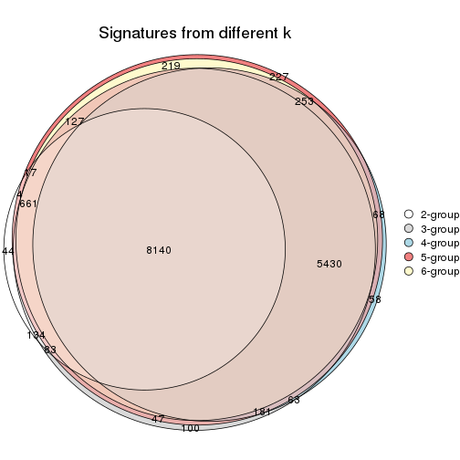

`get_signature()` returns a data frame invisibly. TO get the list of signatures, the function
call should be assigned to a variable explicitly. In following code, if `plot` argument is set
to `FALSE`, no heatmap is plotted while only the differential analysis is performed.

```r
# code only for demonstration
tb = get_signature(res, k = ..., plot = FALSE)
```

An example of the output of `tb` is:

```
#>   which_row         fdr    mean_1    mean_2 scaled_mean_1 scaled_mean_2 km
#> 1        38 0.042760348  8.373488  9.131774    -0.5533452     0.5164555  1
#> 2        40 0.018707592  7.106213  8.469186    -0.6173731     0.5762149  1
#> 3        55 0.019134737 10.221463 11.207825    -0.6159697     0.5749050  1
#> 4        59 0.006059896  5.921854  7.869574    -0.6899429     0.6439467  1
#> 5        60 0.018055526  8.928898 10.211722    -0.6204761     0.5791110  1
#> 6        98 0.009384629 15.714769 14.887706     0.6635654    -0.6193277  2
...
```

The columns in `tb` are:

1. `which_row`: row indices corresponding to the input matrix.
2. `fdr`: FDR for the differential test. 
3. `mean_x`: The mean value in group x.
4. `scaled_mean_x`: The mean value in group x after rows are scaled.
5. `km`: Row groups if k-means clustering is applied to rows.


UMAP plot which shows how samples are separated.


<script>
$( function() {
	$( '#tabs-CV-hclust-dimension-reduction' ).tabs();
} );
</script>
<div id='tabs-CV-hclust-dimension-reduction'>
<ul>
<li><a href='#tab-CV-hclust-dimension-reduction-1'>k = 2</a></li>
<li><a href='#tab-CV-hclust-dimension-reduction-2'>k = 3</a></li>
<li><a href='#tab-CV-hclust-dimension-reduction-3'>k = 4</a></li>
<li><a href='#tab-CV-hclust-dimension-reduction-4'>k = 5</a></li>
<li><a href='#tab-CV-hclust-dimension-reduction-5'>k = 6</a></li>
</ul>
<div id='tab-CV-hclust-dimension-reduction-1'>
<pre><code class="r">dimension_reduction(res, k = 2, method = &quot;UMAP&quot;)
</code></pre>

<p></p>

</div>
<div id='tab-CV-hclust-dimension-reduction-2'>
<pre><code class="r">dimension_reduction(res, k = 3, method = &quot;UMAP&quot;)
</code></pre>

<p></p>

</div>
<div id='tab-CV-hclust-dimension-reduction-3'>
<pre><code class="r">dimension_reduction(res, k = 4, method = &quot;UMAP&quot;)
</code></pre>

<p></p>

</div>
<div id='tab-CV-hclust-dimension-reduction-4'>
<pre><code class="r">dimension_reduction(res, k = 5, method = &quot;UMAP&quot;)
</code></pre>

<p></p>

</div>
<div id='tab-CV-hclust-dimension-reduction-5'>
<pre><code class="r">dimension_reduction(res, k = 6, method = &quot;UMAP&quot;)
</code></pre>

<p></p>

</div>
</div>


Following heatmap shows how subgroups are split when increasing `k`:

```r
collect_classes(res)
```


If matrix rows can be associated to genes, consider to use `GO_Enrichment(res,
...)` to perform function enrichment for the signature genes.


 

---------------------------------------------------


### CV:kmeans**


The object with results only for a single top-value method and a single partition method 
can be extracted as:

```r
res = res_list["CV", "kmeans"]
# you can also extract it by
# res = res_list["CV:kmeans"]
```

A summary of `res` and all the functions that can be applied to it:

```r
res
```

```
#> A 'ConsensusPartition' object with k = 2, 3, 4, 5, 6.
#>   On a matrix with 17377 rows and 265 columns.
#>   Top rows (1000, 2000, 3000, 4000, 5000) are extracted by 'CV' method.
#>   Subgroups are detected by 'kmeans' method.
#>   Performed in total 1250 partitions by row resampling.
#>   Best k for subgroups seems to be 3.
#> 
#> Following methods can be applied to this 'ConsensusPartition' object:
#>  [1] "cola_report"             "collect_classes"         "collect_plots"          
#>  [4] "collect_stats"           "colnames"                "compare_signatures"     
#>  [7] "consensus_heatmap"       "dimension_reduction"     "functional_enrichment"  
#> [10] "get_anno_col"            "get_anno"                "get_classes"            
#> [13] "get_consensus"           "get_matrix"              "get_membership"         
#> [16] "get_param"               "get_signatures"          "get_stats"              
#> [19] "is_best_k"               "is_stable_k"             "membership_heatmap"     
#> [22] "ncol"                    "nrow"                    "plot_ecdf"              
#> [25] "rownames"                "select_partition_number" "show"                   
#> [28] "suggest_best_k"          "test_to_known_factors"
```

`collect_plots()` function collects all the plots made from `res` for all `k` (number of partitions)
into one single page to provide an easy and fast comparison between different `k`.

```r
collect_plots(res)
```

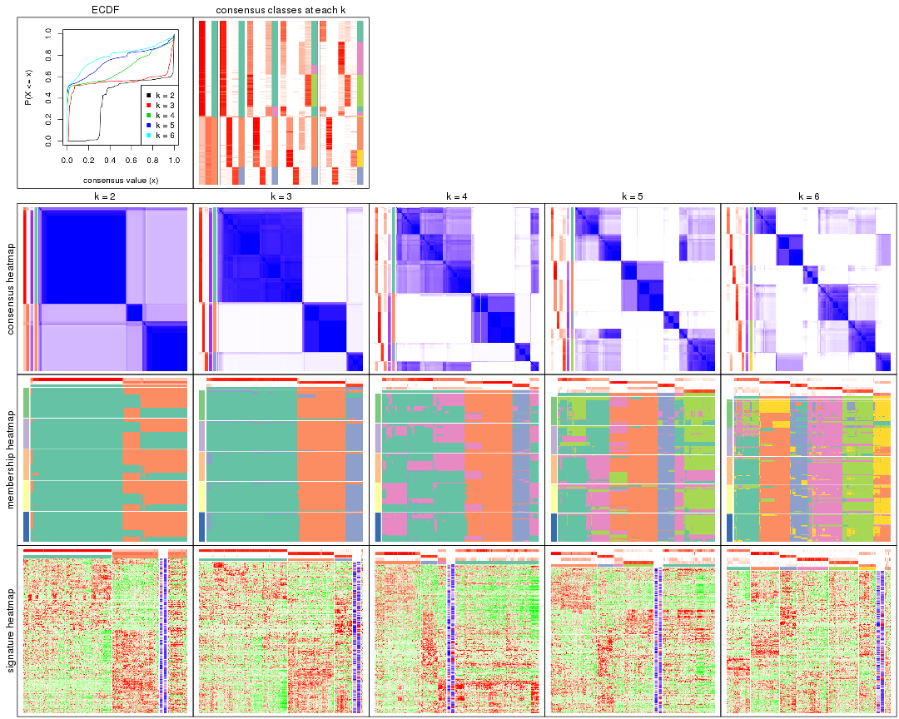

The plots are:

- The first row: a plot of the ECDF (Empirical cumulative distribution
  function) curves of the consensus matrix for each `k` and the heatmap of
  predicted classes for each `k`.
- The second row: heatmaps of the consensus matrix for each `k`.
- The third row: heatmaps of the membership matrix for each `k`.
- The fouth row: heatmaps of the signatures for each `k`.

All the plots in panels can be made by individual functions and they are
plotted later in this section.

`select_partition_number()` produces several plots showing different
statistics for choosing "optimized" `k`. There are following statistics:

- ECDF curves of the consensus matrix for each `k`;
- 1-PAC. [The PAC
  score](https://en.wikipedia.org/wiki/Consensus_clustering#Over-interpretation_potential_of_consensus_clustering)
  measures the proportion of the ambiguous subgrouping.
- Mean silhouette score.
- Concordance. The mean probability of fiting the consensus class ids in all
  partitions.
- Area increased. Denote $A_k$ as the area under the ECDF curve for current
  `k`, the area increased is defined as $A_k - A_{k-1}$.
- Rand index. The percent of pairs of samples that are both in a same cluster
  or both are not in a same cluster in the partition of k and k-1.
- Jaccard index. The ratio of pairs of samples are both in a same cluster in
  the partition of k and k-1 and the pairs of samples are both in a same
  cluster in the partition k or k-1.

The detailed explanations of these statistics can be found in [the cola
vignette](http://bioconductor.org/packages/devel/bioc/vignettes/cola/inst/doc/cola.html#toc_13).

Generally speaking, lower PAC score, higher mean silhouette score or higher
concordance corresponds to better partition. Rand index and Jaccard index
measure how similar the current partition is compared to partition with `k-1`.
If they are too similar, we won't accept `k` is better than `k-1`.

```r
select_partition_number(res)
```


The numeric values for all these statistics can be obtained by `get_stats()`.

```r
get_stats(res)
```

```
#>   k 1-PAC mean_silhouette concordance area_increased  Rand Jaccard
#> 2 2 0.434           0.850       0.861          0.379 0.514   0.514
#> 3 3 0.982           0.939       0.947          0.477 0.922   0.849
#> 4 4 0.653           0.496       0.761          0.211 0.932   0.848
#> 5 5 0.654           0.496       0.699          0.112 0.807   0.534
#> 6 6 0.679           0.794       0.771          0.059 0.879   0.560
```

`suggest_best_k()` suggests the best $k$ based on these statistics. The rules are as follows:

- All $k$ with Jaccard index larger than 0.95 are removed because the increase of
  the partition number does not provides enough extra information. If all $k$ are removed,
  the best $k$ is assigned by `NA`.
- For $k$ with 1-PAC larger than 0.9, the maximal $k$ is taken as the "best k". Other $k$ is called "optional k".
- If it does not fit the second rule. The $k$ with the highest vote of highest
  1-PAC, mean silhouette and concordance is taken as the "best k".

```r
suggest_best_k(res)
```

```
#> [1] 3
```


Following shows the table of the partitions (You need to click the **show/hide
code output** link to see it). The membership matrix (columns with name `p*`)
is inferred by
[`clue::cl_consensus()`](https://www.rdocumentation.org/link/cl_consensus?package=clue)
function with the `SE` method. Basically the value in the membership matrix
represents the probability to belong to a certain group. The finall class
label for an item is determined with the group with highest probability it
belongs to.

In `get_classes()` function, the entropy is calculated from the membership
matrix and the silhouette score is calculated from the consensus matrix.


<script>
$( function() {
	$( '#tabs-CV-kmeans-get-classes' ).tabs();
} );
</script>
<div id='tabs-CV-kmeans-get-classes'>
<ul>
<li><a href='#tab-CV-kmeans-get-classes-1'>k = 2</a></li>
<li><a href='#tab-CV-kmeans-get-classes-2'>k = 3</a></li>
<li><a href='#tab-CV-kmeans-get-classes-3'>k = 4</a></li>
<li><a href='#tab-CV-kmeans-get-classes-4'>k = 5</a></li>
<li><a href='#tab-CV-kmeans-get-classes-5'>k = 6</a></li>
</ul>

<div id='tab-CV-kmeans-get-classes-1'>
<p><a id='tab-CV-kmeans-get-classes-1-a' style='color:#0366d6' href='#'>show/hide code output</a></p>
<pre><code class="r">cbind(get_classes(res, k = 2), get_membership(res, k = 2))
</code></pre>

<pre><code>#&gt;                                      class entropy silhouette    p1    p2
#&gt; D30CF518-5FC6-4A54-8D5D-BA420EA1836D     2  0.8909     0.8162 0.308 0.692
#&gt; 92298FF7-1215-4756-B976-A7D88B91AD76     1  0.0000     0.9807 1.000 0.000
#&gt; 0E244FE2-7C17-4642-A51F-2CCA796D9C70     2  0.8909     0.8162 0.308 0.692
#&gt; 75435ED8-93E8-45FB-8480-98D8EB2EF8CB     2  0.8909     0.8162 0.308 0.692
#&gt; B6D11678-15A9-4F43-A0A2-225067DCAF1C     1  0.0000     0.9807 1.000 0.000
#&gt; B7F5A41E-9559-4329-81F5-1B88A74730B7     2  0.8909     0.8162 0.308 0.692
#&gt; 39414B2A-7FB0-4669-8DFE-86D9AF7AD2D9     1  0.0000     0.9807 1.000 0.000
#&gt; 04823F53-A12D-4852-8F34-77B9DCBB7DF0     2  0.8909     0.8162 0.308 0.692
#&gt; 49684C2B-D31C-4B45-A400-3497C3CCEC01     2  0.7139     0.7412 0.196 0.804
#&gt; 96A04875-58E2-4BE7-8E0F-CAB55F4CA54F     1  0.0000     0.9807 1.000 0.000
#&gt; 1F101D63-478B-40B9-A951-DC3887CFF067     1  0.0000     0.9807 1.000 0.000
#&gt; DD290860-E0B7-48FC-BE12-2AF729994C21     2  0.8909     0.8162 0.308 0.692
#&gt; FFDD7A12-DDEF-4974-8D60-64B7EEAAC994     2  0.8909     0.8162 0.308 0.692
#&gt; E076A9A9-EA2A-4FF7-92A8-F2DA7F30279E     2  0.9087     0.4724 0.324 0.676
#&gt; 830DFA6F-A85A-4317-82B2-791FAB998A01     2  0.8763     0.8101 0.296 0.704
#&gt; 58578614-E4A3-4655-BBAB-F65851625E0A     1  0.0000     0.9807 1.000 0.000
#&gt; 1CBFB672-4D66-430B-83F3-7CE3BE20ABF6     1  0.0000     0.9807 1.000 0.000
#&gt; 6C34A7D7-3756-4DCC-9A9F-B5FC4A148B7E     1  0.9881    -0.1535 0.564 0.436
#&gt; D97ED7B4-5DF2-4B62-8796-AA51CA79DBBB     1  0.0000     0.9807 1.000 0.000
#&gt; 45F15851-55F6-4169-834E-38958C38B6A9     1  0.0000     0.9807 1.000 0.000
#&gt; 4139E0C9-F712-4A25-8B59-587533B93B3E     2  0.9815     0.6828 0.420 0.580
#&gt; 2C3007BF-009E-404F-A3BF-8B921698D85B     1  0.0000     0.9807 1.000 0.000
#&gt; 2189F8E5-FF98-4C1A-BD04-5595DB553130     1  0.0000     0.9807 1.000 0.000
#&gt; FFAA0310-0D78-4499-8FB8-5BC46E4FCE58     2  0.9087     0.4724 0.324 0.676
#&gt; 0C375B2F-67BE-4708-BEB2-544DEC812DCA     2  0.8909     0.8162 0.308 0.692
#&gt; AB6324A1-19AB-400C-8001-54765D190E27     2  0.8909     0.8162 0.308 0.692
#&gt; A32C4DCD-DC4C-4132-9ED1-B159F5561A2D     1  0.0000     0.9807 1.000 0.000
#&gt; 2AE7105D-D494-45B0-947A-315D8C20ECDC     1  0.0000     0.9807 1.000 0.000
#&gt; 60FE9D59-FC0F-4B9C-ABF8-1C00BC761928     1  0.0000     0.9807 1.000 0.000
#&gt; 056442DC-E87A-4315-965C-C19D7B4FC40E     1  0.0000     0.9807 1.000 0.000
#&gt; 455111E5-18EF-4E3F-9DFF-8FA017D92461     1  0.0000     0.9807 1.000 0.000
#&gt; 10632BC6-0B81-433C-8832-6B2ABC73A94B     1  0.0000     0.9807 1.000 0.000
#&gt; AC6F82AD-C682-4EB3-BEC3-FD950F57609D     1  0.0000     0.9807 1.000 0.000
#&gt; D9ABDB75-04DA-4D33-A69F-701729494533     1  0.0000     0.9807 1.000 0.000
#&gt; 27BBF44D-F4D7-4C5A-935F-3310A363A670     2  0.8909     0.8162 0.308 0.692
#&gt; E7AA12EE-6E14-4B33-A52C-B13589436023     1  0.0000     0.9807 1.000 0.000
#&gt; DFA6D41A-D231-413E-A180-E42DF26C3E2B     2  0.9881     0.6585 0.436 0.564
#&gt; 655BD3AF-5094-4B19-93A8-401C70369B17     2  0.8909     0.8162 0.308 0.692
#&gt; 9DFEF253-923F-4EE2-8E3D-C75805387B20     1  0.9358    -0.0683 0.648 0.352
#&gt; 3B0EE948-B2CD-4191-90E2-BDD155F3B580     1  0.0000     0.9807 1.000 0.000
#&gt; 177C7EF4-2D54-4555-947C-44EE7C688917     2  0.9087     0.4724 0.324 0.676
#&gt; 1F8E8BB7-D159-4556-8B04-E5DD027CC444     2  0.8909     0.8162 0.308 0.692
#&gt; 619F37D2-6771-4727-9079-56BED07F1CF6     2  0.9896     0.4079 0.440 0.560
#&gt; ACAE29BE-ECB8-4A98-BC71-7A2D4857134E     1  0.1633     0.9465 0.976 0.024
#&gt; C5C3241A-684C-4238-9333-9AF8630EC086     2  0.8909     0.8162 0.308 0.692
#&gt; AD319DC2-140F-4E7B-A899-010687D8B714     2  0.8909     0.8162 0.308 0.692
#&gt; 2AFF397C-ED2A-4FD9-A7F0-E4C61E9FB603     2  0.9087     0.4724 0.324 0.676
#&gt; FB4C7892-3DBB-4148-AAE9-75B19A1A4031     1  0.1843     0.9405 0.972 0.028
#&gt; 6F5C4500-1ED1-4E81-B4F5-EEA64CE2336A     1  0.0000     0.9807 1.000 0.000
#&gt; BD027C69-3C10-4047-8E1E-218600FF2B73     2  0.8909     0.8162 0.308 0.692
#&gt; 11B473A9-4CC5-461F-BC57-CC9141F3591D     1  0.0000     0.9807 1.000 0.000
#&gt; 69A036E5-3E6A-4862-A7F8-2D203ED2FC9E     1  0.0000     0.9807 1.000 0.000
#&gt; 9C0BDF24-F011-4855-B95A-1B6BEFA808F7     1  0.0000     0.9807 1.000 0.000
#&gt; 9E205254-8C0C-4C05-AF5A-86E679CF732C     1  0.0000     0.9807 1.000 0.000
#&gt; 935CCE4A-8AA8-454E-9DFF-7DE27D0BD2E2     1  0.0000     0.9807 1.000 0.000
#&gt; 01E5E1FE-41D3-428B-90BC-7A000829E102     1  0.0000     0.9807 1.000 0.000
#&gt; B344A530-92CD-468B-847A-DF8E25688081     2  0.9087     0.4724 0.324 0.676
#&gt; F79F32A7-9F7B-4D62-8426-4A4CF10ED319     1  0.0000     0.9807 1.000 0.000
#&gt; C2E1C6FA-82F9-467C-99AE-9B39FAAC810C     1  0.0000     0.9807 1.000 0.000
#&gt; BF7CD9BD-776A-4957-8A6E-EF8AD83EA9D3     2  0.8909     0.8162 0.308 0.692
#&gt; 8A2C1409-E83B-435E-A20F-5FCA94801C9F     2  0.8909     0.8162 0.308 0.692
#&gt; B6BEFFB5-2F62-477B-A4C8-478D29577CBD     2  0.8909     0.8162 0.308 0.692
#&gt; 8622CBD0-F8E9-4AC1-8175-CC9A742B86F9     1  0.0000     0.9807 1.000 0.000
#&gt; 565DD660-ED58-4065-8619-260BEA6FCFEB     1  0.0000     0.9807 1.000 0.000
#&gt; 96038E42-0FBA-497D-819C-38F7689F10FF     1  0.0000     0.9807 1.000 0.000
#&gt; CA685549-F8BA-43F1-8461-5D2D3B17CFC5     1  0.0000     0.9807 1.000 0.000
#&gt; 52020307-71A6-46E5-ACB3-8F885CA8F1EB     1  0.0000     0.9807 1.000 0.000
#&gt; 7656DA98-76DC-424B-B02C-D7001DAAA0E4     1  0.0000     0.9807 1.000 0.000
#&gt; 74DBA640-45E2-42A6-8F1E-69C073D66EE6     1  0.0000     0.9807 1.000 0.000
#&gt; 251094BE-C33D-44F0-BD98-8618D71F520C     1  0.0000     0.9807 1.000 0.000
#&gt; AB914CC5-5FF1-4257-A353-6A99D11B9478     1  0.0000     0.9807 1.000 0.000
#&gt; 38B8B893-0E08-4B71-B51C-B32A7B2724E0     1  0.0000     0.9807 1.000 0.000
#&gt; 7C7CD8FF-99A4-41D7-B7E1-5A517001F551     2  0.8909     0.8162 0.308 0.692
#&gt; BFC5B75A-E4AE-486B-BA30-23BBAA33A125     2  0.8909     0.8162 0.308 0.692
#&gt; 182AC78E-A07C-4B34-B216-B5F573E9F036     2  0.9977     0.5933 0.472 0.528
#&gt; B38C5F72-8F46-4531-9C2D-96EEE07A5B22     2  0.8909     0.8162 0.308 0.692
#&gt; DB9333A6-A723-4B8F-9221-25B8B23D5126     1  0.0000     0.9807 1.000 0.000
#&gt; CD67DD21-C1B6-4D58-AC8E-1F4536C7DA70     2  0.9087     0.4724 0.324 0.676
#&gt; 3D76A56E-4B66-48AE-AA60-D9C1004C7140     1  0.0000     0.9807 1.000 0.000
#&gt; 71ED572F-7780-47A4-A9F8-D320C737690D     1  0.0000     0.9807 1.000 0.000
#&gt; B449FEA1-C4B0-400F-903C-59E13D0BA313     2  0.8813     0.8125 0.300 0.700
#&gt; 3F120E90-1486-4215-B9B9-79D5B413CAAC     1  0.0000     0.9807 1.000 0.000
#&gt; A071894B-D8C0-4740-BD55-93EA0C86EDF7     1  0.0000     0.9807 1.000 0.000
#&gt; 58848D57-D7A9-4ABB-86A2-A8AE2B23F654     1  0.0000     0.9807 1.000 0.000
#&gt; CD6F9E20-B301-4663-87EC-953EDF49754F     2  0.9087     0.4724 0.324 0.676
#&gt; 367D89F3-D527-4929-B830-8B6D553DF9E1     1  0.0000     0.9807 1.000 0.000
#&gt; BE8D7DCB-648B-42DD-9FA8-8B85B5D816B2     1  0.0000     0.9807 1.000 0.000
#&gt; AA46F56B-BD9C-40A4-8EA8-35E2568C964D     2  0.8909     0.8162 0.308 0.692
#&gt; 6393220A-7C57-413F-81A8-4E38C21E779E     2  0.8909     0.8162 0.308 0.692
#&gt; 89AE566C-F65F-43C2-BA97-621A7AC8B6DC     1  0.0000     0.9807 1.000 0.000
#&gt; AA6A4BFF-8C62-4B70-B85A-9EDF403B06BA     1  0.0000     0.9807 1.000 0.000
#&gt; BCE877A6-9C65-4495-A45D-05753F2D0E15     1  0.0000     0.9807 1.000 0.000
#&gt; D7BDDF49-C54B-4F8E-ACA0-C3684AB68B5C     1  0.7299     0.5585 0.796 0.204
#&gt; D0800D49-0033-44B2-8D7B-29B16F87ADA6     2  0.8861     0.8143 0.304 0.696
#&gt; 151D60B5-5AF1-4B61-B97F-ABC7531D9F89     1  0.0000     0.9807 1.000 0.000
#&gt; CBBAEB5B-25FA-4B6D-A40C-357E37033E36     1  0.0000     0.9807 1.000 0.000
#&gt; 317CD049-3151-40B7-8E88-B0B8813338D6     1  0.0000     0.9807 1.000 0.000
#&gt; 93835C77-F8FA-4928-843C-8016A91881FA     1  0.0000     0.9807 1.000 0.000
#&gt; 02A6950F-647D-4F20-B2D0-0238C1441C70     1  0.0000     0.9807 1.000 0.000
#&gt; 4D54E415-134F-4F6F-8718-3E0475EF5477     1  0.0000     0.9807 1.000 0.000
#&gt; 82AB290A-3993-45E5-8B15-6125A019778C     1  0.0000     0.9807 1.000 0.000
#&gt; 3B5EAD14-E506-4A22-804D-BF925A2D5247     2  0.8909     0.8162 0.308 0.692
#&gt; 19CF7DDF-4F3A-4D2F-B84A-6451A5C3112C     2  0.9087     0.4724 0.324 0.676
#&gt; 2FB00DAA-C274-42B1-A06B-611FE5E96844     1  0.0000     0.9807 1.000 0.000
#&gt; 2B1F01C3-8145-4296-8111-2B0474AB9A2C     2  0.8909     0.8162 0.308 0.692
#&gt; 3F0865F1-8256-4778-966F-D53637B415B6     2  0.9087     0.4724 0.324 0.676
#&gt; 5473210D-37F9-4192-86D2-E2A2C77F3BD2     2  0.9087     0.4724 0.324 0.676
#&gt; 5EDB6ACF-4F3F-471A-9DDC-661607CACCC4     1  0.0000     0.9807 1.000 0.000
#&gt; 6A252A3A-7EEB-47B6-9C23-D69BD2EA846F     2  0.9129     0.4659 0.328 0.672
#&gt; 0A7FFCBB-4BAA-4A5F-8B2D-B427C4D982A8     1  0.0000     0.9807 1.000 0.000
#&gt; 1603AFB8-5AD7-4794-9991-BDBE96B4D997     2  0.8909     0.8162 0.308 0.692
#&gt; 644299E9-62B7-4DFE-9E6D-D7556A01B40A     1  0.0000     0.9807 1.000 0.000
#&gt; EF12E923-1860-4269-B57B-BA6238FA4403     1  0.0000     0.9807 1.000 0.000
#&gt; 51B7241E-F0BE-482A-88AE-89004BB68989     1  0.0000     0.9807 1.000 0.000
#&gt; 1C007DF3-8A9F-4940-9A4C-DE2A412BB023     2  0.9087     0.4724 0.324 0.676
#&gt; 89FCFDE6-9625-432C-AA35-9C5FCCF40031     1  0.0000     0.9807 1.000 0.000
#&gt; 7955FC55-386D-497E-AFED-019BBBAD428E     2  0.9087     0.4724 0.324 0.676
#&gt; 37FF09ED-73EC-4D10-B2AC-7D8EBA9304ED     1  0.0000     0.9807 1.000 0.000
#&gt; C2CD2742-2FB4-468E-90FF-8F65A5C425A9     1  0.0000     0.9807 1.000 0.000
#&gt; 766FE08F-3393-4868-B1C1-FA98C9FF16E0     2  0.9087     0.4724 0.324 0.676
#&gt; 63E2B578-2221-4255-8C45-7FD030B1C94D     1  0.0000     0.9807 1.000 0.000
#&gt; C14B1A44-43F7-45F0-A583-5667A4D3BD95     1  0.0000     0.9807 1.000 0.000
#&gt; D9CB551A-CE20-4BF7-8AC9-839112346C3D     1  0.0000     0.9807 1.000 0.000
#&gt; 05BAA71A-E5B3-4A3A-A3F2-013A975087F0     2  0.8909     0.8162 0.308 0.692
#&gt; AC8DA7DE-4D83-4768-BEFD-9A1B2DA943CE     2  0.9909     0.2954 0.444 0.556
#&gt; E89DCE9D-F8A5-499C-85BB-BB500BADB9FB     1  0.0000     0.9807 1.000 0.000
#&gt; C16F9B5E-2B52-40F6-856D-C0D6FBDD16C1     1  0.0000     0.9807 1.000 0.000
#&gt; 8FF234D4-823A-4C80-82F7-2E92D72DBF88     2  0.8909     0.8162 0.308 0.692
#&gt; C9F94A6E-D104-4D8D-8EC5-EADECD85F092     1  0.9552    -0.1718 0.624 0.376
#&gt; 45C9756F-A154-4537-852E-ECBF27B92FE1     2  0.8909     0.8162 0.308 0.692
#&gt; 0F1A5708-341E-4713-BC70-76D702F826D6     2  0.9552     0.7219 0.376 0.624
#&gt; 2ECFBCA0-AB35-461A-A4B5-C60B2651A962     2  0.8909     0.8162 0.308 0.692
#&gt; 7DFAC404-3AB3-4274-A533-CFDAF4CE122D     1  0.0000     0.9807 1.000 0.000
#&gt; A90AF55C-4386-42AB-A812-9230026EA5A5     2  0.8909     0.8162 0.308 0.692
#&gt; 6258A757-4E18-4CD1-8417-189521E990B6     2  0.8909     0.8162 0.308 0.692
#&gt; EBFAD137-050F-47D0-A43D-72B8F7D70C2B     1  0.0000     0.9807 1.000 0.000
#&gt; 08B5EBFB-2807-4229-95A6-81AB7F377A56     2  0.8909     0.8162 0.308 0.692
#&gt; 4780A59C-0589-4995-B044-3201F09AF859     1  0.0000     0.9807 1.000 0.000
#&gt; 0AB81429-C287-48AA-9035-3A7A6F4C7328     2  0.8909     0.8162 0.308 0.692
#&gt; 20C4D047-28DA-4AB7-9B3C-32EDA6B22C9D     1  0.9248     0.0805 0.660 0.340
#&gt; 77C4E01F-84A6-4BFD-AA8E-D7875456F546     2  0.9087     0.4724 0.324 0.676
#&gt; 8B28383F-CF14-4CC5-A1E2-72AD915C0AE8     1  0.0000     0.9807 1.000 0.000
#&gt; E12E1F48-6A52-4F74-925C-C4EE1BF5C573     2  0.8813     0.8125 0.300 0.700
#&gt; 9B179BC5-BB4C-4CEE-99BC-BC552BC384A1     1  0.0000     0.9807 1.000 0.000
#&gt; 5548C91A-D3DE-48F5-B4A4-124BE177B99A     1  0.0000     0.9807 1.000 0.000
#&gt; 0E22B729-C381-4B0C-9897-62DD38F51722     1  0.0000     0.9807 1.000 0.000
#&gt; 7BC4937F-04E2-4B46-BA7C-FE9AC738C8A9     1  0.0000     0.9807 1.000 0.000
#&gt; EE6A0D3F-3F8A-4AA8-B3EF-32372EF37A29     1  0.0000     0.9807 1.000 0.000
#&gt; 08AC2706-7651-409F-BE6B-BCED1C2D1796     1  0.0000     0.9807 1.000 0.000
#&gt; A68B078D-8979-4070-BB4D-F526704ED3DC     1  0.0000     0.9807 1.000 0.000
#&gt; C319A5EE-69FA-4AAB-85A9-2EAAD8E4C703     1  0.0000     0.9807 1.000 0.000
#&gt; 0D7CAABD-D20C-4F82-BCBC-8B7276E8EDE2     1  0.0000     0.9807 1.000 0.000
#&gt; 09444DCC-44BA-4A3F-ACC5-863A54578B9F     1  0.1184     0.9583 0.984 0.016
#&gt; 2E32B047-C6E1-4743-A6C8-E98370A32145     1  0.0000     0.9807 1.000 0.000
#&gt; 6A6878A7-76B2-40DE-958B-804442AC6A5D     1  0.0000     0.9807 1.000 0.000
#&gt; 39F27293-0BFF-4EA2-8439-A299E3226D20     1  0.0000     0.9807 1.000 0.000
#&gt; 7EAE9C30-6080-405F-A7E6-1FED57674279     1  0.0000     0.9807 1.000 0.000
#&gt; 79499169-A093-4E0A-B6BD-010CD7BE5035     1  0.0000     0.9807 1.000 0.000
#&gt; 1F8BF4E8-BD84-4EFE-9E3E-89E7CE8FA72D     2  0.9087     0.4724 0.324 0.676
#&gt; 62B7988F-98E5-4AB8-8A16-D661A07455E8     1  0.0000     0.9807 1.000 0.000
#&gt; B7005B5F-217E-4073-BFB5-CE7E884B80C0     2  0.8909     0.8162 0.308 0.692
#&gt; B981568F-2C08-4696-B589-E157A49BE72B     2  0.8909     0.8162 0.308 0.692
#&gt; A3D85C0A-3202-40C2-88E1-052AC6C5184B     1  0.0000     0.9807 1.000 0.000
#&gt; 4CA783B9-9B99-46B8-962A-77194ECB7942     2  0.9087     0.4724 0.324 0.676
#&gt; D4024B08-4879-47EA-99E5-D9FCE1CD40DF     1  0.0000     0.9807 1.000 0.000
#&gt; 1D41CDA2-0B29-48FD-B83A-E60C174DBCB3     1  0.0000     0.9807 1.000 0.000
#&gt; A1923B2A-B233-4760-8AF9-C04C1CAEB100     1  0.0000     0.9807 1.000 0.000
#&gt; 80880D71-BFDE-4D88-892F-5ADF27A38940     2  0.9087     0.4724 0.324 0.676
#&gt; 55D1629D-30FD-49AA-88CE-EA3CA9B30A3F     2  0.8763     0.8101 0.296 0.704
#&gt; B71C409E-926D-48AD-8BD8-9F707CA4FB01     2  0.8763     0.8101 0.296 0.704
#&gt; 54A92C57-BD19-4A47-BA76-3ACA2DC36212     1  0.0938     0.9640 0.988 0.012
#&gt; B2AB74B8-506C-4C27-9105-E86A6AAA89D4     1  0.0000     0.9807 1.000 0.000
#&gt; 0356AE49-7A5C-42CC-A39C-7C8DFBFF8842     2  0.8608     0.8025 0.284 0.716
#&gt; ACA260A3-DC3F-4FF4-B9C5-2D4BC4F81783     1  0.0000     0.9807 1.000 0.000
#&gt; 9B440917-E5A4-43B9-A48D-6ABFEDCA6CFD     1  0.0000     0.9807 1.000 0.000
#&gt; 47464828-52EA-413B-B30C-BD8B55903D78     2  0.8909     0.8162 0.308 0.692
#&gt; C1D1FC82-B50D-4C82-8F03-06CEE3C08D18     1  0.0000     0.9807 1.000 0.000
#&gt; E5ABFC43-E2A3-4B1A-BBA3-8196C0B026A5     2  0.9988     0.5773 0.480 0.520
#&gt; 1D3C16CC-D0D5-4637-AAC7-91672DFF3317     1  0.0000     0.9807 1.000 0.000
#&gt; 4D038320-ADEA-4990-8371-68B4B8162E1A     2  0.8909     0.8162 0.308 0.692
#&gt; A75594CC-3E49-4869-8656-BBB4E72BF59D     2  0.8909     0.8162 0.308 0.692
#&gt; 7CABAA19-5FB2-4A58-BDA3-4F1FFB532C20     1  0.1184     0.9583 0.984 0.016
#&gt; 534EF1E9-9513-426E-B41E-A394AB2E4410     2  0.8813     0.8125 0.300 0.700
#&gt; 649F35A1-A08C-497D-A9B6-CB3084D5FB8D     1  0.0000     0.9807 1.000 0.000
#&gt; 7CA30F3C-1C98-480C-B8B5-A248AABFB468     1  0.0000     0.9807 1.000 0.000
#&gt; A9F8DA21-A802-44CF-9F5D-96A36687DCDD     2  0.9087     0.4724 0.324 0.676
#&gt; A7AE1ED1-86CB-4A50-97B2-66785C7191FE     1  0.0000     0.9807 1.000 0.000
#&gt; D0091AD4-D3D7-4C03-ACD9-DA9F8B6076C6     1  0.0000     0.9807 1.000 0.000
#&gt; 46EE1C2B-13F7-44A7-B27E-4EBB9DF0CA83     2  0.8909     0.8162 0.308 0.692
#&gt; CB9301B8-0282-43D6-AF5E-B753A9C7BFCB     2  0.8909     0.8162 0.308 0.692
#&gt; A0E77A39-885A-4472-9A10-2D1E51DBFDA4     1  0.0000     0.9807 1.000 0.000
#&gt; C06603C2-163D-40B6-A9FE-882424F18FE9     1  0.0000     0.9807 1.000 0.000
#&gt; C3921A29-80FF-4B9D-B366-5C0238A42231     1  0.0000     0.9807 1.000 0.000
#&gt; BB99B4E7-C834-4BB8-973F-8FA039E2798F     1  0.0000     0.9807 1.000 0.000
#&gt; 5CD78C2F-05E9-409A-8405-3EE936A6876E     2  0.9087     0.4724 0.324 0.676
#&gt; 6C126CC7-0C03-48F0-A2C2-F090CA239B70     2  0.8909     0.8162 0.308 0.692
#&gt; 7118B08A-E94C-49F4-8D76-26455C34D85F     2  0.8909     0.8162 0.308 0.692
#&gt; 266DAF30-CF3E-493E-8B24-3931D0039450     1  0.0000     0.9807 1.000 0.000
#&gt; DAB5F5B9-4FE5-468F-AD2B-B39BBC4317A0     2  0.9552     0.3754 0.376 0.624
#&gt; 9A9EB6D6-312E-4A98-8762-30D3ABD8193D     2  0.9087     0.4724 0.324 0.676
#&gt; CED15676-B901-4FC8-9C8D-51E529D9441D     1  0.0000     0.9807 1.000 0.000
#&gt; 827232CC-8035-440C-8B12-02C789C70B1B     1  0.0000     0.9807 1.000 0.000
#&gt; 04D5FB28-FB50-4EAE-95FB-72ABF0E618CA     2  0.8909     0.8162 0.308 0.692
#&gt; 6C96A851-97FC-4845-B895-D255191D9F25     1  0.0000     0.9807 1.000 0.000
#&gt; 3EC982CB-D013-443E-B21D-39DE6B8EF370     2  0.9087     0.4724 0.324 0.676
#&gt; 2E24A786-4370-42A1-AD50-D651F89819CC     2  0.8909     0.8162 0.308 0.692
#&gt; 7653BFA9-ADA5-44CA-8555-807FBBFC6DE2     1  0.0000     0.9807 1.000 0.000
#&gt; 7A110994-5741-4013-91F0-DD2E1D343F91     2  0.8813     0.8125 0.300 0.700
#&gt; 0A760E0C-11C5-4201-8452-18DBC1FEACEB     1  0.0000     0.9807 1.000 0.000
#&gt; 909B76A1-BB9F-4906-95BC-58CD1A46D3B8     2  0.8909     0.8162 0.308 0.692
#&gt; A782EE71-EDA4-4385-83B3-D16DE81296C0     2  0.9087     0.4724 0.324 0.676
#&gt; BD50E276-914F-4924-8CEA-FF47A66DB175     2  0.8909     0.8162 0.308 0.692
#&gt; 505D5CA8-0279-4BC7-8CC0-8C7A0165BF91     2  0.8909     0.8162 0.308 0.692
#&gt; D51FC997-E662-4AE7-BC9C-14183DA42DE1     2  0.8909     0.8162 0.308 0.692
#&gt; 8AD67970-84F1-4C0A-B47A-8FA4108F9FE3     1  0.0000     0.9807 1.000 0.000
#&gt; 6E33B1B6-7089-4BC3-B2B0-EC2C3B5D8B74     1  0.0000     0.9807 1.000 0.000
#&gt; 88C4EA46-2546-401C-A8E7-603EECFDFBA0     1  0.0000     0.9807 1.000 0.000
#&gt; 375D2D72-C998-4627-BA35-24E82A9A55FF     1  0.1843     0.9405 0.972 0.028
#&gt; 76D0F834-7064-46C6-96F4-E861CF5452B6     2  0.6712     0.7269 0.176 0.824
#&gt; 87159081-C97A-4004-AF0A-7EB6EF0EC47A     1  0.0000     0.9807 1.000 0.000
#&gt; 24A57006-800B-4174-AF4E-7EA57A8A756E     1  0.1184     0.9583 0.984 0.016
#&gt; AD68CBC6-8A13-4A65-AF62-E99AFA81D031     2  0.9087     0.4724 0.324 0.676
#&gt; 22863A57-F066-4DD1-A859-4336F43D144C     1  0.2948     0.9026 0.948 0.052
#&gt; 8F6F0362-9165-4DCC-992C-AF871A3C51E7     1  0.0000     0.9807 1.000 0.000
#&gt; 76ABF0B7-E707-4DB2-9486-3814439BDBA5     1  0.0000     0.9807 1.000 0.000
#&gt; BC72372F-3577-40E5-BA0F-41A084AA93AD     1  0.1843     0.9375 0.972 0.028
#&gt; 8E566039-B56C-4F41-B9EF-DE18BEEF2C95     1  0.0000     0.9807 1.000 0.000
#&gt; F096F016-3EF5-4A67-A7C2-8A45E1585232     1  0.0000     0.9807 1.000 0.000
#&gt; BB37913E-534B-43DD-BE3D-E13B29FD8172     2  0.8909     0.8162 0.308 0.692
#&gt; E344638F-9060-460F-8F7A-60D19442F294     2  0.9129     0.4712 0.328 0.672
#&gt; 6A0EAAD0-89D5-4F12-8B45-9D5A25182FAD     2  0.8813     0.8125 0.300 0.700
#&gt; A5199E3A-9D67-4543-88AB-24398C98E38E     1  0.0000     0.9807 1.000 0.000
#&gt; 23917D52-7864-4F84-9C77-DF8EA9407345     2  0.8909     0.8162 0.308 0.692
#&gt; 9AA96080-19D8-40C3-BDD1-6044D2D422D5     1  0.0000     0.9807 1.000 0.000
#&gt; 0ED65D91-260C-4662-9903-EE36A2E3B2D0     2  0.8909     0.8162 0.308 0.692
#&gt; 64BF1BC5-7A9A-4E1D-AEAB-AFE30B92AAF4     2  0.9087     0.4724 0.324 0.676
#&gt; F02301F1-9054-4DC6-8DC9-2451A0F53EFC     2  0.8909     0.8162 0.308 0.692
#&gt; 3264649A-5684-4181-83D0-A7E4D7E2E1FD     1  0.0000     0.9807 1.000 0.000
#&gt; 3F8DA39C-BC9B-4343-8838-5CE271E80C51     2  0.9983     0.5855 0.476 0.524
#&gt; BCC681CB-2AF4-4BB6-B53A-7544A2399454     1  0.0000     0.9807 1.000 0.000
#&gt; DCB50E17-5E2D-443B-8DCC-272FBB734C2E     1  0.0000     0.9807 1.000 0.000
#&gt; B5E47C38-CB6A-44C0-AA9B-56951B9EF78D     1  0.0000     0.9807 1.000 0.000
#&gt; B15B0185-9C28-4A00-9CEC-05EFECEA6709     1  0.0000     0.9807 1.000 0.000
#&gt; 61D4E8E7-0110-480A-A4A7-D406DE74C31E     1  0.0000     0.9807 1.000 0.000
#&gt; CA8DB3AD-3F6B-4622-BF73-47041EC96E42     1  0.0000     0.9807 1.000 0.000
#&gt; 5EECB1C4-172C-4494-871A-ADB650CD82BD     2  0.8909     0.8162 0.308 0.692
#&gt; 019B857C-D4F7-4B67-B699-56E52A60805B     2  0.8909     0.8162 0.308 0.692
#&gt; E9C28902-05C9-4883-97A4-D612D54E46B4     1  0.0000     0.9807 1.000 0.000
#&gt; C5D3D9A0-FC14-408D-AB6C-662018A5E5CA     1  0.0000     0.9807 1.000 0.000
#&gt; 7EB24744-509B-4854-B7D0-0BAFA210A345     2  0.8909     0.8162 0.308 0.692
#&gt; B8B7A721-2284-40AB-98F5-EF1351C30B66     2  0.8909     0.8162 0.308 0.692
#&gt; 3C12F39D-0D21-4F69-A539-4120B73C7A79     2  0.8909     0.8162 0.308 0.692
#&gt; 08D3F984-6850-45B2-9DF9-EC7F5A4060A4     1  0.0000     0.9807 1.000 0.000
#&gt; 9BD0EE79-1EED-4F6D-A5AB-43ADB8526F1E     1  0.0000     0.9807 1.000 0.000
#&gt; E489A871-3CF4-4F3D-8EAF-63B507054201     2  0.8909     0.8162 0.308 0.692
#&gt; 8CF8FD2E-1DBA-4257-9715-04D956D46B71     2  0.8909     0.8162 0.308 0.692
#&gt; F6193AF0-7A19-46CB-A818-1B01E7460791     1  0.0000     0.9807 1.000 0.000
#&gt; 96392D6B-D4FF-4393-93BA-08E469E8BBE1     1  0.0000     0.9807 1.000 0.000
#&gt; DABCBE5A-C591-46A2-AF66-DA3DB6106751     1  0.0000     0.9807 1.000 0.000
#&gt; 8B75F7D4-98D8-44DE-B19D-B733D6A031DB     1  0.0000     0.9807 1.000 0.000
#&gt; AAD9685A-564B-42E9-91E3-431951154BA7     2  0.8909     0.8162 0.308 0.692
#&gt; 90A43152-4E3B-4365-A39F-7B0E5CA66E55     1  0.0000     0.9807 1.000 0.000
#&gt; EFB76FCF-AC9C-4852-B91C-E055DA666FA0     1  0.0000     0.9807 1.000 0.000
#&gt; 6EBCFFE3-706F-440A-ABA9-012A924A07C6     2  0.8909     0.8162 0.308 0.692
#&gt; E922A244-F1C8-4310-ABB2-62B06E022E4C     1  0.0000     0.9807 1.000 0.000
</code></pre>

<script>
$('#tab-CV-kmeans-get-classes-1-a').parent().next().next().hide();
$('#tab-CV-kmeans-get-classes-1-a').click(function(){
  $('#tab-CV-kmeans-get-classes-1-a').parent().next().next().toggle();
  return(false);
});
</script>
</div>

<div id='tab-CV-kmeans-get-classes-2'>
<p><a id='tab-CV-kmeans-get-classes-2-a' style='color:#0366d6' href='#'>show/hide code output</a></p>
<pre><code class="r">cbind(get_classes(res, k = 3), get_membership(res, k = 3))
</code></pre>

<pre><code>#&gt;                                      class entropy silhouette    p1    p2    p3
#&gt; D30CF518-5FC6-4A54-8D5D-BA420EA1836D     2  0.1905     0.9616 0.016 0.956 0.028
#&gt; 92298FF7-1215-4756-B976-A7D88B91AD76     1  0.1289     0.9569 0.968 0.000 0.032
#&gt; 0E244FE2-7C17-4642-A51F-2CCA796D9C70     2  0.0747     0.9703 0.016 0.984 0.000
#&gt; 75435ED8-93E8-45FB-8480-98D8EB2EF8CB     2  0.1905     0.9616 0.016 0.956 0.028
#&gt; B6D11678-15A9-4F43-A0A2-225067DCAF1C     1  0.1529     0.9545 0.960 0.000 0.040
#&gt; B7F5A41E-9559-4329-81F5-1B88A74730B7     2  0.0747     0.9703 0.016 0.984 0.000
#&gt; 39414B2A-7FB0-4669-8DFE-86D9AF7AD2D9     1  0.1163     0.9583 0.972 0.000 0.028
#&gt; 04823F53-A12D-4852-8F34-77B9DCBB7DF0     2  0.0747     0.9703 0.016 0.984 0.000
#&gt; 49684C2B-D31C-4B45-A400-3497C3CCEC01     2  0.1877     0.9584 0.012 0.956 0.032
#&gt; 96A04875-58E2-4BE7-8E0F-CAB55F4CA54F     1  0.0747     0.9586 0.984 0.000 0.016
#&gt; 1F101D63-478B-40B9-A951-DC3887CFF067     1  0.0892     0.9583 0.980 0.000 0.020
#&gt; DD290860-E0B7-48FC-BE12-2AF729994C21     2  0.0747     0.9703 0.016 0.984 0.000
#&gt; FFDD7A12-DDEF-4974-8D60-64B7EEAAC994     2  0.0747     0.9703 0.016 0.984 0.000
#&gt; E076A9A9-EA2A-4FF7-92A8-F2DA7F30279E     3  0.4035     0.9666 0.040 0.080 0.880
#&gt; 830DFA6F-A85A-4317-82B2-791FAB998A01     2  0.1905     0.9616 0.016 0.956 0.028
#&gt; 58578614-E4A3-4655-BBAB-F65851625E0A     1  0.1643     0.9561 0.956 0.000 0.044
#&gt; 1CBFB672-4D66-430B-83F3-7CE3BE20ABF6     1  0.0892     0.9583 0.980 0.000 0.020
#&gt; 6C34A7D7-3756-4DCC-9A9F-B5FC4A148B7E     3  0.6195     0.6619 0.276 0.020 0.704
#&gt; D97ED7B4-5DF2-4B62-8796-AA51CA79DBBB     1  0.0592     0.9596 0.988 0.000 0.012
#&gt; 45F15851-55F6-4169-834E-38958C38B6A9     1  0.1411     0.9560 0.964 0.000 0.036
#&gt; 4139E0C9-F712-4A25-8B59-587533B93B3E     2  0.1905     0.9616 0.016 0.956 0.028
#&gt; 2C3007BF-009E-404F-A3BF-8B921698D85B     1  0.0892     0.9583 0.980 0.000 0.020
#&gt; 2189F8E5-FF98-4C1A-BD04-5595DB553130     1  0.1643     0.9562 0.956 0.000 0.044
#&gt; FFAA0310-0D78-4499-8FB8-5BC46E4FCE58     3  0.4035     0.9666 0.040 0.080 0.880
#&gt; 0C375B2F-67BE-4708-BEB2-544DEC812DCA     2  0.0747     0.9703 0.016 0.984 0.000
#&gt; AB6324A1-19AB-400C-8001-54765D190E27     2  0.0747     0.9703 0.016 0.984 0.000
#&gt; A32C4DCD-DC4C-4132-9ED1-B159F5561A2D     1  0.1289     0.9569 0.968 0.000 0.032
#&gt; 2AE7105D-D494-45B0-947A-315D8C20ECDC     1  0.1163     0.9583 0.972 0.000 0.028
#&gt; 60FE9D59-FC0F-4B9C-ABF8-1C00BC761928     1  0.1289     0.9569 0.968 0.000 0.032
#&gt; 056442DC-E87A-4315-965C-C19D7B4FC40E     1  0.1643     0.9533 0.956 0.000 0.044
#&gt; 455111E5-18EF-4E3F-9DFF-8FA017D92461     1  0.1163     0.9583 0.972 0.000 0.028
#&gt; 10632BC6-0B81-433C-8832-6B2ABC73A94B     1  0.0892     0.9586 0.980 0.000 0.020
#&gt; AC6F82AD-C682-4EB3-BEC3-FD950F57609D     1  0.1289     0.9569 0.968 0.000 0.032
#&gt; D9ABDB75-04DA-4D33-A69F-701729494533     1  0.1529     0.9529 0.960 0.000 0.040
#&gt; 27BBF44D-F4D7-4C5A-935F-3310A363A670     2  0.0747     0.9703 0.016 0.984 0.000
#&gt; E7AA12EE-6E14-4B33-A52C-B13589436023     1  0.1031     0.9596 0.976 0.000 0.024
#&gt; DFA6D41A-D231-413E-A180-E42DF26C3E2B     2  0.2443     0.9464 0.032 0.940 0.028
#&gt; 655BD3AF-5094-4B19-93A8-401C70369B17     2  0.0747     0.9703 0.016 0.984 0.000
#&gt; 9DFEF253-923F-4EE2-8E3D-C75805387B20     1  0.7705     0.3325 0.592 0.348 0.060
#&gt; 3B0EE948-B2CD-4191-90E2-BDD155F3B580     1  0.1163     0.9583 0.972 0.000 0.028
#&gt; 177C7EF4-2D54-4555-947C-44EE7C688917     3  0.3856     0.9670 0.040 0.072 0.888
#&gt; 1F8E8BB7-D159-4556-8B04-E5DD027CC444     2  0.0747     0.9703 0.016 0.984 0.000
#&gt; 619F37D2-6771-4727-9079-56BED07F1CF6     3  0.6372     0.8113 0.176 0.068 0.756
#&gt; ACAE29BE-ECB8-4A98-BC71-7A2D4857134E     1  0.5098     0.6978 0.752 0.000 0.248
#&gt; C5C3241A-684C-4238-9333-9AF8630EC086     2  0.1905     0.9616 0.016 0.956 0.028
#&gt; AD319DC2-140F-4E7B-A899-010687D8B714     2  0.0747     0.9703 0.016 0.984 0.000
#&gt; 2AFF397C-ED2A-4FD9-A7F0-E4C61E9FB603     3  0.3856     0.9670 0.040 0.072 0.888
#&gt; FB4C7892-3DBB-4148-AAE9-75B19A1A4031     1  0.5098     0.6773 0.752 0.000 0.248
#&gt; 6F5C4500-1ED1-4E81-B4F5-EEA64CE2336A     1  0.2066     0.9496 0.940 0.000 0.060
#&gt; BD027C69-3C10-4047-8E1E-218600FF2B73     2  0.0747     0.9703 0.016 0.984 0.000
#&gt; 11B473A9-4CC5-461F-BC57-CC9141F3591D     1  0.1643     0.9529 0.956 0.000 0.044
#&gt; 69A036E5-3E6A-4862-A7F8-2D203ED2FC9E     1  0.1163     0.9583 0.972 0.000 0.028
#&gt; 9C0BDF24-F011-4855-B95A-1B6BEFA808F7     1  0.0892     0.9583 0.980 0.000 0.020
#&gt; 9E205254-8C0C-4C05-AF5A-86E679CF732C     1  0.0892     0.9583 0.980 0.000 0.020
#&gt; 935CCE4A-8AA8-454E-9DFF-7DE27D0BD2E2     1  0.1163     0.9583 0.972 0.000 0.028
#&gt; 01E5E1FE-41D3-428B-90BC-7A000829E102     1  0.0892     0.9586 0.980 0.000 0.020
#&gt; B344A530-92CD-468B-847A-DF8E25688081     3  0.4035     0.9666 0.040 0.080 0.880
#&gt; F79F32A7-9F7B-4D62-8426-4A4CF10ED319     1  0.1289     0.9569 0.968 0.000 0.032
#&gt; C2E1C6FA-82F9-467C-99AE-9B39FAAC810C     1  0.1289     0.9569 0.968 0.000 0.032
#&gt; BF7CD9BD-776A-4957-8A6E-EF8AD83EA9D3     2  0.1905     0.9616 0.016 0.956 0.028
#&gt; 8A2C1409-E83B-435E-A20F-5FCA94801C9F     2  0.0747     0.9703 0.016 0.984 0.000
#&gt; B6BEFFB5-2F62-477B-A4C8-478D29577CBD     2  0.0747     0.9703 0.016 0.984 0.000
#&gt; 8622CBD0-F8E9-4AC1-8175-CC9A742B86F9     1  0.0892     0.9586 0.980 0.000 0.020
#&gt; 565DD660-ED58-4065-8619-260BEA6FCFEB     1  0.1289     0.9569 0.968 0.000 0.032
#&gt; 96038E42-0FBA-497D-819C-38F7689F10FF     1  0.0892     0.9586 0.980 0.000 0.020
#&gt; CA685549-F8BA-43F1-8461-5D2D3B17CFC5     1  0.1163     0.9583 0.972 0.000 0.028
#&gt; 52020307-71A6-46E5-ACB3-8F885CA8F1EB     1  0.1163     0.9582 0.972 0.000 0.028
#&gt; 7656DA98-76DC-424B-B02C-D7001DAAA0E4     1  0.1163     0.9589 0.972 0.000 0.028
#&gt; 74DBA640-45E2-42A6-8F1E-69C073D66EE6     1  0.2066     0.9496 0.940 0.000 0.060
#&gt; 251094BE-C33D-44F0-BD98-8618D71F520C     1  0.0424     0.9613 0.992 0.000 0.008
#&gt; AB914CC5-5FF1-4257-A353-6A99D11B9478     1  0.0747     0.9586 0.984 0.000 0.016
#&gt; 38B8B893-0E08-4B71-B51C-B32A7B2724E0     1  0.0892     0.9583 0.980 0.000 0.020
#&gt; 7C7CD8FF-99A4-41D7-B7E1-5A517001F551     2  0.1905     0.9616 0.016 0.956 0.028
#&gt; BFC5B75A-E4AE-486B-BA30-23BBAA33A125     2  0.0747     0.9703 0.016 0.984 0.000
#&gt; 182AC78E-A07C-4B34-B216-B5F573E9F036     2  0.6507     0.5134 0.284 0.688 0.028
#&gt; B38C5F72-8F46-4531-9C2D-96EEE07A5B22     2  0.0747     0.9703 0.016 0.984 0.000
#&gt; DB9333A6-A723-4B8F-9221-25B8B23D5126     1  0.1163     0.9583 0.972 0.000 0.028
#&gt; CD67DD21-C1B6-4D58-AC8E-1F4536C7DA70     3  0.4035     0.9666 0.040 0.080 0.880
#&gt; 3D76A56E-4B66-48AE-AA60-D9C1004C7140     1  0.0892     0.9583 0.980 0.000 0.020
#&gt; 71ED572F-7780-47A4-A9F8-D320C737690D     1  0.0892     0.9583 0.980 0.000 0.020
#&gt; B449FEA1-C4B0-400F-903C-59E13D0BA313     2  0.1905     0.9616 0.016 0.956 0.028
#&gt; 3F120E90-1486-4215-B9B9-79D5B413CAAC     1  0.1643     0.9529 0.956 0.000 0.044
#&gt; A071894B-D8C0-4740-BD55-93EA0C86EDF7     1  0.1163     0.9583 0.972 0.000 0.028
#&gt; 58848D57-D7A9-4ABB-86A2-A8AE2B23F654     1  0.1753     0.9522 0.952 0.000 0.048
#&gt; CD6F9E20-B301-4663-87EC-953EDF49754F     3  0.3856     0.9670 0.040 0.072 0.888
#&gt; 367D89F3-D527-4929-B830-8B6D553DF9E1     1  0.2165     0.9504 0.936 0.000 0.064
#&gt; BE8D7DCB-648B-42DD-9FA8-8B85B5D816B2     1  0.1289     0.9569 0.968 0.000 0.032
#&gt; AA46F56B-BD9C-40A4-8EA8-35E2568C964D     2  0.0747     0.9703 0.016 0.984 0.000
#&gt; 6393220A-7C57-413F-81A8-4E38C21E779E     2  0.0747     0.9703 0.016 0.984 0.000
#&gt; 89AE566C-F65F-43C2-BA97-621A7AC8B6DC     1  0.1031     0.9586 0.976 0.000 0.024
#&gt; AA6A4BFF-8C62-4B70-B85A-9EDF403B06BA     1  0.1643     0.9561 0.956 0.000 0.044
#&gt; BCE877A6-9C65-4495-A45D-05753F2D0E15     1  0.1163     0.9579 0.972 0.000 0.028
#&gt; D7BDDF49-C54B-4F8E-ACA0-C3684AB68B5C     1  0.5502     0.6682 0.744 0.008 0.248
#&gt; D0800D49-0033-44B2-8D7B-29B16F87ADA6     2  0.1905     0.9616 0.016 0.956 0.028
#&gt; 151D60B5-5AF1-4B61-B97F-ABC7531D9F89     1  0.1163     0.9583 0.972 0.000 0.028
#&gt; CBBAEB5B-25FA-4B6D-A40C-357E37033E36     1  0.1163     0.9583 0.972 0.000 0.028
#&gt; 317CD049-3151-40B7-8E88-B0B8813338D6     1  0.1643     0.9561 0.956 0.000 0.044
#&gt; 93835C77-F8FA-4928-843C-8016A91881FA     1  0.1411     0.9573 0.964 0.000 0.036
#&gt; 02A6950F-647D-4F20-B2D0-0238C1441C70     1  0.1031     0.9584 0.976 0.000 0.024
#&gt; 4D54E415-134F-4F6F-8718-3E0475EF5477     1  0.1289     0.9569 0.968 0.000 0.032
#&gt; 82AB290A-3993-45E5-8B15-6125A019778C     1  0.0747     0.9586 0.984 0.000 0.016
#&gt; 3B5EAD14-E506-4A22-804D-BF925A2D5247     2  0.0747     0.9703 0.016 0.984 0.000
#&gt; 19CF7DDF-4F3A-4D2F-B84A-6451A5C3112C     3  0.3780     0.9635 0.044 0.064 0.892
#&gt; 2FB00DAA-C274-42B1-A06B-611FE5E96844     1  0.1163     0.9583 0.972 0.000 0.028
#&gt; 2B1F01C3-8145-4296-8111-2B0474AB9A2C     2  0.0747     0.9703 0.016 0.984 0.000
#&gt; 3F0865F1-8256-4778-966F-D53637B415B6     3  0.3764     0.9671 0.040 0.068 0.892
#&gt; 5473210D-37F9-4192-86D2-E2A2C77F3BD2     3  0.3764     0.9671 0.040 0.068 0.892
#&gt; 5EDB6ACF-4F3F-471A-9DDC-661607CACCC4     1  0.1964     0.9516 0.944 0.000 0.056
#&gt; 6A252A3A-7EEB-47B6-9C23-D69BD2EA846F     3  0.3683     0.9639 0.044 0.060 0.896
#&gt; 0A7FFCBB-4BAA-4A5F-8B2D-B427C4D982A8     1  0.1289     0.9569 0.968 0.000 0.032
#&gt; 1603AFB8-5AD7-4794-9991-BDBE96B4D997     2  0.0747     0.9703 0.016 0.984 0.000
#&gt; 644299E9-62B7-4DFE-9E6D-D7556A01B40A     1  0.1529     0.9529 0.960 0.000 0.040
#&gt; EF12E923-1860-4269-B57B-BA6238FA4403     1  0.1643     0.9529 0.956 0.000 0.044
#&gt; 51B7241E-F0BE-482A-88AE-89004BB68989     1  0.1163     0.9583 0.972 0.000 0.028
#&gt; 1C007DF3-8A9F-4940-9A4C-DE2A412BB023     3  0.3764     0.9671 0.040 0.068 0.892
#&gt; 89FCFDE6-9625-432C-AA35-9C5FCCF40031     1  0.1529     0.9593 0.960 0.000 0.040
#&gt; 7955FC55-386D-497E-AFED-019BBBAD428E     3  0.4035     0.9666 0.040 0.080 0.880
#&gt; 37FF09ED-73EC-4D10-B2AC-7D8EBA9304ED     1  0.1163     0.9583 0.972 0.000 0.028
#&gt; C2CD2742-2FB4-468E-90FF-8F65A5C425A9     1  0.1411     0.9555 0.964 0.000 0.036
#&gt; 766FE08F-3393-4868-B1C1-FA98C9FF16E0     3  0.3856     0.9670 0.040 0.072 0.888
#&gt; 63E2B578-2221-4255-8C45-7FD030B1C94D     1  0.0892     0.9583 0.980 0.000 0.020
#&gt; C14B1A44-43F7-45F0-A583-5667A4D3BD95     1  0.1163     0.9583 0.972 0.000 0.028
#&gt; D9CB551A-CE20-4BF7-8AC9-839112346C3D     1  0.0892     0.9583 0.980 0.000 0.020
#&gt; 05BAA71A-E5B3-4A3A-A3F2-013A975087F0     2  0.0747     0.9703 0.016 0.984 0.000
#&gt; AC8DA7DE-4D83-4768-BEFD-9A1B2DA943CE     3  0.5036     0.8183 0.172 0.020 0.808
#&gt; E89DCE9D-F8A5-499C-85BB-BB500BADB9FB     1  0.1163     0.9583 0.972 0.000 0.028
#&gt; C16F9B5E-2B52-40F6-856D-C0D6FBDD16C1     1  0.2066     0.9496 0.940 0.000 0.060
#&gt; 8FF234D4-823A-4C80-82F7-2E92D72DBF88     2  0.0747     0.9703 0.016 0.984 0.000
#&gt; C9F94A6E-D104-4D8D-8EC5-EADECD85F092     2  0.2261     0.9035 0.068 0.932 0.000
#&gt; 45C9756F-A154-4537-852E-ECBF27B92FE1     2  0.0747     0.9703 0.016 0.984 0.000
#&gt; 0F1A5708-341E-4713-BC70-76D702F826D6     2  0.5763     0.6702 0.016 0.740 0.244
#&gt; 2ECFBCA0-AB35-461A-A4B5-C60B2651A962     2  0.1774     0.9630 0.016 0.960 0.024
#&gt; 7DFAC404-3AB3-4274-A533-CFDAF4CE122D     1  0.0892     0.9583 0.980 0.000 0.020
#&gt; A90AF55C-4386-42AB-A812-9230026EA5A5     2  0.1905     0.9616 0.016 0.956 0.028
#&gt; 6258A757-4E18-4CD1-8417-189521E990B6     2  0.0747     0.9703 0.016 0.984 0.000
#&gt; EBFAD137-050F-47D0-A43D-72B8F7D70C2B     1  0.0892     0.9583 0.980 0.000 0.020
#&gt; 08B5EBFB-2807-4229-95A6-81AB7F377A56     2  0.0747     0.9703 0.016 0.984 0.000
#&gt; 4780A59C-0589-4995-B044-3201F09AF859     1  0.0892     0.9583 0.980 0.000 0.020
#&gt; 0AB81429-C287-48AA-9035-3A7A6F4C7328     2  0.0747     0.9703 0.016 0.984 0.000
#&gt; 20C4D047-28DA-4AB7-9B3C-32EDA6B22C9D     1  0.7181     0.0112 0.508 0.024 0.468
#&gt; 77C4E01F-84A6-4BFD-AA8E-D7875456F546     3  0.3406     0.9549 0.028 0.068 0.904
#&gt; 8B28383F-CF14-4CC5-A1E2-72AD915C0AE8     1  0.1163     0.9589 0.972 0.000 0.028
#&gt; E12E1F48-6A52-4F74-925C-C4EE1BF5C573     2  0.1905     0.9616 0.016 0.956 0.028
#&gt; 9B179BC5-BB4C-4CEE-99BC-BC552BC384A1     1  0.1643     0.9529 0.956 0.000 0.044
#&gt; 5548C91A-D3DE-48F5-B4A4-124BE177B99A     1  0.1163     0.9583 0.972 0.000 0.028
#&gt; 0E22B729-C381-4B0C-9897-62DD38F51722     1  0.0747     0.9592 0.984 0.000 0.016
#&gt; 7BC4937F-04E2-4B46-BA7C-FE9AC738C8A9     1  0.1411     0.9580 0.964 0.000 0.036
#&gt; EE6A0D3F-3F8A-4AA8-B3EF-32372EF37A29     1  0.1163     0.9583 0.972 0.000 0.028
#&gt; 08AC2706-7651-409F-BE6B-BCED1C2D1796     1  0.0892     0.9586 0.980 0.000 0.020
#&gt; A68B078D-8979-4070-BB4D-F526704ED3DC     1  0.1289     0.9569 0.968 0.000 0.032
#&gt; C319A5EE-69FA-4AAB-85A9-2EAAD8E4C703     1  0.1163     0.9583 0.972 0.000 0.028
#&gt; 0D7CAABD-D20C-4F82-BCBC-8B7276E8EDE2     1  0.1289     0.9569 0.968 0.000 0.032
#&gt; 09444DCC-44BA-4A3F-ACC5-863A54578B9F     1  0.4346     0.7816 0.816 0.000 0.184
#&gt; 2E32B047-C6E1-4743-A6C8-E98370A32145     1  0.1163     0.9583 0.972 0.000 0.028
#&gt; 6A6878A7-76B2-40DE-958B-804442AC6A5D     1  0.1163     0.9583 0.972 0.000 0.028
#&gt; 39F27293-0BFF-4EA2-8439-A299E3226D20     1  0.1163     0.9589 0.972 0.000 0.028
#&gt; 7EAE9C30-6080-405F-A7E6-1FED57674279     1  0.0892     0.9583 0.980 0.000 0.020
#&gt; 79499169-A093-4E0A-B6BD-010CD7BE5035     1  0.1643     0.9560 0.956 0.000 0.044
#&gt; 1F8BF4E8-BD84-4EFE-9E3E-89E7CE8FA72D     3  0.4035     0.9666 0.040 0.080 0.880
#&gt; 62B7988F-98E5-4AB8-8A16-D661A07455E8     1  0.1163     0.9583 0.972 0.000 0.028
#&gt; B7005B5F-217E-4073-BFB5-CE7E884B80C0     2  0.0747     0.9703 0.016 0.984 0.000
#&gt; B981568F-2C08-4696-B589-E157A49BE72B     2  0.0747     0.9703 0.016 0.984 0.000
#&gt; A3D85C0A-3202-40C2-88E1-052AC6C5184B     1  0.0892     0.9593 0.980 0.000 0.020
#&gt; 4CA783B9-9B99-46B8-962A-77194ECB7942     3  0.4035     0.9666 0.040 0.080 0.880
#&gt; D4024B08-4879-47EA-99E5-D9FCE1CD40DF     1  0.0892     0.9586 0.980 0.000 0.020
#&gt; 1D41CDA2-0B29-48FD-B83A-E60C174DBCB3     1  0.1529     0.9568 0.960 0.000 0.040
#&gt; A1923B2A-B233-4760-8AF9-C04C1CAEB100     1  0.0892     0.9583 0.980 0.000 0.020
#&gt; 80880D71-BFDE-4D88-892F-5ADF27A38940     3  0.3856     0.9670 0.040 0.072 0.888
#&gt; 55D1629D-30FD-49AA-88CE-EA3CA9B30A3F     2  0.1905     0.9616 0.016 0.956 0.028
#&gt; B71C409E-926D-48AD-8BD8-9F707CA4FB01     2  0.1905     0.9616 0.016 0.956 0.028
#&gt; 54A92C57-BD19-4A47-BA76-3ACA2DC36212     1  0.2959     0.9006 0.900 0.000 0.100
#&gt; B2AB74B8-506C-4C27-9105-E86A6AAA89D4     1  0.1643     0.9529 0.956 0.000 0.044
#&gt; 0356AE49-7A5C-42CC-A39C-7C8DFBFF8842     2  0.1905     0.9616 0.016 0.956 0.028
#&gt; ACA260A3-DC3F-4FF4-B9C5-2D4BC4F81783     1  0.1163     0.9583 0.972 0.000 0.028
#&gt; 9B440917-E5A4-43B9-A48D-6ABFEDCA6CFD     1  0.1031     0.9601 0.976 0.000 0.024
#&gt; 47464828-52EA-413B-B30C-BD8B55903D78     2  0.0747     0.9703 0.016 0.984 0.000
#&gt; C1D1FC82-B50D-4C82-8F03-06CEE3C08D18     1  0.1289     0.9569 0.968 0.000 0.032
#&gt; E5ABFC43-E2A3-4B1A-BBA3-8196C0B026A5     2  0.6487     0.5385 0.268 0.700 0.032
#&gt; 1D3C16CC-D0D5-4637-AAC7-91672DFF3317     1  0.1289     0.9569 0.968 0.000 0.032
#&gt; 4D038320-ADEA-4990-8371-68B4B8162E1A     2  0.1905     0.9616 0.016 0.956 0.028
#&gt; A75594CC-3E49-4869-8656-BBB4E72BF59D     2  0.0747     0.9703 0.016 0.984 0.000
#&gt; 7CABAA19-5FB2-4A58-BDA3-4F1FFB532C20     1  0.2878     0.8956 0.904 0.000 0.096
#&gt; 534EF1E9-9513-426E-B41E-A394AB2E4410     2  0.1905     0.9616 0.016 0.956 0.028
#&gt; 649F35A1-A08C-497D-A9B6-CB3084D5FB8D     1  0.1529     0.9545 0.960 0.000 0.040
#&gt; 7CA30F3C-1C98-480C-B8B5-A248AABFB468     1  0.1289     0.9593 0.968 0.000 0.032
#&gt; A9F8DA21-A802-44CF-9F5D-96A36687DCDD     3  0.4035     0.9666 0.040 0.080 0.880
#&gt; A7AE1ED1-86CB-4A50-97B2-66785C7191FE     1  0.1529     0.9568 0.960 0.000 0.040
#&gt; D0091AD4-D3D7-4C03-ACD9-DA9F8B6076C6     1  0.1163     0.9583 0.972 0.000 0.028
#&gt; 46EE1C2B-13F7-44A7-B27E-4EBB9DF0CA83     2  0.0747     0.9703 0.016 0.984 0.000
#&gt; CB9301B8-0282-43D6-AF5E-B753A9C7BFCB     2  0.0747     0.9703 0.016 0.984 0.000
#&gt; A0E77A39-885A-4472-9A10-2D1E51DBFDA4     1  0.0892     0.9583 0.980 0.000 0.020
#&gt; C06603C2-163D-40B6-A9FE-882424F18FE9     1  0.1643     0.9561 0.956 0.000 0.044
#&gt; C3921A29-80FF-4B9D-B366-5C0238A42231     1  0.1163     0.9583 0.972 0.000 0.028
#&gt; BB99B4E7-C834-4BB8-973F-8FA039E2798F     1  0.0892     0.9583 0.980 0.000 0.020
#&gt; 5CD78C2F-05E9-409A-8405-3EE936A6876E     3  0.4035     0.9666 0.040 0.080 0.880
#&gt; 6C126CC7-0C03-48F0-A2C2-F090CA239B70     2  0.0747     0.9703 0.016 0.984 0.000
#&gt; 7118B08A-E94C-49F4-8D76-26455C34D85F     2  0.0747     0.9703 0.016 0.984 0.000
#&gt; 266DAF30-CF3E-493E-8B24-3931D0039450     1  0.1163     0.9583 0.972 0.000 0.028
#&gt; DAB5F5B9-4FE5-468F-AD2B-B39BBC4317A0     3  0.3310     0.9270 0.064 0.028 0.908
#&gt; 9A9EB6D6-312E-4A98-8762-30D3ABD8193D     3  0.3856     0.9670 0.040 0.072 0.888
#&gt; CED15676-B901-4FC8-9C8D-51E529D9441D     1  0.0892     0.9583 0.980 0.000 0.020
#&gt; 827232CC-8035-440C-8B12-02C789C70B1B     1  0.0892     0.9583 0.980 0.000 0.020
#&gt; 04D5FB28-FB50-4EAE-95FB-72ABF0E618CA     2  0.0747     0.9703 0.016 0.984 0.000
#&gt; 6C96A851-97FC-4845-B895-D255191D9F25     1  0.1289     0.9569 0.968 0.000 0.032
#&gt; 3EC982CB-D013-443E-B21D-39DE6B8EF370     3  0.3764     0.9659 0.040 0.068 0.892
#&gt; 2E24A786-4370-42A1-AD50-D651F89819CC     2  0.0747     0.9703 0.016 0.984 0.000
#&gt; 7653BFA9-ADA5-44CA-8555-807FBBFC6DE2     1  0.1163     0.9587 0.972 0.000 0.028
#&gt; 7A110994-5741-4013-91F0-DD2E1D343F91     2  0.1905     0.9616 0.016 0.956 0.028
#&gt; 0A760E0C-11C5-4201-8452-18DBC1FEACEB     1  0.1289     0.9569 0.968 0.000 0.032
#&gt; 909B76A1-BB9F-4906-95BC-58CD1A46D3B8     2  0.0747     0.9703 0.016 0.984 0.000
#&gt; A782EE71-EDA4-4385-83B3-D16DE81296C0     3  0.3780     0.9635 0.044 0.064 0.892
#&gt; BD50E276-914F-4924-8CEA-FF47A66DB175     2  0.0747     0.9703 0.016 0.984 0.000
#&gt; 505D5CA8-0279-4BC7-8CC0-8C7A0165BF91     2  0.0747     0.9703 0.016 0.984 0.000
#&gt; D51FC997-E662-4AE7-BC9C-14183DA42DE1     2  0.0747     0.9703 0.016 0.984 0.000
#&gt; 8AD67970-84F1-4C0A-B47A-8FA4108F9FE3     1  0.1289     0.9586 0.968 0.000 0.032
#&gt; 6E33B1B6-7089-4BC3-B2B0-EC2C3B5D8B74     1  0.0892     0.9583 0.980 0.000 0.020
#&gt; 88C4EA46-2546-401C-A8E7-603EECFDFBA0     1  0.1163     0.9583 0.972 0.000 0.028
#&gt; 375D2D72-C998-4627-BA35-24E82A9A55FF     1  0.5098     0.6773 0.752 0.000 0.248
#&gt; 76D0F834-7064-46C6-96F4-E861CF5452B6     2  0.1877     0.9584 0.012 0.956 0.032
#&gt; 87159081-C97A-4004-AF0A-7EB6EF0EC47A     1  0.1163     0.9583 0.972 0.000 0.028
#&gt; 24A57006-800B-4174-AF4E-7EA57A8A756E     1  0.2796     0.9000 0.908 0.000 0.092
#&gt; AD68CBC6-8A13-4A65-AF62-E99AFA81D031     3  0.3856     0.9670 0.040 0.072 0.888
#&gt; 22863A57-F066-4DD1-A859-4336F43D144C     1  0.5397     0.6356 0.720 0.000 0.280
#&gt; 8F6F0362-9165-4DCC-992C-AF871A3C51E7     1  0.1289     0.9569 0.968 0.000 0.032
#&gt; 76ABF0B7-E707-4DB2-9486-3814439BDBA5     1  0.1860     0.9513 0.948 0.000 0.052
#&gt; BC72372F-3577-40E5-BA0F-41A084AA93AD     1  0.1781     0.9526 0.960 0.020 0.020
#&gt; 8E566039-B56C-4F41-B9EF-DE18BEEF2C95     1  0.0892     0.9583 0.980 0.000 0.020
#&gt; F096F016-3EF5-4A67-A7C2-8A45E1585232     1  0.1753     0.9533 0.952 0.000 0.048
#&gt; BB37913E-534B-43DD-BE3D-E13B29FD8172     2  0.0747     0.9703 0.016 0.984 0.000
#&gt; E344638F-9060-460F-8F7A-60D19442F294     3  0.3683     0.9639 0.044 0.060 0.896
#&gt; 6A0EAAD0-89D5-4F12-8B45-9D5A25182FAD     2  0.1905     0.9616 0.016 0.956 0.028
#&gt; A5199E3A-9D67-4543-88AB-24398C98E38E     1  0.1163     0.9583 0.972 0.000 0.028
#&gt; 23917D52-7864-4F84-9C77-DF8EA9407345     2  0.0747     0.9703 0.016 0.984 0.000
#&gt; 9AA96080-19D8-40C3-BDD1-6044D2D422D5     1  0.1289     0.9586 0.968 0.000 0.032
#&gt; 0ED65D91-260C-4662-9903-EE36A2E3B2D0     2  0.0747     0.9703 0.016 0.984 0.000
#&gt; 64BF1BC5-7A9A-4E1D-AEAB-AFE30B92AAF4     3  0.3590     0.9542 0.028 0.076 0.896
#&gt; F02301F1-9054-4DC6-8DC9-2451A0F53EFC     2  0.1905     0.9616 0.016 0.956 0.028
#&gt; 3264649A-5684-4181-83D0-A7E4D7E2E1FD     1  0.1163     0.9583 0.972 0.000 0.028
#&gt; 3F8DA39C-BC9B-4343-8838-5CE271E80C51     2  0.6008     0.3586 0.372 0.628 0.000
#&gt; BCC681CB-2AF4-4BB6-B53A-7544A2399454     1  0.0892     0.9583 0.980 0.000 0.020
#&gt; DCB50E17-5E2D-443B-8DCC-272FBB734C2E     1  0.1411     0.9560 0.964 0.000 0.036
#&gt; B5E47C38-CB6A-44C0-AA9B-56951B9EF78D     1  0.1163     0.9587 0.972 0.000 0.028
#&gt; B15B0185-9C28-4A00-9CEC-05EFECEA6709     1  0.1289     0.9569 0.968 0.000 0.032
#&gt; 61D4E8E7-0110-480A-A4A7-D406DE74C31E     1  0.0892     0.9583 0.980 0.000 0.020
#&gt; CA8DB3AD-3F6B-4622-BF73-47041EC96E42     1  0.1163     0.9583 0.972 0.000 0.028
#&gt; 5EECB1C4-172C-4494-871A-ADB650CD82BD     2  0.0747     0.9703 0.016 0.984 0.000
#&gt; 019B857C-D4F7-4B67-B699-56E52A60805B     2  0.1905     0.9616 0.016 0.956 0.028
#&gt; E9C28902-05C9-4883-97A4-D612D54E46B4     1  0.1163     0.9583 0.972 0.000 0.028
#&gt; C5D3D9A0-FC14-408D-AB6C-662018A5E5CA     1  0.0892     0.9583 0.980 0.000 0.020
#&gt; 7EB24744-509B-4854-B7D0-0BAFA210A345     2  0.0747     0.9703 0.016 0.984 0.000
#&gt; B8B7A721-2284-40AB-98F5-EF1351C30B66     2  0.0747     0.9703 0.016 0.984 0.000
#&gt; 3C12F39D-0D21-4F69-A539-4120B73C7A79     2  0.0747     0.9703 0.016 0.984 0.000
#&gt; 08D3F984-6850-45B2-9DF9-EC7F5A4060A4     1  0.1163     0.9583 0.972 0.000 0.028
#&gt; 9BD0EE79-1EED-4F6D-A5AB-43ADB8526F1E     1  0.1163     0.9583 0.972 0.000 0.028
#&gt; E489A871-3CF4-4F3D-8EAF-63B507054201     2  0.0747     0.9703 0.016 0.984 0.000
#&gt; 8CF8FD2E-1DBA-4257-9715-04D956D46B71     2  0.0747     0.9703 0.016 0.984 0.000
#&gt; F6193AF0-7A19-46CB-A818-1B01E7460791     1  0.1289     0.9569 0.968 0.000 0.032
#&gt; 96392D6B-D4FF-4393-93BA-08E469E8BBE1     1  0.0892     0.9583 0.980 0.000 0.020
#&gt; DABCBE5A-C591-46A2-AF66-DA3DB6106751     1  0.1289     0.9572 0.968 0.000 0.032
#&gt; 8B75F7D4-98D8-44DE-B19D-B733D6A031DB     1  0.1289     0.9569 0.968 0.000 0.032
#&gt; AAD9685A-564B-42E9-91E3-431951154BA7     2  0.1905     0.9616 0.016 0.956 0.028
#&gt; 90A43152-4E3B-4365-A39F-7B0E5CA66E55     1  0.0892     0.9583 0.980 0.000 0.020
#&gt; EFB76FCF-AC9C-4852-B91C-E055DA666FA0     1  0.1643     0.9561 0.956 0.000 0.044
#&gt; 6EBCFFE3-706F-440A-ABA9-012A924A07C6     2  0.0747     0.9703 0.016 0.984 0.000
#&gt; E922A244-F1C8-4310-ABB2-62B06E022E4C     1  0.1289     0.9569 0.968 0.000 0.032
</code></pre>

<script>
$('#tab-CV-kmeans-get-classes-2-a').parent().next().next().hide();
$('#tab-CV-kmeans-get-classes-2-a').click(function(){
  $('#tab-CV-kmeans-get-classes-2-a').parent().next().next().toggle();
  return(false);
});
</script>
</div>

<div id='tab-CV-kmeans-get-classes-3'>
<p><a id='tab-CV-kmeans-get-classes-3-a' style='color:#0366d6' href='#'>show/hide code output</a></p>
<pre><code class="r">cbind(get_classes(res, k = 4), get_membership(res, k = 4))
</code></pre>

<pre><code>#&gt;                                      class entropy silhouette    p1    p2    p3    p4
#&gt; D30CF518-5FC6-4A54-8D5D-BA420EA1836D     2  0.3945     0.8361 0.000 0.780 0.004 0.216
#&gt; 92298FF7-1215-4756-B976-A7D88B91AD76     1  0.5125    -0.1305 0.604 0.000 0.008 0.388
#&gt; 0E244FE2-7C17-4642-A51F-2CCA796D9C70     2  0.0000     0.9029 0.000 1.000 0.000 0.000
#&gt; 75435ED8-93E8-45FB-8480-98D8EB2EF8CB     2  0.3945     0.8361 0.000 0.780 0.004 0.216
#&gt; B6D11678-15A9-4F43-A0A2-225067DCAF1C     1  0.5110     0.2610 0.636 0.000 0.012 0.352
#&gt; B7F5A41E-9559-4329-81F5-1B88A74730B7     2  0.0376     0.9026 0.000 0.992 0.004 0.004
#&gt; 39414B2A-7FB0-4669-8DFE-86D9AF7AD2D9     1  0.5018     0.2840 0.656 0.000 0.012 0.332
#&gt; 04823F53-A12D-4852-8F34-77B9DCBB7DF0     2  0.0000     0.9029 0.000 1.000 0.000 0.000
#&gt; 49684C2B-D31C-4B45-A400-3497C3CCEC01     2  0.3945     0.8361 0.000 0.780 0.004 0.216
#&gt; 96A04875-58E2-4BE7-8E0F-CAB55F4CA54F     1  0.0000     0.4393 1.000 0.000 0.000 0.000
#&gt; 1F101D63-478B-40B9-A951-DC3887CFF067     1  0.0469     0.4411 0.988 0.000 0.000 0.012
#&gt; DD290860-E0B7-48FC-BE12-2AF729994C21     2  0.0000     0.9029 0.000 1.000 0.000 0.000
#&gt; FFDD7A12-DDEF-4974-8D60-64B7EEAAC994     2  0.0376     0.9026 0.000 0.992 0.004 0.004
#&gt; E076A9A9-EA2A-4FF7-92A8-F2DA7F30279E     3  0.2505     0.9568 0.008 0.020 0.920 0.052
#&gt; 830DFA6F-A85A-4317-82B2-791FAB998A01     2  0.3982     0.8358 0.000 0.776 0.004 0.220
#&gt; 58578614-E4A3-4655-BBAB-F65851625E0A     4  0.5204     0.7122 0.376 0.000 0.012 0.612
#&gt; 1CBFB672-4D66-430B-83F3-7CE3BE20ABF6     1  0.0000     0.4393 1.000 0.000 0.000 0.000
#&gt; 6C34A7D7-3756-4DCC-9A9F-B5FC4A148B7E     1  0.5884     0.1350 0.592 0.000 0.364 0.044
#&gt; D97ED7B4-5DF2-4B62-8796-AA51CA79DBBB     1  0.1867     0.3999 0.928 0.000 0.000 0.072
#&gt; 45F15851-55F6-4169-834E-38958C38B6A9     1  0.4746    -0.0629 0.688 0.000 0.008 0.304
#&gt; 4139E0C9-F712-4A25-8B59-587533B93B3E     2  0.7007     0.6270 0.176 0.596 0.004 0.224
#&gt; 2C3007BF-009E-404F-A3BF-8B921698D85B     1  0.5288    -0.4884 0.520 0.000 0.008 0.472
#&gt; 2189F8E5-FF98-4C1A-BD04-5595DB553130     1  0.2216     0.4279 0.908 0.000 0.000 0.092
#&gt; FFAA0310-0D78-4499-8FB8-5BC46E4FCE58     3  0.2505     0.9568 0.008 0.020 0.920 0.052
#&gt; 0C375B2F-67BE-4708-BEB2-544DEC812DCA     2  0.0000     0.9029 0.000 1.000 0.000 0.000
#&gt; AB6324A1-19AB-400C-8001-54765D190E27     2  0.0376     0.9026 0.000 0.992 0.004 0.004
#&gt; A32C4DCD-DC4C-4132-9ED1-B159F5561A2D     1  0.5070    -0.1904 0.620 0.000 0.008 0.372
#&gt; 2AE7105D-D494-45B0-947A-315D8C20ECDC     1  0.5038     0.2784 0.652 0.000 0.012 0.336
#&gt; 60FE9D59-FC0F-4B9C-ABF8-1C00BC761928     1  0.5099    -0.2069 0.612 0.000 0.008 0.380
#&gt; 056442DC-E87A-4315-965C-C19D7B4FC40E     1  0.5138    -0.2238 0.600 0.000 0.008 0.392
#&gt; 455111E5-18EF-4E3F-9DFF-8FA017D92461     1  0.4999     0.2883 0.660 0.000 0.012 0.328
#&gt; 10632BC6-0B81-433C-8832-6B2ABC73A94B     1  0.3444     0.2746 0.816 0.000 0.000 0.184
#&gt; AC6F82AD-C682-4EB3-BEC3-FD950F57609D     1  0.5085    -0.2029 0.616 0.000 0.008 0.376
#&gt; D9ABDB75-04DA-4D33-A69F-701729494533     1  0.5236    -0.3331 0.560 0.000 0.008 0.432
#&gt; 27BBF44D-F4D7-4C5A-935F-3310A363A670     2  0.0188     0.9027 0.000 0.996 0.000 0.004
#&gt; E7AA12EE-6E14-4B33-A52C-B13589436023     1  0.5290    -0.3544 0.516 0.000 0.008 0.476
#&gt; DFA6D41A-D231-413E-A180-E42DF26C3E2B     2  0.4163     0.8312 0.004 0.772 0.004 0.220
#&gt; 655BD3AF-5094-4B19-93A8-401C70369B17     2  0.3710     0.8474 0.000 0.804 0.004 0.192
#&gt; 9DFEF253-923F-4EE2-8E3D-C75805387B20     4  0.8573     0.1322 0.256 0.244 0.044 0.456
#&gt; 3B0EE948-B2CD-4191-90E2-BDD155F3B580     1  0.4978     0.2919 0.664 0.000 0.012 0.324
#&gt; 177C7EF4-2D54-4555-947C-44EE7C688917     3  0.2057     0.9591 0.008 0.020 0.940 0.032
#&gt; 1F8E8BB7-D159-4556-8B04-E5DD027CC444     2  0.0000     0.9029 0.000 1.000 0.000 0.000
#&gt; 619F37D2-6771-4727-9079-56BED07F1CF6     3  0.5591     0.8026 0.128 0.024 0.760 0.088
#&gt; ACAE29BE-ECB8-4A98-BC71-7A2D4857134E     1  0.4300     0.3785 0.820 0.000 0.088 0.092
#&gt; C5C3241A-684C-4238-9333-9AF8630EC086     2  0.3945     0.8361 0.000 0.780 0.004 0.216
#&gt; AD319DC2-140F-4E7B-A899-010687D8B714     2  0.0000     0.9029 0.000 1.000 0.000 0.000
#&gt; 2AFF397C-ED2A-4FD9-A7F0-E4C61E9FB603     3  0.2057     0.9591 0.008 0.020 0.940 0.032
#&gt; FB4C7892-3DBB-4148-AAE9-75B19A1A4031     1  0.3486     0.3827 0.864 0.000 0.092 0.044
#&gt; 6F5C4500-1ED1-4E81-B4F5-EEA64CE2336A     1  0.5406    -0.1943 0.508 0.000 0.012 0.480
#&gt; BD027C69-3C10-4047-8E1E-218600FF2B73     2  0.0376     0.9026 0.000 0.992 0.004 0.004
#&gt; 11B473A9-4CC5-461F-BC57-CC9141F3591D     1  0.5093     0.2677 0.640 0.000 0.012 0.348
#&gt; 69A036E5-3E6A-4862-A7F8-2D203ED2FC9E     1  0.5038     0.2784 0.652 0.000 0.012 0.336
#&gt; 9C0BDF24-F011-4855-B95A-1B6BEFA808F7     1  0.0000     0.4393 1.000 0.000 0.000 0.000
#&gt; 9E205254-8C0C-4C05-AF5A-86E679CF732C     1  0.1302     0.4363 0.956 0.000 0.000 0.044
#&gt; 935CCE4A-8AA8-454E-9DFF-7DE27D0BD2E2     1  0.5018     0.2840 0.656 0.000 0.012 0.332
#&gt; 01E5E1FE-41D3-428B-90BC-7A000829E102     1  0.2921     0.2754 0.860 0.000 0.000 0.140
#&gt; B344A530-92CD-468B-847A-DF8E25688081     3  0.2522     0.9562 0.012 0.016 0.920 0.052
#&gt; F79F32A7-9F7B-4D62-8426-4A4CF10ED319     1  0.5099    -0.2069 0.612 0.000 0.008 0.380
#&gt; C2E1C6FA-82F9-467C-99AE-9B39FAAC810C     1  0.4917    -0.1200 0.656 0.000 0.008 0.336
#&gt; BF7CD9BD-776A-4957-8A6E-EF8AD83EA9D3     2  0.3945     0.8361 0.000 0.780 0.004 0.216
#&gt; 8A2C1409-E83B-435E-A20F-5FCA94801C9F     2  0.0188     0.9027 0.000 0.996 0.000 0.004
#&gt; B6BEFFB5-2F62-477B-A4C8-478D29577CBD     2  0.0376     0.9026 0.000 0.992 0.004 0.004
#&gt; 8622CBD0-F8E9-4AC1-8175-CC9A742B86F9     1  0.2868     0.2732 0.864 0.000 0.000 0.136
#&gt; 565DD660-ED58-4065-8619-260BEA6FCFEB     1  0.5024    -0.1707 0.632 0.000 0.008 0.360
#&gt; 96038E42-0FBA-497D-819C-38F7689F10FF     1  0.2868     0.2732 0.864 0.000 0.000 0.136
#&gt; CA685549-F8BA-43F1-8461-5D2D3B17CFC5     1  0.5110     0.2959 0.656 0.000 0.016 0.328
#&gt; 52020307-71A6-46E5-ACB3-8F885CA8F1EB     1  0.5292    -0.3598 0.512 0.000 0.008 0.480
#&gt; 7656DA98-76DC-424B-B02C-D7001DAAA0E4     1  0.2149     0.4387 0.912 0.000 0.000 0.088
#&gt; 74DBA640-45E2-42A6-8F1E-69C073D66EE6     4  0.4730     0.7748 0.364 0.000 0.000 0.636
#&gt; 251094BE-C33D-44F0-BD98-8618D71F520C     1  0.4134     0.2228 0.740 0.000 0.000 0.260
#&gt; AB914CC5-5FF1-4257-A353-6A99D11B9478     1  0.0000     0.4393 1.000 0.000 0.000 0.000
#&gt; 38B8B893-0E08-4B71-B51C-B32A7B2724E0     1  0.1302     0.4363 0.956 0.000 0.000 0.044
#&gt; 7C7CD8FF-99A4-41D7-B7E1-5A517001F551     2  0.3982     0.8358 0.000 0.776 0.004 0.220
#&gt; BFC5B75A-E4AE-486B-BA30-23BBAA33A125     2  0.0376     0.9026 0.000 0.992 0.004 0.004
#&gt; 182AC78E-A07C-4B34-B216-B5F573E9F036     2  0.7136     0.6010 0.188 0.580 0.004 0.228
#&gt; B38C5F72-8F46-4531-9C2D-96EEE07A5B22     2  0.0188     0.9028 0.000 0.996 0.004 0.000
#&gt; DB9333A6-A723-4B8F-9221-25B8B23D5126     1  0.4891     0.3296 0.680 0.000 0.012 0.308
#&gt; CD67DD21-C1B6-4D58-AC8E-1F4536C7DA70     3  0.2505     0.9568 0.008 0.020 0.920 0.052
#&gt; 3D76A56E-4B66-48AE-AA60-D9C1004C7140     1  0.5288    -0.4884 0.520 0.000 0.008 0.472
#&gt; 71ED572F-7780-47A4-A9F8-D320C737690D     1  0.0336     0.4407 0.992 0.000 0.000 0.008
#&gt; B449FEA1-C4B0-400F-903C-59E13D0BA313     2  0.3945     0.8361 0.000 0.780 0.004 0.216
#&gt; 3F120E90-1486-4215-B9B9-79D5B413CAAC     1  0.5038     0.2823 0.652 0.000 0.012 0.336
#&gt; A071894B-D8C0-4740-BD55-93EA0C86EDF7     1  0.5038     0.2784 0.652 0.000 0.012 0.336
#&gt; 58848D57-D7A9-4ABB-86A2-A8AE2B23F654     4  0.5236     0.7009 0.432 0.000 0.008 0.560
#&gt; CD6F9E20-B301-4663-87EC-953EDF49754F     3  0.2057     0.9591 0.008 0.020 0.940 0.032
#&gt; 367D89F3-D527-4929-B830-8B6D553DF9E1     1  0.5406    -0.1991 0.508 0.000 0.012 0.480
#&gt; BE8D7DCB-648B-42DD-9FA8-8B85B5D816B2     1  0.5099    -0.2069 0.612 0.000 0.008 0.380
#&gt; AA46F56B-BD9C-40A4-8EA8-35E2568C964D     2  0.0000     0.9029 0.000 1.000 0.000 0.000
#&gt; 6393220A-7C57-413F-81A8-4E38C21E779E     2  0.0000     0.9029 0.000 1.000 0.000 0.000
#&gt; 89AE566C-F65F-43C2-BA97-621A7AC8B6DC     1  0.5093     0.2560 0.640 0.000 0.012 0.348
#&gt; AA6A4BFF-8C62-4B70-B85A-9EDF403B06BA     4  0.5112     0.7859 0.384 0.000 0.008 0.608
#&gt; BCE877A6-9C65-4495-A45D-05753F2D0E15     1  0.3688     0.1384 0.792 0.000 0.000 0.208
#&gt; D7BDDF49-C54B-4F8E-ACA0-C3684AB68B5C     1  0.3421     0.3863 0.868 0.000 0.088 0.044
#&gt; D0800D49-0033-44B2-8D7B-29B16F87ADA6     2  0.3945     0.8361 0.000 0.780 0.004 0.216
#&gt; 151D60B5-5AF1-4B61-B97F-ABC7531D9F89     1  0.5558     0.2822 0.608 0.000 0.028 0.364
#&gt; CBBAEB5B-25FA-4B6D-A40C-357E37033E36     1  0.5018     0.2840 0.656 0.000 0.012 0.332
#&gt; 317CD049-3151-40B7-8E88-B0B8813338D6     4  0.5372     0.4811 0.444 0.000 0.012 0.544
#&gt; 93835C77-F8FA-4928-843C-8016A91881FA     4  0.5220     0.7466 0.424 0.000 0.008 0.568
#&gt; 02A6950F-647D-4F20-B2D0-0238C1441C70     1  0.3024     0.2527 0.852 0.000 0.000 0.148
#&gt; 4D54E415-134F-4F6F-8718-3E0475EF5477     1  0.5099    -0.2069 0.612 0.000 0.008 0.380
#&gt; 82AB290A-3993-45E5-8B15-6125A019778C     1  0.0188     0.4372 0.996 0.000 0.000 0.004
#&gt; 3B5EAD14-E506-4A22-804D-BF925A2D5247     2  0.0376     0.9026 0.000 0.992 0.004 0.004
#&gt; 19CF7DDF-4F3A-4D2F-B84A-6451A5C3112C     3  0.1871     0.9596 0.012 0.016 0.948 0.024
#&gt; 2FB00DAA-C274-42B1-A06B-611FE5E96844     1  0.5038     0.2784 0.652 0.000 0.012 0.336
#&gt; 2B1F01C3-8145-4296-8111-2B0474AB9A2C     2  0.0000     0.9029 0.000 1.000 0.000 0.000
#&gt; 3F0865F1-8256-4778-966F-D53637B415B6     3  0.2057     0.9533 0.008 0.020 0.940 0.032
#&gt; 5473210D-37F9-4192-86D2-E2A2C77F3BD2     3  0.1975     0.9542 0.012 0.016 0.944 0.028
#&gt; 5EDB6ACF-4F3F-471A-9DDC-661607CACCC4     4  0.5024     0.7490 0.360 0.000 0.008 0.632
#&gt; 6A252A3A-7EEB-47B6-9C23-D69BD2EA846F     3  0.2352     0.9471 0.012 0.016 0.928 0.044
#&gt; 0A7FFCBB-4BAA-4A5F-8B2D-B427C4D982A8     1  0.5099    -0.2069 0.612 0.000 0.008 0.380
#&gt; 1603AFB8-5AD7-4794-9991-BDBE96B4D997     2  0.0376     0.9026 0.000 0.992 0.004 0.004
#&gt; 644299E9-62B7-4DFE-9E6D-D7556A01B40A     1  0.5281    -0.3402 0.528 0.000 0.008 0.464
#&gt; EF12E923-1860-4269-B57B-BA6238FA4403     1  0.5093     0.2677 0.640 0.000 0.012 0.348
#&gt; 51B7241E-F0BE-482A-88AE-89004BB68989     1  0.5038     0.2784 0.652 0.000 0.012 0.336
#&gt; 1C007DF3-8A9F-4940-9A4C-DE2A412BB023     3  0.2245     0.9501 0.008 0.020 0.932 0.040
#&gt; 89FCFDE6-9625-432C-AA35-9C5FCCF40031     1  0.2530     0.4172 0.888 0.000 0.000 0.112
#&gt; 7955FC55-386D-497E-AFED-019BBBAD428E     3  0.2505     0.9568 0.008 0.020 0.920 0.052
#&gt; 37FF09ED-73EC-4D10-B2AC-7D8EBA9304ED     1  0.5149     0.2977 0.648 0.000 0.016 0.336
#&gt; C2CD2742-2FB4-468E-90FF-8F65A5C425A9     1  0.0592     0.4360 0.984 0.000 0.000 0.016
#&gt; 766FE08F-3393-4868-B1C1-FA98C9FF16E0     3  0.2057     0.9591 0.008 0.020 0.940 0.032
#&gt; 63E2B578-2221-4255-8C45-7FD030B1C94D     1  0.0592     0.4411 0.984 0.000 0.000 0.016
#&gt; C14B1A44-43F7-45F0-A583-5667A4D3BD95     1  0.5038     0.2784 0.652 0.000 0.012 0.336
#&gt; D9CB551A-CE20-4BF7-8AC9-839112346C3D     1  0.0188     0.4402 0.996 0.000 0.000 0.004
#&gt; 05BAA71A-E5B3-4A3A-A3F2-013A975087F0     2  0.0000     0.9029 0.000 1.000 0.000 0.000
#&gt; AC8DA7DE-4D83-4768-BEFD-9A1B2DA943CE     3  0.4406     0.8102 0.144 0.004 0.808 0.044
#&gt; E89DCE9D-F8A5-499C-85BB-BB500BADB9FB     1  0.5038     0.2784 0.652 0.000 0.012 0.336
#&gt; C16F9B5E-2B52-40F6-856D-C0D6FBDD16C1     4  0.5055     0.7818 0.368 0.000 0.008 0.624
#&gt; 8FF234D4-823A-4C80-82F7-2E92D72DBF88     2  0.0376     0.9026 0.000 0.992 0.004 0.004
#&gt; C9F94A6E-D104-4D8D-8EC5-EADECD85F092     2  0.7867     0.4208 0.268 0.476 0.008 0.248
#&gt; 45C9756F-A154-4537-852E-ECBF27B92FE1     2  0.0376     0.9026 0.000 0.992 0.004 0.004
#&gt; 0F1A5708-341E-4713-BC70-76D702F826D6     2  0.8312     0.5268 0.160 0.520 0.060 0.260
#&gt; 2ECFBCA0-AB35-461A-A4B5-C60B2651A962     2  0.3668     0.8466 0.000 0.808 0.004 0.188
#&gt; 7DFAC404-3AB3-4274-A533-CFDAF4CE122D     1  0.5288    -0.4884 0.520 0.000 0.008 0.472
#&gt; A90AF55C-4386-42AB-A812-9230026EA5A5     2  0.3945     0.8361 0.000 0.780 0.004 0.216
#&gt; 6258A757-4E18-4CD1-8417-189521E990B6     2  0.0188     0.9027 0.000 0.996 0.000 0.004
#&gt; EBFAD137-050F-47D0-A43D-72B8F7D70C2B     1  0.1302     0.4363 0.956 0.000 0.000 0.044
#&gt; 08B5EBFB-2807-4229-95A6-81AB7F377A56     2  0.0376     0.9026 0.000 0.992 0.004 0.004
#&gt; 4780A59C-0589-4995-B044-3201F09AF859     1  0.2002     0.4272 0.936 0.000 0.020 0.044
#&gt; 0AB81429-C287-48AA-9035-3A7A6F4C7328     2  0.0188     0.9027 0.000 0.996 0.000 0.004
#&gt; 20C4D047-28DA-4AB7-9B3C-32EDA6B22C9D     1  0.6295     0.2339 0.668 0.004 0.208 0.120
#&gt; 77C4E01F-84A6-4BFD-AA8E-D7875456F546     3  0.2007     0.9568 0.004 0.020 0.940 0.036
#&gt; 8B28383F-CF14-4CC5-A1E2-72AD915C0AE8     1  0.1474     0.4392 0.948 0.000 0.000 0.052
#&gt; E12E1F48-6A52-4F74-925C-C4EE1BF5C573     2  0.3945     0.8361 0.000 0.780 0.004 0.216
#&gt; 9B179BC5-BB4C-4CEE-99BC-BC552BC384A1     1  0.5093     0.2677 0.640 0.000 0.012 0.348
#&gt; 5548C91A-D3DE-48F5-B4A4-124BE177B99A     1  0.4999     0.2883 0.660 0.000 0.012 0.328
#&gt; 0E22B729-C381-4B0C-9897-62DD38F51722     1  0.1637     0.4178 0.940 0.000 0.000 0.060
#&gt; 7BC4937F-04E2-4B46-BA7C-FE9AC738C8A9     1  0.5388    -0.2076 0.532 0.000 0.012 0.456
#&gt; EE6A0D3F-3F8A-4AA8-B3EF-32372EF37A29     1  0.5018     0.2840 0.656 0.000 0.012 0.332
#&gt; 08AC2706-7651-409F-BE6B-BCED1C2D1796     1  0.0188     0.4402 0.996 0.000 0.000 0.004
#&gt; A68B078D-8979-4070-BB4D-F526704ED3DC     1  0.5099    -0.2069 0.612 0.000 0.008 0.380
#&gt; C319A5EE-69FA-4AAB-85A9-2EAAD8E4C703     1  0.5018     0.2893 0.656 0.000 0.012 0.332
#&gt; 0D7CAABD-D20C-4F82-BCBC-8B7276E8EDE2     1  0.5099    -0.2069 0.612 0.000 0.008 0.380
#&gt; 09444DCC-44BA-4A3F-ACC5-863A54578B9F     1  0.3301     0.3943 0.876 0.000 0.076 0.048
#&gt; 2E32B047-C6E1-4743-A6C8-E98370A32145     1  0.5018     0.2840 0.656 0.000 0.012 0.332
#&gt; 6A6878A7-76B2-40DE-958B-804442AC6A5D     1  0.4072     0.3688 0.748 0.000 0.000 0.252
#&gt; 39F27293-0BFF-4EA2-8439-A299E3226D20     1  0.1557     0.4402 0.944 0.000 0.000 0.056
#&gt; 7EAE9C30-6080-405F-A7E6-1FED57674279     1  0.1557     0.4388 0.944 0.000 0.000 0.056
#&gt; 79499169-A093-4E0A-B6BD-010CD7BE5035     4  0.5138     0.7877 0.392 0.000 0.008 0.600
#&gt; 1F8BF4E8-BD84-4EFE-9E3E-89E7CE8FA72D     3  0.2505     0.9568 0.008 0.020 0.920 0.052
#&gt; 62B7988F-98E5-4AB8-8A16-D661A07455E8     1  0.5018     0.2840 0.656 0.000 0.012 0.332
#&gt; B7005B5F-217E-4073-BFB5-CE7E884B80C0     2  0.0376     0.9026 0.000 0.992 0.004 0.004
#&gt; B981568F-2C08-4696-B589-E157A49BE72B     2  0.0000     0.9029 0.000 1.000 0.000 0.000
#&gt; A3D85C0A-3202-40C2-88E1-052AC6C5184B     1  0.3172     0.2410 0.840 0.000 0.000 0.160
#&gt; 4CA783B9-9B99-46B8-962A-77194ECB7942     3  0.2505     0.9568 0.008 0.020 0.920 0.052
#&gt; D4024B08-4879-47EA-99E5-D9FCE1CD40DF     1  0.0817     0.4222 0.976 0.000 0.000 0.024
#&gt; 1D41CDA2-0B29-48FD-B83A-E60C174DBCB3     1  0.5353    -0.2530 0.556 0.000 0.012 0.432
#&gt; A1923B2A-B233-4760-8AF9-C04C1CAEB100     1  0.1302     0.4363 0.956 0.000 0.000 0.044
#&gt; 80880D71-BFDE-4D88-892F-5ADF27A38940     3  0.2057     0.9591 0.008 0.020 0.940 0.032
#&gt; 55D1629D-30FD-49AA-88CE-EA3CA9B30A3F     2  0.3982     0.8358 0.000 0.776 0.004 0.220
#&gt; B71C409E-926D-48AD-8BD8-9F707CA4FB01     2  0.3982     0.8358 0.000 0.776 0.004 0.220
#&gt; 54A92C57-BD19-4A47-BA76-3ACA2DC36212     1  0.6069     0.2679 0.588 0.000 0.056 0.356
#&gt; B2AB74B8-506C-4C27-9105-E86A6AAA89D4     1  0.5093     0.2677 0.640 0.000 0.012 0.348
#&gt; 0356AE49-7A5C-42CC-A39C-7C8DFBFF8842     2  0.3945     0.8361 0.000 0.780 0.004 0.216
#&gt; ACA260A3-DC3F-4FF4-B9C5-2D4BC4F81783     1  0.5038     0.2784 0.652 0.000 0.012 0.336
#&gt; 9B440917-E5A4-43B9-A48D-6ABFEDCA6CFD     1  0.5290    -0.0710 0.584 0.000 0.012 0.404
#&gt; 47464828-52EA-413B-B30C-BD8B55903D78     2  0.0376     0.9026 0.000 0.992 0.004 0.004
#&gt; C1D1FC82-B50D-4C82-8F03-06CEE3C08D18     1  0.5193    -0.1789 0.580 0.000 0.008 0.412
#&gt; E5ABFC43-E2A3-4B1A-BBA3-8196C0B026A5     2  0.7623     0.4580 0.196 0.484 0.004 0.316
#&gt; 1D3C16CC-D0D5-4637-AAC7-91672DFF3317     1  0.5193    -0.1789 0.580 0.000 0.008 0.412
#&gt; 4D038320-ADEA-4990-8371-68B4B8162E1A     2  0.3982     0.8358 0.000 0.776 0.004 0.220
#&gt; A75594CC-3E49-4869-8656-BBB4E72BF59D     2  0.0000     0.9029 0.000 1.000 0.000 0.000
#&gt; 7CABAA19-5FB2-4A58-BDA3-4F1FFB532C20     1  0.2844     0.4125 0.900 0.000 0.048 0.052
#&gt; 534EF1E9-9513-426E-B41E-A394AB2E4410     2  0.3945     0.8361 0.000 0.780 0.004 0.216
#&gt; 649F35A1-A08C-497D-A9B6-CB3084D5FB8D     1  0.5093     0.2677 0.640 0.000 0.012 0.348
#&gt; 7CA30F3C-1C98-480C-B8B5-A248AABFB468     1  0.2760     0.4308 0.872 0.000 0.000 0.128
#&gt; A9F8DA21-A802-44CF-9F5D-96A36687DCDD     3  0.2505     0.9568 0.008 0.020 0.920 0.052
#&gt; A7AE1ED1-86CB-4A50-97B2-66785C7191FE     4  0.5125     0.7872 0.388 0.000 0.008 0.604
#&gt; D0091AD4-D3D7-4C03-ACD9-DA9F8B6076C6     1  0.5018     0.2840 0.656 0.000 0.012 0.332
#&gt; 46EE1C2B-13F7-44A7-B27E-4EBB9DF0CA83     2  0.0376     0.9026 0.000 0.992 0.004 0.004
#&gt; CB9301B8-0282-43D6-AF5E-B753A9C7BFCB     2  0.0000     0.9029 0.000 1.000 0.000 0.000
#&gt; A0E77A39-885A-4472-9A10-2D1E51DBFDA4     1  0.1302     0.4363 0.956 0.000 0.000 0.044
#&gt; C06603C2-163D-40B6-A9FE-882424F18FE9     4  0.4905     0.7597 0.364 0.000 0.004 0.632
#&gt; C3921A29-80FF-4B9D-B366-5C0238A42231     1  0.5467     0.2852 0.612 0.000 0.024 0.364
#&gt; BB99B4E7-C834-4BB8-973F-8FA039E2798F     1  0.5294    -0.5262 0.508 0.000 0.008 0.484
#&gt; 5CD78C2F-05E9-409A-8405-3EE936A6876E     3  0.2505     0.9568 0.008 0.020 0.920 0.052
#&gt; 6C126CC7-0C03-48F0-A2C2-F090CA239B70     2  0.0000     0.9029 0.000 1.000 0.000 0.000
#&gt; 7118B08A-E94C-49F4-8D76-26455C34D85F     2  0.0000     0.9029 0.000 1.000 0.000 0.000
#&gt; 266DAF30-CF3E-493E-8B24-3931D0039450     1  0.5038     0.2784 0.652 0.000 0.012 0.336
#&gt; DAB5F5B9-4FE5-468F-AD2B-B39BBC4317A0     3  0.2660     0.9309 0.036 0.000 0.908 0.056
#&gt; 9A9EB6D6-312E-4A98-8762-30D3ABD8193D     3  0.2057     0.9591 0.008 0.020 0.940 0.032
#&gt; CED15676-B901-4FC8-9C8D-51E529D9441D     1  0.2300     0.4237 0.924 0.000 0.028 0.048
#&gt; 827232CC-8035-440C-8B12-02C789C70B1B     1  0.1302     0.4452 0.956 0.000 0.000 0.044
#&gt; 04D5FB28-FB50-4EAE-95FB-72ABF0E618CA     2  0.0000     0.9029 0.000 1.000 0.000 0.000
#&gt; 6C96A851-97FC-4845-B895-D255191D9F25     1  0.5099    -0.2069 0.612 0.000 0.008 0.380
#&gt; 3EC982CB-D013-443E-B21D-39DE6B8EF370     3  0.2604     0.9469 0.012 0.016 0.916 0.056
#&gt; 2E24A786-4370-42A1-AD50-D651F89819CC     2  0.0000     0.9029 0.000 1.000 0.000 0.000
#&gt; 7653BFA9-ADA5-44CA-8555-807FBBFC6DE2     1  0.5110     0.2473 0.636 0.000 0.012 0.352
#&gt; 7A110994-5741-4013-91F0-DD2E1D343F91     2  0.3945     0.8361 0.000 0.780 0.004 0.216
#&gt; 0A760E0C-11C5-4201-8452-18DBC1FEACEB     1  0.5099    -0.2069 0.612 0.000 0.008 0.380
#&gt; 909B76A1-BB9F-4906-95BC-58CD1A46D3B8     2  0.0376     0.9026 0.000 0.992 0.004 0.004
#&gt; A782EE71-EDA4-4385-83B3-D16DE81296C0     3  0.1871     0.9596 0.012 0.016 0.948 0.024
#&gt; BD50E276-914F-4924-8CEA-FF47A66DB175     2  0.0000     0.9029 0.000 1.000 0.000 0.000
#&gt; 505D5CA8-0279-4BC7-8CC0-8C7A0165BF91     2  0.0188     0.9027 0.000 0.996 0.000 0.004
#&gt; D51FC997-E662-4AE7-BC9C-14183DA42DE1     2  0.0000     0.9029 0.000 1.000 0.000 0.000
#&gt; 8AD67970-84F1-4C0A-B47A-8FA4108F9FE3     1  0.5378    -0.0974 0.540 0.000 0.012 0.448
#&gt; 6E33B1B6-7089-4BC3-B2B0-EC2C3B5D8B74     1  0.0469     0.4411 0.988 0.000 0.000 0.012
#&gt; 88C4EA46-2546-401C-A8E7-603EECFDFBA0     1  0.5038     0.2784 0.652 0.000 0.012 0.336
#&gt; 375D2D72-C998-4627-BA35-24E82A9A55FF     1  0.3486     0.3827 0.864 0.000 0.092 0.044
#&gt; 76D0F834-7064-46C6-96F4-E861CF5452B6     2  0.3982     0.8358 0.000 0.776 0.004 0.220
#&gt; 87159081-C97A-4004-AF0A-7EB6EF0EC47A     1  0.5038     0.2784 0.652 0.000 0.012 0.336
#&gt; 24A57006-800B-4174-AF4E-7EA57A8A756E     1  0.2675     0.4108 0.908 0.000 0.048 0.044
#&gt; AD68CBC6-8A13-4A65-AF62-E99AFA81D031     3  0.2057     0.9591 0.008 0.020 0.940 0.032
#&gt; 22863A57-F066-4DD1-A859-4336F43D144C     1  0.6952     0.1881 0.516 0.000 0.120 0.364
#&gt; 8F6F0362-9165-4DCC-992C-AF871A3C51E7     1  0.5099    -0.2069 0.612 0.000 0.008 0.380
#&gt; 76ABF0B7-E707-4DB2-9486-3814439BDBA5     4  0.5161     0.7689 0.400 0.000 0.008 0.592
#&gt; BC72372F-3577-40E5-BA0F-41A084AA93AD     1  0.5288    -0.3414 0.520 0.000 0.008 0.472
#&gt; 8E566039-B56C-4F41-B9EF-DE18BEEF2C95     1  0.1211     0.4374 0.960 0.000 0.000 0.040
#&gt; F096F016-3EF5-4A67-A7C2-8A45E1585232     4  0.5172     0.7632 0.404 0.000 0.008 0.588
#&gt; BB37913E-534B-43DD-BE3D-E13B29FD8172     2  0.0000     0.9029 0.000 1.000 0.000 0.000
#&gt; E344638F-9060-460F-8F7A-60D19442F294     3  0.2473     0.9451 0.016 0.016 0.924 0.044
#&gt; 6A0EAAD0-89D5-4F12-8B45-9D5A25182FAD     2  0.3982     0.8358 0.000 0.776 0.004 0.220
#&gt; A5199E3A-9D67-4543-88AB-24398C98E38E     1  0.5167     0.2912 0.644 0.000 0.016 0.340
#&gt; 23917D52-7864-4F84-9C77-DF8EA9407345     2  0.0376     0.9026 0.000 0.992 0.004 0.004
#&gt; 9AA96080-19D8-40C3-BDD1-6044D2D422D5     4  0.5126     0.5484 0.444 0.000 0.004 0.552
#&gt; 0ED65D91-260C-4662-9903-EE36A2E3B2D0     2  0.0000     0.9029 0.000 1.000 0.000 0.000
#&gt; 64BF1BC5-7A9A-4E1D-AEAB-AFE30B92AAF4     3  0.2441     0.9542 0.004 0.020 0.920 0.056
#&gt; F02301F1-9054-4DC6-8DC9-2451A0F53EFC     2  0.3945     0.8361 0.000 0.780 0.004 0.216
#&gt; 3264649A-5684-4181-83D0-A7E4D7E2E1FD     1  0.5038     0.2784 0.652 0.000 0.012 0.336
#&gt; 3F8DA39C-BC9B-4343-8838-5CE271E80C51     2  0.5751     0.5807 0.164 0.712 0.000 0.124
#&gt; BCC681CB-2AF4-4BB6-B53A-7544A2399454     1  0.5288    -0.4884 0.520 0.000 0.008 0.472
#&gt; DCB50E17-5E2D-443B-8DCC-272FBB734C2E     1  0.4792    -0.0768 0.680 0.000 0.008 0.312
#&gt; B5E47C38-CB6A-44C0-AA9B-56951B9EF78D     1  0.5110     0.2473 0.636 0.000 0.012 0.352
#&gt; B15B0185-9C28-4A00-9CEC-05EFECEA6709     1  0.5099    -0.2069 0.612 0.000 0.008 0.380
#&gt; 61D4E8E7-0110-480A-A4A7-D406DE74C31E     1  0.1302     0.4363 0.956 0.000 0.000 0.044
#&gt; CA8DB3AD-3F6B-4622-BF73-47041EC96E42     1  0.5159     0.2916 0.624 0.000 0.012 0.364
#&gt; 5EECB1C4-172C-4494-871A-ADB650CD82BD     2  0.0000     0.9029 0.000 1.000 0.000 0.000
#&gt; 019B857C-D4F7-4B67-B699-56E52A60805B     2  0.3945     0.8361 0.000 0.780 0.004 0.216
#&gt; E9C28902-05C9-4883-97A4-D612D54E46B4     1  0.5038     0.2784 0.652 0.000 0.012 0.336
#&gt; C5D3D9A0-FC14-408D-AB6C-662018A5E5CA     1  0.0000     0.4393 1.000 0.000 0.000 0.000
#&gt; 7EB24744-509B-4854-B7D0-0BAFA210A345     2  0.0188     0.9027 0.000 0.996 0.000 0.004
#&gt; B8B7A721-2284-40AB-98F5-EF1351C30B66     2  0.0000     0.9029 0.000 1.000 0.000 0.000
#&gt; 3C12F39D-0D21-4F69-A539-4120B73C7A79     2  0.0376     0.9026 0.000 0.992 0.004 0.004
#&gt; 08D3F984-6850-45B2-9DF9-EC7F5A4060A4     1  0.5018     0.2840 0.656 0.000 0.012 0.332
#&gt; 9BD0EE79-1EED-4F6D-A5AB-43ADB8526F1E     1  0.4936     0.2985 0.672 0.000 0.012 0.316
#&gt; E489A871-3CF4-4F3D-8EAF-63B507054201     2  0.0000     0.9029 0.000 1.000 0.000 0.000
#&gt; 8CF8FD2E-1DBA-4257-9715-04D956D46B71     2  0.0000     0.9029 0.000 1.000 0.000 0.000
#&gt; F6193AF0-7A19-46CB-A818-1B01E7460791     1  0.4897    -0.1127 0.660 0.000 0.008 0.332
#&gt; 96392D6B-D4FF-4393-93BA-08E469E8BBE1     1  0.0817     0.4436 0.976 0.000 0.000 0.024
#&gt; DABCBE5A-C591-46A2-AF66-DA3DB6106751     1  0.4164     0.0465 0.736 0.000 0.000 0.264
#&gt; 8B75F7D4-98D8-44DE-B19D-B733D6A031DB     1  0.5112    -0.1944 0.608 0.000 0.008 0.384
#&gt; AAD9685A-564B-42E9-91E3-431951154BA7     2  0.3972     0.8416 0.000 0.788 0.008 0.204
#&gt; 90A43152-4E3B-4365-A39F-7B0E5CA66E55     1  0.0707     0.4427 0.980 0.000 0.000 0.020
#&gt; EFB76FCF-AC9C-4852-B91C-E055DA666FA0     4  0.4877     0.7777 0.408 0.000 0.000 0.592
#&gt; 6EBCFFE3-706F-440A-ABA9-012A924A07C6     2  0.0376     0.9026 0.000 0.992 0.004 0.004
#&gt; E922A244-F1C8-4310-ABB2-62B06E022E4C     1  0.5099    -0.2069 0.612 0.000 0.008 0.380
</code></pre>

<script>
$('#tab-CV-kmeans-get-classes-3-a').parent().next().next().hide();
$('#tab-CV-kmeans-get-classes-3-a').click(function(){
  $('#tab-CV-kmeans-get-classes-3-a').parent().next().next().toggle();
  return(false);
});
</script>
</div>

<div id='tab-CV-kmeans-get-classes-4'>
<p><a id='tab-CV-kmeans-get-classes-4-a' style='color:#0366d6' href='#'>show/hide code output</a></p>
<pre><code class="r">cbind(get_classes(res, k = 5), get_membership(res, k = 5))
</code></pre>

<pre><code>#&gt;                                      class entropy silhouette    p1    p2    p3    p4    p5
#&gt; D30CF518-5FC6-4A54-8D5D-BA420EA1836D     2  0.0000      0.694 0.000 1.000 0.000 0.000 0.000
#&gt; 92298FF7-1215-4756-B976-A7D88B91AD76     1  0.4713      0.263 0.676 0.000 0.000 0.044 0.280
#&gt; 0E244FE2-7C17-4642-A51F-2CCA796D9C70     2  0.4262      0.822 0.000 0.560 0.000 0.440 0.000
#&gt; 75435ED8-93E8-45FB-8480-98D8EB2EF8CB     2  0.0000      0.694 0.000 1.000 0.000 0.000 0.000
#&gt; B6D11678-15A9-4F43-A0A2-225067DCAF1C     1  0.6582     -0.825 0.416 0.000 0.000 0.376 0.208
#&gt; B7F5A41E-9559-4329-81F5-1B88A74730B7     2  0.5313      0.819 0.000 0.556 0.000 0.388 0.056
#&gt; 39414B2A-7FB0-4669-8DFE-86D9AF7AD2D9     1  0.6589     -0.803 0.424 0.000 0.000 0.364 0.212
#&gt; 04823F53-A12D-4852-8F34-77B9DCBB7DF0     2  0.4262      0.822 0.000 0.560 0.000 0.440 0.000
#&gt; 49684C2B-D31C-4B45-A400-3497C3CCEC01     2  0.0000      0.694 0.000 1.000 0.000 0.000 0.000
#&gt; 96A04875-58E2-4BE7-8E0F-CAB55F4CA54F     5  0.2329      0.882 0.124 0.000 0.000 0.000 0.876
#&gt; 1F101D63-478B-40B9-A951-DC3887CFF067     5  0.2230      0.885 0.116 0.000 0.000 0.000 0.884
#&gt; DD290860-E0B7-48FC-BE12-2AF729994C21     2  0.4262      0.822 0.000 0.560 0.000 0.440 0.000
#&gt; FFDD7A12-DDEF-4974-8D60-64B7EEAAC994     2  0.5313      0.819 0.000 0.556 0.000 0.388 0.056
#&gt; E076A9A9-EA2A-4FF7-92A8-F2DA7F30279E     3  0.2116      0.937 0.000 0.004 0.912 0.076 0.008
#&gt; 830DFA6F-A85A-4317-82B2-791FAB998A01     2  0.0162      0.694 0.000 0.996 0.000 0.004 0.000
#&gt; 58578614-E4A3-4655-BBAB-F65851625E0A     1  0.4709     -0.338 0.612 0.000 0.000 0.364 0.024
#&gt; 1CBFB672-4D66-430B-83F3-7CE3BE20ABF6     5  0.2329      0.882 0.124 0.000 0.000 0.000 0.876
#&gt; 6C34A7D7-3756-4DCC-9A9F-B5FC4A148B7E     5  0.4473      0.683 0.024 0.000 0.160 0.044 0.772
#&gt; D97ED7B4-5DF2-4B62-8796-AA51CA79DBBB     5  0.3039      0.810 0.192 0.000 0.000 0.000 0.808
#&gt; 45F15851-55F6-4169-834E-38958C38B6A9     1  0.3876      0.229 0.684 0.000 0.000 0.000 0.316
#&gt; 4139E0C9-F712-4A25-8B59-587533B93B3E     2  0.1168      0.664 0.000 0.960 0.000 0.032 0.008
#&gt; 2C3007BF-009E-404F-A3BF-8B921698D85B     1  0.2690      0.423 0.844 0.000 0.000 0.000 0.156
#&gt; 2189F8E5-FF98-4C1A-BD04-5595DB553130     5  0.3953      0.796 0.168 0.000 0.000 0.048 0.784
#&gt; FFAA0310-0D78-4499-8FB8-5BC46E4FCE58     3  0.2116      0.937 0.000 0.004 0.912 0.076 0.008
#&gt; 0C375B2F-67BE-4708-BEB2-544DEC812DCA     2  0.4262      0.822 0.000 0.560 0.000 0.440 0.000
#&gt; AB6324A1-19AB-400C-8001-54765D190E27     2  0.5313      0.819 0.000 0.556 0.000 0.388 0.056
#&gt; A32C4DCD-DC4C-4132-9ED1-B159F5561A2D     1  0.3534      0.335 0.744 0.000 0.000 0.000 0.256
#&gt; 2AE7105D-D494-45B0-947A-315D8C20ECDC     1  0.6553     -0.794 0.432 0.000 0.000 0.364 0.204
#&gt; 60FE9D59-FC0F-4B9C-ABF8-1C00BC761928     1  0.3607      0.348 0.752 0.000 0.004 0.000 0.244
#&gt; 056442DC-E87A-4315-965C-C19D7B4FC40E     1  0.3395      0.354 0.764 0.000 0.000 0.000 0.236
#&gt; 455111E5-18EF-4E3F-9DFF-8FA017D92461     1  0.6667     -0.833 0.404 0.000 0.000 0.364 0.232
#&gt; 10632BC6-0B81-433C-8832-6B2ABC73A94B     5  0.2813      0.806 0.168 0.000 0.000 0.000 0.832
#&gt; AC6F82AD-C682-4EB3-BEC3-FD950F57609D     1  0.3424      0.353 0.760 0.000 0.000 0.000 0.240
#&gt; D9ABDB75-04DA-4D33-A69F-701729494533     1  0.4031      0.402 0.788 0.000 0.004 0.048 0.160
#&gt; 27BBF44D-F4D7-4C5A-935F-3310A363A670     2  0.4917      0.821 0.000 0.556 0.000 0.416 0.028
#&gt; E7AA12EE-6E14-4B33-A52C-B13589436023     1  0.4627      0.386 0.732 0.000 0.000 0.080 0.188
#&gt; DFA6D41A-D231-413E-A180-E42DF26C3E2B     2  0.0451      0.686 0.004 0.988 0.000 0.008 0.000
#&gt; 655BD3AF-5094-4B19-93A8-401C70369B17     2  0.1485      0.708 0.000 0.948 0.000 0.032 0.020
#&gt; 9DFEF253-923F-4EE2-8E3D-C75805387B20     1  0.7340      0.166 0.476 0.332 0.012 0.044 0.136
#&gt; 3B0EE948-B2CD-4191-90E2-BDD155F3B580     1  0.6680     -0.837 0.400 0.000 0.000 0.364 0.236
#&gt; 177C7EF4-2D54-4555-947C-44EE7C688917     3  0.1026      0.944 0.000 0.004 0.968 0.024 0.004
#&gt; 1F8E8BB7-D159-4556-8B04-E5DD027CC444     2  0.4262      0.822 0.000 0.560 0.000 0.440 0.000
#&gt; 619F37D2-6771-4727-9079-56BED07F1CF6     3  0.5838      0.782 0.020 0.120 0.716 0.044 0.100
#&gt; ACAE29BE-ECB8-4A98-BC71-7A2D4857134E     5  0.3720      0.798 0.072 0.000 0.040 0.044 0.844
#&gt; C5C3241A-684C-4238-9333-9AF8630EC086     2  0.0000      0.694 0.000 1.000 0.000 0.000 0.000
#&gt; AD319DC2-140F-4E7B-A899-010687D8B714     2  0.4262      0.822 0.000 0.560 0.000 0.440 0.000
#&gt; 2AFF397C-ED2A-4FD9-A7F0-E4C61E9FB603     3  0.1026      0.944 0.000 0.004 0.968 0.024 0.004
#&gt; FB4C7892-3DBB-4148-AAE9-75B19A1A4031     5  0.3068      0.840 0.056 0.000 0.028 0.036 0.880
#&gt; 6F5C4500-1ED1-4E81-B4F5-EEA64CE2336A     1  0.5952     -0.591 0.480 0.000 0.000 0.412 0.108
#&gt; BD027C69-3C10-4047-8E1E-218600FF2B73     2  0.5313      0.819 0.000 0.556 0.000 0.388 0.056
#&gt; 11B473A9-4CC5-461F-BC57-CC9141F3591D     4  0.6584      0.845 0.380 0.000 0.000 0.412 0.208
#&gt; 69A036E5-3E6A-4862-A7F8-2D203ED2FC9E     1  0.6553     -0.794 0.432 0.000 0.000 0.364 0.204
#&gt; 9C0BDF24-F011-4855-B95A-1B6BEFA808F7     5  0.2329      0.882 0.124 0.000 0.000 0.000 0.876
#&gt; 9E205254-8C0C-4C05-AF5A-86E679CF732C     5  0.1671      0.882 0.076 0.000 0.000 0.000 0.924
#&gt; 935CCE4A-8AA8-454E-9DFF-7DE27D0BD2E2     1  0.6589     -0.803 0.424 0.000 0.000 0.364 0.212
#&gt; 01E5E1FE-41D3-428B-90BC-7A000829E102     5  0.2966      0.827 0.184 0.000 0.000 0.000 0.816
#&gt; B344A530-92CD-468B-847A-DF8E25688081     3  0.2116      0.937 0.000 0.004 0.912 0.076 0.008
#&gt; F79F32A7-9F7B-4D62-8426-4A4CF10ED319     1  0.3607      0.348 0.752 0.000 0.004 0.000 0.244
#&gt; C2E1C6FA-82F9-467C-99AE-9B39FAAC810C     1  0.3684      0.295 0.720 0.000 0.000 0.000 0.280
#&gt; BF7CD9BD-776A-4957-8A6E-EF8AD83EA9D3     2  0.0000      0.694 0.000 1.000 0.000 0.000 0.000
#&gt; 8A2C1409-E83B-435E-A20F-5FCA94801C9F     2  0.4848      0.821 0.000 0.556 0.000 0.420 0.024
#&gt; B6BEFFB5-2F62-477B-A4C8-478D29577CBD     2  0.5313      0.819 0.000 0.556 0.000 0.388 0.056
#&gt; 8622CBD0-F8E9-4AC1-8175-CC9A742B86F9     5  0.3003      0.824 0.188 0.000 0.000 0.000 0.812
#&gt; 565DD660-ED58-4065-8619-260BEA6FCFEB     1  0.4074      0.150 0.636 0.000 0.000 0.000 0.364
#&gt; 96038E42-0FBA-497D-819C-38F7689F10FF     5  0.3039      0.819 0.192 0.000 0.000 0.000 0.808
#&gt; CA685549-F8BA-43F1-8461-5D2D3B17CFC5     4  0.6719      0.860 0.372 0.000 0.000 0.380 0.248
#&gt; 52020307-71A6-46E5-ACB3-8F885CA8F1EB     1  0.4541      0.392 0.744 0.000 0.000 0.084 0.172
#&gt; 7656DA98-76DC-424B-B02C-D7001DAAA0E4     5  0.3164      0.830 0.104 0.000 0.000 0.044 0.852
#&gt; 74DBA640-45E2-42A6-8F1E-69C073D66EE6     1  0.3706      0.153 0.756 0.000 0.004 0.236 0.004
#&gt; 251094BE-C33D-44F0-BD98-8618D71F520C     1  0.6463     -0.431 0.464 0.000 0.000 0.192 0.344
#&gt; AB914CC5-5FF1-4257-A353-6A99D11B9478     5  0.2329      0.882 0.124 0.000 0.000 0.000 0.876
#&gt; 38B8B893-0E08-4B71-B51C-B32A7B2724E0     5  0.2616      0.863 0.076 0.000 0.000 0.036 0.888
#&gt; 7C7CD8FF-99A4-41D7-B7E1-5A517001F551     2  0.0162      0.694 0.000 0.996 0.000 0.004 0.000
#&gt; BFC5B75A-E4AE-486B-BA30-23BBAA33A125     2  0.5313      0.819 0.000 0.556 0.000 0.388 0.056
#&gt; 182AC78E-A07C-4B34-B216-B5F573E9F036     2  0.1644      0.645 0.004 0.940 0.000 0.048 0.008
#&gt; B38C5F72-8F46-4531-9C2D-96EEE07A5B22     2  0.5255      0.820 0.000 0.560 0.000 0.388 0.052
#&gt; DB9333A6-A723-4B8F-9221-25B8B23D5126     4  0.6760      0.777 0.284 0.000 0.000 0.400 0.316
#&gt; CD67DD21-C1B6-4D58-AC8E-1F4536C7DA70     3  0.2116      0.937 0.000 0.004 0.912 0.076 0.008
#&gt; 3D76A56E-4B66-48AE-AA60-D9C1004C7140     1  0.2690      0.423 0.844 0.000 0.000 0.000 0.156
#&gt; 71ED572F-7780-47A4-A9F8-D320C737690D     5  0.2179      0.886 0.112 0.000 0.000 0.000 0.888
#&gt; B449FEA1-C4B0-400F-903C-59E13D0BA313     2  0.0000      0.694 0.000 1.000 0.000 0.000 0.000
#&gt; 3F120E90-1486-4215-B9B9-79D5B413CAAC     4  0.6661      0.852 0.356 0.000 0.000 0.412 0.232
#&gt; A071894B-D8C0-4740-BD55-93EA0C86EDF7     1  0.6589     -0.803 0.424 0.000 0.000 0.364 0.212
#&gt; 58848D57-D7A9-4ABB-86A2-A8AE2B23F654     1  0.2464      0.397 0.904 0.000 0.004 0.048 0.044
#&gt; CD6F9E20-B301-4663-87EC-953EDF49754F     3  0.1026      0.944 0.000 0.004 0.968 0.024 0.004
#&gt; 367D89F3-D527-4929-B830-8B6D553DF9E1     1  0.5628     -0.385 0.556 0.000 0.004 0.368 0.072
#&gt; BE8D7DCB-648B-42DD-9FA8-8B85B5D816B2     1  0.3424      0.353 0.760 0.000 0.000 0.000 0.240
#&gt; AA46F56B-BD9C-40A4-8EA8-35E2568C964D     2  0.4262      0.822 0.000 0.560 0.000 0.440 0.000
#&gt; 6393220A-7C57-413F-81A8-4E38C21E779E     2  0.4262      0.822 0.000 0.560 0.000 0.440 0.000
#&gt; 89AE566C-F65F-43C2-BA97-621A7AC8B6DC     1  0.6553     -0.794 0.432 0.000 0.000 0.364 0.204
#&gt; AA6A4BFF-8C62-4B70-B85A-9EDF403B06BA     1  0.0960      0.353 0.972 0.000 0.004 0.016 0.008
#&gt; BCE877A6-9C65-4495-A45D-05753F2D0E15     5  0.3395      0.753 0.236 0.000 0.000 0.000 0.764
#&gt; D7BDDF49-C54B-4F8E-ACA0-C3684AB68B5C     5  0.3221      0.835 0.056 0.000 0.028 0.044 0.872
#&gt; D0800D49-0033-44B2-8D7B-29B16F87ADA6     2  0.0000      0.694 0.000 1.000 0.000 0.000 0.000
#&gt; 151D60B5-5AF1-4B61-B97F-ABC7531D9F89     4  0.6752      0.850 0.316 0.000 0.000 0.404 0.280
#&gt; CBBAEB5B-25FA-4B6D-A40C-357E37033E36     1  0.6589     -0.803 0.424 0.000 0.000 0.364 0.212
#&gt; 317CD049-3151-40B7-8E88-B0B8813338D6     1  0.5056     -0.329 0.620 0.000 0.004 0.336 0.040
#&gt; 93835C77-F8FA-4928-843C-8016A91881FA     1  0.1630      0.377 0.944 0.000 0.004 0.016 0.036
#&gt; 02A6950F-647D-4F20-B2D0-0238C1441C70     5  0.3274      0.782 0.220 0.000 0.000 0.000 0.780
#&gt; 4D54E415-134F-4F6F-8718-3E0475EF5477     1  0.3452      0.348 0.756 0.000 0.000 0.000 0.244
#&gt; 82AB290A-3993-45E5-8B15-6125A019778C     5  0.2329      0.882 0.124 0.000 0.000 0.000 0.876
#&gt; 3B5EAD14-E506-4A22-804D-BF925A2D5247     2  0.5313      0.819 0.000 0.556 0.000 0.388 0.056
#&gt; 19CF7DDF-4F3A-4D2F-B84A-6451A5C3112C     3  0.1026      0.944 0.000 0.004 0.968 0.024 0.004
#&gt; 2FB00DAA-C274-42B1-A06B-611FE5E96844     1  0.6553     -0.794 0.432 0.000 0.000 0.364 0.204
#&gt; 2B1F01C3-8145-4296-8111-2B0474AB9A2C     2  0.4262      0.822 0.000 0.560 0.000 0.440 0.000
#&gt; 3F0865F1-8256-4778-966F-D53637B415B6     3  0.2157      0.928 0.000 0.004 0.920 0.040 0.036
#&gt; 5473210D-37F9-4192-86D2-E2A2C77F3BD2     3  0.2237      0.927 0.000 0.004 0.916 0.040 0.040
#&gt; 5EDB6ACF-4F3F-471A-9DDC-661607CACCC4     1  0.4743     -0.246 0.640 0.000 0.004 0.332 0.024
#&gt; 6A252A3A-7EEB-47B6-9C23-D69BD2EA846F     3  0.2536      0.919 0.000 0.004 0.900 0.044 0.052
#&gt; 0A7FFCBB-4BAA-4A5F-8B2D-B427C4D982A8     1  0.3424      0.353 0.760 0.000 0.000 0.000 0.240
#&gt; 1603AFB8-5AD7-4794-9991-BDBE96B4D997     2  0.5313      0.819 0.000 0.556 0.000 0.388 0.056
#&gt; 644299E9-62B7-4DFE-9E6D-D7556A01B40A     1  0.4403      0.399 0.772 0.000 0.004 0.092 0.132
#&gt; EF12E923-1860-4269-B57B-BA6238FA4403     4  0.6584      0.845 0.380 0.000 0.000 0.412 0.208
#&gt; 51B7241E-F0BE-482A-88AE-89004BB68989     1  0.6589     -0.803 0.424 0.000 0.000 0.364 0.212
#&gt; 1C007DF3-8A9F-4940-9A4C-DE2A412BB023     3  0.2464      0.922 0.000 0.004 0.904 0.044 0.048
#&gt; 89FCFDE6-9625-432C-AA35-9C5FCCF40031     5  0.2852      0.834 0.172 0.000 0.000 0.000 0.828
#&gt; 7955FC55-386D-497E-AFED-019BBBAD428E     3  0.2166      0.937 0.000 0.004 0.912 0.072 0.012
#&gt; 37FF09ED-73EC-4D10-B2AC-7D8EBA9304ED     4  0.6738      0.867 0.364 0.000 0.000 0.380 0.256
#&gt; C2CD2742-2FB4-468E-90FF-8F65A5C425A9     5  0.3437      0.862 0.120 0.000 0.000 0.048 0.832
#&gt; 766FE08F-3393-4868-B1C1-FA98C9FF16E0     3  0.1026      0.944 0.000 0.004 0.968 0.024 0.004
#&gt; 63E2B578-2221-4255-8C45-7FD030B1C94D     5  0.2179      0.886 0.112 0.000 0.000 0.000 0.888
#&gt; C14B1A44-43F7-45F0-A583-5667A4D3BD95     1  0.6553     -0.794 0.432 0.000 0.000 0.364 0.204
#&gt; D9CB551A-CE20-4BF7-8AC9-839112346C3D     5  0.2329      0.882 0.124 0.000 0.000 0.000 0.876
#&gt; 05BAA71A-E5B3-4A3A-A3F2-013A975087F0     2  0.4262      0.822 0.000 0.560 0.000 0.440 0.000
#&gt; AC8DA7DE-4D83-4768-BEFD-9A1B2DA943CE     3  0.3960      0.812 0.008 0.000 0.800 0.044 0.148
#&gt; E89DCE9D-F8A5-499C-85BB-BB500BADB9FB     1  0.6589     -0.803 0.424 0.000 0.000 0.364 0.212
#&gt; C16F9B5E-2B52-40F6-856D-C0D6FBDD16C1     1  0.1798      0.359 0.928 0.000 0.004 0.064 0.004
#&gt; 8FF234D4-823A-4C80-82F7-2E92D72DBF88     2  0.5313      0.819 0.000 0.556 0.000 0.388 0.056
#&gt; C9F94A6E-D104-4D8D-8EC5-EADECD85F092     2  0.3254      0.588 0.020 0.868 0.000 0.052 0.060
#&gt; 45C9756F-A154-4537-852E-ECBF27B92FE1     2  0.5313      0.819 0.000 0.556 0.000 0.388 0.056
#&gt; 0F1A5708-341E-4713-BC70-76D702F826D6     2  0.2975      0.580 0.000 0.884 0.020 0.048 0.048
#&gt; 2ECFBCA0-AB35-461A-A4B5-C60B2651A962     2  0.0880      0.706 0.000 0.968 0.000 0.032 0.000
#&gt; 7DFAC404-3AB3-4274-A533-CFDAF4CE122D     1  0.2605      0.428 0.852 0.000 0.000 0.000 0.148
#&gt; A90AF55C-4386-42AB-A812-9230026EA5A5     2  0.0000      0.694 0.000 1.000 0.000 0.000 0.000
#&gt; 6258A757-4E18-4CD1-8417-189521E990B6     2  0.4848      0.821 0.000 0.556 0.000 0.420 0.024
#&gt; EBFAD137-050F-47D0-A43D-72B8F7D70C2B     5  0.1671      0.882 0.076 0.000 0.000 0.000 0.924
#&gt; 08B5EBFB-2807-4229-95A6-81AB7F377A56     2  0.5313      0.819 0.000 0.556 0.000 0.388 0.056
#&gt; 4780A59C-0589-4995-B044-3201F09AF859     5  0.1830      0.877 0.068 0.000 0.008 0.000 0.924
#&gt; 0AB81429-C287-48AA-9035-3A7A6F4C7328     2  0.4268      0.822 0.000 0.556 0.000 0.444 0.000
#&gt; 20C4D047-28DA-4AB7-9B3C-32EDA6B22C9D     5  0.6384      0.574 0.064 0.036 0.188 0.048 0.664
#&gt; 77C4E01F-84A6-4BFD-AA8E-D7875456F546     3  0.1026      0.944 0.000 0.004 0.968 0.024 0.004
#&gt; 8B28383F-CF14-4CC5-A1E2-72AD915C0AE8     5  0.2648      0.858 0.152 0.000 0.000 0.000 0.848
#&gt; E12E1F48-6A52-4F74-925C-C4EE1BF5C573     2  0.0000      0.694 0.000 1.000 0.000 0.000 0.000
#&gt; 9B179BC5-BB4C-4CEE-99BC-BC552BC384A1     4  0.6584      0.845 0.380 0.000 0.000 0.412 0.208
#&gt; 5548C91A-D3DE-48F5-B4A4-124BE177B99A     1  0.6667     -0.833 0.404 0.000 0.000 0.364 0.232
#&gt; 0E22B729-C381-4B0C-9897-62DD38F51722     5  0.2929      0.820 0.180 0.000 0.000 0.000 0.820
#&gt; 7BC4937F-04E2-4B46-BA7C-FE9AC738C8A9     1  0.6041     -0.615 0.516 0.000 0.000 0.356 0.128
#&gt; EE6A0D3F-3F8A-4AA8-B3EF-32372EF37A29     1  0.6589     -0.803 0.424 0.000 0.000 0.364 0.212
#&gt; 08AC2706-7651-409F-BE6B-BCED1C2D1796     5  0.2280      0.884 0.120 0.000 0.000 0.000 0.880
#&gt; A68B078D-8979-4070-BB4D-F526704ED3DC     1  0.3424      0.353 0.760 0.000 0.000 0.000 0.240
#&gt; C319A5EE-69FA-4AAB-85A9-2EAAD8E4C703     1  0.6671     -0.845 0.396 0.000 0.000 0.372 0.232
#&gt; 0D7CAABD-D20C-4F82-BCBC-8B7276E8EDE2     1  0.3424      0.353 0.760 0.000 0.000 0.000 0.240
#&gt; 09444DCC-44BA-4A3F-ACC5-863A54578B9F     5  0.3068      0.840 0.056 0.000 0.028 0.036 0.880
#&gt; 2E32B047-C6E1-4743-A6C8-E98370A32145     1  0.6589     -0.803 0.424 0.000 0.000 0.364 0.212
#&gt; 6A6878A7-76B2-40DE-958B-804442AC6A5D     5  0.6403     -0.323 0.256 0.000 0.000 0.232 0.512
#&gt; 39F27293-0BFF-4EA2-8439-A299E3226D20     5  0.2605      0.862 0.148 0.000 0.000 0.000 0.852
#&gt; 7EAE9C30-6080-405F-A7E6-1FED57674279     5  0.1671      0.881 0.076 0.000 0.000 0.000 0.924
#&gt; 79499169-A093-4E0A-B6BD-010CD7BE5035     1  0.1372      0.367 0.956 0.000 0.004 0.016 0.024
#&gt; 1F8BF4E8-BD84-4EFE-9E3E-89E7CE8FA72D     3  0.2166      0.937 0.000 0.004 0.912 0.072 0.012
#&gt; 62B7988F-98E5-4AB8-8A16-D661A07455E8     1  0.6589     -0.803 0.424 0.000 0.000 0.364 0.212
#&gt; B7005B5F-217E-4073-BFB5-CE7E884B80C0     2  0.5313      0.819 0.000 0.556 0.000 0.388 0.056
#&gt; B981568F-2C08-4696-B589-E157A49BE72B     2  0.4262      0.822 0.000 0.560 0.000 0.440 0.000
#&gt; A3D85C0A-3202-40C2-88E1-052AC6C5184B     5  0.3424      0.765 0.240 0.000 0.000 0.000 0.760
#&gt; 4CA783B9-9B99-46B8-962A-77194ECB7942     3  0.2166      0.937 0.000 0.004 0.912 0.072 0.012
#&gt; D4024B08-4879-47EA-99E5-D9FCE1CD40DF     5  0.2377      0.880 0.128 0.000 0.000 0.000 0.872
#&gt; 1D41CDA2-0B29-48FD-B83A-E60C174DBCB3     1  0.5838     -0.447 0.552 0.000 0.000 0.336 0.112
#&gt; A1923B2A-B233-4760-8AF9-C04C1CAEB100     5  0.1671      0.882 0.076 0.000 0.000 0.000 0.924
#&gt; 80880D71-BFDE-4D88-892F-5ADF27A38940     3  0.1026      0.944 0.000 0.004 0.968 0.024 0.004
#&gt; 55D1629D-30FD-49AA-88CE-EA3CA9B30A3F     2  0.0162      0.694 0.000 0.996 0.000 0.004 0.000
#&gt; B71C409E-926D-48AD-8BD8-9F707CA4FB01     2  0.0162      0.694 0.000 0.996 0.000 0.004 0.000
#&gt; 54A92C57-BD19-4A47-BA76-3ACA2DC36212     4  0.7063      0.817 0.288 0.000 0.012 0.408 0.292
#&gt; B2AB74B8-506C-4C27-9105-E86A6AAA89D4     4  0.6584      0.845 0.380 0.000 0.000 0.412 0.208
#&gt; 0356AE49-7A5C-42CC-A39C-7C8DFBFF8842     2  0.0000      0.694 0.000 1.000 0.000 0.000 0.000
#&gt; ACA260A3-DC3F-4FF4-B9C5-2D4BC4F81783     1  0.6589     -0.803 0.424 0.000 0.000 0.364 0.212
#&gt; 9B440917-E5A4-43B9-A48D-6ABFEDCA6CFD     1  0.6661     -0.598 0.412 0.000 0.000 0.356 0.232
#&gt; 47464828-52EA-413B-B30C-BD8B55903D78     2  0.5313      0.819 0.000 0.556 0.000 0.388 0.056
#&gt; C1D1FC82-B50D-4C82-8F03-06CEE3C08D18     1  0.4495      0.315 0.712 0.000 0.000 0.044 0.244
#&gt; E5ABFC43-E2A3-4B1A-BBA3-8196C0B026A5     2  0.4111      0.389 0.016 0.756 0.000 0.216 0.012
#&gt; 1D3C16CC-D0D5-4637-AAC7-91672DFF3317     1  0.3790      0.322 0.724 0.000 0.000 0.004 0.272
#&gt; 4D038320-ADEA-4990-8371-68B4B8162E1A     2  0.0162      0.694 0.000 0.996 0.000 0.004 0.000
#&gt; A75594CC-3E49-4869-8656-BBB4E72BF59D     2  0.4262      0.822 0.000 0.560 0.000 0.440 0.000
#&gt; 7CABAA19-5FB2-4A58-BDA3-4F1FFB532C20     5  0.2976      0.847 0.064 0.000 0.012 0.044 0.880
#&gt; 534EF1E9-9513-426E-B41E-A394AB2E4410     2  0.0000      0.694 0.000 1.000 0.000 0.000 0.000
#&gt; 649F35A1-A08C-497D-A9B6-CB3084D5FB8D     4  0.6584      0.845 0.380 0.000 0.000 0.412 0.208
#&gt; 7CA30F3C-1C98-480C-B8B5-A248AABFB468     5  0.4010      0.762 0.116 0.000 0.000 0.088 0.796
#&gt; A9F8DA21-A802-44CF-9F5D-96A36687DCDD     3  0.2116      0.937 0.000 0.004 0.912 0.076 0.008
#&gt; A7AE1ED1-86CB-4A50-97B2-66785C7191FE     1  0.1074      0.364 0.968 0.000 0.004 0.012 0.016
#&gt; D0091AD4-D3D7-4C03-ACD9-DA9F8B6076C6     1  0.6589     -0.803 0.424 0.000 0.000 0.364 0.212
#&gt; 46EE1C2B-13F7-44A7-B27E-4EBB9DF0CA83     2  0.5313      0.819 0.000 0.556 0.000 0.388 0.056
#&gt; CB9301B8-0282-43D6-AF5E-B753A9C7BFCB     2  0.4249      0.822 0.000 0.568 0.000 0.432 0.000
#&gt; A0E77A39-885A-4472-9A10-2D1E51DBFDA4     5  0.1671      0.882 0.076 0.000 0.000 0.000 0.924
#&gt; C06603C2-163D-40B6-A9FE-882424F18FE9     1  0.3365      0.136 0.808 0.000 0.004 0.180 0.008
#&gt; C3921A29-80FF-4B9D-B366-5C0238A42231     4  0.6882      0.852 0.316 0.000 0.004 0.404 0.276
#&gt; BB99B4E7-C834-4BB8-973F-8FA039E2798F     1  0.2719      0.431 0.852 0.000 0.004 0.000 0.144
#&gt; 5CD78C2F-05E9-409A-8405-3EE936A6876E     3  0.2166      0.937 0.000 0.004 0.912 0.072 0.012
#&gt; 6C126CC7-0C03-48F0-A2C2-F090CA239B70     2  0.4262      0.822 0.000 0.560 0.000 0.440 0.000
#&gt; 7118B08A-E94C-49F4-8D76-26455C34D85F     2  0.4262      0.822 0.000 0.560 0.000 0.440 0.000
#&gt; 266DAF30-CF3E-493E-8B24-3931D0039450     1  0.6589     -0.803 0.424 0.000 0.000 0.364 0.212
#&gt; DAB5F5B9-4FE5-468F-AD2B-B39BBC4317A0     3  0.2992      0.911 0.000 0.000 0.868 0.068 0.064
#&gt; 9A9EB6D6-312E-4A98-8762-30D3ABD8193D     3  0.1026      0.944 0.000 0.004 0.968 0.024 0.004
#&gt; CED15676-B901-4FC8-9C8D-51E529D9441D     5  0.2775      0.856 0.068 0.000 0.008 0.036 0.888
#&gt; 827232CC-8035-440C-8B12-02C789C70B1B     5  0.2280      0.882 0.120 0.000 0.000 0.000 0.880
#&gt; 04D5FB28-FB50-4EAE-95FB-72ABF0E618CA     2  0.4262      0.822 0.000 0.560 0.000 0.440 0.000
#&gt; 6C96A851-97FC-4845-B895-D255191D9F25     1  0.3424      0.353 0.760 0.000 0.000 0.000 0.240
#&gt; 3EC982CB-D013-443E-B21D-39DE6B8EF370     3  0.2949      0.918 0.000 0.004 0.876 0.068 0.052
#&gt; 2E24A786-4370-42A1-AD50-D651F89819CC     2  0.4262      0.822 0.000 0.560 0.000 0.440 0.000
#&gt; 7653BFA9-ADA5-44CA-8555-807FBBFC6DE2     1  0.6515     -0.786 0.440 0.000 0.000 0.364 0.196
#&gt; 7A110994-5741-4013-91F0-DD2E1D343F91     2  0.0000      0.694 0.000 1.000 0.000 0.000 0.000
#&gt; 0A760E0C-11C5-4201-8452-18DBC1FEACEB     1  0.3424      0.353 0.760 0.000 0.000 0.000 0.240
#&gt; 909B76A1-BB9F-4906-95BC-58CD1A46D3B8     2  0.5313      0.819 0.000 0.556 0.000 0.388 0.056
#&gt; A782EE71-EDA4-4385-83B3-D16DE81296C0     3  0.1026      0.944 0.000 0.004 0.968 0.024 0.004
#&gt; BD50E276-914F-4924-8CEA-FF47A66DB175     2  0.4262      0.822 0.000 0.560 0.000 0.440 0.000
#&gt; 505D5CA8-0279-4BC7-8CC0-8C7A0165BF91     2  0.4268      0.822 0.000 0.556 0.000 0.444 0.000
#&gt; D51FC997-E662-4AE7-BC9C-14183DA42DE1     2  0.4262      0.822 0.000 0.560 0.000 0.440 0.000
#&gt; 8AD67970-84F1-4C0A-B47A-8FA4108F9FE3     1  0.6218     -0.687 0.488 0.000 0.000 0.364 0.148
#&gt; 6E33B1B6-7089-4BC3-B2B0-EC2C3B5D8B74     5  0.2179      0.886 0.112 0.000 0.000 0.000 0.888
#&gt; 88C4EA46-2546-401C-A8E7-603EECFDFBA0     1  0.6589     -0.803 0.424 0.000 0.000 0.364 0.212
#&gt; 375D2D72-C998-4627-BA35-24E82A9A55FF     5  0.3068      0.840 0.056 0.000 0.028 0.036 0.880
#&gt; 76D0F834-7064-46C6-96F4-E861CF5452B6     2  0.0290      0.691 0.000 0.992 0.000 0.008 0.000
#&gt; 87159081-C97A-4004-AF0A-7EB6EF0EC47A     1  0.6589     -0.803 0.424 0.000 0.000 0.364 0.212
#&gt; 24A57006-800B-4174-AF4E-7EA57A8A756E     5  0.2775      0.856 0.068 0.000 0.008 0.036 0.888
#&gt; AD68CBC6-8A13-4A65-AF62-E99AFA81D031     3  0.1026      0.944 0.000 0.004 0.968 0.024 0.004
#&gt; 22863A57-F066-4DD1-A859-4336F43D144C     4  0.7322      0.826 0.312 0.000 0.028 0.404 0.256
#&gt; 8F6F0362-9165-4DCC-992C-AF871A3C51E7     1  0.3424      0.353 0.760 0.000 0.000 0.000 0.240
#&gt; 76ABF0B7-E707-4DB2-9486-3814439BDBA5     1  0.2813      0.370 0.880 0.000 0.004 0.084 0.032
#&gt; BC72372F-3577-40E5-BA0F-41A084AA93AD     1  0.5105      0.388 0.716 0.016 0.000 0.080 0.188
#&gt; 8E566039-B56C-4F41-B9EF-DE18BEEF2C95     5  0.1792      0.884 0.084 0.000 0.000 0.000 0.916
#&gt; F096F016-3EF5-4A67-A7C2-8A45E1585232     1  0.1646      0.376 0.944 0.000 0.004 0.020 0.032
#&gt; BB37913E-534B-43DD-BE3D-E13B29FD8172     2  0.4262      0.822 0.000 0.560 0.000 0.440 0.000
#&gt; E344638F-9060-460F-8F7A-60D19442F294     3  0.2536      0.919 0.000 0.004 0.900 0.044 0.052
#&gt; 6A0EAAD0-89D5-4F12-8B45-9D5A25182FAD     2  0.0162      0.694 0.000 0.996 0.000 0.004 0.000
#&gt; A5199E3A-9D67-4543-88AB-24398C98E38E     4  0.6728      0.866 0.368 0.000 0.000 0.380 0.252
#&gt; 23917D52-7864-4F84-9C77-DF8EA9407345     2  0.5313      0.819 0.000 0.556 0.000 0.388 0.056
#&gt; 9AA96080-19D8-40C3-BDD1-6044D2D422D5     1  0.5237      0.302 0.684 0.000 0.000 0.160 0.156
#&gt; 0ED65D91-260C-4662-9903-EE36A2E3B2D0     2  0.4262      0.822 0.000 0.560 0.000 0.440 0.000
#&gt; 64BF1BC5-7A9A-4E1D-AEAB-AFE30B92AAF4     3  0.2116      0.937 0.000 0.004 0.912 0.076 0.008
#&gt; F02301F1-9054-4DC6-8DC9-2451A0F53EFC     2  0.0000      0.694 0.000 1.000 0.000 0.000 0.000
#&gt; 3264649A-5684-4181-83D0-A7E4D7E2E1FD     1  0.6589     -0.803 0.424 0.000 0.000 0.364 0.212
#&gt; 3F8DA39C-BC9B-4343-8838-5CE271E80C51     2  0.7327      0.594 0.228 0.456 0.000 0.276 0.040
#&gt; BCC681CB-2AF4-4BB6-B53A-7544A2399454     1  0.2690      0.423 0.844 0.000 0.000 0.000 0.156
#&gt; DCB50E17-5E2D-443B-8DCC-272FBB734C2E     1  0.3837      0.241 0.692 0.000 0.000 0.000 0.308
#&gt; B5E47C38-CB6A-44C0-AA9B-56951B9EF78D     1  0.6553     -0.794 0.432 0.000 0.000 0.364 0.204
#&gt; B15B0185-9C28-4A00-9CEC-05EFECEA6709     1  0.3424      0.353 0.760 0.000 0.000 0.000 0.240
#&gt; 61D4E8E7-0110-480A-A4A7-D406DE74C31E     5  0.1671      0.882 0.076 0.000 0.000 0.000 0.924
#&gt; CA8DB3AD-3F6B-4622-BF73-47041EC96E42     4  0.6757      0.842 0.320 0.000 0.000 0.400 0.280
#&gt; 5EECB1C4-172C-4494-871A-ADB650CD82BD     2  0.4262      0.822 0.000 0.560 0.000 0.440 0.000
#&gt; 019B857C-D4F7-4B67-B699-56E52A60805B     2  0.0000      0.694 0.000 1.000 0.000 0.000 0.000
#&gt; E9C28902-05C9-4883-97A4-D612D54E46B4     1  0.6589     -0.803 0.424 0.000 0.000 0.364 0.212
#&gt; C5D3D9A0-FC14-408D-AB6C-662018A5E5CA     5  0.2329      0.882 0.124 0.000 0.000 0.000 0.876
#&gt; 7EB24744-509B-4854-B7D0-0BAFA210A345     2  0.4982      0.821 0.000 0.556 0.000 0.412 0.032
#&gt; B8B7A721-2284-40AB-98F5-EF1351C30B66     2  0.4262      0.822 0.000 0.560 0.000 0.440 0.000
#&gt; 3C12F39D-0D21-4F69-A539-4120B73C7A79     2  0.5313      0.819 0.000 0.556 0.000 0.388 0.056
#&gt; 08D3F984-6850-45B2-9DF9-EC7F5A4060A4     1  0.6589     -0.803 0.424 0.000 0.000 0.364 0.212
#&gt; 9BD0EE79-1EED-4F6D-A5AB-43ADB8526F1E     1  0.6705     -0.842 0.392 0.000 0.000 0.364 0.244
#&gt; E489A871-3CF4-4F3D-8EAF-63B507054201     2  0.4262      0.822 0.000 0.560 0.000 0.440 0.000
#&gt; 8CF8FD2E-1DBA-4257-9715-04D956D46B71     2  0.4262      0.822 0.000 0.560 0.000 0.440 0.000
#&gt; F6193AF0-7A19-46CB-A818-1B01E7460791     1  0.3661      0.296 0.724 0.000 0.000 0.000 0.276
#&gt; 96392D6B-D4FF-4393-93BA-08E469E8BBE1     5  0.2179      0.885 0.112 0.000 0.000 0.000 0.888
#&gt; DABCBE5A-C591-46A2-AF66-DA3DB6106751     5  0.3684      0.673 0.280 0.000 0.000 0.000 0.720
#&gt; 8B75F7D4-98D8-44DE-B19D-B733D6A031DB     1  0.3635      0.340 0.748 0.000 0.000 0.004 0.248
#&gt; AAD9685A-564B-42E9-91E3-431951154BA7     2  0.1310      0.705 0.000 0.956 0.000 0.020 0.024
#&gt; 90A43152-4E3B-4365-A39F-7B0E5CA66E55     5  0.2329      0.880 0.124 0.000 0.000 0.000 0.876
#&gt; EFB76FCF-AC9C-4852-B91C-E055DA666FA0     1  0.3795      0.152 0.780 0.000 0.000 0.192 0.028
#&gt; 6EBCFFE3-706F-440A-ABA9-012A924A07C6     2  0.5313      0.819 0.000 0.556 0.000 0.388 0.056
#&gt; E922A244-F1C8-4310-ABB2-62B06E022E4C     1  0.3424      0.353 0.760 0.000 0.000 0.000 0.240
</code></pre>

<script>
$('#tab-CV-kmeans-get-classes-4-a').parent().next().next().hide();
$('#tab-CV-kmeans-get-classes-4-a').click(function(){
  $('#tab-CV-kmeans-get-classes-4-a').parent().next().next().toggle();
  return(false);
});
</script>
</div>

<div id='tab-CV-kmeans-get-classes-5'>
<p><a id='tab-CV-kmeans-get-classes-5-a' style='color:#0366d6' href='#'>show/hide code output</a></p>
<pre><code class="r">cbind(get_classes(res, k = 6), get_membership(res, k = 6))
</code></pre>

<pre><code>#&gt;                                      class entropy silhouette    p1    p2    p3    p4    p5    p6
#&gt; D30CF518-5FC6-4A54-8D5D-BA420EA1836D     6  0.3915      0.827 0.000 0.412 0.000 0.000 0.004 0.584
#&gt; 92298FF7-1215-4756-B976-A7D88B91AD76     1  0.4485      0.760 0.740 0.000 0.000 0.056 0.168 0.036
#&gt; 0E244FE2-7C17-4642-A51F-2CCA796D9C70     2  0.0000      0.880 0.000 1.000 0.000 0.000 0.000 0.000
#&gt; 75435ED8-93E8-45FB-8480-98D8EB2EF8CB     6  0.3915      0.827 0.000 0.412 0.000 0.000 0.004 0.584
#&gt; B6D11678-15A9-4F43-A0A2-225067DCAF1C     4  0.1565      0.862 0.028 0.000 0.000 0.940 0.004 0.028
#&gt; B7F5A41E-9559-4329-81F5-1B88A74730B7     2  0.3155      0.845 0.088 0.840 0.000 0.000 0.068 0.004
#&gt; 39414B2A-7FB0-4669-8DFE-86D9AF7AD2D9     4  0.0777      0.871 0.000 0.000 0.000 0.972 0.004 0.024
#&gt; 04823F53-A12D-4852-8F34-77B9DCBB7DF0     2  0.0146      0.880 0.000 0.996 0.000 0.000 0.000 0.004
#&gt; 49684C2B-D31C-4B45-A400-3497C3CCEC01     6  0.3915      0.827 0.000 0.412 0.000 0.000 0.004 0.584
#&gt; 96A04875-58E2-4BE7-8E0F-CAB55F4CA54F     5  0.2909      0.873 0.012 0.000 0.000 0.156 0.828 0.004
#&gt; 1F101D63-478B-40B9-A951-DC3887CFF067     5  0.2692      0.876 0.012 0.000 0.000 0.148 0.840 0.000
#&gt; DD290860-E0B7-48FC-BE12-2AF729994C21     2  0.0000      0.880 0.000 1.000 0.000 0.000 0.000 0.000
#&gt; FFDD7A12-DDEF-4974-8D60-64B7EEAAC994     2  0.3210      0.843 0.088 0.836 0.000 0.000 0.072 0.004
#&gt; E076A9A9-EA2A-4FF7-92A8-F2DA7F30279E     3  0.3550      0.857 0.044 0.000 0.816 0.000 0.020 0.120
#&gt; 830DFA6F-A85A-4317-82B2-791FAB998A01     6  0.3446      0.799 0.000 0.308 0.000 0.000 0.000 0.692
#&gt; 58578614-E4A3-4655-BBAB-F65851625E0A     4  0.2250      0.785 0.092 0.000 0.000 0.888 0.000 0.020
#&gt; 1CBFB672-4D66-430B-83F3-7CE3BE20ABF6     5  0.2768      0.874 0.012 0.000 0.000 0.156 0.832 0.000
#&gt; 6C34A7D7-3756-4DCC-9A9F-B5FC4A148B7E     5  0.6670      0.655 0.056 0.000 0.084 0.092 0.600 0.168
#&gt; D97ED7B4-5DF2-4B62-8796-AA51CA79DBBB     5  0.4064      0.772 0.040 0.000 0.000 0.236 0.720 0.004
#&gt; 45F15851-55F6-4169-834E-38958C38B6A9     1  0.4628      0.707 0.632 0.000 0.000 0.052 0.312 0.004
#&gt; 4139E0C9-F712-4A25-8B59-587533B93B3E     6  0.3629      0.766 0.000 0.260 0.000 0.016 0.000 0.724
#&gt; 2C3007BF-009E-404F-A3BF-8B921698D85B     1  0.5020      0.831 0.680 0.000 0.000 0.168 0.136 0.016
#&gt; 2189F8E5-FF98-4C1A-BD04-5595DB553130     5  0.4562      0.800 0.096 0.000 0.000 0.172 0.720 0.012
#&gt; FFAA0310-0D78-4499-8FB8-5BC46E4FCE58     3  0.3550      0.857 0.044 0.000 0.816 0.000 0.020 0.120
#&gt; 0C375B2F-67BE-4708-BEB2-544DEC812DCA     2  0.0000      0.880 0.000 1.000 0.000 0.000 0.000 0.000
#&gt; AB6324A1-19AB-400C-8001-54765D190E27     2  0.3210      0.843 0.088 0.836 0.000 0.000 0.072 0.004
#&gt; A32C4DCD-DC4C-4132-9ED1-B159F5561A2D     1  0.4638      0.811 0.672 0.000 0.000 0.096 0.232 0.000
#&gt; 2AE7105D-D494-45B0-947A-315D8C20ECDC     4  0.0291      0.872 0.004 0.000 0.000 0.992 0.000 0.004
#&gt; 60FE9D59-FC0F-4B9C-ABF8-1C00BC761928     1  0.4694      0.826 0.684 0.000 0.000 0.100 0.212 0.004
#&gt; 056442DC-E87A-4315-965C-C19D7B4FC40E     1  0.4497      0.834 0.712 0.000 0.000 0.100 0.184 0.004
#&gt; 455111E5-18EF-4E3F-9DFF-8FA017D92461     4  0.0891      0.870 0.000 0.000 0.000 0.968 0.008 0.024
#&gt; 10632BC6-0B81-433C-8832-6B2ABC73A94B     5  0.2821      0.860 0.040 0.000 0.000 0.096 0.860 0.004
#&gt; AC6F82AD-C682-4EB3-BEC3-FD950F57609D     1  0.5067      0.836 0.672 0.000 0.000 0.128 0.184 0.016
#&gt; D9ABDB75-04DA-4D33-A69F-701729494533     1  0.4024      0.800 0.772 0.000 0.000 0.128 0.092 0.008
#&gt; 27BBF44D-F4D7-4C5A-935F-3310A363A670     2  0.2000      0.868 0.032 0.916 0.000 0.000 0.048 0.004
#&gt; E7AA12EE-6E14-4B33-A52C-B13589436023     1  0.6621      0.572 0.540 0.000 0.000 0.196 0.124 0.140
#&gt; DFA6D41A-D231-413E-A180-E42DF26C3E2B     6  0.4177      0.794 0.020 0.304 0.000 0.000 0.008 0.668
#&gt; 655BD3AF-5094-4B19-93A8-401C70369B17     6  0.5192      0.736 0.052 0.352 0.000 0.000 0.024 0.572
#&gt; 9DFEF253-923F-4EE2-8E3D-C75805387B20     6  0.6526     -0.225 0.416 0.036 0.004 0.012 0.112 0.420
#&gt; 3B0EE948-B2CD-4191-90E2-BDD155F3B580     4  0.1477      0.863 0.004 0.000 0.000 0.940 0.008 0.048
#&gt; 177C7EF4-2D54-4555-947C-44EE7C688917     3  0.0881      0.870 0.008 0.000 0.972 0.000 0.008 0.012
#&gt; 1F8E8BB7-D159-4556-8B04-E5DD027CC444     2  0.0000      0.880 0.000 1.000 0.000 0.000 0.000 0.000
#&gt; 619F37D2-6771-4727-9079-56BED07F1CF6     3  0.6506      0.539 0.080 0.000 0.488 0.008 0.084 0.340
#&gt; ACAE29BE-ECB8-4A98-BC71-7A2D4857134E     5  0.6524      0.687 0.056 0.000 0.048 0.120 0.604 0.172
#&gt; C5C3241A-684C-4238-9333-9AF8630EC086     6  0.4049      0.827 0.004 0.412 0.000 0.000 0.004 0.580
#&gt; AD319DC2-140F-4E7B-A899-010687D8B714     2  0.0146      0.877 0.004 0.996 0.000 0.000 0.000 0.000
#&gt; 2AFF397C-ED2A-4FD9-A7F0-E4C61E9FB603     3  0.0881      0.870 0.008 0.000 0.972 0.000 0.008 0.012
#&gt; FB4C7892-3DBB-4148-AAE9-75B19A1A4031     5  0.5214      0.779 0.056 0.000 0.016 0.112 0.720 0.096
#&gt; 6F5C4500-1ED1-4E81-B4F5-EEA64CE2336A     4  0.3264      0.794 0.136 0.000 0.000 0.820 0.004 0.040
#&gt; BD027C69-3C10-4047-8E1E-218600FF2B73     2  0.3210      0.843 0.088 0.836 0.000 0.000 0.072 0.004
#&gt; 11B473A9-4CC5-461F-BC57-CC9141F3591D     4  0.2781      0.838 0.084 0.000 0.000 0.868 0.008 0.040
#&gt; 69A036E5-3E6A-4862-A7F8-2D203ED2FC9E     4  0.0909      0.872 0.012 0.000 0.000 0.968 0.000 0.020
#&gt; 9C0BDF24-F011-4855-B95A-1B6BEFA808F7     5  0.3000      0.871 0.016 0.000 0.000 0.156 0.824 0.004
#&gt; 9E205254-8C0C-4C05-AF5A-86E679CF732C     5  0.2581      0.865 0.000 0.000 0.000 0.120 0.860 0.020
#&gt; 935CCE4A-8AA8-454E-9DFF-7DE27D0BD2E2     4  0.0146      0.873 0.000 0.000 0.000 0.996 0.000 0.004
#&gt; 01E5E1FE-41D3-428B-90BC-7A000829E102     5  0.3155      0.857 0.036 0.000 0.000 0.132 0.828 0.004
#&gt; B344A530-92CD-468B-847A-DF8E25688081     3  0.3550      0.857 0.044 0.000 0.816 0.000 0.020 0.120
#&gt; F79F32A7-9F7B-4D62-8426-4A4CF10ED319     1  0.4556      0.825 0.688 0.000 0.000 0.100 0.212 0.000
#&gt; C2E1C6FA-82F9-467C-99AE-9B39FAAC810C     1  0.4495      0.782 0.672 0.000 0.000 0.072 0.256 0.000
#&gt; BF7CD9BD-776A-4957-8A6E-EF8AD83EA9D3     6  0.3915      0.827 0.000 0.412 0.000 0.000 0.004 0.584
#&gt; 8A2C1409-E83B-435E-A20F-5FCA94801C9F     2  0.1636      0.872 0.024 0.936 0.000 0.000 0.036 0.004
#&gt; B6BEFFB5-2F62-477B-A4C8-478D29577CBD     2  0.3210      0.843 0.088 0.836 0.000 0.000 0.072 0.004
#&gt; 8622CBD0-F8E9-4AC1-8175-CC9A742B86F9     5  0.3224      0.855 0.040 0.000 0.000 0.132 0.824 0.004
#&gt; 565DD660-ED58-4065-8619-260BEA6FCFEB     1  0.5411      0.485 0.480 0.000 0.000 0.100 0.416 0.004
#&gt; 96038E42-0FBA-497D-819C-38F7689F10FF     5  0.3224      0.855 0.040 0.000 0.000 0.132 0.824 0.004
#&gt; CA685549-F8BA-43F1-8461-5D2D3B17CFC5     4  0.2224      0.844 0.020 0.000 0.000 0.904 0.012 0.064
#&gt; 52020307-71A6-46E5-ACB3-8F885CA8F1EB     1  0.6425      0.596 0.564 0.000 0.000 0.196 0.124 0.116
#&gt; 7656DA98-76DC-424B-B02C-D7001DAAA0E4     5  0.5597      0.739 0.064 0.000 0.000 0.136 0.656 0.144
#&gt; 74DBA640-45E2-42A6-8F1E-69C073D66EE6     4  0.4962      0.237 0.392 0.000 0.000 0.548 0.008 0.052
#&gt; 251094BE-C33D-44F0-BD98-8618D71F520C     4  0.5552      0.505 0.096 0.000 0.000 0.660 0.168 0.076
#&gt; AB914CC5-5FF1-4257-A353-6A99D11B9478     5  0.2909      0.873 0.012 0.000 0.000 0.156 0.828 0.004
#&gt; 38B8B893-0E08-4B71-B51C-B32A7B2724E0     5  0.4311      0.811 0.056 0.000 0.000 0.116 0.772 0.056
#&gt; 7C7CD8FF-99A4-41D7-B7E1-5A517001F551     6  0.3907      0.826 0.000 0.408 0.000 0.000 0.004 0.588
#&gt; BFC5B75A-E4AE-486B-BA30-23BBAA33A125     2  0.3210      0.843 0.088 0.836 0.000 0.000 0.072 0.004
#&gt; 182AC78E-A07C-4B34-B216-B5F573E9F036     6  0.3930      0.740 0.000 0.236 0.000 0.032 0.004 0.728
#&gt; B38C5F72-8F46-4531-9C2D-96EEE07A5B22     2  0.2905      0.848 0.084 0.852 0.000 0.000 0.064 0.000
#&gt; DB9333A6-A723-4B8F-9221-25B8B23D5126     4  0.4571      0.715 0.072 0.000 0.000 0.756 0.068 0.104
#&gt; CD67DD21-C1B6-4D58-AC8E-1F4536C7DA70     3  0.3550      0.857 0.044 0.000 0.816 0.000 0.020 0.120
#&gt; 3D76A56E-4B66-48AE-AA60-D9C1004C7140     1  0.5020      0.831 0.680 0.000 0.000 0.168 0.136 0.016
#&gt; 71ED572F-7780-47A4-A9F8-D320C737690D     5  0.2872      0.875 0.012 0.000 0.000 0.152 0.832 0.004
#&gt; B449FEA1-C4B0-400F-903C-59E13D0BA313     6  0.4049      0.827 0.004 0.412 0.000 0.000 0.004 0.580
#&gt; 3F120E90-1486-4215-B9B9-79D5B413CAAC     4  0.3000      0.835 0.088 0.000 0.000 0.856 0.012 0.044
#&gt; A071894B-D8C0-4740-BD55-93EA0C86EDF7     4  0.0820      0.872 0.016 0.000 0.000 0.972 0.000 0.012
#&gt; 58848D57-D7A9-4ABB-86A2-A8AE2B23F654     1  0.3977      0.731 0.752 0.000 0.000 0.200 0.032 0.016
#&gt; CD6F9E20-B301-4663-87EC-953EDF49754F     3  0.0881      0.870 0.008 0.000 0.972 0.000 0.008 0.012
#&gt; 367D89F3-D527-4929-B830-8B6D553DF9E1     4  0.4039      0.663 0.232 0.000 0.000 0.724 0.004 0.040
#&gt; BE8D7DCB-648B-42DD-9FA8-8B85B5D816B2     1  0.4532      0.833 0.696 0.000 0.000 0.108 0.196 0.000
#&gt; AA46F56B-BD9C-40A4-8EA8-35E2568C964D     2  0.0000      0.880 0.000 1.000 0.000 0.000 0.000 0.000
#&gt; 6393220A-7C57-413F-81A8-4E38C21E779E     2  0.0000      0.880 0.000 1.000 0.000 0.000 0.000 0.000
#&gt; 89AE566C-F65F-43C2-BA97-621A7AC8B6DC     4  0.0603      0.871 0.004 0.000 0.000 0.980 0.000 0.016
#&gt; AA6A4BFF-8C62-4B70-B85A-9EDF403B06BA     1  0.4782      0.589 0.600 0.000 0.000 0.340 0.004 0.056
#&gt; BCE877A6-9C65-4495-A45D-05753F2D0E15     5  0.3318      0.798 0.084 0.000 0.000 0.084 0.828 0.004
#&gt; D7BDDF49-C54B-4F8E-ACA0-C3684AB68B5C     5  0.6045      0.709 0.064 0.000 0.016 0.112 0.632 0.176
#&gt; D0800D49-0033-44B2-8D7B-29B16F87ADA6     6  0.3765      0.828 0.000 0.404 0.000 0.000 0.000 0.596
#&gt; 151D60B5-5AF1-4B61-B97F-ABC7531D9F89     4  0.3486      0.793 0.056 0.000 0.000 0.836 0.044 0.064
#&gt; CBBAEB5B-25FA-4B6D-A40C-357E37033E36     4  0.0777      0.871 0.000 0.000 0.000 0.972 0.004 0.024
#&gt; 317CD049-3151-40B7-8E88-B0B8813338D6     4  0.3108      0.739 0.128 0.000 0.000 0.828 0.000 0.044
#&gt; 93835C77-F8FA-4928-843C-8016A91881FA     1  0.4437      0.687 0.656 0.000 0.000 0.304 0.020 0.020
#&gt; 02A6950F-647D-4F20-B2D0-0238C1441C70     5  0.3309      0.837 0.056 0.000 0.000 0.116 0.824 0.004
#&gt; 4D54E415-134F-4F6F-8718-3E0475EF5477     1  0.4556      0.825 0.688 0.000 0.000 0.100 0.212 0.000
#&gt; 82AB290A-3993-45E5-8B15-6125A019778C     5  0.2909      0.873 0.012 0.000 0.000 0.156 0.828 0.004
#&gt; 3B5EAD14-E506-4A22-804D-BF925A2D5247     2  0.3210      0.843 0.088 0.836 0.000 0.000 0.072 0.004
#&gt; 19CF7DDF-4F3A-4D2F-B84A-6451A5C3112C     3  0.0767      0.870 0.004 0.000 0.976 0.000 0.008 0.012
#&gt; 2FB00DAA-C274-42B1-A06B-611FE5E96844     4  0.0405      0.872 0.004 0.000 0.000 0.988 0.000 0.008
#&gt; 2B1F01C3-8145-4296-8111-2B0474AB9A2C     2  0.0000      0.880 0.000 1.000 0.000 0.000 0.000 0.000
#&gt; 3F0865F1-8256-4778-966F-D53637B415B6     3  0.3345      0.833 0.052 0.000 0.844 0.000 0.036 0.068
#&gt; 5473210D-37F9-4192-86D2-E2A2C77F3BD2     3  0.3401      0.832 0.052 0.000 0.840 0.000 0.036 0.072
#&gt; 5EDB6ACF-4F3F-471A-9DDC-661607CACCC4     4  0.4051      0.671 0.184 0.000 0.000 0.752 0.008 0.056
#&gt; 6A252A3A-7EEB-47B6-9C23-D69BD2EA846F     3  0.4540      0.777 0.056 0.000 0.744 0.000 0.048 0.152
#&gt; 0A7FFCBB-4BAA-4A5F-8B2D-B427C4D982A8     1  0.4556      0.836 0.696 0.000 0.000 0.116 0.188 0.000
#&gt; 1603AFB8-5AD7-4794-9991-BDBE96B4D997     2  0.3210      0.843 0.088 0.836 0.000 0.000 0.072 0.004
#&gt; 644299E9-62B7-4DFE-9E6D-D7556A01B40A     1  0.3210      0.778 0.836 0.000 0.000 0.088 0.072 0.004
#&gt; EF12E923-1860-4269-B57B-BA6238FA4403     4  0.2849      0.837 0.084 0.000 0.000 0.864 0.008 0.044
#&gt; 51B7241E-F0BE-482A-88AE-89004BB68989     4  0.0291      0.873 0.004 0.000 0.000 0.992 0.000 0.004
#&gt; 1C007DF3-8A9F-4940-9A4C-DE2A412BB023     3  0.3966      0.810 0.056 0.000 0.800 0.000 0.048 0.096
#&gt; 89FCFDE6-9625-432C-AA35-9C5FCCF40031     5  0.3515      0.850 0.012 0.000 0.000 0.192 0.780 0.016
#&gt; 7955FC55-386D-497E-AFED-019BBBAD428E     3  0.3550      0.857 0.044 0.000 0.816 0.000 0.020 0.120
#&gt; 37FF09ED-73EC-4D10-B2AC-7D8EBA9304ED     4  0.2893      0.821 0.024 0.000 0.000 0.868 0.032 0.076
#&gt; C2CD2742-2FB4-468E-90FF-8F65A5C425A9     5  0.4093      0.835 0.088 0.000 0.000 0.140 0.764 0.008
#&gt; 766FE08F-3393-4868-B1C1-FA98C9FF16E0     3  0.0881      0.870 0.008 0.000 0.972 0.000 0.008 0.012
#&gt; 63E2B578-2221-4255-8C45-7FD030B1C94D     5  0.2692      0.876 0.012 0.000 0.000 0.148 0.840 0.000
#&gt; C14B1A44-43F7-45F0-A583-5667A4D3BD95     4  0.1003      0.872 0.016 0.000 0.000 0.964 0.000 0.020
#&gt; D9CB551A-CE20-4BF7-8AC9-839112346C3D     5  0.2909      0.873 0.012 0.000 0.000 0.156 0.828 0.004
#&gt; 05BAA71A-E5B3-4A3A-A3F2-013A975087F0     2  0.0000      0.880 0.000 1.000 0.000 0.000 0.000 0.000
#&gt; AC8DA7DE-4D83-4768-BEFD-9A1B2DA943CE     3  0.5727      0.720 0.064 0.000 0.664 0.012 0.104 0.156
#&gt; E89DCE9D-F8A5-499C-85BB-BB500BADB9FB     4  0.0909      0.871 0.012 0.000 0.000 0.968 0.000 0.020
#&gt; C16F9B5E-2B52-40F6-856D-C0D6FBDD16C1     1  0.4329      0.646 0.696 0.000 0.000 0.252 0.008 0.044
#&gt; 8FF234D4-823A-4C80-82F7-2E92D72DBF88     2  0.3210      0.843 0.088 0.836 0.000 0.000 0.072 0.004
#&gt; C9F94A6E-D104-4D8D-8EC5-EADECD85F092     6  0.5225      0.581 0.076 0.148 0.000 0.020 0.044 0.712
#&gt; 45C9756F-A154-4537-852E-ECBF27B92FE1     2  0.3210      0.843 0.088 0.836 0.000 0.000 0.072 0.004
#&gt; 0F1A5708-341E-4713-BC70-76D702F826D6     6  0.4123      0.605 0.036 0.124 0.020 0.004 0.020 0.796
#&gt; 2ECFBCA0-AB35-461A-A4B5-C60B2651A962     2  0.4227     -0.693 0.008 0.500 0.000 0.000 0.004 0.488
#&gt; 7DFAC404-3AB3-4274-A533-CFDAF4CE122D     1  0.5020      0.831 0.680 0.000 0.000 0.168 0.136 0.016
#&gt; A90AF55C-4386-42AB-A812-9230026EA5A5     6  0.3915      0.827 0.000 0.412 0.000 0.000 0.004 0.584
#&gt; 6258A757-4E18-4CD1-8417-189521E990B6     2  0.2009      0.868 0.040 0.916 0.000 0.000 0.040 0.004
#&gt; EBFAD137-050F-47D0-A43D-72B8F7D70C2B     5  0.2191      0.869 0.000 0.000 0.000 0.120 0.876 0.004
#&gt; 08B5EBFB-2807-4229-95A6-81AB7F377A56     2  0.3155      0.845 0.088 0.840 0.000 0.000 0.068 0.004
#&gt; 4780A59C-0589-4995-B044-3201F09AF859     5  0.2703      0.863 0.000 0.000 0.008 0.116 0.860 0.016
#&gt; 0AB81429-C287-48AA-9035-3A7A6F4C7328     2  0.0146      0.880 0.000 0.996 0.000 0.000 0.000 0.004
#&gt; 20C4D047-28DA-4AB7-9B3C-32EDA6B22C9D     5  0.7936      0.391 0.064 0.000 0.108 0.148 0.400 0.280
#&gt; 77C4E01F-84A6-4BFD-AA8E-D7875456F546     3  0.0881      0.870 0.008 0.000 0.972 0.000 0.008 0.012
#&gt; 8B28383F-CF14-4CC5-A1E2-72AD915C0AE8     5  0.2877      0.872 0.012 0.000 0.000 0.168 0.820 0.000
#&gt; E12E1F48-6A52-4F74-925C-C4EE1BF5C573     6  0.4049      0.827 0.004 0.412 0.000 0.000 0.004 0.580
#&gt; 9B179BC5-BB4C-4CEE-99BC-BC552BC384A1     4  0.2402      0.838 0.084 0.000 0.000 0.888 0.008 0.020
#&gt; 5548C91A-D3DE-48F5-B4A4-124BE177B99A     4  0.0891      0.870 0.000 0.000 0.000 0.968 0.008 0.024
#&gt; 0E22B729-C381-4B0C-9897-62DD38F51722     5  0.4094      0.796 0.040 0.000 0.000 0.224 0.728 0.008
#&gt; 7BC4937F-04E2-4B46-BA7C-FE9AC738C8A9     4  0.1867      0.835 0.064 0.000 0.000 0.916 0.000 0.020
#&gt; EE6A0D3F-3F8A-4AA8-B3EF-32372EF37A29     4  0.0146      0.873 0.000 0.000 0.000 0.996 0.004 0.000
#&gt; 08AC2706-7651-409F-BE6B-BCED1C2D1796     5  0.2909      0.873 0.012 0.000 0.000 0.156 0.828 0.004
#&gt; A68B078D-8979-4070-BB4D-F526704ED3DC     1  0.4532      0.833 0.696 0.000 0.000 0.108 0.196 0.000
#&gt; C319A5EE-69FA-4AAB-85A9-2EAAD8E4C703     4  0.1194      0.867 0.004 0.000 0.000 0.956 0.008 0.032
#&gt; 0D7CAABD-D20C-4F82-BCBC-8B7276E8EDE2     1  0.4991      0.836 0.680 0.000 0.000 0.120 0.184 0.016
#&gt; 09444DCC-44BA-4A3F-ACC5-863A54578B9F     5  0.5169      0.782 0.056 0.000 0.016 0.112 0.724 0.092
#&gt; 2E32B047-C6E1-4743-A6C8-E98370A32145     4  0.0777      0.871 0.000 0.000 0.000 0.972 0.004 0.024
#&gt; 6A6878A7-76B2-40DE-958B-804442AC6A5D     4  0.6861      0.201 0.076 0.000 0.000 0.460 0.252 0.212
#&gt; 39F27293-0BFF-4EA2-8439-A299E3226D20     5  0.2877      0.872 0.012 0.000 0.000 0.168 0.820 0.000
#&gt; 7EAE9C30-6080-405F-A7E6-1FED57674279     5  0.2191      0.869 0.000 0.000 0.000 0.120 0.876 0.004
#&gt; 79499169-A093-4E0A-B6BD-010CD7BE5035     1  0.4074      0.649 0.656 0.000 0.000 0.324 0.004 0.016
#&gt; 1F8BF4E8-BD84-4EFE-9E3E-89E7CE8FA72D     3  0.3550      0.857 0.044 0.000 0.816 0.000 0.020 0.120
#&gt; 62B7988F-98E5-4AB8-8A16-D661A07455E8     4  0.0777      0.871 0.000 0.000 0.000 0.972 0.004 0.024
#&gt; B7005B5F-217E-4073-BFB5-CE7E884B80C0     2  0.3210      0.843 0.088 0.836 0.000 0.000 0.072 0.004
#&gt; B981568F-2C08-4696-B589-E157A49BE72B     2  0.0146      0.877 0.004 0.996 0.000 0.000 0.000 0.000
#&gt; A3D85C0A-3202-40C2-88E1-052AC6C5184B     5  0.4228      0.774 0.088 0.000 0.000 0.144 0.756 0.012
#&gt; 4CA783B9-9B99-46B8-962A-77194ECB7942     3  0.3550      0.857 0.044 0.000 0.816 0.000 0.020 0.120
#&gt; D4024B08-4879-47EA-99E5-D9FCE1CD40DF     5  0.3048      0.870 0.020 0.000 0.000 0.152 0.824 0.004
#&gt; 1D41CDA2-0B29-48FD-B83A-E60C174DBCB3     4  0.2213      0.798 0.100 0.000 0.000 0.888 0.004 0.008
#&gt; A1923B2A-B233-4760-8AF9-C04C1CAEB100     5  0.2191      0.869 0.000 0.000 0.000 0.120 0.876 0.004
#&gt; 80880D71-BFDE-4D88-892F-5ADF27A38940     3  0.0881      0.870 0.008 0.000 0.972 0.000 0.008 0.012
#&gt; 55D1629D-30FD-49AA-88CE-EA3CA9B30A3F     6  0.3756      0.828 0.000 0.400 0.000 0.000 0.000 0.600
#&gt; B71C409E-926D-48AD-8BD8-9F707CA4FB01     6  0.3756      0.828 0.000 0.400 0.000 0.000 0.000 0.600
#&gt; 54A92C57-BD19-4A47-BA76-3ACA2DC36212     4  0.4528      0.712 0.064 0.000 0.000 0.752 0.052 0.132
#&gt; B2AB74B8-506C-4C27-9105-E86A6AAA89D4     4  0.2925      0.838 0.080 0.000 0.000 0.860 0.008 0.052
#&gt; 0356AE49-7A5C-42CC-A39C-7C8DFBFF8842     6  0.4049      0.827 0.004 0.412 0.000 0.000 0.004 0.580
#&gt; ACA260A3-DC3F-4FF4-B9C5-2D4BC4F81783     4  0.0405      0.873 0.004 0.000 0.000 0.988 0.000 0.008
#&gt; 9B440917-E5A4-43B9-A48D-6ABFEDCA6CFD     4  0.4146      0.692 0.056 0.000 0.000 0.780 0.124 0.040
#&gt; 47464828-52EA-413B-B30C-BD8B55903D78     2  0.3155      0.845 0.088 0.840 0.000 0.000 0.068 0.004
#&gt; C1D1FC82-B50D-4C82-8F03-06CEE3C08D18     1  0.4577      0.782 0.740 0.000 0.000 0.084 0.144 0.032
#&gt; E5ABFC43-E2A3-4B1A-BBA3-8196C0B026A5     6  0.4651      0.669 0.008 0.176 0.000 0.088 0.008 0.720
#&gt; 1D3C16CC-D0D5-4637-AAC7-91672DFF3317     1  0.4368      0.824 0.708 0.000 0.000 0.088 0.204 0.000
#&gt; 4D038320-ADEA-4990-8371-68B4B8162E1A     6  0.3878      0.802 0.004 0.320 0.000 0.000 0.008 0.668
#&gt; A75594CC-3E49-4869-8656-BBB4E72BF59D     2  0.0000      0.880 0.000 1.000 0.000 0.000 0.000 0.000
#&gt; 7CABAA19-5FB2-4A58-BDA3-4F1FFB532C20     5  0.6019      0.711 0.068 0.000 0.012 0.116 0.632 0.172
#&gt; 534EF1E9-9513-426E-B41E-A394AB2E4410     6  0.3915      0.827 0.000 0.412 0.000 0.000 0.004 0.584
#&gt; 649F35A1-A08C-497D-A9B6-CB3084D5FB8D     4  0.2182      0.843 0.076 0.000 0.000 0.900 0.004 0.020
#&gt; 7CA30F3C-1C98-480C-B8B5-A248AABFB468     5  0.6268      0.626 0.068 0.000 0.000 0.240 0.556 0.136
#&gt; A9F8DA21-A802-44CF-9F5D-96A36687DCDD     3  0.3550      0.857 0.044 0.000 0.816 0.000 0.020 0.120
#&gt; A7AE1ED1-86CB-4A50-97B2-66785C7191FE     1  0.4088      0.672 0.668 0.000 0.000 0.308 0.004 0.020
#&gt; D0091AD4-D3D7-4C03-ACD9-DA9F8B6076C6     4  0.0777      0.871 0.000 0.000 0.000 0.972 0.004 0.024
#&gt; 46EE1C2B-13F7-44A7-B27E-4EBB9DF0CA83     2  0.3155      0.845 0.088 0.840 0.000 0.000 0.068 0.004
#&gt; CB9301B8-0282-43D6-AF5E-B753A9C7BFCB     2  0.1921      0.794 0.012 0.920 0.000 0.000 0.012 0.056
#&gt; A0E77A39-885A-4472-9A10-2D1E51DBFDA4     5  0.2191      0.869 0.000 0.000 0.000 0.120 0.876 0.004
#&gt; C06603C2-163D-40B6-A9FE-882424F18FE9     4  0.4153      0.251 0.340 0.000 0.000 0.636 0.000 0.024
#&gt; C3921A29-80FF-4B9D-B366-5C0238A42231     4  0.4211      0.736 0.056 0.000 0.000 0.776 0.044 0.124
#&gt; BB99B4E7-C834-4BB8-973F-8FA039E2798F     1  0.4857      0.825 0.684 0.000 0.000 0.180 0.128 0.008
#&gt; 5CD78C2F-05E9-409A-8405-3EE936A6876E     3  0.3550      0.857 0.044 0.000 0.816 0.000 0.020 0.120
#&gt; 6C126CC7-0C03-48F0-A2C2-F090CA239B70     2  0.0146      0.877 0.004 0.996 0.000 0.000 0.000 0.000
#&gt; 7118B08A-E94C-49F4-8D76-26455C34D85F     2  0.0146      0.880 0.000 0.996 0.000 0.000 0.000 0.004
#&gt; 266DAF30-CF3E-493E-8B24-3931D0039450     4  0.0909      0.871 0.012 0.000 0.000 0.968 0.000 0.020
#&gt; DAB5F5B9-4FE5-468F-AD2B-B39BBC4317A0     3  0.5046      0.766 0.060 0.000 0.700 0.000 0.068 0.172
#&gt; 9A9EB6D6-312E-4A98-8762-30D3ABD8193D     3  0.0881      0.870 0.008 0.000 0.972 0.000 0.008 0.012
#&gt; CED15676-B901-4FC8-9C8D-51E529D9441D     5  0.5030      0.784 0.056 0.000 0.008 0.112 0.728 0.096
#&gt; 827232CC-8035-440C-8B12-02C789C70B1B     5  0.2730      0.876 0.012 0.000 0.000 0.152 0.836 0.000
#&gt; 04D5FB28-FB50-4EAE-95FB-72ABF0E618CA     2  0.0000      0.880 0.000 1.000 0.000 0.000 0.000 0.000
#&gt; 6C96A851-97FC-4845-B895-D255191D9F25     1  0.4556      0.836 0.696 0.000 0.000 0.116 0.188 0.000
#&gt; 3EC982CB-D013-443E-B21D-39DE6B8EF370     3  0.4907      0.772 0.060 0.000 0.712 0.000 0.060 0.168
#&gt; 2E24A786-4370-42A1-AD50-D651F89819CC     2  0.0000      0.880 0.000 1.000 0.000 0.000 0.000 0.000
#&gt; 7653BFA9-ADA5-44CA-8555-807FBBFC6DE2     4  0.0508      0.872 0.004 0.000 0.000 0.984 0.000 0.012
#&gt; 7A110994-5741-4013-91F0-DD2E1D343F91     6  0.3915      0.827 0.000 0.412 0.000 0.000 0.004 0.584
#&gt; 0A760E0C-11C5-4201-8452-18DBC1FEACEB     1  0.4545      0.835 0.696 0.000 0.000 0.112 0.192 0.000
#&gt; 909B76A1-BB9F-4906-95BC-58CD1A46D3B8     2  0.3210      0.843 0.088 0.836 0.000 0.000 0.072 0.004
#&gt; A782EE71-EDA4-4385-83B3-D16DE81296C0     3  0.0881      0.870 0.008 0.000 0.972 0.000 0.008 0.012
#&gt; BD50E276-914F-4924-8CEA-FF47A66DB175     2  0.0146      0.877 0.004 0.996 0.000 0.000 0.000 0.000
#&gt; 505D5CA8-0279-4BC7-8CC0-8C7A0165BF91     2  0.0146      0.880 0.000 0.996 0.000 0.000 0.000 0.004
#&gt; D51FC997-E662-4AE7-BC9C-14183DA42DE1     2  0.0000      0.880 0.000 1.000 0.000 0.000 0.000 0.000
#&gt; 8AD67970-84F1-4C0A-B47A-8FA4108F9FE3     4  0.1856      0.838 0.048 0.000 0.000 0.920 0.000 0.032
#&gt; 6E33B1B6-7089-4BC3-B2B0-EC2C3B5D8B74     5  0.2730      0.875 0.012 0.000 0.000 0.152 0.836 0.000
#&gt; 88C4EA46-2546-401C-A8E7-603EECFDFBA0     4  0.0820      0.873 0.012 0.000 0.000 0.972 0.000 0.016
#&gt; 375D2D72-C998-4627-BA35-24E82A9A55FF     5  0.5214      0.779 0.056 0.000 0.016 0.112 0.720 0.096
#&gt; 76D0F834-7064-46C6-96F4-E861CF5452B6     6  0.3714      0.762 0.008 0.264 0.000 0.000 0.008 0.720
#&gt; 87159081-C97A-4004-AF0A-7EB6EF0EC47A     4  0.0405      0.873 0.004 0.000 0.000 0.988 0.000 0.008
#&gt; 24A57006-800B-4174-AF4E-7EA57A8A756E     5  0.4782      0.798 0.056 0.000 0.012 0.112 0.752 0.068
#&gt; AD68CBC6-8A13-4A65-AF62-E99AFA81D031     3  0.0881      0.870 0.008 0.000 0.972 0.000 0.008 0.012
#&gt; 22863A57-F066-4DD1-A859-4336F43D144C     4  0.3492      0.792 0.052 0.000 0.008 0.844 0.040 0.056
#&gt; 8F6F0362-9165-4DCC-992C-AF871A3C51E7     1  0.4532      0.833 0.696 0.000 0.000 0.108 0.196 0.000
#&gt; 76ABF0B7-E707-4DB2-9486-3814439BDBA5     1  0.4614      0.607 0.660 0.000 0.000 0.284 0.016 0.040
#&gt; BC72372F-3577-40E5-BA0F-41A084AA93AD     1  0.6645      0.580 0.540 0.000 0.000 0.176 0.124 0.160
#&gt; 8E566039-B56C-4F41-B9EF-DE18BEEF2C95     5  0.2402      0.871 0.012 0.000 0.000 0.120 0.868 0.000
#&gt; F096F016-3EF5-4A67-A7C2-8A45E1585232     1  0.4327      0.676 0.676 0.000 0.000 0.284 0.012 0.028
#&gt; BB37913E-534B-43DD-BE3D-E13B29FD8172     2  0.0000      0.880 0.000 1.000 0.000 0.000 0.000 0.000
#&gt; E344638F-9060-460F-8F7A-60D19442F294     3  0.5224      0.734 0.064 0.000 0.676 0.000 0.064 0.196
#&gt; 6A0EAAD0-89D5-4F12-8B45-9D5A25182FAD     6  0.3446      0.799 0.000 0.308 0.000 0.000 0.000 0.692
#&gt; A5199E3A-9D67-4543-88AB-24398C98E38E     4  0.2463      0.837 0.020 0.000 0.000 0.892 0.020 0.068
#&gt; 23917D52-7864-4F84-9C77-DF8EA9407345     2  0.3210      0.843 0.088 0.836 0.000 0.000 0.072 0.004
#&gt; 9AA96080-19D8-40C3-BDD1-6044D2D422D5     1  0.6935      0.255 0.416 0.000 0.000 0.336 0.096 0.152
#&gt; 0ED65D91-260C-4662-9903-EE36A2E3B2D0     2  0.0000      0.880 0.000 1.000 0.000 0.000 0.000 0.000
#&gt; 64BF1BC5-7A9A-4E1D-AEAB-AFE30B92AAF4     3  0.3550      0.857 0.044 0.000 0.816 0.000 0.020 0.120
#&gt; F02301F1-9054-4DC6-8DC9-2451A0F53EFC     6  0.3915      0.827 0.000 0.412 0.000 0.000 0.004 0.584
#&gt; 3264649A-5684-4181-83D0-A7E4D7E2E1FD     4  0.0909      0.871 0.012 0.000 0.000 0.968 0.000 0.020
#&gt; 3F8DA39C-BC9B-4343-8838-5CE271E80C51     2  0.6168      0.195 0.224 0.588 0.000 0.012 0.044 0.132
#&gt; BCC681CB-2AF4-4BB6-B53A-7544A2399454     1  0.5020      0.831 0.680 0.000 0.000 0.168 0.136 0.016
#&gt; DCB50E17-5E2D-443B-8DCC-272FBB734C2E     1  0.4617      0.746 0.652 0.000 0.000 0.060 0.284 0.004
#&gt; B5E47C38-CB6A-44C0-AA9B-56951B9EF78D     4  0.0603      0.873 0.004 0.000 0.000 0.980 0.000 0.016
#&gt; B15B0185-9C28-4A00-9CEC-05EFECEA6709     1  0.4852      0.837 0.696 0.000 0.000 0.112 0.176 0.016
#&gt; 61D4E8E7-0110-480A-A4A7-D406DE74C31E     5  0.2302      0.868 0.000 0.000 0.000 0.120 0.872 0.008
#&gt; CA8DB3AD-3F6B-4622-BF73-47041EC96E42     4  0.4911      0.675 0.076 0.000 0.000 0.712 0.048 0.164
#&gt; 5EECB1C4-172C-4494-871A-ADB650CD82BD     2  0.0000      0.880 0.000 1.000 0.000 0.000 0.000 0.000
#&gt; 019B857C-D4F7-4B67-B699-56E52A60805B     6  0.3915      0.827 0.000 0.412 0.000 0.000 0.004 0.584
#&gt; E9C28902-05C9-4883-97A4-D612D54E46B4     4  0.0405      0.873 0.004 0.000 0.000 0.988 0.000 0.008
#&gt; C5D3D9A0-FC14-408D-AB6C-662018A5E5CA     5  0.2909      0.873 0.012 0.000 0.000 0.156 0.828 0.004
#&gt; 7EB24744-509B-4854-B7D0-0BAFA210A345     2  0.2340      0.863 0.044 0.896 0.000 0.000 0.056 0.004
#&gt; B8B7A721-2284-40AB-98F5-EF1351C30B66     2  0.0000      0.880 0.000 1.000 0.000 0.000 0.000 0.000
#&gt; 3C12F39D-0D21-4F69-A539-4120B73C7A79     2  0.3210      0.843 0.088 0.836 0.000 0.000 0.072 0.004
#&gt; 08D3F984-6850-45B2-9DF9-EC7F5A4060A4     4  0.0260      0.873 0.000 0.000 0.000 0.992 0.000 0.008
#&gt; 9BD0EE79-1EED-4F6D-A5AB-43ADB8526F1E     4  0.1088      0.868 0.000 0.000 0.000 0.960 0.016 0.024
#&gt; E489A871-3CF4-4F3D-8EAF-63B507054201     2  0.0000      0.880 0.000 1.000 0.000 0.000 0.000 0.000
#&gt; 8CF8FD2E-1DBA-4257-9715-04D956D46B71     2  0.0000      0.880 0.000 1.000 0.000 0.000 0.000 0.000
#&gt; F6193AF0-7A19-46CB-A818-1B01E7460791     1  0.4565      0.791 0.680 0.000 0.000 0.072 0.244 0.004
#&gt; 96392D6B-D4FF-4393-93BA-08E469E8BBE1     5  0.2613      0.876 0.012 0.000 0.000 0.140 0.848 0.000
#&gt; DABCBE5A-C591-46A2-AF66-DA3DB6106751     5  0.3462      0.775 0.100 0.000 0.000 0.080 0.816 0.004
#&gt; 8B75F7D4-98D8-44DE-B19D-B733D6A031DB     1  0.4718      0.835 0.696 0.000 0.000 0.108 0.188 0.008
#&gt; AAD9685A-564B-42E9-91E3-431951154BA7     6  0.5606      0.691 0.040 0.412 0.000 0.000 0.056 0.492
#&gt; 90A43152-4E3B-4365-A39F-7B0E5CA66E55     5  0.2805      0.873 0.012 0.000 0.000 0.160 0.828 0.000
#&gt; EFB76FCF-AC9C-4852-B91C-E055DA666FA0     4  0.4350      0.273 0.328 0.000 0.000 0.640 0.008 0.024
#&gt; 6EBCFFE3-706F-440A-ABA9-012A924A07C6     2  0.3210      0.843 0.088 0.836 0.000 0.000 0.072 0.004
#&gt; E922A244-F1C8-4310-ABB2-62B06E022E4C     1  0.4800      0.836 0.688 0.000 0.000 0.116 0.188 0.008
</code></pre>

<script>
$('#tab-CV-kmeans-get-classes-5-a').parent().next().next().hide();
$('#tab-CV-kmeans-get-classes-5-a').click(function(){
  $('#tab-CV-kmeans-get-classes-5-a').parent().next().next().toggle();
  return(false);
});
</script>
</div>
</div>

Heatmaps for the consensus matrix. It visualizes the probability of two
samples to be in a same group.


<script>
$( function() {
	$( '#tabs-CV-kmeans-consensus-heatmap' ).tabs();
} );
</script>
<div id='tabs-CV-kmeans-consensus-heatmap'>
<ul>
<li><a href='#tab-CV-kmeans-consensus-heatmap-1'>k = 2</a></li>
<li><a href='#tab-CV-kmeans-consensus-heatmap-2'>k = 3</a></li>
<li><a href='#tab-CV-kmeans-consensus-heatmap-3'>k = 4</a></li>
<li><a href='#tab-CV-kmeans-consensus-heatmap-4'>k = 5</a></li>
<li><a href='#tab-CV-kmeans-consensus-heatmap-5'>k = 6</a></li>
</ul>
<div id='tab-CV-kmeans-consensus-heatmap-1'>
<pre><code class="r">consensus_heatmap(res, k = 2)
</code></pre>

<p></p>

</div>
<div id='tab-CV-kmeans-consensus-heatmap-2'>
<pre><code class="r">consensus_heatmap(res, k = 3)
</code></pre>

<p></p>

</div>
<div id='tab-CV-kmeans-consensus-heatmap-3'>
<pre><code class="r">consensus_heatmap(res, k = 4)
</code></pre>

<p></p>

</div>
<div id='tab-CV-kmeans-consensus-heatmap-4'>
<pre><code class="r">consensus_heatmap(res, k = 5)
</code></pre>

<p></p>

</div>
<div id='tab-CV-kmeans-consensus-heatmap-5'>
<pre><code class="r">consensus_heatmap(res, k = 6)
</code></pre>

<p></p>

</div>
</div>

Heatmaps for the membership of samples in all partitions to see how consistent they are:


<script>
$( function() {
	$( '#tabs-CV-kmeans-membership-heatmap' ).tabs();
} );
</script>
<div id='tabs-CV-kmeans-membership-heatmap'>
<ul>
<li><a href='#tab-CV-kmeans-membership-heatmap-1'>k = 2</a></li>
<li><a href='#tab-CV-kmeans-membership-heatmap-2'>k = 3</a></li>
<li><a href='#tab-CV-kmeans-membership-heatmap-3'>k = 4</a></li>
<li><a href='#tab-CV-kmeans-membership-heatmap-4'>k = 5</a></li>
<li><a href='#tab-CV-kmeans-membership-heatmap-5'>k = 6</a></li>
</ul>
<div id='tab-CV-kmeans-membership-heatmap-1'>
<pre><code class="r">membership_heatmap(res, k = 2)
</code></pre>

<p></p>

</div>
<div id='tab-CV-kmeans-membership-heatmap-2'>
<pre><code class="r">membership_heatmap(res, k = 3)
</code></pre>

<p></p>

</div>
<div id='tab-CV-kmeans-membership-heatmap-3'>
<pre><code class="r">membership_heatmap(res, k = 4)
</code></pre>

<p></p>

</div>
<div id='tab-CV-kmeans-membership-heatmap-4'>
<pre><code class="r">membership_heatmap(res, k = 5)
</code></pre>

<p></p>

</div>
<div id='tab-CV-kmeans-membership-heatmap-5'>
<pre><code class="r">membership_heatmap(res, k = 6)
</code></pre>

<p></p>

</div>
</div>

As soon as we have had the classes for columns, we can look for signatures
which are significantly different between classes which can be candidate marks
for certain classes. Following are the heatmaps for signatures.


Signature heatmaps where rows are scaled:


<script>
$( function() {
	$( '#tabs-CV-kmeans-get-signatures' ).tabs();
} );
</script>
<div id='tabs-CV-kmeans-get-signatures'>
<ul>
<li><a href='#tab-CV-kmeans-get-signatures-1'>k = 2</a></li>
<li><a href='#tab-CV-kmeans-get-signatures-2'>k = 3</a></li>
<li><a href='#tab-CV-kmeans-get-signatures-3'>k = 4</a></li>
<li><a href='#tab-CV-kmeans-get-signatures-4'>k = 5</a></li>
<li><a href='#tab-CV-kmeans-get-signatures-5'>k = 6</a></li>
</ul>
<div id='tab-CV-kmeans-get-signatures-1'>
<pre><code class="r">get_signatures(res, k = 2)
</code></pre>

<p></p>

</div>
<div id='tab-CV-kmeans-get-signatures-2'>
<pre><code class="r">get_signatures(res, k = 3)
</code></pre>

<p></p>

</div>
<div id='tab-CV-kmeans-get-signatures-3'>
<pre><code class="r">get_signatures(res, k = 4)
</code></pre>

<p></p>

</div>
<div id='tab-CV-kmeans-get-signatures-4'>
<pre><code class="r">get_signatures(res, k = 5)
</code></pre>

<p></p>

</div>
<div id='tab-CV-kmeans-get-signatures-5'>
<pre><code class="r">get_signatures(res, k = 6)
</code></pre>

<p>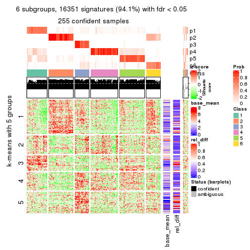</p>

</div>
</div>


Signature heatmaps where rows are not scaled:


<script>
$( function() {
	$( '#tabs-CV-kmeans-get-signatures-no-scale' ).tabs();
} );
</script>
<div id='tabs-CV-kmeans-get-signatures-no-scale'>
<ul>
<li><a href='#tab-CV-kmeans-get-signatures-no-scale-1'>k = 2</a></li>
<li><a href='#tab-CV-kmeans-get-signatures-no-scale-2'>k = 3</a></li>
<li><a href='#tab-CV-kmeans-get-signatures-no-scale-3'>k = 4</a></li>
<li><a href='#tab-CV-kmeans-get-signatures-no-scale-4'>k = 5</a></li>
<li><a href='#tab-CV-kmeans-get-signatures-no-scale-5'>k = 6</a></li>
</ul>
<div id='tab-CV-kmeans-get-signatures-no-scale-1'>
<pre><code class="r">get_signatures(res, k = 2, scale_rows = FALSE)
</code></pre>

<p></p>

</div>
<div id='tab-CV-kmeans-get-signatures-no-scale-2'>
<pre><code class="r">get_signatures(res, k = 3, scale_rows = FALSE)
</code></pre>

<p></p>

</div>
<div id='tab-CV-kmeans-get-signatures-no-scale-3'>
<pre><code class="r">get_signatures(res, k = 4, scale_rows = FALSE)
</code></pre>

<p></p>

</div>
<div id='tab-CV-kmeans-get-signatures-no-scale-4'>
<pre><code class="r">get_signatures(res, k = 5, scale_rows = FALSE)
</code></pre>

<p></p>

</div>
<div id='tab-CV-kmeans-get-signatures-no-scale-5'>
<pre><code class="r">get_signatures(res, k = 6, scale_rows = FALSE)
</code></pre>

<p></p>

</div>
</div>


Compare the overlap of signatures from different k:

```r
compare_signatures(res)
```


`get_signature()` returns a data frame invisibly. TO get the list of signatures, the function
call should be assigned to a variable explicitly. In following code, if `plot` argument is set
to `FALSE`, no heatmap is plotted while only the differential analysis is performed.

```r
# code only for demonstration
tb = get_signature(res, k = ..., plot = FALSE)
```

An example of the output of `tb` is:

```
#>   which_row         fdr    mean_1    mean_2 scaled_mean_1 scaled_mean_2 km
#> 1        38 0.042760348  8.373488  9.131774    -0.5533452     0.5164555  1
#> 2        40 0.018707592  7.106213  8.469186    -0.6173731     0.5762149  1
#> 3        55 0.019134737 10.221463 11.207825    -0.6159697     0.5749050  1
#> 4        59 0.006059896  5.921854  7.869574    -0.6899429     0.6439467  1
#> 5        60 0.018055526  8.928898 10.211722    -0.6204761     0.5791110  1
#> 6        98 0.009384629 15.714769 14.887706     0.6635654    -0.6193277  2
...
```

The columns in `tb` are:

1. `which_row`: row indices corresponding to the input matrix.
2. `fdr`: FDR for the differential test. 
3. `mean_x`: The mean value in group x.
4. `scaled_mean_x`: The mean value in group x after rows are scaled.
5. `km`: Row groups if k-means clustering is applied to rows.


UMAP plot which shows how samples are separated.


<script>
$( function() {
	$( '#tabs-CV-kmeans-dimension-reduction' ).tabs();
} );
</script>
<div id='tabs-CV-kmeans-dimension-reduction'>
<ul>
<li><a href='#tab-CV-kmeans-dimension-reduction-1'>k = 2</a></li>
<li><a href='#tab-CV-kmeans-dimension-reduction-2'>k = 3</a></li>
<li><a href='#tab-CV-kmeans-dimension-reduction-3'>k = 4</a></li>
<li><a href='#tab-CV-kmeans-dimension-reduction-4'>k = 5</a></li>
<li><a href='#tab-CV-kmeans-dimension-reduction-5'>k = 6</a></li>
</ul>
<div id='tab-CV-kmeans-dimension-reduction-1'>
<pre><code class="r">dimension_reduction(res, k = 2, method = &quot;UMAP&quot;)
</code></pre>

<p></p>

</div>
<div id='tab-CV-kmeans-dimension-reduction-2'>
<pre><code class="r">dimension_reduction(res, k = 3, method = &quot;UMAP&quot;)
</code></pre>

<p></p>

</div>
<div id='tab-CV-kmeans-dimension-reduction-3'>
<pre><code class="r">dimension_reduction(res, k = 4, method = &quot;UMAP&quot;)
</code></pre>

<p></p>

</div>
<div id='tab-CV-kmeans-dimension-reduction-4'>
<pre><code class="r">dimension_reduction(res, k = 5, method = &quot;UMAP&quot;)
</code></pre>

<p></p>

</div>
<div id='tab-CV-kmeans-dimension-reduction-5'>
<pre><code class="r">dimension_reduction(res, k = 6, method = &quot;UMAP&quot;)
</code></pre>

<p></p>

</div>
</div>


Following heatmap shows how subgroups are split when increasing `k`:

```r
collect_classes(res)
```


If matrix rows can be associated to genes, consider to use `GO_Enrichment(res,
...)` to perform function enrichment for the signature genes.


 

---------------------------------------------------


### CV:skmeans*


The object with results only for a single top-value method and a single partition method 
can be extracted as:

```r
res = res_list["CV", "skmeans"]
# you can also extract it by
# res = res_list["CV:skmeans"]
```

A summary of `res` and all the functions that can be applied to it:

```r
res
```

```
#> A 'ConsensusPartition' object with k = 2, 3, 4, 5, 6.
#>   On a matrix with 17377 rows and 265 columns.
#>   Top rows (1000, 2000, 3000, 4000, 5000) are extracted by 'CV' method.
#>   Subgroups are detected by 'skmeans' method.
#>   Performed in total 1250 partitions by row resampling.
#>   Best k for subgroups seems to be 4.
#> 
#> Following methods can be applied to this 'ConsensusPartition' object:
#>  [1] "cola_report"             "collect_classes"         "collect_plots"          
#>  [4] "collect_stats"           "colnames"                "compare_signatures"     
#>  [7] "consensus_heatmap"       "dimension_reduction"     "functional_enrichment"  
#> [10] "get_anno_col"            "get_anno"                "get_classes"            
#> [13] "get_consensus"           "get_matrix"              "get_membership"         
#> [16] "get_param"               "get_signatures"          "get_stats"              
#> [19] "is_best_k"               "is_stable_k"             "membership_heatmap"     
#> [22] "ncol"                    "nrow"                    "plot_ecdf"              
#> [25] "rownames"                "select_partition_number" "show"                   
#> [28] "suggest_best_k"          "test_to_known_factors"
```

`collect_plots()` function collects all the plots made from `res` for all `k` (number of partitions)
into one single page to provide an easy and fast comparison between different `k`.

```r
collect_plots(res)
```


The plots are:

- The first row: a plot of the ECDF (Empirical cumulative distribution
  function) curves of the consensus matrix for each `k` and the heatmap of
  predicted classes for each `k`.
- The second row: heatmaps of the consensus matrix for each `k`.
- The third row: heatmaps of the membership matrix for each `k`.
- The fouth row: heatmaps of the signatures for each `k`.

All the plots in panels can be made by individual functions and they are
plotted later in this section.

`select_partition_number()` produces several plots showing different
statistics for choosing "optimized" `k`. There are following statistics:

- ECDF curves of the consensus matrix for each `k`;
- 1-PAC. [The PAC
  score](https://en.wikipedia.org/wiki/Consensus_clustering#Over-interpretation_potential_of_consensus_clustering)
  measures the proportion of the ambiguous subgrouping.
- Mean silhouette score.
- Concordance. The mean probability of fiting the consensus class ids in all
  partitions.
- Area increased. Denote $A_k$ as the area under the ECDF curve for current
  `k`, the area increased is defined as $A_k - A_{k-1}$.
- Rand index. The percent of pairs of samples that are both in a same cluster
  or both are not in a same cluster in the partition of k and k-1.
- Jaccard index. The ratio of pairs of samples are both in a same cluster in
  the partition of k and k-1 and the pairs of samples are both in a same
  cluster in the partition k or k-1.

The detailed explanations of these statistics can be found in [the cola
vignette](http://bioconductor.org/packages/devel/bioc/vignettes/cola/inst/doc/cola.html#toc_13).

Generally speaking, lower PAC score, higher mean silhouette score or higher
concordance corresponds to better partition. Rand index and Jaccard index
measure how similar the current partition is compared to partition with `k-1`.
If they are too similar, we won't accept `k` is better than `k-1`.

```r
select_partition_number(res)
```


The numeric values for all these statistics can be obtained by `get_stats()`.

```r
get_stats(res)
```

```
#>   k 1-PAC mean_silhouette concordance area_increased  Rand Jaccard
#> 2 2 1.000           0.986       0.994         0.4931 0.507   0.507
#> 3 3 0.945           0.936       0.972         0.2974 0.806   0.635
#> 4 4 0.915           0.865       0.942         0.1627 0.850   0.610
#> 5 5 0.851           0.878       0.917         0.0616 0.897   0.638
#> 6 6 0.898           0.893       0.918         0.0460 0.953   0.779
```

`suggest_best_k()` suggests the best $k$ based on these statistics. The rules are as follows:

- All $k$ with Jaccard index larger than 0.95 are removed because the increase of
  the partition number does not provides enough extra information. If all $k$ are removed,
  the best $k$ is assigned by `NA`.
- For $k$ with 1-PAC larger than 0.9, the maximal $k$ is taken as the "best k". Other $k$ is called "optional k".
- If it does not fit the second rule. The $k$ with the highest vote of highest
  1-PAC, mean silhouette and concordance is taken as the "best k".

```r
suggest_best_k(res)
```

```
#> [1] 4
#> attr(,"optional")
#> [1] 2 3
```

There is also optional best $k$ = 2 3 that is worth to check.

Following shows the table of the partitions (You need to click the **show/hide
code output** link to see it). The membership matrix (columns with name `p*`)
is inferred by
[`clue::cl_consensus()`](https://www.rdocumentation.org/link/cl_consensus?package=clue)
function with the `SE` method. Basically the value in the membership matrix
represents the probability to belong to a certain group. The finall class
label for an item is determined with the group with highest probability it
belongs to.

In `get_classes()` function, the entropy is calculated from the membership
matrix and the silhouette score is calculated from the consensus matrix.


<script>
$( function() {
	$( '#tabs-CV-skmeans-get-classes' ).tabs();
} );
</script>
<div id='tabs-CV-skmeans-get-classes'>
<ul>
<li><a href='#tab-CV-skmeans-get-classes-1'>k = 2</a></li>
<li><a href='#tab-CV-skmeans-get-classes-2'>k = 3</a></li>
<li><a href='#tab-CV-skmeans-get-classes-3'>k = 4</a></li>
<li><a href='#tab-CV-skmeans-get-classes-4'>k = 5</a></li>
<li><a href='#tab-CV-skmeans-get-classes-5'>k = 6</a></li>
</ul>

<div id='tab-CV-skmeans-get-classes-1'>
<p><a id='tab-CV-skmeans-get-classes-1-a' style='color:#0366d6' href='#'>show/hide code output</a></p>
<pre><code class="r">cbind(get_classes(res, k = 2), get_membership(res, k = 2))
</code></pre>

<pre><code>#&gt;                                      class entropy silhouette    p1    p2
#&gt; D30CF518-5FC6-4A54-8D5D-BA420EA1836D     2  0.0000      0.991 0.000 1.000
#&gt; 92298FF7-1215-4756-B976-A7D88B91AD76     1  0.0000      0.997 1.000 0.000
#&gt; 0E244FE2-7C17-4642-A51F-2CCA796D9C70     2  0.0000      0.991 0.000 1.000
#&gt; 75435ED8-93E8-45FB-8480-98D8EB2EF8CB     2  0.0000      0.991 0.000 1.000
#&gt; B6D11678-15A9-4F43-A0A2-225067DCAF1C     1  0.0000      0.997 1.000 0.000
#&gt; B7F5A41E-9559-4329-81F5-1B88A74730B7     2  0.0000      0.991 0.000 1.000
#&gt; 39414B2A-7FB0-4669-8DFE-86D9AF7AD2D9     1  0.0000      0.997 1.000 0.000
#&gt; 04823F53-A12D-4852-8F34-77B9DCBB7DF0     2  0.0000      0.991 0.000 1.000
#&gt; 49684C2B-D31C-4B45-A400-3497C3CCEC01     2  0.0000      0.991 0.000 1.000
#&gt; 96A04875-58E2-4BE7-8E0F-CAB55F4CA54F     1  0.0000      0.997 1.000 0.000
#&gt; 1F101D63-478B-40B9-A951-DC3887CFF067     1  0.0000      0.997 1.000 0.000
#&gt; DD290860-E0B7-48FC-BE12-2AF729994C21     2  0.0000      0.991 0.000 1.000
#&gt; FFDD7A12-DDEF-4974-8D60-64B7EEAAC994     2  0.0000      0.991 0.000 1.000
#&gt; E076A9A9-EA2A-4FF7-92A8-F2DA7F30279E     2  0.0000      0.991 0.000 1.000
#&gt; 830DFA6F-A85A-4317-82B2-791FAB998A01     2  0.0000      0.991 0.000 1.000
#&gt; 58578614-E4A3-4655-BBAB-F65851625E0A     1  0.0000      0.997 1.000 0.000
#&gt; 1CBFB672-4D66-430B-83F3-7CE3BE20ABF6     1  0.0000      0.997 1.000 0.000
#&gt; 6C34A7D7-3756-4DCC-9A9F-B5FC4A148B7E     2  0.2948      0.940 0.052 0.948
#&gt; D97ED7B4-5DF2-4B62-8796-AA51CA79DBBB     1  0.0000      0.997 1.000 0.000
#&gt; 45F15851-55F6-4169-834E-38958C38B6A9     1  0.0000      0.997 1.000 0.000
#&gt; 4139E0C9-F712-4A25-8B59-587533B93B3E     2  0.0000      0.991 0.000 1.000
#&gt; 2C3007BF-009E-404F-A3BF-8B921698D85B     1  0.0000      0.997 1.000 0.000
#&gt; 2189F8E5-FF98-4C1A-BD04-5595DB553130     1  0.0000      0.997 1.000 0.000
#&gt; FFAA0310-0D78-4499-8FB8-5BC46E4FCE58     2  0.0000      0.991 0.000 1.000
#&gt; 0C375B2F-67BE-4708-BEB2-544DEC812DCA     2  0.0000      0.991 0.000 1.000
#&gt; AB6324A1-19AB-400C-8001-54765D190E27     2  0.0000      0.991 0.000 1.000
#&gt; A32C4DCD-DC4C-4132-9ED1-B159F5561A2D     1  0.0000      0.997 1.000 0.000
#&gt; 2AE7105D-D494-45B0-947A-315D8C20ECDC     1  0.0000      0.997 1.000 0.000
#&gt; 60FE9D59-FC0F-4B9C-ABF8-1C00BC761928     1  0.0000      0.997 1.000 0.000
#&gt; 056442DC-E87A-4315-965C-C19D7B4FC40E     1  0.0000      0.997 1.000 0.000
#&gt; 455111E5-18EF-4E3F-9DFF-8FA017D92461     1  0.0000      0.997 1.000 0.000
#&gt; 10632BC6-0B81-433C-8832-6B2ABC73A94B     1  0.0000      0.997 1.000 0.000
#&gt; AC6F82AD-C682-4EB3-BEC3-FD950F57609D     1  0.0000      0.997 1.000 0.000
#&gt; D9ABDB75-04DA-4D33-A69F-701729494533     1  0.0000      0.997 1.000 0.000
#&gt; 27BBF44D-F4D7-4C5A-935F-3310A363A670     2  0.0000      0.991 0.000 1.000
#&gt; E7AA12EE-6E14-4B33-A52C-B13589436023     1  0.0000      0.997 1.000 0.000
#&gt; DFA6D41A-D231-413E-A180-E42DF26C3E2B     2  0.0000      0.991 0.000 1.000
#&gt; 655BD3AF-5094-4B19-93A8-401C70369B17     2  0.0000      0.991 0.000 1.000
#&gt; 9DFEF253-923F-4EE2-8E3D-C75805387B20     2  0.0000      0.991 0.000 1.000
#&gt; 3B0EE948-B2CD-4191-90E2-BDD155F3B580     1  0.0000      0.997 1.000 0.000
#&gt; 177C7EF4-2D54-4555-947C-44EE7C688917     2  0.0000      0.991 0.000 1.000
#&gt; 1F8E8BB7-D159-4556-8B04-E5DD027CC444     2  0.0000      0.991 0.000 1.000
#&gt; 619F37D2-6771-4727-9079-56BED07F1CF6     2  0.0000      0.991 0.000 1.000
#&gt; ACAE29BE-ECB8-4A98-BC71-7A2D4857134E     1  0.0376      0.993 0.996 0.004
#&gt; C5C3241A-684C-4238-9333-9AF8630EC086     2  0.0000      0.991 0.000 1.000
#&gt; AD319DC2-140F-4E7B-A899-010687D8B714     2  0.0000      0.991 0.000 1.000
#&gt; 2AFF397C-ED2A-4FD9-A7F0-E4C61E9FB603     2  0.0000      0.991 0.000 1.000
#&gt; FB4C7892-3DBB-4148-AAE9-75B19A1A4031     1  0.0000      0.997 1.000 0.000
#&gt; 6F5C4500-1ED1-4E81-B4F5-EEA64CE2336A     1  0.0000      0.997 1.000 0.000
#&gt; BD027C69-3C10-4047-8E1E-218600FF2B73     2  0.0000      0.991 0.000 1.000
#&gt; 11B473A9-4CC5-461F-BC57-CC9141F3591D     1  0.0000      0.997 1.000 0.000
#&gt; 69A036E5-3E6A-4862-A7F8-2D203ED2FC9E     1  0.0000      0.997 1.000 0.000
#&gt; 9C0BDF24-F011-4855-B95A-1B6BEFA808F7     1  0.0000      0.997 1.000 0.000
#&gt; 9E205254-8C0C-4C05-AF5A-86E679CF732C     1  0.0000      0.997 1.000 0.000
#&gt; 935CCE4A-8AA8-454E-9DFF-7DE27D0BD2E2     1  0.0000      0.997 1.000 0.000
#&gt; 01E5E1FE-41D3-428B-90BC-7A000829E102     1  0.0000      0.997 1.000 0.000
#&gt; B344A530-92CD-468B-847A-DF8E25688081     2  0.0000      0.991 0.000 1.000
#&gt; F79F32A7-9F7B-4D62-8426-4A4CF10ED319     1  0.0000      0.997 1.000 0.000
#&gt; C2E1C6FA-82F9-467C-99AE-9B39FAAC810C     1  0.0000      0.997 1.000 0.000
#&gt; BF7CD9BD-776A-4957-8A6E-EF8AD83EA9D3     2  0.0000      0.991 0.000 1.000
#&gt; 8A2C1409-E83B-435E-A20F-5FCA94801C9F     2  0.0000      0.991 0.000 1.000
#&gt; B6BEFFB5-2F62-477B-A4C8-478D29577CBD     2  0.0000      0.991 0.000 1.000
#&gt; 8622CBD0-F8E9-4AC1-8175-CC9A742B86F9     1  0.0000      0.997 1.000 0.000
#&gt; 565DD660-ED58-4065-8619-260BEA6FCFEB     1  0.0000      0.997 1.000 0.000
#&gt; 96038E42-0FBA-497D-819C-38F7689F10FF     1  0.0000      0.997 1.000 0.000
#&gt; CA685549-F8BA-43F1-8461-5D2D3B17CFC5     1  0.0000      0.997 1.000 0.000
#&gt; 52020307-71A6-46E5-ACB3-8F885CA8F1EB     1  0.0000      0.997 1.000 0.000
#&gt; 7656DA98-76DC-424B-B02C-D7001DAAA0E4     1  0.0000      0.997 1.000 0.000
#&gt; 74DBA640-45E2-42A6-8F1E-69C073D66EE6     1  0.0000      0.997 1.000 0.000
#&gt; 251094BE-C33D-44F0-BD98-8618D71F520C     1  0.0000      0.997 1.000 0.000
#&gt; AB914CC5-5FF1-4257-A353-6A99D11B9478     1  0.0000      0.997 1.000 0.000
#&gt; 38B8B893-0E08-4B71-B51C-B32A7B2724E0     1  0.0000      0.997 1.000 0.000
#&gt; 7C7CD8FF-99A4-41D7-B7E1-5A517001F551     2  0.0000      0.991 0.000 1.000
#&gt; BFC5B75A-E4AE-486B-BA30-23BBAA33A125     2  0.0000      0.991 0.000 1.000
#&gt; 182AC78E-A07C-4B34-B216-B5F573E9F036     2  0.0000      0.991 0.000 1.000
#&gt; B38C5F72-8F46-4531-9C2D-96EEE07A5B22     2  0.0000      0.991 0.000 1.000
#&gt; DB9333A6-A723-4B8F-9221-25B8B23D5126     1  0.0000      0.997 1.000 0.000
#&gt; CD67DD21-C1B6-4D58-AC8E-1F4536C7DA70     2  0.0000      0.991 0.000 1.000
#&gt; 3D76A56E-4B66-48AE-AA60-D9C1004C7140     1  0.0000      0.997 1.000 0.000
#&gt; 71ED572F-7780-47A4-A9F8-D320C737690D     1  0.0000      0.997 1.000 0.000
#&gt; B449FEA1-C4B0-400F-903C-59E13D0BA313     2  0.0000      0.991 0.000 1.000
#&gt; 3F120E90-1486-4215-B9B9-79D5B413CAAC     1  0.9580      0.377 0.620 0.380
#&gt; A071894B-D8C0-4740-BD55-93EA0C86EDF7     1  0.0000      0.997 1.000 0.000
#&gt; 58848D57-D7A9-4ABB-86A2-A8AE2B23F654     1  0.0000      0.997 1.000 0.000
#&gt; CD6F9E20-B301-4663-87EC-953EDF49754F     2  0.0000      0.991 0.000 1.000
#&gt; 367D89F3-D527-4929-B830-8B6D553DF9E1     1  0.0000      0.997 1.000 0.000
#&gt; BE8D7DCB-648B-42DD-9FA8-8B85B5D816B2     1  0.0000      0.997 1.000 0.000
#&gt; AA46F56B-BD9C-40A4-8EA8-35E2568C964D     2  0.0000      0.991 0.000 1.000
#&gt; 6393220A-7C57-413F-81A8-4E38C21E779E     2  0.0000      0.991 0.000 1.000
#&gt; 89AE566C-F65F-43C2-BA97-621A7AC8B6DC     1  0.0000      0.997 1.000 0.000
#&gt; AA6A4BFF-8C62-4B70-B85A-9EDF403B06BA     1  0.0000      0.997 1.000 0.000
#&gt; BCE877A6-9C65-4495-A45D-05753F2D0E15     1  0.0000      0.997 1.000 0.000
#&gt; D7BDDF49-C54B-4F8E-ACA0-C3684AB68B5C     2  0.9732      0.329 0.404 0.596
#&gt; D0800D49-0033-44B2-8D7B-29B16F87ADA6     2  0.0000      0.991 0.000 1.000
#&gt; 151D60B5-5AF1-4B61-B97F-ABC7531D9F89     1  0.0000      0.997 1.000 0.000
#&gt; CBBAEB5B-25FA-4B6D-A40C-357E37033E36     1  0.0000      0.997 1.000 0.000
#&gt; 317CD049-3151-40B7-8E88-B0B8813338D6     1  0.0000      0.997 1.000 0.000
#&gt; 93835C77-F8FA-4928-843C-8016A91881FA     1  0.0000      0.997 1.000 0.000
#&gt; 02A6950F-647D-4F20-B2D0-0238C1441C70     1  0.0000      0.997 1.000 0.000
#&gt; 4D54E415-134F-4F6F-8718-3E0475EF5477     1  0.0000      0.997 1.000 0.000
#&gt; 82AB290A-3993-45E5-8B15-6125A019778C     1  0.0000      0.997 1.000 0.000
#&gt; 3B5EAD14-E506-4A22-804D-BF925A2D5247     2  0.0000      0.991 0.000 1.000
#&gt; 19CF7DDF-4F3A-4D2F-B84A-6451A5C3112C     2  0.0000      0.991 0.000 1.000
#&gt; 2FB00DAA-C274-42B1-A06B-611FE5E96844     1  0.0000      0.997 1.000 0.000
#&gt; 2B1F01C3-8145-4296-8111-2B0474AB9A2C     2  0.0000      0.991 0.000 1.000
#&gt; 3F0865F1-8256-4778-966F-D53637B415B6     2  0.0000      0.991 0.000 1.000
#&gt; 5473210D-37F9-4192-86D2-E2A2C77F3BD2     2  0.0000      0.991 0.000 1.000
#&gt; 5EDB6ACF-4F3F-471A-9DDC-661607CACCC4     1  0.0000      0.997 1.000 0.000
#&gt; 6A252A3A-7EEB-47B6-9C23-D69BD2EA846F     2  0.0000      0.991 0.000 1.000
#&gt; 0A7FFCBB-4BAA-4A5F-8B2D-B427C4D982A8     1  0.0000      0.997 1.000 0.000
#&gt; 1603AFB8-5AD7-4794-9991-BDBE96B4D997     2  0.0000      0.991 0.000 1.000
#&gt; 644299E9-62B7-4DFE-9E6D-D7556A01B40A     1  0.0000      0.997 1.000 0.000
#&gt; EF12E923-1860-4269-B57B-BA6238FA4403     1  0.0000      0.997 1.000 0.000
#&gt; 51B7241E-F0BE-482A-88AE-89004BB68989     1  0.0000      0.997 1.000 0.000
#&gt; 1C007DF3-8A9F-4940-9A4C-DE2A412BB023     2  0.0000      0.991 0.000 1.000
#&gt; 89FCFDE6-9625-432C-AA35-9C5FCCF40031     1  0.0000      0.997 1.000 0.000
#&gt; 7955FC55-386D-497E-AFED-019BBBAD428E     2  0.0000      0.991 0.000 1.000
#&gt; 37FF09ED-73EC-4D10-B2AC-7D8EBA9304ED     1  0.0000      0.997 1.000 0.000
#&gt; C2CD2742-2FB4-468E-90FF-8F65A5C425A9     1  0.0000      0.997 1.000 0.000
#&gt; 766FE08F-3393-4868-B1C1-FA98C9FF16E0     2  0.0000      0.991 0.000 1.000
#&gt; 63E2B578-2221-4255-8C45-7FD030B1C94D     1  0.0000      0.997 1.000 0.000
#&gt; C14B1A44-43F7-45F0-A583-5667A4D3BD95     1  0.0000      0.997 1.000 0.000
#&gt; D9CB551A-CE20-4BF7-8AC9-839112346C3D     1  0.0000      0.997 1.000 0.000
#&gt; 05BAA71A-E5B3-4A3A-A3F2-013A975087F0     2  0.0000      0.991 0.000 1.000
#&gt; AC8DA7DE-4D83-4768-BEFD-9A1B2DA943CE     2  0.5059      0.872 0.112 0.888
#&gt; E89DCE9D-F8A5-499C-85BB-BB500BADB9FB     1  0.0000      0.997 1.000 0.000
#&gt; C16F9B5E-2B52-40F6-856D-C0D6FBDD16C1     1  0.0000      0.997 1.000 0.000
#&gt; 8FF234D4-823A-4C80-82F7-2E92D72DBF88     2  0.0000      0.991 0.000 1.000
#&gt; C9F94A6E-D104-4D8D-8EC5-EADECD85F092     2  0.0000      0.991 0.000 1.000
#&gt; 45C9756F-A154-4537-852E-ECBF27B92FE1     2  0.0000      0.991 0.000 1.000
#&gt; 0F1A5708-341E-4713-BC70-76D702F826D6     2  0.0000      0.991 0.000 1.000
#&gt; 2ECFBCA0-AB35-461A-A4B5-C60B2651A962     2  0.0000      0.991 0.000 1.000
#&gt; 7DFAC404-3AB3-4274-A533-CFDAF4CE122D     1  0.0000      0.997 1.000 0.000
#&gt; A90AF55C-4386-42AB-A812-9230026EA5A5     2  0.0000      0.991 0.000 1.000
#&gt; 6258A757-4E18-4CD1-8417-189521E990B6     2  0.0000      0.991 0.000 1.000
#&gt; EBFAD137-050F-47D0-A43D-72B8F7D70C2B     1  0.0000      0.997 1.000 0.000
#&gt; 08B5EBFB-2807-4229-95A6-81AB7F377A56     2  0.0000      0.991 0.000 1.000
#&gt; 4780A59C-0589-4995-B044-3201F09AF859     1  0.0000      0.997 1.000 0.000
#&gt; 0AB81429-C287-48AA-9035-3A7A6F4C7328     2  0.0000      0.991 0.000 1.000
#&gt; 20C4D047-28DA-4AB7-9B3C-32EDA6B22C9D     2  0.6623      0.793 0.172 0.828
#&gt; 77C4E01F-84A6-4BFD-AA8E-D7875456F546     2  0.0000      0.991 0.000 1.000
#&gt; 8B28383F-CF14-4CC5-A1E2-72AD915C0AE8     1  0.0000      0.997 1.000 0.000
#&gt; E12E1F48-6A52-4F74-925C-C4EE1BF5C573     2  0.0000      0.991 0.000 1.000
#&gt; 9B179BC5-BB4C-4CEE-99BC-BC552BC384A1     1  0.0000      0.997 1.000 0.000
#&gt; 5548C91A-D3DE-48F5-B4A4-124BE177B99A     1  0.0000      0.997 1.000 0.000
#&gt; 0E22B729-C381-4B0C-9897-62DD38F51722     1  0.0000      0.997 1.000 0.000
#&gt; 7BC4937F-04E2-4B46-BA7C-FE9AC738C8A9     1  0.0000      0.997 1.000 0.000
#&gt; EE6A0D3F-3F8A-4AA8-B3EF-32372EF37A29     1  0.0000      0.997 1.000 0.000
#&gt; 08AC2706-7651-409F-BE6B-BCED1C2D1796     1  0.0000      0.997 1.000 0.000
#&gt; A68B078D-8979-4070-BB4D-F526704ED3DC     1  0.0000      0.997 1.000 0.000
#&gt; C319A5EE-69FA-4AAB-85A9-2EAAD8E4C703     1  0.0000      0.997 1.000 0.000
#&gt; 0D7CAABD-D20C-4F82-BCBC-8B7276E8EDE2     1  0.0000      0.997 1.000 0.000
#&gt; 09444DCC-44BA-4A3F-ACC5-863A54578B9F     1  0.0000      0.997 1.000 0.000
#&gt; 2E32B047-C6E1-4743-A6C8-E98370A32145     1  0.0000      0.997 1.000 0.000
#&gt; 6A6878A7-76B2-40DE-958B-804442AC6A5D     1  0.0000      0.997 1.000 0.000
#&gt; 39F27293-0BFF-4EA2-8439-A299E3226D20     1  0.0000      0.997 1.000 0.000
#&gt; 7EAE9C30-6080-405F-A7E6-1FED57674279     1  0.0000      0.997 1.000 0.000
#&gt; 79499169-A093-4E0A-B6BD-010CD7BE5035     1  0.0000      0.997 1.000 0.000
#&gt; 1F8BF4E8-BD84-4EFE-9E3E-89E7CE8FA72D     2  0.0000      0.991 0.000 1.000
#&gt; 62B7988F-98E5-4AB8-8A16-D661A07455E8     1  0.0000      0.997 1.000 0.000
#&gt; B7005B5F-217E-4073-BFB5-CE7E884B80C0     2  0.0000      0.991 0.000 1.000
#&gt; B981568F-2C08-4696-B589-E157A49BE72B     2  0.0000      0.991 0.000 1.000
#&gt; A3D85C0A-3202-40C2-88E1-052AC6C5184B     1  0.0000      0.997 1.000 0.000
#&gt; 4CA783B9-9B99-46B8-962A-77194ECB7942     2  0.0000      0.991 0.000 1.000
#&gt; D4024B08-4879-47EA-99E5-D9FCE1CD40DF     1  0.0000      0.997 1.000 0.000
#&gt; 1D41CDA2-0B29-48FD-B83A-E60C174DBCB3     1  0.0000      0.997 1.000 0.000
#&gt; A1923B2A-B233-4760-8AF9-C04C1CAEB100     1  0.0000      0.997 1.000 0.000
#&gt; 80880D71-BFDE-4D88-892F-5ADF27A38940     2  0.0000      0.991 0.000 1.000
#&gt; 55D1629D-30FD-49AA-88CE-EA3CA9B30A3F     2  0.0000      0.991 0.000 1.000
#&gt; B71C409E-926D-48AD-8BD8-9F707CA4FB01     2  0.0000      0.991 0.000 1.000
#&gt; 54A92C57-BD19-4A47-BA76-3ACA2DC36212     1  0.0000      0.997 1.000 0.000
#&gt; B2AB74B8-506C-4C27-9105-E86A6AAA89D4     1  0.0000      0.997 1.000 0.000
#&gt; 0356AE49-7A5C-42CC-A39C-7C8DFBFF8842     2  0.0000      0.991 0.000 1.000
#&gt; ACA260A3-DC3F-4FF4-B9C5-2D4BC4F81783     1  0.0000      0.997 1.000 0.000
#&gt; 9B440917-E5A4-43B9-A48D-6ABFEDCA6CFD     1  0.0000      0.997 1.000 0.000
#&gt; 47464828-52EA-413B-B30C-BD8B55903D78     2  0.0000      0.991 0.000 1.000
#&gt; C1D1FC82-B50D-4C82-8F03-06CEE3C08D18     1  0.0000      0.997 1.000 0.000
#&gt; E5ABFC43-E2A3-4B1A-BBA3-8196C0B026A5     2  0.0000      0.991 0.000 1.000
#&gt; 1D3C16CC-D0D5-4637-AAC7-91672DFF3317     1  0.4431      0.896 0.908 0.092
#&gt; 4D038320-ADEA-4990-8371-68B4B8162E1A     2  0.0000      0.991 0.000 1.000
#&gt; A75594CC-3E49-4869-8656-BBB4E72BF59D     2  0.0000      0.991 0.000 1.000
#&gt; 7CABAA19-5FB2-4A58-BDA3-4F1FFB532C20     1  0.0000      0.997 1.000 0.000
#&gt; 534EF1E9-9513-426E-B41E-A394AB2E4410     2  0.0000      0.991 0.000 1.000
#&gt; 649F35A1-A08C-497D-A9B6-CB3084D5FB8D     1  0.0000      0.997 1.000 0.000
#&gt; 7CA30F3C-1C98-480C-B8B5-A248AABFB468     1  0.0000      0.997 1.000 0.000
#&gt; A9F8DA21-A802-44CF-9F5D-96A36687DCDD     2  0.0000      0.991 0.000 1.000
#&gt; A7AE1ED1-86CB-4A50-97B2-66785C7191FE     1  0.0000      0.997 1.000 0.000
#&gt; D0091AD4-D3D7-4C03-ACD9-DA9F8B6076C6     1  0.0000      0.997 1.000 0.000
#&gt; 46EE1C2B-13F7-44A7-B27E-4EBB9DF0CA83     2  0.0000      0.991 0.000 1.000
#&gt; CB9301B8-0282-43D6-AF5E-B753A9C7BFCB     2  0.0000      0.991 0.000 1.000
#&gt; A0E77A39-885A-4472-9A10-2D1E51DBFDA4     1  0.0000      0.997 1.000 0.000
#&gt; C06603C2-163D-40B6-A9FE-882424F18FE9     1  0.0000      0.997 1.000 0.000
#&gt; C3921A29-80FF-4B9D-B366-5C0238A42231     1  0.0000      0.997 1.000 0.000
#&gt; BB99B4E7-C834-4BB8-973F-8FA039E2798F     1  0.0000      0.997 1.000 0.000
#&gt; 5CD78C2F-05E9-409A-8405-3EE936A6876E     2  0.0000      0.991 0.000 1.000
#&gt; 6C126CC7-0C03-48F0-A2C2-F090CA239B70     2  0.0000      0.991 0.000 1.000
#&gt; 7118B08A-E94C-49F4-8D76-26455C34D85F     2  0.0000      0.991 0.000 1.000
#&gt; 266DAF30-CF3E-493E-8B24-3931D0039450     1  0.0000      0.997 1.000 0.000
#&gt; DAB5F5B9-4FE5-468F-AD2B-B39BBC4317A0     2  0.0938      0.980 0.012 0.988
#&gt; 9A9EB6D6-312E-4A98-8762-30D3ABD8193D     2  0.0000      0.991 0.000 1.000
#&gt; CED15676-B901-4FC8-9C8D-51E529D9441D     1  0.0000      0.997 1.000 0.000
#&gt; 827232CC-8035-440C-8B12-02C789C70B1B     1  0.0000      0.997 1.000 0.000
#&gt; 04D5FB28-FB50-4EAE-95FB-72ABF0E618CA     2  0.0000      0.991 0.000 1.000
#&gt; 6C96A851-97FC-4845-B895-D255191D9F25     1  0.0000      0.997 1.000 0.000
#&gt; 3EC982CB-D013-443E-B21D-39DE6B8EF370     2  0.0000      0.991 0.000 1.000
#&gt; 2E24A786-4370-42A1-AD50-D651F89819CC     2  0.0000      0.991 0.000 1.000
#&gt; 7653BFA9-ADA5-44CA-8555-807FBBFC6DE2     1  0.0000      0.997 1.000 0.000
#&gt; 7A110994-5741-4013-91F0-DD2E1D343F91     2  0.0000      0.991 0.000 1.000
#&gt; 0A760E0C-11C5-4201-8452-18DBC1FEACEB     1  0.0000      0.997 1.000 0.000
#&gt; 909B76A1-BB9F-4906-95BC-58CD1A46D3B8     2  0.0000      0.991 0.000 1.000
#&gt; A782EE71-EDA4-4385-83B3-D16DE81296C0     2  0.0000      0.991 0.000 1.000
#&gt; BD50E276-914F-4924-8CEA-FF47A66DB175     2  0.0000      0.991 0.000 1.000
#&gt; 505D5CA8-0279-4BC7-8CC0-8C7A0165BF91     2  0.0000      0.991 0.000 1.000
#&gt; D51FC997-E662-4AE7-BC9C-14183DA42DE1     2  0.0000      0.991 0.000 1.000
#&gt; 8AD67970-84F1-4C0A-B47A-8FA4108F9FE3     1  0.0000      0.997 1.000 0.000
#&gt; 6E33B1B6-7089-4BC3-B2B0-EC2C3B5D8B74     1  0.0000      0.997 1.000 0.000
#&gt; 88C4EA46-2546-401C-A8E7-603EECFDFBA0     1  0.0000      0.997 1.000 0.000
#&gt; 375D2D72-C998-4627-BA35-24E82A9A55FF     1  0.0000      0.997 1.000 0.000
#&gt; 76D0F834-7064-46C6-96F4-E861CF5452B6     2  0.0000      0.991 0.000 1.000
#&gt; 87159081-C97A-4004-AF0A-7EB6EF0EC47A     1  0.0000      0.997 1.000 0.000
#&gt; 24A57006-800B-4174-AF4E-7EA57A8A756E     1  0.0000      0.997 1.000 0.000
#&gt; AD68CBC6-8A13-4A65-AF62-E99AFA81D031     2  0.0000      0.991 0.000 1.000
#&gt; 22863A57-F066-4DD1-A859-4336F43D144C     1  0.0000      0.997 1.000 0.000
#&gt; 8F6F0362-9165-4DCC-992C-AF871A3C51E7     1  0.0000      0.997 1.000 0.000
#&gt; 76ABF0B7-E707-4DB2-9486-3814439BDBA5     1  0.0000      0.997 1.000 0.000
#&gt; BC72372F-3577-40E5-BA0F-41A084AA93AD     2  0.8443      0.628 0.272 0.728
#&gt; 8E566039-B56C-4F41-B9EF-DE18BEEF2C95     1  0.0000      0.997 1.000 0.000
#&gt; F096F016-3EF5-4A67-A7C2-8A45E1585232     1  0.0000      0.997 1.000 0.000
#&gt; BB37913E-534B-43DD-BE3D-E13B29FD8172     2  0.0000      0.991 0.000 1.000
#&gt; E344638F-9060-460F-8F7A-60D19442F294     2  0.0000      0.991 0.000 1.000
#&gt; 6A0EAAD0-89D5-4F12-8B45-9D5A25182FAD     2  0.0000      0.991 0.000 1.000
#&gt; A5199E3A-9D67-4543-88AB-24398C98E38E     1  0.0000      0.997 1.000 0.000
#&gt; 23917D52-7864-4F84-9C77-DF8EA9407345     2  0.0000      0.991 0.000 1.000
#&gt; 9AA96080-19D8-40C3-BDD1-6044D2D422D5     1  0.0000      0.997 1.000 0.000
#&gt; 0ED65D91-260C-4662-9903-EE36A2E3B2D0     2  0.0000      0.991 0.000 1.000
#&gt; 64BF1BC5-7A9A-4E1D-AEAB-AFE30B92AAF4     2  0.0000      0.991 0.000 1.000
#&gt; F02301F1-9054-4DC6-8DC9-2451A0F53EFC     2  0.0000      0.991 0.000 1.000
#&gt; 3264649A-5684-4181-83D0-A7E4D7E2E1FD     1  0.0000      0.997 1.000 0.000
#&gt; 3F8DA39C-BC9B-4343-8838-5CE271E80C51     2  0.0000      0.991 0.000 1.000
#&gt; BCC681CB-2AF4-4BB6-B53A-7544A2399454     1  0.0000      0.997 1.000 0.000
#&gt; DCB50E17-5E2D-443B-8DCC-272FBB734C2E     1  0.0000      0.997 1.000 0.000
#&gt; B5E47C38-CB6A-44C0-AA9B-56951B9EF78D     1  0.0000      0.997 1.000 0.000
#&gt; B15B0185-9C28-4A00-9CEC-05EFECEA6709     1  0.0000      0.997 1.000 0.000
#&gt; 61D4E8E7-0110-480A-A4A7-D406DE74C31E     1  0.0000      0.997 1.000 0.000
#&gt; CA8DB3AD-3F6B-4622-BF73-47041EC96E42     1  0.0000      0.997 1.000 0.000
#&gt; 5EECB1C4-172C-4494-871A-ADB650CD82BD     2  0.0000      0.991 0.000 1.000
#&gt; 019B857C-D4F7-4B67-B699-56E52A60805B     2  0.0000      0.991 0.000 1.000
#&gt; E9C28902-05C9-4883-97A4-D612D54E46B4     1  0.0000      0.997 1.000 0.000
#&gt; C5D3D9A0-FC14-408D-AB6C-662018A5E5CA     1  0.0000      0.997 1.000 0.000
#&gt; 7EB24744-509B-4854-B7D0-0BAFA210A345     2  0.0000      0.991 0.000 1.000
#&gt; B8B7A721-2284-40AB-98F5-EF1351C30B66     2  0.0000      0.991 0.000 1.000
#&gt; 3C12F39D-0D21-4F69-A539-4120B73C7A79     2  0.0000      0.991 0.000 1.000
#&gt; 08D3F984-6850-45B2-9DF9-EC7F5A4060A4     1  0.0000      0.997 1.000 0.000
#&gt; 9BD0EE79-1EED-4F6D-A5AB-43ADB8526F1E     1  0.0000      0.997 1.000 0.000
#&gt; E489A871-3CF4-4F3D-8EAF-63B507054201     2  0.0000      0.991 0.000 1.000
#&gt; 8CF8FD2E-1DBA-4257-9715-04D956D46B71     2  0.0000      0.991 0.000 1.000
#&gt; F6193AF0-7A19-46CB-A818-1B01E7460791     1  0.0000      0.997 1.000 0.000
#&gt; 96392D6B-D4FF-4393-93BA-08E469E8BBE1     1  0.0000      0.997 1.000 0.000
#&gt; DABCBE5A-C591-46A2-AF66-DA3DB6106751     1  0.0000      0.997 1.000 0.000
#&gt; 8B75F7D4-98D8-44DE-B19D-B733D6A031DB     1  0.0000      0.997 1.000 0.000
#&gt; AAD9685A-564B-42E9-91E3-431951154BA7     2  0.0000      0.991 0.000 1.000
#&gt; 90A43152-4E3B-4365-A39F-7B0E5CA66E55     1  0.0000      0.997 1.000 0.000
#&gt; EFB76FCF-AC9C-4852-B91C-E055DA666FA0     1  0.0000      0.997 1.000 0.000
#&gt; 6EBCFFE3-706F-440A-ABA9-012A924A07C6     2  0.0000      0.991 0.000 1.000
#&gt; E922A244-F1C8-4310-ABB2-62B06E022E4C     1  0.0000      0.997 1.000 0.000
</code></pre>

<script>
$('#tab-CV-skmeans-get-classes-1-a').parent().next().next().hide();
$('#tab-CV-skmeans-get-classes-1-a').click(function(){
  $('#tab-CV-skmeans-get-classes-1-a').parent().next().next().toggle();
  return(false);
});
</script>
</div>

<div id='tab-CV-skmeans-get-classes-2'>
<p><a id='tab-CV-skmeans-get-classes-2-a' style='color:#0366d6' href='#'>show/hide code output</a></p>
<pre><code class="r">cbind(get_classes(res, k = 3), get_membership(res, k = 3))
</code></pre>

<pre><code>#&gt;                                      class entropy silhouette    p1    p2    p3
#&gt; D30CF518-5FC6-4A54-8D5D-BA420EA1836D     2  0.0000      1.000 0.000 1.000 0.000
#&gt; 92298FF7-1215-4756-B976-A7D88B91AD76     1  0.4974      0.689 0.764 0.000 0.236
#&gt; 0E244FE2-7C17-4642-A51F-2CCA796D9C70     2  0.0000      1.000 0.000 1.000 0.000
#&gt; 75435ED8-93E8-45FB-8480-98D8EB2EF8CB     2  0.0000      1.000 0.000 1.000 0.000
#&gt; B6D11678-15A9-4F43-A0A2-225067DCAF1C     1  0.0000      0.964 1.000 0.000 0.000
#&gt; B7F5A41E-9559-4329-81F5-1B88A74730B7     2  0.0000      1.000 0.000 1.000 0.000
#&gt; 39414B2A-7FB0-4669-8DFE-86D9AF7AD2D9     1  0.0000      0.964 1.000 0.000 0.000
#&gt; 04823F53-A12D-4852-8F34-77B9DCBB7DF0     2  0.0000      1.000 0.000 1.000 0.000
#&gt; 49684C2B-D31C-4B45-A400-3497C3CCEC01     2  0.0000      1.000 0.000 1.000 0.000
#&gt; 96A04875-58E2-4BE7-8E0F-CAB55F4CA54F     1  0.0237      0.964 0.996 0.000 0.004
#&gt; 1F101D63-478B-40B9-A951-DC3887CFF067     1  0.0237      0.964 0.996 0.000 0.004
#&gt; DD290860-E0B7-48FC-BE12-2AF729994C21     2  0.0000      1.000 0.000 1.000 0.000
#&gt; FFDD7A12-DDEF-4974-8D60-64B7EEAAC994     2  0.0000      1.000 0.000 1.000 0.000
#&gt; E076A9A9-EA2A-4FF7-92A8-F2DA7F30279E     3  0.0237      0.942 0.000 0.004 0.996
#&gt; 830DFA6F-A85A-4317-82B2-791FAB998A01     2  0.0000      1.000 0.000 1.000 0.000
#&gt; 58578614-E4A3-4655-BBAB-F65851625E0A     1  0.0000      0.964 1.000 0.000 0.000
#&gt; 1CBFB672-4D66-430B-83F3-7CE3BE20ABF6     1  0.0237      0.964 0.996 0.000 0.004
#&gt; 6C34A7D7-3756-4DCC-9A9F-B5FC4A148B7E     3  0.0000      0.941 0.000 0.000 1.000
#&gt; D97ED7B4-5DF2-4B62-8796-AA51CA79DBBB     1  0.0237      0.964 0.996 0.000 0.004
#&gt; 45F15851-55F6-4169-834E-38958C38B6A9     1  0.0237      0.964 0.996 0.000 0.004
#&gt; 4139E0C9-F712-4A25-8B59-587533B93B3E     2  0.0000      1.000 0.000 1.000 0.000
#&gt; 2C3007BF-009E-404F-A3BF-8B921698D85B     1  0.0000      0.964 1.000 0.000 0.000
#&gt; 2189F8E5-FF98-4C1A-BD04-5595DB553130     1  0.0237      0.964 0.996 0.000 0.004
#&gt; FFAA0310-0D78-4499-8FB8-5BC46E4FCE58     3  0.0237      0.942 0.000 0.004 0.996
#&gt; 0C375B2F-67BE-4708-BEB2-544DEC812DCA     2  0.0000      1.000 0.000 1.000 0.000
#&gt; AB6324A1-19AB-400C-8001-54765D190E27     2  0.0000      1.000 0.000 1.000 0.000
#&gt; A32C4DCD-DC4C-4132-9ED1-B159F5561A2D     1  0.0237      0.964 0.996 0.000 0.004
#&gt; 2AE7105D-D494-45B0-947A-315D8C20ECDC     1  0.0000      0.964 1.000 0.000 0.000
#&gt; 60FE9D59-FC0F-4B9C-ABF8-1C00BC761928     1  0.0237      0.964 0.996 0.000 0.004
#&gt; 056442DC-E87A-4315-965C-C19D7B4FC40E     1  0.0237      0.964 0.996 0.000 0.004
#&gt; 455111E5-18EF-4E3F-9DFF-8FA017D92461     1  0.2878      0.874 0.904 0.000 0.096
#&gt; 10632BC6-0B81-433C-8832-6B2ABC73A94B     1  0.0237      0.964 0.996 0.000 0.004
#&gt; AC6F82AD-C682-4EB3-BEC3-FD950F57609D     1  0.0237      0.964 0.996 0.000 0.004
#&gt; D9ABDB75-04DA-4D33-A69F-701729494533     1  0.0237      0.964 0.996 0.000 0.004
#&gt; 27BBF44D-F4D7-4C5A-935F-3310A363A670     2  0.0000      1.000 0.000 1.000 0.000
#&gt; E7AA12EE-6E14-4B33-A52C-B13589436023     1  0.6126      0.326 0.600 0.000 0.400
#&gt; DFA6D41A-D231-413E-A180-E42DF26C3E2B     2  0.0000      1.000 0.000 1.000 0.000
#&gt; 655BD3AF-5094-4B19-93A8-401C70369B17     2  0.0000      1.000 0.000 1.000 0.000
#&gt; 9DFEF253-923F-4EE2-8E3D-C75805387B20     3  0.0237      0.942 0.000 0.004 0.996
#&gt; 3B0EE948-B2CD-4191-90E2-BDD155F3B580     1  0.0000      0.964 1.000 0.000 0.000
#&gt; 177C7EF4-2D54-4555-947C-44EE7C688917     3  0.0237      0.942 0.000 0.004 0.996
#&gt; 1F8E8BB7-D159-4556-8B04-E5DD027CC444     2  0.0000      1.000 0.000 1.000 0.000
#&gt; 619F37D2-6771-4727-9079-56BED07F1CF6     3  0.0237      0.942 0.000 0.004 0.996
#&gt; ACAE29BE-ECB8-4A98-BC71-7A2D4857134E     3  0.0000      0.941 0.000 0.000 1.000
#&gt; C5C3241A-684C-4238-9333-9AF8630EC086     2  0.0000      1.000 0.000 1.000 0.000
#&gt; AD319DC2-140F-4E7B-A899-010687D8B714     2  0.0000      1.000 0.000 1.000 0.000
#&gt; 2AFF397C-ED2A-4FD9-A7F0-E4C61E9FB603     3  0.0237      0.942 0.000 0.004 0.996
#&gt; FB4C7892-3DBB-4148-AAE9-75B19A1A4031     3  0.0000      0.941 0.000 0.000 1.000
#&gt; 6F5C4500-1ED1-4E81-B4F5-EEA64CE2336A     1  0.0000      0.964 1.000 0.000 0.000
#&gt; BD027C69-3C10-4047-8E1E-218600FF2B73     2  0.0000      1.000 0.000 1.000 0.000
#&gt; 11B473A9-4CC5-461F-BC57-CC9141F3591D     1  0.0000      0.964 1.000 0.000 0.000
#&gt; 69A036E5-3E6A-4862-A7F8-2D203ED2FC9E     1  0.0000      0.964 1.000 0.000 0.000
#&gt; 9C0BDF24-F011-4855-B95A-1B6BEFA808F7     1  0.0237      0.964 0.996 0.000 0.004
#&gt; 9E205254-8C0C-4C05-AF5A-86E679CF732C     3  0.4555      0.746 0.200 0.000 0.800
#&gt; 935CCE4A-8AA8-454E-9DFF-7DE27D0BD2E2     1  0.0000      0.964 1.000 0.000 0.000
#&gt; 01E5E1FE-41D3-428B-90BC-7A000829E102     1  0.0237      0.964 0.996 0.000 0.004
#&gt; B344A530-92CD-468B-847A-DF8E25688081     3  0.0237      0.942 0.000 0.004 0.996
#&gt; F79F32A7-9F7B-4D62-8426-4A4CF10ED319     1  0.0237      0.964 0.996 0.000 0.004
#&gt; C2E1C6FA-82F9-467C-99AE-9B39FAAC810C     1  0.0237      0.964 0.996 0.000 0.004
#&gt; BF7CD9BD-776A-4957-8A6E-EF8AD83EA9D3     2  0.0000      1.000 0.000 1.000 0.000
#&gt; 8A2C1409-E83B-435E-A20F-5FCA94801C9F     2  0.0000      1.000 0.000 1.000 0.000
#&gt; B6BEFFB5-2F62-477B-A4C8-478D29577CBD     2  0.0000      1.000 0.000 1.000 0.000
#&gt; 8622CBD0-F8E9-4AC1-8175-CC9A742B86F9     1  0.0237      0.964 0.996 0.000 0.004
#&gt; 565DD660-ED58-4065-8619-260BEA6FCFEB     1  0.0237      0.964 0.996 0.000 0.004
#&gt; 96038E42-0FBA-497D-819C-38F7689F10FF     1  0.0237      0.964 0.996 0.000 0.004
#&gt; CA685549-F8BA-43F1-8461-5D2D3B17CFC5     3  0.6126      0.372 0.400 0.000 0.600
#&gt; 52020307-71A6-46E5-ACB3-8F885CA8F1EB     1  0.4842      0.702 0.776 0.000 0.224
#&gt; 7656DA98-76DC-424B-B02C-D7001DAAA0E4     3  0.0000      0.941 0.000 0.000 1.000
#&gt; 74DBA640-45E2-42A6-8F1E-69C073D66EE6     1  0.0000      0.964 1.000 0.000 0.000
#&gt; 251094BE-C33D-44F0-BD98-8618D71F520C     1  0.0000      0.964 1.000 0.000 0.000
#&gt; AB914CC5-5FF1-4257-A353-6A99D11B9478     1  0.0237      0.964 0.996 0.000 0.004
#&gt; 38B8B893-0E08-4B71-B51C-B32A7B2724E0     3  0.0000      0.941 0.000 0.000 1.000
#&gt; 7C7CD8FF-99A4-41D7-B7E1-5A517001F551     2  0.0000      1.000 0.000 1.000 0.000
#&gt; BFC5B75A-E4AE-486B-BA30-23BBAA33A125     2  0.0000      1.000 0.000 1.000 0.000
#&gt; 182AC78E-A07C-4B34-B216-B5F573E9F036     2  0.0000      1.000 0.000 1.000 0.000
#&gt; B38C5F72-8F46-4531-9C2D-96EEE07A5B22     2  0.0000      1.000 0.000 1.000 0.000
#&gt; DB9333A6-A723-4B8F-9221-25B8B23D5126     1  0.5988      0.413 0.632 0.000 0.368
#&gt; CD67DD21-C1B6-4D58-AC8E-1F4536C7DA70     3  0.0237      0.942 0.000 0.004 0.996
#&gt; 3D76A56E-4B66-48AE-AA60-D9C1004C7140     1  0.0000      0.964 1.000 0.000 0.000
#&gt; 71ED572F-7780-47A4-A9F8-D320C737690D     1  0.0237      0.964 0.996 0.000 0.004
#&gt; B449FEA1-C4B0-400F-903C-59E13D0BA313     2  0.0000      1.000 0.000 1.000 0.000
#&gt; 3F120E90-1486-4215-B9B9-79D5B413CAAC     3  0.5431      0.627 0.284 0.000 0.716
#&gt; A071894B-D8C0-4740-BD55-93EA0C86EDF7     1  0.0000      0.964 1.000 0.000 0.000
#&gt; 58848D57-D7A9-4ABB-86A2-A8AE2B23F654     1  0.0000      0.964 1.000 0.000 0.000
#&gt; CD6F9E20-B301-4663-87EC-953EDF49754F     3  0.0237      0.942 0.000 0.004 0.996
#&gt; 367D89F3-D527-4929-B830-8B6D553DF9E1     1  0.0000      0.964 1.000 0.000 0.000
#&gt; BE8D7DCB-648B-42DD-9FA8-8B85B5D816B2     1  0.0237      0.964 0.996 0.000 0.004
#&gt; AA46F56B-BD9C-40A4-8EA8-35E2568C964D     2  0.0000      1.000 0.000 1.000 0.000
#&gt; 6393220A-7C57-413F-81A8-4E38C21E779E     2  0.0000      1.000 0.000 1.000 0.000
#&gt; 89AE566C-F65F-43C2-BA97-621A7AC8B6DC     1  0.0000      0.964 1.000 0.000 0.000
#&gt; AA6A4BFF-8C62-4B70-B85A-9EDF403B06BA     1  0.0000      0.964 1.000 0.000 0.000
#&gt; BCE877A6-9C65-4495-A45D-05753F2D0E15     1  0.0237      0.964 0.996 0.000 0.004
#&gt; D7BDDF49-C54B-4F8E-ACA0-C3684AB68B5C     3  0.0000      0.941 0.000 0.000 1.000
#&gt; D0800D49-0033-44B2-8D7B-29B16F87ADA6     2  0.0000      1.000 0.000 1.000 0.000
#&gt; 151D60B5-5AF1-4B61-B97F-ABC7531D9F89     3  0.0237      0.941 0.004 0.000 0.996
#&gt; CBBAEB5B-25FA-4B6D-A40C-357E37033E36     1  0.0000      0.964 1.000 0.000 0.000
#&gt; 317CD049-3151-40B7-8E88-B0B8813338D6     1  0.0000      0.964 1.000 0.000 0.000
#&gt; 93835C77-F8FA-4928-843C-8016A91881FA     1  0.0000      0.964 1.000 0.000 0.000
#&gt; 02A6950F-647D-4F20-B2D0-0238C1441C70     1  0.0237      0.964 0.996 0.000 0.004
#&gt; 4D54E415-134F-4F6F-8718-3E0475EF5477     1  0.0237      0.964 0.996 0.000 0.004
#&gt; 82AB290A-3993-45E5-8B15-6125A019778C     1  0.0237      0.964 0.996 0.000 0.004
#&gt; 3B5EAD14-E506-4A22-804D-BF925A2D5247     2  0.0000      1.000 0.000 1.000 0.000
#&gt; 19CF7DDF-4F3A-4D2F-B84A-6451A5C3112C     3  0.0237      0.942 0.000 0.004 0.996
#&gt; 2FB00DAA-C274-42B1-A06B-611FE5E96844     1  0.0000      0.964 1.000 0.000 0.000
#&gt; 2B1F01C3-8145-4296-8111-2B0474AB9A2C     2  0.0000      1.000 0.000 1.000 0.000
#&gt; 3F0865F1-8256-4778-966F-D53637B415B6     3  0.0237      0.942 0.000 0.004 0.996
#&gt; 5473210D-37F9-4192-86D2-E2A2C77F3BD2     3  0.0237      0.942 0.000 0.004 0.996
#&gt; 5EDB6ACF-4F3F-471A-9DDC-661607CACCC4     1  0.0000      0.964 1.000 0.000 0.000
#&gt; 6A252A3A-7EEB-47B6-9C23-D69BD2EA846F     3  0.0237      0.942 0.000 0.004 0.996
#&gt; 0A7FFCBB-4BAA-4A5F-8B2D-B427C4D982A8     1  0.0237      0.964 0.996 0.000 0.004
#&gt; 1603AFB8-5AD7-4794-9991-BDBE96B4D997     2  0.0000      1.000 0.000 1.000 0.000
#&gt; 644299E9-62B7-4DFE-9E6D-D7556A01B40A     1  0.5431      0.604 0.716 0.000 0.284
#&gt; EF12E923-1860-4269-B57B-BA6238FA4403     1  0.3116      0.860 0.892 0.000 0.108
#&gt; 51B7241E-F0BE-482A-88AE-89004BB68989     1  0.0000      0.964 1.000 0.000 0.000
#&gt; 1C007DF3-8A9F-4940-9A4C-DE2A412BB023     3  0.0237      0.942 0.000 0.004 0.996
#&gt; 89FCFDE6-9625-432C-AA35-9C5FCCF40031     1  0.1031      0.948 0.976 0.000 0.024
#&gt; 7955FC55-386D-497E-AFED-019BBBAD428E     3  0.0237      0.942 0.000 0.004 0.996
#&gt; 37FF09ED-73EC-4D10-B2AC-7D8EBA9304ED     3  0.5016      0.696 0.240 0.000 0.760
#&gt; C2CD2742-2FB4-468E-90FF-8F65A5C425A9     1  0.0237      0.964 0.996 0.000 0.004
#&gt; 766FE08F-3393-4868-B1C1-FA98C9FF16E0     3  0.0237      0.942 0.000 0.004 0.996
#&gt; 63E2B578-2221-4255-8C45-7FD030B1C94D     1  0.0237      0.964 0.996 0.000 0.004
#&gt; C14B1A44-43F7-45F0-A583-5667A4D3BD95     1  0.0000      0.964 1.000 0.000 0.000
#&gt; D9CB551A-CE20-4BF7-8AC9-839112346C3D     1  0.0237      0.964 0.996 0.000 0.004
#&gt; 05BAA71A-E5B3-4A3A-A3F2-013A975087F0     2  0.0000      1.000 0.000 1.000 0.000
#&gt; AC8DA7DE-4D83-4768-BEFD-9A1B2DA943CE     3  0.0000      0.941 0.000 0.000 1.000
#&gt; E89DCE9D-F8A5-499C-85BB-BB500BADB9FB     1  0.0000      0.964 1.000 0.000 0.000
#&gt; C16F9B5E-2B52-40F6-856D-C0D6FBDD16C1     1  0.0000      0.964 1.000 0.000 0.000
#&gt; 8FF234D4-823A-4C80-82F7-2E92D72DBF88     2  0.0000      1.000 0.000 1.000 0.000
#&gt; C9F94A6E-D104-4D8D-8EC5-EADECD85F092     2  0.0592      0.988 0.000 0.988 0.012
#&gt; 45C9756F-A154-4537-852E-ECBF27B92FE1     2  0.0000      1.000 0.000 1.000 0.000
#&gt; 0F1A5708-341E-4713-BC70-76D702F826D6     3  0.2448      0.878 0.000 0.076 0.924
#&gt; 2ECFBCA0-AB35-461A-A4B5-C60B2651A962     2  0.0000      1.000 0.000 1.000 0.000
#&gt; 7DFAC404-3AB3-4274-A533-CFDAF4CE122D     1  0.0000      0.964 1.000 0.000 0.000
#&gt; A90AF55C-4386-42AB-A812-9230026EA5A5     2  0.0000      1.000 0.000 1.000 0.000
#&gt; 6258A757-4E18-4CD1-8417-189521E990B6     2  0.0000      1.000 0.000 1.000 0.000
#&gt; EBFAD137-050F-47D0-A43D-72B8F7D70C2B     1  0.2165      0.911 0.936 0.000 0.064
#&gt; 08B5EBFB-2807-4229-95A6-81AB7F377A56     2  0.0000      1.000 0.000 1.000 0.000
#&gt; 4780A59C-0589-4995-B044-3201F09AF859     3  0.1411      0.916 0.036 0.000 0.964
#&gt; 0AB81429-C287-48AA-9035-3A7A6F4C7328     2  0.0000      1.000 0.000 1.000 0.000
#&gt; 20C4D047-28DA-4AB7-9B3C-32EDA6B22C9D     3  0.0000      0.941 0.000 0.000 1.000
#&gt; 77C4E01F-84A6-4BFD-AA8E-D7875456F546     3  0.0237      0.942 0.000 0.004 0.996
#&gt; 8B28383F-CF14-4CC5-A1E2-72AD915C0AE8     1  0.0237      0.964 0.996 0.000 0.004
#&gt; E12E1F48-6A52-4F74-925C-C4EE1BF5C573     2  0.0000      1.000 0.000 1.000 0.000
#&gt; 9B179BC5-BB4C-4CEE-99BC-BC552BC384A1     1  0.0000      0.964 1.000 0.000 0.000
#&gt; 5548C91A-D3DE-48F5-B4A4-124BE177B99A     1  0.3752      0.817 0.856 0.000 0.144
#&gt; 0E22B729-C381-4B0C-9897-62DD38F51722     1  0.0237      0.964 0.996 0.000 0.004
#&gt; 7BC4937F-04E2-4B46-BA7C-FE9AC738C8A9     1  0.0000      0.964 1.000 0.000 0.000
#&gt; EE6A0D3F-3F8A-4AA8-B3EF-32372EF37A29     1  0.0000      0.964 1.000 0.000 0.000
#&gt; 08AC2706-7651-409F-BE6B-BCED1C2D1796     1  0.0237      0.964 0.996 0.000 0.004
#&gt; A68B078D-8979-4070-BB4D-F526704ED3DC     1  0.0237      0.964 0.996 0.000 0.004
#&gt; C319A5EE-69FA-4AAB-85A9-2EAAD8E4C703     1  0.6225      0.203 0.568 0.000 0.432
#&gt; 0D7CAABD-D20C-4F82-BCBC-8B7276E8EDE2     1  0.0237      0.964 0.996 0.000 0.004
#&gt; 09444DCC-44BA-4A3F-ACC5-863A54578B9F     3  0.0000      0.941 0.000 0.000 1.000
#&gt; 2E32B047-C6E1-4743-A6C8-E98370A32145     1  0.0000      0.964 1.000 0.000 0.000
#&gt; 6A6878A7-76B2-40DE-958B-804442AC6A5D     3  0.0237      0.941 0.004 0.000 0.996
#&gt; 39F27293-0BFF-4EA2-8439-A299E3226D20     1  0.0237      0.964 0.996 0.000 0.004
#&gt; 7EAE9C30-6080-405F-A7E6-1FED57674279     3  0.5706      0.563 0.320 0.000 0.680
#&gt; 79499169-A093-4E0A-B6BD-010CD7BE5035     1  0.0000      0.964 1.000 0.000 0.000
#&gt; 1F8BF4E8-BD84-4EFE-9E3E-89E7CE8FA72D     3  0.0237      0.942 0.000 0.004 0.996
#&gt; 62B7988F-98E5-4AB8-8A16-D661A07455E8     1  0.4346      0.762 0.816 0.000 0.184
#&gt; B7005B5F-217E-4073-BFB5-CE7E884B80C0     2  0.0000      1.000 0.000 1.000 0.000
#&gt; B981568F-2C08-4696-B589-E157A49BE72B     2  0.0000      1.000 0.000 1.000 0.000
#&gt; A3D85C0A-3202-40C2-88E1-052AC6C5184B     1  0.0237      0.964 0.996 0.000 0.004
#&gt; 4CA783B9-9B99-46B8-962A-77194ECB7942     3  0.0237      0.942 0.000 0.004 0.996
#&gt; D4024B08-4879-47EA-99E5-D9FCE1CD40DF     1  0.0237      0.964 0.996 0.000 0.004
#&gt; 1D41CDA2-0B29-48FD-B83A-E60C174DBCB3     1  0.0000      0.964 1.000 0.000 0.000
#&gt; A1923B2A-B233-4760-8AF9-C04C1CAEB100     3  0.5560      0.597 0.300 0.000 0.700
#&gt; 80880D71-BFDE-4D88-892F-5ADF27A38940     3  0.0237      0.942 0.000 0.004 0.996
#&gt; 55D1629D-30FD-49AA-88CE-EA3CA9B30A3F     2  0.0000      1.000 0.000 1.000 0.000
#&gt; B71C409E-926D-48AD-8BD8-9F707CA4FB01     2  0.0000      1.000 0.000 1.000 0.000
#&gt; 54A92C57-BD19-4A47-BA76-3ACA2DC36212     3  0.0237      0.941 0.004 0.000 0.996
#&gt; B2AB74B8-506C-4C27-9105-E86A6AAA89D4     1  0.2959      0.869 0.900 0.000 0.100
#&gt; 0356AE49-7A5C-42CC-A39C-7C8DFBFF8842     2  0.0000      1.000 0.000 1.000 0.000
#&gt; ACA260A3-DC3F-4FF4-B9C5-2D4BC4F81783     1  0.0000      0.964 1.000 0.000 0.000
#&gt; 9B440917-E5A4-43B9-A48D-6ABFEDCA6CFD     1  0.0000      0.964 1.000 0.000 0.000
#&gt; 47464828-52EA-413B-B30C-BD8B55903D78     2  0.0000      1.000 0.000 1.000 0.000
#&gt; C1D1FC82-B50D-4C82-8F03-06CEE3C08D18     1  0.0237      0.964 0.996 0.000 0.004
#&gt; E5ABFC43-E2A3-4B1A-BBA3-8196C0B026A5     2  0.0000      1.000 0.000 1.000 0.000
#&gt; 1D3C16CC-D0D5-4637-AAC7-91672DFF3317     1  0.3618      0.850 0.884 0.104 0.012
#&gt; 4D038320-ADEA-4990-8371-68B4B8162E1A     2  0.0000      1.000 0.000 1.000 0.000
#&gt; A75594CC-3E49-4869-8656-BBB4E72BF59D     2  0.0000      1.000 0.000 1.000 0.000
#&gt; 7CABAA19-5FB2-4A58-BDA3-4F1FFB532C20     3  0.0000      0.941 0.000 0.000 1.000
#&gt; 534EF1E9-9513-426E-B41E-A394AB2E4410     2  0.0000      1.000 0.000 1.000 0.000
#&gt; 649F35A1-A08C-497D-A9B6-CB3084D5FB8D     1  0.0000      0.964 1.000 0.000 0.000
#&gt; 7CA30F3C-1C98-480C-B8B5-A248AABFB468     3  0.0237      0.941 0.004 0.000 0.996
#&gt; A9F8DA21-A802-44CF-9F5D-96A36687DCDD     3  0.0237      0.942 0.000 0.004 0.996
#&gt; A7AE1ED1-86CB-4A50-97B2-66785C7191FE     1  0.0000      0.964 1.000 0.000 0.000
#&gt; D0091AD4-D3D7-4C03-ACD9-DA9F8B6076C6     1  0.0000      0.964 1.000 0.000 0.000
#&gt; 46EE1C2B-13F7-44A7-B27E-4EBB9DF0CA83     2  0.0000      1.000 0.000 1.000 0.000
#&gt; CB9301B8-0282-43D6-AF5E-B753A9C7BFCB     2  0.0000      1.000 0.000 1.000 0.000
#&gt; A0E77A39-885A-4472-9A10-2D1E51DBFDA4     3  0.6026      0.442 0.376 0.000 0.624
#&gt; C06603C2-163D-40B6-A9FE-882424F18FE9     1  0.0000      0.964 1.000 0.000 0.000
#&gt; C3921A29-80FF-4B9D-B366-5C0238A42231     3  0.0237      0.941 0.004 0.000 0.996
#&gt; BB99B4E7-C834-4BB8-973F-8FA039E2798F     1  0.0000      0.964 1.000 0.000 0.000
#&gt; 5CD78C2F-05E9-409A-8405-3EE936A6876E     3  0.0237      0.942 0.000 0.004 0.996
#&gt; 6C126CC7-0C03-48F0-A2C2-F090CA239B70     2  0.0000      1.000 0.000 1.000 0.000
#&gt; 7118B08A-E94C-49F4-8D76-26455C34D85F     2  0.0000      1.000 0.000 1.000 0.000
#&gt; 266DAF30-CF3E-493E-8B24-3931D0039450     1  0.0000      0.964 1.000 0.000 0.000
#&gt; DAB5F5B9-4FE5-468F-AD2B-B39BBC4317A0     3  0.0000      0.941 0.000 0.000 1.000
#&gt; 9A9EB6D6-312E-4A98-8762-30D3ABD8193D     3  0.0237      0.942 0.000 0.004 0.996
#&gt; CED15676-B901-4FC8-9C8D-51E529D9441D     3  0.0000      0.941 0.000 0.000 1.000
#&gt; 827232CC-8035-440C-8B12-02C789C70B1B     1  0.6008      0.393 0.628 0.000 0.372
#&gt; 04D5FB28-FB50-4EAE-95FB-72ABF0E618CA     2  0.0000      1.000 0.000 1.000 0.000
#&gt; 6C96A851-97FC-4845-B895-D255191D9F25     1  0.0237      0.964 0.996 0.000 0.004
#&gt; 3EC982CB-D013-443E-B21D-39DE6B8EF370     3  0.0237      0.942 0.000 0.004 0.996
#&gt; 2E24A786-4370-42A1-AD50-D651F89819CC     2  0.0000      1.000 0.000 1.000 0.000
#&gt; 7653BFA9-ADA5-44CA-8555-807FBBFC6DE2     1  0.0000      0.964 1.000 0.000 0.000
#&gt; 7A110994-5741-4013-91F0-DD2E1D343F91     2  0.0000      1.000 0.000 1.000 0.000
#&gt; 0A760E0C-11C5-4201-8452-18DBC1FEACEB     1  0.0237      0.964 0.996 0.000 0.004
#&gt; 909B76A1-BB9F-4906-95BC-58CD1A46D3B8     2  0.0000      1.000 0.000 1.000 0.000
#&gt; A782EE71-EDA4-4385-83B3-D16DE81296C0     3  0.0237      0.942 0.000 0.004 0.996
#&gt; BD50E276-914F-4924-8CEA-FF47A66DB175     2  0.0000      1.000 0.000 1.000 0.000
#&gt; 505D5CA8-0279-4BC7-8CC0-8C7A0165BF91     2  0.0000      1.000 0.000 1.000 0.000
#&gt; D51FC997-E662-4AE7-BC9C-14183DA42DE1     2  0.0000      1.000 0.000 1.000 0.000
#&gt; 8AD67970-84F1-4C0A-B47A-8FA4108F9FE3     1  0.0000      0.964 1.000 0.000 0.000
#&gt; 6E33B1B6-7089-4BC3-B2B0-EC2C3B5D8B74     1  0.0237      0.964 0.996 0.000 0.004
#&gt; 88C4EA46-2546-401C-A8E7-603EECFDFBA0     1  0.0000      0.964 1.000 0.000 0.000
#&gt; 375D2D72-C998-4627-BA35-24E82A9A55FF     3  0.0000      0.941 0.000 0.000 1.000
#&gt; 76D0F834-7064-46C6-96F4-E861CF5452B6     2  0.0000      1.000 0.000 1.000 0.000
#&gt; 87159081-C97A-4004-AF0A-7EB6EF0EC47A     1  0.0000      0.964 1.000 0.000 0.000
#&gt; 24A57006-800B-4174-AF4E-7EA57A8A756E     3  0.0000      0.941 0.000 0.000 1.000
#&gt; AD68CBC6-8A13-4A65-AF62-E99AFA81D031     3  0.0237      0.942 0.000 0.004 0.996
#&gt; 22863A57-F066-4DD1-A859-4336F43D144C     3  0.0237      0.941 0.004 0.000 0.996
#&gt; 8F6F0362-9165-4DCC-992C-AF871A3C51E7     1  0.0237      0.964 0.996 0.000 0.004
#&gt; 76ABF0B7-E707-4DB2-9486-3814439BDBA5     1  0.0000      0.964 1.000 0.000 0.000
#&gt; BC72372F-3577-40E5-BA0F-41A084AA93AD     3  0.6345      0.341 0.400 0.004 0.596
#&gt; 8E566039-B56C-4F41-B9EF-DE18BEEF2C95     1  0.2878      0.877 0.904 0.000 0.096
#&gt; F096F016-3EF5-4A67-A7C2-8A45E1585232     1  0.0000      0.964 1.000 0.000 0.000
#&gt; BB37913E-534B-43DD-BE3D-E13B29FD8172     2  0.0000      1.000 0.000 1.000 0.000
#&gt; E344638F-9060-460F-8F7A-60D19442F294     3  0.0237      0.942 0.000 0.004 0.996
#&gt; 6A0EAAD0-89D5-4F12-8B45-9D5A25182FAD     2  0.0000      1.000 0.000 1.000 0.000
#&gt; A5199E3A-9D67-4543-88AB-24398C98E38E     3  0.5291      0.652 0.268 0.000 0.732
#&gt; 23917D52-7864-4F84-9C77-DF8EA9407345     2  0.0000      1.000 0.000 1.000 0.000
#&gt; 9AA96080-19D8-40C3-BDD1-6044D2D422D5     1  0.6126      0.326 0.600 0.000 0.400
#&gt; 0ED65D91-260C-4662-9903-EE36A2E3B2D0     2  0.0000      1.000 0.000 1.000 0.000
#&gt; 64BF1BC5-7A9A-4E1D-AEAB-AFE30B92AAF4     3  0.0237      0.942 0.000 0.004 0.996
#&gt; F02301F1-9054-4DC6-8DC9-2451A0F53EFC     2  0.0000      1.000 0.000 1.000 0.000
#&gt; 3264649A-5684-4181-83D0-A7E4D7E2E1FD     1  0.0000      0.964 1.000 0.000 0.000
#&gt; 3F8DA39C-BC9B-4343-8838-5CE271E80C51     2  0.0000      1.000 0.000 1.000 0.000
#&gt; BCC681CB-2AF4-4BB6-B53A-7544A2399454     1  0.0000      0.964 1.000 0.000 0.000
#&gt; DCB50E17-5E2D-443B-8DCC-272FBB734C2E     1  0.0237      0.964 0.996 0.000 0.004
#&gt; B5E47C38-CB6A-44C0-AA9B-56951B9EF78D     1  0.0000      0.964 1.000 0.000 0.000
#&gt; B15B0185-9C28-4A00-9CEC-05EFECEA6709     1  0.0237      0.964 0.996 0.000 0.004
#&gt; 61D4E8E7-0110-480A-A4A7-D406DE74C31E     3  0.2261      0.890 0.068 0.000 0.932
#&gt; CA8DB3AD-3F6B-4622-BF73-47041EC96E42     1  0.3116      0.861 0.892 0.000 0.108
#&gt; 5EECB1C4-172C-4494-871A-ADB650CD82BD     2  0.0000      1.000 0.000 1.000 0.000
#&gt; 019B857C-D4F7-4B67-B699-56E52A60805B     2  0.0000      1.000 0.000 1.000 0.000
#&gt; E9C28902-05C9-4883-97A4-D612D54E46B4     1  0.0000      0.964 1.000 0.000 0.000
#&gt; C5D3D9A0-FC14-408D-AB6C-662018A5E5CA     1  0.0237      0.964 0.996 0.000 0.004
#&gt; 7EB24744-509B-4854-B7D0-0BAFA210A345     2  0.0000      1.000 0.000 1.000 0.000
#&gt; B8B7A721-2284-40AB-98F5-EF1351C30B66     2  0.0000      1.000 0.000 1.000 0.000
#&gt; 3C12F39D-0D21-4F69-A539-4120B73C7A79     2  0.0000      1.000 0.000 1.000 0.000
#&gt; 08D3F984-6850-45B2-9DF9-EC7F5A4060A4     1  0.0000      0.964 1.000 0.000 0.000
#&gt; 9BD0EE79-1EED-4F6D-A5AB-43ADB8526F1E     1  0.0000      0.964 1.000 0.000 0.000
#&gt; E489A871-3CF4-4F3D-8EAF-63B507054201     2  0.0000      1.000 0.000 1.000 0.000
#&gt; 8CF8FD2E-1DBA-4257-9715-04D956D46B71     2  0.0000      1.000 0.000 1.000 0.000
#&gt; F6193AF0-7A19-46CB-A818-1B01E7460791     1  0.0237      0.964 0.996 0.000 0.004
#&gt; 96392D6B-D4FF-4393-93BA-08E469E8BBE1     1  0.4974      0.683 0.764 0.000 0.236
#&gt; DABCBE5A-C591-46A2-AF66-DA3DB6106751     1  0.0237      0.964 0.996 0.000 0.004
#&gt; 8B75F7D4-98D8-44DE-B19D-B733D6A031DB     1  0.0237      0.964 0.996 0.000 0.004
#&gt; AAD9685A-564B-42E9-91E3-431951154BA7     2  0.0000      1.000 0.000 1.000 0.000
#&gt; 90A43152-4E3B-4365-A39F-7B0E5CA66E55     1  0.0237      0.964 0.996 0.000 0.004
#&gt; EFB76FCF-AC9C-4852-B91C-E055DA666FA0     1  0.0000      0.964 1.000 0.000 0.000
#&gt; 6EBCFFE3-706F-440A-ABA9-012A924A07C6     2  0.0000      1.000 0.000 1.000 0.000
#&gt; E922A244-F1C8-4310-ABB2-62B06E022E4C     1  0.0237      0.964 0.996 0.000 0.004
</code></pre>

<script>
$('#tab-CV-skmeans-get-classes-2-a').parent().next().next().hide();
$('#tab-CV-skmeans-get-classes-2-a').click(function(){
  $('#tab-CV-skmeans-get-classes-2-a').parent().next().next().toggle();
  return(false);
});
</script>
</div>

<div id='tab-CV-skmeans-get-classes-3'>
<p><a id='tab-CV-skmeans-get-classes-3-a' style='color:#0366d6' href='#'>show/hide code output</a></p>
<pre><code class="r">cbind(get_classes(res, k = 4), get_membership(res, k = 4))
</code></pre>

<pre><code>#&gt;                                      class entropy silhouette    p1    p2    p3    p4
#&gt; D30CF518-5FC6-4A54-8D5D-BA420EA1836D     2  0.0000     0.9992 0.000 1.000 0.000 0.000
#&gt; 92298FF7-1215-4756-B976-A7D88B91AD76     1  0.3852     0.7291 0.800 0.000 0.192 0.008
#&gt; 0E244FE2-7C17-4642-A51F-2CCA796D9C70     2  0.0000     0.9992 0.000 1.000 0.000 0.000
#&gt; 75435ED8-93E8-45FB-8480-98D8EB2EF8CB     2  0.0000     0.9992 0.000 1.000 0.000 0.000
#&gt; B6D11678-15A9-4F43-A0A2-225067DCAF1C     4  0.0000     0.8759 0.000 0.000 0.000 1.000
#&gt; B7F5A41E-9559-4329-81F5-1B88A74730B7     2  0.0000     0.9992 0.000 1.000 0.000 0.000
#&gt; 39414B2A-7FB0-4669-8DFE-86D9AF7AD2D9     4  0.0000     0.8759 0.000 0.000 0.000 1.000
#&gt; 04823F53-A12D-4852-8F34-77B9DCBB7DF0     2  0.0000     0.9992 0.000 1.000 0.000 0.000
#&gt; 49684C2B-D31C-4B45-A400-3497C3CCEC01     2  0.0000     0.9992 0.000 1.000 0.000 0.000
#&gt; 96A04875-58E2-4BE7-8E0F-CAB55F4CA54F     1  0.0188     0.9021 0.996 0.000 0.000 0.004
#&gt; 1F101D63-478B-40B9-A951-DC3887CFF067     1  0.0592     0.8998 0.984 0.000 0.000 0.016
#&gt; DD290860-E0B7-48FC-BE12-2AF729994C21     2  0.0000     0.9992 0.000 1.000 0.000 0.000
#&gt; FFDD7A12-DDEF-4974-8D60-64B7EEAAC994     2  0.0000     0.9992 0.000 1.000 0.000 0.000
#&gt; E076A9A9-EA2A-4FF7-92A8-F2DA7F30279E     3  0.0000     0.9500 0.000 0.000 1.000 0.000
#&gt; 830DFA6F-A85A-4317-82B2-791FAB998A01     2  0.0000     0.9992 0.000 1.000 0.000 0.000
#&gt; 58578614-E4A3-4655-BBAB-F65851625E0A     4  0.0592     0.8704 0.016 0.000 0.000 0.984
#&gt; 1CBFB672-4D66-430B-83F3-7CE3BE20ABF6     1  0.0592     0.8998 0.984 0.000 0.000 0.016
#&gt; 6C34A7D7-3756-4DCC-9A9F-B5FC4A148B7E     3  0.0000     0.9500 0.000 0.000 1.000 0.000
#&gt; D97ED7B4-5DF2-4B62-8796-AA51CA79DBBB     1  0.0336     0.9025 0.992 0.000 0.000 0.008
#&gt; 45F15851-55F6-4169-834E-38958C38B6A9     1  0.0000     0.9018 1.000 0.000 0.000 0.000
#&gt; 4139E0C9-F712-4A25-8B59-587533B93B3E     2  0.0000     0.9992 0.000 1.000 0.000 0.000
#&gt; 2C3007BF-009E-404F-A3BF-8B921698D85B     1  0.1302     0.8780 0.956 0.000 0.000 0.044
#&gt; 2189F8E5-FF98-4C1A-BD04-5595DB553130     1  0.4431     0.5314 0.696 0.000 0.000 0.304
#&gt; FFAA0310-0D78-4499-8FB8-5BC46E4FCE58     3  0.0000     0.9500 0.000 0.000 1.000 0.000
#&gt; 0C375B2F-67BE-4708-BEB2-544DEC812DCA     2  0.0000     0.9992 0.000 1.000 0.000 0.000
#&gt; AB6324A1-19AB-400C-8001-54765D190E27     2  0.0000     0.9992 0.000 1.000 0.000 0.000
#&gt; A32C4DCD-DC4C-4132-9ED1-B159F5561A2D     1  0.0336     0.9019 0.992 0.000 0.000 0.008
#&gt; 2AE7105D-D494-45B0-947A-315D8C20ECDC     4  0.0469     0.8724 0.012 0.000 0.000 0.988
#&gt; 60FE9D59-FC0F-4B9C-ABF8-1C00BC761928     1  0.0336     0.9019 0.992 0.000 0.000 0.008
#&gt; 056442DC-E87A-4315-965C-C19D7B4FC40E     1  0.0336     0.9019 0.992 0.000 0.000 0.008
#&gt; 455111E5-18EF-4E3F-9DFF-8FA017D92461     4  0.0000     0.8759 0.000 0.000 0.000 1.000
#&gt; 10632BC6-0B81-433C-8832-6B2ABC73A94B     1  0.0188     0.9021 0.996 0.000 0.000 0.004
#&gt; AC6F82AD-C682-4EB3-BEC3-FD950F57609D     1  0.0592     0.8980 0.984 0.000 0.000 0.016
#&gt; D9ABDB75-04DA-4D33-A69F-701729494533     1  0.1211     0.8821 0.960 0.000 0.000 0.040
#&gt; 27BBF44D-F4D7-4C5A-935F-3310A363A670     2  0.0000     0.9992 0.000 1.000 0.000 0.000
#&gt; E7AA12EE-6E14-4B33-A52C-B13589436023     1  0.6985     0.1607 0.480 0.000 0.404 0.116
#&gt; DFA6D41A-D231-413E-A180-E42DF26C3E2B     2  0.0000     0.9992 0.000 1.000 0.000 0.000
#&gt; 655BD3AF-5094-4B19-93A8-401C70369B17     2  0.0000     0.9992 0.000 1.000 0.000 0.000
#&gt; 9DFEF253-923F-4EE2-8E3D-C75805387B20     3  0.0000     0.9500 0.000 0.000 1.000 0.000
#&gt; 3B0EE948-B2CD-4191-90E2-BDD155F3B580     4  0.0000     0.8759 0.000 0.000 0.000 1.000
#&gt; 177C7EF4-2D54-4555-947C-44EE7C688917     3  0.0000     0.9500 0.000 0.000 1.000 0.000
#&gt; 1F8E8BB7-D159-4556-8B04-E5DD027CC444     2  0.0000     0.9992 0.000 1.000 0.000 0.000
#&gt; 619F37D2-6771-4727-9079-56BED07F1CF6     3  0.0000     0.9500 0.000 0.000 1.000 0.000
#&gt; ACAE29BE-ECB8-4A98-BC71-7A2D4857134E     3  0.0000     0.9500 0.000 0.000 1.000 0.000
#&gt; C5C3241A-684C-4238-9333-9AF8630EC086     2  0.0000     0.9992 0.000 1.000 0.000 0.000
#&gt; AD319DC2-140F-4E7B-A899-010687D8B714     2  0.0000     0.9992 0.000 1.000 0.000 0.000
#&gt; 2AFF397C-ED2A-4FD9-A7F0-E4C61E9FB603     3  0.0000     0.9500 0.000 0.000 1.000 0.000
#&gt; FB4C7892-3DBB-4148-AAE9-75B19A1A4031     3  0.1389     0.9156 0.048 0.000 0.952 0.000
#&gt; 6F5C4500-1ED1-4E81-B4F5-EEA64CE2336A     4  0.0592     0.8704 0.016 0.000 0.000 0.984
#&gt; BD027C69-3C10-4047-8E1E-218600FF2B73     2  0.0000     0.9992 0.000 1.000 0.000 0.000
#&gt; 11B473A9-4CC5-461F-BC57-CC9141F3591D     4  0.0000     0.8759 0.000 0.000 0.000 1.000
#&gt; 69A036E5-3E6A-4862-A7F8-2D203ED2FC9E     4  0.0188     0.8752 0.004 0.000 0.000 0.996
#&gt; 9C0BDF24-F011-4855-B95A-1B6BEFA808F7     1  0.0592     0.8998 0.984 0.000 0.000 0.016
#&gt; 9E205254-8C0C-4C05-AF5A-86E679CF732C     1  0.5003     0.5266 0.676 0.000 0.308 0.016
#&gt; 935CCE4A-8AA8-454E-9DFF-7DE27D0BD2E2     4  0.0000     0.8759 0.000 0.000 0.000 1.000
#&gt; 01E5E1FE-41D3-428B-90BC-7A000829E102     1  0.0188     0.9021 0.996 0.000 0.000 0.004
#&gt; B344A530-92CD-468B-847A-DF8E25688081     3  0.0000     0.9500 0.000 0.000 1.000 0.000
#&gt; F79F32A7-9F7B-4D62-8426-4A4CF10ED319     1  0.0336     0.9019 0.992 0.000 0.000 0.008
#&gt; C2E1C6FA-82F9-467C-99AE-9B39FAAC810C     1  0.0336     0.9019 0.992 0.000 0.000 0.008
#&gt; BF7CD9BD-776A-4957-8A6E-EF8AD83EA9D3     2  0.0000     0.9992 0.000 1.000 0.000 0.000
#&gt; 8A2C1409-E83B-435E-A20F-5FCA94801C9F     2  0.0000     0.9992 0.000 1.000 0.000 0.000
#&gt; B6BEFFB5-2F62-477B-A4C8-478D29577CBD     2  0.0000     0.9992 0.000 1.000 0.000 0.000
#&gt; 8622CBD0-F8E9-4AC1-8175-CC9A742B86F9     1  0.0188     0.9021 0.996 0.000 0.000 0.004
#&gt; 565DD660-ED58-4065-8619-260BEA6FCFEB     1  0.0336     0.9019 0.992 0.000 0.000 0.008
#&gt; 96038E42-0FBA-497D-819C-38F7689F10FF     1  0.0188     0.9021 0.996 0.000 0.000 0.004
#&gt; CA685549-F8BA-43F1-8461-5D2D3B17CFC5     4  0.0336     0.8703 0.000 0.000 0.008 0.992
#&gt; 52020307-71A6-46E5-ACB3-8F885CA8F1EB     1  0.7500     0.2370 0.500 0.000 0.248 0.252
#&gt; 7656DA98-76DC-424B-B02C-D7001DAAA0E4     3  0.7659     0.2842 0.244 0.000 0.460 0.296
#&gt; 74DBA640-45E2-42A6-8F1E-69C073D66EE6     4  0.4761     0.4842 0.372 0.000 0.000 0.628
#&gt; 251094BE-C33D-44F0-BD98-8618D71F520C     4  0.5000     0.1604 0.496 0.000 0.000 0.504
#&gt; AB914CC5-5FF1-4257-A353-6A99D11B9478     1  0.0592     0.8998 0.984 0.000 0.000 0.016
#&gt; 38B8B893-0E08-4B71-B51C-B32A7B2724E0     1  0.4980     0.5347 0.680 0.000 0.304 0.016
#&gt; 7C7CD8FF-99A4-41D7-B7E1-5A517001F551     2  0.0000     0.9992 0.000 1.000 0.000 0.000
#&gt; BFC5B75A-E4AE-486B-BA30-23BBAA33A125     2  0.0000     0.9992 0.000 1.000 0.000 0.000
#&gt; 182AC78E-A07C-4B34-B216-B5F573E9F036     2  0.0000     0.9992 0.000 1.000 0.000 0.000
#&gt; B38C5F72-8F46-4531-9C2D-96EEE07A5B22     2  0.0000     0.9992 0.000 1.000 0.000 0.000
#&gt; DB9333A6-A723-4B8F-9221-25B8B23D5126     4  0.1174     0.8559 0.012 0.000 0.020 0.968
#&gt; CD67DD21-C1B6-4D58-AC8E-1F4536C7DA70     3  0.0000     0.9500 0.000 0.000 1.000 0.000
#&gt; 3D76A56E-4B66-48AE-AA60-D9C1004C7140     1  0.1389     0.8746 0.952 0.000 0.000 0.048
#&gt; 71ED572F-7780-47A4-A9F8-D320C737690D     1  0.0592     0.8998 0.984 0.000 0.000 0.016
#&gt; B449FEA1-C4B0-400F-903C-59E13D0BA313     2  0.0000     0.9992 0.000 1.000 0.000 0.000
#&gt; 3F120E90-1486-4215-B9B9-79D5B413CAAC     4  0.0336     0.8703 0.000 0.000 0.008 0.992
#&gt; A071894B-D8C0-4740-BD55-93EA0C86EDF7     4  0.0188     0.8752 0.004 0.000 0.000 0.996
#&gt; 58848D57-D7A9-4ABB-86A2-A8AE2B23F654     1  0.4996    -0.1151 0.516 0.000 0.000 0.484
#&gt; CD6F9E20-B301-4663-87EC-953EDF49754F     3  0.0000     0.9500 0.000 0.000 1.000 0.000
#&gt; 367D89F3-D527-4929-B830-8B6D553DF9E1     4  0.0592     0.8704 0.016 0.000 0.000 0.984
#&gt; BE8D7DCB-648B-42DD-9FA8-8B85B5D816B2     1  0.0336     0.9019 0.992 0.000 0.000 0.008
#&gt; AA46F56B-BD9C-40A4-8EA8-35E2568C964D     2  0.0000     0.9992 0.000 1.000 0.000 0.000
#&gt; 6393220A-7C57-413F-81A8-4E38C21E779E     2  0.0000     0.9992 0.000 1.000 0.000 0.000
#&gt; 89AE566C-F65F-43C2-BA97-621A7AC8B6DC     4  0.0188     0.8752 0.004 0.000 0.000 0.996
#&gt; AA6A4BFF-8C62-4B70-B85A-9EDF403B06BA     4  0.4817     0.4534 0.388 0.000 0.000 0.612
#&gt; BCE877A6-9C65-4495-A45D-05753F2D0E15     1  0.0188     0.9021 0.996 0.000 0.000 0.004
#&gt; D7BDDF49-C54B-4F8E-ACA0-C3684AB68B5C     3  0.1022     0.9272 0.032 0.000 0.968 0.000
#&gt; D0800D49-0033-44B2-8D7B-29B16F87ADA6     2  0.0000     0.9992 0.000 1.000 0.000 0.000
#&gt; 151D60B5-5AF1-4B61-B97F-ABC7531D9F89     4  0.4996    -0.0664 0.000 0.000 0.484 0.516
#&gt; CBBAEB5B-25FA-4B6D-A40C-357E37033E36     4  0.0000     0.8759 0.000 0.000 0.000 1.000
#&gt; 317CD049-3151-40B7-8E88-B0B8813338D6     4  0.1474     0.8514 0.052 0.000 0.000 0.948
#&gt; 93835C77-F8FA-4928-843C-8016A91881FA     4  0.4948     0.3301 0.440 0.000 0.000 0.560
#&gt; 02A6950F-647D-4F20-B2D0-0238C1441C70     1  0.0188     0.9021 0.996 0.000 0.000 0.004
#&gt; 4D54E415-134F-4F6F-8718-3E0475EF5477     1  0.0336     0.9019 0.992 0.000 0.000 0.008
#&gt; 82AB290A-3993-45E5-8B15-6125A019778C     1  0.0188     0.9021 0.996 0.000 0.000 0.004
#&gt; 3B5EAD14-E506-4A22-804D-BF925A2D5247     2  0.0000     0.9992 0.000 1.000 0.000 0.000
#&gt; 19CF7DDF-4F3A-4D2F-B84A-6451A5C3112C     3  0.0000     0.9500 0.000 0.000 1.000 0.000
#&gt; 2FB00DAA-C274-42B1-A06B-611FE5E96844     4  0.0336     0.8740 0.008 0.000 0.000 0.992
#&gt; 2B1F01C3-8145-4296-8111-2B0474AB9A2C     2  0.0000     0.9992 0.000 1.000 0.000 0.000
#&gt; 3F0865F1-8256-4778-966F-D53637B415B6     3  0.0000     0.9500 0.000 0.000 1.000 0.000
#&gt; 5473210D-37F9-4192-86D2-E2A2C77F3BD2     3  0.0000     0.9500 0.000 0.000 1.000 0.000
#&gt; 5EDB6ACF-4F3F-471A-9DDC-661607CACCC4     4  0.4776     0.4771 0.376 0.000 0.000 0.624
#&gt; 6A252A3A-7EEB-47B6-9C23-D69BD2EA846F     3  0.0000     0.9500 0.000 0.000 1.000 0.000
#&gt; 0A7FFCBB-4BAA-4A5F-8B2D-B427C4D982A8     1  0.0336     0.9019 0.992 0.000 0.000 0.008
#&gt; 1603AFB8-5AD7-4794-9991-BDBE96B4D997     2  0.0000     0.9992 0.000 1.000 0.000 0.000
#&gt; 644299E9-62B7-4DFE-9E6D-D7556A01B40A     1  0.4158     0.6864 0.768 0.000 0.224 0.008
#&gt; EF12E923-1860-4269-B57B-BA6238FA4403     4  0.0000     0.8759 0.000 0.000 0.000 1.000
#&gt; 51B7241E-F0BE-482A-88AE-89004BB68989     4  0.0188     0.8752 0.004 0.000 0.000 0.996
#&gt; 1C007DF3-8A9F-4940-9A4C-DE2A412BB023     3  0.0000     0.9500 0.000 0.000 1.000 0.000
#&gt; 89FCFDE6-9625-432C-AA35-9C5FCCF40031     4  0.4948     0.1535 0.440 0.000 0.000 0.560
#&gt; 7955FC55-386D-497E-AFED-019BBBAD428E     3  0.0000     0.9500 0.000 0.000 1.000 0.000
#&gt; 37FF09ED-73EC-4D10-B2AC-7D8EBA9304ED     4  0.0336     0.8703 0.000 0.000 0.008 0.992
#&gt; C2CD2742-2FB4-468E-90FF-8F65A5C425A9     1  0.0592     0.8998 0.984 0.000 0.000 0.016
#&gt; 766FE08F-3393-4868-B1C1-FA98C9FF16E0     3  0.0000     0.9500 0.000 0.000 1.000 0.000
#&gt; 63E2B578-2221-4255-8C45-7FD030B1C94D     1  0.0592     0.8998 0.984 0.000 0.000 0.016
#&gt; C14B1A44-43F7-45F0-A583-5667A4D3BD95     4  0.0188     0.8752 0.004 0.000 0.000 0.996
#&gt; D9CB551A-CE20-4BF7-8AC9-839112346C3D     1  0.0592     0.8998 0.984 0.000 0.000 0.016
#&gt; 05BAA71A-E5B3-4A3A-A3F2-013A975087F0     2  0.0000     0.9992 0.000 1.000 0.000 0.000
#&gt; AC8DA7DE-4D83-4768-BEFD-9A1B2DA943CE     3  0.0000     0.9500 0.000 0.000 1.000 0.000
#&gt; E89DCE9D-F8A5-499C-85BB-BB500BADB9FB     4  0.0000     0.8759 0.000 0.000 0.000 1.000
#&gt; C16F9B5E-2B52-40F6-856D-C0D6FBDD16C1     4  0.4761     0.4843 0.372 0.000 0.000 0.628
#&gt; 8FF234D4-823A-4C80-82F7-2E92D72DBF88     2  0.0000     0.9992 0.000 1.000 0.000 0.000
#&gt; C9F94A6E-D104-4D8D-8EC5-EADECD85F092     2  0.1022     0.9671 0.000 0.968 0.032 0.000
#&gt; 45C9756F-A154-4537-852E-ECBF27B92FE1     2  0.0000     0.9992 0.000 1.000 0.000 0.000
#&gt; 0F1A5708-341E-4713-BC70-76D702F826D6     3  0.1867     0.8801 0.000 0.072 0.928 0.000
#&gt; 2ECFBCA0-AB35-461A-A4B5-C60B2651A962     2  0.0000     0.9992 0.000 1.000 0.000 0.000
#&gt; 7DFAC404-3AB3-4274-A533-CFDAF4CE122D     1  0.1389     0.8746 0.952 0.000 0.000 0.048
#&gt; A90AF55C-4386-42AB-A812-9230026EA5A5     2  0.0000     0.9992 0.000 1.000 0.000 0.000
#&gt; 6258A757-4E18-4CD1-8417-189521E990B6     2  0.0000     0.9992 0.000 1.000 0.000 0.000
#&gt; EBFAD137-050F-47D0-A43D-72B8F7D70C2B     1  0.0592     0.8998 0.984 0.000 0.000 0.016
#&gt; 08B5EBFB-2807-4229-95A6-81AB7F377A56     2  0.0000     0.9992 0.000 1.000 0.000 0.000
#&gt; 4780A59C-0589-4995-B044-3201F09AF859     1  0.5387     0.3147 0.584 0.000 0.400 0.016
#&gt; 0AB81429-C287-48AA-9035-3A7A6F4C7328     2  0.0000     0.9992 0.000 1.000 0.000 0.000
#&gt; 20C4D047-28DA-4AB7-9B3C-32EDA6B22C9D     3  0.0000     0.9500 0.000 0.000 1.000 0.000
#&gt; 77C4E01F-84A6-4BFD-AA8E-D7875456F546     3  0.0000     0.9500 0.000 0.000 1.000 0.000
#&gt; 8B28383F-CF14-4CC5-A1E2-72AD915C0AE8     1  0.4746     0.3979 0.632 0.000 0.000 0.368
#&gt; E12E1F48-6A52-4F74-925C-C4EE1BF5C573     2  0.0000     0.9992 0.000 1.000 0.000 0.000
#&gt; 9B179BC5-BB4C-4CEE-99BC-BC552BC384A1     4  0.0000     0.8759 0.000 0.000 0.000 1.000
#&gt; 5548C91A-D3DE-48F5-B4A4-124BE177B99A     4  0.0000     0.8759 0.000 0.000 0.000 1.000
#&gt; 0E22B729-C381-4B0C-9897-62DD38F51722     1  0.0592     0.8998 0.984 0.000 0.000 0.016
#&gt; 7BC4937F-04E2-4B46-BA7C-FE9AC738C8A9     4  0.4543     0.5600 0.324 0.000 0.000 0.676
#&gt; EE6A0D3F-3F8A-4AA8-B3EF-32372EF37A29     4  0.0000     0.8759 0.000 0.000 0.000 1.000
#&gt; 08AC2706-7651-409F-BE6B-BCED1C2D1796     1  0.0188     0.9021 0.996 0.000 0.000 0.004
#&gt; A68B078D-8979-4070-BB4D-F526704ED3DC     1  0.0336     0.9019 0.992 0.000 0.000 0.008
#&gt; C319A5EE-69FA-4AAB-85A9-2EAAD8E4C703     4  0.0000     0.8759 0.000 0.000 0.000 1.000
#&gt; 0D7CAABD-D20C-4F82-BCBC-8B7276E8EDE2     1  0.0336     0.9019 0.992 0.000 0.000 0.008
#&gt; 09444DCC-44BA-4A3F-ACC5-863A54578B9F     3  0.0707     0.9372 0.020 0.000 0.980 0.000
#&gt; 2E32B047-C6E1-4743-A6C8-E98370A32145     4  0.0000     0.8759 0.000 0.000 0.000 1.000
#&gt; 6A6878A7-76B2-40DE-958B-804442AC6A5D     3  0.0000     0.9500 0.000 0.000 1.000 0.000
#&gt; 39F27293-0BFF-4EA2-8439-A299E3226D20     1  0.4790     0.3709 0.620 0.000 0.000 0.380
#&gt; 7EAE9C30-6080-405F-A7E6-1FED57674279     1  0.4364     0.6766 0.764 0.000 0.220 0.016
#&gt; 79499169-A093-4E0A-B6BD-010CD7BE5035     4  0.4830     0.4450 0.392 0.000 0.000 0.608
#&gt; 1F8BF4E8-BD84-4EFE-9E3E-89E7CE8FA72D     3  0.0000     0.9500 0.000 0.000 1.000 0.000
#&gt; 62B7988F-98E5-4AB8-8A16-D661A07455E8     4  0.0000     0.8759 0.000 0.000 0.000 1.000
#&gt; B7005B5F-217E-4073-BFB5-CE7E884B80C0     2  0.0000     0.9992 0.000 1.000 0.000 0.000
#&gt; B981568F-2C08-4696-B589-E157A49BE72B     2  0.0000     0.9992 0.000 1.000 0.000 0.000
#&gt; A3D85C0A-3202-40C2-88E1-052AC6C5184B     1  0.0000     0.9018 1.000 0.000 0.000 0.000
#&gt; 4CA783B9-9B99-46B8-962A-77194ECB7942     3  0.0000     0.9500 0.000 0.000 1.000 0.000
#&gt; D4024B08-4879-47EA-99E5-D9FCE1CD40DF     1  0.0188     0.9021 0.996 0.000 0.000 0.004
#&gt; 1D41CDA2-0B29-48FD-B83A-E60C174DBCB3     4  0.4746     0.4912 0.368 0.000 0.000 0.632
#&gt; A1923B2A-B233-4760-8AF9-C04C1CAEB100     1  0.0592     0.8998 0.984 0.000 0.000 0.016
#&gt; 80880D71-BFDE-4D88-892F-5ADF27A38940     3  0.0000     0.9500 0.000 0.000 1.000 0.000
#&gt; 55D1629D-30FD-49AA-88CE-EA3CA9B30A3F     2  0.0000     0.9992 0.000 1.000 0.000 0.000
#&gt; B71C409E-926D-48AD-8BD8-9F707CA4FB01     2  0.0000     0.9992 0.000 1.000 0.000 0.000
#&gt; 54A92C57-BD19-4A47-BA76-3ACA2DC36212     3  0.2530     0.8465 0.000 0.000 0.888 0.112
#&gt; B2AB74B8-506C-4C27-9105-E86A6AAA89D4     4  0.0000     0.8759 0.000 0.000 0.000 1.000
#&gt; 0356AE49-7A5C-42CC-A39C-7C8DFBFF8842     2  0.0000     0.9992 0.000 1.000 0.000 0.000
#&gt; ACA260A3-DC3F-4FF4-B9C5-2D4BC4F81783     4  0.0000     0.8759 0.000 0.000 0.000 1.000
#&gt; 9B440917-E5A4-43B9-A48D-6ABFEDCA6CFD     1  0.3400     0.7144 0.820 0.000 0.000 0.180
#&gt; 47464828-52EA-413B-B30C-BD8B55903D78     2  0.0000     0.9992 0.000 1.000 0.000 0.000
#&gt; C1D1FC82-B50D-4C82-8F03-06CEE3C08D18     1  0.0336     0.9019 0.992 0.000 0.000 0.008
#&gt; E5ABFC43-E2A3-4B1A-BBA3-8196C0B026A5     2  0.0000     0.9992 0.000 1.000 0.000 0.000
#&gt; 1D3C16CC-D0D5-4637-AAC7-91672DFF3317     1  0.0336     0.9019 0.992 0.000 0.000 0.008
#&gt; 4D038320-ADEA-4990-8371-68B4B8162E1A     2  0.0000     0.9992 0.000 1.000 0.000 0.000
#&gt; A75594CC-3E49-4869-8656-BBB4E72BF59D     2  0.0000     0.9992 0.000 1.000 0.000 0.000
#&gt; 7CABAA19-5FB2-4A58-BDA3-4F1FFB532C20     3  0.0000     0.9500 0.000 0.000 1.000 0.000
#&gt; 534EF1E9-9513-426E-B41E-A394AB2E4410     2  0.0000     0.9992 0.000 1.000 0.000 0.000
#&gt; 649F35A1-A08C-497D-A9B6-CB3084D5FB8D     4  0.0000     0.8759 0.000 0.000 0.000 1.000
#&gt; 7CA30F3C-1C98-480C-B8B5-A248AABFB468     3  0.0188     0.9473 0.004 0.000 0.996 0.000
#&gt; A9F8DA21-A802-44CF-9F5D-96A36687DCDD     3  0.0000     0.9500 0.000 0.000 1.000 0.000
#&gt; A7AE1ED1-86CB-4A50-97B2-66785C7191FE     4  0.4817     0.4534 0.388 0.000 0.000 0.612
#&gt; D0091AD4-D3D7-4C03-ACD9-DA9F8B6076C6     4  0.0000     0.8759 0.000 0.000 0.000 1.000
#&gt; 46EE1C2B-13F7-44A7-B27E-4EBB9DF0CA83     2  0.0000     0.9992 0.000 1.000 0.000 0.000
#&gt; CB9301B8-0282-43D6-AF5E-B753A9C7BFCB     2  0.0000     0.9992 0.000 1.000 0.000 0.000
#&gt; A0E77A39-885A-4472-9A10-2D1E51DBFDA4     1  0.0592     0.8998 0.984 0.000 0.000 0.016
#&gt; C06603C2-163D-40B6-A9FE-882424F18FE9     4  0.3123     0.7631 0.156 0.000 0.000 0.844
#&gt; C3921A29-80FF-4B9D-B366-5C0238A42231     3  0.4776     0.4289 0.000 0.000 0.624 0.376
#&gt; BB99B4E7-C834-4BB8-973F-8FA039E2798F     1  0.1637     0.8639 0.940 0.000 0.000 0.060
#&gt; 5CD78C2F-05E9-409A-8405-3EE936A6876E     3  0.0000     0.9500 0.000 0.000 1.000 0.000
#&gt; 6C126CC7-0C03-48F0-A2C2-F090CA239B70     2  0.0000     0.9992 0.000 1.000 0.000 0.000
#&gt; 7118B08A-E94C-49F4-8D76-26455C34D85F     2  0.0000     0.9992 0.000 1.000 0.000 0.000
#&gt; 266DAF30-CF3E-493E-8B24-3931D0039450     4  0.0000     0.8759 0.000 0.000 0.000 1.000
#&gt; DAB5F5B9-4FE5-468F-AD2B-B39BBC4317A0     3  0.0000     0.9500 0.000 0.000 1.000 0.000
#&gt; 9A9EB6D6-312E-4A98-8762-30D3ABD8193D     3  0.0000     0.9500 0.000 0.000 1.000 0.000
#&gt; CED15676-B901-4FC8-9C8D-51E529D9441D     3  0.3074     0.7931 0.152 0.000 0.848 0.000
#&gt; 827232CC-8035-440C-8B12-02C789C70B1B     1  0.5938     0.6244 0.696 0.000 0.168 0.136
#&gt; 04D5FB28-FB50-4EAE-95FB-72ABF0E618CA     2  0.0000     0.9992 0.000 1.000 0.000 0.000
#&gt; 6C96A851-97FC-4845-B895-D255191D9F25     1  0.0336     0.9019 0.992 0.000 0.000 0.008
#&gt; 3EC982CB-D013-443E-B21D-39DE6B8EF370     3  0.0000     0.9500 0.000 0.000 1.000 0.000
#&gt; 2E24A786-4370-42A1-AD50-D651F89819CC     2  0.0000     0.9992 0.000 1.000 0.000 0.000
#&gt; 7653BFA9-ADA5-44CA-8555-807FBBFC6DE2     4  0.0469     0.8724 0.012 0.000 0.000 0.988
#&gt; 7A110994-5741-4013-91F0-DD2E1D343F91     2  0.0000     0.9992 0.000 1.000 0.000 0.000
#&gt; 0A760E0C-11C5-4201-8452-18DBC1FEACEB     1  0.0336     0.9019 0.992 0.000 0.000 0.008
#&gt; 909B76A1-BB9F-4906-95BC-58CD1A46D3B8     2  0.0000     0.9992 0.000 1.000 0.000 0.000
#&gt; A782EE71-EDA4-4385-83B3-D16DE81296C0     3  0.0000     0.9500 0.000 0.000 1.000 0.000
#&gt; BD50E276-914F-4924-8CEA-FF47A66DB175     2  0.0000     0.9992 0.000 1.000 0.000 0.000
#&gt; 505D5CA8-0279-4BC7-8CC0-8C7A0165BF91     2  0.0000     0.9992 0.000 1.000 0.000 0.000
#&gt; D51FC997-E662-4AE7-BC9C-14183DA42DE1     2  0.0000     0.9992 0.000 1.000 0.000 0.000
#&gt; 8AD67970-84F1-4C0A-B47A-8FA4108F9FE3     4  0.0592     0.8704 0.016 0.000 0.000 0.984
#&gt; 6E33B1B6-7089-4BC3-B2B0-EC2C3B5D8B74     1  0.0592     0.8998 0.984 0.000 0.000 0.016
#&gt; 88C4EA46-2546-401C-A8E7-603EECFDFBA0     4  0.0188     0.8752 0.004 0.000 0.000 0.996
#&gt; 375D2D72-C998-4627-BA35-24E82A9A55FF     3  0.1474     0.9121 0.052 0.000 0.948 0.000
#&gt; 76D0F834-7064-46C6-96F4-E861CF5452B6     2  0.0921     0.9714 0.000 0.972 0.028 0.000
#&gt; 87159081-C97A-4004-AF0A-7EB6EF0EC47A     4  0.0188     0.8752 0.004 0.000 0.000 0.996
#&gt; 24A57006-800B-4174-AF4E-7EA57A8A756E     3  0.1489     0.9164 0.044 0.000 0.952 0.004
#&gt; AD68CBC6-8A13-4A65-AF62-E99AFA81D031     3  0.0000     0.9500 0.000 0.000 1.000 0.000
#&gt; 22863A57-F066-4DD1-A859-4336F43D144C     3  0.4877     0.3559 0.000 0.000 0.592 0.408
#&gt; 8F6F0362-9165-4DCC-992C-AF871A3C51E7     1  0.0336     0.9019 0.992 0.000 0.000 0.008
#&gt; 76ABF0B7-E707-4DB2-9486-3814439BDBA5     4  0.4888     0.3997 0.412 0.000 0.000 0.588
#&gt; BC72372F-3577-40E5-BA0F-41A084AA93AD     3  0.4866     0.2574 0.404 0.000 0.596 0.000
#&gt; 8E566039-B56C-4F41-B9EF-DE18BEEF2C95     1  0.0592     0.8998 0.984 0.000 0.000 0.016
#&gt; F096F016-3EF5-4A67-A7C2-8A45E1585232     4  0.4948     0.3301 0.440 0.000 0.000 0.560
#&gt; BB37913E-534B-43DD-BE3D-E13B29FD8172     2  0.0000     0.9992 0.000 1.000 0.000 0.000
#&gt; E344638F-9060-460F-8F7A-60D19442F294     3  0.0000     0.9500 0.000 0.000 1.000 0.000
#&gt; 6A0EAAD0-89D5-4F12-8B45-9D5A25182FAD     2  0.0000     0.9992 0.000 1.000 0.000 0.000
#&gt; A5199E3A-9D67-4543-88AB-24398C98E38E     4  0.0336     0.8703 0.000 0.000 0.008 0.992
#&gt; 23917D52-7864-4F84-9C77-DF8EA9407345     2  0.0000     0.9992 0.000 1.000 0.000 0.000
#&gt; 9AA96080-19D8-40C3-BDD1-6044D2D422D5     1  0.7500     0.0333 0.412 0.000 0.408 0.180
#&gt; 0ED65D91-260C-4662-9903-EE36A2E3B2D0     2  0.0000     0.9992 0.000 1.000 0.000 0.000
#&gt; 64BF1BC5-7A9A-4E1D-AEAB-AFE30B92AAF4     3  0.0000     0.9500 0.000 0.000 1.000 0.000
#&gt; F02301F1-9054-4DC6-8DC9-2451A0F53EFC     2  0.0000     0.9992 0.000 1.000 0.000 0.000
#&gt; 3264649A-5684-4181-83D0-A7E4D7E2E1FD     4  0.0000     0.8759 0.000 0.000 0.000 1.000
#&gt; 3F8DA39C-BC9B-4343-8838-5CE271E80C51     2  0.0000     0.9992 0.000 1.000 0.000 0.000
#&gt; BCC681CB-2AF4-4BB6-B53A-7544A2399454     1  0.1389     0.8746 0.952 0.000 0.000 0.048
#&gt; DCB50E17-5E2D-443B-8DCC-272FBB734C2E     1  0.0000     0.9018 1.000 0.000 0.000 0.000
#&gt; B5E47C38-CB6A-44C0-AA9B-56951B9EF78D     4  0.0592     0.8704 0.016 0.000 0.000 0.984
#&gt; B15B0185-9C28-4A00-9CEC-05EFECEA6709     1  0.0336     0.9019 0.992 0.000 0.000 0.008
#&gt; 61D4E8E7-0110-480A-A4A7-D406DE74C31E     1  0.4661     0.6200 0.728 0.000 0.256 0.016
#&gt; CA8DB3AD-3F6B-4622-BF73-47041EC96E42     4  0.0000     0.8759 0.000 0.000 0.000 1.000
#&gt; 5EECB1C4-172C-4494-871A-ADB650CD82BD     2  0.0000     0.9992 0.000 1.000 0.000 0.000
#&gt; 019B857C-D4F7-4B67-B699-56E52A60805B     2  0.0000     0.9992 0.000 1.000 0.000 0.000
#&gt; E9C28902-05C9-4883-97A4-D612D54E46B4     4  0.0000     0.8759 0.000 0.000 0.000 1.000
#&gt; C5D3D9A0-FC14-408D-AB6C-662018A5E5CA     1  0.0592     0.8998 0.984 0.000 0.000 0.016
#&gt; 7EB24744-509B-4854-B7D0-0BAFA210A345     2  0.0000     0.9992 0.000 1.000 0.000 0.000
#&gt; B8B7A721-2284-40AB-98F5-EF1351C30B66     2  0.0000     0.9992 0.000 1.000 0.000 0.000
#&gt; 3C12F39D-0D21-4F69-A539-4120B73C7A79     2  0.0000     0.9992 0.000 1.000 0.000 0.000
#&gt; 08D3F984-6850-45B2-9DF9-EC7F5A4060A4     4  0.0000     0.8759 0.000 0.000 0.000 1.000
#&gt; 9BD0EE79-1EED-4F6D-A5AB-43ADB8526F1E     4  0.0336     0.8705 0.008 0.000 0.000 0.992
#&gt; E489A871-3CF4-4F3D-8EAF-63B507054201     2  0.0000     0.9992 0.000 1.000 0.000 0.000
#&gt; 8CF8FD2E-1DBA-4257-9715-04D956D46B71     2  0.0000     0.9992 0.000 1.000 0.000 0.000
#&gt; F6193AF0-7A19-46CB-A818-1B01E7460791     1  0.0336     0.9019 0.992 0.000 0.000 0.008
#&gt; 96392D6B-D4FF-4393-93BA-08E469E8BBE1     1  0.2222     0.8581 0.924 0.000 0.060 0.016
#&gt; DABCBE5A-C591-46A2-AF66-DA3DB6106751     1  0.0000     0.9018 1.000 0.000 0.000 0.000
#&gt; 8B75F7D4-98D8-44DE-B19D-B733D6A031DB     1  0.0336     0.9019 0.992 0.000 0.000 0.008
#&gt; AAD9685A-564B-42E9-91E3-431951154BA7     2  0.0000     0.9992 0.000 1.000 0.000 0.000
#&gt; 90A43152-4E3B-4365-A39F-7B0E5CA66E55     1  0.0592     0.8998 0.984 0.000 0.000 0.016
#&gt; EFB76FCF-AC9C-4852-B91C-E055DA666FA0     4  0.4761     0.4841 0.372 0.000 0.000 0.628
#&gt; 6EBCFFE3-706F-440A-ABA9-012A924A07C6     2  0.0000     0.9992 0.000 1.000 0.000 0.000
#&gt; E922A244-F1C8-4310-ABB2-62B06E022E4C     1  0.0336     0.9019 0.992 0.000 0.000 0.008
</code></pre>

<script>
$('#tab-CV-skmeans-get-classes-3-a').parent().next().next().hide();
$('#tab-CV-skmeans-get-classes-3-a').click(function(){
  $('#tab-CV-skmeans-get-classes-3-a').parent().next().next().toggle();
  return(false);
});
</script>
</div>

<div id='tab-CV-skmeans-get-classes-4'>
<p><a id='tab-CV-skmeans-get-classes-4-a' style='color:#0366d6' href='#'>show/hide code output</a></p>
<pre><code class="r">cbind(get_classes(res, k = 5), get_membership(res, k = 5))
</code></pre>

<pre><code>#&gt;                                      class entropy silhouette    p1    p2    p3    p4    p5
#&gt; D30CF518-5FC6-4A54-8D5D-BA420EA1836D     2  0.3123     0.8793 0.184 0.812 0.000 0.000 0.004
#&gt; 92298FF7-1215-4756-B976-A7D88B91AD76     1  0.3231     0.7181 0.800 0.000 0.196 0.000 0.004
#&gt; 0E244FE2-7C17-4642-A51F-2CCA796D9C70     2  0.0000     0.9399 0.000 1.000 0.000 0.000 0.000
#&gt; 75435ED8-93E8-45FB-8480-98D8EB2EF8CB     2  0.3123     0.8793 0.184 0.812 0.000 0.000 0.004
#&gt; B6D11678-15A9-4F43-A0A2-225067DCAF1C     4  0.0000     0.9659 0.000 0.000 0.000 1.000 0.000
#&gt; B7F5A41E-9559-4329-81F5-1B88A74730B7     2  0.0000     0.9399 0.000 1.000 0.000 0.000 0.000
#&gt; 39414B2A-7FB0-4669-8DFE-86D9AF7AD2D9     4  0.0000     0.9659 0.000 0.000 0.000 1.000 0.000
#&gt; 04823F53-A12D-4852-8F34-77B9DCBB7DF0     2  0.0000     0.9399 0.000 1.000 0.000 0.000 0.000
#&gt; 49684C2B-D31C-4B45-A400-3497C3CCEC01     2  0.3123     0.8793 0.184 0.812 0.000 0.000 0.004
#&gt; 96A04875-58E2-4BE7-8E0F-CAB55F4CA54F     5  0.0290     0.9471 0.008 0.000 0.000 0.000 0.992
#&gt; 1F101D63-478B-40B9-A951-DC3887CFF067     5  0.0162     0.9477 0.004 0.000 0.000 0.000 0.996
#&gt; DD290860-E0B7-48FC-BE12-2AF729994C21     2  0.0000     0.9399 0.000 1.000 0.000 0.000 0.000
#&gt; FFDD7A12-DDEF-4974-8D60-64B7EEAAC994     2  0.0000     0.9399 0.000 1.000 0.000 0.000 0.000
#&gt; E076A9A9-EA2A-4FF7-92A8-F2DA7F30279E     3  0.0000     0.9579 0.000 0.000 1.000 0.000 0.000
#&gt; 830DFA6F-A85A-4317-82B2-791FAB998A01     2  0.3123     0.8793 0.184 0.812 0.000 0.000 0.004
#&gt; 58578614-E4A3-4655-BBAB-F65851625E0A     4  0.0000     0.9659 0.000 0.000 0.000 1.000 0.000
#&gt; 1CBFB672-4D66-430B-83F3-7CE3BE20ABF6     5  0.0290     0.9471 0.008 0.000 0.000 0.000 0.992
#&gt; 6C34A7D7-3756-4DCC-9A9F-B5FC4A148B7E     3  0.0162     0.9553 0.000 0.000 0.996 0.000 0.004
#&gt; D97ED7B4-5DF2-4B62-8796-AA51CA79DBBB     5  0.3586     0.5809 0.264 0.000 0.000 0.000 0.736
#&gt; 45F15851-55F6-4169-834E-38958C38B6A9     1  0.3274     0.8041 0.780 0.000 0.000 0.000 0.220
#&gt; 4139E0C9-F712-4A25-8B59-587533B93B3E     2  0.3123     0.8793 0.184 0.812 0.000 0.000 0.004
#&gt; 2C3007BF-009E-404F-A3BF-8B921698D85B     1  0.3565     0.8357 0.816 0.000 0.000 0.040 0.144
#&gt; 2189F8E5-FF98-4C1A-BD04-5595DB553130     5  0.0324     0.9457 0.004 0.000 0.000 0.004 0.992
#&gt; FFAA0310-0D78-4499-8FB8-5BC46E4FCE58     3  0.0000     0.9579 0.000 0.000 1.000 0.000 0.000
#&gt; 0C375B2F-67BE-4708-BEB2-544DEC812DCA     2  0.0000     0.9399 0.000 1.000 0.000 0.000 0.000
#&gt; AB6324A1-19AB-400C-8001-54765D190E27     2  0.0000     0.9399 0.000 1.000 0.000 0.000 0.000
#&gt; A32C4DCD-DC4C-4132-9ED1-B159F5561A2D     1  0.3074     0.8246 0.804 0.000 0.000 0.000 0.196
#&gt; 2AE7105D-D494-45B0-947A-315D8C20ECDC     4  0.0000     0.9659 0.000 0.000 0.000 1.000 0.000
#&gt; 60FE9D59-FC0F-4B9C-ABF8-1C00BC761928     1  0.2966     0.8317 0.816 0.000 0.000 0.000 0.184
#&gt; 056442DC-E87A-4315-965C-C19D7B4FC40E     1  0.2966     0.8317 0.816 0.000 0.000 0.000 0.184
#&gt; 455111E5-18EF-4E3F-9DFF-8FA017D92461     4  0.0000     0.9659 0.000 0.000 0.000 1.000 0.000
#&gt; 10632BC6-0B81-433C-8832-6B2ABC73A94B     5  0.0162     0.9477 0.004 0.000 0.000 0.000 0.996
#&gt; AC6F82AD-C682-4EB3-BEC3-FD950F57609D     1  0.3242     0.8342 0.816 0.000 0.000 0.012 0.172
#&gt; D9ABDB75-04DA-4D33-A69F-701729494533     1  0.3409     0.8359 0.816 0.000 0.000 0.024 0.160
#&gt; 27BBF44D-F4D7-4C5A-935F-3310A363A670     2  0.0000     0.9399 0.000 1.000 0.000 0.000 0.000
#&gt; E7AA12EE-6E14-4B33-A52C-B13589436023     1  0.4494     0.4439 0.608 0.000 0.380 0.012 0.000
#&gt; DFA6D41A-D231-413E-A180-E42DF26C3E2B     2  0.3123     0.8793 0.184 0.812 0.000 0.000 0.004
#&gt; 655BD3AF-5094-4B19-93A8-401C70369B17     2  0.0162     0.9387 0.000 0.996 0.000 0.000 0.004
#&gt; 9DFEF253-923F-4EE2-8E3D-C75805387B20     3  0.0162     0.9545 0.004 0.000 0.996 0.000 0.000
#&gt; 3B0EE948-B2CD-4191-90E2-BDD155F3B580     4  0.0000     0.9659 0.000 0.000 0.000 1.000 0.000
#&gt; 177C7EF4-2D54-4555-947C-44EE7C688917     3  0.0000     0.9579 0.000 0.000 1.000 0.000 0.000
#&gt; 1F8E8BB7-D159-4556-8B04-E5DD027CC444     2  0.0000     0.9399 0.000 1.000 0.000 0.000 0.000
#&gt; 619F37D2-6771-4727-9079-56BED07F1CF6     3  0.0000     0.9579 0.000 0.000 1.000 0.000 0.000
#&gt; ACAE29BE-ECB8-4A98-BC71-7A2D4857134E     3  0.0162     0.9553 0.000 0.000 0.996 0.000 0.004
#&gt; C5C3241A-684C-4238-9333-9AF8630EC086     2  0.3123     0.8793 0.184 0.812 0.000 0.000 0.004
#&gt; AD319DC2-140F-4E7B-A899-010687D8B714     2  0.0000     0.9399 0.000 1.000 0.000 0.000 0.000
#&gt; 2AFF397C-ED2A-4FD9-A7F0-E4C61E9FB603     3  0.0000     0.9579 0.000 0.000 1.000 0.000 0.000
#&gt; FB4C7892-3DBB-4148-AAE9-75B19A1A4031     5  0.2648     0.7867 0.000 0.000 0.152 0.000 0.848
#&gt; 6F5C4500-1ED1-4E81-B4F5-EEA64CE2336A     4  0.0000     0.9659 0.000 0.000 0.000 1.000 0.000
#&gt; BD027C69-3C10-4047-8E1E-218600FF2B73     2  0.0000     0.9399 0.000 1.000 0.000 0.000 0.000
#&gt; 11B473A9-4CC5-461F-BC57-CC9141F3591D     4  0.0000     0.9659 0.000 0.000 0.000 1.000 0.000
#&gt; 69A036E5-3E6A-4862-A7F8-2D203ED2FC9E     4  0.0000     0.9659 0.000 0.000 0.000 1.000 0.000
#&gt; 9C0BDF24-F011-4855-B95A-1B6BEFA808F7     5  0.0162     0.9477 0.004 0.000 0.000 0.000 0.996
#&gt; 9E205254-8C0C-4C05-AF5A-86E679CF732C     5  0.0162     0.9459 0.000 0.000 0.004 0.000 0.996
#&gt; 935CCE4A-8AA8-454E-9DFF-7DE27D0BD2E2     4  0.0000     0.9659 0.000 0.000 0.000 1.000 0.000
#&gt; 01E5E1FE-41D3-428B-90BC-7A000829E102     5  0.0290     0.9471 0.008 0.000 0.000 0.000 0.992
#&gt; B344A530-92CD-468B-847A-DF8E25688081     3  0.0000     0.9579 0.000 0.000 1.000 0.000 0.000
#&gt; F79F32A7-9F7B-4D62-8426-4A4CF10ED319     1  0.2966     0.8317 0.816 0.000 0.000 0.000 0.184
#&gt; C2E1C6FA-82F9-467C-99AE-9B39FAAC810C     1  0.3074     0.8246 0.804 0.000 0.000 0.000 0.196
#&gt; BF7CD9BD-776A-4957-8A6E-EF8AD83EA9D3     2  0.3123     0.8793 0.184 0.812 0.000 0.000 0.004
#&gt; 8A2C1409-E83B-435E-A20F-5FCA94801C9F     2  0.0000     0.9399 0.000 1.000 0.000 0.000 0.000
#&gt; B6BEFFB5-2F62-477B-A4C8-478D29577CBD     2  0.0000     0.9399 0.000 1.000 0.000 0.000 0.000
#&gt; 8622CBD0-F8E9-4AC1-8175-CC9A742B86F9     5  0.0290     0.9471 0.008 0.000 0.000 0.000 0.992
#&gt; 565DD660-ED58-4065-8619-260BEA6FCFEB     1  0.2966     0.8317 0.816 0.000 0.000 0.000 0.184
#&gt; 96038E42-0FBA-497D-819C-38F7689F10FF     5  0.0290     0.9471 0.008 0.000 0.000 0.000 0.992
#&gt; CA685549-F8BA-43F1-8461-5D2D3B17CFC5     4  0.0000     0.9659 0.000 0.000 0.000 1.000 0.000
#&gt; 52020307-71A6-46E5-ACB3-8F885CA8F1EB     1  0.3391     0.7265 0.800 0.000 0.188 0.012 0.000
#&gt; 7656DA98-76DC-424B-B02C-D7001DAAA0E4     5  0.2806     0.7833 0.000 0.000 0.152 0.004 0.844
#&gt; 74DBA640-45E2-42A6-8F1E-69C073D66EE6     1  0.4201     0.4785 0.592 0.000 0.000 0.408 0.000
#&gt; 251094BE-C33D-44F0-BD98-8618D71F520C     1  0.3452     0.7326 0.756 0.000 0.000 0.244 0.000
#&gt; AB914CC5-5FF1-4257-A353-6A99D11B9478     5  0.0290     0.9471 0.008 0.000 0.000 0.000 0.992
#&gt; 38B8B893-0E08-4B71-B51C-B32A7B2724E0     5  0.0162     0.9459 0.000 0.000 0.004 0.000 0.996
#&gt; 7C7CD8FF-99A4-41D7-B7E1-5A517001F551     2  0.3123     0.8793 0.184 0.812 0.000 0.000 0.004
#&gt; BFC5B75A-E4AE-486B-BA30-23BBAA33A125     2  0.0000     0.9399 0.000 1.000 0.000 0.000 0.000
#&gt; 182AC78E-A07C-4B34-B216-B5F573E9F036     2  0.3123     0.8793 0.184 0.812 0.000 0.000 0.004
#&gt; B38C5F72-8F46-4531-9C2D-96EEE07A5B22     2  0.0000     0.9399 0.000 1.000 0.000 0.000 0.000
#&gt; DB9333A6-A723-4B8F-9221-25B8B23D5126     4  0.0609     0.9442 0.000 0.000 0.020 0.980 0.000
#&gt; CD67DD21-C1B6-4D58-AC8E-1F4536C7DA70     3  0.0000     0.9579 0.000 0.000 1.000 0.000 0.000
#&gt; 3D76A56E-4B66-48AE-AA60-D9C1004C7140     1  0.3595     0.8354 0.816 0.000 0.000 0.044 0.140
#&gt; 71ED572F-7780-47A4-A9F8-D320C737690D     5  0.0162     0.9477 0.004 0.000 0.000 0.000 0.996
#&gt; B449FEA1-C4B0-400F-903C-59E13D0BA313     2  0.3123     0.8793 0.184 0.812 0.000 0.000 0.004
#&gt; 3F120E90-1486-4215-B9B9-79D5B413CAAC     4  0.0000     0.9659 0.000 0.000 0.000 1.000 0.000
#&gt; A071894B-D8C0-4740-BD55-93EA0C86EDF7     4  0.0000     0.9659 0.000 0.000 0.000 1.000 0.000
#&gt; 58848D57-D7A9-4ABB-86A2-A8AE2B23F654     1  0.3003     0.7769 0.812 0.000 0.000 0.188 0.000
#&gt; CD6F9E20-B301-4663-87EC-953EDF49754F     3  0.0000     0.9579 0.000 0.000 1.000 0.000 0.000
#&gt; 367D89F3-D527-4929-B830-8B6D553DF9E1     1  0.4201     0.4548 0.592 0.000 0.000 0.408 0.000
#&gt; BE8D7DCB-648B-42DD-9FA8-8B85B5D816B2     1  0.2966     0.8317 0.816 0.000 0.000 0.000 0.184
#&gt; AA46F56B-BD9C-40A4-8EA8-35E2568C964D     2  0.0000     0.9399 0.000 1.000 0.000 0.000 0.000
#&gt; 6393220A-7C57-413F-81A8-4E38C21E779E     2  0.0000     0.9399 0.000 1.000 0.000 0.000 0.000
#&gt; 89AE566C-F65F-43C2-BA97-621A7AC8B6DC     4  0.0000     0.9659 0.000 0.000 0.000 1.000 0.000
#&gt; AA6A4BFF-8C62-4B70-B85A-9EDF403B06BA     1  0.3109     0.7707 0.800 0.000 0.000 0.200 0.000
#&gt; BCE877A6-9C65-4495-A45D-05753F2D0E15     5  0.0290     0.9471 0.008 0.000 0.000 0.000 0.992
#&gt; D7BDDF49-C54B-4F8E-ACA0-C3684AB68B5C     3  0.3210     0.7091 0.000 0.000 0.788 0.000 0.212
#&gt; D0800D49-0033-44B2-8D7B-29B16F87ADA6     2  0.3123     0.8793 0.184 0.812 0.000 0.000 0.004
#&gt; 151D60B5-5AF1-4B61-B97F-ABC7531D9F89     4  0.3274     0.6784 0.000 0.000 0.220 0.780 0.000
#&gt; CBBAEB5B-25FA-4B6D-A40C-357E37033E36     4  0.0000     0.9659 0.000 0.000 0.000 1.000 0.000
#&gt; 317CD049-3151-40B7-8E88-B0B8813338D6     1  0.3636     0.7013 0.728 0.000 0.000 0.272 0.000
#&gt; 93835C77-F8FA-4928-843C-8016A91881FA     1  0.3074     0.7728 0.804 0.000 0.000 0.196 0.000
#&gt; 02A6950F-647D-4F20-B2D0-0238C1441C70     5  0.0290     0.9471 0.008 0.000 0.000 0.000 0.992
#&gt; 4D54E415-134F-4F6F-8718-3E0475EF5477     1  0.2966     0.8317 0.816 0.000 0.000 0.000 0.184
#&gt; 82AB290A-3993-45E5-8B15-6125A019778C     5  0.0290     0.9471 0.008 0.000 0.000 0.000 0.992
#&gt; 3B5EAD14-E506-4A22-804D-BF925A2D5247     2  0.0000     0.9399 0.000 1.000 0.000 0.000 0.000
#&gt; 19CF7DDF-4F3A-4D2F-B84A-6451A5C3112C     3  0.0000     0.9579 0.000 0.000 1.000 0.000 0.000
#&gt; 2FB00DAA-C274-42B1-A06B-611FE5E96844     4  0.0000     0.9659 0.000 0.000 0.000 1.000 0.000
#&gt; 2B1F01C3-8145-4296-8111-2B0474AB9A2C     2  0.0000     0.9399 0.000 1.000 0.000 0.000 0.000
#&gt; 3F0865F1-8256-4778-966F-D53637B415B6     3  0.0000     0.9579 0.000 0.000 1.000 0.000 0.000
#&gt; 5473210D-37F9-4192-86D2-E2A2C77F3BD2     3  0.0000     0.9579 0.000 0.000 1.000 0.000 0.000
#&gt; 5EDB6ACF-4F3F-471A-9DDC-661607CACCC4     1  0.3561     0.7166 0.740 0.000 0.000 0.260 0.000
#&gt; 6A252A3A-7EEB-47B6-9C23-D69BD2EA846F     3  0.0000     0.9579 0.000 0.000 1.000 0.000 0.000
#&gt; 0A7FFCBB-4BAA-4A5F-8B2D-B427C4D982A8     1  0.2966     0.8317 0.816 0.000 0.000 0.000 0.184
#&gt; 1603AFB8-5AD7-4794-9991-BDBE96B4D997     2  0.0000     0.9399 0.000 1.000 0.000 0.000 0.000
#&gt; 644299E9-62B7-4DFE-9E6D-D7556A01B40A     1  0.3003     0.7262 0.812 0.000 0.188 0.000 0.000
#&gt; EF12E923-1860-4269-B57B-BA6238FA4403     4  0.0000     0.9659 0.000 0.000 0.000 1.000 0.000
#&gt; 51B7241E-F0BE-482A-88AE-89004BB68989     4  0.0000     0.9659 0.000 0.000 0.000 1.000 0.000
#&gt; 1C007DF3-8A9F-4940-9A4C-DE2A412BB023     3  0.0000     0.9579 0.000 0.000 1.000 0.000 0.000
#&gt; 89FCFDE6-9625-432C-AA35-9C5FCCF40031     5  0.0162     0.9455 0.000 0.000 0.000 0.004 0.996
#&gt; 7955FC55-386D-497E-AFED-019BBBAD428E     3  0.0000     0.9579 0.000 0.000 1.000 0.000 0.000
#&gt; 37FF09ED-73EC-4D10-B2AC-7D8EBA9304ED     4  0.0000     0.9659 0.000 0.000 0.000 1.000 0.000
#&gt; C2CD2742-2FB4-468E-90FF-8F65A5C425A9     5  0.0162     0.9477 0.004 0.000 0.000 0.000 0.996
#&gt; 766FE08F-3393-4868-B1C1-FA98C9FF16E0     3  0.0000     0.9579 0.000 0.000 1.000 0.000 0.000
#&gt; 63E2B578-2221-4255-8C45-7FD030B1C94D     5  0.0162     0.9477 0.004 0.000 0.000 0.000 0.996
#&gt; C14B1A44-43F7-45F0-A583-5667A4D3BD95     4  0.0000     0.9659 0.000 0.000 0.000 1.000 0.000
#&gt; D9CB551A-CE20-4BF7-8AC9-839112346C3D     5  0.0290     0.9471 0.008 0.000 0.000 0.000 0.992
#&gt; 05BAA71A-E5B3-4A3A-A3F2-013A975087F0     2  0.0000     0.9399 0.000 1.000 0.000 0.000 0.000
#&gt; AC8DA7DE-4D83-4768-BEFD-9A1B2DA943CE     3  0.0000     0.9579 0.000 0.000 1.000 0.000 0.000
#&gt; E89DCE9D-F8A5-499C-85BB-BB500BADB9FB     4  0.0000     0.9659 0.000 0.000 0.000 1.000 0.000
#&gt; C16F9B5E-2B52-40F6-856D-C0D6FBDD16C1     1  0.3109     0.7707 0.800 0.000 0.000 0.200 0.000
#&gt; 8FF234D4-823A-4C80-82F7-2E92D72DBF88     2  0.0000     0.9399 0.000 1.000 0.000 0.000 0.000
#&gt; C9F94A6E-D104-4D8D-8EC5-EADECD85F092     2  0.4527     0.5891 0.028 0.696 0.272 0.000 0.004
#&gt; 45C9756F-A154-4537-852E-ECBF27B92FE1     2  0.0000     0.9399 0.000 1.000 0.000 0.000 0.000
#&gt; 0F1A5708-341E-4713-BC70-76D702F826D6     3  0.3511     0.7676 0.184 0.012 0.800 0.000 0.004
#&gt; 2ECFBCA0-AB35-461A-A4B5-C60B2651A962     2  0.2230     0.9042 0.116 0.884 0.000 0.000 0.000
#&gt; 7DFAC404-3AB3-4274-A533-CFDAF4CE122D     1  0.3595     0.8354 0.816 0.000 0.000 0.044 0.140
#&gt; A90AF55C-4386-42AB-A812-9230026EA5A5     2  0.3123     0.8793 0.184 0.812 0.000 0.000 0.004
#&gt; 6258A757-4E18-4CD1-8417-189521E990B6     2  0.0000     0.9399 0.000 1.000 0.000 0.000 0.000
#&gt; EBFAD137-050F-47D0-A43D-72B8F7D70C2B     5  0.0162     0.9477 0.004 0.000 0.000 0.000 0.996
#&gt; 08B5EBFB-2807-4229-95A6-81AB7F377A56     2  0.0000     0.9399 0.000 1.000 0.000 0.000 0.000
#&gt; 4780A59C-0589-4995-B044-3201F09AF859     5  0.0162     0.9459 0.000 0.000 0.004 0.000 0.996
#&gt; 0AB81429-C287-48AA-9035-3A7A6F4C7328     2  0.0000     0.9399 0.000 1.000 0.000 0.000 0.000
#&gt; 20C4D047-28DA-4AB7-9B3C-32EDA6B22C9D     3  0.0162     0.9553 0.000 0.000 0.996 0.000 0.004
#&gt; 77C4E01F-84A6-4BFD-AA8E-D7875456F546     3  0.0000     0.9579 0.000 0.000 1.000 0.000 0.000
#&gt; 8B28383F-CF14-4CC5-A1E2-72AD915C0AE8     5  0.0324     0.9457 0.004 0.000 0.000 0.004 0.992
#&gt; E12E1F48-6A52-4F74-925C-C4EE1BF5C573     2  0.3123     0.8793 0.184 0.812 0.000 0.000 0.004
#&gt; 9B179BC5-BB4C-4CEE-99BC-BC552BC384A1     4  0.0000     0.9659 0.000 0.000 0.000 1.000 0.000
#&gt; 5548C91A-D3DE-48F5-B4A4-124BE177B99A     4  0.0000     0.9659 0.000 0.000 0.000 1.000 0.000
#&gt; 0E22B729-C381-4B0C-9897-62DD38F51722     5  0.2966     0.7329 0.184 0.000 0.000 0.000 0.816
#&gt; 7BC4937F-04E2-4B46-BA7C-FE9AC738C8A9     4  0.3913     0.3979 0.324 0.000 0.000 0.676 0.000
#&gt; EE6A0D3F-3F8A-4AA8-B3EF-32372EF37A29     4  0.0000     0.9659 0.000 0.000 0.000 1.000 0.000
#&gt; 08AC2706-7651-409F-BE6B-BCED1C2D1796     5  0.0162     0.9477 0.004 0.000 0.000 0.000 0.996
#&gt; A68B078D-8979-4070-BB4D-F526704ED3DC     1  0.2966     0.8317 0.816 0.000 0.000 0.000 0.184
#&gt; C319A5EE-69FA-4AAB-85A9-2EAAD8E4C703     4  0.0000     0.9659 0.000 0.000 0.000 1.000 0.000
#&gt; 0D7CAABD-D20C-4F82-BCBC-8B7276E8EDE2     1  0.2966     0.8317 0.816 0.000 0.000 0.000 0.184
#&gt; 09444DCC-44BA-4A3F-ACC5-863A54578B9F     5  0.2929     0.7430 0.000 0.000 0.180 0.000 0.820
#&gt; 2E32B047-C6E1-4743-A6C8-E98370A32145     4  0.0000     0.9659 0.000 0.000 0.000 1.000 0.000
#&gt; 6A6878A7-76B2-40DE-958B-804442AC6A5D     3  0.0000     0.9579 0.000 0.000 1.000 0.000 0.000
#&gt; 39F27293-0BFF-4EA2-8439-A299E3226D20     5  0.0162     0.9455 0.000 0.000 0.000 0.004 0.996
#&gt; 7EAE9C30-6080-405F-A7E6-1FED57674279     5  0.0162     0.9477 0.004 0.000 0.000 0.000 0.996
#&gt; 79499169-A093-4E0A-B6BD-010CD7BE5035     1  0.3109     0.7707 0.800 0.000 0.000 0.200 0.000
#&gt; 1F8BF4E8-BD84-4EFE-9E3E-89E7CE8FA72D     3  0.0000     0.9579 0.000 0.000 1.000 0.000 0.000
#&gt; 62B7988F-98E5-4AB8-8A16-D661A07455E8     4  0.0000     0.9659 0.000 0.000 0.000 1.000 0.000
#&gt; B7005B5F-217E-4073-BFB5-CE7E884B80C0     2  0.0000     0.9399 0.000 1.000 0.000 0.000 0.000
#&gt; B981568F-2C08-4696-B589-E157A49BE72B     2  0.0000     0.9399 0.000 1.000 0.000 0.000 0.000
#&gt; A3D85C0A-3202-40C2-88E1-052AC6C5184B     5  0.4297    -0.1446 0.472 0.000 0.000 0.000 0.528
#&gt; 4CA783B9-9B99-46B8-962A-77194ECB7942     3  0.0000     0.9579 0.000 0.000 1.000 0.000 0.000
#&gt; D4024B08-4879-47EA-99E5-D9FCE1CD40DF     5  0.0290     0.9471 0.008 0.000 0.000 0.000 0.992
#&gt; 1D41CDA2-0B29-48FD-B83A-E60C174DBCB3     1  0.3966     0.6134 0.664 0.000 0.000 0.336 0.000
#&gt; A1923B2A-B233-4760-8AF9-C04C1CAEB100     5  0.0162     0.9477 0.004 0.000 0.000 0.000 0.996
#&gt; 80880D71-BFDE-4D88-892F-5ADF27A38940     3  0.0000     0.9579 0.000 0.000 1.000 0.000 0.000
#&gt; 55D1629D-30FD-49AA-88CE-EA3CA9B30A3F     2  0.3123     0.8793 0.184 0.812 0.000 0.000 0.004
#&gt; B71C409E-926D-48AD-8BD8-9F707CA4FB01     2  0.3123     0.8793 0.184 0.812 0.000 0.000 0.004
#&gt; 54A92C57-BD19-4A47-BA76-3ACA2DC36212     3  0.3932     0.4886 0.000 0.000 0.672 0.328 0.000
#&gt; B2AB74B8-506C-4C27-9105-E86A6AAA89D4     4  0.0000     0.9659 0.000 0.000 0.000 1.000 0.000
#&gt; 0356AE49-7A5C-42CC-A39C-7C8DFBFF8842     2  0.3123     0.8793 0.184 0.812 0.000 0.000 0.004
#&gt; ACA260A3-DC3F-4FF4-B9C5-2D4BC4F81783     4  0.0000     0.9659 0.000 0.000 0.000 1.000 0.000
#&gt; 9B440917-E5A4-43B9-A48D-6ABFEDCA6CFD     1  0.4757     0.8041 0.732 0.000 0.000 0.120 0.148
#&gt; 47464828-52EA-413B-B30C-BD8B55903D78     2  0.0000     0.9399 0.000 1.000 0.000 0.000 0.000
#&gt; C1D1FC82-B50D-4C82-8F03-06CEE3C08D18     1  0.3003     0.8305 0.812 0.000 0.000 0.000 0.188
#&gt; E5ABFC43-E2A3-4B1A-BBA3-8196C0B026A5     2  0.3123     0.8793 0.184 0.812 0.000 0.000 0.004
#&gt; 1D3C16CC-D0D5-4637-AAC7-91672DFF3317     1  0.2966     0.8317 0.816 0.000 0.000 0.000 0.184
#&gt; 4D038320-ADEA-4990-8371-68B4B8162E1A     2  0.3086     0.8808 0.180 0.816 0.000 0.000 0.004
#&gt; A75594CC-3E49-4869-8656-BBB4E72BF59D     2  0.0000     0.9399 0.000 1.000 0.000 0.000 0.000
#&gt; 7CABAA19-5FB2-4A58-BDA3-4F1FFB532C20     3  0.3177     0.7184 0.000 0.000 0.792 0.000 0.208
#&gt; 534EF1E9-9513-426E-B41E-A394AB2E4410     2  0.3123     0.8793 0.184 0.812 0.000 0.000 0.004
#&gt; 649F35A1-A08C-497D-A9B6-CB3084D5FB8D     4  0.0000     0.9659 0.000 0.000 0.000 1.000 0.000
#&gt; 7CA30F3C-1C98-480C-B8B5-A248AABFB468     3  0.0162     0.9542 0.000 0.000 0.996 0.000 0.004
#&gt; A9F8DA21-A802-44CF-9F5D-96A36687DCDD     3  0.0000     0.9579 0.000 0.000 1.000 0.000 0.000
#&gt; A7AE1ED1-86CB-4A50-97B2-66785C7191FE     1  0.3109     0.7707 0.800 0.000 0.000 0.200 0.000
#&gt; D0091AD4-D3D7-4C03-ACD9-DA9F8B6076C6     4  0.0000     0.9659 0.000 0.000 0.000 1.000 0.000
#&gt; 46EE1C2B-13F7-44A7-B27E-4EBB9DF0CA83     2  0.0000     0.9399 0.000 1.000 0.000 0.000 0.000
#&gt; CB9301B8-0282-43D6-AF5E-B753A9C7BFCB     2  0.0000     0.9399 0.000 1.000 0.000 0.000 0.000
#&gt; A0E77A39-885A-4472-9A10-2D1E51DBFDA4     5  0.0162     0.9477 0.004 0.000 0.000 0.000 0.996
#&gt; C06603C2-163D-40B6-A9FE-882424F18FE9     1  0.4171     0.5032 0.604 0.000 0.000 0.396 0.000
#&gt; C3921A29-80FF-4B9D-B366-5C0238A42231     4  0.3895     0.5070 0.000 0.000 0.320 0.680 0.000
#&gt; BB99B4E7-C834-4BB8-973F-8FA039E2798F     1  0.3705     0.8322 0.816 0.000 0.000 0.064 0.120
#&gt; 5CD78C2F-05E9-409A-8405-3EE936A6876E     3  0.0000     0.9579 0.000 0.000 1.000 0.000 0.000
#&gt; 6C126CC7-0C03-48F0-A2C2-F090CA239B70     2  0.0000     0.9399 0.000 1.000 0.000 0.000 0.000
#&gt; 7118B08A-E94C-49F4-8D76-26455C34D85F     2  0.0000     0.9399 0.000 1.000 0.000 0.000 0.000
#&gt; 266DAF30-CF3E-493E-8B24-3931D0039450     4  0.0000     0.9659 0.000 0.000 0.000 1.000 0.000
#&gt; DAB5F5B9-4FE5-468F-AD2B-B39BBC4317A0     3  0.0000     0.9579 0.000 0.000 1.000 0.000 0.000
#&gt; 9A9EB6D6-312E-4A98-8762-30D3ABD8193D     3  0.0000     0.9579 0.000 0.000 1.000 0.000 0.000
#&gt; CED15676-B901-4FC8-9C8D-51E529D9441D     5  0.1341     0.8971 0.000 0.000 0.056 0.000 0.944
#&gt; 827232CC-8035-440C-8B12-02C789C70B1B     5  0.0162     0.9459 0.000 0.000 0.004 0.000 0.996
#&gt; 04D5FB28-FB50-4EAE-95FB-72ABF0E618CA     2  0.0000     0.9399 0.000 1.000 0.000 0.000 0.000
#&gt; 6C96A851-97FC-4845-B895-D255191D9F25     1  0.2966     0.8317 0.816 0.000 0.000 0.000 0.184
#&gt; 3EC982CB-D013-443E-B21D-39DE6B8EF370     3  0.0000     0.9579 0.000 0.000 1.000 0.000 0.000
#&gt; 2E24A786-4370-42A1-AD50-D651F89819CC     2  0.0000     0.9399 0.000 1.000 0.000 0.000 0.000
#&gt; 7653BFA9-ADA5-44CA-8555-807FBBFC6DE2     4  0.0000     0.9659 0.000 0.000 0.000 1.000 0.000
#&gt; 7A110994-5741-4013-91F0-DD2E1D343F91     2  0.3123     0.8793 0.184 0.812 0.000 0.000 0.004
#&gt; 0A760E0C-11C5-4201-8452-18DBC1FEACEB     1  0.2966     0.8317 0.816 0.000 0.000 0.000 0.184
#&gt; 909B76A1-BB9F-4906-95BC-58CD1A46D3B8     2  0.0000     0.9399 0.000 1.000 0.000 0.000 0.000
#&gt; A782EE71-EDA4-4385-83B3-D16DE81296C0     3  0.0000     0.9579 0.000 0.000 1.000 0.000 0.000
#&gt; BD50E276-914F-4924-8CEA-FF47A66DB175     2  0.0000     0.9399 0.000 1.000 0.000 0.000 0.000
#&gt; 505D5CA8-0279-4BC7-8CC0-8C7A0165BF91     2  0.0000     0.9399 0.000 1.000 0.000 0.000 0.000
#&gt; D51FC997-E662-4AE7-BC9C-14183DA42DE1     2  0.0000     0.9399 0.000 1.000 0.000 0.000 0.000
#&gt; 8AD67970-84F1-4C0A-B47A-8FA4108F9FE3     4  0.0000     0.9659 0.000 0.000 0.000 1.000 0.000
#&gt; 6E33B1B6-7089-4BC3-B2B0-EC2C3B5D8B74     5  0.0162     0.9477 0.004 0.000 0.000 0.000 0.996
#&gt; 88C4EA46-2546-401C-A8E7-603EECFDFBA0     4  0.0000     0.9659 0.000 0.000 0.000 1.000 0.000
#&gt; 375D2D72-C998-4627-BA35-24E82A9A55FF     5  0.2561     0.7977 0.000 0.000 0.144 0.000 0.856
#&gt; 76D0F834-7064-46C6-96F4-E861CF5452B6     3  0.6582     0.0504 0.184 0.356 0.456 0.000 0.004
#&gt; 87159081-C97A-4004-AF0A-7EB6EF0EC47A     4  0.0000     0.9659 0.000 0.000 0.000 1.000 0.000
#&gt; 24A57006-800B-4174-AF4E-7EA57A8A756E     5  0.2561     0.7977 0.000 0.000 0.144 0.000 0.856
#&gt; AD68CBC6-8A13-4A65-AF62-E99AFA81D031     3  0.0000     0.9579 0.000 0.000 1.000 0.000 0.000
#&gt; 22863A57-F066-4DD1-A859-4336F43D144C     4  0.4305     0.0273 0.000 0.000 0.488 0.512 0.000
#&gt; 8F6F0362-9165-4DCC-992C-AF871A3C51E7     1  0.2966     0.8317 0.816 0.000 0.000 0.000 0.184
#&gt; 76ABF0B7-E707-4DB2-9486-3814439BDBA5     1  0.3109     0.7707 0.800 0.000 0.000 0.200 0.000
#&gt; BC72372F-3577-40E5-BA0F-41A084AA93AD     1  0.4182     0.4072 0.600 0.000 0.400 0.000 0.000
#&gt; 8E566039-B56C-4F41-B9EF-DE18BEEF2C95     5  0.0162     0.9477 0.004 0.000 0.000 0.000 0.996
#&gt; F096F016-3EF5-4A67-A7C2-8A45E1585232     1  0.3109     0.7707 0.800 0.000 0.000 0.200 0.000
#&gt; BB37913E-534B-43DD-BE3D-E13B29FD8172     2  0.0000     0.9399 0.000 1.000 0.000 0.000 0.000
#&gt; E344638F-9060-460F-8F7A-60D19442F294     3  0.0000     0.9579 0.000 0.000 1.000 0.000 0.000
#&gt; 6A0EAAD0-89D5-4F12-8B45-9D5A25182FAD     2  0.3123     0.8793 0.184 0.812 0.000 0.000 0.004
#&gt; A5199E3A-9D67-4543-88AB-24398C98E38E     4  0.0000     0.9659 0.000 0.000 0.000 1.000 0.000
#&gt; 23917D52-7864-4F84-9C77-DF8EA9407345     2  0.0000     0.9399 0.000 1.000 0.000 0.000 0.000
#&gt; 9AA96080-19D8-40C3-BDD1-6044D2D422D5     1  0.4494     0.4439 0.608 0.000 0.380 0.012 0.000
#&gt; 0ED65D91-260C-4662-9903-EE36A2E3B2D0     2  0.0000     0.9399 0.000 1.000 0.000 0.000 0.000
#&gt; 64BF1BC5-7A9A-4E1D-AEAB-AFE30B92AAF4     3  0.0000     0.9579 0.000 0.000 1.000 0.000 0.000
#&gt; F02301F1-9054-4DC6-8DC9-2451A0F53EFC     2  0.3123     0.8793 0.184 0.812 0.000 0.000 0.004
#&gt; 3264649A-5684-4181-83D0-A7E4D7E2E1FD     4  0.0000     0.9659 0.000 0.000 0.000 1.000 0.000
#&gt; 3F8DA39C-BC9B-4343-8838-5CE271E80C51     2  0.3003     0.7345 0.188 0.812 0.000 0.000 0.000
#&gt; BCC681CB-2AF4-4BB6-B53A-7544A2399454     1  0.3531     0.8358 0.816 0.000 0.000 0.036 0.148
#&gt; DCB50E17-5E2D-443B-8DCC-272FBB734C2E     1  0.3480     0.7747 0.752 0.000 0.000 0.000 0.248
#&gt; B5E47C38-CB6A-44C0-AA9B-56951B9EF78D     4  0.0000     0.9659 0.000 0.000 0.000 1.000 0.000
#&gt; B15B0185-9C28-4A00-9CEC-05EFECEA6709     1  0.2966     0.8317 0.816 0.000 0.000 0.000 0.184
#&gt; 61D4E8E7-0110-480A-A4A7-D406DE74C31E     5  0.0162     0.9459 0.000 0.000 0.004 0.000 0.996
#&gt; CA8DB3AD-3F6B-4622-BF73-47041EC96E42     4  0.0000     0.9659 0.000 0.000 0.000 1.000 0.000
#&gt; 5EECB1C4-172C-4494-871A-ADB650CD82BD     2  0.0000     0.9399 0.000 1.000 0.000 0.000 0.000
#&gt; 019B857C-D4F7-4B67-B699-56E52A60805B     2  0.3123     0.8793 0.184 0.812 0.000 0.000 0.004
#&gt; E9C28902-05C9-4883-97A4-D612D54E46B4     4  0.0000     0.9659 0.000 0.000 0.000 1.000 0.000
#&gt; C5D3D9A0-FC14-408D-AB6C-662018A5E5CA     5  0.0290     0.9471 0.008 0.000 0.000 0.000 0.992
#&gt; 7EB24744-509B-4854-B7D0-0BAFA210A345     2  0.0000     0.9399 0.000 1.000 0.000 0.000 0.000
#&gt; B8B7A721-2284-40AB-98F5-EF1351C30B66     2  0.0000     0.9399 0.000 1.000 0.000 0.000 0.000
#&gt; 3C12F39D-0D21-4F69-A539-4120B73C7A79     2  0.0000     0.9399 0.000 1.000 0.000 0.000 0.000
#&gt; 08D3F984-6850-45B2-9DF9-EC7F5A4060A4     4  0.0000     0.9659 0.000 0.000 0.000 1.000 0.000
#&gt; 9BD0EE79-1EED-4F6D-A5AB-43ADB8526F1E     4  0.0000     0.9659 0.000 0.000 0.000 1.000 0.000
#&gt; E489A871-3CF4-4F3D-8EAF-63B507054201     2  0.0000     0.9399 0.000 1.000 0.000 0.000 0.000
#&gt; 8CF8FD2E-1DBA-4257-9715-04D956D46B71     2  0.0000     0.9399 0.000 1.000 0.000 0.000 0.000
#&gt; F6193AF0-7A19-46CB-A818-1B01E7460791     1  0.2966     0.8317 0.816 0.000 0.000 0.000 0.184
#&gt; 96392D6B-D4FF-4393-93BA-08E469E8BBE1     5  0.0162     0.9477 0.004 0.000 0.000 0.000 0.996
#&gt; DABCBE5A-C591-46A2-AF66-DA3DB6106751     5  0.0963     0.9183 0.036 0.000 0.000 0.000 0.964
#&gt; 8B75F7D4-98D8-44DE-B19D-B733D6A031DB     1  0.2966     0.8317 0.816 0.000 0.000 0.000 0.184
#&gt; AAD9685A-564B-42E9-91E3-431951154BA7     2  0.2732     0.8893 0.160 0.840 0.000 0.000 0.000
#&gt; 90A43152-4E3B-4365-A39F-7B0E5CA66E55     5  0.0290     0.9471 0.008 0.000 0.000 0.000 0.992
#&gt; EFB76FCF-AC9C-4852-B91C-E055DA666FA0     1  0.3913     0.6315 0.676 0.000 0.000 0.324 0.000
#&gt; 6EBCFFE3-706F-440A-ABA9-012A924A07C6     2  0.0000     0.9399 0.000 1.000 0.000 0.000 0.000
#&gt; E922A244-F1C8-4310-ABB2-62B06E022E4C     1  0.2966     0.8317 0.816 0.000 0.000 0.000 0.184
</code></pre>

<script>
$('#tab-CV-skmeans-get-classes-4-a').parent().next().next().hide();
$('#tab-CV-skmeans-get-classes-4-a').click(function(){
  $('#tab-CV-skmeans-get-classes-4-a').parent().next().next().toggle();
  return(false);
});
</script>
</div>

<div id='tab-CV-skmeans-get-classes-5'>
<p><a id='tab-CV-skmeans-get-classes-5-a' style='color:#0366d6' href='#'>show/hide code output</a></p>
<pre><code class="r">cbind(get_classes(res, k = 6), get_membership(res, k = 6))
</code></pre>

<pre><code>#&gt;                                      class entropy silhouette    p1    p2    p3    p4    p5    p6
#&gt; D30CF518-5FC6-4A54-8D5D-BA420EA1836D     6  0.1663     0.9817 0.000 0.088 0.000 0.000 0.000 0.912
#&gt; 92298FF7-1215-4756-B976-A7D88B91AD76     1  0.3558     0.7828 0.800 0.000 0.112 0.000 0.088 0.000
#&gt; 0E244FE2-7C17-4642-A51F-2CCA796D9C70     2  0.0363     0.9798 0.000 0.988 0.000 0.000 0.000 0.012
#&gt; 75435ED8-93E8-45FB-8480-98D8EB2EF8CB     6  0.1663     0.9817 0.000 0.088 0.000 0.000 0.000 0.912
#&gt; B6D11678-15A9-4F43-A0A2-225067DCAF1C     4  0.0260     0.9393 0.008 0.000 0.000 0.992 0.000 0.000
#&gt; B7F5A41E-9559-4329-81F5-1B88A74730B7     2  0.0000     0.9830 0.000 1.000 0.000 0.000 0.000 0.000
#&gt; 39414B2A-7FB0-4669-8DFE-86D9AF7AD2D9     4  0.1204     0.9357 0.000 0.000 0.000 0.944 0.000 0.056
#&gt; 04823F53-A12D-4852-8F34-77B9DCBB7DF0     2  0.0000     0.9830 0.000 1.000 0.000 0.000 0.000 0.000
#&gt; 49684C2B-D31C-4B45-A400-3497C3CCEC01     6  0.1663     0.9817 0.000 0.088 0.000 0.000 0.000 0.912
#&gt; 96A04875-58E2-4BE7-8E0F-CAB55F4CA54F     5  0.1327     0.9414 0.064 0.000 0.000 0.000 0.936 0.000
#&gt; 1F101D63-478B-40B9-A951-DC3887CFF067     5  0.1075     0.9440 0.048 0.000 0.000 0.000 0.952 0.000
#&gt; DD290860-E0B7-48FC-BE12-2AF729994C21     2  0.0000     0.9830 0.000 1.000 0.000 0.000 0.000 0.000
#&gt; FFDD7A12-DDEF-4974-8D60-64B7EEAAC994     2  0.0000     0.9830 0.000 1.000 0.000 0.000 0.000 0.000
#&gt; E076A9A9-EA2A-4FF7-92A8-F2DA7F30279E     3  0.0000     0.9512 0.000 0.000 1.000 0.000 0.000 0.000
#&gt; 830DFA6F-A85A-4317-82B2-791FAB998A01     6  0.1663     0.9817 0.000 0.088 0.000 0.000 0.000 0.912
#&gt; 58578614-E4A3-4655-BBAB-F65851625E0A     4  0.0146     0.9404 0.000 0.000 0.000 0.996 0.000 0.004
#&gt; 1CBFB672-4D66-430B-83F3-7CE3BE20ABF6     5  0.1267     0.9425 0.060 0.000 0.000 0.000 0.940 0.000
#&gt; 6C34A7D7-3756-4DCC-9A9F-B5FC4A148B7E     3  0.1686     0.8977 0.000 0.000 0.924 0.000 0.064 0.012
#&gt; D97ED7B4-5DF2-4B62-8796-AA51CA79DBBB     5  0.3672     0.4780 0.368 0.000 0.000 0.000 0.632 0.000
#&gt; 45F15851-55F6-4169-834E-38958C38B6A9     1  0.2454     0.7991 0.840 0.000 0.000 0.000 0.160 0.000
#&gt; 4139E0C9-F712-4A25-8B59-587533B93B3E     6  0.1610     0.9783 0.000 0.084 0.000 0.000 0.000 0.916
#&gt; 2C3007BF-009E-404F-A3BF-8B921698D85B     1  0.1794     0.8494 0.924 0.000 0.000 0.036 0.040 0.000
#&gt; 2189F8E5-FF98-4C1A-BD04-5595DB553130     5  0.2446     0.8984 0.124 0.000 0.000 0.000 0.864 0.012
#&gt; FFAA0310-0D78-4499-8FB8-5BC46E4FCE58     3  0.0000     0.9512 0.000 0.000 1.000 0.000 0.000 0.000
#&gt; 0C375B2F-67BE-4708-BEB2-544DEC812DCA     2  0.0363     0.9798 0.000 0.988 0.000 0.000 0.000 0.012
#&gt; AB6324A1-19AB-400C-8001-54765D190E27     2  0.0000     0.9830 0.000 1.000 0.000 0.000 0.000 0.000
#&gt; A32C4DCD-DC4C-4132-9ED1-B159F5561A2D     1  0.2260     0.8139 0.860 0.000 0.000 0.000 0.140 0.000
#&gt; 2AE7105D-D494-45B0-947A-315D8C20ECDC     4  0.0146     0.9415 0.000 0.000 0.000 0.996 0.000 0.004
#&gt; 60FE9D59-FC0F-4B9C-ABF8-1C00BC761928     1  0.1663     0.8428 0.912 0.000 0.000 0.000 0.088 0.000
#&gt; 056442DC-E87A-4315-965C-C19D7B4FC40E     1  0.0865     0.8442 0.964 0.000 0.000 0.000 0.036 0.000
#&gt; 455111E5-18EF-4E3F-9DFF-8FA017D92461     4  0.1204     0.9357 0.000 0.000 0.000 0.944 0.000 0.056
#&gt; 10632BC6-0B81-433C-8832-6B2ABC73A94B     5  0.0146     0.9355 0.000 0.000 0.000 0.000 0.996 0.004
#&gt; AC6F82AD-C682-4EB3-BEC3-FD950F57609D     1  0.1802     0.8474 0.916 0.000 0.000 0.012 0.072 0.000
#&gt; D9ABDB75-04DA-4D33-A69F-701729494533     1  0.0363     0.8324 0.988 0.000 0.000 0.000 0.000 0.012
#&gt; 27BBF44D-F4D7-4C5A-935F-3310A363A670     2  0.0000     0.9830 0.000 1.000 0.000 0.000 0.000 0.000
#&gt; E7AA12EE-6E14-4B33-A52C-B13589436023     1  0.4450     0.4991 0.620 0.000 0.348 0.024 0.004 0.004
#&gt; DFA6D41A-D231-413E-A180-E42DF26C3E2B     6  0.1663     0.9817 0.000 0.088 0.000 0.000 0.000 0.912
#&gt; 655BD3AF-5094-4B19-93A8-401C70369B17     2  0.3126     0.6237 0.000 0.752 0.000 0.000 0.000 0.248
#&gt; 9DFEF253-923F-4EE2-8E3D-C75805387B20     3  0.0937     0.9177 0.040 0.000 0.960 0.000 0.000 0.000
#&gt; 3B0EE948-B2CD-4191-90E2-BDD155F3B580     4  0.1267     0.9349 0.000 0.000 0.000 0.940 0.000 0.060
#&gt; 177C7EF4-2D54-4555-947C-44EE7C688917     3  0.0000     0.9512 0.000 0.000 1.000 0.000 0.000 0.000
#&gt; 1F8E8BB7-D159-4556-8B04-E5DD027CC444     2  0.0000     0.9830 0.000 1.000 0.000 0.000 0.000 0.000
#&gt; 619F37D2-6771-4727-9079-56BED07F1CF6     3  0.0260     0.9465 0.008 0.000 0.992 0.000 0.000 0.000
#&gt; ACAE29BE-ECB8-4A98-BC71-7A2D4857134E     3  0.1500     0.9075 0.000 0.000 0.936 0.000 0.052 0.012
#&gt; C5C3241A-684C-4238-9333-9AF8630EC086     6  0.1663     0.9817 0.000 0.088 0.000 0.000 0.000 0.912
#&gt; AD319DC2-140F-4E7B-A899-010687D8B714     2  0.0363     0.9798 0.000 0.988 0.000 0.000 0.000 0.012
#&gt; 2AFF397C-ED2A-4FD9-A7F0-E4C61E9FB603     3  0.0000     0.9512 0.000 0.000 1.000 0.000 0.000 0.000
#&gt; FB4C7892-3DBB-4148-AAE9-75B19A1A4031     5  0.1563     0.8903 0.000 0.000 0.056 0.000 0.932 0.012
#&gt; 6F5C4500-1ED1-4E81-B4F5-EEA64CE2336A     4  0.2006     0.8959 0.080 0.000 0.000 0.904 0.000 0.016
#&gt; BD027C69-3C10-4047-8E1E-218600FF2B73     2  0.0000     0.9830 0.000 1.000 0.000 0.000 0.000 0.000
#&gt; 11B473A9-4CC5-461F-BC57-CC9141F3591D     4  0.2799     0.8958 0.076 0.000 0.000 0.860 0.000 0.064
#&gt; 69A036E5-3E6A-4862-A7F8-2D203ED2FC9E     4  0.0000     0.9413 0.000 0.000 0.000 1.000 0.000 0.000
#&gt; 9C0BDF24-F011-4855-B95A-1B6BEFA808F7     5  0.1267     0.9425 0.060 0.000 0.000 0.000 0.940 0.000
#&gt; 9E205254-8C0C-4C05-AF5A-86E679CF732C     5  0.0363     0.9336 0.000 0.000 0.000 0.000 0.988 0.012
#&gt; 935CCE4A-8AA8-454E-9DFF-7DE27D0BD2E2     4  0.0000     0.9413 0.000 0.000 0.000 1.000 0.000 0.000
#&gt; 01E5E1FE-41D3-428B-90BC-7A000829E102     5  0.1327     0.9414 0.064 0.000 0.000 0.000 0.936 0.000
#&gt; B344A530-92CD-468B-847A-DF8E25688081     3  0.0000     0.9512 0.000 0.000 1.000 0.000 0.000 0.000
#&gt; F79F32A7-9F7B-4D62-8426-4A4CF10ED319     1  0.1610     0.8438 0.916 0.000 0.000 0.000 0.084 0.000
#&gt; C2E1C6FA-82F9-467C-99AE-9B39FAAC810C     1  0.2219     0.8166 0.864 0.000 0.000 0.000 0.136 0.000
#&gt; BF7CD9BD-776A-4957-8A6E-EF8AD83EA9D3     6  0.1663     0.9817 0.000 0.088 0.000 0.000 0.000 0.912
#&gt; 8A2C1409-E83B-435E-A20F-5FCA94801C9F     2  0.0000     0.9830 0.000 1.000 0.000 0.000 0.000 0.000
#&gt; B6BEFFB5-2F62-477B-A4C8-478D29577CBD     2  0.0000     0.9830 0.000 1.000 0.000 0.000 0.000 0.000
#&gt; 8622CBD0-F8E9-4AC1-8175-CC9A742B86F9     5  0.1327     0.9414 0.064 0.000 0.000 0.000 0.936 0.000
#&gt; 565DD660-ED58-4065-8619-260BEA6FCFEB     1  0.1663     0.8423 0.912 0.000 0.000 0.000 0.088 0.000
#&gt; 96038E42-0FBA-497D-819C-38F7689F10FF     5  0.1327     0.9414 0.064 0.000 0.000 0.000 0.936 0.000
#&gt; CA685549-F8BA-43F1-8461-5D2D3B17CFC5     4  0.1267     0.9349 0.000 0.000 0.000 0.940 0.000 0.060
#&gt; 52020307-71A6-46E5-ACB3-8F885CA8F1EB     1  0.3491     0.7555 0.796 0.000 0.168 0.028 0.004 0.004
#&gt; 7656DA98-76DC-424B-B02C-D7001DAAA0E4     5  0.2853     0.8500 0.004 0.000 0.056 0.004 0.868 0.068
#&gt; 74DBA640-45E2-42A6-8F1E-69C073D66EE6     1  0.4064     0.4893 0.624 0.000 0.000 0.360 0.000 0.016
#&gt; 251094BE-C33D-44F0-BD98-8618D71F520C     1  0.3163     0.7460 0.764 0.000 0.000 0.232 0.000 0.004
#&gt; AB914CC5-5FF1-4257-A353-6A99D11B9478     5  0.1327     0.9414 0.064 0.000 0.000 0.000 0.936 0.000
#&gt; 38B8B893-0E08-4B71-B51C-B32A7B2724E0     5  0.0363     0.9336 0.000 0.000 0.000 0.000 0.988 0.012
#&gt; 7C7CD8FF-99A4-41D7-B7E1-5A517001F551     6  0.1663     0.9817 0.000 0.088 0.000 0.000 0.000 0.912
#&gt; BFC5B75A-E4AE-486B-BA30-23BBAA33A125     2  0.0000     0.9830 0.000 1.000 0.000 0.000 0.000 0.000
#&gt; 182AC78E-A07C-4B34-B216-B5F573E9F036     6  0.1610     0.9783 0.000 0.084 0.000 0.000 0.000 0.916
#&gt; B38C5F72-8F46-4531-9C2D-96EEE07A5B22     2  0.0146     0.9821 0.000 0.996 0.000 0.000 0.000 0.004
#&gt; DB9333A6-A723-4B8F-9221-25B8B23D5126     4  0.2258     0.9183 0.020 0.000 0.008 0.908 0.008 0.056
#&gt; CD67DD21-C1B6-4D58-AC8E-1F4536C7DA70     3  0.0000     0.9512 0.000 0.000 1.000 0.000 0.000 0.000
#&gt; 3D76A56E-4B66-48AE-AA60-D9C1004C7140     1  0.1794     0.8494 0.924 0.000 0.000 0.036 0.040 0.000
#&gt; 71ED572F-7780-47A4-A9F8-D320C737690D     5  0.1007     0.9443 0.044 0.000 0.000 0.000 0.956 0.000
#&gt; B449FEA1-C4B0-400F-903C-59E13D0BA313     6  0.1663     0.9817 0.000 0.088 0.000 0.000 0.000 0.912
#&gt; 3F120E90-1486-4215-B9B9-79D5B413CAAC     4  0.2856     0.8943 0.076 0.000 0.000 0.856 0.000 0.068
#&gt; A071894B-D8C0-4740-BD55-93EA0C86EDF7     4  0.0000     0.9413 0.000 0.000 0.000 1.000 0.000 0.000
#&gt; 58848D57-D7A9-4ABB-86A2-A8AE2B23F654     1  0.1838     0.8167 0.916 0.000 0.000 0.068 0.000 0.016
#&gt; CD6F9E20-B301-4663-87EC-953EDF49754F     3  0.0000     0.9512 0.000 0.000 1.000 0.000 0.000 0.000
#&gt; 367D89F3-D527-4929-B830-8B6D553DF9E1     1  0.4052     0.4704 0.628 0.000 0.000 0.356 0.000 0.016
#&gt; BE8D7DCB-648B-42DD-9FA8-8B85B5D816B2     1  0.1610     0.8438 0.916 0.000 0.000 0.000 0.084 0.000
#&gt; AA46F56B-BD9C-40A4-8EA8-35E2568C964D     2  0.0363     0.9798 0.000 0.988 0.000 0.000 0.000 0.012
#&gt; 6393220A-7C57-413F-81A8-4E38C21E779E     2  0.0000     0.9830 0.000 1.000 0.000 0.000 0.000 0.000
#&gt; 89AE566C-F65F-43C2-BA97-621A7AC8B6DC     4  0.0000     0.9413 0.000 0.000 0.000 1.000 0.000 0.000
#&gt; AA6A4BFF-8C62-4B70-B85A-9EDF403B06BA     1  0.3240     0.7455 0.752 0.000 0.000 0.244 0.000 0.004
#&gt; BCE877A6-9C65-4495-A45D-05753F2D0E15     5  0.1327     0.9414 0.064 0.000 0.000 0.000 0.936 0.000
#&gt; D7BDDF49-C54B-4F8E-ACA0-C3684AB68B5C     3  0.3954     0.4639 0.000 0.000 0.636 0.000 0.352 0.012
#&gt; D0800D49-0033-44B2-8D7B-29B16F87ADA6     6  0.1663     0.9817 0.000 0.088 0.000 0.000 0.000 0.912
#&gt; 151D60B5-5AF1-4B61-B97F-ABC7531D9F89     4  0.4149     0.6907 0.000 0.000 0.212 0.728 0.004 0.056
#&gt; CBBAEB5B-25FA-4B6D-A40C-357E37033E36     4  0.1204     0.9357 0.000 0.000 0.000 0.944 0.000 0.056
#&gt; 317CD049-3151-40B7-8E88-B0B8813338D6     1  0.3547     0.6807 0.696 0.000 0.000 0.300 0.000 0.004
#&gt; 93835C77-F8FA-4928-843C-8016A91881FA     1  0.2805     0.7838 0.812 0.000 0.000 0.184 0.000 0.004
#&gt; 02A6950F-647D-4F20-B2D0-0238C1441C70     5  0.1387     0.9394 0.068 0.000 0.000 0.000 0.932 0.000
#&gt; 4D54E415-134F-4F6F-8718-3E0475EF5477     1  0.1610     0.8438 0.916 0.000 0.000 0.000 0.084 0.000
#&gt; 82AB290A-3993-45E5-8B15-6125A019778C     5  0.1327     0.9414 0.064 0.000 0.000 0.000 0.936 0.000
#&gt; 3B5EAD14-E506-4A22-804D-BF925A2D5247     2  0.0000     0.9830 0.000 1.000 0.000 0.000 0.000 0.000
#&gt; 19CF7DDF-4F3A-4D2F-B84A-6451A5C3112C     3  0.0000     0.9512 0.000 0.000 1.000 0.000 0.000 0.000
#&gt; 2FB00DAA-C274-42B1-A06B-611FE5E96844     4  0.0000     0.9413 0.000 0.000 0.000 1.000 0.000 0.000
#&gt; 2B1F01C3-8145-4296-8111-2B0474AB9A2C     2  0.0363     0.9798 0.000 0.988 0.000 0.000 0.000 0.012
#&gt; 3F0865F1-8256-4778-966F-D53637B415B6     3  0.0000     0.9512 0.000 0.000 1.000 0.000 0.000 0.000
#&gt; 5473210D-37F9-4192-86D2-E2A2C77F3BD2     3  0.0000     0.9512 0.000 0.000 1.000 0.000 0.000 0.000
#&gt; 5EDB6ACF-4F3F-471A-9DDC-661607CACCC4     1  0.3695     0.6756 0.712 0.000 0.000 0.272 0.000 0.016
#&gt; 6A252A3A-7EEB-47B6-9C23-D69BD2EA846F     3  0.0000     0.9512 0.000 0.000 1.000 0.000 0.000 0.000
#&gt; 0A7FFCBB-4BAA-4A5F-8B2D-B427C4D982A8     1  0.1501     0.8457 0.924 0.000 0.000 0.000 0.076 0.000
#&gt; 1603AFB8-5AD7-4794-9991-BDBE96B4D997     2  0.0000     0.9830 0.000 1.000 0.000 0.000 0.000 0.000
#&gt; 644299E9-62B7-4DFE-9E6D-D7556A01B40A     1  0.1686     0.8098 0.924 0.000 0.064 0.000 0.000 0.012
#&gt; EF12E923-1860-4269-B57B-BA6238FA4403     4  0.2799     0.8953 0.076 0.000 0.000 0.860 0.000 0.064
#&gt; 51B7241E-F0BE-482A-88AE-89004BB68989     4  0.0000     0.9413 0.000 0.000 0.000 1.000 0.000 0.000
#&gt; 1C007DF3-8A9F-4940-9A4C-DE2A412BB023     3  0.0000     0.9512 0.000 0.000 1.000 0.000 0.000 0.000
#&gt; 89FCFDE6-9625-432C-AA35-9C5FCCF40031     5  0.1765     0.9373 0.052 0.000 0.000 0.000 0.924 0.024
#&gt; 7955FC55-386D-497E-AFED-019BBBAD428E     3  0.0000     0.9512 0.000 0.000 1.000 0.000 0.000 0.000
#&gt; 37FF09ED-73EC-4D10-B2AC-7D8EBA9304ED     4  0.1267     0.9349 0.000 0.000 0.000 0.940 0.000 0.060
#&gt; C2CD2742-2FB4-468E-90FF-8F65A5C425A9     5  0.2312     0.9020 0.112 0.000 0.000 0.000 0.876 0.012
#&gt; 766FE08F-3393-4868-B1C1-FA98C9FF16E0     3  0.0000     0.9512 0.000 0.000 1.000 0.000 0.000 0.000
#&gt; 63E2B578-2221-4255-8C45-7FD030B1C94D     5  0.1007     0.9443 0.044 0.000 0.000 0.000 0.956 0.000
#&gt; C14B1A44-43F7-45F0-A583-5667A4D3BD95     4  0.0000     0.9413 0.000 0.000 0.000 1.000 0.000 0.000
#&gt; D9CB551A-CE20-4BF7-8AC9-839112346C3D     5  0.1327     0.9414 0.064 0.000 0.000 0.000 0.936 0.000
#&gt; 05BAA71A-E5B3-4A3A-A3F2-013A975087F0     2  0.0363     0.9798 0.000 0.988 0.000 0.000 0.000 0.012
#&gt; AC8DA7DE-4D83-4768-BEFD-9A1B2DA943CE     3  0.0000     0.9512 0.000 0.000 1.000 0.000 0.000 0.000
#&gt; E89DCE9D-F8A5-499C-85BB-BB500BADB9FB     4  0.0000     0.9413 0.000 0.000 0.000 1.000 0.000 0.000
#&gt; C16F9B5E-2B52-40F6-856D-C0D6FBDD16C1     1  0.2581     0.7903 0.856 0.000 0.000 0.128 0.000 0.016
#&gt; 8FF234D4-823A-4C80-82F7-2E92D72DBF88     2  0.0000     0.9830 0.000 1.000 0.000 0.000 0.000 0.000
#&gt; C9F94A6E-D104-4D8D-8EC5-EADECD85F092     6  0.3543     0.8134 0.004 0.212 0.020 0.000 0.000 0.764
#&gt; 45C9756F-A154-4537-852E-ECBF27B92FE1     2  0.0000     0.9830 0.000 1.000 0.000 0.000 0.000 0.000
#&gt; 0F1A5708-341E-4713-BC70-76D702F826D6     6  0.1812     0.8695 0.000 0.008 0.080 0.000 0.000 0.912
#&gt; 2ECFBCA0-AB35-461A-A4B5-C60B2651A962     2  0.2260     0.8299 0.000 0.860 0.000 0.000 0.000 0.140
#&gt; 7DFAC404-3AB3-4274-A533-CFDAF4CE122D     1  0.1789     0.8487 0.924 0.000 0.000 0.044 0.032 0.000
#&gt; A90AF55C-4386-42AB-A812-9230026EA5A5     6  0.1663     0.9817 0.000 0.088 0.000 0.000 0.000 0.912
#&gt; 6258A757-4E18-4CD1-8417-189521E990B6     2  0.0000     0.9830 0.000 1.000 0.000 0.000 0.000 0.000
#&gt; EBFAD137-050F-47D0-A43D-72B8F7D70C2B     5  0.0260     0.9346 0.000 0.000 0.000 0.000 0.992 0.008
#&gt; 08B5EBFB-2807-4229-95A6-81AB7F377A56     2  0.0000     0.9830 0.000 1.000 0.000 0.000 0.000 0.000
#&gt; 4780A59C-0589-4995-B044-3201F09AF859     5  0.0363     0.9336 0.000 0.000 0.000 0.000 0.988 0.012
#&gt; 0AB81429-C287-48AA-9035-3A7A6F4C7328     2  0.0000     0.9830 0.000 1.000 0.000 0.000 0.000 0.000
#&gt; 20C4D047-28DA-4AB7-9B3C-32EDA6B22C9D     3  0.0891     0.9318 0.000 0.000 0.968 0.000 0.024 0.008
#&gt; 77C4E01F-84A6-4BFD-AA8E-D7875456F546     3  0.0000     0.9512 0.000 0.000 1.000 0.000 0.000 0.000
#&gt; 8B28383F-CF14-4CC5-A1E2-72AD915C0AE8     5  0.1267     0.9425 0.060 0.000 0.000 0.000 0.940 0.000
#&gt; E12E1F48-6A52-4F74-925C-C4EE1BF5C573     6  0.1663     0.9817 0.000 0.088 0.000 0.000 0.000 0.912
#&gt; 9B179BC5-BB4C-4CEE-99BC-BC552BC384A1     4  0.1858     0.8999 0.076 0.000 0.000 0.912 0.000 0.012
#&gt; 5548C91A-D3DE-48F5-B4A4-124BE177B99A     4  0.1204     0.9357 0.000 0.000 0.000 0.944 0.000 0.056
#&gt; 0E22B729-C381-4B0C-9897-62DD38F51722     5  0.3309     0.6733 0.280 0.000 0.000 0.000 0.720 0.000
#&gt; 7BC4937F-04E2-4B46-BA7C-FE9AC738C8A9     4  0.3807     0.2867 0.368 0.000 0.000 0.628 0.000 0.004
#&gt; EE6A0D3F-3F8A-4AA8-B3EF-32372EF37A29     4  0.0260     0.9414 0.000 0.000 0.000 0.992 0.000 0.008
#&gt; 08AC2706-7651-409F-BE6B-BCED1C2D1796     5  0.1007     0.9443 0.044 0.000 0.000 0.000 0.956 0.000
#&gt; A68B078D-8979-4070-BB4D-F526704ED3DC     1  0.1556     0.8449 0.920 0.000 0.000 0.000 0.080 0.000
#&gt; C319A5EE-69FA-4AAB-85A9-2EAAD8E4C703     4  0.1204     0.9357 0.000 0.000 0.000 0.944 0.000 0.056
#&gt; 0D7CAABD-D20C-4F82-BCBC-8B7276E8EDE2     1  0.1610     0.8438 0.916 0.000 0.000 0.000 0.084 0.000
#&gt; 09444DCC-44BA-4A3F-ACC5-863A54578B9F     5  0.1858     0.8688 0.000 0.000 0.076 0.000 0.912 0.012
#&gt; 2E32B047-C6E1-4743-A6C8-E98370A32145     4  0.1204     0.9357 0.000 0.000 0.000 0.944 0.000 0.056
#&gt; 6A6878A7-76B2-40DE-958B-804442AC6A5D     3  0.0717     0.9396 0.008 0.000 0.976 0.000 0.016 0.000
#&gt; 39F27293-0BFF-4EA2-8439-A299E3226D20     5  0.1075     0.9440 0.048 0.000 0.000 0.000 0.952 0.000
#&gt; 7EAE9C30-6080-405F-A7E6-1FED57674279     5  0.0405     0.9362 0.004 0.000 0.000 0.000 0.988 0.008
#&gt; 79499169-A093-4E0A-B6BD-010CD7BE5035     1  0.2933     0.7733 0.796 0.000 0.000 0.200 0.000 0.004
#&gt; 1F8BF4E8-BD84-4EFE-9E3E-89E7CE8FA72D     3  0.0000     0.9512 0.000 0.000 1.000 0.000 0.000 0.000
#&gt; 62B7988F-98E5-4AB8-8A16-D661A07455E8     4  0.1204     0.9357 0.000 0.000 0.000 0.944 0.000 0.056
#&gt; B7005B5F-217E-4073-BFB5-CE7E884B80C0     2  0.0000     0.9830 0.000 1.000 0.000 0.000 0.000 0.000
#&gt; B981568F-2C08-4696-B589-E157A49BE72B     2  0.0363     0.9798 0.000 0.988 0.000 0.000 0.000 0.012
#&gt; A3D85C0A-3202-40C2-88E1-052AC6C5184B     1  0.3706     0.3943 0.620 0.000 0.000 0.000 0.380 0.000
#&gt; 4CA783B9-9B99-46B8-962A-77194ECB7942     3  0.0000     0.9512 0.000 0.000 1.000 0.000 0.000 0.000
#&gt; D4024B08-4879-47EA-99E5-D9FCE1CD40DF     5  0.1327     0.9414 0.064 0.000 0.000 0.000 0.936 0.000
#&gt; 1D41CDA2-0B29-48FD-B83A-E60C174DBCB3     1  0.3756     0.5918 0.644 0.000 0.000 0.352 0.000 0.004
#&gt; A1923B2A-B233-4760-8AF9-C04C1CAEB100     5  0.0363     0.9336 0.000 0.000 0.000 0.000 0.988 0.012
#&gt; 80880D71-BFDE-4D88-892F-5ADF27A38940     3  0.0000     0.9512 0.000 0.000 1.000 0.000 0.000 0.000
#&gt; 55D1629D-30FD-49AA-88CE-EA3CA9B30A3F     6  0.1663     0.9817 0.000 0.088 0.000 0.000 0.000 0.912
#&gt; B71C409E-926D-48AD-8BD8-9F707CA4FB01     6  0.1663     0.9817 0.000 0.088 0.000 0.000 0.000 0.912
#&gt; 54A92C57-BD19-4A47-BA76-3ACA2DC36212     3  0.4147     0.6150 0.000 0.000 0.716 0.224 0.000 0.060
#&gt; B2AB74B8-506C-4C27-9105-E86A6AAA89D4     4  0.2688     0.8978 0.068 0.000 0.000 0.868 0.000 0.064
#&gt; 0356AE49-7A5C-42CC-A39C-7C8DFBFF8842     6  0.1714     0.9783 0.000 0.092 0.000 0.000 0.000 0.908
#&gt; ACA260A3-DC3F-4FF4-B9C5-2D4BC4F81783     4  0.0260     0.9393 0.008 0.000 0.000 0.992 0.000 0.000
#&gt; 9B440917-E5A4-43B9-A48D-6ABFEDCA6CFD     1  0.3845     0.7899 0.768 0.000 0.000 0.172 0.056 0.004
#&gt; 47464828-52EA-413B-B30C-BD8B55903D78     2  0.0000     0.9830 0.000 1.000 0.000 0.000 0.000 0.000
#&gt; C1D1FC82-B50D-4C82-8F03-06CEE3C08D18     1  0.2092     0.8367 0.876 0.000 0.000 0.000 0.124 0.000
#&gt; E5ABFC43-E2A3-4B1A-BBA3-8196C0B026A5     6  0.1663     0.9817 0.000 0.088 0.000 0.000 0.000 0.912
#&gt; 1D3C16CC-D0D5-4637-AAC7-91672DFF3317     1  0.1501     0.8457 0.924 0.000 0.000 0.000 0.076 0.000
#&gt; 4D038320-ADEA-4990-8371-68B4B8162E1A     6  0.2597     0.8935 0.000 0.176 0.000 0.000 0.000 0.824
#&gt; A75594CC-3E49-4869-8656-BBB4E72BF59D     2  0.0363     0.9798 0.000 0.988 0.000 0.000 0.000 0.012
#&gt; 7CABAA19-5FB2-4A58-BDA3-4F1FFB532C20     3  0.3724     0.6428 0.004 0.000 0.716 0.000 0.268 0.012
#&gt; 534EF1E9-9513-426E-B41E-A394AB2E4410     6  0.1663     0.9817 0.000 0.088 0.000 0.000 0.000 0.912
#&gt; 649F35A1-A08C-497D-A9B6-CB3084D5FB8D     4  0.1858     0.8999 0.076 0.000 0.000 0.912 0.000 0.012
#&gt; 7CA30F3C-1C98-480C-B8B5-A248AABFB468     3  0.0291     0.9475 0.000 0.000 0.992 0.004 0.004 0.000
#&gt; A9F8DA21-A802-44CF-9F5D-96A36687DCDD     3  0.0000     0.9512 0.000 0.000 1.000 0.000 0.000 0.000
#&gt; A7AE1ED1-86CB-4A50-97B2-66785C7191FE     1  0.2520     0.7975 0.844 0.000 0.000 0.152 0.000 0.004
#&gt; D0091AD4-D3D7-4C03-ACD9-DA9F8B6076C6     4  0.1204     0.9357 0.000 0.000 0.000 0.944 0.000 0.056
#&gt; 46EE1C2B-13F7-44A7-B27E-4EBB9DF0CA83     2  0.0000     0.9830 0.000 1.000 0.000 0.000 0.000 0.000
#&gt; CB9301B8-0282-43D6-AF5E-B753A9C7BFCB     2  0.0363     0.9798 0.000 0.988 0.000 0.000 0.000 0.012
#&gt; A0E77A39-885A-4472-9A10-2D1E51DBFDA4     5  0.0363     0.9336 0.000 0.000 0.000 0.000 0.988 0.012
#&gt; C06603C2-163D-40B6-A9FE-882424F18FE9     1  0.3930     0.4612 0.576 0.000 0.000 0.420 0.000 0.004
#&gt; C3921A29-80FF-4B9D-B366-5C0238A42231     4  0.4831     0.3064 0.000 0.000 0.392 0.548 0.000 0.060
#&gt; BB99B4E7-C834-4BB8-973F-8FA039E2798F     1  0.1794     0.8492 0.924 0.000 0.000 0.040 0.036 0.000
#&gt; 5CD78C2F-05E9-409A-8405-3EE936A6876E     3  0.0000     0.9512 0.000 0.000 1.000 0.000 0.000 0.000
#&gt; 6C126CC7-0C03-48F0-A2C2-F090CA239B70     2  0.0363     0.9798 0.000 0.988 0.000 0.000 0.000 0.012
#&gt; 7118B08A-E94C-49F4-8D76-26455C34D85F     2  0.0000     0.9830 0.000 1.000 0.000 0.000 0.000 0.000
#&gt; 266DAF30-CF3E-493E-8B24-3931D0039450     4  0.0146     0.9406 0.004 0.000 0.000 0.996 0.000 0.000
#&gt; DAB5F5B9-4FE5-468F-AD2B-B39BBC4317A0     3  0.0993     0.9295 0.000 0.000 0.964 0.000 0.024 0.012
#&gt; 9A9EB6D6-312E-4A98-8762-30D3ABD8193D     3  0.0000     0.9512 0.000 0.000 1.000 0.000 0.000 0.000
#&gt; CED15676-B901-4FC8-9C8D-51E529D9441D     5  0.0820     0.9242 0.000 0.000 0.016 0.000 0.972 0.012
#&gt; 827232CC-8035-440C-8B12-02C789C70B1B     5  0.0260     0.9384 0.008 0.000 0.000 0.000 0.992 0.000
#&gt; 04D5FB28-FB50-4EAE-95FB-72ABF0E618CA     2  0.0000     0.9830 0.000 1.000 0.000 0.000 0.000 0.000
#&gt; 6C96A851-97FC-4845-B895-D255191D9F25     1  0.1556     0.8449 0.920 0.000 0.000 0.000 0.080 0.000
#&gt; 3EC982CB-D013-443E-B21D-39DE6B8EF370     3  0.0000     0.9512 0.000 0.000 1.000 0.000 0.000 0.000
#&gt; 2E24A786-4370-42A1-AD50-D651F89819CC     2  0.0363     0.9798 0.000 0.988 0.000 0.000 0.000 0.012
#&gt; 7653BFA9-ADA5-44CA-8555-807FBBFC6DE2     4  0.0000     0.9413 0.000 0.000 0.000 1.000 0.000 0.000
#&gt; 7A110994-5741-4013-91F0-DD2E1D343F91     6  0.1663     0.9817 0.000 0.088 0.000 0.000 0.000 0.912
#&gt; 0A760E0C-11C5-4201-8452-18DBC1FEACEB     1  0.1501     0.8457 0.924 0.000 0.000 0.000 0.076 0.000
#&gt; 909B76A1-BB9F-4906-95BC-58CD1A46D3B8     2  0.0000     0.9830 0.000 1.000 0.000 0.000 0.000 0.000
#&gt; A782EE71-EDA4-4385-83B3-D16DE81296C0     3  0.0000     0.9512 0.000 0.000 1.000 0.000 0.000 0.000
#&gt; BD50E276-914F-4924-8CEA-FF47A66DB175     2  0.0458     0.9768 0.000 0.984 0.000 0.000 0.000 0.016
#&gt; 505D5CA8-0279-4BC7-8CC0-8C7A0165BF91     2  0.0000     0.9830 0.000 1.000 0.000 0.000 0.000 0.000
#&gt; D51FC997-E662-4AE7-BC9C-14183DA42DE1     2  0.0363     0.9798 0.000 0.988 0.000 0.000 0.000 0.012
#&gt; 8AD67970-84F1-4C0A-B47A-8FA4108F9FE3     4  0.0603     0.9347 0.016 0.000 0.000 0.980 0.000 0.004
#&gt; 6E33B1B6-7089-4BC3-B2B0-EC2C3B5D8B74     5  0.0937     0.9441 0.040 0.000 0.000 0.000 0.960 0.000
#&gt; 88C4EA46-2546-401C-A8E7-603EECFDFBA0     4  0.0146     0.9404 0.000 0.000 0.000 0.996 0.000 0.004
#&gt; 375D2D72-C998-4627-BA35-24E82A9A55FF     5  0.1367     0.9009 0.000 0.000 0.044 0.000 0.944 0.012
#&gt; 76D0F834-7064-46C6-96F4-E861CF5452B6     6  0.2554     0.8994 0.000 0.048 0.076 0.000 0.000 0.876
#&gt; 87159081-C97A-4004-AF0A-7EB6EF0EC47A     4  0.0260     0.9393 0.008 0.000 0.000 0.992 0.000 0.000
#&gt; 24A57006-800B-4174-AF4E-7EA57A8A756E     5  0.1563     0.8899 0.000 0.000 0.056 0.000 0.932 0.012
#&gt; AD68CBC6-8A13-4A65-AF62-E99AFA81D031     3  0.0000     0.9512 0.000 0.000 1.000 0.000 0.000 0.000
#&gt; 22863A57-F066-4DD1-A859-4336F43D144C     3  0.4757    -0.0378 0.000 0.000 0.484 0.468 0.000 0.048
#&gt; 8F6F0362-9165-4DCC-992C-AF871A3C51E7     1  0.1610     0.8438 0.916 0.000 0.000 0.000 0.084 0.000
#&gt; 76ABF0B7-E707-4DB2-9486-3814439BDBA5     1  0.2450     0.7962 0.868 0.000 0.000 0.116 0.000 0.016
#&gt; BC72372F-3577-40E5-BA0F-41A084AA93AD     1  0.3996     0.4332 0.604 0.000 0.388 0.000 0.004 0.004
#&gt; 8E566039-B56C-4F41-B9EF-DE18BEEF2C95     5  0.0000     0.9361 0.000 0.000 0.000 0.000 1.000 0.000
#&gt; F096F016-3EF5-4A67-A7C2-8A45E1585232     1  0.2871     0.7783 0.804 0.000 0.000 0.192 0.000 0.004
#&gt; BB37913E-534B-43DD-BE3D-E13B29FD8172     2  0.0146     0.9821 0.000 0.996 0.000 0.000 0.000 0.004
#&gt; E344638F-9060-460F-8F7A-60D19442F294     3  0.0000     0.9512 0.000 0.000 1.000 0.000 0.000 0.000
#&gt; 6A0EAAD0-89D5-4F12-8B45-9D5A25182FAD     6  0.1663     0.9817 0.000 0.088 0.000 0.000 0.000 0.912
#&gt; A5199E3A-9D67-4543-88AB-24398C98E38E     4  0.1411     0.9342 0.004 0.000 0.000 0.936 0.000 0.060
#&gt; 23917D52-7864-4F84-9C77-DF8EA9407345     2  0.0000     0.9830 0.000 1.000 0.000 0.000 0.000 0.000
#&gt; 9AA96080-19D8-40C3-BDD1-6044D2D422D5     1  0.4855     0.4654 0.588 0.000 0.356 0.048 0.004 0.004
#&gt; 0ED65D91-260C-4662-9903-EE36A2E3B2D0     2  0.0363     0.9798 0.000 0.988 0.000 0.000 0.000 0.012
#&gt; 64BF1BC5-7A9A-4E1D-AEAB-AFE30B92AAF4     3  0.0000     0.9512 0.000 0.000 1.000 0.000 0.000 0.000
#&gt; F02301F1-9054-4DC6-8DC9-2451A0F53EFC     6  0.1663     0.9817 0.000 0.088 0.000 0.000 0.000 0.912
#&gt; 3264649A-5684-4181-83D0-A7E4D7E2E1FD     4  0.0146     0.9406 0.004 0.000 0.000 0.996 0.000 0.000
#&gt; 3F8DA39C-BC9B-4343-8838-5CE271E80C51     2  0.0632     0.9561 0.024 0.976 0.000 0.000 0.000 0.000
#&gt; BCC681CB-2AF4-4BB6-B53A-7544A2399454     1  0.1723     0.8494 0.928 0.000 0.000 0.036 0.036 0.000
#&gt; DCB50E17-5E2D-443B-8DCC-272FBB734C2E     1  0.2631     0.7777 0.820 0.000 0.000 0.000 0.180 0.000
#&gt; B5E47C38-CB6A-44C0-AA9B-56951B9EF78D     4  0.0146     0.9415 0.000 0.000 0.000 0.996 0.000 0.004
#&gt; B15B0185-9C28-4A00-9CEC-05EFECEA6709     1  0.1610     0.8438 0.916 0.000 0.000 0.000 0.084 0.000
#&gt; 61D4E8E7-0110-480A-A4A7-D406DE74C31E     5  0.0363     0.9336 0.000 0.000 0.000 0.000 0.988 0.012
#&gt; CA8DB3AD-3F6B-4622-BF73-47041EC96E42     4  0.1863     0.9265 0.016 0.000 0.000 0.920 0.004 0.060
#&gt; 5EECB1C4-172C-4494-871A-ADB650CD82BD     2  0.0363     0.9798 0.000 0.988 0.000 0.000 0.000 0.012
#&gt; 019B857C-D4F7-4B67-B699-56E52A60805B     6  0.1663     0.9817 0.000 0.088 0.000 0.000 0.000 0.912
#&gt; E9C28902-05C9-4883-97A4-D612D54E46B4     4  0.0260     0.9393 0.008 0.000 0.000 0.992 0.000 0.000
#&gt; C5D3D9A0-FC14-408D-AB6C-662018A5E5CA     5  0.1327     0.9414 0.064 0.000 0.000 0.000 0.936 0.000
#&gt; 7EB24744-509B-4854-B7D0-0BAFA210A345     2  0.0000     0.9830 0.000 1.000 0.000 0.000 0.000 0.000
#&gt; B8B7A721-2284-40AB-98F5-EF1351C30B66     2  0.0260     0.9811 0.000 0.992 0.000 0.000 0.000 0.008
#&gt; 3C12F39D-0D21-4F69-A539-4120B73C7A79     2  0.0000     0.9830 0.000 1.000 0.000 0.000 0.000 0.000
#&gt; 08D3F984-6850-45B2-9DF9-EC7F5A4060A4     4  0.0146     0.9406 0.004 0.000 0.000 0.996 0.000 0.000
#&gt; 9BD0EE79-1EED-4F6D-A5AB-43ADB8526F1E     4  0.1204     0.9357 0.000 0.000 0.000 0.944 0.000 0.056
#&gt; E489A871-3CF4-4F3D-8EAF-63B507054201     2  0.0363     0.9798 0.000 0.988 0.000 0.000 0.000 0.012
#&gt; 8CF8FD2E-1DBA-4257-9715-04D956D46B71     2  0.0363     0.9798 0.000 0.988 0.000 0.000 0.000 0.012
#&gt; F6193AF0-7A19-46CB-A818-1B01E7460791     1  0.1765     0.8391 0.904 0.000 0.000 0.000 0.096 0.000
#&gt; 96392D6B-D4FF-4393-93BA-08E469E8BBE1     5  0.1007     0.9443 0.044 0.000 0.000 0.000 0.956 0.000
#&gt; DABCBE5A-C591-46A2-AF66-DA3DB6106751     5  0.1444     0.9230 0.072 0.000 0.000 0.000 0.928 0.000
#&gt; 8B75F7D4-98D8-44DE-B19D-B733D6A031DB     1  0.1501     0.8457 0.924 0.000 0.000 0.000 0.076 0.000
#&gt; AAD9685A-564B-42E9-91E3-431951154BA7     2  0.2562     0.7716 0.000 0.828 0.000 0.000 0.000 0.172
#&gt; 90A43152-4E3B-4365-A39F-7B0E5CA66E55     5  0.1327     0.9414 0.064 0.000 0.000 0.000 0.936 0.000
#&gt; EFB76FCF-AC9C-4852-B91C-E055DA666FA0     1  0.3795     0.5746 0.632 0.000 0.000 0.364 0.000 0.004
#&gt; 6EBCFFE3-706F-440A-ABA9-012A924A07C6     2  0.0000     0.9830 0.000 1.000 0.000 0.000 0.000 0.000
#&gt; E922A244-F1C8-4310-ABB2-62B06E022E4C     1  0.1501     0.8457 0.924 0.000 0.000 0.000 0.076 0.000
</code></pre>

<script>
$('#tab-CV-skmeans-get-classes-5-a').parent().next().next().hide();
$('#tab-CV-skmeans-get-classes-5-a').click(function(){
  $('#tab-CV-skmeans-get-classes-5-a').parent().next().next().toggle();
  return(false);
});
</script>
</div>
</div>

Heatmaps for the consensus matrix. It visualizes the probability of two
samples to be in a same group.


<script>
$( function() {
	$( '#tabs-CV-skmeans-consensus-heatmap' ).tabs();
} );
</script>
<div id='tabs-CV-skmeans-consensus-heatmap'>
<ul>
<li><a href='#tab-CV-skmeans-consensus-heatmap-1'>k = 2</a></li>
<li><a href='#tab-CV-skmeans-consensus-heatmap-2'>k = 3</a></li>
<li><a href='#tab-CV-skmeans-consensus-heatmap-3'>k = 4</a></li>
<li><a href='#tab-CV-skmeans-consensus-heatmap-4'>k = 5</a></li>
<li><a href='#tab-CV-skmeans-consensus-heatmap-5'>k = 6</a></li>
</ul>
<div id='tab-CV-skmeans-consensus-heatmap-1'>
<pre><code class="r">consensus_heatmap(res, k = 2)
</code></pre>

<p></p>

</div>
<div id='tab-CV-skmeans-consensus-heatmap-2'>
<pre><code class="r">consensus_heatmap(res, k = 3)
</code></pre>

<p></p>

</div>
<div id='tab-CV-skmeans-consensus-heatmap-3'>
<pre><code class="r">consensus_heatmap(res, k = 4)
</code></pre>

<p></p>

</div>
<div id='tab-CV-skmeans-consensus-heatmap-4'>
<pre><code class="r">consensus_heatmap(res, k = 5)
</code></pre>

<p></p>

</div>
<div id='tab-CV-skmeans-consensus-heatmap-5'>
<pre><code class="r">consensus_heatmap(res, k = 6)
</code></pre>

<p>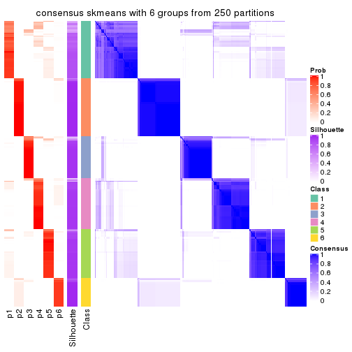</p>

</div>
</div>

Heatmaps for the membership of samples in all partitions to see how consistent they are:


<script>
$( function() {
	$( '#tabs-CV-skmeans-membership-heatmap' ).tabs();
} );
</script>
<div id='tabs-CV-skmeans-membership-heatmap'>
<ul>
<li><a href='#tab-CV-skmeans-membership-heatmap-1'>k = 2</a></li>
<li><a href='#tab-CV-skmeans-membership-heatmap-2'>k = 3</a></li>
<li><a href='#tab-CV-skmeans-membership-heatmap-3'>k = 4</a></li>
<li><a href='#tab-CV-skmeans-membership-heatmap-4'>k = 5</a></li>
<li><a href='#tab-CV-skmeans-membership-heatmap-5'>k = 6</a></li>
</ul>
<div id='tab-CV-skmeans-membership-heatmap-1'>
<pre><code class="r">membership_heatmap(res, k = 2)
</code></pre>

<p></p>

</div>
<div id='tab-CV-skmeans-membership-heatmap-2'>
<pre><code class="r">membership_heatmap(res, k = 3)
</code></pre>

<p></p>

</div>
<div id='tab-CV-skmeans-membership-heatmap-3'>
<pre><code class="r">membership_heatmap(res, k = 4)
</code></pre>

<p></p>

</div>
<div id='tab-CV-skmeans-membership-heatmap-4'>
<pre><code class="r">membership_heatmap(res, k = 5)
</code></pre>

<p></p>

</div>
<div id='tab-CV-skmeans-membership-heatmap-5'>
<pre><code class="r">membership_heatmap(res, k = 6)
</code></pre>

<p></p>

</div>
</div>

As soon as we have had the classes for columns, we can look for signatures
which are significantly different between classes which can be candidate marks
for certain classes. Following are the heatmaps for signatures.


Signature heatmaps where rows are scaled:


<script>
$( function() {
	$( '#tabs-CV-skmeans-get-signatures' ).tabs();
} );
</script>
<div id='tabs-CV-skmeans-get-signatures'>
<ul>
<li><a href='#tab-CV-skmeans-get-signatures-1'>k = 2</a></li>
<li><a href='#tab-CV-skmeans-get-signatures-2'>k = 3</a></li>
<li><a href='#tab-CV-skmeans-get-signatures-3'>k = 4</a></li>
<li><a href='#tab-CV-skmeans-get-signatures-4'>k = 5</a></li>
<li><a href='#tab-CV-skmeans-get-signatures-5'>k = 6</a></li>
</ul>
<div id='tab-CV-skmeans-get-signatures-1'>
<pre><code class="r">get_signatures(res, k = 2)
</code></pre>

<p></p>

</div>
<div id='tab-CV-skmeans-get-signatures-2'>
<pre><code class="r">get_signatures(res, k = 3)
</code></pre>

<p></p>

</div>
<div id='tab-CV-skmeans-get-signatures-3'>
<pre><code class="r">get_signatures(res, k = 4)
</code></pre>

<p></p>

</div>
<div id='tab-CV-skmeans-get-signatures-4'>
<pre><code class="r">get_signatures(res, k = 5)
</code></pre>

<p></p>

</div>
<div id='tab-CV-skmeans-get-signatures-5'>
<pre><code class="r">get_signatures(res, k = 6)
</code></pre>

<p></p>

</div>
</div>


Signature heatmaps where rows are not scaled:


<script>
$( function() {
	$( '#tabs-CV-skmeans-get-signatures-no-scale' ).tabs();
} );
</script>
<div id='tabs-CV-skmeans-get-signatures-no-scale'>
<ul>
<li><a href='#tab-CV-skmeans-get-signatures-no-scale-1'>k = 2</a></li>
<li><a href='#tab-CV-skmeans-get-signatures-no-scale-2'>k = 3</a></li>
<li><a href='#tab-CV-skmeans-get-signatures-no-scale-3'>k = 4</a></li>
<li><a href='#tab-CV-skmeans-get-signatures-no-scale-4'>k = 5</a></li>
<li><a href='#tab-CV-skmeans-get-signatures-no-scale-5'>k = 6</a></li>
</ul>
<div id='tab-CV-skmeans-get-signatures-no-scale-1'>
<pre><code class="r">get_signatures(res, k = 2, scale_rows = FALSE)
</code></pre>

<p></p>

</div>
<div id='tab-CV-skmeans-get-signatures-no-scale-2'>
<pre><code class="r">get_signatures(res, k = 3, scale_rows = FALSE)
</code></pre>

<p></p>

</div>
<div id='tab-CV-skmeans-get-signatures-no-scale-3'>
<pre><code class="r">get_signatures(res, k = 4, scale_rows = FALSE)
</code></pre>

<p></p>

</div>
<div id='tab-CV-skmeans-get-signatures-no-scale-4'>
<pre><code class="r">get_signatures(res, k = 5, scale_rows = FALSE)
</code></pre>

<p></p>

</div>
<div id='tab-CV-skmeans-get-signatures-no-scale-5'>
<pre><code class="r">get_signatures(res, k = 6, scale_rows = FALSE)
</code></pre>

<p></p>

</div>
</div>


Compare the overlap of signatures from different k:

```r
compare_signatures(res)
```


`get_signature()` returns a data frame invisibly. TO get the list of signatures, the function
call should be assigned to a variable explicitly. In following code, if `plot` argument is set
to `FALSE`, no heatmap is plotted while only the differential analysis is performed.

```r
# code only for demonstration
tb = get_signature(res, k = ..., plot = FALSE)
```

An example of the output of `tb` is:

```
#>   which_row         fdr    mean_1    mean_2 scaled_mean_1 scaled_mean_2 km
#> 1        38 0.042760348  8.373488  9.131774    -0.5533452     0.5164555  1
#> 2        40 0.018707592  7.106213  8.469186    -0.6173731     0.5762149  1
#> 3        55 0.019134737 10.221463 11.207825    -0.6159697     0.5749050  1
#> 4        59 0.006059896  5.921854  7.869574    -0.6899429     0.6439467  1
#> 5        60 0.018055526  8.928898 10.211722    -0.6204761     0.5791110  1
#> 6        98 0.009384629 15.714769 14.887706     0.6635654    -0.6193277  2
...
```

The columns in `tb` are:

1. `which_row`: row indices corresponding to the input matrix.
2. `fdr`: FDR for the differential test. 
3. `mean_x`: The mean value in group x.
4. `scaled_mean_x`: The mean value in group x after rows are scaled.
5. `km`: Row groups if k-means clustering is applied to rows.


UMAP plot which shows how samples are separated.


<script>
$( function() {
	$( '#tabs-CV-skmeans-dimension-reduction' ).tabs();
} );
</script>
<div id='tabs-CV-skmeans-dimension-reduction'>
<ul>
<li><a href='#tab-CV-skmeans-dimension-reduction-1'>k = 2</a></li>
<li><a href='#tab-CV-skmeans-dimension-reduction-2'>k = 3</a></li>
<li><a href='#tab-CV-skmeans-dimension-reduction-3'>k = 4</a></li>
<li><a href='#tab-CV-skmeans-dimension-reduction-4'>k = 5</a></li>
<li><a href='#tab-CV-skmeans-dimension-reduction-5'>k = 6</a></li>
</ul>
<div id='tab-CV-skmeans-dimension-reduction-1'>
<pre><code class="r">dimension_reduction(res, k = 2, method = &quot;UMAP&quot;)
</code></pre>

<p></p>

</div>
<div id='tab-CV-skmeans-dimension-reduction-2'>
<pre><code class="r">dimension_reduction(res, k = 3, method = &quot;UMAP&quot;)
</code></pre>

<p></p>

</div>
<div id='tab-CV-skmeans-dimension-reduction-3'>
<pre><code class="r">dimension_reduction(res, k = 4, method = &quot;UMAP&quot;)
</code></pre>

<p></p>

</div>
<div id='tab-CV-skmeans-dimension-reduction-4'>
<pre><code class="r">dimension_reduction(res, k = 5, method = &quot;UMAP&quot;)
</code></pre>

<p></p>

</div>
<div id='tab-CV-skmeans-dimension-reduction-5'>
<pre><code class="r">dimension_reduction(res, k = 6, method = &quot;UMAP&quot;)
</code></pre>

<p></p>

</div>
</div>


Following heatmap shows how subgroups are split when increasing `k`:

```r
collect_classes(res)
```

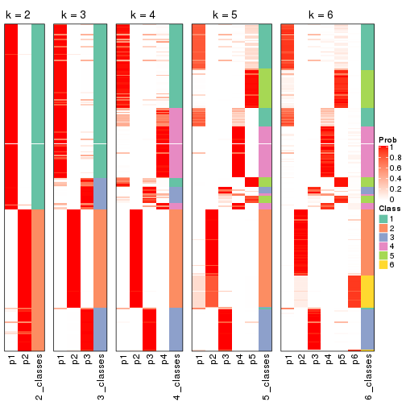


If matrix rows can be associated to genes, consider to use `GO_Enrichment(res,
...)` to perform function enrichment for the signature genes.


 

---------------------------------------------------


### CV:pam**


The object with results only for a single top-value method and a single partition method 
can be extracted as:

```r
res = res_list["CV", "pam"]
# you can also extract it by
# res = res_list["CV:pam"]
```

A summary of `res` and all the functions that can be applied to it:

```r
res
```

```
#> A 'ConsensusPartition' object with k = 2, 3, 4, 5, 6.
#>   On a matrix with 17377 rows and 265 columns.
#>   Top rows (1000, 2000, 3000, 4000, 5000) are extracted by 'CV' method.
#>   Subgroups are detected by 'pam' method.
#>   Performed in total 1250 partitions by row resampling.
#>   Best k for subgroups seems to be 2.
#> 
#> Following methods can be applied to this 'ConsensusPartition' object:
#>  [1] "cola_report"             "collect_classes"         "collect_plots"          
#>  [4] "collect_stats"           "colnames"                "compare_signatures"     
#>  [7] "consensus_heatmap"       "dimension_reduction"     "functional_enrichment"  
#> [10] "get_anno_col"            "get_anno"                "get_classes"            
#> [13] "get_consensus"           "get_matrix"              "get_membership"         
#> [16] "get_param"               "get_signatures"          "get_stats"              
#> [19] "is_best_k"               "is_stable_k"             "membership_heatmap"     
#> [22] "ncol"                    "nrow"                    "plot_ecdf"              
#> [25] "rownames"                "select_partition_number" "show"                   
#> [28] "suggest_best_k"          "test_to_known_factors"
```

`collect_plots()` function collects all the plots made from `res` for all `k` (number of partitions)
into one single page to provide an easy and fast comparison between different `k`.

```r
collect_plots(res)
```


The plots are:

- The first row: a plot of the ECDF (Empirical cumulative distribution
  function) curves of the consensus matrix for each `k` and the heatmap of
  predicted classes for each `k`.
- The second row: heatmaps of the consensus matrix for each `k`.
- The third row: heatmaps of the membership matrix for each `k`.
- The fouth row: heatmaps of the signatures for each `k`.

All the plots in panels can be made by individual functions and they are
plotted later in this section.

`select_partition_number()` produces several plots showing different
statistics for choosing "optimized" `k`. There are following statistics:

- ECDF curves of the consensus matrix for each `k`;
- 1-PAC. [The PAC
  score](https://en.wikipedia.org/wiki/Consensus_clustering#Over-interpretation_potential_of_consensus_clustering)
  measures the proportion of the ambiguous subgrouping.
- Mean silhouette score.
- Concordance. The mean probability of fiting the consensus class ids in all
  partitions.
- Area increased. Denote $A_k$ as the area under the ECDF curve for current
  `k`, the area increased is defined as $A_k - A_{k-1}$.
- Rand index. The percent of pairs of samples that are both in a same cluster
  or both are not in a same cluster in the partition of k and k-1.
- Jaccard index. The ratio of pairs of samples are both in a same cluster in
  the partition of k and k-1 and the pairs of samples are both in a same
  cluster in the partition k or k-1.

The detailed explanations of these statistics can be found in [the cola
vignette](http://bioconductor.org/packages/devel/bioc/vignettes/cola/inst/doc/cola.html#toc_13).

Generally speaking, lower PAC score, higher mean silhouette score or higher
concordance corresponds to better partition. Rand index and Jaccard index
measure how similar the current partition is compared to partition with `k-1`.
If they are too similar, we won't accept `k` is better than `k-1`.

```r
select_partition_number(res)
```


The numeric values for all these statistics can be obtained by `get_stats()`.

```r
get_stats(res)
```

```
#>   k 1-PAC mean_silhouette concordance area_increased  Rand Jaccard
#> 2 2 0.992           0.950       0.979         0.3999 0.606   0.606
#> 3 3 0.615           0.797       0.849         0.5431 0.713   0.536
#> 4 4 0.718           0.786       0.866         0.1498 0.926   0.790
#> 5 5 0.796           0.796       0.891         0.0806 0.925   0.746
#> 6 6 0.886           0.852       0.931         0.0532 0.940   0.751
```

`suggest_best_k()` suggests the best $k$ based on these statistics. The rules are as follows:

- All $k$ with Jaccard index larger than 0.95 are removed because the increase of
  the partition number does not provides enough extra information. If all $k$ are removed,
  the best $k$ is assigned by `NA`.
- For $k$ with 1-PAC larger than 0.9, the maximal $k$ is taken as the "best k". Other $k$ is called "optional k".
- If it does not fit the second rule. The $k$ with the highest vote of highest
  1-PAC, mean silhouette and concordance is taken as the "best k".

```r
suggest_best_k(res)
```

```
#> [1] 2
```


Following shows the table of the partitions (You need to click the **show/hide
code output** link to see it). The membership matrix (columns with name `p*`)
is inferred by
[`clue::cl_consensus()`](https://www.rdocumentation.org/link/cl_consensus?package=clue)
function with the `SE` method. Basically the value in the membership matrix
represents the probability to belong to a certain group. The finall class
label for an item is determined with the group with highest probability it
belongs to.

In `get_classes()` function, the entropy is calculated from the membership
matrix and the silhouette score is calculated from the consensus matrix.


<script>
$( function() {
	$( '#tabs-CV-pam-get-classes' ).tabs();
} );
</script>
<div id='tabs-CV-pam-get-classes'>
<ul>
<li><a href='#tab-CV-pam-get-classes-1'>k = 2</a></li>
<li><a href='#tab-CV-pam-get-classes-2'>k = 3</a></li>
<li><a href='#tab-CV-pam-get-classes-3'>k = 4</a></li>
<li><a href='#tab-CV-pam-get-classes-4'>k = 5</a></li>
<li><a href='#tab-CV-pam-get-classes-5'>k = 6</a></li>
</ul>

<div id='tab-CV-pam-get-classes-1'>
<p><a id='tab-CV-pam-get-classes-1-a' style='color:#0366d6' href='#'>show/hide code output</a></p>
<pre><code class="r">cbind(get_classes(res, k = 2), get_membership(res, k = 2))
</code></pre>

<pre><code>#&gt;                                      class entropy silhouette    p1    p2
#&gt; D30CF518-5FC6-4A54-8D5D-BA420EA1836D     2  0.0938     0.9651 0.012 0.988
#&gt; 92298FF7-1215-4756-B976-A7D88B91AD76     1  0.0000     0.9806 1.000 0.000
#&gt; 0E244FE2-7C17-4642-A51F-2CCA796D9C70     2  0.0000     0.9740 0.000 1.000
#&gt; 75435ED8-93E8-45FB-8480-98D8EB2EF8CB     2  0.2603     0.9359 0.044 0.956
#&gt; B6D11678-15A9-4F43-A0A2-225067DCAF1C     1  0.0000     0.9806 1.000 0.000
#&gt; B7F5A41E-9559-4329-81F5-1B88A74730B7     2  0.0000     0.9740 0.000 1.000
#&gt; 39414B2A-7FB0-4669-8DFE-86D9AF7AD2D9     1  0.0000     0.9806 1.000 0.000
#&gt; 04823F53-A12D-4852-8F34-77B9DCBB7DF0     2  0.0000     0.9740 0.000 1.000
#&gt; 49684C2B-D31C-4B45-A400-3497C3CCEC01     2  0.0000     0.9740 0.000 1.000
#&gt; 96A04875-58E2-4BE7-8E0F-CAB55F4CA54F     1  0.0000     0.9806 1.000 0.000
#&gt; 1F101D63-478B-40B9-A951-DC3887CFF067     1  0.0000     0.9806 1.000 0.000
#&gt; DD290860-E0B7-48FC-BE12-2AF729994C21     2  0.0000     0.9740 0.000 1.000
#&gt; FFDD7A12-DDEF-4974-8D60-64B7EEAAC994     2  0.0000     0.9740 0.000 1.000
#&gt; E076A9A9-EA2A-4FF7-92A8-F2DA7F30279E     1  0.0000     0.9806 1.000 0.000
#&gt; 830DFA6F-A85A-4317-82B2-791FAB998A01     1  0.8327     0.6518 0.736 0.264
#&gt; 58578614-E4A3-4655-BBAB-F65851625E0A     1  0.0000     0.9806 1.000 0.000
#&gt; 1CBFB672-4D66-430B-83F3-7CE3BE20ABF6     1  0.0000     0.9806 1.000 0.000
#&gt; 6C34A7D7-3756-4DCC-9A9F-B5FC4A148B7E     1  0.0000     0.9806 1.000 0.000
#&gt; D97ED7B4-5DF2-4B62-8796-AA51CA79DBBB     1  0.0000     0.9806 1.000 0.000
#&gt; 45F15851-55F6-4169-834E-38958C38B6A9     1  0.0000     0.9806 1.000 0.000
#&gt; 4139E0C9-F712-4A25-8B59-587533B93B3E     1  0.3584     0.9217 0.932 0.068
#&gt; 2C3007BF-009E-404F-A3BF-8B921698D85B     1  0.0000     0.9806 1.000 0.000
#&gt; 2189F8E5-FF98-4C1A-BD04-5595DB553130     1  0.0000     0.9806 1.000 0.000
#&gt; FFAA0310-0D78-4499-8FB8-5BC46E4FCE58     1  0.0000     0.9806 1.000 0.000
#&gt; 0C375B2F-67BE-4708-BEB2-544DEC812DCA     2  0.0000     0.9740 0.000 1.000
#&gt; AB6324A1-19AB-400C-8001-54765D190E27     2  0.0000     0.9740 0.000 1.000
#&gt; A32C4DCD-DC4C-4132-9ED1-B159F5561A2D     1  0.0000     0.9806 1.000 0.000
#&gt; 2AE7105D-D494-45B0-947A-315D8C20ECDC     1  0.0000     0.9806 1.000 0.000
#&gt; 60FE9D59-FC0F-4B9C-ABF8-1C00BC761928     1  0.0000     0.9806 1.000 0.000
#&gt; 056442DC-E87A-4315-965C-C19D7B4FC40E     1  0.0000     0.9806 1.000 0.000
#&gt; 455111E5-18EF-4E3F-9DFF-8FA017D92461     1  0.0000     0.9806 1.000 0.000
#&gt; 10632BC6-0B81-433C-8832-6B2ABC73A94B     1  0.0000     0.9806 1.000 0.000
#&gt; AC6F82AD-C682-4EB3-BEC3-FD950F57609D     1  0.0000     0.9806 1.000 0.000
#&gt; D9ABDB75-04DA-4D33-A69F-701729494533     1  0.0672     0.9748 0.992 0.008
#&gt; 27BBF44D-F4D7-4C5A-935F-3310A363A670     2  0.0000     0.9740 0.000 1.000
#&gt; E7AA12EE-6E14-4B33-A52C-B13589436023     1  0.0000     0.9806 1.000 0.000
#&gt; DFA6D41A-D231-413E-A180-E42DF26C3E2B     1  0.9087     0.5211 0.676 0.324
#&gt; 655BD3AF-5094-4B19-93A8-401C70369B17     1  0.7674     0.7199 0.776 0.224
#&gt; 9DFEF253-923F-4EE2-8E3D-C75805387B20     1  0.4298     0.9019 0.912 0.088
#&gt; 3B0EE948-B2CD-4191-90E2-BDD155F3B580     1  0.0000     0.9806 1.000 0.000
#&gt; 177C7EF4-2D54-4555-947C-44EE7C688917     1  0.2043     0.9554 0.968 0.032
#&gt; 1F8E8BB7-D159-4556-8B04-E5DD027CC444     2  0.0000     0.9740 0.000 1.000
#&gt; 619F37D2-6771-4727-9079-56BED07F1CF6     1  0.9881     0.2226 0.564 0.436
#&gt; ACAE29BE-ECB8-4A98-BC71-7A2D4857134E     1  0.0000     0.9806 1.000 0.000
#&gt; C5C3241A-684C-4238-9333-9AF8630EC086     1  1.0000     0.0167 0.504 0.496
#&gt; AD319DC2-140F-4E7B-A899-010687D8B714     2  0.0000     0.9740 0.000 1.000
#&gt; 2AFF397C-ED2A-4FD9-A7F0-E4C61E9FB603     1  0.0000     0.9806 1.000 0.000
#&gt; FB4C7892-3DBB-4148-AAE9-75B19A1A4031     1  0.0000     0.9806 1.000 0.000
#&gt; 6F5C4500-1ED1-4E81-B4F5-EEA64CE2336A     1  0.0000     0.9806 1.000 0.000
#&gt; BD027C69-3C10-4047-8E1E-218600FF2B73     2  0.0000     0.9740 0.000 1.000
#&gt; 11B473A9-4CC5-461F-BC57-CC9141F3591D     1  0.0000     0.9806 1.000 0.000
#&gt; 69A036E5-3E6A-4862-A7F8-2D203ED2FC9E     1  0.0000     0.9806 1.000 0.000
#&gt; 9C0BDF24-F011-4855-B95A-1B6BEFA808F7     1  0.0000     0.9806 1.000 0.000
#&gt; 9E205254-8C0C-4C05-AF5A-86E679CF732C     1  0.0000     0.9806 1.000 0.000
#&gt; 935CCE4A-8AA8-454E-9DFF-7DE27D0BD2E2     1  0.0000     0.9806 1.000 0.000
#&gt; 01E5E1FE-41D3-428B-90BC-7A000829E102     1  0.0000     0.9806 1.000 0.000
#&gt; B344A530-92CD-468B-847A-DF8E25688081     1  0.0376     0.9778 0.996 0.004
#&gt; F79F32A7-9F7B-4D62-8426-4A4CF10ED319     1  0.0000     0.9806 1.000 0.000
#&gt; C2E1C6FA-82F9-467C-99AE-9B39FAAC810C     1  0.0000     0.9806 1.000 0.000
#&gt; BF7CD9BD-776A-4957-8A6E-EF8AD83EA9D3     2  0.8386     0.6325 0.268 0.732
#&gt; 8A2C1409-E83B-435E-A20F-5FCA94801C9F     2  0.0000     0.9740 0.000 1.000
#&gt; B6BEFFB5-2F62-477B-A4C8-478D29577CBD     2  0.0000     0.9740 0.000 1.000
#&gt; 8622CBD0-F8E9-4AC1-8175-CC9A742B86F9     1  0.0000     0.9806 1.000 0.000
#&gt; 565DD660-ED58-4065-8619-260BEA6FCFEB     1  0.0000     0.9806 1.000 0.000
#&gt; 96038E42-0FBA-497D-819C-38F7689F10FF     1  0.0000     0.9806 1.000 0.000
#&gt; CA685549-F8BA-43F1-8461-5D2D3B17CFC5     1  0.0000     0.9806 1.000 0.000
#&gt; 52020307-71A6-46E5-ACB3-8F885CA8F1EB     1  0.0000     0.9806 1.000 0.000
#&gt; 7656DA98-76DC-424B-B02C-D7001DAAA0E4     1  0.0000     0.9806 1.000 0.000
#&gt; 74DBA640-45E2-42A6-8F1E-69C073D66EE6     1  0.0000     0.9806 1.000 0.000
#&gt; 251094BE-C33D-44F0-BD98-8618D71F520C     1  0.0000     0.9806 1.000 0.000
#&gt; AB914CC5-5FF1-4257-A353-6A99D11B9478     1  0.0000     0.9806 1.000 0.000
#&gt; 38B8B893-0E08-4B71-B51C-B32A7B2724E0     1  0.0000     0.9806 1.000 0.000
#&gt; 7C7CD8FF-99A4-41D7-B7E1-5A517001F551     2  0.2948     0.9282 0.052 0.948
#&gt; BFC5B75A-E4AE-486B-BA30-23BBAA33A125     2  0.0000     0.9740 0.000 1.000
#&gt; 182AC78E-A07C-4B34-B216-B5F573E9F036     1  0.5519     0.8546 0.872 0.128
#&gt; B38C5F72-8F46-4531-9C2D-96EEE07A5B22     2  0.0000     0.9740 0.000 1.000
#&gt; DB9333A6-A723-4B8F-9221-25B8B23D5126     1  0.0000     0.9806 1.000 0.000
#&gt; CD67DD21-C1B6-4D58-AC8E-1F4536C7DA70     1  0.0938     0.9719 0.988 0.012
#&gt; 3D76A56E-4B66-48AE-AA60-D9C1004C7140     1  0.0000     0.9806 1.000 0.000
#&gt; 71ED572F-7780-47A4-A9F8-D320C737690D     1  0.0000     0.9806 1.000 0.000
#&gt; B449FEA1-C4B0-400F-903C-59E13D0BA313     2  0.0376     0.9711 0.004 0.996
#&gt; 3F120E90-1486-4215-B9B9-79D5B413CAAC     1  0.0000     0.9806 1.000 0.000
#&gt; A071894B-D8C0-4740-BD55-93EA0C86EDF7     1  0.0000     0.9806 1.000 0.000
#&gt; 58848D57-D7A9-4ABB-86A2-A8AE2B23F654     1  0.0000     0.9806 1.000 0.000
#&gt; CD6F9E20-B301-4663-87EC-953EDF49754F     1  0.6343     0.8145 0.840 0.160
#&gt; 367D89F3-D527-4929-B830-8B6D553DF9E1     1  0.0000     0.9806 1.000 0.000
#&gt; BE8D7DCB-648B-42DD-9FA8-8B85B5D816B2     1  0.0000     0.9806 1.000 0.000
#&gt; AA46F56B-BD9C-40A4-8EA8-35E2568C964D     2  0.0000     0.9740 0.000 1.000
#&gt; 6393220A-7C57-413F-81A8-4E38C21E779E     2  0.0000     0.9740 0.000 1.000
#&gt; 89AE566C-F65F-43C2-BA97-621A7AC8B6DC     1  0.0000     0.9806 1.000 0.000
#&gt; AA6A4BFF-8C62-4B70-B85A-9EDF403B06BA     1  0.0000     0.9806 1.000 0.000
#&gt; BCE877A6-9C65-4495-A45D-05753F2D0E15     1  0.0000     0.9806 1.000 0.000
#&gt; D7BDDF49-C54B-4F8E-ACA0-C3684AB68B5C     1  0.0000     0.9806 1.000 0.000
#&gt; D0800D49-0033-44B2-8D7B-29B16F87ADA6     1  0.3879     0.9138 0.924 0.076
#&gt; 151D60B5-5AF1-4B61-B97F-ABC7531D9F89     1  0.0000     0.9806 1.000 0.000
#&gt; CBBAEB5B-25FA-4B6D-A40C-357E37033E36     1  0.0000     0.9806 1.000 0.000
#&gt; 317CD049-3151-40B7-8E88-B0B8813338D6     1  0.0000     0.9806 1.000 0.000
#&gt; 93835C77-F8FA-4928-843C-8016A91881FA     1  0.0000     0.9806 1.000 0.000
#&gt; 02A6950F-647D-4F20-B2D0-0238C1441C70     1  0.0000     0.9806 1.000 0.000
#&gt; 4D54E415-134F-4F6F-8718-3E0475EF5477     1  0.0000     0.9806 1.000 0.000
#&gt; 82AB290A-3993-45E5-8B15-6125A019778C     1  0.0000     0.9806 1.000 0.000
#&gt; 3B5EAD14-E506-4A22-804D-BF925A2D5247     2  0.0000     0.9740 0.000 1.000
#&gt; 19CF7DDF-4F3A-4D2F-B84A-6451A5C3112C     1  0.0000     0.9806 1.000 0.000
#&gt; 2FB00DAA-C274-42B1-A06B-611FE5E96844     1  0.0000     0.9806 1.000 0.000
#&gt; 2B1F01C3-8145-4296-8111-2B0474AB9A2C     2  0.0000     0.9740 0.000 1.000
#&gt; 3F0865F1-8256-4778-966F-D53637B415B6     1  0.2423     0.9487 0.960 0.040
#&gt; 5473210D-37F9-4192-86D2-E2A2C77F3BD2     1  0.2603     0.9451 0.956 0.044
#&gt; 5EDB6ACF-4F3F-471A-9DDC-661607CACCC4     1  0.0000     0.9806 1.000 0.000
#&gt; 6A252A3A-7EEB-47B6-9C23-D69BD2EA846F     1  0.0000     0.9806 1.000 0.000
#&gt; 0A7FFCBB-4BAA-4A5F-8B2D-B427C4D982A8     1  0.0000     0.9806 1.000 0.000
#&gt; 1603AFB8-5AD7-4794-9991-BDBE96B4D997     2  0.0000     0.9740 0.000 1.000
#&gt; 644299E9-62B7-4DFE-9E6D-D7556A01B40A     1  0.0000     0.9806 1.000 0.000
#&gt; EF12E923-1860-4269-B57B-BA6238FA4403     1  0.0000     0.9806 1.000 0.000
#&gt; 51B7241E-F0BE-482A-88AE-89004BB68989     1  0.0000     0.9806 1.000 0.000
#&gt; 1C007DF3-8A9F-4940-9A4C-DE2A412BB023     1  0.0376     0.9778 0.996 0.004
#&gt; 89FCFDE6-9625-432C-AA35-9C5FCCF40031     1  0.0000     0.9806 1.000 0.000
#&gt; 7955FC55-386D-497E-AFED-019BBBAD428E     1  0.0000     0.9806 1.000 0.000
#&gt; 37FF09ED-73EC-4D10-B2AC-7D8EBA9304ED     1  0.0000     0.9806 1.000 0.000
#&gt; C2CD2742-2FB4-468E-90FF-8F65A5C425A9     1  0.0000     0.9806 1.000 0.000
#&gt; 766FE08F-3393-4868-B1C1-FA98C9FF16E0     1  0.2948     0.9375 0.948 0.052
#&gt; 63E2B578-2221-4255-8C45-7FD030B1C94D     1  0.0000     0.9806 1.000 0.000
#&gt; C14B1A44-43F7-45F0-A583-5667A4D3BD95     1  0.0000     0.9806 1.000 0.000
#&gt; D9CB551A-CE20-4BF7-8AC9-839112346C3D     1  0.0000     0.9806 1.000 0.000
#&gt; 05BAA71A-E5B3-4A3A-A3F2-013A975087F0     2  0.0000     0.9740 0.000 1.000
#&gt; AC8DA7DE-4D83-4768-BEFD-9A1B2DA943CE     1  0.0000     0.9806 1.000 0.000
#&gt; E89DCE9D-F8A5-499C-85BB-BB500BADB9FB     1  0.0000     0.9806 1.000 0.000
#&gt; C16F9B5E-2B52-40F6-856D-C0D6FBDD16C1     1  0.0000     0.9806 1.000 0.000
#&gt; 8FF234D4-823A-4C80-82F7-2E92D72DBF88     2  0.0000     0.9740 0.000 1.000
#&gt; C9F94A6E-D104-4D8D-8EC5-EADECD85F092     1  0.2423     0.9486 0.960 0.040
#&gt; 45C9756F-A154-4537-852E-ECBF27B92FE1     2  0.0000     0.9740 0.000 1.000
#&gt; 0F1A5708-341E-4713-BC70-76D702F826D6     1  0.4690     0.8881 0.900 0.100
#&gt; 2ECFBCA0-AB35-461A-A4B5-C60B2651A962     2  0.0000     0.9740 0.000 1.000
#&gt; 7DFAC404-3AB3-4274-A533-CFDAF4CE122D     1  0.0000     0.9806 1.000 0.000
#&gt; A90AF55C-4386-42AB-A812-9230026EA5A5     2  0.1184     0.9620 0.016 0.984
#&gt; 6258A757-4E18-4CD1-8417-189521E990B6     2  0.0000     0.9740 0.000 1.000
#&gt; EBFAD137-050F-47D0-A43D-72B8F7D70C2B     1  0.0000     0.9806 1.000 0.000
#&gt; 08B5EBFB-2807-4229-95A6-81AB7F377A56     2  0.0000     0.9740 0.000 1.000
#&gt; 4780A59C-0589-4995-B044-3201F09AF859     1  0.0000     0.9806 1.000 0.000
#&gt; 0AB81429-C287-48AA-9035-3A7A6F4C7328     2  0.0000     0.9740 0.000 1.000
#&gt; 20C4D047-28DA-4AB7-9B3C-32EDA6B22C9D     1  0.2043     0.9558 0.968 0.032
#&gt; 77C4E01F-84A6-4BFD-AA8E-D7875456F546     1  0.2948     0.9374 0.948 0.052
#&gt; 8B28383F-CF14-4CC5-A1E2-72AD915C0AE8     1  0.0000     0.9806 1.000 0.000
#&gt; E12E1F48-6A52-4F74-925C-C4EE1BF5C573     2  0.0000     0.9740 0.000 1.000
#&gt; 9B179BC5-BB4C-4CEE-99BC-BC552BC384A1     1  0.0000     0.9806 1.000 0.000
#&gt; 5548C91A-D3DE-48F5-B4A4-124BE177B99A     1  0.0000     0.9806 1.000 0.000
#&gt; 0E22B729-C381-4B0C-9897-62DD38F51722     1  0.0000     0.9806 1.000 0.000
#&gt; 7BC4937F-04E2-4B46-BA7C-FE9AC738C8A9     1  0.0000     0.9806 1.000 0.000
#&gt; EE6A0D3F-3F8A-4AA8-B3EF-32372EF37A29     1  0.0000     0.9806 1.000 0.000
#&gt; 08AC2706-7651-409F-BE6B-BCED1C2D1796     1  0.0000     0.9806 1.000 0.000
#&gt; A68B078D-8979-4070-BB4D-F526704ED3DC     1  0.1414     0.9653 0.980 0.020
#&gt; C319A5EE-69FA-4AAB-85A9-2EAAD8E4C703     1  0.0000     0.9806 1.000 0.000
#&gt; 0D7CAABD-D20C-4F82-BCBC-8B7276E8EDE2     1  0.0000     0.9806 1.000 0.000
#&gt; 09444DCC-44BA-4A3F-ACC5-863A54578B9F     1  0.0000     0.9806 1.000 0.000
#&gt; 2E32B047-C6E1-4743-A6C8-E98370A32145     1  0.0000     0.9806 1.000 0.000
#&gt; 6A6878A7-76B2-40DE-958B-804442AC6A5D     1  0.0000     0.9806 1.000 0.000
#&gt; 39F27293-0BFF-4EA2-8439-A299E3226D20     1  0.0000     0.9806 1.000 0.000
#&gt; 7EAE9C30-6080-405F-A7E6-1FED57674279     1  0.0000     0.9806 1.000 0.000
#&gt; 79499169-A093-4E0A-B6BD-010CD7BE5035     1  0.0000     0.9806 1.000 0.000
#&gt; 1F8BF4E8-BD84-4EFE-9E3E-89E7CE8FA72D     1  0.0000     0.9806 1.000 0.000
#&gt; 62B7988F-98E5-4AB8-8A16-D661A07455E8     1  0.0000     0.9806 1.000 0.000
#&gt; B7005B5F-217E-4073-BFB5-CE7E884B80C0     2  0.0000     0.9740 0.000 1.000
#&gt; B981568F-2C08-4696-B589-E157A49BE72B     2  0.0000     0.9740 0.000 1.000
#&gt; A3D85C0A-3202-40C2-88E1-052AC6C5184B     1  0.0000     0.9806 1.000 0.000
#&gt; 4CA783B9-9B99-46B8-962A-77194ECB7942     1  0.0000     0.9806 1.000 0.000
#&gt; D4024B08-4879-47EA-99E5-D9FCE1CD40DF     1  0.0000     0.9806 1.000 0.000
#&gt; 1D41CDA2-0B29-48FD-B83A-E60C174DBCB3     1  0.0000     0.9806 1.000 0.000
#&gt; A1923B2A-B233-4760-8AF9-C04C1CAEB100     1  0.0000     0.9806 1.000 0.000
#&gt; 80880D71-BFDE-4D88-892F-5ADF27A38940     1  0.2043     0.9557 0.968 0.032
#&gt; 55D1629D-30FD-49AA-88CE-EA3CA9B30A3F     2  0.0000     0.9740 0.000 1.000
#&gt; B71C409E-926D-48AD-8BD8-9F707CA4FB01     2  0.0000     0.9740 0.000 1.000
#&gt; 54A92C57-BD19-4A47-BA76-3ACA2DC36212     1  0.0000     0.9806 1.000 0.000
#&gt; B2AB74B8-506C-4C27-9105-E86A6AAA89D4     1  0.0000     0.9806 1.000 0.000
#&gt; 0356AE49-7A5C-42CC-A39C-7C8DFBFF8842     2  0.0000     0.9740 0.000 1.000
#&gt; ACA260A3-DC3F-4FF4-B9C5-2D4BC4F81783     1  0.0000     0.9806 1.000 0.000
#&gt; 9B440917-E5A4-43B9-A48D-6ABFEDCA6CFD     1  0.0000     0.9806 1.000 0.000
#&gt; 47464828-52EA-413B-B30C-BD8B55903D78     2  0.0000     0.9740 0.000 1.000
#&gt; C1D1FC82-B50D-4C82-8F03-06CEE3C08D18     1  0.0000     0.9806 1.000 0.000
#&gt; E5ABFC43-E2A3-4B1A-BBA3-8196C0B026A5     2  1.0000     0.0102 0.496 0.504
#&gt; 1D3C16CC-D0D5-4637-AAC7-91672DFF3317     1  0.1843     0.9589 0.972 0.028
#&gt; 4D038320-ADEA-4990-8371-68B4B8162E1A     2  0.0000     0.9740 0.000 1.000
#&gt; A75594CC-3E49-4869-8656-BBB4E72BF59D     2  0.0000     0.9740 0.000 1.000
#&gt; 7CABAA19-5FB2-4A58-BDA3-4F1FFB532C20     1  0.0000     0.9806 1.000 0.000
#&gt; 534EF1E9-9513-426E-B41E-A394AB2E4410     2  0.0000     0.9740 0.000 1.000
#&gt; 649F35A1-A08C-497D-A9B6-CB3084D5FB8D     1  0.0000     0.9806 1.000 0.000
#&gt; 7CA30F3C-1C98-480C-B8B5-A248AABFB468     1  0.0000     0.9806 1.000 0.000
#&gt; A9F8DA21-A802-44CF-9F5D-96A36687DCDD     1  0.0672     0.9749 0.992 0.008
#&gt; A7AE1ED1-86CB-4A50-97B2-66785C7191FE     1  0.0000     0.9806 1.000 0.000
#&gt; D0091AD4-D3D7-4C03-ACD9-DA9F8B6076C6     1  0.0000     0.9806 1.000 0.000
#&gt; 46EE1C2B-13F7-44A7-B27E-4EBB9DF0CA83     2  0.0000     0.9740 0.000 1.000
#&gt; CB9301B8-0282-43D6-AF5E-B753A9C7BFCB     2  0.0000     0.9740 0.000 1.000
#&gt; A0E77A39-885A-4472-9A10-2D1E51DBFDA4     1  0.0000     0.9806 1.000 0.000
#&gt; C06603C2-163D-40B6-A9FE-882424F18FE9     1  0.0000     0.9806 1.000 0.000
#&gt; C3921A29-80FF-4B9D-B366-5C0238A42231     1  0.0000     0.9806 1.000 0.000
#&gt; BB99B4E7-C834-4BB8-973F-8FA039E2798F     1  0.0000     0.9806 1.000 0.000
#&gt; 5CD78C2F-05E9-409A-8405-3EE936A6876E     1  0.0376     0.9778 0.996 0.004
#&gt; 6C126CC7-0C03-48F0-A2C2-F090CA239B70     2  0.0000     0.9740 0.000 1.000
#&gt; 7118B08A-E94C-49F4-8D76-26455C34D85F     2  0.0000     0.9740 0.000 1.000
#&gt; 266DAF30-CF3E-493E-8B24-3931D0039450     1  0.0000     0.9806 1.000 0.000
#&gt; DAB5F5B9-4FE5-468F-AD2B-B39BBC4317A0     1  0.0000     0.9806 1.000 0.000
#&gt; 9A9EB6D6-312E-4A98-8762-30D3ABD8193D     1  0.3114     0.9336 0.944 0.056
#&gt; CED15676-B901-4FC8-9C8D-51E529D9441D     1  0.0000     0.9806 1.000 0.000
#&gt; 827232CC-8035-440C-8B12-02C789C70B1B     1  0.0000     0.9806 1.000 0.000
#&gt; 04D5FB28-FB50-4EAE-95FB-72ABF0E618CA     2  0.0000     0.9740 0.000 1.000
#&gt; 6C96A851-97FC-4845-B895-D255191D9F25     1  0.0000     0.9806 1.000 0.000
#&gt; 3EC982CB-D013-443E-B21D-39DE6B8EF370     1  0.2043     0.9554 0.968 0.032
#&gt; 2E24A786-4370-42A1-AD50-D651F89819CC     2  0.0000     0.9740 0.000 1.000
#&gt; 7653BFA9-ADA5-44CA-8555-807FBBFC6DE2     1  0.0000     0.9806 1.000 0.000
#&gt; 7A110994-5741-4013-91F0-DD2E1D343F91     2  0.1184     0.9620 0.016 0.984
#&gt; 0A760E0C-11C5-4201-8452-18DBC1FEACEB     1  0.0000     0.9806 1.000 0.000
#&gt; 909B76A1-BB9F-4906-95BC-58CD1A46D3B8     2  0.0000     0.9740 0.000 1.000
#&gt; A782EE71-EDA4-4385-83B3-D16DE81296C0     1  0.0672     0.9749 0.992 0.008
#&gt; BD50E276-914F-4924-8CEA-FF47A66DB175     2  0.0000     0.9740 0.000 1.000
#&gt; 505D5CA8-0279-4BC7-8CC0-8C7A0165BF91     2  0.0000     0.9740 0.000 1.000
#&gt; D51FC997-E662-4AE7-BC9C-14183DA42DE1     2  0.0000     0.9740 0.000 1.000
#&gt; 8AD67970-84F1-4C0A-B47A-8FA4108F9FE3     1  0.0000     0.9806 1.000 0.000
#&gt; 6E33B1B6-7089-4BC3-B2B0-EC2C3B5D8B74     1  0.0000     0.9806 1.000 0.000
#&gt; 88C4EA46-2546-401C-A8E7-603EECFDFBA0     1  0.0000     0.9806 1.000 0.000
#&gt; 375D2D72-C998-4627-BA35-24E82A9A55FF     1  0.0000     0.9806 1.000 0.000
#&gt; 76D0F834-7064-46C6-96F4-E861CF5452B6     2  0.0672     0.9682 0.008 0.992
#&gt; 87159081-C97A-4004-AF0A-7EB6EF0EC47A     1  0.0000     0.9806 1.000 0.000
#&gt; 24A57006-800B-4174-AF4E-7EA57A8A756E     1  0.0000     0.9806 1.000 0.000
#&gt; AD68CBC6-8A13-4A65-AF62-E99AFA81D031     1  0.1184     0.9686 0.984 0.016
#&gt; 22863A57-F066-4DD1-A859-4336F43D144C     1  0.0000     0.9806 1.000 0.000
#&gt; 8F6F0362-9165-4DCC-992C-AF871A3C51E7     1  0.0000     0.9806 1.000 0.000
#&gt; 76ABF0B7-E707-4DB2-9486-3814439BDBA5     1  0.0000     0.9806 1.000 0.000
#&gt; BC72372F-3577-40E5-BA0F-41A084AA93AD     1  0.9896     0.2015 0.560 0.440
#&gt; 8E566039-B56C-4F41-B9EF-DE18BEEF2C95     1  0.0000     0.9806 1.000 0.000
#&gt; F096F016-3EF5-4A67-A7C2-8A45E1585232     1  0.0000     0.9806 1.000 0.000
#&gt; BB37913E-534B-43DD-BE3D-E13B29FD8172     2  0.0000     0.9740 0.000 1.000
#&gt; E344638F-9060-460F-8F7A-60D19442F294     1  0.1633     0.9625 0.976 0.024
#&gt; 6A0EAAD0-89D5-4F12-8B45-9D5A25182FAD     1  0.8443     0.6369 0.728 0.272
#&gt; A5199E3A-9D67-4543-88AB-24398C98E38E     1  0.0000     0.9806 1.000 0.000
#&gt; 23917D52-7864-4F84-9C77-DF8EA9407345     2  0.0000     0.9740 0.000 1.000
#&gt; 9AA96080-19D8-40C3-BDD1-6044D2D422D5     1  0.0000     0.9806 1.000 0.000
#&gt; 0ED65D91-260C-4662-9903-EE36A2E3B2D0     2  0.0000     0.9740 0.000 1.000
#&gt; 64BF1BC5-7A9A-4E1D-AEAB-AFE30B92AAF4     1  0.2603     0.9452 0.956 0.044
#&gt; F02301F1-9054-4DC6-8DC9-2451A0F53EFC     2  0.7674     0.7101 0.224 0.776
#&gt; 3264649A-5684-4181-83D0-A7E4D7E2E1FD     1  0.0000     0.9806 1.000 0.000
#&gt; 3F8DA39C-BC9B-4343-8838-5CE271E80C51     2  0.5408     0.8521 0.124 0.876
#&gt; BCC681CB-2AF4-4BB6-B53A-7544A2399454     1  0.0000     0.9806 1.000 0.000
#&gt; DCB50E17-5E2D-443B-8DCC-272FBB734C2E     1  0.0000     0.9806 1.000 0.000
#&gt; B5E47C38-CB6A-44C0-AA9B-56951B9EF78D     1  0.0000     0.9806 1.000 0.000
#&gt; B15B0185-9C28-4A00-9CEC-05EFECEA6709     1  0.0000     0.9806 1.000 0.000
#&gt; 61D4E8E7-0110-480A-A4A7-D406DE74C31E     1  0.0000     0.9806 1.000 0.000
#&gt; CA8DB3AD-3F6B-4622-BF73-47041EC96E42     1  0.0000     0.9806 1.000 0.000
#&gt; 5EECB1C4-172C-4494-871A-ADB650CD82BD     2  0.0000     0.9740 0.000 1.000
#&gt; 019B857C-D4F7-4B67-B699-56E52A60805B     2  0.9996     0.0388 0.488 0.512
#&gt; E9C28902-05C9-4883-97A4-D612D54E46B4     1  0.0000     0.9806 1.000 0.000
#&gt; C5D3D9A0-FC14-408D-AB6C-662018A5E5CA     1  0.0000     0.9806 1.000 0.000
#&gt; 7EB24744-509B-4854-B7D0-0BAFA210A345     2  0.0000     0.9740 0.000 1.000
#&gt; B8B7A721-2284-40AB-98F5-EF1351C30B66     2  0.0000     0.9740 0.000 1.000
#&gt; 3C12F39D-0D21-4F69-A539-4120B73C7A79     2  0.0000     0.9740 0.000 1.000
#&gt; 08D3F984-6850-45B2-9DF9-EC7F5A4060A4     1  0.0000     0.9806 1.000 0.000
#&gt; 9BD0EE79-1EED-4F6D-A5AB-43ADB8526F1E     1  0.0000     0.9806 1.000 0.000
#&gt; E489A871-3CF4-4F3D-8EAF-63B507054201     2  0.0000     0.9740 0.000 1.000
#&gt; 8CF8FD2E-1DBA-4257-9715-04D956D46B71     2  0.0000     0.9740 0.000 1.000
#&gt; F6193AF0-7A19-46CB-A818-1B01E7460791     1  0.0000     0.9806 1.000 0.000
#&gt; 96392D6B-D4FF-4393-93BA-08E469E8BBE1     1  0.0000     0.9806 1.000 0.000
#&gt; DABCBE5A-C591-46A2-AF66-DA3DB6106751     1  0.0000     0.9806 1.000 0.000
#&gt; 8B75F7D4-98D8-44DE-B19D-B733D6A031DB     1  0.0376     0.9778 0.996 0.004
#&gt; AAD9685A-564B-42E9-91E3-431951154BA7     2  0.1414     0.9585 0.020 0.980
#&gt; 90A43152-4E3B-4365-A39F-7B0E5CA66E55     1  0.0000     0.9806 1.000 0.000
#&gt; EFB76FCF-AC9C-4852-B91C-E055DA666FA0     1  0.0000     0.9806 1.000 0.000
#&gt; 6EBCFFE3-706F-440A-ABA9-012A924A07C6     2  0.0000     0.9740 0.000 1.000
#&gt; E922A244-F1C8-4310-ABB2-62B06E022E4C     1  0.0000     0.9806 1.000 0.000
</code></pre>

<script>
$('#tab-CV-pam-get-classes-1-a').parent().next().next().hide();
$('#tab-CV-pam-get-classes-1-a').click(function(){
  $('#tab-CV-pam-get-classes-1-a').parent().next().next().toggle();
  return(false);
});
</script>
</div>

<div id='tab-CV-pam-get-classes-2'>
<p><a id='tab-CV-pam-get-classes-2-a' style='color:#0366d6' href='#'>show/hide code output</a></p>
<pre><code class="r">cbind(get_classes(res, k = 3), get_membership(res, k = 3))
</code></pre>

<pre><code>#&gt;                                      class entropy silhouette    p1    p2    p3
#&gt; D30CF518-5FC6-4A54-8D5D-BA420EA1836D     2  0.1337     0.9683 0.012 0.972 0.016
#&gt; 92298FF7-1215-4756-B976-A7D88B91AD76     1  0.0237     0.8376 0.996 0.000 0.004
#&gt; 0E244FE2-7C17-4642-A51F-2CCA796D9C70     2  0.0000     0.9928 0.000 1.000 0.000
#&gt; 75435ED8-93E8-45FB-8480-98D8EB2EF8CB     3  0.6520     0.0639 0.004 0.488 0.508
#&gt; B6D11678-15A9-4F43-A0A2-225067DCAF1C     3  0.5216     0.8522 0.260 0.000 0.740
#&gt; B7F5A41E-9559-4329-81F5-1B88A74730B7     2  0.0000     0.9928 0.000 1.000 0.000
#&gt; 39414B2A-7FB0-4669-8DFE-86D9AF7AD2D9     3  0.4974     0.8689 0.236 0.000 0.764
#&gt; 04823F53-A12D-4852-8F34-77B9DCBB7DF0     2  0.0000     0.9928 0.000 1.000 0.000
#&gt; 49684C2B-D31C-4B45-A400-3497C3CCEC01     2  0.0000     0.9928 0.000 1.000 0.000
#&gt; 96A04875-58E2-4BE7-8E0F-CAB55F4CA54F     1  0.0000     0.8375 1.000 0.000 0.000
#&gt; 1F101D63-478B-40B9-A951-DC3887CFF067     1  0.2537     0.8348 0.920 0.000 0.080
#&gt; DD290860-E0B7-48FC-BE12-2AF729994C21     2  0.0000     0.9928 0.000 1.000 0.000
#&gt; FFDD7A12-DDEF-4974-8D60-64B7EEAAC994     2  0.0000     0.9928 0.000 1.000 0.000
#&gt; E076A9A9-EA2A-4FF7-92A8-F2DA7F30279E     3  0.6309    -0.3887 0.496 0.000 0.504
#&gt; 830DFA6F-A85A-4317-82B2-791FAB998A01     3  0.7319     0.7549 0.164 0.128 0.708
#&gt; 58578614-E4A3-4655-BBAB-F65851625E0A     3  0.4974     0.8689 0.236 0.000 0.764
#&gt; 1CBFB672-4D66-430B-83F3-7CE3BE20ABF6     1  0.2537     0.8348 0.920 0.000 0.080
#&gt; 6C34A7D7-3756-4DCC-9A9F-B5FC4A148B7E     1  0.2537     0.8348 0.920 0.000 0.080
#&gt; D97ED7B4-5DF2-4B62-8796-AA51CA79DBBB     1  0.2537     0.8348 0.920 0.000 0.080
#&gt; 45F15851-55F6-4169-834E-38958C38B6A9     1  0.0000     0.8375 1.000 0.000 0.000
#&gt; 4139E0C9-F712-4A25-8B59-587533B93B3E     3  0.6465     0.8291 0.232 0.044 0.724
#&gt; 2C3007BF-009E-404F-A3BF-8B921698D85B     1  0.0747     0.8347 0.984 0.000 0.016
#&gt; 2189F8E5-FF98-4C1A-BD04-5595DB553130     1  0.2537     0.8348 0.920 0.000 0.080
#&gt; FFAA0310-0D78-4499-8FB8-5BC46E4FCE58     3  0.5882     0.1148 0.348 0.000 0.652
#&gt; 0C375B2F-67BE-4708-BEB2-544DEC812DCA     2  0.0000     0.9928 0.000 1.000 0.000
#&gt; AB6324A1-19AB-400C-8001-54765D190E27     2  0.0000     0.9928 0.000 1.000 0.000
#&gt; A32C4DCD-DC4C-4132-9ED1-B159F5561A2D     1  0.0000     0.8375 1.000 0.000 0.000
#&gt; 2AE7105D-D494-45B0-947A-315D8C20ECDC     3  0.4974     0.8689 0.236 0.000 0.764
#&gt; 60FE9D59-FC0F-4B9C-ABF8-1C00BC761928     1  0.0000     0.8375 1.000 0.000 0.000
#&gt; 056442DC-E87A-4315-965C-C19D7B4FC40E     1  0.1031     0.8335 0.976 0.000 0.024
#&gt; 455111E5-18EF-4E3F-9DFF-8FA017D92461     3  0.4974     0.8689 0.236 0.000 0.764
#&gt; 10632BC6-0B81-433C-8832-6B2ABC73A94B     1  0.0000     0.8375 1.000 0.000 0.000
#&gt; AC6F82AD-C682-4EB3-BEC3-FD950F57609D     1  0.2165     0.8142 0.936 0.000 0.064
#&gt; D9ABDB75-04DA-4D33-A69F-701729494533     1  0.2280     0.8194 0.940 0.008 0.052
#&gt; 27BBF44D-F4D7-4C5A-935F-3310A363A670     2  0.0000     0.9928 0.000 1.000 0.000
#&gt; E7AA12EE-6E14-4B33-A52C-B13589436023     1  0.5706     0.4207 0.680 0.000 0.320
#&gt; DFA6D41A-D231-413E-A180-E42DF26C3E2B     1  0.9672     0.0206 0.456 0.240 0.304
#&gt; 655BD3AF-5094-4B19-93A8-401C70369B17     1  0.7053     0.5995 0.692 0.244 0.064
#&gt; 9DFEF253-923F-4EE2-8E3D-C75805387B20     1  0.3039     0.8061 0.920 0.044 0.036
#&gt; 3B0EE948-B2CD-4191-90E2-BDD155F3B580     3  0.4974     0.8689 0.236 0.000 0.764
#&gt; 177C7EF4-2D54-4555-947C-44EE7C688917     1  0.6111     0.5440 0.604 0.000 0.396
#&gt; 1F8E8BB7-D159-4556-8B04-E5DD027CC444     2  0.0000     0.9928 0.000 1.000 0.000
#&gt; 619F37D2-6771-4727-9079-56BED07F1CF6     1  0.7627     0.2866 0.528 0.428 0.044
#&gt; ACAE29BE-ECB8-4A98-BC71-7A2D4857134E     1  0.6235    -0.1094 0.564 0.000 0.436
#&gt; C5C3241A-684C-4238-9333-9AF8630EC086     3  0.7265     0.7199 0.128 0.160 0.712
#&gt; AD319DC2-140F-4E7B-A899-010687D8B714     2  0.0000     0.9928 0.000 1.000 0.000
#&gt; 2AFF397C-ED2A-4FD9-A7F0-E4C61E9FB603     3  0.0892     0.6582 0.020 0.000 0.980
#&gt; FB4C7892-3DBB-4148-AAE9-75B19A1A4031     1  0.2625     0.8329 0.916 0.000 0.084
#&gt; 6F5C4500-1ED1-4E81-B4F5-EEA64CE2336A     3  0.4974     0.8689 0.236 0.000 0.764
#&gt; BD027C69-3C10-4047-8E1E-218600FF2B73     2  0.0000     0.9928 0.000 1.000 0.000
#&gt; 11B473A9-4CC5-461F-BC57-CC9141F3591D     3  0.4974     0.8689 0.236 0.000 0.764
#&gt; 69A036E5-3E6A-4862-A7F8-2D203ED2FC9E     3  0.4974     0.8689 0.236 0.000 0.764
#&gt; 9C0BDF24-F011-4855-B95A-1B6BEFA808F7     1  0.3412     0.7993 0.876 0.000 0.124
#&gt; 9E205254-8C0C-4C05-AF5A-86E679CF732C     1  0.2625     0.8329 0.916 0.000 0.084
#&gt; 935CCE4A-8AA8-454E-9DFF-7DE27D0BD2E2     3  0.4974     0.8689 0.236 0.000 0.764
#&gt; 01E5E1FE-41D3-428B-90BC-7A000829E102     1  0.0000     0.8375 1.000 0.000 0.000
#&gt; B344A530-92CD-468B-847A-DF8E25688081     1  0.6267     0.4865 0.548 0.000 0.452
#&gt; F79F32A7-9F7B-4D62-8426-4A4CF10ED319     1  0.0000     0.8375 1.000 0.000 0.000
#&gt; C2E1C6FA-82F9-467C-99AE-9B39FAAC810C     1  0.0000     0.8375 1.000 0.000 0.000
#&gt; BF7CD9BD-776A-4957-8A6E-EF8AD83EA9D3     3  0.9001     0.4823 0.144 0.344 0.512
#&gt; 8A2C1409-E83B-435E-A20F-5FCA94801C9F     2  0.0000     0.9928 0.000 1.000 0.000
#&gt; B6BEFFB5-2F62-477B-A4C8-478D29577CBD     2  0.0000     0.9928 0.000 1.000 0.000
#&gt; 8622CBD0-F8E9-4AC1-8175-CC9A742B86F9     1  0.0000     0.8375 1.000 0.000 0.000
#&gt; 565DD660-ED58-4065-8619-260BEA6FCFEB     1  0.0000     0.8375 1.000 0.000 0.000
#&gt; 96038E42-0FBA-497D-819C-38F7689F10FF     1  0.0000     0.8375 1.000 0.000 0.000
#&gt; CA685549-F8BA-43F1-8461-5D2D3B17CFC5     3  0.4974     0.8689 0.236 0.000 0.764
#&gt; 52020307-71A6-46E5-ACB3-8F885CA8F1EB     3  0.5621     0.8103 0.308 0.000 0.692
#&gt; 7656DA98-76DC-424B-B02C-D7001DAAA0E4     3  0.5397     0.8343 0.280 0.000 0.720
#&gt; 74DBA640-45E2-42A6-8F1E-69C073D66EE6     1  0.3941     0.7759 0.844 0.000 0.156
#&gt; 251094BE-C33D-44F0-BD98-8618D71F520C     1  0.4654     0.7044 0.792 0.000 0.208
#&gt; AB914CC5-5FF1-4257-A353-6A99D11B9478     1  0.0000     0.8375 1.000 0.000 0.000
#&gt; 38B8B893-0E08-4B71-B51C-B32A7B2724E0     1  0.2537     0.8348 0.920 0.000 0.080
#&gt; 7C7CD8FF-99A4-41D7-B7E1-5A517001F551     2  0.2926     0.9128 0.040 0.924 0.036
#&gt; BFC5B75A-E4AE-486B-BA30-23BBAA33A125     2  0.0000     0.9928 0.000 1.000 0.000
#&gt; 182AC78E-A07C-4B34-B216-B5F573E9F036     3  0.6049     0.8407 0.204 0.040 0.756
#&gt; B38C5F72-8F46-4531-9C2D-96EEE07A5B22     2  0.0000     0.9928 0.000 1.000 0.000
#&gt; DB9333A6-A723-4B8F-9221-25B8B23D5126     3  0.5216     0.8520 0.260 0.000 0.740
#&gt; CD67DD21-C1B6-4D58-AC8E-1F4536C7DA70     3  0.3879     0.5572 0.152 0.000 0.848
#&gt; 3D76A56E-4B66-48AE-AA60-D9C1004C7140     1  0.6302    -0.4307 0.520 0.000 0.480
#&gt; 71ED572F-7780-47A4-A9F8-D320C737690D     1  0.2537     0.8348 0.920 0.000 0.080
#&gt; B449FEA1-C4B0-400F-903C-59E13D0BA313     2  0.1031     0.9720 0.000 0.976 0.024
#&gt; 3F120E90-1486-4215-B9B9-79D5B413CAAC     3  0.4974     0.8689 0.236 0.000 0.764
#&gt; A071894B-D8C0-4740-BD55-93EA0C86EDF7     3  0.4974     0.8689 0.236 0.000 0.764
#&gt; 58848D57-D7A9-4ABB-86A2-A8AE2B23F654     3  0.5678     0.7924 0.316 0.000 0.684
#&gt; CD6F9E20-B301-4663-87EC-953EDF49754F     1  0.7458     0.5621 0.676 0.088 0.236
#&gt; 367D89F3-D527-4929-B830-8B6D553DF9E1     3  0.4974     0.8689 0.236 0.000 0.764
#&gt; BE8D7DCB-648B-42DD-9FA8-8B85B5D816B2     1  0.0424     0.8364 0.992 0.000 0.008
#&gt; AA46F56B-BD9C-40A4-8EA8-35E2568C964D     2  0.0000     0.9928 0.000 1.000 0.000
#&gt; 6393220A-7C57-413F-81A8-4E38C21E779E     2  0.0000     0.9928 0.000 1.000 0.000
#&gt; 89AE566C-F65F-43C2-BA97-621A7AC8B6DC     3  0.4974     0.8689 0.236 0.000 0.764
#&gt; AA6A4BFF-8C62-4B70-B85A-9EDF403B06BA     1  0.0592     0.8356 0.988 0.000 0.012
#&gt; BCE877A6-9C65-4495-A45D-05753F2D0E15     1  0.0000     0.8375 1.000 0.000 0.000
#&gt; D7BDDF49-C54B-4F8E-ACA0-C3684AB68B5C     1  0.3752     0.7849 0.856 0.000 0.144
#&gt; D0800D49-0033-44B2-8D7B-29B16F87ADA6     3  0.6437     0.8311 0.220 0.048 0.732
#&gt; 151D60B5-5AF1-4B61-B97F-ABC7531D9F89     3  0.4974     0.8689 0.236 0.000 0.764
#&gt; CBBAEB5B-25FA-4B6D-A40C-357E37033E36     3  0.4974     0.8689 0.236 0.000 0.764
#&gt; 317CD049-3151-40B7-8E88-B0B8813338D6     1  0.2878     0.8278 0.904 0.000 0.096
#&gt; 93835C77-F8FA-4928-843C-8016A91881FA     3  0.5882     0.7644 0.348 0.000 0.652
#&gt; 02A6950F-647D-4F20-B2D0-0238C1441C70     1  0.0000     0.8375 1.000 0.000 0.000
#&gt; 4D54E415-134F-4F6F-8718-3E0475EF5477     1  0.0000     0.8375 1.000 0.000 0.000
#&gt; 82AB290A-3993-45E5-8B15-6125A019778C     1  0.0000     0.8375 1.000 0.000 0.000
#&gt; 3B5EAD14-E506-4A22-804D-BF925A2D5247     2  0.0000     0.9928 0.000 1.000 0.000
#&gt; 19CF7DDF-4F3A-4D2F-B84A-6451A5C3112C     3  0.1643     0.6514 0.044 0.000 0.956
#&gt; 2FB00DAA-C274-42B1-A06B-611FE5E96844     3  0.4974     0.8689 0.236 0.000 0.764
#&gt; 2B1F01C3-8145-4296-8111-2B0474AB9A2C     2  0.0000     0.9928 0.000 1.000 0.000
#&gt; 3F0865F1-8256-4778-966F-D53637B415B6     1  0.6229     0.6713 0.700 0.020 0.280
#&gt; 5473210D-37F9-4192-86D2-E2A2C77F3BD2     1  0.5774     0.7026 0.748 0.020 0.232
#&gt; 5EDB6ACF-4F3F-471A-9DDC-661607CACCC4     1  0.2625     0.8334 0.916 0.000 0.084
#&gt; 6A252A3A-7EEB-47B6-9C23-D69BD2EA846F     3  0.6154     0.6033 0.408 0.000 0.592
#&gt; 0A7FFCBB-4BAA-4A5F-8B2D-B427C4D982A8     3  0.6204     0.6479 0.424 0.000 0.576
#&gt; 1603AFB8-5AD7-4794-9991-BDBE96B4D997     2  0.0000     0.9928 0.000 1.000 0.000
#&gt; 644299E9-62B7-4DFE-9E6D-D7556A01B40A     1  0.2448     0.8055 0.924 0.000 0.076
#&gt; EF12E923-1860-4269-B57B-BA6238FA4403     3  0.4974     0.8689 0.236 0.000 0.764
#&gt; 51B7241E-F0BE-482A-88AE-89004BB68989     3  0.4974     0.8689 0.236 0.000 0.764
#&gt; 1C007DF3-8A9F-4940-9A4C-DE2A412BB023     1  0.5529     0.6657 0.704 0.000 0.296
#&gt; 89FCFDE6-9625-432C-AA35-9C5FCCF40031     1  0.2537     0.8348 0.920 0.000 0.080
#&gt; 7955FC55-386D-497E-AFED-019BBBAD428E     3  0.2261     0.6377 0.068 0.000 0.932
#&gt; 37FF09ED-73EC-4D10-B2AC-7D8EBA9304ED     3  0.4974     0.8689 0.236 0.000 0.764
#&gt; C2CD2742-2FB4-468E-90FF-8F65A5C425A9     1  0.2537     0.8348 0.920 0.000 0.080
#&gt; 766FE08F-3393-4868-B1C1-FA98C9FF16E0     1  0.6434     0.5649 0.612 0.008 0.380
#&gt; 63E2B578-2221-4255-8C45-7FD030B1C94D     1  0.1289     0.8408 0.968 0.000 0.032
#&gt; C14B1A44-43F7-45F0-A583-5667A4D3BD95     3  0.4974     0.8689 0.236 0.000 0.764
#&gt; D9CB551A-CE20-4BF7-8AC9-839112346C3D     1  0.1964     0.8395 0.944 0.000 0.056
#&gt; 05BAA71A-E5B3-4A3A-A3F2-013A975087F0     2  0.0000     0.9928 0.000 1.000 0.000
#&gt; AC8DA7DE-4D83-4768-BEFD-9A1B2DA943CE     1  0.4399     0.7292 0.812 0.000 0.188
#&gt; E89DCE9D-F8A5-499C-85BB-BB500BADB9FB     3  0.4974     0.8689 0.236 0.000 0.764
#&gt; C16F9B5E-2B52-40F6-856D-C0D6FBDD16C1     3  0.5016     0.8665 0.240 0.000 0.760
#&gt; 8FF234D4-823A-4C80-82F7-2E92D72DBF88     2  0.0000     0.9928 0.000 1.000 0.000
#&gt; C9F94A6E-D104-4D8D-8EC5-EADECD85F092     1  0.7069    -0.2029 0.508 0.020 0.472
#&gt; 45C9756F-A154-4537-852E-ECBF27B92FE1     2  0.0000     0.9928 0.000 1.000 0.000
#&gt; 0F1A5708-341E-4713-BC70-76D702F826D6     1  0.6965     0.5811 0.696 0.060 0.244
#&gt; 2ECFBCA0-AB35-461A-A4B5-C60B2651A962     2  0.0000     0.9928 0.000 1.000 0.000
#&gt; 7DFAC404-3AB3-4274-A533-CFDAF4CE122D     1  0.6267    -0.3148 0.548 0.000 0.452
#&gt; A90AF55C-4386-42AB-A812-9230026EA5A5     2  0.2749     0.9204 0.012 0.924 0.064
#&gt; 6258A757-4E18-4CD1-8417-189521E990B6     2  0.0000     0.9928 0.000 1.000 0.000
#&gt; EBFAD137-050F-47D0-A43D-72B8F7D70C2B     1  0.2356     0.8370 0.928 0.000 0.072
#&gt; 08B5EBFB-2807-4229-95A6-81AB7F377A56     2  0.0000     0.9928 0.000 1.000 0.000
#&gt; 4780A59C-0589-4995-B044-3201F09AF859     1  0.2537     0.8348 0.920 0.000 0.080
#&gt; 0AB81429-C287-48AA-9035-3A7A6F4C7328     2  0.0000     0.9928 0.000 1.000 0.000
#&gt; 20C4D047-28DA-4AB7-9B3C-32EDA6B22C9D     1  0.6804    -0.1863 0.528 0.012 0.460
#&gt; 77C4E01F-84A6-4BFD-AA8E-D7875456F546     3  0.1753     0.6481 0.048 0.000 0.952
#&gt; 8B28383F-CF14-4CC5-A1E2-72AD915C0AE8     1  0.2537     0.8348 0.920 0.000 0.080
#&gt; E12E1F48-6A52-4F74-925C-C4EE1BF5C573     2  0.0000     0.9928 0.000 1.000 0.000
#&gt; 9B179BC5-BB4C-4CEE-99BC-BC552BC384A1     3  0.4974     0.8689 0.236 0.000 0.764
#&gt; 5548C91A-D3DE-48F5-B4A4-124BE177B99A     3  0.4974     0.8689 0.236 0.000 0.764
#&gt; 0E22B729-C381-4B0C-9897-62DD38F51722     1  0.3038     0.8229 0.896 0.000 0.104
#&gt; 7BC4937F-04E2-4B46-BA7C-FE9AC738C8A9     3  0.4974     0.8689 0.236 0.000 0.764
#&gt; EE6A0D3F-3F8A-4AA8-B3EF-32372EF37A29     3  0.5058     0.8637 0.244 0.000 0.756
#&gt; 08AC2706-7651-409F-BE6B-BCED1C2D1796     1  0.0000     0.8375 1.000 0.000 0.000
#&gt; A68B078D-8979-4070-BB4D-F526704ED3DC     1  0.1636     0.8298 0.964 0.016 0.020
#&gt; C319A5EE-69FA-4AAB-85A9-2EAAD8E4C703     3  0.4974     0.8689 0.236 0.000 0.764
#&gt; 0D7CAABD-D20C-4F82-BCBC-8B7276E8EDE2     1  0.0592     0.8366 0.988 0.000 0.012
#&gt; 09444DCC-44BA-4A3F-ACC5-863A54578B9F     1  0.2537     0.8348 0.920 0.000 0.080
#&gt; 2E32B047-C6E1-4743-A6C8-E98370A32145     3  0.4974     0.8689 0.236 0.000 0.764
#&gt; 6A6878A7-76B2-40DE-958B-804442AC6A5D     1  0.3619     0.7969 0.864 0.000 0.136
#&gt; 39F27293-0BFF-4EA2-8439-A299E3226D20     1  0.2537     0.8348 0.920 0.000 0.080
#&gt; 7EAE9C30-6080-405F-A7E6-1FED57674279     1  0.2537     0.8348 0.920 0.000 0.080
#&gt; 79499169-A093-4E0A-B6BD-010CD7BE5035     3  0.5678     0.7924 0.316 0.000 0.684
#&gt; 1F8BF4E8-BD84-4EFE-9E3E-89E7CE8FA72D     3  0.1529     0.6528 0.040 0.000 0.960
#&gt; 62B7988F-98E5-4AB8-8A16-D661A07455E8     3  0.4974     0.8689 0.236 0.000 0.764
#&gt; B7005B5F-217E-4073-BFB5-CE7E884B80C0     2  0.0000     0.9928 0.000 1.000 0.000
#&gt; B981568F-2C08-4696-B589-E157A49BE72B     2  0.0000     0.9928 0.000 1.000 0.000
#&gt; A3D85C0A-3202-40C2-88E1-052AC6C5184B     1  0.0000     0.8375 1.000 0.000 0.000
#&gt; 4CA783B9-9B99-46B8-962A-77194ECB7942     3  0.6095    -0.0816 0.392 0.000 0.608
#&gt; D4024B08-4879-47EA-99E5-D9FCE1CD40DF     1  0.0000     0.8375 1.000 0.000 0.000
#&gt; 1D41CDA2-0B29-48FD-B83A-E60C174DBCB3     3  0.4974     0.8689 0.236 0.000 0.764
#&gt; A1923B2A-B233-4760-8AF9-C04C1CAEB100     1  0.0000     0.8375 1.000 0.000 0.000
#&gt; 80880D71-BFDE-4D88-892F-5ADF27A38940     1  0.5760     0.6056 0.672 0.000 0.328
#&gt; 55D1629D-30FD-49AA-88CE-EA3CA9B30A3F     2  0.0000     0.9928 0.000 1.000 0.000
#&gt; B71C409E-926D-48AD-8BD8-9F707CA4FB01     2  0.0000     0.9928 0.000 1.000 0.000
#&gt; 54A92C57-BD19-4A47-BA76-3ACA2DC36212     3  0.4974     0.8689 0.236 0.000 0.764
#&gt; B2AB74B8-506C-4C27-9105-E86A6AAA89D4     3  0.4974     0.8689 0.236 0.000 0.764
#&gt; 0356AE49-7A5C-42CC-A39C-7C8DFBFF8842     2  0.0000     0.9928 0.000 1.000 0.000
#&gt; ACA260A3-DC3F-4FF4-B9C5-2D4BC4F81783     3  0.5178     0.8540 0.256 0.000 0.744
#&gt; 9B440917-E5A4-43B9-A48D-6ABFEDCA6CFD     1  0.2537     0.8348 0.920 0.000 0.080
#&gt; 47464828-52EA-413B-B30C-BD8B55903D78     2  0.0000     0.9928 0.000 1.000 0.000
#&gt; C1D1FC82-B50D-4C82-8F03-06CEE3C08D18     1  0.3038     0.7771 0.896 0.000 0.104
#&gt; E5ABFC43-E2A3-4B1A-BBA3-8196C0B026A5     3  0.6297     0.8238 0.184 0.060 0.756
#&gt; 1D3C16CC-D0D5-4637-AAC7-91672DFF3317     1  0.1781     0.8279 0.960 0.020 0.020
#&gt; 4D038320-ADEA-4990-8371-68B4B8162E1A     2  0.0000     0.9928 0.000 1.000 0.000
#&gt; A75594CC-3E49-4869-8656-BBB4E72BF59D     2  0.0000     0.9928 0.000 1.000 0.000
#&gt; 7CABAA19-5FB2-4A58-BDA3-4F1FFB532C20     1  0.3267     0.8124 0.884 0.000 0.116
#&gt; 534EF1E9-9513-426E-B41E-A394AB2E4410     2  0.0747     0.9789 0.000 0.984 0.016
#&gt; 649F35A1-A08C-497D-A9B6-CB3084D5FB8D     3  0.5465     0.8263 0.288 0.000 0.712
#&gt; 7CA30F3C-1C98-480C-B8B5-A248AABFB468     1  0.2537     0.8348 0.920 0.000 0.080
#&gt; A9F8DA21-A802-44CF-9F5D-96A36687DCDD     3  0.2878     0.6192 0.096 0.000 0.904
#&gt; A7AE1ED1-86CB-4A50-97B2-66785C7191FE     3  0.4974     0.8689 0.236 0.000 0.764
#&gt; D0091AD4-D3D7-4C03-ACD9-DA9F8B6076C6     3  0.4974     0.8689 0.236 0.000 0.764
#&gt; 46EE1C2B-13F7-44A7-B27E-4EBB9DF0CA83     2  0.0000     0.9928 0.000 1.000 0.000
#&gt; CB9301B8-0282-43D6-AF5E-B753A9C7BFCB     2  0.0000     0.9928 0.000 1.000 0.000
#&gt; A0E77A39-885A-4472-9A10-2D1E51DBFDA4     1  0.0000     0.8375 1.000 0.000 0.000
#&gt; C06603C2-163D-40B6-A9FE-882424F18FE9     3  0.4974     0.8689 0.236 0.000 0.764
#&gt; C3921A29-80FF-4B9D-B366-5C0238A42231     3  0.4974     0.8689 0.236 0.000 0.764
#&gt; BB99B4E7-C834-4BB8-973F-8FA039E2798F     1  0.0747     0.8347 0.984 0.000 0.016
#&gt; 5CD78C2F-05E9-409A-8405-3EE936A6876E     3  0.1163     0.6543 0.028 0.000 0.972
#&gt; 6C126CC7-0C03-48F0-A2C2-F090CA239B70     2  0.0424     0.9859 0.000 0.992 0.008
#&gt; 7118B08A-E94C-49F4-8D76-26455C34D85F     2  0.0000     0.9928 0.000 1.000 0.000
#&gt; 266DAF30-CF3E-493E-8B24-3931D0039450     3  0.4974     0.8689 0.236 0.000 0.764
#&gt; DAB5F5B9-4FE5-468F-AD2B-B39BBC4317A0     1  0.6235    -0.0847 0.564 0.000 0.436
#&gt; 9A9EB6D6-312E-4A98-8762-30D3ABD8193D     1  0.6359     0.5720 0.628 0.008 0.364
#&gt; CED15676-B901-4FC8-9C8D-51E529D9441D     1  0.2537     0.8348 0.920 0.000 0.080
#&gt; 827232CC-8035-440C-8B12-02C789C70B1B     1  0.2537     0.8348 0.920 0.000 0.080
#&gt; 04D5FB28-FB50-4EAE-95FB-72ABF0E618CA     2  0.0000     0.9928 0.000 1.000 0.000
#&gt; 6C96A851-97FC-4845-B895-D255191D9F25     1  0.0892     0.8344 0.980 0.000 0.020
#&gt; 3EC982CB-D013-443E-B21D-39DE6B8EF370     1  0.3587     0.8267 0.892 0.020 0.088
#&gt; 2E24A786-4370-42A1-AD50-D651F89819CC     2  0.0000     0.9928 0.000 1.000 0.000
#&gt; 7653BFA9-ADA5-44CA-8555-807FBBFC6DE2     3  0.4974     0.8689 0.236 0.000 0.764
#&gt; 7A110994-5741-4013-91F0-DD2E1D343F91     2  0.2486     0.9292 0.008 0.932 0.060
#&gt; 0A760E0C-11C5-4201-8452-18DBC1FEACEB     1  0.4399     0.6530 0.812 0.000 0.188
#&gt; 909B76A1-BB9F-4906-95BC-58CD1A46D3B8     2  0.0000     0.9928 0.000 1.000 0.000
#&gt; A782EE71-EDA4-4385-83B3-D16DE81296C0     3  0.1643     0.7048 0.044 0.000 0.956
#&gt; BD50E276-914F-4924-8CEA-FF47A66DB175     2  0.0000     0.9928 0.000 1.000 0.000
#&gt; 505D5CA8-0279-4BC7-8CC0-8C7A0165BF91     2  0.0000     0.9928 0.000 1.000 0.000
#&gt; D51FC997-E662-4AE7-BC9C-14183DA42DE1     2  0.0000     0.9928 0.000 1.000 0.000
#&gt; 8AD67970-84F1-4C0A-B47A-8FA4108F9FE3     3  0.5497     0.8173 0.292 0.000 0.708
#&gt; 6E33B1B6-7089-4BC3-B2B0-EC2C3B5D8B74     1  0.2537     0.8348 0.920 0.000 0.080
#&gt; 88C4EA46-2546-401C-A8E7-603EECFDFBA0     3  0.4974     0.8689 0.236 0.000 0.764
#&gt; 375D2D72-C998-4627-BA35-24E82A9A55FF     1  0.2625     0.8329 0.916 0.000 0.084
#&gt; 76D0F834-7064-46C6-96F4-E861CF5452B6     2  0.0237     0.9892 0.004 0.996 0.000
#&gt; 87159081-C97A-4004-AF0A-7EB6EF0EC47A     3  0.4974     0.8689 0.236 0.000 0.764
#&gt; 24A57006-800B-4174-AF4E-7EA57A8A756E     1  0.2537     0.8348 0.920 0.000 0.080
#&gt; AD68CBC6-8A13-4A65-AF62-E99AFA81D031     3  0.1964     0.6456 0.056 0.000 0.944
#&gt; 22863A57-F066-4DD1-A859-4336F43D144C     3  0.4974     0.8689 0.236 0.000 0.764
#&gt; 8F6F0362-9165-4DCC-992C-AF871A3C51E7     1  0.0747     0.8347 0.984 0.000 0.016
#&gt; 76ABF0B7-E707-4DB2-9486-3814439BDBA5     3  0.5678     0.7924 0.316 0.000 0.684
#&gt; BC72372F-3577-40E5-BA0F-41A084AA93AD     3  0.9796     0.4576 0.332 0.248 0.420
#&gt; 8E566039-B56C-4F41-B9EF-DE18BEEF2C95     1  0.0000     0.8375 1.000 0.000 0.000
#&gt; F096F016-3EF5-4A67-A7C2-8A45E1585232     1  0.4974     0.5535 0.764 0.000 0.236
#&gt; BB37913E-534B-43DD-BE3D-E13B29FD8172     2  0.0000     0.9928 0.000 1.000 0.000
#&gt; E344638F-9060-460F-8F7A-60D19442F294     1  0.3459     0.8267 0.892 0.012 0.096
#&gt; 6A0EAAD0-89D5-4F12-8B45-9D5A25182FAD     1  0.9700    -0.0140 0.428 0.224 0.348
#&gt; A5199E3A-9D67-4543-88AB-24398C98E38E     3  0.4974     0.8689 0.236 0.000 0.764
#&gt; 23917D52-7864-4F84-9C77-DF8EA9407345     2  0.0000     0.9928 0.000 1.000 0.000
#&gt; 9AA96080-19D8-40C3-BDD1-6044D2D422D5     3  0.5733     0.7719 0.324 0.000 0.676
#&gt; 0ED65D91-260C-4662-9903-EE36A2E3B2D0     2  0.0000     0.9928 0.000 1.000 0.000
#&gt; 64BF1BC5-7A9A-4E1D-AEAB-AFE30B92AAF4     3  0.4413     0.5326 0.160 0.008 0.832
#&gt; F02301F1-9054-4DC6-8DC9-2451A0F53EFC     3  0.7232     0.7107 0.116 0.172 0.712
#&gt; 3264649A-5684-4181-83D0-A7E4D7E2E1FD     3  0.4974     0.8689 0.236 0.000 0.764
#&gt; 3F8DA39C-BC9B-4343-8838-5CE271E80C51     2  0.2711     0.8780 0.088 0.912 0.000
#&gt; BCC681CB-2AF4-4BB6-B53A-7544A2399454     1  0.0747     0.8347 0.984 0.000 0.016
#&gt; DCB50E17-5E2D-443B-8DCC-272FBB734C2E     1  0.0000     0.8375 1.000 0.000 0.000
#&gt; B5E47C38-CB6A-44C0-AA9B-56951B9EF78D     3  0.4974     0.8689 0.236 0.000 0.764
#&gt; B15B0185-9C28-4A00-9CEC-05EFECEA6709     1  0.0000     0.8375 1.000 0.000 0.000
#&gt; 61D4E8E7-0110-480A-A4A7-D406DE74C31E     1  0.2448     0.8360 0.924 0.000 0.076
#&gt; CA8DB3AD-3F6B-4622-BF73-47041EC96E42     3  0.4974     0.8689 0.236 0.000 0.764
#&gt; 5EECB1C4-172C-4494-871A-ADB650CD82BD     2  0.0000     0.9928 0.000 1.000 0.000
#&gt; 019B857C-D4F7-4B67-B699-56E52A60805B     1  0.9883    -0.2357 0.380 0.260 0.360
#&gt; E9C28902-05C9-4883-97A4-D612D54E46B4     3  0.6079     0.6661 0.388 0.000 0.612
#&gt; C5D3D9A0-FC14-408D-AB6C-662018A5E5CA     1  0.2537     0.8348 0.920 0.000 0.080
#&gt; 7EB24744-509B-4854-B7D0-0BAFA210A345     2  0.0000     0.9928 0.000 1.000 0.000
#&gt; B8B7A721-2284-40AB-98F5-EF1351C30B66     2  0.0000     0.9928 0.000 1.000 0.000
#&gt; 3C12F39D-0D21-4F69-A539-4120B73C7A79     2  0.0000     0.9928 0.000 1.000 0.000
#&gt; 08D3F984-6850-45B2-9DF9-EC7F5A4060A4     3  0.5733     0.7644 0.324 0.000 0.676
#&gt; 9BD0EE79-1EED-4F6D-A5AB-43ADB8526F1E     3  0.5016     0.8660 0.240 0.000 0.760
#&gt; E489A871-3CF4-4F3D-8EAF-63B507054201     2  0.0000     0.9928 0.000 1.000 0.000
#&gt; 8CF8FD2E-1DBA-4257-9715-04D956D46B71     2  0.0000     0.9928 0.000 1.000 0.000
#&gt; F6193AF0-7A19-46CB-A818-1B01E7460791     1  0.0000     0.8375 1.000 0.000 0.000
#&gt; 96392D6B-D4FF-4393-93BA-08E469E8BBE1     1  0.2537     0.8348 0.920 0.000 0.080
#&gt; DABCBE5A-C591-46A2-AF66-DA3DB6106751     1  0.0000     0.8375 1.000 0.000 0.000
#&gt; 8B75F7D4-98D8-44DE-B19D-B733D6A031DB     3  0.5706     0.7922 0.320 0.000 0.680
#&gt; AAD9685A-564B-42E9-91E3-431951154BA7     2  0.1491     0.9641 0.016 0.968 0.016
#&gt; 90A43152-4E3B-4365-A39F-7B0E5CA66E55     1  0.2537     0.8348 0.920 0.000 0.080
#&gt; EFB76FCF-AC9C-4852-B91C-E055DA666FA0     3  0.5291     0.8471 0.268 0.000 0.732
#&gt; 6EBCFFE3-706F-440A-ABA9-012A924A07C6     2  0.0000     0.9928 0.000 1.000 0.000
#&gt; E922A244-F1C8-4310-ABB2-62B06E022E4C     1  0.1753     0.8242 0.952 0.000 0.048
</code></pre>

<script>
$('#tab-CV-pam-get-classes-2-a').parent().next().next().hide();
$('#tab-CV-pam-get-classes-2-a').click(function(){
  $('#tab-CV-pam-get-classes-2-a').parent().next().next().toggle();
  return(false);
});
</script>
</div>

<div id='tab-CV-pam-get-classes-3'>
<p><a id='tab-CV-pam-get-classes-3-a' style='color:#0366d6' href='#'>show/hide code output</a></p>
<pre><code class="r">cbind(get_classes(res, k = 4), get_membership(res, k = 4))
</code></pre>

<pre><code>#&gt;                                      class entropy silhouette    p1    p2    p3    p4
#&gt; D30CF518-5FC6-4A54-8D5D-BA420EA1836D     2  0.2048     0.9222 0.008 0.928 0.000 0.064
#&gt; 92298FF7-1215-4756-B976-A7D88B91AD76     1  0.0469     0.7866 0.988 0.000 0.000 0.012
#&gt; 0E244FE2-7C17-4642-A51F-2CCA796D9C70     2  0.0000     0.9861 0.000 1.000 0.000 0.000
#&gt; 75435ED8-93E8-45FB-8480-98D8EB2EF8CB     4  0.5203     0.2525 0.008 0.416 0.000 0.576
#&gt; B6D11678-15A9-4F43-A0A2-225067DCAF1C     4  0.2760     0.7770 0.128 0.000 0.000 0.872
#&gt; B7F5A41E-9559-4329-81F5-1B88A74730B7     2  0.0000     0.9861 0.000 1.000 0.000 0.000
#&gt; 39414B2A-7FB0-4669-8DFE-86D9AF7AD2D9     4  0.0592     0.8577 0.016 0.000 0.000 0.984
#&gt; 04823F53-A12D-4852-8F34-77B9DCBB7DF0     2  0.0000     0.9861 0.000 1.000 0.000 0.000
#&gt; 49684C2B-D31C-4B45-A400-3497C3CCEC01     2  0.0592     0.9791 0.000 0.984 0.000 0.016
#&gt; 96A04875-58E2-4BE7-8E0F-CAB55F4CA54F     1  0.0000     0.7859 1.000 0.000 0.000 0.000
#&gt; 1F101D63-478B-40B9-A951-DC3887CFF067     1  0.1940     0.7945 0.924 0.000 0.000 0.076
#&gt; DD290860-E0B7-48FC-BE12-2AF729994C21     2  0.0000     0.9861 0.000 1.000 0.000 0.000
#&gt; FFDD7A12-DDEF-4974-8D60-64B7EEAAC994     2  0.0188     0.9854 0.000 0.996 0.000 0.004
#&gt; E076A9A9-EA2A-4FF7-92A8-F2DA7F30279E     3  0.4880     0.7818 0.188 0.000 0.760 0.052
#&gt; 830DFA6F-A85A-4317-82B2-791FAB998A01     4  0.2706     0.7702 0.020 0.080 0.000 0.900
#&gt; 58578614-E4A3-4655-BBAB-F65851625E0A     4  0.0592     0.8577 0.016 0.000 0.000 0.984
#&gt; 1CBFB672-4D66-430B-83F3-7CE3BE20ABF6     1  0.1940     0.7945 0.924 0.000 0.000 0.076
#&gt; 6C34A7D7-3756-4DCC-9A9F-B5FC4A148B7E     1  0.2149     0.7890 0.912 0.000 0.000 0.088
#&gt; D97ED7B4-5DF2-4B62-8796-AA51CA79DBBB     1  0.1940     0.7945 0.924 0.000 0.000 0.076
#&gt; 45F15851-55F6-4169-834E-38958C38B6A9     1  0.3942     0.6995 0.764 0.000 0.236 0.000
#&gt; 4139E0C9-F712-4A25-8B59-587533B93B3E     4  0.3384     0.7618 0.116 0.024 0.000 0.860
#&gt; 2C3007BF-009E-404F-A3BF-8B921698D85B     1  0.5021     0.6856 0.724 0.000 0.240 0.036
#&gt; 2189F8E5-FF98-4C1A-BD04-5595DB553130     1  0.1940     0.7945 0.924 0.000 0.000 0.076
#&gt; FFAA0310-0D78-4499-8FB8-5BC46E4FCE58     3  0.4538     0.7825 0.024 0.000 0.760 0.216
#&gt; 0C375B2F-67BE-4708-BEB2-544DEC812DCA     2  0.0000     0.9861 0.000 1.000 0.000 0.000
#&gt; AB6324A1-19AB-400C-8001-54765D190E27     2  0.0188     0.9854 0.000 0.996 0.000 0.004
#&gt; A32C4DCD-DC4C-4132-9ED1-B159F5561A2D     1  0.3975     0.6973 0.760 0.000 0.240 0.000
#&gt; 2AE7105D-D494-45B0-947A-315D8C20ECDC     4  0.0592     0.8577 0.016 0.000 0.000 0.984
#&gt; 60FE9D59-FC0F-4B9C-ABF8-1C00BC761928     1  0.4155     0.6962 0.756 0.000 0.240 0.004
#&gt; 056442DC-E87A-4315-965C-C19D7B4FC40E     1  0.5188     0.6824 0.716 0.000 0.240 0.044
#&gt; 455111E5-18EF-4E3F-9DFF-8FA017D92461     4  0.0592     0.8577 0.016 0.000 0.000 0.984
#&gt; 10632BC6-0B81-433C-8832-6B2ABC73A94B     1  0.0000     0.7859 1.000 0.000 0.000 0.000
#&gt; AC6F82AD-C682-4EB3-BEC3-FD950F57609D     1  0.6110     0.6422 0.660 0.000 0.240 0.100
#&gt; D9ABDB75-04DA-4D33-A69F-701729494533     1  0.6286     0.6386 0.656 0.004 0.240 0.100
#&gt; 27BBF44D-F4D7-4C5A-935F-3310A363A670     2  0.0000     0.9861 0.000 1.000 0.000 0.000
#&gt; E7AA12EE-6E14-4B33-A52C-B13589436023     1  0.7563     0.4790 0.484 0.000 0.236 0.280
#&gt; DFA6D41A-D231-413E-A180-E42DF26C3E2B     1  0.7728     0.1624 0.416 0.232 0.000 0.352
#&gt; 655BD3AF-5094-4B19-93A8-401C70369B17     1  0.5528     0.5353 0.700 0.236 0.000 0.064
#&gt; 9DFEF253-923F-4EE2-8E3D-C75805387B20     1  0.5145     0.7263 0.788 0.020 0.112 0.080
#&gt; 3B0EE948-B2CD-4191-90E2-BDD155F3B580     4  0.0592     0.8577 0.016 0.000 0.000 0.984
#&gt; 177C7EF4-2D54-4555-947C-44EE7C688917     3  0.3975     0.7491 0.240 0.000 0.760 0.000
#&gt; 1F8E8BB7-D159-4556-8B04-E5DD027CC444     2  0.0000     0.9861 0.000 1.000 0.000 0.000
#&gt; 619F37D2-6771-4727-9079-56BED07F1CF6     1  0.6521     0.3055 0.512 0.412 0.000 0.076
#&gt; ACAE29BE-ECB8-4A98-BC71-7A2D4857134E     1  0.4985     0.2004 0.532 0.000 0.000 0.468
#&gt; C5C3241A-684C-4238-9333-9AF8630EC086     4  0.3612     0.7459 0.044 0.100 0.000 0.856
#&gt; AD319DC2-140F-4E7B-A899-010687D8B714     2  0.0000     0.9861 0.000 1.000 0.000 0.000
#&gt; 2AFF397C-ED2A-4FD9-A7F0-E4C61E9FB603     3  0.4072     0.7534 0.000 0.000 0.748 0.252
#&gt; FB4C7892-3DBB-4148-AAE9-75B19A1A4031     1  0.1940     0.7945 0.924 0.000 0.000 0.076
#&gt; 6F5C4500-1ED1-4E81-B4F5-EEA64CE2336A     4  0.0921     0.8536 0.028 0.000 0.000 0.972
#&gt; BD027C69-3C10-4047-8E1E-218600FF2B73     2  0.0188     0.9854 0.000 0.996 0.000 0.004
#&gt; 11B473A9-4CC5-461F-BC57-CC9141F3591D     4  0.0707     0.8557 0.020 0.000 0.000 0.980
#&gt; 69A036E5-3E6A-4862-A7F8-2D203ED2FC9E     4  0.0592     0.8577 0.016 0.000 0.000 0.984
#&gt; 9C0BDF24-F011-4855-B95A-1B6BEFA808F7     1  0.2704     0.7742 0.876 0.000 0.000 0.124
#&gt; 9E205254-8C0C-4C05-AF5A-86E679CF732C     1  0.1940     0.7945 0.924 0.000 0.000 0.076
#&gt; 935CCE4A-8AA8-454E-9DFF-7DE27D0BD2E2     4  0.0592     0.8577 0.016 0.000 0.000 0.984
#&gt; 01E5E1FE-41D3-428B-90BC-7A000829E102     1  0.0000     0.7859 1.000 0.000 0.000 0.000
#&gt; B344A530-92CD-468B-847A-DF8E25688081     3  0.4399     0.7612 0.224 0.000 0.760 0.016
#&gt; F79F32A7-9F7B-4D62-8426-4A4CF10ED319     1  0.4155     0.6962 0.756 0.000 0.240 0.004
#&gt; C2E1C6FA-82F9-467C-99AE-9B39FAAC810C     1  0.4155     0.6962 0.756 0.000 0.240 0.004
#&gt; BF7CD9BD-776A-4957-8A6E-EF8AD83EA9D3     4  0.5720     0.4292 0.052 0.296 0.000 0.652
#&gt; 8A2C1409-E83B-435E-A20F-5FCA94801C9F     2  0.0000     0.9861 0.000 1.000 0.000 0.000
#&gt; B6BEFFB5-2F62-477B-A4C8-478D29577CBD     2  0.0188     0.9854 0.000 0.996 0.000 0.004
#&gt; 8622CBD0-F8E9-4AC1-8175-CC9A742B86F9     1  0.0000     0.7859 1.000 0.000 0.000 0.000
#&gt; 565DD660-ED58-4065-8619-260BEA6FCFEB     1  0.0000     0.7859 1.000 0.000 0.000 0.000
#&gt; 96038E42-0FBA-497D-819C-38F7689F10FF     1  0.0000     0.7859 1.000 0.000 0.000 0.000
#&gt; CA685549-F8BA-43F1-8461-5D2D3B17CFC5     4  0.0592     0.8577 0.016 0.000 0.000 0.984
#&gt; 52020307-71A6-46E5-ACB3-8F885CA8F1EB     4  0.6719     0.5069 0.152 0.000 0.240 0.608
#&gt; 7656DA98-76DC-424B-B02C-D7001DAAA0E4     4  0.3074     0.7559 0.152 0.000 0.000 0.848
#&gt; 74DBA640-45E2-42A6-8F1E-69C073D66EE6     1  0.3726     0.7067 0.788 0.000 0.000 0.212
#&gt; 251094BE-C33D-44F0-BD98-8618D71F520C     1  0.4222     0.6407 0.728 0.000 0.000 0.272
#&gt; AB914CC5-5FF1-4257-A353-6A99D11B9478     1  0.0000     0.7859 1.000 0.000 0.000 0.000
#&gt; 38B8B893-0E08-4B71-B51C-B32A7B2724E0     1  0.1940     0.7945 0.924 0.000 0.000 0.076
#&gt; 7C7CD8FF-99A4-41D7-B7E1-5A517001F551     2  0.2675     0.8780 0.008 0.892 0.000 0.100
#&gt; BFC5B75A-E4AE-486B-BA30-23BBAA33A125     2  0.0188     0.9854 0.000 0.996 0.000 0.004
#&gt; 182AC78E-A07C-4B34-B216-B5F573E9F036     4  0.1406     0.8414 0.024 0.016 0.000 0.960
#&gt; B38C5F72-8F46-4531-9C2D-96EEE07A5B22     2  0.0000     0.9861 0.000 1.000 0.000 0.000
#&gt; DB9333A6-A723-4B8F-9221-25B8B23D5126     4  0.2281     0.8080 0.096 0.000 0.000 0.904
#&gt; CD67DD21-C1B6-4D58-AC8E-1F4536C7DA70     3  0.4707     0.7873 0.036 0.000 0.760 0.204
#&gt; 3D76A56E-4B66-48AE-AA60-D9C1004C7140     1  0.7534     0.3785 0.492 0.000 0.240 0.268
#&gt; 71ED572F-7780-47A4-A9F8-D320C737690D     1  0.1867     0.7950 0.928 0.000 0.000 0.072
#&gt; B449FEA1-C4B0-400F-903C-59E13D0BA313     2  0.1474     0.9447 0.000 0.948 0.000 0.052
#&gt; 3F120E90-1486-4215-B9B9-79D5B413CAAC     4  0.1022     0.8492 0.032 0.000 0.000 0.968
#&gt; A071894B-D8C0-4740-BD55-93EA0C86EDF7     4  0.0592     0.8577 0.016 0.000 0.000 0.984
#&gt; 58848D57-D7A9-4ABB-86A2-A8AE2B23F654     4  0.6216     0.5318 0.108 0.000 0.240 0.652
#&gt; CD6F9E20-B301-4663-87EC-953EDF49754F     3  0.3975     0.7491 0.240 0.000 0.760 0.000
#&gt; 367D89F3-D527-4929-B830-8B6D553DF9E1     4  0.0592     0.8577 0.016 0.000 0.000 0.984
#&gt; BE8D7DCB-648B-42DD-9FA8-8B85B5D816B2     1  0.4932     0.6876 0.728 0.000 0.240 0.032
#&gt; AA46F56B-BD9C-40A4-8EA8-35E2568C964D     2  0.0000     0.9861 0.000 1.000 0.000 0.000
#&gt; 6393220A-7C57-413F-81A8-4E38C21E779E     2  0.0000     0.9861 0.000 1.000 0.000 0.000
#&gt; 89AE566C-F65F-43C2-BA97-621A7AC8B6DC     4  0.0817     0.8552 0.024 0.000 0.000 0.976
#&gt; AA6A4BFF-8C62-4B70-B85A-9EDF403B06BA     1  0.1118     0.7872 0.964 0.000 0.000 0.036
#&gt; BCE877A6-9C65-4495-A45D-05753F2D0E15     1  0.0000     0.7859 1.000 0.000 0.000 0.000
#&gt; D7BDDF49-C54B-4F8E-ACA0-C3684AB68B5C     1  0.3219     0.7472 0.836 0.000 0.000 0.164
#&gt; D0800D49-0033-44B2-8D7B-29B16F87ADA6     4  0.3552     0.7462 0.128 0.024 0.000 0.848
#&gt; 151D60B5-5AF1-4B61-B97F-ABC7531D9F89     4  0.0592     0.8577 0.016 0.000 0.000 0.984
#&gt; CBBAEB5B-25FA-4B6D-A40C-357E37033E36     4  0.0592     0.8577 0.016 0.000 0.000 0.984
#&gt; 317CD049-3151-40B7-8E88-B0B8813338D6     1  0.2469     0.7854 0.892 0.000 0.000 0.108
#&gt; 93835C77-F8FA-4928-843C-8016A91881FA     4  0.6317     0.5257 0.116 0.000 0.240 0.644
#&gt; 02A6950F-647D-4F20-B2D0-0238C1441C70     1  0.0000     0.7859 1.000 0.000 0.000 0.000
#&gt; 4D54E415-134F-4F6F-8718-3E0475EF5477     1  0.4155     0.6962 0.756 0.000 0.240 0.004
#&gt; 82AB290A-3993-45E5-8B15-6125A019778C     1  0.0000     0.7859 1.000 0.000 0.000 0.000
#&gt; 3B5EAD14-E506-4A22-804D-BF925A2D5247     2  0.0188     0.9854 0.000 0.996 0.000 0.004
#&gt; 19CF7DDF-4F3A-4D2F-B84A-6451A5C3112C     3  0.4122     0.7704 0.004 0.000 0.760 0.236
#&gt; 2FB00DAA-C274-42B1-A06B-611FE5E96844     4  0.0592     0.8577 0.016 0.000 0.000 0.984
#&gt; 2B1F01C3-8145-4296-8111-2B0474AB9A2C     2  0.0000     0.9861 0.000 1.000 0.000 0.000
#&gt; 3F0865F1-8256-4778-966F-D53637B415B6     3  0.6025     0.6030 0.352 0.012 0.604 0.032
#&gt; 5473210D-37F9-4192-86D2-E2A2C77F3BD2     3  0.5074     0.6465 0.332 0.008 0.656 0.004
#&gt; 5EDB6ACF-4F3F-471A-9DDC-661607CACCC4     1  0.2216     0.7903 0.908 0.000 0.000 0.092
#&gt; 6A252A3A-7EEB-47B6-9C23-D69BD2EA846F     4  0.4761     0.4845 0.332 0.000 0.004 0.664
#&gt; 0A7FFCBB-4BAA-4A5F-8B2D-B427C4D982A8     4  0.7478     0.3391 0.256 0.000 0.240 0.504
#&gt; 1603AFB8-5AD7-4794-9991-BDBE96B4D997     2  0.0188     0.9854 0.000 0.996 0.000 0.004
#&gt; 644299E9-62B7-4DFE-9E6D-D7556A01B40A     1  0.6678     0.5910 0.612 0.000 0.240 0.148
#&gt; EF12E923-1860-4269-B57B-BA6238FA4403     4  0.0592     0.8577 0.016 0.000 0.000 0.984
#&gt; 51B7241E-F0BE-482A-88AE-89004BB68989     4  0.0592     0.8577 0.016 0.000 0.000 0.984
#&gt; 1C007DF3-8A9F-4940-9A4C-DE2A412BB023     3  0.5884     0.5813 0.364 0.000 0.592 0.044
#&gt; 89FCFDE6-9625-432C-AA35-9C5FCCF40031     1  0.2149     0.7890 0.912 0.000 0.000 0.088
#&gt; 7955FC55-386D-497E-AFED-019BBBAD428E     3  0.4122     0.7706 0.004 0.000 0.760 0.236
#&gt; 37FF09ED-73EC-4D10-B2AC-7D8EBA9304ED     4  0.0592     0.8577 0.016 0.000 0.000 0.984
#&gt; C2CD2742-2FB4-468E-90FF-8F65A5C425A9     1  0.1867     0.7950 0.928 0.000 0.000 0.072
#&gt; 766FE08F-3393-4868-B1C1-FA98C9FF16E0     3  0.3975     0.7491 0.240 0.000 0.760 0.000
#&gt; 63E2B578-2221-4255-8C45-7FD030B1C94D     1  0.0817     0.7913 0.976 0.000 0.000 0.024
#&gt; C14B1A44-43F7-45F0-A583-5667A4D3BD95     4  0.0592     0.8577 0.016 0.000 0.000 0.984
#&gt; D9CB551A-CE20-4BF7-8AC9-839112346C3D     1  0.1557     0.7949 0.944 0.000 0.000 0.056
#&gt; 05BAA71A-E5B3-4A3A-A3F2-013A975087F0     2  0.0000     0.9861 0.000 1.000 0.000 0.000
#&gt; AC8DA7DE-4D83-4768-BEFD-9A1B2DA943CE     1  0.4040     0.6599 0.752 0.000 0.000 0.248
#&gt; E89DCE9D-F8A5-499C-85BB-BB500BADB9FB     4  0.0592     0.8577 0.016 0.000 0.000 0.984
#&gt; C16F9B5E-2B52-40F6-856D-C0D6FBDD16C1     4  0.1109     0.8530 0.028 0.000 0.004 0.968
#&gt; 8FF234D4-823A-4C80-82F7-2E92D72DBF88     2  0.0188     0.9854 0.000 0.996 0.000 0.004
#&gt; C9F94A6E-D104-4D8D-8EC5-EADECD85F092     4  0.4746     0.5055 0.304 0.008 0.000 0.688
#&gt; 45C9756F-A154-4537-852E-ECBF27B92FE1     2  0.0188     0.9854 0.000 0.996 0.000 0.004
#&gt; 0F1A5708-341E-4713-BC70-76D702F826D6     1  0.4963     0.6193 0.696 0.020 0.000 0.284
#&gt; 2ECFBCA0-AB35-461A-A4B5-C60B2651A962     2  0.0188     0.9854 0.000 0.996 0.000 0.004
#&gt; 7DFAC404-3AB3-4274-A533-CFDAF4CE122D     1  0.7516     0.4019 0.496 0.000 0.240 0.264
#&gt; A90AF55C-4386-42AB-A812-9230026EA5A5     2  0.3377     0.8180 0.012 0.848 0.000 0.140
#&gt; 6258A757-4E18-4CD1-8417-189521E990B6     2  0.0188     0.9854 0.000 0.996 0.000 0.004
#&gt; EBFAD137-050F-47D0-A43D-72B8F7D70C2B     1  0.1792     0.7954 0.932 0.000 0.000 0.068
#&gt; 08B5EBFB-2807-4229-95A6-81AB7F377A56     2  0.0000     0.9861 0.000 1.000 0.000 0.000
#&gt; 4780A59C-0589-4995-B044-3201F09AF859     1  0.1940     0.7945 0.924 0.000 0.000 0.076
#&gt; 0AB81429-C287-48AA-9035-3A7A6F4C7328     2  0.0000     0.9861 0.000 1.000 0.000 0.000
#&gt; 20C4D047-28DA-4AB7-9B3C-32EDA6B22C9D     1  0.5294     0.1256 0.508 0.008 0.000 0.484
#&gt; 77C4E01F-84A6-4BFD-AA8E-D7875456F546     3  0.4122     0.7704 0.004 0.000 0.760 0.236
#&gt; 8B28383F-CF14-4CC5-A1E2-72AD915C0AE8     1  0.1940     0.7945 0.924 0.000 0.000 0.076
#&gt; E12E1F48-6A52-4F74-925C-C4EE1BF5C573     2  0.0336     0.9837 0.000 0.992 0.000 0.008
#&gt; 9B179BC5-BB4C-4CEE-99BC-BC552BC384A1     4  0.0592     0.8577 0.016 0.000 0.000 0.984
#&gt; 5548C91A-D3DE-48F5-B4A4-124BE177B99A     4  0.0592     0.8577 0.016 0.000 0.000 0.984
#&gt; 0E22B729-C381-4B0C-9897-62DD38F51722     1  0.2704     0.7787 0.876 0.000 0.000 0.124
#&gt; 7BC4937F-04E2-4B46-BA7C-FE9AC738C8A9     4  0.1022     0.8518 0.032 0.000 0.000 0.968
#&gt; EE6A0D3F-3F8A-4AA8-B3EF-32372EF37A29     4  0.0921     0.8513 0.028 0.000 0.000 0.972
#&gt; 08AC2706-7651-409F-BE6B-BCED1C2D1796     1  0.0000     0.7859 1.000 0.000 0.000 0.000
#&gt; A68B078D-8979-4070-BB4D-F526704ED3DC     1  0.5423     0.6799 0.712 0.008 0.240 0.040
#&gt; C319A5EE-69FA-4AAB-85A9-2EAAD8E4C703     4  0.0592     0.8577 0.016 0.000 0.000 0.984
#&gt; 0D7CAABD-D20C-4F82-BCBC-8B7276E8EDE2     1  0.4840     0.6890 0.732 0.000 0.240 0.028
#&gt; 09444DCC-44BA-4A3F-ACC5-863A54578B9F     1  0.2011     0.7928 0.920 0.000 0.000 0.080
#&gt; 2E32B047-C6E1-4743-A6C8-E98370A32145     4  0.0592     0.8577 0.016 0.000 0.000 0.984
#&gt; 6A6878A7-76B2-40DE-958B-804442AC6A5D     1  0.3172     0.7566 0.840 0.000 0.000 0.160
#&gt; 39F27293-0BFF-4EA2-8439-A299E3226D20     1  0.1940     0.7945 0.924 0.000 0.000 0.076
#&gt; 7EAE9C30-6080-405F-A7E6-1FED57674279     1  0.1940     0.7945 0.924 0.000 0.000 0.076
#&gt; 79499169-A093-4E0A-B6BD-010CD7BE5035     4  0.5998     0.5435 0.092 0.000 0.240 0.668
#&gt; 1F8BF4E8-BD84-4EFE-9E3E-89E7CE8FA72D     3  0.4122     0.7706 0.004 0.000 0.760 0.236
#&gt; 62B7988F-98E5-4AB8-8A16-D661A07455E8     4  0.0592     0.8577 0.016 0.000 0.000 0.984
#&gt; B7005B5F-217E-4073-BFB5-CE7E884B80C0     2  0.0000     0.9861 0.000 1.000 0.000 0.000
#&gt; B981568F-2C08-4696-B589-E157A49BE72B     2  0.0000     0.9861 0.000 1.000 0.000 0.000
#&gt; A3D85C0A-3202-40C2-88E1-052AC6C5184B     1  0.0000     0.7859 1.000 0.000 0.000 0.000
#&gt; 4CA783B9-9B99-46B8-962A-77194ECB7942     3  0.5077     0.7975 0.080 0.000 0.760 0.160
#&gt; D4024B08-4879-47EA-99E5-D9FCE1CD40DF     1  0.0000     0.7859 1.000 0.000 0.000 0.000
#&gt; 1D41CDA2-0B29-48FD-B83A-E60C174DBCB3     4  0.0592     0.8577 0.016 0.000 0.000 0.984
#&gt; A1923B2A-B233-4760-8AF9-C04C1CAEB100     1  0.0000     0.7859 1.000 0.000 0.000 0.000
#&gt; 80880D71-BFDE-4D88-892F-5ADF27A38940     3  0.3975     0.7491 0.240 0.000 0.760 0.000
#&gt; 55D1629D-30FD-49AA-88CE-EA3CA9B30A3F     2  0.0592     0.9791 0.000 0.984 0.000 0.016
#&gt; B71C409E-926D-48AD-8BD8-9F707CA4FB01     2  0.0592     0.9791 0.000 0.984 0.000 0.016
#&gt; 54A92C57-BD19-4A47-BA76-3ACA2DC36212     4  0.0592     0.8577 0.016 0.000 0.000 0.984
#&gt; B2AB74B8-506C-4C27-9105-E86A6AAA89D4     4  0.0592     0.8577 0.016 0.000 0.000 0.984
#&gt; 0356AE49-7A5C-42CC-A39C-7C8DFBFF8842     2  0.0469     0.9815 0.000 0.988 0.000 0.012
#&gt; ACA260A3-DC3F-4FF4-B9C5-2D4BC4F81783     4  0.3024     0.7557 0.148 0.000 0.000 0.852
#&gt; 9B440917-E5A4-43B9-A48D-6ABFEDCA6CFD     1  0.1940     0.7945 0.924 0.000 0.000 0.076
#&gt; 47464828-52EA-413B-B30C-BD8B55903D78     2  0.0000     0.9861 0.000 1.000 0.000 0.000
#&gt; C1D1FC82-B50D-4C82-8F03-06CEE3C08D18     1  0.6506     0.6081 0.628 0.000 0.240 0.132
#&gt; E5ABFC43-E2A3-4B1A-BBA3-8196C0B026A5     4  0.1182     0.8457 0.016 0.016 0.000 0.968
#&gt; 1D3C16CC-D0D5-4637-AAC7-91672DFF3317     1  0.5659     0.6751 0.704 0.016 0.240 0.040
#&gt; 4D038320-ADEA-4990-8371-68B4B8162E1A     2  0.0592     0.9791 0.000 0.984 0.000 0.016
#&gt; A75594CC-3E49-4869-8656-BBB4E72BF59D     2  0.0000     0.9861 0.000 1.000 0.000 0.000
#&gt; 7CABAA19-5FB2-4A58-BDA3-4F1FFB532C20     1  0.2973     0.7616 0.856 0.000 0.000 0.144
#&gt; 534EF1E9-9513-426E-B41E-A394AB2E4410     2  0.1474     0.9440 0.000 0.948 0.000 0.052
#&gt; 649F35A1-A08C-497D-A9B6-CB3084D5FB8D     4  0.2760     0.7779 0.128 0.000 0.000 0.872
#&gt; 7CA30F3C-1C98-480C-B8B5-A248AABFB468     1  0.2149     0.7890 0.912 0.000 0.000 0.088
#&gt; A9F8DA21-A802-44CF-9F5D-96A36687DCDD     3  0.4122     0.7706 0.004 0.000 0.760 0.236
#&gt; A7AE1ED1-86CB-4A50-97B2-66785C7191FE     4  0.3659     0.7528 0.024 0.000 0.136 0.840
#&gt; D0091AD4-D3D7-4C03-ACD9-DA9F8B6076C6     4  0.0592     0.8577 0.016 0.000 0.000 0.984
#&gt; 46EE1C2B-13F7-44A7-B27E-4EBB9DF0CA83     2  0.0000     0.9861 0.000 1.000 0.000 0.000
#&gt; CB9301B8-0282-43D6-AF5E-B753A9C7BFCB     2  0.0188     0.9854 0.000 0.996 0.000 0.004
#&gt; A0E77A39-885A-4472-9A10-2D1E51DBFDA4     1  0.0000     0.7859 1.000 0.000 0.000 0.000
#&gt; C06603C2-163D-40B6-A9FE-882424F18FE9     4  0.0592     0.8577 0.016 0.000 0.000 0.984
#&gt; C3921A29-80FF-4B9D-B366-5C0238A42231     4  0.0592     0.8577 0.016 0.000 0.000 0.984
#&gt; BB99B4E7-C834-4BB8-973F-8FA039E2798F     1  0.5106     0.6840 0.720 0.000 0.240 0.040
#&gt; 5CD78C2F-05E9-409A-8405-3EE936A6876E     3  0.4122     0.7705 0.004 0.000 0.760 0.236
#&gt; 6C126CC7-0C03-48F0-A2C2-F090CA239B70     2  0.0336     0.9793 0.000 0.992 0.000 0.008
#&gt; 7118B08A-E94C-49F4-8D76-26455C34D85F     2  0.0000     0.9861 0.000 1.000 0.000 0.000
#&gt; 266DAF30-CF3E-493E-8B24-3931D0039450     4  0.0707     0.8557 0.020 0.000 0.000 0.980
#&gt; DAB5F5B9-4FE5-468F-AD2B-B39BBC4317A0     1  0.4967     0.2539 0.548 0.000 0.000 0.452
#&gt; 9A9EB6D6-312E-4A98-8762-30D3ABD8193D     3  0.3975     0.7491 0.240 0.000 0.760 0.000
#&gt; CED15676-B901-4FC8-9C8D-51E529D9441D     1  0.1940     0.7945 0.924 0.000 0.000 0.076
#&gt; 827232CC-8035-440C-8B12-02C789C70B1B     1  0.1940     0.7945 0.924 0.000 0.000 0.076
#&gt; 04D5FB28-FB50-4EAE-95FB-72ABF0E618CA     2  0.0000     0.9861 0.000 1.000 0.000 0.000
#&gt; 6C96A851-97FC-4845-B895-D255191D9F25     1  0.5106     0.6840 0.720 0.000 0.240 0.040
#&gt; 3EC982CB-D013-443E-B21D-39DE6B8EF370     1  0.2408     0.7823 0.896 0.000 0.000 0.104
#&gt; 2E24A786-4370-42A1-AD50-D651F89819CC     2  0.0000     0.9861 0.000 1.000 0.000 0.000
#&gt; 7653BFA9-ADA5-44CA-8555-807FBBFC6DE2     4  0.0592     0.8577 0.016 0.000 0.000 0.984
#&gt; 7A110994-5741-4013-91F0-DD2E1D343F91     2  0.3032     0.8451 0.008 0.868 0.000 0.124
#&gt; 0A760E0C-11C5-4201-8452-18DBC1FEACEB     1  0.7478     0.4253 0.504 0.000 0.240 0.256
#&gt; 909B76A1-BB9F-4906-95BC-58CD1A46D3B8     2  0.0188     0.9854 0.000 0.996 0.000 0.004
#&gt; A782EE71-EDA4-4385-83B3-D16DE81296C0     3  0.5392     0.3187 0.012 0.000 0.528 0.460
#&gt; BD50E276-914F-4924-8CEA-FF47A66DB175     2  0.0000     0.9861 0.000 1.000 0.000 0.000
#&gt; 505D5CA8-0279-4BC7-8CC0-8C7A0165BF91     2  0.0188     0.9854 0.000 0.996 0.000 0.004
#&gt; D51FC997-E662-4AE7-BC9C-14183DA42DE1     2  0.0000     0.9861 0.000 1.000 0.000 0.000
#&gt; 8AD67970-84F1-4C0A-B47A-8FA4108F9FE3     4  0.3942     0.6456 0.236 0.000 0.000 0.764
#&gt; 6E33B1B6-7089-4BC3-B2B0-EC2C3B5D8B74     1  0.1940     0.7945 0.924 0.000 0.000 0.076
#&gt; 88C4EA46-2546-401C-A8E7-603EECFDFBA0     4  0.0592     0.8577 0.016 0.000 0.000 0.984
#&gt; 375D2D72-C998-4627-BA35-24E82A9A55FF     1  0.1940     0.7945 0.924 0.000 0.000 0.076
#&gt; 76D0F834-7064-46C6-96F4-E861CF5452B6     2  0.0927     0.9724 0.008 0.976 0.000 0.016
#&gt; 87159081-C97A-4004-AF0A-7EB6EF0EC47A     4  0.0817     0.8552 0.024 0.000 0.000 0.976
#&gt; 24A57006-800B-4174-AF4E-7EA57A8A756E     1  0.1940     0.7945 0.924 0.000 0.000 0.076
#&gt; AD68CBC6-8A13-4A65-AF62-E99AFA81D031     3  0.3975     0.7649 0.000 0.000 0.760 0.240
#&gt; 22863A57-F066-4DD1-A859-4336F43D144C     4  0.0592     0.8577 0.016 0.000 0.000 0.984
#&gt; 8F6F0362-9165-4DCC-992C-AF871A3C51E7     1  0.5106     0.6840 0.720 0.000 0.240 0.040
#&gt; 76ABF0B7-E707-4DB2-9486-3814439BDBA5     4  0.6164     0.5371 0.104 0.000 0.240 0.656
#&gt; BC72372F-3577-40E5-BA0F-41A084AA93AD     4  0.8655     0.3331 0.224 0.060 0.240 0.476
#&gt; 8E566039-B56C-4F41-B9EF-DE18BEEF2C95     1  0.0000     0.7859 1.000 0.000 0.000 0.000
#&gt; F096F016-3EF5-4A67-A7C2-8A45E1585232     1  0.7764     0.1516 0.404 0.000 0.240 0.356
#&gt; BB37913E-534B-43DD-BE3D-E13B29FD8172     2  0.0000     0.9861 0.000 1.000 0.000 0.000
#&gt; E344638F-9060-460F-8F7A-60D19442F294     1  0.2944     0.7763 0.868 0.004 0.000 0.128
#&gt; 6A0EAAD0-89D5-4F12-8B45-9D5A25182FAD     4  0.7609    -0.0524 0.396 0.200 0.000 0.404
#&gt; A5199E3A-9D67-4543-88AB-24398C98E38E     4  0.0592     0.8577 0.016 0.000 0.000 0.984
#&gt; 23917D52-7864-4F84-9C77-DF8EA9407345     2  0.0000     0.9861 0.000 1.000 0.000 0.000
#&gt; 9AA96080-19D8-40C3-BDD1-6044D2D422D5     4  0.4898     0.5892 0.260 0.000 0.024 0.716
#&gt; 0ED65D91-260C-4662-9903-EE36A2E3B2D0     2  0.0000     0.9861 0.000 1.000 0.000 0.000
#&gt; 64BF1BC5-7A9A-4E1D-AEAB-AFE30B92AAF4     3  0.5128     0.7984 0.092 0.000 0.760 0.148
#&gt; F02301F1-9054-4DC6-8DC9-2451A0F53EFC     4  0.2282     0.8039 0.024 0.052 0.000 0.924
#&gt; 3264649A-5684-4181-83D0-A7E4D7E2E1FD     4  0.0707     0.8565 0.020 0.000 0.000 0.980
#&gt; 3F8DA39C-BC9B-4343-8838-5CE271E80C51     2  0.1118     0.9458 0.036 0.964 0.000 0.000
#&gt; BCC681CB-2AF4-4BB6-B53A-7544A2399454     1  0.5106     0.6840 0.720 0.000 0.240 0.040
#&gt; DCB50E17-5E2D-443B-8DCC-272FBB734C2E     1  0.3975     0.6973 0.760 0.000 0.240 0.000
#&gt; B5E47C38-CB6A-44C0-AA9B-56951B9EF78D     4  0.0921     0.8536 0.028 0.000 0.000 0.972
#&gt; B15B0185-9C28-4A00-9CEC-05EFECEA6709     1  0.4155     0.6962 0.756 0.000 0.240 0.004
#&gt; 61D4E8E7-0110-480A-A4A7-D406DE74C31E     1  0.1792     0.7953 0.932 0.000 0.000 0.068
#&gt; CA8DB3AD-3F6B-4622-BF73-47041EC96E42     4  0.0592     0.8577 0.016 0.000 0.000 0.984
#&gt; 5EECB1C4-172C-4494-871A-ADB650CD82BD     2  0.0000     0.9861 0.000 1.000 0.000 0.000
#&gt; 019B857C-D4F7-4B67-B699-56E52A60805B     4  0.7659     0.0769 0.332 0.224 0.000 0.444
#&gt; E9C28902-05C9-4883-97A4-D612D54E46B4     4  0.4679     0.4287 0.352 0.000 0.000 0.648
#&gt; C5D3D9A0-FC14-408D-AB6C-662018A5E5CA     1  0.1940     0.7945 0.924 0.000 0.000 0.076
#&gt; 7EB24744-509B-4854-B7D0-0BAFA210A345     2  0.0000     0.9861 0.000 1.000 0.000 0.000
#&gt; B8B7A721-2284-40AB-98F5-EF1351C30B66     2  0.0000     0.9861 0.000 1.000 0.000 0.000
#&gt; 3C12F39D-0D21-4F69-A539-4120B73C7A79     2  0.0188     0.9854 0.000 0.996 0.000 0.004
#&gt; 08D3F984-6850-45B2-9DF9-EC7F5A4060A4     4  0.3649     0.6896 0.204 0.000 0.000 0.796
#&gt; 9BD0EE79-1EED-4F6D-A5AB-43ADB8526F1E     4  0.1022     0.8503 0.032 0.000 0.000 0.968
#&gt; E489A871-3CF4-4F3D-8EAF-63B507054201     2  0.0000     0.9861 0.000 1.000 0.000 0.000
#&gt; 8CF8FD2E-1DBA-4257-9715-04D956D46B71     2  0.0000     0.9861 0.000 1.000 0.000 0.000
#&gt; F6193AF0-7A19-46CB-A818-1B01E7460791     1  0.4155     0.6962 0.756 0.000 0.240 0.004
#&gt; 96392D6B-D4FF-4393-93BA-08E469E8BBE1     1  0.1940     0.7945 0.924 0.000 0.000 0.076
#&gt; DABCBE5A-C591-46A2-AF66-DA3DB6106751     1  0.0000     0.7859 1.000 0.000 0.000 0.000
#&gt; 8B75F7D4-98D8-44DE-B19D-B733D6A031DB     4  0.5330     0.6527 0.120 0.000 0.132 0.748
#&gt; AAD9685A-564B-42E9-91E3-431951154BA7     2  0.1545     0.9454 0.008 0.952 0.000 0.040
#&gt; 90A43152-4E3B-4365-A39F-7B0E5CA66E55     1  0.1940     0.7945 0.924 0.000 0.000 0.076
#&gt; EFB76FCF-AC9C-4852-B91C-E055DA666FA0     4  0.1867     0.8295 0.072 0.000 0.000 0.928
#&gt; 6EBCFFE3-706F-440A-ABA9-012A924A07C6     2  0.0188     0.9854 0.000 0.996 0.000 0.004
#&gt; E922A244-F1C8-4310-ABB2-62B06E022E4C     1  0.5757     0.6618 0.684 0.000 0.240 0.076
</code></pre>

<script>
$('#tab-CV-pam-get-classes-3-a').parent().next().next().hide();
$('#tab-CV-pam-get-classes-3-a').click(function(){
  $('#tab-CV-pam-get-classes-3-a').parent().next().next().toggle();
  return(false);
});
</script>
</div>

<div id='tab-CV-pam-get-classes-4'>
<p><a id='tab-CV-pam-get-classes-4-a' style='color:#0366d6' href='#'>show/hide code output</a></p>
<pre><code class="r">cbind(get_classes(res, k = 5), get_membership(res, k = 5))
</code></pre>

<pre><code>#&gt;                                      class entropy silhouette    p1    p2    p3    p4    p5
#&gt; D30CF518-5FC6-4A54-8D5D-BA420EA1836D     2  0.3534     0.7990 0.256 0.744 0.000 0.000 0.000
#&gt; 92298FF7-1215-4756-B976-A7D88B91AD76     5  0.1557     0.8109 0.052 0.000 0.000 0.008 0.940
#&gt; 0E244FE2-7C17-4642-A51F-2CCA796D9C70     2  0.0000     0.9405 0.000 1.000 0.000 0.000 0.000
#&gt; 75435ED8-93E8-45FB-8480-98D8EB2EF8CB     4  0.6477     0.3461 0.256 0.248 0.000 0.496 0.000
#&gt; B6D11678-15A9-4F43-A0A2-225067DCAF1C     4  0.2280     0.7904 0.000 0.000 0.000 0.880 0.120
#&gt; B7F5A41E-9559-4329-81F5-1B88A74730B7     2  0.0000     0.9405 0.000 1.000 0.000 0.000 0.000
#&gt; 39414B2A-7FB0-4669-8DFE-86D9AF7AD2D9     4  0.0000     0.8827 0.000 0.000 0.000 1.000 0.000
#&gt; 04823F53-A12D-4852-8F34-77B9DCBB7DF0     2  0.0000     0.9405 0.000 1.000 0.000 0.000 0.000
#&gt; 49684C2B-D31C-4B45-A400-3497C3CCEC01     2  0.3534     0.7990 0.256 0.744 0.000 0.000 0.000
#&gt; 96A04875-58E2-4BE7-8E0F-CAB55F4CA54F     5  0.0000     0.8634 0.000 0.000 0.000 0.000 1.000
#&gt; 1F101D63-478B-40B9-A951-DC3887CFF067     5  0.0000     0.8634 0.000 0.000 0.000 0.000 1.000
#&gt; DD290860-E0B7-48FC-BE12-2AF729994C21     2  0.0000     0.9405 0.000 1.000 0.000 0.000 0.000
#&gt; FFDD7A12-DDEF-4974-8D60-64B7EEAAC994     2  0.1410     0.9275 0.060 0.940 0.000 0.000 0.000
#&gt; E076A9A9-EA2A-4FF7-92A8-F2DA7F30279E     3  0.0000     0.9452 0.000 0.000 1.000 0.000 0.000
#&gt; 830DFA6F-A85A-4317-82B2-791FAB998A01     4  0.4190     0.6689 0.256 0.008 0.000 0.724 0.012
#&gt; 58578614-E4A3-4655-BBAB-F65851625E0A     4  0.0000     0.8827 0.000 0.000 0.000 1.000 0.000
#&gt; 1CBFB672-4D66-430B-83F3-7CE3BE20ABF6     5  0.0000     0.8634 0.000 0.000 0.000 0.000 1.000
#&gt; 6C34A7D7-3756-4DCC-9A9F-B5FC4A148B7E     5  0.0404     0.8559 0.000 0.000 0.000 0.012 0.988
#&gt; D97ED7B4-5DF2-4B62-8796-AA51CA79DBBB     5  0.0000     0.8634 0.000 0.000 0.000 0.000 1.000
#&gt; 45F15851-55F6-4169-834E-38958C38B6A9     5  0.4182     0.0299 0.400 0.000 0.000 0.000 0.600
#&gt; 4139E0C9-F712-4A25-8B59-587533B93B3E     4  0.4912     0.6427 0.256 0.008 0.000 0.688 0.048
#&gt; 2C3007BF-009E-404F-A3BF-8B921698D85B     1  0.4360     0.7826 0.692 0.000 0.000 0.024 0.284
#&gt; 2189F8E5-FF98-4C1A-BD04-5595DB553130     5  0.0000     0.8634 0.000 0.000 0.000 0.000 1.000
#&gt; FFAA0310-0D78-4499-8FB8-5BC46E4FCE58     3  0.0000     0.9452 0.000 0.000 1.000 0.000 0.000
#&gt; 0C375B2F-67BE-4708-BEB2-544DEC812DCA     2  0.0000     0.9405 0.000 1.000 0.000 0.000 0.000
#&gt; AB6324A1-19AB-400C-8001-54765D190E27     2  0.1410     0.9275 0.060 0.940 0.000 0.000 0.000
#&gt; A32C4DCD-DC4C-4132-9ED1-B159F5561A2D     1  0.4101     0.6415 0.628 0.000 0.000 0.000 0.372
#&gt; 2AE7105D-D494-45B0-947A-315D8C20ECDC     4  0.0000     0.8827 0.000 0.000 0.000 1.000 0.000
#&gt; 60FE9D59-FC0F-4B9C-ABF8-1C00BC761928     1  0.3662     0.8160 0.744 0.000 0.000 0.004 0.252
#&gt; 056442DC-E87A-4315-965C-C19D7B4FC40E     1  0.4083     0.8334 0.744 0.000 0.000 0.028 0.228
#&gt; 455111E5-18EF-4E3F-9DFF-8FA017D92461     4  0.0000     0.8827 0.000 0.000 0.000 1.000 0.000
#&gt; 10632BC6-0B81-433C-8832-6B2ABC73A94B     5  0.0000     0.8634 0.000 0.000 0.000 0.000 1.000
#&gt; AC6F82AD-C682-4EB3-BEC3-FD950F57609D     5  0.5959    -0.2872 0.420 0.000 0.000 0.108 0.472
#&gt; D9ABDB75-04DA-4D33-A69F-701729494533     1  0.4630     0.8115 0.744 0.000 0.000 0.116 0.140
#&gt; 27BBF44D-F4D7-4C5A-935F-3310A363A670     2  0.0000     0.9405 0.000 1.000 0.000 0.000 0.000
#&gt; E7AA12EE-6E14-4B33-A52C-B13589436023     5  0.6373    -0.3691 0.412 0.000 0.000 0.164 0.424
#&gt; DFA6D41A-D231-413E-A180-E42DF26C3E2B     5  0.8556    -0.0360 0.272 0.200 0.000 0.240 0.288
#&gt; 655BD3AF-5094-4B19-93A8-401C70369B17     5  0.4871     0.5760 0.120 0.144 0.000 0.004 0.732
#&gt; 9DFEF253-923F-4EE2-8E3D-C75805387B20     5  0.5789     0.0836 0.428 0.012 0.000 0.060 0.500
#&gt; 3B0EE948-B2CD-4191-90E2-BDD155F3B580     4  0.0000     0.8827 0.000 0.000 0.000 1.000 0.000
#&gt; 177C7EF4-2D54-4555-947C-44EE7C688917     3  0.0000     0.9452 0.000 0.000 1.000 0.000 0.000
#&gt; 1F8E8BB7-D159-4556-8B04-E5DD027CC444     2  0.0000     0.9405 0.000 1.000 0.000 0.000 0.000
#&gt; 619F37D2-6771-4727-9079-56BED07F1CF6     5  0.6934     0.0912 0.084 0.392 0.000 0.068 0.456
#&gt; ACAE29BE-ECB8-4A98-BC71-7A2D4857134E     5  0.4287     0.1162 0.000 0.000 0.000 0.460 0.540
#&gt; C5C3241A-684C-4238-9333-9AF8630EC086     4  0.3894     0.7689 0.092 0.056 0.000 0.828 0.024
#&gt; AD319DC2-140F-4E7B-A899-010687D8B714     2  0.0000     0.9405 0.000 1.000 0.000 0.000 0.000
#&gt; 2AFF397C-ED2A-4FD9-A7F0-E4C61E9FB603     3  0.0404     0.9340 0.000 0.000 0.988 0.012 0.000
#&gt; FB4C7892-3DBB-4148-AAE9-75B19A1A4031     5  0.0000     0.8634 0.000 0.000 0.000 0.000 1.000
#&gt; 6F5C4500-1ED1-4E81-B4F5-EEA64CE2336A     4  0.0290     0.8787 0.000 0.000 0.000 0.992 0.008
#&gt; BD027C69-3C10-4047-8E1E-218600FF2B73     2  0.0963     0.9341 0.036 0.964 0.000 0.000 0.000
#&gt; 11B473A9-4CC5-461F-BC57-CC9141F3591D     4  0.0162     0.8809 0.000 0.000 0.000 0.996 0.004
#&gt; 69A036E5-3E6A-4862-A7F8-2D203ED2FC9E     4  0.0000     0.8827 0.000 0.000 0.000 1.000 0.000
#&gt; 9C0BDF24-F011-4855-B95A-1B6BEFA808F7     5  0.1965     0.7732 0.000 0.000 0.000 0.096 0.904
#&gt; 9E205254-8C0C-4C05-AF5A-86E679CF732C     5  0.0000     0.8634 0.000 0.000 0.000 0.000 1.000
#&gt; 935CCE4A-8AA8-454E-9DFF-7DE27D0BD2E2     4  0.0000     0.8827 0.000 0.000 0.000 1.000 0.000
#&gt; 01E5E1FE-41D3-428B-90BC-7A000829E102     5  0.0000     0.8634 0.000 0.000 0.000 0.000 1.000
#&gt; B344A530-92CD-468B-847A-DF8E25688081     3  0.0000     0.9452 0.000 0.000 1.000 0.000 0.000
#&gt; F79F32A7-9F7B-4D62-8426-4A4CF10ED319     1  0.3662     0.8160 0.744 0.000 0.000 0.004 0.252
#&gt; C2E1C6FA-82F9-467C-99AE-9B39FAAC810C     1  0.3715     0.8097 0.736 0.000 0.000 0.004 0.260
#&gt; BF7CD9BD-776A-4957-8A6E-EF8AD83EA9D3     4  0.7069     0.3654 0.256 0.216 0.000 0.496 0.032
#&gt; 8A2C1409-E83B-435E-A20F-5FCA94801C9F     2  0.0000     0.9405 0.000 1.000 0.000 0.000 0.000
#&gt; B6BEFFB5-2F62-477B-A4C8-478D29577CBD     2  0.1410     0.9275 0.060 0.940 0.000 0.000 0.000
#&gt; 8622CBD0-F8E9-4AC1-8175-CC9A742B86F9     5  0.0000     0.8634 0.000 0.000 0.000 0.000 1.000
#&gt; 565DD660-ED58-4065-8619-260BEA6FCFEB     5  0.0000     0.8634 0.000 0.000 0.000 0.000 1.000
#&gt; 96038E42-0FBA-497D-819C-38F7689F10FF     5  0.0000     0.8634 0.000 0.000 0.000 0.000 1.000
#&gt; CA685549-F8BA-43F1-8461-5D2D3B17CFC5     4  0.0000     0.8827 0.000 0.000 0.000 1.000 0.000
#&gt; 52020307-71A6-46E5-ACB3-8F885CA8F1EB     1  0.5447     0.5480 0.572 0.000 0.000 0.356 0.072
#&gt; 7656DA98-76DC-424B-B02C-D7001DAAA0E4     4  0.2280     0.7906 0.000 0.000 0.000 0.880 0.120
#&gt; 74DBA640-45E2-42A6-8F1E-69C073D66EE6     5  0.2516     0.7248 0.000 0.000 0.000 0.140 0.860
#&gt; 251094BE-C33D-44F0-BD98-8618D71F520C     5  0.3143     0.6429 0.000 0.000 0.000 0.204 0.796
#&gt; AB914CC5-5FF1-4257-A353-6A99D11B9478     5  0.0000     0.8634 0.000 0.000 0.000 0.000 1.000
#&gt; 38B8B893-0E08-4B71-B51C-B32A7B2724E0     5  0.0000     0.8634 0.000 0.000 0.000 0.000 1.000
#&gt; 7C7CD8FF-99A4-41D7-B7E1-5A517001F551     2  0.3534     0.7990 0.256 0.744 0.000 0.000 0.000
#&gt; BFC5B75A-E4AE-486B-BA30-23BBAA33A125     2  0.1410     0.9275 0.060 0.940 0.000 0.000 0.000
#&gt; 182AC78E-A07C-4B34-B216-B5F573E9F036     4  0.3488     0.7457 0.180 0.008 0.000 0.804 0.008
#&gt; B38C5F72-8F46-4531-9C2D-96EEE07A5B22     2  0.0000     0.9405 0.000 1.000 0.000 0.000 0.000
#&gt; DB9333A6-A723-4B8F-9221-25B8B23D5126     4  0.1608     0.8362 0.000 0.000 0.000 0.928 0.072
#&gt; CD67DD21-C1B6-4D58-AC8E-1F4536C7DA70     3  0.0000     0.9452 0.000 0.000 1.000 0.000 0.000
#&gt; 3D76A56E-4B66-48AE-AA60-D9C1004C7140     1  0.4400     0.8348 0.744 0.000 0.000 0.060 0.196
#&gt; 71ED572F-7780-47A4-A9F8-D320C737690D     5  0.0000     0.8634 0.000 0.000 0.000 0.000 1.000
#&gt; B449FEA1-C4B0-400F-903C-59E13D0BA313     2  0.4014     0.7841 0.256 0.728 0.000 0.016 0.000
#&gt; 3F120E90-1486-4215-B9B9-79D5B413CAAC     4  0.0404     0.8764 0.000 0.000 0.000 0.988 0.012
#&gt; A071894B-D8C0-4740-BD55-93EA0C86EDF7     4  0.0000     0.8827 0.000 0.000 0.000 1.000 0.000
#&gt; 58848D57-D7A9-4ABB-86A2-A8AE2B23F654     1  0.3756     0.6945 0.744 0.000 0.000 0.248 0.008
#&gt; CD6F9E20-B301-4663-87EC-953EDF49754F     3  0.0000     0.9452 0.000 0.000 1.000 0.000 0.000
#&gt; 367D89F3-D527-4929-B830-8B6D553DF9E1     4  0.0162     0.8809 0.004 0.000 0.000 0.996 0.000
#&gt; BE8D7DCB-648B-42DD-9FA8-8B85B5D816B2     1  0.4029     0.8313 0.744 0.000 0.000 0.024 0.232
#&gt; AA46F56B-BD9C-40A4-8EA8-35E2568C964D     2  0.0000     0.9405 0.000 1.000 0.000 0.000 0.000
#&gt; 6393220A-7C57-413F-81A8-4E38C21E779E     2  0.0000     0.9405 0.000 1.000 0.000 0.000 0.000
#&gt; 89AE566C-F65F-43C2-BA97-621A7AC8B6DC     4  0.0162     0.8807 0.000 0.000 0.000 0.996 0.004
#&gt; AA6A4BFF-8C62-4B70-B85A-9EDF403B06BA     5  0.0703     0.8458 0.000 0.000 0.000 0.024 0.976
#&gt; BCE877A6-9C65-4495-A45D-05753F2D0E15     5  0.0000     0.8634 0.000 0.000 0.000 0.000 1.000
#&gt; D7BDDF49-C54B-4F8E-ACA0-C3684AB68B5C     5  0.2127     0.7663 0.000 0.000 0.000 0.108 0.892
#&gt; D0800D49-0033-44B2-8D7B-29B16F87ADA6     4  0.5040     0.6364 0.256 0.008 0.000 0.680 0.056
#&gt; 151D60B5-5AF1-4B61-B97F-ABC7531D9F89     4  0.0000     0.8827 0.000 0.000 0.000 1.000 0.000
#&gt; CBBAEB5B-25FA-4B6D-A40C-357E37033E36     4  0.0000     0.8827 0.000 0.000 0.000 1.000 0.000
#&gt; 317CD049-3151-40B7-8E88-B0B8813338D6     5  0.0510     0.8517 0.000 0.000 0.000 0.016 0.984
#&gt; 93835C77-F8FA-4928-843C-8016A91881FA     1  0.3756     0.6947 0.744 0.000 0.000 0.248 0.008
#&gt; 02A6950F-647D-4F20-B2D0-0238C1441C70     5  0.0000     0.8634 0.000 0.000 0.000 0.000 1.000
#&gt; 4D54E415-134F-4F6F-8718-3E0475EF5477     1  0.3662     0.8160 0.744 0.000 0.000 0.004 0.252
#&gt; 82AB290A-3993-45E5-8B15-6125A019778C     5  0.0000     0.8634 0.000 0.000 0.000 0.000 1.000
#&gt; 3B5EAD14-E506-4A22-804D-BF925A2D5247     2  0.1121     0.9322 0.044 0.956 0.000 0.000 0.000
#&gt; 19CF7DDF-4F3A-4D2F-B84A-6451A5C3112C     3  0.0000     0.9452 0.000 0.000 1.000 0.000 0.000
#&gt; 2FB00DAA-C274-42B1-A06B-611FE5E96844     4  0.0000     0.8827 0.000 0.000 0.000 1.000 0.000
#&gt; 2B1F01C3-8145-4296-8111-2B0474AB9A2C     2  0.0000     0.9405 0.000 1.000 0.000 0.000 0.000
#&gt; 3F0865F1-8256-4778-966F-D53637B415B6     3  0.4423     0.7387 0.216 0.004 0.744 0.008 0.028
#&gt; 5473210D-37F9-4192-86D2-E2A2C77F3BD2     3  0.3409     0.8191 0.112 0.000 0.836 0.000 0.052
#&gt; 5EDB6ACF-4F3F-471A-9DDC-661607CACCC4     5  0.0404     0.8565 0.000 0.000 0.000 0.012 0.988
#&gt; 6A252A3A-7EEB-47B6-9C23-D69BD2EA846F     4  0.4047     0.5001 0.000 0.000 0.004 0.676 0.320
#&gt; 0A7FFCBB-4BAA-4A5F-8B2D-B427C4D982A8     1  0.4264     0.7360 0.744 0.000 0.000 0.212 0.044
#&gt; 1603AFB8-5AD7-4794-9991-BDBE96B4D997     2  0.1410     0.9275 0.060 0.940 0.000 0.000 0.000
#&gt; 644299E9-62B7-4DFE-9E6D-D7556A01B40A     1  0.4541     0.7719 0.744 0.000 0.000 0.172 0.084
#&gt; EF12E923-1860-4269-B57B-BA6238FA4403     4  0.0000     0.8827 0.000 0.000 0.000 1.000 0.000
#&gt; 51B7241E-F0BE-482A-88AE-89004BB68989     4  0.0000     0.8827 0.000 0.000 0.000 1.000 0.000
#&gt; 1C007DF3-8A9F-4940-9A4C-DE2A412BB023     3  0.3413     0.7493 0.000 0.000 0.832 0.044 0.124
#&gt; 89FCFDE6-9625-432C-AA35-9C5FCCF40031     5  0.0404     0.8559 0.000 0.000 0.000 0.012 0.988
#&gt; 7955FC55-386D-497E-AFED-019BBBAD428E     3  0.0000     0.9452 0.000 0.000 1.000 0.000 0.000
#&gt; 37FF09ED-73EC-4D10-B2AC-7D8EBA9304ED     4  0.0000     0.8827 0.000 0.000 0.000 1.000 0.000
#&gt; C2CD2742-2FB4-468E-90FF-8F65A5C425A9     5  0.0000     0.8634 0.000 0.000 0.000 0.000 1.000
#&gt; 766FE08F-3393-4868-B1C1-FA98C9FF16E0     3  0.0000     0.9452 0.000 0.000 1.000 0.000 0.000
#&gt; 63E2B578-2221-4255-8C45-7FD030B1C94D     5  0.0000     0.8634 0.000 0.000 0.000 0.000 1.000
#&gt; C14B1A44-43F7-45F0-A583-5667A4D3BD95     4  0.0000     0.8827 0.000 0.000 0.000 1.000 0.000
#&gt; D9CB551A-CE20-4BF7-8AC9-839112346C3D     5  0.0000     0.8634 0.000 0.000 0.000 0.000 1.000
#&gt; 05BAA71A-E5B3-4A3A-A3F2-013A975087F0     2  0.0000     0.9405 0.000 1.000 0.000 0.000 0.000
#&gt; AC8DA7DE-4D83-4768-BEFD-9A1B2DA943CE     5  0.3143     0.6452 0.000 0.000 0.000 0.204 0.796
#&gt; E89DCE9D-F8A5-499C-85BB-BB500BADB9FB     4  0.0000     0.8827 0.000 0.000 0.000 1.000 0.000
#&gt; C16F9B5E-2B52-40F6-856D-C0D6FBDD16C1     4  0.2848     0.7355 0.156 0.000 0.000 0.840 0.004
#&gt; 8FF234D4-823A-4C80-82F7-2E92D72DBF88     2  0.1410     0.9275 0.060 0.940 0.000 0.000 0.000
#&gt; C9F94A6E-D104-4D8D-8EC5-EADECD85F092     4  0.4886     0.4563 0.036 0.004 0.000 0.648 0.312
#&gt; 45C9756F-A154-4537-852E-ECBF27B92FE1     2  0.0404     0.9388 0.012 0.988 0.000 0.000 0.000
#&gt; 0F1A5708-341E-4713-BC70-76D702F826D6     5  0.6381     0.3747 0.256 0.008 0.000 0.184 0.552
#&gt; 2ECFBCA0-AB35-461A-A4B5-C60B2651A962     2  0.1410     0.9275 0.060 0.940 0.000 0.000 0.000
#&gt; 7DFAC404-3AB3-4274-A533-CFDAF4CE122D     1  0.5575     0.7733 0.640 0.000 0.000 0.148 0.212
#&gt; A90AF55C-4386-42AB-A812-9230026EA5A5     2  0.4573     0.7541 0.256 0.700 0.000 0.044 0.000
#&gt; 6258A757-4E18-4CD1-8417-189521E990B6     2  0.1341     0.9291 0.056 0.944 0.000 0.000 0.000
#&gt; EBFAD137-050F-47D0-A43D-72B8F7D70C2B     5  0.0000     0.8634 0.000 0.000 0.000 0.000 1.000
#&gt; 08B5EBFB-2807-4229-95A6-81AB7F377A56     2  0.0000     0.9405 0.000 1.000 0.000 0.000 0.000
#&gt; 4780A59C-0589-4995-B044-3201F09AF859     5  0.0000     0.8634 0.000 0.000 0.000 0.000 1.000
#&gt; 0AB81429-C287-48AA-9035-3A7A6F4C7328     2  0.0000     0.9405 0.000 1.000 0.000 0.000 0.000
#&gt; 20C4D047-28DA-4AB7-9B3C-32EDA6B22C9D     5  0.4829     0.0133 0.020 0.000 0.000 0.480 0.500
#&gt; 77C4E01F-84A6-4BFD-AA8E-D7875456F546     3  0.0000     0.9452 0.000 0.000 1.000 0.000 0.000
#&gt; 8B28383F-CF14-4CC5-A1E2-72AD915C0AE8     5  0.0000     0.8634 0.000 0.000 0.000 0.000 1.000
#&gt; E12E1F48-6A52-4F74-925C-C4EE1BF5C573     2  0.2424     0.8898 0.132 0.868 0.000 0.000 0.000
#&gt; 9B179BC5-BB4C-4CEE-99BC-BC552BC384A1     4  0.0000     0.8827 0.000 0.000 0.000 1.000 0.000
#&gt; 5548C91A-D3DE-48F5-B4A4-124BE177B99A     4  0.0000     0.8827 0.000 0.000 0.000 1.000 0.000
#&gt; 0E22B729-C381-4B0C-9897-62DD38F51722     5  0.0963     0.8371 0.000 0.000 0.000 0.036 0.964
#&gt; 7BC4937F-04E2-4B46-BA7C-FE9AC738C8A9     4  0.0290     0.8787 0.000 0.000 0.000 0.992 0.008
#&gt; EE6A0D3F-3F8A-4AA8-B3EF-32372EF37A29     4  0.0162     0.8808 0.000 0.000 0.000 0.996 0.004
#&gt; 08AC2706-7651-409F-BE6B-BCED1C2D1796     5  0.0000     0.8634 0.000 0.000 0.000 0.000 1.000
#&gt; A68B078D-8979-4070-BB4D-F526704ED3DC     1  0.4083     0.8333 0.744 0.000 0.000 0.028 0.228
#&gt; C319A5EE-69FA-4AAB-85A9-2EAAD8E4C703     4  0.0000     0.8827 0.000 0.000 0.000 1.000 0.000
#&gt; 0D7CAABD-D20C-4F82-BCBC-8B7276E8EDE2     5  0.4878    -0.1934 0.440 0.000 0.000 0.024 0.536
#&gt; 09444DCC-44BA-4A3F-ACC5-863A54578B9F     5  0.0162     0.8610 0.000 0.000 0.000 0.004 0.996
#&gt; 2E32B047-C6E1-4743-A6C8-E98370A32145     4  0.0000     0.8827 0.000 0.000 0.000 1.000 0.000
#&gt; 6A6878A7-76B2-40DE-958B-804442AC6A5D     5  0.1792     0.7890 0.000 0.000 0.000 0.084 0.916
#&gt; 39F27293-0BFF-4EA2-8439-A299E3226D20     5  0.0000     0.8634 0.000 0.000 0.000 0.000 1.000
#&gt; 7EAE9C30-6080-405F-A7E6-1FED57674279     5  0.0000     0.8634 0.000 0.000 0.000 0.000 1.000
#&gt; 79499169-A093-4E0A-B6BD-010CD7BE5035     1  0.3534     0.6848 0.744 0.000 0.000 0.256 0.000
#&gt; 1F8BF4E8-BD84-4EFE-9E3E-89E7CE8FA72D     3  0.0000     0.9452 0.000 0.000 1.000 0.000 0.000
#&gt; 62B7988F-98E5-4AB8-8A16-D661A07455E8     4  0.0000     0.8827 0.000 0.000 0.000 1.000 0.000
#&gt; B7005B5F-217E-4073-BFB5-CE7E884B80C0     2  0.0000     0.9405 0.000 1.000 0.000 0.000 0.000
#&gt; B981568F-2C08-4696-B589-E157A49BE72B     2  0.0000     0.9405 0.000 1.000 0.000 0.000 0.000
#&gt; A3D85C0A-3202-40C2-88E1-052AC6C5184B     5  0.0000     0.8634 0.000 0.000 0.000 0.000 1.000
#&gt; 4CA783B9-9B99-46B8-962A-77194ECB7942     3  0.0000     0.9452 0.000 0.000 1.000 0.000 0.000
#&gt; D4024B08-4879-47EA-99E5-D9FCE1CD40DF     5  0.0000     0.8634 0.000 0.000 0.000 0.000 1.000
#&gt; 1D41CDA2-0B29-48FD-B83A-E60C174DBCB3     4  0.0000     0.8827 0.000 0.000 0.000 1.000 0.000
#&gt; A1923B2A-B233-4760-8AF9-C04C1CAEB100     5  0.0000     0.8634 0.000 0.000 0.000 0.000 1.000
#&gt; 80880D71-BFDE-4D88-892F-5ADF27A38940     3  0.0000     0.9452 0.000 0.000 1.000 0.000 0.000
#&gt; 55D1629D-30FD-49AA-88CE-EA3CA9B30A3F     2  0.3534     0.7990 0.256 0.744 0.000 0.000 0.000
#&gt; B71C409E-926D-48AD-8BD8-9F707CA4FB01     2  0.3534     0.7990 0.256 0.744 0.000 0.000 0.000
#&gt; 54A92C57-BD19-4A47-BA76-3ACA2DC36212     4  0.0000     0.8827 0.000 0.000 0.000 1.000 0.000
#&gt; B2AB74B8-506C-4C27-9105-E86A6AAA89D4     4  0.0000     0.8827 0.000 0.000 0.000 1.000 0.000
#&gt; 0356AE49-7A5C-42CC-A39C-7C8DFBFF8842     2  0.3366     0.8186 0.232 0.768 0.000 0.000 0.000
#&gt; ACA260A3-DC3F-4FF4-B9C5-2D4BC4F81783     4  0.2471     0.7711 0.000 0.000 0.000 0.864 0.136
#&gt; 9B440917-E5A4-43B9-A48D-6ABFEDCA6CFD     5  0.0000     0.8634 0.000 0.000 0.000 0.000 1.000
#&gt; 47464828-52EA-413B-B30C-BD8B55903D78     2  0.0162     0.9400 0.004 0.996 0.000 0.000 0.000
#&gt; C1D1FC82-B50D-4C82-8F03-06CEE3C08D18     1  0.4637     0.8054 0.744 0.000 0.000 0.128 0.128
#&gt; E5ABFC43-E2A3-4B1A-BBA3-8196C0B026A5     4  0.1788     0.8424 0.056 0.008 0.000 0.932 0.004
#&gt; 1D3C16CC-D0D5-4637-AAC7-91672DFF3317     1  0.3565     0.8092 0.800 0.000 0.000 0.024 0.176
#&gt; 4D038320-ADEA-4990-8371-68B4B8162E1A     2  0.3242     0.8307 0.216 0.784 0.000 0.000 0.000
#&gt; A75594CC-3E49-4869-8656-BBB4E72BF59D     2  0.0000     0.9405 0.000 1.000 0.000 0.000 0.000
#&gt; 7CABAA19-5FB2-4A58-BDA3-4F1FFB532C20     5  0.1608     0.8037 0.000 0.000 0.000 0.072 0.928
#&gt; 534EF1E9-9513-426E-B41E-A394AB2E4410     2  0.3534     0.7990 0.256 0.744 0.000 0.000 0.000
#&gt; 649F35A1-A08C-497D-A9B6-CB3084D5FB8D     4  0.2329     0.7815 0.000 0.000 0.000 0.876 0.124
#&gt; 7CA30F3C-1C98-480C-B8B5-A248AABFB468     5  0.0404     0.8559 0.000 0.000 0.000 0.012 0.988
#&gt; A9F8DA21-A802-44CF-9F5D-96A36687DCDD     3  0.0000     0.9452 0.000 0.000 1.000 0.000 0.000
#&gt; A7AE1ED1-86CB-4A50-97B2-66785C7191FE     1  0.4451     0.1682 0.504 0.000 0.000 0.492 0.004
#&gt; D0091AD4-D3D7-4C03-ACD9-DA9F8B6076C6     4  0.0000     0.8827 0.000 0.000 0.000 1.000 0.000
#&gt; 46EE1C2B-13F7-44A7-B27E-4EBB9DF0CA83     2  0.0000     0.9405 0.000 1.000 0.000 0.000 0.000
#&gt; CB9301B8-0282-43D6-AF5E-B753A9C7BFCB     2  0.1341     0.9290 0.056 0.944 0.000 0.000 0.000
#&gt; A0E77A39-885A-4472-9A10-2D1E51DBFDA4     5  0.0000     0.8634 0.000 0.000 0.000 0.000 1.000
#&gt; C06603C2-163D-40B6-A9FE-882424F18FE9     4  0.0000     0.8827 0.000 0.000 0.000 1.000 0.000
#&gt; C3921A29-80FF-4B9D-B366-5C0238A42231     4  0.0000     0.8827 0.000 0.000 0.000 1.000 0.000
#&gt; BB99B4E7-C834-4BB8-973F-8FA039E2798F     1  0.4083     0.8333 0.744 0.000 0.000 0.028 0.228
#&gt; 5CD78C2F-05E9-409A-8405-3EE936A6876E     3  0.0000     0.9452 0.000 0.000 1.000 0.000 0.000
#&gt; 6C126CC7-0C03-48F0-A2C2-F090CA239B70     2  0.0162     0.9383 0.000 0.996 0.000 0.004 0.000
#&gt; 7118B08A-E94C-49F4-8D76-26455C34D85F     2  0.0000     0.9405 0.000 1.000 0.000 0.000 0.000
#&gt; 266DAF30-CF3E-493E-8B24-3931D0039450     4  0.0162     0.8809 0.000 0.000 0.000 0.996 0.004
#&gt; DAB5F5B9-4FE5-468F-AD2B-B39BBC4317A0     5  0.4294     0.0976 0.000 0.000 0.000 0.468 0.532
#&gt; 9A9EB6D6-312E-4A98-8762-30D3ABD8193D     3  0.0000     0.9452 0.000 0.000 1.000 0.000 0.000
#&gt; CED15676-B901-4FC8-9C8D-51E529D9441D     5  0.0000     0.8634 0.000 0.000 0.000 0.000 1.000
#&gt; 827232CC-8035-440C-8B12-02C789C70B1B     5  0.0000     0.8634 0.000 0.000 0.000 0.000 1.000
#&gt; 04D5FB28-FB50-4EAE-95FB-72ABF0E618CA     2  0.0000     0.9405 0.000 1.000 0.000 0.000 0.000
#&gt; 6C96A851-97FC-4845-B895-D255191D9F25     1  0.4083     0.8333 0.744 0.000 0.000 0.028 0.228
#&gt; 3EC982CB-D013-443E-B21D-39DE6B8EF370     5  0.0609     0.8504 0.000 0.000 0.000 0.020 0.980
#&gt; 2E24A786-4370-42A1-AD50-D651F89819CC     2  0.0000     0.9405 0.000 1.000 0.000 0.000 0.000
#&gt; 7653BFA9-ADA5-44CA-8555-807FBBFC6DE2     4  0.0000     0.8827 0.000 0.000 0.000 1.000 0.000
#&gt; 7A110994-5741-4013-91F0-DD2E1D343F91     2  0.4014     0.7847 0.256 0.728 0.000 0.016 0.000
#&gt; 0A760E0C-11C5-4201-8452-18DBC1FEACEB     1  0.4573     0.7816 0.744 0.000 0.000 0.164 0.092
#&gt; 909B76A1-BB9F-4906-95BC-58CD1A46D3B8     2  0.1341     0.9290 0.056 0.944 0.000 0.000 0.000
#&gt; A782EE71-EDA4-4385-83B3-D16DE81296C0     3  0.4434     0.0634 0.000 0.000 0.536 0.460 0.004
#&gt; BD50E276-914F-4924-8CEA-FF47A66DB175     2  0.0162     0.9400 0.004 0.996 0.000 0.000 0.000
#&gt; 505D5CA8-0279-4BC7-8CC0-8C7A0165BF91     2  0.1341     0.9290 0.056 0.944 0.000 0.000 0.000
#&gt; D51FC997-E662-4AE7-BC9C-14183DA42DE1     2  0.0000     0.9405 0.000 1.000 0.000 0.000 0.000
#&gt; 8AD67970-84F1-4C0A-B47A-8FA4108F9FE3     4  0.3336     0.6471 0.000 0.000 0.000 0.772 0.228
#&gt; 6E33B1B6-7089-4BC3-B2B0-EC2C3B5D8B74     5  0.0000     0.8634 0.000 0.000 0.000 0.000 1.000
#&gt; 88C4EA46-2546-401C-A8E7-603EECFDFBA0     4  0.0000     0.8827 0.000 0.000 0.000 1.000 0.000
#&gt; 375D2D72-C998-4627-BA35-24E82A9A55FF     5  0.0000     0.8634 0.000 0.000 0.000 0.000 1.000
#&gt; 76D0F834-7064-46C6-96F4-E861CF5452B6     2  0.3424     0.8118 0.240 0.760 0.000 0.000 0.000
#&gt; 87159081-C97A-4004-AF0A-7EB6EF0EC47A     4  0.0162     0.8807 0.000 0.000 0.000 0.996 0.004
#&gt; 24A57006-800B-4174-AF4E-7EA57A8A756E     5  0.0000     0.8634 0.000 0.000 0.000 0.000 1.000
#&gt; AD68CBC6-8A13-4A65-AF62-E99AFA81D031     3  0.0000     0.9452 0.000 0.000 1.000 0.000 0.000
#&gt; 22863A57-F066-4DD1-A859-4336F43D144C     4  0.0000     0.8827 0.000 0.000 0.000 1.000 0.000
#&gt; 8F6F0362-9165-4DCC-992C-AF871A3C51E7     1  0.4029     0.8312 0.744 0.000 0.000 0.024 0.232
#&gt; 76ABF0B7-E707-4DB2-9486-3814439BDBA5     4  0.4464     0.0629 0.408 0.000 0.000 0.584 0.008
#&gt; BC72372F-3577-40E5-BA0F-41A084AA93AD     1  0.6552     0.3937 0.448 0.012 0.000 0.400 0.140
#&gt; 8E566039-B56C-4F41-B9EF-DE18BEEF2C95     5  0.0000     0.8634 0.000 0.000 0.000 0.000 1.000
#&gt; F096F016-3EF5-4A67-A7C2-8A45E1585232     1  0.4370     0.7492 0.744 0.000 0.000 0.200 0.056
#&gt; BB37913E-534B-43DD-BE3D-E13B29FD8172     2  0.0000     0.9405 0.000 1.000 0.000 0.000 0.000
#&gt; E344638F-9060-460F-8F7A-60D19442F294     5  0.1626     0.8231 0.016 0.000 0.000 0.044 0.940
#&gt; 6A0EAAD0-89D5-4F12-8B45-9D5A25182FAD     5  0.8110     0.0324 0.256 0.100 0.000 0.288 0.356
#&gt; A5199E3A-9D67-4543-88AB-24398C98E38E     4  0.0000     0.8827 0.000 0.000 0.000 1.000 0.000
#&gt; 23917D52-7864-4F84-9C77-DF8EA9407345     2  0.0000     0.9405 0.000 1.000 0.000 0.000 0.000
#&gt; 9AA96080-19D8-40C3-BDD1-6044D2D422D5     4  0.4219     0.5653 0.024 0.000 0.000 0.716 0.260
#&gt; 0ED65D91-260C-4662-9903-EE36A2E3B2D0     2  0.0000     0.9405 0.000 1.000 0.000 0.000 0.000
#&gt; 64BF1BC5-7A9A-4E1D-AEAB-AFE30B92AAF4     3  0.0000     0.9452 0.000 0.000 1.000 0.000 0.000
#&gt; F02301F1-9054-4DC6-8DC9-2451A0F53EFC     4  0.4573     0.6407 0.256 0.044 0.000 0.700 0.000
#&gt; 3264649A-5684-4181-83D0-A7E4D7E2E1FD     4  0.0162     0.8807 0.000 0.000 0.000 0.996 0.004
#&gt; 3F8DA39C-BC9B-4343-8838-5CE271E80C51     2  0.0162     0.9382 0.000 0.996 0.000 0.000 0.004
#&gt; BCC681CB-2AF4-4BB6-B53A-7544A2399454     1  0.4083     0.8333 0.744 0.000 0.000 0.028 0.228
#&gt; DCB50E17-5E2D-443B-8DCC-272FBB734C2E     1  0.3661     0.7922 0.724 0.000 0.000 0.000 0.276
#&gt; B5E47C38-CB6A-44C0-AA9B-56951B9EF78D     4  0.0290     0.8787 0.000 0.000 0.000 0.992 0.008
#&gt; B15B0185-9C28-4A00-9CEC-05EFECEA6709     1  0.3662     0.8160 0.744 0.000 0.000 0.004 0.252
#&gt; 61D4E8E7-0110-480A-A4A7-D406DE74C31E     5  0.0000     0.8634 0.000 0.000 0.000 0.000 1.000
#&gt; CA8DB3AD-3F6B-4622-BF73-47041EC96E42     4  0.0000     0.8827 0.000 0.000 0.000 1.000 0.000
#&gt; 5EECB1C4-172C-4494-871A-ADB650CD82BD     2  0.0000     0.9405 0.000 1.000 0.000 0.000 0.000
#&gt; 019B857C-D4F7-4B67-B699-56E52A60805B     4  0.8569     0.0922 0.256 0.216 0.000 0.296 0.232
#&gt; E9C28902-05C9-4883-97A4-D612D54E46B4     4  0.4101     0.4055 0.000 0.000 0.000 0.628 0.372
#&gt; C5D3D9A0-FC14-408D-AB6C-662018A5E5CA     5  0.0000     0.8634 0.000 0.000 0.000 0.000 1.000
#&gt; 7EB24744-509B-4854-B7D0-0BAFA210A345     2  0.0000     0.9405 0.000 1.000 0.000 0.000 0.000
#&gt; B8B7A721-2284-40AB-98F5-EF1351C30B66     2  0.0000     0.9405 0.000 1.000 0.000 0.000 0.000
#&gt; 3C12F39D-0D21-4F69-A539-4120B73C7A79     2  0.1410     0.9275 0.060 0.940 0.000 0.000 0.000
#&gt; 08D3F984-6850-45B2-9DF9-EC7F5A4060A4     4  0.3074     0.6980 0.000 0.000 0.000 0.804 0.196
#&gt; 9BD0EE79-1EED-4F6D-A5AB-43ADB8526F1E     4  0.0510     0.8748 0.000 0.000 0.000 0.984 0.016
#&gt; E489A871-3CF4-4F3D-8EAF-63B507054201     2  0.0000     0.9405 0.000 1.000 0.000 0.000 0.000
#&gt; 8CF8FD2E-1DBA-4257-9715-04D956D46B71     2  0.0000     0.9405 0.000 1.000 0.000 0.000 0.000
#&gt; F6193AF0-7A19-46CB-A818-1B01E7460791     1  0.3662     0.8160 0.744 0.000 0.000 0.004 0.252
#&gt; 96392D6B-D4FF-4393-93BA-08E469E8BBE1     5  0.0000     0.8634 0.000 0.000 0.000 0.000 1.000
#&gt; DABCBE5A-C591-46A2-AF66-DA3DB6106751     5  0.0000     0.8634 0.000 0.000 0.000 0.000 1.000
#&gt; 8B75F7D4-98D8-44DE-B19D-B733D6A031DB     4  0.4736     0.1025 0.404 0.000 0.000 0.576 0.020
#&gt; AAD9685A-564B-42E9-91E3-431951154BA7     2  0.2798     0.8805 0.140 0.852 0.000 0.008 0.000
#&gt; 90A43152-4E3B-4365-A39F-7B0E5CA66E55     5  0.0000     0.8634 0.000 0.000 0.000 0.000 1.000
#&gt; EFB76FCF-AC9C-4852-B91C-E055DA666FA0     4  0.1197     0.8527 0.000 0.000 0.000 0.952 0.048
#&gt; 6EBCFFE3-706F-440A-ABA9-012A924A07C6     2  0.1410     0.9275 0.060 0.940 0.000 0.000 0.000
#&gt; E922A244-F1C8-4310-ABB2-62B06E022E4C     1  0.4429     0.8344 0.744 0.000 0.000 0.064 0.192
</code></pre>

<script>
$('#tab-CV-pam-get-classes-4-a').parent().next().next().hide();
$('#tab-CV-pam-get-classes-4-a').click(function(){
  $('#tab-CV-pam-get-classes-4-a').parent().next().next().toggle();
  return(false);
});
</script>
</div>

<div id='tab-CV-pam-get-classes-5'>
<p><a id='tab-CV-pam-get-classes-5-a' style='color:#0366d6' href='#'>show/hide code output</a></p>
<pre><code class="r">cbind(get_classes(res, k = 6), get_membership(res, k = 6))
</code></pre>

<pre><code>#&gt;                                      class entropy silhouette    p1    p2    p3    p4    p5    p6
#&gt; D30CF518-5FC6-4A54-8D5D-BA420EA1836D     6  0.0000     0.8910 0.000 0.000 0.000 0.000 0.000 1.000
#&gt; 92298FF7-1215-4756-B976-A7D88B91AD76     5  0.2234     0.8166 0.124 0.000 0.000 0.004 0.872 0.000
#&gt; 0E244FE2-7C17-4642-A51F-2CCA796D9C70     2  0.0000     0.9564 0.000 1.000 0.000 0.000 0.000 0.000
#&gt; 75435ED8-93E8-45FB-8480-98D8EB2EF8CB     6  0.0000     0.8910 0.000 0.000 0.000 0.000 0.000 1.000
#&gt; B6D11678-15A9-4F43-A0A2-225067DCAF1C     4  0.2146     0.8413 0.004 0.000 0.000 0.880 0.116 0.000
#&gt; B7F5A41E-9559-4329-81F5-1B88A74730B7     2  0.0632     0.9536 0.024 0.976 0.000 0.000 0.000 0.000
#&gt; 39414B2A-7FB0-4669-8DFE-86D9AF7AD2D9     4  0.0000     0.9382 0.000 0.000 0.000 1.000 0.000 0.000
#&gt; 04823F53-A12D-4852-8F34-77B9DCBB7DF0     2  0.0146     0.9563 0.004 0.996 0.000 0.000 0.000 0.000
#&gt; 49684C2B-D31C-4B45-A400-3497C3CCEC01     6  0.0000     0.8910 0.000 0.000 0.000 0.000 0.000 1.000
#&gt; 96A04875-58E2-4BE7-8E0F-CAB55F4CA54F     5  0.0000     0.9169 0.000 0.000 0.000 0.000 1.000 0.000
#&gt; 1F101D63-478B-40B9-A951-DC3887CFF067     5  0.0000     0.9169 0.000 0.000 0.000 0.000 1.000 0.000
#&gt; DD290860-E0B7-48FC-BE12-2AF729994C21     2  0.0000     0.9564 0.000 1.000 0.000 0.000 0.000 0.000
#&gt; FFDD7A12-DDEF-4974-8D60-64B7EEAAC994     2  0.2333     0.9017 0.024 0.884 0.000 0.000 0.000 0.092
#&gt; E076A9A9-EA2A-4FF7-92A8-F2DA7F30279E     3  0.0000     0.9524 0.000 0.000 1.000 0.000 0.000 0.000
#&gt; 830DFA6F-A85A-4317-82B2-791FAB998A01     6  0.0000     0.8910 0.000 0.000 0.000 0.000 0.000 1.000
#&gt; 58578614-E4A3-4655-BBAB-F65851625E0A     4  0.0000     0.9382 0.000 0.000 0.000 1.000 0.000 0.000
#&gt; 1CBFB672-4D66-430B-83F3-7CE3BE20ABF6     5  0.0000     0.9169 0.000 0.000 0.000 0.000 1.000 0.000
#&gt; 6C34A7D7-3756-4DCC-9A9F-B5FC4A148B7E     5  0.0000     0.9169 0.000 0.000 0.000 0.000 1.000 0.000
#&gt; D97ED7B4-5DF2-4B62-8796-AA51CA79DBBB     5  0.0458     0.9091 0.016 0.000 0.000 0.000 0.984 0.000
#&gt; 45F15851-55F6-4169-834E-38958C38B6A9     5  0.3765     0.2022 0.404 0.000 0.000 0.000 0.596 0.000
#&gt; 4139E0C9-F712-4A25-8B59-587533B93B3E     6  0.0000     0.8910 0.000 0.000 0.000 0.000 0.000 1.000
#&gt; 2C3007BF-009E-404F-A3BF-8B921698D85B     1  0.1967     0.8392 0.904 0.000 0.000 0.012 0.084 0.000
#&gt; 2189F8E5-FF98-4C1A-BD04-5595DB553130     5  0.0000     0.9169 0.000 0.000 0.000 0.000 1.000 0.000
#&gt; FFAA0310-0D78-4499-8FB8-5BC46E4FCE58     3  0.0000     0.9524 0.000 0.000 1.000 0.000 0.000 0.000
#&gt; 0C375B2F-67BE-4708-BEB2-544DEC812DCA     2  0.0000     0.9564 0.000 1.000 0.000 0.000 0.000 0.000
#&gt; AB6324A1-19AB-400C-8001-54765D190E27     2  0.1765     0.9324 0.024 0.924 0.000 0.000 0.000 0.052
#&gt; A32C4DCD-DC4C-4132-9ED1-B159F5561A2D     1  0.3244     0.6775 0.732 0.000 0.000 0.000 0.268 0.000
#&gt; 2AE7105D-D494-45B0-947A-315D8C20ECDC     4  0.0000     0.9382 0.000 0.000 0.000 1.000 0.000 0.000
#&gt; 60FE9D59-FC0F-4B9C-ABF8-1C00BC761928     1  0.2454     0.7810 0.840 0.000 0.000 0.000 0.160 0.000
#&gt; 056442DC-E87A-4315-965C-C19D7B4FC40E     1  0.1088     0.8678 0.960 0.000 0.000 0.016 0.024 0.000
#&gt; 455111E5-18EF-4E3F-9DFF-8FA017D92461     4  0.0000     0.9382 0.000 0.000 0.000 1.000 0.000 0.000
#&gt; 10632BC6-0B81-433C-8832-6B2ABC73A94B     5  0.0000     0.9169 0.000 0.000 0.000 0.000 1.000 0.000
#&gt; AC6F82AD-C682-4EB3-BEC3-FD950F57609D     1  0.4379     0.3487 0.576 0.000 0.000 0.028 0.396 0.000
#&gt; D9ABDB75-04DA-4D33-A69F-701729494533     1  0.1092     0.8664 0.960 0.000 0.000 0.020 0.020 0.000
#&gt; 27BBF44D-F4D7-4C5A-935F-3310A363A670     2  0.0000     0.9564 0.000 1.000 0.000 0.000 0.000 0.000
#&gt; E7AA12EE-6E14-4B33-A52C-B13589436023     5  0.5587    -0.1954 0.428 0.000 0.000 0.140 0.432 0.000
#&gt; DFA6D41A-D231-413E-A180-E42DF26C3E2B     6  0.4186     0.7473 0.132 0.012 0.000 0.040 0.032 0.784
#&gt; 655BD3AF-5094-4B19-93A8-401C70369B17     6  0.3471     0.7989 0.072 0.052 0.000 0.004 0.032 0.840
#&gt; 9DFEF253-923F-4EE2-8E3D-C75805387B20     5  0.7023    -0.1863 0.312 0.004 0.000 0.048 0.340 0.296
#&gt; 3B0EE948-B2CD-4191-90E2-BDD155F3B580     4  0.0146     0.9367 0.004 0.000 0.000 0.996 0.000 0.000
#&gt; 177C7EF4-2D54-4555-947C-44EE7C688917     3  0.0363     0.9515 0.012 0.000 0.988 0.000 0.000 0.000
#&gt; 1F8E8BB7-D159-4556-8B04-E5DD027CC444     2  0.0000     0.9564 0.000 1.000 0.000 0.000 0.000 0.000
#&gt; 619F37D2-6771-4727-9079-56BED07F1CF6     6  0.4142     0.6976 0.160 0.000 0.000 0.024 0.052 0.764
#&gt; ACAE29BE-ECB8-4A98-BC71-7A2D4857134E     5  0.3828     0.1745 0.000 0.000 0.000 0.440 0.560 0.000
#&gt; C5C3241A-684C-4238-9333-9AF8630EC086     4  0.3939     0.7588 0.008 0.036 0.000 0.800 0.032 0.124
#&gt; AD319DC2-140F-4E7B-A899-010687D8B714     2  0.0000     0.9564 0.000 1.000 0.000 0.000 0.000 0.000
#&gt; 2AFF397C-ED2A-4FD9-A7F0-E4C61E9FB603     3  0.0820     0.9376 0.012 0.000 0.972 0.016 0.000 0.000
#&gt; FB4C7892-3DBB-4148-AAE9-75B19A1A4031     5  0.0603     0.9077 0.016 0.000 0.000 0.004 0.980 0.000
#&gt; 6F5C4500-1ED1-4E81-B4F5-EEA64CE2336A     4  0.0458     0.9323 0.016 0.000 0.000 0.984 0.000 0.000
#&gt; BD027C69-3C10-4047-8E1E-218600FF2B73     2  0.1418     0.9432 0.024 0.944 0.000 0.000 0.000 0.032
#&gt; 11B473A9-4CC5-461F-BC57-CC9141F3591D     4  0.0000     0.9382 0.000 0.000 0.000 1.000 0.000 0.000
#&gt; 69A036E5-3E6A-4862-A7F8-2D203ED2FC9E     4  0.0146     0.9369 0.004 0.000 0.000 0.996 0.000 0.000
#&gt; 9C0BDF24-F011-4855-B95A-1B6BEFA808F7     5  0.2163     0.8322 0.016 0.000 0.000 0.092 0.892 0.000
#&gt; 9E205254-8C0C-4C05-AF5A-86E679CF732C     5  0.0858     0.9006 0.028 0.000 0.000 0.004 0.968 0.000
#&gt; 935CCE4A-8AA8-454E-9DFF-7DE27D0BD2E2     4  0.0000     0.9382 0.000 0.000 0.000 1.000 0.000 0.000
#&gt; 01E5E1FE-41D3-428B-90BC-7A000829E102     5  0.0000     0.9169 0.000 0.000 0.000 0.000 1.000 0.000
#&gt; B344A530-92CD-468B-847A-DF8E25688081     3  0.0000     0.9524 0.000 0.000 1.000 0.000 0.000 0.000
#&gt; F79F32A7-9F7B-4D62-8426-4A4CF10ED319     1  0.0937     0.8608 0.960 0.000 0.000 0.000 0.040 0.000
#&gt; C2E1C6FA-82F9-467C-99AE-9B39FAAC810C     1  0.2912     0.7292 0.784 0.000 0.000 0.000 0.216 0.000
#&gt; BF7CD9BD-776A-4957-8A6E-EF8AD83EA9D3     6  0.0000     0.8910 0.000 0.000 0.000 0.000 0.000 1.000
#&gt; 8A2C1409-E83B-435E-A20F-5FCA94801C9F     2  0.0632     0.9536 0.024 0.976 0.000 0.000 0.000 0.000
#&gt; B6BEFFB5-2F62-477B-A4C8-478D29577CBD     2  0.1765     0.9324 0.024 0.924 0.000 0.000 0.000 0.052
#&gt; 8622CBD0-F8E9-4AC1-8175-CC9A742B86F9     5  0.0000     0.9169 0.000 0.000 0.000 0.000 1.000 0.000
#&gt; 565DD660-ED58-4065-8619-260BEA6FCFEB     5  0.1957     0.8309 0.112 0.000 0.000 0.000 0.888 0.000
#&gt; 96038E42-0FBA-497D-819C-38F7689F10FF     5  0.0000     0.9169 0.000 0.000 0.000 0.000 1.000 0.000
#&gt; CA685549-F8BA-43F1-8461-5D2D3B17CFC5     4  0.0000     0.9382 0.000 0.000 0.000 1.000 0.000 0.000
#&gt; 52020307-71A6-46E5-ACB3-8F885CA8F1EB     1  0.3773     0.7033 0.752 0.000 0.000 0.204 0.044 0.000
#&gt; 7656DA98-76DC-424B-B02C-D7001DAAA0E4     4  0.2263     0.8475 0.016 0.000 0.000 0.884 0.100 0.000
#&gt; 74DBA640-45E2-42A6-8F1E-69C073D66EE6     5  0.2826     0.7901 0.028 0.000 0.000 0.128 0.844 0.000
#&gt; 251094BE-C33D-44F0-BD98-8618D71F520C     5  0.3253     0.7192 0.020 0.000 0.000 0.192 0.788 0.000
#&gt; AB914CC5-5FF1-4257-A353-6A99D11B9478     5  0.0000     0.9169 0.000 0.000 0.000 0.000 1.000 0.000
#&gt; 38B8B893-0E08-4B71-B51C-B32A7B2724E0     5  0.0000     0.9169 0.000 0.000 0.000 0.000 1.000 0.000
#&gt; 7C7CD8FF-99A4-41D7-B7E1-5A517001F551     6  0.0000     0.8910 0.000 0.000 0.000 0.000 0.000 1.000
#&gt; BFC5B75A-E4AE-486B-BA30-23BBAA33A125     2  0.2383     0.8979 0.024 0.880 0.000 0.000 0.000 0.096
#&gt; 182AC78E-A07C-4B34-B216-B5F573E9F036     6  0.3103     0.6870 0.008 0.000 0.000 0.208 0.000 0.784
#&gt; B38C5F72-8F46-4531-9C2D-96EEE07A5B22     2  0.0632     0.9536 0.024 0.976 0.000 0.000 0.000 0.000
#&gt; DB9333A6-A723-4B8F-9221-25B8B23D5126     4  0.1267     0.8938 0.000 0.000 0.000 0.940 0.060 0.000
#&gt; CD67DD21-C1B6-4D58-AC8E-1F4536C7DA70     3  0.0000     0.9524 0.000 0.000 1.000 0.000 0.000 0.000
#&gt; 3D76A56E-4B66-48AE-AA60-D9C1004C7140     1  0.1003     0.8670 0.964 0.000 0.000 0.016 0.020 0.000
#&gt; 71ED572F-7780-47A4-A9F8-D320C737690D     5  0.0000     0.9169 0.000 0.000 0.000 0.000 1.000 0.000
#&gt; B449FEA1-C4B0-400F-903C-59E13D0BA313     6  0.0000     0.8910 0.000 0.000 0.000 0.000 0.000 1.000
#&gt; 3F120E90-1486-4215-B9B9-79D5B413CAAC     4  0.0000     0.9382 0.000 0.000 0.000 1.000 0.000 0.000
#&gt; A071894B-D8C0-4740-BD55-93EA0C86EDF7     4  0.0146     0.9369 0.004 0.000 0.000 0.996 0.000 0.000
#&gt; 58848D57-D7A9-4ABB-86A2-A8AE2B23F654     1  0.0865     0.8540 0.964 0.000 0.000 0.036 0.000 0.000
#&gt; CD6F9E20-B301-4663-87EC-953EDF49754F     3  0.0363     0.9515 0.012 0.000 0.988 0.000 0.000 0.000
#&gt; 367D89F3-D527-4929-B830-8B6D553DF9E1     4  0.0937     0.9170 0.040 0.000 0.000 0.960 0.000 0.000
#&gt; BE8D7DCB-648B-42DD-9FA8-8B85B5D816B2     1  0.0972     0.8664 0.964 0.000 0.000 0.008 0.028 0.000
#&gt; AA46F56B-BD9C-40A4-8EA8-35E2568C964D     2  0.0000     0.9564 0.000 1.000 0.000 0.000 0.000 0.000
#&gt; 6393220A-7C57-413F-81A8-4E38C21E779E     2  0.0000     0.9564 0.000 1.000 0.000 0.000 0.000 0.000
#&gt; 89AE566C-F65F-43C2-BA97-621A7AC8B6DC     4  0.0363     0.9326 0.012 0.000 0.000 0.988 0.000 0.000
#&gt; AA6A4BFF-8C62-4B70-B85A-9EDF403B06BA     5  0.0725     0.9052 0.012 0.000 0.000 0.012 0.976 0.000
#&gt; BCE877A6-9C65-4495-A45D-05753F2D0E15     5  0.0000     0.9169 0.000 0.000 0.000 0.000 1.000 0.000
#&gt; D7BDDF49-C54B-4F8E-ACA0-C3684AB68B5C     5  0.2558     0.8196 0.028 0.000 0.000 0.104 0.868 0.000
#&gt; D0800D49-0033-44B2-8D7B-29B16F87ADA6     6  0.0000     0.8910 0.000 0.000 0.000 0.000 0.000 1.000
#&gt; 151D60B5-5AF1-4B61-B97F-ABC7531D9F89     4  0.0000     0.9382 0.000 0.000 0.000 1.000 0.000 0.000
#&gt; CBBAEB5B-25FA-4B6D-A40C-357E37033E36     4  0.0000     0.9382 0.000 0.000 0.000 1.000 0.000 0.000
#&gt; 317CD049-3151-40B7-8E88-B0B8813338D6     5  0.2805     0.7658 0.160 0.000 0.000 0.012 0.828 0.000
#&gt; 93835C77-F8FA-4928-843C-8016A91881FA     1  0.0865     0.8540 0.964 0.000 0.000 0.036 0.000 0.000
#&gt; 02A6950F-647D-4F20-B2D0-0238C1441C70     5  0.0260     0.9138 0.008 0.000 0.000 0.000 0.992 0.000
#&gt; 4D54E415-134F-4F6F-8718-3E0475EF5477     1  0.1387     0.8488 0.932 0.000 0.000 0.000 0.068 0.000
#&gt; 82AB290A-3993-45E5-8B15-6125A019778C     5  0.0000     0.9169 0.000 0.000 0.000 0.000 1.000 0.000
#&gt; 3B5EAD14-E506-4A22-804D-BF925A2D5247     2  0.1564     0.9394 0.024 0.936 0.000 0.000 0.000 0.040
#&gt; 19CF7DDF-4F3A-4D2F-B84A-6451A5C3112C     3  0.0508     0.9492 0.012 0.000 0.984 0.004 0.000 0.000
#&gt; 2FB00DAA-C274-42B1-A06B-611FE5E96844     4  0.0146     0.9369 0.004 0.000 0.000 0.996 0.000 0.000
#&gt; 2B1F01C3-8145-4296-8111-2B0474AB9A2C     2  0.0000     0.9564 0.000 1.000 0.000 0.000 0.000 0.000
#&gt; 3F0865F1-8256-4778-966F-D53637B415B6     6  0.3343     0.7510 0.004 0.000 0.148 0.008 0.024 0.816
#&gt; 5473210D-37F9-4192-86D2-E2A2C77F3BD2     6  0.5149     0.2995 0.016 0.000 0.388 0.004 0.044 0.548
#&gt; 5EDB6ACF-4F3F-471A-9DDC-661607CACCC4     5  0.0291     0.9135 0.004 0.000 0.000 0.004 0.992 0.000
#&gt; 6A252A3A-7EEB-47B6-9C23-D69BD2EA846F     4  0.4680     0.5398 0.004 0.000 0.004 0.648 0.292 0.052
#&gt; 0A7FFCBB-4BAA-4A5F-8B2D-B427C4D982A8     1  0.0935     0.8575 0.964 0.000 0.000 0.032 0.004 0.000
#&gt; 1603AFB8-5AD7-4794-9991-BDBE96B4D997     2  0.2230     0.9090 0.024 0.892 0.000 0.000 0.000 0.084
#&gt; 644299E9-62B7-4DFE-9E6D-D7556A01B40A     1  0.1003     0.8633 0.964 0.000 0.000 0.020 0.016 0.000
#&gt; EF12E923-1860-4269-B57B-BA6238FA4403     4  0.0000     0.9382 0.000 0.000 0.000 1.000 0.000 0.000
#&gt; 51B7241E-F0BE-482A-88AE-89004BB68989     4  0.0146     0.9369 0.004 0.000 0.000 0.996 0.000 0.000
#&gt; 1C007DF3-8A9F-4940-9A4C-DE2A412BB023     3  0.3014     0.7597 0.000 0.000 0.832 0.036 0.132 0.000
#&gt; 89FCFDE6-9625-432C-AA35-9C5FCCF40031     5  0.0000     0.9169 0.000 0.000 0.000 0.000 1.000 0.000
#&gt; 7955FC55-386D-497E-AFED-019BBBAD428E     3  0.0000     0.9524 0.000 0.000 1.000 0.000 0.000 0.000
#&gt; 37FF09ED-73EC-4D10-B2AC-7D8EBA9304ED     4  0.0000     0.9382 0.000 0.000 0.000 1.000 0.000 0.000
#&gt; C2CD2742-2FB4-468E-90FF-8F65A5C425A9     5  0.0000     0.9169 0.000 0.000 0.000 0.000 1.000 0.000
#&gt; 766FE08F-3393-4868-B1C1-FA98C9FF16E0     3  0.0363     0.9515 0.012 0.000 0.988 0.000 0.000 0.000
#&gt; 63E2B578-2221-4255-8C45-7FD030B1C94D     5  0.0000     0.9169 0.000 0.000 0.000 0.000 1.000 0.000
#&gt; C14B1A44-43F7-45F0-A583-5667A4D3BD95     4  0.0146     0.9369 0.004 0.000 0.000 0.996 0.000 0.000
#&gt; D9CB551A-CE20-4BF7-8AC9-839112346C3D     5  0.0146     0.9152 0.004 0.000 0.000 0.000 0.996 0.000
#&gt; 05BAA71A-E5B3-4A3A-A3F2-013A975087F0     2  0.0000     0.9564 0.000 1.000 0.000 0.000 0.000 0.000
#&gt; AC8DA7DE-4D83-4768-BEFD-9A1B2DA943CE     5  0.3073     0.7154 0.008 0.000 0.000 0.204 0.788 0.000
#&gt; E89DCE9D-F8A5-499C-85BB-BB500BADB9FB     4  0.0146     0.9369 0.004 0.000 0.000 0.996 0.000 0.000
#&gt; C16F9B5E-2B52-40F6-856D-C0D6FBDD16C1     4  0.2664     0.7564 0.184 0.000 0.000 0.816 0.000 0.000
#&gt; 8FF234D4-823A-4C80-82F7-2E92D72DBF88     2  0.1765     0.9324 0.024 0.924 0.000 0.000 0.000 0.052
#&gt; C9F94A6E-D104-4D8D-8EC5-EADECD85F092     6  0.5052     0.4304 0.012 0.000 0.000 0.348 0.060 0.580
#&gt; 45C9756F-A154-4537-852E-ECBF27B92FE1     2  0.0891     0.9520 0.024 0.968 0.000 0.000 0.000 0.008
#&gt; 0F1A5708-341E-4713-BC70-76D702F826D6     6  0.0000     0.8910 0.000 0.000 0.000 0.000 0.000 1.000
#&gt; 2ECFBCA0-AB35-461A-A4B5-C60B2651A962     2  0.1349     0.9350 0.004 0.940 0.000 0.000 0.000 0.056
#&gt; 7DFAC404-3AB3-4274-A533-CFDAF4CE122D     1  0.2971     0.8092 0.844 0.000 0.000 0.052 0.104 0.000
#&gt; A90AF55C-4386-42AB-A812-9230026EA5A5     6  0.0000     0.8910 0.000 0.000 0.000 0.000 0.000 1.000
#&gt; 6258A757-4E18-4CD1-8417-189521E990B6     2  0.1700     0.9351 0.024 0.928 0.000 0.000 0.000 0.048
#&gt; EBFAD137-050F-47D0-A43D-72B8F7D70C2B     5  0.0000     0.9169 0.000 0.000 0.000 0.000 1.000 0.000
#&gt; 08B5EBFB-2807-4229-95A6-81AB7F377A56     2  0.0632     0.9536 0.024 0.976 0.000 0.000 0.000 0.000
#&gt; 4780A59C-0589-4995-B044-3201F09AF859     5  0.0000     0.9169 0.000 0.000 0.000 0.000 1.000 0.000
#&gt; 0AB81429-C287-48AA-9035-3A7A6F4C7328     2  0.0146     0.9563 0.004 0.996 0.000 0.000 0.000 0.000
#&gt; 20C4D047-28DA-4AB7-9B3C-32EDA6B22C9D     5  0.4563     0.0467 0.008 0.000 0.000 0.468 0.504 0.020
#&gt; 77C4E01F-84A6-4BFD-AA8E-D7875456F546     3  0.0363     0.9515 0.012 0.000 0.988 0.000 0.000 0.000
#&gt; 8B28383F-CF14-4CC5-A1E2-72AD915C0AE8     5  0.0000     0.9169 0.000 0.000 0.000 0.000 1.000 0.000
#&gt; E12E1F48-6A52-4F74-925C-C4EE1BF5C573     2  0.3659     0.4799 0.000 0.636 0.000 0.000 0.000 0.364
#&gt; 9B179BC5-BB4C-4CEE-99BC-BC552BC384A1     4  0.0146     0.9369 0.004 0.000 0.000 0.996 0.000 0.000
#&gt; 5548C91A-D3DE-48F5-B4A4-124BE177B99A     4  0.0000     0.9382 0.000 0.000 0.000 1.000 0.000 0.000
#&gt; 0E22B729-C381-4B0C-9897-62DD38F51722     5  0.1498     0.8840 0.032 0.000 0.000 0.028 0.940 0.000
#&gt; 7BC4937F-04E2-4B46-BA7C-FE9AC738C8A9     4  0.0458     0.9302 0.016 0.000 0.000 0.984 0.000 0.000
#&gt; EE6A0D3F-3F8A-4AA8-B3EF-32372EF37A29     4  0.0291     0.9354 0.004 0.000 0.000 0.992 0.004 0.000
#&gt; 08AC2706-7651-409F-BE6B-BCED1C2D1796     5  0.0000     0.9169 0.000 0.000 0.000 0.000 1.000 0.000
#&gt; A68B078D-8979-4070-BB4D-F526704ED3DC     1  0.1088     0.8678 0.960 0.000 0.000 0.016 0.024 0.000
#&gt; C319A5EE-69FA-4AAB-85A9-2EAAD8E4C703     4  0.0000     0.9382 0.000 0.000 0.000 1.000 0.000 0.000
#&gt; 0D7CAABD-D20C-4F82-BCBC-8B7276E8EDE2     1  0.3984     0.3705 0.596 0.000 0.000 0.008 0.396 0.000
#&gt; 09444DCC-44BA-4A3F-ACC5-863A54578B9F     5  0.0363     0.9113 0.012 0.000 0.000 0.000 0.988 0.000
#&gt; 2E32B047-C6E1-4743-A6C8-E98370A32145     4  0.0000     0.9382 0.000 0.000 0.000 1.000 0.000 0.000
#&gt; 6A6878A7-76B2-40DE-958B-804442AC6A5D     5  0.2625     0.8285 0.056 0.000 0.000 0.072 0.872 0.000
#&gt; 39F27293-0BFF-4EA2-8439-A299E3226D20     5  0.0000     0.9169 0.000 0.000 0.000 0.000 1.000 0.000
#&gt; 7EAE9C30-6080-405F-A7E6-1FED57674279     5  0.0000     0.9169 0.000 0.000 0.000 0.000 1.000 0.000
#&gt; 79499169-A093-4E0A-B6BD-010CD7BE5035     1  0.2491     0.7557 0.836 0.000 0.000 0.164 0.000 0.000
#&gt; 1F8BF4E8-BD84-4EFE-9E3E-89E7CE8FA72D     3  0.0000     0.9524 0.000 0.000 1.000 0.000 0.000 0.000
#&gt; 62B7988F-98E5-4AB8-8A16-D661A07455E8     4  0.0000     0.9382 0.000 0.000 0.000 1.000 0.000 0.000
#&gt; B7005B5F-217E-4073-BFB5-CE7E884B80C0     2  0.0632     0.9536 0.024 0.976 0.000 0.000 0.000 0.000
#&gt; B981568F-2C08-4696-B589-E157A49BE72B     2  0.0000     0.9564 0.000 1.000 0.000 0.000 0.000 0.000
#&gt; A3D85C0A-3202-40C2-88E1-052AC6C5184B     5  0.1075     0.8892 0.048 0.000 0.000 0.000 0.952 0.000
#&gt; 4CA783B9-9B99-46B8-962A-77194ECB7942     3  0.0000     0.9524 0.000 0.000 1.000 0.000 0.000 0.000
#&gt; D4024B08-4879-47EA-99E5-D9FCE1CD40DF     5  0.0000     0.9169 0.000 0.000 0.000 0.000 1.000 0.000
#&gt; 1D41CDA2-0B29-48FD-B83A-E60C174DBCB3     4  0.0000     0.9382 0.000 0.000 0.000 1.000 0.000 0.000
#&gt; A1923B2A-B233-4760-8AF9-C04C1CAEB100     5  0.0000     0.9169 0.000 0.000 0.000 0.000 1.000 0.000
#&gt; 80880D71-BFDE-4D88-892F-5ADF27A38940     3  0.0363     0.9515 0.012 0.000 0.988 0.000 0.000 0.000
#&gt; 55D1629D-30FD-49AA-88CE-EA3CA9B30A3F     6  0.0000     0.8910 0.000 0.000 0.000 0.000 0.000 1.000
#&gt; B71C409E-926D-48AD-8BD8-9F707CA4FB01     6  0.0000     0.8910 0.000 0.000 0.000 0.000 0.000 1.000
#&gt; 54A92C57-BD19-4A47-BA76-3ACA2DC36212     4  0.0000     0.9382 0.000 0.000 0.000 1.000 0.000 0.000
#&gt; B2AB74B8-506C-4C27-9105-E86A6AAA89D4     4  0.0000     0.9382 0.000 0.000 0.000 1.000 0.000 0.000
#&gt; 0356AE49-7A5C-42CC-A39C-7C8DFBFF8842     6  0.3936     0.5050 0.024 0.288 0.000 0.000 0.000 0.688
#&gt; ACA260A3-DC3F-4FF4-B9C5-2D4BC4F81783     4  0.2362     0.8168 0.004 0.000 0.000 0.860 0.136 0.000
#&gt; 9B440917-E5A4-43B9-A48D-6ABFEDCA6CFD     5  0.0000     0.9169 0.000 0.000 0.000 0.000 1.000 0.000
#&gt; 47464828-52EA-413B-B30C-BD8B55903D78     2  0.0777     0.9529 0.024 0.972 0.000 0.000 0.000 0.004
#&gt; C1D1FC82-B50D-4C82-8F03-06CEE3C08D18     1  0.1088     0.8644 0.960 0.000 0.000 0.024 0.016 0.000
#&gt; E5ABFC43-E2A3-4B1A-BBA3-8196C0B026A5     4  0.1398     0.8955 0.008 0.000 0.000 0.940 0.000 0.052
#&gt; 1D3C16CC-D0D5-4637-AAC7-91672DFF3317     1  0.1088     0.8678 0.960 0.000 0.000 0.016 0.024 0.000
#&gt; 4D038320-ADEA-4990-8371-68B4B8162E1A     2  0.4147     0.2664 0.012 0.552 0.000 0.000 0.000 0.436
#&gt; A75594CC-3E49-4869-8656-BBB4E72BF59D     2  0.0000     0.9564 0.000 1.000 0.000 0.000 0.000 0.000
#&gt; 7CABAA19-5FB2-4A58-BDA3-4F1FFB532C20     5  0.2237     0.8495 0.036 0.000 0.000 0.068 0.896 0.000
#&gt; 534EF1E9-9513-426E-B41E-A394AB2E4410     6  0.0000     0.8910 0.000 0.000 0.000 0.000 0.000 1.000
#&gt; 649F35A1-A08C-497D-A9B6-CB3084D5FB8D     4  0.2048     0.8377 0.000 0.000 0.000 0.880 0.120 0.000
#&gt; 7CA30F3C-1C98-480C-B8B5-A248AABFB468     5  0.0458     0.9091 0.016 0.000 0.000 0.000 0.984 0.000
#&gt; A9F8DA21-A802-44CF-9F5D-96A36687DCDD     3  0.0000     0.9524 0.000 0.000 1.000 0.000 0.000 0.000
#&gt; A7AE1ED1-86CB-4A50-97B2-66785C7191FE     1  0.3592     0.4796 0.656 0.000 0.000 0.344 0.000 0.000
#&gt; D0091AD4-D3D7-4C03-ACD9-DA9F8B6076C6     4  0.0000     0.9382 0.000 0.000 0.000 1.000 0.000 0.000
#&gt; 46EE1C2B-13F7-44A7-B27E-4EBB9DF0CA83     2  0.0632     0.9536 0.024 0.976 0.000 0.000 0.000 0.000
#&gt; CB9301B8-0282-43D6-AF5E-B753A9C7BFCB     2  0.1434     0.9378 0.012 0.940 0.000 0.000 0.000 0.048
#&gt; A0E77A39-885A-4472-9A10-2D1E51DBFDA4     5  0.0000     0.9169 0.000 0.000 0.000 0.000 1.000 0.000
#&gt; C06603C2-163D-40B6-A9FE-882424F18FE9     4  0.0000     0.9382 0.000 0.000 0.000 1.000 0.000 0.000
#&gt; C3921A29-80FF-4B9D-B366-5C0238A42231     4  0.0000     0.9382 0.000 0.000 0.000 1.000 0.000 0.000
#&gt; BB99B4E7-C834-4BB8-973F-8FA039E2798F     1  0.0993     0.8674 0.964 0.000 0.000 0.012 0.024 0.000
#&gt; 5CD78C2F-05E9-409A-8405-3EE936A6876E     3  0.0000     0.9524 0.000 0.000 1.000 0.000 0.000 0.000
#&gt; 6C126CC7-0C03-48F0-A2C2-F090CA239B70     2  0.0000     0.9564 0.000 1.000 0.000 0.000 0.000 0.000
#&gt; 7118B08A-E94C-49F4-8D76-26455C34D85F     2  0.0260     0.9559 0.008 0.992 0.000 0.000 0.000 0.000
#&gt; 266DAF30-CF3E-493E-8B24-3931D0039450     4  0.0146     0.9369 0.004 0.000 0.000 0.996 0.000 0.000
#&gt; DAB5F5B9-4FE5-468F-AD2B-B39BBC4317A0     5  0.4086     0.1030 0.008 0.000 0.000 0.464 0.528 0.000
#&gt; 9A9EB6D6-312E-4A98-8762-30D3ABD8193D     3  0.0363     0.9515 0.012 0.000 0.988 0.000 0.000 0.000
#&gt; CED15676-B901-4FC8-9C8D-51E529D9441D     5  0.0146     0.9152 0.004 0.000 0.000 0.000 0.996 0.000
#&gt; 827232CC-8035-440C-8B12-02C789C70B1B     5  0.0000     0.9169 0.000 0.000 0.000 0.000 1.000 0.000
#&gt; 04D5FB28-FB50-4EAE-95FB-72ABF0E618CA     2  0.0000     0.9564 0.000 1.000 0.000 0.000 0.000 0.000
#&gt; 6C96A851-97FC-4845-B895-D255191D9F25     1  0.0993     0.8674 0.964 0.000 0.000 0.012 0.024 0.000
#&gt; 3EC982CB-D013-443E-B21D-39DE6B8EF370     5  0.0405     0.9122 0.008 0.000 0.000 0.004 0.988 0.000
#&gt; 2E24A786-4370-42A1-AD50-D651F89819CC     2  0.0000     0.9564 0.000 1.000 0.000 0.000 0.000 0.000
#&gt; 7653BFA9-ADA5-44CA-8555-807FBBFC6DE2     4  0.0000     0.9382 0.000 0.000 0.000 1.000 0.000 0.000
#&gt; 7A110994-5741-4013-91F0-DD2E1D343F91     6  0.0000     0.8910 0.000 0.000 0.000 0.000 0.000 1.000
#&gt; 0A760E0C-11C5-4201-8452-18DBC1FEACEB     1  0.1074     0.8632 0.960 0.000 0.000 0.028 0.012 0.000
#&gt; 909B76A1-BB9F-4906-95BC-58CD1A46D3B8     2  0.1765     0.9324 0.024 0.924 0.000 0.000 0.000 0.052
#&gt; A782EE71-EDA4-4385-83B3-D16DE81296C0     3  0.4318     0.1189 0.020 0.000 0.532 0.448 0.000 0.000
#&gt; BD50E276-914F-4924-8CEA-FF47A66DB175     2  0.0146     0.9561 0.000 0.996 0.000 0.000 0.000 0.004
#&gt; 505D5CA8-0279-4BC7-8CC0-8C7A0165BF91     2  0.1700     0.9350 0.024 0.928 0.000 0.000 0.000 0.048
#&gt; D51FC997-E662-4AE7-BC9C-14183DA42DE1     2  0.0000     0.9564 0.000 1.000 0.000 0.000 0.000 0.000
#&gt; 8AD67970-84F1-4C0A-B47A-8FA4108F9FE3     4  0.3558     0.7010 0.028 0.000 0.000 0.760 0.212 0.000
#&gt; 6E33B1B6-7089-4BC3-B2B0-EC2C3B5D8B74     5  0.0000     0.9169 0.000 0.000 0.000 0.000 1.000 0.000
#&gt; 88C4EA46-2546-401C-A8E7-603EECFDFBA0     4  0.0146     0.9369 0.004 0.000 0.000 0.996 0.000 0.000
#&gt; 375D2D72-C998-4627-BA35-24E82A9A55FF     5  0.0291     0.9139 0.004 0.000 0.000 0.004 0.992 0.000
#&gt; 76D0F834-7064-46C6-96F4-E861CF5452B6     6  0.0622     0.8789 0.008 0.012 0.000 0.000 0.000 0.980
#&gt; 87159081-C97A-4004-AF0A-7EB6EF0EC47A     4  0.0363     0.9345 0.012 0.000 0.000 0.988 0.000 0.000
#&gt; 24A57006-800B-4174-AF4E-7EA57A8A756E     5  0.0000     0.9169 0.000 0.000 0.000 0.000 1.000 0.000
#&gt; AD68CBC6-8A13-4A65-AF62-E99AFA81D031     3  0.0363     0.9515 0.012 0.000 0.988 0.000 0.000 0.000
#&gt; 22863A57-F066-4DD1-A859-4336F43D144C     4  0.0000     0.9382 0.000 0.000 0.000 1.000 0.000 0.000
#&gt; 8F6F0362-9165-4DCC-992C-AF871A3C51E7     1  0.1074     0.8672 0.960 0.000 0.000 0.012 0.028 0.000
#&gt; 76ABF0B7-E707-4DB2-9486-3814439BDBA5     4  0.3810     0.1231 0.428 0.000 0.000 0.572 0.000 0.000
#&gt; BC72372F-3577-40E5-BA0F-41A084AA93AD     1  0.5401     0.4564 0.548 0.004 0.000 0.332 0.116 0.000
#&gt; 8E566039-B56C-4F41-B9EF-DE18BEEF2C95     5  0.0000     0.9169 0.000 0.000 0.000 0.000 1.000 0.000
#&gt; F096F016-3EF5-4A67-A7C2-8A45E1585232     1  0.0935     0.8578 0.964 0.000 0.000 0.032 0.004 0.000
#&gt; BB37913E-534B-43DD-BE3D-E13B29FD8172     2  0.0000     0.9564 0.000 1.000 0.000 0.000 0.000 0.000
#&gt; E344638F-9060-460F-8F7A-60D19442F294     5  0.1503     0.8873 0.008 0.000 0.000 0.032 0.944 0.016
#&gt; 6A0EAAD0-89D5-4F12-8B45-9D5A25182FAD     6  0.0000     0.8910 0.000 0.000 0.000 0.000 0.000 1.000
#&gt; A5199E3A-9D67-4543-88AB-24398C98E38E     4  0.0000     0.9382 0.000 0.000 0.000 1.000 0.000 0.000
#&gt; 23917D52-7864-4F84-9C77-DF8EA9407345     2  0.0632     0.9536 0.024 0.976 0.000 0.000 0.000 0.000
#&gt; 9AA96080-19D8-40C3-BDD1-6044D2D422D5     4  0.4734     0.5837 0.120 0.000 0.000 0.672 0.208 0.000
#&gt; 0ED65D91-260C-4662-9903-EE36A2E3B2D0     2  0.0000     0.9564 0.000 1.000 0.000 0.000 0.000 0.000
#&gt; 64BF1BC5-7A9A-4E1D-AEAB-AFE30B92AAF4     3  0.0000     0.9524 0.000 0.000 1.000 0.000 0.000 0.000
#&gt; F02301F1-9054-4DC6-8DC9-2451A0F53EFC     6  0.3398     0.6122 0.000 0.008 0.000 0.252 0.000 0.740
#&gt; 3264649A-5684-4181-83D0-A7E4D7E2E1FD     4  0.0363     0.9345 0.012 0.000 0.000 0.988 0.000 0.000
#&gt; 3F8DA39C-BC9B-4343-8838-5CE271E80C51     2  0.0713     0.9483 0.028 0.972 0.000 0.000 0.000 0.000
#&gt; BCC681CB-2AF4-4BB6-B53A-7544A2399454     1  0.0993     0.8674 0.964 0.000 0.000 0.012 0.024 0.000
#&gt; DCB50E17-5E2D-443B-8DCC-272FBB734C2E     1  0.2730     0.7578 0.808 0.000 0.000 0.000 0.192 0.000
#&gt; B5E47C38-CB6A-44C0-AA9B-56951B9EF78D     4  0.0458     0.9302 0.016 0.000 0.000 0.984 0.000 0.000
#&gt; B15B0185-9C28-4A00-9CEC-05EFECEA6709     1  0.1141     0.8560 0.948 0.000 0.000 0.000 0.052 0.000
#&gt; 61D4E8E7-0110-480A-A4A7-D406DE74C31E     5  0.0000     0.9169 0.000 0.000 0.000 0.000 1.000 0.000
#&gt; CA8DB3AD-3F6B-4622-BF73-47041EC96E42     4  0.0000     0.9382 0.000 0.000 0.000 1.000 0.000 0.000
#&gt; 5EECB1C4-172C-4494-871A-ADB650CD82BD     2  0.0146     0.9563 0.004 0.996 0.000 0.000 0.000 0.000
#&gt; 019B857C-D4F7-4B67-B699-56E52A60805B     6  0.0000     0.8910 0.000 0.000 0.000 0.000 0.000 1.000
#&gt; E9C28902-05C9-4883-97A4-D612D54E46B4     4  0.3862     0.3965 0.004 0.000 0.000 0.608 0.388 0.000
#&gt; C5D3D9A0-FC14-408D-AB6C-662018A5E5CA     5  0.0000     0.9169 0.000 0.000 0.000 0.000 1.000 0.000
#&gt; 7EB24744-509B-4854-B7D0-0BAFA210A345     2  0.0000     0.9564 0.000 1.000 0.000 0.000 0.000 0.000
#&gt; B8B7A721-2284-40AB-98F5-EF1351C30B66     2  0.0000     0.9564 0.000 1.000 0.000 0.000 0.000 0.000
#&gt; 3C12F39D-0D21-4F69-A539-4120B73C7A79     2  0.1829     0.9301 0.024 0.920 0.000 0.000 0.000 0.056
#&gt; 08D3F984-6850-45B2-9DF9-EC7F5A4060A4     4  0.3189     0.7449 0.020 0.000 0.000 0.796 0.184 0.000
#&gt; 9BD0EE79-1EED-4F6D-A5AB-43ADB8526F1E     4  0.0146     0.9365 0.000 0.000 0.000 0.996 0.004 0.000
#&gt; E489A871-3CF4-4F3D-8EAF-63B507054201     2  0.0000     0.9564 0.000 1.000 0.000 0.000 0.000 0.000
#&gt; 8CF8FD2E-1DBA-4257-9715-04D956D46B71     2  0.0000     0.9564 0.000 1.000 0.000 0.000 0.000 0.000
#&gt; F6193AF0-7A19-46CB-A818-1B01E7460791     1  0.0937     0.8608 0.960 0.000 0.000 0.000 0.040 0.000
#&gt; 96392D6B-D4FF-4393-93BA-08E469E8BBE1     5  0.0000     0.9169 0.000 0.000 0.000 0.000 1.000 0.000
#&gt; DABCBE5A-C591-46A2-AF66-DA3DB6106751     5  0.0000     0.9169 0.000 0.000 0.000 0.000 1.000 0.000
#&gt; 8B75F7D4-98D8-44DE-B19D-B733D6A031DB     1  0.3841     0.4094 0.616 0.000 0.000 0.380 0.004 0.000
#&gt; AAD9685A-564B-42E9-91E3-431951154BA7     2  0.3915     0.7183 0.028 0.736 0.000 0.008 0.000 0.228
#&gt; 90A43152-4E3B-4365-A39F-7B0E5CA66E55     5  0.0000     0.9169 0.000 0.000 0.000 0.000 1.000 0.000
#&gt; EFB76FCF-AC9C-4852-B91C-E055DA666FA0     4  0.1644     0.9002 0.028 0.000 0.000 0.932 0.040 0.000
#&gt; 6EBCFFE3-706F-440A-ABA9-012A924A07C6     2  0.1765     0.9324 0.024 0.924 0.000 0.000 0.000 0.052
#&gt; E922A244-F1C8-4310-ABB2-62B06E022E4C     1  0.1092     0.8671 0.960 0.000 0.000 0.020 0.020 0.000
</code></pre>

<script>
$('#tab-CV-pam-get-classes-5-a').parent().next().next().hide();
$('#tab-CV-pam-get-classes-5-a').click(function(){
  $('#tab-CV-pam-get-classes-5-a').parent().next().next().toggle();
  return(false);
});
</script>
</div>
</div>

Heatmaps for the consensus matrix. It visualizes the probability of two
samples to be in a same group.


<script>
$( function() {
	$( '#tabs-CV-pam-consensus-heatmap' ).tabs();
} );
</script>
<div id='tabs-CV-pam-consensus-heatmap'>
<ul>
<li><a href='#tab-CV-pam-consensus-heatmap-1'>k = 2</a></li>
<li><a href='#tab-CV-pam-consensus-heatmap-2'>k = 3</a></li>
<li><a href='#tab-CV-pam-consensus-heatmap-3'>k = 4</a></li>
<li><a href='#tab-CV-pam-consensus-heatmap-4'>k = 5</a></li>
<li><a href='#tab-CV-pam-consensus-heatmap-5'>k = 6</a></li>
</ul>
<div id='tab-CV-pam-consensus-heatmap-1'>
<pre><code class="r">consensus_heatmap(res, k = 2)
</code></pre>

<p></p>

</div>
<div id='tab-CV-pam-consensus-heatmap-2'>
<pre><code class="r">consensus_heatmap(res, k = 3)
</code></pre>

<p></p>

</div>
<div id='tab-CV-pam-consensus-heatmap-3'>
<pre><code class="r">consensus_heatmap(res, k = 4)
</code></pre>

<p></p>

</div>
<div id='tab-CV-pam-consensus-heatmap-4'>
<pre><code class="r">consensus_heatmap(res, k = 5)
</code></pre>

<p></p>

</div>
<div id='tab-CV-pam-consensus-heatmap-5'>
<pre><code class="r">consensus_heatmap(res, k = 6)
</code></pre>

<p></p>

</div>
</div>

Heatmaps for the membership of samples in all partitions to see how consistent they are:


<script>
$( function() {
	$( '#tabs-CV-pam-membership-heatmap' ).tabs();
} );
</script>
<div id='tabs-CV-pam-membership-heatmap'>
<ul>
<li><a href='#tab-CV-pam-membership-heatmap-1'>k = 2</a></li>
<li><a href='#tab-CV-pam-membership-heatmap-2'>k = 3</a></li>
<li><a href='#tab-CV-pam-membership-heatmap-3'>k = 4</a></li>
<li><a href='#tab-CV-pam-membership-heatmap-4'>k = 5</a></li>
<li><a href='#tab-CV-pam-membership-heatmap-5'>k = 6</a></li>
</ul>
<div id='tab-CV-pam-membership-heatmap-1'>
<pre><code class="r">membership_heatmap(res, k = 2)
</code></pre>

<p></p>

</div>
<div id='tab-CV-pam-membership-heatmap-2'>
<pre><code class="r">membership_heatmap(res, k = 3)
</code></pre>

<p></p>

</div>
<div id='tab-CV-pam-membership-heatmap-3'>
<pre><code class="r">membership_heatmap(res, k = 4)
</code></pre>

<p>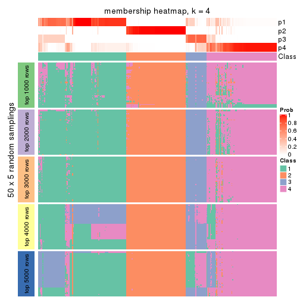</p>

</div>
<div id='tab-CV-pam-membership-heatmap-4'>
<pre><code class="r">membership_heatmap(res, k = 5)
</code></pre>

<p></p>

</div>
<div id='tab-CV-pam-membership-heatmap-5'>
<pre><code class="r">membership_heatmap(res, k = 6)
</code></pre>

<p></p>

</div>
</div>

As soon as we have had the classes for columns, we can look for signatures
which are significantly different between classes which can be candidate marks
for certain classes. Following are the heatmaps for signatures.


Signature heatmaps where rows are scaled:


<script>
$( function() {
	$( '#tabs-CV-pam-get-signatures' ).tabs();
} );
</script>
<div id='tabs-CV-pam-get-signatures'>
<ul>
<li><a href='#tab-CV-pam-get-signatures-1'>k = 2</a></li>
<li><a href='#tab-CV-pam-get-signatures-2'>k = 3</a></li>
<li><a href='#tab-CV-pam-get-signatures-3'>k = 4</a></li>
<li><a href='#tab-CV-pam-get-signatures-4'>k = 5</a></li>
<li><a href='#tab-CV-pam-get-signatures-5'>k = 6</a></li>
</ul>
<div id='tab-CV-pam-get-signatures-1'>
<pre><code class="r">get_signatures(res, k = 2)
</code></pre>

<p></p>

</div>
<div id='tab-CV-pam-get-signatures-2'>
<pre><code class="r">get_signatures(res, k = 3)
</code></pre>

<p></p>

</div>
<div id='tab-CV-pam-get-signatures-3'>
<pre><code class="r">get_signatures(res, k = 4)
</code></pre>

<p></p>

</div>
<div id='tab-CV-pam-get-signatures-4'>
<pre><code class="r">get_signatures(res, k = 5)
</code></pre>

<p></p>

</div>
<div id='tab-CV-pam-get-signatures-5'>
<pre><code class="r">get_signatures(res, k = 6)
</code></pre>

<p></p>

</div>
</div>


Signature heatmaps where rows are not scaled:


<script>
$( function() {
	$( '#tabs-CV-pam-get-signatures-no-scale' ).tabs();
} );
</script>
<div id='tabs-CV-pam-get-signatures-no-scale'>
<ul>
<li><a href='#tab-CV-pam-get-signatures-no-scale-1'>k = 2</a></li>
<li><a href='#tab-CV-pam-get-signatures-no-scale-2'>k = 3</a></li>
<li><a href='#tab-CV-pam-get-signatures-no-scale-3'>k = 4</a></li>
<li><a href='#tab-CV-pam-get-signatures-no-scale-4'>k = 5</a></li>
<li><a href='#tab-CV-pam-get-signatures-no-scale-5'>k = 6</a></li>
</ul>
<div id='tab-CV-pam-get-signatures-no-scale-1'>
<pre><code class="r">get_signatures(res, k = 2, scale_rows = FALSE)
</code></pre>

<p></p>

</div>
<div id='tab-CV-pam-get-signatures-no-scale-2'>
<pre><code class="r">get_signatures(res, k = 3, scale_rows = FALSE)
</code></pre>

<p></p>

</div>
<div id='tab-CV-pam-get-signatures-no-scale-3'>
<pre><code class="r">get_signatures(res, k = 4, scale_rows = FALSE)
</code></pre>

<p></p>

</div>
<div id='tab-CV-pam-get-signatures-no-scale-4'>
<pre><code class="r">get_signatures(res, k = 5, scale_rows = FALSE)
</code></pre>

<p></p>

</div>
<div id='tab-CV-pam-get-signatures-no-scale-5'>
<pre><code class="r">get_signatures(res, k = 6, scale_rows = FALSE)
</code></pre>

<p></p>

</div>
</div>


Compare the overlap of signatures from different k:

```r
compare_signatures(res)
```


`get_signature()` returns a data frame invisibly. TO get the list of signatures, the function
call should be assigned to a variable explicitly. In following code, if `plot` argument is set
to `FALSE`, no heatmap is plotted while only the differential analysis is performed.

```r
# code only for demonstration
tb = get_signature(res, k = ..., plot = FALSE)
```

An example of the output of `tb` is:

```
#>   which_row         fdr    mean_1    mean_2 scaled_mean_1 scaled_mean_2 km
#> 1        38 0.042760348  8.373488  9.131774    -0.5533452     0.5164555  1
#> 2        40 0.018707592  7.106213  8.469186    -0.6173731     0.5762149  1
#> 3        55 0.019134737 10.221463 11.207825    -0.6159697     0.5749050  1
#> 4        59 0.006059896  5.921854  7.869574    -0.6899429     0.6439467  1
#> 5        60 0.018055526  8.928898 10.211722    -0.6204761     0.5791110  1
#> 6        98 0.009384629 15.714769 14.887706     0.6635654    -0.6193277  2
...
```

The columns in `tb` are:

1. `which_row`: row indices corresponding to the input matrix.
2. `fdr`: FDR for the differential test. 
3. `mean_x`: The mean value in group x.
4. `scaled_mean_x`: The mean value in group x after rows are scaled.
5. `km`: Row groups if k-means clustering is applied to rows.


UMAP plot which shows how samples are separated.


<script>
$( function() {
	$( '#tabs-CV-pam-dimension-reduction' ).tabs();
} );
</script>
<div id='tabs-CV-pam-dimension-reduction'>
<ul>
<li><a href='#tab-CV-pam-dimension-reduction-1'>k = 2</a></li>
<li><a href='#tab-CV-pam-dimension-reduction-2'>k = 3</a></li>
<li><a href='#tab-CV-pam-dimension-reduction-3'>k = 4</a></li>
<li><a href='#tab-CV-pam-dimension-reduction-4'>k = 5</a></li>
<li><a href='#tab-CV-pam-dimension-reduction-5'>k = 6</a></li>
</ul>
<div id='tab-CV-pam-dimension-reduction-1'>
<pre><code class="r">dimension_reduction(res, k = 2, method = &quot;UMAP&quot;)
</code></pre>

<p></p>

</div>
<div id='tab-CV-pam-dimension-reduction-2'>
<pre><code class="r">dimension_reduction(res, k = 3, method = &quot;UMAP&quot;)
</code></pre>

<p></p>

</div>
<div id='tab-CV-pam-dimension-reduction-3'>
<pre><code class="r">dimension_reduction(res, k = 4, method = &quot;UMAP&quot;)
</code></pre>

<p></p>

</div>
<div id='tab-CV-pam-dimension-reduction-4'>
<pre><code class="r">dimension_reduction(res, k = 5, method = &quot;UMAP&quot;)
</code></pre>

<p></p>

</div>
<div id='tab-CV-pam-dimension-reduction-5'>
<pre><code class="r">dimension_reduction(res, k = 6, method = &quot;UMAP&quot;)
</code></pre>

<p></p>

</div>
</div>


Following heatmap shows how subgroups are split when increasing `k`:

```r
collect_classes(res)
```


If matrix rows can be associated to genes, consider to use `GO_Enrichment(res,
...)` to perform function enrichment for the signature genes.


 

---------------------------------------------------


### CV:mclust*


The object with results only for a single top-value method and a single partition method 
can be extracted as:

```r
res = res_list["CV", "mclust"]
# you can also extract it by
# res = res_list["CV:mclust"]
```

A summary of `res` and all the functions that can be applied to it:

```r
res
```

```
#> A 'ConsensusPartition' object with k = 2, 3, 4, 5, 6.
#>   On a matrix with 17377 rows and 265 columns.
#>   Top rows (1000, 2000, 3000, 4000, 5000) are extracted by 'CV' method.
#>   Subgroups are detected by 'mclust' method.
#>   Performed in total 1250 partitions by row resampling.
#>   Best k for subgroups seems to be 3.
#> 
#> Following methods can be applied to this 'ConsensusPartition' object:
#>  [1] "cola_report"             "collect_classes"         "collect_plots"          
#>  [4] "collect_stats"           "colnames"                "compare_signatures"     
#>  [7] "consensus_heatmap"       "dimension_reduction"     "functional_enrichment"  
#> [10] "get_anno_col"            "get_anno"                "get_classes"            
#> [13] "get_consensus"           "get_matrix"              "get_membership"         
#> [16] "get_param"               "get_signatures"          "get_stats"              
#> [19] "is_best_k"               "is_stable_k"             "membership_heatmap"     
#> [22] "ncol"                    "nrow"                    "plot_ecdf"              
#> [25] "rownames"                "select_partition_number" "show"                   
#> [28] "suggest_best_k"          "test_to_known_factors"
```

`collect_plots()` function collects all the plots made from `res` for all `k` (number of partitions)
into one single page to provide an easy and fast comparison between different `k`.

```r
collect_plots(res)
```


The plots are:

- The first row: a plot of the ECDF (Empirical cumulative distribution
  function) curves of the consensus matrix for each `k` and the heatmap of
  predicted classes for each `k`.
- The second row: heatmaps of the consensus matrix for each `k`.
- The third row: heatmaps of the membership matrix for each `k`.
- The fouth row: heatmaps of the signatures for each `k`.

All the plots in panels can be made by individual functions and they are
plotted later in this section.

`select_partition_number()` produces several plots showing different
statistics for choosing "optimized" `k`. There are following statistics:

- ECDF curves of the consensus matrix for each `k`;
- 1-PAC. [The PAC
  score](https://en.wikipedia.org/wiki/Consensus_clustering#Over-interpretation_potential_of_consensus_clustering)
  measures the proportion of the ambiguous subgrouping.
- Mean silhouette score.
- Concordance. The mean probability of fiting the consensus class ids in all
  partitions.
- Area increased. Denote $A_k$ as the area under the ECDF curve for current
  `k`, the area increased is defined as $A_k - A_{k-1}$.
- Rand index. The percent of pairs of samples that are both in a same cluster
  or both are not in a same cluster in the partition of k and k-1.
- Jaccard index. The ratio of pairs of samples are both in a same cluster in
  the partition of k and k-1 and the pairs of samples are both in a same
  cluster in the partition k or k-1.

The detailed explanations of these statistics can be found in [the cola
vignette](http://bioconductor.org/packages/devel/bioc/vignettes/cola/inst/doc/cola.html#toc_13).

Generally speaking, lower PAC score, higher mean silhouette score or higher
concordance corresponds to better partition. Rand index and Jaccard index
measure how similar the current partition is compared to partition with `k-1`.
If they are too similar, we won't accept `k` is better than `k-1`.

```r
select_partition_number(res)
```


The numeric values for all these statistics can be obtained by `get_stats()`.

```r
get_stats(res)
```

```
#>   k 1-PAC mean_silhouette concordance area_increased  Rand Jaccard
#> 2 2 0.746           0.891       0.950         0.4601 0.563   0.563
#> 3 3 0.933           0.906       0.964         0.2902 0.832   0.707
#> 4 4 0.706           0.754       0.839         0.1313 0.944   0.865
#> 5 5 0.655           0.601       0.727         0.0793 0.923   0.794
#> 6 6 0.660           0.669       0.751         0.0546 0.896   0.690
```

`suggest_best_k()` suggests the best $k$ based on these statistics. The rules are as follows:

- All $k$ with Jaccard index larger than 0.95 are removed because the increase of
  the partition number does not provides enough extra information. If all $k$ are removed,
  the best $k$ is assigned by `NA`.
- For $k$ with 1-PAC larger than 0.9, the maximal $k$ is taken as the "best k". Other $k$ is called "optional k".
- If it does not fit the second rule. The $k$ with the highest vote of highest
  1-PAC, mean silhouette and concordance is taken as the "best k".

```r
suggest_best_k(res)
```

```
#> [1] 3
```


Following shows the table of the partitions (You need to click the **show/hide
code output** link to see it). The membership matrix (columns with name `p*`)
is inferred by
[`clue::cl_consensus()`](https://www.rdocumentation.org/link/cl_consensus?package=clue)
function with the `SE` method. Basically the value in the membership matrix
represents the probability to belong to a certain group. The finall class
label for an item is determined with the group with highest probability it
belongs to.

In `get_classes()` function, the entropy is calculated from the membership
matrix and the silhouette score is calculated from the consensus matrix.


<script>
$( function() {
	$( '#tabs-CV-mclust-get-classes' ).tabs();
} );
</script>
<div id='tabs-CV-mclust-get-classes'>
<ul>
<li><a href='#tab-CV-mclust-get-classes-1'>k = 2</a></li>
<li><a href='#tab-CV-mclust-get-classes-2'>k = 3</a></li>
<li><a href='#tab-CV-mclust-get-classes-3'>k = 4</a></li>
<li><a href='#tab-CV-mclust-get-classes-4'>k = 5</a></li>
<li><a href='#tab-CV-mclust-get-classes-5'>k = 6</a></li>
</ul>

<div id='tab-CV-mclust-get-classes-1'>
<p><a id='tab-CV-mclust-get-classes-1-a' style='color:#0366d6' href='#'>show/hide code output</a></p>
<pre><code class="r">cbind(get_classes(res, k = 2), get_membership(res, k = 2))
</code></pre>

<pre><code>#&gt;                                      class entropy silhouette    p1    p2
#&gt; D30CF518-5FC6-4A54-8D5D-BA420EA1836D     2  0.0000      0.992 0.000 1.000
#&gt; 92298FF7-1215-4756-B976-A7D88B91AD76     1  0.0000      0.925 1.000 0.000
#&gt; 0E244FE2-7C17-4642-A51F-2CCA796D9C70     2  0.0000      0.992 0.000 1.000
#&gt; 75435ED8-93E8-45FB-8480-98D8EB2EF8CB     2  0.0000      0.992 0.000 1.000
#&gt; B6D11678-15A9-4F43-A0A2-225067DCAF1C     1  0.0000      0.925 1.000 0.000
#&gt; B7F5A41E-9559-4329-81F5-1B88A74730B7     2  0.0000      0.992 0.000 1.000
#&gt; 39414B2A-7FB0-4669-8DFE-86D9AF7AD2D9     1  0.0000      0.925 1.000 0.000
#&gt; 04823F53-A12D-4852-8F34-77B9DCBB7DF0     2  0.0000      0.992 0.000 1.000
#&gt; 49684C2B-D31C-4B45-A400-3497C3CCEC01     2  0.0000      0.992 0.000 1.000
#&gt; 96A04875-58E2-4BE7-8E0F-CAB55F4CA54F     1  0.0000      0.925 1.000 0.000
#&gt; 1F101D63-478B-40B9-A951-DC3887CFF067     1  0.0000      0.925 1.000 0.000
#&gt; DD290860-E0B7-48FC-BE12-2AF729994C21     2  0.0000      0.992 0.000 1.000
#&gt; FFDD7A12-DDEF-4974-8D60-64B7EEAAC994     2  0.0000      0.992 0.000 1.000
#&gt; E076A9A9-EA2A-4FF7-92A8-F2DA7F30279E     1  0.9460      0.524 0.636 0.364
#&gt; 830DFA6F-A85A-4317-82B2-791FAB998A01     2  0.0000      0.992 0.000 1.000
#&gt; 58578614-E4A3-4655-BBAB-F65851625E0A     1  0.0000      0.925 1.000 0.000
#&gt; 1CBFB672-4D66-430B-83F3-7CE3BE20ABF6     1  0.0000      0.925 1.000 0.000
#&gt; 6C34A7D7-3756-4DCC-9A9F-B5FC4A148B7E     1  0.9427      0.531 0.640 0.360
#&gt; D97ED7B4-5DF2-4B62-8796-AA51CA79DBBB     1  0.0000      0.925 1.000 0.000
#&gt; 45F15851-55F6-4169-834E-38958C38B6A9     1  0.0000      0.925 1.000 0.000
#&gt; 4139E0C9-F712-4A25-8B59-587533B93B3E     2  0.0000      0.992 0.000 1.000
#&gt; 2C3007BF-009E-404F-A3BF-8B921698D85B     1  0.0000      0.925 1.000 0.000
#&gt; 2189F8E5-FF98-4C1A-BD04-5595DB553130     1  0.0000      0.925 1.000 0.000
#&gt; FFAA0310-0D78-4499-8FB8-5BC46E4FCE58     1  0.9460      0.524 0.636 0.364
#&gt; 0C375B2F-67BE-4708-BEB2-544DEC812DCA     2  0.0000      0.992 0.000 1.000
#&gt; AB6324A1-19AB-400C-8001-54765D190E27     2  0.0000      0.992 0.000 1.000
#&gt; A32C4DCD-DC4C-4132-9ED1-B159F5561A2D     1  0.0000      0.925 1.000 0.000
#&gt; 2AE7105D-D494-45B0-947A-315D8C20ECDC     1  0.0000      0.925 1.000 0.000
#&gt; 60FE9D59-FC0F-4B9C-ABF8-1C00BC761928     1  0.0000      0.925 1.000 0.000
#&gt; 056442DC-E87A-4315-965C-C19D7B4FC40E     1  0.0000      0.925 1.000 0.000
#&gt; 455111E5-18EF-4E3F-9DFF-8FA017D92461     1  0.0000      0.925 1.000 0.000
#&gt; 10632BC6-0B81-433C-8832-6B2ABC73A94B     1  0.0000      0.925 1.000 0.000
#&gt; AC6F82AD-C682-4EB3-BEC3-FD950F57609D     1  0.0000      0.925 1.000 0.000
#&gt; D9ABDB75-04DA-4D33-A69F-701729494533     1  0.8016      0.661 0.756 0.244
#&gt; 27BBF44D-F4D7-4C5A-935F-3310A363A670     2  0.0000      0.992 0.000 1.000
#&gt; E7AA12EE-6E14-4B33-A52C-B13589436023     1  0.0000      0.925 1.000 0.000
#&gt; DFA6D41A-D231-413E-A180-E42DF26C3E2B     2  0.0000      0.992 0.000 1.000
#&gt; 655BD3AF-5094-4B19-93A8-401C70369B17     2  0.0000      0.992 0.000 1.000
#&gt; 9DFEF253-923F-4EE2-8E3D-C75805387B20     2  0.6887      0.740 0.184 0.816
#&gt; 3B0EE948-B2CD-4191-90E2-BDD155F3B580     1  0.0000      0.925 1.000 0.000
#&gt; 177C7EF4-2D54-4555-947C-44EE7C688917     1  0.9460      0.524 0.636 0.364
#&gt; 1F8E8BB7-D159-4556-8B04-E5DD027CC444     2  0.0000      0.992 0.000 1.000
#&gt; 619F37D2-6771-4727-9079-56BED07F1CF6     2  0.0672      0.984 0.008 0.992
#&gt; ACAE29BE-ECB8-4A98-BC71-7A2D4857134E     1  0.0000      0.925 1.000 0.000
#&gt; C5C3241A-684C-4238-9333-9AF8630EC086     2  0.0000      0.992 0.000 1.000
#&gt; AD319DC2-140F-4E7B-A899-010687D8B714     2  0.0000      0.992 0.000 1.000
#&gt; 2AFF397C-ED2A-4FD9-A7F0-E4C61E9FB603     1  0.9460      0.524 0.636 0.364
#&gt; FB4C7892-3DBB-4148-AAE9-75B19A1A4031     1  0.8608      0.644 0.716 0.284
#&gt; 6F5C4500-1ED1-4E81-B4F5-EEA64CE2336A     1  0.0000      0.925 1.000 0.000
#&gt; BD027C69-3C10-4047-8E1E-218600FF2B73     2  0.0000      0.992 0.000 1.000
#&gt; 11B473A9-4CC5-461F-BC57-CC9141F3591D     1  0.0000      0.925 1.000 0.000
#&gt; 69A036E5-3E6A-4862-A7F8-2D203ED2FC9E     1  0.0000      0.925 1.000 0.000
#&gt; 9C0BDF24-F011-4855-B95A-1B6BEFA808F7     1  0.0000      0.925 1.000 0.000
#&gt; 9E205254-8C0C-4C05-AF5A-86E679CF732C     1  0.0000      0.925 1.000 0.000
#&gt; 935CCE4A-8AA8-454E-9DFF-7DE27D0BD2E2     1  0.0000      0.925 1.000 0.000
#&gt; 01E5E1FE-41D3-428B-90BC-7A000829E102     1  0.0000      0.925 1.000 0.000
#&gt; B344A530-92CD-468B-847A-DF8E25688081     1  0.9460      0.524 0.636 0.364
#&gt; F79F32A7-9F7B-4D62-8426-4A4CF10ED319     1  0.0000      0.925 1.000 0.000
#&gt; C2E1C6FA-82F9-467C-99AE-9B39FAAC810C     1  0.0000      0.925 1.000 0.000
#&gt; BF7CD9BD-776A-4957-8A6E-EF8AD83EA9D3     2  0.0000      0.992 0.000 1.000
#&gt; 8A2C1409-E83B-435E-A20F-5FCA94801C9F     2  0.0000      0.992 0.000 1.000
#&gt; B6BEFFB5-2F62-477B-A4C8-478D29577CBD     2  0.0000      0.992 0.000 1.000
#&gt; 8622CBD0-F8E9-4AC1-8175-CC9A742B86F9     1  0.0000      0.925 1.000 0.000
#&gt; 565DD660-ED58-4065-8619-260BEA6FCFEB     1  0.0000      0.925 1.000 0.000
#&gt; 96038E42-0FBA-497D-819C-38F7689F10FF     1  0.0000      0.925 1.000 0.000
#&gt; CA685549-F8BA-43F1-8461-5D2D3B17CFC5     1  0.0000      0.925 1.000 0.000
#&gt; 52020307-71A6-46E5-ACB3-8F885CA8F1EB     1  0.0000      0.925 1.000 0.000
#&gt; 7656DA98-76DC-424B-B02C-D7001DAAA0E4     1  0.0000      0.925 1.000 0.000
#&gt; 74DBA640-45E2-42A6-8F1E-69C073D66EE6     1  0.0000      0.925 1.000 0.000
#&gt; 251094BE-C33D-44F0-BD98-8618D71F520C     1  0.0000      0.925 1.000 0.000
#&gt; AB914CC5-5FF1-4257-A353-6A99D11B9478     1  0.0000      0.925 1.000 0.000
#&gt; 38B8B893-0E08-4B71-B51C-B32A7B2724E0     1  0.0000      0.925 1.000 0.000
#&gt; 7C7CD8FF-99A4-41D7-B7E1-5A517001F551     2  0.0000      0.992 0.000 1.000
#&gt; BFC5B75A-E4AE-486B-BA30-23BBAA33A125     2  0.0000      0.992 0.000 1.000
#&gt; 182AC78E-A07C-4B34-B216-B5F573E9F036     2  0.0000      0.992 0.000 1.000
#&gt; B38C5F72-8F46-4531-9C2D-96EEE07A5B22     2  0.0000      0.992 0.000 1.000
#&gt; DB9333A6-A723-4B8F-9221-25B8B23D5126     1  0.0000      0.925 1.000 0.000
#&gt; CD67DD21-C1B6-4D58-AC8E-1F4536C7DA70     1  0.9460      0.524 0.636 0.364
#&gt; 3D76A56E-4B66-48AE-AA60-D9C1004C7140     1  0.0000      0.925 1.000 0.000
#&gt; 71ED572F-7780-47A4-A9F8-D320C737690D     1  0.0000      0.925 1.000 0.000
#&gt; B449FEA1-C4B0-400F-903C-59E13D0BA313     2  0.0000      0.992 0.000 1.000
#&gt; 3F120E90-1486-4215-B9B9-79D5B413CAAC     1  0.9850      0.348 0.572 0.428
#&gt; A071894B-D8C0-4740-BD55-93EA0C86EDF7     1  0.0000      0.925 1.000 0.000
#&gt; 58848D57-D7A9-4ABB-86A2-A8AE2B23F654     1  0.0000      0.925 1.000 0.000
#&gt; CD6F9E20-B301-4663-87EC-953EDF49754F     1  0.9460      0.524 0.636 0.364
#&gt; 367D89F3-D527-4929-B830-8B6D553DF9E1     1  0.0000      0.925 1.000 0.000
#&gt; BE8D7DCB-648B-42DD-9FA8-8B85B5D816B2     1  0.0000      0.925 1.000 0.000
#&gt; AA46F56B-BD9C-40A4-8EA8-35E2568C964D     2  0.0000      0.992 0.000 1.000
#&gt; 6393220A-7C57-413F-81A8-4E38C21E779E     2  0.0000      0.992 0.000 1.000
#&gt; 89AE566C-F65F-43C2-BA97-621A7AC8B6DC     1  0.0000      0.925 1.000 0.000
#&gt; AA6A4BFF-8C62-4B70-B85A-9EDF403B06BA     1  0.0000      0.925 1.000 0.000
#&gt; BCE877A6-9C65-4495-A45D-05753F2D0E15     1  0.0000      0.925 1.000 0.000
#&gt; D7BDDF49-C54B-4F8E-ACA0-C3684AB68B5C     1  0.7453      0.733 0.788 0.212
#&gt; D0800D49-0033-44B2-8D7B-29B16F87ADA6     2  0.0000      0.992 0.000 1.000
#&gt; 151D60B5-5AF1-4B61-B97F-ABC7531D9F89     1  0.0000      0.925 1.000 0.000
#&gt; CBBAEB5B-25FA-4B6D-A40C-357E37033E36     1  0.0000      0.925 1.000 0.000
#&gt; 317CD049-3151-40B7-8E88-B0B8813338D6     1  0.0000      0.925 1.000 0.000
#&gt; 93835C77-F8FA-4928-843C-8016A91881FA     1  0.0000      0.925 1.000 0.000
#&gt; 02A6950F-647D-4F20-B2D0-0238C1441C70     1  0.0000      0.925 1.000 0.000
#&gt; 4D54E415-134F-4F6F-8718-3E0475EF5477     1  0.0000      0.925 1.000 0.000
#&gt; 82AB290A-3993-45E5-8B15-6125A019778C     1  0.0000      0.925 1.000 0.000
#&gt; 3B5EAD14-E506-4A22-804D-BF925A2D5247     2  0.0000      0.992 0.000 1.000
#&gt; 19CF7DDF-4F3A-4D2F-B84A-6451A5C3112C     1  0.9460      0.524 0.636 0.364
#&gt; 2FB00DAA-C274-42B1-A06B-611FE5E96844     1  0.0000      0.925 1.000 0.000
#&gt; 2B1F01C3-8145-4296-8111-2B0474AB9A2C     2  0.0000      0.992 0.000 1.000
#&gt; 3F0865F1-8256-4778-966F-D53637B415B6     1  0.9460      0.524 0.636 0.364
#&gt; 5473210D-37F9-4192-86D2-E2A2C77F3BD2     1  0.9460      0.524 0.636 0.364
#&gt; 5EDB6ACF-4F3F-471A-9DDC-661607CACCC4     1  0.0000      0.925 1.000 0.000
#&gt; 6A252A3A-7EEB-47B6-9C23-D69BD2EA846F     1  0.9460      0.524 0.636 0.364
#&gt; 0A7FFCBB-4BAA-4A5F-8B2D-B427C4D982A8     1  0.0000      0.925 1.000 0.000
#&gt; 1603AFB8-5AD7-4794-9991-BDBE96B4D997     2  0.0000      0.992 0.000 1.000
#&gt; 644299E9-62B7-4DFE-9E6D-D7556A01B40A     1  0.0000      0.925 1.000 0.000
#&gt; EF12E923-1860-4269-B57B-BA6238FA4403     1  0.0000      0.925 1.000 0.000
#&gt; 51B7241E-F0BE-482A-88AE-89004BB68989     1  0.0000      0.925 1.000 0.000
#&gt; 1C007DF3-8A9F-4940-9A4C-DE2A412BB023     1  0.9460      0.524 0.636 0.364
#&gt; 89FCFDE6-9625-432C-AA35-9C5FCCF40031     1  0.0000      0.925 1.000 0.000
#&gt; 7955FC55-386D-497E-AFED-019BBBAD428E     1  0.9460      0.524 0.636 0.364
#&gt; 37FF09ED-73EC-4D10-B2AC-7D8EBA9304ED     1  0.0000      0.925 1.000 0.000
#&gt; C2CD2742-2FB4-468E-90FF-8F65A5C425A9     1  0.0000      0.925 1.000 0.000
#&gt; 766FE08F-3393-4868-B1C1-FA98C9FF16E0     1  0.9460      0.524 0.636 0.364
#&gt; 63E2B578-2221-4255-8C45-7FD030B1C94D     1  0.0000      0.925 1.000 0.000
#&gt; C14B1A44-43F7-45F0-A583-5667A4D3BD95     1  0.0000      0.925 1.000 0.000
#&gt; D9CB551A-CE20-4BF7-8AC9-839112346C3D     1  0.0000      0.925 1.000 0.000
#&gt; 05BAA71A-E5B3-4A3A-A3F2-013A975087F0     2  0.0000      0.992 0.000 1.000
#&gt; AC8DA7DE-4D83-4768-BEFD-9A1B2DA943CE     1  0.9427      0.531 0.640 0.360
#&gt; E89DCE9D-F8A5-499C-85BB-BB500BADB9FB     1  0.0000      0.925 1.000 0.000
#&gt; C16F9B5E-2B52-40F6-856D-C0D6FBDD16C1     1  0.0000      0.925 1.000 0.000
#&gt; 8FF234D4-823A-4C80-82F7-2E92D72DBF88     2  0.0000      0.992 0.000 1.000
#&gt; C9F94A6E-D104-4D8D-8EC5-EADECD85F092     2  0.0000      0.992 0.000 1.000
#&gt; 45C9756F-A154-4537-852E-ECBF27B92FE1     2  0.0000      0.992 0.000 1.000
#&gt; 0F1A5708-341E-4713-BC70-76D702F826D6     2  0.0000      0.992 0.000 1.000
#&gt; 2ECFBCA0-AB35-461A-A4B5-C60B2651A962     2  0.0000      0.992 0.000 1.000
#&gt; 7DFAC404-3AB3-4274-A533-CFDAF4CE122D     1  0.0000      0.925 1.000 0.000
#&gt; A90AF55C-4386-42AB-A812-9230026EA5A5     2  0.0000      0.992 0.000 1.000
#&gt; 6258A757-4E18-4CD1-8417-189521E990B6     2  0.0000      0.992 0.000 1.000
#&gt; EBFAD137-050F-47D0-A43D-72B8F7D70C2B     1  0.0000      0.925 1.000 0.000
#&gt; 08B5EBFB-2807-4229-95A6-81AB7F377A56     2  0.0000      0.992 0.000 1.000
#&gt; 4780A59C-0589-4995-B044-3201F09AF859     1  0.0000      0.925 1.000 0.000
#&gt; 0AB81429-C287-48AA-9035-3A7A6F4C7328     2  0.0000      0.992 0.000 1.000
#&gt; 20C4D047-28DA-4AB7-9B3C-32EDA6B22C9D     1  0.9393      0.538 0.644 0.356
#&gt; 77C4E01F-84A6-4BFD-AA8E-D7875456F546     1  0.9460      0.524 0.636 0.364
#&gt; 8B28383F-CF14-4CC5-A1E2-72AD915C0AE8     1  0.0000      0.925 1.000 0.000
#&gt; E12E1F48-6A52-4F74-925C-C4EE1BF5C573     2  0.0000      0.992 0.000 1.000
#&gt; 9B179BC5-BB4C-4CEE-99BC-BC552BC384A1     1  0.0000      0.925 1.000 0.000
#&gt; 5548C91A-D3DE-48F5-B4A4-124BE177B99A     1  0.0000      0.925 1.000 0.000
#&gt; 0E22B729-C381-4B0C-9897-62DD38F51722     1  0.6801      0.749 0.820 0.180
#&gt; 7BC4937F-04E2-4B46-BA7C-FE9AC738C8A9     1  0.0000      0.925 1.000 0.000
#&gt; EE6A0D3F-3F8A-4AA8-B3EF-32372EF37A29     1  0.0000      0.925 1.000 0.000
#&gt; 08AC2706-7651-409F-BE6B-BCED1C2D1796     1  0.0000      0.925 1.000 0.000
#&gt; A68B078D-8979-4070-BB4D-F526704ED3DC     1  0.4939      0.831 0.892 0.108
#&gt; C319A5EE-69FA-4AAB-85A9-2EAAD8E4C703     1  0.0000      0.925 1.000 0.000
#&gt; 0D7CAABD-D20C-4F82-BCBC-8B7276E8EDE2     1  0.0000      0.925 1.000 0.000
#&gt; 09444DCC-44BA-4A3F-ACC5-863A54578B9F     1  0.0000      0.925 1.000 0.000
#&gt; 2E32B047-C6E1-4743-A6C8-E98370A32145     1  0.0000      0.925 1.000 0.000
#&gt; 6A6878A7-76B2-40DE-958B-804442AC6A5D     1  0.0000      0.925 1.000 0.000
#&gt; 39F27293-0BFF-4EA2-8439-A299E3226D20     1  0.0000      0.925 1.000 0.000
#&gt; 7EAE9C30-6080-405F-A7E6-1FED57674279     1  0.0000      0.925 1.000 0.000
#&gt; 79499169-A093-4E0A-B6BD-010CD7BE5035     1  0.0000      0.925 1.000 0.000
#&gt; 1F8BF4E8-BD84-4EFE-9E3E-89E7CE8FA72D     1  0.9460      0.524 0.636 0.364
#&gt; 62B7988F-98E5-4AB8-8A16-D661A07455E8     1  0.0000      0.925 1.000 0.000
#&gt; B7005B5F-217E-4073-BFB5-CE7E884B80C0     2  0.0000      0.992 0.000 1.000
#&gt; B981568F-2C08-4696-B589-E157A49BE72B     2  0.0000      0.992 0.000 1.000
#&gt; A3D85C0A-3202-40C2-88E1-052AC6C5184B     1  0.0000      0.925 1.000 0.000
#&gt; 4CA783B9-9B99-46B8-962A-77194ECB7942     1  0.9460      0.524 0.636 0.364
#&gt; D4024B08-4879-47EA-99E5-D9FCE1CD40DF     1  0.0000      0.925 1.000 0.000
#&gt; 1D41CDA2-0B29-48FD-B83A-E60C174DBCB3     1  0.0000      0.925 1.000 0.000
#&gt; A1923B2A-B233-4760-8AF9-C04C1CAEB100     1  0.0000      0.925 1.000 0.000
#&gt; 80880D71-BFDE-4D88-892F-5ADF27A38940     1  0.9460      0.524 0.636 0.364
#&gt; 55D1629D-30FD-49AA-88CE-EA3CA9B30A3F     2  0.0000      0.992 0.000 1.000
#&gt; B71C409E-926D-48AD-8BD8-9F707CA4FB01     2  0.0000      0.992 0.000 1.000
#&gt; 54A92C57-BD19-4A47-BA76-3ACA2DC36212     1  0.0000      0.925 1.000 0.000
#&gt; B2AB74B8-506C-4C27-9105-E86A6AAA89D4     1  0.0000      0.925 1.000 0.000
#&gt; 0356AE49-7A5C-42CC-A39C-7C8DFBFF8842     2  0.0000      0.992 0.000 1.000
#&gt; ACA260A3-DC3F-4FF4-B9C5-2D4BC4F81783     1  0.0000      0.925 1.000 0.000
#&gt; 9B440917-E5A4-43B9-A48D-6ABFEDCA6CFD     1  0.0000      0.925 1.000 0.000
#&gt; 47464828-52EA-413B-B30C-BD8B55903D78     2  0.0000      0.992 0.000 1.000
#&gt; C1D1FC82-B50D-4C82-8F03-06CEE3C08D18     1  0.0000      0.925 1.000 0.000
#&gt; E5ABFC43-E2A3-4B1A-BBA3-8196C0B026A5     2  0.0000      0.992 0.000 1.000
#&gt; 1D3C16CC-D0D5-4637-AAC7-91672DFF3317     1  0.7745      0.686 0.772 0.228
#&gt; 4D038320-ADEA-4990-8371-68B4B8162E1A     2  0.0000      0.992 0.000 1.000
#&gt; A75594CC-3E49-4869-8656-BBB4E72BF59D     2  0.0000      0.992 0.000 1.000
#&gt; 7CABAA19-5FB2-4A58-BDA3-4F1FFB532C20     1  0.0000      0.925 1.000 0.000
#&gt; 534EF1E9-9513-426E-B41E-A394AB2E4410     2  0.0000      0.992 0.000 1.000
#&gt; 649F35A1-A08C-497D-A9B6-CB3084D5FB8D     1  0.0000      0.925 1.000 0.000
#&gt; 7CA30F3C-1C98-480C-B8B5-A248AABFB468     1  0.0000      0.925 1.000 0.000
#&gt; A9F8DA21-A802-44CF-9F5D-96A36687DCDD     1  0.9460      0.524 0.636 0.364
#&gt; A7AE1ED1-86CB-4A50-97B2-66785C7191FE     1  0.0000      0.925 1.000 0.000
#&gt; D0091AD4-D3D7-4C03-ACD9-DA9F8B6076C6     1  0.0000      0.925 1.000 0.000
#&gt; 46EE1C2B-13F7-44A7-B27E-4EBB9DF0CA83     2  0.0000      0.992 0.000 1.000
#&gt; CB9301B8-0282-43D6-AF5E-B753A9C7BFCB     2  0.0000      0.992 0.000 1.000
#&gt; A0E77A39-885A-4472-9A10-2D1E51DBFDA4     1  0.0000      0.925 1.000 0.000
#&gt; C06603C2-163D-40B6-A9FE-882424F18FE9     1  0.0000      0.925 1.000 0.000
#&gt; C3921A29-80FF-4B9D-B366-5C0238A42231     1  0.0000      0.925 1.000 0.000
#&gt; BB99B4E7-C834-4BB8-973F-8FA039E2798F     1  0.0000      0.925 1.000 0.000
#&gt; 5CD78C2F-05E9-409A-8405-3EE936A6876E     1  0.9460      0.524 0.636 0.364
#&gt; 6C126CC7-0C03-48F0-A2C2-F090CA239B70     2  0.0000      0.992 0.000 1.000
#&gt; 7118B08A-E94C-49F4-8D76-26455C34D85F     2  0.0000      0.992 0.000 1.000
#&gt; 266DAF30-CF3E-493E-8B24-3931D0039450     1  0.0000      0.925 1.000 0.000
#&gt; DAB5F5B9-4FE5-468F-AD2B-B39BBC4317A0     1  0.9460      0.524 0.636 0.364
#&gt; 9A9EB6D6-312E-4A98-8762-30D3ABD8193D     1  0.9460      0.524 0.636 0.364
#&gt; CED15676-B901-4FC8-9C8D-51E529D9441D     1  0.0000      0.925 1.000 0.000
#&gt; 827232CC-8035-440C-8B12-02C789C70B1B     1  0.0000      0.925 1.000 0.000
#&gt; 04D5FB28-FB50-4EAE-95FB-72ABF0E618CA     2  0.0000      0.992 0.000 1.000
#&gt; 6C96A851-97FC-4845-B895-D255191D9F25     1  0.0000      0.925 1.000 0.000
#&gt; 3EC982CB-D013-443E-B21D-39DE6B8EF370     1  0.9460      0.524 0.636 0.364
#&gt; 2E24A786-4370-42A1-AD50-D651F89819CC     2  0.0000      0.992 0.000 1.000
#&gt; 7653BFA9-ADA5-44CA-8555-807FBBFC6DE2     1  0.0000      0.925 1.000 0.000
#&gt; 7A110994-5741-4013-91F0-DD2E1D343F91     2  0.0000      0.992 0.000 1.000
#&gt; 0A760E0C-11C5-4201-8452-18DBC1FEACEB     1  0.0000      0.925 1.000 0.000
#&gt; 909B76A1-BB9F-4906-95BC-58CD1A46D3B8     2  0.0000      0.992 0.000 1.000
#&gt; A782EE71-EDA4-4385-83B3-D16DE81296C0     1  0.9460      0.524 0.636 0.364
#&gt; BD50E276-914F-4924-8CEA-FF47A66DB175     2  0.0000      0.992 0.000 1.000
#&gt; 505D5CA8-0279-4BC7-8CC0-8C7A0165BF91     2  0.0000      0.992 0.000 1.000
#&gt; D51FC997-E662-4AE7-BC9C-14183DA42DE1     2  0.0000      0.992 0.000 1.000
#&gt; 8AD67970-84F1-4C0A-B47A-8FA4108F9FE3     1  0.0000      0.925 1.000 0.000
#&gt; 6E33B1B6-7089-4BC3-B2B0-EC2C3B5D8B74     1  0.0000      0.925 1.000 0.000
#&gt; 88C4EA46-2546-401C-A8E7-603EECFDFBA0     1  0.0000      0.925 1.000 0.000
#&gt; 375D2D72-C998-4627-BA35-24E82A9A55FF     1  0.0000      0.925 1.000 0.000
#&gt; 76D0F834-7064-46C6-96F4-E861CF5452B6     2  0.0000      0.992 0.000 1.000
#&gt; 87159081-C97A-4004-AF0A-7EB6EF0EC47A     1  0.0000      0.925 1.000 0.000
#&gt; 24A57006-800B-4174-AF4E-7EA57A8A756E     1  0.0000      0.925 1.000 0.000
#&gt; AD68CBC6-8A13-4A65-AF62-E99AFA81D031     1  0.9460      0.524 0.636 0.364
#&gt; 22863A57-F066-4DD1-A859-4336F43D144C     1  0.0000      0.925 1.000 0.000
#&gt; 8F6F0362-9165-4DCC-992C-AF871A3C51E7     1  0.0000      0.925 1.000 0.000
#&gt; 76ABF0B7-E707-4DB2-9486-3814439BDBA5     1  0.0000      0.925 1.000 0.000
#&gt; BC72372F-3577-40E5-BA0F-41A084AA93AD     2  0.8813      0.530 0.300 0.700
#&gt; 8E566039-B56C-4F41-B9EF-DE18BEEF2C95     1  0.0000      0.925 1.000 0.000
#&gt; F096F016-3EF5-4A67-A7C2-8A45E1585232     1  0.0000      0.925 1.000 0.000
#&gt; BB37913E-534B-43DD-BE3D-E13B29FD8172     2  0.0000      0.992 0.000 1.000
#&gt; E344638F-9060-460F-8F7A-60D19442F294     1  0.9460      0.524 0.636 0.364
#&gt; 6A0EAAD0-89D5-4F12-8B45-9D5A25182FAD     2  0.0000      0.992 0.000 1.000
#&gt; A5199E3A-9D67-4543-88AB-24398C98E38E     1  0.0000      0.925 1.000 0.000
#&gt; 23917D52-7864-4F84-9C77-DF8EA9407345     2  0.0000      0.992 0.000 1.000
#&gt; 9AA96080-19D8-40C3-BDD1-6044D2D422D5     1  0.0000      0.925 1.000 0.000
#&gt; 0ED65D91-260C-4662-9903-EE36A2E3B2D0     2  0.0000      0.992 0.000 1.000
#&gt; 64BF1BC5-7A9A-4E1D-AEAB-AFE30B92AAF4     1  0.9460      0.524 0.636 0.364
#&gt; F02301F1-9054-4DC6-8DC9-2451A0F53EFC     2  0.0000      0.992 0.000 1.000
#&gt; 3264649A-5684-4181-83D0-A7E4D7E2E1FD     1  0.0000      0.925 1.000 0.000
#&gt; 3F8DA39C-BC9B-4343-8838-5CE271E80C51     2  0.0000      0.992 0.000 1.000
#&gt; BCC681CB-2AF4-4BB6-B53A-7544A2399454     1  0.0000      0.925 1.000 0.000
#&gt; DCB50E17-5E2D-443B-8DCC-272FBB734C2E     1  0.0000      0.925 1.000 0.000
#&gt; B5E47C38-CB6A-44C0-AA9B-56951B9EF78D     1  0.0000      0.925 1.000 0.000
#&gt; B15B0185-9C28-4A00-9CEC-05EFECEA6709     1  0.0000      0.925 1.000 0.000
#&gt; 61D4E8E7-0110-480A-A4A7-D406DE74C31E     1  0.0000      0.925 1.000 0.000
#&gt; CA8DB3AD-3F6B-4622-BF73-47041EC96E42     1  0.0000      0.925 1.000 0.000
#&gt; 5EECB1C4-172C-4494-871A-ADB650CD82BD     2  0.0000      0.992 0.000 1.000
#&gt; 019B857C-D4F7-4B67-B699-56E52A60805B     2  0.0000      0.992 0.000 1.000
#&gt; E9C28902-05C9-4883-97A4-D612D54E46B4     1  0.0000      0.925 1.000 0.000
#&gt; C5D3D9A0-FC14-408D-AB6C-662018A5E5CA     1  0.0000      0.925 1.000 0.000
#&gt; 7EB24744-509B-4854-B7D0-0BAFA210A345     2  0.0000      0.992 0.000 1.000
#&gt; B8B7A721-2284-40AB-98F5-EF1351C30B66     2  0.0000      0.992 0.000 1.000
#&gt; 3C12F39D-0D21-4F69-A539-4120B73C7A79     2  0.0000      0.992 0.000 1.000
#&gt; 08D3F984-6850-45B2-9DF9-EC7F5A4060A4     1  0.0000      0.925 1.000 0.000
#&gt; 9BD0EE79-1EED-4F6D-A5AB-43ADB8526F1E     2  0.4431      0.888 0.092 0.908
#&gt; E489A871-3CF4-4F3D-8EAF-63B507054201     2  0.0000      0.992 0.000 1.000
#&gt; 8CF8FD2E-1DBA-4257-9715-04D956D46B71     2  0.0000      0.992 0.000 1.000
#&gt; F6193AF0-7A19-46CB-A818-1B01E7460791     1  0.0000      0.925 1.000 0.000
#&gt; 96392D6B-D4FF-4393-93BA-08E469E8BBE1     1  0.1184      0.913 0.984 0.016
#&gt; DABCBE5A-C591-46A2-AF66-DA3DB6106751     1  0.0000      0.925 1.000 0.000
#&gt; 8B75F7D4-98D8-44DE-B19D-B733D6A031DB     1  0.0376      0.922 0.996 0.004
#&gt; AAD9685A-564B-42E9-91E3-431951154BA7     2  0.0000      0.992 0.000 1.000
#&gt; 90A43152-4E3B-4365-A39F-7B0E5CA66E55     1  0.0000      0.925 1.000 0.000
#&gt; EFB76FCF-AC9C-4852-B91C-E055DA666FA0     1  0.0000      0.925 1.000 0.000
#&gt; 6EBCFFE3-706F-440A-ABA9-012A924A07C6     2  0.0000      0.992 0.000 1.000
#&gt; E922A244-F1C8-4310-ABB2-62B06E022E4C     1  0.0000      0.925 1.000 0.000
</code></pre>

<script>
$('#tab-CV-mclust-get-classes-1-a').parent().next().next().hide();
$('#tab-CV-mclust-get-classes-1-a').click(function(){
  $('#tab-CV-mclust-get-classes-1-a').parent().next().next().toggle();
  return(false);
});
</script>
</div>

<div id='tab-CV-mclust-get-classes-2'>
<p><a id='tab-CV-mclust-get-classes-2-a' style='color:#0366d6' href='#'>show/hide code output</a></p>
<pre><code class="r">cbind(get_classes(res, k = 3), get_membership(res, k = 3))
</code></pre>

<pre><code>#&gt;                                      class entropy silhouette    p1    p2    p3
#&gt; D30CF518-5FC6-4A54-8D5D-BA420EA1836D     2  0.0000     0.9923 0.000 1.000 0.000
#&gt; 92298FF7-1215-4756-B976-A7D88B91AD76     1  0.0237     0.9533 0.996 0.000 0.004
#&gt; 0E244FE2-7C17-4642-A51F-2CCA796D9C70     2  0.0000     0.9923 0.000 1.000 0.000
#&gt; 75435ED8-93E8-45FB-8480-98D8EB2EF8CB     2  0.0000     0.9923 0.000 1.000 0.000
#&gt; B6D11678-15A9-4F43-A0A2-225067DCAF1C     1  0.0000     0.9559 1.000 0.000 0.000
#&gt; B7F5A41E-9559-4329-81F5-1B88A74730B7     2  0.0000     0.9923 0.000 1.000 0.000
#&gt; 39414B2A-7FB0-4669-8DFE-86D9AF7AD2D9     1  0.0000     0.9559 1.000 0.000 0.000
#&gt; 04823F53-A12D-4852-8F34-77B9DCBB7DF0     2  0.0000     0.9923 0.000 1.000 0.000
#&gt; 49684C2B-D31C-4B45-A400-3497C3CCEC01     2  0.0000     0.9923 0.000 1.000 0.000
#&gt; 96A04875-58E2-4BE7-8E0F-CAB55F4CA54F     1  0.0000     0.9559 1.000 0.000 0.000
#&gt; 1F101D63-478B-40B9-A951-DC3887CFF067     1  0.0000     0.9559 1.000 0.000 0.000
#&gt; DD290860-E0B7-48FC-BE12-2AF729994C21     2  0.0000     0.9923 0.000 1.000 0.000
#&gt; FFDD7A12-DDEF-4974-8D60-64B7EEAAC994     2  0.0000     0.9923 0.000 1.000 0.000
#&gt; E076A9A9-EA2A-4FF7-92A8-F2DA7F30279E     3  0.0000     0.8956 0.000 0.000 1.000
#&gt; 830DFA6F-A85A-4317-82B2-791FAB998A01     2  0.0000     0.9923 0.000 1.000 0.000
#&gt; 58578614-E4A3-4655-BBAB-F65851625E0A     1  0.0000     0.9559 1.000 0.000 0.000
#&gt; 1CBFB672-4D66-430B-83F3-7CE3BE20ABF6     1  0.0000     0.9559 1.000 0.000 0.000
#&gt; 6C34A7D7-3756-4DCC-9A9F-B5FC4A148B7E     3  0.4605     0.7248 0.204 0.000 0.796
#&gt; D97ED7B4-5DF2-4B62-8796-AA51CA79DBBB     1  0.0000     0.9559 1.000 0.000 0.000
#&gt; 45F15851-55F6-4169-834E-38958C38B6A9     1  0.0000     0.9559 1.000 0.000 0.000
#&gt; 4139E0C9-F712-4A25-8B59-587533B93B3E     2  0.0237     0.9882 0.000 0.996 0.004
#&gt; 2C3007BF-009E-404F-A3BF-8B921698D85B     1  0.0000     0.9559 1.000 0.000 0.000
#&gt; 2189F8E5-FF98-4C1A-BD04-5595DB553130     1  0.0000     0.9559 1.000 0.000 0.000
#&gt; FFAA0310-0D78-4499-8FB8-5BC46E4FCE58     3  0.0000     0.8956 0.000 0.000 1.000
#&gt; 0C375B2F-67BE-4708-BEB2-544DEC812DCA     2  0.0000     0.9923 0.000 1.000 0.000
#&gt; AB6324A1-19AB-400C-8001-54765D190E27     2  0.0000     0.9923 0.000 1.000 0.000
#&gt; A32C4DCD-DC4C-4132-9ED1-B159F5561A2D     1  0.0000     0.9559 1.000 0.000 0.000
#&gt; 2AE7105D-D494-45B0-947A-315D8C20ECDC     1  0.0000     0.9559 1.000 0.000 0.000
#&gt; 60FE9D59-FC0F-4B9C-ABF8-1C00BC761928     1  0.0000     0.9559 1.000 0.000 0.000
#&gt; 056442DC-E87A-4315-965C-C19D7B4FC40E     1  0.0000     0.9559 1.000 0.000 0.000
#&gt; 455111E5-18EF-4E3F-9DFF-8FA017D92461     1  0.0000     0.9559 1.000 0.000 0.000
#&gt; 10632BC6-0B81-433C-8832-6B2ABC73A94B     1  0.0000     0.9559 1.000 0.000 0.000
#&gt; AC6F82AD-C682-4EB3-BEC3-FD950F57609D     1  0.0000     0.9559 1.000 0.000 0.000
#&gt; D9ABDB75-04DA-4D33-A69F-701729494533     1  0.7417     0.4216 0.632 0.056 0.312
#&gt; 27BBF44D-F4D7-4C5A-935F-3310A363A670     2  0.0000     0.9923 0.000 1.000 0.000
#&gt; E7AA12EE-6E14-4B33-A52C-B13589436023     1  0.5365     0.6381 0.744 0.004 0.252
#&gt; DFA6D41A-D231-413E-A180-E42DF26C3E2B     2  0.0000     0.9923 0.000 1.000 0.000
#&gt; 655BD3AF-5094-4B19-93A8-401C70369B17     2  0.0000     0.9923 0.000 1.000 0.000
#&gt; 9DFEF253-923F-4EE2-8E3D-C75805387B20     2  0.9328     0.0813 0.356 0.472 0.172
#&gt; 3B0EE948-B2CD-4191-90E2-BDD155F3B580     1  0.0000     0.9559 1.000 0.000 0.000
#&gt; 177C7EF4-2D54-4555-947C-44EE7C688917     3  0.0000     0.8956 0.000 0.000 1.000
#&gt; 1F8E8BB7-D159-4556-8B04-E5DD027CC444     2  0.0000     0.9923 0.000 1.000 0.000
#&gt; 619F37D2-6771-4727-9079-56BED07F1CF6     3  0.6260     0.1359 0.000 0.448 0.552
#&gt; ACAE29BE-ECB8-4A98-BC71-7A2D4857134E     3  0.5706     0.5555 0.320 0.000 0.680
#&gt; C5C3241A-684C-4238-9333-9AF8630EC086     2  0.0000     0.9923 0.000 1.000 0.000
#&gt; AD319DC2-140F-4E7B-A899-010687D8B714     2  0.0000     0.9923 0.000 1.000 0.000
#&gt; 2AFF397C-ED2A-4FD9-A7F0-E4C61E9FB603     3  0.0000     0.8956 0.000 0.000 1.000
#&gt; FB4C7892-3DBB-4148-AAE9-75B19A1A4031     3  0.6008     0.4537 0.372 0.000 0.628
#&gt; 6F5C4500-1ED1-4E81-B4F5-EEA64CE2336A     1  0.0000     0.9559 1.000 0.000 0.000
#&gt; BD027C69-3C10-4047-8E1E-218600FF2B73     2  0.0000     0.9923 0.000 1.000 0.000
#&gt; 11B473A9-4CC5-461F-BC57-CC9141F3591D     1  0.0592     0.9475 0.988 0.000 0.012
#&gt; 69A036E5-3E6A-4862-A7F8-2D203ED2FC9E     1  0.0000     0.9559 1.000 0.000 0.000
#&gt; 9C0BDF24-F011-4855-B95A-1B6BEFA808F7     1  0.0000     0.9559 1.000 0.000 0.000
#&gt; 9E205254-8C0C-4C05-AF5A-86E679CF732C     1  0.0000     0.9559 1.000 0.000 0.000
#&gt; 935CCE4A-8AA8-454E-9DFF-7DE27D0BD2E2     1  0.0000     0.9559 1.000 0.000 0.000
#&gt; 01E5E1FE-41D3-428B-90BC-7A000829E102     1  0.0000     0.9559 1.000 0.000 0.000
#&gt; B344A530-92CD-468B-847A-DF8E25688081     3  0.0000     0.8956 0.000 0.000 1.000
#&gt; F79F32A7-9F7B-4D62-8426-4A4CF10ED319     1  0.0000     0.9559 1.000 0.000 0.000
#&gt; C2E1C6FA-82F9-467C-99AE-9B39FAAC810C     1  0.0000     0.9559 1.000 0.000 0.000
#&gt; BF7CD9BD-776A-4957-8A6E-EF8AD83EA9D3     2  0.0000     0.9923 0.000 1.000 0.000
#&gt; 8A2C1409-E83B-435E-A20F-5FCA94801C9F     2  0.0000     0.9923 0.000 1.000 0.000
#&gt; B6BEFFB5-2F62-477B-A4C8-478D29577CBD     2  0.0000     0.9923 0.000 1.000 0.000
#&gt; 8622CBD0-F8E9-4AC1-8175-CC9A742B86F9     1  0.0000     0.9559 1.000 0.000 0.000
#&gt; 565DD660-ED58-4065-8619-260BEA6FCFEB     1  0.0000     0.9559 1.000 0.000 0.000
#&gt; 96038E42-0FBA-497D-819C-38F7689F10FF     1  0.0000     0.9559 1.000 0.000 0.000
#&gt; CA685549-F8BA-43F1-8461-5D2D3B17CFC5     1  0.0237     0.9533 0.996 0.000 0.004
#&gt; 52020307-71A6-46E5-ACB3-8F885CA8F1EB     1  0.0237     0.9533 0.996 0.000 0.004
#&gt; 7656DA98-76DC-424B-B02C-D7001DAAA0E4     1  0.0592     0.9477 0.988 0.000 0.012
#&gt; 74DBA640-45E2-42A6-8F1E-69C073D66EE6     1  0.0000     0.9559 1.000 0.000 0.000
#&gt; 251094BE-C33D-44F0-BD98-8618D71F520C     1  0.0237     0.9533 0.996 0.000 0.004
#&gt; AB914CC5-5FF1-4257-A353-6A99D11B9478     1  0.0000     0.9559 1.000 0.000 0.000
#&gt; 38B8B893-0E08-4B71-B51C-B32A7B2724E0     1  0.0592     0.9477 0.988 0.000 0.012
#&gt; 7C7CD8FF-99A4-41D7-B7E1-5A517001F551     2  0.0000     0.9923 0.000 1.000 0.000
#&gt; BFC5B75A-E4AE-486B-BA30-23BBAA33A125     2  0.0000     0.9923 0.000 1.000 0.000
#&gt; 182AC78E-A07C-4B34-B216-B5F573E9F036     2  0.0000     0.9923 0.000 1.000 0.000
#&gt; B38C5F72-8F46-4531-9C2D-96EEE07A5B22     2  0.0000     0.9923 0.000 1.000 0.000
#&gt; DB9333A6-A723-4B8F-9221-25B8B23D5126     1  0.0424     0.9506 0.992 0.000 0.008
#&gt; CD67DD21-C1B6-4D58-AC8E-1F4536C7DA70     3  0.0000     0.8956 0.000 0.000 1.000
#&gt; 3D76A56E-4B66-48AE-AA60-D9C1004C7140     1  0.0000     0.9559 1.000 0.000 0.000
#&gt; 71ED572F-7780-47A4-A9F8-D320C737690D     1  0.0000     0.9559 1.000 0.000 0.000
#&gt; B449FEA1-C4B0-400F-903C-59E13D0BA313     2  0.0000     0.9923 0.000 1.000 0.000
#&gt; 3F120E90-1486-4215-B9B9-79D5B413CAAC     1  0.5754     0.5523 0.700 0.004 0.296
#&gt; A071894B-D8C0-4740-BD55-93EA0C86EDF7     1  0.0000     0.9559 1.000 0.000 0.000
#&gt; 58848D57-D7A9-4ABB-86A2-A8AE2B23F654     1  0.0000     0.9559 1.000 0.000 0.000
#&gt; CD6F9E20-B301-4663-87EC-953EDF49754F     3  0.0000     0.8956 0.000 0.000 1.000
#&gt; 367D89F3-D527-4929-B830-8B6D553DF9E1     1  0.0000     0.9559 1.000 0.000 0.000
#&gt; BE8D7DCB-648B-42DD-9FA8-8B85B5D816B2     1  0.0000     0.9559 1.000 0.000 0.000
#&gt; AA46F56B-BD9C-40A4-8EA8-35E2568C964D     2  0.0000     0.9923 0.000 1.000 0.000
#&gt; 6393220A-7C57-413F-81A8-4E38C21E779E     2  0.0000     0.9923 0.000 1.000 0.000
#&gt; 89AE566C-F65F-43C2-BA97-621A7AC8B6DC     1  0.0000     0.9559 1.000 0.000 0.000
#&gt; AA6A4BFF-8C62-4B70-B85A-9EDF403B06BA     1  0.0000     0.9559 1.000 0.000 0.000
#&gt; BCE877A6-9C65-4495-A45D-05753F2D0E15     1  0.0000     0.9559 1.000 0.000 0.000
#&gt; D7BDDF49-C54B-4F8E-ACA0-C3684AB68B5C     3  0.4235     0.7579 0.176 0.000 0.824
#&gt; D0800D49-0033-44B2-8D7B-29B16F87ADA6     2  0.0000     0.9923 0.000 1.000 0.000
#&gt; 151D60B5-5AF1-4B61-B97F-ABC7531D9F89     1  0.5560     0.5543 0.700 0.000 0.300
#&gt; CBBAEB5B-25FA-4B6D-A40C-357E37033E36     1  0.0000     0.9559 1.000 0.000 0.000
#&gt; 317CD049-3151-40B7-8E88-B0B8813338D6     1  0.0000     0.9559 1.000 0.000 0.000
#&gt; 93835C77-F8FA-4928-843C-8016A91881FA     1  0.0000     0.9559 1.000 0.000 0.000
#&gt; 02A6950F-647D-4F20-B2D0-0238C1441C70     1  0.0000     0.9559 1.000 0.000 0.000
#&gt; 4D54E415-134F-4F6F-8718-3E0475EF5477     1  0.0000     0.9559 1.000 0.000 0.000
#&gt; 82AB290A-3993-45E5-8B15-6125A019778C     1  0.0000     0.9559 1.000 0.000 0.000
#&gt; 3B5EAD14-E506-4A22-804D-BF925A2D5247     2  0.0000     0.9923 0.000 1.000 0.000
#&gt; 19CF7DDF-4F3A-4D2F-B84A-6451A5C3112C     3  0.0000     0.8956 0.000 0.000 1.000
#&gt; 2FB00DAA-C274-42B1-A06B-611FE5E96844     1  0.0000     0.9559 1.000 0.000 0.000
#&gt; 2B1F01C3-8145-4296-8111-2B0474AB9A2C     2  0.0000     0.9923 0.000 1.000 0.000
#&gt; 3F0865F1-8256-4778-966F-D53637B415B6     3  0.0000     0.8956 0.000 0.000 1.000
#&gt; 5473210D-37F9-4192-86D2-E2A2C77F3BD2     3  0.0000     0.8956 0.000 0.000 1.000
#&gt; 5EDB6ACF-4F3F-471A-9DDC-661607CACCC4     1  0.0000     0.9559 1.000 0.000 0.000
#&gt; 6A252A3A-7EEB-47B6-9C23-D69BD2EA846F     3  0.0000     0.8956 0.000 0.000 1.000
#&gt; 0A7FFCBB-4BAA-4A5F-8B2D-B427C4D982A8     1  0.0000     0.9559 1.000 0.000 0.000
#&gt; 1603AFB8-5AD7-4794-9991-BDBE96B4D997     2  0.0000     0.9923 0.000 1.000 0.000
#&gt; 644299E9-62B7-4DFE-9E6D-D7556A01B40A     1  0.0424     0.9508 0.992 0.000 0.008
#&gt; EF12E923-1860-4269-B57B-BA6238FA4403     1  0.0000     0.9559 1.000 0.000 0.000
#&gt; 51B7241E-F0BE-482A-88AE-89004BB68989     1  0.0000     0.9559 1.000 0.000 0.000
#&gt; 1C007DF3-8A9F-4940-9A4C-DE2A412BB023     3  0.0000     0.8956 0.000 0.000 1.000
#&gt; 89FCFDE6-9625-432C-AA35-9C5FCCF40031     1  0.0000     0.9559 1.000 0.000 0.000
#&gt; 7955FC55-386D-497E-AFED-019BBBAD428E     3  0.0000     0.8956 0.000 0.000 1.000
#&gt; 37FF09ED-73EC-4D10-B2AC-7D8EBA9304ED     1  0.0237     0.9533 0.996 0.000 0.004
#&gt; C2CD2742-2FB4-468E-90FF-8F65A5C425A9     1  0.0000     0.9559 1.000 0.000 0.000
#&gt; 766FE08F-3393-4868-B1C1-FA98C9FF16E0     3  0.0000     0.8956 0.000 0.000 1.000
#&gt; 63E2B578-2221-4255-8C45-7FD030B1C94D     1  0.0000     0.9559 1.000 0.000 0.000
#&gt; C14B1A44-43F7-45F0-A583-5667A4D3BD95     1  0.0000     0.9559 1.000 0.000 0.000
#&gt; D9CB551A-CE20-4BF7-8AC9-839112346C3D     1  0.0000     0.9559 1.000 0.000 0.000
#&gt; 05BAA71A-E5B3-4A3A-A3F2-013A975087F0     2  0.0000     0.9923 0.000 1.000 0.000
#&gt; AC8DA7DE-4D83-4768-BEFD-9A1B2DA943CE     3  0.0592     0.8887 0.012 0.000 0.988
#&gt; E89DCE9D-F8A5-499C-85BB-BB500BADB9FB     1  0.0000     0.9559 1.000 0.000 0.000
#&gt; C16F9B5E-2B52-40F6-856D-C0D6FBDD16C1     1  0.0000     0.9559 1.000 0.000 0.000
#&gt; 8FF234D4-823A-4C80-82F7-2E92D72DBF88     2  0.0000     0.9923 0.000 1.000 0.000
#&gt; C9F94A6E-D104-4D8D-8EC5-EADECD85F092     2  0.0000     0.9923 0.000 1.000 0.000
#&gt; 45C9756F-A154-4537-852E-ECBF27B92FE1     2  0.0000     0.9923 0.000 1.000 0.000
#&gt; 0F1A5708-341E-4713-BC70-76D702F826D6     2  0.0424     0.9841 0.000 0.992 0.008
#&gt; 2ECFBCA0-AB35-461A-A4B5-C60B2651A962     2  0.0000     0.9923 0.000 1.000 0.000
#&gt; 7DFAC404-3AB3-4274-A533-CFDAF4CE122D     1  0.0000     0.9559 1.000 0.000 0.000
#&gt; A90AF55C-4386-42AB-A812-9230026EA5A5     2  0.0000     0.9923 0.000 1.000 0.000
#&gt; 6258A757-4E18-4CD1-8417-189521E990B6     2  0.0000     0.9923 0.000 1.000 0.000
#&gt; EBFAD137-050F-47D0-A43D-72B8F7D70C2B     1  0.0000     0.9559 1.000 0.000 0.000
#&gt; 08B5EBFB-2807-4229-95A6-81AB7F377A56     2  0.0000     0.9923 0.000 1.000 0.000
#&gt; 4780A59C-0589-4995-B044-3201F09AF859     1  0.4178     0.7628 0.828 0.000 0.172
#&gt; 0AB81429-C287-48AA-9035-3A7A6F4C7328     2  0.0000     0.9923 0.000 1.000 0.000
#&gt; 20C4D047-28DA-4AB7-9B3C-32EDA6B22C9D     3  0.0424     0.8911 0.008 0.000 0.992
#&gt; 77C4E01F-84A6-4BFD-AA8E-D7875456F546     3  0.0000     0.8956 0.000 0.000 1.000
#&gt; 8B28383F-CF14-4CC5-A1E2-72AD915C0AE8     1  0.0000     0.9559 1.000 0.000 0.000
#&gt; E12E1F48-6A52-4F74-925C-C4EE1BF5C573     2  0.0000     0.9923 0.000 1.000 0.000
#&gt; 9B179BC5-BB4C-4CEE-99BC-BC552BC384A1     1  0.0000     0.9559 1.000 0.000 0.000
#&gt; 5548C91A-D3DE-48F5-B4A4-124BE177B99A     1  0.0000     0.9559 1.000 0.000 0.000
#&gt; 0E22B729-C381-4B0C-9897-62DD38F51722     1  0.6079     0.3509 0.612 0.000 0.388
#&gt; 7BC4937F-04E2-4B46-BA7C-FE9AC738C8A9     1  0.0000     0.9559 1.000 0.000 0.000
#&gt; EE6A0D3F-3F8A-4AA8-B3EF-32372EF37A29     1  0.0000     0.9559 1.000 0.000 0.000
#&gt; 08AC2706-7651-409F-BE6B-BCED1C2D1796     1  0.0000     0.9559 1.000 0.000 0.000
#&gt; A68B078D-8979-4070-BB4D-F526704ED3DC     1  0.6228     0.3833 0.624 0.004 0.372
#&gt; C319A5EE-69FA-4AAB-85A9-2EAAD8E4C703     1  0.0592     0.9478 0.988 0.000 0.012
#&gt; 0D7CAABD-D20C-4F82-BCBC-8B7276E8EDE2     1  0.0000     0.9559 1.000 0.000 0.000
#&gt; 09444DCC-44BA-4A3F-ACC5-863A54578B9F     3  0.6267     0.2363 0.452 0.000 0.548
#&gt; 2E32B047-C6E1-4743-A6C8-E98370A32145     1  0.0237     0.9533 0.996 0.000 0.004
#&gt; 6A6878A7-76B2-40DE-958B-804442AC6A5D     1  0.2165     0.8981 0.936 0.000 0.064
#&gt; 39F27293-0BFF-4EA2-8439-A299E3226D20     1  0.0000     0.9559 1.000 0.000 0.000
#&gt; 7EAE9C30-6080-405F-A7E6-1FED57674279     1  0.0892     0.9412 0.980 0.000 0.020
#&gt; 79499169-A093-4E0A-B6BD-010CD7BE5035     1  0.0000     0.9559 1.000 0.000 0.000
#&gt; 1F8BF4E8-BD84-4EFE-9E3E-89E7CE8FA72D     3  0.0000     0.8956 0.000 0.000 1.000
#&gt; 62B7988F-98E5-4AB8-8A16-D661A07455E8     1  0.0000     0.9559 1.000 0.000 0.000
#&gt; B7005B5F-217E-4073-BFB5-CE7E884B80C0     2  0.0000     0.9923 0.000 1.000 0.000
#&gt; B981568F-2C08-4696-B589-E157A49BE72B     2  0.0000     0.9923 0.000 1.000 0.000
#&gt; A3D85C0A-3202-40C2-88E1-052AC6C5184B     1  0.0000     0.9559 1.000 0.000 0.000
#&gt; 4CA783B9-9B99-46B8-962A-77194ECB7942     3  0.0000     0.8956 0.000 0.000 1.000
#&gt; D4024B08-4879-47EA-99E5-D9FCE1CD40DF     1  0.0000     0.9559 1.000 0.000 0.000
#&gt; 1D41CDA2-0B29-48FD-B83A-E60C174DBCB3     1  0.0000     0.9559 1.000 0.000 0.000
#&gt; A1923B2A-B233-4760-8AF9-C04C1CAEB100     1  0.0592     0.9475 0.988 0.000 0.012
#&gt; 80880D71-BFDE-4D88-892F-5ADF27A38940     3  0.0000     0.8956 0.000 0.000 1.000
#&gt; 55D1629D-30FD-49AA-88CE-EA3CA9B30A3F     2  0.0000     0.9923 0.000 1.000 0.000
#&gt; B71C409E-926D-48AD-8BD8-9F707CA4FB01     2  0.0000     0.9923 0.000 1.000 0.000
#&gt; 54A92C57-BD19-4A47-BA76-3ACA2DC36212     1  0.6235     0.1545 0.564 0.000 0.436
#&gt; B2AB74B8-506C-4C27-9105-E86A6AAA89D4     1  0.0000     0.9559 1.000 0.000 0.000
#&gt; 0356AE49-7A5C-42CC-A39C-7C8DFBFF8842     2  0.0000     0.9923 0.000 1.000 0.000
#&gt; ACA260A3-DC3F-4FF4-B9C5-2D4BC4F81783     1  0.0000     0.9559 1.000 0.000 0.000
#&gt; 9B440917-E5A4-43B9-A48D-6ABFEDCA6CFD     1  0.0000     0.9559 1.000 0.000 0.000
#&gt; 47464828-52EA-413B-B30C-BD8B55903D78     2  0.0000     0.9923 0.000 1.000 0.000
#&gt; C1D1FC82-B50D-4C82-8F03-06CEE3C08D18     1  0.0000     0.9559 1.000 0.000 0.000
#&gt; E5ABFC43-E2A3-4B1A-BBA3-8196C0B026A5     2  0.0000     0.9923 0.000 1.000 0.000
#&gt; 1D3C16CC-D0D5-4637-AAC7-91672DFF3317     1  0.6839     0.3901 0.624 0.024 0.352
#&gt; 4D038320-ADEA-4990-8371-68B4B8162E1A     2  0.0000     0.9923 0.000 1.000 0.000
#&gt; A75594CC-3E49-4869-8656-BBB4E72BF59D     2  0.0000     0.9923 0.000 1.000 0.000
#&gt; 7CABAA19-5FB2-4A58-BDA3-4F1FFB532C20     1  0.5948     0.4064 0.640 0.000 0.360
#&gt; 534EF1E9-9513-426E-B41E-A394AB2E4410     2  0.0000     0.9923 0.000 1.000 0.000
#&gt; 649F35A1-A08C-497D-A9B6-CB3084D5FB8D     1  0.0000     0.9559 1.000 0.000 0.000
#&gt; 7CA30F3C-1C98-480C-B8B5-A248AABFB468     1  0.4178     0.7662 0.828 0.000 0.172
#&gt; A9F8DA21-A802-44CF-9F5D-96A36687DCDD     3  0.0000     0.8956 0.000 0.000 1.000
#&gt; A7AE1ED1-86CB-4A50-97B2-66785C7191FE     1  0.0237     0.9533 0.996 0.000 0.004
#&gt; D0091AD4-D3D7-4C03-ACD9-DA9F8B6076C6     1  0.0000     0.9559 1.000 0.000 0.000
#&gt; 46EE1C2B-13F7-44A7-B27E-4EBB9DF0CA83     2  0.0000     0.9923 0.000 1.000 0.000
#&gt; CB9301B8-0282-43D6-AF5E-B753A9C7BFCB     2  0.0000     0.9923 0.000 1.000 0.000
#&gt; A0E77A39-885A-4472-9A10-2D1E51DBFDA4     1  0.0000     0.9559 1.000 0.000 0.000
#&gt; C06603C2-163D-40B6-A9FE-882424F18FE9     1  0.0000     0.9559 1.000 0.000 0.000
#&gt; C3921A29-80FF-4B9D-B366-5C0238A42231     1  0.4974     0.6639 0.764 0.000 0.236
#&gt; BB99B4E7-C834-4BB8-973F-8FA039E2798F     1  0.0000     0.9559 1.000 0.000 0.000
#&gt; 5CD78C2F-05E9-409A-8405-3EE936A6876E     3  0.0000     0.8956 0.000 0.000 1.000
#&gt; 6C126CC7-0C03-48F0-A2C2-F090CA239B70     2  0.0000     0.9923 0.000 1.000 0.000
#&gt; 7118B08A-E94C-49F4-8D76-26455C34D85F     2  0.0000     0.9923 0.000 1.000 0.000
#&gt; 266DAF30-CF3E-493E-8B24-3931D0039450     1  0.0000     0.9559 1.000 0.000 0.000
#&gt; DAB5F5B9-4FE5-468F-AD2B-B39BBC4317A0     3  0.0592     0.8887 0.012 0.000 0.988
#&gt; 9A9EB6D6-312E-4A98-8762-30D3ABD8193D     3  0.0000     0.8956 0.000 0.000 1.000
#&gt; CED15676-B901-4FC8-9C8D-51E529D9441D     1  0.5948     0.3961 0.640 0.000 0.360
#&gt; 827232CC-8035-440C-8B12-02C789C70B1B     1  0.0000     0.9559 1.000 0.000 0.000
#&gt; 04D5FB28-FB50-4EAE-95FB-72ABF0E618CA     2  0.0000     0.9923 0.000 1.000 0.000
#&gt; 6C96A851-97FC-4845-B895-D255191D9F25     1  0.0000     0.9559 1.000 0.000 0.000
#&gt; 3EC982CB-D013-443E-B21D-39DE6B8EF370     3  0.0000     0.8956 0.000 0.000 1.000
#&gt; 2E24A786-4370-42A1-AD50-D651F89819CC     2  0.0000     0.9923 0.000 1.000 0.000
#&gt; 7653BFA9-ADA5-44CA-8555-807FBBFC6DE2     1  0.0000     0.9559 1.000 0.000 0.000
#&gt; 7A110994-5741-4013-91F0-DD2E1D343F91     2  0.0000     0.9923 0.000 1.000 0.000
#&gt; 0A760E0C-11C5-4201-8452-18DBC1FEACEB     1  0.0000     0.9559 1.000 0.000 0.000
#&gt; 909B76A1-BB9F-4906-95BC-58CD1A46D3B8     2  0.0000     0.9923 0.000 1.000 0.000
#&gt; A782EE71-EDA4-4385-83B3-D16DE81296C0     3  0.0000     0.8956 0.000 0.000 1.000
#&gt; BD50E276-914F-4924-8CEA-FF47A66DB175     2  0.0000     0.9923 0.000 1.000 0.000
#&gt; 505D5CA8-0279-4BC7-8CC0-8C7A0165BF91     2  0.0000     0.9923 0.000 1.000 0.000
#&gt; D51FC997-E662-4AE7-BC9C-14183DA42DE1     2  0.0000     0.9923 0.000 1.000 0.000
#&gt; 8AD67970-84F1-4C0A-B47A-8FA4108F9FE3     1  0.0000     0.9559 1.000 0.000 0.000
#&gt; 6E33B1B6-7089-4BC3-B2B0-EC2C3B5D8B74     1  0.0000     0.9559 1.000 0.000 0.000
#&gt; 88C4EA46-2546-401C-A8E7-603EECFDFBA0     1  0.0892     0.9410 0.980 0.000 0.020
#&gt; 375D2D72-C998-4627-BA35-24E82A9A55FF     3  0.5988     0.4622 0.368 0.000 0.632
#&gt; 76D0F834-7064-46C6-96F4-E861CF5452B6     2  0.0000     0.9923 0.000 1.000 0.000
#&gt; 87159081-C97A-4004-AF0A-7EB6EF0EC47A     1  0.0000     0.9559 1.000 0.000 0.000
#&gt; 24A57006-800B-4174-AF4E-7EA57A8A756E     3  0.6008     0.4538 0.372 0.000 0.628
#&gt; AD68CBC6-8A13-4A65-AF62-E99AFA81D031     3  0.0000     0.8956 0.000 0.000 1.000
#&gt; 22863A57-F066-4DD1-A859-4336F43D144C     3  0.6309     0.0367 0.500 0.000 0.500
#&gt; 8F6F0362-9165-4DCC-992C-AF871A3C51E7     1  0.0000     0.9559 1.000 0.000 0.000
#&gt; 76ABF0B7-E707-4DB2-9486-3814439BDBA5     1  0.0000     0.9559 1.000 0.000 0.000
#&gt; BC72372F-3577-40E5-BA0F-41A084AA93AD     1  0.9517     0.0184 0.472 0.208 0.320
#&gt; 8E566039-B56C-4F41-B9EF-DE18BEEF2C95     1  0.0237     0.9531 0.996 0.000 0.004
#&gt; F096F016-3EF5-4A67-A7C2-8A45E1585232     1  0.0000     0.9559 1.000 0.000 0.000
#&gt; BB37913E-534B-43DD-BE3D-E13B29FD8172     2  0.0000     0.9923 0.000 1.000 0.000
#&gt; E344638F-9060-460F-8F7A-60D19442F294     3  0.0000     0.8956 0.000 0.000 1.000
#&gt; 6A0EAAD0-89D5-4F12-8B45-9D5A25182FAD     2  0.0000     0.9923 0.000 1.000 0.000
#&gt; A5199E3A-9D67-4543-88AB-24398C98E38E     1  0.0237     0.9533 0.996 0.000 0.004
#&gt; 23917D52-7864-4F84-9C77-DF8EA9407345     2  0.0000     0.9923 0.000 1.000 0.000
#&gt; 9AA96080-19D8-40C3-BDD1-6044D2D422D5     1  0.1289     0.9306 0.968 0.000 0.032
#&gt; 0ED65D91-260C-4662-9903-EE36A2E3B2D0     2  0.0000     0.9923 0.000 1.000 0.000
#&gt; 64BF1BC5-7A9A-4E1D-AEAB-AFE30B92AAF4     3  0.0000     0.8956 0.000 0.000 1.000
#&gt; F02301F1-9054-4DC6-8DC9-2451A0F53EFC     2  0.0000     0.9923 0.000 1.000 0.000
#&gt; 3264649A-5684-4181-83D0-A7E4D7E2E1FD     1  0.0000     0.9559 1.000 0.000 0.000
#&gt; 3F8DA39C-BC9B-4343-8838-5CE271E80C51     2  0.0000     0.9923 0.000 1.000 0.000
#&gt; BCC681CB-2AF4-4BB6-B53A-7544A2399454     1  0.0000     0.9559 1.000 0.000 0.000
#&gt; DCB50E17-5E2D-443B-8DCC-272FBB734C2E     1  0.0000     0.9559 1.000 0.000 0.000
#&gt; B5E47C38-CB6A-44C0-AA9B-56951B9EF78D     1  0.0000     0.9559 1.000 0.000 0.000
#&gt; B15B0185-9C28-4A00-9CEC-05EFECEA6709     1  0.0000     0.9559 1.000 0.000 0.000
#&gt; 61D4E8E7-0110-480A-A4A7-D406DE74C31E     1  0.1411     0.9247 0.964 0.000 0.036
#&gt; CA8DB3AD-3F6B-4622-BF73-47041EC96E42     1  0.0237     0.9533 0.996 0.000 0.004
#&gt; 5EECB1C4-172C-4494-871A-ADB650CD82BD     2  0.0000     0.9923 0.000 1.000 0.000
#&gt; 019B857C-D4F7-4B67-B699-56E52A60805B     2  0.0000     0.9923 0.000 1.000 0.000
#&gt; E9C28902-05C9-4883-97A4-D612D54E46B4     1  0.0000     0.9559 1.000 0.000 0.000
#&gt; C5D3D9A0-FC14-408D-AB6C-662018A5E5CA     1  0.0000     0.9559 1.000 0.000 0.000
#&gt; 7EB24744-509B-4854-B7D0-0BAFA210A345     2  0.0000     0.9923 0.000 1.000 0.000
#&gt; B8B7A721-2284-40AB-98F5-EF1351C30B66     2  0.0000     0.9923 0.000 1.000 0.000
#&gt; 3C12F39D-0D21-4F69-A539-4120B73C7A79     2  0.0000     0.9923 0.000 1.000 0.000
#&gt; 08D3F984-6850-45B2-9DF9-EC7F5A4060A4     1  0.0000     0.9559 1.000 0.000 0.000
#&gt; 9BD0EE79-1EED-4F6D-A5AB-43ADB8526F1E     1  0.9364    -0.1406 0.432 0.168 0.400
#&gt; E489A871-3CF4-4F3D-8EAF-63B507054201     2  0.0000     0.9923 0.000 1.000 0.000
#&gt; 8CF8FD2E-1DBA-4257-9715-04D956D46B71     2  0.0000     0.9923 0.000 1.000 0.000
#&gt; F6193AF0-7A19-46CB-A818-1B01E7460791     1  0.0000     0.9559 1.000 0.000 0.000
#&gt; 96392D6B-D4FF-4393-93BA-08E469E8BBE1     1  0.4465     0.7576 0.820 0.004 0.176
#&gt; DABCBE5A-C591-46A2-AF66-DA3DB6106751     1  0.0000     0.9559 1.000 0.000 0.000
#&gt; 8B75F7D4-98D8-44DE-B19D-B733D6A031DB     1  0.3816     0.7999 0.852 0.000 0.148
#&gt; AAD9685A-564B-42E9-91E3-431951154BA7     2  0.0000     0.9923 0.000 1.000 0.000
#&gt; 90A43152-4E3B-4365-A39F-7B0E5CA66E55     1  0.0000     0.9559 1.000 0.000 0.000
#&gt; EFB76FCF-AC9C-4852-B91C-E055DA666FA0     1  0.0000     0.9559 1.000 0.000 0.000
#&gt; 6EBCFFE3-706F-440A-ABA9-012A924A07C6     2  0.0000     0.9923 0.000 1.000 0.000
#&gt; E922A244-F1C8-4310-ABB2-62B06E022E4C     1  0.0000     0.9559 1.000 0.000 0.000
</code></pre>

<script>
$('#tab-CV-mclust-get-classes-2-a').parent().next().next().hide();
$('#tab-CV-mclust-get-classes-2-a').click(function(){
  $('#tab-CV-mclust-get-classes-2-a').parent().next().next().toggle();
  return(false);
});
</script>
</div>

<div id='tab-CV-mclust-get-classes-3'>
<p><a id='tab-CV-mclust-get-classes-3-a' style='color:#0366d6' href='#'>show/hide code output</a></p>
<pre><code class="r">cbind(get_classes(res, k = 4), get_membership(res, k = 4))
</code></pre>

<pre><code>#&gt;                                      class entropy silhouette    p1    p2    p3    p4
#&gt; D30CF518-5FC6-4A54-8D5D-BA420EA1836D     2  0.0000    0.94737 0.000 1.000 0.000 0.000
#&gt; 92298FF7-1215-4756-B976-A7D88B91AD76     1  0.3219    0.77662 0.868 0.000 0.020 0.112
#&gt; 0E244FE2-7C17-4642-A51F-2CCA796D9C70     2  0.0000    0.94737 0.000 1.000 0.000 0.000
#&gt; 75435ED8-93E8-45FB-8480-98D8EB2EF8CB     2  0.0000    0.94737 0.000 1.000 0.000 0.000
#&gt; B6D11678-15A9-4F43-A0A2-225067DCAF1C     1  0.3873    0.80604 0.772 0.000 0.000 0.228
#&gt; B7F5A41E-9559-4329-81F5-1B88A74730B7     2  0.0188    0.94706 0.000 0.996 0.000 0.004
#&gt; 39414B2A-7FB0-4669-8DFE-86D9AF7AD2D9     1  0.3873    0.80604 0.772 0.000 0.000 0.228
#&gt; 04823F53-A12D-4852-8F34-77B9DCBB7DF0     2  0.0188    0.94706 0.000 0.996 0.000 0.004
#&gt; 49684C2B-D31C-4B45-A400-3497C3CCEC01     2  0.0817    0.93620 0.000 0.976 0.000 0.024
#&gt; 96A04875-58E2-4BE7-8E0F-CAB55F4CA54F     1  0.1118    0.80712 0.964 0.000 0.000 0.036
#&gt; 1F101D63-478B-40B9-A951-DC3887CFF067     1  0.1389    0.80266 0.952 0.000 0.000 0.048
#&gt; DD290860-E0B7-48FC-BE12-2AF729994C21     2  0.0188    0.94706 0.000 0.996 0.000 0.004
#&gt; FFDD7A12-DDEF-4974-8D60-64B7EEAAC994     2  0.0188    0.94706 0.000 0.996 0.000 0.004
#&gt; E076A9A9-EA2A-4FF7-92A8-F2DA7F30279E     3  0.0000    0.79740 0.000 0.000 1.000 0.000
#&gt; 830DFA6F-A85A-4317-82B2-791FAB998A01     2  0.2408    0.86395 0.000 0.896 0.000 0.104
#&gt; 58578614-E4A3-4655-BBAB-F65851625E0A     1  0.3837    0.80766 0.776 0.000 0.000 0.224
#&gt; 1CBFB672-4D66-430B-83F3-7CE3BE20ABF6     1  0.0336    0.81246 0.992 0.000 0.000 0.008
#&gt; 6C34A7D7-3756-4DCC-9A9F-B5FC4A148B7E     3  0.5000    0.61639 0.100 0.000 0.772 0.128
#&gt; D97ED7B4-5DF2-4B62-8796-AA51CA79DBBB     1  0.0188    0.81512 0.996 0.000 0.000 0.004
#&gt; 45F15851-55F6-4169-834E-38958C38B6A9     1  0.0469    0.81236 0.988 0.000 0.000 0.012
#&gt; 4139E0C9-F712-4A25-8B59-587533B93B3E     2  0.5000   -0.02172 0.000 0.500 0.000 0.500
#&gt; 2C3007BF-009E-404F-A3BF-8B921698D85B     1  0.2973    0.82051 0.856 0.000 0.000 0.144
#&gt; 2189F8E5-FF98-4C1A-BD04-5595DB553130     1  0.2730    0.81592 0.896 0.000 0.016 0.088
#&gt; FFAA0310-0D78-4499-8FB8-5BC46E4FCE58     3  0.0000    0.79740 0.000 0.000 1.000 0.000
#&gt; 0C375B2F-67BE-4708-BEB2-544DEC812DCA     2  0.0000    0.94737 0.000 1.000 0.000 0.000
#&gt; AB6324A1-19AB-400C-8001-54765D190E27     2  0.1022    0.93472 0.000 0.968 0.000 0.032
#&gt; A32C4DCD-DC4C-4132-9ED1-B159F5561A2D     1  0.0707    0.81752 0.980 0.000 0.000 0.020
#&gt; 2AE7105D-D494-45B0-947A-315D8C20ECDC     1  0.3837    0.80766 0.776 0.000 0.000 0.224
#&gt; 60FE9D59-FC0F-4B9C-ABF8-1C00BC761928     1  0.2805    0.79533 0.888 0.000 0.012 0.100
#&gt; 056442DC-E87A-4315-965C-C19D7B4FC40E     1  0.0469    0.81658 0.988 0.000 0.000 0.012
#&gt; 455111E5-18EF-4E3F-9DFF-8FA017D92461     1  0.3801    0.80955 0.780 0.000 0.000 0.220
#&gt; 10632BC6-0B81-433C-8832-6B2ABC73A94B     1  0.1302    0.80404 0.956 0.000 0.000 0.044
#&gt; AC6F82AD-C682-4EB3-BEC3-FD950F57609D     1  0.0188    0.81535 0.996 0.000 0.000 0.004
#&gt; D9ABDB75-04DA-4D33-A69F-701729494533     4  0.8148    0.40409 0.260 0.036 0.192 0.512
#&gt; 27BBF44D-F4D7-4C5A-935F-3310A363A670     2  0.1022    0.93472 0.000 0.968 0.000 0.032
#&gt; E7AA12EE-6E14-4B33-A52C-B13589436023     1  0.7785    0.03620 0.440 0.008 0.184 0.368
#&gt; DFA6D41A-D231-413E-A180-E42DF26C3E2B     2  0.5288    0.06011 0.000 0.520 0.008 0.472
#&gt; 655BD3AF-5094-4B19-93A8-401C70369B17     2  0.4103    0.63644 0.000 0.744 0.000 0.256
#&gt; 9DFEF253-923F-4EE2-8E3D-C75805387B20     4  0.8350    0.50685 0.104 0.216 0.128 0.552
#&gt; 3B0EE948-B2CD-4191-90E2-BDD155F3B580     1  0.4088    0.81107 0.764 0.000 0.004 0.232
#&gt; 177C7EF4-2D54-4555-947C-44EE7C688917     3  0.0000    0.79740 0.000 0.000 1.000 0.000
#&gt; 1F8E8BB7-D159-4556-8B04-E5DD027CC444     2  0.0000    0.94737 0.000 1.000 0.000 0.000
#&gt; 619F37D2-6771-4727-9079-56BED07F1CF6     4  0.6401    0.43114 0.000 0.172 0.176 0.652
#&gt; ACAE29BE-ECB8-4A98-BC71-7A2D4857134E     3  0.7291    0.33380 0.164 0.004 0.540 0.292
#&gt; C5C3241A-684C-4238-9333-9AF8630EC086     2  0.1557    0.91274 0.000 0.944 0.000 0.056
#&gt; AD319DC2-140F-4E7B-A899-010687D8B714     2  0.0000    0.94737 0.000 1.000 0.000 0.000
#&gt; 2AFF397C-ED2A-4FD9-A7F0-E4C61E9FB603     3  0.0000    0.79740 0.000 0.000 1.000 0.000
#&gt; FB4C7892-3DBB-4148-AAE9-75B19A1A4031     3  0.7790    0.17893 0.272 0.000 0.424 0.304
#&gt; 6F5C4500-1ED1-4E81-B4F5-EEA64CE2336A     1  0.3873    0.80604 0.772 0.000 0.000 0.228
#&gt; BD027C69-3C10-4047-8E1E-218600FF2B73     2  0.0188    0.94706 0.000 0.996 0.000 0.004
#&gt; 11B473A9-4CC5-461F-BC57-CC9141F3591D     1  0.6300    0.70212 0.608 0.000 0.084 0.308
#&gt; 69A036E5-3E6A-4862-A7F8-2D203ED2FC9E     1  0.3873    0.80604 0.772 0.000 0.000 0.228
#&gt; 9C0BDF24-F011-4855-B95A-1B6BEFA808F7     1  0.2675    0.82353 0.892 0.000 0.008 0.100
#&gt; 9E205254-8C0C-4C05-AF5A-86E679CF732C     1  0.2546    0.77559 0.900 0.000 0.008 0.092
#&gt; 935CCE4A-8AA8-454E-9DFF-7DE27D0BD2E2     1  0.3873    0.80604 0.772 0.000 0.000 0.228
#&gt; 01E5E1FE-41D3-428B-90BC-7A000829E102     1  0.1302    0.80437 0.956 0.000 0.000 0.044
#&gt; B344A530-92CD-468B-847A-DF8E25688081     3  0.0000    0.79740 0.000 0.000 1.000 0.000
#&gt; F79F32A7-9F7B-4D62-8426-4A4CF10ED319     1  0.0921    0.80923 0.972 0.000 0.000 0.028
#&gt; C2E1C6FA-82F9-467C-99AE-9B39FAAC810C     1  0.0336    0.81246 0.992 0.000 0.000 0.008
#&gt; BF7CD9BD-776A-4957-8A6E-EF8AD83EA9D3     2  0.0469    0.94282 0.000 0.988 0.000 0.012
#&gt; 8A2C1409-E83B-435E-A20F-5FCA94801C9F     2  0.1022    0.93472 0.000 0.968 0.000 0.032
#&gt; B6BEFFB5-2F62-477B-A4C8-478D29577CBD     2  0.1022    0.93472 0.000 0.968 0.000 0.032
#&gt; 8622CBD0-F8E9-4AC1-8175-CC9A742B86F9     1  0.0469    0.81205 0.988 0.000 0.000 0.012
#&gt; 565DD660-ED58-4065-8619-260BEA6FCFEB     1  0.0188    0.81347 0.996 0.000 0.000 0.004
#&gt; 96038E42-0FBA-497D-819C-38F7689F10FF     1  0.0469    0.81205 0.988 0.000 0.000 0.012
#&gt; CA685549-F8BA-43F1-8461-5D2D3B17CFC5     1  0.5486    0.76202 0.720 0.000 0.080 0.200
#&gt; 52020307-71A6-46E5-ACB3-8F885CA8F1EB     1  0.5499    0.75134 0.712 0.000 0.072 0.216
#&gt; 7656DA98-76DC-424B-B02C-D7001DAAA0E4     1  0.5470    0.62714 0.736 0.000 0.148 0.116
#&gt; 74DBA640-45E2-42A6-8F1E-69C073D66EE6     1  0.3837    0.80766 0.776 0.000 0.000 0.224
#&gt; 251094BE-C33D-44F0-BD98-8618D71F520C     1  0.5072    0.78054 0.740 0.000 0.052 0.208
#&gt; AB914CC5-5FF1-4257-A353-6A99D11B9478     1  0.1022    0.80809 0.968 0.000 0.000 0.032
#&gt; 38B8B893-0E08-4B71-B51C-B32A7B2724E0     1  0.3877    0.74285 0.840 0.000 0.048 0.112
#&gt; 7C7CD8FF-99A4-41D7-B7E1-5A517001F551     2  0.0000    0.94737 0.000 1.000 0.000 0.000
#&gt; BFC5B75A-E4AE-486B-BA30-23BBAA33A125     2  0.0188    0.94706 0.000 0.996 0.000 0.004
#&gt; 182AC78E-A07C-4B34-B216-B5F573E9F036     2  0.5000   -0.00577 0.000 0.504 0.000 0.496
#&gt; B38C5F72-8F46-4531-9C2D-96EEE07A5B22     2  0.0188    0.94706 0.000 0.996 0.000 0.004
#&gt; DB9333A6-A723-4B8F-9221-25B8B23D5126     1  0.7188    0.50971 0.552 0.000 0.244 0.204
#&gt; CD67DD21-C1B6-4D58-AC8E-1F4536C7DA70     3  0.0000    0.79740 0.000 0.000 1.000 0.000
#&gt; 3D76A56E-4B66-48AE-AA60-D9C1004C7140     1  0.2345    0.82015 0.900 0.000 0.000 0.100
#&gt; 71ED572F-7780-47A4-A9F8-D320C737690D     1  0.0817    0.81022 0.976 0.000 0.000 0.024
#&gt; B449FEA1-C4B0-400F-903C-59E13D0BA313     2  0.0188    0.94627 0.000 0.996 0.000 0.004
#&gt; 3F120E90-1486-4215-B9B9-79D5B413CAAC     4  0.4491    0.39563 0.060 0.000 0.140 0.800
#&gt; A071894B-D8C0-4740-BD55-93EA0C86EDF7     1  0.3873    0.80604 0.772 0.000 0.000 0.228
#&gt; 58848D57-D7A9-4ABB-86A2-A8AE2B23F654     1  0.3837    0.80789 0.776 0.000 0.000 0.224
#&gt; CD6F9E20-B301-4663-87EC-953EDF49754F     3  0.0000    0.79740 0.000 0.000 1.000 0.000
#&gt; 367D89F3-D527-4929-B830-8B6D553DF9E1     1  0.3975    0.81099 0.760 0.000 0.000 0.240
#&gt; BE8D7DCB-648B-42DD-9FA8-8B85B5D816B2     1  0.0469    0.81421 0.988 0.000 0.000 0.012
#&gt; AA46F56B-BD9C-40A4-8EA8-35E2568C964D     2  0.0000    0.94737 0.000 1.000 0.000 0.000
#&gt; 6393220A-7C57-413F-81A8-4E38C21E779E     2  0.0000    0.94737 0.000 1.000 0.000 0.000
#&gt; 89AE566C-F65F-43C2-BA97-621A7AC8B6DC     1  0.3801    0.80891 0.780 0.000 0.000 0.220
#&gt; AA6A4BFF-8C62-4B70-B85A-9EDF403B06BA     1  0.3837    0.80789 0.776 0.000 0.000 0.224
#&gt; BCE877A6-9C65-4495-A45D-05753F2D0E15     1  0.0817    0.81026 0.976 0.000 0.000 0.024
#&gt; D7BDDF49-C54B-4F8E-ACA0-C3684AB68B5C     3  0.6101    0.36023 0.052 0.000 0.560 0.388
#&gt; D0800D49-0033-44B2-8D7B-29B16F87ADA6     2  0.1716    0.90576 0.000 0.936 0.000 0.064
#&gt; 151D60B5-5AF1-4B61-B97F-ABC7531D9F89     1  0.7436    0.20304 0.444 0.000 0.384 0.172
#&gt; CBBAEB5B-25FA-4B6D-A40C-357E37033E36     1  0.3873    0.80604 0.772 0.000 0.000 0.228
#&gt; 317CD049-3151-40B7-8E88-B0B8813338D6     1  0.3801    0.80911 0.780 0.000 0.000 0.220
#&gt; 93835C77-F8FA-4928-843C-8016A91881FA     1  0.3764    0.81019 0.784 0.000 0.000 0.216
#&gt; 02A6950F-647D-4F20-B2D0-0238C1441C70     1  0.0188    0.81512 0.996 0.000 0.000 0.004
#&gt; 4D54E415-134F-4F6F-8718-3E0475EF5477     1  0.0336    0.81246 0.992 0.000 0.000 0.008
#&gt; 82AB290A-3993-45E5-8B15-6125A019778C     1  0.1302    0.81525 0.956 0.000 0.000 0.044
#&gt; 3B5EAD14-E506-4A22-804D-BF925A2D5247     2  0.0188    0.94706 0.000 0.996 0.000 0.004
#&gt; 19CF7DDF-4F3A-4D2F-B84A-6451A5C3112C     3  0.0000    0.79740 0.000 0.000 1.000 0.000
#&gt; 2FB00DAA-C274-42B1-A06B-611FE5E96844     1  0.3837    0.80766 0.776 0.000 0.000 0.224
#&gt; 2B1F01C3-8145-4296-8111-2B0474AB9A2C     2  0.0000    0.94737 0.000 1.000 0.000 0.000
#&gt; 3F0865F1-8256-4778-966F-D53637B415B6     3  0.0469    0.79264 0.000 0.000 0.988 0.012
#&gt; 5473210D-37F9-4192-86D2-E2A2C77F3BD2     3  0.0469    0.79264 0.000 0.000 0.988 0.012
#&gt; 5EDB6ACF-4F3F-471A-9DDC-661607CACCC4     1  0.3801    0.80911 0.780 0.000 0.000 0.220
#&gt; 6A252A3A-7EEB-47B6-9C23-D69BD2EA846F     3  0.0188    0.79566 0.000 0.000 0.996 0.004
#&gt; 0A7FFCBB-4BAA-4A5F-8B2D-B427C4D982A8     1  0.0469    0.81262 0.988 0.000 0.000 0.012
#&gt; 1603AFB8-5AD7-4794-9991-BDBE96B4D997     2  0.0188    0.94706 0.000 0.996 0.000 0.004
#&gt; 644299E9-62B7-4DFE-9E6D-D7556A01B40A     1  0.6791    0.32996 0.564 0.004 0.100 0.332
#&gt; EF12E923-1860-4269-B57B-BA6238FA4403     1  0.4452    0.79892 0.732 0.000 0.008 0.260
#&gt; 51B7241E-F0BE-482A-88AE-89004BB68989     1  0.3873    0.80604 0.772 0.000 0.000 0.228
#&gt; 1C007DF3-8A9F-4940-9A4C-DE2A412BB023     3  0.0188    0.79566 0.000 0.000 0.996 0.004
#&gt; 89FCFDE6-9625-432C-AA35-9C5FCCF40031     1  0.1637    0.82606 0.940 0.000 0.000 0.060
#&gt; 7955FC55-386D-497E-AFED-019BBBAD428E     3  0.0000    0.79740 0.000 0.000 1.000 0.000
#&gt; 37FF09ED-73EC-4D10-B2AC-7D8EBA9304ED     1  0.5747    0.74737 0.704 0.000 0.100 0.196
#&gt; C2CD2742-2FB4-468E-90FF-8F65A5C425A9     1  0.2976    0.78583 0.872 0.000 0.008 0.120
#&gt; 766FE08F-3393-4868-B1C1-FA98C9FF16E0     3  0.0000    0.79740 0.000 0.000 1.000 0.000
#&gt; 63E2B578-2221-4255-8C45-7FD030B1C94D     1  0.1389    0.80282 0.952 0.000 0.000 0.048
#&gt; C14B1A44-43F7-45F0-A583-5667A4D3BD95     1  0.3873    0.80604 0.772 0.000 0.000 0.228
#&gt; D9CB551A-CE20-4BF7-8AC9-839112346C3D     1  0.1211    0.80540 0.960 0.000 0.000 0.040
#&gt; 05BAA71A-E5B3-4A3A-A3F2-013A975087F0     2  0.0188    0.94706 0.000 0.996 0.000 0.004
#&gt; AC8DA7DE-4D83-4768-BEFD-9A1B2DA943CE     3  0.1920    0.76318 0.024 0.004 0.944 0.028
#&gt; E89DCE9D-F8A5-499C-85BB-BB500BADB9FB     1  0.3873    0.80604 0.772 0.000 0.000 0.228
#&gt; C16F9B5E-2B52-40F6-856D-C0D6FBDD16C1     1  0.3801    0.80911 0.780 0.000 0.000 0.220
#&gt; 8FF234D4-823A-4C80-82F7-2E92D72DBF88     2  0.0188    0.94706 0.000 0.996 0.000 0.004
#&gt; C9F94A6E-D104-4D8D-8EC5-EADECD85F092     4  0.5396    0.06954 0.000 0.464 0.012 0.524
#&gt; 45C9756F-A154-4537-852E-ECBF27B92FE1     2  0.0188    0.94706 0.000 0.996 0.000 0.004
#&gt; 0F1A5708-341E-4713-BC70-76D702F826D6     4  0.5592    0.23740 0.000 0.404 0.024 0.572
#&gt; 2ECFBCA0-AB35-461A-A4B5-C60B2651A962     2  0.0000    0.94737 0.000 1.000 0.000 0.000
#&gt; 7DFAC404-3AB3-4274-A533-CFDAF4CE122D     1  0.3266    0.82021 0.832 0.000 0.000 0.168
#&gt; A90AF55C-4386-42AB-A812-9230026EA5A5     2  0.0000    0.94737 0.000 1.000 0.000 0.000
#&gt; 6258A757-4E18-4CD1-8417-189521E990B6     2  0.0000    0.94737 0.000 1.000 0.000 0.000
#&gt; EBFAD137-050F-47D0-A43D-72B8F7D70C2B     1  0.1716    0.79543 0.936 0.000 0.000 0.064
#&gt; 08B5EBFB-2807-4229-95A6-81AB7F377A56     2  0.1022    0.93472 0.000 0.968 0.000 0.032
#&gt; 4780A59C-0589-4995-B044-3201F09AF859     1  0.6810    0.24007 0.596 0.000 0.248 0.156
#&gt; 0AB81429-C287-48AA-9035-3A7A6F4C7328     2  0.0188    0.94706 0.000 0.996 0.000 0.004
#&gt; 20C4D047-28DA-4AB7-9B3C-32EDA6B22C9D     3  0.5249    0.48576 0.008 0.012 0.664 0.316
#&gt; 77C4E01F-84A6-4BFD-AA8E-D7875456F546     3  0.0000    0.79740 0.000 0.000 1.000 0.000
#&gt; 8B28383F-CF14-4CC5-A1E2-72AD915C0AE8     1  0.0469    0.81205 0.988 0.000 0.000 0.012
#&gt; E12E1F48-6A52-4F74-925C-C4EE1BF5C573     2  0.0000    0.94737 0.000 1.000 0.000 0.000
#&gt; 9B179BC5-BB4C-4CEE-99BC-BC552BC384A1     1  0.3837    0.80766 0.776 0.000 0.000 0.224
#&gt; 5548C91A-D3DE-48F5-B4A4-124BE177B99A     1  0.4864    0.80277 0.768 0.000 0.060 0.172
#&gt; 0E22B729-C381-4B0C-9897-62DD38F51722     4  0.5913    0.37912 0.044 0.028 0.224 0.704
#&gt; 7BC4937F-04E2-4B46-BA7C-FE9AC738C8A9     1  0.3764    0.81078 0.784 0.000 0.000 0.216
#&gt; EE6A0D3F-3F8A-4AA8-B3EF-32372EF37A29     1  0.4446    0.81180 0.776 0.000 0.028 0.196
#&gt; 08AC2706-7651-409F-BE6B-BCED1C2D1796     1  0.0336    0.81246 0.992 0.000 0.000 0.008
#&gt; A68B078D-8979-4070-BB4D-F526704ED3DC     4  0.7976    0.38957 0.264 0.024 0.200 0.512
#&gt; C319A5EE-69FA-4AAB-85A9-2EAAD8E4C703     1  0.5569    0.75426 0.660 0.000 0.044 0.296
#&gt; 0D7CAABD-D20C-4F82-BCBC-8B7276E8EDE2     1  0.0188    0.81535 0.996 0.000 0.000 0.004
#&gt; 09444DCC-44BA-4A3F-ACC5-863A54578B9F     3  0.7805    0.17013 0.280 0.000 0.420 0.300
#&gt; 2E32B047-C6E1-4743-A6C8-E98370A32145     1  0.4122    0.80863 0.760 0.000 0.004 0.236
#&gt; 6A6878A7-76B2-40DE-958B-804442AC6A5D     1  0.6833    0.43141 0.584 0.000 0.272 0.144
#&gt; 39F27293-0BFF-4EA2-8439-A299E3226D20     1  0.0921    0.81862 0.972 0.000 0.000 0.028
#&gt; 7EAE9C30-6080-405F-A7E6-1FED57674279     1  0.6001    0.53995 0.688 0.000 0.184 0.128
#&gt; 79499169-A093-4E0A-B6BD-010CD7BE5035     1  0.3764    0.81019 0.784 0.000 0.000 0.216
#&gt; 1F8BF4E8-BD84-4EFE-9E3E-89E7CE8FA72D     3  0.0000    0.79740 0.000 0.000 1.000 0.000
#&gt; 62B7988F-98E5-4AB8-8A16-D661A07455E8     1  0.5522    0.76509 0.716 0.000 0.080 0.204
#&gt; B7005B5F-217E-4073-BFB5-CE7E884B80C0     2  0.0188    0.94706 0.000 0.996 0.000 0.004
#&gt; B981568F-2C08-4696-B589-E157A49BE72B     2  0.0000    0.94737 0.000 1.000 0.000 0.000
#&gt; A3D85C0A-3202-40C2-88E1-052AC6C5184B     1  0.1022    0.80822 0.968 0.000 0.000 0.032
#&gt; 4CA783B9-9B99-46B8-962A-77194ECB7942     3  0.0000    0.79740 0.000 0.000 1.000 0.000
#&gt; D4024B08-4879-47EA-99E5-D9FCE1CD40DF     1  0.0336    0.81246 0.992 0.000 0.000 0.008
#&gt; 1D41CDA2-0B29-48FD-B83A-E60C174DBCB3     1  0.3801    0.80911 0.780 0.000 0.000 0.220
#&gt; A1923B2A-B233-4760-8AF9-C04C1CAEB100     1  0.2676    0.77645 0.896 0.000 0.012 0.092
#&gt; 80880D71-BFDE-4D88-892F-5ADF27A38940     3  0.0000    0.79740 0.000 0.000 1.000 0.000
#&gt; 55D1629D-30FD-49AA-88CE-EA3CA9B30A3F     2  0.0188    0.94627 0.000 0.996 0.000 0.004
#&gt; B71C409E-926D-48AD-8BD8-9F707CA4FB01     2  0.0000    0.94737 0.000 1.000 0.000 0.000
#&gt; 54A92C57-BD19-4A47-BA76-3ACA2DC36212     3  0.7259    0.05053 0.352 0.000 0.492 0.156
#&gt; B2AB74B8-506C-4C27-9105-E86A6AAA89D4     1  0.3873    0.80604 0.772 0.000 0.000 0.228
#&gt; 0356AE49-7A5C-42CC-A39C-7C8DFBFF8842     2  0.0336    0.94461 0.000 0.992 0.000 0.008
#&gt; ACA260A3-DC3F-4FF4-B9C5-2D4BC4F81783     1  0.3873    0.80604 0.772 0.000 0.000 0.228
#&gt; 9B440917-E5A4-43B9-A48D-6ABFEDCA6CFD     1  0.3172    0.82063 0.840 0.000 0.000 0.160
#&gt; 47464828-52EA-413B-B30C-BD8B55903D78     2  0.1022    0.93472 0.000 0.968 0.000 0.032
#&gt; C1D1FC82-B50D-4C82-8F03-06CEE3C08D18     1  0.2976    0.78141 0.872 0.000 0.008 0.120
#&gt; E5ABFC43-E2A3-4B1A-BBA3-8196C0B026A5     2  0.5406    0.01140 0.000 0.508 0.012 0.480
#&gt; 1D3C16CC-D0D5-4637-AAC7-91672DFF3317     4  0.8612    0.33754 0.340 0.044 0.204 0.412
#&gt; 4D038320-ADEA-4990-8371-68B4B8162E1A     2  0.1716    0.90573 0.000 0.936 0.000 0.064
#&gt; A75594CC-3E49-4869-8656-BBB4E72BF59D     2  0.0188    0.94706 0.000 0.996 0.000 0.004
#&gt; 7CABAA19-5FB2-4A58-BDA3-4F1FFB532C20     3  0.7909    0.01640 0.324 0.000 0.364 0.312
#&gt; 534EF1E9-9513-426E-B41E-A394AB2E4410     2  0.0000    0.94737 0.000 1.000 0.000 0.000
#&gt; 649F35A1-A08C-497D-A9B6-CB3084D5FB8D     1  0.3942    0.80839 0.764 0.000 0.000 0.236
#&gt; 7CA30F3C-1C98-480C-B8B5-A248AABFB468     1  0.6748    0.34605 0.560 0.000 0.328 0.112
#&gt; A9F8DA21-A802-44CF-9F5D-96A36687DCDD     3  0.0000    0.79740 0.000 0.000 1.000 0.000
#&gt; A7AE1ED1-86CB-4A50-97B2-66785C7191FE     1  0.5646    0.75390 0.708 0.000 0.088 0.204
#&gt; D0091AD4-D3D7-4C03-ACD9-DA9F8B6076C6     1  0.3907    0.80701 0.768 0.000 0.000 0.232
#&gt; 46EE1C2B-13F7-44A7-B27E-4EBB9DF0CA83     2  0.1022    0.93472 0.000 0.968 0.000 0.032
#&gt; CB9301B8-0282-43D6-AF5E-B753A9C7BFCB     2  0.1557    0.91355 0.000 0.944 0.000 0.056
#&gt; A0E77A39-885A-4472-9A10-2D1E51DBFDA4     1  0.2546    0.77724 0.900 0.000 0.008 0.092
#&gt; C06603C2-163D-40B6-A9FE-882424F18FE9     1  0.4464    0.81048 0.768 0.000 0.024 0.208
#&gt; C3921A29-80FF-4B9D-B366-5C0238A42231     1  0.7476    0.26456 0.460 0.000 0.356 0.184
#&gt; BB99B4E7-C834-4BB8-973F-8FA039E2798F     1  0.1716    0.82109 0.936 0.000 0.000 0.064
#&gt; 5CD78C2F-05E9-409A-8405-3EE936A6876E     3  0.0000    0.79740 0.000 0.000 1.000 0.000
#&gt; 6C126CC7-0C03-48F0-A2C2-F090CA239B70     2  0.0000    0.94737 0.000 1.000 0.000 0.000
#&gt; 7118B08A-E94C-49F4-8D76-26455C34D85F     2  0.0000    0.94737 0.000 1.000 0.000 0.000
#&gt; 266DAF30-CF3E-493E-8B24-3931D0039450     1  0.3873    0.80604 0.772 0.000 0.000 0.228
#&gt; DAB5F5B9-4FE5-468F-AD2B-B39BBC4317A0     3  0.1369    0.77837 0.016 0.004 0.964 0.016
#&gt; 9A9EB6D6-312E-4A98-8762-30D3ABD8193D     3  0.0000    0.79740 0.000 0.000 1.000 0.000
#&gt; CED15676-B901-4FC8-9C8D-51E529D9441D     1  0.7858   -0.27835 0.396 0.000 0.316 0.288
#&gt; 827232CC-8035-440C-8B12-02C789C70B1B     1  0.1716    0.79556 0.936 0.000 0.000 0.064
#&gt; 04D5FB28-FB50-4EAE-95FB-72ABF0E618CA     2  0.0188    0.94706 0.000 0.996 0.000 0.004
#&gt; 6C96A851-97FC-4845-B895-D255191D9F25     1  0.0921    0.81546 0.972 0.000 0.000 0.028
#&gt; 3EC982CB-D013-443E-B21D-39DE6B8EF370     3  0.0592    0.79062 0.000 0.000 0.984 0.016
#&gt; 2E24A786-4370-42A1-AD50-D651F89819CC     2  0.0188    0.94706 0.000 0.996 0.000 0.004
#&gt; 7653BFA9-ADA5-44CA-8555-807FBBFC6DE2     1  0.3837    0.80766 0.776 0.000 0.000 0.224
#&gt; 7A110994-5741-4013-91F0-DD2E1D343F91     2  0.0000    0.94737 0.000 1.000 0.000 0.000
#&gt; 0A760E0C-11C5-4201-8452-18DBC1FEACEB     1  0.4095    0.71930 0.792 0.000 0.016 0.192
#&gt; 909B76A1-BB9F-4906-95BC-58CD1A46D3B8     2  0.1022    0.93472 0.000 0.968 0.000 0.032
#&gt; A782EE71-EDA4-4385-83B3-D16DE81296C0     3  0.0000    0.79740 0.000 0.000 1.000 0.000
#&gt; BD50E276-914F-4924-8CEA-FF47A66DB175     2  0.0000    0.94737 0.000 1.000 0.000 0.000
#&gt; 505D5CA8-0279-4BC7-8CC0-8C7A0165BF91     2  0.0188    0.94706 0.000 0.996 0.000 0.004
#&gt; D51FC997-E662-4AE7-BC9C-14183DA42DE1     2  0.0188    0.94706 0.000 0.996 0.000 0.004
#&gt; 8AD67970-84F1-4C0A-B47A-8FA4108F9FE3     1  0.3801    0.80891 0.780 0.000 0.000 0.220
#&gt; 6E33B1B6-7089-4BC3-B2B0-EC2C3B5D8B74     1  0.1211    0.80540 0.960 0.000 0.000 0.040
#&gt; 88C4EA46-2546-401C-A8E7-603EECFDFBA0     4  0.7086    0.09754 0.292 0.000 0.160 0.548
#&gt; 375D2D72-C998-4627-BA35-24E82A9A55FF     3  0.7784    0.18296 0.280 0.000 0.428 0.292
#&gt; 76D0F834-7064-46C6-96F4-E861CF5452B6     2  0.4431    0.53978 0.000 0.696 0.000 0.304
#&gt; 87159081-C97A-4004-AF0A-7EB6EF0EC47A     1  0.3873    0.80604 0.772 0.000 0.000 0.228
#&gt; 24A57006-800B-4174-AF4E-7EA57A8A756E     3  0.7785    0.18095 0.284 0.000 0.428 0.288
#&gt; AD68CBC6-8A13-4A65-AF62-E99AFA81D031     3  0.0000    0.79740 0.000 0.000 1.000 0.000
#&gt; 22863A57-F066-4DD1-A859-4336F43D144C     3  0.7304    0.03935 0.344 0.000 0.492 0.164
#&gt; 8F6F0362-9165-4DCC-992C-AF871A3C51E7     1  0.0707    0.81397 0.980 0.000 0.000 0.020
#&gt; 76ABF0B7-E707-4DB2-9486-3814439BDBA5     1  0.3942    0.81005 0.764 0.000 0.000 0.236
#&gt; BC72372F-3577-40E5-BA0F-41A084AA93AD     4  0.8371    0.45451 0.132 0.096 0.228 0.544
#&gt; 8E566039-B56C-4F41-B9EF-DE18BEEF2C95     1  0.3048    0.78012 0.876 0.000 0.016 0.108
#&gt; F096F016-3EF5-4A67-A7C2-8A45E1585232     1  0.3907    0.80868 0.768 0.000 0.000 0.232
#&gt; BB37913E-534B-43DD-BE3D-E13B29FD8172     2  0.0000    0.94737 0.000 1.000 0.000 0.000
#&gt; E344638F-9060-460F-8F7A-60D19442F294     3  0.4400    0.57253 0.004 0.004 0.744 0.248
#&gt; 6A0EAAD0-89D5-4F12-8B45-9D5A25182FAD     2  0.2469    0.85951 0.000 0.892 0.000 0.108
#&gt; A5199E3A-9D67-4543-88AB-24398C98E38E     1  0.5747    0.74737 0.704 0.000 0.100 0.196
#&gt; 23917D52-7864-4F84-9C77-DF8EA9407345     2  0.0188    0.94706 0.000 0.996 0.000 0.004
#&gt; 9AA96080-19D8-40C3-BDD1-6044D2D422D5     1  0.6209    0.69999 0.656 0.000 0.112 0.232
#&gt; 0ED65D91-260C-4662-9903-EE36A2E3B2D0     2  0.0000    0.94737 0.000 1.000 0.000 0.000
#&gt; 64BF1BC5-7A9A-4E1D-AEAB-AFE30B92AAF4     3  0.0000    0.79740 0.000 0.000 1.000 0.000
#&gt; F02301F1-9054-4DC6-8DC9-2451A0F53EFC     2  0.2216    0.87781 0.000 0.908 0.000 0.092
#&gt; 3264649A-5684-4181-83D0-A7E4D7E2E1FD     1  0.3873    0.80604 0.772 0.000 0.000 0.228
#&gt; 3F8DA39C-BC9B-4343-8838-5CE271E80C51     4  0.5151    0.07053 0.000 0.464 0.004 0.532
#&gt; BCC681CB-2AF4-4BB6-B53A-7544A2399454     1  0.2408    0.82144 0.896 0.000 0.000 0.104
#&gt; DCB50E17-5E2D-443B-8DCC-272FBB734C2E     1  0.0592    0.81157 0.984 0.000 0.000 0.016
#&gt; B5E47C38-CB6A-44C0-AA9B-56951B9EF78D     1  0.3486    0.81760 0.812 0.000 0.000 0.188
#&gt; B15B0185-9C28-4A00-9CEC-05EFECEA6709     1  0.1302    0.82090 0.956 0.000 0.000 0.044
#&gt; 61D4E8E7-0110-480A-A4A7-D406DE74C31E     1  0.4015    0.71832 0.832 0.000 0.052 0.116
#&gt; CA8DB3AD-3F6B-4622-BF73-47041EC96E42     1  0.5747    0.74752 0.704 0.000 0.100 0.196
#&gt; 5EECB1C4-172C-4494-871A-ADB650CD82BD     2  0.0000    0.94737 0.000 1.000 0.000 0.000
#&gt; 019B857C-D4F7-4B67-B699-56E52A60805B     2  0.1557    0.91244 0.000 0.944 0.000 0.056
#&gt; E9C28902-05C9-4883-97A4-D612D54E46B4     1  0.3837    0.80766 0.776 0.000 0.000 0.224
#&gt; C5D3D9A0-FC14-408D-AB6C-662018A5E5CA     1  0.0336    0.81246 0.992 0.000 0.000 0.008
#&gt; 7EB24744-509B-4854-B7D0-0BAFA210A345     2  0.1022    0.93472 0.000 0.968 0.000 0.032
#&gt; B8B7A721-2284-40AB-98F5-EF1351C30B66     2  0.0188    0.94706 0.000 0.996 0.000 0.004
#&gt; 3C12F39D-0D21-4F69-A539-4120B73C7A79     2  0.0188    0.94706 0.000 0.996 0.000 0.004
#&gt; 08D3F984-6850-45B2-9DF9-EC7F5A4060A4     1  0.3837    0.80766 0.776 0.000 0.000 0.224
#&gt; 9BD0EE79-1EED-4F6D-A5AB-43ADB8526F1E     4  0.5719    0.43348 0.000 0.112 0.176 0.712
#&gt; E489A871-3CF4-4F3D-8EAF-63B507054201     2  0.0188    0.94706 0.000 0.996 0.000 0.004
#&gt; 8CF8FD2E-1DBA-4257-9715-04D956D46B71     2  0.0188    0.94706 0.000 0.996 0.000 0.004
#&gt; F6193AF0-7A19-46CB-A818-1B01E7460791     1  0.0188    0.81347 0.996 0.000 0.000 0.004
#&gt; 96392D6B-D4FF-4393-93BA-08E469E8BBE1     4  0.6049    0.38702 0.200 0.000 0.120 0.680
#&gt; DABCBE5A-C591-46A2-AF66-DA3DB6106751     1  0.0592    0.81157 0.984 0.000 0.000 0.016
#&gt; 8B75F7D4-98D8-44DE-B19D-B733D6A031DB     1  0.5611    0.72097 0.736 0.004 0.136 0.124
#&gt; AAD9685A-564B-42E9-91E3-431951154BA7     2  0.1211    0.92579 0.000 0.960 0.000 0.040
#&gt; 90A43152-4E3B-4365-A39F-7B0E5CA66E55     1  0.2593    0.81364 0.904 0.000 0.016 0.080
#&gt; EFB76FCF-AC9C-4852-B91C-E055DA666FA0     1  0.3726    0.81146 0.788 0.000 0.000 0.212
#&gt; 6EBCFFE3-706F-440A-ABA9-012A924A07C6     2  0.0188    0.94706 0.000 0.996 0.000 0.004
#&gt; E922A244-F1C8-4310-ABB2-62B06E022E4C     1  0.0336    0.81634 0.992 0.000 0.000 0.008
</code></pre>

<script>
$('#tab-CV-mclust-get-classes-3-a').parent().next().next().hide();
$('#tab-CV-mclust-get-classes-3-a').click(function(){
  $('#tab-CV-mclust-get-classes-3-a').parent().next().next().toggle();
  return(false);
});
</script>
</div>

<div id='tab-CV-mclust-get-classes-4'>
<p><a id='tab-CV-mclust-get-classes-4-a' style='color:#0366d6' href='#'>show/hide code output</a></p>
<pre><code class="r">cbind(get_classes(res, k = 5), get_membership(res, k = 5))
</code></pre>

<pre><code>#&gt;                                      class entropy silhouette    p1    p2    p3    p4    p5
#&gt; D30CF518-5FC6-4A54-8D5D-BA420EA1836D     2  0.3586    0.63357 0.000 0.736 0.000 0.264 0.000
#&gt; 92298FF7-1215-4756-B976-A7D88B91AD76     1  0.4029    0.49836 0.744 0.000 0.000 0.024 0.232
#&gt; 0E244FE2-7C17-4642-A51F-2CCA796D9C70     2  0.0290    0.82656 0.000 0.992 0.000 0.008 0.000
#&gt; 75435ED8-93E8-45FB-8480-98D8EB2EF8CB     2  0.3074    0.70329 0.000 0.804 0.000 0.196 0.000
#&gt; B6D11678-15A9-4F43-A0A2-225067DCAF1C     1  0.6536    0.48631 0.468 0.000 0.000 0.220 0.312
#&gt; B7F5A41E-9559-4329-81F5-1B88A74730B7     2  0.0404    0.82097 0.000 0.988 0.000 0.012 0.000
#&gt; 39414B2A-7FB0-4669-8DFE-86D9AF7AD2D9     1  0.6522    0.49841 0.476 0.000 0.000 0.224 0.300
#&gt; 04823F53-A12D-4852-8F34-77B9DCBB7DF0     2  0.0162    0.82623 0.000 0.996 0.000 0.004 0.000
#&gt; 49684C2B-D31C-4B45-A400-3497C3CCEC01     2  0.3967    0.61772 0.000 0.724 0.000 0.264 0.012
#&gt; 96A04875-58E2-4BE7-8E0F-CAB55F4CA54F     1  0.0510    0.63330 0.984 0.000 0.000 0.000 0.016
#&gt; 1F101D63-478B-40B9-A951-DC3887CFF067     1  0.1831    0.61826 0.920 0.000 0.000 0.004 0.076
#&gt; DD290860-E0B7-48FC-BE12-2AF729994C21     2  0.0162    0.82645 0.000 0.996 0.000 0.004 0.000
#&gt; FFDD7A12-DDEF-4974-8D60-64B7EEAAC994     2  0.0162    0.82623 0.000 0.996 0.000 0.004 0.000
#&gt; E076A9A9-EA2A-4FF7-92A8-F2DA7F30279E     3  0.0000    0.93491 0.000 0.000 1.000 0.000 0.000
#&gt; 830DFA6F-A85A-4317-82B2-791FAB998A01     2  0.3983    0.47291 0.000 0.660 0.000 0.340 0.000
#&gt; 58578614-E4A3-4655-BBAB-F65851625E0A     1  0.5450    0.62262 0.648 0.000 0.000 0.228 0.124
#&gt; 1CBFB672-4D66-430B-83F3-7CE3BE20ABF6     1  0.1410    0.63075 0.940 0.000 0.000 0.000 0.060
#&gt; 6C34A7D7-3756-4DCC-9A9F-B5FC4A148B7E     3  0.6033    0.32827 0.084 0.000 0.572 0.020 0.324
#&gt; D97ED7B4-5DF2-4B62-8796-AA51CA79DBBB     1  0.0912    0.64042 0.972 0.000 0.000 0.012 0.016
#&gt; 45F15851-55F6-4169-834E-38958C38B6A9     1  0.0162    0.63887 0.996 0.000 0.000 0.000 0.004
#&gt; 4139E0C9-F712-4A25-8B59-587533B93B3E     4  0.4371    0.75328 0.000 0.344 0.000 0.644 0.012
#&gt; 2C3007BF-009E-404F-A3BF-8B921698D85B     1  0.3687    0.65643 0.792 0.000 0.000 0.180 0.028
#&gt; 2189F8E5-FF98-4C1A-BD04-5595DB553130     1  0.4338    0.51924 0.696 0.000 0.000 0.024 0.280
#&gt; FFAA0310-0D78-4499-8FB8-5BC46E4FCE58     3  0.0000    0.93491 0.000 0.000 1.000 0.000 0.000
#&gt; 0C375B2F-67BE-4708-BEB2-544DEC812DCA     2  0.1792    0.79859 0.000 0.916 0.000 0.084 0.000
#&gt; AB6324A1-19AB-400C-8001-54765D190E27     2  0.1211    0.80206 0.000 0.960 0.000 0.024 0.016
#&gt; A32C4DCD-DC4C-4132-9ED1-B159F5561A2D     1  0.0290    0.63737 0.992 0.000 0.000 0.000 0.008
#&gt; 2AE7105D-D494-45B0-947A-315D8C20ECDC     1  0.5555    0.61869 0.640 0.000 0.000 0.220 0.140
#&gt; 60FE9D59-FC0F-4B9C-ABF8-1C00BC761928     1  0.3123    0.58201 0.828 0.000 0.000 0.012 0.160
#&gt; 056442DC-E87A-4315-965C-C19D7B4FC40E     1  0.0324    0.64231 0.992 0.000 0.000 0.004 0.004
#&gt; 455111E5-18EF-4E3F-9DFF-8FA017D92461     1  0.6517    0.50193 0.480 0.000 0.000 0.228 0.292
#&gt; 10632BC6-0B81-433C-8832-6B2ABC73A94B     1  0.1124    0.63280 0.960 0.000 0.000 0.004 0.036
#&gt; AC6F82AD-C682-4EB3-BEC3-FD950F57609D     1  0.1012    0.64723 0.968 0.000 0.000 0.020 0.012
#&gt; D9ABDB75-04DA-4D33-A69F-701729494533     5  0.7306    0.33043 0.260 0.008 0.052 0.160 0.520
#&gt; 27BBF44D-F4D7-4C5A-935F-3310A363A670     2  0.1106    0.80546 0.000 0.964 0.000 0.024 0.012
#&gt; E7AA12EE-6E14-4B33-A52C-B13589436023     1  0.6388    0.08744 0.520 0.000 0.044 0.068 0.368
#&gt; DFA6D41A-D231-413E-A180-E42DF26C3E2B     4  0.4575    0.75956 0.000 0.328 0.000 0.648 0.024
#&gt; 655BD3AF-5094-4B19-93A8-401C70369B17     4  0.4291    0.51368 0.000 0.464 0.000 0.536 0.000
#&gt; 9DFEF253-923F-4EE2-8E3D-C75805387B20     5  0.8030   -0.57004 0.036 0.240 0.028 0.308 0.388
#&gt; 3B0EE948-B2CD-4191-90E2-BDD155F3B580     1  0.5606    0.49372 0.556 0.000 0.000 0.084 0.360
#&gt; 177C7EF4-2D54-4555-947C-44EE7C688917     3  0.0000    0.93491 0.000 0.000 1.000 0.000 0.000
#&gt; 1F8E8BB7-D159-4556-8B04-E5DD027CC444     2  0.1608    0.80869 0.000 0.928 0.000 0.072 0.000
#&gt; 619F37D2-6771-4727-9079-56BED07F1CF6     4  0.7367    0.48381 0.000 0.156 0.124 0.544 0.176
#&gt; ACAE29BE-ECB8-4A98-BC71-7A2D4857134E     5  0.7792    0.44081 0.116 0.000 0.160 0.268 0.456
#&gt; C5C3241A-684C-4238-9333-9AF8630EC086     2  0.3636    0.60070 0.000 0.728 0.000 0.272 0.000
#&gt; AD319DC2-140F-4E7B-A899-010687D8B714     2  0.1270    0.81327 0.000 0.948 0.000 0.052 0.000
#&gt; 2AFF397C-ED2A-4FD9-A7F0-E4C61E9FB603     3  0.0000    0.93491 0.000 0.000 1.000 0.000 0.000
#&gt; FB4C7892-3DBB-4148-AAE9-75B19A1A4031     5  0.7859    0.45951 0.192 0.000 0.092 0.308 0.408
#&gt; 6F5C4500-1ED1-4E81-B4F5-EEA64CE2336A     1  0.5450    0.62058 0.648 0.000 0.000 0.228 0.124
#&gt; BD027C69-3C10-4047-8E1E-218600FF2B73     2  0.0703    0.82537 0.000 0.976 0.000 0.024 0.000
#&gt; 11B473A9-4CC5-461F-BC57-CC9141F3591D     1  0.6402    0.28368 0.456 0.000 0.020 0.100 0.424
#&gt; 69A036E5-3E6A-4862-A7F8-2D203ED2FC9E     1  0.6033    0.59009 0.580 0.000 0.000 0.220 0.200
#&gt; 9C0BDF24-F011-4855-B95A-1B6BEFA808F7     1  0.2448    0.63887 0.892 0.000 0.000 0.020 0.088
#&gt; 9E205254-8C0C-4C05-AF5A-86E679CF732C     1  0.4178    0.38517 0.696 0.000 0.004 0.008 0.292
#&gt; 935CCE4A-8AA8-454E-9DFF-7DE27D0BD2E2     1  0.6485    0.51176 0.488 0.000 0.000 0.224 0.288
#&gt; 01E5E1FE-41D3-428B-90BC-7A000829E102     1  0.0510    0.63330 0.984 0.000 0.000 0.000 0.016
#&gt; B344A530-92CD-468B-847A-DF8E25688081     3  0.0000    0.93491 0.000 0.000 1.000 0.000 0.000
#&gt; F79F32A7-9F7B-4D62-8426-4A4CF10ED319     1  0.1469    0.60904 0.948 0.000 0.000 0.016 0.036
#&gt; C2E1C6FA-82F9-467C-99AE-9B39FAAC810C     1  0.0324    0.64004 0.992 0.000 0.000 0.004 0.004
#&gt; BF7CD9BD-776A-4957-8A6E-EF8AD83EA9D3     2  0.3305    0.67233 0.000 0.776 0.000 0.224 0.000
#&gt; 8A2C1409-E83B-435E-A20F-5FCA94801C9F     2  0.1117    0.80577 0.000 0.964 0.000 0.020 0.016
#&gt; B6BEFFB5-2F62-477B-A4C8-478D29577CBD     2  0.1211    0.80206 0.000 0.960 0.000 0.024 0.016
#&gt; 8622CBD0-F8E9-4AC1-8175-CC9A742B86F9     1  0.0290    0.63936 0.992 0.000 0.000 0.000 0.008
#&gt; 565DD660-ED58-4065-8619-260BEA6FCFEB     1  0.0162    0.63828 0.996 0.000 0.000 0.000 0.004
#&gt; 96038E42-0FBA-497D-819C-38F7689F10FF     1  0.0290    0.63936 0.992 0.000 0.000 0.000 0.008
#&gt; CA685549-F8BA-43F1-8461-5D2D3B17CFC5     5  0.4913   -0.28413 0.484 0.000 0.008 0.012 0.496
#&gt; 52020307-71A6-46E5-ACB3-8F885CA8F1EB     1  0.4672    0.48450 0.680 0.000 0.004 0.032 0.284
#&gt; 7656DA98-76DC-424B-B02C-D7001DAAA0E4     1  0.5108    0.11417 0.548 0.000 0.024 0.008 0.420
#&gt; 74DBA640-45E2-42A6-8F1E-69C073D66EE6     1  0.5339    0.62622 0.660 0.000 0.000 0.224 0.116
#&gt; 251094BE-C33D-44F0-BD98-8618D71F520C     1  0.4577    0.52293 0.676 0.000 0.004 0.024 0.296
#&gt; AB914CC5-5FF1-4257-A353-6A99D11B9478     1  0.0609    0.63580 0.980 0.000 0.000 0.000 0.020
#&gt; 38B8B893-0E08-4B71-B51C-B32A7B2724E0     1  0.4580    0.27416 0.628 0.000 0.008 0.008 0.356
#&gt; 7C7CD8FF-99A4-41D7-B7E1-5A517001F551     2  0.3242    0.68225 0.000 0.784 0.000 0.216 0.000
#&gt; BFC5B75A-E4AE-486B-BA30-23BBAA33A125     2  0.0162    0.82623 0.000 0.996 0.000 0.004 0.000
#&gt; 182AC78E-A07C-4B34-B216-B5F573E9F036     4  0.4451    0.75853 0.000 0.340 0.000 0.644 0.016
#&gt; B38C5F72-8F46-4531-9C2D-96EEE07A5B22     2  0.0162    0.82623 0.000 0.996 0.000 0.004 0.000
#&gt; DB9333A6-A723-4B8F-9221-25B8B23D5126     5  0.5572    0.00574 0.404 0.000 0.036 0.020 0.540
#&gt; CD67DD21-C1B6-4D58-AC8E-1F4536C7DA70     3  0.0000    0.93491 0.000 0.000 1.000 0.000 0.000
#&gt; 3D76A56E-4B66-48AE-AA60-D9C1004C7140     1  0.3513    0.65653 0.800 0.000 0.000 0.180 0.020
#&gt; 71ED572F-7780-47A4-A9F8-D320C737690D     1  0.1197    0.63207 0.952 0.000 0.000 0.000 0.048
#&gt; B449FEA1-C4B0-400F-903C-59E13D0BA313     2  0.3586    0.63251 0.000 0.736 0.000 0.264 0.000
#&gt; 3F120E90-1486-4215-B9B9-79D5B413CAAC     5  0.6050    0.35114 0.020 0.004 0.064 0.364 0.548
#&gt; A071894B-D8C0-4740-BD55-93EA0C86EDF7     1  0.6503    0.50137 0.480 0.000 0.000 0.220 0.300
#&gt; 58848D57-D7A9-4ABB-86A2-A8AE2B23F654     1  0.4708    0.64438 0.712 0.000 0.000 0.220 0.068
#&gt; CD6F9E20-B301-4663-87EC-953EDF49754F     3  0.0162    0.93308 0.000 0.000 0.996 0.004 0.000
#&gt; 367D89F3-D527-4929-B830-8B6D553DF9E1     1  0.5856    0.61025 0.604 0.000 0.000 0.224 0.172
#&gt; BE8D7DCB-648B-42DD-9FA8-8B85B5D816B2     1  0.0510    0.63707 0.984 0.000 0.000 0.016 0.000
#&gt; AA46F56B-BD9C-40A4-8EA8-35E2568C964D     2  0.1410    0.80951 0.000 0.940 0.000 0.060 0.000
#&gt; 6393220A-7C57-413F-81A8-4E38C21E779E     2  0.0404    0.82097 0.000 0.988 0.000 0.012 0.000
#&gt; 89AE566C-F65F-43C2-BA97-621A7AC8B6DC     1  0.6030    0.58889 0.580 0.000 0.000 0.224 0.196
#&gt; AA6A4BFF-8C62-4B70-B85A-9EDF403B06BA     1  0.5205    0.63334 0.672 0.000 0.000 0.224 0.104
#&gt; BCE877A6-9C65-4495-A45D-05753F2D0E15     1  0.0510    0.63330 0.984 0.000 0.000 0.000 0.016
#&gt; D7BDDF49-C54B-4F8E-ACA0-C3684AB68B5C     5  0.7577    0.36752 0.080 0.000 0.156 0.328 0.436
#&gt; D0800D49-0033-44B2-8D7B-29B16F87ADA6     2  0.3966    0.48171 0.000 0.664 0.000 0.336 0.000
#&gt; 151D60B5-5AF1-4B61-B97F-ABC7531D9F89     5  0.5859    0.12458 0.376 0.000 0.072 0.012 0.540
#&gt; CBBAEB5B-25FA-4B6D-A40C-357E37033E36     1  0.6517    0.50246 0.480 0.000 0.000 0.228 0.292
#&gt; 317CD049-3151-40B7-8E88-B0B8813338D6     1  0.5295    0.63014 0.664 0.000 0.000 0.224 0.112
#&gt; 93835C77-F8FA-4928-843C-8016A91881FA     1  0.5110    0.63431 0.680 0.000 0.000 0.224 0.096
#&gt; 02A6950F-647D-4F20-B2D0-0238C1441C70     1  0.0162    0.64046 0.996 0.000 0.000 0.000 0.004
#&gt; 4D54E415-134F-4F6F-8718-3E0475EF5477     1  0.0162    0.64046 0.996 0.000 0.000 0.000 0.004
#&gt; 82AB290A-3993-45E5-8B15-6125A019778C     1  0.0693    0.63621 0.980 0.000 0.000 0.008 0.012
#&gt; 3B5EAD14-E506-4A22-804D-BF925A2D5247     2  0.0162    0.82623 0.000 0.996 0.000 0.004 0.000
#&gt; 19CF7DDF-4F3A-4D2F-B84A-6451A5C3112C     3  0.0000    0.93491 0.000 0.000 1.000 0.000 0.000
#&gt; 2FB00DAA-C274-42B1-A06B-611FE5E96844     1  0.5886    0.60334 0.600 0.000 0.000 0.224 0.176
#&gt; 2B1F01C3-8145-4296-8111-2B0474AB9A2C     2  0.3689    0.63507 0.000 0.740 0.000 0.256 0.004
#&gt; 3F0865F1-8256-4778-966F-D53637B415B6     3  0.1809    0.89532 0.000 0.000 0.928 0.012 0.060
#&gt; 5473210D-37F9-4192-86D2-E2A2C77F3BD2     3  0.1740    0.89742 0.000 0.000 0.932 0.012 0.056
#&gt; 5EDB6ACF-4F3F-471A-9DDC-661607CACCC4     1  0.5250    0.63055 0.668 0.000 0.000 0.224 0.108
#&gt; 6A252A3A-7EEB-47B6-9C23-D69BD2EA846F     3  0.1270    0.90495 0.000 0.000 0.948 0.000 0.052
#&gt; 0A7FFCBB-4BAA-4A5F-8B2D-B427C4D982A8     1  0.0671    0.63580 0.980 0.000 0.000 0.016 0.004
#&gt; 1603AFB8-5AD7-4794-9991-BDBE96B4D997     2  0.0162    0.82440 0.000 0.996 0.000 0.004 0.000
#&gt; 644299E9-62B7-4DFE-9E6D-D7556A01B40A     5  0.6082    0.20215 0.444 0.000 0.016 0.076 0.464
#&gt; EF12E923-1860-4269-B57B-BA6238FA4403     1  0.6132    0.40659 0.472 0.000 0.004 0.112 0.412
#&gt; 51B7241E-F0BE-482A-88AE-89004BB68989     1  0.6359    0.54274 0.520 0.000 0.000 0.220 0.260
#&gt; 1C007DF3-8A9F-4940-9A4C-DE2A412BB023     3  0.1502    0.90069 0.000 0.000 0.940 0.004 0.056
#&gt; 89FCFDE6-9625-432C-AA35-9C5FCCF40031     1  0.3878    0.55056 0.748 0.000 0.000 0.016 0.236
#&gt; 7955FC55-386D-497E-AFED-019BBBAD428E     3  0.0000    0.93491 0.000 0.000 1.000 0.000 0.000
#&gt; 37FF09ED-73EC-4D10-B2AC-7D8EBA9304ED     5  0.4913   -0.27919 0.488 0.000 0.008 0.012 0.492
#&gt; C2CD2742-2FB4-468E-90FF-8F65A5C425A9     1  0.3274    0.54613 0.780 0.000 0.000 0.000 0.220
#&gt; 766FE08F-3393-4868-B1C1-FA98C9FF16E0     3  0.0000    0.93491 0.000 0.000 1.000 0.000 0.000
#&gt; 63E2B578-2221-4255-8C45-7FD030B1C94D     1  0.0865    0.63307 0.972 0.000 0.000 0.004 0.024
#&gt; C14B1A44-43F7-45F0-A583-5667A4D3BD95     1  0.6006    0.59151 0.584 0.000 0.000 0.220 0.196
#&gt; D9CB551A-CE20-4BF7-8AC9-839112346C3D     1  0.1043    0.63164 0.960 0.000 0.000 0.000 0.040
#&gt; 05BAA71A-E5B3-4A3A-A3F2-013A975087F0     2  0.0290    0.82697 0.000 0.992 0.000 0.008 0.000
#&gt; AC8DA7DE-4D83-4768-BEFD-9A1B2DA943CE     3  0.4766    0.61596 0.028 0.000 0.708 0.020 0.244
#&gt; E89DCE9D-F8A5-499C-85BB-BB500BADB9FB     1  0.6525    0.49188 0.472 0.000 0.000 0.220 0.308
#&gt; C16F9B5E-2B52-40F6-856D-C0D6FBDD16C1     1  0.5205    0.63134 0.672 0.000 0.000 0.224 0.104
#&gt; 8FF234D4-823A-4C80-82F7-2E92D72DBF88     2  0.0162    0.82440 0.000 0.996 0.000 0.004 0.000
#&gt; C9F94A6E-D104-4D8D-8EC5-EADECD85F092     4  0.4435    0.76017 0.000 0.336 0.000 0.648 0.016
#&gt; 45C9756F-A154-4537-852E-ECBF27B92FE1     2  0.0000    0.82538 0.000 1.000 0.000 0.000 0.000
#&gt; 0F1A5708-341E-4713-BC70-76D702F826D6     4  0.5701    0.73045 0.000 0.292 0.052 0.624 0.032
#&gt; 2ECFBCA0-AB35-461A-A4B5-C60B2651A962     2  0.3586    0.63357 0.000 0.736 0.000 0.264 0.000
#&gt; 7DFAC404-3AB3-4274-A533-CFDAF4CE122D     1  0.3910    0.65340 0.772 0.000 0.000 0.196 0.032
#&gt; A90AF55C-4386-42AB-A812-9230026EA5A5     2  0.3561    0.63759 0.000 0.740 0.000 0.260 0.000
#&gt; 6258A757-4E18-4CD1-8417-189521E990B6     2  0.0162    0.82440 0.000 0.996 0.000 0.004 0.000
#&gt; EBFAD137-050F-47D0-A43D-72B8F7D70C2B     1  0.3035    0.58305 0.848 0.000 0.008 0.008 0.136
#&gt; 08B5EBFB-2807-4229-95A6-81AB7F377A56     2  0.1211    0.80206 0.000 0.960 0.000 0.024 0.016
#&gt; 4780A59C-0589-4995-B044-3201F09AF859     5  0.7524    0.45814 0.364 0.000 0.052 0.200 0.384
#&gt; 0AB81429-C287-48AA-9035-3A7A6F4C7328     2  0.0290    0.82294 0.000 0.992 0.000 0.008 0.000
#&gt; 20C4D047-28DA-4AB7-9B3C-32EDA6B22C9D     5  0.7293    0.25062 0.020 0.004 0.236 0.336 0.404
#&gt; 77C4E01F-84A6-4BFD-AA8E-D7875456F546     3  0.0000    0.93491 0.000 0.000 1.000 0.000 0.000
#&gt; 8B28383F-CF14-4CC5-A1E2-72AD915C0AE8     1  0.3171    0.55739 0.816 0.000 0.000 0.008 0.176
#&gt; E12E1F48-6A52-4F74-925C-C4EE1BF5C573     2  0.3612    0.62749 0.000 0.732 0.000 0.268 0.000
#&gt; 9B179BC5-BB4C-4CEE-99BC-BC552BC384A1     1  0.6503    0.50176 0.480 0.000 0.000 0.220 0.300
#&gt; 5548C91A-D3DE-48F5-B4A4-124BE177B99A     1  0.5923    0.41133 0.496 0.000 0.008 0.080 0.416
#&gt; 0E22B729-C381-4B0C-9897-62DD38F51722     5  0.7471    0.30649 0.084 0.008 0.096 0.384 0.428
#&gt; 7BC4937F-04E2-4B46-BA7C-FE9AC738C8A9     1  0.5102    0.63556 0.684 0.000 0.000 0.216 0.100
#&gt; EE6A0D3F-3F8A-4AA8-B3EF-32372EF37A29     1  0.6355    0.48229 0.504 0.000 0.008 0.136 0.352
#&gt; 08AC2706-7651-409F-BE6B-BCED1C2D1796     1  0.0290    0.63936 0.992 0.000 0.000 0.000 0.008
#&gt; A68B078D-8979-4070-BB4D-F526704ED3DC     5  0.7182    0.34014 0.260 0.004 0.060 0.144 0.532
#&gt; C319A5EE-69FA-4AAB-85A9-2EAAD8E4C703     5  0.5346   -0.26737 0.452 0.000 0.000 0.052 0.496
#&gt; 0D7CAABD-D20C-4F82-BCBC-8B7276E8EDE2     1  0.0324    0.64173 0.992 0.000 0.000 0.004 0.004
#&gt; 09444DCC-44BA-4A3F-ACC5-863A54578B9F     5  0.7896    0.47132 0.188 0.000 0.104 0.284 0.424
#&gt; 2E32B047-C6E1-4743-A6C8-E98370A32145     1  0.6569    0.47739 0.464 0.000 0.000 0.232 0.304
#&gt; 6A6878A7-76B2-40DE-958B-804442AC6A5D     5  0.5675    0.11363 0.424 0.000 0.052 0.012 0.512
#&gt; 39F27293-0BFF-4EA2-8439-A299E3226D20     1  0.3242    0.55179 0.816 0.000 0.000 0.012 0.172
#&gt; 7EAE9C30-6080-405F-A7E6-1FED57674279     5  0.7261    0.38676 0.388 0.000 0.048 0.156 0.408
#&gt; 79499169-A093-4E0A-B6BD-010CD7BE5035     1  0.5205    0.63134 0.672 0.000 0.000 0.224 0.104
#&gt; 1F8BF4E8-BD84-4EFE-9E3E-89E7CE8FA72D     3  0.0000    0.93491 0.000 0.000 1.000 0.000 0.000
#&gt; 62B7988F-98E5-4AB8-8A16-D661A07455E8     1  0.5225    0.35192 0.508 0.000 0.008 0.028 0.456
#&gt; B7005B5F-217E-4073-BFB5-CE7E884B80C0     2  0.0162    0.82440 0.000 0.996 0.000 0.004 0.000
#&gt; B981568F-2C08-4696-B589-E157A49BE72B     2  0.1478    0.80775 0.000 0.936 0.000 0.064 0.000
#&gt; A3D85C0A-3202-40C2-88E1-052AC6C5184B     1  0.0880    0.63577 0.968 0.000 0.000 0.000 0.032
#&gt; 4CA783B9-9B99-46B8-962A-77194ECB7942     3  0.0000    0.93491 0.000 0.000 1.000 0.000 0.000
#&gt; D4024B08-4879-47EA-99E5-D9FCE1CD40DF     1  0.0162    0.64046 0.996 0.000 0.000 0.000 0.004
#&gt; 1D41CDA2-0B29-48FD-B83A-E60C174DBCB3     1  0.5205    0.63134 0.672 0.000 0.000 0.224 0.104
#&gt; A1923B2A-B233-4760-8AF9-C04C1CAEB100     1  0.4387    0.40534 0.704 0.000 0.008 0.016 0.272
#&gt; 80880D71-BFDE-4D88-892F-5ADF27A38940     3  0.0000    0.93491 0.000 0.000 1.000 0.000 0.000
#&gt; 55D1629D-30FD-49AA-88CE-EA3CA9B30A3F     2  0.3612    0.62749 0.000 0.732 0.000 0.268 0.000
#&gt; B71C409E-926D-48AD-8BD8-9F707CA4FB01     2  0.3612    0.62749 0.000 0.732 0.000 0.268 0.000
#&gt; 54A92C57-BD19-4A47-BA76-3ACA2DC36212     5  0.6087    0.23058 0.340 0.000 0.100 0.012 0.548
#&gt; B2AB74B8-506C-4C27-9105-E86A6AAA89D4     1  0.6354    0.54113 0.520 0.000 0.000 0.216 0.264
#&gt; 0356AE49-7A5C-42CC-A39C-7C8DFBFF8842     2  0.3861    0.62178 0.000 0.728 0.000 0.264 0.008
#&gt; ACA260A3-DC3F-4FF4-B9C5-2D4BC4F81783     1  0.6545    0.48041 0.464 0.000 0.000 0.220 0.316
#&gt; 9B440917-E5A4-43B9-A48D-6ABFEDCA6CFD     1  0.4998    0.64068 0.700 0.000 0.000 0.196 0.104
#&gt; 47464828-52EA-413B-B30C-BD8B55903D78     2  0.1300    0.79852 0.000 0.956 0.000 0.028 0.016
#&gt; C1D1FC82-B50D-4C82-8F03-06CEE3C08D18     1  0.3171    0.56357 0.816 0.000 0.000 0.008 0.176
#&gt; E5ABFC43-E2A3-4B1A-BBA3-8196C0B026A5     4  0.4588    0.72487 0.000 0.380 0.000 0.604 0.016
#&gt; 1D3C16CC-D0D5-4637-AAC7-91672DFF3317     5  0.8259    0.25140 0.268 0.056 0.064 0.148 0.464
#&gt; 4D038320-ADEA-4990-8371-68B4B8162E1A     2  0.4218    0.47951 0.000 0.660 0.000 0.332 0.008
#&gt; A75594CC-3E49-4869-8656-BBB4E72BF59D     2  0.0404    0.82663 0.000 0.988 0.000 0.012 0.000
#&gt; 7CABAA19-5FB2-4A58-BDA3-4F1FFB532C20     5  0.7640    0.46636 0.148 0.000 0.100 0.292 0.460
#&gt; 534EF1E9-9513-426E-B41E-A394AB2E4410     2  0.3612    0.62749 0.000 0.732 0.000 0.268 0.000
#&gt; 649F35A1-A08C-497D-A9B6-CB3084D5FB8D     1  0.6510    0.49924 0.484 0.000 0.000 0.232 0.284
#&gt; 7CA30F3C-1C98-480C-B8B5-A248AABFB468     5  0.6084    0.20890 0.396 0.000 0.080 0.016 0.508
#&gt; A9F8DA21-A802-44CF-9F5D-96A36687DCDD     3  0.0000    0.93491 0.000 0.000 1.000 0.000 0.000
#&gt; A7AE1ED1-86CB-4A50-97B2-66785C7191FE     1  0.4791    0.51679 0.652 0.000 0.008 0.024 0.316
#&gt; D0091AD4-D3D7-4C03-ACD9-DA9F8B6076C6     1  0.6514    0.50382 0.484 0.000 0.000 0.236 0.280
#&gt; 46EE1C2B-13F7-44A7-B27E-4EBB9DF0CA83     2  0.1012    0.80829 0.000 0.968 0.000 0.020 0.012
#&gt; CB9301B8-0282-43D6-AF5E-B753A9C7BFCB     2  0.4467    0.44208 0.000 0.640 0.000 0.344 0.016
#&gt; A0E77A39-885A-4472-9A10-2D1E51DBFDA4     1  0.3947    0.48281 0.748 0.000 0.008 0.008 0.236
#&gt; C06603C2-163D-40B6-A9FE-882424F18FE9     1  0.5364    0.63274 0.672 0.000 0.004 0.212 0.112
#&gt; C3921A29-80FF-4B9D-B366-5C0238A42231     5  0.5756    0.13182 0.376 0.000 0.064 0.012 0.548
#&gt; BB99B4E7-C834-4BB8-973F-8FA039E2798F     1  0.3278    0.65850 0.824 0.000 0.000 0.156 0.020
#&gt; 5CD78C2F-05E9-409A-8405-3EE936A6876E     3  0.0000    0.93491 0.000 0.000 1.000 0.000 0.000
#&gt; 6C126CC7-0C03-48F0-A2C2-F090CA239B70     2  0.2127    0.78142 0.000 0.892 0.000 0.108 0.000
#&gt; 7118B08A-E94C-49F4-8D76-26455C34D85F     2  0.0404    0.82708 0.000 0.988 0.000 0.012 0.000
#&gt; 266DAF30-CF3E-493E-8B24-3931D0039450     1  0.6525    0.49056 0.472 0.000 0.000 0.220 0.308
#&gt; DAB5F5B9-4FE5-468F-AD2B-B39BBC4317A0     3  0.2460    0.86693 0.024 0.000 0.900 0.004 0.072
#&gt; 9A9EB6D6-312E-4A98-8762-30D3ABD8193D     3  0.0000    0.93491 0.000 0.000 1.000 0.000 0.000
#&gt; CED15676-B901-4FC8-9C8D-51E529D9441D     5  0.7818    0.50011 0.244 0.000 0.076 0.268 0.412
#&gt; 827232CC-8035-440C-8B12-02C789C70B1B     1  0.2921    0.56526 0.844 0.000 0.004 0.004 0.148
#&gt; 04D5FB28-FB50-4EAE-95FB-72ABF0E618CA     2  0.0404    0.82097 0.000 0.988 0.000 0.012 0.000
#&gt; 6C96A851-97FC-4845-B895-D255191D9F25     1  0.0510    0.63707 0.984 0.000 0.000 0.016 0.000
#&gt; 3EC982CB-D013-443E-B21D-39DE6B8EF370     3  0.2189    0.87809 0.000 0.000 0.904 0.012 0.084
#&gt; 2E24A786-4370-42A1-AD50-D651F89819CC     2  0.0404    0.82663 0.000 0.988 0.000 0.012 0.000
#&gt; 7653BFA9-ADA5-44CA-8555-807FBBFC6DE2     1  0.5423    0.62390 0.652 0.000 0.000 0.224 0.124
#&gt; 7A110994-5741-4013-91F0-DD2E1D343F91     2  0.3612    0.62749 0.000 0.732 0.000 0.268 0.000
#&gt; 0A760E0C-11C5-4201-8452-18DBC1FEACEB     1  0.4400    0.37817 0.736 0.000 0.000 0.052 0.212
#&gt; 909B76A1-BB9F-4906-95BC-58CD1A46D3B8     2  0.0992    0.80946 0.000 0.968 0.000 0.024 0.008
#&gt; A782EE71-EDA4-4385-83B3-D16DE81296C0     3  0.0000    0.93491 0.000 0.000 1.000 0.000 0.000
#&gt; BD50E276-914F-4924-8CEA-FF47A66DB175     2  0.2648    0.74991 0.000 0.848 0.000 0.152 0.000
#&gt; 505D5CA8-0279-4BC7-8CC0-8C7A0165BF91     2  0.0162    0.82440 0.000 0.996 0.000 0.004 0.000
#&gt; D51FC997-E662-4AE7-BC9C-14183DA42DE1     2  0.0963    0.81873 0.000 0.964 0.000 0.036 0.000
#&gt; 8AD67970-84F1-4C0A-B47A-8FA4108F9FE3     1  0.5504    0.62314 0.644 0.000 0.000 0.224 0.132
#&gt; 6E33B1B6-7089-4BC3-B2B0-EC2C3B5D8B74     1  0.1357    0.62887 0.948 0.000 0.000 0.004 0.048
#&gt; 88C4EA46-2546-401C-A8E7-603EECFDFBA0     5  0.6166    0.38756 0.032 0.000 0.064 0.380 0.524
#&gt; 375D2D72-C998-4627-BA35-24E82A9A55FF     5  0.7901    0.47548 0.204 0.000 0.096 0.284 0.416
#&gt; 76D0F834-7064-46C6-96F4-E861CF5452B6     4  0.4651    0.70485 0.000 0.372 0.000 0.608 0.020
#&gt; 87159081-C97A-4004-AF0A-7EB6EF0EC47A     1  0.6491    0.50612 0.484 0.000 0.000 0.220 0.296
#&gt; 24A57006-800B-4174-AF4E-7EA57A8A756E     5  0.7917    0.47808 0.204 0.000 0.100 0.276 0.420
#&gt; AD68CBC6-8A13-4A65-AF62-E99AFA81D031     3  0.0000    0.93491 0.000 0.000 1.000 0.000 0.000
#&gt; 22863A57-F066-4DD1-A859-4336F43D144C     5  0.6568    0.33491 0.276 0.000 0.184 0.012 0.528
#&gt; 8F6F0362-9165-4DCC-992C-AF871A3C51E7     1  0.0510    0.63707 0.984 0.000 0.000 0.016 0.000
#&gt; 76ABF0B7-E707-4DB2-9486-3814439BDBA5     1  0.5211    0.63453 0.676 0.000 0.000 0.212 0.112
#&gt; BC72372F-3577-40E5-BA0F-41A084AA93AD     5  0.8458   -0.31936 0.056 0.116 0.100 0.288 0.440
#&gt; 8E566039-B56C-4F41-B9EF-DE18BEEF2C95     1  0.4146    0.43823 0.716 0.000 0.004 0.012 0.268
#&gt; F096F016-3EF5-4A67-A7C2-8A45E1585232     1  0.5205    0.63578 0.672 0.000 0.000 0.224 0.104
#&gt; BB37913E-534B-43DD-BE3D-E13B29FD8172     2  0.0290    0.82656 0.000 0.992 0.000 0.008 0.000
#&gt; E344638F-9060-460F-8F7A-60D19442F294     3  0.6808    0.16033 0.004 0.000 0.424 0.328 0.244
#&gt; 6A0EAAD0-89D5-4F12-8B45-9D5A25182FAD     2  0.4030    0.43658 0.000 0.648 0.000 0.352 0.000
#&gt; A5199E3A-9D67-4543-88AB-24398C98E38E     5  0.5001   -0.27760 0.480 0.000 0.008 0.016 0.496
#&gt; 23917D52-7864-4F84-9C77-DF8EA9407345     2  0.0404    0.82097 0.000 0.988 0.000 0.012 0.000
#&gt; 9AA96080-19D8-40C3-BDD1-6044D2D422D5     1  0.5438    0.38186 0.576 0.000 0.028 0.024 0.372
#&gt; 0ED65D91-260C-4662-9903-EE36A2E3B2D0     2  0.0880    0.82263 0.000 0.968 0.000 0.032 0.000
#&gt; 64BF1BC5-7A9A-4E1D-AEAB-AFE30B92AAF4     3  0.0000    0.93491 0.000 0.000 1.000 0.000 0.000
#&gt; F02301F1-9054-4DC6-8DC9-2451A0F53EFC     2  0.3876    0.50318 0.000 0.684 0.000 0.316 0.000
#&gt; 3264649A-5684-4181-83D0-A7E4D7E2E1FD     1  0.6536    0.48631 0.468 0.000 0.000 0.220 0.312
#&gt; 3F8DA39C-BC9B-4343-8838-5CE271E80C51     4  0.6722    0.57121 0.000 0.316 0.000 0.416 0.268
#&gt; BCC681CB-2AF4-4BB6-B53A-7544A2399454     1  0.3656    0.65516 0.784 0.000 0.000 0.196 0.020
#&gt; DCB50E17-5E2D-443B-8DCC-272FBB734C2E     1  0.0290    0.63936 0.992 0.000 0.000 0.000 0.008
#&gt; B5E47C38-CB6A-44C0-AA9B-56951B9EF78D     1  0.5324    0.63343 0.668 0.000 0.000 0.204 0.128
#&gt; B15B0185-9C28-4A00-9CEC-05EFECEA6709     1  0.2338    0.65916 0.884 0.000 0.000 0.112 0.004
#&gt; 61D4E8E7-0110-480A-A4A7-D406DE74C31E     1  0.5228    0.12302 0.592 0.000 0.012 0.032 0.364
#&gt; CA8DB3AD-3F6B-4622-BF73-47041EC96E42     1  0.5046    0.33459 0.540 0.000 0.020 0.008 0.432
#&gt; 5EECB1C4-172C-4494-871A-ADB650CD82BD     2  0.1851    0.79573 0.000 0.912 0.000 0.088 0.000
#&gt; 019B857C-D4F7-4B67-B699-56E52A60805B     2  0.3966    0.48071 0.000 0.664 0.000 0.336 0.000
#&gt; E9C28902-05C9-4883-97A4-D612D54E46B4     1  0.6478    0.50839 0.488 0.000 0.000 0.220 0.292
#&gt; C5D3D9A0-FC14-408D-AB6C-662018A5E5CA     1  0.0290    0.63936 0.992 0.000 0.000 0.000 0.008
#&gt; 7EB24744-509B-4854-B7D0-0BAFA210A345     2  0.1211    0.80206 0.000 0.960 0.000 0.024 0.016
#&gt; B8B7A721-2284-40AB-98F5-EF1351C30B66     2  0.0290    0.82656 0.000 0.992 0.000 0.008 0.000
#&gt; 3C12F39D-0D21-4F69-A539-4120B73C7A79     2  0.0290    0.82631 0.000 0.992 0.000 0.008 0.000
#&gt; 08D3F984-6850-45B2-9DF9-EC7F5A4060A4     1  0.6562    0.48385 0.464 0.000 0.000 0.228 0.308
#&gt; 9BD0EE79-1EED-4F6D-A5AB-43ADB8526F1E     4  0.7405    0.01621 0.000 0.112 0.088 0.412 0.388
#&gt; E489A871-3CF4-4F3D-8EAF-63B507054201     2  0.0162    0.82623 0.000 0.996 0.000 0.004 0.000
#&gt; 8CF8FD2E-1DBA-4257-9715-04D956D46B71     2  0.0162    0.82645 0.000 0.996 0.000 0.004 0.000
#&gt; F6193AF0-7A19-46CB-A818-1B01E7460791     1  0.0451    0.63954 0.988 0.000 0.000 0.008 0.004
#&gt; 96392D6B-D4FF-4393-93BA-08E469E8BBE1     5  0.7424    0.42087 0.148 0.000 0.068 0.348 0.436
#&gt; DABCBE5A-C591-46A2-AF66-DA3DB6106751     1  0.0290    0.63936 0.992 0.000 0.000 0.000 0.008
#&gt; 8B75F7D4-98D8-44DE-B19D-B733D6A031DB     1  0.4654    0.50444 0.732 0.000 0.028 0.024 0.216
#&gt; AAD9685A-564B-42E9-91E3-431951154BA7     2  0.3949    0.54967 0.000 0.696 0.000 0.300 0.004
#&gt; 90A43152-4E3B-4365-A39F-7B0E5CA66E55     1  0.5410    0.25988 0.676 0.000 0.004 0.140 0.180
#&gt; EFB76FCF-AC9C-4852-B91C-E055DA666FA0     1  0.5158    0.63244 0.676 0.000 0.000 0.224 0.100
#&gt; 6EBCFFE3-706F-440A-ABA9-012A924A07C6     2  0.0000    0.82538 0.000 1.000 0.000 0.000 0.000
#&gt; E922A244-F1C8-4310-ABB2-62B06E022E4C     1  0.0000    0.63977 1.000 0.000 0.000 0.000 0.000
</code></pre>

<script>
$('#tab-CV-mclust-get-classes-4-a').parent().next().next().hide();
$('#tab-CV-mclust-get-classes-4-a').click(function(){
  $('#tab-CV-mclust-get-classes-4-a').parent().next().next().toggle();
  return(false);
});
</script>
</div>

<div id='tab-CV-mclust-get-classes-5'>
<p><a id='tab-CV-mclust-get-classes-5-a' style='color:#0366d6' href='#'>show/hide code output</a></p>
<pre><code class="r">cbind(get_classes(res, k = 6), get_membership(res, k = 6))
</code></pre>

<pre><code>#&gt;                                      class entropy silhouette    p1    p2    p3    p4    p5    p6
#&gt; D30CF518-5FC6-4A54-8D5D-BA420EA1836D     6  0.1204     0.8002 0.000 0.056 0.000 0.000 0.000 0.944
#&gt; 92298FF7-1215-4756-B976-A7D88B91AD76     4  0.6030     0.4833 0.164 0.016 0.004 0.528 0.288 0.000
#&gt; 0E244FE2-7C17-4642-A51F-2CCA796D9C70     2  0.3634     0.8906 0.000 0.644 0.000 0.000 0.000 0.356
#&gt; 75435ED8-93E8-45FB-8480-98D8EB2EF8CB     6  0.2178     0.7293 0.000 0.132 0.000 0.000 0.000 0.868
#&gt; B6D11678-15A9-4F43-A0A2-225067DCAF1C     4  0.3357     0.6581 0.052 0.040 0.000 0.844 0.064 0.000
#&gt; B7F5A41E-9559-4329-81F5-1B88A74730B7     2  0.3351     0.9315 0.000 0.712 0.000 0.000 0.000 0.288
#&gt; 39414B2A-7FB0-4669-8DFE-86D9AF7AD2D9     4  0.3288     0.6610 0.052 0.036 0.000 0.848 0.064 0.000
#&gt; 04823F53-A12D-4852-8F34-77B9DCBB7DF0     2  0.3330     0.9292 0.000 0.716 0.000 0.000 0.000 0.284
#&gt; 49684C2B-D31C-4B45-A400-3497C3CCEC01     6  0.1003     0.8113 0.020 0.016 0.000 0.000 0.000 0.964
#&gt; 96A04875-58E2-4BE7-8E0F-CAB55F4CA54F     4  0.5478     0.6705 0.020 0.168 0.000 0.628 0.184 0.000
#&gt; 1F101D63-478B-40B9-A951-DC3887CFF067     4  0.5780     0.6273 0.016 0.160 0.000 0.560 0.264 0.000
#&gt; DD290860-E0B7-48FC-BE12-2AF729994C21     2  0.3531     0.9179 0.000 0.672 0.000 0.000 0.000 0.328
#&gt; FFDD7A12-DDEF-4974-8D60-64B7EEAAC994     2  0.3531     0.9039 0.000 0.672 0.000 0.000 0.000 0.328
#&gt; E076A9A9-EA2A-4FF7-92A8-F2DA7F30279E     3  0.0000     0.9186 0.000 0.000 1.000 0.000 0.000 0.000
#&gt; 830DFA6F-A85A-4317-82B2-791FAB998A01     6  0.0291     0.8109 0.004 0.004 0.000 0.000 0.000 0.992
#&gt; 58578614-E4A3-4655-BBAB-F65851625E0A     4  0.0622     0.7231 0.012 0.000 0.000 0.980 0.008 0.000
#&gt; 1CBFB672-4D66-430B-83F3-7CE3BE20ABF6     4  0.5281     0.6951 0.024 0.168 0.000 0.660 0.148 0.000
#&gt; 6C34A7D7-3756-4DCC-9A9F-B5FC4A148B7E     3  0.5588     0.3496 0.172 0.000 0.528 0.000 0.300 0.000
#&gt; D97ED7B4-5DF2-4B62-8796-AA51CA79DBBB     4  0.4819     0.7084 0.028 0.164 0.000 0.712 0.096 0.000
#&gt; 45F15851-55F6-4169-834E-38958C38B6A9     4  0.5591     0.6817 0.052 0.168 0.000 0.648 0.132 0.000
#&gt; 4139E0C9-F712-4A25-8B59-587533B93B3E     6  0.4199     0.6697 0.032 0.020 0.000 0.004 0.200 0.744
#&gt; 2C3007BF-009E-404F-A3BF-8B921698D85B     4  0.2361     0.7267 0.064 0.008 0.000 0.896 0.032 0.000
#&gt; 2189F8E5-FF98-4C1A-BD04-5595DB553130     4  0.5479     0.6157 0.124 0.016 0.000 0.600 0.260 0.000
#&gt; FFAA0310-0D78-4499-8FB8-5BC46E4FCE58     3  0.0000     0.9186 0.000 0.000 1.000 0.000 0.000 0.000
#&gt; 0C375B2F-67BE-4708-BEB2-544DEC812DCA     6  0.2854     0.5904 0.000 0.208 0.000 0.000 0.000 0.792
#&gt; AB6324A1-19AB-400C-8001-54765D190E27     2  0.3373     0.9011 0.008 0.744 0.000 0.000 0.000 0.248
#&gt; A32C4DCD-DC4C-4132-9ED1-B159F5561A2D     4  0.5537     0.6849 0.056 0.168 0.000 0.656 0.120 0.000
#&gt; 2AE7105D-D494-45B0-947A-315D8C20ECDC     4  0.0725     0.7236 0.012 0.000 0.000 0.976 0.012 0.000
#&gt; 60FE9D59-FC0F-4B9C-ABF8-1C00BC761928     4  0.5514     0.6415 0.140 0.024 0.000 0.624 0.212 0.000
#&gt; 056442DC-E87A-4315-965C-C19D7B4FC40E     4  0.5345     0.6967 0.056 0.140 0.000 0.680 0.124 0.000
#&gt; 455111E5-18EF-4E3F-9DFF-8FA017D92461     4  0.3033     0.6733 0.056 0.012 0.000 0.856 0.076 0.000
#&gt; 10632BC6-0B81-433C-8832-6B2ABC73A94B     4  0.5548     0.6504 0.040 0.092 0.000 0.616 0.252 0.000
#&gt; AC6F82AD-C682-4EB3-BEC3-FD950F57609D     4  0.5055     0.7076 0.060 0.112 0.000 0.712 0.116 0.000
#&gt; D9ABDB75-04DA-4D33-A69F-701729494533     1  0.4195     0.5721 0.812 0.024 0.008 0.068 0.056 0.032
#&gt; 27BBF44D-F4D7-4C5A-935F-3310A363A670     2  0.3373     0.9011 0.008 0.744 0.000 0.000 0.000 0.248
#&gt; E7AA12EE-6E14-4B33-A52C-B13589436023     1  0.5533     0.2003 0.588 0.000 0.008 0.236 0.168 0.000
#&gt; DFA6D41A-D231-413E-A180-E42DF26C3E2B     6  0.4620     0.6171 0.068 0.012 0.000 0.000 0.228 0.692
#&gt; 655BD3AF-5094-4B19-93A8-401C70369B17     6  0.3154     0.7801 0.012 0.068 0.000 0.000 0.072 0.848
#&gt; 9DFEF253-923F-4EE2-8E3D-C75805387B20     1  0.6050     0.3004 0.580 0.036 0.012 0.012 0.068 0.292
#&gt; 3B0EE948-B2CD-4191-90E2-BDD155F3B580     4  0.3878     0.6446 0.112 0.000 0.000 0.772 0.116 0.000
#&gt; 177C7EF4-2D54-4555-947C-44EE7C688917     3  0.0000     0.9186 0.000 0.000 1.000 0.000 0.000 0.000
#&gt; 1F8E8BB7-D159-4556-8B04-E5DD027CC444     2  0.3706     0.8695 0.000 0.620 0.000 0.000 0.000 0.380
#&gt; 619F37D2-6771-4727-9079-56BED07F1CF6     5  0.7250    -0.1903 0.328 0.028 0.036 0.000 0.360 0.248
#&gt; ACAE29BE-ECB8-4A98-BC71-7A2D4857134E     5  0.4086     0.4763 0.180 0.000 0.048 0.016 0.756 0.000
#&gt; C5C3241A-684C-4238-9333-9AF8630EC086     6  0.0865     0.8065 0.000 0.036 0.000 0.000 0.000 0.964
#&gt; AD319DC2-140F-4E7B-A899-010687D8B714     2  0.3706     0.8671 0.000 0.620 0.000 0.000 0.000 0.380
#&gt; 2AFF397C-ED2A-4FD9-A7F0-E4C61E9FB603     3  0.0000     0.9186 0.000 0.000 1.000 0.000 0.000 0.000
#&gt; FB4C7892-3DBB-4148-AAE9-75B19A1A4031     5  0.1129     0.4820 0.012 0.012 0.008 0.000 0.964 0.004
#&gt; 6F5C4500-1ED1-4E81-B4F5-EEA64CE2336A     4  0.0603     0.7240 0.016 0.000 0.000 0.980 0.004 0.000
#&gt; BD027C69-3C10-4047-8E1E-218600FF2B73     2  0.3817     0.7258 0.000 0.568 0.000 0.000 0.000 0.432
#&gt; 11B473A9-4CC5-461F-BC57-CC9141F3591D     4  0.5771    -0.0536 0.168 0.004 0.000 0.500 0.328 0.000
#&gt; 69A036E5-3E6A-4862-A7F8-2D203ED2FC9E     4  0.1408     0.7125 0.020 0.000 0.000 0.944 0.036 0.000
#&gt; 9C0BDF24-F011-4855-B95A-1B6BEFA808F7     4  0.4765     0.7148 0.076 0.120 0.004 0.744 0.056 0.000
#&gt; 9E205254-8C0C-4C05-AF5A-86E679CF732C     5  0.4324     0.3849 0.020 0.076 0.000 0.152 0.752 0.000
#&gt; 935CCE4A-8AA8-454E-9DFF-7DE27D0BD2E2     4  0.3288     0.6610 0.052 0.036 0.000 0.848 0.064 0.000
#&gt; 01E5E1FE-41D3-428B-90BC-7A000829E102     4  0.5452     0.6718 0.032 0.120 0.000 0.640 0.208 0.000
#&gt; B344A530-92CD-468B-847A-DF8E25688081     3  0.0000     0.9186 0.000 0.000 1.000 0.000 0.000 0.000
#&gt; F79F32A7-9F7B-4D62-8426-4A4CF10ED319     4  0.6449     0.5925 0.136 0.168 0.000 0.568 0.128 0.000
#&gt; C2E1C6FA-82F9-467C-99AE-9B39FAAC810C     4  0.5534     0.6830 0.048 0.168 0.000 0.652 0.132 0.000
#&gt; BF7CD9BD-776A-4957-8A6E-EF8AD83EA9D3     6  0.1714     0.7744 0.000 0.092 0.000 0.000 0.000 0.908
#&gt; 8A2C1409-E83B-435E-A20F-5FCA94801C9F     2  0.3373     0.9011 0.008 0.744 0.000 0.000 0.000 0.248
#&gt; B6BEFFB5-2F62-477B-A4C8-478D29577CBD     2  0.3373     0.9011 0.008 0.744 0.000 0.000 0.000 0.248
#&gt; 8622CBD0-F8E9-4AC1-8175-CC9A742B86F9     4  0.5385     0.6848 0.036 0.168 0.000 0.660 0.136 0.000
#&gt; 565DD660-ED58-4065-8619-260BEA6FCFEB     4  0.5364     0.6874 0.044 0.168 0.000 0.668 0.120 0.000
#&gt; 96038E42-0FBA-497D-819C-38F7689F10FF     4  0.5285     0.6868 0.028 0.168 0.000 0.664 0.140 0.000
#&gt; CA685549-F8BA-43F1-8461-5D2D3B17CFC5     4  0.5742     0.3734 0.268 0.012 0.000 0.556 0.164 0.000
#&gt; 52020307-71A6-46E5-ACB3-8F885CA8F1EB     4  0.5155     0.4473 0.280 0.000 0.000 0.596 0.124 0.000
#&gt; 7656DA98-76DC-424B-B02C-D7001DAAA0E4     5  0.5432     0.3949 0.140 0.004 0.004 0.252 0.600 0.000
#&gt; 74DBA640-45E2-42A6-8F1E-69C073D66EE6     4  0.0520     0.7232 0.008 0.000 0.000 0.984 0.008 0.000
#&gt; 251094BE-C33D-44F0-BD98-8618D71F520C     4  0.4663     0.5762 0.192 0.000 0.000 0.684 0.124 0.000
#&gt; AB914CC5-5FF1-4257-A353-6A99D11B9478     4  0.5190     0.6853 0.016 0.156 0.000 0.660 0.168 0.000
#&gt; 38B8B893-0E08-4B71-B51C-B32A7B2724E0     5  0.3122     0.4279 0.020 0.000 0.000 0.176 0.804 0.000
#&gt; 7C7CD8FF-99A4-41D7-B7E1-5A517001F551     6  0.1863     0.7645 0.000 0.104 0.000 0.000 0.000 0.896
#&gt; BFC5B75A-E4AE-486B-BA30-23BBAA33A125     2  0.3409     0.9282 0.000 0.700 0.000 0.000 0.000 0.300
#&gt; 182AC78E-A07C-4B34-B216-B5F573E9F036     6  0.4379     0.6575 0.032 0.028 0.000 0.000 0.224 0.716
#&gt; B38C5F72-8F46-4531-9C2D-96EEE07A5B22     2  0.3390     0.9291 0.000 0.704 0.000 0.000 0.000 0.296
#&gt; DB9333A6-A723-4B8F-9221-25B8B23D5126     5  0.6281     0.3157 0.268 0.008 0.000 0.336 0.388 0.000
#&gt; CD67DD21-C1B6-4D58-AC8E-1F4536C7DA70     3  0.0000     0.9186 0.000 0.000 1.000 0.000 0.000 0.000
#&gt; 3D76A56E-4B66-48AE-AA60-D9C1004C7140     4  0.2884     0.7259 0.064 0.008 0.000 0.864 0.064 0.000
#&gt; 71ED572F-7780-47A4-A9F8-D320C737690D     4  0.5076     0.6880 0.016 0.120 0.000 0.668 0.196 0.000
#&gt; B449FEA1-C4B0-400F-903C-59E13D0BA313     6  0.0713     0.8108 0.000 0.028 0.000 0.000 0.000 0.972
#&gt; 3F120E90-1486-4215-B9B9-79D5B413CAAC     5  0.6848     0.3519 0.292 0.012 0.004 0.116 0.500 0.076
#&gt; A071894B-D8C0-4740-BD55-93EA0C86EDF7     4  0.3357     0.6581 0.052 0.040 0.000 0.844 0.064 0.000
#&gt; 58848D57-D7A9-4ABB-86A2-A8AE2B23F654     4  0.1682     0.7257 0.052 0.000 0.000 0.928 0.020 0.000
#&gt; CD6F9E20-B301-4663-87EC-953EDF49754F     3  0.0858     0.9017 0.028 0.004 0.968 0.000 0.000 0.000
#&gt; 367D89F3-D527-4929-B830-8B6D553DF9E1     4  0.1686     0.7082 0.012 0.000 0.000 0.924 0.064 0.000
#&gt; BE8D7DCB-648B-42DD-9FA8-8B85B5D816B2     4  0.5498     0.6850 0.048 0.168 0.000 0.656 0.128 0.000
#&gt; AA46F56B-BD9C-40A4-8EA8-35E2568C964D     2  0.3695     0.8692 0.000 0.624 0.000 0.000 0.000 0.376
#&gt; 6393220A-7C57-413F-81A8-4E38C21E779E     2  0.3351     0.9318 0.000 0.712 0.000 0.000 0.000 0.288
#&gt; 89AE566C-F65F-43C2-BA97-621A7AC8B6DC     4  0.1622     0.7139 0.028 0.016 0.000 0.940 0.016 0.000
#&gt; AA6A4BFF-8C62-4B70-B85A-9EDF403B06BA     4  0.1682     0.7319 0.052 0.000 0.000 0.928 0.020 0.000
#&gt; BCE877A6-9C65-4495-A45D-05753F2D0E15     4  0.5418     0.6800 0.028 0.168 0.000 0.648 0.156 0.000
#&gt; D7BDDF49-C54B-4F8E-ACA0-C3684AB68B5C     5  0.5110     0.4174 0.252 0.020 0.040 0.008 0.668 0.012
#&gt; D0800D49-0033-44B2-8D7B-29B16F87ADA6     6  0.0146     0.8115 0.000 0.004 0.000 0.000 0.000 0.996
#&gt; 151D60B5-5AF1-4B61-B97F-ABC7531D9F89     5  0.6634     0.3776 0.252 0.004 0.032 0.260 0.452 0.000
#&gt; CBBAEB5B-25FA-4B6D-A40C-357E37033E36     4  0.3088     0.6664 0.044 0.032 0.000 0.860 0.064 0.000
#&gt; 317CD049-3151-40B7-8E88-B0B8813338D6     4  0.0858     0.7250 0.028 0.000 0.000 0.968 0.004 0.000
#&gt; 93835C77-F8FA-4928-843C-8016A91881FA     4  0.1682     0.7246 0.052 0.000 0.000 0.928 0.020 0.000
#&gt; 02A6950F-647D-4F20-B2D0-0238C1441C70     4  0.5263     0.6910 0.040 0.168 0.000 0.676 0.116 0.000
#&gt; 4D54E415-134F-4F6F-8718-3E0475EF5477     4  0.5534     0.6822 0.048 0.168 0.000 0.652 0.132 0.000
#&gt; 82AB290A-3993-45E5-8B15-6125A019778C     4  0.5423     0.6938 0.048 0.168 0.000 0.664 0.120 0.000
#&gt; 3B5EAD14-E506-4A22-804D-BF925A2D5247     2  0.3330     0.9292 0.000 0.716 0.000 0.000 0.000 0.284
#&gt; 19CF7DDF-4F3A-4D2F-B84A-6451A5C3112C     3  0.0000     0.9186 0.000 0.000 1.000 0.000 0.000 0.000
#&gt; 2FB00DAA-C274-42B1-A06B-611FE5E96844     4  0.1088     0.7192 0.016 0.000 0.000 0.960 0.024 0.000
#&gt; 2B1F01C3-8145-4296-8111-2B0474AB9A2C     6  0.2266     0.7530 0.012 0.108 0.000 0.000 0.000 0.880
#&gt; 3F0865F1-8256-4778-966F-D53637B415B6     3  0.3269     0.8042 0.128 0.016 0.828 0.000 0.028 0.000
#&gt; 5473210D-37F9-4192-86D2-E2A2C77F3BD2     3  0.3191     0.8073 0.128 0.016 0.832 0.000 0.024 0.000
#&gt; 5EDB6ACF-4F3F-471A-9DDC-661607CACCC4     4  0.0891     0.7256 0.024 0.000 0.000 0.968 0.008 0.000
#&gt; 6A252A3A-7EEB-47B6-9C23-D69BD2EA846F     3  0.2790     0.8343 0.088 0.012 0.868 0.000 0.032 0.000
#&gt; 0A7FFCBB-4BAA-4A5F-8B2D-B427C4D982A8     4  0.5543     0.6844 0.048 0.160 0.000 0.652 0.140 0.000
#&gt; 1603AFB8-5AD7-4794-9991-BDBE96B4D997     2  0.3330     0.9317 0.000 0.716 0.000 0.000 0.000 0.284
#&gt; 644299E9-62B7-4DFE-9E6D-D7556A01B40A     1  0.4888     0.4331 0.696 0.004 0.004 0.080 0.204 0.012
#&gt; EF12E923-1860-4269-B57B-BA6238FA4403     4  0.4266     0.6205 0.116 0.012 0.000 0.756 0.116 0.000
#&gt; 51B7241E-F0BE-482A-88AE-89004BB68989     4  0.2891     0.6786 0.032 0.036 0.000 0.872 0.060 0.000
#&gt; 1C007DF3-8A9F-4940-9A4C-DE2A412BB023     3  0.3123     0.8148 0.116 0.012 0.840 0.000 0.032 0.000
#&gt; 89FCFDE6-9625-432C-AA35-9C5FCCF40031     4  0.5711     0.6715 0.068 0.156 0.000 0.644 0.132 0.000
#&gt; 7955FC55-386D-497E-AFED-019BBBAD428E     3  0.0000     0.9186 0.000 0.000 1.000 0.000 0.000 0.000
#&gt; 37FF09ED-73EC-4D10-B2AC-7D8EBA9304ED     4  0.5804     0.3524 0.252 0.012 0.000 0.552 0.184 0.000
#&gt; C2CD2742-2FB4-468E-90FF-8F65A5C425A9     4  0.5631     0.5426 0.108 0.020 0.000 0.556 0.316 0.000
#&gt; 766FE08F-3393-4868-B1C1-FA98C9FF16E0     3  0.0000     0.9186 0.000 0.000 1.000 0.000 0.000 0.000
#&gt; 63E2B578-2221-4255-8C45-7FD030B1C94D     4  0.5300     0.6672 0.016 0.120 0.000 0.632 0.232 0.000
#&gt; C14B1A44-43F7-45F0-A583-5667A4D3BD95     4  0.1710     0.7101 0.020 0.028 0.000 0.936 0.016 0.000
#&gt; D9CB551A-CE20-4BF7-8AC9-839112346C3D     4  0.5372     0.6655 0.016 0.128 0.000 0.624 0.232 0.000
#&gt; 05BAA71A-E5B3-4A3A-A3F2-013A975087F0     2  0.3531     0.9193 0.000 0.672 0.000 0.000 0.000 0.328
#&gt; AC8DA7DE-4D83-4768-BEFD-9A1B2DA943CE     3  0.5724     0.4331 0.180 0.012 0.568 0.000 0.240 0.000
#&gt; E89DCE9D-F8A5-499C-85BB-BB500BADB9FB     4  0.3288     0.6610 0.052 0.036 0.000 0.848 0.064 0.000
#&gt; C16F9B5E-2B52-40F6-856D-C0D6FBDD16C1     4  0.1010     0.7230 0.036 0.000 0.000 0.960 0.004 0.000
#&gt; 8FF234D4-823A-4C80-82F7-2E92D72DBF88     2  0.3330     0.9317 0.000 0.716 0.000 0.000 0.000 0.284
#&gt; C9F94A6E-D104-4D8D-8EC5-EADECD85F092     6  0.4656     0.6362 0.044 0.016 0.000 0.012 0.220 0.708
#&gt; 45C9756F-A154-4537-852E-ECBF27B92FE1     2  0.3330     0.9317 0.000 0.716 0.000 0.000 0.000 0.284
#&gt; 0F1A5708-341E-4713-BC70-76D702F826D6     6  0.5834     0.5215 0.072 0.028 0.048 0.000 0.208 0.644
#&gt; 2ECFBCA0-AB35-461A-A4B5-C60B2651A962     6  0.0937     0.8077 0.000 0.040 0.000 0.000 0.000 0.960
#&gt; 7DFAC404-3AB3-4274-A533-CFDAF4CE122D     4  0.1923     0.7258 0.064 0.004 0.000 0.916 0.016 0.000
#&gt; A90AF55C-4386-42AB-A812-9230026EA5A5     6  0.0865     0.8091 0.000 0.036 0.000 0.000 0.000 0.964
#&gt; 6258A757-4E18-4CD1-8417-189521E990B6     2  0.3428     0.9298 0.000 0.696 0.000 0.000 0.000 0.304
#&gt; EBFAD137-050F-47D0-A43D-72B8F7D70C2B     4  0.5762     0.5576 0.020 0.112 0.000 0.516 0.352 0.000
#&gt; 08B5EBFB-2807-4229-95A6-81AB7F377A56     2  0.3373     0.9011 0.008 0.744 0.000 0.000 0.000 0.248
#&gt; 4780A59C-0589-4995-B044-3201F09AF859     5  0.1053     0.4851 0.020 0.000 0.004 0.012 0.964 0.000
#&gt; 0AB81429-C287-48AA-9035-3A7A6F4C7328     2  0.3351     0.9315 0.000 0.712 0.000 0.000 0.000 0.288
#&gt; 20C4D047-28DA-4AB7-9B3C-32EDA6B22C9D     5  0.7035     0.3026 0.244 0.028 0.136 0.024 0.532 0.036
#&gt; 77C4E01F-84A6-4BFD-AA8E-D7875456F546     3  0.0000     0.9186 0.000 0.000 1.000 0.000 0.000 0.000
#&gt; 8B28383F-CF14-4CC5-A1E2-72AD915C0AE8     4  0.6167     0.6582 0.052 0.204 0.000 0.568 0.176 0.000
#&gt; E12E1F48-6A52-4F74-925C-C4EE1BF5C573     6  0.0713     0.8108 0.000 0.028 0.000 0.000 0.000 0.972
#&gt; 9B179BC5-BB4C-4CEE-99BC-BC552BC384A1     4  0.3409     0.6630 0.064 0.036 0.000 0.840 0.060 0.000
#&gt; 5548C91A-D3DE-48F5-B4A4-124BE177B99A     4  0.4451     0.6214 0.164 0.012 0.000 0.732 0.092 0.000
#&gt; 0E22B729-C381-4B0C-9897-62DD38F51722     5  0.6776     0.2634 0.324 0.020 0.012 0.072 0.504 0.068
#&gt; 7BC4937F-04E2-4B46-BA7C-FE9AC738C8A9     4  0.1296     0.7293 0.032 0.004 0.000 0.952 0.012 0.000
#&gt; EE6A0D3F-3F8A-4AA8-B3EF-32372EF37A29     4  0.3798     0.6666 0.116 0.012 0.000 0.796 0.076 0.000
#&gt; 08AC2706-7651-409F-BE6B-BCED1C2D1796     4  0.5020     0.6923 0.016 0.168 0.000 0.680 0.136 0.000
#&gt; A68B078D-8979-4070-BB4D-F526704ED3DC     1  0.4195     0.5672 0.812 0.032 0.008 0.068 0.056 0.024
#&gt; C319A5EE-69FA-4AAB-85A9-2EAAD8E4C703     4  0.5946     0.1736 0.256 0.008 0.000 0.512 0.224 0.000
#&gt; 0D7CAABD-D20C-4F82-BCBC-8B7276E8EDE2     4  0.5138     0.7027 0.052 0.132 0.000 0.700 0.116 0.000
#&gt; 09444DCC-44BA-4A3F-ACC5-863A54578B9F     5  0.1553     0.4889 0.032 0.012 0.008 0.004 0.944 0.000
#&gt; 2E32B047-C6E1-4743-A6C8-E98370A32145     4  0.3286     0.6487 0.044 0.016 0.000 0.836 0.104 0.000
#&gt; 6A6878A7-76B2-40DE-958B-804442AC6A5D     5  0.4965     0.4705 0.232 0.000 0.008 0.104 0.656 0.000
#&gt; 39F27293-0BFF-4EA2-8439-A299E3226D20     4  0.5847     0.6633 0.040 0.176 0.000 0.604 0.180 0.000
#&gt; 7EAE9C30-6080-405F-A7E6-1FED57674279     5  0.3754     0.5116 0.092 0.016 0.004 0.076 0.812 0.000
#&gt; 79499169-A093-4E0A-B6BD-010CD7BE5035     4  0.1010     0.7230 0.036 0.000 0.000 0.960 0.004 0.000
#&gt; 1F8BF4E8-BD84-4EFE-9E3E-89E7CE8FA72D     3  0.0000     0.9186 0.000 0.000 1.000 0.000 0.000 0.000
#&gt; 62B7988F-98E5-4AB8-8A16-D661A07455E8     4  0.5107     0.5441 0.208 0.012 0.000 0.656 0.124 0.000
#&gt; B7005B5F-217E-4073-BFB5-CE7E884B80C0     2  0.3351     0.9315 0.000 0.712 0.000 0.000 0.000 0.288
#&gt; B981568F-2C08-4696-B589-E157A49BE72B     2  0.3706     0.8714 0.000 0.620 0.000 0.000 0.000 0.380
#&gt; A3D85C0A-3202-40C2-88E1-052AC6C5184B     4  0.5260     0.6848 0.020 0.144 0.000 0.656 0.180 0.000
#&gt; 4CA783B9-9B99-46B8-962A-77194ECB7942     3  0.0000     0.9186 0.000 0.000 1.000 0.000 0.000 0.000
#&gt; D4024B08-4879-47EA-99E5-D9FCE1CD40DF     4  0.5028     0.6955 0.024 0.168 0.000 0.688 0.120 0.000
#&gt; 1D41CDA2-0B29-48FD-B83A-E60C174DBCB3     4  0.0717     0.7255 0.016 0.000 0.000 0.976 0.008 0.000
#&gt; A1923B2A-B233-4760-8AF9-C04C1CAEB100     5  0.3688     0.3398 0.020 0.000 0.000 0.256 0.724 0.000
#&gt; 80880D71-BFDE-4D88-892F-5ADF27A38940     3  0.0000     0.9186 0.000 0.000 1.000 0.000 0.000 0.000
#&gt; 55D1629D-30FD-49AA-88CE-EA3CA9B30A3F     6  0.0692     0.8125 0.004 0.020 0.000 0.000 0.000 0.976
#&gt; B71C409E-926D-48AD-8BD8-9F707CA4FB01     6  0.0632     0.8118 0.000 0.024 0.000 0.000 0.000 0.976
#&gt; 54A92C57-BD19-4A47-BA76-3ACA2DC36212     5  0.6805     0.3985 0.252 0.004 0.056 0.220 0.468 0.000
#&gt; B2AB74B8-506C-4C27-9105-E86A6AAA89D4     4  0.2806     0.6785 0.056 0.012 0.000 0.872 0.060 0.000
#&gt; 0356AE49-7A5C-42CC-A39C-7C8DFBFF8842     6  0.0909     0.8122 0.012 0.020 0.000 0.000 0.000 0.968
#&gt; ACA260A3-DC3F-4FF4-B9C5-2D4BC4F81783     4  0.3288     0.6610 0.052 0.036 0.000 0.848 0.064 0.000
#&gt; 9B440917-E5A4-43B9-A48D-6ABFEDCA6CFD     4  0.1218     0.7295 0.028 0.004 0.000 0.956 0.012 0.000
#&gt; 47464828-52EA-413B-B30C-BD8B55903D78     2  0.3445     0.8967 0.012 0.744 0.000 0.000 0.000 0.244
#&gt; C1D1FC82-B50D-4C82-8F03-06CEE3C08D18     4  0.5812     0.5507 0.156 0.020 0.000 0.564 0.260 0.000
#&gt; E5ABFC43-E2A3-4B1A-BBA3-8196C0B026A5     6  0.4695     0.6636 0.028 0.052 0.000 0.000 0.224 0.696
#&gt; 1D3C16CC-D0D5-4637-AAC7-91672DFF3317     1  0.5252     0.5762 0.732 0.028 0.008 0.124 0.052 0.056
#&gt; 4D038320-ADEA-4990-8371-68B4B8162E1A     6  0.2657     0.7879 0.024 0.020 0.000 0.000 0.076 0.880
#&gt; A75594CC-3E49-4869-8656-BBB4E72BF59D     2  0.3620     0.8921 0.000 0.648 0.000 0.000 0.000 0.352
#&gt; 7CABAA19-5FB2-4A58-BDA3-4F1FFB532C20     5  0.2773     0.4830 0.152 0.000 0.008 0.000 0.836 0.004
#&gt; 534EF1E9-9513-426E-B41E-A394AB2E4410     6  0.0858     0.8111 0.004 0.028 0.000 0.000 0.000 0.968
#&gt; 649F35A1-A08C-497D-A9B6-CB3084D5FB8D     4  0.3115     0.6629 0.048 0.012 0.000 0.848 0.092 0.000
#&gt; 7CA30F3C-1C98-480C-B8B5-A248AABFB468     5  0.5290     0.4682 0.232 0.000 0.004 0.152 0.612 0.000
#&gt; A9F8DA21-A802-44CF-9F5D-96A36687DCDD     3  0.0000     0.9186 0.000 0.000 1.000 0.000 0.000 0.000
#&gt; A7AE1ED1-86CB-4A50-97B2-66785C7191FE     4  0.4963     0.5187 0.240 0.000 0.000 0.636 0.124 0.000
#&gt; D0091AD4-D3D7-4C03-ACD9-DA9F8B6076C6     4  0.2955     0.6639 0.036 0.016 0.000 0.860 0.088 0.000
#&gt; 46EE1C2B-13F7-44A7-B27E-4EBB9DF0CA83     2  0.3151     0.9107 0.000 0.748 0.000 0.000 0.000 0.252
#&gt; CB9301B8-0282-43D6-AF5E-B753A9C7BFCB     6  0.2953     0.7719 0.040 0.020 0.000 0.000 0.076 0.864
#&gt; A0E77A39-885A-4472-9A10-2D1E51DBFDA4     5  0.4675    -0.0642 0.016 0.024 0.000 0.376 0.584 0.000
#&gt; C06603C2-163D-40B6-A9FE-882424F18FE9     4  0.0972     0.7258 0.028 0.000 0.000 0.964 0.008 0.000
#&gt; C3921A29-80FF-4B9D-B366-5C0238A42231     5  0.6096     0.4140 0.252 0.004 0.008 0.232 0.504 0.000
#&gt; BB99B4E7-C834-4BB8-973F-8FA039E2798F     4  0.3304     0.7281 0.048 0.016 0.000 0.836 0.100 0.000
#&gt; 5CD78C2F-05E9-409A-8405-3EE936A6876E     3  0.0000     0.9186 0.000 0.000 1.000 0.000 0.000 0.000
#&gt; 6C126CC7-0C03-48F0-A2C2-F090CA239B70     6  0.3266     0.4225 0.000 0.272 0.000 0.000 0.000 0.728
#&gt; 7118B08A-E94C-49F4-8D76-26455C34D85F     2  0.3547     0.9160 0.000 0.668 0.000 0.000 0.000 0.332
#&gt; 266DAF30-CF3E-493E-8B24-3931D0039450     4  0.3291     0.6647 0.056 0.036 0.000 0.848 0.060 0.000
#&gt; DAB5F5B9-4FE5-468F-AD2B-B39BBC4317A0     3  0.4259     0.7281 0.160 0.016 0.752 0.000 0.072 0.000
#&gt; 9A9EB6D6-312E-4A98-8762-30D3ABD8193D     3  0.0000     0.9186 0.000 0.000 1.000 0.000 0.000 0.000
#&gt; CED15676-B901-4FC8-9C8D-51E529D9441D     5  0.0653     0.4917 0.012 0.000 0.004 0.004 0.980 0.000
#&gt; 827232CC-8035-440C-8B12-02C789C70B1B     4  0.6050     0.5774 0.028 0.144 0.000 0.516 0.312 0.000
#&gt; 04D5FB28-FB50-4EAE-95FB-72ABF0E618CA     2  0.3371     0.9321 0.000 0.708 0.000 0.000 0.000 0.292
#&gt; 6C96A851-97FC-4845-B895-D255191D9F25     4  0.5452     0.6937 0.056 0.148 0.000 0.668 0.128 0.000
#&gt; 3EC982CB-D013-443E-B21D-39DE6B8EF370     3  0.3482     0.7947 0.128 0.016 0.816 0.000 0.040 0.000
#&gt; 2E24A786-4370-42A1-AD50-D651F89819CC     2  0.3592     0.8989 0.000 0.656 0.000 0.000 0.000 0.344
#&gt; 7653BFA9-ADA5-44CA-8555-807FBBFC6DE2     4  0.0622     0.7229 0.012 0.000 0.000 0.980 0.008 0.000
#&gt; 7A110994-5741-4013-91F0-DD2E1D343F91     6  0.0713     0.8108 0.000 0.028 0.000 0.000 0.000 0.972
#&gt; 0A760E0C-11C5-4201-8452-18DBC1FEACEB     1  0.6719     0.1353 0.456 0.100 0.000 0.328 0.116 0.000
#&gt; 909B76A1-BB9F-4906-95BC-58CD1A46D3B8     2  0.3360     0.9198 0.004 0.732 0.000 0.000 0.000 0.264
#&gt; A782EE71-EDA4-4385-83B3-D16DE81296C0     3  0.0000     0.9186 0.000 0.000 1.000 0.000 0.000 0.000
#&gt; BD50E276-914F-4924-8CEA-FF47A66DB175     6  0.3684    -0.1206 0.000 0.372 0.000 0.000 0.000 0.628
#&gt; 505D5CA8-0279-4BC7-8CC0-8C7A0165BF91     2  0.3330     0.9317 0.000 0.716 0.000 0.000 0.000 0.284
#&gt; D51FC997-E662-4AE7-BC9C-14183DA42DE1     2  0.3620     0.8926 0.000 0.648 0.000 0.000 0.000 0.352
#&gt; 8AD67970-84F1-4C0A-B47A-8FA4108F9FE3     4  0.0951     0.7212 0.020 0.004 0.000 0.968 0.008 0.000
#&gt; 6E33B1B6-7089-4BC3-B2B0-EC2C3B5D8B74     4  0.5358     0.6661 0.016 0.124 0.000 0.624 0.236 0.000
#&gt; 88C4EA46-2546-401C-A8E7-603EECFDFBA0     5  0.6005     0.3968 0.200 0.012 0.000 0.208 0.568 0.012
#&gt; 375D2D72-C998-4627-BA35-24E82A9A55FF     5  0.1129     0.4884 0.012 0.008 0.012 0.004 0.964 0.000
#&gt; 76D0F834-7064-46C6-96F4-E861CF5452B6     6  0.3717     0.7365 0.092 0.016 0.000 0.000 0.084 0.808
#&gt; 87159081-C97A-4004-AF0A-7EB6EF0EC47A     4  0.3216     0.6642 0.052 0.032 0.000 0.852 0.064 0.000
#&gt; 24A57006-800B-4174-AF4E-7EA57A8A756E     5  0.1129     0.4862 0.012 0.008 0.012 0.004 0.964 0.000
#&gt; AD68CBC6-8A13-4A65-AF62-E99AFA81D031     3  0.0000     0.9186 0.000 0.000 1.000 0.000 0.000 0.000
#&gt; 22863A57-F066-4DD1-A859-4336F43D144C     5  0.7357     0.3534 0.248 0.004 0.124 0.208 0.416 0.000
#&gt; 8F6F0362-9165-4DCC-992C-AF871A3C51E7     4  0.5556     0.6846 0.052 0.168 0.000 0.652 0.128 0.000
#&gt; 76ABF0B7-E707-4DB2-9486-3814439BDBA5     4  0.1462     0.7260 0.056 0.000 0.000 0.936 0.008 0.000
#&gt; BC72372F-3577-40E5-BA0F-41A084AA93AD     1  0.5620     0.4796 0.660 0.036 0.012 0.012 0.064 0.216
#&gt; 8E566039-B56C-4F41-B9EF-DE18BEEF2C95     5  0.4582     0.0685 0.032 0.008 0.000 0.356 0.604 0.000
#&gt; F096F016-3EF5-4A67-A7C2-8A45E1585232     4  0.2199     0.7257 0.088 0.000 0.000 0.892 0.020 0.000
#&gt; BB37913E-534B-43DD-BE3D-E13B29FD8172     2  0.3747     0.8251 0.000 0.604 0.000 0.000 0.000 0.396
#&gt; E344638F-9060-460F-8F7A-60D19442F294     5  0.6346     0.1838 0.164 0.028 0.264 0.000 0.532 0.012
#&gt; 6A0EAAD0-89D5-4F12-8B45-9D5A25182FAD     6  0.0291     0.8109 0.004 0.004 0.000 0.000 0.000 0.992
#&gt; A5199E3A-9D67-4543-88AB-24398C98E38E     4  0.5868     0.3270 0.256 0.012 0.000 0.540 0.192 0.000
#&gt; 23917D52-7864-4F84-9C77-DF8EA9407345     2  0.3351     0.9315 0.000 0.712 0.000 0.000 0.000 0.288
#&gt; 9AA96080-19D8-40C3-BDD1-6044D2D422D5     4  0.5802     0.0665 0.256 0.000 0.000 0.500 0.244 0.000
#&gt; 0ED65D91-260C-4662-9903-EE36A2E3B2D0     6  0.3866    -0.5310 0.000 0.484 0.000 0.000 0.000 0.516
#&gt; 64BF1BC5-7A9A-4E1D-AEAB-AFE30B92AAF4     3  0.0000     0.9186 0.000 0.000 1.000 0.000 0.000 0.000
#&gt; F02301F1-9054-4DC6-8DC9-2451A0F53EFC     6  0.2649     0.7909 0.012 0.036 0.000 0.000 0.072 0.880
#&gt; 3264649A-5684-4181-83D0-A7E4D7E2E1FD     4  0.3419     0.6589 0.056 0.040 0.000 0.840 0.064 0.000
#&gt; 3F8DA39C-BC9B-4343-8838-5CE271E80C51     6  0.5053     0.2297 0.448 0.020 0.000 0.000 0.036 0.496
#&gt; BCC681CB-2AF4-4BB6-B53A-7544A2399454     4  0.2994     0.7271 0.060 0.008 0.000 0.856 0.076 0.000
#&gt; DCB50E17-5E2D-443B-8DCC-272FBB734C2E     4  0.5577     0.6818 0.048 0.144 0.000 0.648 0.160 0.000
#&gt; B5E47C38-CB6A-44C0-AA9B-56951B9EF78D     4  0.0603     0.7262 0.004 0.000 0.000 0.980 0.016 0.000
#&gt; B15B0185-9C28-4A00-9CEC-05EFECEA6709     4  0.4383     0.7202 0.056 0.064 0.000 0.768 0.112 0.000
#&gt; 61D4E8E7-0110-480A-A4A7-D406DE74C31E     5  0.1657     0.4729 0.016 0.000 0.000 0.056 0.928 0.000
#&gt; CA8DB3AD-3F6B-4622-BF73-47041EC96E42     4  0.5987    -0.1730 0.240 0.000 0.000 0.424 0.336 0.000
#&gt; 5EECB1C4-172C-4494-871A-ADB650CD82BD     6  0.2912     0.5785 0.000 0.216 0.000 0.000 0.000 0.784
#&gt; 019B857C-D4F7-4B67-B699-56E52A60805B     6  0.0862     0.8124 0.004 0.016 0.000 0.000 0.008 0.972
#&gt; E9C28902-05C9-4883-97A4-D612D54E46B4     4  0.3181     0.6631 0.044 0.028 0.000 0.852 0.076 0.000
#&gt; C5D3D9A0-FC14-408D-AB6C-662018A5E5CA     4  0.5028     0.6953 0.020 0.168 0.000 0.684 0.128 0.000
#&gt; 7EB24744-509B-4854-B7D0-0BAFA210A345     2  0.3445     0.8967 0.012 0.744 0.000 0.000 0.000 0.244
#&gt; B8B7A721-2284-40AB-98F5-EF1351C30B66     2  0.3531     0.9137 0.000 0.672 0.000 0.000 0.000 0.328
#&gt; 3C12F39D-0D21-4F69-A539-4120B73C7A79     2  0.3409     0.9257 0.000 0.700 0.000 0.000 0.000 0.300
#&gt; 08D3F984-6850-45B2-9DF9-EC7F5A4060A4     4  0.3350     0.6642 0.056 0.036 0.000 0.844 0.064 0.000
#&gt; 9BD0EE79-1EED-4F6D-A5AB-43ADB8526F1E     5  0.7183     0.2300 0.316 0.032 0.008 0.048 0.460 0.136
#&gt; E489A871-3CF4-4F3D-8EAF-63B507054201     2  0.3578     0.9038 0.000 0.660 0.000 0.000 0.000 0.340
#&gt; 8CF8FD2E-1DBA-4257-9715-04D956D46B71     2  0.3482     0.9196 0.000 0.684 0.000 0.000 0.000 0.316
#&gt; F6193AF0-7A19-46CB-A818-1B01E7460791     4  0.5461     0.6857 0.048 0.168 0.000 0.660 0.124 0.000
#&gt; 96392D6B-D4FF-4393-93BA-08E469E8BBE1     5  0.4971     0.4459 0.160 0.012 0.004 0.044 0.728 0.052
#&gt; DABCBE5A-C591-46A2-AF66-DA3DB6106751     4  0.5547     0.6762 0.044 0.124 0.000 0.644 0.188 0.000
#&gt; 8B75F7D4-98D8-44DE-B19D-B733D6A031DB     4  0.5863     0.5199 0.236 0.012 0.004 0.580 0.164 0.004
#&gt; AAD9685A-564B-42E9-91E3-431951154BA7     6  0.3246     0.7800 0.016 0.068 0.000 0.000 0.072 0.844
#&gt; 90A43152-4E3B-4365-A39F-7B0E5CA66E55     5  0.6747     0.0535 0.056 0.160 0.004 0.360 0.420 0.000
#&gt; EFB76FCF-AC9C-4852-B91C-E055DA666FA0     4  0.0717     0.7277 0.016 0.000 0.000 0.976 0.008 0.000
#&gt; 6EBCFFE3-706F-440A-ABA9-012A924A07C6     2  0.3330     0.9317 0.000 0.716 0.000 0.000 0.000 0.284
#&gt; E922A244-F1C8-4310-ABB2-62B06E022E4C     4  0.5399     0.6900 0.048 0.160 0.000 0.668 0.124 0.000
</code></pre>

<script>
$('#tab-CV-mclust-get-classes-5-a').parent().next().next().hide();
$('#tab-CV-mclust-get-classes-5-a').click(function(){
  $('#tab-CV-mclust-get-classes-5-a').parent().next().next().toggle();
  return(false);
});
</script>
</div>
</div>

Heatmaps for the consensus matrix. It visualizes the probability of two
samples to be in a same group.


<script>
$( function() {
	$( '#tabs-CV-mclust-consensus-heatmap' ).tabs();
} );
</script>
<div id='tabs-CV-mclust-consensus-heatmap'>
<ul>
<li><a href='#tab-CV-mclust-consensus-heatmap-1'>k = 2</a></li>
<li><a href='#tab-CV-mclust-consensus-heatmap-2'>k = 3</a></li>
<li><a href='#tab-CV-mclust-consensus-heatmap-3'>k = 4</a></li>
<li><a href='#tab-CV-mclust-consensus-heatmap-4'>k = 5</a></li>
<li><a href='#tab-CV-mclust-consensus-heatmap-5'>k = 6</a></li>
</ul>
<div id='tab-CV-mclust-consensus-heatmap-1'>
<pre><code class="r">consensus_heatmap(res, k = 2)
</code></pre>

<p></p>

</div>
<div id='tab-CV-mclust-consensus-heatmap-2'>
<pre><code class="r">consensus_heatmap(res, k = 3)
</code></pre>

<p></p>

</div>
<div id='tab-CV-mclust-consensus-heatmap-3'>
<pre><code class="r">consensus_heatmap(res, k = 4)
</code></pre>

<p></p>

</div>
<div id='tab-CV-mclust-consensus-heatmap-4'>
<pre><code class="r">consensus_heatmap(res, k = 5)
</code></pre>

<p></p>

</div>
<div id='tab-CV-mclust-consensus-heatmap-5'>
<pre><code class="r">consensus_heatmap(res, k = 6)
</code></pre>

<p></p>

</div>
</div>

Heatmaps for the membership of samples in all partitions to see how consistent they are:


<script>
$( function() {
	$( '#tabs-CV-mclust-membership-heatmap' ).tabs();
} );
</script>
<div id='tabs-CV-mclust-membership-heatmap'>
<ul>
<li><a href='#tab-CV-mclust-membership-heatmap-1'>k = 2</a></li>
<li><a href='#tab-CV-mclust-membership-heatmap-2'>k = 3</a></li>
<li><a href='#tab-CV-mclust-membership-heatmap-3'>k = 4</a></li>
<li><a href='#tab-CV-mclust-membership-heatmap-4'>k = 5</a></li>
<li><a href='#tab-CV-mclust-membership-heatmap-5'>k = 6</a></li>
</ul>
<div id='tab-CV-mclust-membership-heatmap-1'>
<pre><code class="r">membership_heatmap(res, k = 2)
</code></pre>

<p></p>

</div>
<div id='tab-CV-mclust-membership-heatmap-2'>
<pre><code class="r">membership_heatmap(res, k = 3)
</code></pre>

<p></p>

</div>
<div id='tab-CV-mclust-membership-heatmap-3'>
<pre><code class="r">membership_heatmap(res, k = 4)
</code></pre>

<p></p>

</div>
<div id='tab-CV-mclust-membership-heatmap-4'>
<pre><code class="r">membership_heatmap(res, k = 5)
</code></pre>

<p></p>

</div>
<div id='tab-CV-mclust-membership-heatmap-5'>
<pre><code class="r">membership_heatmap(res, k = 6)
</code></pre>

<p></p>

</div>
</div>

As soon as we have had the classes for columns, we can look for signatures
which are significantly different between classes which can be candidate marks
for certain classes. Following are the heatmaps for signatures.


Signature heatmaps where rows are scaled:


<script>
$( function() {
	$( '#tabs-CV-mclust-get-signatures' ).tabs();
} );
</script>
<div id='tabs-CV-mclust-get-signatures'>
<ul>
<li><a href='#tab-CV-mclust-get-signatures-1'>k = 2</a></li>
<li><a href='#tab-CV-mclust-get-signatures-2'>k = 3</a></li>
<li><a href='#tab-CV-mclust-get-signatures-3'>k = 4</a></li>
<li><a href='#tab-CV-mclust-get-signatures-4'>k = 5</a></li>
<li><a href='#tab-CV-mclust-get-signatures-5'>k = 6</a></li>
</ul>
<div id='tab-CV-mclust-get-signatures-1'>
<pre><code class="r">get_signatures(res, k = 2)
</code></pre>

<p>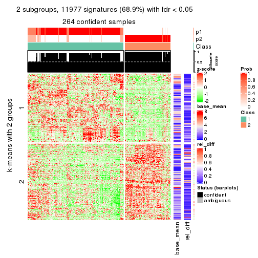</p>

</div>
<div id='tab-CV-mclust-get-signatures-2'>
<pre><code class="r">get_signatures(res, k = 3)
</code></pre>

<p></p>

</div>
<div id='tab-CV-mclust-get-signatures-3'>
<pre><code class="r">get_signatures(res, k = 4)
</code></pre>

<p></p>

</div>
<div id='tab-CV-mclust-get-signatures-4'>
<pre><code class="r">get_signatures(res, k = 5)
</code></pre>

<p></p>

</div>
<div id='tab-CV-mclust-get-signatures-5'>
<pre><code class="r">get_signatures(res, k = 6)
</code></pre>

<p></p>

</div>
</div>


Signature heatmaps where rows are not scaled:


<script>
$( function() {
	$( '#tabs-CV-mclust-get-signatures-no-scale' ).tabs();
} );
</script>
<div id='tabs-CV-mclust-get-signatures-no-scale'>
<ul>
<li><a href='#tab-CV-mclust-get-signatures-no-scale-1'>k = 2</a></li>
<li><a href='#tab-CV-mclust-get-signatures-no-scale-2'>k = 3</a></li>
<li><a href='#tab-CV-mclust-get-signatures-no-scale-3'>k = 4</a></li>
<li><a href='#tab-CV-mclust-get-signatures-no-scale-4'>k = 5</a></li>
<li><a href='#tab-CV-mclust-get-signatures-no-scale-5'>k = 6</a></li>
</ul>
<div id='tab-CV-mclust-get-signatures-no-scale-1'>
<pre><code class="r">get_signatures(res, k = 2, scale_rows = FALSE)
</code></pre>

<p></p>

</div>
<div id='tab-CV-mclust-get-signatures-no-scale-2'>
<pre><code class="r">get_signatures(res, k = 3, scale_rows = FALSE)
</code></pre>

<p></p>

</div>
<div id='tab-CV-mclust-get-signatures-no-scale-3'>
<pre><code class="r">get_signatures(res, k = 4, scale_rows = FALSE)
</code></pre>

<p></p>

</div>
<div id='tab-CV-mclust-get-signatures-no-scale-4'>
<pre><code class="r">get_signatures(res, k = 5, scale_rows = FALSE)
</code></pre>

<p></p>

</div>
<div id='tab-CV-mclust-get-signatures-no-scale-5'>
<pre><code class="r">get_signatures(res, k = 6, scale_rows = FALSE)
</code></pre>

<p></p>

</div>
</div>


Compare the overlap of signatures from different k:

```r
compare_signatures(res)
```


`get_signature()` returns a data frame invisibly. TO get the list of signatures, the function
call should be assigned to a variable explicitly. In following code, if `plot` argument is set
to `FALSE`, no heatmap is plotted while only the differential analysis is performed.

```r
# code only for demonstration
tb = get_signature(res, k = ..., plot = FALSE)
```

An example of the output of `tb` is:

```
#>   which_row         fdr    mean_1    mean_2 scaled_mean_1 scaled_mean_2 km
#> 1        38 0.042760348  8.373488  9.131774    -0.5533452     0.5164555  1
#> 2        40 0.018707592  7.106213  8.469186    -0.6173731     0.5762149  1
#> 3        55 0.019134737 10.221463 11.207825    -0.6159697     0.5749050  1
#> 4        59 0.006059896  5.921854  7.869574    -0.6899429     0.6439467  1
#> 5        60 0.018055526  8.928898 10.211722    -0.6204761     0.5791110  1
#> 6        98 0.009384629 15.714769 14.887706     0.6635654    -0.6193277  2
...
```

The columns in `tb` are:

1. `which_row`: row indices corresponding to the input matrix.
2. `fdr`: FDR for the differential test. 
3. `mean_x`: The mean value in group x.
4. `scaled_mean_x`: The mean value in group x after rows are scaled.
5. `km`: Row groups if k-means clustering is applied to rows.


UMAP plot which shows how samples are separated.


<script>
$( function() {
	$( '#tabs-CV-mclust-dimension-reduction' ).tabs();
} );
</script>
<div id='tabs-CV-mclust-dimension-reduction'>
<ul>
<li><a href='#tab-CV-mclust-dimension-reduction-1'>k = 2</a></li>
<li><a href='#tab-CV-mclust-dimension-reduction-2'>k = 3</a></li>
<li><a href='#tab-CV-mclust-dimension-reduction-3'>k = 4</a></li>
<li><a href='#tab-CV-mclust-dimension-reduction-4'>k = 5</a></li>
<li><a href='#tab-CV-mclust-dimension-reduction-5'>k = 6</a></li>
</ul>
<div id='tab-CV-mclust-dimension-reduction-1'>
<pre><code class="r">dimension_reduction(res, k = 2, method = &quot;UMAP&quot;)
</code></pre>

<p></p>

</div>
<div id='tab-CV-mclust-dimension-reduction-2'>
<pre><code class="r">dimension_reduction(res, k = 3, method = &quot;UMAP&quot;)
</code></pre>

<p></p>

</div>
<div id='tab-CV-mclust-dimension-reduction-3'>
<pre><code class="r">dimension_reduction(res, k = 4, method = &quot;UMAP&quot;)
</code></pre>

<p></p>

</div>
<div id='tab-CV-mclust-dimension-reduction-4'>
<pre><code class="r">dimension_reduction(res, k = 5, method = &quot;UMAP&quot;)
</code></pre>

<p></p>

</div>
<div id='tab-CV-mclust-dimension-reduction-5'>
<pre><code class="r">dimension_reduction(res, k = 6, method = &quot;UMAP&quot;)
</code></pre>

<p></p>

</div>
</div>


Following heatmap shows how subgroups are split when increasing `k`:

```r
collect_classes(res)
```


If matrix rows can be associated to genes, consider to use `GO_Enrichment(res,
...)` to perform function enrichment for the signature genes.


 

---------------------------------------------------


### CV:NMF*


The object with results only for a single top-value method and a single partition method 
can be extracted as:

```r
res = res_list["CV", "NMF"]
# you can also extract it by
# res = res_list["CV:NMF"]
```

A summary of `res` and all the functions that can be applied to it:

```r
res
```

```
#> A 'ConsensusPartition' object with k = 2, 3, 4, 5, 6.
#>   On a matrix with 17377 rows and 265 columns.
#>   Top rows (1000, 2000, 3000, 4000, 5000) are extracted by 'CV' method.
#>   Subgroups are detected by 'NMF' method.
#>   Performed in total 1250 partitions by row resampling.
#>   Best k for subgroups seems to be 3.
#> 
#> Following methods can be applied to this 'ConsensusPartition' object:
#>  [1] "cola_report"             "collect_classes"         "collect_plots"          
#>  [4] "collect_stats"           "colnames"                "compare_signatures"     
#>  [7] "consensus_heatmap"       "dimension_reduction"     "functional_enrichment"  
#> [10] "get_anno_col"            "get_anno"                "get_classes"            
#> [13] "get_consensus"           "get_matrix"              "get_membership"         
#> [16] "get_param"               "get_signatures"          "get_stats"              
#> [19] "is_best_k"               "is_stable_k"             "membership_heatmap"     
#> [22] "ncol"                    "nrow"                    "plot_ecdf"              
#> [25] "rownames"                "select_partition_number" "show"                   
#> [28] "suggest_best_k"          "test_to_known_factors"
```

`collect_plots()` function collects all the plots made from `res` for all `k` (number of partitions)
into one single page to provide an easy and fast comparison between different `k`.

```r
collect_plots(res)
```


The plots are:

- The first row: a plot of the ECDF (Empirical cumulative distribution
  function) curves of the consensus matrix for each `k` and the heatmap of
  predicted classes for each `k`.
- The second row: heatmaps of the consensus matrix for each `k`.
- The third row: heatmaps of the membership matrix for each `k`.
- The fouth row: heatmaps of the signatures for each `k`.

All the plots in panels can be made by individual functions and they are
plotted later in this section.

`select_partition_number()` produces several plots showing different
statistics for choosing "optimized" `k`. There are following statistics:

- ECDF curves of the consensus matrix for each `k`;
- 1-PAC. [The PAC
  score](https://en.wikipedia.org/wiki/Consensus_clustering#Over-interpretation_potential_of_consensus_clustering)
  measures the proportion of the ambiguous subgrouping.
- Mean silhouette score.
- Concordance. The mean probability of fiting the consensus class ids in all
  partitions.
- Area increased. Denote $A_k$ as the area under the ECDF curve for current
  `k`, the area increased is defined as $A_k - A_{k-1}$.
- Rand index. The percent of pairs of samples that are both in a same cluster
  or both are not in a same cluster in the partition of k and k-1.
- Jaccard index. The ratio of pairs of samples are both in a same cluster in
  the partition of k and k-1 and the pairs of samples are both in a same
  cluster in the partition k or k-1.

The detailed explanations of these statistics can be found in [the cola
vignette](http://bioconductor.org/packages/devel/bioc/vignettes/cola/inst/doc/cola.html#toc_13).

Generally speaking, lower PAC score, higher mean silhouette score or higher
concordance corresponds to better partition. Rand index and Jaccard index
measure how similar the current partition is compared to partition with `k-1`.
If they are too similar, we won't accept `k` is better than `k-1`.

```r
select_partition_number(res)
```


The numeric values for all these statistics can be obtained by `get_stats()`.

```r
get_stats(res)
```

```
#>   k 1-PAC mean_silhouette concordance area_increased  Rand Jaccard
#> 2 2 0.802           0.848       0.940          0.460 0.555   0.555
#> 3 3 0.941           0.933       0.973          0.390 0.779   0.611
#> 4 4 0.839           0.817       0.908          0.162 0.847   0.601
#> 5 5 0.838           0.802       0.874          0.062 0.914   0.688
#> 6 6 0.847           0.855       0.902          0.043 0.937   0.720
```

`suggest_best_k()` suggests the best $k$ based on these statistics. The rules are as follows:

- All $k$ with Jaccard index larger than 0.95 are removed because the increase of
  the partition number does not provides enough extra information. If all $k$ are removed,
  the best $k$ is assigned by `NA`.
- For $k$ with 1-PAC larger than 0.9, the maximal $k$ is taken as the "best k". Other $k$ is called "optional k".
- If it does not fit the second rule. The $k$ with the highest vote of highest
  1-PAC, mean silhouette and concordance is taken as the "best k".

```r
suggest_best_k(res)
```

```
#> [1] 3
```


Following shows the table of the partitions (You need to click the **show/hide
code output** link to see it). The membership matrix (columns with name `p*`)
is inferred by
[`clue::cl_consensus()`](https://www.rdocumentation.org/link/cl_consensus?package=clue)
function with the `SE` method. Basically the value in the membership matrix
represents the probability to belong to a certain group. The finall class
label for an item is determined with the group with highest probability it
belongs to.

In `get_classes()` function, the entropy is calculated from the membership
matrix and the silhouette score is calculated from the consensus matrix.


<script>
$( function() {
	$( '#tabs-CV-NMF-get-classes' ).tabs();
} );
</script>
<div id='tabs-CV-NMF-get-classes'>
<ul>
<li><a href='#tab-CV-NMF-get-classes-1'>k = 2</a></li>
<li><a href='#tab-CV-NMF-get-classes-2'>k = 3</a></li>
<li><a href='#tab-CV-NMF-get-classes-3'>k = 4</a></li>
<li><a href='#tab-CV-NMF-get-classes-4'>k = 5</a></li>
<li><a href='#tab-CV-NMF-get-classes-5'>k = 6</a></li>
</ul>

<div id='tab-CV-NMF-get-classes-1'>
<p><a id='tab-CV-NMF-get-classes-1-a' style='color:#0366d6' href='#'>show/hide code output</a></p>
<pre><code class="r">cbind(get_classes(res, k = 2), get_membership(res, k = 2))
</code></pre>

<pre><code>#&gt;                                      class entropy silhouette    p1    p2
#&gt; D30CF518-5FC6-4A54-8D5D-BA420EA1836D     2  0.0000     0.9585 0.000 1.000
#&gt; 92298FF7-1215-4756-B976-A7D88B91AD76     1  0.0000     0.9213 1.000 0.000
#&gt; 0E244FE2-7C17-4642-A51F-2CCA796D9C70     2  0.0000     0.9585 0.000 1.000
#&gt; 75435ED8-93E8-45FB-8480-98D8EB2EF8CB     2  0.0000     0.9585 0.000 1.000
#&gt; B6D11678-15A9-4F43-A0A2-225067DCAF1C     1  0.0000     0.9213 1.000 0.000
#&gt; B7F5A41E-9559-4329-81F5-1B88A74730B7     2  0.0000     0.9585 0.000 1.000
#&gt; 39414B2A-7FB0-4669-8DFE-86D9AF7AD2D9     1  0.0000     0.9213 1.000 0.000
#&gt; 04823F53-A12D-4852-8F34-77B9DCBB7DF0     2  0.0000     0.9585 0.000 1.000
#&gt; 49684C2B-D31C-4B45-A400-3497C3CCEC01     2  0.0000     0.9585 0.000 1.000
#&gt; 96A04875-58E2-4BE7-8E0F-CAB55F4CA54F     1  0.0000     0.9213 1.000 0.000
#&gt; 1F101D63-478B-40B9-A951-DC3887CFF067     1  0.0000     0.9213 1.000 0.000
#&gt; DD290860-E0B7-48FC-BE12-2AF729994C21     2  0.0000     0.9585 0.000 1.000
#&gt; FFDD7A12-DDEF-4974-8D60-64B7EEAAC994     2  0.0000     0.9585 0.000 1.000
#&gt; E076A9A9-EA2A-4FF7-92A8-F2DA7F30279E     1  0.9850     0.3318 0.572 0.428
#&gt; 830DFA6F-A85A-4317-82B2-791FAB998A01     2  0.0000     0.9585 0.000 1.000
#&gt; 58578614-E4A3-4655-BBAB-F65851625E0A     1  0.0000     0.9213 1.000 0.000
#&gt; 1CBFB672-4D66-430B-83F3-7CE3BE20ABF6     1  0.0000     0.9213 1.000 0.000
#&gt; 6C34A7D7-3756-4DCC-9A9F-B5FC4A148B7E     1  0.9833     0.3418 0.576 0.424
#&gt; D97ED7B4-5DF2-4B62-8796-AA51CA79DBBB     1  0.0000     0.9213 1.000 0.000
#&gt; 45F15851-55F6-4169-834E-38958C38B6A9     1  0.0000     0.9213 1.000 0.000
#&gt; 4139E0C9-F712-4A25-8B59-587533B93B3E     2  0.0000     0.9585 0.000 1.000
#&gt; 2C3007BF-009E-404F-A3BF-8B921698D85B     1  0.0000     0.9213 1.000 0.000
#&gt; 2189F8E5-FF98-4C1A-BD04-5595DB553130     1  0.0000     0.9213 1.000 0.000
#&gt; FFAA0310-0D78-4499-8FB8-5BC46E4FCE58     1  0.9775     0.3702 0.588 0.412
#&gt; 0C375B2F-67BE-4708-BEB2-544DEC812DCA     2  0.0000     0.9585 0.000 1.000
#&gt; AB6324A1-19AB-400C-8001-54765D190E27     2  0.0000     0.9585 0.000 1.000
#&gt; A32C4DCD-DC4C-4132-9ED1-B159F5561A2D     1  0.0000     0.9213 1.000 0.000
#&gt; 2AE7105D-D494-45B0-947A-315D8C20ECDC     1  0.0000     0.9213 1.000 0.000
#&gt; 60FE9D59-FC0F-4B9C-ABF8-1C00BC761928     1  0.0000     0.9213 1.000 0.000
#&gt; 056442DC-E87A-4315-965C-C19D7B4FC40E     1  0.0000     0.9213 1.000 0.000
#&gt; 455111E5-18EF-4E3F-9DFF-8FA017D92461     1  0.0000     0.9213 1.000 0.000
#&gt; 10632BC6-0B81-433C-8832-6B2ABC73A94B     1  0.0000     0.9213 1.000 0.000
#&gt; AC6F82AD-C682-4EB3-BEC3-FD950F57609D     1  0.0000     0.9213 1.000 0.000
#&gt; D9ABDB75-04DA-4D33-A69F-701729494533     1  0.0000     0.9213 1.000 0.000
#&gt; 27BBF44D-F4D7-4C5A-935F-3310A363A670     2  0.0000     0.9585 0.000 1.000
#&gt; E7AA12EE-6E14-4B33-A52C-B13589436023     1  0.0000     0.9213 1.000 0.000
#&gt; DFA6D41A-D231-413E-A180-E42DF26C3E2B     2  0.0000     0.9585 0.000 1.000
#&gt; 655BD3AF-5094-4B19-93A8-401C70369B17     2  0.0000     0.9585 0.000 1.000
#&gt; 9DFEF253-923F-4EE2-8E3D-C75805387B20     1  0.8144     0.6602 0.748 0.252
#&gt; 3B0EE948-B2CD-4191-90E2-BDD155F3B580     1  0.0000     0.9213 1.000 0.000
#&gt; 177C7EF4-2D54-4555-947C-44EE7C688917     1  0.9833     0.3418 0.576 0.424
#&gt; 1F8E8BB7-D159-4556-8B04-E5DD027CC444     2  0.0000     0.9585 0.000 1.000
#&gt; 619F37D2-6771-4727-9079-56BED07F1CF6     2  0.9710     0.2491 0.400 0.600
#&gt; ACAE29BE-ECB8-4A98-BC71-7A2D4857134E     1  0.8207     0.6499 0.744 0.256
#&gt; C5C3241A-684C-4238-9333-9AF8630EC086     2  0.0000     0.9585 0.000 1.000
#&gt; AD319DC2-140F-4E7B-A899-010687D8B714     2  0.0000     0.9585 0.000 1.000
#&gt; 2AFF397C-ED2A-4FD9-A7F0-E4C61E9FB603     1  0.9833     0.3418 0.576 0.424
#&gt; FB4C7892-3DBB-4148-AAE9-75B19A1A4031     1  0.0000     0.9213 1.000 0.000
#&gt; 6F5C4500-1ED1-4E81-B4F5-EEA64CE2336A     1  0.0000     0.9213 1.000 0.000
#&gt; BD027C69-3C10-4047-8E1E-218600FF2B73     2  0.0000     0.9585 0.000 1.000
#&gt; 11B473A9-4CC5-461F-BC57-CC9141F3591D     1  0.0000     0.9213 1.000 0.000
#&gt; 69A036E5-3E6A-4862-A7F8-2D203ED2FC9E     1  0.0000     0.9213 1.000 0.000
#&gt; 9C0BDF24-F011-4855-B95A-1B6BEFA808F7     1  0.0000     0.9213 1.000 0.000
#&gt; 9E205254-8C0C-4C05-AF5A-86E679CF732C     1  0.0000     0.9213 1.000 0.000
#&gt; 935CCE4A-8AA8-454E-9DFF-7DE27D0BD2E2     1  0.0000     0.9213 1.000 0.000
#&gt; 01E5E1FE-41D3-428B-90BC-7A000829E102     1  0.0000     0.9213 1.000 0.000
#&gt; B344A530-92CD-468B-847A-DF8E25688081     1  0.9866     0.3213 0.568 0.432
#&gt; F79F32A7-9F7B-4D62-8426-4A4CF10ED319     1  0.0000     0.9213 1.000 0.000
#&gt; C2E1C6FA-82F9-467C-99AE-9B39FAAC810C     1  0.0000     0.9213 1.000 0.000
#&gt; BF7CD9BD-776A-4957-8A6E-EF8AD83EA9D3     2  0.0000     0.9585 0.000 1.000
#&gt; 8A2C1409-E83B-435E-A20F-5FCA94801C9F     2  0.0000     0.9585 0.000 1.000
#&gt; B6BEFFB5-2F62-477B-A4C8-478D29577CBD     2  0.0000     0.9585 0.000 1.000
#&gt; 8622CBD0-F8E9-4AC1-8175-CC9A742B86F9     1  0.0000     0.9213 1.000 0.000
#&gt; 565DD660-ED58-4065-8619-260BEA6FCFEB     1  0.0000     0.9213 1.000 0.000
#&gt; 96038E42-0FBA-497D-819C-38F7689F10FF     1  0.0000     0.9213 1.000 0.000
#&gt; CA685549-F8BA-43F1-8461-5D2D3B17CFC5     1  0.0000     0.9213 1.000 0.000
#&gt; 52020307-71A6-46E5-ACB3-8F885CA8F1EB     1  0.0000     0.9213 1.000 0.000
#&gt; 7656DA98-76DC-424B-B02C-D7001DAAA0E4     1  0.0000     0.9213 1.000 0.000
#&gt; 74DBA640-45E2-42A6-8F1E-69C073D66EE6     1  0.0000     0.9213 1.000 0.000
#&gt; 251094BE-C33D-44F0-BD98-8618D71F520C     1  0.0000     0.9213 1.000 0.000
#&gt; AB914CC5-5FF1-4257-A353-6A99D11B9478     1  0.0000     0.9213 1.000 0.000
#&gt; 38B8B893-0E08-4B71-B51C-B32A7B2724E0     1  0.0000     0.9213 1.000 0.000
#&gt; 7C7CD8FF-99A4-41D7-B7E1-5A517001F551     2  0.0000     0.9585 0.000 1.000
#&gt; BFC5B75A-E4AE-486B-BA30-23BBAA33A125     2  0.0000     0.9585 0.000 1.000
#&gt; 182AC78E-A07C-4B34-B216-B5F573E9F036     2  0.0000     0.9585 0.000 1.000
#&gt; B38C5F72-8F46-4531-9C2D-96EEE07A5B22     2  0.0000     0.9585 0.000 1.000
#&gt; DB9333A6-A723-4B8F-9221-25B8B23D5126     1  0.0000     0.9213 1.000 0.000
#&gt; CD67DD21-C1B6-4D58-AC8E-1F4536C7DA70     1  0.9881     0.3107 0.564 0.436
#&gt; 3D76A56E-4B66-48AE-AA60-D9C1004C7140     1  0.0000     0.9213 1.000 0.000
#&gt; 71ED572F-7780-47A4-A9F8-D320C737690D     1  0.0000     0.9213 1.000 0.000
#&gt; B449FEA1-C4B0-400F-903C-59E13D0BA313     2  0.0000     0.9585 0.000 1.000
#&gt; 3F120E90-1486-4215-B9B9-79D5B413CAAC     1  0.7299     0.7193 0.796 0.204
#&gt; A071894B-D8C0-4740-BD55-93EA0C86EDF7     1  0.0000     0.9213 1.000 0.000
#&gt; 58848D57-D7A9-4ABB-86A2-A8AE2B23F654     1  0.0000     0.9213 1.000 0.000
#&gt; CD6F9E20-B301-4663-87EC-953EDF49754F     2  0.9850     0.1586 0.428 0.572
#&gt; 367D89F3-D527-4929-B830-8B6D553DF9E1     1  0.0000     0.9213 1.000 0.000
#&gt; BE8D7DCB-648B-42DD-9FA8-8B85B5D816B2     1  0.0000     0.9213 1.000 0.000
#&gt; AA46F56B-BD9C-40A4-8EA8-35E2568C964D     2  0.0000     0.9585 0.000 1.000
#&gt; 6393220A-7C57-413F-81A8-4E38C21E779E     2  0.0000     0.9585 0.000 1.000
#&gt; 89AE566C-F65F-43C2-BA97-621A7AC8B6DC     1  0.0000     0.9213 1.000 0.000
#&gt; AA6A4BFF-8C62-4B70-B85A-9EDF403B06BA     1  0.0000     0.9213 1.000 0.000
#&gt; BCE877A6-9C65-4495-A45D-05753F2D0E15     1  0.0000     0.9213 1.000 0.000
#&gt; D7BDDF49-C54B-4F8E-ACA0-C3684AB68B5C     1  0.9732     0.3878 0.596 0.404
#&gt; D0800D49-0033-44B2-8D7B-29B16F87ADA6     2  0.0000     0.9585 0.000 1.000
#&gt; 151D60B5-5AF1-4B61-B97F-ABC7531D9F89     1  0.0000     0.9213 1.000 0.000
#&gt; CBBAEB5B-25FA-4B6D-A40C-357E37033E36     1  0.0000     0.9213 1.000 0.000
#&gt; 317CD049-3151-40B7-8E88-B0B8813338D6     1  0.0000     0.9213 1.000 0.000
#&gt; 93835C77-F8FA-4928-843C-8016A91881FA     1  0.0000     0.9213 1.000 0.000
#&gt; 02A6950F-647D-4F20-B2D0-0238C1441C70     1  0.0000     0.9213 1.000 0.000
#&gt; 4D54E415-134F-4F6F-8718-3E0475EF5477     1  0.0000     0.9213 1.000 0.000
#&gt; 82AB290A-3993-45E5-8B15-6125A019778C     1  0.0000     0.9213 1.000 0.000
#&gt; 3B5EAD14-E506-4A22-804D-BF925A2D5247     2  0.0000     0.9585 0.000 1.000
#&gt; 19CF7DDF-4F3A-4D2F-B84A-6451A5C3112C     1  0.9775     0.3702 0.588 0.412
#&gt; 2FB00DAA-C274-42B1-A06B-611FE5E96844     1  0.0000     0.9213 1.000 0.000
#&gt; 2B1F01C3-8145-4296-8111-2B0474AB9A2C     2  0.0000     0.9585 0.000 1.000
#&gt; 3F0865F1-8256-4778-966F-D53637B415B6     2  0.9922     0.0863 0.448 0.552
#&gt; 5473210D-37F9-4192-86D2-E2A2C77F3BD2     2  0.9881     0.1306 0.436 0.564
#&gt; 5EDB6ACF-4F3F-471A-9DDC-661607CACCC4     1  0.0000     0.9213 1.000 0.000
#&gt; 6A252A3A-7EEB-47B6-9C23-D69BD2EA846F     1  0.9850     0.3317 0.572 0.428
#&gt; 0A7FFCBB-4BAA-4A5F-8B2D-B427C4D982A8     1  0.0000     0.9213 1.000 0.000
#&gt; 1603AFB8-5AD7-4794-9991-BDBE96B4D997     2  0.0000     0.9585 0.000 1.000
#&gt; 644299E9-62B7-4DFE-9E6D-D7556A01B40A     1  0.0000     0.9213 1.000 0.000
#&gt; EF12E923-1860-4269-B57B-BA6238FA4403     1  0.0000     0.9213 1.000 0.000
#&gt; 51B7241E-F0BE-482A-88AE-89004BB68989     1  0.0000     0.9213 1.000 0.000
#&gt; 1C007DF3-8A9F-4940-9A4C-DE2A412BB023     2  0.9922     0.0863 0.448 0.552
#&gt; 89FCFDE6-9625-432C-AA35-9C5FCCF40031     1  0.0000     0.9213 1.000 0.000
#&gt; 7955FC55-386D-497E-AFED-019BBBAD428E     1  0.9896     0.2997 0.560 0.440
#&gt; 37FF09ED-73EC-4D10-B2AC-7D8EBA9304ED     1  0.6343     0.7712 0.840 0.160
#&gt; C2CD2742-2FB4-468E-90FF-8F65A5C425A9     1  0.0000     0.9213 1.000 0.000
#&gt; 766FE08F-3393-4868-B1C1-FA98C9FF16E0     1  0.9833     0.3418 0.576 0.424
#&gt; 63E2B578-2221-4255-8C45-7FD030B1C94D     1  0.0000     0.9213 1.000 0.000
#&gt; C14B1A44-43F7-45F0-A583-5667A4D3BD95     1  0.0000     0.9213 1.000 0.000
#&gt; D9CB551A-CE20-4BF7-8AC9-839112346C3D     1  0.0000     0.9213 1.000 0.000
#&gt; 05BAA71A-E5B3-4A3A-A3F2-013A975087F0     2  0.0000     0.9585 0.000 1.000
#&gt; AC8DA7DE-4D83-4768-BEFD-9A1B2DA943CE     1  0.9754     0.3791 0.592 0.408
#&gt; E89DCE9D-F8A5-499C-85BB-BB500BADB9FB     1  0.0000     0.9213 1.000 0.000
#&gt; C16F9B5E-2B52-40F6-856D-C0D6FBDD16C1     1  0.0000     0.9213 1.000 0.000
#&gt; 8FF234D4-823A-4C80-82F7-2E92D72DBF88     2  0.0000     0.9585 0.000 1.000
#&gt; C9F94A6E-D104-4D8D-8EC5-EADECD85F092     2  0.0000     0.9585 0.000 1.000
#&gt; 45C9756F-A154-4537-852E-ECBF27B92FE1     2  0.0000     0.9585 0.000 1.000
#&gt; 0F1A5708-341E-4713-BC70-76D702F826D6     2  0.0000     0.9585 0.000 1.000
#&gt; 2ECFBCA0-AB35-461A-A4B5-C60B2651A962     2  0.0000     0.9585 0.000 1.000
#&gt; 7DFAC404-3AB3-4274-A533-CFDAF4CE122D     1  0.0000     0.9213 1.000 0.000
#&gt; A90AF55C-4386-42AB-A812-9230026EA5A5     2  0.0000     0.9585 0.000 1.000
#&gt; 6258A757-4E18-4CD1-8417-189521E990B6     2  0.0000     0.9585 0.000 1.000
#&gt; EBFAD137-050F-47D0-A43D-72B8F7D70C2B     1  0.0000     0.9213 1.000 0.000
#&gt; 08B5EBFB-2807-4229-95A6-81AB7F377A56     2  0.0000     0.9585 0.000 1.000
#&gt; 4780A59C-0589-4995-B044-3201F09AF859     1  0.0000     0.9213 1.000 0.000
#&gt; 0AB81429-C287-48AA-9035-3A7A6F4C7328     2  0.0000     0.9585 0.000 1.000
#&gt; 20C4D047-28DA-4AB7-9B3C-32EDA6B22C9D     1  0.9988     0.1759 0.520 0.480
#&gt; 77C4E01F-84A6-4BFD-AA8E-D7875456F546     1  0.9850     0.3317 0.572 0.428
#&gt; 8B28383F-CF14-4CC5-A1E2-72AD915C0AE8     1  0.0000     0.9213 1.000 0.000
#&gt; E12E1F48-6A52-4F74-925C-C4EE1BF5C573     2  0.0000     0.9585 0.000 1.000
#&gt; 9B179BC5-BB4C-4CEE-99BC-BC552BC384A1     1  0.0000     0.9213 1.000 0.000
#&gt; 5548C91A-D3DE-48F5-B4A4-124BE177B99A     1  0.0000     0.9213 1.000 0.000
#&gt; 0E22B729-C381-4B0C-9897-62DD38F51722     1  0.0000     0.9213 1.000 0.000
#&gt; 7BC4937F-04E2-4B46-BA7C-FE9AC738C8A9     1  0.0000     0.9213 1.000 0.000
#&gt; EE6A0D3F-3F8A-4AA8-B3EF-32372EF37A29     1  0.0000     0.9213 1.000 0.000
#&gt; 08AC2706-7651-409F-BE6B-BCED1C2D1796     1  0.0000     0.9213 1.000 0.000
#&gt; A68B078D-8979-4070-BB4D-F526704ED3DC     1  0.0000     0.9213 1.000 0.000
#&gt; C319A5EE-69FA-4AAB-85A9-2EAAD8E4C703     1  0.0376     0.9182 0.996 0.004
#&gt; 0D7CAABD-D20C-4F82-BCBC-8B7276E8EDE2     1  0.0000     0.9213 1.000 0.000
#&gt; 09444DCC-44BA-4A3F-ACC5-863A54578B9F     1  0.1414     0.9054 0.980 0.020
#&gt; 2E32B047-C6E1-4743-A6C8-E98370A32145     1  0.0000     0.9213 1.000 0.000
#&gt; 6A6878A7-76B2-40DE-958B-804442AC6A5D     1  0.0000     0.9213 1.000 0.000
#&gt; 39F27293-0BFF-4EA2-8439-A299E3226D20     1  0.0000     0.9213 1.000 0.000
#&gt; 7EAE9C30-6080-405F-A7E6-1FED57674279     1  0.0000     0.9213 1.000 0.000
#&gt; 79499169-A093-4E0A-B6BD-010CD7BE5035     1  0.0000     0.9213 1.000 0.000
#&gt; 1F8BF4E8-BD84-4EFE-9E3E-89E7CE8FA72D     1  0.9881     0.3107 0.564 0.436
#&gt; 62B7988F-98E5-4AB8-8A16-D661A07455E8     1  0.0000     0.9213 1.000 0.000
#&gt; B7005B5F-217E-4073-BFB5-CE7E884B80C0     2  0.0000     0.9585 0.000 1.000
#&gt; B981568F-2C08-4696-B589-E157A49BE72B     2  0.0000     0.9585 0.000 1.000
#&gt; A3D85C0A-3202-40C2-88E1-052AC6C5184B     1  0.0000     0.9213 1.000 0.000
#&gt; 4CA783B9-9B99-46B8-962A-77194ECB7942     1  0.9933     0.2653 0.548 0.452
#&gt; D4024B08-4879-47EA-99E5-D9FCE1CD40DF     1  0.0000     0.9213 1.000 0.000
#&gt; 1D41CDA2-0B29-48FD-B83A-E60C174DBCB3     1  0.0000     0.9213 1.000 0.000
#&gt; A1923B2A-B233-4760-8AF9-C04C1CAEB100     1  0.0000     0.9213 1.000 0.000
#&gt; 80880D71-BFDE-4D88-892F-5ADF27A38940     1  0.9833     0.3418 0.576 0.424
#&gt; 55D1629D-30FD-49AA-88CE-EA3CA9B30A3F     2  0.0000     0.9585 0.000 1.000
#&gt; B71C409E-926D-48AD-8BD8-9F707CA4FB01     2  0.0000     0.9585 0.000 1.000
#&gt; 54A92C57-BD19-4A47-BA76-3ACA2DC36212     1  0.8499     0.6204 0.724 0.276
#&gt; B2AB74B8-506C-4C27-9105-E86A6AAA89D4     1  0.0000     0.9213 1.000 0.000
#&gt; 0356AE49-7A5C-42CC-A39C-7C8DFBFF8842     2  0.0000     0.9585 0.000 1.000
#&gt; ACA260A3-DC3F-4FF4-B9C5-2D4BC4F81783     1  0.0000     0.9213 1.000 0.000
#&gt; 9B440917-E5A4-43B9-A48D-6ABFEDCA6CFD     1  0.0000     0.9213 1.000 0.000
#&gt; 47464828-52EA-413B-B30C-BD8B55903D78     2  0.0000     0.9585 0.000 1.000
#&gt; C1D1FC82-B50D-4C82-8F03-06CEE3C08D18     1  0.0000     0.9213 1.000 0.000
#&gt; E5ABFC43-E2A3-4B1A-BBA3-8196C0B026A5     2  0.0000     0.9585 0.000 1.000
#&gt; 1D3C16CC-D0D5-4637-AAC7-91672DFF3317     1  0.0376     0.9180 0.996 0.004
#&gt; 4D038320-ADEA-4990-8371-68B4B8162E1A     2  0.0000     0.9585 0.000 1.000
#&gt; A75594CC-3E49-4869-8656-BBB4E72BF59D     2  0.0000     0.9585 0.000 1.000
#&gt; 7CABAA19-5FB2-4A58-BDA3-4F1FFB532C20     1  0.0000     0.9213 1.000 0.000
#&gt; 534EF1E9-9513-426E-B41E-A394AB2E4410     2  0.0000     0.9585 0.000 1.000
#&gt; 649F35A1-A08C-497D-A9B6-CB3084D5FB8D     1  0.0000     0.9213 1.000 0.000
#&gt; 7CA30F3C-1C98-480C-B8B5-A248AABFB468     1  0.0000     0.9213 1.000 0.000
#&gt; A9F8DA21-A802-44CF-9F5D-96A36687DCDD     1  0.9896     0.2997 0.560 0.440
#&gt; A7AE1ED1-86CB-4A50-97B2-66785C7191FE     1  0.0000     0.9213 1.000 0.000
#&gt; D0091AD4-D3D7-4C03-ACD9-DA9F8B6076C6     1  0.0000     0.9213 1.000 0.000
#&gt; 46EE1C2B-13F7-44A7-B27E-4EBB9DF0CA83     2  0.0000     0.9585 0.000 1.000
#&gt; CB9301B8-0282-43D6-AF5E-B753A9C7BFCB     2  0.0000     0.9585 0.000 1.000
#&gt; A0E77A39-885A-4472-9A10-2D1E51DBFDA4     1  0.0000     0.9213 1.000 0.000
#&gt; C06603C2-163D-40B6-A9FE-882424F18FE9     1  0.0000     0.9213 1.000 0.000
#&gt; C3921A29-80FF-4B9D-B366-5C0238A42231     1  0.0000     0.9213 1.000 0.000
#&gt; BB99B4E7-C834-4BB8-973F-8FA039E2798F     1  0.0000     0.9213 1.000 0.000
#&gt; 5CD78C2F-05E9-409A-8405-3EE936A6876E     1  0.9944     0.2533 0.544 0.456
#&gt; 6C126CC7-0C03-48F0-A2C2-F090CA239B70     2  0.0000     0.9585 0.000 1.000
#&gt; 7118B08A-E94C-49F4-8D76-26455C34D85F     2  0.0000     0.9585 0.000 1.000
#&gt; 266DAF30-CF3E-493E-8B24-3931D0039450     1  0.0000     0.9213 1.000 0.000
#&gt; DAB5F5B9-4FE5-468F-AD2B-B39BBC4317A0     1  0.9732     0.3878 0.596 0.404
#&gt; 9A9EB6D6-312E-4A98-8762-30D3ABD8193D     1  0.9954     0.2411 0.540 0.460
#&gt; CED15676-B901-4FC8-9C8D-51E529D9441D     1  0.0000     0.9213 1.000 0.000
#&gt; 827232CC-8035-440C-8B12-02C789C70B1B     1  0.0000     0.9213 1.000 0.000
#&gt; 04D5FB28-FB50-4EAE-95FB-72ABF0E618CA     2  0.0000     0.9585 0.000 1.000
#&gt; 6C96A851-97FC-4845-B895-D255191D9F25     1  0.0000     0.9213 1.000 0.000
#&gt; 3EC982CB-D013-443E-B21D-39DE6B8EF370     2  0.9775     0.2118 0.412 0.588
#&gt; 2E24A786-4370-42A1-AD50-D651F89819CC     2  0.0000     0.9585 0.000 1.000
#&gt; 7653BFA9-ADA5-44CA-8555-807FBBFC6DE2     1  0.0000     0.9213 1.000 0.000
#&gt; 7A110994-5741-4013-91F0-DD2E1D343F91     2  0.0000     0.9585 0.000 1.000
#&gt; 0A760E0C-11C5-4201-8452-18DBC1FEACEB     1  0.0000     0.9213 1.000 0.000
#&gt; 909B76A1-BB9F-4906-95BC-58CD1A46D3B8     2  0.0000     0.9585 0.000 1.000
#&gt; A782EE71-EDA4-4385-83B3-D16DE81296C0     1  0.9775     0.3702 0.588 0.412
#&gt; BD50E276-914F-4924-8CEA-FF47A66DB175     2  0.0000     0.9585 0.000 1.000
#&gt; 505D5CA8-0279-4BC7-8CC0-8C7A0165BF91     2  0.0000     0.9585 0.000 1.000
#&gt; D51FC997-E662-4AE7-BC9C-14183DA42DE1     2  0.0000     0.9585 0.000 1.000
#&gt; 8AD67970-84F1-4C0A-B47A-8FA4108F9FE3     1  0.0000     0.9213 1.000 0.000
#&gt; 6E33B1B6-7089-4BC3-B2B0-EC2C3B5D8B74     1  0.0000     0.9213 1.000 0.000
#&gt; 88C4EA46-2546-401C-A8E7-603EECFDFBA0     1  0.0000     0.9213 1.000 0.000
#&gt; 375D2D72-C998-4627-BA35-24E82A9A55FF     1  0.0000     0.9213 1.000 0.000
#&gt; 76D0F834-7064-46C6-96F4-E861CF5452B6     2  0.0000     0.9585 0.000 1.000
#&gt; 87159081-C97A-4004-AF0A-7EB6EF0EC47A     1  0.0000     0.9213 1.000 0.000
#&gt; 24A57006-800B-4174-AF4E-7EA57A8A756E     1  0.0000     0.9213 1.000 0.000
#&gt; AD68CBC6-8A13-4A65-AF62-E99AFA81D031     1  0.9933     0.2653 0.548 0.452
#&gt; 22863A57-F066-4DD1-A859-4336F43D144C     1  0.8661     0.6019 0.712 0.288
#&gt; 8F6F0362-9165-4DCC-992C-AF871A3C51E7     1  0.0000     0.9213 1.000 0.000
#&gt; 76ABF0B7-E707-4DB2-9486-3814439BDBA5     1  0.0000     0.9213 1.000 0.000
#&gt; BC72372F-3577-40E5-BA0F-41A084AA93AD     1  0.0000     0.9213 1.000 0.000
#&gt; 8E566039-B56C-4F41-B9EF-DE18BEEF2C95     1  0.0000     0.9213 1.000 0.000
#&gt; F096F016-3EF5-4A67-A7C2-8A45E1585232     1  0.0000     0.9213 1.000 0.000
#&gt; BB37913E-534B-43DD-BE3D-E13B29FD8172     2  0.0000     0.9585 0.000 1.000
#&gt; E344638F-9060-460F-8F7A-60D19442F294     1  0.9775     0.3702 0.588 0.412
#&gt; 6A0EAAD0-89D5-4F12-8B45-9D5A25182FAD     2  0.0000     0.9585 0.000 1.000
#&gt; A5199E3A-9D67-4543-88AB-24398C98E38E     1  0.0000     0.9213 1.000 0.000
#&gt; 23917D52-7864-4F84-9C77-DF8EA9407345     2  0.0000     0.9585 0.000 1.000
#&gt; 9AA96080-19D8-40C3-BDD1-6044D2D422D5     1  0.0000     0.9213 1.000 0.000
#&gt; 0ED65D91-260C-4662-9903-EE36A2E3B2D0     2  0.0000     0.9585 0.000 1.000
#&gt; 64BF1BC5-7A9A-4E1D-AEAB-AFE30B92AAF4     1  0.9795     0.3609 0.584 0.416
#&gt; F02301F1-9054-4DC6-8DC9-2451A0F53EFC     2  0.0000     0.9585 0.000 1.000
#&gt; 3264649A-5684-4181-83D0-A7E4D7E2E1FD     1  0.0000     0.9213 1.000 0.000
#&gt; 3F8DA39C-BC9B-4343-8838-5CE271E80C51     2  0.7528     0.6866 0.216 0.784
#&gt; BCC681CB-2AF4-4BB6-B53A-7544A2399454     1  0.0000     0.9213 1.000 0.000
#&gt; DCB50E17-5E2D-443B-8DCC-272FBB734C2E     1  0.0000     0.9213 1.000 0.000
#&gt; B5E47C38-CB6A-44C0-AA9B-56951B9EF78D     1  0.0000     0.9213 1.000 0.000
#&gt; B15B0185-9C28-4A00-9CEC-05EFECEA6709     1  0.0000     0.9213 1.000 0.000
#&gt; 61D4E8E7-0110-480A-A4A7-D406DE74C31E     1  0.0000     0.9213 1.000 0.000
#&gt; CA8DB3AD-3F6B-4622-BF73-47041EC96E42     1  0.0000     0.9213 1.000 0.000
#&gt; 5EECB1C4-172C-4494-871A-ADB650CD82BD     2  0.0000     0.9585 0.000 1.000
#&gt; 019B857C-D4F7-4B67-B699-56E52A60805B     2  0.0000     0.9585 0.000 1.000
#&gt; E9C28902-05C9-4883-97A4-D612D54E46B4     1  0.0000     0.9213 1.000 0.000
#&gt; C5D3D9A0-FC14-408D-AB6C-662018A5E5CA     1  0.0000     0.9213 1.000 0.000
#&gt; 7EB24744-509B-4854-B7D0-0BAFA210A345     2  0.0000     0.9585 0.000 1.000
#&gt; B8B7A721-2284-40AB-98F5-EF1351C30B66     2  0.0000     0.9585 0.000 1.000
#&gt; 3C12F39D-0D21-4F69-A539-4120B73C7A79     2  0.0000     0.9585 0.000 1.000
#&gt; 08D3F984-6850-45B2-9DF9-EC7F5A4060A4     1  0.0000     0.9213 1.000 0.000
#&gt; 9BD0EE79-1EED-4F6D-A5AB-43ADB8526F1E     2  0.9552     0.3658 0.376 0.624
#&gt; E489A871-3CF4-4F3D-8EAF-63B507054201     2  0.0000     0.9585 0.000 1.000
#&gt; 8CF8FD2E-1DBA-4257-9715-04D956D46B71     2  0.0000     0.9585 0.000 1.000
#&gt; F6193AF0-7A19-46CB-A818-1B01E7460791     1  0.0000     0.9213 1.000 0.000
#&gt; 96392D6B-D4FF-4393-93BA-08E469E8BBE1     1  0.0000     0.9213 1.000 0.000
#&gt; DABCBE5A-C591-46A2-AF66-DA3DB6106751     1  0.0000     0.9213 1.000 0.000
#&gt; 8B75F7D4-98D8-44DE-B19D-B733D6A031DB     1  0.0000     0.9213 1.000 0.000
#&gt; AAD9685A-564B-42E9-91E3-431951154BA7     2  0.0000     0.9585 0.000 1.000
#&gt; 90A43152-4E3B-4365-A39F-7B0E5CA66E55     1  0.0000     0.9213 1.000 0.000
#&gt; EFB76FCF-AC9C-4852-B91C-E055DA666FA0     1  0.0000     0.9213 1.000 0.000
#&gt; 6EBCFFE3-706F-440A-ABA9-012A924A07C6     2  0.0000     0.9585 0.000 1.000
#&gt; E922A244-F1C8-4310-ABB2-62B06E022E4C     1  0.0000     0.9213 1.000 0.000
</code></pre>

<script>
$('#tab-CV-NMF-get-classes-1-a').parent().next().next().hide();
$('#tab-CV-NMF-get-classes-1-a').click(function(){
  $('#tab-CV-NMF-get-classes-1-a').parent().next().next().toggle();
  return(false);
});
</script>
</div>

<div id='tab-CV-NMF-get-classes-2'>
<p><a id='tab-CV-NMF-get-classes-2-a' style='color:#0366d6' href='#'>show/hide code output</a></p>
<pre><code class="r">cbind(get_classes(res, k = 3), get_membership(res, k = 3))
</code></pre>

<pre><code>#&gt;                                      class entropy silhouette    p1    p2    p3
#&gt; D30CF518-5FC6-4A54-8D5D-BA420EA1836D     2  0.0000      0.989 0.000 1.000 0.000
#&gt; 92298FF7-1215-4756-B976-A7D88B91AD76     1  0.4555      0.738 0.800 0.000 0.200
#&gt; 0E244FE2-7C17-4642-A51F-2CCA796D9C70     2  0.0000      0.989 0.000 1.000 0.000
#&gt; 75435ED8-93E8-45FB-8480-98D8EB2EF8CB     2  0.0000      0.989 0.000 1.000 0.000
#&gt; B6D11678-15A9-4F43-A0A2-225067DCAF1C     1  0.0000      0.977 1.000 0.000 0.000
#&gt; B7F5A41E-9559-4329-81F5-1B88A74730B7     2  0.0000      0.989 0.000 1.000 0.000
#&gt; 39414B2A-7FB0-4669-8DFE-86D9AF7AD2D9     1  0.0000      0.977 1.000 0.000 0.000
#&gt; 04823F53-A12D-4852-8F34-77B9DCBB7DF0     2  0.0000      0.989 0.000 1.000 0.000
#&gt; 49684C2B-D31C-4B45-A400-3497C3CCEC01     2  0.0000      0.989 0.000 1.000 0.000
#&gt; 96A04875-58E2-4BE7-8E0F-CAB55F4CA54F     1  0.0000      0.977 1.000 0.000 0.000
#&gt; 1F101D63-478B-40B9-A951-DC3887CFF067     1  0.0000      0.977 1.000 0.000 0.000
#&gt; DD290860-E0B7-48FC-BE12-2AF729994C21     2  0.0000      0.989 0.000 1.000 0.000
#&gt; FFDD7A12-DDEF-4974-8D60-64B7EEAAC994     2  0.0000      0.989 0.000 1.000 0.000
#&gt; E076A9A9-EA2A-4FF7-92A8-F2DA7F30279E     3  0.0000      0.929 0.000 0.000 1.000
#&gt; 830DFA6F-A85A-4317-82B2-791FAB998A01     2  0.0000      0.989 0.000 1.000 0.000
#&gt; 58578614-E4A3-4655-BBAB-F65851625E0A     1  0.0000      0.977 1.000 0.000 0.000
#&gt; 1CBFB672-4D66-430B-83F3-7CE3BE20ABF6     1  0.0000      0.977 1.000 0.000 0.000
#&gt; 6C34A7D7-3756-4DCC-9A9F-B5FC4A148B7E     3  0.0000      0.929 0.000 0.000 1.000
#&gt; D97ED7B4-5DF2-4B62-8796-AA51CA79DBBB     1  0.0000      0.977 1.000 0.000 0.000
#&gt; 45F15851-55F6-4169-834E-38958C38B6A9     1  0.0000      0.977 1.000 0.000 0.000
#&gt; 4139E0C9-F712-4A25-8B59-587533B93B3E     2  0.0237      0.985 0.000 0.996 0.004
#&gt; 2C3007BF-009E-404F-A3BF-8B921698D85B     1  0.0000      0.977 1.000 0.000 0.000
#&gt; 2189F8E5-FF98-4C1A-BD04-5595DB553130     1  0.0000      0.977 1.000 0.000 0.000
#&gt; FFAA0310-0D78-4499-8FB8-5BC46E4FCE58     3  0.0000      0.929 0.000 0.000 1.000
#&gt; 0C375B2F-67BE-4708-BEB2-544DEC812DCA     2  0.0000      0.989 0.000 1.000 0.000
#&gt; AB6324A1-19AB-400C-8001-54765D190E27     2  0.0000      0.989 0.000 1.000 0.000
#&gt; A32C4DCD-DC4C-4132-9ED1-B159F5561A2D     1  0.0000      0.977 1.000 0.000 0.000
#&gt; 2AE7105D-D494-45B0-947A-315D8C20ECDC     1  0.0000      0.977 1.000 0.000 0.000
#&gt; 60FE9D59-FC0F-4B9C-ABF8-1C00BC761928     1  0.0000      0.977 1.000 0.000 0.000
#&gt; 056442DC-E87A-4315-965C-C19D7B4FC40E     1  0.0000      0.977 1.000 0.000 0.000
#&gt; 455111E5-18EF-4E3F-9DFF-8FA017D92461     1  0.3267      0.853 0.884 0.000 0.116
#&gt; 10632BC6-0B81-433C-8832-6B2ABC73A94B     1  0.0000      0.977 1.000 0.000 0.000
#&gt; AC6F82AD-C682-4EB3-BEC3-FD950F57609D     1  0.0000      0.977 1.000 0.000 0.000
#&gt; D9ABDB75-04DA-4D33-A69F-701729494533     1  0.0000      0.977 1.000 0.000 0.000
#&gt; 27BBF44D-F4D7-4C5A-935F-3310A363A670     2  0.0000      0.989 0.000 1.000 0.000
#&gt; E7AA12EE-6E14-4B33-A52C-B13589436023     1  0.5968      0.414 0.636 0.000 0.364
#&gt; DFA6D41A-D231-413E-A180-E42DF26C3E2B     2  0.0592      0.977 0.000 0.988 0.012
#&gt; 655BD3AF-5094-4B19-93A8-401C70369B17     2  0.0000      0.989 0.000 1.000 0.000
#&gt; 9DFEF253-923F-4EE2-8E3D-C75805387B20     3  0.0237      0.926 0.004 0.000 0.996
#&gt; 3B0EE948-B2CD-4191-90E2-BDD155F3B580     1  0.0000      0.977 1.000 0.000 0.000
#&gt; 177C7EF4-2D54-4555-947C-44EE7C688917     3  0.0000      0.929 0.000 0.000 1.000
#&gt; 1F8E8BB7-D159-4556-8B04-E5DD027CC444     2  0.0000      0.989 0.000 1.000 0.000
#&gt; 619F37D2-6771-4727-9079-56BED07F1CF6     3  0.0000      0.929 0.000 0.000 1.000
#&gt; ACAE29BE-ECB8-4A98-BC71-7A2D4857134E     3  0.0000      0.929 0.000 0.000 1.000
#&gt; C5C3241A-684C-4238-9333-9AF8630EC086     2  0.0000      0.989 0.000 1.000 0.000
#&gt; AD319DC2-140F-4E7B-A899-010687D8B714     2  0.0000      0.989 0.000 1.000 0.000
#&gt; 2AFF397C-ED2A-4FD9-A7F0-E4C61E9FB603     3  0.0000      0.929 0.000 0.000 1.000
#&gt; FB4C7892-3DBB-4148-AAE9-75B19A1A4031     3  0.0000      0.929 0.000 0.000 1.000
#&gt; 6F5C4500-1ED1-4E81-B4F5-EEA64CE2336A     1  0.0000      0.977 1.000 0.000 0.000
#&gt; BD027C69-3C10-4047-8E1E-218600FF2B73     2  0.0000      0.989 0.000 1.000 0.000
#&gt; 11B473A9-4CC5-461F-BC57-CC9141F3591D     1  0.0000      0.977 1.000 0.000 0.000
#&gt; 69A036E5-3E6A-4862-A7F8-2D203ED2FC9E     1  0.0000      0.977 1.000 0.000 0.000
#&gt; 9C0BDF24-F011-4855-B95A-1B6BEFA808F7     1  0.0000      0.977 1.000 0.000 0.000
#&gt; 9E205254-8C0C-4C05-AF5A-86E679CF732C     1  0.3551      0.832 0.868 0.000 0.132
#&gt; 935CCE4A-8AA8-454E-9DFF-7DE27D0BD2E2     1  0.0000      0.977 1.000 0.000 0.000
#&gt; 01E5E1FE-41D3-428B-90BC-7A000829E102     1  0.0000      0.977 1.000 0.000 0.000
#&gt; B344A530-92CD-468B-847A-DF8E25688081     3  0.0000      0.929 0.000 0.000 1.000
#&gt; F79F32A7-9F7B-4D62-8426-4A4CF10ED319     1  0.0000      0.977 1.000 0.000 0.000
#&gt; C2E1C6FA-82F9-467C-99AE-9B39FAAC810C     1  0.0000      0.977 1.000 0.000 0.000
#&gt; BF7CD9BD-776A-4957-8A6E-EF8AD83EA9D3     2  0.0000      0.989 0.000 1.000 0.000
#&gt; 8A2C1409-E83B-435E-A20F-5FCA94801C9F     2  0.0000      0.989 0.000 1.000 0.000
#&gt; B6BEFFB5-2F62-477B-A4C8-478D29577CBD     2  0.0000      0.989 0.000 1.000 0.000
#&gt; 8622CBD0-F8E9-4AC1-8175-CC9A742B86F9     1  0.0000      0.977 1.000 0.000 0.000
#&gt; 565DD660-ED58-4065-8619-260BEA6FCFEB     1  0.0000      0.977 1.000 0.000 0.000
#&gt; 96038E42-0FBA-497D-819C-38F7689F10FF     1  0.0000      0.977 1.000 0.000 0.000
#&gt; CA685549-F8BA-43F1-8461-5D2D3B17CFC5     3  0.1753      0.894 0.048 0.000 0.952
#&gt; 52020307-71A6-46E5-ACB3-8F885CA8F1EB     1  0.4399      0.756 0.812 0.000 0.188
#&gt; 7656DA98-76DC-424B-B02C-D7001DAAA0E4     3  0.3752      0.813 0.144 0.000 0.856
#&gt; 74DBA640-45E2-42A6-8F1E-69C073D66EE6     1  0.0000      0.977 1.000 0.000 0.000
#&gt; 251094BE-C33D-44F0-BD98-8618D71F520C     1  0.1289      0.948 0.968 0.000 0.032
#&gt; AB914CC5-5FF1-4257-A353-6A99D11B9478     1  0.0000      0.977 1.000 0.000 0.000
#&gt; 38B8B893-0E08-4B71-B51C-B32A7B2724E0     3  0.3816      0.810 0.148 0.000 0.852
#&gt; 7C7CD8FF-99A4-41D7-B7E1-5A517001F551     2  0.0000      0.989 0.000 1.000 0.000
#&gt; BFC5B75A-E4AE-486B-BA30-23BBAA33A125     2  0.0000      0.989 0.000 1.000 0.000
#&gt; 182AC78E-A07C-4B34-B216-B5F573E9F036     2  0.0000      0.989 0.000 1.000 0.000
#&gt; B38C5F72-8F46-4531-9C2D-96EEE07A5B22     2  0.0000      0.989 0.000 1.000 0.000
#&gt; DB9333A6-A723-4B8F-9221-25B8B23D5126     3  0.6204      0.332 0.424 0.000 0.576
#&gt; CD67DD21-C1B6-4D58-AC8E-1F4536C7DA70     3  0.0000      0.929 0.000 0.000 1.000
#&gt; 3D76A56E-4B66-48AE-AA60-D9C1004C7140     1  0.0000      0.977 1.000 0.000 0.000
#&gt; 71ED572F-7780-47A4-A9F8-D320C737690D     1  0.0000      0.977 1.000 0.000 0.000
#&gt; B449FEA1-C4B0-400F-903C-59E13D0BA313     2  0.0000      0.989 0.000 1.000 0.000
#&gt; 3F120E90-1486-4215-B9B9-79D5B413CAAC     3  0.6126      0.394 0.400 0.000 0.600
#&gt; A071894B-D8C0-4740-BD55-93EA0C86EDF7     1  0.0000      0.977 1.000 0.000 0.000
#&gt; 58848D57-D7A9-4ABB-86A2-A8AE2B23F654     1  0.0000      0.977 1.000 0.000 0.000
#&gt; CD6F9E20-B301-4663-87EC-953EDF49754F     3  0.0000      0.929 0.000 0.000 1.000
#&gt; 367D89F3-D527-4929-B830-8B6D553DF9E1     1  0.0000      0.977 1.000 0.000 0.000
#&gt; BE8D7DCB-648B-42DD-9FA8-8B85B5D816B2     1  0.0000      0.977 1.000 0.000 0.000
#&gt; AA46F56B-BD9C-40A4-8EA8-35E2568C964D     2  0.0000      0.989 0.000 1.000 0.000
#&gt; 6393220A-7C57-413F-81A8-4E38C21E779E     2  0.0000      0.989 0.000 1.000 0.000
#&gt; 89AE566C-F65F-43C2-BA97-621A7AC8B6DC     1  0.0000      0.977 1.000 0.000 0.000
#&gt; AA6A4BFF-8C62-4B70-B85A-9EDF403B06BA     1  0.0000      0.977 1.000 0.000 0.000
#&gt; BCE877A6-9C65-4495-A45D-05753F2D0E15     1  0.0000      0.977 1.000 0.000 0.000
#&gt; D7BDDF49-C54B-4F8E-ACA0-C3684AB68B5C     3  0.0000      0.929 0.000 0.000 1.000
#&gt; D0800D49-0033-44B2-8D7B-29B16F87ADA6     2  0.0000      0.989 0.000 1.000 0.000
#&gt; 151D60B5-5AF1-4B61-B97F-ABC7531D9F89     3  0.0000      0.929 0.000 0.000 1.000
#&gt; CBBAEB5B-25FA-4B6D-A40C-357E37033E36     1  0.2356      0.906 0.928 0.000 0.072
#&gt; 317CD049-3151-40B7-8E88-B0B8813338D6     1  0.0000      0.977 1.000 0.000 0.000
#&gt; 93835C77-F8FA-4928-843C-8016A91881FA     1  0.0000      0.977 1.000 0.000 0.000
#&gt; 02A6950F-647D-4F20-B2D0-0238C1441C70     1  0.0000      0.977 1.000 0.000 0.000
#&gt; 4D54E415-134F-4F6F-8718-3E0475EF5477     1  0.0000      0.977 1.000 0.000 0.000
#&gt; 82AB290A-3993-45E5-8B15-6125A019778C     1  0.0000      0.977 1.000 0.000 0.000
#&gt; 3B5EAD14-E506-4A22-804D-BF925A2D5247     2  0.0000      0.989 0.000 1.000 0.000
#&gt; 19CF7DDF-4F3A-4D2F-B84A-6451A5C3112C     3  0.0000      0.929 0.000 0.000 1.000
#&gt; 2FB00DAA-C274-42B1-A06B-611FE5E96844     1  0.0000      0.977 1.000 0.000 0.000
#&gt; 2B1F01C3-8145-4296-8111-2B0474AB9A2C     2  0.0000      0.989 0.000 1.000 0.000
#&gt; 3F0865F1-8256-4778-966F-D53637B415B6     3  0.0000      0.929 0.000 0.000 1.000
#&gt; 5473210D-37F9-4192-86D2-E2A2C77F3BD2     3  0.0000      0.929 0.000 0.000 1.000
#&gt; 5EDB6ACF-4F3F-471A-9DDC-661607CACCC4     1  0.0000      0.977 1.000 0.000 0.000
#&gt; 6A252A3A-7EEB-47B6-9C23-D69BD2EA846F     3  0.0000      0.929 0.000 0.000 1.000
#&gt; 0A7FFCBB-4BAA-4A5F-8B2D-B427C4D982A8     1  0.0000      0.977 1.000 0.000 0.000
#&gt; 1603AFB8-5AD7-4794-9991-BDBE96B4D997     2  0.0000      0.989 0.000 1.000 0.000
#&gt; 644299E9-62B7-4DFE-9E6D-D7556A01B40A     1  0.0000      0.977 1.000 0.000 0.000
#&gt; EF12E923-1860-4269-B57B-BA6238FA4403     3  0.6260      0.260 0.448 0.000 0.552
#&gt; 51B7241E-F0BE-482A-88AE-89004BB68989     1  0.0000      0.977 1.000 0.000 0.000
#&gt; 1C007DF3-8A9F-4940-9A4C-DE2A412BB023     3  0.0000      0.929 0.000 0.000 1.000
#&gt; 89FCFDE6-9625-432C-AA35-9C5FCCF40031     1  0.0000      0.977 1.000 0.000 0.000
#&gt; 7955FC55-386D-497E-AFED-019BBBAD428E     3  0.0000      0.929 0.000 0.000 1.000
#&gt; 37FF09ED-73EC-4D10-B2AC-7D8EBA9304ED     3  0.0000      0.929 0.000 0.000 1.000
#&gt; C2CD2742-2FB4-468E-90FF-8F65A5C425A9     1  0.0000      0.977 1.000 0.000 0.000
#&gt; 766FE08F-3393-4868-B1C1-FA98C9FF16E0     3  0.0000      0.929 0.000 0.000 1.000
#&gt; 63E2B578-2221-4255-8C45-7FD030B1C94D     1  0.0000      0.977 1.000 0.000 0.000
#&gt; C14B1A44-43F7-45F0-A583-5667A4D3BD95     1  0.0000      0.977 1.000 0.000 0.000
#&gt; D9CB551A-CE20-4BF7-8AC9-839112346C3D     1  0.0000      0.977 1.000 0.000 0.000
#&gt; 05BAA71A-E5B3-4A3A-A3F2-013A975087F0     2  0.0000      0.989 0.000 1.000 0.000
#&gt; AC8DA7DE-4D83-4768-BEFD-9A1B2DA943CE     3  0.0000      0.929 0.000 0.000 1.000
#&gt; E89DCE9D-F8A5-499C-85BB-BB500BADB9FB     1  0.0000      0.977 1.000 0.000 0.000
#&gt; C16F9B5E-2B52-40F6-856D-C0D6FBDD16C1     1  0.0000      0.977 1.000 0.000 0.000
#&gt; 8FF234D4-823A-4C80-82F7-2E92D72DBF88     2  0.0000      0.989 0.000 1.000 0.000
#&gt; C9F94A6E-D104-4D8D-8EC5-EADECD85F092     3  0.6274      0.159 0.000 0.456 0.544
#&gt; 45C9756F-A154-4537-852E-ECBF27B92FE1     2  0.0000      0.989 0.000 1.000 0.000
#&gt; 0F1A5708-341E-4713-BC70-76D702F826D6     3  0.0000      0.929 0.000 0.000 1.000
#&gt; 2ECFBCA0-AB35-461A-A4B5-C60B2651A962     2  0.0000      0.989 0.000 1.000 0.000
#&gt; 7DFAC404-3AB3-4274-A533-CFDAF4CE122D     1  0.0000      0.977 1.000 0.000 0.000
#&gt; A90AF55C-4386-42AB-A812-9230026EA5A5     2  0.0000      0.989 0.000 1.000 0.000
#&gt; 6258A757-4E18-4CD1-8417-189521E990B6     2  0.0000      0.989 0.000 1.000 0.000
#&gt; EBFAD137-050F-47D0-A43D-72B8F7D70C2B     1  0.0424      0.970 0.992 0.000 0.008
#&gt; 08B5EBFB-2807-4229-95A6-81AB7F377A56     2  0.0000      0.989 0.000 1.000 0.000
#&gt; 4780A59C-0589-4995-B044-3201F09AF859     3  0.4121      0.787 0.168 0.000 0.832
#&gt; 0AB81429-C287-48AA-9035-3A7A6F4C7328     2  0.0000      0.989 0.000 1.000 0.000
#&gt; 20C4D047-28DA-4AB7-9B3C-32EDA6B22C9D     3  0.0000      0.929 0.000 0.000 1.000
#&gt; 77C4E01F-84A6-4BFD-AA8E-D7875456F546     3  0.0000      0.929 0.000 0.000 1.000
#&gt; 8B28383F-CF14-4CC5-A1E2-72AD915C0AE8     1  0.0000      0.977 1.000 0.000 0.000
#&gt; E12E1F48-6A52-4F74-925C-C4EE1BF5C573     2  0.0000      0.989 0.000 1.000 0.000
#&gt; 9B179BC5-BB4C-4CEE-99BC-BC552BC384A1     1  0.1860      0.927 0.948 0.000 0.052
#&gt; 5548C91A-D3DE-48F5-B4A4-124BE177B99A     3  0.6126      0.394 0.400 0.000 0.600
#&gt; 0E22B729-C381-4B0C-9897-62DD38F51722     1  0.0000      0.977 1.000 0.000 0.000
#&gt; 7BC4937F-04E2-4B46-BA7C-FE9AC738C8A9     1  0.0000      0.977 1.000 0.000 0.000
#&gt; EE6A0D3F-3F8A-4AA8-B3EF-32372EF37A29     1  0.0000      0.977 1.000 0.000 0.000
#&gt; 08AC2706-7651-409F-BE6B-BCED1C2D1796     1  0.0000      0.977 1.000 0.000 0.000
#&gt; A68B078D-8979-4070-BB4D-F526704ED3DC     1  0.0000      0.977 1.000 0.000 0.000
#&gt; C319A5EE-69FA-4AAB-85A9-2EAAD8E4C703     3  0.4605      0.743 0.204 0.000 0.796
#&gt; 0D7CAABD-D20C-4F82-BCBC-8B7276E8EDE2     1  0.0000      0.977 1.000 0.000 0.000
#&gt; 09444DCC-44BA-4A3F-ACC5-863A54578B9F     3  0.0000      0.929 0.000 0.000 1.000
#&gt; 2E32B047-C6E1-4743-A6C8-E98370A32145     1  0.0000      0.977 1.000 0.000 0.000
#&gt; 6A6878A7-76B2-40DE-958B-804442AC6A5D     3  0.0747      0.917 0.016 0.000 0.984
#&gt; 39F27293-0BFF-4EA2-8439-A299E3226D20     1  0.0000      0.977 1.000 0.000 0.000
#&gt; 7EAE9C30-6080-405F-A7E6-1FED57674279     1  0.4452      0.750 0.808 0.000 0.192
#&gt; 79499169-A093-4E0A-B6BD-010CD7BE5035     1  0.0000      0.977 1.000 0.000 0.000
#&gt; 1F8BF4E8-BD84-4EFE-9E3E-89E7CE8FA72D     3  0.0000      0.929 0.000 0.000 1.000
#&gt; 62B7988F-98E5-4AB8-8A16-D661A07455E8     3  0.5327      0.647 0.272 0.000 0.728
#&gt; B7005B5F-217E-4073-BFB5-CE7E884B80C0     2  0.0000      0.989 0.000 1.000 0.000
#&gt; B981568F-2C08-4696-B589-E157A49BE72B     2  0.0000      0.989 0.000 1.000 0.000
#&gt; A3D85C0A-3202-40C2-88E1-052AC6C5184B     1  0.0000      0.977 1.000 0.000 0.000
#&gt; 4CA783B9-9B99-46B8-962A-77194ECB7942     3  0.0000      0.929 0.000 0.000 1.000
#&gt; D4024B08-4879-47EA-99E5-D9FCE1CD40DF     1  0.0000      0.977 1.000 0.000 0.000
#&gt; 1D41CDA2-0B29-48FD-B83A-E60C174DBCB3     1  0.0000      0.977 1.000 0.000 0.000
#&gt; A1923B2A-B233-4760-8AF9-C04C1CAEB100     1  0.3340      0.851 0.880 0.000 0.120
#&gt; 80880D71-BFDE-4D88-892F-5ADF27A38940     3  0.0000      0.929 0.000 0.000 1.000
#&gt; 55D1629D-30FD-49AA-88CE-EA3CA9B30A3F     2  0.0000      0.989 0.000 1.000 0.000
#&gt; B71C409E-926D-48AD-8BD8-9F707CA4FB01     2  0.0000      0.989 0.000 1.000 0.000
#&gt; 54A92C57-BD19-4A47-BA76-3ACA2DC36212     3  0.0000      0.929 0.000 0.000 1.000
#&gt; B2AB74B8-506C-4C27-9105-E86A6AAA89D4     1  0.5859      0.432 0.656 0.000 0.344
#&gt; 0356AE49-7A5C-42CC-A39C-7C8DFBFF8842     2  0.0000      0.989 0.000 1.000 0.000
#&gt; ACA260A3-DC3F-4FF4-B9C5-2D4BC4F81783     1  0.0000      0.977 1.000 0.000 0.000
#&gt; 9B440917-E5A4-43B9-A48D-6ABFEDCA6CFD     1  0.0000      0.977 1.000 0.000 0.000
#&gt; 47464828-52EA-413B-B30C-BD8B55903D78     2  0.0000      0.989 0.000 1.000 0.000
#&gt; C1D1FC82-B50D-4C82-8F03-06CEE3C08D18     1  0.0000      0.977 1.000 0.000 0.000
#&gt; E5ABFC43-E2A3-4B1A-BBA3-8196C0B026A5     2  0.0000      0.989 0.000 1.000 0.000
#&gt; 1D3C16CC-D0D5-4637-AAC7-91672DFF3317     1  0.0237      0.973 0.996 0.004 0.000
#&gt; 4D038320-ADEA-4990-8371-68B4B8162E1A     2  0.0000      0.989 0.000 1.000 0.000
#&gt; A75594CC-3E49-4869-8656-BBB4E72BF59D     2  0.0000      0.989 0.000 1.000 0.000
#&gt; 7CABAA19-5FB2-4A58-BDA3-4F1FFB532C20     3  0.0000      0.929 0.000 0.000 1.000
#&gt; 534EF1E9-9513-426E-B41E-A394AB2E4410     2  0.0000      0.989 0.000 1.000 0.000
#&gt; 649F35A1-A08C-497D-A9B6-CB3084D5FB8D     1  0.0000      0.977 1.000 0.000 0.000
#&gt; 7CA30F3C-1C98-480C-B8B5-A248AABFB468     3  0.0000      0.929 0.000 0.000 1.000
#&gt; A9F8DA21-A802-44CF-9F5D-96A36687DCDD     3  0.0000      0.929 0.000 0.000 1.000
#&gt; A7AE1ED1-86CB-4A50-97B2-66785C7191FE     1  0.0000      0.977 1.000 0.000 0.000
#&gt; D0091AD4-D3D7-4C03-ACD9-DA9F8B6076C6     1  0.0000      0.977 1.000 0.000 0.000
#&gt; 46EE1C2B-13F7-44A7-B27E-4EBB9DF0CA83     2  0.0000      0.989 0.000 1.000 0.000
#&gt; CB9301B8-0282-43D6-AF5E-B753A9C7BFCB     2  0.0000      0.989 0.000 1.000 0.000
#&gt; A0E77A39-885A-4472-9A10-2D1E51DBFDA4     1  0.1289      0.948 0.968 0.000 0.032
#&gt; C06603C2-163D-40B6-A9FE-882424F18FE9     1  0.0000      0.977 1.000 0.000 0.000
#&gt; C3921A29-80FF-4B9D-B366-5C0238A42231     3  0.0000      0.929 0.000 0.000 1.000
#&gt; BB99B4E7-C834-4BB8-973F-8FA039E2798F     1  0.0000      0.977 1.000 0.000 0.000
#&gt; 5CD78C2F-05E9-409A-8405-3EE936A6876E     3  0.0000      0.929 0.000 0.000 1.000
#&gt; 6C126CC7-0C03-48F0-A2C2-F090CA239B70     2  0.0000      0.989 0.000 1.000 0.000
#&gt; 7118B08A-E94C-49F4-8D76-26455C34D85F     2  0.0000      0.989 0.000 1.000 0.000
#&gt; 266DAF30-CF3E-493E-8B24-3931D0039450     1  0.0000      0.977 1.000 0.000 0.000
#&gt; DAB5F5B9-4FE5-468F-AD2B-B39BBC4317A0     3  0.0000      0.929 0.000 0.000 1.000
#&gt; 9A9EB6D6-312E-4A98-8762-30D3ABD8193D     3  0.0000      0.929 0.000 0.000 1.000
#&gt; CED15676-B901-4FC8-9C8D-51E529D9441D     3  0.0000      0.929 0.000 0.000 1.000
#&gt; 827232CC-8035-440C-8B12-02C789C70B1B     1  0.5650      0.511 0.688 0.000 0.312
#&gt; 04D5FB28-FB50-4EAE-95FB-72ABF0E618CA     2  0.0000      0.989 0.000 1.000 0.000
#&gt; 6C96A851-97FC-4845-B895-D255191D9F25     1  0.0000      0.977 1.000 0.000 0.000
#&gt; 3EC982CB-D013-443E-B21D-39DE6B8EF370     3  0.0000      0.929 0.000 0.000 1.000
#&gt; 2E24A786-4370-42A1-AD50-D651F89819CC     2  0.0000      0.989 0.000 1.000 0.000
#&gt; 7653BFA9-ADA5-44CA-8555-807FBBFC6DE2     1  0.0000      0.977 1.000 0.000 0.000
#&gt; 7A110994-5741-4013-91F0-DD2E1D343F91     2  0.0000      0.989 0.000 1.000 0.000
#&gt; 0A760E0C-11C5-4201-8452-18DBC1FEACEB     1  0.0000      0.977 1.000 0.000 0.000
#&gt; 909B76A1-BB9F-4906-95BC-58CD1A46D3B8     2  0.0000      0.989 0.000 1.000 0.000
#&gt; A782EE71-EDA4-4385-83B3-D16DE81296C0     3  0.0000      0.929 0.000 0.000 1.000
#&gt; BD50E276-914F-4924-8CEA-FF47A66DB175     2  0.0000      0.989 0.000 1.000 0.000
#&gt; 505D5CA8-0279-4BC7-8CC0-8C7A0165BF91     2  0.0000      0.989 0.000 1.000 0.000
#&gt; D51FC997-E662-4AE7-BC9C-14183DA42DE1     2  0.0000      0.989 0.000 1.000 0.000
#&gt; 8AD67970-84F1-4C0A-B47A-8FA4108F9FE3     1  0.0000      0.977 1.000 0.000 0.000
#&gt; 6E33B1B6-7089-4BC3-B2B0-EC2C3B5D8B74     1  0.0000      0.977 1.000 0.000 0.000
#&gt; 88C4EA46-2546-401C-A8E7-603EECFDFBA0     1  0.0000      0.977 1.000 0.000 0.000
#&gt; 375D2D72-C998-4627-BA35-24E82A9A55FF     3  0.0000      0.929 0.000 0.000 1.000
#&gt; 76D0F834-7064-46C6-96F4-E861CF5452B6     2  0.5327      0.621 0.000 0.728 0.272
#&gt; 87159081-C97A-4004-AF0A-7EB6EF0EC47A     1  0.0000      0.977 1.000 0.000 0.000
#&gt; 24A57006-800B-4174-AF4E-7EA57A8A756E     3  0.0000      0.929 0.000 0.000 1.000
#&gt; AD68CBC6-8A13-4A65-AF62-E99AFA81D031     3  0.0000      0.929 0.000 0.000 1.000
#&gt; 22863A57-F066-4DD1-A859-4336F43D144C     3  0.0000      0.929 0.000 0.000 1.000
#&gt; 8F6F0362-9165-4DCC-992C-AF871A3C51E7     1  0.0000      0.977 1.000 0.000 0.000
#&gt; 76ABF0B7-E707-4DB2-9486-3814439BDBA5     1  0.0000      0.977 1.000 0.000 0.000
#&gt; BC72372F-3577-40E5-BA0F-41A084AA93AD     3  0.6154      0.317 0.408 0.000 0.592
#&gt; 8E566039-B56C-4F41-B9EF-DE18BEEF2C95     1  0.0000      0.977 1.000 0.000 0.000
#&gt; F096F016-3EF5-4A67-A7C2-8A45E1585232     1  0.0000      0.977 1.000 0.000 0.000
#&gt; BB37913E-534B-43DD-BE3D-E13B29FD8172     2  0.0000      0.989 0.000 1.000 0.000
#&gt; E344638F-9060-460F-8F7A-60D19442F294     3  0.0000      0.929 0.000 0.000 1.000
#&gt; 6A0EAAD0-89D5-4F12-8B45-9D5A25182FAD     2  0.0000      0.989 0.000 1.000 0.000
#&gt; A5199E3A-9D67-4543-88AB-24398C98E38E     3  0.0000      0.929 0.000 0.000 1.000
#&gt; 23917D52-7864-4F84-9C77-DF8EA9407345     2  0.0000      0.989 0.000 1.000 0.000
#&gt; 9AA96080-19D8-40C3-BDD1-6044D2D422D5     1  0.6079      0.352 0.612 0.000 0.388
#&gt; 0ED65D91-260C-4662-9903-EE36A2E3B2D0     2  0.0000      0.989 0.000 1.000 0.000
#&gt; 64BF1BC5-7A9A-4E1D-AEAB-AFE30B92AAF4     3  0.0000      0.929 0.000 0.000 1.000
#&gt; F02301F1-9054-4DC6-8DC9-2451A0F53EFC     2  0.0000      0.989 0.000 1.000 0.000
#&gt; 3264649A-5684-4181-83D0-A7E4D7E2E1FD     1  0.0000      0.977 1.000 0.000 0.000
#&gt; 3F8DA39C-BC9B-4343-8838-5CE271E80C51     2  0.5178      0.643 0.256 0.744 0.000
#&gt; BCC681CB-2AF4-4BB6-B53A-7544A2399454     1  0.0000      0.977 1.000 0.000 0.000
#&gt; DCB50E17-5E2D-443B-8DCC-272FBB734C2E     1  0.0000      0.977 1.000 0.000 0.000
#&gt; B5E47C38-CB6A-44C0-AA9B-56951B9EF78D     1  0.0000      0.977 1.000 0.000 0.000
#&gt; B15B0185-9C28-4A00-9CEC-05EFECEA6709     1  0.0000      0.977 1.000 0.000 0.000
#&gt; 61D4E8E7-0110-480A-A4A7-D406DE74C31E     3  0.5678      0.573 0.316 0.000 0.684
#&gt; CA8DB3AD-3F6B-4622-BF73-47041EC96E42     1  0.0000      0.977 1.000 0.000 0.000
#&gt; 5EECB1C4-172C-4494-871A-ADB650CD82BD     2  0.0000      0.989 0.000 1.000 0.000
#&gt; 019B857C-D4F7-4B67-B699-56E52A60805B     2  0.0000      0.989 0.000 1.000 0.000
#&gt; E9C28902-05C9-4883-97A4-D612D54E46B4     1  0.0000      0.977 1.000 0.000 0.000
#&gt; C5D3D9A0-FC14-408D-AB6C-662018A5E5CA     1  0.0000      0.977 1.000 0.000 0.000
#&gt; 7EB24744-509B-4854-B7D0-0BAFA210A345     2  0.0000      0.989 0.000 1.000 0.000
#&gt; B8B7A721-2284-40AB-98F5-EF1351C30B66     2  0.0000      0.989 0.000 1.000 0.000
#&gt; 3C12F39D-0D21-4F69-A539-4120B73C7A79     2  0.0000      0.989 0.000 1.000 0.000
#&gt; 08D3F984-6850-45B2-9DF9-EC7F5A4060A4     1  0.0000      0.977 1.000 0.000 0.000
#&gt; 9BD0EE79-1EED-4F6D-A5AB-43ADB8526F1E     2  0.4931      0.679 0.232 0.768 0.000
#&gt; E489A871-3CF4-4F3D-8EAF-63B507054201     2  0.0000      0.989 0.000 1.000 0.000
#&gt; 8CF8FD2E-1DBA-4257-9715-04D956D46B71     2  0.0000      0.989 0.000 1.000 0.000
#&gt; F6193AF0-7A19-46CB-A818-1B01E7460791     1  0.0000      0.977 1.000 0.000 0.000
#&gt; 96392D6B-D4FF-4393-93BA-08E469E8BBE1     1  0.0592      0.967 0.988 0.000 0.012
#&gt; DABCBE5A-C591-46A2-AF66-DA3DB6106751     1  0.0000      0.977 1.000 0.000 0.000
#&gt; 8B75F7D4-98D8-44DE-B19D-B733D6A031DB     1  0.0000      0.977 1.000 0.000 0.000
#&gt; AAD9685A-564B-42E9-91E3-431951154BA7     2  0.0000      0.989 0.000 1.000 0.000
#&gt; 90A43152-4E3B-4365-A39F-7B0E5CA66E55     1  0.0000      0.977 1.000 0.000 0.000
#&gt; EFB76FCF-AC9C-4852-B91C-E055DA666FA0     1  0.0000      0.977 1.000 0.000 0.000
#&gt; 6EBCFFE3-706F-440A-ABA9-012A924A07C6     2  0.0000      0.989 0.000 1.000 0.000
#&gt; E922A244-F1C8-4310-ABB2-62B06E022E4C     1  0.0000      0.977 1.000 0.000 0.000
</code></pre>

<script>
$('#tab-CV-NMF-get-classes-2-a').parent().next().next().hide();
$('#tab-CV-NMF-get-classes-2-a').click(function(){
  $('#tab-CV-NMF-get-classes-2-a').parent().next().next().toggle();
  return(false);
});
</script>
</div>

<div id='tab-CV-NMF-get-classes-3'>
<p><a id='tab-CV-NMF-get-classes-3-a' style='color:#0366d6' href='#'>show/hide code output</a></p>
<pre><code class="r">cbind(get_classes(res, k = 4), get_membership(res, k = 4))
</code></pre>

<pre><code>#&gt;                                      class entropy silhouette    p1    p2    p3    p4
#&gt; D30CF518-5FC6-4A54-8D5D-BA420EA1836D     2  0.1557     0.9541 0.056 0.944 0.000 0.000
#&gt; 92298FF7-1215-4756-B976-A7D88B91AD76     1  0.5375     0.7347 0.744 0.000 0.116 0.140
#&gt; 0E244FE2-7C17-4642-A51F-2CCA796D9C70     2  0.0000     0.9711 0.000 1.000 0.000 0.000
#&gt; 75435ED8-93E8-45FB-8480-98D8EB2EF8CB     2  0.1557     0.9541 0.056 0.944 0.000 0.000
#&gt; B6D11678-15A9-4F43-A0A2-225067DCAF1C     4  0.0000     0.8996 0.000 0.000 0.000 1.000
#&gt; B7F5A41E-9559-4329-81F5-1B88A74730B7     2  0.0000     0.9711 0.000 1.000 0.000 0.000
#&gt; 39414B2A-7FB0-4669-8DFE-86D9AF7AD2D9     4  0.0000     0.8996 0.000 0.000 0.000 1.000
#&gt; 04823F53-A12D-4852-8F34-77B9DCBB7DF0     2  0.0000     0.9711 0.000 1.000 0.000 0.000
#&gt; 49684C2B-D31C-4B45-A400-3497C3CCEC01     2  0.1557     0.9541 0.056 0.944 0.000 0.000
#&gt; 96A04875-58E2-4BE7-8E0F-CAB55F4CA54F     1  0.1557     0.8576 0.944 0.000 0.000 0.056
#&gt; 1F101D63-478B-40B9-A951-DC3887CFF067     1  0.1557     0.8576 0.944 0.000 0.000 0.056
#&gt; DD290860-E0B7-48FC-BE12-2AF729994C21     2  0.0000     0.9711 0.000 1.000 0.000 0.000
#&gt; FFDD7A12-DDEF-4974-8D60-64B7EEAAC994     2  0.0000     0.9711 0.000 1.000 0.000 0.000
#&gt; E076A9A9-EA2A-4FF7-92A8-F2DA7F30279E     3  0.0000     0.8914 0.000 0.000 1.000 0.000
#&gt; 830DFA6F-A85A-4317-82B2-791FAB998A01     2  0.1557     0.9541 0.056 0.944 0.000 0.000
#&gt; 58578614-E4A3-4655-BBAB-F65851625E0A     4  0.0000     0.8996 0.000 0.000 0.000 1.000
#&gt; 1CBFB672-4D66-430B-83F3-7CE3BE20ABF6     1  0.1557     0.8576 0.944 0.000 0.000 0.056
#&gt; 6C34A7D7-3756-4DCC-9A9F-B5FC4A148B7E     3  0.0188     0.8890 0.004 0.000 0.996 0.000
#&gt; D97ED7B4-5DF2-4B62-8796-AA51CA79DBBB     1  0.1557     0.8576 0.944 0.000 0.000 0.056
#&gt; 45F15851-55F6-4169-834E-38958C38B6A9     1  0.1557     0.8576 0.944 0.000 0.000 0.056
#&gt; 4139E0C9-F712-4A25-8B59-587533B93B3E     2  0.3090     0.9077 0.056 0.888 0.056 0.000
#&gt; 2C3007BF-009E-404F-A3BF-8B921698D85B     1  0.4855     0.5266 0.600 0.000 0.000 0.400
#&gt; 2189F8E5-FF98-4C1A-BD04-5595DB553130     4  0.4585     0.4511 0.332 0.000 0.000 0.668
#&gt; FFAA0310-0D78-4499-8FB8-5BC46E4FCE58     3  0.0000     0.8914 0.000 0.000 1.000 0.000
#&gt; 0C375B2F-67BE-4708-BEB2-544DEC812DCA     2  0.0000     0.9711 0.000 1.000 0.000 0.000
#&gt; AB6324A1-19AB-400C-8001-54765D190E27     2  0.0000     0.9711 0.000 1.000 0.000 0.000
#&gt; A32C4DCD-DC4C-4132-9ED1-B159F5561A2D     1  0.1557     0.8576 0.944 0.000 0.000 0.056
#&gt; 2AE7105D-D494-45B0-947A-315D8C20ECDC     4  0.0000     0.8996 0.000 0.000 0.000 1.000
#&gt; 60FE9D59-FC0F-4B9C-ABF8-1C00BC761928     1  0.4500     0.6672 0.684 0.000 0.000 0.316
#&gt; 056442DC-E87A-4315-965C-C19D7B4FC40E     1  0.4431     0.6814 0.696 0.000 0.000 0.304
#&gt; 455111E5-18EF-4E3F-9DFF-8FA017D92461     4  0.3557     0.7940 0.036 0.000 0.108 0.856
#&gt; 10632BC6-0B81-433C-8832-6B2ABC73A94B     1  0.1557     0.8576 0.944 0.000 0.000 0.056
#&gt; AC6F82AD-C682-4EB3-BEC3-FD950F57609D     1  0.4103     0.7284 0.744 0.000 0.000 0.256
#&gt; D9ABDB75-04DA-4D33-A69F-701729494533     4  0.4996    -0.2322 0.484 0.000 0.000 0.516
#&gt; 27BBF44D-F4D7-4C5A-935F-3310A363A670     2  0.0000     0.9711 0.000 1.000 0.000 0.000
#&gt; E7AA12EE-6E14-4B33-A52C-B13589436023     3  0.7824    -0.0734 0.328 0.000 0.404 0.268
#&gt; DFA6D41A-D231-413E-A180-E42DF26C3E2B     2  0.4364     0.8116 0.056 0.808 0.136 0.000
#&gt; 655BD3AF-5094-4B19-93A8-401C70369B17     2  0.0000     0.9711 0.000 1.000 0.000 0.000
#&gt; 9DFEF253-923F-4EE2-8E3D-C75805387B20     3  0.0469     0.8830 0.012 0.000 0.988 0.000
#&gt; 3B0EE948-B2CD-4191-90E2-BDD155F3B580     4  0.4855     0.3095 0.400 0.000 0.000 0.600
#&gt; 177C7EF4-2D54-4555-947C-44EE7C688917     3  0.0000     0.8914 0.000 0.000 1.000 0.000
#&gt; 1F8E8BB7-D159-4556-8B04-E5DD027CC444     2  0.0000     0.9711 0.000 1.000 0.000 0.000
#&gt; 619F37D2-6771-4727-9079-56BED07F1CF6     3  0.0000     0.8914 0.000 0.000 1.000 0.000
#&gt; ACAE29BE-ECB8-4A98-BC71-7A2D4857134E     3  0.0000     0.8914 0.000 0.000 1.000 0.000
#&gt; C5C3241A-684C-4238-9333-9AF8630EC086     2  0.1557     0.9541 0.056 0.944 0.000 0.000
#&gt; AD319DC2-140F-4E7B-A899-010687D8B714     2  0.0000     0.9711 0.000 1.000 0.000 0.000
#&gt; 2AFF397C-ED2A-4FD9-A7F0-E4C61E9FB603     3  0.0000     0.8914 0.000 0.000 1.000 0.000
#&gt; FB4C7892-3DBB-4148-AAE9-75B19A1A4031     3  0.4981     0.2286 0.464 0.000 0.536 0.000
#&gt; 6F5C4500-1ED1-4E81-B4F5-EEA64CE2336A     4  0.0000     0.8996 0.000 0.000 0.000 1.000
#&gt; BD027C69-3C10-4047-8E1E-218600FF2B73     2  0.0000     0.9711 0.000 1.000 0.000 0.000
#&gt; 11B473A9-4CC5-461F-BC57-CC9141F3591D     4  0.0000     0.8996 0.000 0.000 0.000 1.000
#&gt; 69A036E5-3E6A-4862-A7F8-2D203ED2FC9E     4  0.0000     0.8996 0.000 0.000 0.000 1.000
#&gt; 9C0BDF24-F011-4855-B95A-1B6BEFA808F7     1  0.1557     0.8576 0.944 0.000 0.000 0.056
#&gt; 9E205254-8C0C-4C05-AF5A-86E679CF732C     1  0.2142     0.8496 0.928 0.000 0.016 0.056
#&gt; 935CCE4A-8AA8-454E-9DFF-7DE27D0BD2E2     4  0.0000     0.8996 0.000 0.000 0.000 1.000
#&gt; 01E5E1FE-41D3-428B-90BC-7A000829E102     1  0.1557     0.8576 0.944 0.000 0.000 0.056
#&gt; B344A530-92CD-468B-847A-DF8E25688081     3  0.0000     0.8914 0.000 0.000 1.000 0.000
#&gt; F79F32A7-9F7B-4D62-8426-4A4CF10ED319     1  0.4477     0.6721 0.688 0.000 0.000 0.312
#&gt; C2E1C6FA-82F9-467C-99AE-9B39FAAC810C     1  0.1557     0.8576 0.944 0.000 0.000 0.056
#&gt; BF7CD9BD-776A-4957-8A6E-EF8AD83EA9D3     2  0.1557     0.9541 0.056 0.944 0.000 0.000
#&gt; 8A2C1409-E83B-435E-A20F-5FCA94801C9F     2  0.0000     0.9711 0.000 1.000 0.000 0.000
#&gt; B6BEFFB5-2F62-477B-A4C8-478D29577CBD     2  0.0000     0.9711 0.000 1.000 0.000 0.000
#&gt; 8622CBD0-F8E9-4AC1-8175-CC9A742B86F9     1  0.1557     0.8576 0.944 0.000 0.000 0.056
#&gt; 565DD660-ED58-4065-8619-260BEA6FCFEB     1  0.1557     0.8576 0.944 0.000 0.000 0.056
#&gt; 96038E42-0FBA-497D-819C-38F7689F10FF     1  0.1557     0.8576 0.944 0.000 0.000 0.056
#&gt; CA685549-F8BA-43F1-8461-5D2D3B17CFC5     3  0.3024     0.7475 0.000 0.000 0.852 0.148
#&gt; 52020307-71A6-46E5-ACB3-8F885CA8F1EB     1  0.7534     0.2563 0.432 0.000 0.188 0.380
#&gt; 7656DA98-76DC-424B-B02C-D7001DAAA0E4     1  0.5465     0.2336 0.588 0.000 0.392 0.020
#&gt; 74DBA640-45E2-42A6-8F1E-69C073D66EE6     4  0.0000     0.8996 0.000 0.000 0.000 1.000
#&gt; 251094BE-C33D-44F0-BD98-8618D71F520C     1  0.6464     0.4108 0.540 0.000 0.076 0.384
#&gt; AB914CC5-5FF1-4257-A353-6A99D11B9478     1  0.1557     0.8576 0.944 0.000 0.000 0.056
#&gt; 38B8B893-0E08-4B71-B51C-B32A7B2724E0     1  0.4446     0.6549 0.776 0.000 0.196 0.028
#&gt; 7C7CD8FF-99A4-41D7-B7E1-5A517001F551     2  0.1557     0.9541 0.056 0.944 0.000 0.000
#&gt; BFC5B75A-E4AE-486B-BA30-23BBAA33A125     2  0.0000     0.9711 0.000 1.000 0.000 0.000
#&gt; 182AC78E-A07C-4B34-B216-B5F573E9F036     2  0.1557     0.9541 0.056 0.944 0.000 0.000
#&gt; B38C5F72-8F46-4531-9C2D-96EEE07A5B22     2  0.0000     0.9711 0.000 1.000 0.000 0.000
#&gt; DB9333A6-A723-4B8F-9221-25B8B23D5126     4  0.4934     0.6161 0.028 0.000 0.252 0.720
#&gt; CD67DD21-C1B6-4D58-AC8E-1F4536C7DA70     3  0.0000     0.8914 0.000 0.000 1.000 0.000
#&gt; 3D76A56E-4B66-48AE-AA60-D9C1004C7140     1  0.4790     0.5642 0.620 0.000 0.000 0.380
#&gt; 71ED572F-7780-47A4-A9F8-D320C737690D     1  0.1557     0.8576 0.944 0.000 0.000 0.056
#&gt; B449FEA1-C4B0-400F-903C-59E13D0BA313     2  0.1557     0.9541 0.056 0.944 0.000 0.000
#&gt; 3F120E90-1486-4215-B9B9-79D5B413CAAC     4  0.4072     0.6373 0.000 0.000 0.252 0.748
#&gt; A071894B-D8C0-4740-BD55-93EA0C86EDF7     4  0.0000     0.8996 0.000 0.000 0.000 1.000
#&gt; 58848D57-D7A9-4ABB-86A2-A8AE2B23F654     4  0.2216     0.8046 0.092 0.000 0.000 0.908
#&gt; CD6F9E20-B301-4663-87EC-953EDF49754F     3  0.0000     0.8914 0.000 0.000 1.000 0.000
#&gt; 367D89F3-D527-4929-B830-8B6D553DF9E1     4  0.0000     0.8996 0.000 0.000 0.000 1.000
#&gt; BE8D7DCB-648B-42DD-9FA8-8B85B5D816B2     1  0.4500     0.6672 0.684 0.000 0.000 0.316
#&gt; AA46F56B-BD9C-40A4-8EA8-35E2568C964D     2  0.0000     0.9711 0.000 1.000 0.000 0.000
#&gt; 6393220A-7C57-413F-81A8-4E38C21E779E     2  0.0000     0.9711 0.000 1.000 0.000 0.000
#&gt; 89AE566C-F65F-43C2-BA97-621A7AC8B6DC     4  0.0000     0.8996 0.000 0.000 0.000 1.000
#&gt; AA6A4BFF-8C62-4B70-B85A-9EDF403B06BA     4  0.0000     0.8996 0.000 0.000 0.000 1.000
#&gt; BCE877A6-9C65-4495-A45D-05753F2D0E15     1  0.1557     0.8576 0.944 0.000 0.000 0.056
#&gt; D7BDDF49-C54B-4F8E-ACA0-C3684AB68B5C     3  0.4134     0.6301 0.260 0.000 0.740 0.000
#&gt; D0800D49-0033-44B2-8D7B-29B16F87ADA6     2  0.1557     0.9541 0.056 0.944 0.000 0.000
#&gt; 151D60B5-5AF1-4B61-B97F-ABC7531D9F89     3  0.4916     0.1889 0.000 0.000 0.576 0.424
#&gt; CBBAEB5B-25FA-4B6D-A40C-357E37033E36     4  0.0921     0.8810 0.000 0.000 0.028 0.972
#&gt; 317CD049-3151-40B7-8E88-B0B8813338D6     4  0.0000     0.8996 0.000 0.000 0.000 1.000
#&gt; 93835C77-F8FA-4928-843C-8016A91881FA     4  0.1022     0.8714 0.032 0.000 0.000 0.968
#&gt; 02A6950F-647D-4F20-B2D0-0238C1441C70     1  0.1557     0.8576 0.944 0.000 0.000 0.056
#&gt; 4D54E415-134F-4F6F-8718-3E0475EF5477     1  0.4406     0.6858 0.700 0.000 0.000 0.300
#&gt; 82AB290A-3993-45E5-8B15-6125A019778C     1  0.1557     0.8576 0.944 0.000 0.000 0.056
#&gt; 3B5EAD14-E506-4A22-804D-BF925A2D5247     2  0.0000     0.9711 0.000 1.000 0.000 0.000
#&gt; 19CF7DDF-4F3A-4D2F-B84A-6451A5C3112C     3  0.0000     0.8914 0.000 0.000 1.000 0.000
#&gt; 2FB00DAA-C274-42B1-A06B-611FE5E96844     4  0.0000     0.8996 0.000 0.000 0.000 1.000
#&gt; 2B1F01C3-8145-4296-8111-2B0474AB9A2C     2  0.0000     0.9711 0.000 1.000 0.000 0.000
#&gt; 3F0865F1-8256-4778-966F-D53637B415B6     3  0.0000     0.8914 0.000 0.000 1.000 0.000
#&gt; 5473210D-37F9-4192-86D2-E2A2C77F3BD2     3  0.0000     0.8914 0.000 0.000 1.000 0.000
#&gt; 5EDB6ACF-4F3F-471A-9DDC-661607CACCC4     4  0.0000     0.8996 0.000 0.000 0.000 1.000
#&gt; 6A252A3A-7EEB-47B6-9C23-D69BD2EA846F     3  0.0000     0.8914 0.000 0.000 1.000 0.000
#&gt; 0A7FFCBB-4BAA-4A5F-8B2D-B427C4D982A8     1  0.4522     0.6616 0.680 0.000 0.000 0.320
#&gt; 1603AFB8-5AD7-4794-9991-BDBE96B4D997     2  0.0000     0.9711 0.000 1.000 0.000 0.000
#&gt; 644299E9-62B7-4DFE-9E6D-D7556A01B40A     4  0.4967    -0.1183 0.452 0.000 0.000 0.548
#&gt; EF12E923-1860-4269-B57B-BA6238FA4403     4  0.3311     0.7471 0.000 0.000 0.172 0.828
#&gt; 51B7241E-F0BE-482A-88AE-89004BB68989     4  0.0000     0.8996 0.000 0.000 0.000 1.000
#&gt; 1C007DF3-8A9F-4940-9A4C-DE2A412BB023     3  0.0000     0.8914 0.000 0.000 1.000 0.000
#&gt; 89FCFDE6-9625-432C-AA35-9C5FCCF40031     1  0.4605     0.5109 0.664 0.000 0.000 0.336
#&gt; 7955FC55-386D-497E-AFED-019BBBAD428E     3  0.0000     0.8914 0.000 0.000 1.000 0.000
#&gt; 37FF09ED-73EC-4D10-B2AC-7D8EBA9304ED     3  0.0469     0.8827 0.000 0.000 0.988 0.012
#&gt; C2CD2742-2FB4-468E-90FF-8F65A5C425A9     1  0.1637     0.8560 0.940 0.000 0.000 0.060
#&gt; 766FE08F-3393-4868-B1C1-FA98C9FF16E0     3  0.0000     0.8914 0.000 0.000 1.000 0.000
#&gt; 63E2B578-2221-4255-8C45-7FD030B1C94D     1  0.1557     0.8576 0.944 0.000 0.000 0.056
#&gt; C14B1A44-43F7-45F0-A583-5667A4D3BD95     4  0.0000     0.8996 0.000 0.000 0.000 1.000
#&gt; D9CB551A-CE20-4BF7-8AC9-839112346C3D     1  0.1557     0.8576 0.944 0.000 0.000 0.056
#&gt; 05BAA71A-E5B3-4A3A-A3F2-013A975087F0     2  0.0000     0.9711 0.000 1.000 0.000 0.000
#&gt; AC8DA7DE-4D83-4768-BEFD-9A1B2DA943CE     3  0.0000     0.8914 0.000 0.000 1.000 0.000
#&gt; E89DCE9D-F8A5-499C-85BB-BB500BADB9FB     4  0.0000     0.8996 0.000 0.000 0.000 1.000
#&gt; C16F9B5E-2B52-40F6-856D-C0D6FBDD16C1     4  0.0000     0.8996 0.000 0.000 0.000 1.000
#&gt; 8FF234D4-823A-4C80-82F7-2E92D72DBF88     2  0.0000     0.9711 0.000 1.000 0.000 0.000
#&gt; C9F94A6E-D104-4D8D-8EC5-EADECD85F092     3  0.4999     0.0311 0.000 0.492 0.508 0.000
#&gt; 45C9756F-A154-4537-852E-ECBF27B92FE1     2  0.0000     0.9711 0.000 1.000 0.000 0.000
#&gt; 0F1A5708-341E-4713-BC70-76D702F826D6     3  0.1557     0.8548 0.056 0.000 0.944 0.000
#&gt; 2ECFBCA0-AB35-461A-A4B5-C60B2651A962     2  0.1474     0.9555 0.052 0.948 0.000 0.000
#&gt; 7DFAC404-3AB3-4274-A533-CFDAF4CE122D     1  0.4994     0.3239 0.520 0.000 0.000 0.480
#&gt; A90AF55C-4386-42AB-A812-9230026EA5A5     2  0.1557     0.9541 0.056 0.944 0.000 0.000
#&gt; 6258A757-4E18-4CD1-8417-189521E990B6     2  0.0000     0.9711 0.000 1.000 0.000 0.000
#&gt; EBFAD137-050F-47D0-A43D-72B8F7D70C2B     1  0.1557     0.8576 0.944 0.000 0.000 0.056
#&gt; 08B5EBFB-2807-4229-95A6-81AB7F377A56     2  0.0000     0.9711 0.000 1.000 0.000 0.000
#&gt; 4780A59C-0589-4995-B044-3201F09AF859     1  0.5557     0.4504 0.652 0.000 0.308 0.040
#&gt; 0AB81429-C287-48AA-9035-3A7A6F4C7328     2  0.0000     0.9711 0.000 1.000 0.000 0.000
#&gt; 20C4D047-28DA-4AB7-9B3C-32EDA6B22C9D     3  0.0000     0.8914 0.000 0.000 1.000 0.000
#&gt; 77C4E01F-84A6-4BFD-AA8E-D7875456F546     3  0.0000     0.8914 0.000 0.000 1.000 0.000
#&gt; 8B28383F-CF14-4CC5-A1E2-72AD915C0AE8     1  0.1557     0.8576 0.944 0.000 0.000 0.056
#&gt; E12E1F48-6A52-4F74-925C-C4EE1BF5C573     2  0.1557     0.9541 0.056 0.944 0.000 0.000
#&gt; 9B179BC5-BB4C-4CEE-99BC-BC552BC384A1     4  0.0188     0.8972 0.000 0.000 0.004 0.996
#&gt; 5548C91A-D3DE-48F5-B4A4-124BE177B99A     4  0.3942     0.6613 0.000 0.000 0.236 0.764
#&gt; 0E22B729-C381-4B0C-9897-62DD38F51722     1  0.1557     0.8576 0.944 0.000 0.000 0.056
#&gt; 7BC4937F-04E2-4B46-BA7C-FE9AC738C8A9     4  0.0336     0.8934 0.008 0.000 0.000 0.992
#&gt; EE6A0D3F-3F8A-4AA8-B3EF-32372EF37A29     4  0.0000     0.8996 0.000 0.000 0.000 1.000
#&gt; 08AC2706-7651-409F-BE6B-BCED1C2D1796     1  0.1557     0.8576 0.944 0.000 0.000 0.056
#&gt; A68B078D-8979-4070-BB4D-F526704ED3DC     1  0.4500     0.6672 0.684 0.000 0.000 0.316
#&gt; C319A5EE-69FA-4AAB-85A9-2EAAD8E4C703     4  0.5592     0.5475 0.056 0.000 0.264 0.680
#&gt; 0D7CAABD-D20C-4F82-BCBC-8B7276E8EDE2     1  0.4454     0.6768 0.692 0.000 0.000 0.308
#&gt; 09444DCC-44BA-4A3F-ACC5-863A54578B9F     3  0.4543     0.5353 0.324 0.000 0.676 0.000
#&gt; 2E32B047-C6E1-4743-A6C8-E98370A32145     4  0.0000     0.8996 0.000 0.000 0.000 1.000
#&gt; 6A6878A7-76B2-40DE-958B-804442AC6A5D     3  0.0000     0.8914 0.000 0.000 1.000 0.000
#&gt; 39F27293-0BFF-4EA2-8439-A299E3226D20     1  0.1557     0.8576 0.944 0.000 0.000 0.056
#&gt; 7EAE9C30-6080-405F-A7E6-1FED57674279     1  0.4205     0.7539 0.820 0.000 0.124 0.056
#&gt; 79499169-A093-4E0A-B6BD-010CD7BE5035     4  0.0000     0.8996 0.000 0.000 0.000 1.000
#&gt; 1F8BF4E8-BD84-4EFE-9E3E-89E7CE8FA72D     3  0.0000     0.8914 0.000 0.000 1.000 0.000
#&gt; 62B7988F-98E5-4AB8-8A16-D661A07455E8     4  0.4134     0.6234 0.000 0.000 0.260 0.740
#&gt; B7005B5F-217E-4073-BFB5-CE7E884B80C0     2  0.0000     0.9711 0.000 1.000 0.000 0.000
#&gt; B981568F-2C08-4696-B589-E157A49BE72B     2  0.0000     0.9711 0.000 1.000 0.000 0.000
#&gt; A3D85C0A-3202-40C2-88E1-052AC6C5184B     1  0.1557     0.8576 0.944 0.000 0.000 0.056
#&gt; 4CA783B9-9B99-46B8-962A-77194ECB7942     3  0.0000     0.8914 0.000 0.000 1.000 0.000
#&gt; D4024B08-4879-47EA-99E5-D9FCE1CD40DF     1  0.1557     0.8576 0.944 0.000 0.000 0.056
#&gt; 1D41CDA2-0B29-48FD-B83A-E60C174DBCB3     4  0.3486     0.6595 0.188 0.000 0.000 0.812
#&gt; A1923B2A-B233-4760-8AF9-C04C1CAEB100     1  0.1798     0.8468 0.944 0.000 0.016 0.040
#&gt; 80880D71-BFDE-4D88-892F-5ADF27A38940     3  0.0000     0.8914 0.000 0.000 1.000 0.000
#&gt; 55D1629D-30FD-49AA-88CE-EA3CA9B30A3F     2  0.1557     0.9541 0.056 0.944 0.000 0.000
#&gt; B71C409E-926D-48AD-8BD8-9F707CA4FB01     2  0.1557     0.9541 0.056 0.944 0.000 0.000
#&gt; 54A92C57-BD19-4A47-BA76-3ACA2DC36212     3  0.0000     0.8914 0.000 0.000 1.000 0.000
#&gt; B2AB74B8-506C-4C27-9105-E86A6AAA89D4     4  0.2469     0.8183 0.000 0.000 0.108 0.892
#&gt; 0356AE49-7A5C-42CC-A39C-7C8DFBFF8842     2  0.1557     0.9541 0.056 0.944 0.000 0.000
#&gt; ACA260A3-DC3F-4FF4-B9C5-2D4BC4F81783     4  0.0000     0.8996 0.000 0.000 0.000 1.000
#&gt; 9B440917-E5A4-43B9-A48D-6ABFEDCA6CFD     4  0.4843     0.1040 0.396 0.000 0.000 0.604
#&gt; 47464828-52EA-413B-B30C-BD8B55903D78     2  0.0000     0.9711 0.000 1.000 0.000 0.000
#&gt; C1D1FC82-B50D-4C82-8F03-06CEE3C08D18     1  0.1792     0.8535 0.932 0.000 0.000 0.068
#&gt; E5ABFC43-E2A3-4B1A-BBA3-8196C0B026A5     2  0.5917     0.5053 0.056 0.624 0.000 0.320
#&gt; 1D3C16CC-D0D5-4637-AAC7-91672DFF3317     1  0.1824     0.8548 0.936 0.004 0.000 0.060
#&gt; 4D038320-ADEA-4990-8371-68B4B8162E1A     2  0.1389     0.9569 0.048 0.952 0.000 0.000
#&gt; A75594CC-3E49-4869-8656-BBB4E72BF59D     2  0.0000     0.9711 0.000 1.000 0.000 0.000
#&gt; 7CABAA19-5FB2-4A58-BDA3-4F1FFB532C20     3  0.4877     0.3723 0.408 0.000 0.592 0.000
#&gt; 534EF1E9-9513-426E-B41E-A394AB2E4410     2  0.1557     0.9541 0.056 0.944 0.000 0.000
#&gt; 649F35A1-A08C-497D-A9B6-CB3084D5FB8D     4  0.0000     0.8996 0.000 0.000 0.000 1.000
#&gt; 7CA30F3C-1C98-480C-B8B5-A248AABFB468     3  0.0000     0.8914 0.000 0.000 1.000 0.000
#&gt; A9F8DA21-A802-44CF-9F5D-96A36687DCDD     3  0.0000     0.8914 0.000 0.000 1.000 0.000
#&gt; A7AE1ED1-86CB-4A50-97B2-66785C7191FE     4  0.0000     0.8996 0.000 0.000 0.000 1.000
#&gt; D0091AD4-D3D7-4C03-ACD9-DA9F8B6076C6     4  0.0000     0.8996 0.000 0.000 0.000 1.000
#&gt; 46EE1C2B-13F7-44A7-B27E-4EBB9DF0CA83     2  0.0000     0.9711 0.000 1.000 0.000 0.000
#&gt; CB9301B8-0282-43D6-AF5E-B753A9C7BFCB     2  0.0000     0.9711 0.000 1.000 0.000 0.000
#&gt; A0E77A39-885A-4472-9A10-2D1E51DBFDA4     1  0.1722     0.8525 0.944 0.000 0.008 0.048
#&gt; C06603C2-163D-40B6-A9FE-882424F18FE9     4  0.0000     0.8996 0.000 0.000 0.000 1.000
#&gt; C3921A29-80FF-4B9D-B366-5C0238A42231     3  0.0000     0.8914 0.000 0.000 1.000 0.000
#&gt; BB99B4E7-C834-4BB8-973F-8FA039E2798F     1  0.4933     0.4533 0.568 0.000 0.000 0.432
#&gt; 5CD78C2F-05E9-409A-8405-3EE936A6876E     3  0.0000     0.8914 0.000 0.000 1.000 0.000
#&gt; 6C126CC7-0C03-48F0-A2C2-F090CA239B70     2  0.0000     0.9711 0.000 1.000 0.000 0.000
#&gt; 7118B08A-E94C-49F4-8D76-26455C34D85F     2  0.0000     0.9711 0.000 1.000 0.000 0.000
#&gt; 266DAF30-CF3E-493E-8B24-3931D0039450     4  0.0000     0.8996 0.000 0.000 0.000 1.000
#&gt; DAB5F5B9-4FE5-468F-AD2B-B39BBC4317A0     3  0.0000     0.8914 0.000 0.000 1.000 0.000
#&gt; 9A9EB6D6-312E-4A98-8762-30D3ABD8193D     3  0.0000     0.8914 0.000 0.000 1.000 0.000
#&gt; CED15676-B901-4FC8-9C8D-51E529D9441D     1  0.5000    -0.1417 0.500 0.000 0.500 0.000
#&gt; 827232CC-8035-440C-8B12-02C789C70B1B     1  0.3732     0.7874 0.852 0.000 0.092 0.056
#&gt; 04D5FB28-FB50-4EAE-95FB-72ABF0E618CA     2  0.0000     0.9711 0.000 1.000 0.000 0.000
#&gt; 6C96A851-97FC-4845-B895-D255191D9F25     1  0.4522     0.6616 0.680 0.000 0.000 0.320
#&gt; 3EC982CB-D013-443E-B21D-39DE6B8EF370     3  0.0000     0.8914 0.000 0.000 1.000 0.000
#&gt; 2E24A786-4370-42A1-AD50-D651F89819CC     2  0.0000     0.9711 0.000 1.000 0.000 0.000
#&gt; 7653BFA9-ADA5-44CA-8555-807FBBFC6DE2     4  0.0000     0.8996 0.000 0.000 0.000 1.000
#&gt; 7A110994-5741-4013-91F0-DD2E1D343F91     2  0.1557     0.9541 0.056 0.944 0.000 0.000
#&gt; 0A760E0C-11C5-4201-8452-18DBC1FEACEB     1  0.4500     0.6672 0.684 0.000 0.000 0.316
#&gt; 909B76A1-BB9F-4906-95BC-58CD1A46D3B8     2  0.0000     0.9711 0.000 1.000 0.000 0.000
#&gt; A782EE71-EDA4-4385-83B3-D16DE81296C0     3  0.0000     0.8914 0.000 0.000 1.000 0.000
#&gt; BD50E276-914F-4924-8CEA-FF47A66DB175     2  0.0336     0.9689 0.008 0.992 0.000 0.000
#&gt; 505D5CA8-0279-4BC7-8CC0-8C7A0165BF91     2  0.0000     0.9711 0.000 1.000 0.000 0.000
#&gt; D51FC997-E662-4AE7-BC9C-14183DA42DE1     2  0.0000     0.9711 0.000 1.000 0.000 0.000
#&gt; 8AD67970-84F1-4C0A-B47A-8FA4108F9FE3     4  0.0000     0.8996 0.000 0.000 0.000 1.000
#&gt; 6E33B1B6-7089-4BC3-B2B0-EC2C3B5D8B74     1  0.1557     0.8576 0.944 0.000 0.000 0.056
#&gt; 88C4EA46-2546-401C-A8E7-603EECFDFBA0     4  0.0000     0.8996 0.000 0.000 0.000 1.000
#&gt; 375D2D72-C998-4627-BA35-24E82A9A55FF     3  0.4888     0.3657 0.412 0.000 0.588 0.000
#&gt; 76D0F834-7064-46C6-96F4-E861CF5452B6     3  0.5985     0.3583 0.052 0.352 0.596 0.000
#&gt; 87159081-C97A-4004-AF0A-7EB6EF0EC47A     4  0.0000     0.8996 0.000 0.000 0.000 1.000
#&gt; 24A57006-800B-4174-AF4E-7EA57A8A756E     3  0.4907     0.3467 0.420 0.000 0.580 0.000
#&gt; AD68CBC6-8A13-4A65-AF62-E99AFA81D031     3  0.0000     0.8914 0.000 0.000 1.000 0.000
#&gt; 22863A57-F066-4DD1-A859-4336F43D144C     3  0.4134     0.5707 0.000 0.000 0.740 0.260
#&gt; 8F6F0362-9165-4DCC-992C-AF871A3C51E7     1  0.4277     0.7064 0.720 0.000 0.000 0.280
#&gt; 76ABF0B7-E707-4DB2-9486-3814439BDBA5     4  0.0000     0.8996 0.000 0.000 0.000 1.000
#&gt; BC72372F-3577-40E5-BA0F-41A084AA93AD     3  0.6819     0.4182 0.208 0.000 0.604 0.188
#&gt; 8E566039-B56C-4F41-B9EF-DE18BEEF2C95     1  0.1557     0.8576 0.944 0.000 0.000 0.056
#&gt; F096F016-3EF5-4A67-A7C2-8A45E1585232     4  0.0000     0.8996 0.000 0.000 0.000 1.000
#&gt; BB37913E-534B-43DD-BE3D-E13B29FD8172     2  0.0000     0.9711 0.000 1.000 0.000 0.000
#&gt; E344638F-9060-460F-8F7A-60D19442F294     3  0.0000     0.8914 0.000 0.000 1.000 0.000
#&gt; 6A0EAAD0-89D5-4F12-8B45-9D5A25182FAD     2  0.1557     0.9541 0.056 0.944 0.000 0.000
#&gt; A5199E3A-9D67-4543-88AB-24398C98E38E     4  0.4804     0.3821 0.000 0.000 0.384 0.616
#&gt; 23917D52-7864-4F84-9C77-DF8EA9407345     2  0.0000     0.9711 0.000 1.000 0.000 0.000
#&gt; 9AA96080-19D8-40C3-BDD1-6044D2D422D5     4  0.5883     0.4845 0.060 0.000 0.300 0.640
#&gt; 0ED65D91-260C-4662-9903-EE36A2E3B2D0     2  0.0000     0.9711 0.000 1.000 0.000 0.000
#&gt; 64BF1BC5-7A9A-4E1D-AEAB-AFE30B92AAF4     3  0.0000     0.8914 0.000 0.000 1.000 0.000
#&gt; F02301F1-9054-4DC6-8DC9-2451A0F53EFC     2  0.1557     0.9541 0.056 0.944 0.000 0.000
#&gt; 3264649A-5684-4181-83D0-A7E4D7E2E1FD     4  0.0000     0.8996 0.000 0.000 0.000 1.000
#&gt; 3F8DA39C-BC9B-4343-8838-5CE271E80C51     2  0.4104     0.8008 0.080 0.832 0.000 0.088
#&gt; BCC681CB-2AF4-4BB6-B53A-7544A2399454     1  0.4866     0.5166 0.596 0.000 0.000 0.404
#&gt; DCB50E17-5E2D-443B-8DCC-272FBB734C2E     1  0.1557     0.8576 0.944 0.000 0.000 0.056
#&gt; B5E47C38-CB6A-44C0-AA9B-56951B9EF78D     4  0.0188     0.8966 0.004 0.000 0.000 0.996
#&gt; B15B0185-9C28-4A00-9CEC-05EFECEA6709     1  0.4500     0.6672 0.684 0.000 0.000 0.316
#&gt; 61D4E8E7-0110-480A-A4A7-D406DE74C31E     1  0.2224     0.8385 0.928 0.000 0.032 0.040
#&gt; CA8DB3AD-3F6B-4622-BF73-47041EC96E42     4  0.2376     0.8337 0.068 0.000 0.016 0.916
#&gt; 5EECB1C4-172C-4494-871A-ADB650CD82BD     2  0.0000     0.9711 0.000 1.000 0.000 0.000
#&gt; 019B857C-D4F7-4B67-B699-56E52A60805B     2  0.1557     0.9541 0.056 0.944 0.000 0.000
#&gt; E9C28902-05C9-4883-97A4-D612D54E46B4     4  0.0000     0.8996 0.000 0.000 0.000 1.000
#&gt; C5D3D9A0-FC14-408D-AB6C-662018A5E5CA     1  0.1557     0.8576 0.944 0.000 0.000 0.056
#&gt; 7EB24744-509B-4854-B7D0-0BAFA210A345     2  0.0000     0.9711 0.000 1.000 0.000 0.000
#&gt; B8B7A721-2284-40AB-98F5-EF1351C30B66     2  0.0000     0.9711 0.000 1.000 0.000 0.000
#&gt; 3C12F39D-0D21-4F69-A539-4120B73C7A79     2  0.0000     0.9711 0.000 1.000 0.000 0.000
#&gt; 08D3F984-6850-45B2-9DF9-EC7F5A4060A4     4  0.0000     0.8996 0.000 0.000 0.000 1.000
#&gt; 9BD0EE79-1EED-4F6D-A5AB-43ADB8526F1E     2  0.6973     0.5089 0.196 0.584 0.000 0.220
#&gt; E489A871-3CF4-4F3D-8EAF-63B507054201     2  0.0000     0.9711 0.000 1.000 0.000 0.000
#&gt; 8CF8FD2E-1DBA-4257-9715-04D956D46B71     2  0.0000     0.9711 0.000 1.000 0.000 0.000
#&gt; F6193AF0-7A19-46CB-A818-1B01E7460791     1  0.2216     0.8421 0.908 0.000 0.000 0.092
#&gt; 96392D6B-D4FF-4393-93BA-08E469E8BBE1     1  0.2840     0.8319 0.900 0.000 0.044 0.056
#&gt; DABCBE5A-C591-46A2-AF66-DA3DB6106751     1  0.1557     0.8576 0.944 0.000 0.000 0.056
#&gt; 8B75F7D4-98D8-44DE-B19D-B733D6A031DB     1  0.1867     0.8518 0.928 0.000 0.000 0.072
#&gt; AAD9685A-564B-42E9-91E3-431951154BA7     2  0.1302     0.9581 0.044 0.956 0.000 0.000
#&gt; 90A43152-4E3B-4365-A39F-7B0E5CA66E55     1  0.1557     0.8576 0.944 0.000 0.000 0.056
#&gt; EFB76FCF-AC9C-4852-B91C-E055DA666FA0     4  0.0000     0.8996 0.000 0.000 0.000 1.000
#&gt; 6EBCFFE3-706F-440A-ABA9-012A924A07C6     2  0.0000     0.9711 0.000 1.000 0.000 0.000
#&gt; E922A244-F1C8-4310-ABB2-62B06E022E4C     1  0.4222     0.7141 0.728 0.000 0.000 0.272
</code></pre>

<script>
$('#tab-CV-NMF-get-classes-3-a').parent().next().next().hide();
$('#tab-CV-NMF-get-classes-3-a').click(function(){
  $('#tab-CV-NMF-get-classes-3-a').parent().next().next().toggle();
  return(false);
});
</script>
</div>

<div id='tab-CV-NMF-get-classes-4'>
<p><a id='tab-CV-NMF-get-classes-4-a' style='color:#0366d6' href='#'>show/hide code output</a></p>
<pre><code class="r">cbind(get_classes(res, k = 5), get_membership(res, k = 5))
</code></pre>

<pre><code>#&gt;                                      class entropy silhouette    p1    p2    p3    p4    p5
#&gt; D30CF518-5FC6-4A54-8D5D-BA420EA1836D     2  0.4716     0.7497 0.036 0.656 0.000 0.000 0.308
#&gt; 92298FF7-1215-4756-B976-A7D88B91AD76     1  0.4605     0.6555 0.768 0.000 0.116 0.012 0.104
#&gt; 0E244FE2-7C17-4642-A51F-2CCA796D9C70     2  0.0000     0.8886 0.000 1.000 0.000 0.000 0.000
#&gt; 75435ED8-93E8-45FB-8480-98D8EB2EF8CB     2  0.4716     0.7497 0.036 0.656 0.000 0.000 0.308
#&gt; B6D11678-15A9-4F43-A0A2-225067DCAF1C     4  0.0162     0.9240 0.004 0.000 0.000 0.996 0.000
#&gt; B7F5A41E-9559-4329-81F5-1B88A74730B7     2  0.0000     0.8886 0.000 1.000 0.000 0.000 0.000
#&gt; 39414B2A-7FB0-4669-8DFE-86D9AF7AD2D9     4  0.0290     0.9223 0.008 0.000 0.000 0.992 0.000
#&gt; 04823F53-A12D-4852-8F34-77B9DCBB7DF0     2  0.0000     0.8886 0.000 1.000 0.000 0.000 0.000
#&gt; 49684C2B-D31C-4B45-A400-3497C3CCEC01     2  0.4716     0.7497 0.036 0.656 0.000 0.000 0.308
#&gt; 96A04875-58E2-4BE7-8E0F-CAB55F4CA54F     5  0.3876     0.8910 0.316 0.000 0.000 0.000 0.684
#&gt; 1F101D63-478B-40B9-A951-DC3887CFF067     5  0.3837     0.8960 0.308 0.000 0.000 0.000 0.692
#&gt; DD290860-E0B7-48FC-BE12-2AF729994C21     2  0.0000     0.8886 0.000 1.000 0.000 0.000 0.000
#&gt; FFDD7A12-DDEF-4974-8D60-64B7EEAAC994     2  0.0000     0.8886 0.000 1.000 0.000 0.000 0.000
#&gt; E076A9A9-EA2A-4FF7-92A8-F2DA7F30279E     3  0.0000     0.9066 0.000 0.000 1.000 0.000 0.000
#&gt; 830DFA6F-A85A-4317-82B2-791FAB998A01     2  0.4716     0.7497 0.036 0.656 0.000 0.000 0.308
#&gt; 58578614-E4A3-4655-BBAB-F65851625E0A     4  0.0000     0.9242 0.000 0.000 0.000 1.000 0.000
#&gt; 1CBFB672-4D66-430B-83F3-7CE3BE20ABF6     5  0.3837     0.8960 0.308 0.000 0.000 0.000 0.692
#&gt; 6C34A7D7-3756-4DCC-9A9F-B5FC4A148B7E     5  0.4030     0.4403 0.000 0.000 0.352 0.000 0.648
#&gt; D97ED7B4-5DF2-4B62-8796-AA51CA79DBBB     5  0.4288     0.8077 0.384 0.000 0.000 0.004 0.612
#&gt; 45F15851-55F6-4169-834E-38958C38B6A9     5  0.3857     0.8936 0.312 0.000 0.000 0.000 0.688
#&gt; 4139E0C9-F712-4A25-8B59-587533B93B3E     2  0.7406     0.3786 0.036 0.412 0.244 0.000 0.308
#&gt; 2C3007BF-009E-404F-A3BF-8B921698D85B     1  0.2280     0.7723 0.880 0.000 0.000 0.120 0.000
#&gt; 2189F8E5-FF98-4C1A-BD04-5595DB553130     4  0.5605     0.1304 0.076 0.000 0.000 0.520 0.404
#&gt; FFAA0310-0D78-4499-8FB8-5BC46E4FCE58     3  0.0000     0.9066 0.000 0.000 1.000 0.000 0.000
#&gt; 0C375B2F-67BE-4708-BEB2-544DEC812DCA     2  0.0000     0.8886 0.000 1.000 0.000 0.000 0.000
#&gt; AB6324A1-19AB-400C-8001-54765D190E27     2  0.0000     0.8886 0.000 1.000 0.000 0.000 0.000
#&gt; A32C4DCD-DC4C-4132-9ED1-B159F5561A2D     5  0.3913     0.8831 0.324 0.000 0.000 0.000 0.676
#&gt; 2AE7105D-D494-45B0-947A-315D8C20ECDC     4  0.0000     0.9242 0.000 0.000 0.000 1.000 0.000
#&gt; 60FE9D59-FC0F-4B9C-ABF8-1C00BC761928     1  0.1469     0.7933 0.948 0.000 0.000 0.036 0.016
#&gt; 056442DC-E87A-4315-965C-C19D7B4FC40E     1  0.1281     0.7938 0.956 0.000 0.000 0.032 0.012
#&gt; 455111E5-18EF-4E3F-9DFF-8FA017D92461     4  0.0579     0.9190 0.008 0.000 0.008 0.984 0.000
#&gt; 10632BC6-0B81-433C-8832-6B2ABC73A94B     5  0.3837     0.8960 0.308 0.000 0.000 0.000 0.692
#&gt; AC6F82AD-C682-4EB3-BEC3-FD950F57609D     1  0.1403     0.7847 0.952 0.000 0.000 0.024 0.024
#&gt; D9ABDB75-04DA-4D33-A69F-701729494533     1  0.3534     0.6342 0.744 0.000 0.000 0.256 0.000
#&gt; 27BBF44D-F4D7-4C5A-935F-3310A363A670     2  0.0000     0.8886 0.000 1.000 0.000 0.000 0.000
#&gt; E7AA12EE-6E14-4B33-A52C-B13589436023     1  0.4946     0.3324 0.596 0.000 0.368 0.036 0.000
#&gt; DFA6D41A-D231-413E-A180-E42DF26C3E2B     3  0.5800     0.5356 0.028 0.060 0.608 0.000 0.304
#&gt; 655BD3AF-5094-4B19-93A8-401C70369B17     2  0.0000     0.8886 0.000 1.000 0.000 0.000 0.000
#&gt; 9DFEF253-923F-4EE2-8E3D-C75805387B20     3  0.0000     0.9066 0.000 0.000 1.000 0.000 0.000
#&gt; 3B0EE948-B2CD-4191-90E2-BDD155F3B580     5  0.4738     0.0919 0.016 0.000 0.000 0.464 0.520
#&gt; 177C7EF4-2D54-4555-947C-44EE7C688917     3  0.0000     0.9066 0.000 0.000 1.000 0.000 0.000
#&gt; 1F8E8BB7-D159-4556-8B04-E5DD027CC444     2  0.0000     0.8886 0.000 1.000 0.000 0.000 0.000
#&gt; 619F37D2-6771-4727-9079-56BED07F1CF6     3  0.0000     0.9066 0.000 0.000 1.000 0.000 0.000
#&gt; ACAE29BE-ECB8-4A98-BC71-7A2D4857134E     3  0.4114     0.3418 0.000 0.000 0.624 0.000 0.376
#&gt; C5C3241A-684C-4238-9333-9AF8630EC086     2  0.4716     0.7497 0.036 0.656 0.000 0.000 0.308
#&gt; AD319DC2-140F-4E7B-A899-010687D8B714     2  0.0000     0.8886 0.000 1.000 0.000 0.000 0.000
#&gt; 2AFF397C-ED2A-4FD9-A7F0-E4C61E9FB603     3  0.0000     0.9066 0.000 0.000 1.000 0.000 0.000
#&gt; FB4C7892-3DBB-4148-AAE9-75B19A1A4031     5  0.5163     0.7330 0.156 0.000 0.152 0.000 0.692
#&gt; 6F5C4500-1ED1-4E81-B4F5-EEA64CE2336A     4  0.0703     0.9191 0.024 0.000 0.000 0.976 0.000
#&gt; BD027C69-3C10-4047-8E1E-218600FF2B73     2  0.0000     0.8886 0.000 1.000 0.000 0.000 0.000
#&gt; 11B473A9-4CC5-461F-BC57-CC9141F3591D     4  0.0703     0.9191 0.024 0.000 0.000 0.976 0.000
#&gt; 69A036E5-3E6A-4862-A7F8-2D203ED2FC9E     4  0.0000     0.9242 0.000 0.000 0.000 1.000 0.000
#&gt; 9C0BDF24-F011-4855-B95A-1B6BEFA808F7     5  0.3837     0.8960 0.308 0.000 0.000 0.000 0.692
#&gt; 9E205254-8C0C-4C05-AF5A-86E679CF732C     5  0.3837     0.8960 0.308 0.000 0.000 0.000 0.692
#&gt; 935CCE4A-8AA8-454E-9DFF-7DE27D0BD2E2     4  0.0000     0.9242 0.000 0.000 0.000 1.000 0.000
#&gt; 01E5E1FE-41D3-428B-90BC-7A000829E102     5  0.3837     0.8960 0.308 0.000 0.000 0.000 0.692
#&gt; B344A530-92CD-468B-847A-DF8E25688081     3  0.0000     0.9066 0.000 0.000 1.000 0.000 0.000
#&gt; F79F32A7-9F7B-4D62-8426-4A4CF10ED319     1  0.1661     0.7887 0.940 0.000 0.000 0.036 0.024
#&gt; C2E1C6FA-82F9-467C-99AE-9B39FAAC810C     1  0.4283    -0.4539 0.544 0.000 0.000 0.000 0.456
#&gt; BF7CD9BD-776A-4957-8A6E-EF8AD83EA9D3     2  0.4716     0.7497 0.036 0.656 0.000 0.000 0.308
#&gt; 8A2C1409-E83B-435E-A20F-5FCA94801C9F     2  0.0000     0.8886 0.000 1.000 0.000 0.000 0.000
#&gt; B6BEFFB5-2F62-477B-A4C8-478D29577CBD     2  0.0000     0.8886 0.000 1.000 0.000 0.000 0.000
#&gt; 8622CBD0-F8E9-4AC1-8175-CC9A742B86F9     5  0.3857     0.8936 0.312 0.000 0.000 0.000 0.688
#&gt; 565DD660-ED58-4065-8619-260BEA6FCFEB     5  0.4161     0.7981 0.392 0.000 0.000 0.000 0.608
#&gt; 96038E42-0FBA-497D-819C-38F7689F10FF     5  0.3857     0.8936 0.312 0.000 0.000 0.000 0.688
#&gt; CA685549-F8BA-43F1-8461-5D2D3B17CFC5     4  0.3352     0.7234 0.004 0.000 0.192 0.800 0.004
#&gt; 52020307-71A6-46E5-ACB3-8F885CA8F1EB     1  0.4918     0.6133 0.708 0.000 0.192 0.100 0.000
#&gt; 7656DA98-76DC-424B-B02C-D7001DAAA0E4     5  0.4780     0.8417 0.248 0.000 0.060 0.000 0.692
#&gt; 74DBA640-45E2-42A6-8F1E-69C073D66EE6     4  0.0609     0.9206 0.020 0.000 0.000 0.980 0.000
#&gt; 251094BE-C33D-44F0-BD98-8618D71F520C     1  0.7558     0.4669 0.480 0.000 0.076 0.220 0.224
#&gt; AB914CC5-5FF1-4257-A353-6A99D11B9478     5  0.3837     0.8960 0.308 0.000 0.000 0.000 0.692
#&gt; 38B8B893-0E08-4B71-B51C-B32A7B2724E0     5  0.4067     0.8909 0.300 0.000 0.008 0.000 0.692
#&gt; 7C7CD8FF-99A4-41D7-B7E1-5A517001F551     2  0.4716     0.7497 0.036 0.656 0.000 0.000 0.308
#&gt; BFC5B75A-E4AE-486B-BA30-23BBAA33A125     2  0.0000     0.8886 0.000 1.000 0.000 0.000 0.000
#&gt; 182AC78E-A07C-4B34-B216-B5F573E9F036     2  0.4716     0.7497 0.036 0.656 0.000 0.000 0.308
#&gt; B38C5F72-8F46-4531-9C2D-96EEE07A5B22     2  0.0000     0.8886 0.000 1.000 0.000 0.000 0.000
#&gt; DB9333A6-A723-4B8F-9221-25B8B23D5126     4  0.1364     0.8981 0.012 0.000 0.036 0.952 0.000
#&gt; CD67DD21-C1B6-4D58-AC8E-1F4536C7DA70     3  0.0000     0.9066 0.000 0.000 1.000 0.000 0.000
#&gt; 3D76A56E-4B66-48AE-AA60-D9C1004C7140     1  0.2127     0.7773 0.892 0.000 0.000 0.108 0.000
#&gt; 71ED572F-7780-47A4-A9F8-D320C737690D     5  0.3837     0.8960 0.308 0.000 0.000 0.000 0.692
#&gt; B449FEA1-C4B0-400F-903C-59E13D0BA313     2  0.4716     0.7497 0.036 0.656 0.000 0.000 0.308
#&gt; 3F120E90-1486-4215-B9B9-79D5B413CAAC     4  0.1668     0.9003 0.032 0.000 0.028 0.940 0.000
#&gt; A071894B-D8C0-4740-BD55-93EA0C86EDF7     4  0.0000     0.9242 0.000 0.000 0.000 1.000 0.000
#&gt; 58848D57-D7A9-4ABB-86A2-A8AE2B23F654     1  0.4101     0.3833 0.628 0.000 0.000 0.372 0.000
#&gt; CD6F9E20-B301-4663-87EC-953EDF49754F     3  0.0000     0.9066 0.000 0.000 1.000 0.000 0.000
#&gt; 367D89F3-D527-4929-B830-8B6D553DF9E1     4  0.0703     0.9191 0.024 0.000 0.000 0.976 0.000
#&gt; BE8D7DCB-648B-42DD-9FA8-8B85B5D816B2     1  0.1364     0.7945 0.952 0.000 0.000 0.036 0.012
#&gt; AA46F56B-BD9C-40A4-8EA8-35E2568C964D     2  0.0000     0.8886 0.000 1.000 0.000 0.000 0.000
#&gt; 6393220A-7C57-413F-81A8-4E38C21E779E     2  0.0000     0.8886 0.000 1.000 0.000 0.000 0.000
#&gt; 89AE566C-F65F-43C2-BA97-621A7AC8B6DC     4  0.1410     0.8882 0.060 0.000 0.000 0.940 0.000
#&gt; AA6A4BFF-8C62-4B70-B85A-9EDF403B06BA     4  0.1270     0.8978 0.052 0.000 0.000 0.948 0.000
#&gt; BCE877A6-9C65-4495-A45D-05753F2D0E15     5  0.3837     0.8960 0.308 0.000 0.000 0.000 0.692
#&gt; D7BDDF49-C54B-4F8E-ACA0-C3684AB68B5C     5  0.4327     0.4294 0.008 0.000 0.360 0.000 0.632
#&gt; D0800D49-0033-44B2-8D7B-29B16F87ADA6     2  0.4716     0.7497 0.036 0.656 0.000 0.000 0.308
#&gt; 151D60B5-5AF1-4B61-B97F-ABC7531D9F89     4  0.3796     0.5379 0.000 0.000 0.300 0.700 0.000
#&gt; CBBAEB5B-25FA-4B6D-A40C-357E37033E36     4  0.0290     0.9223 0.008 0.000 0.000 0.992 0.000
#&gt; 317CD049-3151-40B7-8E88-B0B8813338D6     4  0.2648     0.7940 0.152 0.000 0.000 0.848 0.000
#&gt; 93835C77-F8FA-4928-843C-8016A91881FA     1  0.4114     0.3866 0.624 0.000 0.000 0.376 0.000
#&gt; 02A6950F-647D-4F20-B2D0-0238C1441C70     5  0.3876     0.8910 0.316 0.000 0.000 0.000 0.684
#&gt; 4D54E415-134F-4F6F-8718-3E0475EF5477     1  0.1579     0.7883 0.944 0.000 0.000 0.032 0.024
#&gt; 82AB290A-3993-45E5-8B15-6125A019778C     5  0.3837     0.8960 0.308 0.000 0.000 0.000 0.692
#&gt; 3B5EAD14-E506-4A22-804D-BF925A2D5247     2  0.0000     0.8886 0.000 1.000 0.000 0.000 0.000
#&gt; 19CF7DDF-4F3A-4D2F-B84A-6451A5C3112C     3  0.0000     0.9066 0.000 0.000 1.000 0.000 0.000
#&gt; 2FB00DAA-C274-42B1-A06B-611FE5E96844     4  0.0000     0.9242 0.000 0.000 0.000 1.000 0.000
#&gt; 2B1F01C3-8145-4296-8111-2B0474AB9A2C     2  0.0000     0.8886 0.000 1.000 0.000 0.000 0.000
#&gt; 3F0865F1-8256-4778-966F-D53637B415B6     3  0.0000     0.9066 0.000 0.000 1.000 0.000 0.000
#&gt; 5473210D-37F9-4192-86D2-E2A2C77F3BD2     3  0.0000     0.9066 0.000 0.000 1.000 0.000 0.000
#&gt; 5EDB6ACF-4F3F-471A-9DDC-661607CACCC4     4  0.0162     0.9240 0.004 0.000 0.000 0.996 0.000
#&gt; 6A252A3A-7EEB-47B6-9C23-D69BD2EA846F     3  0.0000     0.9066 0.000 0.000 1.000 0.000 0.000
#&gt; 0A7FFCBB-4BAA-4A5F-8B2D-B427C4D982A8     1  0.1408     0.7946 0.948 0.000 0.000 0.044 0.008
#&gt; 1603AFB8-5AD7-4794-9991-BDBE96B4D997     2  0.0000     0.8886 0.000 1.000 0.000 0.000 0.000
#&gt; 644299E9-62B7-4DFE-9E6D-D7556A01B40A     1  0.3395     0.6536 0.764 0.000 0.000 0.236 0.000
#&gt; EF12E923-1860-4269-B57B-BA6238FA4403     4  0.1082     0.9165 0.028 0.000 0.008 0.964 0.000
#&gt; 51B7241E-F0BE-482A-88AE-89004BB68989     4  0.0000     0.9242 0.000 0.000 0.000 1.000 0.000
#&gt; 1C007DF3-8A9F-4940-9A4C-DE2A412BB023     3  0.0000     0.9066 0.000 0.000 1.000 0.000 0.000
#&gt; 89FCFDE6-9625-432C-AA35-9C5FCCF40031     5  0.4475     0.8633 0.276 0.000 0.000 0.032 0.692
#&gt; 7955FC55-386D-497E-AFED-019BBBAD428E     3  0.0000     0.9066 0.000 0.000 1.000 0.000 0.000
#&gt; 37FF09ED-73EC-4D10-B2AC-7D8EBA9304ED     3  0.6839     0.2463 0.008 0.000 0.448 0.312 0.232
#&gt; C2CD2742-2FB4-468E-90FF-8F65A5C425A9     5  0.3949     0.8792 0.332 0.000 0.000 0.000 0.668
#&gt; 766FE08F-3393-4868-B1C1-FA98C9FF16E0     3  0.0000     0.9066 0.000 0.000 1.000 0.000 0.000
#&gt; 63E2B578-2221-4255-8C45-7FD030B1C94D     5  0.3837     0.8960 0.308 0.000 0.000 0.000 0.692
#&gt; C14B1A44-43F7-45F0-A583-5667A4D3BD95     4  0.0000     0.9242 0.000 0.000 0.000 1.000 0.000
#&gt; D9CB551A-CE20-4BF7-8AC9-839112346C3D     5  0.3837     0.8960 0.308 0.000 0.000 0.000 0.692
#&gt; 05BAA71A-E5B3-4A3A-A3F2-013A975087F0     2  0.0000     0.8886 0.000 1.000 0.000 0.000 0.000
#&gt; AC8DA7DE-4D83-4768-BEFD-9A1B2DA943CE     3  0.0000     0.9066 0.000 0.000 1.000 0.000 0.000
#&gt; E89DCE9D-F8A5-499C-85BB-BB500BADB9FB     4  0.0162     0.9240 0.004 0.000 0.000 0.996 0.000
#&gt; C16F9B5E-2B52-40F6-856D-C0D6FBDD16C1     4  0.0703     0.9191 0.024 0.000 0.000 0.976 0.000
#&gt; 8FF234D4-823A-4C80-82F7-2E92D72DBF88     2  0.0000     0.8886 0.000 1.000 0.000 0.000 0.000
#&gt; C9F94A6E-D104-4D8D-8EC5-EADECD85F092     3  0.4415     0.3574 0.000 0.388 0.604 0.000 0.008
#&gt; 45C9756F-A154-4537-852E-ECBF27B92FE1     2  0.0000     0.8886 0.000 1.000 0.000 0.000 0.000
#&gt; 0F1A5708-341E-4713-BC70-76D702F826D6     3  0.4734     0.5845 0.036 0.000 0.652 0.000 0.312
#&gt; 2ECFBCA0-AB35-461A-A4B5-C60B2651A962     2  0.4360     0.7663 0.024 0.692 0.000 0.000 0.284
#&gt; 7DFAC404-3AB3-4274-A533-CFDAF4CE122D     1  0.3210     0.6982 0.788 0.000 0.000 0.212 0.000
#&gt; A90AF55C-4386-42AB-A812-9230026EA5A5     2  0.4716     0.7497 0.036 0.656 0.000 0.000 0.308
#&gt; 6258A757-4E18-4CD1-8417-189521E990B6     2  0.0000     0.8886 0.000 1.000 0.000 0.000 0.000
#&gt; EBFAD137-050F-47D0-A43D-72B8F7D70C2B     5  0.3837     0.8960 0.308 0.000 0.000 0.000 0.692
#&gt; 08B5EBFB-2807-4229-95A6-81AB7F377A56     2  0.0000     0.8886 0.000 1.000 0.000 0.000 0.000
#&gt; 4780A59C-0589-4995-B044-3201F09AF859     5  0.4420     0.8732 0.280 0.000 0.028 0.000 0.692
#&gt; 0AB81429-C287-48AA-9035-3A7A6F4C7328     2  0.0000     0.8886 0.000 1.000 0.000 0.000 0.000
#&gt; 20C4D047-28DA-4AB7-9B3C-32EDA6B22C9D     3  0.0000     0.9066 0.000 0.000 1.000 0.000 0.000
#&gt; 77C4E01F-84A6-4BFD-AA8E-D7875456F546     3  0.0000     0.9066 0.000 0.000 1.000 0.000 0.000
#&gt; 8B28383F-CF14-4CC5-A1E2-72AD915C0AE8     5  0.3837     0.8960 0.308 0.000 0.000 0.000 0.692
#&gt; E12E1F48-6A52-4F74-925C-C4EE1BF5C573     2  0.4716     0.7497 0.036 0.656 0.000 0.000 0.308
#&gt; 9B179BC5-BB4C-4CEE-99BC-BC552BC384A1     4  0.0404     0.9225 0.012 0.000 0.000 0.988 0.000
#&gt; 5548C91A-D3DE-48F5-B4A4-124BE177B99A     4  0.0693     0.9166 0.008 0.000 0.012 0.980 0.000
#&gt; 0E22B729-C381-4B0C-9897-62DD38F51722     5  0.4015     0.8578 0.348 0.000 0.000 0.000 0.652
#&gt; 7BC4937F-04E2-4B46-BA7C-FE9AC738C8A9     4  0.2732     0.7832 0.160 0.000 0.000 0.840 0.000
#&gt; EE6A0D3F-3F8A-4AA8-B3EF-32372EF37A29     4  0.0000     0.9242 0.000 0.000 0.000 1.000 0.000
#&gt; 08AC2706-7651-409F-BE6B-BCED1C2D1796     5  0.3837     0.8960 0.308 0.000 0.000 0.000 0.692
#&gt; A68B078D-8979-4070-BB4D-F526704ED3DC     1  0.1364     0.7945 0.952 0.000 0.000 0.036 0.012
#&gt; C319A5EE-69FA-4AAB-85A9-2EAAD8E4C703     4  0.1124     0.9008 0.036 0.000 0.000 0.960 0.004
#&gt; 0D7CAABD-D20C-4F82-BCBC-8B7276E8EDE2     1  0.1364     0.7942 0.952 0.000 0.000 0.036 0.012
#&gt; 09444DCC-44BA-4A3F-ACC5-863A54578B9F     5  0.4933     0.6223 0.076 0.000 0.236 0.000 0.688
#&gt; 2E32B047-C6E1-4743-A6C8-E98370A32145     4  0.0290     0.9223 0.008 0.000 0.000 0.992 0.000
#&gt; 6A6878A7-76B2-40DE-958B-804442AC6A5D     3  0.0162     0.9033 0.000 0.000 0.996 0.004 0.000
#&gt; 39F27293-0BFF-4EA2-8439-A299E3226D20     5  0.3837     0.8960 0.308 0.000 0.000 0.000 0.692
#&gt; 7EAE9C30-6080-405F-A7E6-1FED57674279     5  0.3816     0.8939 0.304 0.000 0.000 0.000 0.696
#&gt; 79499169-A093-4E0A-B6BD-010CD7BE5035     4  0.4283     0.0776 0.456 0.000 0.000 0.544 0.000
#&gt; 1F8BF4E8-BD84-4EFE-9E3E-89E7CE8FA72D     3  0.0000     0.9066 0.000 0.000 1.000 0.000 0.000
#&gt; 62B7988F-98E5-4AB8-8A16-D661A07455E8     4  0.0865     0.9099 0.004 0.000 0.024 0.972 0.000
#&gt; B7005B5F-217E-4073-BFB5-CE7E884B80C0     2  0.0000     0.8886 0.000 1.000 0.000 0.000 0.000
#&gt; B981568F-2C08-4696-B589-E157A49BE72B     2  0.0000     0.8886 0.000 1.000 0.000 0.000 0.000
#&gt; A3D85C0A-3202-40C2-88E1-052AC6C5184B     5  0.4114     0.8240 0.376 0.000 0.000 0.000 0.624
#&gt; 4CA783B9-9B99-46B8-962A-77194ECB7942     3  0.0000     0.9066 0.000 0.000 1.000 0.000 0.000
#&gt; D4024B08-4879-47EA-99E5-D9FCE1CD40DF     5  0.3857     0.8936 0.312 0.000 0.000 0.000 0.688
#&gt; 1D41CDA2-0B29-48FD-B83A-E60C174DBCB3     4  0.1043     0.9025 0.040 0.000 0.000 0.960 0.000
#&gt; A1923B2A-B233-4760-8AF9-C04C1CAEB100     5  0.3837     0.8960 0.308 0.000 0.000 0.000 0.692
#&gt; 80880D71-BFDE-4D88-892F-5ADF27A38940     3  0.0000     0.9066 0.000 0.000 1.000 0.000 0.000
#&gt; 55D1629D-30FD-49AA-88CE-EA3CA9B30A3F     2  0.4716     0.7497 0.036 0.656 0.000 0.000 0.308
#&gt; B71C409E-926D-48AD-8BD8-9F707CA4FB01     2  0.4716     0.7497 0.036 0.656 0.000 0.000 0.308
#&gt; 54A92C57-BD19-4A47-BA76-3ACA2DC36212     3  0.0000     0.9066 0.000 0.000 1.000 0.000 0.000
#&gt; B2AB74B8-506C-4C27-9105-E86A6AAA89D4     4  0.0798     0.9191 0.016 0.000 0.008 0.976 0.000
#&gt; 0356AE49-7A5C-42CC-A39C-7C8DFBFF8842     2  0.4565     0.7533 0.028 0.664 0.000 0.000 0.308
#&gt; ACA260A3-DC3F-4FF4-B9C5-2D4BC4F81783     4  0.0000     0.9242 0.000 0.000 0.000 1.000 0.000
#&gt; 9B440917-E5A4-43B9-A48D-6ABFEDCA6CFD     4  0.3969     0.5108 0.304 0.000 0.000 0.692 0.004
#&gt; 47464828-52EA-413B-B30C-BD8B55903D78     2  0.0000     0.8886 0.000 1.000 0.000 0.000 0.000
#&gt; C1D1FC82-B50D-4C82-8F03-06CEE3C08D18     1  0.1410     0.7431 0.940 0.000 0.000 0.000 0.060
#&gt; E5ABFC43-E2A3-4B1A-BBA3-8196C0B026A5     2  0.7280     0.4905 0.036 0.444 0.000 0.212 0.308
#&gt; 1D3C16CC-D0D5-4637-AAC7-91672DFF3317     1  0.1282     0.7612 0.952 0.000 0.000 0.004 0.044
#&gt; 4D038320-ADEA-4990-8371-68B4B8162E1A     2  0.4269     0.7625 0.016 0.684 0.000 0.000 0.300
#&gt; A75594CC-3E49-4869-8656-BBB4E72BF59D     2  0.0000     0.8886 0.000 1.000 0.000 0.000 0.000
#&gt; 7CABAA19-5FB2-4A58-BDA3-4F1FFB532C20     5  0.5277     0.6388 0.108 0.000 0.228 0.000 0.664
#&gt; 534EF1E9-9513-426E-B41E-A394AB2E4410     2  0.4716     0.7497 0.036 0.656 0.000 0.000 0.308
#&gt; 649F35A1-A08C-497D-A9B6-CB3084D5FB8D     4  0.0703     0.9191 0.024 0.000 0.000 0.976 0.000
#&gt; 7CA30F3C-1C98-480C-B8B5-A248AABFB468     3  0.0000     0.9066 0.000 0.000 1.000 0.000 0.000
#&gt; A9F8DA21-A802-44CF-9F5D-96A36687DCDD     3  0.0000     0.9066 0.000 0.000 1.000 0.000 0.000
#&gt; A7AE1ED1-86CB-4A50-97B2-66785C7191FE     4  0.1043     0.9049 0.040 0.000 0.000 0.960 0.000
#&gt; D0091AD4-D3D7-4C03-ACD9-DA9F8B6076C6     4  0.0290     0.9223 0.008 0.000 0.000 0.992 0.000
#&gt; 46EE1C2B-13F7-44A7-B27E-4EBB9DF0CA83     2  0.0000     0.8886 0.000 1.000 0.000 0.000 0.000
#&gt; CB9301B8-0282-43D6-AF5E-B753A9C7BFCB     2  0.0000     0.8886 0.000 1.000 0.000 0.000 0.000
#&gt; A0E77A39-885A-4472-9A10-2D1E51DBFDA4     5  0.3837     0.8960 0.308 0.000 0.000 0.000 0.692
#&gt; C06603C2-163D-40B6-A9FE-882424F18FE9     4  0.0000     0.9242 0.000 0.000 0.000 1.000 0.000
#&gt; C3921A29-80FF-4B9D-B366-5C0238A42231     3  0.0000     0.9066 0.000 0.000 1.000 0.000 0.000
#&gt; BB99B4E7-C834-4BB8-973F-8FA039E2798F     1  0.2852     0.7408 0.828 0.000 0.000 0.172 0.000
#&gt; 5CD78C2F-05E9-409A-8405-3EE936A6876E     3  0.0000     0.9066 0.000 0.000 1.000 0.000 0.000
#&gt; 6C126CC7-0C03-48F0-A2C2-F090CA239B70     2  0.0000     0.8886 0.000 1.000 0.000 0.000 0.000
#&gt; 7118B08A-E94C-49F4-8D76-26455C34D85F     2  0.0000     0.8886 0.000 1.000 0.000 0.000 0.000
#&gt; 266DAF30-CF3E-493E-8B24-3931D0039450     4  0.0162     0.9240 0.004 0.000 0.000 0.996 0.000
#&gt; DAB5F5B9-4FE5-468F-AD2B-B39BBC4317A0     3  0.0162     0.9035 0.000 0.000 0.996 0.000 0.004
#&gt; 9A9EB6D6-312E-4A98-8762-30D3ABD8193D     3  0.0000     0.9066 0.000 0.000 1.000 0.000 0.000
#&gt; CED15676-B901-4FC8-9C8D-51E529D9441D     5  0.4958     0.8138 0.224 0.000 0.084 0.000 0.692
#&gt; 827232CC-8035-440C-8B12-02C789C70B1B     5  0.3969     0.8938 0.304 0.000 0.004 0.000 0.692
#&gt; 04D5FB28-FB50-4EAE-95FB-72ABF0E618CA     2  0.0000     0.8886 0.000 1.000 0.000 0.000 0.000
#&gt; 6C96A851-97FC-4845-B895-D255191D9F25     1  0.1444     0.7949 0.948 0.000 0.000 0.040 0.012
#&gt; 3EC982CB-D013-443E-B21D-39DE6B8EF370     3  0.0000     0.9066 0.000 0.000 1.000 0.000 0.000
#&gt; 2E24A786-4370-42A1-AD50-D651F89819CC     2  0.0000     0.8886 0.000 1.000 0.000 0.000 0.000
#&gt; 7653BFA9-ADA5-44CA-8555-807FBBFC6DE2     4  0.3534     0.6072 0.256 0.000 0.000 0.744 0.000
#&gt; 7A110994-5741-4013-91F0-DD2E1D343F91     2  0.4716     0.7497 0.036 0.656 0.000 0.000 0.308
#&gt; 0A760E0C-11C5-4201-8452-18DBC1FEACEB     1  0.1364     0.7945 0.952 0.000 0.000 0.036 0.012
#&gt; 909B76A1-BB9F-4906-95BC-58CD1A46D3B8     2  0.0000     0.8886 0.000 1.000 0.000 0.000 0.000
#&gt; A782EE71-EDA4-4385-83B3-D16DE81296C0     3  0.0000     0.9066 0.000 0.000 1.000 0.000 0.000
#&gt; BD50E276-914F-4924-8CEA-FF47A66DB175     2  0.1216     0.8746 0.020 0.960 0.000 0.000 0.020
#&gt; 505D5CA8-0279-4BC7-8CC0-8C7A0165BF91     2  0.0000     0.8886 0.000 1.000 0.000 0.000 0.000
#&gt; D51FC997-E662-4AE7-BC9C-14183DA42DE1     2  0.0000     0.8886 0.000 1.000 0.000 0.000 0.000
#&gt; 8AD67970-84F1-4C0A-B47A-8FA4108F9FE3     4  0.0880     0.9102 0.032 0.000 0.000 0.968 0.000
#&gt; 6E33B1B6-7089-4BC3-B2B0-EC2C3B5D8B74     5  0.3837     0.8960 0.308 0.000 0.000 0.000 0.692
#&gt; 88C4EA46-2546-401C-A8E7-603EECFDFBA0     4  0.0162     0.9240 0.004 0.000 0.000 0.996 0.000
#&gt; 375D2D72-C998-4627-BA35-24E82A9A55FF     5  0.5150     0.7076 0.136 0.000 0.172 0.000 0.692
#&gt; 76D0F834-7064-46C6-96F4-E861CF5452B6     3  0.5140     0.6021 0.016 0.044 0.668 0.000 0.272
#&gt; 87159081-C97A-4004-AF0A-7EB6EF0EC47A     4  0.0000     0.9242 0.000 0.000 0.000 1.000 0.000
#&gt; 24A57006-800B-4174-AF4E-7EA57A8A756E     5  0.5163     0.7331 0.156 0.000 0.152 0.000 0.692
#&gt; AD68CBC6-8A13-4A65-AF62-E99AFA81D031     3  0.0000     0.9066 0.000 0.000 1.000 0.000 0.000
#&gt; 22863A57-F066-4DD1-A859-4336F43D144C     3  0.4262     0.1993 0.000 0.000 0.560 0.440 0.000
#&gt; 8F6F0362-9165-4DCC-992C-AF871A3C51E7     1  0.1399     0.7896 0.952 0.000 0.000 0.028 0.020
#&gt; 76ABF0B7-E707-4DB2-9486-3814439BDBA5     4  0.4283     0.1189 0.456 0.000 0.000 0.544 0.000
#&gt; BC72372F-3577-40E5-BA0F-41A084AA93AD     3  0.4402     0.5122 0.292 0.000 0.688 0.012 0.008
#&gt; 8E566039-B56C-4F41-B9EF-DE18BEEF2C95     5  0.3837     0.8960 0.308 0.000 0.000 0.000 0.692
#&gt; F096F016-3EF5-4A67-A7C2-8A45E1585232     1  0.4201     0.3149 0.592 0.000 0.000 0.408 0.000
#&gt; BB37913E-534B-43DD-BE3D-E13B29FD8172     2  0.0000     0.8886 0.000 1.000 0.000 0.000 0.000
#&gt; E344638F-9060-460F-8F7A-60D19442F294     3  0.0000     0.9066 0.000 0.000 1.000 0.000 0.000
#&gt; 6A0EAAD0-89D5-4F12-8B45-9D5A25182FAD     2  0.4716     0.7497 0.036 0.656 0.000 0.000 0.308
#&gt; A5199E3A-9D67-4543-88AB-24398C98E38E     4  0.1571     0.8822 0.004 0.000 0.060 0.936 0.000
#&gt; 23917D52-7864-4F84-9C77-DF8EA9407345     2  0.0000     0.8886 0.000 1.000 0.000 0.000 0.000
#&gt; 9AA96080-19D8-40C3-BDD1-6044D2D422D5     3  0.6037     0.0719 0.392 0.000 0.488 0.120 0.000
#&gt; 0ED65D91-260C-4662-9903-EE36A2E3B2D0     2  0.0000     0.8886 0.000 1.000 0.000 0.000 0.000
#&gt; 64BF1BC5-7A9A-4E1D-AEAB-AFE30B92AAF4     3  0.0290     0.9012 0.008 0.000 0.992 0.000 0.000
#&gt; F02301F1-9054-4DC6-8DC9-2451A0F53EFC     2  0.4716     0.7497 0.036 0.656 0.000 0.000 0.308
#&gt; 3264649A-5684-4181-83D0-A7E4D7E2E1FD     4  0.0162     0.9240 0.004 0.000 0.000 0.996 0.000
#&gt; 3F8DA39C-BC9B-4343-8838-5CE271E80C51     2  0.3730     0.5301 0.288 0.712 0.000 0.000 0.000
#&gt; BCC681CB-2AF4-4BB6-B53A-7544A2399454     1  0.2230     0.7738 0.884 0.000 0.000 0.116 0.000
#&gt; DCB50E17-5E2D-443B-8DCC-272FBB734C2E     1  0.3983     0.0270 0.660 0.000 0.000 0.000 0.340
#&gt; B5E47C38-CB6A-44C0-AA9B-56951B9EF78D     4  0.0162     0.9235 0.004 0.000 0.000 0.996 0.000
#&gt; B15B0185-9C28-4A00-9CEC-05EFECEA6709     1  0.1444     0.7943 0.948 0.000 0.000 0.040 0.012
#&gt; 61D4E8E7-0110-480A-A4A7-D406DE74C31E     5  0.3837     0.8960 0.308 0.000 0.000 0.000 0.692
#&gt; CA8DB3AD-3F6B-4622-BF73-47041EC96E42     4  0.0703     0.9187 0.024 0.000 0.000 0.976 0.000
#&gt; 5EECB1C4-172C-4494-871A-ADB650CD82BD     2  0.0000     0.8886 0.000 1.000 0.000 0.000 0.000
#&gt; 019B857C-D4F7-4B67-B699-56E52A60805B     2  0.4716     0.7497 0.036 0.656 0.000 0.000 0.308
#&gt; E9C28902-05C9-4883-97A4-D612D54E46B4     4  0.0000     0.9242 0.000 0.000 0.000 1.000 0.000
#&gt; C5D3D9A0-FC14-408D-AB6C-662018A5E5CA     5  0.3837     0.8960 0.308 0.000 0.000 0.000 0.692
#&gt; 7EB24744-509B-4854-B7D0-0BAFA210A345     2  0.0000     0.8886 0.000 1.000 0.000 0.000 0.000
#&gt; B8B7A721-2284-40AB-98F5-EF1351C30B66     2  0.0000     0.8886 0.000 1.000 0.000 0.000 0.000
#&gt; 3C12F39D-0D21-4F69-A539-4120B73C7A79     2  0.0000     0.8886 0.000 1.000 0.000 0.000 0.000
#&gt; 08D3F984-6850-45B2-9DF9-EC7F5A4060A4     4  0.0000     0.9242 0.000 0.000 0.000 1.000 0.000
#&gt; 9BD0EE79-1EED-4F6D-A5AB-43ADB8526F1E     5  0.6397    -0.0682 0.036 0.096 0.000 0.304 0.564
#&gt; E489A871-3CF4-4F3D-8EAF-63B507054201     2  0.0000     0.8886 0.000 1.000 0.000 0.000 0.000
#&gt; 8CF8FD2E-1DBA-4257-9715-04D956D46B71     2  0.0000     0.8886 0.000 1.000 0.000 0.000 0.000
#&gt; F6193AF0-7A19-46CB-A818-1B01E7460791     1  0.1410     0.7431 0.940 0.000 0.000 0.000 0.060
#&gt; 96392D6B-D4FF-4393-93BA-08E469E8BBE1     5  0.3816     0.8939 0.304 0.000 0.000 0.000 0.696
#&gt; DABCBE5A-C591-46A2-AF66-DA3DB6106751     5  0.3857     0.8936 0.312 0.000 0.000 0.000 0.688
#&gt; 8B75F7D4-98D8-44DE-B19D-B733D6A031DB     1  0.1331     0.7654 0.952 0.000 0.000 0.008 0.040
#&gt; AAD9685A-564B-42E9-91E3-431951154BA7     2  0.3242     0.8052 0.000 0.784 0.000 0.000 0.216
#&gt; 90A43152-4E3B-4365-A39F-7B0E5CA66E55     5  0.3837     0.8960 0.308 0.000 0.000 0.000 0.692
#&gt; EFB76FCF-AC9C-4852-B91C-E055DA666FA0     4  0.2424     0.8125 0.132 0.000 0.000 0.868 0.000
#&gt; 6EBCFFE3-706F-440A-ABA9-012A924A07C6     2  0.0000     0.8886 0.000 1.000 0.000 0.000 0.000
#&gt; E922A244-F1C8-4310-ABB2-62B06E022E4C     1  0.1399     0.7888 0.952 0.000 0.000 0.028 0.020
</code></pre>

<script>
$('#tab-CV-NMF-get-classes-4-a').parent().next().next().hide();
$('#tab-CV-NMF-get-classes-4-a').click(function(){
  $('#tab-CV-NMF-get-classes-4-a').parent().next().next().toggle();
  return(false);
});
</script>
</div>

<div id='tab-CV-NMF-get-classes-5'>
<p><a id='tab-CV-NMF-get-classes-5-a' style='color:#0366d6' href='#'>show/hide code output</a></p>
<pre><code class="r">cbind(get_classes(res, k = 6), get_membership(res, k = 6))
</code></pre>

<pre><code>#&gt;                                      class entropy silhouette    p1    p2    p3    p4    p5    p6
#&gt; D30CF518-5FC6-4A54-8D5D-BA420EA1836D     6  0.2697     0.9002 0.000 0.188 0.000 0.000 0.000 0.812
#&gt; 92298FF7-1215-4756-B976-A7D88B91AD76     1  0.4277     0.7593 0.732 0.000 0.124 0.000 0.144 0.000
#&gt; 0E244FE2-7C17-4642-A51F-2CCA796D9C70     2  0.0146     0.9711 0.000 0.996 0.000 0.000 0.000 0.004
#&gt; 75435ED8-93E8-45FB-8480-98D8EB2EF8CB     6  0.2823     0.8939 0.000 0.204 0.000 0.000 0.000 0.796
#&gt; B6D11678-15A9-4F43-A0A2-225067DCAF1C     4  0.1092     0.8931 0.020 0.000 0.000 0.960 0.000 0.020
#&gt; B7F5A41E-9559-4329-81F5-1B88A74730B7     2  0.0790     0.9688 0.032 0.968 0.000 0.000 0.000 0.000
#&gt; 39414B2A-7FB0-4669-8DFE-86D9AF7AD2D9     4  0.1204     0.8900 0.000 0.000 0.000 0.944 0.000 0.056
#&gt; 04823F53-A12D-4852-8F34-77B9DCBB7DF0     2  0.0000     0.9711 0.000 1.000 0.000 0.000 0.000 0.000
#&gt; 49684C2B-D31C-4B45-A400-3497C3CCEC01     6  0.2823     0.8939 0.000 0.204 0.000 0.000 0.000 0.796
#&gt; 96A04875-58E2-4BE7-8E0F-CAB55F4CA54F     5  0.0146     0.9350 0.000 0.000 0.000 0.000 0.996 0.004
#&gt; 1F101D63-478B-40B9-A951-DC3887CFF067     5  0.0000     0.9357 0.000 0.000 0.000 0.000 1.000 0.000
#&gt; DD290860-E0B7-48FC-BE12-2AF729994C21     2  0.0146     0.9711 0.000 0.996 0.000 0.000 0.000 0.004
#&gt; FFDD7A12-DDEF-4974-8D60-64B7EEAAC994     2  0.0790     0.9688 0.032 0.968 0.000 0.000 0.000 0.000
#&gt; E076A9A9-EA2A-4FF7-92A8-F2DA7F30279E     3  0.0713     0.8972 0.028 0.000 0.972 0.000 0.000 0.000
#&gt; 830DFA6F-A85A-4317-82B2-791FAB998A01     6  0.2092     0.8766 0.000 0.124 0.000 0.000 0.000 0.876
#&gt; 58578614-E4A3-4655-BBAB-F65851625E0A     4  0.0363     0.8977 0.000 0.000 0.000 0.988 0.000 0.012
#&gt; 1CBFB672-4D66-430B-83F3-7CE3BE20ABF6     5  0.0000     0.9357 0.000 0.000 0.000 0.000 1.000 0.000
#&gt; 6C34A7D7-3756-4DCC-9A9F-B5FC4A148B7E     5  0.4406     0.7028 0.008 0.000 0.140 0.000 0.736 0.116
#&gt; D97ED7B4-5DF2-4B62-8796-AA51CA79DBBB     5  0.3243     0.6999 0.208 0.000 0.000 0.004 0.780 0.008
#&gt; 45F15851-55F6-4169-834E-38958C38B6A9     5  0.0000     0.9357 0.000 0.000 0.000 0.000 1.000 0.000
#&gt; 4139E0C9-F712-4A25-8B59-587533B93B3E     6  0.2934     0.8681 0.000 0.112 0.044 0.000 0.000 0.844
#&gt; 2C3007BF-009E-404F-A3BF-8B921698D85B     1  0.2925     0.8482 0.860 0.000 0.000 0.080 0.052 0.008
#&gt; 2189F8E5-FF98-4C1A-BD04-5595DB553130     5  0.5788     0.1849 0.084 0.000 0.000 0.364 0.516 0.036
#&gt; FFAA0310-0D78-4499-8FB8-5BC46E4FCE58     3  0.0713     0.8972 0.028 0.000 0.972 0.000 0.000 0.000
#&gt; 0C375B2F-67BE-4708-BEB2-544DEC812DCA     2  0.0146     0.9711 0.000 0.996 0.000 0.000 0.000 0.004
#&gt; AB6324A1-19AB-400C-8001-54765D190E27     2  0.0790     0.9688 0.032 0.968 0.000 0.000 0.000 0.000
#&gt; A32C4DCD-DC4C-4132-9ED1-B159F5561A2D     5  0.1387     0.8881 0.068 0.000 0.000 0.000 0.932 0.000
#&gt; 2AE7105D-D494-45B0-947A-315D8C20ECDC     4  0.0865     0.8946 0.000 0.000 0.000 0.964 0.000 0.036
#&gt; 60FE9D59-FC0F-4B9C-ABF8-1C00BC761928     1  0.2278     0.8678 0.868 0.000 0.000 0.004 0.128 0.000
#&gt; 056442DC-E87A-4315-965C-C19D7B4FC40E     1  0.2051     0.8631 0.896 0.000 0.000 0.004 0.096 0.004
#&gt; 455111E5-18EF-4E3F-9DFF-8FA017D92461     4  0.1267     0.8887 0.000 0.000 0.000 0.940 0.000 0.060
#&gt; 10632BC6-0B81-433C-8832-6B2ABC73A94B     5  0.0000     0.9357 0.000 0.000 0.000 0.000 1.000 0.000
#&gt; AC6F82AD-C682-4EB3-BEC3-FD950F57609D     1  0.2553     0.8595 0.848 0.000 0.000 0.000 0.144 0.008
#&gt; D9ABDB75-04DA-4D33-A69F-701729494533     1  0.2843     0.7659 0.848 0.000 0.000 0.116 0.000 0.036
#&gt; 27BBF44D-F4D7-4C5A-935F-3310A363A670     2  0.0458     0.9707 0.016 0.984 0.000 0.000 0.000 0.000
#&gt; E7AA12EE-6E14-4B33-A52C-B13589436023     1  0.4342     0.4771 0.656 0.000 0.308 0.028 0.000 0.008
#&gt; DFA6D41A-D231-413E-A180-E42DF26C3E2B     6  0.3023     0.6877 0.000 0.004 0.212 0.000 0.000 0.784
#&gt; 655BD3AF-5094-4B19-93A8-401C70369B17     2  0.0790     0.9688 0.032 0.968 0.000 0.000 0.000 0.000
#&gt; 9DFEF253-923F-4EE2-8E3D-C75805387B20     3  0.2812     0.8508 0.048 0.000 0.856 0.000 0.000 0.096
#&gt; 3B0EE948-B2CD-4191-90E2-BDD155F3B580     4  0.5392     0.0297 0.000 0.000 0.000 0.448 0.440 0.112
#&gt; 177C7EF4-2D54-4555-947C-44EE7C688917     3  0.0146     0.8986 0.004 0.000 0.996 0.000 0.000 0.000
#&gt; 1F8E8BB7-D159-4556-8B04-E5DD027CC444     2  0.0146     0.9711 0.000 0.996 0.000 0.000 0.000 0.004
#&gt; 619F37D2-6771-4727-9079-56BED07F1CF6     3  0.0713     0.8972 0.028 0.000 0.972 0.000 0.000 0.000
#&gt; ACAE29BE-ECB8-4A98-BC71-7A2D4857134E     3  0.5506     0.5000 0.008 0.000 0.580 0.000 0.268 0.144
#&gt; C5C3241A-684C-4238-9333-9AF8630EC086     6  0.3023     0.8753 0.000 0.232 0.000 0.000 0.000 0.768
#&gt; AD319DC2-140F-4E7B-A899-010687D8B714     2  0.0260     0.9688 0.000 0.992 0.000 0.000 0.000 0.008
#&gt; 2AFF397C-ED2A-4FD9-A7F0-E4C61E9FB603     3  0.0000     0.8992 0.000 0.000 1.000 0.000 0.000 0.000
#&gt; FB4C7892-3DBB-4148-AAE9-75B19A1A4031     5  0.0972     0.9156 0.008 0.000 0.028 0.000 0.964 0.000
#&gt; 6F5C4500-1ED1-4E81-B4F5-EEA64CE2336A     4  0.2176     0.8724 0.080 0.000 0.000 0.896 0.000 0.024
#&gt; BD027C69-3C10-4047-8E1E-218600FF2B73     2  0.0790     0.9688 0.032 0.968 0.000 0.000 0.000 0.000
#&gt; 11B473A9-4CC5-461F-BC57-CC9141F3591D     4  0.2660     0.8666 0.084 0.000 0.000 0.868 0.000 0.048
#&gt; 69A036E5-3E6A-4862-A7F8-2D203ED2FC9E     4  0.0146     0.8976 0.000 0.000 0.000 0.996 0.000 0.004
#&gt; 9C0BDF24-F011-4855-B95A-1B6BEFA808F7     5  0.0146     0.9349 0.004 0.000 0.000 0.000 0.996 0.000
#&gt; 9E205254-8C0C-4C05-AF5A-86E679CF732C     5  0.0000     0.9357 0.000 0.000 0.000 0.000 1.000 0.000
#&gt; 935CCE4A-8AA8-454E-9DFF-7DE27D0BD2E2     4  0.0000     0.8977 0.000 0.000 0.000 1.000 0.000 0.000
#&gt; 01E5E1FE-41D3-428B-90BC-7A000829E102     5  0.0146     0.9350 0.000 0.000 0.000 0.000 0.996 0.004
#&gt; B344A530-92CD-468B-847A-DF8E25688081     3  0.0713     0.8972 0.028 0.000 0.972 0.000 0.000 0.000
#&gt; F79F32A7-9F7B-4D62-8426-4A4CF10ED319     1  0.2402     0.8631 0.856 0.000 0.000 0.004 0.140 0.000
#&gt; C2E1C6FA-82F9-467C-99AE-9B39FAAC810C     5  0.3050     0.6456 0.236 0.000 0.000 0.000 0.764 0.000
#&gt; BF7CD9BD-776A-4957-8A6E-EF8AD83EA9D3     6  0.2854     0.8935 0.000 0.208 0.000 0.000 0.000 0.792
#&gt; 8A2C1409-E83B-435E-A20F-5FCA94801C9F     2  0.0790     0.9688 0.032 0.968 0.000 0.000 0.000 0.000
#&gt; B6BEFFB5-2F62-477B-A4C8-478D29577CBD     2  0.0790     0.9688 0.032 0.968 0.000 0.000 0.000 0.000
#&gt; 8622CBD0-F8E9-4AC1-8175-CC9A742B86F9     5  0.0146     0.9350 0.000 0.000 0.000 0.000 0.996 0.004
#&gt; 565DD660-ED58-4065-8619-260BEA6FCFEB     5  0.2838     0.7387 0.188 0.000 0.000 0.000 0.808 0.004
#&gt; 96038E42-0FBA-497D-819C-38F7689F10FF     5  0.0146     0.9350 0.000 0.000 0.000 0.000 0.996 0.004
#&gt; CA685549-F8BA-43F1-8461-5D2D3B17CFC5     4  0.3344     0.8008 0.000 0.000 0.044 0.804 0.000 0.152
#&gt; 52020307-71A6-46E5-ACB3-8F885CA8F1EB     1  0.2973     0.7637 0.836 0.000 0.136 0.024 0.000 0.004
#&gt; 7656DA98-76DC-424B-B02C-D7001DAAA0E4     5  0.3051     0.8275 0.008 0.000 0.036 0.000 0.844 0.112
#&gt; 74DBA640-45E2-42A6-8F1E-69C073D66EE6     4  0.2331     0.8679 0.080 0.000 0.000 0.888 0.000 0.032
#&gt; 251094BE-C33D-44F0-BD98-8618D71F520C     1  0.7244     0.5945 0.528 0.000 0.040 0.176 0.124 0.132
#&gt; AB914CC5-5FF1-4257-A353-6A99D11B9478     5  0.0146     0.9350 0.000 0.000 0.000 0.000 0.996 0.004
#&gt; 38B8B893-0E08-4B71-B51C-B32A7B2724E0     5  0.1675     0.9017 0.008 0.000 0.024 0.000 0.936 0.032
#&gt; 7C7CD8FF-99A4-41D7-B7E1-5A517001F551     6  0.2823     0.8960 0.000 0.204 0.000 0.000 0.000 0.796
#&gt; BFC5B75A-E4AE-486B-BA30-23BBAA33A125     2  0.0790     0.9688 0.032 0.968 0.000 0.000 0.000 0.000
#&gt; 182AC78E-A07C-4B34-B216-B5F573E9F036     6  0.1501     0.8325 0.000 0.076 0.000 0.000 0.000 0.924
#&gt; B38C5F72-8F46-4531-9C2D-96EEE07A5B22     2  0.0713     0.9694 0.028 0.972 0.000 0.000 0.000 0.000
#&gt; DB9333A6-A723-4B8F-9221-25B8B23D5126     4  0.2322     0.8727 0.004 0.000 0.036 0.896 0.000 0.064
#&gt; CD67DD21-C1B6-4D58-AC8E-1F4536C7DA70     3  0.0713     0.8972 0.028 0.000 0.972 0.000 0.000 0.000
#&gt; 3D76A56E-4B66-48AE-AA60-D9C1004C7140     1  0.2942     0.8542 0.860 0.000 0.000 0.068 0.064 0.008
#&gt; 71ED572F-7780-47A4-A9F8-D320C737690D     5  0.0146     0.9350 0.000 0.000 0.000 0.000 0.996 0.004
#&gt; B449FEA1-C4B0-400F-903C-59E13D0BA313     6  0.2762     0.8980 0.000 0.196 0.000 0.000 0.000 0.804
#&gt; 3F120E90-1486-4215-B9B9-79D5B413CAAC     4  0.2737     0.8650 0.084 0.004 0.000 0.868 0.000 0.044
#&gt; A071894B-D8C0-4740-BD55-93EA0C86EDF7     4  0.0146     0.8976 0.000 0.000 0.000 0.996 0.000 0.004
#&gt; 58848D57-D7A9-4ABB-86A2-A8AE2B23F654     1  0.2901     0.7599 0.840 0.000 0.000 0.128 0.000 0.032
#&gt; CD6F9E20-B301-4663-87EC-953EDF49754F     3  0.1124     0.8888 0.008 0.000 0.956 0.000 0.000 0.036
#&gt; 367D89F3-D527-4929-B830-8B6D553DF9E1     4  0.2457     0.8659 0.084 0.000 0.000 0.880 0.000 0.036
#&gt; BE8D7DCB-648B-42DD-9FA8-8B85B5D816B2     1  0.2346     0.8692 0.868 0.000 0.000 0.008 0.124 0.000
#&gt; AA46F56B-BD9C-40A4-8EA8-35E2568C964D     2  0.0146     0.9711 0.000 0.996 0.000 0.000 0.000 0.004
#&gt; 6393220A-7C57-413F-81A8-4E38C21E779E     2  0.0146     0.9711 0.000 0.996 0.000 0.000 0.000 0.004
#&gt; 89AE566C-F65F-43C2-BA97-621A7AC8B6DC     4  0.1367     0.8834 0.044 0.000 0.000 0.944 0.000 0.012
#&gt; AA6A4BFF-8C62-4B70-B85A-9EDF403B06BA     4  0.1950     0.8784 0.064 0.000 0.000 0.912 0.000 0.024
#&gt; BCE877A6-9C65-4495-A45D-05753F2D0E15     5  0.0000     0.9357 0.000 0.000 0.000 0.000 1.000 0.000
#&gt; D7BDDF49-C54B-4F8E-ACA0-C3684AB68B5C     5  0.4497     0.6197 0.008 0.000 0.232 0.000 0.696 0.064
#&gt; D0800D49-0033-44B2-8D7B-29B16F87ADA6     6  0.2527     0.9007 0.000 0.168 0.000 0.000 0.000 0.832
#&gt; 151D60B5-5AF1-4B61-B97F-ABC7531D9F89     4  0.2752     0.8351 0.000 0.000 0.108 0.856 0.000 0.036
#&gt; CBBAEB5B-25FA-4B6D-A40C-357E37033E36     4  0.0865     0.8946 0.000 0.000 0.000 0.964 0.000 0.036
#&gt; 317CD049-3151-40B7-8E88-B0B8813338D6     4  0.3778     0.5961 0.272 0.000 0.000 0.708 0.000 0.020
#&gt; 93835C77-F8FA-4928-843C-8016A91881FA     1  0.2527     0.7879 0.832 0.000 0.000 0.168 0.000 0.000
#&gt; 02A6950F-647D-4F20-B2D0-0238C1441C70     5  0.0291     0.9332 0.004 0.000 0.000 0.000 0.992 0.004
#&gt; 4D54E415-134F-4F6F-8718-3E0475EF5477     1  0.2402     0.8632 0.856 0.000 0.000 0.004 0.140 0.000
#&gt; 82AB290A-3993-45E5-8B15-6125A019778C     5  0.0000     0.9357 0.000 0.000 0.000 0.000 1.000 0.000
#&gt; 3B5EAD14-E506-4A22-804D-BF925A2D5247     2  0.0790     0.9688 0.032 0.968 0.000 0.000 0.000 0.000
#&gt; 19CF7DDF-4F3A-4D2F-B84A-6451A5C3112C     3  0.0000     0.8992 0.000 0.000 1.000 0.000 0.000 0.000
#&gt; 2FB00DAA-C274-42B1-A06B-611FE5E96844     4  0.0458     0.8971 0.000 0.000 0.000 0.984 0.000 0.016
#&gt; 2B1F01C3-8145-4296-8111-2B0474AB9A2C     2  0.0146     0.9711 0.000 0.996 0.000 0.000 0.000 0.004
#&gt; 3F0865F1-8256-4778-966F-D53637B415B6     3  0.0458     0.8992 0.016 0.000 0.984 0.000 0.000 0.000
#&gt; 5473210D-37F9-4192-86D2-E2A2C77F3BD2     3  0.0363     0.8995 0.012 0.000 0.988 0.000 0.000 0.000
#&gt; 5EDB6ACF-4F3F-471A-9DDC-661607CACCC4     4  0.1408     0.8905 0.036 0.000 0.000 0.944 0.000 0.020
#&gt; 6A252A3A-7EEB-47B6-9C23-D69BD2EA846F     3  0.1398     0.8829 0.008 0.000 0.940 0.000 0.000 0.052
#&gt; 0A7FFCBB-4BAA-4A5F-8B2D-B427C4D982A8     1  0.2450     0.8693 0.868 0.000 0.000 0.016 0.116 0.000
#&gt; 1603AFB8-5AD7-4794-9991-BDBE96B4D997     2  0.0790     0.9688 0.032 0.968 0.000 0.000 0.000 0.000
#&gt; 644299E9-62B7-4DFE-9E6D-D7556A01B40A     1  0.1806     0.8065 0.908 0.000 0.000 0.088 0.000 0.004
#&gt; EF12E923-1860-4269-B57B-BA6238FA4403     4  0.2595     0.8662 0.084 0.000 0.000 0.872 0.000 0.044
#&gt; 51B7241E-F0BE-482A-88AE-89004BB68989     4  0.0000     0.8977 0.000 0.000 0.000 1.000 0.000 0.000
#&gt; 1C007DF3-8A9F-4940-9A4C-DE2A412BB023     3  0.0363     0.8996 0.012 0.000 0.988 0.000 0.000 0.000
#&gt; 89FCFDE6-9625-432C-AA35-9C5FCCF40031     5  0.0000     0.9357 0.000 0.000 0.000 0.000 1.000 0.000
#&gt; 7955FC55-386D-497E-AFED-019BBBAD428E     3  0.0713     0.8972 0.028 0.000 0.972 0.000 0.000 0.000
#&gt; 37FF09ED-73EC-4D10-B2AC-7D8EBA9304ED     4  0.6896     0.3749 0.004 0.000 0.220 0.504 0.104 0.168
#&gt; C2CD2742-2FB4-468E-90FF-8F65A5C425A9     5  0.2147     0.8623 0.084 0.000 0.000 0.000 0.896 0.020
#&gt; 766FE08F-3393-4868-B1C1-FA98C9FF16E0     3  0.0363     0.8996 0.012 0.000 0.988 0.000 0.000 0.000
#&gt; 63E2B578-2221-4255-8C45-7FD030B1C94D     5  0.0000     0.9357 0.000 0.000 0.000 0.000 1.000 0.000
#&gt; C14B1A44-43F7-45F0-A583-5667A4D3BD95     4  0.0260     0.8977 0.000 0.000 0.000 0.992 0.000 0.008
#&gt; D9CB551A-CE20-4BF7-8AC9-839112346C3D     5  0.0000     0.9357 0.000 0.000 0.000 0.000 1.000 0.000
#&gt; 05BAA71A-E5B3-4A3A-A3F2-013A975087F0     2  0.0146     0.9711 0.000 0.996 0.000 0.000 0.000 0.004
#&gt; AC8DA7DE-4D83-4768-BEFD-9A1B2DA943CE     3  0.0622     0.8995 0.012 0.000 0.980 0.000 0.000 0.008
#&gt; E89DCE9D-F8A5-499C-85BB-BB500BADB9FB     4  0.0363     0.8972 0.000 0.000 0.000 0.988 0.000 0.012
#&gt; C16F9B5E-2B52-40F6-856D-C0D6FBDD16C1     4  0.2527     0.8661 0.084 0.000 0.000 0.876 0.000 0.040
#&gt; 8FF234D4-823A-4C80-82F7-2E92D72DBF88     2  0.0790     0.9688 0.032 0.968 0.000 0.000 0.000 0.000
#&gt; C9F94A6E-D104-4D8D-8EC5-EADECD85F092     3  0.4742     0.3343 0.024 0.372 0.584 0.000 0.000 0.020
#&gt; 45C9756F-A154-4537-852E-ECBF27B92FE1     2  0.0790     0.9688 0.032 0.968 0.000 0.000 0.000 0.000
#&gt; 0F1A5708-341E-4713-BC70-76D702F826D6     6  0.1644     0.7370 0.000 0.000 0.076 0.000 0.004 0.920
#&gt; 2ECFBCA0-AB35-461A-A4B5-C60B2651A962     6  0.3860     0.4064 0.000 0.472 0.000 0.000 0.000 0.528
#&gt; 7DFAC404-3AB3-4274-A533-CFDAF4CE122D     1  0.2745     0.8270 0.860 0.000 0.000 0.112 0.020 0.008
#&gt; A90AF55C-4386-42AB-A812-9230026EA5A5     6  0.2793     0.8964 0.000 0.200 0.000 0.000 0.000 0.800
#&gt; 6258A757-4E18-4CD1-8417-189521E990B6     2  0.0363     0.9710 0.012 0.988 0.000 0.000 0.000 0.000
#&gt; EBFAD137-050F-47D0-A43D-72B8F7D70C2B     5  0.0146     0.9349 0.004 0.000 0.000 0.000 0.996 0.000
#&gt; 08B5EBFB-2807-4229-95A6-81AB7F377A56     2  0.0790     0.9688 0.032 0.968 0.000 0.000 0.000 0.000
#&gt; 4780A59C-0589-4995-B044-3201F09AF859     5  0.0260     0.9331 0.008 0.000 0.000 0.000 0.992 0.000
#&gt; 0AB81429-C287-48AA-9035-3A7A6F4C7328     2  0.0146     0.9712 0.004 0.996 0.000 0.000 0.000 0.000
#&gt; 20C4D047-28DA-4AB7-9B3C-32EDA6B22C9D     3  0.2165     0.8576 0.008 0.000 0.884 0.000 0.000 0.108
#&gt; 77C4E01F-84A6-4BFD-AA8E-D7875456F546     3  0.0000     0.8992 0.000 0.000 1.000 0.000 0.000 0.000
#&gt; 8B28383F-CF14-4CC5-A1E2-72AD915C0AE8     5  0.0000     0.9357 0.000 0.000 0.000 0.000 1.000 0.000
#&gt; E12E1F48-6A52-4F74-925C-C4EE1BF5C573     6  0.2854     0.8920 0.000 0.208 0.000 0.000 0.000 0.792
#&gt; 9B179BC5-BB4C-4CEE-99BC-BC552BC384A1     4  0.2179     0.8748 0.064 0.000 0.000 0.900 0.000 0.036
#&gt; 5548C91A-D3DE-48F5-B4A4-124BE177B99A     4  0.1267     0.8887 0.000 0.000 0.000 0.940 0.000 0.060
#&gt; 0E22B729-C381-4B0C-9897-62DD38F51722     5  0.2434     0.8631 0.064 0.000 0.000 0.008 0.892 0.036
#&gt; 7BC4937F-04E2-4B46-BA7C-FE9AC738C8A9     4  0.3989     0.6719 0.236 0.000 0.000 0.720 0.000 0.044
#&gt; EE6A0D3F-3F8A-4AA8-B3EF-32372EF37A29     4  0.0291     0.8980 0.004 0.000 0.000 0.992 0.000 0.004
#&gt; 08AC2706-7651-409F-BE6B-BCED1C2D1796     5  0.0146     0.9350 0.000 0.000 0.000 0.000 0.996 0.004
#&gt; A68B078D-8979-4070-BB4D-F526704ED3DC     1  0.2234     0.8682 0.872 0.000 0.000 0.004 0.124 0.000
#&gt; C319A5EE-69FA-4AAB-85A9-2EAAD8E4C703     4  0.1610     0.8804 0.000 0.000 0.000 0.916 0.000 0.084
#&gt; 0D7CAABD-D20C-4F82-BCBC-8B7276E8EDE2     1  0.2531     0.8676 0.860 0.000 0.000 0.004 0.128 0.008
#&gt; 09444DCC-44BA-4A3F-ACC5-863A54578B9F     5  0.1524     0.8899 0.008 0.000 0.060 0.000 0.932 0.000
#&gt; 2E32B047-C6E1-4743-A6C8-E98370A32145     4  0.0937     0.8939 0.000 0.000 0.000 0.960 0.000 0.040
#&gt; 6A6878A7-76B2-40DE-958B-804442AC6A5D     3  0.3082     0.8255 0.008 0.000 0.828 0.020 0.000 0.144
#&gt; 39F27293-0BFF-4EA2-8439-A299E3226D20     5  0.0000     0.9357 0.000 0.000 0.000 0.000 1.000 0.000
#&gt; 7EAE9C30-6080-405F-A7E6-1FED57674279     5  0.0000     0.9357 0.000 0.000 0.000 0.000 1.000 0.000
#&gt; 79499169-A093-4E0A-B6BD-010CD7BE5035     1  0.4183     0.1953 0.508 0.000 0.000 0.480 0.000 0.012
#&gt; 1F8BF4E8-BD84-4EFE-9E3E-89E7CE8FA72D     3  0.0713     0.8972 0.028 0.000 0.972 0.000 0.000 0.000
#&gt; 62B7988F-98E5-4AB8-8A16-D661A07455E8     4  0.1010     0.8944 0.000 0.000 0.004 0.960 0.000 0.036
#&gt; B7005B5F-217E-4073-BFB5-CE7E884B80C0     2  0.0790     0.9688 0.032 0.968 0.000 0.000 0.000 0.000
#&gt; B981568F-2C08-4696-B589-E157A49BE72B     2  0.0260     0.9688 0.000 0.992 0.000 0.000 0.000 0.008
#&gt; A3D85C0A-3202-40C2-88E1-052AC6C5184B     5  0.1643     0.8810 0.068 0.000 0.000 0.000 0.924 0.008
#&gt; 4CA783B9-9B99-46B8-962A-77194ECB7942     3  0.0713     0.8972 0.028 0.000 0.972 0.000 0.000 0.000
#&gt; D4024B08-4879-47EA-99E5-D9FCE1CD40DF     5  0.0146     0.9350 0.000 0.000 0.000 0.000 0.996 0.004
#&gt; 1D41CDA2-0B29-48FD-B83A-E60C174DBCB3     4  0.3315     0.8156 0.076 0.000 0.000 0.820 0.000 0.104
#&gt; A1923B2A-B233-4760-8AF9-C04C1CAEB100     5  0.0146     0.9349 0.004 0.000 0.000 0.000 0.996 0.000
#&gt; 80880D71-BFDE-4D88-892F-5ADF27A38940     3  0.0717     0.8948 0.008 0.000 0.976 0.000 0.000 0.016
#&gt; 55D1629D-30FD-49AA-88CE-EA3CA9B30A3F     6  0.2454     0.8987 0.000 0.160 0.000 0.000 0.000 0.840
#&gt; B71C409E-926D-48AD-8BD8-9F707CA4FB01     6  0.2454     0.8987 0.000 0.160 0.000 0.000 0.000 0.840
#&gt; 54A92C57-BD19-4A47-BA76-3ACA2DC36212     3  0.2092     0.8534 0.000 0.000 0.876 0.000 0.000 0.124
#&gt; B2AB74B8-506C-4C27-9105-E86A6AAA89D4     4  0.2318     0.8753 0.064 0.000 0.000 0.892 0.000 0.044
#&gt; 0356AE49-7A5C-42CC-A39C-7C8DFBFF8842     6  0.2854     0.8906 0.000 0.208 0.000 0.000 0.000 0.792
#&gt; ACA260A3-DC3F-4FF4-B9C5-2D4BC4F81783     4  0.0458     0.8969 0.000 0.000 0.000 0.984 0.000 0.016
#&gt; 9B440917-E5A4-43B9-A48D-6ABFEDCA6CFD     4  0.5173     0.5619 0.200 0.000 0.000 0.668 0.104 0.028
#&gt; 47464828-52EA-413B-B30C-BD8B55903D78     2  0.0790     0.9688 0.032 0.968 0.000 0.000 0.000 0.000
#&gt; C1D1FC82-B50D-4C82-8F03-06CEE3C08D18     1  0.3991     0.8176 0.776 0.000 0.020 0.000 0.152 0.052
#&gt; E5ABFC43-E2A3-4B1A-BBA3-8196C0B026A5     6  0.2088     0.8297 0.000 0.068 0.000 0.028 0.000 0.904
#&gt; 1D3C16CC-D0D5-4637-AAC7-91672DFF3317     1  0.2320     0.8658 0.864 0.000 0.000 0.000 0.132 0.004
#&gt; 4D038320-ADEA-4990-8371-68B4B8162E1A     6  0.3189     0.8885 0.020 0.184 0.000 0.000 0.000 0.796
#&gt; A75594CC-3E49-4869-8656-BBB4E72BF59D     2  0.0146     0.9711 0.000 0.996 0.000 0.000 0.000 0.004
#&gt; 7CABAA19-5FB2-4A58-BDA3-4F1FFB532C20     5  0.3813     0.7760 0.008 0.000 0.092 0.000 0.792 0.108
#&gt; 534EF1E9-9513-426E-B41E-A394AB2E4410     6  0.2597     0.9019 0.000 0.176 0.000 0.000 0.000 0.824
#&gt; 649F35A1-A08C-497D-A9B6-CB3084D5FB8D     4  0.2331     0.8678 0.080 0.000 0.000 0.888 0.000 0.032
#&gt; 7CA30F3C-1C98-480C-B8B5-A248AABFB468     3  0.1312     0.8913 0.012 0.000 0.956 0.020 0.004 0.008
#&gt; A9F8DA21-A802-44CF-9F5D-96A36687DCDD     3  0.0713     0.8972 0.028 0.000 0.972 0.000 0.000 0.000
#&gt; A7AE1ED1-86CB-4A50-97B2-66785C7191FE     4  0.1913     0.8638 0.080 0.000 0.000 0.908 0.000 0.012
#&gt; D0091AD4-D3D7-4C03-ACD9-DA9F8B6076C6     4  0.0865     0.8946 0.000 0.000 0.000 0.964 0.000 0.036
#&gt; 46EE1C2B-13F7-44A7-B27E-4EBB9DF0CA83     2  0.0790     0.9688 0.032 0.968 0.000 0.000 0.000 0.000
#&gt; CB9301B8-0282-43D6-AF5E-B753A9C7BFCB     2  0.0146     0.9711 0.000 0.996 0.000 0.000 0.000 0.004
#&gt; A0E77A39-885A-4472-9A10-2D1E51DBFDA4     5  0.0146     0.9349 0.004 0.000 0.000 0.000 0.996 0.000
#&gt; C06603C2-163D-40B6-A9FE-882424F18FE9     4  0.1297     0.8905 0.040 0.000 0.000 0.948 0.000 0.012
#&gt; C3921A29-80FF-4B9D-B366-5C0238A42231     3  0.2925     0.8266 0.004 0.000 0.832 0.016 0.000 0.148
#&gt; BB99B4E7-C834-4BB8-973F-8FA039E2798F     1  0.2609     0.8387 0.868 0.000 0.000 0.096 0.036 0.000
#&gt; 5CD78C2F-05E9-409A-8405-3EE936A6876E     3  0.0713     0.8972 0.028 0.000 0.972 0.000 0.000 0.000
#&gt; 6C126CC7-0C03-48F0-A2C2-F090CA239B70     2  0.0146     0.9711 0.000 0.996 0.000 0.000 0.000 0.004
#&gt; 7118B08A-E94C-49F4-8D76-26455C34D85F     2  0.0146     0.9711 0.000 0.996 0.000 0.000 0.000 0.004
#&gt; 266DAF30-CF3E-493E-8B24-3931D0039450     4  0.0717     0.8961 0.008 0.000 0.000 0.976 0.000 0.016
#&gt; DAB5F5B9-4FE5-468F-AD2B-B39BBC4317A0     3  0.2726     0.8379 0.008 0.000 0.848 0.000 0.008 0.136
#&gt; 9A9EB6D6-312E-4A98-8762-30D3ABD8193D     3  0.0291     0.8983 0.004 0.000 0.992 0.000 0.000 0.004
#&gt; CED15676-B901-4FC8-9C8D-51E529D9441D     5  0.1307     0.9094 0.008 0.000 0.032 0.000 0.952 0.008
#&gt; 827232CC-8035-440C-8B12-02C789C70B1B     5  0.0146     0.9349 0.004 0.000 0.000 0.000 0.996 0.000
#&gt; 04D5FB28-FB50-4EAE-95FB-72ABF0E618CA     2  0.0146     0.9711 0.000 0.996 0.000 0.000 0.000 0.004
#&gt; 6C96A851-97FC-4845-B895-D255191D9F25     1  0.2346     0.8692 0.868 0.000 0.000 0.008 0.124 0.000
#&gt; 3EC982CB-D013-443E-B21D-39DE6B8EF370     3  0.2389     0.8470 0.008 0.000 0.864 0.000 0.000 0.128
#&gt; 2E24A786-4370-42A1-AD50-D651F89819CC     2  0.0146     0.9711 0.000 0.996 0.000 0.000 0.000 0.004
#&gt; 7653BFA9-ADA5-44CA-8555-807FBBFC6DE2     4  0.3743     0.6155 0.252 0.000 0.000 0.724 0.000 0.024
#&gt; 7A110994-5741-4013-91F0-DD2E1D343F91     6  0.2527     0.9016 0.000 0.168 0.000 0.000 0.000 0.832
#&gt; 0A760E0C-11C5-4201-8452-18DBC1FEACEB     1  0.2346     0.8692 0.868 0.000 0.000 0.008 0.124 0.000
#&gt; 909B76A1-BB9F-4906-95BC-58CD1A46D3B8     2  0.0790     0.9688 0.032 0.968 0.000 0.000 0.000 0.000
#&gt; A782EE71-EDA4-4385-83B3-D16DE81296C0     3  0.0146     0.8994 0.004 0.000 0.996 0.000 0.000 0.000
#&gt; BD50E276-914F-4924-8CEA-FF47A66DB175     2  0.0790     0.9475 0.000 0.968 0.000 0.000 0.000 0.032
#&gt; 505D5CA8-0279-4BC7-8CC0-8C7A0165BF91     2  0.0000     0.9711 0.000 1.000 0.000 0.000 0.000 0.000
#&gt; D51FC997-E662-4AE7-BC9C-14183DA42DE1     2  0.0146     0.9711 0.000 0.996 0.000 0.000 0.000 0.004
#&gt; 8AD67970-84F1-4C0A-B47A-8FA4108F9FE3     4  0.1713     0.8819 0.044 0.000 0.000 0.928 0.000 0.028
#&gt; 6E33B1B6-7089-4BC3-B2B0-EC2C3B5D8B74     5  0.0000     0.9357 0.000 0.000 0.000 0.000 1.000 0.000
#&gt; 88C4EA46-2546-401C-A8E7-603EECFDFBA0     4  0.0458     0.8969 0.000 0.000 0.000 0.984 0.000 0.016
#&gt; 375D2D72-C998-4627-BA35-24E82A9A55FF     5  0.1196     0.9070 0.008 0.000 0.040 0.000 0.952 0.000
#&gt; 76D0F834-7064-46C6-96F4-E861CF5452B6     6  0.3917     0.5062 0.000 0.024 0.284 0.000 0.000 0.692
#&gt; 87159081-C97A-4004-AF0A-7EB6EF0EC47A     4  0.0458     0.8969 0.000 0.000 0.000 0.984 0.000 0.016
#&gt; 24A57006-800B-4174-AF4E-7EA57A8A756E     5  0.1049     0.9128 0.008 0.000 0.032 0.000 0.960 0.000
#&gt; AD68CBC6-8A13-4A65-AF62-E99AFA81D031     3  0.0000     0.8992 0.000 0.000 1.000 0.000 0.000 0.000
#&gt; 22863A57-F066-4DD1-A859-4336F43D144C     3  0.3804     0.2397 0.000 0.000 0.576 0.424 0.000 0.000
#&gt; 8F6F0362-9165-4DCC-992C-AF871A3C51E7     1  0.2278     0.8678 0.868 0.000 0.000 0.004 0.128 0.000
#&gt; 76ABF0B7-E707-4DB2-9486-3814439BDBA5     1  0.4615     0.1195 0.536 0.000 0.000 0.424 0.000 0.040
#&gt; BC72372F-3577-40E5-BA0F-41A084AA93AD     3  0.4141     0.2393 0.432 0.000 0.556 0.000 0.000 0.012
#&gt; 8E566039-B56C-4F41-B9EF-DE18BEEF2C95     5  0.0146     0.9350 0.000 0.000 0.000 0.000 0.996 0.004
#&gt; F096F016-3EF5-4A67-A7C2-8A45E1585232     1  0.3717     0.6444 0.708 0.000 0.000 0.276 0.000 0.016
#&gt; BB37913E-534B-43DD-BE3D-E13B29FD8172     2  0.0000     0.9711 0.000 1.000 0.000 0.000 0.000 0.000
#&gt; E344638F-9060-460F-8F7A-60D19442F294     3  0.2473     0.8421 0.008 0.000 0.856 0.000 0.000 0.136
#&gt; 6A0EAAD0-89D5-4F12-8B45-9D5A25182FAD     6  0.2378     0.8950 0.000 0.152 0.000 0.000 0.000 0.848
#&gt; A5199E3A-9D67-4543-88AB-24398C98E38E     4  0.3825     0.7729 0.000 0.000 0.072 0.768 0.000 0.160
#&gt; 23917D52-7864-4F84-9C77-DF8EA9407345     2  0.0790     0.9688 0.032 0.968 0.000 0.000 0.000 0.000
#&gt; 9AA96080-19D8-40C3-BDD1-6044D2D422D5     3  0.4657     0.1367 0.456 0.000 0.508 0.032 0.000 0.004
#&gt; 0ED65D91-260C-4662-9903-EE36A2E3B2D0     2  0.0146     0.9711 0.000 0.996 0.000 0.000 0.000 0.004
#&gt; 64BF1BC5-7A9A-4E1D-AEAB-AFE30B92AAF4     3  0.1802     0.8668 0.072 0.000 0.916 0.000 0.000 0.012
#&gt; F02301F1-9054-4DC6-8DC9-2451A0F53EFC     6  0.2597     0.9019 0.000 0.176 0.000 0.000 0.000 0.824
#&gt; 3264649A-5684-4181-83D0-A7E4D7E2E1FD     4  0.0458     0.8969 0.000 0.000 0.000 0.984 0.000 0.016
#&gt; 3F8DA39C-BC9B-4343-8838-5CE271E80C51     2  0.1901     0.8724 0.076 0.912 0.004 0.000 0.000 0.008
#&gt; BCC681CB-2AF4-4BB6-B53A-7544A2399454     1  0.2939     0.8522 0.860 0.000 0.000 0.072 0.060 0.008
#&gt; DCB50E17-5E2D-443B-8DCC-272FBB734C2E     5  0.3314     0.5810 0.256 0.000 0.000 0.000 0.740 0.004
#&gt; B5E47C38-CB6A-44C0-AA9B-56951B9EF78D     4  0.1644     0.8881 0.028 0.000 0.000 0.932 0.000 0.040
#&gt; B15B0185-9C28-4A00-9CEC-05EFECEA6709     1  0.2636     0.8682 0.860 0.000 0.000 0.016 0.120 0.004
#&gt; 61D4E8E7-0110-480A-A4A7-D406DE74C31E     5  0.0146     0.9349 0.004 0.000 0.000 0.000 0.996 0.000
#&gt; CA8DB3AD-3F6B-4622-BF73-47041EC96E42     4  0.4171     0.7705 0.028 0.000 0.028 0.764 0.008 0.172
#&gt; 5EECB1C4-172C-4494-871A-ADB650CD82BD     2  0.0146     0.9711 0.000 0.996 0.000 0.000 0.000 0.004
#&gt; 019B857C-D4F7-4B67-B699-56E52A60805B     6  0.2793     0.8964 0.000 0.200 0.000 0.000 0.000 0.800
#&gt; E9C28902-05C9-4883-97A4-D612D54E46B4     4  0.0458     0.8969 0.000 0.000 0.000 0.984 0.000 0.016
#&gt; C5D3D9A0-FC14-408D-AB6C-662018A5E5CA     5  0.0000     0.9357 0.000 0.000 0.000 0.000 1.000 0.000
#&gt; 7EB24744-509B-4854-B7D0-0BAFA210A345     2  0.0790     0.9688 0.032 0.968 0.000 0.000 0.000 0.000
#&gt; B8B7A721-2284-40AB-98F5-EF1351C30B66     2  0.0146     0.9711 0.000 0.996 0.000 0.000 0.000 0.004
#&gt; 3C12F39D-0D21-4F69-A539-4120B73C7A79     2  0.0790     0.9688 0.032 0.968 0.000 0.000 0.000 0.000
#&gt; 08D3F984-6850-45B2-9DF9-EC7F5A4060A4     4  0.0458     0.8969 0.000 0.000 0.000 0.984 0.000 0.016
#&gt; 9BD0EE79-1EED-4F6D-A5AB-43ADB8526F1E     6  0.5219     0.5092 0.004 0.024 0.000 0.268 0.068 0.636
#&gt; E489A871-3CF4-4F3D-8EAF-63B507054201     2  0.0146     0.9711 0.000 0.996 0.000 0.000 0.000 0.004
#&gt; 8CF8FD2E-1DBA-4257-9715-04D956D46B71     2  0.0146     0.9711 0.000 0.996 0.000 0.000 0.000 0.004
#&gt; F6193AF0-7A19-46CB-A818-1B01E7460791     1  0.2558     0.8509 0.840 0.000 0.000 0.000 0.156 0.004
#&gt; 96392D6B-D4FF-4393-93BA-08E469E8BBE1     5  0.0146     0.9349 0.004 0.000 0.000 0.000 0.996 0.000
#&gt; DABCBE5A-C591-46A2-AF66-DA3DB6106751     5  0.0146     0.9350 0.000 0.000 0.000 0.000 0.996 0.004
#&gt; 8B75F7D4-98D8-44DE-B19D-B733D6A031DB     1  0.3083     0.8555 0.828 0.000 0.000 0.000 0.132 0.040
#&gt; AAD9685A-564B-42E9-91E3-431951154BA7     2  0.4419     0.0768 0.032 0.584 0.000 0.000 0.000 0.384
#&gt; 90A43152-4E3B-4365-A39F-7B0E5CA66E55     5  0.0000     0.9357 0.000 0.000 0.000 0.000 1.000 0.000
#&gt; EFB76FCF-AC9C-4852-B91C-E055DA666FA0     4  0.2668     0.7773 0.168 0.000 0.000 0.828 0.000 0.004
#&gt; 6EBCFFE3-706F-440A-ABA9-012A924A07C6     2  0.0790     0.9688 0.032 0.968 0.000 0.000 0.000 0.000
#&gt; E922A244-F1C8-4310-ABB2-62B06E022E4C     1  0.2531     0.8676 0.860 0.000 0.000 0.004 0.128 0.008
</code></pre>

<script>
$('#tab-CV-NMF-get-classes-5-a').parent().next().next().hide();
$('#tab-CV-NMF-get-classes-5-a').click(function(){
  $('#tab-CV-NMF-get-classes-5-a').parent().next().next().toggle();
  return(false);
});
</script>
</div>
</div>

Heatmaps for the consensus matrix. It visualizes the probability of two
samples to be in a same group.


<script>
$( function() {
	$( '#tabs-CV-NMF-consensus-heatmap' ).tabs();
} );
</script>
<div id='tabs-CV-NMF-consensus-heatmap'>
<ul>
<li><a href='#tab-CV-NMF-consensus-heatmap-1'>k = 2</a></li>
<li><a href='#tab-CV-NMF-consensus-heatmap-2'>k = 3</a></li>
<li><a href='#tab-CV-NMF-consensus-heatmap-3'>k = 4</a></li>
<li><a href='#tab-CV-NMF-consensus-heatmap-4'>k = 5</a></li>
<li><a href='#tab-CV-NMF-consensus-heatmap-5'>k = 6</a></li>
</ul>
<div id='tab-CV-NMF-consensus-heatmap-1'>
<pre><code class="r">consensus_heatmap(res, k = 2)
</code></pre>

<p></p>

</div>
<div id='tab-CV-NMF-consensus-heatmap-2'>
<pre><code class="r">consensus_heatmap(res, k = 3)
</code></pre>

<p></p>

</div>
<div id='tab-CV-NMF-consensus-heatmap-3'>
<pre><code class="r">consensus_heatmap(res, k = 4)
</code></pre>

<p></p>

</div>
<div id='tab-CV-NMF-consensus-heatmap-4'>
<pre><code class="r">consensus_heatmap(res, k = 5)
</code></pre>

<p></p>

</div>
<div id='tab-CV-NMF-consensus-heatmap-5'>
<pre><code class="r">consensus_heatmap(res, k = 6)
</code></pre>

<p></p>

</div>
</div>

Heatmaps for the membership of samples in all partitions to see how consistent they are:


<script>
$( function() {
	$( '#tabs-CV-NMF-membership-heatmap' ).tabs();
} );
</script>
<div id='tabs-CV-NMF-membership-heatmap'>
<ul>
<li><a href='#tab-CV-NMF-membership-heatmap-1'>k = 2</a></li>
<li><a href='#tab-CV-NMF-membership-heatmap-2'>k = 3</a></li>
<li><a href='#tab-CV-NMF-membership-heatmap-3'>k = 4</a></li>
<li><a href='#tab-CV-NMF-membership-heatmap-4'>k = 5</a></li>
<li><a href='#tab-CV-NMF-membership-heatmap-5'>k = 6</a></li>
</ul>
<div id='tab-CV-NMF-membership-heatmap-1'>
<pre><code class="r">membership_heatmap(res, k = 2)
</code></pre>

<p></p>

</div>
<div id='tab-CV-NMF-membership-heatmap-2'>
<pre><code class="r">membership_heatmap(res, k = 3)
</code></pre>

<p></p>

</div>
<div id='tab-CV-NMF-membership-heatmap-3'>
<pre><code class="r">membership_heatmap(res, k = 4)
</code></pre>

<p></p>

</div>
<div id='tab-CV-NMF-membership-heatmap-4'>
<pre><code class="r">membership_heatmap(res, k = 5)
</code></pre>

<p></p>

</div>
<div id='tab-CV-NMF-membership-heatmap-5'>
<pre><code class="r">membership_heatmap(res, k = 6)
</code></pre>

<p></p>

</div>
</div>

As soon as we have had the classes for columns, we can look for signatures
which are significantly different between classes which can be candidate marks
for certain classes. Following are the heatmaps for signatures.


Signature heatmaps where rows are scaled:


<script>
$( function() {
	$( '#tabs-CV-NMF-get-signatures' ).tabs();
} );
</script>
<div id='tabs-CV-NMF-get-signatures'>
<ul>
<li><a href='#tab-CV-NMF-get-signatures-1'>k = 2</a></li>
<li><a href='#tab-CV-NMF-get-signatures-2'>k = 3</a></li>
<li><a href='#tab-CV-NMF-get-signatures-3'>k = 4</a></li>
<li><a href='#tab-CV-NMF-get-signatures-4'>k = 5</a></li>
<li><a href='#tab-CV-NMF-get-signatures-5'>k = 6</a></li>
</ul>
<div id='tab-CV-NMF-get-signatures-1'>
<pre><code class="r">get_signatures(res, k = 2)
</code></pre>

<p></p>

</div>
<div id='tab-CV-NMF-get-signatures-2'>
<pre><code class="r">get_signatures(res, k = 3)
</code></pre>

<p></p>

</div>
<div id='tab-CV-NMF-get-signatures-3'>
<pre><code class="r">get_signatures(res, k = 4)
</code></pre>

<p></p>

</div>
<div id='tab-CV-NMF-get-signatures-4'>
<pre><code class="r">get_signatures(res, k = 5)
</code></pre>

<p></p>

</div>
<div id='tab-CV-NMF-get-signatures-5'>
<pre><code class="r">get_signatures(res, k = 6)
</code></pre>

<p></p>

</div>
</div>


Signature heatmaps where rows are not scaled:


<script>
$( function() {
	$( '#tabs-CV-NMF-get-signatures-no-scale' ).tabs();
} );
</script>
<div id='tabs-CV-NMF-get-signatures-no-scale'>
<ul>
<li><a href='#tab-CV-NMF-get-signatures-no-scale-1'>k = 2</a></li>
<li><a href='#tab-CV-NMF-get-signatures-no-scale-2'>k = 3</a></li>
<li><a href='#tab-CV-NMF-get-signatures-no-scale-3'>k = 4</a></li>
<li><a href='#tab-CV-NMF-get-signatures-no-scale-4'>k = 5</a></li>
<li><a href='#tab-CV-NMF-get-signatures-no-scale-5'>k = 6</a></li>
</ul>
<div id='tab-CV-NMF-get-signatures-no-scale-1'>
<pre><code class="r">get_signatures(res, k = 2, scale_rows = FALSE)
</code></pre>

<p></p>

</div>
<div id='tab-CV-NMF-get-signatures-no-scale-2'>
<pre><code class="r">get_signatures(res, k = 3, scale_rows = FALSE)
</code></pre>

<p></p>

</div>
<div id='tab-CV-NMF-get-signatures-no-scale-3'>
<pre><code class="r">get_signatures(res, k = 4, scale_rows = FALSE)
</code></pre>

<p></p>

</div>
<div id='tab-CV-NMF-get-signatures-no-scale-4'>
<pre><code class="r">get_signatures(res, k = 5, scale_rows = FALSE)
</code></pre>

<p></p>

</div>
<div id='tab-CV-NMF-get-signatures-no-scale-5'>
<pre><code class="r">get_signatures(res, k = 6, scale_rows = FALSE)
</code></pre>

<p></p>

</div>
</div>


Compare the overlap of signatures from different k:

```r
compare_signatures(res)
```


`get_signature()` returns a data frame invisibly. TO get the list of signatures, the function
call should be assigned to a variable explicitly. In following code, if `plot` argument is set
to `FALSE`, no heatmap is plotted while only the differential analysis is performed.

```r
# code only for demonstration
tb = get_signature(res, k = ..., plot = FALSE)
```

An example of the output of `tb` is:

```
#>   which_row         fdr    mean_1    mean_2 scaled_mean_1 scaled_mean_2 km
#> 1        38 0.042760348  8.373488  9.131774    -0.5533452     0.5164555  1
#> 2        40 0.018707592  7.106213  8.469186    -0.6173731     0.5762149  1
#> 3        55 0.019134737 10.221463 11.207825    -0.6159697     0.5749050  1
#> 4        59 0.006059896  5.921854  7.869574    -0.6899429     0.6439467  1
#> 5        60 0.018055526  8.928898 10.211722    -0.6204761     0.5791110  1
#> 6        98 0.009384629 15.714769 14.887706     0.6635654    -0.6193277  2
...
```

The columns in `tb` are:

1. `which_row`: row indices corresponding to the input matrix.
2. `fdr`: FDR for the differential test. 
3. `mean_x`: The mean value in group x.
4. `scaled_mean_x`: The mean value in group x after rows are scaled.
5. `km`: Row groups if k-means clustering is applied to rows.


UMAP plot which shows how samples are separated.


<script>
$( function() {
	$( '#tabs-CV-NMF-dimension-reduction' ).tabs();
} );
</script>
<div id='tabs-CV-NMF-dimension-reduction'>
<ul>
<li><a href='#tab-CV-NMF-dimension-reduction-1'>k = 2</a></li>
<li><a href='#tab-CV-NMF-dimension-reduction-2'>k = 3</a></li>
<li><a href='#tab-CV-NMF-dimension-reduction-3'>k = 4</a></li>
<li><a href='#tab-CV-NMF-dimension-reduction-4'>k = 5</a></li>
<li><a href='#tab-CV-NMF-dimension-reduction-5'>k = 6</a></li>
</ul>
<div id='tab-CV-NMF-dimension-reduction-1'>
<pre><code class="r">dimension_reduction(res, k = 2, method = &quot;UMAP&quot;)
</code></pre>

<p></p>

</div>
<div id='tab-CV-NMF-dimension-reduction-2'>
<pre><code class="r">dimension_reduction(res, k = 3, method = &quot;UMAP&quot;)
</code></pre>

<p></p>

</div>
<div id='tab-CV-NMF-dimension-reduction-3'>
<pre><code class="r">dimension_reduction(res, k = 4, method = &quot;UMAP&quot;)
</code></pre>

<p></p>

</div>
<div id='tab-CV-NMF-dimension-reduction-4'>
<pre><code class="r">dimension_reduction(res, k = 5, method = &quot;UMAP&quot;)
</code></pre>

<p></p>

</div>
<div id='tab-CV-NMF-dimension-reduction-5'>
<pre><code class="r">dimension_reduction(res, k = 6, method = &quot;UMAP&quot;)
</code></pre>

<p></p>

</div>
</div>


Following heatmap shows how subgroups are split when increasing `k`:

```r
collect_classes(res)
```


If matrix rows can be associated to genes, consider to use `GO_Enrichment(res,
...)` to perform function enrichment for the signature genes.


 

---------------------------------------------------


### MAD:hclust


The object with results only for a single top-value method and a single partition method 
can be extracted as:

```r
res = res_list["MAD", "hclust"]
# you can also extract it by
# res = res_list["MAD:hclust"]
```

A summary of `res` and all the functions that can be applied to it:

```r
res
```

```
#> A 'ConsensusPartition' object with k = 2, 3, 4, 5, 6.
#>   On a matrix with 17377 rows and 265 columns.
#>   Top rows (1000, 2000, 3000, 4000, 5000) are extracted by 'MAD' method.
#>   Subgroups are detected by 'hclust' method.
#>   Performed in total 1250 partitions by row resampling.
#>   Best k for subgroups seems to be 2.
#> 
#> Following methods can be applied to this 'ConsensusPartition' object:
#>  [1] "cola_report"             "collect_classes"         "collect_plots"          
#>  [4] "collect_stats"           "colnames"                "compare_signatures"     
#>  [7] "consensus_heatmap"       "dimension_reduction"     "functional_enrichment"  
#> [10] "get_anno_col"            "get_anno"                "get_classes"            
#> [13] "get_consensus"           "get_matrix"              "get_membership"         
#> [16] "get_param"               "get_signatures"          "get_stats"              
#> [19] "is_best_k"               "is_stable_k"             "membership_heatmap"     
#> [22] "ncol"                    "nrow"                    "plot_ecdf"              
#> [25] "rownames"                "select_partition_number" "show"                   
#> [28] "suggest_best_k"          "test_to_known_factors"
```

`collect_plots()` function collects all the plots made from `res` for all `k` (number of partitions)
into one single page to provide an easy and fast comparison between different `k`.

```r
collect_plots(res)
```


The plots are:

- The first row: a plot of the ECDF (Empirical cumulative distribution
  function) curves of the consensus matrix for each `k` and the heatmap of
  predicted classes for each `k`.
- The second row: heatmaps of the consensus matrix for each `k`.
- The third row: heatmaps of the membership matrix for each `k`.
- The fouth row: heatmaps of the signatures for each `k`.

All the plots in panels can be made by individual functions and they are
plotted later in this section.

`select_partition_number()` produces several plots showing different
statistics for choosing "optimized" `k`. There are following statistics:

- ECDF curves of the consensus matrix for each `k`;
- 1-PAC. [The PAC
  score](https://en.wikipedia.org/wiki/Consensus_clustering#Over-interpretation_potential_of_consensus_clustering)
  measures the proportion of the ambiguous subgrouping.
- Mean silhouette score.
- Concordance. The mean probability of fiting the consensus class ids in all
  partitions.
- Area increased. Denote $A_k$ as the area under the ECDF curve for current
  `k`, the area increased is defined as $A_k - A_{k-1}$.
- Rand index. The percent of pairs of samples that are both in a same cluster
  or both are not in a same cluster in the partition of k and k-1.
- Jaccard index. The ratio of pairs of samples are both in a same cluster in
  the partition of k and k-1 and the pairs of samples are both in a same
  cluster in the partition k or k-1.

The detailed explanations of these statistics can be found in [the cola
vignette](http://bioconductor.org/packages/devel/bioc/vignettes/cola/inst/doc/cola.html#toc_13).

Generally speaking, lower PAC score, higher mean silhouette score or higher
concordance corresponds to better partition. Rand index and Jaccard index
measure how similar the current partition is compared to partition with `k-1`.
If they are too similar, we won't accept `k` is better than `k-1`.

```r
select_partition_number(res)
```


The numeric values for all these statistics can be obtained by `get_stats()`.

```r
get_stats(res)
```

```
#>   k 1-PAC mean_silhouette concordance area_increased  Rand Jaccard
#> 2 2 0.350           0.769       0.865         0.4709 0.505   0.505
#> 3 3 0.351           0.661       0.812         0.1550 0.899   0.812
#> 4 4 0.510           0.492       0.724         0.2197 0.801   0.589
#> 5 5 0.566           0.653       0.724         0.1174 0.846   0.536
#> 6 6 0.659           0.651       0.789         0.0618 0.985   0.930
```

`suggest_best_k()` suggests the best $k$ based on these statistics. The rules are as follows:

- All $k$ with Jaccard index larger than 0.95 are removed because the increase of
  the partition number does not provides enough extra information. If all $k$ are removed,
  the best $k$ is assigned by `NA`.
- For $k$ with 1-PAC larger than 0.9, the maximal $k$ is taken as the "best k". Other $k$ is called "optional k".
- If it does not fit the second rule. The $k$ with the highest vote of highest
  1-PAC, mean silhouette and concordance is taken as the "best k".

```r
suggest_best_k(res)
```

```
#> [1] 2
```


Following shows the table of the partitions (You need to click the **show/hide
code output** link to see it). The membership matrix (columns with name `p*`)
is inferred by
[`clue::cl_consensus()`](https://www.rdocumentation.org/link/cl_consensus?package=clue)
function with the `SE` method. Basically the value in the membership matrix
represents the probability to belong to a certain group. The finall class
label for an item is determined with the group with highest probability it
belongs to.

In `get_classes()` function, the entropy is calculated from the membership
matrix and the silhouette score is calculated from the consensus matrix.


<script>
$( function() {
	$( '#tabs-MAD-hclust-get-classes' ).tabs();
} );
</script>
<div id='tabs-MAD-hclust-get-classes'>
<ul>
<li><a href='#tab-MAD-hclust-get-classes-1'>k = 2</a></li>
<li><a href='#tab-MAD-hclust-get-classes-2'>k = 3</a></li>
<li><a href='#tab-MAD-hclust-get-classes-3'>k = 4</a></li>
<li><a href='#tab-MAD-hclust-get-classes-4'>k = 5</a></li>
<li><a href='#tab-MAD-hclust-get-classes-5'>k = 6</a></li>
</ul>

<div id='tab-MAD-hclust-get-classes-1'>
<p><a id='tab-MAD-hclust-get-classes-1-a' style='color:#0366d6' href='#'>show/hide code output</a></p>
<pre><code class="r">cbind(get_classes(res, k = 2), get_membership(res, k = 2))
</code></pre>

<pre><code>#&gt;                                      class entropy silhouette    p1    p2
#&gt; D30CF518-5FC6-4A54-8D5D-BA420EA1836D     2  0.0000     0.8983 0.000 1.000
#&gt; 92298FF7-1215-4756-B976-A7D88B91AD76     1  0.6801     0.8130 0.820 0.180
#&gt; 0E244FE2-7C17-4642-A51F-2CCA796D9C70     2  0.0000     0.8983 0.000 1.000
#&gt; 75435ED8-93E8-45FB-8480-98D8EB2EF8CB     2  0.0000     0.8983 0.000 1.000
#&gt; B6D11678-15A9-4F43-A0A2-225067DCAF1C     1  0.9000     0.7241 0.684 0.316
#&gt; B7F5A41E-9559-4329-81F5-1B88A74730B7     2  0.1414     0.8912 0.020 0.980
#&gt; 39414B2A-7FB0-4669-8DFE-86D9AF7AD2D9     1  0.9775     0.5886 0.588 0.412
#&gt; 04823F53-A12D-4852-8F34-77B9DCBB7DF0     2  0.0000     0.8983 0.000 1.000
#&gt; 49684C2B-D31C-4B45-A400-3497C3CCEC01     2  0.0000     0.8983 0.000 1.000
#&gt; 96A04875-58E2-4BE7-8E0F-CAB55F4CA54F     1  0.6531     0.8170 0.832 0.168
#&gt; 1F101D63-478B-40B9-A951-DC3887CFF067     1  0.7815     0.7951 0.768 0.232
#&gt; DD290860-E0B7-48FC-BE12-2AF729994C21     2  0.0000     0.8983 0.000 1.000
#&gt; FFDD7A12-DDEF-4974-8D60-64B7EEAAC994     2  0.0000     0.8983 0.000 1.000
#&gt; E076A9A9-EA2A-4FF7-92A8-F2DA7F30279E     2  0.9661     0.4122 0.392 0.608
#&gt; 830DFA6F-A85A-4317-82B2-791FAB998A01     2  0.0672     0.8968 0.008 0.992
#&gt; 58578614-E4A3-4655-BBAB-F65851625E0A     1  0.5178     0.8179 0.884 0.116
#&gt; 1CBFB672-4D66-430B-83F3-7CE3BE20ABF6     1  0.6712     0.8148 0.824 0.176
#&gt; 6C34A7D7-3756-4DCC-9A9F-B5FC4A148B7E     2  0.0376     0.8972 0.004 0.996
#&gt; D97ED7B4-5DF2-4B62-8796-AA51CA79DBBB     1  0.6973     0.8122 0.812 0.188
#&gt; 45F15851-55F6-4169-834E-38958C38B6A9     1  0.1184     0.8122 0.984 0.016
#&gt; 4139E0C9-F712-4A25-8B59-587533B93B3E     2  0.9833     0.3302 0.424 0.576
#&gt; 2C3007BF-009E-404F-A3BF-8B921698D85B     1  0.0000     0.8042 1.000 0.000
#&gt; 2189F8E5-FF98-4C1A-BD04-5595DB553130     1  0.9427     0.6850 0.640 0.360
#&gt; FFAA0310-0D78-4499-8FB8-5BC46E4FCE58     2  0.6973     0.7531 0.188 0.812
#&gt; 0C375B2F-67BE-4708-BEB2-544DEC812DCA     2  0.0000     0.8983 0.000 1.000
#&gt; AB6324A1-19AB-400C-8001-54765D190E27     2  0.1414     0.8912 0.020 0.980
#&gt; A32C4DCD-DC4C-4132-9ED1-B159F5561A2D     1  0.1184     0.8122 0.984 0.016
#&gt; 2AE7105D-D494-45B0-947A-315D8C20ECDC     1  0.5408     0.8174 0.876 0.124
#&gt; 60FE9D59-FC0F-4B9C-ABF8-1C00BC761928     1  0.1184     0.8122 0.984 0.016
#&gt; 056442DC-E87A-4315-965C-C19D7B4FC40E     1  0.0000     0.8042 1.000 0.000
#&gt; 455111E5-18EF-4E3F-9DFF-8FA017D92461     1  0.9775     0.5886 0.588 0.412
#&gt; 10632BC6-0B81-433C-8832-6B2ABC73A94B     1  0.3274     0.8211 0.940 0.060
#&gt; AC6F82AD-C682-4EB3-BEC3-FD950F57609D     1  0.0000     0.8042 1.000 0.000
#&gt; D9ABDB75-04DA-4D33-A69F-701729494533     1  0.0376     0.8066 0.996 0.004
#&gt; 27BBF44D-F4D7-4C5A-935F-3310A363A670     2  0.1414     0.8912 0.020 0.980
#&gt; E7AA12EE-6E14-4B33-A52C-B13589436023     1  0.0000     0.8042 1.000 0.000
#&gt; DFA6D41A-D231-413E-A180-E42DF26C3E2B     2  0.9044     0.5623 0.320 0.680
#&gt; 655BD3AF-5094-4B19-93A8-401C70369B17     2  0.9795     0.0717 0.416 0.584
#&gt; 9DFEF253-923F-4EE2-8E3D-C75805387B20     2  0.9922    -0.0661 0.448 0.552
#&gt; 3B0EE948-B2CD-4191-90E2-BDD155F3B580     1  0.9635     0.6134 0.612 0.388
#&gt; 177C7EF4-2D54-4555-947C-44EE7C688917     2  0.0000     0.8983 0.000 1.000
#&gt; 1F8E8BB7-D159-4556-8B04-E5DD027CC444     2  0.1633     0.8881 0.024 0.976
#&gt; 619F37D2-6771-4727-9079-56BED07F1CF6     2  0.9710     0.1440 0.400 0.600
#&gt; ACAE29BE-ECB8-4A98-BC71-7A2D4857134E     2  0.0000     0.8983 0.000 1.000
#&gt; C5C3241A-684C-4238-9333-9AF8630EC086     2  0.0000     0.8983 0.000 1.000
#&gt; AD319DC2-140F-4E7B-A899-010687D8B714     2  0.0000     0.8983 0.000 1.000
#&gt; 2AFF397C-ED2A-4FD9-A7F0-E4C61E9FB603     2  0.0000     0.8983 0.000 1.000
#&gt; FB4C7892-3DBB-4148-AAE9-75B19A1A4031     1  0.8327     0.7738 0.736 0.264
#&gt; 6F5C4500-1ED1-4E81-B4F5-EEA64CE2336A     1  0.0376     0.8062 0.996 0.004
#&gt; BD027C69-3C10-4047-8E1E-218600FF2B73     2  0.1414     0.8912 0.020 0.980
#&gt; 11B473A9-4CC5-461F-BC57-CC9141F3591D     1  0.9881     0.5395 0.564 0.436
#&gt; 69A036E5-3E6A-4862-A7F8-2D203ED2FC9E     1  0.6247     0.8158 0.844 0.156
#&gt; 9C0BDF24-F011-4855-B95A-1B6BEFA808F7     1  0.3584     0.8224 0.932 0.068
#&gt; 9E205254-8C0C-4C05-AF5A-86E679CF732C     1  0.8207     0.7796 0.744 0.256
#&gt; 935CCE4A-8AA8-454E-9DFF-7DE27D0BD2E2     1  0.8955     0.7295 0.688 0.312
#&gt; 01E5E1FE-41D3-428B-90BC-7A000829E102     1  0.3431     0.8231 0.936 0.064
#&gt; B344A530-92CD-468B-847A-DF8E25688081     2  0.5737     0.7983 0.136 0.864
#&gt; F79F32A7-9F7B-4D62-8426-4A4CF10ED319     1  0.0938     0.8105 0.988 0.012
#&gt; C2E1C6FA-82F9-467C-99AE-9B39FAAC810C     1  0.0938     0.8105 0.988 0.012
#&gt; BF7CD9BD-776A-4957-8A6E-EF8AD83EA9D3     2  0.0000     0.8983 0.000 1.000
#&gt; 8A2C1409-E83B-435E-A20F-5FCA94801C9F     2  0.1414     0.8912 0.020 0.980
#&gt; B6BEFFB5-2F62-477B-A4C8-478D29577CBD     2  0.1414     0.8912 0.020 0.980
#&gt; 8622CBD0-F8E9-4AC1-8175-CC9A742B86F9     1  0.0376     0.8059 0.996 0.004
#&gt; 565DD660-ED58-4065-8619-260BEA6FCFEB     1  0.7815     0.7951 0.768 0.232
#&gt; 96038E42-0FBA-497D-819C-38F7689F10FF     1  0.3584     0.8222 0.932 0.068
#&gt; CA685549-F8BA-43F1-8461-5D2D3B17CFC5     1  0.9754     0.5719 0.592 0.408
#&gt; 52020307-71A6-46E5-ACB3-8F885CA8F1EB     1  0.0000     0.8042 1.000 0.000
#&gt; 7656DA98-76DC-424B-B02C-D7001DAAA0E4     1  0.8267     0.7766 0.740 0.260
#&gt; 74DBA640-45E2-42A6-8F1E-69C073D66EE6     1  0.1414     0.8136 0.980 0.020
#&gt; 251094BE-C33D-44F0-BD98-8618D71F520C     1  0.8016     0.7927 0.756 0.244
#&gt; AB914CC5-5FF1-4257-A353-6A99D11B9478     1  0.2948     0.8207 0.948 0.052
#&gt; 38B8B893-0E08-4B71-B51C-B32A7B2724E0     1  0.8081     0.7846 0.752 0.248
#&gt; 7C7CD8FF-99A4-41D7-B7E1-5A517001F551     2  0.0000     0.8983 0.000 1.000
#&gt; BFC5B75A-E4AE-486B-BA30-23BBAA33A125     2  0.0000     0.8983 0.000 1.000
#&gt; 182AC78E-A07C-4B34-B216-B5F573E9F036     2  0.9896    -0.0306 0.440 0.560
#&gt; B38C5F72-8F46-4531-9C2D-96EEE07A5B22     2  0.0000     0.8983 0.000 1.000
#&gt; DB9333A6-A723-4B8F-9221-25B8B23D5126     1  0.9552     0.6584 0.624 0.376
#&gt; CD67DD21-C1B6-4D58-AC8E-1F4536C7DA70     2  0.5737     0.7983 0.136 0.864
#&gt; 3D76A56E-4B66-48AE-AA60-D9C1004C7140     1  0.0000     0.8042 1.000 0.000
#&gt; 71ED572F-7780-47A4-A9F8-D320C737690D     1  0.6973     0.8160 0.812 0.188
#&gt; B449FEA1-C4B0-400F-903C-59E13D0BA313     2  0.0000     0.8983 0.000 1.000
#&gt; 3F120E90-1486-4215-B9B9-79D5B413CAAC     1  0.9552     0.6562 0.624 0.376
#&gt; A071894B-D8C0-4740-BD55-93EA0C86EDF7     1  0.6247     0.8158 0.844 0.156
#&gt; 58848D57-D7A9-4ABB-86A2-A8AE2B23F654     1  0.0672     0.8088 0.992 0.008
#&gt; CD6F9E20-B301-4663-87EC-953EDF49754F     2  0.0000     0.8983 0.000 1.000
#&gt; 367D89F3-D527-4929-B830-8B6D553DF9E1     1  0.9209     0.7116 0.664 0.336
#&gt; BE8D7DCB-648B-42DD-9FA8-8B85B5D816B2     1  0.0376     0.8066 0.996 0.004
#&gt; AA46F56B-BD9C-40A4-8EA8-35E2568C964D     2  0.0000     0.8983 0.000 1.000
#&gt; 6393220A-7C57-413F-81A8-4E38C21E779E     2  0.1414     0.8912 0.020 0.980
#&gt; 89AE566C-F65F-43C2-BA97-621A7AC8B6DC     1  0.0376     0.8062 0.996 0.004
#&gt; AA6A4BFF-8C62-4B70-B85A-9EDF403B06BA     1  0.0672     0.8086 0.992 0.008
#&gt; BCE877A6-9C65-4495-A45D-05753F2D0E15     1  0.6712     0.8148 0.824 0.176
#&gt; D7BDDF49-C54B-4F8E-ACA0-C3684AB68B5C     2  0.8207     0.5685 0.256 0.744
#&gt; D0800D49-0033-44B2-8D7B-29B16F87ADA6     2  0.0000     0.8983 0.000 1.000
#&gt; 151D60B5-5AF1-4B61-B97F-ABC7531D9F89     1  0.9661     0.6157 0.608 0.392
#&gt; CBBAEB5B-25FA-4B6D-A40C-357E37033E36     1  0.9775     0.5886 0.588 0.412
#&gt; 317CD049-3151-40B7-8E88-B0B8813338D6     1  0.3274     0.8229 0.940 0.060
#&gt; 93835C77-F8FA-4928-843C-8016A91881FA     1  0.1414     0.8136 0.980 0.020
#&gt; 02A6950F-647D-4F20-B2D0-0238C1441C70     1  0.3114     0.8219 0.944 0.056
#&gt; 4D54E415-134F-4F6F-8718-3E0475EF5477     1  0.0938     0.8105 0.988 0.012
#&gt; 82AB290A-3993-45E5-8B15-6125A019778C     1  0.6531     0.8170 0.832 0.168
#&gt; 3B5EAD14-E506-4A22-804D-BF925A2D5247     2  0.0000     0.8983 0.000 1.000
#&gt; 19CF7DDF-4F3A-4D2F-B84A-6451A5C3112C     2  0.4815     0.8220 0.104 0.896
#&gt; 2FB00DAA-C274-42B1-A06B-611FE5E96844     1  0.6531     0.8118 0.832 0.168
#&gt; 2B1F01C3-8145-4296-8111-2B0474AB9A2C     2  0.1184     0.8930 0.016 0.984
#&gt; 3F0865F1-8256-4778-966F-D53637B415B6     2  0.4815     0.8243 0.104 0.896
#&gt; 5473210D-37F9-4192-86D2-E2A2C77F3BD2     2  0.4815     0.8243 0.104 0.896
#&gt; 5EDB6ACF-4F3F-471A-9DDC-661607CACCC4     1  0.3114     0.8220 0.944 0.056
#&gt; 6A252A3A-7EEB-47B6-9C23-D69BD2EA846F     2  0.0376     0.8967 0.004 0.996
#&gt; 0A7FFCBB-4BAA-4A5F-8B2D-B427C4D982A8     1  0.1184     0.8123 0.984 0.016
#&gt; 1603AFB8-5AD7-4794-9991-BDBE96B4D997     2  0.0000     0.8983 0.000 1.000
#&gt; 644299E9-62B7-4DFE-9E6D-D7556A01B40A     1  0.1414     0.8117 0.980 0.020
#&gt; EF12E923-1860-4269-B57B-BA6238FA4403     1  0.9358     0.6784 0.648 0.352
#&gt; 51B7241E-F0BE-482A-88AE-89004BB68989     1  0.6531     0.8125 0.832 0.168
#&gt; 1C007DF3-8A9F-4940-9A4C-DE2A412BB023     2  0.0376     0.8967 0.004 0.996
#&gt; 89FCFDE6-9625-432C-AA35-9C5FCCF40031     1  0.9087     0.7268 0.676 0.324
#&gt; 7955FC55-386D-497E-AFED-019BBBAD428E     2  0.6973     0.7531 0.188 0.812
#&gt; 37FF09ED-73EC-4D10-B2AC-7D8EBA9304ED     1  0.9815     0.5434 0.580 0.420
#&gt; C2CD2742-2FB4-468E-90FF-8F65A5C425A9     1  0.6801     0.8136 0.820 0.180
#&gt; 766FE08F-3393-4868-B1C1-FA98C9FF16E0     2  0.8661     0.4752 0.288 0.712
#&gt; 63E2B578-2221-4255-8C45-7FD030B1C94D     1  0.6973     0.8108 0.812 0.188
#&gt; C14B1A44-43F7-45F0-A583-5667A4D3BD95     1  0.7602     0.8045 0.780 0.220
#&gt; D9CB551A-CE20-4BF7-8AC9-839112346C3D     1  0.6801     0.8136 0.820 0.180
#&gt; 05BAA71A-E5B3-4A3A-A3F2-013A975087F0     2  0.0000     0.8983 0.000 1.000
#&gt; AC8DA7DE-4D83-4768-BEFD-9A1B2DA943CE     2  0.0672     0.8952 0.008 0.992
#&gt; E89DCE9D-F8A5-499C-85BB-BB500BADB9FB     1  0.9044     0.7198 0.680 0.320
#&gt; C16F9B5E-2B52-40F6-856D-C0D6FBDD16C1     1  0.1414     0.8136 0.980 0.020
#&gt; 8FF234D4-823A-4C80-82F7-2E92D72DBF88     2  0.0000     0.8983 0.000 1.000
#&gt; C9F94A6E-D104-4D8D-8EC5-EADECD85F092     2  0.9795     0.0717 0.416 0.584
#&gt; 45C9756F-A154-4537-852E-ECBF27B92FE1     2  0.0000     0.8983 0.000 1.000
#&gt; 0F1A5708-341E-4713-BC70-76D702F826D6     2  0.8555     0.4923 0.280 0.720
#&gt; 2ECFBCA0-AB35-461A-A4B5-C60B2651A962     2  0.0000     0.8983 0.000 1.000
#&gt; 7DFAC404-3AB3-4274-A533-CFDAF4CE122D     1  0.0000     0.8042 1.000 0.000
#&gt; A90AF55C-4386-42AB-A812-9230026EA5A5     2  0.0000     0.8983 0.000 1.000
#&gt; 6258A757-4E18-4CD1-8417-189521E990B6     2  0.1184     0.8930 0.016 0.984
#&gt; EBFAD137-050F-47D0-A43D-72B8F7D70C2B     1  0.4815     0.8245 0.896 0.104
#&gt; 08B5EBFB-2807-4229-95A6-81AB7F377A56     2  0.1414     0.8912 0.020 0.980
#&gt; 4780A59C-0589-4995-B044-3201F09AF859     1  0.8081     0.7847 0.752 0.248
#&gt; 0AB81429-C287-48AA-9035-3A7A6F4C7328     2  0.1414     0.8912 0.020 0.980
#&gt; 20C4D047-28DA-4AB7-9B3C-32EDA6B22C9D     2  0.0376     0.8967 0.004 0.996
#&gt; 77C4E01F-84A6-4BFD-AA8E-D7875456F546     2  0.0000     0.8983 0.000 1.000
#&gt; 8B28383F-CF14-4CC5-A1E2-72AD915C0AE8     1  0.9087     0.7268 0.676 0.324
#&gt; E12E1F48-6A52-4F74-925C-C4EE1BF5C573     2  0.0000     0.8983 0.000 1.000
#&gt; 9B179BC5-BB4C-4CEE-99BC-BC552BC384A1     1  0.9000     0.7241 0.684 0.316
#&gt; 5548C91A-D3DE-48F5-B4A4-124BE177B99A     1  0.9866     0.5470 0.568 0.432
#&gt; 0E22B729-C381-4B0C-9897-62DD38F51722     1  0.7815     0.7951 0.768 0.232
#&gt; 7BC4937F-04E2-4B46-BA7C-FE9AC738C8A9     1  0.6887     0.8173 0.816 0.184
#&gt; EE6A0D3F-3F8A-4AA8-B3EF-32372EF37A29     1  0.9393     0.6716 0.644 0.356
#&gt; 08AC2706-7651-409F-BE6B-BCED1C2D1796     1  0.3431     0.8215 0.936 0.064
#&gt; A68B078D-8979-4070-BB4D-F526704ED3DC     1  0.0376     0.8066 0.996 0.004
#&gt; C319A5EE-69FA-4AAB-85A9-2EAAD8E4C703     1  0.9775     0.5886 0.588 0.412
#&gt; 0D7CAABD-D20C-4F82-BCBC-8B7276E8EDE2     1  0.0000     0.8042 1.000 0.000
#&gt; 09444DCC-44BA-4A3F-ACC5-863A54578B9F     1  0.9795     0.5450 0.584 0.416
#&gt; 2E32B047-C6E1-4743-A6C8-E98370A32145     1  0.9775     0.5886 0.588 0.412
#&gt; 6A6878A7-76B2-40DE-958B-804442AC6A5D     1  0.9552     0.6551 0.624 0.376
#&gt; 39F27293-0BFF-4EA2-8439-A299E3226D20     1  0.9087     0.7268 0.676 0.324
#&gt; 7EAE9C30-6080-405F-A7E6-1FED57674279     1  0.9209     0.7144 0.664 0.336
#&gt; 79499169-A093-4E0A-B6BD-010CD7BE5035     1  0.1414     0.8136 0.980 0.020
#&gt; 1F8BF4E8-BD84-4EFE-9E3E-89E7CE8FA72D     2  0.5737     0.7983 0.136 0.864
#&gt; 62B7988F-98E5-4AB8-8A16-D661A07455E8     1  0.9710     0.6015 0.600 0.400
#&gt; B7005B5F-217E-4073-BFB5-CE7E884B80C0     2  0.0000     0.8983 0.000 1.000
#&gt; B981568F-2C08-4696-B589-E157A49BE72B     2  0.0000     0.8983 0.000 1.000
#&gt; A3D85C0A-3202-40C2-88E1-052AC6C5184B     1  0.3114     0.8223 0.944 0.056
#&gt; 4CA783B9-9B99-46B8-962A-77194ECB7942     2  0.6973     0.7531 0.188 0.812
#&gt; D4024B08-4879-47EA-99E5-D9FCE1CD40DF     1  0.3274     0.8211 0.940 0.060
#&gt; 1D41CDA2-0B29-48FD-B83A-E60C174DBCB3     1  0.7950     0.7945 0.760 0.240
#&gt; A1923B2A-B233-4760-8AF9-C04C1CAEB100     1  0.8016     0.7871 0.756 0.244
#&gt; 80880D71-BFDE-4D88-892F-5ADF27A38940     2  0.0000     0.8983 0.000 1.000
#&gt; 55D1629D-30FD-49AA-88CE-EA3CA9B30A3F     2  0.0376     0.8967 0.004 0.996
#&gt; B71C409E-926D-48AD-8BD8-9F707CA4FB01     2  0.0376     0.8967 0.004 0.996
#&gt; 54A92C57-BD19-4A47-BA76-3ACA2DC36212     2  0.7056     0.6769 0.192 0.808
#&gt; B2AB74B8-506C-4C27-9105-E86A6AAA89D4     1  0.9775     0.5886 0.588 0.412
#&gt; 0356AE49-7A5C-42CC-A39C-7C8DFBFF8842     2  0.0000     0.8983 0.000 1.000
#&gt; ACA260A3-DC3F-4FF4-B9C5-2D4BC4F81783     1  0.8955     0.7270 0.688 0.312
#&gt; 9B440917-E5A4-43B9-A48D-6ABFEDCA6CFD     1  0.3114     0.8221 0.944 0.056
#&gt; 47464828-52EA-413B-B30C-BD8B55903D78     2  0.1414     0.8912 0.020 0.980
#&gt; C1D1FC82-B50D-4C82-8F03-06CEE3C08D18     1  0.1633     0.8144 0.976 0.024
#&gt; E5ABFC43-E2A3-4B1A-BBA3-8196C0B026A5     2  0.9944    -0.1737 0.456 0.544
#&gt; 1D3C16CC-D0D5-4637-AAC7-91672DFF3317     1  0.1184     0.8123 0.984 0.016
#&gt; 4D038320-ADEA-4990-8371-68B4B8162E1A     2  0.9635     0.1906 0.388 0.612
#&gt; A75594CC-3E49-4869-8656-BBB4E72BF59D     2  0.0000     0.8983 0.000 1.000
#&gt; 7CABAA19-5FB2-4A58-BDA3-4F1FFB532C20     1  0.8267     0.7766 0.740 0.260
#&gt; 534EF1E9-9513-426E-B41E-A394AB2E4410     2  0.0938     0.8956 0.012 0.988
#&gt; 649F35A1-A08C-497D-A9B6-CB3084D5FB8D     1  0.9000     0.7241 0.684 0.316
#&gt; 7CA30F3C-1C98-480C-B8B5-A248AABFB468     1  0.9209     0.7144 0.664 0.336
#&gt; A9F8DA21-A802-44CF-9F5D-96A36687DCDD     2  0.6973     0.7531 0.188 0.812
#&gt; A7AE1ED1-86CB-4A50-97B2-66785C7191FE     1  0.4161     0.8207 0.916 0.084
#&gt; D0091AD4-D3D7-4C03-ACD9-DA9F8B6076C6     1  0.9775     0.5886 0.588 0.412
#&gt; 46EE1C2B-13F7-44A7-B27E-4EBB9DF0CA83     2  0.1414     0.8912 0.020 0.980
#&gt; CB9301B8-0282-43D6-AF5E-B753A9C7BFCB     2  0.1184     0.8932 0.016 0.984
#&gt; A0E77A39-885A-4472-9A10-2D1E51DBFDA4     1  0.8016     0.7871 0.756 0.244
#&gt; C06603C2-163D-40B6-A9FE-882424F18FE9     1  0.5178     0.8179 0.884 0.116
#&gt; C3921A29-80FF-4B9D-B366-5C0238A42231     2  0.7056     0.6769 0.192 0.808
#&gt; BB99B4E7-C834-4BB8-973F-8FA039E2798F     1  0.0376     0.8065 0.996 0.004
#&gt; 5CD78C2F-05E9-409A-8405-3EE936A6876E     2  0.5737     0.7983 0.136 0.864
#&gt; 6C126CC7-0C03-48F0-A2C2-F090CA239B70     2  0.0000     0.8983 0.000 1.000
#&gt; 7118B08A-E94C-49F4-8D76-26455C34D85F     2  0.1414     0.8912 0.020 0.980
#&gt; 266DAF30-CF3E-493E-8B24-3931D0039450     1  0.9000     0.7241 0.684 0.316
#&gt; DAB5F5B9-4FE5-468F-AD2B-B39BBC4317A0     2  0.0000     0.8983 0.000 1.000
#&gt; 9A9EB6D6-312E-4A98-8762-30D3ABD8193D     2  0.0000     0.8983 0.000 1.000
#&gt; CED15676-B901-4FC8-9C8D-51E529D9441D     1  0.8144     0.7821 0.748 0.252
#&gt; 827232CC-8035-440C-8B12-02C789C70B1B     1  0.7950     0.7907 0.760 0.240
#&gt; 04D5FB28-FB50-4EAE-95FB-72ABF0E618CA     2  0.0376     0.8971 0.004 0.996
#&gt; 6C96A851-97FC-4845-B895-D255191D9F25     1  0.0376     0.8066 0.996 0.004
#&gt; 3EC982CB-D013-443E-B21D-39DE6B8EF370     2  0.0000     0.8983 0.000 1.000
#&gt; 2E24A786-4370-42A1-AD50-D651F89819CC     2  0.0000     0.8983 0.000 1.000
#&gt; 7653BFA9-ADA5-44CA-8555-807FBBFC6DE2     1  0.5178     0.7612 0.884 0.116
#&gt; 7A110994-5741-4013-91F0-DD2E1D343F91     2  0.0000     0.8983 0.000 1.000
#&gt; 0A760E0C-11C5-4201-8452-18DBC1FEACEB     1  0.0376     0.8066 0.996 0.004
#&gt; 909B76A1-BB9F-4906-95BC-58CD1A46D3B8     2  0.0376     0.8970 0.004 0.996
#&gt; A782EE71-EDA4-4385-83B3-D16DE81296C0     2  0.4815     0.8284 0.104 0.896
#&gt; BD50E276-914F-4924-8CEA-FF47A66DB175     2  0.0000     0.8983 0.000 1.000
#&gt; 505D5CA8-0279-4BC7-8CC0-8C7A0165BF91     2  0.1184     0.8930 0.016 0.984
#&gt; D51FC997-E662-4AE7-BC9C-14183DA42DE1     2  0.0000     0.8983 0.000 1.000
#&gt; 8AD67970-84F1-4C0A-B47A-8FA4108F9FE3     1  0.0000     0.8042 1.000 0.000
#&gt; 6E33B1B6-7089-4BC3-B2B0-EC2C3B5D8B74     1  0.6801     0.8136 0.820 0.180
#&gt; 88C4EA46-2546-401C-A8E7-603EECFDFBA0     1  0.8909     0.7330 0.692 0.308
#&gt; 375D2D72-C998-4627-BA35-24E82A9A55FF     1  0.8386     0.7710 0.732 0.268
#&gt; 76D0F834-7064-46C6-96F4-E861CF5452B6     2  0.9795     0.0717 0.416 0.584
#&gt; 87159081-C97A-4004-AF0A-7EB6EF0EC47A     1  0.8861     0.7361 0.696 0.304
#&gt; 24A57006-800B-4174-AF4E-7EA57A8A756E     1  0.8144     0.7826 0.748 0.252
#&gt; AD68CBC6-8A13-4A65-AF62-E99AFA81D031     2  0.4815     0.8220 0.104 0.896
#&gt; 22863A57-F066-4DD1-A859-4336F43D144C     1  0.9635     0.6170 0.612 0.388
#&gt; 8F6F0362-9165-4DCC-992C-AF871A3C51E7     1  0.0376     0.8066 0.996 0.004
#&gt; 76ABF0B7-E707-4DB2-9486-3814439BDBA5     1  0.0672     0.8088 0.992 0.008
#&gt; BC72372F-3577-40E5-BA0F-41A084AA93AD     1  0.0000     0.8042 1.000 0.000
#&gt; 8E566039-B56C-4F41-B9EF-DE18BEEF2C95     1  0.4298     0.8238 0.912 0.088
#&gt; F096F016-3EF5-4A67-A7C2-8A45E1585232     1  0.0376     0.8065 0.996 0.004
#&gt; BB37913E-534B-43DD-BE3D-E13B29FD8172     2  0.0000     0.8983 0.000 1.000
#&gt; E344638F-9060-460F-8F7A-60D19442F294     2  0.8207     0.5523 0.256 0.744
#&gt; 6A0EAAD0-89D5-4F12-8B45-9D5A25182FAD     2  0.0672     0.8968 0.008 0.992
#&gt; A5199E3A-9D67-4543-88AB-24398C98E38E     1  0.9815     0.5434 0.580 0.420
#&gt; 23917D52-7864-4F84-9C77-DF8EA9407345     2  0.1414     0.8912 0.020 0.980
#&gt; 9AA96080-19D8-40C3-BDD1-6044D2D422D5     1  0.0000     0.8042 1.000 0.000
#&gt; 0ED65D91-260C-4662-9903-EE36A2E3B2D0     2  0.0000     0.8983 0.000 1.000
#&gt; 64BF1BC5-7A9A-4E1D-AEAB-AFE30B92AAF4     2  0.9635     0.3765 0.388 0.612
#&gt; F02301F1-9054-4DC6-8DC9-2451A0F53EFC     2  0.1184     0.8938 0.016 0.984
#&gt; 3264649A-5684-4181-83D0-A7E4D7E2E1FD     1  0.9000     0.7241 0.684 0.316
#&gt; 3F8DA39C-BC9B-4343-8838-5CE271E80C51     2  0.9896    -0.0306 0.440 0.560
#&gt; BCC681CB-2AF4-4BB6-B53A-7544A2399454     1  0.0000     0.8042 1.000 0.000
#&gt; DCB50E17-5E2D-443B-8DCC-272FBB734C2E     1  0.0000     0.8042 1.000 0.000
#&gt; B5E47C38-CB6A-44C0-AA9B-56951B9EF78D     1  0.4690     0.8258 0.900 0.100
#&gt; B15B0185-9C28-4A00-9CEC-05EFECEA6709     1  0.6623     0.8181 0.828 0.172
#&gt; 61D4E8E7-0110-480A-A4A7-D406DE74C31E     1  0.8016     0.7871 0.756 0.244
#&gt; CA8DB3AD-3F6B-4622-BF73-47041EC96E42     1  0.9209     0.7023 0.664 0.336
#&gt; 5EECB1C4-172C-4494-871A-ADB650CD82BD     2  0.0000     0.8983 0.000 1.000
#&gt; 019B857C-D4F7-4B67-B699-56E52A60805B     2  0.1414     0.8918 0.020 0.980
#&gt; E9C28902-05C9-4883-97A4-D612D54E46B4     1  0.9000     0.7241 0.684 0.316
#&gt; C5D3D9A0-FC14-408D-AB6C-662018A5E5CA     1  0.6712     0.8148 0.824 0.176
#&gt; 7EB24744-509B-4854-B7D0-0BAFA210A345     2  0.1414     0.8912 0.020 0.980
#&gt; B8B7A721-2284-40AB-98F5-EF1351C30B66     2  0.0000     0.8983 0.000 1.000
#&gt; 3C12F39D-0D21-4F69-A539-4120B73C7A79     2  0.0000     0.8983 0.000 1.000
#&gt; 08D3F984-6850-45B2-9DF9-EC7F5A4060A4     1  0.9000     0.7241 0.684 0.316
#&gt; 9BD0EE79-1EED-4F6D-A5AB-43ADB8526F1E     1  0.9922     0.5155 0.552 0.448
#&gt; E489A871-3CF4-4F3D-8EAF-63B507054201     2  0.0000     0.8983 0.000 1.000
#&gt; 8CF8FD2E-1DBA-4257-9715-04D956D46B71     2  0.0000     0.8983 0.000 1.000
#&gt; F6193AF0-7A19-46CB-A818-1B01E7460791     1  0.0000     0.8042 1.000 0.000
#&gt; 96392D6B-D4FF-4393-93BA-08E469E8BBE1     1  0.8327     0.7793 0.736 0.264
#&gt; DABCBE5A-C591-46A2-AF66-DA3DB6106751     1  0.0000     0.8042 1.000 0.000
#&gt; 8B75F7D4-98D8-44DE-B19D-B733D6A031DB     1  0.1184     0.8123 0.984 0.016
#&gt; AAD9685A-564B-42E9-91E3-431951154BA7     2  0.9896    -0.0306 0.440 0.560
#&gt; 90A43152-4E3B-4365-A39F-7B0E5CA66E55     1  0.9087     0.7268 0.676 0.324
#&gt; EFB76FCF-AC9C-4852-B91C-E055DA666FA0     1  0.5408     0.8256 0.876 0.124
#&gt; 6EBCFFE3-706F-440A-ABA9-012A924A07C6     2  0.0000     0.8983 0.000 1.000
#&gt; E922A244-F1C8-4310-ABB2-62B06E022E4C     1  0.1184     0.8123 0.984 0.016
</code></pre>

<script>
$('#tab-MAD-hclust-get-classes-1-a').parent().next().next().hide();
$('#tab-MAD-hclust-get-classes-1-a').click(function(){
  $('#tab-MAD-hclust-get-classes-1-a').parent().next().next().toggle();
  return(false);
});
</script>
</div>

<div id='tab-MAD-hclust-get-classes-2'>
<p><a id='tab-MAD-hclust-get-classes-2-a' style='color:#0366d6' href='#'>show/hide code output</a></p>
<pre><code class="r">cbind(get_classes(res, k = 3), get_membership(res, k = 3))
</code></pre>

<pre><code>#&gt;                                      class entropy silhouette    p1    p2    p3
#&gt; D30CF518-5FC6-4A54-8D5D-BA420EA1836D     2  0.0237     0.7778 0.000 0.996 0.004
#&gt; 92298FF7-1215-4756-B976-A7D88B91AD76     1  0.5506     0.7982 0.816 0.092 0.092
#&gt; 0E244FE2-7C17-4642-A51F-2CCA796D9C70     2  0.0000     0.7797 0.000 1.000 0.000
#&gt; 75435ED8-93E8-45FB-8480-98D8EB2EF8CB     2  0.0237     0.7778 0.000 0.996 0.004
#&gt; B6D11678-15A9-4F43-A0A2-225067DCAF1C     1  0.7457     0.7340 0.688 0.208 0.104
#&gt; B7F5A41E-9559-4329-81F5-1B88A74730B7     2  0.2152     0.7590 0.016 0.948 0.036
#&gt; 39414B2A-7FB0-4669-8DFE-86D9AF7AD2D9     1  0.8565     0.6470 0.592 0.264 0.144
#&gt; 04823F53-A12D-4852-8F34-77B9DCBB7DF0     2  0.0000     0.7797 0.000 1.000 0.000
#&gt; 49684C2B-D31C-4B45-A400-3497C3CCEC01     2  0.0237     0.7778 0.000 0.996 0.004
#&gt; 96A04875-58E2-4BE7-8E0F-CAB55F4CA54F     1  0.5028     0.8000 0.828 0.132 0.040
#&gt; 1F101D63-478B-40B9-A951-DC3887CFF067     1  0.6372     0.7873 0.764 0.152 0.084
#&gt; DD290860-E0B7-48FC-BE12-2AF729994C21     2  0.0892     0.7750 0.000 0.980 0.020
#&gt; FFDD7A12-DDEF-4974-8D60-64B7EEAAC994     2  0.0424     0.7788 0.000 0.992 0.008
#&gt; E076A9A9-EA2A-4FF7-92A8-F2DA7F30279E     3  0.1529     0.5521 0.000 0.040 0.960
#&gt; 830DFA6F-A85A-4317-82B2-791FAB998A01     2  0.1163     0.7712 0.000 0.972 0.028
#&gt; 58578614-E4A3-4655-BBAB-F65851625E0A     1  0.3875     0.7952 0.888 0.068 0.044
#&gt; 1CBFB672-4D66-430B-83F3-7CE3BE20ABF6     1  0.5202     0.7983 0.820 0.136 0.044
#&gt; 6C34A7D7-3756-4DCC-9A9F-B5FC4A148B7E     2  0.6314    -0.0821 0.004 0.604 0.392
#&gt; D97ED7B4-5DF2-4B62-8796-AA51CA79DBBB     1  0.5497     0.7976 0.804 0.148 0.048
#&gt; 45F15851-55F6-4169-834E-38958C38B6A9     1  0.0829     0.7829 0.984 0.012 0.004
#&gt; 4139E0C9-F712-4A25-8B59-587533B93B3E     3  0.7306     0.3601 0.044 0.340 0.616
#&gt; 2C3007BF-009E-404F-A3BF-8B921698D85B     1  0.1163     0.7634 0.972 0.000 0.028
#&gt; 2189F8E5-FF98-4C1A-BD04-5595DB553130     1  0.8158     0.7117 0.636 0.228 0.136
#&gt; FFAA0310-0D78-4499-8FB8-5BC46E4FCE58     3  0.5529     0.7797 0.000 0.296 0.704
#&gt; 0C375B2F-67BE-4708-BEB2-544DEC812DCA     2  0.0000     0.7797 0.000 1.000 0.000
#&gt; AB6324A1-19AB-400C-8001-54765D190E27     2  0.2152     0.7590 0.016 0.948 0.036
#&gt; A32C4DCD-DC4C-4132-9ED1-B159F5561A2D     1  0.0829     0.7829 0.984 0.012 0.004
#&gt; 2AE7105D-D494-45B0-947A-315D8C20ECDC     1  0.4058     0.7954 0.880 0.076 0.044
#&gt; 60FE9D59-FC0F-4B9C-ABF8-1C00BC761928     1  0.0592     0.7823 0.988 0.012 0.000
#&gt; 056442DC-E87A-4315-965C-C19D7B4FC40E     1  0.0237     0.7733 0.996 0.000 0.004
#&gt; 455111E5-18EF-4E3F-9DFF-8FA017D92461     1  0.8565     0.6470 0.592 0.264 0.144
#&gt; 10632BC6-0B81-433C-8832-6B2ABC73A94B     1  0.2173     0.7959 0.944 0.048 0.008
#&gt; AC6F82AD-C682-4EB3-BEC3-FD950F57609D     1  0.0237     0.7733 0.996 0.000 0.004
#&gt; D9ABDB75-04DA-4D33-A69F-701729494533     1  0.0475     0.7763 0.992 0.004 0.004
#&gt; 27BBF44D-F4D7-4C5A-935F-3310A363A670     2  0.2152     0.7590 0.016 0.948 0.036
#&gt; E7AA12EE-6E14-4B33-A52C-B13589436023     1  0.0237     0.7733 0.996 0.000 0.004
#&gt; DFA6D41A-D231-413E-A180-E42DF26C3E2B     2  0.6912     0.0590 0.028 0.628 0.344
#&gt; 655BD3AF-5094-4B19-93A8-401C70369B17     1  0.9550     0.2000 0.404 0.404 0.192
#&gt; 9DFEF253-923F-4EE2-8E3D-C75805387B20     1  0.9527     0.2890 0.436 0.372 0.192
#&gt; 3B0EE948-B2CD-4191-90E2-BDD155F3B580     1  0.8542     0.6691 0.608 0.220 0.172
#&gt; 177C7EF4-2D54-4555-947C-44EE7C688917     2  0.6095    -0.0738 0.000 0.608 0.392
#&gt; 1F8E8BB7-D159-4556-8B04-E5DD027CC444     2  0.2297     0.7540 0.020 0.944 0.036
#&gt; 619F37D2-6771-4727-9079-56BED07F1CF6     1  0.9757     0.1396 0.388 0.384 0.228
#&gt; ACAE29BE-ECB8-4A98-BC71-7A2D4857134E     2  0.6095    -0.0738 0.000 0.608 0.392
#&gt; C5C3241A-684C-4238-9333-9AF8630EC086     2  0.0237     0.7778 0.000 0.996 0.004
#&gt; AD319DC2-140F-4E7B-A899-010687D8B714     2  0.0000     0.7797 0.000 1.000 0.000
#&gt; 2AFF397C-ED2A-4FD9-A7F0-E4C61E9FB603     2  0.6095    -0.0738 0.000 0.608 0.392
#&gt; FB4C7892-3DBB-4148-AAE9-75B19A1A4031     1  0.6920     0.7740 0.732 0.164 0.104
#&gt; 6F5C4500-1ED1-4E81-B4F5-EEA64CE2336A     1  0.3267     0.7156 0.884 0.000 0.116
#&gt; BD027C69-3C10-4047-8E1E-218600FF2B73     2  0.2152     0.7590 0.016 0.948 0.036
#&gt; 11B473A9-4CC5-461F-BC57-CC9141F3591D     1  0.8817     0.6189 0.568 0.272 0.160
#&gt; 69A036E5-3E6A-4862-A7F8-2D203ED2FC9E     1  0.5585     0.7878 0.812 0.096 0.092
#&gt; 9C0BDF24-F011-4855-B95A-1B6BEFA808F7     1  0.2636     0.7977 0.932 0.048 0.020
#&gt; 9E205254-8C0C-4C05-AF5A-86E679CF732C     1  0.6829     0.7749 0.736 0.168 0.096
#&gt; 935CCE4A-8AA8-454E-9DFF-7DE27D0BD2E2     1  0.7413     0.7396 0.692 0.204 0.104
#&gt; 01E5E1FE-41D3-428B-90BC-7A000829E102     1  0.2384     0.7990 0.936 0.056 0.008
#&gt; B344A530-92CD-468B-847A-DF8E25688081     3  0.5882     0.7882 0.000 0.348 0.652
#&gt; F79F32A7-9F7B-4D62-8426-4A4CF10ED319     1  0.0424     0.7800 0.992 0.008 0.000
#&gt; C2E1C6FA-82F9-467C-99AE-9B39FAAC810C     1  0.0424     0.7800 0.992 0.008 0.000
#&gt; BF7CD9BD-776A-4957-8A6E-EF8AD83EA9D3     2  0.0237     0.7778 0.000 0.996 0.004
#&gt; 8A2C1409-E83B-435E-A20F-5FCA94801C9F     2  0.2152     0.7590 0.016 0.948 0.036
#&gt; B6BEFFB5-2F62-477B-A4C8-478D29577CBD     2  0.2152     0.7590 0.016 0.948 0.036
#&gt; 8622CBD0-F8E9-4AC1-8175-CC9A742B86F9     1  0.0424     0.7746 0.992 0.000 0.008
#&gt; 565DD660-ED58-4065-8619-260BEA6FCFEB     1  0.6372     0.7873 0.764 0.152 0.084
#&gt; 96038E42-0FBA-497D-819C-38F7689F10FF     1  0.2599     0.7978 0.932 0.052 0.016
#&gt; CA685549-F8BA-43F1-8461-5D2D3B17CFC5     1  0.8763     0.6456 0.588 0.216 0.196
#&gt; 52020307-71A6-46E5-ACB3-8F885CA8F1EB     1  0.0237     0.7733 0.996 0.000 0.004
#&gt; 7656DA98-76DC-424B-B02C-D7001DAAA0E4     1  0.6936     0.7743 0.732 0.160 0.108
#&gt; 74DBA640-45E2-42A6-8F1E-69C073D66EE6     1  0.0747     0.7846 0.984 0.016 0.000
#&gt; 251094BE-C33D-44F0-BD98-8618D71F520C     1  0.6488     0.7881 0.756 0.160 0.084
#&gt; AB914CC5-5FF1-4257-A353-6A99D11B9478     1  0.2152     0.7947 0.948 0.036 0.016
#&gt; 38B8B893-0E08-4B71-B51C-B32A7B2724E0     1  0.6719     0.7790 0.744 0.160 0.096
#&gt; 7C7CD8FF-99A4-41D7-B7E1-5A517001F551     2  0.0237     0.7778 0.000 0.996 0.004
#&gt; BFC5B75A-E4AE-486B-BA30-23BBAA33A125     2  0.0424     0.7788 0.000 0.992 0.008
#&gt; 182AC78E-A07C-4B34-B216-B5F573E9F036     1  0.9485     0.2647 0.428 0.388 0.184
#&gt; B38C5F72-8F46-4531-9C2D-96EEE07A5B22     2  0.0000     0.7797 0.000 1.000 0.000
#&gt; DB9333A6-A723-4B8F-9221-25B8B23D5126     1  0.8163     0.6970 0.628 0.248 0.124
#&gt; CD67DD21-C1B6-4D58-AC8E-1F4536C7DA70     3  0.5882     0.7882 0.000 0.348 0.652
#&gt; 3D76A56E-4B66-48AE-AA60-D9C1004C7140     1  0.3192     0.7147 0.888 0.000 0.112
#&gt; 71ED572F-7780-47A4-A9F8-D320C737690D     1  0.5507     0.8016 0.808 0.136 0.056
#&gt; B449FEA1-C4B0-400F-903C-59E13D0BA313     2  0.0237     0.7778 0.000 0.996 0.004
#&gt; 3F120E90-1486-4215-B9B9-79D5B413CAAC     1  0.8163     0.6898 0.628 0.248 0.124
#&gt; A071894B-D8C0-4740-BD55-93EA0C86EDF7     1  0.5585     0.7878 0.812 0.096 0.092
#&gt; 58848D57-D7A9-4ABB-86A2-A8AE2B23F654     1  0.0237     0.7778 0.996 0.004 0.000
#&gt; CD6F9E20-B301-4663-87EC-953EDF49754F     2  0.6095    -0.0738 0.000 0.608 0.392
#&gt; 367D89F3-D527-4929-B830-8B6D553DF9E1     1  0.7634     0.7244 0.668 0.232 0.100
#&gt; BE8D7DCB-648B-42DD-9FA8-8B85B5D816B2     1  0.0475     0.7763 0.992 0.004 0.004
#&gt; AA46F56B-BD9C-40A4-8EA8-35E2568C964D     2  0.0000     0.7797 0.000 1.000 0.000
#&gt; 6393220A-7C57-413F-81A8-4E38C21E779E     2  0.2152     0.7590 0.016 0.948 0.036
#&gt; 89AE566C-F65F-43C2-BA97-621A7AC8B6DC     1  0.3267     0.7156 0.884 0.000 0.116
#&gt; AA6A4BFF-8C62-4B70-B85A-9EDF403B06BA     1  0.0237     0.7763 0.996 0.000 0.004
#&gt; BCE877A6-9C65-4495-A45D-05753F2D0E15     1  0.5202     0.7983 0.820 0.136 0.044
#&gt; D7BDDF49-C54B-4F8E-ACA0-C3684AB68B5C     2  0.9776    -0.2066 0.244 0.424 0.332
#&gt; D0800D49-0033-44B2-8D7B-29B16F87ADA6     2  0.0237     0.7778 0.000 0.996 0.004
#&gt; 151D60B5-5AF1-4B61-B97F-ABC7531D9F89     1  0.8408     0.6660 0.612 0.244 0.144
#&gt; CBBAEB5B-25FA-4B6D-A40C-357E37033E36     1  0.8565     0.6470 0.592 0.264 0.144
#&gt; 317CD049-3151-40B7-8E88-B0B8813338D6     1  0.2229     0.7974 0.944 0.044 0.012
#&gt; 93835C77-F8FA-4928-843C-8016A91881FA     1  0.0747     0.7846 0.984 0.016 0.000
#&gt; 02A6950F-647D-4F20-B2D0-0238C1441C70     1  0.2096     0.7976 0.944 0.052 0.004
#&gt; 4D54E415-134F-4F6F-8718-3E0475EF5477     1  0.0424     0.7800 0.992 0.008 0.000
#&gt; 82AB290A-3993-45E5-8B15-6125A019778C     1  0.5028     0.8000 0.828 0.132 0.040
#&gt; 3B5EAD14-E506-4A22-804D-BF925A2D5247     2  0.0424     0.7788 0.000 0.992 0.008
#&gt; 19CF7DDF-4F3A-4D2F-B84A-6451A5C3112C     3  0.6274     0.6247 0.000 0.456 0.544
#&gt; 2FB00DAA-C274-42B1-A06B-611FE5E96844     1  0.5817     0.7843 0.800 0.100 0.100
#&gt; 2B1F01C3-8145-4296-8111-2B0474AB9A2C     2  0.1877     0.7648 0.012 0.956 0.032
#&gt; 3F0865F1-8256-4778-966F-D53637B415B6     3  0.6062     0.7533 0.000 0.384 0.616
#&gt; 5473210D-37F9-4192-86D2-E2A2C77F3BD2     3  0.6045     0.7578 0.000 0.380 0.620
#&gt; 5EDB6ACF-4F3F-471A-9DDC-661607CACCC4     1  0.1989     0.7973 0.948 0.048 0.004
#&gt; 6A252A3A-7EEB-47B6-9C23-D69BD2EA846F     2  0.6235    -0.2592 0.000 0.564 0.436
#&gt; 0A7FFCBB-4BAA-4A5F-8B2D-B427C4D982A8     1  0.0983     0.7837 0.980 0.016 0.004
#&gt; 1603AFB8-5AD7-4794-9991-BDBE96B4D997     2  0.0424     0.7788 0.000 0.992 0.008
#&gt; 644299E9-62B7-4DFE-9E6D-D7556A01B40A     1  0.1129     0.7803 0.976 0.004 0.020
#&gt; EF12E923-1860-4269-B57B-BA6238FA4403     1  0.8072     0.7147 0.648 0.208 0.144
#&gt; 51B7241E-F0BE-482A-88AE-89004BB68989     1  0.5815     0.7857 0.800 0.096 0.104
#&gt; 1C007DF3-8A9F-4940-9A4C-DE2A412BB023     2  0.6235    -0.2592 0.000 0.564 0.436
#&gt; 89FCFDE6-9625-432C-AA35-9C5FCCF40031     1  0.7756     0.7426 0.672 0.200 0.128
#&gt; 7955FC55-386D-497E-AFED-019BBBAD428E     3  0.5529     0.7797 0.000 0.296 0.704
#&gt; 37FF09ED-73EC-4D10-B2AC-7D8EBA9304ED     1  0.8876     0.6280 0.576 0.220 0.204
#&gt; C2CD2742-2FB4-468E-90FF-8F65A5C425A9     1  0.5307     0.7975 0.816 0.136 0.048
#&gt; 766FE08F-3393-4868-B1C1-FA98C9FF16E0     2  0.9760    -0.1191 0.280 0.444 0.276
#&gt; 63E2B578-2221-4255-8C45-7FD030B1C94D     1  0.5346     0.7952 0.808 0.152 0.040
#&gt; C14B1A44-43F7-45F0-A583-5667A4D3BD95     1  0.6025     0.7962 0.784 0.140 0.076
#&gt; D9CB551A-CE20-4BF7-8AC9-839112346C3D     1  0.5307     0.7975 0.816 0.136 0.048
#&gt; 05BAA71A-E5B3-4A3A-A3F2-013A975087F0     2  0.0000     0.7797 0.000 1.000 0.000
#&gt; AC8DA7DE-4D83-4768-BEFD-9A1B2DA943CE     2  0.6225    -0.2320 0.000 0.568 0.432
#&gt; E89DCE9D-F8A5-499C-85BB-BB500BADB9FB     1  0.7501     0.7305 0.684 0.212 0.104
#&gt; C16F9B5E-2B52-40F6-856D-C0D6FBDD16C1     1  0.0747     0.7846 0.984 0.016 0.000
#&gt; 8FF234D4-823A-4C80-82F7-2E92D72DBF88     2  0.0424     0.7788 0.000 0.992 0.008
#&gt; C9F94A6E-D104-4D8D-8EC5-EADECD85F092     1  0.9550     0.2000 0.404 0.404 0.192
#&gt; 45C9756F-A154-4537-852E-ECBF27B92FE1     2  0.0000     0.7797 0.000 1.000 0.000
#&gt; 0F1A5708-341E-4713-BC70-76D702F826D6     2  0.9667    -0.0981 0.272 0.464 0.264
#&gt; 2ECFBCA0-AB35-461A-A4B5-C60B2651A962     2  0.0000     0.7797 0.000 1.000 0.000
#&gt; 7DFAC404-3AB3-4274-A533-CFDAF4CE122D     1  0.3192     0.7147 0.888 0.000 0.112
#&gt; A90AF55C-4386-42AB-A812-9230026EA5A5     2  0.0237     0.7778 0.000 0.996 0.004
#&gt; 6258A757-4E18-4CD1-8417-189521E990B6     2  0.1999     0.7622 0.012 0.952 0.036
#&gt; EBFAD137-050F-47D0-A43D-72B8F7D70C2B     1  0.3797     0.8013 0.892 0.056 0.052
#&gt; 08B5EBFB-2807-4229-95A6-81AB7F377A56     2  0.2152     0.7590 0.016 0.948 0.036
#&gt; 4780A59C-0589-4995-B044-3201F09AF859     1  0.6644     0.7798 0.748 0.160 0.092
#&gt; 0AB81429-C287-48AA-9035-3A7A6F4C7328     2  0.2031     0.7611 0.016 0.952 0.032
#&gt; 20C4D047-28DA-4AB7-9B3C-32EDA6B22C9D     2  0.6215    -0.2156 0.000 0.572 0.428
#&gt; 77C4E01F-84A6-4BFD-AA8E-D7875456F546     2  0.6095    -0.0738 0.000 0.608 0.392
#&gt; 8B28383F-CF14-4CC5-A1E2-72AD915C0AE8     1  0.7756     0.7426 0.672 0.200 0.128
#&gt; E12E1F48-6A52-4F74-925C-C4EE1BF5C573     2  0.0237     0.7778 0.000 0.996 0.004
#&gt; 9B179BC5-BB4C-4CEE-99BC-BC552BC384A1     1  0.7457     0.7340 0.688 0.208 0.104
#&gt; 5548C91A-D3DE-48F5-B4A4-124BE177B99A     1  0.8770     0.6224 0.572 0.272 0.156
#&gt; 0E22B729-C381-4B0C-9897-62DD38F51722     1  0.6372     0.7873 0.764 0.152 0.084
#&gt; 7BC4937F-04E2-4B46-BA7C-FE9AC738C8A9     1  0.5241     0.8031 0.820 0.132 0.048
#&gt; EE6A0D3F-3F8A-4AA8-B3EF-32372EF37A29     1  0.8179     0.7073 0.640 0.208 0.152
#&gt; 08AC2706-7651-409F-BE6B-BCED1C2D1796     1  0.2492     0.7967 0.936 0.048 0.016
#&gt; A68B078D-8979-4070-BB4D-F526704ED3DC     1  0.0475     0.7763 0.992 0.004 0.004
#&gt; C319A5EE-69FA-4AAB-85A9-2EAAD8E4C703     1  0.8565     0.6470 0.592 0.264 0.144
#&gt; 0D7CAABD-D20C-4F82-BCBC-8B7276E8EDE2     1  0.3192     0.7147 0.888 0.000 0.112
#&gt; 09444DCC-44BA-4A3F-ACC5-863A54578B9F     1  0.8222     0.5653 0.576 0.332 0.092
#&gt; 2E32B047-C6E1-4743-A6C8-E98370A32145     1  0.8565     0.6470 0.592 0.264 0.144
#&gt; 6A6878A7-76B2-40DE-958B-804442AC6A5D     1  0.8196     0.6902 0.624 0.252 0.124
#&gt; 39F27293-0BFF-4EA2-8439-A299E3226D20     1  0.7756     0.7426 0.672 0.200 0.128
#&gt; 7EAE9C30-6080-405F-A7E6-1FED57674279     1  0.7782     0.7371 0.668 0.208 0.124
#&gt; 79499169-A093-4E0A-B6BD-010CD7BE5035     1  0.0747     0.7846 0.984 0.016 0.000
#&gt; 1F8BF4E8-BD84-4EFE-9E3E-89E7CE8FA72D     3  0.5882     0.7882 0.000 0.348 0.652
#&gt; 62B7988F-98E5-4AB8-8A16-D661A07455E8     1  0.8493     0.6567 0.604 0.248 0.148
#&gt; B7005B5F-217E-4073-BFB5-CE7E884B80C0     2  0.0424     0.7788 0.000 0.992 0.008
#&gt; B981568F-2C08-4696-B589-E157A49BE72B     2  0.0000     0.7797 0.000 1.000 0.000
#&gt; A3D85C0A-3202-40C2-88E1-052AC6C5184B     1  0.2096     0.7985 0.944 0.052 0.004
#&gt; 4CA783B9-9B99-46B8-962A-77194ECB7942     3  0.5529     0.7797 0.000 0.296 0.704
#&gt; D4024B08-4879-47EA-99E5-D9FCE1CD40DF     1  0.2173     0.7959 0.944 0.048 0.008
#&gt; 1D41CDA2-0B29-48FD-B83A-E60C174DBCB3     1  0.6431     0.7894 0.760 0.156 0.084
#&gt; A1923B2A-B233-4760-8AF9-C04C1CAEB100     1  0.6567     0.7808 0.752 0.160 0.088
#&gt; 80880D71-BFDE-4D88-892F-5ADF27A38940     2  0.6095    -0.0738 0.000 0.608 0.392
#&gt; 55D1629D-30FD-49AA-88CE-EA3CA9B30A3F     2  0.0424     0.7740 0.000 0.992 0.008
#&gt; B71C409E-926D-48AD-8BD8-9F707CA4FB01     2  0.0424     0.7740 0.000 0.992 0.008
#&gt; 54A92C57-BD19-4A47-BA76-3ACA2DC36212     2  0.9436    -0.1847 0.188 0.468 0.344
#&gt; B2AB74B8-506C-4C27-9105-E86A6AAA89D4     1  0.8565     0.6470 0.592 0.264 0.144
#&gt; 0356AE49-7A5C-42CC-A39C-7C8DFBFF8842     2  0.0237     0.7778 0.000 0.996 0.004
#&gt; ACA260A3-DC3F-4FF4-B9C5-2D4BC4F81783     1  0.7413     0.7360 0.692 0.204 0.104
#&gt; 9B440917-E5A4-43B9-A48D-6ABFEDCA6CFD     1  0.2173     0.7980 0.944 0.048 0.008
#&gt; 47464828-52EA-413B-B30C-BD8B55903D78     2  0.2152     0.7590 0.016 0.948 0.036
#&gt; C1D1FC82-B50D-4C82-8F03-06CEE3C08D18     1  0.1337     0.7857 0.972 0.016 0.012
#&gt; E5ABFC43-E2A3-4B1A-BBA3-8196C0B026A5     1  0.8887     0.3564 0.456 0.424 0.120
#&gt; 1D3C16CC-D0D5-4637-AAC7-91672DFF3317     1  0.0983     0.7837 0.980 0.016 0.004
#&gt; 4D038320-ADEA-4990-8371-68B4B8162E1A     2  0.9405    -0.1097 0.376 0.448 0.176
#&gt; A75594CC-3E49-4869-8656-BBB4E72BF59D     2  0.0000     0.7797 0.000 1.000 0.000
#&gt; 7CABAA19-5FB2-4A58-BDA3-4F1FFB532C20     1  0.6936     0.7743 0.732 0.160 0.108
#&gt; 534EF1E9-9513-426E-B41E-A394AB2E4410     2  0.1015     0.7740 0.008 0.980 0.012
#&gt; 649F35A1-A08C-497D-A9B6-CB3084D5FB8D     1  0.7457     0.7340 0.688 0.208 0.104
#&gt; 7CA30F3C-1C98-480C-B8B5-A248AABFB468     1  0.7782     0.7371 0.668 0.208 0.124
#&gt; A9F8DA21-A802-44CF-9F5D-96A36687DCDD     3  0.5529     0.7797 0.000 0.296 0.704
#&gt; A7AE1ED1-86CB-4A50-97B2-66785C7191FE     1  0.2947     0.7964 0.920 0.060 0.020
#&gt; D0091AD4-D3D7-4C03-ACD9-DA9F8B6076C6     1  0.8565     0.6470 0.592 0.264 0.144
#&gt; 46EE1C2B-13F7-44A7-B27E-4EBB9DF0CA83     2  0.2152     0.7590 0.016 0.948 0.036
#&gt; CB9301B8-0282-43D6-AF5E-B753A9C7BFCB     2  0.2550     0.7355 0.012 0.932 0.056
#&gt; A0E77A39-885A-4472-9A10-2D1E51DBFDA4     1  0.6567     0.7808 0.752 0.160 0.088
#&gt; C06603C2-163D-40B6-A9FE-882424F18FE9     1  0.3875     0.7952 0.888 0.068 0.044
#&gt; C3921A29-80FF-4B9D-B366-5C0238A42231     2  0.9436    -0.1847 0.188 0.468 0.344
#&gt; BB99B4E7-C834-4BB8-973F-8FA039E2798F     1  0.0000     0.7747 1.000 0.000 0.000
#&gt; 5CD78C2F-05E9-409A-8405-3EE936A6876E     3  0.5882     0.7882 0.000 0.348 0.652
#&gt; 6C126CC7-0C03-48F0-A2C2-F090CA239B70     2  0.0000     0.7797 0.000 1.000 0.000
#&gt; 7118B08A-E94C-49F4-8D76-26455C34D85F     2  0.1905     0.7635 0.016 0.956 0.028
#&gt; 266DAF30-CF3E-493E-8B24-3931D0039450     1  0.7457     0.7340 0.688 0.208 0.104
#&gt; DAB5F5B9-4FE5-468F-AD2B-B39BBC4317A0     2  0.6095    -0.0738 0.000 0.608 0.392
#&gt; 9A9EB6D6-312E-4A98-8762-30D3ABD8193D     2  0.6095    -0.0738 0.000 0.608 0.392
#&gt; CED15676-B901-4FC8-9C8D-51E529D9441D     1  0.6719     0.7783 0.744 0.160 0.096
#&gt; 827232CC-8035-440C-8B12-02C789C70B1B     1  0.6488     0.7839 0.756 0.160 0.084
#&gt; 04D5FB28-FB50-4EAE-95FB-72ABF0E618CA     2  0.1031     0.7727 0.000 0.976 0.024
#&gt; 6C96A851-97FC-4845-B895-D255191D9F25     1  0.0475     0.7763 0.992 0.004 0.004
#&gt; 3EC982CB-D013-443E-B21D-39DE6B8EF370     2  0.6095    -0.0738 0.000 0.608 0.392
#&gt; 2E24A786-4370-42A1-AD50-D651F89819CC     2  0.0000     0.7797 0.000 1.000 0.000
#&gt; 7653BFA9-ADA5-44CA-8555-807FBBFC6DE2     1  0.6235     0.3399 0.564 0.000 0.436
#&gt; 7A110994-5741-4013-91F0-DD2E1D343F91     2  0.0237     0.7778 0.000 0.996 0.004
#&gt; 0A760E0C-11C5-4201-8452-18DBC1FEACEB     1  0.0475     0.7763 0.992 0.004 0.004
#&gt; 909B76A1-BB9F-4906-95BC-58CD1A46D3B8     2  0.0661     0.7780 0.004 0.988 0.008
#&gt; A782EE71-EDA4-4385-83B3-D16DE81296C0     3  0.6931     0.6015 0.016 0.456 0.528
#&gt; BD50E276-914F-4924-8CEA-FF47A66DB175     2  0.0237     0.7778 0.000 0.996 0.004
#&gt; 505D5CA8-0279-4BC7-8CC0-8C7A0165BF91     2  0.1751     0.7671 0.012 0.960 0.028
#&gt; D51FC997-E662-4AE7-BC9C-14183DA42DE1     2  0.0000     0.7797 0.000 1.000 0.000
#&gt; 8AD67970-84F1-4C0A-B47A-8FA4108F9FE3     1  0.3192     0.7147 0.888 0.000 0.112
#&gt; 6E33B1B6-7089-4BC3-B2B0-EC2C3B5D8B74     1  0.5307     0.7975 0.816 0.136 0.048
#&gt; 88C4EA46-2546-401C-A8E7-603EECFDFBA0     1  0.7368     0.7415 0.696 0.200 0.104
#&gt; 375D2D72-C998-4627-BA35-24E82A9A55FF     1  0.6990     0.7727 0.728 0.164 0.108
#&gt; 76D0F834-7064-46C6-96F4-E861CF5452B6     2  0.9550    -0.2457 0.404 0.404 0.192
#&gt; 87159081-C97A-4004-AF0A-7EB6EF0EC47A     1  0.7272     0.7420 0.700 0.204 0.096
#&gt; 24A57006-800B-4174-AF4E-7EA57A8A756E     1  0.6719     0.7790 0.744 0.160 0.096
#&gt; AD68CBC6-8A13-4A65-AF62-E99AFA81D031     3  0.6274     0.6247 0.000 0.456 0.544
#&gt; 22863A57-F066-4DD1-A859-4336F43D144C     1  0.8478     0.6610 0.608 0.240 0.152
#&gt; 8F6F0362-9165-4DCC-992C-AF871A3C51E7     1  0.0475     0.7763 0.992 0.004 0.004
#&gt; 76ABF0B7-E707-4DB2-9486-3814439BDBA5     1  0.0237     0.7778 0.996 0.004 0.000
#&gt; BC72372F-3577-40E5-BA0F-41A084AA93AD     1  0.0237     0.7733 0.996 0.000 0.004
#&gt; 8E566039-B56C-4F41-B9EF-DE18BEEF2C95     1  0.3237     0.8005 0.912 0.056 0.032
#&gt; F096F016-3EF5-4A67-A7C2-8A45E1585232     1  0.0000     0.7747 1.000 0.000 0.000
#&gt; BB37913E-534B-43DD-BE3D-E13B29FD8172     2  0.0000     0.7797 0.000 1.000 0.000
#&gt; E344638F-9060-460F-8F7A-60D19442F294     2  0.9328    -0.0413 0.248 0.520 0.232
#&gt; 6A0EAAD0-89D5-4F12-8B45-9D5A25182FAD     2  0.1163     0.7712 0.000 0.972 0.028
#&gt; A5199E3A-9D67-4543-88AB-24398C98E38E     1  0.8876     0.6280 0.576 0.220 0.204
#&gt; 23917D52-7864-4F84-9C77-DF8EA9407345     2  0.2152     0.7590 0.016 0.948 0.036
#&gt; 9AA96080-19D8-40C3-BDD1-6044D2D422D5     1  0.0237     0.7733 0.996 0.000 0.004
#&gt; 0ED65D91-260C-4662-9903-EE36A2E3B2D0     2  0.0000     0.7797 0.000 1.000 0.000
#&gt; 64BF1BC5-7A9A-4E1D-AEAB-AFE30B92AAF4     3  0.9843     0.3186 0.248 0.372 0.380
#&gt; F02301F1-9054-4DC6-8DC9-2451A0F53EFC     2  0.1182     0.7720 0.012 0.976 0.012
#&gt; 3264649A-5684-4181-83D0-A7E4D7E2E1FD     1  0.7457     0.7340 0.688 0.208 0.104
#&gt; 3F8DA39C-BC9B-4343-8838-5CE271E80C51     1  0.9485     0.2647 0.428 0.388 0.184
#&gt; BCC681CB-2AF4-4BB6-B53A-7544A2399454     1  0.3192     0.7147 0.888 0.000 0.112
#&gt; DCB50E17-5E2D-443B-8DCC-272FBB734C2E     1  0.0237     0.7733 0.996 0.000 0.004
#&gt; B5E47C38-CB6A-44C0-AA9B-56951B9EF78D     1  0.3530     0.8038 0.900 0.068 0.032
#&gt; B15B0185-9C28-4A00-9CEC-05EFECEA6709     1  0.4931     0.8016 0.828 0.140 0.032
#&gt; 61D4E8E7-0110-480A-A4A7-D406DE74C31E     1  0.6567     0.7808 0.752 0.160 0.088
#&gt; CA8DB3AD-3F6B-4622-BF73-47041EC96E42     1  0.7804     0.7261 0.664 0.216 0.120
#&gt; 5EECB1C4-172C-4494-871A-ADB650CD82BD     2  0.0000     0.7797 0.000 1.000 0.000
#&gt; 019B857C-D4F7-4B67-B699-56E52A60805B     2  0.1491     0.7677 0.016 0.968 0.016
#&gt; E9C28902-05C9-4883-97A4-D612D54E46B4     1  0.7457     0.7340 0.688 0.208 0.104
#&gt; C5D3D9A0-FC14-408D-AB6C-662018A5E5CA     1  0.5202     0.7983 0.820 0.136 0.044
#&gt; 7EB24744-509B-4854-B7D0-0BAFA210A345     2  0.2152     0.7590 0.016 0.948 0.036
#&gt; B8B7A721-2284-40AB-98F5-EF1351C30B66     2  0.0000     0.7797 0.000 1.000 0.000
#&gt; 3C12F39D-0D21-4F69-A539-4120B73C7A79     2  0.0424     0.7788 0.000 0.992 0.008
#&gt; 08D3F984-6850-45B2-9DF9-EC7F5A4060A4     1  0.7457     0.7340 0.688 0.208 0.104
#&gt; 9BD0EE79-1EED-4F6D-A5AB-43ADB8526F1E     1  0.8679     0.5894 0.556 0.316 0.128
#&gt; E489A871-3CF4-4F3D-8EAF-63B507054201     2  0.0000     0.7797 0.000 1.000 0.000
#&gt; 8CF8FD2E-1DBA-4257-9715-04D956D46B71     2  0.0000     0.7797 0.000 1.000 0.000
#&gt; F6193AF0-7A19-46CB-A818-1B01E7460791     1  0.0237     0.7733 0.996 0.000 0.004
#&gt; 96392D6B-D4FF-4393-93BA-08E469E8BBE1     1  0.6778     0.7745 0.732 0.188 0.080
#&gt; DABCBE5A-C591-46A2-AF66-DA3DB6106751     1  0.0237     0.7733 0.996 0.000 0.004
#&gt; 8B75F7D4-98D8-44DE-B19D-B733D6A031DB     1  0.0983     0.7837 0.980 0.016 0.004
#&gt; AAD9685A-564B-42E9-91E3-431951154BA7     1  0.9152     0.2361 0.428 0.428 0.144
#&gt; 90A43152-4E3B-4365-A39F-7B0E5CA66E55     1  0.7756     0.7426 0.672 0.200 0.128
#&gt; EFB76FCF-AC9C-4852-B91C-E055DA666FA0     1  0.4007     0.8052 0.880 0.084 0.036
#&gt; 6EBCFFE3-706F-440A-ABA9-012A924A07C6     2  0.0424     0.7788 0.000 0.992 0.008
#&gt; E922A244-F1C8-4310-ABB2-62B06E022E4C     1  0.0983     0.7837 0.980 0.016 0.004
</code></pre>

<script>
$('#tab-MAD-hclust-get-classes-2-a').parent().next().next().hide();
$('#tab-MAD-hclust-get-classes-2-a').click(function(){
  $('#tab-MAD-hclust-get-classes-2-a').parent().next().next().toggle();
  return(false);
});
</script>
</div>

<div id='tab-MAD-hclust-get-classes-3'>
<p><a id='tab-MAD-hclust-get-classes-3-a' style='color:#0366d6' href='#'>show/hide code output</a></p>
<pre><code class="r">cbind(get_classes(res, k = 4), get_membership(res, k = 4))
</code></pre>

<pre><code>#&gt;                                      class entropy silhouette    p1    p2    p3    p4
#&gt; D30CF518-5FC6-4A54-8D5D-BA420EA1836D     2  0.0188   0.852610 0.000 0.996 0.004 0.000
#&gt; 92298FF7-1215-4756-B976-A7D88B91AD76     1  0.5285  -0.228392 0.524 0.008 0.000 0.468
#&gt; 0E244FE2-7C17-4642-A51F-2CCA796D9C70     2  0.0000   0.853788 0.000 1.000 0.000 0.000
#&gt; 75435ED8-93E8-45FB-8480-98D8EB2EF8CB     2  0.0188   0.852610 0.000 0.996 0.004 0.000
#&gt; B6D11678-15A9-4F43-A0A2-225067DCAF1C     1  0.7461  -0.043983 0.508 0.060 0.052 0.380
#&gt; B7F5A41E-9559-4329-81F5-1B88A74730B7     2  0.2216   0.828865 0.000 0.908 0.000 0.092
#&gt; 39414B2A-7FB0-4669-8DFE-86D9AF7AD2D9     4  0.7807   0.325737 0.420 0.072 0.060 0.448
#&gt; 04823F53-A12D-4852-8F34-77B9DCBB7DF0     2  0.0000   0.853788 0.000 1.000 0.000 0.000
#&gt; 49684C2B-D31C-4B45-A400-3497C3CCEC01     2  0.0188   0.852610 0.000 0.996 0.004 0.000
#&gt; 96A04875-58E2-4BE7-8E0F-CAB55F4CA54F     1  0.5257  -0.125927 0.548 0.008 0.000 0.444
#&gt; 1F101D63-478B-40B9-A951-DC3887CFF067     4  0.5388   0.388601 0.456 0.012 0.000 0.532
#&gt; DD290860-E0B7-48FC-BE12-2AF729994C21     2  0.0921   0.851619 0.000 0.972 0.000 0.028
#&gt; FFDD7A12-DDEF-4974-8D60-64B7EEAAC994     2  0.1474   0.845778 0.000 0.948 0.000 0.052
#&gt; E076A9A9-EA2A-4FF7-92A8-F2DA7F30279E     3  0.3182   0.618021 0.004 0.004 0.860 0.132
#&gt; 830DFA6F-A85A-4317-82B2-791FAB998A01     2  0.1820   0.836673 0.000 0.944 0.020 0.036
#&gt; 58578614-E4A3-4655-BBAB-F65851625E0A     1  0.4119   0.555420 0.796 0.012 0.004 0.188
#&gt; 1CBFB672-4D66-430B-83F3-7CE3BE20ABF6     1  0.5250  -0.121137 0.552 0.008 0.000 0.440
#&gt; 6C34A7D7-3756-4DCC-9A9F-B5FC4A148B7E     2  0.7917  -0.458012 0.004 0.396 0.364 0.236
#&gt; D97ED7B4-5DF2-4B62-8796-AA51CA79DBBB     1  0.5407  -0.261085 0.504 0.012 0.000 0.484
#&gt; 45F15851-55F6-4169-834E-38958C38B6A9     1  0.1637   0.639313 0.940 0.000 0.000 0.060
#&gt; 4139E0C9-F712-4A25-8B59-587533B93B3E     3  0.8208   0.247628 0.020 0.332 0.432 0.216
#&gt; 2C3007BF-009E-404F-A3BF-8B921698D85B     1  0.1716   0.615791 0.936 0.000 0.000 0.064
#&gt; 2189F8E5-FF98-4C1A-BD04-5595DB553130     4  0.6782   0.452571 0.400 0.060 0.016 0.524
#&gt; FFAA0310-0D78-4499-8FB8-5BC46E4FCE58     3  0.3611   0.761216 0.000 0.080 0.860 0.060
#&gt; 0C375B2F-67BE-4708-BEB2-544DEC812DCA     2  0.0000   0.853788 0.000 1.000 0.000 0.000
#&gt; AB6324A1-19AB-400C-8001-54765D190E27     2  0.2216   0.828865 0.000 0.908 0.000 0.092
#&gt; A32C4DCD-DC4C-4132-9ED1-B159F5561A2D     1  0.1637   0.639313 0.940 0.000 0.000 0.060
#&gt; 2AE7105D-D494-45B0-947A-315D8C20ECDC     1  0.4201   0.545534 0.788 0.012 0.004 0.196
#&gt; 60FE9D59-FC0F-4B9C-ABF8-1C00BC761928     1  0.1022   0.648438 0.968 0.000 0.000 0.032
#&gt; 056442DC-E87A-4315-965C-C19D7B4FC40E     1  0.0592   0.644447 0.984 0.000 0.000 0.016
#&gt; 455111E5-18EF-4E3F-9DFF-8FA017D92461     4  0.7807   0.325737 0.420 0.072 0.060 0.448
#&gt; 10632BC6-0B81-433C-8832-6B2ABC73A94B     1  0.3257   0.582683 0.844 0.004 0.000 0.152
#&gt; AC6F82AD-C682-4EB3-BEC3-FD950F57609D     1  0.0817   0.644061 0.976 0.000 0.000 0.024
#&gt; D9ABDB75-04DA-4D33-A69F-701729494533     1  0.0336   0.645798 0.992 0.000 0.000 0.008
#&gt; 27BBF44D-F4D7-4C5A-935F-3310A363A670     2  0.2216   0.828865 0.000 0.908 0.000 0.092
#&gt; E7AA12EE-6E14-4B33-A52C-B13589436023     1  0.0921   0.638033 0.972 0.000 0.000 0.028
#&gt; DFA6D41A-D231-413E-A180-E42DF26C3E2B     2  0.7202   0.207427 0.008 0.576 0.256 0.160
#&gt; 655BD3AF-5094-4B19-93A8-401C70369B17     4  0.8107   0.421016 0.152 0.156 0.104 0.588
#&gt; 9DFEF253-923F-4EE2-8E3D-C75805387B20     4  0.7826   0.465513 0.168 0.120 0.100 0.612
#&gt; 3B0EE948-B2CD-4191-90E2-BDD155F3B580     4  0.6795   0.548486 0.296 0.036 0.056 0.612
#&gt; 177C7EF4-2D54-4555-947C-44EE7C688917     2  0.7756  -0.451860 0.000 0.400 0.364 0.236
#&gt; 1F8E8BB7-D159-4556-8B04-E5DD027CC444     2  0.2345   0.823290 0.000 0.900 0.000 0.100
#&gt; 619F37D2-6771-4727-9079-56BED07F1CF6     4  0.8375   0.367294 0.140 0.128 0.168 0.564
#&gt; ACAE29BE-ECB8-4A98-BC71-7A2D4857134E     2  0.7756  -0.451860 0.000 0.400 0.364 0.236
#&gt; C5C3241A-684C-4238-9333-9AF8630EC086     2  0.0188   0.852610 0.000 0.996 0.004 0.000
#&gt; AD319DC2-140F-4E7B-A899-010687D8B714     2  0.0000   0.853788 0.000 1.000 0.000 0.000
#&gt; 2AFF397C-ED2A-4FD9-A7F0-E4C61E9FB603     2  0.7756  -0.451860 0.000 0.400 0.364 0.236
#&gt; FB4C7892-3DBB-4148-AAE9-75B19A1A4031     4  0.5811   0.472830 0.408 0.020 0.008 0.564
#&gt; 6F5C4500-1ED1-4E81-B4F5-EEA64CE2336A     1  0.3577   0.543609 0.832 0.000 0.012 0.156
#&gt; BD027C69-3C10-4047-8E1E-218600FF2B73     2  0.2216   0.828865 0.000 0.908 0.000 0.092
#&gt; 11B473A9-4CC5-461F-BC57-CC9141F3591D     4  0.7714   0.390642 0.388 0.072 0.056 0.484
#&gt; 69A036E5-3E6A-4862-A7F8-2D203ED2FC9E     1  0.5199   0.466709 0.700 0.008 0.020 0.272
#&gt; 9C0BDF24-F011-4855-B95A-1B6BEFA808F7     1  0.3626   0.552657 0.812 0.004 0.000 0.184
#&gt; 9E205254-8C0C-4C05-AF5A-86E679CF732C     4  0.5582   0.473632 0.400 0.024 0.000 0.576
#&gt; 935CCE4A-8AA8-454E-9DFF-7DE27D0BD2E2     1  0.7389  -0.033444 0.516 0.056 0.052 0.376
#&gt; 01E5E1FE-41D3-428B-90BC-7A000829E102     1  0.3157   0.590476 0.852 0.004 0.000 0.144
#&gt; B344A530-92CD-468B-847A-DF8E25688081     3  0.4410   0.784128 0.000 0.128 0.808 0.064
#&gt; F79F32A7-9F7B-4D62-8426-4A4CF10ED319     1  0.0817   0.647406 0.976 0.000 0.000 0.024
#&gt; C2E1C6FA-82F9-467C-99AE-9B39FAAC810C     1  0.0817   0.647406 0.976 0.000 0.000 0.024
#&gt; BF7CD9BD-776A-4957-8A6E-EF8AD83EA9D3     2  0.0188   0.852610 0.000 0.996 0.004 0.000
#&gt; 8A2C1409-E83B-435E-A20F-5FCA94801C9F     2  0.2216   0.828865 0.000 0.908 0.000 0.092
#&gt; B6BEFFB5-2F62-477B-A4C8-478D29577CBD     2  0.2216   0.828865 0.000 0.908 0.000 0.092
#&gt; 8622CBD0-F8E9-4AC1-8175-CC9A742B86F9     1  0.1118   0.643340 0.964 0.000 0.000 0.036
#&gt; 565DD660-ED58-4065-8619-260BEA6FCFEB     4  0.5388   0.388601 0.456 0.012 0.000 0.532
#&gt; 96038E42-0FBA-497D-819C-38F7689F10FF     1  0.3539   0.558373 0.820 0.004 0.000 0.176
#&gt; CA685549-F8BA-43F1-8461-5D2D3B17CFC5     4  0.7129   0.543480 0.304 0.032 0.080 0.584
#&gt; 52020307-71A6-46E5-ACB3-8F885CA8F1EB     1  0.0921   0.638033 0.972 0.000 0.000 0.028
#&gt; 7656DA98-76DC-424B-B02C-D7001DAAA0E4     4  0.5626   0.488458 0.388 0.020 0.004 0.588
#&gt; 74DBA640-45E2-42A6-8F1E-69C073D66EE6     1  0.1637   0.642448 0.940 0.000 0.000 0.060
#&gt; 251094BE-C33D-44F0-BD98-8618D71F520C     4  0.5404   0.342138 0.476 0.012 0.000 0.512
#&gt; AB914CC5-5FF1-4257-A353-6A99D11B9478     1  0.2973   0.594434 0.856 0.000 0.000 0.144
#&gt; 38B8B893-0E08-4B71-B51C-B32A7B2724E0     4  0.5508   0.467634 0.408 0.020 0.000 0.572
#&gt; 7C7CD8FF-99A4-41D7-B7E1-5A517001F551     2  0.0188   0.852610 0.000 0.996 0.004 0.000
#&gt; BFC5B75A-E4AE-486B-BA30-23BBAA33A125     2  0.1474   0.845778 0.000 0.948 0.000 0.052
#&gt; 182AC78E-A07C-4B34-B216-B5F573E9F036     4  0.7930   0.452186 0.160 0.136 0.100 0.604
#&gt; B38C5F72-8F46-4531-9C2D-96EEE07A5B22     2  0.0000   0.853788 0.000 1.000 0.000 0.000
#&gt; DB9333A6-A723-4B8F-9221-25B8B23D5126     4  0.6525   0.490118 0.384 0.060 0.008 0.548
#&gt; CD67DD21-C1B6-4D58-AC8E-1F4536C7DA70     3  0.4410   0.784128 0.000 0.128 0.808 0.064
#&gt; 3D76A56E-4B66-48AE-AA60-D9C1004C7140     1  0.3324   0.545264 0.852 0.000 0.012 0.136
#&gt; 71ED572F-7780-47A4-A9F8-D320C737690D     1  0.5669   0.057306 0.600 0.024 0.004 0.372
#&gt; B449FEA1-C4B0-400F-903C-59E13D0BA313     2  0.0188   0.852610 0.000 0.996 0.004 0.000
#&gt; 3F120E90-1486-4215-B9B9-79D5B413CAAC     1  0.7751  -0.268379 0.444 0.072 0.056 0.428
#&gt; A071894B-D8C0-4740-BD55-93EA0C86EDF7     1  0.5199   0.466709 0.700 0.008 0.020 0.272
#&gt; 58848D57-D7A9-4ABB-86A2-A8AE2B23F654     1  0.1118   0.641363 0.964 0.000 0.000 0.036
#&gt; CD6F9E20-B301-4663-87EC-953EDF49754F     2  0.7756  -0.451860 0.000 0.400 0.364 0.236
#&gt; 367D89F3-D527-4929-B830-8B6D553DF9E1     1  0.7344  -0.100237 0.500 0.064 0.040 0.396
#&gt; BE8D7DCB-648B-42DD-9FA8-8B85B5D816B2     1  0.0469   0.645294 0.988 0.000 0.000 0.012
#&gt; AA46F56B-BD9C-40A4-8EA8-35E2568C964D     2  0.0000   0.853788 0.000 1.000 0.000 0.000
#&gt; 6393220A-7C57-413F-81A8-4E38C21E779E     2  0.2216   0.828865 0.000 0.908 0.000 0.092
#&gt; 89AE566C-F65F-43C2-BA97-621A7AC8B6DC     1  0.3577   0.543609 0.832 0.000 0.012 0.156
#&gt; AA6A4BFF-8C62-4B70-B85A-9EDF403B06BA     1  0.2081   0.640988 0.916 0.000 0.000 0.084
#&gt; BCE877A6-9C65-4495-A45D-05753F2D0E15     1  0.5250  -0.121137 0.552 0.008 0.000 0.440
#&gt; D7BDDF49-C54B-4F8E-ACA0-C3684AB68B5C     3  0.9543   0.297089 0.112 0.260 0.316 0.312
#&gt; D0800D49-0033-44B2-8D7B-29B16F87ADA6     2  0.0188   0.852610 0.000 0.996 0.004 0.000
#&gt; 151D60B5-5AF1-4B61-B97F-ABC7531D9F89     1  0.7810  -0.300166 0.440 0.072 0.060 0.428
#&gt; CBBAEB5B-25FA-4B6D-A40C-357E37033E36     4  0.7807   0.325737 0.420 0.072 0.060 0.448
#&gt; 317CD049-3151-40B7-8E88-B0B8813338D6     1  0.3455   0.609919 0.852 0.012 0.004 0.132
#&gt; 93835C77-F8FA-4928-843C-8016A91881FA     1  0.1474   0.643971 0.948 0.000 0.000 0.052
#&gt; 02A6950F-647D-4F20-B2D0-0238C1441C70     1  0.2831   0.610088 0.876 0.004 0.000 0.120
#&gt; 4D54E415-134F-4F6F-8718-3E0475EF5477     1  0.0817   0.647406 0.976 0.000 0.000 0.024
#&gt; 82AB290A-3993-45E5-8B15-6125A019778C     1  0.5257  -0.125927 0.548 0.008 0.000 0.444
#&gt; 3B5EAD14-E506-4A22-804D-BF925A2D5247     2  0.1474   0.845778 0.000 0.948 0.000 0.052
#&gt; 19CF7DDF-4F3A-4D2F-B84A-6451A5C3112C     3  0.6359   0.736201 0.000 0.220 0.648 0.132
#&gt; 2FB00DAA-C274-42B1-A06B-611FE5E96844     1  0.5325   0.453934 0.692 0.008 0.024 0.276
#&gt; 2B1F01C3-8145-4296-8111-2B0474AB9A2C     2  0.2081   0.834116 0.000 0.916 0.000 0.084
#&gt; 3F0865F1-8256-4778-966F-D53637B415B6     3  0.4849   0.775785 0.000 0.164 0.772 0.064
#&gt; 5473210D-37F9-4192-86D2-E2A2C77F3BD2     3  0.4804   0.776656 0.000 0.160 0.776 0.064
#&gt; 5EDB6ACF-4F3F-471A-9DDC-661607CACCC4     1  0.3105   0.619858 0.868 0.012 0.000 0.120
#&gt; 6A252A3A-7EEB-47B6-9C23-D69BD2EA846F     3  0.7344   0.522566 0.000 0.380 0.460 0.160
#&gt; 0A7FFCBB-4BAA-4A5F-8B2D-B427C4D982A8     1  0.1576   0.643438 0.948 0.004 0.000 0.048
#&gt; 1603AFB8-5AD7-4794-9991-BDBE96B4D997     2  0.1474   0.845778 0.000 0.948 0.000 0.052
#&gt; 644299E9-62B7-4DFE-9E6D-D7556A01B40A     1  0.2814   0.577368 0.868 0.000 0.000 0.132
#&gt; EF12E923-1860-4269-B57B-BA6238FA4403     4  0.6854   0.511279 0.348 0.028 0.056 0.568
#&gt; 51B7241E-F0BE-482A-88AE-89004BB68989     1  0.5521   0.418551 0.672 0.008 0.028 0.292
#&gt; 1C007DF3-8A9F-4940-9A4C-DE2A412BB023     3  0.7338   0.529506 0.000 0.376 0.464 0.160
#&gt; 89FCFDE6-9625-432C-AA35-9C5FCCF40031     4  0.6529   0.448499 0.408 0.044 0.016 0.532
#&gt; 7955FC55-386D-497E-AFED-019BBBAD428E     3  0.3611   0.761216 0.000 0.080 0.860 0.060
#&gt; 37FF09ED-73EC-4D10-B2AC-7D8EBA9304ED     4  0.7168   0.545681 0.284 0.036 0.084 0.596
#&gt; C2CD2742-2FB4-468E-90FF-8F65A5C425A9     1  0.5257  -0.134887 0.548 0.008 0.000 0.444
#&gt; 766FE08F-3393-4868-B1C1-FA98C9FF16E0     4  0.9422   0.071941 0.136 0.216 0.232 0.416
#&gt; 63E2B578-2221-4255-8C45-7FD030B1C94D     1  0.5399  -0.214703 0.520 0.012 0.000 0.468
#&gt; C14B1A44-43F7-45F0-A583-5667A4D3BD95     1  0.5592   0.188867 0.608 0.008 0.016 0.368
#&gt; D9CB551A-CE20-4BF7-8AC9-839112346C3D     1  0.5257  -0.134887 0.548 0.008 0.000 0.444
#&gt; 05BAA71A-E5B3-4A3A-A3F2-013A975087F0     2  0.0000   0.853788 0.000 1.000 0.000 0.000
#&gt; AC8DA7DE-4D83-4768-BEFD-9A1B2DA943CE     3  0.7454   0.517989 0.000 0.376 0.448 0.176
#&gt; E89DCE9D-F8A5-499C-85BB-BB500BADB9FB     1  0.7469  -0.056741 0.504 0.060 0.052 0.384
#&gt; C16F9B5E-2B52-40F6-856D-C0D6FBDD16C1     1  0.1557   0.644338 0.944 0.000 0.000 0.056
#&gt; 8FF234D4-823A-4C80-82F7-2E92D72DBF88     2  0.1474   0.845778 0.000 0.948 0.000 0.052
#&gt; C9F94A6E-D104-4D8D-8EC5-EADECD85F092     4  0.8107   0.421016 0.152 0.156 0.104 0.588
#&gt; 45C9756F-A154-4537-852E-ECBF27B92FE1     2  0.0000   0.853788 0.000 1.000 0.000 0.000
#&gt; 0F1A5708-341E-4713-BC70-76D702F826D6     4  0.9474   0.052338 0.136 0.236 0.224 0.404
#&gt; 2ECFBCA0-AB35-461A-A4B5-C60B2651A962     2  0.0000   0.853788 0.000 1.000 0.000 0.000
#&gt; 7DFAC404-3AB3-4274-A533-CFDAF4CE122D     1  0.3324   0.545264 0.852 0.000 0.012 0.136
#&gt; A90AF55C-4386-42AB-A812-9230026EA5A5     2  0.0188   0.852610 0.000 0.996 0.004 0.000
#&gt; 6258A757-4E18-4CD1-8417-189521E990B6     2  0.2149   0.831080 0.000 0.912 0.000 0.088
#&gt; EBFAD137-050F-47D0-A43D-72B8F7D70C2B     1  0.4825   0.354251 0.700 0.008 0.004 0.288
#&gt; 08B5EBFB-2807-4229-95A6-81AB7F377A56     2  0.2216   0.828865 0.000 0.908 0.000 0.092
#&gt; 4780A59C-0589-4995-B044-3201F09AF859     4  0.5526   0.455605 0.416 0.020 0.000 0.564
#&gt; 0AB81429-C287-48AA-9035-3A7A6F4C7328     2  0.2149   0.830213 0.000 0.912 0.000 0.088
#&gt; 20C4D047-28DA-4AB7-9B3C-32EDA6B22C9D     3  0.7480   0.515401 0.000 0.376 0.444 0.180
#&gt; 77C4E01F-84A6-4BFD-AA8E-D7875456F546     2  0.7756  -0.451860 0.000 0.400 0.364 0.236
#&gt; 8B28383F-CF14-4CC5-A1E2-72AD915C0AE8     4  0.6529   0.448499 0.408 0.044 0.016 0.532
#&gt; E12E1F48-6A52-4F74-925C-C4EE1BF5C573     2  0.0188   0.852610 0.000 0.996 0.004 0.000
#&gt; 9B179BC5-BB4C-4CEE-99BC-BC552BC384A1     1  0.7461  -0.043983 0.508 0.060 0.052 0.380
#&gt; 5548C91A-D3DE-48F5-B4A4-124BE177B99A     4  0.7787   0.373194 0.396 0.072 0.060 0.472
#&gt; 0E22B729-C381-4B0C-9897-62DD38F51722     4  0.5388   0.388601 0.456 0.012 0.000 0.532
#&gt; 7BC4937F-04E2-4B46-BA7C-FE9AC738C8A9     1  0.4769   0.311926 0.684 0.008 0.000 0.308
#&gt; EE6A0D3F-3F8A-4AA8-B3EF-32372EF37A29     4  0.6776   0.531614 0.328 0.028 0.056 0.588
#&gt; 08AC2706-7651-409F-BE6B-BCED1C2D1796     1  0.3402   0.569145 0.832 0.004 0.000 0.164
#&gt; A68B078D-8979-4070-BB4D-F526704ED3DC     1  0.0336   0.645798 0.992 0.000 0.000 0.008
#&gt; C319A5EE-69FA-4AAB-85A9-2EAAD8E4C703     4  0.7807   0.325737 0.420 0.072 0.060 0.448
#&gt; 0D7CAABD-D20C-4F82-BCBC-8B7276E8EDE2     1  0.3324   0.545264 0.852 0.000 0.012 0.136
#&gt; 09444DCC-44BA-4A3F-ACC5-863A54578B9F     4  0.8485   0.395326 0.312 0.232 0.032 0.424
#&gt; 2E32B047-C6E1-4743-A6C8-E98370A32145     4  0.7807   0.325737 0.420 0.072 0.060 0.448
#&gt; 6A6878A7-76B2-40DE-958B-804442AC6A5D     4  0.7093   0.494336 0.372 0.104 0.008 0.516
#&gt; 39F27293-0BFF-4EA2-8439-A299E3226D20     4  0.6529   0.448499 0.408 0.044 0.016 0.532
#&gt; 7EAE9C30-6080-405F-A7E6-1FED57674279     4  0.6343   0.418635 0.428 0.044 0.008 0.520
#&gt; 79499169-A093-4E0A-B6BD-010CD7BE5035     1  0.1557   0.644338 0.944 0.000 0.000 0.056
#&gt; 1F8BF4E8-BD84-4EFE-9E3E-89E7CE8FA72D     3  0.4410   0.784128 0.000 0.128 0.808 0.064
#&gt; 62B7988F-98E5-4AB8-8A16-D661A07455E8     4  0.7862   0.303802 0.432 0.076 0.060 0.432
#&gt; B7005B5F-217E-4073-BFB5-CE7E884B80C0     2  0.1474   0.845778 0.000 0.948 0.000 0.052
#&gt; B981568F-2C08-4696-B589-E157A49BE72B     2  0.0000   0.853788 0.000 1.000 0.000 0.000
#&gt; A3D85C0A-3202-40C2-88E1-052AC6C5184B     1  0.2973   0.595564 0.856 0.000 0.000 0.144
#&gt; 4CA783B9-9B99-46B8-962A-77194ECB7942     3  0.3611   0.761216 0.000 0.080 0.860 0.060
#&gt; D4024B08-4879-47EA-99E5-D9FCE1CD40DF     1  0.3306   0.578221 0.840 0.004 0.000 0.156
#&gt; 1D41CDA2-0B29-48FD-B83A-E60C174DBCB3     4  0.5406   0.332832 0.480 0.012 0.000 0.508
#&gt; A1923B2A-B233-4760-8AF9-C04C1CAEB100     4  0.5535   0.449987 0.420 0.020 0.000 0.560
#&gt; 80880D71-BFDE-4D88-892F-5ADF27A38940     2  0.7756  -0.451860 0.000 0.400 0.364 0.236
#&gt; 55D1629D-30FD-49AA-88CE-EA3CA9B30A3F     2  0.1182   0.846212 0.000 0.968 0.016 0.016
#&gt; B71C409E-926D-48AD-8BD8-9F707CA4FB01     2  0.1182   0.846212 0.000 0.968 0.016 0.016
#&gt; 54A92C57-BD19-4A47-BA76-3ACA2DC36212     4  0.9105  -0.177343 0.088 0.200 0.300 0.412
#&gt; B2AB74B8-506C-4C27-9105-E86A6AAA89D4     4  0.7809   0.316815 0.424 0.072 0.060 0.444
#&gt; 0356AE49-7A5C-42CC-A39C-7C8DFBFF8842     2  0.0188   0.852610 0.000 0.996 0.004 0.000
#&gt; ACA260A3-DC3F-4FF4-B9C5-2D4BC4F81783     1  0.7398  -0.033692 0.512 0.056 0.052 0.380
#&gt; 9B440917-E5A4-43B9-A48D-6ABFEDCA6CFD     1  0.3105   0.617347 0.868 0.012 0.000 0.120
#&gt; 47464828-52EA-413B-B30C-BD8B55903D78     2  0.2216   0.828865 0.000 0.908 0.000 0.092
#&gt; C1D1FC82-B50D-4C82-8F03-06CEE3C08D18     1  0.2831   0.597538 0.876 0.004 0.000 0.120
#&gt; E5ABFC43-E2A3-4B1A-BBA3-8196C0B026A5     4  0.8428   0.420827 0.292 0.272 0.024 0.412
#&gt; 1D3C16CC-D0D5-4637-AAC7-91672DFF3317     1  0.1743   0.640521 0.940 0.004 0.000 0.056
#&gt; 4D038320-ADEA-4990-8371-68B4B8162E1A     4  0.8307   0.347243 0.136 0.192 0.108 0.564
#&gt; A75594CC-3E49-4869-8656-BBB4E72BF59D     2  0.0000   0.853788 0.000 1.000 0.000 0.000
#&gt; 7CABAA19-5FB2-4A58-BDA3-4F1FFB532C20     4  0.5626   0.488458 0.388 0.020 0.004 0.588
#&gt; 534EF1E9-9513-426E-B41E-A394AB2E4410     2  0.1624   0.832289 0.000 0.952 0.020 0.028
#&gt; 649F35A1-A08C-497D-A9B6-CB3084D5FB8D     1  0.7461  -0.043983 0.508 0.060 0.052 0.380
#&gt; 7CA30F3C-1C98-480C-B8B5-A248AABFB468     4  0.6343   0.418635 0.428 0.044 0.008 0.520
#&gt; A9F8DA21-A802-44CF-9F5D-96A36687DCDD     3  0.3611   0.761216 0.000 0.080 0.860 0.060
#&gt; A7AE1ED1-86CB-4A50-97B2-66785C7191FE     1  0.3345   0.612780 0.860 0.012 0.004 0.124
#&gt; D0091AD4-D3D7-4C03-ACD9-DA9F8B6076C6     4  0.7807   0.325737 0.420 0.072 0.060 0.448
#&gt; 46EE1C2B-13F7-44A7-B27E-4EBB9DF0CA83     2  0.2216   0.828865 0.000 0.908 0.000 0.092
#&gt; CB9301B8-0282-43D6-AF5E-B753A9C7BFCB     2  0.2799   0.777914 0.000 0.884 0.008 0.108
#&gt; A0E77A39-885A-4472-9A10-2D1E51DBFDA4     4  0.5535   0.449987 0.420 0.020 0.000 0.560
#&gt; C06603C2-163D-40B6-A9FE-882424F18FE9     1  0.4119   0.555420 0.796 0.012 0.004 0.188
#&gt; C3921A29-80FF-4B9D-B366-5C0238A42231     4  0.9105  -0.177343 0.088 0.200 0.300 0.412
#&gt; BB99B4E7-C834-4BB8-973F-8FA039E2798F     1  0.1716   0.646046 0.936 0.000 0.000 0.064
#&gt; 5CD78C2F-05E9-409A-8405-3EE936A6876E     3  0.4410   0.784128 0.000 0.128 0.808 0.064
#&gt; 6C126CC7-0C03-48F0-A2C2-F090CA239B70     2  0.0000   0.853788 0.000 1.000 0.000 0.000
#&gt; 7118B08A-E94C-49F4-8D76-26455C34D85F     2  0.2081   0.832462 0.000 0.916 0.000 0.084
#&gt; 266DAF30-CF3E-493E-8B24-3931D0039450     1  0.7461  -0.043983 0.508 0.060 0.052 0.380
#&gt; DAB5F5B9-4FE5-468F-AD2B-B39BBC4317A0     2  0.7756  -0.451860 0.000 0.400 0.364 0.236
#&gt; 9A9EB6D6-312E-4A98-8762-30D3ABD8193D     2  0.7756  -0.451860 0.000 0.400 0.364 0.236
#&gt; CED15676-B901-4FC8-9C8D-51E529D9441D     4  0.5550   0.438263 0.428 0.020 0.000 0.552
#&gt; 827232CC-8035-440C-8B12-02C789C70B1B     4  0.5543   0.406829 0.444 0.012 0.004 0.540
#&gt; 04D5FB28-FB50-4EAE-95FB-72ABF0E618CA     2  0.1022   0.850887 0.000 0.968 0.000 0.032
#&gt; 6C96A851-97FC-4845-B895-D255191D9F25     1  0.0336   0.645798 0.992 0.000 0.000 0.008
#&gt; 3EC982CB-D013-443E-B21D-39DE6B8EF370     2  0.7756  -0.451860 0.000 0.400 0.364 0.236
#&gt; 2E24A786-4370-42A1-AD50-D651F89819CC     2  0.0000   0.853788 0.000 1.000 0.000 0.000
#&gt; 7653BFA9-ADA5-44CA-8555-807FBBFC6DE2     1  0.7494   0.204899 0.500 0.000 0.264 0.236
#&gt; 7A110994-5741-4013-91F0-DD2E1D343F91     2  0.0188   0.852610 0.000 0.996 0.004 0.000
#&gt; 0A760E0C-11C5-4201-8452-18DBC1FEACEB     1  0.0336   0.645798 0.992 0.000 0.000 0.008
#&gt; 909B76A1-BB9F-4906-95BC-58CD1A46D3B8     2  0.1557   0.844615 0.000 0.944 0.000 0.056
#&gt; A782EE71-EDA4-4385-83B3-D16DE81296C0     3  0.6855   0.729150 0.008 0.216 0.624 0.152
#&gt; BD50E276-914F-4924-8CEA-FF47A66DB175     2  0.0188   0.852610 0.000 0.996 0.004 0.000
#&gt; 505D5CA8-0279-4BC7-8CC0-8C7A0165BF91     2  0.2081   0.834110 0.000 0.916 0.000 0.084
#&gt; D51FC997-E662-4AE7-BC9C-14183DA42DE1     2  0.0000   0.853788 0.000 1.000 0.000 0.000
#&gt; 8AD67970-84F1-4C0A-B47A-8FA4108F9FE3     1  0.3479   0.543253 0.840 0.000 0.012 0.148
#&gt; 6E33B1B6-7089-4BC3-B2B0-EC2C3B5D8B74     1  0.5281  -0.189902 0.528 0.008 0.000 0.464
#&gt; 88C4EA46-2546-401C-A8E7-603EECFDFBA0     1  0.7314   0.000900 0.524 0.052 0.052 0.372
#&gt; 375D2D72-C998-4627-BA35-24E82A9A55FF     4  0.5919   0.477553 0.404 0.020 0.012 0.564
#&gt; 76D0F834-7064-46C6-96F4-E861CF5452B6     4  0.8107   0.421016 0.152 0.156 0.104 0.588
#&gt; 87159081-C97A-4004-AF0A-7EB6EF0EC47A     1  0.7312   0.000873 0.524 0.056 0.048 0.372
#&gt; 24A57006-800B-4174-AF4E-7EA57A8A756E     4  0.5689   0.461909 0.412 0.020 0.004 0.564
#&gt; AD68CBC6-8A13-4A65-AF62-E99AFA81D031     3  0.6359   0.736201 0.000 0.220 0.648 0.132
#&gt; 22863A57-F066-4DD1-A859-4336F43D144C     1  0.7969  -0.288818 0.440 0.076 0.068 0.416
#&gt; 8F6F0362-9165-4DCC-992C-AF871A3C51E7     1  0.0469   0.645294 0.988 0.000 0.000 0.012
#&gt; 76ABF0B7-E707-4DB2-9486-3814439BDBA5     1  0.1118   0.641363 0.964 0.000 0.000 0.036
#&gt; BC72372F-3577-40E5-BA0F-41A084AA93AD     1  0.0921   0.638033 0.972 0.000 0.000 0.028
#&gt; 8E566039-B56C-4F41-B9EF-DE18BEEF2C95     1  0.4072   0.433308 0.748 0.000 0.000 0.252
#&gt; F096F016-3EF5-4A67-A7C2-8A45E1585232     1  0.1637   0.645869 0.940 0.000 0.000 0.060
#&gt; BB37913E-534B-43DD-BE3D-E13B29FD8172     2  0.0000   0.853788 0.000 1.000 0.000 0.000
#&gt; E344638F-9060-460F-8F7A-60D19442F294     4  0.9030  -0.281221 0.084 0.352 0.180 0.384
#&gt; 6A0EAAD0-89D5-4F12-8B45-9D5A25182FAD     2  0.1820   0.836673 0.000 0.944 0.020 0.036
#&gt; A5199E3A-9D67-4543-88AB-24398C98E38E     4  0.7168   0.545681 0.284 0.036 0.084 0.596
#&gt; 23917D52-7864-4F84-9C77-DF8EA9407345     2  0.2216   0.828865 0.000 0.908 0.000 0.092
#&gt; 9AA96080-19D8-40C3-BDD1-6044D2D422D5     1  0.0921   0.638033 0.972 0.000 0.000 0.028
#&gt; 0ED65D91-260C-4662-9903-EE36A2E3B2D0     2  0.0000   0.853788 0.000 1.000 0.000 0.000
#&gt; 64BF1BC5-7A9A-4E1D-AEAB-AFE30B92AAF4     3  0.8935   0.366544 0.084 0.164 0.400 0.352
#&gt; F02301F1-9054-4DC6-8DC9-2451A0F53EFC     2  0.1724   0.831952 0.000 0.948 0.020 0.032
#&gt; 3264649A-5684-4181-83D0-A7E4D7E2E1FD     1  0.7461  -0.043983 0.508 0.060 0.052 0.380
#&gt; 3F8DA39C-BC9B-4343-8838-5CE271E80C51     4  0.7930   0.452186 0.160 0.136 0.100 0.604
#&gt; BCC681CB-2AF4-4BB6-B53A-7544A2399454     1  0.3324   0.545264 0.852 0.000 0.012 0.136
#&gt; DCB50E17-5E2D-443B-8DCC-272FBB734C2E     1  0.1022   0.644222 0.968 0.000 0.000 0.032
#&gt; B5E47C38-CB6A-44C0-AA9B-56951B9EF78D     1  0.3402   0.590377 0.832 0.004 0.000 0.164
#&gt; B15B0185-9C28-4A00-9CEC-05EFECEA6709     1  0.5693   0.176023 0.644 0.036 0.004 0.316
#&gt; 61D4E8E7-0110-480A-A4A7-D406DE74C31E     4  0.5535   0.449987 0.420 0.020 0.000 0.560
#&gt; CA8DB3AD-3F6B-4622-BF73-47041EC96E42     4  0.5530   0.533766 0.336 0.032 0.000 0.632
#&gt; 5EECB1C4-172C-4494-871A-ADB650CD82BD     2  0.0000   0.853788 0.000 1.000 0.000 0.000
#&gt; 019B857C-D4F7-4B67-B699-56E52A60805B     2  0.2007   0.826812 0.004 0.940 0.020 0.036
#&gt; E9C28902-05C9-4883-97A4-D612D54E46B4     1  0.7461  -0.043983 0.508 0.060 0.052 0.380
#&gt; C5D3D9A0-FC14-408D-AB6C-662018A5E5CA     1  0.5250  -0.121137 0.552 0.008 0.000 0.440
#&gt; 7EB24744-509B-4854-B7D0-0BAFA210A345     2  0.2216   0.828865 0.000 0.908 0.000 0.092
#&gt; B8B7A721-2284-40AB-98F5-EF1351C30B66     2  0.0000   0.853788 0.000 1.000 0.000 0.000
#&gt; 3C12F39D-0D21-4F69-A539-4120B73C7A79     2  0.1474   0.845778 0.000 0.948 0.000 0.052
#&gt; 08D3F984-6850-45B2-9DF9-EC7F5A4060A4     1  0.7461  -0.043983 0.508 0.060 0.052 0.380
#&gt; 9BD0EE79-1EED-4F6D-A5AB-43ADB8526F1E     4  0.8490   0.324816 0.392 0.140 0.060 0.408
#&gt; E489A871-3CF4-4F3D-8EAF-63B507054201     2  0.0000   0.853788 0.000 1.000 0.000 0.000
#&gt; 8CF8FD2E-1DBA-4257-9715-04D956D46B71     2  0.0000   0.853788 0.000 1.000 0.000 0.000
#&gt; F6193AF0-7A19-46CB-A818-1B01E7460791     1  0.0921   0.643755 0.972 0.000 0.000 0.028
#&gt; 96392D6B-D4FF-4393-93BA-08E469E8BBE1     1  0.6316  -0.319733 0.476 0.048 0.004 0.472
#&gt; DABCBE5A-C591-46A2-AF66-DA3DB6106751     1  0.1022   0.644222 0.968 0.000 0.000 0.032
#&gt; 8B75F7D4-98D8-44DE-B19D-B733D6A031DB     1  0.1743   0.640521 0.940 0.004 0.000 0.056
#&gt; AAD9685A-564B-42E9-91E3-431951154BA7     4  0.8375   0.384935 0.160 0.204 0.088 0.548
#&gt; 90A43152-4E3B-4365-A39F-7B0E5CA66E55     4  0.6529   0.448499 0.408 0.044 0.016 0.532
#&gt; EFB76FCF-AC9C-4852-B91C-E055DA666FA0     1  0.3681   0.572922 0.816 0.008 0.000 0.176
#&gt; 6EBCFFE3-706F-440A-ABA9-012A924A07C6     2  0.1474   0.845778 0.000 0.948 0.000 0.052
#&gt; E922A244-F1C8-4310-ABB2-62B06E022E4C     1  0.1576   0.643438 0.948 0.004 0.000 0.048
</code></pre>

<script>
$('#tab-MAD-hclust-get-classes-3-a').parent().next().next().hide();
$('#tab-MAD-hclust-get-classes-3-a').click(function(){
  $('#tab-MAD-hclust-get-classes-3-a').parent().next().next().toggle();
  return(false);
});
</script>
</div>

<div id='tab-MAD-hclust-get-classes-4'>
<p><a id='tab-MAD-hclust-get-classes-4-a' style='color:#0366d6' href='#'>show/hide code output</a></p>
<pre><code class="r">cbind(get_classes(res, k = 5), get_membership(res, k = 5))
</code></pre>

<pre><code>#&gt;                                      class entropy silhouette    p1    p2    p3    p4    p5
#&gt; D30CF518-5FC6-4A54-8D5D-BA420EA1836D     2  0.0162    0.94225 0.000 0.996 0.004 0.000 0.000
#&gt; 92298FF7-1215-4756-B976-A7D88B91AD76     5  0.6784    0.36997 0.352 0.000 0.000 0.280 0.368
#&gt; 0E244FE2-7C17-4642-A51F-2CCA796D9C70     2  0.0000    0.94319 0.000 1.000 0.000 0.000 0.000
#&gt; 75435ED8-93E8-45FB-8480-98D8EB2EF8CB     2  0.0162    0.94225 0.000 0.996 0.004 0.000 0.000
#&gt; B6D11678-15A9-4F43-A0A2-225067DCAF1C     4  0.3840    0.68585 0.192 0.016 0.004 0.784 0.004
#&gt; B7F5A41E-9559-4329-81F5-1B88A74730B7     2  0.2597    0.90509 0.000 0.872 0.004 0.004 0.120
#&gt; 39414B2A-7FB0-4669-8DFE-86D9AF7AD2D9     4  0.4523    0.66940 0.132 0.012 0.016 0.788 0.052
#&gt; 04823F53-A12D-4852-8F34-77B9DCBB7DF0     2  0.0162    0.94346 0.000 0.996 0.000 0.000 0.004
#&gt; 49684C2B-D31C-4B45-A400-3497C3CCEC01     2  0.0162    0.94225 0.000 0.996 0.004 0.000 0.000
#&gt; 96A04875-58E2-4BE7-8E0F-CAB55F4CA54F     5  0.6712    0.52204 0.300 0.000 0.000 0.276 0.424
#&gt; 1F101D63-478B-40B9-A951-DC3887CFF067     5  0.6730    0.53948 0.212 0.004 0.000 0.364 0.420
#&gt; DD290860-E0B7-48FC-BE12-2AF729994C21     2  0.1121    0.93982 0.000 0.956 0.000 0.000 0.044
#&gt; FFDD7A12-DDEF-4974-8D60-64B7EEAAC994     2  0.1430    0.93613 0.000 0.944 0.004 0.000 0.052
#&gt; E076A9A9-EA2A-4FF7-92A8-F2DA7F30279E     3  0.5339    0.52450 0.000 0.000 0.660 0.116 0.224
#&gt; 830DFA6F-A85A-4317-82B2-791FAB998A01     2  0.2419    0.90716 0.000 0.904 0.028 0.004 0.064
#&gt; 58578614-E4A3-4655-BBAB-F65851625E0A     1  0.4310    0.27404 0.604 0.000 0.000 0.392 0.004
#&gt; 1CBFB672-4D66-430B-83F3-7CE3BE20ABF6     5  0.6766    0.49952 0.320 0.000 0.000 0.284 0.396
#&gt; 6C34A7D7-3756-4DCC-9A9F-B5FC4A148B7E     3  0.7934    0.70555 0.000 0.232 0.448 0.196 0.124
#&gt; D97ED7B4-5DF2-4B62-8796-AA51CA79DBBB     5  0.6690    0.55084 0.268 0.000 0.000 0.300 0.432
#&gt; 45F15851-55F6-4169-834E-38958C38B6A9     1  0.2304    0.77855 0.908 0.000 0.000 0.048 0.044
#&gt; 4139E0C9-F712-4A25-8B59-587533B93B3E     5  0.8374   -0.30910 0.000 0.304 0.232 0.148 0.316
#&gt; 2C3007BF-009E-404F-A3BF-8B921698D85B     1  0.2054    0.76025 0.920 0.000 0.000 0.052 0.028
#&gt; 2189F8E5-FF98-4C1A-BD04-5595DB553130     4  0.6337    0.45618 0.168 0.020 0.004 0.612 0.196
#&gt; FFAA0310-0D78-4499-8FB8-5BC46E4FCE58     3  0.0865    0.66679 0.000 0.000 0.972 0.024 0.004
#&gt; 0C375B2F-67BE-4708-BEB2-544DEC812DCA     2  0.0000    0.94319 0.000 1.000 0.000 0.000 0.000
#&gt; AB6324A1-19AB-400C-8001-54765D190E27     2  0.2597    0.90509 0.000 0.872 0.004 0.004 0.120
#&gt; A32C4DCD-DC4C-4132-9ED1-B159F5561A2D     1  0.2304    0.77855 0.908 0.000 0.000 0.048 0.044
#&gt; 2AE7105D-D494-45B0-947A-315D8C20ECDC     1  0.4331    0.24374 0.596 0.000 0.000 0.400 0.004
#&gt; 60FE9D59-FC0F-4B9C-ABF8-1C00BC761928     1  0.1399    0.79317 0.952 0.000 0.000 0.020 0.028
#&gt; 056442DC-E87A-4315-965C-C19D7B4FC40E     1  0.0898    0.79107 0.972 0.000 0.000 0.008 0.020
#&gt; 455111E5-18EF-4E3F-9DFF-8FA017D92461     4  0.4523    0.66940 0.132 0.012 0.016 0.788 0.052
#&gt; 10632BC6-0B81-433C-8832-6B2ABC73A94B     1  0.4509    0.62596 0.752 0.000 0.000 0.096 0.152
#&gt; AC6F82AD-C682-4EB3-BEC3-FD950F57609D     1  0.1310    0.79106 0.956 0.000 0.000 0.024 0.020
#&gt; D9ABDB75-04DA-4D33-A69F-701729494533     1  0.0798    0.79040 0.976 0.000 0.000 0.016 0.008
#&gt; 27BBF44D-F4D7-4C5A-935F-3310A363A670     2  0.2597    0.90509 0.000 0.872 0.004 0.004 0.120
#&gt; E7AA12EE-6E14-4B33-A52C-B13589436023     1  0.1041    0.77786 0.964 0.000 0.000 0.032 0.004
#&gt; DFA6D41A-D231-413E-A180-E42DF26C3E2B     2  0.7178    0.29796 0.000 0.552 0.136 0.096 0.216
#&gt; 655BD3AF-5094-4B19-93A8-401C70369B17     5  0.6886    0.40941 0.028 0.088 0.064 0.200 0.620
#&gt; 9DFEF253-923F-4EE2-8E3D-C75805387B20     5  0.6254    0.42784 0.036 0.032 0.064 0.208 0.660
#&gt; 3B0EE948-B2CD-4191-90E2-BDD155F3B580     5  0.6464    0.41551 0.100 0.000 0.024 0.404 0.472
#&gt; 177C7EF4-2D54-4555-947C-44EE7C688917     3  0.7897    0.70983 0.000 0.236 0.452 0.192 0.120
#&gt; 1F8E8BB7-D159-4556-8B04-E5DD027CC444     2  0.2741    0.89641 0.000 0.860 0.004 0.004 0.132
#&gt; 619F37D2-6771-4727-9079-56BED07F1CF6     5  0.7473    0.37540 0.024 0.068 0.140 0.212 0.556
#&gt; ACAE29BE-ECB8-4A98-BC71-7A2D4857134E     3  0.7918    0.70698 0.000 0.236 0.448 0.196 0.120
#&gt; C5C3241A-684C-4238-9333-9AF8630EC086     2  0.0162    0.94225 0.000 0.996 0.004 0.000 0.000
#&gt; AD319DC2-140F-4E7B-A899-010687D8B714     2  0.0290    0.94359 0.000 0.992 0.000 0.000 0.008
#&gt; 2AFF397C-ED2A-4FD9-A7F0-E4C61E9FB603     3  0.7897    0.70983 0.000 0.236 0.452 0.192 0.120
#&gt; FB4C7892-3DBB-4148-AAE9-75B19A1A4031     5  0.6644    0.55709 0.152 0.004 0.008 0.364 0.472
#&gt; 6F5C4500-1ED1-4E81-B4F5-EEA64CE2336A     1  0.3966    0.70483 0.796 0.000 0.000 0.132 0.072
#&gt; BD027C69-3C10-4047-8E1E-218600FF2B73     2  0.2597    0.90509 0.000 0.872 0.004 0.004 0.120
#&gt; 11B473A9-4CC5-461F-BC57-CC9141F3591D     4  0.5322    0.61096 0.120 0.012 0.020 0.736 0.112
#&gt; 69A036E5-3E6A-4862-A7F8-2D203ED2FC9E     4  0.5051    0.04879 0.480 0.000 0.004 0.492 0.024
#&gt; 9C0BDF24-F011-4855-B95A-1B6BEFA808F7     1  0.4797    0.58590 0.724 0.000 0.000 0.104 0.172
#&gt; 9E205254-8C0C-4C05-AF5A-86E679CF732C     5  0.6496    0.57513 0.172 0.004 0.000 0.348 0.476
#&gt; 935CCE4A-8AA8-454E-9DFF-7DE27D0BD2E2     4  0.4324    0.68025 0.208 0.016 0.008 0.756 0.012
#&gt; 01E5E1FE-41D3-428B-90BC-7A000829E102     1  0.4228    0.69220 0.788 0.004 0.000 0.100 0.108
#&gt; B344A530-92CD-468B-847A-DF8E25688081     3  0.1872    0.69280 0.000 0.020 0.928 0.052 0.000
#&gt; F79F32A7-9F7B-4D62-8426-4A4CF10ED319     1  0.1117    0.79212 0.964 0.000 0.000 0.016 0.020
#&gt; C2E1C6FA-82F9-467C-99AE-9B39FAAC810C     1  0.1117    0.79212 0.964 0.000 0.000 0.016 0.020
#&gt; BF7CD9BD-776A-4957-8A6E-EF8AD83EA9D3     2  0.0162    0.94225 0.000 0.996 0.004 0.000 0.000
#&gt; 8A2C1409-E83B-435E-A20F-5FCA94801C9F     2  0.2597    0.90509 0.000 0.872 0.004 0.004 0.120
#&gt; B6BEFFB5-2F62-477B-A4C8-478D29577CBD     2  0.2597    0.90509 0.000 0.872 0.004 0.004 0.120
#&gt; 8622CBD0-F8E9-4AC1-8175-CC9A742B86F9     1  0.1818    0.78635 0.932 0.000 0.000 0.024 0.044
#&gt; 565DD660-ED58-4065-8619-260BEA6FCFEB     5  0.6730    0.53948 0.212 0.004 0.000 0.364 0.420
#&gt; 96038E42-0FBA-497D-819C-38F7689F10FF     1  0.4748    0.58560 0.728 0.000 0.000 0.100 0.172
#&gt; CA685549-F8BA-43F1-8461-5D2D3B17CFC5     5  0.6678    0.36741 0.088 0.000 0.044 0.412 0.456
#&gt; 52020307-71A6-46E5-ACB3-8F885CA8F1EB     1  0.1041    0.77786 0.964 0.000 0.000 0.032 0.004
#&gt; 7656DA98-76DC-424B-B02C-D7001DAAA0E4     5  0.6318    0.57111 0.168 0.000 0.000 0.344 0.488
#&gt; 74DBA640-45E2-42A6-8F1E-69C073D66EE6     1  0.2629    0.74239 0.860 0.000 0.000 0.136 0.004
#&gt; 251094BE-C33D-44F0-BD98-8618D71F520C     5  0.6783    0.46993 0.288 0.000 0.000 0.328 0.384
#&gt; AB914CC5-5FF1-4257-A353-6A99D11B9478     1  0.4038    0.68758 0.792 0.000 0.000 0.080 0.128
#&gt; 38B8B893-0E08-4B71-B51C-B32A7B2724E0     5  0.6394    0.57517 0.180 0.000 0.000 0.344 0.476
#&gt; 7C7CD8FF-99A4-41D7-B7E1-5A517001F551     2  0.0162    0.94225 0.000 0.996 0.004 0.000 0.000
#&gt; BFC5B75A-E4AE-486B-BA30-23BBAA33A125     2  0.1430    0.93613 0.000 0.944 0.004 0.000 0.052
#&gt; 182AC78E-A07C-4B34-B216-B5F573E9F036     5  0.6459    0.42334 0.032 0.048 0.064 0.208 0.648
#&gt; B38C5F72-8F46-4531-9C2D-96EEE07A5B22     2  0.0162    0.94363 0.000 0.996 0.000 0.000 0.004
#&gt; DB9333A6-A723-4B8F-9221-25B8B23D5126     4  0.6095    0.37868 0.172 0.008 0.000 0.600 0.220
#&gt; CD67DD21-C1B6-4D58-AC8E-1F4536C7DA70     3  0.1872    0.69280 0.000 0.020 0.928 0.052 0.000
#&gt; 3D76A56E-4B66-48AE-AA60-D9C1004C7140     1  0.3471    0.71329 0.836 0.000 0.000 0.092 0.072
#&gt; 71ED572F-7780-47A4-A9F8-D320C737690D     1  0.6646   -0.30146 0.396 0.000 0.000 0.380 0.224
#&gt; B449FEA1-C4B0-400F-903C-59E13D0BA313     2  0.0162    0.94225 0.000 0.996 0.004 0.000 0.000
#&gt; 3F120E90-1486-4215-B9B9-79D5B413CAAC     4  0.4273    0.68183 0.144 0.020 0.008 0.796 0.032
#&gt; A071894B-D8C0-4740-BD55-93EA0C86EDF7     4  0.5051    0.04879 0.480 0.000 0.004 0.492 0.024
#&gt; 58848D57-D7A9-4ABB-86A2-A8AE2B23F654     1  0.1341    0.77961 0.944 0.000 0.000 0.056 0.000
#&gt; CD6F9E20-B301-4663-87EC-953EDF49754F     3  0.7897    0.70983 0.000 0.236 0.452 0.192 0.120
#&gt; 367D89F3-D527-4929-B830-8B6D553DF9E1     4  0.3862    0.68416 0.184 0.020 0.004 0.788 0.004
#&gt; BE8D7DCB-648B-42DD-9FA8-8B85B5D816B2     1  0.0693    0.79068 0.980 0.000 0.000 0.008 0.012
#&gt; AA46F56B-BD9C-40A4-8EA8-35E2568C964D     2  0.0000    0.94319 0.000 1.000 0.000 0.000 0.000
#&gt; 6393220A-7C57-413F-81A8-4E38C21E779E     2  0.2597    0.90509 0.000 0.872 0.004 0.004 0.120
#&gt; 89AE566C-F65F-43C2-BA97-621A7AC8B6DC     1  0.3921    0.70667 0.800 0.000 0.000 0.128 0.072
#&gt; AA6A4BFF-8C62-4B70-B85A-9EDF403B06BA     1  0.3048    0.70645 0.820 0.000 0.000 0.176 0.004
#&gt; BCE877A6-9C65-4495-A45D-05753F2D0E15     5  0.6766    0.49952 0.320 0.000 0.000 0.284 0.396
#&gt; D7BDDF49-C54B-4F8E-ACA0-C3684AB68B5C     3  0.8917    0.36281 0.032 0.168 0.344 0.168 0.288
#&gt; D0800D49-0033-44B2-8D7B-29B16F87ADA6     2  0.0162    0.94225 0.000 0.996 0.004 0.000 0.000
#&gt; 151D60B5-5AF1-4B61-B97F-ABC7531D9F89     4  0.4775    0.67908 0.156 0.012 0.016 0.764 0.052
#&gt; CBBAEB5B-25FA-4B6D-A40C-357E37033E36     4  0.4523    0.66940 0.132 0.012 0.016 0.788 0.052
#&gt; 317CD049-3151-40B7-8E88-B0B8813338D6     1  0.4172    0.59993 0.732 0.012 0.004 0.248 0.004
#&gt; 93835C77-F8FA-4928-843C-8016A91881FA     1  0.1792    0.77314 0.916 0.000 0.000 0.084 0.000
#&gt; 02A6950F-647D-4F20-B2D0-0238C1441C70     1  0.3861    0.72087 0.816 0.004 0.000 0.088 0.092
#&gt; 4D54E415-134F-4F6F-8718-3E0475EF5477     1  0.1117    0.79212 0.964 0.000 0.000 0.016 0.020
#&gt; 82AB290A-3993-45E5-8B15-6125A019778C     5  0.6712    0.52204 0.300 0.000 0.000 0.276 0.424
#&gt; 3B5EAD14-E506-4A22-804D-BF925A2D5247     2  0.1430    0.93613 0.000 0.944 0.004 0.000 0.052
#&gt; 19CF7DDF-4F3A-4D2F-B84A-6451A5C3112C     3  0.4858    0.72717 0.000 0.092 0.748 0.144 0.016
#&gt; 2FB00DAA-C274-42B1-A06B-611FE5E96844     4  0.5049    0.07239 0.472 0.000 0.004 0.500 0.024
#&gt; 2B1F01C3-8145-4296-8111-2B0474AB9A2C     2  0.2179    0.91922 0.000 0.896 0.000 0.004 0.100
#&gt; 3F0865F1-8256-4778-966F-D53637B415B6     3  0.2806    0.70637 0.000 0.052 0.888 0.052 0.008
#&gt; 5473210D-37F9-4192-86D2-E2A2C77F3BD2     3  0.2609    0.70422 0.000 0.048 0.896 0.052 0.004
#&gt; 5EDB6ACF-4F3F-471A-9DDC-661607CACCC4     1  0.3783    0.64626 0.768 0.012 0.000 0.216 0.004
#&gt; 6A252A3A-7EEB-47B6-9C23-D69BD2EA846F     3  0.6851    0.72357 0.000 0.232 0.560 0.160 0.048
#&gt; 0A7FFCBB-4BAA-4A5F-8B2D-B427C4D982A8     1  0.1992    0.78645 0.924 0.000 0.000 0.044 0.032
#&gt; 1603AFB8-5AD7-4794-9991-BDBE96B4D997     2  0.1502    0.93541 0.000 0.940 0.004 0.000 0.056
#&gt; 644299E9-62B7-4DFE-9E6D-D7556A01B40A     1  0.3485    0.72646 0.828 0.000 0.000 0.048 0.124
#&gt; EF12E923-1860-4269-B57B-BA6238FA4403     4  0.6266   -0.29387 0.096 0.000 0.016 0.484 0.404
#&gt; 51B7241E-F0BE-482A-88AE-89004BB68989     4  0.5064    0.25735 0.416 0.000 0.004 0.552 0.028
#&gt; 1C007DF3-8A9F-4940-9A4C-DE2A412BB023     3  0.6789    0.72350 0.000 0.232 0.564 0.160 0.044
#&gt; 89FCFDE6-9625-432C-AA35-9C5FCCF40031     4  0.6432    0.30529 0.176 0.008 0.004 0.564 0.248
#&gt; 7955FC55-386D-497E-AFED-019BBBAD428E     3  0.0865    0.66679 0.000 0.000 0.972 0.024 0.004
#&gt; 37FF09ED-73EC-4D10-B2AC-7D8EBA9304ED     5  0.6679    0.39314 0.084 0.000 0.048 0.396 0.472
#&gt; C2CD2742-2FB4-468E-90FF-8F65A5C425A9     5  0.6760    0.50439 0.316 0.000 0.000 0.284 0.400
#&gt; 766FE08F-3393-4868-B1C1-FA98C9FF16E0     5  0.8551   -0.06200 0.028 0.084 0.268 0.252 0.368
#&gt; 63E2B578-2221-4255-8C45-7FD030B1C94D     5  0.6692    0.54395 0.272 0.000 0.000 0.296 0.432
#&gt; C14B1A44-43F7-45F0-A583-5667A4D3BD95     4  0.6427    0.23581 0.340 0.000 0.004 0.492 0.164
#&gt; D9CB551A-CE20-4BF7-8AC9-839112346C3D     5  0.6760    0.50439 0.316 0.000 0.000 0.284 0.400
#&gt; 05BAA71A-E5B3-4A3A-A3F2-013A975087F0     2  0.0000    0.94319 0.000 1.000 0.000 0.000 0.000
#&gt; AC8DA7DE-4D83-4768-BEFD-9A1B2DA943CE     3  0.7124    0.72726 0.000 0.224 0.540 0.172 0.064
#&gt; E89DCE9D-F8A5-499C-85BB-BB500BADB9FB     4  0.3804    0.68549 0.188 0.016 0.004 0.788 0.004
#&gt; C16F9B5E-2B52-40F6-856D-C0D6FBDD16C1     1  0.2629    0.74092 0.860 0.000 0.000 0.136 0.004
#&gt; 8FF234D4-823A-4C80-82F7-2E92D72DBF88     2  0.1502    0.93541 0.000 0.940 0.004 0.000 0.056
#&gt; C9F94A6E-D104-4D8D-8EC5-EADECD85F092     5  0.6892    0.40992 0.028 0.084 0.068 0.200 0.620
#&gt; 45C9756F-A154-4537-852E-ECBF27B92FE1     2  0.0162    0.94363 0.000 0.996 0.000 0.000 0.004
#&gt; 0F1A5708-341E-4713-BC70-76D702F826D6     5  0.8620   -0.07164 0.028 0.096 0.260 0.244 0.372
#&gt; 2ECFBCA0-AB35-461A-A4B5-C60B2651A962     2  0.0162    0.94346 0.000 0.996 0.000 0.000 0.004
#&gt; 7DFAC404-3AB3-4274-A533-CFDAF4CE122D     1  0.3471    0.71329 0.836 0.000 0.000 0.092 0.072
#&gt; A90AF55C-4386-42AB-A812-9230026EA5A5     2  0.0162    0.94225 0.000 0.996 0.004 0.000 0.000
#&gt; 6258A757-4E18-4CD1-8417-189521E990B6     2  0.2548    0.90733 0.000 0.876 0.004 0.004 0.116
#&gt; EBFAD137-050F-47D0-A43D-72B8F7D70C2B     1  0.6268    0.07375 0.536 0.000 0.000 0.204 0.260
#&gt; 08B5EBFB-2807-4229-95A6-81AB7F377A56     2  0.2597    0.90509 0.000 0.872 0.004 0.004 0.120
#&gt; 4780A59C-0589-4995-B044-3201F09AF859     5  0.6517    0.56635 0.172 0.004 0.000 0.360 0.464
#&gt; 0AB81429-C287-48AA-9035-3A7A6F4C7328     2  0.2445    0.91179 0.000 0.884 0.004 0.004 0.108
#&gt; 20C4D047-28DA-4AB7-9B3C-32EDA6B22C9D     3  0.7152    0.72685 0.000 0.224 0.536 0.176 0.064
#&gt; 77C4E01F-84A6-4BFD-AA8E-D7875456F546     3  0.7897    0.70983 0.000 0.236 0.452 0.192 0.120
#&gt; 8B28383F-CF14-4CC5-A1E2-72AD915C0AE8     4  0.6432    0.30529 0.176 0.008 0.004 0.564 0.248
#&gt; E12E1F48-6A52-4F74-925C-C4EE1BF5C573     2  0.0162    0.94225 0.000 0.996 0.004 0.000 0.000
#&gt; 9B179BC5-BB4C-4CEE-99BC-BC552BC384A1     4  0.3840    0.68585 0.192 0.016 0.004 0.784 0.004
#&gt; 5548C91A-D3DE-48F5-B4A4-124BE177B99A     4  0.5101    0.64188 0.132 0.012 0.020 0.752 0.084
#&gt; 0E22B729-C381-4B0C-9897-62DD38F51722     5  0.6730    0.53948 0.212 0.004 0.000 0.364 0.420
#&gt; 7BC4937F-04E2-4B46-BA7C-FE9AC738C8A9     1  0.6337   -0.02130 0.500 0.000 0.000 0.320 0.180
#&gt; EE6A0D3F-3F8A-4AA8-B3EF-32372EF37A29     4  0.6326   -0.36172 0.100 0.000 0.016 0.448 0.436
#&gt; 08AC2706-7651-409F-BE6B-BCED1C2D1796     1  0.4624    0.60635 0.740 0.000 0.000 0.096 0.164
#&gt; A68B078D-8979-4070-BB4D-F526704ED3DC     1  0.0798    0.79040 0.976 0.000 0.000 0.016 0.008
#&gt; C319A5EE-69FA-4AAB-85A9-2EAAD8E4C703     4  0.4523    0.66940 0.132 0.012 0.016 0.788 0.052
#&gt; 0D7CAABD-D20C-4F82-BCBC-8B7276E8EDE2     1  0.3471    0.71329 0.836 0.000 0.000 0.092 0.072
#&gt; 09444DCC-44BA-4A3F-ACC5-863A54578B9F     5  0.9176    0.33115 0.152 0.164 0.064 0.260 0.360
#&gt; 2E32B047-C6E1-4743-A6C8-E98370A32145     4  0.4523    0.66940 0.132 0.012 0.016 0.788 0.052
#&gt; 6A6878A7-76B2-40DE-958B-804442AC6A5D     4  0.7410    0.00277 0.164 0.056 0.004 0.480 0.296
#&gt; 39F27293-0BFF-4EA2-8439-A299E3226D20     4  0.6432    0.30529 0.176 0.008 0.004 0.564 0.248
#&gt; 7EAE9C30-6080-405F-A7E6-1FED57674279     4  0.6194    0.36663 0.196 0.008 0.000 0.588 0.208
#&gt; 79499169-A093-4E0A-B6BD-010CD7BE5035     1  0.2629    0.74092 0.860 0.000 0.000 0.136 0.004
#&gt; 1F8BF4E8-BD84-4EFE-9E3E-89E7CE8FA72D     3  0.1872    0.69280 0.000 0.020 0.928 0.052 0.000
#&gt; 62B7988F-98E5-4AB8-8A16-D661A07455E8     4  0.5135    0.67597 0.160 0.016 0.020 0.744 0.060
#&gt; B7005B5F-217E-4073-BFB5-CE7E884B80C0     2  0.1502    0.93541 0.000 0.940 0.004 0.000 0.056
#&gt; B981568F-2C08-4696-B589-E157A49BE72B     2  0.0290    0.94359 0.000 0.992 0.000 0.000 0.008
#&gt; A3D85C0A-3202-40C2-88E1-052AC6C5184B     1  0.4123    0.68092 0.788 0.000 0.000 0.108 0.104
#&gt; 4CA783B9-9B99-46B8-962A-77194ECB7942     3  0.0865    0.66679 0.000 0.000 0.972 0.024 0.004
#&gt; D4024B08-4879-47EA-99E5-D9FCE1CD40DF     1  0.4548    0.61956 0.748 0.000 0.000 0.096 0.156
#&gt; 1D41CDA2-0B29-48FD-B83A-E60C174DBCB3     5  0.6786    0.46779 0.292 0.000 0.000 0.324 0.384
#&gt; A1923B2A-B233-4760-8AF9-C04C1CAEB100     5  0.6504    0.56035 0.168 0.004 0.000 0.368 0.460
#&gt; 80880D71-BFDE-4D88-892F-5ADF27A38940     3  0.7897    0.70983 0.000 0.236 0.452 0.192 0.120
#&gt; 55D1629D-30FD-49AA-88CE-EA3CA9B30A3F     2  0.1106    0.93315 0.000 0.964 0.024 0.000 0.012
#&gt; B71C409E-926D-48AD-8BD8-9F707CA4FB01     2  0.1106    0.93315 0.000 0.964 0.024 0.000 0.012
#&gt; 54A92C57-BD19-4A47-BA76-3ACA2DC36212     3  0.8472    0.32862 0.028 0.076 0.360 0.308 0.228
#&gt; B2AB74B8-506C-4C27-9105-E86A6AAA89D4     4  0.4455    0.66978 0.132 0.012 0.016 0.792 0.048
#&gt; 0356AE49-7A5C-42CC-A39C-7C8DFBFF8842     2  0.0162    0.94225 0.000 0.996 0.004 0.000 0.000
#&gt; ACA260A3-DC3F-4FF4-B9C5-2D4BC4F81783     4  0.3774    0.68381 0.196 0.012 0.004 0.784 0.004
#&gt; 9B440917-E5A4-43B9-A48D-6ABFEDCA6CFD     1  0.4157    0.70198 0.784 0.012 0.000 0.164 0.040
#&gt; 47464828-52EA-413B-B30C-BD8B55903D78     2  0.2597    0.90509 0.000 0.872 0.004 0.004 0.120
#&gt; C1D1FC82-B50D-4C82-8F03-06CEE3C08D18     1  0.3442    0.73654 0.836 0.000 0.000 0.060 0.104
#&gt; E5ABFC43-E2A3-4B1A-BBA3-8196C0B026A5     4  0.8004   -0.02148 0.088 0.184 0.008 0.424 0.296
#&gt; 1D3C16CC-D0D5-4637-AAC7-91672DFF3317     1  0.2228    0.78195 0.912 0.000 0.000 0.048 0.040
#&gt; 4D038320-ADEA-4990-8371-68B4B8162E1A     5  0.7389    0.37546 0.024 0.120 0.084 0.196 0.576
#&gt; A75594CC-3E49-4869-8656-BBB4E72BF59D     2  0.0000    0.94319 0.000 1.000 0.000 0.000 0.000
#&gt; 7CABAA19-5FB2-4A58-BDA3-4F1FFB532C20     5  0.6318    0.57111 0.168 0.000 0.000 0.344 0.488
#&gt; 534EF1E9-9513-426E-B41E-A394AB2E4410     2  0.1617    0.91947 0.000 0.948 0.020 0.020 0.012
#&gt; 649F35A1-A08C-497D-A9B6-CB3084D5FB8D     4  0.3840    0.68585 0.192 0.016 0.004 0.784 0.004
#&gt; 7CA30F3C-1C98-480C-B8B5-A248AABFB468     4  0.6194    0.36663 0.196 0.008 0.000 0.588 0.208
#&gt; A9F8DA21-A802-44CF-9F5D-96A36687DCDD     3  0.0865    0.66679 0.000 0.000 0.972 0.024 0.004
#&gt; A7AE1ED1-86CB-4A50-97B2-66785C7191FE     1  0.3861    0.57493 0.728 0.000 0.000 0.264 0.008
#&gt; D0091AD4-D3D7-4C03-ACD9-DA9F8B6076C6     4  0.4523    0.66940 0.132 0.012 0.016 0.788 0.052
#&gt; 46EE1C2B-13F7-44A7-B27E-4EBB9DF0CA83     2  0.2597    0.90509 0.000 0.872 0.004 0.004 0.120
#&gt; CB9301B8-0282-43D6-AF5E-B753A9C7BFCB     2  0.3519    0.82407 0.000 0.828 0.008 0.028 0.136
#&gt; A0E77A39-885A-4472-9A10-2D1E51DBFDA4     5  0.6504    0.56035 0.168 0.004 0.000 0.368 0.460
#&gt; C06603C2-163D-40B6-A9FE-882424F18FE9     1  0.4310    0.27404 0.604 0.000 0.000 0.392 0.004
#&gt; C3921A29-80FF-4B9D-B366-5C0238A42231     3  0.8472    0.32862 0.028 0.076 0.360 0.308 0.228
#&gt; BB99B4E7-C834-4BB8-973F-8FA039E2798F     1  0.1965    0.76849 0.904 0.000 0.000 0.096 0.000
#&gt; 5CD78C2F-05E9-409A-8405-3EE936A6876E     3  0.1872    0.69280 0.000 0.020 0.928 0.052 0.000
#&gt; 6C126CC7-0C03-48F0-A2C2-F090CA239B70     2  0.0000    0.94319 0.000 1.000 0.000 0.000 0.000
#&gt; 7118B08A-E94C-49F4-8D76-26455C34D85F     2  0.2284    0.91767 0.000 0.896 0.004 0.004 0.096
#&gt; 266DAF30-CF3E-493E-8B24-3931D0039450     4  0.3840    0.68585 0.192 0.016 0.004 0.784 0.004
#&gt; DAB5F5B9-4FE5-468F-AD2B-B39BBC4317A0     3  0.7918    0.70698 0.000 0.236 0.448 0.196 0.120
#&gt; 9A9EB6D6-312E-4A98-8762-30D3ABD8193D     3  0.7897    0.70983 0.000 0.236 0.452 0.192 0.120
#&gt; CED15676-B901-4FC8-9C8D-51E529D9441D     5  0.6559    0.56813 0.180 0.004 0.000 0.356 0.460
#&gt; 827232CC-8035-440C-8B12-02C789C70B1B     5  0.6617    0.57125 0.200 0.000 0.004 0.328 0.468
#&gt; 04D5FB28-FB50-4EAE-95FB-72ABF0E618CA     2  0.1270    0.93785 0.000 0.948 0.000 0.000 0.052
#&gt; 6C96A851-97FC-4845-B895-D255191D9F25     1  0.0798    0.79040 0.976 0.000 0.000 0.016 0.008
#&gt; 3EC982CB-D013-443E-B21D-39DE6B8EF370     3  0.7918    0.70698 0.000 0.236 0.448 0.196 0.120
#&gt; 2E24A786-4370-42A1-AD50-D651F89819CC     2  0.0000    0.94319 0.000 1.000 0.000 0.000 0.000
#&gt; 7653BFA9-ADA5-44CA-8555-807FBBFC6DE2     1  0.7647    0.34000 0.456 0.000 0.076 0.208 0.260
#&gt; 7A110994-5741-4013-91F0-DD2E1D343F91     2  0.0162    0.94225 0.000 0.996 0.004 0.000 0.000
#&gt; 0A760E0C-11C5-4201-8452-18DBC1FEACEB     1  0.0992    0.79172 0.968 0.000 0.000 0.024 0.008
#&gt; 909B76A1-BB9F-4906-95BC-58CD1A46D3B8     2  0.1697    0.93339 0.000 0.932 0.008 0.000 0.060
#&gt; A782EE71-EDA4-4385-83B3-D16DE81296C0     3  0.5275    0.71786 0.008 0.088 0.724 0.164 0.016
#&gt; BD50E276-914F-4924-8CEA-FF47A66DB175     2  0.0162    0.94225 0.000 0.996 0.004 0.000 0.000
#&gt; 505D5CA8-0279-4BC7-8CC0-8C7A0165BF91     2  0.2124    0.92061 0.000 0.900 0.000 0.004 0.096
#&gt; D51FC997-E662-4AE7-BC9C-14183DA42DE1     2  0.0162    0.94346 0.000 0.996 0.000 0.000 0.004
#&gt; 8AD67970-84F1-4C0A-B47A-8FA4108F9FE3     1  0.3828    0.71061 0.808 0.000 0.000 0.120 0.072
#&gt; 6E33B1B6-7089-4BC3-B2B0-EC2C3B5D8B74     5  0.6715    0.52735 0.292 0.000 0.000 0.284 0.424
#&gt; 88C4EA46-2546-401C-A8E7-603EECFDFBA0     4  0.4159    0.67151 0.216 0.016 0.004 0.756 0.008
#&gt; 375D2D72-C998-4627-BA35-24E82A9A55FF     5  0.6711    0.55480 0.148 0.004 0.012 0.364 0.472
#&gt; 76D0F834-7064-46C6-96F4-E861CF5452B6     5  0.6886    0.40941 0.028 0.088 0.064 0.200 0.620
#&gt; 87159081-C97A-4004-AF0A-7EB6EF0EC47A     4  0.3974    0.67555 0.208 0.016 0.004 0.768 0.004
#&gt; 24A57006-800B-4174-AF4E-7EA57A8A756E     5  0.6596    0.55917 0.160 0.004 0.004 0.368 0.464
#&gt; AD68CBC6-8A13-4A65-AF62-E99AFA81D031     3  0.4858    0.72717 0.000 0.092 0.748 0.144 0.016
#&gt; 22863A57-F066-4DD1-A859-4336F43D144C     4  0.4988    0.67738 0.156 0.016 0.024 0.756 0.048
#&gt; 8F6F0362-9165-4DCC-992C-AF871A3C51E7     1  0.0693    0.79068 0.980 0.000 0.000 0.008 0.012
#&gt; 76ABF0B7-E707-4DB2-9486-3814439BDBA5     1  0.1341    0.77961 0.944 0.000 0.000 0.056 0.000
#&gt; BC72372F-3577-40E5-BA0F-41A084AA93AD     1  0.1041    0.77786 0.964 0.000 0.000 0.032 0.004
#&gt; 8E566039-B56C-4F41-B9EF-DE18BEEF2C95     1  0.5528    0.38830 0.644 0.000 0.000 0.140 0.216
#&gt; F096F016-3EF5-4A67-A7C2-8A45E1585232     1  0.2020    0.76630 0.900 0.000 0.000 0.100 0.000
#&gt; BB37913E-534B-43DD-BE3D-E13B29FD8172     2  0.0162    0.94346 0.000 0.996 0.000 0.000 0.004
#&gt; E344638F-9060-460F-8F7A-60D19442F294     5  0.8757   -0.33924 0.016 0.204 0.240 0.180 0.360
#&gt; 6A0EAAD0-89D5-4F12-8B45-9D5A25182FAD     2  0.2419    0.90716 0.000 0.904 0.028 0.004 0.064
#&gt; A5199E3A-9D67-4543-88AB-24398C98E38E     5  0.6679    0.39314 0.084 0.000 0.048 0.396 0.472
#&gt; 23917D52-7864-4F84-9C77-DF8EA9407345     2  0.2548    0.90754 0.000 0.876 0.004 0.004 0.116
#&gt; 9AA96080-19D8-40C3-BDD1-6044D2D422D5     1  0.1041    0.77786 0.964 0.000 0.000 0.032 0.004
#&gt; 0ED65D91-260C-4662-9903-EE36A2E3B2D0     2  0.0000    0.94319 0.000 1.000 0.000 0.000 0.000
#&gt; 64BF1BC5-7A9A-4E1D-AEAB-AFE30B92AAF4     3  0.7436    0.33923 0.016 0.044 0.468 0.136 0.336
#&gt; F02301F1-9054-4DC6-8DC9-2451A0F53EFC     2  0.1721    0.91940 0.000 0.944 0.020 0.020 0.016
#&gt; 3264649A-5684-4181-83D0-A7E4D7E2E1FD     4  0.3840    0.68585 0.192 0.016 0.004 0.784 0.004
#&gt; 3F8DA39C-BC9B-4343-8838-5CE271E80C51     5  0.6459    0.42334 0.032 0.048 0.064 0.208 0.648
#&gt; BCC681CB-2AF4-4BB6-B53A-7544A2399454     1  0.3471    0.71329 0.836 0.000 0.000 0.092 0.072
#&gt; DCB50E17-5E2D-443B-8DCC-272FBB734C2E     1  0.1741    0.78698 0.936 0.000 0.000 0.024 0.040
#&gt; B5E47C38-CB6A-44C0-AA9B-56951B9EF78D     1  0.4763    0.60883 0.712 0.000 0.000 0.212 0.076
#&gt; B15B0185-9C28-4A00-9CEC-05EFECEA6709     1  0.6220   -0.22261 0.476 0.004 0.000 0.396 0.124
#&gt; 61D4E8E7-0110-480A-A4A7-D406DE74C31E     5  0.6504    0.56035 0.168 0.004 0.000 0.368 0.460
#&gt; CA8DB3AD-3F6B-4622-BF73-47041EC96E42     5  0.6260    0.49865 0.152 0.000 0.000 0.372 0.476
#&gt; 5EECB1C4-172C-4494-871A-ADB650CD82BD     2  0.0000    0.94319 0.000 1.000 0.000 0.000 0.000
#&gt; 019B857C-D4F7-4B67-B699-56E52A60805B     2  0.1904    0.91435 0.000 0.936 0.020 0.028 0.016
#&gt; E9C28902-05C9-4883-97A4-D612D54E46B4     4  0.3840    0.68585 0.192 0.016 0.004 0.784 0.004
#&gt; C5D3D9A0-FC14-408D-AB6C-662018A5E5CA     5  0.6766    0.49952 0.320 0.000 0.000 0.284 0.396
#&gt; 7EB24744-509B-4854-B7D0-0BAFA210A345     2  0.2597    0.90509 0.000 0.872 0.004 0.004 0.120
#&gt; B8B7A721-2284-40AB-98F5-EF1351C30B66     2  0.0162    0.94346 0.000 0.996 0.000 0.000 0.004
#&gt; 3C12F39D-0D21-4F69-A539-4120B73C7A79     2  0.1430    0.93613 0.000 0.944 0.004 0.000 0.052
#&gt; 08D3F984-6850-45B2-9DF9-EC7F5A4060A4     4  0.3840    0.68585 0.192 0.016 0.004 0.784 0.004
#&gt; 9BD0EE79-1EED-4F6D-A5AB-43ADB8526F1E     4  0.5574    0.62223 0.128 0.080 0.016 0.732 0.044
#&gt; E489A871-3CF4-4F3D-8EAF-63B507054201     2  0.0000    0.94319 0.000 1.000 0.000 0.000 0.000
#&gt; 8CF8FD2E-1DBA-4257-9715-04D956D46B71     2  0.0000    0.94319 0.000 1.000 0.000 0.000 0.000
#&gt; F6193AF0-7A19-46CB-A818-1B01E7460791     1  0.1549    0.78803 0.944 0.000 0.000 0.016 0.040
#&gt; 96392D6B-D4FF-4393-93BA-08E469E8BBE1     4  0.6598    0.22477 0.244 0.012 0.000 0.532 0.212
#&gt; DABCBE5A-C591-46A2-AF66-DA3DB6106751     1  0.1741    0.78698 0.936 0.000 0.000 0.024 0.040
#&gt; 8B75F7D4-98D8-44DE-B19D-B733D6A031DB     1  0.2228    0.78195 0.912 0.000 0.000 0.048 0.040
#&gt; AAD9685A-564B-42E9-91E3-431951154BA7     5  0.7394    0.37820 0.032 0.144 0.060 0.188 0.576
#&gt; 90A43152-4E3B-4365-A39F-7B0E5CA66E55     4  0.6432    0.30529 0.176 0.008 0.004 0.564 0.248
#&gt; EFB76FCF-AC9C-4852-B91C-E055DA666FA0     1  0.4588    0.61268 0.720 0.000 0.000 0.220 0.060
#&gt; 6EBCFFE3-706F-440A-ABA9-012A924A07C6     2  0.1430    0.93613 0.000 0.944 0.004 0.000 0.052
#&gt; E922A244-F1C8-4310-ABB2-62B06E022E4C     1  0.1992    0.78645 0.924 0.000 0.000 0.044 0.032
</code></pre>

<script>
$('#tab-MAD-hclust-get-classes-4-a').parent().next().next().hide();
$('#tab-MAD-hclust-get-classes-4-a').click(function(){
  $('#tab-MAD-hclust-get-classes-4-a').parent().next().next().toggle();
  return(false);
});
</script>
</div>

<div id='tab-MAD-hclust-get-classes-5'>
<p><a id='tab-MAD-hclust-get-classes-5-a' style='color:#0366d6' href='#'>show/hide code output</a></p>
<pre><code class="r">cbind(get_classes(res, k = 6), get_membership(res, k = 6))
</code></pre>

<pre><code>#&gt;                                      class entropy silhouette    p1    p2    p3    p4    p5    p6
#&gt; D30CF518-5FC6-4A54-8D5D-BA420EA1836D     2  0.0458    0.91891 0.000 0.984 0.000 0.000 0.000 0.016
#&gt; 92298FF7-1215-4756-B976-A7D88B91AD76     5  0.5043    0.54007 0.248 0.000 0.004 0.100 0.644 0.004
#&gt; 0E244FE2-7C17-4642-A51F-2CCA796D9C70     2  0.0000    0.92348 0.000 1.000 0.000 0.000 0.000 0.000
#&gt; 75435ED8-93E8-45FB-8480-98D8EB2EF8CB     2  0.0458    0.91891 0.000 0.984 0.000 0.000 0.000 0.016
#&gt; B6D11678-15A9-4F43-A0A2-225067DCAF1C     4  0.1829    0.73001 0.036 0.000 0.000 0.928 0.028 0.008
#&gt; B7F5A41E-9559-4329-81F5-1B88A74730B7     2  0.2714    0.86805 0.000 0.848 0.004 0.000 0.012 0.136
#&gt; 39414B2A-7FB0-4669-8DFE-86D9AF7AD2D9     4  0.3855    0.72437 0.016 0.000 0.032 0.812 0.112 0.028
#&gt; 04823F53-A12D-4852-8F34-77B9DCBB7DF0     2  0.0146    0.92388 0.000 0.996 0.000 0.000 0.000 0.004
#&gt; 49684C2B-D31C-4B45-A400-3497C3CCEC01     2  0.0458    0.91891 0.000 0.984 0.000 0.000 0.000 0.016
#&gt; 96A04875-58E2-4BE7-8E0F-CAB55F4CA54F     5  0.3917    0.62462 0.204 0.000 0.000 0.012 0.752 0.032
#&gt; 1F101D63-478B-40B9-A951-DC3887CFF067     5  0.4114    0.66074 0.108 0.000 0.004 0.116 0.768 0.004
#&gt; DD290860-E0B7-48FC-BE12-2AF729994C21     2  0.1219    0.91869 0.000 0.948 0.000 0.000 0.004 0.048
#&gt; FFDD7A12-DDEF-4974-8D60-64B7EEAAC994     2  0.1511    0.91580 0.000 0.940 0.004 0.000 0.012 0.044
#&gt; E076A9A9-EA2A-4FF7-92A8-F2DA7F30279E     6  0.4693   -0.03572 0.000 0.000 0.392 0.040 0.004 0.564
#&gt; 830DFA6F-A85A-4317-82B2-791FAB998A01     2  0.2763    0.86410 0.000 0.868 0.036 0.000 0.008 0.088
#&gt; 58578614-E4A3-4655-BBAB-F65851625E0A     1  0.4631    0.19617 0.528 0.000 0.000 0.440 0.020 0.012
#&gt; 1CBFB672-4D66-430B-83F3-7CE3BE20ABF6     5  0.4054    0.60515 0.220 0.000 0.000 0.020 0.736 0.024
#&gt; 6C34A7D7-3756-4DCC-9A9F-B5FC4A148B7E     3  0.6197    0.59541 0.000 0.156 0.640 0.048 0.104 0.052
#&gt; D97ED7B4-5DF2-4B62-8796-AA51CA79DBBB     5  0.3665    0.66079 0.172 0.000 0.000 0.012 0.784 0.032
#&gt; 45F15851-55F6-4169-834E-38958C38B6A9     1  0.2868    0.78412 0.852 0.000 0.000 0.032 0.112 0.004
#&gt; 4139E0C9-F712-4A25-8B59-587533B93B3E     6  0.6265    0.31164 0.016 0.276 0.060 0.064 0.008 0.576
#&gt; 2C3007BF-009E-404F-A3BF-8B921698D85B     1  0.1059    0.77604 0.964 0.000 0.000 0.016 0.004 0.016
#&gt; 2189F8E5-FF98-4C1A-BD04-5595DB553130     4  0.5230    0.51774 0.036 0.004 0.008 0.608 0.320 0.024
#&gt; FFAA0310-0D78-4499-8FB8-5BC46E4FCE58     3  0.3411    0.27442 0.000 0.000 0.756 0.008 0.004 0.232
#&gt; 0C375B2F-67BE-4708-BEB2-544DEC812DCA     2  0.0000    0.92348 0.000 1.000 0.000 0.000 0.000 0.000
#&gt; AB6324A1-19AB-400C-8001-54765D190E27     2  0.2714    0.86805 0.000 0.848 0.004 0.000 0.012 0.136
#&gt; A32C4DCD-DC4C-4132-9ED1-B159F5561A2D     1  0.2868    0.78412 0.852 0.000 0.000 0.032 0.112 0.004
#&gt; 2AE7105D-D494-45B0-947A-315D8C20ECDC     1  0.4642    0.15541 0.516 0.000 0.000 0.452 0.020 0.012
#&gt; 60FE9D59-FC0F-4B9C-ABF8-1C00BC761928     1  0.2006    0.79993 0.904 0.000 0.000 0.016 0.080 0.000
#&gt; 056442DC-E87A-4315-965C-C19D7B4FC40E     1  0.1387    0.79773 0.932 0.000 0.000 0.000 0.068 0.000
#&gt; 455111E5-18EF-4E3F-9DFF-8FA017D92461     4  0.3855    0.72437 0.016 0.000 0.032 0.812 0.112 0.028
#&gt; 10632BC6-0B81-433C-8832-6B2ABC73A94B     1  0.3766    0.59528 0.684 0.000 0.000 0.000 0.304 0.012
#&gt; AC6F82AD-C682-4EB3-BEC3-FD950F57609D     1  0.1610    0.79555 0.916 0.000 0.000 0.000 0.084 0.000
#&gt; D9ABDB75-04DA-4D33-A69F-701729494533     1  0.1141    0.79773 0.948 0.000 0.000 0.000 0.052 0.000
#&gt; 27BBF44D-F4D7-4C5A-935F-3310A363A670     2  0.2714    0.86805 0.000 0.848 0.004 0.000 0.012 0.136
#&gt; E7AA12EE-6E14-4B33-A52C-B13589436023     1  0.0692    0.79019 0.976 0.000 0.000 0.000 0.020 0.004
#&gt; DFA6D41A-D231-413E-A180-E42DF26C3E2B     2  0.5961   -0.13152 0.008 0.520 0.052 0.048 0.004 0.368
#&gt; 655BD3AF-5094-4B19-93A8-401C70369B17     5  0.6136    0.34133 0.004 0.060 0.060 0.012 0.560 0.304
#&gt; 9DFEF253-923F-4EE2-8E3D-C75805387B20     5  0.5322    0.39086 0.008 0.004 0.056 0.012 0.588 0.332
#&gt; 3B0EE948-B2CD-4191-90E2-BDD155F3B580     5  0.5266    0.54585 0.020 0.000 0.048 0.164 0.704 0.064
#&gt; 177C7EF4-2D54-4555-947C-44EE7C688917     3  0.6128    0.59739 0.000 0.160 0.644 0.044 0.100 0.052
#&gt; 1F8E8BB7-D159-4556-8B04-E5DD027CC444     2  0.2833    0.85827 0.000 0.836 0.004 0.000 0.012 0.148
#&gt; 619F37D2-6771-4727-9079-56BED07F1CF6     5  0.6684    0.28417 0.004 0.032 0.136 0.028 0.524 0.276
#&gt; ACAE29BE-ECB8-4A98-BC71-7A2D4857134E     3  0.6187    0.59547 0.000 0.160 0.640 0.048 0.100 0.052
#&gt; C5C3241A-684C-4238-9333-9AF8630EC086     2  0.0458    0.91891 0.000 0.984 0.000 0.000 0.000 0.016
#&gt; AD319DC2-140F-4E7B-A899-010687D8B714     2  0.0260    0.92402 0.000 0.992 0.000 0.000 0.000 0.008
#&gt; 2AFF397C-ED2A-4FD9-A7F0-E4C61E9FB603     3  0.6128    0.59739 0.000 0.160 0.644 0.044 0.100 0.052
#&gt; FB4C7892-3DBB-4148-AAE9-75B19A1A4031     5  0.3524    0.66684 0.056 0.000 0.012 0.104 0.824 0.004
#&gt; 6F5C4500-1ED1-4E81-B4F5-EEA64CE2336A     1  0.3419    0.72155 0.824 0.000 0.000 0.072 0.008 0.096
#&gt; BD027C69-3C10-4047-8E1E-218600FF2B73     2  0.2714    0.86805 0.000 0.848 0.004 0.000 0.012 0.136
#&gt; 11B473A9-4CC5-461F-BC57-CC9141F3591D     4  0.4705    0.67569 0.016 0.000 0.036 0.736 0.172 0.040
#&gt; 69A036E5-3E6A-4862-A7F8-2D203ED2FC9E     4  0.4619    0.22820 0.388 0.000 0.000 0.576 0.012 0.024
#&gt; 9C0BDF24-F011-4855-B95A-1B6BEFA808F7     1  0.3883    0.55613 0.656 0.000 0.000 0.000 0.332 0.012
#&gt; 9E205254-8C0C-4C05-AF5A-86E679CF732C     5  0.3514    0.67930 0.068 0.000 0.008 0.080 0.832 0.012
#&gt; 935CCE4A-8AA8-454E-9DFF-7DE27D0BD2E2     4  0.1989    0.72960 0.052 0.000 0.004 0.916 0.028 0.000
#&gt; 01E5E1FE-41D3-428B-90BC-7A000829E102     1  0.4150    0.68506 0.724 0.000 0.000 0.036 0.228 0.012
#&gt; B344A530-92CD-468B-847A-DF8E25688081     3  0.3089    0.34914 0.000 0.000 0.800 0.008 0.004 0.188
#&gt; F79F32A7-9F7B-4D62-8426-4A4CF10ED319     1  0.1802    0.79893 0.916 0.000 0.000 0.012 0.072 0.000
#&gt; C2E1C6FA-82F9-467C-99AE-9B39FAAC810C     1  0.1802    0.79893 0.916 0.000 0.000 0.012 0.072 0.000
#&gt; BF7CD9BD-776A-4957-8A6E-EF8AD83EA9D3     2  0.0458    0.91891 0.000 0.984 0.000 0.000 0.000 0.016
#&gt; 8A2C1409-E83B-435E-A20F-5FCA94801C9F     2  0.2714    0.86805 0.000 0.848 0.004 0.000 0.012 0.136
#&gt; B6BEFFB5-2F62-477B-A4C8-478D29577CBD     2  0.2714    0.86805 0.000 0.848 0.004 0.000 0.012 0.136
#&gt; 8622CBD0-F8E9-4AC1-8175-CC9A742B86F9     1  0.2006    0.78994 0.892 0.000 0.000 0.000 0.104 0.004
#&gt; 565DD660-ED58-4065-8619-260BEA6FCFEB     5  0.4114    0.66074 0.108 0.000 0.004 0.116 0.768 0.004
#&gt; 96038E42-0FBA-497D-819C-38F7689F10FF     1  0.3867    0.55755 0.660 0.000 0.000 0.000 0.328 0.012
#&gt; CA685549-F8BA-43F1-8461-5D2D3B17CFC5     5  0.5591    0.50650 0.016 0.000 0.064 0.188 0.668 0.064
#&gt; 52020307-71A6-46E5-ACB3-8F885CA8F1EB     1  0.0692    0.79019 0.976 0.000 0.000 0.000 0.020 0.004
#&gt; 7656DA98-76DC-424B-B02C-D7001DAAA0E4     5  0.3272    0.67776 0.060 0.000 0.004 0.072 0.848 0.016
#&gt; 74DBA640-45E2-42A6-8F1E-69C073D66EE6     1  0.3100    0.75079 0.836 0.000 0.000 0.128 0.024 0.012
#&gt; 251094BE-C33D-44F0-BD98-8618D71F520C     5  0.5384    0.60899 0.192 0.000 0.012 0.120 0.660 0.016
#&gt; AB914CC5-5FF1-4257-A353-6A99D11B9478     1  0.3421    0.67462 0.736 0.000 0.000 0.000 0.256 0.008
#&gt; 38B8B893-0E08-4B71-B51C-B32A7B2724E0     5  0.3462    0.68115 0.072 0.000 0.008 0.072 0.836 0.012
#&gt; 7C7CD8FF-99A4-41D7-B7E1-5A517001F551     2  0.0458    0.91891 0.000 0.984 0.000 0.000 0.000 0.016
#&gt; BFC5B75A-E4AE-486B-BA30-23BBAA33A125     2  0.1511    0.91580 0.000 0.940 0.004 0.000 0.012 0.044
#&gt; 182AC78E-A07C-4B34-B216-B5F573E9F036     5  0.5561    0.37919 0.004 0.020 0.056 0.012 0.580 0.328
#&gt; B38C5F72-8F46-4531-9C2D-96EEE07A5B22     2  0.0146    0.92400 0.000 0.996 0.000 0.000 0.000 0.004
#&gt; DB9333A6-A723-4B8F-9221-25B8B23D5126     4  0.6084    0.39395 0.044 0.004 0.016 0.512 0.372 0.052
#&gt; CD67DD21-C1B6-4D58-AC8E-1F4536C7DA70     3  0.3089    0.34914 0.000 0.000 0.800 0.008 0.004 0.188
#&gt; 3D76A56E-4B66-48AE-AA60-D9C1004C7140     1  0.2476    0.73880 0.880 0.000 0.000 0.024 0.004 0.092
#&gt; 71ED572F-7780-47A4-A9F8-D320C737690D     5  0.6641    0.09919 0.272 0.000 0.000 0.292 0.404 0.032
#&gt; B449FEA1-C4B0-400F-903C-59E13D0BA313     2  0.0458    0.91891 0.000 0.984 0.000 0.000 0.000 0.016
#&gt; 3F120E90-1486-4215-B9B9-79D5B413CAAC     4  0.2880    0.73703 0.016 0.004 0.020 0.872 0.084 0.004
#&gt; A071894B-D8C0-4740-BD55-93EA0C86EDF7     4  0.4619    0.22820 0.388 0.000 0.000 0.576 0.012 0.024
#&gt; 58848D57-D7A9-4ABB-86A2-A8AE2B23F654     1  0.1515    0.79197 0.944 0.000 0.000 0.028 0.020 0.008
#&gt; CD6F9E20-B301-4663-87EC-953EDF49754F     3  0.6128    0.59739 0.000 0.160 0.644 0.044 0.100 0.052
#&gt; 367D89F3-D527-4929-B830-8B6D553DF9E1     4  0.2663    0.73651 0.052 0.004 0.000 0.884 0.052 0.008
#&gt; BE8D7DCB-648B-42DD-9FA8-8B85B5D816B2     1  0.1327    0.79740 0.936 0.000 0.000 0.000 0.064 0.000
#&gt; AA46F56B-BD9C-40A4-8EA8-35E2568C964D     2  0.0000    0.92348 0.000 1.000 0.000 0.000 0.000 0.000
#&gt; 6393220A-7C57-413F-81A8-4E38C21E779E     2  0.2714    0.86805 0.000 0.848 0.004 0.000 0.012 0.136
#&gt; 89AE566C-F65F-43C2-BA97-621A7AC8B6DC     1  0.3364    0.72342 0.828 0.000 0.000 0.068 0.008 0.096
#&gt; AA6A4BFF-8C62-4B70-B85A-9EDF403B06BA     1  0.3264    0.70355 0.796 0.000 0.000 0.184 0.008 0.012
#&gt; BCE877A6-9C65-4495-A45D-05753F2D0E15     5  0.4054    0.60515 0.220 0.000 0.000 0.020 0.736 0.024
#&gt; D7BDDF49-C54B-4F8E-ACA0-C3684AB68B5C     3  0.6888    0.33516 0.000 0.116 0.464 0.028 0.336 0.056
#&gt; D0800D49-0033-44B2-8D7B-29B16F87ADA6     2  0.0458    0.91891 0.000 0.984 0.000 0.000 0.000 0.016
#&gt; 151D60B5-5AF1-4B61-B97F-ABC7531D9F89     4  0.3939    0.73310 0.032 0.000 0.032 0.816 0.092 0.028
#&gt; CBBAEB5B-25FA-4B6D-A40C-357E37033E36     4  0.3855    0.72437 0.016 0.000 0.032 0.812 0.112 0.028
#&gt; 317CD049-3151-40B7-8E88-B0B8813338D6     1  0.4044    0.55856 0.668 0.000 0.000 0.312 0.008 0.012
#&gt; 93835C77-F8FA-4928-843C-8016A91881FA     1  0.2322    0.78262 0.896 0.000 0.000 0.072 0.024 0.008
#&gt; 02A6950F-647D-4F20-B2D0-0238C1441C70     1  0.3860    0.71925 0.756 0.000 0.000 0.036 0.200 0.008
#&gt; 4D54E415-134F-4F6F-8718-3E0475EF5477     1  0.1802    0.79893 0.916 0.000 0.000 0.012 0.072 0.000
#&gt; 82AB290A-3993-45E5-8B15-6125A019778C     5  0.3917    0.62462 0.204 0.000 0.000 0.012 0.752 0.032
#&gt; 3B5EAD14-E506-4A22-804D-BF925A2D5247     2  0.1511    0.91580 0.000 0.940 0.004 0.000 0.012 0.044
#&gt; 19CF7DDF-4F3A-4D2F-B84A-6451A5C3112C     3  0.3083    0.51147 0.000 0.024 0.872 0.052 0.024 0.028
#&gt; 2FB00DAA-C274-42B1-A06B-611FE5E96844     4  0.4680    0.23837 0.384 0.000 0.000 0.576 0.012 0.028
#&gt; 2B1F01C3-8145-4296-8111-2B0474AB9A2C     2  0.2308    0.89045 0.000 0.880 0.004 0.000 0.008 0.108
#&gt; 3F0865F1-8256-4778-966F-D53637B415B6     3  0.3437    0.37274 0.000 0.020 0.792 0.004 0.004 0.180
#&gt; 5473210D-37F9-4192-86D2-E2A2C77F3BD2     3  0.3319    0.36904 0.000 0.016 0.800 0.004 0.004 0.176
#&gt; 5EDB6ACF-4F3F-471A-9DDC-661607CACCC4     1  0.3712    0.64776 0.744 0.000 0.000 0.232 0.012 0.012
#&gt; 6A252A3A-7EEB-47B6-9C23-D69BD2EA846F     3  0.4726    0.56920 0.000 0.156 0.740 0.036 0.056 0.012
#&gt; 0A7FFCBB-4BAA-4A5F-8B2D-B427C4D982A8     1  0.2100    0.78953 0.884 0.000 0.000 0.004 0.112 0.000
#&gt; 1603AFB8-5AD7-4794-9991-BDBE96B4D997     2  0.1578    0.91504 0.000 0.936 0.004 0.000 0.012 0.048
#&gt; 644299E9-62B7-4DFE-9E6D-D7556A01B40A     1  0.3163    0.72777 0.780 0.000 0.000 0.004 0.212 0.004
#&gt; EF12E923-1860-4269-B57B-BA6238FA4403     5  0.5191    0.45583 0.016 0.000 0.036 0.268 0.648 0.032
#&gt; 51B7241E-F0BE-482A-88AE-89004BB68989     4  0.4499    0.38216 0.324 0.000 0.000 0.636 0.012 0.028
#&gt; 1C007DF3-8A9F-4940-9A4C-DE2A412BB023     3  0.4668    0.56702 0.000 0.156 0.744 0.036 0.052 0.012
#&gt; 89FCFDE6-9625-432C-AA35-9C5FCCF40031     4  0.5607    0.29634 0.036 0.004 0.008 0.472 0.448 0.032
#&gt; 7955FC55-386D-497E-AFED-019BBBAD428E     3  0.3411    0.27442 0.000 0.000 0.756 0.008 0.004 0.232
#&gt; 37FF09ED-73EC-4D10-B2AC-7D8EBA9304ED     5  0.5565    0.52448 0.016 0.000 0.072 0.164 0.680 0.068
#&gt; C2CD2742-2FB4-468E-90FF-8F65A5C425A9     5  0.3949    0.61106 0.216 0.000 0.000 0.020 0.744 0.020
#&gt; 766FE08F-3393-4868-B1C1-FA98C9FF16E0     5  0.7232   -0.17735 0.000 0.040 0.372 0.092 0.408 0.088
#&gt; 63E2B578-2221-4255-8C45-7FD030B1C94D     5  0.3699    0.65175 0.176 0.000 0.000 0.012 0.780 0.032
#&gt; C14B1A44-43F7-45F0-A583-5667A4D3BD95     4  0.6252    0.02163 0.244 0.000 0.004 0.412 0.336 0.004
#&gt; D9CB551A-CE20-4BF7-8AC9-839112346C3D     5  0.4027    0.60966 0.216 0.000 0.000 0.020 0.740 0.024
#&gt; 05BAA71A-E5B3-4A3A-A3F2-013A975087F0     2  0.0000    0.92348 0.000 1.000 0.000 0.000 0.000 0.000
#&gt; AC8DA7DE-4D83-4768-BEFD-9A1B2DA943CE     3  0.4841    0.58756 0.000 0.148 0.736 0.032 0.068 0.016
#&gt; E89DCE9D-F8A5-499C-85BB-BB500BADB9FB     4  0.1829    0.73104 0.036 0.000 0.000 0.928 0.028 0.008
#&gt; C16F9B5E-2B52-40F6-856D-C0D6FBDD16C1     1  0.3182    0.74333 0.828 0.000 0.000 0.136 0.024 0.012
#&gt; 8FF234D4-823A-4C80-82F7-2E92D72DBF88     2  0.1578    0.91504 0.000 0.936 0.004 0.000 0.012 0.048
#&gt; C9F94A6E-D104-4D8D-8EC5-EADECD85F092     5  0.6099    0.34281 0.004 0.056 0.060 0.012 0.560 0.308
#&gt; 45C9756F-A154-4537-852E-ECBF27B92FE1     2  0.0146    0.92400 0.000 0.996 0.000 0.000 0.000 0.004
#&gt; 0F1A5708-341E-4713-BC70-76D702F826D6     5  0.7406   -0.18213 0.000 0.052 0.364 0.088 0.400 0.096
#&gt; 2ECFBCA0-AB35-461A-A4B5-C60B2651A962     2  0.0146    0.92388 0.000 0.996 0.000 0.000 0.000 0.004
#&gt; 7DFAC404-3AB3-4274-A533-CFDAF4CE122D     1  0.2476    0.73880 0.880 0.000 0.000 0.024 0.004 0.092
#&gt; A90AF55C-4386-42AB-A812-9230026EA5A5     2  0.0458    0.91891 0.000 0.984 0.000 0.000 0.000 0.016
#&gt; 6258A757-4E18-4CD1-8417-189521E990B6     2  0.2673    0.87076 0.000 0.852 0.004 0.000 0.012 0.132
#&gt; EBFAD137-050F-47D0-A43D-72B8F7D70C2B     1  0.5687    0.05890 0.452 0.000 0.000 0.072 0.444 0.032
#&gt; 08B5EBFB-2807-4229-95A6-81AB7F377A56     2  0.2714    0.86805 0.000 0.848 0.004 0.000 0.012 0.136
#&gt; 4780A59C-0589-4995-B044-3201F09AF859     5  0.3253    0.67291 0.068 0.000 0.004 0.096 0.832 0.000
#&gt; 0AB81429-C287-48AA-9035-3A7A6F4C7328     2  0.2544    0.87891 0.000 0.864 0.004 0.000 0.012 0.120
#&gt; 20C4D047-28DA-4AB7-9B3C-32EDA6B22C9D     3  0.4894    0.58889 0.000 0.148 0.732 0.032 0.072 0.016
#&gt; 77C4E01F-84A6-4BFD-AA8E-D7875456F546     3  0.6128    0.59739 0.000 0.160 0.644 0.044 0.100 0.052
#&gt; 8B28383F-CF14-4CC5-A1E2-72AD915C0AE8     4  0.5607    0.29634 0.036 0.004 0.008 0.472 0.448 0.032
#&gt; E12E1F48-6A52-4F74-925C-C4EE1BF5C573     2  0.0458    0.91891 0.000 0.984 0.000 0.000 0.000 0.016
#&gt; 9B179BC5-BB4C-4CEE-99BC-BC552BC384A1     4  0.1829    0.73001 0.036 0.000 0.000 0.928 0.028 0.008
#&gt; 5548C91A-D3DE-48F5-B4A4-124BE177B99A     4  0.4394    0.70099 0.016 0.000 0.036 0.768 0.144 0.036
#&gt; 0E22B729-C381-4B0C-9897-62DD38F51722     5  0.4114    0.66074 0.108 0.000 0.004 0.116 0.768 0.004
#&gt; 7BC4937F-04E2-4B46-BA7C-FE9AC738C8A9     1  0.5907   -0.09745 0.424 0.000 0.004 0.176 0.396 0.000
#&gt; EE6A0D3F-3F8A-4AA8-B3EF-32372EF37A29     5  0.5187    0.49396 0.016 0.000 0.036 0.232 0.672 0.044
#&gt; 08AC2706-7651-409F-BE6B-BCED1C2D1796     1  0.3819    0.57771 0.672 0.000 0.000 0.000 0.316 0.012
#&gt; A68B078D-8979-4070-BB4D-F526704ED3DC     1  0.1141    0.79773 0.948 0.000 0.000 0.000 0.052 0.000
#&gt; C319A5EE-69FA-4AAB-85A9-2EAAD8E4C703     4  0.3855    0.72437 0.016 0.000 0.032 0.812 0.112 0.028
#&gt; 0D7CAABD-D20C-4F82-BCBC-8B7276E8EDE2     1  0.2476    0.73880 0.880 0.000 0.000 0.024 0.004 0.092
#&gt; 09444DCC-44BA-4A3F-ACC5-863A54578B9F     5  0.6860    0.47370 0.072 0.120 0.132 0.072 0.600 0.004
#&gt; 2E32B047-C6E1-4743-A6C8-E98370A32145     4  0.3855    0.72437 0.016 0.000 0.032 0.812 0.112 0.028
#&gt; 6A6878A7-76B2-40DE-958B-804442AC6A5D     5  0.7083   -0.00999 0.056 0.036 0.032 0.360 0.464 0.052
#&gt; 39F27293-0BFF-4EA2-8439-A299E3226D20     4  0.5607    0.29634 0.036 0.004 0.008 0.472 0.448 0.032
#&gt; 7EAE9C30-6080-405F-A7E6-1FED57674279     4  0.5748    0.36570 0.060 0.004 0.008 0.508 0.396 0.024
#&gt; 79499169-A093-4E0A-B6BD-010CD7BE5035     1  0.3182    0.74333 0.828 0.000 0.000 0.136 0.024 0.012
#&gt; 1F8BF4E8-BD84-4EFE-9E3E-89E7CE8FA72D     3  0.3089    0.34914 0.000 0.000 0.800 0.008 0.004 0.188
#&gt; 62B7988F-98E5-4AB8-8A16-D661A07455E8     4  0.3961    0.73281 0.036 0.000 0.032 0.816 0.088 0.028
#&gt; B7005B5F-217E-4073-BFB5-CE7E884B80C0     2  0.1578    0.91504 0.000 0.936 0.004 0.000 0.012 0.048
#&gt; B981568F-2C08-4696-B589-E157A49BE72B     2  0.0260    0.92402 0.000 0.992 0.000 0.000 0.000 0.008
#&gt; A3D85C0A-3202-40C2-88E1-052AC6C5184B     1  0.3360    0.66428 0.732 0.000 0.000 0.000 0.264 0.004
#&gt; 4CA783B9-9B99-46B8-962A-77194ECB7942     3  0.3411    0.27442 0.000 0.000 0.756 0.008 0.004 0.232
#&gt; D4024B08-4879-47EA-99E5-D9FCE1CD40DF     1  0.3784    0.58964 0.680 0.000 0.000 0.000 0.308 0.012
#&gt; 1D41CDA2-0B29-48FD-B83A-E60C174DBCB3     5  0.5412    0.60554 0.196 0.000 0.012 0.120 0.656 0.016
#&gt; A1923B2A-B233-4760-8AF9-C04C1CAEB100     5  0.3347    0.67004 0.068 0.000 0.004 0.104 0.824 0.000
#&gt; 80880D71-BFDE-4D88-892F-5ADF27A38940     3  0.6128    0.59739 0.000 0.160 0.644 0.044 0.100 0.052
#&gt; 55D1629D-30FD-49AA-88CE-EA3CA9B30A3F     2  0.1636    0.89850 0.000 0.936 0.036 0.000 0.004 0.024
#&gt; B71C409E-926D-48AD-8BD8-9F707CA4FB01     2  0.1636    0.89850 0.000 0.936 0.036 0.000 0.004 0.024
#&gt; 54A92C57-BD19-4A47-BA76-3ACA2DC36212     3  0.6787    0.36731 0.000 0.028 0.492 0.116 0.312 0.052
#&gt; B2AB74B8-506C-4C27-9105-E86A6AAA89D4     4  0.3765    0.72580 0.016 0.000 0.032 0.820 0.104 0.028
#&gt; 0356AE49-7A5C-42CC-A39C-7C8DFBFF8842     2  0.0458    0.91891 0.000 0.984 0.000 0.000 0.000 0.016
#&gt; ACA260A3-DC3F-4FF4-B9C5-2D4BC4F81783     4  0.1901    0.72998 0.040 0.000 0.000 0.924 0.028 0.008
#&gt; 9B440917-E5A4-43B9-A48D-6ABFEDCA6CFD     1  0.4100    0.71535 0.752 0.000 0.000 0.176 0.064 0.008
#&gt; 47464828-52EA-413B-B30C-BD8B55903D78     2  0.2714    0.86805 0.000 0.848 0.004 0.000 0.012 0.136
#&gt; C1D1FC82-B50D-4C82-8F03-06CEE3C08D18     1  0.2964    0.73414 0.792 0.000 0.000 0.004 0.204 0.000
#&gt; E5ABFC43-E2A3-4B1A-BBA3-8196C0B026A5     4  0.8052   -0.06412 0.012 0.148 0.016 0.324 0.316 0.184
#&gt; 1D3C16CC-D0D5-4637-AAC7-91672DFF3317     1  0.2278    0.78310 0.868 0.000 0.000 0.004 0.128 0.000
#&gt; 4D038320-ADEA-4990-8371-68B4B8162E1A     5  0.6606    0.27525 0.004 0.080 0.076 0.016 0.528 0.296
#&gt; A75594CC-3E49-4869-8656-BBB4E72BF59D     2  0.0000    0.92348 0.000 1.000 0.000 0.000 0.000 0.000
#&gt; 7CABAA19-5FB2-4A58-BDA3-4F1FFB532C20     5  0.3272    0.67776 0.060 0.000 0.004 0.072 0.848 0.016
#&gt; 534EF1E9-9513-426E-B41E-A394AB2E4410     2  0.1988    0.88882 0.000 0.924 0.016 0.016 0.004 0.040
#&gt; 649F35A1-A08C-497D-A9B6-CB3084D5FB8D     4  0.1829    0.73001 0.036 0.000 0.000 0.928 0.028 0.008
#&gt; 7CA30F3C-1C98-480C-B8B5-A248AABFB468     4  0.5748    0.36570 0.060 0.004 0.008 0.508 0.396 0.024
#&gt; A9F8DA21-A802-44CF-9F5D-96A36687DCDD     3  0.3411    0.27442 0.000 0.000 0.756 0.008 0.004 0.232
#&gt; A7AE1ED1-86CB-4A50-97B2-66785C7191FE     1  0.4235    0.55678 0.684 0.000 0.000 0.280 0.024 0.012
#&gt; D0091AD4-D3D7-4C03-ACD9-DA9F8B6076C6     4  0.3855    0.72437 0.016 0.000 0.032 0.812 0.112 0.028
#&gt; 46EE1C2B-13F7-44A7-B27E-4EBB9DF0CA83     2  0.2714    0.86805 0.000 0.848 0.004 0.000 0.012 0.136
#&gt; CB9301B8-0282-43D6-AF5E-B753A9C7BFCB     2  0.3335    0.78718 0.000 0.804 0.004 0.004 0.020 0.168
#&gt; A0E77A39-885A-4472-9A10-2D1E51DBFDA4     5  0.3347    0.67004 0.068 0.000 0.004 0.104 0.824 0.000
#&gt; C06603C2-163D-40B6-A9FE-882424F18FE9     1  0.4631    0.19617 0.528 0.000 0.000 0.440 0.020 0.012
#&gt; C3921A29-80FF-4B9D-B366-5C0238A42231     3  0.6787    0.36731 0.000 0.028 0.492 0.116 0.312 0.052
#&gt; BB99B4E7-C834-4BB8-973F-8FA039E2798F     1  0.2163    0.77498 0.892 0.000 0.000 0.096 0.008 0.004
#&gt; 5CD78C2F-05E9-409A-8405-3EE936A6876E     3  0.3089    0.34914 0.000 0.000 0.800 0.008 0.004 0.188
#&gt; 6C126CC7-0C03-48F0-A2C2-F090CA239B70     2  0.0000    0.92348 0.000 1.000 0.000 0.000 0.000 0.000
#&gt; 7118B08A-E94C-49F4-8D76-26455C34D85F     2  0.2361    0.88831 0.000 0.880 0.004 0.000 0.012 0.104
#&gt; 266DAF30-CF3E-493E-8B24-3931D0039450     4  0.1829    0.73001 0.036 0.000 0.000 0.928 0.028 0.008
#&gt; DAB5F5B9-4FE5-468F-AD2B-B39BBC4317A0     3  0.6187    0.59547 0.000 0.160 0.640 0.048 0.100 0.052
#&gt; 9A9EB6D6-312E-4A98-8762-30D3ABD8193D     3  0.6128    0.59739 0.000 0.160 0.644 0.044 0.100 0.052
#&gt; CED15676-B901-4FC8-9C8D-51E529D9441D     5  0.3728    0.67626 0.080 0.000 0.008 0.092 0.812 0.008
#&gt; 827232CC-8035-440C-8B12-02C789C70B1B     5  0.3245    0.67308 0.104 0.000 0.000 0.024 0.840 0.032
#&gt; 04D5FB28-FB50-4EAE-95FB-72ABF0E618CA     2  0.1349    0.91629 0.000 0.940 0.000 0.000 0.004 0.056
#&gt; 6C96A851-97FC-4845-B895-D255191D9F25     1  0.1141    0.79773 0.948 0.000 0.000 0.000 0.052 0.000
#&gt; 3EC982CB-D013-443E-B21D-39DE6B8EF370     3  0.6187    0.59547 0.000 0.160 0.640 0.048 0.100 0.052
#&gt; 2E24A786-4370-42A1-AD50-D651F89819CC     2  0.0000    0.92348 0.000 1.000 0.000 0.000 0.000 0.000
#&gt; 7653BFA9-ADA5-44CA-8555-807FBBFC6DE2     1  0.5654    0.18906 0.488 0.000 0.004 0.104 0.008 0.396
#&gt; 7A110994-5741-4013-91F0-DD2E1D343F91     2  0.0458    0.91891 0.000 0.984 0.000 0.000 0.000 0.016
#&gt; 0A760E0C-11C5-4201-8452-18DBC1FEACEB     1  0.1267    0.79860 0.940 0.000 0.000 0.000 0.060 0.000
#&gt; 909B76A1-BB9F-4906-95BC-58CD1A46D3B8     2  0.1707    0.91292 0.000 0.928 0.004 0.000 0.012 0.056
#&gt; A782EE71-EDA4-4385-83B3-D16DE81296C0     3  0.3485    0.50801 0.000 0.024 0.844 0.080 0.024 0.028
#&gt; BD50E276-914F-4924-8CEA-FF47A66DB175     2  0.0363    0.92024 0.000 0.988 0.000 0.000 0.000 0.012
#&gt; 505D5CA8-0279-4BC7-8CC0-8C7A0165BF91     2  0.2214    0.89621 0.000 0.892 0.004 0.000 0.012 0.092
#&gt; D51FC997-E662-4AE7-BC9C-14183DA42DE1     2  0.0146    0.92388 0.000 0.996 0.000 0.000 0.000 0.004
#&gt; 8AD67970-84F1-4C0A-B47A-8FA4108F9FE3     1  0.3189    0.72817 0.840 0.000 0.000 0.056 0.008 0.096
#&gt; 6E33B1B6-7089-4BC3-B2B0-EC2C3B5D8B74     5  0.4082    0.63872 0.192 0.000 0.000 0.028 0.752 0.028
#&gt; 88C4EA46-2546-401C-A8E7-603EECFDFBA0     4  0.2375    0.72588 0.060 0.000 0.000 0.896 0.036 0.008
#&gt; 375D2D72-C998-4627-BA35-24E82A9A55FF     5  0.3615    0.66610 0.056 0.000 0.016 0.104 0.820 0.004
#&gt; 76D0F834-7064-46C6-96F4-E861CF5452B6     5  0.6136    0.34133 0.004 0.060 0.060 0.012 0.560 0.304
#&gt; 87159081-C97A-4004-AF0A-7EB6EF0EC47A     4  0.2101    0.72319 0.052 0.000 0.000 0.912 0.028 0.008
#&gt; 24A57006-800B-4174-AF4E-7EA57A8A756E     5  0.3401    0.66961 0.064 0.000 0.008 0.104 0.824 0.000
#&gt; AD68CBC6-8A13-4A65-AF62-E99AFA81D031     3  0.3083    0.51147 0.000 0.024 0.872 0.052 0.024 0.028
#&gt; 22863A57-F066-4DD1-A859-4336F43D144C     4  0.3641    0.73274 0.032 0.000 0.036 0.840 0.064 0.028
#&gt; 8F6F0362-9165-4DCC-992C-AF871A3C51E7     1  0.1327    0.79740 0.936 0.000 0.000 0.000 0.064 0.000
#&gt; 76ABF0B7-E707-4DB2-9486-3814439BDBA5     1  0.1515    0.79197 0.944 0.000 0.000 0.028 0.020 0.008
#&gt; BC72372F-3577-40E5-BA0F-41A084AA93AD     1  0.0692    0.79019 0.976 0.000 0.000 0.000 0.020 0.004
#&gt; 8E566039-B56C-4F41-B9EF-DE18BEEF2C95     1  0.4093    0.38844 0.584 0.000 0.000 0.000 0.404 0.012
#&gt; F096F016-3EF5-4A67-A7C2-8A45E1585232     1  0.2275    0.77278 0.888 0.000 0.000 0.096 0.008 0.008
#&gt; BB37913E-534B-43DD-BE3D-E13B29FD8172     2  0.0146    0.92388 0.000 0.996 0.000 0.000 0.000 0.004
#&gt; E344638F-9060-460F-8F7A-60D19442F294     3  0.7749    0.32998 0.000 0.148 0.364 0.048 0.344 0.096
#&gt; 6A0EAAD0-89D5-4F12-8B45-9D5A25182FAD     2  0.2763    0.86410 0.000 0.868 0.036 0.000 0.008 0.088
#&gt; A5199E3A-9D67-4543-88AB-24398C98E38E     5  0.5565    0.52448 0.016 0.000 0.072 0.164 0.680 0.068
#&gt; 23917D52-7864-4F84-9C77-DF8EA9407345     2  0.2673    0.87106 0.000 0.852 0.004 0.000 0.012 0.132
#&gt; 9AA96080-19D8-40C3-BDD1-6044D2D422D5     1  0.0692    0.79019 0.976 0.000 0.000 0.000 0.020 0.004
#&gt; 0ED65D91-260C-4662-9903-EE36A2E3B2D0     2  0.0000    0.92348 0.000 1.000 0.000 0.000 0.000 0.000
#&gt; 64BF1BC5-7A9A-4E1D-AEAB-AFE30B92AAF4     3  0.6413    0.26585 0.000 0.016 0.512 0.032 0.308 0.132
#&gt; F02301F1-9054-4DC6-8DC9-2451A0F53EFC     2  0.2057    0.88818 0.000 0.920 0.016 0.016 0.004 0.044
#&gt; 3264649A-5684-4181-83D0-A7E4D7E2E1FD     4  0.1829    0.73001 0.036 0.000 0.000 0.928 0.028 0.008
#&gt; 3F8DA39C-BC9B-4343-8838-5CE271E80C51     5  0.5561    0.37919 0.004 0.020 0.056 0.012 0.580 0.328
#&gt; BCC681CB-2AF4-4BB6-B53A-7544A2399454     1  0.2476    0.73880 0.880 0.000 0.000 0.024 0.004 0.092
#&gt; DCB50E17-5E2D-443B-8DCC-272FBB734C2E     1  0.1863    0.79064 0.896 0.000 0.000 0.000 0.104 0.000
#&gt; B5E47C38-CB6A-44C0-AA9B-56951B9EF78D     1  0.5023    0.63048 0.656 0.000 0.000 0.156 0.184 0.004
#&gt; B15B0185-9C28-4A00-9CEC-05EFECEA6709     1  0.6454   -0.09626 0.372 0.000 0.000 0.368 0.240 0.020
#&gt; 61D4E8E7-0110-480A-A4A7-D406DE74C31E     5  0.3347    0.67004 0.068 0.000 0.004 0.104 0.824 0.000
#&gt; CA8DB3AD-3F6B-4622-BF73-47041EC96E42     5  0.4866    0.62266 0.060 0.000 0.020 0.132 0.744 0.044
#&gt; 5EECB1C4-172C-4494-871A-ADB650CD82BD     2  0.0000    0.92348 0.000 1.000 0.000 0.000 0.000 0.000
#&gt; 019B857C-D4F7-4B67-B699-56E52A60805B     2  0.2233    0.88324 0.000 0.912 0.020 0.020 0.004 0.044
#&gt; E9C28902-05C9-4883-97A4-D612D54E46B4     4  0.1829    0.73001 0.036 0.000 0.000 0.928 0.028 0.008
#&gt; C5D3D9A0-FC14-408D-AB6C-662018A5E5CA     5  0.4054    0.60515 0.220 0.000 0.000 0.020 0.736 0.024
#&gt; 7EB24744-509B-4854-B7D0-0BAFA210A345     2  0.2714    0.86805 0.000 0.848 0.004 0.000 0.012 0.136
#&gt; B8B7A721-2284-40AB-98F5-EF1351C30B66     2  0.0146    0.92388 0.000 0.996 0.000 0.000 0.000 0.004
#&gt; 3C12F39D-0D21-4F69-A539-4120B73C7A79     2  0.1511    0.91580 0.000 0.940 0.004 0.000 0.012 0.044
#&gt; 08D3F984-6850-45B2-9DF9-EC7F5A4060A4     4  0.1829    0.73001 0.036 0.000 0.000 0.928 0.028 0.008
#&gt; 9BD0EE79-1EED-4F6D-A5AB-43ADB8526F1E     4  0.4757    0.69440 0.016 0.064 0.032 0.776 0.088 0.024
#&gt; E489A871-3CF4-4F3D-8EAF-63B507054201     2  0.0000    0.92348 0.000 1.000 0.000 0.000 0.000 0.000
#&gt; 8CF8FD2E-1DBA-4257-9715-04D956D46B71     2  0.0000    0.92348 0.000 1.000 0.000 0.000 0.000 0.000
#&gt; F6193AF0-7A19-46CB-A818-1B01E7460791     1  0.1765    0.79356 0.904 0.000 0.000 0.000 0.096 0.000
#&gt; 96392D6B-D4FF-4393-93BA-08E469E8BBE1     4  0.6063    0.21499 0.100 0.004 0.000 0.456 0.408 0.032
#&gt; DABCBE5A-C591-46A2-AF66-DA3DB6106751     1  0.1863    0.79064 0.896 0.000 0.000 0.000 0.104 0.000
#&gt; 8B75F7D4-98D8-44DE-B19D-B733D6A031DB     1  0.2278    0.78310 0.868 0.000 0.000 0.004 0.128 0.000
#&gt; AAD9685A-564B-42E9-91E3-431951154BA7     5  0.6460    0.28001 0.004 0.124 0.056 0.012 0.568 0.236
#&gt; 90A43152-4E3B-4365-A39F-7B0E5CA66E55     4  0.5607    0.29634 0.036 0.004 0.008 0.472 0.448 0.032
#&gt; EFB76FCF-AC9C-4852-B91C-E055DA666FA0     1  0.4937    0.63502 0.668 0.000 0.000 0.164 0.164 0.004
#&gt; 6EBCFFE3-706F-440A-ABA9-012A924A07C6     2  0.1511    0.91580 0.000 0.940 0.004 0.000 0.012 0.044
#&gt; E922A244-F1C8-4310-ABB2-62B06E022E4C     1  0.2100    0.78953 0.884 0.000 0.000 0.004 0.112 0.000
</code></pre>

<script>
$('#tab-MAD-hclust-get-classes-5-a').parent().next().next().hide();
$('#tab-MAD-hclust-get-classes-5-a').click(function(){
  $('#tab-MAD-hclust-get-classes-5-a').parent().next().next().toggle();
  return(false);
});
</script>
</div>
</div>

Heatmaps for the consensus matrix. It visualizes the probability of two
samples to be in a same group.


<script>
$( function() {
	$( '#tabs-MAD-hclust-consensus-heatmap' ).tabs();
} );
</script>
<div id='tabs-MAD-hclust-consensus-heatmap'>
<ul>
<li><a href='#tab-MAD-hclust-consensus-heatmap-1'>k = 2</a></li>
<li><a href='#tab-MAD-hclust-consensus-heatmap-2'>k = 3</a></li>
<li><a href='#tab-MAD-hclust-consensus-heatmap-3'>k = 4</a></li>
<li><a href='#tab-MAD-hclust-consensus-heatmap-4'>k = 5</a></li>
<li><a href='#tab-MAD-hclust-consensus-heatmap-5'>k = 6</a></li>
</ul>
<div id='tab-MAD-hclust-consensus-heatmap-1'>
<pre><code class="r">consensus_heatmap(res, k = 2)
</code></pre>

<p></p>

</div>
<div id='tab-MAD-hclust-consensus-heatmap-2'>
<pre><code class="r">consensus_heatmap(res, k = 3)
</code></pre>

<p></p>

</div>
<div id='tab-MAD-hclust-consensus-heatmap-3'>
<pre><code class="r">consensus_heatmap(res, k = 4)
</code></pre>

<p></p>

</div>
<div id='tab-MAD-hclust-consensus-heatmap-4'>
<pre><code class="r">consensus_heatmap(res, k = 5)
</code></pre>

<p></p>

</div>
<div id='tab-MAD-hclust-consensus-heatmap-5'>
<pre><code class="r">consensus_heatmap(res, k = 6)
</code></pre>

<p></p>

</div>
</div>

Heatmaps for the membership of samples in all partitions to see how consistent they are:


<script>
$( function() {
	$( '#tabs-MAD-hclust-membership-heatmap' ).tabs();
} );
</script>
<div id='tabs-MAD-hclust-membership-heatmap'>
<ul>
<li><a href='#tab-MAD-hclust-membership-heatmap-1'>k = 2</a></li>
<li><a href='#tab-MAD-hclust-membership-heatmap-2'>k = 3</a></li>
<li><a href='#tab-MAD-hclust-membership-heatmap-3'>k = 4</a></li>
<li><a href='#tab-MAD-hclust-membership-heatmap-4'>k = 5</a></li>
<li><a href='#tab-MAD-hclust-membership-heatmap-5'>k = 6</a></li>
</ul>
<div id='tab-MAD-hclust-membership-heatmap-1'>
<pre><code class="r">membership_heatmap(res, k = 2)
</code></pre>

<p></p>

</div>
<div id='tab-MAD-hclust-membership-heatmap-2'>
<pre><code class="r">membership_heatmap(res, k = 3)
</code></pre>

<p></p>

</div>
<div id='tab-MAD-hclust-membership-heatmap-3'>
<pre><code class="r">membership_heatmap(res, k = 4)
</code></pre>

<p></p>

</div>
<div id='tab-MAD-hclust-membership-heatmap-4'>
<pre><code class="r">membership_heatmap(res, k = 5)
</code></pre>

<p></p>

</div>
<div id='tab-MAD-hclust-membership-heatmap-5'>
<pre><code class="r">membership_heatmap(res, k = 6)
</code></pre>

<p></p>

</div>
</div>

As soon as we have had the classes for columns, we can look for signatures
which are significantly different between classes which can be candidate marks
for certain classes. Following are the heatmaps for signatures.


Signature heatmaps where rows are scaled:


<script>
$( function() {
	$( '#tabs-MAD-hclust-get-signatures' ).tabs();
} );
</script>
<div id='tabs-MAD-hclust-get-signatures'>
<ul>
<li><a href='#tab-MAD-hclust-get-signatures-1'>k = 2</a></li>
<li><a href='#tab-MAD-hclust-get-signatures-2'>k = 3</a></li>
<li><a href='#tab-MAD-hclust-get-signatures-3'>k = 4</a></li>
<li><a href='#tab-MAD-hclust-get-signatures-4'>k = 5</a></li>
<li><a href='#tab-MAD-hclust-get-signatures-5'>k = 6</a></li>
</ul>
<div id='tab-MAD-hclust-get-signatures-1'>
<pre><code class="r">get_signatures(res, k = 2)
</code></pre>

<p></p>

</div>
<div id='tab-MAD-hclust-get-signatures-2'>
<pre><code class="r">get_signatures(res, k = 3)
</code></pre>

<p></p>

</div>
<div id='tab-MAD-hclust-get-signatures-3'>
<pre><code class="r">get_signatures(res, k = 4)
</code></pre>

<p></p>

</div>
<div id='tab-MAD-hclust-get-signatures-4'>
<pre><code class="r">get_signatures(res, k = 5)
</code></pre>

<p></p>

</div>
<div id='tab-MAD-hclust-get-signatures-5'>
<pre><code class="r">get_signatures(res, k = 6)
</code></pre>

<p></p>

</div>
</div>


Signature heatmaps where rows are not scaled:


<script>
$( function() {
	$( '#tabs-MAD-hclust-get-signatures-no-scale' ).tabs();
} );
</script>
<div id='tabs-MAD-hclust-get-signatures-no-scale'>
<ul>
<li><a href='#tab-MAD-hclust-get-signatures-no-scale-1'>k = 2</a></li>
<li><a href='#tab-MAD-hclust-get-signatures-no-scale-2'>k = 3</a></li>
<li><a href='#tab-MAD-hclust-get-signatures-no-scale-3'>k = 4</a></li>
<li><a href='#tab-MAD-hclust-get-signatures-no-scale-4'>k = 5</a></li>
<li><a href='#tab-MAD-hclust-get-signatures-no-scale-5'>k = 6</a></li>
</ul>
<div id='tab-MAD-hclust-get-signatures-no-scale-1'>
<pre><code class="r">get_signatures(res, k = 2, scale_rows = FALSE)
</code></pre>

<p></p>

</div>
<div id='tab-MAD-hclust-get-signatures-no-scale-2'>
<pre><code class="r">get_signatures(res, k = 3, scale_rows = FALSE)
</code></pre>

<p></p>

</div>
<div id='tab-MAD-hclust-get-signatures-no-scale-3'>
<pre><code class="r">get_signatures(res, k = 4, scale_rows = FALSE)
</code></pre>

<p></p>

</div>
<div id='tab-MAD-hclust-get-signatures-no-scale-4'>
<pre><code class="r">get_signatures(res, k = 5, scale_rows = FALSE)
</code></pre>

<p></p>

</div>
<div id='tab-MAD-hclust-get-signatures-no-scale-5'>
<pre><code class="r">get_signatures(res, k = 6, scale_rows = FALSE)
</code></pre>

<p></p>

</div>
</div>


Compare the overlap of signatures from different k:

```r
compare_signatures(res)
```


`get_signature()` returns a data frame invisibly. TO get the list of signatures, the function
call should be assigned to a variable explicitly. In following code, if `plot` argument is set
to `FALSE`, no heatmap is plotted while only the differential analysis is performed.

```r
# code only for demonstration
tb = get_signature(res, k = ..., plot = FALSE)
```

An example of the output of `tb` is:

```
#>   which_row         fdr    mean_1    mean_2 scaled_mean_1 scaled_mean_2 km
#> 1        38 0.042760348  8.373488  9.131774    -0.5533452     0.5164555  1
#> 2        40 0.018707592  7.106213  8.469186    -0.6173731     0.5762149  1
#> 3        55 0.019134737 10.221463 11.207825    -0.6159697     0.5749050  1
#> 4        59 0.006059896  5.921854  7.869574    -0.6899429     0.6439467  1
#> 5        60 0.018055526  8.928898 10.211722    -0.6204761     0.5791110  1
#> 6        98 0.009384629 15.714769 14.887706     0.6635654    -0.6193277  2
...
```

The columns in `tb` are:

1. `which_row`: row indices corresponding to the input matrix.
2. `fdr`: FDR for the differential test. 
3. `mean_x`: The mean value in group x.
4. `scaled_mean_x`: The mean value in group x after rows are scaled.
5. `km`: Row groups if k-means clustering is applied to rows.


UMAP plot which shows how samples are separated.


<script>
$( function() {
	$( '#tabs-MAD-hclust-dimension-reduction' ).tabs();
} );
</script>
<div id='tabs-MAD-hclust-dimension-reduction'>
<ul>
<li><a href='#tab-MAD-hclust-dimension-reduction-1'>k = 2</a></li>
<li><a href='#tab-MAD-hclust-dimension-reduction-2'>k = 3</a></li>
<li><a href='#tab-MAD-hclust-dimension-reduction-3'>k = 4</a></li>
<li><a href='#tab-MAD-hclust-dimension-reduction-4'>k = 5</a></li>
<li><a href='#tab-MAD-hclust-dimension-reduction-5'>k = 6</a></li>
</ul>
<div id='tab-MAD-hclust-dimension-reduction-1'>
<pre><code class="r">dimension_reduction(res, k = 2, method = &quot;UMAP&quot;)
</code></pre>

<p></p>

</div>
<div id='tab-MAD-hclust-dimension-reduction-2'>
<pre><code class="r">dimension_reduction(res, k = 3, method = &quot;UMAP&quot;)
</code></pre>

<p></p>

</div>
<div id='tab-MAD-hclust-dimension-reduction-3'>
<pre><code class="r">dimension_reduction(res, k = 4, method = &quot;UMAP&quot;)
</code></pre>

<p></p>

</div>
<div id='tab-MAD-hclust-dimension-reduction-4'>
<pre><code class="r">dimension_reduction(res, k = 5, method = &quot;UMAP&quot;)
</code></pre>

<p></p>

</div>
<div id='tab-MAD-hclust-dimension-reduction-5'>
<pre><code class="r">dimension_reduction(res, k = 6, method = &quot;UMAP&quot;)
</code></pre>

<p>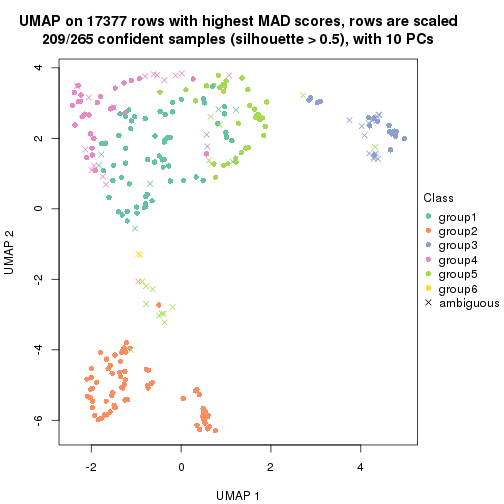</p>

</div>
</div>


Following heatmap shows how subgroups are split when increasing `k`:

```r
collect_classes(res)
```


If matrix rows can be associated to genes, consider to use `GO_Enrichment(res,
...)` to perform function enrichment for the signature genes.


 

---------------------------------------------------


### MAD:kmeans*


The object with results only for a single top-value method and a single partition method 
can be extracted as:

```r
res = res_list["MAD", "kmeans"]
# you can also extract it by
# res = res_list["MAD:kmeans"]
```

A summary of `res` and all the functions that can be applied to it:

```r
res
```

```
#> A 'ConsensusPartition' object with k = 2, 3, 4, 5, 6.
#>   On a matrix with 17377 rows and 265 columns.
#>   Top rows (1000, 2000, 3000, 4000, 5000) are extracted by 'MAD' method.
#>   Subgroups are detected by 'kmeans' method.
#>   Performed in total 1250 partitions by row resampling.
#>   Best k for subgroups seems to be 3.
#> 
#> Following methods can be applied to this 'ConsensusPartition' object:
#>  [1] "cola_report"             "collect_classes"         "collect_plots"          
#>  [4] "collect_stats"           "colnames"                "compare_signatures"     
#>  [7] "consensus_heatmap"       "dimension_reduction"     "functional_enrichment"  
#> [10] "get_anno_col"            "get_anno"                "get_classes"            
#> [13] "get_consensus"           "get_matrix"              "get_membership"         
#> [16] "get_param"               "get_signatures"          "get_stats"              
#> [19] "is_best_k"               "is_stable_k"             "membership_heatmap"     
#> [22] "ncol"                    "nrow"                    "plot_ecdf"              
#> [25] "rownames"                "select_partition_number" "show"                   
#> [28] "suggest_best_k"          "test_to_known_factors"
```

`collect_plots()` function collects all the plots made from `res` for all `k` (number of partitions)
into one single page to provide an easy and fast comparison between different `k`.

```r
collect_plots(res)
```


The plots are:

- The first row: a plot of the ECDF (Empirical cumulative distribution
  function) curves of the consensus matrix for each `k` and the heatmap of
  predicted classes for each `k`.
- The second row: heatmaps of the consensus matrix for each `k`.
- The third row: heatmaps of the membership matrix for each `k`.
- The fouth row: heatmaps of the signatures for each `k`.

All the plots in panels can be made by individual functions and they are
plotted later in this section.

`select_partition_number()` produces several plots showing different
statistics for choosing "optimized" `k`. There are following statistics:

- ECDF curves of the consensus matrix for each `k`;
- 1-PAC. [The PAC
  score](https://en.wikipedia.org/wiki/Consensus_clustering#Over-interpretation_potential_of_consensus_clustering)
  measures the proportion of the ambiguous subgrouping.
- Mean silhouette score.
- Concordance. The mean probability of fiting the consensus class ids in all
  partitions.
- Area increased. Denote $A_k$ as the area under the ECDF curve for current
  `k`, the area increased is defined as $A_k - A_{k-1}$.
- Rand index. The percent of pairs of samples that are both in a same cluster
  or both are not in a same cluster in the partition of k and k-1.
- Jaccard index. The ratio of pairs of samples are both in a same cluster in
  the partition of k and k-1 and the pairs of samples are both in a same
  cluster in the partition k or k-1.

The detailed explanations of these statistics can be found in [the cola
vignette](http://bioconductor.org/packages/devel/bioc/vignettes/cola/inst/doc/cola.html#toc_13).

Generally speaking, lower PAC score, higher mean silhouette score or higher
concordance corresponds to better partition. Rand index and Jaccard index
measure how similar the current partition is compared to partition with `k-1`.
If they are too similar, we won't accept `k` is better than `k-1`.

```r
select_partition_number(res)
```


The numeric values for all these statistics can be obtained by `get_stats()`.

```r
get_stats(res)
```

```
#>   k 1-PAC mean_silhouette concordance area_increased  Rand Jaccard
#> 2 2 0.837           0.904       0.957         0.4596 0.525   0.525
#> 3 3 0.926           0.925       0.955         0.4373 0.708   0.493
#> 4 4 0.698           0.743       0.839         0.1128 0.840   0.576
#> 5 5 0.726           0.734       0.788         0.0668 0.912   0.683
#> 6 6 0.738           0.688       0.779         0.0400 0.936   0.714
```

`suggest_best_k()` suggests the best $k$ based on these statistics. The rules are as follows:

- All $k$ with Jaccard index larger than 0.95 are removed because the increase of
  the partition number does not provides enough extra information. If all $k$ are removed,
  the best $k$ is assigned by `NA`.
- For $k$ with 1-PAC larger than 0.9, the maximal $k$ is taken as the "best k". Other $k$ is called "optional k".
- If it does not fit the second rule. The $k$ with the highest vote of highest
  1-PAC, mean silhouette and concordance is taken as the "best k".

```r
suggest_best_k(res)
```

```
#> [1] 3
```


Following shows the table of the partitions (You need to click the **show/hide
code output** link to see it). The membership matrix (columns with name `p*`)
is inferred by
[`clue::cl_consensus()`](https://www.rdocumentation.org/link/cl_consensus?package=clue)
function with the `SE` method. Basically the value in the membership matrix
represents the probability to belong to a certain group. The finall class
label for an item is determined with the group with highest probability it
belongs to.

In `get_classes()` function, the entropy is calculated from the membership
matrix and the silhouette score is calculated from the consensus matrix.


<script>
$( function() {
	$( '#tabs-MAD-kmeans-get-classes' ).tabs();
} );
</script>
<div id='tabs-MAD-kmeans-get-classes'>
<ul>
<li><a href='#tab-MAD-kmeans-get-classes-1'>k = 2</a></li>
<li><a href='#tab-MAD-kmeans-get-classes-2'>k = 3</a></li>
<li><a href='#tab-MAD-kmeans-get-classes-3'>k = 4</a></li>
<li><a href='#tab-MAD-kmeans-get-classes-4'>k = 5</a></li>
<li><a href='#tab-MAD-kmeans-get-classes-5'>k = 6</a></li>
</ul>

<div id='tab-MAD-kmeans-get-classes-1'>
<p><a id='tab-MAD-kmeans-get-classes-1-a' style='color:#0366d6' href='#'>show/hide code output</a></p>
<pre><code class="r">cbind(get_classes(res, k = 2), get_membership(res, k = 2))
</code></pre>

<pre><code>#&gt;                                      class entropy silhouette    p1    p2
#&gt; D30CF518-5FC6-4A54-8D5D-BA420EA1836D     2  0.0000     0.9104 0.000 1.000
#&gt; 92298FF7-1215-4756-B976-A7D88B91AD76     1  0.0000     0.9805 1.000 0.000
#&gt; 0E244FE2-7C17-4642-A51F-2CCA796D9C70     2  0.0000     0.9104 0.000 1.000
#&gt; 75435ED8-93E8-45FB-8480-98D8EB2EF8CB     2  0.0000     0.9104 0.000 1.000
#&gt; B6D11678-15A9-4F43-A0A2-225067DCAF1C     1  0.0000     0.9805 1.000 0.000
#&gt; B7F5A41E-9559-4329-81F5-1B88A74730B7     2  0.0000     0.9104 0.000 1.000
#&gt; 39414B2A-7FB0-4669-8DFE-86D9AF7AD2D9     1  0.0000     0.9805 1.000 0.000
#&gt; 04823F53-A12D-4852-8F34-77B9DCBB7DF0     2  0.0000     0.9104 0.000 1.000
#&gt; 49684C2B-D31C-4B45-A400-3497C3CCEC01     2  0.0000     0.9104 0.000 1.000
#&gt; 96A04875-58E2-4BE7-8E0F-CAB55F4CA54F     1  0.0000     0.9805 1.000 0.000
#&gt; 1F101D63-478B-40B9-A951-DC3887CFF067     1  0.0000     0.9805 1.000 0.000
#&gt; DD290860-E0B7-48FC-BE12-2AF729994C21     2  0.0000     0.9104 0.000 1.000
#&gt; FFDD7A12-DDEF-4974-8D60-64B7EEAAC994     2  0.0000     0.9104 0.000 1.000
#&gt; E076A9A9-EA2A-4FF7-92A8-F2DA7F30279E     1  0.9754     0.1839 0.592 0.408
#&gt; 830DFA6F-A85A-4317-82B2-791FAB998A01     2  0.0000     0.9104 0.000 1.000
#&gt; 58578614-E4A3-4655-BBAB-F65851625E0A     1  0.0000     0.9805 1.000 0.000
#&gt; 1CBFB672-4D66-430B-83F3-7CE3BE20ABF6     1  0.0000     0.9805 1.000 0.000
#&gt; 6C34A7D7-3756-4DCC-9A9F-B5FC4A148B7E     1  0.9970    -0.0484 0.532 0.468
#&gt; D97ED7B4-5DF2-4B62-8796-AA51CA79DBBB     1  0.0000     0.9805 1.000 0.000
#&gt; 45F15851-55F6-4169-834E-38958C38B6A9     1  0.0000     0.9805 1.000 0.000
#&gt; 4139E0C9-F712-4A25-8B59-587533B93B3E     2  0.9393     0.5463 0.356 0.644
#&gt; 2C3007BF-009E-404F-A3BF-8B921698D85B     1  0.0000     0.9805 1.000 0.000
#&gt; 2189F8E5-FF98-4C1A-BD04-5595DB553130     1  0.0000     0.9805 1.000 0.000
#&gt; FFAA0310-0D78-4499-8FB8-5BC46E4FCE58     1  0.9850     0.1105 0.572 0.428
#&gt; 0C375B2F-67BE-4708-BEB2-544DEC812DCA     2  0.0000     0.9104 0.000 1.000
#&gt; AB6324A1-19AB-400C-8001-54765D190E27     2  0.0000     0.9104 0.000 1.000
#&gt; A32C4DCD-DC4C-4132-9ED1-B159F5561A2D     1  0.0000     0.9805 1.000 0.000
#&gt; 2AE7105D-D494-45B0-947A-315D8C20ECDC     1  0.0000     0.9805 1.000 0.000
#&gt; 60FE9D59-FC0F-4B9C-ABF8-1C00BC761928     1  0.0000     0.9805 1.000 0.000
#&gt; 056442DC-E87A-4315-965C-C19D7B4FC40E     1  0.0000     0.9805 1.000 0.000
#&gt; 455111E5-18EF-4E3F-9DFF-8FA017D92461     1  0.0000     0.9805 1.000 0.000
#&gt; 10632BC6-0B81-433C-8832-6B2ABC73A94B     1  0.0000     0.9805 1.000 0.000
#&gt; AC6F82AD-C682-4EB3-BEC3-FD950F57609D     1  0.0000     0.9805 1.000 0.000
#&gt; D9ABDB75-04DA-4D33-A69F-701729494533     1  0.0000     0.9805 1.000 0.000
#&gt; 27BBF44D-F4D7-4C5A-935F-3310A363A670     2  0.0000     0.9104 0.000 1.000
#&gt; E7AA12EE-6E14-4B33-A52C-B13589436023     1  0.0000     0.9805 1.000 0.000
#&gt; DFA6D41A-D231-413E-A180-E42DF26C3E2B     2  0.6887     0.7767 0.184 0.816
#&gt; 655BD3AF-5094-4B19-93A8-401C70369B17     2  0.0000     0.9104 0.000 1.000
#&gt; 9DFEF253-923F-4EE2-8E3D-C75805387B20     1  0.0000     0.9805 1.000 0.000
#&gt; 3B0EE948-B2CD-4191-90E2-BDD155F3B580     1  0.0000     0.9805 1.000 0.000
#&gt; 177C7EF4-2D54-4555-947C-44EE7C688917     2  0.9795     0.4212 0.416 0.584
#&gt; 1F8E8BB7-D159-4556-8B04-E5DD027CC444     2  0.0000     0.9104 0.000 1.000
#&gt; 619F37D2-6771-4727-9079-56BED07F1CF6     2  0.9087     0.6202 0.324 0.676
#&gt; ACAE29BE-ECB8-4A98-BC71-7A2D4857134E     1  0.0000     0.9805 1.000 0.000
#&gt; C5C3241A-684C-4238-9333-9AF8630EC086     2  0.0000     0.9104 0.000 1.000
#&gt; AD319DC2-140F-4E7B-A899-010687D8B714     2  0.0000     0.9104 0.000 1.000
#&gt; 2AFF397C-ED2A-4FD9-A7F0-E4C61E9FB603     2  0.9044     0.6268 0.320 0.680
#&gt; FB4C7892-3DBB-4148-AAE9-75B19A1A4031     1  0.0000     0.9805 1.000 0.000
#&gt; 6F5C4500-1ED1-4E81-B4F5-EEA64CE2336A     1  0.0000     0.9805 1.000 0.000
#&gt; BD027C69-3C10-4047-8E1E-218600FF2B73     2  0.0000     0.9104 0.000 1.000
#&gt; 11B473A9-4CC5-461F-BC57-CC9141F3591D     1  0.0000     0.9805 1.000 0.000
#&gt; 69A036E5-3E6A-4862-A7F8-2D203ED2FC9E     1  0.0000     0.9805 1.000 0.000
#&gt; 9C0BDF24-F011-4855-B95A-1B6BEFA808F7     1  0.0000     0.9805 1.000 0.000
#&gt; 9E205254-8C0C-4C05-AF5A-86E679CF732C     1  0.0000     0.9805 1.000 0.000
#&gt; 935CCE4A-8AA8-454E-9DFF-7DE27D0BD2E2     1  0.0000     0.9805 1.000 0.000
#&gt; 01E5E1FE-41D3-428B-90BC-7A000829E102     1  0.0000     0.9805 1.000 0.000
#&gt; B344A530-92CD-468B-847A-DF8E25688081     2  0.9044     0.6268 0.320 0.680
#&gt; F79F32A7-9F7B-4D62-8426-4A4CF10ED319     1  0.0000     0.9805 1.000 0.000
#&gt; C2E1C6FA-82F9-467C-99AE-9B39FAAC810C     1  0.0000     0.9805 1.000 0.000
#&gt; BF7CD9BD-776A-4957-8A6E-EF8AD83EA9D3     2  0.0000     0.9104 0.000 1.000
#&gt; 8A2C1409-E83B-435E-A20F-5FCA94801C9F     2  0.0000     0.9104 0.000 1.000
#&gt; B6BEFFB5-2F62-477B-A4C8-478D29577CBD     2  0.0000     0.9104 0.000 1.000
#&gt; 8622CBD0-F8E9-4AC1-8175-CC9A742B86F9     1  0.0000     0.9805 1.000 0.000
#&gt; 565DD660-ED58-4065-8619-260BEA6FCFEB     1  0.0000     0.9805 1.000 0.000
#&gt; 96038E42-0FBA-497D-819C-38F7689F10FF     1  0.0000     0.9805 1.000 0.000
#&gt; CA685549-F8BA-43F1-8461-5D2D3B17CFC5     1  0.0000     0.9805 1.000 0.000
#&gt; 52020307-71A6-46E5-ACB3-8F885CA8F1EB     1  0.0000     0.9805 1.000 0.000
#&gt; 7656DA98-76DC-424B-B02C-D7001DAAA0E4     1  0.0000     0.9805 1.000 0.000
#&gt; 74DBA640-45E2-42A6-8F1E-69C073D66EE6     1  0.0000     0.9805 1.000 0.000
#&gt; 251094BE-C33D-44F0-BD98-8618D71F520C     1  0.0000     0.9805 1.000 0.000
#&gt; AB914CC5-5FF1-4257-A353-6A99D11B9478     1  0.0000     0.9805 1.000 0.000
#&gt; 38B8B893-0E08-4B71-B51C-B32A7B2724E0     1  0.0000     0.9805 1.000 0.000
#&gt; 7C7CD8FF-99A4-41D7-B7E1-5A517001F551     2  0.0000     0.9104 0.000 1.000
#&gt; BFC5B75A-E4AE-486B-BA30-23BBAA33A125     2  0.0000     0.9104 0.000 1.000
#&gt; 182AC78E-A07C-4B34-B216-B5F573E9F036     2  0.7453     0.7512 0.212 0.788
#&gt; B38C5F72-8F46-4531-9C2D-96EEE07A5B22     2  0.0000     0.9104 0.000 1.000
#&gt; DB9333A6-A723-4B8F-9221-25B8B23D5126     1  0.0000     0.9805 1.000 0.000
#&gt; CD67DD21-C1B6-4D58-AC8E-1F4536C7DA70     2  0.9044     0.6268 0.320 0.680
#&gt; 3D76A56E-4B66-48AE-AA60-D9C1004C7140     1  0.0000     0.9805 1.000 0.000
#&gt; 71ED572F-7780-47A4-A9F8-D320C737690D     1  0.0000     0.9805 1.000 0.000
#&gt; B449FEA1-C4B0-400F-903C-59E13D0BA313     2  0.0000     0.9104 0.000 1.000
#&gt; 3F120E90-1486-4215-B9B9-79D5B413CAAC     2  0.9732     0.4518 0.404 0.596
#&gt; A071894B-D8C0-4740-BD55-93EA0C86EDF7     1  0.0000     0.9805 1.000 0.000
#&gt; 58848D57-D7A9-4ABB-86A2-A8AE2B23F654     1  0.0000     0.9805 1.000 0.000
#&gt; CD6F9E20-B301-4663-87EC-953EDF49754F     2  0.9044     0.6268 0.320 0.680
#&gt; 367D89F3-D527-4929-B830-8B6D553DF9E1     1  0.0000     0.9805 1.000 0.000
#&gt; BE8D7DCB-648B-42DD-9FA8-8B85B5D816B2     1  0.0000     0.9805 1.000 0.000
#&gt; AA46F56B-BD9C-40A4-8EA8-35E2568C964D     2  0.0000     0.9104 0.000 1.000
#&gt; 6393220A-7C57-413F-81A8-4E38C21E779E     2  0.0000     0.9104 0.000 1.000
#&gt; 89AE566C-F65F-43C2-BA97-621A7AC8B6DC     1  0.0000     0.9805 1.000 0.000
#&gt; AA6A4BFF-8C62-4B70-B85A-9EDF403B06BA     1  0.0000     0.9805 1.000 0.000
#&gt; BCE877A6-9C65-4495-A45D-05753F2D0E15     1  0.0000     0.9805 1.000 0.000
#&gt; D7BDDF49-C54B-4F8E-ACA0-C3684AB68B5C     1  0.0000     0.9805 1.000 0.000
#&gt; D0800D49-0033-44B2-8D7B-29B16F87ADA6     2  0.0000     0.9104 0.000 1.000
#&gt; 151D60B5-5AF1-4B61-B97F-ABC7531D9F89     1  0.0000     0.9805 1.000 0.000
#&gt; CBBAEB5B-25FA-4B6D-A40C-357E37033E36     1  0.0000     0.9805 1.000 0.000
#&gt; 317CD049-3151-40B7-8E88-B0B8813338D6     1  0.0000     0.9805 1.000 0.000
#&gt; 93835C77-F8FA-4928-843C-8016A91881FA     1  0.0000     0.9805 1.000 0.000
#&gt; 02A6950F-647D-4F20-B2D0-0238C1441C70     1  0.0000     0.9805 1.000 0.000
#&gt; 4D54E415-134F-4F6F-8718-3E0475EF5477     1  0.0000     0.9805 1.000 0.000
#&gt; 82AB290A-3993-45E5-8B15-6125A019778C     1  0.0000     0.9805 1.000 0.000
#&gt; 3B5EAD14-E506-4A22-804D-BF925A2D5247     2  0.0000     0.9104 0.000 1.000
#&gt; 19CF7DDF-4F3A-4D2F-B84A-6451A5C3112C     2  0.9393     0.5592 0.356 0.644
#&gt; 2FB00DAA-C274-42B1-A06B-611FE5E96844     1  0.0000     0.9805 1.000 0.000
#&gt; 2B1F01C3-8145-4296-8111-2B0474AB9A2C     2  0.0000     0.9104 0.000 1.000
#&gt; 3F0865F1-8256-4778-966F-D53637B415B6     2  0.9170     0.6059 0.332 0.668
#&gt; 5473210D-37F9-4192-86D2-E2A2C77F3BD2     2  0.9044     0.6268 0.320 0.680
#&gt; 5EDB6ACF-4F3F-471A-9DDC-661607CACCC4     1  0.0000     0.9805 1.000 0.000
#&gt; 6A252A3A-7EEB-47B6-9C23-D69BD2EA846F     2  0.9044     0.6268 0.320 0.680
#&gt; 0A7FFCBB-4BAA-4A5F-8B2D-B427C4D982A8     1  0.0000     0.9805 1.000 0.000
#&gt; 1603AFB8-5AD7-4794-9991-BDBE96B4D997     2  0.0000     0.9104 0.000 1.000
#&gt; 644299E9-62B7-4DFE-9E6D-D7556A01B40A     1  0.0000     0.9805 1.000 0.000
#&gt; EF12E923-1860-4269-B57B-BA6238FA4403     1  0.0000     0.9805 1.000 0.000
#&gt; 51B7241E-F0BE-482A-88AE-89004BB68989     1  0.0000     0.9805 1.000 0.000
#&gt; 1C007DF3-8A9F-4940-9A4C-DE2A412BB023     2  0.9044     0.6268 0.320 0.680
#&gt; 89FCFDE6-9625-432C-AA35-9C5FCCF40031     1  0.0000     0.9805 1.000 0.000
#&gt; 7955FC55-386D-497E-AFED-019BBBAD428E     2  0.9044     0.6268 0.320 0.680
#&gt; 37FF09ED-73EC-4D10-B2AC-7D8EBA9304ED     1  0.0376     0.9764 0.996 0.004
#&gt; C2CD2742-2FB4-468E-90FF-8F65A5C425A9     1  0.0000     0.9805 1.000 0.000
#&gt; 766FE08F-3393-4868-B1C1-FA98C9FF16E0     1  0.0000     0.9805 1.000 0.000
#&gt; 63E2B578-2221-4255-8C45-7FD030B1C94D     1  0.0000     0.9805 1.000 0.000
#&gt; C14B1A44-43F7-45F0-A583-5667A4D3BD95     1  0.0000     0.9805 1.000 0.000
#&gt; D9CB551A-CE20-4BF7-8AC9-839112346C3D     1  0.0000     0.9805 1.000 0.000
#&gt; 05BAA71A-E5B3-4A3A-A3F2-013A975087F0     2  0.0000     0.9104 0.000 1.000
#&gt; AC8DA7DE-4D83-4768-BEFD-9A1B2DA943CE     1  0.9977    -0.0659 0.528 0.472
#&gt; E89DCE9D-F8A5-499C-85BB-BB500BADB9FB     1  0.0000     0.9805 1.000 0.000
#&gt; C16F9B5E-2B52-40F6-856D-C0D6FBDD16C1     1  0.0000     0.9805 1.000 0.000
#&gt; 8FF234D4-823A-4C80-82F7-2E92D72DBF88     2  0.0000     0.9104 0.000 1.000
#&gt; C9F94A6E-D104-4D8D-8EC5-EADECD85F092     2  0.7453     0.7512 0.212 0.788
#&gt; 45C9756F-A154-4537-852E-ECBF27B92FE1     2  0.0000     0.9104 0.000 1.000
#&gt; 0F1A5708-341E-4713-BC70-76D702F826D6     2  0.8016     0.7181 0.244 0.756
#&gt; 2ECFBCA0-AB35-461A-A4B5-C60B2651A962     2  0.0000     0.9104 0.000 1.000
#&gt; 7DFAC404-3AB3-4274-A533-CFDAF4CE122D     1  0.0000     0.9805 1.000 0.000
#&gt; A90AF55C-4386-42AB-A812-9230026EA5A5     2  0.0000     0.9104 0.000 1.000
#&gt; 6258A757-4E18-4CD1-8417-189521E990B6     2  0.0000     0.9104 0.000 1.000
#&gt; EBFAD137-050F-47D0-A43D-72B8F7D70C2B     1  0.0000     0.9805 1.000 0.000
#&gt; 08B5EBFB-2807-4229-95A6-81AB7F377A56     2  0.0000     0.9104 0.000 1.000
#&gt; 4780A59C-0589-4995-B044-3201F09AF859     1  0.0000     0.9805 1.000 0.000
#&gt; 0AB81429-C287-48AA-9035-3A7A6F4C7328     2  0.0000     0.9104 0.000 1.000
#&gt; 20C4D047-28DA-4AB7-9B3C-32EDA6B22C9D     2  0.9129     0.6132 0.328 0.672
#&gt; 77C4E01F-84A6-4BFD-AA8E-D7875456F546     2  0.9044     0.6268 0.320 0.680
#&gt; 8B28383F-CF14-4CC5-A1E2-72AD915C0AE8     1  0.0000     0.9805 1.000 0.000
#&gt; E12E1F48-6A52-4F74-925C-C4EE1BF5C573     2  0.0000     0.9104 0.000 1.000
#&gt; 9B179BC5-BB4C-4CEE-99BC-BC552BC384A1     1  0.0000     0.9805 1.000 0.000
#&gt; 5548C91A-D3DE-48F5-B4A4-124BE177B99A     1  0.0000     0.9805 1.000 0.000
#&gt; 0E22B729-C381-4B0C-9897-62DD38F51722     1  0.0000     0.9805 1.000 0.000
#&gt; 7BC4937F-04E2-4B46-BA7C-FE9AC738C8A9     1  0.0000     0.9805 1.000 0.000
#&gt; EE6A0D3F-3F8A-4AA8-B3EF-32372EF37A29     1  0.0000     0.9805 1.000 0.000
#&gt; 08AC2706-7651-409F-BE6B-BCED1C2D1796     1  0.0000     0.9805 1.000 0.000
#&gt; A68B078D-8979-4070-BB4D-F526704ED3DC     1  0.0000     0.9805 1.000 0.000
#&gt; C319A5EE-69FA-4AAB-85A9-2EAAD8E4C703     1  0.0376     0.9764 0.996 0.004
#&gt; 0D7CAABD-D20C-4F82-BCBC-8B7276E8EDE2     1  0.0000     0.9805 1.000 0.000
#&gt; 09444DCC-44BA-4A3F-ACC5-863A54578B9F     1  0.0000     0.9805 1.000 0.000
#&gt; 2E32B047-C6E1-4743-A6C8-E98370A32145     1  0.0000     0.9805 1.000 0.000
#&gt; 6A6878A7-76B2-40DE-958B-804442AC6A5D     1  0.0000     0.9805 1.000 0.000
#&gt; 39F27293-0BFF-4EA2-8439-A299E3226D20     1  0.0000     0.9805 1.000 0.000
#&gt; 7EAE9C30-6080-405F-A7E6-1FED57674279     1  0.0000     0.9805 1.000 0.000
#&gt; 79499169-A093-4E0A-B6BD-010CD7BE5035     1  0.0000     0.9805 1.000 0.000
#&gt; 1F8BF4E8-BD84-4EFE-9E3E-89E7CE8FA72D     2  0.9044     0.6268 0.320 0.680
#&gt; 62B7988F-98E5-4AB8-8A16-D661A07455E8     1  0.0000     0.9805 1.000 0.000
#&gt; B7005B5F-217E-4073-BFB5-CE7E884B80C0     2  0.0000     0.9104 0.000 1.000
#&gt; B981568F-2C08-4696-B589-E157A49BE72B     2  0.0000     0.9104 0.000 1.000
#&gt; A3D85C0A-3202-40C2-88E1-052AC6C5184B     1  0.0000     0.9805 1.000 0.000
#&gt; 4CA783B9-9B99-46B8-962A-77194ECB7942     2  0.9044     0.6268 0.320 0.680
#&gt; D4024B08-4879-47EA-99E5-D9FCE1CD40DF     1  0.0000     0.9805 1.000 0.000
#&gt; 1D41CDA2-0B29-48FD-B83A-E60C174DBCB3     1  0.0000     0.9805 1.000 0.000
#&gt; A1923B2A-B233-4760-8AF9-C04C1CAEB100     1  0.0000     0.9805 1.000 0.000
#&gt; 80880D71-BFDE-4D88-892F-5ADF27A38940     1  0.5059     0.8449 0.888 0.112
#&gt; 55D1629D-30FD-49AA-88CE-EA3CA9B30A3F     2  0.0000     0.9104 0.000 1.000
#&gt; B71C409E-926D-48AD-8BD8-9F707CA4FB01     2  0.0000     0.9104 0.000 1.000
#&gt; 54A92C57-BD19-4A47-BA76-3ACA2DC36212     1  0.0000     0.9805 1.000 0.000
#&gt; B2AB74B8-506C-4C27-9105-E86A6AAA89D4     1  0.0000     0.9805 1.000 0.000
#&gt; 0356AE49-7A5C-42CC-A39C-7C8DFBFF8842     2  0.0000     0.9104 0.000 1.000
#&gt; ACA260A3-DC3F-4FF4-B9C5-2D4BC4F81783     1  0.0000     0.9805 1.000 0.000
#&gt; 9B440917-E5A4-43B9-A48D-6ABFEDCA6CFD     1  0.0000     0.9805 1.000 0.000
#&gt; 47464828-52EA-413B-B30C-BD8B55903D78     2  0.0000     0.9104 0.000 1.000
#&gt; C1D1FC82-B50D-4C82-8F03-06CEE3C08D18     1  0.0000     0.9805 1.000 0.000
#&gt; E5ABFC43-E2A3-4B1A-BBA3-8196C0B026A5     2  0.0000     0.9104 0.000 1.000
#&gt; 1D3C16CC-D0D5-4637-AAC7-91672DFF3317     1  0.0000     0.9805 1.000 0.000
#&gt; 4D038320-ADEA-4990-8371-68B4B8162E1A     2  0.0000     0.9104 0.000 1.000
#&gt; A75594CC-3E49-4869-8656-BBB4E72BF59D     2  0.0000     0.9104 0.000 1.000
#&gt; 7CABAA19-5FB2-4A58-BDA3-4F1FFB532C20     1  0.0000     0.9805 1.000 0.000
#&gt; 534EF1E9-9513-426E-B41E-A394AB2E4410     2  0.0000     0.9104 0.000 1.000
#&gt; 649F35A1-A08C-497D-A9B6-CB3084D5FB8D     1  0.0000     0.9805 1.000 0.000
#&gt; 7CA30F3C-1C98-480C-B8B5-A248AABFB468     1  0.0000     0.9805 1.000 0.000
#&gt; A9F8DA21-A802-44CF-9F5D-96A36687DCDD     2  0.9129     0.6132 0.328 0.672
#&gt; A7AE1ED1-86CB-4A50-97B2-66785C7191FE     1  0.0000     0.9805 1.000 0.000
#&gt; D0091AD4-D3D7-4C03-ACD9-DA9F8B6076C6     1  0.0000     0.9805 1.000 0.000
#&gt; 46EE1C2B-13F7-44A7-B27E-4EBB9DF0CA83     2  0.0000     0.9104 0.000 1.000
#&gt; CB9301B8-0282-43D6-AF5E-B753A9C7BFCB     2  0.0000     0.9104 0.000 1.000
#&gt; A0E77A39-885A-4472-9A10-2D1E51DBFDA4     1  0.0000     0.9805 1.000 0.000
#&gt; C06603C2-163D-40B6-A9FE-882424F18FE9     1  0.0000     0.9805 1.000 0.000
#&gt; C3921A29-80FF-4B9D-B366-5C0238A42231     1  0.0000     0.9805 1.000 0.000
#&gt; BB99B4E7-C834-4BB8-973F-8FA039E2798F     1  0.0000     0.9805 1.000 0.000
#&gt; 5CD78C2F-05E9-409A-8405-3EE936A6876E     2  0.9044     0.6268 0.320 0.680
#&gt; 6C126CC7-0C03-48F0-A2C2-F090CA239B70     2  0.0000     0.9104 0.000 1.000
#&gt; 7118B08A-E94C-49F4-8D76-26455C34D85F     2  0.0000     0.9104 0.000 1.000
#&gt; 266DAF30-CF3E-493E-8B24-3931D0039450     1  0.0000     0.9805 1.000 0.000
#&gt; DAB5F5B9-4FE5-468F-AD2B-B39BBC4317A0     1  0.7883     0.6422 0.764 0.236
#&gt; 9A9EB6D6-312E-4A98-8762-30D3ABD8193D     2  0.9044     0.6268 0.320 0.680
#&gt; CED15676-B901-4FC8-9C8D-51E529D9441D     1  0.0000     0.9805 1.000 0.000
#&gt; 827232CC-8035-440C-8B12-02C789C70B1B     1  0.0000     0.9805 1.000 0.000
#&gt; 04D5FB28-FB50-4EAE-95FB-72ABF0E618CA     2  0.0000     0.9104 0.000 1.000
#&gt; 6C96A851-97FC-4845-B895-D255191D9F25     1  0.0000     0.9805 1.000 0.000
#&gt; 3EC982CB-D013-443E-B21D-39DE6B8EF370     2  0.9044     0.6268 0.320 0.680
#&gt; 2E24A786-4370-42A1-AD50-D651F89819CC     2  0.0000     0.9104 0.000 1.000
#&gt; 7653BFA9-ADA5-44CA-8555-807FBBFC6DE2     1  0.0000     0.9805 1.000 0.000
#&gt; 7A110994-5741-4013-91F0-DD2E1D343F91     2  0.0000     0.9104 0.000 1.000
#&gt; 0A760E0C-11C5-4201-8452-18DBC1FEACEB     1  0.0000     0.9805 1.000 0.000
#&gt; 909B76A1-BB9F-4906-95BC-58CD1A46D3B8     2  0.0000     0.9104 0.000 1.000
#&gt; A782EE71-EDA4-4385-83B3-D16DE81296C0     1  0.0000     0.9805 1.000 0.000
#&gt; BD50E276-914F-4924-8CEA-FF47A66DB175     2  0.0000     0.9104 0.000 1.000
#&gt; 505D5CA8-0279-4BC7-8CC0-8C7A0165BF91     2  0.0000     0.9104 0.000 1.000
#&gt; D51FC997-E662-4AE7-BC9C-14183DA42DE1     2  0.0000     0.9104 0.000 1.000
#&gt; 8AD67970-84F1-4C0A-B47A-8FA4108F9FE3     1  0.0000     0.9805 1.000 0.000
#&gt; 6E33B1B6-7089-4BC3-B2B0-EC2C3B5D8B74     1  0.0000     0.9805 1.000 0.000
#&gt; 88C4EA46-2546-401C-A8E7-603EECFDFBA0     1  0.0000     0.9805 1.000 0.000
#&gt; 375D2D72-C998-4627-BA35-24E82A9A55FF     1  0.0000     0.9805 1.000 0.000
#&gt; 76D0F834-7064-46C6-96F4-E861CF5452B6     2  0.0000     0.9104 0.000 1.000
#&gt; 87159081-C97A-4004-AF0A-7EB6EF0EC47A     1  0.0000     0.9805 1.000 0.000
#&gt; 24A57006-800B-4174-AF4E-7EA57A8A756E     1  0.0000     0.9805 1.000 0.000
#&gt; AD68CBC6-8A13-4A65-AF62-E99AFA81D031     2  0.9044     0.6268 0.320 0.680
#&gt; 22863A57-F066-4DD1-A859-4336F43D144C     1  0.0000     0.9805 1.000 0.000
#&gt; 8F6F0362-9165-4DCC-992C-AF871A3C51E7     1  0.0000     0.9805 1.000 0.000
#&gt; 76ABF0B7-E707-4DB2-9486-3814439BDBA5     1  0.0000     0.9805 1.000 0.000
#&gt; BC72372F-3577-40E5-BA0F-41A084AA93AD     1  0.0000     0.9805 1.000 0.000
#&gt; 8E566039-B56C-4F41-B9EF-DE18BEEF2C95     1  0.0000     0.9805 1.000 0.000
#&gt; F096F016-3EF5-4A67-A7C2-8A45E1585232     1  0.0000     0.9805 1.000 0.000
#&gt; BB37913E-534B-43DD-BE3D-E13B29FD8172     2  0.0000     0.9104 0.000 1.000
#&gt; E344638F-9060-460F-8F7A-60D19442F294     1  0.7453     0.6878 0.788 0.212
#&gt; 6A0EAAD0-89D5-4F12-8B45-9D5A25182FAD     2  0.0000     0.9104 0.000 1.000
#&gt; A5199E3A-9D67-4543-88AB-24398C98E38E     1  0.0000     0.9805 1.000 0.000
#&gt; 23917D52-7864-4F84-9C77-DF8EA9407345     2  0.0000     0.9104 0.000 1.000
#&gt; 9AA96080-19D8-40C3-BDD1-6044D2D422D5     1  0.0000     0.9805 1.000 0.000
#&gt; 0ED65D91-260C-4662-9903-EE36A2E3B2D0     2  0.0000     0.9104 0.000 1.000
#&gt; 64BF1BC5-7A9A-4E1D-AEAB-AFE30B92AAF4     1  0.9815     0.1409 0.580 0.420
#&gt; F02301F1-9054-4DC6-8DC9-2451A0F53EFC     2  0.0000     0.9104 0.000 1.000
#&gt; 3264649A-5684-4181-83D0-A7E4D7E2E1FD     1  0.0000     0.9805 1.000 0.000
#&gt; 3F8DA39C-BC9B-4343-8838-5CE271E80C51     1  0.0938     0.9680 0.988 0.012
#&gt; BCC681CB-2AF4-4BB6-B53A-7544A2399454     1  0.0000     0.9805 1.000 0.000
#&gt; DCB50E17-5E2D-443B-8DCC-272FBB734C2E     1  0.0000     0.9805 1.000 0.000
#&gt; B5E47C38-CB6A-44C0-AA9B-56951B9EF78D     1  0.0000     0.9805 1.000 0.000
#&gt; B15B0185-9C28-4A00-9CEC-05EFECEA6709     1  0.0000     0.9805 1.000 0.000
#&gt; 61D4E8E7-0110-480A-A4A7-D406DE74C31E     1  0.0000     0.9805 1.000 0.000
#&gt; CA8DB3AD-3F6B-4622-BF73-47041EC96E42     1  0.0000     0.9805 1.000 0.000
#&gt; 5EECB1C4-172C-4494-871A-ADB650CD82BD     2  0.0000     0.9104 0.000 1.000
#&gt; 019B857C-D4F7-4B67-B699-56E52A60805B     2  0.0000     0.9104 0.000 1.000
#&gt; E9C28902-05C9-4883-97A4-D612D54E46B4     1  0.0000     0.9805 1.000 0.000
#&gt; C5D3D9A0-FC14-408D-AB6C-662018A5E5CA     1  0.0000     0.9805 1.000 0.000
#&gt; 7EB24744-509B-4854-B7D0-0BAFA210A345     2  0.0000     0.9104 0.000 1.000
#&gt; B8B7A721-2284-40AB-98F5-EF1351C30B66     2  0.0000     0.9104 0.000 1.000
#&gt; 3C12F39D-0D21-4F69-A539-4120B73C7A79     2  0.0000     0.9104 0.000 1.000
#&gt; 08D3F984-6850-45B2-9DF9-EC7F5A4060A4     1  0.0000     0.9805 1.000 0.000
#&gt; 9BD0EE79-1EED-4F6D-A5AB-43ADB8526F1E     1  0.0000     0.9805 1.000 0.000
#&gt; E489A871-3CF4-4F3D-8EAF-63B507054201     2  0.0000     0.9104 0.000 1.000
#&gt; 8CF8FD2E-1DBA-4257-9715-04D956D46B71     2  0.0000     0.9104 0.000 1.000
#&gt; F6193AF0-7A19-46CB-A818-1B01E7460791     1  0.0000     0.9805 1.000 0.000
#&gt; 96392D6B-D4FF-4393-93BA-08E469E8BBE1     1  0.0000     0.9805 1.000 0.000
#&gt; DABCBE5A-C591-46A2-AF66-DA3DB6106751     1  0.0000     0.9805 1.000 0.000
#&gt; 8B75F7D4-98D8-44DE-B19D-B733D6A031DB     1  0.0000     0.9805 1.000 0.000
#&gt; AAD9685A-564B-42E9-91E3-431951154BA7     2  0.0000     0.9104 0.000 1.000
#&gt; 90A43152-4E3B-4365-A39F-7B0E5CA66E55     1  0.0000     0.9805 1.000 0.000
#&gt; EFB76FCF-AC9C-4852-B91C-E055DA666FA0     1  0.0000     0.9805 1.000 0.000
#&gt; 6EBCFFE3-706F-440A-ABA9-012A924A07C6     2  0.0000     0.9104 0.000 1.000
#&gt; E922A244-F1C8-4310-ABB2-62B06E022E4C     1  0.0000     0.9805 1.000 0.000
</code></pre>

<script>
$('#tab-MAD-kmeans-get-classes-1-a').parent().next().next().hide();
$('#tab-MAD-kmeans-get-classes-1-a').click(function(){
  $('#tab-MAD-kmeans-get-classes-1-a').parent().next().next().toggle();
  return(false);
});
</script>
</div>

<div id='tab-MAD-kmeans-get-classes-2'>
<p><a id='tab-MAD-kmeans-get-classes-2-a' style='color:#0366d6' href='#'>show/hide code output</a></p>
<pre><code class="r">cbind(get_classes(res, k = 3), get_membership(res, k = 3))
</code></pre>

<pre><code>#&gt;                                      class entropy silhouette    p1    p2    p3
#&gt; D30CF518-5FC6-4A54-8D5D-BA420EA1836D     2  0.0000     0.9854 0.000 1.000 0.000
#&gt; 92298FF7-1215-4756-B976-A7D88B91AD76     1  0.0000     0.9601 1.000 0.000 0.000
#&gt; 0E244FE2-7C17-4642-A51F-2CCA796D9C70     2  0.0000     0.9854 0.000 1.000 0.000
#&gt; 75435ED8-93E8-45FB-8480-98D8EB2EF8CB     2  0.0000     0.9854 0.000 1.000 0.000
#&gt; B6D11678-15A9-4F43-A0A2-225067DCAF1C     3  0.1529     0.9385 0.040 0.000 0.960
#&gt; B7F5A41E-9559-4329-81F5-1B88A74730B7     2  0.0892     0.9850 0.000 0.980 0.020
#&gt; 39414B2A-7FB0-4669-8DFE-86D9AF7AD2D9     3  0.1031     0.9431 0.024 0.000 0.976
#&gt; 04823F53-A12D-4852-8F34-77B9DCBB7DF0     2  0.0892     0.9850 0.000 0.980 0.020
#&gt; 49684C2B-D31C-4B45-A400-3497C3CCEC01     2  0.0000     0.9854 0.000 1.000 0.000
#&gt; 96A04875-58E2-4BE7-8E0F-CAB55F4CA54F     1  0.0000     0.9601 1.000 0.000 0.000
#&gt; 1F101D63-478B-40B9-A951-DC3887CFF067     1  0.5431     0.5634 0.716 0.000 0.284
#&gt; DD290860-E0B7-48FC-BE12-2AF729994C21     2  0.0747     0.9851 0.000 0.984 0.016
#&gt; FFDD7A12-DDEF-4974-8D60-64B7EEAAC994     2  0.0892     0.9850 0.000 0.980 0.020
#&gt; E076A9A9-EA2A-4FF7-92A8-F2DA7F30279E     3  0.1129     0.9436 0.020 0.004 0.976
#&gt; 830DFA6F-A85A-4317-82B2-791FAB998A01     2  0.0592     0.9812 0.000 0.988 0.012
#&gt; 58578614-E4A3-4655-BBAB-F65851625E0A     1  0.0892     0.9542 0.980 0.000 0.020
#&gt; 1CBFB672-4D66-430B-83F3-7CE3BE20ABF6     1  0.2261     0.8969 0.932 0.000 0.068
#&gt; 6C34A7D7-3756-4DCC-9A9F-B5FC4A148B7E     3  0.1647     0.9437 0.036 0.004 0.960
#&gt; D97ED7B4-5DF2-4B62-8796-AA51CA79DBBB     1  0.0000     0.9601 1.000 0.000 0.000
#&gt; 45F15851-55F6-4169-834E-38958C38B6A9     1  0.0000     0.9601 1.000 0.000 0.000
#&gt; 4139E0C9-F712-4A25-8B59-587533B93B3E     3  0.6226     0.6738 0.028 0.252 0.720
#&gt; 2C3007BF-009E-404F-A3BF-8B921698D85B     1  0.0747     0.9557 0.984 0.000 0.016
#&gt; 2189F8E5-FF98-4C1A-BD04-5595DB553130     3  0.4796     0.7597 0.220 0.000 0.780
#&gt; FFAA0310-0D78-4499-8FB8-5BC46E4FCE58     3  0.1129     0.9436 0.020 0.004 0.976
#&gt; 0C375B2F-67BE-4708-BEB2-544DEC812DCA     2  0.0000     0.9854 0.000 1.000 0.000
#&gt; AB6324A1-19AB-400C-8001-54765D190E27     2  0.0892     0.9850 0.000 0.980 0.020
#&gt; A32C4DCD-DC4C-4132-9ED1-B159F5561A2D     1  0.0000     0.9601 1.000 0.000 0.000
#&gt; 2AE7105D-D494-45B0-947A-315D8C20ECDC     1  0.1163     0.9499 0.972 0.000 0.028
#&gt; 60FE9D59-FC0F-4B9C-ABF8-1C00BC761928     1  0.0000     0.9601 1.000 0.000 0.000
#&gt; 056442DC-E87A-4315-965C-C19D7B4FC40E     1  0.0000     0.9601 1.000 0.000 0.000
#&gt; 455111E5-18EF-4E3F-9DFF-8FA017D92461     3  0.0892     0.9431 0.020 0.000 0.980
#&gt; 10632BC6-0B81-433C-8832-6B2ABC73A94B     1  0.0000     0.9601 1.000 0.000 0.000
#&gt; AC6F82AD-C682-4EB3-BEC3-FD950F57609D     1  0.0000     0.9601 1.000 0.000 0.000
#&gt; D9ABDB75-04DA-4D33-A69F-701729494533     1  0.0000     0.9601 1.000 0.000 0.000
#&gt; 27BBF44D-F4D7-4C5A-935F-3310A363A670     2  0.0892     0.9850 0.000 0.980 0.020
#&gt; E7AA12EE-6E14-4B33-A52C-B13589436023     1  0.0000     0.9601 1.000 0.000 0.000
#&gt; DFA6D41A-D231-413E-A180-E42DF26C3E2B     3  0.5623     0.6293 0.004 0.280 0.716
#&gt; 655BD3AF-5094-4B19-93A8-401C70369B17     2  0.0892     0.9850 0.000 0.980 0.020
#&gt; 9DFEF253-923F-4EE2-8E3D-C75805387B20     1  0.0000     0.9601 1.000 0.000 0.000
#&gt; 3B0EE948-B2CD-4191-90E2-BDD155F3B580     3  0.2356     0.9299 0.072 0.000 0.928
#&gt; 177C7EF4-2D54-4555-947C-44EE7C688917     3  0.1774     0.9428 0.024 0.016 0.960
#&gt; 1F8E8BB7-D159-4556-8B04-E5DD027CC444     2  0.0892     0.9850 0.000 0.980 0.020
#&gt; 619F37D2-6771-4727-9079-56BED07F1CF6     3  0.1774     0.9428 0.024 0.016 0.960
#&gt; ACAE29BE-ECB8-4A98-BC71-7A2D4857134E     3  0.1411     0.9438 0.036 0.000 0.964
#&gt; C5C3241A-684C-4238-9333-9AF8630EC086     2  0.0000     0.9854 0.000 1.000 0.000
#&gt; AD319DC2-140F-4E7B-A899-010687D8B714     2  0.0000     0.9854 0.000 1.000 0.000
#&gt; 2AFF397C-ED2A-4FD9-A7F0-E4C61E9FB603     3  0.1636     0.9423 0.020 0.016 0.964
#&gt; FB4C7892-3DBB-4148-AAE9-75B19A1A4031     3  0.1529     0.9430 0.040 0.000 0.960
#&gt; 6F5C4500-1ED1-4E81-B4F5-EEA64CE2336A     1  0.0892     0.9542 0.980 0.000 0.020
#&gt; BD027C69-3C10-4047-8E1E-218600FF2B73     2  0.0892     0.9850 0.000 0.980 0.020
#&gt; 11B473A9-4CC5-461F-BC57-CC9141F3591D     3  0.1411     0.9402 0.036 0.000 0.964
#&gt; 69A036E5-3E6A-4862-A7F8-2D203ED2FC9E     1  0.5621     0.5545 0.692 0.000 0.308
#&gt; 9C0BDF24-F011-4855-B95A-1B6BEFA808F7     1  0.0000     0.9601 1.000 0.000 0.000
#&gt; 9E205254-8C0C-4C05-AF5A-86E679CF732C     3  0.3340     0.8912 0.120 0.000 0.880
#&gt; 935CCE4A-8AA8-454E-9DFF-7DE27D0BD2E2     3  0.4931     0.7417 0.232 0.000 0.768
#&gt; 01E5E1FE-41D3-428B-90BC-7A000829E102     1  0.0000     0.9601 1.000 0.000 0.000
#&gt; B344A530-92CD-468B-847A-DF8E25688081     3  0.1774     0.9428 0.024 0.016 0.960
#&gt; F79F32A7-9F7B-4D62-8426-4A4CF10ED319     1  0.0000     0.9601 1.000 0.000 0.000
#&gt; C2E1C6FA-82F9-467C-99AE-9B39FAAC810C     1  0.0000     0.9601 1.000 0.000 0.000
#&gt; BF7CD9BD-776A-4957-8A6E-EF8AD83EA9D3     2  0.0000     0.9854 0.000 1.000 0.000
#&gt; 8A2C1409-E83B-435E-A20F-5FCA94801C9F     2  0.0892     0.9850 0.000 0.980 0.020
#&gt; B6BEFFB5-2F62-477B-A4C8-478D29577CBD     2  0.0892     0.9850 0.000 0.980 0.020
#&gt; 8622CBD0-F8E9-4AC1-8175-CC9A742B86F9     1  0.0000     0.9601 1.000 0.000 0.000
#&gt; 565DD660-ED58-4065-8619-260BEA6FCFEB     1  0.0000     0.9601 1.000 0.000 0.000
#&gt; 96038E42-0FBA-497D-819C-38F7689F10FF     1  0.0000     0.9601 1.000 0.000 0.000
#&gt; CA685549-F8BA-43F1-8461-5D2D3B17CFC5     3  0.0892     0.9431 0.020 0.000 0.980
#&gt; 52020307-71A6-46E5-ACB3-8F885CA8F1EB     1  0.0000     0.9601 1.000 0.000 0.000
#&gt; 7656DA98-76DC-424B-B02C-D7001DAAA0E4     3  0.2165     0.9342 0.064 0.000 0.936
#&gt; 74DBA640-45E2-42A6-8F1E-69C073D66EE6     1  0.0892     0.9542 0.980 0.000 0.020
#&gt; 251094BE-C33D-44F0-BD98-8618D71F520C     1  0.0000     0.9601 1.000 0.000 0.000
#&gt; AB914CC5-5FF1-4257-A353-6A99D11B9478     1  0.0000     0.9601 1.000 0.000 0.000
#&gt; 38B8B893-0E08-4B71-B51C-B32A7B2724E0     3  0.5327     0.7013 0.272 0.000 0.728
#&gt; 7C7CD8FF-99A4-41D7-B7E1-5A517001F551     2  0.0237     0.9853 0.000 0.996 0.004
#&gt; BFC5B75A-E4AE-486B-BA30-23BBAA33A125     2  0.0892     0.9850 0.000 0.980 0.020
#&gt; 182AC78E-A07C-4B34-B216-B5F573E9F036     2  0.6543     0.4252 0.016 0.640 0.344
#&gt; B38C5F72-8F46-4531-9C2D-96EEE07A5B22     2  0.0000     0.9854 0.000 1.000 0.000
#&gt; DB9333A6-A723-4B8F-9221-25B8B23D5126     3  0.1163     0.9425 0.028 0.000 0.972
#&gt; CD67DD21-C1B6-4D58-AC8E-1F4536C7DA70     3  0.1774     0.9428 0.024 0.016 0.960
#&gt; 3D76A56E-4B66-48AE-AA60-D9C1004C7140     1  0.0892     0.9542 0.980 0.000 0.020
#&gt; 71ED572F-7780-47A4-A9F8-D320C737690D     1  0.0000     0.9601 1.000 0.000 0.000
#&gt; B449FEA1-C4B0-400F-903C-59E13D0BA313     2  0.0000     0.9854 0.000 1.000 0.000
#&gt; 3F120E90-1486-4215-B9B9-79D5B413CAAC     3  0.1129     0.9436 0.020 0.004 0.976
#&gt; A071894B-D8C0-4740-BD55-93EA0C86EDF7     1  0.5678     0.5367 0.684 0.000 0.316
#&gt; 58848D57-D7A9-4ABB-86A2-A8AE2B23F654     1  0.0892     0.9542 0.980 0.000 0.020
#&gt; CD6F9E20-B301-4663-87EC-953EDF49754F     3  0.1774     0.9428 0.024 0.016 0.960
#&gt; 367D89F3-D527-4929-B830-8B6D553DF9E1     3  0.3412     0.8722 0.124 0.000 0.876
#&gt; BE8D7DCB-648B-42DD-9FA8-8B85B5D816B2     1  0.0000     0.9601 1.000 0.000 0.000
#&gt; AA46F56B-BD9C-40A4-8EA8-35E2568C964D     2  0.0000     0.9854 0.000 1.000 0.000
#&gt; 6393220A-7C57-413F-81A8-4E38C21E779E     2  0.0747     0.9851 0.000 0.984 0.016
#&gt; 89AE566C-F65F-43C2-BA97-621A7AC8B6DC     1  0.0892     0.9542 0.980 0.000 0.020
#&gt; AA6A4BFF-8C62-4B70-B85A-9EDF403B06BA     1  0.0892     0.9542 0.980 0.000 0.020
#&gt; BCE877A6-9C65-4495-A45D-05753F2D0E15     1  0.0000     0.9601 1.000 0.000 0.000
#&gt; D7BDDF49-C54B-4F8E-ACA0-C3684AB68B5C     3  0.1529     0.9430 0.040 0.000 0.960
#&gt; D0800D49-0033-44B2-8D7B-29B16F87ADA6     2  0.0000     0.9854 0.000 1.000 0.000
#&gt; 151D60B5-5AF1-4B61-B97F-ABC7531D9F89     3  0.0892     0.9431 0.020 0.000 0.980
#&gt; CBBAEB5B-25FA-4B6D-A40C-357E37033E36     3  0.0892     0.9431 0.020 0.000 0.980
#&gt; 317CD049-3151-40B7-8E88-B0B8813338D6     1  0.0892     0.9542 0.980 0.000 0.020
#&gt; 93835C77-F8FA-4928-843C-8016A91881FA     1  0.0892     0.9542 0.980 0.000 0.020
#&gt; 02A6950F-647D-4F20-B2D0-0238C1441C70     1  0.0000     0.9601 1.000 0.000 0.000
#&gt; 4D54E415-134F-4F6F-8718-3E0475EF5477     1  0.0000     0.9601 1.000 0.000 0.000
#&gt; 82AB290A-3993-45E5-8B15-6125A019778C     1  0.0000     0.9601 1.000 0.000 0.000
#&gt; 3B5EAD14-E506-4A22-804D-BF925A2D5247     2  0.0892     0.9850 0.000 0.980 0.020
#&gt; 19CF7DDF-4F3A-4D2F-B84A-6451A5C3112C     3  0.1774     0.9428 0.024 0.016 0.960
#&gt; 2FB00DAA-C274-42B1-A06B-611FE5E96844     1  0.1031     0.9524 0.976 0.000 0.024
#&gt; 2B1F01C3-8145-4296-8111-2B0474AB9A2C     2  0.0892     0.9850 0.000 0.980 0.020
#&gt; 3F0865F1-8256-4778-966F-D53637B415B6     3  0.1774     0.9428 0.024 0.016 0.960
#&gt; 5473210D-37F9-4192-86D2-E2A2C77F3BD2     3  0.1774     0.9428 0.024 0.016 0.960
#&gt; 5EDB6ACF-4F3F-471A-9DDC-661607CACCC4     1  0.0892     0.9542 0.980 0.000 0.020
#&gt; 6A252A3A-7EEB-47B6-9C23-D69BD2EA846F     3  0.1774     0.9428 0.024 0.016 0.960
#&gt; 0A7FFCBB-4BAA-4A5F-8B2D-B427C4D982A8     1  0.0000     0.9601 1.000 0.000 0.000
#&gt; 1603AFB8-5AD7-4794-9991-BDBE96B4D997     2  0.0892     0.9850 0.000 0.980 0.020
#&gt; 644299E9-62B7-4DFE-9E6D-D7556A01B40A     1  0.0000     0.9601 1.000 0.000 0.000
#&gt; EF12E923-1860-4269-B57B-BA6238FA4403     3  0.0892     0.9431 0.020 0.000 0.980
#&gt; 51B7241E-F0BE-482A-88AE-89004BB68989     1  0.6008     0.3981 0.628 0.000 0.372
#&gt; 1C007DF3-8A9F-4940-9A4C-DE2A412BB023     3  0.1774     0.9428 0.024 0.016 0.960
#&gt; 89FCFDE6-9625-432C-AA35-9C5FCCF40031     3  0.1411     0.9445 0.036 0.000 0.964
#&gt; 7955FC55-386D-497E-AFED-019BBBAD428E     3  0.1636     0.9423 0.020 0.016 0.964
#&gt; 37FF09ED-73EC-4D10-B2AC-7D8EBA9304ED     3  0.1411     0.9438 0.036 0.000 0.964
#&gt; C2CD2742-2FB4-468E-90FF-8F65A5C425A9     1  0.0237     0.9580 0.996 0.000 0.004
#&gt; 766FE08F-3393-4868-B1C1-FA98C9FF16E0     3  0.1529     0.9430 0.040 0.000 0.960
#&gt; 63E2B578-2221-4255-8C45-7FD030B1C94D     1  0.0237     0.9580 0.996 0.000 0.004
#&gt; C14B1A44-43F7-45F0-A583-5667A4D3BD95     1  0.1031     0.9524 0.976 0.000 0.024
#&gt; D9CB551A-CE20-4BF7-8AC9-839112346C3D     1  0.0000     0.9601 1.000 0.000 0.000
#&gt; 05BAA71A-E5B3-4A3A-A3F2-013A975087F0     2  0.0000     0.9854 0.000 1.000 0.000
#&gt; AC8DA7DE-4D83-4768-BEFD-9A1B2DA943CE     3  0.1751     0.9436 0.028 0.012 0.960
#&gt; E89DCE9D-F8A5-499C-85BB-BB500BADB9FB     3  0.1529     0.9385 0.040 0.000 0.960
#&gt; C16F9B5E-2B52-40F6-856D-C0D6FBDD16C1     1  0.0892     0.9542 0.980 0.000 0.020
#&gt; 8FF234D4-823A-4C80-82F7-2E92D72DBF88     2  0.0892     0.9850 0.000 0.980 0.020
#&gt; C9F94A6E-D104-4D8D-8EC5-EADECD85F092     3  0.6229     0.4872 0.008 0.340 0.652
#&gt; 45C9756F-A154-4537-852E-ECBF27B92FE1     2  0.0892     0.9850 0.000 0.980 0.020
#&gt; 0F1A5708-341E-4713-BC70-76D702F826D6     3  0.1781     0.9404 0.020 0.020 0.960
#&gt; 2ECFBCA0-AB35-461A-A4B5-C60B2651A962     2  0.0000     0.9854 0.000 1.000 0.000
#&gt; 7DFAC404-3AB3-4274-A533-CFDAF4CE122D     1  0.0747     0.9557 0.984 0.000 0.016
#&gt; A90AF55C-4386-42AB-A812-9230026EA5A5     2  0.0000     0.9854 0.000 1.000 0.000
#&gt; 6258A757-4E18-4CD1-8417-189521E990B6     2  0.0892     0.9850 0.000 0.980 0.020
#&gt; EBFAD137-050F-47D0-A43D-72B8F7D70C2B     1  0.0000     0.9601 1.000 0.000 0.000
#&gt; 08B5EBFB-2807-4229-95A6-81AB7F377A56     2  0.0892     0.9850 0.000 0.980 0.020
#&gt; 4780A59C-0589-4995-B044-3201F09AF859     3  0.1529     0.9430 0.040 0.000 0.960
#&gt; 0AB81429-C287-48AA-9035-3A7A6F4C7328     2  0.0892     0.9850 0.000 0.980 0.020
#&gt; 20C4D047-28DA-4AB7-9B3C-32EDA6B22C9D     3  0.1774     0.9428 0.024 0.016 0.960
#&gt; 77C4E01F-84A6-4BFD-AA8E-D7875456F546     3  0.1774     0.9428 0.024 0.016 0.960
#&gt; 8B28383F-CF14-4CC5-A1E2-72AD915C0AE8     3  0.2165     0.9341 0.064 0.000 0.936
#&gt; E12E1F48-6A52-4F74-925C-C4EE1BF5C573     2  0.0000     0.9854 0.000 1.000 0.000
#&gt; 9B179BC5-BB4C-4CEE-99BC-BC552BC384A1     3  0.0892     0.9431 0.020 0.000 0.980
#&gt; 5548C91A-D3DE-48F5-B4A4-124BE177B99A     3  0.0892     0.9431 0.020 0.000 0.980
#&gt; 0E22B729-C381-4B0C-9897-62DD38F51722     3  0.2537     0.9237 0.080 0.000 0.920
#&gt; 7BC4937F-04E2-4B46-BA7C-FE9AC738C8A9     1  0.0237     0.9591 0.996 0.000 0.004
#&gt; EE6A0D3F-3F8A-4AA8-B3EF-32372EF37A29     3  0.2625     0.9081 0.084 0.000 0.916
#&gt; 08AC2706-7651-409F-BE6B-BCED1C2D1796     1  0.0000     0.9601 1.000 0.000 0.000
#&gt; A68B078D-8979-4070-BB4D-F526704ED3DC     1  0.0000     0.9601 1.000 0.000 0.000
#&gt; C319A5EE-69FA-4AAB-85A9-2EAAD8E4C703     3  0.0892     0.9431 0.020 0.000 0.980
#&gt; 0D7CAABD-D20C-4F82-BCBC-8B7276E8EDE2     1  0.0747     0.9557 0.984 0.000 0.016
#&gt; 09444DCC-44BA-4A3F-ACC5-863A54578B9F     3  0.1529     0.9430 0.040 0.000 0.960
#&gt; 2E32B047-C6E1-4743-A6C8-E98370A32145     3  0.1411     0.9402 0.036 0.000 0.964
#&gt; 6A6878A7-76B2-40DE-958B-804442AC6A5D     3  0.4654     0.7965 0.208 0.000 0.792
#&gt; 39F27293-0BFF-4EA2-8439-A299E3226D20     3  0.2066     0.9362 0.060 0.000 0.940
#&gt; 7EAE9C30-6080-405F-A7E6-1FED57674279     1  0.5948     0.3769 0.640 0.000 0.360
#&gt; 79499169-A093-4E0A-B6BD-010CD7BE5035     1  0.0892     0.9542 0.980 0.000 0.020
#&gt; 1F8BF4E8-BD84-4EFE-9E3E-89E7CE8FA72D     3  0.1774     0.9428 0.024 0.016 0.960
#&gt; 62B7988F-98E5-4AB8-8A16-D661A07455E8     3  0.0892     0.9431 0.020 0.000 0.980
#&gt; B7005B5F-217E-4073-BFB5-CE7E884B80C0     2  0.0892     0.9850 0.000 0.980 0.020
#&gt; B981568F-2C08-4696-B589-E157A49BE72B     2  0.0000     0.9854 0.000 1.000 0.000
#&gt; A3D85C0A-3202-40C2-88E1-052AC6C5184B     1  0.0000     0.9601 1.000 0.000 0.000
#&gt; 4CA783B9-9B99-46B8-962A-77194ECB7942     3  0.1636     0.9423 0.020 0.016 0.964
#&gt; D4024B08-4879-47EA-99E5-D9FCE1CD40DF     1  0.0000     0.9601 1.000 0.000 0.000
#&gt; 1D41CDA2-0B29-48FD-B83A-E60C174DBCB3     1  0.0000     0.9601 1.000 0.000 0.000
#&gt; A1923B2A-B233-4760-8AF9-C04C1CAEB100     1  0.0237     0.9580 0.996 0.000 0.004
#&gt; 80880D71-BFDE-4D88-892F-5ADF27A38940     3  0.1647     0.9437 0.036 0.004 0.960
#&gt; 55D1629D-30FD-49AA-88CE-EA3CA9B30A3F     2  0.0000     0.9854 0.000 1.000 0.000
#&gt; B71C409E-926D-48AD-8BD8-9F707CA4FB01     2  0.0000     0.9854 0.000 1.000 0.000
#&gt; 54A92C57-BD19-4A47-BA76-3ACA2DC36212     3  0.1289     0.9445 0.032 0.000 0.968
#&gt; B2AB74B8-506C-4C27-9105-E86A6AAA89D4     3  0.0892     0.9431 0.020 0.000 0.980
#&gt; 0356AE49-7A5C-42CC-A39C-7C8DFBFF8842     2  0.0000     0.9854 0.000 1.000 0.000
#&gt; ACA260A3-DC3F-4FF4-B9C5-2D4BC4F81783     3  0.5529     0.6267 0.296 0.000 0.704
#&gt; 9B440917-E5A4-43B9-A48D-6ABFEDCA6CFD     1  0.0747     0.9557 0.984 0.000 0.016
#&gt; 47464828-52EA-413B-B30C-BD8B55903D78     2  0.0892     0.9850 0.000 0.980 0.020
#&gt; C1D1FC82-B50D-4C82-8F03-06CEE3C08D18     1  0.0000     0.9601 1.000 0.000 0.000
#&gt; E5ABFC43-E2A3-4B1A-BBA3-8196C0B026A5     2  0.2356     0.9131 0.000 0.928 0.072
#&gt; 1D3C16CC-D0D5-4637-AAC7-91672DFF3317     1  0.0000     0.9601 1.000 0.000 0.000
#&gt; 4D038320-ADEA-4990-8371-68B4B8162E1A     2  0.0892     0.9850 0.000 0.980 0.020
#&gt; A75594CC-3E49-4869-8656-BBB4E72BF59D     2  0.0000     0.9854 0.000 1.000 0.000
#&gt; 7CABAA19-5FB2-4A58-BDA3-4F1FFB532C20     3  0.1529     0.9430 0.040 0.000 0.960
#&gt; 534EF1E9-9513-426E-B41E-A394AB2E4410     2  0.0000     0.9854 0.000 1.000 0.000
#&gt; 649F35A1-A08C-497D-A9B6-CB3084D5FB8D     3  0.1411     0.9402 0.036 0.000 0.964
#&gt; 7CA30F3C-1C98-480C-B8B5-A248AABFB468     3  0.4178     0.8220 0.172 0.000 0.828
#&gt; A9F8DA21-A802-44CF-9F5D-96A36687DCDD     3  0.1636     0.9423 0.020 0.016 0.964
#&gt; A7AE1ED1-86CB-4A50-97B2-66785C7191FE     1  0.1289     0.9477 0.968 0.000 0.032
#&gt; D0091AD4-D3D7-4C03-ACD9-DA9F8B6076C6     3  0.1031     0.9431 0.024 0.000 0.976
#&gt; 46EE1C2B-13F7-44A7-B27E-4EBB9DF0CA83     2  0.0892     0.9850 0.000 0.980 0.020
#&gt; CB9301B8-0282-43D6-AF5E-B753A9C7BFCB     2  0.0000     0.9854 0.000 1.000 0.000
#&gt; A0E77A39-885A-4472-9A10-2D1E51DBFDA4     1  0.5431     0.5634 0.716 0.000 0.284
#&gt; C06603C2-163D-40B6-A9FE-882424F18FE9     1  0.0892     0.9542 0.980 0.000 0.020
#&gt; C3921A29-80FF-4B9D-B366-5C0238A42231     3  0.1163     0.9445 0.028 0.000 0.972
#&gt; BB99B4E7-C834-4BB8-973F-8FA039E2798F     1  0.0747     0.9557 0.984 0.000 0.016
#&gt; 5CD78C2F-05E9-409A-8405-3EE936A6876E     3  0.1774     0.9428 0.024 0.016 0.960
#&gt; 6C126CC7-0C03-48F0-A2C2-F090CA239B70     2  0.0000     0.9854 0.000 1.000 0.000
#&gt; 7118B08A-E94C-49F4-8D76-26455C34D85F     2  0.0892     0.9850 0.000 0.980 0.020
#&gt; 266DAF30-CF3E-493E-8B24-3931D0039450     3  0.1411     0.9402 0.036 0.000 0.964
#&gt; DAB5F5B9-4FE5-468F-AD2B-B39BBC4317A0     3  0.1647     0.9437 0.036 0.004 0.960
#&gt; 9A9EB6D6-312E-4A98-8762-30D3ABD8193D     3  0.1774     0.9428 0.024 0.016 0.960
#&gt; CED15676-B901-4FC8-9C8D-51E529D9441D     3  0.6252     0.3062 0.444 0.000 0.556
#&gt; 827232CC-8035-440C-8B12-02C789C70B1B     3  0.1643     0.9424 0.044 0.000 0.956
#&gt; 04D5FB28-FB50-4EAE-95FB-72ABF0E618CA     2  0.0747     0.9851 0.000 0.984 0.016
#&gt; 6C96A851-97FC-4845-B895-D255191D9F25     1  0.0000     0.9601 1.000 0.000 0.000
#&gt; 3EC982CB-D013-443E-B21D-39DE6B8EF370     3  0.1774     0.9428 0.024 0.016 0.960
#&gt; 2E24A786-4370-42A1-AD50-D651F89819CC     2  0.0000     0.9854 0.000 1.000 0.000
#&gt; 7653BFA9-ADA5-44CA-8555-807FBBFC6DE2     1  0.0892     0.9542 0.980 0.000 0.020
#&gt; 7A110994-5741-4013-91F0-DD2E1D343F91     2  0.0000     0.9854 0.000 1.000 0.000
#&gt; 0A760E0C-11C5-4201-8452-18DBC1FEACEB     1  0.0000     0.9601 1.000 0.000 0.000
#&gt; 909B76A1-BB9F-4906-95BC-58CD1A46D3B8     2  0.0892     0.9850 0.000 0.980 0.020
#&gt; A782EE71-EDA4-4385-83B3-D16DE81296C0     3  0.0892     0.9431 0.020 0.000 0.980
#&gt; BD50E276-914F-4924-8CEA-FF47A66DB175     2  0.0000     0.9854 0.000 1.000 0.000
#&gt; 505D5CA8-0279-4BC7-8CC0-8C7A0165BF91     2  0.0892     0.9850 0.000 0.980 0.020
#&gt; D51FC997-E662-4AE7-BC9C-14183DA42DE1     2  0.0000     0.9854 0.000 1.000 0.000
#&gt; 8AD67970-84F1-4C0A-B47A-8FA4108F9FE3     1  0.0892     0.9542 0.980 0.000 0.020
#&gt; 6E33B1B6-7089-4BC3-B2B0-EC2C3B5D8B74     1  0.5560     0.5285 0.700 0.000 0.300
#&gt; 88C4EA46-2546-401C-A8E7-603EECFDFBA0     3  0.1529     0.9385 0.040 0.000 0.960
#&gt; 375D2D72-C998-4627-BA35-24E82A9A55FF     3  0.1529     0.9430 0.040 0.000 0.960
#&gt; 76D0F834-7064-46C6-96F4-E861CF5452B6     2  0.0892     0.9850 0.000 0.980 0.020
#&gt; 87159081-C97A-4004-AF0A-7EB6EF0EC47A     3  0.3551     0.8648 0.132 0.000 0.868
#&gt; 24A57006-800B-4174-AF4E-7EA57A8A756E     3  0.1529     0.9430 0.040 0.000 0.960
#&gt; AD68CBC6-8A13-4A65-AF62-E99AFA81D031     3  0.1636     0.9400 0.016 0.020 0.964
#&gt; 22863A57-F066-4DD1-A859-4336F43D144C     3  0.0892     0.9431 0.020 0.000 0.980
#&gt; 8F6F0362-9165-4DCC-992C-AF871A3C51E7     1  0.0000     0.9601 1.000 0.000 0.000
#&gt; 76ABF0B7-E707-4DB2-9486-3814439BDBA5     1  0.0747     0.9557 0.984 0.000 0.016
#&gt; BC72372F-3577-40E5-BA0F-41A084AA93AD     1  0.0000     0.9601 1.000 0.000 0.000
#&gt; 8E566039-B56C-4F41-B9EF-DE18BEEF2C95     1  0.0000     0.9601 1.000 0.000 0.000
#&gt; F096F016-3EF5-4A67-A7C2-8A45E1585232     1  0.0892     0.9542 0.980 0.000 0.020
#&gt; BB37913E-534B-43DD-BE3D-E13B29FD8172     2  0.0237     0.9854 0.000 0.996 0.004
#&gt; E344638F-9060-460F-8F7A-60D19442F294     3  0.1529     0.9430 0.040 0.000 0.960
#&gt; 6A0EAAD0-89D5-4F12-8B45-9D5A25182FAD     2  0.3816     0.8190 0.000 0.852 0.148
#&gt; A5199E3A-9D67-4543-88AB-24398C98E38E     3  0.1289     0.9445 0.032 0.000 0.968
#&gt; 23917D52-7864-4F84-9C77-DF8EA9407345     2  0.0892     0.9850 0.000 0.980 0.020
#&gt; 9AA96080-19D8-40C3-BDD1-6044D2D422D5     1  0.0892     0.9542 0.980 0.000 0.020
#&gt; 0ED65D91-260C-4662-9903-EE36A2E3B2D0     2  0.0000     0.9854 0.000 1.000 0.000
#&gt; 64BF1BC5-7A9A-4E1D-AEAB-AFE30B92AAF4     3  0.1647     0.9437 0.036 0.004 0.960
#&gt; F02301F1-9054-4DC6-8DC9-2451A0F53EFC     2  0.0000     0.9854 0.000 1.000 0.000
#&gt; 3264649A-5684-4181-83D0-A7E4D7E2E1FD     3  0.1411     0.9402 0.036 0.000 0.964
#&gt; 3F8DA39C-BC9B-4343-8838-5CE271E80C51     1  0.2772     0.8826 0.916 0.080 0.004
#&gt; BCC681CB-2AF4-4BB6-B53A-7544A2399454     1  0.0747     0.9557 0.984 0.000 0.016
#&gt; DCB50E17-5E2D-443B-8DCC-272FBB734C2E     1  0.0000     0.9601 1.000 0.000 0.000
#&gt; B5E47C38-CB6A-44C0-AA9B-56951B9EF78D     1  0.0747     0.9557 0.984 0.000 0.016
#&gt; B15B0185-9C28-4A00-9CEC-05EFECEA6709     1  0.0000     0.9601 1.000 0.000 0.000
#&gt; 61D4E8E7-0110-480A-A4A7-D406DE74C31E     3  0.6225     0.3422 0.432 0.000 0.568
#&gt; CA8DB3AD-3F6B-4622-BF73-47041EC96E42     3  0.4750     0.7857 0.216 0.000 0.784
#&gt; 5EECB1C4-172C-4494-871A-ADB650CD82BD     2  0.0000     0.9854 0.000 1.000 0.000
#&gt; 019B857C-D4F7-4B67-B699-56E52A60805B     2  0.0000     0.9854 0.000 1.000 0.000
#&gt; E9C28902-05C9-4883-97A4-D612D54E46B4     3  0.4062     0.8308 0.164 0.000 0.836
#&gt; C5D3D9A0-FC14-408D-AB6C-662018A5E5CA     1  0.0000     0.9601 1.000 0.000 0.000
#&gt; 7EB24744-509B-4854-B7D0-0BAFA210A345     2  0.0892     0.9850 0.000 0.980 0.020
#&gt; B8B7A721-2284-40AB-98F5-EF1351C30B66     2  0.0424     0.9854 0.000 0.992 0.008
#&gt; 3C12F39D-0D21-4F69-A539-4120B73C7A79     2  0.0892     0.9850 0.000 0.980 0.020
#&gt; 08D3F984-6850-45B2-9DF9-EC7F5A4060A4     3  0.3412     0.8722 0.124 0.000 0.876
#&gt; 9BD0EE79-1EED-4F6D-A5AB-43ADB8526F1E     3  0.0892     0.9431 0.020 0.000 0.980
#&gt; E489A871-3CF4-4F3D-8EAF-63B507054201     2  0.0000     0.9854 0.000 1.000 0.000
#&gt; 8CF8FD2E-1DBA-4257-9715-04D956D46B71     2  0.0000     0.9854 0.000 1.000 0.000
#&gt; F6193AF0-7A19-46CB-A818-1B01E7460791     1  0.0000     0.9601 1.000 0.000 0.000
#&gt; 96392D6B-D4FF-4393-93BA-08E469E8BBE1     3  0.4291     0.8127 0.180 0.000 0.820
#&gt; DABCBE5A-C591-46A2-AF66-DA3DB6106751     1  0.0000     0.9601 1.000 0.000 0.000
#&gt; 8B75F7D4-98D8-44DE-B19D-B733D6A031DB     1  0.0000     0.9601 1.000 0.000 0.000
#&gt; AAD9685A-564B-42E9-91E3-431951154BA7     2  0.0892     0.9850 0.000 0.980 0.020
#&gt; 90A43152-4E3B-4365-A39F-7B0E5CA66E55     1  0.6295    -0.0198 0.528 0.000 0.472
#&gt; EFB76FCF-AC9C-4852-B91C-E055DA666FA0     1  0.0892     0.9542 0.980 0.000 0.020
#&gt; 6EBCFFE3-706F-440A-ABA9-012A924A07C6     2  0.0892     0.9850 0.000 0.980 0.020
#&gt; E922A244-F1C8-4310-ABB2-62B06E022E4C     1  0.0000     0.9601 1.000 0.000 0.000
</code></pre>

<script>
$('#tab-MAD-kmeans-get-classes-2-a').parent().next().next().hide();
$('#tab-MAD-kmeans-get-classes-2-a').click(function(){
  $('#tab-MAD-kmeans-get-classes-2-a').parent().next().next().toggle();
  return(false);
});
</script>
</div>

<div id='tab-MAD-kmeans-get-classes-3'>
<p><a id='tab-MAD-kmeans-get-classes-3-a' style='color:#0366d6' href='#'>show/hide code output</a></p>
<pre><code class="r">cbind(get_classes(res, k = 4), get_membership(res, k = 4))
</code></pre>

<pre><code>#&gt;                                      class entropy silhouette    p1    p2    p3    p4
#&gt; D30CF518-5FC6-4A54-8D5D-BA420EA1836D     2  0.2216    0.91643 0.000 0.908 0.000 0.092
#&gt; 92298FF7-1215-4756-B976-A7D88B91AD76     1  0.2266    0.77032 0.912 0.000 0.004 0.084
#&gt; 0E244FE2-7C17-4642-A51F-2CCA796D9C70     2  0.0188    0.94493 0.000 0.996 0.000 0.004
#&gt; 75435ED8-93E8-45FB-8480-98D8EB2EF8CB     2  0.2216    0.91643 0.000 0.908 0.000 0.092
#&gt; B6D11678-15A9-4F43-A0A2-225067DCAF1C     4  0.4456    0.66682 0.004 0.000 0.280 0.716
#&gt; B7F5A41E-9559-4329-81F5-1B88A74730B7     2  0.1302    0.94464 0.000 0.956 0.000 0.044
#&gt; 39414B2A-7FB0-4669-8DFE-86D9AF7AD2D9     4  0.4857    0.63883 0.008 0.000 0.324 0.668
#&gt; 04823F53-A12D-4852-8F34-77B9DCBB7DF0     2  0.0921    0.94582 0.000 0.972 0.000 0.028
#&gt; 49684C2B-D31C-4B45-A400-3497C3CCEC01     2  0.2216    0.91643 0.000 0.908 0.000 0.092
#&gt; 96A04875-58E2-4BE7-8E0F-CAB55F4CA54F     1  0.0779    0.79980 0.980 0.000 0.004 0.016
#&gt; 1F101D63-478B-40B9-A951-DC3887CFF067     1  0.4410    0.66678 0.808 0.000 0.064 0.128
#&gt; DD290860-E0B7-48FC-BE12-2AF729994C21     2  0.1211    0.94473 0.000 0.960 0.000 0.040
#&gt; FFDD7A12-DDEF-4974-8D60-64B7EEAAC994     2  0.1716    0.94186 0.000 0.936 0.000 0.064
#&gt; E076A9A9-EA2A-4FF7-92A8-F2DA7F30279E     3  0.0707    0.84261 0.000 0.000 0.980 0.020
#&gt; 830DFA6F-A85A-4317-82B2-791FAB998A01     2  0.6729    0.51253 0.000 0.588 0.284 0.128
#&gt; 58578614-E4A3-4655-BBAB-F65851625E0A     4  0.4193    0.52021 0.268 0.000 0.000 0.732
#&gt; 1CBFB672-4D66-430B-83F3-7CE3BE20ABF6     1  0.3390    0.71704 0.852 0.000 0.016 0.132
#&gt; 6C34A7D7-3756-4DCC-9A9F-B5FC4A148B7E     3  0.0000    0.85174 0.000 0.000 1.000 0.000
#&gt; D97ED7B4-5DF2-4B62-8796-AA51CA79DBBB     1  0.0779    0.79980 0.980 0.000 0.004 0.016
#&gt; 45F15851-55F6-4169-834E-38958C38B6A9     1  0.0592    0.80075 0.984 0.000 0.000 0.016
#&gt; 4139E0C9-F712-4A25-8B59-587533B93B3E     3  0.6905    0.52157 0.016 0.176 0.640 0.168
#&gt; 2C3007BF-009E-404F-A3BF-8B921698D85B     1  0.3219    0.77446 0.836 0.000 0.000 0.164
#&gt; 2189F8E5-FF98-4C1A-BD04-5595DB553130     4  0.6925    0.49215 0.328 0.000 0.128 0.544
#&gt; FFAA0310-0D78-4499-8FB8-5BC46E4FCE58     3  0.0336    0.84901 0.000 0.000 0.992 0.008
#&gt; 0C375B2F-67BE-4708-BEB2-544DEC812DCA     2  0.0188    0.94493 0.000 0.996 0.000 0.004
#&gt; AB6324A1-19AB-400C-8001-54765D190E27     2  0.1940    0.93965 0.000 0.924 0.000 0.076
#&gt; A32C4DCD-DC4C-4132-9ED1-B159F5561A2D     1  0.0592    0.80075 0.984 0.000 0.000 0.016
#&gt; 2AE7105D-D494-45B0-947A-315D8C20ECDC     4  0.3444    0.60433 0.184 0.000 0.000 0.816
#&gt; 60FE9D59-FC0F-4B9C-ABF8-1C00BC761928     1  0.3219    0.78374 0.836 0.000 0.000 0.164
#&gt; 056442DC-E87A-4315-965C-C19D7B4FC40E     1  0.3219    0.77446 0.836 0.000 0.000 0.164
#&gt; 455111E5-18EF-4E3F-9DFF-8FA017D92461     4  0.4877    0.63613 0.008 0.000 0.328 0.664
#&gt; 10632BC6-0B81-433C-8832-6B2ABC73A94B     1  0.0592    0.80075 0.984 0.000 0.000 0.016
#&gt; AC6F82AD-C682-4EB3-BEC3-FD950F57609D     1  0.3219    0.77446 0.836 0.000 0.000 0.164
#&gt; D9ABDB75-04DA-4D33-A69F-701729494533     1  0.3074    0.77882 0.848 0.000 0.000 0.152
#&gt; 27BBF44D-F4D7-4C5A-935F-3310A363A670     2  0.1302    0.94464 0.000 0.956 0.000 0.044
#&gt; E7AA12EE-6E14-4B33-A52C-B13589436023     1  0.3726    0.74149 0.788 0.000 0.000 0.212
#&gt; DFA6D41A-D231-413E-A180-E42DF26C3E2B     3  0.7796    0.25936 0.016 0.316 0.496 0.172
#&gt; 655BD3AF-5094-4B19-93A8-401C70369B17     2  0.2345    0.93785 0.000 0.900 0.000 0.100
#&gt; 9DFEF253-923F-4EE2-8E3D-C75805387B20     1  0.0779    0.79756 0.980 0.000 0.004 0.016
#&gt; 3B0EE948-B2CD-4191-90E2-BDD155F3B580     1  0.5905    0.50471 0.700 0.000 0.156 0.144
#&gt; 177C7EF4-2D54-4555-947C-44EE7C688917     3  0.0188    0.85103 0.000 0.000 0.996 0.004
#&gt; 1F8E8BB7-D159-4556-8B04-E5DD027CC444     2  0.1211    0.94473 0.000 0.960 0.000 0.040
#&gt; 619F37D2-6771-4727-9079-56BED07F1CF6     3  0.2300    0.79186 0.016 0.000 0.920 0.064
#&gt; ACAE29BE-ECB8-4A98-BC71-7A2D4857134E     3  0.3142    0.70698 0.008 0.000 0.860 0.132
#&gt; C5C3241A-684C-4238-9333-9AF8630EC086     2  0.2216    0.91643 0.000 0.908 0.000 0.092
#&gt; AD319DC2-140F-4E7B-A899-010687D8B714     2  0.0469    0.94571 0.000 0.988 0.000 0.012
#&gt; 2AFF397C-ED2A-4FD9-A7F0-E4C61E9FB603     3  0.0188    0.85103 0.000 0.000 0.996 0.004
#&gt; FB4C7892-3DBB-4148-AAE9-75B19A1A4031     3  0.4990    0.45648 0.352 0.000 0.640 0.008
#&gt; 6F5C4500-1ED1-4E81-B4F5-EEA64CE2336A     4  0.4431    0.46880 0.304 0.000 0.000 0.696
#&gt; BD027C69-3C10-4047-8E1E-218600FF2B73     2  0.1940    0.93965 0.000 0.924 0.000 0.076
#&gt; 11B473A9-4CC5-461F-BC57-CC9141F3591D     4  0.4978    0.64110 0.012 0.000 0.324 0.664
#&gt; 69A036E5-3E6A-4862-A7F8-2D203ED2FC9E     4  0.4996    0.60916 0.192 0.000 0.056 0.752
#&gt; 9C0BDF24-F011-4855-B95A-1B6BEFA808F7     1  0.1743    0.78650 0.940 0.000 0.004 0.056
#&gt; 9E205254-8C0C-4C05-AF5A-86E679CF732C     1  0.6661    0.35328 0.604 0.000 0.264 0.132
#&gt; 935CCE4A-8AA8-454E-9DFF-7DE27D0BD2E2     4  0.4956    0.69275 0.056 0.000 0.188 0.756
#&gt; 01E5E1FE-41D3-428B-90BC-7A000829E102     1  0.0592    0.80075 0.984 0.000 0.000 0.016
#&gt; B344A530-92CD-468B-847A-DF8E25688081     3  0.0188    0.85103 0.000 0.000 0.996 0.004
#&gt; F79F32A7-9F7B-4D62-8426-4A4CF10ED319     1  0.3219    0.78374 0.836 0.000 0.000 0.164
#&gt; C2E1C6FA-82F9-467C-99AE-9B39FAAC810C     1  0.2081    0.80357 0.916 0.000 0.000 0.084
#&gt; BF7CD9BD-776A-4957-8A6E-EF8AD83EA9D3     2  0.2216    0.91643 0.000 0.908 0.000 0.092
#&gt; 8A2C1409-E83B-435E-A20F-5FCA94801C9F     2  0.1792    0.94173 0.000 0.932 0.000 0.068
#&gt; B6BEFFB5-2F62-477B-A4C8-478D29577CBD     2  0.1940    0.93965 0.000 0.924 0.000 0.076
#&gt; 8622CBD0-F8E9-4AC1-8175-CC9A742B86F9     1  0.1557    0.80134 0.944 0.000 0.000 0.056
#&gt; 565DD660-ED58-4065-8619-260BEA6FCFEB     1  0.0592    0.80075 0.984 0.000 0.000 0.016
#&gt; 96038E42-0FBA-497D-819C-38F7689F10FF     1  0.0592    0.80075 0.984 0.000 0.000 0.016
#&gt; CA685549-F8BA-43F1-8461-5D2D3B17CFC5     3  0.2944    0.72409 0.004 0.000 0.868 0.128
#&gt; 52020307-71A6-46E5-ACB3-8F885CA8F1EB     1  0.3726    0.74149 0.788 0.000 0.000 0.212
#&gt; 7656DA98-76DC-424B-B02C-D7001DAAA0E4     1  0.6566    0.38160 0.624 0.000 0.236 0.140
#&gt; 74DBA640-45E2-42A6-8F1E-69C073D66EE6     4  0.4222    0.51168 0.272 0.000 0.000 0.728
#&gt; 251094BE-C33D-44F0-BD98-8618D71F520C     1  0.2401    0.76441 0.904 0.000 0.004 0.092
#&gt; AB914CC5-5FF1-4257-A353-6A99D11B9478     1  0.0592    0.80075 0.984 0.000 0.000 0.016
#&gt; 38B8B893-0E08-4B71-B51C-B32A7B2724E0     1  0.5484    0.56041 0.736 0.000 0.132 0.132
#&gt; 7C7CD8FF-99A4-41D7-B7E1-5A517001F551     2  0.2760    0.91097 0.000 0.872 0.000 0.128
#&gt; BFC5B75A-E4AE-486B-BA30-23BBAA33A125     2  0.1716    0.94186 0.000 0.936 0.000 0.064
#&gt; 182AC78E-A07C-4B34-B216-B5F573E9F036     2  0.6182    0.71993 0.024 0.684 0.060 0.232
#&gt; B38C5F72-8F46-4531-9C2D-96EEE07A5B22     2  0.0188    0.94493 0.000 0.996 0.000 0.004
#&gt; DB9333A6-A723-4B8F-9221-25B8B23D5126     4  0.5905    0.62806 0.060 0.000 0.304 0.636
#&gt; CD67DD21-C1B6-4D58-AC8E-1F4536C7DA70     3  0.0188    0.85103 0.000 0.000 0.996 0.004
#&gt; 3D76A56E-4B66-48AE-AA60-D9C1004C7140     1  0.3837    0.72049 0.776 0.000 0.000 0.224
#&gt; 71ED572F-7780-47A4-A9F8-D320C737690D     1  0.1022    0.80081 0.968 0.000 0.000 0.032
#&gt; B449FEA1-C4B0-400F-903C-59E13D0BA313     2  0.2216    0.91643 0.000 0.908 0.000 0.092
#&gt; 3F120E90-1486-4215-B9B9-79D5B413CAAC     4  0.4877    0.63613 0.008 0.000 0.328 0.664
#&gt; A071894B-D8C0-4740-BD55-93EA0C86EDF7     4  0.4282    0.65891 0.124 0.000 0.060 0.816
#&gt; 58848D57-D7A9-4ABB-86A2-A8AE2B23F654     4  0.4994    0.00516 0.480 0.000 0.000 0.520
#&gt; CD6F9E20-B301-4663-87EC-953EDF49754F     3  0.0000    0.85174 0.000 0.000 1.000 0.000
#&gt; 367D89F3-D527-4929-B830-8B6D553DF9E1     4  0.4692    0.68909 0.032 0.000 0.212 0.756
#&gt; BE8D7DCB-648B-42DD-9FA8-8B85B5D816B2     1  0.3172    0.77607 0.840 0.000 0.000 0.160
#&gt; AA46F56B-BD9C-40A4-8EA8-35E2568C964D     2  0.0469    0.94571 0.000 0.988 0.000 0.012
#&gt; 6393220A-7C57-413F-81A8-4E38C21E779E     2  0.1211    0.94473 0.000 0.960 0.000 0.040
#&gt; 89AE566C-F65F-43C2-BA97-621A7AC8B6DC     4  0.4643    0.39150 0.344 0.000 0.000 0.656
#&gt; AA6A4BFF-8C62-4B70-B85A-9EDF403B06BA     4  0.4500    0.44907 0.316 0.000 0.000 0.684
#&gt; BCE877A6-9C65-4495-A45D-05753F2D0E15     1  0.1978    0.78049 0.928 0.000 0.004 0.068
#&gt; D7BDDF49-C54B-4F8E-ACA0-C3684AB68B5C     3  0.1022    0.83030 0.032 0.000 0.968 0.000
#&gt; D0800D49-0033-44B2-8D7B-29B16F87ADA6     2  0.2216    0.91643 0.000 0.908 0.000 0.092
#&gt; 151D60B5-5AF1-4B61-B97F-ABC7531D9F89     4  0.4857    0.63883 0.008 0.000 0.324 0.668
#&gt; CBBAEB5B-25FA-4B6D-A40C-357E37033E36     4  0.4857    0.63883 0.008 0.000 0.324 0.668
#&gt; 317CD049-3151-40B7-8E88-B0B8813338D6     4  0.4431    0.46880 0.304 0.000 0.000 0.696
#&gt; 93835C77-F8FA-4928-843C-8016A91881FA     4  0.4977    0.04652 0.460 0.000 0.000 0.540
#&gt; 02A6950F-647D-4F20-B2D0-0238C1441C70     1  0.0592    0.80075 0.984 0.000 0.000 0.016
#&gt; 4D54E415-134F-4F6F-8718-3E0475EF5477     1  0.2589    0.79895 0.884 0.000 0.000 0.116
#&gt; 82AB290A-3993-45E5-8B15-6125A019778C     1  0.0779    0.79980 0.980 0.000 0.004 0.016
#&gt; 3B5EAD14-E506-4A22-804D-BF925A2D5247     2  0.1716    0.94186 0.000 0.936 0.000 0.064
#&gt; 19CF7DDF-4F3A-4D2F-B84A-6451A5C3112C     3  0.0188    0.85103 0.000 0.000 0.996 0.004
#&gt; 2FB00DAA-C274-42B1-A06B-611FE5E96844     4  0.4134    0.53026 0.260 0.000 0.000 0.740
#&gt; 2B1F01C3-8145-4296-8111-2B0474AB9A2C     2  0.1211    0.94473 0.000 0.960 0.000 0.040
#&gt; 3F0865F1-8256-4778-966F-D53637B415B6     3  0.0000    0.85174 0.000 0.000 1.000 0.000
#&gt; 5473210D-37F9-4192-86D2-E2A2C77F3BD2     3  0.0000    0.85174 0.000 0.000 1.000 0.000
#&gt; 5EDB6ACF-4F3F-471A-9DDC-661607CACCC4     4  0.4250    0.50302 0.276 0.000 0.000 0.724
#&gt; 6A252A3A-7EEB-47B6-9C23-D69BD2EA846F     3  0.0000    0.85174 0.000 0.000 1.000 0.000
#&gt; 0A7FFCBB-4BAA-4A5F-8B2D-B427C4D982A8     1  0.3172    0.77607 0.840 0.000 0.000 0.160
#&gt; 1603AFB8-5AD7-4794-9991-BDBE96B4D997     2  0.1940    0.93965 0.000 0.924 0.000 0.076
#&gt; 644299E9-62B7-4DFE-9E6D-D7556A01B40A     1  0.2589    0.79895 0.884 0.000 0.000 0.116
#&gt; EF12E923-1860-4269-B57B-BA6238FA4403     4  0.4857    0.63883 0.008 0.000 0.324 0.668
#&gt; 51B7241E-F0BE-482A-88AE-89004BB68989     4  0.4336    0.65726 0.128 0.000 0.060 0.812
#&gt; 1C007DF3-8A9F-4940-9A4C-DE2A412BB023     3  0.0188    0.85103 0.000 0.000 0.996 0.004
#&gt; 89FCFDE6-9625-432C-AA35-9C5FCCF40031     4  0.7220    0.51483 0.260 0.000 0.196 0.544
#&gt; 7955FC55-386D-497E-AFED-019BBBAD428E     3  0.0336    0.84901 0.000 0.000 0.992 0.008
#&gt; 37FF09ED-73EC-4D10-B2AC-7D8EBA9304ED     3  0.2654    0.74471 0.004 0.000 0.888 0.108
#&gt; C2CD2742-2FB4-468E-90FF-8F65A5C425A9     1  0.2125    0.77577 0.920 0.000 0.004 0.076
#&gt; 766FE08F-3393-4868-B1C1-FA98C9FF16E0     3  0.0000    0.85174 0.000 0.000 1.000 0.000
#&gt; 63E2B578-2221-4255-8C45-7FD030B1C94D     1  0.1978    0.78049 0.928 0.000 0.004 0.068
#&gt; C14B1A44-43F7-45F0-A583-5667A4D3BD95     4  0.3486    0.60077 0.188 0.000 0.000 0.812
#&gt; D9CB551A-CE20-4BF7-8AC9-839112346C3D     1  0.2266    0.77022 0.912 0.000 0.004 0.084
#&gt; 05BAA71A-E5B3-4A3A-A3F2-013A975087F0     2  0.0000    0.94537 0.000 1.000 0.000 0.000
#&gt; AC8DA7DE-4D83-4768-BEFD-9A1B2DA943CE     3  0.0000    0.85174 0.000 0.000 1.000 0.000
#&gt; E89DCE9D-F8A5-499C-85BB-BB500BADB9FB     4  0.4456    0.66682 0.004 0.000 0.280 0.716
#&gt; C16F9B5E-2B52-40F6-856D-C0D6FBDD16C1     4  0.4431    0.46880 0.304 0.000 0.000 0.696
#&gt; 8FF234D4-823A-4C80-82F7-2E92D72DBF88     2  0.1940    0.93965 0.000 0.924 0.000 0.076
#&gt; C9F94A6E-D104-4D8D-8EC5-EADECD85F092     3  0.5820    0.55476 0.000 0.204 0.696 0.100
#&gt; 45C9756F-A154-4537-852E-ECBF27B92FE1     2  0.1022    0.94569 0.000 0.968 0.000 0.032
#&gt; 0F1A5708-341E-4713-BC70-76D702F826D6     3  0.1302    0.81811 0.000 0.000 0.956 0.044
#&gt; 2ECFBCA0-AB35-461A-A4B5-C60B2651A962     2  0.0000    0.94537 0.000 1.000 0.000 0.000
#&gt; 7DFAC404-3AB3-4274-A533-CFDAF4CE122D     1  0.3400    0.76348 0.820 0.000 0.000 0.180
#&gt; A90AF55C-4386-42AB-A812-9230026EA5A5     2  0.2216    0.91643 0.000 0.908 0.000 0.092
#&gt; 6258A757-4E18-4CD1-8417-189521E990B6     2  0.1211    0.94473 0.000 0.960 0.000 0.040
#&gt; EBFAD137-050F-47D0-A43D-72B8F7D70C2B     1  0.2125    0.77577 0.920 0.000 0.004 0.076
#&gt; 08B5EBFB-2807-4229-95A6-81AB7F377A56     2  0.1389    0.94448 0.000 0.952 0.000 0.048
#&gt; 4780A59C-0589-4995-B044-3201F09AF859     3  0.7143    0.21026 0.408 0.000 0.460 0.132
#&gt; 0AB81429-C287-48AA-9035-3A7A6F4C7328     2  0.1389    0.94448 0.000 0.952 0.000 0.048
#&gt; 20C4D047-28DA-4AB7-9B3C-32EDA6B22C9D     3  0.0000    0.85174 0.000 0.000 1.000 0.000
#&gt; 77C4E01F-84A6-4BFD-AA8E-D7875456F546     3  0.0188    0.85103 0.000 0.000 0.996 0.004
#&gt; 8B28383F-CF14-4CC5-A1E2-72AD915C0AE8     1  0.7419   -0.21014 0.436 0.000 0.168 0.396
#&gt; E12E1F48-6A52-4F74-925C-C4EE1BF5C573     2  0.2216    0.91643 0.000 0.908 0.000 0.092
#&gt; 9B179BC5-BB4C-4CEE-99BC-BC552BC384A1     4  0.4857    0.63883 0.008 0.000 0.324 0.668
#&gt; 5548C91A-D3DE-48F5-B4A4-124BE177B99A     4  0.4877    0.63613 0.008 0.000 0.328 0.664
#&gt; 0E22B729-C381-4B0C-9897-62DD38F51722     1  0.6957    0.24105 0.576 0.000 0.164 0.260
#&gt; 7BC4937F-04E2-4B46-BA7C-FE9AC738C8A9     1  0.3764    0.77161 0.784 0.000 0.000 0.216
#&gt; EE6A0D3F-3F8A-4AA8-B3EF-32372EF37A29     4  0.6083    0.65057 0.112 0.000 0.216 0.672
#&gt; 08AC2706-7651-409F-BE6B-BCED1C2D1796     1  0.1389    0.79146 0.952 0.000 0.000 0.048
#&gt; A68B078D-8979-4070-BB4D-F526704ED3DC     1  0.3074    0.77882 0.848 0.000 0.000 0.152
#&gt; C319A5EE-69FA-4AAB-85A9-2EAAD8E4C703     4  0.4990    0.60379 0.008 0.000 0.352 0.640
#&gt; 0D7CAABD-D20C-4F82-BCBC-8B7276E8EDE2     1  0.3219    0.77446 0.836 0.000 0.000 0.164
#&gt; 09444DCC-44BA-4A3F-ACC5-863A54578B9F     3  0.7113    0.24795 0.384 0.000 0.484 0.132
#&gt; 2E32B047-C6E1-4743-A6C8-E98370A32145     4  0.4957    0.64468 0.012 0.000 0.320 0.668
#&gt; 6A6878A7-76B2-40DE-958B-804442AC6A5D     1  0.5771    0.52632 0.712 0.000 0.144 0.144
#&gt; 39F27293-0BFF-4EA2-8439-A299E3226D20     4  0.7426    0.24409 0.416 0.000 0.168 0.416
#&gt; 7EAE9C30-6080-405F-A7E6-1FED57674279     1  0.5744    0.46438 0.676 0.000 0.068 0.256
#&gt; 79499169-A093-4E0A-B6BD-010CD7BE5035     4  0.4454    0.47026 0.308 0.000 0.000 0.692
#&gt; 1F8BF4E8-BD84-4EFE-9E3E-89E7CE8FA72D     3  0.0000    0.85174 0.000 0.000 1.000 0.000
#&gt; 62B7988F-98E5-4AB8-8A16-D661A07455E8     4  0.4543    0.63880 0.000 0.000 0.324 0.676
#&gt; B7005B5F-217E-4073-BFB5-CE7E884B80C0     2  0.1940    0.93965 0.000 0.924 0.000 0.076
#&gt; B981568F-2C08-4696-B589-E157A49BE72B     2  0.0000    0.94537 0.000 1.000 0.000 0.000
#&gt; A3D85C0A-3202-40C2-88E1-052AC6C5184B     1  0.1940    0.79933 0.924 0.000 0.000 0.076
#&gt; 4CA783B9-9B99-46B8-962A-77194ECB7942     3  0.0336    0.84901 0.000 0.000 0.992 0.008
#&gt; D4024B08-4879-47EA-99E5-D9FCE1CD40DF     1  0.1557    0.78808 0.944 0.000 0.000 0.056
#&gt; 1D41CDA2-0B29-48FD-B83A-E60C174DBCB3     1  0.4220    0.65215 0.748 0.000 0.004 0.248
#&gt; A1923B2A-B233-4760-8AF9-C04C1CAEB100     1  0.2125    0.77577 0.920 0.000 0.004 0.076
#&gt; 80880D71-BFDE-4D88-892F-5ADF27A38940     3  0.0000    0.85174 0.000 0.000 1.000 0.000
#&gt; 55D1629D-30FD-49AA-88CE-EA3CA9B30A3F     2  0.2760    0.91097 0.000 0.872 0.000 0.128
#&gt; B71C409E-926D-48AD-8BD8-9F707CA4FB01     2  0.2760    0.91097 0.000 0.872 0.000 0.128
#&gt; 54A92C57-BD19-4A47-BA76-3ACA2DC36212     3  0.0000    0.85174 0.000 0.000 1.000 0.000
#&gt; B2AB74B8-506C-4C27-9105-E86A6AAA89D4     4  0.4857    0.63883 0.008 0.000 0.324 0.668
#&gt; 0356AE49-7A5C-42CC-A39C-7C8DFBFF8842     2  0.2216    0.91643 0.000 0.908 0.000 0.092
#&gt; ACA260A3-DC3F-4FF4-B9C5-2D4BC4F81783     4  0.4440    0.69034 0.060 0.000 0.136 0.804
#&gt; 9B440917-E5A4-43B9-A48D-6ABFEDCA6CFD     1  0.3219    0.78374 0.836 0.000 0.000 0.164
#&gt; 47464828-52EA-413B-B30C-BD8B55903D78     2  0.1302    0.94464 0.000 0.956 0.000 0.044
#&gt; C1D1FC82-B50D-4C82-8F03-06CEE3C08D18     1  0.1022    0.80262 0.968 0.000 0.000 0.032
#&gt; E5ABFC43-E2A3-4B1A-BBA3-8196C0B026A5     2  0.4230    0.79173 0.004 0.776 0.008 0.212
#&gt; 1D3C16CC-D0D5-4637-AAC7-91672DFF3317     1  0.1637    0.80158 0.940 0.000 0.000 0.060
#&gt; 4D038320-ADEA-4990-8371-68B4B8162E1A     2  0.2530    0.93518 0.000 0.888 0.000 0.112
#&gt; A75594CC-3E49-4869-8656-BBB4E72BF59D     2  0.0188    0.94493 0.000 0.996 0.000 0.004
#&gt; 7CABAA19-5FB2-4A58-BDA3-4F1FFB532C20     3  0.7149    0.18659 0.416 0.000 0.452 0.132
#&gt; 534EF1E9-9513-426E-B41E-A394AB2E4410     2  0.2216    0.91643 0.000 0.908 0.000 0.092
#&gt; 649F35A1-A08C-497D-A9B6-CB3084D5FB8D     4  0.4722    0.65842 0.008 0.000 0.300 0.692
#&gt; 7CA30F3C-1C98-480C-B8B5-A248AABFB468     4  0.7216    0.56107 0.244 0.000 0.208 0.548
#&gt; A9F8DA21-A802-44CF-9F5D-96A36687DCDD     3  0.0336    0.84901 0.000 0.000 0.992 0.008
#&gt; A7AE1ED1-86CB-4A50-97B2-66785C7191FE     4  0.3808    0.61480 0.176 0.000 0.012 0.812
#&gt; D0091AD4-D3D7-4C03-ACD9-DA9F8B6076C6     4  0.4877    0.63613 0.008 0.000 0.328 0.664
#&gt; 46EE1C2B-13F7-44A7-B27E-4EBB9DF0CA83     2  0.1792    0.94173 0.000 0.932 0.000 0.068
#&gt; CB9301B8-0282-43D6-AF5E-B753A9C7BFCB     2  0.0469    0.94571 0.000 0.988 0.000 0.012
#&gt; A0E77A39-885A-4472-9A10-2D1E51DBFDA4     1  0.3885    0.70633 0.844 0.000 0.064 0.092
#&gt; C06603C2-163D-40B6-A9FE-882424F18FE9     4  0.3528    0.59836 0.192 0.000 0.000 0.808
#&gt; C3921A29-80FF-4B9D-B366-5C0238A42231     3  0.2944    0.71865 0.004 0.000 0.868 0.128
#&gt; BB99B4E7-C834-4BB8-973F-8FA039E2798F     1  0.3400    0.76348 0.820 0.000 0.000 0.180
#&gt; 5CD78C2F-05E9-409A-8405-3EE936A6876E     3  0.0188    0.85103 0.000 0.000 0.996 0.004
#&gt; 6C126CC7-0C03-48F0-A2C2-F090CA239B70     2  0.0188    0.94493 0.000 0.996 0.000 0.004
#&gt; 7118B08A-E94C-49F4-8D76-26455C34D85F     2  0.1302    0.94464 0.000 0.956 0.000 0.044
#&gt; 266DAF30-CF3E-493E-8B24-3931D0039450     4  0.4697    0.66051 0.008 0.000 0.296 0.696
#&gt; DAB5F5B9-4FE5-468F-AD2B-B39BBC4317A0     3  0.0000    0.85174 0.000 0.000 1.000 0.000
#&gt; 9A9EB6D6-312E-4A98-8762-30D3ABD8193D     3  0.0000    0.85174 0.000 0.000 1.000 0.000
#&gt; CED15676-B901-4FC8-9C8D-51E529D9441D     1  0.5051    0.61146 0.768 0.000 0.100 0.132
#&gt; 827232CC-8035-440C-8B12-02C789C70B1B     3  0.7153    0.16142 0.424 0.000 0.444 0.132
#&gt; 04D5FB28-FB50-4EAE-95FB-72ABF0E618CA     2  0.1211    0.94473 0.000 0.960 0.000 0.040
#&gt; 6C96A851-97FC-4845-B895-D255191D9F25     1  0.3172    0.77607 0.840 0.000 0.000 0.160
#&gt; 3EC982CB-D013-443E-B21D-39DE6B8EF370     3  0.0000    0.85174 0.000 0.000 1.000 0.000
#&gt; 2E24A786-4370-42A1-AD50-D651F89819CC     2  0.0188    0.94493 0.000 0.996 0.000 0.004
#&gt; 7653BFA9-ADA5-44CA-8555-807FBBFC6DE2     4  0.4992   -0.01139 0.476 0.000 0.000 0.524
#&gt; 7A110994-5741-4013-91F0-DD2E1D343F91     2  0.2216    0.91643 0.000 0.908 0.000 0.092
#&gt; 0A760E0C-11C5-4201-8452-18DBC1FEACEB     1  0.3172    0.77607 0.840 0.000 0.000 0.160
#&gt; 909B76A1-BB9F-4906-95BC-58CD1A46D3B8     2  0.1940    0.93965 0.000 0.924 0.000 0.076
#&gt; A782EE71-EDA4-4385-83B3-D16DE81296C0     3  0.0336    0.84901 0.000 0.000 0.992 0.008
#&gt; BD50E276-914F-4924-8CEA-FF47A66DB175     2  0.0188    0.94493 0.000 0.996 0.000 0.004
#&gt; 505D5CA8-0279-4BC7-8CC0-8C7A0165BF91     2  0.1792    0.94173 0.000 0.932 0.000 0.068
#&gt; D51FC997-E662-4AE7-BC9C-14183DA42DE1     2  0.0000    0.94537 0.000 1.000 0.000 0.000
#&gt; 8AD67970-84F1-4C0A-B47A-8FA4108F9FE3     4  0.4431    0.46880 0.304 0.000 0.000 0.696
#&gt; 6E33B1B6-7089-4BC3-B2B0-EC2C3B5D8B74     1  0.4356    0.67144 0.812 0.000 0.064 0.124
#&gt; 88C4EA46-2546-401C-A8E7-603EECFDFBA0     4  0.4746    0.65609 0.008 0.000 0.304 0.688
#&gt; 375D2D72-C998-4627-BA35-24E82A9A55FF     3  0.3074    0.71554 0.152 0.000 0.848 0.000
#&gt; 76D0F834-7064-46C6-96F4-E861CF5452B6     2  0.2149    0.93933 0.000 0.912 0.000 0.088
#&gt; 87159081-C97A-4004-AF0A-7EB6EF0EC47A     4  0.4617    0.69005 0.032 0.000 0.204 0.764
#&gt; 24A57006-800B-4174-AF4E-7EA57A8A756E     3  0.7106    0.25376 0.380 0.000 0.488 0.132
#&gt; AD68CBC6-8A13-4A65-AF62-E99AFA81D031     3  0.0188    0.85103 0.000 0.000 0.996 0.004
#&gt; 22863A57-F066-4DD1-A859-4336F43D144C     4  0.4605    0.62613 0.000 0.000 0.336 0.664
#&gt; 8F6F0362-9165-4DCC-992C-AF871A3C51E7     1  0.3172    0.77607 0.840 0.000 0.000 0.160
#&gt; 76ABF0B7-E707-4DB2-9486-3814439BDBA5     1  0.4500    0.56214 0.684 0.000 0.000 0.316
#&gt; BC72372F-3577-40E5-BA0F-41A084AA93AD     1  0.3726    0.72564 0.788 0.000 0.000 0.212
#&gt; 8E566039-B56C-4F41-B9EF-DE18BEEF2C95     1  0.0469    0.80083 0.988 0.000 0.000 0.012
#&gt; F096F016-3EF5-4A67-A7C2-8A45E1585232     1  0.4790    0.43836 0.620 0.000 0.000 0.380
#&gt; BB37913E-534B-43DD-BE3D-E13B29FD8172     2  0.0000    0.94537 0.000 1.000 0.000 0.000
#&gt; E344638F-9060-460F-8F7A-60D19442F294     3  0.2944    0.74028 0.128 0.000 0.868 0.004
#&gt; 6A0EAAD0-89D5-4F12-8B45-9D5A25182FAD     2  0.6770    0.49489 0.000 0.580 0.292 0.128
#&gt; A5199E3A-9D67-4543-88AB-24398C98E38E     3  0.2654    0.74471 0.004 0.000 0.888 0.108
#&gt; 23917D52-7864-4F84-9C77-DF8EA9407345     2  0.1940    0.93965 0.000 0.924 0.000 0.076
#&gt; 9AA96080-19D8-40C3-BDD1-6044D2D422D5     1  0.4877    0.36912 0.592 0.000 0.000 0.408
#&gt; 0ED65D91-260C-4662-9903-EE36A2E3B2D0     2  0.0188    0.94493 0.000 0.996 0.000 0.004
#&gt; 64BF1BC5-7A9A-4E1D-AEAB-AFE30B92AAF4     3  0.0188    0.85103 0.000 0.000 0.996 0.004
#&gt; F02301F1-9054-4DC6-8DC9-2451A0F53EFC     2  0.2408    0.91796 0.000 0.896 0.000 0.104
#&gt; 3264649A-5684-4181-83D0-A7E4D7E2E1FD     4  0.4844    0.65778 0.012 0.000 0.300 0.688
#&gt; 3F8DA39C-BC9B-4343-8838-5CE271E80C51     1  0.3894    0.74664 0.844 0.068 0.000 0.088
#&gt; BCC681CB-2AF4-4BB6-B53A-7544A2399454     1  0.3219    0.77446 0.836 0.000 0.000 0.164
#&gt; DCB50E17-5E2D-443B-8DCC-272FBB734C2E     1  0.3172    0.77686 0.840 0.000 0.000 0.160
#&gt; B5E47C38-CB6A-44C0-AA9B-56951B9EF78D     1  0.3528    0.75319 0.808 0.000 0.000 0.192
#&gt; B15B0185-9C28-4A00-9CEC-05EFECEA6709     1  0.3219    0.77446 0.836 0.000 0.000 0.164
#&gt; 61D4E8E7-0110-480A-A4A7-D406DE74C31E     1  0.5000    0.61692 0.772 0.000 0.100 0.128
#&gt; CA8DB3AD-3F6B-4622-BF73-47041EC96E42     1  0.5816    0.52128 0.708 0.000 0.144 0.148
#&gt; 5EECB1C4-172C-4494-871A-ADB650CD82BD     2  0.0188    0.94493 0.000 0.996 0.000 0.004
#&gt; 019B857C-D4F7-4B67-B699-56E52A60805B     2  0.2216    0.91643 0.000 0.908 0.000 0.092
#&gt; E9C28902-05C9-4883-97A4-D612D54E46B4     4  0.4800    0.69192 0.044 0.000 0.196 0.760
#&gt; C5D3D9A0-FC14-408D-AB6C-662018A5E5CA     1  0.2125    0.77577 0.920 0.000 0.004 0.076
#&gt; 7EB24744-509B-4854-B7D0-0BAFA210A345     2  0.1940    0.93965 0.000 0.924 0.000 0.076
#&gt; B8B7A721-2284-40AB-98F5-EF1351C30B66     2  0.0592    0.94636 0.000 0.984 0.000 0.016
#&gt; 3C12F39D-0D21-4F69-A539-4120B73C7A79     2  0.1716    0.94186 0.000 0.936 0.000 0.064
#&gt; 08D3F984-6850-45B2-9DF9-EC7F5A4060A4     4  0.4635    0.68785 0.028 0.000 0.216 0.756
#&gt; 9BD0EE79-1EED-4F6D-A5AB-43ADB8526F1E     4  0.4877    0.63613 0.008 0.000 0.328 0.664
#&gt; E489A871-3CF4-4F3D-8EAF-63B507054201     2  0.0000    0.94537 0.000 1.000 0.000 0.000
#&gt; 8CF8FD2E-1DBA-4257-9715-04D956D46B71     2  0.0000    0.94537 0.000 1.000 0.000 0.000
#&gt; F6193AF0-7A19-46CB-A818-1B01E7460791     1  0.3172    0.77686 0.840 0.000 0.000 0.160
#&gt; 96392D6B-D4FF-4393-93BA-08E469E8BBE1     4  0.7133    0.54411 0.280 0.000 0.172 0.548
#&gt; DABCBE5A-C591-46A2-AF66-DA3DB6106751     1  0.3172    0.77686 0.840 0.000 0.000 0.160
#&gt; 8B75F7D4-98D8-44DE-B19D-B733D6A031DB     1  0.1792    0.80041 0.932 0.000 0.000 0.068
#&gt; AAD9685A-564B-42E9-91E3-431951154BA7     2  0.2081    0.93988 0.000 0.916 0.000 0.084
#&gt; 90A43152-4E3B-4365-A39F-7B0E5CA66E55     1  0.6133    0.39680 0.644 0.000 0.088 0.268
#&gt; EFB76FCF-AC9C-4852-B91C-E055DA666FA0     1  0.4855    0.39449 0.600 0.000 0.000 0.400
#&gt; 6EBCFFE3-706F-440A-ABA9-012A924A07C6     2  0.1716    0.94186 0.000 0.936 0.000 0.064
#&gt; E922A244-F1C8-4310-ABB2-62B06E022E4C     1  0.2814    0.78788 0.868 0.000 0.000 0.132
</code></pre>

<script>
$('#tab-MAD-kmeans-get-classes-3-a').parent().next().next().hide();
$('#tab-MAD-kmeans-get-classes-3-a').click(function(){
  $('#tab-MAD-kmeans-get-classes-3-a').parent().next().next().toggle();
  return(false);
});
</script>
</div>

<div id='tab-MAD-kmeans-get-classes-4'>
<p><a id='tab-MAD-kmeans-get-classes-4-a' style='color:#0366d6' href='#'>show/hide code output</a></p>
<pre><code class="r">cbind(get_classes(res, k = 5), get_membership(res, k = 5))
</code></pre>

<pre><code>#&gt;                                      class entropy silhouette    p1    p2    p3    p4    p5
#&gt; D30CF518-5FC6-4A54-8D5D-BA420EA1836D     2  0.3536     0.8145 0.000 0.812 0.000 0.032 0.156
#&gt; 92298FF7-1215-4756-B976-A7D88B91AD76     5  0.5204     0.7603 0.368 0.000 0.000 0.052 0.580
#&gt; 0E244FE2-7C17-4642-A51F-2CCA796D9C70     2  0.0404     0.8747 0.000 0.988 0.000 0.000 0.012
#&gt; 75435ED8-93E8-45FB-8480-98D8EB2EF8CB     2  0.3536     0.8145 0.000 0.812 0.000 0.032 0.156
#&gt; B6D11678-15A9-4F43-A0A2-225067DCAF1C     4  0.1894     0.8474 0.008 0.000 0.072 0.920 0.000
#&gt; B7F5A41E-9559-4329-81F5-1B88A74730B7     2  0.2825     0.8730 0.000 0.860 0.000 0.016 0.124
#&gt; 39414B2A-7FB0-4669-8DFE-86D9AF7AD2D9     4  0.3058     0.8347 0.000 0.000 0.096 0.860 0.044
#&gt; 04823F53-A12D-4852-8F34-77B9DCBB7DF0     2  0.2305     0.8784 0.000 0.896 0.000 0.012 0.092
#&gt; 49684C2B-D31C-4B45-A400-3497C3CCEC01     2  0.3536     0.8145 0.000 0.812 0.000 0.032 0.156
#&gt; 96A04875-58E2-4BE7-8E0F-CAB55F4CA54F     5  0.4504     0.6883 0.428 0.000 0.000 0.008 0.564
#&gt; 1F101D63-478B-40B9-A951-DC3887CFF067     5  0.5538     0.7765 0.308 0.000 0.008 0.072 0.612
#&gt; DD290860-E0B7-48FC-BE12-2AF729994C21     2  0.2305     0.8773 0.000 0.896 0.000 0.012 0.092
#&gt; FFDD7A12-DDEF-4974-8D60-64B7EEAAC994     2  0.3229     0.8715 0.000 0.840 0.000 0.032 0.128
#&gt; E076A9A9-EA2A-4FF7-92A8-F2DA7F30279E     3  0.0955     0.9004 0.000 0.000 0.968 0.004 0.028
#&gt; 830DFA6F-A85A-4317-82B2-791FAB998A01     2  0.7433     0.4112 0.000 0.480 0.244 0.060 0.216
#&gt; 58578614-E4A3-4655-BBAB-F65851625E0A     4  0.3003     0.7292 0.188 0.000 0.000 0.812 0.000
#&gt; 1CBFB672-4D66-430B-83F3-7CE3BE20ABF6     5  0.5322     0.7754 0.320 0.000 0.000 0.072 0.608
#&gt; 6C34A7D7-3756-4DCC-9A9F-B5FC4A148B7E     3  0.1478     0.8984 0.000 0.000 0.936 0.000 0.064
#&gt; D97ED7B4-5DF2-4B62-8796-AA51CA79DBBB     5  0.4604     0.6872 0.428 0.000 0.000 0.012 0.560
#&gt; 45F15851-55F6-4169-834E-38958C38B6A9     1  0.4415    -0.2005 0.604 0.000 0.000 0.008 0.388
#&gt; 4139E0C9-F712-4A25-8B59-587533B93B3E     3  0.8320     0.4544 0.088 0.132 0.488 0.060 0.232
#&gt; 2C3007BF-009E-404F-A3BF-8B921698D85B     1  0.0880     0.7454 0.968 0.000 0.000 0.032 0.000
#&gt; 2189F8E5-FF98-4C1A-BD04-5595DB553130     4  0.6157    -0.0341 0.084 0.000 0.016 0.480 0.420
#&gt; FFAA0310-0D78-4499-8FB8-5BC46E4FCE58     3  0.0771     0.9026 0.000 0.000 0.976 0.004 0.020
#&gt; 0C375B2F-67BE-4708-BEB2-544DEC812DCA     2  0.0404     0.8747 0.000 0.988 0.000 0.000 0.012
#&gt; AB6324A1-19AB-400C-8001-54765D190E27     2  0.3535     0.8645 0.000 0.808 0.000 0.028 0.164
#&gt; A32C4DCD-DC4C-4132-9ED1-B159F5561A2D     1  0.4436    -0.2319 0.596 0.000 0.000 0.008 0.396
#&gt; 2AE7105D-D494-45B0-947A-315D8C20ECDC     4  0.1732     0.8192 0.080 0.000 0.000 0.920 0.000
#&gt; 60FE9D59-FC0F-4B9C-ABF8-1C00BC761928     1  0.2011     0.6996 0.908 0.000 0.000 0.004 0.088
#&gt; 056442DC-E87A-4315-965C-C19D7B4FC40E     1  0.0671     0.7506 0.980 0.000 0.000 0.004 0.016
#&gt; 455111E5-18EF-4E3F-9DFF-8FA017D92461     4  0.3336     0.8261 0.000 0.000 0.096 0.844 0.060
#&gt; 10632BC6-0B81-433C-8832-6B2ABC73A94B     5  0.4549     0.6209 0.464 0.000 0.000 0.008 0.528
#&gt; AC6F82AD-C682-4EB3-BEC3-FD950F57609D     1  0.0671     0.7506 0.980 0.000 0.000 0.004 0.016
#&gt; D9ABDB75-04DA-4D33-A69F-701729494533     1  0.0794     0.7463 0.972 0.000 0.000 0.000 0.028
#&gt; 27BBF44D-F4D7-4C5A-935F-3310A363A670     2  0.2873     0.8727 0.000 0.856 0.000 0.016 0.128
#&gt; E7AA12EE-6E14-4B33-A52C-B13589436023     1  0.3800     0.6922 0.812 0.000 0.000 0.080 0.108
#&gt; DFA6D41A-D231-413E-A180-E42DF26C3E2B     3  0.8592     0.3764 0.088 0.192 0.448 0.056 0.216
#&gt; 655BD3AF-5094-4B19-93A8-401C70369B17     2  0.4848     0.8338 0.000 0.704 0.008 0.052 0.236
#&gt; 9DFEF253-923F-4EE2-8E3D-C75805387B20     5  0.4557     0.6226 0.404 0.000 0.000 0.012 0.584
#&gt; 3B0EE948-B2CD-4191-90E2-BDD155F3B580     5  0.5808     0.7710 0.272 0.000 0.020 0.084 0.624
#&gt; 177C7EF4-2D54-4555-947C-44EE7C688917     3  0.1043     0.9081 0.000 0.000 0.960 0.000 0.040
#&gt; 1F8E8BB7-D159-4556-8B04-E5DD027CC444     2  0.2777     0.8735 0.000 0.864 0.000 0.016 0.120
#&gt; 619F37D2-6771-4727-9079-56BED07F1CF6     3  0.3551     0.8149 0.000 0.000 0.820 0.044 0.136
#&gt; ACAE29BE-ECB8-4A98-BC71-7A2D4857134E     3  0.3416     0.8182 0.000 0.000 0.840 0.072 0.088
#&gt; C5C3241A-684C-4238-9333-9AF8630EC086     2  0.3536     0.8145 0.000 0.812 0.000 0.032 0.156
#&gt; AD319DC2-140F-4E7B-A899-010687D8B714     2  0.0771     0.8775 0.000 0.976 0.000 0.004 0.020
#&gt; 2AFF397C-ED2A-4FD9-A7F0-E4C61E9FB603     3  0.1043     0.9081 0.000 0.000 0.960 0.000 0.040
#&gt; FB4C7892-3DBB-4148-AAE9-75B19A1A4031     5  0.5701     0.5660 0.104 0.000 0.284 0.004 0.608
#&gt; 6F5C4500-1ED1-4E81-B4F5-EEA64CE2336A     4  0.4549     0.2260 0.464 0.000 0.000 0.528 0.008
#&gt; BD027C69-3C10-4047-8E1E-218600FF2B73     2  0.3535     0.8645 0.000 0.808 0.000 0.028 0.164
#&gt; 11B473A9-4CC5-461F-BC57-CC9141F3591D     4  0.3201     0.8314 0.000 0.000 0.096 0.852 0.052
#&gt; 69A036E5-3E6A-4862-A7F8-2D203ED2FC9E     4  0.3904     0.6991 0.216 0.000 0.012 0.764 0.008
#&gt; 9C0BDF24-F011-4855-B95A-1B6BEFA808F7     5  0.4893     0.7247 0.404 0.000 0.000 0.028 0.568
#&gt; 9E205254-8C0C-4C05-AF5A-86E679CF732C     5  0.6342     0.7493 0.232 0.000 0.076 0.072 0.620
#&gt; 935CCE4A-8AA8-454E-9DFF-7DE27D0BD2E2     4  0.2352     0.8474 0.032 0.000 0.048 0.912 0.008
#&gt; 01E5E1FE-41D3-428B-90BC-7A000829E102     5  0.4517     0.6752 0.436 0.000 0.000 0.008 0.556
#&gt; B344A530-92CD-468B-847A-DF8E25688081     3  0.0000     0.9087 0.000 0.000 1.000 0.000 0.000
#&gt; F79F32A7-9F7B-4D62-8426-4A4CF10ED319     1  0.2011     0.6996 0.908 0.000 0.000 0.004 0.088
#&gt; C2E1C6FA-82F9-467C-99AE-9B39FAAC810C     1  0.3421     0.4991 0.788 0.000 0.000 0.008 0.204
#&gt; BF7CD9BD-776A-4957-8A6E-EF8AD83EA9D3     2  0.3536     0.8145 0.000 0.812 0.000 0.032 0.156
#&gt; 8A2C1409-E83B-435E-A20F-5FCA94801C9F     2  0.3454     0.8663 0.000 0.816 0.000 0.028 0.156
#&gt; B6BEFFB5-2F62-477B-A4C8-478D29577CBD     2  0.3535     0.8645 0.000 0.808 0.000 0.028 0.164
#&gt; 8622CBD0-F8E9-4AC1-8175-CC9A742B86F9     1  0.2674     0.6194 0.856 0.000 0.000 0.004 0.140
#&gt; 565DD660-ED58-4065-8619-260BEA6FCFEB     5  0.4510     0.6820 0.432 0.000 0.000 0.008 0.560
#&gt; 96038E42-0FBA-497D-819C-38F7689F10FF     1  0.4497    -0.3290 0.568 0.000 0.000 0.008 0.424
#&gt; CA685549-F8BA-43F1-8461-5D2D3B17CFC5     3  0.4995     0.5589 0.000 0.000 0.668 0.264 0.068
#&gt; 52020307-71A6-46E5-ACB3-8F885CA8F1EB     1  0.3800     0.6922 0.812 0.000 0.000 0.080 0.108
#&gt; 7656DA98-76DC-424B-B02C-D7001DAAA0E4     5  0.6156     0.7531 0.232 0.000 0.052 0.084 0.632
#&gt; 74DBA640-45E2-42A6-8F1E-69C073D66EE6     4  0.4045     0.4860 0.356 0.000 0.000 0.644 0.000
#&gt; 251094BE-C33D-44F0-BD98-8618D71F520C     5  0.5386     0.7545 0.372 0.000 0.000 0.064 0.564
#&gt; AB914CC5-5FF1-4257-A353-6A99D11B9478     5  0.4528     0.6614 0.444 0.000 0.000 0.008 0.548
#&gt; 38B8B893-0E08-4B71-B51C-B32A7B2724E0     5  0.5911     0.7724 0.276 0.000 0.032 0.072 0.620
#&gt; 7C7CD8FF-99A4-41D7-B7E1-5A517001F551     2  0.4238     0.8096 0.000 0.756 0.000 0.052 0.192
#&gt; BFC5B75A-E4AE-486B-BA30-23BBAA33A125     2  0.3321     0.8702 0.000 0.832 0.000 0.032 0.136
#&gt; 182AC78E-A07C-4B34-B216-B5F573E9F036     2  0.5619     0.6959 0.000 0.516 0.004 0.064 0.416
#&gt; B38C5F72-8F46-4531-9C2D-96EEE07A5B22     2  0.0404     0.8747 0.000 0.988 0.000 0.000 0.012
#&gt; DB9333A6-A723-4B8F-9221-25B8B23D5126     4  0.4758     0.7377 0.008 0.000 0.088 0.744 0.160
#&gt; CD67DD21-C1B6-4D58-AC8E-1F4536C7DA70     3  0.0000     0.9087 0.000 0.000 1.000 0.000 0.000
#&gt; 3D76A56E-4B66-48AE-AA60-D9C1004C7140     1  0.1764     0.7280 0.928 0.000 0.000 0.064 0.008
#&gt; 71ED572F-7780-47A4-A9F8-D320C737690D     1  0.4287    -0.4877 0.540 0.000 0.000 0.000 0.460
#&gt; B449FEA1-C4B0-400F-903C-59E13D0BA313     2  0.3536     0.8145 0.000 0.812 0.000 0.032 0.156
#&gt; 3F120E90-1486-4215-B9B9-79D5B413CAAC     4  0.3130     0.8332 0.000 0.000 0.096 0.856 0.048
#&gt; A071894B-D8C0-4740-BD55-93EA0C86EDF7     4  0.2189     0.8200 0.084 0.000 0.012 0.904 0.000
#&gt; 58848D57-D7A9-4ABB-86A2-A8AE2B23F654     1  0.3969     0.4656 0.692 0.000 0.000 0.304 0.004
#&gt; CD6F9E20-B301-4663-87EC-953EDF49754F     3  0.1043     0.9081 0.000 0.000 0.960 0.000 0.040
#&gt; 367D89F3-D527-4929-B830-8B6D553DF9E1     4  0.2300     0.8451 0.040 0.000 0.052 0.908 0.000
#&gt; BE8D7DCB-648B-42DD-9FA8-8B85B5D816B2     1  0.0404     0.7513 0.988 0.000 0.000 0.000 0.012
#&gt; AA46F56B-BD9C-40A4-8EA8-35E2568C964D     2  0.0955     0.8775 0.000 0.968 0.000 0.004 0.028
#&gt; 6393220A-7C57-413F-81A8-4E38C21E779E     2  0.2416     0.8769 0.000 0.888 0.000 0.012 0.100
#&gt; 89AE566C-F65F-43C2-BA97-621A7AC8B6DC     1  0.4604     0.0835 0.560 0.000 0.000 0.428 0.012
#&gt; AA6A4BFF-8C62-4B70-B85A-9EDF403B06BA     1  0.4227     0.0963 0.580 0.000 0.000 0.420 0.000
#&gt; BCE877A6-9C65-4495-A45D-05753F2D0E15     5  0.5010     0.7387 0.392 0.000 0.000 0.036 0.572
#&gt; D7BDDF49-C54B-4F8E-ACA0-C3684AB68B5C     3  0.1697     0.8892 0.000 0.000 0.932 0.008 0.060
#&gt; D0800D49-0033-44B2-8D7B-29B16F87ADA6     2  0.3536     0.8145 0.000 0.812 0.000 0.032 0.156
#&gt; 151D60B5-5AF1-4B61-B97F-ABC7531D9F89     4  0.3130     0.8332 0.000 0.000 0.096 0.856 0.048
#&gt; CBBAEB5B-25FA-4B6D-A40C-357E37033E36     4  0.2983     0.8358 0.000 0.000 0.096 0.864 0.040
#&gt; 317CD049-3151-40B7-8E88-B0B8813338D6     4  0.3684     0.6077 0.280 0.000 0.000 0.720 0.000
#&gt; 93835C77-F8FA-4928-843C-8016A91881FA     1  0.3895     0.4429 0.680 0.000 0.000 0.320 0.000
#&gt; 02A6950F-647D-4F20-B2D0-0238C1441C70     1  0.4436    -0.2215 0.596 0.000 0.000 0.008 0.396
#&gt; 4D54E415-134F-4F6F-8718-3E0475EF5477     1  0.2513     0.6627 0.876 0.000 0.000 0.008 0.116
#&gt; 82AB290A-3993-45E5-8B15-6125A019778C     5  0.4504     0.6883 0.428 0.000 0.000 0.008 0.564
#&gt; 3B5EAD14-E506-4A22-804D-BF925A2D5247     2  0.3229     0.8715 0.000 0.840 0.000 0.032 0.128
#&gt; 19CF7DDF-4F3A-4D2F-B84A-6451A5C3112C     3  0.0162     0.9092 0.000 0.000 0.996 0.000 0.004
#&gt; 2FB00DAA-C274-42B1-A06B-611FE5E96844     4  0.3783     0.6511 0.252 0.000 0.000 0.740 0.008
#&gt; 2B1F01C3-8145-4296-8111-2B0474AB9A2C     2  0.2674     0.8742 0.000 0.868 0.000 0.012 0.120
#&gt; 3F0865F1-8256-4778-966F-D53637B415B6     3  0.0404     0.9065 0.000 0.000 0.988 0.000 0.012
#&gt; 5473210D-37F9-4192-86D2-E2A2C77F3BD2     3  0.0000     0.9087 0.000 0.000 1.000 0.000 0.000
#&gt; 5EDB6ACF-4F3F-471A-9DDC-661607CACCC4     4  0.4045     0.4862 0.356 0.000 0.000 0.644 0.000
#&gt; 6A252A3A-7EEB-47B6-9C23-D69BD2EA846F     3  0.0880     0.9091 0.000 0.000 0.968 0.000 0.032
#&gt; 0A7FFCBB-4BAA-4A5F-8B2D-B427C4D982A8     1  0.0510     0.7508 0.984 0.000 0.000 0.000 0.016
#&gt; 1603AFB8-5AD7-4794-9991-BDBE96B4D997     2  0.3573     0.8655 0.000 0.812 0.000 0.036 0.152
#&gt; 644299E9-62B7-4DFE-9E6D-D7556A01B40A     1  0.2723     0.6485 0.864 0.000 0.000 0.012 0.124
#&gt; EF12E923-1860-4269-B57B-BA6238FA4403     4  0.3130     0.8332 0.000 0.000 0.096 0.856 0.048
#&gt; 51B7241E-F0BE-482A-88AE-89004BB68989     4  0.2136     0.8170 0.088 0.000 0.008 0.904 0.000
#&gt; 1C007DF3-8A9F-4940-9A4C-DE2A412BB023     3  0.0404     0.9099 0.000 0.000 0.988 0.000 0.012
#&gt; 89FCFDE6-9625-432C-AA35-9C5FCCF40031     5  0.6440     0.0844 0.076 0.000 0.036 0.440 0.448
#&gt; 7955FC55-386D-497E-AFED-019BBBAD428E     3  0.0771     0.9026 0.000 0.000 0.976 0.004 0.020
#&gt; 37FF09ED-73EC-4D10-B2AC-7D8EBA9304ED     3  0.3301     0.8308 0.000 0.000 0.848 0.072 0.080
#&gt; C2CD2742-2FB4-468E-90FF-8F65A5C425A9     5  0.5181     0.7648 0.360 0.000 0.000 0.052 0.588
#&gt; 766FE08F-3393-4868-B1C1-FA98C9FF16E0     3  0.1121     0.9070 0.000 0.000 0.956 0.000 0.044
#&gt; 63E2B578-2221-4255-8C45-7FD030B1C94D     5  0.4969     0.7529 0.376 0.000 0.000 0.036 0.588
#&gt; C14B1A44-43F7-45F0-A583-5667A4D3BD95     4  0.2020     0.8114 0.100 0.000 0.000 0.900 0.000
#&gt; D9CB551A-CE20-4BF7-8AC9-839112346C3D     5  0.5168     0.7665 0.356 0.000 0.000 0.052 0.592
#&gt; 05BAA71A-E5B3-4A3A-A3F2-013A975087F0     2  0.0000     0.8765 0.000 1.000 0.000 0.000 0.000
#&gt; AC8DA7DE-4D83-4768-BEFD-9A1B2DA943CE     3  0.0404     0.9099 0.000 0.000 0.988 0.000 0.012
#&gt; E89DCE9D-F8A5-499C-85BB-BB500BADB9FB     4  0.2006     0.8472 0.012 0.000 0.072 0.916 0.000
#&gt; C16F9B5E-2B52-40F6-856D-C0D6FBDD16C1     4  0.4256     0.3093 0.436 0.000 0.000 0.564 0.000
#&gt; 8FF234D4-823A-4C80-82F7-2E92D72DBF88     2  0.3573     0.8655 0.000 0.812 0.000 0.036 0.152
#&gt; C9F94A6E-D104-4D8D-8EC5-EADECD85F092     3  0.6693     0.5545 0.000 0.160 0.600 0.060 0.180
#&gt; 45C9756F-A154-4537-852E-ECBF27B92FE1     2  0.2305     0.8782 0.000 0.896 0.000 0.012 0.092
#&gt; 0F1A5708-341E-4713-BC70-76D702F826D6     3  0.3409     0.8405 0.000 0.000 0.816 0.024 0.160
#&gt; 2ECFBCA0-AB35-461A-A4B5-C60B2651A962     2  0.0162     0.8759 0.000 0.996 0.000 0.000 0.004
#&gt; 7DFAC404-3AB3-4274-A533-CFDAF4CE122D     1  0.1484     0.7372 0.944 0.000 0.000 0.048 0.008
#&gt; A90AF55C-4386-42AB-A812-9230026EA5A5     2  0.3536     0.8145 0.000 0.812 0.000 0.032 0.156
#&gt; 6258A757-4E18-4CD1-8417-189521E990B6     2  0.2825     0.8730 0.000 0.860 0.000 0.016 0.124
#&gt; EBFAD137-050F-47D0-A43D-72B8F7D70C2B     5  0.5143     0.7606 0.368 0.000 0.000 0.048 0.584
#&gt; 08B5EBFB-2807-4229-95A6-81AB7F377A56     2  0.3241     0.8698 0.000 0.832 0.000 0.024 0.144
#&gt; 4780A59C-0589-4995-B044-3201F09AF859     5  0.6480     0.6494 0.116 0.000 0.184 0.072 0.628
#&gt; 0AB81429-C287-48AA-9035-3A7A6F4C7328     2  0.3370     0.8682 0.000 0.824 0.000 0.028 0.148
#&gt; 20C4D047-28DA-4AB7-9B3C-32EDA6B22C9D     3  0.0794     0.9095 0.000 0.000 0.972 0.000 0.028
#&gt; 77C4E01F-84A6-4BFD-AA8E-D7875456F546     3  0.1043     0.9081 0.000 0.000 0.960 0.000 0.040
#&gt; 8B28383F-CF14-4CC5-A1E2-72AD915C0AE8     5  0.6273     0.6162 0.120 0.000 0.036 0.228 0.616
#&gt; E12E1F48-6A52-4F74-925C-C4EE1BF5C573     2  0.3536     0.8145 0.000 0.812 0.000 0.032 0.156
#&gt; 9B179BC5-BB4C-4CEE-99BC-BC552BC384A1     4  0.2189     0.8458 0.000 0.000 0.084 0.904 0.012
#&gt; 5548C91A-D3DE-48F5-B4A4-124BE177B99A     4  0.3201     0.8314 0.000 0.000 0.096 0.852 0.052
#&gt; 0E22B729-C381-4B0C-9897-62DD38F51722     5  0.6111     0.7238 0.208 0.000 0.024 0.140 0.628
#&gt; 7BC4937F-04E2-4B46-BA7C-FE9AC738C8A9     1  0.3688     0.6532 0.816 0.000 0.000 0.060 0.124
#&gt; EE6A0D3F-3F8A-4AA8-B3EF-32372EF37A29     4  0.3349     0.8359 0.016 0.000 0.052 0.860 0.072
#&gt; 08AC2706-7651-409F-BE6B-BCED1C2D1796     5  0.4833     0.7140 0.412 0.000 0.000 0.024 0.564
#&gt; A68B078D-8979-4070-BB4D-F526704ED3DC     1  0.0794     0.7463 0.972 0.000 0.000 0.000 0.028
#&gt; C319A5EE-69FA-4AAB-85A9-2EAAD8E4C703     4  0.3339     0.8206 0.000 0.000 0.112 0.840 0.048
#&gt; 0D7CAABD-D20C-4F82-BCBC-8B7276E8EDE2     1  0.1082     0.7453 0.964 0.000 0.000 0.028 0.008
#&gt; 09444DCC-44BA-4A3F-ACC5-863A54578B9F     5  0.6484     0.6367 0.108 0.000 0.196 0.072 0.624
#&gt; 2E32B047-C6E1-4743-A6C8-E98370A32145     4  0.3234     0.8357 0.004 0.000 0.092 0.856 0.048
#&gt; 6A6878A7-76B2-40DE-958B-804442AC6A5D     5  0.5970     0.7696 0.272 0.000 0.028 0.084 0.616
#&gt; 39F27293-0BFF-4EA2-8439-A299E3226D20     5  0.6239     0.6061 0.112 0.000 0.036 0.236 0.616
#&gt; 7EAE9C30-6080-405F-A7E6-1FED57674279     5  0.5934     0.7363 0.232 0.000 0.008 0.144 0.616
#&gt; 79499169-A093-4E0A-B6BD-010CD7BE5035     4  0.4235     0.3346 0.424 0.000 0.000 0.576 0.000
#&gt; 1F8BF4E8-BD84-4EFE-9E3E-89E7CE8FA72D     3  0.0000     0.9087 0.000 0.000 1.000 0.000 0.000
#&gt; 62B7988F-98E5-4AB8-8A16-D661A07455E8     4  0.2423     0.8452 0.000 0.000 0.080 0.896 0.024
#&gt; B7005B5F-217E-4073-BFB5-CE7E884B80C0     2  0.3495     0.8653 0.000 0.812 0.000 0.028 0.160
#&gt; B981568F-2C08-4696-B589-E157A49BE72B     2  0.0162     0.8759 0.000 0.996 0.000 0.000 0.004
#&gt; A3D85C0A-3202-40C2-88E1-052AC6C5184B     1  0.2233     0.6713 0.892 0.000 0.000 0.004 0.104
#&gt; 4CA783B9-9B99-46B8-962A-77194ECB7942     3  0.0771     0.9026 0.000 0.000 0.976 0.004 0.020
#&gt; D4024B08-4879-47EA-99E5-D9FCE1CD40DF     5  0.4893     0.7247 0.404 0.000 0.000 0.028 0.568
#&gt; 1D41CDA2-0B29-48FD-B83A-E60C174DBCB3     5  0.6554     0.5510 0.312 0.000 0.000 0.224 0.464
#&gt; A1923B2A-B233-4760-8AF9-C04C1CAEB100     5  0.5131     0.7628 0.364 0.000 0.000 0.048 0.588
#&gt; 80880D71-BFDE-4D88-892F-5ADF27A38940     3  0.1121     0.9070 0.000 0.000 0.956 0.000 0.044
#&gt; 55D1629D-30FD-49AA-88CE-EA3CA9B30A3F     2  0.4557     0.7979 0.000 0.736 0.004 0.056 0.204
#&gt; B71C409E-926D-48AD-8BD8-9F707CA4FB01     2  0.4557     0.7979 0.000 0.736 0.004 0.056 0.204
#&gt; 54A92C57-BD19-4A47-BA76-3ACA2DC36212     3  0.1410     0.9002 0.000 0.000 0.940 0.000 0.060
#&gt; B2AB74B8-506C-4C27-9105-E86A6AAA89D4     4  0.3058     0.8347 0.000 0.000 0.096 0.860 0.044
#&gt; 0356AE49-7A5C-42CC-A39C-7C8DFBFF8842     2  0.3536     0.8145 0.000 0.812 0.000 0.032 0.156
#&gt; ACA260A3-DC3F-4FF4-B9C5-2D4BC4F81783     4  0.2221     0.8377 0.052 0.000 0.036 0.912 0.000
#&gt; 9B440917-E5A4-43B9-A48D-6ABFEDCA6CFD     1  0.2362     0.7165 0.900 0.000 0.000 0.024 0.076
#&gt; 47464828-52EA-413B-B30C-BD8B55903D78     2  0.2920     0.8725 0.000 0.852 0.000 0.016 0.132
#&gt; C1D1FC82-B50D-4C82-8F03-06CEE3C08D18     1  0.3398     0.4898 0.780 0.000 0.000 0.004 0.216
#&gt; E5ABFC43-E2A3-4B1A-BBA3-8196C0B026A5     2  0.5642     0.6744 0.000 0.636 0.000 0.184 0.180
#&gt; 1D3C16CC-D0D5-4637-AAC7-91672DFF3317     1  0.2629     0.6322 0.860 0.000 0.000 0.004 0.136
#&gt; 4D038320-ADEA-4990-8371-68B4B8162E1A     2  0.4793     0.8302 0.000 0.684 0.000 0.056 0.260
#&gt; A75594CC-3E49-4869-8656-BBB4E72BF59D     2  0.0404     0.8747 0.000 0.988 0.000 0.000 0.012
#&gt; 7CABAA19-5FB2-4A58-BDA3-4F1FFB532C20     5  0.6523     0.6511 0.116 0.000 0.176 0.080 0.628
#&gt; 534EF1E9-9513-426E-B41E-A394AB2E4410     2  0.3536     0.8145 0.000 0.812 0.000 0.032 0.156
#&gt; 649F35A1-A08C-497D-A9B6-CB3084D5FB8D     4  0.2116     0.8471 0.004 0.000 0.076 0.912 0.008
#&gt; 7CA30F3C-1C98-480C-B8B5-A248AABFB468     4  0.6000     0.5457 0.080 0.000 0.052 0.652 0.216
#&gt; A9F8DA21-A802-44CF-9F5D-96A36687DCDD     3  0.0771     0.9026 0.000 0.000 0.976 0.004 0.020
#&gt; A7AE1ED1-86CB-4A50-97B2-66785C7191FE     4  0.2020     0.8117 0.100 0.000 0.000 0.900 0.000
#&gt; D0091AD4-D3D7-4C03-ACD9-DA9F8B6076C6     4  0.3058     0.8347 0.000 0.000 0.096 0.860 0.044
#&gt; 46EE1C2B-13F7-44A7-B27E-4EBB9DF0CA83     2  0.3495     0.8652 0.000 0.812 0.000 0.028 0.160
#&gt; CB9301B8-0282-43D6-AF5E-B753A9C7BFCB     2  0.1205     0.8780 0.000 0.956 0.000 0.004 0.040
#&gt; A0E77A39-885A-4472-9A10-2D1E51DBFDA4     5  0.5468     0.7745 0.332 0.000 0.008 0.060 0.600
#&gt; C06603C2-163D-40B6-A9FE-882424F18FE9     4  0.1965     0.8136 0.096 0.000 0.000 0.904 0.000
#&gt; C3921A29-80FF-4B9D-B366-5C0238A42231     3  0.3586     0.8069 0.000 0.000 0.828 0.096 0.076
#&gt; BB99B4E7-C834-4BB8-973F-8FA039E2798F     1  0.1121     0.7413 0.956 0.000 0.000 0.044 0.000
#&gt; 5CD78C2F-05E9-409A-8405-3EE936A6876E     3  0.0000     0.9087 0.000 0.000 1.000 0.000 0.000
#&gt; 6C126CC7-0C03-48F0-A2C2-F090CA239B70     2  0.0404     0.8747 0.000 0.988 0.000 0.000 0.012
#&gt; 7118B08A-E94C-49F4-8D76-26455C34D85F     2  0.2873     0.8727 0.000 0.856 0.000 0.016 0.128
#&gt; 266DAF30-CF3E-493E-8B24-3931D0039450     4  0.1991     0.8470 0.004 0.000 0.076 0.916 0.004
#&gt; DAB5F5B9-4FE5-468F-AD2B-B39BBC4317A0     3  0.1478     0.8984 0.000 0.000 0.936 0.000 0.064
#&gt; 9A9EB6D6-312E-4A98-8762-30D3ABD8193D     3  0.1043     0.9081 0.000 0.000 0.960 0.000 0.040
#&gt; CED15676-B901-4FC8-9C8D-51E529D9441D     5  0.5751     0.7757 0.292 0.000 0.020 0.072 0.616
#&gt; 827232CC-8035-440C-8B12-02C789C70B1B     5  0.6500     0.6574 0.124 0.000 0.176 0.072 0.628
#&gt; 04D5FB28-FB50-4EAE-95FB-72ABF0E618CA     2  0.2416     0.8769 0.000 0.888 0.000 0.012 0.100
#&gt; 6C96A851-97FC-4845-B895-D255191D9F25     1  0.0404     0.7513 0.988 0.000 0.000 0.000 0.012
#&gt; 3EC982CB-D013-443E-B21D-39DE6B8EF370     3  0.1341     0.9022 0.000 0.000 0.944 0.000 0.056
#&gt; 2E24A786-4370-42A1-AD50-D651F89819CC     2  0.0404     0.8747 0.000 0.988 0.000 0.000 0.012
#&gt; 7653BFA9-ADA5-44CA-8555-807FBBFC6DE2     1  0.4508     0.3779 0.648 0.000 0.000 0.332 0.020
#&gt; 7A110994-5741-4013-91F0-DD2E1D343F91     2  0.3536     0.8145 0.000 0.812 0.000 0.032 0.156
#&gt; 0A760E0C-11C5-4201-8452-18DBC1FEACEB     1  0.0404     0.7513 0.988 0.000 0.000 0.000 0.012
#&gt; 909B76A1-BB9F-4906-95BC-58CD1A46D3B8     2  0.3535     0.8645 0.000 0.808 0.000 0.028 0.164
#&gt; A782EE71-EDA4-4385-83B3-D16DE81296C0     3  0.0671     0.9062 0.000 0.000 0.980 0.004 0.016
#&gt; BD50E276-914F-4924-8CEA-FF47A66DB175     2  0.0404     0.8747 0.000 0.988 0.000 0.000 0.012
#&gt; 505D5CA8-0279-4BC7-8CC0-8C7A0165BF91     2  0.3454     0.8663 0.000 0.816 0.000 0.028 0.156
#&gt; D51FC997-E662-4AE7-BC9C-14183DA42DE1     2  0.0162     0.8771 0.000 0.996 0.000 0.000 0.004
#&gt; 8AD67970-84F1-4C0A-B47A-8FA4108F9FE3     1  0.4481     0.1022 0.576 0.000 0.000 0.416 0.008
#&gt; 6E33B1B6-7089-4BC3-B2B0-EC2C3B5D8B74     5  0.5571     0.7766 0.316 0.000 0.008 0.072 0.604
#&gt; 88C4EA46-2546-401C-A8E7-603EECFDFBA0     4  0.2423     0.8452 0.000 0.000 0.080 0.896 0.024
#&gt; 375D2D72-C998-4627-BA35-24E82A9A55FF     5  0.4576     0.0862 0.004 0.000 0.456 0.004 0.536
#&gt; 76D0F834-7064-46C6-96F4-E861CF5452B6     2  0.4608     0.8425 0.000 0.732 0.008 0.048 0.212
#&gt; 87159081-C97A-4004-AF0A-7EB6EF0EC47A     4  0.2221     0.8451 0.036 0.000 0.052 0.912 0.000
#&gt; 24A57006-800B-4174-AF4E-7EA57A8A756E     5  0.6454     0.6411 0.108 0.000 0.192 0.072 0.628
#&gt; AD68CBC6-8A13-4A65-AF62-E99AFA81D031     3  0.0000     0.9087 0.000 0.000 1.000 0.000 0.000
#&gt; 22863A57-F066-4DD1-A859-4336F43D144C     4  0.2597     0.8418 0.000 0.000 0.092 0.884 0.024
#&gt; 8F6F0362-9165-4DCC-992C-AF871A3C51E7     1  0.0404     0.7513 0.988 0.000 0.000 0.000 0.012
#&gt; 76ABF0B7-E707-4DB2-9486-3814439BDBA5     1  0.2824     0.6917 0.864 0.000 0.000 0.116 0.020
#&gt; BC72372F-3577-40E5-BA0F-41A084AA93AD     1  0.2616     0.7248 0.888 0.000 0.000 0.076 0.036
#&gt; 8E566039-B56C-4F41-B9EF-DE18BEEF2C95     5  0.4510     0.6820 0.432 0.000 0.000 0.008 0.560
#&gt; F096F016-3EF5-4A67-A7C2-8A45E1585232     1  0.2773     0.6556 0.836 0.000 0.000 0.164 0.000
#&gt; BB37913E-534B-43DD-BE3D-E13B29FD8172     2  0.0162     0.8771 0.000 0.996 0.000 0.000 0.004
#&gt; E344638F-9060-460F-8F7A-60D19442F294     3  0.4067     0.6027 0.000 0.000 0.692 0.008 0.300
#&gt; 6A0EAAD0-89D5-4F12-8B45-9D5A25182FAD     2  0.7694     0.2870 0.000 0.416 0.288 0.064 0.232
#&gt; A5199E3A-9D67-4543-88AB-24398C98E38E     3  0.3242     0.8299 0.000 0.000 0.852 0.072 0.076
#&gt; 23917D52-7864-4F84-9C77-DF8EA9407345     2  0.3535     0.8645 0.000 0.808 0.000 0.028 0.164
#&gt; 9AA96080-19D8-40C3-BDD1-6044D2D422D5     1  0.3318     0.6396 0.808 0.000 0.000 0.180 0.012
#&gt; 0ED65D91-260C-4662-9903-EE36A2E3B2D0     2  0.0404     0.8747 0.000 0.988 0.000 0.000 0.012
#&gt; 64BF1BC5-7A9A-4E1D-AEAB-AFE30B92AAF4     3  0.0510     0.9079 0.000 0.000 0.984 0.000 0.016
#&gt; F02301F1-9054-4DC6-8DC9-2451A0F53EFC     2  0.3772     0.8178 0.000 0.792 0.000 0.036 0.172
#&gt; 3264649A-5684-4181-83D0-A7E4D7E2E1FD     4  0.2228     0.8471 0.004 0.000 0.076 0.908 0.012
#&gt; 3F8DA39C-BC9B-4343-8838-5CE271E80C51     1  0.6161    -0.1379 0.464 0.076 0.000 0.020 0.440
#&gt; BCC681CB-2AF4-4BB6-B53A-7544A2399454     1  0.1082     0.7445 0.964 0.000 0.000 0.028 0.008
#&gt; DCB50E17-5E2D-443B-8DCC-272FBB734C2E     1  0.0771     0.7492 0.976 0.000 0.000 0.004 0.020
#&gt; B5E47C38-CB6A-44C0-AA9B-56951B9EF78D     1  0.1124     0.7454 0.960 0.000 0.000 0.036 0.004
#&gt; B15B0185-9C28-4A00-9CEC-05EFECEA6709     1  0.0566     0.7511 0.984 0.000 0.000 0.004 0.012
#&gt; 61D4E8E7-0110-480A-A4A7-D406DE74C31E     5  0.5682     0.7758 0.296 0.000 0.016 0.072 0.616
#&gt; CA8DB3AD-3F6B-4622-BF73-47041EC96E42     5  0.6036     0.7594 0.244 0.000 0.032 0.096 0.628
#&gt; 5EECB1C4-172C-4494-871A-ADB650CD82BD     2  0.0404     0.8747 0.000 0.988 0.000 0.000 0.012
#&gt; 019B857C-D4F7-4B67-B699-56E52A60805B     2  0.3731     0.8103 0.000 0.800 0.000 0.040 0.160
#&gt; E9C28902-05C9-4883-97A4-D612D54E46B4     4  0.2304     0.8435 0.044 0.000 0.048 0.908 0.000
#&gt; C5D3D9A0-FC14-408D-AB6C-662018A5E5CA     5  0.5236     0.7505 0.380 0.000 0.000 0.052 0.568
#&gt; 7EB24744-509B-4854-B7D0-0BAFA210A345     2  0.3495     0.8652 0.000 0.812 0.000 0.028 0.160
#&gt; B8B7A721-2284-40AB-98F5-EF1351C30B66     2  0.0510     0.8784 0.000 0.984 0.000 0.000 0.016
#&gt; 3C12F39D-0D21-4F69-A539-4120B73C7A79     2  0.3229     0.8715 0.000 0.840 0.000 0.032 0.128
#&gt; 08D3F984-6850-45B2-9DF9-EC7F5A4060A4     4  0.2214     0.8477 0.028 0.000 0.052 0.916 0.004
#&gt; 9BD0EE79-1EED-4F6D-A5AB-43ADB8526F1E     4  0.3130     0.8332 0.000 0.000 0.096 0.856 0.048
#&gt; E489A871-3CF4-4F3D-8EAF-63B507054201     2  0.0000     0.8765 0.000 1.000 0.000 0.000 0.000
#&gt; 8CF8FD2E-1DBA-4257-9715-04D956D46B71     2  0.0000     0.8765 0.000 1.000 0.000 0.000 0.000
#&gt; F6193AF0-7A19-46CB-A818-1B01E7460791     1  0.0771     0.7492 0.976 0.000 0.000 0.004 0.020
#&gt; 96392D6B-D4FF-4393-93BA-08E469E8BBE1     4  0.6596    -0.0280 0.080 0.000 0.044 0.460 0.416
#&gt; DABCBE5A-C591-46A2-AF66-DA3DB6106751     1  0.0771     0.7492 0.976 0.000 0.000 0.004 0.020
#&gt; 8B75F7D4-98D8-44DE-B19D-B733D6A031DB     1  0.2629     0.6241 0.860 0.000 0.000 0.004 0.136
#&gt; AAD9685A-564B-42E9-91E3-431951154BA7     2  0.4193     0.8492 0.000 0.748 0.000 0.040 0.212
#&gt; 90A43152-4E3B-4365-A39F-7B0E5CA66E55     5  0.5936     0.7254 0.216 0.000 0.012 0.144 0.628
#&gt; EFB76FCF-AC9C-4852-B91C-E055DA666FA0     1  0.2929     0.6480 0.820 0.000 0.000 0.180 0.000
#&gt; 6EBCFFE3-706F-440A-ABA9-012A924A07C6     2  0.3229     0.8715 0.000 0.840 0.000 0.032 0.128
#&gt; E922A244-F1C8-4310-ABB2-62B06E022E4C     1  0.0609     0.7493 0.980 0.000 0.000 0.000 0.020
</code></pre>

<script>
$('#tab-MAD-kmeans-get-classes-4-a').parent().next().next().hide();
$('#tab-MAD-kmeans-get-classes-4-a').click(function(){
  $('#tab-MAD-kmeans-get-classes-4-a').parent().next().next().toggle();
  return(false);
});
</script>
</div>

<div id='tab-MAD-kmeans-get-classes-5'>
<p><a id='tab-MAD-kmeans-get-classes-5-a' style='color:#0366d6' href='#'>show/hide code output</a></p>
<pre><code class="r">cbind(get_classes(res, k = 6), get_membership(res, k = 6))
</code></pre>

<pre><code>#&gt;                                      class entropy silhouette    p1    p2    p3    p4    p5    p6
#&gt; D30CF518-5FC6-4A54-8D5D-BA420EA1836D     6  0.3817   0.677280 0.000 0.432 0.000 0.000 0.000 0.568
#&gt; 92298FF7-1215-4756-B976-A7D88B91AD76     5  0.2532   0.791823 0.080 0.000 0.000 0.024 0.884 0.012
#&gt; 0E244FE2-7C17-4642-A51F-2CCA796D9C70     2  0.4459   0.533741 0.036 0.712 0.000 0.020 0.004 0.228
#&gt; 75435ED8-93E8-45FB-8480-98D8EB2EF8CB     6  0.3950   0.674528 0.000 0.432 0.000 0.004 0.000 0.564
#&gt; B6D11678-15A9-4F43-A0A2-225067DCAF1C     4  0.1743   0.842848 0.028 0.000 0.024 0.936 0.004 0.008
#&gt; B7F5A41E-9559-4329-81F5-1B88A74730B7     2  0.0291   0.713145 0.004 0.992 0.000 0.000 0.000 0.004
#&gt; 39414B2A-7FB0-4669-8DFE-86D9AF7AD2D9     4  0.2825   0.834224 0.000 0.000 0.040 0.876 0.028 0.056
#&gt; 04823F53-A12D-4852-8F34-77B9DCBB7DF0     2  0.2244   0.703223 0.032 0.912 0.000 0.016 0.004 0.036
#&gt; 49684C2B-D31C-4B45-A400-3497C3CCEC01     6  0.3950   0.674528 0.000 0.432 0.000 0.004 0.000 0.564
#&gt; 96A04875-58E2-4BE7-8E0F-CAB55F4CA54F     5  0.2196   0.769456 0.108 0.000 0.000 0.004 0.884 0.004
#&gt; 1F101D63-478B-40B9-A951-DC3887CFF067     5  0.2007   0.802941 0.016 0.000 0.008 0.040 0.924 0.012
#&gt; DD290860-E0B7-48FC-BE12-2AF729994C21     2  0.2675   0.687055 0.036 0.888 0.000 0.020 0.004 0.052
#&gt; FFDD7A12-DDEF-4974-8D60-64B7EEAAC994     2  0.2808   0.691803 0.048 0.868 0.000 0.000 0.008 0.076
#&gt; E076A9A9-EA2A-4FF7-92A8-F2DA7F30279E     3  0.2730   0.858223 0.012 0.000 0.856 0.004 0.004 0.124
#&gt; 830DFA6F-A85A-4317-82B2-791FAB998A01     6  0.6892   0.478233 0.068 0.248 0.124 0.000 0.032 0.528
#&gt; 58578614-E4A3-4655-BBAB-F65851625E0A     4  0.3587   0.720765 0.140 0.000 0.000 0.792 0.000 0.068
#&gt; 1CBFB672-4D66-430B-83F3-7CE3BE20ABF6     5  0.1480   0.803374 0.020 0.000 0.000 0.040 0.940 0.000
#&gt; 6C34A7D7-3756-4DCC-9A9F-B5FC4A148B7E     3  0.2375   0.867637 0.000 0.000 0.896 0.008 0.060 0.036
#&gt; D97ED7B4-5DF2-4B62-8796-AA51CA79DBBB     5  0.3160   0.756242 0.104 0.000 0.000 0.008 0.840 0.048
#&gt; 45F15851-55F6-4169-834E-38958C38B6A9     5  0.4102   0.321466 0.356 0.000 0.000 0.004 0.628 0.012
#&gt; 4139E0C9-F712-4A25-8B59-587533B93B3E     6  0.7469   0.214545 0.180 0.092 0.196 0.004 0.036 0.492
#&gt; 2C3007BF-009E-404F-A3BF-8B921698D85B     1  0.3475   0.798116 0.800 0.000 0.000 0.000 0.140 0.060
#&gt; 2189F8E5-FF98-4C1A-BD04-5595DB553130     5  0.4662   0.200028 0.000 0.000 0.008 0.424 0.540 0.028
#&gt; FFAA0310-0D78-4499-8FB8-5BC46E4FCE58     3  0.2400   0.864967 0.008 0.000 0.872 0.004 0.000 0.116
#&gt; 0C375B2F-67BE-4708-BEB2-544DEC812DCA     2  0.4433   0.540567 0.036 0.716 0.000 0.020 0.004 0.224
#&gt; AB6324A1-19AB-400C-8001-54765D190E27     2  0.1398   0.702161 0.008 0.940 0.000 0.000 0.000 0.052
#&gt; A32C4DCD-DC4C-4132-9ED1-B159F5561A2D     5  0.4076   0.344695 0.348 0.000 0.000 0.004 0.636 0.012
#&gt; 2AE7105D-D494-45B0-947A-315D8C20ECDC     4  0.1152   0.837908 0.044 0.000 0.000 0.952 0.004 0.000
#&gt; 60FE9D59-FC0F-4B9C-ABF8-1C00BC761928     1  0.3780   0.742101 0.728 0.000 0.000 0.004 0.248 0.020
#&gt; 056442DC-E87A-4315-965C-C19D7B4FC40E     1  0.3176   0.798788 0.812 0.000 0.000 0.000 0.156 0.032
#&gt; 455111E5-18EF-4E3F-9DFF-8FA017D92461     4  0.3238   0.821862 0.000 0.000 0.044 0.852 0.044 0.060
#&gt; 10632BC6-0B81-433C-8832-6B2ABC73A94B     5  0.2773   0.719926 0.164 0.000 0.000 0.004 0.828 0.004
#&gt; AC6F82AD-C682-4EB3-BEC3-FD950F57609D     1  0.3317   0.798698 0.808 0.000 0.000 0.004 0.156 0.032
#&gt; D9ABDB75-04DA-4D33-A69F-701729494533     1  0.3178   0.792364 0.804 0.000 0.000 0.004 0.176 0.016
#&gt; 27BBF44D-F4D7-4C5A-935F-3310A363A670     2  0.0146   0.713147 0.004 0.996 0.000 0.000 0.000 0.000
#&gt; E7AA12EE-6E14-4B33-A52C-B13589436023     1  0.5341   0.699643 0.632 0.000 0.000 0.040 0.256 0.072
#&gt; DFA6D41A-D231-413E-A180-E42DF26C3E2B     6  0.6610   0.348240 0.116 0.080 0.168 0.008 0.024 0.604
#&gt; 655BD3AF-5094-4B19-93A8-401C70369B17     2  0.5460   0.287937 0.084 0.652 0.000 0.008 0.036 0.220
#&gt; 9DFEF253-923F-4EE2-8E3D-C75805387B20     5  0.5541   0.598467 0.176 0.040 0.000 0.016 0.672 0.096
#&gt; 3B0EE948-B2CD-4191-90E2-BDD155F3B580     5  0.3328   0.772129 0.004 0.000 0.004 0.060 0.832 0.100
#&gt; 177C7EF4-2D54-4555-947C-44EE7C688917     3  0.1151   0.889410 0.000 0.000 0.956 0.000 0.032 0.012
#&gt; 1F8E8BB7-D159-4556-8B04-E5DD027CC444     2  0.1223   0.710291 0.008 0.960 0.000 0.012 0.004 0.016
#&gt; 619F37D2-6771-4727-9079-56BED07F1CF6     3  0.6978   0.467367 0.084 0.036 0.504 0.012 0.056 0.308
#&gt; ACAE29BE-ECB8-4A98-BC71-7A2D4857134E     3  0.4165   0.787138 0.000 0.000 0.788 0.060 0.088 0.064
#&gt; C5C3241A-684C-4238-9333-9AF8630EC086     6  0.3950   0.674528 0.000 0.432 0.000 0.004 0.000 0.564
#&gt; AD319DC2-140F-4E7B-A899-010687D8B714     2  0.4238   0.571081 0.036 0.744 0.000 0.020 0.004 0.196
#&gt; 2AFF397C-ED2A-4FD9-A7F0-E4C61E9FB603     3  0.1245   0.888626 0.000 0.000 0.952 0.000 0.032 0.016
#&gt; FB4C7892-3DBB-4148-AAE9-75B19A1A4031     5  0.3233   0.736845 0.000 0.000 0.132 0.016 0.828 0.024
#&gt; 6F5C4500-1ED1-4E81-B4F5-EEA64CE2336A     1  0.5025   0.286514 0.560 0.000 0.000 0.356 0.000 0.084
#&gt; BD027C69-3C10-4047-8E1E-218600FF2B73     2  0.1500   0.700074 0.012 0.936 0.000 0.000 0.000 0.052
#&gt; 11B473A9-4CC5-461F-BC57-CC9141F3591D     4  0.3043   0.828515 0.000 0.000 0.040 0.864 0.040 0.056
#&gt; 69A036E5-3E6A-4862-A7F8-2D203ED2FC9E     4  0.4051   0.642030 0.224 0.000 0.004 0.728 0.000 0.044
#&gt; 9C0BDF24-F011-4855-B95A-1B6BEFA808F7     5  0.2518   0.782396 0.092 0.000 0.000 0.016 0.880 0.012
#&gt; 9E205254-8C0C-4C05-AF5A-86E679CF732C     5  0.2709   0.790238 0.000 0.000 0.040 0.044 0.884 0.032
#&gt; 935CCE4A-8AA8-454E-9DFF-7DE27D0BD2E2     4  0.1375   0.843760 0.028 0.000 0.008 0.952 0.008 0.004
#&gt; 01E5E1FE-41D3-428B-90BC-7A000829E102     5  0.2191   0.762666 0.120 0.000 0.000 0.000 0.876 0.004
#&gt; B344A530-92CD-468B-847A-DF8E25688081     3  0.1501   0.882638 0.000 0.000 0.924 0.000 0.000 0.076
#&gt; F79F32A7-9F7B-4D62-8426-4A4CF10ED319     1  0.3755   0.744233 0.732 0.000 0.000 0.004 0.244 0.020
#&gt; C2E1C6FA-82F9-467C-99AE-9B39FAAC810C     1  0.4427   0.422266 0.548 0.000 0.000 0.004 0.428 0.020
#&gt; BF7CD9BD-776A-4957-8A6E-EF8AD83EA9D3     6  0.3817   0.677280 0.000 0.432 0.000 0.000 0.000 0.568
#&gt; 8A2C1409-E83B-435E-A20F-5FCA94801C9F     2  0.1285   0.703968 0.004 0.944 0.000 0.000 0.000 0.052
#&gt; B6BEFFB5-2F62-477B-A4C8-478D29577CBD     2  0.1850   0.692465 0.016 0.924 0.000 0.000 0.008 0.052
#&gt; 8622CBD0-F8E9-4AC1-8175-CC9A742B86F9     1  0.4317   0.616056 0.640 0.000 0.000 0.004 0.328 0.028
#&gt; 565DD660-ED58-4065-8619-260BEA6FCFEB     5  0.2959   0.751161 0.124 0.000 0.000 0.008 0.844 0.024
#&gt; 96038E42-0FBA-497D-819C-38F7689F10FF     5  0.3626   0.501469 0.288 0.000 0.000 0.004 0.704 0.004
#&gt; CA685549-F8BA-43F1-8461-5D2D3B17CFC5     4  0.5818  -0.010771 0.000 0.000 0.436 0.452 0.048 0.064
#&gt; 52020307-71A6-46E5-ACB3-8F885CA8F1EB     1  0.5341   0.699643 0.632 0.000 0.000 0.040 0.256 0.072
#&gt; 7656DA98-76DC-424B-B02C-D7001DAAA0E4     5  0.3623   0.770630 0.000 0.000 0.028 0.056 0.820 0.096
#&gt; 74DBA640-45E2-42A6-8F1E-69C073D66EE6     4  0.5051   0.247338 0.388 0.000 0.000 0.540 0.004 0.068
#&gt; 251094BE-C33D-44F0-BD98-8618D71F520C     5  0.4120   0.740131 0.116 0.000 0.000 0.040 0.784 0.060
#&gt; AB914CC5-5FF1-4257-A353-6A99D11B9478     5  0.2278   0.757361 0.128 0.000 0.000 0.000 0.868 0.004
#&gt; 38B8B893-0E08-4B71-B51C-B32A7B2724E0     5  0.2519   0.796367 0.000 0.000 0.016 0.044 0.892 0.048
#&gt; 7C7CD8FF-99A4-41D7-B7E1-5A517001F551     6  0.5083   0.542685 0.052 0.412 0.000 0.000 0.012 0.524
#&gt; BFC5B75A-E4AE-486B-BA30-23BBAA33A125     2  0.2687   0.692296 0.044 0.876 0.000 0.000 0.008 0.072
#&gt; 182AC78E-A07C-4B34-B216-B5F573E9F036     2  0.7179  -0.207206 0.088 0.420 0.000 0.012 0.156 0.324
#&gt; B38C5F72-8F46-4531-9C2D-96EEE07A5B22     2  0.4459   0.533741 0.036 0.712 0.000 0.020 0.004 0.228
#&gt; DB9333A6-A723-4B8F-9221-25B8B23D5126     4  0.4500   0.738735 0.000 0.000 0.040 0.752 0.132 0.076
#&gt; CD67DD21-C1B6-4D58-AC8E-1F4536C7DA70     3  0.1501   0.882638 0.000 0.000 0.924 0.000 0.000 0.076
#&gt; 3D76A56E-4B66-48AE-AA60-D9C1004C7140     1  0.4021   0.784224 0.788 0.000 0.000 0.028 0.116 0.068
#&gt; 71ED572F-7780-47A4-A9F8-D320C737690D     5  0.3816   0.588245 0.240 0.000 0.000 0.000 0.728 0.032
#&gt; B449FEA1-C4B0-400F-903C-59E13D0BA313     6  0.3950   0.674528 0.000 0.432 0.000 0.004 0.000 0.564
#&gt; 3F120E90-1486-4215-B9B9-79D5B413CAAC     4  0.3110   0.827096 0.000 0.000 0.044 0.860 0.040 0.056
#&gt; A071894B-D8C0-4740-BD55-93EA0C86EDF7     4  0.1644   0.834679 0.052 0.000 0.004 0.932 0.000 0.012
#&gt; 58848D57-D7A9-4ABB-86A2-A8AE2B23F654     1  0.5121   0.573132 0.652 0.000 0.000 0.248 0.032 0.068
#&gt; CD6F9E20-B301-4663-87EC-953EDF49754F     3  0.1151   0.889410 0.000 0.000 0.956 0.000 0.032 0.012
#&gt; 367D89F3-D527-4929-B830-8B6D553DF9E1     4  0.2034   0.833987 0.044 0.000 0.008 0.920 0.004 0.024
#&gt; BE8D7DCB-648B-42DD-9FA8-8B85B5D816B2     1  0.2848   0.798290 0.828 0.000 0.000 0.004 0.160 0.008
#&gt; AA46F56B-BD9C-40A4-8EA8-35E2568C964D     2  0.4146   0.582272 0.036 0.756 0.000 0.020 0.004 0.184
#&gt; 6393220A-7C57-413F-81A8-4E38C21E779E     2  0.2212   0.695737 0.020 0.912 0.000 0.016 0.004 0.048
#&gt; 89AE566C-F65F-43C2-BA97-621A7AC8B6DC     1  0.5076   0.443506 0.616 0.000 0.000 0.288 0.008 0.088
#&gt; AA6A4BFF-8C62-4B70-B85A-9EDF403B06BA     1  0.4771   0.516453 0.648 0.000 0.000 0.256 0.000 0.096
#&gt; BCE877A6-9C65-4495-A45D-05753F2D0E15     5  0.2237   0.789249 0.080 0.000 0.000 0.020 0.896 0.004
#&gt; D7BDDF49-C54B-4F8E-ACA0-C3684AB68B5C     3  0.3403   0.834490 0.012 0.000 0.836 0.004 0.080 0.068
#&gt; D0800D49-0033-44B2-8D7B-29B16F87ADA6     6  0.3817   0.677280 0.000 0.432 0.000 0.000 0.000 0.568
#&gt; 151D60B5-5AF1-4B61-B97F-ABC7531D9F89     4  0.3110   0.826187 0.000 0.000 0.044 0.860 0.040 0.056
#&gt; CBBAEB5B-25FA-4B6D-A40C-357E37033E36     4  0.2825   0.834224 0.000 0.000 0.040 0.876 0.028 0.056
#&gt; 317CD049-3151-40B7-8E88-B0B8813338D6     4  0.4887   0.480017 0.280 0.000 0.000 0.624 0.000 0.096
#&gt; 93835C77-F8FA-4928-843C-8016A91881FA     1  0.5307   0.533829 0.624 0.000 0.000 0.272 0.036 0.068
#&gt; 02A6950F-647D-4F20-B2D0-0238C1441C70     5  0.3983   0.343628 0.348 0.000 0.000 0.004 0.640 0.008
#&gt; 4D54E415-134F-4F6F-8718-3E0475EF5477     1  0.4260   0.632238 0.640 0.000 0.000 0.004 0.332 0.024
#&gt; 82AB290A-3993-45E5-8B15-6125A019778C     5  0.2149   0.771381 0.104 0.000 0.000 0.004 0.888 0.004
#&gt; 3B5EAD14-E506-4A22-804D-BF925A2D5247     2  0.2862   0.691034 0.048 0.864 0.000 0.000 0.008 0.080
#&gt; 19CF7DDF-4F3A-4D2F-B84A-6451A5C3112C     3  0.0291   0.890507 0.000 0.000 0.992 0.000 0.004 0.004
#&gt; 2FB00DAA-C274-42B1-A06B-611FE5E96844     4  0.4526   0.581295 0.244 0.000 0.000 0.676 0.000 0.080
#&gt; 2B1F01C3-8145-4296-8111-2B0474AB9A2C     2  0.1414   0.708699 0.012 0.952 0.000 0.012 0.004 0.020
#&gt; 3F0865F1-8256-4778-966F-D53637B415B6     3  0.2053   0.871405 0.000 0.000 0.888 0.004 0.000 0.108
#&gt; 5473210D-37F9-4192-86D2-E2A2C77F3BD2     3  0.1501   0.882638 0.000 0.000 0.924 0.000 0.000 0.076
#&gt; 5EDB6ACF-4F3F-471A-9DDC-661607CACCC4     4  0.5071   0.212513 0.400 0.000 0.000 0.528 0.004 0.068
#&gt; 6A252A3A-7EEB-47B6-9C23-D69BD2EA846F     3  0.0717   0.890510 0.000 0.000 0.976 0.000 0.016 0.008
#&gt; 0A7FFCBB-4BAA-4A5F-8B2D-B427C4D982A8     1  0.3191   0.795418 0.812 0.000 0.000 0.012 0.164 0.012
#&gt; 1603AFB8-5AD7-4794-9991-BDBE96B4D997     2  0.2101   0.688901 0.028 0.912 0.000 0.000 0.008 0.052
#&gt; 644299E9-62B7-4DFE-9E6D-D7556A01B40A     1  0.4932   0.629274 0.616 0.000 0.000 0.012 0.312 0.060
#&gt; EF12E923-1860-4269-B57B-BA6238FA4403     4  0.2973   0.830580 0.000 0.000 0.036 0.868 0.040 0.056
#&gt; 51B7241E-F0BE-482A-88AE-89004BB68989     4  0.2209   0.824131 0.052 0.000 0.004 0.904 0.000 0.040
#&gt; 1C007DF3-8A9F-4940-9A4C-DE2A412BB023     3  0.0790   0.888999 0.000 0.000 0.968 0.000 0.000 0.032
#&gt; 89FCFDE6-9625-432C-AA35-9C5FCCF40031     5  0.4950   0.292346 0.000 0.000 0.020 0.376 0.568 0.036
#&gt; 7955FC55-386D-497E-AFED-019BBBAD428E     3  0.2400   0.864967 0.008 0.000 0.872 0.004 0.000 0.116
#&gt; 37FF09ED-73EC-4D10-B2AC-7D8EBA9304ED     3  0.4688   0.772679 0.000 0.000 0.748 0.080 0.076 0.096
#&gt; C2CD2742-2FB4-468E-90FF-8F65A5C425A9     5  0.1682   0.799909 0.052 0.000 0.000 0.020 0.928 0.000
#&gt; 766FE08F-3393-4868-B1C1-FA98C9FF16E0     3  0.1666   0.885449 0.000 0.000 0.936 0.008 0.036 0.020
#&gt; 63E2B578-2221-4255-8C45-7FD030B1C94D     5  0.1826   0.799475 0.052 0.000 0.000 0.020 0.924 0.004
#&gt; C14B1A44-43F7-45F0-A583-5667A4D3BD95     4  0.1605   0.833937 0.044 0.000 0.000 0.936 0.004 0.016
#&gt; D9CB551A-CE20-4BF7-8AC9-839112346C3D     5  0.1633   0.801657 0.044 0.000 0.000 0.024 0.932 0.000
#&gt; 05BAA71A-E5B3-4A3A-A3F2-013A975087F0     2  0.4268   0.574071 0.036 0.740 0.000 0.020 0.004 0.200
#&gt; AC8DA7DE-4D83-4768-BEFD-9A1B2DA943CE     3  0.0291   0.890507 0.000 0.000 0.992 0.000 0.004 0.004
#&gt; E89DCE9D-F8A5-499C-85BB-BB500BADB9FB     4  0.1629   0.843351 0.028 0.000 0.024 0.940 0.004 0.004
#&gt; C16F9B5E-2B52-40F6-856D-C0D6FBDD16C1     4  0.5075   0.003016 0.456 0.000 0.000 0.468 0.000 0.076
#&gt; 8FF234D4-823A-4C80-82F7-2E92D72DBF88     2  0.2101   0.688901 0.028 0.912 0.000 0.000 0.008 0.052
#&gt; C9F94A6E-D104-4D8D-8EC5-EADECD85F092     6  0.8171   0.086010 0.092 0.180 0.272 0.012 0.056 0.388
#&gt; 45C9756F-A154-4537-852E-ECBF27B92FE1     2  0.1700   0.705773 0.024 0.928 0.000 0.000 0.000 0.048
#&gt; 0F1A5708-341E-4713-BC70-76D702F826D6     3  0.5365   0.643841 0.040 0.000 0.644 0.004 0.068 0.244
#&gt; 2ECFBCA0-AB35-461A-A4B5-C60B2651A962     2  0.4325   0.564542 0.036 0.732 0.000 0.020 0.004 0.208
#&gt; 7DFAC404-3AB3-4274-A533-CFDAF4CE122D     1  0.3508   0.795227 0.800 0.000 0.000 0.000 0.132 0.068
#&gt; A90AF55C-4386-42AB-A812-9230026EA5A5     6  0.3817   0.677280 0.000 0.432 0.000 0.000 0.000 0.568
#&gt; 6258A757-4E18-4CD1-8417-189521E990B6     2  0.0405   0.712831 0.004 0.988 0.000 0.000 0.000 0.008
#&gt; EBFAD137-050F-47D0-A43D-72B8F7D70C2B     5  0.1889   0.798293 0.056 0.000 0.000 0.020 0.920 0.004
#&gt; 08B5EBFB-2807-4229-95A6-81AB7F377A56     2  0.1219   0.705496 0.004 0.948 0.000 0.000 0.000 0.048
#&gt; 4780A59C-0589-4995-B044-3201F09AF859     5  0.3514   0.752462 0.000 0.000 0.092 0.052 0.828 0.028
#&gt; 0AB81429-C287-48AA-9035-3A7A6F4C7328     2  0.1285   0.703968 0.004 0.944 0.000 0.000 0.000 0.052
#&gt; 20C4D047-28DA-4AB7-9B3C-32EDA6B22C9D     3  0.0603   0.890758 0.000 0.000 0.980 0.000 0.016 0.004
#&gt; 77C4E01F-84A6-4BFD-AA8E-D7875456F546     3  0.1151   0.889410 0.000 0.000 0.956 0.000 0.032 0.012
#&gt; 8B28383F-CF14-4CC5-A1E2-72AD915C0AE8     5  0.3092   0.751600 0.000 0.000 0.012 0.120 0.840 0.028
#&gt; E12E1F48-6A52-4F74-925C-C4EE1BF5C573     6  0.3950   0.674528 0.000 0.432 0.000 0.004 0.000 0.564
#&gt; 9B179BC5-BB4C-4CEE-99BC-BC552BC384A1     4  0.1194   0.845661 0.000 0.000 0.032 0.956 0.008 0.004
#&gt; 5548C91A-D3DE-48F5-B4A4-124BE177B99A     4  0.3110   0.826187 0.000 0.000 0.044 0.860 0.040 0.056
#&gt; 0E22B729-C381-4B0C-9897-62DD38F51722     5  0.3230   0.776142 0.000 0.000 0.016 0.084 0.844 0.056
#&gt; 7BC4937F-04E2-4B46-BA7C-FE9AC738C8A9     1  0.5522   0.583811 0.572 0.000 0.000 0.040 0.324 0.064
#&gt; EE6A0D3F-3F8A-4AA8-B3EF-32372EF37A29     4  0.3041   0.817117 0.000 0.000 0.012 0.856 0.064 0.068
#&gt; 08AC2706-7651-409F-BE6B-BCED1C2D1796     5  0.2261   0.775439 0.104 0.000 0.000 0.008 0.884 0.004
#&gt; A68B078D-8979-4070-BB4D-F526704ED3DC     1  0.3178   0.792364 0.804 0.000 0.000 0.004 0.176 0.016
#&gt; C319A5EE-69FA-4AAB-85A9-2EAAD8E4C703     4  0.3239   0.821598 0.000 0.000 0.052 0.852 0.040 0.056
#&gt; 0D7CAABD-D20C-4F82-BCBC-8B7276E8EDE2     1  0.3213   0.798013 0.820 0.000 0.000 0.000 0.132 0.048
#&gt; 09444DCC-44BA-4A3F-ACC5-863A54578B9F     5  0.3588   0.750537 0.000 0.000 0.092 0.052 0.824 0.032
#&gt; 2E32B047-C6E1-4743-A6C8-E98370A32145     4  0.2973   0.834932 0.004 0.000 0.036 0.872 0.032 0.056
#&gt; 6A6878A7-76B2-40DE-958B-804442AC6A5D     5  0.3003   0.789291 0.004 0.000 0.012 0.052 0.864 0.068
#&gt; 39F27293-0BFF-4EA2-8439-A299E3226D20     5  0.3178   0.744771 0.000 0.000 0.012 0.128 0.832 0.028
#&gt; 7EAE9C30-6080-405F-A7E6-1FED57674279     5  0.3087   0.784605 0.020 0.000 0.004 0.092 0.856 0.028
#&gt; 79499169-A093-4E0A-B6BD-010CD7BE5035     4  0.5105   0.117215 0.428 0.000 0.000 0.500 0.004 0.068
#&gt; 1F8BF4E8-BD84-4EFE-9E3E-89E7CE8FA72D     3  0.1501   0.882638 0.000 0.000 0.924 0.000 0.000 0.076
#&gt; 62B7988F-98E5-4AB8-8A16-D661A07455E8     4  0.2544   0.841429 0.004 0.000 0.036 0.896 0.020 0.044
#&gt; B7005B5F-217E-4073-BFB5-CE7E884B80C0     2  0.1757   0.694522 0.012 0.928 0.000 0.000 0.008 0.052
#&gt; B981568F-2C08-4696-B589-E157A49BE72B     2  0.4380   0.551917 0.036 0.724 0.000 0.020 0.004 0.216
#&gt; A3D85C0A-3202-40C2-88E1-052AC6C5184B     1  0.4649   0.662289 0.656 0.000 0.000 0.008 0.280 0.056
#&gt; 4CA783B9-9B99-46B8-962A-77194ECB7942     3  0.2400   0.864967 0.008 0.000 0.872 0.004 0.000 0.116
#&gt; D4024B08-4879-47EA-99E5-D9FCE1CD40DF     5  0.2214   0.783045 0.092 0.000 0.000 0.012 0.892 0.004
#&gt; 1D41CDA2-0B29-48FD-B83A-E60C174DBCB3     5  0.5816   0.579699 0.096 0.000 0.000 0.192 0.628 0.084
#&gt; A1923B2A-B233-4760-8AF9-C04C1CAEB100     5  0.1682   0.799909 0.052 0.000 0.000 0.020 0.928 0.000
#&gt; 80880D71-BFDE-4D88-892F-5ADF27A38940     3  0.1245   0.888989 0.000 0.000 0.952 0.000 0.032 0.016
#&gt; 55D1629D-30FD-49AA-88CE-EA3CA9B30A3F     6  0.5093   0.570481 0.052 0.372 0.000 0.000 0.016 0.560
#&gt; B71C409E-926D-48AD-8BD8-9F707CA4FB01     6  0.5093   0.570481 0.052 0.372 0.000 0.000 0.016 0.560
#&gt; 54A92C57-BD19-4A47-BA76-3ACA2DC36212     3  0.1867   0.880659 0.000 0.000 0.924 0.004 0.036 0.036
#&gt; B2AB74B8-506C-4C27-9105-E86A6AAA89D4     4  0.2973   0.830371 0.000 0.000 0.040 0.868 0.036 0.056
#&gt; 0356AE49-7A5C-42CC-A39C-7C8DFBFF8842     6  0.3950   0.674528 0.000 0.432 0.000 0.004 0.000 0.564
#&gt; ACA260A3-DC3F-4FF4-B9C5-2D4BC4F81783     4  0.2144   0.829578 0.048 0.000 0.004 0.912 0.004 0.032
#&gt; 9B440917-E5A4-43B9-A48D-6ABFEDCA6CFD     1  0.4832   0.751491 0.684 0.000 0.000 0.028 0.228 0.060
#&gt; 47464828-52EA-413B-B30C-BD8B55903D78     2  0.0291   0.713098 0.004 0.992 0.000 0.000 0.000 0.004
#&gt; C1D1FC82-B50D-4C82-8F03-06CEE3C08D18     1  0.5024   0.319219 0.500 0.000 0.000 0.008 0.440 0.052
#&gt; E5ABFC43-E2A3-4B1A-BBA3-8196C0B026A5     6  0.6810   0.419409 0.028 0.292 0.000 0.204 0.020 0.456
#&gt; 1D3C16CC-D0D5-4637-AAC7-91672DFF3317     1  0.4748   0.608679 0.624 0.000 0.000 0.008 0.316 0.052
#&gt; 4D038320-ADEA-4990-8371-68B4B8162E1A     2  0.5426   0.229482 0.084 0.644 0.000 0.004 0.036 0.232
#&gt; A75594CC-3E49-4869-8656-BBB4E72BF59D     2  0.4459   0.533741 0.036 0.712 0.000 0.020 0.004 0.228
#&gt; 7CABAA19-5FB2-4A58-BDA3-4F1FFB532C20     5  0.4525   0.729278 0.000 0.000 0.088 0.060 0.760 0.092
#&gt; 534EF1E9-9513-426E-B41E-A394AB2E4410     6  0.4051   0.676187 0.008 0.432 0.000 0.000 0.000 0.560
#&gt; 649F35A1-A08C-497D-A9B6-CB3084D5FB8D     4  0.1363   0.845177 0.012 0.000 0.028 0.952 0.004 0.004
#&gt; 7CA30F3C-1C98-480C-B8B5-A248AABFB468     4  0.4695   0.425382 0.000 0.000 0.016 0.616 0.336 0.032
#&gt; A9F8DA21-A802-44CF-9F5D-96A36687DCDD     3  0.2400   0.864967 0.008 0.000 0.872 0.004 0.000 0.116
#&gt; A7AE1ED1-86CB-4A50-97B2-66785C7191FE     4  0.2714   0.802780 0.064 0.000 0.000 0.872 0.004 0.060
#&gt; D0091AD4-D3D7-4C03-ACD9-DA9F8B6076C6     4  0.2825   0.834224 0.000 0.000 0.040 0.876 0.028 0.056
#&gt; 46EE1C2B-13F7-44A7-B27E-4EBB9DF0CA83     2  0.1285   0.703968 0.004 0.944 0.000 0.000 0.000 0.052
#&gt; CB9301B8-0282-43D6-AF5E-B753A9C7BFCB     2  0.4084   0.577959 0.028 0.760 0.000 0.024 0.004 0.184
#&gt; A0E77A39-885A-4472-9A10-2D1E51DBFDA4     5  0.1708   0.802601 0.040 0.000 0.004 0.024 0.932 0.000
#&gt; C06603C2-163D-40B6-A9FE-882424F18FE9     4  0.2828   0.796090 0.072 0.000 0.000 0.864 0.004 0.060
#&gt; C3921A29-80FF-4B9D-B366-5C0238A42231     3  0.5082   0.700244 0.000 0.000 0.708 0.140 0.068 0.084
#&gt; BB99B4E7-C834-4BB8-973F-8FA039E2798F     1  0.4029   0.790732 0.784 0.000 0.000 0.024 0.124 0.068
#&gt; 5CD78C2F-05E9-409A-8405-3EE936A6876E     3  0.1501   0.882638 0.000 0.000 0.924 0.000 0.000 0.076
#&gt; 6C126CC7-0C03-48F0-A2C2-F090CA239B70     2  0.4459   0.533741 0.036 0.712 0.000 0.020 0.004 0.228
#&gt; 7118B08A-E94C-49F4-8D76-26455C34D85F     2  0.0551   0.714033 0.004 0.984 0.000 0.008 0.004 0.000
#&gt; 266DAF30-CF3E-493E-8B24-3931D0039450     4  0.1457   0.844864 0.016 0.000 0.028 0.948 0.004 0.004
#&gt; DAB5F5B9-4FE5-468F-AD2B-B39BBC4317A0     3  0.2333   0.867620 0.000 0.000 0.896 0.004 0.060 0.040
#&gt; 9A9EB6D6-312E-4A98-8762-30D3ABD8193D     3  0.1151   0.889410 0.000 0.000 0.956 0.000 0.032 0.012
#&gt; CED15676-B901-4FC8-9C8D-51E529D9441D     5  0.2078   0.800040 0.000 0.000 0.012 0.040 0.916 0.032
#&gt; 827232CC-8035-440C-8B12-02C789C70B1B     5  0.3231   0.764098 0.000 0.000 0.076 0.052 0.848 0.024
#&gt; 04D5FB28-FB50-4EAE-95FB-72ABF0E618CA     2  0.2145   0.697222 0.020 0.916 0.000 0.016 0.004 0.044
#&gt; 6C96A851-97FC-4845-B895-D255191D9F25     1  0.2810   0.799160 0.832 0.000 0.000 0.004 0.156 0.008
#&gt; 3EC982CB-D013-443E-B21D-39DE6B8EF370     3  0.1693   0.883229 0.000 0.000 0.932 0.004 0.044 0.020
#&gt; 2E24A786-4370-42A1-AD50-D651F89819CC     2  0.4459   0.533741 0.036 0.712 0.000 0.020 0.004 0.228
#&gt; 7653BFA9-ADA5-44CA-8555-807FBBFC6DE2     1  0.5356   0.558366 0.640 0.000 0.000 0.232 0.032 0.096
#&gt; 7A110994-5741-4013-91F0-DD2E1D343F91     6  0.3817   0.677280 0.000 0.432 0.000 0.000 0.000 0.568
#&gt; 0A760E0C-11C5-4201-8452-18DBC1FEACEB     1  0.2848   0.798290 0.828 0.000 0.000 0.004 0.160 0.008
#&gt; 909B76A1-BB9F-4906-95BC-58CD1A46D3B8     2  0.1850   0.692465 0.016 0.924 0.000 0.000 0.008 0.052
#&gt; A782EE71-EDA4-4385-83B3-D16DE81296C0     3  0.1734   0.888153 0.008 0.000 0.932 0.004 0.008 0.048
#&gt; BD50E276-914F-4924-8CEA-FF47A66DB175     2  0.4459   0.533741 0.036 0.712 0.000 0.020 0.004 0.228
#&gt; 505D5CA8-0279-4BC7-8CC0-8C7A0165BF91     2  0.1285   0.703968 0.004 0.944 0.000 0.000 0.000 0.052
#&gt; D51FC997-E662-4AE7-BC9C-14183DA42DE1     2  0.4297   0.570524 0.036 0.736 0.000 0.020 0.004 0.204
#&gt; 8AD67970-84F1-4C0A-B47A-8FA4108F9FE3     1  0.4725   0.492985 0.648 0.000 0.000 0.264 0.000 0.088
#&gt; 6E33B1B6-7089-4BC3-B2B0-EC2C3B5D8B74     5  0.2076   0.802683 0.020 0.000 0.004 0.040 0.920 0.016
#&gt; 88C4EA46-2546-401C-A8E7-603EECFDFBA0     4  0.1684   0.846171 0.008 0.000 0.028 0.940 0.008 0.016
#&gt; 375D2D72-C998-4627-BA35-24E82A9A55FF     5  0.4117   0.556570 0.000 0.000 0.256 0.016 0.708 0.020
#&gt; 76D0F834-7064-46C6-96F4-E861CF5452B6     2  0.5575   0.263959 0.084 0.632 0.000 0.008 0.036 0.240
#&gt; 87159081-C97A-4004-AF0A-7EB6EF0EC47A     4  0.2034   0.833987 0.044 0.000 0.008 0.920 0.004 0.024
#&gt; 24A57006-800B-4174-AF4E-7EA57A8A756E     5  0.3485   0.751173 0.000 0.000 0.096 0.052 0.828 0.024
#&gt; AD68CBC6-8A13-4A65-AF62-E99AFA81D031     3  0.0713   0.888559 0.000 0.000 0.972 0.000 0.000 0.028
#&gt; 22863A57-F066-4DD1-A859-4336F43D144C     4  0.2476   0.841753 0.004 0.000 0.040 0.900 0.020 0.036
#&gt; 8F6F0362-9165-4DCC-992C-AF871A3C51E7     1  0.2946   0.797644 0.824 0.000 0.000 0.004 0.160 0.012
#&gt; 76ABF0B7-E707-4DB2-9486-3814439BDBA5     1  0.4729   0.756133 0.744 0.000 0.000 0.092 0.096 0.068
#&gt; BC72372F-3577-40E5-BA0F-41A084AA93AD     1  0.4561   0.781377 0.744 0.000 0.000 0.040 0.144 0.072
#&gt; 8E566039-B56C-4F41-B9EF-DE18BEEF2C95     5  0.2006   0.772124 0.104 0.000 0.000 0.000 0.892 0.004
#&gt; F096F016-3EF5-4A67-A7C2-8A45E1585232     1  0.4823   0.718171 0.732 0.000 0.000 0.124 0.060 0.084
#&gt; BB37913E-534B-43DD-BE3D-E13B29FD8172     2  0.4268   0.575610 0.036 0.740 0.000 0.020 0.004 0.200
#&gt; E344638F-9060-460F-8F7A-60D19442F294     3  0.5983   0.339272 0.020 0.000 0.512 0.012 0.356 0.100
#&gt; 6A0EAAD0-89D5-4F12-8B45-9D5A25182FAD     6  0.7027   0.429910 0.084 0.184 0.136 0.004 0.036 0.556
#&gt; A5199E3A-9D67-4543-88AB-24398C98E38E     3  0.4686   0.771576 0.000 0.000 0.748 0.084 0.072 0.096
#&gt; 23917D52-7864-4F84-9C77-DF8EA9407345     2  0.1850   0.692465 0.016 0.924 0.000 0.000 0.008 0.052
#&gt; 9AA96080-19D8-40C3-BDD1-6044D2D422D5     1  0.4833   0.698866 0.728 0.000 0.000 0.124 0.048 0.100
#&gt; 0ED65D91-260C-4662-9903-EE36A2E3B2D0     2  0.4433   0.540567 0.036 0.716 0.000 0.020 0.004 0.224
#&gt; 64BF1BC5-7A9A-4E1D-AEAB-AFE30B92AAF4     3  0.2213   0.879300 0.000 0.000 0.888 0.004 0.008 0.100
#&gt; F02301F1-9054-4DC6-8DC9-2451A0F53EFC     6  0.4238   0.659039 0.016 0.444 0.000 0.000 0.000 0.540
#&gt; 3264649A-5684-4181-83D0-A7E4D7E2E1FD     4  0.1261   0.845849 0.004 0.000 0.028 0.956 0.008 0.004
#&gt; 3F8DA39C-BC9B-4343-8838-5CE271E80C51     5  0.7598  -0.000609 0.288 0.252 0.000 0.012 0.344 0.104
#&gt; BCC681CB-2AF4-4BB6-B53A-7544A2399454     1  0.3213   0.798013 0.820 0.000 0.000 0.000 0.132 0.048
#&gt; DCB50E17-5E2D-443B-8DCC-272FBB734C2E     1  0.3247   0.798772 0.808 0.000 0.000 0.000 0.156 0.036
#&gt; B5E47C38-CB6A-44C0-AA9B-56951B9EF78D     1  0.3875   0.797992 0.780 0.000 0.000 0.008 0.144 0.068
#&gt; B15B0185-9C28-4A00-9CEC-05EFECEA6709     1  0.3176   0.799780 0.812 0.000 0.000 0.000 0.156 0.032
#&gt; 61D4E8E7-0110-480A-A4A7-D406DE74C31E     5  0.1793   0.800647 0.004 0.000 0.008 0.040 0.932 0.016
#&gt; CA8DB3AD-3F6B-4622-BF73-47041EC96E42     5  0.4057   0.759012 0.004 0.000 0.032 0.068 0.796 0.100
#&gt; 5EECB1C4-172C-4494-871A-ADB650CD82BD     2  0.4433   0.540567 0.036 0.716 0.000 0.020 0.004 0.224
#&gt; 019B857C-D4F7-4B67-B699-56E52A60805B     6  0.4224   0.673593 0.016 0.432 0.000 0.000 0.000 0.552
#&gt; E9C28902-05C9-4883-97A4-D612D54E46B4     4  0.2034   0.833987 0.044 0.000 0.008 0.920 0.004 0.024
#&gt; C5D3D9A0-FC14-408D-AB6C-662018A5E5CA     5  0.1926   0.794430 0.068 0.000 0.000 0.020 0.912 0.000
#&gt; 7EB24744-509B-4854-B7D0-0BAFA210A345     2  0.1285   0.703968 0.004 0.944 0.000 0.000 0.000 0.052
#&gt; B8B7A721-2284-40AB-98F5-EF1351C30B66     2  0.3981   0.612168 0.036 0.776 0.000 0.020 0.004 0.164
#&gt; 3C12F39D-0D21-4F69-A539-4120B73C7A79     2  0.2808   0.691803 0.048 0.868 0.000 0.000 0.008 0.076
#&gt; 08D3F984-6850-45B2-9DF9-EC7F5A4060A4     4  0.1874   0.840948 0.028 0.000 0.012 0.932 0.008 0.020
#&gt; 9BD0EE79-1EED-4F6D-A5AB-43ADB8526F1E     4  0.3286   0.821939 0.000 0.000 0.044 0.848 0.040 0.068
#&gt; E489A871-3CF4-4F3D-8EAF-63B507054201     2  0.4325   0.564542 0.036 0.732 0.000 0.020 0.004 0.208
#&gt; 8CF8FD2E-1DBA-4257-9715-04D956D46B71     2  0.4297   0.569782 0.036 0.736 0.000 0.020 0.004 0.204
#&gt; F6193AF0-7A19-46CB-A818-1B01E7460791     1  0.3213   0.798334 0.808 0.000 0.000 0.000 0.160 0.032
#&gt; 96392D6B-D4FF-4393-93BA-08E469E8BBE1     5  0.4867   0.223494 0.000 0.000 0.016 0.404 0.548 0.032
#&gt; DABCBE5A-C591-46A2-AF66-DA3DB6106751     1  0.3284   0.795825 0.800 0.000 0.000 0.000 0.168 0.032
#&gt; 8B75F7D4-98D8-44DE-B19D-B733D6A031DB     1  0.4872   0.554658 0.600 0.000 0.000 0.008 0.336 0.056
#&gt; AAD9685A-564B-42E9-91E3-431951154BA7     2  0.4028   0.516812 0.036 0.784 0.000 0.004 0.032 0.144
#&gt; 90A43152-4E3B-4365-A39F-7B0E5CA66E55     5  0.2615   0.778384 0.000 0.000 0.008 0.088 0.876 0.028
#&gt; EFB76FCF-AC9C-4852-B91C-E055DA666FA0     1  0.5313   0.693208 0.684 0.000 0.000 0.156 0.068 0.092
#&gt; 6EBCFFE3-706F-440A-ABA9-012A924A07C6     2  0.2808   0.691803 0.048 0.868 0.000 0.000 0.008 0.076
#&gt; E922A244-F1C8-4310-ABB2-62B06E022E4C     1  0.3471   0.783124 0.784 0.000 0.000 0.008 0.188 0.020
</code></pre>

<script>
$('#tab-MAD-kmeans-get-classes-5-a').parent().next().next().hide();
$('#tab-MAD-kmeans-get-classes-5-a').click(function(){
  $('#tab-MAD-kmeans-get-classes-5-a').parent().next().next().toggle();
  return(false);
});
</script>
</div>
</div>

Heatmaps for the consensus matrix. It visualizes the probability of two
samples to be in a same group.


<script>
$( function() {
	$( '#tabs-MAD-kmeans-consensus-heatmap' ).tabs();
} );
</script>
<div id='tabs-MAD-kmeans-consensus-heatmap'>
<ul>
<li><a href='#tab-MAD-kmeans-consensus-heatmap-1'>k = 2</a></li>
<li><a href='#tab-MAD-kmeans-consensus-heatmap-2'>k = 3</a></li>
<li><a href='#tab-MAD-kmeans-consensus-heatmap-3'>k = 4</a></li>
<li><a href='#tab-MAD-kmeans-consensus-heatmap-4'>k = 5</a></li>
<li><a href='#tab-MAD-kmeans-consensus-heatmap-5'>k = 6</a></li>
</ul>
<div id='tab-MAD-kmeans-consensus-heatmap-1'>
<pre><code class="r">consensus_heatmap(res, k = 2)
</code></pre>

<p></p>

</div>
<div id='tab-MAD-kmeans-consensus-heatmap-2'>
<pre><code class="r">consensus_heatmap(res, k = 3)
</code></pre>

<p></p>

</div>
<div id='tab-MAD-kmeans-consensus-heatmap-3'>
<pre><code class="r">consensus_heatmap(res, k = 4)
</code></pre>

<p></p>

</div>
<div id='tab-MAD-kmeans-consensus-heatmap-4'>
<pre><code class="r">consensus_heatmap(res, k = 5)
</code></pre>

<p></p>

</div>
<div id='tab-MAD-kmeans-consensus-heatmap-5'>
<pre><code class="r">consensus_heatmap(res, k = 6)
</code></pre>

<p></p>

</div>
</div>

Heatmaps for the membership of samples in all partitions to see how consistent they are:


<script>
$( function() {
	$( '#tabs-MAD-kmeans-membership-heatmap' ).tabs();
} );
</script>
<div id='tabs-MAD-kmeans-membership-heatmap'>
<ul>
<li><a href='#tab-MAD-kmeans-membership-heatmap-1'>k = 2</a></li>
<li><a href='#tab-MAD-kmeans-membership-heatmap-2'>k = 3</a></li>
<li><a href='#tab-MAD-kmeans-membership-heatmap-3'>k = 4</a></li>
<li><a href='#tab-MAD-kmeans-membership-heatmap-4'>k = 5</a></li>
<li><a href='#tab-MAD-kmeans-membership-heatmap-5'>k = 6</a></li>
</ul>
<div id='tab-MAD-kmeans-membership-heatmap-1'>
<pre><code class="r">membership_heatmap(res, k = 2)
</code></pre>

<p></p>

</div>
<div id='tab-MAD-kmeans-membership-heatmap-2'>
<pre><code class="r">membership_heatmap(res, k = 3)
</code></pre>

<p></p>

</div>
<div id='tab-MAD-kmeans-membership-heatmap-3'>
<pre><code class="r">membership_heatmap(res, k = 4)
</code></pre>

<p></p>

</div>
<div id='tab-MAD-kmeans-membership-heatmap-4'>
<pre><code class="r">membership_heatmap(res, k = 5)
</code></pre>

<p></p>

</div>
<div id='tab-MAD-kmeans-membership-heatmap-5'>
<pre><code class="r">membership_heatmap(res, k = 6)
</code></pre>

<p></p>

</div>
</div>

As soon as we have had the classes for columns, we can look for signatures
which are significantly different between classes which can be candidate marks
for certain classes. Following are the heatmaps for signatures.


Signature heatmaps where rows are scaled:


<script>
$( function() {
	$( '#tabs-MAD-kmeans-get-signatures' ).tabs();
} );
</script>
<div id='tabs-MAD-kmeans-get-signatures'>
<ul>
<li><a href='#tab-MAD-kmeans-get-signatures-1'>k = 2</a></li>
<li><a href='#tab-MAD-kmeans-get-signatures-2'>k = 3</a></li>
<li><a href='#tab-MAD-kmeans-get-signatures-3'>k = 4</a></li>
<li><a href='#tab-MAD-kmeans-get-signatures-4'>k = 5</a></li>
<li><a href='#tab-MAD-kmeans-get-signatures-5'>k = 6</a></li>
</ul>
<div id='tab-MAD-kmeans-get-signatures-1'>
<pre><code class="r">get_signatures(res, k = 2)
</code></pre>

<p></p>

</div>
<div id='tab-MAD-kmeans-get-signatures-2'>
<pre><code class="r">get_signatures(res, k = 3)
</code></pre>

<p></p>

</div>
<div id='tab-MAD-kmeans-get-signatures-3'>
<pre><code class="r">get_signatures(res, k = 4)
</code></pre>

<p>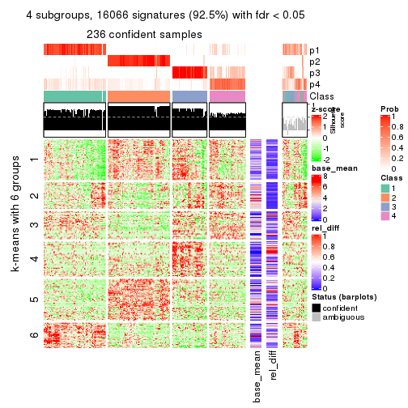</p>

</div>
<div id='tab-MAD-kmeans-get-signatures-4'>
<pre><code class="r">get_signatures(res, k = 5)
</code></pre>

<p></p>

</div>
<div id='tab-MAD-kmeans-get-signatures-5'>
<pre><code class="r">get_signatures(res, k = 6)
</code></pre>

<p></p>

</div>
</div>


Signature heatmaps where rows are not scaled:


<script>
$( function() {
	$( '#tabs-MAD-kmeans-get-signatures-no-scale' ).tabs();
} );
</script>
<div id='tabs-MAD-kmeans-get-signatures-no-scale'>
<ul>
<li><a href='#tab-MAD-kmeans-get-signatures-no-scale-1'>k = 2</a></li>
<li><a href='#tab-MAD-kmeans-get-signatures-no-scale-2'>k = 3</a></li>
<li><a href='#tab-MAD-kmeans-get-signatures-no-scale-3'>k = 4</a></li>
<li><a href='#tab-MAD-kmeans-get-signatures-no-scale-4'>k = 5</a></li>
<li><a href='#tab-MAD-kmeans-get-signatures-no-scale-5'>k = 6</a></li>
</ul>
<div id='tab-MAD-kmeans-get-signatures-no-scale-1'>
<pre><code class="r">get_signatures(res, k = 2, scale_rows = FALSE)
</code></pre>

<p></p>

</div>
<div id='tab-MAD-kmeans-get-signatures-no-scale-2'>
<pre><code class="r">get_signatures(res, k = 3, scale_rows = FALSE)
</code></pre>

<p></p>

</div>
<div id='tab-MAD-kmeans-get-signatures-no-scale-3'>
<pre><code class="r">get_signatures(res, k = 4, scale_rows = FALSE)
</code></pre>

<p></p>

</div>
<div id='tab-MAD-kmeans-get-signatures-no-scale-4'>
<pre><code class="r">get_signatures(res, k = 5, scale_rows = FALSE)
</code></pre>

<p></p>

</div>
<div id='tab-MAD-kmeans-get-signatures-no-scale-5'>
<pre><code class="r">get_signatures(res, k = 6, scale_rows = FALSE)
</code></pre>

<p></p>

</div>
</div>


Compare the overlap of signatures from different k:

```r
compare_signatures(res)
```


`get_signature()` returns a data frame invisibly. TO get the list of signatures, the function
call should be assigned to a variable explicitly. In following code, if `plot` argument is set
to `FALSE`, no heatmap is plotted while only the differential analysis is performed.

```r
# code only for demonstration
tb = get_signature(res, k = ..., plot = FALSE)
```

An example of the output of `tb` is:

```
#>   which_row         fdr    mean_1    mean_2 scaled_mean_1 scaled_mean_2 km
#> 1        38 0.042760348  8.373488  9.131774    -0.5533452     0.5164555  1
#> 2        40 0.018707592  7.106213  8.469186    -0.6173731     0.5762149  1
#> 3        55 0.019134737 10.221463 11.207825    -0.6159697     0.5749050  1
#> 4        59 0.006059896  5.921854  7.869574    -0.6899429     0.6439467  1
#> 5        60 0.018055526  8.928898 10.211722    -0.6204761     0.5791110  1
#> 6        98 0.009384629 15.714769 14.887706     0.6635654    -0.6193277  2
...
```

The columns in `tb` are:

1. `which_row`: row indices corresponding to the input matrix.
2. `fdr`: FDR for the differential test. 
3. `mean_x`: The mean value in group x.
4. `scaled_mean_x`: The mean value in group x after rows are scaled.
5. `km`: Row groups if k-means clustering is applied to rows.


UMAP plot which shows how samples are separated.


<script>
$( function() {
	$( '#tabs-MAD-kmeans-dimension-reduction' ).tabs();
} );
</script>
<div id='tabs-MAD-kmeans-dimension-reduction'>
<ul>
<li><a href='#tab-MAD-kmeans-dimension-reduction-1'>k = 2</a></li>
<li><a href='#tab-MAD-kmeans-dimension-reduction-2'>k = 3</a></li>
<li><a href='#tab-MAD-kmeans-dimension-reduction-3'>k = 4</a></li>
<li><a href='#tab-MAD-kmeans-dimension-reduction-4'>k = 5</a></li>
<li><a href='#tab-MAD-kmeans-dimension-reduction-5'>k = 6</a></li>
</ul>
<div id='tab-MAD-kmeans-dimension-reduction-1'>
<pre><code class="r">dimension_reduction(res, k = 2, method = &quot;UMAP&quot;)
</code></pre>

<p></p>

</div>
<div id='tab-MAD-kmeans-dimension-reduction-2'>
<pre><code class="r">dimension_reduction(res, k = 3, method = &quot;UMAP&quot;)
</code></pre>

<p></p>

</div>
<div id='tab-MAD-kmeans-dimension-reduction-3'>
<pre><code class="r">dimension_reduction(res, k = 4, method = &quot;UMAP&quot;)
</code></pre>

<p></p>

</div>
<div id='tab-MAD-kmeans-dimension-reduction-4'>
<pre><code class="r">dimension_reduction(res, k = 5, method = &quot;UMAP&quot;)
</code></pre>

<p></p>

</div>
<div id='tab-MAD-kmeans-dimension-reduction-5'>
<pre><code class="r">dimension_reduction(res, k = 6, method = &quot;UMAP&quot;)
</code></pre>

<p></p>

</div>
</div>


Following heatmap shows how subgroups are split when increasing `k`:

```r
collect_classes(res)
```


If matrix rows can be associated to genes, consider to use `GO_Enrichment(res,
...)` to perform function enrichment for the signature genes.


 

---------------------------------------------------


### MAD:skmeans*


The object with results only for a single top-value method and a single partition method 
can be extracted as:

```r
res = res_list["MAD", "skmeans"]
# you can also extract it by
# res = res_list["MAD:skmeans"]
```

A summary of `res` and all the functions that can be applied to it:

```r
res
```

```
#> A 'ConsensusPartition' object with k = 2, 3, 4, 5, 6.
#>   On a matrix with 17377 rows and 265 columns.
#>   Top rows (1000, 2000, 3000, 4000, 5000) are extracted by 'MAD' method.
#>   Subgroups are detected by 'skmeans' method.
#>   Performed in total 1250 partitions by row resampling.
#>   Best k for subgroups seems to be 5.
#> 
#> Following methods can be applied to this 'ConsensusPartition' object:
#>  [1] "cola_report"             "collect_classes"         "collect_plots"          
#>  [4] "collect_stats"           "colnames"                "compare_signatures"     
#>  [7] "consensus_heatmap"       "dimension_reduction"     "functional_enrichment"  
#> [10] "get_anno_col"            "get_anno"                "get_classes"            
#> [13] "get_consensus"           "get_matrix"              "get_membership"         
#> [16] "get_param"               "get_signatures"          "get_stats"              
#> [19] "is_best_k"               "is_stable_k"             "membership_heatmap"     
#> [22] "ncol"                    "nrow"                    "plot_ecdf"              
#> [25] "rownames"                "select_partition_number" "show"                   
#> [28] "suggest_best_k"          "test_to_known_factors"
```

`collect_plots()` function collects all the plots made from `res` for all `k` (number of partitions)
into one single page to provide an easy and fast comparison between different `k`.

```r
collect_plots(res)
```


The plots are:

- The first row: a plot of the ECDF (Empirical cumulative distribution
  function) curves of the consensus matrix for each `k` and the heatmap of
  predicted classes for each `k`.
- The second row: heatmaps of the consensus matrix for each `k`.
- The third row: heatmaps of the membership matrix for each `k`.
- The fouth row: heatmaps of the signatures for each `k`.

All the plots in panels can be made by individual functions and they are
plotted later in this section.

`select_partition_number()` produces several plots showing different
statistics for choosing "optimized" `k`. There are following statistics:

- ECDF curves of the consensus matrix for each `k`;
- 1-PAC. [The PAC
  score](https://en.wikipedia.org/wiki/Consensus_clustering#Over-interpretation_potential_of_consensus_clustering)
  measures the proportion of the ambiguous subgrouping.
- Mean silhouette score.
- Concordance. The mean probability of fiting the consensus class ids in all
  partitions.
- Area increased. Denote $A_k$ as the area under the ECDF curve for current
  `k`, the area increased is defined as $A_k - A_{k-1}$.
- Rand index. The percent of pairs of samples that are both in a same cluster
  or both are not in a same cluster in the partition of k and k-1.
- Jaccard index. The ratio of pairs of samples are both in a same cluster in
  the partition of k and k-1 and the pairs of samples are both in a same
  cluster in the partition k or k-1.

The detailed explanations of these statistics can be found in [the cola
vignette](http://bioconductor.org/packages/devel/bioc/vignettes/cola/inst/doc/cola.html#toc_13).

Generally speaking, lower PAC score, higher mean silhouette score or higher
concordance corresponds to better partition. Rand index and Jaccard index
measure how similar the current partition is compared to partition with `k-1`.
If they are too similar, we won't accept `k` is better than `k-1`.

```r
select_partition_number(res)
```


The numeric values for all these statistics can be obtained by `get_stats()`.

```r
get_stats(res)
```

```
#>   k 1-PAC mean_silhouette concordance area_increased  Rand Jaccard
#> 2 2 1.000           0.981       0.992         0.4932 0.508   0.508
#> 3 3 0.963           0.932       0.972         0.3442 0.737   0.524
#> 4 4 0.928           0.915       0.963         0.1163 0.873   0.649
#> 5 5 0.940           0.896       0.954         0.0670 0.889   0.619
#> 6 6 0.830           0.736       0.843         0.0444 0.950   0.765
```

`suggest_best_k()` suggests the best $k$ based on these statistics. The rules are as follows:

- All $k$ with Jaccard index larger than 0.95 are removed because the increase of
  the partition number does not provides enough extra information. If all $k$ are removed,
  the best $k$ is assigned by `NA`.
- For $k$ with 1-PAC larger than 0.9, the maximal $k$ is taken as the "best k". Other $k$ is called "optional k".
- If it does not fit the second rule. The $k$ with the highest vote of highest
  1-PAC, mean silhouette and concordance is taken as the "best k".

```r
suggest_best_k(res)
```

```
#> [1] 5
#> attr(,"optional")
#> [1] 2 3 4
```

There is also optional best $k$ = 2 3 4 that is worth to check.

Following shows the table of the partitions (You need to click the **show/hide
code output** link to see it). The membership matrix (columns with name `p*`)
is inferred by
[`clue::cl_consensus()`](https://www.rdocumentation.org/link/cl_consensus?package=clue)
function with the `SE` method. Basically the value in the membership matrix
represents the probability to belong to a certain group. The finall class
label for an item is determined with the group with highest probability it
belongs to.

In `get_classes()` function, the entropy is calculated from the membership
matrix and the silhouette score is calculated from the consensus matrix.


<script>
$( function() {
	$( '#tabs-MAD-skmeans-get-classes' ).tabs();
} );
</script>
<div id='tabs-MAD-skmeans-get-classes'>
<ul>
<li><a href='#tab-MAD-skmeans-get-classes-1'>k = 2</a></li>
<li><a href='#tab-MAD-skmeans-get-classes-2'>k = 3</a></li>
<li><a href='#tab-MAD-skmeans-get-classes-3'>k = 4</a></li>
<li><a href='#tab-MAD-skmeans-get-classes-4'>k = 5</a></li>
<li><a href='#tab-MAD-skmeans-get-classes-5'>k = 6</a></li>
</ul>

<div id='tab-MAD-skmeans-get-classes-1'>
<p><a id='tab-MAD-skmeans-get-classes-1-a' style='color:#0366d6' href='#'>show/hide code output</a></p>
<pre><code class="r">cbind(get_classes(res, k = 2), get_membership(res, k = 2))
</code></pre>

<pre><code>#&gt;                                      class entropy silhouette    p1    p2
#&gt; D30CF518-5FC6-4A54-8D5D-BA420EA1836D     2  0.0000     0.9940 0.000 1.000
#&gt; 92298FF7-1215-4756-B976-A7D88B91AD76     1  0.0000     0.9911 1.000 0.000
#&gt; 0E244FE2-7C17-4642-A51F-2CCA796D9C70     2  0.0000     0.9940 0.000 1.000
#&gt; 75435ED8-93E8-45FB-8480-98D8EB2EF8CB     2  0.0000     0.9940 0.000 1.000
#&gt; B6D11678-15A9-4F43-A0A2-225067DCAF1C     1  0.0000     0.9911 1.000 0.000
#&gt; B7F5A41E-9559-4329-81F5-1B88A74730B7     2  0.0000     0.9940 0.000 1.000
#&gt; 39414B2A-7FB0-4669-8DFE-86D9AF7AD2D9     1  0.0000     0.9911 1.000 0.000
#&gt; 04823F53-A12D-4852-8F34-77B9DCBB7DF0     2  0.0000     0.9940 0.000 1.000
#&gt; 49684C2B-D31C-4B45-A400-3497C3CCEC01     2  0.0000     0.9940 0.000 1.000
#&gt; 96A04875-58E2-4BE7-8E0F-CAB55F4CA54F     1  0.0000     0.9911 1.000 0.000
#&gt; 1F101D63-478B-40B9-A951-DC3887CFF067     1  0.0000     0.9911 1.000 0.000
#&gt; DD290860-E0B7-48FC-BE12-2AF729994C21     2  0.0000     0.9940 0.000 1.000
#&gt; FFDD7A12-DDEF-4974-8D60-64B7EEAAC994     2  0.0000     0.9940 0.000 1.000
#&gt; E076A9A9-EA2A-4FF7-92A8-F2DA7F30279E     2  0.2948     0.9418 0.052 0.948
#&gt; 830DFA6F-A85A-4317-82B2-791FAB998A01     2  0.0000     0.9940 0.000 1.000
#&gt; 58578614-E4A3-4655-BBAB-F65851625E0A     1  0.0000     0.9911 1.000 0.000
#&gt; 1CBFB672-4D66-430B-83F3-7CE3BE20ABF6     1  0.0000     0.9911 1.000 0.000
#&gt; 6C34A7D7-3756-4DCC-9A9F-B5FC4A148B7E     2  0.0000     0.9940 0.000 1.000
#&gt; D97ED7B4-5DF2-4B62-8796-AA51CA79DBBB     1  0.0000     0.9911 1.000 0.000
#&gt; 45F15851-55F6-4169-834E-38958C38B6A9     1  0.0000     0.9911 1.000 0.000
#&gt; 4139E0C9-F712-4A25-8B59-587533B93B3E     2  0.0000     0.9940 0.000 1.000
#&gt; 2C3007BF-009E-404F-A3BF-8B921698D85B     1  0.0000     0.9911 1.000 0.000
#&gt; 2189F8E5-FF98-4C1A-BD04-5595DB553130     1  0.0000     0.9911 1.000 0.000
#&gt; FFAA0310-0D78-4499-8FB8-5BC46E4FCE58     2  0.0000     0.9940 0.000 1.000
#&gt; 0C375B2F-67BE-4708-BEB2-544DEC812DCA     2  0.0000     0.9940 0.000 1.000
#&gt; AB6324A1-19AB-400C-8001-54765D190E27     2  0.0000     0.9940 0.000 1.000
#&gt; A32C4DCD-DC4C-4132-9ED1-B159F5561A2D     1  0.0000     0.9911 1.000 0.000
#&gt; 2AE7105D-D494-45B0-947A-315D8C20ECDC     1  0.0000     0.9911 1.000 0.000
#&gt; 60FE9D59-FC0F-4B9C-ABF8-1C00BC761928     1  0.0000     0.9911 1.000 0.000
#&gt; 056442DC-E87A-4315-965C-C19D7B4FC40E     1  0.0000     0.9911 1.000 0.000
#&gt; 455111E5-18EF-4E3F-9DFF-8FA017D92461     1  0.0000     0.9911 1.000 0.000
#&gt; 10632BC6-0B81-433C-8832-6B2ABC73A94B     1  0.0000     0.9911 1.000 0.000
#&gt; AC6F82AD-C682-4EB3-BEC3-FD950F57609D     1  0.0000     0.9911 1.000 0.000
#&gt; D9ABDB75-04DA-4D33-A69F-701729494533     1  0.0000     0.9911 1.000 0.000
#&gt; 27BBF44D-F4D7-4C5A-935F-3310A363A670     2  0.0000     0.9940 0.000 1.000
#&gt; E7AA12EE-6E14-4B33-A52C-B13589436023     1  0.0000     0.9911 1.000 0.000
#&gt; DFA6D41A-D231-413E-A180-E42DF26C3E2B     2  0.0000     0.9940 0.000 1.000
#&gt; 655BD3AF-5094-4B19-93A8-401C70369B17     2  0.0000     0.9940 0.000 1.000
#&gt; 9DFEF253-923F-4EE2-8E3D-C75805387B20     1  0.7299     0.7468 0.796 0.204
#&gt; 3B0EE948-B2CD-4191-90E2-BDD155F3B580     1  0.0000     0.9911 1.000 0.000
#&gt; 177C7EF4-2D54-4555-947C-44EE7C688917     2  0.0000     0.9940 0.000 1.000
#&gt; 1F8E8BB7-D159-4556-8B04-E5DD027CC444     2  0.0000     0.9940 0.000 1.000
#&gt; 619F37D2-6771-4727-9079-56BED07F1CF6     2  0.0000     0.9940 0.000 1.000
#&gt; ACAE29BE-ECB8-4A98-BC71-7A2D4857134E     1  0.1414     0.9728 0.980 0.020
#&gt; C5C3241A-684C-4238-9333-9AF8630EC086     2  0.0000     0.9940 0.000 1.000
#&gt; AD319DC2-140F-4E7B-A899-010687D8B714     2  0.0000     0.9940 0.000 1.000
#&gt; 2AFF397C-ED2A-4FD9-A7F0-E4C61E9FB603     2  0.0000     0.9940 0.000 1.000
#&gt; FB4C7892-3DBB-4148-AAE9-75B19A1A4031     1  0.0000     0.9911 1.000 0.000
#&gt; 6F5C4500-1ED1-4E81-B4F5-EEA64CE2336A     1  0.0000     0.9911 1.000 0.000
#&gt; BD027C69-3C10-4047-8E1E-218600FF2B73     2  0.0000     0.9940 0.000 1.000
#&gt; 11B473A9-4CC5-461F-BC57-CC9141F3591D     1  0.0000     0.9911 1.000 0.000
#&gt; 69A036E5-3E6A-4862-A7F8-2D203ED2FC9E     1  0.0000     0.9911 1.000 0.000
#&gt; 9C0BDF24-F011-4855-B95A-1B6BEFA808F7     1  0.0000     0.9911 1.000 0.000
#&gt; 9E205254-8C0C-4C05-AF5A-86E679CF732C     1  0.0000     0.9911 1.000 0.000
#&gt; 935CCE4A-8AA8-454E-9DFF-7DE27D0BD2E2     1  0.0000     0.9911 1.000 0.000
#&gt; 01E5E1FE-41D3-428B-90BC-7A000829E102     1  0.0000     0.9911 1.000 0.000
#&gt; B344A530-92CD-468B-847A-DF8E25688081     2  0.0000     0.9940 0.000 1.000
#&gt; F79F32A7-9F7B-4D62-8426-4A4CF10ED319     1  0.0000     0.9911 1.000 0.000
#&gt; C2E1C6FA-82F9-467C-99AE-9B39FAAC810C     1  0.0000     0.9911 1.000 0.000
#&gt; BF7CD9BD-776A-4957-8A6E-EF8AD83EA9D3     2  0.0000     0.9940 0.000 1.000
#&gt; 8A2C1409-E83B-435E-A20F-5FCA94801C9F     2  0.0000     0.9940 0.000 1.000
#&gt; B6BEFFB5-2F62-477B-A4C8-478D29577CBD     2  0.0000     0.9940 0.000 1.000
#&gt; 8622CBD0-F8E9-4AC1-8175-CC9A742B86F9     1  0.0000     0.9911 1.000 0.000
#&gt; 565DD660-ED58-4065-8619-260BEA6FCFEB     1  0.0000     0.9911 1.000 0.000
#&gt; 96038E42-0FBA-497D-819C-38F7689F10FF     1  0.0000     0.9911 1.000 0.000
#&gt; CA685549-F8BA-43F1-8461-5D2D3B17CFC5     1  0.0000     0.9911 1.000 0.000
#&gt; 52020307-71A6-46E5-ACB3-8F885CA8F1EB     1  0.0000     0.9911 1.000 0.000
#&gt; 7656DA98-76DC-424B-B02C-D7001DAAA0E4     1  0.0000     0.9911 1.000 0.000
#&gt; 74DBA640-45E2-42A6-8F1E-69C073D66EE6     1  0.0000     0.9911 1.000 0.000
#&gt; 251094BE-C33D-44F0-BD98-8618D71F520C     1  0.0000     0.9911 1.000 0.000
#&gt; AB914CC5-5FF1-4257-A353-6A99D11B9478     1  0.0000     0.9911 1.000 0.000
#&gt; 38B8B893-0E08-4B71-B51C-B32A7B2724E0     1  0.0000     0.9911 1.000 0.000
#&gt; 7C7CD8FF-99A4-41D7-B7E1-5A517001F551     2  0.0000     0.9940 0.000 1.000
#&gt; BFC5B75A-E4AE-486B-BA30-23BBAA33A125     2  0.0000     0.9940 0.000 1.000
#&gt; 182AC78E-A07C-4B34-B216-B5F573E9F036     2  0.0000     0.9940 0.000 1.000
#&gt; B38C5F72-8F46-4531-9C2D-96EEE07A5B22     2  0.0000     0.9940 0.000 1.000
#&gt; DB9333A6-A723-4B8F-9221-25B8B23D5126     1  0.0000     0.9911 1.000 0.000
#&gt; CD67DD21-C1B6-4D58-AC8E-1F4536C7DA70     2  0.0000     0.9940 0.000 1.000
#&gt; 3D76A56E-4B66-48AE-AA60-D9C1004C7140     1  0.0000     0.9911 1.000 0.000
#&gt; 71ED572F-7780-47A4-A9F8-D320C737690D     1  0.0000     0.9911 1.000 0.000
#&gt; B449FEA1-C4B0-400F-903C-59E13D0BA313     2  0.0000     0.9940 0.000 1.000
#&gt; 3F120E90-1486-4215-B9B9-79D5B413CAAC     2  0.0000     0.9940 0.000 1.000
#&gt; A071894B-D8C0-4740-BD55-93EA0C86EDF7     1  0.0000     0.9911 1.000 0.000
#&gt; 58848D57-D7A9-4ABB-86A2-A8AE2B23F654     1  0.0000     0.9911 1.000 0.000
#&gt; CD6F9E20-B301-4663-87EC-953EDF49754F     2  0.0000     0.9940 0.000 1.000
#&gt; 367D89F3-D527-4929-B830-8B6D553DF9E1     1  0.0000     0.9911 1.000 0.000
#&gt; BE8D7DCB-648B-42DD-9FA8-8B85B5D816B2     1  0.0000     0.9911 1.000 0.000
#&gt; AA46F56B-BD9C-40A4-8EA8-35E2568C964D     2  0.0000     0.9940 0.000 1.000
#&gt; 6393220A-7C57-413F-81A8-4E38C21E779E     2  0.0000     0.9940 0.000 1.000
#&gt; 89AE566C-F65F-43C2-BA97-621A7AC8B6DC     1  0.0000     0.9911 1.000 0.000
#&gt; AA6A4BFF-8C62-4B70-B85A-9EDF403B06BA     1  0.0000     0.9911 1.000 0.000
#&gt; BCE877A6-9C65-4495-A45D-05753F2D0E15     1  0.0000     0.9911 1.000 0.000
#&gt; D7BDDF49-C54B-4F8E-ACA0-C3684AB68B5C     2  0.0000     0.9940 0.000 1.000
#&gt; D0800D49-0033-44B2-8D7B-29B16F87ADA6     2  0.0000     0.9940 0.000 1.000
#&gt; 151D60B5-5AF1-4B61-B97F-ABC7531D9F89     1  0.0000     0.9911 1.000 0.000
#&gt; CBBAEB5B-25FA-4B6D-A40C-357E37033E36     1  0.0000     0.9911 1.000 0.000
#&gt; 317CD049-3151-40B7-8E88-B0B8813338D6     1  0.0000     0.9911 1.000 0.000
#&gt; 93835C77-F8FA-4928-843C-8016A91881FA     1  0.0000     0.9911 1.000 0.000
#&gt; 02A6950F-647D-4F20-B2D0-0238C1441C70     1  0.0000     0.9911 1.000 0.000
#&gt; 4D54E415-134F-4F6F-8718-3E0475EF5477     1  0.0000     0.9911 1.000 0.000
#&gt; 82AB290A-3993-45E5-8B15-6125A019778C     1  0.0000     0.9911 1.000 0.000
#&gt; 3B5EAD14-E506-4A22-804D-BF925A2D5247     2  0.0000     0.9940 0.000 1.000
#&gt; 19CF7DDF-4F3A-4D2F-B84A-6451A5C3112C     2  0.0000     0.9940 0.000 1.000
#&gt; 2FB00DAA-C274-42B1-A06B-611FE5E96844     1  0.0000     0.9911 1.000 0.000
#&gt; 2B1F01C3-8145-4296-8111-2B0474AB9A2C     2  0.0000     0.9940 0.000 1.000
#&gt; 3F0865F1-8256-4778-966F-D53637B415B6     2  0.0000     0.9940 0.000 1.000
#&gt; 5473210D-37F9-4192-86D2-E2A2C77F3BD2     2  0.0000     0.9940 0.000 1.000
#&gt; 5EDB6ACF-4F3F-471A-9DDC-661607CACCC4     1  0.0000     0.9911 1.000 0.000
#&gt; 6A252A3A-7EEB-47B6-9C23-D69BD2EA846F     2  0.0000     0.9940 0.000 1.000
#&gt; 0A7FFCBB-4BAA-4A5F-8B2D-B427C4D982A8     1  0.0000     0.9911 1.000 0.000
#&gt; 1603AFB8-5AD7-4794-9991-BDBE96B4D997     2  0.0000     0.9940 0.000 1.000
#&gt; 644299E9-62B7-4DFE-9E6D-D7556A01B40A     1  0.0000     0.9911 1.000 0.000
#&gt; EF12E923-1860-4269-B57B-BA6238FA4403     1  0.0000     0.9911 1.000 0.000
#&gt; 51B7241E-F0BE-482A-88AE-89004BB68989     1  0.0000     0.9911 1.000 0.000
#&gt; 1C007DF3-8A9F-4940-9A4C-DE2A412BB023     2  0.0000     0.9940 0.000 1.000
#&gt; 89FCFDE6-9625-432C-AA35-9C5FCCF40031     1  0.0000     0.9911 1.000 0.000
#&gt; 7955FC55-386D-497E-AFED-019BBBAD428E     2  0.0000     0.9940 0.000 1.000
#&gt; 37FF09ED-73EC-4D10-B2AC-7D8EBA9304ED     1  0.8386     0.6387 0.732 0.268
#&gt; C2CD2742-2FB4-468E-90FF-8F65A5C425A9     1  0.0000     0.9911 1.000 0.000
#&gt; 766FE08F-3393-4868-B1C1-FA98C9FF16E0     1  0.5519     0.8535 0.872 0.128
#&gt; 63E2B578-2221-4255-8C45-7FD030B1C94D     1  0.0000     0.9911 1.000 0.000
#&gt; C14B1A44-43F7-45F0-A583-5667A4D3BD95     1  0.0000     0.9911 1.000 0.000
#&gt; D9CB551A-CE20-4BF7-8AC9-839112346C3D     1  0.0000     0.9911 1.000 0.000
#&gt; 05BAA71A-E5B3-4A3A-A3F2-013A975087F0     2  0.0000     0.9940 0.000 1.000
#&gt; AC8DA7DE-4D83-4768-BEFD-9A1B2DA943CE     2  0.0000     0.9940 0.000 1.000
#&gt; E89DCE9D-F8A5-499C-85BB-BB500BADB9FB     1  0.0000     0.9911 1.000 0.000
#&gt; C16F9B5E-2B52-40F6-856D-C0D6FBDD16C1     1  0.0000     0.9911 1.000 0.000
#&gt; 8FF234D4-823A-4C80-82F7-2E92D72DBF88     2  0.0000     0.9940 0.000 1.000
#&gt; C9F94A6E-D104-4D8D-8EC5-EADECD85F092     2  0.0000     0.9940 0.000 1.000
#&gt; 45C9756F-A154-4537-852E-ECBF27B92FE1     2  0.0000     0.9940 0.000 1.000
#&gt; 0F1A5708-341E-4713-BC70-76D702F826D6     2  0.0000     0.9940 0.000 1.000
#&gt; 2ECFBCA0-AB35-461A-A4B5-C60B2651A962     2  0.0000     0.9940 0.000 1.000
#&gt; 7DFAC404-3AB3-4274-A533-CFDAF4CE122D     1  0.0000     0.9911 1.000 0.000
#&gt; A90AF55C-4386-42AB-A812-9230026EA5A5     2  0.0000     0.9940 0.000 1.000
#&gt; 6258A757-4E18-4CD1-8417-189521E990B6     2  0.0000     0.9940 0.000 1.000
#&gt; EBFAD137-050F-47D0-A43D-72B8F7D70C2B     1  0.0000     0.9911 1.000 0.000
#&gt; 08B5EBFB-2807-4229-95A6-81AB7F377A56     2  0.0000     0.9940 0.000 1.000
#&gt; 4780A59C-0589-4995-B044-3201F09AF859     1  0.0000     0.9911 1.000 0.000
#&gt; 0AB81429-C287-48AA-9035-3A7A6F4C7328     2  0.0000     0.9940 0.000 1.000
#&gt; 20C4D047-28DA-4AB7-9B3C-32EDA6B22C9D     2  0.0000     0.9940 0.000 1.000
#&gt; 77C4E01F-84A6-4BFD-AA8E-D7875456F546     2  0.0000     0.9940 0.000 1.000
#&gt; 8B28383F-CF14-4CC5-A1E2-72AD915C0AE8     1  0.0000     0.9911 1.000 0.000
#&gt; E12E1F48-6A52-4F74-925C-C4EE1BF5C573     2  0.0000     0.9940 0.000 1.000
#&gt; 9B179BC5-BB4C-4CEE-99BC-BC552BC384A1     1  0.0000     0.9911 1.000 0.000
#&gt; 5548C91A-D3DE-48F5-B4A4-124BE177B99A     1  0.0000     0.9911 1.000 0.000
#&gt; 0E22B729-C381-4B0C-9897-62DD38F51722     1  0.0000     0.9911 1.000 0.000
#&gt; 7BC4937F-04E2-4B46-BA7C-FE9AC738C8A9     1  0.0000     0.9911 1.000 0.000
#&gt; EE6A0D3F-3F8A-4AA8-B3EF-32372EF37A29     1  0.0000     0.9911 1.000 0.000
#&gt; 08AC2706-7651-409F-BE6B-BCED1C2D1796     1  0.0000     0.9911 1.000 0.000
#&gt; A68B078D-8979-4070-BB4D-F526704ED3DC     1  0.0000     0.9911 1.000 0.000
#&gt; C319A5EE-69FA-4AAB-85A9-2EAAD8E4C703     1  0.9909     0.2083 0.556 0.444
#&gt; 0D7CAABD-D20C-4F82-BCBC-8B7276E8EDE2     1  0.0000     0.9911 1.000 0.000
#&gt; 09444DCC-44BA-4A3F-ACC5-863A54578B9F     1  0.2778     0.9452 0.952 0.048
#&gt; 2E32B047-C6E1-4743-A6C8-E98370A32145     1  0.0000     0.9911 1.000 0.000
#&gt; 6A6878A7-76B2-40DE-958B-804442AC6A5D     1  0.0000     0.9911 1.000 0.000
#&gt; 39F27293-0BFF-4EA2-8439-A299E3226D20     1  0.0000     0.9911 1.000 0.000
#&gt; 7EAE9C30-6080-405F-A7E6-1FED57674279     1  0.0000     0.9911 1.000 0.000
#&gt; 79499169-A093-4E0A-B6BD-010CD7BE5035     1  0.0000     0.9911 1.000 0.000
#&gt; 1F8BF4E8-BD84-4EFE-9E3E-89E7CE8FA72D     2  0.0000     0.9940 0.000 1.000
#&gt; 62B7988F-98E5-4AB8-8A16-D661A07455E8     1  0.0000     0.9911 1.000 0.000
#&gt; B7005B5F-217E-4073-BFB5-CE7E884B80C0     2  0.0000     0.9940 0.000 1.000
#&gt; B981568F-2C08-4696-B589-E157A49BE72B     2  0.0000     0.9940 0.000 1.000
#&gt; A3D85C0A-3202-40C2-88E1-052AC6C5184B     1  0.0000     0.9911 1.000 0.000
#&gt; 4CA783B9-9B99-46B8-962A-77194ECB7942     2  0.0000     0.9940 0.000 1.000
#&gt; D4024B08-4879-47EA-99E5-D9FCE1CD40DF     1  0.0000     0.9911 1.000 0.000
#&gt; 1D41CDA2-0B29-48FD-B83A-E60C174DBCB3     1  0.0000     0.9911 1.000 0.000
#&gt; A1923B2A-B233-4760-8AF9-C04C1CAEB100     1  0.0000     0.9911 1.000 0.000
#&gt; 80880D71-BFDE-4D88-892F-5ADF27A38940     2  0.2236     0.9588 0.036 0.964
#&gt; 55D1629D-30FD-49AA-88CE-EA3CA9B30A3F     2  0.0000     0.9940 0.000 1.000
#&gt; B71C409E-926D-48AD-8BD8-9F707CA4FB01     2  0.0000     0.9940 0.000 1.000
#&gt; 54A92C57-BD19-4A47-BA76-3ACA2DC36212     1  0.3431     0.9287 0.936 0.064
#&gt; B2AB74B8-506C-4C27-9105-E86A6AAA89D4     1  0.0000     0.9911 1.000 0.000
#&gt; 0356AE49-7A5C-42CC-A39C-7C8DFBFF8842     2  0.0000     0.9940 0.000 1.000
#&gt; ACA260A3-DC3F-4FF4-B9C5-2D4BC4F81783     1  0.0000     0.9911 1.000 0.000
#&gt; 9B440917-E5A4-43B9-A48D-6ABFEDCA6CFD     1  0.0000     0.9911 1.000 0.000
#&gt; 47464828-52EA-413B-B30C-BD8B55903D78     2  0.0000     0.9940 0.000 1.000
#&gt; C1D1FC82-B50D-4C82-8F03-06CEE3C08D18     1  0.0000     0.9911 1.000 0.000
#&gt; E5ABFC43-E2A3-4B1A-BBA3-8196C0B026A5     2  0.0000     0.9940 0.000 1.000
#&gt; 1D3C16CC-D0D5-4637-AAC7-91672DFF3317     1  0.0000     0.9911 1.000 0.000
#&gt; 4D038320-ADEA-4990-8371-68B4B8162E1A     2  0.0000     0.9940 0.000 1.000
#&gt; A75594CC-3E49-4869-8656-BBB4E72BF59D     2  0.0000     0.9940 0.000 1.000
#&gt; 7CABAA19-5FB2-4A58-BDA3-4F1FFB532C20     1  0.0000     0.9911 1.000 0.000
#&gt; 534EF1E9-9513-426E-B41E-A394AB2E4410     2  0.0000     0.9940 0.000 1.000
#&gt; 649F35A1-A08C-497D-A9B6-CB3084D5FB8D     1  0.0000     0.9911 1.000 0.000
#&gt; 7CA30F3C-1C98-480C-B8B5-A248AABFB468     1  0.0000     0.9911 1.000 0.000
#&gt; A9F8DA21-A802-44CF-9F5D-96A36687DCDD     2  0.0000     0.9940 0.000 1.000
#&gt; A7AE1ED1-86CB-4A50-97B2-66785C7191FE     1  0.0000     0.9911 1.000 0.000
#&gt; D0091AD4-D3D7-4C03-ACD9-DA9F8B6076C6     1  0.0000     0.9911 1.000 0.000
#&gt; 46EE1C2B-13F7-44A7-B27E-4EBB9DF0CA83     2  0.0000     0.9940 0.000 1.000
#&gt; CB9301B8-0282-43D6-AF5E-B753A9C7BFCB     2  0.0000     0.9940 0.000 1.000
#&gt; A0E77A39-885A-4472-9A10-2D1E51DBFDA4     1  0.0000     0.9911 1.000 0.000
#&gt; C06603C2-163D-40B6-A9FE-882424F18FE9     1  0.0000     0.9911 1.000 0.000
#&gt; C3921A29-80FF-4B9D-B366-5C0238A42231     1  0.0000     0.9911 1.000 0.000
#&gt; BB99B4E7-C834-4BB8-973F-8FA039E2798F     1  0.0000     0.9911 1.000 0.000
#&gt; 5CD78C2F-05E9-409A-8405-3EE936A6876E     2  0.0000     0.9940 0.000 1.000
#&gt; 6C126CC7-0C03-48F0-A2C2-F090CA239B70     2  0.0000     0.9940 0.000 1.000
#&gt; 7118B08A-E94C-49F4-8D76-26455C34D85F     2  0.0000     0.9940 0.000 1.000
#&gt; 266DAF30-CF3E-493E-8B24-3931D0039450     1  0.0000     0.9911 1.000 0.000
#&gt; DAB5F5B9-4FE5-468F-AD2B-B39BBC4317A0     2  0.2778     0.9462 0.048 0.952
#&gt; 9A9EB6D6-312E-4A98-8762-30D3ABD8193D     2  0.0000     0.9940 0.000 1.000
#&gt; CED15676-B901-4FC8-9C8D-51E529D9441D     1  0.0000     0.9911 1.000 0.000
#&gt; 827232CC-8035-440C-8B12-02C789C70B1B     1  0.0000     0.9911 1.000 0.000
#&gt; 04D5FB28-FB50-4EAE-95FB-72ABF0E618CA     2  0.0000     0.9940 0.000 1.000
#&gt; 6C96A851-97FC-4845-B895-D255191D9F25     1  0.0000     0.9911 1.000 0.000
#&gt; 3EC982CB-D013-443E-B21D-39DE6B8EF370     2  0.0000     0.9940 0.000 1.000
#&gt; 2E24A786-4370-42A1-AD50-D651F89819CC     2  0.0000     0.9940 0.000 1.000
#&gt; 7653BFA9-ADA5-44CA-8555-807FBBFC6DE2     1  0.0000     0.9911 1.000 0.000
#&gt; 7A110994-5741-4013-91F0-DD2E1D343F91     2  0.0000     0.9940 0.000 1.000
#&gt; 0A760E0C-11C5-4201-8452-18DBC1FEACEB     1  0.0000     0.9911 1.000 0.000
#&gt; 909B76A1-BB9F-4906-95BC-58CD1A46D3B8     2  0.0000     0.9940 0.000 1.000
#&gt; A782EE71-EDA4-4385-83B3-D16DE81296C0     2  0.9996     0.0261 0.488 0.512
#&gt; BD50E276-914F-4924-8CEA-FF47A66DB175     2  0.0000     0.9940 0.000 1.000
#&gt; 505D5CA8-0279-4BC7-8CC0-8C7A0165BF91     2  0.0000     0.9940 0.000 1.000
#&gt; D51FC997-E662-4AE7-BC9C-14183DA42DE1     2  0.0000     0.9940 0.000 1.000
#&gt; 8AD67970-84F1-4C0A-B47A-8FA4108F9FE3     1  0.0000     0.9911 1.000 0.000
#&gt; 6E33B1B6-7089-4BC3-B2B0-EC2C3B5D8B74     1  0.0000     0.9911 1.000 0.000
#&gt; 88C4EA46-2546-401C-A8E7-603EECFDFBA0     1  0.1843     0.9655 0.972 0.028
#&gt; 375D2D72-C998-4627-BA35-24E82A9A55FF     1  0.0000     0.9911 1.000 0.000
#&gt; 76D0F834-7064-46C6-96F4-E861CF5452B6     2  0.0000     0.9940 0.000 1.000
#&gt; 87159081-C97A-4004-AF0A-7EB6EF0EC47A     1  0.0000     0.9911 1.000 0.000
#&gt; 24A57006-800B-4174-AF4E-7EA57A8A756E     1  0.0000     0.9911 1.000 0.000
#&gt; AD68CBC6-8A13-4A65-AF62-E99AFA81D031     2  0.0000     0.9940 0.000 1.000
#&gt; 22863A57-F066-4DD1-A859-4336F43D144C     1  0.3584     0.9244 0.932 0.068
#&gt; 8F6F0362-9165-4DCC-992C-AF871A3C51E7     1  0.0000     0.9911 1.000 0.000
#&gt; 76ABF0B7-E707-4DB2-9486-3814439BDBA5     1  0.0000     0.9911 1.000 0.000
#&gt; BC72372F-3577-40E5-BA0F-41A084AA93AD     1  0.0000     0.9911 1.000 0.000
#&gt; 8E566039-B56C-4F41-B9EF-DE18BEEF2C95     1  0.0000     0.9911 1.000 0.000
#&gt; F096F016-3EF5-4A67-A7C2-8A45E1585232     1  0.0000     0.9911 1.000 0.000
#&gt; BB37913E-534B-43DD-BE3D-E13B29FD8172     2  0.0000     0.9940 0.000 1.000
#&gt; E344638F-9060-460F-8F7A-60D19442F294     2  0.0000     0.9940 0.000 1.000
#&gt; 6A0EAAD0-89D5-4F12-8B45-9D5A25182FAD     2  0.0000     0.9940 0.000 1.000
#&gt; A5199E3A-9D67-4543-88AB-24398C98E38E     1  0.2603     0.9496 0.956 0.044
#&gt; 23917D52-7864-4F84-9C77-DF8EA9407345     2  0.0000     0.9940 0.000 1.000
#&gt; 9AA96080-19D8-40C3-BDD1-6044D2D422D5     1  0.0000     0.9911 1.000 0.000
#&gt; 0ED65D91-260C-4662-9903-EE36A2E3B2D0     2  0.0000     0.9940 0.000 1.000
#&gt; 64BF1BC5-7A9A-4E1D-AEAB-AFE30B92AAF4     2  0.0000     0.9940 0.000 1.000
#&gt; F02301F1-9054-4DC6-8DC9-2451A0F53EFC     2  0.0000     0.9940 0.000 1.000
#&gt; 3264649A-5684-4181-83D0-A7E4D7E2E1FD     1  0.0000     0.9911 1.000 0.000
#&gt; 3F8DA39C-BC9B-4343-8838-5CE271E80C51     2  0.2236     0.9588 0.036 0.964
#&gt; BCC681CB-2AF4-4BB6-B53A-7544A2399454     1  0.0000     0.9911 1.000 0.000
#&gt; DCB50E17-5E2D-443B-8DCC-272FBB734C2E     1  0.0000     0.9911 1.000 0.000
#&gt; B5E47C38-CB6A-44C0-AA9B-56951B9EF78D     1  0.0000     0.9911 1.000 0.000
#&gt; B15B0185-9C28-4A00-9CEC-05EFECEA6709     1  0.0000     0.9911 1.000 0.000
#&gt; 61D4E8E7-0110-480A-A4A7-D406DE74C31E     1  0.0000     0.9911 1.000 0.000
#&gt; CA8DB3AD-3F6B-4622-BF73-47041EC96E42     1  0.0000     0.9911 1.000 0.000
#&gt; 5EECB1C4-172C-4494-871A-ADB650CD82BD     2  0.0000     0.9940 0.000 1.000
#&gt; 019B857C-D4F7-4B67-B699-56E52A60805B     2  0.0000     0.9940 0.000 1.000
#&gt; E9C28902-05C9-4883-97A4-D612D54E46B4     1  0.0000     0.9911 1.000 0.000
#&gt; C5D3D9A0-FC14-408D-AB6C-662018A5E5CA     1  0.0000     0.9911 1.000 0.000
#&gt; 7EB24744-509B-4854-B7D0-0BAFA210A345     2  0.0000     0.9940 0.000 1.000
#&gt; B8B7A721-2284-40AB-98F5-EF1351C30B66     2  0.0000     0.9940 0.000 1.000
#&gt; 3C12F39D-0D21-4F69-A539-4120B73C7A79     2  0.0000     0.9940 0.000 1.000
#&gt; 08D3F984-6850-45B2-9DF9-EC7F5A4060A4     1  0.0000     0.9911 1.000 0.000
#&gt; 9BD0EE79-1EED-4F6D-A5AB-43ADB8526F1E     2  0.0672     0.9865 0.008 0.992
#&gt; E489A871-3CF4-4F3D-8EAF-63B507054201     2  0.0000     0.9940 0.000 1.000
#&gt; 8CF8FD2E-1DBA-4257-9715-04D956D46B71     2  0.0000     0.9940 0.000 1.000
#&gt; F6193AF0-7A19-46CB-A818-1B01E7460791     1  0.0000     0.9911 1.000 0.000
#&gt; 96392D6B-D4FF-4393-93BA-08E469E8BBE1     1  0.0672     0.9840 0.992 0.008
#&gt; DABCBE5A-C591-46A2-AF66-DA3DB6106751     1  0.0000     0.9911 1.000 0.000
#&gt; 8B75F7D4-98D8-44DE-B19D-B733D6A031DB     1  0.0000     0.9911 1.000 0.000
#&gt; AAD9685A-564B-42E9-91E3-431951154BA7     2  0.0000     0.9940 0.000 1.000
#&gt; 90A43152-4E3B-4365-A39F-7B0E5CA66E55     1  0.0000     0.9911 1.000 0.000
#&gt; EFB76FCF-AC9C-4852-B91C-E055DA666FA0     1  0.0000     0.9911 1.000 0.000
#&gt; 6EBCFFE3-706F-440A-ABA9-012A924A07C6     2  0.0000     0.9940 0.000 1.000
#&gt; E922A244-F1C8-4310-ABB2-62B06E022E4C     1  0.0000     0.9911 1.000 0.000
</code></pre>

<script>
$('#tab-MAD-skmeans-get-classes-1-a').parent().next().next().hide();
$('#tab-MAD-skmeans-get-classes-1-a').click(function(){
  $('#tab-MAD-skmeans-get-classes-1-a').parent().next().next().toggle();
  return(false);
});
</script>
</div>

<div id='tab-MAD-skmeans-get-classes-2'>
<p><a id='tab-MAD-skmeans-get-classes-2-a' style='color:#0366d6' href='#'>show/hide code output</a></p>
<pre><code class="r">cbind(get_classes(res, k = 3), get_membership(res, k = 3))
</code></pre>

<pre><code>#&gt;                                      class entropy silhouette    p1    p2    p3
#&gt; D30CF518-5FC6-4A54-8D5D-BA420EA1836D     2  0.0000     0.9956 0.000 1.000 0.000
#&gt; 92298FF7-1215-4756-B976-A7D88B91AD76     1  0.0000     0.9729 1.000 0.000 0.000
#&gt; 0E244FE2-7C17-4642-A51F-2CCA796D9C70     2  0.0000     0.9956 0.000 1.000 0.000
#&gt; 75435ED8-93E8-45FB-8480-98D8EB2EF8CB     2  0.0000     0.9956 0.000 1.000 0.000
#&gt; B6D11678-15A9-4F43-A0A2-225067DCAF1C     3  0.1411     0.9190 0.036 0.000 0.964
#&gt; B7F5A41E-9559-4329-81F5-1B88A74730B7     2  0.0000     0.9956 0.000 1.000 0.000
#&gt; 39414B2A-7FB0-4669-8DFE-86D9AF7AD2D9     3  0.0000     0.9412 0.000 0.000 1.000
#&gt; 04823F53-A12D-4852-8F34-77B9DCBB7DF0     2  0.0000     0.9956 0.000 1.000 0.000
#&gt; 49684C2B-D31C-4B45-A400-3497C3CCEC01     2  0.0000     0.9956 0.000 1.000 0.000
#&gt; 96A04875-58E2-4BE7-8E0F-CAB55F4CA54F     1  0.0000     0.9729 1.000 0.000 0.000
#&gt; 1F101D63-478B-40B9-A951-DC3887CFF067     1  0.0237     0.9695 0.996 0.000 0.004
#&gt; DD290860-E0B7-48FC-BE12-2AF729994C21     2  0.0000     0.9956 0.000 1.000 0.000
#&gt; FFDD7A12-DDEF-4974-8D60-64B7EEAAC994     2  0.0000     0.9956 0.000 1.000 0.000
#&gt; E076A9A9-EA2A-4FF7-92A8-F2DA7F30279E     3  0.0000     0.9412 0.000 0.000 1.000
#&gt; 830DFA6F-A85A-4317-82B2-791FAB998A01     2  0.0000     0.9956 0.000 1.000 0.000
#&gt; 58578614-E4A3-4655-BBAB-F65851625E0A     1  0.0000     0.9729 1.000 0.000 0.000
#&gt; 1CBFB672-4D66-430B-83F3-7CE3BE20ABF6     1  0.0000     0.9729 1.000 0.000 0.000
#&gt; 6C34A7D7-3756-4DCC-9A9F-B5FC4A148B7E     3  0.0000     0.9412 0.000 0.000 1.000
#&gt; D97ED7B4-5DF2-4B62-8796-AA51CA79DBBB     1  0.0000     0.9729 1.000 0.000 0.000
#&gt; 45F15851-55F6-4169-834E-38958C38B6A9     1  0.0000     0.9729 1.000 0.000 0.000
#&gt; 4139E0C9-F712-4A25-8B59-587533B93B3E     2  0.1964     0.9344 0.056 0.944 0.000
#&gt; 2C3007BF-009E-404F-A3BF-8B921698D85B     1  0.0000     0.9729 1.000 0.000 0.000
#&gt; 2189F8E5-FF98-4C1A-BD04-5595DB553130     1  0.5948     0.3829 0.640 0.000 0.360
#&gt; FFAA0310-0D78-4499-8FB8-5BC46E4FCE58     3  0.0000     0.9412 0.000 0.000 1.000
#&gt; 0C375B2F-67BE-4708-BEB2-544DEC812DCA     2  0.0000     0.9956 0.000 1.000 0.000
#&gt; AB6324A1-19AB-400C-8001-54765D190E27     2  0.0000     0.9956 0.000 1.000 0.000
#&gt; A32C4DCD-DC4C-4132-9ED1-B159F5561A2D     1  0.0000     0.9729 1.000 0.000 0.000
#&gt; 2AE7105D-D494-45B0-947A-315D8C20ECDC     1  0.0000     0.9729 1.000 0.000 0.000
#&gt; 60FE9D59-FC0F-4B9C-ABF8-1C00BC761928     1  0.0000     0.9729 1.000 0.000 0.000
#&gt; 056442DC-E87A-4315-965C-C19D7B4FC40E     1  0.0000     0.9729 1.000 0.000 0.000
#&gt; 455111E5-18EF-4E3F-9DFF-8FA017D92461     3  0.0000     0.9412 0.000 0.000 1.000
#&gt; 10632BC6-0B81-433C-8832-6B2ABC73A94B     1  0.0000     0.9729 1.000 0.000 0.000
#&gt; AC6F82AD-C682-4EB3-BEC3-FD950F57609D     1  0.0000     0.9729 1.000 0.000 0.000
#&gt; D9ABDB75-04DA-4D33-A69F-701729494533     1  0.0000     0.9729 1.000 0.000 0.000
#&gt; 27BBF44D-F4D7-4C5A-935F-3310A363A670     2  0.0000     0.9956 0.000 1.000 0.000
#&gt; E7AA12EE-6E14-4B33-A52C-B13589436023     1  0.0000     0.9729 1.000 0.000 0.000
#&gt; DFA6D41A-D231-413E-A180-E42DF26C3E2B     2  0.0000     0.9956 0.000 1.000 0.000
#&gt; 655BD3AF-5094-4B19-93A8-401C70369B17     2  0.0000     0.9956 0.000 1.000 0.000
#&gt; 9DFEF253-923F-4EE2-8E3D-C75805387B20     1  0.4452     0.7472 0.808 0.192 0.000
#&gt; 3B0EE948-B2CD-4191-90E2-BDD155F3B580     1  0.5905     0.4287 0.648 0.000 0.352
#&gt; 177C7EF4-2D54-4555-947C-44EE7C688917     3  0.0000     0.9412 0.000 0.000 1.000
#&gt; 1F8E8BB7-D159-4556-8B04-E5DD027CC444     2  0.0000     0.9956 0.000 1.000 0.000
#&gt; 619F37D2-6771-4727-9079-56BED07F1CF6     2  0.0000     0.9956 0.000 1.000 0.000
#&gt; ACAE29BE-ECB8-4A98-BC71-7A2D4857134E     3  0.0000     0.9412 0.000 0.000 1.000
#&gt; C5C3241A-684C-4238-9333-9AF8630EC086     2  0.0000     0.9956 0.000 1.000 0.000
#&gt; AD319DC2-140F-4E7B-A899-010687D8B714     2  0.0000     0.9956 0.000 1.000 0.000
#&gt; 2AFF397C-ED2A-4FD9-A7F0-E4C61E9FB603     3  0.0000     0.9412 0.000 0.000 1.000
#&gt; FB4C7892-3DBB-4148-AAE9-75B19A1A4031     3  0.1964     0.9047 0.056 0.000 0.944
#&gt; 6F5C4500-1ED1-4E81-B4F5-EEA64CE2336A     1  0.0000     0.9729 1.000 0.000 0.000
#&gt; BD027C69-3C10-4047-8E1E-218600FF2B73     2  0.0000     0.9956 0.000 1.000 0.000
#&gt; 11B473A9-4CC5-461F-BC57-CC9141F3591D     3  0.0000     0.9412 0.000 0.000 1.000
#&gt; 69A036E5-3E6A-4862-A7F8-2D203ED2FC9E     1  0.2261     0.9078 0.932 0.000 0.068
#&gt; 9C0BDF24-F011-4855-B95A-1B6BEFA808F7     1  0.0000     0.9729 1.000 0.000 0.000
#&gt; 9E205254-8C0C-4C05-AF5A-86E679CF732C     3  0.5733     0.5578 0.324 0.000 0.676
#&gt; 935CCE4A-8AA8-454E-9DFF-7DE27D0BD2E2     1  0.6235     0.1560 0.564 0.000 0.436
#&gt; 01E5E1FE-41D3-428B-90BC-7A000829E102     1  0.0000     0.9729 1.000 0.000 0.000
#&gt; B344A530-92CD-468B-847A-DF8E25688081     3  0.0000     0.9412 0.000 0.000 1.000
#&gt; F79F32A7-9F7B-4D62-8426-4A4CF10ED319     1  0.0000     0.9729 1.000 0.000 0.000
#&gt; C2E1C6FA-82F9-467C-99AE-9B39FAAC810C     1  0.0000     0.9729 1.000 0.000 0.000
#&gt; BF7CD9BD-776A-4957-8A6E-EF8AD83EA9D3     2  0.0000     0.9956 0.000 1.000 0.000
#&gt; 8A2C1409-E83B-435E-A20F-5FCA94801C9F     2  0.0000     0.9956 0.000 1.000 0.000
#&gt; B6BEFFB5-2F62-477B-A4C8-478D29577CBD     2  0.0000     0.9956 0.000 1.000 0.000
#&gt; 8622CBD0-F8E9-4AC1-8175-CC9A742B86F9     1  0.0000     0.9729 1.000 0.000 0.000
#&gt; 565DD660-ED58-4065-8619-260BEA6FCFEB     1  0.0000     0.9729 1.000 0.000 0.000
#&gt; 96038E42-0FBA-497D-819C-38F7689F10FF     1  0.0000     0.9729 1.000 0.000 0.000
#&gt; CA685549-F8BA-43F1-8461-5D2D3B17CFC5     3  0.0000     0.9412 0.000 0.000 1.000
#&gt; 52020307-71A6-46E5-ACB3-8F885CA8F1EB     1  0.0000     0.9729 1.000 0.000 0.000
#&gt; 7656DA98-76DC-424B-B02C-D7001DAAA0E4     3  0.2356     0.8916 0.072 0.000 0.928
#&gt; 74DBA640-45E2-42A6-8F1E-69C073D66EE6     1  0.0000     0.9729 1.000 0.000 0.000
#&gt; 251094BE-C33D-44F0-BD98-8618D71F520C     1  0.0000     0.9729 1.000 0.000 0.000
#&gt; AB914CC5-5FF1-4257-A353-6A99D11B9478     1  0.0000     0.9729 1.000 0.000 0.000
#&gt; 38B8B893-0E08-4B71-B51C-B32A7B2724E0     3  0.6307     0.1198 0.488 0.000 0.512
#&gt; 7C7CD8FF-99A4-41D7-B7E1-5A517001F551     2  0.0000     0.9956 0.000 1.000 0.000
#&gt; BFC5B75A-E4AE-486B-BA30-23BBAA33A125     2  0.0000     0.9956 0.000 1.000 0.000
#&gt; 182AC78E-A07C-4B34-B216-B5F573E9F036     2  0.0000     0.9956 0.000 1.000 0.000
#&gt; B38C5F72-8F46-4531-9C2D-96EEE07A5B22     2  0.0000     0.9956 0.000 1.000 0.000
#&gt; DB9333A6-A723-4B8F-9221-25B8B23D5126     3  0.0000     0.9412 0.000 0.000 1.000
#&gt; CD67DD21-C1B6-4D58-AC8E-1F4536C7DA70     3  0.0000     0.9412 0.000 0.000 1.000
#&gt; 3D76A56E-4B66-48AE-AA60-D9C1004C7140     1  0.0000     0.9729 1.000 0.000 0.000
#&gt; 71ED572F-7780-47A4-A9F8-D320C737690D     1  0.0000     0.9729 1.000 0.000 0.000
#&gt; B449FEA1-C4B0-400F-903C-59E13D0BA313     2  0.0000     0.9956 0.000 1.000 0.000
#&gt; 3F120E90-1486-4215-B9B9-79D5B413CAAC     3  0.0000     0.9412 0.000 0.000 1.000
#&gt; A071894B-D8C0-4740-BD55-93EA0C86EDF7     1  0.3267     0.8535 0.884 0.000 0.116
#&gt; 58848D57-D7A9-4ABB-86A2-A8AE2B23F654     1  0.0000     0.9729 1.000 0.000 0.000
#&gt; CD6F9E20-B301-4663-87EC-953EDF49754F     3  0.0000     0.9412 0.000 0.000 1.000
#&gt; 367D89F3-D527-4929-B830-8B6D553DF9E1     3  0.6154     0.3511 0.408 0.000 0.592
#&gt; BE8D7DCB-648B-42DD-9FA8-8B85B5D816B2     1  0.0000     0.9729 1.000 0.000 0.000
#&gt; AA46F56B-BD9C-40A4-8EA8-35E2568C964D     2  0.0000     0.9956 0.000 1.000 0.000
#&gt; 6393220A-7C57-413F-81A8-4E38C21E779E     2  0.0000     0.9956 0.000 1.000 0.000
#&gt; 89AE566C-F65F-43C2-BA97-621A7AC8B6DC     1  0.0000     0.9729 1.000 0.000 0.000
#&gt; AA6A4BFF-8C62-4B70-B85A-9EDF403B06BA     1  0.0000     0.9729 1.000 0.000 0.000
#&gt; BCE877A6-9C65-4495-A45D-05753F2D0E15     1  0.0000     0.9729 1.000 0.000 0.000
#&gt; D7BDDF49-C54B-4F8E-ACA0-C3684AB68B5C     3  0.0000     0.9412 0.000 0.000 1.000
#&gt; D0800D49-0033-44B2-8D7B-29B16F87ADA6     2  0.0000     0.9956 0.000 1.000 0.000
#&gt; 151D60B5-5AF1-4B61-B97F-ABC7531D9F89     3  0.0000     0.9412 0.000 0.000 1.000
#&gt; CBBAEB5B-25FA-4B6D-A40C-357E37033E36     3  0.0000     0.9412 0.000 0.000 1.000
#&gt; 317CD049-3151-40B7-8E88-B0B8813338D6     1  0.0000     0.9729 1.000 0.000 0.000
#&gt; 93835C77-F8FA-4928-843C-8016A91881FA     1  0.0000     0.9729 1.000 0.000 0.000
#&gt; 02A6950F-647D-4F20-B2D0-0238C1441C70     1  0.0000     0.9729 1.000 0.000 0.000
#&gt; 4D54E415-134F-4F6F-8718-3E0475EF5477     1  0.0000     0.9729 1.000 0.000 0.000
#&gt; 82AB290A-3993-45E5-8B15-6125A019778C     1  0.0000     0.9729 1.000 0.000 0.000
#&gt; 3B5EAD14-E506-4A22-804D-BF925A2D5247     2  0.0000     0.9956 0.000 1.000 0.000
#&gt; 19CF7DDF-4F3A-4D2F-B84A-6451A5C3112C     3  0.0000     0.9412 0.000 0.000 1.000
#&gt; 2FB00DAA-C274-42B1-A06B-611FE5E96844     1  0.0000     0.9729 1.000 0.000 0.000
#&gt; 2B1F01C3-8145-4296-8111-2B0474AB9A2C     2  0.0000     0.9956 0.000 1.000 0.000
#&gt; 3F0865F1-8256-4778-966F-D53637B415B6     3  0.0000     0.9412 0.000 0.000 1.000
#&gt; 5473210D-37F9-4192-86D2-E2A2C77F3BD2     3  0.0000     0.9412 0.000 0.000 1.000
#&gt; 5EDB6ACF-4F3F-471A-9DDC-661607CACCC4     1  0.0000     0.9729 1.000 0.000 0.000
#&gt; 6A252A3A-7EEB-47B6-9C23-D69BD2EA846F     3  0.0000     0.9412 0.000 0.000 1.000
#&gt; 0A7FFCBB-4BAA-4A5F-8B2D-B427C4D982A8     1  0.0000     0.9729 1.000 0.000 0.000
#&gt; 1603AFB8-5AD7-4794-9991-BDBE96B4D997     2  0.0000     0.9956 0.000 1.000 0.000
#&gt; 644299E9-62B7-4DFE-9E6D-D7556A01B40A     1  0.0000     0.9729 1.000 0.000 0.000
#&gt; EF12E923-1860-4269-B57B-BA6238FA4403     3  0.0000     0.9412 0.000 0.000 1.000
#&gt; 51B7241E-F0BE-482A-88AE-89004BB68989     1  0.3482     0.8387 0.872 0.000 0.128
#&gt; 1C007DF3-8A9F-4940-9A4C-DE2A412BB023     3  0.0000     0.9412 0.000 0.000 1.000
#&gt; 89FCFDE6-9625-432C-AA35-9C5FCCF40031     3  0.0000     0.9412 0.000 0.000 1.000
#&gt; 7955FC55-386D-497E-AFED-019BBBAD428E     3  0.0000     0.9412 0.000 0.000 1.000
#&gt; 37FF09ED-73EC-4D10-B2AC-7D8EBA9304ED     3  0.0000     0.9412 0.000 0.000 1.000
#&gt; C2CD2742-2FB4-468E-90FF-8F65A5C425A9     1  0.0000     0.9729 1.000 0.000 0.000
#&gt; 766FE08F-3393-4868-B1C1-FA98C9FF16E0     3  0.0000     0.9412 0.000 0.000 1.000
#&gt; 63E2B578-2221-4255-8C45-7FD030B1C94D     1  0.0000     0.9729 1.000 0.000 0.000
#&gt; C14B1A44-43F7-45F0-A583-5667A4D3BD95     1  0.0000     0.9729 1.000 0.000 0.000
#&gt; D9CB551A-CE20-4BF7-8AC9-839112346C3D     1  0.0000     0.9729 1.000 0.000 0.000
#&gt; 05BAA71A-E5B3-4A3A-A3F2-013A975087F0     2  0.0000     0.9956 0.000 1.000 0.000
#&gt; AC8DA7DE-4D83-4768-BEFD-9A1B2DA943CE     3  0.0000     0.9412 0.000 0.000 1.000
#&gt; E89DCE9D-F8A5-499C-85BB-BB500BADB9FB     3  0.1411     0.9190 0.036 0.000 0.964
#&gt; C16F9B5E-2B52-40F6-856D-C0D6FBDD16C1     1  0.0000     0.9729 1.000 0.000 0.000
#&gt; 8FF234D4-823A-4C80-82F7-2E92D72DBF88     2  0.0000     0.9956 0.000 1.000 0.000
#&gt; C9F94A6E-D104-4D8D-8EC5-EADECD85F092     2  0.0000     0.9956 0.000 1.000 0.000
#&gt; 45C9756F-A154-4537-852E-ECBF27B92FE1     2  0.0000     0.9956 0.000 1.000 0.000
#&gt; 0F1A5708-341E-4713-BC70-76D702F826D6     3  0.5016     0.6698 0.000 0.240 0.760
#&gt; 2ECFBCA0-AB35-461A-A4B5-C60B2651A962     2  0.0000     0.9956 0.000 1.000 0.000
#&gt; 7DFAC404-3AB3-4274-A533-CFDAF4CE122D     1  0.0000     0.9729 1.000 0.000 0.000
#&gt; A90AF55C-4386-42AB-A812-9230026EA5A5     2  0.0000     0.9956 0.000 1.000 0.000
#&gt; 6258A757-4E18-4CD1-8417-189521E990B6     2  0.0000     0.9956 0.000 1.000 0.000
#&gt; EBFAD137-050F-47D0-A43D-72B8F7D70C2B     1  0.0000     0.9729 1.000 0.000 0.000
#&gt; 08B5EBFB-2807-4229-95A6-81AB7F377A56     2  0.0000     0.9956 0.000 1.000 0.000
#&gt; 4780A59C-0589-4995-B044-3201F09AF859     3  0.1860     0.9079 0.052 0.000 0.948
#&gt; 0AB81429-C287-48AA-9035-3A7A6F4C7328     2  0.0000     0.9956 0.000 1.000 0.000
#&gt; 20C4D047-28DA-4AB7-9B3C-32EDA6B22C9D     3  0.0000     0.9412 0.000 0.000 1.000
#&gt; 77C4E01F-84A6-4BFD-AA8E-D7875456F546     3  0.0000     0.9412 0.000 0.000 1.000
#&gt; 8B28383F-CF14-4CC5-A1E2-72AD915C0AE8     3  0.4178     0.7893 0.172 0.000 0.828
#&gt; E12E1F48-6A52-4F74-925C-C4EE1BF5C573     2  0.0000     0.9956 0.000 1.000 0.000
#&gt; 9B179BC5-BB4C-4CEE-99BC-BC552BC384A1     3  0.0000     0.9412 0.000 0.000 1.000
#&gt; 5548C91A-D3DE-48F5-B4A4-124BE177B99A     3  0.0000     0.9412 0.000 0.000 1.000
#&gt; 0E22B729-C381-4B0C-9897-62DD38F51722     1  0.2261     0.9076 0.932 0.000 0.068
#&gt; 7BC4937F-04E2-4B46-BA7C-FE9AC738C8A9     1  0.0000     0.9729 1.000 0.000 0.000
#&gt; EE6A0D3F-3F8A-4AA8-B3EF-32372EF37A29     3  0.5650     0.5725 0.312 0.000 0.688
#&gt; 08AC2706-7651-409F-BE6B-BCED1C2D1796     1  0.0000     0.9729 1.000 0.000 0.000
#&gt; A68B078D-8979-4070-BB4D-F526704ED3DC     1  0.0000     0.9729 1.000 0.000 0.000
#&gt; C319A5EE-69FA-4AAB-85A9-2EAAD8E4C703     3  0.0000     0.9412 0.000 0.000 1.000
#&gt; 0D7CAABD-D20C-4F82-BCBC-8B7276E8EDE2     1  0.0000     0.9729 1.000 0.000 0.000
#&gt; 09444DCC-44BA-4A3F-ACC5-863A54578B9F     3  0.1031     0.9279 0.024 0.000 0.976
#&gt; 2E32B047-C6E1-4743-A6C8-E98370A32145     3  0.0000     0.9412 0.000 0.000 1.000
#&gt; 6A6878A7-76B2-40DE-958B-804442AC6A5D     1  0.0747     0.9590 0.984 0.000 0.016
#&gt; 39F27293-0BFF-4EA2-8439-A299E3226D20     3  0.3619     0.8302 0.136 0.000 0.864
#&gt; 7EAE9C30-6080-405F-A7E6-1FED57674279     1  0.0000     0.9729 1.000 0.000 0.000
#&gt; 79499169-A093-4E0A-B6BD-010CD7BE5035     1  0.0000     0.9729 1.000 0.000 0.000
#&gt; 1F8BF4E8-BD84-4EFE-9E3E-89E7CE8FA72D     3  0.0000     0.9412 0.000 0.000 1.000
#&gt; 62B7988F-98E5-4AB8-8A16-D661A07455E8     3  0.0000     0.9412 0.000 0.000 1.000
#&gt; B7005B5F-217E-4073-BFB5-CE7E884B80C0     2  0.0000     0.9956 0.000 1.000 0.000
#&gt; B981568F-2C08-4696-B589-E157A49BE72B     2  0.0000     0.9956 0.000 1.000 0.000
#&gt; A3D85C0A-3202-40C2-88E1-052AC6C5184B     1  0.0000     0.9729 1.000 0.000 0.000
#&gt; 4CA783B9-9B99-46B8-962A-77194ECB7942     3  0.0000     0.9412 0.000 0.000 1.000
#&gt; D4024B08-4879-47EA-99E5-D9FCE1CD40DF     1  0.0000     0.9729 1.000 0.000 0.000
#&gt; 1D41CDA2-0B29-48FD-B83A-E60C174DBCB3     1  0.0000     0.9729 1.000 0.000 0.000
#&gt; A1923B2A-B233-4760-8AF9-C04C1CAEB100     1  0.0000     0.9729 1.000 0.000 0.000
#&gt; 80880D71-BFDE-4D88-892F-5ADF27A38940     3  0.0000     0.9412 0.000 0.000 1.000
#&gt; 55D1629D-30FD-49AA-88CE-EA3CA9B30A3F     2  0.0000     0.9956 0.000 1.000 0.000
#&gt; B71C409E-926D-48AD-8BD8-9F707CA4FB01     2  0.0000     0.9956 0.000 1.000 0.000
#&gt; 54A92C57-BD19-4A47-BA76-3ACA2DC36212     3  0.0000     0.9412 0.000 0.000 1.000
#&gt; B2AB74B8-506C-4C27-9105-E86A6AAA89D4     3  0.0000     0.9412 0.000 0.000 1.000
#&gt; 0356AE49-7A5C-42CC-A39C-7C8DFBFF8842     2  0.0000     0.9956 0.000 1.000 0.000
#&gt; ACA260A3-DC3F-4FF4-B9C5-2D4BC4F81783     1  0.5178     0.6410 0.744 0.000 0.256
#&gt; 9B440917-E5A4-43B9-A48D-6ABFEDCA6CFD     1  0.0000     0.9729 1.000 0.000 0.000
#&gt; 47464828-52EA-413B-B30C-BD8B55903D78     2  0.0000     0.9956 0.000 1.000 0.000
#&gt; C1D1FC82-B50D-4C82-8F03-06CEE3C08D18     1  0.0000     0.9729 1.000 0.000 0.000
#&gt; E5ABFC43-E2A3-4B1A-BBA3-8196C0B026A5     2  0.0000     0.9956 0.000 1.000 0.000
#&gt; 1D3C16CC-D0D5-4637-AAC7-91672DFF3317     1  0.0000     0.9729 1.000 0.000 0.000
#&gt; 4D038320-ADEA-4990-8371-68B4B8162E1A     2  0.0000     0.9956 0.000 1.000 0.000
#&gt; A75594CC-3E49-4869-8656-BBB4E72BF59D     2  0.0000     0.9956 0.000 1.000 0.000
#&gt; 7CABAA19-5FB2-4A58-BDA3-4F1FFB532C20     3  0.1529     0.9170 0.040 0.000 0.960
#&gt; 534EF1E9-9513-426E-B41E-A394AB2E4410     2  0.0000     0.9956 0.000 1.000 0.000
#&gt; 649F35A1-A08C-497D-A9B6-CB3084D5FB8D     3  0.0237     0.9392 0.004 0.000 0.996
#&gt; 7CA30F3C-1C98-480C-B8B5-A248AABFB468     1  0.6302    -0.0175 0.520 0.000 0.480
#&gt; A9F8DA21-A802-44CF-9F5D-96A36687DCDD     3  0.0000     0.9412 0.000 0.000 1.000
#&gt; A7AE1ED1-86CB-4A50-97B2-66785C7191FE     1  0.0000     0.9729 1.000 0.000 0.000
#&gt; D0091AD4-D3D7-4C03-ACD9-DA9F8B6076C6     3  0.0000     0.9412 0.000 0.000 1.000
#&gt; 46EE1C2B-13F7-44A7-B27E-4EBB9DF0CA83     2  0.0000     0.9956 0.000 1.000 0.000
#&gt; CB9301B8-0282-43D6-AF5E-B753A9C7BFCB     2  0.0000     0.9956 0.000 1.000 0.000
#&gt; A0E77A39-885A-4472-9A10-2D1E51DBFDA4     1  0.0237     0.9695 0.996 0.000 0.004
#&gt; C06603C2-163D-40B6-A9FE-882424F18FE9     1  0.0000     0.9729 1.000 0.000 0.000
#&gt; C3921A29-80FF-4B9D-B366-5C0238A42231     3  0.0000     0.9412 0.000 0.000 1.000
#&gt; BB99B4E7-C834-4BB8-973F-8FA039E2798F     1  0.0000     0.9729 1.000 0.000 0.000
#&gt; 5CD78C2F-05E9-409A-8405-3EE936A6876E     3  0.0000     0.9412 0.000 0.000 1.000
#&gt; 6C126CC7-0C03-48F0-A2C2-F090CA239B70     2  0.0000     0.9956 0.000 1.000 0.000
#&gt; 7118B08A-E94C-49F4-8D76-26455C34D85F     2  0.0000     0.9956 0.000 1.000 0.000
#&gt; 266DAF30-CF3E-493E-8B24-3931D0039450     3  0.0000     0.9412 0.000 0.000 1.000
#&gt; DAB5F5B9-4FE5-468F-AD2B-B39BBC4317A0     3  0.0000     0.9412 0.000 0.000 1.000
#&gt; 9A9EB6D6-312E-4A98-8762-30D3ABD8193D     3  0.0000     0.9412 0.000 0.000 1.000
#&gt; CED15676-B901-4FC8-9C8D-51E529D9441D     1  0.1289     0.9438 0.968 0.000 0.032
#&gt; 827232CC-8035-440C-8B12-02C789C70B1B     3  0.1860     0.9079 0.052 0.000 0.948
#&gt; 04D5FB28-FB50-4EAE-95FB-72ABF0E618CA     2  0.0000     0.9956 0.000 1.000 0.000
#&gt; 6C96A851-97FC-4845-B895-D255191D9F25     1  0.0000     0.9729 1.000 0.000 0.000
#&gt; 3EC982CB-D013-443E-B21D-39DE6B8EF370     3  0.0000     0.9412 0.000 0.000 1.000
#&gt; 2E24A786-4370-42A1-AD50-D651F89819CC     2  0.0000     0.9956 0.000 1.000 0.000
#&gt; 7653BFA9-ADA5-44CA-8555-807FBBFC6DE2     1  0.0000     0.9729 1.000 0.000 0.000
#&gt; 7A110994-5741-4013-91F0-DD2E1D343F91     2  0.0000     0.9956 0.000 1.000 0.000
#&gt; 0A760E0C-11C5-4201-8452-18DBC1FEACEB     1  0.0000     0.9729 1.000 0.000 0.000
#&gt; 909B76A1-BB9F-4906-95BC-58CD1A46D3B8     2  0.0000     0.9956 0.000 1.000 0.000
#&gt; A782EE71-EDA4-4385-83B3-D16DE81296C0     3  0.0000     0.9412 0.000 0.000 1.000
#&gt; BD50E276-914F-4924-8CEA-FF47A66DB175     2  0.0000     0.9956 0.000 1.000 0.000
#&gt; 505D5CA8-0279-4BC7-8CC0-8C7A0165BF91     2  0.0000     0.9956 0.000 1.000 0.000
#&gt; D51FC997-E662-4AE7-BC9C-14183DA42DE1     2  0.0000     0.9956 0.000 1.000 0.000
#&gt; 8AD67970-84F1-4C0A-B47A-8FA4108F9FE3     1  0.0000     0.9729 1.000 0.000 0.000
#&gt; 6E33B1B6-7089-4BC3-B2B0-EC2C3B5D8B74     1  0.0000     0.9729 1.000 0.000 0.000
#&gt; 88C4EA46-2546-401C-A8E7-603EECFDFBA0     3  0.1411     0.9190 0.036 0.000 0.964
#&gt; 375D2D72-C998-4627-BA35-24E82A9A55FF     3  0.0892     0.9302 0.020 0.000 0.980
#&gt; 76D0F834-7064-46C6-96F4-E861CF5452B6     2  0.0000     0.9956 0.000 1.000 0.000
#&gt; 87159081-C97A-4004-AF0A-7EB6EF0EC47A     3  0.6192     0.3180 0.420 0.000 0.580
#&gt; 24A57006-800B-4174-AF4E-7EA57A8A756E     3  0.1529     0.9170 0.040 0.000 0.960
#&gt; AD68CBC6-8A13-4A65-AF62-E99AFA81D031     3  0.0000     0.9412 0.000 0.000 1.000
#&gt; 22863A57-F066-4DD1-A859-4336F43D144C     3  0.0000     0.9412 0.000 0.000 1.000
#&gt; 8F6F0362-9165-4DCC-992C-AF871A3C51E7     1  0.0000     0.9729 1.000 0.000 0.000
#&gt; 76ABF0B7-E707-4DB2-9486-3814439BDBA5     1  0.0000     0.9729 1.000 0.000 0.000
#&gt; BC72372F-3577-40E5-BA0F-41A084AA93AD     1  0.0000     0.9729 1.000 0.000 0.000
#&gt; 8E566039-B56C-4F41-B9EF-DE18BEEF2C95     1  0.0000     0.9729 1.000 0.000 0.000
#&gt; F096F016-3EF5-4A67-A7C2-8A45E1585232     1  0.0000     0.9729 1.000 0.000 0.000
#&gt; BB37913E-534B-43DD-BE3D-E13B29FD8172     2  0.0000     0.9956 0.000 1.000 0.000
#&gt; E344638F-9060-460F-8F7A-60D19442F294     3  0.0000     0.9412 0.000 0.000 1.000
#&gt; 6A0EAAD0-89D5-4F12-8B45-9D5A25182FAD     2  0.0000     0.9956 0.000 1.000 0.000
#&gt; A5199E3A-9D67-4543-88AB-24398C98E38E     3  0.0000     0.9412 0.000 0.000 1.000
#&gt; 23917D52-7864-4F84-9C77-DF8EA9407345     2  0.0000     0.9956 0.000 1.000 0.000
#&gt; 9AA96080-19D8-40C3-BDD1-6044D2D422D5     1  0.0000     0.9729 1.000 0.000 0.000
#&gt; 0ED65D91-260C-4662-9903-EE36A2E3B2D0     2  0.0000     0.9956 0.000 1.000 0.000
#&gt; 64BF1BC5-7A9A-4E1D-AEAB-AFE30B92AAF4     3  0.0000     0.9412 0.000 0.000 1.000
#&gt; F02301F1-9054-4DC6-8DC9-2451A0F53EFC     2  0.0000     0.9956 0.000 1.000 0.000
#&gt; 3264649A-5684-4181-83D0-A7E4D7E2E1FD     3  0.0000     0.9412 0.000 0.000 1.000
#&gt; 3F8DA39C-BC9B-4343-8838-5CE271E80C51     2  0.5291     0.6327 0.268 0.732 0.000
#&gt; BCC681CB-2AF4-4BB6-B53A-7544A2399454     1  0.0000     0.9729 1.000 0.000 0.000
#&gt; DCB50E17-5E2D-443B-8DCC-272FBB734C2E     1  0.0000     0.9729 1.000 0.000 0.000
#&gt; B5E47C38-CB6A-44C0-AA9B-56951B9EF78D     1  0.0000     0.9729 1.000 0.000 0.000
#&gt; B15B0185-9C28-4A00-9CEC-05EFECEA6709     1  0.0000     0.9729 1.000 0.000 0.000
#&gt; 61D4E8E7-0110-480A-A4A7-D406DE74C31E     1  0.1163     0.9476 0.972 0.000 0.028
#&gt; CA8DB3AD-3F6B-4622-BF73-47041EC96E42     3  0.6309     0.0759 0.500 0.000 0.500
#&gt; 5EECB1C4-172C-4494-871A-ADB650CD82BD     2  0.0000     0.9956 0.000 1.000 0.000
#&gt; 019B857C-D4F7-4B67-B699-56E52A60805B     2  0.0000     0.9956 0.000 1.000 0.000
#&gt; E9C28902-05C9-4883-97A4-D612D54E46B4     3  0.6260     0.2353 0.448 0.000 0.552
#&gt; C5D3D9A0-FC14-408D-AB6C-662018A5E5CA     1  0.0000     0.9729 1.000 0.000 0.000
#&gt; 7EB24744-509B-4854-B7D0-0BAFA210A345     2  0.0000     0.9956 0.000 1.000 0.000
#&gt; B8B7A721-2284-40AB-98F5-EF1351C30B66     2  0.0000     0.9956 0.000 1.000 0.000
#&gt; 3C12F39D-0D21-4F69-A539-4120B73C7A79     2  0.0000     0.9956 0.000 1.000 0.000
#&gt; 08D3F984-6850-45B2-9DF9-EC7F5A4060A4     3  0.5905     0.4872 0.352 0.000 0.648
#&gt; 9BD0EE79-1EED-4F6D-A5AB-43ADB8526F1E     3  0.0000     0.9412 0.000 0.000 1.000
#&gt; E489A871-3CF4-4F3D-8EAF-63B507054201     2  0.0000     0.9956 0.000 1.000 0.000
#&gt; 8CF8FD2E-1DBA-4257-9715-04D956D46B71     2  0.0000     0.9956 0.000 1.000 0.000
#&gt; F6193AF0-7A19-46CB-A818-1B01E7460791     1  0.0000     0.9729 1.000 0.000 0.000
#&gt; 96392D6B-D4FF-4393-93BA-08E469E8BBE1     3  0.4796     0.7235 0.220 0.000 0.780
#&gt; DABCBE5A-C591-46A2-AF66-DA3DB6106751     1  0.0000     0.9729 1.000 0.000 0.000
#&gt; 8B75F7D4-98D8-44DE-B19D-B733D6A031DB     1  0.0000     0.9729 1.000 0.000 0.000
#&gt; AAD9685A-564B-42E9-91E3-431951154BA7     2  0.0000     0.9956 0.000 1.000 0.000
#&gt; 90A43152-4E3B-4365-A39F-7B0E5CA66E55     1  0.0000     0.9729 1.000 0.000 0.000
#&gt; EFB76FCF-AC9C-4852-B91C-E055DA666FA0     1  0.0000     0.9729 1.000 0.000 0.000
#&gt; 6EBCFFE3-706F-440A-ABA9-012A924A07C6     2  0.0000     0.9956 0.000 1.000 0.000
#&gt; E922A244-F1C8-4310-ABB2-62B06E022E4C     1  0.0000     0.9729 1.000 0.000 0.000
</code></pre>

<script>
$('#tab-MAD-skmeans-get-classes-2-a').parent().next().next().hide();
$('#tab-MAD-skmeans-get-classes-2-a').click(function(){
  $('#tab-MAD-skmeans-get-classes-2-a').parent().next().next().toggle();
  return(false);
});
</script>
</div>

<div id='tab-MAD-skmeans-get-classes-3'>
<p><a id='tab-MAD-skmeans-get-classes-3-a' style='color:#0366d6' href='#'>show/hide code output</a></p>
<pre><code class="r">cbind(get_classes(res, k = 4), get_membership(res, k = 4))
</code></pre>

<pre><code>#&gt;                                      class entropy silhouette    p1    p2    p3    p4
#&gt; D30CF518-5FC6-4A54-8D5D-BA420EA1836D     2  0.0000      0.981 0.000 1.000 0.000 0.000
#&gt; 92298FF7-1215-4756-B976-A7D88B91AD76     1  0.0000      0.949 1.000 0.000 0.000 0.000
#&gt; 0E244FE2-7C17-4642-A51F-2CCA796D9C70     2  0.0000      0.981 0.000 1.000 0.000 0.000
#&gt; 75435ED8-93E8-45FB-8480-98D8EB2EF8CB     2  0.0000      0.981 0.000 1.000 0.000 0.000
#&gt; B6D11678-15A9-4F43-A0A2-225067DCAF1C     4  0.0000      0.948 0.000 0.000 0.000 1.000
#&gt; B7F5A41E-9559-4329-81F5-1B88A74730B7     2  0.0000      0.981 0.000 1.000 0.000 0.000
#&gt; 39414B2A-7FB0-4669-8DFE-86D9AF7AD2D9     4  0.0188      0.947 0.000 0.000 0.004 0.996
#&gt; 04823F53-A12D-4852-8F34-77B9DCBB7DF0     2  0.0000      0.981 0.000 1.000 0.000 0.000
#&gt; 49684C2B-D31C-4B45-A400-3497C3CCEC01     2  0.0000      0.981 0.000 1.000 0.000 0.000
#&gt; 96A04875-58E2-4BE7-8E0F-CAB55F4CA54F     1  0.0000      0.949 1.000 0.000 0.000 0.000
#&gt; 1F101D63-478B-40B9-A951-DC3887CFF067     1  0.0000      0.949 1.000 0.000 0.000 0.000
#&gt; DD290860-E0B7-48FC-BE12-2AF729994C21     2  0.0000      0.981 0.000 1.000 0.000 0.000
#&gt; FFDD7A12-DDEF-4974-8D60-64B7EEAAC994     2  0.0000      0.981 0.000 1.000 0.000 0.000
#&gt; E076A9A9-EA2A-4FF7-92A8-F2DA7F30279E     3  0.0000      0.950 0.000 0.000 1.000 0.000
#&gt; 830DFA6F-A85A-4317-82B2-791FAB998A01     2  0.1940      0.904 0.000 0.924 0.076 0.000
#&gt; 58578614-E4A3-4655-BBAB-F65851625E0A     4  0.0000      0.948 0.000 0.000 0.000 1.000
#&gt; 1CBFB672-4D66-430B-83F3-7CE3BE20ABF6     1  0.0000      0.949 1.000 0.000 0.000 0.000
#&gt; 6C34A7D7-3756-4DCC-9A9F-B5FC4A148B7E     3  0.0000      0.950 0.000 0.000 1.000 0.000
#&gt; D97ED7B4-5DF2-4B62-8796-AA51CA79DBBB     1  0.0000      0.949 1.000 0.000 0.000 0.000
#&gt; 45F15851-55F6-4169-834E-38958C38B6A9     1  0.0000      0.949 1.000 0.000 0.000 0.000
#&gt; 4139E0C9-F712-4A25-8B59-587533B93B3E     2  0.4955      0.199 0.000 0.556 0.444 0.000
#&gt; 2C3007BF-009E-404F-A3BF-8B921698D85B     1  0.0188      0.949 0.996 0.000 0.000 0.004
#&gt; 2189F8E5-FF98-4C1A-BD04-5595DB553130     4  0.3764      0.737 0.216 0.000 0.000 0.784
#&gt; FFAA0310-0D78-4499-8FB8-5BC46E4FCE58     3  0.0000      0.950 0.000 0.000 1.000 0.000
#&gt; 0C375B2F-67BE-4708-BEB2-544DEC812DCA     2  0.0000      0.981 0.000 1.000 0.000 0.000
#&gt; AB6324A1-19AB-400C-8001-54765D190E27     2  0.0000      0.981 0.000 1.000 0.000 0.000
#&gt; A32C4DCD-DC4C-4132-9ED1-B159F5561A2D     1  0.0000      0.949 1.000 0.000 0.000 0.000
#&gt; 2AE7105D-D494-45B0-947A-315D8C20ECDC     4  0.0000      0.948 0.000 0.000 0.000 1.000
#&gt; 60FE9D59-FC0F-4B9C-ABF8-1C00BC761928     1  0.0188      0.949 0.996 0.000 0.000 0.004
#&gt; 056442DC-E87A-4315-965C-C19D7B4FC40E     1  0.0188      0.949 0.996 0.000 0.000 0.004
#&gt; 455111E5-18EF-4E3F-9DFF-8FA017D92461     4  0.0817      0.936 0.000 0.000 0.024 0.976
#&gt; 10632BC6-0B81-433C-8832-6B2ABC73A94B     1  0.0000      0.949 1.000 0.000 0.000 0.000
#&gt; AC6F82AD-C682-4EB3-BEC3-FD950F57609D     1  0.0188      0.949 0.996 0.000 0.000 0.004
#&gt; D9ABDB75-04DA-4D33-A69F-701729494533     1  0.0188      0.949 0.996 0.000 0.000 0.004
#&gt; 27BBF44D-F4D7-4C5A-935F-3310A363A670     2  0.0000      0.981 0.000 1.000 0.000 0.000
#&gt; E7AA12EE-6E14-4B33-A52C-B13589436023     1  0.3172      0.816 0.840 0.000 0.000 0.160
#&gt; DFA6D41A-D231-413E-A180-E42DF26C3E2B     2  0.0000      0.981 0.000 1.000 0.000 0.000
#&gt; 655BD3AF-5094-4B19-93A8-401C70369B17     2  0.0000      0.981 0.000 1.000 0.000 0.000
#&gt; 9DFEF253-923F-4EE2-8E3D-C75805387B20     1  0.1792      0.889 0.932 0.068 0.000 0.000
#&gt; 3B0EE948-B2CD-4191-90E2-BDD155F3B580     1  0.0188      0.947 0.996 0.000 0.004 0.000
#&gt; 177C7EF4-2D54-4555-947C-44EE7C688917     3  0.0000      0.950 0.000 0.000 1.000 0.000
#&gt; 1F8E8BB7-D159-4556-8B04-E5DD027CC444     2  0.0000      0.981 0.000 1.000 0.000 0.000
#&gt; 619F37D2-6771-4727-9079-56BED07F1CF6     3  0.2081      0.869 0.000 0.084 0.916 0.000
#&gt; ACAE29BE-ECB8-4A98-BC71-7A2D4857134E     3  0.0000      0.950 0.000 0.000 1.000 0.000
#&gt; C5C3241A-684C-4238-9333-9AF8630EC086     2  0.0000      0.981 0.000 1.000 0.000 0.000
#&gt; AD319DC2-140F-4E7B-A899-010687D8B714     2  0.0000      0.981 0.000 1.000 0.000 0.000
#&gt; 2AFF397C-ED2A-4FD9-A7F0-E4C61E9FB603     3  0.0000      0.950 0.000 0.000 1.000 0.000
#&gt; FB4C7892-3DBB-4148-AAE9-75B19A1A4031     3  0.3356      0.800 0.176 0.000 0.824 0.000
#&gt; 6F5C4500-1ED1-4E81-B4F5-EEA64CE2336A     4  0.0000      0.948 0.000 0.000 0.000 1.000
#&gt; BD027C69-3C10-4047-8E1E-218600FF2B73     2  0.0000      0.981 0.000 1.000 0.000 0.000
#&gt; 11B473A9-4CC5-461F-BC57-CC9141F3591D     4  0.0188      0.947 0.000 0.000 0.004 0.996
#&gt; 69A036E5-3E6A-4862-A7F8-2D203ED2FC9E     4  0.0000      0.948 0.000 0.000 0.000 1.000
#&gt; 9C0BDF24-F011-4855-B95A-1B6BEFA808F7     1  0.0000      0.949 1.000 0.000 0.000 0.000
#&gt; 9E205254-8C0C-4C05-AF5A-86E679CF732C     3  0.4916      0.335 0.424 0.000 0.576 0.000
#&gt; 935CCE4A-8AA8-454E-9DFF-7DE27D0BD2E2     4  0.0000      0.948 0.000 0.000 0.000 1.000
#&gt; 01E5E1FE-41D3-428B-90BC-7A000829E102     1  0.0000      0.949 1.000 0.000 0.000 0.000
#&gt; B344A530-92CD-468B-847A-DF8E25688081     3  0.0000      0.950 0.000 0.000 1.000 0.000
#&gt; F79F32A7-9F7B-4D62-8426-4A4CF10ED319     1  0.0188      0.949 0.996 0.000 0.000 0.004
#&gt; C2E1C6FA-82F9-467C-99AE-9B39FAAC810C     1  0.0188      0.949 0.996 0.000 0.000 0.004
#&gt; BF7CD9BD-776A-4957-8A6E-EF8AD83EA9D3     2  0.0000      0.981 0.000 1.000 0.000 0.000
#&gt; 8A2C1409-E83B-435E-A20F-5FCA94801C9F     2  0.0000      0.981 0.000 1.000 0.000 0.000
#&gt; B6BEFFB5-2F62-477B-A4C8-478D29577CBD     2  0.0000      0.981 0.000 1.000 0.000 0.000
#&gt; 8622CBD0-F8E9-4AC1-8175-CC9A742B86F9     1  0.0000      0.949 1.000 0.000 0.000 0.000
#&gt; 565DD660-ED58-4065-8619-260BEA6FCFEB     1  0.0000      0.949 1.000 0.000 0.000 0.000
#&gt; 96038E42-0FBA-497D-819C-38F7689F10FF     1  0.0000      0.949 1.000 0.000 0.000 0.000
#&gt; CA685549-F8BA-43F1-8461-5D2D3B17CFC5     3  0.0000      0.950 0.000 0.000 1.000 0.000
#&gt; 52020307-71A6-46E5-ACB3-8F885CA8F1EB     1  0.3123      0.820 0.844 0.000 0.000 0.156
#&gt; 7656DA98-76DC-424B-B02C-D7001DAAA0E4     3  0.4888      0.369 0.412 0.000 0.588 0.000
#&gt; 74DBA640-45E2-42A6-8F1E-69C073D66EE6     4  0.0000      0.948 0.000 0.000 0.000 1.000
#&gt; 251094BE-C33D-44F0-BD98-8618D71F520C     1  0.0000      0.949 1.000 0.000 0.000 0.000
#&gt; AB914CC5-5FF1-4257-A353-6A99D11B9478     1  0.0000      0.949 1.000 0.000 0.000 0.000
#&gt; 38B8B893-0E08-4B71-B51C-B32A7B2724E0     1  0.2921      0.805 0.860 0.000 0.140 0.000
#&gt; 7C7CD8FF-99A4-41D7-B7E1-5A517001F551     2  0.0000      0.981 0.000 1.000 0.000 0.000
#&gt; BFC5B75A-E4AE-486B-BA30-23BBAA33A125     2  0.0000      0.981 0.000 1.000 0.000 0.000
#&gt; 182AC78E-A07C-4B34-B216-B5F573E9F036     2  0.0000      0.981 0.000 1.000 0.000 0.000
#&gt; B38C5F72-8F46-4531-9C2D-96EEE07A5B22     2  0.0000      0.981 0.000 1.000 0.000 0.000
#&gt; DB9333A6-A723-4B8F-9221-25B8B23D5126     4  0.3301      0.868 0.048 0.000 0.076 0.876
#&gt; CD67DD21-C1B6-4D58-AC8E-1F4536C7DA70     3  0.0000      0.950 0.000 0.000 1.000 0.000
#&gt; 3D76A56E-4B66-48AE-AA60-D9C1004C7140     1  0.1637      0.911 0.940 0.000 0.000 0.060
#&gt; 71ED572F-7780-47A4-A9F8-D320C737690D     1  0.0000      0.949 1.000 0.000 0.000 0.000
#&gt; B449FEA1-C4B0-400F-903C-59E13D0BA313     2  0.0000      0.981 0.000 1.000 0.000 0.000
#&gt; 3F120E90-1486-4215-B9B9-79D5B413CAAC     4  0.1637      0.911 0.000 0.000 0.060 0.940
#&gt; A071894B-D8C0-4740-BD55-93EA0C86EDF7     4  0.0000      0.948 0.000 0.000 0.000 1.000
#&gt; 58848D57-D7A9-4ABB-86A2-A8AE2B23F654     1  0.4961      0.278 0.552 0.000 0.000 0.448
#&gt; CD6F9E20-B301-4663-87EC-953EDF49754F     3  0.0000      0.950 0.000 0.000 1.000 0.000
#&gt; 367D89F3-D527-4929-B830-8B6D553DF9E1     4  0.0000      0.948 0.000 0.000 0.000 1.000
#&gt; BE8D7DCB-648B-42DD-9FA8-8B85B5D816B2     1  0.0188      0.949 0.996 0.000 0.000 0.004
#&gt; AA46F56B-BD9C-40A4-8EA8-35E2568C964D     2  0.0000      0.981 0.000 1.000 0.000 0.000
#&gt; 6393220A-7C57-413F-81A8-4E38C21E779E     2  0.0000      0.981 0.000 1.000 0.000 0.000
#&gt; 89AE566C-F65F-43C2-BA97-621A7AC8B6DC     4  0.0336      0.942 0.008 0.000 0.000 0.992
#&gt; AA6A4BFF-8C62-4B70-B85A-9EDF403B06BA     4  0.0000      0.948 0.000 0.000 0.000 1.000
#&gt; BCE877A6-9C65-4495-A45D-05753F2D0E15     1  0.0000      0.949 1.000 0.000 0.000 0.000
#&gt; D7BDDF49-C54B-4F8E-ACA0-C3684AB68B5C     3  0.0188      0.947 0.004 0.000 0.996 0.000
#&gt; D0800D49-0033-44B2-8D7B-29B16F87ADA6     2  0.0000      0.981 0.000 1.000 0.000 0.000
#&gt; 151D60B5-5AF1-4B61-B97F-ABC7531D9F89     4  0.2011      0.895 0.000 0.000 0.080 0.920
#&gt; CBBAEB5B-25FA-4B6D-A40C-357E37033E36     4  0.0188      0.947 0.000 0.000 0.004 0.996
#&gt; 317CD049-3151-40B7-8E88-B0B8813338D6     4  0.0000      0.948 0.000 0.000 0.000 1.000
#&gt; 93835C77-F8FA-4928-843C-8016A91881FA     1  0.4933      0.326 0.568 0.000 0.000 0.432
#&gt; 02A6950F-647D-4F20-B2D0-0238C1441C70     1  0.0000      0.949 1.000 0.000 0.000 0.000
#&gt; 4D54E415-134F-4F6F-8718-3E0475EF5477     1  0.0188      0.949 0.996 0.000 0.000 0.004
#&gt; 82AB290A-3993-45E5-8B15-6125A019778C     1  0.0000      0.949 1.000 0.000 0.000 0.000
#&gt; 3B5EAD14-E506-4A22-804D-BF925A2D5247     2  0.0000      0.981 0.000 1.000 0.000 0.000
#&gt; 19CF7DDF-4F3A-4D2F-B84A-6451A5C3112C     3  0.0000      0.950 0.000 0.000 1.000 0.000
#&gt; 2FB00DAA-C274-42B1-A06B-611FE5E96844     4  0.0000      0.948 0.000 0.000 0.000 1.000
#&gt; 2B1F01C3-8145-4296-8111-2B0474AB9A2C     2  0.0000      0.981 0.000 1.000 0.000 0.000
#&gt; 3F0865F1-8256-4778-966F-D53637B415B6     3  0.0000      0.950 0.000 0.000 1.000 0.000
#&gt; 5473210D-37F9-4192-86D2-E2A2C77F3BD2     3  0.0000      0.950 0.000 0.000 1.000 0.000
#&gt; 5EDB6ACF-4F3F-471A-9DDC-661607CACCC4     4  0.0000      0.948 0.000 0.000 0.000 1.000
#&gt; 6A252A3A-7EEB-47B6-9C23-D69BD2EA846F     3  0.0000      0.950 0.000 0.000 1.000 0.000
#&gt; 0A7FFCBB-4BAA-4A5F-8B2D-B427C4D982A8     1  0.0188      0.949 0.996 0.000 0.000 0.004
#&gt; 1603AFB8-5AD7-4794-9991-BDBE96B4D997     2  0.0000      0.981 0.000 1.000 0.000 0.000
#&gt; 644299E9-62B7-4DFE-9E6D-D7556A01B40A     1  0.0188      0.949 0.996 0.000 0.000 0.004
#&gt; EF12E923-1860-4269-B57B-BA6238FA4403     4  0.0188      0.947 0.000 0.000 0.004 0.996
#&gt; 51B7241E-F0BE-482A-88AE-89004BB68989     4  0.0000      0.948 0.000 0.000 0.000 1.000
#&gt; 1C007DF3-8A9F-4940-9A4C-DE2A412BB023     3  0.0000      0.950 0.000 0.000 1.000 0.000
#&gt; 89FCFDE6-9625-432C-AA35-9C5FCCF40031     4  0.4238      0.766 0.176 0.000 0.028 0.796
#&gt; 7955FC55-386D-497E-AFED-019BBBAD428E     3  0.0000      0.950 0.000 0.000 1.000 0.000
#&gt; 37FF09ED-73EC-4D10-B2AC-7D8EBA9304ED     3  0.0000      0.950 0.000 0.000 1.000 0.000
#&gt; C2CD2742-2FB4-468E-90FF-8F65A5C425A9     1  0.0000      0.949 1.000 0.000 0.000 0.000
#&gt; 766FE08F-3393-4868-B1C1-FA98C9FF16E0     3  0.0000      0.950 0.000 0.000 1.000 0.000
#&gt; 63E2B578-2221-4255-8C45-7FD030B1C94D     1  0.0000      0.949 1.000 0.000 0.000 0.000
#&gt; C14B1A44-43F7-45F0-A583-5667A4D3BD95     4  0.0000      0.948 0.000 0.000 0.000 1.000
#&gt; D9CB551A-CE20-4BF7-8AC9-839112346C3D     1  0.0000      0.949 1.000 0.000 0.000 0.000
#&gt; 05BAA71A-E5B3-4A3A-A3F2-013A975087F0     2  0.0000      0.981 0.000 1.000 0.000 0.000
#&gt; AC8DA7DE-4D83-4768-BEFD-9A1B2DA943CE     3  0.0000      0.950 0.000 0.000 1.000 0.000
#&gt; E89DCE9D-F8A5-499C-85BB-BB500BADB9FB     4  0.0000      0.948 0.000 0.000 0.000 1.000
#&gt; C16F9B5E-2B52-40F6-856D-C0D6FBDD16C1     4  0.0000      0.948 0.000 0.000 0.000 1.000
#&gt; 8FF234D4-823A-4C80-82F7-2E92D72DBF88     2  0.0000      0.981 0.000 1.000 0.000 0.000
#&gt; C9F94A6E-D104-4D8D-8EC5-EADECD85F092     2  0.4948      0.212 0.000 0.560 0.440 0.000
#&gt; 45C9756F-A154-4537-852E-ECBF27B92FE1     2  0.0000      0.981 0.000 1.000 0.000 0.000
#&gt; 0F1A5708-341E-4713-BC70-76D702F826D6     3  0.0000      0.950 0.000 0.000 1.000 0.000
#&gt; 2ECFBCA0-AB35-461A-A4B5-C60B2651A962     2  0.0000      0.981 0.000 1.000 0.000 0.000
#&gt; 7DFAC404-3AB3-4274-A533-CFDAF4CE122D     1  0.0188      0.949 0.996 0.000 0.000 0.004
#&gt; A90AF55C-4386-42AB-A812-9230026EA5A5     2  0.0000      0.981 0.000 1.000 0.000 0.000
#&gt; 6258A757-4E18-4CD1-8417-189521E990B6     2  0.0000      0.981 0.000 1.000 0.000 0.000
#&gt; EBFAD137-050F-47D0-A43D-72B8F7D70C2B     1  0.0000      0.949 1.000 0.000 0.000 0.000
#&gt; 08B5EBFB-2807-4229-95A6-81AB7F377A56     2  0.0000      0.981 0.000 1.000 0.000 0.000
#&gt; 4780A59C-0589-4995-B044-3201F09AF859     3  0.3528      0.782 0.192 0.000 0.808 0.000
#&gt; 0AB81429-C287-48AA-9035-3A7A6F4C7328     2  0.0000      0.981 0.000 1.000 0.000 0.000
#&gt; 20C4D047-28DA-4AB7-9B3C-32EDA6B22C9D     3  0.0000      0.950 0.000 0.000 1.000 0.000
#&gt; 77C4E01F-84A6-4BFD-AA8E-D7875456F546     3  0.0000      0.950 0.000 0.000 1.000 0.000
#&gt; 8B28383F-CF14-4CC5-A1E2-72AD915C0AE8     4  0.4977      0.192 0.460 0.000 0.000 0.540
#&gt; E12E1F48-6A52-4F74-925C-C4EE1BF5C573     2  0.0000      0.981 0.000 1.000 0.000 0.000
#&gt; 9B179BC5-BB4C-4CEE-99BC-BC552BC384A1     4  0.0188      0.947 0.000 0.000 0.004 0.996
#&gt; 5548C91A-D3DE-48F5-B4A4-124BE177B99A     4  0.1389      0.920 0.000 0.000 0.048 0.952
#&gt; 0E22B729-C381-4B0C-9897-62DD38F51722     1  0.0469      0.943 0.988 0.000 0.000 0.012
#&gt; 7BC4937F-04E2-4B46-BA7C-FE9AC738C8A9     1  0.2530      0.866 0.888 0.000 0.000 0.112
#&gt; EE6A0D3F-3F8A-4AA8-B3EF-32372EF37A29     4  0.0336      0.944 0.008 0.000 0.000 0.992
#&gt; 08AC2706-7651-409F-BE6B-BCED1C2D1796     1  0.0000      0.949 1.000 0.000 0.000 0.000
#&gt; A68B078D-8979-4070-BB4D-F526704ED3DC     1  0.0188      0.949 0.996 0.000 0.000 0.004
#&gt; C319A5EE-69FA-4AAB-85A9-2EAAD8E4C703     4  0.3569      0.768 0.000 0.000 0.196 0.804
#&gt; 0D7CAABD-D20C-4F82-BCBC-8B7276E8EDE2     1  0.0188      0.949 0.996 0.000 0.000 0.004
#&gt; 09444DCC-44BA-4A3F-ACC5-863A54578B9F     3  0.3266      0.807 0.168 0.000 0.832 0.000
#&gt; 2E32B047-C6E1-4743-A6C8-E98370A32145     4  0.0188      0.947 0.000 0.000 0.004 0.996
#&gt; 6A6878A7-76B2-40DE-958B-804442AC6A5D     1  0.1474      0.907 0.948 0.000 0.052 0.000
#&gt; 39F27293-0BFF-4EA2-8439-A299E3226D20     4  0.4713      0.474 0.360 0.000 0.000 0.640
#&gt; 7EAE9C30-6080-405F-A7E6-1FED57674279     1  0.4040      0.656 0.752 0.000 0.000 0.248
#&gt; 79499169-A093-4E0A-B6BD-010CD7BE5035     4  0.0000      0.948 0.000 0.000 0.000 1.000
#&gt; 1F8BF4E8-BD84-4EFE-9E3E-89E7CE8FA72D     3  0.0000      0.950 0.000 0.000 1.000 0.000
#&gt; 62B7988F-98E5-4AB8-8A16-D661A07455E8     4  0.1022      0.931 0.000 0.000 0.032 0.968
#&gt; B7005B5F-217E-4073-BFB5-CE7E884B80C0     2  0.0000      0.981 0.000 1.000 0.000 0.000
#&gt; B981568F-2C08-4696-B589-E157A49BE72B     2  0.0000      0.981 0.000 1.000 0.000 0.000
#&gt; A3D85C0A-3202-40C2-88E1-052AC6C5184B     1  0.0000      0.949 1.000 0.000 0.000 0.000
#&gt; 4CA783B9-9B99-46B8-962A-77194ECB7942     3  0.0000      0.950 0.000 0.000 1.000 0.000
#&gt; D4024B08-4879-47EA-99E5-D9FCE1CD40DF     1  0.0000      0.949 1.000 0.000 0.000 0.000
#&gt; 1D41CDA2-0B29-48FD-B83A-E60C174DBCB3     1  0.3356      0.795 0.824 0.000 0.000 0.176
#&gt; A1923B2A-B233-4760-8AF9-C04C1CAEB100     1  0.0000      0.949 1.000 0.000 0.000 0.000
#&gt; 80880D71-BFDE-4D88-892F-5ADF27A38940     3  0.0000      0.950 0.000 0.000 1.000 0.000
#&gt; 55D1629D-30FD-49AA-88CE-EA3CA9B30A3F     2  0.0000      0.981 0.000 1.000 0.000 0.000
#&gt; B71C409E-926D-48AD-8BD8-9F707CA4FB01     2  0.0000      0.981 0.000 1.000 0.000 0.000
#&gt; 54A92C57-BD19-4A47-BA76-3ACA2DC36212     3  0.0000      0.950 0.000 0.000 1.000 0.000
#&gt; B2AB74B8-506C-4C27-9105-E86A6AAA89D4     4  0.1557      0.914 0.000 0.000 0.056 0.944
#&gt; 0356AE49-7A5C-42CC-A39C-7C8DFBFF8842     2  0.0000      0.981 0.000 1.000 0.000 0.000
#&gt; ACA260A3-DC3F-4FF4-B9C5-2D4BC4F81783     4  0.0000      0.948 0.000 0.000 0.000 1.000
#&gt; 9B440917-E5A4-43B9-A48D-6ABFEDCA6CFD     1  0.1211      0.926 0.960 0.000 0.000 0.040
#&gt; 47464828-52EA-413B-B30C-BD8B55903D78     2  0.0000      0.981 0.000 1.000 0.000 0.000
#&gt; C1D1FC82-B50D-4C82-8F03-06CEE3C08D18     1  0.0000      0.949 1.000 0.000 0.000 0.000
#&gt; E5ABFC43-E2A3-4B1A-BBA3-8196C0B026A5     2  0.0000      0.981 0.000 1.000 0.000 0.000
#&gt; 1D3C16CC-D0D5-4637-AAC7-91672DFF3317     1  0.0000      0.949 1.000 0.000 0.000 0.000
#&gt; 4D038320-ADEA-4990-8371-68B4B8162E1A     2  0.0000      0.981 0.000 1.000 0.000 0.000
#&gt; A75594CC-3E49-4869-8656-BBB4E72BF59D     2  0.0000      0.981 0.000 1.000 0.000 0.000
#&gt; 7CABAA19-5FB2-4A58-BDA3-4F1FFB532C20     3  0.3444      0.791 0.184 0.000 0.816 0.000
#&gt; 534EF1E9-9513-426E-B41E-A394AB2E4410     2  0.0000      0.981 0.000 1.000 0.000 0.000
#&gt; 649F35A1-A08C-497D-A9B6-CB3084D5FB8D     4  0.0188      0.947 0.000 0.000 0.004 0.996
#&gt; 7CA30F3C-1C98-480C-B8B5-A248AABFB468     4  0.3610      0.755 0.200 0.000 0.000 0.800
#&gt; A9F8DA21-A802-44CF-9F5D-96A36687DCDD     3  0.0000      0.950 0.000 0.000 1.000 0.000
#&gt; A7AE1ED1-86CB-4A50-97B2-66785C7191FE     4  0.0000      0.948 0.000 0.000 0.000 1.000
#&gt; D0091AD4-D3D7-4C03-ACD9-DA9F8B6076C6     4  0.0188      0.947 0.000 0.000 0.004 0.996
#&gt; 46EE1C2B-13F7-44A7-B27E-4EBB9DF0CA83     2  0.0000      0.981 0.000 1.000 0.000 0.000
#&gt; CB9301B8-0282-43D6-AF5E-B753A9C7BFCB     2  0.0000      0.981 0.000 1.000 0.000 0.000
#&gt; A0E77A39-885A-4472-9A10-2D1E51DBFDA4     1  0.0000      0.949 1.000 0.000 0.000 0.000
#&gt; C06603C2-163D-40B6-A9FE-882424F18FE9     4  0.0000      0.948 0.000 0.000 0.000 1.000
#&gt; C3921A29-80FF-4B9D-B366-5C0238A42231     3  0.0000      0.950 0.000 0.000 1.000 0.000
#&gt; BB99B4E7-C834-4BB8-973F-8FA039E2798F     1  0.1637      0.911 0.940 0.000 0.000 0.060
#&gt; 5CD78C2F-05E9-409A-8405-3EE936A6876E     3  0.0000      0.950 0.000 0.000 1.000 0.000
#&gt; 6C126CC7-0C03-48F0-A2C2-F090CA239B70     2  0.0000      0.981 0.000 1.000 0.000 0.000
#&gt; 7118B08A-E94C-49F4-8D76-26455C34D85F     2  0.0000      0.981 0.000 1.000 0.000 0.000
#&gt; 266DAF30-CF3E-493E-8B24-3931D0039450     4  0.0188      0.947 0.000 0.000 0.004 0.996
#&gt; DAB5F5B9-4FE5-468F-AD2B-B39BBC4317A0     3  0.0000      0.950 0.000 0.000 1.000 0.000
#&gt; 9A9EB6D6-312E-4A98-8762-30D3ABD8193D     3  0.0000      0.950 0.000 0.000 1.000 0.000
#&gt; CED15676-B901-4FC8-9C8D-51E529D9441D     1  0.0000      0.949 1.000 0.000 0.000 0.000
#&gt; 827232CC-8035-440C-8B12-02C789C70B1B     3  0.3975      0.716 0.240 0.000 0.760 0.000
#&gt; 04D5FB28-FB50-4EAE-95FB-72ABF0E618CA     2  0.0000      0.981 0.000 1.000 0.000 0.000
#&gt; 6C96A851-97FC-4845-B895-D255191D9F25     1  0.0188      0.949 0.996 0.000 0.000 0.004
#&gt; 3EC982CB-D013-443E-B21D-39DE6B8EF370     3  0.0000      0.950 0.000 0.000 1.000 0.000
#&gt; 2E24A786-4370-42A1-AD50-D651F89819CC     2  0.0000      0.981 0.000 1.000 0.000 0.000
#&gt; 7653BFA9-ADA5-44CA-8555-807FBBFC6DE2     1  0.4977      0.228 0.540 0.000 0.000 0.460
#&gt; 7A110994-5741-4013-91F0-DD2E1D343F91     2  0.0000      0.981 0.000 1.000 0.000 0.000
#&gt; 0A760E0C-11C5-4201-8452-18DBC1FEACEB     1  0.0188      0.949 0.996 0.000 0.000 0.004
#&gt; 909B76A1-BB9F-4906-95BC-58CD1A46D3B8     2  0.0000      0.981 0.000 1.000 0.000 0.000
#&gt; A782EE71-EDA4-4385-83B3-D16DE81296C0     3  0.0000      0.950 0.000 0.000 1.000 0.000
#&gt; BD50E276-914F-4924-8CEA-FF47A66DB175     2  0.0000      0.981 0.000 1.000 0.000 0.000
#&gt; 505D5CA8-0279-4BC7-8CC0-8C7A0165BF91     2  0.0000      0.981 0.000 1.000 0.000 0.000
#&gt; D51FC997-E662-4AE7-BC9C-14183DA42DE1     2  0.0000      0.981 0.000 1.000 0.000 0.000
#&gt; 8AD67970-84F1-4C0A-B47A-8FA4108F9FE3     4  0.0000      0.948 0.000 0.000 0.000 1.000
#&gt; 6E33B1B6-7089-4BC3-B2B0-EC2C3B5D8B74     1  0.0000      0.949 1.000 0.000 0.000 0.000
#&gt; 88C4EA46-2546-401C-A8E7-603EECFDFBA0     4  0.0000      0.948 0.000 0.000 0.000 1.000
#&gt; 375D2D72-C998-4627-BA35-24E82A9A55FF     3  0.0188      0.947 0.004 0.000 0.996 0.000
#&gt; 76D0F834-7064-46C6-96F4-E861CF5452B6     2  0.0000      0.981 0.000 1.000 0.000 0.000
#&gt; 87159081-C97A-4004-AF0A-7EB6EF0EC47A     4  0.0000      0.948 0.000 0.000 0.000 1.000
#&gt; 24A57006-800B-4174-AF4E-7EA57A8A756E     3  0.3024      0.826 0.148 0.000 0.852 0.000
#&gt; AD68CBC6-8A13-4A65-AF62-E99AFA81D031     3  0.0000      0.950 0.000 0.000 1.000 0.000
#&gt; 22863A57-F066-4DD1-A859-4336F43D144C     4  0.3219      0.808 0.000 0.000 0.164 0.836
#&gt; 8F6F0362-9165-4DCC-992C-AF871A3C51E7     1  0.0188      0.949 0.996 0.000 0.000 0.004
#&gt; 76ABF0B7-E707-4DB2-9486-3814439BDBA5     1  0.3649      0.763 0.796 0.000 0.000 0.204
#&gt; BC72372F-3577-40E5-BA0F-41A084AA93AD     1  0.3172      0.816 0.840 0.000 0.000 0.160
#&gt; 8E566039-B56C-4F41-B9EF-DE18BEEF2C95     1  0.0000      0.949 1.000 0.000 0.000 0.000
#&gt; F096F016-3EF5-4A67-A7C2-8A45E1585232     1  0.3801      0.743 0.780 0.000 0.000 0.220
#&gt; BB37913E-534B-43DD-BE3D-E13B29FD8172     2  0.0000      0.981 0.000 1.000 0.000 0.000
#&gt; E344638F-9060-460F-8F7A-60D19442F294     3  0.0188      0.947 0.004 0.000 0.996 0.000
#&gt; 6A0EAAD0-89D5-4F12-8B45-9D5A25182FAD     2  0.1940      0.904 0.000 0.924 0.076 0.000
#&gt; A5199E3A-9D67-4543-88AB-24398C98E38E     3  0.0000      0.950 0.000 0.000 1.000 0.000
#&gt; 23917D52-7864-4F84-9C77-DF8EA9407345     2  0.0000      0.981 0.000 1.000 0.000 0.000
#&gt; 9AA96080-19D8-40C3-BDD1-6044D2D422D5     1  0.3942      0.720 0.764 0.000 0.000 0.236
#&gt; 0ED65D91-260C-4662-9903-EE36A2E3B2D0     2  0.0000      0.981 0.000 1.000 0.000 0.000
#&gt; 64BF1BC5-7A9A-4E1D-AEAB-AFE30B92AAF4     3  0.0000      0.950 0.000 0.000 1.000 0.000
#&gt; F02301F1-9054-4DC6-8DC9-2451A0F53EFC     2  0.0000      0.981 0.000 1.000 0.000 0.000
#&gt; 3264649A-5684-4181-83D0-A7E4D7E2E1FD     4  0.0188      0.947 0.000 0.000 0.004 0.996
#&gt; 3F8DA39C-BC9B-4343-8838-5CE271E80C51     2  0.4746      0.408 0.368 0.632 0.000 0.000
#&gt; BCC681CB-2AF4-4BB6-B53A-7544A2399454     1  0.0188      0.949 0.996 0.000 0.000 0.004
#&gt; DCB50E17-5E2D-443B-8DCC-272FBB734C2E     1  0.0188      0.949 0.996 0.000 0.000 0.004
#&gt; B5E47C38-CB6A-44C0-AA9B-56951B9EF78D     1  0.0921      0.935 0.972 0.000 0.000 0.028
#&gt; B15B0185-9C28-4A00-9CEC-05EFECEA6709     1  0.0188      0.949 0.996 0.000 0.000 0.004
#&gt; 61D4E8E7-0110-480A-A4A7-D406DE74C31E     1  0.0000      0.949 1.000 0.000 0.000 0.000
#&gt; CA8DB3AD-3F6B-4622-BF73-47041EC96E42     1  0.0921      0.928 0.972 0.000 0.028 0.000
#&gt; 5EECB1C4-172C-4494-871A-ADB650CD82BD     2  0.0000      0.981 0.000 1.000 0.000 0.000
#&gt; 019B857C-D4F7-4B67-B699-56E52A60805B     2  0.0000      0.981 0.000 1.000 0.000 0.000
#&gt; E9C28902-05C9-4883-97A4-D612D54E46B4     4  0.0000      0.948 0.000 0.000 0.000 1.000
#&gt; C5D3D9A0-FC14-408D-AB6C-662018A5E5CA     1  0.0000      0.949 1.000 0.000 0.000 0.000
#&gt; 7EB24744-509B-4854-B7D0-0BAFA210A345     2  0.0000      0.981 0.000 1.000 0.000 0.000
#&gt; B8B7A721-2284-40AB-98F5-EF1351C30B66     2  0.0000      0.981 0.000 1.000 0.000 0.000
#&gt; 3C12F39D-0D21-4F69-A539-4120B73C7A79     2  0.0000      0.981 0.000 1.000 0.000 0.000
#&gt; 08D3F984-6850-45B2-9DF9-EC7F5A4060A4     4  0.0000      0.948 0.000 0.000 0.000 1.000
#&gt; 9BD0EE79-1EED-4F6D-A5AB-43ADB8526F1E     4  0.1637      0.911 0.000 0.000 0.060 0.940
#&gt; E489A871-3CF4-4F3D-8EAF-63B507054201     2  0.0000      0.981 0.000 1.000 0.000 0.000
#&gt; 8CF8FD2E-1DBA-4257-9715-04D956D46B71     2  0.0000      0.981 0.000 1.000 0.000 0.000
#&gt; F6193AF0-7A19-46CB-A818-1B01E7460791     1  0.0188      0.949 0.996 0.000 0.000 0.004
#&gt; 96392D6B-D4FF-4393-93BA-08E469E8BBE1     4  0.3791      0.756 0.200 0.000 0.004 0.796
#&gt; DABCBE5A-C591-46A2-AF66-DA3DB6106751     1  0.0188      0.949 0.996 0.000 0.000 0.004
#&gt; 8B75F7D4-98D8-44DE-B19D-B733D6A031DB     1  0.0000      0.949 1.000 0.000 0.000 0.000
#&gt; AAD9685A-564B-42E9-91E3-431951154BA7     2  0.0000      0.981 0.000 1.000 0.000 0.000
#&gt; 90A43152-4E3B-4365-A39F-7B0E5CA66E55     1  0.2704      0.838 0.876 0.000 0.000 0.124
#&gt; EFB76FCF-AC9C-4852-B91C-E055DA666FA0     1  0.3726      0.753 0.788 0.000 0.000 0.212
#&gt; 6EBCFFE3-706F-440A-ABA9-012A924A07C6     2  0.0000      0.981 0.000 1.000 0.000 0.000
#&gt; E922A244-F1C8-4310-ABB2-62B06E022E4C     1  0.0000      0.949 1.000 0.000 0.000 0.000
</code></pre>

<script>
$('#tab-MAD-skmeans-get-classes-3-a').parent().next().next().hide();
$('#tab-MAD-skmeans-get-classes-3-a').click(function(){
  $('#tab-MAD-skmeans-get-classes-3-a').parent().next().next().toggle();
  return(false);
});
</script>
</div>

<div id='tab-MAD-skmeans-get-classes-4'>
<p><a id='tab-MAD-skmeans-get-classes-4-a' style='color:#0366d6' href='#'>show/hide code output</a></p>
<pre><code class="r">cbind(get_classes(res, k = 5), get_membership(res, k = 5))
</code></pre>

<pre><code>#&gt;                                      class entropy silhouette    p1    p2    p3    p4    p5
#&gt; D30CF518-5FC6-4A54-8D5D-BA420EA1836D     2  0.0290      0.981 0.008 0.992 0.000 0.000 0.000
#&gt; 92298FF7-1215-4756-B976-A7D88B91AD76     5  0.4242      0.256 0.428 0.000 0.000 0.000 0.572
#&gt; 0E244FE2-7C17-4642-A51F-2CCA796D9C70     2  0.0000      0.984 0.000 1.000 0.000 0.000 0.000
#&gt; 75435ED8-93E8-45FB-8480-98D8EB2EF8CB     2  0.0290      0.981 0.008 0.992 0.000 0.000 0.000
#&gt; B6D11678-15A9-4F43-A0A2-225067DCAF1C     4  0.0290      0.950 0.008 0.000 0.000 0.992 0.000
#&gt; B7F5A41E-9559-4329-81F5-1B88A74730B7     2  0.0000      0.984 0.000 1.000 0.000 0.000 0.000
#&gt; 39414B2A-7FB0-4669-8DFE-86D9AF7AD2D9     4  0.0000      0.951 0.000 0.000 0.000 1.000 0.000
#&gt; 04823F53-A12D-4852-8F34-77B9DCBB7DF0     2  0.0000      0.984 0.000 1.000 0.000 0.000 0.000
#&gt; 49684C2B-D31C-4B45-A400-3497C3CCEC01     2  0.0290      0.981 0.008 0.992 0.000 0.000 0.000
#&gt; 96A04875-58E2-4BE7-8E0F-CAB55F4CA54F     5  0.0000      0.915 0.000 0.000 0.000 0.000 1.000
#&gt; 1F101D63-478B-40B9-A951-DC3887CFF067     5  0.0000      0.915 0.000 0.000 0.000 0.000 1.000
#&gt; DD290860-E0B7-48FC-BE12-2AF729994C21     2  0.0000      0.984 0.000 1.000 0.000 0.000 0.000
#&gt; FFDD7A12-DDEF-4974-8D60-64B7EEAAC994     2  0.0000      0.984 0.000 1.000 0.000 0.000 0.000
#&gt; E076A9A9-EA2A-4FF7-92A8-F2DA7F30279E     3  0.0000      0.966 0.000 0.000 1.000 0.000 0.000
#&gt; 830DFA6F-A85A-4317-82B2-791FAB998A01     2  0.3910      0.611 0.008 0.720 0.272 0.000 0.000
#&gt; 58578614-E4A3-4655-BBAB-F65851625E0A     4  0.3857      0.541 0.312 0.000 0.000 0.688 0.000
#&gt; 1CBFB672-4D66-430B-83F3-7CE3BE20ABF6     5  0.0000      0.915 0.000 0.000 0.000 0.000 1.000
#&gt; 6C34A7D7-3756-4DCC-9A9F-B5FC4A148B7E     3  0.0000      0.966 0.000 0.000 1.000 0.000 0.000
#&gt; D97ED7B4-5DF2-4B62-8796-AA51CA79DBBB     5  0.0510      0.908 0.016 0.000 0.000 0.000 0.984
#&gt; 45F15851-55F6-4169-834E-38958C38B6A9     5  0.4161      0.361 0.392 0.000 0.000 0.000 0.608
#&gt; 4139E0C9-F712-4A25-8B59-587533B93B3E     3  0.6498      0.247 0.196 0.352 0.452 0.000 0.000
#&gt; 2C3007BF-009E-404F-A3BF-8B921698D85B     1  0.0290      0.925 0.992 0.000 0.000 0.000 0.008
#&gt; 2189F8E5-FF98-4C1A-BD04-5595DB553130     5  0.4171      0.335 0.000 0.000 0.000 0.396 0.604
#&gt; FFAA0310-0D78-4499-8FB8-5BC46E4FCE58     3  0.0000      0.966 0.000 0.000 1.000 0.000 0.000
#&gt; 0C375B2F-67BE-4708-BEB2-544DEC812DCA     2  0.0000      0.984 0.000 1.000 0.000 0.000 0.000
#&gt; AB6324A1-19AB-400C-8001-54765D190E27     2  0.0000      0.984 0.000 1.000 0.000 0.000 0.000
#&gt; A32C4DCD-DC4C-4132-9ED1-B159F5561A2D     5  0.4161      0.361 0.392 0.000 0.000 0.000 0.608
#&gt; 2AE7105D-D494-45B0-947A-315D8C20ECDC     4  0.0162      0.951 0.004 0.000 0.000 0.996 0.000
#&gt; 60FE9D59-FC0F-4B9C-ABF8-1C00BC761928     1  0.0510      0.926 0.984 0.000 0.000 0.000 0.016
#&gt; 056442DC-E87A-4315-965C-C19D7B4FC40E     1  0.0510      0.926 0.984 0.000 0.000 0.000 0.016
#&gt; 455111E5-18EF-4E3F-9DFF-8FA017D92461     4  0.0000      0.951 0.000 0.000 0.000 1.000 0.000
#&gt; 10632BC6-0B81-433C-8832-6B2ABC73A94B     5  0.0162      0.914 0.004 0.000 0.000 0.000 0.996
#&gt; AC6F82AD-C682-4EB3-BEC3-FD950F57609D     1  0.0510      0.926 0.984 0.000 0.000 0.000 0.016
#&gt; D9ABDB75-04DA-4D33-A69F-701729494533     1  0.0510      0.926 0.984 0.000 0.000 0.000 0.016
#&gt; 27BBF44D-F4D7-4C5A-935F-3310A363A670     2  0.0000      0.984 0.000 1.000 0.000 0.000 0.000
#&gt; E7AA12EE-6E14-4B33-A52C-B13589436023     1  0.0404      0.926 0.988 0.000 0.000 0.000 0.012
#&gt; DFA6D41A-D231-413E-A180-E42DF26C3E2B     2  0.1300      0.950 0.028 0.956 0.016 0.000 0.000
#&gt; 655BD3AF-5094-4B19-93A8-401C70369B17     2  0.0000      0.984 0.000 1.000 0.000 0.000 0.000
#&gt; 9DFEF253-923F-4EE2-8E3D-C75805387B20     1  0.4428      0.714 0.760 0.096 0.000 0.000 0.144
#&gt; 3B0EE948-B2CD-4191-90E2-BDD155F3B580     5  0.1041      0.896 0.032 0.000 0.000 0.004 0.964
#&gt; 177C7EF4-2D54-4555-947C-44EE7C688917     3  0.0000      0.966 0.000 0.000 1.000 0.000 0.000
#&gt; 1F8E8BB7-D159-4556-8B04-E5DD027CC444     2  0.0000      0.984 0.000 1.000 0.000 0.000 0.000
#&gt; 619F37D2-6771-4727-9079-56BED07F1CF6     3  0.0510      0.950 0.000 0.016 0.984 0.000 0.000
#&gt; ACAE29BE-ECB8-4A98-BC71-7A2D4857134E     3  0.0162      0.963 0.000 0.000 0.996 0.000 0.004
#&gt; C5C3241A-684C-4238-9333-9AF8630EC086     2  0.0290      0.981 0.008 0.992 0.000 0.000 0.000
#&gt; AD319DC2-140F-4E7B-A899-010687D8B714     2  0.0000      0.984 0.000 1.000 0.000 0.000 0.000
#&gt; 2AFF397C-ED2A-4FD9-A7F0-E4C61E9FB603     3  0.0000      0.966 0.000 0.000 1.000 0.000 0.000
#&gt; FB4C7892-3DBB-4148-AAE9-75B19A1A4031     5  0.0609      0.903 0.000 0.000 0.020 0.000 0.980
#&gt; 6F5C4500-1ED1-4E81-B4F5-EEA64CE2336A     1  0.3586      0.622 0.736 0.000 0.000 0.264 0.000
#&gt; BD027C69-3C10-4047-8E1E-218600FF2B73     2  0.0000      0.984 0.000 1.000 0.000 0.000 0.000
#&gt; 11B473A9-4CC5-461F-BC57-CC9141F3591D     4  0.0000      0.951 0.000 0.000 0.000 1.000 0.000
#&gt; 69A036E5-3E6A-4862-A7F8-2D203ED2FC9E     4  0.4138      0.374 0.384 0.000 0.000 0.616 0.000
#&gt; 9C0BDF24-F011-4855-B95A-1B6BEFA808F7     5  0.0162      0.914 0.004 0.000 0.000 0.000 0.996
#&gt; 9E205254-8C0C-4C05-AF5A-86E679CF732C     5  0.0000      0.915 0.000 0.000 0.000 0.000 1.000
#&gt; 935CCE4A-8AA8-454E-9DFF-7DE27D0BD2E2     4  0.0290      0.950 0.008 0.000 0.000 0.992 0.000
#&gt; 01E5E1FE-41D3-428B-90BC-7A000829E102     5  0.0162      0.914 0.004 0.000 0.000 0.000 0.996
#&gt; B344A530-92CD-468B-847A-DF8E25688081     3  0.0000      0.966 0.000 0.000 1.000 0.000 0.000
#&gt; F79F32A7-9F7B-4D62-8426-4A4CF10ED319     1  0.0510      0.926 0.984 0.000 0.000 0.000 0.016
#&gt; C2E1C6FA-82F9-467C-99AE-9B39FAAC810C     1  0.4114      0.386 0.624 0.000 0.000 0.000 0.376
#&gt; BF7CD9BD-776A-4957-8A6E-EF8AD83EA9D3     2  0.0290      0.981 0.008 0.992 0.000 0.000 0.000
#&gt; 8A2C1409-E83B-435E-A20F-5FCA94801C9F     2  0.0000      0.984 0.000 1.000 0.000 0.000 0.000
#&gt; B6BEFFB5-2F62-477B-A4C8-478D29577CBD     2  0.0000      0.984 0.000 1.000 0.000 0.000 0.000
#&gt; 8622CBD0-F8E9-4AC1-8175-CC9A742B86F9     1  0.3395      0.675 0.764 0.000 0.000 0.000 0.236
#&gt; 565DD660-ED58-4065-8619-260BEA6FCFEB     5  0.1043      0.891 0.040 0.000 0.000 0.000 0.960
#&gt; 96038E42-0FBA-497D-819C-38F7689F10FF     5  0.3561      0.635 0.260 0.000 0.000 0.000 0.740
#&gt; CA685549-F8BA-43F1-8461-5D2D3B17CFC5     3  0.3395      0.680 0.000 0.000 0.764 0.236 0.000
#&gt; 52020307-71A6-46E5-ACB3-8F885CA8F1EB     1  0.0404      0.926 0.988 0.000 0.000 0.000 0.012
#&gt; 7656DA98-76DC-424B-B02C-D7001DAAA0E4     5  0.0162      0.913 0.000 0.000 0.000 0.004 0.996
#&gt; 74DBA640-45E2-42A6-8F1E-69C073D66EE6     1  0.3857      0.552 0.688 0.000 0.000 0.312 0.000
#&gt; 251094BE-C33D-44F0-BD98-8618D71F520C     5  0.4161      0.362 0.392 0.000 0.000 0.000 0.608
#&gt; AB914CC5-5FF1-4257-A353-6A99D11B9478     5  0.0162      0.914 0.004 0.000 0.000 0.000 0.996
#&gt; 38B8B893-0E08-4B71-B51C-B32A7B2724E0     5  0.0000      0.915 0.000 0.000 0.000 0.000 1.000
#&gt; 7C7CD8FF-99A4-41D7-B7E1-5A517001F551     2  0.0290      0.981 0.008 0.992 0.000 0.000 0.000
#&gt; BFC5B75A-E4AE-486B-BA30-23BBAA33A125     2  0.0000      0.984 0.000 1.000 0.000 0.000 0.000
#&gt; 182AC78E-A07C-4B34-B216-B5F573E9F036     2  0.0162      0.982 0.004 0.996 0.000 0.000 0.000
#&gt; B38C5F72-8F46-4531-9C2D-96EEE07A5B22     2  0.0000      0.984 0.000 1.000 0.000 0.000 0.000
#&gt; DB9333A6-A723-4B8F-9221-25B8B23D5126     4  0.1197      0.910 0.000 0.000 0.000 0.952 0.048
#&gt; CD67DD21-C1B6-4D58-AC8E-1F4536C7DA70     3  0.0000      0.966 0.000 0.000 1.000 0.000 0.000
#&gt; 3D76A56E-4B66-48AE-AA60-D9C1004C7140     1  0.0290      0.925 0.992 0.000 0.000 0.000 0.008
#&gt; 71ED572F-7780-47A4-A9F8-D320C737690D     5  0.3242      0.692 0.216 0.000 0.000 0.000 0.784
#&gt; B449FEA1-C4B0-400F-903C-59E13D0BA313     2  0.0290      0.981 0.008 0.992 0.000 0.000 0.000
#&gt; 3F120E90-1486-4215-B9B9-79D5B413CAAC     4  0.0000      0.951 0.000 0.000 0.000 1.000 0.000
#&gt; A071894B-D8C0-4740-BD55-93EA0C86EDF7     4  0.0290      0.950 0.008 0.000 0.000 0.992 0.000
#&gt; 58848D57-D7A9-4ABB-86A2-A8AE2B23F654     1  0.0290      0.920 0.992 0.000 0.000 0.008 0.000
#&gt; CD6F9E20-B301-4663-87EC-953EDF49754F     3  0.0000      0.966 0.000 0.000 1.000 0.000 0.000
#&gt; 367D89F3-D527-4929-B830-8B6D553DF9E1     4  0.0290      0.950 0.008 0.000 0.000 0.992 0.000
#&gt; BE8D7DCB-648B-42DD-9FA8-8B85B5D816B2     1  0.0510      0.926 0.984 0.000 0.000 0.000 0.016
#&gt; AA46F56B-BD9C-40A4-8EA8-35E2568C964D     2  0.0000      0.984 0.000 1.000 0.000 0.000 0.000
#&gt; 6393220A-7C57-413F-81A8-4E38C21E779E     2  0.0000      0.984 0.000 1.000 0.000 0.000 0.000
#&gt; 89AE566C-F65F-43C2-BA97-621A7AC8B6DC     1  0.2329      0.824 0.876 0.000 0.000 0.124 0.000
#&gt; AA6A4BFF-8C62-4B70-B85A-9EDF403B06BA     1  0.1121      0.898 0.956 0.000 0.000 0.044 0.000
#&gt; BCE877A6-9C65-4495-A45D-05753F2D0E15     5  0.0000      0.915 0.000 0.000 0.000 0.000 1.000
#&gt; D7BDDF49-C54B-4F8E-ACA0-C3684AB68B5C     3  0.0000      0.966 0.000 0.000 1.000 0.000 0.000
#&gt; D0800D49-0033-44B2-8D7B-29B16F87ADA6     2  0.0290      0.981 0.008 0.992 0.000 0.000 0.000
#&gt; 151D60B5-5AF1-4B61-B97F-ABC7531D9F89     4  0.0000      0.951 0.000 0.000 0.000 1.000 0.000
#&gt; CBBAEB5B-25FA-4B6D-A40C-357E37033E36     4  0.0000      0.951 0.000 0.000 0.000 1.000 0.000
#&gt; 317CD049-3151-40B7-8E88-B0B8813338D6     1  0.3837      0.547 0.692 0.000 0.000 0.308 0.000
#&gt; 93835C77-F8FA-4928-843C-8016A91881FA     1  0.0703      0.913 0.976 0.000 0.000 0.024 0.000
#&gt; 02A6950F-647D-4F20-B2D0-0238C1441C70     5  0.3612      0.621 0.268 0.000 0.000 0.000 0.732
#&gt; 4D54E415-134F-4F6F-8718-3E0475EF5477     1  0.3242      0.710 0.784 0.000 0.000 0.000 0.216
#&gt; 82AB290A-3993-45E5-8B15-6125A019778C     5  0.0000      0.915 0.000 0.000 0.000 0.000 1.000
#&gt; 3B5EAD14-E506-4A22-804D-BF925A2D5247     2  0.0000      0.984 0.000 1.000 0.000 0.000 0.000
#&gt; 19CF7DDF-4F3A-4D2F-B84A-6451A5C3112C     3  0.0000      0.966 0.000 0.000 1.000 0.000 0.000
#&gt; 2FB00DAA-C274-42B1-A06B-611FE5E96844     4  0.4249      0.241 0.432 0.000 0.000 0.568 0.000
#&gt; 2B1F01C3-8145-4296-8111-2B0474AB9A2C     2  0.0000      0.984 0.000 1.000 0.000 0.000 0.000
#&gt; 3F0865F1-8256-4778-966F-D53637B415B6     3  0.0000      0.966 0.000 0.000 1.000 0.000 0.000
#&gt; 5473210D-37F9-4192-86D2-E2A2C77F3BD2     3  0.0000      0.966 0.000 0.000 1.000 0.000 0.000
#&gt; 5EDB6ACF-4F3F-471A-9DDC-661607CACCC4     1  0.3913      0.527 0.676 0.000 0.000 0.324 0.000
#&gt; 6A252A3A-7EEB-47B6-9C23-D69BD2EA846F     3  0.0000      0.966 0.000 0.000 1.000 0.000 0.000
#&gt; 0A7FFCBB-4BAA-4A5F-8B2D-B427C4D982A8     1  0.0510      0.926 0.984 0.000 0.000 0.000 0.016
#&gt; 1603AFB8-5AD7-4794-9991-BDBE96B4D997     2  0.0000      0.984 0.000 1.000 0.000 0.000 0.000
#&gt; 644299E9-62B7-4DFE-9E6D-D7556A01B40A     1  0.0510      0.926 0.984 0.000 0.000 0.000 0.016
#&gt; EF12E923-1860-4269-B57B-BA6238FA4403     4  0.0000      0.951 0.000 0.000 0.000 1.000 0.000
#&gt; 51B7241E-F0BE-482A-88AE-89004BB68989     4  0.0290      0.950 0.008 0.000 0.000 0.992 0.000
#&gt; 1C007DF3-8A9F-4940-9A4C-DE2A412BB023     3  0.0000      0.966 0.000 0.000 1.000 0.000 0.000
#&gt; 89FCFDE6-9625-432C-AA35-9C5FCCF40031     5  0.3586      0.615 0.000 0.000 0.000 0.264 0.736
#&gt; 7955FC55-386D-497E-AFED-019BBBAD428E     3  0.0000      0.966 0.000 0.000 1.000 0.000 0.000
#&gt; 37FF09ED-73EC-4D10-B2AC-7D8EBA9304ED     3  0.0290      0.961 0.000 0.000 0.992 0.008 0.000
#&gt; C2CD2742-2FB4-468E-90FF-8F65A5C425A9     5  0.0000      0.915 0.000 0.000 0.000 0.000 1.000
#&gt; 766FE08F-3393-4868-B1C1-FA98C9FF16E0     3  0.0000      0.966 0.000 0.000 1.000 0.000 0.000
#&gt; 63E2B578-2221-4255-8C45-7FD030B1C94D     5  0.0000      0.915 0.000 0.000 0.000 0.000 1.000
#&gt; C14B1A44-43F7-45F0-A583-5667A4D3BD95     4  0.0290      0.950 0.008 0.000 0.000 0.992 0.000
#&gt; D9CB551A-CE20-4BF7-8AC9-839112346C3D     5  0.0000      0.915 0.000 0.000 0.000 0.000 1.000
#&gt; 05BAA71A-E5B3-4A3A-A3F2-013A975087F0     2  0.0000      0.984 0.000 1.000 0.000 0.000 0.000
#&gt; AC8DA7DE-4D83-4768-BEFD-9A1B2DA943CE     3  0.0000      0.966 0.000 0.000 1.000 0.000 0.000
#&gt; E89DCE9D-F8A5-499C-85BB-BB500BADB9FB     4  0.0162      0.951 0.004 0.000 0.000 0.996 0.000
#&gt; C16F9B5E-2B52-40F6-856D-C0D6FBDD16C1     1  0.2605      0.802 0.852 0.000 0.000 0.148 0.000
#&gt; 8FF234D4-823A-4C80-82F7-2E92D72DBF88     2  0.0000      0.984 0.000 1.000 0.000 0.000 0.000
#&gt; C9F94A6E-D104-4D8D-8EC5-EADECD85F092     3  0.4310      0.344 0.004 0.392 0.604 0.000 0.000
#&gt; 45C9756F-A154-4537-852E-ECBF27B92FE1     2  0.0000      0.984 0.000 1.000 0.000 0.000 0.000
#&gt; 0F1A5708-341E-4713-BC70-76D702F826D6     3  0.0290      0.961 0.008 0.000 0.992 0.000 0.000
#&gt; 2ECFBCA0-AB35-461A-A4B5-C60B2651A962     2  0.0000      0.984 0.000 1.000 0.000 0.000 0.000
#&gt; 7DFAC404-3AB3-4274-A533-CFDAF4CE122D     1  0.0290      0.925 0.992 0.000 0.000 0.000 0.008
#&gt; A90AF55C-4386-42AB-A812-9230026EA5A5     2  0.0290      0.981 0.008 0.992 0.000 0.000 0.000
#&gt; 6258A757-4E18-4CD1-8417-189521E990B6     2  0.0000      0.984 0.000 1.000 0.000 0.000 0.000
#&gt; EBFAD137-050F-47D0-A43D-72B8F7D70C2B     5  0.0000      0.915 0.000 0.000 0.000 0.000 1.000
#&gt; 08B5EBFB-2807-4229-95A6-81AB7F377A56     2  0.0000      0.984 0.000 1.000 0.000 0.000 0.000
#&gt; 4780A59C-0589-4995-B044-3201F09AF859     5  0.0290      0.910 0.000 0.000 0.008 0.000 0.992
#&gt; 0AB81429-C287-48AA-9035-3A7A6F4C7328     2  0.0000      0.984 0.000 1.000 0.000 0.000 0.000
#&gt; 20C4D047-28DA-4AB7-9B3C-32EDA6B22C9D     3  0.0000      0.966 0.000 0.000 1.000 0.000 0.000
#&gt; 77C4E01F-84A6-4BFD-AA8E-D7875456F546     3  0.0000      0.966 0.000 0.000 1.000 0.000 0.000
#&gt; 8B28383F-CF14-4CC5-A1E2-72AD915C0AE8     5  0.0162      0.913 0.000 0.000 0.000 0.004 0.996
#&gt; E12E1F48-6A52-4F74-925C-C4EE1BF5C573     2  0.0290      0.981 0.008 0.992 0.000 0.000 0.000
#&gt; 9B179BC5-BB4C-4CEE-99BC-BC552BC384A1     4  0.0000      0.951 0.000 0.000 0.000 1.000 0.000
#&gt; 5548C91A-D3DE-48F5-B4A4-124BE177B99A     4  0.0000      0.951 0.000 0.000 0.000 1.000 0.000
#&gt; 0E22B729-C381-4B0C-9897-62DD38F51722     5  0.0000      0.915 0.000 0.000 0.000 0.000 1.000
#&gt; 7BC4937F-04E2-4B46-BA7C-FE9AC738C8A9     1  0.0404      0.926 0.988 0.000 0.000 0.000 0.012
#&gt; EE6A0D3F-3F8A-4AA8-B3EF-32372EF37A29     4  0.0000      0.951 0.000 0.000 0.000 1.000 0.000
#&gt; 08AC2706-7651-409F-BE6B-BCED1C2D1796     5  0.0000      0.915 0.000 0.000 0.000 0.000 1.000
#&gt; A68B078D-8979-4070-BB4D-F526704ED3DC     1  0.0510      0.926 0.984 0.000 0.000 0.000 0.016
#&gt; C319A5EE-69FA-4AAB-85A9-2EAAD8E4C703     4  0.0000      0.951 0.000 0.000 0.000 1.000 0.000
#&gt; 0D7CAABD-D20C-4F82-BCBC-8B7276E8EDE2     1  0.0510      0.926 0.984 0.000 0.000 0.000 0.016
#&gt; 09444DCC-44BA-4A3F-ACC5-863A54578B9F     5  0.0404      0.908 0.000 0.000 0.012 0.000 0.988
#&gt; 2E32B047-C6E1-4743-A6C8-E98370A32145     4  0.0000      0.951 0.000 0.000 0.000 1.000 0.000
#&gt; 6A6878A7-76B2-40DE-958B-804442AC6A5D     5  0.3106      0.799 0.132 0.000 0.024 0.000 0.844
#&gt; 39F27293-0BFF-4EA2-8439-A299E3226D20     5  0.0162      0.913 0.000 0.000 0.000 0.004 0.996
#&gt; 7EAE9C30-6080-405F-A7E6-1FED57674279     5  0.0000      0.915 0.000 0.000 0.000 0.000 1.000
#&gt; 79499169-A093-4E0A-B6BD-010CD7BE5035     1  0.3561      0.646 0.740 0.000 0.000 0.260 0.000
#&gt; 1F8BF4E8-BD84-4EFE-9E3E-89E7CE8FA72D     3  0.0000      0.966 0.000 0.000 1.000 0.000 0.000
#&gt; 62B7988F-98E5-4AB8-8A16-D661A07455E8     4  0.0000      0.951 0.000 0.000 0.000 1.000 0.000
#&gt; B7005B5F-217E-4073-BFB5-CE7E884B80C0     2  0.0000      0.984 0.000 1.000 0.000 0.000 0.000
#&gt; B981568F-2C08-4696-B589-E157A49BE72B     2  0.0000      0.984 0.000 1.000 0.000 0.000 0.000
#&gt; A3D85C0A-3202-40C2-88E1-052AC6C5184B     1  0.0963      0.914 0.964 0.000 0.000 0.000 0.036
#&gt; 4CA783B9-9B99-46B8-962A-77194ECB7942     3  0.0000      0.966 0.000 0.000 1.000 0.000 0.000
#&gt; D4024B08-4879-47EA-99E5-D9FCE1CD40DF     5  0.0000      0.915 0.000 0.000 0.000 0.000 1.000
#&gt; 1D41CDA2-0B29-48FD-B83A-E60C174DBCB3     1  0.4331      0.307 0.596 0.000 0.000 0.004 0.400
#&gt; A1923B2A-B233-4760-8AF9-C04C1CAEB100     5  0.0000      0.915 0.000 0.000 0.000 0.000 1.000
#&gt; 80880D71-BFDE-4D88-892F-5ADF27A38940     3  0.0000      0.966 0.000 0.000 1.000 0.000 0.000
#&gt; 55D1629D-30FD-49AA-88CE-EA3CA9B30A3F     2  0.0290      0.981 0.008 0.992 0.000 0.000 0.000
#&gt; B71C409E-926D-48AD-8BD8-9F707CA4FB01     2  0.0290      0.981 0.008 0.992 0.000 0.000 0.000
#&gt; 54A92C57-BD19-4A47-BA76-3ACA2DC36212     3  0.0000      0.966 0.000 0.000 1.000 0.000 0.000
#&gt; B2AB74B8-506C-4C27-9105-E86A6AAA89D4     4  0.0000      0.951 0.000 0.000 0.000 1.000 0.000
#&gt; 0356AE49-7A5C-42CC-A39C-7C8DFBFF8842     2  0.0290      0.981 0.008 0.992 0.000 0.000 0.000
#&gt; ACA260A3-DC3F-4FF4-B9C5-2D4BC4F81783     4  0.0290      0.950 0.008 0.000 0.000 0.992 0.000
#&gt; 9B440917-E5A4-43B9-A48D-6ABFEDCA6CFD     1  0.0290      0.925 0.992 0.000 0.000 0.000 0.008
#&gt; 47464828-52EA-413B-B30C-BD8B55903D78     2  0.0000      0.984 0.000 1.000 0.000 0.000 0.000
#&gt; C1D1FC82-B50D-4C82-8F03-06CEE3C08D18     1  0.0703      0.922 0.976 0.000 0.000 0.000 0.024
#&gt; E5ABFC43-E2A3-4B1A-BBA3-8196C0B026A5     2  0.0290      0.981 0.008 0.992 0.000 0.000 0.000
#&gt; 1D3C16CC-D0D5-4637-AAC7-91672DFF3317     1  0.0609      0.925 0.980 0.000 0.000 0.000 0.020
#&gt; 4D038320-ADEA-4990-8371-68B4B8162E1A     2  0.0000      0.984 0.000 1.000 0.000 0.000 0.000
#&gt; A75594CC-3E49-4869-8656-BBB4E72BF59D     2  0.0000      0.984 0.000 1.000 0.000 0.000 0.000
#&gt; 7CABAA19-5FB2-4A58-BDA3-4F1FFB532C20     5  0.0451      0.909 0.000 0.000 0.008 0.004 0.988
#&gt; 534EF1E9-9513-426E-B41E-A394AB2E4410     2  0.0290      0.981 0.008 0.992 0.000 0.000 0.000
#&gt; 649F35A1-A08C-497D-A9B6-CB3084D5FB8D     4  0.0290      0.950 0.008 0.000 0.000 0.992 0.000
#&gt; 7CA30F3C-1C98-480C-B8B5-A248AABFB468     4  0.3550      0.665 0.004 0.000 0.000 0.760 0.236
#&gt; A9F8DA21-A802-44CF-9F5D-96A36687DCDD     3  0.0000      0.966 0.000 0.000 1.000 0.000 0.000
#&gt; A7AE1ED1-86CB-4A50-97B2-66785C7191FE     4  0.2377      0.832 0.128 0.000 0.000 0.872 0.000
#&gt; D0091AD4-D3D7-4C03-ACD9-DA9F8B6076C6     4  0.0000      0.951 0.000 0.000 0.000 1.000 0.000
#&gt; 46EE1C2B-13F7-44A7-B27E-4EBB9DF0CA83     2  0.0000      0.984 0.000 1.000 0.000 0.000 0.000
#&gt; CB9301B8-0282-43D6-AF5E-B753A9C7BFCB     2  0.0000      0.984 0.000 1.000 0.000 0.000 0.000
#&gt; A0E77A39-885A-4472-9A10-2D1E51DBFDA4     5  0.0000      0.915 0.000 0.000 0.000 0.000 1.000
#&gt; C06603C2-163D-40B6-A9FE-882424F18FE9     4  0.2561      0.814 0.144 0.000 0.000 0.856 0.000
#&gt; C3921A29-80FF-4B9D-B366-5C0238A42231     3  0.0290      0.961 0.000 0.000 0.992 0.008 0.000
#&gt; BB99B4E7-C834-4BB8-973F-8FA039E2798F     1  0.0290      0.925 0.992 0.000 0.000 0.000 0.008
#&gt; 5CD78C2F-05E9-409A-8405-3EE936A6876E     3  0.0000      0.966 0.000 0.000 1.000 0.000 0.000
#&gt; 6C126CC7-0C03-48F0-A2C2-F090CA239B70     2  0.0000      0.984 0.000 1.000 0.000 0.000 0.000
#&gt; 7118B08A-E94C-49F4-8D76-26455C34D85F     2  0.0000      0.984 0.000 1.000 0.000 0.000 0.000
#&gt; 266DAF30-CF3E-493E-8B24-3931D0039450     4  0.0162      0.951 0.004 0.000 0.000 0.996 0.000
#&gt; DAB5F5B9-4FE5-468F-AD2B-B39BBC4317A0     3  0.0000      0.966 0.000 0.000 1.000 0.000 0.000
#&gt; 9A9EB6D6-312E-4A98-8762-30D3ABD8193D     3  0.0000      0.966 0.000 0.000 1.000 0.000 0.000
#&gt; CED15676-B901-4FC8-9C8D-51E529D9441D     5  0.0000      0.915 0.000 0.000 0.000 0.000 1.000
#&gt; 827232CC-8035-440C-8B12-02C789C70B1B     5  0.0162      0.913 0.000 0.000 0.004 0.000 0.996
#&gt; 04D5FB28-FB50-4EAE-95FB-72ABF0E618CA     2  0.0000      0.984 0.000 1.000 0.000 0.000 0.000
#&gt; 6C96A851-97FC-4845-B895-D255191D9F25     1  0.0510      0.926 0.984 0.000 0.000 0.000 0.016
#&gt; 3EC982CB-D013-443E-B21D-39DE6B8EF370     3  0.0000      0.966 0.000 0.000 1.000 0.000 0.000
#&gt; 2E24A786-4370-42A1-AD50-D651F89819CC     2  0.0000      0.984 0.000 1.000 0.000 0.000 0.000
#&gt; 7653BFA9-ADA5-44CA-8555-807FBBFC6DE2     1  0.1608      0.875 0.928 0.000 0.000 0.072 0.000
#&gt; 7A110994-5741-4013-91F0-DD2E1D343F91     2  0.0290      0.981 0.008 0.992 0.000 0.000 0.000
#&gt; 0A760E0C-11C5-4201-8452-18DBC1FEACEB     1  0.0510      0.926 0.984 0.000 0.000 0.000 0.016
#&gt; 909B76A1-BB9F-4906-95BC-58CD1A46D3B8     2  0.0000      0.984 0.000 1.000 0.000 0.000 0.000
#&gt; A782EE71-EDA4-4385-83B3-D16DE81296C0     3  0.0000      0.966 0.000 0.000 1.000 0.000 0.000
#&gt; BD50E276-914F-4924-8CEA-FF47A66DB175     2  0.0000      0.984 0.000 1.000 0.000 0.000 0.000
#&gt; 505D5CA8-0279-4BC7-8CC0-8C7A0165BF91     2  0.0000      0.984 0.000 1.000 0.000 0.000 0.000
#&gt; D51FC997-E662-4AE7-BC9C-14183DA42DE1     2  0.0000      0.984 0.000 1.000 0.000 0.000 0.000
#&gt; 8AD67970-84F1-4C0A-B47A-8FA4108F9FE3     1  0.1341      0.888 0.944 0.000 0.000 0.056 0.000
#&gt; 6E33B1B6-7089-4BC3-B2B0-EC2C3B5D8B74     5  0.0000      0.915 0.000 0.000 0.000 0.000 1.000
#&gt; 88C4EA46-2546-401C-A8E7-603EECFDFBA0     4  0.0162      0.951 0.004 0.000 0.000 0.996 0.000
#&gt; 375D2D72-C998-4627-BA35-24E82A9A55FF     5  0.3210      0.696 0.000 0.000 0.212 0.000 0.788
#&gt; 76D0F834-7064-46C6-96F4-E861CF5452B6     2  0.0000      0.984 0.000 1.000 0.000 0.000 0.000
#&gt; 87159081-C97A-4004-AF0A-7EB6EF0EC47A     4  0.0290      0.950 0.008 0.000 0.000 0.992 0.000
#&gt; 24A57006-800B-4174-AF4E-7EA57A8A756E     5  0.0290      0.910 0.000 0.000 0.008 0.000 0.992
#&gt; AD68CBC6-8A13-4A65-AF62-E99AFA81D031     3  0.0000      0.966 0.000 0.000 1.000 0.000 0.000
#&gt; 22863A57-F066-4DD1-A859-4336F43D144C     4  0.0000      0.951 0.000 0.000 0.000 1.000 0.000
#&gt; 8F6F0362-9165-4DCC-992C-AF871A3C51E7     1  0.0510      0.926 0.984 0.000 0.000 0.000 0.016
#&gt; 76ABF0B7-E707-4DB2-9486-3814439BDBA5     1  0.0290      0.925 0.992 0.000 0.000 0.000 0.008
#&gt; BC72372F-3577-40E5-BA0F-41A084AA93AD     1  0.0404      0.926 0.988 0.000 0.000 0.000 0.012
#&gt; 8E566039-B56C-4F41-B9EF-DE18BEEF2C95     5  0.0000      0.915 0.000 0.000 0.000 0.000 1.000
#&gt; F096F016-3EF5-4A67-A7C2-8A45E1585232     1  0.0324      0.923 0.992 0.000 0.000 0.004 0.004
#&gt; BB37913E-534B-43DD-BE3D-E13B29FD8172     2  0.0000      0.984 0.000 1.000 0.000 0.000 0.000
#&gt; E344638F-9060-460F-8F7A-60D19442F294     3  0.0000      0.966 0.000 0.000 1.000 0.000 0.000
#&gt; 6A0EAAD0-89D5-4F12-8B45-9D5A25182FAD     2  0.4183      0.504 0.008 0.668 0.324 0.000 0.000
#&gt; A5199E3A-9D67-4543-88AB-24398C98E38E     3  0.0290      0.961 0.000 0.000 0.992 0.008 0.000
#&gt; 23917D52-7864-4F84-9C77-DF8EA9407345     2  0.0000      0.984 0.000 1.000 0.000 0.000 0.000
#&gt; 9AA96080-19D8-40C3-BDD1-6044D2D422D5     1  0.0290      0.920 0.992 0.000 0.000 0.008 0.000
#&gt; 0ED65D91-260C-4662-9903-EE36A2E3B2D0     2  0.0000      0.984 0.000 1.000 0.000 0.000 0.000
#&gt; 64BF1BC5-7A9A-4E1D-AEAB-AFE30B92AAF4     3  0.0000      0.966 0.000 0.000 1.000 0.000 0.000
#&gt; F02301F1-9054-4DC6-8DC9-2451A0F53EFC     2  0.0290      0.981 0.008 0.992 0.000 0.000 0.000
#&gt; 3264649A-5684-4181-83D0-A7E4D7E2E1FD     4  0.0000      0.951 0.000 0.000 0.000 1.000 0.000
#&gt; 3F8DA39C-BC9B-4343-8838-5CE271E80C51     2  0.4242      0.257 0.428 0.572 0.000 0.000 0.000
#&gt; BCC681CB-2AF4-4BB6-B53A-7544A2399454     1  0.0290      0.925 0.992 0.000 0.000 0.000 0.008
#&gt; DCB50E17-5E2D-443B-8DCC-272FBB734C2E     1  0.0510      0.926 0.984 0.000 0.000 0.000 0.016
#&gt; B5E47C38-CB6A-44C0-AA9B-56951B9EF78D     1  0.0290      0.925 0.992 0.000 0.000 0.000 0.008
#&gt; B15B0185-9C28-4A00-9CEC-05EFECEA6709     1  0.0510      0.926 0.984 0.000 0.000 0.000 0.016
#&gt; 61D4E8E7-0110-480A-A4A7-D406DE74C31E     5  0.0000      0.915 0.000 0.000 0.000 0.000 1.000
#&gt; CA8DB3AD-3F6B-4622-BF73-47041EC96E42     5  0.0451      0.911 0.004 0.000 0.000 0.008 0.988
#&gt; 5EECB1C4-172C-4494-871A-ADB650CD82BD     2  0.0000      0.984 0.000 1.000 0.000 0.000 0.000
#&gt; 019B857C-D4F7-4B67-B699-56E52A60805B     2  0.0290      0.981 0.008 0.992 0.000 0.000 0.000
#&gt; E9C28902-05C9-4883-97A4-D612D54E46B4     4  0.0290      0.950 0.008 0.000 0.000 0.992 0.000
#&gt; C5D3D9A0-FC14-408D-AB6C-662018A5E5CA     5  0.0000      0.915 0.000 0.000 0.000 0.000 1.000
#&gt; 7EB24744-509B-4854-B7D0-0BAFA210A345     2  0.0000      0.984 0.000 1.000 0.000 0.000 0.000
#&gt; B8B7A721-2284-40AB-98F5-EF1351C30B66     2  0.0000      0.984 0.000 1.000 0.000 0.000 0.000
#&gt; 3C12F39D-0D21-4F69-A539-4120B73C7A79     2  0.0000      0.984 0.000 1.000 0.000 0.000 0.000
#&gt; 08D3F984-6850-45B2-9DF9-EC7F5A4060A4     4  0.0290      0.950 0.008 0.000 0.000 0.992 0.000
#&gt; 9BD0EE79-1EED-4F6D-A5AB-43ADB8526F1E     4  0.0162      0.949 0.004 0.000 0.000 0.996 0.000
#&gt; E489A871-3CF4-4F3D-8EAF-63B507054201     2  0.0000      0.984 0.000 1.000 0.000 0.000 0.000
#&gt; 8CF8FD2E-1DBA-4257-9715-04D956D46B71     2  0.0000      0.984 0.000 1.000 0.000 0.000 0.000
#&gt; F6193AF0-7A19-46CB-A818-1B01E7460791     1  0.0510      0.926 0.984 0.000 0.000 0.000 0.016
#&gt; 96392D6B-D4FF-4393-93BA-08E469E8BBE1     5  0.4192      0.314 0.000 0.000 0.000 0.404 0.596
#&gt; DABCBE5A-C591-46A2-AF66-DA3DB6106751     1  0.0510      0.926 0.984 0.000 0.000 0.000 0.016
#&gt; 8B75F7D4-98D8-44DE-B19D-B733D6A031DB     1  0.0703      0.922 0.976 0.000 0.000 0.000 0.024
#&gt; AAD9685A-564B-42E9-91E3-431951154BA7     2  0.0000      0.984 0.000 1.000 0.000 0.000 0.000
#&gt; 90A43152-4E3B-4365-A39F-7B0E5CA66E55     5  0.0000      0.915 0.000 0.000 0.000 0.000 1.000
#&gt; EFB76FCF-AC9C-4852-B91C-E055DA666FA0     1  0.0324      0.923 0.992 0.000 0.000 0.004 0.004
#&gt; 6EBCFFE3-706F-440A-ABA9-012A924A07C6     2  0.0000      0.984 0.000 1.000 0.000 0.000 0.000
#&gt; E922A244-F1C8-4310-ABB2-62B06E022E4C     1  0.0510      0.926 0.984 0.000 0.000 0.000 0.016
</code></pre>

<script>
$('#tab-MAD-skmeans-get-classes-4-a').parent().next().next().hide();
$('#tab-MAD-skmeans-get-classes-4-a').click(function(){
  $('#tab-MAD-skmeans-get-classes-4-a').parent().next().next().toggle();
  return(false);
});
</script>
</div>

<div id='tab-MAD-skmeans-get-classes-5'>
<p><a id='tab-MAD-skmeans-get-classes-5-a' style='color:#0366d6' href='#'>show/hide code output</a></p>
<pre><code class="r">cbind(get_classes(res, k = 6), get_membership(res, k = 6))
</code></pre>

<pre><code>#&gt;                                      class entropy silhouette    p1    p2    p3    p4    p5    p6
#&gt; D30CF518-5FC6-4A54-8D5D-BA420EA1836D     6  0.0000    0.56814 0.000 0.000 0.000 0.000 0.000 1.000
#&gt; 92298FF7-1215-4756-B976-A7D88B91AD76     5  0.4229    0.23785 0.436 0.016 0.000 0.000 0.548 0.000
#&gt; 0E244FE2-7C17-4642-A51F-2CCA796D9C70     6  0.3774    0.16525 0.000 0.408 0.000 0.000 0.000 0.592
#&gt; 75435ED8-93E8-45FB-8480-98D8EB2EF8CB     6  0.0000    0.56814 0.000 0.000 0.000 0.000 0.000 1.000
#&gt; B6D11678-15A9-4F43-A0A2-225067DCAF1C     4  0.0146    0.92353 0.000 0.004 0.000 0.996 0.000 0.000
#&gt; B7F5A41E-9559-4329-81F5-1B88A74730B7     2  0.3647    0.72742 0.000 0.640 0.000 0.000 0.000 0.360
#&gt; 39414B2A-7FB0-4669-8DFE-86D9AF7AD2D9     4  0.1141    0.92177 0.000 0.052 0.000 0.948 0.000 0.000
#&gt; 04823F53-A12D-4852-8F34-77B9DCBB7DF0     2  0.3717    0.69539 0.000 0.616 0.000 0.000 0.000 0.384
#&gt; 49684C2B-D31C-4B45-A400-3497C3CCEC01     6  0.0000    0.56814 0.000 0.000 0.000 0.000 0.000 1.000
#&gt; 96A04875-58E2-4BE7-8E0F-CAB55F4CA54F     5  0.0622    0.89033 0.008 0.012 0.000 0.000 0.980 0.000
#&gt; 1F101D63-478B-40B9-A951-DC3887CFF067     5  0.0000    0.89258 0.000 0.000 0.000 0.000 1.000 0.000
#&gt; DD290860-E0B7-48FC-BE12-2AF729994C21     2  0.3765    0.63521 0.000 0.596 0.000 0.000 0.000 0.404
#&gt; FFDD7A12-DDEF-4974-8D60-64B7EEAAC994     2  0.3482    0.76785 0.000 0.684 0.000 0.000 0.000 0.316
#&gt; E076A9A9-EA2A-4FF7-92A8-F2DA7F30279E     3  0.1141    0.92913 0.000 0.052 0.948 0.000 0.000 0.000
#&gt; 830DFA6F-A85A-4317-82B2-791FAB998A01     6  0.2812    0.46456 0.000 0.096 0.048 0.000 0.000 0.856
#&gt; 58578614-E4A3-4655-BBAB-F65851625E0A     4  0.4300    0.37531 0.364 0.028 0.000 0.608 0.000 0.000
#&gt; 1CBFB672-4D66-430B-83F3-7CE3BE20ABF6     5  0.0000    0.89258 0.000 0.000 0.000 0.000 1.000 0.000
#&gt; 6C34A7D7-3756-4DCC-9A9F-B5FC4A148B7E     3  0.0000    0.95551 0.000 0.000 1.000 0.000 0.000 0.000
#&gt; D97ED7B4-5DF2-4B62-8796-AA51CA79DBBB     5  0.3468    0.80633 0.068 0.128 0.000 0.000 0.804 0.000
#&gt; 45F15851-55F6-4169-834E-38958C38B6A9     5  0.4141    0.29658 0.432 0.012 0.000 0.000 0.556 0.000
#&gt; 4139E0C9-F712-4A25-8B59-587533B93B3E     6  0.6638    0.21329 0.124 0.184 0.152 0.000 0.000 0.540
#&gt; 2C3007BF-009E-404F-A3BF-8B921698D85B     1  0.1204    0.89996 0.944 0.056 0.000 0.000 0.000 0.000
#&gt; 2189F8E5-FF98-4C1A-BD04-5595DB553130     5  0.3489    0.56697 0.000 0.004 0.000 0.288 0.708 0.000
#&gt; FFAA0310-0D78-4499-8FB8-5BC46E4FCE58     3  0.0547    0.94947 0.000 0.020 0.980 0.000 0.000 0.000
#&gt; 0C375B2F-67BE-4708-BEB2-544DEC812DCA     6  0.3782    0.15574 0.000 0.412 0.000 0.000 0.000 0.588
#&gt; AB6324A1-19AB-400C-8001-54765D190E27     2  0.3351    0.78641 0.000 0.712 0.000 0.000 0.000 0.288
#&gt; A32C4DCD-DC4C-4132-9ED1-B159F5561A2D     5  0.4147    0.28679 0.436 0.012 0.000 0.000 0.552 0.000
#&gt; 2AE7105D-D494-45B0-947A-315D8C20ECDC     4  0.0146    0.92366 0.000 0.004 0.000 0.996 0.000 0.000
#&gt; 60FE9D59-FC0F-4B9C-ABF8-1C00BC761928     1  0.0458    0.89752 0.984 0.016 0.000 0.000 0.000 0.000
#&gt; 056442DC-E87A-4315-965C-C19D7B4FC40E     1  0.1204    0.89964 0.944 0.056 0.000 0.000 0.000 0.000
#&gt; 455111E5-18EF-4E3F-9DFF-8FA017D92461     4  0.1141    0.92177 0.000 0.052 0.000 0.948 0.000 0.000
#&gt; 10632BC6-0B81-433C-8832-6B2ABC73A94B     5  0.1434    0.87475 0.048 0.012 0.000 0.000 0.940 0.000
#&gt; AC6F82AD-C682-4EB3-BEC3-FD950F57609D     1  0.1327    0.89886 0.936 0.064 0.000 0.000 0.000 0.000
#&gt; D9ABDB75-04DA-4D33-A69F-701729494533     1  0.0363    0.89939 0.988 0.012 0.000 0.000 0.000 0.000
#&gt; 27BBF44D-F4D7-4C5A-935F-3310A363A670     2  0.3647    0.72742 0.000 0.640 0.000 0.000 0.000 0.360
#&gt; E7AA12EE-6E14-4B33-A52C-B13589436023     1  0.1610    0.88554 0.916 0.084 0.000 0.000 0.000 0.000
#&gt; DFA6D41A-D231-413E-A180-E42DF26C3E2B     6  0.2851    0.45741 0.036 0.080 0.016 0.000 0.000 0.868
#&gt; 655BD3AF-5094-4B19-93A8-401C70369B17     2  0.3330    0.69640 0.000 0.716 0.000 0.000 0.000 0.284
#&gt; 9DFEF253-923F-4EE2-8E3D-C75805387B20     2  0.4871   -0.13865 0.348 0.580 0.000 0.000 0.072 0.000
#&gt; 3B0EE948-B2CD-4191-90E2-BDD155F3B580     5  0.3867    0.76948 0.036 0.216 0.000 0.004 0.744 0.000
#&gt; 177C7EF4-2D54-4555-947C-44EE7C688917     3  0.0000    0.95551 0.000 0.000 1.000 0.000 0.000 0.000
#&gt; 1F8E8BB7-D159-4556-8B04-E5DD027CC444     2  0.3672    0.71433 0.000 0.632 0.000 0.000 0.000 0.368
#&gt; 619F37D2-6771-4727-9079-56BED07F1CF6     3  0.5142    0.55632 0.000 0.304 0.584 0.000 0.000 0.112
#&gt; ACAE29BE-ECB8-4A98-BC71-7A2D4857134E     3  0.0458    0.94812 0.000 0.016 0.984 0.000 0.000 0.000
#&gt; C5C3241A-684C-4238-9333-9AF8630EC086     6  0.0000    0.56814 0.000 0.000 0.000 0.000 0.000 1.000
#&gt; AD319DC2-140F-4E7B-A899-010687D8B714     6  0.3782    0.15574 0.000 0.412 0.000 0.000 0.000 0.588
#&gt; 2AFF397C-ED2A-4FD9-A7F0-E4C61E9FB603     3  0.0000    0.95551 0.000 0.000 1.000 0.000 0.000 0.000
#&gt; FB4C7892-3DBB-4148-AAE9-75B19A1A4031     5  0.0790    0.88083 0.000 0.000 0.032 0.000 0.968 0.000
#&gt; 6F5C4500-1ED1-4E81-B4F5-EEA64CE2336A     1  0.4487    0.62694 0.668 0.068 0.000 0.264 0.000 0.000
#&gt; BD027C69-3C10-4047-8E1E-218600FF2B73     2  0.3351    0.78641 0.000 0.712 0.000 0.000 0.000 0.288
#&gt; 11B473A9-4CC5-461F-BC57-CC9141F3591D     4  0.1141    0.92177 0.000 0.052 0.000 0.948 0.000 0.000
#&gt; 69A036E5-3E6A-4862-A7F8-2D203ED2FC9E     4  0.4552    0.45086 0.300 0.060 0.000 0.640 0.000 0.000
#&gt; 9C0BDF24-F011-4855-B95A-1B6BEFA808F7     5  0.1765    0.87060 0.052 0.024 0.000 0.000 0.924 0.000
#&gt; 9E205254-8C0C-4C05-AF5A-86E679CF732C     5  0.0363    0.89121 0.000 0.012 0.000 0.000 0.988 0.000
#&gt; 935CCE4A-8AA8-454E-9DFF-7DE27D0BD2E2     4  0.0000    0.92401 0.000 0.000 0.000 1.000 0.000 0.000
#&gt; 01E5E1FE-41D3-428B-90BC-7A000829E102     5  0.0508    0.89146 0.012 0.004 0.000 0.000 0.984 0.000
#&gt; B344A530-92CD-468B-847A-DF8E25688081     3  0.0000    0.95551 0.000 0.000 1.000 0.000 0.000 0.000
#&gt; F79F32A7-9F7B-4D62-8426-4A4CF10ED319     1  0.0363    0.89774 0.988 0.012 0.000 0.000 0.000 0.000
#&gt; C2E1C6FA-82F9-467C-99AE-9B39FAAC810C     1  0.3688    0.60144 0.724 0.020 0.000 0.000 0.256 0.000
#&gt; BF7CD9BD-776A-4957-8A6E-EF8AD83EA9D3     6  0.0000    0.56814 0.000 0.000 0.000 0.000 0.000 1.000
#&gt; 8A2C1409-E83B-435E-A20F-5FCA94801C9F     2  0.3351    0.78641 0.000 0.712 0.000 0.000 0.000 0.288
#&gt; B6BEFFB5-2F62-477B-A4C8-478D29577CBD     2  0.3351    0.78641 0.000 0.712 0.000 0.000 0.000 0.288
#&gt; 8622CBD0-F8E9-4AC1-8175-CC9A742B86F9     1  0.4198    0.63997 0.708 0.060 0.000 0.000 0.232 0.000
#&gt; 565DD660-ED58-4065-8619-260BEA6FCFEB     5  0.2506    0.84845 0.068 0.052 0.000 0.000 0.880 0.000
#&gt; 96038E42-0FBA-497D-819C-38F7689F10FF     5  0.3888    0.55288 0.312 0.016 0.000 0.000 0.672 0.000
#&gt; CA685549-F8BA-43F1-8461-5D2D3B17CFC5     3  0.5249    0.26288 0.000 0.104 0.528 0.368 0.000 0.000
#&gt; 52020307-71A6-46E5-ACB3-8F885CA8F1EB     1  0.1610    0.88554 0.916 0.084 0.000 0.000 0.000 0.000
#&gt; 7656DA98-76DC-424B-B02C-D7001DAAA0E4     5  0.2300    0.83543 0.000 0.144 0.000 0.000 0.856 0.000
#&gt; 74DBA640-45E2-42A6-8F1E-69C073D66EE6     1  0.3934    0.65049 0.708 0.032 0.000 0.260 0.000 0.000
#&gt; 251094BE-C33D-44F0-BD98-8618D71F520C     5  0.5400    0.20754 0.400 0.116 0.000 0.000 0.484 0.000
#&gt; AB914CC5-5FF1-4257-A353-6A99D11B9478     5  0.1367    0.87738 0.044 0.012 0.000 0.000 0.944 0.000
#&gt; 38B8B893-0E08-4B71-B51C-B32A7B2724E0     5  0.1556    0.86618 0.000 0.080 0.000 0.000 0.920 0.000
#&gt; 7C7CD8FF-99A4-41D7-B7E1-5A517001F551     6  0.1501    0.50887 0.000 0.076 0.000 0.000 0.000 0.924
#&gt; BFC5B75A-E4AE-486B-BA30-23BBAA33A125     2  0.3482    0.76785 0.000 0.684 0.000 0.000 0.000 0.316
#&gt; 182AC78E-A07C-4B34-B216-B5F573E9F036     2  0.3833    0.11654 0.000 0.556 0.000 0.000 0.000 0.444
#&gt; B38C5F72-8F46-4531-9C2D-96EEE07A5B22     6  0.3774    0.16525 0.000 0.408 0.000 0.000 0.000 0.592
#&gt; DB9333A6-A723-4B8F-9221-25B8B23D5126     4  0.2119    0.89740 0.000 0.060 0.000 0.904 0.036 0.000
#&gt; CD67DD21-C1B6-4D58-AC8E-1F4536C7DA70     3  0.0000    0.95551 0.000 0.000 1.000 0.000 0.000 0.000
#&gt; 3D76A56E-4B66-48AE-AA60-D9C1004C7140     1  0.1267    0.89953 0.940 0.060 0.000 0.000 0.000 0.000
#&gt; 71ED572F-7780-47A4-A9F8-D320C737690D     5  0.3587    0.70548 0.188 0.040 0.000 0.000 0.772 0.000
#&gt; B449FEA1-C4B0-400F-903C-59E13D0BA313     6  0.0000    0.56814 0.000 0.000 0.000 0.000 0.000 1.000
#&gt; 3F120E90-1486-4215-B9B9-79D5B413CAAC     4  0.1075    0.92222 0.000 0.048 0.000 0.952 0.000 0.000
#&gt; A071894B-D8C0-4740-BD55-93EA0C86EDF7     4  0.0363    0.92156 0.000 0.012 0.000 0.988 0.000 0.000
#&gt; 58848D57-D7A9-4ABB-86A2-A8AE2B23F654     1  0.1713    0.88034 0.928 0.028 0.000 0.044 0.000 0.000
#&gt; CD6F9E20-B301-4663-87EC-953EDF49754F     3  0.0000    0.95551 0.000 0.000 1.000 0.000 0.000 0.000
#&gt; 367D89F3-D527-4929-B830-8B6D553DF9E1     4  0.0777    0.91542 0.004 0.024 0.000 0.972 0.000 0.000
#&gt; BE8D7DCB-648B-42DD-9FA8-8B85B5D816B2     1  0.0260    0.89929 0.992 0.008 0.000 0.000 0.000 0.000
#&gt; AA46F56B-BD9C-40A4-8EA8-35E2568C964D     6  0.3828    0.03906 0.000 0.440 0.000 0.000 0.000 0.560
#&gt; 6393220A-7C57-413F-81A8-4E38C21E779E     2  0.3756    0.64663 0.000 0.600 0.000 0.000 0.000 0.400
#&gt; 89AE566C-F65F-43C2-BA97-621A7AC8B6DC     1  0.3548    0.80967 0.796 0.068 0.000 0.136 0.000 0.000
#&gt; AA6A4BFF-8C62-4B70-B85A-9EDF403B06BA     1  0.2277    0.86018 0.892 0.032 0.000 0.076 0.000 0.000
#&gt; BCE877A6-9C65-4495-A45D-05753F2D0E15     5  0.0291    0.89208 0.004 0.004 0.000 0.000 0.992 0.000
#&gt; D7BDDF49-C54B-4F8E-ACA0-C3684AB68B5C     3  0.0146    0.95392 0.000 0.000 0.996 0.000 0.004 0.000
#&gt; D0800D49-0033-44B2-8D7B-29B16F87ADA6     6  0.0000    0.56814 0.000 0.000 0.000 0.000 0.000 1.000
#&gt; 151D60B5-5AF1-4B61-B97F-ABC7531D9F89     4  0.1141    0.92177 0.000 0.052 0.000 0.948 0.000 0.000
#&gt; CBBAEB5B-25FA-4B6D-A40C-357E37033E36     4  0.1141    0.92177 0.000 0.052 0.000 0.948 0.000 0.000
#&gt; 317CD049-3151-40B7-8E88-B0B8813338D6     1  0.4060    0.58797 0.684 0.032 0.000 0.284 0.000 0.000
#&gt; 93835C77-F8FA-4928-843C-8016A91881FA     1  0.1780    0.87867 0.924 0.028 0.000 0.048 0.000 0.000
#&gt; 02A6950F-647D-4F20-B2D0-0238C1441C70     5  0.3954    0.49493 0.352 0.012 0.000 0.000 0.636 0.000
#&gt; 4D54E415-134F-4F6F-8718-3E0475EF5477     1  0.2907    0.76837 0.828 0.020 0.000 0.000 0.152 0.000
#&gt; 82AB290A-3993-45E5-8B15-6125A019778C     5  0.0725    0.88951 0.012 0.012 0.000 0.000 0.976 0.000
#&gt; 3B5EAD14-E506-4A22-804D-BF925A2D5247     2  0.3499    0.76316 0.000 0.680 0.000 0.000 0.000 0.320
#&gt; 19CF7DDF-4F3A-4D2F-B84A-6451A5C3112C     3  0.0000    0.95551 0.000 0.000 1.000 0.000 0.000 0.000
#&gt; 2FB00DAA-C274-42B1-A06B-611FE5E96844     4  0.4885    0.25047 0.372 0.068 0.000 0.560 0.000 0.000
#&gt; 2B1F01C3-8145-4296-8111-2B0474AB9A2C     2  0.3717    0.68309 0.000 0.616 0.000 0.000 0.000 0.384
#&gt; 3F0865F1-8256-4778-966F-D53637B415B6     3  0.0363    0.95219 0.000 0.012 0.988 0.000 0.000 0.000
#&gt; 5473210D-37F9-4192-86D2-E2A2C77F3BD2     3  0.0000    0.95551 0.000 0.000 1.000 0.000 0.000 0.000
#&gt; 5EDB6ACF-4F3F-471A-9DDC-661607CACCC4     1  0.4020    0.62269 0.692 0.032 0.000 0.276 0.000 0.000
#&gt; 6A252A3A-7EEB-47B6-9C23-D69BD2EA846F     3  0.0000    0.95551 0.000 0.000 1.000 0.000 0.000 0.000
#&gt; 0A7FFCBB-4BAA-4A5F-8B2D-B427C4D982A8     1  0.1714    0.89220 0.908 0.092 0.000 0.000 0.000 0.000
#&gt; 1603AFB8-5AD7-4794-9991-BDBE96B4D997     2  0.3351    0.78641 0.000 0.712 0.000 0.000 0.000 0.288
#&gt; 644299E9-62B7-4DFE-9E6D-D7556A01B40A     1  0.1863    0.87521 0.896 0.104 0.000 0.000 0.000 0.000
#&gt; EF12E923-1860-4269-B57B-BA6238FA4403     4  0.1141    0.92177 0.000 0.052 0.000 0.948 0.000 0.000
#&gt; 51B7241E-F0BE-482A-88AE-89004BB68989     4  0.0547    0.91871 0.000 0.020 0.000 0.980 0.000 0.000
#&gt; 1C007DF3-8A9F-4940-9A4C-DE2A412BB023     3  0.0000    0.95551 0.000 0.000 1.000 0.000 0.000 0.000
#&gt; 89FCFDE6-9625-432C-AA35-9C5FCCF40031     5  0.2632    0.75358 0.000 0.004 0.000 0.164 0.832 0.000
#&gt; 7955FC55-386D-497E-AFED-019BBBAD428E     3  0.0547    0.94947 0.000 0.020 0.980 0.000 0.000 0.000
#&gt; 37FF09ED-73EC-4D10-B2AC-7D8EBA9304ED     3  0.2165    0.88570 0.000 0.108 0.884 0.008 0.000 0.000
#&gt; C2CD2742-2FB4-468E-90FF-8F65A5C425A9     5  0.0000    0.89258 0.000 0.000 0.000 0.000 1.000 0.000
#&gt; 766FE08F-3393-4868-B1C1-FA98C9FF16E0     3  0.0000    0.95551 0.000 0.000 1.000 0.000 0.000 0.000
#&gt; 63E2B578-2221-4255-8C45-7FD030B1C94D     5  0.0000    0.89258 0.000 0.000 0.000 0.000 1.000 0.000
#&gt; C14B1A44-43F7-45F0-A583-5667A4D3BD95     4  0.0547    0.91871 0.000 0.020 0.000 0.980 0.000 0.000
#&gt; D9CB551A-CE20-4BF7-8AC9-839112346C3D     5  0.0000    0.89258 0.000 0.000 0.000 0.000 1.000 0.000
#&gt; 05BAA71A-E5B3-4A3A-A3F2-013A975087F0     6  0.3782    0.15574 0.000 0.412 0.000 0.000 0.000 0.588
#&gt; AC8DA7DE-4D83-4768-BEFD-9A1B2DA943CE     3  0.0000    0.95551 0.000 0.000 1.000 0.000 0.000 0.000
#&gt; E89DCE9D-F8A5-499C-85BB-BB500BADB9FB     4  0.0146    0.92433 0.000 0.004 0.000 0.996 0.000 0.000
#&gt; C16F9B5E-2B52-40F6-856D-C0D6FBDD16C1     1  0.2988    0.80249 0.828 0.028 0.000 0.144 0.000 0.000
#&gt; 8FF234D4-823A-4C80-82F7-2E92D72DBF88     2  0.3351    0.78641 0.000 0.712 0.000 0.000 0.000 0.288
#&gt; C9F94A6E-D104-4D8D-8EC5-EADECD85F092     2  0.6013   -0.08187 0.004 0.428 0.204 0.000 0.000 0.364
#&gt; 45C9756F-A154-4537-852E-ECBF27B92FE1     6  0.3864   -0.21426 0.000 0.480 0.000 0.000 0.000 0.520
#&gt; 0F1A5708-341E-4713-BC70-76D702F826D6     3  0.4199    0.52133 0.000 0.020 0.600 0.000 0.000 0.380
#&gt; 2ECFBCA0-AB35-461A-A4B5-C60B2651A962     6  0.3774    0.16525 0.000 0.408 0.000 0.000 0.000 0.592
#&gt; 7DFAC404-3AB3-4274-A533-CFDAF4CE122D     1  0.1204    0.89996 0.944 0.056 0.000 0.000 0.000 0.000
#&gt; A90AF55C-4386-42AB-A812-9230026EA5A5     6  0.0000    0.56814 0.000 0.000 0.000 0.000 0.000 1.000
#&gt; 6258A757-4E18-4CD1-8417-189521E990B6     2  0.3659    0.72095 0.000 0.636 0.000 0.000 0.000 0.364
#&gt; EBFAD137-050F-47D0-A43D-72B8F7D70C2B     5  0.0291    0.89208 0.004 0.004 0.000 0.000 0.992 0.000
#&gt; 08B5EBFB-2807-4229-95A6-81AB7F377A56     2  0.3531    0.76245 0.000 0.672 0.000 0.000 0.000 0.328
#&gt; 4780A59C-0589-4995-B044-3201F09AF859     5  0.0000    0.89258 0.000 0.000 0.000 0.000 1.000 0.000
#&gt; 0AB81429-C287-48AA-9035-3A7A6F4C7328     2  0.3428    0.78098 0.000 0.696 0.000 0.000 0.000 0.304
#&gt; 20C4D047-28DA-4AB7-9B3C-32EDA6B22C9D     3  0.0000    0.95551 0.000 0.000 1.000 0.000 0.000 0.000
#&gt; 77C4E01F-84A6-4BFD-AA8E-D7875456F546     3  0.0000    0.95551 0.000 0.000 1.000 0.000 0.000 0.000
#&gt; 8B28383F-CF14-4CC5-A1E2-72AD915C0AE8     5  0.0146    0.89216 0.000 0.004 0.000 0.000 0.996 0.000
#&gt; E12E1F48-6A52-4F74-925C-C4EE1BF5C573     6  0.0000    0.56814 0.000 0.000 0.000 0.000 0.000 1.000
#&gt; 9B179BC5-BB4C-4CEE-99BC-BC552BC384A1     4  0.0363    0.92457 0.000 0.012 0.000 0.988 0.000 0.000
#&gt; 5548C91A-D3DE-48F5-B4A4-124BE177B99A     4  0.1141    0.92177 0.000 0.052 0.000 0.948 0.000 0.000
#&gt; 0E22B729-C381-4B0C-9897-62DD38F51722     5  0.0458    0.89037 0.000 0.016 0.000 0.000 0.984 0.000
#&gt; 7BC4937F-04E2-4B46-BA7C-FE9AC738C8A9     1  0.2597    0.85771 0.824 0.176 0.000 0.000 0.000 0.000
#&gt; EE6A0D3F-3F8A-4AA8-B3EF-32372EF37A29     4  0.2092    0.87868 0.000 0.124 0.000 0.876 0.000 0.000
#&gt; 08AC2706-7651-409F-BE6B-BCED1C2D1796     5  0.0508    0.89146 0.012 0.004 0.000 0.000 0.984 0.000
#&gt; A68B078D-8979-4070-BB4D-F526704ED3DC     1  0.0260    0.89929 0.992 0.008 0.000 0.000 0.000 0.000
#&gt; C319A5EE-69FA-4AAB-85A9-2EAAD8E4C703     4  0.1141    0.92177 0.000 0.052 0.000 0.948 0.000 0.000
#&gt; 0D7CAABD-D20C-4F82-BCBC-8B7276E8EDE2     1  0.1141    0.90009 0.948 0.052 0.000 0.000 0.000 0.000
#&gt; 09444DCC-44BA-4A3F-ACC5-863A54578B9F     5  0.0000    0.89258 0.000 0.000 0.000 0.000 1.000 0.000
#&gt; 2E32B047-C6E1-4743-A6C8-E98370A32145     4  0.1141    0.92177 0.000 0.052 0.000 0.948 0.000 0.000
#&gt; 6A6878A7-76B2-40DE-958B-804442AC6A5D     5  0.5792    0.64281 0.168 0.120 0.076 0.000 0.636 0.000
#&gt; 39F27293-0BFF-4EA2-8439-A299E3226D20     5  0.0146    0.89216 0.000 0.004 0.000 0.000 0.996 0.000
#&gt; 7EAE9C30-6080-405F-A7E6-1FED57674279     5  0.0291    0.89208 0.004 0.004 0.000 0.000 0.992 0.000
#&gt; 79499169-A093-4E0A-B6BD-010CD7BE5035     1  0.3745    0.68551 0.732 0.028 0.000 0.240 0.000 0.000
#&gt; 1F8BF4E8-BD84-4EFE-9E3E-89E7CE8FA72D     3  0.0000    0.95551 0.000 0.000 1.000 0.000 0.000 0.000
#&gt; 62B7988F-98E5-4AB8-8A16-D661A07455E8     4  0.1141    0.92177 0.000 0.052 0.000 0.948 0.000 0.000
#&gt; B7005B5F-217E-4073-BFB5-CE7E884B80C0     2  0.3351    0.78641 0.000 0.712 0.000 0.000 0.000 0.288
#&gt; B981568F-2C08-4696-B589-E157A49BE72B     6  0.3782    0.15574 0.000 0.412 0.000 0.000 0.000 0.588
#&gt; A3D85C0A-3202-40C2-88E1-052AC6C5184B     1  0.2006    0.88750 0.892 0.104 0.000 0.000 0.004 0.000
#&gt; 4CA783B9-9B99-46B8-962A-77194ECB7942     3  0.0547    0.94947 0.000 0.020 0.980 0.000 0.000 0.000
#&gt; D4024B08-4879-47EA-99E5-D9FCE1CD40DF     5  0.0458    0.89133 0.016 0.000 0.000 0.000 0.984 0.000
#&gt; 1D41CDA2-0B29-48FD-B83A-E60C174DBCB3     1  0.5513    0.39197 0.556 0.144 0.000 0.004 0.296 0.000
#&gt; A1923B2A-B233-4760-8AF9-C04C1CAEB100     5  0.0000    0.89258 0.000 0.000 0.000 0.000 1.000 0.000
#&gt; 80880D71-BFDE-4D88-892F-5ADF27A38940     3  0.0000    0.95551 0.000 0.000 1.000 0.000 0.000 0.000
#&gt; 55D1629D-30FD-49AA-88CE-EA3CA9B30A3F     6  0.1765    0.49815 0.000 0.096 0.000 0.000 0.000 0.904
#&gt; B71C409E-926D-48AD-8BD8-9F707CA4FB01     6  0.1765    0.49815 0.000 0.096 0.000 0.000 0.000 0.904
#&gt; 54A92C57-BD19-4A47-BA76-3ACA2DC36212     3  0.0790    0.93882 0.000 0.032 0.968 0.000 0.000 0.000
#&gt; B2AB74B8-506C-4C27-9105-E86A6AAA89D4     4  0.1141    0.92177 0.000 0.052 0.000 0.948 0.000 0.000
#&gt; 0356AE49-7A5C-42CC-A39C-7C8DFBFF8842     6  0.0000    0.56814 0.000 0.000 0.000 0.000 0.000 1.000
#&gt; ACA260A3-DC3F-4FF4-B9C5-2D4BC4F81783     4  0.0458    0.92025 0.000 0.016 0.000 0.984 0.000 0.000
#&gt; 9B440917-E5A4-43B9-A48D-6ABFEDCA6CFD     1  0.0891    0.89557 0.968 0.024 0.000 0.008 0.000 0.000
#&gt; 47464828-52EA-413B-B30C-BD8B55903D78     2  0.3647    0.72742 0.000 0.640 0.000 0.000 0.000 0.360
#&gt; C1D1FC82-B50D-4C82-8F03-06CEE3C08D18     1  0.2595    0.85986 0.836 0.160 0.000 0.000 0.004 0.000
#&gt; E5ABFC43-E2A3-4B1A-BBA3-8196C0B026A5     6  0.0865    0.55077 0.000 0.036 0.000 0.000 0.000 0.964
#&gt; 1D3C16CC-D0D5-4637-AAC7-91672DFF3317     1  0.2520    0.86421 0.844 0.152 0.000 0.000 0.004 0.000
#&gt; 4D038320-ADEA-4990-8371-68B4B8162E1A     2  0.3797    0.49938 0.000 0.580 0.000 0.000 0.000 0.420
#&gt; A75594CC-3E49-4869-8656-BBB4E72BF59D     6  0.3774    0.16525 0.000 0.408 0.000 0.000 0.000 0.592
#&gt; 7CABAA19-5FB2-4A58-BDA3-4F1FFB532C20     5  0.1957    0.85118 0.000 0.112 0.000 0.000 0.888 0.000
#&gt; 534EF1E9-9513-426E-B41E-A394AB2E4410     6  0.0000    0.56814 0.000 0.000 0.000 0.000 0.000 1.000
#&gt; 649F35A1-A08C-497D-A9B6-CB3084D5FB8D     4  0.0146    0.92353 0.000 0.004 0.000 0.996 0.000 0.000
#&gt; 7CA30F3C-1C98-480C-B8B5-A248AABFB468     4  0.3541    0.61570 0.000 0.012 0.000 0.728 0.260 0.000
#&gt; A9F8DA21-A802-44CF-9F5D-96A36687DCDD     3  0.0547    0.94947 0.000 0.020 0.980 0.000 0.000 0.000
#&gt; A7AE1ED1-86CB-4A50-97B2-66785C7191FE     4  0.3279    0.74518 0.176 0.028 0.000 0.796 0.000 0.000
#&gt; D0091AD4-D3D7-4C03-ACD9-DA9F8B6076C6     4  0.1141    0.92177 0.000 0.052 0.000 0.948 0.000 0.000
#&gt; 46EE1C2B-13F7-44A7-B27E-4EBB9DF0CA83     2  0.3371    0.78569 0.000 0.708 0.000 0.000 0.000 0.292
#&gt; CB9301B8-0282-43D6-AF5E-B753A9C7BFCB     6  0.3838   -0.00587 0.000 0.448 0.000 0.000 0.000 0.552
#&gt; A0E77A39-885A-4472-9A10-2D1E51DBFDA4     5  0.0000    0.89258 0.000 0.000 0.000 0.000 1.000 0.000
#&gt; C06603C2-163D-40B6-A9FE-882424F18FE9     4  0.3440    0.71539 0.196 0.028 0.000 0.776 0.000 0.000
#&gt; C3921A29-80FF-4B9D-B366-5C0238A42231     3  0.1333    0.92286 0.000 0.048 0.944 0.008 0.000 0.000
#&gt; BB99B4E7-C834-4BB8-973F-8FA039E2798F     1  0.0713    0.89634 0.972 0.028 0.000 0.000 0.000 0.000
#&gt; 5CD78C2F-05E9-409A-8405-3EE936A6876E     3  0.0000    0.95551 0.000 0.000 1.000 0.000 0.000 0.000
#&gt; 6C126CC7-0C03-48F0-A2C2-F090CA239B70     6  0.3774    0.16525 0.000 0.408 0.000 0.000 0.000 0.592
#&gt; 7118B08A-E94C-49F4-8D76-26455C34D85F     2  0.3647    0.72742 0.000 0.640 0.000 0.000 0.000 0.360
#&gt; 266DAF30-CF3E-493E-8B24-3931D0039450     4  0.0146    0.92353 0.000 0.004 0.000 0.996 0.000 0.000
#&gt; DAB5F5B9-4FE5-468F-AD2B-B39BBC4317A0     3  0.0000    0.95551 0.000 0.000 1.000 0.000 0.000 0.000
#&gt; 9A9EB6D6-312E-4A98-8762-30D3ABD8193D     3  0.0000    0.95551 0.000 0.000 1.000 0.000 0.000 0.000
#&gt; CED15676-B901-4FC8-9C8D-51E529D9441D     5  0.0458    0.89037 0.000 0.016 0.000 0.000 0.984 0.000
#&gt; 827232CC-8035-440C-8B12-02C789C70B1B     5  0.0000    0.89258 0.000 0.000 0.000 0.000 1.000 0.000
#&gt; 04D5FB28-FB50-4EAE-95FB-72ABF0E618CA     2  0.3747    0.65602 0.000 0.604 0.000 0.000 0.000 0.396
#&gt; 6C96A851-97FC-4845-B895-D255191D9F25     1  0.0363    0.90002 0.988 0.012 0.000 0.000 0.000 0.000
#&gt; 3EC982CB-D013-443E-B21D-39DE6B8EF370     3  0.0000    0.95551 0.000 0.000 1.000 0.000 0.000 0.000
#&gt; 2E24A786-4370-42A1-AD50-D651F89819CC     6  0.3774    0.16525 0.000 0.408 0.000 0.000 0.000 0.592
#&gt; 7653BFA9-ADA5-44CA-8555-807FBBFC6DE2     1  0.2745    0.86916 0.864 0.068 0.000 0.068 0.000 0.000
#&gt; 7A110994-5741-4013-91F0-DD2E1D343F91     6  0.0000    0.56814 0.000 0.000 0.000 0.000 0.000 1.000
#&gt; 0A760E0C-11C5-4201-8452-18DBC1FEACEB     1  0.0865    0.90157 0.964 0.036 0.000 0.000 0.000 0.000
#&gt; 909B76A1-BB9F-4906-95BC-58CD1A46D3B8     2  0.3351    0.78641 0.000 0.712 0.000 0.000 0.000 0.288
#&gt; A782EE71-EDA4-4385-83B3-D16DE81296C0     3  0.0547    0.94947 0.000 0.020 0.980 0.000 0.000 0.000
#&gt; BD50E276-914F-4924-8CEA-FF47A66DB175     6  0.3774    0.16525 0.000 0.408 0.000 0.000 0.000 0.592
#&gt; 505D5CA8-0279-4BC7-8CC0-8C7A0165BF91     2  0.3351    0.78641 0.000 0.712 0.000 0.000 0.000 0.288
#&gt; D51FC997-E662-4AE7-BC9C-14183DA42DE1     6  0.3789    0.13911 0.000 0.416 0.000 0.000 0.000 0.584
#&gt; 8AD67970-84F1-4C0A-B47A-8FA4108F9FE3     1  0.3063    0.85412 0.840 0.068 0.000 0.092 0.000 0.000
#&gt; 6E33B1B6-7089-4BC3-B2B0-EC2C3B5D8B74     5  0.0000    0.89258 0.000 0.000 0.000 0.000 1.000 0.000
#&gt; 88C4EA46-2546-401C-A8E7-603EECFDFBA0     4  0.0363    0.92462 0.000 0.012 0.000 0.988 0.000 0.000
#&gt; 375D2D72-C998-4627-BA35-24E82A9A55FF     5  0.2562    0.75342 0.000 0.000 0.172 0.000 0.828 0.000
#&gt; 76D0F834-7064-46C6-96F4-E861CF5452B6     2  0.3499    0.66563 0.000 0.680 0.000 0.000 0.000 0.320
#&gt; 87159081-C97A-4004-AF0A-7EB6EF0EC47A     4  0.0458    0.92025 0.000 0.016 0.000 0.984 0.000 0.000
#&gt; 24A57006-800B-4174-AF4E-7EA57A8A756E     5  0.0000    0.89258 0.000 0.000 0.000 0.000 1.000 0.000
#&gt; AD68CBC6-8A13-4A65-AF62-E99AFA81D031     3  0.0000    0.95551 0.000 0.000 1.000 0.000 0.000 0.000
#&gt; 22863A57-F066-4DD1-A859-4336F43D144C     4  0.0865    0.92346 0.000 0.036 0.000 0.964 0.000 0.000
#&gt; 8F6F0362-9165-4DCC-992C-AF871A3C51E7     1  0.0260    0.89929 0.992 0.008 0.000 0.000 0.000 0.000
#&gt; 76ABF0B7-E707-4DB2-9486-3814439BDBA5     1  0.1074    0.89261 0.960 0.028 0.000 0.012 0.000 0.000
#&gt; BC72372F-3577-40E5-BA0F-41A084AA93AD     1  0.1204    0.89433 0.944 0.056 0.000 0.000 0.000 0.000
#&gt; 8E566039-B56C-4F41-B9EF-DE18BEEF2C95     5  0.0291    0.89208 0.004 0.004 0.000 0.000 0.992 0.000
#&gt; F096F016-3EF5-4A67-A7C2-8A45E1585232     1  0.1575    0.88530 0.936 0.032 0.000 0.032 0.000 0.000
#&gt; BB37913E-534B-43DD-BE3D-E13B29FD8172     6  0.3797    0.12084 0.000 0.420 0.000 0.000 0.000 0.580
#&gt; E344638F-9060-460F-8F7A-60D19442F294     3  0.1918    0.89620 0.000 0.088 0.904 0.000 0.008 0.000
#&gt; 6A0EAAD0-89D5-4F12-8B45-9D5A25182FAD     6  0.3408    0.41393 0.000 0.152 0.048 0.000 0.000 0.800
#&gt; A5199E3A-9D67-4543-88AB-24398C98E38E     3  0.2266    0.88255 0.000 0.108 0.880 0.012 0.000 0.000
#&gt; 23917D52-7864-4F84-9C77-DF8EA9407345     2  0.3351    0.78641 0.000 0.712 0.000 0.000 0.000 0.288
#&gt; 9AA96080-19D8-40C3-BDD1-6044D2D422D5     1  0.1926    0.89346 0.912 0.068 0.000 0.020 0.000 0.000
#&gt; 0ED65D91-260C-4662-9903-EE36A2E3B2D0     6  0.3782    0.15574 0.000 0.412 0.000 0.000 0.000 0.588
#&gt; 64BF1BC5-7A9A-4E1D-AEAB-AFE30B92AAF4     3  0.0547    0.94947 0.000 0.020 0.980 0.000 0.000 0.000
#&gt; F02301F1-9054-4DC6-8DC9-2451A0F53EFC     6  0.0000    0.56814 0.000 0.000 0.000 0.000 0.000 1.000
#&gt; 3264649A-5684-4181-83D0-A7E4D7E2E1FD     4  0.0000    0.92401 0.000 0.000 0.000 1.000 0.000 0.000
#&gt; 3F8DA39C-BC9B-4343-8838-5CE271E80C51     2  0.3520    0.30109 0.188 0.776 0.000 0.000 0.000 0.036
#&gt; BCC681CB-2AF4-4BB6-B53A-7544A2399454     1  0.1141    0.90009 0.948 0.052 0.000 0.000 0.000 0.000
#&gt; DCB50E17-5E2D-443B-8DCC-272FBB734C2E     1  0.1204    0.89964 0.944 0.056 0.000 0.000 0.000 0.000
#&gt; B5E47C38-CB6A-44C0-AA9B-56951B9EF78D     1  0.1204    0.89996 0.944 0.056 0.000 0.000 0.000 0.000
#&gt; B15B0185-9C28-4A00-9CEC-05EFECEA6709     1  0.1007    0.90101 0.956 0.044 0.000 0.000 0.000 0.000
#&gt; 61D4E8E7-0110-480A-A4A7-D406DE74C31E     5  0.0000    0.89258 0.000 0.000 0.000 0.000 1.000 0.000
#&gt; CA8DB3AD-3F6B-4622-BF73-47041EC96E42     5  0.3425    0.80990 0.028 0.164 0.000 0.008 0.800 0.000
#&gt; 5EECB1C4-172C-4494-871A-ADB650CD82BD     6  0.3782    0.15574 0.000 0.412 0.000 0.000 0.000 0.588
#&gt; 019B857C-D4F7-4B67-B699-56E52A60805B     6  0.0000    0.56814 0.000 0.000 0.000 0.000 0.000 1.000
#&gt; E9C28902-05C9-4883-97A4-D612D54E46B4     4  0.0458    0.92025 0.000 0.016 0.000 0.984 0.000 0.000
#&gt; C5D3D9A0-FC14-408D-AB6C-662018A5E5CA     5  0.0000    0.89258 0.000 0.000 0.000 0.000 1.000 0.000
#&gt; 7EB24744-509B-4854-B7D0-0BAFA210A345     2  0.3351    0.78641 0.000 0.712 0.000 0.000 0.000 0.288
#&gt; B8B7A721-2284-40AB-98F5-EF1351C30B66     6  0.3810    0.07947 0.000 0.428 0.000 0.000 0.000 0.572
#&gt; 3C12F39D-0D21-4F69-A539-4120B73C7A79     2  0.3482    0.76785 0.000 0.684 0.000 0.000 0.000 0.316
#&gt; 08D3F984-6850-45B2-9DF9-EC7F5A4060A4     4  0.0363    0.92166 0.000 0.012 0.000 0.988 0.000 0.000
#&gt; 9BD0EE79-1EED-4F6D-A5AB-43ADB8526F1E     4  0.1333    0.91993 0.000 0.048 0.000 0.944 0.000 0.008
#&gt; E489A871-3CF4-4F3D-8EAF-63B507054201     6  0.3782    0.15574 0.000 0.412 0.000 0.000 0.000 0.588
#&gt; 8CF8FD2E-1DBA-4257-9715-04D956D46B71     6  0.3782    0.15574 0.000 0.412 0.000 0.000 0.000 0.588
#&gt; F6193AF0-7A19-46CB-A818-1B01E7460791     1  0.1204    0.89964 0.944 0.056 0.000 0.000 0.000 0.000
#&gt; 96392D6B-D4FF-4393-93BA-08E469E8BBE1     5  0.4049    0.59195 0.000 0.004 0.000 0.256 0.708 0.032
#&gt; DABCBE5A-C591-46A2-AF66-DA3DB6106751     1  0.1204    0.89964 0.944 0.056 0.000 0.000 0.000 0.000
#&gt; 8B75F7D4-98D8-44DE-B19D-B733D6A031DB     1  0.2595    0.85986 0.836 0.160 0.000 0.000 0.004 0.000
#&gt; AAD9685A-564B-42E9-91E3-431951154BA7     2  0.3244    0.76498 0.000 0.732 0.000 0.000 0.000 0.268
#&gt; 90A43152-4E3B-4365-A39F-7B0E5CA66E55     5  0.0146    0.89216 0.000 0.004 0.000 0.000 0.996 0.000
#&gt; EFB76FCF-AC9C-4852-B91C-E055DA666FA0     1  0.1866    0.89837 0.908 0.084 0.000 0.008 0.000 0.000
#&gt; 6EBCFFE3-706F-440A-ABA9-012A924A07C6     2  0.3482    0.76785 0.000 0.684 0.000 0.000 0.000 0.316
#&gt; E922A244-F1C8-4310-ABB2-62B06E022E4C     1  0.1863    0.88772 0.896 0.104 0.000 0.000 0.000 0.000
</code></pre>

<script>
$('#tab-MAD-skmeans-get-classes-5-a').parent().next().next().hide();
$('#tab-MAD-skmeans-get-classes-5-a').click(function(){
  $('#tab-MAD-skmeans-get-classes-5-a').parent().next().next().toggle();
  return(false);
});
</script>
</div>
</div>

Heatmaps for the consensus matrix. It visualizes the probability of two
samples to be in a same group.


<script>
$( function() {
	$( '#tabs-MAD-skmeans-consensus-heatmap' ).tabs();
} );
</script>
<div id='tabs-MAD-skmeans-consensus-heatmap'>
<ul>
<li><a href='#tab-MAD-skmeans-consensus-heatmap-1'>k = 2</a></li>
<li><a href='#tab-MAD-skmeans-consensus-heatmap-2'>k = 3</a></li>
<li><a href='#tab-MAD-skmeans-consensus-heatmap-3'>k = 4</a></li>
<li><a href='#tab-MAD-skmeans-consensus-heatmap-4'>k = 5</a></li>
<li><a href='#tab-MAD-skmeans-consensus-heatmap-5'>k = 6</a></li>
</ul>
<div id='tab-MAD-skmeans-consensus-heatmap-1'>
<pre><code class="r">consensus_heatmap(res, k = 2)
</code></pre>

<p></p>

</div>
<div id='tab-MAD-skmeans-consensus-heatmap-2'>
<pre><code class="r">consensus_heatmap(res, k = 3)
</code></pre>

<p></p>

</div>
<div id='tab-MAD-skmeans-consensus-heatmap-3'>
<pre><code class="r">consensus_heatmap(res, k = 4)
</code></pre>

<p></p>

</div>
<div id='tab-MAD-skmeans-consensus-heatmap-4'>
<pre><code class="r">consensus_heatmap(res, k = 5)
</code></pre>

<p></p>

</div>
<div id='tab-MAD-skmeans-consensus-heatmap-5'>
<pre><code class="r">consensus_heatmap(res, k = 6)
</code></pre>

<p></p>

</div>
</div>

Heatmaps for the membership of samples in all partitions to see how consistent they are:


<script>
$( function() {
	$( '#tabs-MAD-skmeans-membership-heatmap' ).tabs();
} );
</script>
<div id='tabs-MAD-skmeans-membership-heatmap'>
<ul>
<li><a href='#tab-MAD-skmeans-membership-heatmap-1'>k = 2</a></li>
<li><a href='#tab-MAD-skmeans-membership-heatmap-2'>k = 3</a></li>
<li><a href='#tab-MAD-skmeans-membership-heatmap-3'>k = 4</a></li>
<li><a href='#tab-MAD-skmeans-membership-heatmap-4'>k = 5</a></li>
<li><a href='#tab-MAD-skmeans-membership-heatmap-5'>k = 6</a></li>
</ul>
<div id='tab-MAD-skmeans-membership-heatmap-1'>
<pre><code class="r">membership_heatmap(res, k = 2)
</code></pre>

<p></p>

</div>
<div id='tab-MAD-skmeans-membership-heatmap-2'>
<pre><code class="r">membership_heatmap(res, k = 3)
</code></pre>

<p></p>

</div>
<div id='tab-MAD-skmeans-membership-heatmap-3'>
<pre><code class="r">membership_heatmap(res, k = 4)
</code></pre>

<p></p>

</div>
<div id='tab-MAD-skmeans-membership-heatmap-4'>
<pre><code class="r">membership_heatmap(res, k = 5)
</code></pre>

<p></p>

</div>
<div id='tab-MAD-skmeans-membership-heatmap-5'>
<pre><code class="r">membership_heatmap(res, k = 6)
</code></pre>

<p></p>

</div>
</div>

As soon as we have had the classes for columns, we can look for signatures
which are significantly different between classes which can be candidate marks
for certain classes. Following are the heatmaps for signatures.


Signature heatmaps where rows are scaled:


<script>
$( function() {
	$( '#tabs-MAD-skmeans-get-signatures' ).tabs();
} );
</script>
<div id='tabs-MAD-skmeans-get-signatures'>
<ul>
<li><a href='#tab-MAD-skmeans-get-signatures-1'>k = 2</a></li>
<li><a href='#tab-MAD-skmeans-get-signatures-2'>k = 3</a></li>
<li><a href='#tab-MAD-skmeans-get-signatures-3'>k = 4</a></li>
<li><a href='#tab-MAD-skmeans-get-signatures-4'>k = 5</a></li>
<li><a href='#tab-MAD-skmeans-get-signatures-5'>k = 6</a></li>
</ul>
<div id='tab-MAD-skmeans-get-signatures-1'>
<pre><code class="r">get_signatures(res, k = 2)
</code></pre>

<p></p>

</div>
<div id='tab-MAD-skmeans-get-signatures-2'>
<pre><code class="r">get_signatures(res, k = 3)
</code></pre>

<p></p>

</div>
<div id='tab-MAD-skmeans-get-signatures-3'>
<pre><code class="r">get_signatures(res, k = 4)
</code></pre>

<p></p>

</div>
<div id='tab-MAD-skmeans-get-signatures-4'>
<pre><code class="r">get_signatures(res, k = 5)
</code></pre>

<p></p>

</div>
<div id='tab-MAD-skmeans-get-signatures-5'>
<pre><code class="r">get_signatures(res, k = 6)
</code></pre>

<p></p>

</div>
</div>


Signature heatmaps where rows are not scaled:


<script>
$( function() {
	$( '#tabs-MAD-skmeans-get-signatures-no-scale' ).tabs();
} );
</script>
<div id='tabs-MAD-skmeans-get-signatures-no-scale'>
<ul>
<li><a href='#tab-MAD-skmeans-get-signatures-no-scale-1'>k = 2</a></li>
<li><a href='#tab-MAD-skmeans-get-signatures-no-scale-2'>k = 3</a></li>
<li><a href='#tab-MAD-skmeans-get-signatures-no-scale-3'>k = 4</a></li>
<li><a href='#tab-MAD-skmeans-get-signatures-no-scale-4'>k = 5</a></li>
<li><a href='#tab-MAD-skmeans-get-signatures-no-scale-5'>k = 6</a></li>
</ul>
<div id='tab-MAD-skmeans-get-signatures-no-scale-1'>
<pre><code class="r">get_signatures(res, k = 2, scale_rows = FALSE)
</code></pre>

<p></p>

</div>
<div id='tab-MAD-skmeans-get-signatures-no-scale-2'>
<pre><code class="r">get_signatures(res, k = 3, scale_rows = FALSE)
</code></pre>

<p></p>

</div>
<div id='tab-MAD-skmeans-get-signatures-no-scale-3'>
<pre><code class="r">get_signatures(res, k = 4, scale_rows = FALSE)
</code></pre>

<p></p>

</div>
<div id='tab-MAD-skmeans-get-signatures-no-scale-4'>
<pre><code class="r">get_signatures(res, k = 5, scale_rows = FALSE)
</code></pre>

<p></p>

</div>
<div id='tab-MAD-skmeans-get-signatures-no-scale-5'>
<pre><code class="r">get_signatures(res, k = 6, scale_rows = FALSE)
</code></pre>

<p></p>

</div>
</div>


Compare the overlap of signatures from different k:

```r
compare_signatures(res)
```


`get_signature()` returns a data frame invisibly. TO get the list of signatures, the function
call should be assigned to a variable explicitly. In following code, if `plot` argument is set
to `FALSE`, no heatmap is plotted while only the differential analysis is performed.

```r
# code only for demonstration
tb = get_signature(res, k = ..., plot = FALSE)
```

An example of the output of `tb` is:

```
#>   which_row         fdr    mean_1    mean_2 scaled_mean_1 scaled_mean_2 km
#> 1        38 0.042760348  8.373488  9.131774    -0.5533452     0.5164555  1
#> 2        40 0.018707592  7.106213  8.469186    -0.6173731     0.5762149  1
#> 3        55 0.019134737 10.221463 11.207825    -0.6159697     0.5749050  1
#> 4        59 0.006059896  5.921854  7.869574    -0.6899429     0.6439467  1
#> 5        60 0.018055526  8.928898 10.211722    -0.6204761     0.5791110  1
#> 6        98 0.009384629 15.714769 14.887706     0.6635654    -0.6193277  2
...
```

The columns in `tb` are:

1. `which_row`: row indices corresponding to the input matrix.
2. `fdr`: FDR for the differential test. 
3. `mean_x`: The mean value in group x.
4. `scaled_mean_x`: The mean value in group x after rows are scaled.
5. `km`: Row groups if k-means clustering is applied to rows.


UMAP plot which shows how samples are separated.


<script>
$( function() {
	$( '#tabs-MAD-skmeans-dimension-reduction' ).tabs();
} );
</script>
<div id='tabs-MAD-skmeans-dimension-reduction'>
<ul>
<li><a href='#tab-MAD-skmeans-dimension-reduction-1'>k = 2</a></li>
<li><a href='#tab-MAD-skmeans-dimension-reduction-2'>k = 3</a></li>
<li><a href='#tab-MAD-skmeans-dimension-reduction-3'>k = 4</a></li>
<li><a href='#tab-MAD-skmeans-dimension-reduction-4'>k = 5</a></li>
<li><a href='#tab-MAD-skmeans-dimension-reduction-5'>k = 6</a></li>
</ul>
<div id='tab-MAD-skmeans-dimension-reduction-1'>
<pre><code class="r">dimension_reduction(res, k = 2, method = &quot;UMAP&quot;)
</code></pre>

<p></p>

</div>
<div id='tab-MAD-skmeans-dimension-reduction-2'>
<pre><code class="r">dimension_reduction(res, k = 3, method = &quot;UMAP&quot;)
</code></pre>

<p></p>

</div>
<div id='tab-MAD-skmeans-dimension-reduction-3'>
<pre><code class="r">dimension_reduction(res, k = 4, method = &quot;UMAP&quot;)
</code></pre>

<p></p>

</div>
<div id='tab-MAD-skmeans-dimension-reduction-4'>
<pre><code class="r">dimension_reduction(res, k = 5, method = &quot;UMAP&quot;)
</code></pre>

<p></p>

</div>
<div id='tab-MAD-skmeans-dimension-reduction-5'>
<pre><code class="r">dimension_reduction(res, k = 6, method = &quot;UMAP&quot;)
</code></pre>

<p></p>

</div>
</div>


Following heatmap shows how subgroups are split when increasing `k`:

```r
collect_classes(res)
```

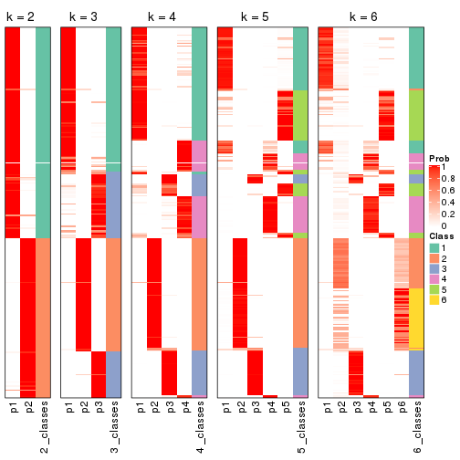


If matrix rows can be associated to genes, consider to use `GO_Enrichment(res,
...)` to perform function enrichment for the signature genes.


 

---------------------------------------------------


### MAD:pam**


The object with results only for a single top-value method and a single partition method 
can be extracted as:

```r
res = res_list["MAD", "pam"]
# you can also extract it by
# res = res_list["MAD:pam"]
```

A summary of `res` and all the functions that can be applied to it:

```r
res
```

```
#> A 'ConsensusPartition' object with k = 2, 3, 4, 5, 6.
#>   On a matrix with 17377 rows and 265 columns.
#>   Top rows (1000, 2000, 3000, 4000, 5000) are extracted by 'MAD' method.
#>   Subgroups are detected by 'pam' method.
#>   Performed in total 1250 partitions by row resampling.
#>   Best k for subgroups seems to be 2.
#> 
#> Following methods can be applied to this 'ConsensusPartition' object:
#>  [1] "cola_report"             "collect_classes"         "collect_plots"          
#>  [4] "collect_stats"           "colnames"                "compare_signatures"     
#>  [7] "consensus_heatmap"       "dimension_reduction"     "functional_enrichment"  
#> [10] "get_anno_col"            "get_anno"                "get_classes"            
#> [13] "get_consensus"           "get_matrix"              "get_membership"         
#> [16] "get_param"               "get_signatures"          "get_stats"              
#> [19] "is_best_k"               "is_stable_k"             "membership_heatmap"     
#> [22] "ncol"                    "nrow"                    "plot_ecdf"              
#> [25] "rownames"                "select_partition_number" "show"                   
#> [28] "suggest_best_k"          "test_to_known_factors"
```

`collect_plots()` function collects all the plots made from `res` for all `k` (number of partitions)
into one single page to provide an easy and fast comparison between different `k`.

```r
collect_plots(res)
```


The plots are:

- The first row: a plot of the ECDF (Empirical cumulative distribution
  function) curves of the consensus matrix for each `k` and the heatmap of
  predicted classes for each `k`.
- The second row: heatmaps of the consensus matrix for each `k`.
- The third row: heatmaps of the membership matrix for each `k`.
- The fouth row: heatmaps of the signatures for each `k`.

All the plots in panels can be made by individual functions and they are
plotted later in this section.

`select_partition_number()` produces several plots showing different
statistics for choosing "optimized" `k`. There are following statistics:

- ECDF curves of the consensus matrix for each `k`;
- 1-PAC. [The PAC
  score](https://en.wikipedia.org/wiki/Consensus_clustering#Over-interpretation_potential_of_consensus_clustering)
  measures the proportion of the ambiguous subgrouping.
- Mean silhouette score.
- Concordance. The mean probability of fiting the consensus class ids in all
  partitions.
- Area increased. Denote $A_k$ as the area under the ECDF curve for current
  `k`, the area increased is defined as $A_k - A_{k-1}$.
- Rand index. The percent of pairs of samples that are both in a same cluster
  or both are not in a same cluster in the partition of k and k-1.
- Jaccard index. The ratio of pairs of samples are both in a same cluster in
  the partition of k and k-1 and the pairs of samples are both in a same
  cluster in the partition k or k-1.

The detailed explanations of these statistics can be found in [the cola
vignette](http://bioconductor.org/packages/devel/bioc/vignettes/cola/inst/doc/cola.html#toc_13).

Generally speaking, lower PAC score, higher mean silhouette score or higher
concordance corresponds to better partition. Rand index and Jaccard index
measure how similar the current partition is compared to partition with `k-1`.
If they are too similar, we won't accept `k` is better than `k-1`.

```r
select_partition_number(res)
```


The numeric values for all these statistics can be obtained by `get_stats()`.

```r
get_stats(res)
```

```
#>   k 1-PAC mean_silhouette concordance area_increased  Rand Jaccard
#> 2 2 1.000           0.965       0.984          0.414 0.593   0.593
#> 3 3 0.742           0.800       0.918          0.589 0.739   0.564
#> 4 4 0.771           0.809       0.874          0.130 0.839   0.577
#> 5 5 0.894           0.842       0.932          0.062 0.939   0.770
#> 6 6 0.810           0.758       0.846          0.042 0.944   0.746
```

`suggest_best_k()` suggests the best $k$ based on these statistics. The rules are as follows:

- All $k$ with Jaccard index larger than 0.95 are removed because the increase of
  the partition number does not provides enough extra information. If all $k$ are removed,
  the best $k$ is assigned by `NA`.
- For $k$ with 1-PAC larger than 0.9, the maximal $k$ is taken as the "best k". Other $k$ is called "optional k".
- If it does not fit the second rule. The $k$ with the highest vote of highest
  1-PAC, mean silhouette and concordance is taken as the "best k".

```r
suggest_best_k(res)
```

```
#> [1] 2
```


Following shows the table of the partitions (You need to click the **show/hide
code output** link to see it). The membership matrix (columns with name `p*`)
is inferred by
[`clue::cl_consensus()`](https://www.rdocumentation.org/link/cl_consensus?package=clue)
function with the `SE` method. Basically the value in the membership matrix
represents the probability to belong to a certain group. The finall class
label for an item is determined with the group with highest probability it
belongs to.

In `get_classes()` function, the entropy is calculated from the membership
matrix and the silhouette score is calculated from the consensus matrix.


<script>
$( function() {
	$( '#tabs-MAD-pam-get-classes' ).tabs();
} );
</script>
<div id='tabs-MAD-pam-get-classes'>
<ul>
<li><a href='#tab-MAD-pam-get-classes-1'>k = 2</a></li>
<li><a href='#tab-MAD-pam-get-classes-2'>k = 3</a></li>
<li><a href='#tab-MAD-pam-get-classes-3'>k = 4</a></li>
<li><a href='#tab-MAD-pam-get-classes-4'>k = 5</a></li>
<li><a href='#tab-MAD-pam-get-classes-5'>k = 6</a></li>
</ul>

<div id='tab-MAD-pam-get-classes-1'>
<p><a id='tab-MAD-pam-get-classes-1-a' style='color:#0366d6' href='#'>show/hide code output</a></p>
<pre><code class="r">cbind(get_classes(res, k = 2), get_membership(res, k = 2))
</code></pre>

<pre><code>#&gt;                                      class entropy silhouette    p1    p2
#&gt; D30CF518-5FC6-4A54-8D5D-BA420EA1836D     2  0.0000      0.987 0.000 1.000
#&gt; 92298FF7-1215-4756-B976-A7D88B91AD76     1  0.0000      0.982 1.000 0.000
#&gt; 0E244FE2-7C17-4642-A51F-2CCA796D9C70     2  0.0000      0.987 0.000 1.000
#&gt; 75435ED8-93E8-45FB-8480-98D8EB2EF8CB     2  0.0000      0.987 0.000 1.000
#&gt; B6D11678-15A9-4F43-A0A2-225067DCAF1C     1  0.0000      0.982 1.000 0.000
#&gt; B7F5A41E-9559-4329-81F5-1B88A74730B7     2  0.0000      0.987 0.000 1.000
#&gt; 39414B2A-7FB0-4669-8DFE-86D9AF7AD2D9     1  0.0000      0.982 1.000 0.000
#&gt; 04823F53-A12D-4852-8F34-77B9DCBB7DF0     2  0.0000      0.987 0.000 1.000
#&gt; 49684C2B-D31C-4B45-A400-3497C3CCEC01     2  0.0000      0.987 0.000 1.000
#&gt; 96A04875-58E2-4BE7-8E0F-CAB55F4CA54F     1  0.1633      0.971 0.976 0.024
#&gt; 1F101D63-478B-40B9-A951-DC3887CFF067     1  0.0938      0.979 0.988 0.012
#&gt; DD290860-E0B7-48FC-BE12-2AF729994C21     2  0.0000      0.987 0.000 1.000
#&gt; FFDD7A12-DDEF-4974-8D60-64B7EEAAC994     2  0.0000      0.987 0.000 1.000
#&gt; E076A9A9-EA2A-4FF7-92A8-F2DA7F30279E     1  0.0938      0.979 0.988 0.012
#&gt; 830DFA6F-A85A-4317-82B2-791FAB998A01     2  0.0000      0.987 0.000 1.000
#&gt; 58578614-E4A3-4655-BBAB-F65851625E0A     1  0.0000      0.982 1.000 0.000
#&gt; 1CBFB672-4D66-430B-83F3-7CE3BE20ABF6     1  0.0000      0.982 1.000 0.000
#&gt; 6C34A7D7-3756-4DCC-9A9F-B5FC4A148B7E     1  0.0000      0.982 1.000 0.000
#&gt; D97ED7B4-5DF2-4B62-8796-AA51CA79DBBB     1  0.0938      0.979 0.988 0.012
#&gt; 45F15851-55F6-4169-834E-38958C38B6A9     1  0.0938      0.979 0.988 0.012
#&gt; 4139E0C9-F712-4A25-8B59-587533B93B3E     1  0.7376      0.747 0.792 0.208
#&gt; 2C3007BF-009E-404F-A3BF-8B921698D85B     1  0.0938      0.979 0.988 0.012
#&gt; 2189F8E5-FF98-4C1A-BD04-5595DB553130     1  0.0000      0.982 1.000 0.000
#&gt; FFAA0310-0D78-4499-8FB8-5BC46E4FCE58     1  0.0938      0.979 0.988 0.012
#&gt; 0C375B2F-67BE-4708-BEB2-544DEC812DCA     2  0.0000      0.987 0.000 1.000
#&gt; AB6324A1-19AB-400C-8001-54765D190E27     2  0.0000      0.987 0.000 1.000
#&gt; A32C4DCD-DC4C-4132-9ED1-B159F5561A2D     1  0.0938      0.979 0.988 0.012
#&gt; 2AE7105D-D494-45B0-947A-315D8C20ECDC     1  0.0000      0.982 1.000 0.000
#&gt; 60FE9D59-FC0F-4B9C-ABF8-1C00BC761928     1  0.0000      0.982 1.000 0.000
#&gt; 056442DC-E87A-4315-965C-C19D7B4FC40E     1  0.0938      0.979 0.988 0.012
#&gt; 455111E5-18EF-4E3F-9DFF-8FA017D92461     1  0.0000      0.982 1.000 0.000
#&gt; 10632BC6-0B81-433C-8832-6B2ABC73A94B     1  0.0000      0.982 1.000 0.000
#&gt; AC6F82AD-C682-4EB3-BEC3-FD950F57609D     1  0.0938      0.979 0.988 0.012
#&gt; D9ABDB75-04DA-4D33-A69F-701729494533     1  0.2423      0.957 0.960 0.040
#&gt; 27BBF44D-F4D7-4C5A-935F-3310A363A670     2  0.0000      0.987 0.000 1.000
#&gt; E7AA12EE-6E14-4B33-A52C-B13589436023     1  0.2423      0.957 0.960 0.040
#&gt; DFA6D41A-D231-413E-A180-E42DF26C3E2B     1  0.9954      0.161 0.540 0.460
#&gt; 655BD3AF-5094-4B19-93A8-401C70369B17     2  0.4161      0.901 0.084 0.916
#&gt; 9DFEF253-923F-4EE2-8E3D-C75805387B20     1  0.2778      0.950 0.952 0.048
#&gt; 3B0EE948-B2CD-4191-90E2-BDD155F3B580     1  0.0000      0.982 1.000 0.000
#&gt; 177C7EF4-2D54-4555-947C-44EE7C688917     1  0.0000      0.982 1.000 0.000
#&gt; 1F8E8BB7-D159-4556-8B04-E5DD027CC444     2  0.0000      0.987 0.000 1.000
#&gt; 619F37D2-6771-4727-9079-56BED07F1CF6     1  0.8081      0.686 0.752 0.248
#&gt; ACAE29BE-ECB8-4A98-BC71-7A2D4857134E     1  0.0000      0.982 1.000 0.000
#&gt; C5C3241A-684C-4238-9333-9AF8630EC086     2  0.2423      0.953 0.040 0.960
#&gt; AD319DC2-140F-4E7B-A899-010687D8B714     2  0.0000      0.987 0.000 1.000
#&gt; 2AFF397C-ED2A-4FD9-A7F0-E4C61E9FB603     1  0.0000      0.982 1.000 0.000
#&gt; FB4C7892-3DBB-4148-AAE9-75B19A1A4031     1  0.0938      0.979 0.988 0.012
#&gt; 6F5C4500-1ED1-4E81-B4F5-EEA64CE2336A     1  0.0000      0.982 1.000 0.000
#&gt; BD027C69-3C10-4047-8E1E-218600FF2B73     2  0.0000      0.987 0.000 1.000
#&gt; 11B473A9-4CC5-461F-BC57-CC9141F3591D     1  0.0000      0.982 1.000 0.000
#&gt; 69A036E5-3E6A-4862-A7F8-2D203ED2FC9E     1  0.0000      0.982 1.000 0.000
#&gt; 9C0BDF24-F011-4855-B95A-1B6BEFA808F7     1  0.0000      0.982 1.000 0.000
#&gt; 9E205254-8C0C-4C05-AF5A-86E679CF732C     1  0.0938      0.979 0.988 0.012
#&gt; 935CCE4A-8AA8-454E-9DFF-7DE27D0BD2E2     1  0.0000      0.982 1.000 0.000
#&gt; 01E5E1FE-41D3-428B-90BC-7A000829E102     1  0.0938      0.979 0.988 0.012
#&gt; B344A530-92CD-468B-847A-DF8E25688081     1  0.0938      0.979 0.988 0.012
#&gt; F79F32A7-9F7B-4D62-8426-4A4CF10ED319     1  0.0938      0.979 0.988 0.012
#&gt; C2E1C6FA-82F9-467C-99AE-9B39FAAC810C     1  0.0000      0.982 1.000 0.000
#&gt; BF7CD9BD-776A-4957-8A6E-EF8AD83EA9D3     2  0.0000      0.987 0.000 1.000
#&gt; 8A2C1409-E83B-435E-A20F-5FCA94801C9F     2  0.0000      0.987 0.000 1.000
#&gt; B6BEFFB5-2F62-477B-A4C8-478D29577CBD     2  0.0000      0.987 0.000 1.000
#&gt; 8622CBD0-F8E9-4AC1-8175-CC9A742B86F9     1  0.0938      0.979 0.988 0.012
#&gt; 565DD660-ED58-4065-8619-260BEA6FCFEB     1  0.0938      0.979 0.988 0.012
#&gt; 96038E42-0FBA-497D-819C-38F7689F10FF     1  0.0000      0.982 1.000 0.000
#&gt; CA685549-F8BA-43F1-8461-5D2D3B17CFC5     1  0.0000      0.982 1.000 0.000
#&gt; 52020307-71A6-46E5-ACB3-8F885CA8F1EB     1  0.0938      0.979 0.988 0.012
#&gt; 7656DA98-76DC-424B-B02C-D7001DAAA0E4     1  0.0000      0.982 1.000 0.000
#&gt; 74DBA640-45E2-42A6-8F1E-69C073D66EE6     1  0.0000      0.982 1.000 0.000
#&gt; 251094BE-C33D-44F0-BD98-8618D71F520C     1  0.0938      0.979 0.988 0.012
#&gt; AB914CC5-5FF1-4257-A353-6A99D11B9478     1  0.0938      0.979 0.988 0.012
#&gt; 38B8B893-0E08-4B71-B51C-B32A7B2724E0     1  0.0000      0.982 1.000 0.000
#&gt; 7C7CD8FF-99A4-41D7-B7E1-5A517001F551     2  0.0000      0.987 0.000 1.000
#&gt; BFC5B75A-E4AE-486B-BA30-23BBAA33A125     2  0.0000      0.987 0.000 1.000
#&gt; 182AC78E-A07C-4B34-B216-B5F573E9F036     1  0.9460      0.448 0.636 0.364
#&gt; B38C5F72-8F46-4531-9C2D-96EEE07A5B22     2  0.0000      0.987 0.000 1.000
#&gt; DB9333A6-A723-4B8F-9221-25B8B23D5126     1  0.0000      0.982 1.000 0.000
#&gt; CD67DD21-C1B6-4D58-AC8E-1F4536C7DA70     1  0.0000      0.982 1.000 0.000
#&gt; 3D76A56E-4B66-48AE-AA60-D9C1004C7140     1  0.0000      0.982 1.000 0.000
#&gt; 71ED572F-7780-47A4-A9F8-D320C737690D     1  0.0000      0.982 1.000 0.000
#&gt; B449FEA1-C4B0-400F-903C-59E13D0BA313     2  0.0000      0.987 0.000 1.000
#&gt; 3F120E90-1486-4215-B9B9-79D5B413CAAC     1  0.1843      0.962 0.972 0.028
#&gt; A071894B-D8C0-4740-BD55-93EA0C86EDF7     1  0.0000      0.982 1.000 0.000
#&gt; 58848D57-D7A9-4ABB-86A2-A8AE2B23F654     1  0.0000      0.982 1.000 0.000
#&gt; CD6F9E20-B301-4663-87EC-953EDF49754F     1  0.4161      0.913 0.916 0.084
#&gt; 367D89F3-D527-4929-B830-8B6D553DF9E1     1  0.0000      0.982 1.000 0.000
#&gt; BE8D7DCB-648B-42DD-9FA8-8B85B5D816B2     1  0.0938      0.979 0.988 0.012
#&gt; AA46F56B-BD9C-40A4-8EA8-35E2568C964D     2  0.0000      0.987 0.000 1.000
#&gt; 6393220A-7C57-413F-81A8-4E38C21E779E     2  0.0000      0.987 0.000 1.000
#&gt; 89AE566C-F65F-43C2-BA97-621A7AC8B6DC     1  0.0000      0.982 1.000 0.000
#&gt; AA6A4BFF-8C62-4B70-B85A-9EDF403B06BA     1  0.0000      0.982 1.000 0.000
#&gt; BCE877A6-9C65-4495-A45D-05753F2D0E15     1  0.0000      0.982 1.000 0.000
#&gt; D7BDDF49-C54B-4F8E-ACA0-C3684AB68B5C     1  0.0938      0.979 0.988 0.012
#&gt; D0800D49-0033-44B2-8D7B-29B16F87ADA6     2  0.1633      0.965 0.024 0.976
#&gt; 151D60B5-5AF1-4B61-B97F-ABC7531D9F89     1  0.0000      0.982 1.000 0.000
#&gt; CBBAEB5B-25FA-4B6D-A40C-357E37033E36     1  0.0000      0.982 1.000 0.000
#&gt; 317CD049-3151-40B7-8E88-B0B8813338D6     1  0.0000      0.982 1.000 0.000
#&gt; 93835C77-F8FA-4928-843C-8016A91881FA     1  0.0000      0.982 1.000 0.000
#&gt; 02A6950F-647D-4F20-B2D0-0238C1441C70     1  0.0938      0.979 0.988 0.012
#&gt; 4D54E415-134F-4F6F-8718-3E0475EF5477     1  0.0000      0.982 1.000 0.000
#&gt; 82AB290A-3993-45E5-8B15-6125A019778C     1  0.0938      0.979 0.988 0.012
#&gt; 3B5EAD14-E506-4A22-804D-BF925A2D5247     2  0.0000      0.987 0.000 1.000
#&gt; 19CF7DDF-4F3A-4D2F-B84A-6451A5C3112C     1  0.0000      0.982 1.000 0.000
#&gt; 2FB00DAA-C274-42B1-A06B-611FE5E96844     1  0.0000      0.982 1.000 0.000
#&gt; 2B1F01C3-8145-4296-8111-2B0474AB9A2C     2  0.0000      0.987 0.000 1.000
#&gt; 3F0865F1-8256-4778-966F-D53637B415B6     1  0.0938      0.979 0.988 0.012
#&gt; 5473210D-37F9-4192-86D2-E2A2C77F3BD2     1  0.0938      0.979 0.988 0.012
#&gt; 5EDB6ACF-4F3F-471A-9DDC-661607CACCC4     1  0.0000      0.982 1.000 0.000
#&gt; 6A252A3A-7EEB-47B6-9C23-D69BD2EA846F     1  0.1633      0.966 0.976 0.024
#&gt; 0A7FFCBB-4BAA-4A5F-8B2D-B427C4D982A8     1  0.0938      0.979 0.988 0.012
#&gt; 1603AFB8-5AD7-4794-9991-BDBE96B4D997     2  0.0000      0.987 0.000 1.000
#&gt; 644299E9-62B7-4DFE-9E6D-D7556A01B40A     1  0.0938      0.979 0.988 0.012
#&gt; EF12E923-1860-4269-B57B-BA6238FA4403     1  0.0000      0.982 1.000 0.000
#&gt; 51B7241E-F0BE-482A-88AE-89004BB68989     1  0.0000      0.982 1.000 0.000
#&gt; 1C007DF3-8A9F-4940-9A4C-DE2A412BB023     1  0.3431      0.927 0.936 0.064
#&gt; 89FCFDE6-9625-432C-AA35-9C5FCCF40031     1  0.0000      0.982 1.000 0.000
#&gt; 7955FC55-386D-497E-AFED-019BBBAD428E     1  0.0938      0.979 0.988 0.012
#&gt; 37FF09ED-73EC-4D10-B2AC-7D8EBA9304ED     1  0.0000      0.982 1.000 0.000
#&gt; C2CD2742-2FB4-468E-90FF-8F65A5C425A9     1  0.0938      0.979 0.988 0.012
#&gt; 766FE08F-3393-4868-B1C1-FA98C9FF16E0     1  0.0000      0.982 1.000 0.000
#&gt; 63E2B578-2221-4255-8C45-7FD030B1C94D     1  0.2236      0.960 0.964 0.036
#&gt; C14B1A44-43F7-45F0-A583-5667A4D3BD95     1  0.0000      0.982 1.000 0.000
#&gt; D9CB551A-CE20-4BF7-8AC9-839112346C3D     1  0.0000      0.982 1.000 0.000
#&gt; 05BAA71A-E5B3-4A3A-A3F2-013A975087F0     2  0.0000      0.987 0.000 1.000
#&gt; AC8DA7DE-4D83-4768-BEFD-9A1B2DA943CE     1  0.0000      0.982 1.000 0.000
#&gt; E89DCE9D-F8A5-499C-85BB-BB500BADB9FB     1  0.0000      0.982 1.000 0.000
#&gt; C16F9B5E-2B52-40F6-856D-C0D6FBDD16C1     1  0.0000      0.982 1.000 0.000
#&gt; 8FF234D4-823A-4C80-82F7-2E92D72DBF88     2  0.0000      0.987 0.000 1.000
#&gt; C9F94A6E-D104-4D8D-8EC5-EADECD85F092     1  0.9248      0.504 0.660 0.340
#&gt; 45C9756F-A154-4537-852E-ECBF27B92FE1     2  0.0000      0.987 0.000 1.000
#&gt; 0F1A5708-341E-4713-BC70-76D702F826D6     1  0.7745      0.720 0.772 0.228
#&gt; 2ECFBCA0-AB35-461A-A4B5-C60B2651A962     2  0.0000      0.987 0.000 1.000
#&gt; 7DFAC404-3AB3-4274-A533-CFDAF4CE122D     1  0.0000      0.982 1.000 0.000
#&gt; A90AF55C-4386-42AB-A812-9230026EA5A5     2  0.0000      0.987 0.000 1.000
#&gt; 6258A757-4E18-4CD1-8417-189521E990B6     2  0.0000      0.987 0.000 1.000
#&gt; EBFAD137-050F-47D0-A43D-72B8F7D70C2B     1  0.0000      0.982 1.000 0.000
#&gt; 08B5EBFB-2807-4229-95A6-81AB7F377A56     2  0.0000      0.987 0.000 1.000
#&gt; 4780A59C-0589-4995-B044-3201F09AF859     1  0.0000      0.982 1.000 0.000
#&gt; 0AB81429-C287-48AA-9035-3A7A6F4C7328     2  0.0000      0.987 0.000 1.000
#&gt; 20C4D047-28DA-4AB7-9B3C-32EDA6B22C9D     1  0.0938      0.979 0.988 0.012
#&gt; 77C4E01F-84A6-4BFD-AA8E-D7875456F546     1  0.0000      0.982 1.000 0.000
#&gt; 8B28383F-CF14-4CC5-A1E2-72AD915C0AE8     1  0.0000      0.982 1.000 0.000
#&gt; E12E1F48-6A52-4F74-925C-C4EE1BF5C573     2  0.0000      0.987 0.000 1.000
#&gt; 9B179BC5-BB4C-4CEE-99BC-BC552BC384A1     1  0.0000      0.982 1.000 0.000
#&gt; 5548C91A-D3DE-48F5-B4A4-124BE177B99A     1  0.0000      0.982 1.000 0.000
#&gt; 0E22B729-C381-4B0C-9897-62DD38F51722     1  0.0938      0.979 0.988 0.012
#&gt; 7BC4937F-04E2-4B46-BA7C-FE9AC738C8A9     1  0.0000      0.982 1.000 0.000
#&gt; EE6A0D3F-3F8A-4AA8-B3EF-32372EF37A29     1  0.0000      0.982 1.000 0.000
#&gt; 08AC2706-7651-409F-BE6B-BCED1C2D1796     1  0.0000      0.982 1.000 0.000
#&gt; A68B078D-8979-4070-BB4D-F526704ED3DC     1  0.2423      0.957 0.960 0.040
#&gt; C319A5EE-69FA-4AAB-85A9-2EAAD8E4C703     1  0.0000      0.982 1.000 0.000
#&gt; 0D7CAABD-D20C-4F82-BCBC-8B7276E8EDE2     1  0.0000      0.982 1.000 0.000
#&gt; 09444DCC-44BA-4A3F-ACC5-863A54578B9F     1  0.0000      0.982 1.000 0.000
#&gt; 2E32B047-C6E1-4743-A6C8-E98370A32145     1  0.0000      0.982 1.000 0.000
#&gt; 6A6878A7-76B2-40DE-958B-804442AC6A5D     1  0.0938      0.979 0.988 0.012
#&gt; 39F27293-0BFF-4EA2-8439-A299E3226D20     1  0.0376      0.980 0.996 0.004
#&gt; 7EAE9C30-6080-405F-A7E6-1FED57674279     1  0.0000      0.982 1.000 0.000
#&gt; 79499169-A093-4E0A-B6BD-010CD7BE5035     1  0.0000      0.982 1.000 0.000
#&gt; 1F8BF4E8-BD84-4EFE-9E3E-89E7CE8FA72D     1  0.0938      0.979 0.988 0.012
#&gt; 62B7988F-98E5-4AB8-8A16-D661A07455E8     1  0.0000      0.982 1.000 0.000
#&gt; B7005B5F-217E-4073-BFB5-CE7E884B80C0     2  0.0000      0.987 0.000 1.000
#&gt; B981568F-2C08-4696-B589-E157A49BE72B     2  0.0000      0.987 0.000 1.000
#&gt; A3D85C0A-3202-40C2-88E1-052AC6C5184B     1  0.0938      0.979 0.988 0.012
#&gt; 4CA783B9-9B99-46B8-962A-77194ECB7942     1  0.1633      0.971 0.976 0.024
#&gt; D4024B08-4879-47EA-99E5-D9FCE1CD40DF     1  0.0000      0.982 1.000 0.000
#&gt; 1D41CDA2-0B29-48FD-B83A-E60C174DBCB3     1  0.0000      0.982 1.000 0.000
#&gt; A1923B2A-B233-4760-8AF9-C04C1CAEB100     1  0.0376      0.981 0.996 0.004
#&gt; 80880D71-BFDE-4D88-892F-5ADF27A38940     1  0.0938      0.979 0.988 0.012
#&gt; 55D1629D-30FD-49AA-88CE-EA3CA9B30A3F     2  0.0000      0.987 0.000 1.000
#&gt; B71C409E-926D-48AD-8BD8-9F707CA4FB01     2  0.0000      0.987 0.000 1.000
#&gt; 54A92C57-BD19-4A47-BA76-3ACA2DC36212     1  0.0000      0.982 1.000 0.000
#&gt; B2AB74B8-506C-4C27-9105-E86A6AAA89D4     1  0.0000      0.982 1.000 0.000
#&gt; 0356AE49-7A5C-42CC-A39C-7C8DFBFF8842     2  0.0000      0.987 0.000 1.000
#&gt; ACA260A3-DC3F-4FF4-B9C5-2D4BC4F81783     1  0.0000      0.982 1.000 0.000
#&gt; 9B440917-E5A4-43B9-A48D-6ABFEDCA6CFD     1  0.0000      0.982 1.000 0.000
#&gt; 47464828-52EA-413B-B30C-BD8B55903D78     2  0.0000      0.987 0.000 1.000
#&gt; C1D1FC82-B50D-4C82-8F03-06CEE3C08D18     1  0.0938      0.979 0.988 0.012
#&gt; E5ABFC43-E2A3-4B1A-BBA3-8196C0B026A5     2  0.5629      0.843 0.132 0.868
#&gt; 1D3C16CC-D0D5-4637-AAC7-91672DFF3317     1  0.0938      0.979 0.988 0.012
#&gt; 4D038320-ADEA-4990-8371-68B4B8162E1A     2  0.0000      0.987 0.000 1.000
#&gt; A75594CC-3E49-4869-8656-BBB4E72BF59D     2  0.0000      0.987 0.000 1.000
#&gt; 7CABAA19-5FB2-4A58-BDA3-4F1FFB532C20     1  0.0000      0.982 1.000 0.000
#&gt; 534EF1E9-9513-426E-B41E-A394AB2E4410     2  0.0000      0.987 0.000 1.000
#&gt; 649F35A1-A08C-497D-A9B6-CB3084D5FB8D     1  0.0000      0.982 1.000 0.000
#&gt; 7CA30F3C-1C98-480C-B8B5-A248AABFB468     1  0.0000      0.982 1.000 0.000
#&gt; A9F8DA21-A802-44CF-9F5D-96A36687DCDD     1  0.0938      0.979 0.988 0.012
#&gt; A7AE1ED1-86CB-4A50-97B2-66785C7191FE     1  0.0000      0.982 1.000 0.000
#&gt; D0091AD4-D3D7-4C03-ACD9-DA9F8B6076C6     1  0.0000      0.982 1.000 0.000
#&gt; 46EE1C2B-13F7-44A7-B27E-4EBB9DF0CA83     2  0.0000      0.987 0.000 1.000
#&gt; CB9301B8-0282-43D6-AF5E-B753A9C7BFCB     2  0.0000      0.987 0.000 1.000
#&gt; A0E77A39-885A-4472-9A10-2D1E51DBFDA4     1  0.0938      0.979 0.988 0.012
#&gt; C06603C2-163D-40B6-A9FE-882424F18FE9     1  0.0000      0.982 1.000 0.000
#&gt; C3921A29-80FF-4B9D-B366-5C0238A42231     1  0.0000      0.982 1.000 0.000
#&gt; BB99B4E7-C834-4BB8-973F-8FA039E2798F     1  0.0000      0.982 1.000 0.000
#&gt; 5CD78C2F-05E9-409A-8405-3EE936A6876E     1  0.2236      0.955 0.964 0.036
#&gt; 6C126CC7-0C03-48F0-A2C2-F090CA239B70     2  0.0000      0.987 0.000 1.000
#&gt; 7118B08A-E94C-49F4-8D76-26455C34D85F     2  0.0000      0.987 0.000 1.000
#&gt; 266DAF30-CF3E-493E-8B24-3931D0039450     1  0.0000      0.982 1.000 0.000
#&gt; DAB5F5B9-4FE5-468F-AD2B-B39BBC4317A0     1  0.0000      0.982 1.000 0.000
#&gt; 9A9EB6D6-312E-4A98-8762-30D3ABD8193D     1  0.0000      0.982 1.000 0.000
#&gt; CED15676-B901-4FC8-9C8D-51E529D9441D     1  0.0938      0.979 0.988 0.012
#&gt; 827232CC-8035-440C-8B12-02C789C70B1B     1  0.0000      0.982 1.000 0.000
#&gt; 04D5FB28-FB50-4EAE-95FB-72ABF0E618CA     2  0.0000      0.987 0.000 1.000
#&gt; 6C96A851-97FC-4845-B895-D255191D9F25     1  0.0938      0.979 0.988 0.012
#&gt; 3EC982CB-D013-443E-B21D-39DE6B8EF370     1  0.3114      0.935 0.944 0.056
#&gt; 2E24A786-4370-42A1-AD50-D651F89819CC     2  0.0000      0.987 0.000 1.000
#&gt; 7653BFA9-ADA5-44CA-8555-807FBBFC6DE2     1  0.0000      0.982 1.000 0.000
#&gt; 7A110994-5741-4013-91F0-DD2E1D343F91     2  0.0000      0.987 0.000 1.000
#&gt; 0A760E0C-11C5-4201-8452-18DBC1FEACEB     1  0.0938      0.979 0.988 0.012
#&gt; 909B76A1-BB9F-4906-95BC-58CD1A46D3B8     2  0.0000      0.987 0.000 1.000
#&gt; A782EE71-EDA4-4385-83B3-D16DE81296C0     1  0.0000      0.982 1.000 0.000
#&gt; BD50E276-914F-4924-8CEA-FF47A66DB175     2  0.0000      0.987 0.000 1.000
#&gt; 505D5CA8-0279-4BC7-8CC0-8C7A0165BF91     2  0.0000      0.987 0.000 1.000
#&gt; D51FC997-E662-4AE7-BC9C-14183DA42DE1     2  0.0000      0.987 0.000 1.000
#&gt; 8AD67970-84F1-4C0A-B47A-8FA4108F9FE3     1  0.0000      0.982 1.000 0.000
#&gt; 6E33B1B6-7089-4BC3-B2B0-EC2C3B5D8B74     1  0.0000      0.982 1.000 0.000
#&gt; 88C4EA46-2546-401C-A8E7-603EECFDFBA0     1  0.0000      0.982 1.000 0.000
#&gt; 375D2D72-C998-4627-BA35-24E82A9A55FF     1  0.0938      0.979 0.988 0.012
#&gt; 76D0F834-7064-46C6-96F4-E861CF5452B6     2  0.0000      0.987 0.000 1.000
#&gt; 87159081-C97A-4004-AF0A-7EB6EF0EC47A     1  0.0000      0.982 1.000 0.000
#&gt; 24A57006-800B-4174-AF4E-7EA57A8A756E     1  0.0000      0.982 1.000 0.000
#&gt; AD68CBC6-8A13-4A65-AF62-E99AFA81D031     1  0.0000      0.982 1.000 0.000
#&gt; 22863A57-F066-4DD1-A859-4336F43D144C     1  0.0000      0.982 1.000 0.000
#&gt; 8F6F0362-9165-4DCC-992C-AF871A3C51E7     1  0.0938      0.979 0.988 0.012
#&gt; 76ABF0B7-E707-4DB2-9486-3814439BDBA5     1  0.0938      0.979 0.988 0.012
#&gt; BC72372F-3577-40E5-BA0F-41A084AA93AD     1  0.2423      0.957 0.960 0.040
#&gt; 8E566039-B56C-4F41-B9EF-DE18BEEF2C95     1  0.0938      0.979 0.988 0.012
#&gt; F096F016-3EF5-4A67-A7C2-8A45E1585232     1  0.0000      0.982 1.000 0.000
#&gt; BB37913E-534B-43DD-BE3D-E13B29FD8172     2  0.0000      0.987 0.000 1.000
#&gt; E344638F-9060-460F-8F7A-60D19442F294     1  0.2423      0.957 0.960 0.040
#&gt; 6A0EAAD0-89D5-4F12-8B45-9D5A25182FAD     2  0.9580      0.367 0.380 0.620
#&gt; A5199E3A-9D67-4543-88AB-24398C98E38E     1  0.0000      0.982 1.000 0.000
#&gt; 23917D52-7864-4F84-9C77-DF8EA9407345     2  0.0000      0.987 0.000 1.000
#&gt; 9AA96080-19D8-40C3-BDD1-6044D2D422D5     1  0.0938      0.979 0.988 0.012
#&gt; 0ED65D91-260C-4662-9903-EE36A2E3B2D0     2  0.0000      0.987 0.000 1.000
#&gt; 64BF1BC5-7A9A-4E1D-AEAB-AFE30B92AAF4     1  0.0938      0.979 0.988 0.012
#&gt; F02301F1-9054-4DC6-8DC9-2451A0F53EFC     2  0.0000      0.987 0.000 1.000
#&gt; 3264649A-5684-4181-83D0-A7E4D7E2E1FD     1  0.0000      0.982 1.000 0.000
#&gt; 3F8DA39C-BC9B-4343-8838-5CE271E80C51     1  0.8016      0.692 0.756 0.244
#&gt; BCC681CB-2AF4-4BB6-B53A-7544A2399454     1  0.0938      0.979 0.988 0.012
#&gt; DCB50E17-5E2D-443B-8DCC-272FBB734C2E     1  0.0938      0.979 0.988 0.012
#&gt; B5E47C38-CB6A-44C0-AA9B-56951B9EF78D     1  0.0000      0.982 1.000 0.000
#&gt; B15B0185-9C28-4A00-9CEC-05EFECEA6709     1  0.0938      0.979 0.988 0.012
#&gt; 61D4E8E7-0110-480A-A4A7-D406DE74C31E     1  0.0000      0.982 1.000 0.000
#&gt; CA8DB3AD-3F6B-4622-BF73-47041EC96E42     1  0.0000      0.982 1.000 0.000
#&gt; 5EECB1C4-172C-4494-871A-ADB650CD82BD     2  0.0000      0.987 0.000 1.000
#&gt; 019B857C-D4F7-4B67-B699-56E52A60805B     2  0.1414      0.969 0.020 0.980
#&gt; E9C28902-05C9-4883-97A4-D612D54E46B4     1  0.0000      0.982 1.000 0.000
#&gt; C5D3D9A0-FC14-408D-AB6C-662018A5E5CA     1  0.0000      0.982 1.000 0.000
#&gt; 7EB24744-509B-4854-B7D0-0BAFA210A345     2  0.0000      0.987 0.000 1.000
#&gt; B8B7A721-2284-40AB-98F5-EF1351C30B66     2  0.0000      0.987 0.000 1.000
#&gt; 3C12F39D-0D21-4F69-A539-4120B73C7A79     2  0.0000      0.987 0.000 1.000
#&gt; 08D3F984-6850-45B2-9DF9-EC7F5A4060A4     1  0.0000      0.982 1.000 0.000
#&gt; 9BD0EE79-1EED-4F6D-A5AB-43ADB8526F1E     1  0.0000      0.982 1.000 0.000
#&gt; E489A871-3CF4-4F3D-8EAF-63B507054201     2  0.0000      0.987 0.000 1.000
#&gt; 8CF8FD2E-1DBA-4257-9715-04D956D46B71     2  0.0000      0.987 0.000 1.000
#&gt; F6193AF0-7A19-46CB-A818-1B01E7460791     1  0.0938      0.979 0.988 0.012
#&gt; 96392D6B-D4FF-4393-93BA-08E469E8BBE1     1  0.0000      0.982 1.000 0.000
#&gt; DABCBE5A-C591-46A2-AF66-DA3DB6106751     1  0.0938      0.979 0.988 0.012
#&gt; 8B75F7D4-98D8-44DE-B19D-B733D6A031DB     1  0.0938      0.979 0.988 0.012
#&gt; AAD9685A-564B-42E9-91E3-431951154BA7     2  0.8555      0.605 0.280 0.720
#&gt; 90A43152-4E3B-4365-A39F-7B0E5CA66E55     1  0.0000      0.982 1.000 0.000
#&gt; EFB76FCF-AC9C-4852-B91C-E055DA666FA0     1  0.0672      0.980 0.992 0.008
#&gt; 6EBCFFE3-706F-440A-ABA9-012A924A07C6     2  0.0000      0.987 0.000 1.000
#&gt; E922A244-F1C8-4310-ABB2-62B06E022E4C     1  0.0938      0.979 0.988 0.012
</code></pre>

<script>
$('#tab-MAD-pam-get-classes-1-a').parent().next().next().hide();
$('#tab-MAD-pam-get-classes-1-a').click(function(){
  $('#tab-MAD-pam-get-classes-1-a').parent().next().next().toggle();
  return(false);
});
</script>
</div>

<div id='tab-MAD-pam-get-classes-2'>
<p><a id='tab-MAD-pam-get-classes-2-a' style='color:#0366d6' href='#'>show/hide code output</a></p>
<pre><code class="r">cbind(get_classes(res, k = 3), get_membership(res, k = 3))
</code></pre>

<pre><code>#&gt;                                      class entropy silhouette    p1    p2    p3
#&gt; D30CF518-5FC6-4A54-8D5D-BA420EA1836D     2  0.0000     0.9751 0.000 1.000 0.000
#&gt; 92298FF7-1215-4756-B976-A7D88B91AD76     1  0.6008     0.3900 0.628 0.000 0.372
#&gt; 0E244FE2-7C17-4642-A51F-2CCA796D9C70     2  0.0000     0.9751 0.000 1.000 0.000
#&gt; 75435ED8-93E8-45FB-8480-98D8EB2EF8CB     2  0.0000     0.9751 0.000 1.000 0.000
#&gt; B6D11678-15A9-4F43-A0A2-225067DCAF1C     3  0.0237     0.8684 0.004 0.000 0.996
#&gt; B7F5A41E-9559-4329-81F5-1B88A74730B7     2  0.0000     0.9751 0.000 1.000 0.000
#&gt; 39414B2A-7FB0-4669-8DFE-86D9AF7AD2D9     3  0.0237     0.8684 0.004 0.000 0.996
#&gt; 04823F53-A12D-4852-8F34-77B9DCBB7DF0     2  0.0000     0.9751 0.000 1.000 0.000
#&gt; 49684C2B-D31C-4B45-A400-3497C3CCEC01     2  0.0000     0.9751 0.000 1.000 0.000
#&gt; 96A04875-58E2-4BE7-8E0F-CAB55F4CA54F     1  0.0237     0.8858 0.996 0.000 0.004
#&gt; 1F101D63-478B-40B9-A951-DC3887CFF067     1  0.0892     0.8809 0.980 0.000 0.020
#&gt; DD290860-E0B7-48FC-BE12-2AF729994C21     2  0.0000     0.9751 0.000 1.000 0.000
#&gt; FFDD7A12-DDEF-4974-8D60-64B7EEAAC994     2  0.0000     0.9751 0.000 1.000 0.000
#&gt; E076A9A9-EA2A-4FF7-92A8-F2DA7F30279E     3  0.6111     0.2833 0.396 0.000 0.604
#&gt; 830DFA6F-A85A-4317-82B2-791FAB998A01     2  0.0000     0.9751 0.000 1.000 0.000
#&gt; 58578614-E4A3-4655-BBAB-F65851625E0A     3  0.0237     0.8684 0.004 0.000 0.996
#&gt; 1CBFB672-4D66-430B-83F3-7CE3BE20ABF6     3  0.4750     0.6898 0.216 0.000 0.784
#&gt; 6C34A7D7-3756-4DCC-9A9F-B5FC4A148B7E     3  0.0237     0.8671 0.004 0.000 0.996
#&gt; D97ED7B4-5DF2-4B62-8796-AA51CA79DBBB     1  0.4702     0.6948 0.788 0.000 0.212
#&gt; 45F15851-55F6-4169-834E-38958C38B6A9     1  0.0237     0.8858 0.996 0.000 0.004
#&gt; 4139E0C9-F712-4A25-8B59-587533B93B3E     3  0.8018     0.1245 0.416 0.064 0.520
#&gt; 2C3007BF-009E-404F-A3BF-8B921698D85B     1  0.0000     0.8863 1.000 0.000 0.000
#&gt; 2189F8E5-FF98-4C1A-BD04-5595DB553130     3  0.4605     0.7033 0.204 0.000 0.796
#&gt; FFAA0310-0D78-4499-8FB8-5BC46E4FCE58     3  0.0237     0.8684 0.004 0.000 0.996
#&gt; 0C375B2F-67BE-4708-BEB2-544DEC812DCA     2  0.0000     0.9751 0.000 1.000 0.000
#&gt; AB6324A1-19AB-400C-8001-54765D190E27     2  0.0000     0.9751 0.000 1.000 0.000
#&gt; A32C4DCD-DC4C-4132-9ED1-B159F5561A2D     1  0.0237     0.8858 0.996 0.000 0.004
#&gt; 2AE7105D-D494-45B0-947A-315D8C20ECDC     3  0.0237     0.8684 0.004 0.000 0.996
#&gt; 60FE9D59-FC0F-4B9C-ABF8-1C00BC761928     1  0.0237     0.8855 0.996 0.000 0.004
#&gt; 056442DC-E87A-4315-965C-C19D7B4FC40E     1  0.0000     0.8863 1.000 0.000 0.000
#&gt; 455111E5-18EF-4E3F-9DFF-8FA017D92461     3  0.0000     0.8684 0.000 0.000 1.000
#&gt; 10632BC6-0B81-433C-8832-6B2ABC73A94B     1  0.0237     0.8858 0.996 0.000 0.004
#&gt; AC6F82AD-C682-4EB3-BEC3-FD950F57609D     1  0.0000     0.8863 1.000 0.000 0.000
#&gt; D9ABDB75-04DA-4D33-A69F-701729494533     1  0.0237     0.8855 0.996 0.000 0.004
#&gt; 27BBF44D-F4D7-4C5A-935F-3310A363A670     2  0.0000     0.9751 0.000 1.000 0.000
#&gt; E7AA12EE-6E14-4B33-A52C-B13589436023     1  0.1289     0.8706 0.968 0.000 0.032
#&gt; DFA6D41A-D231-413E-A180-E42DF26C3E2B     3  0.4489     0.7769 0.036 0.108 0.856
#&gt; 655BD3AF-5094-4B19-93A8-401C70369B17     2  0.6095     0.3172 0.392 0.608 0.000
#&gt; 9DFEF253-923F-4EE2-8E3D-C75805387B20     1  0.0237     0.8855 0.996 0.000 0.004
#&gt; 3B0EE948-B2CD-4191-90E2-BDD155F3B580     3  0.6180     0.2208 0.416 0.000 0.584
#&gt; 177C7EF4-2D54-4555-947C-44EE7C688917     3  0.0000     0.8684 0.000 0.000 1.000
#&gt; 1F8E8BB7-D159-4556-8B04-E5DD027CC444     2  0.0000     0.9751 0.000 1.000 0.000
#&gt; 619F37D2-6771-4727-9079-56BED07F1CF6     1  0.9746     0.3022 0.432 0.328 0.240
#&gt; ACAE29BE-ECB8-4A98-BC71-7A2D4857134E     3  0.0000     0.8684 0.000 0.000 1.000
#&gt; C5C3241A-684C-4238-9333-9AF8630EC086     2  0.0000     0.9751 0.000 1.000 0.000
#&gt; AD319DC2-140F-4E7B-A899-010687D8B714     2  0.0000     0.9751 0.000 1.000 0.000
#&gt; 2AFF397C-ED2A-4FD9-A7F0-E4C61E9FB603     3  0.0237     0.8684 0.004 0.000 0.996
#&gt; FB4C7892-3DBB-4148-AAE9-75B19A1A4031     1  0.4796     0.6851 0.780 0.000 0.220
#&gt; 6F5C4500-1ED1-4E81-B4F5-EEA64CE2336A     3  0.1289     0.8545 0.032 0.000 0.968
#&gt; BD027C69-3C10-4047-8E1E-218600FF2B73     2  0.0000     0.9751 0.000 1.000 0.000
#&gt; 11B473A9-4CC5-461F-BC57-CC9141F3591D     3  0.0000     0.8684 0.000 0.000 1.000
#&gt; 69A036E5-3E6A-4862-A7F8-2D203ED2FC9E     3  0.0237     0.8684 0.004 0.000 0.996
#&gt; 9C0BDF24-F011-4855-B95A-1B6BEFA808F7     1  0.5948     0.4256 0.640 0.000 0.360
#&gt; 9E205254-8C0C-4C05-AF5A-86E679CF732C     1  0.6008     0.3972 0.628 0.000 0.372
#&gt; 935CCE4A-8AA8-454E-9DFF-7DE27D0BD2E2     3  0.0237     0.8684 0.004 0.000 0.996
#&gt; 01E5E1FE-41D3-428B-90BC-7A000829E102     1  0.0237     0.8858 0.996 0.000 0.004
#&gt; B344A530-92CD-468B-847A-DF8E25688081     3  0.0237     0.8671 0.004 0.000 0.996
#&gt; F79F32A7-9F7B-4D62-8426-4A4CF10ED319     1  0.0000     0.8863 1.000 0.000 0.000
#&gt; C2E1C6FA-82F9-467C-99AE-9B39FAAC810C     1  0.0237     0.8858 0.996 0.000 0.004
#&gt; BF7CD9BD-776A-4957-8A6E-EF8AD83EA9D3     2  0.0000     0.9751 0.000 1.000 0.000
#&gt; 8A2C1409-E83B-435E-A20F-5FCA94801C9F     2  0.0000     0.9751 0.000 1.000 0.000
#&gt; B6BEFFB5-2F62-477B-A4C8-478D29577CBD     2  0.0000     0.9751 0.000 1.000 0.000
#&gt; 8622CBD0-F8E9-4AC1-8175-CC9A742B86F9     1  0.0237     0.8858 0.996 0.000 0.004
#&gt; 565DD660-ED58-4065-8619-260BEA6FCFEB     1  0.0237     0.8858 0.996 0.000 0.004
#&gt; 96038E42-0FBA-497D-819C-38F7689F10FF     1  0.0237     0.8858 0.996 0.000 0.004
#&gt; CA685549-F8BA-43F1-8461-5D2D3B17CFC5     3  0.0237     0.8684 0.004 0.000 0.996
#&gt; 52020307-71A6-46E5-ACB3-8F885CA8F1EB     1  0.1411     0.8681 0.964 0.000 0.036
#&gt; 7656DA98-76DC-424B-B02C-D7001DAAA0E4     3  0.6062     0.3117 0.384 0.000 0.616
#&gt; 74DBA640-45E2-42A6-8F1E-69C073D66EE6     3  0.5497     0.5803 0.292 0.000 0.708
#&gt; 251094BE-C33D-44F0-BD98-8618D71F520C     1  0.2066     0.8531 0.940 0.000 0.060
#&gt; AB914CC5-5FF1-4257-A353-6A99D11B9478     1  0.0237     0.8858 0.996 0.000 0.004
#&gt; 38B8B893-0E08-4B71-B51C-B32A7B2724E0     1  0.6045     0.3789 0.620 0.000 0.380
#&gt; 7C7CD8FF-99A4-41D7-B7E1-5A517001F551     2  0.0000     0.9751 0.000 1.000 0.000
#&gt; BFC5B75A-E4AE-486B-BA30-23BBAA33A125     2  0.0000     0.9751 0.000 1.000 0.000
#&gt; 182AC78E-A07C-4B34-B216-B5F573E9F036     3  0.9464    -0.0689 0.408 0.180 0.412
#&gt; B38C5F72-8F46-4531-9C2D-96EEE07A5B22     2  0.0000     0.9751 0.000 1.000 0.000
#&gt; DB9333A6-A723-4B8F-9221-25B8B23D5126     3  0.0000     0.8684 0.000 0.000 1.000
#&gt; CD67DD21-C1B6-4D58-AC8E-1F4536C7DA70     3  0.0000     0.8684 0.000 0.000 1.000
#&gt; 3D76A56E-4B66-48AE-AA60-D9C1004C7140     1  0.0237     0.8852 0.996 0.000 0.004
#&gt; 71ED572F-7780-47A4-A9F8-D320C737690D     1  0.0892     0.8793 0.980 0.000 0.020
#&gt; B449FEA1-C4B0-400F-903C-59E13D0BA313     2  0.0000     0.9751 0.000 1.000 0.000
#&gt; 3F120E90-1486-4215-B9B9-79D5B413CAAC     3  0.0000     0.8684 0.000 0.000 1.000
#&gt; A071894B-D8C0-4740-BD55-93EA0C86EDF7     3  0.0237     0.8684 0.004 0.000 0.996
#&gt; 58848D57-D7A9-4ABB-86A2-A8AE2B23F654     1  0.2959     0.8172 0.900 0.000 0.100
#&gt; CD6F9E20-B301-4663-87EC-953EDF49754F     3  0.0237     0.8671 0.004 0.000 0.996
#&gt; 367D89F3-D527-4929-B830-8B6D553DF9E1     3  0.0237     0.8684 0.004 0.000 0.996
#&gt; BE8D7DCB-648B-42DD-9FA8-8B85B5D816B2     1  0.0000     0.8863 1.000 0.000 0.000
#&gt; AA46F56B-BD9C-40A4-8EA8-35E2568C964D     2  0.0000     0.9751 0.000 1.000 0.000
#&gt; 6393220A-7C57-413F-81A8-4E38C21E779E     2  0.0000     0.9751 0.000 1.000 0.000
#&gt; 89AE566C-F65F-43C2-BA97-621A7AC8B6DC     3  0.3752     0.7665 0.144 0.000 0.856
#&gt; AA6A4BFF-8C62-4B70-B85A-9EDF403B06BA     1  0.6252     0.0919 0.556 0.000 0.444
#&gt; BCE877A6-9C65-4495-A45D-05753F2D0E15     1  0.6111     0.2319 0.604 0.000 0.396
#&gt; D7BDDF49-C54B-4F8E-ACA0-C3684AB68B5C     1  0.6180     0.3157 0.584 0.000 0.416
#&gt; D0800D49-0033-44B2-8D7B-29B16F87ADA6     2  0.3116     0.8557 0.000 0.892 0.108
#&gt; 151D60B5-5AF1-4B61-B97F-ABC7531D9F89     3  0.0000     0.8684 0.000 0.000 1.000
#&gt; CBBAEB5B-25FA-4B6D-A40C-357E37033E36     3  0.0237     0.8684 0.004 0.000 0.996
#&gt; 317CD049-3151-40B7-8E88-B0B8813338D6     3  0.4178     0.7433 0.172 0.000 0.828
#&gt; 93835C77-F8FA-4928-843C-8016A91881FA     1  0.5431     0.5271 0.716 0.000 0.284
#&gt; 02A6950F-647D-4F20-B2D0-0238C1441C70     1  0.0237     0.8858 0.996 0.000 0.004
#&gt; 4D54E415-134F-4F6F-8718-3E0475EF5477     1  0.0237     0.8858 0.996 0.000 0.004
#&gt; 82AB290A-3993-45E5-8B15-6125A019778C     1  0.0237     0.8858 0.996 0.000 0.004
#&gt; 3B5EAD14-E506-4A22-804D-BF925A2D5247     2  0.0000     0.9751 0.000 1.000 0.000
#&gt; 19CF7DDF-4F3A-4D2F-B84A-6451A5C3112C     3  0.0000     0.8684 0.000 0.000 1.000
#&gt; 2FB00DAA-C274-42B1-A06B-611FE5E96844     3  0.0237     0.8684 0.004 0.000 0.996
#&gt; 2B1F01C3-8145-4296-8111-2B0474AB9A2C     2  0.0000     0.9751 0.000 1.000 0.000
#&gt; 3F0865F1-8256-4778-966F-D53637B415B6     3  0.0000     0.8684 0.000 0.000 1.000
#&gt; 5473210D-37F9-4192-86D2-E2A2C77F3BD2     3  0.0000     0.8684 0.000 0.000 1.000
#&gt; 5EDB6ACF-4F3F-471A-9DDC-661607CACCC4     3  0.6244     0.2495 0.440 0.000 0.560
#&gt; 6A252A3A-7EEB-47B6-9C23-D69BD2EA846F     3  0.0000     0.8684 0.000 0.000 1.000
#&gt; 0A7FFCBB-4BAA-4A5F-8B2D-B427C4D982A8     1  0.0000     0.8863 1.000 0.000 0.000
#&gt; 1603AFB8-5AD7-4794-9991-BDBE96B4D997     2  0.0000     0.9751 0.000 1.000 0.000
#&gt; 644299E9-62B7-4DFE-9E6D-D7556A01B40A     1  0.0592     0.8823 0.988 0.000 0.012
#&gt; EF12E923-1860-4269-B57B-BA6238FA4403     3  0.0237     0.8684 0.004 0.000 0.996
#&gt; 51B7241E-F0BE-482A-88AE-89004BB68989     3  0.0237     0.8684 0.004 0.000 0.996
#&gt; 1C007DF3-8A9F-4940-9A4C-DE2A412BB023     3  0.0000     0.8684 0.000 0.000 1.000
#&gt; 89FCFDE6-9625-432C-AA35-9C5FCCF40031     3  0.0237     0.8671 0.004 0.000 0.996
#&gt; 7955FC55-386D-497E-AFED-019BBBAD428E     3  0.0237     0.8684 0.004 0.000 0.996
#&gt; 37FF09ED-73EC-4D10-B2AC-7D8EBA9304ED     3  0.0000     0.8684 0.000 0.000 1.000
#&gt; C2CD2742-2FB4-468E-90FF-8F65A5C425A9     1  0.4605     0.7043 0.796 0.000 0.204
#&gt; 766FE08F-3393-4868-B1C1-FA98C9FF16E0     3  0.6168     0.2394 0.412 0.000 0.588
#&gt; 63E2B578-2221-4255-8C45-7FD030B1C94D     1  0.0237     0.8858 0.996 0.000 0.004
#&gt; C14B1A44-43F7-45F0-A583-5667A4D3BD95     3  0.0237     0.8684 0.004 0.000 0.996
#&gt; D9CB551A-CE20-4BF7-8AC9-839112346C3D     1  0.0237     0.8858 0.996 0.000 0.004
#&gt; 05BAA71A-E5B3-4A3A-A3F2-013A975087F0     2  0.0000     0.9751 0.000 1.000 0.000
#&gt; AC8DA7DE-4D83-4768-BEFD-9A1B2DA943CE     3  0.0000     0.8684 0.000 0.000 1.000
#&gt; E89DCE9D-F8A5-499C-85BB-BB500BADB9FB     3  0.0237     0.8684 0.004 0.000 0.996
#&gt; C16F9B5E-2B52-40F6-856D-C0D6FBDD16C1     3  0.4887     0.6542 0.228 0.000 0.772
#&gt; 8FF234D4-823A-4C80-82F7-2E92D72DBF88     2  0.0000     0.9751 0.000 1.000 0.000
#&gt; C9F94A6E-D104-4D8D-8EC5-EADECD85F092     1  0.9796     0.2830 0.420 0.332 0.248
#&gt; 45C9756F-A154-4537-852E-ECBF27B92FE1     2  0.0000     0.9751 0.000 1.000 0.000
#&gt; 0F1A5708-341E-4713-BC70-76D702F826D6     3  0.7878     0.5709 0.172 0.160 0.668
#&gt; 2ECFBCA0-AB35-461A-A4B5-C60B2651A962     2  0.0000     0.9751 0.000 1.000 0.000
#&gt; 7DFAC404-3AB3-4274-A533-CFDAF4CE122D     1  0.0237     0.8852 0.996 0.000 0.004
#&gt; A90AF55C-4386-42AB-A812-9230026EA5A5     2  0.0000     0.9751 0.000 1.000 0.000
#&gt; 6258A757-4E18-4CD1-8417-189521E990B6     2  0.0000     0.9751 0.000 1.000 0.000
#&gt; EBFAD137-050F-47D0-A43D-72B8F7D70C2B     1  0.5882     0.4499 0.652 0.000 0.348
#&gt; 08B5EBFB-2807-4229-95A6-81AB7F377A56     2  0.0000     0.9751 0.000 1.000 0.000
#&gt; 4780A59C-0589-4995-B044-3201F09AF859     3  0.4605     0.7033 0.204 0.000 0.796
#&gt; 0AB81429-C287-48AA-9035-3A7A6F4C7328     2  0.0000     0.9751 0.000 1.000 0.000
#&gt; 20C4D047-28DA-4AB7-9B3C-32EDA6B22C9D     3  0.0000     0.8684 0.000 0.000 1.000
#&gt; 77C4E01F-84A6-4BFD-AA8E-D7875456F546     3  0.0000     0.8684 0.000 0.000 1.000
#&gt; 8B28383F-CF14-4CC5-A1E2-72AD915C0AE8     3  0.4605     0.7033 0.204 0.000 0.796
#&gt; E12E1F48-6A52-4F74-925C-C4EE1BF5C573     2  0.0000     0.9751 0.000 1.000 0.000
#&gt; 9B179BC5-BB4C-4CEE-99BC-BC552BC384A1     3  0.0237     0.8684 0.004 0.000 0.996
#&gt; 5548C91A-D3DE-48F5-B4A4-124BE177B99A     3  0.0000     0.8684 0.000 0.000 1.000
#&gt; 0E22B729-C381-4B0C-9897-62DD38F51722     3  0.2448     0.8253 0.076 0.000 0.924
#&gt; 7BC4937F-04E2-4B46-BA7C-FE9AC738C8A9     3  0.5363     0.5629 0.276 0.000 0.724
#&gt; EE6A0D3F-3F8A-4AA8-B3EF-32372EF37A29     3  0.0424     0.8676 0.008 0.000 0.992
#&gt; 08AC2706-7651-409F-BE6B-BCED1C2D1796     1  0.1031     0.8786 0.976 0.000 0.024
#&gt; A68B078D-8979-4070-BB4D-F526704ED3DC     1  0.0000     0.8863 1.000 0.000 0.000
#&gt; C319A5EE-69FA-4AAB-85A9-2EAAD8E4C703     3  0.0000     0.8684 0.000 0.000 1.000
#&gt; 0D7CAABD-D20C-4F82-BCBC-8B7276E8EDE2     1  0.0000     0.8863 1.000 0.000 0.000
#&gt; 09444DCC-44BA-4A3F-ACC5-863A54578B9F     3  0.3816     0.7616 0.148 0.000 0.852
#&gt; 2E32B047-C6E1-4743-A6C8-E98370A32145     3  0.0000     0.8684 0.000 0.000 1.000
#&gt; 6A6878A7-76B2-40DE-958B-804442AC6A5D     3  0.6252     0.1470 0.444 0.000 0.556
#&gt; 39F27293-0BFF-4EA2-8439-A299E3226D20     3  0.4605     0.7033 0.204 0.000 0.796
#&gt; 7EAE9C30-6080-405F-A7E6-1FED57674279     3  0.5650     0.5526 0.312 0.000 0.688
#&gt; 79499169-A093-4E0A-B6BD-010CD7BE5035     3  0.5988     0.3908 0.368 0.000 0.632
#&gt; 1F8BF4E8-BD84-4EFE-9E3E-89E7CE8FA72D     3  0.0000     0.8684 0.000 0.000 1.000
#&gt; 62B7988F-98E5-4AB8-8A16-D661A07455E8     3  0.0237     0.8684 0.004 0.000 0.996
#&gt; B7005B5F-217E-4073-BFB5-CE7E884B80C0     2  0.0000     0.9751 0.000 1.000 0.000
#&gt; B981568F-2C08-4696-B589-E157A49BE72B     2  0.0000     0.9751 0.000 1.000 0.000
#&gt; A3D85C0A-3202-40C2-88E1-052AC6C5184B     1  0.0000     0.8863 1.000 0.000 0.000
#&gt; 4CA783B9-9B99-46B8-962A-77194ECB7942     3  0.0237     0.8684 0.004 0.000 0.996
#&gt; D4024B08-4879-47EA-99E5-D9FCE1CD40DF     1  0.3340     0.8012 0.880 0.000 0.120
#&gt; 1D41CDA2-0B29-48FD-B83A-E60C174DBCB3     3  0.6235     0.1695 0.436 0.000 0.564
#&gt; A1923B2A-B233-4760-8AF9-C04C1CAEB100     1  0.1411     0.8712 0.964 0.000 0.036
#&gt; 80880D71-BFDE-4D88-892F-5ADF27A38940     3  0.1529     0.8464 0.040 0.000 0.960
#&gt; 55D1629D-30FD-49AA-88CE-EA3CA9B30A3F     2  0.0000     0.9751 0.000 1.000 0.000
#&gt; B71C409E-926D-48AD-8BD8-9F707CA4FB01     2  0.0000     0.9751 0.000 1.000 0.000
#&gt; 54A92C57-BD19-4A47-BA76-3ACA2DC36212     3  0.0000     0.8684 0.000 0.000 1.000
#&gt; B2AB74B8-506C-4C27-9105-E86A6AAA89D4     3  0.0237     0.8684 0.004 0.000 0.996
#&gt; 0356AE49-7A5C-42CC-A39C-7C8DFBFF8842     2  0.0000     0.9751 0.000 1.000 0.000
#&gt; ACA260A3-DC3F-4FF4-B9C5-2D4BC4F81783     3  0.0237     0.8684 0.004 0.000 0.996
#&gt; 9B440917-E5A4-43B9-A48D-6ABFEDCA6CFD     1  0.1163     0.8740 0.972 0.000 0.028
#&gt; 47464828-52EA-413B-B30C-BD8B55903D78     2  0.0000     0.9751 0.000 1.000 0.000
#&gt; C1D1FC82-B50D-4C82-8F03-06CEE3C08D18     1  0.0000     0.8863 1.000 0.000 0.000
#&gt; E5ABFC43-E2A3-4B1A-BBA3-8196C0B026A5     3  0.6359     0.3293 0.004 0.404 0.592
#&gt; 1D3C16CC-D0D5-4637-AAC7-91672DFF3317     1  0.0000     0.8863 1.000 0.000 0.000
#&gt; 4D038320-ADEA-4990-8371-68B4B8162E1A     2  0.0000     0.9751 0.000 1.000 0.000
#&gt; A75594CC-3E49-4869-8656-BBB4E72BF59D     2  0.0000     0.9751 0.000 1.000 0.000
#&gt; 7CABAA19-5FB2-4A58-BDA3-4F1FFB532C20     3  0.6140     0.2547 0.404 0.000 0.596
#&gt; 534EF1E9-9513-426E-B41E-A394AB2E4410     2  0.0000     0.9751 0.000 1.000 0.000
#&gt; 649F35A1-A08C-497D-A9B6-CB3084D5FB8D     3  0.0237     0.8684 0.004 0.000 0.996
#&gt; 7CA30F3C-1C98-480C-B8B5-A248AABFB468     3  0.3752     0.7652 0.144 0.000 0.856
#&gt; A9F8DA21-A802-44CF-9F5D-96A36687DCDD     3  0.0237     0.8684 0.004 0.000 0.996
#&gt; A7AE1ED1-86CB-4A50-97B2-66785C7191FE     3  0.0237     0.8684 0.004 0.000 0.996
#&gt; D0091AD4-D3D7-4C03-ACD9-DA9F8B6076C6     3  0.0000     0.8684 0.000 0.000 1.000
#&gt; 46EE1C2B-13F7-44A7-B27E-4EBB9DF0CA83     2  0.0000     0.9751 0.000 1.000 0.000
#&gt; CB9301B8-0282-43D6-AF5E-B753A9C7BFCB     2  0.0000     0.9751 0.000 1.000 0.000
#&gt; A0E77A39-885A-4472-9A10-2D1E51DBFDA4     1  0.4750     0.6891 0.784 0.000 0.216
#&gt; C06603C2-163D-40B6-A9FE-882424F18FE9     3  0.4555     0.6835 0.200 0.000 0.800
#&gt; C3921A29-80FF-4B9D-B366-5C0238A42231     3  0.0000     0.8684 0.000 0.000 1.000
#&gt; BB99B4E7-C834-4BB8-973F-8FA039E2798F     1  0.0000     0.8863 1.000 0.000 0.000
#&gt; 5CD78C2F-05E9-409A-8405-3EE936A6876E     3  0.0000     0.8684 0.000 0.000 1.000
#&gt; 6C126CC7-0C03-48F0-A2C2-F090CA239B70     2  0.0000     0.9751 0.000 1.000 0.000
#&gt; 7118B08A-E94C-49F4-8D76-26455C34D85F     2  0.0000     0.9751 0.000 1.000 0.000
#&gt; 266DAF30-CF3E-493E-8B24-3931D0039450     3  0.0237     0.8684 0.004 0.000 0.996
#&gt; DAB5F5B9-4FE5-468F-AD2B-B39BBC4317A0     3  0.0000     0.8684 0.000 0.000 1.000
#&gt; 9A9EB6D6-312E-4A98-8762-30D3ABD8193D     3  0.0000     0.8684 0.000 0.000 1.000
#&gt; CED15676-B901-4FC8-9C8D-51E529D9441D     1  0.1163     0.8771 0.972 0.000 0.028
#&gt; 827232CC-8035-440C-8B12-02C789C70B1B     3  0.4605     0.7033 0.204 0.000 0.796
#&gt; 04D5FB28-FB50-4EAE-95FB-72ABF0E618CA     2  0.0000     0.9751 0.000 1.000 0.000
#&gt; 6C96A851-97FC-4845-B895-D255191D9F25     1  0.0000     0.8863 1.000 0.000 0.000
#&gt; 3EC982CB-D013-443E-B21D-39DE6B8EF370     3  0.0237     0.8671 0.004 0.000 0.996
#&gt; 2E24A786-4370-42A1-AD50-D651F89819CC     2  0.0000     0.9751 0.000 1.000 0.000
#&gt; 7653BFA9-ADA5-44CA-8555-807FBBFC6DE2     1  0.6308     0.0593 0.508 0.000 0.492
#&gt; 7A110994-5741-4013-91F0-DD2E1D343F91     2  0.0000     0.9751 0.000 1.000 0.000
#&gt; 0A760E0C-11C5-4201-8452-18DBC1FEACEB     1  0.0000     0.8863 1.000 0.000 0.000
#&gt; 909B76A1-BB9F-4906-95BC-58CD1A46D3B8     2  0.0000     0.9751 0.000 1.000 0.000
#&gt; A782EE71-EDA4-4385-83B3-D16DE81296C0     3  0.0237     0.8684 0.004 0.000 0.996
#&gt; BD50E276-914F-4924-8CEA-FF47A66DB175     2  0.0000     0.9751 0.000 1.000 0.000
#&gt; 505D5CA8-0279-4BC7-8CC0-8C7A0165BF91     2  0.0000     0.9751 0.000 1.000 0.000
#&gt; D51FC997-E662-4AE7-BC9C-14183DA42DE1     2  0.0000     0.9751 0.000 1.000 0.000
#&gt; 8AD67970-84F1-4C0A-B47A-8FA4108F9FE3     3  0.6215     0.2694 0.428 0.000 0.572
#&gt; 6E33B1B6-7089-4BC3-B2B0-EC2C3B5D8B74     3  0.5431     0.5958 0.284 0.000 0.716
#&gt; 88C4EA46-2546-401C-A8E7-603EECFDFBA0     3  0.0237     0.8684 0.004 0.000 0.996
#&gt; 375D2D72-C998-4627-BA35-24E82A9A55FF     1  0.5760     0.4959 0.672 0.000 0.328
#&gt; 76D0F834-7064-46C6-96F4-E861CF5452B6     2  0.0237     0.9711 0.004 0.996 0.000
#&gt; 87159081-C97A-4004-AF0A-7EB6EF0EC47A     3  0.0237     0.8684 0.004 0.000 0.996
#&gt; 24A57006-800B-4174-AF4E-7EA57A8A756E     3  0.6252     0.2137 0.444 0.000 0.556
#&gt; AD68CBC6-8A13-4A65-AF62-E99AFA81D031     3  0.0000     0.8684 0.000 0.000 1.000
#&gt; 22863A57-F066-4DD1-A859-4336F43D144C     3  0.0237     0.8684 0.004 0.000 0.996
#&gt; 8F6F0362-9165-4DCC-992C-AF871A3C51E7     1  0.0000     0.8863 1.000 0.000 0.000
#&gt; 76ABF0B7-E707-4DB2-9486-3814439BDBA5     1  0.4002     0.7487 0.840 0.000 0.160
#&gt; BC72372F-3577-40E5-BA0F-41A084AA93AD     1  0.1163     0.8729 0.972 0.000 0.028
#&gt; 8E566039-B56C-4F41-B9EF-DE18BEEF2C95     1  0.0237     0.8858 0.996 0.000 0.004
#&gt; F096F016-3EF5-4A67-A7C2-8A45E1585232     1  0.0000     0.8863 1.000 0.000 0.000
#&gt; BB37913E-534B-43DD-BE3D-E13B29FD8172     2  0.0000     0.9751 0.000 1.000 0.000
#&gt; E344638F-9060-460F-8F7A-60D19442F294     3  0.6302     0.0191 0.480 0.000 0.520
#&gt; 6A0EAAD0-89D5-4F12-8B45-9D5A25182FAD     2  0.6769     0.2883 0.392 0.592 0.016
#&gt; A5199E3A-9D67-4543-88AB-24398C98E38E     3  0.0000     0.8684 0.000 0.000 1.000
#&gt; 23917D52-7864-4F84-9C77-DF8EA9407345     2  0.0000     0.9751 0.000 1.000 0.000
#&gt; 9AA96080-19D8-40C3-BDD1-6044D2D422D5     1  0.2878     0.8197 0.904 0.000 0.096
#&gt; 0ED65D91-260C-4662-9903-EE36A2E3B2D0     2  0.0000     0.9751 0.000 1.000 0.000
#&gt; 64BF1BC5-7A9A-4E1D-AEAB-AFE30B92AAF4     3  0.6168     0.2424 0.412 0.000 0.588
#&gt; F02301F1-9054-4DC6-8DC9-2451A0F53EFC     3  0.6095     0.3442 0.000 0.392 0.608
#&gt; 3264649A-5684-4181-83D0-A7E4D7E2E1FD     3  0.0237     0.8684 0.004 0.000 0.996
#&gt; 3F8DA39C-BC9B-4343-8838-5CE271E80C51     1  0.5493     0.6645 0.756 0.012 0.232
#&gt; BCC681CB-2AF4-4BB6-B53A-7544A2399454     1  0.0000     0.8863 1.000 0.000 0.000
#&gt; DCB50E17-5E2D-443B-8DCC-272FBB734C2E     1  0.0000     0.8863 1.000 0.000 0.000
#&gt; B5E47C38-CB6A-44C0-AA9B-56951B9EF78D     3  0.2165     0.8368 0.064 0.000 0.936
#&gt; B15B0185-9C28-4A00-9CEC-05EFECEA6709     1  0.0000     0.8863 1.000 0.000 0.000
#&gt; 61D4E8E7-0110-480A-A4A7-D406DE74C31E     1  0.4796     0.6880 0.780 0.000 0.220
#&gt; CA8DB3AD-3F6B-4622-BF73-47041EC96E42     3  0.0237     0.8684 0.004 0.000 0.996
#&gt; 5EECB1C4-172C-4494-871A-ADB650CD82BD     2  0.0000     0.9751 0.000 1.000 0.000
#&gt; 019B857C-D4F7-4B67-B699-56E52A60805B     2  0.5591     0.5397 0.000 0.696 0.304
#&gt; E9C28902-05C9-4883-97A4-D612D54E46B4     3  0.0237     0.8684 0.004 0.000 0.996
#&gt; C5D3D9A0-FC14-408D-AB6C-662018A5E5CA     1  0.1964     0.8514 0.944 0.000 0.056
#&gt; 7EB24744-509B-4854-B7D0-0BAFA210A345     2  0.0000     0.9751 0.000 1.000 0.000
#&gt; B8B7A721-2284-40AB-98F5-EF1351C30B66     2  0.0000     0.9751 0.000 1.000 0.000
#&gt; 3C12F39D-0D21-4F69-A539-4120B73C7A79     2  0.0000     0.9751 0.000 1.000 0.000
#&gt; 08D3F984-6850-45B2-9DF9-EC7F5A4060A4     3  0.0424     0.8676 0.008 0.000 0.992
#&gt; 9BD0EE79-1EED-4F6D-A5AB-43ADB8526F1E     3  0.0000     0.8684 0.000 0.000 1.000
#&gt; E489A871-3CF4-4F3D-8EAF-63B507054201     2  0.0000     0.9751 0.000 1.000 0.000
#&gt; 8CF8FD2E-1DBA-4257-9715-04D956D46B71     2  0.0000     0.9751 0.000 1.000 0.000
#&gt; F6193AF0-7A19-46CB-A818-1B01E7460791     1  0.0000     0.8863 1.000 0.000 0.000
#&gt; 96392D6B-D4FF-4393-93BA-08E469E8BBE1     3  0.4605     0.7033 0.204 0.000 0.796
#&gt; DABCBE5A-C591-46A2-AF66-DA3DB6106751     1  0.0000     0.8863 1.000 0.000 0.000
#&gt; 8B75F7D4-98D8-44DE-B19D-B733D6A031DB     1  0.0000     0.8863 1.000 0.000 0.000
#&gt; AAD9685A-564B-42E9-91E3-431951154BA7     2  0.6192     0.2424 0.420 0.580 0.000
#&gt; 90A43152-4E3B-4365-A39F-7B0E5CA66E55     3  0.4605     0.7033 0.204 0.000 0.796
#&gt; EFB76FCF-AC9C-4852-B91C-E055DA666FA0     3  0.6305     0.0132 0.484 0.000 0.516
#&gt; 6EBCFFE3-706F-440A-ABA9-012A924A07C6     2  0.0000     0.9751 0.000 1.000 0.000
#&gt; E922A244-F1C8-4310-ABB2-62B06E022E4C     1  0.0000     0.8863 1.000 0.000 0.000
</code></pre>

<script>
$('#tab-MAD-pam-get-classes-2-a').parent().next().next().hide();
$('#tab-MAD-pam-get-classes-2-a').click(function(){
  $('#tab-MAD-pam-get-classes-2-a').parent().next().next().toggle();
  return(false);
});
</script>
</div>

<div id='tab-MAD-pam-get-classes-3'>
<p><a id='tab-MAD-pam-get-classes-3-a' style='color:#0366d6' href='#'>show/hide code output</a></p>
<pre><code class="r">cbind(get_classes(res, k = 4), get_membership(res, k = 4))
</code></pre>

<pre><code>#&gt;                                      class entropy silhouette    p1    p2    p3    p4
#&gt; D30CF518-5FC6-4A54-8D5D-BA420EA1836D     2  0.0000     0.9697 0.000 1.000 0.000 0.000
#&gt; 92298FF7-1215-4756-B976-A7D88B91AD76     3  0.4948     0.7804 0.100 0.000 0.776 0.124
#&gt; 0E244FE2-7C17-4642-A51F-2CCA796D9C70     2  0.0000     0.9697 0.000 1.000 0.000 0.000
#&gt; 75435ED8-93E8-45FB-8480-98D8EB2EF8CB     2  0.0000     0.9697 0.000 1.000 0.000 0.000
#&gt; B6D11678-15A9-4F43-A0A2-225067DCAF1C     4  0.0779     0.8531 0.016 0.000 0.004 0.980
#&gt; B7F5A41E-9559-4329-81F5-1B88A74730B7     2  0.0000     0.9697 0.000 1.000 0.000 0.000
#&gt; 39414B2A-7FB0-4669-8DFE-86D9AF7AD2D9     4  0.0804     0.8527 0.012 0.000 0.008 0.980
#&gt; 04823F53-A12D-4852-8F34-77B9DCBB7DF0     2  0.0000     0.9697 0.000 1.000 0.000 0.000
#&gt; 49684C2B-D31C-4B45-A400-3497C3CCEC01     2  0.0000     0.9697 0.000 1.000 0.000 0.000
#&gt; 96A04875-58E2-4BE7-8E0F-CAB55F4CA54F     3  0.3801     0.7948 0.220 0.000 0.780 0.000
#&gt; 1F101D63-478B-40B9-A951-DC3887CFF067     3  0.3945     0.7976 0.216 0.000 0.780 0.004
#&gt; DD290860-E0B7-48FC-BE12-2AF729994C21     2  0.0000     0.9697 0.000 1.000 0.000 0.000
#&gt; FFDD7A12-DDEF-4974-8D60-64B7EEAAC994     2  0.0000     0.9697 0.000 1.000 0.000 0.000
#&gt; E076A9A9-EA2A-4FF7-92A8-F2DA7F30279E     4  0.4248     0.7992 0.012 0.000 0.220 0.768
#&gt; 830DFA6F-A85A-4317-82B2-791FAB998A01     2  0.0000     0.9697 0.000 1.000 0.000 0.000
#&gt; 58578614-E4A3-4655-BBAB-F65851625E0A     4  0.1022     0.8486 0.032 0.000 0.000 0.968
#&gt; 1CBFB672-4D66-430B-83F3-7CE3BE20ABF6     3  0.4595     0.8119 0.176 0.000 0.780 0.044
#&gt; 6C34A7D7-3756-4DCC-9A9F-B5FC4A148B7E     3  0.3172     0.5714 0.000 0.000 0.840 0.160
#&gt; D97ED7B4-5DF2-4B62-8796-AA51CA79DBBB     3  0.4638     0.8113 0.180 0.000 0.776 0.044
#&gt; 45F15851-55F6-4169-834E-38958C38B6A9     1  0.0707     0.8824 0.980 0.000 0.020 0.000
#&gt; 4139E0C9-F712-4A25-8B59-587533B93B3E     4  0.6469     0.6484 0.060 0.196 0.052 0.692
#&gt; 2C3007BF-009E-404F-A3BF-8B921698D85B     1  0.0000     0.8913 1.000 0.000 0.000 0.000
#&gt; 2189F8E5-FF98-4C1A-BD04-5595DB553130     3  0.5314     0.7967 0.176 0.000 0.740 0.084
#&gt; FFAA0310-0D78-4499-8FB8-5BC46E4FCE58     4  0.3801     0.8035 0.000 0.000 0.220 0.780
#&gt; 0C375B2F-67BE-4708-BEB2-544DEC812DCA     2  0.0000     0.9697 0.000 1.000 0.000 0.000
#&gt; AB6324A1-19AB-400C-8001-54765D190E27     2  0.0000     0.9697 0.000 1.000 0.000 0.000
#&gt; A32C4DCD-DC4C-4132-9ED1-B159F5561A2D     1  0.0817     0.8793 0.976 0.000 0.024 0.000
#&gt; 2AE7105D-D494-45B0-947A-315D8C20ECDC     4  0.0707     0.8533 0.020 0.000 0.000 0.980
#&gt; 60FE9D59-FC0F-4B9C-ABF8-1C00BC761928     1  0.0000     0.8913 1.000 0.000 0.000 0.000
#&gt; 056442DC-E87A-4315-965C-C19D7B4FC40E     1  0.0000     0.8913 1.000 0.000 0.000 0.000
#&gt; 455111E5-18EF-4E3F-9DFF-8FA017D92461     4  0.0707     0.8501 0.000 0.000 0.020 0.980
#&gt; 10632BC6-0B81-433C-8832-6B2ABC73A94B     3  0.3837     0.7934 0.224 0.000 0.776 0.000
#&gt; AC6F82AD-C682-4EB3-BEC3-FD950F57609D     1  0.0000     0.8913 1.000 0.000 0.000 0.000
#&gt; D9ABDB75-04DA-4D33-A69F-701729494533     1  0.0000     0.8913 1.000 0.000 0.000 0.000
#&gt; 27BBF44D-F4D7-4C5A-935F-3310A363A670     2  0.0000     0.9697 0.000 1.000 0.000 0.000
#&gt; E7AA12EE-6E14-4B33-A52C-B13589436023     1  0.1767     0.8661 0.944 0.000 0.012 0.044
#&gt; DFA6D41A-D231-413E-A180-E42DF26C3E2B     4  0.5247     0.7101 0.100 0.148 0.000 0.752
#&gt; 655BD3AF-5094-4B19-93A8-401C70369B17     2  0.2081     0.8819 0.000 0.916 0.084 0.000
#&gt; 9DFEF253-923F-4EE2-8E3D-C75805387B20     1  0.1661     0.8548 0.944 0.004 0.052 0.000
#&gt; 3B0EE948-B2CD-4191-90E2-BDD155F3B580     4  0.4817     0.1593 0.000 0.000 0.388 0.612
#&gt; 177C7EF4-2D54-4555-947C-44EE7C688917     4  0.3801     0.8035 0.000 0.000 0.220 0.780
#&gt; 1F8E8BB7-D159-4556-8B04-E5DD027CC444     2  0.0000     0.9697 0.000 1.000 0.000 0.000
#&gt; 619F37D2-6771-4727-9079-56BED07F1CF6     3  0.4361     0.6456 0.000 0.208 0.772 0.020
#&gt; ACAE29BE-ECB8-4A98-BC71-7A2D4857134E     4  0.3764     0.8047 0.000 0.000 0.216 0.784
#&gt; C5C3241A-684C-4238-9333-9AF8630EC086     2  0.0000     0.9697 0.000 1.000 0.000 0.000
#&gt; AD319DC2-140F-4E7B-A899-010687D8B714     2  0.0000     0.9697 0.000 1.000 0.000 0.000
#&gt; 2AFF397C-ED2A-4FD9-A7F0-E4C61E9FB603     4  0.3764     0.8047 0.000 0.000 0.216 0.784
#&gt; FB4C7892-3DBB-4148-AAE9-75B19A1A4031     3  0.3494     0.8028 0.172 0.000 0.824 0.004
#&gt; 6F5C4500-1ED1-4E81-B4F5-EEA64CE2336A     4  0.1302     0.8434 0.044 0.000 0.000 0.956
#&gt; BD027C69-3C10-4047-8E1E-218600FF2B73     2  0.0000     0.9697 0.000 1.000 0.000 0.000
#&gt; 11B473A9-4CC5-461F-BC57-CC9141F3591D     4  0.0707     0.8501 0.000 0.000 0.020 0.980
#&gt; 69A036E5-3E6A-4862-A7F8-2D203ED2FC9E     4  0.0707     0.8533 0.020 0.000 0.000 0.980
#&gt; 9C0BDF24-F011-4855-B95A-1B6BEFA808F7     3  0.4677     0.8115 0.176 0.000 0.776 0.048
#&gt; 9E205254-8C0C-4C05-AF5A-86E679CF732C     3  0.3539     0.8033 0.176 0.000 0.820 0.004
#&gt; 935CCE4A-8AA8-454E-9DFF-7DE27D0BD2E2     4  0.0707     0.8533 0.020 0.000 0.000 0.980
#&gt; 01E5E1FE-41D3-428B-90BC-7A000829E102     3  0.3873     0.7897 0.228 0.000 0.772 0.000
#&gt; B344A530-92CD-468B-847A-DF8E25688081     4  0.4898     0.5812 0.000 0.000 0.416 0.584
#&gt; F79F32A7-9F7B-4D62-8426-4A4CF10ED319     1  0.0000     0.8913 1.000 0.000 0.000 0.000
#&gt; C2E1C6FA-82F9-467C-99AE-9B39FAAC810C     1  0.0469     0.8863 0.988 0.000 0.012 0.000
#&gt; BF7CD9BD-776A-4957-8A6E-EF8AD83EA9D3     2  0.0000     0.9697 0.000 1.000 0.000 0.000
#&gt; 8A2C1409-E83B-435E-A20F-5FCA94801C9F     2  0.0000     0.9697 0.000 1.000 0.000 0.000
#&gt; B6BEFFB5-2F62-477B-A4C8-478D29577CBD     2  0.0000     0.9697 0.000 1.000 0.000 0.000
#&gt; 8622CBD0-F8E9-4AC1-8175-CC9A742B86F9     1  0.4103     0.5486 0.744 0.000 0.256 0.000
#&gt; 565DD660-ED58-4065-8619-260BEA6FCFEB     1  0.4431     0.3857 0.696 0.000 0.304 0.000
#&gt; 96038E42-0FBA-497D-819C-38F7689F10FF     3  0.3907     0.7894 0.232 0.000 0.768 0.000
#&gt; CA685549-F8BA-43F1-8461-5D2D3B17CFC5     4  0.2589     0.8334 0.000 0.000 0.116 0.884
#&gt; 52020307-71A6-46E5-ACB3-8F885CA8F1EB     1  0.3577     0.7816 0.832 0.000 0.012 0.156
#&gt; 7656DA98-76DC-424B-B02C-D7001DAAA0E4     3  0.4158     0.7090 0.008 0.000 0.768 0.224
#&gt; 74DBA640-45E2-42A6-8F1E-69C073D66EE6     3  0.7886     0.2125 0.296 0.000 0.380 0.324
#&gt; 251094BE-C33D-44F0-BD98-8618D71F520C     3  0.5944     0.6663 0.140 0.000 0.696 0.164
#&gt; AB914CC5-5FF1-4257-A353-6A99D11B9478     3  0.3837     0.7934 0.224 0.000 0.776 0.000
#&gt; 38B8B893-0E08-4B71-B51C-B32A7B2724E0     3  0.4677     0.8115 0.176 0.000 0.776 0.048
#&gt; 7C7CD8FF-99A4-41D7-B7E1-5A517001F551     2  0.0000     0.9697 0.000 1.000 0.000 0.000
#&gt; BFC5B75A-E4AE-486B-BA30-23BBAA33A125     2  0.0000     0.9697 0.000 1.000 0.000 0.000
#&gt; 182AC78E-A07C-4B34-B216-B5F573E9F036     2  0.7919    -0.2029 0.000 0.348 0.336 0.316
#&gt; B38C5F72-8F46-4531-9C2D-96EEE07A5B22     2  0.0000     0.9697 0.000 1.000 0.000 0.000
#&gt; DB9333A6-A723-4B8F-9221-25B8B23D5126     4  0.0707     0.8501 0.000 0.000 0.020 0.980
#&gt; CD67DD21-C1B6-4D58-AC8E-1F4536C7DA70     4  0.3801     0.8035 0.000 0.000 0.220 0.780
#&gt; 3D76A56E-4B66-48AE-AA60-D9C1004C7140     1  0.3172     0.7789 0.840 0.000 0.000 0.160
#&gt; 71ED572F-7780-47A4-A9F8-D320C737690D     3  0.3907     0.7894 0.232 0.000 0.768 0.000
#&gt; B449FEA1-C4B0-400F-903C-59E13D0BA313     2  0.0000     0.9697 0.000 1.000 0.000 0.000
#&gt; 3F120E90-1486-4215-B9B9-79D5B413CAAC     4  0.0000     0.8540 0.000 0.000 0.000 1.000
#&gt; A071894B-D8C0-4740-BD55-93EA0C86EDF7     4  0.0707     0.8533 0.020 0.000 0.000 0.980
#&gt; 58848D57-D7A9-4ABB-86A2-A8AE2B23F654     1  0.3400     0.7615 0.820 0.000 0.000 0.180
#&gt; CD6F9E20-B301-4663-87EC-953EDF49754F     3  0.1022     0.6992 0.000 0.000 0.968 0.032
#&gt; 367D89F3-D527-4929-B830-8B6D553DF9E1     4  0.0707     0.8533 0.020 0.000 0.000 0.980
#&gt; BE8D7DCB-648B-42DD-9FA8-8B85B5D816B2     1  0.0000     0.8913 1.000 0.000 0.000 0.000
#&gt; AA46F56B-BD9C-40A4-8EA8-35E2568C964D     2  0.0000     0.9697 0.000 1.000 0.000 0.000
#&gt; 6393220A-7C57-413F-81A8-4E38C21E779E     2  0.0000     0.9697 0.000 1.000 0.000 0.000
#&gt; 89AE566C-F65F-43C2-BA97-621A7AC8B6DC     4  0.4431     0.4910 0.304 0.000 0.000 0.696
#&gt; AA6A4BFF-8C62-4B70-B85A-9EDF403B06BA     1  0.3266     0.7718 0.832 0.000 0.000 0.168
#&gt; BCE877A6-9C65-4495-A45D-05753F2D0E15     3  0.3801     0.7948 0.220 0.000 0.780 0.000
#&gt; D7BDDF49-C54B-4F8E-ACA0-C3684AB68B5C     3  0.2921     0.7330 0.000 0.000 0.860 0.140
#&gt; D0800D49-0033-44B2-8D7B-29B16F87ADA6     2  0.2469     0.8533 0.000 0.892 0.000 0.108
#&gt; 151D60B5-5AF1-4B61-B97F-ABC7531D9F89     4  0.0188     0.8541 0.000 0.000 0.004 0.996
#&gt; CBBAEB5B-25FA-4B6D-A40C-357E37033E36     4  0.0804     0.8527 0.012 0.000 0.008 0.980
#&gt; 317CD049-3151-40B7-8E88-B0B8813338D6     3  0.7392     0.4461 0.232 0.000 0.520 0.248
#&gt; 93835C77-F8FA-4928-843C-8016A91881FA     1  0.3591     0.7725 0.824 0.000 0.008 0.168
#&gt; 02A6950F-647D-4F20-B2D0-0238C1441C70     1  0.1302     0.8631 0.956 0.000 0.044 0.000
#&gt; 4D54E415-134F-4F6F-8718-3E0475EF5477     1  0.0336     0.8879 0.992 0.000 0.008 0.000
#&gt; 82AB290A-3993-45E5-8B15-6125A019778C     3  0.3801     0.7948 0.220 0.000 0.780 0.000
#&gt; 3B5EAD14-E506-4A22-804D-BF925A2D5247     2  0.0000     0.9697 0.000 1.000 0.000 0.000
#&gt; 19CF7DDF-4F3A-4D2F-B84A-6451A5C3112C     4  0.3837     0.8017 0.000 0.000 0.224 0.776
#&gt; 2FB00DAA-C274-42B1-A06B-611FE5E96844     4  0.0817     0.8524 0.024 0.000 0.000 0.976
#&gt; 2B1F01C3-8145-4296-8111-2B0474AB9A2C     2  0.0000     0.9697 0.000 1.000 0.000 0.000
#&gt; 3F0865F1-8256-4778-966F-D53637B415B6     4  0.4331     0.7532 0.000 0.000 0.288 0.712
#&gt; 5473210D-37F9-4192-86D2-E2A2C77F3BD2     3  0.4989    -0.3414 0.000 0.000 0.528 0.472
#&gt; 5EDB6ACF-4F3F-471A-9DDC-661607CACCC4     3  0.7250     0.4874 0.168 0.000 0.516 0.316
#&gt; 6A252A3A-7EEB-47B6-9C23-D69BD2EA846F     4  0.3837     0.8017 0.000 0.000 0.224 0.776
#&gt; 0A7FFCBB-4BAA-4A5F-8B2D-B427C4D982A8     1  0.0000     0.8913 1.000 0.000 0.000 0.000
#&gt; 1603AFB8-5AD7-4794-9991-BDBE96B4D997     2  0.0000     0.9697 0.000 1.000 0.000 0.000
#&gt; 644299E9-62B7-4DFE-9E6D-D7556A01B40A     1  0.0469     0.8863 0.988 0.000 0.012 0.000
#&gt; EF12E923-1860-4269-B57B-BA6238FA4403     4  0.0707     0.8501 0.000 0.000 0.020 0.980
#&gt; 51B7241E-F0BE-482A-88AE-89004BB68989     4  0.0707     0.8533 0.020 0.000 0.000 0.980
#&gt; 1C007DF3-8A9F-4940-9A4C-DE2A412BB023     4  0.3801     0.8035 0.000 0.000 0.220 0.780
#&gt; 89FCFDE6-9625-432C-AA35-9C5FCCF40031     3  0.4961     0.3736 0.000 0.000 0.552 0.448
#&gt; 7955FC55-386D-497E-AFED-019BBBAD428E     4  0.3801     0.8035 0.000 0.000 0.220 0.780
#&gt; 37FF09ED-73EC-4D10-B2AC-7D8EBA9304ED     4  0.3172     0.8207 0.000 0.000 0.160 0.840
#&gt; C2CD2742-2FB4-468E-90FF-8F65A5C425A9     3  0.4595     0.8119 0.176 0.000 0.780 0.044
#&gt; 766FE08F-3393-4868-B1C1-FA98C9FF16E0     4  0.4933     0.5405 0.000 0.000 0.432 0.568
#&gt; 63E2B578-2221-4255-8C45-7FD030B1C94D     3  0.3801     0.7948 0.220 0.000 0.780 0.000
#&gt; C14B1A44-43F7-45F0-A583-5667A4D3BD95     4  0.0707     0.8533 0.020 0.000 0.000 0.980
#&gt; D9CB551A-CE20-4BF7-8AC9-839112346C3D     3  0.3801     0.7948 0.220 0.000 0.780 0.000
#&gt; 05BAA71A-E5B3-4A3A-A3F2-013A975087F0     2  0.0000     0.9697 0.000 1.000 0.000 0.000
#&gt; AC8DA7DE-4D83-4768-BEFD-9A1B2DA943CE     4  0.3873     0.7996 0.000 0.000 0.228 0.772
#&gt; E89DCE9D-F8A5-499C-85BB-BB500BADB9FB     4  0.0707     0.8533 0.020 0.000 0.000 0.980
#&gt; C16F9B5E-2B52-40F6-856D-C0D6FBDD16C1     1  0.4040     0.6955 0.752 0.000 0.000 0.248
#&gt; 8FF234D4-823A-4C80-82F7-2E92D72DBF88     2  0.0000     0.9697 0.000 1.000 0.000 0.000
#&gt; C9F94A6E-D104-4D8D-8EC5-EADECD85F092     3  0.6813     0.2937 0.004 0.392 0.516 0.088
#&gt; 45C9756F-A154-4537-852E-ECBF27B92FE1     2  0.0000     0.9697 0.000 1.000 0.000 0.000
#&gt; 0F1A5708-341E-4713-BC70-76D702F826D6     3  0.1767     0.6885 0.000 0.012 0.944 0.044
#&gt; 2ECFBCA0-AB35-461A-A4B5-C60B2651A962     2  0.0000     0.9697 0.000 1.000 0.000 0.000
#&gt; 7DFAC404-3AB3-4274-A533-CFDAF4CE122D     1  0.0000     0.8913 1.000 0.000 0.000 0.000
#&gt; A90AF55C-4386-42AB-A812-9230026EA5A5     2  0.0000     0.9697 0.000 1.000 0.000 0.000
#&gt; 6258A757-4E18-4CD1-8417-189521E990B6     2  0.0000     0.9697 0.000 1.000 0.000 0.000
#&gt; EBFAD137-050F-47D0-A43D-72B8F7D70C2B     3  0.4638     0.8113 0.180 0.000 0.776 0.044
#&gt; 08B5EBFB-2807-4229-95A6-81AB7F377A56     2  0.0000     0.9697 0.000 1.000 0.000 0.000
#&gt; 4780A59C-0589-4995-B044-3201F09AF859     3  0.3808     0.8070 0.176 0.000 0.812 0.012
#&gt; 0AB81429-C287-48AA-9035-3A7A6F4C7328     2  0.0000     0.9697 0.000 1.000 0.000 0.000
#&gt; 20C4D047-28DA-4AB7-9B3C-32EDA6B22C9D     4  0.4888     0.5840 0.000 0.000 0.412 0.588
#&gt; 77C4E01F-84A6-4BFD-AA8E-D7875456F546     4  0.3801     0.8035 0.000 0.000 0.220 0.780
#&gt; 8B28383F-CF14-4CC5-A1E2-72AD915C0AE8     3  0.4595     0.8119 0.176 0.000 0.780 0.044
#&gt; E12E1F48-6A52-4F74-925C-C4EE1BF5C573     2  0.0000     0.9697 0.000 1.000 0.000 0.000
#&gt; 9B179BC5-BB4C-4CEE-99BC-BC552BC384A1     4  0.0707     0.8501 0.000 0.000 0.020 0.980
#&gt; 5548C91A-D3DE-48F5-B4A4-124BE177B99A     4  0.0592     0.8515 0.000 0.000 0.016 0.984
#&gt; 0E22B729-C381-4B0C-9897-62DD38F51722     3  0.5126     0.3819 0.004 0.000 0.552 0.444
#&gt; 7BC4937F-04E2-4B46-BA7C-FE9AC738C8A9     4  0.0707     0.8533 0.020 0.000 0.000 0.980
#&gt; EE6A0D3F-3F8A-4AA8-B3EF-32372EF37A29     4  0.2469     0.7764 0.000 0.000 0.108 0.892
#&gt; 08AC2706-7651-409F-BE6B-BCED1C2D1796     3  0.4086     0.7991 0.216 0.000 0.776 0.008
#&gt; A68B078D-8979-4070-BB4D-F526704ED3DC     1  0.0000     0.8913 1.000 0.000 0.000 0.000
#&gt; C319A5EE-69FA-4AAB-85A9-2EAAD8E4C703     4  0.0000     0.8540 0.000 0.000 0.000 1.000
#&gt; 0D7CAABD-D20C-4F82-BCBC-8B7276E8EDE2     1  0.0000     0.8913 1.000 0.000 0.000 0.000
#&gt; 09444DCC-44BA-4A3F-ACC5-863A54578B9F     3  0.4869     0.7987 0.132 0.000 0.780 0.088
#&gt; 2E32B047-C6E1-4743-A6C8-E98370A32145     4  0.0707     0.8533 0.020 0.000 0.000 0.980
#&gt; 6A6878A7-76B2-40DE-958B-804442AC6A5D     3  0.3356     0.7215 0.000 0.000 0.824 0.176
#&gt; 39F27293-0BFF-4EA2-8439-A299E3226D20     3  0.4595     0.8119 0.176 0.000 0.780 0.044
#&gt; 7EAE9C30-6080-405F-A7E6-1FED57674279     3  0.4982     0.7728 0.092 0.000 0.772 0.136
#&gt; 79499169-A093-4E0A-B6BD-010CD7BE5035     1  0.3486     0.7557 0.812 0.000 0.000 0.188
#&gt; 1F8BF4E8-BD84-4EFE-9E3E-89E7CE8FA72D     4  0.3801     0.8035 0.000 0.000 0.220 0.780
#&gt; 62B7988F-98E5-4AB8-8A16-D661A07455E8     4  0.0000     0.8540 0.000 0.000 0.000 1.000
#&gt; B7005B5F-217E-4073-BFB5-CE7E884B80C0     2  0.0000     0.9697 0.000 1.000 0.000 0.000
#&gt; B981568F-2C08-4696-B589-E157A49BE72B     2  0.0000     0.9697 0.000 1.000 0.000 0.000
#&gt; A3D85C0A-3202-40C2-88E1-052AC6C5184B     1  0.1022     0.8699 0.968 0.000 0.032 0.000
#&gt; 4CA783B9-9B99-46B8-962A-77194ECB7942     4  0.3801     0.8035 0.000 0.000 0.220 0.780
#&gt; D4024B08-4879-47EA-99E5-D9FCE1CD40DF     3  0.4459     0.8097 0.188 0.000 0.780 0.032
#&gt; 1D41CDA2-0B29-48FD-B83A-E60C174DBCB3     4  0.0707     0.8533 0.020 0.000 0.000 0.980
#&gt; A1923B2A-B233-4760-8AF9-C04C1CAEB100     3  0.4214     0.8040 0.204 0.000 0.780 0.016
#&gt; 80880D71-BFDE-4D88-892F-5ADF27A38940     3  0.2081     0.6710 0.000 0.000 0.916 0.084
#&gt; 55D1629D-30FD-49AA-88CE-EA3CA9B30A3F     2  0.0000     0.9697 0.000 1.000 0.000 0.000
#&gt; B71C409E-926D-48AD-8BD8-9F707CA4FB01     2  0.0000     0.9697 0.000 1.000 0.000 0.000
#&gt; 54A92C57-BD19-4A47-BA76-3ACA2DC36212     4  0.3764     0.8047 0.000 0.000 0.216 0.784
#&gt; B2AB74B8-506C-4C27-9105-E86A6AAA89D4     4  0.0000     0.8540 0.000 0.000 0.000 1.000
#&gt; 0356AE49-7A5C-42CC-A39C-7C8DFBFF8842     2  0.0000     0.9697 0.000 1.000 0.000 0.000
#&gt; ACA260A3-DC3F-4FF4-B9C5-2D4BC4F81783     4  0.1022     0.8486 0.032 0.000 0.000 0.968
#&gt; 9B440917-E5A4-43B9-A48D-6ABFEDCA6CFD     3  0.4992     0.4183 0.476 0.000 0.524 0.000
#&gt; 47464828-52EA-413B-B30C-BD8B55903D78     2  0.0000     0.9697 0.000 1.000 0.000 0.000
#&gt; C1D1FC82-B50D-4C82-8F03-06CEE3C08D18     1  0.4040     0.5636 0.752 0.000 0.248 0.000
#&gt; E5ABFC43-E2A3-4B1A-BBA3-8196C0B026A5     2  0.4948     0.1774 0.000 0.560 0.000 0.440
#&gt; 1D3C16CC-D0D5-4637-AAC7-91672DFF3317     1  0.0469     0.8854 0.988 0.000 0.012 0.000
#&gt; 4D038320-ADEA-4990-8371-68B4B8162E1A     2  0.0000     0.9697 0.000 1.000 0.000 0.000
#&gt; A75594CC-3E49-4869-8656-BBB4E72BF59D     2  0.0000     0.9697 0.000 1.000 0.000 0.000
#&gt; 7CABAA19-5FB2-4A58-BDA3-4F1FFB532C20     3  0.3801     0.7081 0.000 0.000 0.780 0.220
#&gt; 534EF1E9-9513-426E-B41E-A394AB2E4410     2  0.0000     0.9697 0.000 1.000 0.000 0.000
#&gt; 649F35A1-A08C-497D-A9B6-CB3084D5FB8D     4  0.0707     0.8533 0.020 0.000 0.000 0.980
#&gt; 7CA30F3C-1C98-480C-B8B5-A248AABFB468     3  0.5366     0.3885 0.012 0.000 0.548 0.440
#&gt; A9F8DA21-A802-44CF-9F5D-96A36687DCDD     4  0.3801     0.8035 0.000 0.000 0.220 0.780
#&gt; A7AE1ED1-86CB-4A50-97B2-66785C7191FE     4  0.1022     0.8486 0.032 0.000 0.000 0.968
#&gt; D0091AD4-D3D7-4C03-ACD9-DA9F8B6076C6     4  0.0707     0.8501 0.000 0.000 0.020 0.980
#&gt; 46EE1C2B-13F7-44A7-B27E-4EBB9DF0CA83     2  0.0000     0.9697 0.000 1.000 0.000 0.000
#&gt; CB9301B8-0282-43D6-AF5E-B753A9C7BFCB     2  0.0000     0.9697 0.000 1.000 0.000 0.000
#&gt; A0E77A39-885A-4472-9A10-2D1E51DBFDA4     3  0.4595     0.8119 0.176 0.000 0.780 0.044
#&gt; C06603C2-163D-40B6-A9FE-882424F18FE9     4  0.1940     0.8283 0.076 0.000 0.000 0.924
#&gt; C3921A29-80FF-4B9D-B366-5C0238A42231     4  0.3610     0.8104 0.000 0.000 0.200 0.800
#&gt; BB99B4E7-C834-4BB8-973F-8FA039E2798F     1  0.0000     0.8913 1.000 0.000 0.000 0.000
#&gt; 5CD78C2F-05E9-409A-8405-3EE936A6876E     4  0.3801     0.8035 0.000 0.000 0.220 0.780
#&gt; 6C126CC7-0C03-48F0-A2C2-F090CA239B70     2  0.0000     0.9697 0.000 1.000 0.000 0.000
#&gt; 7118B08A-E94C-49F4-8D76-26455C34D85F     2  0.0000     0.9697 0.000 1.000 0.000 0.000
#&gt; 266DAF30-CF3E-493E-8B24-3931D0039450     4  0.0707     0.8533 0.020 0.000 0.000 0.980
#&gt; DAB5F5B9-4FE5-468F-AD2B-B39BBC4317A0     4  0.4866     0.5897 0.000 0.000 0.404 0.596
#&gt; 9A9EB6D6-312E-4A98-8762-30D3ABD8193D     4  0.3801     0.8035 0.000 0.000 0.220 0.780
#&gt; CED15676-B901-4FC8-9C8D-51E529D9441D     3  0.3400     0.8017 0.180 0.000 0.820 0.000
#&gt; 827232CC-8035-440C-8B12-02C789C70B1B     3  0.4595     0.8119 0.176 0.000 0.780 0.044
#&gt; 04D5FB28-FB50-4EAE-95FB-72ABF0E618CA     2  0.0000     0.9697 0.000 1.000 0.000 0.000
#&gt; 6C96A851-97FC-4845-B895-D255191D9F25     1  0.0000     0.8913 1.000 0.000 0.000 0.000
#&gt; 3EC982CB-D013-443E-B21D-39DE6B8EF370     4  0.3942     0.7958 0.000 0.000 0.236 0.764
#&gt; 2E24A786-4370-42A1-AD50-D651F89819CC     2  0.0000     0.9697 0.000 1.000 0.000 0.000
#&gt; 7653BFA9-ADA5-44CA-8555-807FBBFC6DE2     4  0.4972     0.0402 0.456 0.000 0.000 0.544
#&gt; 7A110994-5741-4013-91F0-DD2E1D343F91     2  0.0000     0.9697 0.000 1.000 0.000 0.000
#&gt; 0A760E0C-11C5-4201-8452-18DBC1FEACEB     1  0.0000     0.8913 1.000 0.000 0.000 0.000
#&gt; 909B76A1-BB9F-4906-95BC-58CD1A46D3B8     2  0.0000     0.9697 0.000 1.000 0.000 0.000
#&gt; A782EE71-EDA4-4385-83B3-D16DE81296C0     4  0.3764     0.8047 0.000 0.000 0.216 0.784
#&gt; BD50E276-914F-4924-8CEA-FF47A66DB175     2  0.0000     0.9697 0.000 1.000 0.000 0.000
#&gt; 505D5CA8-0279-4BC7-8CC0-8C7A0165BF91     2  0.0000     0.9697 0.000 1.000 0.000 0.000
#&gt; D51FC997-E662-4AE7-BC9C-14183DA42DE1     2  0.0000     0.9697 0.000 1.000 0.000 0.000
#&gt; 8AD67970-84F1-4C0A-B47A-8FA4108F9FE3     1  0.4406     0.6160 0.700 0.000 0.000 0.300
#&gt; 6E33B1B6-7089-4BC3-B2B0-EC2C3B5D8B74     3  0.4595     0.8119 0.176 0.000 0.780 0.044
#&gt; 88C4EA46-2546-401C-A8E7-603EECFDFBA0     4  0.0707     0.8533 0.020 0.000 0.000 0.980
#&gt; 375D2D72-C998-4627-BA35-24E82A9A55FF     3  0.0188     0.7152 0.000 0.000 0.996 0.004
#&gt; 76D0F834-7064-46C6-96F4-E861CF5452B6     2  0.0000     0.9697 0.000 1.000 0.000 0.000
#&gt; 87159081-C97A-4004-AF0A-7EB6EF0EC47A     4  0.0707     0.8533 0.020 0.000 0.000 0.980
#&gt; 24A57006-800B-4174-AF4E-7EA57A8A756E     3  0.3681     0.8053 0.176 0.000 0.816 0.008
#&gt; AD68CBC6-8A13-4A65-AF62-E99AFA81D031     4  0.3801     0.8035 0.000 0.000 0.220 0.780
#&gt; 22863A57-F066-4DD1-A859-4336F43D144C     4  0.3172     0.8207 0.000 0.000 0.160 0.840
#&gt; 8F6F0362-9165-4DCC-992C-AF871A3C51E7     1  0.0000     0.8913 1.000 0.000 0.000 0.000
#&gt; 76ABF0B7-E707-4DB2-9486-3814439BDBA5     1  0.3311     0.7680 0.828 0.000 0.000 0.172
#&gt; BC72372F-3577-40E5-BA0F-41A084AA93AD     1  0.0000     0.8913 1.000 0.000 0.000 0.000
#&gt; 8E566039-B56C-4F41-B9EF-DE18BEEF2C95     3  0.3837     0.7934 0.224 0.000 0.776 0.000
#&gt; F096F016-3EF5-4A67-A7C2-8A45E1585232     1  0.3172     0.7789 0.840 0.000 0.000 0.160
#&gt; BB37913E-534B-43DD-BE3D-E13B29FD8172     2  0.0000     0.9697 0.000 1.000 0.000 0.000
#&gt; E344638F-9060-460F-8F7A-60D19442F294     3  0.0592     0.7076 0.000 0.000 0.984 0.016
#&gt; 6A0EAAD0-89D5-4F12-8B45-9D5A25182FAD     2  0.5910     0.5386 0.000 0.672 0.244 0.084
#&gt; A5199E3A-9D67-4543-88AB-24398C98E38E     4  0.3172     0.8207 0.000 0.000 0.160 0.840
#&gt; 23917D52-7864-4F84-9C77-DF8EA9407345     2  0.0000     0.9697 0.000 1.000 0.000 0.000
#&gt; 9AA96080-19D8-40C3-BDD1-6044D2D422D5     1  0.3311     0.7680 0.828 0.000 0.000 0.172
#&gt; 0ED65D91-260C-4662-9903-EE36A2E3B2D0     2  0.0000     0.9697 0.000 1.000 0.000 0.000
#&gt; 64BF1BC5-7A9A-4E1D-AEAB-AFE30B92AAF4     3  0.3266     0.5607 0.000 0.000 0.832 0.168
#&gt; F02301F1-9054-4DC6-8DC9-2451A0F53EFC     4  0.4522     0.5552 0.000 0.320 0.000 0.680
#&gt; 3264649A-5684-4181-83D0-A7E4D7E2E1FD     4  0.0779     0.8511 0.004 0.000 0.016 0.980
#&gt; 3F8DA39C-BC9B-4343-8838-5CE271E80C51     1  0.2807     0.8385 0.912 0.020 0.024 0.044
#&gt; BCC681CB-2AF4-4BB6-B53A-7544A2399454     1  0.0000     0.8913 1.000 0.000 0.000 0.000
#&gt; DCB50E17-5E2D-443B-8DCC-272FBB734C2E     1  0.0000     0.8913 1.000 0.000 0.000 0.000
#&gt; B5E47C38-CB6A-44C0-AA9B-56951B9EF78D     4  0.0707     0.8533 0.020 0.000 0.000 0.980
#&gt; B15B0185-9C28-4A00-9CEC-05EFECEA6709     1  0.0707     0.8782 0.980 0.000 0.020 0.000
#&gt; 61D4E8E7-0110-480A-A4A7-D406DE74C31E     3  0.4375     0.8118 0.180 0.000 0.788 0.032
#&gt; CA8DB3AD-3F6B-4622-BF73-47041EC96E42     4  0.0707     0.8501 0.000 0.000 0.020 0.980
#&gt; 5EECB1C4-172C-4494-871A-ADB650CD82BD     2  0.0000     0.9697 0.000 1.000 0.000 0.000
#&gt; 019B857C-D4F7-4B67-B699-56E52A60805B     2  0.4277     0.5823 0.000 0.720 0.000 0.280
#&gt; E9C28902-05C9-4883-97A4-D612D54E46B4     4  0.1022     0.8486 0.032 0.000 0.000 0.968
#&gt; C5D3D9A0-FC14-408D-AB6C-662018A5E5CA     3  0.3801     0.7948 0.220 0.000 0.780 0.000
#&gt; 7EB24744-509B-4854-B7D0-0BAFA210A345     2  0.0000     0.9697 0.000 1.000 0.000 0.000
#&gt; B8B7A721-2284-40AB-98F5-EF1351C30B66     2  0.0000     0.9697 0.000 1.000 0.000 0.000
#&gt; 3C12F39D-0D21-4F69-A539-4120B73C7A79     2  0.0000     0.9697 0.000 1.000 0.000 0.000
#&gt; 08D3F984-6850-45B2-9DF9-EC7F5A4060A4     4  0.3448     0.6950 0.004 0.000 0.168 0.828
#&gt; 9BD0EE79-1EED-4F6D-A5AB-43ADB8526F1E     4  0.0707     0.8501 0.000 0.000 0.020 0.980
#&gt; E489A871-3CF4-4F3D-8EAF-63B507054201     2  0.0000     0.9697 0.000 1.000 0.000 0.000
#&gt; 8CF8FD2E-1DBA-4257-9715-04D956D46B71     2  0.0000     0.9697 0.000 1.000 0.000 0.000
#&gt; F6193AF0-7A19-46CB-A818-1B01E7460791     1  0.0000     0.8913 1.000 0.000 0.000 0.000
#&gt; 96392D6B-D4FF-4393-93BA-08E469E8BBE1     3  0.7454     0.4240 0.176 0.000 0.448 0.376
#&gt; DABCBE5A-C591-46A2-AF66-DA3DB6106751     1  0.3444     0.6829 0.816 0.000 0.184 0.000
#&gt; 8B75F7D4-98D8-44DE-B19D-B733D6A031DB     1  0.3873     0.6016 0.772 0.000 0.228 0.000
#&gt; AAD9685A-564B-42E9-91E3-431951154BA7     2  0.5380     0.6935 0.136 0.744 0.120 0.000
#&gt; 90A43152-4E3B-4365-A39F-7B0E5CA66E55     3  0.4595     0.8119 0.176 0.000 0.780 0.044
#&gt; EFB76FCF-AC9C-4852-B91C-E055DA666FA0     4  0.4855     0.2428 0.400 0.000 0.000 0.600
#&gt; 6EBCFFE3-706F-440A-ABA9-012A924A07C6     2  0.0000     0.9697 0.000 1.000 0.000 0.000
#&gt; E922A244-F1C8-4310-ABB2-62B06E022E4C     1  0.0000     0.8913 1.000 0.000 0.000 0.000
</code></pre>

<script>
$('#tab-MAD-pam-get-classes-3-a').parent().next().next().hide();
$('#tab-MAD-pam-get-classes-3-a').click(function(){
  $('#tab-MAD-pam-get-classes-3-a').parent().next().next().toggle();
  return(false);
});
</script>
</div>

<div id='tab-MAD-pam-get-classes-4'>
<p><a id='tab-MAD-pam-get-classes-4-a' style='color:#0366d6' href='#'>show/hide code output</a></p>
<pre><code class="r">cbind(get_classes(res, k = 5), get_membership(res, k = 5))
</code></pre>

<pre><code>#&gt;                                      class entropy silhouette    p1    p2    p3    p4    p5
#&gt; D30CF518-5FC6-4A54-8D5D-BA420EA1836D     2  0.0000    0.96427 0.000 1.000 0.000 0.000 0.000
#&gt; 92298FF7-1215-4756-B976-A7D88B91AD76     5  0.0451    0.90020 0.004 0.000 0.000 0.008 0.988
#&gt; 0E244FE2-7C17-4642-A51F-2CCA796D9C70     2  0.0000    0.96427 0.000 1.000 0.000 0.000 0.000
#&gt; 75435ED8-93E8-45FB-8480-98D8EB2EF8CB     2  0.0000    0.96427 0.000 1.000 0.000 0.000 0.000
#&gt; B6D11678-15A9-4F43-A0A2-225067DCAF1C     4  0.0000    0.90460 0.000 0.000 0.000 1.000 0.000
#&gt; B7F5A41E-9559-4329-81F5-1B88A74730B7     2  0.0000    0.96427 0.000 1.000 0.000 0.000 0.000
#&gt; 39414B2A-7FB0-4669-8DFE-86D9AF7AD2D9     4  0.0000    0.90460 0.000 0.000 0.000 1.000 0.000
#&gt; 04823F53-A12D-4852-8F34-77B9DCBB7DF0     2  0.0000    0.96427 0.000 1.000 0.000 0.000 0.000
#&gt; 49684C2B-D31C-4B45-A400-3497C3CCEC01     2  0.0000    0.96427 0.000 1.000 0.000 0.000 0.000
#&gt; 96A04875-58E2-4BE7-8E0F-CAB55F4CA54F     5  0.0000    0.90566 0.000 0.000 0.000 0.000 1.000
#&gt; 1F101D63-478B-40B9-A951-DC3887CFF067     5  0.0000    0.90566 0.000 0.000 0.000 0.000 1.000
#&gt; DD290860-E0B7-48FC-BE12-2AF729994C21     2  0.0000    0.96427 0.000 1.000 0.000 0.000 0.000
#&gt; FFDD7A12-DDEF-4974-8D60-64B7EEAAC994     2  0.0000    0.96427 0.000 1.000 0.000 0.000 0.000
#&gt; E076A9A9-EA2A-4FF7-92A8-F2DA7F30279E     3  0.2358    0.79883 0.008 0.000 0.888 0.104 0.000
#&gt; 830DFA6F-A85A-4317-82B2-791FAB998A01     2  0.3730    0.57938 0.000 0.712 0.288 0.000 0.000
#&gt; 58578614-E4A3-4655-BBAB-F65851625E0A     4  0.1478    0.87395 0.064 0.000 0.000 0.936 0.000
#&gt; 1CBFB672-4D66-430B-83F3-7CE3BE20ABF6     5  0.0000    0.90566 0.000 0.000 0.000 0.000 1.000
#&gt; 6C34A7D7-3756-4DCC-9A9F-B5FC4A148B7E     3  0.4763    0.50298 0.000 0.000 0.632 0.032 0.336
#&gt; D97ED7B4-5DF2-4B62-8796-AA51CA79DBBB     5  0.0000    0.90566 0.000 0.000 0.000 0.000 1.000
#&gt; 45F15851-55F6-4169-834E-38958C38B6A9     1  0.0794    0.91983 0.972 0.000 0.000 0.000 0.028
#&gt; 4139E0C9-F712-4A25-8B59-587533B93B3E     4  0.6630    0.54605 0.044 0.196 0.044 0.644 0.072
#&gt; 2C3007BF-009E-404F-A3BF-8B921698D85B     1  0.0000    0.92667 1.000 0.000 0.000 0.000 0.000
#&gt; 2189F8E5-FF98-4C1A-BD04-5595DB553130     5  0.1270    0.86621 0.000 0.000 0.000 0.052 0.948
#&gt; FFAA0310-0D78-4499-8FB8-5BC46E4FCE58     3  0.0000    0.87695 0.000 0.000 1.000 0.000 0.000
#&gt; 0C375B2F-67BE-4708-BEB2-544DEC812DCA     2  0.0000    0.96427 0.000 1.000 0.000 0.000 0.000
#&gt; AB6324A1-19AB-400C-8001-54765D190E27     2  0.0000    0.96427 0.000 1.000 0.000 0.000 0.000
#&gt; A32C4DCD-DC4C-4132-9ED1-B159F5561A2D     1  0.1341    0.90034 0.944 0.000 0.000 0.000 0.056
#&gt; 2AE7105D-D494-45B0-947A-315D8C20ECDC     4  0.0000    0.90460 0.000 0.000 0.000 1.000 0.000
#&gt; 60FE9D59-FC0F-4B9C-ABF8-1C00BC761928     1  0.0000    0.92667 1.000 0.000 0.000 0.000 0.000
#&gt; 056442DC-E87A-4315-965C-C19D7B4FC40E     1  0.0404    0.92549 0.988 0.000 0.000 0.000 0.012
#&gt; 455111E5-18EF-4E3F-9DFF-8FA017D92461     4  0.0000    0.90460 0.000 0.000 0.000 1.000 0.000
#&gt; 10632BC6-0B81-433C-8832-6B2ABC73A94B     5  0.0290    0.90113 0.008 0.000 0.000 0.000 0.992
#&gt; AC6F82AD-C682-4EB3-BEC3-FD950F57609D     1  0.0290    0.92659 0.992 0.000 0.000 0.000 0.008
#&gt; D9ABDB75-04DA-4D33-A69F-701729494533     1  0.0000    0.92667 1.000 0.000 0.000 0.000 0.000
#&gt; 27BBF44D-F4D7-4C5A-935F-3310A363A670     2  0.0000    0.96427 0.000 1.000 0.000 0.000 0.000
#&gt; E7AA12EE-6E14-4B33-A52C-B13589436023     1  0.0290    0.92581 0.992 0.000 0.000 0.000 0.008
#&gt; DFA6D41A-D231-413E-A180-E42DF26C3E2B     4  0.4506    0.73374 0.076 0.096 0.036 0.792 0.000
#&gt; 655BD3AF-5094-4B19-93A8-401C70369B17     2  0.2359    0.87676 0.000 0.904 0.036 0.000 0.060
#&gt; 9DFEF253-923F-4EE2-8E3D-C75805387B20     1  0.2793    0.85412 0.876 0.000 0.036 0.000 0.088
#&gt; 3B0EE948-B2CD-4191-90E2-BDD155F3B580     4  0.4192    0.25232 0.000 0.000 0.000 0.596 0.404
#&gt; 177C7EF4-2D54-4555-947C-44EE7C688917     3  0.0000    0.87695 0.000 0.000 1.000 0.000 0.000
#&gt; 1F8E8BB7-D159-4556-8B04-E5DD027CC444     2  0.0000    0.96427 0.000 1.000 0.000 0.000 0.000
#&gt; 619F37D2-6771-4727-9079-56BED07F1CF6     3  0.6572    0.19404 0.000 0.208 0.428 0.000 0.364
#&gt; ACAE29BE-ECB8-4A98-BC71-7A2D4857134E     3  0.4182    0.38120 0.000 0.000 0.600 0.400 0.000
#&gt; C5C3241A-684C-4238-9333-9AF8630EC086     2  0.0000    0.96427 0.000 1.000 0.000 0.000 0.000
#&gt; AD319DC2-140F-4E7B-A899-010687D8B714     2  0.0000    0.96427 0.000 1.000 0.000 0.000 0.000
#&gt; 2AFF397C-ED2A-4FD9-A7F0-E4C61E9FB603     3  0.4015    0.49959 0.000 0.000 0.652 0.348 0.000
#&gt; FB4C7892-3DBB-4148-AAE9-75B19A1A4031     5  0.3508    0.58666 0.000 0.000 0.252 0.000 0.748
#&gt; 6F5C4500-1ED1-4E81-B4F5-EEA64CE2336A     4  0.1608    0.86942 0.072 0.000 0.000 0.928 0.000
#&gt; BD027C69-3C10-4047-8E1E-218600FF2B73     2  0.0000    0.96427 0.000 1.000 0.000 0.000 0.000
#&gt; 11B473A9-4CC5-461F-BC57-CC9141F3591D     4  0.0000    0.90460 0.000 0.000 0.000 1.000 0.000
#&gt; 69A036E5-3E6A-4862-A7F8-2D203ED2FC9E     4  0.0000    0.90460 0.000 0.000 0.000 1.000 0.000
#&gt; 9C0BDF24-F011-4855-B95A-1B6BEFA808F7     5  0.0000    0.90566 0.000 0.000 0.000 0.000 1.000
#&gt; 9E205254-8C0C-4C05-AF5A-86E679CF732C     5  0.0000    0.90566 0.000 0.000 0.000 0.000 1.000
#&gt; 935CCE4A-8AA8-454E-9DFF-7DE27D0BD2E2     4  0.0000    0.90460 0.000 0.000 0.000 1.000 0.000
#&gt; 01E5E1FE-41D3-428B-90BC-7A000829E102     5  0.0290    0.90102 0.008 0.000 0.000 0.000 0.992
#&gt; B344A530-92CD-468B-847A-DF8E25688081     3  0.0000    0.87695 0.000 0.000 1.000 0.000 0.000
#&gt; F79F32A7-9F7B-4D62-8426-4A4CF10ED319     1  0.0000    0.92667 1.000 0.000 0.000 0.000 0.000
#&gt; C2E1C6FA-82F9-467C-99AE-9B39FAAC810C     1  0.0609    0.92349 0.980 0.000 0.000 0.000 0.020
#&gt; BF7CD9BD-776A-4957-8A6E-EF8AD83EA9D3     2  0.0000    0.96427 0.000 1.000 0.000 0.000 0.000
#&gt; 8A2C1409-E83B-435E-A20F-5FCA94801C9F     2  0.0000    0.96427 0.000 1.000 0.000 0.000 0.000
#&gt; B6BEFFB5-2F62-477B-A4C8-478D29577CBD     2  0.0000    0.96427 0.000 1.000 0.000 0.000 0.000
#&gt; 8622CBD0-F8E9-4AC1-8175-CC9A742B86F9     1  0.3949    0.55844 0.668 0.000 0.000 0.000 0.332
#&gt; 565DD660-ED58-4065-8619-260BEA6FCFEB     1  0.4201    0.32224 0.592 0.000 0.000 0.000 0.408
#&gt; 96038E42-0FBA-497D-819C-38F7689F10FF     5  0.0404    0.89888 0.012 0.000 0.000 0.000 0.988
#&gt; CA685549-F8BA-43F1-8461-5D2D3B17CFC5     4  0.0290    0.90062 0.000 0.000 0.008 0.992 0.000
#&gt; 52020307-71A6-46E5-ACB3-8F885CA8F1EB     1  0.0290    0.92581 0.992 0.000 0.000 0.000 0.008
#&gt; 7656DA98-76DC-424B-B02C-D7001DAAA0E4     5  0.1341    0.86588 0.000 0.000 0.000 0.056 0.944
#&gt; 74DBA640-45E2-42A6-8F1E-69C073D66EE6     1  0.6289    0.03856 0.452 0.000 0.000 0.152 0.396
#&gt; 251094BE-C33D-44F0-BD98-8618D71F520C     5  0.2462    0.81098 0.112 0.000 0.000 0.008 0.880
#&gt; AB914CC5-5FF1-4257-A353-6A99D11B9478     5  0.0000    0.90566 0.000 0.000 0.000 0.000 1.000
#&gt; 38B8B893-0E08-4B71-B51C-B32A7B2724E0     5  0.0000    0.90566 0.000 0.000 0.000 0.000 1.000
#&gt; 7C7CD8FF-99A4-41D7-B7E1-5A517001F551     2  0.0000    0.96427 0.000 1.000 0.000 0.000 0.000
#&gt; BFC5B75A-E4AE-486B-BA30-23BBAA33A125     2  0.0000    0.96427 0.000 1.000 0.000 0.000 0.000
#&gt; 182AC78E-A07C-4B34-B216-B5F573E9F036     2  0.8231    0.00978 0.000 0.388 0.152 0.196 0.264
#&gt; B38C5F72-8F46-4531-9C2D-96EEE07A5B22     2  0.0000    0.96427 0.000 1.000 0.000 0.000 0.000
#&gt; DB9333A6-A723-4B8F-9221-25B8B23D5126     4  0.0162    0.90274 0.000 0.000 0.000 0.996 0.004
#&gt; CD67DD21-C1B6-4D58-AC8E-1F4536C7DA70     3  0.0000    0.87695 0.000 0.000 1.000 0.000 0.000
#&gt; 3D76A56E-4B66-48AE-AA60-D9C1004C7140     1  0.0000    0.92667 1.000 0.000 0.000 0.000 0.000
#&gt; 71ED572F-7780-47A4-A9F8-D320C737690D     5  0.0290    0.90084 0.008 0.000 0.000 0.000 0.992
#&gt; B449FEA1-C4B0-400F-903C-59E13D0BA313     2  0.0000    0.96427 0.000 1.000 0.000 0.000 0.000
#&gt; 3F120E90-1486-4215-B9B9-79D5B413CAAC     4  0.0000    0.90460 0.000 0.000 0.000 1.000 0.000
#&gt; A071894B-D8C0-4740-BD55-93EA0C86EDF7     4  0.0000    0.90460 0.000 0.000 0.000 1.000 0.000
#&gt; 58848D57-D7A9-4ABB-86A2-A8AE2B23F654     1  0.0162    0.92559 0.996 0.000 0.000 0.004 0.000
#&gt; CD6F9E20-B301-4663-87EC-953EDF49754F     3  0.0000    0.87695 0.000 0.000 1.000 0.000 0.000
#&gt; 367D89F3-D527-4929-B830-8B6D553DF9E1     4  0.1270    0.88091 0.052 0.000 0.000 0.948 0.000
#&gt; BE8D7DCB-648B-42DD-9FA8-8B85B5D816B2     1  0.0000    0.92667 1.000 0.000 0.000 0.000 0.000
#&gt; AA46F56B-BD9C-40A4-8EA8-35E2568C964D     2  0.0000    0.96427 0.000 1.000 0.000 0.000 0.000
#&gt; 6393220A-7C57-413F-81A8-4E38C21E779E     2  0.0000    0.96427 0.000 1.000 0.000 0.000 0.000
#&gt; 89AE566C-F65F-43C2-BA97-621A7AC8B6DC     4  0.3983    0.51416 0.340 0.000 0.000 0.660 0.000
#&gt; AA6A4BFF-8C62-4B70-B85A-9EDF403B06BA     1  0.0162    0.92533 0.996 0.000 0.000 0.004 0.000
#&gt; BCE877A6-9C65-4495-A45D-05753F2D0E15     5  0.0000    0.90566 0.000 0.000 0.000 0.000 1.000
#&gt; D7BDDF49-C54B-4F8E-ACA0-C3684AB68B5C     5  0.3837    0.50897 0.000 0.000 0.308 0.000 0.692
#&gt; D0800D49-0033-44B2-8D7B-29B16F87ADA6     2  0.2233    0.85225 0.000 0.892 0.004 0.104 0.000
#&gt; 151D60B5-5AF1-4B61-B97F-ABC7531D9F89     4  0.0000    0.90460 0.000 0.000 0.000 1.000 0.000
#&gt; CBBAEB5B-25FA-4B6D-A40C-357E37033E36     4  0.0000    0.90460 0.000 0.000 0.000 1.000 0.000
#&gt; 317CD049-3151-40B7-8E88-B0B8813338D6     5  0.4697    0.52988 0.304 0.000 0.000 0.036 0.660
#&gt; 93835C77-F8FA-4928-843C-8016A91881FA     1  0.0290    0.92581 0.992 0.000 0.000 0.000 0.008
#&gt; 02A6950F-647D-4F20-B2D0-0238C1441C70     1  0.1608    0.88798 0.928 0.000 0.000 0.000 0.072
#&gt; 4D54E415-134F-4F6F-8718-3E0475EF5477     1  0.0510    0.92496 0.984 0.000 0.000 0.000 0.016
#&gt; 82AB290A-3993-45E5-8B15-6125A019778C     5  0.0000    0.90566 0.000 0.000 0.000 0.000 1.000
#&gt; 3B5EAD14-E506-4A22-804D-BF925A2D5247     2  0.0000    0.96427 0.000 1.000 0.000 0.000 0.000
#&gt; 19CF7DDF-4F3A-4D2F-B84A-6451A5C3112C     3  0.0000    0.87695 0.000 0.000 1.000 0.000 0.000
#&gt; 2FB00DAA-C274-42B1-A06B-611FE5E96844     4  0.0162    0.90326 0.004 0.000 0.000 0.996 0.000
#&gt; 2B1F01C3-8145-4296-8111-2B0474AB9A2C     2  0.0000    0.96427 0.000 1.000 0.000 0.000 0.000
#&gt; 3F0865F1-8256-4778-966F-D53637B415B6     3  0.0000    0.87695 0.000 0.000 1.000 0.000 0.000
#&gt; 5473210D-37F9-4192-86D2-E2A2C77F3BD2     3  0.0000    0.87695 0.000 0.000 1.000 0.000 0.000
#&gt; 5EDB6ACF-4F3F-471A-9DDC-661607CACCC4     5  0.5575    0.58335 0.188 0.000 0.000 0.168 0.644
#&gt; 6A252A3A-7EEB-47B6-9C23-D69BD2EA846F     3  0.0000    0.87695 0.000 0.000 1.000 0.000 0.000
#&gt; 0A7FFCBB-4BAA-4A5F-8B2D-B427C4D982A8     1  0.0000    0.92667 1.000 0.000 0.000 0.000 0.000
#&gt; 1603AFB8-5AD7-4794-9991-BDBE96B4D997     2  0.0000    0.96427 0.000 1.000 0.000 0.000 0.000
#&gt; 644299E9-62B7-4DFE-9E6D-D7556A01B40A     1  0.0290    0.92581 0.992 0.000 0.000 0.000 0.008
#&gt; EF12E923-1860-4269-B57B-BA6238FA4403     4  0.0000    0.90460 0.000 0.000 0.000 1.000 0.000
#&gt; 51B7241E-F0BE-482A-88AE-89004BB68989     4  0.0609    0.89706 0.020 0.000 0.000 0.980 0.000
#&gt; 1C007DF3-8A9F-4940-9A4C-DE2A412BB023     3  0.0000    0.87695 0.000 0.000 1.000 0.000 0.000
#&gt; 89FCFDE6-9625-432C-AA35-9C5FCCF40031     5  0.3707    0.60146 0.000 0.000 0.000 0.284 0.716
#&gt; 7955FC55-386D-497E-AFED-019BBBAD428E     3  0.0000    0.87695 0.000 0.000 1.000 0.000 0.000
#&gt; 37FF09ED-73EC-4D10-B2AC-7D8EBA9304ED     4  0.0290    0.90062 0.000 0.000 0.008 0.992 0.000
#&gt; C2CD2742-2FB4-468E-90FF-8F65A5C425A9     5  0.0000    0.90566 0.000 0.000 0.000 0.000 1.000
#&gt; 766FE08F-3393-4868-B1C1-FA98C9FF16E0     3  0.5053    0.66338 0.000 0.000 0.688 0.216 0.096
#&gt; 63E2B578-2221-4255-8C45-7FD030B1C94D     5  0.0000    0.90566 0.000 0.000 0.000 0.000 1.000
#&gt; C14B1A44-43F7-45F0-A583-5667A4D3BD95     4  0.0162    0.90348 0.004 0.000 0.000 0.996 0.000
#&gt; D9CB551A-CE20-4BF7-8AC9-839112346C3D     5  0.0000    0.90566 0.000 0.000 0.000 0.000 1.000
#&gt; 05BAA71A-E5B3-4A3A-A3F2-013A975087F0     2  0.0000    0.96427 0.000 1.000 0.000 0.000 0.000
#&gt; AC8DA7DE-4D83-4768-BEFD-9A1B2DA943CE     3  0.0000    0.87695 0.000 0.000 1.000 0.000 0.000
#&gt; E89DCE9D-F8A5-499C-85BB-BB500BADB9FB     4  0.0000    0.90460 0.000 0.000 0.000 1.000 0.000
#&gt; C16F9B5E-2B52-40F6-856D-C0D6FBDD16C1     1  0.1270    0.89063 0.948 0.000 0.000 0.052 0.000
#&gt; 8FF234D4-823A-4C80-82F7-2E92D72DBF88     2  0.0000    0.96427 0.000 1.000 0.000 0.000 0.000
#&gt; C9F94A6E-D104-4D8D-8EC5-EADECD85F092     5  0.6138    0.11092 0.000 0.428 0.036 0.052 0.484
#&gt; 45C9756F-A154-4537-852E-ECBF27B92FE1     2  0.0000    0.96427 0.000 1.000 0.000 0.000 0.000
#&gt; 0F1A5708-341E-4713-BC70-76D702F826D6     3  0.4220    0.56481 0.000 0.004 0.688 0.008 0.300
#&gt; 2ECFBCA0-AB35-461A-A4B5-C60B2651A962     2  0.0000    0.96427 0.000 1.000 0.000 0.000 0.000
#&gt; 7DFAC404-3AB3-4274-A533-CFDAF4CE122D     1  0.0290    0.92661 0.992 0.000 0.000 0.000 0.008
#&gt; A90AF55C-4386-42AB-A812-9230026EA5A5     2  0.0000    0.96427 0.000 1.000 0.000 0.000 0.000
#&gt; 6258A757-4E18-4CD1-8417-189521E990B6     2  0.0000    0.96427 0.000 1.000 0.000 0.000 0.000
#&gt; EBFAD137-050F-47D0-A43D-72B8F7D70C2B     5  0.0000    0.90566 0.000 0.000 0.000 0.000 1.000
#&gt; 08B5EBFB-2807-4229-95A6-81AB7F377A56     2  0.0000    0.96427 0.000 1.000 0.000 0.000 0.000
#&gt; 4780A59C-0589-4995-B044-3201F09AF859     5  0.0000    0.90566 0.000 0.000 0.000 0.000 1.000
#&gt; 0AB81429-C287-48AA-9035-3A7A6F4C7328     2  0.0000    0.96427 0.000 1.000 0.000 0.000 0.000
#&gt; 20C4D047-28DA-4AB7-9B3C-32EDA6B22C9D     3  0.1082    0.86145 0.000 0.000 0.964 0.028 0.008
#&gt; 77C4E01F-84A6-4BFD-AA8E-D7875456F546     3  0.0000    0.87695 0.000 0.000 1.000 0.000 0.000
#&gt; 8B28383F-CF14-4CC5-A1E2-72AD915C0AE8     5  0.0000    0.90566 0.000 0.000 0.000 0.000 1.000
#&gt; E12E1F48-6A52-4F74-925C-C4EE1BF5C573     2  0.0000    0.96427 0.000 1.000 0.000 0.000 0.000
#&gt; 9B179BC5-BB4C-4CEE-99BC-BC552BC384A1     4  0.0000    0.90460 0.000 0.000 0.000 1.000 0.000
#&gt; 5548C91A-D3DE-48F5-B4A4-124BE177B99A     4  0.0000    0.90460 0.000 0.000 0.000 1.000 0.000
#&gt; 0E22B729-C381-4B0C-9897-62DD38F51722     5  0.3707    0.60146 0.000 0.000 0.000 0.284 0.716
#&gt; 7BC4937F-04E2-4B46-BA7C-FE9AC738C8A9     4  0.1043    0.88731 0.040 0.000 0.000 0.960 0.000
#&gt; EE6A0D3F-3F8A-4AA8-B3EF-32372EF37A29     4  0.2179    0.80166 0.000 0.000 0.000 0.888 0.112
#&gt; 08AC2706-7651-409F-BE6B-BCED1C2D1796     5  0.0000    0.90566 0.000 0.000 0.000 0.000 1.000
#&gt; A68B078D-8979-4070-BB4D-F526704ED3DC     1  0.0000    0.92667 1.000 0.000 0.000 0.000 0.000
#&gt; C319A5EE-69FA-4AAB-85A9-2EAAD8E4C703     4  0.0000    0.90460 0.000 0.000 0.000 1.000 0.000
#&gt; 0D7CAABD-D20C-4F82-BCBC-8B7276E8EDE2     1  0.0290    0.92661 0.992 0.000 0.000 0.000 0.008
#&gt; 09444DCC-44BA-4A3F-ACC5-863A54578B9F     5  0.0162    0.90358 0.000 0.000 0.000 0.004 0.996
#&gt; 2E32B047-C6E1-4743-A6C8-E98370A32145     4  0.0000    0.90460 0.000 0.000 0.000 1.000 0.000
#&gt; 6A6878A7-76B2-40DE-958B-804442AC6A5D     5  0.4730    0.18838 0.012 0.000 0.416 0.004 0.568
#&gt; 39F27293-0BFF-4EA2-8439-A299E3226D20     5  0.0000    0.90566 0.000 0.000 0.000 0.000 1.000
#&gt; 7EAE9C30-6080-405F-A7E6-1FED57674279     5  0.0404    0.89874 0.000 0.000 0.000 0.012 0.988
#&gt; 79499169-A093-4E0A-B6BD-010CD7BE5035     1  0.0794    0.91133 0.972 0.000 0.000 0.028 0.000
#&gt; 1F8BF4E8-BD84-4EFE-9E3E-89E7CE8FA72D     3  0.0000    0.87695 0.000 0.000 1.000 0.000 0.000
#&gt; 62B7988F-98E5-4AB8-8A16-D661A07455E8     4  0.0000    0.90460 0.000 0.000 0.000 1.000 0.000
#&gt; B7005B5F-217E-4073-BFB5-CE7E884B80C0     2  0.0000    0.96427 0.000 1.000 0.000 0.000 0.000
#&gt; B981568F-2C08-4696-B589-E157A49BE72B     2  0.0000    0.96427 0.000 1.000 0.000 0.000 0.000
#&gt; A3D85C0A-3202-40C2-88E1-052AC6C5184B     1  0.1478    0.89195 0.936 0.000 0.000 0.000 0.064
#&gt; 4CA783B9-9B99-46B8-962A-77194ECB7942     3  0.0000    0.87695 0.000 0.000 1.000 0.000 0.000
#&gt; D4024B08-4879-47EA-99E5-D9FCE1CD40DF     5  0.0000    0.90566 0.000 0.000 0.000 0.000 1.000
#&gt; 1D41CDA2-0B29-48FD-B83A-E60C174DBCB3     4  0.0000    0.90460 0.000 0.000 0.000 1.000 0.000
#&gt; A1923B2A-B233-4760-8AF9-C04C1CAEB100     5  0.0000    0.90566 0.000 0.000 0.000 0.000 1.000
#&gt; 80880D71-BFDE-4D88-892F-5ADF27A38940     3  0.2818    0.77638 0.000 0.000 0.856 0.012 0.132
#&gt; 55D1629D-30FD-49AA-88CE-EA3CA9B30A3F     2  0.0000    0.96427 0.000 1.000 0.000 0.000 0.000
#&gt; B71C409E-926D-48AD-8BD8-9F707CA4FB01     2  0.0000    0.96427 0.000 1.000 0.000 0.000 0.000
#&gt; 54A92C57-BD19-4A47-BA76-3ACA2DC36212     4  0.4074    0.36427 0.000 0.000 0.364 0.636 0.000
#&gt; B2AB74B8-506C-4C27-9105-E86A6AAA89D4     4  0.0000    0.90460 0.000 0.000 0.000 1.000 0.000
#&gt; 0356AE49-7A5C-42CC-A39C-7C8DFBFF8842     2  0.0000    0.96427 0.000 1.000 0.000 0.000 0.000
#&gt; ACA260A3-DC3F-4FF4-B9C5-2D4BC4F81783     4  0.1638    0.87271 0.064 0.000 0.000 0.932 0.004
#&gt; 9B440917-E5A4-43B9-A48D-6ABFEDCA6CFD     5  0.3949    0.50862 0.332 0.000 0.000 0.000 0.668
#&gt; 47464828-52EA-413B-B30C-BD8B55903D78     2  0.0000    0.96427 0.000 1.000 0.000 0.000 0.000
#&gt; C1D1FC82-B50D-4C82-8F03-06CEE3C08D18     1  0.3913    0.57222 0.676 0.000 0.000 0.000 0.324
#&gt; E5ABFC43-E2A3-4B1A-BBA3-8196C0B026A5     2  0.4171    0.34099 0.000 0.604 0.000 0.396 0.000
#&gt; 1D3C16CC-D0D5-4637-AAC7-91672DFF3317     1  0.0703    0.92043 0.976 0.000 0.000 0.000 0.024
#&gt; 4D038320-ADEA-4990-8371-68B4B8162E1A     2  0.0000    0.96427 0.000 1.000 0.000 0.000 0.000
#&gt; A75594CC-3E49-4869-8656-BBB4E72BF59D     2  0.0000    0.96427 0.000 1.000 0.000 0.000 0.000
#&gt; 7CABAA19-5FB2-4A58-BDA3-4F1FFB532C20     5  0.0510    0.89630 0.000 0.000 0.000 0.016 0.984
#&gt; 534EF1E9-9513-426E-B41E-A394AB2E4410     2  0.0000    0.96427 0.000 1.000 0.000 0.000 0.000
#&gt; 649F35A1-A08C-497D-A9B6-CB3084D5FB8D     4  0.0000    0.90460 0.000 0.000 0.000 1.000 0.000
#&gt; 7CA30F3C-1C98-480C-B8B5-A248AABFB468     5  0.3707    0.59927 0.000 0.000 0.000 0.284 0.716
#&gt; A9F8DA21-A802-44CF-9F5D-96A36687DCDD     3  0.0000    0.87695 0.000 0.000 1.000 0.000 0.000
#&gt; A7AE1ED1-86CB-4A50-97B2-66785C7191FE     4  0.1478    0.87395 0.064 0.000 0.000 0.936 0.000
#&gt; D0091AD4-D3D7-4C03-ACD9-DA9F8B6076C6     4  0.0000    0.90460 0.000 0.000 0.000 1.000 0.000
#&gt; 46EE1C2B-13F7-44A7-B27E-4EBB9DF0CA83     2  0.0000    0.96427 0.000 1.000 0.000 0.000 0.000
#&gt; CB9301B8-0282-43D6-AF5E-B753A9C7BFCB     2  0.0000    0.96427 0.000 1.000 0.000 0.000 0.000
#&gt; A0E77A39-885A-4472-9A10-2D1E51DBFDA4     5  0.0000    0.90566 0.000 0.000 0.000 0.000 1.000
#&gt; C06603C2-163D-40B6-A9FE-882424F18FE9     4  0.1478    0.87395 0.064 0.000 0.000 0.936 0.000
#&gt; C3921A29-80FF-4B9D-B366-5C0238A42231     4  0.4182    0.20765 0.000 0.000 0.400 0.600 0.000
#&gt; BB99B4E7-C834-4BB8-973F-8FA039E2798F     1  0.0000    0.92667 1.000 0.000 0.000 0.000 0.000
#&gt; 5CD78C2F-05E9-409A-8405-3EE936A6876E     3  0.0000    0.87695 0.000 0.000 1.000 0.000 0.000
#&gt; 6C126CC7-0C03-48F0-A2C2-F090CA239B70     2  0.0000    0.96427 0.000 1.000 0.000 0.000 0.000
#&gt; 7118B08A-E94C-49F4-8D76-26455C34D85F     2  0.0000    0.96427 0.000 1.000 0.000 0.000 0.000
#&gt; 266DAF30-CF3E-493E-8B24-3931D0039450     4  0.0000    0.90460 0.000 0.000 0.000 1.000 0.000
#&gt; DAB5F5B9-4FE5-468F-AD2B-B39BBC4317A0     3  0.5238    0.61105 0.000 0.000 0.652 0.260 0.088
#&gt; 9A9EB6D6-312E-4A98-8762-30D3ABD8193D     3  0.0963    0.85920 0.000 0.000 0.964 0.036 0.000
#&gt; CED15676-B901-4FC8-9C8D-51E529D9441D     5  0.0000    0.90566 0.000 0.000 0.000 0.000 1.000
#&gt; 827232CC-8035-440C-8B12-02C789C70B1B     5  0.0000    0.90566 0.000 0.000 0.000 0.000 1.000
#&gt; 04D5FB28-FB50-4EAE-95FB-72ABF0E618CA     2  0.0000    0.96427 0.000 1.000 0.000 0.000 0.000
#&gt; 6C96A851-97FC-4845-B895-D255191D9F25     1  0.0000    0.92667 1.000 0.000 0.000 0.000 0.000
#&gt; 3EC982CB-D013-443E-B21D-39DE6B8EF370     3  0.2230    0.80478 0.000 0.000 0.884 0.116 0.000
#&gt; 2E24A786-4370-42A1-AD50-D651F89819CC     2  0.0000    0.96427 0.000 1.000 0.000 0.000 0.000
#&gt; 7653BFA9-ADA5-44CA-8555-807FBBFC6DE2     4  0.4294    0.15978 0.468 0.000 0.000 0.532 0.000
#&gt; 7A110994-5741-4013-91F0-DD2E1D343F91     2  0.0000    0.96427 0.000 1.000 0.000 0.000 0.000
#&gt; 0A760E0C-11C5-4201-8452-18DBC1FEACEB     1  0.0000    0.92667 1.000 0.000 0.000 0.000 0.000
#&gt; 909B76A1-BB9F-4906-95BC-58CD1A46D3B8     2  0.0000    0.96427 0.000 1.000 0.000 0.000 0.000
#&gt; A782EE71-EDA4-4385-83B3-D16DE81296C0     3  0.3857    0.56195 0.000 0.000 0.688 0.312 0.000
#&gt; BD50E276-914F-4924-8CEA-FF47A66DB175     2  0.0000    0.96427 0.000 1.000 0.000 0.000 0.000
#&gt; 505D5CA8-0279-4BC7-8CC0-8C7A0165BF91     2  0.0000    0.96427 0.000 1.000 0.000 0.000 0.000
#&gt; D51FC997-E662-4AE7-BC9C-14183DA42DE1     2  0.0000    0.96427 0.000 1.000 0.000 0.000 0.000
#&gt; 8AD67970-84F1-4C0A-B47A-8FA4108F9FE3     1  0.2377    0.80870 0.872 0.000 0.000 0.128 0.000
#&gt; 6E33B1B6-7089-4BC3-B2B0-EC2C3B5D8B74     5  0.0000    0.90566 0.000 0.000 0.000 0.000 1.000
#&gt; 88C4EA46-2546-401C-A8E7-603EECFDFBA0     4  0.0000    0.90460 0.000 0.000 0.000 1.000 0.000
#&gt; 375D2D72-C998-4627-BA35-24E82A9A55FF     5  0.0703    0.89010 0.000 0.000 0.024 0.000 0.976
#&gt; 76D0F834-7064-46C6-96F4-E861CF5452B6     2  0.1043    0.92815 0.000 0.960 0.040 0.000 0.000
#&gt; 87159081-C97A-4004-AF0A-7EB6EF0EC47A     4  0.1197    0.88324 0.048 0.000 0.000 0.952 0.000
#&gt; 24A57006-800B-4174-AF4E-7EA57A8A756E     5  0.0000    0.90566 0.000 0.000 0.000 0.000 1.000
#&gt; AD68CBC6-8A13-4A65-AF62-E99AFA81D031     3  0.0000    0.87695 0.000 0.000 1.000 0.000 0.000
#&gt; 22863A57-F066-4DD1-A859-4336F43D144C     4  0.0290    0.90062 0.000 0.000 0.008 0.992 0.000
#&gt; 8F6F0362-9165-4DCC-992C-AF871A3C51E7     1  0.0290    0.92663 0.992 0.000 0.000 0.000 0.008
#&gt; 76ABF0B7-E707-4DB2-9486-3814439BDBA5     1  0.0000    0.92667 1.000 0.000 0.000 0.000 0.000
#&gt; BC72372F-3577-40E5-BA0F-41A084AA93AD     1  0.0000    0.92667 1.000 0.000 0.000 0.000 0.000
#&gt; 8E566039-B56C-4F41-B9EF-DE18BEEF2C95     5  0.0000    0.90566 0.000 0.000 0.000 0.000 1.000
#&gt; F096F016-3EF5-4A67-A7C2-8A45E1585232     1  0.0000    0.92667 1.000 0.000 0.000 0.000 0.000
#&gt; BB37913E-534B-43DD-BE3D-E13B29FD8172     2  0.0000    0.96427 0.000 1.000 0.000 0.000 0.000
#&gt; E344638F-9060-460F-8F7A-60D19442F294     3  0.4242    0.27958 0.000 0.000 0.572 0.000 0.428
#&gt; 6A0EAAD0-89D5-4F12-8B45-9D5A25182FAD     2  0.5429    0.15280 0.000 0.528 0.424 0.012 0.036
#&gt; A5199E3A-9D67-4543-88AB-24398C98E38E     4  0.0290    0.90062 0.000 0.000 0.008 0.992 0.000
#&gt; 23917D52-7864-4F84-9C77-DF8EA9407345     2  0.0000    0.96427 0.000 1.000 0.000 0.000 0.000
#&gt; 9AA96080-19D8-40C3-BDD1-6044D2D422D5     1  0.0290    0.92337 0.992 0.000 0.000 0.008 0.000
#&gt; 0ED65D91-260C-4662-9903-EE36A2E3B2D0     2  0.0000    0.96427 0.000 1.000 0.000 0.000 0.000
#&gt; 64BF1BC5-7A9A-4E1D-AEAB-AFE30B92AAF4     3  0.0000    0.87695 0.000 0.000 1.000 0.000 0.000
#&gt; F02301F1-9054-4DC6-8DC9-2451A0F53EFC     4  0.3774    0.54131 0.000 0.296 0.000 0.704 0.000
#&gt; 3264649A-5684-4181-83D0-A7E4D7E2E1FD     4  0.0000    0.90460 0.000 0.000 0.000 1.000 0.000
#&gt; 3F8DA39C-BC9B-4343-8838-5CE271E80C51     1  0.4682    0.68368 0.756 0.172 0.036 0.000 0.036
#&gt; BCC681CB-2AF4-4BB6-B53A-7544A2399454     1  0.0000    0.92667 1.000 0.000 0.000 0.000 0.000
#&gt; DCB50E17-5E2D-443B-8DCC-272FBB734C2E     1  0.0404    0.92549 0.988 0.000 0.000 0.000 0.012
#&gt; B5E47C38-CB6A-44C0-AA9B-56951B9EF78D     4  0.1908    0.85213 0.092 0.000 0.000 0.908 0.000
#&gt; B15B0185-9C28-4A00-9CEC-05EFECEA6709     1  0.1270    0.90070 0.948 0.000 0.000 0.000 0.052
#&gt; 61D4E8E7-0110-480A-A4A7-D406DE74C31E     5  0.0000    0.90566 0.000 0.000 0.000 0.000 1.000
#&gt; CA8DB3AD-3F6B-4622-BF73-47041EC96E42     4  0.0404    0.89851 0.000 0.000 0.000 0.988 0.012
#&gt; 5EECB1C4-172C-4494-871A-ADB650CD82BD     2  0.0000    0.96427 0.000 1.000 0.000 0.000 0.000
#&gt; 019B857C-D4F7-4B67-B699-56E52A60805B     2  0.3661    0.61087 0.000 0.724 0.000 0.276 0.000
#&gt; E9C28902-05C9-4883-97A4-D612D54E46B4     4  0.1764    0.87102 0.064 0.000 0.000 0.928 0.008
#&gt; C5D3D9A0-FC14-408D-AB6C-662018A5E5CA     5  0.0000    0.90566 0.000 0.000 0.000 0.000 1.000
#&gt; 7EB24744-509B-4854-B7D0-0BAFA210A345     2  0.0000    0.96427 0.000 1.000 0.000 0.000 0.000
#&gt; B8B7A721-2284-40AB-98F5-EF1351C30B66     2  0.0000    0.96427 0.000 1.000 0.000 0.000 0.000
#&gt; 3C12F39D-0D21-4F69-A539-4120B73C7A79     2  0.0000    0.96427 0.000 1.000 0.000 0.000 0.000
#&gt; 08D3F984-6850-45B2-9DF9-EC7F5A4060A4     4  0.4599    0.39608 0.020 0.000 0.000 0.624 0.356
#&gt; 9BD0EE79-1EED-4F6D-A5AB-43ADB8526F1E     4  0.0000    0.90460 0.000 0.000 0.000 1.000 0.000
#&gt; E489A871-3CF4-4F3D-8EAF-63B507054201     2  0.0000    0.96427 0.000 1.000 0.000 0.000 0.000
#&gt; 8CF8FD2E-1DBA-4257-9715-04D956D46B71     2  0.0000    0.96427 0.000 1.000 0.000 0.000 0.000
#&gt; F6193AF0-7A19-46CB-A818-1B01E7460791     1  0.0404    0.92549 0.988 0.000 0.000 0.000 0.012
#&gt; 96392D6B-D4FF-4393-93BA-08E469E8BBE1     5  0.4015    0.47371 0.000 0.000 0.000 0.348 0.652
#&gt; DABCBE5A-C591-46A2-AF66-DA3DB6106751     1  0.3305    0.72752 0.776 0.000 0.000 0.000 0.224
#&gt; 8B75F7D4-98D8-44DE-B19D-B733D6A031DB     1  0.3816    0.60603 0.696 0.000 0.000 0.000 0.304
#&gt; AAD9685A-564B-42E9-91E3-431951154BA7     2  0.5072    0.70202 0.120 0.748 0.036 0.000 0.096
#&gt; 90A43152-4E3B-4365-A39F-7B0E5CA66E55     5  0.0000    0.90566 0.000 0.000 0.000 0.000 1.000
#&gt; EFB76FCF-AC9C-4852-B91C-E055DA666FA0     4  0.4256    0.28160 0.436 0.000 0.000 0.564 0.000
#&gt; 6EBCFFE3-706F-440A-ABA9-012A924A07C6     2  0.0000    0.96427 0.000 1.000 0.000 0.000 0.000
#&gt; E922A244-F1C8-4310-ABB2-62B06E022E4C     1  0.0404    0.92549 0.988 0.000 0.000 0.000 0.012
</code></pre>

<script>
$('#tab-MAD-pam-get-classes-4-a').parent().next().next().hide();
$('#tab-MAD-pam-get-classes-4-a').click(function(){
  $('#tab-MAD-pam-get-classes-4-a').parent().next().next().toggle();
  return(false);
});
</script>
</div>

<div id='tab-MAD-pam-get-classes-5'>
<p><a id='tab-MAD-pam-get-classes-5-a' style='color:#0366d6' href='#'>show/hide code output</a></p>
<pre><code class="r">cbind(get_classes(res, k = 6), get_membership(res, k = 6))
</code></pre>

<pre><code>#&gt;                                      class entropy silhouette    p1    p2    p3    p4    p5    p6
#&gt; D30CF518-5FC6-4A54-8D5D-BA420EA1836D     6  0.3774     0.6909 0.000 0.408 0.000 0.000 0.000 0.592
#&gt; 92298FF7-1215-4756-B976-A7D88B91AD76     5  0.0551     0.8817 0.004 0.000 0.000 0.004 0.984 0.008
#&gt; 0E244FE2-7C17-4642-A51F-2CCA796D9C70     2  0.0000     0.8922 0.000 1.000 0.000 0.000 0.000 0.000
#&gt; 75435ED8-93E8-45FB-8480-98D8EB2EF8CB     6  0.3774     0.6909 0.000 0.408 0.000 0.000 0.000 0.592
#&gt; B6D11678-15A9-4F43-A0A2-225067DCAF1C     4  0.0000     0.8780 0.000 0.000 0.000 1.000 0.000 0.000
#&gt; B7F5A41E-9559-4329-81F5-1B88A74730B7     2  0.0000     0.8922 0.000 1.000 0.000 0.000 0.000 0.000
#&gt; 39414B2A-7FB0-4669-8DFE-86D9AF7AD2D9     4  0.0000     0.8780 0.000 0.000 0.000 1.000 0.000 0.000
#&gt; 04823F53-A12D-4852-8F34-77B9DCBB7DF0     2  0.0632     0.8819 0.000 0.976 0.000 0.000 0.000 0.024
#&gt; 49684C2B-D31C-4B45-A400-3497C3CCEC01     6  0.3747     0.7074 0.000 0.396 0.000 0.000 0.000 0.604
#&gt; 96A04875-58E2-4BE7-8E0F-CAB55F4CA54F     5  0.0260     0.8834 0.000 0.000 0.000 0.000 0.992 0.008
#&gt; 1F101D63-478B-40B9-A951-DC3887CFF067     5  0.0000     0.8860 0.000 0.000 0.000 0.000 1.000 0.000
#&gt; DD290860-E0B7-48FC-BE12-2AF729994C21     2  0.0000     0.8922 0.000 1.000 0.000 0.000 0.000 0.000
#&gt; FFDD7A12-DDEF-4974-8D60-64B7EEAAC994     2  0.3817    -0.2151 0.000 0.568 0.000 0.000 0.000 0.432
#&gt; E076A9A9-EA2A-4FF7-92A8-F2DA7F30279E     3  0.2872     0.7850 0.000 0.000 0.836 0.024 0.000 0.140
#&gt; 830DFA6F-A85A-4317-82B2-791FAB998A01     6  0.3766     0.7914 0.000 0.212 0.040 0.000 0.000 0.748
#&gt; 58578614-E4A3-4655-BBAB-F65851625E0A     4  0.4190     0.7266 0.148 0.000 0.000 0.740 0.000 0.112
#&gt; 1CBFB672-4D66-430B-83F3-7CE3BE20ABF6     5  0.0000     0.8860 0.000 0.000 0.000 0.000 1.000 0.000
#&gt; 6C34A7D7-3756-4DCC-9A9F-B5FC4A148B7E     3  0.4732     0.0711 0.000 0.000 0.484 0.020 0.480 0.016
#&gt; D97ED7B4-5DF2-4B62-8796-AA51CA79DBBB     5  0.1610     0.8326 0.000 0.000 0.000 0.000 0.916 0.084
#&gt; 45F15851-55F6-4169-834E-38958C38B6A9     1  0.2728     0.8205 0.860 0.000 0.000 0.000 0.100 0.040
#&gt; 4139E0C9-F712-4A25-8B59-587533B93B3E     6  0.2400     0.7473 0.000 0.116 0.004 0.008 0.000 0.872
#&gt; 2C3007BF-009E-404F-A3BF-8B921698D85B     1  0.0632     0.8432 0.976 0.000 0.000 0.000 0.000 0.024
#&gt; 2189F8E5-FF98-4C1A-BD04-5595DB553130     5  0.1610     0.8252 0.000 0.000 0.000 0.084 0.916 0.000
#&gt; FFAA0310-0D78-4499-8FB8-5BC46E4FCE58     3  0.0260     0.8993 0.000 0.000 0.992 0.000 0.000 0.008
#&gt; 0C375B2F-67BE-4708-BEB2-544DEC812DCA     2  0.0000     0.8922 0.000 1.000 0.000 0.000 0.000 0.000
#&gt; AB6324A1-19AB-400C-8001-54765D190E27     2  0.1663     0.8262 0.000 0.912 0.000 0.000 0.000 0.088
#&gt; A32C4DCD-DC4C-4132-9ED1-B159F5561A2D     1  0.0713     0.8463 0.972 0.000 0.000 0.000 0.028 0.000
#&gt; 2AE7105D-D494-45B0-947A-315D8C20ECDC     4  0.0000     0.8780 0.000 0.000 0.000 1.000 0.000 0.000
#&gt; 60FE9D59-FC0F-4B9C-ABF8-1C00BC761928     1  0.0000     0.8459 1.000 0.000 0.000 0.000 0.000 0.000
#&gt; 056442DC-E87A-4315-965C-C19D7B4FC40E     1  0.2358     0.8377 0.876 0.000 0.000 0.000 0.016 0.108
#&gt; 455111E5-18EF-4E3F-9DFF-8FA017D92461     4  0.0000     0.8780 0.000 0.000 0.000 1.000 0.000 0.000
#&gt; 10632BC6-0B81-433C-8832-6B2ABC73A94B     5  0.0972     0.8689 0.028 0.000 0.000 0.000 0.964 0.008
#&gt; AC6F82AD-C682-4EB3-BEC3-FD950F57609D     1  0.2266     0.8386 0.880 0.000 0.000 0.000 0.012 0.108
#&gt; D9ABDB75-04DA-4D33-A69F-701729494533     1  0.2048     0.8362 0.880 0.000 0.000 0.000 0.000 0.120
#&gt; 27BBF44D-F4D7-4C5A-935F-3310A363A670     2  0.0000     0.8922 0.000 1.000 0.000 0.000 0.000 0.000
#&gt; E7AA12EE-6E14-4B33-A52C-B13589436023     1  0.3023     0.8221 0.768 0.000 0.000 0.000 0.000 0.232
#&gt; DFA6D41A-D231-413E-A180-E42DF26C3E2B     6  0.5269     0.5404 0.036 0.068 0.000 0.264 0.000 0.632
#&gt; 655BD3AF-5094-4B19-93A8-401C70369B17     6  0.2491     0.7779 0.000 0.164 0.000 0.000 0.000 0.836
#&gt; 9DFEF253-923F-4EE2-8E3D-C75805387B20     1  0.3585     0.7910 0.780 0.000 0.000 0.000 0.048 0.172
#&gt; 3B0EE948-B2CD-4191-90E2-BDD155F3B580     4  0.5197     0.2885 0.000 0.000 0.000 0.560 0.332 0.108
#&gt; 177C7EF4-2D54-4555-947C-44EE7C688917     3  0.0458     0.8985 0.000 0.000 0.984 0.000 0.000 0.016
#&gt; 1F8E8BB7-D159-4556-8B04-E5DD027CC444     2  0.0000     0.8922 0.000 1.000 0.000 0.000 0.000 0.000
#&gt; 619F37D2-6771-4727-9079-56BED07F1CF6     6  0.2926     0.7415 0.000 0.124 0.028 0.000 0.004 0.844
#&gt; ACAE29BE-ECB8-4A98-BC71-7A2D4857134E     4  0.4250     0.1519 0.000 0.000 0.456 0.528 0.000 0.016
#&gt; C5C3241A-684C-4238-9333-9AF8630EC086     2  0.3782    -0.1728 0.000 0.588 0.000 0.000 0.000 0.412
#&gt; AD319DC2-140F-4E7B-A899-010687D8B714     2  0.0000     0.8922 0.000 1.000 0.000 0.000 0.000 0.000
#&gt; 2AFF397C-ED2A-4FD9-A7F0-E4C61E9FB603     4  0.4264     0.0618 0.000 0.000 0.484 0.500 0.000 0.016
#&gt; FB4C7892-3DBB-4148-AAE9-75B19A1A4031     5  0.2311     0.7836 0.000 0.000 0.104 0.000 0.880 0.016
#&gt; 6F5C4500-1ED1-4E81-B4F5-EEA64CE2336A     4  0.4190     0.7266 0.148 0.000 0.000 0.740 0.000 0.112
#&gt; BD027C69-3C10-4047-8E1E-218600FF2B73     2  0.2048     0.7978 0.000 0.880 0.000 0.000 0.000 0.120
#&gt; 11B473A9-4CC5-461F-BC57-CC9141F3591D     4  0.0000     0.8780 0.000 0.000 0.000 1.000 0.000 0.000
#&gt; 69A036E5-3E6A-4862-A7F8-2D203ED2FC9E     4  0.0000     0.8780 0.000 0.000 0.000 1.000 0.000 0.000
#&gt; 9C0BDF24-F011-4855-B95A-1B6BEFA808F7     5  0.0146     0.8849 0.000 0.000 0.000 0.000 0.996 0.004
#&gt; 9E205254-8C0C-4C05-AF5A-86E679CF732C     5  0.0146     0.8846 0.000 0.000 0.000 0.000 0.996 0.004
#&gt; 935CCE4A-8AA8-454E-9DFF-7DE27D0BD2E2     4  0.0000     0.8780 0.000 0.000 0.000 1.000 0.000 0.000
#&gt; 01E5E1FE-41D3-428B-90BC-7A000829E102     5  0.0458     0.8793 0.016 0.000 0.000 0.000 0.984 0.000
#&gt; B344A530-92CD-468B-847A-DF8E25688081     3  0.0146     0.9009 0.000 0.000 0.996 0.000 0.000 0.004
#&gt; F79F32A7-9F7B-4D62-8426-4A4CF10ED319     1  0.0000     0.8459 1.000 0.000 0.000 0.000 0.000 0.000
#&gt; C2E1C6FA-82F9-467C-99AE-9B39FAAC810C     1  0.1663     0.8309 0.912 0.000 0.000 0.000 0.088 0.000
#&gt; BF7CD9BD-776A-4957-8A6E-EF8AD83EA9D3     6  0.3126     0.7951 0.000 0.248 0.000 0.000 0.000 0.752
#&gt; 8A2C1409-E83B-435E-A20F-5FCA94801C9F     2  0.1663     0.8262 0.000 0.912 0.000 0.000 0.000 0.088
#&gt; B6BEFFB5-2F62-477B-A4C8-478D29577CBD     2  0.1663     0.8262 0.000 0.912 0.000 0.000 0.000 0.088
#&gt; 8622CBD0-F8E9-4AC1-8175-CC9A742B86F9     1  0.4062     0.2841 0.552 0.000 0.000 0.000 0.440 0.008
#&gt; 565DD660-ED58-4065-8619-260BEA6FCFEB     1  0.5334     0.3993 0.536 0.000 0.000 0.000 0.344 0.120
#&gt; 96038E42-0FBA-497D-819C-38F7689F10FF     5  0.0891     0.8716 0.024 0.000 0.000 0.000 0.968 0.008
#&gt; CA685549-F8BA-43F1-8461-5D2D3B17CFC5     4  0.0000     0.8780 0.000 0.000 0.000 1.000 0.000 0.000
#&gt; 52020307-71A6-46E5-ACB3-8F885CA8F1EB     1  0.2969     0.8244 0.776 0.000 0.000 0.000 0.000 0.224
#&gt; 7656DA98-76DC-424B-B02C-D7001DAAA0E4     5  0.1462     0.8500 0.000 0.000 0.000 0.056 0.936 0.008
#&gt; 74DBA640-45E2-42A6-8F1E-69C073D66EE6     1  0.6894     0.3518 0.488 0.000 0.000 0.172 0.228 0.112
#&gt; 251094BE-C33D-44F0-BD98-8618D71F520C     5  0.4617     0.6040 0.084 0.000 0.000 0.000 0.664 0.252
#&gt; AB914CC5-5FF1-4257-A353-6A99D11B9478     5  0.0146     0.8848 0.004 0.000 0.000 0.000 0.996 0.000
#&gt; 38B8B893-0E08-4B71-B51C-B32A7B2724E0     5  0.0146     0.8846 0.000 0.000 0.000 0.000 0.996 0.004
#&gt; 7C7CD8FF-99A4-41D7-B7E1-5A517001F551     6  0.3126     0.7948 0.000 0.248 0.000 0.000 0.000 0.752
#&gt; BFC5B75A-E4AE-486B-BA30-23BBAA33A125     6  0.3765     0.6273 0.000 0.404 0.000 0.000 0.000 0.596
#&gt; 182AC78E-A07C-4B34-B216-B5F573E9F036     6  0.2631     0.7558 0.000 0.180 0.000 0.000 0.000 0.820
#&gt; B38C5F72-8F46-4531-9C2D-96EEE07A5B22     2  0.0000     0.8922 0.000 1.000 0.000 0.000 0.000 0.000
#&gt; DB9333A6-A723-4B8F-9221-25B8B23D5126     4  0.0000     0.8780 0.000 0.000 0.000 1.000 0.000 0.000
#&gt; CD67DD21-C1B6-4D58-AC8E-1F4536C7DA70     3  0.0146     0.9009 0.000 0.000 0.996 0.000 0.000 0.004
#&gt; 3D76A56E-4B66-48AE-AA60-D9C1004C7140     1  0.0000     0.8459 1.000 0.000 0.000 0.000 0.000 0.000
#&gt; 71ED572F-7780-47A4-A9F8-D320C737690D     5  0.0000     0.8860 0.000 0.000 0.000 0.000 1.000 0.000
#&gt; B449FEA1-C4B0-400F-903C-59E13D0BA313     6  0.3620     0.7504 0.000 0.352 0.000 0.000 0.000 0.648
#&gt; 3F120E90-1486-4215-B9B9-79D5B413CAAC     4  0.0000     0.8780 0.000 0.000 0.000 1.000 0.000 0.000
#&gt; A071894B-D8C0-4740-BD55-93EA0C86EDF7     4  0.0000     0.8780 0.000 0.000 0.000 1.000 0.000 0.000
#&gt; 58848D57-D7A9-4ABB-86A2-A8AE2B23F654     1  0.1957     0.8166 0.888 0.000 0.000 0.000 0.000 0.112
#&gt; CD6F9E20-B301-4663-87EC-953EDF49754F     3  0.0458     0.8985 0.000 0.000 0.984 0.000 0.000 0.016
#&gt; 367D89F3-D527-4929-B830-8B6D553DF9E1     4  0.2491     0.8168 0.020 0.000 0.000 0.868 0.000 0.112
#&gt; BE8D7DCB-648B-42DD-9FA8-8B85B5D816B2     1  0.0000     0.8459 1.000 0.000 0.000 0.000 0.000 0.000
#&gt; AA46F56B-BD9C-40A4-8EA8-35E2568C964D     2  0.0000     0.8922 0.000 1.000 0.000 0.000 0.000 0.000
#&gt; 6393220A-7C57-413F-81A8-4E38C21E779E     2  0.0000     0.8922 0.000 1.000 0.000 0.000 0.000 0.000
#&gt; 89AE566C-F65F-43C2-BA97-621A7AC8B6DC     4  0.5341     0.2812 0.380 0.000 0.000 0.508 0.000 0.112
#&gt; AA6A4BFF-8C62-4B70-B85A-9EDF403B06BA     1  0.1957     0.8166 0.888 0.000 0.000 0.000 0.000 0.112
#&gt; BCE877A6-9C65-4495-A45D-05753F2D0E15     5  0.0000     0.8860 0.000 0.000 0.000 0.000 1.000 0.000
#&gt; D7BDDF49-C54B-4F8E-ACA0-C3684AB68B5C     5  0.4079     0.6913 0.000 0.000 0.084 0.000 0.744 0.172
#&gt; D0800D49-0033-44B2-8D7B-29B16F87ADA6     6  0.3533     0.7974 0.000 0.236 0.004 0.012 0.000 0.748
#&gt; 151D60B5-5AF1-4B61-B97F-ABC7531D9F89     4  0.0000     0.8780 0.000 0.000 0.000 1.000 0.000 0.000
#&gt; CBBAEB5B-25FA-4B6D-A40C-357E37033E36     4  0.0000     0.8780 0.000 0.000 0.000 1.000 0.000 0.000
#&gt; 317CD049-3151-40B7-8E88-B0B8813338D6     5  0.6036     0.0264 0.416 0.000 0.000 0.032 0.440 0.112
#&gt; 93835C77-F8FA-4928-843C-8016A91881FA     1  0.1957     0.8166 0.888 0.000 0.000 0.000 0.000 0.112
#&gt; 02A6950F-647D-4F20-B2D0-0238C1441C70     1  0.2092     0.8107 0.876 0.000 0.000 0.000 0.124 0.000
#&gt; 4D54E415-134F-4F6F-8718-3E0475EF5477     1  0.0458     0.8478 0.984 0.000 0.000 0.000 0.016 0.000
#&gt; 82AB290A-3993-45E5-8B15-6125A019778C     5  0.1814     0.8195 0.000 0.000 0.000 0.000 0.900 0.100
#&gt; 3B5EAD14-E506-4A22-804D-BF925A2D5247     2  0.1556     0.8343 0.000 0.920 0.000 0.000 0.000 0.080
#&gt; 19CF7DDF-4F3A-4D2F-B84A-6451A5C3112C     3  0.0363     0.8991 0.000 0.000 0.988 0.000 0.000 0.012
#&gt; 2FB00DAA-C274-42B1-A06B-611FE5E96844     4  0.0458     0.8718 0.016 0.000 0.000 0.984 0.000 0.000
#&gt; 2B1F01C3-8145-4296-8111-2B0474AB9A2C     2  0.0000     0.8922 0.000 1.000 0.000 0.000 0.000 0.000
#&gt; 3F0865F1-8256-4778-966F-D53637B415B6     3  0.2219     0.8050 0.000 0.000 0.864 0.000 0.000 0.136
#&gt; 5473210D-37F9-4192-86D2-E2A2C77F3BD2     3  0.0146     0.9009 0.000 0.000 0.996 0.000 0.000 0.004
#&gt; 5EDB6ACF-4F3F-471A-9DDC-661607CACCC4     5  0.7152     0.2362 0.256 0.000 0.000 0.204 0.428 0.112
#&gt; 6A252A3A-7EEB-47B6-9C23-D69BD2EA846F     3  0.0458     0.8985 0.000 0.000 0.984 0.000 0.000 0.016
#&gt; 0A7FFCBB-4BAA-4A5F-8B2D-B427C4D982A8     1  0.1910     0.8399 0.892 0.000 0.000 0.000 0.000 0.108
#&gt; 1603AFB8-5AD7-4794-9991-BDBE96B4D997     2  0.2631     0.6777 0.000 0.820 0.000 0.000 0.000 0.180
#&gt; 644299E9-62B7-4DFE-9E6D-D7556A01B40A     1  0.2854     0.8302 0.792 0.000 0.000 0.000 0.000 0.208
#&gt; EF12E923-1860-4269-B57B-BA6238FA4403     4  0.0000     0.8780 0.000 0.000 0.000 1.000 0.000 0.000
#&gt; 51B7241E-F0BE-482A-88AE-89004BB68989     4  0.2365     0.8285 0.072 0.000 0.000 0.888 0.000 0.040
#&gt; 1C007DF3-8A9F-4940-9A4C-DE2A412BB023     3  0.0146     0.9009 0.000 0.000 0.996 0.000 0.000 0.004
#&gt; 89FCFDE6-9625-432C-AA35-9C5FCCF40031     5  0.3810     0.2679 0.000 0.000 0.000 0.428 0.572 0.000
#&gt; 7955FC55-386D-497E-AFED-019BBBAD428E     3  0.0146     0.9009 0.000 0.000 0.996 0.000 0.000 0.004
#&gt; 37FF09ED-73EC-4D10-B2AC-7D8EBA9304ED     4  0.0000     0.8780 0.000 0.000 0.000 1.000 0.000 0.000
#&gt; C2CD2742-2FB4-468E-90FF-8F65A5C425A9     5  0.0000     0.8860 0.000 0.000 0.000 0.000 1.000 0.000
#&gt; 766FE08F-3393-4868-B1C1-FA98C9FF16E0     3  0.6794     0.4340 0.000 0.000 0.484 0.220 0.216 0.080
#&gt; 63E2B578-2221-4255-8C45-7FD030B1C94D     5  0.0000     0.8860 0.000 0.000 0.000 0.000 1.000 0.000
#&gt; C14B1A44-43F7-45F0-A583-5667A4D3BD95     4  0.0363     0.8741 0.000 0.000 0.000 0.988 0.000 0.012
#&gt; D9CB551A-CE20-4BF7-8AC9-839112346C3D     5  0.0000     0.8860 0.000 0.000 0.000 0.000 1.000 0.000
#&gt; 05BAA71A-E5B3-4A3A-A3F2-013A975087F0     2  0.0000     0.8922 0.000 1.000 0.000 0.000 0.000 0.000
#&gt; AC8DA7DE-4D83-4768-BEFD-9A1B2DA943CE     3  0.0146     0.9009 0.000 0.000 0.996 0.000 0.000 0.004
#&gt; E89DCE9D-F8A5-499C-85BB-BB500BADB9FB     4  0.0000     0.8780 0.000 0.000 0.000 1.000 0.000 0.000
#&gt; C16F9B5E-2B52-40F6-856D-C0D6FBDD16C1     1  0.2573     0.8049 0.864 0.000 0.000 0.024 0.000 0.112
#&gt; 8FF234D4-823A-4C80-82F7-2E92D72DBF88     2  0.1556     0.8343 0.000 0.920 0.000 0.000 0.000 0.080
#&gt; C9F94A6E-D104-4D8D-8EC5-EADECD85F092     6  0.2278     0.7537 0.000 0.128 0.000 0.000 0.004 0.868
#&gt; 45C9756F-A154-4537-852E-ECBF27B92FE1     2  0.0632     0.8819 0.000 0.976 0.000 0.000 0.000 0.024
#&gt; 0F1A5708-341E-4713-BC70-76D702F826D6     6  0.5018     0.0384 0.000 0.000 0.372 0.004 0.068 0.556
#&gt; 2ECFBCA0-AB35-461A-A4B5-C60B2651A962     2  0.0000     0.8922 0.000 1.000 0.000 0.000 0.000 0.000
#&gt; 7DFAC404-3AB3-4274-A533-CFDAF4CE122D     1  0.0363     0.8470 0.988 0.000 0.000 0.000 0.012 0.000
#&gt; A90AF55C-4386-42AB-A812-9230026EA5A5     6  0.3774     0.6909 0.000 0.408 0.000 0.000 0.000 0.592
#&gt; 6258A757-4E18-4CD1-8417-189521E990B6     2  0.1556     0.8308 0.000 0.920 0.000 0.000 0.000 0.080
#&gt; EBFAD137-050F-47D0-A43D-72B8F7D70C2B     5  0.0000     0.8860 0.000 0.000 0.000 0.000 1.000 0.000
#&gt; 08B5EBFB-2807-4229-95A6-81AB7F377A56     2  0.0632     0.8819 0.000 0.976 0.000 0.000 0.000 0.024
#&gt; 4780A59C-0589-4995-B044-3201F09AF859     5  0.0000     0.8860 0.000 0.000 0.000 0.000 1.000 0.000
#&gt; 0AB81429-C287-48AA-9035-3A7A6F4C7328     2  0.0000     0.8922 0.000 1.000 0.000 0.000 0.000 0.000
#&gt; 20C4D047-28DA-4AB7-9B3C-32EDA6B22C9D     3  0.0458     0.8985 0.000 0.000 0.984 0.000 0.000 0.016
#&gt; 77C4E01F-84A6-4BFD-AA8E-D7875456F546     3  0.0458     0.8985 0.000 0.000 0.984 0.000 0.000 0.016
#&gt; 8B28383F-CF14-4CC5-A1E2-72AD915C0AE8     5  0.0000     0.8860 0.000 0.000 0.000 0.000 1.000 0.000
#&gt; E12E1F48-6A52-4F74-925C-C4EE1BF5C573     2  0.2996     0.5399 0.000 0.772 0.000 0.000 0.000 0.228
#&gt; 9B179BC5-BB4C-4CEE-99BC-BC552BC384A1     4  0.0000     0.8780 0.000 0.000 0.000 1.000 0.000 0.000
#&gt; 5548C91A-D3DE-48F5-B4A4-124BE177B99A     4  0.0000     0.8780 0.000 0.000 0.000 1.000 0.000 0.000
#&gt; 0E22B729-C381-4B0C-9897-62DD38F51722     5  0.5057     0.3523 0.000 0.000 0.000 0.352 0.560 0.088
#&gt; 7BC4937F-04E2-4B46-BA7C-FE9AC738C8A9     4  0.2165     0.8307 0.008 0.000 0.000 0.884 0.000 0.108
#&gt; EE6A0D3F-3F8A-4AA8-B3EF-32372EF37A29     4  0.1910     0.7894 0.000 0.000 0.000 0.892 0.108 0.000
#&gt; 08AC2706-7651-409F-BE6B-BCED1C2D1796     5  0.0000     0.8860 0.000 0.000 0.000 0.000 1.000 0.000
#&gt; A68B078D-8979-4070-BB4D-F526704ED3DC     1  0.2048     0.8362 0.880 0.000 0.000 0.000 0.000 0.120
#&gt; C319A5EE-69FA-4AAB-85A9-2EAAD8E4C703     4  0.0000     0.8780 0.000 0.000 0.000 1.000 0.000 0.000
#&gt; 0D7CAABD-D20C-4F82-BCBC-8B7276E8EDE2     1  0.0363     0.8470 0.988 0.000 0.000 0.000 0.012 0.000
#&gt; 09444DCC-44BA-4A3F-ACC5-863A54578B9F     5  0.0260     0.8829 0.000 0.000 0.000 0.008 0.992 0.000
#&gt; 2E32B047-C6E1-4743-A6C8-E98370A32145     4  0.0000     0.8780 0.000 0.000 0.000 1.000 0.000 0.000
#&gt; 6A6878A7-76B2-40DE-958B-804442AC6A5D     5  0.3764     0.6958 0.012 0.000 0.160 0.000 0.784 0.044
#&gt; 39F27293-0BFF-4EA2-8439-A299E3226D20     5  0.0000     0.8860 0.000 0.000 0.000 0.000 1.000 0.000
#&gt; 7EAE9C30-6080-405F-A7E6-1FED57674279     5  0.0547     0.8761 0.000 0.000 0.000 0.020 0.980 0.000
#&gt; 79499169-A093-4E0A-B6BD-010CD7BE5035     1  0.1957     0.8166 0.888 0.000 0.000 0.000 0.000 0.112
#&gt; 1F8BF4E8-BD84-4EFE-9E3E-89E7CE8FA72D     3  0.0146     0.9009 0.000 0.000 0.996 0.000 0.000 0.004
#&gt; 62B7988F-98E5-4AB8-8A16-D661A07455E8     4  0.0000     0.8780 0.000 0.000 0.000 1.000 0.000 0.000
#&gt; B7005B5F-217E-4073-BFB5-CE7E884B80C0     2  0.0632     0.8819 0.000 0.976 0.000 0.000 0.000 0.024
#&gt; B981568F-2C08-4696-B589-E157A49BE72B     2  0.0000     0.8922 0.000 1.000 0.000 0.000 0.000 0.000
#&gt; A3D85C0A-3202-40C2-88E1-052AC6C5184B     1  0.2822     0.8283 0.852 0.000 0.000 0.000 0.040 0.108
#&gt; 4CA783B9-9B99-46B8-962A-77194ECB7942     3  0.0146     0.9009 0.000 0.000 0.996 0.000 0.000 0.004
#&gt; D4024B08-4879-47EA-99E5-D9FCE1CD40DF     5  0.0000     0.8860 0.000 0.000 0.000 0.000 1.000 0.000
#&gt; 1D41CDA2-0B29-48FD-B83A-E60C174DBCB3     4  0.1957     0.8088 0.000 0.000 0.000 0.888 0.000 0.112
#&gt; A1923B2A-B233-4760-8AF9-C04C1CAEB100     5  0.0000     0.8860 0.000 0.000 0.000 0.000 1.000 0.000
#&gt; 80880D71-BFDE-4D88-892F-5ADF27A38940     3  0.2636     0.7944 0.000 0.000 0.860 0.004 0.120 0.016
#&gt; 55D1629D-30FD-49AA-88CE-EA3CA9B30A3F     6  0.3499     0.7694 0.000 0.320 0.000 0.000 0.000 0.680
#&gt; B71C409E-926D-48AD-8BD8-9F707CA4FB01     6  0.3464     0.7751 0.000 0.312 0.000 0.000 0.000 0.688
#&gt; 54A92C57-BD19-4A47-BA76-3ACA2DC36212     4  0.3695     0.5809 0.000 0.000 0.272 0.712 0.000 0.016
#&gt; B2AB74B8-506C-4C27-9105-E86A6AAA89D4     4  0.0000     0.8780 0.000 0.000 0.000 1.000 0.000 0.000
#&gt; 0356AE49-7A5C-42CC-A39C-7C8DFBFF8842     2  0.3823    -0.2945 0.000 0.564 0.000 0.000 0.000 0.436
#&gt; ACA260A3-DC3F-4FF4-B9C5-2D4BC4F81783     4  0.4117     0.7336 0.140 0.000 0.000 0.748 0.000 0.112
#&gt; 9B440917-E5A4-43B9-A48D-6ABFEDCA6CFD     5  0.5392    -0.0154 0.440 0.000 0.000 0.000 0.448 0.112
#&gt; 47464828-52EA-413B-B30C-BD8B55903D78     2  0.0458     0.8855 0.000 0.984 0.000 0.000 0.000 0.016
#&gt; C1D1FC82-B50D-4C82-8F03-06CEE3C08D18     1  0.5219     0.4399 0.552 0.000 0.000 0.000 0.340 0.108
#&gt; E5ABFC43-E2A3-4B1A-BBA3-8196C0B026A5     2  0.5575     0.0803 0.000 0.548 0.000 0.252 0.000 0.200
#&gt; 1D3C16CC-D0D5-4637-AAC7-91672DFF3317     1  0.2662     0.8300 0.856 0.000 0.000 0.000 0.024 0.120
#&gt; 4D038320-ADEA-4990-8371-68B4B8162E1A     6  0.3351     0.7741 0.000 0.288 0.000 0.000 0.000 0.712
#&gt; A75594CC-3E49-4869-8656-BBB4E72BF59D     2  0.0000     0.8922 0.000 1.000 0.000 0.000 0.000 0.000
#&gt; 7CABAA19-5FB2-4A58-BDA3-4F1FFB532C20     5  0.0603     0.8773 0.000 0.000 0.000 0.016 0.980 0.004
#&gt; 534EF1E9-9513-426E-B41E-A394AB2E4410     6  0.3747     0.7067 0.000 0.396 0.000 0.000 0.000 0.604
#&gt; 649F35A1-A08C-497D-A9B6-CB3084D5FB8D     4  0.0000     0.8780 0.000 0.000 0.000 1.000 0.000 0.000
#&gt; 7CA30F3C-1C98-480C-B8B5-A248AABFB468     5  0.3782     0.3039 0.000 0.000 0.000 0.412 0.588 0.000
#&gt; A9F8DA21-A802-44CF-9F5D-96A36687DCDD     3  0.0146     0.9009 0.000 0.000 0.996 0.000 0.000 0.004
#&gt; A7AE1ED1-86CB-4A50-97B2-66785C7191FE     4  0.4190     0.7266 0.148 0.000 0.000 0.740 0.000 0.112
#&gt; D0091AD4-D3D7-4C03-ACD9-DA9F8B6076C6     4  0.0000     0.8780 0.000 0.000 0.000 1.000 0.000 0.000
#&gt; 46EE1C2B-13F7-44A7-B27E-4EBB9DF0CA83     2  0.1663     0.8262 0.000 0.912 0.000 0.000 0.000 0.088
#&gt; CB9301B8-0282-43D6-AF5E-B753A9C7BFCB     2  0.1327     0.8400 0.000 0.936 0.000 0.000 0.000 0.064
#&gt; A0E77A39-885A-4472-9A10-2D1E51DBFDA4     5  0.0000     0.8860 0.000 0.000 0.000 0.000 1.000 0.000
#&gt; C06603C2-163D-40B6-A9FE-882424F18FE9     4  0.4190     0.7266 0.148 0.000 0.000 0.740 0.000 0.112
#&gt; C3921A29-80FF-4B9D-B366-5C0238A42231     4  0.2896     0.7276 0.000 0.000 0.160 0.824 0.000 0.016
#&gt; BB99B4E7-C834-4BB8-973F-8FA039E2798F     1  0.1957     0.8166 0.888 0.000 0.000 0.000 0.000 0.112
#&gt; 5CD78C2F-05E9-409A-8405-3EE936A6876E     3  0.0146     0.9009 0.000 0.000 0.996 0.000 0.000 0.004
#&gt; 6C126CC7-0C03-48F0-A2C2-F090CA239B70     2  0.0000     0.8922 0.000 1.000 0.000 0.000 0.000 0.000
#&gt; 7118B08A-E94C-49F4-8D76-26455C34D85F     2  0.0000     0.8922 0.000 1.000 0.000 0.000 0.000 0.000
#&gt; 266DAF30-CF3E-493E-8B24-3931D0039450     4  0.0000     0.8780 0.000 0.000 0.000 1.000 0.000 0.000
#&gt; DAB5F5B9-4FE5-468F-AD2B-B39BBC4317A0     3  0.6196     0.3893 0.000 0.000 0.484 0.260 0.240 0.016
#&gt; 9A9EB6D6-312E-4A98-8762-30D3ABD8193D     3  0.0458     0.8985 0.000 0.000 0.984 0.000 0.000 0.016
#&gt; CED15676-B901-4FC8-9C8D-51E529D9441D     5  0.0363     0.8826 0.000 0.000 0.000 0.000 0.988 0.012
#&gt; 827232CC-8035-440C-8B12-02C789C70B1B     5  0.0000     0.8860 0.000 0.000 0.000 0.000 1.000 0.000
#&gt; 04D5FB28-FB50-4EAE-95FB-72ABF0E618CA     2  0.0000     0.8922 0.000 1.000 0.000 0.000 0.000 0.000
#&gt; 6C96A851-97FC-4845-B895-D255191D9F25     1  0.1714     0.8442 0.908 0.000 0.000 0.000 0.000 0.092
#&gt; 3EC982CB-D013-443E-B21D-39DE6B8EF370     3  0.3509     0.6163 0.000 0.000 0.744 0.240 0.000 0.016
#&gt; 2E24A786-4370-42A1-AD50-D651F89819CC     2  0.0000     0.8922 0.000 1.000 0.000 0.000 0.000 0.000
#&gt; 7653BFA9-ADA5-44CA-8555-807FBBFC6DE2     4  0.5767    -0.0198 0.376 0.000 0.000 0.448 0.000 0.176
#&gt; 7A110994-5741-4013-91F0-DD2E1D343F91     6  0.3774     0.6909 0.000 0.408 0.000 0.000 0.000 0.592
#&gt; 0A760E0C-11C5-4201-8452-18DBC1FEACEB     1  0.1910     0.8399 0.892 0.000 0.000 0.000 0.000 0.108
#&gt; 909B76A1-BB9F-4906-95BC-58CD1A46D3B8     2  0.0632     0.8819 0.000 0.976 0.000 0.000 0.000 0.024
#&gt; A782EE71-EDA4-4385-83B3-D16DE81296C0     4  0.4264     0.0618 0.000 0.000 0.484 0.500 0.000 0.016
#&gt; BD50E276-914F-4924-8CEA-FF47A66DB175     2  0.0000     0.8922 0.000 1.000 0.000 0.000 0.000 0.000
#&gt; 505D5CA8-0279-4BC7-8CC0-8C7A0165BF91     2  0.0260     0.8888 0.000 0.992 0.000 0.000 0.000 0.008
#&gt; D51FC997-E662-4AE7-BC9C-14183DA42DE1     2  0.0000     0.8922 0.000 1.000 0.000 0.000 0.000 0.000
#&gt; 8AD67970-84F1-4C0A-B47A-8FA4108F9FE3     1  0.3405     0.7637 0.812 0.000 0.000 0.076 0.000 0.112
#&gt; 6E33B1B6-7089-4BC3-B2B0-EC2C3B5D8B74     5  0.0000     0.8860 0.000 0.000 0.000 0.000 1.000 0.000
#&gt; 88C4EA46-2546-401C-A8E7-603EECFDFBA0     4  0.0000     0.8780 0.000 0.000 0.000 1.000 0.000 0.000
#&gt; 375D2D72-C998-4627-BA35-24E82A9A55FF     5  0.0622     0.8772 0.000 0.000 0.012 0.000 0.980 0.008
#&gt; 76D0F834-7064-46C6-96F4-E861CF5452B6     6  0.3428     0.7601 0.000 0.304 0.000 0.000 0.000 0.696
#&gt; 87159081-C97A-4004-AF0A-7EB6EF0EC47A     4  0.2311     0.8239 0.016 0.000 0.000 0.880 0.000 0.104
#&gt; 24A57006-800B-4174-AF4E-7EA57A8A756E     5  0.0000     0.8860 0.000 0.000 0.000 0.000 1.000 0.000
#&gt; AD68CBC6-8A13-4A65-AF62-E99AFA81D031     3  0.0000     0.9006 0.000 0.000 1.000 0.000 0.000 0.000
#&gt; 22863A57-F066-4DD1-A859-4336F43D144C     4  0.0000     0.8780 0.000 0.000 0.000 1.000 0.000 0.000
#&gt; 8F6F0362-9165-4DCC-992C-AF871A3C51E7     1  0.1074     0.8501 0.960 0.000 0.000 0.000 0.012 0.028
#&gt; 76ABF0B7-E707-4DB2-9486-3814439BDBA5     1  0.1957     0.8166 0.888 0.000 0.000 0.000 0.000 0.112
#&gt; BC72372F-3577-40E5-BA0F-41A084AA93AD     1  0.2854     0.8180 0.792 0.000 0.000 0.000 0.000 0.208
#&gt; 8E566039-B56C-4F41-B9EF-DE18BEEF2C95     5  0.0000     0.8860 0.000 0.000 0.000 0.000 1.000 0.000
#&gt; F096F016-3EF5-4A67-A7C2-8A45E1585232     1  0.1957     0.8166 0.888 0.000 0.000 0.000 0.000 0.112
#&gt; BB37913E-534B-43DD-BE3D-E13B29FD8172     2  0.0000     0.8922 0.000 1.000 0.000 0.000 0.000 0.000
#&gt; E344638F-9060-460F-8F7A-60D19442F294     5  0.5425     0.3055 0.000 0.000 0.300 0.000 0.552 0.148
#&gt; 6A0EAAD0-89D5-4F12-8B45-9D5A25182FAD     6  0.3102     0.7773 0.000 0.156 0.028 0.000 0.000 0.816
#&gt; A5199E3A-9D67-4543-88AB-24398C98E38E     4  0.0000     0.8780 0.000 0.000 0.000 1.000 0.000 0.000
#&gt; 23917D52-7864-4F84-9C77-DF8EA9407345     2  0.1663     0.8262 0.000 0.912 0.000 0.000 0.000 0.088
#&gt; 9AA96080-19D8-40C3-BDD1-6044D2D422D5     1  0.1957     0.8166 0.888 0.000 0.000 0.000 0.000 0.112
#&gt; 0ED65D91-260C-4662-9903-EE36A2E3B2D0     2  0.0000     0.8922 0.000 1.000 0.000 0.000 0.000 0.000
#&gt; 64BF1BC5-7A9A-4E1D-AEAB-AFE30B92AAF4     3  0.1556     0.8548 0.000 0.000 0.920 0.000 0.000 0.080
#&gt; F02301F1-9054-4DC6-8DC9-2451A0F53EFC     6  0.4977     0.6811 0.000 0.164 0.000 0.188 0.000 0.648
#&gt; 3264649A-5684-4181-83D0-A7E4D7E2E1FD     4  0.0000     0.8780 0.000 0.000 0.000 1.000 0.000 0.000
#&gt; 3F8DA39C-BC9B-4343-8838-5CE271E80C51     1  0.5980     0.5834 0.572 0.144 0.000 0.000 0.040 0.244
#&gt; BCC681CB-2AF4-4BB6-B53A-7544A2399454     1  0.0000     0.8459 1.000 0.000 0.000 0.000 0.000 0.000
#&gt; DCB50E17-5E2D-443B-8DCC-272FBB734C2E     1  0.2358     0.8377 0.876 0.000 0.000 0.000 0.016 0.108
#&gt; B5E47C38-CB6A-44C0-AA9B-56951B9EF78D     4  0.2934     0.8049 0.044 0.000 0.000 0.844 0.000 0.112
#&gt; B15B0185-9C28-4A00-9CEC-05EFECEA6709     1  0.0547     0.8466 0.980 0.000 0.000 0.000 0.020 0.000
#&gt; 61D4E8E7-0110-480A-A4A7-D406DE74C31E     5  0.0000     0.8860 0.000 0.000 0.000 0.000 1.000 0.000
#&gt; CA8DB3AD-3F6B-4622-BF73-47041EC96E42     4  0.0363     0.8720 0.000 0.000 0.000 0.988 0.012 0.000
#&gt; 5EECB1C4-172C-4494-871A-ADB650CD82BD     2  0.0000     0.8922 0.000 1.000 0.000 0.000 0.000 0.000
#&gt; 019B857C-D4F7-4B67-B699-56E52A60805B     6  0.3679     0.7891 0.000 0.200 0.000 0.040 0.000 0.760
#&gt; E9C28902-05C9-4883-97A4-D612D54E46B4     4  0.4060     0.7479 0.120 0.000 0.000 0.764 0.004 0.112
#&gt; C5D3D9A0-FC14-408D-AB6C-662018A5E5CA     5  0.0000     0.8860 0.000 0.000 0.000 0.000 1.000 0.000
#&gt; 7EB24744-509B-4854-B7D0-0BAFA210A345     2  0.0632     0.8819 0.000 0.976 0.000 0.000 0.000 0.024
#&gt; B8B7A721-2284-40AB-98F5-EF1351C30B66     2  0.0000     0.8922 0.000 1.000 0.000 0.000 0.000 0.000
#&gt; 3C12F39D-0D21-4F69-A539-4120B73C7A79     2  0.3717     0.0116 0.000 0.616 0.000 0.000 0.000 0.384
#&gt; 08D3F984-6850-45B2-9DF9-EC7F5A4060A4     4  0.4627     0.4150 0.016 0.000 0.000 0.620 0.336 0.028
#&gt; 9BD0EE79-1EED-4F6D-A5AB-43ADB8526F1E     4  0.0000     0.8780 0.000 0.000 0.000 1.000 0.000 0.000
#&gt; E489A871-3CF4-4F3D-8EAF-63B507054201     2  0.0000     0.8922 0.000 1.000 0.000 0.000 0.000 0.000
#&gt; 8CF8FD2E-1DBA-4257-9715-04D956D46B71     2  0.0000     0.8922 0.000 1.000 0.000 0.000 0.000 0.000
#&gt; F6193AF0-7A19-46CB-A818-1B01E7460791     1  0.2358     0.8377 0.876 0.000 0.000 0.000 0.016 0.108
#&gt; 96392D6B-D4FF-4393-93BA-08E469E8BBE1     5  0.3789     0.2978 0.000 0.000 0.000 0.416 0.584 0.000
#&gt; DABCBE5A-C591-46A2-AF66-DA3DB6106751     1  0.4596     0.6407 0.672 0.000 0.000 0.000 0.240 0.088
#&gt; 8B75F7D4-98D8-44DE-B19D-B733D6A031DB     1  0.5185     0.4660 0.564 0.000 0.000 0.000 0.328 0.108
#&gt; AAD9685A-564B-42E9-91E3-431951154BA7     6  0.3634     0.6025 0.000 0.356 0.000 0.000 0.000 0.644
#&gt; 90A43152-4E3B-4365-A39F-7B0E5CA66E55     5  0.0000     0.8860 0.000 0.000 0.000 0.000 1.000 0.000
#&gt; EFB76FCF-AC9C-4852-B91C-E055DA666FA0     1  0.5423    -0.0918 0.444 0.000 0.000 0.440 0.000 0.116
#&gt; 6EBCFFE3-706F-440A-ABA9-012A924A07C6     2  0.3833    -0.1892 0.000 0.556 0.000 0.000 0.000 0.444
#&gt; E922A244-F1C8-4310-ABB2-62B06E022E4C     1  0.2358     0.8377 0.876 0.000 0.000 0.000 0.016 0.108
</code></pre>

<script>
$('#tab-MAD-pam-get-classes-5-a').parent().next().next().hide();
$('#tab-MAD-pam-get-classes-5-a').click(function(){
  $('#tab-MAD-pam-get-classes-5-a').parent().next().next().toggle();
  return(false);
});
</script>
</div>
</div>

Heatmaps for the consensus matrix. It visualizes the probability of two
samples to be in a same group.


<script>
$( function() {
	$( '#tabs-MAD-pam-consensus-heatmap' ).tabs();
} );
</script>
<div id='tabs-MAD-pam-consensus-heatmap'>
<ul>
<li><a href='#tab-MAD-pam-consensus-heatmap-1'>k = 2</a></li>
<li><a href='#tab-MAD-pam-consensus-heatmap-2'>k = 3</a></li>
<li><a href='#tab-MAD-pam-consensus-heatmap-3'>k = 4</a></li>
<li><a href='#tab-MAD-pam-consensus-heatmap-4'>k = 5</a></li>
<li><a href='#tab-MAD-pam-consensus-heatmap-5'>k = 6</a></li>
</ul>
<div id='tab-MAD-pam-consensus-heatmap-1'>
<pre><code class="r">consensus_heatmap(res, k = 2)
</code></pre>

<p></p>

</div>
<div id='tab-MAD-pam-consensus-heatmap-2'>
<pre><code class="r">consensus_heatmap(res, k = 3)
</code></pre>

<p></p>

</div>
<div id='tab-MAD-pam-consensus-heatmap-3'>
<pre><code class="r">consensus_heatmap(res, k = 4)
</code></pre>

<p></p>

</div>
<div id='tab-MAD-pam-consensus-heatmap-4'>
<pre><code class="r">consensus_heatmap(res, k = 5)
</code></pre>

<p></p>

</div>
<div id='tab-MAD-pam-consensus-heatmap-5'>
<pre><code class="r">consensus_heatmap(res, k = 6)
</code></pre>

<p></p>

</div>
</div>

Heatmaps for the membership of samples in all partitions to see how consistent they are:


<script>
$( function() {
	$( '#tabs-MAD-pam-membership-heatmap' ).tabs();
} );
</script>
<div id='tabs-MAD-pam-membership-heatmap'>
<ul>
<li><a href='#tab-MAD-pam-membership-heatmap-1'>k = 2</a></li>
<li><a href='#tab-MAD-pam-membership-heatmap-2'>k = 3</a></li>
<li><a href='#tab-MAD-pam-membership-heatmap-3'>k = 4</a></li>
<li><a href='#tab-MAD-pam-membership-heatmap-4'>k = 5</a></li>
<li><a href='#tab-MAD-pam-membership-heatmap-5'>k = 6</a></li>
</ul>
<div id='tab-MAD-pam-membership-heatmap-1'>
<pre><code class="r">membership_heatmap(res, k = 2)
</code></pre>

<p></p>

</div>
<div id='tab-MAD-pam-membership-heatmap-2'>
<pre><code class="r">membership_heatmap(res, k = 3)
</code></pre>

<p></p>

</div>
<div id='tab-MAD-pam-membership-heatmap-3'>
<pre><code class="r">membership_heatmap(res, k = 4)
</code></pre>

<p></p>

</div>
<div id='tab-MAD-pam-membership-heatmap-4'>
<pre><code class="r">membership_heatmap(res, k = 5)
</code></pre>

<p></p>

</div>
<div id='tab-MAD-pam-membership-heatmap-5'>
<pre><code class="r">membership_heatmap(res, k = 6)
</code></pre>

<p></p>

</div>
</div>

As soon as we have had the classes for columns, we can look for signatures
which are significantly different between classes which can be candidate marks
for certain classes. Following are the heatmaps for signatures.


Signature heatmaps where rows are scaled:


<script>
$( function() {
	$( '#tabs-MAD-pam-get-signatures' ).tabs();
} );
</script>
<div id='tabs-MAD-pam-get-signatures'>
<ul>
<li><a href='#tab-MAD-pam-get-signatures-1'>k = 2</a></li>
<li><a href='#tab-MAD-pam-get-signatures-2'>k = 3</a></li>
<li><a href='#tab-MAD-pam-get-signatures-3'>k = 4</a></li>
<li><a href='#tab-MAD-pam-get-signatures-4'>k = 5</a></li>
<li><a href='#tab-MAD-pam-get-signatures-5'>k = 6</a></li>
</ul>
<div id='tab-MAD-pam-get-signatures-1'>
<pre><code class="r">get_signatures(res, k = 2)
</code></pre>

<p></p>

</div>
<div id='tab-MAD-pam-get-signatures-2'>
<pre><code class="r">get_signatures(res, k = 3)
</code></pre>

<p></p>

</div>
<div id='tab-MAD-pam-get-signatures-3'>
<pre><code class="r">get_signatures(res, k = 4)
</code></pre>

<p></p>

</div>
<div id='tab-MAD-pam-get-signatures-4'>
<pre><code class="r">get_signatures(res, k = 5)
</code></pre>

<p></p>

</div>
<div id='tab-MAD-pam-get-signatures-5'>
<pre><code class="r">get_signatures(res, k = 6)
</code></pre>

<p></p>

</div>
</div>


Signature heatmaps where rows are not scaled:


<script>
$( function() {
	$( '#tabs-MAD-pam-get-signatures-no-scale' ).tabs();
} );
</script>
<div id='tabs-MAD-pam-get-signatures-no-scale'>
<ul>
<li><a href='#tab-MAD-pam-get-signatures-no-scale-1'>k = 2</a></li>
<li><a href='#tab-MAD-pam-get-signatures-no-scale-2'>k = 3</a></li>
<li><a href='#tab-MAD-pam-get-signatures-no-scale-3'>k = 4</a></li>
<li><a href='#tab-MAD-pam-get-signatures-no-scale-4'>k = 5</a></li>
<li><a href='#tab-MAD-pam-get-signatures-no-scale-5'>k = 6</a></li>
</ul>
<div id='tab-MAD-pam-get-signatures-no-scale-1'>
<pre><code class="r">get_signatures(res, k = 2, scale_rows = FALSE)
</code></pre>

<p></p>

</div>
<div id='tab-MAD-pam-get-signatures-no-scale-2'>
<pre><code class="r">get_signatures(res, k = 3, scale_rows = FALSE)
</code></pre>

<p></p>

</div>
<div id='tab-MAD-pam-get-signatures-no-scale-3'>
<pre><code class="r">get_signatures(res, k = 4, scale_rows = FALSE)
</code></pre>

<p></p>

</div>
<div id='tab-MAD-pam-get-signatures-no-scale-4'>
<pre><code class="r">get_signatures(res, k = 5, scale_rows = FALSE)
</code></pre>

<p></p>

</div>
<div id='tab-MAD-pam-get-signatures-no-scale-5'>
<pre><code class="r">get_signatures(res, k = 6, scale_rows = FALSE)
</code></pre>

<p></p>

</div>
</div>


Compare the overlap of signatures from different k:

```r
compare_signatures(res)
```


`get_signature()` returns a data frame invisibly. TO get the list of signatures, the function
call should be assigned to a variable explicitly. In following code, if `plot` argument is set
to `FALSE`, no heatmap is plotted while only the differential analysis is performed.

```r
# code only for demonstration
tb = get_signature(res, k = ..., plot = FALSE)
```

An example of the output of `tb` is:

```
#>   which_row         fdr    mean_1    mean_2 scaled_mean_1 scaled_mean_2 km
#> 1        38 0.042760348  8.373488  9.131774    -0.5533452     0.5164555  1
#> 2        40 0.018707592  7.106213  8.469186    -0.6173731     0.5762149  1
#> 3        55 0.019134737 10.221463 11.207825    -0.6159697     0.5749050  1
#> 4        59 0.006059896  5.921854  7.869574    -0.6899429     0.6439467  1
#> 5        60 0.018055526  8.928898 10.211722    -0.6204761     0.5791110  1
#> 6        98 0.009384629 15.714769 14.887706     0.6635654    -0.6193277  2
...
```

The columns in `tb` are:

1. `which_row`: row indices corresponding to the input matrix.
2. `fdr`: FDR for the differential test. 
3. `mean_x`: The mean value in group x.
4. `scaled_mean_x`: The mean value in group x after rows are scaled.
5. `km`: Row groups if k-means clustering is applied to rows.


UMAP plot which shows how samples are separated.


<script>
$( function() {
	$( '#tabs-MAD-pam-dimension-reduction' ).tabs();
} );
</script>
<div id='tabs-MAD-pam-dimension-reduction'>
<ul>
<li><a href='#tab-MAD-pam-dimension-reduction-1'>k = 2</a></li>
<li><a href='#tab-MAD-pam-dimension-reduction-2'>k = 3</a></li>
<li><a href='#tab-MAD-pam-dimension-reduction-3'>k = 4</a></li>
<li><a href='#tab-MAD-pam-dimension-reduction-4'>k = 5</a></li>
<li><a href='#tab-MAD-pam-dimension-reduction-5'>k = 6</a></li>
</ul>
<div id='tab-MAD-pam-dimension-reduction-1'>
<pre><code class="r">dimension_reduction(res, k = 2, method = &quot;UMAP&quot;)
</code></pre>

<p></p>

</div>
<div id='tab-MAD-pam-dimension-reduction-2'>
<pre><code class="r">dimension_reduction(res, k = 3, method = &quot;UMAP&quot;)
</code></pre>

<p></p>

</div>
<div id='tab-MAD-pam-dimension-reduction-3'>
<pre><code class="r">dimension_reduction(res, k = 4, method = &quot;UMAP&quot;)
</code></pre>

<p></p>

</div>
<div id='tab-MAD-pam-dimension-reduction-4'>
<pre><code class="r">dimension_reduction(res, k = 5, method = &quot;UMAP&quot;)
</code></pre>

<p></p>

</div>
<div id='tab-MAD-pam-dimension-reduction-5'>
<pre><code class="r">dimension_reduction(res, k = 6, method = &quot;UMAP&quot;)
</code></pre>

<p></p>

</div>
</div>


Following heatmap shows how subgroups are split when increasing `k`:

```r
collect_classes(res)
```


If matrix rows can be associated to genes, consider to use `GO_Enrichment(res,
...)` to perform function enrichment for the signature genes.


 

---------------------------------------------------


### MAD:mclust**


The object with results only for a single top-value method and a single partition method 
can be extracted as:

```r
res = res_list["MAD", "mclust"]
# you can also extract it by
# res = res_list["MAD:mclust"]
```

A summary of `res` and all the functions that can be applied to it:

```r
res
```

```
#> A 'ConsensusPartition' object with k = 2, 3, 4, 5, 6.
#>   On a matrix with 17377 rows and 265 columns.
#>   Top rows (1000, 2000, 3000, 4000, 5000) are extracted by 'MAD' method.
#>   Subgroups are detected by 'mclust' method.
#>   Performed in total 1250 partitions by row resampling.
#>   Best k for subgroups seems to be 2.
#> 
#> Following methods can be applied to this 'ConsensusPartition' object:
#>  [1] "cola_report"             "collect_classes"         "collect_plots"          
#>  [4] "collect_stats"           "colnames"                "compare_signatures"     
#>  [7] "consensus_heatmap"       "dimension_reduction"     "functional_enrichment"  
#> [10] "get_anno_col"            "get_anno"                "get_classes"            
#> [13] "get_consensus"           "get_matrix"              "get_membership"         
#> [16] "get_param"               "get_signatures"          "get_stats"              
#> [19] "is_best_k"               "is_stable_k"             "membership_heatmap"     
#> [22] "ncol"                    "nrow"                    "plot_ecdf"              
#> [25] "rownames"                "select_partition_number" "show"                   
#> [28] "suggest_best_k"          "test_to_known_factors"
```

`collect_plots()` function collects all the plots made from `res` for all `k` (number of partitions)
into one single page to provide an easy and fast comparison between different `k`.

```r
collect_plots(res)
```


The plots are:

- The first row: a plot of the ECDF (Empirical cumulative distribution
  function) curves of the consensus matrix for each `k` and the heatmap of
  predicted classes for each `k`.
- The second row: heatmaps of the consensus matrix for each `k`.
- The third row: heatmaps of the membership matrix for each `k`.
- The fouth row: heatmaps of the signatures for each `k`.

All the plots in panels can be made by individual functions and they are
plotted later in this section.

`select_partition_number()` produces several plots showing different
statistics for choosing "optimized" `k`. There are following statistics:

- ECDF curves of the consensus matrix for each `k`;
- 1-PAC. [The PAC
  score](https://en.wikipedia.org/wiki/Consensus_clustering#Over-interpretation_potential_of_consensus_clustering)
  measures the proportion of the ambiguous subgrouping.
- Mean silhouette score.
- Concordance. The mean probability of fiting the consensus class ids in all
  partitions.
- Area increased. Denote $A_k$ as the area under the ECDF curve for current
  `k`, the area increased is defined as $A_k - A_{k-1}$.
- Rand index. The percent of pairs of samples that are both in a same cluster
  or both are not in a same cluster in the partition of k and k-1.
- Jaccard index. The ratio of pairs of samples are both in a same cluster in
  the partition of k and k-1 and the pairs of samples are both in a same
  cluster in the partition k or k-1.

The detailed explanations of these statistics can be found in [the cola
vignette](http://bioconductor.org/packages/devel/bioc/vignettes/cola/inst/doc/cola.html#toc_13).

Generally speaking, lower PAC score, higher mean silhouette score or higher
concordance corresponds to better partition. Rand index and Jaccard index
measure how similar the current partition is compared to partition with `k-1`.
If they are too similar, we won't accept `k` is better than `k-1`.

```r
select_partition_number(res)
```


The numeric values for all these statistics can be obtained by `get_stats()`.

```r
get_stats(res)
```

```
#>   k 1-PAC mean_silhouette concordance area_increased  Rand Jaccard
#> 2 2 1.000           0.956       0.984         0.4298 0.565   0.565
#> 3 3 0.580           0.741       0.815         0.5090 0.765   0.590
#> 4 4 0.637           0.722       0.831         0.1265 0.892   0.697
#> 5 5 0.685           0.694       0.799         0.0553 0.945   0.798
#> 6 6 0.665           0.548       0.725         0.0392 0.937   0.750
```

`suggest_best_k()` suggests the best $k$ based on these statistics. The rules are as follows:

- All $k$ with Jaccard index larger than 0.95 are removed because the increase of
  the partition number does not provides enough extra information. If all $k$ are removed,
  the best $k$ is assigned by `NA`.
- For $k$ with 1-PAC larger than 0.9, the maximal $k$ is taken as the "best k". Other $k$ is called "optional k".
- If it does not fit the second rule. The $k$ with the highest vote of highest
  1-PAC, mean silhouette and concordance is taken as the "best k".

```r
suggest_best_k(res)
```

```
#> [1] 2
```


Following shows the table of the partitions (You need to click the **show/hide
code output** link to see it). The membership matrix (columns with name `p*`)
is inferred by
[`clue::cl_consensus()`](https://www.rdocumentation.org/link/cl_consensus?package=clue)
function with the `SE` method. Basically the value in the membership matrix
represents the probability to belong to a certain group. The finall class
label for an item is determined with the group with highest probability it
belongs to.

In `get_classes()` function, the entropy is calculated from the membership
matrix and the silhouette score is calculated from the consensus matrix.


<script>
$( function() {
	$( '#tabs-MAD-mclust-get-classes' ).tabs();
} );
</script>
<div id='tabs-MAD-mclust-get-classes'>
<ul>
<li><a href='#tab-MAD-mclust-get-classes-1'>k = 2</a></li>
<li><a href='#tab-MAD-mclust-get-classes-2'>k = 3</a></li>
<li><a href='#tab-MAD-mclust-get-classes-3'>k = 4</a></li>
<li><a href='#tab-MAD-mclust-get-classes-4'>k = 5</a></li>
<li><a href='#tab-MAD-mclust-get-classes-5'>k = 6</a></li>
</ul>

<div id='tab-MAD-mclust-get-classes-1'>
<p><a id='tab-MAD-mclust-get-classes-1-a' style='color:#0366d6' href='#'>show/hide code output</a></p>
<pre><code class="r">cbind(get_classes(res, k = 2), get_membership(res, k = 2))
</code></pre>

<pre><code>#&gt;                                      class entropy silhouette    p1    p2
#&gt; D30CF518-5FC6-4A54-8D5D-BA420EA1836D     2   0.000    0.96262 0.000 1.000
#&gt; 92298FF7-1215-4756-B976-A7D88B91AD76     1   0.000    0.99225 1.000 0.000
#&gt; 0E244FE2-7C17-4642-A51F-2CCA796D9C70     2   0.000    0.96262 0.000 1.000
#&gt; 75435ED8-93E8-45FB-8480-98D8EB2EF8CB     2   0.000    0.96262 0.000 1.000
#&gt; B6D11678-15A9-4F43-A0A2-225067DCAF1C     1   0.000    0.99225 1.000 0.000
#&gt; B7F5A41E-9559-4329-81F5-1B88A74730B7     2   0.000    0.96262 0.000 1.000
#&gt; 39414B2A-7FB0-4669-8DFE-86D9AF7AD2D9     1   0.000    0.99225 1.000 0.000
#&gt; 04823F53-A12D-4852-8F34-77B9DCBB7DF0     2   0.000    0.96262 0.000 1.000
#&gt; 49684C2B-D31C-4B45-A400-3497C3CCEC01     2   0.000    0.96262 0.000 1.000
#&gt; 96A04875-58E2-4BE7-8E0F-CAB55F4CA54F     1   0.000    0.99225 1.000 0.000
#&gt; 1F101D63-478B-40B9-A951-DC3887CFF067     1   0.000    0.99225 1.000 0.000
#&gt; DD290860-E0B7-48FC-BE12-2AF729994C21     2   0.000    0.96262 0.000 1.000
#&gt; FFDD7A12-DDEF-4974-8D60-64B7EEAAC994     2   0.000    0.96262 0.000 1.000
#&gt; E076A9A9-EA2A-4FF7-92A8-F2DA7F30279E     1   0.000    0.99225 1.000 0.000
#&gt; 830DFA6F-A85A-4317-82B2-791FAB998A01     2   0.000    0.96262 0.000 1.000
#&gt; 58578614-E4A3-4655-BBAB-F65851625E0A     1   0.000    0.99225 1.000 0.000
#&gt; 1CBFB672-4D66-430B-83F3-7CE3BE20ABF6     1   0.000    0.99225 1.000 0.000
#&gt; 6C34A7D7-3756-4DCC-9A9F-B5FC4A148B7E     1   0.000    0.99225 1.000 0.000
#&gt; D97ED7B4-5DF2-4B62-8796-AA51CA79DBBB     1   0.000    0.99225 1.000 0.000
#&gt; 45F15851-55F6-4169-834E-38958C38B6A9     1   0.000    0.99225 1.000 0.000
#&gt; 4139E0C9-F712-4A25-8B59-587533B93B3E     2   0.975    0.34917 0.408 0.592
#&gt; 2C3007BF-009E-404F-A3BF-8B921698D85B     1   0.000    0.99225 1.000 0.000
#&gt; 2189F8E5-FF98-4C1A-BD04-5595DB553130     1   0.000    0.99225 1.000 0.000
#&gt; FFAA0310-0D78-4499-8FB8-5BC46E4FCE58     1   0.000    0.99225 1.000 0.000
#&gt; 0C375B2F-67BE-4708-BEB2-544DEC812DCA     2   0.000    0.96262 0.000 1.000
#&gt; AB6324A1-19AB-400C-8001-54765D190E27     2   0.000    0.96262 0.000 1.000
#&gt; A32C4DCD-DC4C-4132-9ED1-B159F5561A2D     1   0.000    0.99225 1.000 0.000
#&gt; 2AE7105D-D494-45B0-947A-315D8C20ECDC     1   0.000    0.99225 1.000 0.000
#&gt; 60FE9D59-FC0F-4B9C-ABF8-1C00BC761928     1   0.000    0.99225 1.000 0.000
#&gt; 056442DC-E87A-4315-965C-C19D7B4FC40E     1   0.000    0.99225 1.000 0.000
#&gt; 455111E5-18EF-4E3F-9DFF-8FA017D92461     1   0.000    0.99225 1.000 0.000
#&gt; 10632BC6-0B81-433C-8832-6B2ABC73A94B     1   0.000    0.99225 1.000 0.000
#&gt; AC6F82AD-C682-4EB3-BEC3-FD950F57609D     1   0.000    0.99225 1.000 0.000
#&gt; D9ABDB75-04DA-4D33-A69F-701729494533     1   1.000   -0.05425 0.504 0.496
#&gt; 27BBF44D-F4D7-4C5A-935F-3310A363A670     2   0.000    0.96262 0.000 1.000
#&gt; E7AA12EE-6E14-4B33-A52C-B13589436023     1   0.000    0.99225 1.000 0.000
#&gt; DFA6D41A-D231-413E-A180-E42DF26C3E2B     2   0.456    0.87257 0.096 0.904
#&gt; 655BD3AF-5094-4B19-93A8-401C70369B17     2   0.000    0.96262 0.000 1.000
#&gt; 9DFEF253-923F-4EE2-8E3D-C75805387B20     1   0.999    0.00996 0.520 0.480
#&gt; 3B0EE948-B2CD-4191-90E2-BDD155F3B580     1   0.000    0.99225 1.000 0.000
#&gt; 177C7EF4-2D54-4555-947C-44EE7C688917     1   0.000    0.99225 1.000 0.000
#&gt; 1F8E8BB7-D159-4556-8B04-E5DD027CC444     2   0.000    0.96262 0.000 1.000
#&gt; 619F37D2-6771-4727-9079-56BED07F1CF6     2   0.971    0.36987 0.400 0.600
#&gt; ACAE29BE-ECB8-4A98-BC71-7A2D4857134E     1   0.000    0.99225 1.000 0.000
#&gt; C5C3241A-684C-4238-9333-9AF8630EC086     2   0.000    0.96262 0.000 1.000
#&gt; AD319DC2-140F-4E7B-A899-010687D8B714     2   0.000    0.96262 0.000 1.000
#&gt; 2AFF397C-ED2A-4FD9-A7F0-E4C61E9FB603     1   0.000    0.99225 1.000 0.000
#&gt; FB4C7892-3DBB-4148-AAE9-75B19A1A4031     1   0.000    0.99225 1.000 0.000
#&gt; 6F5C4500-1ED1-4E81-B4F5-EEA64CE2336A     1   0.000    0.99225 1.000 0.000
#&gt; BD027C69-3C10-4047-8E1E-218600FF2B73     2   0.000    0.96262 0.000 1.000
#&gt; 11B473A9-4CC5-461F-BC57-CC9141F3591D     1   0.000    0.99225 1.000 0.000
#&gt; 69A036E5-3E6A-4862-A7F8-2D203ED2FC9E     1   0.000    0.99225 1.000 0.000
#&gt; 9C0BDF24-F011-4855-B95A-1B6BEFA808F7     1   0.000    0.99225 1.000 0.000
#&gt; 9E205254-8C0C-4C05-AF5A-86E679CF732C     1   0.000    0.99225 1.000 0.000
#&gt; 935CCE4A-8AA8-454E-9DFF-7DE27D0BD2E2     1   0.000    0.99225 1.000 0.000
#&gt; 01E5E1FE-41D3-428B-90BC-7A000829E102     1   0.000    0.99225 1.000 0.000
#&gt; B344A530-92CD-468B-847A-DF8E25688081     1   0.000    0.99225 1.000 0.000
#&gt; F79F32A7-9F7B-4D62-8426-4A4CF10ED319     1   0.000    0.99225 1.000 0.000
#&gt; C2E1C6FA-82F9-467C-99AE-9B39FAAC810C     1   0.000    0.99225 1.000 0.000
#&gt; BF7CD9BD-776A-4957-8A6E-EF8AD83EA9D3     2   0.000    0.96262 0.000 1.000
#&gt; 8A2C1409-E83B-435E-A20F-5FCA94801C9F     2   0.000    0.96262 0.000 1.000
#&gt; B6BEFFB5-2F62-477B-A4C8-478D29577CBD     2   0.000    0.96262 0.000 1.000
#&gt; 8622CBD0-F8E9-4AC1-8175-CC9A742B86F9     1   0.000    0.99225 1.000 0.000
#&gt; 565DD660-ED58-4065-8619-260BEA6FCFEB     1   0.000    0.99225 1.000 0.000
#&gt; 96038E42-0FBA-497D-819C-38F7689F10FF     1   0.000    0.99225 1.000 0.000
#&gt; CA685549-F8BA-43F1-8461-5D2D3B17CFC5     1   0.000    0.99225 1.000 0.000
#&gt; 52020307-71A6-46E5-ACB3-8F885CA8F1EB     1   0.000    0.99225 1.000 0.000
#&gt; 7656DA98-76DC-424B-B02C-D7001DAAA0E4     1   0.000    0.99225 1.000 0.000
#&gt; 74DBA640-45E2-42A6-8F1E-69C073D66EE6     1   0.000    0.99225 1.000 0.000
#&gt; 251094BE-C33D-44F0-BD98-8618D71F520C     1   0.000    0.99225 1.000 0.000
#&gt; AB914CC5-5FF1-4257-A353-6A99D11B9478     1   0.000    0.99225 1.000 0.000
#&gt; 38B8B893-0E08-4B71-B51C-B32A7B2724E0     1   0.000    0.99225 1.000 0.000
#&gt; 7C7CD8FF-99A4-41D7-B7E1-5A517001F551     2   0.000    0.96262 0.000 1.000
#&gt; BFC5B75A-E4AE-486B-BA30-23BBAA33A125     2   0.000    0.96262 0.000 1.000
#&gt; 182AC78E-A07C-4B34-B216-B5F573E9F036     2   0.343    0.90554 0.064 0.936
#&gt; B38C5F72-8F46-4531-9C2D-96EEE07A5B22     2   0.000    0.96262 0.000 1.000
#&gt; DB9333A6-A723-4B8F-9221-25B8B23D5126     1   0.000    0.99225 1.000 0.000
#&gt; CD67DD21-C1B6-4D58-AC8E-1F4536C7DA70     1   0.000    0.99225 1.000 0.000
#&gt; 3D76A56E-4B66-48AE-AA60-D9C1004C7140     1   0.000    0.99225 1.000 0.000
#&gt; 71ED572F-7780-47A4-A9F8-D320C737690D     1   0.000    0.99225 1.000 0.000
#&gt; B449FEA1-C4B0-400F-903C-59E13D0BA313     2   0.000    0.96262 0.000 1.000
#&gt; 3F120E90-1486-4215-B9B9-79D5B413CAAC     2   0.994    0.20911 0.456 0.544
#&gt; A071894B-D8C0-4740-BD55-93EA0C86EDF7     1   0.000    0.99225 1.000 0.000
#&gt; 58848D57-D7A9-4ABB-86A2-A8AE2B23F654     1   0.000    0.99225 1.000 0.000
#&gt; CD6F9E20-B301-4663-87EC-953EDF49754F     1   0.000    0.99225 1.000 0.000
#&gt; 367D89F3-D527-4929-B830-8B6D553DF9E1     1   0.000    0.99225 1.000 0.000
#&gt; BE8D7DCB-648B-42DD-9FA8-8B85B5D816B2     1   0.000    0.99225 1.000 0.000
#&gt; AA46F56B-BD9C-40A4-8EA8-35E2568C964D     2   0.000    0.96262 0.000 1.000
#&gt; 6393220A-7C57-413F-81A8-4E38C21E779E     2   0.000    0.96262 0.000 1.000
#&gt; 89AE566C-F65F-43C2-BA97-621A7AC8B6DC     1   0.000    0.99225 1.000 0.000
#&gt; AA6A4BFF-8C62-4B70-B85A-9EDF403B06BA     1   0.000    0.99225 1.000 0.000
#&gt; BCE877A6-9C65-4495-A45D-05753F2D0E15     1   0.000    0.99225 1.000 0.000
#&gt; D7BDDF49-C54B-4F8E-ACA0-C3684AB68B5C     1   0.000    0.99225 1.000 0.000
#&gt; D0800D49-0033-44B2-8D7B-29B16F87ADA6     2   0.000    0.96262 0.000 1.000
#&gt; 151D60B5-5AF1-4B61-B97F-ABC7531D9F89     1   0.000    0.99225 1.000 0.000
#&gt; CBBAEB5B-25FA-4B6D-A40C-357E37033E36     1   0.000    0.99225 1.000 0.000
#&gt; 317CD049-3151-40B7-8E88-B0B8813338D6     1   0.000    0.99225 1.000 0.000
#&gt; 93835C77-F8FA-4928-843C-8016A91881FA     1   0.000    0.99225 1.000 0.000
#&gt; 02A6950F-647D-4F20-B2D0-0238C1441C70     1   0.000    0.99225 1.000 0.000
#&gt; 4D54E415-134F-4F6F-8718-3E0475EF5477     1   0.000    0.99225 1.000 0.000
#&gt; 82AB290A-3993-45E5-8B15-6125A019778C     1   0.000    0.99225 1.000 0.000
#&gt; 3B5EAD14-E506-4A22-804D-BF925A2D5247     2   0.000    0.96262 0.000 1.000
#&gt; 19CF7DDF-4F3A-4D2F-B84A-6451A5C3112C     1   0.000    0.99225 1.000 0.000
#&gt; 2FB00DAA-C274-42B1-A06B-611FE5E96844     1   0.000    0.99225 1.000 0.000
#&gt; 2B1F01C3-8145-4296-8111-2B0474AB9A2C     2   0.000    0.96262 0.000 1.000
#&gt; 3F0865F1-8256-4778-966F-D53637B415B6     1   0.000    0.99225 1.000 0.000
#&gt; 5473210D-37F9-4192-86D2-E2A2C77F3BD2     1   0.000    0.99225 1.000 0.000
#&gt; 5EDB6ACF-4F3F-471A-9DDC-661607CACCC4     1   0.000    0.99225 1.000 0.000
#&gt; 6A252A3A-7EEB-47B6-9C23-D69BD2EA846F     1   0.000    0.99225 1.000 0.000
#&gt; 0A7FFCBB-4BAA-4A5F-8B2D-B427C4D982A8     1   0.000    0.99225 1.000 0.000
#&gt; 1603AFB8-5AD7-4794-9991-BDBE96B4D997     2   0.000    0.96262 0.000 1.000
#&gt; 644299E9-62B7-4DFE-9E6D-D7556A01B40A     1   0.000    0.99225 1.000 0.000
#&gt; EF12E923-1860-4269-B57B-BA6238FA4403     1   0.000    0.99225 1.000 0.000
#&gt; 51B7241E-F0BE-482A-88AE-89004BB68989     1   0.000    0.99225 1.000 0.000
#&gt; 1C007DF3-8A9F-4940-9A4C-DE2A412BB023     1   0.000    0.99225 1.000 0.000
#&gt; 89FCFDE6-9625-432C-AA35-9C5FCCF40031     1   0.000    0.99225 1.000 0.000
#&gt; 7955FC55-386D-497E-AFED-019BBBAD428E     1   0.000    0.99225 1.000 0.000
#&gt; 37FF09ED-73EC-4D10-B2AC-7D8EBA9304ED     1   0.000    0.99225 1.000 0.000
#&gt; C2CD2742-2FB4-468E-90FF-8F65A5C425A9     1   0.000    0.99225 1.000 0.000
#&gt; 766FE08F-3393-4868-B1C1-FA98C9FF16E0     1   0.000    0.99225 1.000 0.000
#&gt; 63E2B578-2221-4255-8C45-7FD030B1C94D     1   0.000    0.99225 1.000 0.000
#&gt; C14B1A44-43F7-45F0-A583-5667A4D3BD95     1   0.000    0.99225 1.000 0.000
#&gt; D9CB551A-CE20-4BF7-8AC9-839112346C3D     1   0.000    0.99225 1.000 0.000
#&gt; 05BAA71A-E5B3-4A3A-A3F2-013A975087F0     2   0.000    0.96262 0.000 1.000
#&gt; AC8DA7DE-4D83-4768-BEFD-9A1B2DA943CE     1   0.000    0.99225 1.000 0.000
#&gt; E89DCE9D-F8A5-499C-85BB-BB500BADB9FB     1   0.000    0.99225 1.000 0.000
#&gt; C16F9B5E-2B52-40F6-856D-C0D6FBDD16C1     1   0.000    0.99225 1.000 0.000
#&gt; 8FF234D4-823A-4C80-82F7-2E92D72DBF88     2   0.000    0.96262 0.000 1.000
#&gt; C9F94A6E-D104-4D8D-8EC5-EADECD85F092     2   0.969    0.37989 0.396 0.604
#&gt; 45C9756F-A154-4537-852E-ECBF27B92FE1     2   0.000    0.96262 0.000 1.000
#&gt; 0F1A5708-341E-4713-BC70-76D702F826D6     2   0.985    0.29412 0.428 0.572
#&gt; 2ECFBCA0-AB35-461A-A4B5-C60B2651A962     2   0.000    0.96262 0.000 1.000
#&gt; 7DFAC404-3AB3-4274-A533-CFDAF4CE122D     1   0.000    0.99225 1.000 0.000
#&gt; A90AF55C-4386-42AB-A812-9230026EA5A5     2   0.000    0.96262 0.000 1.000
#&gt; 6258A757-4E18-4CD1-8417-189521E990B6     2   0.000    0.96262 0.000 1.000
#&gt; EBFAD137-050F-47D0-A43D-72B8F7D70C2B     1   0.000    0.99225 1.000 0.000
#&gt; 08B5EBFB-2807-4229-95A6-81AB7F377A56     2   0.000    0.96262 0.000 1.000
#&gt; 4780A59C-0589-4995-B044-3201F09AF859     1   0.000    0.99225 1.000 0.000
#&gt; 0AB81429-C287-48AA-9035-3A7A6F4C7328     2   0.000    0.96262 0.000 1.000
#&gt; 20C4D047-28DA-4AB7-9B3C-32EDA6B22C9D     1   0.000    0.99225 1.000 0.000
#&gt; 77C4E01F-84A6-4BFD-AA8E-D7875456F546     1   0.000    0.99225 1.000 0.000
#&gt; 8B28383F-CF14-4CC5-A1E2-72AD915C0AE8     1   0.000    0.99225 1.000 0.000
#&gt; E12E1F48-6A52-4F74-925C-C4EE1BF5C573     2   0.000    0.96262 0.000 1.000
#&gt; 9B179BC5-BB4C-4CEE-99BC-BC552BC384A1     1   0.000    0.99225 1.000 0.000
#&gt; 5548C91A-D3DE-48F5-B4A4-124BE177B99A     1   0.000    0.99225 1.000 0.000
#&gt; 0E22B729-C381-4B0C-9897-62DD38F51722     1   0.000    0.99225 1.000 0.000
#&gt; 7BC4937F-04E2-4B46-BA7C-FE9AC738C8A9     1   0.000    0.99225 1.000 0.000
#&gt; EE6A0D3F-3F8A-4AA8-B3EF-32372EF37A29     1   0.000    0.99225 1.000 0.000
#&gt; 08AC2706-7651-409F-BE6B-BCED1C2D1796     1   0.000    0.99225 1.000 0.000
#&gt; A68B078D-8979-4070-BB4D-F526704ED3DC     2   1.000    0.08387 0.492 0.508
#&gt; C319A5EE-69FA-4AAB-85A9-2EAAD8E4C703     1   0.000    0.99225 1.000 0.000
#&gt; 0D7CAABD-D20C-4F82-BCBC-8B7276E8EDE2     1   0.000    0.99225 1.000 0.000
#&gt; 09444DCC-44BA-4A3F-ACC5-863A54578B9F     1   0.000    0.99225 1.000 0.000
#&gt; 2E32B047-C6E1-4743-A6C8-E98370A32145     1   0.000    0.99225 1.000 0.000
#&gt; 6A6878A7-76B2-40DE-958B-804442AC6A5D     1   0.000    0.99225 1.000 0.000
#&gt; 39F27293-0BFF-4EA2-8439-A299E3226D20     1   0.000    0.99225 1.000 0.000
#&gt; 7EAE9C30-6080-405F-A7E6-1FED57674279     1   0.000    0.99225 1.000 0.000
#&gt; 79499169-A093-4E0A-B6BD-010CD7BE5035     1   0.000    0.99225 1.000 0.000
#&gt; 1F8BF4E8-BD84-4EFE-9E3E-89E7CE8FA72D     1   0.000    0.99225 1.000 0.000
#&gt; 62B7988F-98E5-4AB8-8A16-D661A07455E8     1   0.000    0.99225 1.000 0.000
#&gt; B7005B5F-217E-4073-BFB5-CE7E884B80C0     2   0.000    0.96262 0.000 1.000
#&gt; B981568F-2C08-4696-B589-E157A49BE72B     2   0.000    0.96262 0.000 1.000
#&gt; A3D85C0A-3202-40C2-88E1-052AC6C5184B     1   0.000    0.99225 1.000 0.000
#&gt; 4CA783B9-9B99-46B8-962A-77194ECB7942     1   0.000    0.99225 1.000 0.000
#&gt; D4024B08-4879-47EA-99E5-D9FCE1CD40DF     1   0.000    0.99225 1.000 0.000
#&gt; 1D41CDA2-0B29-48FD-B83A-E60C174DBCB3     1   0.000    0.99225 1.000 0.000
#&gt; A1923B2A-B233-4760-8AF9-C04C1CAEB100     1   0.000    0.99225 1.000 0.000
#&gt; 80880D71-BFDE-4D88-892F-5ADF27A38940     1   0.000    0.99225 1.000 0.000
#&gt; 55D1629D-30FD-49AA-88CE-EA3CA9B30A3F     2   0.000    0.96262 0.000 1.000
#&gt; B71C409E-926D-48AD-8BD8-9F707CA4FB01     2   0.000    0.96262 0.000 1.000
#&gt; 54A92C57-BD19-4A47-BA76-3ACA2DC36212     1   0.000    0.99225 1.000 0.000
#&gt; B2AB74B8-506C-4C27-9105-E86A6AAA89D4     1   0.000    0.99225 1.000 0.000
#&gt; 0356AE49-7A5C-42CC-A39C-7C8DFBFF8842     2   0.000    0.96262 0.000 1.000
#&gt; ACA260A3-DC3F-4FF4-B9C5-2D4BC4F81783     1   0.000    0.99225 1.000 0.000
#&gt; 9B440917-E5A4-43B9-A48D-6ABFEDCA6CFD     1   0.000    0.99225 1.000 0.000
#&gt; 47464828-52EA-413B-B30C-BD8B55903D78     2   0.000    0.96262 0.000 1.000
#&gt; C1D1FC82-B50D-4C82-8F03-06CEE3C08D18     1   0.000    0.99225 1.000 0.000
#&gt; E5ABFC43-E2A3-4B1A-BBA3-8196C0B026A5     2   0.000    0.96262 0.000 1.000
#&gt; 1D3C16CC-D0D5-4637-AAC7-91672DFF3317     1   0.000    0.99225 1.000 0.000
#&gt; 4D038320-ADEA-4990-8371-68B4B8162E1A     2   0.000    0.96262 0.000 1.000
#&gt; A75594CC-3E49-4869-8656-BBB4E72BF59D     2   0.000    0.96262 0.000 1.000
#&gt; 7CABAA19-5FB2-4A58-BDA3-4F1FFB532C20     1   0.000    0.99225 1.000 0.000
#&gt; 534EF1E9-9513-426E-B41E-A394AB2E4410     2   0.000    0.96262 0.000 1.000
#&gt; 649F35A1-A08C-497D-A9B6-CB3084D5FB8D     1   0.000    0.99225 1.000 0.000
#&gt; 7CA30F3C-1C98-480C-B8B5-A248AABFB468     1   0.000    0.99225 1.000 0.000
#&gt; A9F8DA21-A802-44CF-9F5D-96A36687DCDD     1   0.000    0.99225 1.000 0.000
#&gt; A7AE1ED1-86CB-4A50-97B2-66785C7191FE     1   0.000    0.99225 1.000 0.000
#&gt; D0091AD4-D3D7-4C03-ACD9-DA9F8B6076C6     1   0.000    0.99225 1.000 0.000
#&gt; 46EE1C2B-13F7-44A7-B27E-4EBB9DF0CA83     2   0.000    0.96262 0.000 1.000
#&gt; CB9301B8-0282-43D6-AF5E-B753A9C7BFCB     2   0.000    0.96262 0.000 1.000
#&gt; A0E77A39-885A-4472-9A10-2D1E51DBFDA4     1   0.000    0.99225 1.000 0.000
#&gt; C06603C2-163D-40B6-A9FE-882424F18FE9     1   0.000    0.99225 1.000 0.000
#&gt; C3921A29-80FF-4B9D-B366-5C0238A42231     1   0.000    0.99225 1.000 0.000
#&gt; BB99B4E7-C834-4BB8-973F-8FA039E2798F     1   0.000    0.99225 1.000 0.000
#&gt; 5CD78C2F-05E9-409A-8405-3EE936A6876E     1   0.000    0.99225 1.000 0.000
#&gt; 6C126CC7-0C03-48F0-A2C2-F090CA239B70     2   0.000    0.96262 0.000 1.000
#&gt; 7118B08A-E94C-49F4-8D76-26455C34D85F     2   0.000    0.96262 0.000 1.000
#&gt; 266DAF30-CF3E-493E-8B24-3931D0039450     1   0.000    0.99225 1.000 0.000
#&gt; DAB5F5B9-4FE5-468F-AD2B-B39BBC4317A0     1   0.000    0.99225 1.000 0.000
#&gt; 9A9EB6D6-312E-4A98-8762-30D3ABD8193D     1   0.000    0.99225 1.000 0.000
#&gt; CED15676-B901-4FC8-9C8D-51E529D9441D     1   0.000    0.99225 1.000 0.000
#&gt; 827232CC-8035-440C-8B12-02C789C70B1B     1   0.000    0.99225 1.000 0.000
#&gt; 04D5FB28-FB50-4EAE-95FB-72ABF0E618CA     2   0.000    0.96262 0.000 1.000
#&gt; 6C96A851-97FC-4845-B895-D255191D9F25     1   0.000    0.99225 1.000 0.000
#&gt; 3EC982CB-D013-443E-B21D-39DE6B8EF370     1   0.000    0.99225 1.000 0.000
#&gt; 2E24A786-4370-42A1-AD50-D651F89819CC     2   0.000    0.96262 0.000 1.000
#&gt; 7653BFA9-ADA5-44CA-8555-807FBBFC6DE2     1   0.000    0.99225 1.000 0.000
#&gt; 7A110994-5741-4013-91F0-DD2E1D343F91     2   0.000    0.96262 0.000 1.000
#&gt; 0A760E0C-11C5-4201-8452-18DBC1FEACEB     1   0.000    0.99225 1.000 0.000
#&gt; 909B76A1-BB9F-4906-95BC-58CD1A46D3B8     2   0.000    0.96262 0.000 1.000
#&gt; A782EE71-EDA4-4385-83B3-D16DE81296C0     1   0.000    0.99225 1.000 0.000
#&gt; BD50E276-914F-4924-8CEA-FF47A66DB175     2   0.000    0.96262 0.000 1.000
#&gt; 505D5CA8-0279-4BC7-8CC0-8C7A0165BF91     2   0.000    0.96262 0.000 1.000
#&gt; D51FC997-E662-4AE7-BC9C-14183DA42DE1     2   0.000    0.96262 0.000 1.000
#&gt; 8AD67970-84F1-4C0A-B47A-8FA4108F9FE3     1   0.000    0.99225 1.000 0.000
#&gt; 6E33B1B6-7089-4BC3-B2B0-EC2C3B5D8B74     1   0.000    0.99225 1.000 0.000
#&gt; 88C4EA46-2546-401C-A8E7-603EECFDFBA0     1   0.260    0.94563 0.956 0.044
#&gt; 375D2D72-C998-4627-BA35-24E82A9A55FF     1   0.000    0.99225 1.000 0.000
#&gt; 76D0F834-7064-46C6-96F4-E861CF5452B6     2   0.000    0.96262 0.000 1.000
#&gt; 87159081-C97A-4004-AF0A-7EB6EF0EC47A     1   0.000    0.99225 1.000 0.000
#&gt; 24A57006-800B-4174-AF4E-7EA57A8A756E     1   0.000    0.99225 1.000 0.000
#&gt; AD68CBC6-8A13-4A65-AF62-E99AFA81D031     1   0.000    0.99225 1.000 0.000
#&gt; 22863A57-F066-4DD1-A859-4336F43D144C     1   0.000    0.99225 1.000 0.000
#&gt; 8F6F0362-9165-4DCC-992C-AF871A3C51E7     1   0.000    0.99225 1.000 0.000
#&gt; 76ABF0B7-E707-4DB2-9486-3814439BDBA5     1   0.000    0.99225 1.000 0.000
#&gt; BC72372F-3577-40E5-BA0F-41A084AA93AD     1   0.827    0.62594 0.740 0.260
#&gt; 8E566039-B56C-4F41-B9EF-DE18BEEF2C95     1   0.000    0.99225 1.000 0.000
#&gt; F096F016-3EF5-4A67-A7C2-8A45E1585232     1   0.000    0.99225 1.000 0.000
#&gt; BB37913E-534B-43DD-BE3D-E13B29FD8172     2   0.000    0.96262 0.000 1.000
#&gt; E344638F-9060-460F-8F7A-60D19442F294     1   0.000    0.99225 1.000 0.000
#&gt; 6A0EAAD0-89D5-4F12-8B45-9D5A25182FAD     2   0.260    0.92447 0.044 0.956
#&gt; A5199E3A-9D67-4543-88AB-24398C98E38E     1   0.000    0.99225 1.000 0.000
#&gt; 23917D52-7864-4F84-9C77-DF8EA9407345     2   0.000    0.96262 0.000 1.000
#&gt; 9AA96080-19D8-40C3-BDD1-6044D2D422D5     1   0.000    0.99225 1.000 0.000
#&gt; 0ED65D91-260C-4662-9903-EE36A2E3B2D0     2   0.000    0.96262 0.000 1.000
#&gt; 64BF1BC5-7A9A-4E1D-AEAB-AFE30B92AAF4     1   0.000    0.99225 1.000 0.000
#&gt; F02301F1-9054-4DC6-8DC9-2451A0F53EFC     2   0.000    0.96262 0.000 1.000
#&gt; 3264649A-5684-4181-83D0-A7E4D7E2E1FD     1   0.000    0.99225 1.000 0.000
#&gt; 3F8DA39C-BC9B-4343-8838-5CE271E80C51     2   0.821    0.66054 0.256 0.744
#&gt; BCC681CB-2AF4-4BB6-B53A-7544A2399454     1   0.000    0.99225 1.000 0.000
#&gt; DCB50E17-5E2D-443B-8DCC-272FBB734C2E     1   0.000    0.99225 1.000 0.000
#&gt; B5E47C38-CB6A-44C0-AA9B-56951B9EF78D     1   0.000    0.99225 1.000 0.000
#&gt; B15B0185-9C28-4A00-9CEC-05EFECEA6709     1   0.000    0.99225 1.000 0.000
#&gt; 61D4E8E7-0110-480A-A4A7-D406DE74C31E     1   0.000    0.99225 1.000 0.000
#&gt; CA8DB3AD-3F6B-4622-BF73-47041EC96E42     1   0.000    0.99225 1.000 0.000
#&gt; 5EECB1C4-172C-4494-871A-ADB650CD82BD     2   0.000    0.96262 0.000 1.000
#&gt; 019B857C-D4F7-4B67-B699-56E52A60805B     2   0.000    0.96262 0.000 1.000
#&gt; E9C28902-05C9-4883-97A4-D612D54E46B4     1   0.000    0.99225 1.000 0.000
#&gt; C5D3D9A0-FC14-408D-AB6C-662018A5E5CA     1   0.000    0.99225 1.000 0.000
#&gt; 7EB24744-509B-4854-B7D0-0BAFA210A345     2   0.000    0.96262 0.000 1.000
#&gt; B8B7A721-2284-40AB-98F5-EF1351C30B66     2   0.000    0.96262 0.000 1.000
#&gt; 3C12F39D-0D21-4F69-A539-4120B73C7A79     2   0.000    0.96262 0.000 1.000
#&gt; 08D3F984-6850-45B2-9DF9-EC7F5A4060A4     1   0.000    0.99225 1.000 0.000
#&gt; 9BD0EE79-1EED-4F6D-A5AB-43ADB8526F1E     1   0.260    0.94566 0.956 0.044
#&gt; E489A871-3CF4-4F3D-8EAF-63B507054201     2   0.000    0.96262 0.000 1.000
#&gt; 8CF8FD2E-1DBA-4257-9715-04D956D46B71     2   0.000    0.96262 0.000 1.000
#&gt; F6193AF0-7A19-46CB-A818-1B01E7460791     1   0.000    0.99225 1.000 0.000
#&gt; 96392D6B-D4FF-4393-93BA-08E469E8BBE1     1   0.000    0.99225 1.000 0.000
#&gt; DABCBE5A-C591-46A2-AF66-DA3DB6106751     1   0.000    0.99225 1.000 0.000
#&gt; 8B75F7D4-98D8-44DE-B19D-B733D6A031DB     1   0.000    0.99225 1.000 0.000
#&gt; AAD9685A-564B-42E9-91E3-431951154BA7     2   0.000    0.96262 0.000 1.000
#&gt; 90A43152-4E3B-4365-A39F-7B0E5CA66E55     1   0.000    0.99225 1.000 0.000
#&gt; EFB76FCF-AC9C-4852-B91C-E055DA666FA0     1   0.000    0.99225 1.000 0.000
#&gt; 6EBCFFE3-706F-440A-ABA9-012A924A07C6     2   0.000    0.96262 0.000 1.000
#&gt; E922A244-F1C8-4310-ABB2-62B06E022E4C     1   0.000    0.99225 1.000 0.000
</code></pre>

<script>
$('#tab-MAD-mclust-get-classes-1-a').parent().next().next().hide();
$('#tab-MAD-mclust-get-classes-1-a').click(function(){
  $('#tab-MAD-mclust-get-classes-1-a').parent().next().next().toggle();
  return(false);
});
</script>
</div>

<div id='tab-MAD-mclust-get-classes-2'>
<p><a id='tab-MAD-mclust-get-classes-2-a' style='color:#0366d6' href='#'>show/hide code output</a></p>
<pre><code class="r">cbind(get_classes(res, k = 3), get_membership(res, k = 3))
</code></pre>

<pre><code>#&gt;                                      class entropy silhouette    p1    p2    p3
#&gt; D30CF518-5FC6-4A54-8D5D-BA420EA1836D     2  0.0000     0.9694 0.000 1.000 0.000
#&gt; 92298FF7-1215-4756-B976-A7D88B91AD76     1  0.2165     0.7617 0.936 0.000 0.064
#&gt; 0E244FE2-7C17-4642-A51F-2CCA796D9C70     2  0.0000     0.9694 0.000 1.000 0.000
#&gt; 75435ED8-93E8-45FB-8480-98D8EB2EF8CB     2  0.0000     0.9694 0.000 1.000 0.000
#&gt; B6D11678-15A9-4F43-A0A2-225067DCAF1C     3  0.1964     0.7785 0.056 0.000 0.944
#&gt; B7F5A41E-9559-4329-81F5-1B88A74730B7     2  0.0000     0.9694 0.000 1.000 0.000
#&gt; 39414B2A-7FB0-4669-8DFE-86D9AF7AD2D9     3  0.3412     0.7589 0.124 0.000 0.876
#&gt; 04823F53-A12D-4852-8F34-77B9DCBB7DF0     2  0.0000     0.9694 0.000 1.000 0.000
#&gt; 49684C2B-D31C-4B45-A400-3497C3CCEC01     2  0.0000     0.9694 0.000 1.000 0.000
#&gt; 96A04875-58E2-4BE7-8E0F-CAB55F4CA54F     1  0.0424     0.7566 0.992 0.000 0.008
#&gt; 1F101D63-478B-40B9-A951-DC3887CFF067     1  0.0424     0.7566 0.992 0.000 0.008
#&gt; DD290860-E0B7-48FC-BE12-2AF729994C21     2  0.0000     0.9694 0.000 1.000 0.000
#&gt; FFDD7A12-DDEF-4974-8D60-64B7EEAAC994     2  0.0000     0.9694 0.000 1.000 0.000
#&gt; E076A9A9-EA2A-4FF7-92A8-F2DA7F30279E     1  0.6267     0.5311 0.548 0.000 0.452
#&gt; 830DFA6F-A85A-4317-82B2-791FAB998A01     2  0.1411     0.9327 0.000 0.964 0.036
#&gt; 58578614-E4A3-4655-BBAB-F65851625E0A     3  0.4002     0.7798 0.160 0.000 0.840
#&gt; 1CBFB672-4D66-430B-83F3-7CE3BE20ABF6     1  0.0747     0.7629 0.984 0.000 0.016
#&gt; 6C34A7D7-3756-4DCC-9A9F-B5FC4A148B7E     1  0.5926     0.6094 0.644 0.000 0.356
#&gt; D97ED7B4-5DF2-4B62-8796-AA51CA79DBBB     1  0.0592     0.7584 0.988 0.000 0.012
#&gt; 45F15851-55F6-4169-834E-38958C38B6A9     1  0.2261     0.7344 0.932 0.000 0.068
#&gt; 4139E0C9-F712-4A25-8B59-587533B93B3E     2  0.9500     0.0310 0.344 0.460 0.196
#&gt; 2C3007BF-009E-404F-A3BF-8B921698D85B     3  0.5785     0.6367 0.332 0.000 0.668
#&gt; 2189F8E5-FF98-4C1A-BD04-5595DB553130     3  0.6267     0.3963 0.452 0.000 0.548
#&gt; FFAA0310-0D78-4499-8FB8-5BC46E4FCE58     1  0.6280     0.5160 0.540 0.000 0.460
#&gt; 0C375B2F-67BE-4708-BEB2-544DEC812DCA     2  0.0000     0.9694 0.000 1.000 0.000
#&gt; AB6324A1-19AB-400C-8001-54765D190E27     2  0.0000     0.9694 0.000 1.000 0.000
#&gt; A32C4DCD-DC4C-4132-9ED1-B159F5561A2D     1  0.2537     0.7285 0.920 0.000 0.080
#&gt; 2AE7105D-D494-45B0-947A-315D8C20ECDC     3  0.2625     0.7849 0.084 0.000 0.916
#&gt; 60FE9D59-FC0F-4B9C-ABF8-1C00BC761928     1  0.6180    -0.1253 0.584 0.000 0.416
#&gt; 056442DC-E87A-4315-965C-C19D7B4FC40E     1  0.3340     0.7395 0.880 0.000 0.120
#&gt; 455111E5-18EF-4E3F-9DFF-8FA017D92461     3  0.6204     0.3728 0.424 0.000 0.576
#&gt; 10632BC6-0B81-433C-8832-6B2ABC73A94B     1  0.2066     0.7640 0.940 0.000 0.060
#&gt; AC6F82AD-C682-4EB3-BEC3-FD950F57609D     1  0.4504     0.7221 0.804 0.000 0.196
#&gt; D9ABDB75-04DA-4D33-A69F-701729494533     1  0.6264     0.4959 0.724 0.032 0.244
#&gt; 27BBF44D-F4D7-4C5A-935F-3310A363A670     2  0.0000     0.9694 0.000 1.000 0.000
#&gt; E7AA12EE-6E14-4B33-A52C-B13589436023     1  0.5138     0.5283 0.748 0.000 0.252
#&gt; DFA6D41A-D231-413E-A180-E42DF26C3E2B     2  0.3482     0.8353 0.000 0.872 0.128
#&gt; 655BD3AF-5094-4B19-93A8-401C70369B17     2  0.0000     0.9694 0.000 1.000 0.000
#&gt; 9DFEF253-923F-4EE2-8E3D-C75805387B20     1  0.7703     0.4479 0.664 0.232 0.104
#&gt; 3B0EE948-B2CD-4191-90E2-BDD155F3B580     1  0.3038     0.7482 0.896 0.000 0.104
#&gt; 177C7EF4-2D54-4555-947C-44EE7C688917     1  0.6026     0.5948 0.624 0.000 0.376
#&gt; 1F8E8BB7-D159-4556-8B04-E5DD027CC444     2  0.0000     0.9694 0.000 1.000 0.000
#&gt; 619F37D2-6771-4727-9079-56BED07F1CF6     2  0.8404    -0.0371 0.452 0.464 0.084
#&gt; ACAE29BE-ECB8-4A98-BC71-7A2D4857134E     1  0.5397     0.6394 0.720 0.000 0.280
#&gt; C5C3241A-684C-4238-9333-9AF8630EC086     2  0.0000     0.9694 0.000 1.000 0.000
#&gt; AD319DC2-140F-4E7B-A899-010687D8B714     2  0.0000     0.9694 0.000 1.000 0.000
#&gt; 2AFF397C-ED2A-4FD9-A7F0-E4C61E9FB603     1  0.6168     0.4122 0.588 0.000 0.412
#&gt; FB4C7892-3DBB-4148-AAE9-75B19A1A4031     1  0.2959     0.7502 0.900 0.000 0.100
#&gt; 6F5C4500-1ED1-4E81-B4F5-EEA64CE2336A     3  0.1753     0.7805 0.048 0.000 0.952
#&gt; BD027C69-3C10-4047-8E1E-218600FF2B73     2  0.0000     0.9694 0.000 1.000 0.000
#&gt; 11B473A9-4CC5-461F-BC57-CC9141F3591D     3  0.6225     0.4736 0.432 0.000 0.568
#&gt; 69A036E5-3E6A-4862-A7F8-2D203ED2FC9E     3  0.1753     0.7805 0.048 0.000 0.952
#&gt; 9C0BDF24-F011-4855-B95A-1B6BEFA808F7     1  0.0424     0.7566 0.992 0.000 0.008
#&gt; 9E205254-8C0C-4C05-AF5A-86E679CF732C     1  0.0237     0.7597 0.996 0.000 0.004
#&gt; 935CCE4A-8AA8-454E-9DFF-7DE27D0BD2E2     3  0.3551     0.7882 0.132 0.000 0.868
#&gt; 01E5E1FE-41D3-428B-90BC-7A000829E102     1  0.2066     0.7386 0.940 0.000 0.060
#&gt; B344A530-92CD-468B-847A-DF8E25688081     1  0.6095     0.5816 0.608 0.000 0.392
#&gt; F79F32A7-9F7B-4D62-8426-4A4CF10ED319     1  0.5905     0.1897 0.648 0.000 0.352
#&gt; C2E1C6FA-82F9-467C-99AE-9B39FAAC810C     1  0.1289     0.7509 0.968 0.000 0.032
#&gt; BF7CD9BD-776A-4957-8A6E-EF8AD83EA9D3     2  0.0000     0.9694 0.000 1.000 0.000
#&gt; 8A2C1409-E83B-435E-A20F-5FCA94801C9F     2  0.0000     0.9694 0.000 1.000 0.000
#&gt; B6BEFFB5-2F62-477B-A4C8-478D29577CBD     2  0.0000     0.9694 0.000 1.000 0.000
#&gt; 8622CBD0-F8E9-4AC1-8175-CC9A742B86F9     1  0.4235     0.7340 0.824 0.000 0.176
#&gt; 565DD660-ED58-4065-8619-260BEA6FCFEB     1  0.0424     0.7566 0.992 0.000 0.008
#&gt; 96038E42-0FBA-497D-819C-38F7689F10FF     1  0.0592     0.7565 0.988 0.000 0.012
#&gt; CA685549-F8BA-43F1-8461-5D2D3B17CFC5     1  0.5905     0.5843 0.648 0.000 0.352
#&gt; 52020307-71A6-46E5-ACB3-8F885CA8F1EB     1  0.4974     0.5423 0.764 0.000 0.236
#&gt; 7656DA98-76DC-424B-B02C-D7001DAAA0E4     1  0.2448     0.7602 0.924 0.000 0.076
#&gt; 74DBA640-45E2-42A6-8F1E-69C073D66EE6     3  0.4235     0.7786 0.176 0.000 0.824
#&gt; 251094BE-C33D-44F0-BD98-8618D71F520C     1  0.1643     0.7654 0.956 0.000 0.044
#&gt; AB914CC5-5FF1-4257-A353-6A99D11B9478     1  0.2261     0.7646 0.932 0.000 0.068
#&gt; 38B8B893-0E08-4B71-B51C-B32A7B2724E0     1  0.2448     0.7602 0.924 0.000 0.076
#&gt; 7C7CD8FF-99A4-41D7-B7E1-5A517001F551     2  0.0000     0.9694 0.000 1.000 0.000
#&gt; BFC5B75A-E4AE-486B-BA30-23BBAA33A125     2  0.0000     0.9694 0.000 1.000 0.000
#&gt; 182AC78E-A07C-4B34-B216-B5F573E9F036     2  0.5588     0.7589 0.124 0.808 0.068
#&gt; B38C5F72-8F46-4531-9C2D-96EEE07A5B22     2  0.0000     0.9694 0.000 1.000 0.000
#&gt; DB9333A6-A723-4B8F-9221-25B8B23D5126     3  0.6225     0.4205 0.432 0.000 0.568
#&gt; CD67DD21-C1B6-4D58-AC8E-1F4536C7DA70     1  0.6062     0.5892 0.616 0.000 0.384
#&gt; 3D76A56E-4B66-48AE-AA60-D9C1004C7140     3  0.4002     0.7280 0.160 0.000 0.840
#&gt; 71ED572F-7780-47A4-A9F8-D320C737690D     1  0.5098     0.5090 0.752 0.000 0.248
#&gt; B449FEA1-C4B0-400F-903C-59E13D0BA313     2  0.0000     0.9694 0.000 1.000 0.000
#&gt; 3F120E90-1486-4215-B9B9-79D5B413CAAC     3  0.8750     0.5206 0.164 0.256 0.580
#&gt; A071894B-D8C0-4740-BD55-93EA0C86EDF7     3  0.1860     0.7797 0.052 0.000 0.948
#&gt; 58848D57-D7A9-4ABB-86A2-A8AE2B23F654     3  0.4842     0.7551 0.224 0.000 0.776
#&gt; CD6F9E20-B301-4663-87EC-953EDF49754F     1  0.5138     0.6428 0.748 0.000 0.252
#&gt; 367D89F3-D527-4929-B830-8B6D553DF9E1     3  0.4178     0.7791 0.172 0.000 0.828
#&gt; BE8D7DCB-648B-42DD-9FA8-8B85B5D816B2     1  0.2261     0.7353 0.932 0.000 0.068
#&gt; AA46F56B-BD9C-40A4-8EA8-35E2568C964D     2  0.0000     0.9694 0.000 1.000 0.000
#&gt; 6393220A-7C57-413F-81A8-4E38C21E779E     2  0.0000     0.9694 0.000 1.000 0.000
#&gt; 89AE566C-F65F-43C2-BA97-621A7AC8B6DC     3  0.1753     0.7805 0.048 0.000 0.952
#&gt; AA6A4BFF-8C62-4B70-B85A-9EDF403B06BA     3  0.3941     0.7809 0.156 0.000 0.844
#&gt; BCE877A6-9C65-4495-A45D-05753F2D0E15     1  0.0592     0.7560 0.988 0.000 0.012
#&gt; D7BDDF49-C54B-4F8E-ACA0-C3684AB68B5C     1  0.2711     0.7456 0.912 0.000 0.088
#&gt; D0800D49-0033-44B2-8D7B-29B16F87ADA6     2  0.0000     0.9694 0.000 1.000 0.000
#&gt; 151D60B5-5AF1-4B61-B97F-ABC7531D9F89     3  0.5706     0.4819 0.320 0.000 0.680
#&gt; CBBAEB5B-25FA-4B6D-A40C-357E37033E36     3  0.3038     0.7733 0.104 0.000 0.896
#&gt; 317CD049-3151-40B7-8E88-B0B8813338D6     3  0.3941     0.7809 0.156 0.000 0.844
#&gt; 93835C77-F8FA-4928-843C-8016A91881FA     3  0.4504     0.7715 0.196 0.000 0.804
#&gt; 02A6950F-647D-4F20-B2D0-0238C1441C70     1  0.1860     0.7444 0.948 0.000 0.052
#&gt; 4D54E415-134F-4F6F-8718-3E0475EF5477     1  0.2066     0.7411 0.940 0.000 0.060
#&gt; 82AB290A-3993-45E5-8B15-6125A019778C     1  0.0424     0.7566 0.992 0.000 0.008
#&gt; 3B5EAD14-E506-4A22-804D-BF925A2D5247     2  0.0000     0.9694 0.000 1.000 0.000
#&gt; 19CF7DDF-4F3A-4D2F-B84A-6451A5C3112C     1  0.6062     0.5892 0.616 0.000 0.384
#&gt; 2FB00DAA-C274-42B1-A06B-611FE5E96844     3  0.1753     0.7805 0.048 0.000 0.952
#&gt; 2B1F01C3-8145-4296-8111-2B0474AB9A2C     2  0.0000     0.9694 0.000 1.000 0.000
#&gt; 3F0865F1-8256-4778-966F-D53637B415B6     1  0.6062     0.5892 0.616 0.000 0.384
#&gt; 5473210D-37F9-4192-86D2-E2A2C77F3BD2     1  0.6062     0.5892 0.616 0.000 0.384
#&gt; 5EDB6ACF-4F3F-471A-9DDC-661607CACCC4     3  0.4235     0.7786 0.176 0.000 0.824
#&gt; 6A252A3A-7EEB-47B6-9C23-D69BD2EA846F     1  0.5810     0.6193 0.664 0.000 0.336
#&gt; 0A7FFCBB-4BAA-4A5F-8B2D-B427C4D982A8     1  0.2261     0.7445 0.932 0.000 0.068
#&gt; 1603AFB8-5AD7-4794-9991-BDBE96B4D997     2  0.0000     0.9694 0.000 1.000 0.000
#&gt; 644299E9-62B7-4DFE-9E6D-D7556A01B40A     1  0.2261     0.7344 0.932 0.000 0.068
#&gt; EF12E923-1860-4269-B57B-BA6238FA4403     3  0.3686     0.7513 0.140 0.000 0.860
#&gt; 51B7241E-F0BE-482A-88AE-89004BB68989     3  0.1860     0.7797 0.052 0.000 0.948
#&gt; 1C007DF3-8A9F-4940-9A4C-DE2A412BB023     1  0.5465     0.6152 0.712 0.000 0.288
#&gt; 89FCFDE6-9625-432C-AA35-9C5FCCF40031     3  0.6252     0.4102 0.444 0.000 0.556
#&gt; 7955FC55-386D-497E-AFED-019BBBAD428E     3  0.6309    -0.4261 0.496 0.000 0.504
#&gt; 37FF09ED-73EC-4D10-B2AC-7D8EBA9304ED     1  0.5988     0.6030 0.632 0.000 0.368
#&gt; C2CD2742-2FB4-468E-90FF-8F65A5C425A9     1  0.0424     0.7566 0.992 0.000 0.008
#&gt; 766FE08F-3393-4868-B1C1-FA98C9FF16E0     1  0.4931     0.6367 0.768 0.000 0.232
#&gt; 63E2B578-2221-4255-8C45-7FD030B1C94D     1  0.0237     0.7575 0.996 0.000 0.004
#&gt; C14B1A44-43F7-45F0-A583-5667A4D3BD95     3  0.3619     0.7909 0.136 0.000 0.864
#&gt; D9CB551A-CE20-4BF7-8AC9-839112346C3D     1  0.2165     0.7632 0.936 0.000 0.064
#&gt; 05BAA71A-E5B3-4A3A-A3F2-013A975087F0     2  0.0000     0.9694 0.000 1.000 0.000
#&gt; AC8DA7DE-4D83-4768-BEFD-9A1B2DA943CE     1  0.5926     0.6097 0.644 0.000 0.356
#&gt; E89DCE9D-F8A5-499C-85BB-BB500BADB9FB     3  0.1964     0.7785 0.056 0.000 0.944
#&gt; C16F9B5E-2B52-40F6-856D-C0D6FBDD16C1     3  0.4235     0.7786 0.176 0.000 0.824
#&gt; 8FF234D4-823A-4C80-82F7-2E92D72DBF88     2  0.0000     0.9694 0.000 1.000 0.000
#&gt; C9F94A6E-D104-4D8D-8EC5-EADECD85F092     2  0.7981     0.3582 0.340 0.584 0.076
#&gt; 45C9756F-A154-4537-852E-ECBF27B92FE1     2  0.0000     0.9694 0.000 1.000 0.000
#&gt; 0F1A5708-341E-4713-BC70-76D702F826D6     1  0.9517     0.2241 0.472 0.320 0.208
#&gt; 2ECFBCA0-AB35-461A-A4B5-C60B2651A962     2  0.0000     0.9694 0.000 1.000 0.000
#&gt; 7DFAC404-3AB3-4274-A533-CFDAF4CE122D     3  0.5678     0.6457 0.316 0.000 0.684
#&gt; A90AF55C-4386-42AB-A812-9230026EA5A5     2  0.0000     0.9694 0.000 1.000 0.000
#&gt; 6258A757-4E18-4CD1-8417-189521E990B6     2  0.0000     0.9694 0.000 1.000 0.000
#&gt; EBFAD137-050F-47D0-A43D-72B8F7D70C2B     1  0.0747     0.7629 0.984 0.000 0.016
#&gt; 08B5EBFB-2807-4229-95A6-81AB7F377A56     2  0.0000     0.9694 0.000 1.000 0.000
#&gt; 4780A59C-0589-4995-B044-3201F09AF859     1  0.2066     0.7640 0.940 0.000 0.060
#&gt; 0AB81429-C287-48AA-9035-3A7A6F4C7328     2  0.0000     0.9694 0.000 1.000 0.000
#&gt; 20C4D047-28DA-4AB7-9B3C-32EDA6B22C9D     1  0.5327     0.6237 0.728 0.000 0.272
#&gt; 77C4E01F-84A6-4BFD-AA8E-D7875456F546     1  0.6062     0.5892 0.616 0.000 0.384
#&gt; 8B28383F-CF14-4CC5-A1E2-72AD915C0AE8     1  0.4235     0.6902 0.824 0.000 0.176
#&gt; E12E1F48-6A52-4F74-925C-C4EE1BF5C573     2  0.0000     0.9694 0.000 1.000 0.000
#&gt; 9B179BC5-BB4C-4CEE-99BC-BC552BC384A1     3  0.3192     0.7719 0.112 0.000 0.888
#&gt; 5548C91A-D3DE-48F5-B4A4-124BE177B99A     3  0.6008     0.3837 0.372 0.000 0.628
#&gt; 0E22B729-C381-4B0C-9897-62DD38F51722     1  0.4605     0.6742 0.796 0.000 0.204
#&gt; 7BC4937F-04E2-4B46-BA7C-FE9AC738C8A9     1  0.4931     0.6121 0.768 0.000 0.232
#&gt; EE6A0D3F-3F8A-4AA8-B3EF-32372EF37A29     1  0.6008     0.5223 0.628 0.000 0.372
#&gt; 08AC2706-7651-409F-BE6B-BCED1C2D1796     1  0.0747     0.7558 0.984 0.000 0.016
#&gt; A68B078D-8979-4070-BB4D-F526704ED3DC     1  0.7014     0.4975 0.712 0.080 0.208
#&gt; C319A5EE-69FA-4AAB-85A9-2EAAD8E4C703     3  0.5988     0.4104 0.368 0.000 0.632
#&gt; 0D7CAABD-D20C-4F82-BCBC-8B7276E8EDE2     3  0.5621     0.5601 0.308 0.000 0.692
#&gt; 09444DCC-44BA-4A3F-ACC5-863A54578B9F     1  0.4235     0.6819 0.824 0.000 0.176
#&gt; 2E32B047-C6E1-4743-A6C8-E98370A32145     3  0.4605     0.7717 0.204 0.000 0.796
#&gt; 6A6878A7-76B2-40DE-958B-804442AC6A5D     1  0.3941     0.7422 0.844 0.000 0.156
#&gt; 39F27293-0BFF-4EA2-8439-A299E3226D20     1  0.6111     0.2478 0.604 0.000 0.396
#&gt; 7EAE9C30-6080-405F-A7E6-1FED57674279     1  0.6225     0.0799 0.568 0.000 0.432
#&gt; 79499169-A093-4E0A-B6BD-010CD7BE5035     3  0.4235     0.7786 0.176 0.000 0.824
#&gt; 1F8BF4E8-BD84-4EFE-9E3E-89E7CE8FA72D     1  0.6062     0.5892 0.616 0.000 0.384
#&gt; 62B7988F-98E5-4AB8-8A16-D661A07455E8     3  0.2165     0.7783 0.064 0.000 0.936
#&gt; B7005B5F-217E-4073-BFB5-CE7E884B80C0     2  0.0000     0.9694 0.000 1.000 0.000
#&gt; B981568F-2C08-4696-B589-E157A49BE72B     2  0.0000     0.9694 0.000 1.000 0.000
#&gt; A3D85C0A-3202-40C2-88E1-052AC6C5184B     1  0.4346     0.7295 0.816 0.000 0.184
#&gt; 4CA783B9-9B99-46B8-962A-77194ECB7942     1  0.6274     0.5237 0.544 0.000 0.456
#&gt; D4024B08-4879-47EA-99E5-D9FCE1CD40DF     1  0.2165     0.7641 0.936 0.000 0.064
#&gt; 1D41CDA2-0B29-48FD-B83A-E60C174DBCB3     1  0.2448     0.7657 0.924 0.000 0.076
#&gt; A1923B2A-B233-4760-8AF9-C04C1CAEB100     1  0.2261     0.7623 0.932 0.000 0.068
#&gt; 80880D71-BFDE-4D88-892F-5ADF27A38940     1  0.5968     0.6063 0.636 0.000 0.364
#&gt; 55D1629D-30FD-49AA-88CE-EA3CA9B30A3F     2  0.0000     0.9694 0.000 1.000 0.000
#&gt; B71C409E-926D-48AD-8BD8-9F707CA4FB01     2  0.0000     0.9694 0.000 1.000 0.000
#&gt; 54A92C57-BD19-4A47-BA76-3ACA2DC36212     1  0.5905     0.6046 0.648 0.000 0.352
#&gt; B2AB74B8-506C-4C27-9105-E86A6AAA89D4     3  0.3267     0.7654 0.116 0.000 0.884
#&gt; 0356AE49-7A5C-42CC-A39C-7C8DFBFF8842     2  0.0000     0.9694 0.000 1.000 0.000
#&gt; ACA260A3-DC3F-4FF4-B9C5-2D4BC4F81783     3  0.1753     0.7805 0.048 0.000 0.952
#&gt; 9B440917-E5A4-43B9-A48D-6ABFEDCA6CFD     3  0.5905     0.6197 0.352 0.000 0.648
#&gt; 47464828-52EA-413B-B30C-BD8B55903D78     2  0.0000     0.9694 0.000 1.000 0.000
#&gt; C1D1FC82-B50D-4C82-8F03-06CEE3C08D18     1  0.2165     0.7645 0.936 0.000 0.064
#&gt; E5ABFC43-E2A3-4B1A-BBA3-8196C0B026A5     2  0.0747     0.9537 0.000 0.984 0.016
#&gt; 1D3C16CC-D0D5-4637-AAC7-91672DFF3317     1  0.2356     0.7434 0.928 0.000 0.072
#&gt; 4D038320-ADEA-4990-8371-68B4B8162E1A     2  0.0000     0.9694 0.000 1.000 0.000
#&gt; A75594CC-3E49-4869-8656-BBB4E72BF59D     2  0.0000     0.9694 0.000 1.000 0.000
#&gt; 7CABAA19-5FB2-4A58-BDA3-4F1FFB532C20     1  0.1964     0.7646 0.944 0.000 0.056
#&gt; 534EF1E9-9513-426E-B41E-A394AB2E4410     2  0.0000     0.9694 0.000 1.000 0.000
#&gt; 649F35A1-A08C-497D-A9B6-CB3084D5FB8D     3  0.4178     0.7791 0.172 0.000 0.828
#&gt; 7CA30F3C-1C98-480C-B8B5-A248AABFB468     3  0.6154     0.4697 0.408 0.000 0.592
#&gt; A9F8DA21-A802-44CF-9F5D-96A36687DCDD     1  0.6260     0.5382 0.552 0.000 0.448
#&gt; A7AE1ED1-86CB-4A50-97B2-66785C7191FE     3  0.4178     0.7791 0.172 0.000 0.828
#&gt; D0091AD4-D3D7-4C03-ACD9-DA9F8B6076C6     3  0.4654     0.7728 0.208 0.000 0.792
#&gt; 46EE1C2B-13F7-44A7-B27E-4EBB9DF0CA83     2  0.0000     0.9694 0.000 1.000 0.000
#&gt; CB9301B8-0282-43D6-AF5E-B753A9C7BFCB     2  0.0000     0.9694 0.000 1.000 0.000
#&gt; A0E77A39-885A-4472-9A10-2D1E51DBFDA4     1  0.1860     0.7650 0.948 0.000 0.052
#&gt; C06603C2-163D-40B6-A9FE-882424F18FE9     3  0.4235     0.7786 0.176 0.000 0.824
#&gt; C3921A29-80FF-4B9D-B366-5C0238A42231     1  0.5706     0.6132 0.680 0.000 0.320
#&gt; BB99B4E7-C834-4BB8-973F-8FA039E2798F     3  0.5591     0.6652 0.304 0.000 0.696
#&gt; 5CD78C2F-05E9-409A-8405-3EE936A6876E     1  0.6062     0.5892 0.616 0.000 0.384
#&gt; 6C126CC7-0C03-48F0-A2C2-F090CA239B70     2  0.0000     0.9694 0.000 1.000 0.000
#&gt; 7118B08A-E94C-49F4-8D76-26455C34D85F     2  0.0000     0.9694 0.000 1.000 0.000
#&gt; 266DAF30-CF3E-493E-8B24-3931D0039450     3  0.1964     0.7785 0.056 0.000 0.944
#&gt; DAB5F5B9-4FE5-468F-AD2B-B39BBC4317A0     1  0.5905     0.6160 0.648 0.000 0.352
#&gt; 9A9EB6D6-312E-4A98-8762-30D3ABD8193D     1  0.5988     0.6019 0.632 0.000 0.368
#&gt; CED15676-B901-4FC8-9C8D-51E529D9441D     1  0.2066     0.7640 0.940 0.000 0.060
#&gt; 827232CC-8035-440C-8B12-02C789C70B1B     1  0.0000     0.7583 1.000 0.000 0.000
#&gt; 04D5FB28-FB50-4EAE-95FB-72ABF0E618CA     2  0.0000     0.9694 0.000 1.000 0.000
#&gt; 6C96A851-97FC-4845-B895-D255191D9F25     1  0.2625     0.7256 0.916 0.000 0.084
#&gt; 3EC982CB-D013-443E-B21D-39DE6B8EF370     1  0.5650     0.6256 0.688 0.000 0.312
#&gt; 2E24A786-4370-42A1-AD50-D651F89819CC     2  0.0000     0.9694 0.000 1.000 0.000
#&gt; 7653BFA9-ADA5-44CA-8555-807FBBFC6DE2     3  0.3816     0.7443 0.148 0.000 0.852
#&gt; 7A110994-5741-4013-91F0-DD2E1D343F91     2  0.0000     0.9694 0.000 1.000 0.000
#&gt; 0A760E0C-11C5-4201-8452-18DBC1FEACEB     1  0.2878     0.7156 0.904 0.000 0.096
#&gt; 909B76A1-BB9F-4906-95BC-58CD1A46D3B8     2  0.0000     0.9694 0.000 1.000 0.000
#&gt; A782EE71-EDA4-4385-83B3-D16DE81296C0     3  0.5621     0.4632 0.308 0.000 0.692
#&gt; BD50E276-914F-4924-8CEA-FF47A66DB175     2  0.0000     0.9694 0.000 1.000 0.000
#&gt; 505D5CA8-0279-4BC7-8CC0-8C7A0165BF91     2  0.0000     0.9694 0.000 1.000 0.000
#&gt; D51FC997-E662-4AE7-BC9C-14183DA42DE1     2  0.0000     0.9694 0.000 1.000 0.000
#&gt; 8AD67970-84F1-4C0A-B47A-8FA4108F9FE3     3  0.1753     0.7805 0.048 0.000 0.952
#&gt; 6E33B1B6-7089-4BC3-B2B0-EC2C3B5D8B74     1  0.1031     0.7643 0.976 0.000 0.024
#&gt; 88C4EA46-2546-401C-A8E7-603EECFDFBA0     3  0.5431     0.7006 0.284 0.000 0.716
#&gt; 375D2D72-C998-4627-BA35-24E82A9A55FF     1  0.3116     0.7478 0.892 0.000 0.108
#&gt; 76D0F834-7064-46C6-96F4-E861CF5452B6     2  0.0000     0.9694 0.000 1.000 0.000
#&gt; 87159081-C97A-4004-AF0A-7EB6EF0EC47A     3  0.1964     0.7785 0.056 0.000 0.944
#&gt; 24A57006-800B-4174-AF4E-7EA57A8A756E     1  0.2625     0.7573 0.916 0.000 0.084
#&gt; AD68CBC6-8A13-4A65-AF62-E99AFA81D031     3  0.5327     0.4194 0.272 0.000 0.728
#&gt; 22863A57-F066-4DD1-A859-4336F43D144C     3  0.2066     0.7787 0.060 0.000 0.940
#&gt; 8F6F0362-9165-4DCC-992C-AF871A3C51E7     1  0.2448     0.7300 0.924 0.000 0.076
#&gt; 76ABF0B7-E707-4DB2-9486-3814439BDBA5     3  0.5733     0.6546 0.324 0.000 0.676
#&gt; BC72372F-3577-40E5-BA0F-41A084AA93AD     1  0.5404     0.5156 0.740 0.004 0.256
#&gt; 8E566039-B56C-4F41-B9EF-DE18BEEF2C95     1  0.1163     0.7626 0.972 0.000 0.028
#&gt; F096F016-3EF5-4A67-A7C2-8A45E1585232     3  0.5465     0.6854 0.288 0.000 0.712
#&gt; BB37913E-534B-43DD-BE3D-E13B29FD8172     2  0.0000     0.9694 0.000 1.000 0.000
#&gt; E344638F-9060-460F-8F7A-60D19442F294     1  0.1529     0.7606 0.960 0.000 0.040
#&gt; 6A0EAAD0-89D5-4F12-8B45-9D5A25182FAD     2  0.3797     0.8616 0.052 0.892 0.056
#&gt; A5199E3A-9D67-4543-88AB-24398C98E38E     1  0.5905     0.6078 0.648 0.000 0.352
#&gt; 23917D52-7864-4F84-9C77-DF8EA9407345     2  0.0000     0.9694 0.000 1.000 0.000
#&gt; 9AA96080-19D8-40C3-BDD1-6044D2D422D5     3  0.4504     0.7587 0.196 0.000 0.804
#&gt; 0ED65D91-260C-4662-9903-EE36A2E3B2D0     2  0.0000     0.9694 0.000 1.000 0.000
#&gt; 64BF1BC5-7A9A-4E1D-AEAB-AFE30B92AAF4     1  0.6225     0.5616 0.568 0.000 0.432
#&gt; F02301F1-9054-4DC6-8DC9-2451A0F53EFC     2  0.0000     0.9694 0.000 1.000 0.000
#&gt; 3264649A-5684-4181-83D0-A7E4D7E2E1FD     3  0.2796     0.7774 0.092 0.000 0.908
#&gt; 3F8DA39C-BC9B-4343-8838-5CE271E80C51     2  0.7447     0.5174 0.280 0.652 0.068
#&gt; BCC681CB-2AF4-4BB6-B53A-7544A2399454     3  0.5882     0.4770 0.348 0.000 0.652
#&gt; DCB50E17-5E2D-443B-8DCC-272FBB734C2E     1  0.4346     0.7295 0.816 0.000 0.184
#&gt; B5E47C38-CB6A-44C0-AA9B-56951B9EF78D     3  0.5560     0.5891 0.300 0.000 0.700
#&gt; B15B0185-9C28-4A00-9CEC-05EFECEA6709     1  0.4887     0.5425 0.772 0.000 0.228
#&gt; 61D4E8E7-0110-480A-A4A7-D406DE74C31E     1  0.2711     0.7556 0.912 0.000 0.088
#&gt; CA8DB3AD-3F6B-4622-BF73-47041EC96E42     1  0.1860     0.7586 0.948 0.000 0.052
#&gt; 5EECB1C4-172C-4494-871A-ADB650CD82BD     2  0.0000     0.9694 0.000 1.000 0.000
#&gt; 019B857C-D4F7-4B67-B699-56E52A60805B     2  0.0000     0.9694 0.000 1.000 0.000
#&gt; E9C28902-05C9-4883-97A4-D612D54E46B4     3  0.4178     0.7791 0.172 0.000 0.828
#&gt; C5D3D9A0-FC14-408D-AB6C-662018A5E5CA     1  0.0592     0.7583 0.988 0.000 0.012
#&gt; 7EB24744-509B-4854-B7D0-0BAFA210A345     2  0.0000     0.9694 0.000 1.000 0.000
#&gt; B8B7A721-2284-40AB-98F5-EF1351C30B66     2  0.0000     0.9694 0.000 1.000 0.000
#&gt; 3C12F39D-0D21-4F69-A539-4120B73C7A79     2  0.0000     0.9694 0.000 1.000 0.000
#&gt; 08D3F984-6850-45B2-9DF9-EC7F5A4060A4     3  0.2261     0.7813 0.068 0.000 0.932
#&gt; 9BD0EE79-1EED-4F6D-A5AB-43ADB8526F1E     3  0.5986     0.6975 0.284 0.012 0.704
#&gt; E489A871-3CF4-4F3D-8EAF-63B507054201     2  0.0000     0.9694 0.000 1.000 0.000
#&gt; 8CF8FD2E-1DBA-4257-9715-04D956D46B71     2  0.0000     0.9694 0.000 1.000 0.000
#&gt; F6193AF0-7A19-46CB-A818-1B01E7460791     1  0.4346     0.7295 0.816 0.000 0.184
#&gt; 96392D6B-D4FF-4393-93BA-08E469E8BBE1     3  0.6225     0.4266 0.432 0.000 0.568
#&gt; DABCBE5A-C591-46A2-AF66-DA3DB6106751     1  0.4346     0.7295 0.816 0.000 0.184
#&gt; 8B75F7D4-98D8-44DE-B19D-B733D6A031DB     1  0.3412     0.7434 0.876 0.000 0.124
#&gt; AAD9685A-564B-42E9-91E3-431951154BA7     2  0.0000     0.9694 0.000 1.000 0.000
#&gt; 90A43152-4E3B-4365-A39F-7B0E5CA66E55     1  0.5678     0.4659 0.684 0.000 0.316
#&gt; EFB76FCF-AC9C-4852-B91C-E055DA666FA0     3  0.5016     0.6685 0.240 0.000 0.760
#&gt; 6EBCFFE3-706F-440A-ABA9-012A924A07C6     2  0.0000     0.9694 0.000 1.000 0.000
#&gt; E922A244-F1C8-4310-ABB2-62B06E022E4C     1  0.4178     0.7375 0.828 0.000 0.172
</code></pre>

<script>
$('#tab-MAD-mclust-get-classes-2-a').parent().next().next().hide();
$('#tab-MAD-mclust-get-classes-2-a').click(function(){
  $('#tab-MAD-mclust-get-classes-2-a').parent().next().next().toggle();
  return(false);
});
</script>
</div>

<div id='tab-MAD-mclust-get-classes-3'>
<p><a id='tab-MAD-mclust-get-classes-3-a' style='color:#0366d6' href='#'>show/hide code output</a></p>
<pre><code class="r">cbind(get_classes(res, k = 4), get_membership(res, k = 4))
</code></pre>

<pre><code>#&gt;                                      class entropy silhouette    p1    p2    p3    p4
#&gt; D30CF518-5FC6-4A54-8D5D-BA420EA1836D     2  0.0000     0.9444 0.000 1.000 0.000 0.000
#&gt; 92298FF7-1215-4756-B976-A7D88B91AD76     1  0.6248     0.6587 0.656 0.000 0.224 0.120
#&gt; 0E244FE2-7C17-4642-A51F-2CCA796D9C70     2  0.0000     0.9444 0.000 1.000 0.000 0.000
#&gt; 75435ED8-93E8-45FB-8480-98D8EB2EF8CB     2  0.0000     0.9444 0.000 1.000 0.000 0.000
#&gt; B6D11678-15A9-4F43-A0A2-225067DCAF1C     4  0.1661     0.7584 0.004 0.000 0.052 0.944
#&gt; B7F5A41E-9559-4329-81F5-1B88A74730B7     2  0.0000     0.9444 0.000 1.000 0.000 0.000
#&gt; 39414B2A-7FB0-4669-8DFE-86D9AF7AD2D9     4  0.4175     0.7229 0.016 0.000 0.200 0.784
#&gt; 04823F53-A12D-4852-8F34-77B9DCBB7DF0     2  0.0000     0.9444 0.000 1.000 0.000 0.000
#&gt; 49684C2B-D31C-4B45-A400-3497C3CCEC01     2  0.0000     0.9444 0.000 1.000 0.000 0.000
#&gt; 96A04875-58E2-4BE7-8E0F-CAB55F4CA54F     1  0.3356     0.7510 0.824 0.000 0.176 0.000
#&gt; 1F101D63-478B-40B9-A951-DC3887CFF067     1  0.4267     0.7433 0.788 0.000 0.188 0.024
#&gt; DD290860-E0B7-48FC-BE12-2AF729994C21     2  0.0000     0.9444 0.000 1.000 0.000 0.000
#&gt; FFDD7A12-DDEF-4974-8D60-64B7EEAAC994     2  0.0000     0.9444 0.000 1.000 0.000 0.000
#&gt; E076A9A9-EA2A-4FF7-92A8-F2DA7F30279E     3  0.3708     0.7165 0.020 0.000 0.832 0.148
#&gt; 830DFA6F-A85A-4317-82B2-791FAB998A01     2  0.6583     0.6352 0.116 0.684 0.172 0.028
#&gt; 58578614-E4A3-4655-BBAB-F65851625E0A     4  0.1940     0.7677 0.076 0.000 0.000 0.924
#&gt; 1CBFB672-4D66-430B-83F3-7CE3BE20ABF6     1  0.4678     0.7162 0.744 0.000 0.232 0.024
#&gt; 6C34A7D7-3756-4DCC-9A9F-B5FC4A148B7E     3  0.1004     0.8097 0.024 0.000 0.972 0.004
#&gt; D97ED7B4-5DF2-4B62-8796-AA51CA79DBBB     1  0.3681     0.7509 0.816 0.000 0.176 0.008
#&gt; 45F15851-55F6-4169-834E-38958C38B6A9     1  0.0707     0.7336 0.980 0.000 0.000 0.020
#&gt; 4139E0C9-F712-4A25-8B59-587533B93B3E     2  0.8751     0.2736 0.064 0.464 0.224 0.248
#&gt; 2C3007BF-009E-404F-A3BF-8B921698D85B     4  0.4661     0.4445 0.348 0.000 0.000 0.652
#&gt; 2189F8E5-FF98-4C1A-BD04-5595DB553130     4  0.6121     0.5567 0.352 0.000 0.060 0.588
#&gt; FFAA0310-0D78-4499-8FB8-5BC46E4FCE58     3  0.3447     0.7300 0.020 0.000 0.852 0.128
#&gt; 0C375B2F-67BE-4708-BEB2-544DEC812DCA     2  0.0000     0.9444 0.000 1.000 0.000 0.000
#&gt; AB6324A1-19AB-400C-8001-54765D190E27     2  0.0000     0.9444 0.000 1.000 0.000 0.000
#&gt; A32C4DCD-DC4C-4132-9ED1-B159F5561A2D     1  0.1118     0.7296 0.964 0.000 0.000 0.036
#&gt; 2AE7105D-D494-45B0-947A-315D8C20ECDC     4  0.4139     0.7374 0.024 0.000 0.176 0.800
#&gt; 60FE9D59-FC0F-4B9C-ABF8-1C00BC761928     1  0.4804     0.0151 0.616 0.000 0.000 0.384
#&gt; 056442DC-E87A-4315-965C-C19D7B4FC40E     1  0.3494     0.7008 0.824 0.000 0.004 0.172
#&gt; 455111E5-18EF-4E3F-9DFF-8FA017D92461     4  0.6042     0.4489 0.052 0.000 0.368 0.580
#&gt; 10632BC6-0B81-433C-8832-6B2ABC73A94B     1  0.3610     0.7409 0.800 0.000 0.200 0.000
#&gt; AC6F82AD-C682-4EB3-BEC3-FD950F57609D     1  0.4095     0.6905 0.792 0.000 0.016 0.192
#&gt; D9ABDB75-04DA-4D33-A69F-701729494533     1  0.4033     0.6203 0.824 0.008 0.020 0.148
#&gt; 27BBF44D-F4D7-4C5A-935F-3310A363A670     2  0.0000     0.9444 0.000 1.000 0.000 0.000
#&gt; E7AA12EE-6E14-4B33-A52C-B13589436023     1  0.3271     0.6444 0.856 0.000 0.012 0.132
#&gt; DFA6D41A-D231-413E-A180-E42DF26C3E2B     2  0.6648     0.4874 0.076 0.628 0.020 0.276
#&gt; 655BD3AF-5094-4B19-93A8-401C70369B17     2  0.4922     0.7689 0.088 0.792 0.112 0.008
#&gt; 9DFEF253-923F-4EE2-8E3D-C75805387B20     1  0.5749     0.4778 0.724 0.204 0.032 0.040
#&gt; 3B0EE948-B2CD-4191-90E2-BDD155F3B580     1  0.5300     0.6393 0.664 0.000 0.308 0.028
#&gt; 177C7EF4-2D54-4555-947C-44EE7C688917     3  0.1109     0.8091 0.028 0.000 0.968 0.004
#&gt; 1F8E8BB7-D159-4556-8B04-E5DD027CC444     2  0.0000     0.9444 0.000 1.000 0.000 0.000
#&gt; 619F37D2-6771-4727-9079-56BED07F1CF6     2  0.8666     0.2686 0.288 0.460 0.192 0.060
#&gt; ACAE29BE-ECB8-4A98-BC71-7A2D4857134E     3  0.4590     0.6796 0.060 0.000 0.792 0.148
#&gt; C5C3241A-684C-4238-9333-9AF8630EC086     2  0.0336     0.9392 0.000 0.992 0.008 0.000
#&gt; AD319DC2-140F-4E7B-A899-010687D8B714     2  0.0000     0.9444 0.000 1.000 0.000 0.000
#&gt; 2AFF397C-ED2A-4FD9-A7F0-E4C61E9FB603     3  0.1798     0.8049 0.016 0.000 0.944 0.040
#&gt; FB4C7892-3DBB-4148-AAE9-75B19A1A4031     1  0.5536     0.5293 0.592 0.000 0.384 0.024
#&gt; 6F5C4500-1ED1-4E81-B4F5-EEA64CE2336A     4  0.1833     0.7595 0.032 0.000 0.024 0.944
#&gt; BD027C69-3C10-4047-8E1E-218600FF2B73     2  0.0000     0.9444 0.000 1.000 0.000 0.000
#&gt; 11B473A9-4CC5-461F-BC57-CC9141F3591D     4  0.6149     0.6600 0.144 0.000 0.180 0.676
#&gt; 69A036E5-3E6A-4862-A7F8-2D203ED2FC9E     4  0.1724     0.7583 0.020 0.000 0.032 0.948
#&gt; 9C0BDF24-F011-4855-B95A-1B6BEFA808F7     1  0.3852     0.7481 0.808 0.000 0.180 0.012
#&gt; 9E205254-8C0C-4C05-AF5A-86E679CF732C     1  0.5600     0.5395 0.596 0.000 0.376 0.028
#&gt; 935CCE4A-8AA8-454E-9DFF-7DE27D0BD2E2     4  0.4194     0.7348 0.028 0.000 0.172 0.800
#&gt; 01E5E1FE-41D3-428B-90BC-7A000829E102     1  0.0927     0.7418 0.976 0.000 0.016 0.008
#&gt; B344A530-92CD-468B-847A-DF8E25688081     3  0.1182     0.8069 0.016 0.000 0.968 0.016
#&gt; F79F32A7-9F7B-4D62-8426-4A4CF10ED319     1  0.1792     0.7215 0.932 0.000 0.000 0.068
#&gt; C2E1C6FA-82F9-467C-99AE-9B39FAAC810C     1  0.1174     0.7434 0.968 0.000 0.020 0.012
#&gt; BF7CD9BD-776A-4957-8A6E-EF8AD83EA9D3     2  0.0000     0.9444 0.000 1.000 0.000 0.000
#&gt; 8A2C1409-E83B-435E-A20F-5FCA94801C9F     2  0.0000     0.9444 0.000 1.000 0.000 0.000
#&gt; B6BEFFB5-2F62-477B-A4C8-478D29577CBD     2  0.0000     0.9444 0.000 1.000 0.000 0.000
#&gt; 8622CBD0-F8E9-4AC1-8175-CC9A742B86F9     1  0.3764     0.7455 0.852 0.000 0.072 0.076
#&gt; 565DD660-ED58-4065-8619-260BEA6FCFEB     1  0.1792     0.7537 0.932 0.000 0.068 0.000
#&gt; 96038E42-0FBA-497D-819C-38F7689F10FF     1  0.2530     0.7590 0.888 0.000 0.112 0.000
#&gt; CA685549-F8BA-43F1-8461-5D2D3B17CFC5     3  0.5608     0.5232 0.060 0.000 0.684 0.256
#&gt; 52020307-71A6-46E5-ACB3-8F885CA8F1EB     1  0.2928     0.7000 0.880 0.000 0.012 0.108
#&gt; 7656DA98-76DC-424B-B02C-D7001DAAA0E4     1  0.5536     0.5308 0.592 0.000 0.384 0.024
#&gt; 74DBA640-45E2-42A6-8F1E-69C073D66EE6     4  0.3528     0.7647 0.192 0.000 0.000 0.808
#&gt; 251094BE-C33D-44F0-BD98-8618D71F520C     1  0.4501     0.7292 0.764 0.000 0.212 0.024
#&gt; AB914CC5-5FF1-4257-A353-6A99D11B9478     1  0.3123     0.7527 0.844 0.000 0.156 0.000
#&gt; 38B8B893-0E08-4B71-B51C-B32A7B2724E0     1  0.5386     0.5928 0.632 0.000 0.344 0.024
#&gt; 7C7CD8FF-99A4-41D7-B7E1-5A517001F551     2  0.0000     0.9444 0.000 1.000 0.000 0.000
#&gt; BFC5B75A-E4AE-486B-BA30-23BBAA33A125     2  0.0000     0.9444 0.000 1.000 0.000 0.000
#&gt; 182AC78E-A07C-4B34-B216-B5F573E9F036     2  0.8332     0.3538 0.272 0.500 0.180 0.048
#&gt; B38C5F72-8F46-4531-9C2D-96EEE07A5B22     2  0.0000     0.9444 0.000 1.000 0.000 0.000
#&gt; DB9333A6-A723-4B8F-9221-25B8B23D5126     4  0.6992     0.5906 0.248 0.000 0.176 0.576
#&gt; CD67DD21-C1B6-4D58-AC8E-1F4536C7DA70     3  0.1059     0.8082 0.016 0.000 0.972 0.012
#&gt; 3D76A56E-4B66-48AE-AA60-D9C1004C7140     4  0.3208     0.7297 0.148 0.000 0.004 0.848
#&gt; 71ED572F-7780-47A4-A9F8-D320C737690D     1  0.5149     0.3153 0.648 0.000 0.016 0.336
#&gt; B449FEA1-C4B0-400F-903C-59E13D0BA313     2  0.0000     0.9444 0.000 1.000 0.000 0.000
#&gt; 3F120E90-1486-4215-B9B9-79D5B413CAAC     4  0.8835     0.3908 0.172 0.248 0.096 0.484
#&gt; A071894B-D8C0-4740-BD55-93EA0C86EDF7     4  0.2142     0.7589 0.016 0.000 0.056 0.928
#&gt; 58848D57-D7A9-4ABB-86A2-A8AE2B23F654     4  0.3688     0.7625 0.208 0.000 0.000 0.792
#&gt; CD6F9E20-B301-4663-87EC-953EDF49754F     3  0.2593     0.7783 0.080 0.000 0.904 0.016
#&gt; 367D89F3-D527-4929-B830-8B6D553DF9E1     4  0.3743     0.7643 0.160 0.000 0.016 0.824
#&gt; BE8D7DCB-648B-42DD-9FA8-8B85B5D816B2     1  0.1474     0.7276 0.948 0.000 0.000 0.052
#&gt; AA46F56B-BD9C-40A4-8EA8-35E2568C964D     2  0.0000     0.9444 0.000 1.000 0.000 0.000
#&gt; 6393220A-7C57-413F-81A8-4E38C21E779E     2  0.0000     0.9444 0.000 1.000 0.000 0.000
#&gt; 89AE566C-F65F-43C2-BA97-621A7AC8B6DC     4  0.1833     0.7595 0.032 0.000 0.024 0.944
#&gt; AA6A4BFF-8C62-4B70-B85A-9EDF403B06BA     4  0.1557     0.7632 0.056 0.000 0.000 0.944
#&gt; BCE877A6-9C65-4495-A45D-05753F2D0E15     1  0.3157     0.7576 0.852 0.000 0.144 0.004
#&gt; D7BDDF49-C54B-4F8E-ACA0-C3684AB68B5C     3  0.6044    -0.0656 0.428 0.000 0.528 0.044
#&gt; D0800D49-0033-44B2-8D7B-29B16F87ADA6     2  0.0000     0.9444 0.000 1.000 0.000 0.000
#&gt; 151D60B5-5AF1-4B61-B97F-ABC7531D9F89     4  0.5865     0.5018 0.048 0.000 0.340 0.612
#&gt; CBBAEB5B-25FA-4B6D-A40C-357E37033E36     4  0.3978     0.7284 0.012 0.000 0.192 0.796
#&gt; 317CD049-3151-40B7-8E88-B0B8813338D6     4  0.1389     0.7639 0.048 0.000 0.000 0.952
#&gt; 93835C77-F8FA-4928-843C-8016A91881FA     4  0.3610     0.7639 0.200 0.000 0.000 0.800
#&gt; 02A6950F-647D-4F20-B2D0-0238C1441C70     1  0.0672     0.7390 0.984 0.000 0.008 0.008
#&gt; 4D54E415-134F-4F6F-8718-3E0475EF5477     1  0.0927     0.7384 0.976 0.000 0.008 0.016
#&gt; 82AB290A-3993-45E5-8B15-6125A019778C     1  0.1807     0.7510 0.940 0.000 0.052 0.008
#&gt; 3B5EAD14-E506-4A22-804D-BF925A2D5247     2  0.0000     0.9444 0.000 1.000 0.000 0.000
#&gt; 19CF7DDF-4F3A-4D2F-B84A-6451A5C3112C     3  0.1059     0.8082 0.016 0.000 0.972 0.012
#&gt; 2FB00DAA-C274-42B1-A06B-611FE5E96844     4  0.1833     0.7595 0.032 0.000 0.024 0.944
#&gt; 2B1F01C3-8145-4296-8111-2B0474AB9A2C     2  0.0000     0.9444 0.000 1.000 0.000 0.000
#&gt; 3F0865F1-8256-4778-966F-D53637B415B6     3  0.1624     0.8084 0.028 0.000 0.952 0.020
#&gt; 5473210D-37F9-4192-86D2-E2A2C77F3BD2     3  0.1182     0.8067 0.016 0.000 0.968 0.016
#&gt; 5EDB6ACF-4F3F-471A-9DDC-661607CACCC4     4  0.3528     0.7647 0.192 0.000 0.000 0.808
#&gt; 6A252A3A-7EEB-47B6-9C23-D69BD2EA846F     3  0.1256     0.8091 0.028 0.000 0.964 0.008
#&gt; 0A7FFCBB-4BAA-4A5F-8B2D-B427C4D982A8     1  0.2408     0.7523 0.920 0.000 0.044 0.036
#&gt; 1603AFB8-5AD7-4794-9991-BDBE96B4D997     2  0.0000     0.9444 0.000 1.000 0.000 0.000
#&gt; 644299E9-62B7-4DFE-9E6D-D7556A01B40A     1  0.1174     0.7382 0.968 0.000 0.012 0.020
#&gt; EF12E923-1860-4269-B57B-BA6238FA4403     4  0.4776     0.6745 0.024 0.000 0.244 0.732
#&gt; 51B7241E-F0BE-482A-88AE-89004BB68989     4  0.2060     0.7590 0.016 0.000 0.052 0.932
#&gt; 1C007DF3-8A9F-4940-9A4C-DE2A412BB023     3  0.2111     0.7955 0.044 0.000 0.932 0.024
#&gt; 89FCFDE6-9625-432C-AA35-9C5FCCF40031     4  0.7159     0.5036 0.188 0.000 0.260 0.552
#&gt; 7955FC55-386D-497E-AFED-019BBBAD428E     3  0.3547     0.7218 0.016 0.000 0.840 0.144
#&gt; 37FF09ED-73EC-4D10-B2AC-7D8EBA9304ED     3  0.2335     0.7947 0.060 0.000 0.920 0.020
#&gt; C2CD2742-2FB4-468E-90FF-8F65A5C425A9     1  0.4136     0.7413 0.788 0.000 0.196 0.016
#&gt; 766FE08F-3393-4868-B1C1-FA98C9FF16E0     3  0.6095     0.5325 0.108 0.000 0.668 0.224
#&gt; 63E2B578-2221-4255-8C45-7FD030B1C94D     1  0.4406     0.6666 0.700 0.000 0.300 0.000
#&gt; C14B1A44-43F7-45F0-A583-5667A4D3BD95     4  0.4786     0.7711 0.108 0.000 0.104 0.788
#&gt; D9CB551A-CE20-4BF7-8AC9-839112346C3D     1  0.4574     0.7252 0.756 0.000 0.220 0.024
#&gt; 05BAA71A-E5B3-4A3A-A3F2-013A975087F0     2  0.0000     0.9444 0.000 1.000 0.000 0.000
#&gt; AC8DA7DE-4D83-4768-BEFD-9A1B2DA943CE     3  0.1109     0.8091 0.028 0.000 0.968 0.004
#&gt; E89DCE9D-F8A5-499C-85BB-BB500BADB9FB     4  0.1902     0.7554 0.004 0.000 0.064 0.932
#&gt; C16F9B5E-2B52-40F6-856D-C0D6FBDD16C1     4  0.3024     0.7692 0.148 0.000 0.000 0.852
#&gt; 8FF234D4-823A-4C80-82F7-2E92D72DBF88     2  0.0000     0.9444 0.000 1.000 0.000 0.000
#&gt; C9F94A6E-D104-4D8D-8EC5-EADECD85F092     2  0.8643     0.3003 0.280 0.472 0.184 0.064
#&gt; 45C9756F-A154-4537-852E-ECBF27B92FE1     2  0.0000     0.9444 0.000 1.000 0.000 0.000
#&gt; 0F1A5708-341E-4713-BC70-76D702F826D6     3  0.8621     0.3086 0.224 0.276 0.452 0.048
#&gt; 2ECFBCA0-AB35-461A-A4B5-C60B2651A962     2  0.0000     0.9444 0.000 1.000 0.000 0.000
#&gt; 7DFAC404-3AB3-4274-A533-CFDAF4CE122D     4  0.4543     0.5155 0.324 0.000 0.000 0.676
#&gt; A90AF55C-4386-42AB-A812-9230026EA5A5     2  0.0000     0.9444 0.000 1.000 0.000 0.000
#&gt; 6258A757-4E18-4CD1-8417-189521E990B6     2  0.0000     0.9444 0.000 1.000 0.000 0.000
#&gt; EBFAD137-050F-47D0-A43D-72B8F7D70C2B     1  0.4867     0.7150 0.736 0.000 0.232 0.032
#&gt; 08B5EBFB-2807-4229-95A6-81AB7F377A56     2  0.0000     0.9444 0.000 1.000 0.000 0.000
#&gt; 4780A59C-0589-4995-B044-3201F09AF859     1  0.5708     0.4744 0.556 0.000 0.416 0.028
#&gt; 0AB81429-C287-48AA-9035-3A7A6F4C7328     2  0.0000     0.9444 0.000 1.000 0.000 0.000
#&gt; 20C4D047-28DA-4AB7-9B3C-32EDA6B22C9D     3  0.2796     0.7679 0.092 0.000 0.892 0.016
#&gt; 77C4E01F-84A6-4BFD-AA8E-D7875456F546     3  0.0779     0.8092 0.016 0.000 0.980 0.004
#&gt; 8B28383F-CF14-4CC5-A1E2-72AD915C0AE8     3  0.7673    -0.0965 0.368 0.000 0.416 0.216
#&gt; E12E1F48-6A52-4F74-925C-C4EE1BF5C573     2  0.0000     0.9444 0.000 1.000 0.000 0.000
#&gt; 9B179BC5-BB4C-4CEE-99BC-BC552BC384A1     4  0.4012     0.7323 0.016 0.000 0.184 0.800
#&gt; 5548C91A-D3DE-48F5-B4A4-124BE177B99A     3  0.6334    -0.0563 0.060 0.000 0.484 0.456
#&gt; 0E22B729-C381-4B0C-9897-62DD38F51722     1  0.6065     0.4001 0.644 0.000 0.080 0.276
#&gt; 7BC4937F-04E2-4B46-BA7C-FE9AC738C8A9     1  0.5507     0.7187 0.732 0.000 0.156 0.112
#&gt; EE6A0D3F-3F8A-4AA8-B3EF-32372EF37A29     3  0.7684     0.0481 0.220 0.000 0.420 0.360
#&gt; 08AC2706-7651-409F-BE6B-BCED1C2D1796     1  0.2831     0.7594 0.876 0.000 0.120 0.004
#&gt; A68B078D-8979-4070-BB4D-F526704ED3DC     1  0.4060     0.6244 0.828 0.012 0.020 0.140
#&gt; C319A5EE-69FA-4AAB-85A9-2EAAD8E4C703     4  0.6101     0.4411 0.052 0.000 0.388 0.560
#&gt; 0D7CAABD-D20C-4F82-BCBC-8B7276E8EDE2     1  0.4914     0.5526 0.676 0.000 0.012 0.312
#&gt; 09444DCC-44BA-4A3F-ACC5-863A54578B9F     3  0.7625    -0.0609 0.360 0.000 0.432 0.208
#&gt; 2E32B047-C6E1-4743-A6C8-E98370A32145     4  0.4487     0.7640 0.100 0.000 0.092 0.808
#&gt; 6A6878A7-76B2-40DE-958B-804442AC6A5D     1  0.7537     0.3162 0.456 0.000 0.348 0.196
#&gt; 39F27293-0BFF-4EA2-8439-A299E3226D20     4  0.7068     0.3901 0.380 0.000 0.128 0.492
#&gt; 7EAE9C30-6080-405F-A7E6-1FED57674279     4  0.5996     0.3676 0.448 0.000 0.040 0.512
#&gt; 79499169-A093-4E0A-B6BD-010CD7BE5035     4  0.3528     0.7647 0.192 0.000 0.000 0.808
#&gt; 1F8BF4E8-BD84-4EFE-9E3E-89E7CE8FA72D     3  0.1059     0.8082 0.016 0.000 0.972 0.012
#&gt; 62B7988F-98E5-4AB8-8A16-D661A07455E8     4  0.3498     0.7279 0.008 0.000 0.160 0.832
#&gt; B7005B5F-217E-4073-BFB5-CE7E884B80C0     2  0.0000     0.9444 0.000 1.000 0.000 0.000
#&gt; B981568F-2C08-4696-B589-E157A49BE72B     2  0.0000     0.9444 0.000 1.000 0.000 0.000
#&gt; A3D85C0A-3202-40C2-88E1-052AC6C5184B     1  0.4205     0.7250 0.820 0.000 0.056 0.124
#&gt; 4CA783B9-9B99-46B8-962A-77194ECB7942     3  0.3335     0.7274 0.016 0.000 0.856 0.128
#&gt; D4024B08-4879-47EA-99E5-D9FCE1CD40DF     1  0.3450     0.7546 0.836 0.000 0.156 0.008
#&gt; 1D41CDA2-0B29-48FD-B83A-E60C174DBCB3     1  0.4464     0.7329 0.768 0.000 0.208 0.024
#&gt; A1923B2A-B233-4760-8AF9-C04C1CAEB100     1  0.4134     0.7034 0.740 0.000 0.260 0.000
#&gt; 80880D71-BFDE-4D88-892F-5ADF27A38940     3  0.1545     0.8056 0.040 0.000 0.952 0.008
#&gt; 55D1629D-30FD-49AA-88CE-EA3CA9B30A3F     2  0.0000     0.9444 0.000 1.000 0.000 0.000
#&gt; B71C409E-926D-48AD-8BD8-9F707CA4FB01     2  0.0000     0.9444 0.000 1.000 0.000 0.000
#&gt; 54A92C57-BD19-4A47-BA76-3ACA2DC36212     3  0.2844     0.7850 0.052 0.000 0.900 0.048
#&gt; B2AB74B8-506C-4C27-9105-E86A6AAA89D4     4  0.4175     0.7142 0.012 0.000 0.212 0.776
#&gt; 0356AE49-7A5C-42CC-A39C-7C8DFBFF8842     2  0.0000     0.9444 0.000 1.000 0.000 0.000
#&gt; ACA260A3-DC3F-4FF4-B9C5-2D4BC4F81783     4  0.1182     0.7609 0.016 0.000 0.016 0.968
#&gt; 9B440917-E5A4-43B9-A48D-6ABFEDCA6CFD     4  0.5685     0.3970 0.460 0.000 0.024 0.516
#&gt; 47464828-52EA-413B-B30C-BD8B55903D78     2  0.0000     0.9444 0.000 1.000 0.000 0.000
#&gt; C1D1FC82-B50D-4C82-8F03-06CEE3C08D18     1  0.3306     0.7555 0.840 0.000 0.156 0.004
#&gt; E5ABFC43-E2A3-4B1A-BBA3-8196C0B026A5     2  0.3668     0.8438 0.032 0.872 0.024 0.072
#&gt; 1D3C16CC-D0D5-4637-AAC7-91672DFF3317     1  0.1297     0.7373 0.964 0.000 0.020 0.016
#&gt; 4D038320-ADEA-4990-8371-68B4B8162E1A     2  0.4781     0.7725 0.088 0.796 0.112 0.004
#&gt; A75594CC-3E49-4869-8656-BBB4E72BF59D     2  0.0000     0.9444 0.000 1.000 0.000 0.000
#&gt; 7CABAA19-5FB2-4A58-BDA3-4F1FFB532C20     1  0.5731     0.4464 0.544 0.000 0.428 0.028
#&gt; 534EF1E9-9513-426E-B41E-A394AB2E4410     2  0.0000     0.9444 0.000 1.000 0.000 0.000
#&gt; 649F35A1-A08C-497D-A9B6-CB3084D5FB8D     4  0.3402     0.7631 0.164 0.000 0.004 0.832
#&gt; 7CA30F3C-1C98-480C-B8B5-A248AABFB468     4  0.6023     0.5887 0.344 0.000 0.056 0.600
#&gt; A9F8DA21-A802-44CF-9F5D-96A36687DCDD     3  0.3335     0.7274 0.016 0.000 0.856 0.128
#&gt; A7AE1ED1-86CB-4A50-97B2-66785C7191FE     4  0.3636     0.7639 0.172 0.000 0.008 0.820
#&gt; D0091AD4-D3D7-4C03-ACD9-DA9F8B6076C6     4  0.4286     0.7467 0.052 0.000 0.136 0.812
#&gt; 46EE1C2B-13F7-44A7-B27E-4EBB9DF0CA83     2  0.0000     0.9444 0.000 1.000 0.000 0.000
#&gt; CB9301B8-0282-43D6-AF5E-B753A9C7BFCB     2  0.0000     0.9444 0.000 1.000 0.000 0.000
#&gt; A0E77A39-885A-4472-9A10-2D1E51DBFDA4     1  0.5088     0.6705 0.688 0.000 0.288 0.024
#&gt; C06603C2-163D-40B6-A9FE-882424F18FE9     4  0.3569     0.7655 0.196 0.000 0.000 0.804
#&gt; C3921A29-80FF-4B9D-B366-5C0238A42231     3  0.5565     0.5144 0.056 0.000 0.684 0.260
#&gt; BB99B4E7-C834-4BB8-973F-8FA039E2798F     4  0.3649     0.6898 0.204 0.000 0.000 0.796
#&gt; 5CD78C2F-05E9-409A-8405-3EE936A6876E     3  0.0779     0.8092 0.016 0.000 0.980 0.004
#&gt; 6C126CC7-0C03-48F0-A2C2-F090CA239B70     2  0.0000     0.9444 0.000 1.000 0.000 0.000
#&gt; 7118B08A-E94C-49F4-8D76-26455C34D85F     2  0.0000     0.9444 0.000 1.000 0.000 0.000
#&gt; 266DAF30-CF3E-493E-8B24-3931D0039450     4  0.3196     0.7531 0.008 0.000 0.136 0.856
#&gt; DAB5F5B9-4FE5-468F-AD2B-B39BBC4317A0     3  0.1356     0.8085 0.032 0.000 0.960 0.008
#&gt; 9A9EB6D6-312E-4A98-8762-30D3ABD8193D     3  0.0779     0.8092 0.016 0.000 0.980 0.004
#&gt; CED15676-B901-4FC8-9C8D-51E529D9441D     1  0.5137     0.6569 0.680 0.000 0.296 0.024
#&gt; 827232CC-8035-440C-8B12-02C789C70B1B     1  0.5716     0.4588 0.552 0.000 0.420 0.028
#&gt; 04D5FB28-FB50-4EAE-95FB-72ABF0E618CA     2  0.0000     0.9444 0.000 1.000 0.000 0.000
#&gt; 6C96A851-97FC-4845-B895-D255191D9F25     1  0.1867     0.7241 0.928 0.000 0.000 0.072
#&gt; 3EC982CB-D013-443E-B21D-39DE6B8EF370     3  0.1004     0.8094 0.024 0.000 0.972 0.004
#&gt; 2E24A786-4370-42A1-AD50-D651F89819CC     2  0.0000     0.9444 0.000 1.000 0.000 0.000
#&gt; 7653BFA9-ADA5-44CA-8555-807FBBFC6DE2     4  0.3384     0.7381 0.116 0.000 0.024 0.860
#&gt; 7A110994-5741-4013-91F0-DD2E1D343F91     2  0.0000     0.9444 0.000 1.000 0.000 0.000
#&gt; 0A760E0C-11C5-4201-8452-18DBC1FEACEB     1  0.1389     0.7276 0.952 0.000 0.000 0.048
#&gt; 909B76A1-BB9F-4906-95BC-58CD1A46D3B8     2  0.0000     0.9444 0.000 1.000 0.000 0.000
#&gt; A782EE71-EDA4-4385-83B3-D16DE81296C0     4  0.5872     0.2879 0.040 0.000 0.384 0.576
#&gt; BD50E276-914F-4924-8CEA-FF47A66DB175     2  0.0000     0.9444 0.000 1.000 0.000 0.000
#&gt; 505D5CA8-0279-4BC7-8CC0-8C7A0165BF91     2  0.0000     0.9444 0.000 1.000 0.000 0.000
#&gt; D51FC997-E662-4AE7-BC9C-14183DA42DE1     2  0.0000     0.9444 0.000 1.000 0.000 0.000
#&gt; 8AD67970-84F1-4C0A-B47A-8FA4108F9FE3     4  0.1356     0.7594 0.032 0.000 0.008 0.960
#&gt; 6E33B1B6-7089-4BC3-B2B0-EC2C3B5D8B74     1  0.5036     0.6757 0.696 0.000 0.280 0.024
#&gt; 88C4EA46-2546-401C-A8E7-603EECFDFBA0     4  0.5859     0.7053 0.208 0.004 0.088 0.700
#&gt; 375D2D72-C998-4627-BA35-24E82A9A55FF     1  0.5815     0.4261 0.540 0.000 0.428 0.032
#&gt; 76D0F834-7064-46C6-96F4-E861CF5452B6     2  0.4781     0.7725 0.088 0.796 0.112 0.004
#&gt; 87159081-C97A-4004-AF0A-7EB6EF0EC47A     4  0.3088     0.7550 0.008 0.000 0.128 0.864
#&gt; 24A57006-800B-4174-AF4E-7EA57A8A756E     1  0.5712     0.5188 0.584 0.000 0.384 0.032
#&gt; AD68CBC6-8A13-4A65-AF62-E99AFA81D031     3  0.3479     0.7217 0.012 0.000 0.840 0.148
#&gt; 22863A57-F066-4DD1-A859-4336F43D144C     4  0.2546     0.7530 0.008 0.000 0.092 0.900
#&gt; 8F6F0362-9165-4DCC-992C-AF871A3C51E7     1  0.1211     0.7292 0.960 0.000 0.000 0.040
#&gt; 76ABF0B7-E707-4DB2-9486-3814439BDBA5     4  0.4477     0.6944 0.312 0.000 0.000 0.688
#&gt; BC72372F-3577-40E5-BA0F-41A084AA93AD     1  0.3658     0.6328 0.836 0.000 0.020 0.144
#&gt; 8E566039-B56C-4F41-B9EF-DE18BEEF2C95     1  0.3157     0.7580 0.852 0.000 0.144 0.004
#&gt; F096F016-3EF5-4A67-A7C2-8A45E1585232     4  0.2011     0.7589 0.080 0.000 0.000 0.920
#&gt; BB37913E-534B-43DD-BE3D-E13B29FD8172     2  0.0000     0.9444 0.000 1.000 0.000 0.000
#&gt; E344638F-9060-460F-8F7A-60D19442F294     3  0.5933    -0.0103 0.408 0.000 0.552 0.040
#&gt; 6A0EAAD0-89D5-4F12-8B45-9D5A25182FAD     2  0.7812     0.5048 0.188 0.588 0.172 0.052
#&gt; A5199E3A-9D67-4543-88AB-24398C98E38E     3  0.2908     0.7840 0.064 0.000 0.896 0.040
#&gt; 23917D52-7864-4F84-9C77-DF8EA9407345     2  0.0000     0.9444 0.000 1.000 0.000 0.000
#&gt; 9AA96080-19D8-40C3-BDD1-6044D2D422D5     4  0.2125     0.7614 0.076 0.000 0.004 0.920
#&gt; 0ED65D91-260C-4662-9903-EE36A2E3B2D0     2  0.0000     0.9444 0.000 1.000 0.000 0.000
#&gt; 64BF1BC5-7A9A-4E1D-AEAB-AFE30B92AAF4     3  0.2408     0.8014 0.044 0.000 0.920 0.036
#&gt; F02301F1-9054-4DC6-8DC9-2451A0F53EFC     2  0.0657     0.9345 0.000 0.984 0.012 0.004
#&gt; 3264649A-5684-4181-83D0-A7E4D7E2E1FD     4  0.3852     0.7341 0.012 0.000 0.180 0.808
#&gt; 3F8DA39C-BC9B-4343-8838-5CE271E80C51     2  0.8104     0.3159 0.352 0.480 0.116 0.052
#&gt; BCC681CB-2AF4-4BB6-B53A-7544A2399454     1  0.4677     0.5588 0.680 0.000 0.004 0.316
#&gt; DCB50E17-5E2D-443B-8DCC-272FBB734C2E     1  0.3836     0.7034 0.816 0.000 0.016 0.168
#&gt; B5E47C38-CB6A-44C0-AA9B-56951B9EF78D     4  0.7113     0.2460 0.384 0.000 0.132 0.484
#&gt; B15B0185-9C28-4A00-9CEC-05EFECEA6709     1  0.4313     0.5086 0.736 0.000 0.004 0.260
#&gt; 61D4E8E7-0110-480A-A4A7-D406DE74C31E     1  0.5228     0.6386 0.664 0.000 0.312 0.024
#&gt; CA8DB3AD-3F6B-4622-BF73-47041EC96E42     1  0.6317     0.6367 0.624 0.000 0.280 0.096
#&gt; 5EECB1C4-172C-4494-871A-ADB650CD82BD     2  0.0000     0.9444 0.000 1.000 0.000 0.000
#&gt; 019B857C-D4F7-4B67-B699-56E52A60805B     2  0.0657     0.9345 0.000 0.984 0.012 0.004
#&gt; E9C28902-05C9-4883-97A4-D612D54E46B4     4  0.3910     0.7649 0.156 0.000 0.024 0.820
#&gt; C5D3D9A0-FC14-408D-AB6C-662018A5E5CA     1  0.3937     0.7453 0.800 0.000 0.188 0.012
#&gt; 7EB24744-509B-4854-B7D0-0BAFA210A345     2  0.0000     0.9444 0.000 1.000 0.000 0.000
#&gt; B8B7A721-2284-40AB-98F5-EF1351C30B66     2  0.0000     0.9444 0.000 1.000 0.000 0.000
#&gt; 3C12F39D-0D21-4F69-A539-4120B73C7A79     2  0.0000     0.9444 0.000 1.000 0.000 0.000
#&gt; 08D3F984-6850-45B2-9DF9-EC7F5A4060A4     4  0.3764     0.7387 0.012 0.000 0.172 0.816
#&gt; 9BD0EE79-1EED-4F6D-A5AB-43ADB8526F1E     4  0.6277     0.6947 0.200 0.012 0.104 0.684
#&gt; E489A871-3CF4-4F3D-8EAF-63B507054201     2  0.0000     0.9444 0.000 1.000 0.000 0.000
#&gt; 8CF8FD2E-1DBA-4257-9715-04D956D46B71     2  0.0000     0.9444 0.000 1.000 0.000 0.000
#&gt; F6193AF0-7A19-46CB-A818-1B01E7460791     1  0.3764     0.7035 0.816 0.000 0.012 0.172
#&gt; 96392D6B-D4FF-4393-93BA-08E469E8BBE1     4  0.5543     0.5815 0.360 0.000 0.028 0.612
#&gt; DABCBE5A-C591-46A2-AF66-DA3DB6106751     1  0.3836     0.7034 0.816 0.000 0.016 0.168
#&gt; 8B75F7D4-98D8-44DE-B19D-B733D6A031DB     1  0.4485     0.7342 0.772 0.000 0.200 0.028
#&gt; AAD9685A-564B-42E9-91E3-431951154BA7     2  0.5291     0.7469 0.104 0.772 0.112 0.012
#&gt; 90A43152-4E3B-4365-A39F-7B0E5CA66E55     1  0.6257    -0.1602 0.508 0.000 0.056 0.436
#&gt; EFB76FCF-AC9C-4852-B91C-E055DA666FA0     4  0.5038     0.5317 0.296 0.000 0.020 0.684
#&gt; 6EBCFFE3-706F-440A-ABA9-012A924A07C6     2  0.0000     0.9444 0.000 1.000 0.000 0.000
#&gt; E922A244-F1C8-4310-ABB2-62B06E022E4C     1  0.3421     0.7544 0.868 0.000 0.088 0.044
</code></pre>

<script>
$('#tab-MAD-mclust-get-classes-3-a').parent().next().next().hide();
$('#tab-MAD-mclust-get-classes-3-a').click(function(){
  $('#tab-MAD-mclust-get-classes-3-a').parent().next().next().toggle();
  return(false);
});
</script>
</div>

<div id='tab-MAD-mclust-get-classes-4'>
<p><a id='tab-MAD-mclust-get-classes-4-a' style='color:#0366d6' href='#'>show/hide code output</a></p>
<pre><code class="r">cbind(get_classes(res, k = 5), get_membership(res, k = 5))
</code></pre>

<pre><code>#&gt;                                      class entropy silhouette    p1    p2    p3    p4    p5
#&gt; D30CF518-5FC6-4A54-8D5D-BA420EA1836D     2  0.0290     0.9656 0.008 0.992 0.000 0.000 0.000
#&gt; 92298FF7-1215-4756-B976-A7D88B91AD76     5  0.3852     0.7027 0.000 0.000 0.220 0.020 0.760
#&gt; 0E244FE2-7C17-4642-A51F-2CCA796D9C70     2  0.0000     0.9678 0.000 1.000 0.000 0.000 0.000
#&gt; 75435ED8-93E8-45FB-8480-98D8EB2EF8CB     2  0.0609     0.9596 0.020 0.980 0.000 0.000 0.000
#&gt; B6D11678-15A9-4F43-A0A2-225067DCAF1C     4  0.1815     0.7383 0.020 0.000 0.024 0.940 0.016
#&gt; B7F5A41E-9559-4329-81F5-1B88A74730B7     2  0.0703     0.9683 0.024 0.976 0.000 0.000 0.000
#&gt; 39414B2A-7FB0-4669-8DFE-86D9AF7AD2D9     4  0.4012     0.7124 0.008 0.000 0.168 0.788 0.036
#&gt; 04823F53-A12D-4852-8F34-77B9DCBB7DF0     2  0.0510     0.9688 0.016 0.984 0.000 0.000 0.000
#&gt; 49684C2B-D31C-4B45-A400-3497C3CCEC01     2  0.0609     0.9596 0.020 0.980 0.000 0.000 0.000
#&gt; 96A04875-58E2-4BE7-8E0F-CAB55F4CA54F     5  0.3461     0.7021 0.004 0.000 0.224 0.000 0.772
#&gt; 1F101D63-478B-40B9-A951-DC3887CFF067     5  0.3759     0.7025 0.016 0.000 0.220 0.000 0.764
#&gt; DD290860-E0B7-48FC-BE12-2AF729994C21     2  0.0703     0.9683 0.024 0.976 0.000 0.000 0.000
#&gt; FFDD7A12-DDEF-4974-8D60-64B7EEAAC994     2  0.0609     0.9685 0.020 0.980 0.000 0.000 0.000
#&gt; E076A9A9-EA2A-4FF7-92A8-F2DA7F30279E     3  0.3573     0.6933 0.036 0.000 0.812 0.152 0.000
#&gt; 830DFA6F-A85A-4317-82B2-791FAB998A01     1  0.6313     0.6134 0.592 0.236 0.156 0.004 0.012
#&gt; 58578614-E4A3-4655-BBAB-F65851625E0A     4  0.4219     0.7285 0.116 0.000 0.000 0.780 0.104
#&gt; 1CBFB672-4D66-430B-83F3-7CE3BE20ABF6     5  0.3720     0.6971 0.012 0.000 0.228 0.000 0.760
#&gt; 6C34A7D7-3756-4DCC-9A9F-B5FC4A148B7E     3  0.0000     0.8255 0.000 0.000 1.000 0.000 0.000
#&gt; D97ED7B4-5DF2-4B62-8796-AA51CA79DBBB     5  0.3720     0.6985 0.012 0.000 0.228 0.000 0.760
#&gt; 45F15851-55F6-4169-834E-38958C38B6A9     5  0.2127     0.6807 0.108 0.000 0.000 0.000 0.892
#&gt; 4139E0C9-F712-4A25-8B59-587533B93B3E     1  0.7424     0.5881 0.604 0.120 0.104 0.128 0.044
#&gt; 2C3007BF-009E-404F-A3BF-8B921698D85B     4  0.6352     0.3032 0.164 0.000 0.000 0.456 0.380
#&gt; 2189F8E5-FF98-4C1A-BD04-5595DB553130     4  0.7393     0.3277 0.040 0.000 0.248 0.440 0.272
#&gt; FFAA0310-0D78-4499-8FB8-5BC46E4FCE58     3  0.3573     0.6933 0.036 0.000 0.812 0.152 0.000
#&gt; 0C375B2F-67BE-4708-BEB2-544DEC812DCA     2  0.0290     0.9656 0.008 0.992 0.000 0.000 0.000
#&gt; AB6324A1-19AB-400C-8001-54765D190E27     2  0.0703     0.9683 0.024 0.976 0.000 0.000 0.000
#&gt; A32C4DCD-DC4C-4132-9ED1-B159F5561A2D     5  0.2286     0.6790 0.108 0.000 0.000 0.004 0.888
#&gt; 2AE7105D-D494-45B0-947A-315D8C20ECDC     4  0.3781     0.7483 0.036 0.000 0.092 0.836 0.036
#&gt; 60FE9D59-FC0F-4B9C-ABF8-1C00BC761928     5  0.5703     0.4367 0.184 0.000 0.000 0.188 0.628
#&gt; 056442DC-E87A-4315-965C-C19D7B4FC40E     5  0.3970     0.6284 0.156 0.000 0.000 0.056 0.788
#&gt; 455111E5-18EF-4E3F-9DFF-8FA017D92461     4  0.6155     0.1788 0.020 0.000 0.428 0.476 0.076
#&gt; 10632BC6-0B81-433C-8832-6B2ABC73A94B     5  0.3039     0.7297 0.012 0.000 0.152 0.000 0.836
#&gt; AC6F82AD-C682-4EB3-BEC3-FD950F57609D     5  0.4819     0.6278 0.148 0.000 0.004 0.112 0.736
#&gt; D9ABDB75-04DA-4D33-A69F-701729494533     1  0.5229    -0.1072 0.500 0.000 0.008 0.028 0.464
#&gt; 27BBF44D-F4D7-4C5A-935F-3310A363A670     2  0.0703     0.9683 0.024 0.976 0.000 0.000 0.000
#&gt; E7AA12EE-6E14-4B33-A52C-B13589436023     5  0.4217     0.5627 0.232 0.000 0.008 0.020 0.740
#&gt; DFA6D41A-D231-413E-A180-E42DF26C3E2B     1  0.7645     0.5272 0.480 0.236 0.028 0.228 0.028
#&gt; 655BD3AF-5094-4B19-93A8-401C70369B17     1  0.4825     0.4296 0.588 0.392 0.004 0.004 0.012
#&gt; 9DFEF253-923F-4EE2-8E3D-C75805387B20     5  0.6304    -0.0465 0.404 0.104 0.008 0.004 0.480
#&gt; 3B0EE948-B2CD-4191-90E2-BDD155F3B580     5  0.3890     0.6873 0.012 0.000 0.252 0.000 0.736
#&gt; 177C7EF4-2D54-4555-947C-44EE7C688917     3  0.0000     0.8255 0.000 0.000 1.000 0.000 0.000
#&gt; 1F8E8BB7-D159-4556-8B04-E5DD027CC444     2  0.0703     0.9683 0.024 0.976 0.000 0.000 0.000
#&gt; 619F37D2-6771-4727-9079-56BED07F1CF6     1  0.5791     0.5933 0.700 0.104 0.144 0.004 0.048
#&gt; ACAE29BE-ECB8-4A98-BC71-7A2D4857134E     3  0.2624     0.7499 0.000 0.000 0.872 0.012 0.116
#&gt; C5C3241A-684C-4238-9333-9AF8630EC086     2  0.1410     0.9233 0.060 0.940 0.000 0.000 0.000
#&gt; AD319DC2-140F-4E7B-A899-010687D8B714     2  0.0000     0.9678 0.000 1.000 0.000 0.000 0.000
#&gt; 2AFF397C-ED2A-4FD9-A7F0-E4C61E9FB603     3  0.1173     0.8197 0.004 0.000 0.964 0.012 0.020
#&gt; FB4C7892-3DBB-4148-AAE9-75B19A1A4031     5  0.4538     0.5339 0.016 0.000 0.364 0.000 0.620
#&gt; 6F5C4500-1ED1-4E81-B4F5-EEA64CE2336A     4  0.2588     0.7326 0.060 0.000 0.000 0.892 0.048
#&gt; BD027C69-3C10-4047-8E1E-218600FF2B73     2  0.0703     0.9683 0.024 0.976 0.000 0.000 0.000
#&gt; 11B473A9-4CC5-461F-BC57-CC9141F3591D     4  0.6634     0.4093 0.024 0.000 0.304 0.528 0.144
#&gt; 69A036E5-3E6A-4862-A7F8-2D203ED2FC9E     4  0.1173     0.7369 0.004 0.000 0.012 0.964 0.020
#&gt; 9C0BDF24-F011-4855-B95A-1B6BEFA808F7     5  0.3355     0.7172 0.012 0.000 0.184 0.000 0.804
#&gt; 9E205254-8C0C-4C05-AF5A-86E679CF732C     5  0.4356     0.5723 0.012 0.000 0.340 0.000 0.648
#&gt; 935CCE4A-8AA8-454E-9DFF-7DE27D0BD2E2     4  0.3570     0.7346 0.004 0.000 0.124 0.828 0.044
#&gt; 01E5E1FE-41D3-428B-90BC-7A000829E102     5  0.0798     0.7085 0.016 0.000 0.008 0.000 0.976
#&gt; B344A530-92CD-468B-847A-DF8E25688081     3  0.0609     0.8177 0.000 0.000 0.980 0.020 0.000
#&gt; F79F32A7-9F7B-4D62-8426-4A4CF10ED319     5  0.3897     0.6259 0.204 0.000 0.000 0.028 0.768
#&gt; C2E1C6FA-82F9-467C-99AE-9B39FAAC810C     5  0.2179     0.6787 0.112 0.000 0.000 0.000 0.888
#&gt; BF7CD9BD-776A-4957-8A6E-EF8AD83EA9D3     2  0.0609     0.9596 0.020 0.980 0.000 0.000 0.000
#&gt; 8A2C1409-E83B-435E-A20F-5FCA94801C9F     2  0.0703     0.9683 0.024 0.976 0.000 0.000 0.000
#&gt; B6BEFFB5-2F62-477B-A4C8-478D29577CBD     2  0.0703     0.9683 0.024 0.976 0.000 0.000 0.000
#&gt; 8622CBD0-F8E9-4AC1-8175-CC9A742B86F9     5  0.4364     0.6743 0.104 0.000 0.024 0.076 0.796
#&gt; 565DD660-ED58-4065-8619-260BEA6FCFEB     5  0.1845     0.7264 0.016 0.000 0.056 0.000 0.928
#&gt; 96038E42-0FBA-497D-819C-38F7689F10FF     5  0.3648     0.7231 0.084 0.000 0.092 0.000 0.824
#&gt; CA685549-F8BA-43F1-8461-5D2D3B17CFC5     3  0.1026     0.8182 0.004 0.000 0.968 0.024 0.004
#&gt; 52020307-71A6-46E5-ACB3-8F885CA8F1EB     5  0.3441     0.6571 0.056 0.000 0.008 0.088 0.848
#&gt; 7656DA98-76DC-424B-B02C-D7001DAAA0E4     5  0.4306     0.5959 0.012 0.000 0.328 0.000 0.660
#&gt; 74DBA640-45E2-42A6-8F1E-69C073D66EE6     4  0.4680     0.7340 0.132 0.000 0.000 0.740 0.128
#&gt; 251094BE-C33D-44F0-BD98-8618D71F520C     5  0.3720     0.6971 0.012 0.000 0.228 0.000 0.760
#&gt; AB914CC5-5FF1-4257-A353-6A99D11B9478     5  0.4123     0.7295 0.072 0.000 0.132 0.004 0.792
#&gt; 38B8B893-0E08-4B71-B51C-B32A7B2724E0     5  0.4063     0.6571 0.012 0.000 0.280 0.000 0.708
#&gt; 7C7CD8FF-99A4-41D7-B7E1-5A517001F551     2  0.0703     0.9687 0.024 0.976 0.000 0.000 0.000
#&gt; BFC5B75A-E4AE-486B-BA30-23BBAA33A125     2  0.0703     0.9683 0.024 0.976 0.000 0.000 0.000
#&gt; 182AC78E-A07C-4B34-B216-B5F573E9F036     1  0.6232     0.6247 0.660 0.156 0.128 0.004 0.052
#&gt; B38C5F72-8F46-4531-9C2D-96EEE07A5B22     2  0.0000     0.9678 0.000 1.000 0.000 0.000 0.000
#&gt; DB9333A6-A723-4B8F-9221-25B8B23D5126     4  0.8028     0.1611 0.156 0.000 0.344 0.368 0.132
#&gt; CD67DD21-C1B6-4D58-AC8E-1F4536C7DA70     3  0.0404     0.8224 0.000 0.000 0.988 0.012 0.000
#&gt; 3D76A56E-4B66-48AE-AA60-D9C1004C7140     4  0.4049     0.7124 0.084 0.000 0.000 0.792 0.124
#&gt; 71ED572F-7780-47A4-A9F8-D320C737690D     5  0.3854     0.6575 0.068 0.000 0.012 0.096 0.824
#&gt; B449FEA1-C4B0-400F-903C-59E13D0BA313     2  0.0609     0.9596 0.020 0.980 0.000 0.000 0.000
#&gt; 3F120E90-1486-4215-B9B9-79D5B413CAAC     1  0.8078     0.2326 0.424 0.028 0.224 0.276 0.048
#&gt; A071894B-D8C0-4740-BD55-93EA0C86EDF7     4  0.1617     0.7405 0.012 0.000 0.020 0.948 0.020
#&gt; 58848D57-D7A9-4ABB-86A2-A8AE2B23F654     4  0.4743     0.7302 0.112 0.000 0.000 0.732 0.156
#&gt; CD6F9E20-B301-4663-87EC-953EDF49754F     3  0.0955     0.8189 0.004 0.000 0.968 0.000 0.028
#&gt; 367D89F3-D527-4929-B830-8B6D553DF9E1     4  0.4323     0.7247 0.100 0.000 0.040 0.804 0.056
#&gt; BE8D7DCB-648B-42DD-9FA8-8B85B5D816B2     5  0.3264     0.6456 0.164 0.000 0.000 0.016 0.820
#&gt; AA46F56B-BD9C-40A4-8EA8-35E2568C964D     2  0.0000     0.9678 0.000 1.000 0.000 0.000 0.000
#&gt; 6393220A-7C57-413F-81A8-4E38C21E779E     2  0.0609     0.9686 0.020 0.980 0.000 0.000 0.000
#&gt; 89AE566C-F65F-43C2-BA97-621A7AC8B6DC     4  0.2588     0.7326 0.060 0.000 0.000 0.892 0.048
#&gt; AA6A4BFF-8C62-4B70-B85A-9EDF403B06BA     4  0.4020     0.7249 0.108 0.000 0.000 0.796 0.096
#&gt; BCE877A6-9C65-4495-A45D-05753F2D0E15     5  0.2920     0.7319 0.016 0.000 0.132 0.000 0.852
#&gt; D7BDDF49-C54B-4F8E-ACA0-C3684AB68B5C     3  0.4223     0.5045 0.028 0.000 0.724 0.000 0.248
#&gt; D0800D49-0033-44B2-8D7B-29B16F87ADA6     2  0.1544     0.9130 0.068 0.932 0.000 0.000 0.000
#&gt; 151D60B5-5AF1-4B61-B97F-ABC7531D9F89     4  0.5061     0.2471 0.020 0.000 0.444 0.528 0.008
#&gt; CBBAEB5B-25FA-4B6D-A40C-357E37033E36     4  0.3289     0.7155 0.008 0.000 0.172 0.816 0.004
#&gt; 317CD049-3151-40B7-8E88-B0B8813338D6     4  0.3242     0.7342 0.072 0.000 0.000 0.852 0.076
#&gt; 93835C77-F8FA-4928-843C-8016A91881FA     4  0.4711     0.7325 0.116 0.000 0.000 0.736 0.148
#&gt; 02A6950F-647D-4F20-B2D0-0238C1441C70     5  0.2074     0.6822 0.104 0.000 0.000 0.000 0.896
#&gt; 4D54E415-134F-4F6F-8718-3E0475EF5477     5  0.2179     0.6787 0.112 0.000 0.000 0.000 0.888
#&gt; 82AB290A-3993-45E5-8B15-6125A019778C     5  0.1628     0.7262 0.008 0.000 0.056 0.000 0.936
#&gt; 3B5EAD14-E506-4A22-804D-BF925A2D5247     2  0.0703     0.9683 0.024 0.976 0.000 0.000 0.000
#&gt; 19CF7DDF-4F3A-4D2F-B84A-6451A5C3112C     3  0.0162     0.8257 0.000 0.000 0.996 0.004 0.000
#&gt; 2FB00DAA-C274-42B1-A06B-611FE5E96844     4  0.0992     0.7370 0.008 0.000 0.000 0.968 0.024
#&gt; 2B1F01C3-8145-4296-8111-2B0474AB9A2C     2  0.0703     0.9683 0.024 0.976 0.000 0.000 0.000
#&gt; 3F0865F1-8256-4778-966F-D53637B415B6     3  0.0486     0.8256 0.004 0.000 0.988 0.004 0.004
#&gt; 5473210D-37F9-4192-86D2-E2A2C77F3BD2     3  0.0162     0.8257 0.000 0.000 0.996 0.004 0.000
#&gt; 5EDB6ACF-4F3F-471A-9DDC-661607CACCC4     4  0.4676     0.7331 0.140 0.000 0.000 0.740 0.120
#&gt; 6A252A3A-7EEB-47B6-9C23-D69BD2EA846F     3  0.0324     0.8250 0.004 0.000 0.992 0.000 0.004
#&gt; 0A7FFCBB-4BAA-4A5F-8B2D-B427C4D982A8     5  0.3160     0.6768 0.116 0.000 0.004 0.028 0.852
#&gt; 1603AFB8-5AD7-4794-9991-BDBE96B4D997     2  0.1043     0.9584 0.040 0.960 0.000 0.000 0.000
#&gt; 644299E9-62B7-4DFE-9E6D-D7556A01B40A     5  0.1484     0.7017 0.048 0.000 0.008 0.000 0.944
#&gt; EF12E923-1860-4269-B57B-BA6238FA4403     4  0.4748     0.6253 0.020 0.000 0.268 0.692 0.020
#&gt; 51B7241E-F0BE-482A-88AE-89004BB68989     4  0.1377     0.7381 0.004 0.000 0.020 0.956 0.020
#&gt; 1C007DF3-8A9F-4940-9A4C-DE2A412BB023     3  0.0898     0.8188 0.008 0.000 0.972 0.000 0.020
#&gt; 89FCFDE6-9625-432C-AA35-9C5FCCF40031     3  0.7605    -0.0895 0.068 0.000 0.384 0.372 0.176
#&gt; 7955FC55-386D-497E-AFED-019BBBAD428E     3  0.3615     0.6923 0.036 0.000 0.808 0.156 0.000
#&gt; 37FF09ED-73EC-4D10-B2AC-7D8EBA9304ED     3  0.0992     0.8200 0.008 0.000 0.968 0.000 0.024
#&gt; C2CD2742-2FB4-468E-90FF-8F65A5C425A9     5  0.3690     0.6990 0.012 0.000 0.224 0.000 0.764
#&gt; 766FE08F-3393-4868-B1C1-FA98C9FF16E0     3  0.1960     0.7993 0.004 0.000 0.928 0.020 0.048
#&gt; 63E2B578-2221-4255-8C45-7FD030B1C94D     5  0.3659     0.7062 0.012 0.000 0.220 0.000 0.768
#&gt; C14B1A44-43F7-45F0-A583-5667A4D3BD95     4  0.4090     0.7588 0.056 0.000 0.056 0.824 0.064
#&gt; D9CB551A-CE20-4BF7-8AC9-839112346C3D     5  0.3779     0.6956 0.012 0.000 0.236 0.000 0.752
#&gt; 05BAA71A-E5B3-4A3A-A3F2-013A975087F0     2  0.0000     0.9678 0.000 1.000 0.000 0.000 0.000
#&gt; AC8DA7DE-4D83-4768-BEFD-9A1B2DA943CE     3  0.0000     0.8255 0.000 0.000 1.000 0.000 0.000
#&gt; E89DCE9D-F8A5-499C-85BB-BB500BADB9FB     4  0.1356     0.7390 0.004 0.000 0.028 0.956 0.012
#&gt; C16F9B5E-2B52-40F6-856D-C0D6FBDD16C1     4  0.4501     0.7339 0.116 0.000 0.000 0.756 0.128
#&gt; 8FF234D4-823A-4C80-82F7-2E92D72DBF88     2  0.0794     0.9662 0.028 0.972 0.000 0.000 0.000
#&gt; C9F94A6E-D104-4D8D-8EC5-EADECD85F092     1  0.6068     0.6222 0.704 0.132 0.088 0.040 0.036
#&gt; 45C9756F-A154-4537-852E-ECBF27B92FE1     2  0.0000     0.9678 0.000 1.000 0.000 0.000 0.000
#&gt; 0F1A5708-341E-4713-BC70-76D702F826D6     1  0.5834     0.2317 0.544 0.024 0.388 0.004 0.040
#&gt; 2ECFBCA0-AB35-461A-A4B5-C60B2651A962     2  0.0000     0.9678 0.000 1.000 0.000 0.000 0.000
#&gt; 7DFAC404-3AB3-4274-A533-CFDAF4CE122D     4  0.6486     0.3713 0.204 0.000 0.000 0.472 0.324
#&gt; A90AF55C-4386-42AB-A812-9230026EA5A5     2  0.0609     0.9596 0.020 0.980 0.000 0.000 0.000
#&gt; 6258A757-4E18-4CD1-8417-189521E990B6     2  0.0703     0.9683 0.024 0.976 0.000 0.000 0.000
#&gt; EBFAD137-050F-47D0-A43D-72B8F7D70C2B     5  0.3807     0.6943 0.012 0.000 0.240 0.000 0.748
#&gt; 08B5EBFB-2807-4229-95A6-81AB7F377A56     2  0.0703     0.9683 0.024 0.976 0.000 0.000 0.000
#&gt; 4780A59C-0589-4995-B044-3201F09AF859     5  0.4627     0.3782 0.012 0.000 0.444 0.000 0.544
#&gt; 0AB81429-C287-48AA-9035-3A7A6F4C7328     2  0.0703     0.9683 0.024 0.976 0.000 0.000 0.000
#&gt; 20C4D047-28DA-4AB7-9B3C-32EDA6B22C9D     3  0.1082     0.8175 0.008 0.000 0.964 0.000 0.028
#&gt; 77C4E01F-84A6-4BFD-AA8E-D7875456F546     3  0.0162     0.8257 0.000 0.000 0.996 0.004 0.000
#&gt; 8B28383F-CF14-4CC5-A1E2-72AD915C0AE8     3  0.4922     0.0512 0.004 0.000 0.552 0.020 0.424
#&gt; E12E1F48-6A52-4F74-925C-C4EE1BF5C573     2  0.0609     0.9596 0.020 0.980 0.000 0.000 0.000
#&gt; 9B179BC5-BB4C-4CEE-99BC-BC552BC384A1     4  0.3167     0.7180 0.004 0.000 0.172 0.820 0.004
#&gt; 5548C91A-D3DE-48F5-B4A4-124BE177B99A     3  0.5367     0.2436 0.012 0.000 0.584 0.364 0.040
#&gt; 0E22B729-C381-4B0C-9897-62DD38F51722     5  0.6413     0.4480 0.256 0.000 0.084 0.060 0.600
#&gt; 7BC4937F-04E2-4B46-BA7C-FE9AC738C8A9     5  0.5702     0.6942 0.072 0.000 0.124 0.096 0.708
#&gt; EE6A0D3F-3F8A-4AA8-B3EF-32372EF37A29     3  0.6679     0.0775 0.004 0.000 0.460 0.216 0.320
#&gt; 08AC2706-7651-409F-BE6B-BCED1C2D1796     5  0.2390     0.7302 0.020 0.000 0.084 0.000 0.896
#&gt; A68B078D-8979-4070-BB4D-F526704ED3DC     1  0.5227    -0.0956 0.504 0.000 0.008 0.028 0.460
#&gt; C319A5EE-69FA-4AAB-85A9-2EAAD8E4C703     3  0.4908     0.0474 0.020 0.000 0.560 0.416 0.004
#&gt; 0D7CAABD-D20C-4F82-BCBC-8B7276E8EDE2     5  0.5958     0.5084 0.204 0.000 0.000 0.204 0.592
#&gt; 09444DCC-44BA-4A3F-ACC5-863A54578B9F     3  0.4801     0.1305 0.008 0.000 0.584 0.012 0.396
#&gt; 2E32B047-C6E1-4743-A6C8-E98370A32145     4  0.4642     0.7132 0.044 0.000 0.120 0.780 0.056
#&gt; 6A6878A7-76B2-40DE-958B-804442AC6A5D     5  0.4403     0.6227 0.012 0.000 0.316 0.004 0.668
#&gt; 39F27293-0BFF-4EA2-8439-A299E3226D20     5  0.8488    -0.0916 0.188 0.000 0.272 0.220 0.320
#&gt; 7EAE9C30-6080-405F-A7E6-1FED57674279     5  0.7349     0.1506 0.108 0.000 0.100 0.304 0.488
#&gt; 79499169-A093-4E0A-B6BD-010CD7BE5035     4  0.4723     0.7333 0.136 0.000 0.000 0.736 0.128
#&gt; 1F8BF4E8-BD84-4EFE-9E3E-89E7CE8FA72D     3  0.0162     0.8257 0.000 0.000 0.996 0.004 0.000
#&gt; 62B7988F-98E5-4AB8-8A16-D661A07455E8     4  0.2409     0.7362 0.020 0.000 0.060 0.908 0.012
#&gt; B7005B5F-217E-4073-BFB5-CE7E884B80C0     2  0.0703     0.9683 0.024 0.976 0.000 0.000 0.000
#&gt; B981568F-2C08-4696-B589-E157A49BE72B     2  0.0000     0.9678 0.000 1.000 0.000 0.000 0.000
#&gt; A3D85C0A-3202-40C2-88E1-052AC6C5184B     5  0.5090     0.6538 0.136 0.000 0.028 0.096 0.740
#&gt; 4CA783B9-9B99-46B8-962A-77194ECB7942     3  0.3573     0.6933 0.036 0.000 0.812 0.152 0.000
#&gt; D4024B08-4879-47EA-99E5-D9FCE1CD40DF     5  0.4094     0.7276 0.084 0.000 0.128 0.000 0.788
#&gt; 1D41CDA2-0B29-48FD-B83A-E60C174DBCB3     5  0.4048     0.7110 0.012 0.000 0.208 0.016 0.764
#&gt; A1923B2A-B233-4760-8AF9-C04C1CAEB100     5  0.3336     0.7029 0.000 0.000 0.228 0.000 0.772
#&gt; 80880D71-BFDE-4D88-892F-5ADF27A38940     3  0.1121     0.8073 0.000 0.000 0.956 0.000 0.044
#&gt; 55D1629D-30FD-49AA-88CE-EA3CA9B30A3F     2  0.2179     0.8610 0.112 0.888 0.000 0.000 0.000
#&gt; B71C409E-926D-48AD-8BD8-9F707CA4FB01     2  0.2179     0.8610 0.112 0.888 0.000 0.000 0.000
#&gt; 54A92C57-BD19-4A47-BA76-3ACA2DC36212     3  0.0566     0.8233 0.004 0.000 0.984 0.000 0.012
#&gt; B2AB74B8-506C-4C27-9105-E86A6AAA89D4     4  0.3196     0.7084 0.004 0.000 0.192 0.804 0.000
#&gt; 0356AE49-7A5C-42CC-A39C-7C8DFBFF8842     2  0.0609     0.9596 0.020 0.980 0.000 0.000 0.000
#&gt; ACA260A3-DC3F-4FF4-B9C5-2D4BC4F81783     4  0.1830     0.7405 0.040 0.000 0.000 0.932 0.028
#&gt; 9B440917-E5A4-43B9-A48D-6ABFEDCA6CFD     4  0.6205     0.3584 0.120 0.000 0.004 0.460 0.416
#&gt; 47464828-52EA-413B-B30C-BD8B55903D78     2  0.0703     0.9683 0.024 0.976 0.000 0.000 0.000
#&gt; C1D1FC82-B50D-4C82-8F03-06CEE3C08D18     5  0.3678     0.7290 0.020 0.000 0.168 0.008 0.804
#&gt; E5ABFC43-E2A3-4B1A-BBA3-8196C0B026A5     1  0.6549     0.5135 0.532 0.356 0.068 0.020 0.024
#&gt; 1D3C16CC-D0D5-4637-AAC7-91672DFF3317     5  0.3433     0.6720 0.136 0.000 0.024 0.008 0.832
#&gt; 4D038320-ADEA-4990-8371-68B4B8162E1A     1  0.4933     0.2866 0.524 0.456 0.004 0.004 0.012
#&gt; A75594CC-3E49-4869-8656-BBB4E72BF59D     2  0.0000     0.9678 0.000 1.000 0.000 0.000 0.000
#&gt; 7CABAA19-5FB2-4A58-BDA3-4F1FFB532C20     5  0.4517     0.4084 0.008 0.000 0.436 0.000 0.556
#&gt; 534EF1E9-9513-426E-B41E-A394AB2E4410     2  0.0609     0.9596 0.020 0.980 0.000 0.000 0.000
#&gt; 649F35A1-A08C-497D-A9B6-CB3084D5FB8D     4  0.3627     0.7208 0.100 0.000 0.040 0.840 0.020
#&gt; 7CA30F3C-1C98-480C-B8B5-A248AABFB468     4  0.7563     0.4093 0.080 0.000 0.212 0.484 0.224
#&gt; A9F8DA21-A802-44CF-9F5D-96A36687DCDD     3  0.3531     0.6938 0.036 0.000 0.816 0.148 0.000
#&gt; A7AE1ED1-86CB-4A50-97B2-66785C7191FE     4  0.4216     0.7333 0.104 0.000 0.020 0.804 0.072
#&gt; D0091AD4-D3D7-4C03-ACD9-DA9F8B6076C6     4  0.4437     0.7066 0.044 0.000 0.148 0.780 0.028
#&gt; 46EE1C2B-13F7-44A7-B27E-4EBB9DF0CA83     2  0.0703     0.9683 0.024 0.976 0.000 0.000 0.000
#&gt; CB9301B8-0282-43D6-AF5E-B753A9C7BFCB     2  0.0609     0.9596 0.020 0.980 0.000 0.000 0.000
#&gt; A0E77A39-885A-4472-9A10-2D1E51DBFDA4     5  0.3750     0.6962 0.012 0.000 0.232 0.000 0.756
#&gt; C06603C2-163D-40B6-A9FE-882424F18FE9     4  0.4591     0.7374 0.120 0.000 0.000 0.748 0.132
#&gt; C3921A29-80FF-4B9D-B366-5C0238A42231     3  0.1211     0.8155 0.000 0.000 0.960 0.024 0.016
#&gt; BB99B4E7-C834-4BB8-973F-8FA039E2798F     4  0.5444     0.6307 0.140 0.000 0.000 0.656 0.204
#&gt; 5CD78C2F-05E9-409A-8405-3EE936A6876E     3  0.0162     0.8257 0.000 0.000 0.996 0.004 0.000
#&gt; 6C126CC7-0C03-48F0-A2C2-F090CA239B70     2  0.0290     0.9656 0.008 0.992 0.000 0.000 0.000
#&gt; 7118B08A-E94C-49F4-8D76-26455C34D85F     2  0.0703     0.9683 0.024 0.976 0.000 0.000 0.000
#&gt; 266DAF30-CF3E-493E-8B24-3931D0039450     4  0.2331     0.7451 0.000 0.000 0.080 0.900 0.020
#&gt; DAB5F5B9-4FE5-468F-AD2B-B39BBC4317A0     3  0.1671     0.7849 0.000 0.000 0.924 0.000 0.076
#&gt; 9A9EB6D6-312E-4A98-8762-30D3ABD8193D     3  0.0162     0.8257 0.000 0.000 0.996 0.004 0.000
#&gt; CED15676-B901-4FC8-9C8D-51E529D9441D     5  0.3779     0.6938 0.012 0.000 0.236 0.000 0.752
#&gt; 827232CC-8035-440C-8B12-02C789C70B1B     5  0.4617     0.3856 0.012 0.000 0.436 0.000 0.552
#&gt; 04D5FB28-FB50-4EAE-95FB-72ABF0E618CA     2  0.0703     0.9683 0.024 0.976 0.000 0.000 0.000
#&gt; 6C96A851-97FC-4845-B895-D255191D9F25     5  0.3810     0.6318 0.168 0.000 0.000 0.040 0.792
#&gt; 3EC982CB-D013-443E-B21D-39DE6B8EF370     3  0.0290     0.8250 0.000 0.000 0.992 0.000 0.008
#&gt; 2E24A786-4370-42A1-AD50-D651F89819CC     2  0.0000     0.9678 0.000 1.000 0.000 0.000 0.000
#&gt; 7653BFA9-ADA5-44CA-8555-807FBBFC6DE2     4  0.3319     0.6796 0.020 0.000 0.000 0.820 0.160
#&gt; 7A110994-5741-4013-91F0-DD2E1D343F91     2  0.0609     0.9596 0.020 0.980 0.000 0.000 0.000
#&gt; 0A760E0C-11C5-4201-8452-18DBC1FEACEB     5  0.3087     0.6547 0.152 0.000 0.004 0.008 0.836
#&gt; 909B76A1-BB9F-4906-95BC-58CD1A46D3B8     2  0.0794     0.9662 0.028 0.972 0.000 0.000 0.000
#&gt; A782EE71-EDA4-4385-83B3-D16DE81296C0     3  0.5422     0.4096 0.056 0.000 0.568 0.372 0.004
#&gt; BD50E276-914F-4924-8CEA-FF47A66DB175     2  0.0290     0.9656 0.008 0.992 0.000 0.000 0.000
#&gt; 505D5CA8-0279-4BC7-8CC0-8C7A0165BF91     2  0.0703     0.9683 0.024 0.976 0.000 0.000 0.000
#&gt; D51FC997-E662-4AE7-BC9C-14183DA42DE1     2  0.0000     0.9678 0.000 1.000 0.000 0.000 0.000
#&gt; 8AD67970-84F1-4C0A-B47A-8FA4108F9FE3     4  0.2992     0.7323 0.068 0.000 0.000 0.868 0.064
#&gt; 6E33B1B6-7089-4BC3-B2B0-EC2C3B5D8B74     5  0.3750     0.6946 0.012 0.000 0.232 0.000 0.756
#&gt; 88C4EA46-2546-401C-A8E7-603EECFDFBA0     1  0.7661    -0.0218 0.384 0.004 0.200 0.360 0.052
#&gt; 375D2D72-C998-4627-BA35-24E82A9A55FF     5  0.4689     0.4137 0.016 0.000 0.424 0.000 0.560
#&gt; 76D0F834-7064-46C6-96F4-E861CF5452B6     1  0.4817     0.3268 0.544 0.440 0.004 0.004 0.008
#&gt; 87159081-C97A-4004-AF0A-7EB6EF0EC47A     4  0.2644     0.7505 0.008 0.000 0.060 0.896 0.036
#&gt; 24A57006-800B-4174-AF4E-7EA57A8A756E     5  0.4752     0.4269 0.020 0.000 0.412 0.000 0.568
#&gt; AD68CBC6-8A13-4A65-AF62-E99AFA81D031     3  0.2358     0.7659 0.008 0.000 0.888 0.104 0.000
#&gt; 22863A57-F066-4DD1-A859-4336F43D144C     4  0.1741     0.7213 0.040 0.000 0.024 0.936 0.000
#&gt; 8F6F0362-9165-4DCC-992C-AF871A3C51E7     5  0.3053     0.6498 0.164 0.000 0.000 0.008 0.828
#&gt; 76ABF0B7-E707-4DB2-9486-3814439BDBA5     4  0.5775     0.6294 0.148 0.000 0.000 0.608 0.244
#&gt; BC72372F-3577-40E5-BA0F-41A084AA93AD     5  0.5233     0.0875 0.480 0.000 0.008 0.028 0.484
#&gt; 8E566039-B56C-4F41-B9EF-DE18BEEF2C95     5  0.4004     0.7073 0.016 0.000 0.216 0.008 0.760
#&gt; F096F016-3EF5-4A67-A7C2-8A45E1585232     4  0.4357     0.7147 0.128 0.000 0.000 0.768 0.104
#&gt; BB37913E-534B-43DD-BE3D-E13B29FD8172     2  0.0000     0.9678 0.000 1.000 0.000 0.000 0.000
#&gt; E344638F-9060-460F-8F7A-60D19442F294     3  0.5353     0.2815 0.072 0.000 0.600 0.000 0.328
#&gt; 6A0EAAD0-89D5-4F12-8B45-9D5A25182FAD     1  0.6254     0.6303 0.660 0.184 0.100 0.044 0.012
#&gt; A5199E3A-9D67-4543-88AB-24398C98E38E     3  0.0693     0.8209 0.008 0.000 0.980 0.000 0.012
#&gt; 23917D52-7864-4F84-9C77-DF8EA9407345     2  0.0703     0.9683 0.024 0.976 0.000 0.000 0.000
#&gt; 9AA96080-19D8-40C3-BDD1-6044D2D422D5     4  0.4300     0.7153 0.096 0.000 0.000 0.772 0.132
#&gt; 0ED65D91-260C-4662-9903-EE36A2E3B2D0     2  0.0510     0.9618 0.016 0.984 0.000 0.000 0.000
#&gt; 64BF1BC5-7A9A-4E1D-AEAB-AFE30B92AAF4     3  0.1442     0.8133 0.004 0.000 0.952 0.032 0.012
#&gt; F02301F1-9054-4DC6-8DC9-2451A0F53EFC     2  0.3689     0.5836 0.256 0.740 0.000 0.000 0.004
#&gt; 3264649A-5684-4181-83D0-A7E4D7E2E1FD     4  0.3558     0.7309 0.004 0.000 0.136 0.824 0.036
#&gt; 3F8DA39C-BC9B-4343-8838-5CE271E80C51     1  0.5895     0.5766 0.644 0.160 0.008 0.004 0.184
#&gt; BCC681CB-2AF4-4BB6-B53A-7544A2399454     5  0.5870     0.4069 0.136 0.000 0.000 0.284 0.580
#&gt; DCB50E17-5E2D-443B-8DCC-272FBB734C2E     5  0.4779     0.6308 0.144 0.000 0.004 0.112 0.740
#&gt; B5E47C38-CB6A-44C0-AA9B-56951B9EF78D     4  0.6550     0.0390 0.100 0.000 0.028 0.440 0.432
#&gt; B15B0185-9C28-4A00-9CEC-05EFECEA6709     5  0.4559     0.6076 0.152 0.000 0.000 0.100 0.748
#&gt; 61D4E8E7-0110-480A-A4A7-D406DE74C31E     5  0.3942     0.6771 0.012 0.000 0.260 0.000 0.728
#&gt; CA8DB3AD-3F6B-4622-BF73-47041EC96E42     5  0.4086     0.6541 0.000 0.000 0.284 0.012 0.704
#&gt; 5EECB1C4-172C-4494-871A-ADB650CD82BD     2  0.0162     0.9668 0.004 0.996 0.000 0.000 0.000
#&gt; 019B857C-D4F7-4B67-B699-56E52A60805B     2  0.3336     0.6547 0.228 0.772 0.000 0.000 0.000
#&gt; E9C28902-05C9-4883-97A4-D612D54E46B4     4  0.4397     0.7298 0.080 0.000 0.060 0.804 0.056
#&gt; C5D3D9A0-FC14-408D-AB6C-662018A5E5CA     5  0.3530     0.7096 0.012 0.000 0.204 0.000 0.784
#&gt; 7EB24744-509B-4854-B7D0-0BAFA210A345     2  0.0703     0.9683 0.024 0.976 0.000 0.000 0.000
#&gt; B8B7A721-2284-40AB-98F5-EF1351C30B66     2  0.0162     0.9682 0.004 0.996 0.000 0.000 0.000
#&gt; 3C12F39D-0D21-4F69-A539-4120B73C7A79     2  0.0703     0.9683 0.024 0.976 0.000 0.000 0.000
#&gt; 08D3F984-6850-45B2-9DF9-EC7F5A4060A4     4  0.3165     0.7408 0.000 0.000 0.116 0.848 0.036
#&gt; 9BD0EE79-1EED-4F6D-A5AB-43ADB8526F1E     1  0.7480     0.1082 0.412 0.000 0.228 0.316 0.044
#&gt; E489A871-3CF4-4F3D-8EAF-63B507054201     2  0.0000     0.9678 0.000 1.000 0.000 0.000 0.000
#&gt; 8CF8FD2E-1DBA-4257-9715-04D956D46B71     2  0.0000     0.9678 0.000 1.000 0.000 0.000 0.000
#&gt; F6193AF0-7A19-46CB-A818-1B01E7460791     5  0.4732     0.6338 0.144 0.000 0.004 0.108 0.744
#&gt; 96392D6B-D4FF-4393-93BA-08E469E8BBE1     4  0.8436     0.0539 0.268 0.000 0.184 0.340 0.208
#&gt; DABCBE5A-C591-46A2-AF66-DA3DB6106751     5  0.4779     0.6308 0.144 0.000 0.004 0.112 0.740
#&gt; 8B75F7D4-98D8-44DE-B19D-B733D6A031DB     5  0.4996     0.7047 0.036 0.000 0.200 0.040 0.724
#&gt; AAD9685A-564B-42E9-91E3-431951154BA7     1  0.4925     0.3097 0.532 0.448 0.004 0.004 0.012
#&gt; 90A43152-4E3B-4365-A39F-7B0E5CA66E55     5  0.6408     0.3820 0.200 0.000 0.028 0.172 0.600
#&gt; EFB76FCF-AC9C-4852-B91C-E055DA666FA0     4  0.5354     0.4873 0.052 0.000 0.012 0.628 0.308
#&gt; 6EBCFFE3-706F-440A-ABA9-012A924A07C6     2  0.0703     0.9683 0.024 0.976 0.000 0.000 0.000
#&gt; E922A244-F1C8-4310-ABB2-62B06E022E4C     5  0.3722     0.6733 0.128 0.000 0.016 0.032 0.824
</code></pre>

<script>
$('#tab-MAD-mclust-get-classes-4-a').parent().next().next().hide();
$('#tab-MAD-mclust-get-classes-4-a').click(function(){
  $('#tab-MAD-mclust-get-classes-4-a').parent().next().next().toggle();
  return(false);
});
</script>
</div>

<div id='tab-MAD-mclust-get-classes-5'>
<p><a id='tab-MAD-mclust-get-classes-5-a' style='color:#0366d6' href='#'>show/hide code output</a></p>
<pre><code class="r">cbind(get_classes(res, k = 6), get_membership(res, k = 6))
</code></pre>

<pre><code>#&gt;                                      class entropy silhouette    p1    p2    p3    p4    p5    p6
#&gt; D30CF518-5FC6-4A54-8D5D-BA420EA1836D     2  0.4742     0.6343 0.124 0.688 0.004 0.000 0.000 0.184
#&gt; 92298FF7-1215-4756-B976-A7D88B91AD76     5  0.3336     0.5050 0.132 0.000 0.008 0.032 0.824 0.004
#&gt; 0E244FE2-7C17-4642-A51F-2CCA796D9C70     2  0.1926     0.8165 0.020 0.912 0.000 0.000 0.000 0.068
#&gt; 75435ED8-93E8-45FB-8480-98D8EB2EF8CB     2  0.5511     0.4020 0.128 0.532 0.004 0.000 0.000 0.336
#&gt; B6D11678-15A9-4F43-A0A2-225067DCAF1C     4  0.2466     0.6878 0.084 0.000 0.012 0.888 0.004 0.012
#&gt; B7F5A41E-9559-4329-81F5-1B88A74730B7     2  0.0146     0.8273 0.000 0.996 0.000 0.000 0.000 0.004
#&gt; 39414B2A-7FB0-4669-8DFE-86D9AF7AD2D9     4  0.4444     0.6721 0.044 0.000 0.076 0.760 0.120 0.000
#&gt; 04823F53-A12D-4852-8F34-77B9DCBB7DF0     2  0.0632     0.8279 0.000 0.976 0.000 0.000 0.000 0.024
#&gt; 49684C2B-D31C-4B45-A400-3497C3CCEC01     2  0.5442     0.4382 0.128 0.556 0.004 0.000 0.000 0.312
#&gt; 96A04875-58E2-4BE7-8E0F-CAB55F4CA54F     5  0.0993     0.5746 0.024 0.000 0.012 0.000 0.964 0.000
#&gt; 1F101D63-478B-40B9-A951-DC3887CFF067     5  0.1434     0.5743 0.020 0.000 0.024 0.008 0.948 0.000
#&gt; DD290860-E0B7-48FC-BE12-2AF729994C21     2  0.0260     0.8274 0.000 0.992 0.000 0.000 0.000 0.008
#&gt; FFDD7A12-DDEF-4974-8D60-64B7EEAAC994     2  0.0260     0.8274 0.000 0.992 0.000 0.000 0.000 0.008
#&gt; E076A9A9-EA2A-4FF7-92A8-F2DA7F30279E     3  0.3777     0.7865 0.088 0.000 0.812 0.080 0.008 0.012
#&gt; 830DFA6F-A85A-4317-82B2-791FAB998A01     6  0.4816     0.6349 0.016 0.092 0.164 0.004 0.004 0.720
#&gt; 58578614-E4A3-4655-BBAB-F65851625E0A     4  0.4784     0.6259 0.184 0.000 0.000 0.696 0.012 0.108
#&gt; 1CBFB672-4D66-430B-83F3-7CE3BE20ABF6     5  0.1078     0.5753 0.012 0.000 0.016 0.008 0.964 0.000
#&gt; 6C34A7D7-3756-4DCC-9A9F-B5FC4A148B7E     3  0.0935     0.8891 0.000 0.000 0.964 0.004 0.032 0.000
#&gt; D97ED7B4-5DF2-4B62-8796-AA51CA79DBBB     5  0.1367     0.5719 0.044 0.000 0.012 0.000 0.944 0.000
#&gt; 45F15851-55F6-4169-834E-38958C38B6A9     5  0.4423    -0.1846 0.420 0.000 0.000 0.028 0.552 0.000
#&gt; 4139E0C9-F712-4A25-8B59-587533B93B3E     6  0.7573     0.4244 0.136 0.000 0.064 0.120 0.180 0.500
#&gt; 2C3007BF-009E-404F-A3BF-8B921698D85B     4  0.6106     0.3758 0.328 0.000 0.000 0.520 0.060 0.092
#&gt; 2189F8E5-FF98-4C1A-BD04-5595DB553130     4  0.6834     0.2447 0.136 0.000 0.068 0.424 0.364 0.008
#&gt; FFAA0310-0D78-4499-8FB8-5BC46E4FCE58     3  0.3725     0.7887 0.088 0.000 0.816 0.076 0.008 0.012
#&gt; 0C375B2F-67BE-4708-BEB2-544DEC812DCA     2  0.5290     0.5093 0.128 0.596 0.004 0.000 0.000 0.272
#&gt; AB6324A1-19AB-400C-8001-54765D190E27     2  0.0146     0.8273 0.000 0.996 0.000 0.000 0.000 0.004
#&gt; A32C4DCD-DC4C-4132-9ED1-B159F5561A2D     5  0.4537    -0.1803 0.412 0.000 0.000 0.036 0.552 0.000
#&gt; 2AE7105D-D494-45B0-947A-315D8C20ECDC     4  0.3264     0.6833 0.040 0.000 0.004 0.820 0.136 0.000
#&gt; 60FE9D59-FC0F-4B9C-ABF8-1C00BC761928     1  0.6032     0.3948 0.452 0.000 0.000 0.224 0.320 0.004
#&gt; 056442DC-E87A-4315-965C-C19D7B4FC40E     1  0.5646     0.5753 0.468 0.000 0.000 0.132 0.396 0.004
#&gt; 455111E5-18EF-4E3F-9DFF-8FA017D92461     4  0.6228     0.4834 0.064 0.000 0.256 0.552 0.128 0.000
#&gt; 10632BC6-0B81-433C-8832-6B2ABC73A94B     5  0.2019     0.5510 0.088 0.000 0.012 0.000 0.900 0.000
#&gt; AC6F82AD-C682-4EB3-BEC3-FD950F57609D     1  0.5706     0.5745 0.452 0.000 0.000 0.140 0.404 0.004
#&gt; D9ABDB75-04DA-4D33-A69F-701729494533     1  0.6868     0.4315 0.428 0.000 0.008 0.040 0.284 0.240
#&gt; 27BBF44D-F4D7-4C5A-935F-3310A363A670     2  0.0146     0.8273 0.000 0.996 0.000 0.000 0.000 0.004
#&gt; E7AA12EE-6E14-4B33-A52C-B13589436023     5  0.5643    -0.3315 0.412 0.000 0.000 0.064 0.488 0.036
#&gt; DFA6D41A-D231-413E-A180-E42DF26C3E2B     6  0.5738     0.4974 0.120 0.016 0.008 0.196 0.016 0.644
#&gt; 655BD3AF-5094-4B19-93A8-401C70369B17     6  0.3589     0.6434 0.008 0.228 0.012 0.000 0.000 0.752
#&gt; 9DFEF253-923F-4EE2-8E3D-C75805387B20     5  0.6844    -0.1566 0.196 0.000 0.012 0.036 0.400 0.356
#&gt; 3B0EE948-B2CD-4191-90E2-BDD155F3B580     5  0.2228     0.5696 0.044 0.000 0.024 0.016 0.912 0.004
#&gt; 177C7EF4-2D54-4555-947C-44EE7C688917     3  0.1082     0.8872 0.000 0.000 0.956 0.004 0.040 0.000
#&gt; 1F8E8BB7-D159-4556-8B04-E5DD027CC444     2  0.0291     0.8275 0.004 0.992 0.000 0.000 0.000 0.004
#&gt; 619F37D2-6771-4727-9079-56BED07F1CF6     6  0.6141     0.3537 0.076 0.000 0.028 0.052 0.244 0.600
#&gt; ACAE29BE-ECB8-4A98-BC71-7A2D4857134E     3  0.2704     0.8118 0.000 0.000 0.844 0.016 0.140 0.000
#&gt; C5C3241A-684C-4238-9333-9AF8630EC086     6  0.5310    -0.0688 0.088 0.428 0.004 0.000 0.000 0.480
#&gt; AD319DC2-140F-4E7B-A899-010687D8B714     2  0.1745     0.8196 0.020 0.924 0.000 0.000 0.000 0.056
#&gt; 2AFF397C-ED2A-4FD9-A7F0-E4C61E9FB603     3  0.0891     0.8906 0.000 0.000 0.968 0.008 0.024 0.000
#&gt; FB4C7892-3DBB-4148-AAE9-75B19A1A4031     5  0.2973     0.5472 0.048 0.000 0.056 0.012 0.872 0.012
#&gt; 6F5C4500-1ED1-4E81-B4F5-EEA64CE2336A     4  0.3699     0.6419 0.088 0.000 0.004 0.796 0.000 0.112
#&gt; BD027C69-3C10-4047-8E1E-218600FF2B73     2  0.0146     0.8273 0.000 0.996 0.000 0.000 0.000 0.004
#&gt; 11B473A9-4CC5-461F-BC57-CC9141F3591D     4  0.6200     0.5042 0.104 0.000 0.080 0.560 0.256 0.000
#&gt; 69A036E5-3E6A-4862-A7F8-2D203ED2FC9E     4  0.0951     0.6854 0.020 0.000 0.004 0.968 0.000 0.008
#&gt; 9C0BDF24-F011-4855-B95A-1B6BEFA808F7     5  0.2275     0.5475 0.096 0.000 0.008 0.008 0.888 0.000
#&gt; 9E205254-8C0C-4C05-AF5A-86E679CF732C     5  0.2577     0.5593 0.044 0.000 0.036 0.012 0.896 0.012
#&gt; 935CCE4A-8AA8-454E-9DFF-7DE27D0BD2E2     4  0.2892     0.6839 0.020 0.000 0.004 0.840 0.136 0.000
#&gt; 01E5E1FE-41D3-428B-90BC-7A000829E102     5  0.3558     0.3125 0.248 0.000 0.000 0.016 0.736 0.000
#&gt; B344A530-92CD-468B-847A-DF8E25688081     3  0.0508     0.8875 0.000 0.000 0.984 0.000 0.012 0.004
#&gt; F79F32A7-9F7B-4D62-8426-4A4CF10ED319     5  0.5375    -0.3787 0.436 0.000 0.000 0.084 0.472 0.008
#&gt; C2E1C6FA-82F9-467C-99AE-9B39FAAC810C     5  0.4294    -0.1608 0.428 0.000 0.000 0.020 0.552 0.000
#&gt; BF7CD9BD-776A-4957-8A6E-EF8AD83EA9D3     2  0.5511     0.4020 0.128 0.532 0.004 0.000 0.000 0.336
#&gt; 8A2C1409-E83B-435E-A20F-5FCA94801C9F     2  0.0146     0.8273 0.000 0.996 0.000 0.000 0.000 0.004
#&gt; B6BEFFB5-2F62-477B-A4C8-478D29577CBD     2  0.0363     0.8229 0.000 0.988 0.000 0.000 0.000 0.012
#&gt; 8622CBD0-F8E9-4AC1-8175-CC9A742B86F9     5  0.5135    -0.1969 0.324 0.000 0.000 0.104 0.572 0.000
#&gt; 565DD660-ED58-4065-8619-260BEA6FCFEB     5  0.2703     0.4645 0.172 0.000 0.000 0.004 0.824 0.000
#&gt; 96038E42-0FBA-497D-819C-38F7689F10FF     5  0.3563     0.1448 0.336 0.000 0.000 0.000 0.664 0.000
#&gt; CA685549-F8BA-43F1-8461-5D2D3B17CFC5     3  0.1890     0.8749 0.000 0.000 0.916 0.024 0.060 0.000
#&gt; 52020307-71A6-46E5-ACB3-8F885CA8F1EB     5  0.5266    -0.1285 0.336 0.000 0.000 0.100 0.560 0.004
#&gt; 7656DA98-76DC-424B-B02C-D7001DAAA0E4     5  0.2577     0.5591 0.044 0.000 0.036 0.012 0.896 0.012
#&gt; 74DBA640-45E2-42A6-8F1E-69C073D66EE6     4  0.6141     0.6308 0.164 0.000 0.000 0.604 0.124 0.108
#&gt; 251094BE-C33D-44F0-BD98-8618D71F520C     5  0.2658     0.5404 0.112 0.000 0.016 0.008 0.864 0.000
#&gt; AB914CC5-5FF1-4257-A353-6A99D11B9478     5  0.3266     0.2932 0.272 0.000 0.000 0.000 0.728 0.000
#&gt; 38B8B893-0E08-4B71-B51C-B32A7B2724E0     5  0.2407     0.5629 0.040 0.000 0.036 0.012 0.904 0.008
#&gt; 7C7CD8FF-99A4-41D7-B7E1-5A517001F551     2  0.1237     0.8257 0.020 0.956 0.004 0.000 0.000 0.020
#&gt; BFC5B75A-E4AE-486B-BA30-23BBAA33A125     2  0.0363     0.8263 0.000 0.988 0.000 0.000 0.000 0.012
#&gt; 182AC78E-A07C-4B34-B216-B5F573E9F036     6  0.5423     0.5960 0.076 0.008 0.048 0.020 0.136 0.712
#&gt; B38C5F72-8F46-4531-9C2D-96EEE07A5B22     2  0.2066     0.8133 0.024 0.904 0.000 0.000 0.000 0.072
#&gt; DB9333A6-A723-4B8F-9221-25B8B23D5126     4  0.7638     0.3367 0.168 0.000 0.160 0.412 0.244 0.016
#&gt; CD67DD21-C1B6-4D58-AC8E-1F4536C7DA70     3  0.0508     0.8875 0.000 0.000 0.984 0.000 0.012 0.004
#&gt; 3D76A56E-4B66-48AE-AA60-D9C1004C7140     4  0.4437     0.6207 0.148 0.000 0.000 0.732 0.008 0.112
#&gt; 71ED572F-7780-47A4-A9F8-D320C737690D     5  0.4993     0.0310 0.316 0.000 0.000 0.080 0.600 0.004
#&gt; B449FEA1-C4B0-400F-903C-59E13D0BA313     2  0.5478     0.4135 0.128 0.544 0.004 0.000 0.000 0.324
#&gt; 3F120E90-1486-4215-B9B9-79D5B413CAAC     4  0.8161     0.2225 0.172 0.000 0.152 0.388 0.060 0.228
#&gt; A071894B-D8C0-4740-BD55-93EA0C86EDF7     4  0.1405     0.6848 0.024 0.000 0.004 0.948 0.000 0.024
#&gt; 58848D57-D7A9-4ABB-86A2-A8AE2B23F654     4  0.6221     0.6171 0.192 0.000 0.000 0.588 0.112 0.108
#&gt; CD6F9E20-B301-4663-87EC-953EDF49754F     3  0.3073     0.7703 0.004 0.000 0.816 0.000 0.164 0.016
#&gt; 367D89F3-D527-4929-B830-8B6D553DF9E1     4  0.3816     0.6895 0.056 0.000 0.008 0.808 0.112 0.016
#&gt; BE8D7DCB-648B-42DD-9FA8-8B85B5D816B2     5  0.4704    -0.3692 0.468 0.000 0.000 0.044 0.488 0.000
#&gt; AA46F56B-BD9C-40A4-8EA8-35E2568C964D     2  0.1719     0.8195 0.016 0.924 0.000 0.000 0.000 0.060
#&gt; 6393220A-7C57-413F-81A8-4E38C21E779E     2  0.0146     0.8273 0.000 0.996 0.000 0.000 0.000 0.004
#&gt; 89AE566C-F65F-43C2-BA97-621A7AC8B6DC     4  0.3607     0.6399 0.092 0.000 0.000 0.796 0.000 0.112
#&gt; AA6A4BFF-8C62-4B70-B85A-9EDF403B06BA     4  0.4361     0.6228 0.168 0.000 0.000 0.720 0.000 0.112
#&gt; BCE877A6-9C65-4495-A45D-05753F2D0E15     5  0.2346     0.5258 0.124 0.000 0.008 0.000 0.868 0.000
#&gt; D7BDDF49-C54B-4F8E-ACA0-C3684AB68B5C     5  0.5379     0.0827 0.032 0.000 0.432 0.020 0.500 0.016
#&gt; D0800D49-0033-44B2-8D7B-29B16F87ADA6     6  0.5231     0.1053 0.084 0.392 0.004 0.000 0.000 0.520
#&gt; 151D60B5-5AF1-4B61-B97F-ABC7531D9F89     4  0.5772     0.5898 0.064 0.000 0.208 0.632 0.092 0.004
#&gt; CBBAEB5B-25FA-4B6D-A40C-357E37033E36     4  0.4090     0.6815 0.040 0.000 0.108 0.788 0.064 0.000
#&gt; 317CD049-3151-40B7-8E88-B0B8813338D6     4  0.3558     0.6612 0.088 0.000 0.000 0.800 0.000 0.112
#&gt; 93835C77-F8FA-4928-843C-8016A91881FA     4  0.6221     0.6171 0.192 0.000 0.000 0.588 0.112 0.108
#&gt; 02A6950F-647D-4F20-B2D0-0238C1441C70     5  0.4341    -0.1390 0.412 0.000 0.000 0.024 0.564 0.000
#&gt; 4D54E415-134F-4F6F-8718-3E0475EF5477     5  0.4366    -0.1764 0.428 0.000 0.000 0.024 0.548 0.000
#&gt; 82AB290A-3993-45E5-8B15-6125A019778C     5  0.1787     0.5515 0.068 0.000 0.004 0.008 0.920 0.000
#&gt; 3B5EAD14-E506-4A22-804D-BF925A2D5247     2  0.0260     0.8274 0.000 0.992 0.000 0.000 0.000 0.008
#&gt; 19CF7DDF-4F3A-4D2F-B84A-6451A5C3112C     3  0.0547     0.8910 0.000 0.000 0.980 0.000 0.020 0.000
#&gt; 2FB00DAA-C274-42B1-A06B-611FE5E96844     4  0.1232     0.6851 0.024 0.000 0.004 0.956 0.000 0.016
#&gt; 2B1F01C3-8145-4296-8111-2B0474AB9A2C     2  0.1010     0.8194 0.004 0.960 0.000 0.000 0.000 0.036
#&gt; 3F0865F1-8256-4778-966F-D53637B415B6     3  0.1010     0.8869 0.000 0.000 0.960 0.000 0.036 0.004
#&gt; 5473210D-37F9-4192-86D2-E2A2C77F3BD2     3  0.0508     0.8875 0.000 0.000 0.984 0.000 0.012 0.004
#&gt; 5EDB6ACF-4F3F-471A-9DDC-661607CACCC4     4  0.6105     0.6301 0.164 0.000 0.000 0.608 0.120 0.108
#&gt; 6A252A3A-7EEB-47B6-9C23-D69BD2EA846F     3  0.0547     0.8898 0.000 0.000 0.980 0.000 0.020 0.000
#&gt; 0A7FFCBB-4BAA-4A5F-8B2D-B427C4D982A8     5  0.4666    -0.2483 0.420 0.000 0.000 0.044 0.536 0.000
#&gt; 1603AFB8-5AD7-4794-9991-BDBE96B4D997     2  0.0632     0.8205 0.000 0.976 0.000 0.000 0.000 0.024
#&gt; 644299E9-62B7-4DFE-9E6D-D7556A01B40A     5  0.3863     0.2773 0.260 0.000 0.000 0.028 0.712 0.000
#&gt; EF12E923-1860-4269-B57B-BA6238FA4403     4  0.4743     0.6660 0.056 0.000 0.100 0.740 0.104 0.000
#&gt; 51B7241E-F0BE-482A-88AE-89004BB68989     4  0.1434     0.6854 0.020 0.000 0.008 0.948 0.000 0.024
#&gt; 1C007DF3-8A9F-4940-9A4C-DE2A412BB023     3  0.0777     0.8904 0.004 0.000 0.972 0.000 0.024 0.000
#&gt; 89FCFDE6-9625-432C-AA35-9C5FCCF40031     4  0.7127     0.3532 0.076 0.000 0.172 0.432 0.308 0.012
#&gt; 7955FC55-386D-497E-AFED-019BBBAD428E     3  0.3671     0.7908 0.088 0.000 0.820 0.072 0.008 0.012
#&gt; 37FF09ED-73EC-4D10-B2AC-7D8EBA9304ED     3  0.1434     0.8834 0.000 0.000 0.940 0.012 0.048 0.000
#&gt; C2CD2742-2FB4-468E-90FF-8F65A5C425A9     5  0.1092     0.5748 0.020 0.000 0.020 0.000 0.960 0.000
#&gt; 766FE08F-3393-4868-B1C1-FA98C9FF16E0     3  0.5017     0.2747 0.016 0.000 0.552 0.044 0.388 0.000
#&gt; 63E2B578-2221-4255-8C45-7FD030B1C94D     5  0.1899     0.5741 0.028 0.000 0.032 0.004 0.928 0.008
#&gt; C14B1A44-43F7-45F0-A583-5667A4D3BD95     4  0.4961     0.6776 0.100 0.000 0.004 0.720 0.136 0.040
#&gt; D9CB551A-CE20-4BF7-8AC9-839112346C3D     5  0.1262     0.5746 0.020 0.000 0.016 0.008 0.956 0.000
#&gt; 05BAA71A-E5B3-4A3A-A3F2-013A975087F0     2  0.1829     0.8181 0.024 0.920 0.000 0.000 0.000 0.056
#&gt; AC8DA7DE-4D83-4768-BEFD-9A1B2DA943CE     3  0.0632     0.8905 0.000 0.000 0.976 0.000 0.024 0.000
#&gt; E89DCE9D-F8A5-499C-85BB-BB500BADB9FB     4  0.1901     0.6868 0.076 0.000 0.008 0.912 0.000 0.004
#&gt; C16F9B5E-2B52-40F6-856D-C0D6FBDD16C1     4  0.5509     0.6367 0.180 0.000 0.000 0.656 0.056 0.108
#&gt; 8FF234D4-823A-4C80-82F7-2E92D72DBF88     2  0.0547     0.8228 0.000 0.980 0.000 0.000 0.000 0.020
#&gt; C9F94A6E-D104-4D8D-8EC5-EADECD85F092     6  0.4966     0.5626 0.020 0.004 0.056 0.036 0.148 0.736
#&gt; 45C9756F-A154-4537-852E-ECBF27B92FE1     2  0.1719     0.8190 0.016 0.924 0.000 0.000 0.000 0.060
#&gt; 0F1A5708-341E-4713-BC70-76D702F826D6     6  0.7471     0.0787 0.056 0.008 0.360 0.040 0.140 0.396
#&gt; 2ECFBCA0-AB35-461A-A4B5-C60B2651A962     2  0.2201     0.8101 0.028 0.896 0.000 0.000 0.000 0.076
#&gt; 7DFAC404-3AB3-4274-A533-CFDAF4CE122D     4  0.6079     0.3621 0.352 0.000 0.000 0.496 0.040 0.112
#&gt; A90AF55C-4386-42AB-A812-9230026EA5A5     2  0.5442     0.4382 0.128 0.556 0.004 0.000 0.000 0.312
#&gt; 6258A757-4E18-4CD1-8417-189521E990B6     2  0.0291     0.8275 0.004 0.992 0.000 0.000 0.000 0.004
#&gt; EBFAD137-050F-47D0-A43D-72B8F7D70C2B     5  0.1649     0.5720 0.040 0.000 0.016 0.008 0.936 0.000
#&gt; 08B5EBFB-2807-4229-95A6-81AB7F377A56     2  0.0146     0.8273 0.000 0.996 0.000 0.000 0.000 0.004
#&gt; 4780A59C-0589-4995-B044-3201F09AF859     5  0.4515     0.4081 0.044 0.000 0.212 0.012 0.720 0.012
#&gt; 0AB81429-C287-48AA-9035-3A7A6F4C7328     2  0.0146     0.8273 0.000 0.996 0.000 0.000 0.000 0.004
#&gt; 20C4D047-28DA-4AB7-9B3C-32EDA6B22C9D     3  0.1897     0.8582 0.004 0.000 0.908 0.004 0.084 0.000
#&gt; 77C4E01F-84A6-4BFD-AA8E-D7875456F546     3  0.0547     0.8908 0.000 0.000 0.980 0.000 0.020 0.000
#&gt; 8B28383F-CF14-4CC5-A1E2-72AD915C0AE8     5  0.4525     0.4291 0.036 0.000 0.188 0.048 0.728 0.000
#&gt; E12E1F48-6A52-4F74-925C-C4EE1BF5C573     2  0.5442     0.4382 0.128 0.556 0.004 0.000 0.000 0.312
#&gt; 9B179BC5-BB4C-4CEE-99BC-BC552BC384A1     4  0.3854     0.6763 0.028 0.000 0.128 0.796 0.048 0.000
#&gt; 5548C91A-D3DE-48F5-B4A4-124BE177B99A     4  0.6355     0.4691 0.064 0.000 0.280 0.536 0.116 0.004
#&gt; 0E22B729-C381-4B0C-9897-62DD38F51722     5  0.5095     0.4349 0.132 0.000 0.040 0.060 0.732 0.036
#&gt; 7BC4937F-04E2-4B46-BA7C-FE9AC738C8A9     5  0.5367    -0.0864 0.300 0.000 0.000 0.124 0.572 0.004
#&gt; EE6A0D3F-3F8A-4AA8-B3EF-32372EF37A29     5  0.6185     0.0718 0.060 0.000 0.104 0.316 0.520 0.000
#&gt; 08AC2706-7651-409F-BE6B-BCED1C2D1796     5  0.3405     0.2976 0.272 0.000 0.000 0.004 0.724 0.000
#&gt; A68B078D-8979-4070-BB4D-F526704ED3DC     1  0.6855     0.4345 0.432 0.000 0.008 0.040 0.284 0.236
#&gt; C319A5EE-69FA-4AAB-85A9-2EAAD8E4C703     4  0.5610     0.2168 0.056 0.000 0.416 0.488 0.040 0.000
#&gt; 0D7CAABD-D20C-4F82-BCBC-8B7276E8EDE2     1  0.6831     0.1468 0.392 0.000 0.000 0.372 0.160 0.076
#&gt; 09444DCC-44BA-4A3F-ACC5-863A54578B9F     5  0.4371     0.3326 0.004 0.000 0.296 0.020 0.668 0.012
#&gt; 2E32B047-C6E1-4743-A6C8-E98370A32145     4  0.4066     0.6723 0.036 0.000 0.032 0.780 0.148 0.004
#&gt; 6A6878A7-76B2-40DE-958B-804442AC6A5D     5  0.3348     0.5604 0.060 0.000 0.048 0.032 0.852 0.008
#&gt; 39F27293-0BFF-4EA2-8439-A299E3226D20     5  0.7227     0.1132 0.112 0.000 0.104 0.268 0.484 0.032
#&gt; 7EAE9C30-6080-405F-A7E6-1FED57674279     5  0.6525     0.0118 0.180 0.000 0.020 0.308 0.476 0.016
#&gt; 79499169-A093-4E0A-B6BD-010CD7BE5035     4  0.6088     0.6308 0.172 0.000 0.000 0.608 0.112 0.108
#&gt; 1F8BF4E8-BD84-4EFE-9E3E-89E7CE8FA72D     3  0.0363     0.8880 0.000 0.000 0.988 0.000 0.012 0.000
#&gt; 62B7988F-98E5-4AB8-8A16-D661A07455E8     4  0.3564     0.6730 0.124 0.000 0.028 0.820 0.020 0.008
#&gt; B7005B5F-217E-4073-BFB5-CE7E884B80C0     2  0.0363     0.8263 0.000 0.988 0.000 0.000 0.000 0.012
#&gt; B981568F-2C08-4696-B589-E157A49BE72B     2  0.1657     0.8199 0.016 0.928 0.000 0.000 0.000 0.056
#&gt; A3D85C0A-3202-40C2-88E1-052AC6C5184B     5  0.5568    -0.4271 0.380 0.000 0.004 0.124 0.492 0.000
#&gt; 4CA783B9-9B99-46B8-962A-77194ECB7942     3  0.3671     0.7908 0.088 0.000 0.820 0.072 0.008 0.012
#&gt; D4024B08-4879-47EA-99E5-D9FCE1CD40DF     5  0.3360     0.3071 0.264 0.000 0.004 0.000 0.732 0.000
#&gt; 1D41CDA2-0B29-48FD-B83A-E60C174DBCB3     5  0.3002     0.5107 0.136 0.000 0.008 0.020 0.836 0.000
#&gt; A1923B2A-B233-4760-8AF9-C04C1CAEB100     5  0.1176     0.5747 0.024 0.000 0.020 0.000 0.956 0.000
#&gt; 80880D71-BFDE-4D88-892F-5ADF27A38940     3  0.2357     0.8367 0.000 0.000 0.872 0.012 0.116 0.000
#&gt; 55D1629D-30FD-49AA-88CE-EA3CA9B30A3F     2  0.5517     0.3257 0.120 0.508 0.004 0.000 0.000 0.368
#&gt; B71C409E-926D-48AD-8BD8-9F707CA4FB01     2  0.5509     0.3358 0.120 0.512 0.004 0.000 0.000 0.364
#&gt; 54A92C57-BD19-4A47-BA76-3ACA2DC36212     3  0.1500     0.8820 0.000 0.000 0.936 0.012 0.052 0.000
#&gt; B2AB74B8-506C-4C27-9105-E86A6AAA89D4     4  0.3993     0.6548 0.040 0.000 0.156 0.776 0.028 0.000
#&gt; 0356AE49-7A5C-42CC-A39C-7C8DFBFF8842     2  0.5442     0.4382 0.128 0.556 0.004 0.000 0.000 0.312
#&gt; ACA260A3-DC3F-4FF4-B9C5-2D4BC4F81783     4  0.1957     0.6901 0.072 0.000 0.008 0.912 0.000 0.008
#&gt; 9B440917-E5A4-43B9-A48D-6ABFEDCA6CFD     4  0.5999     0.2330 0.320 0.000 0.000 0.460 0.216 0.004
#&gt; 47464828-52EA-413B-B30C-BD8B55903D78     2  0.0146     0.8273 0.000 0.996 0.000 0.000 0.000 0.004
#&gt; C1D1FC82-B50D-4C82-8F03-06CEE3C08D18     5  0.2302     0.5272 0.120 0.000 0.008 0.000 0.872 0.000
#&gt; E5ABFC43-E2A3-4B1A-BBA3-8196C0B026A5     6  0.5162     0.6748 0.116 0.108 0.008 0.044 0.004 0.720
#&gt; 1D3C16CC-D0D5-4637-AAC7-91672DFF3317     5  0.4553     0.1181 0.304 0.000 0.000 0.036 0.648 0.012
#&gt; 4D038320-ADEA-4990-8371-68B4B8162E1A     6  0.4044     0.5379 0.012 0.312 0.008 0.000 0.000 0.668
#&gt; A75594CC-3E49-4869-8656-BBB4E72BF59D     2  0.2009     0.8142 0.024 0.908 0.000 0.000 0.000 0.068
#&gt; 7CABAA19-5FB2-4A58-BDA3-4F1FFB532C20     5  0.3578     0.5151 0.052 0.000 0.096 0.012 0.828 0.012
#&gt; 534EF1E9-9513-426E-B41E-A394AB2E4410     2  0.5478     0.4272 0.128 0.544 0.004 0.000 0.000 0.324
#&gt; 649F35A1-A08C-497D-A9B6-CB3084D5FB8D     4  0.3134     0.7003 0.068 0.000 0.004 0.860 0.044 0.024
#&gt; 7CA30F3C-1C98-480C-B8B5-A248AABFB468     4  0.6766     0.3902 0.176 0.000 0.056 0.484 0.276 0.008
#&gt; A9F8DA21-A802-44CF-9F5D-96A36687DCDD     3  0.3561     0.7894 0.088 0.000 0.824 0.072 0.004 0.012
#&gt; A7AE1ED1-86CB-4A50-97B2-66785C7191FE     4  0.3931     0.6866 0.092 0.000 0.004 0.784 0.116 0.004
#&gt; D0091AD4-D3D7-4C03-ACD9-DA9F8B6076C6     4  0.4456     0.6782 0.044 0.000 0.108 0.768 0.076 0.004
#&gt; 46EE1C2B-13F7-44A7-B27E-4EBB9DF0CA83     2  0.0146     0.8273 0.000 0.996 0.000 0.000 0.000 0.004
#&gt; CB9301B8-0282-43D6-AF5E-B753A9C7BFCB     2  0.5364     0.3774 0.104 0.532 0.004 0.000 0.000 0.360
#&gt; A0E77A39-885A-4472-9A10-2D1E51DBFDA4     5  0.1767     0.5724 0.036 0.000 0.020 0.012 0.932 0.000
#&gt; C06603C2-163D-40B6-A9FE-882424F18FE9     4  0.5735     0.6557 0.128 0.000 0.000 0.652 0.112 0.108
#&gt; C3921A29-80FF-4B9D-B366-5C0238A42231     3  0.3203     0.7817 0.004 0.000 0.812 0.024 0.160 0.000
#&gt; BB99B4E7-C834-4BB8-973F-8FA039E2798F     4  0.5138     0.5746 0.232 0.000 0.000 0.644 0.012 0.112
#&gt; 5CD78C2F-05E9-409A-8405-3EE936A6876E     3  0.0363     0.8880 0.000 0.000 0.988 0.000 0.012 0.000
#&gt; 6C126CC7-0C03-48F0-A2C2-F090CA239B70     2  0.5044     0.5801 0.128 0.644 0.004 0.000 0.000 0.224
#&gt; 7118B08A-E94C-49F4-8D76-26455C34D85F     2  0.0291     0.8275 0.004 0.992 0.000 0.000 0.000 0.004
#&gt; 266DAF30-CF3E-493E-8B24-3931D0039450     4  0.2815     0.6973 0.056 0.000 0.024 0.876 0.044 0.000
#&gt; DAB5F5B9-4FE5-468F-AD2B-B39BBC4317A0     3  0.2320     0.8218 0.000 0.000 0.864 0.004 0.132 0.000
#&gt; 9A9EB6D6-312E-4A98-8762-30D3ABD8193D     3  0.0363     0.8880 0.000 0.000 0.988 0.000 0.012 0.000
#&gt; CED15676-B901-4FC8-9C8D-51E529D9441D     5  0.1932     0.5709 0.040 0.000 0.020 0.016 0.924 0.000
#&gt; 827232CC-8035-440C-8B12-02C789C70B1B     5  0.4075     0.4567 0.044 0.000 0.156 0.012 0.776 0.012
#&gt; 04D5FB28-FB50-4EAE-95FB-72ABF0E618CA     2  0.0146     0.8273 0.000 0.996 0.000 0.000 0.000 0.004
#&gt; 6C96A851-97FC-4845-B895-D255191D9F25     1  0.5322     0.5251 0.472 0.000 0.000 0.104 0.424 0.000
#&gt; 3EC982CB-D013-443E-B21D-39DE6B8EF370     3  0.0547     0.8898 0.000 0.000 0.980 0.000 0.020 0.000
#&gt; 2E24A786-4370-42A1-AD50-D651F89819CC     2  0.2009     0.8149 0.024 0.908 0.000 0.000 0.000 0.068
#&gt; 7653BFA9-ADA5-44CA-8555-807FBBFC6DE2     4  0.4291     0.5941 0.148 0.000 0.004 0.764 0.060 0.024
#&gt; 7A110994-5741-4013-91F0-DD2E1D343F91     2  0.5442     0.4382 0.128 0.556 0.004 0.000 0.000 0.312
#&gt; 0A760E0C-11C5-4201-8452-18DBC1FEACEB     5  0.4592    -0.3414 0.468 0.000 0.000 0.036 0.496 0.000
#&gt; 909B76A1-BB9F-4906-95BC-58CD1A46D3B8     2  0.0458     0.8232 0.000 0.984 0.000 0.000 0.000 0.016
#&gt; A782EE71-EDA4-4385-83B3-D16DE81296C0     3  0.6113     0.3033 0.116 0.000 0.500 0.352 0.020 0.012
#&gt; BD50E276-914F-4924-8CEA-FF47A66DB175     2  0.3962     0.7110 0.120 0.764 0.000 0.000 0.000 0.116
#&gt; 505D5CA8-0279-4BC7-8CC0-8C7A0165BF91     2  0.0146     0.8273 0.000 0.996 0.000 0.000 0.000 0.004
#&gt; D51FC997-E662-4AE7-BC9C-14183DA42DE1     2  0.1779     0.8188 0.016 0.920 0.000 0.000 0.000 0.064
#&gt; 8AD67970-84F1-4C0A-B47A-8FA4108F9FE3     4  0.4001     0.6294 0.128 0.000 0.000 0.760 0.000 0.112
#&gt; 6E33B1B6-7089-4BC3-B2B0-EC2C3B5D8B74     5  0.1364     0.5755 0.020 0.000 0.016 0.012 0.952 0.000
#&gt; 88C4EA46-2546-401C-A8E7-603EECFDFBA0     4  0.7333     0.4800 0.184 0.000 0.024 0.496 0.140 0.156
#&gt; 375D2D72-C998-4627-BA35-24E82A9A55FF     5  0.3951     0.4877 0.048 0.000 0.136 0.012 0.792 0.012
#&gt; 76D0F834-7064-46C6-96F4-E861CF5452B6     6  0.3518     0.6187 0.000 0.256 0.012 0.000 0.000 0.732
#&gt; 87159081-C97A-4004-AF0A-7EB6EF0EC47A     4  0.2517     0.6950 0.008 0.000 0.016 0.876 0.100 0.000
#&gt; 24A57006-800B-4174-AF4E-7EA57A8A756E     5  0.3680     0.5030 0.044 0.000 0.116 0.012 0.816 0.012
#&gt; AD68CBC6-8A13-4A65-AF62-E99AFA81D031     3  0.2924     0.8222 0.040 0.000 0.864 0.084 0.008 0.004
#&gt; 22863A57-F066-4DD1-A859-4336F43D144C     4  0.3323     0.6644 0.128 0.000 0.036 0.824 0.000 0.012
#&gt; 8F6F0362-9165-4DCC-992C-AF871A3C51E7     5  0.4593    -0.3499 0.472 0.000 0.000 0.036 0.492 0.000
#&gt; 76ABF0B7-E707-4DB2-9486-3814439BDBA5     4  0.5934     0.4826 0.296 0.000 0.000 0.536 0.144 0.024
#&gt; BC72372F-3577-40E5-BA0F-41A084AA93AD     1  0.6891     0.4195 0.412 0.000 0.004 0.052 0.320 0.212
#&gt; 8E566039-B56C-4F41-B9EF-DE18BEEF2C95     5  0.1983     0.5675 0.060 0.000 0.012 0.012 0.916 0.000
#&gt; F096F016-3EF5-4A67-A7C2-8A45E1585232     4  0.4653     0.6096 0.188 0.000 0.000 0.696 0.004 0.112
#&gt; BB37913E-534B-43DD-BE3D-E13B29FD8172     2  0.1867     0.8187 0.020 0.916 0.000 0.000 0.000 0.064
#&gt; E344638F-9060-460F-8F7A-60D19442F294     5  0.6596     0.1527 0.040 0.000 0.368 0.040 0.472 0.080
#&gt; 6A0EAAD0-89D5-4F12-8B45-9D5A25182FAD     6  0.4239     0.6304 0.000 0.072 0.152 0.012 0.004 0.760
#&gt; A5199E3A-9D67-4543-88AB-24398C98E38E     3  0.1500     0.8820 0.000 0.000 0.936 0.012 0.052 0.000
#&gt; 23917D52-7864-4F84-9C77-DF8EA9407345     2  0.0146     0.8273 0.000 0.996 0.000 0.000 0.000 0.004
#&gt; 9AA96080-19D8-40C3-BDD1-6044D2D422D5     4  0.4464     0.5891 0.228 0.000 0.000 0.708 0.024 0.040
#&gt; 0ED65D91-260C-4662-9903-EE36A2E3B2D0     2  0.5401     0.4700 0.128 0.568 0.004 0.000 0.000 0.300
#&gt; 64BF1BC5-7A9A-4E1D-AEAB-AFE30B92AAF4     3  0.2433     0.8607 0.012 0.000 0.900 0.016 0.060 0.012
#&gt; F02301F1-9054-4DC6-8DC9-2451A0F53EFC     6  0.4634     0.5863 0.124 0.188 0.000 0.000 0.000 0.688
#&gt; 3264649A-5684-4181-83D0-A7E4D7E2E1FD     4  0.3364     0.6927 0.008 0.000 0.068 0.828 0.096 0.000
#&gt; 3F8DA39C-BC9B-4343-8838-5CE271E80C51     6  0.6126     0.5451 0.144 0.024 0.012 0.024 0.164 0.632
#&gt; BCC681CB-2AF4-4BB6-B53A-7544A2399454     4  0.6450    -0.2898 0.348 0.000 0.000 0.408 0.220 0.024
#&gt; DCB50E17-5E2D-443B-8DCC-272FBB734C2E     1  0.5709     0.5697 0.448 0.000 0.000 0.140 0.408 0.004
#&gt; B5E47C38-CB6A-44C0-AA9B-56951B9EF78D     4  0.6123    -0.0597 0.344 0.000 0.004 0.412 0.240 0.000
#&gt; B15B0185-9C28-4A00-9CEC-05EFECEA6709     1  0.5449     0.5179 0.456 0.000 0.000 0.120 0.424 0.000
#&gt; 61D4E8E7-0110-480A-A4A7-D406DE74C31E     5  0.2145     0.5682 0.044 0.000 0.020 0.016 0.916 0.004
#&gt; CA8DB3AD-3F6B-4622-BF73-47041EC96E42     5  0.3512     0.5470 0.064 0.000 0.036 0.044 0.844 0.012
#&gt; 5EECB1C4-172C-4494-871A-ADB650CD82BD     2  0.4860     0.5950 0.128 0.656 0.000 0.000 0.000 0.216
#&gt; 019B857C-D4F7-4B67-B699-56E52A60805B     6  0.4858     0.5069 0.120 0.228 0.000 0.000 0.000 0.652
#&gt; E9C28902-05C9-4883-97A4-D612D54E46B4     4  0.3565     0.6861 0.048 0.000 0.008 0.812 0.128 0.004
#&gt; C5D3D9A0-FC14-408D-AB6C-662018A5E5CA     5  0.2225     0.5476 0.092 0.000 0.008 0.008 0.892 0.000
#&gt; 7EB24744-509B-4854-B7D0-0BAFA210A345     2  0.0146     0.8273 0.000 0.996 0.000 0.000 0.000 0.004
#&gt; B8B7A721-2284-40AB-98F5-EF1351C30B66     2  0.1719     0.8202 0.016 0.924 0.000 0.000 0.000 0.060
#&gt; 3C12F39D-0D21-4F69-A539-4120B73C7A79     2  0.0260     0.8274 0.000 0.992 0.000 0.000 0.000 0.008
#&gt; 08D3F984-6850-45B2-9DF9-EC7F5A4060A4     4  0.3128     0.6950 0.008 0.000 0.052 0.844 0.096 0.000
#&gt; 9BD0EE79-1EED-4F6D-A5AB-43ADB8526F1E     4  0.7803     0.4117 0.172 0.000 0.144 0.472 0.068 0.144
#&gt; E489A871-3CF4-4F3D-8EAF-63B507054201     2  0.1890     0.8164 0.024 0.916 0.000 0.000 0.000 0.060
#&gt; 8CF8FD2E-1DBA-4257-9715-04D956D46B71     2  0.1657     0.8199 0.016 0.928 0.000 0.000 0.000 0.056
#&gt; F6193AF0-7A19-46CB-A818-1B01E7460791     1  0.5755     0.5692 0.448 0.000 0.000 0.148 0.400 0.004
#&gt; 96392D6B-D4FF-4393-93BA-08E469E8BBE1     4  0.7654     0.3044 0.208 0.000 0.052 0.416 0.260 0.064
#&gt; DABCBE5A-C591-46A2-AF66-DA3DB6106751     1  0.5710     0.5659 0.444 0.000 0.000 0.140 0.412 0.004
#&gt; 8B75F7D4-98D8-44DE-B19D-B733D6A031DB     5  0.2613     0.5589 0.068 0.000 0.016 0.032 0.884 0.000
#&gt; AAD9685A-564B-42E9-91E3-431951154BA7     6  0.4434     0.6151 0.048 0.260 0.008 0.000 0.000 0.684
#&gt; 90A43152-4E3B-4365-A39F-7B0E5CA66E55     5  0.5551     0.3087 0.084 0.000 0.028 0.192 0.668 0.028
#&gt; EFB76FCF-AC9C-4852-B91C-E055DA666FA0     4  0.4964     0.3991 0.308 0.000 0.004 0.608 0.080 0.000
#&gt; 6EBCFFE3-706F-440A-ABA9-012A924A07C6     2  0.0260     0.8274 0.000 0.992 0.000 0.000 0.000 0.008
#&gt; E922A244-F1C8-4310-ABB2-62B06E022E4C     5  0.4829    -0.2390 0.404 0.000 0.004 0.048 0.544 0.000
</code></pre>

<script>
$('#tab-MAD-mclust-get-classes-5-a').parent().next().next().hide();
$('#tab-MAD-mclust-get-classes-5-a').click(function(){
  $('#tab-MAD-mclust-get-classes-5-a').parent().next().next().toggle();
  return(false);
});
</script>
</div>
</div>

Heatmaps for the consensus matrix. It visualizes the probability of two
samples to be in a same group.


<script>
$( function() {
	$( '#tabs-MAD-mclust-consensus-heatmap' ).tabs();
} );
</script>
<div id='tabs-MAD-mclust-consensus-heatmap'>
<ul>
<li><a href='#tab-MAD-mclust-consensus-heatmap-1'>k = 2</a></li>
<li><a href='#tab-MAD-mclust-consensus-heatmap-2'>k = 3</a></li>
<li><a href='#tab-MAD-mclust-consensus-heatmap-3'>k = 4</a></li>
<li><a href='#tab-MAD-mclust-consensus-heatmap-4'>k = 5</a></li>
<li><a href='#tab-MAD-mclust-consensus-heatmap-5'>k = 6</a></li>
</ul>
<div id='tab-MAD-mclust-consensus-heatmap-1'>
<pre><code class="r">consensus_heatmap(res, k = 2)
</code></pre>

<p></p>

</div>
<div id='tab-MAD-mclust-consensus-heatmap-2'>
<pre><code class="r">consensus_heatmap(res, k = 3)
</code></pre>

<p></p>

</div>
<div id='tab-MAD-mclust-consensus-heatmap-3'>
<pre><code class="r">consensus_heatmap(res, k = 4)
</code></pre>

<p></p>

</div>
<div id='tab-MAD-mclust-consensus-heatmap-4'>
<pre><code class="r">consensus_heatmap(res, k = 5)
</code></pre>

<p></p>

</div>
<div id='tab-MAD-mclust-consensus-heatmap-5'>
<pre><code class="r">consensus_heatmap(res, k = 6)
</code></pre>

<p></p>

</div>
</div>

Heatmaps for the membership of samples in all partitions to see how consistent they are:


<script>
$( function() {
	$( '#tabs-MAD-mclust-membership-heatmap' ).tabs();
} );
</script>
<div id='tabs-MAD-mclust-membership-heatmap'>
<ul>
<li><a href='#tab-MAD-mclust-membership-heatmap-1'>k = 2</a></li>
<li><a href='#tab-MAD-mclust-membership-heatmap-2'>k = 3</a></li>
<li><a href='#tab-MAD-mclust-membership-heatmap-3'>k = 4</a></li>
<li><a href='#tab-MAD-mclust-membership-heatmap-4'>k = 5</a></li>
<li><a href='#tab-MAD-mclust-membership-heatmap-5'>k = 6</a></li>
</ul>
<div id='tab-MAD-mclust-membership-heatmap-1'>
<pre><code class="r">membership_heatmap(res, k = 2)
</code></pre>

<p></p>

</div>
<div id='tab-MAD-mclust-membership-heatmap-2'>
<pre><code class="r">membership_heatmap(res, k = 3)
</code></pre>

<p></p>

</div>
<div id='tab-MAD-mclust-membership-heatmap-3'>
<pre><code class="r">membership_heatmap(res, k = 4)
</code></pre>

<p></p>

</div>
<div id='tab-MAD-mclust-membership-heatmap-4'>
<pre><code class="r">membership_heatmap(res, k = 5)
</code></pre>

<p></p>

</div>
<div id='tab-MAD-mclust-membership-heatmap-5'>
<pre><code class="r">membership_heatmap(res, k = 6)
</code></pre>

<p></p>

</div>
</div>

As soon as we have had the classes for columns, we can look for signatures
which are significantly different between classes which can be candidate marks
for certain classes. Following are the heatmaps for signatures.


Signature heatmaps where rows are scaled:


<script>
$( function() {
	$( '#tabs-MAD-mclust-get-signatures' ).tabs();
} );
</script>
<div id='tabs-MAD-mclust-get-signatures'>
<ul>
<li><a href='#tab-MAD-mclust-get-signatures-1'>k = 2</a></li>
<li><a href='#tab-MAD-mclust-get-signatures-2'>k = 3</a></li>
<li><a href='#tab-MAD-mclust-get-signatures-3'>k = 4</a></li>
<li><a href='#tab-MAD-mclust-get-signatures-4'>k = 5</a></li>
<li><a href='#tab-MAD-mclust-get-signatures-5'>k = 6</a></li>
</ul>
<div id='tab-MAD-mclust-get-signatures-1'>
<pre><code class="r">get_signatures(res, k = 2)
</code></pre>

<p></p>

</div>
<div id='tab-MAD-mclust-get-signatures-2'>
<pre><code class="r">get_signatures(res, k = 3)
</code></pre>

<p></p>

</div>
<div id='tab-MAD-mclust-get-signatures-3'>
<pre><code class="r">get_signatures(res, k = 4)
</code></pre>

<p></p>

</div>
<div id='tab-MAD-mclust-get-signatures-4'>
<pre><code class="r">get_signatures(res, k = 5)
</code></pre>

<p></p>

</div>
<div id='tab-MAD-mclust-get-signatures-5'>
<pre><code class="r">get_signatures(res, k = 6)
</code></pre>

<p></p>

</div>
</div>


Signature heatmaps where rows are not scaled:


<script>
$( function() {
	$( '#tabs-MAD-mclust-get-signatures-no-scale' ).tabs();
} );
</script>
<div id='tabs-MAD-mclust-get-signatures-no-scale'>
<ul>
<li><a href='#tab-MAD-mclust-get-signatures-no-scale-1'>k = 2</a></li>
<li><a href='#tab-MAD-mclust-get-signatures-no-scale-2'>k = 3</a></li>
<li><a href='#tab-MAD-mclust-get-signatures-no-scale-3'>k = 4</a></li>
<li><a href='#tab-MAD-mclust-get-signatures-no-scale-4'>k = 5</a></li>
<li><a href='#tab-MAD-mclust-get-signatures-no-scale-5'>k = 6</a></li>
</ul>
<div id='tab-MAD-mclust-get-signatures-no-scale-1'>
<pre><code class="r">get_signatures(res, k = 2, scale_rows = FALSE)
</code></pre>

<p></p>

</div>
<div id='tab-MAD-mclust-get-signatures-no-scale-2'>
<pre><code class="r">get_signatures(res, k = 3, scale_rows = FALSE)
</code></pre>

<p></p>

</div>
<div id='tab-MAD-mclust-get-signatures-no-scale-3'>
<pre><code class="r">get_signatures(res, k = 4, scale_rows = FALSE)
</code></pre>

<p>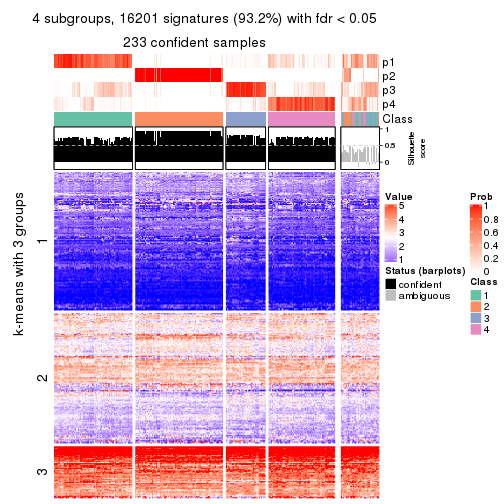</p>

</div>
<div id='tab-MAD-mclust-get-signatures-no-scale-4'>
<pre><code class="r">get_signatures(res, k = 5, scale_rows = FALSE)
</code></pre>

<p></p>

</div>
<div id='tab-MAD-mclust-get-signatures-no-scale-5'>
<pre><code class="r">get_signatures(res, k = 6, scale_rows = FALSE)
</code></pre>

<p></p>

</div>
</div>


Compare the overlap of signatures from different k:

```r
compare_signatures(res)
```


`get_signature()` returns a data frame invisibly. TO get the list of signatures, the function
call should be assigned to a variable explicitly. In following code, if `plot` argument is set
to `FALSE`, no heatmap is plotted while only the differential analysis is performed.

```r
# code only for demonstration
tb = get_signature(res, k = ..., plot = FALSE)
```

An example of the output of `tb` is:

```
#>   which_row         fdr    mean_1    mean_2 scaled_mean_1 scaled_mean_2 km
#> 1        38 0.042760348  8.373488  9.131774    -0.5533452     0.5164555  1
#> 2        40 0.018707592  7.106213  8.469186    -0.6173731     0.5762149  1
#> 3        55 0.019134737 10.221463 11.207825    -0.6159697     0.5749050  1
#> 4        59 0.006059896  5.921854  7.869574    -0.6899429     0.6439467  1
#> 5        60 0.018055526  8.928898 10.211722    -0.6204761     0.5791110  1
#> 6        98 0.009384629 15.714769 14.887706     0.6635654    -0.6193277  2
...
```

The columns in `tb` are:

1. `which_row`: row indices corresponding to the input matrix.
2. `fdr`: FDR for the differential test. 
3. `mean_x`: The mean value in group x.
4. `scaled_mean_x`: The mean value in group x after rows are scaled.
5. `km`: Row groups if k-means clustering is applied to rows.


UMAP plot which shows how samples are separated.


<script>
$( function() {
	$( '#tabs-MAD-mclust-dimension-reduction' ).tabs();
} );
</script>
<div id='tabs-MAD-mclust-dimension-reduction'>
<ul>
<li><a href='#tab-MAD-mclust-dimension-reduction-1'>k = 2</a></li>
<li><a href='#tab-MAD-mclust-dimension-reduction-2'>k = 3</a></li>
<li><a href='#tab-MAD-mclust-dimension-reduction-3'>k = 4</a></li>
<li><a href='#tab-MAD-mclust-dimension-reduction-4'>k = 5</a></li>
<li><a href='#tab-MAD-mclust-dimension-reduction-5'>k = 6</a></li>
</ul>
<div id='tab-MAD-mclust-dimension-reduction-1'>
<pre><code class="r">dimension_reduction(res, k = 2, method = &quot;UMAP&quot;)
</code></pre>

<p></p>

</div>
<div id='tab-MAD-mclust-dimension-reduction-2'>
<pre><code class="r">dimension_reduction(res, k = 3, method = &quot;UMAP&quot;)
</code></pre>

<p></p>

</div>
<div id='tab-MAD-mclust-dimension-reduction-3'>
<pre><code class="r">dimension_reduction(res, k = 4, method = &quot;UMAP&quot;)
</code></pre>

<p></p>

</div>
<div id='tab-MAD-mclust-dimension-reduction-4'>
<pre><code class="r">dimension_reduction(res, k = 5, method = &quot;UMAP&quot;)
</code></pre>

<p></p>

</div>
<div id='tab-MAD-mclust-dimension-reduction-5'>
<pre><code class="r">dimension_reduction(res, k = 6, method = &quot;UMAP&quot;)
</code></pre>

<p></p>

</div>
</div>


Following heatmap shows how subgroups are split when increasing `k`:

```r
collect_classes(res)
```


If matrix rows can be associated to genes, consider to use `GO_Enrichment(res,
...)` to perform function enrichment for the signature genes.


 

---------------------------------------------------


### MAD:NMF*


The object with results only for a single top-value method and a single partition method 
can be extracted as:

```r
res = res_list["MAD", "NMF"]
# you can also extract it by
# res = res_list["MAD:NMF"]
```

A summary of `res` and all the functions that can be applied to it:

```r
res
```

```
#> A 'ConsensusPartition' object with k = 2, 3, 4, 5, 6.
#>   On a matrix with 17377 rows and 265 columns.
#>   Top rows (1000, 2000, 3000, 4000, 5000) are extracted by 'MAD' method.
#>   Subgroups are detected by 'NMF' method.
#>   Performed in total 1250 partitions by row resampling.
#>   Best k for subgroups seems to be 3.
#> 
#> Following methods can be applied to this 'ConsensusPartition' object:
#>  [1] "cola_report"             "collect_classes"         "collect_plots"          
#>  [4] "collect_stats"           "colnames"                "compare_signatures"     
#>  [7] "consensus_heatmap"       "dimension_reduction"     "functional_enrichment"  
#> [10] "get_anno_col"            "get_anno"                "get_classes"            
#> [13] "get_consensus"           "get_matrix"              "get_membership"         
#> [16] "get_param"               "get_signatures"          "get_stats"              
#> [19] "is_best_k"               "is_stable_k"             "membership_heatmap"     
#> [22] "ncol"                    "nrow"                    "plot_ecdf"              
#> [25] "rownames"                "select_partition_number" "show"                   
#> [28] "suggest_best_k"          "test_to_known_factors"
```

`collect_plots()` function collects all the plots made from `res` for all `k` (number of partitions)
into one single page to provide an easy and fast comparison between different `k`.

```r
collect_plots(res)
```


The plots are:

- The first row: a plot of the ECDF (Empirical cumulative distribution
  function) curves of the consensus matrix for each `k` and the heatmap of
  predicted classes for each `k`.
- The second row: heatmaps of the consensus matrix for each `k`.
- The third row: heatmaps of the membership matrix for each `k`.
- The fouth row: heatmaps of the signatures for each `k`.

All the plots in panels can be made by individual functions and they are
plotted later in this section.

`select_partition_number()` produces several plots showing different
statistics for choosing "optimized" `k`. There are following statistics:

- ECDF curves of the consensus matrix for each `k`;
- 1-PAC. [The PAC
  score](https://en.wikipedia.org/wiki/Consensus_clustering#Over-interpretation_potential_of_consensus_clustering)
  measures the proportion of the ambiguous subgrouping.
- Mean silhouette score.
- Concordance. The mean probability of fiting the consensus class ids in all
  partitions.
- Area increased. Denote $A_k$ as the area under the ECDF curve for current
  `k`, the area increased is defined as $A_k - A_{k-1}$.
- Rand index. The percent of pairs of samples that are both in a same cluster
  or both are not in a same cluster in the partition of k and k-1.
- Jaccard index. The ratio of pairs of samples are both in a same cluster in
  the partition of k and k-1 and the pairs of samples are both in a same
  cluster in the partition k or k-1.

The detailed explanations of these statistics can be found in [the cola
vignette](http://bioconductor.org/packages/devel/bioc/vignettes/cola/inst/doc/cola.html#toc_13).

Generally speaking, lower PAC score, higher mean silhouette score or higher
concordance corresponds to better partition. Rand index and Jaccard index
measure how similar the current partition is compared to partition with `k-1`.
If they are too similar, we won't accept `k` is better than `k-1`.

```r
select_partition_number(res)
```


The numeric values for all these statistics can be obtained by `get_stats()`.

```r
get_stats(res)
```

```
#>   k 1-PAC mean_silhouette concordance area_increased  Rand Jaccard
#> 2 2 0.968           0.963       0.984         0.4803 0.521   0.521
#> 3 3 0.927           0.921       0.967         0.3841 0.722   0.509
#> 4 4 0.856           0.844       0.927         0.1229 0.877   0.655
#> 5 5 0.809           0.793       0.888         0.0517 0.876   0.579
#> 6 6 0.818           0.747       0.868         0.0241 0.941   0.753
```

`suggest_best_k()` suggests the best $k$ based on these statistics. The rules are as follows:

- All $k$ with Jaccard index larger than 0.95 are removed because the increase of
  the partition number does not provides enough extra information. If all $k$ are removed,
  the best $k$ is assigned by `NA`.
- For $k$ with 1-PAC larger than 0.9, the maximal $k$ is taken as the "best k". Other $k$ is called "optional k".
- If it does not fit the second rule. The $k$ with the highest vote of highest
  1-PAC, mean silhouette and concordance is taken as the "best k".

```r
suggest_best_k(res)
```

```
#> [1] 3
#> attr(,"optional")
#> [1] 2
```

There is also optional best $k$ = 2 that is worth to check.

Following shows the table of the partitions (You need to click the **show/hide
code output** link to see it). The membership matrix (columns with name `p*`)
is inferred by
[`clue::cl_consensus()`](https://www.rdocumentation.org/link/cl_consensus?package=clue)
function with the `SE` method. Basically the value in the membership matrix
represents the probability to belong to a certain group. The finall class
label for an item is determined with the group with highest probability it
belongs to.

In `get_classes()` function, the entropy is calculated from the membership
matrix and the silhouette score is calculated from the consensus matrix.


<script>
$( function() {
	$( '#tabs-MAD-NMF-get-classes' ).tabs();
} );
</script>
<div id='tabs-MAD-NMF-get-classes'>
<ul>
<li><a href='#tab-MAD-NMF-get-classes-1'>k = 2</a></li>
<li><a href='#tab-MAD-NMF-get-classes-2'>k = 3</a></li>
<li><a href='#tab-MAD-NMF-get-classes-3'>k = 4</a></li>
<li><a href='#tab-MAD-NMF-get-classes-4'>k = 5</a></li>
<li><a href='#tab-MAD-NMF-get-classes-5'>k = 6</a></li>
</ul>

<div id='tab-MAD-NMF-get-classes-1'>
<p><a id='tab-MAD-NMF-get-classes-1-a' style='color:#0366d6' href='#'>show/hide code output</a></p>
<pre><code class="r">cbind(get_classes(res, k = 2), get_membership(res, k = 2))
</code></pre>

<pre><code>#&gt;                                      class entropy silhouette    p1    p2
#&gt; D30CF518-5FC6-4A54-8D5D-BA420EA1836D     2  0.0000      0.984 0.000 1.000
#&gt; 92298FF7-1215-4756-B976-A7D88B91AD76     1  0.0000      0.984 1.000 0.000
#&gt; 0E244FE2-7C17-4642-A51F-2CCA796D9C70     2  0.0000      0.984 0.000 1.000
#&gt; 75435ED8-93E8-45FB-8480-98D8EB2EF8CB     2  0.0000      0.984 0.000 1.000
#&gt; B6D11678-15A9-4F43-A0A2-225067DCAF1C     1  0.0000      0.984 1.000 0.000
#&gt; B7F5A41E-9559-4329-81F5-1B88A74730B7     2  0.0000      0.984 0.000 1.000
#&gt; 39414B2A-7FB0-4669-8DFE-86D9AF7AD2D9     1  0.0000      0.984 1.000 0.000
#&gt; 04823F53-A12D-4852-8F34-77B9DCBB7DF0     2  0.0000      0.984 0.000 1.000
#&gt; 49684C2B-D31C-4B45-A400-3497C3CCEC01     2  0.0000      0.984 0.000 1.000
#&gt; 96A04875-58E2-4BE7-8E0F-CAB55F4CA54F     1  0.0000      0.984 1.000 0.000
#&gt; 1F101D63-478B-40B9-A951-DC3887CFF067     1  0.0000      0.984 1.000 0.000
#&gt; DD290860-E0B7-48FC-BE12-2AF729994C21     2  0.0000      0.984 0.000 1.000
#&gt; FFDD7A12-DDEF-4974-8D60-64B7EEAAC994     2  0.0000      0.984 0.000 1.000
#&gt; E076A9A9-EA2A-4FF7-92A8-F2DA7F30279E     1  0.6438      0.804 0.836 0.164
#&gt; 830DFA6F-A85A-4317-82B2-791FAB998A01     2  0.0000      0.984 0.000 1.000
#&gt; 58578614-E4A3-4655-BBAB-F65851625E0A     1  0.0000      0.984 1.000 0.000
#&gt; 1CBFB672-4D66-430B-83F3-7CE3BE20ABF6     1  0.0000      0.984 1.000 0.000
#&gt; 6C34A7D7-3756-4DCC-9A9F-B5FC4A148B7E     2  0.8081      0.674 0.248 0.752
#&gt; D97ED7B4-5DF2-4B62-8796-AA51CA79DBBB     1  0.0000      0.984 1.000 0.000
#&gt; 45F15851-55F6-4169-834E-38958C38B6A9     1  0.0000      0.984 1.000 0.000
#&gt; 4139E0C9-F712-4A25-8B59-587533B93B3E     2  0.8267      0.649 0.260 0.740
#&gt; 2C3007BF-009E-404F-A3BF-8B921698D85B     1  0.0000      0.984 1.000 0.000
#&gt; 2189F8E5-FF98-4C1A-BD04-5595DB553130     1  0.0000      0.984 1.000 0.000
#&gt; FFAA0310-0D78-4499-8FB8-5BC46E4FCE58     1  0.6048      0.825 0.852 0.148
#&gt; 0C375B2F-67BE-4708-BEB2-544DEC812DCA     2  0.0000      0.984 0.000 1.000
#&gt; AB6324A1-19AB-400C-8001-54765D190E27     2  0.0000      0.984 0.000 1.000
#&gt; A32C4DCD-DC4C-4132-9ED1-B159F5561A2D     1  0.0000      0.984 1.000 0.000
#&gt; 2AE7105D-D494-45B0-947A-315D8C20ECDC     1  0.0000      0.984 1.000 0.000
#&gt; 60FE9D59-FC0F-4B9C-ABF8-1C00BC761928     1  0.0000      0.984 1.000 0.000
#&gt; 056442DC-E87A-4315-965C-C19D7B4FC40E     1  0.0000      0.984 1.000 0.000
#&gt; 455111E5-18EF-4E3F-9DFF-8FA017D92461     1  0.0000      0.984 1.000 0.000
#&gt; 10632BC6-0B81-433C-8832-6B2ABC73A94B     1  0.0000      0.984 1.000 0.000
#&gt; AC6F82AD-C682-4EB3-BEC3-FD950F57609D     1  0.0000      0.984 1.000 0.000
#&gt; D9ABDB75-04DA-4D33-A69F-701729494533     1  0.0000      0.984 1.000 0.000
#&gt; 27BBF44D-F4D7-4C5A-935F-3310A363A670     2  0.0000      0.984 0.000 1.000
#&gt; E7AA12EE-6E14-4B33-A52C-B13589436023     1  0.0000      0.984 1.000 0.000
#&gt; DFA6D41A-D231-413E-A180-E42DF26C3E2B     2  0.0000      0.984 0.000 1.000
#&gt; 655BD3AF-5094-4B19-93A8-401C70369B17     2  0.0000      0.984 0.000 1.000
#&gt; 9DFEF253-923F-4EE2-8E3D-C75805387B20     1  0.0938      0.973 0.988 0.012
#&gt; 3B0EE948-B2CD-4191-90E2-BDD155F3B580     1  0.0000      0.984 1.000 0.000
#&gt; 177C7EF4-2D54-4555-947C-44EE7C688917     2  0.6148      0.821 0.152 0.848
#&gt; 1F8E8BB7-D159-4556-8B04-E5DD027CC444     2  0.0000      0.984 0.000 1.000
#&gt; 619F37D2-6771-4727-9079-56BED07F1CF6     2  0.2948      0.935 0.052 0.948
#&gt; ACAE29BE-ECB8-4A98-BC71-7A2D4857134E     1  0.6531      0.797 0.832 0.168
#&gt; C5C3241A-684C-4238-9333-9AF8630EC086     2  0.0000      0.984 0.000 1.000
#&gt; AD319DC2-140F-4E7B-A899-010687D8B714     2  0.0000      0.984 0.000 1.000
#&gt; 2AFF397C-ED2A-4FD9-A7F0-E4C61E9FB603     2  0.0376      0.980 0.004 0.996
#&gt; FB4C7892-3DBB-4148-AAE9-75B19A1A4031     1  0.0000      0.984 1.000 0.000
#&gt; 6F5C4500-1ED1-4E81-B4F5-EEA64CE2336A     1  0.0000      0.984 1.000 0.000
#&gt; BD027C69-3C10-4047-8E1E-218600FF2B73     2  0.0000      0.984 0.000 1.000
#&gt; 11B473A9-4CC5-461F-BC57-CC9141F3591D     1  0.0000      0.984 1.000 0.000
#&gt; 69A036E5-3E6A-4862-A7F8-2D203ED2FC9E     1  0.0000      0.984 1.000 0.000
#&gt; 9C0BDF24-F011-4855-B95A-1B6BEFA808F7     1  0.0000      0.984 1.000 0.000
#&gt; 9E205254-8C0C-4C05-AF5A-86E679CF732C     1  0.0000      0.984 1.000 0.000
#&gt; 935CCE4A-8AA8-454E-9DFF-7DE27D0BD2E2     1  0.0000      0.984 1.000 0.000
#&gt; 01E5E1FE-41D3-428B-90BC-7A000829E102     1  0.0000      0.984 1.000 0.000
#&gt; B344A530-92CD-468B-847A-DF8E25688081     2  0.0000      0.984 0.000 1.000
#&gt; F79F32A7-9F7B-4D62-8426-4A4CF10ED319     1  0.0000      0.984 1.000 0.000
#&gt; C2E1C6FA-82F9-467C-99AE-9B39FAAC810C     1  0.0000      0.984 1.000 0.000
#&gt; BF7CD9BD-776A-4957-8A6E-EF8AD83EA9D3     2  0.0000      0.984 0.000 1.000
#&gt; 8A2C1409-E83B-435E-A20F-5FCA94801C9F     2  0.0000      0.984 0.000 1.000
#&gt; B6BEFFB5-2F62-477B-A4C8-478D29577CBD     2  0.0000      0.984 0.000 1.000
#&gt; 8622CBD0-F8E9-4AC1-8175-CC9A742B86F9     1  0.0000      0.984 1.000 0.000
#&gt; 565DD660-ED58-4065-8619-260BEA6FCFEB     1  0.0000      0.984 1.000 0.000
#&gt; 96038E42-0FBA-497D-819C-38F7689F10FF     1  0.0000      0.984 1.000 0.000
#&gt; CA685549-F8BA-43F1-8461-5D2D3B17CFC5     1  0.0000      0.984 1.000 0.000
#&gt; 52020307-71A6-46E5-ACB3-8F885CA8F1EB     1  0.0000      0.984 1.000 0.000
#&gt; 7656DA98-76DC-424B-B02C-D7001DAAA0E4     1  0.0000      0.984 1.000 0.000
#&gt; 74DBA640-45E2-42A6-8F1E-69C073D66EE6     1  0.0000      0.984 1.000 0.000
#&gt; 251094BE-C33D-44F0-BD98-8618D71F520C     1  0.0000      0.984 1.000 0.000
#&gt; AB914CC5-5FF1-4257-A353-6A99D11B9478     1  0.0000      0.984 1.000 0.000
#&gt; 38B8B893-0E08-4B71-B51C-B32A7B2724E0     1  0.0000      0.984 1.000 0.000
#&gt; 7C7CD8FF-99A4-41D7-B7E1-5A517001F551     2  0.0000      0.984 0.000 1.000
#&gt; BFC5B75A-E4AE-486B-BA30-23BBAA33A125     2  0.0000      0.984 0.000 1.000
#&gt; 182AC78E-A07C-4B34-B216-B5F573E9F036     2  0.0000      0.984 0.000 1.000
#&gt; B38C5F72-8F46-4531-9C2D-96EEE07A5B22     2  0.0000      0.984 0.000 1.000
#&gt; DB9333A6-A723-4B8F-9221-25B8B23D5126     1  0.0000      0.984 1.000 0.000
#&gt; CD67DD21-C1B6-4D58-AC8E-1F4536C7DA70     2  0.0000      0.984 0.000 1.000
#&gt; 3D76A56E-4B66-48AE-AA60-D9C1004C7140     1  0.0000      0.984 1.000 0.000
#&gt; 71ED572F-7780-47A4-A9F8-D320C737690D     1  0.0000      0.984 1.000 0.000
#&gt; B449FEA1-C4B0-400F-903C-59E13D0BA313     2  0.0000      0.984 0.000 1.000
#&gt; 3F120E90-1486-4215-B9B9-79D5B413CAAC     2  0.4815      0.880 0.104 0.896
#&gt; A071894B-D8C0-4740-BD55-93EA0C86EDF7     1  0.0000      0.984 1.000 0.000
#&gt; 58848D57-D7A9-4ABB-86A2-A8AE2B23F654     1  0.0000      0.984 1.000 0.000
#&gt; CD6F9E20-B301-4663-87EC-953EDF49754F     2  0.0000      0.984 0.000 1.000
#&gt; 367D89F3-D527-4929-B830-8B6D553DF9E1     1  0.0000      0.984 1.000 0.000
#&gt; BE8D7DCB-648B-42DD-9FA8-8B85B5D816B2     1  0.0000      0.984 1.000 0.000
#&gt; AA46F56B-BD9C-40A4-8EA8-35E2568C964D     2  0.0000      0.984 0.000 1.000
#&gt; 6393220A-7C57-413F-81A8-4E38C21E779E     2  0.0000      0.984 0.000 1.000
#&gt; 89AE566C-F65F-43C2-BA97-621A7AC8B6DC     1  0.0000      0.984 1.000 0.000
#&gt; AA6A4BFF-8C62-4B70-B85A-9EDF403B06BA     1  0.0000      0.984 1.000 0.000
#&gt; BCE877A6-9C65-4495-A45D-05753F2D0E15     1  0.0000      0.984 1.000 0.000
#&gt; D7BDDF49-C54B-4F8E-ACA0-C3684AB68B5C     1  0.1184      0.970 0.984 0.016
#&gt; D0800D49-0033-44B2-8D7B-29B16F87ADA6     2  0.0000      0.984 0.000 1.000
#&gt; 151D60B5-5AF1-4B61-B97F-ABC7531D9F89     1  0.0000      0.984 1.000 0.000
#&gt; CBBAEB5B-25FA-4B6D-A40C-357E37033E36     1  0.0000      0.984 1.000 0.000
#&gt; 317CD049-3151-40B7-8E88-B0B8813338D6     1  0.0000      0.984 1.000 0.000
#&gt; 93835C77-F8FA-4928-843C-8016A91881FA     1  0.0000      0.984 1.000 0.000
#&gt; 02A6950F-647D-4F20-B2D0-0238C1441C70     1  0.0000      0.984 1.000 0.000
#&gt; 4D54E415-134F-4F6F-8718-3E0475EF5477     1  0.0000      0.984 1.000 0.000
#&gt; 82AB290A-3993-45E5-8B15-6125A019778C     1  0.0000      0.984 1.000 0.000
#&gt; 3B5EAD14-E506-4A22-804D-BF925A2D5247     2  0.0000      0.984 0.000 1.000
#&gt; 19CF7DDF-4F3A-4D2F-B84A-6451A5C3112C     2  0.6048      0.826 0.148 0.852
#&gt; 2FB00DAA-C274-42B1-A06B-611FE5E96844     1  0.0000      0.984 1.000 0.000
#&gt; 2B1F01C3-8145-4296-8111-2B0474AB9A2C     2  0.0000      0.984 0.000 1.000
#&gt; 3F0865F1-8256-4778-966F-D53637B415B6     2  0.0000      0.984 0.000 1.000
#&gt; 5473210D-37F9-4192-86D2-E2A2C77F3BD2     2  0.0000      0.984 0.000 1.000
#&gt; 5EDB6ACF-4F3F-471A-9DDC-661607CACCC4     1  0.0000      0.984 1.000 0.000
#&gt; 6A252A3A-7EEB-47B6-9C23-D69BD2EA846F     2  0.0000      0.984 0.000 1.000
#&gt; 0A7FFCBB-4BAA-4A5F-8B2D-B427C4D982A8     1  0.0000      0.984 1.000 0.000
#&gt; 1603AFB8-5AD7-4794-9991-BDBE96B4D997     2  0.0000      0.984 0.000 1.000
#&gt; 644299E9-62B7-4DFE-9E6D-D7556A01B40A     1  0.0000      0.984 1.000 0.000
#&gt; EF12E923-1860-4269-B57B-BA6238FA4403     1  0.0000      0.984 1.000 0.000
#&gt; 51B7241E-F0BE-482A-88AE-89004BB68989     1  0.0000      0.984 1.000 0.000
#&gt; 1C007DF3-8A9F-4940-9A4C-DE2A412BB023     2  0.0000      0.984 0.000 1.000
#&gt; 89FCFDE6-9625-432C-AA35-9C5FCCF40031     1  0.0000      0.984 1.000 0.000
#&gt; 7955FC55-386D-497E-AFED-019BBBAD428E     2  0.0000      0.984 0.000 1.000
#&gt; 37FF09ED-73EC-4D10-B2AC-7D8EBA9304ED     1  0.0000      0.984 1.000 0.000
#&gt; C2CD2742-2FB4-468E-90FF-8F65A5C425A9     1  0.0000      0.984 1.000 0.000
#&gt; 766FE08F-3393-4868-B1C1-FA98C9FF16E0     1  0.0000      0.984 1.000 0.000
#&gt; 63E2B578-2221-4255-8C45-7FD030B1C94D     1  0.0000      0.984 1.000 0.000
#&gt; C14B1A44-43F7-45F0-A583-5667A4D3BD95     1  0.0000      0.984 1.000 0.000
#&gt; D9CB551A-CE20-4BF7-8AC9-839112346C3D     1  0.0000      0.984 1.000 0.000
#&gt; 05BAA71A-E5B3-4A3A-A3F2-013A975087F0     2  0.0000      0.984 0.000 1.000
#&gt; AC8DA7DE-4D83-4768-BEFD-9A1B2DA943CE     1  0.9866      0.238 0.568 0.432
#&gt; E89DCE9D-F8A5-499C-85BB-BB500BADB9FB     1  0.0000      0.984 1.000 0.000
#&gt; C16F9B5E-2B52-40F6-856D-C0D6FBDD16C1     1  0.0000      0.984 1.000 0.000
#&gt; 8FF234D4-823A-4C80-82F7-2E92D72DBF88     2  0.0000      0.984 0.000 1.000
#&gt; C9F94A6E-D104-4D8D-8EC5-EADECD85F092     2  0.0000      0.984 0.000 1.000
#&gt; 45C9756F-A154-4537-852E-ECBF27B92FE1     2  0.0000      0.984 0.000 1.000
#&gt; 0F1A5708-341E-4713-BC70-76D702F826D6     2  0.0000      0.984 0.000 1.000
#&gt; 2ECFBCA0-AB35-461A-A4B5-C60B2651A962     2  0.0000      0.984 0.000 1.000
#&gt; 7DFAC404-3AB3-4274-A533-CFDAF4CE122D     1  0.0000      0.984 1.000 0.000
#&gt; A90AF55C-4386-42AB-A812-9230026EA5A5     2  0.0000      0.984 0.000 1.000
#&gt; 6258A757-4E18-4CD1-8417-189521E990B6     2  0.0000      0.984 0.000 1.000
#&gt; EBFAD137-050F-47D0-A43D-72B8F7D70C2B     1  0.0000      0.984 1.000 0.000
#&gt; 08B5EBFB-2807-4229-95A6-81AB7F377A56     2  0.0000      0.984 0.000 1.000
#&gt; 4780A59C-0589-4995-B044-3201F09AF859     1  0.0000      0.984 1.000 0.000
#&gt; 0AB81429-C287-48AA-9035-3A7A6F4C7328     2  0.0000      0.984 0.000 1.000
#&gt; 20C4D047-28DA-4AB7-9B3C-32EDA6B22C9D     2  0.5178      0.866 0.116 0.884
#&gt; 77C4E01F-84A6-4BFD-AA8E-D7875456F546     2  0.0938      0.973 0.012 0.988
#&gt; 8B28383F-CF14-4CC5-A1E2-72AD915C0AE8     1  0.0000      0.984 1.000 0.000
#&gt; E12E1F48-6A52-4F74-925C-C4EE1BF5C573     2  0.0000      0.984 0.000 1.000
#&gt; 9B179BC5-BB4C-4CEE-99BC-BC552BC384A1     1  0.0000      0.984 1.000 0.000
#&gt; 5548C91A-D3DE-48F5-B4A4-124BE177B99A     1  0.0000      0.984 1.000 0.000
#&gt; 0E22B729-C381-4B0C-9897-62DD38F51722     1  0.0000      0.984 1.000 0.000
#&gt; 7BC4937F-04E2-4B46-BA7C-FE9AC738C8A9     1  0.0000      0.984 1.000 0.000
#&gt; EE6A0D3F-3F8A-4AA8-B3EF-32372EF37A29     1  0.0000      0.984 1.000 0.000
#&gt; 08AC2706-7651-409F-BE6B-BCED1C2D1796     1  0.0000      0.984 1.000 0.000
#&gt; A68B078D-8979-4070-BB4D-F526704ED3DC     1  0.0000      0.984 1.000 0.000
#&gt; C319A5EE-69FA-4AAB-85A9-2EAAD8E4C703     1  0.5408      0.856 0.876 0.124
#&gt; 0D7CAABD-D20C-4F82-BCBC-8B7276E8EDE2     1  0.0000      0.984 1.000 0.000
#&gt; 09444DCC-44BA-4A3F-ACC5-863A54578B9F     1  0.4815      0.878 0.896 0.104
#&gt; 2E32B047-C6E1-4743-A6C8-E98370A32145     1  0.0000      0.984 1.000 0.000
#&gt; 6A6878A7-76B2-40DE-958B-804442AC6A5D     1  0.0000      0.984 1.000 0.000
#&gt; 39F27293-0BFF-4EA2-8439-A299E3226D20     1  0.1843      0.958 0.972 0.028
#&gt; 7EAE9C30-6080-405F-A7E6-1FED57674279     1  0.0000      0.984 1.000 0.000
#&gt; 79499169-A093-4E0A-B6BD-010CD7BE5035     1  0.0000      0.984 1.000 0.000
#&gt; 1F8BF4E8-BD84-4EFE-9E3E-89E7CE8FA72D     2  0.0000      0.984 0.000 1.000
#&gt; 62B7988F-98E5-4AB8-8A16-D661A07455E8     1  0.0000      0.984 1.000 0.000
#&gt; B7005B5F-217E-4073-BFB5-CE7E884B80C0     2  0.0000      0.984 0.000 1.000
#&gt; B981568F-2C08-4696-B589-E157A49BE72B     2  0.0000      0.984 0.000 1.000
#&gt; A3D85C0A-3202-40C2-88E1-052AC6C5184B     1  0.0000      0.984 1.000 0.000
#&gt; 4CA783B9-9B99-46B8-962A-77194ECB7942     2  0.0000      0.984 0.000 1.000
#&gt; D4024B08-4879-47EA-99E5-D9FCE1CD40DF     1  0.0000      0.984 1.000 0.000
#&gt; 1D41CDA2-0B29-48FD-B83A-E60C174DBCB3     1  0.0000      0.984 1.000 0.000
#&gt; A1923B2A-B233-4760-8AF9-C04C1CAEB100     1  0.0000      0.984 1.000 0.000
#&gt; 80880D71-BFDE-4D88-892F-5ADF27A38940     1  0.6531      0.797 0.832 0.168
#&gt; 55D1629D-30FD-49AA-88CE-EA3CA9B30A3F     2  0.0000      0.984 0.000 1.000
#&gt; B71C409E-926D-48AD-8BD8-9F707CA4FB01     2  0.0000      0.984 0.000 1.000
#&gt; 54A92C57-BD19-4A47-BA76-3ACA2DC36212     1  0.0000      0.984 1.000 0.000
#&gt; B2AB74B8-506C-4C27-9105-E86A6AAA89D4     1  0.0000      0.984 1.000 0.000
#&gt; 0356AE49-7A5C-42CC-A39C-7C8DFBFF8842     2  0.0000      0.984 0.000 1.000
#&gt; ACA260A3-DC3F-4FF4-B9C5-2D4BC4F81783     1  0.0000      0.984 1.000 0.000
#&gt; 9B440917-E5A4-43B9-A48D-6ABFEDCA6CFD     1  0.0000      0.984 1.000 0.000
#&gt; 47464828-52EA-413B-B30C-BD8B55903D78     2  0.0000      0.984 0.000 1.000
#&gt; C1D1FC82-B50D-4C82-8F03-06CEE3C08D18     1  0.0000      0.984 1.000 0.000
#&gt; E5ABFC43-E2A3-4B1A-BBA3-8196C0B026A5     2  0.0000      0.984 0.000 1.000
#&gt; 1D3C16CC-D0D5-4637-AAC7-91672DFF3317     1  0.0000      0.984 1.000 0.000
#&gt; 4D038320-ADEA-4990-8371-68B4B8162E1A     2  0.0000      0.984 0.000 1.000
#&gt; A75594CC-3E49-4869-8656-BBB4E72BF59D     2  0.0000      0.984 0.000 1.000
#&gt; 7CABAA19-5FB2-4A58-BDA3-4F1FFB532C20     1  0.0000      0.984 1.000 0.000
#&gt; 534EF1E9-9513-426E-B41E-A394AB2E4410     2  0.0000      0.984 0.000 1.000
#&gt; 649F35A1-A08C-497D-A9B6-CB3084D5FB8D     1  0.0000      0.984 1.000 0.000
#&gt; 7CA30F3C-1C98-480C-B8B5-A248AABFB468     1  0.0000      0.984 1.000 0.000
#&gt; A9F8DA21-A802-44CF-9F5D-96A36687DCDD     2  0.3879      0.910 0.076 0.924
#&gt; A7AE1ED1-86CB-4A50-97B2-66785C7191FE     1  0.0000      0.984 1.000 0.000
#&gt; D0091AD4-D3D7-4C03-ACD9-DA9F8B6076C6     1  0.0000      0.984 1.000 0.000
#&gt; 46EE1C2B-13F7-44A7-B27E-4EBB9DF0CA83     2  0.0000      0.984 0.000 1.000
#&gt; CB9301B8-0282-43D6-AF5E-B753A9C7BFCB     2  0.0000      0.984 0.000 1.000
#&gt; A0E77A39-885A-4472-9A10-2D1E51DBFDA4     1  0.0000      0.984 1.000 0.000
#&gt; C06603C2-163D-40B6-A9FE-882424F18FE9     1  0.0000      0.984 1.000 0.000
#&gt; C3921A29-80FF-4B9D-B366-5C0238A42231     1  0.0000      0.984 1.000 0.000
#&gt; BB99B4E7-C834-4BB8-973F-8FA039E2798F     1  0.0000      0.984 1.000 0.000
#&gt; 5CD78C2F-05E9-409A-8405-3EE936A6876E     2  0.0000      0.984 0.000 1.000
#&gt; 6C126CC7-0C03-48F0-A2C2-F090CA239B70     2  0.0000      0.984 0.000 1.000
#&gt; 7118B08A-E94C-49F4-8D76-26455C34D85F     2  0.0000      0.984 0.000 1.000
#&gt; 266DAF30-CF3E-493E-8B24-3931D0039450     1  0.0000      0.984 1.000 0.000
#&gt; DAB5F5B9-4FE5-468F-AD2B-B39BBC4317A0     1  0.9896      0.213 0.560 0.440
#&gt; 9A9EB6D6-312E-4A98-8762-30D3ABD8193D     2  0.0000      0.984 0.000 1.000
#&gt; CED15676-B901-4FC8-9C8D-51E529D9441D     1  0.0000      0.984 1.000 0.000
#&gt; 827232CC-8035-440C-8B12-02C789C70B1B     1  0.0000      0.984 1.000 0.000
#&gt; 04D5FB28-FB50-4EAE-95FB-72ABF0E618CA     2  0.0000      0.984 0.000 1.000
#&gt; 6C96A851-97FC-4845-B895-D255191D9F25     1  0.0000      0.984 1.000 0.000
#&gt; 3EC982CB-D013-443E-B21D-39DE6B8EF370     2  0.0000      0.984 0.000 1.000
#&gt; 2E24A786-4370-42A1-AD50-D651F89819CC     2  0.0000      0.984 0.000 1.000
#&gt; 7653BFA9-ADA5-44CA-8555-807FBBFC6DE2     1  0.0000      0.984 1.000 0.000
#&gt; 7A110994-5741-4013-91F0-DD2E1D343F91     2  0.0000      0.984 0.000 1.000
#&gt; 0A760E0C-11C5-4201-8452-18DBC1FEACEB     1  0.0000      0.984 1.000 0.000
#&gt; 909B76A1-BB9F-4906-95BC-58CD1A46D3B8     2  0.0000      0.984 0.000 1.000
#&gt; A782EE71-EDA4-4385-83B3-D16DE81296C0     1  0.0000      0.984 1.000 0.000
#&gt; BD50E276-914F-4924-8CEA-FF47A66DB175     2  0.0000      0.984 0.000 1.000
#&gt; 505D5CA8-0279-4BC7-8CC0-8C7A0165BF91     2  0.0000      0.984 0.000 1.000
#&gt; D51FC997-E662-4AE7-BC9C-14183DA42DE1     2  0.0000      0.984 0.000 1.000
#&gt; 8AD67970-84F1-4C0A-B47A-8FA4108F9FE3     1  0.0000      0.984 1.000 0.000
#&gt; 6E33B1B6-7089-4BC3-B2B0-EC2C3B5D8B74     1  0.0000      0.984 1.000 0.000
#&gt; 88C4EA46-2546-401C-A8E7-603EECFDFBA0     1  0.0000      0.984 1.000 0.000
#&gt; 375D2D72-C998-4627-BA35-24E82A9A55FF     1  0.0000      0.984 1.000 0.000
#&gt; 76D0F834-7064-46C6-96F4-E861CF5452B6     2  0.0000      0.984 0.000 1.000
#&gt; 87159081-C97A-4004-AF0A-7EB6EF0EC47A     1  0.0000      0.984 1.000 0.000
#&gt; 24A57006-800B-4174-AF4E-7EA57A8A756E     1  0.0000      0.984 1.000 0.000
#&gt; AD68CBC6-8A13-4A65-AF62-E99AFA81D031     2  0.0000      0.984 0.000 1.000
#&gt; 22863A57-F066-4DD1-A859-4336F43D144C     1  0.0000      0.984 1.000 0.000
#&gt; 8F6F0362-9165-4DCC-992C-AF871A3C51E7     1  0.0000      0.984 1.000 0.000
#&gt; 76ABF0B7-E707-4DB2-9486-3814439BDBA5     1  0.0000      0.984 1.000 0.000
#&gt; BC72372F-3577-40E5-BA0F-41A084AA93AD     1  0.0000      0.984 1.000 0.000
#&gt; 8E566039-B56C-4F41-B9EF-DE18BEEF2C95     1  0.0000      0.984 1.000 0.000
#&gt; F096F016-3EF5-4A67-A7C2-8A45E1585232     1  0.0000      0.984 1.000 0.000
#&gt; BB37913E-534B-43DD-BE3D-E13B29FD8172     2  0.0000      0.984 0.000 1.000
#&gt; E344638F-9060-460F-8F7A-60D19442F294     1  0.9129      0.516 0.672 0.328
#&gt; 6A0EAAD0-89D5-4F12-8B45-9D5A25182FAD     2  0.0000      0.984 0.000 1.000
#&gt; A5199E3A-9D67-4543-88AB-24398C98E38E     1  0.0000      0.984 1.000 0.000
#&gt; 23917D52-7864-4F84-9C77-DF8EA9407345     2  0.0000      0.984 0.000 1.000
#&gt; 9AA96080-19D8-40C3-BDD1-6044D2D422D5     1  0.0000      0.984 1.000 0.000
#&gt; 0ED65D91-260C-4662-9903-EE36A2E3B2D0     2  0.0000      0.984 0.000 1.000
#&gt; 64BF1BC5-7A9A-4E1D-AEAB-AFE30B92AAF4     1  0.6973      0.770 0.812 0.188
#&gt; F02301F1-9054-4DC6-8DC9-2451A0F53EFC     2  0.0000      0.984 0.000 1.000
#&gt; 3264649A-5684-4181-83D0-A7E4D7E2E1FD     1  0.0000      0.984 1.000 0.000
#&gt; 3F8DA39C-BC9B-4343-8838-5CE271E80C51     1  0.6801      0.782 0.820 0.180
#&gt; BCC681CB-2AF4-4BB6-B53A-7544A2399454     1  0.0000      0.984 1.000 0.000
#&gt; DCB50E17-5E2D-443B-8DCC-272FBB734C2E     1  0.0000      0.984 1.000 0.000
#&gt; B5E47C38-CB6A-44C0-AA9B-56951B9EF78D     1  0.0000      0.984 1.000 0.000
#&gt; B15B0185-9C28-4A00-9CEC-05EFECEA6709     1  0.0000      0.984 1.000 0.000
#&gt; 61D4E8E7-0110-480A-A4A7-D406DE74C31E     1  0.0000      0.984 1.000 0.000
#&gt; CA8DB3AD-3F6B-4622-BF73-47041EC96E42     1  0.0000      0.984 1.000 0.000
#&gt; 5EECB1C4-172C-4494-871A-ADB650CD82BD     2  0.0000      0.984 0.000 1.000
#&gt; 019B857C-D4F7-4B67-B699-56E52A60805B     2  0.0000      0.984 0.000 1.000
#&gt; E9C28902-05C9-4883-97A4-D612D54E46B4     1  0.0000      0.984 1.000 0.000
#&gt; C5D3D9A0-FC14-408D-AB6C-662018A5E5CA     1  0.0000      0.984 1.000 0.000
#&gt; 7EB24744-509B-4854-B7D0-0BAFA210A345     2  0.0000      0.984 0.000 1.000
#&gt; B8B7A721-2284-40AB-98F5-EF1351C30B66     2  0.0000      0.984 0.000 1.000
#&gt; 3C12F39D-0D21-4F69-A539-4120B73C7A79     2  0.0000      0.984 0.000 1.000
#&gt; 08D3F984-6850-45B2-9DF9-EC7F5A4060A4     1  0.0000      0.984 1.000 0.000
#&gt; 9BD0EE79-1EED-4F6D-A5AB-43ADB8526F1E     2  0.9977      0.102 0.472 0.528
#&gt; E489A871-3CF4-4F3D-8EAF-63B507054201     2  0.0000      0.984 0.000 1.000
#&gt; 8CF8FD2E-1DBA-4257-9715-04D956D46B71     2  0.0000      0.984 0.000 1.000
#&gt; F6193AF0-7A19-46CB-A818-1B01E7460791     1  0.0000      0.984 1.000 0.000
#&gt; 96392D6B-D4FF-4393-93BA-08E469E8BBE1     1  0.1414      0.966 0.980 0.020
#&gt; DABCBE5A-C591-46A2-AF66-DA3DB6106751     1  0.0000      0.984 1.000 0.000
#&gt; 8B75F7D4-98D8-44DE-B19D-B733D6A031DB     1  0.0000      0.984 1.000 0.000
#&gt; AAD9685A-564B-42E9-91E3-431951154BA7     2  0.0000      0.984 0.000 1.000
#&gt; 90A43152-4E3B-4365-A39F-7B0E5CA66E55     1  0.0000      0.984 1.000 0.000
#&gt; EFB76FCF-AC9C-4852-B91C-E055DA666FA0     1  0.0000      0.984 1.000 0.000
#&gt; 6EBCFFE3-706F-440A-ABA9-012A924A07C6     2  0.0000      0.984 0.000 1.000
#&gt; E922A244-F1C8-4310-ABB2-62B06E022E4C     1  0.0000      0.984 1.000 0.000
</code></pre>

<script>
$('#tab-MAD-NMF-get-classes-1-a').parent().next().next().hide();
$('#tab-MAD-NMF-get-classes-1-a').click(function(){
  $('#tab-MAD-NMF-get-classes-1-a').parent().next().next().toggle();
  return(false);
});
</script>
</div>

<div id='tab-MAD-NMF-get-classes-2'>
<p><a id='tab-MAD-NMF-get-classes-2-a' style='color:#0366d6' href='#'>show/hide code output</a></p>
<pre><code class="r">cbind(get_classes(res, k = 3), get_membership(res, k = 3))
</code></pre>

<pre><code>#&gt;                                      class entropy silhouette    p1    p2    p3
#&gt; D30CF518-5FC6-4A54-8D5D-BA420EA1836D     2  0.0000     0.9903 0.000 1.000 0.000
#&gt; 92298FF7-1215-4756-B976-A7D88B91AD76     1  0.2711     0.8847 0.912 0.000 0.088
#&gt; 0E244FE2-7C17-4642-A51F-2CCA796D9C70     2  0.0000     0.9903 0.000 1.000 0.000
#&gt; 75435ED8-93E8-45FB-8480-98D8EB2EF8CB     2  0.0000     0.9903 0.000 1.000 0.000
#&gt; B6D11678-15A9-4F43-A0A2-225067DCAF1C     1  0.5948     0.4191 0.640 0.000 0.360
#&gt; B7F5A41E-9559-4329-81F5-1B88A74730B7     2  0.0000     0.9903 0.000 1.000 0.000
#&gt; 39414B2A-7FB0-4669-8DFE-86D9AF7AD2D9     3  0.0000     0.9408 0.000 0.000 1.000
#&gt; 04823F53-A12D-4852-8F34-77B9DCBB7DF0     2  0.0000     0.9903 0.000 1.000 0.000
#&gt; 49684C2B-D31C-4B45-A400-3497C3CCEC01     2  0.0000     0.9903 0.000 1.000 0.000
#&gt; 96A04875-58E2-4BE7-8E0F-CAB55F4CA54F     1  0.0000     0.9640 1.000 0.000 0.000
#&gt; 1F101D63-478B-40B9-A951-DC3887CFF067     3  0.6192     0.3121 0.420 0.000 0.580
#&gt; DD290860-E0B7-48FC-BE12-2AF729994C21     2  0.0000     0.9903 0.000 1.000 0.000
#&gt; FFDD7A12-DDEF-4974-8D60-64B7EEAAC994     2  0.0000     0.9903 0.000 1.000 0.000
#&gt; E076A9A9-EA2A-4FF7-92A8-F2DA7F30279E     3  0.0000     0.9408 0.000 0.000 1.000
#&gt; 830DFA6F-A85A-4317-82B2-791FAB998A01     2  0.0424     0.9824 0.000 0.992 0.008
#&gt; 58578614-E4A3-4655-BBAB-F65851625E0A     1  0.0000     0.9640 1.000 0.000 0.000
#&gt; 1CBFB672-4D66-430B-83F3-7CE3BE20ABF6     1  0.4887     0.7020 0.772 0.000 0.228
#&gt; 6C34A7D7-3756-4DCC-9A9F-B5FC4A148B7E     3  0.0000     0.9408 0.000 0.000 1.000
#&gt; D97ED7B4-5DF2-4B62-8796-AA51CA79DBBB     1  0.0000     0.9640 1.000 0.000 0.000
#&gt; 45F15851-55F6-4169-834E-38958C38B6A9     1  0.0000     0.9640 1.000 0.000 0.000
#&gt; 4139E0C9-F712-4A25-8B59-587533B93B3E     2  0.4887     0.7083 0.228 0.772 0.000
#&gt; 2C3007BF-009E-404F-A3BF-8B921698D85B     1  0.0000     0.9640 1.000 0.000 0.000
#&gt; 2189F8E5-FF98-4C1A-BD04-5595DB553130     3  0.6267     0.2112 0.452 0.000 0.548
#&gt; FFAA0310-0D78-4499-8FB8-5BC46E4FCE58     3  0.0000     0.9408 0.000 0.000 1.000
#&gt; 0C375B2F-67BE-4708-BEB2-544DEC812DCA     2  0.0000     0.9903 0.000 1.000 0.000
#&gt; AB6324A1-19AB-400C-8001-54765D190E27     2  0.0000     0.9903 0.000 1.000 0.000
#&gt; A32C4DCD-DC4C-4132-9ED1-B159F5561A2D     1  0.0000     0.9640 1.000 0.000 0.000
#&gt; 2AE7105D-D494-45B0-947A-315D8C20ECDC     1  0.0592     0.9548 0.988 0.000 0.012
#&gt; 60FE9D59-FC0F-4B9C-ABF8-1C00BC761928     1  0.0000     0.9640 1.000 0.000 0.000
#&gt; 056442DC-E87A-4315-965C-C19D7B4FC40E     1  0.0000     0.9640 1.000 0.000 0.000
#&gt; 455111E5-18EF-4E3F-9DFF-8FA017D92461     3  0.0000     0.9408 0.000 0.000 1.000
#&gt; 10632BC6-0B81-433C-8832-6B2ABC73A94B     1  0.0000     0.9640 1.000 0.000 0.000
#&gt; AC6F82AD-C682-4EB3-BEC3-FD950F57609D     1  0.0000     0.9640 1.000 0.000 0.000
#&gt; D9ABDB75-04DA-4D33-A69F-701729494533     1  0.0000     0.9640 1.000 0.000 0.000
#&gt; 27BBF44D-F4D7-4C5A-935F-3310A363A670     2  0.0000     0.9903 0.000 1.000 0.000
#&gt; E7AA12EE-6E14-4B33-A52C-B13589436023     1  0.0000     0.9640 1.000 0.000 0.000
#&gt; DFA6D41A-D231-413E-A180-E42DF26C3E2B     2  0.0000     0.9903 0.000 1.000 0.000
#&gt; 655BD3AF-5094-4B19-93A8-401C70369B17     2  0.0000     0.9903 0.000 1.000 0.000
#&gt; 9DFEF253-923F-4EE2-8E3D-C75805387B20     1  0.1753     0.9183 0.952 0.048 0.000
#&gt; 3B0EE948-B2CD-4191-90E2-BDD155F3B580     3  0.5785     0.5186 0.332 0.000 0.668
#&gt; 177C7EF4-2D54-4555-947C-44EE7C688917     3  0.0000     0.9408 0.000 0.000 1.000
#&gt; 1F8E8BB7-D159-4556-8B04-E5DD027CC444     2  0.0000     0.9903 0.000 1.000 0.000
#&gt; 619F37D2-6771-4727-9079-56BED07F1CF6     2  0.0237     0.9862 0.004 0.996 0.000
#&gt; ACAE29BE-ECB8-4A98-BC71-7A2D4857134E     3  0.0000     0.9408 0.000 0.000 1.000
#&gt; C5C3241A-684C-4238-9333-9AF8630EC086     2  0.0000     0.9903 0.000 1.000 0.000
#&gt; AD319DC2-140F-4E7B-A899-010687D8B714     2  0.0000     0.9903 0.000 1.000 0.000
#&gt; 2AFF397C-ED2A-4FD9-A7F0-E4C61E9FB603     3  0.0000     0.9408 0.000 0.000 1.000
#&gt; FB4C7892-3DBB-4148-AAE9-75B19A1A4031     3  0.0000     0.9408 0.000 0.000 1.000
#&gt; 6F5C4500-1ED1-4E81-B4F5-EEA64CE2336A     1  0.0000     0.9640 1.000 0.000 0.000
#&gt; BD027C69-3C10-4047-8E1E-218600FF2B73     2  0.0000     0.9903 0.000 1.000 0.000
#&gt; 11B473A9-4CC5-461F-BC57-CC9141F3591D     3  0.1529     0.9127 0.040 0.000 0.960
#&gt; 69A036E5-3E6A-4862-A7F8-2D203ED2FC9E     1  0.0000     0.9640 1.000 0.000 0.000
#&gt; 9C0BDF24-F011-4855-B95A-1B6BEFA808F7     1  0.0000     0.9640 1.000 0.000 0.000
#&gt; 9E205254-8C0C-4C05-AF5A-86E679CF732C     3  0.0000     0.9408 0.000 0.000 1.000
#&gt; 935CCE4A-8AA8-454E-9DFF-7DE27D0BD2E2     1  0.5363     0.6174 0.724 0.000 0.276
#&gt; 01E5E1FE-41D3-428B-90BC-7A000829E102     1  0.0000     0.9640 1.000 0.000 0.000
#&gt; B344A530-92CD-468B-847A-DF8E25688081     3  0.0000     0.9408 0.000 0.000 1.000
#&gt; F79F32A7-9F7B-4D62-8426-4A4CF10ED319     1  0.0000     0.9640 1.000 0.000 0.000
#&gt; C2E1C6FA-82F9-467C-99AE-9B39FAAC810C     1  0.0000     0.9640 1.000 0.000 0.000
#&gt; BF7CD9BD-776A-4957-8A6E-EF8AD83EA9D3     2  0.0000     0.9903 0.000 1.000 0.000
#&gt; 8A2C1409-E83B-435E-A20F-5FCA94801C9F     2  0.0000     0.9903 0.000 1.000 0.000
#&gt; B6BEFFB5-2F62-477B-A4C8-478D29577CBD     2  0.0000     0.9903 0.000 1.000 0.000
#&gt; 8622CBD0-F8E9-4AC1-8175-CC9A742B86F9     1  0.0000     0.9640 1.000 0.000 0.000
#&gt; 565DD660-ED58-4065-8619-260BEA6FCFEB     1  0.0000     0.9640 1.000 0.000 0.000
#&gt; 96038E42-0FBA-497D-819C-38F7689F10FF     1  0.0000     0.9640 1.000 0.000 0.000
#&gt; CA685549-F8BA-43F1-8461-5D2D3B17CFC5     3  0.0000     0.9408 0.000 0.000 1.000
#&gt; 52020307-71A6-46E5-ACB3-8F885CA8F1EB     1  0.0000     0.9640 1.000 0.000 0.000
#&gt; 7656DA98-76DC-424B-B02C-D7001DAAA0E4     3  0.0000     0.9408 0.000 0.000 1.000
#&gt; 74DBA640-45E2-42A6-8F1E-69C073D66EE6     1  0.0000     0.9640 1.000 0.000 0.000
#&gt; 251094BE-C33D-44F0-BD98-8618D71F520C     1  0.4178     0.7855 0.828 0.000 0.172
#&gt; AB914CC5-5FF1-4257-A353-6A99D11B9478     1  0.0000     0.9640 1.000 0.000 0.000
#&gt; 38B8B893-0E08-4B71-B51C-B32A7B2724E0     3  0.0000     0.9408 0.000 0.000 1.000
#&gt; 7C7CD8FF-99A4-41D7-B7E1-5A517001F551     2  0.0000     0.9903 0.000 1.000 0.000
#&gt; BFC5B75A-E4AE-486B-BA30-23BBAA33A125     2  0.0000     0.9903 0.000 1.000 0.000
#&gt; 182AC78E-A07C-4B34-B216-B5F573E9F036     2  0.0000     0.9903 0.000 1.000 0.000
#&gt; B38C5F72-8F46-4531-9C2D-96EEE07A5B22     2  0.0000     0.9903 0.000 1.000 0.000
#&gt; DB9333A6-A723-4B8F-9221-25B8B23D5126     3  0.0000     0.9408 0.000 0.000 1.000
#&gt; CD67DD21-C1B6-4D58-AC8E-1F4536C7DA70     3  0.0000     0.9408 0.000 0.000 1.000
#&gt; 3D76A56E-4B66-48AE-AA60-D9C1004C7140     1  0.0000     0.9640 1.000 0.000 0.000
#&gt; 71ED572F-7780-47A4-A9F8-D320C737690D     1  0.0000     0.9640 1.000 0.000 0.000
#&gt; B449FEA1-C4B0-400F-903C-59E13D0BA313     2  0.0000     0.9903 0.000 1.000 0.000
#&gt; 3F120E90-1486-4215-B9B9-79D5B413CAAC     3  0.0000     0.9408 0.000 0.000 1.000
#&gt; A071894B-D8C0-4740-BD55-93EA0C86EDF7     1  0.0000     0.9640 1.000 0.000 0.000
#&gt; 58848D57-D7A9-4ABB-86A2-A8AE2B23F654     1  0.0000     0.9640 1.000 0.000 0.000
#&gt; CD6F9E20-B301-4663-87EC-953EDF49754F     3  0.0000     0.9408 0.000 0.000 1.000
#&gt; 367D89F3-D527-4929-B830-8B6D553DF9E1     1  0.4750     0.7214 0.784 0.000 0.216
#&gt; BE8D7DCB-648B-42DD-9FA8-8B85B5D816B2     1  0.0000     0.9640 1.000 0.000 0.000
#&gt; AA46F56B-BD9C-40A4-8EA8-35E2568C964D     2  0.0000     0.9903 0.000 1.000 0.000
#&gt; 6393220A-7C57-413F-81A8-4E38C21E779E     2  0.0000     0.9903 0.000 1.000 0.000
#&gt; 89AE566C-F65F-43C2-BA97-621A7AC8B6DC     1  0.0000     0.9640 1.000 0.000 0.000
#&gt; AA6A4BFF-8C62-4B70-B85A-9EDF403B06BA     1  0.0000     0.9640 1.000 0.000 0.000
#&gt; BCE877A6-9C65-4495-A45D-05753F2D0E15     1  0.0000     0.9640 1.000 0.000 0.000
#&gt; D7BDDF49-C54B-4F8E-ACA0-C3684AB68B5C     3  0.0000     0.9408 0.000 0.000 1.000
#&gt; D0800D49-0033-44B2-8D7B-29B16F87ADA6     2  0.0000     0.9903 0.000 1.000 0.000
#&gt; 151D60B5-5AF1-4B61-B97F-ABC7531D9F89     3  0.0000     0.9408 0.000 0.000 1.000
#&gt; CBBAEB5B-25FA-4B6D-A40C-357E37033E36     3  0.0000     0.9408 0.000 0.000 1.000
#&gt; 317CD049-3151-40B7-8E88-B0B8813338D6     1  0.0000     0.9640 1.000 0.000 0.000
#&gt; 93835C77-F8FA-4928-843C-8016A91881FA     1  0.0000     0.9640 1.000 0.000 0.000
#&gt; 02A6950F-647D-4F20-B2D0-0238C1441C70     1  0.0000     0.9640 1.000 0.000 0.000
#&gt; 4D54E415-134F-4F6F-8718-3E0475EF5477     1  0.0000     0.9640 1.000 0.000 0.000
#&gt; 82AB290A-3993-45E5-8B15-6125A019778C     1  0.0000     0.9640 1.000 0.000 0.000
#&gt; 3B5EAD14-E506-4A22-804D-BF925A2D5247     2  0.0000     0.9903 0.000 1.000 0.000
#&gt; 19CF7DDF-4F3A-4D2F-B84A-6451A5C3112C     3  0.0000     0.9408 0.000 0.000 1.000
#&gt; 2FB00DAA-C274-42B1-A06B-611FE5E96844     1  0.0000     0.9640 1.000 0.000 0.000
#&gt; 2B1F01C3-8145-4296-8111-2B0474AB9A2C     2  0.0000     0.9903 0.000 1.000 0.000
#&gt; 3F0865F1-8256-4778-966F-D53637B415B6     3  0.0000     0.9408 0.000 0.000 1.000
#&gt; 5473210D-37F9-4192-86D2-E2A2C77F3BD2     3  0.0000     0.9408 0.000 0.000 1.000
#&gt; 5EDB6ACF-4F3F-471A-9DDC-661607CACCC4     1  0.0000     0.9640 1.000 0.000 0.000
#&gt; 6A252A3A-7EEB-47B6-9C23-D69BD2EA846F     3  0.0000     0.9408 0.000 0.000 1.000
#&gt; 0A7FFCBB-4BAA-4A5F-8B2D-B427C4D982A8     1  0.0000     0.9640 1.000 0.000 0.000
#&gt; 1603AFB8-5AD7-4794-9991-BDBE96B4D997     2  0.0000     0.9903 0.000 1.000 0.000
#&gt; 644299E9-62B7-4DFE-9E6D-D7556A01B40A     1  0.0000     0.9640 1.000 0.000 0.000
#&gt; EF12E923-1860-4269-B57B-BA6238FA4403     3  0.0000     0.9408 0.000 0.000 1.000
#&gt; 51B7241E-F0BE-482A-88AE-89004BB68989     1  0.1031     0.9442 0.976 0.000 0.024
#&gt; 1C007DF3-8A9F-4940-9A4C-DE2A412BB023     3  0.0000     0.9408 0.000 0.000 1.000
#&gt; 89FCFDE6-9625-432C-AA35-9C5FCCF40031     3  0.0000     0.9408 0.000 0.000 1.000
#&gt; 7955FC55-386D-497E-AFED-019BBBAD428E     3  0.0000     0.9408 0.000 0.000 1.000
#&gt; 37FF09ED-73EC-4D10-B2AC-7D8EBA9304ED     3  0.0000     0.9408 0.000 0.000 1.000
#&gt; C2CD2742-2FB4-468E-90FF-8F65A5C425A9     1  0.2537     0.8928 0.920 0.000 0.080
#&gt; 766FE08F-3393-4868-B1C1-FA98C9FF16E0     3  0.0000     0.9408 0.000 0.000 1.000
#&gt; 63E2B578-2221-4255-8C45-7FD030B1C94D     1  0.1964     0.9164 0.944 0.000 0.056
#&gt; C14B1A44-43F7-45F0-A583-5667A4D3BD95     1  0.0000     0.9640 1.000 0.000 0.000
#&gt; D9CB551A-CE20-4BF7-8AC9-839112346C3D     1  0.1753     0.9239 0.952 0.000 0.048
#&gt; 05BAA71A-E5B3-4A3A-A3F2-013A975087F0     2  0.0000     0.9903 0.000 1.000 0.000
#&gt; AC8DA7DE-4D83-4768-BEFD-9A1B2DA943CE     3  0.0000     0.9408 0.000 0.000 1.000
#&gt; E89DCE9D-F8A5-499C-85BB-BB500BADB9FB     3  0.6305     0.1092 0.484 0.000 0.516
#&gt; C16F9B5E-2B52-40F6-856D-C0D6FBDD16C1     1  0.0000     0.9640 1.000 0.000 0.000
#&gt; 8FF234D4-823A-4C80-82F7-2E92D72DBF88     2  0.0000     0.9903 0.000 1.000 0.000
#&gt; C9F94A6E-D104-4D8D-8EC5-EADECD85F092     2  0.0000     0.9903 0.000 1.000 0.000
#&gt; 45C9756F-A154-4537-852E-ECBF27B92FE1     2  0.0000     0.9903 0.000 1.000 0.000
#&gt; 0F1A5708-341E-4713-BC70-76D702F826D6     3  0.0000     0.9408 0.000 0.000 1.000
#&gt; 2ECFBCA0-AB35-461A-A4B5-C60B2651A962     2  0.0000     0.9903 0.000 1.000 0.000
#&gt; 7DFAC404-3AB3-4274-A533-CFDAF4CE122D     1  0.0000     0.9640 1.000 0.000 0.000
#&gt; A90AF55C-4386-42AB-A812-9230026EA5A5     2  0.0000     0.9903 0.000 1.000 0.000
#&gt; 6258A757-4E18-4CD1-8417-189521E990B6     2  0.0000     0.9903 0.000 1.000 0.000
#&gt; EBFAD137-050F-47D0-A43D-72B8F7D70C2B     1  0.0000     0.9640 1.000 0.000 0.000
#&gt; 08B5EBFB-2807-4229-95A6-81AB7F377A56     2  0.0000     0.9903 0.000 1.000 0.000
#&gt; 4780A59C-0589-4995-B044-3201F09AF859     3  0.0000     0.9408 0.000 0.000 1.000
#&gt; 0AB81429-C287-48AA-9035-3A7A6F4C7328     2  0.0000     0.9903 0.000 1.000 0.000
#&gt; 20C4D047-28DA-4AB7-9B3C-32EDA6B22C9D     3  0.0000     0.9408 0.000 0.000 1.000
#&gt; 77C4E01F-84A6-4BFD-AA8E-D7875456F546     3  0.0000     0.9408 0.000 0.000 1.000
#&gt; 8B28383F-CF14-4CC5-A1E2-72AD915C0AE8     3  0.0424     0.9355 0.008 0.000 0.992
#&gt; E12E1F48-6A52-4F74-925C-C4EE1BF5C573     2  0.0000     0.9903 0.000 1.000 0.000
#&gt; 9B179BC5-BB4C-4CEE-99BC-BC552BC384A1     3  0.0000     0.9408 0.000 0.000 1.000
#&gt; 5548C91A-D3DE-48F5-B4A4-124BE177B99A     3  0.0000     0.9408 0.000 0.000 1.000
#&gt; 0E22B729-C381-4B0C-9897-62DD38F51722     3  0.4654     0.7400 0.208 0.000 0.792
#&gt; 7BC4937F-04E2-4B46-BA7C-FE9AC738C8A9     1  0.0000     0.9640 1.000 0.000 0.000
#&gt; EE6A0D3F-3F8A-4AA8-B3EF-32372EF37A29     3  0.6204     0.2964 0.424 0.000 0.576
#&gt; 08AC2706-7651-409F-BE6B-BCED1C2D1796     1  0.0000     0.9640 1.000 0.000 0.000
#&gt; A68B078D-8979-4070-BB4D-F526704ED3DC     1  0.0000     0.9640 1.000 0.000 0.000
#&gt; C319A5EE-69FA-4AAB-85A9-2EAAD8E4C703     3  0.0000     0.9408 0.000 0.000 1.000
#&gt; 0D7CAABD-D20C-4F82-BCBC-8B7276E8EDE2     1  0.0000     0.9640 1.000 0.000 0.000
#&gt; 09444DCC-44BA-4A3F-ACC5-863A54578B9F     3  0.0000     0.9408 0.000 0.000 1.000
#&gt; 2E32B047-C6E1-4743-A6C8-E98370A32145     3  0.2959     0.8618 0.100 0.000 0.900
#&gt; 6A6878A7-76B2-40DE-958B-804442AC6A5D     3  0.0000     0.9408 0.000 0.000 1.000
#&gt; 39F27293-0BFF-4EA2-8439-A299E3226D20     3  0.2356     0.8875 0.072 0.000 0.928
#&gt; 7EAE9C30-6080-405F-A7E6-1FED57674279     1  0.4452     0.7573 0.808 0.000 0.192
#&gt; 79499169-A093-4E0A-B6BD-010CD7BE5035     1  0.0000     0.9640 1.000 0.000 0.000
#&gt; 1F8BF4E8-BD84-4EFE-9E3E-89E7CE8FA72D     3  0.0000     0.9408 0.000 0.000 1.000
#&gt; 62B7988F-98E5-4AB8-8A16-D661A07455E8     3  0.0000     0.9408 0.000 0.000 1.000
#&gt; B7005B5F-217E-4073-BFB5-CE7E884B80C0     2  0.0000     0.9903 0.000 1.000 0.000
#&gt; B981568F-2C08-4696-B589-E157A49BE72B     2  0.0000     0.9903 0.000 1.000 0.000
#&gt; A3D85C0A-3202-40C2-88E1-052AC6C5184B     1  0.0000     0.9640 1.000 0.000 0.000
#&gt; 4CA783B9-9B99-46B8-962A-77194ECB7942     3  0.0000     0.9408 0.000 0.000 1.000
#&gt; D4024B08-4879-47EA-99E5-D9FCE1CD40DF     1  0.0000     0.9640 1.000 0.000 0.000
#&gt; 1D41CDA2-0B29-48FD-B83A-E60C174DBCB3     1  0.0000     0.9640 1.000 0.000 0.000
#&gt; A1923B2A-B233-4760-8AF9-C04C1CAEB100     1  0.5733     0.5152 0.676 0.000 0.324
#&gt; 80880D71-BFDE-4D88-892F-5ADF27A38940     3  0.0000     0.9408 0.000 0.000 1.000
#&gt; 55D1629D-30FD-49AA-88CE-EA3CA9B30A3F     2  0.0000     0.9903 0.000 1.000 0.000
#&gt; B71C409E-926D-48AD-8BD8-9F707CA4FB01     2  0.0000     0.9903 0.000 1.000 0.000
#&gt; 54A92C57-BD19-4A47-BA76-3ACA2DC36212     3  0.0000     0.9408 0.000 0.000 1.000
#&gt; B2AB74B8-506C-4C27-9105-E86A6AAA89D4     3  0.0000     0.9408 0.000 0.000 1.000
#&gt; 0356AE49-7A5C-42CC-A39C-7C8DFBFF8842     2  0.0000     0.9903 0.000 1.000 0.000
#&gt; ACA260A3-DC3F-4FF4-B9C5-2D4BC4F81783     1  0.0000     0.9640 1.000 0.000 0.000
#&gt; 9B440917-E5A4-43B9-A48D-6ABFEDCA6CFD     1  0.0000     0.9640 1.000 0.000 0.000
#&gt; 47464828-52EA-413B-B30C-BD8B55903D78     2  0.0000     0.9903 0.000 1.000 0.000
#&gt; C1D1FC82-B50D-4C82-8F03-06CEE3C08D18     1  0.0000     0.9640 1.000 0.000 0.000
#&gt; E5ABFC43-E2A3-4B1A-BBA3-8196C0B026A5     2  0.0000     0.9903 0.000 1.000 0.000
#&gt; 1D3C16CC-D0D5-4637-AAC7-91672DFF3317     1  0.0000     0.9640 1.000 0.000 0.000
#&gt; 4D038320-ADEA-4990-8371-68B4B8162E1A     2  0.0000     0.9903 0.000 1.000 0.000
#&gt; A75594CC-3E49-4869-8656-BBB4E72BF59D     2  0.0000     0.9903 0.000 1.000 0.000
#&gt; 7CABAA19-5FB2-4A58-BDA3-4F1FFB532C20     3  0.0000     0.9408 0.000 0.000 1.000
#&gt; 534EF1E9-9513-426E-B41E-A394AB2E4410     2  0.0000     0.9903 0.000 1.000 0.000
#&gt; 649F35A1-A08C-497D-A9B6-CB3084D5FB8D     3  0.4796     0.7225 0.220 0.000 0.780
#&gt; 7CA30F3C-1C98-480C-B8B5-A248AABFB468     3  0.1964     0.9004 0.056 0.000 0.944
#&gt; A9F8DA21-A802-44CF-9F5D-96A36687DCDD     3  0.0000     0.9408 0.000 0.000 1.000
#&gt; A7AE1ED1-86CB-4A50-97B2-66785C7191FE     1  0.0237     0.9610 0.996 0.000 0.004
#&gt; D0091AD4-D3D7-4C03-ACD9-DA9F8B6076C6     3  0.0000     0.9408 0.000 0.000 1.000
#&gt; 46EE1C2B-13F7-44A7-B27E-4EBB9DF0CA83     2  0.0000     0.9903 0.000 1.000 0.000
#&gt; CB9301B8-0282-43D6-AF5E-B753A9C7BFCB     2  0.0000     0.9903 0.000 1.000 0.000
#&gt; A0E77A39-885A-4472-9A10-2D1E51DBFDA4     3  0.6095     0.3886 0.392 0.000 0.608
#&gt; C06603C2-163D-40B6-A9FE-882424F18FE9     1  0.0000     0.9640 1.000 0.000 0.000
#&gt; C3921A29-80FF-4B9D-B366-5C0238A42231     3  0.0000     0.9408 0.000 0.000 1.000
#&gt; BB99B4E7-C834-4BB8-973F-8FA039E2798F     1  0.0000     0.9640 1.000 0.000 0.000
#&gt; 5CD78C2F-05E9-409A-8405-3EE936A6876E     3  0.0000     0.9408 0.000 0.000 1.000
#&gt; 6C126CC7-0C03-48F0-A2C2-F090CA239B70     2  0.0000     0.9903 0.000 1.000 0.000
#&gt; 7118B08A-E94C-49F4-8D76-26455C34D85F     2  0.0000     0.9903 0.000 1.000 0.000
#&gt; 266DAF30-CF3E-493E-8B24-3931D0039450     3  0.4291     0.7751 0.180 0.000 0.820
#&gt; DAB5F5B9-4FE5-468F-AD2B-B39BBC4317A0     3  0.0000     0.9408 0.000 0.000 1.000
#&gt; 9A9EB6D6-312E-4A98-8762-30D3ABD8193D     3  0.0000     0.9408 0.000 0.000 1.000
#&gt; CED15676-B901-4FC8-9C8D-51E529D9441D     3  0.0000     0.9408 0.000 0.000 1.000
#&gt; 827232CC-8035-440C-8B12-02C789C70B1B     3  0.0000     0.9408 0.000 0.000 1.000
#&gt; 04D5FB28-FB50-4EAE-95FB-72ABF0E618CA     2  0.0000     0.9903 0.000 1.000 0.000
#&gt; 6C96A851-97FC-4845-B895-D255191D9F25     1  0.0000     0.9640 1.000 0.000 0.000
#&gt; 3EC982CB-D013-443E-B21D-39DE6B8EF370     3  0.0000     0.9408 0.000 0.000 1.000
#&gt; 2E24A786-4370-42A1-AD50-D651F89819CC     2  0.0000     0.9903 0.000 1.000 0.000
#&gt; 7653BFA9-ADA5-44CA-8555-807FBBFC6DE2     1  0.0000     0.9640 1.000 0.000 0.000
#&gt; 7A110994-5741-4013-91F0-DD2E1D343F91     2  0.0000     0.9903 0.000 1.000 0.000
#&gt; 0A760E0C-11C5-4201-8452-18DBC1FEACEB     1  0.0000     0.9640 1.000 0.000 0.000
#&gt; 909B76A1-BB9F-4906-95BC-58CD1A46D3B8     2  0.0000     0.9903 0.000 1.000 0.000
#&gt; A782EE71-EDA4-4385-83B3-D16DE81296C0     3  0.0000     0.9408 0.000 0.000 1.000
#&gt; BD50E276-914F-4924-8CEA-FF47A66DB175     2  0.0000     0.9903 0.000 1.000 0.000
#&gt; 505D5CA8-0279-4BC7-8CC0-8C7A0165BF91     2  0.0000     0.9903 0.000 1.000 0.000
#&gt; D51FC997-E662-4AE7-BC9C-14183DA42DE1     2  0.0000     0.9903 0.000 1.000 0.000
#&gt; 8AD67970-84F1-4C0A-B47A-8FA4108F9FE3     1  0.0000     0.9640 1.000 0.000 0.000
#&gt; 6E33B1B6-7089-4BC3-B2B0-EC2C3B5D8B74     3  0.6260     0.2256 0.448 0.000 0.552
#&gt; 88C4EA46-2546-401C-A8E7-603EECFDFBA0     3  0.5810     0.5227 0.336 0.000 0.664
#&gt; 375D2D72-C998-4627-BA35-24E82A9A55FF     3  0.0000     0.9408 0.000 0.000 1.000
#&gt; 76D0F834-7064-46C6-96F4-E861CF5452B6     2  0.0000     0.9903 0.000 1.000 0.000
#&gt; 87159081-C97A-4004-AF0A-7EB6EF0EC47A     1  0.4452     0.7590 0.808 0.000 0.192
#&gt; 24A57006-800B-4174-AF4E-7EA57A8A756E     3  0.0000     0.9408 0.000 0.000 1.000
#&gt; AD68CBC6-8A13-4A65-AF62-E99AFA81D031     3  0.0000     0.9408 0.000 0.000 1.000
#&gt; 22863A57-F066-4DD1-A859-4336F43D144C     3  0.0000     0.9408 0.000 0.000 1.000
#&gt; 8F6F0362-9165-4DCC-992C-AF871A3C51E7     1  0.0000     0.9640 1.000 0.000 0.000
#&gt; 76ABF0B7-E707-4DB2-9486-3814439BDBA5     1  0.0000     0.9640 1.000 0.000 0.000
#&gt; BC72372F-3577-40E5-BA0F-41A084AA93AD     1  0.0000     0.9640 1.000 0.000 0.000
#&gt; 8E566039-B56C-4F41-B9EF-DE18BEEF2C95     1  0.0000     0.9640 1.000 0.000 0.000
#&gt; F096F016-3EF5-4A67-A7C2-8A45E1585232     1  0.0000     0.9640 1.000 0.000 0.000
#&gt; BB37913E-534B-43DD-BE3D-E13B29FD8172     2  0.0000     0.9903 0.000 1.000 0.000
#&gt; E344638F-9060-460F-8F7A-60D19442F294     3  0.0000     0.9408 0.000 0.000 1.000
#&gt; 6A0EAAD0-89D5-4F12-8B45-9D5A25182FAD     2  0.0000     0.9903 0.000 1.000 0.000
#&gt; A5199E3A-9D67-4543-88AB-24398C98E38E     3  0.0000     0.9408 0.000 0.000 1.000
#&gt; 23917D52-7864-4F84-9C77-DF8EA9407345     2  0.0000     0.9903 0.000 1.000 0.000
#&gt; 9AA96080-19D8-40C3-BDD1-6044D2D422D5     1  0.0000     0.9640 1.000 0.000 0.000
#&gt; 0ED65D91-260C-4662-9903-EE36A2E3B2D0     2  0.0000     0.9903 0.000 1.000 0.000
#&gt; 64BF1BC5-7A9A-4E1D-AEAB-AFE30B92AAF4     3  0.0000     0.9408 0.000 0.000 1.000
#&gt; F02301F1-9054-4DC6-8DC9-2451A0F53EFC     2  0.0000     0.9903 0.000 1.000 0.000
#&gt; 3264649A-5684-4181-83D0-A7E4D7E2E1FD     3  0.4452     0.7604 0.192 0.000 0.808
#&gt; 3F8DA39C-BC9B-4343-8838-5CE271E80C51     2  0.6309     0.0252 0.500 0.500 0.000
#&gt; BCC681CB-2AF4-4BB6-B53A-7544A2399454     1  0.0000     0.9640 1.000 0.000 0.000
#&gt; DCB50E17-5E2D-443B-8DCC-272FBB734C2E     1  0.0000     0.9640 1.000 0.000 0.000
#&gt; B5E47C38-CB6A-44C0-AA9B-56951B9EF78D     1  0.0000     0.9640 1.000 0.000 0.000
#&gt; B15B0185-9C28-4A00-9CEC-05EFECEA6709     1  0.0000     0.9640 1.000 0.000 0.000
#&gt; 61D4E8E7-0110-480A-A4A7-D406DE74C31E     3  0.0237     0.9382 0.004 0.000 0.996
#&gt; CA8DB3AD-3F6B-4622-BF73-47041EC96E42     3  0.3340     0.8425 0.120 0.000 0.880
#&gt; 5EECB1C4-172C-4494-871A-ADB650CD82BD     2  0.0000     0.9903 0.000 1.000 0.000
#&gt; 019B857C-D4F7-4B67-B699-56E52A60805B     2  0.0000     0.9903 0.000 1.000 0.000
#&gt; E9C28902-05C9-4883-97A4-D612D54E46B4     1  0.4002     0.8006 0.840 0.000 0.160
#&gt; C5D3D9A0-FC14-408D-AB6C-662018A5E5CA     1  0.0000     0.9640 1.000 0.000 0.000
#&gt; 7EB24744-509B-4854-B7D0-0BAFA210A345     2  0.0000     0.9903 0.000 1.000 0.000
#&gt; B8B7A721-2284-40AB-98F5-EF1351C30B66     2  0.0000     0.9903 0.000 1.000 0.000
#&gt; 3C12F39D-0D21-4F69-A539-4120B73C7A79     2  0.0000     0.9903 0.000 1.000 0.000
#&gt; 08D3F984-6850-45B2-9DF9-EC7F5A4060A4     1  0.6140     0.3035 0.596 0.000 0.404
#&gt; 9BD0EE79-1EED-4F6D-A5AB-43ADB8526F1E     3  0.2625     0.8769 0.084 0.000 0.916
#&gt; E489A871-3CF4-4F3D-8EAF-63B507054201     2  0.0000     0.9903 0.000 1.000 0.000
#&gt; 8CF8FD2E-1DBA-4257-9715-04D956D46B71     2  0.0000     0.9903 0.000 1.000 0.000
#&gt; F6193AF0-7A19-46CB-A818-1B01E7460791     1  0.0000     0.9640 1.000 0.000 0.000
#&gt; 96392D6B-D4FF-4393-93BA-08E469E8BBE1     3  0.4504     0.7553 0.196 0.000 0.804
#&gt; DABCBE5A-C591-46A2-AF66-DA3DB6106751     1  0.0000     0.9640 1.000 0.000 0.000
#&gt; 8B75F7D4-98D8-44DE-B19D-B733D6A031DB     1  0.0000     0.9640 1.000 0.000 0.000
#&gt; AAD9685A-564B-42E9-91E3-431951154BA7     2  0.0000     0.9903 0.000 1.000 0.000
#&gt; 90A43152-4E3B-4365-A39F-7B0E5CA66E55     1  0.5650     0.5427 0.688 0.000 0.312
#&gt; EFB76FCF-AC9C-4852-B91C-E055DA666FA0     1  0.0000     0.9640 1.000 0.000 0.000
#&gt; 6EBCFFE3-706F-440A-ABA9-012A924A07C6     2  0.0000     0.9903 0.000 1.000 0.000
#&gt; E922A244-F1C8-4310-ABB2-62B06E022E4C     1  0.0000     0.9640 1.000 0.000 0.000
</code></pre>

<script>
$('#tab-MAD-NMF-get-classes-2-a').parent().next().next().hide();
$('#tab-MAD-NMF-get-classes-2-a').click(function(){
  $('#tab-MAD-NMF-get-classes-2-a').parent().next().next().toggle();
  return(false);
});
</script>
</div>

<div id='tab-MAD-NMF-get-classes-3'>
<p><a id='tab-MAD-NMF-get-classes-3-a' style='color:#0366d6' href='#'>show/hide code output</a></p>
<pre><code class="r">cbind(get_classes(res, k = 4), get_membership(res, k = 4))
</code></pre>

<pre><code>#&gt;                                      class entropy silhouette    p1    p2    p3    p4
#&gt; D30CF518-5FC6-4A54-8D5D-BA420EA1836D     2  0.0000     0.9763 0.000 1.000 0.000 0.000
#&gt; 92298FF7-1215-4756-B976-A7D88B91AD76     1  0.1716     0.8378 0.936 0.000 0.064 0.000
#&gt; 0E244FE2-7C17-4642-A51F-2CCA796D9C70     2  0.0000     0.9763 0.000 1.000 0.000 0.000
#&gt; 75435ED8-93E8-45FB-8480-98D8EB2EF8CB     2  0.0000     0.9763 0.000 1.000 0.000 0.000
#&gt; B6D11678-15A9-4F43-A0A2-225067DCAF1C     4  0.0000     0.8767 0.000 0.000 0.000 1.000
#&gt; B7F5A41E-9559-4329-81F5-1B88A74730B7     2  0.0000     0.9763 0.000 1.000 0.000 0.000
#&gt; 39414B2A-7FB0-4669-8DFE-86D9AF7AD2D9     4  0.0592     0.8774 0.000 0.000 0.016 0.984
#&gt; 04823F53-A12D-4852-8F34-77B9DCBB7DF0     2  0.0000     0.9763 0.000 1.000 0.000 0.000
#&gt; 49684C2B-D31C-4B45-A400-3497C3CCEC01     2  0.0000     0.9763 0.000 1.000 0.000 0.000
#&gt; 96A04875-58E2-4BE7-8E0F-CAB55F4CA54F     1  0.1211     0.8555 0.960 0.000 0.040 0.000
#&gt; 1F101D63-478B-40B9-A951-DC3887CFF067     3  0.3873     0.7443 0.228 0.000 0.772 0.000
#&gt; DD290860-E0B7-48FC-BE12-2AF729994C21     2  0.0000     0.9763 0.000 1.000 0.000 0.000
#&gt; FFDD7A12-DDEF-4974-8D60-64B7EEAAC994     2  0.0000     0.9763 0.000 1.000 0.000 0.000
#&gt; E076A9A9-EA2A-4FF7-92A8-F2DA7F30279E     3  0.0188     0.9288 0.000 0.000 0.996 0.004
#&gt; 830DFA6F-A85A-4317-82B2-791FAB998A01     2  0.2921     0.8207 0.000 0.860 0.140 0.000
#&gt; 58578614-E4A3-4655-BBAB-F65851625E0A     4  0.2760     0.7831 0.128 0.000 0.000 0.872
#&gt; 1CBFB672-4D66-430B-83F3-7CE3BE20ABF6     1  0.4994    -0.0333 0.520 0.000 0.480 0.000
#&gt; 6C34A7D7-3756-4DCC-9A9F-B5FC4A148B7E     3  0.0188     0.9288 0.000 0.000 0.996 0.004
#&gt; D97ED7B4-5DF2-4B62-8796-AA51CA79DBBB     1  0.1118     0.8583 0.964 0.000 0.036 0.000
#&gt; 45F15851-55F6-4169-834E-38958C38B6A9     1  0.0188     0.8739 0.996 0.000 0.004 0.000
#&gt; 4139E0C9-F712-4A25-8B59-587533B93B3E     2  0.4929     0.6485 0.236 0.736 0.020 0.008
#&gt; 2C3007BF-009E-404F-A3BF-8B921698D85B     1  0.2149     0.8371 0.912 0.000 0.000 0.088
#&gt; 2189F8E5-FF98-4C1A-BD04-5595DB553130     4  0.4565     0.7581 0.140 0.000 0.064 0.796
#&gt; FFAA0310-0D78-4499-8FB8-5BC46E4FCE58     3  0.0469     0.9264 0.000 0.000 0.988 0.012
#&gt; 0C375B2F-67BE-4708-BEB2-544DEC812DCA     2  0.0000     0.9763 0.000 1.000 0.000 0.000
#&gt; AB6324A1-19AB-400C-8001-54765D190E27     2  0.0000     0.9763 0.000 1.000 0.000 0.000
#&gt; A32C4DCD-DC4C-4132-9ED1-B159F5561A2D     1  0.0000     0.8743 1.000 0.000 0.000 0.000
#&gt; 2AE7105D-D494-45B0-947A-315D8C20ECDC     4  0.0188     0.8754 0.004 0.000 0.000 0.996
#&gt; 60FE9D59-FC0F-4B9C-ABF8-1C00BC761928     1  0.1022     0.8678 0.968 0.000 0.000 0.032
#&gt; 056442DC-E87A-4315-965C-C19D7B4FC40E     1  0.0336     0.8741 0.992 0.000 0.000 0.008
#&gt; 455111E5-18EF-4E3F-9DFF-8FA017D92461     4  0.2530     0.8318 0.000 0.000 0.112 0.888
#&gt; 10632BC6-0B81-433C-8832-6B2ABC73A94B     1  0.0707     0.8677 0.980 0.000 0.020 0.000
#&gt; AC6F82AD-C682-4EB3-BEC3-FD950F57609D     1  0.0469     0.8737 0.988 0.000 0.000 0.012
#&gt; D9ABDB75-04DA-4D33-A69F-701729494533     1  0.0707     0.8716 0.980 0.000 0.000 0.020
#&gt; 27BBF44D-F4D7-4C5A-935F-3310A363A670     2  0.0000     0.9763 0.000 1.000 0.000 0.000
#&gt; E7AA12EE-6E14-4B33-A52C-B13589436023     1  0.1978     0.8489 0.928 0.000 0.004 0.068
#&gt; DFA6D41A-D231-413E-A180-E42DF26C3E2B     2  0.0336     0.9690 0.000 0.992 0.000 0.008
#&gt; 655BD3AF-5094-4B19-93A8-401C70369B17     2  0.0000     0.9763 0.000 1.000 0.000 0.000
#&gt; 9DFEF253-923F-4EE2-8E3D-C75805387B20     1  0.4647     0.5236 0.704 0.008 0.288 0.000
#&gt; 3B0EE948-B2CD-4191-90E2-BDD155F3B580     3  0.1867     0.9009 0.072 0.000 0.928 0.000
#&gt; 177C7EF4-2D54-4555-947C-44EE7C688917     3  0.0336     0.9279 0.000 0.000 0.992 0.008
#&gt; 1F8E8BB7-D159-4556-8B04-E5DD027CC444     2  0.0000     0.9763 0.000 1.000 0.000 0.000
#&gt; 619F37D2-6771-4727-9079-56BED07F1CF6     3  0.7385     0.2792 0.340 0.176 0.484 0.000
#&gt; ACAE29BE-ECB8-4A98-BC71-7A2D4857134E     3  0.0817     0.9212 0.000 0.000 0.976 0.024
#&gt; C5C3241A-684C-4238-9333-9AF8630EC086     2  0.5273     0.1495 0.000 0.536 0.008 0.456
#&gt; AD319DC2-140F-4E7B-A899-010687D8B714     2  0.0000     0.9763 0.000 1.000 0.000 0.000
#&gt; 2AFF397C-ED2A-4FD9-A7F0-E4C61E9FB603     3  0.1389     0.9047 0.000 0.000 0.952 0.048
#&gt; FB4C7892-3DBB-4148-AAE9-75B19A1A4031     3  0.1792     0.9044 0.068 0.000 0.932 0.000
#&gt; 6F5C4500-1ED1-4E81-B4F5-EEA64CE2336A     4  0.4967     0.0905 0.452 0.000 0.000 0.548
#&gt; BD027C69-3C10-4047-8E1E-218600FF2B73     2  0.0000     0.9763 0.000 1.000 0.000 0.000
#&gt; 11B473A9-4CC5-461F-BC57-CC9141F3591D     4  0.0817     0.8763 0.000 0.000 0.024 0.976
#&gt; 69A036E5-3E6A-4862-A7F8-2D203ED2FC9E     4  0.4916     0.1867 0.424 0.000 0.000 0.576
#&gt; 9C0BDF24-F011-4855-B95A-1B6BEFA808F7     1  0.0469     0.8713 0.988 0.000 0.012 0.000
#&gt; 9E205254-8C0C-4C05-AF5A-86E679CF732C     3  0.1867     0.9023 0.072 0.000 0.928 0.000
#&gt; 935CCE4A-8AA8-454E-9DFF-7DE27D0BD2E2     4  0.0188     0.8775 0.000 0.000 0.004 0.996
#&gt; 01E5E1FE-41D3-428B-90BC-7A000829E102     1  0.0188     0.8739 0.996 0.000 0.004 0.000
#&gt; B344A530-92CD-468B-847A-DF8E25688081     3  0.0188     0.9288 0.000 0.000 0.996 0.004
#&gt; F79F32A7-9F7B-4D62-8426-4A4CF10ED319     1  0.0592     0.8727 0.984 0.000 0.000 0.016
#&gt; C2E1C6FA-82F9-467C-99AE-9B39FAAC810C     1  0.0188     0.8746 0.996 0.000 0.000 0.004
#&gt; BF7CD9BD-776A-4957-8A6E-EF8AD83EA9D3     2  0.0000     0.9763 0.000 1.000 0.000 0.000
#&gt; 8A2C1409-E83B-435E-A20F-5FCA94801C9F     2  0.0000     0.9763 0.000 1.000 0.000 0.000
#&gt; B6BEFFB5-2F62-477B-A4C8-478D29577CBD     2  0.0000     0.9763 0.000 1.000 0.000 0.000
#&gt; 8622CBD0-F8E9-4AC1-8175-CC9A742B86F9     1  0.0188     0.8739 0.996 0.000 0.004 0.000
#&gt; 565DD660-ED58-4065-8619-260BEA6FCFEB     1  0.0188     0.8739 0.996 0.000 0.004 0.000
#&gt; 96038E42-0FBA-497D-819C-38F7689F10FF     1  0.0188     0.8739 0.996 0.000 0.004 0.000
#&gt; CA685549-F8BA-43F1-8461-5D2D3B17CFC5     3  0.0707     0.9231 0.000 0.000 0.980 0.020
#&gt; 52020307-71A6-46E5-ACB3-8F885CA8F1EB     1  0.2149     0.8364 0.912 0.000 0.000 0.088
#&gt; 7656DA98-76DC-424B-B02C-D7001DAAA0E4     3  0.1867     0.9033 0.072 0.000 0.928 0.000
#&gt; 74DBA640-45E2-42A6-8F1E-69C073D66EE6     4  0.1792     0.8414 0.068 0.000 0.000 0.932
#&gt; 251094BE-C33D-44F0-BD98-8618D71F520C     1  0.5853     0.0429 0.508 0.000 0.460 0.032
#&gt; AB914CC5-5FF1-4257-A353-6A99D11B9478     1  0.0188     0.8739 0.996 0.000 0.004 0.000
#&gt; 38B8B893-0E08-4B71-B51C-B32A7B2724E0     3  0.2149     0.8920 0.088 0.000 0.912 0.000
#&gt; 7C7CD8FF-99A4-41D7-B7E1-5A517001F551     2  0.0000     0.9763 0.000 1.000 0.000 0.000
#&gt; BFC5B75A-E4AE-486B-BA30-23BBAA33A125     2  0.0000     0.9763 0.000 1.000 0.000 0.000
#&gt; 182AC78E-A07C-4B34-B216-B5F573E9F036     2  0.0000     0.9763 0.000 1.000 0.000 0.000
#&gt; B38C5F72-8F46-4531-9C2D-96EEE07A5B22     2  0.0000     0.9763 0.000 1.000 0.000 0.000
#&gt; DB9333A6-A723-4B8F-9221-25B8B23D5126     4  0.3444     0.7649 0.000 0.000 0.184 0.816
#&gt; CD67DD21-C1B6-4D58-AC8E-1F4536C7DA70     3  0.0188     0.9288 0.000 0.000 0.996 0.004
#&gt; 3D76A56E-4B66-48AE-AA60-D9C1004C7140     1  0.2408     0.8272 0.896 0.000 0.000 0.104
#&gt; 71ED572F-7780-47A4-A9F8-D320C737690D     1  0.0336     0.8745 0.992 0.000 0.000 0.008
#&gt; B449FEA1-C4B0-400F-903C-59E13D0BA313     2  0.0000     0.9763 0.000 1.000 0.000 0.000
#&gt; 3F120E90-1486-4215-B9B9-79D5B413CAAC     4  0.1637     0.8640 0.000 0.000 0.060 0.940
#&gt; A071894B-D8C0-4740-BD55-93EA0C86EDF7     4  0.0817     0.8674 0.024 0.000 0.000 0.976
#&gt; 58848D57-D7A9-4ABB-86A2-A8AE2B23F654     1  0.4866     0.3776 0.596 0.000 0.000 0.404
#&gt; CD6F9E20-B301-4663-87EC-953EDF49754F     3  0.0000     0.9284 0.000 0.000 1.000 0.000
#&gt; 367D89F3-D527-4929-B830-8B6D553DF9E1     4  0.0188     0.8775 0.000 0.000 0.004 0.996
#&gt; BE8D7DCB-648B-42DD-9FA8-8B85B5D816B2     1  0.0469     0.8737 0.988 0.000 0.000 0.012
#&gt; AA46F56B-BD9C-40A4-8EA8-35E2568C964D     2  0.0000     0.9763 0.000 1.000 0.000 0.000
#&gt; 6393220A-7C57-413F-81A8-4E38C21E779E     2  0.0000     0.9763 0.000 1.000 0.000 0.000
#&gt; 89AE566C-F65F-43C2-BA97-621A7AC8B6DC     1  0.4624     0.5221 0.660 0.000 0.000 0.340
#&gt; AA6A4BFF-8C62-4B70-B85A-9EDF403B06BA     1  0.4948     0.2718 0.560 0.000 0.000 0.440
#&gt; BCE877A6-9C65-4495-A45D-05753F2D0E15     1  0.0469     0.8713 0.988 0.000 0.012 0.000
#&gt; D7BDDF49-C54B-4F8E-ACA0-C3684AB68B5C     3  0.1867     0.9023 0.072 0.000 0.928 0.000
#&gt; D0800D49-0033-44B2-8D7B-29B16F87ADA6     2  0.0188     0.9728 0.000 0.996 0.000 0.004
#&gt; 151D60B5-5AF1-4B61-B97F-ABC7531D9F89     4  0.3024     0.8017 0.000 0.000 0.148 0.852
#&gt; CBBAEB5B-25FA-4B6D-A40C-357E37033E36     4  0.0592     0.8773 0.000 0.000 0.016 0.984
#&gt; 317CD049-3151-40B7-8E88-B0B8813338D6     4  0.3311     0.7356 0.172 0.000 0.000 0.828
#&gt; 93835C77-F8FA-4928-843C-8016A91881FA     1  0.4972     0.2305 0.544 0.000 0.000 0.456
#&gt; 02A6950F-647D-4F20-B2D0-0238C1441C70     1  0.0000     0.8743 1.000 0.000 0.000 0.000
#&gt; 4D54E415-134F-4F6F-8718-3E0475EF5477     1  0.0188     0.8746 0.996 0.000 0.000 0.004
#&gt; 82AB290A-3993-45E5-8B15-6125A019778C     1  0.1022     0.8610 0.968 0.000 0.032 0.000
#&gt; 3B5EAD14-E506-4A22-804D-BF925A2D5247     2  0.0000     0.9763 0.000 1.000 0.000 0.000
#&gt; 19CF7DDF-4F3A-4D2F-B84A-6451A5C3112C     3  0.0469     0.9264 0.000 0.000 0.988 0.012
#&gt; 2FB00DAA-C274-42B1-A06B-611FE5E96844     4  0.4697     0.3869 0.356 0.000 0.000 0.644
#&gt; 2B1F01C3-8145-4296-8111-2B0474AB9A2C     2  0.0000     0.9763 0.000 1.000 0.000 0.000
#&gt; 3F0865F1-8256-4778-966F-D53637B415B6     3  0.0000     0.9284 0.000 0.000 1.000 0.000
#&gt; 5473210D-37F9-4192-86D2-E2A2C77F3BD2     3  0.0188     0.9288 0.000 0.000 0.996 0.004
#&gt; 5EDB6ACF-4F3F-471A-9DDC-661607CACCC4     4  0.2921     0.7801 0.140 0.000 0.000 0.860
#&gt; 6A252A3A-7EEB-47B6-9C23-D69BD2EA846F     3  0.0188     0.9288 0.000 0.000 0.996 0.004
#&gt; 0A7FFCBB-4BAA-4A5F-8B2D-B427C4D982A8     1  0.0188     0.8747 0.996 0.000 0.000 0.004
#&gt; 1603AFB8-5AD7-4794-9991-BDBE96B4D997     2  0.0000     0.9763 0.000 1.000 0.000 0.000
#&gt; 644299E9-62B7-4DFE-9E6D-D7556A01B40A     1  0.1824     0.8526 0.936 0.000 0.004 0.060
#&gt; EF12E923-1860-4269-B57B-BA6238FA4403     4  0.1474     0.8672 0.000 0.000 0.052 0.948
#&gt; 51B7241E-F0BE-482A-88AE-89004BB68989     4  0.0336     0.8743 0.008 0.000 0.000 0.992
#&gt; 1C007DF3-8A9F-4940-9A4C-DE2A412BB023     3  0.0469     0.9264 0.000 0.000 0.988 0.012
#&gt; 89FCFDE6-9625-432C-AA35-9C5FCCF40031     4  0.4920     0.7014 0.052 0.000 0.192 0.756
#&gt; 7955FC55-386D-497E-AFED-019BBBAD428E     3  0.0469     0.9264 0.000 0.000 0.988 0.012
#&gt; 37FF09ED-73EC-4D10-B2AC-7D8EBA9304ED     3  0.0188     0.9277 0.004 0.000 0.996 0.000
#&gt; C2CD2742-2FB4-468E-90FF-8F65A5C425A9     1  0.4977     0.0452 0.540 0.000 0.460 0.000
#&gt; 766FE08F-3393-4868-B1C1-FA98C9FF16E0     3  0.0188     0.9288 0.000 0.000 0.996 0.004
#&gt; 63E2B578-2221-4255-8C45-7FD030B1C94D     1  0.4907     0.1867 0.580 0.000 0.420 0.000
#&gt; C14B1A44-43F7-45F0-A583-5667A4D3BD95     4  0.4277     0.5566 0.280 0.000 0.000 0.720
#&gt; D9CB551A-CE20-4BF7-8AC9-839112346C3D     1  0.2868     0.7710 0.864 0.000 0.136 0.000
#&gt; 05BAA71A-E5B3-4A3A-A3F2-013A975087F0     2  0.0000     0.9763 0.000 1.000 0.000 0.000
#&gt; AC8DA7DE-4D83-4768-BEFD-9A1B2DA943CE     3  0.0188     0.9288 0.000 0.000 0.996 0.004
#&gt; E89DCE9D-F8A5-499C-85BB-BB500BADB9FB     4  0.0000     0.8767 0.000 0.000 0.000 1.000
#&gt; C16F9B5E-2B52-40F6-856D-C0D6FBDD16C1     4  0.3907     0.6468 0.232 0.000 0.000 0.768
#&gt; 8FF234D4-823A-4C80-82F7-2E92D72DBF88     2  0.0000     0.9763 0.000 1.000 0.000 0.000
#&gt; C9F94A6E-D104-4D8D-8EC5-EADECD85F092     2  0.5398     0.2668 0.016 0.580 0.404 0.000
#&gt; 45C9756F-A154-4537-852E-ECBF27B92FE1     2  0.0000     0.9763 0.000 1.000 0.000 0.000
#&gt; 0F1A5708-341E-4713-BC70-76D702F826D6     3  0.0000     0.9284 0.000 0.000 1.000 0.000
#&gt; 2ECFBCA0-AB35-461A-A4B5-C60B2651A962     2  0.0000     0.9763 0.000 1.000 0.000 0.000
#&gt; 7DFAC404-3AB3-4274-A533-CFDAF4CE122D     1  0.2216     0.8348 0.908 0.000 0.000 0.092
#&gt; A90AF55C-4386-42AB-A812-9230026EA5A5     2  0.0000     0.9763 0.000 1.000 0.000 0.000
#&gt; 6258A757-4E18-4CD1-8417-189521E990B6     2  0.0000     0.9763 0.000 1.000 0.000 0.000
#&gt; EBFAD137-050F-47D0-A43D-72B8F7D70C2B     1  0.3400     0.7180 0.820 0.000 0.180 0.000
#&gt; 08B5EBFB-2807-4229-95A6-81AB7F377A56     2  0.0000     0.9763 0.000 1.000 0.000 0.000
#&gt; 4780A59C-0589-4995-B044-3201F09AF859     3  0.1792     0.9044 0.068 0.000 0.932 0.000
#&gt; 0AB81429-C287-48AA-9035-3A7A6F4C7328     2  0.0000     0.9763 0.000 1.000 0.000 0.000
#&gt; 20C4D047-28DA-4AB7-9B3C-32EDA6B22C9D     3  0.0336     0.9276 0.008 0.000 0.992 0.000
#&gt; 77C4E01F-84A6-4BFD-AA8E-D7875456F546     3  0.0469     0.9264 0.000 0.000 0.988 0.012
#&gt; 8B28383F-CF14-4CC5-A1E2-72AD915C0AE8     3  0.5723     0.6137 0.072 0.000 0.684 0.244
#&gt; E12E1F48-6A52-4F74-925C-C4EE1BF5C573     2  0.0000     0.9763 0.000 1.000 0.000 0.000
#&gt; 9B179BC5-BB4C-4CEE-99BC-BC552BC384A1     4  0.0592     0.8773 0.000 0.000 0.016 0.984
#&gt; 5548C91A-D3DE-48F5-B4A4-124BE177B99A     4  0.2973     0.8064 0.000 0.000 0.144 0.856
#&gt; 0E22B729-C381-4B0C-9897-62DD38F51722     3  0.6781     0.5423 0.212 0.000 0.608 0.180
#&gt; 7BC4937F-04E2-4B46-BA7C-FE9AC738C8A9     1  0.3528     0.7411 0.808 0.000 0.000 0.192
#&gt; EE6A0D3F-3F8A-4AA8-B3EF-32372EF37A29     3  0.6248     0.5638 0.120 0.000 0.656 0.224
#&gt; 08AC2706-7651-409F-BE6B-BCED1C2D1796     1  0.0188     0.8739 0.996 0.000 0.004 0.000
#&gt; A68B078D-8979-4070-BB4D-F526704ED3DC     1  0.0592     0.8727 0.984 0.000 0.000 0.016
#&gt; C319A5EE-69FA-4AAB-85A9-2EAAD8E4C703     4  0.2589     0.8288 0.000 0.000 0.116 0.884
#&gt; 0D7CAABD-D20C-4F82-BCBC-8B7276E8EDE2     1  0.0707     0.8717 0.980 0.000 0.000 0.020
#&gt; 09444DCC-44BA-4A3F-ACC5-863A54578B9F     3  0.1978     0.9040 0.068 0.000 0.928 0.004
#&gt; 2E32B047-C6E1-4743-A6C8-E98370A32145     4  0.0469     0.8778 0.000 0.000 0.012 0.988
#&gt; 6A6878A7-76B2-40DE-958B-804442AC6A5D     3  0.0336     0.9267 0.008 0.000 0.992 0.000
#&gt; 39F27293-0BFF-4EA2-8439-A299E3226D20     4  0.5757     0.6016 0.076 0.000 0.240 0.684
#&gt; 7EAE9C30-6080-405F-A7E6-1FED57674279     4  0.5296     0.1038 0.492 0.000 0.008 0.500
#&gt; 79499169-A093-4E0A-B6BD-010CD7BE5035     4  0.1022     0.8634 0.032 0.000 0.000 0.968
#&gt; 1F8BF4E8-BD84-4EFE-9E3E-89E7CE8FA72D     3  0.0188     0.9288 0.000 0.000 0.996 0.004
#&gt; 62B7988F-98E5-4AB8-8A16-D661A07455E8     4  0.1716     0.8616 0.000 0.000 0.064 0.936
#&gt; B7005B5F-217E-4073-BFB5-CE7E884B80C0     2  0.0000     0.9763 0.000 1.000 0.000 0.000
#&gt; B981568F-2C08-4696-B589-E157A49BE72B     2  0.0000     0.9763 0.000 1.000 0.000 0.000
#&gt; A3D85C0A-3202-40C2-88E1-052AC6C5184B     1  0.0188     0.8739 0.996 0.000 0.004 0.000
#&gt; 4CA783B9-9B99-46B8-962A-77194ECB7942     3  0.0469     0.9264 0.000 0.000 0.988 0.012
#&gt; D4024B08-4879-47EA-99E5-D9FCE1CD40DF     1  0.0188     0.8739 0.996 0.000 0.004 0.000
#&gt; 1D41CDA2-0B29-48FD-B83A-E60C174DBCB3     1  0.4163     0.7432 0.792 0.000 0.020 0.188
#&gt; A1923B2A-B233-4760-8AF9-C04C1CAEB100     3  0.4193     0.6833 0.268 0.000 0.732 0.000
#&gt; 80880D71-BFDE-4D88-892F-5ADF27A38940     3  0.0188     0.9288 0.000 0.000 0.996 0.004
#&gt; 55D1629D-30FD-49AA-88CE-EA3CA9B30A3F     2  0.0000     0.9763 0.000 1.000 0.000 0.000
#&gt; B71C409E-926D-48AD-8BD8-9F707CA4FB01     2  0.0000     0.9763 0.000 1.000 0.000 0.000
#&gt; 54A92C57-BD19-4A47-BA76-3ACA2DC36212     3  0.0188     0.9288 0.000 0.000 0.996 0.004
#&gt; B2AB74B8-506C-4C27-9105-E86A6AAA89D4     4  0.2081     0.8500 0.000 0.000 0.084 0.916
#&gt; 0356AE49-7A5C-42CC-A39C-7C8DFBFF8842     2  0.0000     0.9763 0.000 1.000 0.000 0.000
#&gt; ACA260A3-DC3F-4FF4-B9C5-2D4BC4F81783     4  0.0188     0.8754 0.004 0.000 0.000 0.996
#&gt; 9B440917-E5A4-43B9-A48D-6ABFEDCA6CFD     1  0.3074     0.7875 0.848 0.000 0.000 0.152
#&gt; 47464828-52EA-413B-B30C-BD8B55903D78     2  0.0000     0.9763 0.000 1.000 0.000 0.000
#&gt; C1D1FC82-B50D-4C82-8F03-06CEE3C08D18     1  0.0707     0.8677 0.980 0.000 0.020 0.000
#&gt; E5ABFC43-E2A3-4B1A-BBA3-8196C0B026A5     2  0.1557     0.9205 0.000 0.944 0.000 0.056
#&gt; 1D3C16CC-D0D5-4637-AAC7-91672DFF3317     1  0.0188     0.8739 0.996 0.000 0.004 0.000
#&gt; 4D038320-ADEA-4990-8371-68B4B8162E1A     2  0.0000     0.9763 0.000 1.000 0.000 0.000
#&gt; A75594CC-3E49-4869-8656-BBB4E72BF59D     2  0.0000     0.9763 0.000 1.000 0.000 0.000
#&gt; 7CABAA19-5FB2-4A58-BDA3-4F1FFB532C20     3  0.0592     0.9251 0.016 0.000 0.984 0.000
#&gt; 534EF1E9-9513-426E-B41E-A394AB2E4410     2  0.0000     0.9763 0.000 1.000 0.000 0.000
#&gt; 649F35A1-A08C-497D-A9B6-CB3084D5FB8D     4  0.0336     0.8777 0.000 0.000 0.008 0.992
#&gt; 7CA30F3C-1C98-480C-B8B5-A248AABFB468     4  0.4225     0.7394 0.024 0.000 0.184 0.792
#&gt; A9F8DA21-A802-44CF-9F5D-96A36687DCDD     3  0.0336     0.9279 0.000 0.000 0.992 0.008
#&gt; A7AE1ED1-86CB-4A50-97B2-66785C7191FE     4  0.0188     0.8754 0.004 0.000 0.000 0.996
#&gt; D0091AD4-D3D7-4C03-ACD9-DA9F8B6076C6     4  0.0592     0.8774 0.000 0.000 0.016 0.984
#&gt; 46EE1C2B-13F7-44A7-B27E-4EBB9DF0CA83     2  0.0000     0.9763 0.000 1.000 0.000 0.000
#&gt; CB9301B8-0282-43D6-AF5E-B753A9C7BFCB     2  0.0000     0.9763 0.000 1.000 0.000 0.000
#&gt; A0E77A39-885A-4472-9A10-2D1E51DBFDA4     3  0.3688     0.7704 0.208 0.000 0.792 0.000
#&gt; C06603C2-163D-40B6-A9FE-882424F18FE9     4  0.0188     0.8754 0.004 0.000 0.000 0.996
#&gt; C3921A29-80FF-4B9D-B366-5C0238A42231     3  0.0817     0.9209 0.000 0.000 0.976 0.024
#&gt; BB99B4E7-C834-4BB8-973F-8FA039E2798F     1  0.2530     0.8218 0.888 0.000 0.000 0.112
#&gt; 5CD78C2F-05E9-409A-8405-3EE936A6876E     3  0.0188     0.9288 0.000 0.000 0.996 0.004
#&gt; 6C126CC7-0C03-48F0-A2C2-F090CA239B70     2  0.0000     0.9763 0.000 1.000 0.000 0.000
#&gt; 7118B08A-E94C-49F4-8D76-26455C34D85F     2  0.0000     0.9763 0.000 1.000 0.000 0.000
#&gt; 266DAF30-CF3E-493E-8B24-3931D0039450     4  0.0336     0.8777 0.000 0.000 0.008 0.992
#&gt; DAB5F5B9-4FE5-468F-AD2B-B39BBC4317A0     3  0.0188     0.9288 0.000 0.000 0.996 0.004
#&gt; 9A9EB6D6-312E-4A98-8762-30D3ABD8193D     3  0.0336     0.9279 0.000 0.000 0.992 0.008
#&gt; CED15676-B901-4FC8-9C8D-51E529D9441D     3  0.1940     0.9001 0.076 0.000 0.924 0.000
#&gt; 827232CC-8035-440C-8B12-02C789C70B1B     3  0.2081     0.8948 0.084 0.000 0.916 0.000
#&gt; 04D5FB28-FB50-4EAE-95FB-72ABF0E618CA     2  0.0000     0.9763 0.000 1.000 0.000 0.000
#&gt; 6C96A851-97FC-4845-B895-D255191D9F25     1  0.0469     0.8737 0.988 0.000 0.000 0.012
#&gt; 3EC982CB-D013-443E-B21D-39DE6B8EF370     3  0.0469     0.9271 0.000 0.000 0.988 0.012
#&gt; 2E24A786-4370-42A1-AD50-D651F89819CC     2  0.0000     0.9763 0.000 1.000 0.000 0.000
#&gt; 7653BFA9-ADA5-44CA-8555-807FBBFC6DE2     1  0.3649     0.7316 0.796 0.000 0.000 0.204
#&gt; 7A110994-5741-4013-91F0-DD2E1D343F91     2  0.0000     0.9763 0.000 1.000 0.000 0.000
#&gt; 0A760E0C-11C5-4201-8452-18DBC1FEACEB     1  0.0188     0.8747 0.996 0.000 0.000 0.004
#&gt; 909B76A1-BB9F-4906-95BC-58CD1A46D3B8     2  0.0000     0.9763 0.000 1.000 0.000 0.000
#&gt; A782EE71-EDA4-4385-83B3-D16DE81296C0     3  0.1557     0.8959 0.000 0.000 0.944 0.056
#&gt; BD50E276-914F-4924-8CEA-FF47A66DB175     2  0.0000     0.9763 0.000 1.000 0.000 0.000
#&gt; 505D5CA8-0279-4BC7-8CC0-8C7A0165BF91     2  0.0000     0.9763 0.000 1.000 0.000 0.000
#&gt; D51FC997-E662-4AE7-BC9C-14183DA42DE1     2  0.0000     0.9763 0.000 1.000 0.000 0.000
#&gt; 8AD67970-84F1-4C0A-B47A-8FA4108F9FE3     1  0.4855     0.3869 0.600 0.000 0.000 0.400
#&gt; 6E33B1B6-7089-4BC3-B2B0-EC2C3B5D8B74     3  0.4193     0.6829 0.268 0.000 0.732 0.000
#&gt; 88C4EA46-2546-401C-A8E7-603EECFDFBA0     4  0.0188     0.8775 0.000 0.000 0.004 0.996
#&gt; 375D2D72-C998-4627-BA35-24E82A9A55FF     3  0.1716     0.9064 0.064 0.000 0.936 0.000
#&gt; 76D0F834-7064-46C6-96F4-E861CF5452B6     2  0.0000     0.9763 0.000 1.000 0.000 0.000
#&gt; 87159081-C97A-4004-AF0A-7EB6EF0EC47A     4  0.0000     0.8767 0.000 0.000 0.000 1.000
#&gt; 24A57006-800B-4174-AF4E-7EA57A8A756E     3  0.1792     0.9044 0.068 0.000 0.932 0.000
#&gt; AD68CBC6-8A13-4A65-AF62-E99AFA81D031     3  0.2149     0.8649 0.000 0.000 0.912 0.088
#&gt; 22863A57-F066-4DD1-A859-4336F43D144C     4  0.1867     0.8569 0.000 0.000 0.072 0.928
#&gt; 8F6F0362-9165-4DCC-992C-AF871A3C51E7     1  0.0336     0.8741 0.992 0.000 0.000 0.008
#&gt; 76ABF0B7-E707-4DB2-9486-3814439BDBA5     1  0.4040     0.6780 0.752 0.000 0.000 0.248
#&gt; BC72372F-3577-40E5-BA0F-41A084AA93AD     1  0.1637     0.8514 0.940 0.000 0.000 0.060
#&gt; 8E566039-B56C-4F41-B9EF-DE18BEEF2C95     1  0.0707     0.8684 0.980 0.000 0.020 0.000
#&gt; F096F016-3EF5-4A67-A7C2-8A45E1585232     1  0.4406     0.5979 0.700 0.000 0.000 0.300
#&gt; BB37913E-534B-43DD-BE3D-E13B29FD8172     2  0.0000     0.9763 0.000 1.000 0.000 0.000
#&gt; E344638F-9060-460F-8F7A-60D19442F294     3  0.0592     0.9251 0.016 0.000 0.984 0.000
#&gt; 6A0EAAD0-89D5-4F12-8B45-9D5A25182FAD     2  0.0469     0.9652 0.000 0.988 0.012 0.000
#&gt; A5199E3A-9D67-4543-88AB-24398C98E38E     3  0.0524     0.9274 0.004 0.000 0.988 0.008
#&gt; 23917D52-7864-4F84-9C77-DF8EA9407345     2  0.0000     0.9763 0.000 1.000 0.000 0.000
#&gt; 9AA96080-19D8-40C3-BDD1-6044D2D422D5     1  0.3873     0.7032 0.772 0.000 0.000 0.228
#&gt; 0ED65D91-260C-4662-9903-EE36A2E3B2D0     2  0.0000     0.9763 0.000 1.000 0.000 0.000
#&gt; 64BF1BC5-7A9A-4E1D-AEAB-AFE30B92AAF4     3  0.0188     0.9288 0.000 0.000 0.996 0.004
#&gt; F02301F1-9054-4DC6-8DC9-2451A0F53EFC     2  0.0000     0.9763 0.000 1.000 0.000 0.000
#&gt; 3264649A-5684-4181-83D0-A7E4D7E2E1FD     4  0.0336     0.8777 0.000 0.000 0.008 0.992
#&gt; 3F8DA39C-BC9B-4343-8838-5CE271E80C51     2  0.4790     0.3707 0.380 0.620 0.000 0.000
#&gt; BCC681CB-2AF4-4BB6-B53A-7544A2399454     1  0.1792     0.8486 0.932 0.000 0.000 0.068
#&gt; DCB50E17-5E2D-443B-8DCC-272FBB734C2E     1  0.0188     0.8745 0.996 0.000 0.000 0.004
#&gt; B5E47C38-CB6A-44C0-AA9B-56951B9EF78D     1  0.3975     0.6893 0.760 0.000 0.000 0.240
#&gt; B15B0185-9C28-4A00-9CEC-05EFECEA6709     1  0.0469     0.8737 0.988 0.000 0.000 0.012
#&gt; 61D4E8E7-0110-480A-A4A7-D406DE74C31E     3  0.2281     0.8860 0.096 0.000 0.904 0.000
#&gt; CA8DB3AD-3F6B-4622-BF73-47041EC96E42     3  0.2909     0.8584 0.020 0.000 0.888 0.092
#&gt; 5EECB1C4-172C-4494-871A-ADB650CD82BD     2  0.0000     0.9763 0.000 1.000 0.000 0.000
#&gt; 019B857C-D4F7-4B67-B699-56E52A60805B     2  0.0000     0.9763 0.000 1.000 0.000 0.000
#&gt; E9C28902-05C9-4883-97A4-D612D54E46B4     4  0.0000     0.8767 0.000 0.000 0.000 1.000
#&gt; C5D3D9A0-FC14-408D-AB6C-662018A5E5CA     1  0.0188     0.8739 0.996 0.000 0.004 0.000
#&gt; 7EB24744-509B-4854-B7D0-0BAFA210A345     2  0.0000     0.9763 0.000 1.000 0.000 0.000
#&gt; B8B7A721-2284-40AB-98F5-EF1351C30B66     2  0.0000     0.9763 0.000 1.000 0.000 0.000
#&gt; 3C12F39D-0D21-4F69-A539-4120B73C7A79     2  0.0000     0.9763 0.000 1.000 0.000 0.000
#&gt; 08D3F984-6850-45B2-9DF9-EC7F5A4060A4     4  0.0188     0.8775 0.000 0.000 0.004 0.996
#&gt; 9BD0EE79-1EED-4F6D-A5AB-43ADB8526F1E     4  0.0592     0.8777 0.000 0.000 0.016 0.984
#&gt; E489A871-3CF4-4F3D-8EAF-63B507054201     2  0.0000     0.9763 0.000 1.000 0.000 0.000
#&gt; 8CF8FD2E-1DBA-4257-9715-04D956D46B71     2  0.0000     0.9763 0.000 1.000 0.000 0.000
#&gt; F6193AF0-7A19-46CB-A818-1B01E7460791     1  0.0188     0.8745 0.996 0.000 0.000 0.004
#&gt; 96392D6B-D4FF-4393-93BA-08E469E8BBE1     4  0.4840     0.7519 0.100 0.000 0.116 0.784
#&gt; DABCBE5A-C591-46A2-AF66-DA3DB6106751     1  0.0000     0.8743 1.000 0.000 0.000 0.000
#&gt; 8B75F7D4-98D8-44DE-B19D-B733D6A031DB     1  0.0592     0.8700 0.984 0.000 0.016 0.000
#&gt; AAD9685A-564B-42E9-91E3-431951154BA7     2  0.0000     0.9763 0.000 1.000 0.000 0.000
#&gt; 90A43152-4E3B-4365-A39F-7B0E5CA66E55     4  0.5793     0.4415 0.360 0.000 0.040 0.600
#&gt; EFB76FCF-AC9C-4852-B91C-E055DA666FA0     1  0.4277     0.6309 0.720 0.000 0.000 0.280
#&gt; 6EBCFFE3-706F-440A-ABA9-012A924A07C6     2  0.0000     0.9763 0.000 1.000 0.000 0.000
#&gt; E922A244-F1C8-4310-ABB2-62B06E022E4C     1  0.0000     0.8743 1.000 0.000 0.000 0.000
</code></pre>

<script>
$('#tab-MAD-NMF-get-classes-3-a').parent().next().next().hide();
$('#tab-MAD-NMF-get-classes-3-a').click(function(){
  $('#tab-MAD-NMF-get-classes-3-a').parent().next().next().toggle();
  return(false);
});
</script>
</div>

<div id='tab-MAD-NMF-get-classes-4'>
<p><a id='tab-MAD-NMF-get-classes-4-a' style='color:#0366d6' href='#'>show/hide code output</a></p>
<pre><code class="r">cbind(get_classes(res, k = 5), get_membership(res, k = 5))
</code></pre>

<pre><code>#&gt;                                      class entropy silhouette    p1    p2    p3    p4    p5
#&gt; D30CF518-5FC6-4A54-8D5D-BA420EA1836D     2  0.0451     0.9703 0.004 0.988 0.000 0.000 0.008
#&gt; 92298FF7-1215-4756-B976-A7D88B91AD76     5  0.1965     0.8226 0.096 0.000 0.000 0.000 0.904
#&gt; 0E244FE2-7C17-4642-A51F-2CCA796D9C70     2  0.0000     0.9753 0.000 1.000 0.000 0.000 0.000
#&gt; 75435ED8-93E8-45FB-8480-98D8EB2EF8CB     2  0.0324     0.9723 0.004 0.992 0.000 0.000 0.004
#&gt; B6D11678-15A9-4F43-A0A2-225067DCAF1C     4  0.1251     0.8709 0.036 0.000 0.008 0.956 0.000
#&gt; B7F5A41E-9559-4329-81F5-1B88A74730B7     2  0.0000     0.9753 0.000 1.000 0.000 0.000 0.000
#&gt; 39414B2A-7FB0-4669-8DFE-86D9AF7AD2D9     4  0.0579     0.8798 0.008 0.000 0.000 0.984 0.008
#&gt; 04823F53-A12D-4852-8F34-77B9DCBB7DF0     2  0.0000     0.9753 0.000 1.000 0.000 0.000 0.000
#&gt; 49684C2B-D31C-4B45-A400-3497C3CCEC01     2  0.0566     0.9677 0.004 0.984 0.000 0.000 0.012
#&gt; 96A04875-58E2-4BE7-8E0F-CAB55F4CA54F     5  0.2329     0.8136 0.124 0.000 0.000 0.000 0.876
#&gt; 1F101D63-478B-40B9-A951-DC3887CFF067     5  0.1818     0.8168 0.044 0.000 0.024 0.000 0.932
#&gt; DD290860-E0B7-48FC-BE12-2AF729994C21     2  0.0000     0.9753 0.000 1.000 0.000 0.000 0.000
#&gt; FFDD7A12-DDEF-4974-8D60-64B7EEAAC994     2  0.0000     0.9753 0.000 1.000 0.000 0.000 0.000
#&gt; E076A9A9-EA2A-4FF7-92A8-F2DA7F30279E     3  0.0324     0.8532 0.004 0.000 0.992 0.004 0.000
#&gt; 830DFA6F-A85A-4317-82B2-791FAB998A01     2  0.1179     0.9480 0.004 0.964 0.016 0.000 0.016
#&gt; 58578614-E4A3-4655-BBAB-F65851625E0A     1  0.4430     0.2323 0.540 0.000 0.004 0.456 0.000
#&gt; 1CBFB672-4D66-430B-83F3-7CE3BE20ABF6     5  0.1864     0.8222 0.068 0.000 0.004 0.004 0.924
#&gt; 6C34A7D7-3756-4DCC-9A9F-B5FC4A148B7E     5  0.4693     0.5469 0.000 0.000 0.244 0.056 0.700
#&gt; D97ED7B4-5DF2-4B62-8796-AA51CA79DBBB     5  0.2424     0.8096 0.132 0.000 0.000 0.000 0.868
#&gt; 45F15851-55F6-4169-834E-38958C38B6A9     5  0.3274     0.7405 0.220 0.000 0.000 0.000 0.780
#&gt; 4139E0C9-F712-4A25-8B59-587533B93B3E     3  0.3599     0.6879 0.024 0.148 0.820 0.004 0.004
#&gt; 2C3007BF-009E-404F-A3BF-8B921698D85B     1  0.0579     0.8300 0.984 0.000 0.000 0.008 0.008
#&gt; 2189F8E5-FF98-4C1A-BD04-5595DB553130     4  0.4397     0.2731 0.004 0.000 0.000 0.564 0.432
#&gt; FFAA0310-0D78-4499-8FB8-5BC46E4FCE58     3  0.0451     0.8505 0.004 0.000 0.988 0.008 0.000
#&gt; 0C375B2F-67BE-4708-BEB2-544DEC812DCA     2  0.0000     0.9753 0.000 1.000 0.000 0.000 0.000
#&gt; AB6324A1-19AB-400C-8001-54765D190E27     2  0.0162     0.9735 0.004 0.996 0.000 0.000 0.000
#&gt; A32C4DCD-DC4C-4132-9ED1-B159F5561A2D     5  0.3395     0.7203 0.236 0.000 0.000 0.000 0.764
#&gt; 2AE7105D-D494-45B0-947A-315D8C20ECDC     4  0.2852     0.7570 0.172 0.000 0.000 0.828 0.000
#&gt; 60FE9D59-FC0F-4B9C-ABF8-1C00BC761928     1  0.1043     0.8254 0.960 0.000 0.000 0.000 0.040
#&gt; 056442DC-E87A-4315-965C-C19D7B4FC40E     1  0.0880     0.8269 0.968 0.000 0.000 0.000 0.032
#&gt; 455111E5-18EF-4E3F-9DFF-8FA017D92461     4  0.0880     0.8735 0.000 0.000 0.000 0.968 0.032
#&gt; 10632BC6-0B81-433C-8832-6B2ABC73A94B     5  0.2280     0.8153 0.120 0.000 0.000 0.000 0.880
#&gt; AC6F82AD-C682-4EB3-BEC3-FD950F57609D     1  0.0510     0.8288 0.984 0.000 0.000 0.000 0.016
#&gt; D9ABDB75-04DA-4D33-A69F-701729494533     1  0.1270     0.8186 0.948 0.000 0.000 0.000 0.052
#&gt; 27BBF44D-F4D7-4C5A-935F-3310A363A670     2  0.0000     0.9753 0.000 1.000 0.000 0.000 0.000
#&gt; E7AA12EE-6E14-4B33-A52C-B13589436023     1  0.2193     0.7944 0.900 0.000 0.000 0.008 0.092
#&gt; DFA6D41A-D231-413E-A180-E42DF26C3E2B     2  0.6391     0.4800 0.148 0.604 0.224 0.012 0.012
#&gt; 655BD3AF-5094-4B19-93A8-401C70369B17     2  0.0000     0.9753 0.000 1.000 0.000 0.000 0.000
#&gt; 9DFEF253-923F-4EE2-8E3D-C75805387B20     1  0.5521     0.4160 0.636 0.008 0.084 0.000 0.272
#&gt; 3B0EE948-B2CD-4191-90E2-BDD155F3B580     5  0.2570     0.7777 0.008 0.000 0.108 0.004 0.880
#&gt; 177C7EF4-2D54-4555-947C-44EE7C688917     3  0.1197     0.8648 0.000 0.000 0.952 0.000 0.048
#&gt; 1F8E8BB7-D159-4556-8B04-E5DD027CC444     2  0.0000     0.9753 0.000 1.000 0.000 0.000 0.000
#&gt; 619F37D2-6771-4727-9079-56BED07F1CF6     2  0.7878    -0.1768 0.104 0.396 0.332 0.000 0.168
#&gt; ACAE29BE-ECB8-4A98-BC71-7A2D4857134E     5  0.5484     0.4717 0.000 0.000 0.240 0.120 0.640
#&gt; C5C3241A-684C-4238-9333-9AF8630EC086     4  0.5566     0.3365 0.004 0.364 0.000 0.564 0.068
#&gt; AD319DC2-140F-4E7B-A899-010687D8B714     2  0.0000     0.9753 0.000 1.000 0.000 0.000 0.000
#&gt; 2AFF397C-ED2A-4FD9-A7F0-E4C61E9FB603     3  0.1408     0.8653 0.000 0.000 0.948 0.008 0.044
#&gt; FB4C7892-3DBB-4148-AAE9-75B19A1A4031     5  0.2424     0.7552 0.000 0.000 0.132 0.000 0.868
#&gt; 6F5C4500-1ED1-4E81-B4F5-EEA64CE2336A     1  0.4380     0.5684 0.676 0.000 0.020 0.304 0.000
#&gt; BD027C69-3C10-4047-8E1E-218600FF2B73     2  0.0000     0.9753 0.000 1.000 0.000 0.000 0.000
#&gt; 11B473A9-4CC5-461F-BC57-CC9141F3591D     4  0.2011     0.8360 0.004 0.000 0.000 0.908 0.088
#&gt; 69A036E5-3E6A-4862-A7F8-2D203ED2FC9E     1  0.5200     0.5191 0.628 0.000 0.068 0.304 0.000
#&gt; 9C0BDF24-F011-4855-B95A-1B6BEFA808F7     5  0.2074     0.8199 0.104 0.000 0.000 0.000 0.896
#&gt; 9E205254-8C0C-4C05-AF5A-86E679CF732C     5  0.1792     0.7879 0.000 0.000 0.084 0.000 0.916
#&gt; 935CCE4A-8AA8-454E-9DFF-7DE27D0BD2E2     4  0.0290     0.8795 0.008 0.000 0.000 0.992 0.000
#&gt; 01E5E1FE-41D3-428B-90BC-7A000829E102     5  0.3684     0.6613 0.280 0.000 0.000 0.000 0.720
#&gt; B344A530-92CD-468B-847A-DF8E25688081     3  0.0703     0.8657 0.000 0.000 0.976 0.000 0.024
#&gt; F79F32A7-9F7B-4D62-8426-4A4CF10ED319     1  0.1410     0.8165 0.940 0.000 0.000 0.000 0.060
#&gt; C2E1C6FA-82F9-467C-99AE-9B39FAAC810C     5  0.3774     0.6424 0.296 0.000 0.000 0.000 0.704
#&gt; BF7CD9BD-776A-4957-8A6E-EF8AD83EA9D3     2  0.0324     0.9723 0.004 0.992 0.000 0.000 0.004
#&gt; 8A2C1409-E83B-435E-A20F-5FCA94801C9F     2  0.0000     0.9753 0.000 1.000 0.000 0.000 0.000
#&gt; B6BEFFB5-2F62-477B-A4C8-478D29577CBD     2  0.0162     0.9735 0.004 0.996 0.000 0.000 0.000
#&gt; 8622CBD0-F8E9-4AC1-8175-CC9A742B86F9     5  0.4287     0.2538 0.460 0.000 0.000 0.000 0.540
#&gt; 565DD660-ED58-4065-8619-260BEA6FCFEB     5  0.3143     0.7548 0.204 0.000 0.000 0.000 0.796
#&gt; 96038E42-0FBA-497D-819C-38F7689F10FF     5  0.3143     0.7544 0.204 0.000 0.000 0.000 0.796
#&gt; CA685549-F8BA-43F1-8461-5D2D3B17CFC5     3  0.4841     0.6358 0.000 0.000 0.708 0.208 0.084
#&gt; 52020307-71A6-46E5-ACB3-8F885CA8F1EB     1  0.2193     0.7944 0.900 0.000 0.000 0.008 0.092
#&gt; 7656DA98-76DC-424B-B02C-D7001DAAA0E4     5  0.2233     0.7767 0.004 0.000 0.104 0.000 0.892
#&gt; 74DBA640-45E2-42A6-8F1E-69C073D66EE6     4  0.3081     0.7797 0.156 0.000 0.000 0.832 0.012
#&gt; 251094BE-C33D-44F0-BD98-8618D71F520C     5  0.4855     0.6339 0.260 0.000 0.032 0.016 0.692
#&gt; AB914CC5-5FF1-4257-A353-6A99D11B9478     5  0.3177     0.7508 0.208 0.000 0.000 0.000 0.792
#&gt; 38B8B893-0E08-4B71-B51C-B32A7B2724E0     5  0.1952     0.7907 0.004 0.000 0.084 0.000 0.912
#&gt; 7C7CD8FF-99A4-41D7-B7E1-5A517001F551     2  0.0324     0.9723 0.004 0.992 0.000 0.000 0.004
#&gt; BFC5B75A-E4AE-486B-BA30-23BBAA33A125     2  0.0000     0.9753 0.000 1.000 0.000 0.000 0.000
#&gt; 182AC78E-A07C-4B34-B216-B5F573E9F036     2  0.0162     0.9739 0.004 0.996 0.000 0.000 0.000
#&gt; B38C5F72-8F46-4531-9C2D-96EEE07A5B22     2  0.0000     0.9753 0.000 1.000 0.000 0.000 0.000
#&gt; DB9333A6-A723-4B8F-9221-25B8B23D5126     4  0.1074     0.8760 0.004 0.000 0.016 0.968 0.012
#&gt; CD67DD21-C1B6-4D58-AC8E-1F4536C7DA70     3  0.0794     0.8665 0.000 0.000 0.972 0.000 0.028
#&gt; 3D76A56E-4B66-48AE-AA60-D9C1004C7140     1  0.1356     0.8221 0.956 0.000 0.012 0.028 0.004
#&gt; 71ED572F-7780-47A4-A9F8-D320C737690D     5  0.4268     0.3238 0.444 0.000 0.000 0.000 0.556
#&gt; B449FEA1-C4B0-400F-903C-59E13D0BA313     2  0.0566     0.9677 0.004 0.984 0.000 0.000 0.012
#&gt; 3F120E90-1486-4215-B9B9-79D5B413CAAC     4  0.1341     0.8620 0.000 0.000 0.000 0.944 0.056
#&gt; A071894B-D8C0-4740-BD55-93EA0C86EDF7     4  0.4218     0.4490 0.332 0.000 0.008 0.660 0.000
#&gt; 58848D57-D7A9-4ABB-86A2-A8AE2B23F654     1  0.2124     0.7978 0.900 0.000 0.000 0.096 0.004
#&gt; CD6F9E20-B301-4663-87EC-953EDF49754F     3  0.3177     0.7558 0.000 0.000 0.792 0.000 0.208
#&gt; 367D89F3-D527-4929-B830-8B6D553DF9E1     4  0.0693     0.8796 0.008 0.000 0.000 0.980 0.012
#&gt; BE8D7DCB-648B-42DD-9FA8-8B85B5D816B2     1  0.0880     0.8266 0.968 0.000 0.000 0.000 0.032
#&gt; AA46F56B-BD9C-40A4-8EA8-35E2568C964D     2  0.0000     0.9753 0.000 1.000 0.000 0.000 0.000
#&gt; 6393220A-7C57-413F-81A8-4E38C21E779E     2  0.0000     0.9753 0.000 1.000 0.000 0.000 0.000
#&gt; 89AE566C-F65F-43C2-BA97-621A7AC8B6DC     1  0.3241     0.7500 0.832 0.000 0.024 0.144 0.000
#&gt; AA6A4BFF-8C62-4B70-B85A-9EDF403B06BA     1  0.2127     0.7901 0.892 0.000 0.000 0.108 0.000
#&gt; BCE877A6-9C65-4495-A45D-05753F2D0E15     5  0.2124     0.8221 0.096 0.000 0.000 0.004 0.900
#&gt; D7BDDF49-C54B-4F8E-ACA0-C3684AB68B5C     5  0.3932     0.4640 0.000 0.000 0.328 0.000 0.672
#&gt; D0800D49-0033-44B2-8D7B-29B16F87ADA6     2  0.0566     0.9677 0.004 0.984 0.000 0.000 0.012
#&gt; 151D60B5-5AF1-4B61-B97F-ABC7531D9F89     4  0.2295     0.8357 0.004 0.000 0.088 0.900 0.008
#&gt; CBBAEB5B-25FA-4B6D-A40C-357E37033E36     4  0.0290     0.8795 0.008 0.000 0.000 0.992 0.000
#&gt; 317CD049-3151-40B7-8E88-B0B8813338D6     1  0.4613     0.4574 0.620 0.000 0.020 0.360 0.000
#&gt; 93835C77-F8FA-4928-843C-8016A91881FA     1  0.2488     0.7829 0.872 0.000 0.000 0.124 0.004
#&gt; 02A6950F-647D-4F20-B2D0-0238C1441C70     5  0.4015     0.5427 0.348 0.000 0.000 0.000 0.652
#&gt; 4D54E415-134F-4F6F-8718-3E0475EF5477     1  0.4262     0.0773 0.560 0.000 0.000 0.000 0.440
#&gt; 82AB290A-3993-45E5-8B15-6125A019778C     5  0.2280     0.8153 0.120 0.000 0.000 0.000 0.880
#&gt; 3B5EAD14-E506-4A22-804D-BF925A2D5247     2  0.0000     0.9753 0.000 1.000 0.000 0.000 0.000
#&gt; 19CF7DDF-4F3A-4D2F-B84A-6451A5C3112C     3  0.0794     0.8665 0.000 0.000 0.972 0.000 0.028
#&gt; 2FB00DAA-C274-42B1-A06B-611FE5E96844     1  0.4973     0.5126 0.632 0.000 0.048 0.320 0.000
#&gt; 2B1F01C3-8145-4296-8111-2B0474AB9A2C     2  0.0000     0.9753 0.000 1.000 0.000 0.000 0.000
#&gt; 3F0865F1-8256-4778-966F-D53637B415B6     3  0.0703     0.8657 0.000 0.000 0.976 0.000 0.024
#&gt; 5473210D-37F9-4192-86D2-E2A2C77F3BD2     3  0.0794     0.8665 0.000 0.000 0.972 0.000 0.028
#&gt; 5EDB6ACF-4F3F-471A-9DDC-661607CACCC4     4  0.2873     0.8130 0.120 0.000 0.000 0.860 0.020
#&gt; 6A252A3A-7EEB-47B6-9C23-D69BD2EA846F     3  0.1608     0.8574 0.000 0.000 0.928 0.000 0.072
#&gt; 0A7FFCBB-4BAA-4A5F-8B2D-B427C4D982A8     1  0.1270     0.8187 0.948 0.000 0.000 0.000 0.052
#&gt; 1603AFB8-5AD7-4794-9991-BDBE96B4D997     2  0.0000     0.9753 0.000 1.000 0.000 0.000 0.000
#&gt; 644299E9-62B7-4DFE-9E6D-D7556A01B40A     1  0.3109     0.6731 0.800 0.000 0.000 0.000 0.200
#&gt; EF12E923-1860-4269-B57B-BA6238FA4403     4  0.0566     0.8791 0.004 0.000 0.000 0.984 0.012
#&gt; 51B7241E-F0BE-482A-88AE-89004BB68989     4  0.4086     0.6322 0.240 0.000 0.024 0.736 0.000
#&gt; 1C007DF3-8A9F-4940-9A4C-DE2A412BB023     3  0.1410     0.8634 0.000 0.000 0.940 0.000 0.060
#&gt; 89FCFDE6-9625-432C-AA35-9C5FCCF40031     5  0.4561    -0.0555 0.000 0.000 0.008 0.488 0.504
#&gt; 7955FC55-386D-497E-AFED-019BBBAD428E     3  0.0000     0.8579 0.000 0.000 1.000 0.000 0.000
#&gt; 37FF09ED-73EC-4D10-B2AC-7D8EBA9304ED     3  0.4307     0.1249 0.000 0.000 0.500 0.000 0.500
#&gt; C2CD2742-2FB4-468E-90FF-8F65A5C425A9     5  0.1704     0.8214 0.068 0.000 0.004 0.000 0.928
#&gt; 766FE08F-3393-4868-B1C1-FA98C9FF16E0     3  0.0880     0.8666 0.000 0.000 0.968 0.000 0.032
#&gt; 63E2B578-2221-4255-8C45-7FD030B1C94D     5  0.1671     0.8221 0.076 0.000 0.000 0.000 0.924
#&gt; C14B1A44-43F7-45F0-A583-5667A4D3BD95     1  0.4375     0.3558 0.576 0.000 0.000 0.420 0.004
#&gt; D9CB551A-CE20-4BF7-8AC9-839112346C3D     5  0.2068     0.8227 0.092 0.000 0.004 0.000 0.904
#&gt; 05BAA71A-E5B3-4A3A-A3F2-013A975087F0     2  0.0000     0.9753 0.000 1.000 0.000 0.000 0.000
#&gt; AC8DA7DE-4D83-4768-BEFD-9A1B2DA943CE     3  0.1478     0.8603 0.000 0.000 0.936 0.000 0.064
#&gt; E89DCE9D-F8A5-499C-85BB-BB500BADB9FB     4  0.1697     0.8593 0.060 0.000 0.008 0.932 0.000
#&gt; C16F9B5E-2B52-40F6-856D-C0D6FBDD16C1     1  0.4074     0.4764 0.636 0.000 0.000 0.364 0.000
#&gt; 8FF234D4-823A-4C80-82F7-2E92D72DBF88     2  0.0000     0.9753 0.000 1.000 0.000 0.000 0.000
#&gt; C9F94A6E-D104-4D8D-8EC5-EADECD85F092     3  0.4437     0.0536 0.000 0.464 0.532 0.000 0.004
#&gt; 45C9756F-A154-4537-852E-ECBF27B92FE1     2  0.0000     0.9753 0.000 1.000 0.000 0.000 0.000
#&gt; 0F1A5708-341E-4713-BC70-76D702F826D6     3  0.3491     0.7337 0.004 0.000 0.768 0.000 0.228
#&gt; 2ECFBCA0-AB35-461A-A4B5-C60B2651A962     2  0.0000     0.9753 0.000 1.000 0.000 0.000 0.000
#&gt; 7DFAC404-3AB3-4274-A533-CFDAF4CE122D     1  0.1026     0.8252 0.968 0.000 0.004 0.024 0.004
#&gt; A90AF55C-4386-42AB-A812-9230026EA5A5     2  0.0324     0.9723 0.004 0.992 0.000 0.000 0.004
#&gt; 6258A757-4E18-4CD1-8417-189521E990B6     2  0.0000     0.9753 0.000 1.000 0.000 0.000 0.000
#&gt; EBFAD137-050F-47D0-A43D-72B8F7D70C2B     5  0.1908     0.8229 0.092 0.000 0.000 0.000 0.908
#&gt; 08B5EBFB-2807-4229-95A6-81AB7F377A56     2  0.0162     0.9735 0.004 0.996 0.000 0.000 0.000
#&gt; 4780A59C-0589-4995-B044-3201F09AF859     5  0.1732     0.7904 0.000 0.000 0.080 0.000 0.920
#&gt; 0AB81429-C287-48AA-9035-3A7A6F4C7328     2  0.0000     0.9753 0.000 1.000 0.000 0.000 0.000
#&gt; 20C4D047-28DA-4AB7-9B3C-32EDA6B22C9D     3  0.2852     0.7915 0.000 0.000 0.828 0.000 0.172
#&gt; 77C4E01F-84A6-4BFD-AA8E-D7875456F546     3  0.1043     0.8661 0.000 0.000 0.960 0.000 0.040
#&gt; 8B28383F-CF14-4CC5-A1E2-72AD915C0AE8     5  0.1787     0.7991 0.016 0.000 0.004 0.044 0.936
#&gt; E12E1F48-6A52-4F74-925C-C4EE1BF5C573     2  0.0451     0.9703 0.004 0.988 0.000 0.000 0.008
#&gt; 9B179BC5-BB4C-4CEE-99BC-BC552BC384A1     4  0.0000     0.8794 0.000 0.000 0.000 1.000 0.000
#&gt; 5548C91A-D3DE-48F5-B4A4-124BE177B99A     4  0.1579     0.8672 0.000 0.000 0.032 0.944 0.024
#&gt; 0E22B729-C381-4B0C-9897-62DD38F51722     5  0.2532     0.8119 0.028 0.000 0.036 0.028 0.908
#&gt; 7BC4937F-04E2-4B46-BA7C-FE9AC738C8A9     1  0.6244     0.5140 0.540 0.000 0.000 0.260 0.200
#&gt; EE6A0D3F-3F8A-4AA8-B3EF-32372EF37A29     5  0.4681     0.5704 0.004 0.000 0.040 0.260 0.696
#&gt; 08AC2706-7651-409F-BE6B-BCED1C2D1796     5  0.2471     0.8054 0.136 0.000 0.000 0.000 0.864
#&gt; A68B078D-8979-4070-BB4D-F526704ED3DC     1  0.1043     0.8236 0.960 0.000 0.000 0.000 0.040
#&gt; C319A5EE-69FA-4AAB-85A9-2EAAD8E4C703     4  0.1082     0.8736 0.000 0.000 0.008 0.964 0.028
#&gt; 0D7CAABD-D20C-4F82-BCBC-8B7276E8EDE2     1  0.0693     0.8302 0.980 0.000 0.000 0.008 0.012
#&gt; 09444DCC-44BA-4A3F-ACC5-863A54578B9F     5  0.1830     0.7930 0.000 0.000 0.068 0.008 0.924
#&gt; 2E32B047-C6E1-4743-A6C8-E98370A32145     4  0.0609     0.8768 0.000 0.000 0.000 0.980 0.020
#&gt; 6A6878A7-76B2-40DE-958B-804442AC6A5D     3  0.3003     0.7777 0.000 0.000 0.812 0.000 0.188
#&gt; 39F27293-0BFF-4EA2-8439-A299E3226D20     5  0.3266     0.6627 0.000 0.000 0.004 0.200 0.796
#&gt; 7EAE9C30-6080-405F-A7E6-1FED57674279     5  0.4370     0.6983 0.056 0.000 0.000 0.200 0.744
#&gt; 79499169-A093-4E0A-B6BD-010CD7BE5035     4  0.4299     0.2911 0.388 0.000 0.000 0.608 0.004
#&gt; 1F8BF4E8-BD84-4EFE-9E3E-89E7CE8FA72D     3  0.0880     0.8666 0.000 0.000 0.968 0.000 0.032
#&gt; 62B7988F-98E5-4AB8-8A16-D661A07455E8     4  0.4687     0.5957 0.040 0.000 0.288 0.672 0.000
#&gt; B7005B5F-217E-4073-BFB5-CE7E884B80C0     2  0.0000     0.9753 0.000 1.000 0.000 0.000 0.000
#&gt; B981568F-2C08-4696-B589-E157A49BE72B     2  0.0000     0.9753 0.000 1.000 0.000 0.000 0.000
#&gt; A3D85C0A-3202-40C2-88E1-052AC6C5184B     1  0.3366     0.6418 0.768 0.000 0.000 0.000 0.232
#&gt; 4CA783B9-9B99-46B8-962A-77194ECB7942     3  0.0000     0.8579 0.000 0.000 1.000 0.000 0.000
#&gt; D4024B08-4879-47EA-99E5-D9FCE1CD40DF     5  0.2377     0.8101 0.128 0.000 0.000 0.000 0.872
#&gt; 1D41CDA2-0B29-48FD-B83A-E60C174DBCB3     5  0.5628     0.5314 0.132 0.000 0.000 0.244 0.624
#&gt; A1923B2A-B233-4760-8AF9-C04C1CAEB100     5  0.1981     0.8201 0.064 0.000 0.016 0.000 0.920
#&gt; 80880D71-BFDE-4D88-892F-5ADF27A38940     3  0.1671     0.8556 0.000 0.000 0.924 0.000 0.076
#&gt; 55D1629D-30FD-49AA-88CE-EA3CA9B30A3F     2  0.0324     0.9723 0.004 0.992 0.000 0.000 0.004
#&gt; B71C409E-926D-48AD-8BD8-9F707CA4FB01     2  0.0324     0.9723 0.004 0.992 0.000 0.000 0.004
#&gt; 54A92C57-BD19-4A47-BA76-3ACA2DC36212     3  0.3388     0.7651 0.000 0.000 0.792 0.008 0.200
#&gt; B2AB74B8-506C-4C27-9105-E86A6AAA89D4     4  0.0162     0.8793 0.000 0.000 0.000 0.996 0.004
#&gt; 0356AE49-7A5C-42CC-A39C-7C8DFBFF8842     2  0.0324     0.9723 0.004 0.992 0.000 0.000 0.004
#&gt; ACA260A3-DC3F-4FF4-B9C5-2D4BC4F81783     4  0.1830     0.8537 0.068 0.000 0.008 0.924 0.000
#&gt; 9B440917-E5A4-43B9-A48D-6ABFEDCA6CFD     1  0.1403     0.8325 0.952 0.000 0.000 0.024 0.024
#&gt; 47464828-52EA-413B-B30C-BD8B55903D78     2  0.0162     0.9735 0.004 0.996 0.000 0.000 0.000
#&gt; C1D1FC82-B50D-4C82-8F03-06CEE3C08D18     5  0.4138     0.5049 0.384 0.000 0.000 0.000 0.616
#&gt; E5ABFC43-E2A3-4B1A-BBA3-8196C0B026A5     2  0.1502     0.9216 0.004 0.940 0.000 0.056 0.000
#&gt; 1D3C16CC-D0D5-4637-AAC7-91672DFF3317     1  0.2280     0.7685 0.880 0.000 0.000 0.000 0.120
#&gt; 4D038320-ADEA-4990-8371-68B4B8162E1A     2  0.0162     0.9735 0.004 0.996 0.000 0.000 0.000
#&gt; A75594CC-3E49-4869-8656-BBB4E72BF59D     2  0.0162     0.9739 0.004 0.996 0.000 0.000 0.000
#&gt; 7CABAA19-5FB2-4A58-BDA3-4F1FFB532C20     5  0.2020     0.7765 0.000 0.000 0.100 0.000 0.900
#&gt; 534EF1E9-9513-426E-B41E-A394AB2E4410     2  0.0324     0.9723 0.004 0.992 0.000 0.000 0.004
#&gt; 649F35A1-A08C-497D-A9B6-CB3084D5FB8D     4  0.0566     0.8788 0.012 0.000 0.004 0.984 0.000
#&gt; 7CA30F3C-1C98-480C-B8B5-A248AABFB468     4  0.4394     0.6466 0.004 0.000 0.036 0.732 0.228
#&gt; A9F8DA21-A802-44CF-9F5D-96A36687DCDD     3  0.0000     0.8579 0.000 0.000 1.000 0.000 0.000
#&gt; A7AE1ED1-86CB-4A50-97B2-66785C7191FE     4  0.1410     0.8602 0.060 0.000 0.000 0.940 0.000
#&gt; D0091AD4-D3D7-4C03-ACD9-DA9F8B6076C6     4  0.0404     0.8782 0.000 0.000 0.000 0.988 0.012
#&gt; 46EE1C2B-13F7-44A7-B27E-4EBB9DF0CA83     2  0.0162     0.9735 0.004 0.996 0.000 0.000 0.000
#&gt; CB9301B8-0282-43D6-AF5E-B753A9C7BFCB     2  0.0000     0.9753 0.000 1.000 0.000 0.000 0.000
#&gt; A0E77A39-885A-4472-9A10-2D1E51DBFDA4     5  0.1915     0.8112 0.032 0.000 0.040 0.000 0.928
#&gt; C06603C2-163D-40B6-A9FE-882424F18FE9     4  0.2471     0.7947 0.136 0.000 0.000 0.864 0.000
#&gt; C3921A29-80FF-4B9D-B366-5C0238A42231     3  0.4701     0.7241 0.000 0.000 0.720 0.076 0.204
#&gt; BB99B4E7-C834-4BB8-973F-8FA039E2798F     1  0.0693     0.8294 0.980 0.000 0.000 0.012 0.008
#&gt; 5CD78C2F-05E9-409A-8405-3EE936A6876E     3  0.0794     0.8665 0.000 0.000 0.972 0.000 0.028
#&gt; 6C126CC7-0C03-48F0-A2C2-F090CA239B70     2  0.0000     0.9753 0.000 1.000 0.000 0.000 0.000
#&gt; 7118B08A-E94C-49F4-8D76-26455C34D85F     2  0.0000     0.9753 0.000 1.000 0.000 0.000 0.000
#&gt; 266DAF30-CF3E-493E-8B24-3931D0039450     4  0.0404     0.8791 0.012 0.000 0.000 0.988 0.000
#&gt; DAB5F5B9-4FE5-468F-AD2B-B39BBC4317A0     5  0.4846     0.2317 0.000 0.000 0.384 0.028 0.588
#&gt; 9A9EB6D6-312E-4A98-8762-30D3ABD8193D     3  0.1956     0.8553 0.000 0.000 0.916 0.008 0.076
#&gt; CED15676-B901-4FC8-9C8D-51E529D9441D     5  0.2068     0.7855 0.004 0.000 0.092 0.000 0.904
#&gt; 827232CC-8035-440C-8B12-02C789C70B1B     5  0.1671     0.7929 0.000 0.000 0.076 0.000 0.924
#&gt; 04D5FB28-FB50-4EAE-95FB-72ABF0E618CA     2  0.0000     0.9753 0.000 1.000 0.000 0.000 0.000
#&gt; 6C96A851-97FC-4845-B895-D255191D9F25     1  0.0880     0.8266 0.968 0.000 0.000 0.000 0.032
#&gt; 3EC982CB-D013-443E-B21D-39DE6B8EF370     3  0.5556     0.5808 0.000 0.000 0.616 0.108 0.276
#&gt; 2E24A786-4370-42A1-AD50-D651F89819CC     2  0.0000     0.9753 0.000 1.000 0.000 0.000 0.000
#&gt; 7653BFA9-ADA5-44CA-8555-807FBBFC6DE2     1  0.2830     0.7817 0.876 0.000 0.044 0.080 0.000
#&gt; 7A110994-5741-4013-91F0-DD2E1D343F91     2  0.0324     0.9723 0.004 0.992 0.000 0.000 0.004
#&gt; 0A760E0C-11C5-4201-8452-18DBC1FEACEB     1  0.0703     0.8276 0.976 0.000 0.000 0.000 0.024
#&gt; 909B76A1-BB9F-4906-95BC-58CD1A46D3B8     2  0.0000     0.9753 0.000 1.000 0.000 0.000 0.000
#&gt; A782EE71-EDA4-4385-83B3-D16DE81296C0     3  0.0451     0.8505 0.004 0.000 0.988 0.008 0.000
#&gt; BD50E276-914F-4924-8CEA-FF47A66DB175     2  0.0162     0.9739 0.004 0.996 0.000 0.000 0.000
#&gt; 505D5CA8-0279-4BC7-8CC0-8C7A0165BF91     2  0.0000     0.9753 0.000 1.000 0.000 0.000 0.000
#&gt; D51FC997-E662-4AE7-BC9C-14183DA42DE1     2  0.0000     0.9753 0.000 1.000 0.000 0.000 0.000
#&gt; 8AD67970-84F1-4C0A-B47A-8FA4108F9FE3     1  0.2915     0.7684 0.860 0.000 0.024 0.116 0.000
#&gt; 6E33B1B6-7089-4BC3-B2B0-EC2C3B5D8B74     5  0.1740     0.8200 0.056 0.000 0.012 0.000 0.932
#&gt; 88C4EA46-2546-401C-A8E7-603EECFDFBA0     4  0.0865     0.8765 0.024 0.000 0.004 0.972 0.000
#&gt; 375D2D72-C998-4627-BA35-24E82A9A55FF     5  0.2773     0.7292 0.000 0.000 0.164 0.000 0.836
#&gt; 76D0F834-7064-46C6-96F4-E861CF5452B6     2  0.0000     0.9753 0.000 1.000 0.000 0.000 0.000
#&gt; 87159081-C97A-4004-AF0A-7EB6EF0EC47A     4  0.1043     0.8723 0.040 0.000 0.000 0.960 0.000
#&gt; 24A57006-800B-4174-AF4E-7EA57A8A756E     5  0.1851     0.7853 0.000 0.000 0.088 0.000 0.912
#&gt; AD68CBC6-8A13-4A65-AF62-E99AFA81D031     3  0.0162     0.8597 0.000 0.000 0.996 0.000 0.004
#&gt; 22863A57-F066-4DD1-A859-4336F43D144C     4  0.2505     0.8401 0.020 0.000 0.092 0.888 0.000
#&gt; 8F6F0362-9165-4DCC-992C-AF871A3C51E7     1  0.0963     0.8256 0.964 0.000 0.000 0.000 0.036
#&gt; 76ABF0B7-E707-4DB2-9486-3814439BDBA5     1  0.1809     0.8162 0.928 0.000 0.000 0.060 0.012
#&gt; BC72372F-3577-40E5-BA0F-41A084AA93AD     1  0.0771     0.8285 0.976 0.004 0.000 0.000 0.020
#&gt; 8E566039-B56C-4F41-B9EF-DE18BEEF2C95     5  0.3561     0.6893 0.260 0.000 0.000 0.000 0.740
#&gt; F096F016-3EF5-4A67-A7C2-8A45E1585232     1  0.1831     0.8081 0.920 0.000 0.000 0.076 0.004
#&gt; BB37913E-534B-43DD-BE3D-E13B29FD8172     2  0.0000     0.9753 0.000 1.000 0.000 0.000 0.000
#&gt; E344638F-9060-460F-8F7A-60D19442F294     3  0.4307     0.1268 0.000 0.000 0.504 0.000 0.496
#&gt; 6A0EAAD0-89D5-4F12-8B45-9D5A25182FAD     2  0.4389     0.4312 0.004 0.624 0.368 0.000 0.004
#&gt; A5199E3A-9D67-4543-88AB-24398C98E38E     3  0.5524     0.3103 0.000 0.000 0.516 0.068 0.416
#&gt; 23917D52-7864-4F84-9C77-DF8EA9407345     2  0.0000     0.9753 0.000 1.000 0.000 0.000 0.000
#&gt; 9AA96080-19D8-40C3-BDD1-6044D2D422D5     1  0.2331     0.7926 0.900 0.000 0.020 0.080 0.000
#&gt; 0ED65D91-260C-4662-9903-EE36A2E3B2D0     2  0.0000     0.9753 0.000 1.000 0.000 0.000 0.000
#&gt; 64BF1BC5-7A9A-4E1D-AEAB-AFE30B92AAF4     3  0.0290     0.8609 0.000 0.000 0.992 0.000 0.008
#&gt; F02301F1-9054-4DC6-8DC9-2451A0F53EFC     2  0.0451     0.9703 0.004 0.988 0.000 0.000 0.008
#&gt; 3264649A-5684-4181-83D0-A7E4D7E2E1FD     4  0.0290     0.8795 0.008 0.000 0.000 0.992 0.000
#&gt; 3F8DA39C-BC9B-4343-8838-5CE271E80C51     2  0.3612     0.6156 0.268 0.732 0.000 0.000 0.000
#&gt; BCC681CB-2AF4-4BB6-B53A-7544A2399454     1  0.0404     0.8292 0.988 0.000 0.000 0.000 0.012
#&gt; DCB50E17-5E2D-443B-8DCC-272FBB734C2E     1  0.2929     0.7124 0.820 0.000 0.000 0.000 0.180
#&gt; B5E47C38-CB6A-44C0-AA9B-56951B9EF78D     1  0.3579     0.6751 0.756 0.000 0.000 0.240 0.004
#&gt; B15B0185-9C28-4A00-9CEC-05EFECEA6709     1  0.2561     0.7522 0.856 0.000 0.000 0.000 0.144
#&gt; 61D4E8E7-0110-480A-A4A7-D406DE74C31E     5  0.1914     0.8032 0.016 0.000 0.060 0.000 0.924
#&gt; CA8DB3AD-3F6B-4622-BF73-47041EC96E42     5  0.4441     0.6067 0.000 0.000 0.044 0.236 0.720
#&gt; 5EECB1C4-172C-4494-871A-ADB650CD82BD     2  0.0000     0.9753 0.000 1.000 0.000 0.000 0.000
#&gt; 019B857C-D4F7-4B67-B699-56E52A60805B     2  0.0451     0.9703 0.004 0.988 0.000 0.000 0.008
#&gt; E9C28902-05C9-4883-97A4-D612D54E46B4     4  0.0451     0.8792 0.004 0.000 0.000 0.988 0.008
#&gt; C5D3D9A0-FC14-408D-AB6C-662018A5E5CA     5  0.2280     0.8140 0.120 0.000 0.000 0.000 0.880
#&gt; 7EB24744-509B-4854-B7D0-0BAFA210A345     2  0.0162     0.9735 0.004 0.996 0.000 0.000 0.000
#&gt; B8B7A721-2284-40AB-98F5-EF1351C30B66     2  0.0000     0.9753 0.000 1.000 0.000 0.000 0.000
#&gt; 3C12F39D-0D21-4F69-A539-4120B73C7A79     2  0.0000     0.9753 0.000 1.000 0.000 0.000 0.000
#&gt; 08D3F984-6850-45B2-9DF9-EC7F5A4060A4     4  0.0290     0.8795 0.008 0.000 0.000 0.992 0.000
#&gt; 9BD0EE79-1EED-4F6D-A5AB-43ADB8526F1E     4  0.1704     0.8519 0.004 0.000 0.000 0.928 0.068
#&gt; E489A871-3CF4-4F3D-8EAF-63B507054201     2  0.0000     0.9753 0.000 1.000 0.000 0.000 0.000
#&gt; 8CF8FD2E-1DBA-4257-9715-04D956D46B71     2  0.0000     0.9753 0.000 1.000 0.000 0.000 0.000
#&gt; F6193AF0-7A19-46CB-A818-1B01E7460791     1  0.2891     0.7211 0.824 0.000 0.000 0.000 0.176
#&gt; 96392D6B-D4FF-4393-93BA-08E469E8BBE1     4  0.3796     0.5714 0.000 0.000 0.000 0.700 0.300
#&gt; DABCBE5A-C591-46A2-AF66-DA3DB6106751     1  0.3752     0.5233 0.708 0.000 0.000 0.000 0.292
#&gt; 8B75F7D4-98D8-44DE-B19D-B733D6A031DB     1  0.2719     0.7421 0.852 0.000 0.004 0.000 0.144
#&gt; AAD9685A-564B-42E9-91E3-431951154BA7     2  0.0000     0.9753 0.000 1.000 0.000 0.000 0.000
#&gt; 90A43152-4E3B-4365-A39F-7B0E5CA66E55     5  0.2932     0.7770 0.032 0.000 0.000 0.104 0.864
#&gt; EFB76FCF-AC9C-4852-B91C-E055DA666FA0     1  0.3395     0.6765 0.764 0.000 0.000 0.236 0.000
#&gt; 6EBCFFE3-706F-440A-ABA9-012A924A07C6     2  0.0000     0.9753 0.000 1.000 0.000 0.000 0.000
#&gt; E922A244-F1C8-4310-ABB2-62B06E022E4C     1  0.1732     0.8044 0.920 0.000 0.000 0.000 0.080
</code></pre>

<script>
$('#tab-MAD-NMF-get-classes-4-a').parent().next().next().hide();
$('#tab-MAD-NMF-get-classes-4-a').click(function(){
  $('#tab-MAD-NMF-get-classes-4-a').parent().next().next().toggle();
  return(false);
});
</script>
</div>

<div id='tab-MAD-NMF-get-classes-5'>
<p><a id='tab-MAD-NMF-get-classes-5-a' style='color:#0366d6' href='#'>show/hide code output</a></p>
<pre><code class="r">cbind(get_classes(res, k = 6), get_membership(res, k = 6))
</code></pre>

<pre><code>#&gt;                                      class entropy silhouette    p1    p2    p3    p4    p5    p6
#&gt; D30CF518-5FC6-4A54-8D5D-BA420EA1836D     2  0.1910     0.8914 0.000 0.892 0.000 0.000 0.000 0.108
#&gt; 92298FF7-1215-4756-B976-A7D88B91AD76     5  0.1075     0.8026 0.048 0.000 0.000 0.000 0.952 0.000
#&gt; 0E244FE2-7C17-4642-A51F-2CCA796D9C70     2  0.0260     0.9488 0.000 0.992 0.000 0.000 0.000 0.008
#&gt; 75435ED8-93E8-45FB-8480-98D8EB2EF8CB     2  0.1444     0.9171 0.000 0.928 0.000 0.000 0.000 0.072
#&gt; B6D11678-15A9-4F43-A0A2-225067DCAF1C     4  0.1921     0.7351 0.032 0.000 0.000 0.916 0.000 0.052
#&gt; B7F5A41E-9559-4329-81F5-1B88A74730B7     2  0.0146     0.9498 0.000 0.996 0.000 0.000 0.000 0.004
#&gt; 39414B2A-7FB0-4669-8DFE-86D9AF7AD2D9     4  0.1788     0.7328 0.000 0.000 0.004 0.916 0.004 0.076
#&gt; 04823F53-A12D-4852-8F34-77B9DCBB7DF0     2  0.0146     0.9498 0.000 0.996 0.000 0.000 0.000 0.004
#&gt; 49684C2B-D31C-4B45-A400-3497C3CCEC01     2  0.3555     0.7677 0.000 0.776 0.040 0.000 0.000 0.184
#&gt; 96A04875-58E2-4BE7-8E0F-CAB55F4CA54F     5  0.1387     0.7960 0.068 0.000 0.000 0.000 0.932 0.000
#&gt; 1F101D63-478B-40B9-A951-DC3887CFF067     5  0.0260     0.8013 0.008 0.000 0.000 0.000 0.992 0.000
#&gt; DD290860-E0B7-48FC-BE12-2AF729994C21     2  0.0000     0.9502 0.000 1.000 0.000 0.000 0.000 0.000
#&gt; FFDD7A12-DDEF-4974-8D60-64B7EEAAC994     2  0.0146     0.9498 0.000 0.996 0.000 0.000 0.000 0.004
#&gt; E076A9A9-EA2A-4FF7-92A8-F2DA7F30279E     3  0.1398     0.8563 0.008 0.000 0.940 0.000 0.000 0.052
#&gt; 830DFA6F-A85A-4317-82B2-791FAB998A01     2  0.2506     0.8793 0.000 0.880 0.052 0.000 0.000 0.068
#&gt; 58578614-E4A3-4655-BBAB-F65851625E0A     4  0.3014     0.6709 0.184 0.000 0.000 0.804 0.000 0.012
#&gt; 1CBFB672-4D66-430B-83F3-7CE3BE20ABF6     5  0.0458     0.8030 0.016 0.000 0.000 0.000 0.984 0.000
#&gt; 6C34A7D7-3756-4DCC-9A9F-B5FC4A148B7E     5  0.4285     0.5305 0.000 0.000 0.232 0.024 0.716 0.028
#&gt; D97ED7B4-5DF2-4B62-8796-AA51CA79DBBB     5  0.2451     0.7783 0.040 0.000 0.000 0.004 0.888 0.068
#&gt; 45F15851-55F6-4169-834E-38958C38B6A9     5  0.3109     0.6658 0.224 0.000 0.000 0.000 0.772 0.004
#&gt; 4139E0C9-F712-4A25-8B59-587533B93B3E     3  0.3821     0.7040 0.012 0.048 0.792 0.004 0.000 0.144
#&gt; 2C3007BF-009E-404F-A3BF-8B921698D85B     1  0.1483     0.8036 0.944 0.000 0.000 0.012 0.008 0.036
#&gt; 2189F8E5-FF98-4C1A-BD04-5595DB553130     5  0.4294     0.4932 0.000 0.000 0.000 0.048 0.672 0.280
#&gt; FFAA0310-0D78-4499-8FB8-5BC46E4FCE58     3  0.1124     0.8675 0.008 0.000 0.956 0.000 0.000 0.036
#&gt; 0C375B2F-67BE-4708-BEB2-544DEC812DCA     2  0.0000     0.9502 0.000 1.000 0.000 0.000 0.000 0.000
#&gt; AB6324A1-19AB-400C-8001-54765D190E27     2  0.0260     0.9484 0.000 0.992 0.000 0.000 0.000 0.008
#&gt; A32C4DCD-DC4C-4132-9ED1-B159F5561A2D     5  0.2871     0.6994 0.192 0.000 0.000 0.000 0.804 0.004
#&gt; 2AE7105D-D494-45B0-947A-315D8C20ECDC     4  0.2724     0.7396 0.084 0.000 0.000 0.864 0.000 0.052
#&gt; 60FE9D59-FC0F-4B9C-ABF8-1C00BC761928     1  0.2896     0.7245 0.824 0.000 0.000 0.000 0.160 0.016
#&gt; 056442DC-E87A-4315-965C-C19D7B4FC40E     1  0.2201     0.7897 0.896 0.000 0.000 0.000 0.076 0.028
#&gt; 455111E5-18EF-4E3F-9DFF-8FA017D92461     4  0.2573     0.7072 0.000 0.000 0.000 0.864 0.024 0.112
#&gt; 10632BC6-0B81-433C-8832-6B2ABC73A94B     5  0.1141     0.8013 0.052 0.000 0.000 0.000 0.948 0.000
#&gt; AC6F82AD-C682-4EB3-BEC3-FD950F57609D     1  0.0820     0.8074 0.972 0.000 0.000 0.000 0.012 0.016
#&gt; D9ABDB75-04DA-4D33-A69F-701729494533     1  0.0858     0.8065 0.968 0.000 0.000 0.000 0.028 0.004
#&gt; 27BBF44D-F4D7-4C5A-935F-3310A363A670     2  0.0146     0.9498 0.000 0.996 0.000 0.000 0.000 0.004
#&gt; E7AA12EE-6E14-4B33-A52C-B13589436023     1  0.1124     0.8043 0.956 0.000 0.000 0.000 0.036 0.008
#&gt; DFA6D41A-D231-413E-A180-E42DF26C3E2B     3  0.5214     0.5255 0.112 0.016 0.660 0.004 0.000 0.208
#&gt; 655BD3AF-5094-4B19-93A8-401C70369B17     2  0.0260     0.9484 0.000 0.992 0.000 0.000 0.000 0.008
#&gt; 9DFEF253-923F-4EE2-8E3D-C75805387B20     1  0.7681     0.1539 0.472 0.220 0.076 0.000 0.144 0.088
#&gt; 3B0EE948-B2CD-4191-90E2-BDD155F3B580     4  0.6709     0.1157 0.000 0.000 0.056 0.428 0.332 0.184
#&gt; 177C7EF4-2D54-4555-947C-44EE7C688917     3  0.1251     0.8880 0.000 0.000 0.956 0.012 0.024 0.008
#&gt; 1F8E8BB7-D159-4556-8B04-E5DD027CC444     2  0.0000     0.9502 0.000 1.000 0.000 0.000 0.000 0.000
#&gt; 619F37D2-6771-4727-9079-56BED07F1CF6     2  0.5236     0.5122 0.080 0.660 0.220 0.000 0.000 0.040
#&gt; ACAE29BE-ECB8-4A98-BC71-7A2D4857134E     5  0.4846     0.5554 0.000 0.000 0.152 0.084 0.720 0.044
#&gt; C5C3241A-684C-4238-9333-9AF8630EC086     6  0.4425     0.5203 0.000 0.176 0.000 0.112 0.000 0.712
#&gt; AD319DC2-140F-4E7B-A899-010687D8B714     2  0.0363     0.9475 0.000 0.988 0.000 0.000 0.000 0.012
#&gt; 2AFF397C-ED2A-4FD9-A7F0-E4C61E9FB603     3  0.1434     0.8850 0.000 0.000 0.948 0.020 0.024 0.008
#&gt; FB4C7892-3DBB-4148-AAE9-75B19A1A4031     5  0.1049     0.7910 0.000 0.000 0.032 0.000 0.960 0.008
#&gt; 6F5C4500-1ED1-4E81-B4F5-EEA64CE2336A     4  0.4769     0.4135 0.336 0.000 0.004 0.604 0.000 0.056
#&gt; BD027C69-3C10-4047-8E1E-218600FF2B73     2  0.0146     0.9498 0.000 0.996 0.000 0.000 0.000 0.004
#&gt; 11B473A9-4CC5-461F-BC57-CC9141F3591D     4  0.2800     0.7118 0.004 0.000 0.008 0.860 0.016 0.112
#&gt; 69A036E5-3E6A-4862-A7F8-2D203ED2FC9E     4  0.4647     0.6546 0.168 0.000 0.008 0.708 0.000 0.116
#&gt; 9C0BDF24-F011-4855-B95A-1B6BEFA808F7     5  0.0865     0.8036 0.036 0.000 0.000 0.000 0.964 0.000
#&gt; 9E205254-8C0C-4C05-AF5A-86E679CF732C     5  0.1124     0.7845 0.000 0.000 0.008 0.000 0.956 0.036
#&gt; 935CCE4A-8AA8-454E-9DFF-7DE27D0BD2E2     4  0.1003     0.7409 0.020 0.000 0.000 0.964 0.000 0.016
#&gt; 01E5E1FE-41D3-428B-90BC-7A000829E102     5  0.3046     0.6968 0.188 0.000 0.000 0.000 0.800 0.012
#&gt; B344A530-92CD-468B-847A-DF8E25688081     3  0.0458     0.8939 0.000 0.000 0.984 0.000 0.016 0.000
#&gt; F79F32A7-9F7B-4D62-8426-4A4CF10ED319     1  0.3104     0.6995 0.800 0.000 0.000 0.000 0.184 0.016
#&gt; C2E1C6FA-82F9-467C-99AE-9B39FAAC810C     5  0.3758     0.5191 0.324 0.000 0.000 0.000 0.668 0.008
#&gt; BF7CD9BD-776A-4957-8A6E-EF8AD83EA9D3     2  0.1387     0.9194 0.000 0.932 0.000 0.000 0.000 0.068
#&gt; 8A2C1409-E83B-435E-A20F-5FCA94801C9F     2  0.0146     0.9498 0.000 0.996 0.000 0.000 0.000 0.004
#&gt; B6BEFFB5-2F62-477B-A4C8-478D29577CBD     2  0.0260     0.9484 0.000 0.992 0.000 0.000 0.000 0.008
#&gt; 8622CBD0-F8E9-4AC1-8175-CC9A742B86F9     5  0.4105     0.4460 0.348 0.000 0.000 0.000 0.632 0.020
#&gt; 565DD660-ED58-4065-8619-260BEA6FCFEB     5  0.3544     0.7515 0.120 0.000 0.000 0.000 0.800 0.080
#&gt; 96038E42-0FBA-497D-819C-38F7689F10FF     5  0.2814     0.7200 0.172 0.000 0.000 0.000 0.820 0.008
#&gt; CA685549-F8BA-43F1-8461-5D2D3B17CFC5     4  0.4564     0.6285 0.000 0.000 0.092 0.740 0.028 0.140
#&gt; 52020307-71A6-46E5-ACB3-8F885CA8F1EB     1  0.1787     0.7865 0.920 0.000 0.000 0.004 0.068 0.008
#&gt; 7656DA98-76DC-424B-B02C-D7001DAAA0E4     5  0.5143     0.5059 0.000 0.000 0.032 0.108 0.680 0.180
#&gt; 74DBA640-45E2-42A6-8F1E-69C073D66EE6     1  0.5867    -0.1061 0.420 0.000 0.000 0.384 0.000 0.196
#&gt; 251094BE-C33D-44F0-BD98-8618D71F520C     5  0.7135     0.2513 0.072 0.000 0.044 0.172 0.528 0.184
#&gt; AB914CC5-5FF1-4257-A353-6A99D11B9478     5  0.2653     0.7383 0.144 0.000 0.000 0.000 0.844 0.012
#&gt; 38B8B893-0E08-4B71-B51C-B32A7B2724E0     5  0.2174     0.7491 0.000 0.000 0.008 0.008 0.896 0.088
#&gt; 7C7CD8FF-99A4-41D7-B7E1-5A517001F551     2  0.1267     0.9237 0.000 0.940 0.000 0.000 0.000 0.060
#&gt; BFC5B75A-E4AE-486B-BA30-23BBAA33A125     2  0.0000     0.9502 0.000 1.000 0.000 0.000 0.000 0.000
#&gt; 182AC78E-A07C-4B34-B216-B5F573E9F036     2  0.1668     0.9196 0.004 0.928 0.008 0.000 0.000 0.060
#&gt; B38C5F72-8F46-4531-9C2D-96EEE07A5B22     2  0.0458     0.9462 0.000 0.984 0.000 0.000 0.000 0.016
#&gt; DB9333A6-A723-4B8F-9221-25B8B23D5126     4  0.2278     0.7128 0.000 0.000 0.000 0.868 0.004 0.128
#&gt; CD67DD21-C1B6-4D58-AC8E-1F4536C7DA70     3  0.0458     0.8939 0.000 0.000 0.984 0.000 0.016 0.000
#&gt; 3D76A56E-4B66-48AE-AA60-D9C1004C7140     1  0.2269     0.7751 0.896 0.000 0.012 0.012 0.000 0.080
#&gt; 71ED572F-7780-47A4-A9F8-D320C737690D     5  0.4272     0.5331 0.288 0.000 0.000 0.000 0.668 0.044
#&gt; B449FEA1-C4B0-400F-903C-59E13D0BA313     2  0.2562     0.8294 0.000 0.828 0.000 0.000 0.000 0.172
#&gt; 3F120E90-1486-4215-B9B9-79D5B413CAAC     4  0.3309     0.4704 0.000 0.000 0.000 0.720 0.000 0.280
#&gt; A071894B-D8C0-4740-BD55-93EA0C86EDF7     4  0.2462     0.7278 0.096 0.000 0.000 0.876 0.000 0.028
#&gt; 58848D57-D7A9-4ABB-86A2-A8AE2B23F654     1  0.0922     0.8016 0.968 0.000 0.000 0.024 0.004 0.004
#&gt; CD6F9E20-B301-4663-87EC-953EDF49754F     3  0.4094     0.7371 0.000 0.000 0.776 0.024 0.136 0.064
#&gt; 367D89F3-D527-4929-B830-8B6D553DF9E1     4  0.4253    -0.0521 0.016 0.000 0.000 0.524 0.000 0.460
#&gt; BE8D7DCB-648B-42DD-9FA8-8B85B5D816B2     1  0.0993     0.8067 0.964 0.000 0.000 0.000 0.024 0.012
#&gt; AA46F56B-BD9C-40A4-8EA8-35E2568C964D     2  0.0000     0.9502 0.000 1.000 0.000 0.000 0.000 0.000
#&gt; 6393220A-7C57-413F-81A8-4E38C21E779E     2  0.0146     0.9497 0.000 0.996 0.000 0.000 0.000 0.004
#&gt; 89AE566C-F65F-43C2-BA97-621A7AC8B6DC     1  0.4345     0.6251 0.744 0.000 0.016 0.164 0.000 0.076
#&gt; AA6A4BFF-8C62-4B70-B85A-9EDF403B06BA     1  0.3155     0.7240 0.828 0.000 0.000 0.132 0.004 0.036
#&gt; BCE877A6-9C65-4495-A45D-05753F2D0E15     5  0.0865     0.8023 0.036 0.000 0.000 0.000 0.964 0.000
#&gt; D7BDDF49-C54B-4F8E-ACA0-C3684AB68B5C     5  0.4987     0.3751 0.000 0.000 0.328 0.000 0.584 0.088
#&gt; D0800D49-0033-44B2-8D7B-29B16F87ADA6     2  0.4701     0.6120 0.000 0.680 0.192 0.000 0.000 0.128
#&gt; 151D60B5-5AF1-4B61-B97F-ABC7531D9F89     4  0.1867     0.7394 0.000 0.000 0.020 0.916 0.000 0.064
#&gt; CBBAEB5B-25FA-4B6D-A40C-357E37033E36     4  0.0632     0.7458 0.000 0.000 0.000 0.976 0.000 0.024
#&gt; 317CD049-3151-40B7-8E88-B0B8813338D6     1  0.5104     0.4857 0.640 0.000 0.016 0.256 0.000 0.088
#&gt; 93835C77-F8FA-4928-843C-8016A91881FA     1  0.2122     0.7751 0.900 0.000 0.000 0.084 0.008 0.008
#&gt; 02A6950F-647D-4F20-B2D0-0238C1441C70     5  0.3729     0.5619 0.296 0.000 0.000 0.000 0.692 0.012
#&gt; 4D54E415-134F-4F6F-8718-3E0475EF5477     5  0.4185    -0.0143 0.492 0.000 0.000 0.000 0.496 0.012
#&gt; 82AB290A-3993-45E5-8B15-6125A019778C     5  0.1327     0.7971 0.064 0.000 0.000 0.000 0.936 0.000
#&gt; 3B5EAD14-E506-4A22-804D-BF925A2D5247     2  0.0146     0.9498 0.000 0.996 0.000 0.000 0.000 0.004
#&gt; 19CF7DDF-4F3A-4D2F-B84A-6451A5C3112C     3  0.0458     0.8939 0.000 0.000 0.984 0.000 0.016 0.000
#&gt; 2FB00DAA-C274-42B1-A06B-611FE5E96844     4  0.4708     0.5334 0.256 0.000 0.016 0.672 0.000 0.056
#&gt; 2B1F01C3-8145-4296-8111-2B0474AB9A2C     2  0.0000     0.9502 0.000 1.000 0.000 0.000 0.000 0.000
#&gt; 3F0865F1-8256-4778-966F-D53637B415B6     3  0.0458     0.8939 0.000 0.000 0.984 0.000 0.016 0.000
#&gt; 5473210D-37F9-4192-86D2-E2A2C77F3BD2     3  0.0458     0.8939 0.000 0.000 0.984 0.000 0.016 0.000
#&gt; 5EDB6ACF-4F3F-471A-9DDC-661607CACCC4     6  0.6235     0.2771 0.296 0.000 0.000 0.344 0.004 0.356
#&gt; 6A252A3A-7EEB-47B6-9C23-D69BD2EA846F     3  0.1382     0.8846 0.000 0.000 0.948 0.008 0.036 0.008
#&gt; 0A7FFCBB-4BAA-4A5F-8B2D-B427C4D982A8     1  0.0806     0.8067 0.972 0.000 0.000 0.000 0.020 0.008
#&gt; 1603AFB8-5AD7-4794-9991-BDBE96B4D997     2  0.0260     0.9484 0.000 0.992 0.000 0.000 0.000 0.008
#&gt; 644299E9-62B7-4DFE-9E6D-D7556A01B40A     1  0.2455     0.7485 0.872 0.000 0.000 0.004 0.112 0.012
#&gt; EF12E923-1860-4269-B57B-BA6238FA4403     4  0.0976     0.7469 0.000 0.000 0.008 0.968 0.008 0.016
#&gt; 51B7241E-F0BE-482A-88AE-89004BB68989     4  0.2937     0.7102 0.096 0.000 0.000 0.848 0.000 0.056
#&gt; 1C007DF3-8A9F-4940-9A4C-DE2A412BB023     3  0.0858     0.8924 0.000 0.000 0.968 0.000 0.028 0.004
#&gt; 89FCFDE6-9625-432C-AA35-9C5FCCF40031     5  0.4327     0.5001 0.000 0.000 0.000 0.056 0.680 0.264
#&gt; 7955FC55-386D-497E-AFED-019BBBAD428E     3  0.1049     0.8702 0.008 0.000 0.960 0.000 0.000 0.032
#&gt; 37FF09ED-73EC-4D10-B2AC-7D8EBA9304ED     4  0.7261     0.0760 0.000 0.000 0.136 0.388 0.308 0.168
#&gt; C2CD2742-2FB4-468E-90FF-8F65A5C425A9     5  0.0458     0.8029 0.016 0.000 0.000 0.000 0.984 0.000
#&gt; 766FE08F-3393-4868-B1C1-FA98C9FF16E0     3  0.0547     0.8939 0.000 0.000 0.980 0.000 0.020 0.000
#&gt; 63E2B578-2221-4255-8C45-7FD030B1C94D     5  0.0260     0.8013 0.008 0.000 0.000 0.000 0.992 0.000
#&gt; C14B1A44-43F7-45F0-A583-5667A4D3BD95     4  0.2726     0.7280 0.112 0.000 0.000 0.856 0.000 0.032
#&gt; D9CB551A-CE20-4BF7-8AC9-839112346C3D     5  0.0790     0.8026 0.032 0.000 0.000 0.000 0.968 0.000
#&gt; 05BAA71A-E5B3-4A3A-A3F2-013A975087F0     2  0.0458     0.9462 0.000 0.984 0.000 0.000 0.000 0.016
#&gt; AC8DA7DE-4D83-4768-BEFD-9A1B2DA943CE     3  0.0713     0.8931 0.000 0.000 0.972 0.000 0.028 0.000
#&gt; E89DCE9D-F8A5-499C-85BB-BB500BADB9FB     4  0.1723     0.7413 0.036 0.000 0.000 0.928 0.000 0.036
#&gt; C16F9B5E-2B52-40F6-856D-C0D6FBDD16C1     4  0.4026     0.4018 0.376 0.000 0.000 0.612 0.000 0.012
#&gt; 8FF234D4-823A-4C80-82F7-2E92D72DBF88     2  0.0146     0.9498 0.000 0.996 0.000 0.000 0.000 0.004
#&gt; C9F94A6E-D104-4D8D-8EC5-EADECD85F092     2  0.4863     0.5097 0.000 0.656 0.240 0.000 0.004 0.100
#&gt; 45C9756F-A154-4537-852E-ECBF27B92FE1     2  0.0146     0.9497 0.000 0.996 0.000 0.000 0.000 0.004
#&gt; 0F1A5708-341E-4713-BC70-76D702F826D6     3  0.4437     0.7061 0.000 0.000 0.732 0.012 0.168 0.088
#&gt; 2ECFBCA0-AB35-461A-A4B5-C60B2651A962     2  0.0146     0.9497 0.000 0.996 0.000 0.000 0.000 0.004
#&gt; 7DFAC404-3AB3-4274-A533-CFDAF4CE122D     1  0.1901     0.7853 0.912 0.000 0.004 0.008 0.000 0.076
#&gt; A90AF55C-4386-42AB-A812-9230026EA5A5     2  0.1387     0.9194 0.000 0.932 0.000 0.000 0.000 0.068
#&gt; 6258A757-4E18-4CD1-8417-189521E990B6     2  0.0146     0.9498 0.000 0.996 0.000 0.000 0.000 0.004
#&gt; EBFAD137-050F-47D0-A43D-72B8F7D70C2B     5  0.1563     0.7954 0.056 0.000 0.000 0.000 0.932 0.012
#&gt; 08B5EBFB-2807-4229-95A6-81AB7F377A56     2  0.0146     0.9498 0.000 0.996 0.000 0.000 0.000 0.004
#&gt; 4780A59C-0589-4995-B044-3201F09AF859     5  0.0520     0.7931 0.000 0.000 0.008 0.008 0.984 0.000
#&gt; 0AB81429-C287-48AA-9035-3A7A6F4C7328     2  0.0146     0.9498 0.000 0.996 0.000 0.000 0.000 0.004
#&gt; 20C4D047-28DA-4AB7-9B3C-32EDA6B22C9D     3  0.2062     0.8506 0.000 0.000 0.900 0.004 0.088 0.008
#&gt; 77C4E01F-84A6-4BFD-AA8E-D7875456F546     3  0.0777     0.8928 0.000 0.000 0.972 0.000 0.024 0.004
#&gt; 8B28383F-CF14-4CC5-A1E2-72AD915C0AE8     5  0.0858     0.7935 0.000 0.000 0.000 0.004 0.968 0.028
#&gt; E12E1F48-6A52-4F74-925C-C4EE1BF5C573     2  0.1501     0.9147 0.000 0.924 0.000 0.000 0.000 0.076
#&gt; 9B179BC5-BB4C-4CEE-99BC-BC552BC384A1     4  0.0713     0.7395 0.000 0.000 0.000 0.972 0.000 0.028
#&gt; 5548C91A-D3DE-48F5-B4A4-124BE177B99A     4  0.2612     0.7160 0.000 0.000 0.016 0.868 0.008 0.108
#&gt; 0E22B729-C381-4B0C-9897-62DD38F51722     5  0.2773     0.7023 0.004 0.000 0.000 0.004 0.828 0.164
#&gt; 7BC4937F-04E2-4B46-BA7C-FE9AC738C8A9     4  0.4564     0.6588 0.092 0.000 0.000 0.740 0.028 0.140
#&gt; EE6A0D3F-3F8A-4AA8-B3EF-32372EF37A29     4  0.4060     0.6909 0.012 0.000 0.044 0.808 0.060 0.076
#&gt; 08AC2706-7651-409F-BE6B-BCED1C2D1796     5  0.1866     0.7822 0.084 0.000 0.000 0.000 0.908 0.008
#&gt; A68B078D-8979-4070-BB4D-F526704ED3DC     1  0.0777     0.8068 0.972 0.000 0.000 0.000 0.024 0.004
#&gt; C319A5EE-69FA-4AAB-85A9-2EAAD8E4C703     4  0.1956     0.7295 0.000 0.000 0.004 0.908 0.008 0.080
#&gt; 0D7CAABD-D20C-4F82-BCBC-8B7276E8EDE2     1  0.1542     0.7979 0.936 0.000 0.000 0.008 0.004 0.052
#&gt; 09444DCC-44BA-4A3F-ACC5-863A54578B9F     5  0.0405     0.7949 0.000 0.000 0.008 0.000 0.988 0.004
#&gt; 2E32B047-C6E1-4743-A6C8-E98370A32145     4  0.1196     0.7417 0.000 0.000 0.000 0.952 0.008 0.040
#&gt; 6A6878A7-76B2-40DE-958B-804442AC6A5D     3  0.4907     0.6505 0.000 0.000 0.700 0.024 0.168 0.108
#&gt; 39F27293-0BFF-4EA2-8439-A299E3226D20     5  0.2595     0.7158 0.000 0.000 0.000 0.004 0.836 0.160
#&gt; 7EAE9C30-6080-405F-A7E6-1FED57674279     5  0.2944     0.7257 0.008 0.000 0.000 0.012 0.832 0.148
#&gt; 79499169-A093-4E0A-B6BD-010CD7BE5035     4  0.4333     0.1175 0.468 0.000 0.000 0.512 0.000 0.020
#&gt; 1F8BF4E8-BD84-4EFE-9E3E-89E7CE8FA72D     3  0.0547     0.8939 0.000 0.000 0.980 0.000 0.020 0.000
#&gt; 62B7988F-98E5-4AB8-8A16-D661A07455E8     4  0.2829     0.7426 0.016 0.000 0.024 0.864 0.000 0.096
#&gt; B7005B5F-217E-4073-BFB5-CE7E884B80C0     2  0.0000     0.9502 0.000 1.000 0.000 0.000 0.000 0.000
#&gt; B981568F-2C08-4696-B589-E157A49BE72B     2  0.0260     0.9488 0.000 0.992 0.000 0.000 0.000 0.008
#&gt; A3D85C0A-3202-40C2-88E1-052AC6C5184B     1  0.4139     0.4847 0.640 0.000 0.000 0.000 0.336 0.024
#&gt; 4CA783B9-9B99-46B8-962A-77194ECB7942     3  0.0777     0.8770 0.004 0.000 0.972 0.000 0.000 0.024
#&gt; D4024B08-4879-47EA-99E5-D9FCE1CD40DF     5  0.1141     0.7996 0.052 0.000 0.000 0.000 0.948 0.000
#&gt; 1D41CDA2-0B29-48FD-B83A-E60C174DBCB3     4  0.5803     0.5389 0.072 0.000 0.004 0.644 0.112 0.168
#&gt; A1923B2A-B233-4760-8AF9-C04C1CAEB100     5  0.0363     0.8023 0.012 0.000 0.000 0.000 0.988 0.000
#&gt; 80880D71-BFDE-4D88-892F-5ADF27A38940     3  0.2015     0.8661 0.000 0.000 0.916 0.012 0.056 0.016
#&gt; 55D1629D-30FD-49AA-88CE-EA3CA9B30A3F     2  0.1531     0.9180 0.000 0.928 0.004 0.000 0.000 0.068
#&gt; B71C409E-926D-48AD-8BD8-9F707CA4FB01     2  0.1387     0.9194 0.000 0.932 0.000 0.000 0.000 0.068
#&gt; 54A92C57-BD19-4A47-BA76-3ACA2DC36212     3  0.6883     0.3427 0.000 0.000 0.504 0.196 0.140 0.160
#&gt; B2AB74B8-506C-4C27-9105-E86A6AAA89D4     4  0.1333     0.7399 0.000 0.000 0.000 0.944 0.008 0.048
#&gt; 0356AE49-7A5C-42CC-A39C-7C8DFBFF8842     2  0.1444     0.9171 0.000 0.928 0.000 0.000 0.000 0.072
#&gt; ACA260A3-DC3F-4FF4-B9C5-2D4BC4F81783     4  0.3221     0.6974 0.076 0.000 0.000 0.828 0.000 0.096
#&gt; 9B440917-E5A4-43B9-A48D-6ABFEDCA6CFD     1  0.3639     0.7464 0.816 0.000 0.000 0.096 0.068 0.020
#&gt; 47464828-52EA-413B-B30C-BD8B55903D78     2  0.0000     0.9502 0.000 1.000 0.000 0.000 0.000 0.000
#&gt; C1D1FC82-B50D-4C82-8F03-06CEE3C08D18     5  0.5337     0.5204 0.224 0.000 0.000 0.004 0.608 0.164
#&gt; E5ABFC43-E2A3-4B1A-BBA3-8196C0B026A5     2  0.4718     0.4043 0.000 0.616 0.000 0.316 0.000 0.068
#&gt; 1D3C16CC-D0D5-4637-AAC7-91672DFF3317     1  0.2250     0.7655 0.888 0.000 0.000 0.000 0.092 0.020
#&gt; 4D038320-ADEA-4990-8371-68B4B8162E1A     2  0.0260     0.9484 0.000 0.992 0.000 0.000 0.000 0.008
#&gt; A75594CC-3E49-4869-8656-BBB4E72BF59D     2  0.0632     0.9429 0.000 0.976 0.000 0.000 0.000 0.024
#&gt; 7CABAA19-5FB2-4A58-BDA3-4F1FFB532C20     5  0.4196     0.6056 0.000 0.000 0.028 0.040 0.752 0.180
#&gt; 534EF1E9-9513-426E-B41E-A394AB2E4410     2  0.1444     0.9171 0.000 0.928 0.000 0.000 0.000 0.072
#&gt; 649F35A1-A08C-497D-A9B6-CB3084D5FB8D     4  0.2593     0.6736 0.008 0.000 0.000 0.844 0.000 0.148
#&gt; 7CA30F3C-1C98-480C-B8B5-A248AABFB468     6  0.5371     0.6076 0.004 0.000 0.024 0.112 0.208 0.652
#&gt; A9F8DA21-A802-44CF-9F5D-96A36687DCDD     3  0.0858     0.8750 0.004 0.000 0.968 0.000 0.000 0.028
#&gt; A7AE1ED1-86CB-4A50-97B2-66785C7191FE     4  0.4235     0.5375 0.192 0.000 0.000 0.724 0.000 0.084
#&gt; D0091AD4-D3D7-4C03-ACD9-DA9F8B6076C6     4  0.0777     0.7436 0.000 0.000 0.000 0.972 0.004 0.024
#&gt; 46EE1C2B-13F7-44A7-B27E-4EBB9DF0CA83     2  0.0146     0.9498 0.000 0.996 0.000 0.000 0.000 0.004
#&gt; CB9301B8-0282-43D6-AF5E-B753A9C7BFCB     2  0.0260     0.9488 0.000 0.992 0.000 0.000 0.000 0.008
#&gt; A0E77A39-885A-4472-9A10-2D1E51DBFDA4     5  0.0520     0.7987 0.008 0.000 0.008 0.000 0.984 0.000
#&gt; C06603C2-163D-40B6-A9FE-882424F18FE9     4  0.2442     0.6964 0.144 0.000 0.000 0.852 0.000 0.004
#&gt; C3921A29-80FF-4B9D-B366-5C0238A42231     4  0.6420     0.3896 0.000 0.000 0.176 0.564 0.096 0.164
#&gt; BB99B4E7-C834-4BB8-973F-8FA039E2798F     1  0.0862     0.8072 0.972 0.000 0.000 0.004 0.008 0.016
#&gt; 5CD78C2F-05E9-409A-8405-3EE936A6876E     3  0.0458     0.8939 0.000 0.000 0.984 0.000 0.016 0.000
#&gt; 6C126CC7-0C03-48F0-A2C2-F090CA239B70     2  0.0363     0.9477 0.000 0.988 0.000 0.000 0.000 0.012
#&gt; 7118B08A-E94C-49F4-8D76-26455C34D85F     2  0.0146     0.9498 0.000 0.996 0.000 0.000 0.000 0.004
#&gt; 266DAF30-CF3E-493E-8B24-3931D0039450     4  0.1367     0.7331 0.012 0.000 0.000 0.944 0.000 0.044
#&gt; DAB5F5B9-4FE5-468F-AD2B-B39BBC4317A0     5  0.5332     0.3066 0.000 0.000 0.332 0.036 0.580 0.052
#&gt; 9A9EB6D6-312E-4A98-8762-30D3ABD8193D     3  0.1882     0.8687 0.000 0.000 0.920 0.012 0.060 0.008
#&gt; CED15676-B901-4FC8-9C8D-51E529D9441D     5  0.1398     0.7772 0.000 0.000 0.008 0.000 0.940 0.052
#&gt; 827232CC-8035-440C-8B12-02C789C70B1B     5  0.0520     0.7931 0.000 0.000 0.008 0.008 0.984 0.000
#&gt; 04D5FB28-FB50-4EAE-95FB-72ABF0E618CA     2  0.0000     0.9502 0.000 1.000 0.000 0.000 0.000 0.000
#&gt; 6C96A851-97FC-4845-B895-D255191D9F25     1  0.0777     0.8068 0.972 0.000 0.000 0.000 0.024 0.004
#&gt; 3EC982CB-D013-443E-B21D-39DE6B8EF370     3  0.4986     0.4950 0.000 0.000 0.620 0.060 0.304 0.016
#&gt; 2E24A786-4370-42A1-AD50-D651F89819CC     2  0.0146     0.9497 0.000 0.996 0.000 0.000 0.000 0.004
#&gt; 7653BFA9-ADA5-44CA-8555-807FBBFC6DE2     1  0.2620     0.7557 0.888 0.000 0.028 0.032 0.000 0.052
#&gt; 7A110994-5741-4013-91F0-DD2E1D343F91     2  0.1444     0.9171 0.000 0.928 0.000 0.000 0.000 0.072
#&gt; 0A760E0C-11C5-4201-8452-18DBC1FEACEB     1  0.0891     0.8066 0.968 0.000 0.000 0.000 0.024 0.008
#&gt; 909B76A1-BB9F-4906-95BC-58CD1A46D3B8     2  0.0146     0.9498 0.000 0.996 0.000 0.000 0.000 0.004
#&gt; A782EE71-EDA4-4385-83B3-D16DE81296C0     3  0.1049     0.8702 0.008 0.000 0.960 0.000 0.000 0.032
#&gt; BD50E276-914F-4924-8CEA-FF47A66DB175     2  0.1007     0.9330 0.000 0.956 0.000 0.000 0.000 0.044
#&gt; 505D5CA8-0279-4BC7-8CC0-8C7A0165BF91     2  0.0000     0.9502 0.000 1.000 0.000 0.000 0.000 0.000
#&gt; D51FC997-E662-4AE7-BC9C-14183DA42DE1     2  0.0260     0.9488 0.000 0.992 0.000 0.000 0.000 0.008
#&gt; 8AD67970-84F1-4C0A-B47A-8FA4108F9FE3     1  0.4241     0.6663 0.760 0.000 0.016 0.136 0.000 0.088
#&gt; 6E33B1B6-7089-4BC3-B2B0-EC2C3B5D8B74     5  0.0547     0.8031 0.020 0.000 0.000 0.000 0.980 0.000
#&gt; 88C4EA46-2546-401C-A8E7-603EECFDFBA0     4  0.1341     0.7456 0.028 0.000 0.000 0.948 0.000 0.024
#&gt; 375D2D72-C998-4627-BA35-24E82A9A55FF     5  0.1204     0.7827 0.000 0.000 0.056 0.000 0.944 0.000
#&gt; 76D0F834-7064-46C6-96F4-E861CF5452B6     2  0.0260     0.9484 0.000 0.992 0.000 0.000 0.000 0.008
#&gt; 87159081-C97A-4004-AF0A-7EB6EF0EC47A     4  0.1334     0.7418 0.032 0.000 0.000 0.948 0.000 0.020
#&gt; 24A57006-800B-4174-AF4E-7EA57A8A756E     5  0.0260     0.7960 0.000 0.000 0.008 0.000 0.992 0.000
#&gt; AD68CBC6-8A13-4A65-AF62-E99AFA81D031     3  0.0405     0.8878 0.000 0.000 0.988 0.000 0.004 0.008
#&gt; 22863A57-F066-4DD1-A859-4336F43D144C     4  0.2816     0.7308 0.020 0.000 0.024 0.868 0.000 0.088
#&gt; 8F6F0362-9165-4DCC-992C-AF871A3C51E7     1  0.1297     0.8043 0.948 0.000 0.000 0.000 0.040 0.012
#&gt; 76ABF0B7-E707-4DB2-9486-3814439BDBA5     1  0.0951     0.8031 0.968 0.000 0.000 0.020 0.004 0.008
#&gt; BC72372F-3577-40E5-BA0F-41A084AA93AD     1  0.0603     0.8061 0.980 0.000 0.000 0.000 0.016 0.004
#&gt; 8E566039-B56C-4F41-B9EF-DE18BEEF2C95     5  0.3071     0.7038 0.180 0.000 0.000 0.000 0.804 0.016
#&gt; F096F016-3EF5-4A67-A7C2-8A45E1585232     1  0.1956     0.7775 0.908 0.000 0.000 0.080 0.008 0.004
#&gt; BB37913E-534B-43DD-BE3D-E13B29FD8172     2  0.0146     0.9498 0.000 0.996 0.000 0.000 0.000 0.004
#&gt; E344638F-9060-460F-8F7A-60D19442F294     5  0.5886     0.3711 0.000 0.000 0.204 0.028 0.580 0.188
#&gt; 6A0EAAD0-89D5-4F12-8B45-9D5A25182FAD     2  0.4552     0.5300 0.000 0.648 0.288 0.000 0.000 0.064
#&gt; A5199E3A-9D67-4543-88AB-24398C98E38E     4  0.6813     0.3120 0.000 0.000 0.136 0.516 0.184 0.164
#&gt; 23917D52-7864-4F84-9C77-DF8EA9407345     2  0.0146     0.9498 0.000 0.996 0.000 0.000 0.000 0.004
#&gt; 9AA96080-19D8-40C3-BDD1-6044D2D422D5     1  0.1882     0.7766 0.928 0.000 0.024 0.028 0.000 0.020
#&gt; 0ED65D91-260C-4662-9903-EE36A2E3B2D0     2  0.0000     0.9502 0.000 1.000 0.000 0.000 0.000 0.000
#&gt; 64BF1BC5-7A9A-4E1D-AEAB-AFE30B92AAF4     3  0.0405     0.8876 0.000 0.000 0.988 0.000 0.004 0.008
#&gt; F02301F1-9054-4DC6-8DC9-2451A0F53EFC     2  0.2562     0.8284 0.000 0.828 0.000 0.000 0.000 0.172
#&gt; 3264649A-5684-4181-83D0-A7E4D7E2E1FD     4  0.0717     0.7420 0.008 0.000 0.000 0.976 0.000 0.016
#&gt; 3F8DA39C-BC9B-4343-8838-5CE271E80C51     2  0.1807     0.8863 0.060 0.920 0.000 0.000 0.000 0.020
#&gt; BCC681CB-2AF4-4BB6-B53A-7544A2399454     1  0.0951     0.8058 0.968 0.000 0.000 0.004 0.008 0.020
#&gt; DCB50E17-5E2D-443B-8DCC-272FBB734C2E     1  0.4249     0.5890 0.688 0.000 0.000 0.000 0.260 0.052
#&gt; B5E47C38-CB6A-44C0-AA9B-56951B9EF78D     1  0.4758    -0.2060 0.476 0.000 0.000 0.476 0.000 0.048
#&gt; B15B0185-9C28-4A00-9CEC-05EFECEA6709     1  0.4645     0.5498 0.648 0.000 0.000 0.000 0.276 0.076
#&gt; 61D4E8E7-0110-480A-A4A7-D406DE74C31E     5  0.0508     0.8031 0.012 0.000 0.000 0.000 0.984 0.004
#&gt; CA8DB3AD-3F6B-4622-BF73-47041EC96E42     4  0.6009     0.3846 0.000 0.000 0.036 0.572 0.212 0.180
#&gt; 5EECB1C4-172C-4494-871A-ADB650CD82BD     2  0.0000     0.9502 0.000 1.000 0.000 0.000 0.000 0.000
#&gt; 019B857C-D4F7-4B67-B699-56E52A60805B     2  0.2006     0.8925 0.000 0.892 0.004 0.000 0.000 0.104
#&gt; E9C28902-05C9-4883-97A4-D612D54E46B4     4  0.2431     0.6798 0.008 0.000 0.000 0.860 0.000 0.132
#&gt; C5D3D9A0-FC14-408D-AB6C-662018A5E5CA     5  0.1204     0.7982 0.056 0.000 0.000 0.000 0.944 0.000
#&gt; 7EB24744-509B-4854-B7D0-0BAFA210A345     2  0.0146     0.9498 0.000 0.996 0.000 0.000 0.000 0.004
#&gt; B8B7A721-2284-40AB-98F5-EF1351C30B66     2  0.0000     0.9502 0.000 1.000 0.000 0.000 0.000 0.000
#&gt; 3C12F39D-0D21-4F69-A539-4120B73C7A79     2  0.0000     0.9502 0.000 1.000 0.000 0.000 0.000 0.000
#&gt; 08D3F984-6850-45B2-9DF9-EC7F5A4060A4     4  0.1257     0.7379 0.020 0.000 0.000 0.952 0.000 0.028
#&gt; 9BD0EE79-1EED-4F6D-A5AB-43ADB8526F1E     6  0.3266     0.4787 0.000 0.000 0.000 0.272 0.000 0.728
#&gt; E489A871-3CF4-4F3D-8EAF-63B507054201     2  0.0146     0.9499 0.000 0.996 0.000 0.000 0.000 0.004
#&gt; 8CF8FD2E-1DBA-4257-9715-04D956D46B71     2  0.0000     0.9502 0.000 1.000 0.000 0.000 0.000 0.000
#&gt; F6193AF0-7A19-46CB-A818-1B01E7460791     1  0.3665     0.6144 0.728 0.000 0.000 0.000 0.252 0.020
#&gt; 96392D6B-D4FF-4393-93BA-08E469E8BBE1     6  0.4581     0.4843 0.004 0.000 0.000 0.056 0.288 0.652
#&gt; DABCBE5A-C591-46A2-AF66-DA3DB6106751     1  0.4712     0.4532 0.596 0.000 0.000 0.000 0.344 0.060
#&gt; 8B75F7D4-98D8-44DE-B19D-B733D6A031DB     1  0.4415     0.6307 0.728 0.000 0.004 0.000 0.144 0.124
#&gt; AAD9685A-564B-42E9-91E3-431951154BA7     2  0.0000     0.9502 0.000 1.000 0.000 0.000 0.000 0.000
#&gt; 90A43152-4E3B-4365-A39F-7B0E5CA66E55     5  0.2070     0.7637 0.000 0.000 0.000 0.008 0.892 0.100
#&gt; EFB76FCF-AC9C-4852-B91C-E055DA666FA0     4  0.4105     0.4744 0.348 0.000 0.000 0.632 0.000 0.020
#&gt; 6EBCFFE3-706F-440A-ABA9-012A924A07C6     2  0.0000     0.9502 0.000 1.000 0.000 0.000 0.000 0.000
#&gt; E922A244-F1C8-4310-ABB2-62B06E022E4C     1  0.1411     0.7992 0.936 0.000 0.000 0.000 0.060 0.004
</code></pre>

<script>
$('#tab-MAD-NMF-get-classes-5-a').parent().next().next().hide();
$('#tab-MAD-NMF-get-classes-5-a').click(function(){
  $('#tab-MAD-NMF-get-classes-5-a').parent().next().next().toggle();
  return(false);
});
</script>
</div>
</div>

Heatmaps for the consensus matrix. It visualizes the probability of two
samples to be in a same group.


<script>
$( function() {
	$( '#tabs-MAD-NMF-consensus-heatmap' ).tabs();
} );
</script>
<div id='tabs-MAD-NMF-consensus-heatmap'>
<ul>
<li><a href='#tab-MAD-NMF-consensus-heatmap-1'>k = 2</a></li>
<li><a href='#tab-MAD-NMF-consensus-heatmap-2'>k = 3</a></li>
<li><a href='#tab-MAD-NMF-consensus-heatmap-3'>k = 4</a></li>
<li><a href='#tab-MAD-NMF-consensus-heatmap-4'>k = 5</a></li>
<li><a href='#tab-MAD-NMF-consensus-heatmap-5'>k = 6</a></li>
</ul>
<div id='tab-MAD-NMF-consensus-heatmap-1'>
<pre><code class="r">consensus_heatmap(res, k = 2)
</code></pre>

<p></p>

</div>
<div id='tab-MAD-NMF-consensus-heatmap-2'>
<pre><code class="r">consensus_heatmap(res, k = 3)
</code></pre>

<p></p>

</div>
<div id='tab-MAD-NMF-consensus-heatmap-3'>
<pre><code class="r">consensus_heatmap(res, k = 4)
</code></pre>

<p></p>

</div>
<div id='tab-MAD-NMF-consensus-heatmap-4'>
<pre><code class="r">consensus_heatmap(res, k = 5)
</code></pre>

<p></p>

</div>
<div id='tab-MAD-NMF-consensus-heatmap-5'>
<pre><code class="r">consensus_heatmap(res, k = 6)
</code></pre>

<p></p>

</div>
</div>

Heatmaps for the membership of samples in all partitions to see how consistent they are:


<script>
$( function() {
	$( '#tabs-MAD-NMF-membership-heatmap' ).tabs();
} );
</script>
<div id='tabs-MAD-NMF-membership-heatmap'>
<ul>
<li><a href='#tab-MAD-NMF-membership-heatmap-1'>k = 2</a></li>
<li><a href='#tab-MAD-NMF-membership-heatmap-2'>k = 3</a></li>
<li><a href='#tab-MAD-NMF-membership-heatmap-3'>k = 4</a></li>
<li><a href='#tab-MAD-NMF-membership-heatmap-4'>k = 5</a></li>
<li><a href='#tab-MAD-NMF-membership-heatmap-5'>k = 6</a></li>
</ul>
<div id='tab-MAD-NMF-membership-heatmap-1'>
<pre><code class="r">membership_heatmap(res, k = 2)
</code></pre>

<p></p>

</div>
<div id='tab-MAD-NMF-membership-heatmap-2'>
<pre><code class="r">membership_heatmap(res, k = 3)
</code></pre>

<p></p>

</div>
<div id='tab-MAD-NMF-membership-heatmap-3'>
<pre><code class="r">membership_heatmap(res, k = 4)
</code></pre>

<p></p>

</div>
<div id='tab-MAD-NMF-membership-heatmap-4'>
<pre><code class="r">membership_heatmap(res, k = 5)
</code></pre>

<p></p>

</div>
<div id='tab-MAD-NMF-membership-heatmap-5'>
<pre><code class="r">membership_heatmap(res, k = 6)
</code></pre>

<p></p>

</div>
</div>

As soon as we have had the classes for columns, we can look for signatures
which are significantly different between classes which can be candidate marks
for certain classes. Following are the heatmaps for signatures.


Signature heatmaps where rows are scaled:


<script>
$( function() {
	$( '#tabs-MAD-NMF-get-signatures' ).tabs();
} );
</script>
<div id='tabs-MAD-NMF-get-signatures'>
<ul>
<li><a href='#tab-MAD-NMF-get-signatures-1'>k = 2</a></li>
<li><a href='#tab-MAD-NMF-get-signatures-2'>k = 3</a></li>
<li><a href='#tab-MAD-NMF-get-signatures-3'>k = 4</a></li>
<li><a href='#tab-MAD-NMF-get-signatures-4'>k = 5</a></li>
<li><a href='#tab-MAD-NMF-get-signatures-5'>k = 6</a></li>
</ul>
<div id='tab-MAD-NMF-get-signatures-1'>
<pre><code class="r">get_signatures(res, k = 2)
</code></pre>

<p></p>

</div>
<div id='tab-MAD-NMF-get-signatures-2'>
<pre><code class="r">get_signatures(res, k = 3)
</code></pre>

<p></p>

</div>
<div id='tab-MAD-NMF-get-signatures-3'>
<pre><code class="r">get_signatures(res, k = 4)
</code></pre>

<p></p>

</div>
<div id='tab-MAD-NMF-get-signatures-4'>
<pre><code class="r">get_signatures(res, k = 5)
</code></pre>

<p>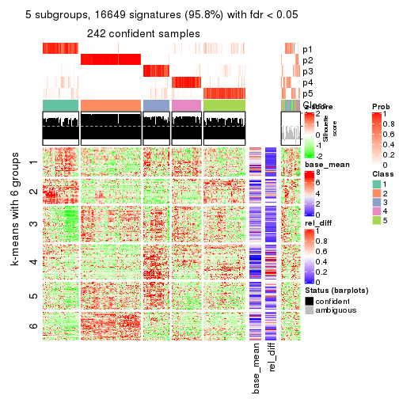</p>

</div>
<div id='tab-MAD-NMF-get-signatures-5'>
<pre><code class="r">get_signatures(res, k = 6)
</code></pre>

<p></p>

</div>
</div>


Signature heatmaps where rows are not scaled:


<script>
$( function() {
	$( '#tabs-MAD-NMF-get-signatures-no-scale' ).tabs();
} );
</script>
<div id='tabs-MAD-NMF-get-signatures-no-scale'>
<ul>
<li><a href='#tab-MAD-NMF-get-signatures-no-scale-1'>k = 2</a></li>
<li><a href='#tab-MAD-NMF-get-signatures-no-scale-2'>k = 3</a></li>
<li><a href='#tab-MAD-NMF-get-signatures-no-scale-3'>k = 4</a></li>
<li><a href='#tab-MAD-NMF-get-signatures-no-scale-4'>k = 5</a></li>
<li><a href='#tab-MAD-NMF-get-signatures-no-scale-5'>k = 6</a></li>
</ul>
<div id='tab-MAD-NMF-get-signatures-no-scale-1'>
<pre><code class="r">get_signatures(res, k = 2, scale_rows = FALSE)
</code></pre>

<p></p>

</div>
<div id='tab-MAD-NMF-get-signatures-no-scale-2'>
<pre><code class="r">get_signatures(res, k = 3, scale_rows = FALSE)
</code></pre>

<p></p>

</div>
<div id='tab-MAD-NMF-get-signatures-no-scale-3'>
<pre><code class="r">get_signatures(res, k = 4, scale_rows = FALSE)
</code></pre>

<p></p>

</div>
<div id='tab-MAD-NMF-get-signatures-no-scale-4'>
<pre><code class="r">get_signatures(res, k = 5, scale_rows = FALSE)
</code></pre>

<p></p>

</div>
<div id='tab-MAD-NMF-get-signatures-no-scale-5'>
<pre><code class="r">get_signatures(res, k = 6, scale_rows = FALSE)
</code></pre>

<p></p>

</div>
</div>


Compare the overlap of signatures from different k:

```r
compare_signatures(res)
```


`get_signature()` returns a data frame invisibly. TO get the list of signatures, the function
call should be assigned to a variable explicitly. In following code, if `plot` argument is set
to `FALSE`, no heatmap is plotted while only the differential analysis is performed.

```r
# code only for demonstration
tb = get_signature(res, k = ..., plot = FALSE)
```

An example of the output of `tb` is:

```
#>   which_row         fdr    mean_1    mean_2 scaled_mean_1 scaled_mean_2 km
#> 1        38 0.042760348  8.373488  9.131774    -0.5533452     0.5164555  1
#> 2        40 0.018707592  7.106213  8.469186    -0.6173731     0.5762149  1
#> 3        55 0.019134737 10.221463 11.207825    -0.6159697     0.5749050  1
#> 4        59 0.006059896  5.921854  7.869574    -0.6899429     0.6439467  1
#> 5        60 0.018055526  8.928898 10.211722    -0.6204761     0.5791110  1
#> 6        98 0.009384629 15.714769 14.887706     0.6635654    -0.6193277  2
...
```

The columns in `tb` are:

1. `which_row`: row indices corresponding to the input matrix.
2. `fdr`: FDR for the differential test. 
3. `mean_x`: The mean value in group x.
4. `scaled_mean_x`: The mean value in group x after rows are scaled.
5. `km`: Row groups if k-means clustering is applied to rows.


UMAP plot which shows how samples are separated.


<script>
$( function() {
	$( '#tabs-MAD-NMF-dimension-reduction' ).tabs();
} );
</script>
<div id='tabs-MAD-NMF-dimension-reduction'>
<ul>
<li><a href='#tab-MAD-NMF-dimension-reduction-1'>k = 2</a></li>
<li><a href='#tab-MAD-NMF-dimension-reduction-2'>k = 3</a></li>
<li><a href='#tab-MAD-NMF-dimension-reduction-3'>k = 4</a></li>
<li><a href='#tab-MAD-NMF-dimension-reduction-4'>k = 5</a></li>
<li><a href='#tab-MAD-NMF-dimension-reduction-5'>k = 6</a></li>
</ul>
<div id='tab-MAD-NMF-dimension-reduction-1'>
<pre><code class="r">dimension_reduction(res, k = 2, method = &quot;UMAP&quot;)
</code></pre>

<p></p>

</div>
<div id='tab-MAD-NMF-dimension-reduction-2'>
<pre><code class="r">dimension_reduction(res, k = 3, method = &quot;UMAP&quot;)
</code></pre>

<p></p>

</div>
<div id='tab-MAD-NMF-dimension-reduction-3'>
<pre><code class="r">dimension_reduction(res, k = 4, method = &quot;UMAP&quot;)
</code></pre>

<p></p>

</div>
<div id='tab-MAD-NMF-dimension-reduction-4'>
<pre><code class="r">dimension_reduction(res, k = 5, method = &quot;UMAP&quot;)
</code></pre>

<p></p>

</div>
<div id='tab-MAD-NMF-dimension-reduction-5'>
<pre><code class="r">dimension_reduction(res, k = 6, method = &quot;UMAP&quot;)
</code></pre>

<p></p>

</div>
</div>


Following heatmap shows how subgroups are split when increasing `k`:

```r
collect_classes(res)
```


If matrix rows can be associated to genes, consider to use `GO_Enrichment(res,
...)` to perform function enrichment for the signature genes.


 

---------------------------------------------------


### ATC:hclust


The object with results only for a single top-value method and a single partition method 
can be extracted as:

```r
res = res_list["ATC", "hclust"]
# you can also extract it by
# res = res_list["ATC:hclust"]
```

A summary of `res` and all the functions that can be applied to it:

```r
res
```

```
#> A 'ConsensusPartition' object with k = 2, 3, 4, 5, 6.
#>   On a matrix with 17377 rows and 265 columns.
#>   Top rows (1000, 2000, 3000, 4000, 5000) are extracted by 'ATC' method.
#>   Subgroups are detected by 'hclust' method.
#>   Performed in total 1250 partitions by row resampling.
#>   Best k for subgroups seems to be 3.
#> 
#> Following methods can be applied to this 'ConsensusPartition' object:
#>  [1] "cola_report"             "collect_classes"         "collect_plots"          
#>  [4] "collect_stats"           "colnames"                "compare_signatures"     
#>  [7] "consensus_heatmap"       "dimension_reduction"     "functional_enrichment"  
#> [10] "get_anno_col"            "get_anno"                "get_classes"            
#> [13] "get_consensus"           "get_matrix"              "get_membership"         
#> [16] "get_param"               "get_signatures"          "get_stats"              
#> [19] "is_best_k"               "is_stable_k"             "membership_heatmap"     
#> [22] "ncol"                    "nrow"                    "plot_ecdf"              
#> [25] "rownames"                "select_partition_number" "show"                   
#> [28] "suggest_best_k"          "test_to_known_factors"
```

`collect_plots()` function collects all the plots made from `res` for all `k` (number of partitions)
into one single page to provide an easy and fast comparison between different `k`.

```r
collect_plots(res)
```

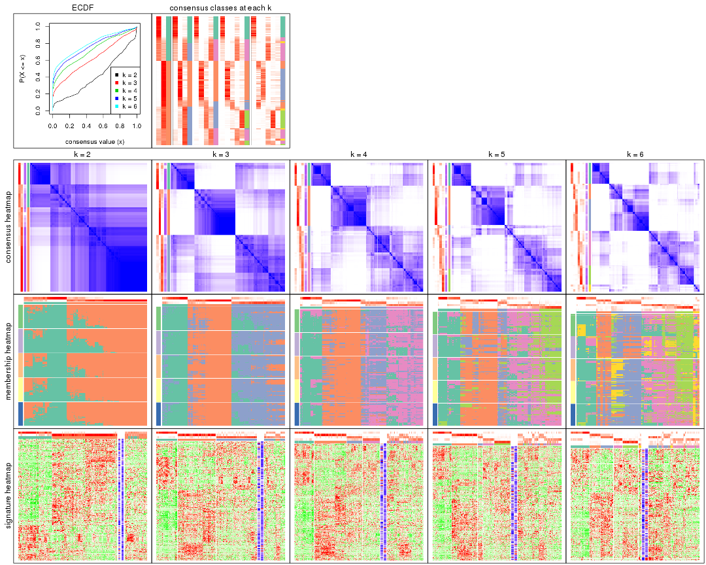

The plots are:

- The first row: a plot of the ECDF (Empirical cumulative distribution
  function) curves of the consensus matrix for each `k` and the heatmap of
  predicted classes for each `k`.
- The second row: heatmaps of the consensus matrix for each `k`.
- The third row: heatmaps of the membership matrix for each `k`.
- The fouth row: heatmaps of the signatures for each `k`.

All the plots in panels can be made by individual functions and they are
plotted later in this section.

`select_partition_number()` produces several plots showing different
statistics for choosing "optimized" `k`. There are following statistics:

- ECDF curves of the consensus matrix for each `k`;
- 1-PAC. [The PAC
  score](https://en.wikipedia.org/wiki/Consensus_clustering#Over-interpretation_potential_of_consensus_clustering)
  measures the proportion of the ambiguous subgrouping.
- Mean silhouette score.
- Concordance. The mean probability of fiting the consensus class ids in all
  partitions.
- Area increased. Denote $A_k$ as the area under the ECDF curve for current
  `k`, the area increased is defined as $A_k - A_{k-1}$.
- Rand index. The percent of pairs of samples that are both in a same cluster
  or both are not in a same cluster in the partition of k and k-1.
- Jaccard index. The ratio of pairs of samples are both in a same cluster in
  the partition of k and k-1 and the pairs of samples are both in a same
  cluster in the partition k or k-1.

The detailed explanations of these statistics can be found in [the cola
vignette](http://bioconductor.org/packages/devel/bioc/vignettes/cola/inst/doc/cola.html#toc_13).

Generally speaking, lower PAC score, higher mean silhouette score or higher
concordance corresponds to better partition. Rand index and Jaccard index
measure how similar the current partition is compared to partition with `k-1`.
If they are too similar, we won't accept `k` is better than `k-1`.

```r
select_partition_number(res)
```


The numeric values for all these statistics can be obtained by `get_stats()`.

```r
get_stats(res)
```

```
#>   k 1-PAC mean_silhouette concordance area_increased  Rand Jaccard
#> 2 2 0.354           0.693       0.860         0.4146 0.545   0.545
#> 3 3 0.427           0.658       0.822         0.5158 0.646   0.437
#> 4 4 0.517           0.587       0.745         0.1481 0.842   0.594
#> 5 5 0.573           0.541       0.698         0.0649 0.930   0.749
#> 6 6 0.614           0.498       0.663         0.0398 0.910   0.651
```

`suggest_best_k()` suggests the best $k$ based on these statistics. The rules are as follows:

- All $k$ with Jaccard index larger than 0.95 are removed because the increase of
  the partition number does not provides enough extra information. If all $k$ are removed,
  the best $k$ is assigned by `NA`.
- For $k$ with 1-PAC larger than 0.9, the maximal $k$ is taken as the "best k". Other $k$ is called "optional k".
- If it does not fit the second rule. The $k$ with the highest vote of highest
  1-PAC, mean silhouette and concordance is taken as the "best k".

```r
suggest_best_k(res)
```

```
#> [1] 3
```


Following shows the table of the partitions (You need to click the **show/hide
code output** link to see it). The membership matrix (columns with name `p*`)
is inferred by
[`clue::cl_consensus()`](https://www.rdocumentation.org/link/cl_consensus?package=clue)
function with the `SE` method. Basically the value in the membership matrix
represents the probability to belong to a certain group. The finall class
label for an item is determined with the group with highest probability it
belongs to.

In `get_classes()` function, the entropy is calculated from the membership
matrix and the silhouette score is calculated from the consensus matrix.


<script>
$( function() {
	$( '#tabs-ATC-hclust-get-classes' ).tabs();
} );
</script>
<div id='tabs-ATC-hclust-get-classes'>
<ul>
<li><a href='#tab-ATC-hclust-get-classes-1'>k = 2</a></li>
<li><a href='#tab-ATC-hclust-get-classes-2'>k = 3</a></li>
<li><a href='#tab-ATC-hclust-get-classes-3'>k = 4</a></li>
<li><a href='#tab-ATC-hclust-get-classes-4'>k = 5</a></li>
<li><a href='#tab-ATC-hclust-get-classes-5'>k = 6</a></li>
</ul>

<div id='tab-ATC-hclust-get-classes-1'>
<p><a id='tab-ATC-hclust-get-classes-1-a' style='color:#0366d6' href='#'>show/hide code output</a></p>
<pre><code class="r">cbind(get_classes(res, k = 2), get_membership(res, k = 2))
</code></pre>

<pre><code>#&gt;                                      class entropy silhouette    p1    p2
#&gt; D30CF518-5FC6-4A54-8D5D-BA420EA1836D     2  0.0000    0.84320 0.000 1.000
#&gt; 92298FF7-1215-4756-B976-A7D88B91AD76     2  0.9358    0.43553 0.352 0.648
#&gt; 0E244FE2-7C17-4642-A51F-2CCA796D9C70     2  0.0000    0.84320 0.000 1.000
#&gt; 75435ED8-93E8-45FB-8480-98D8EB2EF8CB     2  0.0000    0.84320 0.000 1.000
#&gt; B6D11678-15A9-4F43-A0A2-225067DCAF1C     1  0.5519    0.74434 0.872 0.128
#&gt; B7F5A41E-9559-4329-81F5-1B88A74730B7     2  0.0376    0.84372 0.004 0.996
#&gt; 39414B2A-7FB0-4669-8DFE-86D9AF7AD2D9     2  0.9686    0.30401 0.396 0.604
#&gt; 04823F53-A12D-4852-8F34-77B9DCBB7DF0     2  0.0938    0.84368 0.012 0.988
#&gt; 49684C2B-D31C-4B45-A400-3497C3CCEC01     2  0.0000    0.84320 0.000 1.000
#&gt; 96A04875-58E2-4BE7-8E0F-CAB55F4CA54F     1  0.9988    0.22285 0.520 0.480
#&gt; 1F101D63-478B-40B9-A951-DC3887CFF067     2  0.5294    0.79936 0.120 0.880
#&gt; DD290860-E0B7-48FC-BE12-2AF729994C21     2  0.0000    0.84320 0.000 1.000
#&gt; FFDD7A12-DDEF-4974-8D60-64B7EEAAC994     2  0.1184    0.84357 0.016 0.984
#&gt; E076A9A9-EA2A-4FF7-92A8-F2DA7F30279E     1  0.0000    0.75774 1.000 0.000
#&gt; 830DFA6F-A85A-4317-82B2-791FAB998A01     2  0.0000    0.84320 0.000 1.000
#&gt; 58578614-E4A3-4655-BBAB-F65851625E0A     1  0.0938    0.76109 0.988 0.012
#&gt; 1CBFB672-4D66-430B-83F3-7CE3BE20ABF6     1  0.9993    0.20793 0.516 0.484
#&gt; 6C34A7D7-3756-4DCC-9A9F-B5FC4A148B7E     2  0.1184    0.84361 0.016 0.984
#&gt; D97ED7B4-5DF2-4B62-8796-AA51CA79DBBB     1  0.8499    0.66839 0.724 0.276
#&gt; 45F15851-55F6-4169-834E-38958C38B6A9     2  0.6438    0.76128 0.164 0.836
#&gt; 4139E0C9-F712-4A25-8B59-587533B93B3E     1  0.0000    0.75774 1.000 0.000
#&gt; 2C3007BF-009E-404F-A3BF-8B921698D85B     1  0.0376    0.75922 0.996 0.004
#&gt; 2189F8E5-FF98-4C1A-BD04-5595DB553130     2  0.7602    0.69235 0.220 0.780
#&gt; FFAA0310-0D78-4499-8FB8-5BC46E4FCE58     2  0.9970    0.00436 0.468 0.532
#&gt; 0C375B2F-67BE-4708-BEB2-544DEC812DCA     2  0.0000    0.84320 0.000 1.000
#&gt; AB6324A1-19AB-400C-8001-54765D190E27     2  0.0672    0.84405 0.008 0.992
#&gt; A32C4DCD-DC4C-4132-9ED1-B159F5561A2D     2  0.6343    0.76557 0.160 0.840
#&gt; 2AE7105D-D494-45B0-947A-315D8C20ECDC     1  0.7139    0.72168 0.804 0.196
#&gt; 60FE9D59-FC0F-4B9C-ABF8-1C00BC761928     2  0.9686    0.30551 0.396 0.604
#&gt; 056442DC-E87A-4315-965C-C19D7B4FC40E     1  0.0000    0.75774 1.000 0.000
#&gt; 455111E5-18EF-4E3F-9DFF-8FA017D92461     2  0.4690    0.81130 0.100 0.900
#&gt; 10632BC6-0B81-433C-8832-6B2ABC73A94B     1  0.9000    0.61713 0.684 0.316
#&gt; AC6F82AD-C682-4EB3-BEC3-FD950F57609D     1  0.0000    0.75774 1.000 0.000
#&gt; D9ABDB75-04DA-4D33-A69F-701729494533     2  0.9209    0.48097 0.336 0.664
#&gt; 27BBF44D-F4D7-4C5A-935F-3310A363A670     2  0.0000    0.84320 0.000 1.000
#&gt; E7AA12EE-6E14-4B33-A52C-B13589436023     2  0.9209    0.48097 0.336 0.664
#&gt; DFA6D41A-D231-413E-A180-E42DF26C3E2B     1  0.7602    0.70045 0.780 0.220
#&gt; 655BD3AF-5094-4B19-93A8-401C70369B17     1  0.8861    0.63234 0.696 0.304
#&gt; 9DFEF253-923F-4EE2-8E3D-C75805387B20     1  0.8909    0.62729 0.692 0.308
#&gt; 3B0EE948-B2CD-4191-90E2-BDD155F3B580     1  0.3733    0.75771 0.928 0.072
#&gt; 177C7EF4-2D54-4555-947C-44EE7C688917     2  0.0376    0.84381 0.004 0.996
#&gt; 1F8E8BB7-D159-4556-8B04-E5DD027CC444     2  0.1184    0.84347 0.016 0.984
#&gt; 619F37D2-6771-4727-9079-56BED07F1CF6     2  0.9248    0.46500 0.340 0.660
#&gt; ACAE29BE-ECB8-4A98-BC71-7A2D4857134E     2  0.0000    0.84320 0.000 1.000
#&gt; C5C3241A-684C-4238-9333-9AF8630EC086     2  0.0000    0.84320 0.000 1.000
#&gt; AD319DC2-140F-4E7B-A899-010687D8B714     2  0.0000    0.84320 0.000 1.000
#&gt; 2AFF397C-ED2A-4FD9-A7F0-E4C61E9FB603     2  0.1184    0.84323 0.016 0.984
#&gt; FB4C7892-3DBB-4148-AAE9-75B19A1A4031     1  0.9087    0.61267 0.676 0.324
#&gt; 6F5C4500-1ED1-4E81-B4F5-EEA64CE2336A     1  0.0000    0.75774 1.000 0.000
#&gt; BD027C69-3C10-4047-8E1E-218600FF2B73     2  0.6623    0.75409 0.172 0.828
#&gt; 11B473A9-4CC5-461F-BC57-CC9141F3591D     2  0.9710    0.29142 0.400 0.600
#&gt; 69A036E5-3E6A-4862-A7F8-2D203ED2FC9E     1  0.0000    0.75774 1.000 0.000
#&gt; 9C0BDF24-F011-4855-B95A-1B6BEFA808F7     1  0.9000    0.61713 0.684 0.316
#&gt; 9E205254-8C0C-4C05-AF5A-86E679CF732C     2  0.5408    0.79748 0.124 0.876
#&gt; 935CCE4A-8AA8-454E-9DFF-7DE27D0BD2E2     2  0.9815    0.21841 0.420 0.580
#&gt; 01E5E1FE-41D3-428B-90BC-7A000829E102     1  0.9710    0.46147 0.600 0.400
#&gt; B344A530-92CD-468B-847A-DF8E25688081     2  0.0000    0.84320 0.000 1.000
#&gt; F79F32A7-9F7B-4D62-8426-4A4CF10ED319     2  0.6438    0.76128 0.164 0.836
#&gt; C2E1C6FA-82F9-467C-99AE-9B39FAAC810C     2  0.6438    0.76128 0.164 0.836
#&gt; BF7CD9BD-776A-4957-8A6E-EF8AD83EA9D3     2  0.0000    0.84320 0.000 1.000
#&gt; 8A2C1409-E83B-435E-A20F-5FCA94801C9F     2  0.0938    0.84393 0.012 0.988
#&gt; B6BEFFB5-2F62-477B-A4C8-478D29577CBD     2  0.1184    0.84347 0.016 0.984
#&gt; 8622CBD0-F8E9-4AC1-8175-CC9A742B86F9     1  0.0000    0.75774 1.000 0.000
#&gt; 565DD660-ED58-4065-8619-260BEA6FCFEB     2  0.9044    0.51834 0.320 0.680
#&gt; 96038E42-0FBA-497D-819C-38F7689F10FF     1  0.9000    0.61713 0.684 0.316
#&gt; CA685549-F8BA-43F1-8461-5D2D3B17CFC5     1  0.8909    0.63139 0.692 0.308
#&gt; 52020307-71A6-46E5-ACB3-8F885CA8F1EB     2  0.9209    0.48097 0.336 0.664
#&gt; 7656DA98-76DC-424B-B02C-D7001DAAA0E4     1  0.9358    0.56357 0.648 0.352
#&gt; 74DBA640-45E2-42A6-8F1E-69C073D66EE6     2  0.6343    0.76539 0.160 0.840
#&gt; 251094BE-C33D-44F0-BD98-8618D71F520C     2  0.9286    0.45829 0.344 0.656
#&gt; AB914CC5-5FF1-4257-A353-6A99D11B9478     1  0.9909    0.34368 0.556 0.444
#&gt; 38B8B893-0E08-4B71-B51C-B32A7B2724E0     1  0.8016    0.69428 0.756 0.244
#&gt; 7C7CD8FF-99A4-41D7-B7E1-5A517001F551     2  0.0000    0.84320 0.000 1.000
#&gt; BFC5B75A-E4AE-486B-BA30-23BBAA33A125     2  0.6712    0.74949 0.176 0.824
#&gt; 182AC78E-A07C-4B34-B216-B5F573E9F036     2  0.8555    0.60011 0.280 0.720
#&gt; B38C5F72-8F46-4531-9C2D-96EEE07A5B22     2  0.0000    0.84320 0.000 1.000
#&gt; DB9333A6-A723-4B8F-9221-25B8B23D5126     1  0.9977    0.24549 0.528 0.472
#&gt; CD67DD21-C1B6-4D58-AC8E-1F4536C7DA70     2  0.0000    0.84320 0.000 1.000
#&gt; 3D76A56E-4B66-48AE-AA60-D9C1004C7140     1  0.0000    0.75774 1.000 0.000
#&gt; 71ED572F-7780-47A4-A9F8-D320C737690D     1  0.0376    0.75922 0.996 0.004
#&gt; B449FEA1-C4B0-400F-903C-59E13D0BA313     2  0.0000    0.84320 0.000 1.000
#&gt; 3F120E90-1486-4215-B9B9-79D5B413CAAC     2  0.3879    0.82301 0.076 0.924
#&gt; A071894B-D8C0-4740-BD55-93EA0C86EDF7     1  0.1414    0.76199 0.980 0.020
#&gt; 58848D57-D7A9-4ABB-86A2-A8AE2B23F654     1  0.9998    0.16884 0.508 0.492
#&gt; CD6F9E20-B301-4663-87EC-953EDF49754F     2  0.0000    0.84320 0.000 1.000
#&gt; 367D89F3-D527-4929-B830-8B6D553DF9E1     2  0.4562    0.81323 0.096 0.904
#&gt; BE8D7DCB-648B-42DD-9FA8-8B85B5D816B2     1  0.9635    0.48903 0.612 0.388
#&gt; AA46F56B-BD9C-40A4-8EA8-35E2568C964D     2  0.0000    0.84320 0.000 1.000
#&gt; 6393220A-7C57-413F-81A8-4E38C21E779E     2  0.0000    0.84320 0.000 1.000
#&gt; 89AE566C-F65F-43C2-BA97-621A7AC8B6DC     1  0.0000    0.75774 1.000 0.000
#&gt; AA6A4BFF-8C62-4B70-B85A-9EDF403B06BA     1  0.0938    0.76109 0.988 0.012
#&gt; BCE877A6-9C65-4495-A45D-05753F2D0E15     2  0.5408    0.79734 0.124 0.876
#&gt; D7BDDF49-C54B-4F8E-ACA0-C3684AB68B5C     2  0.2236    0.83791 0.036 0.964
#&gt; D0800D49-0033-44B2-8D7B-29B16F87ADA6     2  0.0000    0.84320 0.000 1.000
#&gt; 151D60B5-5AF1-4B61-B97F-ABC7531D9F89     1  0.8909    0.63568 0.692 0.308
#&gt; CBBAEB5B-25FA-4B6D-A40C-357E37033E36     2  0.9580    0.35740 0.380 0.620
#&gt; 317CD049-3151-40B7-8E88-B0B8813338D6     1  0.5519    0.74434 0.872 0.128
#&gt; 93835C77-F8FA-4928-843C-8016A91881FA     2  0.6343    0.76539 0.160 0.840
#&gt; 02A6950F-647D-4F20-B2D0-0238C1441C70     1  0.9710    0.46147 0.600 0.400
#&gt; 4D54E415-134F-4F6F-8718-3E0475EF5477     2  0.6438    0.76128 0.164 0.836
#&gt; 82AB290A-3993-45E5-8B15-6125A019778C     2  0.5737    0.78825 0.136 0.864
#&gt; 3B5EAD14-E506-4A22-804D-BF925A2D5247     2  0.0000    0.84320 0.000 1.000
#&gt; 19CF7DDF-4F3A-4D2F-B84A-6451A5C3112C     2  0.0000    0.84320 0.000 1.000
#&gt; 2FB00DAA-C274-42B1-A06B-611FE5E96844     1  0.0000    0.75774 1.000 0.000
#&gt; 2B1F01C3-8145-4296-8111-2B0474AB9A2C     2  0.0672    0.84405 0.008 0.992
#&gt; 3F0865F1-8256-4778-966F-D53637B415B6     2  0.1414    0.84243 0.020 0.980
#&gt; 5473210D-37F9-4192-86D2-E2A2C77F3BD2     2  0.0000    0.84320 0.000 1.000
#&gt; 5EDB6ACF-4F3F-471A-9DDC-661607CACCC4     2  0.5737    0.78701 0.136 0.864
#&gt; 6A252A3A-7EEB-47B6-9C23-D69BD2EA846F     2  0.0000    0.84320 0.000 1.000
#&gt; 0A7FFCBB-4BAA-4A5F-8B2D-B427C4D982A8     1  0.0938    0.76123 0.988 0.012
#&gt; 1603AFB8-5AD7-4794-9991-BDBE96B4D997     2  0.0000    0.84320 0.000 1.000
#&gt; 644299E9-62B7-4DFE-9E6D-D7556A01B40A     2  0.8327    0.62758 0.264 0.736
#&gt; EF12E923-1860-4269-B57B-BA6238FA4403     2  0.9710    0.29142 0.400 0.600
#&gt; 51B7241E-F0BE-482A-88AE-89004BB68989     1  0.0376    0.75922 0.996 0.004
#&gt; 1C007DF3-8A9F-4940-9A4C-DE2A412BB023     2  0.0000    0.84320 0.000 1.000
#&gt; 89FCFDE6-9625-432C-AA35-9C5FCCF40031     2  0.4022    0.82125 0.080 0.920
#&gt; 7955FC55-386D-497E-AFED-019BBBAD428E     2  0.8813    0.55943 0.300 0.700
#&gt; 37FF09ED-73EC-4D10-B2AC-7D8EBA9304ED     1  0.8909    0.63139 0.692 0.308
#&gt; C2CD2742-2FB4-468E-90FF-8F65A5C425A9     2  0.5946    0.78171 0.144 0.856
#&gt; 766FE08F-3393-4868-B1C1-FA98C9FF16E0     2  0.9170    0.48841 0.332 0.668
#&gt; 63E2B578-2221-4255-8C45-7FD030B1C94D     2  0.5059    0.80460 0.112 0.888
#&gt; C14B1A44-43F7-45F0-A583-5667A4D3BD95     1  0.2043    0.76227 0.968 0.032
#&gt; D9CB551A-CE20-4BF7-8AC9-839112346C3D     2  1.0000   -0.13964 0.496 0.504
#&gt; 05BAA71A-E5B3-4A3A-A3F2-013A975087F0     2  0.0000    0.84320 0.000 1.000
#&gt; AC8DA7DE-4D83-4768-BEFD-9A1B2DA943CE     2  0.0000    0.84320 0.000 1.000
#&gt; E89DCE9D-F8A5-499C-85BB-BB500BADB9FB     1  0.1633    0.76218 0.976 0.024
#&gt; C16F9B5E-2B52-40F6-856D-C0D6FBDD16C1     1  0.9866    0.37763 0.568 0.432
#&gt; 8FF234D4-823A-4C80-82F7-2E92D72DBF88     2  0.0000    0.84320 0.000 1.000
#&gt; C9F94A6E-D104-4D8D-8EC5-EADECD85F092     1  0.8861    0.63234 0.696 0.304
#&gt; 45C9756F-A154-4537-852E-ECBF27B92FE1     2  0.0376    0.84372 0.004 0.996
#&gt; 0F1A5708-341E-4713-BC70-76D702F826D6     2  0.7815    0.67644 0.232 0.768
#&gt; 2ECFBCA0-AB35-461A-A4B5-C60B2651A962     2  0.0000    0.84320 0.000 1.000
#&gt; 7DFAC404-3AB3-4274-A533-CFDAF4CE122D     1  0.0000    0.75774 1.000 0.000
#&gt; A90AF55C-4386-42AB-A812-9230026EA5A5     2  0.0000    0.84320 0.000 1.000
#&gt; 6258A757-4E18-4CD1-8417-189521E990B6     2  0.0672    0.84405 0.008 0.992
#&gt; EBFAD137-050F-47D0-A43D-72B8F7D70C2B     1  0.8661    0.65841 0.712 0.288
#&gt; 08B5EBFB-2807-4229-95A6-81AB7F377A56     2  0.0672    0.84405 0.008 0.992
#&gt; 4780A59C-0589-4995-B044-3201F09AF859     2  0.5408    0.79748 0.124 0.876
#&gt; 0AB81429-C287-48AA-9035-3A7A6F4C7328     2  0.0376    0.84372 0.004 0.996
#&gt; 20C4D047-28DA-4AB7-9B3C-32EDA6B22C9D     2  0.0000    0.84320 0.000 1.000
#&gt; 77C4E01F-84A6-4BFD-AA8E-D7875456F546     2  0.0000    0.84320 0.000 1.000
#&gt; 8B28383F-CF14-4CC5-A1E2-72AD915C0AE8     2  0.4022    0.82125 0.080 0.920
#&gt; E12E1F48-6A52-4F74-925C-C4EE1BF5C573     2  0.0000    0.84320 0.000 1.000
#&gt; 9B179BC5-BB4C-4CEE-99BC-BC552BC384A1     2  0.9358    0.43855 0.352 0.648
#&gt; 5548C91A-D3DE-48F5-B4A4-124BE177B99A     2  0.9580    0.35740 0.380 0.620
#&gt; 0E22B729-C381-4B0C-9897-62DD38F51722     2  0.4562    0.81359 0.096 0.904
#&gt; 7BC4937F-04E2-4B46-BA7C-FE9AC738C8A9     1  0.2603    0.76149 0.956 0.044
#&gt; EE6A0D3F-3F8A-4AA8-B3EF-32372EF37A29     1  0.8909    0.63139 0.692 0.308
#&gt; 08AC2706-7651-409F-BE6B-BCED1C2D1796     1  0.9000    0.61713 0.684 0.316
#&gt; A68B078D-8979-4070-BB4D-F526704ED3DC     1  0.9710    0.46147 0.600 0.400
#&gt; C319A5EE-69FA-4AAB-85A9-2EAAD8E4C703     2  0.9608    0.34449 0.384 0.616
#&gt; 0D7CAABD-D20C-4F82-BCBC-8B7276E8EDE2     1  0.0000    0.75774 1.000 0.000
#&gt; 09444DCC-44BA-4A3F-ACC5-863A54578B9F     2  0.0000    0.84320 0.000 1.000
#&gt; 2E32B047-C6E1-4743-A6C8-E98370A32145     2  0.4690    0.81130 0.100 0.900
#&gt; 6A6878A7-76B2-40DE-958B-804442AC6A5D     1  0.9988    0.22285 0.520 0.480
#&gt; 39F27293-0BFF-4EA2-8439-A299E3226D20     2  0.4022    0.82125 0.080 0.920
#&gt; 7EAE9C30-6080-405F-A7E6-1FED57674279     2  0.5737    0.78845 0.136 0.864
#&gt; 79499169-A093-4E0A-B6BD-010CD7BE5035     2  0.9393    0.42711 0.356 0.644
#&gt; 1F8BF4E8-BD84-4EFE-9E3E-89E7CE8FA72D     2  0.0000    0.84320 0.000 1.000
#&gt; 62B7988F-98E5-4AB8-8A16-D661A07455E8     1  0.1633    0.76218 0.976 0.024
#&gt; B7005B5F-217E-4073-BFB5-CE7E884B80C0     2  0.0000    0.84320 0.000 1.000
#&gt; B981568F-2C08-4696-B589-E157A49BE72B     2  0.0000    0.84320 0.000 1.000
#&gt; A3D85C0A-3202-40C2-88E1-052AC6C5184B     1  0.0672    0.76022 0.992 0.008
#&gt; 4CA783B9-9B99-46B8-962A-77194ECB7942     2  0.8813    0.55943 0.300 0.700
#&gt; D4024B08-4879-47EA-99E5-D9FCE1CD40DF     1  0.7883    0.69937 0.764 0.236
#&gt; 1D41CDA2-0B29-48FD-B83A-E60C174DBCB3     1  0.7883    0.69937 0.764 0.236
#&gt; A1923B2A-B233-4760-8AF9-C04C1CAEB100     1  0.8443    0.67390 0.728 0.272
#&gt; 80880D71-BFDE-4D88-892F-5ADF27A38940     2  0.0672    0.84410 0.008 0.992
#&gt; 55D1629D-30FD-49AA-88CE-EA3CA9B30A3F     2  0.0000    0.84320 0.000 1.000
#&gt; B71C409E-926D-48AD-8BD8-9F707CA4FB01     2  0.0000    0.84320 0.000 1.000
#&gt; 54A92C57-BD19-4A47-BA76-3ACA2DC36212     2  0.4690    0.81284 0.100 0.900
#&gt; B2AB74B8-506C-4C27-9105-E86A6AAA89D4     2  0.9608    0.34449 0.384 0.616
#&gt; 0356AE49-7A5C-42CC-A39C-7C8DFBFF8842     2  0.0000    0.84320 0.000 1.000
#&gt; ACA260A3-DC3F-4FF4-B9C5-2D4BC4F81783     1  0.5519    0.74434 0.872 0.128
#&gt; 9B440917-E5A4-43B9-A48D-6ABFEDCA6CFD     1  0.9850    0.39255 0.572 0.428
#&gt; 47464828-52EA-413B-B30C-BD8B55903D78     2  0.0938    0.84393 0.012 0.988
#&gt; C1D1FC82-B50D-4C82-8F03-06CEE3C08D18     1  0.2603    0.76149 0.956 0.044
#&gt; E5ABFC43-E2A3-4B1A-BBA3-8196C0B026A5     2  0.5519    0.78553 0.128 0.872
#&gt; 1D3C16CC-D0D5-4637-AAC7-91672DFF3317     1  0.2603    0.76149 0.956 0.044
#&gt; 4D038320-ADEA-4990-8371-68B4B8162E1A     2  0.1843    0.84093 0.028 0.972
#&gt; A75594CC-3E49-4869-8656-BBB4E72BF59D     2  0.0000    0.84320 0.000 1.000
#&gt; 7CABAA19-5FB2-4A58-BDA3-4F1FFB532C20     2  0.7950    0.66616 0.240 0.760
#&gt; 534EF1E9-9513-426E-B41E-A394AB2E4410     2  0.0000    0.84320 0.000 1.000
#&gt; 649F35A1-A08C-497D-A9B6-CB3084D5FB8D     2  0.9608    0.34694 0.384 0.616
#&gt; 7CA30F3C-1C98-480C-B8B5-A248AABFB468     2  0.5059    0.80451 0.112 0.888
#&gt; A9F8DA21-A802-44CF-9F5D-96A36687DCDD     2  0.9970    0.00436 0.468 0.532
#&gt; A7AE1ED1-86CB-4A50-97B2-66785C7191FE     2  0.5519    0.79487 0.128 0.872
#&gt; D0091AD4-D3D7-4C03-ACD9-DA9F8B6076C6     2  0.4690    0.81130 0.100 0.900
#&gt; 46EE1C2B-13F7-44A7-B27E-4EBB9DF0CA83     2  0.1414    0.84299 0.020 0.980
#&gt; CB9301B8-0282-43D6-AF5E-B753A9C7BFCB     2  0.1184    0.84347 0.016 0.984
#&gt; A0E77A39-885A-4472-9A10-2D1E51DBFDA4     2  0.6531    0.75942 0.168 0.832
#&gt; C06603C2-163D-40B6-A9FE-882424F18FE9     1  0.9922    0.32924 0.552 0.448
#&gt; C3921A29-80FF-4B9D-B366-5C0238A42231     2  0.4690    0.81284 0.100 0.900
#&gt; BB99B4E7-C834-4BB8-973F-8FA039E2798F     1  0.0376    0.75922 0.996 0.004
#&gt; 5CD78C2F-05E9-409A-8405-3EE936A6876E     2  0.0000    0.84320 0.000 1.000
#&gt; 6C126CC7-0C03-48F0-A2C2-F090CA239B70     2  0.0000    0.84320 0.000 1.000
#&gt; 7118B08A-E94C-49F4-8D76-26455C34D85F     2  0.0000    0.84320 0.000 1.000
#&gt; 266DAF30-CF3E-493E-8B24-3931D0039450     2  0.9552    0.37180 0.376 0.624
#&gt; DAB5F5B9-4FE5-468F-AD2B-B39BBC4317A0     2  0.0000    0.84320 0.000 1.000
#&gt; 9A9EB6D6-312E-4A98-8762-30D3ABD8193D     2  0.0000    0.84320 0.000 1.000
#&gt; CED15676-B901-4FC8-9C8D-51E529D9441D     1  0.9044    0.61911 0.680 0.320
#&gt; 827232CC-8035-440C-8B12-02C789C70B1B     2  0.0672    0.84426 0.008 0.992
#&gt; 04D5FB28-FB50-4EAE-95FB-72ABF0E618CA     2  0.0000    0.84320 0.000 1.000
#&gt; 6C96A851-97FC-4845-B895-D255191D9F25     1  0.9635    0.48903 0.612 0.388
#&gt; 3EC982CB-D013-443E-B21D-39DE6B8EF370     2  0.0000    0.84320 0.000 1.000
#&gt; 2E24A786-4370-42A1-AD50-D651F89819CC     2  0.0000    0.84320 0.000 1.000
#&gt; 7653BFA9-ADA5-44CA-8555-807FBBFC6DE2     1  0.0000    0.75774 1.000 0.000
#&gt; 7A110994-5741-4013-91F0-DD2E1D343F91     2  0.0000    0.84320 0.000 1.000
#&gt; 0A760E0C-11C5-4201-8452-18DBC1FEACEB     1  0.9635    0.48903 0.612 0.388
#&gt; 909B76A1-BB9F-4906-95BC-58CD1A46D3B8     2  0.0000    0.84320 0.000 1.000
#&gt; A782EE71-EDA4-4385-83B3-D16DE81296C0     1  0.8861    0.63643 0.696 0.304
#&gt; BD50E276-914F-4924-8CEA-FF47A66DB175     2  0.0000    0.84320 0.000 1.000
#&gt; 505D5CA8-0279-4BC7-8CC0-8C7A0165BF91     2  0.0000    0.84320 0.000 1.000
#&gt; D51FC997-E662-4AE7-BC9C-14183DA42DE1     2  0.0000    0.84320 0.000 1.000
#&gt; 8AD67970-84F1-4C0A-B47A-8FA4108F9FE3     1  0.0000    0.75774 1.000 0.000
#&gt; 6E33B1B6-7089-4BC3-B2B0-EC2C3B5D8B74     1  0.9993    0.20793 0.516 0.484
#&gt; 88C4EA46-2546-401C-A8E7-603EECFDFBA0     2  0.9608    0.34694 0.384 0.616
#&gt; 375D2D72-C998-4627-BA35-24E82A9A55FF     1  0.9129    0.60631 0.672 0.328
#&gt; 76D0F834-7064-46C6-96F4-E861CF5452B6     2  0.7745    0.68088 0.228 0.772
#&gt; 87159081-C97A-4004-AF0A-7EB6EF0EC47A     2  0.9996   -0.09429 0.488 0.512
#&gt; 24A57006-800B-4174-AF4E-7EA57A8A756E     2  0.9732    0.27067 0.404 0.596
#&gt; AD68CBC6-8A13-4A65-AF62-E99AFA81D031     2  0.1184    0.84323 0.016 0.984
#&gt; 22863A57-F066-4DD1-A859-4336F43D144C     1  0.7376    0.71200 0.792 0.208
#&gt; 8F6F0362-9165-4DCC-992C-AF871A3C51E7     1  0.9710    0.46147 0.600 0.400
#&gt; 76ABF0B7-E707-4DB2-9486-3814439BDBA5     1  0.9998    0.16884 0.508 0.492
#&gt; BC72372F-3577-40E5-BA0F-41A084AA93AD     2  0.9209    0.48097 0.336 0.664
#&gt; 8E566039-B56C-4F41-B9EF-DE18BEEF2C95     1  0.0376    0.75922 0.996 0.004
#&gt; F096F016-3EF5-4A67-A7C2-8A45E1585232     1  0.0376    0.75922 0.996 0.004
#&gt; BB37913E-534B-43DD-BE3D-E13B29FD8172     2  0.0000    0.84320 0.000 1.000
#&gt; E344638F-9060-460F-8F7A-60D19442F294     2  0.2236    0.83791 0.036 0.964
#&gt; 6A0EAAD0-89D5-4F12-8B45-9D5A25182FAD     2  0.8661    0.58695 0.288 0.712
#&gt; A5199E3A-9D67-4543-88AB-24398C98E38E     1  0.8909    0.63139 0.692 0.308
#&gt; 23917D52-7864-4F84-9C77-DF8EA9407345     2  0.1414    0.84299 0.020 0.980
#&gt; 9AA96080-19D8-40C3-BDD1-6044D2D422D5     1  0.0000    0.75774 1.000 0.000
#&gt; 0ED65D91-260C-4662-9903-EE36A2E3B2D0     2  0.0000    0.84320 0.000 1.000
#&gt; 64BF1BC5-7A9A-4E1D-AEAB-AFE30B92AAF4     2  0.9970    0.00436 0.468 0.532
#&gt; F02301F1-9054-4DC6-8DC9-2451A0F53EFC     2  0.0672    0.84414 0.008 0.992
#&gt; 3264649A-5684-4181-83D0-A7E4D7E2E1FD     2  0.9393    0.42916 0.356 0.644
#&gt; 3F8DA39C-BC9B-4343-8838-5CE271E80C51     1  0.8909    0.62729 0.692 0.308
#&gt; BCC681CB-2AF4-4BB6-B53A-7544A2399454     1  0.0000    0.75774 1.000 0.000
#&gt; DCB50E17-5E2D-443B-8DCC-272FBB734C2E     1  0.0000    0.75774 1.000 0.000
#&gt; B5E47C38-CB6A-44C0-AA9B-56951B9EF78D     1  0.1414    0.76199 0.980 0.020
#&gt; B15B0185-9C28-4A00-9CEC-05EFECEA6709     1  0.0376    0.75922 0.996 0.004
#&gt; 61D4E8E7-0110-480A-A4A7-D406DE74C31E     1  0.8267    0.68376 0.740 0.260
#&gt; CA8DB3AD-3F6B-4622-BF73-47041EC96E42     2  0.9044    0.51562 0.320 0.680
#&gt; 5EECB1C4-172C-4494-871A-ADB650CD82BD     2  0.0000    0.84320 0.000 1.000
#&gt; 019B857C-D4F7-4B67-B699-56E52A60805B     2  0.0672    0.84414 0.008 0.992
#&gt; E9C28902-05C9-4883-97A4-D612D54E46B4     2  0.4939    0.80694 0.108 0.892
#&gt; C5D3D9A0-FC14-408D-AB6C-662018A5E5CA     1  0.9993    0.20793 0.516 0.484
#&gt; 7EB24744-509B-4854-B7D0-0BAFA210A345     2  0.0672    0.84405 0.008 0.992
#&gt; B8B7A721-2284-40AB-98F5-EF1351C30B66     2  0.0000    0.84320 0.000 1.000
#&gt; 3C12F39D-0D21-4F69-A539-4120B73C7A79     2  0.1184    0.84357 0.016 0.984
#&gt; 08D3F984-6850-45B2-9DF9-EC7F5A4060A4     2  0.9963    0.02143 0.464 0.536
#&gt; 9BD0EE79-1EED-4F6D-A5AB-43ADB8526F1E     2  0.5059    0.80451 0.112 0.888
#&gt; E489A871-3CF4-4F3D-8EAF-63B507054201     2  0.5842    0.78475 0.140 0.860
#&gt; 8CF8FD2E-1DBA-4257-9715-04D956D46B71     2  0.1184    0.84357 0.016 0.984
#&gt; F6193AF0-7A19-46CB-A818-1B01E7460791     1  0.0000    0.75774 1.000 0.000
#&gt; 96392D6B-D4FF-4393-93BA-08E469E8BBE1     2  0.5059    0.80451 0.112 0.888
#&gt; DABCBE5A-C591-46A2-AF66-DA3DB6106751     1  0.0000    0.75774 1.000 0.000
#&gt; 8B75F7D4-98D8-44DE-B19D-B733D6A031DB     1  0.2603    0.76149 0.956 0.044
#&gt; AAD9685A-564B-42E9-91E3-431951154BA7     2  0.1184    0.84347 0.016 0.984
#&gt; 90A43152-4E3B-4365-A39F-7B0E5CA66E55     2  0.4022    0.82125 0.080 0.920
#&gt; EFB76FCF-AC9C-4852-B91C-E055DA666FA0     1  0.0938    0.76109 0.988 0.012
#&gt; 6EBCFFE3-706F-440A-ABA9-012A924A07C6     2  0.1184    0.84357 0.016 0.984
#&gt; E922A244-F1C8-4310-ABB2-62B06E022E4C     1  0.0376    0.75923 0.996 0.004
</code></pre>

<script>
$('#tab-ATC-hclust-get-classes-1-a').parent().next().next().hide();
$('#tab-ATC-hclust-get-classes-1-a').click(function(){
  $('#tab-ATC-hclust-get-classes-1-a').parent().next().next().toggle();
  return(false);
});
</script>
</div>

<div id='tab-ATC-hclust-get-classes-2'>
<p><a id='tab-ATC-hclust-get-classes-2-a' style='color:#0366d6' href='#'>show/hide code output</a></p>
<pre><code class="r">cbind(get_classes(res, k = 3), get_membership(res, k = 3))
</code></pre>

<pre><code>#&gt;                                      class entropy silhouette    p1    p2    p3
#&gt; D30CF518-5FC6-4A54-8D5D-BA420EA1836D     2  0.0000     0.8523 0.000 1.000 0.000
#&gt; 92298FF7-1215-4756-B976-A7D88B91AD76     3  0.5467     0.7121 0.112 0.072 0.816
#&gt; 0E244FE2-7C17-4642-A51F-2CCA796D9C70     2  0.0000     0.8523 0.000 1.000 0.000
#&gt; 75435ED8-93E8-45FB-8480-98D8EB2EF8CB     2  0.4291     0.7813 0.000 0.820 0.180
#&gt; B6D11678-15A9-4F43-A0A2-225067DCAF1C     1  0.5431     0.6195 0.716 0.000 0.284
#&gt; B7F5A41E-9559-4329-81F5-1B88A74730B7     2  0.4121     0.7906 0.000 0.832 0.168
#&gt; 39414B2A-7FB0-4669-8DFE-86D9AF7AD2D9     3  0.4063     0.6933 0.112 0.020 0.868
#&gt; 04823F53-A12D-4852-8F34-77B9DCBB7DF0     2  0.5859     0.5880 0.000 0.656 0.344
#&gt; 49684C2B-D31C-4B45-A400-3497C3CCEC01     2  0.0000     0.8523 0.000 1.000 0.000
#&gt; 96A04875-58E2-4BE7-8E0F-CAB55F4CA54F     3  0.5115     0.6006 0.228 0.004 0.768
#&gt; 1F101D63-478B-40B9-A951-DC3887CFF067     3  0.4654     0.6210 0.000 0.208 0.792
#&gt; DD290860-E0B7-48FC-BE12-2AF729994C21     2  0.0000     0.8523 0.000 1.000 0.000
#&gt; FFDD7A12-DDEF-4974-8D60-64B7EEAAC994     2  0.6286     0.2791 0.000 0.536 0.464
#&gt; E076A9A9-EA2A-4FF7-92A8-F2DA7F30279E     1  0.0237     0.8355 0.996 0.000 0.004
#&gt; 830DFA6F-A85A-4317-82B2-791FAB998A01     2  0.0000     0.8523 0.000 1.000 0.000
#&gt; 58578614-E4A3-4655-BBAB-F65851625E0A     1  0.2537     0.8408 0.920 0.000 0.080
#&gt; 1CBFB672-4D66-430B-83F3-7CE3BE20ABF6     3  0.5070     0.6049 0.224 0.004 0.772
#&gt; 6C34A7D7-3756-4DCC-9A9F-B5FC4A148B7E     2  0.4121     0.7825 0.000 0.832 0.168
#&gt; D97ED7B4-5DF2-4B62-8796-AA51CA79DBBB     3  0.6274     0.0850 0.456 0.000 0.544
#&gt; 45F15851-55F6-4169-834E-38958C38B6A9     3  0.4002     0.6673 0.000 0.160 0.840
#&gt; 4139E0C9-F712-4A25-8B59-587533B93B3E     1  0.0237     0.8355 0.996 0.000 0.004
#&gt; 2C3007BF-009E-404F-A3BF-8B921698D85B     1  0.2066     0.8450 0.940 0.000 0.060
#&gt; 2189F8E5-FF98-4C1A-BD04-5595DB553130     3  0.5295     0.7003 0.036 0.156 0.808
#&gt; FFAA0310-0D78-4499-8FB8-5BC46E4FCE58     3  0.4235     0.6406 0.176 0.000 0.824
#&gt; 0C375B2F-67BE-4708-BEB2-544DEC812DCA     2  0.1289     0.8478 0.000 0.968 0.032
#&gt; AB6324A1-19AB-400C-8001-54765D190E27     2  0.4702     0.7504 0.000 0.788 0.212
#&gt; A32C4DCD-DC4C-4132-9ED1-B159F5561A2D     3  0.4062     0.6640 0.000 0.164 0.836
#&gt; 2AE7105D-D494-45B0-947A-315D8C20ECDC     1  0.6204     0.3238 0.576 0.000 0.424
#&gt; 60FE9D59-FC0F-4B9C-ABF8-1C00BC761928     3  0.3769     0.6961 0.104 0.016 0.880
#&gt; 056442DC-E87A-4315-965C-C19D7B4FC40E     1  0.0000     0.8346 1.000 0.000 0.000
#&gt; 455111E5-18EF-4E3F-9DFF-8FA017D92461     3  0.5216     0.5512 0.000 0.260 0.740
#&gt; 10632BC6-0B81-433C-8832-6B2ABC73A94B     3  0.6154     0.2730 0.408 0.000 0.592
#&gt; AC6F82AD-C682-4EB3-BEC3-FD950F57609D     1  0.0000     0.8346 1.000 0.000 0.000
#&gt; D9ABDB75-04DA-4D33-A69F-701729494533     3  0.3764     0.7128 0.068 0.040 0.892
#&gt; 27BBF44D-F4D7-4C5A-935F-3310A363A670     2  0.1411     0.8467 0.000 0.964 0.036
#&gt; E7AA12EE-6E14-4B33-A52C-B13589436023     3  0.3764     0.7128 0.068 0.040 0.892
#&gt; DFA6D41A-D231-413E-A180-E42DF26C3E2B     1  0.5591     0.5774 0.696 0.000 0.304
#&gt; 655BD3AF-5094-4B19-93A8-401C70369B17     1  0.6305     0.1413 0.516 0.000 0.484
#&gt; 9DFEF253-923F-4EE2-8E3D-C75805387B20     1  0.6307     0.1249 0.512 0.000 0.488
#&gt; 3B0EE948-B2CD-4191-90E2-BDD155F3B580     1  0.4235     0.7702 0.824 0.000 0.176
#&gt; 177C7EF4-2D54-4555-947C-44EE7C688917     2  0.4931     0.7207 0.000 0.768 0.232
#&gt; 1F8E8BB7-D159-4556-8B04-E5DD027CC444     2  0.5926     0.5707 0.000 0.644 0.356
#&gt; 619F37D2-6771-4727-9079-56BED07F1CF6     3  0.5075     0.7119 0.096 0.068 0.836
#&gt; ACAE29BE-ECB8-4A98-BC71-7A2D4857134E     2  0.0237     0.8520 0.000 0.996 0.004
#&gt; C5C3241A-684C-4238-9333-9AF8630EC086     2  0.0000     0.8523 0.000 1.000 0.000
#&gt; AD319DC2-140F-4E7B-A899-010687D8B714     2  0.0000     0.8523 0.000 1.000 0.000
#&gt; 2AFF397C-ED2A-4FD9-A7F0-E4C61E9FB603     2  0.5810     0.5932 0.000 0.664 0.336
#&gt; FB4C7892-3DBB-4148-AAE9-75B19A1A4031     3  0.6045     0.3204 0.380 0.000 0.620
#&gt; 6F5C4500-1ED1-4E81-B4F5-EEA64CE2336A     1  0.0000     0.8346 1.000 0.000 0.000
#&gt; BD027C69-3C10-4047-8E1E-218600FF2B73     3  0.4755     0.6541 0.008 0.184 0.808
#&gt; 11B473A9-4CC5-461F-BC57-CC9141F3591D     3  0.4136     0.6924 0.116 0.020 0.864
#&gt; 69A036E5-3E6A-4862-A7F8-2D203ED2FC9E     1  0.1163     0.8411 0.972 0.000 0.028
#&gt; 9C0BDF24-F011-4855-B95A-1B6BEFA808F7     3  0.6154     0.2730 0.408 0.000 0.592
#&gt; 9E205254-8C0C-4C05-AF5A-86E679CF732C     3  0.4796     0.6140 0.000 0.220 0.780
#&gt; 935CCE4A-8AA8-454E-9DFF-7DE27D0BD2E2     3  0.4618     0.6836 0.136 0.024 0.840
#&gt; 01E5E1FE-41D3-428B-90BC-7A000829E102     3  0.5529     0.5039 0.296 0.000 0.704
#&gt; B344A530-92CD-468B-847A-DF8E25688081     2  0.0000     0.8523 0.000 1.000 0.000
#&gt; F79F32A7-9F7B-4D62-8426-4A4CF10ED319     3  0.4002     0.6673 0.000 0.160 0.840
#&gt; C2E1C6FA-82F9-467C-99AE-9B39FAAC810C     3  0.4002     0.6673 0.000 0.160 0.840
#&gt; BF7CD9BD-776A-4957-8A6E-EF8AD83EA9D3     2  0.4452     0.7732 0.000 0.808 0.192
#&gt; 8A2C1409-E83B-435E-A20F-5FCA94801C9F     2  0.5291     0.7005 0.000 0.732 0.268
#&gt; B6BEFFB5-2F62-477B-A4C8-478D29577CBD     2  0.6267     0.3490 0.000 0.548 0.452
#&gt; 8622CBD0-F8E9-4AC1-8175-CC9A742B86F9     1  0.0000     0.8346 1.000 0.000 0.000
#&gt; 565DD660-ED58-4065-8619-260BEA6FCFEB     3  0.7508     0.6842 0.148 0.156 0.696
#&gt; 96038E42-0FBA-497D-819C-38F7689F10FF     3  0.6154     0.2730 0.408 0.000 0.592
#&gt; CA685549-F8BA-43F1-8461-5D2D3B17CFC5     3  0.6168     0.2252 0.412 0.000 0.588
#&gt; 52020307-71A6-46E5-ACB3-8F885CA8F1EB     3  0.3764     0.7128 0.068 0.040 0.892
#&gt; 7656DA98-76DC-424B-B02C-D7001DAAA0E4     3  0.6189     0.3616 0.364 0.004 0.632
#&gt; 74DBA640-45E2-42A6-8F1E-69C073D66EE6     3  0.4121     0.6606 0.000 0.168 0.832
#&gt; 251094BE-C33D-44F0-BD98-8618D71F520C     3  0.5407     0.7140 0.104 0.076 0.820
#&gt; AB914CC5-5FF1-4257-A353-6A99D11B9478     3  0.5216     0.5587 0.260 0.000 0.740
#&gt; 38B8B893-0E08-4B71-B51C-B32A7B2724E0     3  0.6309    -0.0760 0.496 0.000 0.504
#&gt; 7C7CD8FF-99A4-41D7-B7E1-5A517001F551     2  0.0424     0.8518 0.000 0.992 0.008
#&gt; BFC5B75A-E4AE-486B-BA30-23BBAA33A125     3  0.4589     0.6652 0.008 0.172 0.820
#&gt; 182AC78E-A07C-4B34-B216-B5F573E9F036     3  0.2703     0.7129 0.016 0.056 0.928
#&gt; B38C5F72-8F46-4531-9C2D-96EEE07A5B22     2  0.2537     0.8326 0.000 0.920 0.080
#&gt; DB9333A6-A723-4B8F-9221-25B8B23D5126     3  0.5244     0.5883 0.240 0.004 0.756
#&gt; CD67DD21-C1B6-4D58-AC8E-1F4536C7DA70     2  0.0000     0.8523 0.000 1.000 0.000
#&gt; 3D76A56E-4B66-48AE-AA60-D9C1004C7140     1  0.0000     0.8346 1.000 0.000 0.000
#&gt; 71ED572F-7780-47A4-A9F8-D320C737690D     1  0.2066     0.8450 0.940 0.000 0.060
#&gt; B449FEA1-C4B0-400F-903C-59E13D0BA313     2  0.1411     0.8471 0.000 0.964 0.036
#&gt; 3F120E90-1486-4215-B9B9-79D5B413CAAC     3  0.5591     0.4795 0.000 0.304 0.696
#&gt; A071894B-D8C0-4740-BD55-93EA0C86EDF7     1  0.2878     0.8340 0.904 0.000 0.096
#&gt; 58848D57-D7A9-4ABB-86A2-A8AE2B23F654     3  0.4834     0.6246 0.204 0.004 0.792
#&gt; CD6F9E20-B301-4663-87EC-953EDF49754F     2  0.0000     0.8523 0.000 1.000 0.000
#&gt; 367D89F3-D527-4929-B830-8B6D553DF9E1     3  0.5216     0.5501 0.000 0.260 0.740
#&gt; BE8D7DCB-648B-42DD-9FA8-8B85B5D816B2     3  0.5650     0.4763 0.312 0.000 0.688
#&gt; AA46F56B-BD9C-40A4-8EA8-35E2568C964D     2  0.0000     0.8523 0.000 1.000 0.000
#&gt; 6393220A-7C57-413F-81A8-4E38C21E779E     2  0.1289     0.8476 0.000 0.968 0.032
#&gt; 89AE566C-F65F-43C2-BA97-621A7AC8B6DC     1  0.0000     0.8346 1.000 0.000 0.000
#&gt; AA6A4BFF-8C62-4B70-B85A-9EDF403B06BA     1  0.2448     0.8423 0.924 0.000 0.076
#&gt; BCE877A6-9C65-4495-A45D-05753F2D0E15     3  0.4978     0.6175 0.004 0.216 0.780
#&gt; D7BDDF49-C54B-4F8E-ACA0-C3684AB68B5C     2  0.6126     0.4623 0.000 0.600 0.400
#&gt; D0800D49-0033-44B2-8D7B-29B16F87ADA6     2  0.4399     0.7763 0.000 0.812 0.188
#&gt; 151D60B5-5AF1-4B61-B97F-ABC7531D9F89     3  0.6168     0.2374 0.412 0.000 0.588
#&gt; CBBAEB5B-25FA-4B6D-A40C-357E37033E36     3  0.4094     0.7010 0.100 0.028 0.872
#&gt; 317CD049-3151-40B7-8E88-B0B8813338D6     1  0.5431     0.6195 0.716 0.000 0.284
#&gt; 93835C77-F8FA-4928-843C-8016A91881FA     3  0.4121     0.6606 0.000 0.168 0.832
#&gt; 02A6950F-647D-4F20-B2D0-0238C1441C70     3  0.5529     0.5039 0.296 0.000 0.704
#&gt; 4D54E415-134F-4F6F-8718-3E0475EF5477     3  0.4002     0.6673 0.000 0.160 0.840
#&gt; 82AB290A-3993-45E5-8B15-6125A019778C     3  0.5171     0.6381 0.012 0.204 0.784
#&gt; 3B5EAD14-E506-4A22-804D-BF925A2D5247     2  0.0000     0.8523 0.000 1.000 0.000
#&gt; 19CF7DDF-4F3A-4D2F-B84A-6451A5C3112C     2  0.5058     0.7129 0.000 0.756 0.244
#&gt; 2FB00DAA-C274-42B1-A06B-611FE5E96844     1  0.2066     0.8455 0.940 0.000 0.060
#&gt; 2B1F01C3-8145-4296-8111-2B0474AB9A2C     2  0.5431     0.6821 0.000 0.716 0.284
#&gt; 3F0865F1-8256-4778-966F-D53637B415B6     2  0.5948     0.5497 0.000 0.640 0.360
#&gt; 5473210D-37F9-4192-86D2-E2A2C77F3BD2     2  0.4887     0.7308 0.000 0.772 0.228
#&gt; 5EDB6ACF-4F3F-471A-9DDC-661607CACCC4     3  0.4452     0.6367 0.000 0.192 0.808
#&gt; 6A252A3A-7EEB-47B6-9C23-D69BD2EA846F     2  0.4121     0.7761 0.000 0.832 0.168
#&gt; 0A7FFCBB-4BAA-4A5F-8B2D-B427C4D982A8     1  0.2625     0.8399 0.916 0.000 0.084
#&gt; 1603AFB8-5AD7-4794-9991-BDBE96B4D997     2  0.0000     0.8523 0.000 1.000 0.000
#&gt; 644299E9-62B7-4DFE-9E6D-D7556A01B40A     3  0.4689     0.7155 0.052 0.096 0.852
#&gt; EF12E923-1860-4269-B57B-BA6238FA4403     3  0.4136     0.6924 0.116 0.020 0.864
#&gt; 51B7241E-F0BE-482A-88AE-89004BB68989     1  0.2165     0.8449 0.936 0.000 0.064
#&gt; 1C007DF3-8A9F-4940-9A4C-DE2A412BB023     2  0.0000     0.8523 0.000 1.000 0.000
#&gt; 89FCFDE6-9625-432C-AA35-9C5FCCF40031     3  0.5560     0.4791 0.000 0.300 0.700
#&gt; 7955FC55-386D-497E-AFED-019BBBAD428E     3  0.2918     0.7126 0.032 0.044 0.924
#&gt; 37FF09ED-73EC-4D10-B2AC-7D8EBA9304ED     3  0.6168     0.2252 0.412 0.000 0.588
#&gt; C2CD2742-2FB4-468E-90FF-8F65A5C425A9     3  0.5318     0.6426 0.016 0.204 0.780
#&gt; 766FE08F-3393-4868-B1C1-FA98C9FF16E0     3  0.5500     0.7155 0.100 0.084 0.816
#&gt; 63E2B578-2221-4255-8C45-7FD030B1C94D     3  0.5178     0.5625 0.000 0.256 0.744
#&gt; C14B1A44-43F7-45F0-A583-5667A4D3BD95     1  0.3412     0.8177 0.876 0.000 0.124
#&gt; D9CB551A-CE20-4BF7-8AC9-839112346C3D     3  0.4555     0.6237 0.200 0.000 0.800
#&gt; 05BAA71A-E5B3-4A3A-A3F2-013A975087F0     2  0.2711     0.8293 0.000 0.912 0.088
#&gt; AC8DA7DE-4D83-4768-BEFD-9A1B2DA943CE     2  0.0000     0.8523 0.000 1.000 0.000
#&gt; E89DCE9D-F8A5-499C-85BB-BB500BADB9FB     1  0.3267     0.8227 0.884 0.000 0.116
#&gt; C16F9B5E-2B52-40F6-856D-C0D6FBDD16C1     3  0.5553     0.5494 0.272 0.004 0.724
#&gt; 8FF234D4-823A-4C80-82F7-2E92D72DBF88     2  0.0237     0.8521 0.000 0.996 0.004
#&gt; C9F94A6E-D104-4D8D-8EC5-EADECD85F092     1  0.6305     0.1413 0.516 0.000 0.484
#&gt; 45C9756F-A154-4537-852E-ECBF27B92FE1     2  0.4750     0.7520 0.000 0.784 0.216
#&gt; 0F1A5708-341E-4713-BC70-76D702F826D6     3  0.3112     0.7111 0.004 0.096 0.900
#&gt; 2ECFBCA0-AB35-461A-A4B5-C60B2651A962     2  0.0237     0.8521 0.000 0.996 0.004
#&gt; 7DFAC404-3AB3-4274-A533-CFDAF4CE122D     1  0.0000     0.8346 1.000 0.000 0.000
#&gt; A90AF55C-4386-42AB-A812-9230026EA5A5     2  0.0000     0.8523 0.000 1.000 0.000
#&gt; 6258A757-4E18-4CD1-8417-189521E990B6     2  0.5327     0.6980 0.000 0.728 0.272
#&gt; EBFAD137-050F-47D0-A43D-72B8F7D70C2B     3  0.6274     0.0918 0.456 0.000 0.544
#&gt; 08B5EBFB-2807-4229-95A6-81AB7F377A56     2  0.5216     0.7094 0.000 0.740 0.260
#&gt; 4780A59C-0589-4995-B044-3201F09AF859     3  0.4796     0.6140 0.000 0.220 0.780
#&gt; 0AB81429-C287-48AA-9035-3A7A6F4C7328     2  0.2448     0.8306 0.000 0.924 0.076
#&gt; 20C4D047-28DA-4AB7-9B3C-32EDA6B22C9D     2  0.0000     0.8523 0.000 1.000 0.000
#&gt; 77C4E01F-84A6-4BFD-AA8E-D7875456F546     2  0.4235     0.7661 0.000 0.824 0.176
#&gt; 8B28383F-CF14-4CC5-A1E2-72AD915C0AE8     3  0.5560     0.4791 0.000 0.300 0.700
#&gt; E12E1F48-6A52-4F74-925C-C4EE1BF5C573     2  0.0592     0.8513 0.000 0.988 0.012
#&gt; 9B179BC5-BB4C-4CEE-99BC-BC552BC384A1     3  0.4316     0.7111 0.088 0.044 0.868
#&gt; 5548C91A-D3DE-48F5-B4A4-124BE177B99A     3  0.4094     0.7010 0.100 0.028 0.872
#&gt; 0E22B729-C381-4B0C-9897-62DD38F51722     3  0.5254     0.5439 0.000 0.264 0.736
#&gt; 7BC4937F-04E2-4B46-BA7C-FE9AC738C8A9     1  0.3619     0.8031 0.864 0.000 0.136
#&gt; EE6A0D3F-3F8A-4AA8-B3EF-32372EF37A29     3  0.6168     0.2252 0.412 0.000 0.588
#&gt; 08AC2706-7651-409F-BE6B-BCED1C2D1796     3  0.6154     0.2730 0.408 0.000 0.592
#&gt; A68B078D-8979-4070-BB4D-F526704ED3DC     3  0.5529     0.5039 0.296 0.000 0.704
#&gt; C319A5EE-69FA-4AAB-85A9-2EAAD8E4C703     3  0.4172     0.6997 0.104 0.028 0.868
#&gt; 0D7CAABD-D20C-4F82-BCBC-8B7276E8EDE2     1  0.0000     0.8346 1.000 0.000 0.000
#&gt; 09444DCC-44BA-4A3F-ACC5-863A54578B9F     2  0.0592     0.8506 0.000 0.988 0.012
#&gt; 2E32B047-C6E1-4743-A6C8-E98370A32145     3  0.5216     0.5512 0.000 0.260 0.740
#&gt; 6A6878A7-76B2-40DE-958B-804442AC6A5D     3  0.5115     0.6006 0.228 0.004 0.768
#&gt; 39F27293-0BFF-4EA2-8439-A299E3226D20     3  0.5591     0.4765 0.000 0.304 0.696
#&gt; 7EAE9C30-6080-405F-A7E6-1FED57674279     3  0.5360     0.6208 0.012 0.220 0.768
#&gt; 79499169-A093-4E0A-B6BD-010CD7BE5035     3  0.3370     0.7081 0.072 0.024 0.904
#&gt; 1F8BF4E8-BD84-4EFE-9E3E-89E7CE8FA72D     2  0.0000     0.8523 0.000 1.000 0.000
#&gt; 62B7988F-98E5-4AB8-8A16-D661A07455E8     1  0.3267     0.8227 0.884 0.000 0.116
#&gt; B7005B5F-217E-4073-BFB5-CE7E884B80C0     2  0.0747     0.8506 0.000 0.984 0.016
#&gt; B981568F-2C08-4696-B589-E157A49BE72B     2  0.0000     0.8523 0.000 1.000 0.000
#&gt; A3D85C0A-3202-40C2-88E1-052AC6C5184B     1  0.1860     0.8450 0.948 0.000 0.052
#&gt; 4CA783B9-9B99-46B8-962A-77194ECB7942     3  0.2918     0.7126 0.032 0.044 0.924
#&gt; D4024B08-4879-47EA-99E5-D9FCE1CD40DF     1  0.6309     0.0839 0.504 0.000 0.496
#&gt; 1D41CDA2-0B29-48FD-B83A-E60C174DBCB3     1  0.6309     0.0839 0.504 0.000 0.496
#&gt; A1923B2A-B233-4760-8AF9-C04C1CAEB100     3  0.6274     0.0751 0.456 0.000 0.544
#&gt; 80880D71-BFDE-4D88-892F-5ADF27A38940     2  0.5058     0.7135 0.000 0.756 0.244
#&gt; 55D1629D-30FD-49AA-88CE-EA3CA9B30A3F     2  0.0000     0.8523 0.000 1.000 0.000
#&gt; B71C409E-926D-48AD-8BD8-9F707CA4FB01     2  0.0000     0.8523 0.000 1.000 0.000
#&gt; 54A92C57-BD19-4A47-BA76-3ACA2DC36212     3  0.5465     0.5165 0.000 0.288 0.712
#&gt; B2AB74B8-506C-4C27-9105-E86A6AAA89D4     3  0.4172     0.6997 0.104 0.028 0.868
#&gt; 0356AE49-7A5C-42CC-A39C-7C8DFBFF8842     2  0.0000     0.8523 0.000 1.000 0.000
#&gt; ACA260A3-DC3F-4FF4-B9C5-2D4BC4F81783     1  0.5431     0.6195 0.716 0.000 0.284
#&gt; 9B440917-E5A4-43B9-A48D-6ABFEDCA6CFD     3  0.5363     0.5334 0.276 0.000 0.724
#&gt; 47464828-52EA-413B-B30C-BD8B55903D78     2  0.5291     0.7008 0.000 0.732 0.268
#&gt; C1D1FC82-B50D-4C82-8F03-06CEE3C08D18     1  0.3551     0.8067 0.868 0.000 0.132
#&gt; E5ABFC43-E2A3-4B1A-BBA3-8196C0B026A5     3  0.5928     0.4689 0.008 0.296 0.696
#&gt; 1D3C16CC-D0D5-4637-AAC7-91672DFF3317     1  0.3551     0.8067 0.868 0.000 0.132
#&gt; 4D038320-ADEA-4990-8371-68B4B8162E1A     2  0.6252     0.3400 0.000 0.556 0.444
#&gt; A75594CC-3E49-4869-8656-BBB4E72BF59D     2  0.0000     0.8523 0.000 1.000 0.000
#&gt; 7CABAA19-5FB2-4A58-BDA3-4F1FFB532C20     3  0.4249     0.7136 0.028 0.108 0.864
#&gt; 534EF1E9-9513-426E-B41E-A394AB2E4410     2  0.0000     0.8523 0.000 1.000 0.000
#&gt; 649F35A1-A08C-497D-A9B6-CB3084D5FB8D     3  0.4172     0.7005 0.104 0.028 0.868
#&gt; 7CA30F3C-1C98-480C-B8B5-A248AABFB468     3  0.4931     0.5923 0.000 0.232 0.768
#&gt; A9F8DA21-A802-44CF-9F5D-96A36687DCDD     3  0.4235     0.6406 0.176 0.000 0.824
#&gt; A7AE1ED1-86CB-4A50-97B2-66785C7191FE     3  0.4784     0.6327 0.004 0.200 0.796
#&gt; D0091AD4-D3D7-4C03-ACD9-DA9F8B6076C6     3  0.5216     0.5512 0.000 0.260 0.740
#&gt; 46EE1C2B-13F7-44A7-B27E-4EBB9DF0CA83     2  0.6295     0.2940 0.000 0.528 0.472
#&gt; CB9301B8-0282-43D6-AF5E-B753A9C7BFCB     2  0.5926     0.5707 0.000 0.644 0.356
#&gt; A0E77A39-885A-4472-9A10-2D1E51DBFDA4     3  0.5842     0.6637 0.036 0.196 0.768
#&gt; C06603C2-163D-40B6-A9FE-882424F18FE9     3  0.5618     0.5727 0.260 0.008 0.732
#&gt; C3921A29-80FF-4B9D-B366-5C0238A42231     3  0.5465     0.5165 0.000 0.288 0.712
#&gt; BB99B4E7-C834-4BB8-973F-8FA039E2798F     1  0.2066     0.8450 0.940 0.000 0.060
#&gt; 5CD78C2F-05E9-409A-8405-3EE936A6876E     2  0.0000     0.8523 0.000 1.000 0.000
#&gt; 6C126CC7-0C03-48F0-A2C2-F090CA239B70     2  0.0000     0.8523 0.000 1.000 0.000
#&gt; 7118B08A-E94C-49F4-8D76-26455C34D85F     2  0.0237     0.8521 0.000 0.996 0.004
#&gt; 266DAF30-CF3E-493E-8B24-3931D0039450     3  0.4015     0.7032 0.096 0.028 0.876
#&gt; DAB5F5B9-4FE5-468F-AD2B-B39BBC4317A0     2  0.0237     0.8520 0.000 0.996 0.004
#&gt; 9A9EB6D6-312E-4A98-8762-30D3ABD8193D     2  0.0000     0.8523 0.000 1.000 0.000
#&gt; CED15676-B901-4FC8-9C8D-51E529D9441D     3  0.6095     0.2937 0.392 0.000 0.608
#&gt; 827232CC-8035-440C-8B12-02C789C70B1B     2  0.2356     0.8341 0.000 0.928 0.072
#&gt; 04D5FB28-FB50-4EAE-95FB-72ABF0E618CA     2  0.0000     0.8523 0.000 1.000 0.000
#&gt; 6C96A851-97FC-4845-B895-D255191D9F25     3  0.5650     0.4763 0.312 0.000 0.688
#&gt; 3EC982CB-D013-443E-B21D-39DE6B8EF370     2  0.0000     0.8523 0.000 1.000 0.000
#&gt; 2E24A786-4370-42A1-AD50-D651F89819CC     2  0.0000     0.8523 0.000 1.000 0.000
#&gt; 7653BFA9-ADA5-44CA-8555-807FBBFC6DE2     1  0.0000     0.8346 1.000 0.000 0.000
#&gt; 7A110994-5741-4013-91F0-DD2E1D343F91     2  0.0000     0.8523 0.000 1.000 0.000
#&gt; 0A760E0C-11C5-4201-8452-18DBC1FEACEB     3  0.5650     0.4763 0.312 0.000 0.688
#&gt; 909B76A1-BB9F-4906-95BC-58CD1A46D3B8     2  0.0000     0.8523 0.000 1.000 0.000
#&gt; A782EE71-EDA4-4385-83B3-D16DE81296C0     1  0.6308     0.0975 0.508 0.000 0.492
#&gt; BD50E276-914F-4924-8CEA-FF47A66DB175     2  0.0000     0.8523 0.000 1.000 0.000
#&gt; 505D5CA8-0279-4BC7-8CC0-8C7A0165BF91     2  0.0237     0.8521 0.000 0.996 0.004
#&gt; D51FC997-E662-4AE7-BC9C-14183DA42DE1     2  0.0000     0.8523 0.000 1.000 0.000
#&gt; 8AD67970-84F1-4C0A-B47A-8FA4108F9FE3     1  0.0000     0.8346 1.000 0.000 0.000
#&gt; 6E33B1B6-7089-4BC3-B2B0-EC2C3B5D8B74     3  0.5070     0.6049 0.224 0.004 0.772
#&gt; 88C4EA46-2546-401C-A8E7-603EECFDFBA0     3  0.4172     0.7005 0.104 0.028 0.868
#&gt; 375D2D72-C998-4627-BA35-24E82A9A55FF     3  0.6026     0.3298 0.376 0.000 0.624
#&gt; 76D0F834-7064-46C6-96F4-E861CF5452B6     3  0.3425     0.7080 0.004 0.112 0.884
#&gt; 87159081-C97A-4004-AF0A-7EB6EF0EC47A     3  0.4733     0.6299 0.196 0.004 0.800
#&gt; 24A57006-800B-4174-AF4E-7EA57A8A756E     3  0.6208     0.6883 0.164 0.068 0.768
#&gt; AD68CBC6-8A13-4A65-AF62-E99AFA81D031     2  0.5905     0.5668 0.000 0.648 0.352
#&gt; 22863A57-F066-4DD1-A859-4336F43D144C     1  0.5968     0.4605 0.636 0.000 0.364
#&gt; 8F6F0362-9165-4DCC-992C-AF871A3C51E7     3  0.5529     0.5039 0.296 0.000 0.704
#&gt; 76ABF0B7-E707-4DB2-9486-3814439BDBA5     3  0.4834     0.6246 0.204 0.004 0.792
#&gt; BC72372F-3577-40E5-BA0F-41A084AA93AD     3  0.3764     0.7128 0.068 0.040 0.892
#&gt; 8E566039-B56C-4F41-B9EF-DE18BEEF2C95     1  0.2165     0.8449 0.936 0.000 0.064
#&gt; F096F016-3EF5-4A67-A7C2-8A45E1585232     1  0.2066     0.8450 0.940 0.000 0.060
#&gt; BB37913E-534B-43DD-BE3D-E13B29FD8172     2  0.0000     0.8523 0.000 1.000 0.000
#&gt; E344638F-9060-460F-8F7A-60D19442F294     2  0.5988     0.5298 0.000 0.632 0.368
#&gt; 6A0EAAD0-89D5-4F12-8B45-9D5A25182FAD     3  0.2982     0.7137 0.024 0.056 0.920
#&gt; A5199E3A-9D67-4543-88AB-24398C98E38E     3  0.6168     0.2252 0.412 0.000 0.588
#&gt; 23917D52-7864-4F84-9C77-DF8EA9407345     2  0.6295     0.2940 0.000 0.528 0.472
#&gt; 9AA96080-19D8-40C3-BDD1-6044D2D422D5     1  0.0892     0.8402 0.980 0.000 0.020
#&gt; 0ED65D91-260C-4662-9903-EE36A2E3B2D0     2  0.0000     0.8523 0.000 1.000 0.000
#&gt; 64BF1BC5-7A9A-4E1D-AEAB-AFE30B92AAF4     3  0.4235     0.6406 0.176 0.000 0.824
#&gt; F02301F1-9054-4DC6-8DC9-2451A0F53EFC     2  0.4750     0.7547 0.000 0.784 0.216
#&gt; 3264649A-5684-4181-83D0-A7E4D7E2E1FD     3  0.4206     0.7100 0.088 0.040 0.872
#&gt; 3F8DA39C-BC9B-4343-8838-5CE271E80C51     1  0.6307     0.1249 0.512 0.000 0.488
#&gt; BCC681CB-2AF4-4BB6-B53A-7544A2399454     1  0.0000     0.8346 1.000 0.000 0.000
#&gt; DCB50E17-5E2D-443B-8DCC-272FBB734C2E     1  0.0000     0.8346 1.000 0.000 0.000
#&gt; B5E47C38-CB6A-44C0-AA9B-56951B9EF78D     1  0.2711     0.8374 0.912 0.000 0.088
#&gt; B15B0185-9C28-4A00-9CEC-05EFECEA6709     1  0.2165     0.8449 0.936 0.000 0.064
#&gt; 61D4E8E7-0110-480A-A4A7-D406DE74C31E     3  0.6291     0.0257 0.468 0.000 0.532
#&gt; CA8DB3AD-3F6B-4622-BF73-47041EC96E42     3  0.4925     0.7175 0.080 0.076 0.844
#&gt; 5EECB1C4-172C-4494-871A-ADB650CD82BD     2  0.1964     0.8411 0.000 0.944 0.056
#&gt; 019B857C-D4F7-4B67-B699-56E52A60805B     2  0.4750     0.7547 0.000 0.784 0.216
#&gt; E9C28902-05C9-4883-97A4-D612D54E46B4     3  0.4796     0.6028 0.000 0.220 0.780
#&gt; C5D3D9A0-FC14-408D-AB6C-662018A5E5CA     3  0.5070     0.6049 0.224 0.004 0.772
#&gt; 7EB24744-509B-4854-B7D0-0BAFA210A345     2  0.5254     0.7054 0.000 0.736 0.264
#&gt; B8B7A721-2284-40AB-98F5-EF1351C30B66     2  0.0000     0.8523 0.000 1.000 0.000
#&gt; 3C12F39D-0D21-4F69-A539-4120B73C7A79     2  0.6286     0.2791 0.000 0.536 0.464
#&gt; 08D3F984-6850-45B2-9DF9-EC7F5A4060A4     3  0.4409     0.6502 0.172 0.004 0.824
#&gt; 9BD0EE79-1EED-4F6D-A5AB-43ADB8526F1E     3  0.4931     0.5923 0.000 0.232 0.768
#&gt; E489A871-3CF4-4F3D-8EAF-63B507054201     3  0.4702     0.6193 0.000 0.212 0.788
#&gt; 8CF8FD2E-1DBA-4257-9715-04D956D46B71     2  0.6295     0.2170 0.000 0.528 0.472
#&gt; F6193AF0-7A19-46CB-A818-1B01E7460791     1  0.0000     0.8346 1.000 0.000 0.000
#&gt; 96392D6B-D4FF-4393-93BA-08E469E8BBE1     3  0.4931     0.5923 0.000 0.232 0.768
#&gt; DABCBE5A-C591-46A2-AF66-DA3DB6106751     1  0.0000     0.8346 1.000 0.000 0.000
#&gt; 8B75F7D4-98D8-44DE-B19D-B733D6A031DB     1  0.3551     0.8067 0.868 0.000 0.132
#&gt; AAD9685A-564B-42E9-91E3-431951154BA7     2  0.6267     0.3490 0.000 0.548 0.452
#&gt; 90A43152-4E3B-4365-A39F-7B0E5CA66E55     3  0.5560     0.4791 0.000 0.300 0.700
#&gt; EFB76FCF-AC9C-4852-B91C-E055DA666FA0     1  0.2448     0.8423 0.924 0.000 0.076
#&gt; 6EBCFFE3-706F-440A-ABA9-012A924A07C6     2  0.6307     0.2200 0.000 0.512 0.488
#&gt; E922A244-F1C8-4310-ABB2-62B06E022E4C     1  0.2066     0.8443 0.940 0.000 0.060
</code></pre>

<script>
$('#tab-ATC-hclust-get-classes-2-a').parent().next().next().hide();
$('#tab-ATC-hclust-get-classes-2-a').click(function(){
  $('#tab-ATC-hclust-get-classes-2-a').parent().next().next().toggle();
  return(false);
});
</script>
</div>

<div id='tab-ATC-hclust-get-classes-3'>
<p><a id='tab-ATC-hclust-get-classes-3-a' style='color:#0366d6' href='#'>show/hide code output</a></p>
<pre><code class="r">cbind(get_classes(res, k = 4), get_membership(res, k = 4))
</code></pre>

<pre><code>#&gt;                                      class entropy silhouette    p1    p2    p3    p4
#&gt; D30CF518-5FC6-4A54-8D5D-BA420EA1836D     2  0.0000    0.83061 0.000 1.000 0.000 0.000
#&gt; 92298FF7-1215-4756-B976-A7D88B91AD76     4  0.5655    0.36179 0.028 0.008 0.316 0.648
#&gt; 0E244FE2-7C17-4642-A51F-2CCA796D9C70     2  0.0592    0.83147 0.000 0.984 0.016 0.000
#&gt; 75435ED8-93E8-45FB-8480-98D8EB2EF8CB     2  0.4621    0.64913 0.000 0.708 0.284 0.008
#&gt; B6D11678-15A9-4F43-A0A2-225067DCAF1C     1  0.5300    0.46541 0.580 0.000 0.012 0.408
#&gt; B7F5A41E-9559-4329-81F5-1B88A74730B7     2  0.4391    0.68350 0.000 0.740 0.252 0.008
#&gt; 39414B2A-7FB0-4669-8DFE-86D9AF7AD2D9     4  0.4252    0.49795 0.004 0.000 0.252 0.744
#&gt; 04823F53-A12D-4852-8F34-77B9DCBB7DF0     2  0.5607    0.21816 0.000 0.492 0.488 0.020
#&gt; 49684C2B-D31C-4B45-A400-3497C3CCEC01     2  0.0000    0.83061 0.000 1.000 0.000 0.000
#&gt; 96A04875-58E2-4BE7-8E0F-CAB55F4CA54F     4  0.5690    0.61367 0.116 0.000 0.168 0.716
#&gt; 1F101D63-478B-40B9-A951-DC3887CFF067     3  0.5222    0.61344 0.000 0.032 0.688 0.280
#&gt; DD290860-E0B7-48FC-BE12-2AF729994C21     2  0.0188    0.83060 0.000 0.996 0.004 0.000
#&gt; FFDD7A12-DDEF-4974-8D60-64B7EEAAC994     3  0.5742    0.15239 0.000 0.368 0.596 0.036
#&gt; E076A9A9-EA2A-4FF7-92A8-F2DA7F30279E     1  0.0779    0.81614 0.980 0.000 0.004 0.016
#&gt; 830DFA6F-A85A-4317-82B2-791FAB998A01     2  0.1022    0.82634 0.000 0.968 0.032 0.000
#&gt; 58578614-E4A3-4655-BBAB-F65851625E0A     1  0.3400    0.83014 0.820 0.000 0.000 0.180
#&gt; 1CBFB672-4D66-430B-83F3-7CE3BE20ABF6     4  0.5719    0.60939 0.112 0.000 0.176 0.712
#&gt; 6C34A7D7-3756-4DCC-9A9F-B5FC4A148B7E     2  0.4748    0.67113 0.000 0.716 0.268 0.016
#&gt; D97ED7B4-5DF2-4B62-8796-AA51CA79DBBB     4  0.5392    0.45969 0.280 0.000 0.040 0.680
#&gt; 45F15851-55F6-4169-834E-38958C38B6A9     3  0.5420    0.53769 0.000 0.024 0.624 0.352
#&gt; 4139E0C9-F712-4A25-8B59-587533B93B3E     1  0.0779    0.81614 0.980 0.000 0.004 0.016
#&gt; 2C3007BF-009E-404F-A3BF-8B921698D85B     1  0.3074    0.83999 0.848 0.000 0.000 0.152
#&gt; 2189F8E5-FF98-4C1A-BD04-5595DB553130     3  0.6070    0.41563 0.000 0.048 0.548 0.404
#&gt; FFAA0310-0D78-4499-8FB8-5BC46E4FCE58     4  0.6242    0.46737 0.080 0.000 0.308 0.612
#&gt; 0C375B2F-67BE-4708-BEB2-544DEC812DCA     2  0.1940    0.81830 0.000 0.924 0.076 0.000
#&gt; AB6324A1-19AB-400C-8001-54765D190E27     2  0.4955    0.54864 0.000 0.648 0.344 0.008
#&gt; A32C4DCD-DC4C-4132-9ED1-B159F5561A2D     3  0.5403    0.54329 0.000 0.024 0.628 0.348
#&gt; 2AE7105D-D494-45B0-947A-315D8C20ECDC     4  0.5800    0.11296 0.420 0.000 0.032 0.548
#&gt; 60FE9D59-FC0F-4B9C-ABF8-1C00BC761928     4  0.4980    0.40987 0.016 0.000 0.304 0.680
#&gt; 056442DC-E87A-4315-965C-C19D7B4FC40E     1  0.0000    0.81813 1.000 0.000 0.000 0.000
#&gt; 455111E5-18EF-4E3F-9DFF-8FA017D92461     3  0.5250    0.65299 0.000 0.068 0.736 0.196
#&gt; 10632BC6-0B81-433C-8832-6B2ABC73A94B     4  0.5168    0.54575 0.248 0.000 0.040 0.712
#&gt; AC6F82AD-C682-4EB3-BEC3-FD950F57609D     1  0.0000    0.81813 1.000 0.000 0.000 0.000
#&gt; D9ABDB75-04DA-4D33-A69F-701729494533     4  0.4746    0.24615 0.000 0.000 0.368 0.632
#&gt; 27BBF44D-F4D7-4C5A-935F-3310A363A670     2  0.1940    0.81791 0.000 0.924 0.076 0.000
#&gt; E7AA12EE-6E14-4B33-A52C-B13589436023     4  0.4761    0.23461 0.000 0.000 0.372 0.628
#&gt; DFA6D41A-D231-413E-A180-E42DF26C3E2B     1  0.6426    0.50815 0.628 0.000 0.116 0.256
#&gt; 655BD3AF-5094-4B19-93A8-401C70369B17     4  0.6554    0.11208 0.376 0.000 0.084 0.540
#&gt; 9DFEF253-923F-4EE2-8E3D-C75805387B20     4  0.6597    0.12014 0.372 0.000 0.088 0.540
#&gt; 3B0EE948-B2CD-4191-90E2-BDD155F3B580     1  0.4406    0.70455 0.700 0.000 0.000 0.300
#&gt; 177C7EF4-2D54-4555-947C-44EE7C688917     2  0.5311    0.59540 0.000 0.648 0.328 0.024
#&gt; 1F8E8BB7-D159-4556-8B04-E5DD027CC444     2  0.5512    0.21342 0.000 0.492 0.492 0.016
#&gt; 619F37D2-6771-4727-9079-56BED07F1CF6     4  0.5754    0.24719 0.016 0.008 0.428 0.548
#&gt; ACAE29BE-ECB8-4A98-BC71-7A2D4857134E     2  0.2149    0.81367 0.000 0.912 0.088 0.000
#&gt; C5C3241A-684C-4238-9333-9AF8630EC086     2  0.0000    0.83061 0.000 1.000 0.000 0.000
#&gt; AD319DC2-140F-4E7B-A899-010687D8B714     2  0.0188    0.83060 0.000 0.996 0.004 0.000
#&gt; 2AFF397C-ED2A-4FD9-A7F0-E4C61E9FB603     2  0.5906    0.38234 0.000 0.528 0.436 0.036
#&gt; FB4C7892-3DBB-4148-AAE9-75B19A1A4031     4  0.4755    0.57237 0.200 0.000 0.040 0.760
#&gt; 6F5C4500-1ED1-4E81-B4F5-EEA64CE2336A     1  0.0000    0.81813 1.000 0.000 0.000 0.000
#&gt; BD027C69-3C10-4047-8E1E-218600FF2B73     3  0.5986    0.29445 0.000 0.060 0.620 0.320
#&gt; 11B473A9-4CC5-461F-BC57-CC9141F3591D     4  0.4360    0.50518 0.008 0.000 0.248 0.744
#&gt; 69A036E5-3E6A-4862-A7F8-2D203ED2FC9E     1  0.2011    0.83473 0.920 0.000 0.000 0.080
#&gt; 9C0BDF24-F011-4855-B95A-1B6BEFA808F7     4  0.5168    0.54575 0.248 0.000 0.040 0.712
#&gt; 9E205254-8C0C-4C05-AF5A-86E679CF732C     3  0.5599    0.62576 0.000 0.052 0.672 0.276
#&gt; 935CCE4A-8AA8-454E-9DFF-7DE27D0BD2E2     4  0.4502    0.53673 0.016 0.000 0.236 0.748
#&gt; 01E5E1FE-41D3-428B-90BC-7A000829E102     4  0.4711    0.64461 0.152 0.000 0.064 0.784
#&gt; B344A530-92CD-468B-847A-DF8E25688081     2  0.1940    0.81302 0.000 0.924 0.076 0.000
#&gt; F79F32A7-9F7B-4D62-8426-4A4CF10ED319     3  0.5420    0.53769 0.000 0.024 0.624 0.352
#&gt; C2E1C6FA-82F9-467C-99AE-9B39FAAC810C     3  0.5436    0.53306 0.000 0.024 0.620 0.356
#&gt; BF7CD9BD-776A-4957-8A6E-EF8AD83EA9D3     2  0.4769    0.61954 0.000 0.684 0.308 0.008
#&gt; 8A2C1409-E83B-435E-A20F-5FCA94801C9F     2  0.5193    0.42559 0.000 0.580 0.412 0.008
#&gt; B6BEFFB5-2F62-477B-A4C8-478D29577CBD     3  0.5638    0.09850 0.000 0.388 0.584 0.028
#&gt; 8622CBD0-F8E9-4AC1-8175-CC9A742B86F9     1  0.0469    0.82208 0.988 0.000 0.000 0.012
#&gt; 565DD660-ED58-4065-8619-260BEA6FCFEB     4  0.7268   -0.00723 0.072 0.028 0.432 0.468
#&gt; 96038E42-0FBA-497D-819C-38F7689F10FF     4  0.5168    0.54575 0.248 0.000 0.040 0.712
#&gt; CA685549-F8BA-43F1-8461-5D2D3B17CFC5     4  0.4956    0.51107 0.232 0.000 0.036 0.732
#&gt; 52020307-71A6-46E5-ACB3-8F885CA8F1EB     4  0.4761    0.23461 0.000 0.000 0.372 0.628
#&gt; 7656DA98-76DC-424B-B02C-D7001DAAA0E4     4  0.4801    0.57129 0.188 0.000 0.048 0.764
#&gt; 74DBA640-45E2-42A6-8F1E-69C073D66EE6     3  0.5453    0.57804 0.000 0.032 0.648 0.320
#&gt; 251094BE-C33D-44F0-BD98-8618D71F520C     4  0.5068    0.36268 0.012 0.004 0.308 0.676
#&gt; AB914CC5-5FF1-4257-A353-6A99D11B9478     4  0.5630    0.63169 0.140 0.000 0.136 0.724
#&gt; 38B8B893-0E08-4B71-B51C-B32A7B2724E0     4  0.5250    0.38932 0.316 0.000 0.024 0.660
#&gt; 7C7CD8FF-99A4-41D7-B7E1-5A517001F551     2  0.1389    0.82973 0.000 0.952 0.048 0.000
#&gt; BFC5B75A-E4AE-486B-BA30-23BBAA33A125     3  0.5830    0.28456 0.000 0.048 0.620 0.332
#&gt; 182AC78E-A07C-4B34-B216-B5F573E9F036     4  0.5571    0.10744 0.004 0.012 0.472 0.512
#&gt; B38C5F72-8F46-4531-9C2D-96EEE07A5B22     2  0.3157    0.77848 0.000 0.852 0.144 0.004
#&gt; DB9333A6-A723-4B8F-9221-25B8B23D5126     4  0.4843    0.64177 0.104 0.000 0.112 0.784
#&gt; CD67DD21-C1B6-4D58-AC8E-1F4536C7DA70     2  0.1940    0.81302 0.000 0.924 0.076 0.000
#&gt; 3D76A56E-4B66-48AE-AA60-D9C1004C7140     1  0.0000    0.81813 1.000 0.000 0.000 0.000
#&gt; 71ED572F-7780-47A4-A9F8-D320C737690D     1  0.3123    0.83937 0.844 0.000 0.000 0.156
#&gt; B449FEA1-C4B0-400F-903C-59E13D0BA313     2  0.1792    0.82152 0.000 0.932 0.068 0.000
#&gt; 3F120E90-1486-4215-B9B9-79D5B413CAAC     3  0.5744    0.64809 0.000 0.108 0.708 0.184
#&gt; A071894B-D8C0-4740-BD55-93EA0C86EDF7     1  0.3726    0.80995 0.788 0.000 0.000 0.212
#&gt; 58848D57-D7A9-4ABB-86A2-A8AE2B23F654     4  0.5186    0.60668 0.084 0.000 0.164 0.752
#&gt; CD6F9E20-B301-4663-87EC-953EDF49754F     2  0.1940    0.81302 0.000 0.924 0.076 0.000
#&gt; 367D89F3-D527-4929-B830-8B6D553DF9E1     3  0.5292    0.65270 0.000 0.064 0.728 0.208
#&gt; BE8D7DCB-648B-42DD-9FA8-8B85B5D816B2     4  0.4776    0.63349 0.164 0.000 0.060 0.776
#&gt; AA46F56B-BD9C-40A4-8EA8-35E2568C964D     2  0.0188    0.83060 0.000 0.996 0.004 0.000
#&gt; 6393220A-7C57-413F-81A8-4E38C21E779E     2  0.1792    0.82096 0.000 0.932 0.068 0.000
#&gt; 89AE566C-F65F-43C2-BA97-621A7AC8B6DC     1  0.0000    0.81813 1.000 0.000 0.000 0.000
#&gt; AA6A4BFF-8C62-4B70-B85A-9EDF403B06BA     1  0.3356    0.83182 0.824 0.000 0.000 0.176
#&gt; BCE877A6-9C65-4495-A45D-05753F2D0E15     3  0.5417    0.61626 0.000 0.040 0.676 0.284
#&gt; D7BDDF49-C54B-4F8E-ACA0-C3684AB68B5C     3  0.6148   -0.21087 0.000 0.468 0.484 0.048
#&gt; D0800D49-0033-44B2-8D7B-29B16F87ADA6     2  0.4746    0.62489 0.000 0.688 0.304 0.008
#&gt; 151D60B5-5AF1-4B61-B97F-ABC7531D9F89     4  0.5137    0.52161 0.244 0.000 0.040 0.716
#&gt; CBBAEB5B-25FA-4B6D-A40C-357E37033E36     4  0.4193    0.47237 0.000 0.000 0.268 0.732
#&gt; 317CD049-3151-40B7-8E88-B0B8813338D6     1  0.5290    0.47279 0.584 0.000 0.012 0.404
#&gt; 93835C77-F8FA-4928-843C-8016A91881FA     3  0.5453    0.57804 0.000 0.032 0.648 0.320
#&gt; 02A6950F-647D-4F20-B2D0-0238C1441C70     4  0.4711    0.64461 0.152 0.000 0.064 0.784
#&gt; 4D54E415-134F-4F6F-8718-3E0475EF5477     3  0.5420    0.53769 0.000 0.024 0.624 0.352
#&gt; 82AB290A-3993-45E5-8B15-6125A019778C     3  0.5321    0.59878 0.000 0.032 0.672 0.296
#&gt; 3B5EAD14-E506-4A22-804D-BF925A2D5247     2  0.0707    0.83087 0.000 0.980 0.020 0.000
#&gt; 19CF7DDF-4F3A-4D2F-B84A-6451A5C3112C     2  0.5237    0.57471 0.000 0.628 0.356 0.016
#&gt; 2FB00DAA-C274-42B1-A06B-611FE5E96844     1  0.3024    0.84138 0.852 0.000 0.000 0.148
#&gt; 2B1F01C3-8145-4296-8111-2B0474AB9A2C     2  0.5220    0.40748 0.000 0.568 0.424 0.008
#&gt; 3F0865F1-8256-4778-966F-D53637B415B6     2  0.6130    0.31792 0.000 0.512 0.440 0.048
#&gt; 5473210D-37F9-4192-86D2-E2A2C77F3BD2     2  0.5130    0.61028 0.000 0.652 0.332 0.016
#&gt; 5EDB6ACF-4F3F-471A-9DDC-661607CACCC4     3  0.5339    0.61924 0.000 0.040 0.688 0.272
#&gt; 6A252A3A-7EEB-47B6-9C23-D69BD2EA846F     2  0.4630    0.69856 0.000 0.732 0.252 0.016
#&gt; 0A7FFCBB-4BAA-4A5F-8B2D-B427C4D982A8     1  0.3569    0.82003 0.804 0.000 0.000 0.196
#&gt; 1603AFB8-5AD7-4794-9991-BDBE96B4D997     2  0.0707    0.83087 0.000 0.980 0.020 0.000
#&gt; 644299E9-62B7-4DFE-9E6D-D7556A01B40A     3  0.5168    0.16284 0.000 0.004 0.500 0.496
#&gt; EF12E923-1860-4269-B57B-BA6238FA4403     4  0.4360    0.50518 0.008 0.000 0.248 0.744
#&gt; 51B7241E-F0BE-482A-88AE-89004BB68989     1  0.3172    0.83844 0.840 0.000 0.000 0.160
#&gt; 1C007DF3-8A9F-4940-9A4C-DE2A412BB023     2  0.1940    0.81302 0.000 0.924 0.076 0.000
#&gt; 89FCFDE6-9625-432C-AA35-9C5FCCF40031     3  0.5454    0.64844 0.000 0.096 0.732 0.172
#&gt; 7955FC55-386D-497E-AFED-019BBBAD428E     3  0.4989   -0.06160 0.000 0.000 0.528 0.472
#&gt; 37FF09ED-73EC-4D10-B2AC-7D8EBA9304ED     4  0.4956    0.51107 0.232 0.000 0.036 0.732
#&gt; C2CD2742-2FB4-468E-90FF-8F65A5C425A9     3  0.5475    0.59119 0.000 0.036 0.656 0.308
#&gt; 766FE08F-3393-4868-B1C1-FA98C9FF16E0     4  0.5139    0.24317 0.004 0.004 0.380 0.612
#&gt; 63E2B578-2221-4255-8C45-7FD030B1C94D     3  0.5662    0.64642 0.000 0.072 0.692 0.236
#&gt; C14B1A44-43F7-45F0-A583-5667A4D3BD95     1  0.4103    0.77174 0.744 0.000 0.000 0.256
#&gt; D9CB551A-CE20-4BF7-8AC9-839112346C3D     4  0.4753    0.63345 0.084 0.000 0.128 0.788
#&gt; 05BAA71A-E5B3-4A3A-A3F2-013A975087F0     2  0.3266    0.76423 0.000 0.832 0.168 0.000
#&gt; AC8DA7DE-4D83-4768-BEFD-9A1B2DA943CE     2  0.1940    0.81302 0.000 0.924 0.076 0.000
#&gt; E89DCE9D-F8A5-499C-85BB-BB500BADB9FB     1  0.3942    0.78819 0.764 0.000 0.000 0.236
#&gt; C16F9B5E-2B52-40F6-856D-C0D6FBDD16C1     4  0.5578    0.63928 0.144 0.000 0.128 0.728
#&gt; 8FF234D4-823A-4C80-82F7-2E92D72DBF88     2  0.0921    0.83060 0.000 0.972 0.028 0.000
#&gt; C9F94A6E-D104-4D8D-8EC5-EADECD85F092     4  0.6554    0.11208 0.376 0.000 0.084 0.540
#&gt; 45C9756F-A154-4537-852E-ECBF27B92FE1     2  0.4955    0.55745 0.000 0.648 0.344 0.008
#&gt; 0F1A5708-341E-4713-BC70-76D702F826D6     3  0.5511    0.07959 0.000 0.016 0.500 0.484
#&gt; 2ECFBCA0-AB35-461A-A4B5-C60B2651A962     2  0.1022    0.82892 0.000 0.968 0.032 0.000
#&gt; 7DFAC404-3AB3-4274-A533-CFDAF4CE122D     1  0.0000    0.81813 1.000 0.000 0.000 0.000
#&gt; A90AF55C-4386-42AB-A812-9230026EA5A5     2  0.0000    0.83061 0.000 1.000 0.000 0.000
#&gt; 6258A757-4E18-4CD1-8417-189521E990B6     2  0.5290    0.44173 0.000 0.584 0.404 0.012
#&gt; EBFAD137-050F-47D0-A43D-72B8F7D70C2B     4  0.5383    0.48217 0.292 0.000 0.036 0.672
#&gt; 08B5EBFB-2807-4229-95A6-81AB7F377A56     2  0.5161    0.45342 0.000 0.592 0.400 0.008
#&gt; 4780A59C-0589-4995-B044-3201F09AF859     3  0.5573    0.62709 0.000 0.052 0.676 0.272
#&gt; 0AB81429-C287-48AA-9035-3A7A6F4C7328     2  0.2888    0.78840 0.000 0.872 0.124 0.004
#&gt; 20C4D047-28DA-4AB7-9B3C-32EDA6B22C9D     2  0.1940    0.81302 0.000 0.924 0.076 0.000
#&gt; 77C4E01F-84A6-4BFD-AA8E-D7875456F546     2  0.4804    0.67057 0.000 0.708 0.276 0.016
#&gt; 8B28383F-CF14-4CC5-A1E2-72AD915C0AE8     3  0.5495    0.64903 0.000 0.096 0.728 0.176
#&gt; E12E1F48-6A52-4F74-925C-C4EE1BF5C573     2  0.0592    0.83222 0.000 0.984 0.016 0.000
#&gt; 9B179BC5-BB4C-4CEE-99BC-BC552BC384A1     4  0.4431    0.41489 0.000 0.000 0.304 0.696
#&gt; 5548C91A-D3DE-48F5-B4A4-124BE177B99A     4  0.4193    0.47237 0.000 0.000 0.268 0.732
#&gt; 0E22B729-C381-4B0C-9897-62DD38F51722     3  0.5279    0.65331 0.000 0.072 0.736 0.192
#&gt; 7BC4937F-04E2-4B46-BA7C-FE9AC738C8A9     1  0.4103    0.75674 0.744 0.000 0.000 0.256
#&gt; EE6A0D3F-3F8A-4AA8-B3EF-32372EF37A29     4  0.4956    0.51107 0.232 0.000 0.036 0.732
#&gt; 08AC2706-7651-409F-BE6B-BCED1C2D1796     4  0.5168    0.54575 0.248 0.000 0.040 0.712
#&gt; A68B078D-8979-4070-BB4D-F526704ED3DC     4  0.4711    0.64461 0.152 0.000 0.064 0.784
#&gt; C319A5EE-69FA-4AAB-85A9-2EAAD8E4C703     4  0.4164    0.48010 0.000 0.000 0.264 0.736
#&gt; 0D7CAABD-D20C-4F82-BCBC-8B7276E8EDE2     1  0.0000    0.81813 1.000 0.000 0.000 0.000
#&gt; 09444DCC-44BA-4A3F-ACC5-863A54578B9F     2  0.2216    0.81090 0.000 0.908 0.092 0.000
#&gt; 2E32B047-C6E1-4743-A6C8-E98370A32145     3  0.5250    0.65299 0.000 0.068 0.736 0.196
#&gt; 6A6878A7-76B2-40DE-958B-804442AC6A5D     4  0.5604    0.61836 0.116 0.000 0.160 0.724
#&gt; 39F27293-0BFF-4EA2-8439-A299E3226D20     3  0.5512    0.64744 0.000 0.100 0.728 0.172
#&gt; 7EAE9C30-6080-405F-A7E6-1FED57674279     3  0.5619    0.62561 0.000 0.056 0.676 0.268
#&gt; 79499169-A093-4E0A-B6BD-010CD7BE5035     4  0.4761    0.27188 0.000 0.000 0.372 0.628
#&gt; 1F8BF4E8-BD84-4EFE-9E3E-89E7CE8FA72D     2  0.1940    0.81302 0.000 0.924 0.076 0.000
#&gt; 62B7988F-98E5-4AB8-8A16-D661A07455E8     1  0.3942    0.78819 0.764 0.000 0.000 0.236
#&gt; B7005B5F-217E-4073-BFB5-CE7E884B80C0     2  0.1389    0.82681 0.000 0.952 0.048 0.000
#&gt; B981568F-2C08-4696-B589-E157A49BE72B     2  0.0188    0.83060 0.000 0.996 0.004 0.000
#&gt; A3D85C0A-3202-40C2-88E1-052AC6C5184B     1  0.2868    0.84114 0.864 0.000 0.000 0.136
#&gt; 4CA783B9-9B99-46B8-962A-77194ECB7942     3  0.4989   -0.06160 0.000 0.000 0.528 0.472
#&gt; D4024B08-4879-47EA-99E5-D9FCE1CD40DF     4  0.5311    0.36364 0.328 0.000 0.024 0.648
#&gt; 1D41CDA2-0B29-48FD-B83A-E60C174DBCB3     4  0.5311    0.36364 0.328 0.000 0.024 0.648
#&gt; A1923B2A-B233-4760-8AF9-C04C1CAEB100     4  0.5472    0.48059 0.280 0.000 0.044 0.676
#&gt; 80880D71-BFDE-4D88-892F-5ADF27A38940     2  0.5423    0.58306 0.000 0.640 0.332 0.028
#&gt; 55D1629D-30FD-49AA-88CE-EA3CA9B30A3F     2  0.1022    0.82634 0.000 0.968 0.032 0.000
#&gt; B71C409E-926D-48AD-8BD8-9F707CA4FB01     2  0.1022    0.82634 0.000 0.968 0.032 0.000
#&gt; 54A92C57-BD19-4A47-BA76-3ACA2DC36212     3  0.6042    0.63756 0.000 0.104 0.672 0.224
#&gt; B2AB74B8-506C-4C27-9105-E86A6AAA89D4     4  0.4164    0.48010 0.000 0.000 0.264 0.736
#&gt; 0356AE49-7A5C-42CC-A39C-7C8DFBFF8842     2  0.0000    0.83061 0.000 1.000 0.000 0.000
#&gt; ACA260A3-DC3F-4FF4-B9C5-2D4BC4F81783     1  0.5290    0.47279 0.584 0.000 0.012 0.404
#&gt; 9B440917-E5A4-43B9-A48D-6ABFEDCA6CFD     4  0.5657    0.63719 0.160 0.000 0.120 0.720
#&gt; 47464828-52EA-413B-B30C-BD8B55903D78     2  0.5300    0.42292 0.000 0.580 0.408 0.012
#&gt; C1D1FC82-B50D-4C82-8F03-06CEE3C08D18     1  0.4072    0.76326 0.748 0.000 0.000 0.252
#&gt; E5ABFC43-E2A3-4B1A-BBA3-8196C0B026A5     3  0.7426    0.45519 0.000 0.188 0.488 0.324
#&gt; 1D3C16CC-D0D5-4637-AAC7-91672DFF3317     1  0.4072    0.76326 0.748 0.000 0.000 0.252
#&gt; 4D038320-ADEA-4990-8371-68B4B8162E1A     3  0.6376   -0.01902 0.000 0.432 0.504 0.064
#&gt; A75594CC-3E49-4869-8656-BBB4E72BF59D     2  0.0336    0.83151 0.000 0.992 0.008 0.000
#&gt; 7CABAA19-5FB2-4A58-BDA3-4F1FFB532C20     4  0.5493   -0.16208 0.000 0.016 0.456 0.528
#&gt; 534EF1E9-9513-426E-B41E-A394AB2E4410     2  0.0000    0.83061 0.000 1.000 0.000 0.000
#&gt; 649F35A1-A08C-497D-A9B6-CB3084D5FB8D     4  0.4222    0.47376 0.000 0.000 0.272 0.728
#&gt; 7CA30F3C-1C98-480C-B8B5-A248AABFB468     3  0.5288    0.64763 0.000 0.056 0.720 0.224
#&gt; A9F8DA21-A802-44CF-9F5D-96A36687DCDD     4  0.6242    0.46737 0.080 0.000 0.308 0.612
#&gt; A7AE1ED1-86CB-4A50-97B2-66785C7191FE     3  0.5113    0.62351 0.000 0.032 0.704 0.264
#&gt; D0091AD4-D3D7-4C03-ACD9-DA9F8B6076C6     3  0.5250    0.65299 0.000 0.068 0.736 0.196
#&gt; 46EE1C2B-13F7-44A7-B27E-4EBB9DF0CA83     3  0.5543    0.17354 0.000 0.360 0.612 0.028
#&gt; CB9301B8-0282-43D6-AF5E-B753A9C7BFCB     3  0.5512   -0.23703 0.000 0.492 0.492 0.016
#&gt; A0E77A39-885A-4472-9A10-2D1E51DBFDA4     3  0.5582    0.53105 0.000 0.032 0.620 0.348
#&gt; C06603C2-163D-40B6-A9FE-882424F18FE9     4  0.5484    0.64175 0.132 0.000 0.132 0.736
#&gt; C3921A29-80FF-4B9D-B366-5C0238A42231     3  0.6042    0.63756 0.000 0.104 0.672 0.224
#&gt; BB99B4E7-C834-4BB8-973F-8FA039E2798F     1  0.3074    0.83999 0.848 0.000 0.000 0.152
#&gt; 5CD78C2F-05E9-409A-8405-3EE936A6876E     2  0.1940    0.81302 0.000 0.924 0.076 0.000
#&gt; 6C126CC7-0C03-48F0-A2C2-F090CA239B70     2  0.0188    0.83060 0.000 0.996 0.004 0.000
#&gt; 7118B08A-E94C-49F4-8D76-26455C34D85F     2  0.0921    0.82967 0.000 0.972 0.028 0.000
#&gt; 266DAF30-CF3E-493E-8B24-3931D0039450     4  0.4331    0.44722 0.000 0.000 0.288 0.712
#&gt; DAB5F5B9-4FE5-468F-AD2B-B39BBC4317A0     2  0.2149    0.81367 0.000 0.912 0.088 0.000
#&gt; 9A9EB6D6-312E-4A98-8762-30D3ABD8193D     2  0.1940    0.81302 0.000 0.924 0.076 0.000
#&gt; CED15676-B901-4FC8-9C8D-51E529D9441D     4  0.4781    0.56209 0.212 0.000 0.036 0.752
#&gt; 827232CC-8035-440C-8B12-02C789C70B1B     2  0.3428    0.78347 0.000 0.844 0.144 0.012
#&gt; 04D5FB28-FB50-4EAE-95FB-72ABF0E618CA     2  0.0336    0.83075 0.000 0.992 0.008 0.000
#&gt; 6C96A851-97FC-4845-B895-D255191D9F25     4  0.4776    0.63349 0.164 0.000 0.060 0.776
#&gt; 3EC982CB-D013-443E-B21D-39DE6B8EF370     2  0.1940    0.81302 0.000 0.924 0.076 0.000
#&gt; 2E24A786-4370-42A1-AD50-D651F89819CC     2  0.0188    0.83060 0.000 0.996 0.004 0.000
#&gt; 7653BFA9-ADA5-44CA-8555-807FBBFC6DE2     1  0.0000    0.81813 1.000 0.000 0.000 0.000
#&gt; 7A110994-5741-4013-91F0-DD2E1D343F91     2  0.0000    0.83061 0.000 1.000 0.000 0.000
#&gt; 0A760E0C-11C5-4201-8452-18DBC1FEACEB     4  0.4776    0.63349 0.164 0.000 0.060 0.776
#&gt; 909B76A1-BB9F-4906-95BC-58CD1A46D3B8     2  0.0707    0.83087 0.000 0.980 0.020 0.000
#&gt; A782EE71-EDA4-4385-83B3-D16DE81296C0     4  0.6409    0.16441 0.364 0.000 0.076 0.560
#&gt; BD50E276-914F-4924-8CEA-FF47A66DB175     2  0.0188    0.83060 0.000 0.996 0.004 0.000
#&gt; 505D5CA8-0279-4BC7-8CC0-8C7A0165BF91     2  0.0921    0.83052 0.000 0.972 0.028 0.000
#&gt; D51FC997-E662-4AE7-BC9C-14183DA42DE1     2  0.0336    0.83070 0.000 0.992 0.008 0.000
#&gt; 8AD67970-84F1-4C0A-B47A-8FA4108F9FE3     1  0.0000    0.81813 1.000 0.000 0.000 0.000
#&gt; 6E33B1B6-7089-4BC3-B2B0-EC2C3B5D8B74     4  0.5637    0.61432 0.112 0.000 0.168 0.720
#&gt; 88C4EA46-2546-401C-A8E7-603EECFDFBA0     4  0.4222    0.47376 0.000 0.000 0.272 0.728
#&gt; 375D2D72-C998-4627-BA35-24E82A9A55FF     4  0.4716    0.57469 0.196 0.000 0.040 0.764
#&gt; 76D0F834-7064-46C6-96F4-E861CF5452B6     3  0.5901    0.06641 0.000 0.036 0.532 0.432
#&gt; 87159081-C97A-4004-AF0A-7EB6EF0EC47A     4  0.4171    0.62516 0.060 0.000 0.116 0.824
#&gt; 24A57006-800B-4174-AF4E-7EA57A8A756E     4  0.5922    0.48994 0.060 0.008 0.256 0.676
#&gt; AD68CBC6-8A13-4A65-AF62-E99AFA81D031     2  0.5925    0.34589 0.000 0.512 0.452 0.036
#&gt; 22863A57-F066-4DD1-A859-4336F43D144C     1  0.6471    0.29521 0.512 0.000 0.072 0.416
#&gt; 8F6F0362-9165-4DCC-992C-AF871A3C51E7     4  0.4711    0.64461 0.152 0.000 0.064 0.784
#&gt; 76ABF0B7-E707-4DB2-9486-3814439BDBA5     4  0.5186    0.60668 0.084 0.000 0.164 0.752
#&gt; BC72372F-3577-40E5-BA0F-41A084AA93AD     4  0.4761    0.23461 0.000 0.000 0.372 0.628
#&gt; 8E566039-B56C-4F41-B9EF-DE18BEEF2C95     1  0.3172    0.83844 0.840 0.000 0.000 0.160
#&gt; F096F016-3EF5-4A67-A7C2-8A45E1585232     1  0.3074    0.83999 0.848 0.000 0.000 0.152
#&gt; BB37913E-534B-43DD-BE3D-E13B29FD8172     2  0.0469    0.83074 0.000 0.988 0.012 0.000
#&gt; E344638F-9060-460F-8F7A-60D19442F294     2  0.6134    0.29724 0.000 0.508 0.444 0.048
#&gt; 6A0EAAD0-89D5-4F12-8B45-9D5A25182FAD     4  0.5694    0.12872 0.008 0.012 0.464 0.516
#&gt; A5199E3A-9D67-4543-88AB-24398C98E38E     4  0.4956    0.51107 0.232 0.000 0.036 0.732
#&gt; 23917D52-7864-4F84-9C77-DF8EA9407345     3  0.5543    0.17354 0.000 0.360 0.612 0.028
#&gt; 9AA96080-19D8-40C3-BDD1-6044D2D422D5     1  0.1637    0.83301 0.940 0.000 0.000 0.060
#&gt; 0ED65D91-260C-4662-9903-EE36A2E3B2D0     2  0.0188    0.83060 0.000 0.996 0.004 0.000
#&gt; 64BF1BC5-7A9A-4E1D-AEAB-AFE30B92AAF4     4  0.6242    0.46737 0.080 0.000 0.308 0.612
#&gt; F02301F1-9054-4DC6-8DC9-2451A0F53EFC     2  0.4781    0.58656 0.000 0.660 0.336 0.004
#&gt; 3264649A-5684-4181-83D0-A7E4D7E2E1FD     4  0.4406    0.42074 0.000 0.000 0.300 0.700
#&gt; 3F8DA39C-BC9B-4343-8838-5CE271E80C51     4  0.6597    0.12014 0.372 0.000 0.088 0.540
#&gt; BCC681CB-2AF4-4BB6-B53A-7544A2399454     1  0.0000    0.81813 1.000 0.000 0.000 0.000
#&gt; DCB50E17-5E2D-443B-8DCC-272FBB734C2E     1  0.0000    0.81813 1.000 0.000 0.000 0.000
#&gt; B5E47C38-CB6A-44C0-AA9B-56951B9EF78D     1  0.3610    0.81680 0.800 0.000 0.000 0.200
#&gt; B15B0185-9C28-4A00-9CEC-05EFECEA6709     1  0.3172    0.83844 0.840 0.000 0.000 0.160
#&gt; 61D4E8E7-0110-480A-A4A7-D406DE74C31E     4  0.5489    0.45732 0.296 0.000 0.040 0.664
#&gt; CA8DB3AD-3F6B-4622-BF73-47041EC96E42     4  0.4957    0.29058 0.004 0.004 0.336 0.656
#&gt; 5EECB1C4-172C-4494-871A-ADB650CD82BD     2  0.2530    0.80071 0.000 0.888 0.112 0.000
#&gt; 019B857C-D4F7-4B67-B699-56E52A60805B     2  0.4781    0.58656 0.000 0.660 0.336 0.004
#&gt; E9C28902-05C9-4883-97A4-D612D54E46B4     3  0.5106    0.63888 0.000 0.040 0.720 0.240
#&gt; C5D3D9A0-FC14-408D-AB6C-662018A5E5CA     4  0.5719    0.60939 0.112 0.000 0.176 0.712
#&gt; 7EB24744-509B-4854-B7D0-0BAFA210A345     2  0.5172    0.44420 0.000 0.588 0.404 0.008
#&gt; B8B7A721-2284-40AB-98F5-EF1351C30B66     2  0.0921    0.83099 0.000 0.972 0.028 0.000
#&gt; 3C12F39D-0D21-4F69-A539-4120B73C7A79     3  0.5742    0.15239 0.000 0.368 0.596 0.036
#&gt; 08D3F984-6850-45B2-9DF9-EC7F5A4060A4     4  0.4050    0.60529 0.036 0.000 0.144 0.820
#&gt; 9BD0EE79-1EED-4F6D-A5AB-43ADB8526F1E     3  0.5394    0.64822 0.000 0.060 0.712 0.228
#&gt; E489A871-3CF4-4F3D-8EAF-63B507054201     3  0.5941    0.35353 0.000 0.072 0.652 0.276
#&gt; 8CF8FD2E-1DBA-4257-9715-04D956D46B71     3  0.5781    0.15054 0.000 0.380 0.584 0.036
#&gt; F6193AF0-7A19-46CB-A818-1B01E7460791     1  0.0000    0.81813 1.000 0.000 0.000 0.000
#&gt; 96392D6B-D4FF-4393-93BA-08E469E8BBE1     3  0.5394    0.64822 0.000 0.060 0.712 0.228
#&gt; DABCBE5A-C591-46A2-AF66-DA3DB6106751     1  0.0000    0.81813 1.000 0.000 0.000 0.000
#&gt; 8B75F7D4-98D8-44DE-B19D-B733D6A031DB     1  0.4072    0.76326 0.748 0.000 0.000 0.252
#&gt; AAD9685A-564B-42E9-91E3-431951154BA7     3  0.5638    0.09850 0.000 0.388 0.584 0.028
#&gt; 90A43152-4E3B-4365-A39F-7B0E5CA66E55     3  0.5495    0.64903 0.000 0.096 0.728 0.176
#&gt; EFB76FCF-AC9C-4852-B91C-E055DA666FA0     1  0.3356    0.83229 0.824 0.000 0.000 0.176
#&gt; 6EBCFFE3-706F-440A-ABA9-012A924A07C6     3  0.5649    0.20516 0.000 0.344 0.620 0.036
#&gt; E922A244-F1C8-4310-ABB2-62B06E022E4C     1  0.3172    0.83630 0.840 0.000 0.000 0.160
</code></pre>

<script>
$('#tab-ATC-hclust-get-classes-3-a').parent().next().next().hide();
$('#tab-ATC-hclust-get-classes-3-a').click(function(){
  $('#tab-ATC-hclust-get-classes-3-a').parent().next().next().toggle();
  return(false);
});
</script>
</div>

<div id='tab-ATC-hclust-get-classes-4'>
<p><a id='tab-ATC-hclust-get-classes-4-a' style='color:#0366d6' href='#'>show/hide code output</a></p>
<pre><code class="r">cbind(get_classes(res, k = 5), get_membership(res, k = 5))
</code></pre>

<pre><code>#&gt;                                      class entropy silhouette    p1    p2    p3    p4    p5
#&gt; D30CF518-5FC6-4A54-8D5D-BA420EA1836D     2  0.0000     0.7194 0.000 1.000 0.000 0.000 0.000
#&gt; 92298FF7-1215-4756-B976-A7D88B91AD76     5  0.5254    -0.0815 0.020 0.000 0.016 0.448 0.516
#&gt; 0E244FE2-7C17-4642-A51F-2CCA796D9C70     2  0.0510     0.7183 0.000 0.984 0.016 0.000 0.000
#&gt; 75435ED8-93E8-45FB-8480-98D8EB2EF8CB     2  0.5022     0.2944 0.000 0.620 0.332 0.000 0.048
#&gt; B6D11678-15A9-4F43-A0A2-225067DCAF1C     1  0.5242     0.4222 0.548 0.000 0.008 0.412 0.032
#&gt; B7F5A41E-9559-4329-81F5-1B88A74730B7     2  0.4714     0.3270 0.000 0.644 0.324 0.000 0.032
#&gt; 39414B2A-7FB0-4669-8DFE-86D9AF7AD2D9     4  0.4822     0.3345 0.004 0.000 0.016 0.564 0.416
#&gt; 04823F53-A12D-4852-8F34-77B9DCBB7DF0     3  0.5000     0.4353 0.000 0.388 0.576 0.000 0.036
#&gt; 49684C2B-D31C-4B45-A400-3497C3CCEC01     2  0.0000     0.7194 0.000 1.000 0.000 0.000 0.000
#&gt; 96A04875-58E2-4BE7-8E0F-CAB55F4CA54F     4  0.6121     0.4658 0.088 0.000 0.016 0.528 0.368
#&gt; 1F101D63-478B-40B9-A951-DC3887CFF067     5  0.2679     0.7664 0.004 0.000 0.048 0.056 0.892
#&gt; DD290860-E0B7-48FC-BE12-2AF729994C21     2  0.0162     0.7189 0.000 0.996 0.004 0.000 0.000
#&gt; FFDD7A12-DDEF-4974-8D60-64B7EEAAC994     3  0.4798     0.6167 0.000 0.268 0.684 0.004 0.044
#&gt; E076A9A9-EA2A-4FF7-92A8-F2DA7F30279E     1  0.0798     0.7839 0.976 0.000 0.008 0.016 0.000
#&gt; 830DFA6F-A85A-4317-82B2-791FAB998A01     2  0.1605     0.7100 0.000 0.944 0.040 0.012 0.004
#&gt; 58578614-E4A3-4655-BBAB-F65851625E0A     1  0.3210     0.8020 0.788 0.000 0.000 0.212 0.000
#&gt; 1CBFB672-4D66-430B-83F3-7CE3BE20ABF6     4  0.6093     0.4545 0.084 0.000 0.016 0.524 0.376
#&gt; 6C34A7D7-3756-4DCC-9A9F-B5FC4A148B7E     2  0.6295     0.4902 0.000 0.584 0.208 0.012 0.196
#&gt; D97ED7B4-5DF2-4B62-8796-AA51CA79DBBB     4  0.5318     0.4648 0.244 0.000 0.020 0.676 0.060
#&gt; 45F15851-55F6-4169-834E-38958C38B6A9     5  0.2490     0.7323 0.004 0.000 0.020 0.080 0.896
#&gt; 4139E0C9-F712-4A25-8B59-587533B93B3E     1  0.0798     0.7839 0.976 0.000 0.008 0.016 0.000
#&gt; 2C3007BF-009E-404F-A3BF-8B921698D85B     1  0.2966     0.8135 0.816 0.000 0.000 0.184 0.000
#&gt; 2189F8E5-FF98-4C1A-BD04-5595DB553130     5  0.3928     0.6366 0.000 0.008 0.028 0.176 0.788
#&gt; FFAA0310-0D78-4499-8FB8-5BC46E4FCE58     4  0.5583     0.2998 0.052 0.000 0.244 0.664 0.040
#&gt; 0C375B2F-67BE-4708-BEB2-544DEC812DCA     2  0.2513     0.6579 0.000 0.876 0.116 0.000 0.008
#&gt; AB6324A1-19AB-400C-8001-54765D190E27     2  0.5229     0.0345 0.000 0.548 0.404 0.000 0.048
#&gt; A32C4DCD-DC4C-4132-9ED1-B159F5561A2D     5  0.2393     0.7349 0.004 0.000 0.016 0.080 0.900
#&gt; 2AE7105D-D494-45B0-947A-315D8C20ECDC     4  0.5452     0.1566 0.384 0.000 0.004 0.556 0.056
#&gt; 60FE9D59-FC0F-4B9C-ABF8-1C00BC761928     5  0.5069    -0.0353 0.008 0.000 0.020 0.452 0.520
#&gt; 056442DC-E87A-4315-965C-C19D7B4FC40E     1  0.0451     0.7894 0.988 0.000 0.004 0.008 0.000
#&gt; 455111E5-18EF-4E3F-9DFF-8FA017D92461     5  0.2171     0.7608 0.000 0.024 0.064 0.000 0.912
#&gt; 10632BC6-0B81-433C-8832-6B2ABC73A94B     4  0.6416     0.5447 0.212 0.000 0.020 0.584 0.184
#&gt; AC6F82AD-C682-4EB3-BEC3-FD950F57609D     1  0.0162     0.7862 0.996 0.000 0.004 0.000 0.000
#&gt; D9ABDB75-04DA-4D33-A69F-701729494533     5  0.4813     0.2551 0.004 0.000 0.020 0.376 0.600
#&gt; 27BBF44D-F4D7-4C5A-935F-3310A363A670     2  0.2536     0.6545 0.000 0.868 0.128 0.000 0.004
#&gt; E7AA12EE-6E14-4B33-A52C-B13589436023     5  0.4801     0.2681 0.004 0.000 0.020 0.372 0.604
#&gt; DFA6D41A-D231-413E-A180-E42DF26C3E2B     1  0.5795     0.4909 0.596 0.000 0.136 0.268 0.000
#&gt; 655BD3AF-5094-4B19-93A8-401C70369B17     4  0.6046     0.0694 0.344 0.000 0.132 0.524 0.000
#&gt; 9DFEF253-923F-4EE2-8E3D-C75805387B20     4  0.6069     0.0766 0.340 0.000 0.136 0.524 0.000
#&gt; 3B0EE948-B2CD-4191-90E2-BDD155F3B580     1  0.4435     0.6715 0.664 0.000 0.008 0.320 0.008
#&gt; 177C7EF4-2D54-4555-947C-44EE7C688917     2  0.7088     0.4095 0.000 0.520 0.232 0.044 0.204
#&gt; 1F8E8BB7-D159-4556-8B04-E5DD027CC444     3  0.5423     0.4121 0.000 0.388 0.548 0.000 0.064
#&gt; 619F37D2-6771-4727-9079-56BED07F1CF6     4  0.5880     0.0254 0.000 0.000 0.416 0.484 0.100
#&gt; ACAE29BE-ECB8-4A98-BC71-7A2D4857134E     2  0.4330     0.6473 0.000 0.776 0.160 0.012 0.052
#&gt; C5C3241A-684C-4238-9333-9AF8630EC086     2  0.0162     0.7195 0.000 0.996 0.004 0.000 0.000
#&gt; AD319DC2-140F-4E7B-A899-010687D8B714     2  0.0162     0.7189 0.000 0.996 0.004 0.000 0.000
#&gt; 2AFF397C-ED2A-4FD9-A7F0-E4C61E9FB603     2  0.7636     0.2377 0.000 0.400 0.288 0.052 0.260
#&gt; FB4C7892-3DBB-4148-AAE9-75B19A1A4031     4  0.5152     0.5684 0.164 0.000 0.012 0.716 0.108
#&gt; 6F5C4500-1ED1-4E81-B4F5-EEA64CE2336A     1  0.0162     0.7862 0.996 0.000 0.004 0.000 0.000
#&gt; BD027C69-3C10-4047-8E1E-218600FF2B73     3  0.5872     0.5007 0.000 0.044 0.628 0.272 0.056
#&gt; 11B473A9-4CC5-461F-BC57-CC9141F3591D     4  0.4928     0.3445 0.008 0.000 0.016 0.564 0.412
#&gt; 69A036E5-3E6A-4862-A7F8-2D203ED2FC9E     1  0.2020     0.8083 0.900 0.000 0.000 0.100 0.000
#&gt; 9C0BDF24-F011-4855-B95A-1B6BEFA808F7     4  0.6416     0.5447 0.212 0.000 0.020 0.584 0.184
#&gt; 9E205254-8C0C-4C05-AF5A-86E679CF732C     5  0.4375     0.7312 0.000 0.024 0.096 0.084 0.796
#&gt; 935CCE4A-8AA8-454E-9DFF-7DE27D0BD2E2     4  0.4426     0.4042 0.004 0.000 0.004 0.612 0.380
#&gt; 01E5E1FE-41D3-428B-90BC-7A000829E102     4  0.6037     0.5630 0.120 0.000 0.020 0.620 0.240
#&gt; B344A530-92CD-468B-847A-DF8E25688081     2  0.4181     0.6495 0.000 0.788 0.152 0.012 0.048
#&gt; F79F32A7-9F7B-4D62-8426-4A4CF10ED319     5  0.2490     0.7323 0.004 0.000 0.020 0.080 0.896
#&gt; C2E1C6FA-82F9-467C-99AE-9B39FAAC810C     5  0.2550     0.7302 0.004 0.000 0.020 0.084 0.892
#&gt; BF7CD9BD-776A-4957-8A6E-EF8AD83EA9D3     2  0.5215     0.1899 0.000 0.576 0.372 0.000 0.052
#&gt; 8A2C1409-E83B-435E-A20F-5FCA94801C9F     2  0.5458    -0.1891 0.000 0.476 0.464 0.000 0.060
#&gt; B6BEFFB5-2F62-477B-A4C8-478D29577CBD     3  0.5255     0.5936 0.000 0.284 0.644 0.004 0.068
#&gt; 8622CBD0-F8E9-4AC1-8175-CC9A742B86F9     1  0.0771     0.7935 0.976 0.000 0.004 0.020 0.000
#&gt; 565DD660-ED58-4065-8619-260BEA6FCFEB     5  0.5773     0.3694 0.060 0.000 0.036 0.268 0.636
#&gt; 96038E42-0FBA-497D-819C-38F7689F10FF     4  0.6416     0.5447 0.212 0.000 0.020 0.584 0.184
#&gt; CA685549-F8BA-43F1-8461-5D2D3B17CFC5     4  0.4832     0.4989 0.192 0.000 0.024 0.736 0.048
#&gt; 52020307-71A6-46E5-ACB3-8F885CA8F1EB     5  0.4801     0.2681 0.004 0.000 0.020 0.372 0.604
#&gt; 7656DA98-76DC-424B-B02C-D7001DAAA0E4     4  0.5096     0.5565 0.152 0.000 0.028 0.736 0.084
#&gt; 74DBA640-45E2-42A6-8F1E-69C073D66EE6     5  0.1981     0.7471 0.000 0.000 0.016 0.064 0.920
#&gt; 251094BE-C33D-44F0-BD98-8618D71F520C     4  0.5302     0.1345 0.008 0.000 0.032 0.488 0.472
#&gt; AB914CC5-5FF1-4257-A353-6A99D11B9478     4  0.6224     0.5140 0.108 0.000 0.016 0.548 0.328
#&gt; 38B8B893-0E08-4B71-B51C-B32A7B2724E0     4  0.5318     0.4020 0.276 0.000 0.020 0.656 0.048
#&gt; 7C7CD8FF-99A4-41D7-B7E1-5A517001F551     2  0.2037     0.7131 0.000 0.920 0.064 0.012 0.004
#&gt; BFC5B75A-E4AE-486B-BA30-23BBAA33A125     3  0.5724     0.4831 0.000 0.032 0.628 0.284 0.056
#&gt; 182AC78E-A07C-4B34-B216-B5F573E9F036     3  0.5649     0.1476 0.004 0.000 0.480 0.452 0.064
#&gt; B38C5F72-8F46-4531-9C2D-96EEE07A5B22     2  0.3582     0.5417 0.000 0.768 0.224 0.000 0.008
#&gt; DB9333A6-A723-4B8F-9221-25B8B23D5126     4  0.5303     0.5829 0.072 0.000 0.020 0.692 0.216
#&gt; CD67DD21-C1B6-4D58-AC8E-1F4536C7DA70     2  0.4181     0.6495 0.000 0.788 0.152 0.012 0.048
#&gt; 3D76A56E-4B66-48AE-AA60-D9C1004C7140     1  0.0162     0.7862 0.996 0.000 0.004 0.000 0.000
#&gt; 71ED572F-7780-47A4-A9F8-D320C737690D     1  0.3003     0.8127 0.812 0.000 0.000 0.188 0.000
#&gt; B449FEA1-C4B0-400F-903C-59E13D0BA313     2  0.2233     0.6756 0.000 0.892 0.104 0.000 0.004
#&gt; 3F120E90-1486-4215-B9B9-79D5B413CAAC     5  0.3064     0.7376 0.000 0.036 0.108 0.000 0.856
#&gt; A071894B-D8C0-4740-BD55-93EA0C86EDF7     1  0.3452     0.7812 0.756 0.000 0.000 0.244 0.000
#&gt; 58848D57-D7A9-4ABB-86A2-A8AE2B23F654     4  0.5838     0.4367 0.060 0.000 0.020 0.560 0.360
#&gt; CD6F9E20-B301-4663-87EC-953EDF49754F     2  0.4098     0.6522 0.000 0.796 0.144 0.012 0.048
#&gt; 367D89F3-D527-4929-B830-8B6D553DF9E1     5  0.2206     0.7641 0.000 0.016 0.068 0.004 0.912
#&gt; BE8D7DCB-648B-42DD-9FA8-8B85B5D816B2     4  0.6019     0.5706 0.128 0.000 0.020 0.628 0.224
#&gt; AA46F56B-BD9C-40A4-8EA8-35E2568C964D     2  0.0404     0.7187 0.000 0.988 0.012 0.000 0.000
#&gt; 6393220A-7C57-413F-81A8-4E38C21E779E     2  0.2280     0.6649 0.000 0.880 0.120 0.000 0.000
#&gt; 89AE566C-F65F-43C2-BA97-621A7AC8B6DC     1  0.0162     0.7862 0.996 0.000 0.004 0.000 0.000
#&gt; AA6A4BFF-8C62-4B70-B85A-9EDF403B06BA     1  0.3177     0.8050 0.792 0.000 0.000 0.208 0.000
#&gt; BCE877A6-9C65-4495-A45D-05753F2D0E15     5  0.3223     0.7684 0.004 0.008 0.048 0.072 0.868
#&gt; D7BDDF49-C54B-4F8E-ACA0-C3684AB68B5C     2  0.7598     0.1507 0.000 0.372 0.240 0.048 0.340
#&gt; D0800D49-0033-44B2-8D7B-29B16F87ADA6     2  0.5154     0.2011 0.000 0.580 0.372 0.000 0.048
#&gt; 151D60B5-5AF1-4B61-B97F-ABC7531D9F89     4  0.5301     0.5186 0.212 0.000 0.012 0.688 0.088
#&gt; CBBAEB5B-25FA-4B6D-A40C-357E37033E36     4  0.4702     0.2961 0.000 0.000 0.016 0.552 0.432
#&gt; 317CD049-3151-40B7-8E88-B0B8813338D6     1  0.5235     0.4303 0.552 0.000 0.008 0.408 0.032
#&gt; 93835C77-F8FA-4928-843C-8016A91881FA     5  0.1981     0.7471 0.000 0.000 0.016 0.064 0.920
#&gt; 02A6950F-647D-4F20-B2D0-0238C1441C70     4  0.6037     0.5630 0.120 0.000 0.020 0.620 0.240
#&gt; 4D54E415-134F-4F6F-8718-3E0475EF5477     5  0.2490     0.7323 0.004 0.000 0.020 0.080 0.896
#&gt; 82AB290A-3993-45E5-8B15-6125A019778C     5  0.2804     0.7630 0.004 0.000 0.044 0.068 0.884
#&gt; 3B5EAD14-E506-4A22-804D-BF925A2D5247     2  0.0771     0.7155 0.000 0.976 0.020 0.000 0.004
#&gt; 19CF7DDF-4F3A-4D2F-B84A-6451A5C3112C     2  0.7161     0.3821 0.000 0.500 0.264 0.044 0.192
#&gt; 2FB00DAA-C274-42B1-A06B-611FE5E96844     1  0.2929     0.8150 0.820 0.000 0.000 0.180 0.000
#&gt; 2B1F01C3-8145-4296-8111-2B0474AB9A2C     3  0.5295     0.2003 0.000 0.464 0.488 0.000 0.048
#&gt; 3F0865F1-8256-4778-966F-D53637B415B6     2  0.7705     0.2031 0.000 0.388 0.268 0.056 0.288
#&gt; 5473210D-37F9-4192-86D2-E2A2C77F3BD2     2  0.7015     0.4139 0.000 0.524 0.260 0.044 0.172
#&gt; 5EDB6ACF-4F3F-471A-9DDC-661607CACCC4     5  0.1918     0.7661 0.000 0.000 0.036 0.036 0.928
#&gt; 6A252A3A-7EEB-47B6-9C23-D69BD2EA846F     2  0.6488     0.5039 0.000 0.600 0.228 0.044 0.128
#&gt; 0A7FFCBB-4BAA-4A5F-8B2D-B427C4D982A8     1  0.3551     0.7929 0.772 0.000 0.000 0.220 0.008
#&gt; 1603AFB8-5AD7-4794-9991-BDBE96B4D997     2  0.0771     0.7155 0.000 0.976 0.020 0.000 0.004
#&gt; 644299E9-62B7-4DFE-9E6D-D7556A01B40A     5  0.4774     0.5356 0.004 0.000 0.044 0.264 0.688
#&gt; EF12E923-1860-4269-B57B-BA6238FA4403     4  0.4928     0.3445 0.008 0.000 0.016 0.564 0.412
#&gt; 51B7241E-F0BE-482A-88AE-89004BB68989     1  0.3039     0.8116 0.808 0.000 0.000 0.192 0.000
#&gt; 1C007DF3-8A9F-4940-9A4C-DE2A412BB023     2  0.4181     0.6495 0.000 0.788 0.152 0.012 0.048
#&gt; 89FCFDE6-9625-432C-AA35-9C5FCCF40031     5  0.2905     0.7406 0.000 0.036 0.096 0.000 0.868
#&gt; 7955FC55-386D-497E-AFED-019BBBAD428E     4  0.6388     0.0657 0.000 0.000 0.312 0.496 0.192
#&gt; 37FF09ED-73EC-4D10-B2AC-7D8EBA9304ED     4  0.4832     0.4989 0.192 0.000 0.024 0.736 0.048
#&gt; C2CD2742-2FB4-468E-90FF-8F65A5C425A9     5  0.3131     0.7615 0.004 0.004 0.040 0.084 0.868
#&gt; 766FE08F-3393-4868-B1C1-FA98C9FF16E0     4  0.5966     0.0892 0.000 0.000 0.108 0.460 0.432
#&gt; 63E2B578-2221-4255-8C45-7FD030B1C94D     5  0.2998     0.7673 0.000 0.028 0.052 0.036 0.884
#&gt; C14B1A44-43F7-45F0-A583-5667A4D3BD95     1  0.3730     0.7415 0.712 0.000 0.000 0.288 0.000
#&gt; D9CB551A-CE20-4BF7-8AC9-839112346C3D     4  0.4927     0.5460 0.052 0.000 0.000 0.652 0.296
#&gt; 05BAA71A-E5B3-4A3A-A3F2-013A975087F0     2  0.3689     0.5075 0.000 0.740 0.256 0.000 0.004
#&gt; AC8DA7DE-4D83-4768-BEFD-9A1B2DA943CE     2  0.4181     0.6495 0.000 0.788 0.152 0.012 0.048
#&gt; E89DCE9D-F8A5-499C-85BB-BB500BADB9FB     1  0.3741     0.7596 0.732 0.000 0.000 0.264 0.004
#&gt; C16F9B5E-2B52-40F6-856D-C0D6FBDD16C1     4  0.6373     0.5202 0.120 0.000 0.020 0.548 0.312
#&gt; 8FF234D4-823A-4C80-82F7-2E92D72DBF88     2  0.1124     0.7114 0.000 0.960 0.036 0.000 0.004
#&gt; C9F94A6E-D104-4D8D-8EC5-EADECD85F092     4  0.6046     0.0694 0.344 0.000 0.132 0.524 0.000
#&gt; 45C9756F-A154-4537-852E-ECBF27B92FE1     2  0.5065     0.0088 0.000 0.544 0.420 0.000 0.036
#&gt; 0F1A5708-341E-4713-BC70-76D702F826D6     3  0.6615     0.0260 0.000 0.000 0.408 0.376 0.216
#&gt; 2ECFBCA0-AB35-461A-A4B5-C60B2651A962     2  0.1205     0.7085 0.000 0.956 0.040 0.000 0.004
#&gt; 7DFAC404-3AB3-4274-A533-CFDAF4CE122D     1  0.0162     0.7862 0.996 0.000 0.004 0.000 0.000
#&gt; A90AF55C-4386-42AB-A812-9230026EA5A5     2  0.0000     0.7194 0.000 1.000 0.000 0.000 0.000
#&gt; 6258A757-4E18-4CD1-8417-189521E990B6     2  0.5352    -0.1899 0.000 0.480 0.468 0.000 0.052
#&gt; EBFAD137-050F-47D0-A43D-72B8F7D70C2B     4  0.5823     0.4977 0.252 0.000 0.004 0.612 0.132
#&gt; 08B5EBFB-2807-4229-95A6-81AB7F377A56     2  0.5351    -0.1610 0.000 0.484 0.464 0.000 0.052
#&gt; 4780A59C-0589-4995-B044-3201F09AF859     5  0.4427     0.7296 0.000 0.024 0.100 0.084 0.792
#&gt; 0AB81429-C287-48AA-9035-3A7A6F4C7328     2  0.3194     0.6136 0.000 0.832 0.148 0.000 0.020
#&gt; 20C4D047-28DA-4AB7-9B3C-32EDA6B22C9D     2  0.4181     0.6495 0.000 0.788 0.152 0.012 0.048
#&gt; 77C4E01F-84A6-4BFD-AA8E-D7875456F546     2  0.6688     0.4796 0.000 0.580 0.220 0.044 0.156
#&gt; 8B28383F-CF14-4CC5-A1E2-72AD915C0AE8     5  0.2850     0.7431 0.000 0.036 0.092 0.000 0.872
#&gt; E12E1F48-6A52-4F74-925C-C4EE1BF5C573     2  0.0609     0.7178 0.000 0.980 0.020 0.000 0.000
#&gt; 9B179BC5-BB4C-4CEE-99BC-BC552BC384A1     4  0.4533     0.2407 0.000 0.000 0.008 0.544 0.448
#&gt; 5548C91A-D3DE-48F5-B4A4-124BE177B99A     4  0.4702     0.2961 0.000 0.000 0.016 0.552 0.432
#&gt; 0E22B729-C381-4B0C-9897-62DD38F51722     5  0.2300     0.7586 0.000 0.024 0.072 0.000 0.904
#&gt; 7BC4937F-04E2-4B46-BA7C-FE9AC738C8A9     1  0.4015     0.7285 0.708 0.000 0.004 0.284 0.004
#&gt; EE6A0D3F-3F8A-4AA8-B3EF-32372EF37A29     4  0.4832     0.4989 0.192 0.000 0.024 0.736 0.048
#&gt; 08AC2706-7651-409F-BE6B-BCED1C2D1796     4  0.6416     0.5447 0.212 0.000 0.020 0.584 0.184
#&gt; A68B078D-8979-4070-BB4D-F526704ED3DC     4  0.6037     0.5630 0.120 0.000 0.020 0.620 0.240
#&gt; C319A5EE-69FA-4AAB-85A9-2EAAD8E4C703     4  0.4696     0.3076 0.000 0.000 0.016 0.556 0.428
#&gt; 0D7CAABD-D20C-4F82-BCBC-8B7276E8EDE2     1  0.0162     0.7862 0.996 0.000 0.004 0.000 0.000
#&gt; 09444DCC-44BA-4A3F-ACC5-863A54578B9F     2  0.4356     0.6484 0.000 0.776 0.156 0.012 0.056
#&gt; 2E32B047-C6E1-4743-A6C8-E98370A32145     5  0.2171     0.7608 0.000 0.024 0.064 0.000 0.912
#&gt; 6A6878A7-76B2-40DE-958B-804442AC6A5D     4  0.6011     0.4799 0.088 0.000 0.012 0.540 0.360
#&gt; 39F27293-0BFF-4EA2-8439-A299E3226D20     5  0.2983     0.7385 0.000 0.040 0.096 0.000 0.864
#&gt; 7EAE9C30-6080-405F-A7E6-1FED57674279     5  0.2438     0.7635 0.000 0.008 0.044 0.040 0.908
#&gt; 79499169-A093-4E0A-B6BD-010CD7BE5035     5  0.4813     0.2198 0.004 0.000 0.020 0.376 0.600
#&gt; 1F8BF4E8-BD84-4EFE-9E3E-89E7CE8FA72D     2  0.4181     0.6495 0.000 0.788 0.152 0.012 0.048
#&gt; 62B7988F-98E5-4AB8-8A16-D661A07455E8     1  0.3741     0.7596 0.732 0.000 0.000 0.264 0.004
#&gt; B7005B5F-217E-4073-BFB5-CE7E884B80C0     2  0.1638     0.6972 0.000 0.932 0.064 0.000 0.004
#&gt; B981568F-2C08-4696-B589-E157A49BE72B     2  0.0162     0.7189 0.000 0.996 0.004 0.000 0.000
#&gt; A3D85C0A-3202-40C2-88E1-052AC6C5184B     1  0.2732     0.8153 0.840 0.000 0.000 0.160 0.000
#&gt; 4CA783B9-9B99-46B8-962A-77194ECB7942     4  0.6388     0.0657 0.000 0.000 0.312 0.496 0.192
#&gt; D4024B08-4879-47EA-99E5-D9FCE1CD40DF     4  0.5444     0.3818 0.288 0.000 0.020 0.640 0.052
#&gt; 1D41CDA2-0B29-48FD-B83A-E60C174DBCB3     4  0.5380     0.3775 0.288 0.000 0.020 0.644 0.048
#&gt; A1923B2A-B233-4760-8AF9-C04C1CAEB100     4  0.5635     0.4952 0.240 0.000 0.012 0.648 0.100
#&gt; 80880D71-BFDE-4D88-892F-5ADF27A38940     2  0.7127     0.4004 0.000 0.512 0.240 0.044 0.204
#&gt; 55D1629D-30FD-49AA-88CE-EA3CA9B30A3F     2  0.1605     0.7100 0.000 0.944 0.040 0.012 0.004
#&gt; B71C409E-926D-48AD-8BD8-9F707CA4FB01     2  0.1605     0.7100 0.000 0.944 0.040 0.012 0.004
#&gt; 54A92C57-BD19-4A47-BA76-3ACA2DC36212     5  0.5001     0.6940 0.000 0.056 0.128 0.060 0.756
#&gt; B2AB74B8-506C-4C27-9105-E86A6AAA89D4     4  0.4696     0.3076 0.000 0.000 0.016 0.556 0.428
#&gt; 0356AE49-7A5C-42CC-A39C-7C8DFBFF8842     2  0.0000     0.7194 0.000 1.000 0.000 0.000 0.000
#&gt; ACA260A3-DC3F-4FF4-B9C5-2D4BC4F81783     1  0.5235     0.4303 0.552 0.000 0.008 0.408 0.032
#&gt; 9B440917-E5A4-43B9-A48D-6ABFEDCA6CFD     4  0.6243     0.5343 0.120 0.000 0.016 0.564 0.300
#&gt; 47464828-52EA-413B-B30C-BD8B55903D78     2  0.5407    -0.1975 0.000 0.472 0.472 0.000 0.056
#&gt; C1D1FC82-B50D-4C82-8F03-06CEE3C08D18     1  0.3992     0.7323 0.712 0.000 0.004 0.280 0.004
#&gt; E5ABFC43-E2A3-4B1A-BBA3-8196C0B026A5     5  0.7844     0.2439 0.000 0.100 0.264 0.196 0.440
#&gt; 1D3C16CC-D0D5-4637-AAC7-91672DFF3317     1  0.3992     0.7323 0.712 0.000 0.004 0.280 0.004
#&gt; 4D038320-ADEA-4990-8371-68B4B8162E1A     3  0.5666     0.5179 0.000 0.328 0.592 0.012 0.068
#&gt; A75594CC-3E49-4869-8656-BBB4E72BF59D     2  0.0290     0.7195 0.000 0.992 0.008 0.000 0.000
#&gt; 7CABAA19-5FB2-4A58-BDA3-4F1FFB532C20     5  0.5503     0.3787 0.000 0.004 0.072 0.328 0.596
#&gt; 534EF1E9-9513-426E-B41E-A394AB2E4410     2  0.0000     0.7194 0.000 1.000 0.000 0.000 0.000
#&gt; 649F35A1-A08C-497D-A9B6-CB3084D5FB8D     4  0.4390     0.3121 0.000 0.000 0.004 0.568 0.428
#&gt; 7CA30F3C-1C98-480C-B8B5-A248AABFB468     5  0.1983     0.7669 0.000 0.008 0.060 0.008 0.924
#&gt; A9F8DA21-A802-44CF-9F5D-96A36687DCDD     4  0.5583     0.2998 0.052 0.000 0.244 0.664 0.040
#&gt; A7AE1ED1-86CB-4A50-97B2-66785C7191FE     5  0.2376     0.7691 0.000 0.000 0.052 0.044 0.904
#&gt; D0091AD4-D3D7-4C03-ACD9-DA9F8B6076C6     5  0.2171     0.7608 0.000 0.024 0.064 0.000 0.912
#&gt; 46EE1C2B-13F7-44A7-B27E-4EBB9DF0CA83     3  0.5156     0.6165 0.000 0.256 0.668 0.004 0.072
#&gt; CB9301B8-0282-43D6-AF5E-B753A9C7BFCB     3  0.5423     0.4121 0.000 0.388 0.548 0.000 0.064
#&gt; A0E77A39-885A-4472-9A10-2D1E51DBFDA4     5  0.3449     0.7339 0.004 0.000 0.040 0.120 0.836
#&gt; C06603C2-163D-40B6-A9FE-882424F18FE9     4  0.6240     0.5268 0.108 0.000 0.020 0.564 0.308
#&gt; C3921A29-80FF-4B9D-B366-5C0238A42231     5  0.5001     0.6940 0.000 0.056 0.128 0.060 0.756
#&gt; BB99B4E7-C834-4BB8-973F-8FA039E2798F     1  0.2966     0.8135 0.816 0.000 0.000 0.184 0.000
#&gt; 5CD78C2F-05E9-409A-8405-3EE936A6876E     2  0.4181     0.6495 0.000 0.788 0.152 0.012 0.048
#&gt; 6C126CC7-0C03-48F0-A2C2-F090CA239B70     2  0.0162     0.7189 0.000 0.996 0.004 0.000 0.000
#&gt; 7118B08A-E94C-49F4-8D76-26455C34D85F     2  0.1124     0.7105 0.000 0.960 0.036 0.000 0.004
#&gt; 266DAF30-CF3E-493E-8B24-3931D0039450     4  0.4415     0.2731 0.000 0.000 0.004 0.552 0.444
#&gt; DAB5F5B9-4FE5-468F-AD2B-B39BBC4317A0     2  0.4330     0.6473 0.000 0.776 0.160 0.012 0.052
#&gt; 9A9EB6D6-312E-4A98-8762-30D3ABD8193D     2  0.4098     0.6522 0.000 0.796 0.144 0.012 0.048
#&gt; CED15676-B901-4FC8-9C8D-51E529D9441D     4  0.5304     0.5608 0.176 0.000 0.012 0.700 0.112
#&gt; 827232CC-8035-440C-8B12-02C789C70B1B     2  0.5234     0.6027 0.000 0.708 0.168 0.012 0.112
#&gt; 04D5FB28-FB50-4EAE-95FB-72ABF0E618CA     2  0.0510     0.7182 0.000 0.984 0.016 0.000 0.000
#&gt; 6C96A851-97FC-4845-B895-D255191D9F25     4  0.6019     0.5706 0.128 0.000 0.020 0.628 0.224
#&gt; 3EC982CB-D013-443E-B21D-39DE6B8EF370     2  0.4181     0.6495 0.000 0.788 0.152 0.012 0.048
#&gt; 2E24A786-4370-42A1-AD50-D651F89819CC     2  0.0162     0.7189 0.000 0.996 0.004 0.000 0.000
#&gt; 7653BFA9-ADA5-44CA-8555-807FBBFC6DE2     1  0.0162     0.7862 0.996 0.000 0.004 0.000 0.000
#&gt; 7A110994-5741-4013-91F0-DD2E1D343F91     2  0.0000     0.7194 0.000 1.000 0.000 0.000 0.000
#&gt; 0A760E0C-11C5-4201-8452-18DBC1FEACEB     4  0.6019     0.5706 0.128 0.000 0.020 0.628 0.224
#&gt; 909B76A1-BB9F-4906-95BC-58CD1A46D3B8     2  0.0771     0.7155 0.000 0.976 0.020 0.000 0.004
#&gt; A782EE71-EDA4-4385-83B3-D16DE81296C0     4  0.6279     0.1439 0.328 0.000 0.068 0.560 0.044
#&gt; BD50E276-914F-4924-8CEA-FF47A66DB175     2  0.0162     0.7189 0.000 0.996 0.004 0.000 0.000
#&gt; 505D5CA8-0279-4BC7-8CC0-8C7A0165BF91     2  0.1121     0.7097 0.000 0.956 0.044 0.000 0.000
#&gt; D51FC997-E662-4AE7-BC9C-14183DA42DE1     2  0.0290     0.7186 0.000 0.992 0.008 0.000 0.000
#&gt; 8AD67970-84F1-4C0A-B47A-8FA4108F9FE3     1  0.0162     0.7862 0.996 0.000 0.004 0.000 0.000
#&gt; 6E33B1B6-7089-4BC3-B2B0-EC2C3B5D8B74     4  0.6076     0.4666 0.084 0.000 0.016 0.532 0.368
#&gt; 88C4EA46-2546-401C-A8E7-603EECFDFBA0     4  0.4390     0.3121 0.000 0.000 0.004 0.568 0.428
#&gt; 375D2D72-C998-4627-BA35-24E82A9A55FF     4  0.5115     0.5702 0.160 0.000 0.012 0.720 0.108
#&gt; 76D0F834-7064-46C6-96F4-E861CF5452B6     3  0.5511     0.3485 0.000 0.020 0.568 0.376 0.036
#&gt; 87159081-C97A-4004-AF0A-7EB6EF0EC47A     4  0.4438     0.5602 0.032 0.000 0.008 0.732 0.228
#&gt; 24A57006-800B-4174-AF4E-7EA57A8A756E     4  0.5501     0.3338 0.036 0.000 0.016 0.536 0.412
#&gt; AD68CBC6-8A13-4A65-AF62-E99AFA81D031     2  0.7670     0.2079 0.000 0.384 0.296 0.052 0.268
#&gt; 22863A57-F066-4DD1-A859-4336F43D144C     1  0.6259     0.3104 0.480 0.000 0.052 0.424 0.044
#&gt; 8F6F0362-9165-4DCC-992C-AF871A3C51E7     4  0.6037     0.5630 0.120 0.000 0.020 0.620 0.240
#&gt; 76ABF0B7-E707-4DB2-9486-3814439BDBA5     4  0.5838     0.4367 0.060 0.000 0.020 0.560 0.360
#&gt; BC72372F-3577-40E5-BA0F-41A084AA93AD     5  0.4801     0.2681 0.004 0.000 0.020 0.372 0.604
#&gt; 8E566039-B56C-4F41-B9EF-DE18BEEF2C95     1  0.3039     0.8116 0.808 0.000 0.000 0.192 0.000
#&gt; F096F016-3EF5-4A67-A7C2-8A45E1585232     1  0.2966     0.8135 0.816 0.000 0.000 0.184 0.000
#&gt; BB37913E-534B-43DD-BE3D-E13B29FD8172     2  0.0404     0.7180 0.000 0.988 0.012 0.000 0.000
#&gt; E344638F-9060-460F-8F7A-60D19442F294     2  0.7542     0.2199 0.000 0.408 0.232 0.048 0.312
#&gt; 6A0EAAD0-89D5-4F12-8B45-9D5A25182FAD     3  0.5760     0.1295 0.008 0.000 0.472 0.456 0.064
#&gt; A5199E3A-9D67-4543-88AB-24398C98E38E     4  0.4832     0.4989 0.192 0.000 0.024 0.736 0.048
#&gt; 23917D52-7864-4F84-9C77-DF8EA9407345     3  0.5156     0.6165 0.000 0.256 0.668 0.004 0.072
#&gt; 9AA96080-19D8-40C3-BDD1-6044D2D422D5     1  0.1544     0.8052 0.932 0.000 0.000 0.068 0.000
#&gt; 0ED65D91-260C-4662-9903-EE36A2E3B2D0     2  0.0162     0.7189 0.000 0.996 0.004 0.000 0.000
#&gt; 64BF1BC5-7A9A-4E1D-AEAB-AFE30B92AAF4     4  0.5583     0.2998 0.052 0.000 0.244 0.664 0.040
#&gt; F02301F1-9054-4DC6-8DC9-2451A0F53EFC     2  0.5618     0.1789 0.000 0.564 0.348 0.000 0.088
#&gt; 3264649A-5684-4181-83D0-A7E4D7E2E1FD     4  0.4430     0.2409 0.000 0.000 0.004 0.540 0.456
#&gt; 3F8DA39C-BC9B-4343-8838-5CE271E80C51     4  0.6069     0.0766 0.340 0.000 0.136 0.524 0.000
#&gt; BCC681CB-2AF4-4BB6-B53A-7544A2399454     1  0.0162     0.7862 0.996 0.000 0.004 0.000 0.000
#&gt; DCB50E17-5E2D-443B-8DCC-272FBB734C2E     1  0.0162     0.7862 0.996 0.000 0.004 0.000 0.000
#&gt; B5E47C38-CB6A-44C0-AA9B-56951B9EF78D     1  0.3366     0.7889 0.768 0.000 0.000 0.232 0.000
#&gt; B15B0185-9C28-4A00-9CEC-05EFECEA6709     1  0.3039     0.8116 0.808 0.000 0.000 0.192 0.000
#&gt; 61D4E8E7-0110-480A-A4A7-D406DE74C31E     4  0.5683     0.4741 0.256 0.000 0.012 0.636 0.096
#&gt; CA8DB3AD-3F6B-4622-BF73-47041EC96E42     5  0.5044    -0.0556 0.000 0.000 0.032 0.464 0.504
#&gt; 5EECB1C4-172C-4494-871A-ADB650CD82BD     2  0.3209     0.5984 0.000 0.812 0.180 0.000 0.008
#&gt; 019B857C-D4F7-4B67-B699-56E52A60805B     2  0.5618     0.1789 0.000 0.564 0.348 0.000 0.088
#&gt; E9C28902-05C9-4883-97A4-D612D54E46B4     5  0.2193     0.7691 0.000 0.000 0.060 0.028 0.912
#&gt; C5D3D9A0-FC14-408D-AB6C-662018A5E5CA     4  0.6093     0.4545 0.084 0.000 0.016 0.524 0.376
#&gt; 7EB24744-509B-4854-B7D0-0BAFA210A345     2  0.5405    -0.1677 0.000 0.484 0.460 0.000 0.056
#&gt; B8B7A721-2284-40AB-98F5-EF1351C30B66     2  0.1341     0.7051 0.000 0.944 0.056 0.000 0.000
#&gt; 3C12F39D-0D21-4F69-A539-4120B73C7A79     3  0.4798     0.6167 0.000 0.268 0.684 0.004 0.044
#&gt; 08D3F984-6850-45B2-9DF9-EC7F5A4060A4     4  0.4478     0.5234 0.020 0.000 0.008 0.700 0.272
#&gt; 9BD0EE79-1EED-4F6D-A5AB-43ADB8526F1E     5  0.2208     0.7678 0.000 0.012 0.060 0.012 0.916
#&gt; E489A871-3CF4-4F3D-8EAF-63B507054201     3  0.5829     0.5427 0.000 0.052 0.656 0.232 0.060
#&gt; 8CF8FD2E-1DBA-4257-9715-04D956D46B71     3  0.5140     0.5547 0.000 0.324 0.624 0.004 0.048
#&gt; F6193AF0-7A19-46CB-A818-1B01E7460791     1  0.0162     0.7862 0.996 0.000 0.004 0.000 0.000
#&gt; 96392D6B-D4FF-4393-93BA-08E469E8BBE1     5  0.2208     0.7678 0.000 0.012 0.060 0.012 0.916
#&gt; DABCBE5A-C591-46A2-AF66-DA3DB6106751     1  0.0451     0.7894 0.988 0.000 0.004 0.008 0.000
#&gt; 8B75F7D4-98D8-44DE-B19D-B733D6A031DB     1  0.3992     0.7323 0.712 0.000 0.004 0.280 0.004
#&gt; AAD9685A-564B-42E9-91E3-431951154BA7     3  0.5255     0.5936 0.000 0.284 0.644 0.004 0.068
#&gt; 90A43152-4E3B-4365-A39F-7B0E5CA66E55     5  0.2850     0.7431 0.000 0.036 0.092 0.000 0.872
#&gt; EFB76FCF-AC9C-4852-B91C-E055DA666FA0     1  0.3177     0.8045 0.792 0.000 0.000 0.208 0.000
#&gt; 6EBCFFE3-706F-440A-ABA9-012A924A07C6     3  0.4595     0.6280 0.000 0.236 0.716 0.004 0.044
#&gt; E922A244-F1C8-4310-ABB2-62B06E022E4C     1  0.3039     0.8094 0.808 0.000 0.000 0.192 0.000
</code></pre>

<script>
$('#tab-ATC-hclust-get-classes-4-a').parent().next().next().hide();
$('#tab-ATC-hclust-get-classes-4-a').click(function(){
  $('#tab-ATC-hclust-get-classes-4-a').parent().next().next().toggle();
  return(false);
});
</script>
</div>

<div id='tab-ATC-hclust-get-classes-5'>
<p><a id='tab-ATC-hclust-get-classes-5-a' style='color:#0366d6' href='#'>show/hide code output</a></p>
<pre><code class="r">cbind(get_classes(res, k = 6), get_membership(res, k = 6))
</code></pre>

<pre><code>#&gt;                                      class entropy silhouette    p1    p2    p3    p4    p5    p6
#&gt; D30CF518-5FC6-4A54-8D5D-BA420EA1836D     3  0.3508    0.54295 0.000 0.292 0.704 0.000 0.004 0.000
#&gt; 92298FF7-1215-4756-B976-A7D88B91AD76     4  0.5738    0.22111 0.000 0.004 0.000 0.432 0.420 0.144
#&gt; 0E244FE2-7C17-4642-A51F-2CCA796D9C70     3  0.3563    0.51833 0.000 0.336 0.664 0.000 0.000 0.000
#&gt; 75435ED8-93E8-45FB-8480-98D8EB2EF8CB     2  0.4868    0.45739 0.000 0.632 0.304 0.000 0.032 0.032
#&gt; B6D11678-15A9-4F43-A0A2-225067DCAF1C     4  0.5512   -0.31659 0.420 0.000 0.008 0.488 0.008 0.076
#&gt; B7F5A41E-9559-4329-81F5-1B88A74730B7     2  0.3802    0.42212 0.000 0.676 0.312 0.000 0.012 0.000
#&gt; 39414B2A-7FB0-4669-8DFE-86D9AF7AD2D9     4  0.5935    0.43471 0.004 0.008 0.000 0.512 0.312 0.164
#&gt; 04823F53-A12D-4852-8F34-77B9DCBB7DF0     2  0.4225    0.65511 0.000 0.780 0.128 0.008 0.028 0.056
#&gt; 49684C2B-D31C-4B45-A400-3497C3CCEC01     3  0.3665    0.54186 0.000 0.296 0.696 0.000 0.004 0.004
#&gt; 96A04875-58E2-4BE7-8E0F-CAB55F4CA54F     4  0.4308    0.52250 0.020 0.000 0.000 0.724 0.216 0.040
#&gt; 1F101D63-478B-40B9-A951-DC3887CFF067     5  0.2320    0.80463 0.000 0.000 0.000 0.132 0.864 0.004
#&gt; DD290860-E0B7-48FC-BE12-2AF729994C21     3  0.3464    0.53507 0.000 0.312 0.688 0.000 0.000 0.000
#&gt; FFDD7A12-DDEF-4974-8D60-64B7EEAAC994     2  0.4400    0.58045 0.000 0.780 0.064 0.020 0.028 0.108
#&gt; E076A9A9-EA2A-4FF7-92A8-F2DA7F30279E     1  0.1226    0.67482 0.952 0.000 0.004 0.004 0.000 0.040
#&gt; 830DFA6F-A85A-4317-82B2-791FAB998A01     3  0.3219    0.53013 0.000 0.168 0.808 0.000 0.008 0.016
#&gt; 58578614-E4A3-4655-BBAB-F65851625E0A     1  0.4101    0.73767 0.664 0.000 0.000 0.308 0.000 0.028
#&gt; 1CBFB672-4D66-430B-83F3-7CE3BE20ABF6     4  0.4361    0.52121 0.020 0.000 0.000 0.716 0.224 0.040
#&gt; 6C34A7D7-3756-4DCC-9A9F-B5FC4A148B7E     3  0.5249    0.33361 0.000 0.012 0.640 0.000 0.208 0.140
#&gt; D97ED7B4-5DF2-4B62-8796-AA51CA79DBBB     4  0.6244    0.25482 0.176 0.004 0.004 0.552 0.028 0.236
#&gt; 45F15851-55F6-4169-834E-38958C38B6A9     5  0.2883    0.75978 0.000 0.000 0.000 0.212 0.788 0.000
#&gt; 4139E0C9-F712-4A25-8B59-587533B93B3E     1  0.1226    0.67482 0.952 0.000 0.004 0.004 0.000 0.040
#&gt; 2C3007BF-009E-404F-A3BF-8B921698D85B     1  0.3840    0.75248 0.696 0.000 0.000 0.284 0.000 0.020
#&gt; 2189F8E5-FF98-4C1A-BD04-5595DB553130     5  0.4010    0.65882 0.000 0.000 0.004 0.148 0.764 0.084
#&gt; FFAA0310-0D78-4499-8FB8-5BC46E4FCE58     6  0.4633    0.53411 0.032 0.008 0.004 0.256 0.012 0.688
#&gt; 0C375B2F-67BE-4708-BEB2-544DEC812DCA     3  0.3847    0.27822 0.000 0.456 0.544 0.000 0.000 0.000
#&gt; AB6324A1-19AB-400C-8001-54765D190E27     2  0.4014    0.58573 0.000 0.716 0.240 0.000 0.044 0.000
#&gt; A32C4DCD-DC4C-4132-9ED1-B159F5561A2D     5  0.2854    0.76297 0.000 0.000 0.000 0.208 0.792 0.000
#&gt; 2AE7105D-D494-45B0-947A-315D8C20ECDC     4  0.6210    0.20203 0.284 0.000 0.008 0.528 0.024 0.156
#&gt; 60FE9D59-FC0F-4B9C-ABF8-1C00BC761928     4  0.3942    0.24954 0.004 0.000 0.000 0.624 0.368 0.004
#&gt; 056442DC-E87A-4315-965C-C19D7B4FC40E     1  0.0363    0.70136 0.988 0.000 0.000 0.012 0.000 0.000
#&gt; 455111E5-18EF-4E3F-9DFF-8FA017D92461     5  0.1007    0.81122 0.000 0.004 0.016 0.008 0.968 0.004
#&gt; 10632BC6-0B81-433C-8832-6B2ABC73A94B     4  0.3836    0.47886 0.108 0.000 0.000 0.804 0.056 0.032
#&gt; AC6F82AD-C682-4EB3-BEC3-FD950F57609D     1  0.0146    0.69397 0.996 0.000 0.000 0.000 0.000 0.004
#&gt; D9ABDB75-04DA-4D33-A69F-701729494533     4  0.4072    0.00782 0.000 0.000 0.000 0.544 0.448 0.008
#&gt; 27BBF44D-F4D7-4C5A-935F-3310A363A670     3  0.3847    0.28648 0.000 0.456 0.544 0.000 0.000 0.000
#&gt; E7AA12EE-6E14-4B33-A52C-B13589436023     4  0.4076   -0.00874 0.000 0.000 0.000 0.540 0.452 0.008
#&gt; DFA6D41A-D231-413E-A180-E42DF26C3E2B     1  0.5540    0.27294 0.556 0.004 0.008 0.108 0.000 0.324
#&gt; 655BD3AF-5094-4B19-93A8-401C70369B17     6  0.7213    0.35375 0.300 0.064 0.008 0.256 0.000 0.372
#&gt; 9DFEF253-923F-4EE2-8E3D-C75805387B20     6  0.7297    0.35591 0.300 0.060 0.008 0.256 0.004 0.372
#&gt; 3B0EE948-B2CD-4191-90E2-BDD155F3B580     1  0.5169    0.59351 0.544 0.004 0.004 0.388 0.004 0.056
#&gt; 177C7EF4-2D54-4555-947C-44EE7C688917     3  0.5768    0.30387 0.000 0.012 0.564 0.000 0.204 0.220
#&gt; 1F8E8BB7-D159-4556-8B04-E5DD027CC444     2  0.3497    0.67152 0.000 0.832 0.092 0.004 0.052 0.020
#&gt; 619F37D2-6771-4727-9079-56BED07F1CF6     6  0.7176    0.50903 0.000 0.264 0.004 0.244 0.080 0.408
#&gt; ACAE29BE-ECB8-4A98-BC71-7A2D4857134E     3  0.3204    0.48171 0.000 0.004 0.832 0.000 0.052 0.112
#&gt; C5C3241A-684C-4238-9333-9AF8630EC086     3  0.3646    0.54308 0.000 0.292 0.700 0.000 0.004 0.004
#&gt; AD319DC2-140F-4E7B-A899-010687D8B714     3  0.3464    0.53507 0.000 0.312 0.688 0.000 0.000 0.000
#&gt; 2AFF397C-ED2A-4FD9-A7F0-E4C61E9FB603     3  0.6441    0.19352 0.000 0.024 0.444 0.000 0.256 0.276
#&gt; FB4C7892-3DBB-4148-AAE9-75B19A1A4031     4  0.5755    0.36911 0.124 0.000 0.000 0.604 0.040 0.232
#&gt; 6F5C4500-1ED1-4E81-B4F5-EEA64CE2336A     1  0.0146    0.69397 0.996 0.000 0.000 0.000 0.000 0.004
#&gt; BD027C69-3C10-4047-8E1E-218600FF2B73     2  0.5535   -0.21513 0.000 0.516 0.000 0.068 0.028 0.388
#&gt; 11B473A9-4CC5-461F-BC57-CC9141F3591D     4  0.6048    0.43570 0.008 0.008 0.000 0.508 0.308 0.168
#&gt; 69A036E5-3E6A-4862-A7F8-2D203ED2FC9E     1  0.3087    0.74019 0.808 0.000 0.004 0.176 0.000 0.012
#&gt; 9C0BDF24-F011-4855-B95A-1B6BEFA808F7     4  0.3836    0.47886 0.108 0.000 0.000 0.804 0.056 0.032
#&gt; 9E205254-8C0C-4C05-AF5A-86E679CF732C     5  0.4030    0.76178 0.000 0.024 0.024 0.096 0.808 0.048
#&gt; 935CCE4A-8AA8-454E-9DFF-7DE27D0BD2E2     4  0.5488    0.45483 0.000 0.000 0.000 0.556 0.272 0.172
#&gt; 01E5E1FE-41D3-428B-90BC-7A000829E102     4  0.2162    0.52300 0.012 0.000 0.000 0.896 0.088 0.004
#&gt; B344A530-92CD-468B-847A-DF8E25688081     3  0.2964    0.48923 0.000 0.004 0.848 0.000 0.040 0.108
#&gt; F79F32A7-9F7B-4D62-8426-4A4CF10ED319     5  0.2883    0.75978 0.000 0.000 0.000 0.212 0.788 0.000
#&gt; C2E1C6FA-82F9-467C-99AE-9B39FAAC810C     5  0.2912    0.75680 0.000 0.000 0.000 0.216 0.784 0.000
#&gt; BF7CD9BD-776A-4957-8A6E-EF8AD83EA9D3     2  0.4773    0.53207 0.000 0.672 0.256 0.000 0.036 0.036
#&gt; 8A2C1409-E83B-435E-A20F-5FCA94801C9F     2  0.3786    0.65131 0.000 0.772 0.172 0.000 0.052 0.004
#&gt; B6BEFFB5-2F62-477B-A4C8-478D29577CBD     2  0.3472    0.63730 0.000 0.844 0.032 0.008 0.060 0.056
#&gt; 8622CBD0-F8E9-4AC1-8175-CC9A742B86F9     1  0.0632    0.70613 0.976 0.000 0.000 0.024 0.000 0.000
#&gt; 565DD660-ED58-4065-8619-260BEA6FCFEB     5  0.4884    0.30635 0.008 0.000 0.000 0.380 0.564 0.048
#&gt; 96038E42-0FBA-497D-819C-38F7689F10FF     4  0.3836    0.47886 0.108 0.000 0.000 0.804 0.056 0.032
#&gt; CA685549-F8BA-43F1-8461-5D2D3B17CFC5     4  0.6035    0.19069 0.148 0.004 0.004 0.524 0.012 0.308
#&gt; 52020307-71A6-46E5-ACB3-8F885CA8F1EB     4  0.4076   -0.00874 0.000 0.000 0.000 0.540 0.452 0.008
#&gt; 7656DA98-76DC-424B-B02C-D7001DAAA0E4     4  0.6351    0.26385 0.120 0.012 0.004 0.544 0.036 0.284
#&gt; 74DBA640-45E2-42A6-8F1E-69C073D66EE6     5  0.2562    0.78347 0.000 0.000 0.000 0.172 0.828 0.000
#&gt; 251094BE-C33D-44F0-BD98-8618D71F520C     4  0.6244    0.27070 0.000 0.016 0.000 0.412 0.376 0.196
#&gt; AB914CC5-5FF1-4257-A353-6A99D11B9478     4  0.4010    0.52911 0.020 0.000 0.000 0.764 0.176 0.040
#&gt; 38B8B893-0E08-4B71-B51C-B32A7B2724E0     4  0.6073    0.24859 0.204 0.004 0.004 0.560 0.016 0.212
#&gt; 7C7CD8FF-99A4-41D7-B7E1-5A517001F551     3  0.3449    0.51768 0.000 0.196 0.780 0.000 0.008 0.016
#&gt; BFC5B75A-E4AE-486B-BA30-23BBAA33A125     2  0.5552   -0.24669 0.000 0.504 0.000 0.068 0.028 0.400
#&gt; 182AC78E-A07C-4B34-B216-B5F573E9F036     6  0.6591    0.54681 0.004 0.312 0.000 0.172 0.044 0.468
#&gt; B38C5F72-8F46-4531-9C2D-96EEE07A5B22     2  0.3817    0.08473 0.000 0.568 0.432 0.000 0.000 0.000
#&gt; DB9333A6-A723-4B8F-9221-25B8B23D5126     4  0.6020    0.44550 0.036 0.008 0.008 0.616 0.120 0.212
#&gt; CD67DD21-C1B6-4D58-AC8E-1F4536C7DA70     3  0.2964    0.48923 0.000 0.004 0.848 0.000 0.040 0.108
#&gt; 3D76A56E-4B66-48AE-AA60-D9C1004C7140     1  0.0146    0.69397 0.996 0.000 0.000 0.000 0.000 0.004
#&gt; 71ED572F-7780-47A4-A9F8-D320C737690D     1  0.3917    0.75161 0.692 0.000 0.000 0.284 0.000 0.024
#&gt; B449FEA1-C4B0-400F-903C-59E13D0BA313     3  0.4144    0.37315 0.000 0.408 0.580 0.000 0.008 0.004
#&gt; 3F120E90-1486-4215-B9B9-79D5B413CAAC     5  0.2018    0.79061 0.000 0.028 0.028 0.004 0.924 0.016
#&gt; A071894B-D8C0-4740-BD55-93EA0C86EDF7     1  0.4289    0.71257 0.632 0.000 0.004 0.340 0.000 0.024
#&gt; 58848D57-D7A9-4ABB-86A2-A8AE2B23F654     4  0.2994    0.51255 0.000 0.000 0.000 0.788 0.208 0.004
#&gt; CD6F9E20-B301-4663-87EC-953EDF49754F     3  0.2964    0.49081 0.000 0.004 0.848 0.000 0.040 0.108
#&gt; 367D89F3-D527-4929-B830-8B6D553DF9E1     5  0.1198    0.81563 0.000 0.004 0.012 0.020 0.960 0.004
#&gt; BE8D7DCB-648B-42DD-9FA8-8B85B5D816B2     4  0.2449    0.51964 0.020 0.000 0.000 0.888 0.080 0.012
#&gt; AA46F56B-BD9C-40A4-8EA8-35E2568C964D     3  0.3499    0.53002 0.000 0.320 0.680 0.000 0.000 0.000
#&gt; 6393220A-7C57-413F-81A8-4E38C21E779E     3  0.3823    0.33134 0.000 0.436 0.564 0.000 0.000 0.000
#&gt; 89AE566C-F65F-43C2-BA97-621A7AC8B6DC     1  0.0146    0.69397 0.996 0.000 0.000 0.000 0.000 0.004
#&gt; AA6A4BFF-8C62-4B70-B85A-9EDF403B06BA     1  0.4011    0.74209 0.672 0.000 0.000 0.304 0.000 0.024
#&gt; BCE877A6-9C65-4495-A45D-05753F2D0E15     5  0.2462    0.80494 0.000 0.000 0.004 0.132 0.860 0.004
#&gt; D7BDDF49-C54B-4F8E-ACA0-C3684AB68B5C     3  0.6511    0.05829 0.000 0.016 0.392 0.004 0.344 0.244
#&gt; D0800D49-0033-44B2-8D7B-29B16F87ADA6     2  0.4816    0.52202 0.000 0.664 0.264 0.000 0.036 0.036
#&gt; 151D60B5-5AF1-4B61-B97F-ABC7531D9F89     4  0.6086    0.30669 0.152 0.000 0.008 0.568 0.028 0.244
#&gt; CBBAEB5B-25FA-4B6D-A40C-357E37033E36     4  0.5845    0.40906 0.000 0.008 0.000 0.500 0.328 0.164
#&gt; 317CD049-3151-40B7-8E88-B0B8813338D6     4  0.5515   -0.32547 0.424 0.000 0.008 0.484 0.008 0.076
#&gt; 93835C77-F8FA-4928-843C-8016A91881FA     5  0.2562    0.78347 0.000 0.000 0.000 0.172 0.828 0.000
#&gt; 02A6950F-647D-4F20-B2D0-0238C1441C70     4  0.2162    0.52300 0.012 0.000 0.000 0.896 0.088 0.004
#&gt; 4D54E415-134F-4F6F-8718-3E0475EF5477     5  0.2883    0.75978 0.000 0.000 0.000 0.212 0.788 0.000
#&gt; 82AB290A-3993-45E5-8B15-6125A019778C     5  0.2520    0.79451 0.000 0.000 0.000 0.152 0.844 0.004
#&gt; 3B5EAD14-E506-4A22-804D-BF925A2D5247     3  0.3563    0.51807 0.000 0.336 0.664 0.000 0.000 0.000
#&gt; 19CF7DDF-4F3A-4D2F-B84A-6451A5C3112C     3  0.5966    0.28032 0.000 0.016 0.532 0.000 0.192 0.260
#&gt; 2FB00DAA-C274-42B1-A06B-611FE5E96844     1  0.3876    0.75289 0.700 0.000 0.000 0.276 0.000 0.024
#&gt; 2B1F01C3-8145-4296-8111-2B0474AB9A2C     2  0.3601    0.66046 0.000 0.800 0.152 0.004 0.036 0.008
#&gt; 3F0865F1-8256-4778-966F-D53637B415B6     3  0.6546    0.15922 0.000 0.020 0.428 0.004 0.280 0.268
#&gt; 5473210D-37F9-4192-86D2-E2A2C77F3BD2     3  0.5827    0.30107 0.000 0.016 0.556 0.000 0.172 0.256
#&gt; 5EDB6ACF-4F3F-471A-9DDC-661607CACCC4     5  0.1910    0.81102 0.000 0.000 0.000 0.108 0.892 0.000
#&gt; 6A252A3A-7EEB-47B6-9C23-D69BD2EA846F     3  0.5168    0.36711 0.000 0.012 0.644 0.000 0.120 0.224
#&gt; 0A7FFCBB-4BAA-4A5F-8B2D-B427C4D982A8     1  0.3969    0.72734 0.652 0.000 0.000 0.332 0.000 0.016
#&gt; 1603AFB8-5AD7-4794-9991-BDBE96B4D997     3  0.3563    0.51807 0.000 0.336 0.664 0.000 0.000 0.000
#&gt; 644299E9-62B7-4DFE-9E6D-D7556A01B40A     5  0.3934    0.43870 0.000 0.000 0.000 0.376 0.616 0.008
#&gt; EF12E923-1860-4269-B57B-BA6238FA4403     4  0.6048    0.43570 0.008 0.008 0.000 0.508 0.308 0.168
#&gt; 51B7241E-F0BE-482A-88AE-89004BB68989     1  0.3936    0.75043 0.688 0.000 0.000 0.288 0.000 0.024
#&gt; 1C007DF3-8A9F-4940-9A4C-DE2A412BB023     3  0.2964    0.48923 0.000 0.004 0.848 0.000 0.040 0.108
#&gt; 89FCFDE6-9625-432C-AA35-9C5FCCF40031     5  0.1768    0.79402 0.000 0.008 0.044 0.004 0.932 0.012
#&gt; 7955FC55-386D-497E-AFED-019BBBAD428E     6  0.5796    0.45683 0.000 0.020 0.008 0.196 0.168 0.608
#&gt; 37FF09ED-73EC-4D10-B2AC-7D8EBA9304ED     4  0.6035    0.19069 0.148 0.004 0.004 0.524 0.012 0.308
#&gt; C2CD2742-2FB4-468E-90FF-8F65A5C425A9     5  0.2737    0.78945 0.000 0.000 0.004 0.160 0.832 0.004
#&gt; 766FE08F-3393-4868-B1C1-FA98C9FF16E0     4  0.6764    0.17706 0.000 0.032 0.004 0.364 0.356 0.244
#&gt; 63E2B578-2221-4255-8C45-7FD030B1C94D     5  0.2290    0.81586 0.000 0.000 0.020 0.084 0.892 0.004
#&gt; C14B1A44-43F7-45F0-A583-5667A4D3BD95     1  0.4587    0.66908 0.588 0.000 0.004 0.372 0.000 0.036
#&gt; D9CB551A-CE20-4BF7-8AC9-839112346C3D     4  0.5143    0.50658 0.020 0.000 0.000 0.672 0.156 0.152
#&gt; 05BAA71A-E5B3-4A3A-A3F2-013A975087F0     2  0.3907    0.16108 0.000 0.588 0.408 0.000 0.004 0.000
#&gt; AC8DA7DE-4D83-4768-BEFD-9A1B2DA943CE     3  0.2964    0.48923 0.000 0.004 0.848 0.000 0.040 0.108
#&gt; E89DCE9D-F8A5-499C-85BB-BB500BADB9FB     1  0.4767    0.68141 0.592 0.000 0.008 0.356 0.000 0.044
#&gt; C16F9B5E-2B52-40F6-856D-C0D6FBDD16C1     4  0.3226    0.52584 0.012 0.000 0.000 0.808 0.168 0.012
#&gt; 8FF234D4-823A-4C80-82F7-2E92D72DBF88     3  0.3620    0.49912 0.000 0.352 0.648 0.000 0.000 0.000
#&gt; C9F94A6E-D104-4D8D-8EC5-EADECD85F092     6  0.7213    0.35375 0.300 0.064 0.008 0.256 0.000 0.372
#&gt; 45C9756F-A154-4537-852E-ECBF27B92FE1     2  0.3735    0.59452 0.000 0.748 0.224 0.000 0.020 0.008
#&gt; 0F1A5708-341E-4713-BC70-76D702F826D6     6  0.7459    0.42601 0.000 0.272 0.000 0.176 0.180 0.372
#&gt; 2ECFBCA0-AB35-461A-A4B5-C60B2651A962     3  0.3647    0.48888 0.000 0.360 0.640 0.000 0.000 0.000
#&gt; 7DFAC404-3AB3-4274-A533-CFDAF4CE122D     1  0.0146    0.69397 0.996 0.000 0.000 0.000 0.000 0.004
#&gt; A90AF55C-4386-42AB-A812-9230026EA5A5     3  0.3508    0.54295 0.000 0.292 0.704 0.000 0.004 0.000
#&gt; 6258A757-4E18-4CD1-8417-189521E990B6     2  0.3735    0.65044 0.000 0.780 0.172 0.000 0.036 0.012
#&gt; EBFAD137-050F-47D0-A43D-72B8F7D70C2B     4  0.5714    0.40261 0.180 0.000 0.000 0.632 0.052 0.136
#&gt; 08B5EBFB-2807-4229-95A6-81AB7F377A56     2  0.3618    0.64686 0.000 0.776 0.176 0.000 0.048 0.000
#&gt; 4780A59C-0589-4995-B044-3201F09AF859     5  0.4092    0.76109 0.000 0.024 0.024 0.096 0.804 0.052
#&gt; 0AB81429-C287-48AA-9035-3A7A6F4C7328     3  0.3997    0.19547 0.000 0.488 0.508 0.000 0.004 0.000
#&gt; 20C4D047-28DA-4AB7-9B3C-32EDA6B22C9D     3  0.2964    0.48923 0.000 0.004 0.848 0.000 0.040 0.108
#&gt; 77C4E01F-84A6-4BFD-AA8E-D7875456F546     3  0.5427    0.34810 0.000 0.012 0.616 0.000 0.156 0.216
#&gt; 8B28383F-CF14-4CC5-A1E2-72AD915C0AE8     5  0.1667    0.79641 0.000 0.008 0.044 0.004 0.936 0.008
#&gt; E12E1F48-6A52-4F74-925C-C4EE1BF5C573     3  0.3756    0.52738 0.000 0.316 0.676 0.000 0.004 0.004
#&gt; 9B179BC5-BB4C-4CEE-99BC-BC552BC384A1     4  0.5735    0.37103 0.000 0.000 0.000 0.472 0.352 0.176
#&gt; 5548C91A-D3DE-48F5-B4A4-124BE177B99A     4  0.5845    0.40906 0.000 0.008 0.000 0.500 0.328 0.164
#&gt; 0E22B729-C381-4B0C-9897-62DD38F51722     5  0.1312    0.81119 0.000 0.004 0.020 0.008 0.956 0.012
#&gt; 7BC4937F-04E2-4B46-BA7C-FE9AC738C8A9     1  0.4932    0.65467 0.588 0.004 0.004 0.356 0.004 0.044
#&gt; EE6A0D3F-3F8A-4AA8-B3EF-32372EF37A29     4  0.6035    0.19069 0.148 0.004 0.004 0.524 0.012 0.308
#&gt; 08AC2706-7651-409F-BE6B-BCED1C2D1796     4  0.3836    0.47886 0.108 0.000 0.000 0.804 0.056 0.032
#&gt; A68B078D-8979-4070-BB4D-F526704ED3DC     4  0.2162    0.52300 0.012 0.000 0.000 0.896 0.088 0.004
#&gt; C319A5EE-69FA-4AAB-85A9-2EAAD8E4C703     4  0.5836    0.41777 0.000 0.008 0.000 0.504 0.324 0.164
#&gt; 0D7CAABD-D20C-4F82-BCBC-8B7276E8EDE2     1  0.0146    0.69397 0.996 0.000 0.000 0.000 0.000 0.004
#&gt; 09444DCC-44BA-4A3F-ACC5-863A54578B9F     3  0.3265    0.48194 0.000 0.004 0.828 0.000 0.056 0.112
#&gt; 2E32B047-C6E1-4743-A6C8-E98370A32145     5  0.1007    0.81122 0.000 0.004 0.016 0.008 0.968 0.004
#&gt; 6A6878A7-76B2-40DE-958B-804442AC6A5D     4  0.4438    0.52434 0.020 0.000 0.000 0.720 0.208 0.052
#&gt; 39F27293-0BFF-4EA2-8439-A299E3226D20     5  0.1836    0.79192 0.000 0.008 0.048 0.004 0.928 0.012
#&gt; 7EAE9C30-6080-405F-A7E6-1FED57674279     5  0.1769    0.81274 0.000 0.000 0.004 0.060 0.924 0.012
#&gt; 79499169-A093-4E0A-B6BD-010CD7BE5035     4  0.3979    0.01211 0.000 0.000 0.000 0.540 0.456 0.004
#&gt; 1F8BF4E8-BD84-4EFE-9E3E-89E7CE8FA72D     3  0.2964    0.48923 0.000 0.004 0.848 0.000 0.040 0.108
#&gt; 62B7988F-98E5-4AB8-8A16-D661A07455E8     1  0.4767    0.68141 0.592 0.000 0.008 0.356 0.000 0.044
#&gt; B7005B5F-217E-4073-BFB5-CE7E884B80C0     3  0.3717    0.45109 0.000 0.384 0.616 0.000 0.000 0.000
#&gt; B981568F-2C08-4696-B589-E157A49BE72B     3  0.3464    0.53507 0.000 0.312 0.688 0.000 0.000 0.000
#&gt; A3D85C0A-3202-40C2-88E1-052AC6C5184B     1  0.3457    0.75265 0.752 0.000 0.000 0.232 0.000 0.016
#&gt; 4CA783B9-9B99-46B8-962A-77194ECB7942     6  0.5796    0.45683 0.000 0.020 0.008 0.196 0.168 0.608
#&gt; D4024B08-4879-47EA-99E5-D9FCE1CD40DF     4  0.6171    0.25191 0.216 0.004 0.004 0.552 0.020 0.204
#&gt; 1D41CDA2-0B29-48FD-B83A-E60C174DBCB3     4  0.6095    0.24622 0.216 0.004 0.004 0.556 0.016 0.204
#&gt; A1923B2A-B233-4760-8AF9-C04C1CAEB100     4  0.5879    0.36793 0.172 0.000 0.000 0.604 0.044 0.180
#&gt; 80880D71-BFDE-4D88-892F-5ADF27A38940     3  0.5809    0.29673 0.000 0.012 0.556 0.000 0.204 0.228
#&gt; 55D1629D-30FD-49AA-88CE-EA3CA9B30A3F     3  0.3219    0.53013 0.000 0.168 0.808 0.000 0.008 0.016
#&gt; B71C409E-926D-48AD-8BD8-9F707CA4FB01     3  0.3219    0.53013 0.000 0.168 0.808 0.000 0.008 0.016
#&gt; 54A92C57-BD19-4A47-BA76-3ACA2DC36212     5  0.4675    0.72990 0.000 0.028 0.064 0.052 0.772 0.084
#&gt; B2AB74B8-506C-4C27-9105-E86A6AAA89D4     4  0.5836    0.41777 0.000 0.008 0.000 0.504 0.324 0.164
#&gt; 0356AE49-7A5C-42CC-A39C-7C8DFBFF8842     3  0.3508    0.54295 0.000 0.292 0.704 0.000 0.004 0.000
#&gt; ACA260A3-DC3F-4FF4-B9C5-2D4BC4F81783     4  0.5515   -0.32547 0.424 0.000 0.008 0.484 0.008 0.076
#&gt; 9B440917-E5A4-43B9-A48D-6ABFEDCA6CFD     4  0.3433    0.52562 0.020 0.000 0.000 0.808 0.152 0.020
#&gt; 47464828-52EA-413B-B30C-BD8B55903D78     2  0.3516    0.65429 0.000 0.788 0.164 0.000 0.048 0.000
#&gt; C1D1FC82-B50D-4C82-8F03-06CEE3C08D18     1  0.4920    0.65878 0.592 0.004 0.004 0.352 0.004 0.044
#&gt; E5ABFC43-E2A3-4B1A-BBA3-8196C0B026A5     5  0.7123    0.12437 0.000 0.320 0.004 0.208 0.392 0.076
#&gt; 1D3C16CC-D0D5-4637-AAC7-91672DFF3317     1  0.4920    0.65878 0.592 0.004 0.004 0.352 0.004 0.044
#&gt; 4D038320-ADEA-4990-8371-68B4B8162E1A     2  0.5969    0.57990 0.000 0.648 0.156 0.016 0.080 0.100
#&gt; A75594CC-3E49-4869-8656-BBB4E72BF59D     3  0.3499    0.53116 0.000 0.320 0.680 0.000 0.000 0.000
#&gt; 7CABAA19-5FB2-4A58-BDA3-4F1FFB532C20     5  0.6017    0.27395 0.000 0.020 0.004 0.264 0.548 0.164
#&gt; 534EF1E9-9513-426E-B41E-A394AB2E4410     3  0.3508    0.54295 0.000 0.292 0.704 0.000 0.004 0.000
#&gt; 649F35A1-A08C-497D-A9B6-CB3084D5FB8D     4  0.5645    0.42279 0.000 0.000 0.000 0.508 0.320 0.172
#&gt; 7CA30F3C-1C98-480C-B8B5-A248AABFB468     5  0.1003    0.81587 0.000 0.000 0.004 0.028 0.964 0.004
#&gt; A9F8DA21-A802-44CF-9F5D-96A36687DCDD     6  0.4633    0.53411 0.032 0.008 0.004 0.256 0.012 0.688
#&gt; A7AE1ED1-86CB-4A50-97B2-66785C7191FE     5  0.1806    0.81495 0.000 0.000 0.000 0.088 0.908 0.004
#&gt; D0091AD4-D3D7-4C03-ACD9-DA9F8B6076C6     5  0.1007    0.81122 0.000 0.004 0.016 0.008 0.968 0.004
#&gt; 46EE1C2B-13F7-44A7-B27E-4EBB9DF0CA83     2  0.3019    0.60515 0.000 0.864 0.008 0.008 0.064 0.056
#&gt; CB9301B8-0282-43D6-AF5E-B753A9C7BFCB     2  0.3546    0.67142 0.000 0.828 0.096 0.004 0.052 0.020
#&gt; A0E77A39-885A-4472-9A10-2D1E51DBFDA4     5  0.3110    0.75695 0.000 0.000 0.000 0.196 0.792 0.012
#&gt; C06603C2-163D-40B6-A9FE-882424F18FE9     4  0.3716    0.52578 0.016 0.000 0.000 0.780 0.176 0.028
#&gt; C3921A29-80FF-4B9D-B366-5C0238A42231     5  0.4675    0.72990 0.000 0.028 0.064 0.052 0.772 0.084
#&gt; BB99B4E7-C834-4BB8-973F-8FA039E2798F     1  0.3840    0.75248 0.696 0.000 0.000 0.284 0.000 0.020
#&gt; 5CD78C2F-05E9-409A-8405-3EE936A6876E     3  0.2964    0.48923 0.000 0.004 0.848 0.000 0.040 0.108
#&gt; 6C126CC7-0C03-48F0-A2C2-F090CA239B70     3  0.3464    0.53507 0.000 0.312 0.688 0.000 0.000 0.000
#&gt; 7118B08A-E94C-49F4-8D76-26455C34D85F     3  0.3634    0.49218 0.000 0.356 0.644 0.000 0.000 0.000
#&gt; 266DAF30-CF3E-493E-8B24-3931D0039450     4  0.5683    0.39496 0.000 0.000 0.000 0.492 0.336 0.172
#&gt; DAB5F5B9-4FE5-468F-AD2B-B39BBC4317A0     3  0.3204    0.48171 0.000 0.004 0.832 0.000 0.052 0.112
#&gt; 9A9EB6D6-312E-4A98-8762-30D3ABD8193D     3  0.2964    0.49081 0.000 0.004 0.848 0.000 0.040 0.108
#&gt; CED15676-B901-4FC8-9C8D-51E529D9441D     4  0.5847    0.37074 0.140 0.000 0.000 0.596 0.040 0.224
#&gt; 827232CC-8035-440C-8B12-02C789C70B1B     3  0.4169    0.43569 0.000 0.008 0.760 0.000 0.116 0.116
#&gt; 04D5FB28-FB50-4EAE-95FB-72ABF0E618CA     3  0.3515    0.52705 0.000 0.324 0.676 0.000 0.000 0.000
#&gt; 6C96A851-97FC-4845-B895-D255191D9F25     4  0.2449    0.51964 0.020 0.000 0.000 0.888 0.080 0.012
#&gt; 3EC982CB-D013-443E-B21D-39DE6B8EF370     3  0.3031    0.48725 0.000 0.004 0.844 0.000 0.044 0.108
#&gt; 2E24A786-4370-42A1-AD50-D651F89819CC     3  0.3464    0.53507 0.000 0.312 0.688 0.000 0.000 0.000
#&gt; 7653BFA9-ADA5-44CA-8555-807FBBFC6DE2     1  0.0146    0.69397 0.996 0.000 0.000 0.000 0.000 0.004
#&gt; 7A110994-5741-4013-91F0-DD2E1D343F91     3  0.3508    0.54295 0.000 0.292 0.704 0.000 0.004 0.000
#&gt; 0A760E0C-11C5-4201-8452-18DBC1FEACEB     4  0.2449    0.51964 0.020 0.000 0.000 0.888 0.080 0.012
#&gt; 909B76A1-BB9F-4906-95BC-58CD1A46D3B8     3  0.3563    0.51807 0.000 0.336 0.664 0.000 0.000 0.000
#&gt; A782EE71-EDA4-4385-83B3-D16DE81296C0     4  0.6697   -0.12413 0.272 0.000 0.012 0.404 0.016 0.296
#&gt; BD50E276-914F-4924-8CEA-FF47A66DB175     3  0.3464    0.53507 0.000 0.312 0.688 0.000 0.000 0.000
#&gt; 505D5CA8-0279-4BC7-8CC0-8C7A0165BF91     3  0.3647    0.48983 0.000 0.360 0.640 0.000 0.000 0.000
#&gt; D51FC997-E662-4AE7-BC9C-14183DA42DE1     3  0.3499    0.53055 0.000 0.320 0.680 0.000 0.000 0.000
#&gt; 8AD67970-84F1-4C0A-B47A-8FA4108F9FE3     1  0.0146    0.69397 0.996 0.000 0.000 0.000 0.000 0.004
#&gt; 6E33B1B6-7089-4BC3-B2B0-EC2C3B5D8B74     4  0.4371    0.52286 0.020 0.000 0.000 0.720 0.216 0.044
#&gt; 88C4EA46-2546-401C-A8E7-603EECFDFBA0     4  0.5645    0.42279 0.000 0.000 0.000 0.508 0.320 0.172
#&gt; 375D2D72-C998-4627-BA35-24E82A9A55FF     4  0.5776    0.36691 0.124 0.000 0.000 0.600 0.040 0.236
#&gt; 76D0F834-7064-46C6-96F4-E861CF5452B6     6  0.6034    0.37912 0.000 0.412 0.000 0.112 0.032 0.444
#&gt; 87159081-C97A-4004-AF0A-7EB6EF0EC47A     4  0.5353    0.44246 0.008 0.000 0.008 0.636 0.124 0.224
#&gt; 24A57006-800B-4174-AF4E-7EA57A8A756E     4  0.6094    0.36979 0.008 0.004 0.000 0.480 0.320 0.188
#&gt; AD68CBC6-8A13-4A65-AF62-E99AFA81D031     3  0.6491    0.16403 0.000 0.024 0.424 0.000 0.260 0.292
#&gt; 22863A57-F066-4DD1-A859-4336F43D144C     4  0.6219   -0.22735 0.352 0.000 0.012 0.480 0.016 0.140
#&gt; 8F6F0362-9165-4DCC-992C-AF871A3C51E7     4  0.2162    0.52300 0.012 0.000 0.000 0.896 0.088 0.004
#&gt; 76ABF0B7-E707-4DB2-9486-3814439BDBA5     4  0.2994    0.51255 0.000 0.000 0.000 0.788 0.208 0.004
#&gt; BC72372F-3577-40E5-BA0F-41A084AA93AD     4  0.4076   -0.00874 0.000 0.000 0.000 0.540 0.452 0.008
#&gt; 8E566039-B56C-4F41-B9EF-DE18BEEF2C95     1  0.3936    0.75043 0.688 0.000 0.000 0.288 0.000 0.024
#&gt; F096F016-3EF5-4A67-A7C2-8A45E1585232     1  0.3840    0.75248 0.696 0.000 0.000 0.284 0.000 0.020
#&gt; BB37913E-534B-43DD-BE3D-E13B29FD8172     3  0.3531    0.52486 0.000 0.328 0.672 0.000 0.000 0.000
#&gt; E344638F-9060-460F-8F7A-60D19442F294     3  0.6503    0.13830 0.000 0.020 0.428 0.004 0.320 0.228
#&gt; 6A0EAAD0-89D5-4F12-8B45-9D5A25182FAD     6  0.6560    0.55373 0.004 0.312 0.000 0.176 0.040 0.468
#&gt; A5199E3A-9D67-4543-88AB-24398C98E38E     4  0.6035    0.19069 0.148 0.004 0.004 0.524 0.012 0.308
#&gt; 23917D52-7864-4F84-9C77-DF8EA9407345     2  0.3019    0.60515 0.000 0.864 0.008 0.008 0.064 0.056
#&gt; 9AA96080-19D8-40C3-BDD1-6044D2D422D5     1  0.2006    0.72830 0.892 0.000 0.000 0.104 0.000 0.004
#&gt; 0ED65D91-260C-4662-9903-EE36A2E3B2D0     3  0.3464    0.53507 0.000 0.312 0.688 0.000 0.000 0.000
#&gt; 64BF1BC5-7A9A-4E1D-AEAB-AFE30B92AAF4     6  0.4633    0.53411 0.032 0.008 0.004 0.256 0.012 0.688
#&gt; F02301F1-9054-4DC6-8DC9-2451A0F53EFC     2  0.5278    0.52444 0.000 0.636 0.256 0.000 0.072 0.036
#&gt; 3264649A-5684-4181-83D0-A7E4D7E2E1FD     4  0.5706    0.37264 0.000 0.000 0.000 0.480 0.348 0.172
#&gt; 3F8DA39C-BC9B-4343-8838-5CE271E80C51     6  0.7297    0.35591 0.300 0.060 0.008 0.256 0.004 0.372
#&gt; BCC681CB-2AF4-4BB6-B53A-7544A2399454     1  0.0146    0.69397 0.996 0.000 0.000 0.000 0.000 0.004
#&gt; DCB50E17-5E2D-443B-8DCC-272FBB734C2E     1  0.0146    0.69397 0.996 0.000 0.000 0.000 0.000 0.004
#&gt; B5E47C38-CB6A-44C0-AA9B-56951B9EF78D     1  0.4109    0.72350 0.648 0.000 0.000 0.328 0.000 0.024
#&gt; B15B0185-9C28-4A00-9CEC-05EFECEA6709     1  0.3936    0.75043 0.688 0.000 0.000 0.288 0.000 0.024
#&gt; 61D4E8E7-0110-480A-A4A7-D406DE74C31E     4  0.5901    0.35583 0.184 0.000 0.000 0.596 0.040 0.180
#&gt; CA8DB3AD-3F6B-4622-BF73-47041EC96E42     5  0.6245   -0.21760 0.000 0.016 0.000 0.380 0.408 0.196
#&gt; 5EECB1C4-172C-4494-871A-ADB650CD82BD     2  0.3864   -0.10797 0.000 0.520 0.480 0.000 0.000 0.000
#&gt; 019B857C-D4F7-4B67-B699-56E52A60805B     2  0.5278    0.52444 0.000 0.636 0.256 0.000 0.072 0.036
#&gt; E9C28902-05C9-4883-97A4-D612D54E46B4     5  0.1471    0.81759 0.000 0.000 0.000 0.064 0.932 0.004
#&gt; C5D3D9A0-FC14-408D-AB6C-662018A5E5CA     4  0.4361    0.52121 0.020 0.000 0.000 0.716 0.224 0.040
#&gt; 7EB24744-509B-4854-B7D0-0BAFA210A345     2  0.3758    0.64823 0.000 0.772 0.176 0.000 0.048 0.004
#&gt; B8B7A721-2284-40AB-98F5-EF1351C30B66     3  0.3672    0.47194 0.000 0.368 0.632 0.000 0.000 0.000
#&gt; 3C12F39D-0D21-4F69-A539-4120B73C7A79     2  0.4400    0.58045 0.000 0.780 0.064 0.020 0.028 0.108
#&gt; 08D3F984-6850-45B2-9DF9-EC7F5A4060A4     4  0.5500    0.44822 0.004 0.000 0.008 0.612 0.160 0.216
#&gt; 9BD0EE79-1EED-4F6D-A5AB-43ADB8526F1E     5  0.1194    0.81676 0.000 0.000 0.004 0.032 0.956 0.008
#&gt; E489A871-3CF4-4F3D-8EAF-63B507054201     2  0.5378   -0.10618 0.000 0.548 0.000 0.044 0.040 0.368
#&gt; 8CF8FD2E-1DBA-4257-9715-04D956D46B71     2  0.5682    0.54373 0.000 0.668 0.148 0.020 0.040 0.124
#&gt; F6193AF0-7A19-46CB-A818-1B01E7460791     1  0.0146    0.69397 0.996 0.000 0.000 0.000 0.000 0.004
#&gt; 96392D6B-D4FF-4393-93BA-08E469E8BBE1     5  0.1194    0.81676 0.000 0.000 0.004 0.032 0.956 0.008
#&gt; DABCBE5A-C591-46A2-AF66-DA3DB6106751     1  0.0363    0.70136 0.988 0.000 0.000 0.012 0.000 0.000
#&gt; 8B75F7D4-98D8-44DE-B19D-B733D6A031DB     1  0.4920    0.65878 0.592 0.004 0.004 0.352 0.004 0.044
#&gt; AAD9685A-564B-42E9-91E3-431951154BA7     2  0.3472    0.63730 0.000 0.844 0.032 0.008 0.060 0.056
#&gt; 90A43152-4E3B-4365-A39F-7B0E5CA66E55     5  0.1667    0.79641 0.000 0.008 0.044 0.004 0.936 0.008
#&gt; EFB76FCF-AC9C-4852-B91C-E055DA666FA0     1  0.4011    0.74189 0.672 0.000 0.000 0.304 0.000 0.024
#&gt; 6EBCFFE3-706F-440A-ABA9-012A924A07C6     2  0.3969    0.55644 0.000 0.808 0.032 0.020 0.032 0.108
#&gt; E922A244-F1C8-4310-ABB2-62B06E022E4C     1  0.3816    0.74707 0.688 0.000 0.000 0.296 0.000 0.016
</code></pre>

<script>
$('#tab-ATC-hclust-get-classes-5-a').parent().next().next().hide();
$('#tab-ATC-hclust-get-classes-5-a').click(function(){
  $('#tab-ATC-hclust-get-classes-5-a').parent().next().next().toggle();
  return(false);
});
</script>
</div>
</div>

Heatmaps for the consensus matrix. It visualizes the probability of two
samples to be in a same group.


<script>
$( function() {
	$( '#tabs-ATC-hclust-consensus-heatmap' ).tabs();
} );
</script>
<div id='tabs-ATC-hclust-consensus-heatmap'>
<ul>
<li><a href='#tab-ATC-hclust-consensus-heatmap-1'>k = 2</a></li>
<li><a href='#tab-ATC-hclust-consensus-heatmap-2'>k = 3</a></li>
<li><a href='#tab-ATC-hclust-consensus-heatmap-3'>k = 4</a></li>
<li><a href='#tab-ATC-hclust-consensus-heatmap-4'>k = 5</a></li>
<li><a href='#tab-ATC-hclust-consensus-heatmap-5'>k = 6</a></li>
</ul>
<div id='tab-ATC-hclust-consensus-heatmap-1'>
<pre><code class="r">consensus_heatmap(res, k = 2)
</code></pre>

<p></p>

</div>
<div id='tab-ATC-hclust-consensus-heatmap-2'>
<pre><code class="r">consensus_heatmap(res, k = 3)
</code></pre>

<p></p>

</div>
<div id='tab-ATC-hclust-consensus-heatmap-3'>
<pre><code class="r">consensus_heatmap(res, k = 4)
</code></pre>

<p></p>

</div>
<div id='tab-ATC-hclust-consensus-heatmap-4'>
<pre><code class="r">consensus_heatmap(res, k = 5)
</code></pre>

<p></p>

</div>
<div id='tab-ATC-hclust-consensus-heatmap-5'>
<pre><code class="r">consensus_heatmap(res, k = 6)
</code></pre>

<p></p>

</div>
</div>

Heatmaps for the membership of samples in all partitions to see how consistent they are:


<script>
$( function() {
	$( '#tabs-ATC-hclust-membership-heatmap' ).tabs();
} );
</script>
<div id='tabs-ATC-hclust-membership-heatmap'>
<ul>
<li><a href='#tab-ATC-hclust-membership-heatmap-1'>k = 2</a></li>
<li><a href='#tab-ATC-hclust-membership-heatmap-2'>k = 3</a></li>
<li><a href='#tab-ATC-hclust-membership-heatmap-3'>k = 4</a></li>
<li><a href='#tab-ATC-hclust-membership-heatmap-4'>k = 5</a></li>
<li><a href='#tab-ATC-hclust-membership-heatmap-5'>k = 6</a></li>
</ul>
<div id='tab-ATC-hclust-membership-heatmap-1'>
<pre><code class="r">membership_heatmap(res, k = 2)
</code></pre>

<p></p>

</div>
<div id='tab-ATC-hclust-membership-heatmap-2'>
<pre><code class="r">membership_heatmap(res, k = 3)
</code></pre>

<p></p>

</div>
<div id='tab-ATC-hclust-membership-heatmap-3'>
<pre><code class="r">membership_heatmap(res, k = 4)
</code></pre>

<p></p>

</div>
<div id='tab-ATC-hclust-membership-heatmap-4'>
<pre><code class="r">membership_heatmap(res, k = 5)
</code></pre>

<p></p>

</div>
<div id='tab-ATC-hclust-membership-heatmap-5'>
<pre><code class="r">membership_heatmap(res, k = 6)
</code></pre>

<p></p>

</div>
</div>

As soon as we have had the classes for columns, we can look for signatures
which are significantly different between classes which can be candidate marks
for certain classes. Following are the heatmaps for signatures.


Signature heatmaps where rows are scaled:


<script>
$( function() {
	$( '#tabs-ATC-hclust-get-signatures' ).tabs();
} );
</script>
<div id='tabs-ATC-hclust-get-signatures'>
<ul>
<li><a href='#tab-ATC-hclust-get-signatures-1'>k = 2</a></li>
<li><a href='#tab-ATC-hclust-get-signatures-2'>k = 3</a></li>
<li><a href='#tab-ATC-hclust-get-signatures-3'>k = 4</a></li>
<li><a href='#tab-ATC-hclust-get-signatures-4'>k = 5</a></li>
<li><a href='#tab-ATC-hclust-get-signatures-5'>k = 6</a></li>
</ul>
<div id='tab-ATC-hclust-get-signatures-1'>
<pre><code class="r">get_signatures(res, k = 2)
</code></pre>

<p></p>

</div>
<div id='tab-ATC-hclust-get-signatures-2'>
<pre><code class="r">get_signatures(res, k = 3)
</code></pre>

<p>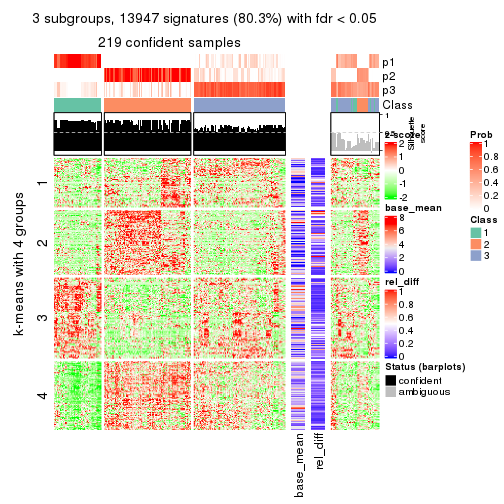</p>

</div>
<div id='tab-ATC-hclust-get-signatures-3'>
<pre><code class="r">get_signatures(res, k = 4)
</code></pre>

<p></p>

</div>
<div id='tab-ATC-hclust-get-signatures-4'>
<pre><code class="r">get_signatures(res, k = 5)
</code></pre>

<p></p>

</div>
<div id='tab-ATC-hclust-get-signatures-5'>
<pre><code class="r">get_signatures(res, k = 6)
</code></pre>

<p></p>

</div>
</div>


Signature heatmaps where rows are not scaled:


<script>
$( function() {
	$( '#tabs-ATC-hclust-get-signatures-no-scale' ).tabs();
} );
</script>
<div id='tabs-ATC-hclust-get-signatures-no-scale'>
<ul>
<li><a href='#tab-ATC-hclust-get-signatures-no-scale-1'>k = 2</a></li>
<li><a href='#tab-ATC-hclust-get-signatures-no-scale-2'>k = 3</a></li>
<li><a href='#tab-ATC-hclust-get-signatures-no-scale-3'>k = 4</a></li>
<li><a href='#tab-ATC-hclust-get-signatures-no-scale-4'>k = 5</a></li>
<li><a href='#tab-ATC-hclust-get-signatures-no-scale-5'>k = 6</a></li>
</ul>
<div id='tab-ATC-hclust-get-signatures-no-scale-1'>
<pre><code class="r">get_signatures(res, k = 2, scale_rows = FALSE)
</code></pre>

<p></p>

</div>
<div id='tab-ATC-hclust-get-signatures-no-scale-2'>
<pre><code class="r">get_signatures(res, k = 3, scale_rows = FALSE)
</code></pre>

<p></p>

</div>
<div id='tab-ATC-hclust-get-signatures-no-scale-3'>
<pre><code class="r">get_signatures(res, k = 4, scale_rows = FALSE)
</code></pre>

<p></p>

</div>
<div id='tab-ATC-hclust-get-signatures-no-scale-4'>
<pre><code class="r">get_signatures(res, k = 5, scale_rows = FALSE)
</code></pre>

<p></p>

</div>
<div id='tab-ATC-hclust-get-signatures-no-scale-5'>
<pre><code class="r">get_signatures(res, k = 6, scale_rows = FALSE)
</code></pre>

<p></p>

</div>
</div>


Compare the overlap of signatures from different k:

```r
compare_signatures(res)
```


`get_signature()` returns a data frame invisibly. TO get the list of signatures, the function
call should be assigned to a variable explicitly. In following code, if `plot` argument is set
to `FALSE`, no heatmap is plotted while only the differential analysis is performed.

```r
# code only for demonstration
tb = get_signature(res, k = ..., plot = FALSE)
```

An example of the output of `tb` is:

```
#>   which_row         fdr    mean_1    mean_2 scaled_mean_1 scaled_mean_2 km
#> 1        38 0.042760348  8.373488  9.131774    -0.5533452     0.5164555  1
#> 2        40 0.018707592  7.106213  8.469186    -0.6173731     0.5762149  1
#> 3        55 0.019134737 10.221463 11.207825    -0.6159697     0.5749050  1
#> 4        59 0.006059896  5.921854  7.869574    -0.6899429     0.6439467  1
#> 5        60 0.018055526  8.928898 10.211722    -0.6204761     0.5791110  1
#> 6        98 0.009384629 15.714769 14.887706     0.6635654    -0.6193277  2
...
```

The columns in `tb` are:

1. `which_row`: row indices corresponding to the input matrix.
2. `fdr`: FDR for the differential test. 
3. `mean_x`: The mean value in group x.
4. `scaled_mean_x`: The mean value in group x after rows are scaled.
5. `km`: Row groups if k-means clustering is applied to rows.


UMAP plot which shows how samples are separated.


<script>
$( function() {
	$( '#tabs-ATC-hclust-dimension-reduction' ).tabs();
} );
</script>
<div id='tabs-ATC-hclust-dimension-reduction'>
<ul>
<li><a href='#tab-ATC-hclust-dimension-reduction-1'>k = 2</a></li>
<li><a href='#tab-ATC-hclust-dimension-reduction-2'>k = 3</a></li>
<li><a href='#tab-ATC-hclust-dimension-reduction-3'>k = 4</a></li>
<li><a href='#tab-ATC-hclust-dimension-reduction-4'>k = 5</a></li>
<li><a href='#tab-ATC-hclust-dimension-reduction-5'>k = 6</a></li>
</ul>
<div id='tab-ATC-hclust-dimension-reduction-1'>
<pre><code class="r">dimension_reduction(res, k = 2, method = &quot;UMAP&quot;)
</code></pre>

<p>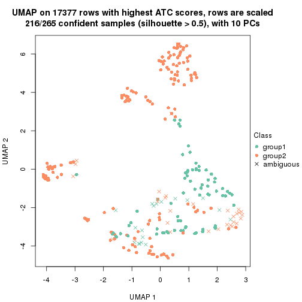</p>

</div>
<div id='tab-ATC-hclust-dimension-reduction-2'>
<pre><code class="r">dimension_reduction(res, k = 3, method = &quot;UMAP&quot;)
</code></pre>

<p>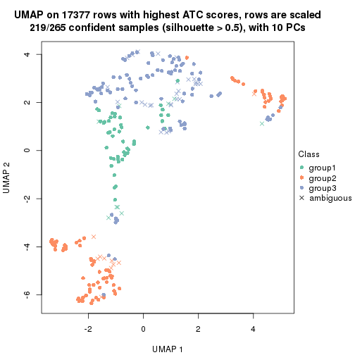</p>

</div>
<div id='tab-ATC-hclust-dimension-reduction-3'>
<pre><code class="r">dimension_reduction(res, k = 4, method = &quot;UMAP&quot;)
</code></pre>

<p></p>

</div>
<div id='tab-ATC-hclust-dimension-reduction-4'>
<pre><code class="r">dimension_reduction(res, k = 5, method = &quot;UMAP&quot;)
</code></pre>

<p></p>

</div>
<div id='tab-ATC-hclust-dimension-reduction-5'>
<pre><code class="r">dimension_reduction(res, k = 6, method = &quot;UMAP&quot;)
</code></pre>

<p></p>

</div>
</div>


Following heatmap shows how subgroups are split when increasing `k`:

```r
collect_classes(res)
```


If matrix rows can be associated to genes, consider to use `GO_Enrichment(res,
...)` to perform function enrichment for the signature genes.


 

---------------------------------------------------


### ATC:kmeans**


The object with results only for a single top-value method and a single partition method 
can be extracted as:

```r
res = res_list["ATC", "kmeans"]
# you can also extract it by
# res = res_list["ATC:kmeans"]
```

A summary of `res` and all the functions that can be applied to it:

```r
res
```

```
#> A 'ConsensusPartition' object with k = 2, 3, 4, 5, 6.
#>   On a matrix with 17377 rows and 265 columns.
#>   Top rows (1000, 2000, 3000, 4000, 5000) are extracted by 'ATC' method.
#>   Subgroups are detected by 'kmeans' method.
#>   Performed in total 1250 partitions by row resampling.
#>   Best k for subgroups seems to be 2.
#> 
#> Following methods can be applied to this 'ConsensusPartition' object:
#>  [1] "cola_report"             "collect_classes"         "collect_plots"          
#>  [4] "collect_stats"           "colnames"                "compare_signatures"     
#>  [7] "consensus_heatmap"       "dimension_reduction"     "functional_enrichment"  
#> [10] "get_anno_col"            "get_anno"                "get_classes"            
#> [13] "get_consensus"           "get_matrix"              "get_membership"         
#> [16] "get_param"               "get_signatures"          "get_stats"              
#> [19] "is_best_k"               "is_stable_k"             "membership_heatmap"     
#> [22] "ncol"                    "nrow"                    "plot_ecdf"              
#> [25] "rownames"                "select_partition_number" "show"                   
#> [28] "suggest_best_k"          "test_to_known_factors"
```

`collect_plots()` function collects all the plots made from `res` for all `k` (number of partitions)
into one single page to provide an easy and fast comparison between different `k`.

```r
collect_plots(res)
```


The plots are:

- The first row: a plot of the ECDF (Empirical cumulative distribution
  function) curves of the consensus matrix for each `k` and the heatmap of
  predicted classes for each `k`.
- The second row: heatmaps of the consensus matrix for each `k`.
- The third row: heatmaps of the membership matrix for each `k`.
- The fouth row: heatmaps of the signatures for each `k`.

All the plots in panels can be made by individual functions and they are
plotted later in this section.

`select_partition_number()` produces several plots showing different
statistics for choosing "optimized" `k`. There are following statistics:

- ECDF curves of the consensus matrix for each `k`;
- 1-PAC. [The PAC
  score](https://en.wikipedia.org/wiki/Consensus_clustering#Over-interpretation_potential_of_consensus_clustering)
  measures the proportion of the ambiguous subgrouping.
- Mean silhouette score.
- Concordance. The mean probability of fiting the consensus class ids in all
  partitions.
- Area increased. Denote $A_k$ as the area under the ECDF curve for current
  `k`, the area increased is defined as $A_k - A_{k-1}$.
- Rand index. The percent of pairs of samples that are both in a same cluster
  or both are not in a same cluster in the partition of k and k-1.
- Jaccard index. The ratio of pairs of samples are both in a same cluster in
  the partition of k and k-1 and the pairs of samples are both in a same
  cluster in the partition k or k-1.

The detailed explanations of these statistics can be found in [the cola
vignette](http://bioconductor.org/packages/devel/bioc/vignettes/cola/inst/doc/cola.html#toc_13).

Generally speaking, lower PAC score, higher mean silhouette score or higher
concordance corresponds to better partition. Rand index and Jaccard index
measure how similar the current partition is compared to partition with `k-1`.
If they are too similar, we won't accept `k` is better than `k-1`.

```r
select_partition_number(res)
```


The numeric values for all these statistics can be obtained by `get_stats()`.

```r
get_stats(res)
```

```
#>   k 1-PAC mean_silhouette concordance area_increased  Rand Jaccard
#> 2 2 1.000           0.981       0.992         0.4950 0.506   0.506
#> 3 3 0.756           0.826       0.873         0.3288 0.724   0.506
#> 4 4 0.799           0.858       0.919         0.1054 0.818   0.539
#> 5 5 0.763           0.743       0.839         0.0755 0.865   0.563
#> 6 6 0.769           0.674       0.817         0.0475 0.941   0.737
```

`suggest_best_k()` suggests the best $k$ based on these statistics. The rules are as follows:

- All $k$ with Jaccard index larger than 0.95 are removed because the increase of
  the partition number does not provides enough extra information. If all $k$ are removed,
  the best $k$ is assigned by `NA`.
- For $k$ with 1-PAC larger than 0.9, the maximal $k$ is taken as the "best k". Other $k$ is called "optional k".
- If it does not fit the second rule. The $k$ with the highest vote of highest
  1-PAC, mean silhouette and concordance is taken as the "best k".

```r
suggest_best_k(res)
```

```
#> [1] 2
```


Following shows the table of the partitions (You need to click the **show/hide
code output** link to see it). The membership matrix (columns with name `p*`)
is inferred by
[`clue::cl_consensus()`](https://www.rdocumentation.org/link/cl_consensus?package=clue)
function with the `SE` method. Basically the value in the membership matrix
represents the probability to belong to a certain group. The finall class
label for an item is determined with the group with highest probability it
belongs to.

In `get_classes()` function, the entropy is calculated from the membership
matrix and the silhouette score is calculated from the consensus matrix.


<script>
$( function() {
	$( '#tabs-ATC-kmeans-get-classes' ).tabs();
} );
</script>
<div id='tabs-ATC-kmeans-get-classes'>
<ul>
<li><a href='#tab-ATC-kmeans-get-classes-1'>k = 2</a></li>
<li><a href='#tab-ATC-kmeans-get-classes-2'>k = 3</a></li>
<li><a href='#tab-ATC-kmeans-get-classes-3'>k = 4</a></li>
<li><a href='#tab-ATC-kmeans-get-classes-4'>k = 5</a></li>
<li><a href='#tab-ATC-kmeans-get-classes-5'>k = 6</a></li>
</ul>

<div id='tab-ATC-kmeans-get-classes-1'>
<p><a id='tab-ATC-kmeans-get-classes-1-a' style='color:#0366d6' href='#'>show/hide code output</a></p>
<pre><code class="r">cbind(get_classes(res, k = 2), get_membership(res, k = 2))
</code></pre>

<pre><code>#&gt;                                      class entropy silhouette    p1    p2
#&gt; D30CF518-5FC6-4A54-8D5D-BA420EA1836D     2  0.0000      0.994 0.000 1.000
#&gt; 92298FF7-1215-4756-B976-A7D88B91AD76     1  0.0000      0.991 1.000 0.000
#&gt; 0E244FE2-7C17-4642-A51F-2CCA796D9C70     2  0.0000      0.994 0.000 1.000
#&gt; 75435ED8-93E8-45FB-8480-98D8EB2EF8CB     2  0.0000      0.994 0.000 1.000
#&gt; B6D11678-15A9-4F43-A0A2-225067DCAF1C     1  0.0000      0.991 1.000 0.000
#&gt; B7F5A41E-9559-4329-81F5-1B88A74730B7     2  0.0000      0.994 0.000 1.000
#&gt; 39414B2A-7FB0-4669-8DFE-86D9AF7AD2D9     1  0.0000      0.991 1.000 0.000
#&gt; 04823F53-A12D-4852-8F34-77B9DCBB7DF0     2  0.0000      0.994 0.000 1.000
#&gt; 49684C2B-D31C-4B45-A400-3497C3CCEC01     2  0.0000      0.994 0.000 1.000
#&gt; 96A04875-58E2-4BE7-8E0F-CAB55F4CA54F     1  0.0000      0.991 1.000 0.000
#&gt; 1F101D63-478B-40B9-A951-DC3887CFF067     2  0.0000      0.994 0.000 1.000
#&gt; DD290860-E0B7-48FC-BE12-2AF729994C21     2  0.0000      0.994 0.000 1.000
#&gt; FFDD7A12-DDEF-4974-8D60-64B7EEAAC994     2  0.0000      0.994 0.000 1.000
#&gt; E076A9A9-EA2A-4FF7-92A8-F2DA7F30279E     1  0.0000      0.991 1.000 0.000
#&gt; 830DFA6F-A85A-4317-82B2-791FAB998A01     2  0.0000      0.994 0.000 1.000
#&gt; 58578614-E4A3-4655-BBAB-F65851625E0A     1  0.0000      0.991 1.000 0.000
#&gt; 1CBFB672-4D66-430B-83F3-7CE3BE20ABF6     1  0.0000      0.991 1.000 0.000
#&gt; 6C34A7D7-3756-4DCC-9A9F-B5FC4A148B7E     2  0.0000      0.994 0.000 1.000
#&gt; D97ED7B4-5DF2-4B62-8796-AA51CA79DBBB     1  0.0000      0.991 1.000 0.000
#&gt; 45F15851-55F6-4169-834E-38958C38B6A9     1  0.0376      0.988 0.996 0.004
#&gt; 4139E0C9-F712-4A25-8B59-587533B93B3E     1  0.0000      0.991 1.000 0.000
#&gt; 2C3007BF-009E-404F-A3BF-8B921698D85B     1  0.0000      0.991 1.000 0.000
#&gt; 2189F8E5-FF98-4C1A-BD04-5595DB553130     1  0.0000      0.991 1.000 0.000
#&gt; FFAA0310-0D78-4499-8FB8-5BC46E4FCE58     1  0.0000      0.991 1.000 0.000
#&gt; 0C375B2F-67BE-4708-BEB2-544DEC812DCA     2  0.0000      0.994 0.000 1.000
#&gt; AB6324A1-19AB-400C-8001-54765D190E27     2  0.0000      0.994 0.000 1.000
#&gt; A32C4DCD-DC4C-4132-9ED1-B159F5561A2D     1  0.0000      0.991 1.000 0.000
#&gt; 2AE7105D-D494-45B0-947A-315D8C20ECDC     1  0.0000      0.991 1.000 0.000
#&gt; 60FE9D59-FC0F-4B9C-ABF8-1C00BC761928     1  0.0000      0.991 1.000 0.000
#&gt; 056442DC-E87A-4315-965C-C19D7B4FC40E     1  0.0000      0.991 1.000 0.000
#&gt; 455111E5-18EF-4E3F-9DFF-8FA017D92461     2  0.0000      0.994 0.000 1.000
#&gt; 10632BC6-0B81-433C-8832-6B2ABC73A94B     1  0.0000      0.991 1.000 0.000
#&gt; AC6F82AD-C682-4EB3-BEC3-FD950F57609D     1  0.0000      0.991 1.000 0.000
#&gt; D9ABDB75-04DA-4D33-A69F-701729494533     1  0.0000      0.991 1.000 0.000
#&gt; 27BBF44D-F4D7-4C5A-935F-3310A363A670     2  0.0000      0.994 0.000 1.000
#&gt; E7AA12EE-6E14-4B33-A52C-B13589436023     1  0.0000      0.991 1.000 0.000
#&gt; DFA6D41A-D231-413E-A180-E42DF26C3E2B     1  0.0000      0.991 1.000 0.000
#&gt; 655BD3AF-5094-4B19-93A8-401C70369B17     1  0.0000      0.991 1.000 0.000
#&gt; 9DFEF253-923F-4EE2-8E3D-C75805387B20     1  0.0000      0.991 1.000 0.000
#&gt; 3B0EE948-B2CD-4191-90E2-BDD155F3B580     1  0.0000      0.991 1.000 0.000
#&gt; 177C7EF4-2D54-4555-947C-44EE7C688917     2  0.0000      0.994 0.000 1.000
#&gt; 1F8E8BB7-D159-4556-8B04-E5DD027CC444     2  0.0000      0.994 0.000 1.000
#&gt; 619F37D2-6771-4727-9079-56BED07F1CF6     1  0.0000      0.991 1.000 0.000
#&gt; ACAE29BE-ECB8-4A98-BC71-7A2D4857134E     2  0.0000      0.994 0.000 1.000
#&gt; C5C3241A-684C-4238-9333-9AF8630EC086     2  0.0000      0.994 0.000 1.000
#&gt; AD319DC2-140F-4E7B-A899-010687D8B714     2  0.0000      0.994 0.000 1.000
#&gt; 2AFF397C-ED2A-4FD9-A7F0-E4C61E9FB603     2  0.0000      0.994 0.000 1.000
#&gt; FB4C7892-3DBB-4148-AAE9-75B19A1A4031     1  0.0000      0.991 1.000 0.000
#&gt; 6F5C4500-1ED1-4E81-B4F5-EEA64CE2336A     1  0.0000      0.991 1.000 0.000
#&gt; BD027C69-3C10-4047-8E1E-218600FF2B73     2  0.6712      0.785 0.176 0.824
#&gt; 11B473A9-4CC5-461F-BC57-CC9141F3591D     1  0.0000      0.991 1.000 0.000
#&gt; 69A036E5-3E6A-4862-A7F8-2D203ED2FC9E     1  0.0000      0.991 1.000 0.000
#&gt; 9C0BDF24-F011-4855-B95A-1B6BEFA808F7     1  0.0000      0.991 1.000 0.000
#&gt; 9E205254-8C0C-4C05-AF5A-86E679CF732C     1  0.0938      0.980 0.988 0.012
#&gt; 935CCE4A-8AA8-454E-9DFF-7DE27D0BD2E2     1  0.0000      0.991 1.000 0.000
#&gt; 01E5E1FE-41D3-428B-90BC-7A000829E102     1  0.0000      0.991 1.000 0.000
#&gt; B344A530-92CD-468B-847A-DF8E25688081     2  0.0000      0.994 0.000 1.000
#&gt; F79F32A7-9F7B-4D62-8426-4A4CF10ED319     1  0.0000      0.991 1.000 0.000
#&gt; C2E1C6FA-82F9-467C-99AE-9B39FAAC810C     1  0.0000      0.991 1.000 0.000
#&gt; BF7CD9BD-776A-4957-8A6E-EF8AD83EA9D3     2  0.0000      0.994 0.000 1.000
#&gt; 8A2C1409-E83B-435E-A20F-5FCA94801C9F     2  0.0000      0.994 0.000 1.000
#&gt; B6BEFFB5-2F62-477B-A4C8-478D29577CBD     2  0.0000      0.994 0.000 1.000
#&gt; 8622CBD0-F8E9-4AC1-8175-CC9A742B86F9     1  0.0000      0.991 1.000 0.000
#&gt; 565DD660-ED58-4065-8619-260BEA6FCFEB     1  0.0000      0.991 1.000 0.000
#&gt; 96038E42-0FBA-497D-819C-38F7689F10FF     1  0.0000      0.991 1.000 0.000
#&gt; CA685549-F8BA-43F1-8461-5D2D3B17CFC5     1  0.0000      0.991 1.000 0.000
#&gt; 52020307-71A6-46E5-ACB3-8F885CA8F1EB     1  0.0376      0.988 0.996 0.004
#&gt; 7656DA98-76DC-424B-B02C-D7001DAAA0E4     1  0.0000      0.991 1.000 0.000
#&gt; 74DBA640-45E2-42A6-8F1E-69C073D66EE6     1  0.0376      0.988 0.996 0.004
#&gt; 251094BE-C33D-44F0-BD98-8618D71F520C     1  0.0000      0.991 1.000 0.000
#&gt; AB914CC5-5FF1-4257-A353-6A99D11B9478     1  0.0000      0.991 1.000 0.000
#&gt; 38B8B893-0E08-4B71-B51C-B32A7B2724E0     1  0.0000      0.991 1.000 0.000
#&gt; 7C7CD8FF-99A4-41D7-B7E1-5A517001F551     2  0.0000      0.994 0.000 1.000
#&gt; BFC5B75A-E4AE-486B-BA30-23BBAA33A125     2  0.1414      0.974 0.020 0.980
#&gt; 182AC78E-A07C-4B34-B216-B5F573E9F036     1  0.0000      0.991 1.000 0.000
#&gt; B38C5F72-8F46-4531-9C2D-96EEE07A5B22     2  0.0000      0.994 0.000 1.000
#&gt; DB9333A6-A723-4B8F-9221-25B8B23D5126     1  0.0000      0.991 1.000 0.000
#&gt; CD67DD21-C1B6-4D58-AC8E-1F4536C7DA70     2  0.0000      0.994 0.000 1.000
#&gt; 3D76A56E-4B66-48AE-AA60-D9C1004C7140     1  0.0000      0.991 1.000 0.000
#&gt; 71ED572F-7780-47A4-A9F8-D320C737690D     1  0.0000      0.991 1.000 0.000
#&gt; B449FEA1-C4B0-400F-903C-59E13D0BA313     2  0.0000      0.994 0.000 1.000
#&gt; 3F120E90-1486-4215-B9B9-79D5B413CAAC     2  0.0000      0.994 0.000 1.000
#&gt; A071894B-D8C0-4740-BD55-93EA0C86EDF7     1  0.0000      0.991 1.000 0.000
#&gt; 58848D57-D7A9-4ABB-86A2-A8AE2B23F654     1  0.0000      0.991 1.000 0.000
#&gt; CD6F9E20-B301-4663-87EC-953EDF49754F     2  0.0000      0.994 0.000 1.000
#&gt; 367D89F3-D527-4929-B830-8B6D553DF9E1     2  0.0000      0.994 0.000 1.000
#&gt; BE8D7DCB-648B-42DD-9FA8-8B85B5D816B2     1  0.0000      0.991 1.000 0.000
#&gt; AA46F56B-BD9C-40A4-8EA8-35E2568C964D     2  0.0000      0.994 0.000 1.000
#&gt; 6393220A-7C57-413F-81A8-4E38C21E779E     2  0.0000      0.994 0.000 1.000
#&gt; 89AE566C-F65F-43C2-BA97-621A7AC8B6DC     1  0.0000      0.991 1.000 0.000
#&gt; AA6A4BFF-8C62-4B70-B85A-9EDF403B06BA     1  0.0000      0.991 1.000 0.000
#&gt; BCE877A6-9C65-4495-A45D-05753F2D0E15     1  0.0000      0.991 1.000 0.000
#&gt; D7BDDF49-C54B-4F8E-ACA0-C3684AB68B5C     2  0.0000      0.994 0.000 1.000
#&gt; D0800D49-0033-44B2-8D7B-29B16F87ADA6     2  0.0000      0.994 0.000 1.000
#&gt; 151D60B5-5AF1-4B61-B97F-ABC7531D9F89     1  0.0000      0.991 1.000 0.000
#&gt; CBBAEB5B-25FA-4B6D-A40C-357E37033E36     1  0.0000      0.991 1.000 0.000
#&gt; 317CD049-3151-40B7-8E88-B0B8813338D6     1  0.0000      0.991 1.000 0.000
#&gt; 93835C77-F8FA-4928-843C-8016A91881FA     1  0.0000      0.991 1.000 0.000
#&gt; 02A6950F-647D-4F20-B2D0-0238C1441C70     1  0.0000      0.991 1.000 0.000
#&gt; 4D54E415-134F-4F6F-8718-3E0475EF5477     1  0.0376      0.988 0.996 0.004
#&gt; 82AB290A-3993-45E5-8B15-6125A019778C     1  0.0000      0.991 1.000 0.000
#&gt; 3B5EAD14-E506-4A22-804D-BF925A2D5247     2  0.0000      0.994 0.000 1.000
#&gt; 19CF7DDF-4F3A-4D2F-B84A-6451A5C3112C     2  0.0000      0.994 0.000 1.000
#&gt; 2FB00DAA-C274-42B1-A06B-611FE5E96844     1  0.0000      0.991 1.000 0.000
#&gt; 2B1F01C3-8145-4296-8111-2B0474AB9A2C     2  0.0000      0.994 0.000 1.000
#&gt; 3F0865F1-8256-4778-966F-D53637B415B6     2  0.0000      0.994 0.000 1.000
#&gt; 5473210D-37F9-4192-86D2-E2A2C77F3BD2     2  0.0000      0.994 0.000 1.000
#&gt; 5EDB6ACF-4F3F-471A-9DDC-661607CACCC4     1  0.9491      0.418 0.632 0.368
#&gt; 6A252A3A-7EEB-47B6-9C23-D69BD2EA846F     2  0.0000      0.994 0.000 1.000
#&gt; 0A7FFCBB-4BAA-4A5F-8B2D-B427C4D982A8     1  0.0000      0.991 1.000 0.000
#&gt; 1603AFB8-5AD7-4794-9991-BDBE96B4D997     2  0.0000      0.994 0.000 1.000
#&gt; 644299E9-62B7-4DFE-9E6D-D7556A01B40A     1  0.0376      0.988 0.996 0.004
#&gt; EF12E923-1860-4269-B57B-BA6238FA4403     1  0.0000      0.991 1.000 0.000
#&gt; 51B7241E-F0BE-482A-88AE-89004BB68989     1  0.0000      0.991 1.000 0.000
#&gt; 1C007DF3-8A9F-4940-9A4C-DE2A412BB023     2  0.0000      0.994 0.000 1.000
#&gt; 89FCFDE6-9625-432C-AA35-9C5FCCF40031     2  0.0000      0.994 0.000 1.000
#&gt; 7955FC55-386D-497E-AFED-019BBBAD428E     1  0.0000      0.991 1.000 0.000
#&gt; 37FF09ED-73EC-4D10-B2AC-7D8EBA9304ED     1  0.0000      0.991 1.000 0.000
#&gt; C2CD2742-2FB4-468E-90FF-8F65A5C425A9     1  0.0000      0.991 1.000 0.000
#&gt; 766FE08F-3393-4868-B1C1-FA98C9FF16E0     1  0.0000      0.991 1.000 0.000
#&gt; 63E2B578-2221-4255-8C45-7FD030B1C94D     2  0.0672      0.986 0.008 0.992
#&gt; C14B1A44-43F7-45F0-A583-5667A4D3BD95     1  0.0000      0.991 1.000 0.000
#&gt; D9CB551A-CE20-4BF7-8AC9-839112346C3D     1  0.0000      0.991 1.000 0.000
#&gt; 05BAA71A-E5B3-4A3A-A3F2-013A975087F0     2  0.0000      0.994 0.000 1.000
#&gt; AC8DA7DE-4D83-4768-BEFD-9A1B2DA943CE     2  0.0000      0.994 0.000 1.000
#&gt; E89DCE9D-F8A5-499C-85BB-BB500BADB9FB     1  0.0000      0.991 1.000 0.000
#&gt; C16F9B5E-2B52-40F6-856D-C0D6FBDD16C1     1  0.0000      0.991 1.000 0.000
#&gt; 8FF234D4-823A-4C80-82F7-2E92D72DBF88     2  0.0000      0.994 0.000 1.000
#&gt; C9F94A6E-D104-4D8D-8EC5-EADECD85F092     1  0.0000      0.991 1.000 0.000
#&gt; 45C9756F-A154-4537-852E-ECBF27B92FE1     2  0.0000      0.994 0.000 1.000
#&gt; 0F1A5708-341E-4713-BC70-76D702F826D6     2  0.0000      0.994 0.000 1.000
#&gt; 2ECFBCA0-AB35-461A-A4B5-C60B2651A962     2  0.0000      0.994 0.000 1.000
#&gt; 7DFAC404-3AB3-4274-A533-CFDAF4CE122D     1  0.0000      0.991 1.000 0.000
#&gt; A90AF55C-4386-42AB-A812-9230026EA5A5     2  0.0000      0.994 0.000 1.000
#&gt; 6258A757-4E18-4CD1-8417-189521E990B6     2  0.0000      0.994 0.000 1.000
#&gt; EBFAD137-050F-47D0-A43D-72B8F7D70C2B     1  0.0000      0.991 1.000 0.000
#&gt; 08B5EBFB-2807-4229-95A6-81AB7F377A56     2  0.0000      0.994 0.000 1.000
#&gt; 4780A59C-0589-4995-B044-3201F09AF859     2  0.0000      0.994 0.000 1.000
#&gt; 0AB81429-C287-48AA-9035-3A7A6F4C7328     2  0.0000      0.994 0.000 1.000
#&gt; 20C4D047-28DA-4AB7-9B3C-32EDA6B22C9D     2  0.0000      0.994 0.000 1.000
#&gt; 77C4E01F-84A6-4BFD-AA8E-D7875456F546     2  0.0000      0.994 0.000 1.000
#&gt; 8B28383F-CF14-4CC5-A1E2-72AD915C0AE8     2  0.0000      0.994 0.000 1.000
#&gt; E12E1F48-6A52-4F74-925C-C4EE1BF5C573     2  0.0000      0.994 0.000 1.000
#&gt; 9B179BC5-BB4C-4CEE-99BC-BC552BC384A1     1  0.0000      0.991 1.000 0.000
#&gt; 5548C91A-D3DE-48F5-B4A4-124BE177B99A     1  0.0000      0.991 1.000 0.000
#&gt; 0E22B729-C381-4B0C-9897-62DD38F51722     2  0.0000      0.994 0.000 1.000
#&gt; 7BC4937F-04E2-4B46-BA7C-FE9AC738C8A9     1  0.0000      0.991 1.000 0.000
#&gt; EE6A0D3F-3F8A-4AA8-B3EF-32372EF37A29     1  0.0000      0.991 1.000 0.000
#&gt; 08AC2706-7651-409F-BE6B-BCED1C2D1796     1  0.0000      0.991 1.000 0.000
#&gt; A68B078D-8979-4070-BB4D-F526704ED3DC     1  0.0000      0.991 1.000 0.000
#&gt; C319A5EE-69FA-4AAB-85A9-2EAAD8E4C703     1  0.0000      0.991 1.000 0.000
#&gt; 0D7CAABD-D20C-4F82-BCBC-8B7276E8EDE2     1  0.0000      0.991 1.000 0.000
#&gt; 09444DCC-44BA-4A3F-ACC5-863A54578B9F     2  0.0000      0.994 0.000 1.000
#&gt; 2E32B047-C6E1-4743-A6C8-E98370A32145     1  0.9044      0.529 0.680 0.320
#&gt; 6A6878A7-76B2-40DE-958B-804442AC6A5D     1  0.0000      0.991 1.000 0.000
#&gt; 39F27293-0BFF-4EA2-8439-A299E3226D20     2  0.0000      0.994 0.000 1.000
#&gt; 7EAE9C30-6080-405F-A7E6-1FED57674279     1  0.0000      0.991 1.000 0.000
#&gt; 79499169-A093-4E0A-B6BD-010CD7BE5035     1  0.0000      0.991 1.000 0.000
#&gt; 1F8BF4E8-BD84-4EFE-9E3E-89E7CE8FA72D     2  0.0000      0.994 0.000 1.000
#&gt; 62B7988F-98E5-4AB8-8A16-D661A07455E8     1  0.0000      0.991 1.000 0.000
#&gt; B7005B5F-217E-4073-BFB5-CE7E884B80C0     2  0.0000      0.994 0.000 1.000
#&gt; B981568F-2C08-4696-B589-E157A49BE72B     2  0.0000      0.994 0.000 1.000
#&gt; A3D85C0A-3202-40C2-88E1-052AC6C5184B     1  0.0000      0.991 1.000 0.000
#&gt; 4CA783B9-9B99-46B8-962A-77194ECB7942     1  0.0376      0.988 0.996 0.004
#&gt; D4024B08-4879-47EA-99E5-D9FCE1CD40DF     1  0.0000      0.991 1.000 0.000
#&gt; 1D41CDA2-0B29-48FD-B83A-E60C174DBCB3     1  0.0000      0.991 1.000 0.000
#&gt; A1923B2A-B233-4760-8AF9-C04C1CAEB100     1  0.0000      0.991 1.000 0.000
#&gt; 80880D71-BFDE-4D88-892F-5ADF27A38940     2  0.0000      0.994 0.000 1.000
#&gt; 55D1629D-30FD-49AA-88CE-EA3CA9B30A3F     2  0.0000      0.994 0.000 1.000
#&gt; B71C409E-926D-48AD-8BD8-9F707CA4FB01     2  0.0000      0.994 0.000 1.000
#&gt; 54A92C57-BD19-4A47-BA76-3ACA2DC36212     2  0.0000      0.994 0.000 1.000
#&gt; B2AB74B8-506C-4C27-9105-E86A6AAA89D4     1  0.0000      0.991 1.000 0.000
#&gt; 0356AE49-7A5C-42CC-A39C-7C8DFBFF8842     2  0.0000      0.994 0.000 1.000
#&gt; ACA260A3-DC3F-4FF4-B9C5-2D4BC4F81783     1  0.0000      0.991 1.000 0.000
#&gt; 9B440917-E5A4-43B9-A48D-6ABFEDCA6CFD     1  0.0000      0.991 1.000 0.000
#&gt; 47464828-52EA-413B-B30C-BD8B55903D78     2  0.0000      0.994 0.000 1.000
#&gt; C1D1FC82-B50D-4C82-8F03-06CEE3C08D18     1  0.0000      0.991 1.000 0.000
#&gt; E5ABFC43-E2A3-4B1A-BBA3-8196C0B026A5     2  0.0000      0.994 0.000 1.000
#&gt; 1D3C16CC-D0D5-4637-AAC7-91672DFF3317     1  0.0000      0.991 1.000 0.000
#&gt; 4D038320-ADEA-4990-8371-68B4B8162E1A     2  0.0000      0.994 0.000 1.000
#&gt; A75594CC-3E49-4869-8656-BBB4E72BF59D     2  0.0000      0.994 0.000 1.000
#&gt; 7CABAA19-5FB2-4A58-BDA3-4F1FFB532C20     1  0.4161      0.903 0.916 0.084
#&gt; 534EF1E9-9513-426E-B41E-A394AB2E4410     2  0.0000      0.994 0.000 1.000
#&gt; 649F35A1-A08C-497D-A9B6-CB3084D5FB8D     1  0.0000      0.991 1.000 0.000
#&gt; 7CA30F3C-1C98-480C-B8B5-A248AABFB468     1  0.0672      0.984 0.992 0.008
#&gt; A9F8DA21-A802-44CF-9F5D-96A36687DCDD     1  0.0000      0.991 1.000 0.000
#&gt; A7AE1ED1-86CB-4A50-97B2-66785C7191FE     1  0.0000      0.991 1.000 0.000
#&gt; D0091AD4-D3D7-4C03-ACD9-DA9F8B6076C6     2  0.0000      0.994 0.000 1.000
#&gt; 46EE1C2B-13F7-44A7-B27E-4EBB9DF0CA83     2  0.0000      0.994 0.000 1.000
#&gt; CB9301B8-0282-43D6-AF5E-B753A9C7BFCB     2  0.0000      0.994 0.000 1.000
#&gt; A0E77A39-885A-4472-9A10-2D1E51DBFDA4     1  0.0000      0.991 1.000 0.000
#&gt; C06603C2-163D-40B6-A9FE-882424F18FE9     1  0.0000      0.991 1.000 0.000
#&gt; C3921A29-80FF-4B9D-B366-5C0238A42231     1  0.9944      0.161 0.544 0.456
#&gt; BB99B4E7-C834-4BB8-973F-8FA039E2798F     1  0.0000      0.991 1.000 0.000
#&gt; 5CD78C2F-05E9-409A-8405-3EE936A6876E     2  0.0000      0.994 0.000 1.000
#&gt; 6C126CC7-0C03-48F0-A2C2-F090CA239B70     2  0.0000      0.994 0.000 1.000
#&gt; 7118B08A-E94C-49F4-8D76-26455C34D85F     2  0.0000      0.994 0.000 1.000
#&gt; 266DAF30-CF3E-493E-8B24-3931D0039450     1  0.0000      0.991 1.000 0.000
#&gt; DAB5F5B9-4FE5-468F-AD2B-B39BBC4317A0     2  0.0000      0.994 0.000 1.000
#&gt; 9A9EB6D6-312E-4A98-8762-30D3ABD8193D     2  0.0000      0.994 0.000 1.000
#&gt; CED15676-B901-4FC8-9C8D-51E529D9441D     1  0.0000      0.991 1.000 0.000
#&gt; 827232CC-8035-440C-8B12-02C789C70B1B     2  0.0000      0.994 0.000 1.000
#&gt; 04D5FB28-FB50-4EAE-95FB-72ABF0E618CA     2  0.0000      0.994 0.000 1.000
#&gt; 6C96A851-97FC-4845-B895-D255191D9F25     1  0.0000      0.991 1.000 0.000
#&gt; 3EC982CB-D013-443E-B21D-39DE6B8EF370     2  0.0000      0.994 0.000 1.000
#&gt; 2E24A786-4370-42A1-AD50-D651F89819CC     2  0.0000      0.994 0.000 1.000
#&gt; 7653BFA9-ADA5-44CA-8555-807FBBFC6DE2     1  0.0000      0.991 1.000 0.000
#&gt; 7A110994-5741-4013-91F0-DD2E1D343F91     2  0.0000      0.994 0.000 1.000
#&gt; 0A760E0C-11C5-4201-8452-18DBC1FEACEB     1  0.0000      0.991 1.000 0.000
#&gt; 909B76A1-BB9F-4906-95BC-58CD1A46D3B8     2  0.0000      0.994 0.000 1.000
#&gt; A782EE71-EDA4-4385-83B3-D16DE81296C0     1  0.0000      0.991 1.000 0.000
#&gt; BD50E276-914F-4924-8CEA-FF47A66DB175     2  0.0000      0.994 0.000 1.000
#&gt; 505D5CA8-0279-4BC7-8CC0-8C7A0165BF91     2  0.0000      0.994 0.000 1.000
#&gt; D51FC997-E662-4AE7-BC9C-14183DA42DE1     2  0.0000      0.994 0.000 1.000
#&gt; 8AD67970-84F1-4C0A-B47A-8FA4108F9FE3     1  0.0000      0.991 1.000 0.000
#&gt; 6E33B1B6-7089-4BC3-B2B0-EC2C3B5D8B74     1  0.0000      0.991 1.000 0.000
#&gt; 88C4EA46-2546-401C-A8E7-603EECFDFBA0     1  0.0000      0.991 1.000 0.000
#&gt; 375D2D72-C998-4627-BA35-24E82A9A55FF     1  0.0000      0.991 1.000 0.000
#&gt; 76D0F834-7064-46C6-96F4-E861CF5452B6     2  0.0000      0.994 0.000 1.000
#&gt; 87159081-C97A-4004-AF0A-7EB6EF0EC47A     1  0.0000      0.991 1.000 0.000
#&gt; 24A57006-800B-4174-AF4E-7EA57A8A756E     1  0.0000      0.991 1.000 0.000
#&gt; AD68CBC6-8A13-4A65-AF62-E99AFA81D031     2  0.0000      0.994 0.000 1.000
#&gt; 22863A57-F066-4DD1-A859-4336F43D144C     1  0.0000      0.991 1.000 0.000
#&gt; 8F6F0362-9165-4DCC-992C-AF871A3C51E7     1  0.0000      0.991 1.000 0.000
#&gt; 76ABF0B7-E707-4DB2-9486-3814439BDBA5     1  0.0000      0.991 1.000 0.000
#&gt; BC72372F-3577-40E5-BA0F-41A084AA93AD     1  0.0000      0.991 1.000 0.000
#&gt; 8E566039-B56C-4F41-B9EF-DE18BEEF2C95     1  0.0000      0.991 1.000 0.000
#&gt; F096F016-3EF5-4A67-A7C2-8A45E1585232     1  0.0000      0.991 1.000 0.000
#&gt; BB37913E-534B-43DD-BE3D-E13B29FD8172     2  0.0000      0.994 0.000 1.000
#&gt; E344638F-9060-460F-8F7A-60D19442F294     2  0.0000      0.994 0.000 1.000
#&gt; 6A0EAAD0-89D5-4F12-8B45-9D5A25182FAD     1  0.0000      0.991 1.000 0.000
#&gt; A5199E3A-9D67-4543-88AB-24398C98E38E     1  0.0000      0.991 1.000 0.000
#&gt; 23917D52-7864-4F84-9C77-DF8EA9407345     2  0.0000      0.994 0.000 1.000
#&gt; 9AA96080-19D8-40C3-BDD1-6044D2D422D5     1  0.0000      0.991 1.000 0.000
#&gt; 0ED65D91-260C-4662-9903-EE36A2E3B2D0     2  0.0000      0.994 0.000 1.000
#&gt; 64BF1BC5-7A9A-4E1D-AEAB-AFE30B92AAF4     1  0.0000      0.991 1.000 0.000
#&gt; F02301F1-9054-4DC6-8DC9-2451A0F53EFC     2  0.0000      0.994 0.000 1.000
#&gt; 3264649A-5684-4181-83D0-A7E4D7E2E1FD     1  0.0000      0.991 1.000 0.000
#&gt; 3F8DA39C-BC9B-4343-8838-5CE271E80C51     1  0.0000      0.991 1.000 0.000
#&gt; BCC681CB-2AF4-4BB6-B53A-7544A2399454     1  0.0000      0.991 1.000 0.000
#&gt; DCB50E17-5E2D-443B-8DCC-272FBB734C2E     1  0.0000      0.991 1.000 0.000
#&gt; B5E47C38-CB6A-44C0-AA9B-56951B9EF78D     1  0.0000      0.991 1.000 0.000
#&gt; B15B0185-9C28-4A00-9CEC-05EFECEA6709     1  0.0000      0.991 1.000 0.000
#&gt; 61D4E8E7-0110-480A-A4A7-D406DE74C31E     1  0.0000      0.991 1.000 0.000
#&gt; CA8DB3AD-3F6B-4622-BF73-47041EC96E42     1  0.0000      0.991 1.000 0.000
#&gt; 5EECB1C4-172C-4494-871A-ADB650CD82BD     2  0.0000      0.994 0.000 1.000
#&gt; 019B857C-D4F7-4B67-B699-56E52A60805B     2  0.0000      0.994 0.000 1.000
#&gt; E9C28902-05C9-4883-97A4-D612D54E46B4     2  0.6887      0.772 0.184 0.816
#&gt; C5D3D9A0-FC14-408D-AB6C-662018A5E5CA     1  0.0000      0.991 1.000 0.000
#&gt; 7EB24744-509B-4854-B7D0-0BAFA210A345     2  0.0000      0.994 0.000 1.000
#&gt; B8B7A721-2284-40AB-98F5-EF1351C30B66     2  0.0000      0.994 0.000 1.000
#&gt; 3C12F39D-0D21-4F69-A539-4120B73C7A79     2  0.0000      0.994 0.000 1.000
#&gt; 08D3F984-6850-45B2-9DF9-EC7F5A4060A4     1  0.0000      0.991 1.000 0.000
#&gt; 9BD0EE79-1EED-4F6D-A5AB-43ADB8526F1E     2  0.0000      0.994 0.000 1.000
#&gt; E489A871-3CF4-4F3D-8EAF-63B507054201     2  0.0000      0.994 0.000 1.000
#&gt; 8CF8FD2E-1DBA-4257-9715-04D956D46B71     2  0.0000      0.994 0.000 1.000
#&gt; F6193AF0-7A19-46CB-A818-1B01E7460791     1  0.0000      0.991 1.000 0.000
#&gt; 96392D6B-D4FF-4393-93BA-08E469E8BBE1     2  0.9323      0.464 0.348 0.652
#&gt; DABCBE5A-C591-46A2-AF66-DA3DB6106751     1  0.0000      0.991 1.000 0.000
#&gt; 8B75F7D4-98D8-44DE-B19D-B733D6A031DB     1  0.0000      0.991 1.000 0.000
#&gt; AAD9685A-564B-42E9-91E3-431951154BA7     2  0.0000      0.994 0.000 1.000
#&gt; 90A43152-4E3B-4365-A39F-7B0E5CA66E55     2  0.0000      0.994 0.000 1.000
#&gt; EFB76FCF-AC9C-4852-B91C-E055DA666FA0     1  0.0000      0.991 1.000 0.000
#&gt; 6EBCFFE3-706F-440A-ABA9-012A924A07C6     2  0.0000      0.994 0.000 1.000
#&gt; E922A244-F1C8-4310-ABB2-62B06E022E4C     1  0.0000      0.991 1.000 0.000
</code></pre>

<script>
$('#tab-ATC-kmeans-get-classes-1-a').parent().next().next().hide();
$('#tab-ATC-kmeans-get-classes-1-a').click(function(){
  $('#tab-ATC-kmeans-get-classes-1-a').parent().next().next().toggle();
  return(false);
});
</script>
</div>

<div id='tab-ATC-kmeans-get-classes-2'>
<p><a id='tab-ATC-kmeans-get-classes-2-a' style='color:#0366d6' href='#'>show/hide code output</a></p>
<pre><code class="r">cbind(get_classes(res, k = 3), get_membership(res, k = 3))
</code></pre>

<pre><code>#&gt;                                      class entropy silhouette    p1    p2    p3
#&gt; D30CF518-5FC6-4A54-8D5D-BA420EA1836D     2  0.0000     0.9170 0.000 1.000 0.000
#&gt; 92298FF7-1215-4756-B976-A7D88B91AD76     3  0.1860     0.8916 0.052 0.000 0.948
#&gt; 0E244FE2-7C17-4642-A51F-2CCA796D9C70     2  0.0000     0.9170 0.000 1.000 0.000
#&gt; 75435ED8-93E8-45FB-8480-98D8EB2EF8CB     2  0.0000     0.9170 0.000 1.000 0.000
#&gt; B6D11678-15A9-4F43-A0A2-225067DCAF1C     1  0.3340     0.8186 0.880 0.000 0.120
#&gt; B7F5A41E-9559-4329-81F5-1B88A74730B7     2  0.0000     0.9170 0.000 1.000 0.000
#&gt; 39414B2A-7FB0-4669-8DFE-86D9AF7AD2D9     3  0.4346     0.7538 0.184 0.000 0.816
#&gt; 04823F53-A12D-4852-8F34-77B9DCBB7DF0     2  0.0000     0.9170 0.000 1.000 0.000
#&gt; 49684C2B-D31C-4B45-A400-3497C3CCEC01     2  0.0000     0.9170 0.000 1.000 0.000
#&gt; 96A04875-58E2-4BE7-8E0F-CAB55F4CA54F     3  0.2356     0.8795 0.072 0.000 0.928
#&gt; 1F101D63-478B-40B9-A951-DC3887CFF067     3  0.0000     0.9164 0.000 0.000 1.000
#&gt; DD290860-E0B7-48FC-BE12-2AF729994C21     2  0.0000     0.9170 0.000 1.000 0.000
#&gt; FFDD7A12-DDEF-4974-8D60-64B7EEAAC994     2  0.0000     0.9170 0.000 1.000 0.000
#&gt; E076A9A9-EA2A-4FF7-92A8-F2DA7F30279E     1  0.0000     0.8994 1.000 0.000 0.000
#&gt; 830DFA6F-A85A-4317-82B2-791FAB998A01     2  0.0000     0.9170 0.000 1.000 0.000
#&gt; 58578614-E4A3-4655-BBAB-F65851625E0A     1  0.0000     0.8994 1.000 0.000 0.000
#&gt; 1CBFB672-4D66-430B-83F3-7CE3BE20ABF6     3  0.0000     0.9164 0.000 0.000 1.000
#&gt; 6C34A7D7-3756-4DCC-9A9F-B5FC4A148B7E     3  0.6140     0.1725 0.000 0.404 0.596
#&gt; D97ED7B4-5DF2-4B62-8796-AA51CA79DBBB     1  0.5835     0.5552 0.660 0.000 0.340
#&gt; 45F15851-55F6-4169-834E-38958C38B6A9     3  0.0000     0.9164 0.000 0.000 1.000
#&gt; 4139E0C9-F712-4A25-8B59-587533B93B3E     1  0.0000     0.8994 1.000 0.000 0.000
#&gt; 2C3007BF-009E-404F-A3BF-8B921698D85B     1  0.0000     0.8994 1.000 0.000 0.000
#&gt; 2189F8E5-FF98-4C1A-BD04-5595DB553130     3  0.0000     0.9164 0.000 0.000 1.000
#&gt; FFAA0310-0D78-4499-8FB8-5BC46E4FCE58     1  0.1753     0.8702 0.952 0.000 0.048
#&gt; 0C375B2F-67BE-4708-BEB2-544DEC812DCA     2  0.0000     0.9170 0.000 1.000 0.000
#&gt; AB6324A1-19AB-400C-8001-54765D190E27     2  0.0000     0.9170 0.000 1.000 0.000
#&gt; A32C4DCD-DC4C-4132-9ED1-B159F5561A2D     3  0.0000     0.9164 0.000 0.000 1.000
#&gt; 2AE7105D-D494-45B0-947A-315D8C20ECDC     1  0.3941     0.7870 0.844 0.000 0.156
#&gt; 60FE9D59-FC0F-4B9C-ABF8-1C00BC761928     3  0.2356     0.8795 0.072 0.000 0.928
#&gt; 056442DC-E87A-4315-965C-C19D7B4FC40E     1  0.0000     0.8994 1.000 0.000 0.000
#&gt; 455111E5-18EF-4E3F-9DFF-8FA017D92461     3  0.0000     0.9164 0.000 0.000 1.000
#&gt; 10632BC6-0B81-433C-8832-6B2ABC73A94B     1  0.5988     0.4988 0.632 0.000 0.368
#&gt; AC6F82AD-C682-4EB3-BEC3-FD950F57609D     1  0.0000     0.8994 1.000 0.000 0.000
#&gt; D9ABDB75-04DA-4D33-A69F-701729494533     3  0.1643     0.8960 0.044 0.000 0.956
#&gt; 27BBF44D-F4D7-4C5A-935F-3310A363A670     2  0.0000     0.9170 0.000 1.000 0.000
#&gt; E7AA12EE-6E14-4B33-A52C-B13589436023     3  0.0000     0.9164 0.000 0.000 1.000
#&gt; DFA6D41A-D231-413E-A180-E42DF26C3E2B     1  0.0000     0.8994 1.000 0.000 0.000
#&gt; 655BD3AF-5094-4B19-93A8-401C70369B17     1  0.0000     0.8994 1.000 0.000 0.000
#&gt; 9DFEF253-923F-4EE2-8E3D-C75805387B20     1  0.6274     0.2566 0.544 0.000 0.456
#&gt; 3B0EE948-B2CD-4191-90E2-BDD155F3B580     1  0.0000     0.8994 1.000 0.000 0.000
#&gt; 177C7EF4-2D54-4555-947C-44EE7C688917     2  0.6215     0.3911 0.000 0.572 0.428
#&gt; 1F8E8BB7-D159-4556-8B04-E5DD027CC444     2  0.0000     0.9170 0.000 1.000 0.000
#&gt; 619F37D2-6771-4727-9079-56BED07F1CF6     3  0.2448     0.8761 0.076 0.000 0.924
#&gt; ACAE29BE-ECB8-4A98-BC71-7A2D4857134E     3  0.6225     0.0694 0.000 0.432 0.568
#&gt; C5C3241A-684C-4238-9333-9AF8630EC086     2  0.0000     0.9170 0.000 1.000 0.000
#&gt; AD319DC2-140F-4E7B-A899-010687D8B714     2  0.0000     0.9170 0.000 1.000 0.000
#&gt; 2AFF397C-ED2A-4FD9-A7F0-E4C61E9FB603     3  0.6095     0.1915 0.000 0.392 0.608
#&gt; FB4C7892-3DBB-4148-AAE9-75B19A1A4031     3  0.2537     0.8725 0.080 0.000 0.920
#&gt; 6F5C4500-1ED1-4E81-B4F5-EEA64CE2336A     1  0.0000     0.8994 1.000 0.000 0.000
#&gt; BD027C69-3C10-4047-8E1E-218600FF2B73     2  0.6244     0.2082 0.000 0.560 0.440
#&gt; 11B473A9-4CC5-461F-BC57-CC9141F3591D     3  0.0000     0.9164 0.000 0.000 1.000
#&gt; 69A036E5-3E6A-4862-A7F8-2D203ED2FC9E     1  0.0000     0.8994 1.000 0.000 0.000
#&gt; 9C0BDF24-F011-4855-B95A-1B6BEFA808F7     1  0.6062     0.4620 0.616 0.000 0.384
#&gt; 9E205254-8C0C-4C05-AF5A-86E679CF732C     3  0.0000     0.9164 0.000 0.000 1.000
#&gt; 935CCE4A-8AA8-454E-9DFF-7DE27D0BD2E2     3  0.2356     0.8795 0.072 0.000 0.928
#&gt; 01E5E1FE-41D3-428B-90BC-7A000829E102     3  0.5178     0.6367 0.256 0.000 0.744
#&gt; B344A530-92CD-468B-847A-DF8E25688081     2  0.4452     0.7851 0.000 0.808 0.192
#&gt; F79F32A7-9F7B-4D62-8426-4A4CF10ED319     3  0.0000     0.9164 0.000 0.000 1.000
#&gt; C2E1C6FA-82F9-467C-99AE-9B39FAAC810C     3  0.0000     0.9164 0.000 0.000 1.000
#&gt; BF7CD9BD-776A-4957-8A6E-EF8AD83EA9D3     2  0.0000     0.9170 0.000 1.000 0.000
#&gt; 8A2C1409-E83B-435E-A20F-5FCA94801C9F     2  0.0000     0.9170 0.000 1.000 0.000
#&gt; B6BEFFB5-2F62-477B-A4C8-478D29577CBD     2  0.0000     0.9170 0.000 1.000 0.000
#&gt; 8622CBD0-F8E9-4AC1-8175-CC9A742B86F9     1  0.0000     0.8994 1.000 0.000 0.000
#&gt; 565DD660-ED58-4065-8619-260BEA6FCFEB     3  0.4235     0.7645 0.176 0.000 0.824
#&gt; 96038E42-0FBA-497D-819C-38F7689F10FF     1  0.5905     0.5321 0.648 0.000 0.352
#&gt; CA685549-F8BA-43F1-8461-5D2D3B17CFC5     3  0.5465     0.5716 0.288 0.000 0.712
#&gt; 52020307-71A6-46E5-ACB3-8F885CA8F1EB     3  0.0000     0.9164 0.000 0.000 1.000
#&gt; 7656DA98-76DC-424B-B02C-D7001DAAA0E4     3  0.5465     0.5717 0.288 0.000 0.712
#&gt; 74DBA640-45E2-42A6-8F1E-69C073D66EE6     3  0.0000     0.9164 0.000 0.000 1.000
#&gt; 251094BE-C33D-44F0-BD98-8618D71F520C     3  0.2356     0.8795 0.072 0.000 0.928
#&gt; AB914CC5-5FF1-4257-A353-6A99D11B9478     1  0.6309     0.1244 0.504 0.000 0.496
#&gt; 38B8B893-0E08-4B71-B51C-B32A7B2724E0     1  0.5497     0.6313 0.708 0.000 0.292
#&gt; 7C7CD8FF-99A4-41D7-B7E1-5A517001F551     2  0.0000     0.9170 0.000 1.000 0.000
#&gt; BFC5B75A-E4AE-486B-BA30-23BBAA33A125     2  0.5706     0.5225 0.000 0.680 0.320
#&gt; 182AC78E-A07C-4B34-B216-B5F573E9F036     3  0.0000     0.9164 0.000 0.000 1.000
#&gt; B38C5F72-8F46-4531-9C2D-96EEE07A5B22     2  0.0000     0.9170 0.000 1.000 0.000
#&gt; DB9333A6-A723-4B8F-9221-25B8B23D5126     3  0.5098     0.6519 0.248 0.000 0.752
#&gt; CD67DD21-C1B6-4D58-AC8E-1F4536C7DA70     2  0.4291     0.7967 0.000 0.820 0.180
#&gt; 3D76A56E-4B66-48AE-AA60-D9C1004C7140     1  0.0000     0.8994 1.000 0.000 0.000
#&gt; 71ED572F-7780-47A4-A9F8-D320C737690D     1  0.0000     0.8994 1.000 0.000 0.000
#&gt; B449FEA1-C4B0-400F-903C-59E13D0BA313     2  0.0000     0.9170 0.000 1.000 0.000
#&gt; 3F120E90-1486-4215-B9B9-79D5B413CAAC     2  0.6225     0.3815 0.000 0.568 0.432
#&gt; A071894B-D8C0-4740-BD55-93EA0C86EDF7     1  0.0000     0.8994 1.000 0.000 0.000
#&gt; 58848D57-D7A9-4ABB-86A2-A8AE2B23F654     3  0.2356     0.8795 0.072 0.000 0.928
#&gt; CD6F9E20-B301-4663-87EC-953EDF49754F     2  0.2537     0.8728 0.000 0.920 0.080
#&gt; 367D89F3-D527-4929-B830-8B6D553DF9E1     3  0.0000     0.9164 0.000 0.000 1.000
#&gt; BE8D7DCB-648B-42DD-9FA8-8B85B5D816B2     1  0.0000     0.8994 1.000 0.000 0.000
#&gt; AA46F56B-BD9C-40A4-8EA8-35E2568C964D     2  0.0000     0.9170 0.000 1.000 0.000
#&gt; 6393220A-7C57-413F-81A8-4E38C21E779E     2  0.0000     0.9170 0.000 1.000 0.000
#&gt; 89AE566C-F65F-43C2-BA97-621A7AC8B6DC     1  0.0000     0.8994 1.000 0.000 0.000
#&gt; AA6A4BFF-8C62-4B70-B85A-9EDF403B06BA     1  0.0000     0.8994 1.000 0.000 0.000
#&gt; BCE877A6-9C65-4495-A45D-05753F2D0E15     3  0.0000     0.9164 0.000 0.000 1.000
#&gt; D7BDDF49-C54B-4F8E-ACA0-C3684AB68B5C     3  0.0000     0.9164 0.000 0.000 1.000
#&gt; D0800D49-0033-44B2-8D7B-29B16F87ADA6     2  0.0000     0.9170 0.000 1.000 0.000
#&gt; 151D60B5-5AF1-4B61-B97F-ABC7531D9F89     3  0.4399     0.7484 0.188 0.000 0.812
#&gt; CBBAEB5B-25FA-4B6D-A40C-357E37033E36     3  0.0000     0.9164 0.000 0.000 1.000
#&gt; 317CD049-3151-40B7-8E88-B0B8813338D6     1  0.0000     0.8994 1.000 0.000 0.000
#&gt; 93835C77-F8FA-4928-843C-8016A91881FA     3  0.0000     0.9164 0.000 0.000 1.000
#&gt; 02A6950F-647D-4F20-B2D0-0238C1441C70     3  0.2356     0.8795 0.072 0.000 0.928
#&gt; 4D54E415-134F-4F6F-8718-3E0475EF5477     3  0.0000     0.9164 0.000 0.000 1.000
#&gt; 82AB290A-3993-45E5-8B15-6125A019778C     3  0.0000     0.9164 0.000 0.000 1.000
#&gt; 3B5EAD14-E506-4A22-804D-BF925A2D5247     2  0.0000     0.9170 0.000 1.000 0.000
#&gt; 19CF7DDF-4F3A-4D2F-B84A-6451A5C3112C     2  0.6274     0.3184 0.000 0.544 0.456
#&gt; 2FB00DAA-C274-42B1-A06B-611FE5E96844     1  0.0000     0.8994 1.000 0.000 0.000
#&gt; 2B1F01C3-8145-4296-8111-2B0474AB9A2C     2  0.0000     0.9170 0.000 1.000 0.000
#&gt; 3F0865F1-8256-4778-966F-D53637B415B6     3  0.0000     0.9164 0.000 0.000 1.000
#&gt; 5473210D-37F9-4192-86D2-E2A2C77F3BD2     2  0.4555     0.7763 0.000 0.800 0.200
#&gt; 5EDB6ACF-4F3F-471A-9DDC-661607CACCC4     3  0.0000     0.9164 0.000 0.000 1.000
#&gt; 6A252A3A-7EEB-47B6-9C23-D69BD2EA846F     2  0.6215     0.3914 0.000 0.572 0.428
#&gt; 0A7FFCBB-4BAA-4A5F-8B2D-B427C4D982A8     1  0.0000     0.8994 1.000 0.000 0.000
#&gt; 1603AFB8-5AD7-4794-9991-BDBE96B4D997     2  0.0000     0.9170 0.000 1.000 0.000
#&gt; 644299E9-62B7-4DFE-9E6D-D7556A01B40A     3  0.0000     0.9164 0.000 0.000 1.000
#&gt; EF12E923-1860-4269-B57B-BA6238FA4403     3  0.2356     0.8795 0.072 0.000 0.928
#&gt; 51B7241E-F0BE-482A-88AE-89004BB68989     1  0.0000     0.8994 1.000 0.000 0.000
#&gt; 1C007DF3-8A9F-4940-9A4C-DE2A412BB023     2  0.4291     0.7967 0.000 0.820 0.180
#&gt; 89FCFDE6-9625-432C-AA35-9C5FCCF40031     3  0.0000     0.9164 0.000 0.000 1.000
#&gt; 7955FC55-386D-497E-AFED-019BBBAD428E     3  0.0000     0.9164 0.000 0.000 1.000
#&gt; 37FF09ED-73EC-4D10-B2AC-7D8EBA9304ED     3  0.4346     0.7538 0.184 0.000 0.816
#&gt; C2CD2742-2FB4-468E-90FF-8F65A5C425A9     3  0.0000     0.9164 0.000 0.000 1.000
#&gt; 766FE08F-3393-4868-B1C1-FA98C9FF16E0     3  0.0000     0.9164 0.000 0.000 1.000
#&gt; 63E2B578-2221-4255-8C45-7FD030B1C94D     3  0.0000     0.9164 0.000 0.000 1.000
#&gt; C14B1A44-43F7-45F0-A583-5667A4D3BD95     1  0.4002     0.7831 0.840 0.000 0.160
#&gt; D9CB551A-CE20-4BF7-8AC9-839112346C3D     3  0.4346     0.7538 0.184 0.000 0.816
#&gt; 05BAA71A-E5B3-4A3A-A3F2-013A975087F0     2  0.0000     0.9170 0.000 1.000 0.000
#&gt; AC8DA7DE-4D83-4768-BEFD-9A1B2DA943CE     2  0.4399     0.7892 0.000 0.812 0.188
#&gt; E89DCE9D-F8A5-499C-85BB-BB500BADB9FB     1  0.0000     0.8994 1.000 0.000 0.000
#&gt; C16F9B5E-2B52-40F6-856D-C0D6FBDD16C1     1  0.5650     0.6013 0.688 0.000 0.312
#&gt; 8FF234D4-823A-4C80-82F7-2E92D72DBF88     2  0.0000     0.9170 0.000 1.000 0.000
#&gt; C9F94A6E-D104-4D8D-8EC5-EADECD85F092     1  0.0000     0.8994 1.000 0.000 0.000
#&gt; 45C9756F-A154-4537-852E-ECBF27B92FE1     2  0.0000     0.9170 0.000 1.000 0.000
#&gt; 0F1A5708-341E-4713-BC70-76D702F826D6     3  0.0000     0.9164 0.000 0.000 1.000
#&gt; 2ECFBCA0-AB35-461A-A4B5-C60B2651A962     2  0.0000     0.9170 0.000 1.000 0.000
#&gt; 7DFAC404-3AB3-4274-A533-CFDAF4CE122D     1  0.0000     0.8994 1.000 0.000 0.000
#&gt; A90AF55C-4386-42AB-A812-9230026EA5A5     2  0.0000     0.9170 0.000 1.000 0.000
#&gt; 6258A757-4E18-4CD1-8417-189521E990B6     2  0.0000     0.9170 0.000 1.000 0.000
#&gt; EBFAD137-050F-47D0-A43D-72B8F7D70C2B     1  0.5431     0.6421 0.716 0.000 0.284
#&gt; 08B5EBFB-2807-4229-95A6-81AB7F377A56     2  0.0000     0.9170 0.000 1.000 0.000
#&gt; 4780A59C-0589-4995-B044-3201F09AF859     3  0.0000     0.9164 0.000 0.000 1.000
#&gt; 0AB81429-C287-48AA-9035-3A7A6F4C7328     2  0.0000     0.9170 0.000 1.000 0.000
#&gt; 20C4D047-28DA-4AB7-9B3C-32EDA6B22C9D     2  0.4399     0.7892 0.000 0.812 0.188
#&gt; 77C4E01F-84A6-4BFD-AA8E-D7875456F546     2  0.4452     0.7851 0.000 0.808 0.192
#&gt; 8B28383F-CF14-4CC5-A1E2-72AD915C0AE8     3  0.0000     0.9164 0.000 0.000 1.000
#&gt; E12E1F48-6A52-4F74-925C-C4EE1BF5C573     2  0.0000     0.9170 0.000 1.000 0.000
#&gt; 9B179BC5-BB4C-4CEE-99BC-BC552BC384A1     3  0.0000     0.9164 0.000 0.000 1.000
#&gt; 5548C91A-D3DE-48F5-B4A4-124BE177B99A     3  0.2356     0.8795 0.072 0.000 0.928
#&gt; 0E22B729-C381-4B0C-9897-62DD38F51722     3  0.0000     0.9164 0.000 0.000 1.000
#&gt; 7BC4937F-04E2-4B46-BA7C-FE9AC738C8A9     1  0.0000     0.8994 1.000 0.000 0.000
#&gt; EE6A0D3F-3F8A-4AA8-B3EF-32372EF37A29     1  0.5810     0.5624 0.664 0.000 0.336
#&gt; 08AC2706-7651-409F-BE6B-BCED1C2D1796     1  0.5529     0.6250 0.704 0.000 0.296
#&gt; A68B078D-8979-4070-BB4D-F526704ED3DC     3  0.5397     0.5890 0.280 0.000 0.720
#&gt; C319A5EE-69FA-4AAB-85A9-2EAAD8E4C703     3  0.0000     0.9164 0.000 0.000 1.000
#&gt; 0D7CAABD-D20C-4F82-BCBC-8B7276E8EDE2     1  0.0000     0.8994 1.000 0.000 0.000
#&gt; 09444DCC-44BA-4A3F-ACC5-863A54578B9F     2  0.5988     0.5213 0.000 0.632 0.368
#&gt; 2E32B047-C6E1-4743-A6C8-E98370A32145     3  0.0000     0.9164 0.000 0.000 1.000
#&gt; 6A6878A7-76B2-40DE-958B-804442AC6A5D     3  0.2356     0.8795 0.072 0.000 0.928
#&gt; 39F27293-0BFF-4EA2-8439-A299E3226D20     3  0.3340     0.7965 0.000 0.120 0.880
#&gt; 7EAE9C30-6080-405F-A7E6-1FED57674279     3  0.0000     0.9164 0.000 0.000 1.000
#&gt; 79499169-A093-4E0A-B6BD-010CD7BE5035     3  0.0000     0.9164 0.000 0.000 1.000
#&gt; 1F8BF4E8-BD84-4EFE-9E3E-89E7CE8FA72D     2  0.4399     0.7892 0.000 0.812 0.188
#&gt; 62B7988F-98E5-4AB8-8A16-D661A07455E8     1  0.0000     0.8994 1.000 0.000 0.000
#&gt; B7005B5F-217E-4073-BFB5-CE7E884B80C0     2  0.0000     0.9170 0.000 1.000 0.000
#&gt; B981568F-2C08-4696-B589-E157A49BE72B     2  0.0000     0.9170 0.000 1.000 0.000
#&gt; A3D85C0A-3202-40C2-88E1-052AC6C5184B     1  0.0000     0.8994 1.000 0.000 0.000
#&gt; 4CA783B9-9B99-46B8-962A-77194ECB7942     3  0.0000     0.9164 0.000 0.000 1.000
#&gt; D4024B08-4879-47EA-99E5-D9FCE1CD40DF     1  0.4796     0.7212 0.780 0.000 0.220
#&gt; 1D41CDA2-0B29-48FD-B83A-E60C174DBCB3     1  0.5968     0.5074 0.636 0.000 0.364
#&gt; A1923B2A-B233-4760-8AF9-C04C1CAEB100     1  0.5882     0.5400 0.652 0.000 0.348
#&gt; 80880D71-BFDE-4D88-892F-5ADF27A38940     2  0.6309     0.1972 0.000 0.504 0.496
#&gt; 55D1629D-30FD-49AA-88CE-EA3CA9B30A3F     2  0.0000     0.9170 0.000 1.000 0.000
#&gt; B71C409E-926D-48AD-8BD8-9F707CA4FB01     2  0.0000     0.9170 0.000 1.000 0.000
#&gt; 54A92C57-BD19-4A47-BA76-3ACA2DC36212     3  0.0000     0.9164 0.000 0.000 1.000
#&gt; B2AB74B8-506C-4C27-9105-E86A6AAA89D4     3  0.0000     0.9164 0.000 0.000 1.000
#&gt; 0356AE49-7A5C-42CC-A39C-7C8DFBFF8842     2  0.0000     0.9170 0.000 1.000 0.000
#&gt; ACA260A3-DC3F-4FF4-B9C5-2D4BC4F81783     1  0.0000     0.8994 1.000 0.000 0.000
#&gt; 9B440917-E5A4-43B9-A48D-6ABFEDCA6CFD     3  0.6308    -0.0966 0.492 0.000 0.508
#&gt; 47464828-52EA-413B-B30C-BD8B55903D78     2  0.0000     0.9170 0.000 1.000 0.000
#&gt; C1D1FC82-B50D-4C82-8F03-06CEE3C08D18     1  0.0000     0.8994 1.000 0.000 0.000
#&gt; E5ABFC43-E2A3-4B1A-BBA3-8196C0B026A5     3  0.0000     0.9164 0.000 0.000 1.000
#&gt; 1D3C16CC-D0D5-4637-AAC7-91672DFF3317     1  0.0000     0.8994 1.000 0.000 0.000
#&gt; 4D038320-ADEA-4990-8371-68B4B8162E1A     2  0.0000     0.9170 0.000 1.000 0.000
#&gt; A75594CC-3E49-4869-8656-BBB4E72BF59D     2  0.0000     0.9170 0.000 1.000 0.000
#&gt; 7CABAA19-5FB2-4A58-BDA3-4F1FFB532C20     3  0.0000     0.9164 0.000 0.000 1.000
#&gt; 534EF1E9-9513-426E-B41E-A394AB2E4410     2  0.0000     0.9170 0.000 1.000 0.000
#&gt; 649F35A1-A08C-497D-A9B6-CB3084D5FB8D     3  0.0000     0.9164 0.000 0.000 1.000
#&gt; 7CA30F3C-1C98-480C-B8B5-A248AABFB468     3  0.0000     0.9164 0.000 0.000 1.000
#&gt; A9F8DA21-A802-44CF-9F5D-96A36687DCDD     1  0.1753     0.8702 0.952 0.000 0.048
#&gt; A7AE1ED1-86CB-4A50-97B2-66785C7191FE     3  0.0000     0.9164 0.000 0.000 1.000
#&gt; D0091AD4-D3D7-4C03-ACD9-DA9F8B6076C6     3  0.0000     0.9164 0.000 0.000 1.000
#&gt; 46EE1C2B-13F7-44A7-B27E-4EBB9DF0CA83     2  0.4062     0.7714 0.000 0.836 0.164
#&gt; CB9301B8-0282-43D6-AF5E-B753A9C7BFCB     2  0.0000     0.9170 0.000 1.000 0.000
#&gt; A0E77A39-885A-4472-9A10-2D1E51DBFDA4     3  0.0000     0.9164 0.000 0.000 1.000
#&gt; C06603C2-163D-40B6-A9FE-882424F18FE9     3  0.2356     0.8795 0.072 0.000 0.928
#&gt; C3921A29-80FF-4B9D-B366-5C0238A42231     3  0.0000     0.9164 0.000 0.000 1.000
#&gt; BB99B4E7-C834-4BB8-973F-8FA039E2798F     1  0.0000     0.8994 1.000 0.000 0.000
#&gt; 5CD78C2F-05E9-409A-8405-3EE936A6876E     2  0.4178     0.8036 0.000 0.828 0.172
#&gt; 6C126CC7-0C03-48F0-A2C2-F090CA239B70     2  0.0000     0.9170 0.000 1.000 0.000
#&gt; 7118B08A-E94C-49F4-8D76-26455C34D85F     2  0.0000     0.9170 0.000 1.000 0.000
#&gt; 266DAF30-CF3E-493E-8B24-3931D0039450     3  0.0000     0.9164 0.000 0.000 1.000
#&gt; DAB5F5B9-4FE5-468F-AD2B-B39BBC4317A0     2  0.5988     0.5213 0.000 0.632 0.368
#&gt; 9A9EB6D6-312E-4A98-8762-30D3ABD8193D     2  0.4346     0.7930 0.000 0.816 0.184
#&gt; CED15676-B901-4FC8-9C8D-51E529D9441D     1  0.6308     0.1396 0.508 0.000 0.492
#&gt; 827232CC-8035-440C-8B12-02C789C70B1B     3  0.5621     0.4575 0.000 0.308 0.692
#&gt; 04D5FB28-FB50-4EAE-95FB-72ABF0E618CA     2  0.0000     0.9170 0.000 1.000 0.000
#&gt; 6C96A851-97FC-4845-B895-D255191D9F25     1  0.0000     0.8994 1.000 0.000 0.000
#&gt; 3EC982CB-D013-443E-B21D-39DE6B8EF370     2  0.4399     0.7892 0.000 0.812 0.188
#&gt; 2E24A786-4370-42A1-AD50-D651F89819CC     2  0.0000     0.9170 0.000 1.000 0.000
#&gt; 7653BFA9-ADA5-44CA-8555-807FBBFC6DE2     1  0.0000     0.8994 1.000 0.000 0.000
#&gt; 7A110994-5741-4013-91F0-DD2E1D343F91     2  0.0000     0.9170 0.000 1.000 0.000
#&gt; 0A760E0C-11C5-4201-8452-18DBC1FEACEB     1  0.4654     0.7360 0.792 0.000 0.208
#&gt; 909B76A1-BB9F-4906-95BC-58CD1A46D3B8     2  0.0000     0.9170 0.000 1.000 0.000
#&gt; A782EE71-EDA4-4385-83B3-D16DE81296C0     1  0.0000     0.8994 1.000 0.000 0.000
#&gt; BD50E276-914F-4924-8CEA-FF47A66DB175     2  0.0000     0.9170 0.000 1.000 0.000
#&gt; 505D5CA8-0279-4BC7-8CC0-8C7A0165BF91     2  0.0000     0.9170 0.000 1.000 0.000
#&gt; D51FC997-E662-4AE7-BC9C-14183DA42DE1     2  0.0000     0.9170 0.000 1.000 0.000
#&gt; 8AD67970-84F1-4C0A-B47A-8FA4108F9FE3     1  0.0000     0.8994 1.000 0.000 0.000
#&gt; 6E33B1B6-7089-4BC3-B2B0-EC2C3B5D8B74     3  0.2356     0.8795 0.072 0.000 0.928
#&gt; 88C4EA46-2546-401C-A8E7-603EECFDFBA0     3  0.0000     0.9164 0.000 0.000 1.000
#&gt; 375D2D72-C998-4627-BA35-24E82A9A55FF     3  0.4291     0.7592 0.180 0.000 0.820
#&gt; 76D0F834-7064-46C6-96F4-E861CF5452B6     2  0.0000     0.9170 0.000 1.000 0.000
#&gt; 87159081-C97A-4004-AF0A-7EB6EF0EC47A     1  0.5810     0.5619 0.664 0.000 0.336
#&gt; 24A57006-800B-4174-AF4E-7EA57A8A756E     3  0.1860     0.8916 0.052 0.000 0.948
#&gt; AD68CBC6-8A13-4A65-AF62-E99AFA81D031     3  0.0424     0.9102 0.000 0.008 0.992
#&gt; 22863A57-F066-4DD1-A859-4336F43D144C     1  0.0000     0.8994 1.000 0.000 0.000
#&gt; 8F6F0362-9165-4DCC-992C-AF871A3C51E7     1  0.0000     0.8994 1.000 0.000 0.000
#&gt; 76ABF0B7-E707-4DB2-9486-3814439BDBA5     3  0.2356     0.8795 0.072 0.000 0.928
#&gt; BC72372F-3577-40E5-BA0F-41A084AA93AD     3  0.0000     0.9164 0.000 0.000 1.000
#&gt; 8E566039-B56C-4F41-B9EF-DE18BEEF2C95     1  0.0000     0.8994 1.000 0.000 0.000
#&gt; F096F016-3EF5-4A67-A7C2-8A45E1585232     1  0.0000     0.8994 1.000 0.000 0.000
#&gt; BB37913E-534B-43DD-BE3D-E13B29FD8172     2  0.0000     0.9170 0.000 1.000 0.000
#&gt; E344638F-9060-460F-8F7A-60D19442F294     2  0.6291     0.2845 0.000 0.532 0.468
#&gt; 6A0EAAD0-89D5-4F12-8B45-9D5A25182FAD     3  0.4346     0.7538 0.184 0.000 0.816
#&gt; A5199E3A-9D67-4543-88AB-24398C98E38E     1  0.5810     0.5624 0.664 0.000 0.336
#&gt; 23917D52-7864-4F84-9C77-DF8EA9407345     2  0.0000     0.9170 0.000 1.000 0.000
#&gt; 9AA96080-19D8-40C3-BDD1-6044D2D422D5     1  0.0000     0.8994 1.000 0.000 0.000
#&gt; 0ED65D91-260C-4662-9903-EE36A2E3B2D0     2  0.0000     0.9170 0.000 1.000 0.000
#&gt; 64BF1BC5-7A9A-4E1D-AEAB-AFE30B92AAF4     3  0.4346     0.7538 0.184 0.000 0.816
#&gt; F02301F1-9054-4DC6-8DC9-2451A0F53EFC     2  0.2356     0.8777 0.000 0.928 0.072
#&gt; 3264649A-5684-4181-83D0-A7E4D7E2E1FD     3  0.0000     0.9164 0.000 0.000 1.000
#&gt; 3F8DA39C-BC9B-4343-8838-5CE271E80C51     1  0.0000     0.8994 1.000 0.000 0.000
#&gt; BCC681CB-2AF4-4BB6-B53A-7544A2399454     1  0.0000     0.8994 1.000 0.000 0.000
#&gt; DCB50E17-5E2D-443B-8DCC-272FBB734C2E     1  0.0000     0.8994 1.000 0.000 0.000
#&gt; B5E47C38-CB6A-44C0-AA9B-56951B9EF78D     1  0.0000     0.8994 1.000 0.000 0.000
#&gt; B15B0185-9C28-4A00-9CEC-05EFECEA6709     1  0.0000     0.8994 1.000 0.000 0.000
#&gt; 61D4E8E7-0110-480A-A4A7-D406DE74C31E     1  0.0000     0.8994 1.000 0.000 0.000
#&gt; CA8DB3AD-3F6B-4622-BF73-47041EC96E42     3  0.0000     0.9164 0.000 0.000 1.000
#&gt; 5EECB1C4-172C-4494-871A-ADB650CD82BD     2  0.0000     0.9170 0.000 1.000 0.000
#&gt; 019B857C-D4F7-4B67-B699-56E52A60805B     3  0.5968     0.3558 0.000 0.364 0.636
#&gt; E9C28902-05C9-4883-97A4-D612D54E46B4     3  0.0000     0.9164 0.000 0.000 1.000
#&gt; C5D3D9A0-FC14-408D-AB6C-662018A5E5CA     3  0.1643     0.8960 0.044 0.000 0.956
#&gt; 7EB24744-509B-4854-B7D0-0BAFA210A345     2  0.0000     0.9170 0.000 1.000 0.000
#&gt; B8B7A721-2284-40AB-98F5-EF1351C30B66     2  0.0000     0.9170 0.000 1.000 0.000
#&gt; 3C12F39D-0D21-4F69-A539-4120B73C7A79     2  0.0000     0.9170 0.000 1.000 0.000
#&gt; 08D3F984-6850-45B2-9DF9-EC7F5A4060A4     3  0.2356     0.8795 0.072 0.000 0.928
#&gt; 9BD0EE79-1EED-4F6D-A5AB-43ADB8526F1E     3  0.0000     0.9164 0.000 0.000 1.000
#&gt; E489A871-3CF4-4F3D-8EAF-63B507054201     2  0.4504     0.7296 0.000 0.804 0.196
#&gt; 8CF8FD2E-1DBA-4257-9715-04D956D46B71     2  0.0000     0.9170 0.000 1.000 0.000
#&gt; F6193AF0-7A19-46CB-A818-1B01E7460791     1  0.0000     0.8994 1.000 0.000 0.000
#&gt; 96392D6B-D4FF-4393-93BA-08E469E8BBE1     3  0.0000     0.9164 0.000 0.000 1.000
#&gt; DABCBE5A-C591-46A2-AF66-DA3DB6106751     1  0.0000     0.8994 1.000 0.000 0.000
#&gt; 8B75F7D4-98D8-44DE-B19D-B733D6A031DB     1  0.0000     0.8994 1.000 0.000 0.000
#&gt; AAD9685A-564B-42E9-91E3-431951154BA7     2  0.5098     0.6854 0.000 0.752 0.248
#&gt; 90A43152-4E3B-4365-A39F-7B0E5CA66E55     3  0.0000     0.9164 0.000 0.000 1.000
#&gt; EFB76FCF-AC9C-4852-B91C-E055DA666FA0     1  0.0000     0.8994 1.000 0.000 0.000
#&gt; 6EBCFFE3-706F-440A-ABA9-012A924A07C6     2  0.0000     0.9170 0.000 1.000 0.000
#&gt; E922A244-F1C8-4310-ABB2-62B06E022E4C     1  0.0000     0.8994 1.000 0.000 0.000
</code></pre>

<script>
$('#tab-ATC-kmeans-get-classes-2-a').parent().next().next().hide();
$('#tab-ATC-kmeans-get-classes-2-a').click(function(){
  $('#tab-ATC-kmeans-get-classes-2-a').parent().next().next().toggle();
  return(false);
});
</script>
</div>

<div id='tab-ATC-kmeans-get-classes-3'>
<p><a id='tab-ATC-kmeans-get-classes-3-a' style='color:#0366d6' href='#'>show/hide code output</a></p>
<pre><code class="r">cbind(get_classes(res, k = 4), get_membership(res, k = 4))
</code></pre>

<pre><code>#&gt;                                      class entropy silhouette    p1    p2    p3    p4
#&gt; D30CF518-5FC6-4A54-8D5D-BA420EA1836D     2  0.1302      0.942 0.000 0.956 0.044 0.000
#&gt; 92298FF7-1215-4756-B976-A7D88B91AD76     4  0.0000      0.907 0.000 0.000 0.000 1.000
#&gt; 0E244FE2-7C17-4642-A51F-2CCA796D9C70     2  0.1211      0.943 0.000 0.960 0.040 0.000
#&gt; 75435ED8-93E8-45FB-8480-98D8EB2EF8CB     2  0.0469      0.936 0.000 0.988 0.012 0.000
#&gt; B6D11678-15A9-4F43-A0A2-225067DCAF1C     4  0.4959      0.700 0.196 0.000 0.052 0.752
#&gt; B7F5A41E-9559-4329-81F5-1B88A74730B7     2  0.0000      0.940 0.000 1.000 0.000 0.000
#&gt; 39414B2A-7FB0-4669-8DFE-86D9AF7AD2D9     4  0.1474      0.897 0.000 0.000 0.052 0.948
#&gt; 04823F53-A12D-4852-8F34-77B9DCBB7DF0     2  0.0000      0.940 0.000 1.000 0.000 0.000
#&gt; 49684C2B-D31C-4B45-A400-3497C3CCEC01     2  0.1302      0.942 0.000 0.956 0.044 0.000
#&gt; 96A04875-58E2-4BE7-8E0F-CAB55F4CA54F     4  0.0000      0.907 0.000 0.000 0.000 1.000
#&gt; 1F101D63-478B-40B9-A951-DC3887CFF067     3  0.4967      0.238 0.000 0.000 0.548 0.452
#&gt; DD290860-E0B7-48FC-BE12-2AF729994C21     2  0.1302      0.942 0.000 0.956 0.044 0.000
#&gt; FFDD7A12-DDEF-4974-8D60-64B7EEAAC994     2  0.0000      0.940 0.000 1.000 0.000 0.000
#&gt; E076A9A9-EA2A-4FF7-92A8-F2DA7F30279E     1  0.0000      0.926 1.000 0.000 0.000 0.000
#&gt; 830DFA6F-A85A-4317-82B2-791FAB998A01     2  0.4985      0.155 0.000 0.532 0.468 0.000
#&gt; 58578614-E4A3-4655-BBAB-F65851625E0A     1  0.0000      0.926 1.000 0.000 0.000 0.000
#&gt; 1CBFB672-4D66-430B-83F3-7CE3BE20ABF6     4  0.0188      0.907 0.000 0.000 0.004 0.996
#&gt; 6C34A7D7-3756-4DCC-9A9F-B5FC4A148B7E     3  0.2363      0.859 0.000 0.056 0.920 0.024
#&gt; D97ED7B4-5DF2-4B62-8796-AA51CA79DBBB     4  0.2399      0.883 0.032 0.000 0.048 0.920
#&gt; 45F15851-55F6-4169-834E-38958C38B6A9     4  0.3444      0.761 0.000 0.000 0.184 0.816
#&gt; 4139E0C9-F712-4A25-8B59-587533B93B3E     1  0.0000      0.926 1.000 0.000 0.000 0.000
#&gt; 2C3007BF-009E-404F-A3BF-8B921698D85B     1  0.0000      0.926 1.000 0.000 0.000 0.000
#&gt; 2189F8E5-FF98-4C1A-BD04-5595DB553130     4  0.0336      0.907 0.000 0.000 0.008 0.992
#&gt; FFAA0310-0D78-4499-8FB8-5BC46E4FCE58     1  0.6158      0.592 0.628 0.000 0.080 0.292
#&gt; 0C375B2F-67BE-4708-BEB2-544DEC812DCA     2  0.0000      0.940 0.000 1.000 0.000 0.000
#&gt; AB6324A1-19AB-400C-8001-54765D190E27     2  0.0000      0.940 0.000 1.000 0.000 0.000
#&gt; A32C4DCD-DC4C-4132-9ED1-B159F5561A2D     4  0.3311      0.776 0.000 0.000 0.172 0.828
#&gt; 2AE7105D-D494-45B0-947A-315D8C20ECDC     4  0.3991      0.801 0.120 0.000 0.048 0.832
#&gt; 60FE9D59-FC0F-4B9C-ABF8-1C00BC761928     4  0.0188      0.907 0.000 0.000 0.004 0.996
#&gt; 056442DC-E87A-4315-965C-C19D7B4FC40E     1  0.0000      0.926 1.000 0.000 0.000 0.000
#&gt; 455111E5-18EF-4E3F-9DFF-8FA017D92461     3  0.2647      0.825 0.000 0.000 0.880 0.120
#&gt; 10632BC6-0B81-433C-8832-6B2ABC73A94B     4  0.0921      0.901 0.028 0.000 0.000 0.972
#&gt; AC6F82AD-C682-4EB3-BEC3-FD950F57609D     1  0.0000      0.926 1.000 0.000 0.000 0.000
#&gt; D9ABDB75-04DA-4D33-A69F-701729494533     4  0.0188      0.907 0.000 0.000 0.004 0.996
#&gt; 27BBF44D-F4D7-4C5A-935F-3310A363A670     2  0.0469      0.942 0.000 0.988 0.012 0.000
#&gt; E7AA12EE-6E14-4B33-A52C-B13589436023     4  0.0921      0.899 0.000 0.000 0.028 0.972
#&gt; DFA6D41A-D231-413E-A180-E42DF26C3E2B     1  0.5076      0.758 0.756 0.000 0.072 0.172
#&gt; 655BD3AF-5094-4B19-93A8-401C70369B17     1  0.5267      0.744 0.740 0.000 0.076 0.184
#&gt; 9DFEF253-923F-4EE2-8E3D-C75805387B20     4  0.2522      0.878 0.016 0.000 0.076 0.908
#&gt; 3B0EE948-B2CD-4191-90E2-BDD155F3B580     1  0.1854      0.892 0.940 0.000 0.048 0.012
#&gt; 177C7EF4-2D54-4555-947C-44EE7C688917     3  0.2197      0.857 0.000 0.080 0.916 0.004
#&gt; 1F8E8BB7-D159-4556-8B04-E5DD027CC444     2  0.0921      0.928 0.000 0.972 0.028 0.000
#&gt; 619F37D2-6771-4727-9079-56BED07F1CF6     4  0.2011      0.885 0.000 0.000 0.080 0.920
#&gt; ACAE29BE-ECB8-4A98-BC71-7A2D4857134E     3  0.2408      0.858 0.000 0.044 0.920 0.036
#&gt; C5C3241A-684C-4238-9333-9AF8630EC086     2  0.3123      0.837 0.000 0.844 0.156 0.000
#&gt; AD319DC2-140F-4E7B-A899-010687D8B714     2  0.1302      0.942 0.000 0.956 0.044 0.000
#&gt; 2AFF397C-ED2A-4FD9-A7F0-E4C61E9FB603     3  0.2892      0.857 0.000 0.068 0.896 0.036
#&gt; FB4C7892-3DBB-4148-AAE9-75B19A1A4031     4  0.1557      0.896 0.000 0.000 0.056 0.944
#&gt; 6F5C4500-1ED1-4E81-B4F5-EEA64CE2336A     1  0.0000      0.926 1.000 0.000 0.000 0.000
#&gt; BD027C69-3C10-4047-8E1E-218600FF2B73     2  0.5716      0.583 0.000 0.700 0.088 0.212
#&gt; 11B473A9-4CC5-461F-BC57-CC9141F3591D     4  0.1022      0.904 0.000 0.000 0.032 0.968
#&gt; 69A036E5-3E6A-4862-A7F8-2D203ED2FC9E     1  0.0000      0.926 1.000 0.000 0.000 0.000
#&gt; 9C0BDF24-F011-4855-B95A-1B6BEFA808F7     4  0.0921      0.901 0.028 0.000 0.000 0.972
#&gt; 9E205254-8C0C-4C05-AF5A-86E679CF732C     4  0.3528      0.753 0.000 0.000 0.192 0.808
#&gt; 935CCE4A-8AA8-454E-9DFF-7DE27D0BD2E2     4  0.0336      0.907 0.000 0.000 0.008 0.992
#&gt; 01E5E1FE-41D3-428B-90BC-7A000829E102     4  0.0188      0.907 0.000 0.000 0.004 0.996
#&gt; B344A530-92CD-468B-847A-DF8E25688081     3  0.2216      0.851 0.000 0.092 0.908 0.000
#&gt; F79F32A7-9F7B-4D62-8426-4A4CF10ED319     4  0.3266      0.781 0.000 0.000 0.168 0.832
#&gt; C2E1C6FA-82F9-467C-99AE-9B39FAAC810C     4  0.0707      0.902 0.000 0.000 0.020 0.980
#&gt; BF7CD9BD-776A-4957-8A6E-EF8AD83EA9D3     2  0.0921      0.928 0.000 0.972 0.028 0.000
#&gt; 8A2C1409-E83B-435E-A20F-5FCA94801C9F     2  0.0921      0.928 0.000 0.972 0.028 0.000
#&gt; B6BEFFB5-2F62-477B-A4C8-478D29577CBD     2  0.1118      0.923 0.000 0.964 0.036 0.000
#&gt; 8622CBD0-F8E9-4AC1-8175-CC9A742B86F9     1  0.0000      0.926 1.000 0.000 0.000 0.000
#&gt; 565DD660-ED58-4065-8619-260BEA6FCFEB     4  0.0188      0.907 0.000 0.000 0.004 0.996
#&gt; 96038E42-0FBA-497D-819C-38F7689F10FF     4  0.1118      0.898 0.036 0.000 0.000 0.964
#&gt; CA685549-F8BA-43F1-8461-5D2D3B17CFC5     4  0.1557      0.896 0.000 0.000 0.056 0.944
#&gt; 52020307-71A6-46E5-ACB3-8F885CA8F1EB     4  0.3356      0.771 0.000 0.000 0.176 0.824
#&gt; 7656DA98-76DC-424B-B02C-D7001DAAA0E4     4  0.1557      0.896 0.000 0.000 0.056 0.944
#&gt; 74DBA640-45E2-42A6-8F1E-69C073D66EE6     4  0.3444      0.761 0.000 0.000 0.184 0.816
#&gt; 251094BE-C33D-44F0-BD98-8618D71F520C     4  0.0000      0.907 0.000 0.000 0.000 1.000
#&gt; AB914CC5-5FF1-4257-A353-6A99D11B9478     4  0.0188      0.907 0.004 0.000 0.000 0.996
#&gt; 38B8B893-0E08-4B71-B51C-B32A7B2724E0     4  0.2844      0.868 0.052 0.000 0.048 0.900
#&gt; 7C7CD8FF-99A4-41D7-B7E1-5A517001F551     2  0.1302      0.942 0.000 0.956 0.044 0.000
#&gt; BFC5B75A-E4AE-486B-BA30-23BBAA33A125     2  0.5417      0.637 0.000 0.732 0.088 0.180
#&gt; 182AC78E-A07C-4B34-B216-B5F573E9F036     4  0.2125      0.886 0.000 0.004 0.076 0.920
#&gt; B38C5F72-8F46-4531-9C2D-96EEE07A5B22     2  0.0000      0.940 0.000 1.000 0.000 0.000
#&gt; DB9333A6-A723-4B8F-9221-25B8B23D5126     4  0.1474      0.897 0.000 0.000 0.052 0.948
#&gt; CD67DD21-C1B6-4D58-AC8E-1F4536C7DA70     3  0.2469      0.841 0.000 0.108 0.892 0.000
#&gt; 3D76A56E-4B66-48AE-AA60-D9C1004C7140     1  0.0000      0.926 1.000 0.000 0.000 0.000
#&gt; 71ED572F-7780-47A4-A9F8-D320C737690D     1  0.0000      0.926 1.000 0.000 0.000 0.000
#&gt; B449FEA1-C4B0-400F-903C-59E13D0BA313     2  0.0000      0.940 0.000 1.000 0.000 0.000
#&gt; 3F120E90-1486-4215-B9B9-79D5B413CAAC     3  0.2335      0.859 0.000 0.060 0.920 0.020
#&gt; A071894B-D8C0-4740-BD55-93EA0C86EDF7     1  0.0000      0.926 1.000 0.000 0.000 0.000
#&gt; 58848D57-D7A9-4ABB-86A2-A8AE2B23F654     4  0.0188      0.907 0.000 0.000 0.004 0.996
#&gt; CD6F9E20-B301-4663-87EC-953EDF49754F     3  0.2469      0.841 0.000 0.108 0.892 0.000
#&gt; 367D89F3-D527-4929-B830-8B6D553DF9E1     3  0.4250      0.664 0.000 0.000 0.724 0.276
#&gt; BE8D7DCB-648B-42DD-9FA8-8B85B5D816B2     1  0.0188      0.923 0.996 0.000 0.000 0.004
#&gt; AA46F56B-BD9C-40A4-8EA8-35E2568C964D     2  0.1211      0.943 0.000 0.960 0.040 0.000
#&gt; 6393220A-7C57-413F-81A8-4E38C21E779E     2  0.1211      0.943 0.000 0.960 0.040 0.000
#&gt; 89AE566C-F65F-43C2-BA97-621A7AC8B6DC     1  0.0000      0.926 1.000 0.000 0.000 0.000
#&gt; AA6A4BFF-8C62-4B70-B85A-9EDF403B06BA     1  0.0592      0.916 0.984 0.000 0.000 0.016
#&gt; BCE877A6-9C65-4495-A45D-05753F2D0E15     4  0.3311      0.776 0.000 0.000 0.172 0.828
#&gt; D7BDDF49-C54B-4F8E-ACA0-C3684AB68B5C     3  0.2647      0.825 0.000 0.000 0.880 0.120
#&gt; D0800D49-0033-44B2-8D7B-29B16F87ADA6     2  0.0336      0.938 0.000 0.992 0.008 0.000
#&gt; 151D60B5-5AF1-4B61-B97F-ABC7531D9F89     4  0.1474      0.897 0.000 0.000 0.052 0.948
#&gt; CBBAEB5B-25FA-4B6D-A40C-357E37033E36     4  0.0188      0.907 0.000 0.000 0.004 0.996
#&gt; 317CD049-3151-40B7-8E88-B0B8813338D6     1  0.5312      0.666 0.692 0.000 0.040 0.268
#&gt; 93835C77-F8FA-4928-843C-8016A91881FA     4  0.2281      0.852 0.000 0.000 0.096 0.904
#&gt; 02A6950F-647D-4F20-B2D0-0238C1441C70     4  0.0188      0.907 0.000 0.000 0.004 0.996
#&gt; 4D54E415-134F-4F6F-8718-3E0475EF5477     4  0.3444      0.761 0.000 0.000 0.184 0.816
#&gt; 82AB290A-3993-45E5-8B15-6125A019778C     4  0.2760      0.823 0.000 0.000 0.128 0.872
#&gt; 3B5EAD14-E506-4A22-804D-BF925A2D5247     2  0.1302      0.942 0.000 0.956 0.044 0.000
#&gt; 19CF7DDF-4F3A-4D2F-B84A-6451A5C3112C     3  0.2197      0.857 0.000 0.080 0.916 0.004
#&gt; 2FB00DAA-C274-42B1-A06B-611FE5E96844     1  0.0000      0.926 1.000 0.000 0.000 0.000
#&gt; 2B1F01C3-8145-4296-8111-2B0474AB9A2C     2  0.0336      0.938 0.000 0.992 0.008 0.000
#&gt; 3F0865F1-8256-4778-966F-D53637B415B6     3  0.1389      0.822 0.000 0.000 0.952 0.048
#&gt; 5473210D-37F9-4192-86D2-E2A2C77F3BD2     3  0.2216      0.851 0.000 0.092 0.908 0.000
#&gt; 5EDB6ACF-4F3F-471A-9DDC-661607CACCC4     4  0.3444      0.761 0.000 0.000 0.184 0.816
#&gt; 6A252A3A-7EEB-47B6-9C23-D69BD2EA846F     3  0.2197      0.857 0.000 0.080 0.916 0.004
#&gt; 0A7FFCBB-4BAA-4A5F-8B2D-B427C4D982A8     1  0.0000      0.926 1.000 0.000 0.000 0.000
#&gt; 1603AFB8-5AD7-4794-9991-BDBE96B4D997     2  0.1302      0.942 0.000 0.956 0.044 0.000
#&gt; 644299E9-62B7-4DFE-9E6D-D7556A01B40A     4  0.3311      0.776 0.000 0.000 0.172 0.828
#&gt; EF12E923-1860-4269-B57B-BA6238FA4403     4  0.1474      0.897 0.000 0.000 0.052 0.948
#&gt; 51B7241E-F0BE-482A-88AE-89004BB68989     1  0.0000      0.926 1.000 0.000 0.000 0.000
#&gt; 1C007DF3-8A9F-4940-9A4C-DE2A412BB023     3  0.2408      0.845 0.000 0.104 0.896 0.000
#&gt; 89FCFDE6-9625-432C-AA35-9C5FCCF40031     3  0.2760      0.821 0.000 0.000 0.872 0.128
#&gt; 7955FC55-386D-497E-AFED-019BBBAD428E     3  0.4925      0.232 0.000 0.000 0.572 0.428
#&gt; 37FF09ED-73EC-4D10-B2AC-7D8EBA9304ED     4  0.1557      0.896 0.000 0.000 0.056 0.944
#&gt; C2CD2742-2FB4-468E-90FF-8F65A5C425A9     4  0.0469      0.905 0.000 0.000 0.012 0.988
#&gt; 766FE08F-3393-4868-B1C1-FA98C9FF16E0     4  0.0469      0.907 0.000 0.000 0.012 0.988
#&gt; 63E2B578-2221-4255-8C45-7FD030B1C94D     4  0.3649      0.736 0.000 0.000 0.204 0.796
#&gt; C14B1A44-43F7-45F0-A583-5667A4D3BD95     4  0.4057      0.770 0.160 0.000 0.028 0.812
#&gt; D9CB551A-CE20-4BF7-8AC9-839112346C3D     4  0.0000      0.907 0.000 0.000 0.000 1.000
#&gt; 05BAA71A-E5B3-4A3A-A3F2-013A975087F0     2  0.0000      0.940 0.000 1.000 0.000 0.000
#&gt; AC8DA7DE-4D83-4768-BEFD-9A1B2DA943CE     3  0.2345      0.848 0.000 0.100 0.900 0.000
#&gt; E89DCE9D-F8A5-499C-85BB-BB500BADB9FB     1  0.0000      0.926 1.000 0.000 0.000 0.000
#&gt; C16F9B5E-2B52-40F6-856D-C0D6FBDD16C1     4  0.1489      0.893 0.044 0.000 0.004 0.952
#&gt; 8FF234D4-823A-4C80-82F7-2E92D72DBF88     2  0.1211      0.943 0.000 0.960 0.040 0.000
#&gt; C9F94A6E-D104-4D8D-8EC5-EADECD85F092     1  0.5267      0.744 0.740 0.000 0.076 0.184
#&gt; 45C9756F-A154-4537-852E-ECBF27B92FE1     2  0.0188      0.939 0.000 0.996 0.004 0.000
#&gt; 0F1A5708-341E-4713-BC70-76D702F826D6     3  0.4719      0.739 0.000 0.048 0.772 0.180
#&gt; 2ECFBCA0-AB35-461A-A4B5-C60B2651A962     2  0.1302      0.942 0.000 0.956 0.044 0.000
#&gt; 7DFAC404-3AB3-4274-A533-CFDAF4CE122D     1  0.0000      0.926 1.000 0.000 0.000 0.000
#&gt; A90AF55C-4386-42AB-A812-9230026EA5A5     2  0.1302      0.942 0.000 0.956 0.044 0.000
#&gt; 6258A757-4E18-4CD1-8417-189521E990B6     2  0.0469      0.936 0.000 0.988 0.012 0.000
#&gt; EBFAD137-050F-47D0-A43D-72B8F7D70C2B     4  0.2926      0.864 0.056 0.000 0.048 0.896
#&gt; 08B5EBFB-2807-4229-95A6-81AB7F377A56     2  0.0000      0.940 0.000 1.000 0.000 0.000
#&gt; 4780A59C-0589-4995-B044-3201F09AF859     3  0.4134      0.687 0.000 0.000 0.740 0.260
#&gt; 0AB81429-C287-48AA-9035-3A7A6F4C7328     2  0.1211      0.943 0.000 0.960 0.040 0.000
#&gt; 20C4D047-28DA-4AB7-9B3C-32EDA6B22C9D     3  0.2345      0.848 0.000 0.100 0.900 0.000
#&gt; 77C4E01F-84A6-4BFD-AA8E-D7875456F546     3  0.2081      0.855 0.000 0.084 0.916 0.000
#&gt; 8B28383F-CF14-4CC5-A1E2-72AD915C0AE8     3  0.4406      0.623 0.000 0.000 0.700 0.300
#&gt; E12E1F48-6A52-4F74-925C-C4EE1BF5C573     2  0.1302      0.942 0.000 0.956 0.044 0.000
#&gt; 9B179BC5-BB4C-4CEE-99BC-BC552BC384A1     4  0.0707      0.904 0.000 0.000 0.020 0.980
#&gt; 5548C91A-D3DE-48F5-B4A4-124BE177B99A     4  0.1474      0.897 0.000 0.000 0.052 0.948
#&gt; 0E22B729-C381-4B0C-9897-62DD38F51722     3  0.4981      0.200 0.000 0.000 0.536 0.464
#&gt; 7BC4937F-04E2-4B46-BA7C-FE9AC738C8A9     1  0.0000      0.926 1.000 0.000 0.000 0.000
#&gt; EE6A0D3F-3F8A-4AA8-B3EF-32372EF37A29     4  0.2759      0.874 0.044 0.000 0.052 0.904
#&gt; 08AC2706-7651-409F-BE6B-BCED1C2D1796     4  0.1389      0.891 0.048 0.000 0.000 0.952
#&gt; A68B078D-8979-4070-BB4D-F526704ED3DC     4  0.0376      0.907 0.004 0.000 0.004 0.992
#&gt; C319A5EE-69FA-4AAB-85A9-2EAAD8E4C703     4  0.1118      0.906 0.000 0.000 0.036 0.964
#&gt; 0D7CAABD-D20C-4F82-BCBC-8B7276E8EDE2     1  0.0000      0.926 1.000 0.000 0.000 0.000
#&gt; 09444DCC-44BA-4A3F-ACC5-863A54578B9F     3  0.2197      0.857 0.000 0.080 0.916 0.004
#&gt; 2E32B047-C6E1-4743-A6C8-E98370A32145     4  0.3486      0.760 0.000 0.000 0.188 0.812
#&gt; 6A6878A7-76B2-40DE-958B-804442AC6A5D     4  0.1389      0.898 0.000 0.000 0.048 0.952
#&gt; 39F27293-0BFF-4EA2-8439-A299E3226D20     3  0.2412      0.841 0.000 0.008 0.908 0.084
#&gt; 7EAE9C30-6080-405F-A7E6-1FED57674279     4  0.1867      0.874 0.000 0.000 0.072 0.928
#&gt; 79499169-A093-4E0A-B6BD-010CD7BE5035     4  0.0469      0.905 0.000 0.000 0.012 0.988
#&gt; 1F8BF4E8-BD84-4EFE-9E3E-89E7CE8FA72D     3  0.2216      0.851 0.000 0.092 0.908 0.000
#&gt; 62B7988F-98E5-4AB8-8A16-D661A07455E8     1  0.3570      0.839 0.860 0.000 0.048 0.092
#&gt; B7005B5F-217E-4073-BFB5-CE7E884B80C0     2  0.0592      0.942 0.000 0.984 0.016 0.000
#&gt; B981568F-2C08-4696-B589-E157A49BE72B     2  0.1302      0.942 0.000 0.956 0.044 0.000
#&gt; A3D85C0A-3202-40C2-88E1-052AC6C5184B     1  0.0000      0.926 1.000 0.000 0.000 0.000
#&gt; 4CA783B9-9B99-46B8-962A-77194ECB7942     3  0.4164      0.608 0.000 0.000 0.736 0.264
#&gt; D4024B08-4879-47EA-99E5-D9FCE1CD40DF     4  0.4100      0.792 0.128 0.000 0.048 0.824
#&gt; 1D41CDA2-0B29-48FD-B83A-E60C174DBCB3     4  0.2300      0.885 0.028 0.000 0.048 0.924
#&gt; A1923B2A-B233-4760-8AF9-C04C1CAEB100     4  0.2399      0.883 0.032 0.000 0.048 0.920
#&gt; 80880D71-BFDE-4D88-892F-5ADF27A38940     3  0.2197      0.857 0.000 0.080 0.916 0.004
#&gt; 55D1629D-30FD-49AA-88CE-EA3CA9B30A3F     2  0.2814      0.865 0.000 0.868 0.132 0.000
#&gt; B71C409E-926D-48AD-8BD8-9F707CA4FB01     2  0.2814      0.865 0.000 0.868 0.132 0.000
#&gt; 54A92C57-BD19-4A47-BA76-3ACA2DC36212     3  0.2704      0.826 0.000 0.000 0.876 0.124
#&gt; B2AB74B8-506C-4C27-9105-E86A6AAA89D4     4  0.1118      0.903 0.000 0.000 0.036 0.964
#&gt; 0356AE49-7A5C-42CC-A39C-7C8DFBFF8842     2  0.1302      0.942 0.000 0.956 0.044 0.000
#&gt; ACA260A3-DC3F-4FF4-B9C5-2D4BC4F81783     1  0.5102      0.720 0.732 0.000 0.048 0.220
#&gt; 9B440917-E5A4-43B9-A48D-6ABFEDCA6CFD     4  0.0188      0.907 0.000 0.000 0.004 0.996
#&gt; 47464828-52EA-413B-B30C-BD8B55903D78     2  0.0000      0.940 0.000 1.000 0.000 0.000
#&gt; C1D1FC82-B50D-4C82-8F03-06CEE3C08D18     1  0.0000      0.926 1.000 0.000 0.000 0.000
#&gt; E5ABFC43-E2A3-4B1A-BBA3-8196C0B026A5     4  0.4839      0.731 0.000 0.044 0.200 0.756
#&gt; 1D3C16CC-D0D5-4637-AAC7-91672DFF3317     1  0.0000      0.926 1.000 0.000 0.000 0.000
#&gt; 4D038320-ADEA-4990-8371-68B4B8162E1A     2  0.0817      0.943 0.000 0.976 0.024 0.000
#&gt; A75594CC-3E49-4869-8656-BBB4E72BF59D     2  0.1211      0.943 0.000 0.960 0.040 0.000
#&gt; 7CABAA19-5FB2-4A58-BDA3-4F1FFB532C20     4  0.3172      0.793 0.000 0.000 0.160 0.840
#&gt; 534EF1E9-9513-426E-B41E-A394AB2E4410     2  0.1302      0.942 0.000 0.956 0.044 0.000
#&gt; 649F35A1-A08C-497D-A9B6-CB3084D5FB8D     4  0.0336      0.907 0.000 0.000 0.008 0.992
#&gt; 7CA30F3C-1C98-480C-B8B5-A248AABFB468     4  0.3528      0.756 0.000 0.000 0.192 0.808
#&gt; A9F8DA21-A802-44CF-9F5D-96A36687DCDD     1  0.6158      0.592 0.628 0.000 0.080 0.292
#&gt; A7AE1ED1-86CB-4A50-97B2-66785C7191FE     4  0.2704      0.830 0.000 0.000 0.124 0.876
#&gt; D0091AD4-D3D7-4C03-ACD9-DA9F8B6076C6     3  0.4222      0.671 0.000 0.000 0.728 0.272
#&gt; 46EE1C2B-13F7-44A7-B27E-4EBB9DF0CA83     2  0.1118      0.923 0.000 0.964 0.036 0.000
#&gt; CB9301B8-0282-43D6-AF5E-B753A9C7BFCB     2  0.0921      0.928 0.000 0.972 0.028 0.000
#&gt; A0E77A39-885A-4472-9A10-2D1E51DBFDA4     4  0.0592      0.904 0.000 0.000 0.016 0.984
#&gt; C06603C2-163D-40B6-A9FE-882424F18FE9     4  0.0188      0.907 0.000 0.000 0.004 0.996
#&gt; C3921A29-80FF-4B9D-B366-5C0238A42231     4  0.4972      0.101 0.000 0.000 0.456 0.544
#&gt; BB99B4E7-C834-4BB8-973F-8FA039E2798F     1  0.0000      0.926 1.000 0.000 0.000 0.000
#&gt; 5CD78C2F-05E9-409A-8405-3EE936A6876E     3  0.2469      0.841 0.000 0.108 0.892 0.000
#&gt; 6C126CC7-0C03-48F0-A2C2-F090CA239B70     2  0.1302      0.942 0.000 0.956 0.044 0.000
#&gt; 7118B08A-E94C-49F4-8D76-26455C34D85F     2  0.1302      0.942 0.000 0.956 0.044 0.000
#&gt; 266DAF30-CF3E-493E-8B24-3931D0039450     4  0.0336      0.907 0.000 0.000 0.008 0.992
#&gt; DAB5F5B9-4FE5-468F-AD2B-B39BBC4317A0     3  0.2197      0.857 0.000 0.080 0.916 0.004
#&gt; 9A9EB6D6-312E-4A98-8762-30D3ABD8193D     3  0.2469      0.841 0.000 0.108 0.892 0.000
#&gt; CED15676-B901-4FC8-9C8D-51E529D9441D     4  0.2089      0.890 0.020 0.000 0.048 0.932
#&gt; 827232CC-8035-440C-8B12-02C789C70B1B     3  0.2363      0.851 0.000 0.024 0.920 0.056
#&gt; 04D5FB28-FB50-4EAE-95FB-72ABF0E618CA     2  0.1302      0.942 0.000 0.956 0.044 0.000
#&gt; 6C96A851-97FC-4845-B895-D255191D9F25     1  0.0000      0.926 1.000 0.000 0.000 0.000
#&gt; 3EC982CB-D013-443E-B21D-39DE6B8EF370     3  0.2408      0.845 0.000 0.104 0.896 0.000
#&gt; 2E24A786-4370-42A1-AD50-D651F89819CC     2  0.1302      0.942 0.000 0.956 0.044 0.000
#&gt; 7653BFA9-ADA5-44CA-8555-807FBBFC6DE2     1  0.0000      0.926 1.000 0.000 0.000 0.000
#&gt; 7A110994-5741-4013-91F0-DD2E1D343F91     2  0.1302      0.942 0.000 0.956 0.044 0.000
#&gt; 0A760E0C-11C5-4201-8452-18DBC1FEACEB     4  0.1792      0.883 0.068 0.000 0.000 0.932
#&gt; 909B76A1-BB9F-4906-95BC-58CD1A46D3B8     2  0.1302      0.942 0.000 0.956 0.044 0.000
#&gt; A782EE71-EDA4-4385-83B3-D16DE81296C0     1  0.5035      0.742 0.748 0.000 0.056 0.196
#&gt; BD50E276-914F-4924-8CEA-FF47A66DB175     2  0.1302      0.942 0.000 0.956 0.044 0.000
#&gt; 505D5CA8-0279-4BC7-8CC0-8C7A0165BF91     2  0.1118      0.943 0.000 0.964 0.036 0.000
#&gt; D51FC997-E662-4AE7-BC9C-14183DA42DE1     2  0.1302      0.942 0.000 0.956 0.044 0.000
#&gt; 8AD67970-84F1-4C0A-B47A-8FA4108F9FE3     1  0.0000      0.926 1.000 0.000 0.000 0.000
#&gt; 6E33B1B6-7089-4BC3-B2B0-EC2C3B5D8B74     4  0.0000      0.907 0.000 0.000 0.000 1.000
#&gt; 88C4EA46-2546-401C-A8E7-603EECFDFBA0     4  0.0336      0.907 0.000 0.000 0.008 0.992
#&gt; 375D2D72-C998-4627-BA35-24E82A9A55FF     4  0.1557      0.896 0.000 0.000 0.056 0.944
#&gt; 76D0F834-7064-46C6-96F4-E861CF5452B6     2  0.2081      0.880 0.000 0.916 0.084 0.000
#&gt; 87159081-C97A-4004-AF0A-7EB6EF0EC47A     4  0.2759      0.874 0.044 0.000 0.052 0.904
#&gt; 24A57006-800B-4174-AF4E-7EA57A8A756E     4  0.1474      0.897 0.000 0.000 0.052 0.948
#&gt; AD68CBC6-8A13-4A65-AF62-E99AFA81D031     3  0.1661      0.827 0.000 0.004 0.944 0.052
#&gt; 22863A57-F066-4DD1-A859-4336F43D144C     1  0.3505      0.842 0.864 0.000 0.048 0.088
#&gt; 8F6F0362-9165-4DCC-992C-AF871A3C51E7     1  0.3975      0.719 0.760 0.000 0.000 0.240
#&gt; 76ABF0B7-E707-4DB2-9486-3814439BDBA5     4  0.0188      0.907 0.000 0.000 0.004 0.996
#&gt; BC72372F-3577-40E5-BA0F-41A084AA93AD     4  0.0592      0.906 0.000 0.000 0.016 0.984
#&gt; 8E566039-B56C-4F41-B9EF-DE18BEEF2C95     1  0.2831      0.842 0.876 0.000 0.004 0.120
#&gt; F096F016-3EF5-4A67-A7C2-8A45E1585232     1  0.0000      0.926 1.000 0.000 0.000 0.000
#&gt; BB37913E-534B-43DD-BE3D-E13B29FD8172     2  0.1302      0.942 0.000 0.956 0.044 0.000
#&gt; E344638F-9060-460F-8F7A-60D19442F294     3  0.2197      0.857 0.000 0.080 0.916 0.004
#&gt; 6A0EAAD0-89D5-4F12-8B45-9D5A25182FAD     4  0.3333      0.854 0.000 0.040 0.088 0.872
#&gt; A5199E3A-9D67-4543-88AB-24398C98E38E     4  0.2751      0.875 0.040 0.000 0.056 0.904
#&gt; 23917D52-7864-4F84-9C77-DF8EA9407345     2  0.1118      0.923 0.000 0.964 0.036 0.000
#&gt; 9AA96080-19D8-40C3-BDD1-6044D2D422D5     1  0.0000      0.926 1.000 0.000 0.000 0.000
#&gt; 0ED65D91-260C-4662-9903-EE36A2E3B2D0     2  0.1302      0.942 0.000 0.956 0.044 0.000
#&gt; 64BF1BC5-7A9A-4E1D-AEAB-AFE30B92AAF4     4  0.2011      0.885 0.000 0.000 0.080 0.920
#&gt; F02301F1-9054-4DC6-8DC9-2451A0F53EFC     2  0.3726      0.688 0.000 0.788 0.212 0.000
#&gt; 3264649A-5684-4181-83D0-A7E4D7E2E1FD     4  0.0336      0.907 0.000 0.000 0.008 0.992
#&gt; 3F8DA39C-BC9B-4343-8838-5CE271E80C51     1  0.5091      0.752 0.752 0.000 0.068 0.180
#&gt; BCC681CB-2AF4-4BB6-B53A-7544A2399454     1  0.0000      0.926 1.000 0.000 0.000 0.000
#&gt; DCB50E17-5E2D-443B-8DCC-272FBB734C2E     1  0.0000      0.926 1.000 0.000 0.000 0.000
#&gt; B5E47C38-CB6A-44C0-AA9B-56951B9EF78D     1  0.0000      0.926 1.000 0.000 0.000 0.000
#&gt; B15B0185-9C28-4A00-9CEC-05EFECEA6709     1  0.0000      0.926 1.000 0.000 0.000 0.000
#&gt; 61D4E8E7-0110-480A-A4A7-D406DE74C31E     1  0.5067      0.726 0.736 0.000 0.048 0.216
#&gt; CA8DB3AD-3F6B-4622-BF73-47041EC96E42     4  0.0000      0.907 0.000 0.000 0.000 1.000
#&gt; 5EECB1C4-172C-4494-871A-ADB650CD82BD     2  0.0000      0.940 0.000 1.000 0.000 0.000
#&gt; 019B857C-D4F7-4B67-B699-56E52A60805B     2  0.6664      0.405 0.000 0.616 0.232 0.152
#&gt; E9C28902-05C9-4883-97A4-D612D54E46B4     4  0.3569      0.751 0.000 0.000 0.196 0.804
#&gt; C5D3D9A0-FC14-408D-AB6C-662018A5E5CA     4  0.0188      0.907 0.000 0.000 0.004 0.996
#&gt; 7EB24744-509B-4854-B7D0-0BAFA210A345     2  0.0000      0.940 0.000 1.000 0.000 0.000
#&gt; B8B7A721-2284-40AB-98F5-EF1351C30B66     2  0.1211      0.943 0.000 0.960 0.040 0.000
#&gt; 3C12F39D-0D21-4F69-A539-4120B73C7A79     2  0.0000      0.940 0.000 1.000 0.000 0.000
#&gt; 08D3F984-6850-45B2-9DF9-EC7F5A4060A4     4  0.1022      0.904 0.000 0.000 0.032 0.968
#&gt; 9BD0EE79-1EED-4F6D-A5AB-43ADB8526F1E     4  0.4431      0.564 0.000 0.000 0.304 0.696
#&gt; E489A871-3CF4-4F3D-8EAF-63B507054201     2  0.2644      0.874 0.000 0.908 0.060 0.032
#&gt; 8CF8FD2E-1DBA-4257-9715-04D956D46B71     2  0.0000      0.940 0.000 1.000 0.000 0.000
#&gt; F6193AF0-7A19-46CB-A818-1B01E7460791     1  0.0000      0.926 1.000 0.000 0.000 0.000
#&gt; 96392D6B-D4FF-4393-93BA-08E469E8BBE1     4  0.4164      0.645 0.000 0.000 0.264 0.736
#&gt; DABCBE5A-C591-46A2-AF66-DA3DB6106751     1  0.0000      0.926 1.000 0.000 0.000 0.000
#&gt; 8B75F7D4-98D8-44DE-B19D-B733D6A031DB     1  0.0000      0.926 1.000 0.000 0.000 0.000
#&gt; AAD9685A-564B-42E9-91E3-431951154BA7     2  0.2589      0.856 0.000 0.884 0.116 0.000
#&gt; 90A43152-4E3B-4365-A39F-7B0E5CA66E55     3  0.4250      0.664 0.000 0.000 0.724 0.276
#&gt; EFB76FCF-AC9C-4852-B91C-E055DA666FA0     1  0.0000      0.926 1.000 0.000 0.000 0.000
#&gt; 6EBCFFE3-706F-440A-ABA9-012A924A07C6     2  0.0817      0.929 0.000 0.976 0.024 0.000
#&gt; E922A244-F1C8-4310-ABB2-62B06E022E4C     1  0.0000      0.926 1.000 0.000 0.000 0.000
</code></pre>

<script>
$('#tab-ATC-kmeans-get-classes-3-a').parent().next().next().hide();
$('#tab-ATC-kmeans-get-classes-3-a').click(function(){
  $('#tab-ATC-kmeans-get-classes-3-a').parent().next().next().toggle();
  return(false);
});
</script>
</div>

<div id='tab-ATC-kmeans-get-classes-4'>
<p><a id='tab-ATC-kmeans-get-classes-4-a' style='color:#0366d6' href='#'>show/hide code output</a></p>
<pre><code class="r">cbind(get_classes(res, k = 5), get_membership(res, k = 5))
</code></pre>

<pre><code>#&gt;                                      class entropy silhouette    p1    p2    p3    p4    p5
#&gt; D30CF518-5FC6-4A54-8D5D-BA420EA1836D     2  0.0794     0.8908 0.000 0.972 0.028 0.000 0.000
#&gt; 92298FF7-1215-4756-B976-A7D88B91AD76     5  0.4273     0.4772 0.000 0.000 0.000 0.448 0.552
#&gt; 0E244FE2-7C17-4642-A51F-2CCA796D9C70     2  0.0794     0.8908 0.000 0.972 0.028 0.000 0.000
#&gt; 75435ED8-93E8-45FB-8480-98D8EB2EF8CB     2  0.3365     0.8597 0.000 0.808 0.008 0.004 0.180
#&gt; B6D11678-15A9-4F43-A0A2-225067DCAF1C     4  0.3090     0.7007 0.104 0.000 0.000 0.856 0.040
#&gt; B7F5A41E-9559-4329-81F5-1B88A74730B7     2  0.3231     0.8586 0.000 0.800 0.004 0.000 0.196
#&gt; 39414B2A-7FB0-4669-8DFE-86D9AF7AD2D9     4  0.1410     0.7138 0.000 0.000 0.000 0.940 0.060
#&gt; 04823F53-A12D-4852-8F34-77B9DCBB7DF0     2  0.3455     0.8525 0.000 0.784 0.008 0.000 0.208
#&gt; 49684C2B-D31C-4B45-A400-3497C3CCEC01     2  0.0794     0.8908 0.000 0.972 0.028 0.000 0.000
#&gt; 96A04875-58E2-4BE7-8E0F-CAB55F4CA54F     5  0.4294     0.4194 0.000 0.000 0.000 0.468 0.532
#&gt; 1F101D63-478B-40B9-A951-DC3887CFF067     5  0.4495     0.6532 0.000 0.000 0.200 0.064 0.736
#&gt; DD290860-E0B7-48FC-BE12-2AF729994C21     2  0.0794     0.8908 0.000 0.972 0.028 0.000 0.000
#&gt; FFDD7A12-DDEF-4974-8D60-64B7EEAAC994     2  0.3455     0.8525 0.000 0.784 0.008 0.000 0.208
#&gt; E076A9A9-EA2A-4FF7-92A8-F2DA7F30279E     1  0.0000     0.9647 1.000 0.000 0.000 0.000 0.000
#&gt; 830DFA6F-A85A-4317-82B2-791FAB998A01     3  0.4088     0.3740 0.000 0.368 0.632 0.000 0.000
#&gt; 58578614-E4A3-4655-BBAB-F65851625E0A     1  0.0510     0.9561 0.984 0.000 0.000 0.016 0.000
#&gt; 1CBFB672-4D66-430B-83F3-7CE3BE20ABF6     5  0.3452     0.7941 0.000 0.000 0.000 0.244 0.756
#&gt; 6C34A7D7-3756-4DCC-9A9F-B5FC4A148B7E     3  0.0880     0.9020 0.000 0.000 0.968 0.000 0.032
#&gt; D97ED7B4-5DF2-4B62-8796-AA51CA79DBBB     4  0.1270     0.7204 0.000 0.000 0.000 0.948 0.052
#&gt; 45F15851-55F6-4169-834E-38958C38B6A9     5  0.3639     0.8103 0.000 0.000 0.024 0.184 0.792
#&gt; 4139E0C9-F712-4A25-8B59-587533B93B3E     1  0.0000     0.9647 1.000 0.000 0.000 0.000 0.000
#&gt; 2C3007BF-009E-404F-A3BF-8B921698D85B     1  0.0000     0.9647 1.000 0.000 0.000 0.000 0.000
#&gt; 2189F8E5-FF98-4C1A-BD04-5595DB553130     5  0.3684     0.7775 0.000 0.000 0.000 0.280 0.720
#&gt; FFAA0310-0D78-4499-8FB8-5BC46E4FCE58     4  0.2891     0.6460 0.176 0.000 0.000 0.824 0.000
#&gt; 0C375B2F-67BE-4708-BEB2-544DEC812DCA     2  0.2011     0.8810 0.000 0.908 0.004 0.000 0.088
#&gt; AB6324A1-19AB-400C-8001-54765D190E27     2  0.3266     0.8577 0.000 0.796 0.004 0.000 0.200
#&gt; A32C4DCD-DC4C-4132-9ED1-B159F5561A2D     5  0.3639     0.8103 0.000 0.000 0.024 0.184 0.792
#&gt; 2AE7105D-D494-45B0-947A-315D8C20ECDC     4  0.2588     0.7142 0.060 0.000 0.000 0.892 0.048
#&gt; 60FE9D59-FC0F-4B9C-ABF8-1C00BC761928     5  0.3424     0.7939 0.000 0.000 0.000 0.240 0.760
#&gt; 056442DC-E87A-4315-965C-C19D7B4FC40E     1  0.0000     0.9647 1.000 0.000 0.000 0.000 0.000
#&gt; 455111E5-18EF-4E3F-9DFF-8FA017D92461     3  0.4201     0.4134 0.000 0.000 0.592 0.000 0.408
#&gt; 10632BC6-0B81-433C-8832-6B2ABC73A94B     4  0.4201     0.0332 0.000 0.000 0.000 0.592 0.408
#&gt; AC6F82AD-C682-4EB3-BEC3-FD950F57609D     1  0.0000     0.9647 1.000 0.000 0.000 0.000 0.000
#&gt; D9ABDB75-04DA-4D33-A69F-701729494533     5  0.4088     0.6443 0.000 0.000 0.000 0.368 0.632
#&gt; 27BBF44D-F4D7-4C5A-935F-3310A363A670     2  0.0807     0.8913 0.000 0.976 0.012 0.000 0.012
#&gt; E7AA12EE-6E14-4B33-A52C-B13589436023     5  0.3462     0.8110 0.000 0.000 0.012 0.196 0.792
#&gt; DFA6D41A-D231-413E-A180-E42DF26C3E2B     4  0.3274     0.5904 0.220 0.000 0.000 0.780 0.000
#&gt; 655BD3AF-5094-4B19-93A8-401C70369B17     4  0.3003     0.6193 0.188 0.000 0.000 0.812 0.000
#&gt; 9DFEF253-923F-4EE2-8E3D-C75805387B20     4  0.0162     0.7158 0.000 0.000 0.000 0.996 0.004
#&gt; 3B0EE948-B2CD-4191-90E2-BDD155F3B580     4  0.4045     0.3796 0.356 0.000 0.000 0.644 0.000
#&gt; 177C7EF4-2D54-4555-947C-44EE7C688917     3  0.0880     0.9020 0.000 0.000 0.968 0.000 0.032
#&gt; 1F8E8BB7-D159-4556-8B04-E5DD027CC444     2  0.3732     0.8487 0.000 0.776 0.008 0.008 0.208
#&gt; 619F37D2-6771-4727-9079-56BED07F1CF6     4  0.0000     0.7154 0.000 0.000 0.000 1.000 0.000
#&gt; ACAE29BE-ECB8-4A98-BC71-7A2D4857134E     3  0.0963     0.9011 0.000 0.000 0.964 0.000 0.036
#&gt; C5C3241A-684C-4238-9333-9AF8630EC086     2  0.2516     0.7970 0.000 0.860 0.140 0.000 0.000
#&gt; AD319DC2-140F-4E7B-A899-010687D8B714     2  0.0794     0.8908 0.000 0.972 0.028 0.000 0.000
#&gt; 2AFF397C-ED2A-4FD9-A7F0-E4C61E9FB603     3  0.0880     0.9020 0.000 0.000 0.968 0.000 0.032
#&gt; FB4C7892-3DBB-4148-AAE9-75B19A1A4031     4  0.1121     0.7219 0.000 0.000 0.000 0.956 0.044
#&gt; 6F5C4500-1ED1-4E81-B4F5-EEA64CE2336A     1  0.0000     0.9647 1.000 0.000 0.000 0.000 0.000
#&gt; BD027C69-3C10-4047-8E1E-218600FF2B73     4  0.6671     0.0617 0.000 0.292 0.008 0.492 0.208
#&gt; 11B473A9-4CC5-461F-BC57-CC9141F3591D     4  0.3999     0.1751 0.000 0.000 0.000 0.656 0.344
#&gt; 69A036E5-3E6A-4862-A7F8-2D203ED2FC9E     1  0.0000     0.9647 1.000 0.000 0.000 0.000 0.000
#&gt; 9C0BDF24-F011-4855-B95A-1B6BEFA808F7     4  0.4150     0.1127 0.000 0.000 0.000 0.612 0.388
#&gt; 9E205254-8C0C-4C05-AF5A-86E679CF732C     5  0.4337     0.7968 0.000 0.000 0.052 0.204 0.744
#&gt; 935CCE4A-8AA8-454E-9DFF-7DE27D0BD2E2     5  0.3837     0.7413 0.000 0.000 0.000 0.308 0.692
#&gt; 01E5E1FE-41D3-428B-90BC-7A000829E102     5  0.4305     0.3569 0.000 0.000 0.000 0.488 0.512
#&gt; B344A530-92CD-468B-847A-DF8E25688081     3  0.0451     0.8988 0.000 0.004 0.988 0.000 0.008
#&gt; F79F32A7-9F7B-4D62-8426-4A4CF10ED319     5  0.3586     0.8108 0.000 0.000 0.020 0.188 0.792
#&gt; C2E1C6FA-82F9-467C-99AE-9B39FAAC810C     5  0.3462     0.8110 0.000 0.000 0.012 0.196 0.792
#&gt; BF7CD9BD-776A-4957-8A6E-EF8AD83EA9D3     2  0.3631     0.8526 0.000 0.788 0.008 0.008 0.196
#&gt; 8A2C1409-E83B-435E-A20F-5FCA94801C9F     2  0.3732     0.8487 0.000 0.776 0.008 0.008 0.208
#&gt; B6BEFFB5-2F62-477B-A4C8-478D29577CBD     2  0.4436     0.8299 0.000 0.744 0.008 0.040 0.208
#&gt; 8622CBD0-F8E9-4AC1-8175-CC9A742B86F9     1  0.0000     0.9647 1.000 0.000 0.000 0.000 0.000
#&gt; 565DD660-ED58-4065-8619-260BEA6FCFEB     4  0.4294    -0.2188 0.000 0.000 0.000 0.532 0.468
#&gt; 96038E42-0FBA-497D-819C-38F7689F10FF     4  0.4201     0.0332 0.000 0.000 0.000 0.592 0.408
#&gt; CA685549-F8BA-43F1-8461-5D2D3B17CFC5     4  0.1043     0.7223 0.000 0.000 0.000 0.960 0.040
#&gt; 52020307-71A6-46E5-ACB3-8F885CA8F1EB     5  0.3639     0.8103 0.000 0.000 0.024 0.184 0.792
#&gt; 7656DA98-76DC-424B-B02C-D7001DAAA0E4     4  0.1121     0.7219 0.000 0.000 0.000 0.956 0.044
#&gt; 74DBA640-45E2-42A6-8F1E-69C073D66EE6     5  0.3639     0.8103 0.000 0.000 0.024 0.184 0.792
#&gt; 251094BE-C33D-44F0-BD98-8618D71F520C     5  0.4306     0.3576 0.000 0.000 0.000 0.492 0.508
#&gt; AB914CC5-5FF1-4257-A353-6A99D11B9478     4  0.4201     0.0332 0.000 0.000 0.000 0.592 0.408
#&gt; 38B8B893-0E08-4B71-B51C-B32A7B2724E0     4  0.1282     0.7229 0.004 0.000 0.000 0.952 0.044
#&gt; 7C7CD8FF-99A4-41D7-B7E1-5A517001F551     2  0.0794     0.8908 0.000 0.972 0.028 0.000 0.000
#&gt; BFC5B75A-E4AE-486B-BA30-23BBAA33A125     4  0.6298     0.2832 0.000 0.212 0.008 0.572 0.208
#&gt; 182AC78E-A07C-4B34-B216-B5F573E9F036     4  0.4836     0.3370 0.000 0.012 0.008 0.568 0.412
#&gt; B38C5F72-8F46-4531-9C2D-96EEE07A5B22     2  0.0162     0.8905 0.000 0.996 0.000 0.000 0.004
#&gt; DB9333A6-A723-4B8F-9221-25B8B23D5126     4  0.1197     0.7210 0.000 0.000 0.000 0.952 0.048
#&gt; CD67DD21-C1B6-4D58-AC8E-1F4536C7DA70     3  0.0609     0.8906 0.000 0.020 0.980 0.000 0.000
#&gt; 3D76A56E-4B66-48AE-AA60-D9C1004C7140     1  0.0000     0.9647 1.000 0.000 0.000 0.000 0.000
#&gt; 71ED572F-7780-47A4-A9F8-D320C737690D     1  0.0162     0.9632 0.996 0.000 0.000 0.004 0.000
#&gt; B449FEA1-C4B0-400F-903C-59E13D0BA313     2  0.3013     0.8666 0.000 0.832 0.008 0.000 0.160
#&gt; 3F120E90-1486-4215-B9B9-79D5B413CAAC     3  0.3816     0.6103 0.000 0.000 0.696 0.000 0.304
#&gt; A071894B-D8C0-4740-BD55-93EA0C86EDF7     1  0.0290     0.9613 0.992 0.000 0.000 0.008 0.000
#&gt; 58848D57-D7A9-4ABB-86A2-A8AE2B23F654     5  0.3424     0.7939 0.000 0.000 0.000 0.240 0.760
#&gt; CD6F9E20-B301-4663-87EC-953EDF49754F     3  0.0609     0.8906 0.000 0.020 0.980 0.000 0.000
#&gt; 367D89F3-D527-4929-B830-8B6D553DF9E1     5  0.4550     0.5158 0.000 0.000 0.276 0.036 0.688
#&gt; BE8D7DCB-648B-42DD-9FA8-8B85B5D816B2     1  0.0771     0.9512 0.976 0.000 0.000 0.020 0.004
#&gt; AA46F56B-BD9C-40A4-8EA8-35E2568C964D     2  0.0794     0.8908 0.000 0.972 0.028 0.000 0.000
#&gt; 6393220A-7C57-413F-81A8-4E38C21E779E     2  0.0794     0.8908 0.000 0.972 0.028 0.000 0.000
#&gt; 89AE566C-F65F-43C2-BA97-621A7AC8B6DC     1  0.0000     0.9647 1.000 0.000 0.000 0.000 0.000
#&gt; AA6A4BFF-8C62-4B70-B85A-9EDF403B06BA     1  0.1478     0.9100 0.936 0.000 0.000 0.064 0.000
#&gt; BCE877A6-9C65-4495-A45D-05753F2D0E15     5  0.3639     0.8103 0.000 0.000 0.024 0.184 0.792
#&gt; D7BDDF49-C54B-4F8E-ACA0-C3684AB68B5C     3  0.0963     0.9011 0.000 0.000 0.964 0.000 0.036
#&gt; D0800D49-0033-44B2-8D7B-29B16F87ADA6     2  0.3171     0.8619 0.000 0.816 0.008 0.000 0.176
#&gt; 151D60B5-5AF1-4B61-B97F-ABC7531D9F89     4  0.1197     0.7210 0.000 0.000 0.000 0.952 0.048
#&gt; CBBAEB5B-25FA-4B6D-A40C-357E37033E36     5  0.4030     0.7086 0.000 0.000 0.000 0.352 0.648
#&gt; 317CD049-3151-40B7-8E88-B0B8813338D6     4  0.5851     0.5628 0.272 0.000 0.000 0.588 0.140
#&gt; 93835C77-F8FA-4928-843C-8016A91881FA     5  0.3462     0.8110 0.000 0.000 0.012 0.196 0.792
#&gt; 02A6950F-647D-4F20-B2D0-0238C1441C70     5  0.3424     0.7939 0.000 0.000 0.000 0.240 0.760
#&gt; 4D54E415-134F-4F6F-8718-3E0475EF5477     5  0.3639     0.8103 0.000 0.000 0.024 0.184 0.792
#&gt; 82AB290A-3993-45E5-8B15-6125A019778C     5  0.3462     0.8110 0.000 0.000 0.012 0.196 0.792
#&gt; 3B5EAD14-E506-4A22-804D-BF925A2D5247     2  0.1195     0.8909 0.000 0.960 0.028 0.000 0.012
#&gt; 19CF7DDF-4F3A-4D2F-B84A-6451A5C3112C     3  0.0880     0.9020 0.000 0.000 0.968 0.000 0.032
#&gt; 2FB00DAA-C274-42B1-A06B-611FE5E96844     1  0.0000     0.9647 1.000 0.000 0.000 0.000 0.000
#&gt; 2B1F01C3-8145-4296-8111-2B0474AB9A2C     2  0.3455     0.8525 0.000 0.784 0.008 0.000 0.208
#&gt; 3F0865F1-8256-4778-966F-D53637B415B6     3  0.0880     0.9020 0.000 0.000 0.968 0.000 0.032
#&gt; 5473210D-37F9-4192-86D2-E2A2C77F3BD2     3  0.0451     0.8988 0.000 0.004 0.988 0.000 0.008
#&gt; 5EDB6ACF-4F3F-471A-9DDC-661607CACCC4     5  0.3639     0.8103 0.000 0.000 0.024 0.184 0.792
#&gt; 6A252A3A-7EEB-47B6-9C23-D69BD2EA846F     3  0.0880     0.9020 0.000 0.000 0.968 0.000 0.032
#&gt; 0A7FFCBB-4BAA-4A5F-8B2D-B427C4D982A8     1  0.1043     0.9377 0.960 0.000 0.000 0.040 0.000
#&gt; 1603AFB8-5AD7-4794-9991-BDBE96B4D997     2  0.1195     0.8909 0.000 0.960 0.028 0.000 0.012
#&gt; 644299E9-62B7-4DFE-9E6D-D7556A01B40A     5  0.3639     0.8103 0.000 0.000 0.024 0.184 0.792
#&gt; EF12E923-1860-4269-B57B-BA6238FA4403     4  0.1197     0.7210 0.000 0.000 0.000 0.952 0.048
#&gt; 51B7241E-F0BE-482A-88AE-89004BB68989     1  0.0000     0.9647 1.000 0.000 0.000 0.000 0.000
#&gt; 1C007DF3-8A9F-4940-9A4C-DE2A412BB023     3  0.0609     0.8906 0.000 0.020 0.980 0.000 0.000
#&gt; 89FCFDE6-9625-432C-AA35-9C5FCCF40031     3  0.4383     0.3674 0.000 0.000 0.572 0.004 0.424
#&gt; 7955FC55-386D-497E-AFED-019BBBAD428E     4  0.2929     0.6132 0.000 0.000 0.180 0.820 0.000
#&gt; 37FF09ED-73EC-4D10-B2AC-7D8EBA9304ED     4  0.1043     0.7223 0.000 0.000 0.000 0.960 0.040
#&gt; C2CD2742-2FB4-468E-90FF-8F65A5C425A9     5  0.3305     0.8023 0.000 0.000 0.000 0.224 0.776
#&gt; 766FE08F-3393-4868-B1C1-FA98C9FF16E0     5  0.4235     0.5901 0.000 0.000 0.000 0.424 0.576
#&gt; 63E2B578-2221-4255-8C45-7FD030B1C94D     5  0.3639     0.8103 0.000 0.000 0.024 0.184 0.792
#&gt; C14B1A44-43F7-45F0-A583-5667A4D3BD95     4  0.4617     0.6398 0.108 0.000 0.000 0.744 0.148
#&gt; D9CB551A-CE20-4BF7-8AC9-839112346C3D     4  0.3895     0.2871 0.000 0.000 0.000 0.680 0.320
#&gt; 05BAA71A-E5B3-4A3A-A3F2-013A975087F0     2  0.2389     0.8778 0.000 0.880 0.004 0.000 0.116
#&gt; AC8DA7DE-4D83-4768-BEFD-9A1B2DA943CE     3  0.0609     0.8906 0.000 0.020 0.980 0.000 0.000
#&gt; E89DCE9D-F8A5-499C-85BB-BB500BADB9FB     1  0.0404     0.9588 0.988 0.000 0.000 0.012 0.000
#&gt; C16F9B5E-2B52-40F6-856D-C0D6FBDD16C1     5  0.4306     0.3241 0.000 0.000 0.000 0.492 0.508
#&gt; 8FF234D4-823A-4C80-82F7-2E92D72DBF88     2  0.1195     0.8909 0.000 0.960 0.028 0.000 0.012
#&gt; C9F94A6E-D104-4D8D-8EC5-EADECD85F092     4  0.3003     0.6193 0.188 0.000 0.000 0.812 0.000
#&gt; 45C9756F-A154-4537-852E-ECBF27B92FE1     2  0.3455     0.8525 0.000 0.784 0.008 0.000 0.208
#&gt; 0F1A5708-341E-4713-BC70-76D702F826D6     5  0.6198    -0.2529 0.000 0.024 0.396 0.076 0.504
#&gt; 2ECFBCA0-AB35-461A-A4B5-C60B2651A962     2  0.0794     0.8908 0.000 0.972 0.028 0.000 0.000
#&gt; 7DFAC404-3AB3-4274-A533-CFDAF4CE122D     1  0.0000     0.9647 1.000 0.000 0.000 0.000 0.000
#&gt; A90AF55C-4386-42AB-A812-9230026EA5A5     2  0.0794     0.8908 0.000 0.972 0.028 0.000 0.000
#&gt; 6258A757-4E18-4CD1-8417-189521E990B6     2  0.3611     0.8507 0.000 0.780 0.008 0.004 0.208
#&gt; EBFAD137-050F-47D0-A43D-72B8F7D70C2B     4  0.1270     0.7204 0.000 0.000 0.000 0.948 0.052
#&gt; 08B5EBFB-2807-4229-95A6-81AB7F377A56     2  0.3333     0.8543 0.000 0.788 0.004 0.000 0.208
#&gt; 4780A59C-0589-4995-B044-3201F09AF859     3  0.4904     0.1523 0.000 0.000 0.504 0.024 0.472
#&gt; 0AB81429-C287-48AA-9035-3A7A6F4C7328     2  0.1195     0.8909 0.000 0.960 0.028 0.000 0.012
#&gt; 20C4D047-28DA-4AB7-9B3C-32EDA6B22C9D     3  0.0609     0.8906 0.000 0.020 0.980 0.000 0.000
#&gt; 77C4E01F-84A6-4BFD-AA8E-D7875456F546     3  0.0451     0.8988 0.000 0.004 0.988 0.000 0.008
#&gt; 8B28383F-CF14-4CC5-A1E2-72AD915C0AE8     5  0.4797     0.4792 0.000 0.000 0.296 0.044 0.660
#&gt; E12E1F48-6A52-4F74-925C-C4EE1BF5C573     2  0.0794     0.8908 0.000 0.972 0.028 0.000 0.000
#&gt; 9B179BC5-BB4C-4CEE-99BC-BC552BC384A1     5  0.4040     0.7710 0.000 0.000 0.012 0.276 0.712
#&gt; 5548C91A-D3DE-48F5-B4A4-124BE177B99A     4  0.1544     0.7079 0.000 0.000 0.000 0.932 0.068
#&gt; 0E22B729-C381-4B0C-9897-62DD38F51722     5  0.4725     0.6585 0.000 0.000 0.200 0.080 0.720
#&gt; 7BC4937F-04E2-4B46-BA7C-FE9AC738C8A9     1  0.2074     0.8697 0.896 0.000 0.000 0.104 0.000
#&gt; EE6A0D3F-3F8A-4AA8-B3EF-32372EF37A29     4  0.1197     0.7210 0.000 0.000 0.000 0.952 0.048
#&gt; 08AC2706-7651-409F-BE6B-BCED1C2D1796     4  0.4150     0.1127 0.000 0.000 0.000 0.612 0.388
#&gt; A68B078D-8979-4070-BB4D-F526704ED3DC     5  0.4302     0.3835 0.000 0.000 0.000 0.480 0.520
#&gt; C319A5EE-69FA-4AAB-85A9-2EAAD8E4C703     5  0.4276     0.6487 0.000 0.000 0.004 0.380 0.616
#&gt; 0D7CAABD-D20C-4F82-BCBC-8B7276E8EDE2     1  0.0000     0.9647 1.000 0.000 0.000 0.000 0.000
#&gt; 09444DCC-44BA-4A3F-ACC5-863A54578B9F     3  0.0963     0.9011 0.000 0.000 0.964 0.000 0.036
#&gt; 2E32B047-C6E1-4743-A6C8-E98370A32145     5  0.3675     0.8099 0.000 0.000 0.024 0.188 0.788
#&gt; 6A6878A7-76B2-40DE-958B-804442AC6A5D     4  0.2424     0.6450 0.000 0.000 0.000 0.868 0.132
#&gt; 39F27293-0BFF-4EA2-8439-A299E3226D20     3  0.3816     0.6100 0.000 0.000 0.696 0.000 0.304
#&gt; 7EAE9C30-6080-405F-A7E6-1FED57674279     5  0.3496     0.8112 0.000 0.000 0.012 0.200 0.788
#&gt; 79499169-A093-4E0A-B6BD-010CD7BE5035     5  0.3177     0.8082 0.000 0.000 0.000 0.208 0.792
#&gt; 1F8BF4E8-BD84-4EFE-9E3E-89E7CE8FA72D     3  0.0609     0.8906 0.000 0.020 0.980 0.000 0.000
#&gt; 62B7988F-98E5-4AB8-8A16-D661A07455E8     4  0.3774     0.5014 0.296 0.000 0.000 0.704 0.000
#&gt; B7005B5F-217E-4073-BFB5-CE7E884B80C0     2  0.1117     0.8913 0.000 0.964 0.020 0.000 0.016
#&gt; B981568F-2C08-4696-B589-E157A49BE72B     2  0.0794     0.8908 0.000 0.972 0.028 0.000 0.000
#&gt; A3D85C0A-3202-40C2-88E1-052AC6C5184B     1  0.0000     0.9647 1.000 0.000 0.000 0.000 0.000
#&gt; 4CA783B9-9B99-46B8-962A-77194ECB7942     4  0.3884     0.4550 0.000 0.000 0.288 0.708 0.004
#&gt; D4024B08-4879-47EA-99E5-D9FCE1CD40DF     4  0.2645     0.7167 0.044 0.000 0.000 0.888 0.068
#&gt; 1D41CDA2-0B29-48FD-B83A-E60C174DBCB3     4  0.1544     0.7102 0.000 0.000 0.000 0.932 0.068
#&gt; A1923B2A-B233-4760-8AF9-C04C1CAEB100     4  0.1341     0.7189 0.000 0.000 0.000 0.944 0.056
#&gt; 80880D71-BFDE-4D88-892F-5ADF27A38940     3  0.0880     0.9020 0.000 0.000 0.968 0.000 0.032
#&gt; 55D1629D-30FD-49AA-88CE-EA3CA9B30A3F     2  0.3612     0.6137 0.000 0.732 0.268 0.000 0.000
#&gt; B71C409E-926D-48AD-8BD8-9F707CA4FB01     2  0.3612     0.6137 0.000 0.732 0.268 0.000 0.000
#&gt; 54A92C57-BD19-4A47-BA76-3ACA2DC36212     3  0.2629     0.8188 0.000 0.000 0.860 0.004 0.136
#&gt; B2AB74B8-506C-4C27-9105-E86A6AAA89D4     4  0.3305     0.5111 0.000 0.000 0.000 0.776 0.224
#&gt; 0356AE49-7A5C-42CC-A39C-7C8DFBFF8842     2  0.0794     0.8908 0.000 0.972 0.028 0.000 0.000
#&gt; ACA260A3-DC3F-4FF4-B9C5-2D4BC4F81783     4  0.4325     0.6026 0.240 0.000 0.000 0.724 0.036
#&gt; 9B440917-E5A4-43B9-A48D-6ABFEDCA6CFD     4  0.4283    -0.1698 0.000 0.000 0.000 0.544 0.456
#&gt; 47464828-52EA-413B-B30C-BD8B55903D78     2  0.3333     0.8543 0.000 0.788 0.004 0.000 0.208
#&gt; C1D1FC82-B50D-4C82-8F03-06CEE3C08D18     1  0.1851     0.8887 0.912 0.000 0.000 0.088 0.000
#&gt; E5ABFC43-E2A3-4B1A-BBA3-8196C0B026A5     5  0.3033     0.5879 0.000 0.032 0.016 0.076 0.876
#&gt; 1D3C16CC-D0D5-4637-AAC7-91672DFF3317     1  0.1732     0.8974 0.920 0.000 0.000 0.080 0.000
#&gt; 4D038320-ADEA-4990-8371-68B4B8162E1A     2  0.3300     0.8590 0.000 0.792 0.004 0.000 0.204
#&gt; A75594CC-3E49-4869-8656-BBB4E72BF59D     2  0.0794     0.8908 0.000 0.972 0.028 0.000 0.000
#&gt; 7CABAA19-5FB2-4A58-BDA3-4F1FFB532C20     5  0.4965     0.4889 0.000 0.000 0.028 0.452 0.520
#&gt; 534EF1E9-9513-426E-B41E-A394AB2E4410     2  0.0794     0.8908 0.000 0.972 0.028 0.000 0.000
#&gt; 649F35A1-A08C-497D-A9B6-CB3084D5FB8D     5  0.3966     0.7295 0.000 0.000 0.000 0.336 0.664
#&gt; 7CA30F3C-1C98-480C-B8B5-A248AABFB468     5  0.3675     0.8099 0.000 0.000 0.024 0.188 0.788
#&gt; A9F8DA21-A802-44CF-9F5D-96A36687DCDD     4  0.2891     0.6460 0.176 0.000 0.000 0.824 0.000
#&gt; A7AE1ED1-86CB-4A50-97B2-66785C7191FE     5  0.3496     0.8112 0.000 0.000 0.012 0.200 0.788
#&gt; D0091AD4-D3D7-4C03-ACD9-DA9F8B6076C6     5  0.4637     0.4873 0.000 0.000 0.292 0.036 0.672
#&gt; 46EE1C2B-13F7-44A7-B27E-4EBB9DF0CA83     2  0.4577     0.8243 0.000 0.736 0.008 0.048 0.208
#&gt; CB9301B8-0282-43D6-AF5E-B753A9C7BFCB     2  0.3732     0.8487 0.000 0.776 0.008 0.008 0.208
#&gt; A0E77A39-885A-4472-9A10-2D1E51DBFDA4     5  0.3462     0.8110 0.000 0.000 0.012 0.196 0.792
#&gt; C06603C2-163D-40B6-A9FE-882424F18FE9     5  0.3857     0.7278 0.000 0.000 0.000 0.312 0.688
#&gt; C3921A29-80FF-4B9D-B366-5C0238A42231     5  0.4909     0.7078 0.000 0.000 0.164 0.120 0.716
#&gt; BB99B4E7-C834-4BB8-973F-8FA039E2798F     1  0.0000     0.9647 1.000 0.000 0.000 0.000 0.000
#&gt; 5CD78C2F-05E9-409A-8405-3EE936A6876E     3  0.0609     0.8906 0.000 0.020 0.980 0.000 0.000
#&gt; 6C126CC7-0C03-48F0-A2C2-F090CA239B70     2  0.0794     0.8908 0.000 0.972 0.028 0.000 0.000
#&gt; 7118B08A-E94C-49F4-8D76-26455C34D85F     2  0.0955     0.8910 0.000 0.968 0.028 0.000 0.004
#&gt; 266DAF30-CF3E-493E-8B24-3931D0039450     5  0.3932     0.7379 0.000 0.000 0.000 0.328 0.672
#&gt; DAB5F5B9-4FE5-468F-AD2B-B39BBC4317A0     3  0.0963     0.9011 0.000 0.000 0.964 0.000 0.036
#&gt; 9A9EB6D6-312E-4A98-8762-30D3ABD8193D     3  0.0609     0.8906 0.000 0.020 0.980 0.000 0.000
#&gt; CED15676-B901-4FC8-9C8D-51E529D9441D     4  0.1197     0.7210 0.000 0.000 0.000 0.952 0.048
#&gt; 827232CC-8035-440C-8B12-02C789C70B1B     3  0.0963     0.9011 0.000 0.000 0.964 0.000 0.036
#&gt; 04D5FB28-FB50-4EAE-95FB-72ABF0E618CA     2  0.0794     0.8908 0.000 0.972 0.028 0.000 0.000
#&gt; 6C96A851-97FC-4845-B895-D255191D9F25     1  0.0162     0.9632 0.996 0.000 0.000 0.004 0.000
#&gt; 3EC982CB-D013-443E-B21D-39DE6B8EF370     3  0.0609     0.8906 0.000 0.020 0.980 0.000 0.000
#&gt; 2E24A786-4370-42A1-AD50-D651F89819CC     2  0.0794     0.8908 0.000 0.972 0.028 0.000 0.000
#&gt; 7653BFA9-ADA5-44CA-8555-807FBBFC6DE2     1  0.0000     0.9647 1.000 0.000 0.000 0.000 0.000
#&gt; 7A110994-5741-4013-91F0-DD2E1D343F91     2  0.0794     0.8908 0.000 0.972 0.028 0.000 0.000
#&gt; 0A760E0C-11C5-4201-8452-18DBC1FEACEB     4  0.4697     0.0804 0.020 0.000 0.000 0.592 0.388
#&gt; 909B76A1-BB9F-4906-95BC-58CD1A46D3B8     2  0.0955     0.8910 0.000 0.968 0.028 0.000 0.004
#&gt; A782EE71-EDA4-4385-83B3-D16DE81296C0     4  0.3242     0.5966 0.216 0.000 0.000 0.784 0.000
#&gt; BD50E276-914F-4924-8CEA-FF47A66DB175     2  0.0794     0.8908 0.000 0.972 0.028 0.000 0.000
#&gt; 505D5CA8-0279-4BC7-8CC0-8C7A0165BF91     2  0.1195     0.8909 0.000 0.960 0.028 0.000 0.012
#&gt; D51FC997-E662-4AE7-BC9C-14183DA42DE1     2  0.0794     0.8908 0.000 0.972 0.028 0.000 0.000
#&gt; 8AD67970-84F1-4C0A-B47A-8FA4108F9FE3     1  0.0000     0.9647 1.000 0.000 0.000 0.000 0.000
#&gt; 6E33B1B6-7089-4BC3-B2B0-EC2C3B5D8B74     4  0.4171     0.0537 0.000 0.000 0.000 0.604 0.396
#&gt; 88C4EA46-2546-401C-A8E7-603EECFDFBA0     5  0.3932     0.7384 0.000 0.000 0.000 0.328 0.672
#&gt; 375D2D72-C998-4627-BA35-24E82A9A55FF     4  0.1121     0.7219 0.000 0.000 0.000 0.956 0.044
#&gt; 76D0F834-7064-46C6-96F4-E861CF5452B6     2  0.5623     0.7538 0.000 0.656 0.008 0.128 0.208
#&gt; 87159081-C97A-4004-AF0A-7EB6EF0EC47A     4  0.1478     0.7109 0.000 0.000 0.000 0.936 0.064
#&gt; 24A57006-800B-4174-AF4E-7EA57A8A756E     4  0.1197     0.7210 0.000 0.000 0.000 0.952 0.048
#&gt; AD68CBC6-8A13-4A65-AF62-E99AFA81D031     3  0.0880     0.9020 0.000 0.000 0.968 0.000 0.032
#&gt; 22863A57-F066-4DD1-A859-4336F43D144C     4  0.3983     0.4317 0.340 0.000 0.000 0.660 0.000
#&gt; 8F6F0362-9165-4DCC-992C-AF871A3C51E7     1  0.5334     0.5108 0.672 0.000 0.000 0.148 0.180
#&gt; 76ABF0B7-E707-4DB2-9486-3814439BDBA5     5  0.3424     0.7939 0.000 0.000 0.000 0.240 0.760
#&gt; BC72372F-3577-40E5-BA0F-41A084AA93AD     5  0.3336     0.8005 0.000 0.000 0.000 0.228 0.772
#&gt; 8E566039-B56C-4F41-B9EF-DE18BEEF2C95     1  0.4300     0.0210 0.524 0.000 0.000 0.476 0.000
#&gt; F096F016-3EF5-4A67-A7C2-8A45E1585232     1  0.0000     0.9647 1.000 0.000 0.000 0.000 0.000
#&gt; BB37913E-534B-43DD-BE3D-E13B29FD8172     2  0.0794     0.8908 0.000 0.972 0.028 0.000 0.000
#&gt; E344638F-9060-460F-8F7A-60D19442F294     3  0.0880     0.9020 0.000 0.000 0.968 0.000 0.032
#&gt; 6A0EAAD0-89D5-4F12-8B45-9D5A25182FAD     4  0.3699     0.5821 0.000 0.008 0.008 0.780 0.204
#&gt; A5199E3A-9D67-4543-88AB-24398C98E38E     4  0.1043     0.7223 0.000 0.000 0.000 0.960 0.040
#&gt; 23917D52-7864-4F84-9C77-DF8EA9407345     2  0.4436     0.8299 0.000 0.744 0.008 0.040 0.208
#&gt; 9AA96080-19D8-40C3-BDD1-6044D2D422D5     1  0.0000     0.9647 1.000 0.000 0.000 0.000 0.000
#&gt; 0ED65D91-260C-4662-9903-EE36A2E3B2D0     2  0.0794     0.8908 0.000 0.972 0.028 0.000 0.000
#&gt; 64BF1BC5-7A9A-4E1D-AEAB-AFE30B92AAF4     4  0.0000     0.7154 0.000 0.000 0.000 1.000 0.000
#&gt; F02301F1-9054-4DC6-8DC9-2451A0F53EFC     2  0.4133     0.8342 0.000 0.768 0.052 0.000 0.180
#&gt; 3264649A-5684-4181-83D0-A7E4D7E2E1FD     5  0.3837     0.7560 0.000 0.000 0.000 0.308 0.692
#&gt; 3F8DA39C-BC9B-4343-8838-5CE271E80C51     4  0.3039     0.6172 0.192 0.000 0.000 0.808 0.000
#&gt; BCC681CB-2AF4-4BB6-B53A-7544A2399454     1  0.0000     0.9647 1.000 0.000 0.000 0.000 0.000
#&gt; DCB50E17-5E2D-443B-8DCC-272FBB734C2E     1  0.0000     0.9647 1.000 0.000 0.000 0.000 0.000
#&gt; B5E47C38-CB6A-44C0-AA9B-56951B9EF78D     1  0.0290     0.9613 0.992 0.000 0.000 0.008 0.000
#&gt; B15B0185-9C28-4A00-9CEC-05EFECEA6709     1  0.0000     0.9647 1.000 0.000 0.000 0.000 0.000
#&gt; 61D4E8E7-0110-480A-A4A7-D406DE74C31E     4  0.3988     0.6423 0.196 0.000 0.000 0.768 0.036
#&gt; CA8DB3AD-3F6B-4622-BF73-47041EC96E42     5  0.4297     0.4612 0.000 0.000 0.000 0.472 0.528
#&gt; 5EECB1C4-172C-4494-871A-ADB650CD82BD     2  0.0162     0.8905 0.000 0.996 0.000 0.000 0.004
#&gt; 019B857C-D4F7-4B67-B699-56E52A60805B     5  0.6256    -0.3447 0.000 0.404 0.032 0.068 0.496
#&gt; E9C28902-05C9-4883-97A4-D612D54E46B4     5  0.3675     0.8099 0.000 0.000 0.024 0.188 0.788
#&gt; C5D3D9A0-FC14-408D-AB6C-662018A5E5CA     5  0.3480     0.7887 0.000 0.000 0.000 0.248 0.752
#&gt; 7EB24744-509B-4854-B7D0-0BAFA210A345     2  0.3333     0.8543 0.000 0.788 0.004 0.000 0.208
#&gt; B8B7A721-2284-40AB-98F5-EF1351C30B66     2  0.0794     0.8908 0.000 0.972 0.028 0.000 0.000
#&gt; 3C12F39D-0D21-4F69-A539-4120B73C7A79     2  0.2806     0.8712 0.000 0.844 0.004 0.000 0.152
#&gt; 08D3F984-6850-45B2-9DF9-EC7F5A4060A4     4  0.3480     0.4680 0.000 0.000 0.000 0.752 0.248
#&gt; 9BD0EE79-1EED-4F6D-A5AB-43ADB8526F1E     5  0.4449     0.7788 0.000 0.000 0.080 0.168 0.752
#&gt; E489A871-3CF4-4F3D-8EAF-63B507054201     2  0.5453     0.7681 0.000 0.672 0.008 0.112 0.208
#&gt; 8CF8FD2E-1DBA-4257-9715-04D956D46B71     2  0.2389     0.8777 0.000 0.880 0.004 0.000 0.116
#&gt; F6193AF0-7A19-46CB-A818-1B01E7460791     1  0.0000     0.9647 1.000 0.000 0.000 0.000 0.000
#&gt; 96392D6B-D4FF-4393-93BA-08E469E8BBE1     5  0.4313     0.7866 0.000 0.000 0.068 0.172 0.760
#&gt; DABCBE5A-C591-46A2-AF66-DA3DB6106751     1  0.0000     0.9647 1.000 0.000 0.000 0.000 0.000
#&gt; 8B75F7D4-98D8-44DE-B19D-B733D6A031DB     1  0.0162     0.9632 0.996 0.000 0.000 0.004 0.000
#&gt; AAD9685A-564B-42E9-91E3-431951154BA7     2  0.4726     0.8100 0.000 0.716 0.008 0.048 0.228
#&gt; 90A43152-4E3B-4365-A39F-7B0E5CA66E55     5  0.4562     0.4830 0.000 0.000 0.292 0.032 0.676
#&gt; EFB76FCF-AC9C-4852-B91C-E055DA666FA0     1  0.0609     0.9533 0.980 0.000 0.000 0.020 0.000
#&gt; 6EBCFFE3-706F-440A-ABA9-012A924A07C6     2  0.3611     0.8507 0.000 0.780 0.008 0.004 0.208
#&gt; E922A244-F1C8-4310-ABB2-62B06E022E4C     1  0.0000     0.9647 1.000 0.000 0.000 0.000 0.000
</code></pre>

<script>
$('#tab-ATC-kmeans-get-classes-4-a').parent().next().next().hide();
$('#tab-ATC-kmeans-get-classes-4-a').click(function(){
  $('#tab-ATC-kmeans-get-classes-4-a').parent().next().next().toggle();
  return(false);
});
</script>
</div>

<div id='tab-ATC-kmeans-get-classes-5'>
<p><a id='tab-ATC-kmeans-get-classes-5-a' style='color:#0366d6' href='#'>show/hide code output</a></p>
<pre><code class="r">cbind(get_classes(res, k = 6), get_membership(res, k = 6))
</code></pre>

<pre><code>#&gt;                                      class entropy silhouette    p1    p2    p3    p4    p5    p6
#&gt; D30CF518-5FC6-4A54-8D5D-BA420EA1836D     2  0.0922    0.79118 0.000 0.968 0.004 0.024 0.000 0.004
#&gt; 92298FF7-1215-4756-B976-A7D88B91AD76     5  0.4541    0.22928 0.000 0.000 0.000 0.360 0.596 0.044
#&gt; 0E244FE2-7C17-4642-A51F-2CCA796D9C70     2  0.0000    0.80224 0.000 1.000 0.000 0.000 0.000 0.000
#&gt; 75435ED8-93E8-45FB-8480-98D8EB2EF8CB     2  0.4294   -0.33474 0.000 0.552 0.000 0.020 0.000 0.428
#&gt; B6D11678-15A9-4F43-A0A2-225067DCAF1C     4  0.2811    0.75704 0.032 0.000 0.000 0.872 0.020 0.076
#&gt; B7F5A41E-9559-4329-81F5-1B88A74730B7     2  0.3993   -0.43239 0.000 0.520 0.000 0.004 0.000 0.476
#&gt; 39414B2A-7FB0-4669-8DFE-86D9AF7AD2D9     4  0.1934    0.75966 0.000 0.000 0.000 0.916 0.044 0.040
#&gt; 04823F53-A12D-4852-8F34-77B9DCBB7DF0     6  0.3868    0.46604 0.000 0.496 0.000 0.000 0.000 0.504
#&gt; 49684C2B-D31C-4B45-A400-3497C3CCEC01     2  0.1036    0.78811 0.000 0.964 0.008 0.024 0.000 0.004
#&gt; 96A04875-58E2-4BE7-8E0F-CAB55F4CA54F     5  0.4466    0.27371 0.000 0.000 0.000 0.336 0.620 0.044
#&gt; 1F101D63-478B-40B9-A951-DC3887CFF067     5  0.2489    0.79419 0.000 0.000 0.012 0.000 0.860 0.128
#&gt; DD290860-E0B7-48FC-BE12-2AF729994C21     2  0.0000    0.80224 0.000 1.000 0.000 0.000 0.000 0.000
#&gt; FFDD7A12-DDEF-4974-8D60-64B7EEAAC994     2  0.4185   -0.48179 0.000 0.496 0.000 0.012 0.000 0.492
#&gt; E076A9A9-EA2A-4FF7-92A8-F2DA7F30279E     1  0.0632    0.91894 0.976 0.000 0.000 0.000 0.000 0.024
#&gt; 830DFA6F-A85A-4317-82B2-791FAB998A01     3  0.4260    0.44678 0.000 0.332 0.640 0.024 0.000 0.004
#&gt; 58578614-E4A3-4655-BBAB-F65851625E0A     1  0.2685    0.87312 0.868 0.000 0.000 0.072 0.000 0.060
#&gt; 1CBFB672-4D66-430B-83F3-7CE3BE20ABF6     5  0.1765    0.79337 0.000 0.000 0.000 0.052 0.924 0.024
#&gt; 6C34A7D7-3756-4DCC-9A9F-B5FC4A148B7E     3  0.0260    0.92604 0.000 0.000 0.992 0.000 0.000 0.008
#&gt; D97ED7B4-5DF2-4B62-8796-AA51CA79DBBB     4  0.2129    0.75881 0.000 0.000 0.000 0.904 0.040 0.056
#&gt; 45F15851-55F6-4169-834E-38958C38B6A9     5  0.0405    0.79991 0.000 0.000 0.004 0.000 0.988 0.008
#&gt; 4139E0C9-F712-4A25-8B59-587533B93B3E     1  0.0632    0.91894 0.976 0.000 0.000 0.000 0.000 0.024
#&gt; 2C3007BF-009E-404F-A3BF-8B921698D85B     1  0.0458    0.92583 0.984 0.000 0.000 0.000 0.000 0.016
#&gt; 2189F8E5-FF98-4C1A-BD04-5595DB553130     5  0.4209    0.74857 0.000 0.000 0.000 0.104 0.736 0.160
#&gt; FFAA0310-0D78-4499-8FB8-5BC46E4FCE58     4  0.4270    0.63624 0.052 0.000 0.000 0.684 0.000 0.264
#&gt; 0C375B2F-67BE-4708-BEB2-544DEC812DCA     2  0.3259    0.45442 0.000 0.772 0.000 0.012 0.000 0.216
#&gt; AB6324A1-19AB-400C-8001-54765D190E27     2  0.4161   -0.34337 0.000 0.540 0.000 0.012 0.000 0.448
#&gt; A32C4DCD-DC4C-4132-9ED1-B159F5561A2D     5  0.0405    0.79991 0.000 0.000 0.004 0.000 0.988 0.008
#&gt; 2AE7105D-D494-45B0-947A-315D8C20ECDC     4  0.2647    0.75200 0.000 0.000 0.000 0.868 0.044 0.088
#&gt; 60FE9D59-FC0F-4B9C-ABF8-1C00BC761928     5  0.1934    0.75984 0.000 0.000 0.000 0.040 0.916 0.044
#&gt; 056442DC-E87A-4315-965C-C19D7B4FC40E     1  0.0000    0.92699 1.000 0.000 0.000 0.000 0.000 0.000
#&gt; 455111E5-18EF-4E3F-9DFF-8FA017D92461     5  0.5268    0.42172 0.000 0.000 0.300 0.000 0.572 0.128
#&gt; 10632BC6-0B81-433C-8832-6B2ABC73A94B     4  0.4919    0.40686 0.000 0.000 0.000 0.544 0.388 0.068
#&gt; AC6F82AD-C682-4EB3-BEC3-FD950F57609D     1  0.0000    0.92699 1.000 0.000 0.000 0.000 0.000 0.000
#&gt; D9ABDB75-04DA-4D33-A69F-701729494533     5  0.3066    0.67784 0.000 0.000 0.000 0.124 0.832 0.044
#&gt; 27BBF44D-F4D7-4C5A-935F-3310A363A670     2  0.1049    0.78519 0.000 0.960 0.000 0.008 0.000 0.032
#&gt; E7AA12EE-6E14-4B33-A52C-B13589436023     5  0.0260    0.79920 0.000 0.000 0.000 0.000 0.992 0.008
#&gt; DFA6D41A-D231-413E-A180-E42DF26C3E2B     4  0.4312    0.63546 0.052 0.000 0.000 0.676 0.000 0.272
#&gt; 655BD3AF-5094-4B19-93A8-401C70369B17     4  0.4089    0.64489 0.040 0.000 0.000 0.696 0.000 0.264
#&gt; 9DFEF253-923F-4EE2-8E3D-C75805387B20     4  0.3956    0.67855 0.000 0.000 0.000 0.712 0.036 0.252
#&gt; 3B0EE948-B2CD-4191-90E2-BDD155F3B580     4  0.3500    0.61496 0.204 0.000 0.000 0.768 0.000 0.028
#&gt; 177C7EF4-2D54-4555-947C-44EE7C688917     3  0.0260    0.92604 0.000 0.000 0.992 0.000 0.000 0.008
#&gt; 1F8E8BB7-D159-4556-8B04-E5DD027CC444     6  0.3868    0.46604 0.000 0.496 0.000 0.000 0.000 0.504
#&gt; 619F37D2-6771-4727-9079-56BED07F1CF6     4  0.3909    0.67381 0.000 0.000 0.000 0.720 0.036 0.244
#&gt; ACAE29BE-ECB8-4A98-BC71-7A2D4857134E     3  0.0260    0.92604 0.000 0.000 0.992 0.000 0.000 0.008
#&gt; C5C3241A-684C-4238-9333-9AF8630EC086     2  0.1844    0.74169 0.000 0.924 0.048 0.024 0.000 0.004
#&gt; AD319DC2-140F-4E7B-A899-010687D8B714     2  0.0000    0.80224 0.000 1.000 0.000 0.000 0.000 0.000
#&gt; 2AFF397C-ED2A-4FD9-A7F0-E4C61E9FB603     3  0.0260    0.92604 0.000 0.000 0.992 0.000 0.000 0.008
#&gt; FB4C7892-3DBB-4148-AAE9-75B19A1A4031     4  0.1865    0.76059 0.000 0.000 0.000 0.920 0.040 0.040
#&gt; 6F5C4500-1ED1-4E81-B4F5-EEA64CE2336A     1  0.0000    0.92699 1.000 0.000 0.000 0.000 0.000 0.000
#&gt; BD027C69-3C10-4047-8E1E-218600FF2B73     6  0.3956    0.50116 0.000 0.088 0.000 0.152 0.000 0.760
#&gt; 11B473A9-4CC5-461F-BC57-CC9141F3591D     4  0.4389    0.48210 0.000 0.000 0.000 0.660 0.288 0.052
#&gt; 69A036E5-3E6A-4862-A7F8-2D203ED2FC9E     1  0.0146    0.92614 0.996 0.000 0.000 0.000 0.000 0.004
#&gt; 9C0BDF24-F011-4855-B95A-1B6BEFA808F7     4  0.4903    0.42256 0.000 0.000 0.000 0.552 0.380 0.068
#&gt; 9E205254-8C0C-4C05-AF5A-86E679CF732C     5  0.3433    0.78965 0.000 0.000 0.012 0.040 0.816 0.132
#&gt; 935CCE4A-8AA8-454E-9DFF-7DE27D0BD2E2     5  0.5289    0.46726 0.000 0.000 0.000 0.288 0.576 0.136
#&gt; 01E5E1FE-41D3-428B-90BC-7A000829E102     4  0.4990    0.26962 0.000 0.000 0.000 0.480 0.452 0.068
#&gt; B344A530-92CD-468B-847A-DF8E25688081     3  0.0146    0.92575 0.000 0.000 0.996 0.000 0.000 0.004
#&gt; F79F32A7-9F7B-4D62-8426-4A4CF10ED319     5  0.0260    0.79920 0.000 0.000 0.000 0.000 0.992 0.008
#&gt; C2E1C6FA-82F9-467C-99AE-9B39FAAC810C     5  0.0260    0.79920 0.000 0.000 0.000 0.000 0.992 0.008
#&gt; BF7CD9BD-776A-4957-8A6E-EF8AD83EA9D3     2  0.4322   -0.40127 0.000 0.528 0.000 0.020 0.000 0.452
#&gt; 8A2C1409-E83B-435E-A20F-5FCA94801C9F     6  0.3868    0.47056 0.000 0.492 0.000 0.000 0.000 0.508
#&gt; B6BEFFB5-2F62-477B-A4C8-478D29577CBD     6  0.3578    0.56536 0.000 0.340 0.000 0.000 0.000 0.660
#&gt; 8622CBD0-F8E9-4AC1-8175-CC9A742B86F9     1  0.0000    0.92699 1.000 0.000 0.000 0.000 0.000 0.000
#&gt; 565DD660-ED58-4065-8619-260BEA6FCFEB     4  0.4939    0.30764 0.000 0.000 0.000 0.496 0.440 0.064
#&gt; 96038E42-0FBA-497D-819C-38F7689F10FF     4  0.4946    0.38273 0.000 0.000 0.000 0.528 0.404 0.068
#&gt; CA685549-F8BA-43F1-8461-5D2D3B17CFC5     4  0.2308    0.75684 0.000 0.000 0.000 0.892 0.040 0.068
#&gt; 52020307-71A6-46E5-ACB3-8F885CA8F1EB     5  0.0405    0.79991 0.000 0.000 0.004 0.000 0.988 0.008
#&gt; 7656DA98-76DC-424B-B02C-D7001DAAA0E4     4  0.2001    0.75970 0.000 0.000 0.000 0.912 0.040 0.048
#&gt; 74DBA640-45E2-42A6-8F1E-69C073D66EE6     5  0.0508    0.80087 0.000 0.000 0.004 0.000 0.984 0.012
#&gt; 251094BE-C33D-44F0-BD98-8618D71F520C     5  0.4641    0.10469 0.000 0.000 0.000 0.404 0.552 0.044
#&gt; AB914CC5-5FF1-4257-A353-6A99D11B9478     4  0.4946    0.38273 0.000 0.000 0.000 0.528 0.404 0.068
#&gt; 38B8B893-0E08-4B71-B51C-B32A7B2724E0     4  0.1480    0.76231 0.000 0.000 0.000 0.940 0.040 0.020
#&gt; 7C7CD8FF-99A4-41D7-B7E1-5A517001F551     2  0.0632    0.79885 0.000 0.976 0.000 0.024 0.000 0.000
#&gt; BFC5B75A-E4AE-486B-BA30-23BBAA33A125     6  0.3558    0.42568 0.000 0.028 0.000 0.212 0.000 0.760
#&gt; 182AC78E-A07C-4B34-B216-B5F573E9F036     6  0.4254    0.24017 0.000 0.000 0.000 0.272 0.048 0.680
#&gt; B38C5F72-8F46-4531-9C2D-96EEE07A5B22     2  0.0363    0.79907 0.000 0.988 0.000 0.012 0.000 0.000
#&gt; DB9333A6-A723-4B8F-9221-25B8B23D5126     4  0.2003    0.75990 0.000 0.000 0.000 0.912 0.044 0.044
#&gt; CD67DD21-C1B6-4D58-AC8E-1F4536C7DA70     3  0.0291    0.92491 0.000 0.004 0.992 0.000 0.000 0.004
#&gt; 3D76A56E-4B66-48AE-AA60-D9C1004C7140     1  0.0000    0.92699 1.000 0.000 0.000 0.000 0.000 0.000
#&gt; 71ED572F-7780-47A4-A9F8-D320C737690D     1  0.1794    0.90662 0.924 0.000 0.000 0.040 0.000 0.036
#&gt; B449FEA1-C4B0-400F-903C-59E13D0BA313     2  0.4283   -0.18421 0.000 0.592 0.000 0.024 0.000 0.384
#&gt; 3F120E90-1486-4215-B9B9-79D5B413CAAC     3  0.5744    0.17575 0.000 0.000 0.504 0.012 0.356 0.128
#&gt; A071894B-D8C0-4740-BD55-93EA0C86EDF7     1  0.1261    0.91941 0.952 0.000 0.000 0.024 0.000 0.024
#&gt; 58848D57-D7A9-4ABB-86A2-A8AE2B23F654     5  0.1789    0.76489 0.000 0.000 0.000 0.032 0.924 0.044
#&gt; CD6F9E20-B301-4663-87EC-953EDF49754F     3  0.0291    0.92491 0.000 0.004 0.992 0.000 0.000 0.004
#&gt; 367D89F3-D527-4929-B830-8B6D553DF9E1     5  0.3356    0.77654 0.000 0.000 0.052 0.000 0.808 0.140
#&gt; BE8D7DCB-648B-42DD-9FA8-8B85B5D816B2     1  0.5316    0.67246 0.688 0.000 0.000 0.132 0.112 0.068
#&gt; AA46F56B-BD9C-40A4-8EA8-35E2568C964D     2  0.0000    0.80224 0.000 1.000 0.000 0.000 0.000 0.000
#&gt; 6393220A-7C57-413F-81A8-4E38C21E779E     2  0.0000    0.80224 0.000 1.000 0.000 0.000 0.000 0.000
#&gt; 89AE566C-F65F-43C2-BA97-621A7AC8B6DC     1  0.0000    0.92699 1.000 0.000 0.000 0.000 0.000 0.000
#&gt; AA6A4BFF-8C62-4B70-B85A-9EDF403B06BA     1  0.5354    0.55025 0.632 0.000 0.000 0.244 0.028 0.096
#&gt; BCE877A6-9C65-4495-A45D-05753F2D0E15     5  0.0508    0.80299 0.000 0.000 0.004 0.000 0.984 0.012
#&gt; D7BDDF49-C54B-4F8E-ACA0-C3684AB68B5C     3  0.0713    0.91418 0.000 0.000 0.972 0.000 0.000 0.028
#&gt; D0800D49-0033-44B2-8D7B-29B16F87ADA6     2  0.4361   -0.32781 0.000 0.552 0.000 0.024 0.000 0.424
#&gt; 151D60B5-5AF1-4B61-B97F-ABC7531D9F89     4  0.2001    0.76063 0.000 0.000 0.000 0.912 0.040 0.048
#&gt; CBBAEB5B-25FA-4B6D-A40C-357E37033E36     5  0.5180    0.62930 0.000 0.000 0.000 0.220 0.616 0.164
#&gt; 317CD049-3151-40B7-8E88-B0B8813338D6     4  0.5360    0.67823 0.084 0.000 0.000 0.688 0.116 0.112
#&gt; 93835C77-F8FA-4928-843C-8016A91881FA     5  0.0260    0.79920 0.000 0.000 0.000 0.000 0.992 0.008
#&gt; 02A6950F-647D-4F20-B2D0-0238C1441C70     5  0.2070    0.75399 0.000 0.000 0.000 0.044 0.908 0.048
#&gt; 4D54E415-134F-4F6F-8718-3E0475EF5477     5  0.0405    0.79991 0.000 0.000 0.004 0.000 0.988 0.008
#&gt; 82AB290A-3993-45E5-8B15-6125A019778C     5  0.0837    0.80240 0.000 0.000 0.004 0.004 0.972 0.020
#&gt; 3B5EAD14-E506-4A22-804D-BF925A2D5247     2  0.1151    0.78366 0.000 0.956 0.000 0.012 0.000 0.032
#&gt; 19CF7DDF-4F3A-4D2F-B84A-6451A5C3112C     3  0.0260    0.92604 0.000 0.000 0.992 0.000 0.000 0.008
#&gt; 2FB00DAA-C274-42B1-A06B-611FE5E96844     1  0.0891    0.92375 0.968 0.000 0.000 0.008 0.000 0.024
#&gt; 2B1F01C3-8145-4296-8111-2B0474AB9A2C     6  0.3868    0.46604 0.000 0.496 0.000 0.000 0.000 0.504
#&gt; 3F0865F1-8256-4778-966F-D53637B415B6     3  0.0935    0.91100 0.000 0.000 0.964 0.004 0.000 0.032
#&gt; 5473210D-37F9-4192-86D2-E2A2C77F3BD2     3  0.0000    0.92623 0.000 0.000 1.000 0.000 0.000 0.000
#&gt; 5EDB6ACF-4F3F-471A-9DDC-661607CACCC4     5  0.2191    0.79668 0.000 0.000 0.004 0.000 0.876 0.120
#&gt; 6A252A3A-7EEB-47B6-9C23-D69BD2EA846F     3  0.0260    0.92604 0.000 0.000 0.992 0.000 0.000 0.008
#&gt; 0A7FFCBB-4BAA-4A5F-8B2D-B427C4D982A8     1  0.3206    0.84034 0.828 0.000 0.000 0.104 0.000 0.068
#&gt; 1603AFB8-5AD7-4794-9991-BDBE96B4D997     2  0.1151    0.78366 0.000 0.956 0.000 0.012 0.000 0.032
#&gt; 644299E9-62B7-4DFE-9E6D-D7556A01B40A     5  0.0508    0.80087 0.000 0.000 0.004 0.000 0.984 0.012
#&gt; EF12E923-1860-4269-B57B-BA6238FA4403     4  0.2389    0.75515 0.000 0.000 0.000 0.888 0.060 0.052
#&gt; 51B7241E-F0BE-482A-88AE-89004BB68989     1  0.0547    0.92567 0.980 0.000 0.000 0.000 0.000 0.020
#&gt; 1C007DF3-8A9F-4940-9A4C-DE2A412BB023     3  0.0291    0.92491 0.000 0.004 0.992 0.000 0.000 0.004
#&gt; 89FCFDE6-9625-432C-AA35-9C5FCCF40031     5  0.5238    0.44032 0.000 0.000 0.292 0.000 0.580 0.128
#&gt; 7955FC55-386D-497E-AFED-019BBBAD428E     4  0.4722    0.60538 0.000 0.000 0.076 0.656 0.004 0.264
#&gt; 37FF09ED-73EC-4D10-B2AC-7D8EBA9304ED     4  0.2527    0.75366 0.000 0.000 0.000 0.876 0.040 0.084
#&gt; C2CD2742-2FB4-468E-90FF-8F65A5C425A9     5  0.0405    0.80169 0.000 0.000 0.000 0.008 0.988 0.004
#&gt; 766FE08F-3393-4868-B1C1-FA98C9FF16E0     5  0.5394    0.54475 0.000 0.000 0.000 0.276 0.568 0.156
#&gt; 63E2B578-2221-4255-8C45-7FD030B1C94D     5  0.0692    0.80352 0.000 0.000 0.004 0.000 0.976 0.020
#&gt; C14B1A44-43F7-45F0-A583-5667A4D3BD95     4  0.4498    0.65816 0.008 0.000 0.000 0.716 0.188 0.088
#&gt; D9CB551A-CE20-4BF7-8AC9-839112346C3D     4  0.4294    0.61041 0.000 0.000 0.000 0.692 0.248 0.060
#&gt; 05BAA71A-E5B3-4A3A-A3F2-013A975087F0     2  0.3468    0.31282 0.000 0.712 0.000 0.004 0.000 0.284
#&gt; AC8DA7DE-4D83-4768-BEFD-9A1B2DA943CE     3  0.0291    0.92491 0.000 0.004 0.992 0.000 0.000 0.004
#&gt; E89DCE9D-F8A5-499C-85BB-BB500BADB9FB     1  0.1644    0.91191 0.932 0.000 0.000 0.040 0.000 0.028
#&gt; C16F9B5E-2B52-40F6-856D-C0D6FBDD16C1     4  0.5292    0.28166 0.000 0.000 0.000 0.468 0.432 0.100
#&gt; 8FF234D4-823A-4C80-82F7-2E92D72DBF88     2  0.1151    0.78366 0.000 0.956 0.000 0.012 0.000 0.032
#&gt; C9F94A6E-D104-4D8D-8EC5-EADECD85F092     4  0.4089    0.64489 0.040 0.000 0.000 0.696 0.000 0.264
#&gt; 45C9756F-A154-4537-852E-ECBF27B92FE1     6  0.3868    0.46604 0.000 0.496 0.000 0.000 0.000 0.504
#&gt; 0F1A5708-341E-4713-BC70-76D702F826D6     6  0.4330    0.33101 0.000 0.000 0.144 0.024 0.076 0.756
#&gt; 2ECFBCA0-AB35-461A-A4B5-C60B2651A962     2  0.0260    0.80087 0.000 0.992 0.000 0.008 0.000 0.000
#&gt; 7DFAC404-3AB3-4274-A533-CFDAF4CE122D     1  0.0000    0.92699 1.000 0.000 0.000 0.000 0.000 0.000
#&gt; A90AF55C-4386-42AB-A812-9230026EA5A5     2  0.0767    0.79253 0.000 0.976 0.008 0.012 0.000 0.004
#&gt; 6258A757-4E18-4CD1-8417-189521E990B6     6  0.3868    0.46604 0.000 0.496 0.000 0.000 0.000 0.504
#&gt; EBFAD137-050F-47D0-A43D-72B8F7D70C2B     4  0.2376    0.75545 0.000 0.000 0.000 0.888 0.044 0.068
#&gt; 08B5EBFB-2807-4229-95A6-81AB7F377A56     6  0.3999    0.46103 0.000 0.496 0.000 0.004 0.000 0.500
#&gt; 4780A59C-0589-4995-B044-3201F09AF859     5  0.5020    0.54247 0.000 0.000 0.244 0.000 0.628 0.128
#&gt; 0AB81429-C287-48AA-9035-3A7A6F4C7328     2  0.1151    0.78366 0.000 0.956 0.000 0.012 0.000 0.032
#&gt; 20C4D047-28DA-4AB7-9B3C-32EDA6B22C9D     3  0.0291    0.92491 0.000 0.004 0.992 0.000 0.000 0.004
#&gt; 77C4E01F-84A6-4BFD-AA8E-D7875456F546     3  0.0000    0.92623 0.000 0.000 1.000 0.000 0.000 0.000
#&gt; 8B28383F-CF14-4CC5-A1E2-72AD915C0AE8     5  0.3575    0.76414 0.000 0.000 0.076 0.000 0.796 0.128
#&gt; E12E1F48-6A52-4F74-925C-C4EE1BF5C573     2  0.0632    0.79524 0.000 0.976 0.000 0.024 0.000 0.000
#&gt; 9B179BC5-BB4C-4CEE-99BC-BC552BC384A1     5  0.4834    0.70712 0.000 0.000 0.004 0.144 0.680 0.172
#&gt; 5548C91A-D3DE-48F5-B4A4-124BE177B99A     4  0.2799    0.74141 0.000 0.000 0.000 0.860 0.076 0.064
#&gt; 0E22B729-C381-4B0C-9897-62DD38F51722     5  0.2942    0.78750 0.000 0.000 0.032 0.000 0.836 0.132
#&gt; 7BC4937F-04E2-4B46-BA7C-FE9AC738C8A9     1  0.3715    0.75594 0.764 0.000 0.000 0.188 0.000 0.048
#&gt; EE6A0D3F-3F8A-4AA8-B3EF-32372EF37A29     4  0.1391    0.76238 0.000 0.000 0.000 0.944 0.040 0.016
#&gt; 08AC2706-7651-409F-BE6B-BCED1C2D1796     4  0.4894    0.42700 0.000 0.000 0.000 0.556 0.376 0.068
#&gt; A68B078D-8979-4070-BB4D-F526704ED3DC     4  0.4992    0.23053 0.000 0.000 0.000 0.468 0.464 0.068
#&gt; C319A5EE-69FA-4AAB-85A9-2EAAD8E4C703     5  0.5588    0.54860 0.000 0.000 0.004 0.264 0.560 0.172
#&gt; 0D7CAABD-D20C-4F82-BCBC-8B7276E8EDE2     1  0.0000    0.92699 1.000 0.000 0.000 0.000 0.000 0.000
#&gt; 09444DCC-44BA-4A3F-ACC5-863A54578B9F     3  0.0000    0.92623 0.000 0.000 1.000 0.000 0.000 0.000
#&gt; 2E32B047-C6E1-4743-A6C8-E98370A32145     5  0.2442    0.79289 0.000 0.000 0.004 0.000 0.852 0.144
#&gt; 6A6878A7-76B2-40DE-958B-804442AC6A5D     4  0.2679    0.74394 0.000 0.000 0.000 0.864 0.096 0.040
#&gt; 39F27293-0BFF-4EA2-8439-A299E3226D20     3  0.5418    0.16417 0.000 0.000 0.508 0.000 0.368 0.124
#&gt; 7EAE9C30-6080-405F-A7E6-1FED57674279     5  0.2219    0.79522 0.000 0.000 0.000 0.000 0.864 0.136
#&gt; 79499169-A093-4E0A-B6BD-010CD7BE5035     5  0.0260    0.79920 0.000 0.000 0.000 0.000 0.992 0.008
#&gt; 1F8BF4E8-BD84-4EFE-9E3E-89E7CE8FA72D     3  0.0291    0.92491 0.000 0.004 0.992 0.000 0.000 0.004
#&gt; 62B7988F-98E5-4AB8-8A16-D661A07455E8     4  0.2799    0.74120 0.076 0.000 0.000 0.860 0.000 0.064
#&gt; B7005B5F-217E-4073-BFB5-CE7E884B80C0     2  0.1434    0.76852 0.000 0.940 0.000 0.012 0.000 0.048
#&gt; B981568F-2C08-4696-B589-E157A49BE72B     2  0.0000    0.80224 0.000 1.000 0.000 0.000 0.000 0.000
#&gt; A3D85C0A-3202-40C2-88E1-052AC6C5184B     1  0.0363    0.92625 0.988 0.000 0.000 0.000 0.000 0.012
#&gt; 4CA783B9-9B99-46B8-962A-77194ECB7942     4  0.5084    0.55419 0.000 0.000 0.124 0.612 0.000 0.264
#&gt; D4024B08-4879-47EA-99E5-D9FCE1CD40DF     4  0.3307    0.72365 0.000 0.000 0.000 0.820 0.108 0.072
#&gt; 1D41CDA2-0B29-48FD-B83A-E60C174DBCB3     4  0.2512    0.74979 0.000 0.000 0.000 0.880 0.060 0.060
#&gt; A1923B2A-B233-4760-8AF9-C04C1CAEB100     4  0.2688    0.75034 0.000 0.000 0.000 0.868 0.064 0.068
#&gt; 80880D71-BFDE-4D88-892F-5ADF27A38940     3  0.0260    0.92604 0.000 0.000 0.992 0.000 0.000 0.008
#&gt; 55D1629D-30FD-49AA-88CE-EA3CA9B30A3F     2  0.3393    0.53029 0.000 0.784 0.192 0.020 0.000 0.004
#&gt; B71C409E-926D-48AD-8BD8-9F707CA4FB01     2  0.3393    0.53029 0.000 0.784 0.192 0.020 0.000 0.004
#&gt; 54A92C57-BD19-4A47-BA76-3ACA2DC36212     3  0.5103    0.47853 0.000 0.000 0.636 0.004 0.228 0.132
#&gt; B2AB74B8-506C-4C27-9105-E86A6AAA89D4     4  0.4942    0.52235 0.000 0.000 0.000 0.652 0.192 0.156
#&gt; 0356AE49-7A5C-42CC-A39C-7C8DFBFF8842     2  0.0767    0.79253 0.000 0.976 0.008 0.012 0.000 0.004
#&gt; ACA260A3-DC3F-4FF4-B9C5-2D4BC4F81783     4  0.3253    0.74172 0.068 0.000 0.000 0.832 0.004 0.096
#&gt; 9B440917-E5A4-43B9-A48D-6ABFEDCA6CFD     4  0.5045    0.35802 0.000 0.000 0.000 0.512 0.412 0.076
#&gt; 47464828-52EA-413B-B30C-BD8B55903D78     6  0.3999    0.46103 0.000 0.496 0.000 0.004 0.000 0.500
#&gt; C1D1FC82-B50D-4C82-8F03-06CEE3C08D18     1  0.3130    0.83627 0.828 0.000 0.000 0.124 0.000 0.048
#&gt; E5ABFC43-E2A3-4B1A-BBA3-8196C0B026A5     6  0.4002   -0.10700 0.000 0.000 0.000 0.008 0.404 0.588
#&gt; 1D3C16CC-D0D5-4637-AAC7-91672DFF3317     1  0.3150    0.83723 0.828 0.000 0.000 0.120 0.000 0.052
#&gt; 4D038320-ADEA-4990-8371-68B4B8162E1A     2  0.4169   -0.37310 0.000 0.532 0.000 0.012 0.000 0.456
#&gt; A75594CC-3E49-4869-8656-BBB4E72BF59D     2  0.0000    0.80224 0.000 1.000 0.000 0.000 0.000 0.000
#&gt; 7CABAA19-5FB2-4A58-BDA3-4F1FFB532C20     5  0.5268    0.59245 0.000 0.000 0.008 0.268 0.608 0.116
#&gt; 534EF1E9-9513-426E-B41E-A394AB2E4410     2  0.0632    0.79524 0.000 0.976 0.000 0.024 0.000 0.000
#&gt; 649F35A1-A08C-497D-A9B6-CB3084D5FB8D     5  0.5224    0.61771 0.000 0.000 0.000 0.228 0.608 0.164
#&gt; 7CA30F3C-1C98-480C-B8B5-A248AABFB468     5  0.2442    0.79289 0.000 0.000 0.004 0.000 0.852 0.144
#&gt; A9F8DA21-A802-44CF-9F5D-96A36687DCDD     4  0.4291    0.63376 0.052 0.000 0.000 0.680 0.000 0.268
#&gt; A7AE1ED1-86CB-4A50-97B2-66785C7191FE     5  0.2362    0.79464 0.000 0.000 0.004 0.000 0.860 0.136
#&gt; D0091AD4-D3D7-4C03-ACD9-DA9F8B6076C6     5  0.3475    0.77258 0.000 0.000 0.060 0.000 0.800 0.140
#&gt; 46EE1C2B-13F7-44A7-B27E-4EBB9DF0CA83     6  0.3428    0.57061 0.000 0.304 0.000 0.000 0.000 0.696
#&gt; CB9301B8-0282-43D6-AF5E-B753A9C7BFCB     6  0.3868    0.46604 0.000 0.496 0.000 0.000 0.000 0.504
#&gt; A0E77A39-885A-4472-9A10-2D1E51DBFDA4     5  0.0717    0.80374 0.000 0.000 0.000 0.008 0.976 0.016
#&gt; C06603C2-163D-40B6-A9FE-882424F18FE9     5  0.4781    0.28035 0.000 0.000 0.000 0.320 0.608 0.072
#&gt; C3921A29-80FF-4B9D-B366-5C0238A42231     5  0.3434    0.78115 0.000 0.000 0.048 0.004 0.808 0.140
#&gt; BB99B4E7-C834-4BB8-973F-8FA039E2798F     1  0.0000    0.92699 1.000 0.000 0.000 0.000 0.000 0.000
#&gt; 5CD78C2F-05E9-409A-8405-3EE936A6876E     3  0.0291    0.92491 0.000 0.004 0.992 0.000 0.000 0.004
#&gt; 6C126CC7-0C03-48F0-A2C2-F090CA239B70     2  0.0000    0.80224 0.000 1.000 0.000 0.000 0.000 0.000
#&gt; 7118B08A-E94C-49F4-8D76-26455C34D85F     2  0.0717    0.79464 0.000 0.976 0.000 0.008 0.000 0.016
#&gt; 266DAF30-CF3E-493E-8B24-3931D0039450     5  0.5058    0.65463 0.000 0.000 0.000 0.200 0.636 0.164
#&gt; DAB5F5B9-4FE5-468F-AD2B-B39BBC4317A0     3  0.0000    0.92623 0.000 0.000 1.000 0.000 0.000 0.000
#&gt; 9A9EB6D6-312E-4A98-8762-30D3ABD8193D     3  0.0291    0.92491 0.000 0.004 0.992 0.000 0.000 0.004
#&gt; CED15676-B901-4FC8-9C8D-51E529D9441D     4  0.1391    0.76245 0.000 0.000 0.000 0.944 0.040 0.016
#&gt; 827232CC-8035-440C-8B12-02C789C70B1B     3  0.0260    0.92604 0.000 0.000 0.992 0.000 0.000 0.008
#&gt; 04D5FB28-FB50-4EAE-95FB-72ABF0E618CA     2  0.0000    0.80224 0.000 1.000 0.000 0.000 0.000 0.000
#&gt; 6C96A851-97FC-4845-B895-D255191D9F25     1  0.2197    0.89393 0.900 0.000 0.000 0.044 0.000 0.056
#&gt; 3EC982CB-D013-443E-B21D-39DE6B8EF370     3  0.0291    0.92491 0.000 0.004 0.992 0.000 0.000 0.004
#&gt; 2E24A786-4370-42A1-AD50-D651F89819CC     2  0.0000    0.80224 0.000 1.000 0.000 0.000 0.000 0.000
#&gt; 7653BFA9-ADA5-44CA-8555-807FBBFC6DE2     1  0.0000    0.92699 1.000 0.000 0.000 0.000 0.000 0.000
#&gt; 7A110994-5741-4013-91F0-DD2E1D343F91     2  0.0767    0.79253 0.000 0.976 0.008 0.012 0.000 0.004
#&gt; 0A760E0C-11C5-4201-8452-18DBC1FEACEB     4  0.5083    0.37434 0.004 0.000 0.000 0.520 0.408 0.068
#&gt; 909B76A1-BB9F-4906-95BC-58CD1A46D3B8     2  0.0993    0.78904 0.000 0.964 0.000 0.012 0.000 0.024
#&gt; A782EE71-EDA4-4385-83B3-D16DE81296C0     4  0.2971    0.74151 0.052 0.000 0.000 0.844 0.000 0.104
#&gt; BD50E276-914F-4924-8CEA-FF47A66DB175     2  0.0000    0.80224 0.000 1.000 0.000 0.000 0.000 0.000
#&gt; 505D5CA8-0279-4BC7-8CC0-8C7A0165BF91     2  0.1151    0.78366 0.000 0.956 0.000 0.012 0.000 0.032
#&gt; D51FC997-E662-4AE7-BC9C-14183DA42DE1     2  0.0000    0.80224 0.000 1.000 0.000 0.000 0.000 0.000
#&gt; 8AD67970-84F1-4C0A-B47A-8FA4108F9FE3     1  0.0000    0.92699 1.000 0.000 0.000 0.000 0.000 0.000
#&gt; 6E33B1B6-7089-4BC3-B2B0-EC2C3B5D8B74     4  0.4229    0.34493 0.000 0.000 0.000 0.548 0.436 0.016
#&gt; 88C4EA46-2546-401C-A8E7-603EECFDFBA0     5  0.5058    0.65371 0.000 0.000 0.000 0.200 0.636 0.164
#&gt; 375D2D72-C998-4627-BA35-24E82A9A55FF     4  0.2190    0.75789 0.000 0.000 0.000 0.900 0.040 0.060
#&gt; 76D0F834-7064-46C6-96F4-E861CF5452B6     6  0.3992    0.52500 0.000 0.136 0.000 0.104 0.000 0.760
#&gt; 87159081-C97A-4004-AF0A-7EB6EF0EC47A     4  0.2542    0.75360 0.000 0.000 0.000 0.876 0.044 0.080
#&gt; 24A57006-800B-4174-AF4E-7EA57A8A756E     4  0.2145    0.75523 0.000 0.000 0.000 0.900 0.072 0.028
#&gt; AD68CBC6-8A13-4A65-AF62-E99AFA81D031     3  0.1152    0.90150 0.000 0.000 0.952 0.004 0.000 0.044
#&gt; 22863A57-F066-4DD1-A859-4336F43D144C     4  0.3325    0.73162 0.096 0.000 0.000 0.820 0.000 0.084
#&gt; 8F6F0362-9165-4DCC-992C-AF871A3C51E7     1  0.6967    0.09232 0.404 0.000 0.000 0.232 0.296 0.068
#&gt; 76ABF0B7-E707-4DB2-9486-3814439BDBA5     5  0.2001    0.75730 0.000 0.000 0.000 0.040 0.912 0.048
#&gt; BC72372F-3577-40E5-BA0F-41A084AA93AD     5  0.1633    0.76967 0.000 0.000 0.000 0.024 0.932 0.044
#&gt; 8E566039-B56C-4F41-B9EF-DE18BEEF2C95     4  0.4551    0.53175 0.260 0.000 0.000 0.672 0.004 0.064
#&gt; F096F016-3EF5-4A67-A7C2-8A45E1585232     1  0.2119    0.89737 0.904 0.000 0.000 0.036 0.000 0.060
#&gt; BB37913E-534B-43DD-BE3D-E13B29FD8172     2  0.0000    0.80224 0.000 1.000 0.000 0.000 0.000 0.000
#&gt; E344638F-9060-460F-8F7A-60D19442F294     3  0.0260    0.92604 0.000 0.000 0.992 0.000 0.000 0.008
#&gt; 6A0EAAD0-89D5-4F12-8B45-9D5A25182FAD     4  0.3828    0.42108 0.000 0.000 0.000 0.560 0.000 0.440
#&gt; A5199E3A-9D67-4543-88AB-24398C98E38E     4  0.2474    0.75460 0.000 0.000 0.000 0.880 0.040 0.080
#&gt; 23917D52-7864-4F84-9C77-DF8EA9407345     6  0.3578    0.56536 0.000 0.340 0.000 0.000 0.000 0.660
#&gt; 9AA96080-19D8-40C3-BDD1-6044D2D422D5     1  0.0000    0.92699 1.000 0.000 0.000 0.000 0.000 0.000
#&gt; 0ED65D91-260C-4662-9903-EE36A2E3B2D0     2  0.0000    0.80224 0.000 1.000 0.000 0.000 0.000 0.000
#&gt; 64BF1BC5-7A9A-4E1D-AEAB-AFE30B92AAF4     4  0.4024    0.66482 0.000 0.000 0.000 0.700 0.036 0.264
#&gt; F02301F1-9054-4DC6-8DC9-2451A0F53EFC     6  0.5175    0.40642 0.000 0.436 0.004 0.020 0.036 0.504
#&gt; 3264649A-5684-4181-83D0-A7E4D7E2E1FD     5  0.4921    0.67824 0.000 0.000 0.000 0.180 0.656 0.164
#&gt; 3F8DA39C-BC9B-4343-8838-5CE271E80C51     4  0.4038    0.65745 0.044 0.000 0.000 0.712 0.000 0.244
#&gt; BCC681CB-2AF4-4BB6-B53A-7544A2399454     1  0.0000    0.92699 1.000 0.000 0.000 0.000 0.000 0.000
#&gt; DCB50E17-5E2D-443B-8DCC-272FBB734C2E     1  0.0000    0.92699 1.000 0.000 0.000 0.000 0.000 0.000
#&gt; B5E47C38-CB6A-44C0-AA9B-56951B9EF78D     1  0.1984    0.89975 0.912 0.000 0.000 0.056 0.000 0.032
#&gt; B15B0185-9C28-4A00-9CEC-05EFECEA6709     1  0.1341    0.91781 0.948 0.000 0.000 0.028 0.000 0.024
#&gt; 61D4E8E7-0110-480A-A4A7-D406DE74C31E     4  0.1793    0.75832 0.036 0.000 0.000 0.928 0.004 0.032
#&gt; CA8DB3AD-3F6B-4622-BF73-47041EC96E42     5  0.4322    0.34035 0.000 0.000 0.000 0.372 0.600 0.028
#&gt; 5EECB1C4-172C-4494-871A-ADB650CD82BD     2  0.0363    0.79907 0.000 0.988 0.000 0.012 0.000 0.000
#&gt; 019B857C-D4F7-4B67-B699-56E52A60805B     6  0.3937    0.50495 0.000 0.108 0.000 0.020 0.080 0.792
#&gt; E9C28902-05C9-4883-97A4-D612D54E46B4     5  0.2442    0.79289 0.000 0.000 0.004 0.000 0.852 0.144
#&gt; C5D3D9A0-FC14-408D-AB6C-662018A5E5CA     5  0.2446    0.71988 0.000 0.000 0.000 0.124 0.864 0.012
#&gt; 7EB24744-509B-4854-B7D0-0BAFA210A345     6  0.3999    0.46103 0.000 0.496 0.000 0.004 0.000 0.500
#&gt; B8B7A721-2284-40AB-98F5-EF1351C30B66     2  0.0260    0.80087 0.000 0.992 0.000 0.008 0.000 0.000
#&gt; 3C12F39D-0D21-4F69-A539-4120B73C7A79     2  0.3992   -0.00396 0.000 0.624 0.000 0.012 0.000 0.364
#&gt; 08D3F984-6850-45B2-9DF9-EC7F5A4060A4     4  0.4506    0.60399 0.000 0.000 0.000 0.704 0.176 0.120
#&gt; 9BD0EE79-1EED-4F6D-A5AB-43ADB8526F1E     5  0.2905    0.78923 0.000 0.000 0.008 0.012 0.836 0.144
#&gt; E489A871-3CF4-4F3D-8EAF-63B507054201     6  0.3841    0.56410 0.000 0.244 0.000 0.032 0.000 0.724
#&gt; 8CF8FD2E-1DBA-4257-9715-04D956D46B71     2  0.3601    0.22789 0.000 0.684 0.000 0.004 0.000 0.312
#&gt; F6193AF0-7A19-46CB-A818-1B01E7460791     1  0.0000    0.92699 1.000 0.000 0.000 0.000 0.000 0.000
#&gt; 96392D6B-D4FF-4393-93BA-08E469E8BBE1     5  0.2734    0.79057 0.000 0.000 0.008 0.004 0.840 0.148
#&gt; DABCBE5A-C591-46A2-AF66-DA3DB6106751     1  0.0000    0.92699 1.000 0.000 0.000 0.000 0.000 0.000
#&gt; 8B75F7D4-98D8-44DE-B19D-B733D6A031DB     1  0.0000    0.92699 1.000 0.000 0.000 0.000 0.000 0.000
#&gt; AAD9685A-564B-42E9-91E3-431951154BA7     6  0.3834    0.57214 0.000 0.268 0.000 0.000 0.024 0.708
#&gt; 90A43152-4E3B-4365-A39F-7B0E5CA66E55     5  0.3468    0.77083 0.000 0.000 0.068 0.000 0.804 0.128
#&gt; EFB76FCF-AC9C-4852-B91C-E055DA666FA0     1  0.3092    0.84302 0.836 0.000 0.000 0.104 0.000 0.060
#&gt; 6EBCFFE3-706F-440A-ABA9-012A924A07C6     6  0.3868    0.47056 0.000 0.492 0.000 0.000 0.000 0.508
#&gt; E922A244-F1C8-4310-ABB2-62B06E022E4C     1  0.0692    0.92482 0.976 0.000 0.000 0.004 0.000 0.020
</code></pre>

<script>
$('#tab-ATC-kmeans-get-classes-5-a').parent().next().next().hide();
$('#tab-ATC-kmeans-get-classes-5-a').click(function(){
  $('#tab-ATC-kmeans-get-classes-5-a').parent().next().next().toggle();
  return(false);
});
</script>
</div>
</div>

Heatmaps for the consensus matrix. It visualizes the probability of two
samples to be in a same group.


<script>
$( function() {
	$( '#tabs-ATC-kmeans-consensus-heatmap' ).tabs();
} );
</script>
<div id='tabs-ATC-kmeans-consensus-heatmap'>
<ul>
<li><a href='#tab-ATC-kmeans-consensus-heatmap-1'>k = 2</a></li>
<li><a href='#tab-ATC-kmeans-consensus-heatmap-2'>k = 3</a></li>
<li><a href='#tab-ATC-kmeans-consensus-heatmap-3'>k = 4</a></li>
<li><a href='#tab-ATC-kmeans-consensus-heatmap-4'>k = 5</a></li>
<li><a href='#tab-ATC-kmeans-consensus-heatmap-5'>k = 6</a></li>
</ul>
<div id='tab-ATC-kmeans-consensus-heatmap-1'>
<pre><code class="r">consensus_heatmap(res, k = 2)
</code></pre>

<p></p>

</div>
<div id='tab-ATC-kmeans-consensus-heatmap-2'>
<pre><code class="r">consensus_heatmap(res, k = 3)
</code></pre>

<p></p>

</div>
<div id='tab-ATC-kmeans-consensus-heatmap-3'>
<pre><code class="r">consensus_heatmap(res, k = 4)
</code></pre>

<p></p>

</div>
<div id='tab-ATC-kmeans-consensus-heatmap-4'>
<pre><code class="r">consensus_heatmap(res, k = 5)
</code></pre>

<p></p>

</div>
<div id='tab-ATC-kmeans-consensus-heatmap-5'>
<pre><code class="r">consensus_heatmap(res, k = 6)
</code></pre>

<p></p>

</div>
</div>

Heatmaps for the membership of samples in all partitions to see how consistent they are:


<script>
$( function() {
	$( '#tabs-ATC-kmeans-membership-heatmap' ).tabs();
} );
</script>
<div id='tabs-ATC-kmeans-membership-heatmap'>
<ul>
<li><a href='#tab-ATC-kmeans-membership-heatmap-1'>k = 2</a></li>
<li><a href='#tab-ATC-kmeans-membership-heatmap-2'>k = 3</a></li>
<li><a href='#tab-ATC-kmeans-membership-heatmap-3'>k = 4</a></li>
<li><a href='#tab-ATC-kmeans-membership-heatmap-4'>k = 5</a></li>
<li><a href='#tab-ATC-kmeans-membership-heatmap-5'>k = 6</a></li>
</ul>
<div id='tab-ATC-kmeans-membership-heatmap-1'>
<pre><code class="r">membership_heatmap(res, k = 2)
</code></pre>

<p></p>

</div>
<div id='tab-ATC-kmeans-membership-heatmap-2'>
<pre><code class="r">membership_heatmap(res, k = 3)
</code></pre>

<p></p>

</div>
<div id='tab-ATC-kmeans-membership-heatmap-3'>
<pre><code class="r">membership_heatmap(res, k = 4)
</code></pre>

<p></p>

</div>
<div id='tab-ATC-kmeans-membership-heatmap-4'>
<pre><code class="r">membership_heatmap(res, k = 5)
</code></pre>

<p></p>

</div>
<div id='tab-ATC-kmeans-membership-heatmap-5'>
<pre><code class="r">membership_heatmap(res, k = 6)
</code></pre>

<p></p>

</div>
</div>

As soon as we have had the classes for columns, we can look for signatures
which are significantly different between classes which can be candidate marks
for certain classes. Following are the heatmaps for signatures.


Signature heatmaps where rows are scaled:


<script>
$( function() {
	$( '#tabs-ATC-kmeans-get-signatures' ).tabs();
} );
</script>
<div id='tabs-ATC-kmeans-get-signatures'>
<ul>
<li><a href='#tab-ATC-kmeans-get-signatures-1'>k = 2</a></li>
<li><a href='#tab-ATC-kmeans-get-signatures-2'>k = 3</a></li>
<li><a href='#tab-ATC-kmeans-get-signatures-3'>k = 4</a></li>
<li><a href='#tab-ATC-kmeans-get-signatures-4'>k = 5</a></li>
<li><a href='#tab-ATC-kmeans-get-signatures-5'>k = 6</a></li>
</ul>
<div id='tab-ATC-kmeans-get-signatures-1'>
<pre><code class="r">get_signatures(res, k = 2)
</code></pre>

<p></p>

</div>
<div id='tab-ATC-kmeans-get-signatures-2'>
<pre><code class="r">get_signatures(res, k = 3)
</code></pre>

<p></p>

</div>
<div id='tab-ATC-kmeans-get-signatures-3'>
<pre><code class="r">get_signatures(res, k = 4)
</code></pre>

<p></p>

</div>
<div id='tab-ATC-kmeans-get-signatures-4'>
<pre><code class="r">get_signatures(res, k = 5)
</code></pre>

<p></p>

</div>
<div id='tab-ATC-kmeans-get-signatures-5'>
<pre><code class="r">get_signatures(res, k = 6)
</code></pre>

<p></p>

</div>
</div>


Signature heatmaps where rows are not scaled:


<script>
$( function() {
	$( '#tabs-ATC-kmeans-get-signatures-no-scale' ).tabs();
} );
</script>
<div id='tabs-ATC-kmeans-get-signatures-no-scale'>
<ul>
<li><a href='#tab-ATC-kmeans-get-signatures-no-scale-1'>k = 2</a></li>
<li><a href='#tab-ATC-kmeans-get-signatures-no-scale-2'>k = 3</a></li>
<li><a href='#tab-ATC-kmeans-get-signatures-no-scale-3'>k = 4</a></li>
<li><a href='#tab-ATC-kmeans-get-signatures-no-scale-4'>k = 5</a></li>
<li><a href='#tab-ATC-kmeans-get-signatures-no-scale-5'>k = 6</a></li>
</ul>
<div id='tab-ATC-kmeans-get-signatures-no-scale-1'>
<pre><code class="r">get_signatures(res, k = 2, scale_rows = FALSE)
</code></pre>

<p></p>

</div>
<div id='tab-ATC-kmeans-get-signatures-no-scale-2'>
<pre><code class="r">get_signatures(res, k = 3, scale_rows = FALSE)
</code></pre>

<p></p>

</div>
<div id='tab-ATC-kmeans-get-signatures-no-scale-3'>
<pre><code class="r">get_signatures(res, k = 4, scale_rows = FALSE)
</code></pre>

<p></p>

</div>
<div id='tab-ATC-kmeans-get-signatures-no-scale-4'>
<pre><code class="r">get_signatures(res, k = 5, scale_rows = FALSE)
</code></pre>

<p></p>

</div>
<div id='tab-ATC-kmeans-get-signatures-no-scale-5'>
<pre><code class="r">get_signatures(res, k = 6, scale_rows = FALSE)
</code></pre>

<p></p>

</div>
</div>


Compare the overlap of signatures from different k:

```r
compare_signatures(res)
```


`get_signature()` returns a data frame invisibly. TO get the list of signatures, the function
call should be assigned to a variable explicitly. In following code, if `plot` argument is set
to `FALSE`, no heatmap is plotted while only the differential analysis is performed.

```r
# code only for demonstration
tb = get_signature(res, k = ..., plot = FALSE)
```

An example of the output of `tb` is:

```
#>   which_row         fdr    mean_1    mean_2 scaled_mean_1 scaled_mean_2 km
#> 1        38 0.042760348  8.373488  9.131774    -0.5533452     0.5164555  1
#> 2        40 0.018707592  7.106213  8.469186    -0.6173731     0.5762149  1
#> 3        55 0.019134737 10.221463 11.207825    -0.6159697     0.5749050  1
#> 4        59 0.006059896  5.921854  7.869574    -0.6899429     0.6439467  1
#> 5        60 0.018055526  8.928898 10.211722    -0.6204761     0.5791110  1
#> 6        98 0.009384629 15.714769 14.887706     0.6635654    -0.6193277  2
...
```

The columns in `tb` are:

1. `which_row`: row indices corresponding to the input matrix.
2. `fdr`: FDR for the differential test. 
3. `mean_x`: The mean value in group x.
4. `scaled_mean_x`: The mean value in group x after rows are scaled.
5. `km`: Row groups if k-means clustering is applied to rows.


UMAP plot which shows how samples are separated.


<script>
$( function() {
	$( '#tabs-ATC-kmeans-dimension-reduction' ).tabs();
} );
</script>
<div id='tabs-ATC-kmeans-dimension-reduction'>
<ul>
<li><a href='#tab-ATC-kmeans-dimension-reduction-1'>k = 2</a></li>
<li><a href='#tab-ATC-kmeans-dimension-reduction-2'>k = 3</a></li>
<li><a href='#tab-ATC-kmeans-dimension-reduction-3'>k = 4</a></li>
<li><a href='#tab-ATC-kmeans-dimension-reduction-4'>k = 5</a></li>
<li><a href='#tab-ATC-kmeans-dimension-reduction-5'>k = 6</a></li>
</ul>
<div id='tab-ATC-kmeans-dimension-reduction-1'>
<pre><code class="r">dimension_reduction(res, k = 2, method = &quot;UMAP&quot;)
</code></pre>

<p></p>

</div>
<div id='tab-ATC-kmeans-dimension-reduction-2'>
<pre><code class="r">dimension_reduction(res, k = 3, method = &quot;UMAP&quot;)
</code></pre>

<p></p>

</div>
<div id='tab-ATC-kmeans-dimension-reduction-3'>
<pre><code class="r">dimension_reduction(res, k = 4, method = &quot;UMAP&quot;)
</code></pre>

<p>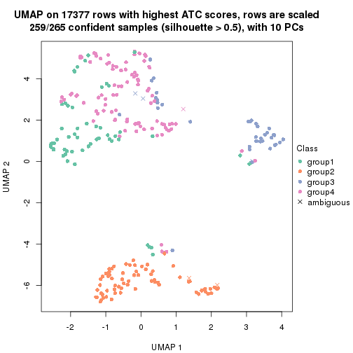</p>

</div>
<div id='tab-ATC-kmeans-dimension-reduction-4'>
<pre><code class="r">dimension_reduction(res, k = 5, method = &quot;UMAP&quot;)
</code></pre>

<p></p>

</div>
<div id='tab-ATC-kmeans-dimension-reduction-5'>
<pre><code class="r">dimension_reduction(res, k = 6, method = &quot;UMAP&quot;)
</code></pre>

<p></p>

</div>
</div>


Following heatmap shows how subgroups are split when increasing `k`:

```r
collect_classes(res)
```


If matrix rows can be associated to genes, consider to use `GO_Enrichment(res,
...)` to perform function enrichment for the signature genes.


 

---------------------------------------------------


### ATC:skmeans**


The object with results only for a single top-value method and a single partition method 
can be extracted as:

```r
res = res_list["ATC", "skmeans"]
# you can also extract it by
# res = res_list["ATC:skmeans"]
```

A summary of `res` and all the functions that can be applied to it:

```r
res
```

```
#> A 'ConsensusPartition' object with k = 2, 3, 4, 5, 6.
#>   On a matrix with 17377 rows and 265 columns.
#>   Top rows (1000, 2000, 3000, 4000, 5000) are extracted by 'ATC' method.
#>   Subgroups are detected by 'skmeans' method.
#>   Performed in total 1250 partitions by row resampling.
#>   Best k for subgroups seems to be 3.
#> 
#> Following methods can be applied to this 'ConsensusPartition' object:
#>  [1] "cola_report"             "collect_classes"         "collect_plots"          
#>  [4] "collect_stats"           "colnames"                "compare_signatures"     
#>  [7] "consensus_heatmap"       "dimension_reduction"     "functional_enrichment"  
#> [10] "get_anno_col"            "get_anno"                "get_classes"            
#> [13] "get_consensus"           "get_matrix"              "get_membership"         
#> [16] "get_param"               "get_signatures"          "get_stats"              
#> [19] "is_best_k"               "is_stable_k"             "membership_heatmap"     
#> [22] "ncol"                    "nrow"                    "plot_ecdf"              
#> [25] "rownames"                "select_partition_number" "show"                   
#> [28] "suggest_best_k"          "test_to_known_factors"
```

`collect_plots()` function collects all the plots made from `res` for all `k` (number of partitions)
into one single page to provide an easy and fast comparison between different `k`.

```r
collect_plots(res)
```


The plots are:

- The first row: a plot of the ECDF (Empirical cumulative distribution
  function) curves of the consensus matrix for each `k` and the heatmap of
  predicted classes for each `k`.
- The second row: heatmaps of the consensus matrix for each `k`.
- The third row: heatmaps of the membership matrix for each `k`.
- The fouth row: heatmaps of the signatures for each `k`.

All the plots in panels can be made by individual functions and they are
plotted later in this section.

`select_partition_number()` produces several plots showing different
statistics for choosing "optimized" `k`. There are following statistics:

- ECDF curves of the consensus matrix for each `k`;
- 1-PAC. [The PAC
  score](https://en.wikipedia.org/wiki/Consensus_clustering#Over-interpretation_potential_of_consensus_clustering)
  measures the proportion of the ambiguous subgrouping.
- Mean silhouette score.
- Concordance. The mean probability of fiting the consensus class ids in all
  partitions.
- Area increased. Denote $A_k$ as the area under the ECDF curve for current
  `k`, the area increased is defined as $A_k - A_{k-1}$.
- Rand index. The percent of pairs of samples that are both in a same cluster
  or both are not in a same cluster in the partition of k and k-1.
- Jaccard index. The ratio of pairs of samples are both in a same cluster in
  the partition of k and k-1 and the pairs of samples are both in a same
  cluster in the partition k or k-1.

The detailed explanations of these statistics can be found in [the cola
vignette](http://bioconductor.org/packages/devel/bioc/vignettes/cola/inst/doc/cola.html#toc_13).

Generally speaking, lower PAC score, higher mean silhouette score or higher
concordance corresponds to better partition. Rand index and Jaccard index
measure how similar the current partition is compared to partition with `k-1`.
If they are too similar, we won't accept `k` is better than `k-1`.

```r
select_partition_number(res)
```

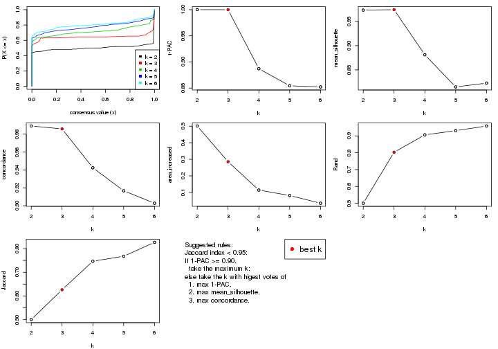

The numeric values for all these statistics can be obtained by `get_stats()`.

```r
get_stats(res)
```

```
#>   k 1-PAC mean_silhouette concordance area_increased  Rand Jaccard
#> 2 2 1.000           0.973       0.989         0.5008 0.500   0.500
#> 3 3 1.000           0.974       0.986         0.2854 0.803   0.626
#> 4 4 0.887           0.881       0.942         0.1140 0.906   0.747
#> 5 5 0.854           0.815       0.917         0.0812 0.931   0.768
#> 6 6 0.852           0.823       0.903         0.0346 0.959   0.827
```

`suggest_best_k()` suggests the best $k$ based on these statistics. The rules are as follows:

- All $k$ with Jaccard index larger than 0.95 are removed because the increase of
  the partition number does not provides enough extra information. If all $k$ are removed,
  the best $k$ is assigned by `NA`.
- For $k$ with 1-PAC larger than 0.9, the maximal $k$ is taken as the "best k". Other $k$ is called "optional k".
- If it does not fit the second rule. The $k$ with the highest vote of highest
  1-PAC, mean silhouette and concordance is taken as the "best k".

```r
suggest_best_k(res)
```

```
#> [1] 3
#> attr(,"optional")
#> [1] 2
```

There is also optional best $k$ = 2 that is worth to check.

Following shows the table of the partitions (You need to click the **show/hide
code output** link to see it). The membership matrix (columns with name `p*`)
is inferred by
[`clue::cl_consensus()`](https://www.rdocumentation.org/link/cl_consensus?package=clue)
function with the `SE` method. Basically the value in the membership matrix
represents the probability to belong to a certain group. The finall class
label for an item is determined with the group with highest probability it
belongs to.

In `get_classes()` function, the entropy is calculated from the membership
matrix and the silhouette score is calculated from the consensus matrix.


<script>
$( function() {
	$( '#tabs-ATC-skmeans-get-classes' ).tabs();
} );
</script>
<div id='tabs-ATC-skmeans-get-classes'>
<ul>
<li><a href='#tab-ATC-skmeans-get-classes-1'>k = 2</a></li>
<li><a href='#tab-ATC-skmeans-get-classes-2'>k = 3</a></li>
<li><a href='#tab-ATC-skmeans-get-classes-3'>k = 4</a></li>
<li><a href='#tab-ATC-skmeans-get-classes-4'>k = 5</a></li>
<li><a href='#tab-ATC-skmeans-get-classes-5'>k = 6</a></li>
</ul>

<div id='tab-ATC-skmeans-get-classes-1'>
<p><a id='tab-ATC-skmeans-get-classes-1-a' style='color:#0366d6' href='#'>show/hide code output</a></p>
<pre><code class="r">cbind(get_classes(res, k = 2), get_membership(res, k = 2))
</code></pre>

<pre><code>#&gt;                                      class entropy silhouette    p1    p2
#&gt; D30CF518-5FC6-4A54-8D5D-BA420EA1836D     2  0.0000      0.994 0.000 1.000
#&gt; 92298FF7-1215-4756-B976-A7D88B91AD76     1  0.0000      0.984 1.000 0.000
#&gt; 0E244FE2-7C17-4642-A51F-2CCA796D9C70     2  0.0000      0.994 0.000 1.000
#&gt; 75435ED8-93E8-45FB-8480-98D8EB2EF8CB     2  0.0000      0.994 0.000 1.000
#&gt; B6D11678-15A9-4F43-A0A2-225067DCAF1C     1  0.0000      0.984 1.000 0.000
#&gt; B7F5A41E-9559-4329-81F5-1B88A74730B7     2  0.0000      0.994 0.000 1.000
#&gt; 39414B2A-7FB0-4669-8DFE-86D9AF7AD2D9     1  0.0000      0.984 1.000 0.000
#&gt; 04823F53-A12D-4852-8F34-77B9DCBB7DF0     2  0.0000      0.994 0.000 1.000
#&gt; 49684C2B-D31C-4B45-A400-3497C3CCEC01     2  0.0000      0.994 0.000 1.000
#&gt; 96A04875-58E2-4BE7-8E0F-CAB55F4CA54F     1  0.0000      0.984 1.000 0.000
#&gt; 1F101D63-478B-40B9-A951-DC3887CFF067     2  0.0000      0.994 0.000 1.000
#&gt; DD290860-E0B7-48FC-BE12-2AF729994C21     2  0.0000      0.994 0.000 1.000
#&gt; FFDD7A12-DDEF-4974-8D60-64B7EEAAC994     2  0.0000      0.994 0.000 1.000
#&gt; E076A9A9-EA2A-4FF7-92A8-F2DA7F30279E     1  0.0000      0.984 1.000 0.000
#&gt; 830DFA6F-A85A-4317-82B2-791FAB998A01     2  0.0000      0.994 0.000 1.000
#&gt; 58578614-E4A3-4655-BBAB-F65851625E0A     1  0.0000      0.984 1.000 0.000
#&gt; 1CBFB672-4D66-430B-83F3-7CE3BE20ABF6     1  0.0000      0.984 1.000 0.000
#&gt; 6C34A7D7-3756-4DCC-9A9F-B5FC4A148B7E     2  0.0000      0.994 0.000 1.000
#&gt; D97ED7B4-5DF2-4B62-8796-AA51CA79DBBB     1  0.0000      0.984 1.000 0.000
#&gt; 45F15851-55F6-4169-834E-38958C38B6A9     1  0.9087      0.532 0.676 0.324
#&gt; 4139E0C9-F712-4A25-8B59-587533B93B3E     1  0.0000      0.984 1.000 0.000
#&gt; 2C3007BF-009E-404F-A3BF-8B921698D85B     1  0.0000      0.984 1.000 0.000
#&gt; 2189F8E5-FF98-4C1A-BD04-5595DB553130     1  0.0000      0.984 1.000 0.000
#&gt; FFAA0310-0D78-4499-8FB8-5BC46E4FCE58     1  0.0000      0.984 1.000 0.000
#&gt; 0C375B2F-67BE-4708-BEB2-544DEC812DCA     2  0.0000      0.994 0.000 1.000
#&gt; AB6324A1-19AB-400C-8001-54765D190E27     2  0.0000      0.994 0.000 1.000
#&gt; A32C4DCD-DC4C-4132-9ED1-B159F5561A2D     1  0.4298      0.897 0.912 0.088
#&gt; 2AE7105D-D494-45B0-947A-315D8C20ECDC     1  0.0000      0.984 1.000 0.000
#&gt; 60FE9D59-FC0F-4B9C-ABF8-1C00BC761928     1  0.0000      0.984 1.000 0.000
#&gt; 056442DC-E87A-4315-965C-C19D7B4FC40E     1  0.0000      0.984 1.000 0.000
#&gt; 455111E5-18EF-4E3F-9DFF-8FA017D92461     2  0.0000      0.994 0.000 1.000
#&gt; 10632BC6-0B81-433C-8832-6B2ABC73A94B     1  0.0000      0.984 1.000 0.000
#&gt; AC6F82AD-C682-4EB3-BEC3-FD950F57609D     1  0.0000      0.984 1.000 0.000
#&gt; D9ABDB75-04DA-4D33-A69F-701729494533     1  0.0000      0.984 1.000 0.000
#&gt; 27BBF44D-F4D7-4C5A-935F-3310A363A670     2  0.0000      0.994 0.000 1.000
#&gt; E7AA12EE-6E14-4B33-A52C-B13589436023     1  0.0000      0.984 1.000 0.000
#&gt; DFA6D41A-D231-413E-A180-E42DF26C3E2B     1  0.0000      0.984 1.000 0.000
#&gt; 655BD3AF-5094-4B19-93A8-401C70369B17     1  0.0000      0.984 1.000 0.000
#&gt; 9DFEF253-923F-4EE2-8E3D-C75805387B20     1  0.0000      0.984 1.000 0.000
#&gt; 3B0EE948-B2CD-4191-90E2-BDD155F3B580     1  0.0000      0.984 1.000 0.000
#&gt; 177C7EF4-2D54-4555-947C-44EE7C688917     2  0.0000      0.994 0.000 1.000
#&gt; 1F8E8BB7-D159-4556-8B04-E5DD027CC444     2  0.0000      0.994 0.000 1.000
#&gt; 619F37D2-6771-4727-9079-56BED07F1CF6     1  0.0000      0.984 1.000 0.000
#&gt; ACAE29BE-ECB8-4A98-BC71-7A2D4857134E     2  0.0000      0.994 0.000 1.000
#&gt; C5C3241A-684C-4238-9333-9AF8630EC086     2  0.0000      0.994 0.000 1.000
#&gt; AD319DC2-140F-4E7B-A899-010687D8B714     2  0.0000      0.994 0.000 1.000
#&gt; 2AFF397C-ED2A-4FD9-A7F0-E4C61E9FB603     2  0.0000      0.994 0.000 1.000
#&gt; FB4C7892-3DBB-4148-AAE9-75B19A1A4031     1  0.0000      0.984 1.000 0.000
#&gt; 6F5C4500-1ED1-4E81-B4F5-EEA64CE2336A     1  0.0000      0.984 1.000 0.000
#&gt; BD027C69-3C10-4047-8E1E-218600FF2B73     2  0.0000      0.994 0.000 1.000
#&gt; 11B473A9-4CC5-461F-BC57-CC9141F3591D     1  0.0000      0.984 1.000 0.000
#&gt; 69A036E5-3E6A-4862-A7F8-2D203ED2FC9E     1  0.0000      0.984 1.000 0.000
#&gt; 9C0BDF24-F011-4855-B95A-1B6BEFA808F7     1  0.0000      0.984 1.000 0.000
#&gt; 9E205254-8C0C-4C05-AF5A-86E679CF732C     2  0.0938      0.982 0.012 0.988
#&gt; 935CCE4A-8AA8-454E-9DFF-7DE27D0BD2E2     1  0.0000      0.984 1.000 0.000
#&gt; 01E5E1FE-41D3-428B-90BC-7A000829E102     1  0.0000      0.984 1.000 0.000
#&gt; B344A530-92CD-468B-847A-DF8E25688081     2  0.0000      0.994 0.000 1.000
#&gt; F79F32A7-9F7B-4D62-8426-4A4CF10ED319     1  0.0000      0.984 1.000 0.000
#&gt; C2E1C6FA-82F9-467C-99AE-9B39FAAC810C     1  0.0000      0.984 1.000 0.000
#&gt; BF7CD9BD-776A-4957-8A6E-EF8AD83EA9D3     2  0.0000      0.994 0.000 1.000
#&gt; 8A2C1409-E83B-435E-A20F-5FCA94801C9F     2  0.0000      0.994 0.000 1.000
#&gt; B6BEFFB5-2F62-477B-A4C8-478D29577CBD     2  0.0000      0.994 0.000 1.000
#&gt; 8622CBD0-F8E9-4AC1-8175-CC9A742B86F9     1  0.0000      0.984 1.000 0.000
#&gt; 565DD660-ED58-4065-8619-260BEA6FCFEB     1  0.0000      0.984 1.000 0.000
#&gt; 96038E42-0FBA-497D-819C-38F7689F10FF     1  0.0000      0.984 1.000 0.000
#&gt; CA685549-F8BA-43F1-8461-5D2D3B17CFC5     1  0.0000      0.984 1.000 0.000
#&gt; 52020307-71A6-46E5-ACB3-8F885CA8F1EB     1  0.6438      0.804 0.836 0.164
#&gt; 7656DA98-76DC-424B-B02C-D7001DAAA0E4     1  0.0000      0.984 1.000 0.000
#&gt; 74DBA640-45E2-42A6-8F1E-69C073D66EE6     1  0.9661      0.371 0.608 0.392
#&gt; 251094BE-C33D-44F0-BD98-8618D71F520C     1  0.0000      0.984 1.000 0.000
#&gt; AB914CC5-5FF1-4257-A353-6A99D11B9478     1  0.0000      0.984 1.000 0.000
#&gt; 38B8B893-0E08-4B71-B51C-B32A7B2724E0     1  0.0000      0.984 1.000 0.000
#&gt; 7C7CD8FF-99A4-41D7-B7E1-5A517001F551     2  0.0000      0.994 0.000 1.000
#&gt; BFC5B75A-E4AE-486B-BA30-23BBAA33A125     2  0.0000      0.994 0.000 1.000
#&gt; 182AC78E-A07C-4B34-B216-B5F573E9F036     1  0.9795      0.297 0.584 0.416
#&gt; B38C5F72-8F46-4531-9C2D-96EEE07A5B22     2  0.0000      0.994 0.000 1.000
#&gt; DB9333A6-A723-4B8F-9221-25B8B23D5126     1  0.0000      0.984 1.000 0.000
#&gt; CD67DD21-C1B6-4D58-AC8E-1F4536C7DA70     2  0.0000      0.994 0.000 1.000
#&gt; 3D76A56E-4B66-48AE-AA60-D9C1004C7140     1  0.0000      0.984 1.000 0.000
#&gt; 71ED572F-7780-47A4-A9F8-D320C737690D     1  0.0000      0.984 1.000 0.000
#&gt; B449FEA1-C4B0-400F-903C-59E13D0BA313     2  0.0000      0.994 0.000 1.000
#&gt; 3F120E90-1486-4215-B9B9-79D5B413CAAC     2  0.0000      0.994 0.000 1.000
#&gt; A071894B-D8C0-4740-BD55-93EA0C86EDF7     1  0.0000      0.984 1.000 0.000
#&gt; 58848D57-D7A9-4ABB-86A2-A8AE2B23F654     1  0.0000      0.984 1.000 0.000
#&gt; CD6F9E20-B301-4663-87EC-953EDF49754F     2  0.0000      0.994 0.000 1.000
#&gt; 367D89F3-D527-4929-B830-8B6D553DF9E1     2  0.0000      0.994 0.000 1.000
#&gt; BE8D7DCB-648B-42DD-9FA8-8B85B5D816B2     1  0.0000      0.984 1.000 0.000
#&gt; AA46F56B-BD9C-40A4-8EA8-35E2568C964D     2  0.0000      0.994 0.000 1.000
#&gt; 6393220A-7C57-413F-81A8-4E38C21E779E     2  0.0000      0.994 0.000 1.000
#&gt; 89AE566C-F65F-43C2-BA97-621A7AC8B6DC     1  0.0000      0.984 1.000 0.000
#&gt; AA6A4BFF-8C62-4B70-B85A-9EDF403B06BA     1  0.0000      0.984 1.000 0.000
#&gt; BCE877A6-9C65-4495-A45D-05753F2D0E15     1  0.6343      0.809 0.840 0.160
#&gt; D7BDDF49-C54B-4F8E-ACA0-C3684AB68B5C     2  0.0000      0.994 0.000 1.000
#&gt; D0800D49-0033-44B2-8D7B-29B16F87ADA6     2  0.0000      0.994 0.000 1.000
#&gt; 151D60B5-5AF1-4B61-B97F-ABC7531D9F89     1  0.0000      0.984 1.000 0.000
#&gt; CBBAEB5B-25FA-4B6D-A40C-357E37033E36     1  0.0000      0.984 1.000 0.000
#&gt; 317CD049-3151-40B7-8E88-B0B8813338D6     1  0.0000      0.984 1.000 0.000
#&gt; 93835C77-F8FA-4928-843C-8016A91881FA     1  0.0000      0.984 1.000 0.000
#&gt; 02A6950F-647D-4F20-B2D0-0238C1441C70     1  0.0000      0.984 1.000 0.000
#&gt; 4D54E415-134F-4F6F-8718-3E0475EF5477     1  0.9491      0.433 0.632 0.368
#&gt; 82AB290A-3993-45E5-8B15-6125A019778C     1  0.3584      0.919 0.932 0.068
#&gt; 3B5EAD14-E506-4A22-804D-BF925A2D5247     2  0.0000      0.994 0.000 1.000
#&gt; 19CF7DDF-4F3A-4D2F-B84A-6451A5C3112C     2  0.0000      0.994 0.000 1.000
#&gt; 2FB00DAA-C274-42B1-A06B-611FE5E96844     1  0.0000      0.984 1.000 0.000
#&gt; 2B1F01C3-8145-4296-8111-2B0474AB9A2C     2  0.0000      0.994 0.000 1.000
#&gt; 3F0865F1-8256-4778-966F-D53637B415B6     2  0.0000      0.994 0.000 1.000
#&gt; 5473210D-37F9-4192-86D2-E2A2C77F3BD2     2  0.0000      0.994 0.000 1.000
#&gt; 5EDB6ACF-4F3F-471A-9DDC-661607CACCC4     2  0.0000      0.994 0.000 1.000
#&gt; 6A252A3A-7EEB-47B6-9C23-D69BD2EA846F     2  0.0000      0.994 0.000 1.000
#&gt; 0A7FFCBB-4BAA-4A5F-8B2D-B427C4D982A8     1  0.0000      0.984 1.000 0.000
#&gt; 1603AFB8-5AD7-4794-9991-BDBE96B4D997     2  0.0000      0.994 0.000 1.000
#&gt; 644299E9-62B7-4DFE-9E6D-D7556A01B40A     2  0.9850      0.230 0.428 0.572
#&gt; EF12E923-1860-4269-B57B-BA6238FA4403     1  0.0000      0.984 1.000 0.000
#&gt; 51B7241E-F0BE-482A-88AE-89004BB68989     1  0.0000      0.984 1.000 0.000
#&gt; 1C007DF3-8A9F-4940-9A4C-DE2A412BB023     2  0.0000      0.994 0.000 1.000
#&gt; 89FCFDE6-9625-432C-AA35-9C5FCCF40031     2  0.0000      0.994 0.000 1.000
#&gt; 7955FC55-386D-497E-AFED-019BBBAD428E     1  0.5408      0.854 0.876 0.124
#&gt; 37FF09ED-73EC-4D10-B2AC-7D8EBA9304ED     1  0.0000      0.984 1.000 0.000
#&gt; C2CD2742-2FB4-468E-90FF-8F65A5C425A9     1  0.0000      0.984 1.000 0.000
#&gt; 766FE08F-3393-4868-B1C1-FA98C9FF16E0     1  0.0000      0.984 1.000 0.000
#&gt; 63E2B578-2221-4255-8C45-7FD030B1C94D     2  0.0000      0.994 0.000 1.000
#&gt; C14B1A44-43F7-45F0-A583-5667A4D3BD95     1  0.0000      0.984 1.000 0.000
#&gt; D9CB551A-CE20-4BF7-8AC9-839112346C3D     1  0.0000      0.984 1.000 0.000
#&gt; 05BAA71A-E5B3-4A3A-A3F2-013A975087F0     2  0.0000      0.994 0.000 1.000
#&gt; AC8DA7DE-4D83-4768-BEFD-9A1B2DA943CE     2  0.0000      0.994 0.000 1.000
#&gt; E89DCE9D-F8A5-499C-85BB-BB500BADB9FB     1  0.0000      0.984 1.000 0.000
#&gt; C16F9B5E-2B52-40F6-856D-C0D6FBDD16C1     1  0.0000      0.984 1.000 0.000
#&gt; 8FF234D4-823A-4C80-82F7-2E92D72DBF88     2  0.0000      0.994 0.000 1.000
#&gt; C9F94A6E-D104-4D8D-8EC5-EADECD85F092     1  0.0000      0.984 1.000 0.000
#&gt; 45C9756F-A154-4537-852E-ECBF27B92FE1     2  0.0000      0.994 0.000 1.000
#&gt; 0F1A5708-341E-4713-BC70-76D702F826D6     2  0.0000      0.994 0.000 1.000
#&gt; 2ECFBCA0-AB35-461A-A4B5-C60B2651A962     2  0.0000      0.994 0.000 1.000
#&gt; 7DFAC404-3AB3-4274-A533-CFDAF4CE122D     1  0.0000      0.984 1.000 0.000
#&gt; A90AF55C-4386-42AB-A812-9230026EA5A5     2  0.0000      0.994 0.000 1.000
#&gt; 6258A757-4E18-4CD1-8417-189521E990B6     2  0.0000      0.994 0.000 1.000
#&gt; EBFAD137-050F-47D0-A43D-72B8F7D70C2B     1  0.0000      0.984 1.000 0.000
#&gt; 08B5EBFB-2807-4229-95A6-81AB7F377A56     2  0.0000      0.994 0.000 1.000
#&gt; 4780A59C-0589-4995-B044-3201F09AF859     2  0.0000      0.994 0.000 1.000
#&gt; 0AB81429-C287-48AA-9035-3A7A6F4C7328     2  0.0000      0.994 0.000 1.000
#&gt; 20C4D047-28DA-4AB7-9B3C-32EDA6B22C9D     2  0.0000      0.994 0.000 1.000
#&gt; 77C4E01F-84A6-4BFD-AA8E-D7875456F546     2  0.0000      0.994 0.000 1.000
#&gt; 8B28383F-CF14-4CC5-A1E2-72AD915C0AE8     2  0.0000      0.994 0.000 1.000
#&gt; E12E1F48-6A52-4F74-925C-C4EE1BF5C573     2  0.0000      0.994 0.000 1.000
#&gt; 9B179BC5-BB4C-4CEE-99BC-BC552BC384A1     1  0.0000      0.984 1.000 0.000
#&gt; 5548C91A-D3DE-48F5-B4A4-124BE177B99A     1  0.0000      0.984 1.000 0.000
#&gt; 0E22B729-C381-4B0C-9897-62DD38F51722     2  0.0000      0.994 0.000 1.000
#&gt; 7BC4937F-04E2-4B46-BA7C-FE9AC738C8A9     1  0.0000      0.984 1.000 0.000
#&gt; EE6A0D3F-3F8A-4AA8-B3EF-32372EF37A29     1  0.0000      0.984 1.000 0.000
#&gt; 08AC2706-7651-409F-BE6B-BCED1C2D1796     1  0.0000      0.984 1.000 0.000
#&gt; A68B078D-8979-4070-BB4D-F526704ED3DC     1  0.0000      0.984 1.000 0.000
#&gt; C319A5EE-69FA-4AAB-85A9-2EAAD8E4C703     1  0.2043      0.955 0.968 0.032
#&gt; 0D7CAABD-D20C-4F82-BCBC-8B7276E8EDE2     1  0.0000      0.984 1.000 0.000
#&gt; 09444DCC-44BA-4A3F-ACC5-863A54578B9F     2  0.0000      0.994 0.000 1.000
#&gt; 2E32B047-C6E1-4743-A6C8-E98370A32145     2  0.0000      0.994 0.000 1.000
#&gt; 6A6878A7-76B2-40DE-958B-804442AC6A5D     1  0.0000      0.984 1.000 0.000
#&gt; 39F27293-0BFF-4EA2-8439-A299E3226D20     2  0.0000      0.994 0.000 1.000
#&gt; 7EAE9C30-6080-405F-A7E6-1FED57674279     1  0.0000      0.984 1.000 0.000
#&gt; 79499169-A093-4E0A-B6BD-010CD7BE5035     1  0.0000      0.984 1.000 0.000
#&gt; 1F8BF4E8-BD84-4EFE-9E3E-89E7CE8FA72D     2  0.0000      0.994 0.000 1.000
#&gt; 62B7988F-98E5-4AB8-8A16-D661A07455E8     1  0.0000      0.984 1.000 0.000
#&gt; B7005B5F-217E-4073-BFB5-CE7E884B80C0     2  0.0000      0.994 0.000 1.000
#&gt; B981568F-2C08-4696-B589-E157A49BE72B     2  0.0000      0.994 0.000 1.000
#&gt; A3D85C0A-3202-40C2-88E1-052AC6C5184B     1  0.0000      0.984 1.000 0.000
#&gt; 4CA783B9-9B99-46B8-962A-77194ECB7942     2  0.4431      0.895 0.092 0.908
#&gt; D4024B08-4879-47EA-99E5-D9FCE1CD40DF     1  0.0000      0.984 1.000 0.000
#&gt; 1D41CDA2-0B29-48FD-B83A-E60C174DBCB3     1  0.0000      0.984 1.000 0.000
#&gt; A1923B2A-B233-4760-8AF9-C04C1CAEB100     1  0.0000      0.984 1.000 0.000
#&gt; 80880D71-BFDE-4D88-892F-5ADF27A38940     2  0.0000      0.994 0.000 1.000
#&gt; 55D1629D-30FD-49AA-88CE-EA3CA9B30A3F     2  0.0000      0.994 0.000 1.000
#&gt; B71C409E-926D-48AD-8BD8-9F707CA4FB01     2  0.0000      0.994 0.000 1.000
#&gt; 54A92C57-BD19-4A47-BA76-3ACA2DC36212     2  0.0000      0.994 0.000 1.000
#&gt; B2AB74B8-506C-4C27-9105-E86A6AAA89D4     1  0.0000      0.984 1.000 0.000
#&gt; 0356AE49-7A5C-42CC-A39C-7C8DFBFF8842     2  0.0000      0.994 0.000 1.000
#&gt; ACA260A3-DC3F-4FF4-B9C5-2D4BC4F81783     1  0.0000      0.984 1.000 0.000
#&gt; 9B440917-E5A4-43B9-A48D-6ABFEDCA6CFD     1  0.0000      0.984 1.000 0.000
#&gt; 47464828-52EA-413B-B30C-BD8B55903D78     2  0.0000      0.994 0.000 1.000
#&gt; C1D1FC82-B50D-4C82-8F03-06CEE3C08D18     1  0.0000      0.984 1.000 0.000
#&gt; E5ABFC43-E2A3-4B1A-BBA3-8196C0B026A5     2  0.0000      0.994 0.000 1.000
#&gt; 1D3C16CC-D0D5-4637-AAC7-91672DFF3317     1  0.0000      0.984 1.000 0.000
#&gt; 4D038320-ADEA-4990-8371-68B4B8162E1A     2  0.0000      0.994 0.000 1.000
#&gt; A75594CC-3E49-4869-8656-BBB4E72BF59D     2  0.0000      0.994 0.000 1.000
#&gt; 7CABAA19-5FB2-4A58-BDA3-4F1FFB532C20     2  0.5059      0.870 0.112 0.888
#&gt; 534EF1E9-9513-426E-B41E-A394AB2E4410     2  0.0000      0.994 0.000 1.000
#&gt; 649F35A1-A08C-497D-A9B6-CB3084D5FB8D     1  0.0000      0.984 1.000 0.000
#&gt; 7CA30F3C-1C98-480C-B8B5-A248AABFB468     2  0.4562      0.890 0.096 0.904
#&gt; A9F8DA21-A802-44CF-9F5D-96A36687DCDD     1  0.0000      0.984 1.000 0.000
#&gt; A7AE1ED1-86CB-4A50-97B2-66785C7191FE     1  0.0000      0.984 1.000 0.000
#&gt; D0091AD4-D3D7-4C03-ACD9-DA9F8B6076C6     2  0.0000      0.994 0.000 1.000
#&gt; 46EE1C2B-13F7-44A7-B27E-4EBB9DF0CA83     2  0.0000      0.994 0.000 1.000
#&gt; CB9301B8-0282-43D6-AF5E-B753A9C7BFCB     2  0.0000      0.994 0.000 1.000
#&gt; A0E77A39-885A-4472-9A10-2D1E51DBFDA4     1  0.0000      0.984 1.000 0.000
#&gt; C06603C2-163D-40B6-A9FE-882424F18FE9     1  0.0000      0.984 1.000 0.000
#&gt; C3921A29-80FF-4B9D-B366-5C0238A42231     2  0.0000      0.994 0.000 1.000
#&gt; BB99B4E7-C834-4BB8-973F-8FA039E2798F     1  0.0000      0.984 1.000 0.000
#&gt; 5CD78C2F-05E9-409A-8405-3EE936A6876E     2  0.0000      0.994 0.000 1.000
#&gt; 6C126CC7-0C03-48F0-A2C2-F090CA239B70     2  0.0000      0.994 0.000 1.000
#&gt; 7118B08A-E94C-49F4-8D76-26455C34D85F     2  0.0000      0.994 0.000 1.000
#&gt; 266DAF30-CF3E-493E-8B24-3931D0039450     1  0.0000      0.984 1.000 0.000
#&gt; DAB5F5B9-4FE5-468F-AD2B-B39BBC4317A0     2  0.0000      0.994 0.000 1.000
#&gt; 9A9EB6D6-312E-4A98-8762-30D3ABD8193D     2  0.0000      0.994 0.000 1.000
#&gt; CED15676-B901-4FC8-9C8D-51E529D9441D     1  0.0000      0.984 1.000 0.000
#&gt; 827232CC-8035-440C-8B12-02C789C70B1B     2  0.0000      0.994 0.000 1.000
#&gt; 04D5FB28-FB50-4EAE-95FB-72ABF0E618CA     2  0.0000      0.994 0.000 1.000
#&gt; 6C96A851-97FC-4845-B895-D255191D9F25     1  0.0000      0.984 1.000 0.000
#&gt; 3EC982CB-D013-443E-B21D-39DE6B8EF370     2  0.0000      0.994 0.000 1.000
#&gt; 2E24A786-4370-42A1-AD50-D651F89819CC     2  0.0000      0.994 0.000 1.000
#&gt; 7653BFA9-ADA5-44CA-8555-807FBBFC6DE2     1  0.0000      0.984 1.000 0.000
#&gt; 7A110994-5741-4013-91F0-DD2E1D343F91     2  0.0000      0.994 0.000 1.000
#&gt; 0A760E0C-11C5-4201-8452-18DBC1FEACEB     1  0.0000      0.984 1.000 0.000
#&gt; 909B76A1-BB9F-4906-95BC-58CD1A46D3B8     2  0.0000      0.994 0.000 1.000
#&gt; A782EE71-EDA4-4385-83B3-D16DE81296C0     1  0.0000      0.984 1.000 0.000
#&gt; BD50E276-914F-4924-8CEA-FF47A66DB175     2  0.0000      0.994 0.000 1.000
#&gt; 505D5CA8-0279-4BC7-8CC0-8C7A0165BF91     2  0.0000      0.994 0.000 1.000
#&gt; D51FC997-E662-4AE7-BC9C-14183DA42DE1     2  0.0000      0.994 0.000 1.000
#&gt; 8AD67970-84F1-4C0A-B47A-8FA4108F9FE3     1  0.0000      0.984 1.000 0.000
#&gt; 6E33B1B6-7089-4BC3-B2B0-EC2C3B5D8B74     1  0.0000      0.984 1.000 0.000
#&gt; 88C4EA46-2546-401C-A8E7-603EECFDFBA0     1  0.0000      0.984 1.000 0.000
#&gt; 375D2D72-C998-4627-BA35-24E82A9A55FF     1  0.0000      0.984 1.000 0.000
#&gt; 76D0F834-7064-46C6-96F4-E861CF5452B6     2  0.0000      0.994 0.000 1.000
#&gt; 87159081-C97A-4004-AF0A-7EB6EF0EC47A     1  0.0000      0.984 1.000 0.000
#&gt; 24A57006-800B-4174-AF4E-7EA57A8A756E     1  0.0000      0.984 1.000 0.000
#&gt; AD68CBC6-8A13-4A65-AF62-E99AFA81D031     2  0.0000      0.994 0.000 1.000
#&gt; 22863A57-F066-4DD1-A859-4336F43D144C     1  0.0000      0.984 1.000 0.000
#&gt; 8F6F0362-9165-4DCC-992C-AF871A3C51E7     1  0.0000      0.984 1.000 0.000
#&gt; 76ABF0B7-E707-4DB2-9486-3814439BDBA5     1  0.0000      0.984 1.000 0.000
#&gt; BC72372F-3577-40E5-BA0F-41A084AA93AD     1  0.0000      0.984 1.000 0.000
#&gt; 8E566039-B56C-4F41-B9EF-DE18BEEF2C95     1  0.0000      0.984 1.000 0.000
#&gt; F096F016-3EF5-4A67-A7C2-8A45E1585232     1  0.0000      0.984 1.000 0.000
#&gt; BB37913E-534B-43DD-BE3D-E13B29FD8172     2  0.0000      0.994 0.000 1.000
#&gt; E344638F-9060-460F-8F7A-60D19442F294     2  0.0000      0.994 0.000 1.000
#&gt; 6A0EAAD0-89D5-4F12-8B45-9D5A25182FAD     1  0.1633      0.963 0.976 0.024
#&gt; A5199E3A-9D67-4543-88AB-24398C98E38E     1  0.0000      0.984 1.000 0.000
#&gt; 23917D52-7864-4F84-9C77-DF8EA9407345     2  0.0000      0.994 0.000 1.000
#&gt; 9AA96080-19D8-40C3-BDD1-6044D2D422D5     1  0.0000      0.984 1.000 0.000
#&gt; 0ED65D91-260C-4662-9903-EE36A2E3B2D0     2  0.0000      0.994 0.000 1.000
#&gt; 64BF1BC5-7A9A-4E1D-AEAB-AFE30B92AAF4     1  0.0000      0.984 1.000 0.000
#&gt; F02301F1-9054-4DC6-8DC9-2451A0F53EFC     2  0.0000      0.994 0.000 1.000
#&gt; 3264649A-5684-4181-83D0-A7E4D7E2E1FD     1  0.0000      0.984 1.000 0.000
#&gt; 3F8DA39C-BC9B-4343-8838-5CE271E80C51     1  0.0000      0.984 1.000 0.000
#&gt; BCC681CB-2AF4-4BB6-B53A-7544A2399454     1  0.0000      0.984 1.000 0.000
#&gt; DCB50E17-5E2D-443B-8DCC-272FBB734C2E     1  0.0000      0.984 1.000 0.000
#&gt; B5E47C38-CB6A-44C0-AA9B-56951B9EF78D     1  0.0000      0.984 1.000 0.000
#&gt; B15B0185-9C28-4A00-9CEC-05EFECEA6709     1  0.0000      0.984 1.000 0.000
#&gt; 61D4E8E7-0110-480A-A4A7-D406DE74C31E     1  0.0000      0.984 1.000 0.000
#&gt; CA8DB3AD-3F6B-4622-BF73-47041EC96E42     1  0.0000      0.984 1.000 0.000
#&gt; 5EECB1C4-172C-4494-871A-ADB650CD82BD     2  0.0000      0.994 0.000 1.000
#&gt; 019B857C-D4F7-4B67-B699-56E52A60805B     2  0.0000      0.994 0.000 1.000
#&gt; E9C28902-05C9-4883-97A4-D612D54E46B4     2  0.0000      0.994 0.000 1.000
#&gt; C5D3D9A0-FC14-408D-AB6C-662018A5E5CA     1  0.0000      0.984 1.000 0.000
#&gt; 7EB24744-509B-4854-B7D0-0BAFA210A345     2  0.0000      0.994 0.000 1.000
#&gt; B8B7A721-2284-40AB-98F5-EF1351C30B66     2  0.0000      0.994 0.000 1.000
#&gt; 3C12F39D-0D21-4F69-A539-4120B73C7A79     2  0.0000      0.994 0.000 1.000
#&gt; 08D3F984-6850-45B2-9DF9-EC7F5A4060A4     1  0.0000      0.984 1.000 0.000
#&gt; 9BD0EE79-1EED-4F6D-A5AB-43ADB8526F1E     2  0.0000      0.994 0.000 1.000
#&gt; E489A871-3CF4-4F3D-8EAF-63B507054201     2  0.0000      0.994 0.000 1.000
#&gt; 8CF8FD2E-1DBA-4257-9715-04D956D46B71     2  0.0000      0.994 0.000 1.000
#&gt; F6193AF0-7A19-46CB-A818-1B01E7460791     1  0.0000      0.984 1.000 0.000
#&gt; 96392D6B-D4FF-4393-93BA-08E469E8BBE1     2  0.0000      0.994 0.000 1.000
#&gt; DABCBE5A-C591-46A2-AF66-DA3DB6106751     1  0.0000      0.984 1.000 0.000
#&gt; 8B75F7D4-98D8-44DE-B19D-B733D6A031DB     1  0.0000      0.984 1.000 0.000
#&gt; AAD9685A-564B-42E9-91E3-431951154BA7     2  0.0000      0.994 0.000 1.000
#&gt; 90A43152-4E3B-4365-A39F-7B0E5CA66E55     2  0.0000      0.994 0.000 1.000
#&gt; EFB76FCF-AC9C-4852-B91C-E055DA666FA0     1  0.0000      0.984 1.000 0.000
#&gt; 6EBCFFE3-706F-440A-ABA9-012A924A07C6     2  0.0000      0.994 0.000 1.000
#&gt; E922A244-F1C8-4310-ABB2-62B06E022E4C     1  0.0000      0.984 1.000 0.000
</code></pre>

<script>
$('#tab-ATC-skmeans-get-classes-1-a').parent().next().next().hide();
$('#tab-ATC-skmeans-get-classes-1-a').click(function(){
  $('#tab-ATC-skmeans-get-classes-1-a').parent().next().next().toggle();
  return(false);
});
</script>
</div>

<div id='tab-ATC-skmeans-get-classes-2'>
<p><a id='tab-ATC-skmeans-get-classes-2-a' style='color:#0366d6' href='#'>show/hide code output</a></p>
<pre><code class="r">cbind(get_classes(res, k = 3), get_membership(res, k = 3))
</code></pre>

<pre><code>#&gt;                                      class entropy silhouette    p1    p2    p3
#&gt; D30CF518-5FC6-4A54-8D5D-BA420EA1836D     2  0.0000      0.994 0.000 1.000 0.000
#&gt; 92298FF7-1215-4756-B976-A7D88B91AD76     1  0.0000      0.987 1.000 0.000 0.000
#&gt; 0E244FE2-7C17-4642-A51F-2CCA796D9C70     2  0.0000      0.994 0.000 1.000 0.000
#&gt; 75435ED8-93E8-45FB-8480-98D8EB2EF8CB     2  0.0000      0.994 0.000 1.000 0.000
#&gt; B6D11678-15A9-4F43-A0A2-225067DCAF1C     1  0.0000      0.987 1.000 0.000 0.000
#&gt; B7F5A41E-9559-4329-81F5-1B88A74730B7     2  0.0000      0.994 0.000 1.000 0.000
#&gt; 39414B2A-7FB0-4669-8DFE-86D9AF7AD2D9     1  0.0000      0.987 1.000 0.000 0.000
#&gt; 04823F53-A12D-4852-8F34-77B9DCBB7DF0     2  0.0000      0.994 0.000 1.000 0.000
#&gt; 49684C2B-D31C-4B45-A400-3497C3CCEC01     2  0.0000      0.994 0.000 1.000 0.000
#&gt; 96A04875-58E2-4BE7-8E0F-CAB55F4CA54F     1  0.0000      0.987 1.000 0.000 0.000
#&gt; 1F101D63-478B-40B9-A951-DC3887CFF067     3  0.0000      0.973 0.000 0.000 1.000
#&gt; DD290860-E0B7-48FC-BE12-2AF729994C21     2  0.0000      0.994 0.000 1.000 0.000
#&gt; FFDD7A12-DDEF-4974-8D60-64B7EEAAC994     2  0.0000      0.994 0.000 1.000 0.000
#&gt; E076A9A9-EA2A-4FF7-92A8-F2DA7F30279E     1  0.0000      0.987 1.000 0.000 0.000
#&gt; 830DFA6F-A85A-4317-82B2-791FAB998A01     2  0.0000      0.994 0.000 1.000 0.000
#&gt; 58578614-E4A3-4655-BBAB-F65851625E0A     1  0.0000      0.987 1.000 0.000 0.000
#&gt; 1CBFB672-4D66-430B-83F3-7CE3BE20ABF6     1  0.3116      0.889 0.892 0.000 0.108
#&gt; 6C34A7D7-3756-4DCC-9A9F-B5FC4A148B7E     3  0.1964      0.958 0.000 0.056 0.944
#&gt; D97ED7B4-5DF2-4B62-8796-AA51CA79DBBB     1  0.0000      0.987 1.000 0.000 0.000
#&gt; 45F15851-55F6-4169-834E-38958C38B6A9     3  0.0000      0.973 0.000 0.000 1.000
#&gt; 4139E0C9-F712-4A25-8B59-587533B93B3E     1  0.0000      0.987 1.000 0.000 0.000
#&gt; 2C3007BF-009E-404F-A3BF-8B921698D85B     1  0.0000      0.987 1.000 0.000 0.000
#&gt; 2189F8E5-FF98-4C1A-BD04-5595DB553130     1  0.1860      0.947 0.948 0.000 0.052
#&gt; FFAA0310-0D78-4499-8FB8-5BC46E4FCE58     1  0.0000      0.987 1.000 0.000 0.000
#&gt; 0C375B2F-67BE-4708-BEB2-544DEC812DCA     2  0.0000      0.994 0.000 1.000 0.000
#&gt; AB6324A1-19AB-400C-8001-54765D190E27     2  0.0000      0.994 0.000 1.000 0.000
#&gt; A32C4DCD-DC4C-4132-9ED1-B159F5561A2D     3  0.0000      0.973 0.000 0.000 1.000
#&gt; 2AE7105D-D494-45B0-947A-315D8C20ECDC     1  0.0000      0.987 1.000 0.000 0.000
#&gt; 60FE9D59-FC0F-4B9C-ABF8-1C00BC761928     1  0.1643      0.954 0.956 0.000 0.044
#&gt; 056442DC-E87A-4315-965C-C19D7B4FC40E     1  0.0000      0.987 1.000 0.000 0.000
#&gt; 455111E5-18EF-4E3F-9DFF-8FA017D92461     3  0.0000      0.973 0.000 0.000 1.000
#&gt; 10632BC6-0B81-433C-8832-6B2ABC73A94B     1  0.0000      0.987 1.000 0.000 0.000
#&gt; AC6F82AD-C682-4EB3-BEC3-FD950F57609D     1  0.0000      0.987 1.000 0.000 0.000
#&gt; D9ABDB75-04DA-4D33-A69F-701729494533     1  0.0237      0.984 0.996 0.000 0.004
#&gt; 27BBF44D-F4D7-4C5A-935F-3310A363A670     2  0.0000      0.994 0.000 1.000 0.000
#&gt; E7AA12EE-6E14-4B33-A52C-B13589436023     3  0.0237      0.971 0.004 0.000 0.996
#&gt; DFA6D41A-D231-413E-A180-E42DF26C3E2B     1  0.0000      0.987 1.000 0.000 0.000
#&gt; 655BD3AF-5094-4B19-93A8-401C70369B17     1  0.0000      0.987 1.000 0.000 0.000
#&gt; 9DFEF253-923F-4EE2-8E3D-C75805387B20     1  0.0000      0.987 1.000 0.000 0.000
#&gt; 3B0EE948-B2CD-4191-90E2-BDD155F3B580     1  0.0000      0.987 1.000 0.000 0.000
#&gt; 177C7EF4-2D54-4555-947C-44EE7C688917     3  0.2165      0.954 0.000 0.064 0.936
#&gt; 1F8E8BB7-D159-4556-8B04-E5DD027CC444     2  0.0000      0.994 0.000 1.000 0.000
#&gt; 619F37D2-6771-4727-9079-56BED07F1CF6     1  0.0000      0.987 1.000 0.000 0.000
#&gt; ACAE29BE-ECB8-4A98-BC71-7A2D4857134E     3  0.0237      0.973 0.000 0.004 0.996
#&gt; C5C3241A-684C-4238-9333-9AF8630EC086     2  0.0000      0.994 0.000 1.000 0.000
#&gt; AD319DC2-140F-4E7B-A899-010687D8B714     2  0.0000      0.994 0.000 1.000 0.000
#&gt; 2AFF397C-ED2A-4FD9-A7F0-E4C61E9FB603     3  0.2261      0.952 0.000 0.068 0.932
#&gt; FB4C7892-3DBB-4148-AAE9-75B19A1A4031     1  0.0000      0.987 1.000 0.000 0.000
#&gt; 6F5C4500-1ED1-4E81-B4F5-EEA64CE2336A     1  0.0000      0.987 1.000 0.000 0.000
#&gt; BD027C69-3C10-4047-8E1E-218600FF2B73     2  0.0000      0.994 0.000 1.000 0.000
#&gt; 11B473A9-4CC5-461F-BC57-CC9141F3591D     1  0.0000      0.987 1.000 0.000 0.000
#&gt; 69A036E5-3E6A-4862-A7F8-2D203ED2FC9E     1  0.0000      0.987 1.000 0.000 0.000
#&gt; 9C0BDF24-F011-4855-B95A-1B6BEFA808F7     1  0.0000      0.987 1.000 0.000 0.000
#&gt; 9E205254-8C0C-4C05-AF5A-86E679CF732C     3  0.0000      0.973 0.000 0.000 1.000
#&gt; 935CCE4A-8AA8-454E-9DFF-7DE27D0BD2E2     1  0.0747      0.976 0.984 0.000 0.016
#&gt; 01E5E1FE-41D3-428B-90BC-7A000829E102     1  0.0000      0.987 1.000 0.000 0.000
#&gt; B344A530-92CD-468B-847A-DF8E25688081     3  0.2261      0.952 0.000 0.068 0.932
#&gt; F79F32A7-9F7B-4D62-8426-4A4CF10ED319     3  0.0000      0.973 0.000 0.000 1.000
#&gt; C2E1C6FA-82F9-467C-99AE-9B39FAAC810C     3  0.0424      0.969 0.008 0.000 0.992
#&gt; BF7CD9BD-776A-4957-8A6E-EF8AD83EA9D3     2  0.0000      0.994 0.000 1.000 0.000
#&gt; 8A2C1409-E83B-435E-A20F-5FCA94801C9F     2  0.0000      0.994 0.000 1.000 0.000
#&gt; B6BEFFB5-2F62-477B-A4C8-478D29577CBD     2  0.0000      0.994 0.000 1.000 0.000
#&gt; 8622CBD0-F8E9-4AC1-8175-CC9A742B86F9     1  0.0000      0.987 1.000 0.000 0.000
#&gt; 565DD660-ED58-4065-8619-260BEA6FCFEB     1  0.0000      0.987 1.000 0.000 0.000
#&gt; 96038E42-0FBA-497D-819C-38F7689F10FF     1  0.0000      0.987 1.000 0.000 0.000
#&gt; CA685549-F8BA-43F1-8461-5D2D3B17CFC5     1  0.0000      0.987 1.000 0.000 0.000
#&gt; 52020307-71A6-46E5-ACB3-8F885CA8F1EB     3  0.0000      0.973 0.000 0.000 1.000
#&gt; 7656DA98-76DC-424B-B02C-D7001DAAA0E4     1  0.0000      0.987 1.000 0.000 0.000
#&gt; 74DBA640-45E2-42A6-8F1E-69C073D66EE6     3  0.0000      0.973 0.000 0.000 1.000
#&gt; 251094BE-C33D-44F0-BD98-8618D71F520C     1  0.0000      0.987 1.000 0.000 0.000
#&gt; AB914CC5-5FF1-4257-A353-6A99D11B9478     1  0.0000      0.987 1.000 0.000 0.000
#&gt; 38B8B893-0E08-4B71-B51C-B32A7B2724E0     1  0.0000      0.987 1.000 0.000 0.000
#&gt; 7C7CD8FF-99A4-41D7-B7E1-5A517001F551     2  0.0000      0.994 0.000 1.000 0.000
#&gt; BFC5B75A-E4AE-486B-BA30-23BBAA33A125     2  0.0000      0.994 0.000 1.000 0.000
#&gt; 182AC78E-A07C-4B34-B216-B5F573E9F036     2  0.1289      0.954 0.032 0.968 0.000
#&gt; B38C5F72-8F46-4531-9C2D-96EEE07A5B22     2  0.0000      0.994 0.000 1.000 0.000
#&gt; DB9333A6-A723-4B8F-9221-25B8B23D5126     1  0.0000      0.987 1.000 0.000 0.000
#&gt; CD67DD21-C1B6-4D58-AC8E-1F4536C7DA70     3  0.2261      0.952 0.000 0.068 0.932
#&gt; 3D76A56E-4B66-48AE-AA60-D9C1004C7140     1  0.0000      0.987 1.000 0.000 0.000
#&gt; 71ED572F-7780-47A4-A9F8-D320C737690D     1  0.0000      0.987 1.000 0.000 0.000
#&gt; B449FEA1-C4B0-400F-903C-59E13D0BA313     2  0.0000      0.994 0.000 1.000 0.000
#&gt; 3F120E90-1486-4215-B9B9-79D5B413CAAC     3  0.1411      0.965 0.000 0.036 0.964
#&gt; A071894B-D8C0-4740-BD55-93EA0C86EDF7     1  0.0000      0.987 1.000 0.000 0.000
#&gt; 58848D57-D7A9-4ABB-86A2-A8AE2B23F654     1  0.1529      0.957 0.960 0.000 0.040
#&gt; CD6F9E20-B301-4663-87EC-953EDF49754F     3  0.2261      0.952 0.000 0.068 0.932
#&gt; 367D89F3-D527-4929-B830-8B6D553DF9E1     3  0.0000      0.973 0.000 0.000 1.000
#&gt; BE8D7DCB-648B-42DD-9FA8-8B85B5D816B2     1  0.0000      0.987 1.000 0.000 0.000
#&gt; AA46F56B-BD9C-40A4-8EA8-35E2568C964D     2  0.0000      0.994 0.000 1.000 0.000
#&gt; 6393220A-7C57-413F-81A8-4E38C21E779E     2  0.0000      0.994 0.000 1.000 0.000
#&gt; 89AE566C-F65F-43C2-BA97-621A7AC8B6DC     1  0.0000      0.987 1.000 0.000 0.000
#&gt; AA6A4BFF-8C62-4B70-B85A-9EDF403B06BA     1  0.0000      0.987 1.000 0.000 0.000
#&gt; BCE877A6-9C65-4495-A45D-05753F2D0E15     3  0.0000      0.973 0.000 0.000 1.000
#&gt; D7BDDF49-C54B-4F8E-ACA0-C3684AB68B5C     3  0.1860      0.959 0.000 0.052 0.948
#&gt; D0800D49-0033-44B2-8D7B-29B16F87ADA6     2  0.0000      0.994 0.000 1.000 0.000
#&gt; 151D60B5-5AF1-4B61-B97F-ABC7531D9F89     1  0.0000      0.987 1.000 0.000 0.000
#&gt; CBBAEB5B-25FA-4B6D-A40C-357E37033E36     1  0.1643      0.954 0.956 0.000 0.044
#&gt; 317CD049-3151-40B7-8E88-B0B8813338D6     1  0.0000      0.987 1.000 0.000 0.000
#&gt; 93835C77-F8FA-4928-843C-8016A91881FA     3  0.0000      0.973 0.000 0.000 1.000
#&gt; 02A6950F-647D-4F20-B2D0-0238C1441C70     1  0.1529      0.957 0.960 0.000 0.040
#&gt; 4D54E415-134F-4F6F-8718-3E0475EF5477     3  0.0000      0.973 0.000 0.000 1.000
#&gt; 82AB290A-3993-45E5-8B15-6125A019778C     3  0.0000      0.973 0.000 0.000 1.000
#&gt; 3B5EAD14-E506-4A22-804D-BF925A2D5247     2  0.0000      0.994 0.000 1.000 0.000
#&gt; 19CF7DDF-4F3A-4D2F-B84A-6451A5C3112C     3  0.1860      0.959 0.000 0.052 0.948
#&gt; 2FB00DAA-C274-42B1-A06B-611FE5E96844     1  0.0000      0.987 1.000 0.000 0.000
#&gt; 2B1F01C3-8145-4296-8111-2B0474AB9A2C     2  0.0000      0.994 0.000 1.000 0.000
#&gt; 3F0865F1-8256-4778-966F-D53637B415B6     3  0.2261      0.952 0.000 0.068 0.932
#&gt; 5473210D-37F9-4192-86D2-E2A2C77F3BD2     3  0.2261      0.952 0.000 0.068 0.932
#&gt; 5EDB6ACF-4F3F-471A-9DDC-661607CACCC4     3  0.0000      0.973 0.000 0.000 1.000
#&gt; 6A252A3A-7EEB-47B6-9C23-D69BD2EA846F     3  0.2261      0.952 0.000 0.068 0.932
#&gt; 0A7FFCBB-4BAA-4A5F-8B2D-B427C4D982A8     1  0.0000      0.987 1.000 0.000 0.000
#&gt; 1603AFB8-5AD7-4794-9991-BDBE96B4D997     2  0.0000      0.994 0.000 1.000 0.000
#&gt; 644299E9-62B7-4DFE-9E6D-D7556A01B40A     3  0.0000      0.973 0.000 0.000 1.000
#&gt; EF12E923-1860-4269-B57B-BA6238FA4403     1  0.0000      0.987 1.000 0.000 0.000
#&gt; 51B7241E-F0BE-482A-88AE-89004BB68989     1  0.0000      0.987 1.000 0.000 0.000
#&gt; 1C007DF3-8A9F-4940-9A4C-DE2A412BB023     3  0.2261      0.952 0.000 0.068 0.932
#&gt; 89FCFDE6-9625-432C-AA35-9C5FCCF40031     3  0.0000      0.973 0.000 0.000 1.000
#&gt; 7955FC55-386D-497E-AFED-019BBBAD428E     1  0.1031      0.968 0.976 0.000 0.024
#&gt; 37FF09ED-73EC-4D10-B2AC-7D8EBA9304ED     1  0.0000      0.987 1.000 0.000 0.000
#&gt; C2CD2742-2FB4-468E-90FF-8F65A5C425A9     1  0.6026      0.435 0.624 0.000 0.376
#&gt; 766FE08F-3393-4868-B1C1-FA98C9FF16E0     1  0.2959      0.888 0.900 0.000 0.100
#&gt; 63E2B578-2221-4255-8C45-7FD030B1C94D     3  0.0000      0.973 0.000 0.000 1.000
#&gt; C14B1A44-43F7-45F0-A583-5667A4D3BD95     1  0.0000      0.987 1.000 0.000 0.000
#&gt; D9CB551A-CE20-4BF7-8AC9-839112346C3D     1  0.0000      0.987 1.000 0.000 0.000
#&gt; 05BAA71A-E5B3-4A3A-A3F2-013A975087F0     2  0.0000      0.994 0.000 1.000 0.000
#&gt; AC8DA7DE-4D83-4768-BEFD-9A1B2DA943CE     3  0.1860      0.959 0.000 0.052 0.948
#&gt; E89DCE9D-F8A5-499C-85BB-BB500BADB9FB     1  0.0000      0.987 1.000 0.000 0.000
#&gt; C16F9B5E-2B52-40F6-856D-C0D6FBDD16C1     1  0.0000      0.987 1.000 0.000 0.000
#&gt; 8FF234D4-823A-4C80-82F7-2E92D72DBF88     2  0.0000      0.994 0.000 1.000 0.000
#&gt; C9F94A6E-D104-4D8D-8EC5-EADECD85F092     1  0.0000      0.987 1.000 0.000 0.000
#&gt; 45C9756F-A154-4537-852E-ECBF27B92FE1     2  0.0000      0.994 0.000 1.000 0.000
#&gt; 0F1A5708-341E-4713-BC70-76D702F826D6     2  0.0000      0.994 0.000 1.000 0.000
#&gt; 2ECFBCA0-AB35-461A-A4B5-C60B2651A962     2  0.0000      0.994 0.000 1.000 0.000
#&gt; 7DFAC404-3AB3-4274-A533-CFDAF4CE122D     1  0.0000      0.987 1.000 0.000 0.000
#&gt; A90AF55C-4386-42AB-A812-9230026EA5A5     2  0.0000      0.994 0.000 1.000 0.000
#&gt; 6258A757-4E18-4CD1-8417-189521E990B6     2  0.0000      0.994 0.000 1.000 0.000
#&gt; EBFAD137-050F-47D0-A43D-72B8F7D70C2B     1  0.0000      0.987 1.000 0.000 0.000
#&gt; 08B5EBFB-2807-4229-95A6-81AB7F377A56     2  0.0000      0.994 0.000 1.000 0.000
#&gt; 4780A59C-0589-4995-B044-3201F09AF859     3  0.0000      0.973 0.000 0.000 1.000
#&gt; 0AB81429-C287-48AA-9035-3A7A6F4C7328     2  0.0000      0.994 0.000 1.000 0.000
#&gt; 20C4D047-28DA-4AB7-9B3C-32EDA6B22C9D     3  0.2261      0.952 0.000 0.068 0.932
#&gt; 77C4E01F-84A6-4BFD-AA8E-D7875456F546     3  0.2261      0.952 0.000 0.068 0.932
#&gt; 8B28383F-CF14-4CC5-A1E2-72AD915C0AE8     3  0.0000      0.973 0.000 0.000 1.000
#&gt; E12E1F48-6A52-4F74-925C-C4EE1BF5C573     2  0.0000      0.994 0.000 1.000 0.000
#&gt; 9B179BC5-BB4C-4CEE-99BC-BC552BC384A1     3  0.0000      0.973 0.000 0.000 1.000
#&gt; 5548C91A-D3DE-48F5-B4A4-124BE177B99A     1  0.0000      0.987 1.000 0.000 0.000
#&gt; 0E22B729-C381-4B0C-9897-62DD38F51722     3  0.0000      0.973 0.000 0.000 1.000
#&gt; 7BC4937F-04E2-4B46-BA7C-FE9AC738C8A9     1  0.0000      0.987 1.000 0.000 0.000
#&gt; EE6A0D3F-3F8A-4AA8-B3EF-32372EF37A29     1  0.0000      0.987 1.000 0.000 0.000
#&gt; 08AC2706-7651-409F-BE6B-BCED1C2D1796     1  0.0000      0.987 1.000 0.000 0.000
#&gt; A68B078D-8979-4070-BB4D-F526704ED3DC     1  0.0000      0.987 1.000 0.000 0.000
#&gt; C319A5EE-69FA-4AAB-85A9-2EAAD8E4C703     3  0.0592      0.967 0.012 0.000 0.988
#&gt; 0D7CAABD-D20C-4F82-BCBC-8B7276E8EDE2     1  0.0000      0.987 1.000 0.000 0.000
#&gt; 09444DCC-44BA-4A3F-ACC5-863A54578B9F     3  0.1289      0.966 0.000 0.032 0.968
#&gt; 2E32B047-C6E1-4743-A6C8-E98370A32145     3  0.0000      0.973 0.000 0.000 1.000
#&gt; 6A6878A7-76B2-40DE-958B-804442AC6A5D     1  0.0000      0.987 1.000 0.000 0.000
#&gt; 39F27293-0BFF-4EA2-8439-A299E3226D20     3  0.0000      0.973 0.000 0.000 1.000
#&gt; 7EAE9C30-6080-405F-A7E6-1FED57674279     3  0.0747      0.962 0.016 0.000 0.984
#&gt; 79499169-A093-4E0A-B6BD-010CD7BE5035     1  0.3340      0.877 0.880 0.000 0.120
#&gt; 1F8BF4E8-BD84-4EFE-9E3E-89E7CE8FA72D     3  0.2261      0.952 0.000 0.068 0.932
#&gt; 62B7988F-98E5-4AB8-8A16-D661A07455E8     1  0.0000      0.987 1.000 0.000 0.000
#&gt; B7005B5F-217E-4073-BFB5-CE7E884B80C0     2  0.0000      0.994 0.000 1.000 0.000
#&gt; B981568F-2C08-4696-B589-E157A49BE72B     2  0.0000      0.994 0.000 1.000 0.000
#&gt; A3D85C0A-3202-40C2-88E1-052AC6C5184B     1  0.0000      0.987 1.000 0.000 0.000
#&gt; 4CA783B9-9B99-46B8-962A-77194ECB7942     3  0.3797      0.918 0.056 0.052 0.892
#&gt; D4024B08-4879-47EA-99E5-D9FCE1CD40DF     1  0.0000      0.987 1.000 0.000 0.000
#&gt; 1D41CDA2-0B29-48FD-B83A-E60C174DBCB3     1  0.0000      0.987 1.000 0.000 0.000
#&gt; A1923B2A-B233-4760-8AF9-C04C1CAEB100     1  0.0000      0.987 1.000 0.000 0.000
#&gt; 80880D71-BFDE-4D88-892F-5ADF27A38940     3  0.2261      0.952 0.000 0.068 0.932
#&gt; 55D1629D-30FD-49AA-88CE-EA3CA9B30A3F     2  0.0000      0.994 0.000 1.000 0.000
#&gt; B71C409E-926D-48AD-8BD8-9F707CA4FB01     2  0.0000      0.994 0.000 1.000 0.000
#&gt; 54A92C57-BD19-4A47-BA76-3ACA2DC36212     3  0.0237      0.973 0.000 0.004 0.996
#&gt; B2AB74B8-506C-4C27-9105-E86A6AAA89D4     1  0.0747      0.976 0.984 0.000 0.016
#&gt; 0356AE49-7A5C-42CC-A39C-7C8DFBFF8842     2  0.0000      0.994 0.000 1.000 0.000
#&gt; ACA260A3-DC3F-4FF4-B9C5-2D4BC4F81783     1  0.0000      0.987 1.000 0.000 0.000
#&gt; 9B440917-E5A4-43B9-A48D-6ABFEDCA6CFD     1  0.0000      0.987 1.000 0.000 0.000
#&gt; 47464828-52EA-413B-B30C-BD8B55903D78     2  0.0000      0.994 0.000 1.000 0.000
#&gt; C1D1FC82-B50D-4C82-8F03-06CEE3C08D18     1  0.0000      0.987 1.000 0.000 0.000
#&gt; E5ABFC43-E2A3-4B1A-BBA3-8196C0B026A5     2  0.0000      0.994 0.000 1.000 0.000
#&gt; 1D3C16CC-D0D5-4637-AAC7-91672DFF3317     1  0.0000      0.987 1.000 0.000 0.000
#&gt; 4D038320-ADEA-4990-8371-68B4B8162E1A     2  0.0000      0.994 0.000 1.000 0.000
#&gt; A75594CC-3E49-4869-8656-BBB4E72BF59D     2  0.0000      0.994 0.000 1.000 0.000
#&gt; 7CABAA19-5FB2-4A58-BDA3-4F1FFB532C20     3  0.0237      0.973 0.000 0.004 0.996
#&gt; 534EF1E9-9513-426E-B41E-A394AB2E4410     2  0.0000      0.994 0.000 1.000 0.000
#&gt; 649F35A1-A08C-497D-A9B6-CB3084D5FB8D     1  0.0892      0.973 0.980 0.000 0.020
#&gt; 7CA30F3C-1C98-480C-B8B5-A248AABFB468     3  0.0000      0.973 0.000 0.000 1.000
#&gt; A9F8DA21-A802-44CF-9F5D-96A36687DCDD     1  0.0000      0.987 1.000 0.000 0.000
#&gt; A7AE1ED1-86CB-4A50-97B2-66785C7191FE     3  0.0000      0.973 0.000 0.000 1.000
#&gt; D0091AD4-D3D7-4C03-ACD9-DA9F8B6076C6     3  0.0000      0.973 0.000 0.000 1.000
#&gt; 46EE1C2B-13F7-44A7-B27E-4EBB9DF0CA83     2  0.0000      0.994 0.000 1.000 0.000
#&gt; CB9301B8-0282-43D6-AF5E-B753A9C7BFCB     2  0.0000      0.994 0.000 1.000 0.000
#&gt; A0E77A39-885A-4472-9A10-2D1E51DBFDA4     3  0.0000      0.973 0.000 0.000 1.000
#&gt; C06603C2-163D-40B6-A9FE-882424F18FE9     1  0.0424      0.982 0.992 0.000 0.008
#&gt; C3921A29-80FF-4B9D-B366-5C0238A42231     3  0.0000      0.973 0.000 0.000 1.000
#&gt; BB99B4E7-C834-4BB8-973F-8FA039E2798F     1  0.0000      0.987 1.000 0.000 0.000
#&gt; 5CD78C2F-05E9-409A-8405-3EE936A6876E     3  0.2261      0.952 0.000 0.068 0.932
#&gt; 6C126CC7-0C03-48F0-A2C2-F090CA239B70     2  0.0000      0.994 0.000 1.000 0.000
#&gt; 7118B08A-E94C-49F4-8D76-26455C34D85F     2  0.0000      0.994 0.000 1.000 0.000
#&gt; 266DAF30-CF3E-493E-8B24-3931D0039450     1  0.5016      0.705 0.760 0.000 0.240
#&gt; DAB5F5B9-4FE5-468F-AD2B-B39BBC4317A0     3  0.1753      0.961 0.000 0.048 0.952
#&gt; 9A9EB6D6-312E-4A98-8762-30D3ABD8193D     3  0.2261      0.952 0.000 0.068 0.932
#&gt; CED15676-B901-4FC8-9C8D-51E529D9441D     1  0.0000      0.987 1.000 0.000 0.000
#&gt; 827232CC-8035-440C-8B12-02C789C70B1B     3  0.0237      0.973 0.000 0.004 0.996
#&gt; 04D5FB28-FB50-4EAE-95FB-72ABF0E618CA     2  0.0000      0.994 0.000 1.000 0.000
#&gt; 6C96A851-97FC-4845-B895-D255191D9F25     1  0.0000      0.987 1.000 0.000 0.000
#&gt; 3EC982CB-D013-443E-B21D-39DE6B8EF370     3  0.2261      0.952 0.000 0.068 0.932
#&gt; 2E24A786-4370-42A1-AD50-D651F89819CC     2  0.0000      0.994 0.000 1.000 0.000
#&gt; 7653BFA9-ADA5-44CA-8555-807FBBFC6DE2     1  0.0000      0.987 1.000 0.000 0.000
#&gt; 7A110994-5741-4013-91F0-DD2E1D343F91     2  0.0000      0.994 0.000 1.000 0.000
#&gt; 0A760E0C-11C5-4201-8452-18DBC1FEACEB     1  0.0000      0.987 1.000 0.000 0.000
#&gt; 909B76A1-BB9F-4906-95BC-58CD1A46D3B8     2  0.0000      0.994 0.000 1.000 0.000
#&gt; A782EE71-EDA4-4385-83B3-D16DE81296C0     1  0.0000      0.987 1.000 0.000 0.000
#&gt; BD50E276-914F-4924-8CEA-FF47A66DB175     2  0.0000      0.994 0.000 1.000 0.000
#&gt; 505D5CA8-0279-4BC7-8CC0-8C7A0165BF91     2  0.0000      0.994 0.000 1.000 0.000
#&gt; D51FC997-E662-4AE7-BC9C-14183DA42DE1     2  0.0000      0.994 0.000 1.000 0.000
#&gt; 8AD67970-84F1-4C0A-B47A-8FA4108F9FE3     1  0.0000      0.987 1.000 0.000 0.000
#&gt; 6E33B1B6-7089-4BC3-B2B0-EC2C3B5D8B74     1  0.0000      0.987 1.000 0.000 0.000
#&gt; 88C4EA46-2546-401C-A8E7-603EECFDFBA0     1  0.0424      0.982 0.992 0.000 0.008
#&gt; 375D2D72-C998-4627-BA35-24E82A9A55FF     1  0.0000      0.987 1.000 0.000 0.000
#&gt; 76D0F834-7064-46C6-96F4-E861CF5452B6     2  0.0000      0.994 0.000 1.000 0.000
#&gt; 87159081-C97A-4004-AF0A-7EB6EF0EC47A     1  0.0000      0.987 1.000 0.000 0.000
#&gt; 24A57006-800B-4174-AF4E-7EA57A8A756E     1  0.0000      0.987 1.000 0.000 0.000
#&gt; AD68CBC6-8A13-4A65-AF62-E99AFA81D031     3  0.2261      0.952 0.000 0.068 0.932
#&gt; 22863A57-F066-4DD1-A859-4336F43D144C     1  0.0000      0.987 1.000 0.000 0.000
#&gt; 8F6F0362-9165-4DCC-992C-AF871A3C51E7     1  0.0000      0.987 1.000 0.000 0.000
#&gt; 76ABF0B7-E707-4DB2-9486-3814439BDBA5     1  0.0747      0.976 0.984 0.000 0.016
#&gt; BC72372F-3577-40E5-BA0F-41A084AA93AD     1  0.0424      0.982 0.992 0.000 0.008
#&gt; 8E566039-B56C-4F41-B9EF-DE18BEEF2C95     1  0.0000      0.987 1.000 0.000 0.000
#&gt; F096F016-3EF5-4A67-A7C2-8A45E1585232     1  0.0000      0.987 1.000 0.000 0.000
#&gt; BB37913E-534B-43DD-BE3D-E13B29FD8172     2  0.0000      0.994 0.000 1.000 0.000
#&gt; E344638F-9060-460F-8F7A-60D19442F294     3  0.2261      0.952 0.000 0.068 0.932
#&gt; 6A0EAAD0-89D5-4F12-8B45-9D5A25182FAD     2  0.5926      0.447 0.356 0.644 0.000
#&gt; A5199E3A-9D67-4543-88AB-24398C98E38E     1  0.0000      0.987 1.000 0.000 0.000
#&gt; 23917D52-7864-4F84-9C77-DF8EA9407345     2  0.0000      0.994 0.000 1.000 0.000
#&gt; 9AA96080-19D8-40C3-BDD1-6044D2D422D5     1  0.0000      0.987 1.000 0.000 0.000
#&gt; 0ED65D91-260C-4662-9903-EE36A2E3B2D0     2  0.0000      0.994 0.000 1.000 0.000
#&gt; 64BF1BC5-7A9A-4E1D-AEAB-AFE30B92AAF4     1  0.0000      0.987 1.000 0.000 0.000
#&gt; F02301F1-9054-4DC6-8DC9-2451A0F53EFC     2  0.0000      0.994 0.000 1.000 0.000
#&gt; 3264649A-5684-4181-83D0-A7E4D7E2E1FD     1  0.5650      0.576 0.688 0.000 0.312
#&gt; 3F8DA39C-BC9B-4343-8838-5CE271E80C51     1  0.0000      0.987 1.000 0.000 0.000
#&gt; BCC681CB-2AF4-4BB6-B53A-7544A2399454     1  0.0000      0.987 1.000 0.000 0.000
#&gt; DCB50E17-5E2D-443B-8DCC-272FBB734C2E     1  0.0000      0.987 1.000 0.000 0.000
#&gt; B5E47C38-CB6A-44C0-AA9B-56951B9EF78D     1  0.0000      0.987 1.000 0.000 0.000
#&gt; B15B0185-9C28-4A00-9CEC-05EFECEA6709     1  0.0000      0.987 1.000 0.000 0.000
#&gt; 61D4E8E7-0110-480A-A4A7-D406DE74C31E     1  0.0000      0.987 1.000 0.000 0.000
#&gt; CA8DB3AD-3F6B-4622-BF73-47041EC96E42     1  0.0892      0.973 0.980 0.000 0.020
#&gt; 5EECB1C4-172C-4494-871A-ADB650CD82BD     2  0.0000      0.994 0.000 1.000 0.000
#&gt; 019B857C-D4F7-4B67-B699-56E52A60805B     2  0.0000      0.994 0.000 1.000 0.000
#&gt; E9C28902-05C9-4883-97A4-D612D54E46B4     3  0.0000      0.973 0.000 0.000 1.000
#&gt; C5D3D9A0-FC14-408D-AB6C-662018A5E5CA     1  0.1289      0.964 0.968 0.000 0.032
#&gt; 7EB24744-509B-4854-B7D0-0BAFA210A345     2  0.0000      0.994 0.000 1.000 0.000
#&gt; B8B7A721-2284-40AB-98F5-EF1351C30B66     2  0.0000      0.994 0.000 1.000 0.000
#&gt; 3C12F39D-0D21-4F69-A539-4120B73C7A79     2  0.0000      0.994 0.000 1.000 0.000
#&gt; 08D3F984-6850-45B2-9DF9-EC7F5A4060A4     1  0.0424      0.982 0.992 0.000 0.008
#&gt; 9BD0EE79-1EED-4F6D-A5AB-43ADB8526F1E     3  0.0000      0.973 0.000 0.000 1.000
#&gt; E489A871-3CF4-4F3D-8EAF-63B507054201     2  0.0000      0.994 0.000 1.000 0.000
#&gt; 8CF8FD2E-1DBA-4257-9715-04D956D46B71     2  0.0000      0.994 0.000 1.000 0.000
#&gt; F6193AF0-7A19-46CB-A818-1B01E7460791     1  0.0000      0.987 1.000 0.000 0.000
#&gt; 96392D6B-D4FF-4393-93BA-08E469E8BBE1     3  0.0000      0.973 0.000 0.000 1.000
#&gt; DABCBE5A-C591-46A2-AF66-DA3DB6106751     1  0.0000      0.987 1.000 0.000 0.000
#&gt; 8B75F7D4-98D8-44DE-B19D-B733D6A031DB     1  0.0000      0.987 1.000 0.000 0.000
#&gt; AAD9685A-564B-42E9-91E3-431951154BA7     2  0.0000      0.994 0.000 1.000 0.000
#&gt; 90A43152-4E3B-4365-A39F-7B0E5CA66E55     3  0.0000      0.973 0.000 0.000 1.000
#&gt; EFB76FCF-AC9C-4852-B91C-E055DA666FA0     1  0.0000      0.987 1.000 0.000 0.000
#&gt; 6EBCFFE3-706F-440A-ABA9-012A924A07C6     2  0.0000      0.994 0.000 1.000 0.000
#&gt; E922A244-F1C8-4310-ABB2-62B06E022E4C     1  0.0000      0.987 1.000 0.000 0.000
</code></pre>

<script>
$('#tab-ATC-skmeans-get-classes-2-a').parent().next().next().hide();
$('#tab-ATC-skmeans-get-classes-2-a').click(function(){
  $('#tab-ATC-skmeans-get-classes-2-a').parent().next().next().toggle();
  return(false);
});
</script>
</div>

<div id='tab-ATC-skmeans-get-classes-3'>
<p><a id='tab-ATC-skmeans-get-classes-3-a' style='color:#0366d6' href='#'>show/hide code output</a></p>
<pre><code class="r">cbind(get_classes(res, k = 4), get_membership(res, k = 4))
</code></pre>

<pre><code>#&gt;                                      class entropy silhouette    p1    p2    p3    p4
#&gt; D30CF518-5FC6-4A54-8D5D-BA420EA1836D     2  0.0000      0.988 0.000 1.000 0.000 0.000
#&gt; 92298FF7-1215-4756-B976-A7D88B91AD76     4  0.4431      0.587 0.304 0.000 0.000 0.696
#&gt; 0E244FE2-7C17-4642-A51F-2CCA796D9C70     2  0.0000      0.988 0.000 1.000 0.000 0.000
#&gt; 75435ED8-93E8-45FB-8480-98D8EB2EF8CB     2  0.0000      0.988 0.000 1.000 0.000 0.000
#&gt; B6D11678-15A9-4F43-A0A2-225067DCAF1C     1  0.1209      0.915 0.964 0.000 0.004 0.032
#&gt; B7F5A41E-9559-4329-81F5-1B88A74730B7     2  0.0000      0.988 0.000 1.000 0.000 0.000
#&gt; 39414B2A-7FB0-4669-8DFE-86D9AF7AD2D9     1  0.1209      0.915 0.964 0.000 0.004 0.032
#&gt; 04823F53-A12D-4852-8F34-77B9DCBB7DF0     2  0.0000      0.988 0.000 1.000 0.000 0.000
#&gt; 49684C2B-D31C-4B45-A400-3497C3CCEC01     2  0.0000      0.988 0.000 1.000 0.000 0.000
#&gt; 96A04875-58E2-4BE7-8E0F-CAB55F4CA54F     4  0.4040      0.676 0.248 0.000 0.000 0.752
#&gt; 1F101D63-478B-40B9-A951-DC3887CFF067     3  0.3219      0.832 0.000 0.000 0.836 0.164
#&gt; DD290860-E0B7-48FC-BE12-2AF729994C21     2  0.0000      0.988 0.000 1.000 0.000 0.000
#&gt; FFDD7A12-DDEF-4974-8D60-64B7EEAAC994     2  0.0000      0.988 0.000 1.000 0.000 0.000
#&gt; E076A9A9-EA2A-4FF7-92A8-F2DA7F30279E     1  0.1209      0.915 0.964 0.000 0.004 0.032
#&gt; 830DFA6F-A85A-4317-82B2-791FAB998A01     2  0.4331      0.619 0.000 0.712 0.288 0.000
#&gt; 58578614-E4A3-4655-BBAB-F65851625E0A     1  0.0000      0.921 1.000 0.000 0.000 0.000
#&gt; 1CBFB672-4D66-430B-83F3-7CE3BE20ABF6     4  0.1557      0.844 0.056 0.000 0.000 0.944
#&gt; 6C34A7D7-3756-4DCC-9A9F-B5FC4A148B7E     3  0.0188      0.939 0.000 0.004 0.996 0.000
#&gt; D97ED7B4-5DF2-4B62-8796-AA51CA79DBBB     1  0.0000      0.921 1.000 0.000 0.000 0.000
#&gt; 45F15851-55F6-4169-834E-38958C38B6A9     4  0.1022      0.854 0.000 0.000 0.032 0.968
#&gt; 4139E0C9-F712-4A25-8B59-587533B93B3E     1  0.1209      0.915 0.964 0.000 0.004 0.032
#&gt; 2C3007BF-009E-404F-A3BF-8B921698D85B     1  0.0000      0.921 1.000 0.000 0.000 0.000
#&gt; 2189F8E5-FF98-4C1A-BD04-5595DB553130     4  0.4907      0.179 0.420 0.000 0.000 0.580
#&gt; FFAA0310-0D78-4499-8FB8-5BC46E4FCE58     1  0.1209      0.915 0.964 0.000 0.004 0.032
#&gt; 0C375B2F-67BE-4708-BEB2-544DEC812DCA     2  0.0000      0.988 0.000 1.000 0.000 0.000
#&gt; AB6324A1-19AB-400C-8001-54765D190E27     2  0.0000      0.988 0.000 1.000 0.000 0.000
#&gt; A32C4DCD-DC4C-4132-9ED1-B159F5561A2D     4  0.1022      0.854 0.000 0.000 0.032 0.968
#&gt; 2AE7105D-D494-45B0-947A-315D8C20ECDC     1  0.0000      0.921 1.000 0.000 0.000 0.000
#&gt; 60FE9D59-FC0F-4B9C-ABF8-1C00BC761928     4  0.1118      0.853 0.036 0.000 0.000 0.964
#&gt; 056442DC-E87A-4315-965C-C19D7B4FC40E     1  0.0000      0.921 1.000 0.000 0.000 0.000
#&gt; 455111E5-18EF-4E3F-9DFF-8FA017D92461     3  0.2760      0.867 0.000 0.000 0.872 0.128
#&gt; 10632BC6-0B81-433C-8832-6B2ABC73A94B     1  0.4040      0.659 0.752 0.000 0.000 0.248
#&gt; AC6F82AD-C682-4EB3-BEC3-FD950F57609D     1  0.0000      0.921 1.000 0.000 0.000 0.000
#&gt; D9ABDB75-04DA-4D33-A69F-701729494533     4  0.3873      0.700 0.228 0.000 0.000 0.772
#&gt; 27BBF44D-F4D7-4C5A-935F-3310A363A670     2  0.0000      0.988 0.000 1.000 0.000 0.000
#&gt; E7AA12EE-6E14-4B33-A52C-B13589436023     4  0.1109      0.855 0.028 0.000 0.004 0.968
#&gt; DFA6D41A-D231-413E-A180-E42DF26C3E2B     1  0.1209      0.915 0.964 0.000 0.004 0.032
#&gt; 655BD3AF-5094-4B19-93A8-401C70369B17     1  0.1209      0.915 0.964 0.000 0.004 0.032
#&gt; 9DFEF253-923F-4EE2-8E3D-C75805387B20     1  0.0000      0.921 1.000 0.000 0.000 0.000
#&gt; 3B0EE948-B2CD-4191-90E2-BDD155F3B580     1  0.1209      0.915 0.964 0.000 0.004 0.032
#&gt; 177C7EF4-2D54-4555-947C-44EE7C688917     3  0.0188      0.939 0.000 0.004 0.996 0.000
#&gt; 1F8E8BB7-D159-4556-8B04-E5DD027CC444     2  0.0000      0.988 0.000 1.000 0.000 0.000
#&gt; 619F37D2-6771-4727-9079-56BED07F1CF6     1  0.1209      0.915 0.964 0.000 0.004 0.032
#&gt; ACAE29BE-ECB8-4A98-BC71-7A2D4857134E     3  0.0188      0.938 0.000 0.000 0.996 0.004
#&gt; C5C3241A-684C-4238-9333-9AF8630EC086     2  0.2081      0.902 0.000 0.916 0.084 0.000
#&gt; AD319DC2-140F-4E7B-A899-010687D8B714     2  0.0000      0.988 0.000 1.000 0.000 0.000
#&gt; 2AFF397C-ED2A-4FD9-A7F0-E4C61E9FB603     3  0.0188      0.939 0.000 0.004 0.996 0.000
#&gt; FB4C7892-3DBB-4148-AAE9-75B19A1A4031     1  0.1209      0.915 0.964 0.000 0.004 0.032
#&gt; 6F5C4500-1ED1-4E81-B4F5-EEA64CE2336A     1  0.0000      0.921 1.000 0.000 0.000 0.000
#&gt; BD027C69-3C10-4047-8E1E-218600FF2B73     2  0.0000      0.988 0.000 1.000 0.000 0.000
#&gt; 11B473A9-4CC5-461F-BC57-CC9141F3591D     1  0.1209      0.915 0.964 0.000 0.004 0.032
#&gt; 69A036E5-3E6A-4862-A7F8-2D203ED2FC9E     1  0.0000      0.921 1.000 0.000 0.000 0.000
#&gt; 9C0BDF24-F011-4855-B95A-1B6BEFA808F7     1  0.3486      0.746 0.812 0.000 0.000 0.188
#&gt; 9E205254-8C0C-4C05-AF5A-86E679CF732C     3  0.0188      0.938 0.000 0.000 0.996 0.004
#&gt; 935CCE4A-8AA8-454E-9DFF-7DE27D0BD2E2     1  0.4431      0.562 0.696 0.000 0.000 0.304
#&gt; 01E5E1FE-41D3-428B-90BC-7A000829E102     1  0.4916      0.241 0.576 0.000 0.000 0.424
#&gt; B344A530-92CD-468B-847A-DF8E25688081     3  0.0188      0.939 0.000 0.004 0.996 0.000
#&gt; F79F32A7-9F7B-4D62-8426-4A4CF10ED319     4  0.1022      0.854 0.000 0.000 0.032 0.968
#&gt; C2E1C6FA-82F9-467C-99AE-9B39FAAC810C     4  0.1109      0.855 0.028 0.000 0.004 0.968
#&gt; BF7CD9BD-776A-4957-8A6E-EF8AD83EA9D3     2  0.0000      0.988 0.000 1.000 0.000 0.000
#&gt; 8A2C1409-E83B-435E-A20F-5FCA94801C9F     2  0.0000      0.988 0.000 1.000 0.000 0.000
#&gt; B6BEFFB5-2F62-477B-A4C8-478D29577CBD     2  0.0000      0.988 0.000 1.000 0.000 0.000
#&gt; 8622CBD0-F8E9-4AC1-8175-CC9A742B86F9     1  0.0000      0.921 1.000 0.000 0.000 0.000
#&gt; 565DD660-ED58-4065-8619-260BEA6FCFEB     1  0.3873      0.691 0.772 0.000 0.000 0.228
#&gt; 96038E42-0FBA-497D-819C-38F7689F10FF     1  0.4040      0.659 0.752 0.000 0.000 0.248
#&gt; CA685549-F8BA-43F1-8461-5D2D3B17CFC5     1  0.1209      0.915 0.964 0.000 0.004 0.032
#&gt; 52020307-71A6-46E5-ACB3-8F885CA8F1EB     4  0.1022      0.854 0.000 0.000 0.032 0.968
#&gt; 7656DA98-76DC-424B-B02C-D7001DAAA0E4     1  0.1209      0.915 0.964 0.000 0.004 0.032
#&gt; 74DBA640-45E2-42A6-8F1E-69C073D66EE6     4  0.1022      0.854 0.000 0.000 0.032 0.968
#&gt; 251094BE-C33D-44F0-BD98-8618D71F520C     1  0.4967      0.154 0.548 0.000 0.000 0.452
#&gt; AB914CC5-5FF1-4257-A353-6A99D11B9478     1  0.4040      0.659 0.752 0.000 0.000 0.248
#&gt; 38B8B893-0E08-4B71-B51C-B32A7B2724E0     1  0.1209      0.915 0.964 0.000 0.004 0.032
#&gt; 7C7CD8FF-99A4-41D7-B7E1-5A517001F551     2  0.0000      0.988 0.000 1.000 0.000 0.000
#&gt; BFC5B75A-E4AE-486B-BA30-23BBAA33A125     2  0.0000      0.988 0.000 1.000 0.000 0.000
#&gt; 182AC78E-A07C-4B34-B216-B5F573E9F036     2  0.0000      0.988 0.000 1.000 0.000 0.000
#&gt; B38C5F72-8F46-4531-9C2D-96EEE07A5B22     2  0.0000      0.988 0.000 1.000 0.000 0.000
#&gt; DB9333A6-A723-4B8F-9221-25B8B23D5126     1  0.1209      0.915 0.964 0.000 0.004 0.032
#&gt; CD67DD21-C1B6-4D58-AC8E-1F4536C7DA70     3  0.0188      0.939 0.000 0.004 0.996 0.000
#&gt; 3D76A56E-4B66-48AE-AA60-D9C1004C7140     1  0.0000      0.921 1.000 0.000 0.000 0.000
#&gt; 71ED572F-7780-47A4-A9F8-D320C737690D     1  0.0000      0.921 1.000 0.000 0.000 0.000
#&gt; B449FEA1-C4B0-400F-903C-59E13D0BA313     2  0.0000      0.988 0.000 1.000 0.000 0.000
#&gt; 3F120E90-1486-4215-B9B9-79D5B413CAAC     3  0.2345      0.887 0.000 0.000 0.900 0.100
#&gt; A071894B-D8C0-4740-BD55-93EA0C86EDF7     1  0.0000      0.921 1.000 0.000 0.000 0.000
#&gt; 58848D57-D7A9-4ABB-86A2-A8AE2B23F654     4  0.1118      0.853 0.036 0.000 0.000 0.964
#&gt; CD6F9E20-B301-4663-87EC-953EDF49754F     3  0.0188      0.939 0.000 0.004 0.996 0.000
#&gt; 367D89F3-D527-4929-B830-8B6D553DF9E1     3  0.4164      0.694 0.000 0.000 0.736 0.264
#&gt; BE8D7DCB-648B-42DD-9FA8-8B85B5D816B2     1  0.3688      0.719 0.792 0.000 0.000 0.208
#&gt; AA46F56B-BD9C-40A4-8EA8-35E2568C964D     2  0.0000      0.988 0.000 1.000 0.000 0.000
#&gt; 6393220A-7C57-413F-81A8-4E38C21E779E     2  0.0000      0.988 0.000 1.000 0.000 0.000
#&gt; 89AE566C-F65F-43C2-BA97-621A7AC8B6DC     1  0.0000      0.921 1.000 0.000 0.000 0.000
#&gt; AA6A4BFF-8C62-4B70-B85A-9EDF403B06BA     1  0.0000      0.921 1.000 0.000 0.000 0.000
#&gt; BCE877A6-9C65-4495-A45D-05753F2D0E15     4  0.1022      0.854 0.000 0.000 0.032 0.968
#&gt; D7BDDF49-C54B-4F8E-ACA0-C3684AB68B5C     3  0.0188      0.939 0.000 0.004 0.996 0.000
#&gt; D0800D49-0033-44B2-8D7B-29B16F87ADA6     2  0.0000      0.988 0.000 1.000 0.000 0.000
#&gt; 151D60B5-5AF1-4B61-B97F-ABC7531D9F89     1  0.1209      0.915 0.964 0.000 0.004 0.032
#&gt; CBBAEB5B-25FA-4B6D-A40C-357E37033E36     1  0.4456      0.626 0.716 0.000 0.004 0.280
#&gt; 317CD049-3151-40B7-8E88-B0B8813338D6     1  0.0000      0.921 1.000 0.000 0.000 0.000
#&gt; 93835C77-F8FA-4928-843C-8016A91881FA     4  0.1174      0.856 0.012 0.000 0.020 0.968
#&gt; 02A6950F-647D-4F20-B2D0-0238C1441C70     4  0.1118      0.853 0.036 0.000 0.000 0.964
#&gt; 4D54E415-134F-4F6F-8718-3E0475EF5477     4  0.1022      0.854 0.000 0.000 0.032 0.968
#&gt; 82AB290A-3993-45E5-8B15-6125A019778C     4  0.1022      0.854 0.000 0.000 0.032 0.968
#&gt; 3B5EAD14-E506-4A22-804D-BF925A2D5247     2  0.0000      0.988 0.000 1.000 0.000 0.000
#&gt; 19CF7DDF-4F3A-4D2F-B84A-6451A5C3112C     3  0.0188      0.938 0.000 0.000 0.996 0.004
#&gt; 2FB00DAA-C274-42B1-A06B-611FE5E96844     1  0.0000      0.921 1.000 0.000 0.000 0.000
#&gt; 2B1F01C3-8145-4296-8111-2B0474AB9A2C     2  0.0000      0.988 0.000 1.000 0.000 0.000
#&gt; 3F0865F1-8256-4778-966F-D53637B415B6     3  0.0188      0.939 0.000 0.004 0.996 0.000
#&gt; 5473210D-37F9-4192-86D2-E2A2C77F3BD2     3  0.0188      0.939 0.000 0.004 0.996 0.000
#&gt; 5EDB6ACF-4F3F-471A-9DDC-661607CACCC4     4  0.1022      0.854 0.000 0.000 0.032 0.968
#&gt; 6A252A3A-7EEB-47B6-9C23-D69BD2EA846F     3  0.0188      0.939 0.000 0.004 0.996 0.000
#&gt; 0A7FFCBB-4BAA-4A5F-8B2D-B427C4D982A8     1  0.0000      0.921 1.000 0.000 0.000 0.000
#&gt; 1603AFB8-5AD7-4794-9991-BDBE96B4D997     2  0.0000      0.988 0.000 1.000 0.000 0.000
#&gt; 644299E9-62B7-4DFE-9E6D-D7556A01B40A     4  0.1022      0.854 0.000 0.000 0.032 0.968
#&gt; EF12E923-1860-4269-B57B-BA6238FA4403     1  0.1209      0.915 0.964 0.000 0.004 0.032
#&gt; 51B7241E-F0BE-482A-88AE-89004BB68989     1  0.0000      0.921 1.000 0.000 0.000 0.000
#&gt; 1C007DF3-8A9F-4940-9A4C-DE2A412BB023     3  0.0188      0.939 0.000 0.004 0.996 0.000
#&gt; 89FCFDE6-9625-432C-AA35-9C5FCCF40031     3  0.2530      0.880 0.000 0.000 0.888 0.112
#&gt; 7955FC55-386D-497E-AFED-019BBBAD428E     3  0.4728      0.587 0.216 0.000 0.752 0.032
#&gt; 37FF09ED-73EC-4D10-B2AC-7D8EBA9304ED     1  0.1209      0.915 0.964 0.000 0.004 0.032
#&gt; C2CD2742-2FB4-468E-90FF-8F65A5C425A9     4  0.1022      0.854 0.032 0.000 0.000 0.968
#&gt; 766FE08F-3393-4868-B1C1-FA98C9FF16E0     1  0.5537      0.610 0.688 0.000 0.256 0.056
#&gt; 63E2B578-2221-4255-8C45-7FD030B1C94D     4  0.1474      0.841 0.000 0.000 0.052 0.948
#&gt; C14B1A44-43F7-45F0-A583-5667A4D3BD95     1  0.0000      0.921 1.000 0.000 0.000 0.000
#&gt; D9CB551A-CE20-4BF7-8AC9-839112346C3D     1  0.1940      0.867 0.924 0.000 0.000 0.076
#&gt; 05BAA71A-E5B3-4A3A-A3F2-013A975087F0     2  0.0000      0.988 0.000 1.000 0.000 0.000
#&gt; AC8DA7DE-4D83-4768-BEFD-9A1B2DA943CE     3  0.0188      0.939 0.000 0.004 0.996 0.000
#&gt; E89DCE9D-F8A5-499C-85BB-BB500BADB9FB     1  0.1209      0.915 0.964 0.000 0.004 0.032
#&gt; C16F9B5E-2B52-40F6-856D-C0D6FBDD16C1     1  0.2408      0.849 0.896 0.000 0.000 0.104
#&gt; 8FF234D4-823A-4C80-82F7-2E92D72DBF88     2  0.0000      0.988 0.000 1.000 0.000 0.000
#&gt; C9F94A6E-D104-4D8D-8EC5-EADECD85F092     1  0.1209      0.915 0.964 0.000 0.004 0.032
#&gt; 45C9756F-A154-4537-852E-ECBF27B92FE1     2  0.0000      0.988 0.000 1.000 0.000 0.000
#&gt; 0F1A5708-341E-4713-BC70-76D702F826D6     2  0.4356      0.612 0.000 0.708 0.292 0.000
#&gt; 2ECFBCA0-AB35-461A-A4B5-C60B2651A962     2  0.0000      0.988 0.000 1.000 0.000 0.000
#&gt; 7DFAC404-3AB3-4274-A533-CFDAF4CE122D     1  0.0000      0.921 1.000 0.000 0.000 0.000
#&gt; A90AF55C-4386-42AB-A812-9230026EA5A5     2  0.0000      0.988 0.000 1.000 0.000 0.000
#&gt; 6258A757-4E18-4CD1-8417-189521E990B6     2  0.0000      0.988 0.000 1.000 0.000 0.000
#&gt; EBFAD137-050F-47D0-A43D-72B8F7D70C2B     1  0.0000      0.921 1.000 0.000 0.000 0.000
#&gt; 08B5EBFB-2807-4229-95A6-81AB7F377A56     2  0.0000      0.988 0.000 1.000 0.000 0.000
#&gt; 4780A59C-0589-4995-B044-3201F09AF859     3  0.0188      0.938 0.000 0.000 0.996 0.004
#&gt; 0AB81429-C287-48AA-9035-3A7A6F4C7328     2  0.0000      0.988 0.000 1.000 0.000 0.000
#&gt; 20C4D047-28DA-4AB7-9B3C-32EDA6B22C9D     3  0.0188      0.939 0.000 0.004 0.996 0.000
#&gt; 77C4E01F-84A6-4BFD-AA8E-D7875456F546     3  0.0188      0.939 0.000 0.004 0.996 0.000
#&gt; 8B28383F-CF14-4CC5-A1E2-72AD915C0AE8     3  0.3172      0.836 0.000 0.000 0.840 0.160
#&gt; E12E1F48-6A52-4F74-925C-C4EE1BF5C573     2  0.0000      0.988 0.000 1.000 0.000 0.000
#&gt; 9B179BC5-BB4C-4CEE-99BC-BC552BC384A1     3  0.4277      0.700 0.000 0.000 0.720 0.280
#&gt; 5548C91A-D3DE-48F5-B4A4-124BE177B99A     1  0.1209      0.915 0.964 0.000 0.004 0.032
#&gt; 0E22B729-C381-4B0C-9897-62DD38F51722     3  0.2647      0.874 0.000 0.000 0.880 0.120
#&gt; 7BC4937F-04E2-4B46-BA7C-FE9AC738C8A9     1  0.0000      0.921 1.000 0.000 0.000 0.000
#&gt; EE6A0D3F-3F8A-4AA8-B3EF-32372EF37A29     1  0.1209      0.915 0.964 0.000 0.004 0.032
#&gt; 08AC2706-7651-409F-BE6B-BCED1C2D1796     1  0.3356      0.761 0.824 0.000 0.000 0.176
#&gt; A68B078D-8979-4070-BB4D-F526704ED3DC     4  0.4877      0.348 0.408 0.000 0.000 0.592
#&gt; C319A5EE-69FA-4AAB-85A9-2EAAD8E4C703     3  0.3172      0.849 0.000 0.000 0.840 0.160
#&gt; 0D7CAABD-D20C-4F82-BCBC-8B7276E8EDE2     1  0.0000      0.921 1.000 0.000 0.000 0.000
#&gt; 09444DCC-44BA-4A3F-ACC5-863A54578B9F     3  0.0188      0.938 0.000 0.000 0.996 0.004
#&gt; 2E32B047-C6E1-4743-A6C8-E98370A32145     4  0.4585      0.397 0.000 0.000 0.332 0.668
#&gt; 6A6878A7-76B2-40DE-958B-804442AC6A5D     1  0.0000      0.921 1.000 0.000 0.000 0.000
#&gt; 39F27293-0BFF-4EA2-8439-A299E3226D20     3  0.2530      0.880 0.000 0.000 0.888 0.112
#&gt; 7EAE9C30-6080-405F-A7E6-1FED57674279     4  0.1022      0.854 0.000 0.000 0.032 0.968
#&gt; 79499169-A093-4E0A-B6BD-010CD7BE5035     4  0.1022      0.854 0.032 0.000 0.000 0.968
#&gt; 1F8BF4E8-BD84-4EFE-9E3E-89E7CE8FA72D     3  0.0188      0.939 0.000 0.004 0.996 0.000
#&gt; 62B7988F-98E5-4AB8-8A16-D661A07455E8     1  0.1209      0.915 0.964 0.000 0.004 0.032
#&gt; B7005B5F-217E-4073-BFB5-CE7E884B80C0     2  0.0000      0.988 0.000 1.000 0.000 0.000
#&gt; B981568F-2C08-4696-B589-E157A49BE72B     2  0.0000      0.988 0.000 1.000 0.000 0.000
#&gt; A3D85C0A-3202-40C2-88E1-052AC6C5184B     1  0.0000      0.921 1.000 0.000 0.000 0.000
#&gt; 4CA783B9-9B99-46B8-962A-77194ECB7942     3  0.1022      0.911 0.000 0.000 0.968 0.032
#&gt; D4024B08-4879-47EA-99E5-D9FCE1CD40DF     1  0.0000      0.921 1.000 0.000 0.000 0.000
#&gt; 1D41CDA2-0B29-48FD-B83A-E60C174DBCB3     1  0.0000      0.921 1.000 0.000 0.000 0.000
#&gt; A1923B2A-B233-4760-8AF9-C04C1CAEB100     1  0.0000      0.921 1.000 0.000 0.000 0.000
#&gt; 80880D71-BFDE-4D88-892F-5ADF27A38940     3  0.0188      0.939 0.000 0.004 0.996 0.000
#&gt; 55D1629D-30FD-49AA-88CE-EA3CA9B30A3F     2  0.2216      0.899 0.000 0.908 0.092 0.000
#&gt; B71C409E-926D-48AD-8BD8-9F707CA4FB01     2  0.2216      0.899 0.000 0.908 0.092 0.000
#&gt; 54A92C57-BD19-4A47-BA76-3ACA2DC36212     3  0.0188      0.938 0.000 0.000 0.996 0.004
#&gt; B2AB74B8-506C-4C27-9105-E86A6AAA89D4     1  0.3972      0.737 0.788 0.000 0.008 0.204
#&gt; 0356AE49-7A5C-42CC-A39C-7C8DFBFF8842     2  0.0000      0.988 0.000 1.000 0.000 0.000
#&gt; ACA260A3-DC3F-4FF4-B9C5-2D4BC4F81783     1  0.0817      0.917 0.976 0.000 0.000 0.024
#&gt; 9B440917-E5A4-43B9-A48D-6ABFEDCA6CFD     1  0.4605      0.494 0.664 0.000 0.000 0.336
#&gt; 47464828-52EA-413B-B30C-BD8B55903D78     2  0.0000      0.988 0.000 1.000 0.000 0.000
#&gt; C1D1FC82-B50D-4C82-8F03-06CEE3C08D18     1  0.0000      0.921 1.000 0.000 0.000 0.000
#&gt; E5ABFC43-E2A3-4B1A-BBA3-8196C0B026A5     2  0.0000      0.988 0.000 1.000 0.000 0.000
#&gt; 1D3C16CC-D0D5-4637-AAC7-91672DFF3317     1  0.0000      0.921 1.000 0.000 0.000 0.000
#&gt; 4D038320-ADEA-4990-8371-68B4B8162E1A     2  0.0000      0.988 0.000 1.000 0.000 0.000
#&gt; A75594CC-3E49-4869-8656-BBB4E72BF59D     2  0.0000      0.988 0.000 1.000 0.000 0.000
#&gt; 7CABAA19-5FB2-4A58-BDA3-4F1FFB532C20     3  0.0188      0.938 0.000 0.000 0.996 0.004
#&gt; 534EF1E9-9513-426E-B41E-A394AB2E4410     2  0.0000      0.988 0.000 1.000 0.000 0.000
#&gt; 649F35A1-A08C-497D-A9B6-CB3084D5FB8D     1  0.4188      0.685 0.752 0.000 0.004 0.244
#&gt; 7CA30F3C-1C98-480C-B8B5-A248AABFB468     4  0.4040      0.574 0.000 0.000 0.248 0.752
#&gt; A9F8DA21-A802-44CF-9F5D-96A36687DCDD     1  0.1209      0.915 0.964 0.000 0.004 0.032
#&gt; A7AE1ED1-86CB-4A50-97B2-66785C7191FE     4  0.1022      0.854 0.000 0.000 0.032 0.968
#&gt; D0091AD4-D3D7-4C03-ACD9-DA9F8B6076C6     3  0.2814      0.864 0.000 0.000 0.868 0.132
#&gt; 46EE1C2B-13F7-44A7-B27E-4EBB9DF0CA83     2  0.0000      0.988 0.000 1.000 0.000 0.000
#&gt; CB9301B8-0282-43D6-AF5E-B753A9C7BFCB     2  0.0000      0.988 0.000 1.000 0.000 0.000
#&gt; A0E77A39-885A-4472-9A10-2D1E51DBFDA4     4  0.1022      0.854 0.000 0.000 0.032 0.968
#&gt; C06603C2-163D-40B6-A9FE-882424F18FE9     1  0.4992      0.119 0.524 0.000 0.000 0.476
#&gt; C3921A29-80FF-4B9D-B366-5C0238A42231     3  0.0188      0.938 0.000 0.000 0.996 0.004
#&gt; BB99B4E7-C834-4BB8-973F-8FA039E2798F     1  0.0000      0.921 1.000 0.000 0.000 0.000
#&gt; 5CD78C2F-05E9-409A-8405-3EE936A6876E     3  0.0188      0.939 0.000 0.004 0.996 0.000
#&gt; 6C126CC7-0C03-48F0-A2C2-F090CA239B70     2  0.0000      0.988 0.000 1.000 0.000 0.000
#&gt; 7118B08A-E94C-49F4-8D76-26455C34D85F     2  0.0000      0.988 0.000 1.000 0.000 0.000
#&gt; 266DAF30-CF3E-493E-8B24-3931D0039450     1  0.5430      0.544 0.664 0.000 0.036 0.300
#&gt; DAB5F5B9-4FE5-468F-AD2B-B39BBC4317A0     3  0.0188      0.938 0.000 0.000 0.996 0.004
#&gt; 9A9EB6D6-312E-4A98-8762-30D3ABD8193D     3  0.0188      0.939 0.000 0.004 0.996 0.000
#&gt; CED15676-B901-4FC8-9C8D-51E529D9441D     1  0.0188      0.921 0.996 0.000 0.000 0.004
#&gt; 827232CC-8035-440C-8B12-02C789C70B1B     3  0.0188      0.938 0.000 0.000 0.996 0.004
#&gt; 04D5FB28-FB50-4EAE-95FB-72ABF0E618CA     2  0.0000      0.988 0.000 1.000 0.000 0.000
#&gt; 6C96A851-97FC-4845-B895-D255191D9F25     1  0.0000      0.921 1.000 0.000 0.000 0.000
#&gt; 3EC982CB-D013-443E-B21D-39DE6B8EF370     3  0.0188      0.939 0.000 0.004 0.996 0.000
#&gt; 2E24A786-4370-42A1-AD50-D651F89819CC     2  0.0000      0.988 0.000 1.000 0.000 0.000
#&gt; 7653BFA9-ADA5-44CA-8555-807FBBFC6DE2     1  0.0000      0.921 1.000 0.000 0.000 0.000
#&gt; 7A110994-5741-4013-91F0-DD2E1D343F91     2  0.0000      0.988 0.000 1.000 0.000 0.000
#&gt; 0A760E0C-11C5-4201-8452-18DBC1FEACEB     1  0.3764      0.708 0.784 0.000 0.000 0.216
#&gt; 909B76A1-BB9F-4906-95BC-58CD1A46D3B8     2  0.0000      0.988 0.000 1.000 0.000 0.000
#&gt; A782EE71-EDA4-4385-83B3-D16DE81296C0     1  0.1209      0.915 0.964 0.000 0.004 0.032
#&gt; BD50E276-914F-4924-8CEA-FF47A66DB175     2  0.0000      0.988 0.000 1.000 0.000 0.000
#&gt; 505D5CA8-0279-4BC7-8CC0-8C7A0165BF91     2  0.0000      0.988 0.000 1.000 0.000 0.000
#&gt; D51FC997-E662-4AE7-BC9C-14183DA42DE1     2  0.0000      0.988 0.000 1.000 0.000 0.000
#&gt; 8AD67970-84F1-4C0A-B47A-8FA4108F9FE3     1  0.0000      0.921 1.000 0.000 0.000 0.000
#&gt; 6E33B1B6-7089-4BC3-B2B0-EC2C3B5D8B74     1  0.3873      0.694 0.772 0.000 0.000 0.228
#&gt; 88C4EA46-2546-401C-A8E7-603EECFDFBA0     1  0.3982      0.715 0.776 0.000 0.004 0.220
#&gt; 375D2D72-C998-4627-BA35-24E82A9A55FF     1  0.1209      0.915 0.964 0.000 0.004 0.032
#&gt; 76D0F834-7064-46C6-96F4-E861CF5452B6     2  0.0000      0.988 0.000 1.000 0.000 0.000
#&gt; 87159081-C97A-4004-AF0A-7EB6EF0EC47A     1  0.1209      0.915 0.964 0.000 0.004 0.032
#&gt; 24A57006-800B-4174-AF4E-7EA57A8A756E     1  0.1209      0.915 0.964 0.000 0.004 0.032
#&gt; AD68CBC6-8A13-4A65-AF62-E99AFA81D031     3  0.0188      0.939 0.000 0.004 0.996 0.000
#&gt; 22863A57-F066-4DD1-A859-4336F43D144C     1  0.1209      0.915 0.964 0.000 0.004 0.032
#&gt; 8F6F0362-9165-4DCC-992C-AF871A3C51E7     1  0.4222      0.619 0.728 0.000 0.000 0.272
#&gt; 76ABF0B7-E707-4DB2-9486-3814439BDBA5     4  0.1118      0.853 0.036 0.000 0.000 0.964
#&gt; BC72372F-3577-40E5-BA0F-41A084AA93AD     4  0.3311      0.751 0.172 0.000 0.000 0.828
#&gt; 8E566039-B56C-4F41-B9EF-DE18BEEF2C95     1  0.0000      0.921 1.000 0.000 0.000 0.000
#&gt; F096F016-3EF5-4A67-A7C2-8A45E1585232     1  0.1637      0.881 0.940 0.000 0.000 0.060
#&gt; BB37913E-534B-43DD-BE3D-E13B29FD8172     2  0.0000      0.988 0.000 1.000 0.000 0.000
#&gt; E344638F-9060-460F-8F7A-60D19442F294     3  0.0188      0.939 0.000 0.004 0.996 0.000
#&gt; 6A0EAAD0-89D5-4F12-8B45-9D5A25182FAD     1  0.2222      0.892 0.932 0.032 0.004 0.032
#&gt; A5199E3A-9D67-4543-88AB-24398C98E38E     1  0.1209      0.915 0.964 0.000 0.004 0.032
#&gt; 23917D52-7864-4F84-9C77-DF8EA9407345     2  0.0000      0.988 0.000 1.000 0.000 0.000
#&gt; 9AA96080-19D8-40C3-BDD1-6044D2D422D5     1  0.0000      0.921 1.000 0.000 0.000 0.000
#&gt; 0ED65D91-260C-4662-9903-EE36A2E3B2D0     2  0.0000      0.988 0.000 1.000 0.000 0.000
#&gt; 64BF1BC5-7A9A-4E1D-AEAB-AFE30B92AAF4     1  0.1209      0.915 0.964 0.000 0.004 0.032
#&gt; F02301F1-9054-4DC6-8DC9-2451A0F53EFC     2  0.0000      0.988 0.000 1.000 0.000 0.000
#&gt; 3264649A-5684-4181-83D0-A7E4D7E2E1FD     4  0.6314      0.324 0.372 0.000 0.068 0.560
#&gt; 3F8DA39C-BC9B-4343-8838-5CE271E80C51     1  0.0000      0.921 1.000 0.000 0.000 0.000
#&gt; BCC681CB-2AF4-4BB6-B53A-7544A2399454     1  0.0000      0.921 1.000 0.000 0.000 0.000
#&gt; DCB50E17-5E2D-443B-8DCC-272FBB734C2E     1  0.0000      0.921 1.000 0.000 0.000 0.000
#&gt; B5E47C38-CB6A-44C0-AA9B-56951B9EF78D     1  0.0000      0.921 1.000 0.000 0.000 0.000
#&gt; B15B0185-9C28-4A00-9CEC-05EFECEA6709     1  0.0000      0.921 1.000 0.000 0.000 0.000
#&gt; 61D4E8E7-0110-480A-A4A7-D406DE74C31E     1  0.1109      0.915 0.968 0.000 0.004 0.028
#&gt; CA8DB3AD-3F6B-4622-BF73-47041EC96E42     4  0.4605      0.517 0.336 0.000 0.000 0.664
#&gt; 5EECB1C4-172C-4494-871A-ADB650CD82BD     2  0.0000      0.988 0.000 1.000 0.000 0.000
#&gt; 019B857C-D4F7-4B67-B699-56E52A60805B     2  0.0000      0.988 0.000 1.000 0.000 0.000
#&gt; E9C28902-05C9-4883-97A4-D612D54E46B4     4  0.3873      0.611 0.000 0.000 0.228 0.772
#&gt; C5D3D9A0-FC14-408D-AB6C-662018A5E5CA     4  0.1867      0.834 0.072 0.000 0.000 0.928
#&gt; 7EB24744-509B-4854-B7D0-0BAFA210A345     2  0.0000      0.988 0.000 1.000 0.000 0.000
#&gt; B8B7A721-2284-40AB-98F5-EF1351C30B66     2  0.0000      0.988 0.000 1.000 0.000 0.000
#&gt; 3C12F39D-0D21-4F69-A539-4120B73C7A79     2  0.0000      0.988 0.000 1.000 0.000 0.000
#&gt; 08D3F984-6850-45B2-9DF9-EC7F5A4060A4     1  0.3355      0.800 0.836 0.000 0.004 0.160
#&gt; 9BD0EE79-1EED-4F6D-A5AB-43ADB8526F1E     3  0.2921      0.856 0.000 0.000 0.860 0.140
#&gt; E489A871-3CF4-4F3D-8EAF-63B507054201     2  0.0000      0.988 0.000 1.000 0.000 0.000
#&gt; 8CF8FD2E-1DBA-4257-9715-04D956D46B71     2  0.0000      0.988 0.000 1.000 0.000 0.000
#&gt; F6193AF0-7A19-46CB-A818-1B01E7460791     1  0.0000      0.921 1.000 0.000 0.000 0.000
#&gt; 96392D6B-D4FF-4393-93BA-08E469E8BBE1     3  0.2589      0.877 0.000 0.000 0.884 0.116
#&gt; DABCBE5A-C591-46A2-AF66-DA3DB6106751     1  0.0000      0.921 1.000 0.000 0.000 0.000
#&gt; 8B75F7D4-98D8-44DE-B19D-B733D6A031DB     1  0.0000      0.921 1.000 0.000 0.000 0.000
#&gt; AAD9685A-564B-42E9-91E3-431951154BA7     2  0.0000      0.988 0.000 1.000 0.000 0.000
#&gt; 90A43152-4E3B-4365-A39F-7B0E5CA66E55     3  0.3172      0.836 0.000 0.000 0.840 0.160
#&gt; EFB76FCF-AC9C-4852-B91C-E055DA666FA0     1  0.0000      0.921 1.000 0.000 0.000 0.000
#&gt; 6EBCFFE3-706F-440A-ABA9-012A924A07C6     2  0.0000      0.988 0.000 1.000 0.000 0.000
#&gt; E922A244-F1C8-4310-ABB2-62B06E022E4C     1  0.0000      0.921 1.000 0.000 0.000 0.000
</code></pre>

<script>
$('#tab-ATC-skmeans-get-classes-3-a').parent().next().next().hide();
$('#tab-ATC-skmeans-get-classes-3-a').click(function(){
  $('#tab-ATC-skmeans-get-classes-3-a').parent().next().next().toggle();
  return(false);
});
</script>
</div>

<div id='tab-ATC-skmeans-get-classes-4'>
<p><a id='tab-ATC-skmeans-get-classes-4-a' style='color:#0366d6' href='#'>show/hide code output</a></p>
<pre><code class="r">cbind(get_classes(res, k = 5), get_membership(res, k = 5))
</code></pre>

<pre><code>#&gt;                                      class entropy silhouette    p1    p2    p3    p4    p5
#&gt; D30CF518-5FC6-4A54-8D5D-BA420EA1836D     2  0.0000     0.9850 0.000 1.000 0.000 0.000 0.000
#&gt; 92298FF7-1215-4756-B976-A7D88B91AD76     4  0.6817     0.1672 0.332 0.000 0.000 0.356 0.312
#&gt; 0E244FE2-7C17-4642-A51F-2CCA796D9C70     2  0.0000     0.9850 0.000 1.000 0.000 0.000 0.000
#&gt; 75435ED8-93E8-45FB-8480-98D8EB2EF8CB     2  0.0000     0.9850 0.000 1.000 0.000 0.000 0.000
#&gt; B6D11678-15A9-4F43-A0A2-225067DCAF1C     1  0.4242     0.2289 0.572 0.000 0.000 0.428 0.000
#&gt; B7F5A41E-9559-4329-81F5-1B88A74730B7     2  0.0000     0.9850 0.000 1.000 0.000 0.000 0.000
#&gt; 39414B2A-7FB0-4669-8DFE-86D9AF7AD2D9     4  0.2020     0.8150 0.100 0.000 0.000 0.900 0.000
#&gt; 04823F53-A12D-4852-8F34-77B9DCBB7DF0     2  0.0000     0.9850 0.000 1.000 0.000 0.000 0.000
#&gt; 49684C2B-D31C-4B45-A400-3497C3CCEC01     2  0.0000     0.9850 0.000 1.000 0.000 0.000 0.000
#&gt; 96A04875-58E2-4BE7-8E0F-CAB55F4CA54F     5  0.4584     0.4525 0.312 0.000 0.000 0.028 0.660
#&gt; 1F101D63-478B-40B9-A951-DC3887CFF067     3  0.4527     0.6929 0.000 0.000 0.732 0.064 0.204
#&gt; DD290860-E0B7-48FC-BE12-2AF729994C21     2  0.0000     0.9850 0.000 1.000 0.000 0.000 0.000
#&gt; FFDD7A12-DDEF-4974-8D60-64B7EEAAC994     2  0.0000     0.9850 0.000 1.000 0.000 0.000 0.000
#&gt; E076A9A9-EA2A-4FF7-92A8-F2DA7F30279E     1  0.4126     0.3632 0.620 0.000 0.000 0.380 0.000
#&gt; 830DFA6F-A85A-4317-82B2-791FAB998A01     2  0.4074     0.4531 0.000 0.636 0.364 0.000 0.000
#&gt; 58578614-E4A3-4655-BBAB-F65851625E0A     1  0.0000     0.8356 1.000 0.000 0.000 0.000 0.000
#&gt; 1CBFB672-4D66-430B-83F3-7CE3BE20ABF6     5  0.2654     0.8378 0.064 0.000 0.000 0.048 0.888
#&gt; 6C34A7D7-3756-4DCC-9A9F-B5FC4A148B7E     3  0.0000     0.9230 0.000 0.000 1.000 0.000 0.000
#&gt; D97ED7B4-5DF2-4B62-8796-AA51CA79DBBB     1  0.1270     0.8114 0.948 0.000 0.000 0.052 0.000
#&gt; 45F15851-55F6-4169-834E-38958C38B6A9     5  0.0000     0.9309 0.000 0.000 0.000 0.000 1.000
#&gt; 4139E0C9-F712-4A25-8B59-587533B93B3E     1  0.3661     0.5580 0.724 0.000 0.000 0.276 0.000
#&gt; 2C3007BF-009E-404F-A3BF-8B921698D85B     1  0.0000     0.8356 1.000 0.000 0.000 0.000 0.000
#&gt; 2189F8E5-FF98-4C1A-BD04-5595DB553130     4  0.3412     0.6787 0.028 0.000 0.000 0.820 0.152
#&gt; FFAA0310-0D78-4499-8FB8-5BC46E4FCE58     1  0.4278     0.1795 0.548 0.000 0.000 0.452 0.000
#&gt; 0C375B2F-67BE-4708-BEB2-544DEC812DCA     2  0.0000     0.9850 0.000 1.000 0.000 0.000 0.000
#&gt; AB6324A1-19AB-400C-8001-54765D190E27     2  0.0000     0.9850 0.000 1.000 0.000 0.000 0.000
#&gt; A32C4DCD-DC4C-4132-9ED1-B159F5561A2D     5  0.0000     0.9309 0.000 0.000 0.000 0.000 1.000
#&gt; 2AE7105D-D494-45B0-947A-315D8C20ECDC     1  0.0162     0.8344 0.996 0.000 0.000 0.004 0.000
#&gt; 60FE9D59-FC0F-4B9C-ABF8-1C00BC761928     5  0.0000     0.9309 0.000 0.000 0.000 0.000 1.000
#&gt; 056442DC-E87A-4315-965C-C19D7B4FC40E     1  0.0000     0.8356 1.000 0.000 0.000 0.000 0.000
#&gt; 455111E5-18EF-4E3F-9DFF-8FA017D92461     3  0.2409     0.8740 0.000 0.000 0.900 0.068 0.032
#&gt; 10632BC6-0B81-433C-8832-6B2ABC73A94B     1  0.3736     0.7218 0.808 0.000 0.000 0.052 0.140
#&gt; AC6F82AD-C682-4EB3-BEC3-FD950F57609D     1  0.0000     0.8356 1.000 0.000 0.000 0.000 0.000
#&gt; D9ABDB75-04DA-4D33-A69F-701729494533     5  0.1851     0.8410 0.088 0.000 0.000 0.000 0.912
#&gt; 27BBF44D-F4D7-4C5A-935F-3310A363A670     2  0.0000     0.9850 0.000 1.000 0.000 0.000 0.000
#&gt; E7AA12EE-6E14-4B33-A52C-B13589436023     5  0.0000     0.9309 0.000 0.000 0.000 0.000 1.000
#&gt; DFA6D41A-D231-413E-A180-E42DF26C3E2B     1  0.4126     0.3632 0.620 0.000 0.000 0.380 0.000
#&gt; 655BD3AF-5094-4B19-93A8-401C70369B17     1  0.4126     0.3632 0.620 0.000 0.000 0.380 0.000
#&gt; 9DFEF253-923F-4EE2-8E3D-C75805387B20     1  0.0290     0.8324 0.992 0.000 0.000 0.008 0.000
#&gt; 3B0EE948-B2CD-4191-90E2-BDD155F3B580     1  0.3752     0.5658 0.708 0.000 0.000 0.292 0.000
#&gt; 177C7EF4-2D54-4555-947C-44EE7C688917     3  0.0000     0.9230 0.000 0.000 1.000 0.000 0.000
#&gt; 1F8E8BB7-D159-4556-8B04-E5DD027CC444     2  0.0000     0.9850 0.000 1.000 0.000 0.000 0.000
#&gt; 619F37D2-6771-4727-9079-56BED07F1CF6     1  0.4287     0.1934 0.540 0.000 0.000 0.460 0.000
#&gt; ACAE29BE-ECB8-4A98-BC71-7A2D4857134E     3  0.0000     0.9230 0.000 0.000 1.000 0.000 0.000
#&gt; C5C3241A-684C-4238-9333-9AF8630EC086     2  0.2561     0.8279 0.000 0.856 0.144 0.000 0.000
#&gt; AD319DC2-140F-4E7B-A899-010687D8B714     2  0.0000     0.9850 0.000 1.000 0.000 0.000 0.000
#&gt; 2AFF397C-ED2A-4FD9-A7F0-E4C61E9FB603     3  0.0000     0.9230 0.000 0.000 1.000 0.000 0.000
#&gt; FB4C7892-3DBB-4148-AAE9-75B19A1A4031     1  0.3424     0.6440 0.760 0.000 0.000 0.240 0.000
#&gt; 6F5C4500-1ED1-4E81-B4F5-EEA64CE2336A     1  0.0000     0.8356 1.000 0.000 0.000 0.000 0.000
#&gt; BD027C69-3C10-4047-8E1E-218600FF2B73     2  0.0000     0.9850 0.000 1.000 0.000 0.000 0.000
#&gt; 11B473A9-4CC5-461F-BC57-CC9141F3591D     4  0.2020     0.8150 0.100 0.000 0.000 0.900 0.000
#&gt; 69A036E5-3E6A-4862-A7F8-2D203ED2FC9E     1  0.0000     0.8356 1.000 0.000 0.000 0.000 0.000
#&gt; 9C0BDF24-F011-4855-B95A-1B6BEFA808F7     1  0.3861     0.7200 0.804 0.000 0.000 0.068 0.128
#&gt; 9E205254-8C0C-4C05-AF5A-86E679CF732C     3  0.0000     0.9230 0.000 0.000 1.000 0.000 0.000
#&gt; 935CCE4A-8AA8-454E-9DFF-7DE27D0BD2E2     4  0.5435     0.4089 0.352 0.000 0.000 0.576 0.072
#&gt; 01E5E1FE-41D3-428B-90BC-7A000829E102     1  0.3039     0.6978 0.808 0.000 0.000 0.000 0.192
#&gt; B344A530-92CD-468B-847A-DF8E25688081     3  0.0000     0.9230 0.000 0.000 1.000 0.000 0.000
#&gt; F79F32A7-9F7B-4D62-8426-4A4CF10ED319     5  0.0000     0.9309 0.000 0.000 0.000 0.000 1.000
#&gt; C2E1C6FA-82F9-467C-99AE-9B39FAAC810C     5  0.0000     0.9309 0.000 0.000 0.000 0.000 1.000
#&gt; BF7CD9BD-776A-4957-8A6E-EF8AD83EA9D3     2  0.0000     0.9850 0.000 1.000 0.000 0.000 0.000
#&gt; 8A2C1409-E83B-435E-A20F-5FCA94801C9F     2  0.0000     0.9850 0.000 1.000 0.000 0.000 0.000
#&gt; B6BEFFB5-2F62-477B-A4C8-478D29577CBD     2  0.0000     0.9850 0.000 1.000 0.000 0.000 0.000
#&gt; 8622CBD0-F8E9-4AC1-8175-CC9A742B86F9     1  0.0000     0.8356 1.000 0.000 0.000 0.000 0.000
#&gt; 565DD660-ED58-4065-8619-260BEA6FCFEB     1  0.2605     0.7410 0.852 0.000 0.000 0.000 0.148
#&gt; 96038E42-0FBA-497D-819C-38F7689F10FF     1  0.2798     0.7456 0.852 0.000 0.000 0.008 0.140
#&gt; CA685549-F8BA-43F1-8461-5D2D3B17CFC5     4  0.1908     0.8103 0.092 0.000 0.000 0.908 0.000
#&gt; 52020307-71A6-46E5-ACB3-8F885CA8F1EB     5  0.0000     0.9309 0.000 0.000 0.000 0.000 1.000
#&gt; 7656DA98-76DC-424B-B02C-D7001DAAA0E4     4  0.2020     0.8087 0.100 0.000 0.000 0.900 0.000
#&gt; 74DBA640-45E2-42A6-8F1E-69C073D66EE6     5  0.1341     0.8962 0.000 0.000 0.000 0.056 0.944
#&gt; 251094BE-C33D-44F0-BD98-8618D71F520C     4  0.6261     0.2172 0.396 0.000 0.000 0.456 0.148
#&gt; AB914CC5-5FF1-4257-A353-6A99D11B9478     1  0.2798     0.7456 0.852 0.000 0.000 0.008 0.140
#&gt; 38B8B893-0E08-4B71-B51C-B32A7B2724E0     1  0.2891     0.7268 0.824 0.000 0.000 0.176 0.000
#&gt; 7C7CD8FF-99A4-41D7-B7E1-5A517001F551     2  0.0000     0.9850 0.000 1.000 0.000 0.000 0.000
#&gt; BFC5B75A-E4AE-486B-BA30-23BBAA33A125     2  0.0510     0.9704 0.000 0.984 0.000 0.016 0.000
#&gt; 182AC78E-A07C-4B34-B216-B5F573E9F036     2  0.0162     0.9814 0.000 0.996 0.000 0.004 0.000
#&gt; B38C5F72-8F46-4531-9C2D-96EEE07A5B22     2  0.0000     0.9850 0.000 1.000 0.000 0.000 0.000
#&gt; DB9333A6-A723-4B8F-9221-25B8B23D5126     4  0.3395     0.6948 0.236 0.000 0.000 0.764 0.000
#&gt; CD67DD21-C1B6-4D58-AC8E-1F4536C7DA70     3  0.0000     0.9230 0.000 0.000 1.000 0.000 0.000
#&gt; 3D76A56E-4B66-48AE-AA60-D9C1004C7140     1  0.0000     0.8356 1.000 0.000 0.000 0.000 0.000
#&gt; 71ED572F-7780-47A4-A9F8-D320C737690D     1  0.0000     0.8356 1.000 0.000 0.000 0.000 0.000
#&gt; B449FEA1-C4B0-400F-903C-59E13D0BA313     2  0.0000     0.9850 0.000 1.000 0.000 0.000 0.000
#&gt; 3F120E90-1486-4215-B9B9-79D5B413CAAC     3  0.2046     0.8821 0.000 0.000 0.916 0.068 0.016
#&gt; A071894B-D8C0-4740-BD55-93EA0C86EDF7     1  0.0000     0.8356 1.000 0.000 0.000 0.000 0.000
#&gt; 58848D57-D7A9-4ABB-86A2-A8AE2B23F654     5  0.0000     0.9309 0.000 0.000 0.000 0.000 1.000
#&gt; CD6F9E20-B301-4663-87EC-953EDF49754F     3  0.0000     0.9230 0.000 0.000 1.000 0.000 0.000
#&gt; 367D89F3-D527-4929-B830-8B6D553DF9E1     3  0.5535     0.2889 0.000 0.000 0.536 0.072 0.392
#&gt; BE8D7DCB-648B-42DD-9FA8-8B85B5D816B2     1  0.1851     0.7856 0.912 0.000 0.000 0.000 0.088
#&gt; AA46F56B-BD9C-40A4-8EA8-35E2568C964D     2  0.0000     0.9850 0.000 1.000 0.000 0.000 0.000
#&gt; 6393220A-7C57-413F-81A8-4E38C21E779E     2  0.0000     0.9850 0.000 1.000 0.000 0.000 0.000
#&gt; 89AE566C-F65F-43C2-BA97-621A7AC8B6DC     1  0.0000     0.8356 1.000 0.000 0.000 0.000 0.000
#&gt; AA6A4BFF-8C62-4B70-B85A-9EDF403B06BA     1  0.0000     0.8356 1.000 0.000 0.000 0.000 0.000
#&gt; BCE877A6-9C65-4495-A45D-05753F2D0E15     5  0.0000     0.9309 0.000 0.000 0.000 0.000 1.000
#&gt; D7BDDF49-C54B-4F8E-ACA0-C3684AB68B5C     3  0.0000     0.9230 0.000 0.000 1.000 0.000 0.000
#&gt; D0800D49-0033-44B2-8D7B-29B16F87ADA6     2  0.0000     0.9850 0.000 1.000 0.000 0.000 0.000
#&gt; 151D60B5-5AF1-4B61-B97F-ABC7531D9F89     4  0.2648     0.7683 0.152 0.000 0.000 0.848 0.000
#&gt; CBBAEB5B-25FA-4B6D-A40C-357E37033E36     4  0.0955     0.7941 0.028 0.000 0.000 0.968 0.004
#&gt; 317CD049-3151-40B7-8E88-B0B8813338D6     1  0.0000     0.8356 1.000 0.000 0.000 0.000 0.000
#&gt; 93835C77-F8FA-4928-843C-8016A91881FA     5  0.0000     0.9309 0.000 0.000 0.000 0.000 1.000
#&gt; 02A6950F-647D-4F20-B2D0-0238C1441C70     5  0.0000     0.9309 0.000 0.000 0.000 0.000 1.000
#&gt; 4D54E415-134F-4F6F-8718-3E0475EF5477     5  0.0000     0.9309 0.000 0.000 0.000 0.000 1.000
#&gt; 82AB290A-3993-45E5-8B15-6125A019778C     5  0.0000     0.9309 0.000 0.000 0.000 0.000 1.000
#&gt; 3B5EAD14-E506-4A22-804D-BF925A2D5247     2  0.0000     0.9850 0.000 1.000 0.000 0.000 0.000
#&gt; 19CF7DDF-4F3A-4D2F-B84A-6451A5C3112C     3  0.0000     0.9230 0.000 0.000 1.000 0.000 0.000
#&gt; 2FB00DAA-C274-42B1-A06B-611FE5E96844     1  0.0000     0.8356 1.000 0.000 0.000 0.000 0.000
#&gt; 2B1F01C3-8145-4296-8111-2B0474AB9A2C     2  0.0000     0.9850 0.000 1.000 0.000 0.000 0.000
#&gt; 3F0865F1-8256-4778-966F-D53637B415B6     3  0.0000     0.9230 0.000 0.000 1.000 0.000 0.000
#&gt; 5473210D-37F9-4192-86D2-E2A2C77F3BD2     3  0.0000     0.9230 0.000 0.000 1.000 0.000 0.000
#&gt; 5EDB6ACF-4F3F-471A-9DDC-661607CACCC4     5  0.1544     0.8875 0.000 0.000 0.000 0.068 0.932
#&gt; 6A252A3A-7EEB-47B6-9C23-D69BD2EA846F     3  0.0000     0.9230 0.000 0.000 1.000 0.000 0.000
#&gt; 0A7FFCBB-4BAA-4A5F-8B2D-B427C4D982A8     1  0.0510     0.8293 0.984 0.000 0.000 0.000 0.016
#&gt; 1603AFB8-5AD7-4794-9991-BDBE96B4D997     2  0.0000     0.9850 0.000 1.000 0.000 0.000 0.000
#&gt; 644299E9-62B7-4DFE-9E6D-D7556A01B40A     5  0.0000     0.9309 0.000 0.000 0.000 0.000 1.000
#&gt; EF12E923-1860-4269-B57B-BA6238FA4403     4  0.1544     0.8097 0.068 0.000 0.000 0.932 0.000
#&gt; 51B7241E-F0BE-482A-88AE-89004BB68989     1  0.0000     0.8356 1.000 0.000 0.000 0.000 0.000
#&gt; 1C007DF3-8A9F-4940-9A4C-DE2A412BB023     3  0.0000     0.9230 0.000 0.000 1.000 0.000 0.000
#&gt; 89FCFDE6-9625-432C-AA35-9C5FCCF40031     3  0.2409     0.8740 0.000 0.000 0.900 0.068 0.032
#&gt; 7955FC55-386D-497E-AFED-019BBBAD428E     3  0.5106     0.0423 0.036 0.000 0.508 0.456 0.000
#&gt; 37FF09ED-73EC-4D10-B2AC-7D8EBA9304ED     4  0.1908     0.8103 0.092 0.000 0.000 0.908 0.000
#&gt; C2CD2742-2FB4-468E-90FF-8F65A5C425A9     5  0.0000     0.9309 0.000 0.000 0.000 0.000 1.000
#&gt; 766FE08F-3393-4868-B1C1-FA98C9FF16E0     4  0.5200     0.6902 0.156 0.000 0.156 0.688 0.000
#&gt; 63E2B578-2221-4255-8C45-7FD030B1C94D     5  0.0000     0.9309 0.000 0.000 0.000 0.000 1.000
#&gt; C14B1A44-43F7-45F0-A583-5667A4D3BD95     1  0.2127     0.7730 0.892 0.000 0.000 0.108 0.000
#&gt; D9CB551A-CE20-4BF7-8AC9-839112346C3D     1  0.5501    -0.0541 0.492 0.000 0.000 0.444 0.064
#&gt; 05BAA71A-E5B3-4A3A-A3F2-013A975087F0     2  0.0000     0.9850 0.000 1.000 0.000 0.000 0.000
#&gt; AC8DA7DE-4D83-4768-BEFD-9A1B2DA943CE     3  0.0000     0.9230 0.000 0.000 1.000 0.000 0.000
#&gt; E89DCE9D-F8A5-499C-85BB-BB500BADB9FB     1  0.2891     0.6884 0.824 0.000 0.000 0.176 0.000
#&gt; C16F9B5E-2B52-40F6-856D-C0D6FBDD16C1     1  0.2208     0.7916 0.908 0.000 0.000 0.020 0.072
#&gt; 8FF234D4-823A-4C80-82F7-2E92D72DBF88     2  0.0000     0.9850 0.000 1.000 0.000 0.000 0.000
#&gt; C9F94A6E-D104-4D8D-8EC5-EADECD85F092     1  0.4126     0.3632 0.620 0.000 0.000 0.380 0.000
#&gt; 45C9756F-A154-4537-852E-ECBF27B92FE1     2  0.0000     0.9850 0.000 1.000 0.000 0.000 0.000
#&gt; 0F1A5708-341E-4713-BC70-76D702F826D6     2  0.4060     0.4624 0.000 0.640 0.360 0.000 0.000
#&gt; 2ECFBCA0-AB35-461A-A4B5-C60B2651A962     2  0.0000     0.9850 0.000 1.000 0.000 0.000 0.000
#&gt; 7DFAC404-3AB3-4274-A533-CFDAF4CE122D     1  0.0000     0.8356 1.000 0.000 0.000 0.000 0.000
#&gt; A90AF55C-4386-42AB-A812-9230026EA5A5     2  0.0000     0.9850 0.000 1.000 0.000 0.000 0.000
#&gt; 6258A757-4E18-4CD1-8417-189521E990B6     2  0.0000     0.9850 0.000 1.000 0.000 0.000 0.000
#&gt; EBFAD137-050F-47D0-A43D-72B8F7D70C2B     1  0.0880     0.8225 0.968 0.000 0.000 0.032 0.000
#&gt; 08B5EBFB-2807-4229-95A6-81AB7F377A56     2  0.0000     0.9850 0.000 1.000 0.000 0.000 0.000
#&gt; 4780A59C-0589-4995-B044-3201F09AF859     3  0.0000     0.9230 0.000 0.000 1.000 0.000 0.000
#&gt; 0AB81429-C287-48AA-9035-3A7A6F4C7328     2  0.0000     0.9850 0.000 1.000 0.000 0.000 0.000
#&gt; 20C4D047-28DA-4AB7-9B3C-32EDA6B22C9D     3  0.0000     0.9230 0.000 0.000 1.000 0.000 0.000
#&gt; 77C4E01F-84A6-4BFD-AA8E-D7875456F546     3  0.0000     0.9230 0.000 0.000 1.000 0.000 0.000
#&gt; 8B28383F-CF14-4CC5-A1E2-72AD915C0AE8     3  0.3670     0.8057 0.000 0.000 0.820 0.068 0.112
#&gt; E12E1F48-6A52-4F74-925C-C4EE1BF5C573     2  0.0000     0.9850 0.000 1.000 0.000 0.000 0.000
#&gt; 9B179BC5-BB4C-4CEE-99BC-BC552BC384A1     4  0.1836     0.7564 0.000 0.000 0.032 0.932 0.036
#&gt; 5548C91A-D3DE-48F5-B4A4-124BE177B99A     4  0.1671     0.8131 0.076 0.000 0.000 0.924 0.000
#&gt; 0E22B729-C381-4B0C-9897-62DD38F51722     3  0.2409     0.8740 0.000 0.000 0.900 0.068 0.032
#&gt; 7BC4937F-04E2-4B46-BA7C-FE9AC738C8A9     1  0.2377     0.7545 0.872 0.000 0.000 0.128 0.000
#&gt; EE6A0D3F-3F8A-4AA8-B3EF-32372EF37A29     4  0.2074     0.8118 0.104 0.000 0.000 0.896 0.000
#&gt; 08AC2706-7651-409F-BE6B-BCED1C2D1796     1  0.2771     0.7549 0.860 0.000 0.000 0.012 0.128
#&gt; A68B078D-8979-4070-BB4D-F526704ED3DC     1  0.3143     0.6842 0.796 0.000 0.000 0.000 0.204
#&gt; C319A5EE-69FA-4AAB-85A9-2EAAD8E4C703     4  0.0451     0.7798 0.000 0.000 0.008 0.988 0.004
#&gt; 0D7CAABD-D20C-4F82-BCBC-8B7276E8EDE2     1  0.0000     0.8356 1.000 0.000 0.000 0.000 0.000
#&gt; 09444DCC-44BA-4A3F-ACC5-863A54578B9F     3  0.0000     0.9230 0.000 0.000 1.000 0.000 0.000
#&gt; 2E32B047-C6E1-4743-A6C8-E98370A32145     5  0.4747     0.5027 0.000 0.000 0.032 0.332 0.636
#&gt; 6A6878A7-76B2-40DE-958B-804442AC6A5D     1  0.0510     0.8299 0.984 0.000 0.000 0.016 0.000
#&gt; 39F27293-0BFF-4EA2-8439-A299E3226D20     3  0.2409     0.8740 0.000 0.000 0.900 0.068 0.032
#&gt; 7EAE9C30-6080-405F-A7E6-1FED57674279     5  0.1732     0.8797 0.000 0.000 0.000 0.080 0.920
#&gt; 79499169-A093-4E0A-B6BD-010CD7BE5035     5  0.0000     0.9309 0.000 0.000 0.000 0.000 1.000
#&gt; 1F8BF4E8-BD84-4EFE-9E3E-89E7CE8FA72D     3  0.0000     0.9230 0.000 0.000 1.000 0.000 0.000
#&gt; 62B7988F-98E5-4AB8-8A16-D661A07455E8     1  0.4273     0.1911 0.552 0.000 0.000 0.448 0.000
#&gt; B7005B5F-217E-4073-BFB5-CE7E884B80C0     2  0.0000     0.9850 0.000 1.000 0.000 0.000 0.000
#&gt; B981568F-2C08-4696-B589-E157A49BE72B     2  0.0000     0.9850 0.000 1.000 0.000 0.000 0.000
#&gt; A3D85C0A-3202-40C2-88E1-052AC6C5184B     1  0.0000     0.8356 1.000 0.000 0.000 0.000 0.000
#&gt; 4CA783B9-9B99-46B8-962A-77194ECB7942     3  0.4262     0.1877 0.000 0.000 0.560 0.440 0.000
#&gt; D4024B08-4879-47EA-99E5-D9FCE1CD40DF     1  0.2179     0.7698 0.888 0.000 0.000 0.112 0.000
#&gt; 1D41CDA2-0B29-48FD-B83A-E60C174DBCB3     1  0.4242     0.0960 0.572 0.000 0.000 0.428 0.000
#&gt; A1923B2A-B233-4760-8AF9-C04C1CAEB100     1  0.1270     0.8114 0.948 0.000 0.000 0.052 0.000
#&gt; 80880D71-BFDE-4D88-892F-5ADF27A38940     3  0.0000     0.9230 0.000 0.000 1.000 0.000 0.000
#&gt; 55D1629D-30FD-49AA-88CE-EA3CA9B30A3F     2  0.1792     0.9017 0.000 0.916 0.084 0.000 0.000
#&gt; B71C409E-926D-48AD-8BD8-9F707CA4FB01     2  0.1671     0.9102 0.000 0.924 0.076 0.000 0.000
#&gt; 54A92C57-BD19-4A47-BA76-3ACA2DC36212     3  0.0000     0.9230 0.000 0.000 1.000 0.000 0.000
#&gt; B2AB74B8-506C-4C27-9105-E86A6AAA89D4     4  0.0162     0.7805 0.000 0.000 0.000 0.996 0.004
#&gt; 0356AE49-7A5C-42CC-A39C-7C8DFBFF8842     2  0.0000     0.9850 0.000 1.000 0.000 0.000 0.000
#&gt; ACA260A3-DC3F-4FF4-B9C5-2D4BC4F81783     1  0.2966     0.6844 0.816 0.000 0.000 0.184 0.000
#&gt; 9B440917-E5A4-43B9-A48D-6ABFEDCA6CFD     1  0.3395     0.6485 0.764 0.000 0.000 0.000 0.236
#&gt; 47464828-52EA-413B-B30C-BD8B55903D78     2  0.0000     0.9850 0.000 1.000 0.000 0.000 0.000
#&gt; C1D1FC82-B50D-4C82-8F03-06CEE3C08D18     1  0.0162     0.8343 0.996 0.000 0.000 0.004 0.000
#&gt; E5ABFC43-E2A3-4B1A-BBA3-8196C0B026A5     2  0.0000     0.9850 0.000 1.000 0.000 0.000 0.000
#&gt; 1D3C16CC-D0D5-4637-AAC7-91672DFF3317     1  0.0000     0.8356 1.000 0.000 0.000 0.000 0.000
#&gt; 4D038320-ADEA-4990-8371-68B4B8162E1A     2  0.0000     0.9850 0.000 1.000 0.000 0.000 0.000
#&gt; A75594CC-3E49-4869-8656-BBB4E72BF59D     2  0.0000     0.9850 0.000 1.000 0.000 0.000 0.000
#&gt; 7CABAA19-5FB2-4A58-BDA3-4F1FFB532C20     3  0.4030     0.4619 0.000 0.000 0.648 0.352 0.000
#&gt; 534EF1E9-9513-426E-B41E-A394AB2E4410     2  0.0000     0.9850 0.000 1.000 0.000 0.000 0.000
#&gt; 649F35A1-A08C-497D-A9B6-CB3084D5FB8D     4  0.1918     0.7822 0.036 0.000 0.000 0.928 0.036
#&gt; 7CA30F3C-1C98-480C-B8B5-A248AABFB468     5  0.2769     0.8414 0.000 0.000 0.032 0.092 0.876
#&gt; A9F8DA21-A802-44CF-9F5D-96A36687DCDD     1  0.4278     0.1795 0.548 0.000 0.000 0.452 0.000
#&gt; A7AE1ED1-86CB-4A50-97B2-66785C7191FE     5  0.1908     0.8702 0.000 0.000 0.000 0.092 0.908
#&gt; D0091AD4-D3D7-4C03-ACD9-DA9F8B6076C6     3  0.2554     0.8692 0.000 0.000 0.892 0.072 0.036
#&gt; 46EE1C2B-13F7-44A7-B27E-4EBB9DF0CA83     2  0.0000     0.9850 0.000 1.000 0.000 0.000 0.000
#&gt; CB9301B8-0282-43D6-AF5E-B753A9C7BFCB     2  0.0000     0.9850 0.000 1.000 0.000 0.000 0.000
#&gt; A0E77A39-885A-4472-9A10-2D1E51DBFDA4     5  0.0162     0.9278 0.000 0.000 0.000 0.004 0.996
#&gt; C06603C2-163D-40B6-A9FE-882424F18FE9     1  0.4058     0.6261 0.740 0.000 0.000 0.024 0.236
#&gt; C3921A29-80FF-4B9D-B366-5C0238A42231     3  0.0000     0.9230 0.000 0.000 1.000 0.000 0.000
#&gt; BB99B4E7-C834-4BB8-973F-8FA039E2798F     1  0.0000     0.8356 1.000 0.000 0.000 0.000 0.000
#&gt; 5CD78C2F-05E9-409A-8405-3EE936A6876E     3  0.0000     0.9230 0.000 0.000 1.000 0.000 0.000
#&gt; 6C126CC7-0C03-48F0-A2C2-F090CA239B70     2  0.0000     0.9850 0.000 1.000 0.000 0.000 0.000
#&gt; 7118B08A-E94C-49F4-8D76-26455C34D85F     2  0.0000     0.9850 0.000 1.000 0.000 0.000 0.000
#&gt; 266DAF30-CF3E-493E-8B24-3931D0039450     4  0.1836     0.7816 0.032 0.000 0.000 0.932 0.036
#&gt; DAB5F5B9-4FE5-468F-AD2B-B39BBC4317A0     3  0.0000     0.9230 0.000 0.000 1.000 0.000 0.000
#&gt; 9A9EB6D6-312E-4A98-8762-30D3ABD8193D     3  0.0000     0.9230 0.000 0.000 1.000 0.000 0.000
#&gt; CED15676-B901-4FC8-9C8D-51E529D9441D     1  0.1197     0.8138 0.952 0.000 0.000 0.048 0.000
#&gt; 827232CC-8035-440C-8B12-02C789C70B1B     3  0.0000     0.9230 0.000 0.000 1.000 0.000 0.000
#&gt; 04D5FB28-FB50-4EAE-95FB-72ABF0E618CA     2  0.0000     0.9850 0.000 1.000 0.000 0.000 0.000
#&gt; 6C96A851-97FC-4845-B895-D255191D9F25     1  0.0510     0.8293 0.984 0.000 0.000 0.000 0.016
#&gt; 3EC982CB-D013-443E-B21D-39DE6B8EF370     3  0.0000     0.9230 0.000 0.000 1.000 0.000 0.000
#&gt; 2E24A786-4370-42A1-AD50-D651F89819CC     2  0.0000     0.9850 0.000 1.000 0.000 0.000 0.000
#&gt; 7653BFA9-ADA5-44CA-8555-807FBBFC6DE2     1  0.0000     0.8356 1.000 0.000 0.000 0.000 0.000
#&gt; 7A110994-5741-4013-91F0-DD2E1D343F91     2  0.0000     0.9850 0.000 1.000 0.000 0.000 0.000
#&gt; 0A760E0C-11C5-4201-8452-18DBC1FEACEB     1  0.1965     0.7806 0.904 0.000 0.000 0.000 0.096
#&gt; 909B76A1-BB9F-4906-95BC-58CD1A46D3B8     2  0.0000     0.9850 0.000 1.000 0.000 0.000 0.000
#&gt; A782EE71-EDA4-4385-83B3-D16DE81296C0     1  0.4273     0.1911 0.552 0.000 0.000 0.448 0.000
#&gt; BD50E276-914F-4924-8CEA-FF47A66DB175     2  0.0000     0.9850 0.000 1.000 0.000 0.000 0.000
#&gt; 505D5CA8-0279-4BC7-8CC0-8C7A0165BF91     2  0.0000     0.9850 0.000 1.000 0.000 0.000 0.000
#&gt; D51FC997-E662-4AE7-BC9C-14183DA42DE1     2  0.0000     0.9850 0.000 1.000 0.000 0.000 0.000
#&gt; 8AD67970-84F1-4C0A-B47A-8FA4108F9FE3     1  0.0000     0.8356 1.000 0.000 0.000 0.000 0.000
#&gt; 6E33B1B6-7089-4BC3-B2B0-EC2C3B5D8B74     1  0.4101     0.6773 0.768 0.000 0.000 0.048 0.184
#&gt; 88C4EA46-2546-401C-A8E7-603EECFDFBA0     4  0.3639     0.7333 0.184 0.000 0.000 0.792 0.024
#&gt; 375D2D72-C998-4627-BA35-24E82A9A55FF     4  0.4302    -0.0343 0.480 0.000 0.000 0.520 0.000
#&gt; 76D0F834-7064-46C6-96F4-E861CF5452B6     2  0.0000     0.9850 0.000 1.000 0.000 0.000 0.000
#&gt; 87159081-C97A-4004-AF0A-7EB6EF0EC47A     4  0.2377     0.8052 0.128 0.000 0.000 0.872 0.000
#&gt; 24A57006-800B-4174-AF4E-7EA57A8A756E     4  0.1908     0.8103 0.092 0.000 0.000 0.908 0.000
#&gt; AD68CBC6-8A13-4A65-AF62-E99AFA81D031     3  0.0000     0.9230 0.000 0.000 1.000 0.000 0.000
#&gt; 22863A57-F066-4DD1-A859-4336F43D144C     1  0.4060     0.3905 0.640 0.000 0.000 0.360 0.000
#&gt; 8F6F0362-9165-4DCC-992C-AF871A3C51E7     1  0.2648     0.7375 0.848 0.000 0.000 0.000 0.152
#&gt; 76ABF0B7-E707-4DB2-9486-3814439BDBA5     5  0.0000     0.9309 0.000 0.000 0.000 0.000 1.000
#&gt; BC72372F-3577-40E5-BA0F-41A084AA93AD     5  0.1270     0.8817 0.052 0.000 0.000 0.000 0.948
#&gt; 8E566039-B56C-4F41-B9EF-DE18BEEF2C95     1  0.0000     0.8356 1.000 0.000 0.000 0.000 0.000
#&gt; F096F016-3EF5-4A67-A7C2-8A45E1585232     1  0.0703     0.8254 0.976 0.000 0.000 0.000 0.024
#&gt; BB37913E-534B-43DD-BE3D-E13B29FD8172     2  0.0000     0.9850 0.000 1.000 0.000 0.000 0.000
#&gt; E344638F-9060-460F-8F7A-60D19442F294     3  0.0000     0.9230 0.000 0.000 1.000 0.000 0.000
#&gt; 6A0EAAD0-89D5-4F12-8B45-9D5A25182FAD     1  0.4278     0.1795 0.548 0.000 0.000 0.452 0.000
#&gt; A5199E3A-9D67-4543-88AB-24398C98E38E     4  0.1908     0.8103 0.092 0.000 0.000 0.908 0.000
#&gt; 23917D52-7864-4F84-9C77-DF8EA9407345     2  0.0000     0.9850 0.000 1.000 0.000 0.000 0.000
#&gt; 9AA96080-19D8-40C3-BDD1-6044D2D422D5     1  0.0000     0.8356 1.000 0.000 0.000 0.000 0.000
#&gt; 0ED65D91-260C-4662-9903-EE36A2E3B2D0     2  0.0000     0.9850 0.000 1.000 0.000 0.000 0.000
#&gt; 64BF1BC5-7A9A-4E1D-AEAB-AFE30B92AAF4     1  0.4278     0.1795 0.548 0.000 0.000 0.452 0.000
#&gt; F02301F1-9054-4DC6-8DC9-2451A0F53EFC     2  0.0000     0.9850 0.000 1.000 0.000 0.000 0.000
#&gt; 3264649A-5684-4181-83D0-A7E4D7E2E1FD     4  0.2054     0.7708 0.028 0.000 0.000 0.920 0.052
#&gt; 3F8DA39C-BC9B-4343-8838-5CE271E80C51     1  0.0000     0.8356 1.000 0.000 0.000 0.000 0.000
#&gt; BCC681CB-2AF4-4BB6-B53A-7544A2399454     1  0.0000     0.8356 1.000 0.000 0.000 0.000 0.000
#&gt; DCB50E17-5E2D-443B-8DCC-272FBB734C2E     1  0.0000     0.8356 1.000 0.000 0.000 0.000 0.000
#&gt; B5E47C38-CB6A-44C0-AA9B-56951B9EF78D     1  0.0000     0.8356 1.000 0.000 0.000 0.000 0.000
#&gt; B15B0185-9C28-4A00-9CEC-05EFECEA6709     1  0.0000     0.8356 1.000 0.000 0.000 0.000 0.000
#&gt; 61D4E8E7-0110-480A-A4A7-D406DE74C31E     1  0.0963     0.8229 0.964 0.000 0.000 0.036 0.000
#&gt; CA8DB3AD-3F6B-4622-BF73-47041EC96E42     4  0.6392     0.2635 0.184 0.000 0.000 0.484 0.332
#&gt; 5EECB1C4-172C-4494-871A-ADB650CD82BD     2  0.0000     0.9850 0.000 1.000 0.000 0.000 0.000
#&gt; 019B857C-D4F7-4B67-B699-56E52A60805B     2  0.0000     0.9850 0.000 1.000 0.000 0.000 0.000
#&gt; E9C28902-05C9-4883-97A4-D612D54E46B4     5  0.2193     0.8644 0.000 0.000 0.008 0.092 0.900
#&gt; C5D3D9A0-FC14-408D-AB6C-662018A5E5CA     5  0.3958     0.6617 0.184 0.000 0.000 0.040 0.776
#&gt; 7EB24744-509B-4854-B7D0-0BAFA210A345     2  0.0000     0.9850 0.000 1.000 0.000 0.000 0.000
#&gt; B8B7A721-2284-40AB-98F5-EF1351C30B66     2  0.0000     0.9850 0.000 1.000 0.000 0.000 0.000
#&gt; 3C12F39D-0D21-4F69-A539-4120B73C7A79     2  0.0000     0.9850 0.000 1.000 0.000 0.000 0.000
#&gt; 08D3F984-6850-45B2-9DF9-EC7F5A4060A4     4  0.1041     0.7952 0.032 0.000 0.000 0.964 0.004
#&gt; 9BD0EE79-1EED-4F6D-A5AB-43ADB8526F1E     3  0.3075     0.8470 0.000 0.000 0.860 0.092 0.048
#&gt; E489A871-3CF4-4F3D-8EAF-63B507054201     2  0.0000     0.9850 0.000 1.000 0.000 0.000 0.000
#&gt; 8CF8FD2E-1DBA-4257-9715-04D956D46B71     2  0.0000     0.9850 0.000 1.000 0.000 0.000 0.000
#&gt; F6193AF0-7A19-46CB-A818-1B01E7460791     1  0.0000     0.8356 1.000 0.000 0.000 0.000 0.000
#&gt; 96392D6B-D4FF-4393-93BA-08E469E8BBE1     3  0.2409     0.8740 0.000 0.000 0.900 0.068 0.032
#&gt; DABCBE5A-C591-46A2-AF66-DA3DB6106751     1  0.0000     0.8356 1.000 0.000 0.000 0.000 0.000
#&gt; 8B75F7D4-98D8-44DE-B19D-B733D6A031DB     1  0.0000     0.8356 1.000 0.000 0.000 0.000 0.000
#&gt; AAD9685A-564B-42E9-91E3-431951154BA7     2  0.0000     0.9850 0.000 1.000 0.000 0.000 0.000
#&gt; 90A43152-4E3B-4365-A39F-7B0E5CA66E55     3  0.4313     0.7340 0.000 0.000 0.760 0.068 0.172
#&gt; EFB76FCF-AC9C-4852-B91C-E055DA666FA0     1  0.0000     0.8356 1.000 0.000 0.000 0.000 0.000
#&gt; 6EBCFFE3-706F-440A-ABA9-012A924A07C6     2  0.0000     0.9850 0.000 1.000 0.000 0.000 0.000
#&gt; E922A244-F1C8-4310-ABB2-62B06E022E4C     1  0.0000     0.8356 1.000 0.000 0.000 0.000 0.000
</code></pre>

<script>
$('#tab-ATC-skmeans-get-classes-4-a').parent().next().next().hide();
$('#tab-ATC-skmeans-get-classes-4-a').click(function(){
  $('#tab-ATC-skmeans-get-classes-4-a').parent().next().next().toggle();
  return(false);
});
</script>
</div>

<div id='tab-ATC-skmeans-get-classes-5'>
<p><a id='tab-ATC-skmeans-get-classes-5-a' style='color:#0366d6' href='#'>show/hide code output</a></p>
<pre><code class="r">cbind(get_classes(res, k = 6), get_membership(res, k = 6))
</code></pre>

<pre><code>#&gt;                                      class entropy silhouette    p1    p2    p3    p4    p5    p6
#&gt; D30CF518-5FC6-4A54-8D5D-BA420EA1836D     2  0.0000     0.9707 0.000 1.000 0.000 0.000 0.000 0.000
#&gt; 92298FF7-1215-4756-B976-A7D88B91AD76     4  0.7288     0.3284 0.308 0.000 0.000 0.384 0.144 0.164
#&gt; 0E244FE2-7C17-4642-A51F-2CCA796D9C70     2  0.0000     0.9707 0.000 1.000 0.000 0.000 0.000 0.000
#&gt; 75435ED8-93E8-45FB-8480-98D8EB2EF8CB     2  0.0000     0.9707 0.000 1.000 0.000 0.000 0.000 0.000
#&gt; B6D11678-15A9-4F43-A0A2-225067DCAF1C     1  0.4024     0.5241 0.700 0.000 0.000 0.264 0.000 0.036
#&gt; B7F5A41E-9559-4329-81F5-1B88A74730B7     2  0.0000     0.9707 0.000 1.000 0.000 0.000 0.000 0.000
#&gt; 39414B2A-7FB0-4669-8DFE-86D9AF7AD2D9     4  0.2446     0.7371 0.012 0.000 0.000 0.864 0.000 0.124
#&gt; 04823F53-A12D-4852-8F34-77B9DCBB7DF0     2  0.0632     0.9602 0.000 0.976 0.000 0.000 0.000 0.024
#&gt; 49684C2B-D31C-4B45-A400-3497C3CCEC01     2  0.0000     0.9707 0.000 1.000 0.000 0.000 0.000 0.000
#&gt; 96A04875-58E2-4BE7-8E0F-CAB55F4CA54F     5  0.4331     0.3881 0.332 0.000 0.000 0.004 0.636 0.028
#&gt; 1F101D63-478B-40B9-A951-DC3887CFF067     3  0.4428     0.7409 0.000 0.000 0.736 0.096 0.156 0.012
#&gt; DD290860-E0B7-48FC-BE12-2AF729994C21     2  0.0000     0.9707 0.000 1.000 0.000 0.000 0.000 0.000
#&gt; FFDD7A12-DDEF-4974-8D60-64B7EEAAC994     2  0.0632     0.9602 0.000 0.976 0.000 0.000 0.000 0.024
#&gt; E076A9A9-EA2A-4FF7-92A8-F2DA7F30279E     6  0.3454     0.7295 0.208 0.000 0.000 0.024 0.000 0.768
#&gt; 830DFA6F-A85A-4317-82B2-791FAB998A01     2  0.3672     0.4417 0.000 0.632 0.368 0.000 0.000 0.000
#&gt; 58578614-E4A3-4655-BBAB-F65851625E0A     1  0.0000     0.8880 1.000 0.000 0.000 0.000 0.000 0.000
#&gt; 1CBFB672-4D66-430B-83F3-7CE3BE20ABF6     5  0.3244     0.6089 0.000 0.000 0.000 0.268 0.732 0.000
#&gt; 6C34A7D7-3756-4DCC-9A9F-B5FC4A148B7E     3  0.0000     0.9289 0.000 0.000 1.000 0.000 0.000 0.000
#&gt; D97ED7B4-5DF2-4B62-8796-AA51CA79DBBB     1  0.2743     0.8024 0.828 0.000 0.000 0.008 0.000 0.164
#&gt; 45F15851-55F6-4169-834E-38958C38B6A9     5  0.0000     0.9195 0.000 0.000 0.000 0.000 1.000 0.000
#&gt; 4139E0C9-F712-4A25-8B59-587533B93B3E     6  0.3245     0.7148 0.228 0.000 0.000 0.008 0.000 0.764
#&gt; 2C3007BF-009E-404F-A3BF-8B921698D85B     1  0.0000     0.8880 1.000 0.000 0.000 0.000 0.000 0.000
#&gt; 2189F8E5-FF98-4C1A-BD04-5595DB553130     4  0.1297     0.7026 0.000 0.000 0.000 0.948 0.040 0.012
#&gt; FFAA0310-0D78-4499-8FB8-5BC46E4FCE58     6  0.3481     0.7337 0.192 0.000 0.000 0.032 0.000 0.776
#&gt; 0C375B2F-67BE-4708-BEB2-544DEC812DCA     2  0.0000     0.9707 0.000 1.000 0.000 0.000 0.000 0.000
#&gt; AB6324A1-19AB-400C-8001-54765D190E27     2  0.0146     0.9693 0.000 0.996 0.000 0.000 0.000 0.004
#&gt; A32C4DCD-DC4C-4132-9ED1-B159F5561A2D     5  0.0000     0.9195 0.000 0.000 0.000 0.000 1.000 0.000
#&gt; 2AE7105D-D494-45B0-947A-315D8C20ECDC     1  0.0000     0.8880 1.000 0.000 0.000 0.000 0.000 0.000
#&gt; 60FE9D59-FC0F-4B9C-ABF8-1C00BC761928     5  0.0146     0.9183 0.000 0.000 0.000 0.000 0.996 0.004
#&gt; 056442DC-E87A-4315-965C-C19D7B4FC40E     1  0.0000     0.8880 1.000 0.000 0.000 0.000 0.000 0.000
#&gt; 455111E5-18EF-4E3F-9DFF-8FA017D92461     3  0.2865     0.8408 0.000 0.000 0.840 0.140 0.008 0.012
#&gt; 10632BC6-0B81-433C-8832-6B2ABC73A94B     1  0.3073     0.8002 0.816 0.000 0.000 0.004 0.016 0.164
#&gt; AC6F82AD-C682-4EB3-BEC3-FD950F57609D     1  0.0000     0.8880 1.000 0.000 0.000 0.000 0.000 0.000
#&gt; D9ABDB75-04DA-4D33-A69F-701729494533     5  0.0972     0.8902 0.028 0.000 0.000 0.000 0.964 0.008
#&gt; 27BBF44D-F4D7-4C5A-935F-3310A363A670     2  0.0000     0.9707 0.000 1.000 0.000 0.000 0.000 0.000
#&gt; E7AA12EE-6E14-4B33-A52C-B13589436023     5  0.0000     0.9195 0.000 0.000 0.000 0.000 1.000 0.000
#&gt; DFA6D41A-D231-413E-A180-E42DF26C3E2B     6  0.3394     0.7337 0.200 0.000 0.000 0.024 0.000 0.776
#&gt; 655BD3AF-5094-4B19-93A8-401C70369B17     6  0.3014     0.7318 0.184 0.000 0.000 0.012 0.000 0.804
#&gt; 9DFEF253-923F-4EE2-8E3D-C75805387B20     1  0.3833    -0.0437 0.556 0.000 0.000 0.000 0.000 0.444
#&gt; 3B0EE948-B2CD-4191-90E2-BDD155F3B580     1  0.4292     0.4513 0.588 0.000 0.000 0.024 0.000 0.388
#&gt; 177C7EF4-2D54-4555-947C-44EE7C688917     3  0.0000     0.9289 0.000 0.000 1.000 0.000 0.000 0.000
#&gt; 1F8E8BB7-D159-4556-8B04-E5DD027CC444     2  0.0632     0.9602 0.000 0.976 0.000 0.000 0.000 0.024
#&gt; 619F37D2-6771-4727-9079-56BED07F1CF6     6  0.1341     0.5648 0.028 0.000 0.000 0.024 0.000 0.948
#&gt; ACAE29BE-ECB8-4A98-BC71-7A2D4857134E     3  0.0000     0.9289 0.000 0.000 1.000 0.000 0.000 0.000
#&gt; C5C3241A-684C-4238-9333-9AF8630EC086     2  0.1075     0.9269 0.000 0.952 0.048 0.000 0.000 0.000
#&gt; AD319DC2-140F-4E7B-A899-010687D8B714     2  0.0000     0.9707 0.000 1.000 0.000 0.000 0.000 0.000
#&gt; 2AFF397C-ED2A-4FD9-A7F0-E4C61E9FB603     3  0.0000     0.9289 0.000 0.000 1.000 0.000 0.000 0.000
#&gt; FB4C7892-3DBB-4148-AAE9-75B19A1A4031     6  0.4097    -0.2214 0.492 0.000 0.000 0.008 0.000 0.500
#&gt; 6F5C4500-1ED1-4E81-B4F5-EEA64CE2336A     1  0.0000     0.8880 1.000 0.000 0.000 0.000 0.000 0.000
#&gt; BD027C69-3C10-4047-8E1E-218600FF2B73     6  0.3774     0.2571 0.000 0.408 0.000 0.000 0.000 0.592
#&gt; 11B473A9-4CC5-461F-BC57-CC9141F3591D     4  0.3017     0.7284 0.020 0.000 0.000 0.816 0.000 0.164
#&gt; 69A036E5-3E6A-4862-A7F8-2D203ED2FC9E     1  0.0000     0.8880 1.000 0.000 0.000 0.000 0.000 0.000
#&gt; 9C0BDF24-F011-4855-B95A-1B6BEFA808F7     1  0.3030     0.7971 0.816 0.000 0.000 0.008 0.008 0.168
#&gt; 9E205254-8C0C-4C05-AF5A-86E679CF732C     3  0.0260     0.9236 0.000 0.000 0.992 0.000 0.000 0.008
#&gt; 935CCE4A-8AA8-454E-9DFF-7DE27D0BD2E2     4  0.1888     0.7036 0.068 0.000 0.000 0.916 0.012 0.004
#&gt; 01E5E1FE-41D3-428B-90BC-7A000829E102     1  0.2743     0.7884 0.828 0.000 0.000 0.000 0.164 0.008
#&gt; B344A530-92CD-468B-847A-DF8E25688081     3  0.0000     0.9289 0.000 0.000 1.000 0.000 0.000 0.000
#&gt; F79F32A7-9F7B-4D62-8426-4A4CF10ED319     5  0.0000     0.9195 0.000 0.000 0.000 0.000 1.000 0.000
#&gt; C2E1C6FA-82F9-467C-99AE-9B39FAAC810C     5  0.0000     0.9195 0.000 0.000 0.000 0.000 1.000 0.000
#&gt; BF7CD9BD-776A-4957-8A6E-EF8AD83EA9D3     2  0.0000     0.9707 0.000 1.000 0.000 0.000 0.000 0.000
#&gt; 8A2C1409-E83B-435E-A20F-5FCA94801C9F     2  0.0632     0.9602 0.000 0.976 0.000 0.000 0.000 0.024
#&gt; B6BEFFB5-2F62-477B-A4C8-478D29577CBD     2  0.1007     0.9469 0.000 0.956 0.000 0.000 0.000 0.044
#&gt; 8622CBD0-F8E9-4AC1-8175-CC9A742B86F9     1  0.0000     0.8880 1.000 0.000 0.000 0.000 0.000 0.000
#&gt; 565DD660-ED58-4065-8619-260BEA6FCFEB     1  0.2473     0.8132 0.856 0.000 0.000 0.000 0.136 0.008
#&gt; 96038E42-0FBA-497D-819C-38F7689F10FF     1  0.2999     0.8098 0.836 0.000 0.000 0.000 0.124 0.040
#&gt; CA685549-F8BA-43F1-8461-5D2D3B17CFC5     4  0.4147     0.5253 0.012 0.000 0.000 0.552 0.000 0.436
#&gt; 52020307-71A6-46E5-ACB3-8F885CA8F1EB     5  0.0000     0.9195 0.000 0.000 0.000 0.000 1.000 0.000
#&gt; 7656DA98-76DC-424B-B02C-D7001DAAA0E4     4  0.4372     0.5194 0.024 0.000 0.000 0.544 0.000 0.432
#&gt; 74DBA640-45E2-42A6-8F1E-69C073D66EE6     5  0.0806     0.9027 0.000 0.000 0.000 0.020 0.972 0.008
#&gt; 251094BE-C33D-44F0-BD98-8618D71F520C     4  0.5990     0.5441 0.212 0.000 0.000 0.580 0.040 0.168
#&gt; AB914CC5-5FF1-4257-A353-6A99D11B9478     1  0.3062     0.8136 0.836 0.000 0.000 0.000 0.112 0.052
#&gt; 38B8B893-0E08-4B71-B51C-B32A7B2724E0     1  0.4736     0.5365 0.620 0.000 0.000 0.072 0.000 0.308
#&gt; 7C7CD8FF-99A4-41D7-B7E1-5A517001F551     2  0.0000     0.9707 0.000 1.000 0.000 0.000 0.000 0.000
#&gt; BFC5B75A-E4AE-486B-BA30-23BBAA33A125     6  0.2883     0.5221 0.000 0.212 0.000 0.000 0.000 0.788
#&gt; 182AC78E-A07C-4B34-B216-B5F573E9F036     6  0.4159     0.2922 0.016 0.396 0.000 0.000 0.000 0.588
#&gt; B38C5F72-8F46-4531-9C2D-96EEE07A5B22     2  0.0000     0.9707 0.000 1.000 0.000 0.000 0.000 0.000
#&gt; DB9333A6-A723-4B8F-9221-25B8B23D5126     4  0.3790     0.6986 0.116 0.000 0.000 0.780 0.000 0.104
#&gt; CD67DD21-C1B6-4D58-AC8E-1F4536C7DA70     3  0.0000     0.9289 0.000 0.000 1.000 0.000 0.000 0.000
#&gt; 3D76A56E-4B66-48AE-AA60-D9C1004C7140     1  0.0000     0.8880 1.000 0.000 0.000 0.000 0.000 0.000
#&gt; 71ED572F-7780-47A4-A9F8-D320C737690D     1  0.0000     0.8880 1.000 0.000 0.000 0.000 0.000 0.000
#&gt; B449FEA1-C4B0-400F-903C-59E13D0BA313     2  0.0000     0.9707 0.000 1.000 0.000 0.000 0.000 0.000
#&gt; 3F120E90-1486-4215-B9B9-79D5B413CAAC     3  0.2572     0.8484 0.000 0.000 0.852 0.136 0.000 0.012
#&gt; A071894B-D8C0-4740-BD55-93EA0C86EDF7     1  0.0000     0.8880 1.000 0.000 0.000 0.000 0.000 0.000
#&gt; 58848D57-D7A9-4ABB-86A2-A8AE2B23F654     5  0.0146     0.9183 0.000 0.000 0.000 0.000 0.996 0.004
#&gt; CD6F9E20-B301-4663-87EC-953EDF49754F     3  0.0000     0.9289 0.000 0.000 1.000 0.000 0.000 0.000
#&gt; 367D89F3-D527-4929-B830-8B6D553DF9E1     3  0.5711     0.3589 0.000 0.000 0.528 0.132 0.328 0.012
#&gt; BE8D7DCB-648B-42DD-9FA8-8B85B5D816B2     1  0.1411     0.8633 0.936 0.000 0.000 0.000 0.060 0.004
#&gt; AA46F56B-BD9C-40A4-8EA8-35E2568C964D     2  0.0000     0.9707 0.000 1.000 0.000 0.000 0.000 0.000
#&gt; 6393220A-7C57-413F-81A8-4E38C21E779E     2  0.0000     0.9707 0.000 1.000 0.000 0.000 0.000 0.000
#&gt; 89AE566C-F65F-43C2-BA97-621A7AC8B6DC     1  0.0000     0.8880 1.000 0.000 0.000 0.000 0.000 0.000
#&gt; AA6A4BFF-8C62-4B70-B85A-9EDF403B06BA     1  0.0000     0.8880 1.000 0.000 0.000 0.000 0.000 0.000
#&gt; BCE877A6-9C65-4495-A45D-05753F2D0E15     5  0.0000     0.9195 0.000 0.000 0.000 0.000 1.000 0.000
#&gt; D7BDDF49-C54B-4F8E-ACA0-C3684AB68B5C     3  0.0000     0.9289 0.000 0.000 1.000 0.000 0.000 0.000
#&gt; D0800D49-0033-44B2-8D7B-29B16F87ADA6     2  0.0000     0.9707 0.000 1.000 0.000 0.000 0.000 0.000
#&gt; 151D60B5-5AF1-4B61-B97F-ABC7531D9F89     4  0.5423     0.5436 0.184 0.000 0.000 0.576 0.000 0.240
#&gt; CBBAEB5B-25FA-4B6D-A40C-357E37033E36     4  0.0146     0.7297 0.000 0.000 0.000 0.996 0.000 0.004
#&gt; 317CD049-3151-40B7-8E88-B0B8813338D6     1  0.0000     0.8880 1.000 0.000 0.000 0.000 0.000 0.000
#&gt; 93835C77-F8FA-4928-843C-8016A91881FA     5  0.0000     0.9195 0.000 0.000 0.000 0.000 1.000 0.000
#&gt; 02A6950F-647D-4F20-B2D0-0238C1441C70     5  0.0146     0.9183 0.000 0.000 0.000 0.000 0.996 0.004
#&gt; 4D54E415-134F-4F6F-8718-3E0475EF5477     5  0.0000     0.9195 0.000 0.000 0.000 0.000 1.000 0.000
#&gt; 82AB290A-3993-45E5-8B15-6125A019778C     5  0.0000     0.9195 0.000 0.000 0.000 0.000 1.000 0.000
#&gt; 3B5EAD14-E506-4A22-804D-BF925A2D5247     2  0.0000     0.9707 0.000 1.000 0.000 0.000 0.000 0.000
#&gt; 19CF7DDF-4F3A-4D2F-B84A-6451A5C3112C     3  0.0000     0.9289 0.000 0.000 1.000 0.000 0.000 0.000
#&gt; 2FB00DAA-C274-42B1-A06B-611FE5E96844     1  0.0000     0.8880 1.000 0.000 0.000 0.000 0.000 0.000
#&gt; 2B1F01C3-8145-4296-8111-2B0474AB9A2C     2  0.0260     0.9677 0.000 0.992 0.000 0.000 0.000 0.008
#&gt; 3F0865F1-8256-4778-966F-D53637B415B6     3  0.0000     0.9289 0.000 0.000 1.000 0.000 0.000 0.000
#&gt; 5473210D-37F9-4192-86D2-E2A2C77F3BD2     3  0.0000     0.9289 0.000 0.000 1.000 0.000 0.000 0.000
#&gt; 5EDB6ACF-4F3F-471A-9DDC-661607CACCC4     5  0.2446     0.8145 0.000 0.000 0.000 0.124 0.864 0.012
#&gt; 6A252A3A-7EEB-47B6-9C23-D69BD2EA846F     3  0.0000     0.9289 0.000 0.000 1.000 0.000 0.000 0.000
#&gt; 0A7FFCBB-4BAA-4A5F-8B2D-B427C4D982A8     1  0.0260     0.8867 0.992 0.000 0.000 0.000 0.000 0.008
#&gt; 1603AFB8-5AD7-4794-9991-BDBE96B4D997     2  0.0000     0.9707 0.000 1.000 0.000 0.000 0.000 0.000
#&gt; 644299E9-62B7-4DFE-9E6D-D7556A01B40A     5  0.0000     0.9195 0.000 0.000 0.000 0.000 1.000 0.000
#&gt; EF12E923-1860-4269-B57B-BA6238FA4403     4  0.2882     0.7255 0.008 0.000 0.000 0.812 0.000 0.180
#&gt; 51B7241E-F0BE-482A-88AE-89004BB68989     1  0.0000     0.8880 1.000 0.000 0.000 0.000 0.000 0.000
#&gt; 1C007DF3-8A9F-4940-9A4C-DE2A412BB023     3  0.0000     0.9289 0.000 0.000 1.000 0.000 0.000 0.000
#&gt; 89FCFDE6-9625-432C-AA35-9C5FCCF40031     3  0.2784     0.8463 0.000 0.000 0.848 0.132 0.008 0.012
#&gt; 7955FC55-386D-497E-AFED-019BBBAD428E     6  0.3628     0.5637 0.004 0.000 0.184 0.036 0.000 0.776
#&gt; 37FF09ED-73EC-4D10-B2AC-7D8EBA9304ED     4  0.4147     0.5253 0.012 0.000 0.000 0.552 0.000 0.436
#&gt; C2CD2742-2FB4-468E-90FF-8F65A5C425A9     5  0.0146     0.9183 0.000 0.000 0.000 0.000 0.996 0.004
#&gt; 766FE08F-3393-4868-B1C1-FA98C9FF16E0     4  0.6062     0.4801 0.112 0.000 0.140 0.616 0.000 0.132
#&gt; 63E2B578-2221-4255-8C45-7FD030B1C94D     5  0.0000     0.9195 0.000 0.000 0.000 0.000 1.000 0.000
#&gt; C14B1A44-43F7-45F0-A583-5667A4D3BD95     1  0.2020     0.8512 0.896 0.000 0.000 0.008 0.000 0.096
#&gt; D9CB551A-CE20-4BF7-8AC9-839112346C3D     4  0.5666     0.3665 0.352 0.000 0.000 0.484 0.000 0.164
#&gt; 05BAA71A-E5B3-4A3A-A3F2-013A975087F0     2  0.0363     0.9660 0.000 0.988 0.000 0.000 0.000 0.012
#&gt; AC8DA7DE-4D83-4768-BEFD-9A1B2DA943CE     3  0.0000     0.9289 0.000 0.000 1.000 0.000 0.000 0.000
#&gt; E89DCE9D-F8A5-499C-85BB-BB500BADB9FB     1  0.0363     0.8813 0.988 0.000 0.000 0.012 0.000 0.000
#&gt; C16F9B5E-2B52-40F6-856D-C0D6FBDD16C1     1  0.0508     0.8828 0.984 0.000 0.000 0.012 0.000 0.004
#&gt; 8FF234D4-823A-4C80-82F7-2E92D72DBF88     2  0.0000     0.9707 0.000 1.000 0.000 0.000 0.000 0.000
#&gt; C9F94A6E-D104-4D8D-8EC5-EADECD85F092     6  0.3364     0.7344 0.196 0.000 0.000 0.024 0.000 0.780
#&gt; 45C9756F-A154-4537-852E-ECBF27B92FE1     2  0.0632     0.9602 0.000 0.976 0.000 0.000 0.000 0.024
#&gt; 0F1A5708-341E-4713-BC70-76D702F826D6     2  0.4178     0.4096 0.000 0.608 0.372 0.000 0.000 0.020
#&gt; 2ECFBCA0-AB35-461A-A4B5-C60B2651A962     2  0.0000     0.9707 0.000 1.000 0.000 0.000 0.000 0.000
#&gt; 7DFAC404-3AB3-4274-A533-CFDAF4CE122D     1  0.0000     0.8880 1.000 0.000 0.000 0.000 0.000 0.000
#&gt; A90AF55C-4386-42AB-A812-9230026EA5A5     2  0.0000     0.9707 0.000 1.000 0.000 0.000 0.000 0.000
#&gt; 6258A757-4E18-4CD1-8417-189521E990B6     2  0.0547     0.9622 0.000 0.980 0.000 0.000 0.000 0.020
#&gt; EBFAD137-050F-47D0-A43D-72B8F7D70C2B     1  0.2595     0.8087 0.836 0.000 0.000 0.004 0.000 0.160
#&gt; 08B5EBFB-2807-4229-95A6-81AB7F377A56     2  0.0632     0.9602 0.000 0.976 0.000 0.000 0.000 0.024
#&gt; 4780A59C-0589-4995-B044-3201F09AF859     3  0.0000     0.9289 0.000 0.000 1.000 0.000 0.000 0.000
#&gt; 0AB81429-C287-48AA-9035-3A7A6F4C7328     2  0.0000     0.9707 0.000 1.000 0.000 0.000 0.000 0.000
#&gt; 20C4D047-28DA-4AB7-9B3C-32EDA6B22C9D     3  0.0000     0.9289 0.000 0.000 1.000 0.000 0.000 0.000
#&gt; 77C4E01F-84A6-4BFD-AA8E-D7875456F546     3  0.0000     0.9289 0.000 0.000 1.000 0.000 0.000 0.000
#&gt; 8B28383F-CF14-4CC5-A1E2-72AD915C0AE8     3  0.3563     0.8189 0.000 0.000 0.808 0.132 0.048 0.012
#&gt; E12E1F48-6A52-4F74-925C-C4EE1BF5C573     2  0.0000     0.9707 0.000 1.000 0.000 0.000 0.000 0.000
#&gt; 9B179BC5-BB4C-4CEE-99BC-BC552BC384A1     4  0.0291     0.7253 0.000 0.000 0.000 0.992 0.004 0.004
#&gt; 5548C91A-D3DE-48F5-B4A4-124BE177B99A     4  0.2346     0.7372 0.008 0.000 0.000 0.868 0.000 0.124
#&gt; 0E22B729-C381-4B0C-9897-62DD38F51722     3  0.2883     0.8442 0.000 0.000 0.844 0.132 0.012 0.012
#&gt; 7BC4937F-04E2-4B46-BA7C-FE9AC738C8A9     1  0.3017     0.7929 0.816 0.000 0.000 0.020 0.000 0.164
#&gt; EE6A0D3F-3F8A-4AA8-B3EF-32372EF37A29     4  0.3743     0.6913 0.024 0.000 0.000 0.724 0.000 0.252
#&gt; 08AC2706-7651-409F-BE6B-BCED1C2D1796     1  0.2613     0.8233 0.848 0.000 0.000 0.000 0.012 0.140
#&gt; A68B078D-8979-4070-BB4D-F526704ED3DC     1  0.2814     0.7803 0.820 0.000 0.000 0.000 0.172 0.008
#&gt; C319A5EE-69FA-4AAB-85A9-2EAAD8E4C703     4  0.0000     0.7283 0.000 0.000 0.000 1.000 0.000 0.000
#&gt; 0D7CAABD-D20C-4F82-BCBC-8B7276E8EDE2     1  0.0000     0.8880 1.000 0.000 0.000 0.000 0.000 0.000
#&gt; 09444DCC-44BA-4A3F-ACC5-863A54578B9F     3  0.0000     0.9289 0.000 0.000 1.000 0.000 0.000 0.000
#&gt; 2E32B047-C6E1-4743-A6C8-E98370A32145     4  0.5120    -0.1619 0.000 0.000 0.052 0.476 0.460 0.012
#&gt; 6A6878A7-76B2-40DE-958B-804442AC6A5D     1  0.1957     0.8438 0.888 0.000 0.000 0.000 0.000 0.112
#&gt; 39F27293-0BFF-4EA2-8439-A299E3226D20     3  0.2784     0.8463 0.000 0.000 0.848 0.132 0.008 0.012
#&gt; 7EAE9C30-6080-405F-A7E6-1FED57674279     5  0.3046     0.7655 0.000 0.000 0.000 0.188 0.800 0.012
#&gt; 79499169-A093-4E0A-B6BD-010CD7BE5035     5  0.0000     0.9195 0.000 0.000 0.000 0.000 1.000 0.000
#&gt; 1F8BF4E8-BD84-4EFE-9E3E-89E7CE8FA72D     3  0.0000     0.9289 0.000 0.000 1.000 0.000 0.000 0.000
#&gt; 62B7988F-98E5-4AB8-8A16-D661A07455E8     1  0.4855     0.3262 0.640 0.000 0.000 0.104 0.000 0.256
#&gt; B7005B5F-217E-4073-BFB5-CE7E884B80C0     2  0.0000     0.9707 0.000 1.000 0.000 0.000 0.000 0.000
#&gt; B981568F-2C08-4696-B589-E157A49BE72B     2  0.0000     0.9707 0.000 1.000 0.000 0.000 0.000 0.000
#&gt; A3D85C0A-3202-40C2-88E1-052AC6C5184B     1  0.0000     0.8880 1.000 0.000 0.000 0.000 0.000 0.000
#&gt; 4CA783B9-9B99-46B8-962A-77194ECB7942     6  0.3481     0.5578 0.000 0.000 0.192 0.032 0.000 0.776
#&gt; D4024B08-4879-47EA-99E5-D9FCE1CD40DF     1  0.2841     0.7994 0.824 0.000 0.000 0.012 0.000 0.164
#&gt; 1D41CDA2-0B29-48FD-B83A-E60C174DBCB3     1  0.5561     0.2182 0.528 0.000 0.000 0.308 0.000 0.164
#&gt; A1923B2A-B233-4760-8AF9-C04C1CAEB100     1  0.2632     0.8055 0.832 0.000 0.000 0.004 0.000 0.164
#&gt; 80880D71-BFDE-4D88-892F-5ADF27A38940     3  0.0000     0.9289 0.000 0.000 1.000 0.000 0.000 0.000
#&gt; 55D1629D-30FD-49AA-88CE-EA3CA9B30A3F     2  0.1957     0.8517 0.000 0.888 0.112 0.000 0.000 0.000
#&gt; B71C409E-926D-48AD-8BD8-9F707CA4FB01     2  0.1957     0.8517 0.000 0.888 0.112 0.000 0.000 0.000
#&gt; 54A92C57-BD19-4A47-BA76-3ACA2DC36212     3  0.0000     0.9289 0.000 0.000 1.000 0.000 0.000 0.000
#&gt; B2AB74B8-506C-4C27-9105-E86A6AAA89D4     4  0.0146     0.7297 0.000 0.000 0.000 0.996 0.000 0.004
#&gt; 0356AE49-7A5C-42CC-A39C-7C8DFBFF8842     2  0.0000     0.9707 0.000 1.000 0.000 0.000 0.000 0.000
#&gt; ACA260A3-DC3F-4FF4-B9C5-2D4BC4F81783     1  0.1267     0.8532 0.940 0.000 0.000 0.060 0.000 0.000
#&gt; 9B440917-E5A4-43B9-A48D-6ABFEDCA6CFD     1  0.2669     0.7962 0.836 0.000 0.000 0.000 0.156 0.008
#&gt; 47464828-52EA-413B-B30C-BD8B55903D78     2  0.0547     0.9622 0.000 0.980 0.000 0.000 0.000 0.020
#&gt; C1D1FC82-B50D-4C82-8F03-06CEE3C08D18     1  0.2300     0.8237 0.856 0.000 0.000 0.000 0.000 0.144
#&gt; E5ABFC43-E2A3-4B1A-BBA3-8196C0B026A5     2  0.0000     0.9707 0.000 1.000 0.000 0.000 0.000 0.000
#&gt; 1D3C16CC-D0D5-4637-AAC7-91672DFF3317     1  0.0146     0.8874 0.996 0.000 0.000 0.000 0.000 0.004
#&gt; 4D038320-ADEA-4990-8371-68B4B8162E1A     2  0.0000     0.9707 0.000 1.000 0.000 0.000 0.000 0.000
#&gt; A75594CC-3E49-4869-8656-BBB4E72BF59D     2  0.0000     0.9707 0.000 1.000 0.000 0.000 0.000 0.000
#&gt; 7CABAA19-5FB2-4A58-BDA3-4F1FFB532C20     3  0.5202     0.4019 0.000 0.000 0.612 0.224 0.000 0.164
#&gt; 534EF1E9-9513-426E-B41E-A394AB2E4410     2  0.0000     0.9707 0.000 1.000 0.000 0.000 0.000 0.000
#&gt; 649F35A1-A08C-497D-A9B6-CB3084D5FB8D     4  0.0405     0.7235 0.000 0.000 0.000 0.988 0.008 0.004
#&gt; 7CA30F3C-1C98-480C-B8B5-A248AABFB468     5  0.3141     0.7517 0.000 0.000 0.000 0.200 0.788 0.012
#&gt; A9F8DA21-A802-44CF-9F5D-96A36687DCDD     6  0.3481     0.7337 0.192 0.000 0.000 0.032 0.000 0.776
#&gt; A7AE1ED1-86CB-4A50-97B2-66785C7191FE     5  0.3141     0.7512 0.000 0.000 0.000 0.200 0.788 0.012
#&gt; D0091AD4-D3D7-4C03-ACD9-DA9F8B6076C6     3  0.3118     0.8266 0.000 0.000 0.820 0.156 0.012 0.012
#&gt; 46EE1C2B-13F7-44A7-B27E-4EBB9DF0CA83     2  0.1007     0.9469 0.000 0.956 0.000 0.000 0.000 0.044
#&gt; CB9301B8-0282-43D6-AF5E-B753A9C7BFCB     2  0.0458     0.9642 0.000 0.984 0.000 0.000 0.000 0.016
#&gt; A0E77A39-885A-4472-9A10-2D1E51DBFDA4     5  0.0458     0.9101 0.000 0.000 0.000 0.000 0.984 0.016
#&gt; C06603C2-163D-40B6-A9FE-882424F18FE9     1  0.3417     0.7886 0.812 0.000 0.000 0.052 0.132 0.004
#&gt; C3921A29-80FF-4B9D-B366-5C0238A42231     3  0.0000     0.9289 0.000 0.000 1.000 0.000 0.000 0.000
#&gt; BB99B4E7-C834-4BB8-973F-8FA039E2798F     1  0.0000     0.8880 1.000 0.000 0.000 0.000 0.000 0.000
#&gt; 5CD78C2F-05E9-409A-8405-3EE936A6876E     3  0.0000     0.9289 0.000 0.000 1.000 0.000 0.000 0.000
#&gt; 6C126CC7-0C03-48F0-A2C2-F090CA239B70     2  0.0000     0.9707 0.000 1.000 0.000 0.000 0.000 0.000
#&gt; 7118B08A-E94C-49F4-8D76-26455C34D85F     2  0.0000     0.9707 0.000 1.000 0.000 0.000 0.000 0.000
#&gt; 266DAF30-CF3E-493E-8B24-3931D0039450     4  0.0291     0.7253 0.000 0.000 0.000 0.992 0.004 0.004
#&gt; DAB5F5B9-4FE5-468F-AD2B-B39BBC4317A0     3  0.0000     0.9289 0.000 0.000 1.000 0.000 0.000 0.000
#&gt; 9A9EB6D6-312E-4A98-8762-30D3ABD8193D     3  0.0000     0.9289 0.000 0.000 1.000 0.000 0.000 0.000
#&gt; CED15676-B901-4FC8-9C8D-51E529D9441D     1  0.2632     0.8055 0.832 0.000 0.000 0.004 0.000 0.164
#&gt; 827232CC-8035-440C-8B12-02C789C70B1B     3  0.0000     0.9289 0.000 0.000 1.000 0.000 0.000 0.000
#&gt; 04D5FB28-FB50-4EAE-95FB-72ABF0E618CA     2  0.0000     0.9707 0.000 1.000 0.000 0.000 0.000 0.000
#&gt; 6C96A851-97FC-4845-B895-D255191D9F25     1  0.0260     0.8867 0.992 0.000 0.000 0.000 0.000 0.008
#&gt; 3EC982CB-D013-443E-B21D-39DE6B8EF370     3  0.0000     0.9289 0.000 0.000 1.000 0.000 0.000 0.000
#&gt; 2E24A786-4370-42A1-AD50-D651F89819CC     2  0.0000     0.9707 0.000 1.000 0.000 0.000 0.000 0.000
#&gt; 7653BFA9-ADA5-44CA-8555-807FBBFC6DE2     1  0.0000     0.8880 1.000 0.000 0.000 0.000 0.000 0.000
#&gt; 7A110994-5741-4013-91F0-DD2E1D343F91     2  0.0000     0.9707 0.000 1.000 0.000 0.000 0.000 0.000
#&gt; 0A760E0C-11C5-4201-8452-18DBC1FEACEB     1  0.2118     0.8368 0.888 0.000 0.000 0.000 0.104 0.008
#&gt; 909B76A1-BB9F-4906-95BC-58CD1A46D3B8     2  0.0000     0.9707 0.000 1.000 0.000 0.000 0.000 0.000
#&gt; A782EE71-EDA4-4385-83B3-D16DE81296C0     6  0.3791     0.6988 0.236 0.000 0.000 0.032 0.000 0.732
#&gt; BD50E276-914F-4924-8CEA-FF47A66DB175     2  0.0000     0.9707 0.000 1.000 0.000 0.000 0.000 0.000
#&gt; 505D5CA8-0279-4BC7-8CC0-8C7A0165BF91     2  0.0000     0.9707 0.000 1.000 0.000 0.000 0.000 0.000
#&gt; D51FC997-E662-4AE7-BC9C-14183DA42DE1     2  0.0000     0.9707 0.000 1.000 0.000 0.000 0.000 0.000
#&gt; 8AD67970-84F1-4C0A-B47A-8FA4108F9FE3     1  0.0000     0.8880 1.000 0.000 0.000 0.000 0.000 0.000
#&gt; 6E33B1B6-7089-4BC3-B2B0-EC2C3B5D8B74     1  0.3852     0.7812 0.784 0.000 0.000 0.008 0.072 0.136
#&gt; 88C4EA46-2546-401C-A8E7-603EECFDFBA0     4  0.2845     0.6038 0.172 0.000 0.000 0.820 0.004 0.004
#&gt; 375D2D72-C998-4627-BA35-24E82A9A55FF     6  0.4232     0.3186 0.100 0.000 0.000 0.168 0.000 0.732
#&gt; 76D0F834-7064-46C6-96F4-E861CF5452B6     2  0.3101     0.6874 0.000 0.756 0.000 0.000 0.000 0.244
#&gt; 87159081-C97A-4004-AF0A-7EB6EF0EC47A     4  0.2724     0.7339 0.052 0.000 0.000 0.864 0.000 0.084
#&gt; 24A57006-800B-4174-AF4E-7EA57A8A756E     4  0.3819     0.6743 0.020 0.000 0.000 0.700 0.000 0.280
#&gt; AD68CBC6-8A13-4A65-AF62-E99AFA81D031     3  0.0000     0.9289 0.000 0.000 1.000 0.000 0.000 0.000
#&gt; 22863A57-F066-4DD1-A859-4336F43D144C     1  0.3189     0.6914 0.796 0.000 0.000 0.184 0.000 0.020
#&gt; 8F6F0362-9165-4DCC-992C-AF871A3C51E7     1  0.2278     0.8203 0.868 0.000 0.000 0.000 0.128 0.004
#&gt; 76ABF0B7-E707-4DB2-9486-3814439BDBA5     5  0.0146     0.9183 0.000 0.000 0.000 0.000 0.996 0.004
#&gt; BC72372F-3577-40E5-BA0F-41A084AA93AD     5  0.0405     0.9118 0.008 0.000 0.000 0.000 0.988 0.004
#&gt; 8E566039-B56C-4F41-B9EF-DE18BEEF2C95     1  0.0000     0.8880 1.000 0.000 0.000 0.000 0.000 0.000
#&gt; F096F016-3EF5-4A67-A7C2-8A45E1585232     1  0.0146     0.8868 0.996 0.000 0.000 0.000 0.000 0.004
#&gt; BB37913E-534B-43DD-BE3D-E13B29FD8172     2  0.0000     0.9707 0.000 1.000 0.000 0.000 0.000 0.000
#&gt; E344638F-9060-460F-8F7A-60D19442F294     3  0.0000     0.9289 0.000 0.000 1.000 0.000 0.000 0.000
#&gt; 6A0EAAD0-89D5-4F12-8B45-9D5A25182FAD     6  0.2738     0.7254 0.176 0.000 0.000 0.004 0.000 0.820
#&gt; A5199E3A-9D67-4543-88AB-24398C98E38E     4  0.4147     0.5253 0.012 0.000 0.000 0.552 0.000 0.436
#&gt; 23917D52-7864-4F84-9C77-DF8EA9407345     2  0.1007     0.9469 0.000 0.956 0.000 0.000 0.000 0.044
#&gt; 9AA96080-19D8-40C3-BDD1-6044D2D422D5     1  0.0000     0.8880 1.000 0.000 0.000 0.000 0.000 0.000
#&gt; 0ED65D91-260C-4662-9903-EE36A2E3B2D0     2  0.0000     0.9707 0.000 1.000 0.000 0.000 0.000 0.000
#&gt; 64BF1BC5-7A9A-4E1D-AEAB-AFE30B92AAF4     6  0.3481     0.7337 0.192 0.000 0.000 0.032 0.000 0.776
#&gt; F02301F1-9054-4DC6-8DC9-2451A0F53EFC     2  0.0000     0.9707 0.000 1.000 0.000 0.000 0.000 0.000
#&gt; 3264649A-5684-4181-83D0-A7E4D7E2E1FD     4  0.0405     0.7235 0.000 0.000 0.000 0.988 0.008 0.004
#&gt; 3F8DA39C-BC9B-4343-8838-5CE271E80C51     1  0.2491     0.7188 0.836 0.000 0.000 0.000 0.000 0.164
#&gt; BCC681CB-2AF4-4BB6-B53A-7544A2399454     1  0.0000     0.8880 1.000 0.000 0.000 0.000 0.000 0.000
#&gt; DCB50E17-5E2D-443B-8DCC-272FBB734C2E     1  0.0000     0.8880 1.000 0.000 0.000 0.000 0.000 0.000
#&gt; B5E47C38-CB6A-44C0-AA9B-56951B9EF78D     1  0.0000     0.8880 1.000 0.000 0.000 0.000 0.000 0.000
#&gt; B15B0185-9C28-4A00-9CEC-05EFECEA6709     1  0.0000     0.8880 1.000 0.000 0.000 0.000 0.000 0.000
#&gt; 61D4E8E7-0110-480A-A4A7-D406DE74C31E     1  0.2482     0.8209 0.848 0.000 0.000 0.004 0.000 0.148
#&gt; CA8DB3AD-3F6B-4622-BF73-47041EC96E42     4  0.4087     0.7188 0.024 0.000 0.000 0.764 0.044 0.168
#&gt; 5EECB1C4-172C-4494-871A-ADB650CD82BD     2  0.0000     0.9707 0.000 1.000 0.000 0.000 0.000 0.000
#&gt; 019B857C-D4F7-4B67-B699-56E52A60805B     2  0.0000     0.9707 0.000 1.000 0.000 0.000 0.000 0.000
#&gt; E9C28902-05C9-4883-97A4-D612D54E46B4     5  0.3230     0.7397 0.000 0.000 0.000 0.212 0.776 0.012
#&gt; C5D3D9A0-FC14-408D-AB6C-662018A5E5CA     5  0.4329     0.6395 0.112 0.000 0.000 0.148 0.736 0.004
#&gt; 7EB24744-509B-4854-B7D0-0BAFA210A345     2  0.0632     0.9602 0.000 0.976 0.000 0.000 0.000 0.024
#&gt; B8B7A721-2284-40AB-98F5-EF1351C30B66     2  0.0000     0.9707 0.000 1.000 0.000 0.000 0.000 0.000
#&gt; 3C12F39D-0D21-4F69-A539-4120B73C7A79     2  0.0632     0.9602 0.000 0.976 0.000 0.000 0.000 0.024
#&gt; 08D3F984-6850-45B2-9DF9-EC7F5A4060A4     4  0.0260     0.7307 0.000 0.000 0.000 0.992 0.000 0.008
#&gt; 9BD0EE79-1EED-4F6D-A5AB-43ADB8526F1E     3  0.3329     0.8048 0.000 0.000 0.796 0.180 0.012 0.012
#&gt; E489A871-3CF4-4F3D-8EAF-63B507054201     2  0.2378     0.8287 0.000 0.848 0.000 0.000 0.000 0.152
#&gt; 8CF8FD2E-1DBA-4257-9715-04D956D46B71     2  0.0146     0.9693 0.000 0.996 0.000 0.000 0.000 0.004
#&gt; F6193AF0-7A19-46CB-A818-1B01E7460791     1  0.0000     0.8880 1.000 0.000 0.000 0.000 0.000 0.000
#&gt; 96392D6B-D4FF-4393-93BA-08E469E8BBE1     3  0.3020     0.8293 0.000 0.000 0.824 0.156 0.008 0.012
#&gt; DABCBE5A-C591-46A2-AF66-DA3DB6106751     1  0.0000     0.8880 1.000 0.000 0.000 0.000 0.000 0.000
#&gt; 8B75F7D4-98D8-44DE-B19D-B733D6A031DB     1  0.1610     0.8588 0.916 0.000 0.000 0.000 0.000 0.084
#&gt; AAD9685A-564B-42E9-91E3-431951154BA7     2  0.0937     0.9498 0.000 0.960 0.000 0.000 0.000 0.040
#&gt; 90A43152-4E3B-4365-A39F-7B0E5CA66E55     3  0.4342     0.7602 0.000 0.000 0.748 0.132 0.108 0.012
#&gt; EFB76FCF-AC9C-4852-B91C-E055DA666FA0     1  0.0000     0.8880 1.000 0.000 0.000 0.000 0.000 0.000
#&gt; 6EBCFFE3-706F-440A-ABA9-012A924A07C6     2  0.1007     0.9469 0.000 0.956 0.000 0.000 0.000 0.044
#&gt; E922A244-F1C8-4310-ABB2-62B06E022E4C     1  0.0146     0.8874 0.996 0.000 0.000 0.000 0.000 0.004
</code></pre>

<script>
$('#tab-ATC-skmeans-get-classes-5-a').parent().next().next().hide();
$('#tab-ATC-skmeans-get-classes-5-a').click(function(){
  $('#tab-ATC-skmeans-get-classes-5-a').parent().next().next().toggle();
  return(false);
});
</script>
</div>
</div>

Heatmaps for the consensus matrix. It visualizes the probability of two
samples to be in a same group.


<script>
$( function() {
	$( '#tabs-ATC-skmeans-consensus-heatmap' ).tabs();
} );
</script>
<div id='tabs-ATC-skmeans-consensus-heatmap'>
<ul>
<li><a href='#tab-ATC-skmeans-consensus-heatmap-1'>k = 2</a></li>
<li><a href='#tab-ATC-skmeans-consensus-heatmap-2'>k = 3</a></li>
<li><a href='#tab-ATC-skmeans-consensus-heatmap-3'>k = 4</a></li>
<li><a href='#tab-ATC-skmeans-consensus-heatmap-4'>k = 5</a></li>
<li><a href='#tab-ATC-skmeans-consensus-heatmap-5'>k = 6</a></li>
</ul>
<div id='tab-ATC-skmeans-consensus-heatmap-1'>
<pre><code class="r">consensus_heatmap(res, k = 2)
</code></pre>

<p></p>

</div>
<div id='tab-ATC-skmeans-consensus-heatmap-2'>
<pre><code class="r">consensus_heatmap(res, k = 3)
</code></pre>

<p></p>

</div>
<div id='tab-ATC-skmeans-consensus-heatmap-3'>
<pre><code class="r">consensus_heatmap(res, k = 4)
</code></pre>

<p></p>

</div>
<div id='tab-ATC-skmeans-consensus-heatmap-4'>
<pre><code class="r">consensus_heatmap(res, k = 5)
</code></pre>

<p>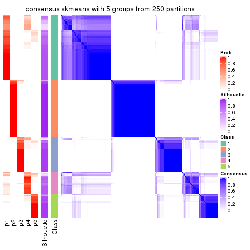</p>

</div>
<div id='tab-ATC-skmeans-consensus-heatmap-5'>
<pre><code class="r">consensus_heatmap(res, k = 6)
</code></pre>

<p></p>

</div>
</div>

Heatmaps for the membership of samples in all partitions to see how consistent they are:


<script>
$( function() {
	$( '#tabs-ATC-skmeans-membership-heatmap' ).tabs();
} );
</script>
<div id='tabs-ATC-skmeans-membership-heatmap'>
<ul>
<li><a href='#tab-ATC-skmeans-membership-heatmap-1'>k = 2</a></li>
<li><a href='#tab-ATC-skmeans-membership-heatmap-2'>k = 3</a></li>
<li><a href='#tab-ATC-skmeans-membership-heatmap-3'>k = 4</a></li>
<li><a href='#tab-ATC-skmeans-membership-heatmap-4'>k = 5</a></li>
<li><a href='#tab-ATC-skmeans-membership-heatmap-5'>k = 6</a></li>
</ul>
<div id='tab-ATC-skmeans-membership-heatmap-1'>
<pre><code class="r">membership_heatmap(res, k = 2)
</code></pre>

<p></p>

</div>
<div id='tab-ATC-skmeans-membership-heatmap-2'>
<pre><code class="r">membership_heatmap(res, k = 3)
</code></pre>

<p></p>

</div>
<div id='tab-ATC-skmeans-membership-heatmap-3'>
<pre><code class="r">membership_heatmap(res, k = 4)
</code></pre>

<p></p>

</div>
<div id='tab-ATC-skmeans-membership-heatmap-4'>
<pre><code class="r">membership_heatmap(res, k = 5)
</code></pre>

<p></p>

</div>
<div id='tab-ATC-skmeans-membership-heatmap-5'>
<pre><code class="r">membership_heatmap(res, k = 6)
</code></pre>

<p></p>

</div>
</div>

As soon as we have had the classes for columns, we can look for signatures
which are significantly different between classes which can be candidate marks
for certain classes. Following are the heatmaps for signatures.


Signature heatmaps where rows are scaled:


<script>
$( function() {
	$( '#tabs-ATC-skmeans-get-signatures' ).tabs();
} );
</script>
<div id='tabs-ATC-skmeans-get-signatures'>
<ul>
<li><a href='#tab-ATC-skmeans-get-signatures-1'>k = 2</a></li>
<li><a href='#tab-ATC-skmeans-get-signatures-2'>k = 3</a></li>
<li><a href='#tab-ATC-skmeans-get-signatures-3'>k = 4</a></li>
<li><a href='#tab-ATC-skmeans-get-signatures-4'>k = 5</a></li>
<li><a href='#tab-ATC-skmeans-get-signatures-5'>k = 6</a></li>
</ul>
<div id='tab-ATC-skmeans-get-signatures-1'>
<pre><code class="r">get_signatures(res, k = 2)
</code></pre>

<p></p>

</div>
<div id='tab-ATC-skmeans-get-signatures-2'>
<pre><code class="r">get_signatures(res, k = 3)
</code></pre>

<p></p>

</div>
<div id='tab-ATC-skmeans-get-signatures-3'>
<pre><code class="r">get_signatures(res, k = 4)
</code></pre>

<p></p>

</div>
<div id='tab-ATC-skmeans-get-signatures-4'>
<pre><code class="r">get_signatures(res, k = 5)
</code></pre>

<p></p>

</div>
<div id='tab-ATC-skmeans-get-signatures-5'>
<pre><code class="r">get_signatures(res, k = 6)
</code></pre>

<p></p>

</div>
</div>


Signature heatmaps where rows are not scaled:


<script>
$( function() {
	$( '#tabs-ATC-skmeans-get-signatures-no-scale' ).tabs();
} );
</script>
<div id='tabs-ATC-skmeans-get-signatures-no-scale'>
<ul>
<li><a href='#tab-ATC-skmeans-get-signatures-no-scale-1'>k = 2</a></li>
<li><a href='#tab-ATC-skmeans-get-signatures-no-scale-2'>k = 3</a></li>
<li><a href='#tab-ATC-skmeans-get-signatures-no-scale-3'>k = 4</a></li>
<li><a href='#tab-ATC-skmeans-get-signatures-no-scale-4'>k = 5</a></li>
<li><a href='#tab-ATC-skmeans-get-signatures-no-scale-5'>k = 6</a></li>
</ul>
<div id='tab-ATC-skmeans-get-signatures-no-scale-1'>
<pre><code class="r">get_signatures(res, k = 2, scale_rows = FALSE)
</code></pre>

<p></p>

</div>
<div id='tab-ATC-skmeans-get-signatures-no-scale-2'>
<pre><code class="r">get_signatures(res, k = 3, scale_rows = FALSE)
</code></pre>

<p></p>

</div>
<div id='tab-ATC-skmeans-get-signatures-no-scale-3'>
<pre><code class="r">get_signatures(res, k = 4, scale_rows = FALSE)
</code></pre>

<p></p>

</div>
<div id='tab-ATC-skmeans-get-signatures-no-scale-4'>
<pre><code class="r">get_signatures(res, k = 5, scale_rows = FALSE)
</code></pre>

<p></p>

</div>
<div id='tab-ATC-skmeans-get-signatures-no-scale-5'>
<pre><code class="r">get_signatures(res, k = 6, scale_rows = FALSE)
</code></pre>

<p></p>

</div>
</div>


Compare the overlap of signatures from different k:

```r
compare_signatures(res)
```


`get_signature()` returns a data frame invisibly. TO get the list of signatures, the function
call should be assigned to a variable explicitly. In following code, if `plot` argument is set
to `FALSE`, no heatmap is plotted while only the differential analysis is performed.

```r
# code only for demonstration
tb = get_signature(res, k = ..., plot = FALSE)
```

An example of the output of `tb` is:

```
#>   which_row         fdr    mean_1    mean_2 scaled_mean_1 scaled_mean_2 km
#> 1        38 0.042760348  8.373488  9.131774    -0.5533452     0.5164555  1
#> 2        40 0.018707592  7.106213  8.469186    -0.6173731     0.5762149  1
#> 3        55 0.019134737 10.221463 11.207825    -0.6159697     0.5749050  1
#> 4        59 0.006059896  5.921854  7.869574    -0.6899429     0.6439467  1
#> 5        60 0.018055526  8.928898 10.211722    -0.6204761     0.5791110  1
#> 6        98 0.009384629 15.714769 14.887706     0.6635654    -0.6193277  2
...
```

The columns in `tb` are:

1. `which_row`: row indices corresponding to the input matrix.
2. `fdr`: FDR for the differential test. 
3. `mean_x`: The mean value in group x.
4. `scaled_mean_x`: The mean value in group x after rows are scaled.
5. `km`: Row groups if k-means clustering is applied to rows.


UMAP plot which shows how samples are separated.


<script>
$( function() {
	$( '#tabs-ATC-skmeans-dimension-reduction' ).tabs();
} );
</script>
<div id='tabs-ATC-skmeans-dimension-reduction'>
<ul>
<li><a href='#tab-ATC-skmeans-dimension-reduction-1'>k = 2</a></li>
<li><a href='#tab-ATC-skmeans-dimension-reduction-2'>k = 3</a></li>
<li><a href='#tab-ATC-skmeans-dimension-reduction-3'>k = 4</a></li>
<li><a href='#tab-ATC-skmeans-dimension-reduction-4'>k = 5</a></li>
<li><a href='#tab-ATC-skmeans-dimension-reduction-5'>k = 6</a></li>
</ul>
<div id='tab-ATC-skmeans-dimension-reduction-1'>
<pre><code class="r">dimension_reduction(res, k = 2, method = &quot;UMAP&quot;)
</code></pre>

<p></p>

</div>
<div id='tab-ATC-skmeans-dimension-reduction-2'>
<pre><code class="r">dimension_reduction(res, k = 3, method = &quot;UMAP&quot;)
</code></pre>

<p></p>

</div>
<div id='tab-ATC-skmeans-dimension-reduction-3'>
<pre><code class="r">dimension_reduction(res, k = 4, method = &quot;UMAP&quot;)
</code></pre>

<p></p>

</div>
<div id='tab-ATC-skmeans-dimension-reduction-4'>
<pre><code class="r">dimension_reduction(res, k = 5, method = &quot;UMAP&quot;)
</code></pre>

<p></p>

</div>
<div id='tab-ATC-skmeans-dimension-reduction-5'>
<pre><code class="r">dimension_reduction(res, k = 6, method = &quot;UMAP&quot;)
</code></pre>

<p></p>

</div>
</div>


Following heatmap shows how subgroups are split when increasing `k`:

```r
collect_classes(res)
```


If matrix rows can be associated to genes, consider to use `GO_Enrichment(res,
...)` to perform function enrichment for the signature genes.


 

---------------------------------------------------


### ATC:pam**


The object with results only for a single top-value method and a single partition method 
can be extracted as:

```r
res = res_list["ATC", "pam"]
# you can also extract it by
# res = res_list["ATC:pam"]
```

A summary of `res` and all the functions that can be applied to it:

```r
res
```

```
#> A 'ConsensusPartition' object with k = 2, 3, 4, 5, 6.
#>   On a matrix with 17377 rows and 265 columns.
#>   Top rows (1000, 2000, 3000, 4000, 5000) are extracted by 'ATC' method.
#>   Subgroups are detected by 'pam' method.
#>   Performed in total 1250 partitions by row resampling.
#>   Best k for subgroups seems to be 2.
#> 
#> Following methods can be applied to this 'ConsensusPartition' object:
#>  [1] "cola_report"             "collect_classes"         "collect_plots"          
#>  [4] "collect_stats"           "colnames"                "compare_signatures"     
#>  [7] "consensus_heatmap"       "dimension_reduction"     "functional_enrichment"  
#> [10] "get_anno_col"            "get_anno"                "get_classes"            
#> [13] "get_consensus"           "get_matrix"              "get_membership"         
#> [16] "get_param"               "get_signatures"          "get_stats"              
#> [19] "is_best_k"               "is_stable_k"             "membership_heatmap"     
#> [22] "ncol"                    "nrow"                    "plot_ecdf"              
#> [25] "rownames"                "select_partition_number" "show"                   
#> [28] "suggest_best_k"          "test_to_known_factors"
```

`collect_plots()` function collects all the plots made from `res` for all `k` (number of partitions)
into one single page to provide an easy and fast comparison between different `k`.

```r
collect_plots(res)
```


The plots are:

- The first row: a plot of the ECDF (Empirical cumulative distribution
  function) curves of the consensus matrix for each `k` and the heatmap of
  predicted classes for each `k`.
- The second row: heatmaps of the consensus matrix for each `k`.
- The third row: heatmaps of the membership matrix for each `k`.
- The fouth row: heatmaps of the signatures for each `k`.

All the plots in panels can be made by individual functions and they are
plotted later in this section.

`select_partition_number()` produces several plots showing different
statistics for choosing "optimized" `k`. There are following statistics:

- ECDF curves of the consensus matrix for each `k`;
- 1-PAC. [The PAC
  score](https://en.wikipedia.org/wiki/Consensus_clustering#Over-interpretation_potential_of_consensus_clustering)
  measures the proportion of the ambiguous subgrouping.
- Mean silhouette score.
- Concordance. The mean probability of fiting the consensus class ids in all
  partitions.
- Area increased. Denote $A_k$ as the area under the ECDF curve for current
  `k`, the area increased is defined as $A_k - A_{k-1}$.
- Rand index. The percent of pairs of samples that are both in a same cluster
  or both are not in a same cluster in the partition of k and k-1.
- Jaccard index. The ratio of pairs of samples are both in a same cluster in
  the partition of k and k-1 and the pairs of samples are both in a same
  cluster in the partition k or k-1.

The detailed explanations of these statistics can be found in [the cola
vignette](http://bioconductor.org/packages/devel/bioc/vignettes/cola/inst/doc/cola.html#toc_13).

Generally speaking, lower PAC score, higher mean silhouette score or higher
concordance corresponds to better partition. Rand index and Jaccard index
measure how similar the current partition is compared to partition with `k-1`.
If they are too similar, we won't accept `k` is better than `k-1`.

```r
select_partition_number(res)
```


The numeric values for all these statistics can be obtained by `get_stats()`.

```r
get_stats(res)
```

```
#>   k 1-PAC mean_silhouette concordance area_increased  Rand Jaccard
#> 2 2 0.984           0.967       0.985         0.4689 0.528   0.528
#> 3 3 0.810           0.858       0.936         0.3747 0.672   0.455
#> 4 4 0.734           0.813       0.906         0.1426 0.838   0.575
#> 5 5 0.842           0.810       0.920         0.0579 0.947   0.797
#> 6 6 0.780           0.678       0.841         0.0361 0.935   0.739
```

`suggest_best_k()` suggests the best $k$ based on these statistics. The rules are as follows:

- All $k$ with Jaccard index larger than 0.95 are removed because the increase of
  the partition number does not provides enough extra information. If all $k$ are removed,
  the best $k$ is assigned by `NA`.
- For $k$ with 1-PAC larger than 0.9, the maximal $k$ is taken as the "best k". Other $k$ is called "optional k".
- If it does not fit the second rule. The $k$ with the highest vote of highest
  1-PAC, mean silhouette and concordance is taken as the "best k".

```r
suggest_best_k(res)
```

```
#> [1] 2
```


Following shows the table of the partitions (You need to click the **show/hide
code output** link to see it). The membership matrix (columns with name `p*`)
is inferred by
[`clue::cl_consensus()`](https://www.rdocumentation.org/link/cl_consensus?package=clue)
function with the `SE` method. Basically the value in the membership matrix
represents the probability to belong to a certain group. The finall class
label for an item is determined with the group with highest probability it
belongs to.

In `get_classes()` function, the entropy is calculated from the membership
matrix and the silhouette score is calculated from the consensus matrix.


<script>
$( function() {
	$( '#tabs-ATC-pam-get-classes' ).tabs();
} );
</script>
<div id='tabs-ATC-pam-get-classes'>
<ul>
<li><a href='#tab-ATC-pam-get-classes-1'>k = 2</a></li>
<li><a href='#tab-ATC-pam-get-classes-2'>k = 3</a></li>
<li><a href='#tab-ATC-pam-get-classes-3'>k = 4</a></li>
<li><a href='#tab-ATC-pam-get-classes-4'>k = 5</a></li>
<li><a href='#tab-ATC-pam-get-classes-5'>k = 6</a></li>
</ul>

<div id='tab-ATC-pam-get-classes-1'>
<p><a id='tab-ATC-pam-get-classes-1-a' style='color:#0366d6' href='#'>show/hide code output</a></p>
<pre><code class="r">cbind(get_classes(res, k = 2), get_membership(res, k = 2))
</code></pre>

<pre><code>#&gt;                                      class entropy silhouette    p1    p2
#&gt; D30CF518-5FC6-4A54-8D5D-BA420EA1836D     2  0.0000      0.973 0.000 1.000
#&gt; 92298FF7-1215-4756-B976-A7D88B91AD76     1  0.0000      0.992 1.000 0.000
#&gt; 0E244FE2-7C17-4642-A51F-2CCA796D9C70     2  0.0000      0.973 0.000 1.000
#&gt; 75435ED8-93E8-45FB-8480-98D8EB2EF8CB     2  0.0000      0.973 0.000 1.000
#&gt; B6D11678-15A9-4F43-A0A2-225067DCAF1C     1  0.0000      0.992 1.000 0.000
#&gt; B7F5A41E-9559-4329-81F5-1B88A74730B7     2  0.0000      0.973 0.000 1.000
#&gt; 39414B2A-7FB0-4669-8DFE-86D9AF7AD2D9     1  0.0000      0.992 1.000 0.000
#&gt; 04823F53-A12D-4852-8F34-77B9DCBB7DF0     2  0.0000      0.973 0.000 1.000
#&gt; 49684C2B-D31C-4B45-A400-3497C3CCEC01     2  0.0000      0.973 0.000 1.000
#&gt; 96A04875-58E2-4BE7-8E0F-CAB55F4CA54F     1  0.0000      0.992 1.000 0.000
#&gt; 1F101D63-478B-40B9-A951-DC3887CFF067     1  0.0000      0.992 1.000 0.000
#&gt; DD290860-E0B7-48FC-BE12-2AF729994C21     2  0.0000      0.973 0.000 1.000
#&gt; FFDD7A12-DDEF-4974-8D60-64B7EEAAC994     2  0.0000      0.973 0.000 1.000
#&gt; E076A9A9-EA2A-4FF7-92A8-F2DA7F30279E     1  0.0000      0.992 1.000 0.000
#&gt; 830DFA6F-A85A-4317-82B2-791FAB998A01     2  0.0000      0.973 0.000 1.000
#&gt; 58578614-E4A3-4655-BBAB-F65851625E0A     1  0.0000      0.992 1.000 0.000
#&gt; 1CBFB672-4D66-430B-83F3-7CE3BE20ABF6     1  0.0000      0.992 1.000 0.000
#&gt; 6C34A7D7-3756-4DCC-9A9F-B5FC4A148B7E     2  0.7219      0.771 0.200 0.800
#&gt; D97ED7B4-5DF2-4B62-8796-AA51CA79DBBB     1  0.0000      0.992 1.000 0.000
#&gt; 45F15851-55F6-4169-834E-38958C38B6A9     1  0.0000      0.992 1.000 0.000
#&gt; 4139E0C9-F712-4A25-8B59-587533B93B3E     1  0.0000      0.992 1.000 0.000
#&gt; 2C3007BF-009E-404F-A3BF-8B921698D85B     1  0.0000      0.992 1.000 0.000
#&gt; 2189F8E5-FF98-4C1A-BD04-5595DB553130     1  0.0000      0.992 1.000 0.000
#&gt; FFAA0310-0D78-4499-8FB8-5BC46E4FCE58     1  0.0000      0.992 1.000 0.000
#&gt; 0C375B2F-67BE-4708-BEB2-544DEC812DCA     2  0.0000      0.973 0.000 1.000
#&gt; AB6324A1-19AB-400C-8001-54765D190E27     2  0.0000      0.973 0.000 1.000
#&gt; A32C4DCD-DC4C-4132-9ED1-B159F5561A2D     1  0.0000      0.992 1.000 0.000
#&gt; 2AE7105D-D494-45B0-947A-315D8C20ECDC     1  0.0000      0.992 1.000 0.000
#&gt; 60FE9D59-FC0F-4B9C-ABF8-1C00BC761928     1  0.0000      0.992 1.000 0.000
#&gt; 056442DC-E87A-4315-965C-C19D7B4FC40E     1  0.0000      0.992 1.000 0.000
#&gt; 455111E5-18EF-4E3F-9DFF-8FA017D92461     2  0.8144      0.693 0.252 0.748
#&gt; 10632BC6-0B81-433C-8832-6B2ABC73A94B     1  0.0000      0.992 1.000 0.000
#&gt; AC6F82AD-C682-4EB3-BEC3-FD950F57609D     1  0.0000      0.992 1.000 0.000
#&gt; D9ABDB75-04DA-4D33-A69F-701729494533     1  0.0000      0.992 1.000 0.000
#&gt; 27BBF44D-F4D7-4C5A-935F-3310A363A670     2  0.0000      0.973 0.000 1.000
#&gt; E7AA12EE-6E14-4B33-A52C-B13589436023     1  0.0000      0.992 1.000 0.000
#&gt; DFA6D41A-D231-413E-A180-E42DF26C3E2B     1  0.0000      0.992 1.000 0.000
#&gt; 655BD3AF-5094-4B19-93A8-401C70369B17     1  0.0000      0.992 1.000 0.000
#&gt; 9DFEF253-923F-4EE2-8E3D-C75805387B20     1  0.0000      0.992 1.000 0.000
#&gt; 3B0EE948-B2CD-4191-90E2-BDD155F3B580     1  0.0000      0.992 1.000 0.000
#&gt; 177C7EF4-2D54-4555-947C-44EE7C688917     2  0.7219      0.771 0.200 0.800
#&gt; 1F8E8BB7-D159-4556-8B04-E5DD027CC444     2  0.0000      0.973 0.000 1.000
#&gt; 619F37D2-6771-4727-9079-56BED07F1CF6     1  0.0000      0.992 1.000 0.000
#&gt; ACAE29BE-ECB8-4A98-BC71-7A2D4857134E     2  0.6623      0.808 0.172 0.828
#&gt; C5C3241A-684C-4238-9333-9AF8630EC086     2  0.0000      0.973 0.000 1.000
#&gt; AD319DC2-140F-4E7B-A899-010687D8B714     2  0.0000      0.973 0.000 1.000
#&gt; 2AFF397C-ED2A-4FD9-A7F0-E4C61E9FB603     2  0.7453      0.754 0.212 0.788
#&gt; FB4C7892-3DBB-4148-AAE9-75B19A1A4031     1  0.0000      0.992 1.000 0.000
#&gt; 6F5C4500-1ED1-4E81-B4F5-EEA64CE2336A     1  0.0000      0.992 1.000 0.000
#&gt; BD027C69-3C10-4047-8E1E-218600FF2B73     2  0.7219      0.765 0.200 0.800
#&gt; 11B473A9-4CC5-461F-BC57-CC9141F3591D     1  0.0000      0.992 1.000 0.000
#&gt; 69A036E5-3E6A-4862-A7F8-2D203ED2FC9E     1  0.0000      0.992 1.000 0.000
#&gt; 9C0BDF24-F011-4855-B95A-1B6BEFA808F7     1  0.0000      0.992 1.000 0.000
#&gt; 9E205254-8C0C-4C05-AF5A-86E679CF732C     1  0.0000      0.992 1.000 0.000
#&gt; 935CCE4A-8AA8-454E-9DFF-7DE27D0BD2E2     1  0.0000      0.992 1.000 0.000
#&gt; 01E5E1FE-41D3-428B-90BC-7A000829E102     1  0.0000      0.992 1.000 0.000
#&gt; B344A530-92CD-468B-847A-DF8E25688081     2  0.0000      0.973 0.000 1.000
#&gt; F79F32A7-9F7B-4D62-8426-4A4CF10ED319     1  0.0000      0.992 1.000 0.000
#&gt; C2E1C6FA-82F9-467C-99AE-9B39FAAC810C     1  0.0000      0.992 1.000 0.000
#&gt; BF7CD9BD-776A-4957-8A6E-EF8AD83EA9D3     2  0.0000      0.973 0.000 1.000
#&gt; 8A2C1409-E83B-435E-A20F-5FCA94801C9F     2  0.0000      0.973 0.000 1.000
#&gt; B6BEFFB5-2F62-477B-A4C8-478D29577CBD     2  0.0000      0.973 0.000 1.000
#&gt; 8622CBD0-F8E9-4AC1-8175-CC9A742B86F9     1  0.0000      0.992 1.000 0.000
#&gt; 565DD660-ED58-4065-8619-260BEA6FCFEB     1  0.0000      0.992 1.000 0.000
#&gt; 96038E42-0FBA-497D-819C-38F7689F10FF     1  0.0000      0.992 1.000 0.000
#&gt; CA685549-F8BA-43F1-8461-5D2D3B17CFC5     1  0.0000      0.992 1.000 0.000
#&gt; 52020307-71A6-46E5-ACB3-8F885CA8F1EB     1  0.0000      0.992 1.000 0.000
#&gt; 7656DA98-76DC-424B-B02C-D7001DAAA0E4     1  0.0000      0.992 1.000 0.000
#&gt; 74DBA640-45E2-42A6-8F1E-69C073D66EE6     1  0.0000      0.992 1.000 0.000
#&gt; 251094BE-C33D-44F0-BD98-8618D71F520C     1  0.0000      0.992 1.000 0.000
#&gt; AB914CC5-5FF1-4257-A353-6A99D11B9478     1  0.0000      0.992 1.000 0.000
#&gt; 38B8B893-0E08-4B71-B51C-B32A7B2724E0     1  0.0000      0.992 1.000 0.000
#&gt; 7C7CD8FF-99A4-41D7-B7E1-5A517001F551     2  0.0000      0.973 0.000 1.000
#&gt; BFC5B75A-E4AE-486B-BA30-23BBAA33A125     2  0.6148      0.827 0.152 0.848
#&gt; 182AC78E-A07C-4B34-B216-B5F573E9F036     1  0.0000      0.992 1.000 0.000
#&gt; B38C5F72-8F46-4531-9C2D-96EEE07A5B22     2  0.0000      0.973 0.000 1.000
#&gt; DB9333A6-A723-4B8F-9221-25B8B23D5126     1  0.0000      0.992 1.000 0.000
#&gt; CD67DD21-C1B6-4D58-AC8E-1F4536C7DA70     2  0.0000      0.973 0.000 1.000
#&gt; 3D76A56E-4B66-48AE-AA60-D9C1004C7140     1  0.0000      0.992 1.000 0.000
#&gt; 71ED572F-7780-47A4-A9F8-D320C737690D     1  0.0000      0.992 1.000 0.000
#&gt; B449FEA1-C4B0-400F-903C-59E13D0BA313     2  0.0000      0.973 0.000 1.000
#&gt; 3F120E90-1486-4215-B9B9-79D5B413CAAC     2  0.5946      0.841 0.144 0.856
#&gt; A071894B-D8C0-4740-BD55-93EA0C86EDF7     1  0.0000      0.992 1.000 0.000
#&gt; 58848D57-D7A9-4ABB-86A2-A8AE2B23F654     1  0.0000      0.992 1.000 0.000
#&gt; CD6F9E20-B301-4663-87EC-953EDF49754F     2  0.0000      0.973 0.000 1.000
#&gt; 367D89F3-D527-4929-B830-8B6D553DF9E1     1  0.0000      0.992 1.000 0.000
#&gt; BE8D7DCB-648B-42DD-9FA8-8B85B5D816B2     1  0.0000      0.992 1.000 0.000
#&gt; AA46F56B-BD9C-40A4-8EA8-35E2568C964D     2  0.0000      0.973 0.000 1.000
#&gt; 6393220A-7C57-413F-81A8-4E38C21E779E     2  0.0000      0.973 0.000 1.000
#&gt; 89AE566C-F65F-43C2-BA97-621A7AC8B6DC     1  0.0000      0.992 1.000 0.000
#&gt; AA6A4BFF-8C62-4B70-B85A-9EDF403B06BA     1  0.0000      0.992 1.000 0.000
#&gt; BCE877A6-9C65-4495-A45D-05753F2D0E15     1  0.0000      0.992 1.000 0.000
#&gt; D7BDDF49-C54B-4F8E-ACA0-C3684AB68B5C     1  0.7950      0.677 0.760 0.240
#&gt; D0800D49-0033-44B2-8D7B-29B16F87ADA6     2  0.0000      0.973 0.000 1.000
#&gt; 151D60B5-5AF1-4B61-B97F-ABC7531D9F89     1  0.0000      0.992 1.000 0.000
#&gt; CBBAEB5B-25FA-4B6D-A40C-357E37033E36     1  0.0000      0.992 1.000 0.000
#&gt; 317CD049-3151-40B7-8E88-B0B8813338D6     1  0.0000      0.992 1.000 0.000
#&gt; 93835C77-F8FA-4928-843C-8016A91881FA     1  0.0000      0.992 1.000 0.000
#&gt; 02A6950F-647D-4F20-B2D0-0238C1441C70     1  0.0000      0.992 1.000 0.000
#&gt; 4D54E415-134F-4F6F-8718-3E0475EF5477     1  0.0000      0.992 1.000 0.000
#&gt; 82AB290A-3993-45E5-8B15-6125A019778C     1  0.0000      0.992 1.000 0.000
#&gt; 3B5EAD14-E506-4A22-804D-BF925A2D5247     2  0.0000      0.973 0.000 1.000
#&gt; 19CF7DDF-4F3A-4D2F-B84A-6451A5C3112C     2  0.2423      0.941 0.040 0.960
#&gt; 2FB00DAA-C274-42B1-A06B-611FE5E96844     1  0.0000      0.992 1.000 0.000
#&gt; 2B1F01C3-8145-4296-8111-2B0474AB9A2C     2  0.0000      0.973 0.000 1.000
#&gt; 3F0865F1-8256-4778-966F-D53637B415B6     1  0.2778      0.943 0.952 0.048
#&gt; 5473210D-37F9-4192-86D2-E2A2C77F3BD2     2  0.0000      0.973 0.000 1.000
#&gt; 5EDB6ACF-4F3F-471A-9DDC-661607CACCC4     1  0.0000      0.992 1.000 0.000
#&gt; 6A252A3A-7EEB-47B6-9C23-D69BD2EA846F     2  0.6343      0.823 0.160 0.840
#&gt; 0A7FFCBB-4BAA-4A5F-8B2D-B427C4D982A8     1  0.0000      0.992 1.000 0.000
#&gt; 1603AFB8-5AD7-4794-9991-BDBE96B4D997     2  0.0000      0.973 0.000 1.000
#&gt; 644299E9-62B7-4DFE-9E6D-D7556A01B40A     1  0.0000      0.992 1.000 0.000
#&gt; EF12E923-1860-4269-B57B-BA6238FA4403     1  0.0000      0.992 1.000 0.000
#&gt; 51B7241E-F0BE-482A-88AE-89004BB68989     1  0.0000      0.992 1.000 0.000
#&gt; 1C007DF3-8A9F-4940-9A4C-DE2A412BB023     2  0.0000      0.973 0.000 1.000
#&gt; 89FCFDE6-9625-432C-AA35-9C5FCCF40031     1  0.9552      0.370 0.624 0.376
#&gt; 7955FC55-386D-497E-AFED-019BBBAD428E     1  0.0000      0.992 1.000 0.000
#&gt; 37FF09ED-73EC-4D10-B2AC-7D8EBA9304ED     1  0.0000      0.992 1.000 0.000
#&gt; C2CD2742-2FB4-468E-90FF-8F65A5C425A9     1  0.0000      0.992 1.000 0.000
#&gt; 766FE08F-3393-4868-B1C1-FA98C9FF16E0     1  0.0000      0.992 1.000 0.000
#&gt; 63E2B578-2221-4255-8C45-7FD030B1C94D     1  0.1184      0.977 0.984 0.016
#&gt; C14B1A44-43F7-45F0-A583-5667A4D3BD95     1  0.0000      0.992 1.000 0.000
#&gt; D9CB551A-CE20-4BF7-8AC9-839112346C3D     1  0.0000      0.992 1.000 0.000
#&gt; 05BAA71A-E5B3-4A3A-A3F2-013A975087F0     2  0.0000      0.973 0.000 1.000
#&gt; AC8DA7DE-4D83-4768-BEFD-9A1B2DA943CE     2  0.0000      0.973 0.000 1.000
#&gt; E89DCE9D-F8A5-499C-85BB-BB500BADB9FB     1  0.0000      0.992 1.000 0.000
#&gt; C16F9B5E-2B52-40F6-856D-C0D6FBDD16C1     1  0.0000      0.992 1.000 0.000
#&gt; 8FF234D4-823A-4C80-82F7-2E92D72DBF88     2  0.0000      0.973 0.000 1.000
#&gt; C9F94A6E-D104-4D8D-8EC5-EADECD85F092     1  0.0000      0.992 1.000 0.000
#&gt; 45C9756F-A154-4537-852E-ECBF27B92FE1     2  0.0000      0.973 0.000 1.000
#&gt; 0F1A5708-341E-4713-BC70-76D702F826D6     2  0.9248      0.524 0.340 0.660
#&gt; 2ECFBCA0-AB35-461A-A4B5-C60B2651A962     2  0.0000      0.973 0.000 1.000
#&gt; 7DFAC404-3AB3-4274-A533-CFDAF4CE122D     1  0.0000      0.992 1.000 0.000
#&gt; A90AF55C-4386-42AB-A812-9230026EA5A5     2  0.0000      0.973 0.000 1.000
#&gt; 6258A757-4E18-4CD1-8417-189521E990B6     2  0.0000      0.973 0.000 1.000
#&gt; EBFAD137-050F-47D0-A43D-72B8F7D70C2B     1  0.0000      0.992 1.000 0.000
#&gt; 08B5EBFB-2807-4229-95A6-81AB7F377A56     2  0.0000      0.973 0.000 1.000
#&gt; 4780A59C-0589-4995-B044-3201F09AF859     1  0.0000      0.992 1.000 0.000
#&gt; 0AB81429-C287-48AA-9035-3A7A6F4C7328     2  0.0000      0.973 0.000 1.000
#&gt; 20C4D047-28DA-4AB7-9B3C-32EDA6B22C9D     2  0.0000      0.973 0.000 1.000
#&gt; 77C4E01F-84A6-4BFD-AA8E-D7875456F546     2  0.0000      0.973 0.000 1.000
#&gt; 8B28383F-CF14-4CC5-A1E2-72AD915C0AE8     1  0.0000      0.992 1.000 0.000
#&gt; E12E1F48-6A52-4F74-925C-C4EE1BF5C573     2  0.0000      0.973 0.000 1.000
#&gt; 9B179BC5-BB4C-4CEE-99BC-BC552BC384A1     1  0.0000      0.992 1.000 0.000
#&gt; 5548C91A-D3DE-48F5-B4A4-124BE177B99A     1  0.0000      0.992 1.000 0.000
#&gt; 0E22B729-C381-4B0C-9897-62DD38F51722     1  0.0000      0.992 1.000 0.000
#&gt; 7BC4937F-04E2-4B46-BA7C-FE9AC738C8A9     1  0.0000      0.992 1.000 0.000
#&gt; EE6A0D3F-3F8A-4AA8-B3EF-32372EF37A29     1  0.0000      0.992 1.000 0.000
#&gt; 08AC2706-7651-409F-BE6B-BCED1C2D1796     1  0.0000      0.992 1.000 0.000
#&gt; A68B078D-8979-4070-BB4D-F526704ED3DC     1  0.0000      0.992 1.000 0.000
#&gt; C319A5EE-69FA-4AAB-85A9-2EAAD8E4C703     1  0.0000      0.992 1.000 0.000
#&gt; 0D7CAABD-D20C-4F82-BCBC-8B7276E8EDE2     1  0.0000      0.992 1.000 0.000
#&gt; 09444DCC-44BA-4A3F-ACC5-863A54578B9F     2  0.0000      0.973 0.000 1.000
#&gt; 2E32B047-C6E1-4743-A6C8-E98370A32145     1  0.0000      0.992 1.000 0.000
#&gt; 6A6878A7-76B2-40DE-958B-804442AC6A5D     1  0.0000      0.992 1.000 0.000
#&gt; 39F27293-0BFF-4EA2-8439-A299E3226D20     2  0.6148      0.832 0.152 0.848
#&gt; 7EAE9C30-6080-405F-A7E6-1FED57674279     1  0.0000      0.992 1.000 0.000
#&gt; 79499169-A093-4E0A-B6BD-010CD7BE5035     1  0.0000      0.992 1.000 0.000
#&gt; 1F8BF4E8-BD84-4EFE-9E3E-89E7CE8FA72D     2  0.0000      0.973 0.000 1.000
#&gt; 62B7988F-98E5-4AB8-8A16-D661A07455E8     1  0.0000      0.992 1.000 0.000
#&gt; B7005B5F-217E-4073-BFB5-CE7E884B80C0     2  0.0000      0.973 0.000 1.000
#&gt; B981568F-2C08-4696-B589-E157A49BE72B     2  0.0000      0.973 0.000 1.000
#&gt; A3D85C0A-3202-40C2-88E1-052AC6C5184B     1  0.0000      0.992 1.000 0.000
#&gt; 4CA783B9-9B99-46B8-962A-77194ECB7942     1  0.0000      0.992 1.000 0.000
#&gt; D4024B08-4879-47EA-99E5-D9FCE1CD40DF     1  0.0000      0.992 1.000 0.000
#&gt; 1D41CDA2-0B29-48FD-B83A-E60C174DBCB3     1  0.0000      0.992 1.000 0.000
#&gt; A1923B2A-B233-4760-8AF9-C04C1CAEB100     1  0.0000      0.992 1.000 0.000
#&gt; 80880D71-BFDE-4D88-892F-5ADF27A38940     2  0.0000      0.973 0.000 1.000
#&gt; 55D1629D-30FD-49AA-88CE-EA3CA9B30A3F     2  0.0000      0.973 0.000 1.000
#&gt; B71C409E-926D-48AD-8BD8-9F707CA4FB01     2  0.0000      0.973 0.000 1.000
#&gt; 54A92C57-BD19-4A47-BA76-3ACA2DC36212     1  0.0000      0.992 1.000 0.000
#&gt; B2AB74B8-506C-4C27-9105-E86A6AAA89D4     1  0.0000      0.992 1.000 0.000
#&gt; 0356AE49-7A5C-42CC-A39C-7C8DFBFF8842     2  0.0000      0.973 0.000 1.000
#&gt; ACA260A3-DC3F-4FF4-B9C5-2D4BC4F81783     1  0.0000      0.992 1.000 0.000
#&gt; 9B440917-E5A4-43B9-A48D-6ABFEDCA6CFD     1  0.0000      0.992 1.000 0.000
#&gt; 47464828-52EA-413B-B30C-BD8B55903D78     2  0.0000      0.973 0.000 1.000
#&gt; C1D1FC82-B50D-4C82-8F03-06CEE3C08D18     1  0.0000      0.992 1.000 0.000
#&gt; E5ABFC43-E2A3-4B1A-BBA3-8196C0B026A5     1  0.9933      0.128 0.548 0.452
#&gt; 1D3C16CC-D0D5-4637-AAC7-91672DFF3317     1  0.0000      0.992 1.000 0.000
#&gt; 4D038320-ADEA-4990-8371-68B4B8162E1A     2  0.0000      0.973 0.000 1.000
#&gt; A75594CC-3E49-4869-8656-BBB4E72BF59D     2  0.0000      0.973 0.000 1.000
#&gt; 7CABAA19-5FB2-4A58-BDA3-4F1FFB532C20     1  0.0000      0.992 1.000 0.000
#&gt; 534EF1E9-9513-426E-B41E-A394AB2E4410     2  0.0000      0.973 0.000 1.000
#&gt; 649F35A1-A08C-497D-A9B6-CB3084D5FB8D     1  0.0000      0.992 1.000 0.000
#&gt; 7CA30F3C-1C98-480C-B8B5-A248AABFB468     1  0.0000      0.992 1.000 0.000
#&gt; A9F8DA21-A802-44CF-9F5D-96A36687DCDD     1  0.0000      0.992 1.000 0.000
#&gt; A7AE1ED1-86CB-4A50-97B2-66785C7191FE     1  0.0000      0.992 1.000 0.000
#&gt; D0091AD4-D3D7-4C03-ACD9-DA9F8B6076C6     1  0.0000      0.992 1.000 0.000
#&gt; 46EE1C2B-13F7-44A7-B27E-4EBB9DF0CA83     2  0.0000      0.973 0.000 1.000
#&gt; CB9301B8-0282-43D6-AF5E-B753A9C7BFCB     2  0.0000      0.973 0.000 1.000
#&gt; A0E77A39-885A-4472-9A10-2D1E51DBFDA4     1  0.0000      0.992 1.000 0.000
#&gt; C06603C2-163D-40B6-A9FE-882424F18FE9     1  0.0000      0.992 1.000 0.000
#&gt; C3921A29-80FF-4B9D-B366-5C0238A42231     1  0.0000      0.992 1.000 0.000
#&gt; BB99B4E7-C834-4BB8-973F-8FA039E2798F     1  0.0000      0.992 1.000 0.000
#&gt; 5CD78C2F-05E9-409A-8405-3EE936A6876E     2  0.0000      0.973 0.000 1.000
#&gt; 6C126CC7-0C03-48F0-A2C2-F090CA239B70     2  0.0000      0.973 0.000 1.000
#&gt; 7118B08A-E94C-49F4-8D76-26455C34D85F     2  0.0000      0.973 0.000 1.000
#&gt; 266DAF30-CF3E-493E-8B24-3931D0039450     1  0.0000      0.992 1.000 0.000
#&gt; DAB5F5B9-4FE5-468F-AD2B-B39BBC4317A0     2  0.0672      0.967 0.008 0.992
#&gt; 9A9EB6D6-312E-4A98-8762-30D3ABD8193D     2  0.0000      0.973 0.000 1.000
#&gt; CED15676-B901-4FC8-9C8D-51E529D9441D     1  0.0000      0.992 1.000 0.000
#&gt; 827232CC-8035-440C-8B12-02C789C70B1B     2  0.0000      0.973 0.000 1.000
#&gt; 04D5FB28-FB50-4EAE-95FB-72ABF0E618CA     2  0.0000      0.973 0.000 1.000
#&gt; 6C96A851-97FC-4845-B895-D255191D9F25     1  0.0000      0.992 1.000 0.000
#&gt; 3EC982CB-D013-443E-B21D-39DE6B8EF370     2  0.0000      0.973 0.000 1.000
#&gt; 2E24A786-4370-42A1-AD50-D651F89819CC     2  0.0000      0.973 0.000 1.000
#&gt; 7653BFA9-ADA5-44CA-8555-807FBBFC6DE2     1  0.0000      0.992 1.000 0.000
#&gt; 7A110994-5741-4013-91F0-DD2E1D343F91     2  0.0000      0.973 0.000 1.000
#&gt; 0A760E0C-11C5-4201-8452-18DBC1FEACEB     1  0.0000      0.992 1.000 0.000
#&gt; 909B76A1-BB9F-4906-95BC-58CD1A46D3B8     2  0.0000      0.973 0.000 1.000
#&gt; A782EE71-EDA4-4385-83B3-D16DE81296C0     1  0.0000      0.992 1.000 0.000
#&gt; BD50E276-914F-4924-8CEA-FF47A66DB175     2  0.0000      0.973 0.000 1.000
#&gt; 505D5CA8-0279-4BC7-8CC0-8C7A0165BF91     2  0.0000      0.973 0.000 1.000
#&gt; D51FC997-E662-4AE7-BC9C-14183DA42DE1     2  0.0000      0.973 0.000 1.000
#&gt; 8AD67970-84F1-4C0A-B47A-8FA4108F9FE3     1  0.0000      0.992 1.000 0.000
#&gt; 6E33B1B6-7089-4BC3-B2B0-EC2C3B5D8B74     1  0.0000      0.992 1.000 0.000
#&gt; 88C4EA46-2546-401C-A8E7-603EECFDFBA0     1  0.0000      0.992 1.000 0.000
#&gt; 375D2D72-C998-4627-BA35-24E82A9A55FF     1  0.0000      0.992 1.000 0.000
#&gt; 76D0F834-7064-46C6-96F4-E861CF5452B6     2  0.0000      0.973 0.000 1.000
#&gt; 87159081-C97A-4004-AF0A-7EB6EF0EC47A     1  0.0000      0.992 1.000 0.000
#&gt; 24A57006-800B-4174-AF4E-7EA57A8A756E     1  0.0000      0.992 1.000 0.000
#&gt; AD68CBC6-8A13-4A65-AF62-E99AFA81D031     1  0.2778      0.943 0.952 0.048
#&gt; 22863A57-F066-4DD1-A859-4336F43D144C     1  0.0000      0.992 1.000 0.000
#&gt; 8F6F0362-9165-4DCC-992C-AF871A3C51E7     1  0.0000      0.992 1.000 0.000
#&gt; 76ABF0B7-E707-4DB2-9486-3814439BDBA5     1  0.0000      0.992 1.000 0.000
#&gt; BC72372F-3577-40E5-BA0F-41A084AA93AD     1  0.0000      0.992 1.000 0.000
#&gt; 8E566039-B56C-4F41-B9EF-DE18BEEF2C95     1  0.0000      0.992 1.000 0.000
#&gt; F096F016-3EF5-4A67-A7C2-8A45E1585232     1  0.0000      0.992 1.000 0.000
#&gt; BB37913E-534B-43DD-BE3D-E13B29FD8172     2  0.0000      0.973 0.000 1.000
#&gt; E344638F-9060-460F-8F7A-60D19442F294     2  0.0000      0.973 0.000 1.000
#&gt; 6A0EAAD0-89D5-4F12-8B45-9D5A25182FAD     1  0.0000      0.992 1.000 0.000
#&gt; A5199E3A-9D67-4543-88AB-24398C98E38E     1  0.0000      0.992 1.000 0.000
#&gt; 23917D52-7864-4F84-9C77-DF8EA9407345     2  0.0000      0.973 0.000 1.000
#&gt; 9AA96080-19D8-40C3-BDD1-6044D2D422D5     1  0.0000      0.992 1.000 0.000
#&gt; 0ED65D91-260C-4662-9903-EE36A2E3B2D0     2  0.0000      0.973 0.000 1.000
#&gt; 64BF1BC5-7A9A-4E1D-AEAB-AFE30B92AAF4     1  0.0000      0.992 1.000 0.000
#&gt; F02301F1-9054-4DC6-8DC9-2451A0F53EFC     2  0.0000      0.973 0.000 1.000
#&gt; 3264649A-5684-4181-83D0-A7E4D7E2E1FD     1  0.0000      0.992 1.000 0.000
#&gt; 3F8DA39C-BC9B-4343-8838-5CE271E80C51     1  0.0000      0.992 1.000 0.000
#&gt; BCC681CB-2AF4-4BB6-B53A-7544A2399454     1  0.0000      0.992 1.000 0.000
#&gt; DCB50E17-5E2D-443B-8DCC-272FBB734C2E     1  0.0000      0.992 1.000 0.000
#&gt; B5E47C38-CB6A-44C0-AA9B-56951B9EF78D     1  0.0000      0.992 1.000 0.000
#&gt; B15B0185-9C28-4A00-9CEC-05EFECEA6709     1  0.0000      0.992 1.000 0.000
#&gt; 61D4E8E7-0110-480A-A4A7-D406DE74C31E     1  0.0000      0.992 1.000 0.000
#&gt; CA8DB3AD-3F6B-4622-BF73-47041EC96E42     1  0.0000      0.992 1.000 0.000
#&gt; 5EECB1C4-172C-4494-871A-ADB650CD82BD     2  0.0000      0.973 0.000 1.000
#&gt; 019B857C-D4F7-4B67-B699-56E52A60805B     2  0.8081      0.699 0.248 0.752
#&gt; E9C28902-05C9-4883-97A4-D612D54E46B4     1  0.0000      0.992 1.000 0.000
#&gt; C5D3D9A0-FC14-408D-AB6C-662018A5E5CA     1  0.0000      0.992 1.000 0.000
#&gt; 7EB24744-509B-4854-B7D0-0BAFA210A345     2  0.0000      0.973 0.000 1.000
#&gt; B8B7A721-2284-40AB-98F5-EF1351C30B66     2  0.0000      0.973 0.000 1.000
#&gt; 3C12F39D-0D21-4F69-A539-4120B73C7A79     2  0.0000      0.973 0.000 1.000
#&gt; 08D3F984-6850-45B2-9DF9-EC7F5A4060A4     1  0.0000      0.992 1.000 0.000
#&gt; 9BD0EE79-1EED-4F6D-A5AB-43ADB8526F1E     1  0.1184      0.977 0.984 0.016
#&gt; E489A871-3CF4-4F3D-8EAF-63B507054201     2  0.0376      0.970 0.004 0.996
#&gt; 8CF8FD2E-1DBA-4257-9715-04D956D46B71     2  0.0000      0.973 0.000 1.000
#&gt; F6193AF0-7A19-46CB-A818-1B01E7460791     1  0.0000      0.992 1.000 0.000
#&gt; 96392D6B-D4FF-4393-93BA-08E469E8BBE1     1  0.0000      0.992 1.000 0.000
#&gt; DABCBE5A-C591-46A2-AF66-DA3DB6106751     1  0.0000      0.992 1.000 0.000
#&gt; 8B75F7D4-98D8-44DE-B19D-B733D6A031DB     1  0.0000      0.992 1.000 0.000
#&gt; AAD9685A-564B-42E9-91E3-431951154BA7     2  0.0000      0.973 0.000 1.000
#&gt; 90A43152-4E3B-4365-A39F-7B0E5CA66E55     2  0.6887      0.794 0.184 0.816
#&gt; EFB76FCF-AC9C-4852-B91C-E055DA666FA0     1  0.0000      0.992 1.000 0.000
#&gt; 6EBCFFE3-706F-440A-ABA9-012A924A07C6     2  0.0000      0.973 0.000 1.000
#&gt; E922A244-F1C8-4310-ABB2-62B06E022E4C     1  0.0000      0.992 1.000 0.000
</code></pre>

<script>
$('#tab-ATC-pam-get-classes-1-a').parent().next().next().hide();
$('#tab-ATC-pam-get-classes-1-a').click(function(){
  $('#tab-ATC-pam-get-classes-1-a').parent().next().next().toggle();
  return(false);
});
</script>
</div>

<div id='tab-ATC-pam-get-classes-2'>
<p><a id='tab-ATC-pam-get-classes-2-a' style='color:#0366d6' href='#'>show/hide code output</a></p>
<pre><code class="r">cbind(get_classes(res, k = 3), get_membership(res, k = 3))
</code></pre>

<pre><code>#&gt;                                      class entropy silhouette    p1    p2    p3
#&gt; D30CF518-5FC6-4A54-8D5D-BA420EA1836D     2  0.0000      0.971 0.000 1.000 0.000
#&gt; 92298FF7-1215-4756-B976-A7D88B91AD76     3  0.0000      0.933 0.000 0.000 1.000
#&gt; 0E244FE2-7C17-4642-A51F-2CCA796D9C70     2  0.0000      0.971 0.000 1.000 0.000
#&gt; 75435ED8-93E8-45FB-8480-98D8EB2EF8CB     2  0.0000      0.971 0.000 1.000 0.000
#&gt; B6D11678-15A9-4F43-A0A2-225067DCAF1C     1  0.5327      0.706 0.728 0.000 0.272
#&gt; B7F5A41E-9559-4329-81F5-1B88A74730B7     2  0.0000      0.971 0.000 1.000 0.000
#&gt; 39414B2A-7FB0-4669-8DFE-86D9AF7AD2D9     3  0.0592      0.924 0.012 0.000 0.988
#&gt; 04823F53-A12D-4852-8F34-77B9DCBB7DF0     2  0.0000      0.971 0.000 1.000 0.000
#&gt; 49684C2B-D31C-4B45-A400-3497C3CCEC01     2  0.0000      0.971 0.000 1.000 0.000
#&gt; 96A04875-58E2-4BE7-8E0F-CAB55F4CA54F     3  0.0000      0.933 0.000 0.000 1.000
#&gt; 1F101D63-478B-40B9-A951-DC3887CFF067     3  0.0000      0.933 0.000 0.000 1.000
#&gt; DD290860-E0B7-48FC-BE12-2AF729994C21     2  0.0000      0.971 0.000 1.000 0.000
#&gt; FFDD7A12-DDEF-4974-8D60-64B7EEAAC994     2  0.0000      0.971 0.000 1.000 0.000
#&gt; E076A9A9-EA2A-4FF7-92A8-F2DA7F30279E     1  0.0000      0.869 1.000 0.000 0.000
#&gt; 830DFA6F-A85A-4317-82B2-791FAB998A01     2  0.0000      0.971 0.000 1.000 0.000
#&gt; 58578614-E4A3-4655-BBAB-F65851625E0A     1  0.0000      0.869 1.000 0.000 0.000
#&gt; 1CBFB672-4D66-430B-83F3-7CE3BE20ABF6     3  0.0000      0.933 0.000 0.000 1.000
#&gt; 6C34A7D7-3756-4DCC-9A9F-B5FC4A148B7E     3  0.0747      0.922 0.000 0.016 0.984
#&gt; D97ED7B4-5DF2-4B62-8796-AA51CA79DBBB     1  0.5291      0.710 0.732 0.000 0.268
#&gt; 45F15851-55F6-4169-834E-38958C38B6A9     3  0.0000      0.933 0.000 0.000 1.000
#&gt; 4139E0C9-F712-4A25-8B59-587533B93B3E     1  0.0000      0.869 1.000 0.000 0.000
#&gt; 2C3007BF-009E-404F-A3BF-8B921698D85B     1  0.0000      0.869 1.000 0.000 0.000
#&gt; 2189F8E5-FF98-4C1A-BD04-5595DB553130     3  0.0000      0.933 0.000 0.000 1.000
#&gt; FFAA0310-0D78-4499-8FB8-5BC46E4FCE58     1  0.5733      0.648 0.676 0.000 0.324
#&gt; 0C375B2F-67BE-4708-BEB2-544DEC812DCA     2  0.0000      0.971 0.000 1.000 0.000
#&gt; AB6324A1-19AB-400C-8001-54765D190E27     2  0.0000      0.971 0.000 1.000 0.000
#&gt; A32C4DCD-DC4C-4132-9ED1-B159F5561A2D     3  0.0000      0.933 0.000 0.000 1.000
#&gt; 2AE7105D-D494-45B0-947A-315D8C20ECDC     1  0.6168      0.517 0.588 0.000 0.412
#&gt; 60FE9D59-FC0F-4B9C-ABF8-1C00BC761928     3  0.0000      0.933 0.000 0.000 1.000
#&gt; 056442DC-E87A-4315-965C-C19D7B4FC40E     1  0.0000      0.869 1.000 0.000 0.000
#&gt; 455111E5-18EF-4E3F-9DFF-8FA017D92461     3  0.0000      0.933 0.000 0.000 1.000
#&gt; 10632BC6-0B81-433C-8832-6B2ABC73A94B     1  0.3752      0.797 0.856 0.000 0.144
#&gt; AC6F82AD-C682-4EB3-BEC3-FD950F57609D     1  0.0000      0.869 1.000 0.000 0.000
#&gt; D9ABDB75-04DA-4D33-A69F-701729494533     3  0.0000      0.933 0.000 0.000 1.000
#&gt; 27BBF44D-F4D7-4C5A-935F-3310A363A670     2  0.0000      0.971 0.000 1.000 0.000
#&gt; E7AA12EE-6E14-4B33-A52C-B13589436023     3  0.0000      0.933 0.000 0.000 1.000
#&gt; DFA6D41A-D231-413E-A180-E42DF26C3E2B     1  0.3941      0.800 0.844 0.000 0.156
#&gt; 655BD3AF-5094-4B19-93A8-401C70369B17     1  0.4931      0.744 0.768 0.000 0.232
#&gt; 9DFEF253-923F-4EE2-8E3D-C75805387B20     1  0.6168      0.517 0.588 0.000 0.412
#&gt; 3B0EE948-B2CD-4191-90E2-BDD155F3B580     1  0.0000      0.869 1.000 0.000 0.000
#&gt; 177C7EF4-2D54-4555-947C-44EE7C688917     3  0.2165      0.882 0.000 0.064 0.936
#&gt; 1F8E8BB7-D159-4556-8B04-E5DD027CC444     2  0.0000      0.971 0.000 1.000 0.000
#&gt; 619F37D2-6771-4727-9079-56BED07F1CF6     3  0.0000      0.933 0.000 0.000 1.000
#&gt; ACAE29BE-ECB8-4A98-BC71-7A2D4857134E     3  0.5291      0.636 0.000 0.268 0.732
#&gt; C5C3241A-684C-4238-9333-9AF8630EC086     2  0.0000      0.971 0.000 1.000 0.000
#&gt; AD319DC2-140F-4E7B-A899-010687D8B714     2  0.0000      0.971 0.000 1.000 0.000
#&gt; 2AFF397C-ED2A-4FD9-A7F0-E4C61E9FB603     3  0.0000      0.933 0.000 0.000 1.000
#&gt; FB4C7892-3DBB-4148-AAE9-75B19A1A4031     3  0.0592      0.924 0.012 0.000 0.988
#&gt; 6F5C4500-1ED1-4E81-B4F5-EEA64CE2336A     1  0.0000      0.869 1.000 0.000 0.000
#&gt; BD027C69-3C10-4047-8E1E-218600FF2B73     2  0.5465      0.569 0.000 0.712 0.288
#&gt; 11B473A9-4CC5-461F-BC57-CC9141F3591D     3  0.0000      0.933 0.000 0.000 1.000
#&gt; 69A036E5-3E6A-4862-A7F8-2D203ED2FC9E     1  0.0000      0.869 1.000 0.000 0.000
#&gt; 9C0BDF24-F011-4855-B95A-1B6BEFA808F7     1  0.6168      0.517 0.588 0.000 0.412
#&gt; 9E205254-8C0C-4C05-AF5A-86E679CF732C     3  0.0000      0.933 0.000 0.000 1.000
#&gt; 935CCE4A-8AA8-454E-9DFF-7DE27D0BD2E2     3  0.0424      0.927 0.008 0.000 0.992
#&gt; 01E5E1FE-41D3-428B-90BC-7A000829E102     3  0.1860      0.883 0.052 0.000 0.948
#&gt; B344A530-92CD-468B-847A-DF8E25688081     3  0.5291      0.636 0.000 0.268 0.732
#&gt; F79F32A7-9F7B-4D62-8426-4A4CF10ED319     3  0.0000      0.933 0.000 0.000 1.000
#&gt; C2E1C6FA-82F9-467C-99AE-9B39FAAC810C     3  0.0000      0.933 0.000 0.000 1.000
#&gt; BF7CD9BD-776A-4957-8A6E-EF8AD83EA9D3     2  0.0000      0.971 0.000 1.000 0.000
#&gt; 8A2C1409-E83B-435E-A20F-5FCA94801C9F     2  0.0237      0.967 0.000 0.996 0.004
#&gt; B6BEFFB5-2F62-477B-A4C8-478D29577CBD     2  0.0000      0.971 0.000 1.000 0.000
#&gt; 8622CBD0-F8E9-4AC1-8175-CC9A742B86F9     1  0.0000      0.869 1.000 0.000 0.000
#&gt; 565DD660-ED58-4065-8619-260BEA6FCFEB     3  0.0000      0.933 0.000 0.000 1.000
#&gt; 96038E42-0FBA-497D-819C-38F7689F10FF     1  0.1289      0.859 0.968 0.000 0.032
#&gt; CA685549-F8BA-43F1-8461-5D2D3B17CFC5     1  0.6180      0.509 0.584 0.000 0.416
#&gt; 52020307-71A6-46E5-ACB3-8F885CA8F1EB     3  0.0000      0.933 0.000 0.000 1.000
#&gt; 7656DA98-76DC-424B-B02C-D7001DAAA0E4     1  0.6168      0.517 0.588 0.000 0.412
#&gt; 74DBA640-45E2-42A6-8F1E-69C073D66EE6     3  0.0000      0.933 0.000 0.000 1.000
#&gt; 251094BE-C33D-44F0-BD98-8618D71F520C     3  0.0000      0.933 0.000 0.000 1.000
#&gt; AB914CC5-5FF1-4257-A353-6A99D11B9478     1  0.5905      0.607 0.648 0.000 0.352
#&gt; 38B8B893-0E08-4B71-B51C-B32A7B2724E0     1  0.5926      0.606 0.644 0.000 0.356
#&gt; 7C7CD8FF-99A4-41D7-B7E1-5A517001F551     2  0.0000      0.971 0.000 1.000 0.000
#&gt; BFC5B75A-E4AE-486B-BA30-23BBAA33A125     2  0.5291      0.607 0.000 0.732 0.268
#&gt; 182AC78E-A07C-4B34-B216-B5F573E9F036     3  0.0000      0.933 0.000 0.000 1.000
#&gt; B38C5F72-8F46-4531-9C2D-96EEE07A5B22     2  0.0000      0.971 0.000 1.000 0.000
#&gt; DB9333A6-A723-4B8F-9221-25B8B23D5126     3  0.1529      0.896 0.040 0.000 0.960
#&gt; CD67DD21-C1B6-4D58-AC8E-1F4536C7DA70     3  0.6168      0.351 0.000 0.412 0.588
#&gt; 3D76A56E-4B66-48AE-AA60-D9C1004C7140     1  0.0000      0.869 1.000 0.000 0.000
#&gt; 71ED572F-7780-47A4-A9F8-D320C737690D     1  0.0000      0.869 1.000 0.000 0.000
#&gt; B449FEA1-C4B0-400F-903C-59E13D0BA313     2  0.0000      0.971 0.000 1.000 0.000
#&gt; 3F120E90-1486-4215-B9B9-79D5B413CAAC     3  0.3412      0.824 0.000 0.124 0.876
#&gt; A071894B-D8C0-4740-BD55-93EA0C86EDF7     1  0.0000      0.869 1.000 0.000 0.000
#&gt; 58848D57-D7A9-4ABB-86A2-A8AE2B23F654     3  0.0237      0.930 0.004 0.000 0.996
#&gt; CD6F9E20-B301-4663-87EC-953EDF49754F     2  0.0000      0.971 0.000 1.000 0.000
#&gt; 367D89F3-D527-4929-B830-8B6D553DF9E1     3  0.0000      0.933 0.000 0.000 1.000
#&gt; BE8D7DCB-648B-42DD-9FA8-8B85B5D816B2     1  0.0000      0.869 1.000 0.000 0.000
#&gt; AA46F56B-BD9C-40A4-8EA8-35E2568C964D     2  0.0000      0.971 0.000 1.000 0.000
#&gt; 6393220A-7C57-413F-81A8-4E38C21E779E     2  0.0000      0.971 0.000 1.000 0.000
#&gt; 89AE566C-F65F-43C2-BA97-621A7AC8B6DC     1  0.0000      0.869 1.000 0.000 0.000
#&gt; AA6A4BFF-8C62-4B70-B85A-9EDF403B06BA     1  0.0000      0.869 1.000 0.000 0.000
#&gt; BCE877A6-9C65-4495-A45D-05753F2D0E15     3  0.0000      0.933 0.000 0.000 1.000
#&gt; D7BDDF49-C54B-4F8E-ACA0-C3684AB68B5C     3  0.0000      0.933 0.000 0.000 1.000
#&gt; D0800D49-0033-44B2-8D7B-29B16F87ADA6     3  0.6274      0.231 0.000 0.456 0.544
#&gt; 151D60B5-5AF1-4B61-B97F-ABC7531D9F89     3  0.0592      0.924 0.012 0.000 0.988
#&gt; CBBAEB5B-25FA-4B6D-A40C-357E37033E36     3  0.0000      0.933 0.000 0.000 1.000
#&gt; 317CD049-3151-40B7-8E88-B0B8813338D6     1  0.3551      0.815 0.868 0.000 0.132
#&gt; 93835C77-F8FA-4928-843C-8016A91881FA     3  0.0000      0.933 0.000 0.000 1.000
#&gt; 02A6950F-647D-4F20-B2D0-0238C1441C70     3  0.0000      0.933 0.000 0.000 1.000
#&gt; 4D54E415-134F-4F6F-8718-3E0475EF5477     3  0.0000      0.933 0.000 0.000 1.000
#&gt; 82AB290A-3993-45E5-8B15-6125A019778C     3  0.0000      0.933 0.000 0.000 1.000
#&gt; 3B5EAD14-E506-4A22-804D-BF925A2D5247     2  0.0000      0.971 0.000 1.000 0.000
#&gt; 19CF7DDF-4F3A-4D2F-B84A-6451A5C3112C     3  0.1753      0.896 0.000 0.048 0.952
#&gt; 2FB00DAA-C274-42B1-A06B-611FE5E96844     1  0.0000      0.869 1.000 0.000 0.000
#&gt; 2B1F01C3-8145-4296-8111-2B0474AB9A2C     2  0.0000      0.971 0.000 1.000 0.000
#&gt; 3F0865F1-8256-4778-966F-D53637B415B6     3  0.0000      0.933 0.000 0.000 1.000
#&gt; 5473210D-37F9-4192-86D2-E2A2C77F3BD2     3  0.3941      0.791 0.000 0.156 0.844
#&gt; 5EDB6ACF-4F3F-471A-9DDC-661607CACCC4     3  0.0000      0.933 0.000 0.000 1.000
#&gt; 6A252A3A-7EEB-47B6-9C23-D69BD2EA846F     3  0.1529      0.903 0.000 0.040 0.960
#&gt; 0A7FFCBB-4BAA-4A5F-8B2D-B427C4D982A8     1  0.0000      0.869 1.000 0.000 0.000
#&gt; 1603AFB8-5AD7-4794-9991-BDBE96B4D997     2  0.0000      0.971 0.000 1.000 0.000
#&gt; 644299E9-62B7-4DFE-9E6D-D7556A01B40A     3  0.0000      0.933 0.000 0.000 1.000
#&gt; EF12E923-1860-4269-B57B-BA6238FA4403     3  0.0592      0.924 0.012 0.000 0.988
#&gt; 51B7241E-F0BE-482A-88AE-89004BB68989     1  0.0000      0.869 1.000 0.000 0.000
#&gt; 1C007DF3-8A9F-4940-9A4C-DE2A412BB023     3  0.6168      0.351 0.000 0.412 0.588
#&gt; 89FCFDE6-9625-432C-AA35-9C5FCCF40031     3  0.0000      0.933 0.000 0.000 1.000
#&gt; 7955FC55-386D-497E-AFED-019BBBAD428E     3  0.0000      0.933 0.000 0.000 1.000
#&gt; 37FF09ED-73EC-4D10-B2AC-7D8EBA9304ED     3  0.0592      0.924 0.012 0.000 0.988
#&gt; C2CD2742-2FB4-468E-90FF-8F65A5C425A9     3  0.0000      0.933 0.000 0.000 1.000
#&gt; 766FE08F-3393-4868-B1C1-FA98C9FF16E0     3  0.0000      0.933 0.000 0.000 1.000
#&gt; 63E2B578-2221-4255-8C45-7FD030B1C94D     3  0.0000      0.933 0.000 0.000 1.000
#&gt; C14B1A44-43F7-45F0-A583-5667A4D3BD95     1  0.1163      0.861 0.972 0.000 0.028
#&gt; D9CB551A-CE20-4BF7-8AC9-839112346C3D     3  0.0747      0.921 0.016 0.000 0.984
#&gt; 05BAA71A-E5B3-4A3A-A3F2-013A975087F0     2  0.0000      0.971 0.000 1.000 0.000
#&gt; AC8DA7DE-4D83-4768-BEFD-9A1B2DA943CE     3  0.6126      0.380 0.000 0.400 0.600
#&gt; E89DCE9D-F8A5-499C-85BB-BB500BADB9FB     1  0.0000      0.869 1.000 0.000 0.000
#&gt; C16F9B5E-2B52-40F6-856D-C0D6FBDD16C1     1  0.6111      0.544 0.604 0.000 0.396
#&gt; 8FF234D4-823A-4C80-82F7-2E92D72DBF88     2  0.0000      0.971 0.000 1.000 0.000
#&gt; C9F94A6E-D104-4D8D-8EC5-EADECD85F092     1  0.5291      0.710 0.732 0.000 0.268
#&gt; 45C9756F-A154-4537-852E-ECBF27B92FE1     2  0.0000      0.971 0.000 1.000 0.000
#&gt; 0F1A5708-341E-4713-BC70-76D702F826D6     3  0.0000      0.933 0.000 0.000 1.000
#&gt; 2ECFBCA0-AB35-461A-A4B5-C60B2651A962     2  0.0000      0.971 0.000 1.000 0.000
#&gt; 7DFAC404-3AB3-4274-A533-CFDAF4CE122D     1  0.0000      0.869 1.000 0.000 0.000
#&gt; A90AF55C-4386-42AB-A812-9230026EA5A5     2  0.0000      0.971 0.000 1.000 0.000
#&gt; 6258A757-4E18-4CD1-8417-189521E990B6     2  0.0000      0.971 0.000 1.000 0.000
#&gt; EBFAD137-050F-47D0-A43D-72B8F7D70C2B     1  0.0892      0.862 0.980 0.000 0.020
#&gt; 08B5EBFB-2807-4229-95A6-81AB7F377A56     2  0.0000      0.971 0.000 1.000 0.000
#&gt; 4780A59C-0589-4995-B044-3201F09AF859     3  0.0000      0.933 0.000 0.000 1.000
#&gt; 0AB81429-C287-48AA-9035-3A7A6F4C7328     2  0.0000      0.971 0.000 1.000 0.000
#&gt; 20C4D047-28DA-4AB7-9B3C-32EDA6B22C9D     3  0.6168      0.351 0.000 0.412 0.588
#&gt; 77C4E01F-84A6-4BFD-AA8E-D7875456F546     3  0.6168      0.351 0.000 0.412 0.588
#&gt; 8B28383F-CF14-4CC5-A1E2-72AD915C0AE8     3  0.0000      0.933 0.000 0.000 1.000
#&gt; E12E1F48-6A52-4F74-925C-C4EE1BF5C573     2  0.0000      0.971 0.000 1.000 0.000
#&gt; 9B179BC5-BB4C-4CEE-99BC-BC552BC384A1     3  0.0000      0.933 0.000 0.000 1.000
#&gt; 5548C91A-D3DE-48F5-B4A4-124BE177B99A     3  0.0000      0.933 0.000 0.000 1.000
#&gt; 0E22B729-C381-4B0C-9897-62DD38F51722     3  0.0000      0.933 0.000 0.000 1.000
#&gt; 7BC4937F-04E2-4B46-BA7C-FE9AC738C8A9     1  0.0000      0.869 1.000 0.000 0.000
#&gt; EE6A0D3F-3F8A-4AA8-B3EF-32372EF37A29     1  0.5926      0.606 0.644 0.000 0.356
#&gt; 08AC2706-7651-409F-BE6B-BCED1C2D1796     1  0.0747      0.864 0.984 0.000 0.016
#&gt; A68B078D-8979-4070-BB4D-F526704ED3DC     3  0.3340      0.792 0.120 0.000 0.880
#&gt; C319A5EE-69FA-4AAB-85A9-2EAAD8E4C703     3  0.0000      0.933 0.000 0.000 1.000
#&gt; 0D7CAABD-D20C-4F82-BCBC-8B7276E8EDE2     1  0.0000      0.869 1.000 0.000 0.000
#&gt; 09444DCC-44BA-4A3F-ACC5-863A54578B9F     3  0.5138      0.661 0.000 0.252 0.748
#&gt; 2E32B047-C6E1-4743-A6C8-E98370A32145     3  0.0000      0.933 0.000 0.000 1.000
#&gt; 6A6878A7-76B2-40DE-958B-804442AC6A5D     3  0.0592      0.924 0.012 0.000 0.988
#&gt; 39F27293-0BFF-4EA2-8439-A299E3226D20     3  0.0747      0.922 0.000 0.016 0.984
#&gt; 7EAE9C30-6080-405F-A7E6-1FED57674279     3  0.0000      0.933 0.000 0.000 1.000
#&gt; 79499169-A093-4E0A-B6BD-010CD7BE5035     3  0.0000      0.933 0.000 0.000 1.000
#&gt; 1F8BF4E8-BD84-4EFE-9E3E-89E7CE8FA72D     3  0.6168      0.351 0.000 0.412 0.588
#&gt; 62B7988F-98E5-4AB8-8A16-D661A07455E8     1  0.1411      0.857 0.964 0.000 0.036
#&gt; B7005B5F-217E-4073-BFB5-CE7E884B80C0     2  0.0000      0.971 0.000 1.000 0.000
#&gt; B981568F-2C08-4696-B589-E157A49BE72B     2  0.0000      0.971 0.000 1.000 0.000
#&gt; A3D85C0A-3202-40C2-88E1-052AC6C5184B     1  0.0000      0.869 1.000 0.000 0.000
#&gt; 4CA783B9-9B99-46B8-962A-77194ECB7942     3  0.0000      0.933 0.000 0.000 1.000
#&gt; D4024B08-4879-47EA-99E5-D9FCE1CD40DF     1  0.0000      0.869 1.000 0.000 0.000
#&gt; 1D41CDA2-0B29-48FD-B83A-E60C174DBCB3     1  0.6180      0.509 0.584 0.000 0.416
#&gt; A1923B2A-B233-4760-8AF9-C04C1CAEB100     1  0.6126      0.537 0.600 0.000 0.400
#&gt; 80880D71-BFDE-4D88-892F-5ADF27A38940     3  0.1031      0.916 0.000 0.024 0.976
#&gt; 55D1629D-30FD-49AA-88CE-EA3CA9B30A3F     2  0.0000      0.971 0.000 1.000 0.000
#&gt; B71C409E-926D-48AD-8BD8-9F707CA4FB01     2  0.0000      0.971 0.000 1.000 0.000
#&gt; 54A92C57-BD19-4A47-BA76-3ACA2DC36212     3  0.0000      0.933 0.000 0.000 1.000
#&gt; B2AB74B8-506C-4C27-9105-E86A6AAA89D4     3  0.0000      0.933 0.000 0.000 1.000
#&gt; 0356AE49-7A5C-42CC-A39C-7C8DFBFF8842     2  0.0000      0.971 0.000 1.000 0.000
#&gt; ACA260A3-DC3F-4FF4-B9C5-2D4BC4F81783     1  0.4887      0.747 0.772 0.000 0.228
#&gt; 9B440917-E5A4-43B9-A48D-6ABFEDCA6CFD     1  0.6168      0.517 0.588 0.000 0.412
#&gt; 47464828-52EA-413B-B30C-BD8B55903D78     2  0.0000      0.971 0.000 1.000 0.000
#&gt; C1D1FC82-B50D-4C82-8F03-06CEE3C08D18     1  0.0000      0.869 1.000 0.000 0.000
#&gt; E5ABFC43-E2A3-4B1A-BBA3-8196C0B026A5     3  0.0000      0.933 0.000 0.000 1.000
#&gt; 1D3C16CC-D0D5-4637-AAC7-91672DFF3317     1  0.0000      0.869 1.000 0.000 0.000
#&gt; 4D038320-ADEA-4990-8371-68B4B8162E1A     2  0.0000      0.971 0.000 1.000 0.000
#&gt; A75594CC-3E49-4869-8656-BBB4E72BF59D     2  0.0000      0.971 0.000 1.000 0.000
#&gt; 7CABAA19-5FB2-4A58-BDA3-4F1FFB532C20     3  0.0000      0.933 0.000 0.000 1.000
#&gt; 534EF1E9-9513-426E-B41E-A394AB2E4410     2  0.0000      0.971 0.000 1.000 0.000
#&gt; 649F35A1-A08C-497D-A9B6-CB3084D5FB8D     3  0.0000      0.933 0.000 0.000 1.000
#&gt; 7CA30F3C-1C98-480C-B8B5-A248AABFB468     3  0.0000      0.933 0.000 0.000 1.000
#&gt; A9F8DA21-A802-44CF-9F5D-96A36687DCDD     1  0.5988      0.589 0.632 0.000 0.368
#&gt; A7AE1ED1-86CB-4A50-97B2-66785C7191FE     3  0.0000      0.933 0.000 0.000 1.000
#&gt; D0091AD4-D3D7-4C03-ACD9-DA9F8B6076C6     3  0.0000      0.933 0.000 0.000 1.000
#&gt; 46EE1C2B-13F7-44A7-B27E-4EBB9DF0CA83     2  0.2878      0.861 0.000 0.904 0.096
#&gt; CB9301B8-0282-43D6-AF5E-B753A9C7BFCB     2  0.0000      0.971 0.000 1.000 0.000
#&gt; A0E77A39-885A-4472-9A10-2D1E51DBFDA4     3  0.0000      0.933 0.000 0.000 1.000
#&gt; C06603C2-163D-40B6-A9FE-882424F18FE9     3  0.0592      0.924 0.012 0.000 0.988
#&gt; C3921A29-80FF-4B9D-B366-5C0238A42231     3  0.0000      0.933 0.000 0.000 1.000
#&gt; BB99B4E7-C834-4BB8-973F-8FA039E2798F     1  0.0000      0.869 1.000 0.000 0.000
#&gt; 5CD78C2F-05E9-409A-8405-3EE936A6876E     2  0.6244      0.127 0.000 0.560 0.440
#&gt; 6C126CC7-0C03-48F0-A2C2-F090CA239B70     2  0.0000      0.971 0.000 1.000 0.000
#&gt; 7118B08A-E94C-49F4-8D76-26455C34D85F     2  0.0000      0.971 0.000 1.000 0.000
#&gt; 266DAF30-CF3E-493E-8B24-3931D0039450     3  0.0000      0.933 0.000 0.000 1.000
#&gt; DAB5F5B9-4FE5-468F-AD2B-B39BBC4317A0     3  0.5291      0.636 0.000 0.268 0.732
#&gt; 9A9EB6D6-312E-4A98-8762-30D3ABD8193D     3  0.6168      0.351 0.000 0.412 0.588
#&gt; CED15676-B901-4FC8-9C8D-51E529D9441D     1  0.6260      0.434 0.552 0.000 0.448
#&gt; 827232CC-8035-440C-8B12-02C789C70B1B     3  0.1529      0.903 0.000 0.040 0.960
#&gt; 04D5FB28-FB50-4EAE-95FB-72ABF0E618CA     2  0.0000      0.971 0.000 1.000 0.000
#&gt; 6C96A851-97FC-4845-B895-D255191D9F25     1  0.0000      0.869 1.000 0.000 0.000
#&gt; 3EC982CB-D013-443E-B21D-39DE6B8EF370     3  0.6168      0.351 0.000 0.412 0.588
#&gt; 2E24A786-4370-42A1-AD50-D651F89819CC     2  0.0000      0.971 0.000 1.000 0.000
#&gt; 7653BFA9-ADA5-44CA-8555-807FBBFC6DE2     1  0.0000      0.869 1.000 0.000 0.000
#&gt; 7A110994-5741-4013-91F0-DD2E1D343F91     2  0.0000      0.971 0.000 1.000 0.000
#&gt; 0A760E0C-11C5-4201-8452-18DBC1FEACEB     1  0.4842      0.750 0.776 0.000 0.224
#&gt; 909B76A1-BB9F-4906-95BC-58CD1A46D3B8     2  0.0000      0.971 0.000 1.000 0.000
#&gt; A782EE71-EDA4-4385-83B3-D16DE81296C0     1  0.0592      0.866 0.988 0.000 0.012
#&gt; BD50E276-914F-4924-8CEA-FF47A66DB175     2  0.0000      0.971 0.000 1.000 0.000
#&gt; 505D5CA8-0279-4BC7-8CC0-8C7A0165BF91     2  0.0000      0.971 0.000 1.000 0.000
#&gt; D51FC997-E662-4AE7-BC9C-14183DA42DE1     2  0.0000      0.971 0.000 1.000 0.000
#&gt; 8AD67970-84F1-4C0A-B47A-8FA4108F9FE3     1  0.0000      0.869 1.000 0.000 0.000
#&gt; 6E33B1B6-7089-4BC3-B2B0-EC2C3B5D8B74     3  0.0000      0.933 0.000 0.000 1.000
#&gt; 88C4EA46-2546-401C-A8E7-603EECFDFBA0     3  0.0000      0.933 0.000 0.000 1.000
#&gt; 375D2D72-C998-4627-BA35-24E82A9A55FF     3  0.0000      0.933 0.000 0.000 1.000
#&gt; 76D0F834-7064-46C6-96F4-E861CF5452B6     2  0.5178      0.628 0.000 0.744 0.256
#&gt; 87159081-C97A-4004-AF0A-7EB6EF0EC47A     1  0.6168      0.517 0.588 0.000 0.412
#&gt; 24A57006-800B-4174-AF4E-7EA57A8A756E     3  0.0000      0.933 0.000 0.000 1.000
#&gt; AD68CBC6-8A13-4A65-AF62-E99AFA81D031     3  0.0000      0.933 0.000 0.000 1.000
#&gt; 22863A57-F066-4DD1-A859-4336F43D144C     1  0.0237      0.868 0.996 0.000 0.004
#&gt; 8F6F0362-9165-4DCC-992C-AF871A3C51E7     1  0.0000      0.869 1.000 0.000 0.000
#&gt; 76ABF0B7-E707-4DB2-9486-3814439BDBA5     3  0.0000      0.933 0.000 0.000 1.000
#&gt; BC72372F-3577-40E5-BA0F-41A084AA93AD     3  0.0000      0.933 0.000 0.000 1.000
#&gt; 8E566039-B56C-4F41-B9EF-DE18BEEF2C95     1  0.0000      0.869 1.000 0.000 0.000
#&gt; F096F016-3EF5-4A67-A7C2-8A45E1585232     1  0.0000      0.869 1.000 0.000 0.000
#&gt; BB37913E-534B-43DD-BE3D-E13B29FD8172     2  0.0000      0.971 0.000 1.000 0.000
#&gt; E344638F-9060-460F-8F7A-60D19442F294     3  0.1411      0.907 0.000 0.036 0.964
#&gt; 6A0EAAD0-89D5-4F12-8B45-9D5A25182FAD     3  0.0424      0.927 0.008 0.000 0.992
#&gt; A5199E3A-9D67-4543-88AB-24398C98E38E     1  0.6168      0.517 0.588 0.000 0.412
#&gt; 23917D52-7864-4F84-9C77-DF8EA9407345     2  0.0000      0.971 0.000 1.000 0.000
#&gt; 9AA96080-19D8-40C3-BDD1-6044D2D422D5     1  0.0000      0.869 1.000 0.000 0.000
#&gt; 0ED65D91-260C-4662-9903-EE36A2E3B2D0     2  0.0000      0.971 0.000 1.000 0.000
#&gt; 64BF1BC5-7A9A-4E1D-AEAB-AFE30B92AAF4     3  0.0592      0.924 0.012 0.000 0.988
#&gt; F02301F1-9054-4DC6-8DC9-2451A0F53EFC     3  0.6168      0.351 0.000 0.412 0.588
#&gt; 3264649A-5684-4181-83D0-A7E4D7E2E1FD     3  0.0000      0.933 0.000 0.000 1.000
#&gt; 3F8DA39C-BC9B-4343-8838-5CE271E80C51     1  0.5058      0.733 0.756 0.000 0.244
#&gt; BCC681CB-2AF4-4BB6-B53A-7544A2399454     1  0.0000      0.869 1.000 0.000 0.000
#&gt; DCB50E17-5E2D-443B-8DCC-272FBB734C2E     1  0.0000      0.869 1.000 0.000 0.000
#&gt; B5E47C38-CB6A-44C0-AA9B-56951B9EF78D     1  0.0000      0.869 1.000 0.000 0.000
#&gt; B15B0185-9C28-4A00-9CEC-05EFECEA6709     1  0.0000      0.869 1.000 0.000 0.000
#&gt; 61D4E8E7-0110-480A-A4A7-D406DE74C31E     1  0.0237      0.868 0.996 0.000 0.004
#&gt; CA8DB3AD-3F6B-4622-BF73-47041EC96E42     3  0.0000      0.933 0.000 0.000 1.000
#&gt; 5EECB1C4-172C-4494-871A-ADB650CD82BD     2  0.0000      0.971 0.000 1.000 0.000
#&gt; 019B857C-D4F7-4B67-B699-56E52A60805B     3  0.0000      0.933 0.000 0.000 1.000
#&gt; E9C28902-05C9-4883-97A4-D612D54E46B4     3  0.0000      0.933 0.000 0.000 1.000
#&gt; C5D3D9A0-FC14-408D-AB6C-662018A5E5CA     3  0.0000      0.933 0.000 0.000 1.000
#&gt; 7EB24744-509B-4854-B7D0-0BAFA210A345     2  0.0000      0.971 0.000 1.000 0.000
#&gt; B8B7A721-2284-40AB-98F5-EF1351C30B66     2  0.0000      0.971 0.000 1.000 0.000
#&gt; 3C12F39D-0D21-4F69-A539-4120B73C7A79     2  0.0000      0.971 0.000 1.000 0.000
#&gt; 08D3F984-6850-45B2-9DF9-EC7F5A4060A4     3  0.0592      0.924 0.012 0.000 0.988
#&gt; 9BD0EE79-1EED-4F6D-A5AB-43ADB8526F1E     3  0.0000      0.933 0.000 0.000 1.000
#&gt; E489A871-3CF4-4F3D-8EAF-63B507054201     2  0.5291      0.607 0.000 0.732 0.268
#&gt; 8CF8FD2E-1DBA-4257-9715-04D956D46B71     2  0.0000      0.971 0.000 1.000 0.000
#&gt; F6193AF0-7A19-46CB-A818-1B01E7460791     1  0.0000      0.869 1.000 0.000 0.000
#&gt; 96392D6B-D4FF-4393-93BA-08E469E8BBE1     3  0.0000      0.933 0.000 0.000 1.000
#&gt; DABCBE5A-C591-46A2-AF66-DA3DB6106751     1  0.0000      0.869 1.000 0.000 0.000
#&gt; 8B75F7D4-98D8-44DE-B19D-B733D6A031DB     1  0.0000      0.869 1.000 0.000 0.000
#&gt; AAD9685A-564B-42E9-91E3-431951154BA7     3  0.4931      0.693 0.000 0.232 0.768
#&gt; 90A43152-4E3B-4365-A39F-7B0E5CA66E55     3  0.0000      0.933 0.000 0.000 1.000
#&gt; EFB76FCF-AC9C-4852-B91C-E055DA666FA0     1  0.0000      0.869 1.000 0.000 0.000
#&gt; 6EBCFFE3-706F-440A-ABA9-012A924A07C6     2  0.0000      0.971 0.000 1.000 0.000
#&gt; E922A244-F1C8-4310-ABB2-62B06E022E4C     1  0.0000      0.869 1.000 0.000 0.000
</code></pre>

<script>
$('#tab-ATC-pam-get-classes-2-a').parent().next().next().hide();
$('#tab-ATC-pam-get-classes-2-a').click(function(){
  $('#tab-ATC-pam-get-classes-2-a').parent().next().next().toggle();
  return(false);
});
</script>
</div>

<div id='tab-ATC-pam-get-classes-3'>
<p><a id='tab-ATC-pam-get-classes-3-a' style='color:#0366d6' href='#'>show/hide code output</a></p>
<pre><code class="r">cbind(get_classes(res, k = 4), get_membership(res, k = 4))
</code></pre>

<pre><code>#&gt;                                      class entropy silhouette    p1    p2    p3    p4
#&gt; D30CF518-5FC6-4A54-8D5D-BA420EA1836D     2  0.0000      0.976 0.000 1.000 0.000 0.000
#&gt; 92298FF7-1215-4756-B976-A7D88B91AD76     4  0.0000      0.872 0.000 0.000 0.000 1.000
#&gt; 0E244FE2-7C17-4642-A51F-2CCA796D9C70     2  0.0000      0.976 0.000 1.000 0.000 0.000
#&gt; 75435ED8-93E8-45FB-8480-98D8EB2EF8CB     2  0.0000      0.976 0.000 1.000 0.000 0.000
#&gt; B6D11678-15A9-4F43-A0A2-225067DCAF1C     4  0.0000      0.872 0.000 0.000 0.000 1.000
#&gt; B7F5A41E-9559-4329-81F5-1B88A74730B7     2  0.0000      0.976 0.000 1.000 0.000 0.000
#&gt; 39414B2A-7FB0-4669-8DFE-86D9AF7AD2D9     4  0.0000      0.872 0.000 0.000 0.000 1.000
#&gt; 04823F53-A12D-4852-8F34-77B9DCBB7DF0     2  0.0000      0.976 0.000 1.000 0.000 0.000
#&gt; 49684C2B-D31C-4B45-A400-3497C3CCEC01     2  0.0000      0.976 0.000 1.000 0.000 0.000
#&gt; 96A04875-58E2-4BE7-8E0F-CAB55F4CA54F     3  0.4955      0.404 0.000 0.000 0.556 0.444
#&gt; 1F101D63-478B-40B9-A951-DC3887CFF067     3  0.3024      0.858 0.000 0.000 0.852 0.148
#&gt; DD290860-E0B7-48FC-BE12-2AF729994C21     2  0.0000      0.976 0.000 1.000 0.000 0.000
#&gt; FFDD7A12-DDEF-4974-8D60-64B7EEAAC994     2  0.0000      0.976 0.000 1.000 0.000 0.000
#&gt; E076A9A9-EA2A-4FF7-92A8-F2DA7F30279E     1  0.0000      0.880 1.000 0.000 0.000 0.000
#&gt; 830DFA6F-A85A-4317-82B2-791FAB998A01     2  0.2011      0.910 0.000 0.920 0.080 0.000
#&gt; 58578614-E4A3-4655-BBAB-F65851625E0A     1  0.4961      0.314 0.552 0.000 0.000 0.448
#&gt; 1CBFB672-4D66-430B-83F3-7CE3BE20ABF6     3  0.4605      0.631 0.000 0.000 0.664 0.336
#&gt; 6C34A7D7-3756-4DCC-9A9F-B5FC4A148B7E     3  0.0000      0.830 0.000 0.000 1.000 0.000
#&gt; D97ED7B4-5DF2-4B62-8796-AA51CA79DBBB     4  0.0000      0.872 0.000 0.000 0.000 1.000
#&gt; 45F15851-55F6-4169-834E-38958C38B6A9     3  0.3024      0.858 0.000 0.000 0.852 0.148
#&gt; 4139E0C9-F712-4A25-8B59-587533B93B3E     1  0.0000      0.880 1.000 0.000 0.000 0.000
#&gt; 2C3007BF-009E-404F-A3BF-8B921698D85B     1  0.0000      0.880 1.000 0.000 0.000 0.000
#&gt; 2189F8E5-FF98-4C1A-BD04-5595DB553130     4  0.4804      0.237 0.000 0.000 0.384 0.616
#&gt; FFAA0310-0D78-4499-8FB8-5BC46E4FCE58     4  0.1792      0.830 0.068 0.000 0.000 0.932
#&gt; 0C375B2F-67BE-4708-BEB2-544DEC812DCA     2  0.0000      0.976 0.000 1.000 0.000 0.000
#&gt; AB6324A1-19AB-400C-8001-54765D190E27     2  0.0000      0.976 0.000 1.000 0.000 0.000
#&gt; A32C4DCD-DC4C-4132-9ED1-B159F5561A2D     3  0.3024      0.858 0.000 0.000 0.852 0.148
#&gt; 2AE7105D-D494-45B0-947A-315D8C20ECDC     4  0.0000      0.872 0.000 0.000 0.000 1.000
#&gt; 60FE9D59-FC0F-4B9C-ABF8-1C00BC761928     4  0.0000      0.872 0.000 0.000 0.000 1.000
#&gt; 056442DC-E87A-4315-965C-C19D7B4FC40E     1  0.0000      0.880 1.000 0.000 0.000 0.000
#&gt; 455111E5-18EF-4E3F-9DFF-8FA017D92461     3  0.0000      0.830 0.000 0.000 1.000 0.000
#&gt; 10632BC6-0B81-433C-8832-6B2ABC73A94B     1  0.4103      0.722 0.744 0.000 0.000 0.256
#&gt; AC6F82AD-C682-4EB3-BEC3-FD950F57609D     1  0.0000      0.880 1.000 0.000 0.000 0.000
#&gt; D9ABDB75-04DA-4D33-A69F-701729494533     3  0.4985      0.336 0.000 0.000 0.532 0.468
#&gt; 27BBF44D-F4D7-4C5A-935F-3310A363A670     2  0.0000      0.976 0.000 1.000 0.000 0.000
#&gt; E7AA12EE-6E14-4B33-A52C-B13589436023     3  0.3024      0.858 0.000 0.000 0.852 0.148
#&gt; DFA6D41A-D231-413E-A180-E42DF26C3E2B     4  0.3172      0.730 0.160 0.000 0.000 0.840
#&gt; 655BD3AF-5094-4B19-93A8-401C70369B17     1  0.4898      0.363 0.584 0.000 0.000 0.416
#&gt; 9DFEF253-923F-4EE2-8E3D-C75805387B20     4  0.4746      0.315 0.368 0.000 0.000 0.632
#&gt; 3B0EE948-B2CD-4191-90E2-BDD155F3B580     1  0.4008      0.737 0.756 0.000 0.000 0.244
#&gt; 177C7EF4-2D54-4555-947C-44EE7C688917     3  0.0000      0.830 0.000 0.000 1.000 0.000
#&gt; 1F8E8BB7-D159-4556-8B04-E5DD027CC444     2  0.0000      0.976 0.000 1.000 0.000 0.000
#&gt; 619F37D2-6771-4727-9079-56BED07F1CF6     4  0.0000      0.872 0.000 0.000 0.000 1.000
#&gt; ACAE29BE-ECB8-4A98-BC71-7A2D4857134E     3  0.0000      0.830 0.000 0.000 1.000 0.000
#&gt; C5C3241A-684C-4238-9333-9AF8630EC086     2  0.3024      0.846 0.000 0.852 0.148 0.000
#&gt; AD319DC2-140F-4E7B-A899-010687D8B714     2  0.0000      0.976 0.000 1.000 0.000 0.000
#&gt; 2AFF397C-ED2A-4FD9-A7F0-E4C61E9FB603     3  0.0000      0.830 0.000 0.000 1.000 0.000
#&gt; FB4C7892-3DBB-4148-AAE9-75B19A1A4031     4  0.1637      0.836 0.000 0.000 0.060 0.940
#&gt; 6F5C4500-1ED1-4E81-B4F5-EEA64CE2336A     1  0.0000      0.880 1.000 0.000 0.000 0.000
#&gt; BD027C69-3C10-4047-8E1E-218600FF2B73     2  0.4635      0.590 0.000 0.720 0.012 0.268
#&gt; 11B473A9-4CC5-461F-BC57-CC9141F3591D     4  0.0000      0.872 0.000 0.000 0.000 1.000
#&gt; 69A036E5-3E6A-4862-A7F8-2D203ED2FC9E     1  0.0000      0.880 1.000 0.000 0.000 0.000
#&gt; 9C0BDF24-F011-4855-B95A-1B6BEFA808F7     4  0.0000      0.872 0.000 0.000 0.000 1.000
#&gt; 9E205254-8C0C-4C05-AF5A-86E679CF732C     3  0.3024      0.858 0.000 0.000 0.852 0.148
#&gt; 935CCE4A-8AA8-454E-9DFF-7DE27D0BD2E2     4  0.0000      0.872 0.000 0.000 0.000 1.000
#&gt; 01E5E1FE-41D3-428B-90BC-7A000829E102     4  0.4955      0.359 0.008 0.000 0.344 0.648
#&gt; B344A530-92CD-468B-847A-DF8E25688081     3  0.0000      0.830 0.000 0.000 1.000 0.000
#&gt; F79F32A7-9F7B-4D62-8426-4A4CF10ED319     3  0.3024      0.858 0.000 0.000 0.852 0.148
#&gt; C2E1C6FA-82F9-467C-99AE-9B39FAAC810C     3  0.3024      0.858 0.000 0.000 0.852 0.148
#&gt; BF7CD9BD-776A-4957-8A6E-EF8AD83EA9D3     2  0.0000      0.976 0.000 1.000 0.000 0.000
#&gt; 8A2C1409-E83B-435E-A20F-5FCA94801C9F     2  0.0000      0.976 0.000 1.000 0.000 0.000
#&gt; B6BEFFB5-2F62-477B-A4C8-478D29577CBD     2  0.0000      0.976 0.000 1.000 0.000 0.000
#&gt; 8622CBD0-F8E9-4AC1-8175-CC9A742B86F9     1  0.0000      0.880 1.000 0.000 0.000 0.000
#&gt; 565DD660-ED58-4065-8619-260BEA6FCFEB     3  0.4730      0.575 0.000 0.000 0.636 0.364
#&gt; 96038E42-0FBA-497D-819C-38F7689F10FF     1  0.4382      0.663 0.704 0.000 0.000 0.296
#&gt; CA685549-F8BA-43F1-8461-5D2D3B17CFC5     4  0.0000      0.872 0.000 0.000 0.000 1.000
#&gt; 52020307-71A6-46E5-ACB3-8F885CA8F1EB     3  0.3024      0.858 0.000 0.000 0.852 0.148
#&gt; 7656DA98-76DC-424B-B02C-D7001DAAA0E4     4  0.0000      0.872 0.000 0.000 0.000 1.000
#&gt; 74DBA640-45E2-42A6-8F1E-69C073D66EE6     3  0.3024      0.858 0.000 0.000 0.852 0.148
#&gt; 251094BE-C33D-44F0-BD98-8618D71F520C     4  0.4543      0.387 0.000 0.000 0.324 0.676
#&gt; AB914CC5-5FF1-4257-A353-6A99D11B9478     1  0.5000      0.154 0.504 0.000 0.000 0.496
#&gt; 38B8B893-0E08-4B71-B51C-B32A7B2724E0     4  0.0188      0.869 0.004 0.000 0.000 0.996
#&gt; 7C7CD8FF-99A4-41D7-B7E1-5A517001F551     2  0.0000      0.976 0.000 1.000 0.000 0.000
#&gt; BFC5B75A-E4AE-486B-BA30-23BBAA33A125     2  0.4916      0.235 0.000 0.576 0.000 0.424
#&gt; 182AC78E-A07C-4B34-B216-B5F573E9F036     4  0.2081      0.815 0.000 0.000 0.084 0.916
#&gt; B38C5F72-8F46-4531-9C2D-96EEE07A5B22     2  0.0000      0.976 0.000 1.000 0.000 0.000
#&gt; DB9333A6-A723-4B8F-9221-25B8B23D5126     4  0.0000      0.872 0.000 0.000 0.000 1.000
#&gt; CD67DD21-C1B6-4D58-AC8E-1F4536C7DA70     3  0.0817      0.820 0.000 0.024 0.976 0.000
#&gt; 3D76A56E-4B66-48AE-AA60-D9C1004C7140     1  0.0000      0.880 1.000 0.000 0.000 0.000
#&gt; 71ED572F-7780-47A4-A9F8-D320C737690D     1  0.0000      0.880 1.000 0.000 0.000 0.000
#&gt; B449FEA1-C4B0-400F-903C-59E13D0BA313     2  0.0000      0.976 0.000 1.000 0.000 0.000
#&gt; 3F120E90-1486-4215-B9B9-79D5B413CAAC     3  0.0000      0.830 0.000 0.000 1.000 0.000
#&gt; A071894B-D8C0-4740-BD55-93EA0C86EDF7     1  0.3907      0.725 0.768 0.000 0.000 0.232
#&gt; 58848D57-D7A9-4ABB-86A2-A8AE2B23F654     4  0.3528      0.671 0.000 0.000 0.192 0.808
#&gt; CD6F9E20-B301-4663-87EC-953EDF49754F     2  0.3024      0.846 0.000 0.852 0.148 0.000
#&gt; 367D89F3-D527-4929-B830-8B6D553DF9E1     3  0.2530      0.854 0.000 0.000 0.888 0.112
#&gt; BE8D7DCB-648B-42DD-9FA8-8B85B5D816B2     1  0.2647      0.837 0.880 0.000 0.000 0.120
#&gt; AA46F56B-BD9C-40A4-8EA8-35E2568C964D     2  0.0000      0.976 0.000 1.000 0.000 0.000
#&gt; 6393220A-7C57-413F-81A8-4E38C21E779E     2  0.0000      0.976 0.000 1.000 0.000 0.000
#&gt; 89AE566C-F65F-43C2-BA97-621A7AC8B6DC     1  0.0000      0.880 1.000 0.000 0.000 0.000
#&gt; AA6A4BFF-8C62-4B70-B85A-9EDF403B06BA     1  0.2921      0.823 0.860 0.000 0.000 0.140
#&gt; BCE877A6-9C65-4495-A45D-05753F2D0E15     3  0.3024      0.858 0.000 0.000 0.852 0.148
#&gt; D7BDDF49-C54B-4F8E-ACA0-C3684AB68B5C     3  0.0188      0.831 0.000 0.000 0.996 0.004
#&gt; D0800D49-0033-44B2-8D7B-29B16F87ADA6     3  0.4925      0.308 0.000 0.428 0.572 0.000
#&gt; 151D60B5-5AF1-4B61-B97F-ABC7531D9F89     4  0.0000      0.872 0.000 0.000 0.000 1.000
#&gt; CBBAEB5B-25FA-4B6D-A40C-357E37033E36     4  0.0000      0.872 0.000 0.000 0.000 1.000
#&gt; 317CD049-3151-40B7-8E88-B0B8813338D6     4  0.4103      0.606 0.256 0.000 0.000 0.744
#&gt; 93835C77-F8FA-4928-843C-8016A91881FA     3  0.3024      0.858 0.000 0.000 0.852 0.148
#&gt; 02A6950F-647D-4F20-B2D0-0238C1441C70     3  0.4406      0.686 0.000 0.000 0.700 0.300
#&gt; 4D54E415-134F-4F6F-8718-3E0475EF5477     3  0.3024      0.858 0.000 0.000 0.852 0.148
#&gt; 82AB290A-3993-45E5-8B15-6125A019778C     3  0.3024      0.858 0.000 0.000 0.852 0.148
#&gt; 3B5EAD14-E506-4A22-804D-BF925A2D5247     2  0.0000      0.976 0.000 1.000 0.000 0.000
#&gt; 19CF7DDF-4F3A-4D2F-B84A-6451A5C3112C     3  0.0000      0.830 0.000 0.000 1.000 0.000
#&gt; 2FB00DAA-C274-42B1-A06B-611FE5E96844     1  0.2345      0.847 0.900 0.000 0.000 0.100
#&gt; 2B1F01C3-8145-4296-8111-2B0474AB9A2C     2  0.0000      0.976 0.000 1.000 0.000 0.000
#&gt; 3F0865F1-8256-4778-966F-D53637B415B6     3  0.0188      0.831 0.000 0.000 0.996 0.004
#&gt; 5473210D-37F9-4192-86D2-E2A2C77F3BD2     3  0.0000      0.830 0.000 0.000 1.000 0.000
#&gt; 5EDB6ACF-4F3F-471A-9DDC-661607CACCC4     3  0.3024      0.858 0.000 0.000 0.852 0.148
#&gt; 6A252A3A-7EEB-47B6-9C23-D69BD2EA846F     3  0.0000      0.830 0.000 0.000 1.000 0.000
#&gt; 0A7FFCBB-4BAA-4A5F-8B2D-B427C4D982A8     1  0.3907      0.750 0.768 0.000 0.000 0.232
#&gt; 1603AFB8-5AD7-4794-9991-BDBE96B4D997     2  0.0000      0.976 0.000 1.000 0.000 0.000
#&gt; 644299E9-62B7-4DFE-9E6D-D7556A01B40A     3  0.3024      0.858 0.000 0.000 0.852 0.148
#&gt; EF12E923-1860-4269-B57B-BA6238FA4403     4  0.0000      0.872 0.000 0.000 0.000 1.000
#&gt; 51B7241E-F0BE-482A-88AE-89004BB68989     1  0.0000      0.880 1.000 0.000 0.000 0.000
#&gt; 1C007DF3-8A9F-4940-9A4C-DE2A412BB023     3  0.0000      0.830 0.000 0.000 1.000 0.000
#&gt; 89FCFDE6-9625-432C-AA35-9C5FCCF40031     3  0.3024      0.858 0.000 0.000 0.852 0.148
#&gt; 7955FC55-386D-497E-AFED-019BBBAD428E     4  0.3610      0.659 0.000 0.000 0.200 0.800
#&gt; 37FF09ED-73EC-4D10-B2AC-7D8EBA9304ED     4  0.0000      0.872 0.000 0.000 0.000 1.000
#&gt; C2CD2742-2FB4-468E-90FF-8F65A5C425A9     3  0.3610      0.815 0.000 0.000 0.800 0.200
#&gt; 766FE08F-3393-4868-B1C1-FA98C9FF16E0     4  0.4898      0.079 0.000 0.000 0.416 0.584
#&gt; 63E2B578-2221-4255-8C45-7FD030B1C94D     3  0.3024      0.858 0.000 0.000 0.852 0.148
#&gt; C14B1A44-43F7-45F0-A583-5667A4D3BD95     4  0.2868      0.715 0.136 0.000 0.000 0.864
#&gt; D9CB551A-CE20-4BF7-8AC9-839112346C3D     4  0.0000      0.872 0.000 0.000 0.000 1.000
#&gt; 05BAA71A-E5B3-4A3A-A3F2-013A975087F0     2  0.0000      0.976 0.000 1.000 0.000 0.000
#&gt; AC8DA7DE-4D83-4768-BEFD-9A1B2DA943CE     3  0.0000      0.830 0.000 0.000 1.000 0.000
#&gt; E89DCE9D-F8A5-499C-85BB-BB500BADB9FB     1  0.4898      0.360 0.584 0.000 0.000 0.416
#&gt; C16F9B5E-2B52-40F6-856D-C0D6FBDD16C1     4  0.0000      0.872 0.000 0.000 0.000 1.000
#&gt; 8FF234D4-823A-4C80-82F7-2E92D72DBF88     2  0.0000      0.976 0.000 1.000 0.000 0.000
#&gt; C9F94A6E-D104-4D8D-8EC5-EADECD85F092     4  0.4746      0.314 0.368 0.000 0.000 0.632
#&gt; 45C9756F-A154-4537-852E-ECBF27B92FE1     2  0.0000      0.976 0.000 1.000 0.000 0.000
#&gt; 0F1A5708-341E-4713-BC70-76D702F826D6     3  0.3024      0.858 0.000 0.000 0.852 0.148
#&gt; 2ECFBCA0-AB35-461A-A4B5-C60B2651A962     2  0.0000      0.976 0.000 1.000 0.000 0.000
#&gt; 7DFAC404-3AB3-4274-A533-CFDAF4CE122D     1  0.0000      0.880 1.000 0.000 0.000 0.000
#&gt; A90AF55C-4386-42AB-A812-9230026EA5A5     2  0.0000      0.976 0.000 1.000 0.000 0.000
#&gt; 6258A757-4E18-4CD1-8417-189521E990B6     2  0.0000      0.976 0.000 1.000 0.000 0.000
#&gt; EBFAD137-050F-47D0-A43D-72B8F7D70C2B     1  0.2973      0.821 0.856 0.000 0.000 0.144
#&gt; 08B5EBFB-2807-4229-95A6-81AB7F377A56     2  0.0000      0.976 0.000 1.000 0.000 0.000
#&gt; 4780A59C-0589-4995-B044-3201F09AF859     3  0.3024      0.858 0.000 0.000 0.852 0.148
#&gt; 0AB81429-C287-48AA-9035-3A7A6F4C7328     2  0.0000      0.976 0.000 1.000 0.000 0.000
#&gt; 20C4D047-28DA-4AB7-9B3C-32EDA6B22C9D     3  0.0000      0.830 0.000 0.000 1.000 0.000
#&gt; 77C4E01F-84A6-4BFD-AA8E-D7875456F546     3  0.0000      0.830 0.000 0.000 1.000 0.000
#&gt; 8B28383F-CF14-4CC5-A1E2-72AD915C0AE8     3  0.3024      0.858 0.000 0.000 0.852 0.148
#&gt; E12E1F48-6A52-4F74-925C-C4EE1BF5C573     2  0.0000      0.976 0.000 1.000 0.000 0.000
#&gt; 9B179BC5-BB4C-4CEE-99BC-BC552BC384A1     4  0.1118      0.854 0.000 0.000 0.036 0.964
#&gt; 5548C91A-D3DE-48F5-B4A4-124BE177B99A     4  0.0000      0.872 0.000 0.000 0.000 1.000
#&gt; 0E22B729-C381-4B0C-9897-62DD38F51722     3  0.3024      0.858 0.000 0.000 0.852 0.148
#&gt; 7BC4937F-04E2-4B46-BA7C-FE9AC738C8A9     1  0.4008      0.737 0.756 0.000 0.000 0.244
#&gt; EE6A0D3F-3F8A-4AA8-B3EF-32372EF37A29     4  0.0000      0.872 0.000 0.000 0.000 1.000
#&gt; 08AC2706-7651-409F-BE6B-BCED1C2D1796     1  0.4356      0.670 0.708 0.000 0.000 0.292
#&gt; A68B078D-8979-4070-BB4D-F526704ED3DC     4  0.0188      0.870 0.004 0.000 0.000 0.996
#&gt; C319A5EE-69FA-4AAB-85A9-2EAAD8E4C703     4  0.0469      0.866 0.000 0.000 0.012 0.988
#&gt; 0D7CAABD-D20C-4F82-BCBC-8B7276E8EDE2     1  0.0000      0.880 1.000 0.000 0.000 0.000
#&gt; 09444DCC-44BA-4A3F-ACC5-863A54578B9F     3  0.0000      0.830 0.000 0.000 1.000 0.000
#&gt; 2E32B047-C6E1-4743-A6C8-E98370A32145     4  0.4790      0.239 0.000 0.000 0.380 0.620
#&gt; 6A6878A7-76B2-40DE-958B-804442AC6A5D     4  0.0188      0.870 0.000 0.000 0.004 0.996
#&gt; 39F27293-0BFF-4EA2-8439-A299E3226D20     3  0.0000      0.830 0.000 0.000 1.000 0.000
#&gt; 7EAE9C30-6080-405F-A7E6-1FED57674279     3  0.3123      0.853 0.000 0.000 0.844 0.156
#&gt; 79499169-A093-4E0A-B6BD-010CD7BE5035     3  0.4817      0.539 0.000 0.000 0.612 0.388
#&gt; 1F8BF4E8-BD84-4EFE-9E3E-89E7CE8FA72D     3  0.0000      0.830 0.000 0.000 1.000 0.000
#&gt; 62B7988F-98E5-4AB8-8A16-D661A07455E8     4  0.2814      0.721 0.132 0.000 0.000 0.868
#&gt; B7005B5F-217E-4073-BFB5-CE7E884B80C0     2  0.0000      0.976 0.000 1.000 0.000 0.000
#&gt; B981568F-2C08-4696-B589-E157A49BE72B     2  0.0000      0.976 0.000 1.000 0.000 0.000
#&gt; A3D85C0A-3202-40C2-88E1-052AC6C5184B     1  0.0000      0.880 1.000 0.000 0.000 0.000
#&gt; 4CA783B9-9B99-46B8-962A-77194ECB7942     3  0.4955      0.385 0.000 0.000 0.556 0.444
#&gt; D4024B08-4879-47EA-99E5-D9FCE1CD40DF     1  0.4040      0.732 0.752 0.000 0.000 0.248
#&gt; 1D41CDA2-0B29-48FD-B83A-E60C174DBCB3     4  0.0000      0.872 0.000 0.000 0.000 1.000
#&gt; A1923B2A-B233-4760-8AF9-C04C1CAEB100     4  0.4697      0.347 0.356 0.000 0.000 0.644
#&gt; 80880D71-BFDE-4D88-892F-5ADF27A38940     3  0.0000      0.830 0.000 0.000 1.000 0.000
#&gt; 55D1629D-30FD-49AA-88CE-EA3CA9B30A3F     2  0.0000      0.976 0.000 1.000 0.000 0.000
#&gt; B71C409E-926D-48AD-8BD8-9F707CA4FB01     2  0.0000      0.976 0.000 1.000 0.000 0.000
#&gt; 54A92C57-BD19-4A47-BA76-3ACA2DC36212     3  0.3024      0.858 0.000 0.000 0.852 0.148
#&gt; B2AB74B8-506C-4C27-9105-E86A6AAA89D4     4  0.0000      0.872 0.000 0.000 0.000 1.000
#&gt; 0356AE49-7A5C-42CC-A39C-7C8DFBFF8842     2  0.0000      0.976 0.000 1.000 0.000 0.000
#&gt; ACA260A3-DC3F-4FF4-B9C5-2D4BC4F81783     4  0.2647      0.785 0.120 0.000 0.000 0.880
#&gt; 9B440917-E5A4-43B9-A48D-6ABFEDCA6CFD     4  0.0000      0.872 0.000 0.000 0.000 1.000
#&gt; 47464828-52EA-413B-B30C-BD8B55903D78     2  0.0000      0.976 0.000 1.000 0.000 0.000
#&gt; C1D1FC82-B50D-4C82-8F03-06CEE3C08D18     1  0.2647      0.837 0.880 0.000 0.000 0.120
#&gt; E5ABFC43-E2A3-4B1A-BBA3-8196C0B026A5     3  0.4866      0.487 0.000 0.000 0.596 0.404
#&gt; 1D3C16CC-D0D5-4637-AAC7-91672DFF3317     1  0.2647      0.837 0.880 0.000 0.000 0.120
#&gt; 4D038320-ADEA-4990-8371-68B4B8162E1A     2  0.0000      0.976 0.000 1.000 0.000 0.000
#&gt; A75594CC-3E49-4869-8656-BBB4E72BF59D     2  0.0000      0.976 0.000 1.000 0.000 0.000
#&gt; 7CABAA19-5FB2-4A58-BDA3-4F1FFB532C20     3  0.4040      0.769 0.000 0.000 0.752 0.248
#&gt; 534EF1E9-9513-426E-B41E-A394AB2E4410     2  0.0000      0.976 0.000 1.000 0.000 0.000
#&gt; 649F35A1-A08C-497D-A9B6-CB3084D5FB8D     4  0.3074      0.735 0.000 0.000 0.152 0.848
#&gt; 7CA30F3C-1C98-480C-B8B5-A248AABFB468     3  0.3024      0.858 0.000 0.000 0.852 0.148
#&gt; A9F8DA21-A802-44CF-9F5D-96A36687DCDD     4  0.2408      0.800 0.104 0.000 0.000 0.896
#&gt; A7AE1ED1-86CB-4A50-97B2-66785C7191FE     3  0.3024      0.858 0.000 0.000 0.852 0.148
#&gt; D0091AD4-D3D7-4C03-ACD9-DA9F8B6076C6     3  0.3024      0.858 0.000 0.000 0.852 0.148
#&gt; 46EE1C2B-13F7-44A7-B27E-4EBB9DF0CA83     2  0.1474      0.919 0.000 0.948 0.000 0.052
#&gt; CB9301B8-0282-43D6-AF5E-B753A9C7BFCB     2  0.0000      0.976 0.000 1.000 0.000 0.000
#&gt; A0E77A39-885A-4472-9A10-2D1E51DBFDA4     3  0.3024      0.858 0.000 0.000 0.852 0.148
#&gt; C06603C2-163D-40B6-A9FE-882424F18FE9     4  0.0000      0.872 0.000 0.000 0.000 1.000
#&gt; C3921A29-80FF-4B9D-B366-5C0238A42231     3  0.3024      0.858 0.000 0.000 0.852 0.148
#&gt; BB99B4E7-C834-4BB8-973F-8FA039E2798F     1  0.0000      0.880 1.000 0.000 0.000 0.000
#&gt; 5CD78C2F-05E9-409A-8405-3EE936A6876E     3  0.4866      0.227 0.000 0.404 0.596 0.000
#&gt; 6C126CC7-0C03-48F0-A2C2-F090CA239B70     2  0.0000      0.976 0.000 1.000 0.000 0.000
#&gt; 7118B08A-E94C-49F4-8D76-26455C34D85F     2  0.0000      0.976 0.000 1.000 0.000 0.000
#&gt; 266DAF30-CF3E-493E-8B24-3931D0039450     4  0.2973      0.746 0.000 0.000 0.144 0.856
#&gt; DAB5F5B9-4FE5-468F-AD2B-B39BBC4317A0     3  0.0000      0.830 0.000 0.000 1.000 0.000
#&gt; 9A9EB6D6-312E-4A98-8762-30D3ABD8193D     3  0.1302      0.808 0.000 0.044 0.956 0.000
#&gt; CED15676-B901-4FC8-9C8D-51E529D9441D     4  0.0000      0.872 0.000 0.000 0.000 1.000
#&gt; 827232CC-8035-440C-8B12-02C789C70B1B     3  0.0000      0.830 0.000 0.000 1.000 0.000
#&gt; 04D5FB28-FB50-4EAE-95FB-72ABF0E618CA     2  0.0000      0.976 0.000 1.000 0.000 0.000
#&gt; 6C96A851-97FC-4845-B895-D255191D9F25     1  0.1302      0.868 0.956 0.000 0.000 0.044
#&gt; 3EC982CB-D013-443E-B21D-39DE6B8EF370     3  0.0921      0.818 0.000 0.028 0.972 0.000
#&gt; 2E24A786-4370-42A1-AD50-D651F89819CC     2  0.0000      0.976 0.000 1.000 0.000 0.000
#&gt; 7653BFA9-ADA5-44CA-8555-807FBBFC6DE2     1  0.0000      0.880 1.000 0.000 0.000 0.000
#&gt; 7A110994-5741-4013-91F0-DD2E1D343F91     2  0.0000      0.976 0.000 1.000 0.000 0.000
#&gt; 0A760E0C-11C5-4201-8452-18DBC1FEACEB     4  0.5000     -0.151 0.496 0.000 0.000 0.504
#&gt; 909B76A1-BB9F-4906-95BC-58CD1A46D3B8     2  0.0000      0.976 0.000 1.000 0.000 0.000
#&gt; A782EE71-EDA4-4385-83B3-D16DE81296C0     4  0.4008      0.589 0.244 0.000 0.000 0.756
#&gt; BD50E276-914F-4924-8CEA-FF47A66DB175     2  0.0000      0.976 0.000 1.000 0.000 0.000
#&gt; 505D5CA8-0279-4BC7-8CC0-8C7A0165BF91     2  0.0000      0.976 0.000 1.000 0.000 0.000
#&gt; D51FC997-E662-4AE7-BC9C-14183DA42DE1     2  0.0000      0.976 0.000 1.000 0.000 0.000
#&gt; 8AD67970-84F1-4C0A-B47A-8FA4108F9FE3     1  0.0000      0.880 1.000 0.000 0.000 0.000
#&gt; 6E33B1B6-7089-4BC3-B2B0-EC2C3B5D8B74     4  0.4843      0.190 0.000 0.000 0.396 0.604
#&gt; 88C4EA46-2546-401C-A8E7-603EECFDFBA0     4  0.2011      0.819 0.000 0.000 0.080 0.920
#&gt; 375D2D72-C998-4627-BA35-24E82A9A55FF     4  0.1118      0.853 0.000 0.000 0.036 0.964
#&gt; 76D0F834-7064-46C6-96F4-E861CF5452B6     2  0.2921      0.805 0.000 0.860 0.000 0.140
#&gt; 87159081-C97A-4004-AF0A-7EB6EF0EC47A     4  0.0000      0.872 0.000 0.000 0.000 1.000
#&gt; 24A57006-800B-4174-AF4E-7EA57A8A756E     4  0.0000      0.872 0.000 0.000 0.000 1.000
#&gt; AD68CBC6-8A13-4A65-AF62-E99AFA81D031     3  0.4817      0.244 0.000 0.000 0.612 0.388
#&gt; 22863A57-F066-4DD1-A859-4336F43D144C     4  0.4164      0.556 0.264 0.000 0.000 0.736
#&gt; 8F6F0362-9165-4DCC-992C-AF871A3C51E7     1  0.2647      0.837 0.880 0.000 0.000 0.120
#&gt; 76ABF0B7-E707-4DB2-9486-3814439BDBA5     3  0.4948      0.414 0.000 0.000 0.560 0.440
#&gt; BC72372F-3577-40E5-BA0F-41A084AA93AD     3  0.3975      0.768 0.000 0.000 0.760 0.240
#&gt; 8E566039-B56C-4F41-B9EF-DE18BEEF2C95     1  0.2647      0.837 0.880 0.000 0.000 0.120
#&gt; F096F016-3EF5-4A67-A7C2-8A45E1585232     1  0.0000      0.880 1.000 0.000 0.000 0.000
#&gt; BB37913E-534B-43DD-BE3D-E13B29FD8172     2  0.0000      0.976 0.000 1.000 0.000 0.000
#&gt; E344638F-9060-460F-8F7A-60D19442F294     3  0.0000      0.830 0.000 0.000 1.000 0.000
#&gt; 6A0EAAD0-89D5-4F12-8B45-9D5A25182FAD     4  0.0000      0.872 0.000 0.000 0.000 1.000
#&gt; A5199E3A-9D67-4543-88AB-24398C98E38E     4  0.0000      0.872 0.000 0.000 0.000 1.000
#&gt; 23917D52-7864-4F84-9C77-DF8EA9407345     2  0.0000      0.976 0.000 1.000 0.000 0.000
#&gt; 9AA96080-19D8-40C3-BDD1-6044D2D422D5     1  0.0000      0.880 1.000 0.000 0.000 0.000
#&gt; 0ED65D91-260C-4662-9903-EE36A2E3B2D0     2  0.0000      0.976 0.000 1.000 0.000 0.000
#&gt; 64BF1BC5-7A9A-4E1D-AEAB-AFE30B92AAF4     4  0.0000      0.872 0.000 0.000 0.000 1.000
#&gt; F02301F1-9054-4DC6-8DC9-2451A0F53EFC     3  0.3024      0.773 0.000 0.148 0.852 0.000
#&gt; 3264649A-5684-4181-83D0-A7E4D7E2E1FD     4  0.0921      0.858 0.000 0.000 0.028 0.972
#&gt; 3F8DA39C-BC9B-4343-8838-5CE271E80C51     1  0.4961      0.258 0.552 0.000 0.000 0.448
#&gt; BCC681CB-2AF4-4BB6-B53A-7544A2399454     1  0.0000      0.880 1.000 0.000 0.000 0.000
#&gt; DCB50E17-5E2D-443B-8DCC-272FBB734C2E     1  0.0000      0.880 1.000 0.000 0.000 0.000
#&gt; B5E47C38-CB6A-44C0-AA9B-56951B9EF78D     1  0.0592      0.876 0.984 0.000 0.000 0.016
#&gt; B15B0185-9C28-4A00-9CEC-05EFECEA6709     1  0.0000      0.880 1.000 0.000 0.000 0.000
#&gt; 61D4E8E7-0110-480A-A4A7-D406DE74C31E     4  0.4250      0.536 0.276 0.000 0.000 0.724
#&gt; CA8DB3AD-3F6B-4622-BF73-47041EC96E42     4  0.0000      0.872 0.000 0.000 0.000 1.000
#&gt; 5EECB1C4-172C-4494-871A-ADB650CD82BD     2  0.0000      0.976 0.000 1.000 0.000 0.000
#&gt; 019B857C-D4F7-4B67-B699-56E52A60805B     3  0.3024      0.858 0.000 0.000 0.852 0.148
#&gt; E9C28902-05C9-4883-97A4-D612D54E46B4     3  0.3024      0.858 0.000 0.000 0.852 0.148
#&gt; C5D3D9A0-FC14-408D-AB6C-662018A5E5CA     3  0.4697      0.592 0.000 0.000 0.644 0.356
#&gt; 7EB24744-509B-4854-B7D0-0BAFA210A345     2  0.0000      0.976 0.000 1.000 0.000 0.000
#&gt; B8B7A721-2284-40AB-98F5-EF1351C30B66     2  0.0000      0.976 0.000 1.000 0.000 0.000
#&gt; 3C12F39D-0D21-4F69-A539-4120B73C7A79     2  0.0000      0.976 0.000 1.000 0.000 0.000
#&gt; 08D3F984-6850-45B2-9DF9-EC7F5A4060A4     4  0.0000      0.872 0.000 0.000 0.000 1.000
#&gt; 9BD0EE79-1EED-4F6D-A5AB-43ADB8526F1E     3  0.3024      0.858 0.000 0.000 0.852 0.148
#&gt; E489A871-3CF4-4F3D-8EAF-63B507054201     2  0.3569      0.726 0.000 0.804 0.000 0.196
#&gt; 8CF8FD2E-1DBA-4257-9715-04D956D46B71     2  0.0000      0.976 0.000 1.000 0.000 0.000
#&gt; F6193AF0-7A19-46CB-A818-1B01E7460791     1  0.0000      0.880 1.000 0.000 0.000 0.000
#&gt; 96392D6B-D4FF-4393-93BA-08E469E8BBE1     3  0.3569      0.819 0.000 0.000 0.804 0.196
#&gt; DABCBE5A-C591-46A2-AF66-DA3DB6106751     1  0.0000      0.880 1.000 0.000 0.000 0.000
#&gt; 8B75F7D4-98D8-44DE-B19D-B733D6A031DB     1  0.0000      0.880 1.000 0.000 0.000 0.000
#&gt; AAD9685A-564B-42E9-91E3-431951154BA7     3  0.3899      0.841 0.000 0.052 0.840 0.108
#&gt; 90A43152-4E3B-4365-A39F-7B0E5CA66E55     3  0.3024      0.858 0.000 0.000 0.852 0.148
#&gt; EFB76FCF-AC9C-4852-B91C-E055DA666FA0     1  0.2647      0.837 0.880 0.000 0.000 0.120
#&gt; 6EBCFFE3-706F-440A-ABA9-012A924A07C6     2  0.0000      0.976 0.000 1.000 0.000 0.000
#&gt; E922A244-F1C8-4310-ABB2-62B06E022E4C     1  0.0000      0.880 1.000 0.000 0.000 0.000
</code></pre>

<script>
$('#tab-ATC-pam-get-classes-3-a').parent().next().next().hide();
$('#tab-ATC-pam-get-classes-3-a').click(function(){
  $('#tab-ATC-pam-get-classes-3-a').parent().next().next().toggle();
  return(false);
});
</script>
</div>

<div id='tab-ATC-pam-get-classes-4'>
<p><a id='tab-ATC-pam-get-classes-4-a' style='color:#0366d6' href='#'>show/hide code output</a></p>
<pre><code class="r">cbind(get_classes(res, k = 5), get_membership(res, k = 5))
</code></pre>

<pre><code>#&gt;                                      class entropy silhouette    p1    p2    p3    p4    p5
#&gt; D30CF518-5FC6-4A54-8D5D-BA420EA1836D     2  0.0000     0.9748 0.000 1.000 0.000 0.000 0.000
#&gt; 92298FF7-1215-4756-B976-A7D88B91AD76     4  0.0000     0.8727 0.000 0.000 0.000 1.000 0.000
#&gt; 0E244FE2-7C17-4642-A51F-2CCA796D9C70     2  0.0000     0.9748 0.000 1.000 0.000 0.000 0.000
#&gt; 75435ED8-93E8-45FB-8480-98D8EB2EF8CB     2  0.0510     0.9724 0.000 0.984 0.016 0.000 0.000
#&gt; B6D11678-15A9-4F43-A0A2-225067DCAF1C     4  0.0000     0.8727 0.000 0.000 0.000 1.000 0.000
#&gt; B7F5A41E-9559-4329-81F5-1B88A74730B7     2  0.0510     0.9724 0.000 0.984 0.016 0.000 0.000
#&gt; 39414B2A-7FB0-4669-8DFE-86D9AF7AD2D9     4  0.0000     0.8727 0.000 0.000 0.000 1.000 0.000
#&gt; 04823F53-A12D-4852-8F34-77B9DCBB7DF0     2  0.0510     0.9724 0.000 0.984 0.016 0.000 0.000
#&gt; 49684C2B-D31C-4B45-A400-3497C3CCEC01     2  0.2424     0.8335 0.000 0.868 0.132 0.000 0.000
#&gt; 96A04875-58E2-4BE7-8E0F-CAB55F4CA54F     5  0.4273     0.2044 0.000 0.000 0.000 0.448 0.552
#&gt; 1F101D63-478B-40B9-A951-DC3887CFF067     5  0.0000     0.8864 0.000 0.000 0.000 0.000 1.000
#&gt; DD290860-E0B7-48FC-BE12-2AF729994C21     2  0.0000     0.9748 0.000 1.000 0.000 0.000 0.000
#&gt; FFDD7A12-DDEF-4974-8D60-64B7EEAAC994     2  0.0510     0.9724 0.000 0.984 0.016 0.000 0.000
#&gt; E076A9A9-EA2A-4FF7-92A8-F2DA7F30279E     1  0.0000     0.8220 1.000 0.000 0.000 0.000 0.000
#&gt; 830DFA6F-A85A-4317-82B2-791FAB998A01     3  0.4302     0.0744 0.000 0.480 0.520 0.000 0.000
#&gt; 58578614-E4A3-4655-BBAB-F65851625E0A     4  0.4287    -0.0480 0.460 0.000 0.000 0.540 0.000
#&gt; 1CBFB672-4D66-430B-83F3-7CE3BE20ABF6     5  0.3857     0.5234 0.000 0.000 0.000 0.312 0.688
#&gt; 6C34A7D7-3756-4DCC-9A9F-B5FC4A148B7E     3  0.0510     0.9544 0.000 0.000 0.984 0.000 0.016
#&gt; D97ED7B4-5DF2-4B62-8796-AA51CA79DBBB     4  0.0000     0.8727 0.000 0.000 0.000 1.000 0.000
#&gt; 45F15851-55F6-4169-834E-38958C38B6A9     5  0.0000     0.8864 0.000 0.000 0.000 0.000 1.000
#&gt; 4139E0C9-F712-4A25-8B59-587533B93B3E     1  0.0000     0.8220 1.000 0.000 0.000 0.000 0.000
#&gt; 2C3007BF-009E-404F-A3BF-8B921698D85B     1  0.0000     0.8220 1.000 0.000 0.000 0.000 0.000
#&gt; 2189F8E5-FF98-4C1A-BD04-5595DB553130     4  0.4307    -0.0200 0.000 0.000 0.000 0.504 0.496
#&gt; FFAA0310-0D78-4499-8FB8-5BC46E4FCE58     4  0.1792     0.8151 0.084 0.000 0.000 0.916 0.000
#&gt; 0C375B2F-67BE-4708-BEB2-544DEC812DCA     2  0.0510     0.9724 0.000 0.984 0.016 0.000 0.000
#&gt; AB6324A1-19AB-400C-8001-54765D190E27     2  0.0510     0.9724 0.000 0.984 0.016 0.000 0.000
#&gt; A32C4DCD-DC4C-4132-9ED1-B159F5561A2D     5  0.0000     0.8864 0.000 0.000 0.000 0.000 1.000
#&gt; 2AE7105D-D494-45B0-947A-315D8C20ECDC     4  0.0000     0.8727 0.000 0.000 0.000 1.000 0.000
#&gt; 60FE9D59-FC0F-4B9C-ABF8-1C00BC761928     4  0.0000     0.8727 0.000 0.000 0.000 1.000 0.000
#&gt; 056442DC-E87A-4315-965C-C19D7B4FC40E     1  0.0000     0.8220 1.000 0.000 0.000 0.000 0.000
#&gt; 455111E5-18EF-4E3F-9DFF-8FA017D92461     5  0.0000     0.8864 0.000 0.000 0.000 0.000 1.000
#&gt; 10632BC6-0B81-433C-8832-6B2ABC73A94B     1  0.4182     0.4932 0.600 0.000 0.000 0.400 0.000
#&gt; AC6F82AD-C682-4EB3-BEC3-FD950F57609D     1  0.0000     0.8220 1.000 0.000 0.000 0.000 0.000
#&gt; D9ABDB75-04DA-4D33-A69F-701729494533     5  0.4300     0.1110 0.000 0.000 0.000 0.476 0.524
#&gt; 27BBF44D-F4D7-4C5A-935F-3310A363A670     2  0.0000     0.9748 0.000 1.000 0.000 0.000 0.000
#&gt; E7AA12EE-6E14-4B33-A52C-B13589436023     5  0.0000     0.8864 0.000 0.000 0.000 0.000 1.000
#&gt; DFA6D41A-D231-413E-A180-E42DF26C3E2B     4  0.2020     0.8008 0.100 0.000 0.000 0.900 0.000
#&gt; 655BD3AF-5094-4B19-93A8-401C70369B17     1  0.4268     0.3463 0.556 0.000 0.000 0.444 0.000
#&gt; 9DFEF253-923F-4EE2-8E3D-C75805387B20     4  0.4030     0.3159 0.352 0.000 0.000 0.648 0.000
#&gt; 3B0EE948-B2CD-4191-90E2-BDD155F3B580     1  0.4138     0.5262 0.616 0.000 0.000 0.384 0.000
#&gt; 177C7EF4-2D54-4555-947C-44EE7C688917     3  0.0510     0.9544 0.000 0.000 0.984 0.000 0.016
#&gt; 1F8E8BB7-D159-4556-8B04-E5DD027CC444     2  0.0510     0.9724 0.000 0.984 0.016 0.000 0.000
#&gt; 619F37D2-6771-4727-9079-56BED07F1CF6     4  0.0000     0.8727 0.000 0.000 0.000 1.000 0.000
#&gt; ACAE29BE-ECB8-4A98-BC71-7A2D4857134E     3  0.0510     0.9544 0.000 0.000 0.984 0.000 0.016
#&gt; C5C3241A-684C-4238-9333-9AF8630EC086     3  0.0510     0.9420 0.000 0.016 0.984 0.000 0.000
#&gt; AD319DC2-140F-4E7B-A899-010687D8B714     2  0.0000     0.9748 0.000 1.000 0.000 0.000 0.000
#&gt; 2AFF397C-ED2A-4FD9-A7F0-E4C61E9FB603     3  0.0510     0.9544 0.000 0.000 0.984 0.000 0.016
#&gt; FB4C7892-3DBB-4148-AAE9-75B19A1A4031     4  0.1410     0.8372 0.000 0.000 0.000 0.940 0.060
#&gt; 6F5C4500-1ED1-4E81-B4F5-EEA64CE2336A     1  0.0000     0.8220 1.000 0.000 0.000 0.000 0.000
#&gt; BD027C69-3C10-4047-8E1E-218600FF2B73     2  0.4334     0.6461 0.000 0.744 0.016 0.220 0.020
#&gt; 11B473A9-4CC5-461F-BC57-CC9141F3591D     4  0.0000     0.8727 0.000 0.000 0.000 1.000 0.000
#&gt; 69A036E5-3E6A-4862-A7F8-2D203ED2FC9E     1  0.0000     0.8220 1.000 0.000 0.000 0.000 0.000
#&gt; 9C0BDF24-F011-4855-B95A-1B6BEFA808F7     4  0.0000     0.8727 0.000 0.000 0.000 1.000 0.000
#&gt; 9E205254-8C0C-4C05-AF5A-86E679CF732C     5  0.0000     0.8864 0.000 0.000 0.000 0.000 1.000
#&gt; 935CCE4A-8AA8-454E-9DFF-7DE27D0BD2E2     4  0.0000     0.8727 0.000 0.000 0.000 1.000 0.000
#&gt; 01E5E1FE-41D3-428B-90BC-7A000829E102     4  0.4327     0.4276 0.008 0.000 0.000 0.632 0.360
#&gt; B344A530-92CD-468B-847A-DF8E25688081     3  0.0510     0.9544 0.000 0.000 0.984 0.000 0.016
#&gt; F79F32A7-9F7B-4D62-8426-4A4CF10ED319     5  0.0000     0.8864 0.000 0.000 0.000 0.000 1.000
#&gt; C2E1C6FA-82F9-467C-99AE-9B39FAAC810C     5  0.0000     0.8864 0.000 0.000 0.000 0.000 1.000
#&gt; BF7CD9BD-776A-4957-8A6E-EF8AD83EA9D3     2  0.0510     0.9724 0.000 0.984 0.016 0.000 0.000
#&gt; 8A2C1409-E83B-435E-A20F-5FCA94801C9F     2  0.0510     0.9724 0.000 0.984 0.016 0.000 0.000
#&gt; B6BEFFB5-2F62-477B-A4C8-478D29577CBD     2  0.0510     0.9724 0.000 0.984 0.016 0.000 0.000
#&gt; 8622CBD0-F8E9-4AC1-8175-CC9A742B86F9     1  0.0000     0.8220 1.000 0.000 0.000 0.000 0.000
#&gt; 565DD660-ED58-4065-8619-260BEA6FCFEB     5  0.4074     0.4051 0.000 0.000 0.000 0.364 0.636
#&gt; 96038E42-0FBA-497D-819C-38F7689F10FF     1  0.4262     0.3955 0.560 0.000 0.000 0.440 0.000
#&gt; CA685549-F8BA-43F1-8461-5D2D3B17CFC5     4  0.0000     0.8727 0.000 0.000 0.000 1.000 0.000
#&gt; 52020307-71A6-46E5-ACB3-8F885CA8F1EB     5  0.0000     0.8864 0.000 0.000 0.000 0.000 1.000
#&gt; 7656DA98-76DC-424B-B02C-D7001DAAA0E4     4  0.0000     0.8727 0.000 0.000 0.000 1.000 0.000
#&gt; 74DBA640-45E2-42A6-8F1E-69C073D66EE6     5  0.0000     0.8864 0.000 0.000 0.000 0.000 1.000
#&gt; 251094BE-C33D-44F0-BD98-8618D71F520C     4  0.3857     0.5084 0.000 0.000 0.000 0.688 0.312
#&gt; AB914CC5-5FF1-4257-A353-6A99D11B9478     4  0.4273    -0.0361 0.448 0.000 0.000 0.552 0.000
#&gt; 38B8B893-0E08-4B71-B51C-B32A7B2724E0     4  0.0000     0.8727 0.000 0.000 0.000 1.000 0.000
#&gt; 7C7CD8FF-99A4-41D7-B7E1-5A517001F551     2  0.0000     0.9748 0.000 1.000 0.000 0.000 0.000
#&gt; BFC5B75A-E4AE-486B-BA30-23BBAA33A125     2  0.4599     0.3238 0.000 0.600 0.016 0.384 0.000
#&gt; 182AC78E-A07C-4B34-B216-B5F573E9F036     4  0.2172     0.8187 0.000 0.000 0.016 0.908 0.076
#&gt; B38C5F72-8F46-4531-9C2D-96EEE07A5B22     2  0.0000     0.9748 0.000 1.000 0.000 0.000 0.000
#&gt; DB9333A6-A723-4B8F-9221-25B8B23D5126     4  0.0000     0.8727 0.000 0.000 0.000 1.000 0.000
#&gt; CD67DD21-C1B6-4D58-AC8E-1F4536C7DA70     3  0.0566     0.9455 0.000 0.012 0.984 0.000 0.004
#&gt; 3D76A56E-4B66-48AE-AA60-D9C1004C7140     1  0.0000     0.8220 1.000 0.000 0.000 0.000 0.000
#&gt; 71ED572F-7780-47A4-A9F8-D320C737690D     1  0.0000     0.8220 1.000 0.000 0.000 0.000 0.000
#&gt; B449FEA1-C4B0-400F-903C-59E13D0BA313     2  0.0510     0.9724 0.000 0.984 0.016 0.000 0.000
#&gt; 3F120E90-1486-4215-B9B9-79D5B413CAAC     5  0.0000     0.8864 0.000 0.000 0.000 0.000 1.000
#&gt; A071894B-D8C0-4740-BD55-93EA0C86EDF7     1  0.3561     0.6673 0.740 0.000 0.000 0.260 0.000
#&gt; 58848D57-D7A9-4ABB-86A2-A8AE2B23F654     4  0.2891     0.7285 0.000 0.000 0.000 0.824 0.176
#&gt; CD6F9E20-B301-4663-87EC-953EDF49754F     3  0.0510     0.9420 0.000 0.016 0.984 0.000 0.000
#&gt; 367D89F3-D527-4929-B830-8B6D553DF9E1     5  0.0000     0.8864 0.000 0.000 0.000 0.000 1.000
#&gt; BE8D7DCB-648B-42DD-9FA8-8B85B5D816B2     1  0.3305     0.7259 0.776 0.000 0.000 0.224 0.000
#&gt; AA46F56B-BD9C-40A4-8EA8-35E2568C964D     2  0.0000     0.9748 0.000 1.000 0.000 0.000 0.000
#&gt; 6393220A-7C57-413F-81A8-4E38C21E779E     2  0.0000     0.9748 0.000 1.000 0.000 0.000 0.000
#&gt; 89AE566C-F65F-43C2-BA97-621A7AC8B6DC     1  0.0000     0.8220 1.000 0.000 0.000 0.000 0.000
#&gt; AA6A4BFF-8C62-4B70-B85A-9EDF403B06BA     1  0.3480     0.6999 0.752 0.000 0.000 0.248 0.000
#&gt; BCE877A6-9C65-4495-A45D-05753F2D0E15     5  0.0000     0.8864 0.000 0.000 0.000 0.000 1.000
#&gt; D7BDDF49-C54B-4F8E-ACA0-C3684AB68B5C     5  0.0000     0.8864 0.000 0.000 0.000 0.000 1.000
#&gt; D0800D49-0033-44B2-8D7B-29B16F87ADA6     5  0.6158     0.2056 0.000 0.384 0.136 0.000 0.480
#&gt; 151D60B5-5AF1-4B61-B97F-ABC7531D9F89     4  0.0000     0.8727 0.000 0.000 0.000 1.000 0.000
#&gt; CBBAEB5B-25FA-4B6D-A40C-357E37033E36     4  0.0000     0.8727 0.000 0.000 0.000 1.000 0.000
#&gt; 317CD049-3151-40B7-8E88-B0B8813338D6     4  0.3143     0.6865 0.204 0.000 0.000 0.796 0.000
#&gt; 93835C77-F8FA-4928-843C-8016A91881FA     5  0.0000     0.8864 0.000 0.000 0.000 0.000 1.000
#&gt; 02A6950F-647D-4F20-B2D0-0238C1441C70     5  0.3661     0.5793 0.000 0.000 0.000 0.276 0.724
#&gt; 4D54E415-134F-4F6F-8718-3E0475EF5477     5  0.0000     0.8864 0.000 0.000 0.000 0.000 1.000
#&gt; 82AB290A-3993-45E5-8B15-6125A019778C     5  0.0000     0.8864 0.000 0.000 0.000 0.000 1.000
#&gt; 3B5EAD14-E506-4A22-804D-BF925A2D5247     2  0.0000     0.9748 0.000 1.000 0.000 0.000 0.000
#&gt; 19CF7DDF-4F3A-4D2F-B84A-6451A5C3112C     3  0.0510     0.9544 0.000 0.000 0.984 0.000 0.016
#&gt; 2FB00DAA-C274-42B1-A06B-611FE5E96844     1  0.3143     0.7403 0.796 0.000 0.000 0.204 0.000
#&gt; 2B1F01C3-8145-4296-8111-2B0474AB9A2C     2  0.0510     0.9724 0.000 0.984 0.016 0.000 0.000
#&gt; 3F0865F1-8256-4778-966F-D53637B415B6     3  0.2074     0.8712 0.000 0.000 0.896 0.000 0.104
#&gt; 5473210D-37F9-4192-86D2-E2A2C77F3BD2     3  0.0510     0.9544 0.000 0.000 0.984 0.000 0.016
#&gt; 5EDB6ACF-4F3F-471A-9DDC-661607CACCC4     5  0.0000     0.8864 0.000 0.000 0.000 0.000 1.000
#&gt; 6A252A3A-7EEB-47B6-9C23-D69BD2EA846F     3  0.0510     0.9544 0.000 0.000 0.984 0.000 0.016
#&gt; 0A7FFCBB-4BAA-4A5F-8B2D-B427C4D982A8     1  0.4074     0.5606 0.636 0.000 0.000 0.364 0.000
#&gt; 1603AFB8-5AD7-4794-9991-BDBE96B4D997     2  0.0000     0.9748 0.000 1.000 0.000 0.000 0.000
#&gt; 644299E9-62B7-4DFE-9E6D-D7556A01B40A     5  0.0000     0.8864 0.000 0.000 0.000 0.000 1.000
#&gt; EF12E923-1860-4269-B57B-BA6238FA4403     4  0.0000     0.8727 0.000 0.000 0.000 1.000 0.000
#&gt; 51B7241E-F0BE-482A-88AE-89004BB68989     1  0.0000     0.8220 1.000 0.000 0.000 0.000 0.000
#&gt; 1C007DF3-8A9F-4940-9A4C-DE2A412BB023     3  0.0510     0.9544 0.000 0.000 0.984 0.000 0.016
#&gt; 89FCFDE6-9625-432C-AA35-9C5FCCF40031     5  0.0000     0.8864 0.000 0.000 0.000 0.000 1.000
#&gt; 7955FC55-386D-497E-AFED-019BBBAD428E     4  0.5937     0.3811 0.000 0.000 0.300 0.564 0.136
#&gt; 37FF09ED-73EC-4D10-B2AC-7D8EBA9304ED     4  0.0000     0.8727 0.000 0.000 0.000 1.000 0.000
#&gt; C2CD2742-2FB4-468E-90FF-8F65A5C425A9     5  0.1410     0.8425 0.000 0.000 0.000 0.060 0.940
#&gt; 766FE08F-3393-4868-B1C1-FA98C9FF16E0     4  0.4161     0.3177 0.000 0.000 0.000 0.608 0.392
#&gt; 63E2B578-2221-4255-8C45-7FD030B1C94D     5  0.0000     0.8864 0.000 0.000 0.000 0.000 1.000
#&gt; C14B1A44-43F7-45F0-A583-5667A4D3BD95     4  0.0000     0.8727 0.000 0.000 0.000 1.000 0.000
#&gt; D9CB551A-CE20-4BF7-8AC9-839112346C3D     4  0.0000     0.8727 0.000 0.000 0.000 1.000 0.000
#&gt; 05BAA71A-E5B3-4A3A-A3F2-013A975087F0     2  0.0290     0.9737 0.000 0.992 0.008 0.000 0.000
#&gt; AC8DA7DE-4D83-4768-BEFD-9A1B2DA943CE     3  0.0510     0.9544 0.000 0.000 0.984 0.000 0.016
#&gt; E89DCE9D-F8A5-499C-85BB-BB500BADB9FB     1  0.4227     0.3225 0.580 0.000 0.000 0.420 0.000
#&gt; C16F9B5E-2B52-40F6-856D-C0D6FBDD16C1     4  0.0000     0.8727 0.000 0.000 0.000 1.000 0.000
#&gt; 8FF234D4-823A-4C80-82F7-2E92D72DBF88     2  0.0000     0.9748 0.000 1.000 0.000 0.000 0.000
#&gt; C9F94A6E-D104-4D8D-8EC5-EADECD85F092     4  0.4045     0.3039 0.356 0.000 0.000 0.644 0.000
#&gt; 45C9756F-A154-4537-852E-ECBF27B92FE1     2  0.0510     0.9724 0.000 0.984 0.016 0.000 0.000
#&gt; 0F1A5708-341E-4713-BC70-76D702F826D6     5  0.0510     0.8756 0.000 0.000 0.016 0.000 0.984
#&gt; 2ECFBCA0-AB35-461A-A4B5-C60B2651A962     2  0.0000     0.9748 0.000 1.000 0.000 0.000 0.000
#&gt; 7DFAC404-3AB3-4274-A533-CFDAF4CE122D     1  0.0000     0.8220 1.000 0.000 0.000 0.000 0.000
#&gt; A90AF55C-4386-42AB-A812-9230026EA5A5     2  0.0000     0.9748 0.000 1.000 0.000 0.000 0.000
#&gt; 6258A757-4E18-4CD1-8417-189521E990B6     2  0.0510     0.9724 0.000 0.984 0.016 0.000 0.000
#&gt; EBFAD137-050F-47D0-A43D-72B8F7D70C2B     1  0.3561     0.6873 0.740 0.000 0.000 0.260 0.000
#&gt; 08B5EBFB-2807-4229-95A6-81AB7F377A56     2  0.0510     0.9724 0.000 0.984 0.016 0.000 0.000
#&gt; 4780A59C-0589-4995-B044-3201F09AF859     5  0.0000     0.8864 0.000 0.000 0.000 0.000 1.000
#&gt; 0AB81429-C287-48AA-9035-3A7A6F4C7328     2  0.0000     0.9748 0.000 1.000 0.000 0.000 0.000
#&gt; 20C4D047-28DA-4AB7-9B3C-32EDA6B22C9D     3  0.0510     0.9544 0.000 0.000 0.984 0.000 0.016
#&gt; 77C4E01F-84A6-4BFD-AA8E-D7875456F546     3  0.0510     0.9544 0.000 0.000 0.984 0.000 0.016
#&gt; 8B28383F-CF14-4CC5-A1E2-72AD915C0AE8     5  0.0000     0.8864 0.000 0.000 0.000 0.000 1.000
#&gt; E12E1F48-6A52-4F74-925C-C4EE1BF5C573     2  0.0000     0.9748 0.000 1.000 0.000 0.000 0.000
#&gt; 9B179BC5-BB4C-4CEE-99BC-BC552BC384A1     4  0.1270     0.8450 0.000 0.000 0.000 0.948 0.052
#&gt; 5548C91A-D3DE-48F5-B4A4-124BE177B99A     4  0.0000     0.8727 0.000 0.000 0.000 1.000 0.000
#&gt; 0E22B729-C381-4B0C-9897-62DD38F51722     5  0.0000     0.8864 0.000 0.000 0.000 0.000 1.000
#&gt; 7BC4937F-04E2-4B46-BA7C-FE9AC738C8A9     1  0.4138     0.5262 0.616 0.000 0.000 0.384 0.000
#&gt; EE6A0D3F-3F8A-4AA8-B3EF-32372EF37A29     4  0.0000     0.8727 0.000 0.000 0.000 1.000 0.000
#&gt; 08AC2706-7651-409F-BE6B-BCED1C2D1796     1  0.4273     0.3746 0.552 0.000 0.000 0.448 0.000
#&gt; A68B078D-8979-4070-BB4D-F526704ED3DC     4  0.0162     0.8707 0.004 0.000 0.000 0.996 0.000
#&gt; C319A5EE-69FA-4AAB-85A9-2EAAD8E4C703     4  0.0609     0.8617 0.000 0.000 0.000 0.980 0.020
#&gt; 0D7CAABD-D20C-4F82-BCBC-8B7276E8EDE2     1  0.0000     0.8220 1.000 0.000 0.000 0.000 0.000
#&gt; 09444DCC-44BA-4A3F-ACC5-863A54578B9F     5  0.3876     0.5158 0.000 0.000 0.316 0.000 0.684
#&gt; 2E32B047-C6E1-4743-A6C8-E98370A32145     5  0.4273     0.1962 0.000 0.000 0.000 0.448 0.552
#&gt; 6A6878A7-76B2-40DE-958B-804442AC6A5D     4  0.0162     0.8711 0.000 0.000 0.000 0.996 0.004
#&gt; 39F27293-0BFF-4EA2-8439-A299E3226D20     5  0.0000     0.8864 0.000 0.000 0.000 0.000 1.000
#&gt; 7EAE9C30-6080-405F-A7E6-1FED57674279     5  0.0290     0.8813 0.000 0.000 0.000 0.008 0.992
#&gt; 79499169-A093-4E0A-B6BD-010CD7BE5035     5  0.4030     0.4590 0.000 0.000 0.000 0.352 0.648
#&gt; 1F8BF4E8-BD84-4EFE-9E3E-89E7CE8FA72D     3  0.0510     0.9544 0.000 0.000 0.984 0.000 0.016
#&gt; 62B7988F-98E5-4AB8-8A16-D661A07455E8     4  0.0000     0.8727 0.000 0.000 0.000 1.000 0.000
#&gt; B7005B5F-217E-4073-BFB5-CE7E884B80C0     2  0.0000     0.9748 0.000 1.000 0.000 0.000 0.000
#&gt; B981568F-2C08-4696-B589-E157A49BE72B     2  0.0000     0.9748 0.000 1.000 0.000 0.000 0.000
#&gt; A3D85C0A-3202-40C2-88E1-052AC6C5184B     1  0.0000     0.8220 1.000 0.000 0.000 0.000 0.000
#&gt; 4CA783B9-9B99-46B8-962A-77194ECB7942     3  0.5817     0.5410 0.000 0.000 0.612 0.184 0.204
#&gt; D4024B08-4879-47EA-99E5-D9FCE1CD40DF     1  0.4161     0.5103 0.608 0.000 0.000 0.392 0.000
#&gt; 1D41CDA2-0B29-48FD-B83A-E60C174DBCB3     4  0.0000     0.8727 0.000 0.000 0.000 1.000 0.000
#&gt; A1923B2A-B233-4760-8AF9-C04C1CAEB100     4  0.3949     0.3715 0.332 0.000 0.000 0.668 0.000
#&gt; 80880D71-BFDE-4D88-892F-5ADF27A38940     3  0.0510     0.9544 0.000 0.000 0.984 0.000 0.016
#&gt; 55D1629D-30FD-49AA-88CE-EA3CA9B30A3F     2  0.0000     0.9748 0.000 1.000 0.000 0.000 0.000
#&gt; B71C409E-926D-48AD-8BD8-9F707CA4FB01     2  0.0000     0.9748 0.000 1.000 0.000 0.000 0.000
#&gt; 54A92C57-BD19-4A47-BA76-3ACA2DC36212     5  0.0000     0.8864 0.000 0.000 0.000 0.000 1.000
#&gt; B2AB74B8-506C-4C27-9105-E86A6AAA89D4     4  0.0000     0.8727 0.000 0.000 0.000 1.000 0.000
#&gt; 0356AE49-7A5C-42CC-A39C-7C8DFBFF8842     2  0.0000     0.9748 0.000 1.000 0.000 0.000 0.000
#&gt; ACA260A3-DC3F-4FF4-B9C5-2D4BC4F81783     4  0.2471     0.7636 0.136 0.000 0.000 0.864 0.000
#&gt; 9B440917-E5A4-43B9-A48D-6ABFEDCA6CFD     4  0.0000     0.8727 0.000 0.000 0.000 1.000 0.000
#&gt; 47464828-52EA-413B-B30C-BD8B55903D78     2  0.0510     0.9724 0.000 0.984 0.016 0.000 0.000
#&gt; C1D1FC82-B50D-4C82-8F03-06CEE3C08D18     1  0.3305     0.7259 0.776 0.000 0.000 0.224 0.000
#&gt; E5ABFC43-E2A3-4B1A-BBA3-8196C0B026A5     5  0.3607     0.6381 0.000 0.000 0.004 0.244 0.752
#&gt; 1D3C16CC-D0D5-4637-AAC7-91672DFF3317     1  0.3305     0.7259 0.776 0.000 0.000 0.224 0.000
#&gt; 4D038320-ADEA-4990-8371-68B4B8162E1A     2  0.0510     0.9724 0.000 0.984 0.016 0.000 0.000
#&gt; A75594CC-3E49-4869-8656-BBB4E72BF59D     2  0.0000     0.9748 0.000 1.000 0.000 0.000 0.000
#&gt; 7CABAA19-5FB2-4A58-BDA3-4F1FFB532C20     5  0.2230     0.7875 0.000 0.000 0.000 0.116 0.884
#&gt; 534EF1E9-9513-426E-B41E-A394AB2E4410     2  0.0000     0.9748 0.000 1.000 0.000 0.000 0.000
#&gt; 649F35A1-A08C-497D-A9B6-CB3084D5FB8D     4  0.2966     0.7226 0.000 0.000 0.000 0.816 0.184
#&gt; 7CA30F3C-1C98-480C-B8B5-A248AABFB468     5  0.0000     0.8864 0.000 0.000 0.000 0.000 1.000
#&gt; A9F8DA21-A802-44CF-9F5D-96A36687DCDD     4  0.2329     0.7770 0.124 0.000 0.000 0.876 0.000
#&gt; A7AE1ED1-86CB-4A50-97B2-66785C7191FE     5  0.0000     0.8864 0.000 0.000 0.000 0.000 1.000
#&gt; D0091AD4-D3D7-4C03-ACD9-DA9F8B6076C6     5  0.0000     0.8864 0.000 0.000 0.000 0.000 1.000
#&gt; 46EE1C2B-13F7-44A7-B27E-4EBB9DF0CA83     2  0.0510     0.9724 0.000 0.984 0.016 0.000 0.000
#&gt; CB9301B8-0282-43D6-AF5E-B753A9C7BFCB     2  0.0510     0.9724 0.000 0.984 0.016 0.000 0.000
#&gt; A0E77A39-885A-4472-9A10-2D1E51DBFDA4     5  0.0000     0.8864 0.000 0.000 0.000 0.000 1.000
#&gt; C06603C2-163D-40B6-A9FE-882424F18FE9     4  0.0000     0.8727 0.000 0.000 0.000 1.000 0.000
#&gt; C3921A29-80FF-4B9D-B366-5C0238A42231     5  0.0000     0.8864 0.000 0.000 0.000 0.000 1.000
#&gt; BB99B4E7-C834-4BB8-973F-8FA039E2798F     1  0.0000     0.8220 1.000 0.000 0.000 0.000 0.000
#&gt; 5CD78C2F-05E9-409A-8405-3EE936A6876E     3  0.0510     0.9420 0.000 0.016 0.984 0.000 0.000
#&gt; 6C126CC7-0C03-48F0-A2C2-F090CA239B70     2  0.0000     0.9748 0.000 1.000 0.000 0.000 0.000
#&gt; 7118B08A-E94C-49F4-8D76-26455C34D85F     2  0.0000     0.9748 0.000 1.000 0.000 0.000 0.000
#&gt; 266DAF30-CF3E-493E-8B24-3931D0039450     4  0.2813     0.7410 0.000 0.000 0.000 0.832 0.168
#&gt; DAB5F5B9-4FE5-468F-AD2B-B39BBC4317A0     3  0.0510     0.9544 0.000 0.000 0.984 0.000 0.016
#&gt; 9A9EB6D6-312E-4A98-8762-30D3ABD8193D     3  0.0566     0.9517 0.000 0.004 0.984 0.000 0.012
#&gt; CED15676-B901-4FC8-9C8D-51E529D9441D     4  0.0000     0.8727 0.000 0.000 0.000 1.000 0.000
#&gt; 827232CC-8035-440C-8B12-02C789C70B1B     5  0.0000     0.8864 0.000 0.000 0.000 0.000 1.000
#&gt; 04D5FB28-FB50-4EAE-95FB-72ABF0E618CA     2  0.0000     0.9748 0.000 1.000 0.000 0.000 0.000
#&gt; 6C96A851-97FC-4845-B895-D255191D9F25     1  0.2471     0.7810 0.864 0.000 0.000 0.136 0.000
#&gt; 3EC982CB-D013-443E-B21D-39DE6B8EF370     3  0.0510     0.9544 0.000 0.000 0.984 0.000 0.016
#&gt; 2E24A786-4370-42A1-AD50-D651F89819CC     2  0.0000     0.9748 0.000 1.000 0.000 0.000 0.000
#&gt; 7653BFA9-ADA5-44CA-8555-807FBBFC6DE2     1  0.0000     0.8220 1.000 0.000 0.000 0.000 0.000
#&gt; 7A110994-5741-4013-91F0-DD2E1D343F91     2  0.3305     0.6959 0.000 0.776 0.224 0.000 0.000
#&gt; 0A760E0C-11C5-4201-8452-18DBC1FEACEB     4  0.4278    -0.0530 0.452 0.000 0.000 0.548 0.000
#&gt; 909B76A1-BB9F-4906-95BC-58CD1A46D3B8     2  0.0000     0.9748 0.000 1.000 0.000 0.000 0.000
#&gt; A782EE71-EDA4-4385-83B3-D16DE81296C0     4  0.2329     0.7770 0.124 0.000 0.000 0.876 0.000
#&gt; BD50E276-914F-4924-8CEA-FF47A66DB175     2  0.0000     0.9748 0.000 1.000 0.000 0.000 0.000
#&gt; 505D5CA8-0279-4BC7-8CC0-8C7A0165BF91     2  0.0000     0.9748 0.000 1.000 0.000 0.000 0.000
#&gt; D51FC997-E662-4AE7-BC9C-14183DA42DE1     2  0.0000     0.9748 0.000 1.000 0.000 0.000 0.000
#&gt; 8AD67970-84F1-4C0A-B47A-8FA4108F9FE3     1  0.0000     0.8220 1.000 0.000 0.000 0.000 0.000
#&gt; 6E33B1B6-7089-4BC3-B2B0-EC2C3B5D8B74     4  0.4182     0.3288 0.000 0.000 0.000 0.600 0.400
#&gt; 88C4EA46-2546-401C-A8E7-603EECFDFBA0     4  0.1908     0.8126 0.000 0.000 0.000 0.908 0.092
#&gt; 375D2D72-C998-4627-BA35-24E82A9A55FF     4  0.0963     0.8539 0.000 0.000 0.000 0.964 0.036
#&gt; 76D0F834-7064-46C6-96F4-E861CF5452B6     2  0.0510     0.9724 0.000 0.984 0.016 0.000 0.000
#&gt; 87159081-C97A-4004-AF0A-7EB6EF0EC47A     4  0.0000     0.8727 0.000 0.000 0.000 1.000 0.000
#&gt; 24A57006-800B-4174-AF4E-7EA57A8A756E     4  0.0000     0.8727 0.000 0.000 0.000 1.000 0.000
#&gt; AD68CBC6-8A13-4A65-AF62-E99AFA81D031     3  0.0510     0.9544 0.000 0.000 0.984 0.000 0.016
#&gt; 22863A57-F066-4DD1-A859-4336F43D144C     4  0.2561     0.7545 0.144 0.000 0.000 0.856 0.000
#&gt; 8F6F0362-9165-4DCC-992C-AF871A3C51E7     1  0.3305     0.7259 0.776 0.000 0.000 0.224 0.000
#&gt; 76ABF0B7-E707-4DB2-9486-3814439BDBA5     5  0.4268     0.2166 0.000 0.000 0.000 0.444 0.556
#&gt; BC72372F-3577-40E5-BA0F-41A084AA93AD     5  0.3109     0.6926 0.000 0.000 0.000 0.200 0.800
#&gt; 8E566039-B56C-4F41-B9EF-DE18BEEF2C95     1  0.3305     0.7259 0.776 0.000 0.000 0.224 0.000
#&gt; F096F016-3EF5-4A67-A7C2-8A45E1585232     1  0.0000     0.8220 1.000 0.000 0.000 0.000 0.000
#&gt; BB37913E-534B-43DD-BE3D-E13B29FD8172     2  0.0000     0.9748 0.000 1.000 0.000 0.000 0.000
#&gt; E344638F-9060-460F-8F7A-60D19442F294     5  0.0000     0.8864 0.000 0.000 0.000 0.000 1.000
#&gt; 6A0EAAD0-89D5-4F12-8B45-9D5A25182FAD     4  0.0510     0.8634 0.000 0.000 0.016 0.984 0.000
#&gt; A5199E3A-9D67-4543-88AB-24398C98E38E     4  0.0000     0.8727 0.000 0.000 0.000 1.000 0.000
#&gt; 23917D52-7864-4F84-9C77-DF8EA9407345     2  0.0510     0.9724 0.000 0.984 0.016 0.000 0.000
#&gt; 9AA96080-19D8-40C3-BDD1-6044D2D422D5     1  0.0000     0.8220 1.000 0.000 0.000 0.000 0.000
#&gt; 0ED65D91-260C-4662-9903-EE36A2E3B2D0     2  0.0000     0.9748 0.000 1.000 0.000 0.000 0.000
#&gt; 64BF1BC5-7A9A-4E1D-AEAB-AFE30B92AAF4     4  0.0000     0.8727 0.000 0.000 0.000 1.000 0.000
#&gt; F02301F1-9054-4DC6-8DC9-2451A0F53EFC     5  0.0000     0.8864 0.000 0.000 0.000 0.000 1.000
#&gt; 3264649A-5684-4181-83D0-A7E4D7E2E1FD     4  0.0963     0.8545 0.000 0.000 0.000 0.964 0.036
#&gt; 3F8DA39C-BC9B-4343-8838-5CE271E80C51     1  0.4304     0.2073 0.516 0.000 0.000 0.484 0.000
#&gt; BCC681CB-2AF4-4BB6-B53A-7544A2399454     1  0.0000     0.8220 1.000 0.000 0.000 0.000 0.000
#&gt; DCB50E17-5E2D-443B-8DCC-272FBB734C2E     1  0.0000     0.8220 1.000 0.000 0.000 0.000 0.000
#&gt; B5E47C38-CB6A-44C0-AA9B-56951B9EF78D     1  0.1270     0.8107 0.948 0.000 0.000 0.052 0.000
#&gt; B15B0185-9C28-4A00-9CEC-05EFECEA6709     1  0.0000     0.8220 1.000 0.000 0.000 0.000 0.000
#&gt; 61D4E8E7-0110-480A-A4A7-D406DE74C31E     4  0.2732     0.7344 0.160 0.000 0.000 0.840 0.000
#&gt; CA8DB3AD-3F6B-4622-BF73-47041EC96E42     4  0.0000     0.8727 0.000 0.000 0.000 1.000 0.000
#&gt; 5EECB1C4-172C-4494-871A-ADB650CD82BD     2  0.0000     0.9748 0.000 1.000 0.000 0.000 0.000
#&gt; 019B857C-D4F7-4B67-B699-56E52A60805B     5  0.0000     0.8864 0.000 0.000 0.000 0.000 1.000
#&gt; E9C28902-05C9-4883-97A4-D612D54E46B4     5  0.0000     0.8864 0.000 0.000 0.000 0.000 1.000
#&gt; C5D3D9A0-FC14-408D-AB6C-662018A5E5CA     5  0.3983     0.4611 0.000 0.000 0.000 0.340 0.660
#&gt; 7EB24744-509B-4854-B7D0-0BAFA210A345     2  0.0510     0.9724 0.000 0.984 0.016 0.000 0.000
#&gt; B8B7A721-2284-40AB-98F5-EF1351C30B66     2  0.0000     0.9748 0.000 1.000 0.000 0.000 0.000
#&gt; 3C12F39D-0D21-4F69-A539-4120B73C7A79     2  0.0510     0.9724 0.000 0.984 0.016 0.000 0.000
#&gt; 08D3F984-6850-45B2-9DF9-EC7F5A4060A4     4  0.0000     0.8727 0.000 0.000 0.000 1.000 0.000
#&gt; 9BD0EE79-1EED-4F6D-A5AB-43ADB8526F1E     5  0.0000     0.8864 0.000 0.000 0.000 0.000 1.000
#&gt; E489A871-3CF4-4F3D-8EAF-63B507054201     2  0.1845     0.9086 0.000 0.928 0.016 0.056 0.000
#&gt; 8CF8FD2E-1DBA-4257-9715-04D956D46B71     2  0.0404     0.9731 0.000 0.988 0.012 0.000 0.000
#&gt; F6193AF0-7A19-46CB-A818-1B01E7460791     1  0.0000     0.8220 1.000 0.000 0.000 0.000 0.000
#&gt; 96392D6B-D4FF-4393-93BA-08E469E8BBE1     5  0.1341     0.8454 0.000 0.000 0.000 0.056 0.944
#&gt; DABCBE5A-C591-46A2-AF66-DA3DB6106751     1  0.0000     0.8220 1.000 0.000 0.000 0.000 0.000
#&gt; 8B75F7D4-98D8-44DE-B19D-B733D6A031DB     1  0.0000     0.8220 1.000 0.000 0.000 0.000 0.000
#&gt; AAD9685A-564B-42E9-91E3-431951154BA7     5  0.0912     0.8667 0.000 0.012 0.016 0.000 0.972
#&gt; 90A43152-4E3B-4365-A39F-7B0E5CA66E55     5  0.0000     0.8864 0.000 0.000 0.000 0.000 1.000
#&gt; EFB76FCF-AC9C-4852-B91C-E055DA666FA0     1  0.3305     0.7259 0.776 0.000 0.000 0.224 0.000
#&gt; 6EBCFFE3-706F-440A-ABA9-012A924A07C6     2  0.0510     0.9724 0.000 0.984 0.016 0.000 0.000
#&gt; E922A244-F1C8-4310-ABB2-62B06E022E4C     1  0.0000     0.8220 1.000 0.000 0.000 0.000 0.000
</code></pre>

<script>
$('#tab-ATC-pam-get-classes-4-a').parent().next().next().hide();
$('#tab-ATC-pam-get-classes-4-a').click(function(){
  $('#tab-ATC-pam-get-classes-4-a').parent().next().next().toggle();
  return(false);
});
</script>
</div>

<div id='tab-ATC-pam-get-classes-5'>
<p><a id='tab-ATC-pam-get-classes-5-a' style='color:#0366d6' href='#'>show/hide code output</a></p>
<pre><code class="r">cbind(get_classes(res, k = 6), get_membership(res, k = 6))
</code></pre>

<pre><code>#&gt;                                      class entropy silhouette    p1    p2    p3    p4    p5    p6
#&gt; D30CF518-5FC6-4A54-8D5D-BA420EA1836D     2  0.0000     0.8087 0.000 1.000 0.000 0.000 0.000 0.000
#&gt; 92298FF7-1215-4756-B976-A7D88B91AD76     4  0.0632     0.7218 0.000 0.000 0.000 0.976 0.000 0.024
#&gt; 0E244FE2-7C17-4642-A51F-2CCA796D9C70     2  0.0000     0.8087 0.000 1.000 0.000 0.000 0.000 0.000
#&gt; 75435ED8-93E8-45FB-8480-98D8EB2EF8CB     2  0.3695     0.4531 0.000 0.624 0.000 0.000 0.000 0.376
#&gt; B6D11678-15A9-4F43-A0A2-225067DCAF1C     4  0.2631     0.6234 0.000 0.000 0.000 0.820 0.000 0.180
#&gt; B7F5A41E-9559-4329-81F5-1B88A74730B7     2  0.2912     0.6687 0.000 0.784 0.000 0.000 0.000 0.216
#&gt; 39414B2A-7FB0-4669-8DFE-86D9AF7AD2D9     4  0.0000     0.7178 0.000 0.000 0.000 1.000 0.000 0.000
#&gt; 04823F53-A12D-4852-8F34-77B9DCBB7DF0     2  0.3804     0.3586 0.000 0.576 0.000 0.000 0.000 0.424
#&gt; 49684C2B-D31C-4B45-A400-3497C3CCEC01     2  0.2135     0.6527 0.000 0.872 0.128 0.000 0.000 0.000
#&gt; 96A04875-58E2-4BE7-8E0F-CAB55F4CA54F     4  0.5706     0.4144 0.000 0.000 0.000 0.488 0.336 0.176
#&gt; 1F101D63-478B-40B9-A951-DC3887CFF067     5  0.0000     0.8819 0.000 0.000 0.000 0.000 1.000 0.000
#&gt; DD290860-E0B7-48FC-BE12-2AF729994C21     2  0.0000     0.8087 0.000 1.000 0.000 0.000 0.000 0.000
#&gt; FFDD7A12-DDEF-4974-8D60-64B7EEAAC994     2  0.3804     0.3586 0.000 0.576 0.000 0.000 0.000 0.424
#&gt; E076A9A9-EA2A-4FF7-92A8-F2DA7F30279E     1  0.1327     0.7995 0.936 0.000 0.000 0.000 0.000 0.064
#&gt; 830DFA6F-A85A-4317-82B2-791FAB998A01     3  0.3531     0.4061 0.000 0.328 0.672 0.000 0.000 0.000
#&gt; 58578614-E4A3-4655-BBAB-F65851625E0A     4  0.3883     0.4046 0.332 0.000 0.000 0.656 0.000 0.012
#&gt; 1CBFB672-4D66-430B-83F3-7CE3BE20ABF6     5  0.3390     0.5229 0.000 0.000 0.000 0.296 0.704 0.000
#&gt; 6C34A7D7-3756-4DCC-9A9F-B5FC4A148B7E     3  0.0000     0.9472 0.000 0.000 1.000 0.000 0.000 0.000
#&gt; D97ED7B4-5DF2-4B62-8796-AA51CA79DBBB     4  0.2631     0.7083 0.000 0.000 0.000 0.820 0.000 0.180
#&gt; 45F15851-55F6-4169-834E-38958C38B6A9     5  0.0000     0.8819 0.000 0.000 0.000 0.000 1.000 0.000
#&gt; 4139E0C9-F712-4A25-8B59-587533B93B3E     1  0.0000     0.8379 1.000 0.000 0.000 0.000 0.000 0.000
#&gt; 2C3007BF-009E-404F-A3BF-8B921698D85B     1  0.2454     0.7586 0.840 0.000 0.000 0.000 0.000 0.160
#&gt; 2189F8E5-FF98-4C1A-BD04-5595DB553130     5  0.3817     0.2944 0.000 0.000 0.000 0.432 0.568 0.000
#&gt; FFAA0310-0D78-4499-8FB8-5BC46E4FCE58     4  0.3050     0.5898 0.000 0.000 0.000 0.764 0.000 0.236
#&gt; 0C375B2F-67BE-4708-BEB2-544DEC812DCA     2  0.1863     0.7548 0.000 0.896 0.000 0.000 0.000 0.104
#&gt; AB6324A1-19AB-400C-8001-54765D190E27     2  0.3221     0.6220 0.000 0.736 0.000 0.000 0.000 0.264
#&gt; A32C4DCD-DC4C-4132-9ED1-B159F5561A2D     5  0.0000     0.8819 0.000 0.000 0.000 0.000 1.000 0.000
#&gt; 2AE7105D-D494-45B0-947A-315D8C20ECDC     4  0.1501     0.7234 0.000 0.000 0.000 0.924 0.000 0.076
#&gt; 60FE9D59-FC0F-4B9C-ABF8-1C00BC761928     4  0.2454     0.6710 0.000 0.000 0.000 0.840 0.000 0.160
#&gt; 056442DC-E87A-4315-965C-C19D7B4FC40E     1  0.0000     0.8379 1.000 0.000 0.000 0.000 0.000 0.000
#&gt; 455111E5-18EF-4E3F-9DFF-8FA017D92461     5  0.0000     0.8819 0.000 0.000 0.000 0.000 1.000 0.000
#&gt; 10632BC6-0B81-433C-8832-6B2ABC73A94B     4  0.5640     0.5275 0.192 0.000 0.000 0.528 0.000 0.280
#&gt; AC6F82AD-C682-4EB3-BEC3-FD950F57609D     1  0.0000     0.8379 1.000 0.000 0.000 0.000 0.000 0.000
#&gt; D9ABDB75-04DA-4D33-A69F-701729494533     4  0.5179     0.5433 0.000 0.000 0.000 0.516 0.092 0.392
#&gt; 27BBF44D-F4D7-4C5A-935F-3310A363A670     2  0.0000     0.8087 0.000 1.000 0.000 0.000 0.000 0.000
#&gt; E7AA12EE-6E14-4B33-A52C-B13589436023     5  0.0000     0.8819 0.000 0.000 0.000 0.000 1.000 0.000
#&gt; DFA6D41A-D231-413E-A180-E42DF26C3E2B     4  0.3050     0.5898 0.000 0.000 0.000 0.764 0.000 0.236
#&gt; 655BD3AF-5094-4B19-93A8-401C70369B17     6  0.3810    -0.3971 0.000 0.000 0.000 0.428 0.000 0.572
#&gt; 9DFEF253-923F-4EE2-8E3D-C75805387B20     4  0.4066     0.6118 0.012 0.000 0.000 0.596 0.000 0.392
#&gt; 3B0EE948-B2CD-4191-90E2-BDD155F3B580     4  0.5148     0.6031 0.196 0.000 0.000 0.624 0.000 0.180
#&gt; 177C7EF4-2D54-4555-947C-44EE7C688917     3  0.0000     0.9472 0.000 0.000 1.000 0.000 0.000 0.000
#&gt; 1F8E8BB7-D159-4556-8B04-E5DD027CC444     2  0.3804     0.3586 0.000 0.576 0.000 0.000 0.000 0.424
#&gt; 619F37D2-6771-4727-9079-56BED07F1CF6     4  0.3607     0.6420 0.000 0.000 0.000 0.652 0.000 0.348
#&gt; ACAE29BE-ECB8-4A98-BC71-7A2D4857134E     3  0.0000     0.9472 0.000 0.000 1.000 0.000 0.000 0.000
#&gt; C5C3241A-684C-4238-9333-9AF8630EC086     3  0.0000     0.9472 0.000 0.000 1.000 0.000 0.000 0.000
#&gt; AD319DC2-140F-4E7B-A899-010687D8B714     2  0.0000     0.8087 0.000 1.000 0.000 0.000 0.000 0.000
#&gt; 2AFF397C-ED2A-4FD9-A7F0-E4C61E9FB603     3  0.0000     0.9472 0.000 0.000 1.000 0.000 0.000 0.000
#&gt; FB4C7892-3DBB-4148-AAE9-75B19A1A4031     4  0.4360     0.6344 0.000 0.000 0.000 0.680 0.060 0.260
#&gt; 6F5C4500-1ED1-4E81-B4F5-EEA64CE2336A     1  0.0000     0.8379 1.000 0.000 0.000 0.000 0.000 0.000
#&gt; BD027C69-3C10-4047-8E1E-218600FF2B73     6  0.3727     0.2664 0.000 0.388 0.000 0.000 0.000 0.612
#&gt; 11B473A9-4CC5-461F-BC57-CC9141F3591D     4  0.0000     0.7178 0.000 0.000 0.000 1.000 0.000 0.000
#&gt; 69A036E5-3E6A-4862-A7F8-2D203ED2FC9E     1  0.0000     0.8379 1.000 0.000 0.000 0.000 0.000 0.000
#&gt; 9C0BDF24-F011-4855-B95A-1B6BEFA808F7     4  0.2631     0.7083 0.000 0.000 0.000 0.820 0.000 0.180
#&gt; 9E205254-8C0C-4C05-AF5A-86E679CF732C     5  0.0000     0.8819 0.000 0.000 0.000 0.000 1.000 0.000
#&gt; 935CCE4A-8AA8-454E-9DFF-7DE27D0BD2E2     4  0.0000     0.7178 0.000 0.000 0.000 1.000 0.000 0.000
#&gt; 01E5E1FE-41D3-428B-90BC-7A000829E102     4  0.5746     0.4473 0.012 0.000 0.000 0.552 0.276 0.160
#&gt; B344A530-92CD-468B-847A-DF8E25688081     3  0.0000     0.9472 0.000 0.000 1.000 0.000 0.000 0.000
#&gt; F79F32A7-9F7B-4D62-8426-4A4CF10ED319     5  0.0000     0.8819 0.000 0.000 0.000 0.000 1.000 0.000
#&gt; C2E1C6FA-82F9-467C-99AE-9B39FAAC810C     5  0.0000     0.8819 0.000 0.000 0.000 0.000 1.000 0.000
#&gt; BF7CD9BD-776A-4957-8A6E-EF8AD83EA9D3     2  0.3804     0.3586 0.000 0.576 0.000 0.000 0.000 0.424
#&gt; 8A2C1409-E83B-435E-A20F-5FCA94801C9F     2  0.3607     0.5026 0.000 0.652 0.000 0.000 0.000 0.348
#&gt; B6BEFFB5-2F62-477B-A4C8-478D29577CBD     2  0.3804     0.3586 0.000 0.576 0.000 0.000 0.000 0.424
#&gt; 8622CBD0-F8E9-4AC1-8175-CC9A742B86F9     1  0.0000     0.8379 1.000 0.000 0.000 0.000 0.000 0.000
#&gt; 565DD660-ED58-4065-8619-260BEA6FCFEB     5  0.4443     0.2619 0.000 0.000 0.000 0.368 0.596 0.036
#&gt; 96038E42-0FBA-497D-819C-38F7689F10FF     4  0.5736     0.4776 0.180 0.000 0.000 0.480 0.000 0.340
#&gt; CA685549-F8BA-43F1-8461-5D2D3B17CFC5     4  0.2597     0.7090 0.000 0.000 0.000 0.824 0.000 0.176
#&gt; 52020307-71A6-46E5-ACB3-8F885CA8F1EB     5  0.0000     0.8819 0.000 0.000 0.000 0.000 1.000 0.000
#&gt; 7656DA98-76DC-424B-B02C-D7001DAAA0E4     4  0.2631     0.7083 0.000 0.000 0.000 0.820 0.000 0.180
#&gt; 74DBA640-45E2-42A6-8F1E-69C073D66EE6     5  0.0000     0.8819 0.000 0.000 0.000 0.000 1.000 0.000
#&gt; 251094BE-C33D-44F0-BD98-8618D71F520C     4  0.5011     0.5989 0.000 0.000 0.000 0.644 0.176 0.180
#&gt; AB914CC5-5FF1-4257-A353-6A99D11B9478     4  0.4938     0.5997 0.080 0.000 0.000 0.580 0.000 0.340
#&gt; 38B8B893-0E08-4B71-B51C-B32A7B2724E0     4  0.2631     0.7083 0.000 0.000 0.000 0.820 0.000 0.180
#&gt; 7C7CD8FF-99A4-41D7-B7E1-5A517001F551     2  0.0000     0.8087 0.000 1.000 0.000 0.000 0.000 0.000
#&gt; BFC5B75A-E4AE-486B-BA30-23BBAA33A125     6  0.4002     0.3573 0.000 0.320 0.000 0.020 0.000 0.660
#&gt; 182AC78E-A07C-4B34-B216-B5F573E9F036     6  0.4203     0.1716 0.000 0.000 0.000 0.316 0.032 0.652
#&gt; B38C5F72-8F46-4531-9C2D-96EEE07A5B22     2  0.0260     0.8055 0.000 0.992 0.000 0.000 0.000 0.008
#&gt; DB9333A6-A723-4B8F-9221-25B8B23D5126     4  0.0000     0.7178 0.000 0.000 0.000 1.000 0.000 0.000
#&gt; CD67DD21-C1B6-4D58-AC8E-1F4536C7DA70     3  0.0000     0.9472 0.000 0.000 1.000 0.000 0.000 0.000
#&gt; 3D76A56E-4B66-48AE-AA60-D9C1004C7140     1  0.0000     0.8379 1.000 0.000 0.000 0.000 0.000 0.000
#&gt; 71ED572F-7780-47A4-A9F8-D320C737690D     1  0.2454     0.7586 0.840 0.000 0.000 0.000 0.000 0.160
#&gt; B449FEA1-C4B0-400F-903C-59E13D0BA313     2  0.3617     0.6257 0.000 0.736 0.020 0.000 0.000 0.244
#&gt; 3F120E90-1486-4215-B9B9-79D5B413CAAC     5  0.0000     0.8819 0.000 0.000 0.000 0.000 1.000 0.000
#&gt; A071894B-D8C0-4740-BD55-93EA0C86EDF7     4  0.3866    -0.0369 0.484 0.000 0.000 0.516 0.000 0.000
#&gt; 58848D57-D7A9-4ABB-86A2-A8AE2B23F654     4  0.3998     0.6342 0.000 0.000 0.000 0.644 0.016 0.340
#&gt; CD6F9E20-B301-4663-87EC-953EDF49754F     3  0.0000     0.9472 0.000 0.000 1.000 0.000 0.000 0.000
#&gt; 367D89F3-D527-4929-B830-8B6D553DF9E1     5  0.0000     0.8819 0.000 0.000 0.000 0.000 1.000 0.000
#&gt; BE8D7DCB-648B-42DD-9FA8-8B85B5D816B2     1  0.5901     0.1383 0.464 0.000 0.000 0.304 0.000 0.232
#&gt; AA46F56B-BD9C-40A4-8EA8-35E2568C964D     2  0.0000     0.8087 0.000 1.000 0.000 0.000 0.000 0.000
#&gt; 6393220A-7C57-413F-81A8-4E38C21E779E     2  0.0000     0.8087 0.000 1.000 0.000 0.000 0.000 0.000
#&gt; 89AE566C-F65F-43C2-BA97-621A7AC8B6DC     1  0.0000     0.8379 1.000 0.000 0.000 0.000 0.000 0.000
#&gt; AA6A4BFF-8C62-4B70-B85A-9EDF403B06BA     4  0.5626     0.1625 0.344 0.000 0.000 0.496 0.000 0.160
#&gt; BCE877A6-9C65-4495-A45D-05753F2D0E15     5  0.0000     0.8819 0.000 0.000 0.000 0.000 1.000 0.000
#&gt; D7BDDF49-C54B-4F8E-ACA0-C3684AB68B5C     5  0.0000     0.8819 0.000 0.000 0.000 0.000 1.000 0.000
#&gt; D0800D49-0033-44B2-8D7B-29B16F87ADA6     5  0.7014     0.2439 0.000 0.164 0.212 0.000 0.480 0.144
#&gt; 151D60B5-5AF1-4B61-B97F-ABC7531D9F89     4  0.0000     0.7178 0.000 0.000 0.000 1.000 0.000 0.000
#&gt; CBBAEB5B-25FA-4B6D-A40C-357E37033E36     4  0.0000     0.7178 0.000 0.000 0.000 1.000 0.000 0.000
#&gt; 317CD049-3151-40B7-8E88-B0B8813338D6     4  0.4957     0.5387 0.148 0.000 0.000 0.648 0.000 0.204
#&gt; 93835C77-F8FA-4928-843C-8016A91881FA     5  0.0000     0.8819 0.000 0.000 0.000 0.000 1.000 0.000
#&gt; 02A6950F-647D-4F20-B2D0-0238C1441C70     5  0.5523     0.2377 0.000 0.000 0.000 0.296 0.540 0.164
#&gt; 4D54E415-134F-4F6F-8718-3E0475EF5477     5  0.0000     0.8819 0.000 0.000 0.000 0.000 1.000 0.000
#&gt; 82AB290A-3993-45E5-8B15-6125A019778C     5  0.0000     0.8819 0.000 0.000 0.000 0.000 1.000 0.000
#&gt; 3B5EAD14-E506-4A22-804D-BF925A2D5247     2  0.0000     0.8087 0.000 1.000 0.000 0.000 0.000 0.000
#&gt; 19CF7DDF-4F3A-4D2F-B84A-6451A5C3112C     3  0.0000     0.9472 0.000 0.000 1.000 0.000 0.000 0.000
#&gt; 2FB00DAA-C274-42B1-A06B-611FE5E96844     1  0.5183     0.4106 0.604 0.000 0.000 0.256 0.000 0.140
#&gt; 2B1F01C3-8145-4296-8111-2B0474AB9A2C     2  0.3244     0.6176 0.000 0.732 0.000 0.000 0.000 0.268
#&gt; 3F0865F1-8256-4778-966F-D53637B415B6     3  0.4297     0.6867 0.000 0.000 0.724 0.000 0.100 0.176
#&gt; 5473210D-37F9-4192-86D2-E2A2C77F3BD2     3  0.0000     0.9472 0.000 0.000 1.000 0.000 0.000 0.000
#&gt; 5EDB6ACF-4F3F-471A-9DDC-661607CACCC4     5  0.0000     0.8819 0.000 0.000 0.000 0.000 1.000 0.000
#&gt; 6A252A3A-7EEB-47B6-9C23-D69BD2EA846F     3  0.0000     0.9472 0.000 0.000 1.000 0.000 0.000 0.000
#&gt; 0A7FFCBB-4BAA-4A5F-8B2D-B427C4D982A8     4  0.5890     0.4162 0.212 0.000 0.000 0.448 0.000 0.340
#&gt; 1603AFB8-5AD7-4794-9991-BDBE96B4D997     2  0.0000     0.8087 0.000 1.000 0.000 0.000 0.000 0.000
#&gt; 644299E9-62B7-4DFE-9E6D-D7556A01B40A     5  0.0000     0.8819 0.000 0.000 0.000 0.000 1.000 0.000
#&gt; EF12E923-1860-4269-B57B-BA6238FA4403     4  0.0260     0.7195 0.000 0.000 0.000 0.992 0.000 0.008
#&gt; 51B7241E-F0BE-482A-88AE-89004BB68989     1  0.3309     0.5780 0.720 0.000 0.000 0.280 0.000 0.000
#&gt; 1C007DF3-8A9F-4940-9A4C-DE2A412BB023     3  0.0000     0.9472 0.000 0.000 1.000 0.000 0.000 0.000
#&gt; 89FCFDE6-9625-432C-AA35-9C5FCCF40031     5  0.0000     0.8819 0.000 0.000 0.000 0.000 1.000 0.000
#&gt; 7955FC55-386D-497E-AFED-019BBBAD428E     4  0.6883     0.2645 0.000 0.000 0.204 0.472 0.088 0.236
#&gt; 37FF09ED-73EC-4D10-B2AC-7D8EBA9304ED     4  0.2631     0.7083 0.000 0.000 0.000 0.820 0.000 0.180
#&gt; C2CD2742-2FB4-468E-90FF-8F65A5C425A9     5  0.0713     0.8608 0.000 0.000 0.000 0.028 0.972 0.000
#&gt; 766FE08F-3393-4868-B1C1-FA98C9FF16E0     4  0.5065     0.5398 0.000 0.000 0.000 0.616 0.260 0.124
#&gt; 63E2B578-2221-4255-8C45-7FD030B1C94D     5  0.0000     0.8819 0.000 0.000 0.000 0.000 1.000 0.000
#&gt; C14B1A44-43F7-45F0-A583-5667A4D3BD95     4  0.2631     0.7083 0.000 0.000 0.000 0.820 0.000 0.180
#&gt; D9CB551A-CE20-4BF7-8AC9-839112346C3D     4  0.2631     0.7083 0.000 0.000 0.000 0.820 0.000 0.180
#&gt; 05BAA71A-E5B3-4A3A-A3F2-013A975087F0     2  0.1765     0.7604 0.000 0.904 0.000 0.000 0.000 0.096
#&gt; AC8DA7DE-4D83-4768-BEFD-9A1B2DA943CE     3  0.0000     0.9472 0.000 0.000 1.000 0.000 0.000 0.000
#&gt; E89DCE9D-F8A5-499C-85BB-BB500BADB9FB     4  0.3995    -0.0374 0.480 0.000 0.000 0.516 0.000 0.004
#&gt; C16F9B5E-2B52-40F6-856D-C0D6FBDD16C1     4  0.0547     0.7193 0.000 0.000 0.000 0.980 0.000 0.020
#&gt; 8FF234D4-823A-4C80-82F7-2E92D72DBF88     2  0.0000     0.8087 0.000 1.000 0.000 0.000 0.000 0.000
#&gt; C9F94A6E-D104-4D8D-8EC5-EADECD85F092     4  0.4199     0.5828 0.016 0.000 0.000 0.568 0.000 0.416
#&gt; 45C9756F-A154-4537-852E-ECBF27B92FE1     2  0.3804     0.3586 0.000 0.576 0.000 0.000 0.000 0.424
#&gt; 0F1A5708-341E-4713-BC70-76D702F826D6     5  0.2854     0.6984 0.000 0.000 0.000 0.000 0.792 0.208
#&gt; 2ECFBCA0-AB35-461A-A4B5-C60B2651A962     2  0.0000     0.8087 0.000 1.000 0.000 0.000 0.000 0.000
#&gt; 7DFAC404-3AB3-4274-A533-CFDAF4CE122D     1  0.0000     0.8379 1.000 0.000 0.000 0.000 0.000 0.000
#&gt; A90AF55C-4386-42AB-A812-9230026EA5A5     2  0.0000     0.8087 0.000 1.000 0.000 0.000 0.000 0.000
#&gt; 6258A757-4E18-4CD1-8417-189521E990B6     2  0.3804     0.3586 0.000 0.576 0.000 0.000 0.000 0.424
#&gt; EBFAD137-050F-47D0-A43D-72B8F7D70C2B     4  0.5378     0.4408 0.324 0.000 0.000 0.544 0.000 0.132
#&gt; 08B5EBFB-2807-4229-95A6-81AB7F377A56     2  0.3244     0.6177 0.000 0.732 0.000 0.000 0.000 0.268
#&gt; 4780A59C-0589-4995-B044-3201F09AF859     5  0.0000     0.8819 0.000 0.000 0.000 0.000 1.000 0.000
#&gt; 0AB81429-C287-48AA-9035-3A7A6F4C7328     2  0.0000     0.8087 0.000 1.000 0.000 0.000 0.000 0.000
#&gt; 20C4D047-28DA-4AB7-9B3C-32EDA6B22C9D     3  0.0000     0.9472 0.000 0.000 1.000 0.000 0.000 0.000
#&gt; 77C4E01F-84A6-4BFD-AA8E-D7875456F546     3  0.0000     0.9472 0.000 0.000 1.000 0.000 0.000 0.000
#&gt; 8B28383F-CF14-4CC5-A1E2-72AD915C0AE8     5  0.0000     0.8819 0.000 0.000 0.000 0.000 1.000 0.000
#&gt; E12E1F48-6A52-4F74-925C-C4EE1BF5C573     2  0.0146     0.8065 0.000 0.996 0.004 0.000 0.000 0.000
#&gt; 9B179BC5-BB4C-4CEE-99BC-BC552BC384A1     4  0.1387     0.6947 0.000 0.000 0.000 0.932 0.068 0.000
#&gt; 5548C91A-D3DE-48F5-B4A4-124BE177B99A     4  0.0000     0.7178 0.000 0.000 0.000 1.000 0.000 0.000
#&gt; 0E22B729-C381-4B0C-9897-62DD38F51722     5  0.0000     0.8819 0.000 0.000 0.000 0.000 1.000 0.000
#&gt; 7BC4937F-04E2-4B46-BA7C-FE9AC738C8A9     4  0.5763     0.3574 0.356 0.000 0.000 0.464 0.000 0.180
#&gt; EE6A0D3F-3F8A-4AA8-B3EF-32372EF37A29     4  0.2631     0.7083 0.000 0.000 0.000 0.820 0.000 0.180
#&gt; 08AC2706-7651-409F-BE6B-BCED1C2D1796     4  0.5062     0.6222 0.168 0.000 0.000 0.636 0.000 0.196
#&gt; A68B078D-8979-4070-BB4D-F526704ED3DC     4  0.3578     0.6408 0.000 0.000 0.000 0.660 0.000 0.340
#&gt; C319A5EE-69FA-4AAB-85A9-2EAAD8E4C703     4  0.0790     0.7095 0.000 0.000 0.000 0.968 0.032 0.000
#&gt; 0D7CAABD-D20C-4F82-BCBC-8B7276E8EDE2     1  0.0000     0.8379 1.000 0.000 0.000 0.000 0.000 0.000
#&gt; 09444DCC-44BA-4A3F-ACC5-863A54578B9F     5  0.3547     0.4966 0.000 0.000 0.332 0.000 0.668 0.000
#&gt; 2E32B047-C6E1-4743-A6C8-E98370A32145     5  0.3789     0.3542 0.000 0.000 0.000 0.416 0.584 0.000
#&gt; 6A6878A7-76B2-40DE-958B-804442AC6A5D     4  0.2941     0.6975 0.000 0.000 0.000 0.780 0.000 0.220
#&gt; 39F27293-0BFF-4EA2-8439-A299E3226D20     5  0.0000     0.8819 0.000 0.000 0.000 0.000 1.000 0.000
#&gt; 7EAE9C30-6080-405F-A7E6-1FED57674279     5  0.0260     0.8763 0.000 0.000 0.000 0.008 0.992 0.000
#&gt; 79499169-A093-4E0A-B6BD-010CD7BE5035     5  0.4181     0.4510 0.000 0.000 0.000 0.328 0.644 0.028
#&gt; 1F8BF4E8-BD84-4EFE-9E3E-89E7CE8FA72D     3  0.0000     0.9472 0.000 0.000 1.000 0.000 0.000 0.000
#&gt; 62B7988F-98E5-4AB8-8A16-D661A07455E8     4  0.1204     0.6997 0.000 0.000 0.000 0.944 0.000 0.056
#&gt; B7005B5F-217E-4073-BFB5-CE7E884B80C0     2  0.0000     0.8087 0.000 1.000 0.000 0.000 0.000 0.000
#&gt; B981568F-2C08-4696-B589-E157A49BE72B     2  0.0000     0.8087 0.000 1.000 0.000 0.000 0.000 0.000
#&gt; A3D85C0A-3202-40C2-88E1-052AC6C5184B     1  0.0000     0.8379 1.000 0.000 0.000 0.000 0.000 0.000
#&gt; 4CA783B9-9B99-46B8-962A-77194ECB7942     3  0.7343     0.2362 0.000 0.000 0.396 0.132 0.236 0.236
#&gt; D4024B08-4879-47EA-99E5-D9FCE1CD40DF     4  0.5148     0.6031 0.196 0.000 0.000 0.624 0.000 0.180
#&gt; 1D41CDA2-0B29-48FD-B83A-E60C174DBCB3     4  0.2631     0.7083 0.000 0.000 0.000 0.820 0.000 0.180
#&gt; A1923B2A-B233-4760-8AF9-C04C1CAEB100     4  0.3312     0.7038 0.028 0.000 0.000 0.792 0.000 0.180
#&gt; 80880D71-BFDE-4D88-892F-5ADF27A38940     3  0.0000     0.9472 0.000 0.000 1.000 0.000 0.000 0.000
#&gt; 55D1629D-30FD-49AA-88CE-EA3CA9B30A3F     2  0.0000     0.8087 0.000 1.000 0.000 0.000 0.000 0.000
#&gt; B71C409E-926D-48AD-8BD8-9F707CA4FB01     2  0.0000     0.8087 0.000 1.000 0.000 0.000 0.000 0.000
#&gt; 54A92C57-BD19-4A47-BA76-3ACA2DC36212     5  0.0000     0.8819 0.000 0.000 0.000 0.000 1.000 0.000
#&gt; B2AB74B8-506C-4C27-9105-E86A6AAA89D4     4  0.0000     0.7178 0.000 0.000 0.000 1.000 0.000 0.000
#&gt; 0356AE49-7A5C-42CC-A39C-7C8DFBFF8842     2  0.0000     0.8087 0.000 1.000 0.000 0.000 0.000 0.000
#&gt; ACA260A3-DC3F-4FF4-B9C5-2D4BC4F81783     4  0.3241     0.6394 0.112 0.000 0.000 0.824 0.000 0.064
#&gt; 9B440917-E5A4-43B9-A48D-6ABFEDCA6CFD     4  0.2092     0.7161 0.000 0.000 0.000 0.876 0.000 0.124
#&gt; 47464828-52EA-413B-B30C-BD8B55903D78     2  0.3221     0.6220 0.000 0.736 0.000 0.000 0.000 0.264
#&gt; C1D1FC82-B50D-4C82-8F03-06CEE3C08D18     1  0.5660     0.0539 0.512 0.000 0.000 0.308 0.000 0.180
#&gt; E5ABFC43-E2A3-4B1A-BBA3-8196C0B026A5     5  0.3719     0.6163 0.000 0.000 0.000 0.248 0.728 0.024
#&gt; 1D3C16CC-D0D5-4637-AAC7-91672DFF3317     1  0.6123    -0.1246 0.352 0.000 0.000 0.308 0.000 0.340
#&gt; 4D038320-ADEA-4990-8371-68B4B8162E1A     2  0.3221     0.6220 0.000 0.736 0.000 0.000 0.000 0.264
#&gt; A75594CC-3E49-4869-8656-BBB4E72BF59D     2  0.0000     0.8087 0.000 1.000 0.000 0.000 0.000 0.000
#&gt; 7CABAA19-5FB2-4A58-BDA3-4F1FFB532C20     5  0.4631     0.5420 0.000 0.000 0.000 0.140 0.692 0.168
#&gt; 534EF1E9-9513-426E-B41E-A394AB2E4410     2  0.0000     0.8087 0.000 1.000 0.000 0.000 0.000 0.000
#&gt; 649F35A1-A08C-497D-A9B6-CB3084D5FB8D     4  0.2912     0.5561 0.000 0.000 0.000 0.784 0.216 0.000
#&gt; 7CA30F3C-1C98-480C-B8B5-A248AABFB468     5  0.0000     0.8819 0.000 0.000 0.000 0.000 1.000 0.000
#&gt; A9F8DA21-A802-44CF-9F5D-96A36687DCDD     4  0.3050     0.5898 0.000 0.000 0.000 0.764 0.000 0.236
#&gt; A7AE1ED1-86CB-4A50-97B2-66785C7191FE     5  0.0000     0.8819 0.000 0.000 0.000 0.000 1.000 0.000
#&gt; D0091AD4-D3D7-4C03-ACD9-DA9F8B6076C6     5  0.0000     0.8819 0.000 0.000 0.000 0.000 1.000 0.000
#&gt; 46EE1C2B-13F7-44A7-B27E-4EBB9DF0CA83     2  0.3804     0.3586 0.000 0.576 0.000 0.000 0.000 0.424
#&gt; CB9301B8-0282-43D6-AF5E-B753A9C7BFCB     2  0.3804     0.3586 0.000 0.576 0.000 0.000 0.000 0.424
#&gt; A0E77A39-885A-4472-9A10-2D1E51DBFDA4     5  0.0000     0.8819 0.000 0.000 0.000 0.000 1.000 0.000
#&gt; C06603C2-163D-40B6-A9FE-882424F18FE9     4  0.0000     0.7178 0.000 0.000 0.000 1.000 0.000 0.000
#&gt; C3921A29-80FF-4B9D-B366-5C0238A42231     5  0.0000     0.8819 0.000 0.000 0.000 0.000 1.000 0.000
#&gt; BB99B4E7-C834-4BB8-973F-8FA039E2798F     1  0.0000     0.8379 1.000 0.000 0.000 0.000 0.000 0.000
#&gt; 5CD78C2F-05E9-409A-8405-3EE936A6876E     3  0.0000     0.9472 0.000 0.000 1.000 0.000 0.000 0.000
#&gt; 6C126CC7-0C03-48F0-A2C2-F090CA239B70     2  0.0000     0.8087 0.000 1.000 0.000 0.000 0.000 0.000
#&gt; 7118B08A-E94C-49F4-8D76-26455C34D85F     2  0.0000     0.8087 0.000 1.000 0.000 0.000 0.000 0.000
#&gt; 266DAF30-CF3E-493E-8B24-3931D0039450     4  0.2762     0.5804 0.000 0.000 0.000 0.804 0.196 0.000
#&gt; DAB5F5B9-4FE5-468F-AD2B-B39BBC4317A0     3  0.0000     0.9472 0.000 0.000 1.000 0.000 0.000 0.000
#&gt; 9A9EB6D6-312E-4A98-8762-30D3ABD8193D     3  0.0000     0.9472 0.000 0.000 1.000 0.000 0.000 0.000
#&gt; CED15676-B901-4FC8-9C8D-51E529D9441D     4  0.2631     0.7083 0.000 0.000 0.000 0.820 0.000 0.180
#&gt; 827232CC-8035-440C-8B12-02C789C70B1B     5  0.0000     0.8819 0.000 0.000 0.000 0.000 1.000 0.000
#&gt; 04D5FB28-FB50-4EAE-95FB-72ABF0E618CA     2  0.0000     0.8087 0.000 1.000 0.000 0.000 0.000 0.000
#&gt; 6C96A851-97FC-4845-B895-D255191D9F25     1  0.4860     0.5624 0.664 0.000 0.000 0.176 0.000 0.160
#&gt; 3EC982CB-D013-443E-B21D-39DE6B8EF370     3  0.0000     0.9472 0.000 0.000 1.000 0.000 0.000 0.000
#&gt; 2E24A786-4370-42A1-AD50-D651F89819CC     2  0.0000     0.8087 0.000 1.000 0.000 0.000 0.000 0.000
#&gt; 7653BFA9-ADA5-44CA-8555-807FBBFC6DE2     1  0.0000     0.8379 1.000 0.000 0.000 0.000 0.000 0.000
#&gt; 7A110994-5741-4013-91F0-DD2E1D343F91     2  0.2969     0.4991 0.000 0.776 0.224 0.000 0.000 0.000
#&gt; 0A760E0C-11C5-4201-8452-18DBC1FEACEB     4  0.4982     0.5966 0.084 0.000 0.000 0.576 0.000 0.340
#&gt; 909B76A1-BB9F-4906-95BC-58CD1A46D3B8     2  0.0000     0.8087 0.000 1.000 0.000 0.000 0.000 0.000
#&gt; A782EE71-EDA4-4385-83B3-D16DE81296C0     4  0.3050     0.5898 0.000 0.000 0.000 0.764 0.000 0.236
#&gt; BD50E276-914F-4924-8CEA-FF47A66DB175     2  0.0000     0.8087 0.000 1.000 0.000 0.000 0.000 0.000
#&gt; 505D5CA8-0279-4BC7-8CC0-8C7A0165BF91     2  0.0000     0.8087 0.000 1.000 0.000 0.000 0.000 0.000
#&gt; D51FC997-E662-4AE7-BC9C-14183DA42DE1     2  0.0000     0.8087 0.000 1.000 0.000 0.000 0.000 0.000
#&gt; 8AD67970-84F1-4C0A-B47A-8FA4108F9FE3     1  0.0000     0.8379 1.000 0.000 0.000 0.000 0.000 0.000
#&gt; 6E33B1B6-7089-4BC3-B2B0-EC2C3B5D8B74     4  0.3890     0.3458 0.000 0.000 0.000 0.596 0.400 0.004
#&gt; 88C4EA46-2546-401C-A8E7-603EECFDFBA0     4  0.1714     0.6778 0.000 0.000 0.000 0.908 0.092 0.000
#&gt; 375D2D72-C998-4627-BA35-24E82A9A55FF     4  0.3940     0.6380 0.000 0.000 0.000 0.640 0.012 0.348
#&gt; 76D0F834-7064-46C6-96F4-E861CF5452B6     6  0.3756     0.2383 0.000 0.400 0.000 0.000 0.000 0.600
#&gt; 87159081-C97A-4004-AF0A-7EB6EF0EC47A     4  0.0146     0.7187 0.000 0.000 0.000 0.996 0.000 0.004
#&gt; 24A57006-800B-4174-AF4E-7EA57A8A756E     4  0.0000     0.7178 0.000 0.000 0.000 1.000 0.000 0.000
#&gt; AD68CBC6-8A13-4A65-AF62-E99AFA81D031     3  0.0000     0.9472 0.000 0.000 1.000 0.000 0.000 0.000
#&gt; 22863A57-F066-4DD1-A859-4336F43D144C     4  0.3295     0.6336 0.056 0.000 0.000 0.816 0.000 0.128
#&gt; 8F6F0362-9165-4DCC-992C-AF871A3C51E7     1  0.5910     0.1267 0.460 0.000 0.000 0.308 0.000 0.232
#&gt; 76ABF0B7-E707-4DB2-9486-3814439BDBA5     4  0.5714     0.4899 0.000 0.000 0.000 0.484 0.176 0.340
#&gt; BC72372F-3577-40E5-BA0F-41A084AA93AD     5  0.5224     0.4205 0.000 0.000 0.000 0.228 0.608 0.164
#&gt; 8E566039-B56C-4F41-B9EF-DE18BEEF2C95     4  0.5642     0.1358 0.352 0.000 0.000 0.488 0.000 0.160
#&gt; F096F016-3EF5-4A67-A7C2-8A45E1585232     1  0.2454     0.7586 0.840 0.000 0.000 0.000 0.000 0.160
#&gt; BB37913E-534B-43DD-BE3D-E13B29FD8172     2  0.0000     0.8087 0.000 1.000 0.000 0.000 0.000 0.000
#&gt; E344638F-9060-460F-8F7A-60D19442F294     5  0.0000     0.8819 0.000 0.000 0.000 0.000 1.000 0.000
#&gt; 6A0EAAD0-89D5-4F12-8B45-9D5A25182FAD     6  0.2883     0.3670 0.000 0.000 0.000 0.212 0.000 0.788
#&gt; A5199E3A-9D67-4543-88AB-24398C98E38E     4  0.2631     0.7083 0.000 0.000 0.000 0.820 0.000 0.180
#&gt; 23917D52-7864-4F84-9C77-DF8EA9407345     2  0.3804     0.3586 0.000 0.576 0.000 0.000 0.000 0.424
#&gt; 9AA96080-19D8-40C3-BDD1-6044D2D422D5     1  0.0000     0.8379 1.000 0.000 0.000 0.000 0.000 0.000
#&gt; 0ED65D91-260C-4662-9903-EE36A2E3B2D0     2  0.0000     0.8087 0.000 1.000 0.000 0.000 0.000 0.000
#&gt; 64BF1BC5-7A9A-4E1D-AEAB-AFE30B92AAF4     4  0.3050     0.5898 0.000 0.000 0.000 0.764 0.000 0.236
#&gt; F02301F1-9054-4DC6-8DC9-2451A0F53EFC     5  0.0000     0.8819 0.000 0.000 0.000 0.000 1.000 0.000
#&gt; 3264649A-5684-4181-83D0-A7E4D7E2E1FD     4  0.0790     0.7100 0.000 0.000 0.000 0.968 0.032 0.000
#&gt; 3F8DA39C-BC9B-4343-8838-5CE271E80C51     4  0.5081     0.6041 0.104 0.000 0.000 0.588 0.000 0.308
#&gt; BCC681CB-2AF4-4BB6-B53A-7544A2399454     1  0.0000     0.8379 1.000 0.000 0.000 0.000 0.000 0.000
#&gt; DCB50E17-5E2D-443B-8DCC-272FBB734C2E     1  0.0000     0.8379 1.000 0.000 0.000 0.000 0.000 0.000
#&gt; B5E47C38-CB6A-44C0-AA9B-56951B9EF78D     1  0.1267     0.7963 0.940 0.000 0.000 0.060 0.000 0.000
#&gt; B15B0185-9C28-4A00-9CEC-05EFECEA6709     1  0.3602     0.7307 0.784 0.000 0.000 0.056 0.000 0.160
#&gt; 61D4E8E7-0110-480A-A4A7-D406DE74C31E     4  0.2416     0.6448 0.156 0.000 0.000 0.844 0.000 0.000
#&gt; CA8DB3AD-3F6B-4622-BF73-47041EC96E42     4  0.2631     0.7083 0.000 0.000 0.000 0.820 0.000 0.180
#&gt; 5EECB1C4-172C-4494-871A-ADB650CD82BD     2  0.0000     0.8087 0.000 1.000 0.000 0.000 0.000 0.000
#&gt; 019B857C-D4F7-4B67-B699-56E52A60805B     5  0.2854     0.7018 0.000 0.000 0.000 0.000 0.792 0.208
#&gt; E9C28902-05C9-4883-97A4-D612D54E46B4     5  0.0000     0.8819 0.000 0.000 0.000 0.000 1.000 0.000
#&gt; C5D3D9A0-FC14-408D-AB6C-662018A5E5CA     5  0.4199     0.2542 0.000 0.000 0.000 0.380 0.600 0.020
#&gt; 7EB24744-509B-4854-B7D0-0BAFA210A345     2  0.3221     0.6220 0.000 0.736 0.000 0.000 0.000 0.264
#&gt; B8B7A721-2284-40AB-98F5-EF1351C30B66     2  0.0000     0.8087 0.000 1.000 0.000 0.000 0.000 0.000
#&gt; 3C12F39D-0D21-4F69-A539-4120B73C7A79     2  0.3547     0.5288 0.000 0.668 0.000 0.000 0.000 0.332
#&gt; 08D3F984-6850-45B2-9DF9-EC7F5A4060A4     4  0.0000     0.7178 0.000 0.000 0.000 1.000 0.000 0.000
#&gt; 9BD0EE79-1EED-4F6D-A5AB-43ADB8526F1E     5  0.0000     0.8819 0.000 0.000 0.000 0.000 1.000 0.000
#&gt; E489A871-3CF4-4F3D-8EAF-63B507054201     6  0.3765     0.2252 0.000 0.404 0.000 0.000 0.000 0.596
#&gt; 8CF8FD2E-1DBA-4257-9715-04D956D46B71     2  0.1663     0.7647 0.000 0.912 0.000 0.000 0.000 0.088
#&gt; F6193AF0-7A19-46CB-A818-1B01E7460791     1  0.0000     0.8379 1.000 0.000 0.000 0.000 0.000 0.000
#&gt; 96392D6B-D4FF-4393-93BA-08E469E8BBE1     5  0.0547     0.8672 0.000 0.000 0.000 0.020 0.980 0.000
#&gt; DABCBE5A-C591-46A2-AF66-DA3DB6106751     1  0.0000     0.8379 1.000 0.000 0.000 0.000 0.000 0.000
#&gt; 8B75F7D4-98D8-44DE-B19D-B733D6A031DB     1  0.0000     0.8379 1.000 0.000 0.000 0.000 0.000 0.000
#&gt; AAD9685A-564B-42E9-91E3-431951154BA7     5  0.4129     0.3249 0.000 0.012 0.000 0.000 0.564 0.424
#&gt; 90A43152-4E3B-4365-A39F-7B0E5CA66E55     5  0.0000     0.8819 0.000 0.000 0.000 0.000 1.000 0.000
#&gt; EFB76FCF-AC9C-4852-B91C-E055DA666FA0     1  0.6123    -0.1246 0.352 0.000 0.000 0.308 0.000 0.340
#&gt; 6EBCFFE3-706F-440A-ABA9-012A924A07C6     2  0.3804     0.3586 0.000 0.576 0.000 0.000 0.000 0.424
#&gt; E922A244-F1C8-4310-ABB2-62B06E022E4C     1  0.0000     0.8379 1.000 0.000 0.000 0.000 0.000 0.000
</code></pre>

<script>
$('#tab-ATC-pam-get-classes-5-a').parent().next().next().hide();
$('#tab-ATC-pam-get-classes-5-a').click(function(){
  $('#tab-ATC-pam-get-classes-5-a').parent().next().next().toggle();
  return(false);
});
</script>
</div>
</div>

Heatmaps for the consensus matrix. It visualizes the probability of two
samples to be in a same group.


<script>
$( function() {
	$( '#tabs-ATC-pam-consensus-heatmap' ).tabs();
} );
</script>
<div id='tabs-ATC-pam-consensus-heatmap'>
<ul>
<li><a href='#tab-ATC-pam-consensus-heatmap-1'>k = 2</a></li>
<li><a href='#tab-ATC-pam-consensus-heatmap-2'>k = 3</a></li>
<li><a href='#tab-ATC-pam-consensus-heatmap-3'>k = 4</a></li>
<li><a href='#tab-ATC-pam-consensus-heatmap-4'>k = 5</a></li>
<li><a href='#tab-ATC-pam-consensus-heatmap-5'>k = 6</a></li>
</ul>
<div id='tab-ATC-pam-consensus-heatmap-1'>
<pre><code class="r">consensus_heatmap(res, k = 2)
</code></pre>

<p></p>

</div>
<div id='tab-ATC-pam-consensus-heatmap-2'>
<pre><code class="r">consensus_heatmap(res, k = 3)
</code></pre>

<p></p>

</div>
<div id='tab-ATC-pam-consensus-heatmap-3'>
<pre><code class="r">consensus_heatmap(res, k = 4)
</code></pre>

<p></p>

</div>
<div id='tab-ATC-pam-consensus-heatmap-4'>
<pre><code class="r">consensus_heatmap(res, k = 5)
</code></pre>

<p></p>

</div>
<div id='tab-ATC-pam-consensus-heatmap-5'>
<pre><code class="r">consensus_heatmap(res, k = 6)
</code></pre>

<p></p>

</div>
</div>

Heatmaps for the membership of samples in all partitions to see how consistent they are:


<script>
$( function() {
	$( '#tabs-ATC-pam-membership-heatmap' ).tabs();
} );
</script>
<div id='tabs-ATC-pam-membership-heatmap'>
<ul>
<li><a href='#tab-ATC-pam-membership-heatmap-1'>k = 2</a></li>
<li><a href='#tab-ATC-pam-membership-heatmap-2'>k = 3</a></li>
<li><a href='#tab-ATC-pam-membership-heatmap-3'>k = 4</a></li>
<li><a href='#tab-ATC-pam-membership-heatmap-4'>k = 5</a></li>
<li><a href='#tab-ATC-pam-membership-heatmap-5'>k = 6</a></li>
</ul>
<div id='tab-ATC-pam-membership-heatmap-1'>
<pre><code class="r">membership_heatmap(res, k = 2)
</code></pre>

<p></p>

</div>
<div id='tab-ATC-pam-membership-heatmap-2'>
<pre><code class="r">membership_heatmap(res, k = 3)
</code></pre>

<p></p>

</div>
<div id='tab-ATC-pam-membership-heatmap-3'>
<pre><code class="r">membership_heatmap(res, k = 4)
</code></pre>

<p></p>

</div>
<div id='tab-ATC-pam-membership-heatmap-4'>
<pre><code class="r">membership_heatmap(res, k = 5)
</code></pre>

<p></p>

</div>
<div id='tab-ATC-pam-membership-heatmap-5'>
<pre><code class="r">membership_heatmap(res, k = 6)
</code></pre>

<p></p>

</div>
</div>

As soon as we have had the classes for columns, we can look for signatures
which are significantly different between classes which can be candidate marks
for certain classes. Following are the heatmaps for signatures.


Signature heatmaps where rows are scaled:


<script>
$( function() {
	$( '#tabs-ATC-pam-get-signatures' ).tabs();
} );
</script>
<div id='tabs-ATC-pam-get-signatures'>
<ul>
<li><a href='#tab-ATC-pam-get-signatures-1'>k = 2</a></li>
<li><a href='#tab-ATC-pam-get-signatures-2'>k = 3</a></li>
<li><a href='#tab-ATC-pam-get-signatures-3'>k = 4</a></li>
<li><a href='#tab-ATC-pam-get-signatures-4'>k = 5</a></li>
<li><a href='#tab-ATC-pam-get-signatures-5'>k = 6</a></li>
</ul>
<div id='tab-ATC-pam-get-signatures-1'>
<pre><code class="r">get_signatures(res, k = 2)
</code></pre>

<p></p>

</div>
<div id='tab-ATC-pam-get-signatures-2'>
<pre><code class="r">get_signatures(res, k = 3)
</code></pre>

<p></p>

</div>
<div id='tab-ATC-pam-get-signatures-3'>
<pre><code class="r">get_signatures(res, k = 4)
</code></pre>

<p></p>

</div>
<div id='tab-ATC-pam-get-signatures-4'>
<pre><code class="r">get_signatures(res, k = 5)
</code></pre>

<p></p>

</div>
<div id='tab-ATC-pam-get-signatures-5'>
<pre><code class="r">get_signatures(res, k = 6)
</code></pre>

<p></p>

</div>
</div>


Signature heatmaps where rows are not scaled:


<script>
$( function() {
	$( '#tabs-ATC-pam-get-signatures-no-scale' ).tabs();
} );
</script>
<div id='tabs-ATC-pam-get-signatures-no-scale'>
<ul>
<li><a href='#tab-ATC-pam-get-signatures-no-scale-1'>k = 2</a></li>
<li><a href='#tab-ATC-pam-get-signatures-no-scale-2'>k = 3</a></li>
<li><a href='#tab-ATC-pam-get-signatures-no-scale-3'>k = 4</a></li>
<li><a href='#tab-ATC-pam-get-signatures-no-scale-4'>k = 5</a></li>
<li><a href='#tab-ATC-pam-get-signatures-no-scale-5'>k = 6</a></li>
</ul>
<div id='tab-ATC-pam-get-signatures-no-scale-1'>
<pre><code class="r">get_signatures(res, k = 2, scale_rows = FALSE)
</code></pre>

<p></p>

</div>
<div id='tab-ATC-pam-get-signatures-no-scale-2'>
<pre><code class="r">get_signatures(res, k = 3, scale_rows = FALSE)
</code></pre>

<p></p>

</div>
<div id='tab-ATC-pam-get-signatures-no-scale-3'>
<pre><code class="r">get_signatures(res, k = 4, scale_rows = FALSE)
</code></pre>

<p></p>

</div>
<div id='tab-ATC-pam-get-signatures-no-scale-4'>
<pre><code class="r">get_signatures(res, k = 5, scale_rows = FALSE)
</code></pre>

<p></p>

</div>
<div id='tab-ATC-pam-get-signatures-no-scale-5'>
<pre><code class="r">get_signatures(res, k = 6, scale_rows = FALSE)
</code></pre>

<p></p>

</div>
</div>


Compare the overlap of signatures from different k:

```r
compare_signatures(res)
```


`get_signature()` returns a data frame invisibly. TO get the list of signatures, the function
call should be assigned to a variable explicitly. In following code, if `plot` argument is set
to `FALSE`, no heatmap is plotted while only the differential analysis is performed.

```r
# code only for demonstration
tb = get_signature(res, k = ..., plot = FALSE)
```

An example of the output of `tb` is:

```
#>   which_row         fdr    mean_1    mean_2 scaled_mean_1 scaled_mean_2 km
#> 1        38 0.042760348  8.373488  9.131774    -0.5533452     0.5164555  1
#> 2        40 0.018707592  7.106213  8.469186    -0.6173731     0.5762149  1
#> 3        55 0.019134737 10.221463 11.207825    -0.6159697     0.5749050  1
#> 4        59 0.006059896  5.921854  7.869574    -0.6899429     0.6439467  1
#> 5        60 0.018055526  8.928898 10.211722    -0.6204761     0.5791110  1
#> 6        98 0.009384629 15.714769 14.887706     0.6635654    -0.6193277  2
...
```

The columns in `tb` are:

1. `which_row`: row indices corresponding to the input matrix.
2. `fdr`: FDR for the differential test. 
3. `mean_x`: The mean value in group x.
4. `scaled_mean_x`: The mean value in group x after rows are scaled.
5. `km`: Row groups if k-means clustering is applied to rows.


UMAP plot which shows how samples are separated.


<script>
$( function() {
	$( '#tabs-ATC-pam-dimension-reduction' ).tabs();
} );
</script>
<div id='tabs-ATC-pam-dimension-reduction'>
<ul>
<li><a href='#tab-ATC-pam-dimension-reduction-1'>k = 2</a></li>
<li><a href='#tab-ATC-pam-dimension-reduction-2'>k = 3</a></li>
<li><a href='#tab-ATC-pam-dimension-reduction-3'>k = 4</a></li>
<li><a href='#tab-ATC-pam-dimension-reduction-4'>k = 5</a></li>
<li><a href='#tab-ATC-pam-dimension-reduction-5'>k = 6</a></li>
</ul>
<div id='tab-ATC-pam-dimension-reduction-1'>
<pre><code class="r">dimension_reduction(res, k = 2, method = &quot;UMAP&quot;)
</code></pre>

<p></p>

</div>
<div id='tab-ATC-pam-dimension-reduction-2'>
<pre><code class="r">dimension_reduction(res, k = 3, method = &quot;UMAP&quot;)
</code></pre>

<p></p>

</div>
<div id='tab-ATC-pam-dimension-reduction-3'>
<pre><code class="r">dimension_reduction(res, k = 4, method = &quot;UMAP&quot;)
</code></pre>

<p></p>

</div>
<div id='tab-ATC-pam-dimension-reduction-4'>
<pre><code class="r">dimension_reduction(res, k = 5, method = &quot;UMAP&quot;)
</code></pre>

<p></p>

</div>
<div id='tab-ATC-pam-dimension-reduction-5'>
<pre><code class="r">dimension_reduction(res, k = 6, method = &quot;UMAP&quot;)
</code></pre>

<p></p>

</div>
</div>


Following heatmap shows how subgroups are split when increasing `k`:

```r
collect_classes(res)
```


If matrix rows can be associated to genes, consider to use `GO_Enrichment(res,
...)` to perform function enrichment for the signature genes.


 

---------------------------------------------------


### ATC:mclust**


The object with results only for a single top-value method and a single partition method 
can be extracted as:

```r
res = res_list["ATC", "mclust"]
# you can also extract it by
# res = res_list["ATC:mclust"]
```

A summary of `res` and all the functions that can be applied to it:

```r
res
```

```
#> A 'ConsensusPartition' object with k = 2, 3, 4, 5, 6.
#>   On a matrix with 17377 rows and 265 columns.
#>   Top rows (1000, 2000, 3000, 4000, 5000) are extracted by 'ATC' method.
#>   Subgroups are detected by 'mclust' method.
#>   Performed in total 1250 partitions by row resampling.
#>   Best k for subgroups seems to be 3.
#> 
#> Following methods can be applied to this 'ConsensusPartition' object:
#>  [1] "cola_report"             "collect_classes"         "collect_plots"          
#>  [4] "collect_stats"           "colnames"                "compare_signatures"     
#>  [7] "consensus_heatmap"       "dimension_reduction"     "functional_enrichment"  
#> [10] "get_anno_col"            "get_anno"                "get_classes"            
#> [13] "get_consensus"           "get_matrix"              "get_membership"         
#> [16] "get_param"               "get_signatures"          "get_stats"              
#> [19] "is_best_k"               "is_stable_k"             "membership_heatmap"     
#> [22] "ncol"                    "nrow"                    "plot_ecdf"              
#> [25] "rownames"                "select_partition_number" "show"                   
#> [28] "suggest_best_k"          "test_to_known_factors"
```

`collect_plots()` function collects all the plots made from `res` for all `k` (number of partitions)
into one single page to provide an easy and fast comparison between different `k`.

```r
collect_plots(res)
```


The plots are:

- The first row: a plot of the ECDF (Empirical cumulative distribution
  function) curves of the consensus matrix for each `k` and the heatmap of
  predicted classes for each `k`.
- The second row: heatmaps of the consensus matrix for each `k`.
- The third row: heatmaps of the membership matrix for each `k`.
- The fouth row: heatmaps of the signatures for each `k`.

All the plots in panels can be made by individual functions and they are
plotted later in this section.

`select_partition_number()` produces several plots showing different
statistics for choosing "optimized" `k`. There are following statistics:

- ECDF curves of the consensus matrix for each `k`;
- 1-PAC. [The PAC
  score](https://en.wikipedia.org/wiki/Consensus_clustering#Over-interpretation_potential_of_consensus_clustering)
  measures the proportion of the ambiguous subgrouping.
- Mean silhouette score.
- Concordance. The mean probability of fiting the consensus class ids in all
  partitions.
- Area increased. Denote $A_k$ as the area under the ECDF curve for current
  `k`, the area increased is defined as $A_k - A_{k-1}$.
- Rand index. The percent of pairs of samples that are both in a same cluster
  or both are not in a same cluster in the partition of k and k-1.
- Jaccard index. The ratio of pairs of samples are both in a same cluster in
  the partition of k and k-1 and the pairs of samples are both in a same
  cluster in the partition k or k-1.

The detailed explanations of these statistics can be found in [the cola
vignette](http://bioconductor.org/packages/devel/bioc/vignettes/cola/inst/doc/cola.html#toc_13).

Generally speaking, lower PAC score, higher mean silhouette score or higher
concordance corresponds to better partition. Rand index and Jaccard index
measure how similar the current partition is compared to partition with `k-1`.
If they are too similar, we won't accept `k` is better than `k-1`.

```r
select_partition_number(res)
```


The numeric values for all these statistics can be obtained by `get_stats()`.

```r
get_stats(res)
```

```
#>   k 1-PAC mean_silhouette concordance area_increased  Rand Jaccard
#> 2 2 1.000           0.982       0.993          0.438 0.568   0.568
#> 3 3 0.985           0.932       0.968          0.143 0.931   0.880
#> 4 4 0.682           0.664       0.825          0.248 0.897   0.797
#> 5 5 0.687           0.700       0.842          0.119 0.910   0.786
#> 6 6 0.619           0.627       0.769          0.101 0.824   0.527
```

`suggest_best_k()` suggests the best $k$ based on these statistics. The rules are as follows:

- All $k$ with Jaccard index larger than 0.95 are removed because the increase of
  the partition number does not provides enough extra information. If all $k$ are removed,
  the best $k$ is assigned by `NA`.
- For $k$ with 1-PAC larger than 0.9, the maximal $k$ is taken as the "best k". Other $k$ is called "optional k".
- If it does not fit the second rule. The $k$ with the highest vote of highest
  1-PAC, mean silhouette and concordance is taken as the "best k".

```r
suggest_best_k(res)
```

```
#> [1] 3
#> attr(,"optional")
#> [1] 2
```

There is also optional best $k$ = 2 that is worth to check.

Following shows the table of the partitions (You need to click the **show/hide
code output** link to see it). The membership matrix (columns with name `p*`)
is inferred by
[`clue::cl_consensus()`](https://www.rdocumentation.org/link/cl_consensus?package=clue)
function with the `SE` method. Basically the value in the membership matrix
represents the probability to belong to a certain group. The finall class
label for an item is determined with the group with highest probability it
belongs to.

In `get_classes()` function, the entropy is calculated from the membership
matrix and the silhouette score is calculated from the consensus matrix.


<script>
$( function() {
	$( '#tabs-ATC-mclust-get-classes' ).tabs();
} );
</script>
<div id='tabs-ATC-mclust-get-classes'>
<ul>
<li><a href='#tab-ATC-mclust-get-classes-1'>k = 2</a></li>
<li><a href='#tab-ATC-mclust-get-classes-2'>k = 3</a></li>
<li><a href='#tab-ATC-mclust-get-classes-3'>k = 4</a></li>
<li><a href='#tab-ATC-mclust-get-classes-4'>k = 5</a></li>
<li><a href='#tab-ATC-mclust-get-classes-5'>k = 6</a></li>
</ul>

<div id='tab-ATC-mclust-get-classes-1'>
<p><a id='tab-ATC-mclust-get-classes-1-a' style='color:#0366d6' href='#'>show/hide code output</a></p>
<pre><code class="r">cbind(get_classes(res, k = 2), get_membership(res, k = 2))
</code></pre>

<pre><code>#&gt;                                      class entropy silhouette    p1    p2
#&gt; D30CF518-5FC6-4A54-8D5D-BA420EA1836D     2  0.0000      1.000 0.000 1.000
#&gt; 92298FF7-1215-4756-B976-A7D88B91AD76     1  0.0000      0.989 1.000 0.000
#&gt; 0E244FE2-7C17-4642-A51F-2CCA796D9C70     2  0.0000      1.000 0.000 1.000
#&gt; 75435ED8-93E8-45FB-8480-98D8EB2EF8CB     2  0.0000      1.000 0.000 1.000
#&gt; B6D11678-15A9-4F43-A0A2-225067DCAF1C     1  0.0000      0.989 1.000 0.000
#&gt; B7F5A41E-9559-4329-81F5-1B88A74730B7     2  0.0000      1.000 0.000 1.000
#&gt; 39414B2A-7FB0-4669-8DFE-86D9AF7AD2D9     1  0.0000      0.989 1.000 0.000
#&gt; 04823F53-A12D-4852-8F34-77B9DCBB7DF0     2  0.0000      1.000 0.000 1.000
#&gt; 49684C2B-D31C-4B45-A400-3497C3CCEC01     2  0.0000      1.000 0.000 1.000
#&gt; 96A04875-58E2-4BE7-8E0F-CAB55F4CA54F     1  0.0000      0.989 1.000 0.000
#&gt; 1F101D63-478B-40B9-A951-DC3887CFF067     1  0.0000      0.989 1.000 0.000
#&gt; DD290860-E0B7-48FC-BE12-2AF729994C21     2  0.0000      1.000 0.000 1.000
#&gt; FFDD7A12-DDEF-4974-8D60-64B7EEAAC994     2  0.0000      1.000 0.000 1.000
#&gt; E076A9A9-EA2A-4FF7-92A8-F2DA7F30279E     1  0.0000      0.989 1.000 0.000
#&gt; 830DFA6F-A85A-4317-82B2-791FAB998A01     2  0.0000      1.000 0.000 1.000
#&gt; 58578614-E4A3-4655-BBAB-F65851625E0A     1  0.0000      0.989 1.000 0.000
#&gt; 1CBFB672-4D66-430B-83F3-7CE3BE20ABF6     1  0.0000      0.989 1.000 0.000
#&gt; 6C34A7D7-3756-4DCC-9A9F-B5FC4A148B7E     1  0.0000      0.989 1.000 0.000
#&gt; D97ED7B4-5DF2-4B62-8796-AA51CA79DBBB     1  0.0000      0.989 1.000 0.000
#&gt; 45F15851-55F6-4169-834E-38958C38B6A9     1  0.0000      0.989 1.000 0.000
#&gt; 4139E0C9-F712-4A25-8B59-587533B93B3E     2  0.0000      1.000 0.000 1.000
#&gt; 2C3007BF-009E-404F-A3BF-8B921698D85B     1  0.0000      0.989 1.000 0.000
#&gt; 2189F8E5-FF98-4C1A-BD04-5595DB553130     1  0.0000      0.989 1.000 0.000
#&gt; FFAA0310-0D78-4499-8FB8-5BC46E4FCE58     1  0.0000      0.989 1.000 0.000
#&gt; 0C375B2F-67BE-4708-BEB2-544DEC812DCA     2  0.0000      1.000 0.000 1.000
#&gt; AB6324A1-19AB-400C-8001-54765D190E27     2  0.0000      1.000 0.000 1.000
#&gt; A32C4DCD-DC4C-4132-9ED1-B159F5561A2D     1  0.0000      0.989 1.000 0.000
#&gt; 2AE7105D-D494-45B0-947A-315D8C20ECDC     1  0.0000      0.989 1.000 0.000
#&gt; 60FE9D59-FC0F-4B9C-ABF8-1C00BC761928     1  0.0000      0.989 1.000 0.000
#&gt; 056442DC-E87A-4315-965C-C19D7B4FC40E     1  0.0000      0.989 1.000 0.000
#&gt; 455111E5-18EF-4E3F-9DFF-8FA017D92461     1  0.0000      0.989 1.000 0.000
#&gt; 10632BC6-0B81-433C-8832-6B2ABC73A94B     1  0.0000      0.989 1.000 0.000
#&gt; AC6F82AD-C682-4EB3-BEC3-FD950F57609D     1  0.0000      0.989 1.000 0.000
#&gt; D9ABDB75-04DA-4D33-A69F-701729494533     1  0.9833      0.284 0.576 0.424
#&gt; 27BBF44D-F4D7-4C5A-935F-3310A363A670     2  0.0000      1.000 0.000 1.000
#&gt; E7AA12EE-6E14-4B33-A52C-B13589436023     1  0.0000      0.989 1.000 0.000
#&gt; DFA6D41A-D231-413E-A180-E42DF26C3E2B     2  0.0000      1.000 0.000 1.000
#&gt; 655BD3AF-5094-4B19-93A8-401C70369B17     2  0.0000      1.000 0.000 1.000
#&gt; 9DFEF253-923F-4EE2-8E3D-C75805387B20     2  0.0000      1.000 0.000 1.000
#&gt; 3B0EE948-B2CD-4191-90E2-BDD155F3B580     1  0.0000      0.989 1.000 0.000
#&gt; 177C7EF4-2D54-4555-947C-44EE7C688917     1  0.0000      0.989 1.000 0.000
#&gt; 1F8E8BB7-D159-4556-8B04-E5DD027CC444     2  0.0000      1.000 0.000 1.000
#&gt; 619F37D2-6771-4727-9079-56BED07F1CF6     2  0.0672      0.992 0.008 0.992
#&gt; ACAE29BE-ECB8-4A98-BC71-7A2D4857134E     1  0.0000      0.989 1.000 0.000
#&gt; C5C3241A-684C-4238-9333-9AF8630EC086     2  0.0000      1.000 0.000 1.000
#&gt; AD319DC2-140F-4E7B-A899-010687D8B714     2  0.0000      1.000 0.000 1.000
#&gt; 2AFF397C-ED2A-4FD9-A7F0-E4C61E9FB603     1  0.0000      0.989 1.000 0.000
#&gt; FB4C7892-3DBB-4148-AAE9-75B19A1A4031     1  0.0000      0.989 1.000 0.000
#&gt; 6F5C4500-1ED1-4E81-B4F5-EEA64CE2336A     1  0.0000      0.989 1.000 0.000
#&gt; BD027C69-3C10-4047-8E1E-218600FF2B73     2  0.0000      1.000 0.000 1.000
#&gt; 11B473A9-4CC5-461F-BC57-CC9141F3591D     1  0.0000      0.989 1.000 0.000
#&gt; 69A036E5-3E6A-4862-A7F8-2D203ED2FC9E     1  0.0000      0.989 1.000 0.000
#&gt; 9C0BDF24-F011-4855-B95A-1B6BEFA808F7     1  0.0000      0.989 1.000 0.000
#&gt; 9E205254-8C0C-4C05-AF5A-86E679CF732C     1  0.0000      0.989 1.000 0.000
#&gt; 935CCE4A-8AA8-454E-9DFF-7DE27D0BD2E2     1  0.0000      0.989 1.000 0.000
#&gt; 01E5E1FE-41D3-428B-90BC-7A000829E102     1  0.0000      0.989 1.000 0.000
#&gt; B344A530-92CD-468B-847A-DF8E25688081     1  0.0000      0.989 1.000 0.000
#&gt; F79F32A7-9F7B-4D62-8426-4A4CF10ED319     1  0.0000      0.989 1.000 0.000
#&gt; C2E1C6FA-82F9-467C-99AE-9B39FAAC810C     1  0.0000      0.989 1.000 0.000
#&gt; BF7CD9BD-776A-4957-8A6E-EF8AD83EA9D3     2  0.0000      1.000 0.000 1.000
#&gt; 8A2C1409-E83B-435E-A20F-5FCA94801C9F     2  0.0000      1.000 0.000 1.000
#&gt; B6BEFFB5-2F62-477B-A4C8-478D29577CBD     2  0.0000      1.000 0.000 1.000
#&gt; 8622CBD0-F8E9-4AC1-8175-CC9A742B86F9     1  0.0000      0.989 1.000 0.000
#&gt; 565DD660-ED58-4065-8619-260BEA6FCFEB     1  0.0000      0.989 1.000 0.000
#&gt; 96038E42-0FBA-497D-819C-38F7689F10FF     1  0.0000      0.989 1.000 0.000
#&gt; CA685549-F8BA-43F1-8461-5D2D3B17CFC5     1  0.0000      0.989 1.000 0.000
#&gt; 52020307-71A6-46E5-ACB3-8F885CA8F1EB     1  0.0000      0.989 1.000 0.000
#&gt; 7656DA98-76DC-424B-B02C-D7001DAAA0E4     1  0.0000      0.989 1.000 0.000
#&gt; 74DBA640-45E2-42A6-8F1E-69C073D66EE6     1  0.0000      0.989 1.000 0.000
#&gt; 251094BE-C33D-44F0-BD98-8618D71F520C     1  0.0000      0.989 1.000 0.000
#&gt; AB914CC5-5FF1-4257-A353-6A99D11B9478     1  0.0000      0.989 1.000 0.000
#&gt; 38B8B893-0E08-4B71-B51C-B32A7B2724E0     1  0.0000      0.989 1.000 0.000
#&gt; 7C7CD8FF-99A4-41D7-B7E1-5A517001F551     2  0.0000      1.000 0.000 1.000
#&gt; BFC5B75A-E4AE-486B-BA30-23BBAA33A125     2  0.0000      1.000 0.000 1.000
#&gt; 182AC78E-A07C-4B34-B216-B5F573E9F036     2  0.0000      1.000 0.000 1.000
#&gt; B38C5F72-8F46-4531-9C2D-96EEE07A5B22     2  0.0000      1.000 0.000 1.000
#&gt; DB9333A6-A723-4B8F-9221-25B8B23D5126     1  0.0000      0.989 1.000 0.000
#&gt; CD67DD21-C1B6-4D58-AC8E-1F4536C7DA70     1  0.0000      0.989 1.000 0.000
#&gt; 3D76A56E-4B66-48AE-AA60-D9C1004C7140     1  0.0000      0.989 1.000 0.000
#&gt; 71ED572F-7780-47A4-A9F8-D320C737690D     1  0.0000      0.989 1.000 0.000
#&gt; B449FEA1-C4B0-400F-903C-59E13D0BA313     2  0.0000      1.000 0.000 1.000
#&gt; 3F120E90-1486-4215-B9B9-79D5B413CAAC     1  0.3274      0.930 0.940 0.060
#&gt; A071894B-D8C0-4740-BD55-93EA0C86EDF7     1  0.0000      0.989 1.000 0.000
#&gt; 58848D57-D7A9-4ABB-86A2-A8AE2B23F654     1  0.0000      0.989 1.000 0.000
#&gt; CD6F9E20-B301-4663-87EC-953EDF49754F     1  0.7883      0.695 0.764 0.236
#&gt; 367D89F3-D527-4929-B830-8B6D553DF9E1     1  0.0000      0.989 1.000 0.000
#&gt; BE8D7DCB-648B-42DD-9FA8-8B85B5D816B2     1  0.0000      0.989 1.000 0.000
#&gt; AA46F56B-BD9C-40A4-8EA8-35E2568C964D     2  0.0000      1.000 0.000 1.000
#&gt; 6393220A-7C57-413F-81A8-4E38C21E779E     2  0.0000      1.000 0.000 1.000
#&gt; 89AE566C-F65F-43C2-BA97-621A7AC8B6DC     1  0.0000      0.989 1.000 0.000
#&gt; AA6A4BFF-8C62-4B70-B85A-9EDF403B06BA     1  0.0000      0.989 1.000 0.000
#&gt; BCE877A6-9C65-4495-A45D-05753F2D0E15     1  0.0000      0.989 1.000 0.000
#&gt; D7BDDF49-C54B-4F8E-ACA0-C3684AB68B5C     1  0.0000      0.989 1.000 0.000
#&gt; D0800D49-0033-44B2-8D7B-29B16F87ADA6     2  0.0000      1.000 0.000 1.000
#&gt; 151D60B5-5AF1-4B61-B97F-ABC7531D9F89     1  0.0000      0.989 1.000 0.000
#&gt; CBBAEB5B-25FA-4B6D-A40C-357E37033E36     1  0.0000      0.989 1.000 0.000
#&gt; 317CD049-3151-40B7-8E88-B0B8813338D6     1  0.0000      0.989 1.000 0.000
#&gt; 93835C77-F8FA-4928-843C-8016A91881FA     1  0.0000      0.989 1.000 0.000
#&gt; 02A6950F-647D-4F20-B2D0-0238C1441C70     1  0.0000      0.989 1.000 0.000
#&gt; 4D54E415-134F-4F6F-8718-3E0475EF5477     1  0.0000      0.989 1.000 0.000
#&gt; 82AB290A-3993-45E5-8B15-6125A019778C     1  0.0000      0.989 1.000 0.000
#&gt; 3B5EAD14-E506-4A22-804D-BF925A2D5247     2  0.0000      1.000 0.000 1.000
#&gt; 19CF7DDF-4F3A-4D2F-B84A-6451A5C3112C     1  0.0000      0.989 1.000 0.000
#&gt; 2FB00DAA-C274-42B1-A06B-611FE5E96844     1  0.0000      0.989 1.000 0.000
#&gt; 2B1F01C3-8145-4296-8111-2B0474AB9A2C     2  0.0000      1.000 0.000 1.000
#&gt; 3F0865F1-8256-4778-966F-D53637B415B6     1  0.0000      0.989 1.000 0.000
#&gt; 5473210D-37F9-4192-86D2-E2A2C77F3BD2     1  0.0000      0.989 1.000 0.000
#&gt; 5EDB6ACF-4F3F-471A-9DDC-661607CACCC4     1  0.0000      0.989 1.000 0.000
#&gt; 6A252A3A-7EEB-47B6-9C23-D69BD2EA846F     1  0.0000      0.989 1.000 0.000
#&gt; 0A7FFCBB-4BAA-4A5F-8B2D-B427C4D982A8     1  0.0000      0.989 1.000 0.000
#&gt; 1603AFB8-5AD7-4794-9991-BDBE96B4D997     2  0.0000      1.000 0.000 1.000
#&gt; 644299E9-62B7-4DFE-9E6D-D7556A01B40A     1  0.0000      0.989 1.000 0.000
#&gt; EF12E923-1860-4269-B57B-BA6238FA4403     1  0.0000      0.989 1.000 0.000
#&gt; 51B7241E-F0BE-482A-88AE-89004BB68989     1  0.0000      0.989 1.000 0.000
#&gt; 1C007DF3-8A9F-4940-9A4C-DE2A412BB023     1  0.0000      0.989 1.000 0.000
#&gt; 89FCFDE6-9625-432C-AA35-9C5FCCF40031     1  0.0000      0.989 1.000 0.000
#&gt; 7955FC55-386D-497E-AFED-019BBBAD428E     1  0.0000      0.989 1.000 0.000
#&gt; 37FF09ED-73EC-4D10-B2AC-7D8EBA9304ED     1  0.0000      0.989 1.000 0.000
#&gt; C2CD2742-2FB4-468E-90FF-8F65A5C425A9     1  0.0000      0.989 1.000 0.000
#&gt; 766FE08F-3393-4868-B1C1-FA98C9FF16E0     1  0.0000      0.989 1.000 0.000
#&gt; 63E2B578-2221-4255-8C45-7FD030B1C94D     1  0.0000      0.989 1.000 0.000
#&gt; C14B1A44-43F7-45F0-A583-5667A4D3BD95     1  0.0000      0.989 1.000 0.000
#&gt; D9CB551A-CE20-4BF7-8AC9-839112346C3D     1  0.0000      0.989 1.000 0.000
#&gt; 05BAA71A-E5B3-4A3A-A3F2-013A975087F0     2  0.0000      1.000 0.000 1.000
#&gt; AC8DA7DE-4D83-4768-BEFD-9A1B2DA943CE     1  0.0000      0.989 1.000 0.000
#&gt; E89DCE9D-F8A5-499C-85BB-BB500BADB9FB     1  0.0000      0.989 1.000 0.000
#&gt; C16F9B5E-2B52-40F6-856D-C0D6FBDD16C1     1  0.0000      0.989 1.000 0.000
#&gt; 8FF234D4-823A-4C80-82F7-2E92D72DBF88     2  0.0000      1.000 0.000 1.000
#&gt; C9F94A6E-D104-4D8D-8EC5-EADECD85F092     2  0.0000      1.000 0.000 1.000
#&gt; 45C9756F-A154-4537-852E-ECBF27B92FE1     2  0.0000      1.000 0.000 1.000
#&gt; 0F1A5708-341E-4713-BC70-76D702F826D6     2  0.0000      1.000 0.000 1.000
#&gt; 2ECFBCA0-AB35-461A-A4B5-C60B2651A962     2  0.0000      1.000 0.000 1.000
#&gt; 7DFAC404-3AB3-4274-A533-CFDAF4CE122D     1  0.0000      0.989 1.000 0.000
#&gt; A90AF55C-4386-42AB-A812-9230026EA5A5     2  0.0000      1.000 0.000 1.000
#&gt; 6258A757-4E18-4CD1-8417-189521E990B6     2  0.0000      1.000 0.000 1.000
#&gt; EBFAD137-050F-47D0-A43D-72B8F7D70C2B     1  0.0000      0.989 1.000 0.000
#&gt; 08B5EBFB-2807-4229-95A6-81AB7F377A56     2  0.0000      1.000 0.000 1.000
#&gt; 4780A59C-0589-4995-B044-3201F09AF859     1  0.0000      0.989 1.000 0.000
#&gt; 0AB81429-C287-48AA-9035-3A7A6F4C7328     2  0.0000      1.000 0.000 1.000
#&gt; 20C4D047-28DA-4AB7-9B3C-32EDA6B22C9D     1  0.0000      0.989 1.000 0.000
#&gt; 77C4E01F-84A6-4BFD-AA8E-D7875456F546     1  0.0000      0.989 1.000 0.000
#&gt; 8B28383F-CF14-4CC5-A1E2-72AD915C0AE8     1  0.0000      0.989 1.000 0.000
#&gt; E12E1F48-6A52-4F74-925C-C4EE1BF5C573     2  0.0000      1.000 0.000 1.000
#&gt; 9B179BC5-BB4C-4CEE-99BC-BC552BC384A1     1  0.0000      0.989 1.000 0.000
#&gt; 5548C91A-D3DE-48F5-B4A4-124BE177B99A     1  0.0000      0.989 1.000 0.000
#&gt; 0E22B729-C381-4B0C-9897-62DD38F51722     1  0.0000      0.989 1.000 0.000
#&gt; 7BC4937F-04E2-4B46-BA7C-FE9AC738C8A9     1  0.0000      0.989 1.000 0.000
#&gt; EE6A0D3F-3F8A-4AA8-B3EF-32372EF37A29     1  0.0000      0.989 1.000 0.000
#&gt; 08AC2706-7651-409F-BE6B-BCED1C2D1796     1  0.0000      0.989 1.000 0.000
#&gt; A68B078D-8979-4070-BB4D-F526704ED3DC     1  0.9732      0.340 0.596 0.404
#&gt; C319A5EE-69FA-4AAB-85A9-2EAAD8E4C703     1  0.0000      0.989 1.000 0.000
#&gt; 0D7CAABD-D20C-4F82-BCBC-8B7276E8EDE2     1  0.0000      0.989 1.000 0.000
#&gt; 09444DCC-44BA-4A3F-ACC5-863A54578B9F     1  0.0000      0.989 1.000 0.000
#&gt; 2E32B047-C6E1-4743-A6C8-E98370A32145     1  0.0000      0.989 1.000 0.000
#&gt; 6A6878A7-76B2-40DE-958B-804442AC6A5D     1  0.0000      0.989 1.000 0.000
#&gt; 39F27293-0BFF-4EA2-8439-A299E3226D20     1  0.0000      0.989 1.000 0.000
#&gt; 7EAE9C30-6080-405F-A7E6-1FED57674279     1  0.0000      0.989 1.000 0.000
#&gt; 79499169-A093-4E0A-B6BD-010CD7BE5035     1  0.0000      0.989 1.000 0.000
#&gt; 1F8BF4E8-BD84-4EFE-9E3E-89E7CE8FA72D     1  0.0000      0.989 1.000 0.000
#&gt; 62B7988F-98E5-4AB8-8A16-D661A07455E8     1  0.0000      0.989 1.000 0.000
#&gt; B7005B5F-217E-4073-BFB5-CE7E884B80C0     2  0.0000      1.000 0.000 1.000
#&gt; B981568F-2C08-4696-B589-E157A49BE72B     2  0.0000      1.000 0.000 1.000
#&gt; A3D85C0A-3202-40C2-88E1-052AC6C5184B     1  0.0000      0.989 1.000 0.000
#&gt; 4CA783B9-9B99-46B8-962A-77194ECB7942     1  0.0000      0.989 1.000 0.000
#&gt; D4024B08-4879-47EA-99E5-D9FCE1CD40DF     1  0.0000      0.989 1.000 0.000
#&gt; 1D41CDA2-0B29-48FD-B83A-E60C174DBCB3     1  0.0000      0.989 1.000 0.000
#&gt; A1923B2A-B233-4760-8AF9-C04C1CAEB100     1  0.0000      0.989 1.000 0.000
#&gt; 80880D71-BFDE-4D88-892F-5ADF27A38940     1  0.0000      0.989 1.000 0.000
#&gt; 55D1629D-30FD-49AA-88CE-EA3CA9B30A3F     2  0.0000      1.000 0.000 1.000
#&gt; B71C409E-926D-48AD-8BD8-9F707CA4FB01     2  0.0000      1.000 0.000 1.000
#&gt; 54A92C57-BD19-4A47-BA76-3ACA2DC36212     1  0.0000      0.989 1.000 0.000
#&gt; B2AB74B8-506C-4C27-9105-E86A6AAA89D4     1  0.0000      0.989 1.000 0.000
#&gt; 0356AE49-7A5C-42CC-A39C-7C8DFBFF8842     2  0.0000      1.000 0.000 1.000
#&gt; ACA260A3-DC3F-4FF4-B9C5-2D4BC4F81783     1  0.0000      0.989 1.000 0.000
#&gt; 9B440917-E5A4-43B9-A48D-6ABFEDCA6CFD     1  0.0000      0.989 1.000 0.000
#&gt; 47464828-52EA-413B-B30C-BD8B55903D78     2  0.0000      1.000 0.000 1.000
#&gt; C1D1FC82-B50D-4C82-8F03-06CEE3C08D18     1  0.0000      0.989 1.000 0.000
#&gt; E5ABFC43-E2A3-4B1A-BBA3-8196C0B026A5     2  0.0000      1.000 0.000 1.000
#&gt; 1D3C16CC-D0D5-4637-AAC7-91672DFF3317     1  0.2778      0.942 0.952 0.048
#&gt; 4D038320-ADEA-4990-8371-68B4B8162E1A     2  0.0000      1.000 0.000 1.000
#&gt; A75594CC-3E49-4869-8656-BBB4E72BF59D     2  0.0000      1.000 0.000 1.000
#&gt; 7CABAA19-5FB2-4A58-BDA3-4F1FFB532C20     1  0.0000      0.989 1.000 0.000
#&gt; 534EF1E9-9513-426E-B41E-A394AB2E4410     2  0.0000      1.000 0.000 1.000
#&gt; 649F35A1-A08C-497D-A9B6-CB3084D5FB8D     1  0.0000      0.989 1.000 0.000
#&gt; 7CA30F3C-1C98-480C-B8B5-A248AABFB468     1  0.0000      0.989 1.000 0.000
#&gt; A9F8DA21-A802-44CF-9F5D-96A36687DCDD     1  0.0000      0.989 1.000 0.000
#&gt; A7AE1ED1-86CB-4A50-97B2-66785C7191FE     1  0.0000      0.989 1.000 0.000
#&gt; D0091AD4-D3D7-4C03-ACD9-DA9F8B6076C6     1  0.0000      0.989 1.000 0.000
#&gt; 46EE1C2B-13F7-44A7-B27E-4EBB9DF0CA83     2  0.0000      1.000 0.000 1.000
#&gt; CB9301B8-0282-43D6-AF5E-B753A9C7BFCB     2  0.0000      1.000 0.000 1.000
#&gt; A0E77A39-885A-4472-9A10-2D1E51DBFDA4     1  0.0000      0.989 1.000 0.000
#&gt; C06603C2-163D-40B6-A9FE-882424F18FE9     1  0.0000      0.989 1.000 0.000
#&gt; C3921A29-80FF-4B9D-B366-5C0238A42231     1  0.0000      0.989 1.000 0.000
#&gt; BB99B4E7-C834-4BB8-973F-8FA039E2798F     1  0.0000      0.989 1.000 0.000
#&gt; 5CD78C2F-05E9-409A-8405-3EE936A6876E     1  0.0000      0.989 1.000 0.000
#&gt; 6C126CC7-0C03-48F0-A2C2-F090CA239B70     2  0.0000      1.000 0.000 1.000
#&gt; 7118B08A-E94C-49F4-8D76-26455C34D85F     2  0.0000      1.000 0.000 1.000
#&gt; 266DAF30-CF3E-493E-8B24-3931D0039450     1  0.0000      0.989 1.000 0.000
#&gt; DAB5F5B9-4FE5-468F-AD2B-B39BBC4317A0     1  0.0000      0.989 1.000 0.000
#&gt; 9A9EB6D6-312E-4A98-8762-30D3ABD8193D     1  0.0000      0.989 1.000 0.000
#&gt; CED15676-B901-4FC8-9C8D-51E529D9441D     1  0.0000      0.989 1.000 0.000
#&gt; 827232CC-8035-440C-8B12-02C789C70B1B     1  0.0000      0.989 1.000 0.000
#&gt; 04D5FB28-FB50-4EAE-95FB-72ABF0E618CA     2  0.0000      1.000 0.000 1.000
#&gt; 6C96A851-97FC-4845-B895-D255191D9F25     1  0.0000      0.989 1.000 0.000
#&gt; 3EC982CB-D013-443E-B21D-39DE6B8EF370     1  0.0000      0.989 1.000 0.000
#&gt; 2E24A786-4370-42A1-AD50-D651F89819CC     2  0.0000      1.000 0.000 1.000
#&gt; 7653BFA9-ADA5-44CA-8555-807FBBFC6DE2     1  0.0000      0.989 1.000 0.000
#&gt; 7A110994-5741-4013-91F0-DD2E1D343F91     2  0.0000      1.000 0.000 1.000
#&gt; 0A760E0C-11C5-4201-8452-18DBC1FEACEB     1  0.0000      0.989 1.000 0.000
#&gt; 909B76A1-BB9F-4906-95BC-58CD1A46D3B8     2  0.0000      1.000 0.000 1.000
#&gt; A782EE71-EDA4-4385-83B3-D16DE81296C0     1  0.0000      0.989 1.000 0.000
#&gt; BD50E276-914F-4924-8CEA-FF47A66DB175     2  0.0000      1.000 0.000 1.000
#&gt; 505D5CA8-0279-4BC7-8CC0-8C7A0165BF91     2  0.0000      1.000 0.000 1.000
#&gt; D51FC997-E662-4AE7-BC9C-14183DA42DE1     2  0.0000      1.000 0.000 1.000
#&gt; 8AD67970-84F1-4C0A-B47A-8FA4108F9FE3     1  0.0000      0.989 1.000 0.000
#&gt; 6E33B1B6-7089-4BC3-B2B0-EC2C3B5D8B74     1  0.0000      0.989 1.000 0.000
#&gt; 88C4EA46-2546-401C-A8E7-603EECFDFBA0     1  0.5737      0.841 0.864 0.136
#&gt; 375D2D72-C998-4627-BA35-24E82A9A55FF     1  0.0000      0.989 1.000 0.000
#&gt; 76D0F834-7064-46C6-96F4-E861CF5452B6     2  0.0000      1.000 0.000 1.000
#&gt; 87159081-C97A-4004-AF0A-7EB6EF0EC47A     1  0.0000      0.989 1.000 0.000
#&gt; 24A57006-800B-4174-AF4E-7EA57A8A756E     1  0.0000      0.989 1.000 0.000
#&gt; AD68CBC6-8A13-4A65-AF62-E99AFA81D031     1  0.0000      0.989 1.000 0.000
#&gt; 22863A57-F066-4DD1-A859-4336F43D144C     1  0.0000      0.989 1.000 0.000
#&gt; 8F6F0362-9165-4DCC-992C-AF871A3C51E7     1  0.0000      0.989 1.000 0.000
#&gt; 76ABF0B7-E707-4DB2-9486-3814439BDBA5     1  0.0000      0.989 1.000 0.000
#&gt; BC72372F-3577-40E5-BA0F-41A084AA93AD     1  0.9850      0.272 0.572 0.428
#&gt; 8E566039-B56C-4F41-B9EF-DE18BEEF2C95     1  0.0000      0.989 1.000 0.000
#&gt; F096F016-3EF5-4A67-A7C2-8A45E1585232     1  0.0000      0.989 1.000 0.000
#&gt; BB37913E-534B-43DD-BE3D-E13B29FD8172     2  0.0000      1.000 0.000 1.000
#&gt; E344638F-9060-460F-8F7A-60D19442F294     1  0.7056      0.765 0.808 0.192
#&gt; 6A0EAAD0-89D5-4F12-8B45-9D5A25182FAD     2  0.0000      1.000 0.000 1.000
#&gt; A5199E3A-9D67-4543-88AB-24398C98E38E     1  0.0000      0.989 1.000 0.000
#&gt; 23917D52-7864-4F84-9C77-DF8EA9407345     2  0.0000      1.000 0.000 1.000
#&gt; 9AA96080-19D8-40C3-BDD1-6044D2D422D5     1  0.0000      0.989 1.000 0.000
#&gt; 0ED65D91-260C-4662-9903-EE36A2E3B2D0     2  0.0000      1.000 0.000 1.000
#&gt; 64BF1BC5-7A9A-4E1D-AEAB-AFE30B92AAF4     1  0.0000      0.989 1.000 0.000
#&gt; F02301F1-9054-4DC6-8DC9-2451A0F53EFC     2  0.0000      1.000 0.000 1.000
#&gt; 3264649A-5684-4181-83D0-A7E4D7E2E1FD     1  0.0000      0.989 1.000 0.000
#&gt; 3F8DA39C-BC9B-4343-8838-5CE271E80C51     2  0.0000      1.000 0.000 1.000
#&gt; BCC681CB-2AF4-4BB6-B53A-7544A2399454     1  0.0000      0.989 1.000 0.000
#&gt; DCB50E17-5E2D-443B-8DCC-272FBB734C2E     1  0.0000      0.989 1.000 0.000
#&gt; B5E47C38-CB6A-44C0-AA9B-56951B9EF78D     1  0.0000      0.989 1.000 0.000
#&gt; B15B0185-9C28-4A00-9CEC-05EFECEA6709     1  0.0000      0.989 1.000 0.000
#&gt; 61D4E8E7-0110-480A-A4A7-D406DE74C31E     1  0.0000      0.989 1.000 0.000
#&gt; CA8DB3AD-3F6B-4622-BF73-47041EC96E42     1  0.0000      0.989 1.000 0.000
#&gt; 5EECB1C4-172C-4494-871A-ADB650CD82BD     2  0.0000      1.000 0.000 1.000
#&gt; 019B857C-D4F7-4B67-B699-56E52A60805B     2  0.0000      1.000 0.000 1.000
#&gt; E9C28902-05C9-4883-97A4-D612D54E46B4     1  0.0000      0.989 1.000 0.000
#&gt; C5D3D9A0-FC14-408D-AB6C-662018A5E5CA     1  0.0000      0.989 1.000 0.000
#&gt; 7EB24744-509B-4854-B7D0-0BAFA210A345     2  0.0000      1.000 0.000 1.000
#&gt; B8B7A721-2284-40AB-98F5-EF1351C30B66     2  0.0000      1.000 0.000 1.000
#&gt; 3C12F39D-0D21-4F69-A539-4120B73C7A79     2  0.0000      1.000 0.000 1.000
#&gt; 08D3F984-6850-45B2-9DF9-EC7F5A4060A4     1  0.0000      0.989 1.000 0.000
#&gt; 9BD0EE79-1EED-4F6D-A5AB-43ADB8526F1E     1  0.0938      0.978 0.988 0.012
#&gt; E489A871-3CF4-4F3D-8EAF-63B507054201     2  0.0000      1.000 0.000 1.000
#&gt; 8CF8FD2E-1DBA-4257-9715-04D956D46B71     2  0.0000      1.000 0.000 1.000
#&gt; F6193AF0-7A19-46CB-A818-1B01E7460791     1  0.0000      0.989 1.000 0.000
#&gt; 96392D6B-D4FF-4393-93BA-08E469E8BBE1     1  0.0000      0.989 1.000 0.000
#&gt; DABCBE5A-C591-46A2-AF66-DA3DB6106751     1  0.0000      0.989 1.000 0.000
#&gt; 8B75F7D4-98D8-44DE-B19D-B733D6A031DB     1  0.0000      0.989 1.000 0.000
#&gt; AAD9685A-564B-42E9-91E3-431951154BA7     2  0.0000      1.000 0.000 1.000
#&gt; 90A43152-4E3B-4365-A39F-7B0E5CA66E55     1  0.0000      0.989 1.000 0.000
#&gt; EFB76FCF-AC9C-4852-B91C-E055DA666FA0     1  0.0000      0.989 1.000 0.000
#&gt; 6EBCFFE3-706F-440A-ABA9-012A924A07C6     2  0.0000      1.000 0.000 1.000
#&gt; E922A244-F1C8-4310-ABB2-62B06E022E4C     1  0.0000      0.989 1.000 0.000
</code></pre>

<script>
$('#tab-ATC-mclust-get-classes-1-a').parent().next().next().hide();
$('#tab-ATC-mclust-get-classes-1-a').click(function(){
  $('#tab-ATC-mclust-get-classes-1-a').parent().next().next().toggle();
  return(false);
});
</script>
</div>

<div id='tab-ATC-mclust-get-classes-2'>
<p><a id='tab-ATC-mclust-get-classes-2-a' style='color:#0366d6' href='#'>show/hide code output</a></p>
<pre><code class="r">cbind(get_classes(res, k = 3), get_membership(res, k = 3))
</code></pre>

<pre><code>#&gt;                                      class entropy silhouette    p1    p2    p3
#&gt; D30CF518-5FC6-4A54-8D5D-BA420EA1836D     2  0.0000      0.987 0.000 1.000 0.000
#&gt; 92298FF7-1215-4756-B976-A7D88B91AD76     1  0.0000      0.975 1.000 0.000 0.000
#&gt; 0E244FE2-7C17-4642-A51F-2CCA796D9C70     2  0.0000      0.987 0.000 1.000 0.000
#&gt; 75435ED8-93E8-45FB-8480-98D8EB2EF8CB     2  0.0000      0.987 0.000 1.000 0.000
#&gt; B6D11678-15A9-4F43-A0A2-225067DCAF1C     1  0.0892      0.971 0.980 0.000 0.020
#&gt; B7F5A41E-9559-4329-81F5-1B88A74730B7     2  0.0000      0.987 0.000 1.000 0.000
#&gt; 39414B2A-7FB0-4669-8DFE-86D9AF7AD2D9     1  0.0892      0.971 0.980 0.000 0.020
#&gt; 04823F53-A12D-4852-8F34-77B9DCBB7DF0     2  0.0000      0.987 0.000 1.000 0.000
#&gt; 49684C2B-D31C-4B45-A400-3497C3CCEC01     2  0.0000      0.987 0.000 1.000 0.000
#&gt; 96A04875-58E2-4BE7-8E0F-CAB55F4CA54F     1  0.0000      0.975 1.000 0.000 0.000
#&gt; 1F101D63-478B-40B9-A951-DC3887CFF067     1  0.0000      0.975 1.000 0.000 0.000
#&gt; DD290860-E0B7-48FC-BE12-2AF729994C21     2  0.0000      0.987 0.000 1.000 0.000
#&gt; FFDD7A12-DDEF-4974-8D60-64B7EEAAC994     2  0.0000      0.987 0.000 1.000 0.000
#&gt; E076A9A9-EA2A-4FF7-92A8-F2DA7F30279E     1  0.1163      0.969 0.972 0.000 0.028
#&gt; 830DFA6F-A85A-4317-82B2-791FAB998A01     2  0.6140      0.254 0.000 0.596 0.404
#&gt; 58578614-E4A3-4655-BBAB-F65851625E0A     1  0.0000      0.975 1.000 0.000 0.000
#&gt; 1CBFB672-4D66-430B-83F3-7CE3BE20ABF6     1  0.1031      0.970 0.976 0.000 0.024
#&gt; 6C34A7D7-3756-4DCC-9A9F-B5FC4A148B7E     1  0.1289      0.967 0.968 0.000 0.032
#&gt; D97ED7B4-5DF2-4B62-8796-AA51CA79DBBB     1  0.0000      0.975 1.000 0.000 0.000
#&gt; 45F15851-55F6-4169-834E-38958C38B6A9     1  0.1289      0.953 0.968 0.000 0.032
#&gt; 4139E0C9-F712-4A25-8B59-587533B93B3E     3  0.1289      0.788 0.000 0.032 0.968
#&gt; 2C3007BF-009E-404F-A3BF-8B921698D85B     1  0.0000      0.975 1.000 0.000 0.000
#&gt; 2189F8E5-FF98-4C1A-BD04-5595DB553130     1  0.0747      0.972 0.984 0.000 0.016
#&gt; FFAA0310-0D78-4499-8FB8-5BC46E4FCE58     1  0.1411      0.966 0.964 0.000 0.036
#&gt; 0C375B2F-67BE-4708-BEB2-544DEC812DCA     2  0.0000      0.987 0.000 1.000 0.000
#&gt; AB6324A1-19AB-400C-8001-54765D190E27     2  0.0000      0.987 0.000 1.000 0.000
#&gt; A32C4DCD-DC4C-4132-9ED1-B159F5561A2D     1  0.1031      0.960 0.976 0.000 0.024
#&gt; 2AE7105D-D494-45B0-947A-315D8C20ECDC     1  0.0000      0.975 1.000 0.000 0.000
#&gt; 60FE9D59-FC0F-4B9C-ABF8-1C00BC761928     1  0.0000      0.975 1.000 0.000 0.000
#&gt; 056442DC-E87A-4315-965C-C19D7B4FC40E     1  0.0000      0.975 1.000 0.000 0.000
#&gt; 455111E5-18EF-4E3F-9DFF-8FA017D92461     1  0.1163      0.969 0.972 0.000 0.028
#&gt; 10632BC6-0B81-433C-8832-6B2ABC73A94B     1  0.0000      0.975 1.000 0.000 0.000
#&gt; AC6F82AD-C682-4EB3-BEC3-FD950F57609D     1  0.0000      0.975 1.000 0.000 0.000
#&gt; D9ABDB75-04DA-4D33-A69F-701729494533     3  0.1399      0.782 0.028 0.004 0.968
#&gt; 27BBF44D-F4D7-4C5A-935F-3310A363A670     2  0.0000      0.987 0.000 1.000 0.000
#&gt; E7AA12EE-6E14-4B33-A52C-B13589436023     1  0.1289      0.953 0.968 0.000 0.032
#&gt; DFA6D41A-D231-413E-A180-E42DF26C3E2B     3  0.1289      0.788 0.000 0.032 0.968
#&gt; 655BD3AF-5094-4B19-93A8-401C70369B17     3  0.5216      0.570 0.000 0.260 0.740
#&gt; 9DFEF253-923F-4EE2-8E3D-C75805387B20     3  0.1289      0.788 0.000 0.032 0.968
#&gt; 3B0EE948-B2CD-4191-90E2-BDD155F3B580     1  0.0000      0.975 1.000 0.000 0.000
#&gt; 177C7EF4-2D54-4555-947C-44EE7C688917     1  0.1289      0.967 0.968 0.000 0.032
#&gt; 1F8E8BB7-D159-4556-8B04-E5DD027CC444     2  0.0000      0.987 0.000 1.000 0.000
#&gt; 619F37D2-6771-4727-9079-56BED07F1CF6     3  0.1399      0.788 0.004 0.028 0.968
#&gt; ACAE29BE-ECB8-4A98-BC71-7A2D4857134E     1  0.1163      0.969 0.972 0.000 0.028
#&gt; C5C3241A-684C-4238-9333-9AF8630EC086     2  0.5431      0.558 0.000 0.716 0.284
#&gt; AD319DC2-140F-4E7B-A899-010687D8B714     2  0.0000      0.987 0.000 1.000 0.000
#&gt; 2AFF397C-ED2A-4FD9-A7F0-E4C61E9FB603     1  0.2261      0.940 0.932 0.000 0.068
#&gt; FB4C7892-3DBB-4148-AAE9-75B19A1A4031     1  0.1163      0.969 0.972 0.000 0.028
#&gt; 6F5C4500-1ED1-4E81-B4F5-EEA64CE2336A     1  0.0000      0.975 1.000 0.000 0.000
#&gt; BD027C69-3C10-4047-8E1E-218600FF2B73     2  0.0000      0.987 0.000 1.000 0.000
#&gt; 11B473A9-4CC5-461F-BC57-CC9141F3591D     1  0.0424      0.972 0.992 0.000 0.008
#&gt; 69A036E5-3E6A-4862-A7F8-2D203ED2FC9E     1  0.0000      0.975 1.000 0.000 0.000
#&gt; 9C0BDF24-F011-4855-B95A-1B6BEFA808F7     1  0.0000      0.975 1.000 0.000 0.000
#&gt; 9E205254-8C0C-4C05-AF5A-86E679CF732C     1  0.0747      0.972 0.984 0.000 0.016
#&gt; 935CCE4A-8AA8-454E-9DFF-7DE27D0BD2E2     1  0.0000      0.975 1.000 0.000 0.000
#&gt; 01E5E1FE-41D3-428B-90BC-7A000829E102     1  0.0000      0.975 1.000 0.000 0.000
#&gt; B344A530-92CD-468B-847A-DF8E25688081     1  0.1411      0.966 0.964 0.000 0.036
#&gt; F79F32A7-9F7B-4D62-8426-4A4CF10ED319     1  0.1289      0.953 0.968 0.000 0.032
#&gt; C2E1C6FA-82F9-467C-99AE-9B39FAAC810C     1  0.0424      0.971 0.992 0.000 0.008
#&gt; BF7CD9BD-776A-4957-8A6E-EF8AD83EA9D3     2  0.0000      0.987 0.000 1.000 0.000
#&gt; 8A2C1409-E83B-435E-A20F-5FCA94801C9F     2  0.0000      0.987 0.000 1.000 0.000
#&gt; B6BEFFB5-2F62-477B-A4C8-478D29577CBD     2  0.0000      0.987 0.000 1.000 0.000
#&gt; 8622CBD0-F8E9-4AC1-8175-CC9A742B86F9     1  0.0000      0.975 1.000 0.000 0.000
#&gt; 565DD660-ED58-4065-8619-260BEA6FCFEB     1  0.0000      0.975 1.000 0.000 0.000
#&gt; 96038E42-0FBA-497D-819C-38F7689F10FF     1  0.0000      0.975 1.000 0.000 0.000
#&gt; CA685549-F8BA-43F1-8461-5D2D3B17CFC5     1  0.1163      0.969 0.972 0.000 0.028
#&gt; 52020307-71A6-46E5-ACB3-8F885CA8F1EB     1  0.1163      0.957 0.972 0.000 0.028
#&gt; 7656DA98-76DC-424B-B02C-D7001DAAA0E4     1  0.0747      0.972 0.984 0.000 0.016
#&gt; 74DBA640-45E2-42A6-8F1E-69C073D66EE6     1  0.1031      0.960 0.976 0.000 0.024
#&gt; 251094BE-C33D-44F0-BD98-8618D71F520C     1  0.0000      0.975 1.000 0.000 0.000
#&gt; AB914CC5-5FF1-4257-A353-6A99D11B9478     1  0.0000      0.975 1.000 0.000 0.000
#&gt; 38B8B893-0E08-4B71-B51C-B32A7B2724E0     1  0.0000      0.975 1.000 0.000 0.000
#&gt; 7C7CD8FF-99A4-41D7-B7E1-5A517001F551     2  0.0000      0.987 0.000 1.000 0.000
#&gt; BFC5B75A-E4AE-486B-BA30-23BBAA33A125     2  0.1860      0.932 0.000 0.948 0.052
#&gt; 182AC78E-A07C-4B34-B216-B5F573E9F036     3  0.1643      0.782 0.000 0.044 0.956
#&gt; B38C5F72-8F46-4531-9C2D-96EEE07A5B22     2  0.0000      0.987 0.000 1.000 0.000
#&gt; DB9333A6-A723-4B8F-9221-25B8B23D5126     1  0.0000      0.975 1.000 0.000 0.000
#&gt; CD67DD21-C1B6-4D58-AC8E-1F4536C7DA70     1  0.1411      0.966 0.964 0.000 0.036
#&gt; 3D76A56E-4B66-48AE-AA60-D9C1004C7140     1  0.0000      0.975 1.000 0.000 0.000
#&gt; 71ED572F-7780-47A4-A9F8-D320C737690D     1  0.0000      0.975 1.000 0.000 0.000
#&gt; B449FEA1-C4B0-400F-903C-59E13D0BA313     2  0.0000      0.987 0.000 1.000 0.000
#&gt; 3F120E90-1486-4215-B9B9-79D5B413CAAC     1  0.6520     -0.125 0.508 0.004 0.488
#&gt; A071894B-D8C0-4740-BD55-93EA0C86EDF7     1  0.0000      0.975 1.000 0.000 0.000
#&gt; 58848D57-D7A9-4ABB-86A2-A8AE2B23F654     1  0.0592      0.969 0.988 0.000 0.012
#&gt; CD6F9E20-B301-4663-87EC-953EDF49754F     3  0.8637      0.223 0.448 0.100 0.452
#&gt; 367D89F3-D527-4929-B830-8B6D553DF9E1     1  0.1163      0.969 0.972 0.000 0.028
#&gt; BE8D7DCB-648B-42DD-9FA8-8B85B5D816B2     1  0.0000      0.975 1.000 0.000 0.000
#&gt; AA46F56B-BD9C-40A4-8EA8-35E2568C964D     2  0.0000      0.987 0.000 1.000 0.000
#&gt; 6393220A-7C57-413F-81A8-4E38C21E779E     2  0.0000      0.987 0.000 1.000 0.000
#&gt; 89AE566C-F65F-43C2-BA97-621A7AC8B6DC     1  0.0000      0.975 1.000 0.000 0.000
#&gt; AA6A4BFF-8C62-4B70-B85A-9EDF403B06BA     1  0.0000      0.975 1.000 0.000 0.000
#&gt; BCE877A6-9C65-4495-A45D-05753F2D0E15     1  0.0000      0.975 1.000 0.000 0.000
#&gt; D7BDDF49-C54B-4F8E-ACA0-C3684AB68B5C     1  0.1289      0.968 0.968 0.000 0.032
#&gt; D0800D49-0033-44B2-8D7B-29B16F87ADA6     2  0.1411      0.950 0.000 0.964 0.036
#&gt; 151D60B5-5AF1-4B61-B97F-ABC7531D9F89     1  0.1031      0.970 0.976 0.000 0.024
#&gt; CBBAEB5B-25FA-4B6D-A40C-357E37033E36     1  0.1163      0.969 0.972 0.000 0.028
#&gt; 317CD049-3151-40B7-8E88-B0B8813338D6     1  0.0000      0.975 1.000 0.000 0.000
#&gt; 93835C77-F8FA-4928-843C-8016A91881FA     1  0.1163      0.957 0.972 0.000 0.028
#&gt; 02A6950F-647D-4F20-B2D0-0238C1441C70     1  0.0000      0.975 1.000 0.000 0.000
#&gt; 4D54E415-134F-4F6F-8718-3E0475EF5477     1  0.1289      0.953 0.968 0.000 0.032
#&gt; 82AB290A-3993-45E5-8B15-6125A019778C     1  0.0000      0.975 1.000 0.000 0.000
#&gt; 3B5EAD14-E506-4A22-804D-BF925A2D5247     2  0.0000      0.987 0.000 1.000 0.000
#&gt; 19CF7DDF-4F3A-4D2F-B84A-6451A5C3112C     1  0.1163      0.969 0.972 0.000 0.028
#&gt; 2FB00DAA-C274-42B1-A06B-611FE5E96844     1  0.0000      0.975 1.000 0.000 0.000
#&gt; 2B1F01C3-8145-4296-8111-2B0474AB9A2C     2  0.0000      0.987 0.000 1.000 0.000
#&gt; 3F0865F1-8256-4778-966F-D53637B415B6     1  0.1411      0.966 0.964 0.000 0.036
#&gt; 5473210D-37F9-4192-86D2-E2A2C77F3BD2     1  0.1411      0.966 0.964 0.000 0.036
#&gt; 5EDB6ACF-4F3F-471A-9DDC-661607CACCC4     1  0.0000      0.975 1.000 0.000 0.000
#&gt; 6A252A3A-7EEB-47B6-9C23-D69BD2EA846F     1  0.1411      0.966 0.964 0.000 0.036
#&gt; 0A7FFCBB-4BAA-4A5F-8B2D-B427C4D982A8     1  0.0000      0.975 1.000 0.000 0.000
#&gt; 1603AFB8-5AD7-4794-9991-BDBE96B4D997     2  0.0000      0.987 0.000 1.000 0.000
#&gt; 644299E9-62B7-4DFE-9E6D-D7556A01B40A     1  0.5465      0.551 0.712 0.000 0.288
#&gt; EF12E923-1860-4269-B57B-BA6238FA4403     1  0.1163      0.969 0.972 0.000 0.028
#&gt; 51B7241E-F0BE-482A-88AE-89004BB68989     1  0.0000      0.975 1.000 0.000 0.000
#&gt; 1C007DF3-8A9F-4940-9A4C-DE2A412BB023     1  0.1411      0.966 0.964 0.000 0.036
#&gt; 89FCFDE6-9625-432C-AA35-9C5FCCF40031     1  0.1163      0.969 0.972 0.000 0.028
#&gt; 7955FC55-386D-497E-AFED-019BBBAD428E     1  0.1411      0.966 0.964 0.000 0.036
#&gt; 37FF09ED-73EC-4D10-B2AC-7D8EBA9304ED     1  0.1289      0.967 0.968 0.000 0.032
#&gt; C2CD2742-2FB4-468E-90FF-8F65A5C425A9     1  0.0000      0.975 1.000 0.000 0.000
#&gt; 766FE08F-3393-4868-B1C1-FA98C9FF16E0     1  0.1753      0.938 0.952 0.000 0.048
#&gt; 63E2B578-2221-4255-8C45-7FD030B1C94D     1  0.0000      0.975 1.000 0.000 0.000
#&gt; C14B1A44-43F7-45F0-A583-5667A4D3BD95     1  0.0000      0.975 1.000 0.000 0.000
#&gt; D9CB551A-CE20-4BF7-8AC9-839112346C3D     1  0.1031      0.970 0.976 0.000 0.024
#&gt; 05BAA71A-E5B3-4A3A-A3F2-013A975087F0     2  0.0000      0.987 0.000 1.000 0.000
#&gt; AC8DA7DE-4D83-4768-BEFD-9A1B2DA943CE     1  0.1163      0.969 0.972 0.000 0.028
#&gt; E89DCE9D-F8A5-499C-85BB-BB500BADB9FB     1  0.0000      0.975 1.000 0.000 0.000
#&gt; C16F9B5E-2B52-40F6-856D-C0D6FBDD16C1     1  0.0000      0.975 1.000 0.000 0.000
#&gt; 8FF234D4-823A-4C80-82F7-2E92D72DBF88     2  0.0000      0.987 0.000 1.000 0.000
#&gt; C9F94A6E-D104-4D8D-8EC5-EADECD85F092     3  0.1289      0.788 0.000 0.032 0.968
#&gt; 45C9756F-A154-4537-852E-ECBF27B92FE1     2  0.0000      0.987 0.000 1.000 0.000
#&gt; 0F1A5708-341E-4713-BC70-76D702F826D6     3  0.1289      0.788 0.000 0.032 0.968
#&gt; 2ECFBCA0-AB35-461A-A4B5-C60B2651A962     2  0.0000      0.987 0.000 1.000 0.000
#&gt; 7DFAC404-3AB3-4274-A533-CFDAF4CE122D     1  0.0000      0.975 1.000 0.000 0.000
#&gt; A90AF55C-4386-42AB-A812-9230026EA5A5     2  0.0000      0.987 0.000 1.000 0.000
#&gt; 6258A757-4E18-4CD1-8417-189521E990B6     2  0.0000      0.987 0.000 1.000 0.000
#&gt; EBFAD137-050F-47D0-A43D-72B8F7D70C2B     1  0.0000      0.975 1.000 0.000 0.000
#&gt; 08B5EBFB-2807-4229-95A6-81AB7F377A56     2  0.0000      0.987 0.000 1.000 0.000
#&gt; 4780A59C-0589-4995-B044-3201F09AF859     1  0.1163      0.969 0.972 0.000 0.028
#&gt; 0AB81429-C287-48AA-9035-3A7A6F4C7328     2  0.0000      0.987 0.000 1.000 0.000
#&gt; 20C4D047-28DA-4AB7-9B3C-32EDA6B22C9D     1  0.1411      0.966 0.964 0.000 0.036
#&gt; 77C4E01F-84A6-4BFD-AA8E-D7875456F546     1  0.1411      0.966 0.964 0.000 0.036
#&gt; 8B28383F-CF14-4CC5-A1E2-72AD915C0AE8     1  0.1163      0.969 0.972 0.000 0.028
#&gt; E12E1F48-6A52-4F74-925C-C4EE1BF5C573     2  0.0000      0.987 0.000 1.000 0.000
#&gt; 9B179BC5-BB4C-4CEE-99BC-BC552BC384A1     1  0.1163      0.969 0.972 0.000 0.028
#&gt; 5548C91A-D3DE-48F5-B4A4-124BE177B99A     1  0.1031      0.970 0.976 0.000 0.024
#&gt; 0E22B729-C381-4B0C-9897-62DD38F51722     1  0.3482      0.837 0.872 0.000 0.128
#&gt; 7BC4937F-04E2-4B46-BA7C-FE9AC738C8A9     1  0.0000      0.975 1.000 0.000 0.000
#&gt; EE6A0D3F-3F8A-4AA8-B3EF-32372EF37A29     1  0.1163      0.969 0.972 0.000 0.028
#&gt; 08AC2706-7651-409F-BE6B-BCED1C2D1796     1  0.0000      0.975 1.000 0.000 0.000
#&gt; A68B078D-8979-4070-BB4D-F526704ED3DC     3  0.1399      0.782 0.028 0.004 0.968
#&gt; C319A5EE-69FA-4AAB-85A9-2EAAD8E4C703     1  0.1163      0.969 0.972 0.000 0.028
#&gt; 0D7CAABD-D20C-4F82-BCBC-8B7276E8EDE2     1  0.0000      0.975 1.000 0.000 0.000
#&gt; 09444DCC-44BA-4A3F-ACC5-863A54578B9F     1  0.1163      0.969 0.972 0.000 0.028
#&gt; 2E32B047-C6E1-4743-A6C8-E98370A32145     1  0.0000      0.975 1.000 0.000 0.000
#&gt; 6A6878A7-76B2-40DE-958B-804442AC6A5D     1  0.0000      0.975 1.000 0.000 0.000
#&gt; 39F27293-0BFF-4EA2-8439-A299E3226D20     1  0.1163      0.969 0.972 0.000 0.028
#&gt; 7EAE9C30-6080-405F-A7E6-1FED57674279     1  0.0000      0.975 1.000 0.000 0.000
#&gt; 79499169-A093-4E0A-B6BD-010CD7BE5035     1  0.1289      0.953 0.968 0.000 0.032
#&gt; 1F8BF4E8-BD84-4EFE-9E3E-89E7CE8FA72D     1  0.1411      0.966 0.964 0.000 0.036
#&gt; 62B7988F-98E5-4AB8-8A16-D661A07455E8     1  0.1163      0.969 0.972 0.000 0.028
#&gt; B7005B5F-217E-4073-BFB5-CE7E884B80C0     2  0.0000      0.987 0.000 1.000 0.000
#&gt; B981568F-2C08-4696-B589-E157A49BE72B     2  0.0000      0.987 0.000 1.000 0.000
#&gt; A3D85C0A-3202-40C2-88E1-052AC6C5184B     1  0.0000      0.975 1.000 0.000 0.000
#&gt; 4CA783B9-9B99-46B8-962A-77194ECB7942     1  0.1411      0.966 0.964 0.000 0.036
#&gt; D4024B08-4879-47EA-99E5-D9FCE1CD40DF     1  0.0000      0.975 1.000 0.000 0.000
#&gt; 1D41CDA2-0B29-48FD-B83A-E60C174DBCB3     1  0.0000      0.975 1.000 0.000 0.000
#&gt; A1923B2A-B233-4760-8AF9-C04C1CAEB100     1  0.0000      0.975 1.000 0.000 0.000
#&gt; 80880D71-BFDE-4D88-892F-5ADF27A38940     1  0.1411      0.966 0.964 0.000 0.036
#&gt; 55D1629D-30FD-49AA-88CE-EA3CA9B30A3F     2  0.0000      0.987 0.000 1.000 0.000
#&gt; B71C409E-926D-48AD-8BD8-9F707CA4FB01     2  0.0000      0.987 0.000 1.000 0.000
#&gt; 54A92C57-BD19-4A47-BA76-3ACA2DC36212     1  0.1163      0.969 0.972 0.000 0.028
#&gt; B2AB74B8-506C-4C27-9105-E86A6AAA89D4     1  0.1163      0.969 0.972 0.000 0.028
#&gt; 0356AE49-7A5C-42CC-A39C-7C8DFBFF8842     2  0.0000      0.987 0.000 1.000 0.000
#&gt; ACA260A3-DC3F-4FF4-B9C5-2D4BC4F81783     1  0.0000      0.975 1.000 0.000 0.000
#&gt; 9B440917-E5A4-43B9-A48D-6ABFEDCA6CFD     1  0.0000      0.975 1.000 0.000 0.000
#&gt; 47464828-52EA-413B-B30C-BD8B55903D78     2  0.0000      0.987 0.000 1.000 0.000
#&gt; C1D1FC82-B50D-4C82-8F03-06CEE3C08D18     1  0.0000      0.975 1.000 0.000 0.000
#&gt; E5ABFC43-E2A3-4B1A-BBA3-8196C0B026A5     3  0.4974      0.615 0.000 0.236 0.764
#&gt; 1D3C16CC-D0D5-4637-AAC7-91672DFF3317     3  0.4291      0.697 0.180 0.000 0.820
#&gt; 4D038320-ADEA-4990-8371-68B4B8162E1A     2  0.0000      0.987 0.000 1.000 0.000
#&gt; A75594CC-3E49-4869-8656-BBB4E72BF59D     2  0.0000      0.987 0.000 1.000 0.000
#&gt; 7CABAA19-5FB2-4A58-BDA3-4F1FFB532C20     1  0.1163      0.969 0.972 0.000 0.028
#&gt; 534EF1E9-9513-426E-B41E-A394AB2E4410     2  0.0000      0.987 0.000 1.000 0.000
#&gt; 649F35A1-A08C-497D-A9B6-CB3084D5FB8D     1  0.0000      0.975 1.000 0.000 0.000
#&gt; 7CA30F3C-1C98-480C-B8B5-A248AABFB468     1  0.1031      0.970 0.976 0.000 0.024
#&gt; A9F8DA21-A802-44CF-9F5D-96A36687DCDD     1  0.1411      0.966 0.964 0.000 0.036
#&gt; A7AE1ED1-86CB-4A50-97B2-66785C7191FE     1  0.0000      0.975 1.000 0.000 0.000
#&gt; D0091AD4-D3D7-4C03-ACD9-DA9F8B6076C6     1  0.1163      0.969 0.972 0.000 0.028
#&gt; 46EE1C2B-13F7-44A7-B27E-4EBB9DF0CA83     2  0.0000      0.987 0.000 1.000 0.000
#&gt; CB9301B8-0282-43D6-AF5E-B753A9C7BFCB     2  0.0000      0.987 0.000 1.000 0.000
#&gt; A0E77A39-885A-4472-9A10-2D1E51DBFDA4     1  0.0000      0.975 1.000 0.000 0.000
#&gt; C06603C2-163D-40B6-A9FE-882424F18FE9     1  0.0000      0.975 1.000 0.000 0.000
#&gt; C3921A29-80FF-4B9D-B366-5C0238A42231     1  0.1163      0.969 0.972 0.000 0.028
#&gt; BB99B4E7-C834-4BB8-973F-8FA039E2798F     1  0.0000      0.975 1.000 0.000 0.000
#&gt; 5CD78C2F-05E9-409A-8405-3EE936A6876E     1  0.1411      0.966 0.964 0.000 0.036
#&gt; 6C126CC7-0C03-48F0-A2C2-F090CA239B70     2  0.0000      0.987 0.000 1.000 0.000
#&gt; 7118B08A-E94C-49F4-8D76-26455C34D85F     2  0.0000      0.987 0.000 1.000 0.000
#&gt; 266DAF30-CF3E-493E-8B24-3931D0039450     1  0.1163      0.969 0.972 0.000 0.028
#&gt; DAB5F5B9-4FE5-468F-AD2B-B39BBC4317A0     1  0.1163      0.969 0.972 0.000 0.028
#&gt; 9A9EB6D6-312E-4A98-8762-30D3ABD8193D     1  0.2261      0.940 0.932 0.000 0.068
#&gt; CED15676-B901-4FC8-9C8D-51E529D9441D     1  0.0000      0.975 1.000 0.000 0.000
#&gt; 827232CC-8035-440C-8B12-02C789C70B1B     1  0.1163      0.969 0.972 0.000 0.028
#&gt; 04D5FB28-FB50-4EAE-95FB-72ABF0E618CA     2  0.0000      0.987 0.000 1.000 0.000
#&gt; 6C96A851-97FC-4845-B895-D255191D9F25     1  0.0000      0.975 1.000 0.000 0.000
#&gt; 3EC982CB-D013-443E-B21D-39DE6B8EF370     1  0.1289      0.967 0.968 0.000 0.032
#&gt; 2E24A786-4370-42A1-AD50-D651F89819CC     2  0.0000      0.987 0.000 1.000 0.000
#&gt; 7653BFA9-ADA5-44CA-8555-807FBBFC6DE2     1  0.0000      0.975 1.000 0.000 0.000
#&gt; 7A110994-5741-4013-91F0-DD2E1D343F91     2  0.0000      0.987 0.000 1.000 0.000
#&gt; 0A760E0C-11C5-4201-8452-18DBC1FEACEB     1  0.0000      0.975 1.000 0.000 0.000
#&gt; 909B76A1-BB9F-4906-95BC-58CD1A46D3B8     2  0.0000      0.987 0.000 1.000 0.000
#&gt; A782EE71-EDA4-4385-83B3-D16DE81296C0     1  0.1163      0.969 0.972 0.000 0.028
#&gt; BD50E276-914F-4924-8CEA-FF47A66DB175     2  0.0000      0.987 0.000 1.000 0.000
#&gt; 505D5CA8-0279-4BC7-8CC0-8C7A0165BF91     2  0.0000      0.987 0.000 1.000 0.000
#&gt; D51FC997-E662-4AE7-BC9C-14183DA42DE1     2  0.0000      0.987 0.000 1.000 0.000
#&gt; 8AD67970-84F1-4C0A-B47A-8FA4108F9FE3     1  0.0000      0.975 1.000 0.000 0.000
#&gt; 6E33B1B6-7089-4BC3-B2B0-EC2C3B5D8B74     1  0.0000      0.975 1.000 0.000 0.000
#&gt; 88C4EA46-2546-401C-A8E7-603EECFDFBA0     3  0.5623      0.623 0.280 0.004 0.716
#&gt; 375D2D72-C998-4627-BA35-24E82A9A55FF     1  0.1163      0.969 0.972 0.000 0.028
#&gt; 76D0F834-7064-46C6-96F4-E861CF5452B6     2  0.0592      0.976 0.000 0.988 0.012
#&gt; 87159081-C97A-4004-AF0A-7EB6EF0EC47A     1  0.1163      0.969 0.972 0.000 0.028
#&gt; 24A57006-800B-4174-AF4E-7EA57A8A756E     1  0.1163      0.969 0.972 0.000 0.028
#&gt; AD68CBC6-8A13-4A65-AF62-E99AFA81D031     1  0.1411      0.966 0.964 0.000 0.036
#&gt; 22863A57-F066-4DD1-A859-4336F43D144C     1  0.0592      0.973 0.988 0.000 0.012
#&gt; 8F6F0362-9165-4DCC-992C-AF871A3C51E7     1  0.0000      0.975 1.000 0.000 0.000
#&gt; 76ABF0B7-E707-4DB2-9486-3814439BDBA5     1  0.2165      0.922 0.936 0.000 0.064
#&gt; BC72372F-3577-40E5-BA0F-41A084AA93AD     3  0.1399      0.782 0.028 0.004 0.968
#&gt; 8E566039-B56C-4F41-B9EF-DE18BEEF2C95     1  0.0000      0.975 1.000 0.000 0.000
#&gt; F096F016-3EF5-4A67-A7C2-8A45E1585232     1  0.0000      0.975 1.000 0.000 0.000
#&gt; BB37913E-534B-43DD-BE3D-E13B29FD8172     2  0.0000      0.987 0.000 1.000 0.000
#&gt; E344638F-9060-460F-8F7A-60D19442F294     3  0.7015      0.409 0.392 0.024 0.584
#&gt; 6A0EAAD0-89D5-4F12-8B45-9D5A25182FAD     3  0.1289      0.788 0.000 0.032 0.968
#&gt; A5199E3A-9D67-4543-88AB-24398C98E38E     1  0.1289      0.967 0.968 0.000 0.032
#&gt; 23917D52-7864-4F84-9C77-DF8EA9407345     2  0.0000      0.987 0.000 1.000 0.000
#&gt; 9AA96080-19D8-40C3-BDD1-6044D2D422D5     1  0.0000      0.975 1.000 0.000 0.000
#&gt; 0ED65D91-260C-4662-9903-EE36A2E3B2D0     2  0.0000      0.987 0.000 1.000 0.000
#&gt; 64BF1BC5-7A9A-4E1D-AEAB-AFE30B92AAF4     1  0.6215      0.193 0.572 0.000 0.428
#&gt; F02301F1-9054-4DC6-8DC9-2451A0F53EFC     3  0.6286      0.152 0.000 0.464 0.536
#&gt; 3264649A-5684-4181-83D0-A7E4D7E2E1FD     1  0.2356      0.935 0.928 0.000 0.072
#&gt; 3F8DA39C-BC9B-4343-8838-5CE271E80C51     3  0.1643      0.782 0.000 0.044 0.956
#&gt; BCC681CB-2AF4-4BB6-B53A-7544A2399454     1  0.0000      0.975 1.000 0.000 0.000
#&gt; DCB50E17-5E2D-443B-8DCC-272FBB734C2E     1  0.0000      0.975 1.000 0.000 0.000
#&gt; B5E47C38-CB6A-44C0-AA9B-56951B9EF78D     1  0.0000      0.975 1.000 0.000 0.000
#&gt; B15B0185-9C28-4A00-9CEC-05EFECEA6709     1  0.0000      0.975 1.000 0.000 0.000
#&gt; 61D4E8E7-0110-480A-A4A7-D406DE74C31E     1  0.0592      0.973 0.988 0.000 0.012
#&gt; CA8DB3AD-3F6B-4622-BF73-47041EC96E42     1  0.2448      0.907 0.924 0.000 0.076
#&gt; 5EECB1C4-172C-4494-871A-ADB650CD82BD     2  0.0000      0.987 0.000 1.000 0.000
#&gt; 019B857C-D4F7-4B67-B699-56E52A60805B     3  0.6095      0.347 0.000 0.392 0.608
#&gt; E9C28902-05C9-4883-97A4-D612D54E46B4     1  0.0000      0.975 1.000 0.000 0.000
#&gt; C5D3D9A0-FC14-408D-AB6C-662018A5E5CA     1  0.0000      0.975 1.000 0.000 0.000
#&gt; 7EB24744-509B-4854-B7D0-0BAFA210A345     2  0.0000      0.987 0.000 1.000 0.000
#&gt; B8B7A721-2284-40AB-98F5-EF1351C30B66     2  0.0000      0.987 0.000 1.000 0.000
#&gt; 3C12F39D-0D21-4F69-A539-4120B73C7A79     2  0.0000      0.987 0.000 1.000 0.000
#&gt; 08D3F984-6850-45B2-9DF9-EC7F5A4060A4     1  0.1163      0.969 0.972 0.000 0.028
#&gt; 9BD0EE79-1EED-4F6D-A5AB-43ADB8526F1E     3  0.6516      0.175 0.480 0.004 0.516
#&gt; E489A871-3CF4-4F3D-8EAF-63B507054201     2  0.0000      0.987 0.000 1.000 0.000
#&gt; 8CF8FD2E-1DBA-4257-9715-04D956D46B71     2  0.0000      0.987 0.000 1.000 0.000
#&gt; F6193AF0-7A19-46CB-A818-1B01E7460791     1  0.0000      0.975 1.000 0.000 0.000
#&gt; 96392D6B-D4FF-4393-93BA-08E469E8BBE1     1  0.4702      0.701 0.788 0.000 0.212
#&gt; DABCBE5A-C591-46A2-AF66-DA3DB6106751     1  0.0000      0.975 1.000 0.000 0.000
#&gt; 8B75F7D4-98D8-44DE-B19D-B733D6A031DB     1  0.0000      0.975 1.000 0.000 0.000
#&gt; AAD9685A-564B-42E9-91E3-431951154BA7     2  0.0424      0.979 0.000 0.992 0.008
#&gt; 90A43152-4E3B-4365-A39F-7B0E5CA66E55     1  0.0000      0.975 1.000 0.000 0.000
#&gt; EFB76FCF-AC9C-4852-B91C-E055DA666FA0     1  0.0000      0.975 1.000 0.000 0.000
#&gt; 6EBCFFE3-706F-440A-ABA9-012A924A07C6     2  0.0000      0.987 0.000 1.000 0.000
#&gt; E922A244-F1C8-4310-ABB2-62B06E022E4C     1  0.0000      0.975 1.000 0.000 0.000
</code></pre>

<script>
$('#tab-ATC-mclust-get-classes-2-a').parent().next().next().hide();
$('#tab-ATC-mclust-get-classes-2-a').click(function(){
  $('#tab-ATC-mclust-get-classes-2-a').parent().next().next().toggle();
  return(false);
});
</script>
</div>

<div id='tab-ATC-mclust-get-classes-3'>
<p><a id='tab-ATC-mclust-get-classes-3-a' style='color:#0366d6' href='#'>show/hide code output</a></p>
<pre><code class="r">cbind(get_classes(res, k = 4), get_membership(res, k = 4))
</code></pre>

<pre><code>#&gt;                                      class entropy silhouette    p1    p2    p3    p4
#&gt; D30CF518-5FC6-4A54-8D5D-BA420EA1836D     2  0.0000     0.9688 0.000 1.000 0.000 0.000
#&gt; 92298FF7-1215-4756-B976-A7D88B91AD76     1  0.1978     0.6849 0.928 0.000 0.068 0.004
#&gt; 0E244FE2-7C17-4642-A51F-2CCA796D9C70     2  0.0000     0.9688 0.000 1.000 0.000 0.000
#&gt; 75435ED8-93E8-45FB-8480-98D8EB2EF8CB     2  0.0000     0.9688 0.000 1.000 0.000 0.000
#&gt; B6D11678-15A9-4F43-A0A2-225067DCAF1C     1  0.4008     0.4080 0.756 0.000 0.244 0.000
#&gt; B7F5A41E-9559-4329-81F5-1B88A74730B7     2  0.0000     0.9688 0.000 1.000 0.000 0.000
#&gt; 39414B2A-7FB0-4669-8DFE-86D9AF7AD2D9     1  0.2973     0.5942 0.856 0.000 0.144 0.000
#&gt; 04823F53-A12D-4852-8F34-77B9DCBB7DF0     2  0.0000     0.9688 0.000 1.000 0.000 0.000
#&gt; 49684C2B-D31C-4B45-A400-3497C3CCEC01     2  0.0336     0.9626 0.000 0.992 0.008 0.000
#&gt; 96A04875-58E2-4BE7-8E0F-CAB55F4CA54F     1  0.0376     0.7265 0.992 0.000 0.004 0.004
#&gt; 1F101D63-478B-40B9-A951-DC3887CFF067     1  0.1510     0.7122 0.956 0.000 0.016 0.028
#&gt; DD290860-E0B7-48FC-BE12-2AF729994C21     2  0.0000     0.9688 0.000 1.000 0.000 0.000
#&gt; FFDD7A12-DDEF-4974-8D60-64B7EEAAC994     2  0.0000     0.9688 0.000 1.000 0.000 0.000
#&gt; E076A9A9-EA2A-4FF7-92A8-F2DA7F30279E     1  0.7670    -0.6287 0.448 0.000 0.320 0.232
#&gt; 830DFA6F-A85A-4317-82B2-791FAB998A01     2  0.6633    -0.0291 0.000 0.500 0.084 0.416
#&gt; 58578614-E4A3-4655-BBAB-F65851625E0A     1  0.0376     0.7267 0.992 0.000 0.004 0.004
#&gt; 1CBFB672-4D66-430B-83F3-7CE3BE20ABF6     1  0.3751     0.5076 0.800 0.000 0.196 0.004
#&gt; 6C34A7D7-3756-4DCC-9A9F-B5FC4A148B7E     3  0.5112     0.8927 0.436 0.000 0.560 0.004
#&gt; D97ED7B4-5DF2-4B62-8796-AA51CA79DBBB     1  0.0336     0.7262 0.992 0.000 0.008 0.000
#&gt; 45F15851-55F6-4169-834E-38958C38B6A9     1  0.5252     0.3067 0.644 0.000 0.020 0.336
#&gt; 4139E0C9-F712-4A25-8B59-587533B93B3E     4  0.5112     0.7229 0.000 0.004 0.436 0.560
#&gt; 2C3007BF-009E-404F-A3BF-8B921698D85B     1  0.0469     0.7258 0.988 0.000 0.012 0.000
#&gt; 2189F8E5-FF98-4C1A-BD04-5595DB553130     1  0.1902     0.6942 0.932 0.000 0.064 0.004
#&gt; FFAA0310-0D78-4499-8FB8-5BC46E4FCE58     1  0.7597    -0.6697 0.440 0.000 0.356 0.204
#&gt; 0C375B2F-67BE-4708-BEB2-544DEC812DCA     2  0.0000     0.9688 0.000 1.000 0.000 0.000
#&gt; AB6324A1-19AB-400C-8001-54765D190E27     2  0.0000     0.9688 0.000 1.000 0.000 0.000
#&gt; A32C4DCD-DC4C-4132-9ED1-B159F5561A2D     1  0.5173     0.3301 0.660 0.000 0.020 0.320
#&gt; 2AE7105D-D494-45B0-947A-315D8C20ECDC     1  0.0000     0.7270 1.000 0.000 0.000 0.000
#&gt; 60FE9D59-FC0F-4B9C-ABF8-1C00BC761928     1  0.0336     0.7270 0.992 0.000 0.000 0.008
#&gt; 056442DC-E87A-4315-965C-C19D7B4FC40E     1  0.0592     0.7240 0.984 0.000 0.016 0.000
#&gt; 455111E5-18EF-4E3F-9DFF-8FA017D92461     1  0.4193     0.3479 0.732 0.000 0.268 0.000
#&gt; 10632BC6-0B81-433C-8832-6B2ABC73A94B     1  0.0188     0.7273 0.996 0.000 0.004 0.000
#&gt; AC6F82AD-C682-4EB3-BEC3-FD950F57609D     1  0.0707     0.7226 0.980 0.000 0.020 0.000
#&gt; D9ABDB75-04DA-4D33-A69F-701729494533     4  0.0336     0.7576 0.000 0.000 0.008 0.992
#&gt; 27BBF44D-F4D7-4C5A-935F-3310A363A670     2  0.0000     0.9688 0.000 1.000 0.000 0.000
#&gt; E7AA12EE-6E14-4B33-A52C-B13589436023     1  0.5440     0.2375 0.596 0.000 0.020 0.384
#&gt; DFA6D41A-D231-413E-A180-E42DF26C3E2B     4  0.4964     0.7399 0.000 0.004 0.380 0.616
#&gt; 655BD3AF-5094-4B19-93A8-401C70369B17     4  0.7569     0.6246 0.000 0.196 0.368 0.436
#&gt; 9DFEF253-923F-4EE2-8E3D-C75805387B20     4  0.4655     0.7495 0.000 0.004 0.312 0.684
#&gt; 3B0EE948-B2CD-4191-90E2-BDD155F3B580     1  0.0592     0.7246 0.984 0.000 0.016 0.000
#&gt; 177C7EF4-2D54-4555-947C-44EE7C688917     3  0.5080     0.9273 0.420 0.000 0.576 0.004
#&gt; 1F8E8BB7-D159-4556-8B04-E5DD027CC444     2  0.0000     0.9688 0.000 1.000 0.000 0.000
#&gt; 619F37D2-6771-4727-9079-56BED07F1CF6     4  0.4500     0.7490 0.000 0.000 0.316 0.684
#&gt; ACAE29BE-ECB8-4A98-BC71-7A2D4857134E     1  0.4222     0.3363 0.728 0.000 0.272 0.000
#&gt; C5C3241A-684C-4238-9333-9AF8630EC086     2  0.4964     0.6007 0.000 0.724 0.032 0.244
#&gt; AD319DC2-140F-4E7B-A899-010687D8B714     2  0.0000     0.9688 0.000 1.000 0.000 0.000
#&gt; 2AFF397C-ED2A-4FD9-A7F0-E4C61E9FB603     3  0.5355     0.9082 0.360 0.000 0.620 0.020
#&gt; FB4C7892-3DBB-4148-AAE9-75B19A1A4031     1  0.4193     0.3479 0.732 0.000 0.268 0.000
#&gt; 6F5C4500-1ED1-4E81-B4F5-EEA64CE2336A     1  0.0707     0.7226 0.980 0.000 0.020 0.000
#&gt; BD027C69-3C10-4047-8E1E-218600FF2B73     2  0.1022     0.9429 0.000 0.968 0.032 0.000
#&gt; 11B473A9-4CC5-461F-BC57-CC9141F3591D     1  0.5696    -0.0354 0.492 0.000 0.024 0.484
#&gt; 69A036E5-3E6A-4862-A7F8-2D203ED2FC9E     1  0.0000     0.7270 1.000 0.000 0.000 0.000
#&gt; 9C0BDF24-F011-4855-B95A-1B6BEFA808F7     1  0.0188     0.7272 0.996 0.000 0.000 0.004
#&gt; 9E205254-8C0C-4C05-AF5A-86E679CF732C     1  0.2730     0.6704 0.896 0.000 0.088 0.016
#&gt; 935CCE4A-8AA8-454E-9DFF-7DE27D0BD2E2     1  0.0524     0.7262 0.988 0.000 0.008 0.004
#&gt; 01E5E1FE-41D3-428B-90BC-7A000829E102     1  0.3937     0.5211 0.800 0.000 0.012 0.188
#&gt; B344A530-92CD-468B-847A-DF8E25688081     3  0.5004     0.9588 0.392 0.000 0.604 0.004
#&gt; F79F32A7-9F7B-4D62-8426-4A4CF10ED319     1  0.5173     0.3301 0.660 0.000 0.020 0.320
#&gt; C2E1C6FA-82F9-467C-99AE-9B39FAAC810C     1  0.3501     0.5941 0.848 0.000 0.020 0.132
#&gt; BF7CD9BD-776A-4957-8A6E-EF8AD83EA9D3     2  0.0000     0.9688 0.000 1.000 0.000 0.000
#&gt; 8A2C1409-E83B-435E-A20F-5FCA94801C9F     2  0.0000     0.9688 0.000 1.000 0.000 0.000
#&gt; B6BEFFB5-2F62-477B-A4C8-478D29577CBD     2  0.0000     0.9688 0.000 1.000 0.000 0.000
#&gt; 8622CBD0-F8E9-4AC1-8175-CC9A742B86F9     1  0.0707     0.7226 0.980 0.000 0.020 0.000
#&gt; 565DD660-ED58-4065-8619-260BEA6FCFEB     1  0.0657     0.7246 0.984 0.000 0.012 0.004
#&gt; 96038E42-0FBA-497D-819C-38F7689F10FF     1  0.0804     0.7239 0.980 0.000 0.008 0.012
#&gt; CA685549-F8BA-43F1-8461-5D2D3B17CFC5     1  0.4250     0.3388 0.724 0.000 0.276 0.000
#&gt; 52020307-71A6-46E5-ACB3-8F885CA8F1EB     1  0.5193     0.3244 0.656 0.000 0.020 0.324
#&gt; 7656DA98-76DC-424B-B02C-D7001DAAA0E4     1  0.3219     0.5750 0.836 0.000 0.164 0.000
#&gt; 74DBA640-45E2-42A6-8F1E-69C073D66EE6     1  0.4121     0.5239 0.796 0.000 0.020 0.184
#&gt; 251094BE-C33D-44F0-BD98-8618D71F520C     1  0.0376     0.7265 0.992 0.000 0.004 0.004
#&gt; AB914CC5-5FF1-4257-A353-6A99D11B9478     1  0.0376     0.7278 0.992 0.000 0.004 0.004
#&gt; 38B8B893-0E08-4B71-B51C-B32A7B2724E0     1  0.1118     0.7111 0.964 0.000 0.036 0.000
#&gt; 7C7CD8FF-99A4-41D7-B7E1-5A517001F551     2  0.0000     0.9688 0.000 1.000 0.000 0.000
#&gt; BFC5B75A-E4AE-486B-BA30-23BBAA33A125     2  0.5130     0.5072 0.000 0.652 0.332 0.016
#&gt; 182AC78E-A07C-4B34-B216-B5F573E9F036     4  0.5392     0.5726 0.000 0.280 0.040 0.680
#&gt; B38C5F72-8F46-4531-9C2D-96EEE07A5B22     2  0.0000     0.9688 0.000 1.000 0.000 0.000
#&gt; DB9333A6-A723-4B8F-9221-25B8B23D5126     1  0.3853     0.5565 0.820 0.000 0.020 0.160
#&gt; CD67DD21-C1B6-4D58-AC8E-1F4536C7DA70     3  0.5004     0.9588 0.392 0.000 0.604 0.004
#&gt; 3D76A56E-4B66-48AE-AA60-D9C1004C7140     1  0.0707     0.7226 0.980 0.000 0.020 0.000
#&gt; 71ED572F-7780-47A4-A9F8-D320C737690D     1  0.0336     0.7269 0.992 0.000 0.008 0.000
#&gt; B449FEA1-C4B0-400F-903C-59E13D0BA313     2  0.0000     0.9688 0.000 1.000 0.000 0.000
#&gt; 3F120E90-1486-4215-B9B9-79D5B413CAAC     4  0.3653     0.7061 0.128 0.000 0.028 0.844
#&gt; A071894B-D8C0-4740-BD55-93EA0C86EDF7     1  0.0592     0.7240 0.984 0.000 0.016 0.000
#&gt; 58848D57-D7A9-4ABB-86A2-A8AE2B23F654     1  0.4988     0.3750 0.692 0.000 0.020 0.288
#&gt; CD6F9E20-B301-4663-87EC-953EDF49754F     4  0.7467     0.6024 0.016 0.136 0.312 0.536
#&gt; 367D89F3-D527-4929-B830-8B6D553DF9E1     1  0.3528     0.5274 0.808 0.000 0.192 0.000
#&gt; BE8D7DCB-648B-42DD-9FA8-8B85B5D816B2     1  0.0672     0.7250 0.984 0.000 0.008 0.008
#&gt; AA46F56B-BD9C-40A4-8EA8-35E2568C964D     2  0.0000     0.9688 0.000 1.000 0.000 0.000
#&gt; 6393220A-7C57-413F-81A8-4E38C21E779E     2  0.0000     0.9688 0.000 1.000 0.000 0.000
#&gt; 89AE566C-F65F-43C2-BA97-621A7AC8B6DC     1  0.0707     0.7226 0.980 0.000 0.020 0.000
#&gt; AA6A4BFF-8C62-4B70-B85A-9EDF403B06BA     1  0.0469     0.7257 0.988 0.000 0.012 0.000
#&gt; BCE877A6-9C65-4495-A45D-05753F2D0E15     1  0.1059     0.7214 0.972 0.000 0.016 0.012
#&gt; D7BDDF49-C54B-4F8E-ACA0-C3684AB68B5C     1  0.5285    -0.6279 0.524 0.000 0.468 0.008
#&gt; D0800D49-0033-44B2-8D7B-29B16F87ADA6     2  0.1724     0.9257 0.000 0.948 0.032 0.020
#&gt; 151D60B5-5AF1-4B61-B97F-ABC7531D9F89     1  0.4040     0.3996 0.752 0.000 0.248 0.000
#&gt; CBBAEB5B-25FA-4B6D-A40C-357E37033E36     1  0.3975     0.4191 0.760 0.000 0.240 0.000
#&gt; 317CD049-3151-40B7-8E88-B0B8813338D6     1  0.0000     0.7270 1.000 0.000 0.000 0.000
#&gt; 93835C77-F8FA-4928-843C-8016A91881FA     1  0.5013     0.3691 0.688 0.000 0.020 0.292
#&gt; 02A6950F-647D-4F20-B2D0-0238C1441C70     1  0.1182     0.7197 0.968 0.000 0.016 0.016
#&gt; 4D54E415-134F-4F6F-8718-3E0475EF5477     1  0.4642     0.4434 0.740 0.000 0.020 0.240
#&gt; 82AB290A-3993-45E5-8B15-6125A019778C     1  0.4436     0.4771 0.764 0.000 0.020 0.216
#&gt; 3B5EAD14-E506-4A22-804D-BF925A2D5247     2  0.0000     0.9688 0.000 1.000 0.000 0.000
#&gt; 19CF7DDF-4F3A-4D2F-B84A-6451A5C3112C     1  0.5070    -0.3833 0.580 0.000 0.416 0.004
#&gt; 2FB00DAA-C274-42B1-A06B-611FE5E96844     1  0.0336     0.7268 0.992 0.000 0.008 0.000
#&gt; 2B1F01C3-8145-4296-8111-2B0474AB9A2C     2  0.0000     0.9688 0.000 1.000 0.000 0.000
#&gt; 3F0865F1-8256-4778-966F-D53637B415B6     3  0.5097     0.9070 0.428 0.000 0.568 0.004
#&gt; 5473210D-37F9-4192-86D2-E2A2C77F3BD2     3  0.5004     0.9588 0.392 0.000 0.604 0.004
#&gt; 5EDB6ACF-4F3F-471A-9DDC-661607CACCC4     1  0.2796     0.6493 0.892 0.000 0.016 0.092
#&gt; 6A252A3A-7EEB-47B6-9C23-D69BD2EA846F     3  0.4964     0.9486 0.380 0.000 0.616 0.004
#&gt; 0A7FFCBB-4BAA-4A5F-8B2D-B427C4D982A8     1  0.0336     0.7270 0.992 0.000 0.008 0.000
#&gt; 1603AFB8-5AD7-4794-9991-BDBE96B4D997     2  0.0000     0.9688 0.000 1.000 0.000 0.000
#&gt; 644299E9-62B7-4DFE-9E6D-D7556A01B40A     4  0.3900     0.6584 0.164 0.000 0.020 0.816
#&gt; EF12E923-1860-4269-B57B-BA6238FA4403     1  0.4193     0.3479 0.732 0.000 0.268 0.000
#&gt; 51B7241E-F0BE-482A-88AE-89004BB68989     1  0.0921     0.7234 0.972 0.000 0.028 0.000
#&gt; 1C007DF3-8A9F-4940-9A4C-DE2A412BB023     3  0.4978     0.9531 0.384 0.000 0.612 0.004
#&gt; 89FCFDE6-9625-432C-AA35-9C5FCCF40031     1  0.4250     0.3316 0.724 0.000 0.276 0.000
#&gt; 7955FC55-386D-497E-AFED-019BBBAD428E     1  0.7625    -0.6793 0.432 0.000 0.360 0.208
#&gt; 37FF09ED-73EC-4D10-B2AC-7D8EBA9304ED     1  0.4331     0.2997 0.712 0.000 0.288 0.000
#&gt; C2CD2742-2FB4-468E-90FF-8F65A5C425A9     1  0.2300     0.6802 0.920 0.000 0.016 0.064
#&gt; 766FE08F-3393-4868-B1C1-FA98C9FF16E0     1  0.5300     0.3172 0.664 0.000 0.028 0.308
#&gt; 63E2B578-2221-4255-8C45-7FD030B1C94D     1  0.1610     0.7095 0.952 0.000 0.016 0.032
#&gt; C14B1A44-43F7-45F0-A583-5667A4D3BD95     1  0.0469     0.7261 0.988 0.000 0.012 0.000
#&gt; D9CB551A-CE20-4BF7-8AC9-839112346C3D     1  0.3982     0.4596 0.776 0.000 0.220 0.004
#&gt; 05BAA71A-E5B3-4A3A-A3F2-013A975087F0     2  0.0000     0.9688 0.000 1.000 0.000 0.000
#&gt; AC8DA7DE-4D83-4768-BEFD-9A1B2DA943CE     1  0.5088    -0.4295 0.572 0.000 0.424 0.004
#&gt; E89DCE9D-F8A5-499C-85BB-BB500BADB9FB     1  0.0000     0.7270 1.000 0.000 0.000 0.000
#&gt; C16F9B5E-2B52-40F6-856D-C0D6FBDD16C1     1  0.3217     0.5980 0.860 0.000 0.012 0.128
#&gt; 8FF234D4-823A-4C80-82F7-2E92D72DBF88     2  0.0000     0.9688 0.000 1.000 0.000 0.000
#&gt; C9F94A6E-D104-4D8D-8EC5-EADECD85F092     4  0.5060     0.7320 0.000 0.004 0.412 0.584
#&gt; 45C9756F-A154-4537-852E-ECBF27B92FE1     2  0.0000     0.9688 0.000 1.000 0.000 0.000
#&gt; 0F1A5708-341E-4713-BC70-76D702F826D6     4  0.4992     0.7550 0.000 0.096 0.132 0.772
#&gt; 2ECFBCA0-AB35-461A-A4B5-C60B2651A962     2  0.0000     0.9688 0.000 1.000 0.000 0.000
#&gt; 7DFAC404-3AB3-4274-A533-CFDAF4CE122D     1  0.0469     0.7257 0.988 0.000 0.012 0.000
#&gt; A90AF55C-4386-42AB-A812-9230026EA5A5     2  0.0000     0.9688 0.000 1.000 0.000 0.000
#&gt; 6258A757-4E18-4CD1-8417-189521E990B6     2  0.0000     0.9688 0.000 1.000 0.000 0.000
#&gt; EBFAD137-050F-47D0-A43D-72B8F7D70C2B     1  0.0188     0.7266 0.996 0.000 0.004 0.000
#&gt; 08B5EBFB-2807-4229-95A6-81AB7F377A56     2  0.0000     0.9688 0.000 1.000 0.000 0.000
#&gt; 4780A59C-0589-4995-B044-3201F09AF859     1  0.4193     0.3479 0.732 0.000 0.268 0.000
#&gt; 0AB81429-C287-48AA-9035-3A7A6F4C7328     2  0.0000     0.9688 0.000 1.000 0.000 0.000
#&gt; 20C4D047-28DA-4AB7-9B3C-32EDA6B22C9D     3  0.5244     0.9557 0.388 0.000 0.600 0.012
#&gt; 77C4E01F-84A6-4BFD-AA8E-D7875456F546     3  0.5016     0.9572 0.396 0.000 0.600 0.004
#&gt; 8B28383F-CF14-4CC5-A1E2-72AD915C0AE8     1  0.4193     0.3396 0.732 0.000 0.268 0.000
#&gt; E12E1F48-6A52-4F74-925C-C4EE1BF5C573     2  0.0000     0.9688 0.000 1.000 0.000 0.000
#&gt; 9B179BC5-BB4C-4CEE-99BC-BC552BC384A1     1  0.4222     0.3363 0.728 0.000 0.272 0.000
#&gt; 5548C91A-D3DE-48F5-B4A4-124BE177B99A     1  0.4193     0.3479 0.732 0.000 0.268 0.000
#&gt; 0E22B729-C381-4B0C-9897-62DD38F51722     4  0.4955     0.5315 0.268 0.000 0.024 0.708
#&gt; 7BC4937F-04E2-4B46-BA7C-FE9AC738C8A9     1  0.0707     0.7226 0.980 0.000 0.020 0.000
#&gt; EE6A0D3F-3F8A-4AA8-B3EF-32372EF37A29     1  0.4164     0.3507 0.736 0.000 0.264 0.000
#&gt; 08AC2706-7651-409F-BE6B-BCED1C2D1796     1  0.0672     0.7252 0.984 0.000 0.008 0.008
#&gt; A68B078D-8979-4070-BB4D-F526704ED3DC     4  0.0336     0.7576 0.000 0.000 0.008 0.992
#&gt; C319A5EE-69FA-4AAB-85A9-2EAAD8E4C703     1  0.4277     0.3279 0.720 0.000 0.280 0.000
#&gt; 0D7CAABD-D20C-4F82-BCBC-8B7276E8EDE2     1  0.0707     0.7226 0.980 0.000 0.020 0.000
#&gt; 09444DCC-44BA-4A3F-ACC5-863A54578B9F     1  0.4456     0.3167 0.716 0.000 0.280 0.004
#&gt; 2E32B047-C6E1-4743-A6C8-E98370A32145     1  0.0804     0.7236 0.980 0.000 0.012 0.008
#&gt; 6A6878A7-76B2-40DE-958B-804442AC6A5D     1  0.0779     0.7240 0.980 0.000 0.016 0.004
#&gt; 39F27293-0BFF-4EA2-8439-A299E3226D20     1  0.4103     0.3935 0.744 0.000 0.256 0.000
#&gt; 7EAE9C30-6080-405F-A7E6-1FED57674279     1  0.0804     0.7236 0.980 0.000 0.012 0.008
#&gt; 79499169-A093-4E0A-B6BD-010CD7BE5035     1  0.5233     0.3127 0.648 0.000 0.020 0.332
#&gt; 1F8BF4E8-BD84-4EFE-9E3E-89E7CE8FA72D     3  0.5004     0.9588 0.392 0.000 0.604 0.004
#&gt; 62B7988F-98E5-4AB8-8A16-D661A07455E8     1  0.4193     0.3479 0.732 0.000 0.268 0.000
#&gt; B7005B5F-217E-4073-BFB5-CE7E884B80C0     2  0.0000     0.9688 0.000 1.000 0.000 0.000
#&gt; B981568F-2C08-4696-B589-E157A49BE72B     2  0.0000     0.9688 0.000 1.000 0.000 0.000
#&gt; A3D85C0A-3202-40C2-88E1-052AC6C5184B     1  0.0707     0.7226 0.980 0.000 0.020 0.000
#&gt; 4CA783B9-9B99-46B8-962A-77194ECB7942     1  0.7625    -0.6793 0.432 0.000 0.360 0.208
#&gt; D4024B08-4879-47EA-99E5-D9FCE1CD40DF     1  0.0188     0.7273 0.996 0.000 0.004 0.000
#&gt; 1D41CDA2-0B29-48FD-B83A-E60C174DBCB3     1  0.0000     0.7270 1.000 0.000 0.000 0.000
#&gt; A1923B2A-B233-4760-8AF9-C04C1CAEB100     1  0.0000     0.7270 1.000 0.000 0.000 0.000
#&gt; 80880D71-BFDE-4D88-892F-5ADF27A38940     3  0.5408     0.9418 0.408 0.000 0.576 0.016
#&gt; 55D1629D-30FD-49AA-88CE-EA3CA9B30A3F     2  0.1661     0.9224 0.000 0.944 0.052 0.004
#&gt; B71C409E-926D-48AD-8BD8-9F707CA4FB01     2  0.1576     0.9260 0.000 0.948 0.048 0.004
#&gt; 54A92C57-BD19-4A47-BA76-3ACA2DC36212     1  0.4250     0.3232 0.724 0.000 0.276 0.000
#&gt; B2AB74B8-506C-4C27-9105-E86A6AAA89D4     1  0.4193     0.3479 0.732 0.000 0.268 0.000
#&gt; 0356AE49-7A5C-42CC-A39C-7C8DFBFF8842     2  0.0000     0.9688 0.000 1.000 0.000 0.000
#&gt; ACA260A3-DC3F-4FF4-B9C5-2D4BC4F81783     1  0.0469     0.7254 0.988 0.000 0.012 0.000
#&gt; 9B440917-E5A4-43B9-A48D-6ABFEDCA6CFD     1  0.0376     0.7278 0.992 0.000 0.004 0.004
#&gt; 47464828-52EA-413B-B30C-BD8B55903D78     2  0.0000     0.9688 0.000 1.000 0.000 0.000
#&gt; C1D1FC82-B50D-4C82-8F03-06CEE3C08D18     1  0.0000     0.7270 1.000 0.000 0.000 0.000
#&gt; E5ABFC43-E2A3-4B1A-BBA3-8196C0B026A5     4  0.4792     0.5262 0.000 0.312 0.008 0.680
#&gt; 1D3C16CC-D0D5-4637-AAC7-91672DFF3317     4  0.2480     0.7346 0.088 0.000 0.008 0.904
#&gt; 4D038320-ADEA-4990-8371-68B4B8162E1A     2  0.0000     0.9688 0.000 1.000 0.000 0.000
#&gt; A75594CC-3E49-4869-8656-BBB4E72BF59D     2  0.0000     0.9688 0.000 1.000 0.000 0.000
#&gt; 7CABAA19-5FB2-4A58-BDA3-4F1FFB532C20     1  0.4134     0.3851 0.740 0.000 0.260 0.000
#&gt; 534EF1E9-9513-426E-B41E-A394AB2E4410     2  0.0000     0.9688 0.000 1.000 0.000 0.000
#&gt; 649F35A1-A08C-497D-A9B6-CB3084D5FB8D     1  0.2335     0.6820 0.920 0.000 0.020 0.060
#&gt; 7CA30F3C-1C98-480C-B8B5-A248AABFB468     1  0.3791     0.4994 0.796 0.000 0.200 0.004
#&gt; A9F8DA21-A802-44CF-9F5D-96A36687DCDD     1  0.7619    -0.6734 0.436 0.000 0.356 0.208
#&gt; A7AE1ED1-86CB-4A50-97B2-66785C7191FE     1  0.1610     0.7091 0.952 0.000 0.016 0.032
#&gt; D0091AD4-D3D7-4C03-ACD9-DA9F8B6076C6     1  0.4193     0.3479 0.732 0.000 0.268 0.000
#&gt; 46EE1C2B-13F7-44A7-B27E-4EBB9DF0CA83     2  0.0000     0.9688 0.000 1.000 0.000 0.000
#&gt; CB9301B8-0282-43D6-AF5E-B753A9C7BFCB     2  0.0000     0.9688 0.000 1.000 0.000 0.000
#&gt; A0E77A39-885A-4472-9A10-2D1E51DBFDA4     1  0.0376     0.7265 0.992 0.000 0.004 0.004
#&gt; C06603C2-163D-40B6-A9FE-882424F18FE9     1  0.1854     0.6943 0.940 0.000 0.012 0.048
#&gt; C3921A29-80FF-4B9D-B366-5C0238A42231     1  0.4193     0.3479 0.732 0.000 0.268 0.000
#&gt; BB99B4E7-C834-4BB8-973F-8FA039E2798F     1  0.0592     0.7247 0.984 0.000 0.016 0.000
#&gt; 5CD78C2F-05E9-409A-8405-3EE936A6876E     3  0.4950     0.9428 0.376 0.000 0.620 0.004
#&gt; 6C126CC7-0C03-48F0-A2C2-F090CA239B70     2  0.0000     0.9688 0.000 1.000 0.000 0.000
#&gt; 7118B08A-E94C-49F4-8D76-26455C34D85F     2  0.0000     0.9688 0.000 1.000 0.000 0.000
#&gt; 266DAF30-CF3E-493E-8B24-3931D0039450     1  0.4193     0.3479 0.732 0.000 0.268 0.000
#&gt; DAB5F5B9-4FE5-468F-AD2B-B39BBC4317A0     1  0.4454     0.2127 0.692 0.000 0.308 0.000
#&gt; 9A9EB6D6-312E-4A98-8762-30D3ABD8193D     3  0.5174     0.9306 0.368 0.000 0.620 0.012
#&gt; CED15676-B901-4FC8-9C8D-51E529D9441D     1  0.0188     0.7266 0.996 0.000 0.004 0.000
#&gt; 827232CC-8035-440C-8B12-02C789C70B1B     1  0.4277     0.3271 0.720 0.000 0.280 0.000
#&gt; 04D5FB28-FB50-4EAE-95FB-72ABF0E618CA     2  0.0000     0.9688 0.000 1.000 0.000 0.000
#&gt; 6C96A851-97FC-4845-B895-D255191D9F25     1  0.0188     0.7272 0.996 0.000 0.004 0.000
#&gt; 3EC982CB-D013-443E-B21D-39DE6B8EF370     3  0.5039     0.9506 0.404 0.000 0.592 0.004
#&gt; 2E24A786-4370-42A1-AD50-D651F89819CC     2  0.0000     0.9688 0.000 1.000 0.000 0.000
#&gt; 7653BFA9-ADA5-44CA-8555-807FBBFC6DE2     1  0.0469     0.7258 0.988 0.000 0.012 0.000
#&gt; 7A110994-5741-4013-91F0-DD2E1D343F91     2  0.0000     0.9688 0.000 1.000 0.000 0.000
#&gt; 0A760E0C-11C5-4201-8452-18DBC1FEACEB     1  0.0672     0.7250 0.984 0.000 0.008 0.008
#&gt; 909B76A1-BB9F-4906-95BC-58CD1A46D3B8     2  0.0000     0.9688 0.000 1.000 0.000 0.000
#&gt; A782EE71-EDA4-4385-83B3-D16DE81296C0     1  0.4222     0.3441 0.728 0.000 0.272 0.000
#&gt; BD50E276-914F-4924-8CEA-FF47A66DB175     2  0.0000     0.9688 0.000 1.000 0.000 0.000
#&gt; 505D5CA8-0279-4BC7-8CC0-8C7A0165BF91     2  0.0000     0.9688 0.000 1.000 0.000 0.000
#&gt; D51FC997-E662-4AE7-BC9C-14183DA42DE1     2  0.0000     0.9688 0.000 1.000 0.000 0.000
#&gt; 8AD67970-84F1-4C0A-B47A-8FA4108F9FE3     1  0.0592     0.7240 0.984 0.000 0.016 0.000
#&gt; 6E33B1B6-7089-4BC3-B2B0-EC2C3B5D8B74     1  0.1661     0.7001 0.944 0.000 0.052 0.004
#&gt; 88C4EA46-2546-401C-A8E7-603EECFDFBA0     4  0.2480     0.7322 0.088 0.000 0.008 0.904
#&gt; 375D2D72-C998-4627-BA35-24E82A9A55FF     1  0.4193     0.3479 0.732 0.000 0.268 0.000
#&gt; 76D0F834-7064-46C6-96F4-E861CF5452B6     2  0.3597     0.8042 0.000 0.836 0.148 0.016
#&gt; 87159081-C97A-4004-AF0A-7EB6EF0EC47A     1  0.3356     0.5455 0.824 0.000 0.176 0.000
#&gt; 24A57006-800B-4174-AF4E-7EA57A8A756E     1  0.4193     0.3479 0.732 0.000 0.268 0.000
#&gt; AD68CBC6-8A13-4A65-AF62-E99AFA81D031     3  0.5229     0.9068 0.428 0.000 0.564 0.008
#&gt; 22863A57-F066-4DD1-A859-4336F43D144C     1  0.3764     0.4701 0.784 0.000 0.216 0.000
#&gt; 8F6F0362-9165-4DCC-992C-AF871A3C51E7     1  0.0524     0.7254 0.988 0.000 0.008 0.004
#&gt; 76ABF0B7-E707-4DB2-9486-3814439BDBA5     1  0.5506     0.1136 0.512 0.000 0.016 0.472
#&gt; BC72372F-3577-40E5-BA0F-41A084AA93AD     4  0.0336     0.7576 0.000 0.000 0.008 0.992
#&gt; 8E566039-B56C-4F41-B9EF-DE18BEEF2C95     1  0.0000     0.7270 1.000 0.000 0.000 0.000
#&gt; F096F016-3EF5-4A67-A7C2-8A45E1585232     1  0.0188     0.7273 0.996 0.000 0.004 0.000
#&gt; BB37913E-534B-43DD-BE3D-E13B29FD8172     2  0.0000     0.9688 0.000 1.000 0.000 0.000
#&gt; E344638F-9060-460F-8F7A-60D19442F294     4  0.4236     0.7251 0.088 0.000 0.088 0.824
#&gt; 6A0EAAD0-89D5-4F12-8B45-9D5A25182FAD     4  0.5016     0.7367 0.000 0.004 0.396 0.600
#&gt; A5199E3A-9D67-4543-88AB-24398C98E38E     1  0.4304     0.3145 0.716 0.000 0.284 0.000
#&gt; 23917D52-7864-4F84-9C77-DF8EA9407345     2  0.0000     0.9688 0.000 1.000 0.000 0.000
#&gt; 9AA96080-19D8-40C3-BDD1-6044D2D422D5     1  0.1042     0.7202 0.972 0.000 0.008 0.020
#&gt; 0ED65D91-260C-4662-9903-EE36A2E3B2D0     2  0.0000     0.9688 0.000 1.000 0.000 0.000
#&gt; 64BF1BC5-7A9A-4E1D-AEAB-AFE30B92AAF4     4  0.7488     0.3899 0.180 0.000 0.384 0.436
#&gt; F02301F1-9054-4DC6-8DC9-2451A0F53EFC     4  0.4872     0.4385 0.000 0.356 0.004 0.640
#&gt; 3264649A-5684-4181-83D0-A7E4D7E2E1FD     1  0.5284     0.2814 0.696 0.000 0.264 0.040
#&gt; 3F8DA39C-BC9B-4343-8838-5CE271E80C51     4  0.4677     0.7489 0.000 0.004 0.316 0.680
#&gt; BCC681CB-2AF4-4BB6-B53A-7544A2399454     1  0.0707     0.7226 0.980 0.000 0.020 0.000
#&gt; DCB50E17-5E2D-443B-8DCC-272FBB734C2E     1  0.0707     0.7226 0.980 0.000 0.020 0.000
#&gt; B5E47C38-CB6A-44C0-AA9B-56951B9EF78D     1  0.0592     0.7246 0.984 0.000 0.016 0.000
#&gt; B15B0185-9C28-4A00-9CEC-05EFECEA6709     1  0.0336     0.7260 0.992 0.000 0.008 0.000
#&gt; 61D4E8E7-0110-480A-A4A7-D406DE74C31E     1  0.2704     0.6231 0.876 0.000 0.124 0.000
#&gt; CA8DB3AD-3F6B-4622-BF73-47041EC96E42     1  0.5311     0.3034 0.648 0.000 0.024 0.328
#&gt; 5EECB1C4-172C-4494-871A-ADB650CD82BD     2  0.0000     0.9688 0.000 1.000 0.000 0.000
#&gt; 019B857C-D4F7-4B67-B699-56E52A60805B     2  0.5933    -0.0445 0.000 0.500 0.036 0.464
#&gt; E9C28902-05C9-4883-97A4-D612D54E46B4     1  0.1545     0.7137 0.952 0.000 0.040 0.008
#&gt; C5D3D9A0-FC14-408D-AB6C-662018A5E5CA     1  0.1209     0.7135 0.964 0.000 0.032 0.004
#&gt; 7EB24744-509B-4854-B7D0-0BAFA210A345     2  0.0000     0.9688 0.000 1.000 0.000 0.000
#&gt; B8B7A721-2284-40AB-98F5-EF1351C30B66     2  0.0000     0.9688 0.000 1.000 0.000 0.000
#&gt; 3C12F39D-0D21-4F69-A539-4120B73C7A79     2  0.0000     0.9688 0.000 1.000 0.000 0.000
#&gt; 08D3F984-6850-45B2-9DF9-EC7F5A4060A4     1  0.4343     0.3472 0.732 0.000 0.264 0.004
#&gt; 9BD0EE79-1EED-4F6D-A5AB-43ADB8526F1E     4  0.3485     0.7060 0.116 0.000 0.028 0.856
#&gt; E489A871-3CF4-4F3D-8EAF-63B507054201     2  0.1637     0.9163 0.000 0.940 0.060 0.000
#&gt; 8CF8FD2E-1DBA-4257-9715-04D956D46B71     2  0.0000     0.9688 0.000 1.000 0.000 0.000
#&gt; F6193AF0-7A19-46CB-A818-1B01E7460791     1  0.0707     0.7226 0.980 0.000 0.020 0.000
#&gt; 96392D6B-D4FF-4393-93BA-08E469E8BBE1     4  0.4939     0.5912 0.220 0.000 0.040 0.740
#&gt; DABCBE5A-C591-46A2-AF66-DA3DB6106751     1  0.0707     0.7226 0.980 0.000 0.020 0.000
#&gt; 8B75F7D4-98D8-44DE-B19D-B733D6A031DB     1  0.0000     0.7270 1.000 0.000 0.000 0.000
#&gt; AAD9685A-564B-42E9-91E3-431951154BA7     2  0.0657     0.9556 0.000 0.984 0.004 0.012
#&gt; 90A43152-4E3B-4365-A39F-7B0E5CA66E55     1  0.5085     0.3523 0.676 0.000 0.020 0.304
#&gt; EFB76FCF-AC9C-4852-B91C-E055DA666FA0     1  0.0188     0.7273 0.996 0.000 0.004 0.000
#&gt; 6EBCFFE3-706F-440A-ABA9-012A924A07C6     2  0.0000     0.9688 0.000 1.000 0.000 0.000
#&gt; E922A244-F1C8-4310-ABB2-62B06E022E4C     1  0.0707     0.7226 0.980 0.000 0.020 0.000
</code></pre>

<script>
$('#tab-ATC-mclust-get-classes-3-a').parent().next().next().hide();
$('#tab-ATC-mclust-get-classes-3-a').click(function(){
  $('#tab-ATC-mclust-get-classes-3-a').parent().next().next().toggle();
  return(false);
});
</script>
</div>

<div id='tab-ATC-mclust-get-classes-4'>
<p><a id='tab-ATC-mclust-get-classes-4-a' style='color:#0366d6' href='#'>show/hide code output</a></p>
<pre><code class="r">cbind(get_classes(res, k = 5), get_membership(res, k = 5))
</code></pre>

<pre><code>#&gt;                                      class entropy silhouette    p1    p2    p3    p4    p5
#&gt; D30CF518-5FC6-4A54-8D5D-BA420EA1836D     2  0.1270     0.9248 0.000 0.948 0.000 0.052 0.000
#&gt; 92298FF7-1215-4756-B976-A7D88B91AD76     5  0.3427     0.7283 0.056 0.000 0.108 0.000 0.836
#&gt; 0E244FE2-7C17-4642-A51F-2CCA796D9C70     2  0.0000     0.9549 0.000 1.000 0.000 0.000 0.000
#&gt; 75435ED8-93E8-45FB-8480-98D8EB2EF8CB     2  0.1410     0.9194 0.000 0.940 0.000 0.060 0.000
#&gt; B6D11678-15A9-4F43-A0A2-225067DCAF1C     5  0.5091     0.4790 0.044 0.000 0.372 0.000 0.584
#&gt; B7F5A41E-9559-4329-81F5-1B88A74730B7     2  0.0000     0.9549 0.000 1.000 0.000 0.000 0.000
#&gt; 39414B2A-7FB0-4669-8DFE-86D9AF7AD2D9     5  0.4066     0.6920 0.044 0.000 0.188 0.000 0.768
#&gt; 04823F53-A12D-4852-8F34-77B9DCBB7DF0     2  0.0000     0.9549 0.000 1.000 0.000 0.000 0.000
#&gt; 49684C2B-D31C-4B45-A400-3497C3CCEC01     2  0.3395     0.7312 0.000 0.764 0.000 0.236 0.000
#&gt; 96A04875-58E2-4BE7-8E0F-CAB55F4CA54F     5  0.1571     0.7512 0.060 0.000 0.004 0.000 0.936
#&gt; 1F101D63-478B-40B9-A951-DC3887CFF067     5  0.3430     0.6643 0.220 0.000 0.004 0.000 0.776
#&gt; DD290860-E0B7-48FC-BE12-2AF729994C21     2  0.0000     0.9549 0.000 1.000 0.000 0.000 0.000
#&gt; FFDD7A12-DDEF-4974-8D60-64B7EEAAC994     2  0.0000     0.9549 0.000 1.000 0.000 0.000 0.000
#&gt; E076A9A9-EA2A-4FF7-92A8-F2DA7F30279E     3  0.4179     0.7360 0.000 0.000 0.776 0.072 0.152
#&gt; 830DFA6F-A85A-4317-82B2-791FAB998A01     4  0.2629     0.7352 0.004 0.104 0.012 0.880 0.000
#&gt; 58578614-E4A3-4655-BBAB-F65851625E0A     5  0.0162     0.7497 0.004 0.000 0.000 0.000 0.996
#&gt; 1CBFB672-4D66-430B-83F3-7CE3BE20ABF6     5  0.4295     0.6752 0.044 0.000 0.216 0.000 0.740
#&gt; 6C34A7D7-3756-4DCC-9A9F-B5FC4A148B7E     3  0.1124     0.8350 0.004 0.000 0.960 0.000 0.036
#&gt; D97ED7B4-5DF2-4B62-8796-AA51CA79DBBB     5  0.1357     0.7524 0.048 0.000 0.004 0.000 0.948
#&gt; 45F15851-55F6-4169-834E-38958C38B6A9     5  0.4321     0.3149 0.396 0.000 0.004 0.000 0.600
#&gt; 4139E0C9-F712-4A25-8B59-587533B93B3E     4  0.0510     0.7565 0.000 0.000 0.016 0.984 0.000
#&gt; 2C3007BF-009E-404F-A3BF-8B921698D85B     5  0.0510     0.7476 0.016 0.000 0.000 0.000 0.984
#&gt; 2189F8E5-FF98-4C1A-BD04-5595DB553130     5  0.3669     0.7201 0.056 0.000 0.128 0.000 0.816
#&gt; FFAA0310-0D78-4499-8FB8-5BC46E4FCE58     3  0.3681     0.7602 0.008 0.000 0.820 0.036 0.136
#&gt; 0C375B2F-67BE-4708-BEB2-544DEC812DCA     2  0.0162     0.9531 0.000 0.996 0.000 0.004 0.000
#&gt; AB6324A1-19AB-400C-8001-54765D190E27     2  0.0000     0.9549 0.000 1.000 0.000 0.000 0.000
#&gt; A32C4DCD-DC4C-4132-9ED1-B159F5561A2D     5  0.3906     0.5379 0.292 0.000 0.004 0.000 0.704
#&gt; 2AE7105D-D494-45B0-947A-315D8C20ECDC     5  0.0794     0.7524 0.028 0.000 0.000 0.000 0.972
#&gt; 60FE9D59-FC0F-4B9C-ABF8-1C00BC761928     5  0.2597     0.7168 0.120 0.000 0.004 0.004 0.872
#&gt; 056442DC-E87A-4315-965C-C19D7B4FC40E     5  0.1628     0.7259 0.056 0.000 0.000 0.008 0.936
#&gt; 455111E5-18EF-4E3F-9DFF-8FA017D92461     5  0.5204     0.4424 0.048 0.000 0.392 0.000 0.560
#&gt; 10632BC6-0B81-433C-8832-6B2ABC73A94B     5  0.0486     0.7497 0.004 0.000 0.004 0.004 0.988
#&gt; AC6F82AD-C682-4EB3-BEC3-FD950F57609D     5  0.1697     0.7230 0.060 0.000 0.000 0.008 0.932
#&gt; D9ABDB75-04DA-4D33-A69F-701729494533     1  0.3844     0.4368 0.808 0.000 0.008 0.144 0.040
#&gt; 27BBF44D-F4D7-4C5A-935F-3310A363A670     2  0.0000     0.9549 0.000 1.000 0.000 0.000 0.000
#&gt; E7AA12EE-6E14-4B33-A52C-B13589436023     1  0.4350     0.3952 0.588 0.000 0.004 0.000 0.408
#&gt; DFA6D41A-D231-413E-A180-E42DF26C3E2B     4  0.0510     0.7565 0.000 0.000 0.016 0.984 0.000
#&gt; 655BD3AF-5094-4B19-93A8-401C70369B17     4  0.2172     0.7378 0.000 0.076 0.016 0.908 0.000
#&gt; 9DFEF253-923F-4EE2-8E3D-C75805387B20     4  0.4275     0.7206 0.288 0.008 0.008 0.696 0.000
#&gt; 3B0EE948-B2CD-4191-90E2-BDD155F3B580     5  0.2855     0.7499 0.040 0.000 0.040 0.028 0.892
#&gt; 177C7EF4-2D54-4555-947C-44EE7C688917     3  0.0955     0.8355 0.004 0.000 0.968 0.000 0.028
#&gt; 1F8E8BB7-D159-4556-8B04-E5DD027CC444     2  0.0000     0.9549 0.000 1.000 0.000 0.000 0.000
#&gt; 619F37D2-6771-4727-9079-56BED07F1CF6     4  0.4147     0.6891 0.316 0.000 0.008 0.676 0.000
#&gt; ACAE29BE-ECB8-4A98-BC71-7A2D4857134E     5  0.5227     0.3288 0.044 0.000 0.448 0.000 0.508
#&gt; C5C3241A-684C-4238-9333-9AF8630EC086     4  0.3205     0.6724 0.004 0.176 0.004 0.816 0.000
#&gt; AD319DC2-140F-4E7B-A899-010687D8B714     2  0.0000     0.9549 0.000 1.000 0.000 0.000 0.000
#&gt; 2AFF397C-ED2A-4FD9-A7F0-E4C61E9FB603     3  0.0932     0.8307 0.004 0.000 0.972 0.004 0.020
#&gt; FB4C7892-3DBB-4148-AAE9-75B19A1A4031     5  0.5151     0.4371 0.044 0.000 0.396 0.000 0.560
#&gt; 6F5C4500-1ED1-4E81-B4F5-EEA64CE2336A     5  0.1697     0.7230 0.060 0.000 0.000 0.008 0.932
#&gt; BD027C69-3C10-4047-8E1E-218600FF2B73     2  0.0290     0.9512 0.000 0.992 0.000 0.008 0.000
#&gt; 11B473A9-4CC5-461F-BC57-CC9141F3591D     1  0.3779     0.5388 0.752 0.000 0.012 0.000 0.236
#&gt; 69A036E5-3E6A-4862-A7F8-2D203ED2FC9E     5  0.0703     0.7524 0.024 0.000 0.000 0.000 0.976
#&gt; 9C0BDF24-F011-4855-B95A-1B6BEFA808F7     5  0.0324     0.7494 0.004 0.000 0.004 0.000 0.992
#&gt; 9E205254-8C0C-4C05-AF5A-86E679CF732C     5  0.6306     0.2437 0.328 0.000 0.172 0.000 0.500
#&gt; 935CCE4A-8AA8-454E-9DFF-7DE27D0BD2E2     5  0.2514     0.7479 0.044 0.000 0.060 0.000 0.896
#&gt; 01E5E1FE-41D3-428B-90BC-7A000829E102     5  0.2233     0.7174 0.104 0.000 0.004 0.000 0.892
#&gt; B344A530-92CD-468B-847A-DF8E25688081     3  0.0771     0.8339 0.004 0.000 0.976 0.000 0.020
#&gt; F79F32A7-9F7B-4D62-8426-4A4CF10ED319     5  0.3861     0.5519 0.284 0.000 0.004 0.000 0.712
#&gt; C2E1C6FA-82F9-467C-99AE-9B39FAAC810C     5  0.3521     0.6265 0.232 0.000 0.004 0.000 0.764
#&gt; BF7CD9BD-776A-4957-8A6E-EF8AD83EA9D3     2  0.1732     0.9056 0.000 0.920 0.000 0.080 0.000
#&gt; 8A2C1409-E83B-435E-A20F-5FCA94801C9F     2  0.0000     0.9549 0.000 1.000 0.000 0.000 0.000
#&gt; B6BEFFB5-2F62-477B-A4C8-478D29577CBD     2  0.0000     0.9549 0.000 1.000 0.000 0.000 0.000
#&gt; 8622CBD0-F8E9-4AC1-8175-CC9A742B86F9     5  0.1484     0.7298 0.048 0.000 0.000 0.008 0.944
#&gt; 565DD660-ED58-4065-8619-260BEA6FCFEB     5  0.0865     0.7522 0.024 0.000 0.004 0.000 0.972
#&gt; 96038E42-0FBA-497D-819C-38F7689F10FF     5  0.1124     0.7476 0.036 0.000 0.004 0.000 0.960
#&gt; CA685549-F8BA-43F1-8461-5D2D3B17CFC5     5  0.4949     0.3579 0.020 0.000 0.444 0.004 0.532
#&gt; 52020307-71A6-46E5-ACB3-8F885CA8F1EB     5  0.3949     0.5237 0.300 0.000 0.004 0.000 0.696
#&gt; 7656DA98-76DC-424B-B02C-D7001DAAA0E4     5  0.4801     0.6138 0.048 0.000 0.284 0.000 0.668
#&gt; 74DBA640-45E2-42A6-8F1E-69C073D66EE6     5  0.3521     0.6265 0.232 0.000 0.004 0.000 0.764
#&gt; 251094BE-C33D-44F0-BD98-8618D71F520C     5  0.1557     0.7516 0.052 0.000 0.008 0.000 0.940
#&gt; AB914CC5-5FF1-4257-A353-6A99D11B9478     5  0.0833     0.7531 0.016 0.000 0.004 0.004 0.976
#&gt; 38B8B893-0E08-4B71-B51C-B32A7B2724E0     5  0.2446     0.7466 0.044 0.000 0.056 0.000 0.900
#&gt; 7C7CD8FF-99A4-41D7-B7E1-5A517001F551     2  0.1270     0.9248 0.000 0.948 0.000 0.052 0.000
#&gt; BFC5B75A-E4AE-486B-BA30-23BBAA33A125     2  0.3700     0.6848 0.000 0.752 0.008 0.240 0.000
#&gt; 182AC78E-A07C-4B34-B216-B5F573E9F036     4  0.4812     0.7307 0.288 0.032 0.008 0.672 0.000
#&gt; B38C5F72-8F46-4531-9C2D-96EEE07A5B22     2  0.0000     0.9549 0.000 1.000 0.000 0.000 0.000
#&gt; DB9333A6-A723-4B8F-9221-25B8B23D5126     5  0.4904     0.1104 0.368 0.000 0.008 0.020 0.604
#&gt; CD67DD21-C1B6-4D58-AC8E-1F4536C7DA70     3  0.0771     0.8339 0.004 0.000 0.976 0.000 0.020
#&gt; 3D76A56E-4B66-48AE-AA60-D9C1004C7140     5  0.1697     0.7230 0.060 0.000 0.000 0.008 0.932
#&gt; 71ED572F-7780-47A4-A9F8-D320C737690D     5  0.0162     0.7497 0.004 0.000 0.000 0.000 0.996
#&gt; B449FEA1-C4B0-400F-903C-59E13D0BA313     2  0.3210     0.7647 0.000 0.788 0.000 0.212 0.000
#&gt; 3F120E90-1486-4215-B9B9-79D5B413CAAC     1  0.6064     0.3633 0.664 0.000 0.092 0.180 0.064
#&gt; A071894B-D8C0-4740-BD55-93EA0C86EDF7     5  0.0771     0.7482 0.020 0.000 0.000 0.004 0.976
#&gt; 58848D57-D7A9-4ABB-86A2-A8AE2B23F654     5  0.4066     0.4839 0.324 0.000 0.004 0.000 0.672
#&gt; CD6F9E20-B301-4663-87EC-953EDF49754F     3  0.5265     0.0838 0.012 0.008 0.564 0.400 0.016
#&gt; 367D89F3-D527-4929-B830-8B6D553DF9E1     5  0.4589     0.6468 0.048 0.000 0.248 0.000 0.704
#&gt; BE8D7DCB-648B-42DD-9FA8-8B85B5D816B2     5  0.0451     0.7494 0.008 0.000 0.004 0.000 0.988
#&gt; AA46F56B-BD9C-40A4-8EA8-35E2568C964D     2  0.0000     0.9549 0.000 1.000 0.000 0.000 0.000
#&gt; 6393220A-7C57-413F-81A8-4E38C21E779E     2  0.0000     0.9549 0.000 1.000 0.000 0.000 0.000
#&gt; 89AE566C-F65F-43C2-BA97-621A7AC8B6DC     5  0.1697     0.7230 0.060 0.000 0.000 0.008 0.932
#&gt; AA6A4BFF-8C62-4B70-B85A-9EDF403B06BA     5  0.0671     0.7465 0.016 0.000 0.000 0.004 0.980
#&gt; BCE877A6-9C65-4495-A45D-05753F2D0E15     5  0.3093     0.6851 0.168 0.000 0.008 0.000 0.824
#&gt; D7BDDF49-C54B-4F8E-ACA0-C3684AB68B5C     3  0.2927     0.7958 0.040 0.000 0.868 0.000 0.092
#&gt; D0800D49-0033-44B2-8D7B-29B16F87ADA6     4  0.3906     0.5352 0.000 0.292 0.004 0.704 0.000
#&gt; 151D60B5-5AF1-4B61-B97F-ABC7531D9F89     5  0.4817     0.5849 0.044 0.000 0.300 0.000 0.656
#&gt; CBBAEB5B-25FA-4B6D-A40C-357E37033E36     5  0.5002     0.5215 0.044 0.000 0.344 0.000 0.612
#&gt; 317CD049-3151-40B7-8E88-B0B8813338D6     5  0.0404     0.7516 0.012 0.000 0.000 0.000 0.988
#&gt; 93835C77-F8FA-4928-843C-8016A91881FA     5  0.3607     0.6114 0.244 0.000 0.004 0.000 0.752
#&gt; 02A6950F-647D-4F20-B2D0-0238C1441C70     5  0.3300     0.6599 0.204 0.000 0.004 0.000 0.792
#&gt; 4D54E415-134F-4F6F-8718-3E0475EF5477     5  0.3700     0.6182 0.240 0.000 0.008 0.000 0.752
#&gt; 82AB290A-3993-45E5-8B15-6125A019778C     5  0.4310     0.3430 0.392 0.000 0.004 0.000 0.604
#&gt; 3B5EAD14-E506-4A22-804D-BF925A2D5247     2  0.0000     0.9549 0.000 1.000 0.000 0.000 0.000
#&gt; 19CF7DDF-4F3A-4D2F-B84A-6451A5C3112C     3  0.3388     0.6608 0.008 0.000 0.792 0.000 0.200
#&gt; 2FB00DAA-C274-42B1-A06B-611FE5E96844     5  0.0794     0.7523 0.028 0.000 0.000 0.000 0.972
#&gt; 2B1F01C3-8145-4296-8111-2B0474AB9A2C     2  0.0000     0.9549 0.000 1.000 0.000 0.000 0.000
#&gt; 3F0865F1-8256-4778-966F-D53637B415B6     3  0.1331     0.8312 0.008 0.000 0.952 0.000 0.040
#&gt; 5473210D-37F9-4192-86D2-E2A2C77F3BD2     3  0.0771     0.8339 0.004 0.000 0.976 0.000 0.020
#&gt; 5EDB6ACF-4F3F-471A-9DDC-661607CACCC4     5  0.3487     0.6430 0.212 0.000 0.008 0.000 0.780
#&gt; 6A252A3A-7EEB-47B6-9C23-D69BD2EA846F     3  0.0865     0.8343 0.004 0.000 0.972 0.000 0.024
#&gt; 0A7FFCBB-4BAA-4A5F-8B2D-B427C4D982A8     5  0.0833     0.7464 0.016 0.000 0.004 0.004 0.976
#&gt; 1603AFB8-5AD7-4794-9991-BDBE96B4D997     2  0.0000     0.9549 0.000 1.000 0.000 0.000 0.000
#&gt; 644299E9-62B7-4DFE-9E6D-D7556A01B40A     1  0.3496     0.5388 0.844 0.000 0.008 0.056 0.092
#&gt; EF12E923-1860-4269-B57B-BA6238FA4403     5  0.5213     0.4306 0.048 0.000 0.396 0.000 0.556
#&gt; 51B7241E-F0BE-482A-88AE-89004BB68989     5  0.2813     0.7499 0.048 0.000 0.064 0.004 0.884
#&gt; 1C007DF3-8A9F-4940-9A4C-DE2A412BB023     3  0.0740     0.8155 0.004 0.000 0.980 0.008 0.008
#&gt; 89FCFDE6-9625-432C-AA35-9C5FCCF40031     5  0.5204     0.4424 0.048 0.000 0.392 0.000 0.560
#&gt; 7955FC55-386D-497E-AFED-019BBBAD428E     3  0.3543     0.7732 0.008 0.000 0.832 0.036 0.124
#&gt; 37FF09ED-73EC-4D10-B2AC-7D8EBA9304ED     3  0.3858     0.6492 0.008 0.000 0.760 0.008 0.224
#&gt; C2CD2742-2FB4-468E-90FF-8F65A5C425A9     5  0.3579     0.6393 0.240 0.000 0.004 0.000 0.756
#&gt; 766FE08F-3393-4868-B1C1-FA98C9FF16E0     1  0.4829     0.4027 0.604 0.000 0.016 0.008 0.372
#&gt; 63E2B578-2221-4255-8C45-7FD030B1C94D     5  0.3053     0.6999 0.164 0.000 0.008 0.000 0.828
#&gt; C14B1A44-43F7-45F0-A583-5667A4D3BD95     5  0.0451     0.7487 0.008 0.000 0.000 0.004 0.988
#&gt; D9CB551A-CE20-4BF7-8AC9-839112346C3D     5  0.4888     0.6185 0.048 0.000 0.272 0.004 0.676
#&gt; 05BAA71A-E5B3-4A3A-A3F2-013A975087F0     2  0.0000     0.9549 0.000 1.000 0.000 0.000 0.000
#&gt; AC8DA7DE-4D83-4768-BEFD-9A1B2DA943CE     3  0.2505     0.8022 0.020 0.000 0.888 0.000 0.092
#&gt; E89DCE9D-F8A5-499C-85BB-BB500BADB9FB     5  0.0963     0.7523 0.036 0.000 0.000 0.000 0.964
#&gt; C16F9B5E-2B52-40F6-856D-C0D6FBDD16C1     5  0.1638     0.7311 0.064 0.000 0.004 0.000 0.932
#&gt; 8FF234D4-823A-4C80-82F7-2E92D72DBF88     2  0.0000     0.9549 0.000 1.000 0.000 0.000 0.000
#&gt; C9F94A6E-D104-4D8D-8EC5-EADECD85F092     4  0.0510     0.7565 0.000 0.000 0.016 0.984 0.000
#&gt; 45C9756F-A154-4537-852E-ECBF27B92FE1     2  0.0000     0.9549 0.000 1.000 0.000 0.000 0.000
#&gt; 0F1A5708-341E-4713-BC70-76D702F826D6     4  0.4549     0.7358 0.244 0.008 0.032 0.716 0.000
#&gt; 2ECFBCA0-AB35-461A-A4B5-C60B2651A962     2  0.0000     0.9549 0.000 1.000 0.000 0.000 0.000
#&gt; 7DFAC404-3AB3-4274-A533-CFDAF4CE122D     5  0.1484     0.7311 0.048 0.000 0.000 0.008 0.944
#&gt; A90AF55C-4386-42AB-A812-9230026EA5A5     2  0.2230     0.8733 0.000 0.884 0.000 0.116 0.000
#&gt; 6258A757-4E18-4CD1-8417-189521E990B6     2  0.0000     0.9549 0.000 1.000 0.000 0.000 0.000
#&gt; EBFAD137-050F-47D0-A43D-72B8F7D70C2B     5  0.0794     0.7529 0.028 0.000 0.000 0.000 0.972
#&gt; 08B5EBFB-2807-4229-95A6-81AB7F377A56     2  0.0000     0.9549 0.000 1.000 0.000 0.000 0.000
#&gt; 4780A59C-0589-4995-B044-3201F09AF859     5  0.5195     0.4483 0.048 0.000 0.388 0.000 0.564
#&gt; 0AB81429-C287-48AA-9035-3A7A6F4C7328     2  0.0000     0.9549 0.000 1.000 0.000 0.000 0.000
#&gt; 20C4D047-28DA-4AB7-9B3C-32EDA6B22C9D     3  0.0771     0.8275 0.004 0.000 0.976 0.000 0.020
#&gt; 77C4E01F-84A6-4BFD-AA8E-D7875456F546     3  0.0771     0.8339 0.004 0.000 0.976 0.000 0.020
#&gt; 8B28383F-CF14-4CC5-A1E2-72AD915C0AE8     5  0.5256     0.3866 0.048 0.000 0.420 0.000 0.532
#&gt; E12E1F48-6A52-4F74-925C-C4EE1BF5C573     2  0.1908     0.8953 0.000 0.908 0.000 0.092 0.000
#&gt; 9B179BC5-BB4C-4CEE-99BC-BC552BC384A1     5  0.5213     0.4317 0.048 0.000 0.396 0.000 0.556
#&gt; 5548C91A-D3DE-48F5-B4A4-124BE177B99A     5  0.5102     0.4722 0.044 0.000 0.376 0.000 0.580
#&gt; 0E22B729-C381-4B0C-9897-62DD38F51722     1  0.3494     0.5493 0.848 0.000 0.012 0.056 0.084
#&gt; 7BC4937F-04E2-4B46-BA7C-FE9AC738C8A9     5  0.1484     0.7298 0.048 0.000 0.000 0.008 0.944
#&gt; EE6A0D3F-3F8A-4AA8-B3EF-32372EF37A29     5  0.5195     0.4464 0.048 0.000 0.388 0.000 0.564
#&gt; 08AC2706-7651-409F-BE6B-BCED1C2D1796     5  0.0566     0.7502 0.012 0.000 0.004 0.000 0.984
#&gt; A68B078D-8979-4070-BB4D-F526704ED3DC     1  0.3844     0.4368 0.808 0.000 0.008 0.144 0.040
#&gt; C319A5EE-69FA-4AAB-85A9-2EAAD8E4C703     5  0.5314     0.3800 0.052 0.000 0.420 0.000 0.528
#&gt; 0D7CAABD-D20C-4F82-BCBC-8B7276E8EDE2     5  0.1697     0.7230 0.060 0.000 0.000 0.008 0.932
#&gt; 09444DCC-44BA-4A3F-ACC5-863A54578B9F     5  0.5173     0.3012 0.040 0.000 0.460 0.000 0.500
#&gt; 2E32B047-C6E1-4743-A6C8-E98370A32145     5  0.3093     0.7133 0.168 0.000 0.008 0.000 0.824
#&gt; 6A6878A7-76B2-40DE-958B-804442AC6A5D     5  0.2378     0.7485 0.048 0.000 0.048 0.000 0.904
#&gt; 39F27293-0BFF-4EA2-8439-A299E3226D20     5  0.5107     0.5014 0.048 0.000 0.356 0.000 0.596
#&gt; 7EAE9C30-6080-405F-A7E6-1FED57674279     5  0.3209     0.6973 0.180 0.000 0.008 0.000 0.812
#&gt; 79499169-A093-4E0A-B6BD-010CD7BE5035     5  0.4288     0.3550 0.384 0.000 0.004 0.000 0.612
#&gt; 1F8BF4E8-BD84-4EFE-9E3E-89E7CE8FA72D     3  0.0771     0.8339 0.004 0.000 0.976 0.000 0.020
#&gt; 62B7988F-98E5-4AB8-8A16-D661A07455E8     5  0.5159     0.4367 0.044 0.000 0.400 0.000 0.556
#&gt; B7005B5F-217E-4073-BFB5-CE7E884B80C0     2  0.0000     0.9549 0.000 1.000 0.000 0.000 0.000
#&gt; B981568F-2C08-4696-B589-E157A49BE72B     2  0.0000     0.9549 0.000 1.000 0.000 0.000 0.000
#&gt; A3D85C0A-3202-40C2-88E1-052AC6C5184B     5  0.1484     0.7298 0.048 0.000 0.000 0.008 0.944
#&gt; 4CA783B9-9B99-46B8-962A-77194ECB7942     3  0.3396     0.7838 0.008 0.000 0.844 0.036 0.112
#&gt; D4024B08-4879-47EA-99E5-D9FCE1CD40DF     5  0.0727     0.7495 0.012 0.000 0.004 0.004 0.980
#&gt; 1D41CDA2-0B29-48FD-B83A-E60C174DBCB3     5  0.0703     0.7527 0.024 0.000 0.000 0.000 0.976
#&gt; A1923B2A-B233-4760-8AF9-C04C1CAEB100     5  0.0955     0.7531 0.028 0.000 0.004 0.000 0.968
#&gt; 80880D71-BFDE-4D88-892F-5ADF27A38940     3  0.0865     0.8343 0.004 0.000 0.972 0.000 0.024
#&gt; 55D1629D-30FD-49AA-88CE-EA3CA9B30A3F     2  0.4047     0.5899 0.000 0.676 0.004 0.320 0.000
#&gt; B71C409E-926D-48AD-8BD8-9F707CA4FB01     2  0.3837     0.6173 0.000 0.692 0.000 0.308 0.000
#&gt; 54A92C57-BD19-4A47-BA76-3ACA2DC36212     5  0.4907     0.2497 0.024 0.000 0.484 0.000 0.492
#&gt; B2AB74B8-506C-4C27-9105-E86A6AAA89D4     5  0.5213     0.4306 0.048 0.000 0.396 0.000 0.556
#&gt; 0356AE49-7A5C-42CC-A39C-7C8DFBFF8842     2  0.1410     0.9194 0.000 0.940 0.000 0.060 0.000
#&gt; ACA260A3-DC3F-4FF4-B9C5-2D4BC4F81783     5  0.1915     0.7522 0.040 0.000 0.032 0.000 0.928
#&gt; 9B440917-E5A4-43B9-A48D-6ABFEDCA6CFD     5  0.1914     0.7549 0.032 0.000 0.032 0.004 0.932
#&gt; 47464828-52EA-413B-B30C-BD8B55903D78     2  0.0000     0.9549 0.000 1.000 0.000 0.000 0.000
#&gt; C1D1FC82-B50D-4C82-8F03-06CEE3C08D18     5  0.0162     0.7497 0.004 0.000 0.000 0.000 0.996
#&gt; E5ABFC43-E2A3-4B1A-BBA3-8196C0B026A5     4  0.5025     0.7307 0.288 0.044 0.008 0.660 0.000
#&gt; 1D3C16CC-D0D5-4637-AAC7-91672DFF3317     1  0.5225     0.3481 0.692 0.000 0.012 0.216 0.080
#&gt; 4D038320-ADEA-4990-8371-68B4B8162E1A     2  0.1792     0.9022 0.000 0.916 0.000 0.084 0.000
#&gt; A75594CC-3E49-4869-8656-BBB4E72BF59D     2  0.0000     0.9549 0.000 1.000 0.000 0.000 0.000
#&gt; 7CABAA19-5FB2-4A58-BDA3-4F1FFB532C20     5  0.5351     0.4513 0.060 0.000 0.380 0.000 0.560
#&gt; 534EF1E9-9513-426E-B41E-A394AB2E4410     2  0.1341     0.9220 0.000 0.944 0.000 0.056 0.000
#&gt; 649F35A1-A08C-497D-A9B6-CB3084D5FB8D     5  0.4437     0.0472 0.464 0.000 0.004 0.000 0.532
#&gt; 7CA30F3C-1C98-480C-B8B5-A248AABFB468     5  0.4793     0.6545 0.068 0.000 0.232 0.000 0.700
#&gt; A9F8DA21-A802-44CF-9F5D-96A36687DCDD     3  0.3681     0.7602 0.008 0.000 0.820 0.036 0.136
#&gt; A7AE1ED1-86CB-4A50-97B2-66785C7191FE     5  0.3398     0.6631 0.216 0.000 0.004 0.000 0.780
#&gt; D0091AD4-D3D7-4C03-ACD9-DA9F8B6076C6     5  0.5204     0.4424 0.048 0.000 0.392 0.000 0.560
#&gt; 46EE1C2B-13F7-44A7-B27E-4EBB9DF0CA83     2  0.0000     0.9549 0.000 1.000 0.000 0.000 0.000
#&gt; CB9301B8-0282-43D6-AF5E-B753A9C7BFCB     2  0.1121     0.9301 0.000 0.956 0.000 0.044 0.000
#&gt; A0E77A39-885A-4472-9A10-2D1E51DBFDA4     5  0.2843     0.7237 0.144 0.000 0.008 0.000 0.848
#&gt; C06603C2-163D-40B6-A9FE-882424F18FE9     5  0.1571     0.7354 0.060 0.000 0.004 0.000 0.936
#&gt; C3921A29-80FF-4B9D-B366-5C0238A42231     5  0.5204     0.4424 0.048 0.000 0.392 0.000 0.560
#&gt; BB99B4E7-C834-4BB8-973F-8FA039E2798F     5  0.1484     0.7298 0.048 0.000 0.000 0.008 0.944
#&gt; 5CD78C2F-05E9-409A-8405-3EE936A6876E     3  0.0671     0.8298 0.004 0.000 0.980 0.000 0.016
#&gt; 6C126CC7-0C03-48F0-A2C2-F090CA239B70     2  0.0703     0.9429 0.000 0.976 0.000 0.024 0.000
#&gt; 7118B08A-E94C-49F4-8D76-26455C34D85F     2  0.0000     0.9549 0.000 1.000 0.000 0.000 0.000
#&gt; 266DAF30-CF3E-493E-8B24-3931D0039450     5  0.5264     0.4336 0.052 0.000 0.392 0.000 0.556
#&gt; DAB5F5B9-4FE5-468F-AD2B-B39BBC4317A0     3  0.4597    -0.0187 0.012 0.000 0.564 0.000 0.424
#&gt; 9A9EB6D6-312E-4A98-8762-30D3ABD8193D     3  0.0932     0.8294 0.004 0.000 0.972 0.004 0.020
#&gt; CED15676-B901-4FC8-9C8D-51E529D9441D     5  0.1626     0.7528 0.044 0.000 0.016 0.000 0.940
#&gt; 827232CC-8035-440C-8B12-02C789C70B1B     5  0.5256     0.3903 0.048 0.000 0.420 0.000 0.532
#&gt; 04D5FB28-FB50-4EAE-95FB-72ABF0E618CA     2  0.0000     0.9549 0.000 1.000 0.000 0.000 0.000
#&gt; 6C96A851-97FC-4845-B895-D255191D9F25     5  0.1041     0.7396 0.032 0.000 0.000 0.004 0.964
#&gt; 3EC982CB-D013-443E-B21D-39DE6B8EF370     3  0.0671     0.8298 0.004 0.000 0.980 0.000 0.016
#&gt; 2E24A786-4370-42A1-AD50-D651F89819CC     2  0.0000     0.9549 0.000 1.000 0.000 0.000 0.000
#&gt; 7653BFA9-ADA5-44CA-8555-807FBBFC6DE2     5  0.1282     0.7339 0.044 0.000 0.000 0.004 0.952
#&gt; 7A110994-5741-4013-91F0-DD2E1D343F91     2  0.2074     0.8845 0.000 0.896 0.000 0.104 0.000
#&gt; 0A760E0C-11C5-4201-8452-18DBC1FEACEB     5  0.0566     0.7503 0.012 0.000 0.004 0.000 0.984
#&gt; 909B76A1-BB9F-4906-95BC-58CD1A46D3B8     2  0.0000     0.9549 0.000 1.000 0.000 0.000 0.000
#&gt; A782EE71-EDA4-4385-83B3-D16DE81296C0     5  0.5029     0.3525 0.024 0.000 0.444 0.004 0.528
#&gt; BD50E276-914F-4924-8CEA-FF47A66DB175     2  0.0000     0.9549 0.000 1.000 0.000 0.000 0.000
#&gt; 505D5CA8-0279-4BC7-8CC0-8C7A0165BF91     2  0.0000     0.9549 0.000 1.000 0.000 0.000 0.000
#&gt; D51FC997-E662-4AE7-BC9C-14183DA42DE1     2  0.0000     0.9549 0.000 1.000 0.000 0.000 0.000
#&gt; 8AD67970-84F1-4C0A-B47A-8FA4108F9FE3     5  0.1628     0.7259 0.056 0.000 0.000 0.008 0.936
#&gt; 6E33B1B6-7089-4BC3-B2B0-EC2C3B5D8B74     5  0.3667     0.7165 0.048 0.000 0.140 0.000 0.812
#&gt; 88C4EA46-2546-401C-A8E7-603EECFDFBA0     1  0.3707     0.4800 0.828 0.000 0.012 0.116 0.044
#&gt; 375D2D72-C998-4627-BA35-24E82A9A55FF     5  0.5236     0.4089 0.048 0.000 0.408 0.000 0.544
#&gt; 76D0F834-7064-46C6-96F4-E861CF5452B6     2  0.4015     0.5379 0.000 0.652 0.000 0.348 0.000
#&gt; 87159081-C97A-4004-AF0A-7EB6EF0EC47A     5  0.4538     0.6680 0.044 0.000 0.228 0.004 0.724
#&gt; 24A57006-800B-4174-AF4E-7EA57A8A756E     5  0.5151     0.4359 0.044 0.000 0.396 0.000 0.560
#&gt; AD68CBC6-8A13-4A65-AF62-E99AFA81D031     3  0.2017     0.8135 0.008 0.000 0.912 0.000 0.080
#&gt; 22863A57-F066-4DD1-A859-4336F43D144C     5  0.4713     0.6113 0.044 0.000 0.280 0.000 0.676
#&gt; 8F6F0362-9165-4DCC-992C-AF871A3C51E7     5  0.0727     0.7505 0.012 0.000 0.004 0.004 0.980
#&gt; 76ABF0B7-E707-4DB2-9486-3814439BDBA5     1  0.4507     0.3826 0.580 0.000 0.004 0.004 0.412
#&gt; BC72372F-3577-40E5-BA0F-41A084AA93AD     1  0.3732     0.4173 0.812 0.000 0.008 0.148 0.032
#&gt; 8E566039-B56C-4F41-B9EF-DE18BEEF2C95     5  0.0404     0.7516 0.012 0.000 0.000 0.000 0.988
#&gt; F096F016-3EF5-4A67-A7C2-8A45E1585232     5  0.1285     0.7375 0.036 0.000 0.004 0.004 0.956
#&gt; BB37913E-534B-43DD-BE3D-E13B29FD8172     2  0.0000     0.9549 0.000 1.000 0.000 0.000 0.000
#&gt; E344638F-9060-460F-8F7A-60D19442F294     1  0.6842    -0.1396 0.404 0.000 0.344 0.248 0.004
#&gt; 6A0EAAD0-89D5-4F12-8B45-9D5A25182FAD     4  0.0510     0.7565 0.000 0.000 0.016 0.984 0.000
#&gt; A5199E3A-9D67-4543-88AB-24398C98E38E     3  0.4453     0.4168 0.008 0.000 0.660 0.008 0.324
#&gt; 23917D52-7864-4F84-9C77-DF8EA9407345     2  0.0000     0.9549 0.000 1.000 0.000 0.000 0.000
#&gt; 9AA96080-19D8-40C3-BDD1-6044D2D422D5     5  0.0451     0.7500 0.008 0.000 0.004 0.000 0.988
#&gt; 0ED65D91-260C-4662-9903-EE36A2E3B2D0     2  0.0703     0.9427 0.000 0.976 0.000 0.024 0.000
#&gt; 64BF1BC5-7A9A-4E1D-AEAB-AFE30B92AAF4     3  0.4718     0.3299 0.016 0.000 0.636 0.340 0.008
#&gt; F02301F1-9054-4DC6-8DC9-2451A0F53EFC     4  0.5295     0.7284 0.280 0.064 0.008 0.648 0.000
#&gt; 3264649A-5684-4181-83D0-A7E4D7E2E1FD     5  0.5584     0.4014 0.076 0.000 0.392 0.000 0.532
#&gt; 3F8DA39C-BC9B-4343-8838-5CE271E80C51     4  0.4410     0.7305 0.276 0.016 0.008 0.700 0.000
#&gt; BCC681CB-2AF4-4BB6-B53A-7544A2399454     5  0.1697     0.7230 0.060 0.000 0.000 0.008 0.932
#&gt; DCB50E17-5E2D-443B-8DCC-272FBB734C2E     5  0.1697     0.7230 0.060 0.000 0.000 0.008 0.932
#&gt; B5E47C38-CB6A-44C0-AA9B-56951B9EF78D     5  0.0771     0.7451 0.020 0.000 0.000 0.004 0.976
#&gt; B15B0185-9C28-4A00-9CEC-05EFECEA6709     5  0.0404     0.7516 0.012 0.000 0.000 0.000 0.988
#&gt; 61D4E8E7-0110-480A-A4A7-D406DE74C31E     5  0.4096     0.6872 0.040 0.000 0.200 0.000 0.760
#&gt; CA8DB3AD-3F6B-4622-BF73-47041EC96E42     1  0.4809     0.0647 0.516 0.000 0.008 0.008 0.468
#&gt; 5EECB1C4-172C-4494-871A-ADB650CD82BD     2  0.0510     0.9473 0.000 0.984 0.000 0.016 0.000
#&gt; 019B857C-D4F7-4B67-B699-56E52A60805B     4  0.5203     0.7173 0.144 0.140 0.008 0.708 0.000
#&gt; E9C28902-05C9-4883-97A4-D612D54E46B4     5  0.3409     0.7169 0.144 0.000 0.032 0.000 0.824
#&gt; C5D3D9A0-FC14-408D-AB6C-662018A5E5CA     5  0.3465     0.7326 0.052 0.000 0.104 0.004 0.840
#&gt; 7EB24744-509B-4854-B7D0-0BAFA210A345     2  0.0000     0.9549 0.000 1.000 0.000 0.000 0.000
#&gt; B8B7A721-2284-40AB-98F5-EF1351C30B66     2  0.0000     0.9549 0.000 1.000 0.000 0.000 0.000
#&gt; 3C12F39D-0D21-4F69-A539-4120B73C7A79     2  0.0000     0.9549 0.000 1.000 0.000 0.000 0.000
#&gt; 08D3F984-6850-45B2-9DF9-EC7F5A4060A4     5  0.5322     0.4279 0.056 0.000 0.392 0.000 0.552
#&gt; 9BD0EE79-1EED-4F6D-A5AB-43ADB8526F1E     1  0.3053     0.5125 0.872 0.000 0.008 0.076 0.044
#&gt; E489A871-3CF4-4F3D-8EAF-63B507054201     2  0.0404     0.9482 0.000 0.988 0.000 0.012 0.000
#&gt; 8CF8FD2E-1DBA-4257-9715-04D956D46B71     2  0.0000     0.9549 0.000 1.000 0.000 0.000 0.000
#&gt; F6193AF0-7A19-46CB-A818-1B01E7460791     5  0.1697     0.7230 0.060 0.000 0.000 0.008 0.932
#&gt; 96392D6B-D4FF-4393-93BA-08E469E8BBE1     1  0.3750     0.5465 0.832 0.000 0.012 0.072 0.084
#&gt; DABCBE5A-C591-46A2-AF66-DA3DB6106751     5  0.1697     0.7230 0.060 0.000 0.000 0.008 0.932
#&gt; 8B75F7D4-98D8-44DE-B19D-B733D6A031DB     5  0.0404     0.7487 0.012 0.000 0.000 0.000 0.988
#&gt; AAD9685A-564B-42E9-91E3-431951154BA7     2  0.3752     0.5934 0.000 0.708 0.000 0.292 0.000
#&gt; 90A43152-4E3B-4365-A39F-7B0E5CA66E55     1  0.4758     0.2789 0.552 0.000 0.012 0.004 0.432
#&gt; EFB76FCF-AC9C-4852-B91C-E055DA666FA0     5  0.0162     0.7497 0.004 0.000 0.000 0.000 0.996
#&gt; 6EBCFFE3-706F-440A-ABA9-012A924A07C6     2  0.0000     0.9549 0.000 1.000 0.000 0.000 0.000
#&gt; E922A244-F1C8-4310-ABB2-62B06E022E4C     5  0.1484     0.7298 0.048 0.000 0.000 0.008 0.944
</code></pre>

<script>
$('#tab-ATC-mclust-get-classes-4-a').parent().next().next().hide();
$('#tab-ATC-mclust-get-classes-4-a').click(function(){
  $('#tab-ATC-mclust-get-classes-4-a').parent().next().next().toggle();
  return(false);
});
</script>
</div>

<div id='tab-ATC-mclust-get-classes-5'>
<p><a id='tab-ATC-mclust-get-classes-5-a' style='color:#0366d6' href='#'>show/hide code output</a></p>
<pre><code class="r">cbind(get_classes(res, k = 6), get_membership(res, k = 6))
</code></pre>

<pre><code>#&gt;                                      class entropy silhouette    p1    p2    p3    p4    p5    p6
#&gt; D30CF518-5FC6-4A54-8D5D-BA420EA1836D     2  0.3695     0.4482 0.000 0.624 0.000 0.000 0.000 0.376
#&gt; 92298FF7-1215-4756-B976-A7D88B91AD76     5  0.2367     0.6800 0.088 0.000 0.016 0.008 0.888 0.000
#&gt; 0E244FE2-7C17-4642-A51F-2CCA796D9C70     2  0.0260     0.8678 0.008 0.992 0.000 0.000 0.000 0.000
#&gt; 75435ED8-93E8-45FB-8480-98D8EB2EF8CB     2  0.3756     0.4068 0.000 0.600 0.000 0.000 0.000 0.400
#&gt; B6D11678-15A9-4F43-A0A2-225067DCAF1C     5  0.2839     0.6989 0.032 0.000 0.100 0.008 0.860 0.000
#&gt; B7F5A41E-9559-4329-81F5-1B88A74730B7     2  0.0000     0.8695 0.000 1.000 0.000 0.000 0.000 0.000
#&gt; 39414B2A-7FB0-4669-8DFE-86D9AF7AD2D9     5  0.2078     0.7064 0.032 0.000 0.040 0.012 0.916 0.000
#&gt; 04823F53-A12D-4852-8F34-77B9DCBB7DF0     2  0.0146     0.8691 0.004 0.996 0.000 0.000 0.000 0.000
#&gt; 49684C2B-D31C-4B45-A400-3497C3CCEC01     2  0.5022     0.3306 0.020 0.556 0.024 0.008 0.000 0.392
#&gt; 96A04875-58E2-4BE7-8E0F-CAB55F4CA54F     5  0.1958     0.6609 0.100 0.000 0.000 0.004 0.896 0.000
#&gt; 1F101D63-478B-40B9-A951-DC3887CFF067     5  0.3511     0.6582 0.048 0.000 0.004 0.148 0.800 0.000
#&gt; DD290860-E0B7-48FC-BE12-2AF729994C21     2  0.0146     0.8691 0.004 0.996 0.000 0.000 0.000 0.000
#&gt; FFDD7A12-DDEF-4974-8D60-64B7EEAAC994     2  0.0146     0.8691 0.004 0.996 0.000 0.000 0.000 0.000
#&gt; E076A9A9-EA2A-4FF7-92A8-F2DA7F30279E     3  0.5930     0.6571 0.016 0.000 0.648 0.060 0.144 0.132
#&gt; 830DFA6F-A85A-4317-82B2-791FAB998A01     6  0.4021     0.7188 0.016 0.144 0.048 0.008 0.000 0.784
#&gt; 58578614-E4A3-4655-BBAB-F65851625E0A     1  0.4899     0.6348 0.532 0.000 0.000 0.064 0.404 0.000
#&gt; 1CBFB672-4D66-430B-83F3-7CE3BE20ABF6     5  0.2325     0.6948 0.060 0.000 0.048 0.000 0.892 0.000
#&gt; 6C34A7D7-3756-4DCC-9A9F-B5FC4A148B7E     3  0.1480     0.7543 0.000 0.000 0.940 0.040 0.020 0.000
#&gt; D97ED7B4-5DF2-4B62-8796-AA51CA79DBBB     5  0.3030     0.6710 0.092 0.000 0.004 0.056 0.848 0.000
#&gt; 45F15851-55F6-4169-834E-38958C38B6A9     4  0.3049     0.7124 0.048 0.000 0.004 0.844 0.104 0.000
#&gt; 4139E0C9-F712-4A25-8B59-587533B93B3E     6  0.3956     0.7359 0.252 0.000 0.000 0.036 0.000 0.712
#&gt; 2C3007BF-009E-404F-A3BF-8B921698D85B     1  0.3888     0.8419 0.672 0.000 0.000 0.016 0.312 0.000
#&gt; 2189F8E5-FF98-4C1A-BD04-5595DB553130     5  0.2402     0.6979 0.020 0.000 0.008 0.084 0.888 0.000
#&gt; FFAA0310-0D78-4499-8FB8-5BC46E4FCE58     3  0.5599     0.6642 0.004 0.000 0.660 0.060 0.172 0.104
#&gt; 0C375B2F-67BE-4708-BEB2-544DEC812DCA     2  0.0632     0.8572 0.000 0.976 0.000 0.000 0.000 0.024
#&gt; AB6324A1-19AB-400C-8001-54765D190E27     2  0.0000     0.8695 0.000 1.000 0.000 0.000 0.000 0.000
#&gt; A32C4DCD-DC4C-4132-9ED1-B159F5561A2D     4  0.3185     0.7159 0.048 0.000 0.004 0.832 0.116 0.000
#&gt; 2AE7105D-D494-45B0-947A-315D8C20ECDC     5  0.2346     0.6422 0.124 0.000 0.000 0.008 0.868 0.000
#&gt; 60FE9D59-FC0F-4B9C-ABF8-1C00BC761928     4  0.5463     0.3718 0.148 0.000 0.000 0.540 0.312 0.000
#&gt; 056442DC-E87A-4315-965C-C19D7B4FC40E     1  0.3309     0.8605 0.720 0.000 0.000 0.000 0.280 0.000
#&gt; 455111E5-18EF-4E3F-9DFF-8FA017D92461     5  0.3421     0.6773 0.044 0.000 0.116 0.016 0.824 0.000
#&gt; 10632BC6-0B81-433C-8832-6B2ABC73A94B     5  0.5974    -0.3738 0.316 0.000 0.004 0.212 0.468 0.000
#&gt; AC6F82AD-C682-4EB3-BEC3-FD950F57609D     1  0.3244     0.8569 0.732 0.000 0.000 0.000 0.268 0.000
#&gt; D9ABDB75-04DA-4D33-A69F-701729494533     4  0.5056     0.0466 0.000 0.000 0.004 0.508 0.064 0.424
#&gt; 27BBF44D-F4D7-4C5A-935F-3310A363A670     2  0.0000     0.8695 0.000 1.000 0.000 0.000 0.000 0.000
#&gt; E7AA12EE-6E14-4B33-A52C-B13589436023     4  0.2639     0.6843 0.032 0.000 0.008 0.876 0.084 0.000
#&gt; DFA6D41A-D231-413E-A180-E42DF26C3E2B     6  0.3956     0.7359 0.252 0.000 0.000 0.036 0.000 0.712
#&gt; 655BD3AF-5094-4B19-93A8-401C70369B17     6  0.5741     0.6940 0.256 0.116 0.000 0.036 0.000 0.592
#&gt; 9DFEF253-923F-4EE2-8E3D-C75805387B20     6  0.0291     0.7756 0.004 0.004 0.000 0.000 0.000 0.992
#&gt; 3B0EE948-B2CD-4191-90E2-BDD155F3B580     5  0.3479     0.6847 0.060 0.000 0.024 0.060 0.844 0.012
#&gt; 177C7EF4-2D54-4555-947C-44EE7C688917     3  0.0725     0.7502 0.000 0.000 0.976 0.012 0.012 0.000
#&gt; 1F8E8BB7-D159-4556-8B04-E5DD027CC444     2  0.0000     0.8695 0.000 1.000 0.000 0.000 0.000 0.000
#&gt; 619F37D2-6771-4727-9079-56BED07F1CF6     6  0.1534     0.7580 0.004 0.000 0.004 0.032 0.016 0.944
#&gt; ACAE29BE-ECB8-4A98-BC71-7A2D4857134E     5  0.4810     0.5657 0.044 0.000 0.240 0.036 0.680 0.000
#&gt; C5C3241A-684C-4238-9333-9AF8630EC086     6  0.4396     0.6622 0.016 0.188 0.048 0.008 0.000 0.740
#&gt; AD319DC2-140F-4E7B-A899-010687D8B714     2  0.0000     0.8695 0.000 1.000 0.000 0.000 0.000 0.000
#&gt; 2AFF397C-ED2A-4FD9-A7F0-E4C61E9FB603     3  0.0725     0.7484 0.000 0.000 0.976 0.012 0.012 0.000
#&gt; FB4C7892-3DBB-4148-AAE9-75B19A1A4031     5  0.2263     0.6945 0.000 0.000 0.100 0.016 0.884 0.000
#&gt; 6F5C4500-1ED1-4E81-B4F5-EEA64CE2336A     1  0.3266     0.8569 0.728 0.000 0.000 0.000 0.272 0.000
#&gt; BD027C69-3C10-4047-8E1E-218600FF2B73     2  0.0405     0.8657 0.004 0.988 0.000 0.000 0.000 0.008
#&gt; 11B473A9-4CC5-461F-BC57-CC9141F3591D     5  0.5246     0.3838 0.000 0.000 0.004 0.224 0.620 0.152
#&gt; 69A036E5-3E6A-4862-A7F8-2D203ED2FC9E     5  0.3175     0.4369 0.256 0.000 0.000 0.000 0.744 0.000
#&gt; 9C0BDF24-F011-4855-B95A-1B6BEFA808F7     5  0.5253     0.2265 0.192 0.000 0.000 0.200 0.608 0.000
#&gt; 9E205254-8C0C-4C05-AF5A-86E679CF732C     5  0.4038     0.6187 0.000 0.000 0.036 0.188 0.756 0.020
#&gt; 935CCE4A-8AA8-454E-9DFF-7DE27D0BD2E2     5  0.1863     0.6566 0.104 0.000 0.000 0.000 0.896 0.000
#&gt; 01E5E1FE-41D3-428B-90BC-7A000829E102     4  0.5572     0.4556 0.156 0.000 0.004 0.552 0.288 0.000
#&gt; B344A530-92CD-468B-847A-DF8E25688081     3  0.0820     0.7513 0.000 0.000 0.972 0.016 0.012 0.000
#&gt; F79F32A7-9F7B-4D62-8426-4A4CF10ED319     4  0.3229     0.7154 0.048 0.000 0.004 0.828 0.120 0.000
#&gt; C2E1C6FA-82F9-467C-99AE-9B39FAAC810C     4  0.3445     0.7011 0.048 0.000 0.000 0.796 0.156 0.000
#&gt; BF7CD9BD-776A-4957-8A6E-EF8AD83EA9D3     2  0.3782     0.3834 0.000 0.588 0.000 0.000 0.000 0.412
#&gt; 8A2C1409-E83B-435E-A20F-5FCA94801C9F     2  0.0000     0.8695 0.000 1.000 0.000 0.000 0.000 0.000
#&gt; B6BEFFB5-2F62-477B-A4C8-478D29577CBD     2  0.0000     0.8695 0.000 1.000 0.000 0.000 0.000 0.000
#&gt; 8622CBD0-F8E9-4AC1-8175-CC9A742B86F9     1  0.3309     0.8605 0.720 0.000 0.000 0.000 0.280 0.000
#&gt; 565DD660-ED58-4065-8619-260BEA6FCFEB     5  0.3735     0.6291 0.120 0.000 0.004 0.084 0.792 0.000
#&gt; 96038E42-0FBA-497D-819C-38F7689F10FF     4  0.5796     0.1490 0.180 0.000 0.000 0.432 0.388 0.000
#&gt; CA685549-F8BA-43F1-8461-5D2D3B17CFC5     3  0.4589     0.4484 0.008 0.000 0.580 0.028 0.384 0.000
#&gt; 52020307-71A6-46E5-ACB3-8F885CA8F1EB     4  0.3141     0.7151 0.048 0.000 0.004 0.836 0.112 0.000
#&gt; 7656DA98-76DC-424B-B02C-D7001DAAA0E4     5  0.2981     0.6976 0.020 0.000 0.052 0.064 0.864 0.000
#&gt; 74DBA640-45E2-42A6-8F1E-69C073D66EE6     4  0.3408     0.7034 0.048 0.000 0.000 0.800 0.152 0.000
#&gt; 251094BE-C33D-44F0-BD98-8618D71F520C     5  0.1863     0.6505 0.104 0.000 0.000 0.000 0.896 0.000
#&gt; AB914CC5-5FF1-4257-A353-6A99D11B9478     5  0.4107     0.2967 0.280 0.000 0.000 0.036 0.684 0.000
#&gt; 38B8B893-0E08-4B71-B51C-B32A7B2724E0     5  0.1672     0.6957 0.048 0.000 0.004 0.016 0.932 0.000
#&gt; 7C7CD8FF-99A4-41D7-B7E1-5A517001F551     2  0.3706     0.4415 0.000 0.620 0.000 0.000 0.000 0.380
#&gt; BFC5B75A-E4AE-486B-BA30-23BBAA33A125     2  0.4465     0.5151 0.252 0.692 0.000 0.036 0.000 0.020
#&gt; 182AC78E-A07C-4B34-B216-B5F573E9F036     6  0.0146     0.7760 0.000 0.004 0.000 0.000 0.000 0.996
#&gt; B38C5F72-8F46-4531-9C2D-96EEE07A5B22     2  0.0146     0.8691 0.004 0.996 0.000 0.000 0.000 0.000
#&gt; DB9333A6-A723-4B8F-9221-25B8B23D5126     5  0.4260     0.6421 0.048 0.000 0.008 0.144 0.772 0.028
#&gt; CD67DD21-C1B6-4D58-AC8E-1F4536C7DA70     3  0.0725     0.7502 0.000 0.000 0.976 0.012 0.012 0.000
#&gt; 3D76A56E-4B66-48AE-AA60-D9C1004C7140     1  0.3244     0.8569 0.732 0.000 0.000 0.000 0.268 0.000
#&gt; 71ED572F-7780-47A4-A9F8-D320C737690D     1  0.4002     0.7308 0.588 0.000 0.000 0.008 0.404 0.000
#&gt; B449FEA1-C4B0-400F-903C-59E13D0BA313     2  0.4228     0.3945 0.020 0.588 0.000 0.000 0.000 0.392
#&gt; 3F120E90-1486-4215-B9B9-79D5B413CAAC     5  0.6869     0.1366 0.000 0.000 0.092 0.164 0.460 0.284
#&gt; A071894B-D8C0-4740-BD55-93EA0C86EDF7     5  0.3198     0.4358 0.260 0.000 0.000 0.000 0.740 0.000
#&gt; 58848D57-D7A9-4ABB-86A2-A8AE2B23F654     4  0.3096     0.7146 0.048 0.000 0.004 0.840 0.108 0.000
#&gt; CD6F9E20-B301-4663-87EC-953EDF49754F     3  0.4471     0.4725 0.016 0.000 0.684 0.028 0.004 0.268
#&gt; 367D89F3-D527-4929-B830-8B6D553DF9E1     5  0.3366     0.7102 0.052 0.000 0.044 0.060 0.844 0.000
#&gt; BE8D7DCB-648B-42DD-9FA8-8B85B5D816B2     4  0.6128     0.0389 0.236 0.000 0.004 0.388 0.372 0.000
#&gt; AA46F56B-BD9C-40A4-8EA8-35E2568C964D     2  0.0000     0.8695 0.000 1.000 0.000 0.000 0.000 0.000
#&gt; 6393220A-7C57-413F-81A8-4E38C21E779E     2  0.0000     0.8695 0.000 1.000 0.000 0.000 0.000 0.000
#&gt; 89AE566C-F65F-43C2-BA97-621A7AC8B6DC     1  0.3383     0.8546 0.728 0.000 0.004 0.000 0.268 0.000
#&gt; AA6A4BFF-8C62-4B70-B85A-9EDF403B06BA     1  0.5199     0.7652 0.580 0.000 0.000 0.120 0.300 0.000
#&gt; BCE877A6-9C65-4495-A45D-05753F2D0E15     5  0.4352     0.4480 0.052 0.000 0.000 0.280 0.668 0.000
#&gt; D7BDDF49-C54B-4F8E-ACA0-C3684AB68B5C     3  0.5368     0.2953 0.004 0.000 0.512 0.084 0.396 0.004
#&gt; D0800D49-0033-44B2-8D7B-29B16F87ADA6     6  0.4974     0.4144 0.016 0.312 0.040 0.008 0.000 0.624
#&gt; 151D60B5-5AF1-4B61-B97F-ABC7531D9F89     5  0.2361     0.7056 0.008 0.000 0.064 0.032 0.896 0.000
#&gt; CBBAEB5B-25FA-4B6D-A40C-357E37033E36     5  0.2532     0.7043 0.008 0.000 0.076 0.032 0.884 0.000
#&gt; 317CD049-3151-40B7-8E88-B0B8813338D6     5  0.3992     0.5465 0.180 0.000 0.000 0.072 0.748 0.000
#&gt; 93835C77-F8FA-4928-843C-8016A91881FA     4  0.3213     0.7129 0.048 0.000 0.000 0.820 0.132 0.000
#&gt; 02A6950F-647D-4F20-B2D0-0238C1441C70     4  0.4305     0.6074 0.056 0.000 0.004 0.704 0.236 0.000
#&gt; 4D54E415-134F-4F6F-8718-3E0475EF5477     4  0.3394     0.7032 0.052 0.000 0.000 0.804 0.144 0.000
#&gt; 82AB290A-3993-45E5-8B15-6125A019778C     5  0.4199     0.5661 0.044 0.000 0.004 0.248 0.704 0.000
#&gt; 3B5EAD14-E506-4A22-804D-BF925A2D5247     2  0.0146     0.8691 0.004 0.996 0.000 0.000 0.000 0.000
#&gt; 19CF7DDF-4F3A-4D2F-B84A-6451A5C3112C     3  0.3144     0.6989 0.004 0.000 0.808 0.016 0.172 0.000
#&gt; 2FB00DAA-C274-42B1-A06B-611FE5E96844     5  0.2378     0.6147 0.152 0.000 0.000 0.000 0.848 0.000
#&gt; 2B1F01C3-8145-4296-8111-2B0474AB9A2C     2  0.0000     0.8695 0.000 1.000 0.000 0.000 0.000 0.000
#&gt; 3F0865F1-8256-4778-966F-D53637B415B6     3  0.2568     0.7449 0.000 0.000 0.876 0.056 0.068 0.000
#&gt; 5473210D-37F9-4192-86D2-E2A2C77F3BD2     3  0.1367     0.7516 0.000 0.000 0.944 0.044 0.012 0.000
#&gt; 5EDB6ACF-4F3F-471A-9DDC-661607CACCC4     4  0.4700     0.4866 0.060 0.000 0.000 0.600 0.340 0.000
#&gt; 6A252A3A-7EEB-47B6-9C23-D69BD2EA846F     3  0.0622     0.7485 0.000 0.000 0.980 0.012 0.008 0.000
#&gt; 0A7FFCBB-4BAA-4A5F-8B2D-B427C4D982A8     1  0.5688     0.6595 0.496 0.000 0.000 0.176 0.328 0.000
#&gt; 1603AFB8-5AD7-4794-9991-BDBE96B4D997     2  0.0146     0.8691 0.004 0.996 0.000 0.000 0.000 0.000
#&gt; 644299E9-62B7-4DFE-9E6D-D7556A01B40A     4  0.5147     0.4024 0.000 0.000 0.004 0.628 0.132 0.236
#&gt; EF12E923-1860-4269-B57B-BA6238FA4403     5  0.2512     0.6858 0.008 0.000 0.116 0.008 0.868 0.000
#&gt; 51B7241E-F0BE-482A-88AE-89004BB68989     5  0.3409     0.3369 0.300 0.000 0.000 0.000 0.700 0.000
#&gt; 1C007DF3-8A9F-4940-9A4C-DE2A412BB023     3  0.0665     0.7405 0.000 0.000 0.980 0.008 0.008 0.004
#&gt; 89FCFDE6-9625-432C-AA35-9C5FCCF40031     5  0.3975     0.6635 0.044 0.000 0.132 0.036 0.788 0.000
#&gt; 7955FC55-386D-497E-AFED-019BBBAD428E     3  0.5622     0.6645 0.004 0.000 0.660 0.064 0.168 0.104
#&gt; 37FF09ED-73EC-4D10-B2AC-7D8EBA9304ED     3  0.5261     0.6176 0.004 0.000 0.652 0.060 0.244 0.040
#&gt; C2CD2742-2FB4-468E-90FF-8F65A5C425A9     5  0.3725     0.6433 0.048 0.000 0.004 0.172 0.776 0.000
#&gt; 766FE08F-3393-4868-B1C1-FA98C9FF16E0     5  0.4946     0.4573 0.000 0.000 0.008 0.260 0.644 0.088
#&gt; 63E2B578-2221-4255-8C45-7FD030B1C94D     5  0.3316     0.6668 0.052 0.000 0.000 0.136 0.812 0.000
#&gt; C14B1A44-43F7-45F0-A583-5667A4D3BD95     1  0.5633     0.6468 0.468 0.000 0.000 0.152 0.380 0.000
#&gt; D9CB551A-CE20-4BF7-8AC9-839112346C3D     5  0.3108     0.6931 0.076 0.000 0.076 0.004 0.844 0.000
#&gt; 05BAA71A-E5B3-4A3A-A3F2-013A975087F0     2  0.0146     0.8691 0.004 0.996 0.000 0.000 0.000 0.000
#&gt; AC8DA7DE-4D83-4768-BEFD-9A1B2DA943CE     3  0.4200     0.6291 0.008 0.000 0.696 0.032 0.264 0.000
#&gt; E89DCE9D-F8A5-499C-85BB-BB500BADB9FB     5  0.2146     0.6414 0.116 0.000 0.000 0.004 0.880 0.000
#&gt; C16F9B5E-2B52-40F6-856D-C0D6FBDD16C1     4  0.5906     0.2666 0.184 0.000 0.004 0.460 0.352 0.000
#&gt; 8FF234D4-823A-4C80-82F7-2E92D72DBF88     2  0.0146     0.8691 0.004 0.996 0.000 0.000 0.000 0.000
#&gt; C9F94A6E-D104-4D8D-8EC5-EADECD85F092     6  0.3956     0.7359 0.252 0.000 0.000 0.036 0.000 0.712
#&gt; 45C9756F-A154-4537-852E-ECBF27B92FE1     2  0.0146     0.8691 0.004 0.996 0.000 0.000 0.000 0.000
#&gt; 0F1A5708-341E-4713-BC70-76D702F826D6     6  0.2243     0.6763 0.000 0.004 0.112 0.004 0.000 0.880
#&gt; 2ECFBCA0-AB35-461A-A4B5-C60B2651A962     2  0.0146     0.8691 0.004 0.996 0.000 0.000 0.000 0.000
#&gt; 7DFAC404-3AB3-4274-A533-CFDAF4CE122D     1  0.3371     0.8574 0.708 0.000 0.000 0.000 0.292 0.000
#&gt; A90AF55C-4386-42AB-A812-9230026EA5A5     2  0.4033     0.3866 0.004 0.588 0.000 0.004 0.000 0.404
#&gt; 6258A757-4E18-4CD1-8417-189521E990B6     2  0.0000     0.8695 0.000 1.000 0.000 0.000 0.000 0.000
#&gt; EBFAD137-050F-47D0-A43D-72B8F7D70C2B     5  0.2618     0.6462 0.116 0.000 0.000 0.024 0.860 0.000
#&gt; 08B5EBFB-2807-4229-95A6-81AB7F377A56     2  0.0000     0.8695 0.000 1.000 0.000 0.000 0.000 0.000
#&gt; 4780A59C-0589-4995-B044-3201F09AF859     5  0.3615     0.6743 0.036 0.000 0.124 0.028 0.812 0.000
#&gt; 0AB81429-C287-48AA-9035-3A7A6F4C7328     2  0.0000     0.8695 0.000 1.000 0.000 0.000 0.000 0.000
#&gt; 20C4D047-28DA-4AB7-9B3C-32EDA6B22C9D     3  0.1777     0.7325 0.000 0.000 0.928 0.024 0.044 0.004
#&gt; 77C4E01F-84A6-4BFD-AA8E-D7875456F546     3  0.0405     0.7456 0.000 0.000 0.988 0.004 0.008 0.000
#&gt; 8B28383F-CF14-4CC5-A1E2-72AD915C0AE8     5  0.3944     0.6565 0.044 0.000 0.136 0.032 0.788 0.000
#&gt; E12E1F48-6A52-4F74-925C-C4EE1BF5C573     2  0.4015     0.4025 0.004 0.596 0.000 0.004 0.000 0.396
#&gt; 9B179BC5-BB4C-4CEE-99BC-BC552BC384A1     5  0.4154     0.6628 0.044 0.000 0.132 0.032 0.784 0.008
#&gt; 5548C91A-D3DE-48F5-B4A4-124BE177B99A     5  0.2203     0.6980 0.004 0.000 0.084 0.016 0.896 0.000
#&gt; 0E22B729-C381-4B0C-9897-62DD38F51722     5  0.5843     0.2097 0.000 0.000 0.004 0.260 0.516 0.220
#&gt; 7BC4937F-04E2-4B46-BA7C-FE9AC738C8A9     1  0.3330     0.8603 0.716 0.000 0.000 0.000 0.284 0.000
#&gt; EE6A0D3F-3F8A-4AA8-B3EF-32372EF37A29     5  0.2870     0.6825 0.040 0.000 0.100 0.004 0.856 0.000
#&gt; 08AC2706-7651-409F-BE6B-BCED1C2D1796     5  0.6014    -0.3153 0.240 0.000 0.000 0.368 0.392 0.000
#&gt; A68B078D-8979-4070-BB4D-F526704ED3DC     4  0.5042     0.0848 0.000 0.000 0.004 0.520 0.064 0.412
#&gt; C319A5EE-69FA-4AAB-85A9-2EAAD8E4C703     5  0.4498     0.6148 0.008 0.000 0.176 0.096 0.720 0.000
#&gt; 0D7CAABD-D20C-4F82-BCBC-8B7276E8EDE2     1  0.3244     0.8569 0.732 0.000 0.000 0.000 0.268 0.000
#&gt; 09444DCC-44BA-4A3F-ACC5-863A54578B9F     5  0.5057     0.4736 0.040 0.000 0.288 0.040 0.632 0.000
#&gt; 2E32B047-C6E1-4743-A6C8-E98370A32145     5  0.2905     0.6806 0.048 0.000 0.004 0.092 0.856 0.000
#&gt; 6A6878A7-76B2-40DE-958B-804442AC6A5D     5  0.1588     0.6732 0.072 0.000 0.000 0.004 0.924 0.000
#&gt; 39F27293-0BFF-4EA2-8439-A299E3226D20     5  0.3755     0.6962 0.036 0.000 0.100 0.052 0.812 0.000
#&gt; 7EAE9C30-6080-405F-A7E6-1FED57674279     5  0.3049     0.6741 0.048 0.000 0.004 0.104 0.844 0.000
#&gt; 79499169-A093-4E0A-B6BD-010CD7BE5035     4  0.2954     0.7080 0.048 0.000 0.004 0.852 0.096 0.000
#&gt; 1F8BF4E8-BD84-4EFE-9E3E-89E7CE8FA72D     3  0.0725     0.7502 0.000 0.000 0.976 0.012 0.012 0.000
#&gt; 62B7988F-98E5-4AB8-8A16-D661A07455E8     5  0.3621     0.6873 0.036 0.000 0.132 0.024 0.808 0.000
#&gt; B7005B5F-217E-4073-BFB5-CE7E884B80C0     2  0.0146     0.8691 0.004 0.996 0.000 0.000 0.000 0.000
#&gt; B981568F-2C08-4696-B589-E157A49BE72B     2  0.0000     0.8695 0.000 1.000 0.000 0.000 0.000 0.000
#&gt; A3D85C0A-3202-40C2-88E1-052AC6C5184B     1  0.3330     0.8603 0.716 0.000 0.000 0.000 0.284 0.000
#&gt; 4CA783B9-9B99-46B8-962A-77194ECB7942     3  0.5622     0.6645 0.004 0.000 0.660 0.064 0.168 0.104
#&gt; D4024B08-4879-47EA-99E5-D9FCE1CD40DF     5  0.3309     0.3930 0.280 0.000 0.000 0.000 0.720 0.000
#&gt; 1D41CDA2-0B29-48FD-B83A-E60C174DBCB3     5  0.2135     0.6364 0.128 0.000 0.000 0.000 0.872 0.000
#&gt; A1923B2A-B233-4760-8AF9-C04C1CAEB100     5  0.2219     0.6288 0.136 0.000 0.000 0.000 0.864 0.000
#&gt; 80880D71-BFDE-4D88-892F-5ADF27A38940     3  0.1480     0.7533 0.000 0.000 0.940 0.040 0.020 0.000
#&gt; 55D1629D-30FD-49AA-88CE-EA3CA9B30A3F     2  0.5317     0.2170 0.020 0.512 0.040 0.008 0.000 0.420
#&gt; B71C409E-926D-48AD-8BD8-9F707CA4FB01     2  0.5313     0.2282 0.020 0.516 0.040 0.008 0.000 0.416
#&gt; 54A92C57-BD19-4A47-BA76-3ACA2DC36212     3  0.5020     0.4221 0.032 0.000 0.568 0.028 0.372 0.000
#&gt; B2AB74B8-506C-4C27-9105-E86A6AAA89D4     5  0.2889     0.6835 0.020 0.000 0.116 0.012 0.852 0.000
#&gt; 0356AE49-7A5C-42CC-A39C-7C8DFBFF8842     2  0.3706     0.4413 0.000 0.620 0.000 0.000 0.000 0.380
#&gt; ACA260A3-DC3F-4FF4-B9C5-2D4BC4F81783     5  0.2212     0.6507 0.112 0.000 0.000 0.008 0.880 0.000
#&gt; 9B440917-E5A4-43B9-A48D-6ABFEDCA6CFD     5  0.5859    -0.4364 0.332 0.000 0.000 0.208 0.460 0.000
#&gt; 47464828-52EA-413B-B30C-BD8B55903D78     2  0.0000     0.8695 0.000 1.000 0.000 0.000 0.000 0.000
#&gt; C1D1FC82-B50D-4C82-8F03-06CEE3C08D18     1  0.3838     0.6472 0.552 0.000 0.000 0.000 0.448 0.000
#&gt; E5ABFC43-E2A3-4B1A-BBA3-8196C0B026A5     6  0.0603     0.7783 0.000 0.016 0.004 0.000 0.000 0.980
#&gt; 1D3C16CC-D0D5-4637-AAC7-91672DFF3317     6  0.7150     0.0107 0.316 0.000 0.004 0.264 0.064 0.352
#&gt; 4D038320-ADEA-4990-8371-68B4B8162E1A     2  0.3804     0.3561 0.000 0.576 0.000 0.000 0.000 0.424
#&gt; A75594CC-3E49-4869-8656-BBB4E72BF59D     2  0.0260     0.8678 0.008 0.992 0.000 0.000 0.000 0.000
#&gt; 7CABAA19-5FB2-4A58-BDA3-4F1FFB532C20     5  0.3482     0.6848 0.004 0.000 0.068 0.116 0.812 0.000
#&gt; 534EF1E9-9513-426E-B41E-A394AB2E4410     2  0.3747     0.4138 0.000 0.604 0.000 0.000 0.000 0.396
#&gt; 649F35A1-A08C-497D-A9B6-CB3084D5FB8D     5  0.3292     0.6272 0.000 0.000 0.008 0.200 0.784 0.008
#&gt; 7CA30F3C-1C98-480C-B8B5-A248AABFB468     5  0.3286     0.7010 0.068 0.000 0.044 0.040 0.848 0.000
#&gt; A9F8DA21-A802-44CF-9F5D-96A36687DCDD     3  0.5599     0.6642 0.004 0.000 0.660 0.060 0.172 0.104
#&gt; A7AE1ED1-86CB-4A50-97B2-66785C7191FE     5  0.3573     0.6521 0.052 0.000 0.004 0.148 0.796 0.000
#&gt; D0091AD4-D3D7-4C03-ACD9-DA9F8B6076C6     5  0.3587     0.6736 0.044 0.000 0.116 0.024 0.816 0.000
#&gt; 46EE1C2B-13F7-44A7-B27E-4EBB9DF0CA83     2  0.0000     0.8695 0.000 1.000 0.000 0.000 0.000 0.000
#&gt; CB9301B8-0282-43D6-AF5E-B753A9C7BFCB     2  0.3371     0.5767 0.000 0.708 0.000 0.000 0.000 0.292
#&gt; A0E77A39-885A-4472-9A10-2D1E51DBFDA4     5  0.2046     0.6777 0.060 0.000 0.000 0.032 0.908 0.000
#&gt; C06603C2-163D-40B6-A9FE-882424F18FE9     5  0.5635    -0.2664 0.128 0.000 0.004 0.432 0.436 0.000
#&gt; C3921A29-80FF-4B9D-B366-5C0238A42231     5  0.3351     0.6825 0.028 0.000 0.120 0.024 0.828 0.000
#&gt; BB99B4E7-C834-4BB8-973F-8FA039E2798F     1  0.5351     0.7365 0.572 0.000 0.000 0.148 0.280 0.000
#&gt; 5CD78C2F-05E9-409A-8405-3EE936A6876E     3  0.0508     0.7427 0.000 0.000 0.984 0.004 0.012 0.000
#&gt; 6C126CC7-0C03-48F0-A2C2-F090CA239B70     2  0.1075     0.8387 0.000 0.952 0.000 0.000 0.000 0.048
#&gt; 7118B08A-E94C-49F4-8D76-26455C34D85F     2  0.0000     0.8695 0.000 1.000 0.000 0.000 0.000 0.000
#&gt; 266DAF30-CF3E-493E-8B24-3931D0039450     5  0.4065     0.6720 0.044 0.000 0.096 0.044 0.804 0.012
#&gt; DAB5F5B9-4FE5-468F-AD2B-B39BBC4317A0     3  0.4165     0.6036 0.004 0.000 0.676 0.028 0.292 0.000
#&gt; 9A9EB6D6-312E-4A98-8762-30D3ABD8193D     3  0.0964     0.7380 0.004 0.000 0.968 0.012 0.016 0.000
#&gt; CED15676-B901-4FC8-9C8D-51E529D9441D     5  0.2762     0.6658 0.092 0.000 0.000 0.048 0.860 0.000
#&gt; 827232CC-8035-440C-8B12-02C789C70B1B     5  0.4332     0.6306 0.044 0.000 0.180 0.032 0.744 0.000
#&gt; 04D5FB28-FB50-4EAE-95FB-72ABF0E618CA     2  0.0000     0.8695 0.000 1.000 0.000 0.000 0.000 0.000
#&gt; 6C96A851-97FC-4845-B895-D255191D9F25     1  0.5816     0.6186 0.484 0.000 0.000 0.212 0.304 0.000
#&gt; 3EC982CB-D013-443E-B21D-39DE6B8EF370     3  0.0508     0.7432 0.000 0.000 0.984 0.004 0.012 0.000
#&gt; 2E24A786-4370-42A1-AD50-D651F89819CC     2  0.0260     0.8678 0.008 0.992 0.000 0.000 0.000 0.000
#&gt; 7653BFA9-ADA5-44CA-8555-807FBBFC6DE2     1  0.3684     0.8167 0.664 0.000 0.004 0.000 0.332 0.000
#&gt; 7A110994-5741-4013-91F0-DD2E1D343F91     2  0.3872     0.4162 0.004 0.604 0.000 0.000 0.000 0.392
#&gt; 0A760E0C-11C5-4201-8452-18DBC1FEACEB     5  0.6208    -0.3501 0.276 0.000 0.004 0.344 0.376 0.000
#&gt; 909B76A1-BB9F-4906-95BC-58CD1A46D3B8     2  0.0000     0.8695 0.000 1.000 0.000 0.000 0.000 0.000
#&gt; A782EE71-EDA4-4385-83B3-D16DE81296C0     3  0.4662     0.3634 0.008 0.000 0.540 0.028 0.424 0.000
#&gt; BD50E276-914F-4924-8CEA-FF47A66DB175     2  0.0146     0.8682 0.000 0.996 0.000 0.000 0.000 0.004
#&gt; 505D5CA8-0279-4BC7-8CC0-8C7A0165BF91     2  0.0000     0.8695 0.000 1.000 0.000 0.000 0.000 0.000
#&gt; D51FC997-E662-4AE7-BC9C-14183DA42DE1     2  0.0000     0.8695 0.000 1.000 0.000 0.000 0.000 0.000
#&gt; 8AD67970-84F1-4C0A-B47A-8FA4108F9FE3     1  0.3266     0.8569 0.728 0.000 0.000 0.000 0.272 0.000
#&gt; 6E33B1B6-7089-4BC3-B2B0-EC2C3B5D8B74     5  0.1663     0.6673 0.088 0.000 0.000 0.000 0.912 0.000
#&gt; 88C4EA46-2546-401C-A8E7-603EECFDFBA0     5  0.6063     0.1036 0.000 0.000 0.004 0.244 0.452 0.300
#&gt; 375D2D72-C998-4627-BA35-24E82A9A55FF     5  0.3594     0.6084 0.008 0.000 0.204 0.020 0.768 0.000
#&gt; 76D0F834-7064-46C6-96F4-E861CF5452B6     2  0.4795     0.2978 0.056 0.544 0.000 0.000 0.000 0.400
#&gt; 87159081-C97A-4004-AF0A-7EB6EF0EC47A     5  0.2641     0.6916 0.048 0.000 0.072 0.000 0.876 0.004
#&gt; 24A57006-800B-4174-AF4E-7EA57A8A756E     5  0.2699     0.6871 0.020 0.000 0.108 0.008 0.864 0.000
#&gt; AD68CBC6-8A13-4A65-AF62-E99AFA81D031     3  0.3328     0.7150 0.000 0.000 0.816 0.064 0.120 0.000
#&gt; 22863A57-F066-4DD1-A859-4336F43D144C     5  0.2968     0.6982 0.052 0.000 0.092 0.004 0.852 0.000
#&gt; 8F6F0362-9165-4DCC-992C-AF871A3C51E7     4  0.5997     0.2080 0.224 0.000 0.004 0.468 0.304 0.000
#&gt; 76ABF0B7-E707-4DB2-9486-3814439BDBA5     4  0.2001     0.6506 0.004 0.000 0.004 0.900 0.092 0.000
#&gt; BC72372F-3577-40E5-BA0F-41A084AA93AD     4  0.5047     0.0728 0.000 0.000 0.004 0.516 0.064 0.416
#&gt; 8E566039-B56C-4F41-B9EF-DE18BEEF2C95     5  0.2378     0.6137 0.152 0.000 0.000 0.000 0.848 0.000
#&gt; F096F016-3EF5-4A67-A7C2-8A45E1585232     1  0.6237     0.3110 0.360 0.000 0.004 0.336 0.300 0.000
#&gt; BB37913E-534B-43DD-BE3D-E13B29FD8172     2  0.0146     0.8691 0.004 0.996 0.000 0.000 0.000 0.000
#&gt; E344638F-9060-460F-8F7A-60D19442F294     3  0.6772     0.2490 0.000 0.000 0.440 0.104 0.116 0.340
#&gt; 6A0EAAD0-89D5-4F12-8B45-9D5A25182FAD     6  0.3956     0.7359 0.252 0.000 0.000 0.036 0.000 0.712
#&gt; A5199E3A-9D67-4543-88AB-24398C98E38E     3  0.5248     0.5963 0.004 0.000 0.640 0.056 0.264 0.036
#&gt; 23917D52-7864-4F84-9C77-DF8EA9407345     2  0.0146     0.8691 0.004 0.996 0.000 0.000 0.000 0.000
#&gt; 9AA96080-19D8-40C3-BDD1-6044D2D422D5     1  0.4961     0.6813 0.564 0.000 0.004 0.064 0.368 0.000
#&gt; 0ED65D91-260C-4662-9903-EE36A2E3B2D0     2  0.0547     0.8594 0.000 0.980 0.000 0.000 0.000 0.020
#&gt; 64BF1BC5-7A9A-4E1D-AEAB-AFE30B92AAF4     3  0.6598     0.3165 0.236 0.000 0.492 0.056 0.000 0.216
#&gt; F02301F1-9054-4DC6-8DC9-2451A0F53EFC     6  0.1082     0.7767 0.000 0.040 0.004 0.000 0.000 0.956
#&gt; 3264649A-5684-4181-83D0-A7E4D7E2E1FD     5  0.4445     0.6590 0.044 0.000 0.100 0.060 0.780 0.016
#&gt; 3F8DA39C-BC9B-4343-8838-5CE271E80C51     6  0.0405     0.7768 0.004 0.008 0.000 0.000 0.000 0.988
#&gt; BCC681CB-2AF4-4BB6-B53A-7544A2399454     1  0.3244     0.8569 0.732 0.000 0.000 0.000 0.268 0.000
#&gt; DCB50E17-5E2D-443B-8DCC-272FBB734C2E     1  0.3244     0.8569 0.732 0.000 0.000 0.000 0.268 0.000
#&gt; B5E47C38-CB6A-44C0-AA9B-56951B9EF78D     1  0.3464     0.8484 0.688 0.000 0.000 0.000 0.312 0.000
#&gt; B15B0185-9C28-4A00-9CEC-05EFECEA6709     5  0.5157    -0.3937 0.440 0.000 0.004 0.072 0.484 0.000
#&gt; 61D4E8E7-0110-480A-A4A7-D406DE74C31E     5  0.2179     0.6910 0.064 0.000 0.036 0.000 0.900 0.000
#&gt; CA8DB3AD-3F6B-4622-BF73-47041EC96E42     5  0.4528     0.4546 0.000 0.000 0.004 0.316 0.636 0.044
#&gt; 5EECB1C4-172C-4494-871A-ADB650CD82BD     2  0.0547     0.8592 0.000 0.980 0.000 0.000 0.000 0.020
#&gt; 019B857C-D4F7-4B67-B699-56E52A60805B     6  0.0458     0.7783 0.000 0.016 0.000 0.000 0.000 0.984
#&gt; E9C28902-05C9-4883-97A4-D612D54E46B4     5  0.3284     0.6767 0.056 0.000 0.008 0.104 0.832 0.000
#&gt; C5D3D9A0-FC14-408D-AB6C-662018A5E5CA     5  0.2070     0.6734 0.092 0.000 0.012 0.000 0.896 0.000
#&gt; 7EB24744-509B-4854-B7D0-0BAFA210A345     2  0.0000     0.8695 0.000 1.000 0.000 0.000 0.000 0.000
#&gt; B8B7A721-2284-40AB-98F5-EF1351C30B66     2  0.0260     0.8678 0.008 0.992 0.000 0.000 0.000 0.000
#&gt; 3C12F39D-0D21-4F69-A539-4120B73C7A79     2  0.0146     0.8691 0.004 0.996 0.000 0.000 0.000 0.000
#&gt; 08D3F984-6850-45B2-9DF9-EC7F5A4060A4     5  0.3951     0.6730 0.044 0.000 0.092 0.040 0.812 0.012
#&gt; 9BD0EE79-1EED-4F6D-A5AB-43ADB8526F1E     5  0.6028     0.1370 0.000 0.000 0.004 0.276 0.468 0.252
#&gt; E489A871-3CF4-4F3D-8EAF-63B507054201     2  0.0777     0.8544 0.024 0.972 0.000 0.000 0.000 0.004
#&gt; 8CF8FD2E-1DBA-4257-9715-04D956D46B71     2  0.0146     0.8691 0.004 0.996 0.000 0.000 0.000 0.000
#&gt; F6193AF0-7A19-46CB-A818-1B01E7460791     1  0.3244     0.8569 0.732 0.000 0.000 0.000 0.268 0.000
#&gt; 96392D6B-D4FF-4393-93BA-08E469E8BBE1     5  0.5815     0.2290 0.000 0.000 0.004 0.244 0.524 0.228
#&gt; DABCBE5A-C591-46A2-AF66-DA3DB6106751     1  0.3244     0.8569 0.732 0.000 0.000 0.000 0.268 0.000
#&gt; 8B75F7D4-98D8-44DE-B19D-B733D6A031DB     5  0.3867    -0.4916 0.488 0.000 0.000 0.000 0.512 0.000
#&gt; AAD9685A-564B-42E9-91E3-431951154BA7     6  0.3789     0.1348 0.000 0.416 0.000 0.000 0.000 0.584
#&gt; 90A43152-4E3B-4365-A39F-7B0E5CA66E55     5  0.3969     0.5211 0.004 0.000 0.008 0.268 0.708 0.012
#&gt; EFB76FCF-AC9C-4852-B91C-E055DA666FA0     1  0.4096     0.5516 0.508 0.000 0.000 0.008 0.484 0.000
#&gt; 6EBCFFE3-706F-440A-ABA9-012A924A07C6     2  0.0146     0.8691 0.004 0.996 0.000 0.000 0.000 0.000
#&gt; E922A244-F1C8-4310-ABB2-62B06E022E4C     1  0.3309     0.8605 0.720 0.000 0.000 0.000 0.280 0.000
</code></pre>

<script>
$('#tab-ATC-mclust-get-classes-5-a').parent().next().next().hide();
$('#tab-ATC-mclust-get-classes-5-a').click(function(){
  $('#tab-ATC-mclust-get-classes-5-a').parent().next().next().toggle();
  return(false);
});
</script>
</div>
</div>

Heatmaps for the consensus matrix. It visualizes the probability of two
samples to be in a same group.


<script>
$( function() {
	$( '#tabs-ATC-mclust-consensus-heatmap' ).tabs();
} );
</script>
<div id='tabs-ATC-mclust-consensus-heatmap'>
<ul>
<li><a href='#tab-ATC-mclust-consensus-heatmap-1'>k = 2</a></li>
<li><a href='#tab-ATC-mclust-consensus-heatmap-2'>k = 3</a></li>
<li><a href='#tab-ATC-mclust-consensus-heatmap-3'>k = 4</a></li>
<li><a href='#tab-ATC-mclust-consensus-heatmap-4'>k = 5</a></li>
<li><a href='#tab-ATC-mclust-consensus-heatmap-5'>k = 6</a></li>
</ul>
<div id='tab-ATC-mclust-consensus-heatmap-1'>
<pre><code class="r">consensus_heatmap(res, k = 2)
</code></pre>

<p></p>

</div>
<div id='tab-ATC-mclust-consensus-heatmap-2'>
<pre><code class="r">consensus_heatmap(res, k = 3)
</code></pre>

<p></p>

</div>
<div id='tab-ATC-mclust-consensus-heatmap-3'>
<pre><code class="r">consensus_heatmap(res, k = 4)
</code></pre>

<p></p>

</div>
<div id='tab-ATC-mclust-consensus-heatmap-4'>
<pre><code class="r">consensus_heatmap(res, k = 5)
</code></pre>

<p></p>

</div>
<div id='tab-ATC-mclust-consensus-heatmap-5'>
<pre><code class="r">consensus_heatmap(res, k = 6)
</code></pre>

<p></p>

</div>
</div>

Heatmaps for the membership of samples in all partitions to see how consistent they are:


<script>
$( function() {
	$( '#tabs-ATC-mclust-membership-heatmap' ).tabs();
} );
</script>
<div id='tabs-ATC-mclust-membership-heatmap'>
<ul>
<li><a href='#tab-ATC-mclust-membership-heatmap-1'>k = 2</a></li>
<li><a href='#tab-ATC-mclust-membership-heatmap-2'>k = 3</a></li>
<li><a href='#tab-ATC-mclust-membership-heatmap-3'>k = 4</a></li>
<li><a href='#tab-ATC-mclust-membership-heatmap-4'>k = 5</a></li>
<li><a href='#tab-ATC-mclust-membership-heatmap-5'>k = 6</a></li>
</ul>
<div id='tab-ATC-mclust-membership-heatmap-1'>
<pre><code class="r">membership_heatmap(res, k = 2)
</code></pre>

<p></p>

</div>
<div id='tab-ATC-mclust-membership-heatmap-2'>
<pre><code class="r">membership_heatmap(res, k = 3)
</code></pre>

<p></p>

</div>
<div id='tab-ATC-mclust-membership-heatmap-3'>
<pre><code class="r">membership_heatmap(res, k = 4)
</code></pre>

<p></p>

</div>
<div id='tab-ATC-mclust-membership-heatmap-4'>
<pre><code class="r">membership_heatmap(res, k = 5)
</code></pre>

<p></p>

</div>
<div id='tab-ATC-mclust-membership-heatmap-5'>
<pre><code class="r">membership_heatmap(res, k = 6)
</code></pre>

<p>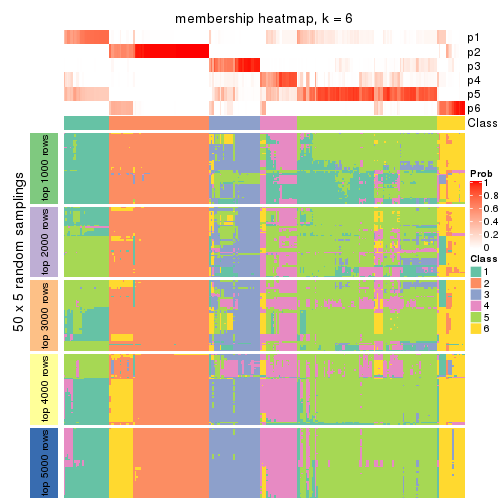</p>

</div>
</div>

As soon as we have had the classes for columns, we can look for signatures
which are significantly different between classes which can be candidate marks
for certain classes. Following are the heatmaps for signatures.


Signature heatmaps where rows are scaled:


<script>
$( function() {
	$( '#tabs-ATC-mclust-get-signatures' ).tabs();
} );
</script>
<div id='tabs-ATC-mclust-get-signatures'>
<ul>
<li><a href='#tab-ATC-mclust-get-signatures-1'>k = 2</a></li>
<li><a href='#tab-ATC-mclust-get-signatures-2'>k = 3</a></li>
<li><a href='#tab-ATC-mclust-get-signatures-3'>k = 4</a></li>
<li><a href='#tab-ATC-mclust-get-signatures-4'>k = 5</a></li>
<li><a href='#tab-ATC-mclust-get-signatures-5'>k = 6</a></li>
</ul>
<div id='tab-ATC-mclust-get-signatures-1'>
<pre><code class="r">get_signatures(res, k = 2)
</code></pre>

<p></p>

</div>
<div id='tab-ATC-mclust-get-signatures-2'>
<pre><code class="r">get_signatures(res, k = 3)
</code></pre>

<p></p>

</div>
<div id='tab-ATC-mclust-get-signatures-3'>
<pre><code class="r">get_signatures(res, k = 4)
</code></pre>

<p></p>

</div>
<div id='tab-ATC-mclust-get-signatures-4'>
<pre><code class="r">get_signatures(res, k = 5)
</code></pre>

<p></p>

</div>
<div id='tab-ATC-mclust-get-signatures-5'>
<pre><code class="r">get_signatures(res, k = 6)
</code></pre>

<p></p>

</div>
</div>


Signature heatmaps where rows are not scaled:


<script>
$( function() {
	$( '#tabs-ATC-mclust-get-signatures-no-scale' ).tabs();
} );
</script>
<div id='tabs-ATC-mclust-get-signatures-no-scale'>
<ul>
<li><a href='#tab-ATC-mclust-get-signatures-no-scale-1'>k = 2</a></li>
<li><a href='#tab-ATC-mclust-get-signatures-no-scale-2'>k = 3</a></li>
<li><a href='#tab-ATC-mclust-get-signatures-no-scale-3'>k = 4</a></li>
<li><a href='#tab-ATC-mclust-get-signatures-no-scale-4'>k = 5</a></li>
<li><a href='#tab-ATC-mclust-get-signatures-no-scale-5'>k = 6</a></li>
</ul>
<div id='tab-ATC-mclust-get-signatures-no-scale-1'>
<pre><code class="r">get_signatures(res, k = 2, scale_rows = FALSE)
</code></pre>

<p></p>

</div>
<div id='tab-ATC-mclust-get-signatures-no-scale-2'>
<pre><code class="r">get_signatures(res, k = 3, scale_rows = FALSE)
</code></pre>

<p></p>

</div>
<div id='tab-ATC-mclust-get-signatures-no-scale-3'>
<pre><code class="r">get_signatures(res, k = 4, scale_rows = FALSE)
</code></pre>

<p></p>

</div>
<div id='tab-ATC-mclust-get-signatures-no-scale-4'>
<pre><code class="r">get_signatures(res, k = 5, scale_rows = FALSE)
</code></pre>

<p></p>

</div>
<div id='tab-ATC-mclust-get-signatures-no-scale-5'>
<pre><code class="r">get_signatures(res, k = 6, scale_rows = FALSE)
</code></pre>

<p></p>

</div>
</div>


Compare the overlap of signatures from different k:

```r
compare_signatures(res)
```


`get_signature()` returns a data frame invisibly. TO get the list of signatures, the function
call should be assigned to a variable explicitly. In following code, if `plot` argument is set
to `FALSE`, no heatmap is plotted while only the differential analysis is performed.

```r
# code only for demonstration
tb = get_signature(res, k = ..., plot = FALSE)
```

An example of the output of `tb` is:

```
#>   which_row         fdr    mean_1    mean_2 scaled_mean_1 scaled_mean_2 km
#> 1        38 0.042760348  8.373488  9.131774    -0.5533452     0.5164555  1
#> 2        40 0.018707592  7.106213  8.469186    -0.6173731     0.5762149  1
#> 3        55 0.019134737 10.221463 11.207825    -0.6159697     0.5749050  1
#> 4        59 0.006059896  5.921854  7.869574    -0.6899429     0.6439467  1
#> 5        60 0.018055526  8.928898 10.211722    -0.6204761     0.5791110  1
#> 6        98 0.009384629 15.714769 14.887706     0.6635654    -0.6193277  2
...
```

The columns in `tb` are:

1. `which_row`: row indices corresponding to the input matrix.
2. `fdr`: FDR for the differential test. 
3. `mean_x`: The mean value in group x.
4. `scaled_mean_x`: The mean value in group x after rows are scaled.
5. `km`: Row groups if k-means clustering is applied to rows.


UMAP plot which shows how samples are separated.


<script>
$( function() {
	$( '#tabs-ATC-mclust-dimension-reduction' ).tabs();
} );
</script>
<div id='tabs-ATC-mclust-dimension-reduction'>
<ul>
<li><a href='#tab-ATC-mclust-dimension-reduction-1'>k = 2</a></li>
<li><a href='#tab-ATC-mclust-dimension-reduction-2'>k = 3</a></li>
<li><a href='#tab-ATC-mclust-dimension-reduction-3'>k = 4</a></li>
<li><a href='#tab-ATC-mclust-dimension-reduction-4'>k = 5</a></li>
<li><a href='#tab-ATC-mclust-dimension-reduction-5'>k = 6</a></li>
</ul>
<div id='tab-ATC-mclust-dimension-reduction-1'>
<pre><code class="r">dimension_reduction(res, k = 2, method = &quot;UMAP&quot;)
</code></pre>

<p></p>

</div>
<div id='tab-ATC-mclust-dimension-reduction-2'>
<pre><code class="r">dimension_reduction(res, k = 3, method = &quot;UMAP&quot;)
</code></pre>

<p></p>

</div>
<div id='tab-ATC-mclust-dimension-reduction-3'>
<pre><code class="r">dimension_reduction(res, k = 4, method = &quot;UMAP&quot;)
</code></pre>

<p></p>

</div>
<div id='tab-ATC-mclust-dimension-reduction-4'>
<pre><code class="r">dimension_reduction(res, k = 5, method = &quot;UMAP&quot;)
</code></pre>

<p></p>

</div>
<div id='tab-ATC-mclust-dimension-reduction-5'>
<pre><code class="r">dimension_reduction(res, k = 6, method = &quot;UMAP&quot;)
</code></pre>

<p></p>

</div>
</div>


Following heatmap shows how subgroups are split when increasing `k`:

```r
collect_classes(res)
```


If matrix rows can be associated to genes, consider to use `GO_Enrichment(res,
...)` to perform function enrichment for the signature genes.


 

---------------------------------------------------


### ATC:NMF**


The object with results only for a single top-value method and a single partition method 
can be extracted as:

```r
res = res_list["ATC", "NMF"]
# you can also extract it by
# res = res_list["ATC:NMF"]
```

A summary of `res` and all the functions that can be applied to it:

```r
res
```

```
#> A 'ConsensusPartition' object with k = 2, 3, 4, 5, 6.
#>   On a matrix with 17377 rows and 265 columns.
#>   Top rows (1000, 2000, 3000, 4000, 5000) are extracted by 'ATC' method.
#>   Subgroups are detected by 'NMF' method.
#>   Performed in total 1250 partitions by row resampling.
#>   Best k for subgroups seems to be 3.
#> 
#> Following methods can be applied to this 'ConsensusPartition' object:
#>  [1] "cola_report"             "collect_classes"         "collect_plots"          
#>  [4] "collect_stats"           "colnames"                "compare_signatures"     
#>  [7] "consensus_heatmap"       "dimension_reduction"     "functional_enrichment"  
#> [10] "get_anno_col"            "get_anno"                "get_classes"            
#> [13] "get_consensus"           "get_matrix"              "get_membership"         
#> [16] "get_param"               "get_signatures"          "get_stats"              
#> [19] "is_best_k"               "is_stable_k"             "membership_heatmap"     
#> [22] "ncol"                    "nrow"                    "plot_ecdf"              
#> [25] "rownames"                "select_partition_number" "show"                   
#> [28] "suggest_best_k"          "test_to_known_factors"
```

`collect_plots()` function collects all the plots made from `res` for all `k` (number of partitions)
into one single page to provide an easy and fast comparison between different `k`.

```r
collect_plots(res)
```


The plots are:

- The first row: a plot of the ECDF (Empirical cumulative distribution
  function) curves of the consensus matrix for each `k` and the heatmap of
  predicted classes for each `k`.
- The second row: heatmaps of the consensus matrix for each `k`.
- The third row: heatmaps of the membership matrix for each `k`.
- The fouth row: heatmaps of the signatures for each `k`.

All the plots in panels can be made by individual functions and they are
plotted later in this section.

`select_partition_number()` produces several plots showing different
statistics for choosing "optimized" `k`. There are following statistics:

- ECDF curves of the consensus matrix for each `k`;
- 1-PAC. [The PAC
  score](https://en.wikipedia.org/wiki/Consensus_clustering#Over-interpretation_potential_of_consensus_clustering)
  measures the proportion of the ambiguous subgrouping.
- Mean silhouette score.
- Concordance. The mean probability of fiting the consensus class ids in all
  partitions.
- Area increased. Denote $A_k$ as the area under the ECDF curve for current
  `k`, the area increased is defined as $A_k - A_{k-1}$.
- Rand index. The percent of pairs of samples that are both in a same cluster
  or both are not in a same cluster in the partition of k and k-1.
- Jaccard index. The ratio of pairs of samples are both in a same cluster in
  the partition of k and k-1 and the pairs of samples are both in a same
  cluster in the partition k or k-1.

The detailed explanations of these statistics can be found in [the cola
vignette](http://bioconductor.org/packages/devel/bioc/vignettes/cola/inst/doc/cola.html#toc_13).

Generally speaking, lower PAC score, higher mean silhouette score or higher
concordance corresponds to better partition. Rand index and Jaccard index
measure how similar the current partition is compared to partition with `k-1`.
If they are too similar, we won't accept `k` is better than `k-1`.

```r
select_partition_number(res)
```


The numeric values for all these statistics can be obtained by `get_stats()`.

```r
get_stats(res)
```

```
#>   k 1-PAC mean_silhouette concordance area_increased  Rand Jaccard
#> 2 2 0.945           0.954       0.979         0.4209 0.577   0.577
#> 3 3 0.952           0.941       0.976         0.5148 0.657   0.465
#> 4 4 0.716           0.753       0.877         0.1220 0.895   0.723
#> 5 5 0.724           0.620       0.805         0.0956 0.829   0.502
#> 6 6 0.705           0.561       0.739         0.0445 0.886   0.564
```

`suggest_best_k()` suggests the best $k$ based on these statistics. The rules are as follows:

- All $k$ with Jaccard index larger than 0.95 are removed because the increase of
  the partition number does not provides enough extra information. If all $k$ are removed,
  the best $k$ is assigned by `NA`.
- For $k$ with 1-PAC larger than 0.9, the maximal $k$ is taken as the "best k". Other $k$ is called "optional k".
- If it does not fit the second rule. The $k$ with the highest vote of highest
  1-PAC, mean silhouette and concordance is taken as the "best k".

```r
suggest_best_k(res)
```

```
#> [1] 3
#> attr(,"optional")
#> [1] 2
```

There is also optional best $k$ = 2 that is worth to check.

Following shows the table of the partitions (You need to click the **show/hide
code output** link to see it). The membership matrix (columns with name `p*`)
is inferred by
[`clue::cl_consensus()`](https://www.rdocumentation.org/link/cl_consensus?package=clue)
function with the `SE` method. Basically the value in the membership matrix
represents the probability to belong to a certain group. The finall class
label for an item is determined with the group with highest probability it
belongs to.

In `get_classes()` function, the entropy is calculated from the membership
matrix and the silhouette score is calculated from the consensus matrix.


<script>
$( function() {
	$( '#tabs-ATC-NMF-get-classes' ).tabs();
} );
</script>
<div id='tabs-ATC-NMF-get-classes'>
<ul>
<li><a href='#tab-ATC-NMF-get-classes-1'>k = 2</a></li>
<li><a href='#tab-ATC-NMF-get-classes-2'>k = 3</a></li>
<li><a href='#tab-ATC-NMF-get-classes-3'>k = 4</a></li>
<li><a href='#tab-ATC-NMF-get-classes-4'>k = 5</a></li>
<li><a href='#tab-ATC-NMF-get-classes-5'>k = 6</a></li>
</ul>

<div id='tab-ATC-NMF-get-classes-1'>
<p><a id='tab-ATC-NMF-get-classes-1-a' style='color:#0366d6' href='#'>show/hide code output</a></p>
<pre><code class="r">cbind(get_classes(res, k = 2), get_membership(res, k = 2))
</code></pre>

<pre><code>#&gt;                                      class entropy silhouette    p1    p2
#&gt; D30CF518-5FC6-4A54-8D5D-BA420EA1836D     2  0.0000      0.986 0.000 1.000
#&gt; 92298FF7-1215-4756-B976-A7D88B91AD76     2  0.3733      0.913 0.072 0.928
#&gt; 0E244FE2-7C17-4642-A51F-2CCA796D9C70     2  0.0000      0.986 0.000 1.000
#&gt; 75435ED8-93E8-45FB-8480-98D8EB2EF8CB     2  0.0000      0.986 0.000 1.000
#&gt; B6D11678-15A9-4F43-A0A2-225067DCAF1C     1  0.3431      0.916 0.936 0.064
#&gt; B7F5A41E-9559-4329-81F5-1B88A74730B7     2  0.0000      0.986 0.000 1.000
#&gt; 39414B2A-7FB0-4669-8DFE-86D9AF7AD2D9     2  0.1184      0.971 0.016 0.984
#&gt; 04823F53-A12D-4852-8F34-77B9DCBB7DF0     2  0.0000      0.986 0.000 1.000
#&gt; 49684C2B-D31C-4B45-A400-3497C3CCEC01     2  0.0000      0.986 0.000 1.000
#&gt; 96A04875-58E2-4BE7-8E0F-CAB55F4CA54F     2  0.6247      0.809 0.156 0.844
#&gt; 1F101D63-478B-40B9-A951-DC3887CFF067     2  0.0000      0.986 0.000 1.000
#&gt; DD290860-E0B7-48FC-BE12-2AF729994C21     2  0.0000      0.986 0.000 1.000
#&gt; FFDD7A12-DDEF-4974-8D60-64B7EEAAC994     2  0.0000      0.986 0.000 1.000
#&gt; E076A9A9-EA2A-4FF7-92A8-F2DA7F30279E     1  0.0000      0.962 1.000 0.000
#&gt; 830DFA6F-A85A-4317-82B2-791FAB998A01     2  0.0000      0.986 0.000 1.000
#&gt; 58578614-E4A3-4655-BBAB-F65851625E0A     1  0.0000      0.962 1.000 0.000
#&gt; 1CBFB672-4D66-430B-83F3-7CE3BE20ABF6     2  0.0000      0.986 0.000 1.000
#&gt; 6C34A7D7-3756-4DCC-9A9F-B5FC4A148B7E     2  0.0000      0.986 0.000 1.000
#&gt; D97ED7B4-5DF2-4B62-8796-AA51CA79DBBB     1  0.7453      0.751 0.788 0.212
#&gt; 45F15851-55F6-4169-834E-38958C38B6A9     2  0.0000      0.986 0.000 1.000
#&gt; 4139E0C9-F712-4A25-8B59-587533B93B3E     1  0.0000      0.962 1.000 0.000
#&gt; 2C3007BF-009E-404F-A3BF-8B921698D85B     1  0.0000      0.962 1.000 0.000
#&gt; 2189F8E5-FF98-4C1A-BD04-5595DB553130     2  0.0000      0.986 0.000 1.000
#&gt; FFAA0310-0D78-4499-8FB8-5BC46E4FCE58     2  0.7376      0.732 0.208 0.792
#&gt; 0C375B2F-67BE-4708-BEB2-544DEC812DCA     2  0.0000      0.986 0.000 1.000
#&gt; AB6324A1-19AB-400C-8001-54765D190E27     2  0.0000      0.986 0.000 1.000
#&gt; A32C4DCD-DC4C-4132-9ED1-B159F5561A2D     2  0.0000      0.986 0.000 1.000
#&gt; 2AE7105D-D494-45B0-947A-315D8C20ECDC     1  0.0000      0.962 1.000 0.000
#&gt; 60FE9D59-FC0F-4B9C-ABF8-1C00BC761928     1  0.3274      0.919 0.940 0.060
#&gt; 056442DC-E87A-4315-965C-C19D7B4FC40E     1  0.0000      0.962 1.000 0.000
#&gt; 455111E5-18EF-4E3F-9DFF-8FA017D92461     2  0.0000      0.986 0.000 1.000
#&gt; 10632BC6-0B81-433C-8832-6B2ABC73A94B     1  0.0000      0.962 1.000 0.000
#&gt; AC6F82AD-C682-4EB3-BEC3-FD950F57609D     1  0.0000      0.962 1.000 0.000
#&gt; D9ABDB75-04DA-4D33-A69F-701729494533     2  0.0000      0.986 0.000 1.000
#&gt; 27BBF44D-F4D7-4C5A-935F-3310A363A670     2  0.0000      0.986 0.000 1.000
#&gt; E7AA12EE-6E14-4B33-A52C-B13589436023     2  0.0000      0.986 0.000 1.000
#&gt; DFA6D41A-D231-413E-A180-E42DF26C3E2B     2  0.1414      0.967 0.020 0.980
#&gt; 655BD3AF-5094-4B19-93A8-401C70369B17     2  0.0000      0.986 0.000 1.000
#&gt; 9DFEF253-923F-4EE2-8E3D-C75805387B20     2  0.9129      0.500 0.328 0.672
#&gt; 3B0EE948-B2CD-4191-90E2-BDD155F3B580     1  0.0000      0.962 1.000 0.000
#&gt; 177C7EF4-2D54-4555-947C-44EE7C688917     2  0.0000      0.986 0.000 1.000
#&gt; 1F8E8BB7-D159-4556-8B04-E5DD027CC444     2  0.0000      0.986 0.000 1.000
#&gt; 619F37D2-6771-4727-9079-56BED07F1CF6     2  0.0000      0.986 0.000 1.000
#&gt; ACAE29BE-ECB8-4A98-BC71-7A2D4857134E     2  0.0000      0.986 0.000 1.000
#&gt; C5C3241A-684C-4238-9333-9AF8630EC086     2  0.0000      0.986 0.000 1.000
#&gt; AD319DC2-140F-4E7B-A899-010687D8B714     2  0.0000      0.986 0.000 1.000
#&gt; 2AFF397C-ED2A-4FD9-A7F0-E4C61E9FB603     2  0.0000      0.986 0.000 1.000
#&gt; FB4C7892-3DBB-4148-AAE9-75B19A1A4031     2  0.0376      0.982 0.004 0.996
#&gt; 6F5C4500-1ED1-4E81-B4F5-EEA64CE2336A     1  0.0000      0.962 1.000 0.000
#&gt; BD027C69-3C10-4047-8E1E-218600FF2B73     2  0.0000      0.986 0.000 1.000
#&gt; 11B473A9-4CC5-461F-BC57-CC9141F3591D     2  0.0000      0.986 0.000 1.000
#&gt; 69A036E5-3E6A-4862-A7F8-2D203ED2FC9E     1  0.0000      0.962 1.000 0.000
#&gt; 9C0BDF24-F011-4855-B95A-1B6BEFA808F7     1  0.0000      0.962 1.000 0.000
#&gt; 9E205254-8C0C-4C05-AF5A-86E679CF732C     2  0.0000      0.986 0.000 1.000
#&gt; 935CCE4A-8AA8-454E-9DFF-7DE27D0BD2E2     1  0.9686      0.383 0.604 0.396
#&gt; 01E5E1FE-41D3-428B-90BC-7A000829E102     1  0.0000      0.962 1.000 0.000
#&gt; B344A530-92CD-468B-847A-DF8E25688081     2  0.0000      0.986 0.000 1.000
#&gt; F79F32A7-9F7B-4D62-8426-4A4CF10ED319     2  0.2948      0.935 0.052 0.948
#&gt; C2E1C6FA-82F9-467C-99AE-9B39FAAC810C     2  0.6801      0.775 0.180 0.820
#&gt; BF7CD9BD-776A-4957-8A6E-EF8AD83EA9D3     2  0.0000      0.986 0.000 1.000
#&gt; 8A2C1409-E83B-435E-A20F-5FCA94801C9F     2  0.0000      0.986 0.000 1.000
#&gt; B6BEFFB5-2F62-477B-A4C8-478D29577CBD     2  0.0000      0.986 0.000 1.000
#&gt; 8622CBD0-F8E9-4AC1-8175-CC9A742B86F9     1  0.0000      0.962 1.000 0.000
#&gt; 565DD660-ED58-4065-8619-260BEA6FCFEB     1  0.8555      0.641 0.720 0.280
#&gt; 96038E42-0FBA-497D-819C-38F7689F10FF     1  0.0000      0.962 1.000 0.000
#&gt; CA685549-F8BA-43F1-8461-5D2D3B17CFC5     2  0.0000      0.986 0.000 1.000
#&gt; 52020307-71A6-46E5-ACB3-8F885CA8F1EB     2  0.0000      0.986 0.000 1.000
#&gt; 7656DA98-76DC-424B-B02C-D7001DAAA0E4     2  0.0000      0.986 0.000 1.000
#&gt; 74DBA640-45E2-42A6-8F1E-69C073D66EE6     2  0.0000      0.986 0.000 1.000
#&gt; 251094BE-C33D-44F0-BD98-8618D71F520C     2  0.5842      0.831 0.140 0.860
#&gt; AB914CC5-5FF1-4257-A353-6A99D11B9478     1  0.0000      0.962 1.000 0.000
#&gt; 38B8B893-0E08-4B71-B51C-B32A7B2724E0     1  0.7299      0.763 0.796 0.204
#&gt; 7C7CD8FF-99A4-41D7-B7E1-5A517001F551     2  0.0000      0.986 0.000 1.000
#&gt; BFC5B75A-E4AE-486B-BA30-23BBAA33A125     2  0.0000      0.986 0.000 1.000
#&gt; 182AC78E-A07C-4B34-B216-B5F573E9F036     2  0.0000      0.986 0.000 1.000
#&gt; B38C5F72-8F46-4531-9C2D-96EEE07A5B22     2  0.0000      0.986 0.000 1.000
#&gt; DB9333A6-A723-4B8F-9221-25B8B23D5126     2  0.7299      0.738 0.204 0.796
#&gt; CD67DD21-C1B6-4D58-AC8E-1F4536C7DA70     2  0.0000      0.986 0.000 1.000
#&gt; 3D76A56E-4B66-48AE-AA60-D9C1004C7140     1  0.0000      0.962 1.000 0.000
#&gt; 71ED572F-7780-47A4-A9F8-D320C737690D     1  0.0000      0.962 1.000 0.000
#&gt; B449FEA1-C4B0-400F-903C-59E13D0BA313     2  0.0000      0.986 0.000 1.000
#&gt; 3F120E90-1486-4215-B9B9-79D5B413CAAC     2  0.0000      0.986 0.000 1.000
#&gt; A071894B-D8C0-4740-BD55-93EA0C86EDF7     1  0.0000      0.962 1.000 0.000
#&gt; 58848D57-D7A9-4ABB-86A2-A8AE2B23F654     1  0.4431      0.891 0.908 0.092
#&gt; CD6F9E20-B301-4663-87EC-953EDF49754F     2  0.0000      0.986 0.000 1.000
#&gt; 367D89F3-D527-4929-B830-8B6D553DF9E1     2  0.0000      0.986 0.000 1.000
#&gt; BE8D7DCB-648B-42DD-9FA8-8B85B5D816B2     1  0.0000      0.962 1.000 0.000
#&gt; AA46F56B-BD9C-40A4-8EA8-35E2568C964D     2  0.0000      0.986 0.000 1.000
#&gt; 6393220A-7C57-413F-81A8-4E38C21E779E     2  0.0000      0.986 0.000 1.000
#&gt; 89AE566C-F65F-43C2-BA97-621A7AC8B6DC     1  0.0000      0.962 1.000 0.000
#&gt; AA6A4BFF-8C62-4B70-B85A-9EDF403B06BA     1  0.0000      0.962 1.000 0.000
#&gt; BCE877A6-9C65-4495-A45D-05753F2D0E15     2  0.0000      0.986 0.000 1.000
#&gt; D7BDDF49-C54B-4F8E-ACA0-C3684AB68B5C     2  0.0000      0.986 0.000 1.000
#&gt; D0800D49-0033-44B2-8D7B-29B16F87ADA6     2  0.0000      0.986 0.000 1.000
#&gt; 151D60B5-5AF1-4B61-B97F-ABC7531D9F89     2  0.0000      0.986 0.000 1.000
#&gt; CBBAEB5B-25FA-4B6D-A40C-357E37033E36     2  0.0000      0.986 0.000 1.000
#&gt; 317CD049-3151-40B7-8E88-B0B8813338D6     1  0.0000      0.962 1.000 0.000
#&gt; 93835C77-F8FA-4928-843C-8016A91881FA     2  0.9000      0.527 0.316 0.684
#&gt; 02A6950F-647D-4F20-B2D0-0238C1441C70     1  0.0000      0.962 1.000 0.000
#&gt; 4D54E415-134F-4F6F-8718-3E0475EF5477     2  0.0000      0.986 0.000 1.000
#&gt; 82AB290A-3993-45E5-8B15-6125A019778C     2  0.0000      0.986 0.000 1.000
#&gt; 3B5EAD14-E506-4A22-804D-BF925A2D5247     2  0.0000      0.986 0.000 1.000
#&gt; 19CF7DDF-4F3A-4D2F-B84A-6451A5C3112C     2  0.0000      0.986 0.000 1.000
#&gt; 2FB00DAA-C274-42B1-A06B-611FE5E96844     1  0.0000      0.962 1.000 0.000
#&gt; 2B1F01C3-8145-4296-8111-2B0474AB9A2C     2  0.0000      0.986 0.000 1.000
#&gt; 3F0865F1-8256-4778-966F-D53637B415B6     2  0.0000      0.986 0.000 1.000
#&gt; 5473210D-37F9-4192-86D2-E2A2C77F3BD2     2  0.0000      0.986 0.000 1.000
#&gt; 5EDB6ACF-4F3F-471A-9DDC-661607CACCC4     2  0.0000      0.986 0.000 1.000
#&gt; 6A252A3A-7EEB-47B6-9C23-D69BD2EA846F     2  0.0000      0.986 0.000 1.000
#&gt; 0A7FFCBB-4BAA-4A5F-8B2D-B427C4D982A8     1  0.0000      0.962 1.000 0.000
#&gt; 1603AFB8-5AD7-4794-9991-BDBE96B4D997     2  0.0000      0.986 0.000 1.000
#&gt; 644299E9-62B7-4DFE-9E6D-D7556A01B40A     2  0.0000      0.986 0.000 1.000
#&gt; EF12E923-1860-4269-B57B-BA6238FA4403     2  0.0000      0.986 0.000 1.000
#&gt; 51B7241E-F0BE-482A-88AE-89004BB68989     1  0.0000      0.962 1.000 0.000
#&gt; 1C007DF3-8A9F-4940-9A4C-DE2A412BB023     2  0.0000      0.986 0.000 1.000
#&gt; 89FCFDE6-9625-432C-AA35-9C5FCCF40031     2  0.0000      0.986 0.000 1.000
#&gt; 7955FC55-386D-497E-AFED-019BBBAD428E     2  0.0000      0.986 0.000 1.000
#&gt; 37FF09ED-73EC-4D10-B2AC-7D8EBA9304ED     2  0.0000      0.986 0.000 1.000
#&gt; C2CD2742-2FB4-468E-90FF-8F65A5C425A9     2  0.0000      0.986 0.000 1.000
#&gt; 766FE08F-3393-4868-B1C1-FA98C9FF16E0     2  0.0000      0.986 0.000 1.000
#&gt; 63E2B578-2221-4255-8C45-7FD030B1C94D     2  0.0000      0.986 0.000 1.000
#&gt; C14B1A44-43F7-45F0-A583-5667A4D3BD95     1  0.0000      0.962 1.000 0.000
#&gt; D9CB551A-CE20-4BF7-8AC9-839112346C3D     1  0.9833      0.304 0.576 0.424
#&gt; 05BAA71A-E5B3-4A3A-A3F2-013A975087F0     2  0.0000      0.986 0.000 1.000
#&gt; AC8DA7DE-4D83-4768-BEFD-9A1B2DA943CE     2  0.0000      0.986 0.000 1.000
#&gt; E89DCE9D-F8A5-499C-85BB-BB500BADB9FB     1  0.0000      0.962 1.000 0.000
#&gt; C16F9B5E-2B52-40F6-856D-C0D6FBDD16C1     1  0.0000      0.962 1.000 0.000
#&gt; 8FF234D4-823A-4C80-82F7-2E92D72DBF88     2  0.0000      0.986 0.000 1.000
#&gt; C9F94A6E-D104-4D8D-8EC5-EADECD85F092     2  0.0000      0.986 0.000 1.000
#&gt; 45C9756F-A154-4537-852E-ECBF27B92FE1     2  0.0000      0.986 0.000 1.000
#&gt; 0F1A5708-341E-4713-BC70-76D702F826D6     2  0.0000      0.986 0.000 1.000
#&gt; 2ECFBCA0-AB35-461A-A4B5-C60B2651A962     2  0.0000      0.986 0.000 1.000
#&gt; 7DFAC404-3AB3-4274-A533-CFDAF4CE122D     1  0.0000      0.962 1.000 0.000
#&gt; A90AF55C-4386-42AB-A812-9230026EA5A5     2  0.0000      0.986 0.000 1.000
#&gt; 6258A757-4E18-4CD1-8417-189521E990B6     2  0.0000      0.986 0.000 1.000
#&gt; EBFAD137-050F-47D0-A43D-72B8F7D70C2B     1  0.0000      0.962 1.000 0.000
#&gt; 08B5EBFB-2807-4229-95A6-81AB7F377A56     2  0.0000      0.986 0.000 1.000
#&gt; 4780A59C-0589-4995-B044-3201F09AF859     2  0.0000      0.986 0.000 1.000
#&gt; 0AB81429-C287-48AA-9035-3A7A6F4C7328     2  0.0000      0.986 0.000 1.000
#&gt; 20C4D047-28DA-4AB7-9B3C-32EDA6B22C9D     2  0.0000      0.986 0.000 1.000
#&gt; 77C4E01F-84A6-4BFD-AA8E-D7875456F546     2  0.0000      0.986 0.000 1.000
#&gt; 8B28383F-CF14-4CC5-A1E2-72AD915C0AE8     2  0.0000      0.986 0.000 1.000
#&gt; E12E1F48-6A52-4F74-925C-C4EE1BF5C573     2  0.0000      0.986 0.000 1.000
#&gt; 9B179BC5-BB4C-4CEE-99BC-BC552BC384A1     2  0.0000      0.986 0.000 1.000
#&gt; 5548C91A-D3DE-48F5-B4A4-124BE177B99A     2  0.0000      0.986 0.000 1.000
#&gt; 0E22B729-C381-4B0C-9897-62DD38F51722     2  0.0000      0.986 0.000 1.000
#&gt; 7BC4937F-04E2-4B46-BA7C-FE9AC738C8A9     1  0.0000      0.962 1.000 0.000
#&gt; EE6A0D3F-3F8A-4AA8-B3EF-32372EF37A29     1  0.7299      0.763 0.796 0.204
#&gt; 08AC2706-7651-409F-BE6B-BCED1C2D1796     1  0.0000      0.962 1.000 0.000
#&gt; A68B078D-8979-4070-BB4D-F526704ED3DC     1  0.5294      0.864 0.880 0.120
#&gt; C319A5EE-69FA-4AAB-85A9-2EAAD8E4C703     2  0.0000      0.986 0.000 1.000
#&gt; 0D7CAABD-D20C-4F82-BCBC-8B7276E8EDE2     1  0.0000      0.962 1.000 0.000
#&gt; 09444DCC-44BA-4A3F-ACC5-863A54578B9F     2  0.0000      0.986 0.000 1.000
#&gt; 2E32B047-C6E1-4743-A6C8-E98370A32145     2  0.0000      0.986 0.000 1.000
#&gt; 6A6878A7-76B2-40DE-958B-804442AC6A5D     2  0.5519      0.846 0.128 0.872
#&gt; 39F27293-0BFF-4EA2-8439-A299E3226D20     2  0.0000      0.986 0.000 1.000
#&gt; 7EAE9C30-6080-405F-A7E6-1FED57674279     2  0.0000      0.986 0.000 1.000
#&gt; 79499169-A093-4E0A-B6BD-010CD7BE5035     2  0.9393      0.432 0.356 0.644
#&gt; 1F8BF4E8-BD84-4EFE-9E3E-89E7CE8FA72D     2  0.0000      0.986 0.000 1.000
#&gt; 62B7988F-98E5-4AB8-8A16-D661A07455E8     1  0.0000      0.962 1.000 0.000
#&gt; B7005B5F-217E-4073-BFB5-CE7E884B80C0     2  0.0000      0.986 0.000 1.000
#&gt; B981568F-2C08-4696-B589-E157A49BE72B     2  0.0000      0.986 0.000 1.000
#&gt; A3D85C0A-3202-40C2-88E1-052AC6C5184B     1  0.0000      0.962 1.000 0.000
#&gt; 4CA783B9-9B99-46B8-962A-77194ECB7942     2  0.0000      0.986 0.000 1.000
#&gt; D4024B08-4879-47EA-99E5-D9FCE1CD40DF     1  0.0000      0.962 1.000 0.000
#&gt; 1D41CDA2-0B29-48FD-B83A-E60C174DBCB3     1  0.3431      0.916 0.936 0.064
#&gt; A1923B2A-B233-4760-8AF9-C04C1CAEB100     1  0.0938      0.954 0.988 0.012
#&gt; 80880D71-BFDE-4D88-892F-5ADF27A38940     2  0.0000      0.986 0.000 1.000
#&gt; 55D1629D-30FD-49AA-88CE-EA3CA9B30A3F     2  0.0000      0.986 0.000 1.000
#&gt; B71C409E-926D-48AD-8BD8-9F707CA4FB01     2  0.0000      0.986 0.000 1.000
#&gt; 54A92C57-BD19-4A47-BA76-3ACA2DC36212     2  0.0000      0.986 0.000 1.000
#&gt; B2AB74B8-506C-4C27-9105-E86A6AAA89D4     2  0.0000      0.986 0.000 1.000
#&gt; 0356AE49-7A5C-42CC-A39C-7C8DFBFF8842     2  0.0000      0.986 0.000 1.000
#&gt; ACA260A3-DC3F-4FF4-B9C5-2D4BC4F81783     1  0.0000      0.962 1.000 0.000
#&gt; 9B440917-E5A4-43B9-A48D-6ABFEDCA6CFD     1  0.0000      0.962 1.000 0.000
#&gt; 47464828-52EA-413B-B30C-BD8B55903D78     2  0.0000      0.986 0.000 1.000
#&gt; C1D1FC82-B50D-4C82-8F03-06CEE3C08D18     1  0.0000      0.962 1.000 0.000
#&gt; E5ABFC43-E2A3-4B1A-BBA3-8196C0B026A5     2  0.0000      0.986 0.000 1.000
#&gt; 1D3C16CC-D0D5-4637-AAC7-91672DFF3317     1  0.0000      0.962 1.000 0.000
#&gt; 4D038320-ADEA-4990-8371-68B4B8162E1A     2  0.0000      0.986 0.000 1.000
#&gt; A75594CC-3E49-4869-8656-BBB4E72BF59D     2  0.0000      0.986 0.000 1.000
#&gt; 7CABAA19-5FB2-4A58-BDA3-4F1FFB532C20     2  0.0000      0.986 0.000 1.000
#&gt; 534EF1E9-9513-426E-B41E-A394AB2E4410     2  0.0000      0.986 0.000 1.000
#&gt; 649F35A1-A08C-497D-A9B6-CB3084D5FB8D     2  0.0000      0.986 0.000 1.000
#&gt; 7CA30F3C-1C98-480C-B8B5-A248AABFB468     2  0.0000      0.986 0.000 1.000
#&gt; A9F8DA21-A802-44CF-9F5D-96A36687DCDD     2  0.0000      0.986 0.000 1.000
#&gt; A7AE1ED1-86CB-4A50-97B2-66785C7191FE     2  0.0000      0.986 0.000 1.000
#&gt; D0091AD4-D3D7-4C03-ACD9-DA9F8B6076C6     2  0.0000      0.986 0.000 1.000
#&gt; 46EE1C2B-13F7-44A7-B27E-4EBB9DF0CA83     2  0.0000      0.986 0.000 1.000
#&gt; CB9301B8-0282-43D6-AF5E-B753A9C7BFCB     2  0.0000      0.986 0.000 1.000
#&gt; A0E77A39-885A-4472-9A10-2D1E51DBFDA4     2  0.0000      0.986 0.000 1.000
#&gt; C06603C2-163D-40B6-A9FE-882424F18FE9     1  0.5294      0.864 0.880 0.120
#&gt; C3921A29-80FF-4B9D-B366-5C0238A42231     2  0.0000      0.986 0.000 1.000
#&gt; BB99B4E7-C834-4BB8-973F-8FA039E2798F     1  0.0000      0.962 1.000 0.000
#&gt; 5CD78C2F-05E9-409A-8405-3EE936A6876E     2  0.0000      0.986 0.000 1.000
#&gt; 6C126CC7-0C03-48F0-A2C2-F090CA239B70     2  0.0000      0.986 0.000 1.000
#&gt; 7118B08A-E94C-49F4-8D76-26455C34D85F     2  0.0000      0.986 0.000 1.000
#&gt; 266DAF30-CF3E-493E-8B24-3931D0039450     2  0.0000      0.986 0.000 1.000
#&gt; DAB5F5B9-4FE5-468F-AD2B-B39BBC4317A0     2  0.0000      0.986 0.000 1.000
#&gt; 9A9EB6D6-312E-4A98-8762-30D3ABD8193D     2  0.0000      0.986 0.000 1.000
#&gt; CED15676-B901-4FC8-9C8D-51E529D9441D     1  0.8861      0.595 0.696 0.304
#&gt; 827232CC-8035-440C-8B12-02C789C70B1B     2  0.0000      0.986 0.000 1.000
#&gt; 04D5FB28-FB50-4EAE-95FB-72ABF0E618CA     2  0.0000      0.986 0.000 1.000
#&gt; 6C96A851-97FC-4845-B895-D255191D9F25     1  0.0000      0.962 1.000 0.000
#&gt; 3EC982CB-D013-443E-B21D-39DE6B8EF370     2  0.0000      0.986 0.000 1.000
#&gt; 2E24A786-4370-42A1-AD50-D651F89819CC     2  0.0000      0.986 0.000 1.000
#&gt; 7653BFA9-ADA5-44CA-8555-807FBBFC6DE2     1  0.0000      0.962 1.000 0.000
#&gt; 7A110994-5741-4013-91F0-DD2E1D343F91     2  0.0000      0.986 0.000 1.000
#&gt; 0A760E0C-11C5-4201-8452-18DBC1FEACEB     1  0.0000      0.962 1.000 0.000
#&gt; 909B76A1-BB9F-4906-95BC-58CD1A46D3B8     2  0.0000      0.986 0.000 1.000
#&gt; A782EE71-EDA4-4385-83B3-D16DE81296C0     1  0.3431      0.916 0.936 0.064
#&gt; BD50E276-914F-4924-8CEA-FF47A66DB175     2  0.0000      0.986 0.000 1.000
#&gt; 505D5CA8-0279-4BC7-8CC0-8C7A0165BF91     2  0.0000      0.986 0.000 1.000
#&gt; D51FC997-E662-4AE7-BC9C-14183DA42DE1     2  0.0000      0.986 0.000 1.000
#&gt; 8AD67970-84F1-4C0A-B47A-8FA4108F9FE3     1  0.0000      0.962 1.000 0.000
#&gt; 6E33B1B6-7089-4BC3-B2B0-EC2C3B5D8B74     2  0.0938      0.975 0.012 0.988
#&gt; 88C4EA46-2546-401C-A8E7-603EECFDFBA0     2  0.0000      0.986 0.000 1.000
#&gt; 375D2D72-C998-4627-BA35-24E82A9A55FF     2  0.0000      0.986 0.000 1.000
#&gt; 76D0F834-7064-46C6-96F4-E861CF5452B6     2  0.0000      0.986 0.000 1.000
#&gt; 87159081-C97A-4004-AF0A-7EB6EF0EC47A     1  0.0376      0.959 0.996 0.004
#&gt; 24A57006-800B-4174-AF4E-7EA57A8A756E     2  0.0000      0.986 0.000 1.000
#&gt; AD68CBC6-8A13-4A65-AF62-E99AFA81D031     2  0.0000      0.986 0.000 1.000
#&gt; 22863A57-F066-4DD1-A859-4336F43D144C     1  0.0000      0.962 1.000 0.000
#&gt; 8F6F0362-9165-4DCC-992C-AF871A3C51E7     1  0.0000      0.962 1.000 0.000
#&gt; 76ABF0B7-E707-4DB2-9486-3814439BDBA5     1  0.5294      0.864 0.880 0.120
#&gt; BC72372F-3577-40E5-BA0F-41A084AA93AD     2  0.0376      0.982 0.004 0.996
#&gt; 8E566039-B56C-4F41-B9EF-DE18BEEF2C95     1  0.0000      0.962 1.000 0.000
#&gt; F096F016-3EF5-4A67-A7C2-8A45E1585232     1  0.0000      0.962 1.000 0.000
#&gt; BB37913E-534B-43DD-BE3D-E13B29FD8172     2  0.0000      0.986 0.000 1.000
#&gt; E344638F-9060-460F-8F7A-60D19442F294     2  0.0000      0.986 0.000 1.000
#&gt; 6A0EAAD0-89D5-4F12-8B45-9D5A25182FAD     2  0.0000      0.986 0.000 1.000
#&gt; A5199E3A-9D67-4543-88AB-24398C98E38E     2  0.0000      0.986 0.000 1.000
#&gt; 23917D52-7864-4F84-9C77-DF8EA9407345     2  0.0000      0.986 0.000 1.000
#&gt; 9AA96080-19D8-40C3-BDD1-6044D2D422D5     1  0.0000      0.962 1.000 0.000
#&gt; 0ED65D91-260C-4662-9903-EE36A2E3B2D0     2  0.0000      0.986 0.000 1.000
#&gt; 64BF1BC5-7A9A-4E1D-AEAB-AFE30B92AAF4     2  0.0000      0.986 0.000 1.000
#&gt; F02301F1-9054-4DC6-8DC9-2451A0F53EFC     2  0.0000      0.986 0.000 1.000
#&gt; 3264649A-5684-4181-83D0-A7E4D7E2E1FD     2  0.0000      0.986 0.000 1.000
#&gt; 3F8DA39C-BC9B-4343-8838-5CE271E80C51     1  0.7139      0.774 0.804 0.196
#&gt; BCC681CB-2AF4-4BB6-B53A-7544A2399454     1  0.0000      0.962 1.000 0.000
#&gt; DCB50E17-5E2D-443B-8DCC-272FBB734C2E     1  0.0000      0.962 1.000 0.000
#&gt; B5E47C38-CB6A-44C0-AA9B-56951B9EF78D     1  0.0000      0.962 1.000 0.000
#&gt; B15B0185-9C28-4A00-9CEC-05EFECEA6709     1  0.0000      0.962 1.000 0.000
#&gt; 61D4E8E7-0110-480A-A4A7-D406DE74C31E     1  0.0000      0.962 1.000 0.000
#&gt; CA8DB3AD-3F6B-4622-BF73-47041EC96E42     2  0.0000      0.986 0.000 1.000
#&gt; 5EECB1C4-172C-4494-871A-ADB650CD82BD     2  0.0000      0.986 0.000 1.000
#&gt; 019B857C-D4F7-4B67-B699-56E52A60805B     2  0.0000      0.986 0.000 1.000
#&gt; E9C28902-05C9-4883-97A4-D612D54E46B4     2  0.0000      0.986 0.000 1.000
#&gt; C5D3D9A0-FC14-408D-AB6C-662018A5E5CA     2  0.8861      0.554 0.304 0.696
#&gt; 7EB24744-509B-4854-B7D0-0BAFA210A345     2  0.0000      0.986 0.000 1.000
#&gt; B8B7A721-2284-40AB-98F5-EF1351C30B66     2  0.0000      0.986 0.000 1.000
#&gt; 3C12F39D-0D21-4F69-A539-4120B73C7A79     2  0.0000      0.986 0.000 1.000
#&gt; 08D3F984-6850-45B2-9DF9-EC7F5A4060A4     2  0.1414      0.967 0.020 0.980
#&gt; 9BD0EE79-1EED-4F6D-A5AB-43ADB8526F1E     2  0.0000      0.986 0.000 1.000
#&gt; E489A871-3CF4-4F3D-8EAF-63B507054201     2  0.0000      0.986 0.000 1.000
#&gt; 8CF8FD2E-1DBA-4257-9715-04D956D46B71     2  0.0000      0.986 0.000 1.000
#&gt; F6193AF0-7A19-46CB-A818-1B01E7460791     1  0.0000      0.962 1.000 0.000
#&gt; 96392D6B-D4FF-4393-93BA-08E469E8BBE1     2  0.0000      0.986 0.000 1.000
#&gt; DABCBE5A-C591-46A2-AF66-DA3DB6106751     1  0.0000      0.962 1.000 0.000
#&gt; 8B75F7D4-98D8-44DE-B19D-B733D6A031DB     1  0.0000      0.962 1.000 0.000
#&gt; AAD9685A-564B-42E9-91E3-431951154BA7     2  0.0000      0.986 0.000 1.000
#&gt; 90A43152-4E3B-4365-A39F-7B0E5CA66E55     2  0.0000      0.986 0.000 1.000
#&gt; EFB76FCF-AC9C-4852-B91C-E055DA666FA0     1  0.0000      0.962 1.000 0.000
#&gt; 6EBCFFE3-706F-440A-ABA9-012A924A07C6     2  0.0000      0.986 0.000 1.000
#&gt; E922A244-F1C8-4310-ABB2-62B06E022E4C     1  0.0000      0.962 1.000 0.000
</code></pre>

<script>
$('#tab-ATC-NMF-get-classes-1-a').parent().next().next().hide();
$('#tab-ATC-NMF-get-classes-1-a').click(function(){
  $('#tab-ATC-NMF-get-classes-1-a').parent().next().next().toggle();
  return(false);
});
</script>
</div>

<div id='tab-ATC-NMF-get-classes-2'>
<p><a id='tab-ATC-NMF-get-classes-2-a' style='color:#0366d6' href='#'>show/hide code output</a></p>
<pre><code class="r">cbind(get_classes(res, k = 3), get_membership(res, k = 3))
</code></pre>

<pre><code>#&gt;                                      class entropy silhouette    p1    p2    p3
#&gt; D30CF518-5FC6-4A54-8D5D-BA420EA1836D     2  0.0000     0.9865 0.000 1.000 0.000
#&gt; 92298FF7-1215-4756-B976-A7D88B91AD76     3  0.0000     0.9739 0.000 0.000 1.000
#&gt; 0E244FE2-7C17-4642-A51F-2CCA796D9C70     2  0.0000     0.9865 0.000 1.000 0.000
#&gt; 75435ED8-93E8-45FB-8480-98D8EB2EF8CB     2  0.0000     0.9865 0.000 1.000 0.000
#&gt; B6D11678-15A9-4F43-A0A2-225067DCAF1C     3  0.0424     0.9676 0.008 0.000 0.992
#&gt; B7F5A41E-9559-4329-81F5-1B88A74730B7     2  0.0000     0.9865 0.000 1.000 0.000
#&gt; 39414B2A-7FB0-4669-8DFE-86D9AF7AD2D9     3  0.0000     0.9739 0.000 0.000 1.000
#&gt; 04823F53-A12D-4852-8F34-77B9DCBB7DF0     2  0.0000     0.9865 0.000 1.000 0.000
#&gt; 49684C2B-D31C-4B45-A400-3497C3CCEC01     2  0.0000     0.9865 0.000 1.000 0.000
#&gt; 96A04875-58E2-4BE7-8E0F-CAB55F4CA54F     3  0.0000     0.9739 0.000 0.000 1.000
#&gt; 1F101D63-478B-40B9-A951-DC3887CFF067     3  0.0000     0.9739 0.000 0.000 1.000
#&gt; DD290860-E0B7-48FC-BE12-2AF729994C21     2  0.0000     0.9865 0.000 1.000 0.000
#&gt; FFDD7A12-DDEF-4974-8D60-64B7EEAAC994     2  0.0000     0.9865 0.000 1.000 0.000
#&gt; E076A9A9-EA2A-4FF7-92A8-F2DA7F30279E     1  0.0000     0.9510 1.000 0.000 0.000
#&gt; 830DFA6F-A85A-4317-82B2-791FAB998A01     2  0.6204     0.2639 0.000 0.576 0.424
#&gt; 58578614-E4A3-4655-BBAB-F65851625E0A     1  0.0000     0.9510 1.000 0.000 0.000
#&gt; 1CBFB672-4D66-430B-83F3-7CE3BE20ABF6     3  0.0000     0.9739 0.000 0.000 1.000
#&gt; 6C34A7D7-3756-4DCC-9A9F-B5FC4A148B7E     3  0.0000     0.9739 0.000 0.000 1.000
#&gt; D97ED7B4-5DF2-4B62-8796-AA51CA79DBBB     3  0.3816     0.8158 0.148 0.000 0.852
#&gt; 45F15851-55F6-4169-834E-38958C38B6A9     3  0.0000     0.9739 0.000 0.000 1.000
#&gt; 4139E0C9-F712-4A25-8B59-587533B93B3E     1  0.0000     0.9510 1.000 0.000 0.000
#&gt; 2C3007BF-009E-404F-A3BF-8B921698D85B     1  0.0000     0.9510 1.000 0.000 0.000
#&gt; 2189F8E5-FF98-4C1A-BD04-5595DB553130     3  0.0000     0.9739 0.000 0.000 1.000
#&gt; FFAA0310-0D78-4499-8FB8-5BC46E4FCE58     3  0.5706     0.5139 0.320 0.000 0.680
#&gt; 0C375B2F-67BE-4708-BEB2-544DEC812DCA     2  0.0000     0.9865 0.000 1.000 0.000
#&gt; AB6324A1-19AB-400C-8001-54765D190E27     2  0.0000     0.9865 0.000 1.000 0.000
#&gt; A32C4DCD-DC4C-4132-9ED1-B159F5561A2D     3  0.0000     0.9739 0.000 0.000 1.000
#&gt; 2AE7105D-D494-45B0-947A-315D8C20ECDC     1  0.5216     0.6807 0.740 0.000 0.260
#&gt; 60FE9D59-FC0F-4B9C-ABF8-1C00BC761928     3  0.0424     0.9676 0.008 0.000 0.992
#&gt; 056442DC-E87A-4315-965C-C19D7B4FC40E     1  0.0000     0.9510 1.000 0.000 0.000
#&gt; 455111E5-18EF-4E3F-9DFF-8FA017D92461     3  0.0000     0.9739 0.000 0.000 1.000
#&gt; 10632BC6-0B81-433C-8832-6B2ABC73A94B     3  0.6274     0.1216 0.456 0.000 0.544
#&gt; AC6F82AD-C682-4EB3-BEC3-FD950F57609D     1  0.0000     0.9510 1.000 0.000 0.000
#&gt; D9ABDB75-04DA-4D33-A69F-701729494533     3  0.9400     0.0354 0.356 0.180 0.464
#&gt; 27BBF44D-F4D7-4C5A-935F-3310A363A670     2  0.0000     0.9865 0.000 1.000 0.000
#&gt; E7AA12EE-6E14-4B33-A52C-B13589436023     3  0.0000     0.9739 0.000 0.000 1.000
#&gt; DFA6D41A-D231-413E-A180-E42DF26C3E2B     2  0.0000     0.9865 0.000 1.000 0.000
#&gt; 655BD3AF-5094-4B19-93A8-401C70369B17     2  0.0000     0.9865 0.000 1.000 0.000
#&gt; 9DFEF253-923F-4EE2-8E3D-C75805387B20     2  0.1860     0.9330 0.052 0.948 0.000
#&gt; 3B0EE948-B2CD-4191-90E2-BDD155F3B580     1  0.0000     0.9510 1.000 0.000 0.000
#&gt; 177C7EF4-2D54-4555-947C-44EE7C688917     3  0.0000     0.9739 0.000 0.000 1.000
#&gt; 1F8E8BB7-D159-4556-8B04-E5DD027CC444     2  0.0000     0.9865 0.000 1.000 0.000
#&gt; 619F37D2-6771-4727-9079-56BED07F1CF6     2  0.0424     0.9774 0.000 0.992 0.008
#&gt; ACAE29BE-ECB8-4A98-BC71-7A2D4857134E     3  0.0000     0.9739 0.000 0.000 1.000
#&gt; C5C3241A-684C-4238-9333-9AF8630EC086     3  0.1163     0.9482 0.000 0.028 0.972
#&gt; AD319DC2-140F-4E7B-A899-010687D8B714     2  0.0000     0.9865 0.000 1.000 0.000
#&gt; 2AFF397C-ED2A-4FD9-A7F0-E4C61E9FB603     3  0.0000     0.9739 0.000 0.000 1.000
#&gt; FB4C7892-3DBB-4148-AAE9-75B19A1A4031     3  0.0000     0.9739 0.000 0.000 1.000
#&gt; 6F5C4500-1ED1-4E81-B4F5-EEA64CE2336A     1  0.0000     0.9510 1.000 0.000 0.000
#&gt; BD027C69-3C10-4047-8E1E-218600FF2B73     2  0.0000     0.9865 0.000 1.000 0.000
#&gt; 11B473A9-4CC5-461F-BC57-CC9141F3591D     3  0.0000     0.9739 0.000 0.000 1.000
#&gt; 69A036E5-3E6A-4862-A7F8-2D203ED2FC9E     1  0.0000     0.9510 1.000 0.000 0.000
#&gt; 9C0BDF24-F011-4855-B95A-1B6BEFA808F7     3  0.3816     0.8168 0.148 0.000 0.852
#&gt; 9E205254-8C0C-4C05-AF5A-86E679CF732C     3  0.0000     0.9739 0.000 0.000 1.000
#&gt; 935CCE4A-8AA8-454E-9DFF-7DE27D0BD2E2     3  0.0000     0.9739 0.000 0.000 1.000
#&gt; 01E5E1FE-41D3-428B-90BC-7A000829E102     1  0.5291     0.6672 0.732 0.000 0.268
#&gt; B344A530-92CD-468B-847A-DF8E25688081     3  0.0000     0.9739 0.000 0.000 1.000
#&gt; F79F32A7-9F7B-4D62-8426-4A4CF10ED319     3  0.0000     0.9739 0.000 0.000 1.000
#&gt; C2E1C6FA-82F9-467C-99AE-9B39FAAC810C     3  0.0000     0.9739 0.000 0.000 1.000
#&gt; BF7CD9BD-776A-4957-8A6E-EF8AD83EA9D3     2  0.0000     0.9865 0.000 1.000 0.000
#&gt; 8A2C1409-E83B-435E-A20F-5FCA94801C9F     2  0.0000     0.9865 0.000 1.000 0.000
#&gt; B6BEFFB5-2F62-477B-A4C8-478D29577CBD     2  0.0000     0.9865 0.000 1.000 0.000
#&gt; 8622CBD0-F8E9-4AC1-8175-CC9A742B86F9     1  0.0000     0.9510 1.000 0.000 0.000
#&gt; 565DD660-ED58-4065-8619-260BEA6FCFEB     3  0.0747     0.9610 0.016 0.000 0.984
#&gt; 96038E42-0FBA-497D-819C-38F7689F10FF     1  0.0892     0.9366 0.980 0.000 0.020
#&gt; CA685549-F8BA-43F1-8461-5D2D3B17CFC5     3  0.0000     0.9739 0.000 0.000 1.000
#&gt; 52020307-71A6-46E5-ACB3-8F885CA8F1EB     3  0.0000     0.9739 0.000 0.000 1.000
#&gt; 7656DA98-76DC-424B-B02C-D7001DAAA0E4     3  0.0000     0.9739 0.000 0.000 1.000
#&gt; 74DBA640-45E2-42A6-8F1E-69C073D66EE6     3  0.0000     0.9739 0.000 0.000 1.000
#&gt; 251094BE-C33D-44F0-BD98-8618D71F520C     3  0.0000     0.9739 0.000 0.000 1.000
#&gt; AB914CC5-5FF1-4257-A353-6A99D11B9478     3  0.4796     0.7082 0.220 0.000 0.780
#&gt; 38B8B893-0E08-4B71-B51C-B32A7B2724E0     3  0.3116     0.8669 0.108 0.000 0.892
#&gt; 7C7CD8FF-99A4-41D7-B7E1-5A517001F551     2  0.0000     0.9865 0.000 1.000 0.000
#&gt; BFC5B75A-E4AE-486B-BA30-23BBAA33A125     2  0.0000     0.9865 0.000 1.000 0.000
#&gt; 182AC78E-A07C-4B34-B216-B5F573E9F036     2  0.0000     0.9865 0.000 1.000 0.000
#&gt; B38C5F72-8F46-4531-9C2D-96EEE07A5B22     2  0.0000     0.9865 0.000 1.000 0.000
#&gt; DB9333A6-A723-4B8F-9221-25B8B23D5126     3  0.0424     0.9676 0.008 0.000 0.992
#&gt; CD67DD21-C1B6-4D58-AC8E-1F4536C7DA70     3  0.0000     0.9739 0.000 0.000 1.000
#&gt; 3D76A56E-4B66-48AE-AA60-D9C1004C7140     1  0.0000     0.9510 1.000 0.000 0.000
#&gt; 71ED572F-7780-47A4-A9F8-D320C737690D     1  0.0000     0.9510 1.000 0.000 0.000
#&gt; B449FEA1-C4B0-400F-903C-59E13D0BA313     2  0.0000     0.9865 0.000 1.000 0.000
#&gt; 3F120E90-1486-4215-B9B9-79D5B413CAAC     3  0.0000     0.9739 0.000 0.000 1.000
#&gt; A071894B-D8C0-4740-BD55-93EA0C86EDF7     1  0.0000     0.9510 1.000 0.000 0.000
#&gt; 58848D57-D7A9-4ABB-86A2-A8AE2B23F654     3  0.0747     0.9610 0.016 0.000 0.984
#&gt; CD6F9E20-B301-4663-87EC-953EDF49754F     3  0.0000     0.9739 0.000 0.000 1.000
#&gt; 367D89F3-D527-4929-B830-8B6D553DF9E1     3  0.0000     0.9739 0.000 0.000 1.000
#&gt; BE8D7DCB-648B-42DD-9FA8-8B85B5D816B2     1  0.0000     0.9510 1.000 0.000 0.000
#&gt; AA46F56B-BD9C-40A4-8EA8-35E2568C964D     2  0.0000     0.9865 0.000 1.000 0.000
#&gt; 6393220A-7C57-413F-81A8-4E38C21E779E     2  0.0000     0.9865 0.000 1.000 0.000
#&gt; 89AE566C-F65F-43C2-BA97-621A7AC8B6DC     1  0.0000     0.9510 1.000 0.000 0.000
#&gt; AA6A4BFF-8C62-4B70-B85A-9EDF403B06BA     1  0.0000     0.9510 1.000 0.000 0.000
#&gt; BCE877A6-9C65-4495-A45D-05753F2D0E15     3  0.0000     0.9739 0.000 0.000 1.000
#&gt; D7BDDF49-C54B-4F8E-ACA0-C3684AB68B5C     3  0.0000     0.9739 0.000 0.000 1.000
#&gt; D0800D49-0033-44B2-8D7B-29B16F87ADA6     2  0.0000     0.9865 0.000 1.000 0.000
#&gt; 151D60B5-5AF1-4B61-B97F-ABC7531D9F89     3  0.0000     0.9739 0.000 0.000 1.000
#&gt; CBBAEB5B-25FA-4B6D-A40C-357E37033E36     3  0.0000     0.9739 0.000 0.000 1.000
#&gt; 317CD049-3151-40B7-8E88-B0B8813338D6     1  0.5098     0.7002 0.752 0.000 0.248
#&gt; 93835C77-F8FA-4928-843C-8016A91881FA     3  0.0000     0.9739 0.000 0.000 1.000
#&gt; 02A6950F-647D-4F20-B2D0-0238C1441C70     3  0.0592     0.9644 0.012 0.000 0.988
#&gt; 4D54E415-134F-4F6F-8718-3E0475EF5477     3  0.0000     0.9739 0.000 0.000 1.000
#&gt; 82AB290A-3993-45E5-8B15-6125A019778C     3  0.0000     0.9739 0.000 0.000 1.000
#&gt; 3B5EAD14-E506-4A22-804D-BF925A2D5247     2  0.0000     0.9865 0.000 1.000 0.000
#&gt; 19CF7DDF-4F3A-4D2F-B84A-6451A5C3112C     3  0.0000     0.9739 0.000 0.000 1.000
#&gt; 2FB00DAA-C274-42B1-A06B-611FE5E96844     1  0.0000     0.9510 1.000 0.000 0.000
#&gt; 2B1F01C3-8145-4296-8111-2B0474AB9A2C     2  0.0000     0.9865 0.000 1.000 0.000
#&gt; 3F0865F1-8256-4778-966F-D53637B415B6     3  0.0000     0.9739 0.000 0.000 1.000
#&gt; 5473210D-37F9-4192-86D2-E2A2C77F3BD2     3  0.0000     0.9739 0.000 0.000 1.000
#&gt; 5EDB6ACF-4F3F-471A-9DDC-661607CACCC4     3  0.0000     0.9739 0.000 0.000 1.000
#&gt; 6A252A3A-7EEB-47B6-9C23-D69BD2EA846F     3  0.0000     0.9739 0.000 0.000 1.000
#&gt; 0A7FFCBB-4BAA-4A5F-8B2D-B427C4D982A8     1  0.0000     0.9510 1.000 0.000 0.000
#&gt; 1603AFB8-5AD7-4794-9991-BDBE96B4D997     2  0.0000     0.9865 0.000 1.000 0.000
#&gt; 644299E9-62B7-4DFE-9E6D-D7556A01B40A     3  0.0000     0.9739 0.000 0.000 1.000
#&gt; EF12E923-1860-4269-B57B-BA6238FA4403     3  0.0000     0.9739 0.000 0.000 1.000
#&gt; 51B7241E-F0BE-482A-88AE-89004BB68989     1  0.0000     0.9510 1.000 0.000 0.000
#&gt; 1C007DF3-8A9F-4940-9A4C-DE2A412BB023     3  0.0000     0.9739 0.000 0.000 1.000
#&gt; 89FCFDE6-9625-432C-AA35-9C5FCCF40031     3  0.0000     0.9739 0.000 0.000 1.000
#&gt; 7955FC55-386D-497E-AFED-019BBBAD428E     3  0.0000     0.9739 0.000 0.000 1.000
#&gt; 37FF09ED-73EC-4D10-B2AC-7D8EBA9304ED     3  0.0000     0.9739 0.000 0.000 1.000
#&gt; C2CD2742-2FB4-468E-90FF-8F65A5C425A9     3  0.0000     0.9739 0.000 0.000 1.000
#&gt; 766FE08F-3393-4868-B1C1-FA98C9FF16E0     3  0.0000     0.9739 0.000 0.000 1.000
#&gt; 63E2B578-2221-4255-8C45-7FD030B1C94D     3  0.0000     0.9739 0.000 0.000 1.000
#&gt; C14B1A44-43F7-45F0-A583-5667A4D3BD95     1  0.0000     0.9510 1.000 0.000 0.000
#&gt; D9CB551A-CE20-4BF7-8AC9-839112346C3D     3  0.0000     0.9739 0.000 0.000 1.000
#&gt; 05BAA71A-E5B3-4A3A-A3F2-013A975087F0     2  0.0000     0.9865 0.000 1.000 0.000
#&gt; AC8DA7DE-4D83-4768-BEFD-9A1B2DA943CE     3  0.0000     0.9739 0.000 0.000 1.000
#&gt; E89DCE9D-F8A5-499C-85BB-BB500BADB9FB     1  0.0000     0.9510 1.000 0.000 0.000
#&gt; C16F9B5E-2B52-40F6-856D-C0D6FBDD16C1     1  0.1529     0.9211 0.960 0.000 0.040
#&gt; 8FF234D4-823A-4C80-82F7-2E92D72DBF88     2  0.0000     0.9865 0.000 1.000 0.000
#&gt; C9F94A6E-D104-4D8D-8EC5-EADECD85F092     2  0.0000     0.9865 0.000 1.000 0.000
#&gt; 45C9756F-A154-4537-852E-ECBF27B92FE1     2  0.0000     0.9865 0.000 1.000 0.000
#&gt; 0F1A5708-341E-4713-BC70-76D702F826D6     2  0.5327     0.6287 0.000 0.728 0.272
#&gt; 2ECFBCA0-AB35-461A-A4B5-C60B2651A962     2  0.0000     0.9865 0.000 1.000 0.000
#&gt; 7DFAC404-3AB3-4274-A533-CFDAF4CE122D     1  0.0000     0.9510 1.000 0.000 0.000
#&gt; A90AF55C-4386-42AB-A812-9230026EA5A5     2  0.0000     0.9865 0.000 1.000 0.000
#&gt; 6258A757-4E18-4CD1-8417-189521E990B6     2  0.0000     0.9865 0.000 1.000 0.000
#&gt; EBFAD137-050F-47D0-A43D-72B8F7D70C2B     1  0.4399     0.7833 0.812 0.000 0.188
#&gt; 08B5EBFB-2807-4229-95A6-81AB7F377A56     2  0.0000     0.9865 0.000 1.000 0.000
#&gt; 4780A59C-0589-4995-B044-3201F09AF859     3  0.0000     0.9739 0.000 0.000 1.000
#&gt; 0AB81429-C287-48AA-9035-3A7A6F4C7328     2  0.0000     0.9865 0.000 1.000 0.000
#&gt; 20C4D047-28DA-4AB7-9B3C-32EDA6B22C9D     3  0.0000     0.9739 0.000 0.000 1.000
#&gt; 77C4E01F-84A6-4BFD-AA8E-D7875456F546     3  0.0000     0.9739 0.000 0.000 1.000
#&gt; 8B28383F-CF14-4CC5-A1E2-72AD915C0AE8     3  0.0000     0.9739 0.000 0.000 1.000
#&gt; E12E1F48-6A52-4F74-925C-C4EE1BF5C573     2  0.0000     0.9865 0.000 1.000 0.000
#&gt; 9B179BC5-BB4C-4CEE-99BC-BC552BC384A1     3  0.0000     0.9739 0.000 0.000 1.000
#&gt; 5548C91A-D3DE-48F5-B4A4-124BE177B99A     3  0.0000     0.9739 0.000 0.000 1.000
#&gt; 0E22B729-C381-4B0C-9897-62DD38F51722     3  0.0000     0.9739 0.000 0.000 1.000
#&gt; 7BC4937F-04E2-4B46-BA7C-FE9AC738C8A9     1  0.0000     0.9510 1.000 0.000 0.000
#&gt; EE6A0D3F-3F8A-4AA8-B3EF-32372EF37A29     3  0.0000     0.9739 0.000 0.000 1.000
#&gt; 08AC2706-7651-409F-BE6B-BCED1C2D1796     1  0.0237     0.9483 0.996 0.000 0.004
#&gt; A68B078D-8979-4070-BB4D-F526704ED3DC     1  0.0237     0.9483 0.996 0.000 0.004
#&gt; C319A5EE-69FA-4AAB-85A9-2EAAD8E4C703     3  0.0000     0.9739 0.000 0.000 1.000
#&gt; 0D7CAABD-D20C-4F82-BCBC-8B7276E8EDE2     1  0.0000     0.9510 1.000 0.000 0.000
#&gt; 09444DCC-44BA-4A3F-ACC5-863A54578B9F     3  0.0000     0.9739 0.000 0.000 1.000
#&gt; 2E32B047-C6E1-4743-A6C8-E98370A32145     3  0.0000     0.9739 0.000 0.000 1.000
#&gt; 6A6878A7-76B2-40DE-958B-804442AC6A5D     3  0.0000     0.9739 0.000 0.000 1.000
#&gt; 39F27293-0BFF-4EA2-8439-A299E3226D20     3  0.0000     0.9739 0.000 0.000 1.000
#&gt; 7EAE9C30-6080-405F-A7E6-1FED57674279     3  0.0000     0.9739 0.000 0.000 1.000
#&gt; 79499169-A093-4E0A-B6BD-010CD7BE5035     3  0.0000     0.9739 0.000 0.000 1.000
#&gt; 1F8BF4E8-BD84-4EFE-9E3E-89E7CE8FA72D     3  0.0000     0.9739 0.000 0.000 1.000
#&gt; 62B7988F-98E5-4AB8-8A16-D661A07455E8     1  0.0000     0.9510 1.000 0.000 0.000
#&gt; B7005B5F-217E-4073-BFB5-CE7E884B80C0     2  0.0000     0.9865 0.000 1.000 0.000
#&gt; B981568F-2C08-4696-B589-E157A49BE72B     2  0.0000     0.9865 0.000 1.000 0.000
#&gt; A3D85C0A-3202-40C2-88E1-052AC6C5184B     1  0.0000     0.9510 1.000 0.000 0.000
#&gt; 4CA783B9-9B99-46B8-962A-77194ECB7942     3  0.0000     0.9739 0.000 0.000 1.000
#&gt; D4024B08-4879-47EA-99E5-D9FCE1CD40DF     1  0.4654     0.7582 0.792 0.000 0.208
#&gt; 1D41CDA2-0B29-48FD-B83A-E60C174DBCB3     3  0.0000     0.9739 0.000 0.000 1.000
#&gt; A1923B2A-B233-4760-8AF9-C04C1CAEB100     3  0.3038     0.8711 0.104 0.000 0.896
#&gt; 80880D71-BFDE-4D88-892F-5ADF27A38940     3  0.0000     0.9739 0.000 0.000 1.000
#&gt; 55D1629D-30FD-49AA-88CE-EA3CA9B30A3F     2  0.0000     0.9865 0.000 1.000 0.000
#&gt; B71C409E-926D-48AD-8BD8-9F707CA4FB01     2  0.0000     0.9865 0.000 1.000 0.000
#&gt; 54A92C57-BD19-4A47-BA76-3ACA2DC36212     3  0.0000     0.9739 0.000 0.000 1.000
#&gt; B2AB74B8-506C-4C27-9105-E86A6AAA89D4     3  0.0000     0.9739 0.000 0.000 1.000
#&gt; 0356AE49-7A5C-42CC-A39C-7C8DFBFF8842     2  0.0000     0.9865 0.000 1.000 0.000
#&gt; ACA260A3-DC3F-4FF4-B9C5-2D4BC4F81783     1  0.5327     0.6602 0.728 0.000 0.272
#&gt; 9B440917-E5A4-43B9-A48D-6ABFEDCA6CFD     3  0.2878     0.8805 0.096 0.000 0.904
#&gt; 47464828-52EA-413B-B30C-BD8B55903D78     2  0.0000     0.9865 0.000 1.000 0.000
#&gt; C1D1FC82-B50D-4C82-8F03-06CEE3C08D18     1  0.0000     0.9510 1.000 0.000 0.000
#&gt; E5ABFC43-E2A3-4B1A-BBA3-8196C0B026A5     2  0.0000     0.9865 0.000 1.000 0.000
#&gt; 1D3C16CC-D0D5-4637-AAC7-91672DFF3317     1  0.0000     0.9510 1.000 0.000 0.000
#&gt; 4D038320-ADEA-4990-8371-68B4B8162E1A     2  0.0000     0.9865 0.000 1.000 0.000
#&gt; A75594CC-3E49-4869-8656-BBB4E72BF59D     2  0.0000     0.9865 0.000 1.000 0.000
#&gt; 7CABAA19-5FB2-4A58-BDA3-4F1FFB532C20     3  0.0000     0.9739 0.000 0.000 1.000
#&gt; 534EF1E9-9513-426E-B41E-A394AB2E4410     2  0.0000     0.9865 0.000 1.000 0.000
#&gt; 649F35A1-A08C-497D-A9B6-CB3084D5FB8D     3  0.0000     0.9739 0.000 0.000 1.000
#&gt; 7CA30F3C-1C98-480C-B8B5-A248AABFB468     3  0.0000     0.9739 0.000 0.000 1.000
#&gt; A9F8DA21-A802-44CF-9F5D-96A36687DCDD     3  0.2356     0.9063 0.072 0.000 0.928
#&gt; A7AE1ED1-86CB-4A50-97B2-66785C7191FE     3  0.0000     0.9739 0.000 0.000 1.000
#&gt; D0091AD4-D3D7-4C03-ACD9-DA9F8B6076C6     3  0.0000     0.9739 0.000 0.000 1.000
#&gt; 46EE1C2B-13F7-44A7-B27E-4EBB9DF0CA83     2  0.0000     0.9865 0.000 1.000 0.000
#&gt; CB9301B8-0282-43D6-AF5E-B753A9C7BFCB     2  0.0000     0.9865 0.000 1.000 0.000
#&gt; A0E77A39-885A-4472-9A10-2D1E51DBFDA4     3  0.0000     0.9739 0.000 0.000 1.000
#&gt; C06603C2-163D-40B6-A9FE-882424F18FE9     3  0.0000     0.9739 0.000 0.000 1.000
#&gt; C3921A29-80FF-4B9D-B366-5C0238A42231     3  0.0000     0.9739 0.000 0.000 1.000
#&gt; BB99B4E7-C834-4BB8-973F-8FA039E2798F     1  0.0000     0.9510 1.000 0.000 0.000
#&gt; 5CD78C2F-05E9-409A-8405-3EE936A6876E     3  0.0000     0.9739 0.000 0.000 1.000
#&gt; 6C126CC7-0C03-48F0-A2C2-F090CA239B70     2  0.0000     0.9865 0.000 1.000 0.000
#&gt; 7118B08A-E94C-49F4-8D76-26455C34D85F     2  0.0000     0.9865 0.000 1.000 0.000
#&gt; 266DAF30-CF3E-493E-8B24-3931D0039450     3  0.0000     0.9739 0.000 0.000 1.000
#&gt; DAB5F5B9-4FE5-468F-AD2B-B39BBC4317A0     3  0.0000     0.9739 0.000 0.000 1.000
#&gt; 9A9EB6D6-312E-4A98-8762-30D3ABD8193D     3  0.0000     0.9739 0.000 0.000 1.000
#&gt; CED15676-B901-4FC8-9C8D-51E529D9441D     3  0.1163     0.9499 0.028 0.000 0.972
#&gt; 827232CC-8035-440C-8B12-02C789C70B1B     3  0.0000     0.9739 0.000 0.000 1.000
#&gt; 04D5FB28-FB50-4EAE-95FB-72ABF0E618CA     2  0.0000     0.9865 0.000 1.000 0.000
#&gt; 6C96A851-97FC-4845-B895-D255191D9F25     1  0.0000     0.9510 1.000 0.000 0.000
#&gt; 3EC982CB-D013-443E-B21D-39DE6B8EF370     3  0.0000     0.9739 0.000 0.000 1.000
#&gt; 2E24A786-4370-42A1-AD50-D651F89819CC     2  0.0000     0.9865 0.000 1.000 0.000
#&gt; 7653BFA9-ADA5-44CA-8555-807FBBFC6DE2     1  0.0000     0.9510 1.000 0.000 0.000
#&gt; 7A110994-5741-4013-91F0-DD2E1D343F91     2  0.0000     0.9865 0.000 1.000 0.000
#&gt; 0A760E0C-11C5-4201-8452-18DBC1FEACEB     1  0.4504     0.7734 0.804 0.000 0.196
#&gt; 909B76A1-BB9F-4906-95BC-58CD1A46D3B8     2  0.0000     0.9865 0.000 1.000 0.000
#&gt; A782EE71-EDA4-4385-83B3-D16DE81296C0     1  0.6045     0.4238 0.620 0.000 0.380
#&gt; BD50E276-914F-4924-8CEA-FF47A66DB175     2  0.0000     0.9865 0.000 1.000 0.000
#&gt; 505D5CA8-0279-4BC7-8CC0-8C7A0165BF91     2  0.0000     0.9865 0.000 1.000 0.000
#&gt; D51FC997-E662-4AE7-BC9C-14183DA42DE1     2  0.0000     0.9865 0.000 1.000 0.000
#&gt; 8AD67970-84F1-4C0A-B47A-8FA4108F9FE3     1  0.0000     0.9510 1.000 0.000 0.000
#&gt; 6E33B1B6-7089-4BC3-B2B0-EC2C3B5D8B74     3  0.0000     0.9739 0.000 0.000 1.000
#&gt; 88C4EA46-2546-401C-A8E7-603EECFDFBA0     3  0.0000     0.9739 0.000 0.000 1.000
#&gt; 375D2D72-C998-4627-BA35-24E82A9A55FF     3  0.0000     0.9739 0.000 0.000 1.000
#&gt; 76D0F834-7064-46C6-96F4-E861CF5452B6     2  0.0000     0.9865 0.000 1.000 0.000
#&gt; 87159081-C97A-4004-AF0A-7EB6EF0EC47A     3  0.0000     0.9739 0.000 0.000 1.000
#&gt; 24A57006-800B-4174-AF4E-7EA57A8A756E     3  0.0000     0.9739 0.000 0.000 1.000
#&gt; AD68CBC6-8A13-4A65-AF62-E99AFA81D031     3  0.0000     0.9739 0.000 0.000 1.000
#&gt; 22863A57-F066-4DD1-A859-4336F43D144C     1  0.0000     0.9510 1.000 0.000 0.000
#&gt; 8F6F0362-9165-4DCC-992C-AF871A3C51E7     1  0.0000     0.9510 1.000 0.000 0.000
#&gt; 76ABF0B7-E707-4DB2-9486-3814439BDBA5     3  0.5905     0.4401 0.352 0.000 0.648
#&gt; BC72372F-3577-40E5-BA0F-41A084AA93AD     1  0.5058     0.7066 0.756 0.000 0.244
#&gt; 8E566039-B56C-4F41-B9EF-DE18BEEF2C95     1  0.0000     0.9510 1.000 0.000 0.000
#&gt; F096F016-3EF5-4A67-A7C2-8A45E1585232     1  0.0000     0.9510 1.000 0.000 0.000
#&gt; BB37913E-534B-43DD-BE3D-E13B29FD8172     2  0.0000     0.9865 0.000 1.000 0.000
#&gt; E344638F-9060-460F-8F7A-60D19442F294     3  0.0000     0.9739 0.000 0.000 1.000
#&gt; 6A0EAAD0-89D5-4F12-8B45-9D5A25182FAD     2  0.0000     0.9865 0.000 1.000 0.000
#&gt; A5199E3A-9D67-4543-88AB-24398C98E38E     3  0.0000     0.9739 0.000 0.000 1.000
#&gt; 23917D52-7864-4F84-9C77-DF8EA9407345     2  0.0000     0.9865 0.000 1.000 0.000
#&gt; 9AA96080-19D8-40C3-BDD1-6044D2D422D5     1  0.0000     0.9510 1.000 0.000 0.000
#&gt; 0ED65D91-260C-4662-9903-EE36A2E3B2D0     2  0.0000     0.9865 0.000 1.000 0.000
#&gt; 64BF1BC5-7A9A-4E1D-AEAB-AFE30B92AAF4     3  0.5948     0.4452 0.000 0.360 0.640
#&gt; F02301F1-9054-4DC6-8DC9-2451A0F53EFC     2  0.3619     0.8155 0.000 0.864 0.136
#&gt; 3264649A-5684-4181-83D0-A7E4D7E2E1FD     3  0.0000     0.9739 0.000 0.000 1.000
#&gt; 3F8DA39C-BC9B-4343-8838-5CE271E80C51     2  0.0000     0.9865 0.000 1.000 0.000
#&gt; BCC681CB-2AF4-4BB6-B53A-7544A2399454     1  0.0000     0.9510 1.000 0.000 0.000
#&gt; DCB50E17-5E2D-443B-8DCC-272FBB734C2E     1  0.0000     0.9510 1.000 0.000 0.000
#&gt; B5E47C38-CB6A-44C0-AA9B-56951B9EF78D     1  0.0000     0.9510 1.000 0.000 0.000
#&gt; B15B0185-9C28-4A00-9CEC-05EFECEA6709     1  0.0000     0.9510 1.000 0.000 0.000
#&gt; 61D4E8E7-0110-480A-A4A7-D406DE74C31E     1  0.4452     0.7783 0.808 0.000 0.192
#&gt; CA8DB3AD-3F6B-4622-BF73-47041EC96E42     3  0.0000     0.9739 0.000 0.000 1.000
#&gt; 5EECB1C4-172C-4494-871A-ADB650CD82BD     2  0.0000     0.9865 0.000 1.000 0.000
#&gt; 019B857C-D4F7-4B67-B699-56E52A60805B     2  0.0237     0.9820 0.000 0.996 0.004
#&gt; E9C28902-05C9-4883-97A4-D612D54E46B4     3  0.0000     0.9739 0.000 0.000 1.000
#&gt; C5D3D9A0-FC14-408D-AB6C-662018A5E5CA     3  0.0000     0.9739 0.000 0.000 1.000
#&gt; 7EB24744-509B-4854-B7D0-0BAFA210A345     2  0.0000     0.9865 0.000 1.000 0.000
#&gt; B8B7A721-2284-40AB-98F5-EF1351C30B66     2  0.0000     0.9865 0.000 1.000 0.000
#&gt; 3C12F39D-0D21-4F69-A539-4120B73C7A79     2  0.0000     0.9865 0.000 1.000 0.000
#&gt; 08D3F984-6850-45B2-9DF9-EC7F5A4060A4     3  0.0000     0.9739 0.000 0.000 1.000
#&gt; 9BD0EE79-1EED-4F6D-A5AB-43ADB8526F1E     3  0.0000     0.9739 0.000 0.000 1.000
#&gt; E489A871-3CF4-4F3D-8EAF-63B507054201     2  0.0000     0.9865 0.000 1.000 0.000
#&gt; 8CF8FD2E-1DBA-4257-9715-04D956D46B71     2  0.0000     0.9865 0.000 1.000 0.000
#&gt; F6193AF0-7A19-46CB-A818-1B01E7460791     1  0.0000     0.9510 1.000 0.000 0.000
#&gt; 96392D6B-D4FF-4393-93BA-08E469E8BBE1     3  0.0000     0.9739 0.000 0.000 1.000
#&gt; DABCBE5A-C591-46A2-AF66-DA3DB6106751     1  0.0000     0.9510 1.000 0.000 0.000
#&gt; 8B75F7D4-98D8-44DE-B19D-B733D6A031DB     1  0.0000     0.9510 1.000 0.000 0.000
#&gt; AAD9685A-564B-42E9-91E3-431951154BA7     2  0.0000     0.9865 0.000 1.000 0.000
#&gt; 90A43152-4E3B-4365-A39F-7B0E5CA66E55     3  0.0000     0.9739 0.000 0.000 1.000
#&gt; EFB76FCF-AC9C-4852-B91C-E055DA666FA0     1  0.0000     0.9510 1.000 0.000 0.000
#&gt; 6EBCFFE3-706F-440A-ABA9-012A924A07C6     2  0.0000     0.9865 0.000 1.000 0.000
#&gt; E922A244-F1C8-4310-ABB2-62B06E022E4C     1  0.0000     0.9510 1.000 0.000 0.000
</code></pre>

<script>
$('#tab-ATC-NMF-get-classes-2-a').parent().next().next().hide();
$('#tab-ATC-NMF-get-classes-2-a').click(function(){
  $('#tab-ATC-NMF-get-classes-2-a').parent().next().next().toggle();
  return(false);
});
</script>
</div>

<div id='tab-ATC-NMF-get-classes-3'>
<p><a id='tab-ATC-NMF-get-classes-3-a' style='color:#0366d6' href='#'>show/hide code output</a></p>
<pre><code class="r">cbind(get_classes(res, k = 4), get_membership(res, k = 4))
</code></pre>

<pre><code>#&gt;                                      class entropy silhouette    p1    p2    p3    p4
#&gt; D30CF518-5FC6-4A54-8D5D-BA420EA1836D     2  0.1940     0.8747 0.000 0.924 0.000 0.076
#&gt; 92298FF7-1215-4756-B976-A7D88B91AD76     4  0.3229     0.8117 0.072 0.000 0.048 0.880
#&gt; 0E244FE2-7C17-4642-A51F-2CCA796D9C70     2  0.0000     0.9433 0.000 1.000 0.000 0.000
#&gt; 75435ED8-93E8-45FB-8480-98D8EB2EF8CB     2  0.0000     0.9433 0.000 1.000 0.000 0.000
#&gt; B6D11678-15A9-4F43-A0A2-225067DCAF1C     3  0.6630     0.4908 0.136 0.000 0.612 0.252
#&gt; B7F5A41E-9559-4329-81F5-1B88A74730B7     2  0.0000     0.9433 0.000 1.000 0.000 0.000
#&gt; 39414B2A-7FB0-4669-8DFE-86D9AF7AD2D9     4  0.0817     0.8407 0.000 0.000 0.024 0.976
#&gt; 04823F53-A12D-4852-8F34-77B9DCBB7DF0     2  0.0000     0.9433 0.000 1.000 0.000 0.000
#&gt; 49684C2B-D31C-4B45-A400-3497C3CCEC01     2  0.1940     0.8818 0.000 0.924 0.076 0.000
#&gt; 96A04875-58E2-4BE7-8E0F-CAB55F4CA54F     4  0.3667     0.8010 0.088 0.000 0.056 0.856
#&gt; 1F101D63-478B-40B9-A951-DC3887CFF067     4  0.1022     0.8419 0.000 0.000 0.032 0.968
#&gt; DD290860-E0B7-48FC-BE12-2AF729994C21     2  0.0000     0.9433 0.000 1.000 0.000 0.000
#&gt; FFDD7A12-DDEF-4974-8D60-64B7EEAAC994     2  0.0000     0.9433 0.000 1.000 0.000 0.000
#&gt; E076A9A9-EA2A-4FF7-92A8-F2DA7F30279E     3  0.2973     0.5105 0.144 0.000 0.856 0.000
#&gt; 830DFA6F-A85A-4317-82B2-791FAB998A01     4  0.6269     0.4115 0.000 0.272 0.096 0.632
#&gt; 58578614-E4A3-4655-BBAB-F65851625E0A     1  0.2589     0.8330 0.884 0.000 0.116 0.000
#&gt; 1CBFB672-4D66-430B-83F3-7CE3BE20ABF6     4  0.1118     0.8425 0.000 0.000 0.036 0.964
#&gt; 6C34A7D7-3756-4DCC-9A9F-B5FC4A148B7E     4  0.3311     0.7678 0.000 0.000 0.172 0.828
#&gt; D97ED7B4-5DF2-4B62-8796-AA51CA79DBBB     1  0.6094     0.1117 0.536 0.000 0.048 0.416
#&gt; 45F15851-55F6-4169-834E-38958C38B6A9     4  0.3307     0.7862 0.104 0.000 0.028 0.868
#&gt; 4139E0C9-F712-4A25-8B59-587533B93B3E     1  0.4998     0.3067 0.512 0.000 0.488 0.000
#&gt; 2C3007BF-009E-404F-A3BF-8B921698D85B     1  0.2469     0.8345 0.892 0.000 0.108 0.000
#&gt; 2189F8E5-FF98-4C1A-BD04-5595DB553130     4  0.1022     0.8395 0.000 0.000 0.032 0.968
#&gt; FFAA0310-0D78-4499-8FB8-5BC46E4FCE58     3  0.1389     0.6487 0.000 0.000 0.952 0.048
#&gt; 0C375B2F-67BE-4708-BEB2-544DEC812DCA     2  0.0000     0.9433 0.000 1.000 0.000 0.000
#&gt; AB6324A1-19AB-400C-8001-54765D190E27     2  0.0000     0.9433 0.000 1.000 0.000 0.000
#&gt; A32C4DCD-DC4C-4132-9ED1-B159F5561A2D     4  0.2376     0.8099 0.068 0.000 0.016 0.916
#&gt; 2AE7105D-D494-45B0-947A-315D8C20ECDC     1  0.3215     0.8242 0.876 0.000 0.092 0.032
#&gt; 60FE9D59-FC0F-4B9C-ABF8-1C00BC761928     4  0.3757     0.7392 0.152 0.000 0.020 0.828
#&gt; 056442DC-E87A-4315-965C-C19D7B4FC40E     1  0.2408     0.8350 0.896 0.000 0.104 0.000
#&gt; 455111E5-18EF-4E3F-9DFF-8FA017D92461     4  0.0921     0.8402 0.000 0.000 0.028 0.972
#&gt; 10632BC6-0B81-433C-8832-6B2ABC73A94B     1  0.2742     0.7617 0.900 0.000 0.024 0.076
#&gt; AC6F82AD-C682-4EB3-BEC3-FD950F57609D     1  0.2408     0.8350 0.896 0.000 0.104 0.000
#&gt; D9ABDB75-04DA-4D33-A69F-701729494533     4  0.6398     0.2654 0.408 0.032 0.020 0.540
#&gt; 27BBF44D-F4D7-4C5A-935F-3310A363A670     2  0.0000     0.9433 0.000 1.000 0.000 0.000
#&gt; E7AA12EE-6E14-4B33-A52C-B13589436023     4  0.3485     0.7774 0.116 0.000 0.028 0.856
#&gt; DFA6D41A-D231-413E-A180-E42DF26C3E2B     3  0.4220     0.4661 0.004 0.248 0.748 0.000
#&gt; 655BD3AF-5094-4B19-93A8-401C70369B17     2  0.0000     0.9433 0.000 1.000 0.000 0.000
#&gt; 9DFEF253-923F-4EE2-8E3D-C75805387B20     2  0.1557     0.8925 0.056 0.944 0.000 0.000
#&gt; 3B0EE948-B2CD-4191-90E2-BDD155F3B580     1  0.0592     0.8256 0.984 0.000 0.016 0.000
#&gt; 177C7EF4-2D54-4555-947C-44EE7C688917     4  0.4643     0.5081 0.000 0.000 0.344 0.656
#&gt; 1F8E8BB7-D159-4556-8B04-E5DD027CC444     2  0.0000     0.9433 0.000 1.000 0.000 0.000
#&gt; 619F37D2-6771-4727-9079-56BED07F1CF6     2  0.4070     0.7615 0.000 0.824 0.044 0.132
#&gt; ACAE29BE-ECB8-4A98-BC71-7A2D4857134E     4  0.1474     0.8390 0.000 0.000 0.052 0.948
#&gt; C5C3241A-684C-4238-9333-9AF8630EC086     4  0.2722     0.8149 0.000 0.032 0.064 0.904
#&gt; AD319DC2-140F-4E7B-A899-010687D8B714     2  0.0000     0.9433 0.000 1.000 0.000 0.000
#&gt; 2AFF397C-ED2A-4FD9-A7F0-E4C61E9FB603     3  0.5000    -0.0449 0.000 0.000 0.500 0.500
#&gt; FB4C7892-3DBB-4148-AAE9-75B19A1A4031     3  0.4941     0.2100 0.000 0.000 0.564 0.436
#&gt; 6F5C4500-1ED1-4E81-B4F5-EEA64CE2336A     1  0.2530     0.8339 0.888 0.000 0.112 0.000
#&gt; BD027C69-3C10-4047-8E1E-218600FF2B73     2  0.0000     0.9433 0.000 1.000 0.000 0.000
#&gt; 11B473A9-4CC5-461F-BC57-CC9141F3591D     4  0.1174     0.8370 0.012 0.000 0.020 0.968
#&gt; 69A036E5-3E6A-4862-A7F8-2D203ED2FC9E     3  0.4898    -0.0787 0.416 0.000 0.584 0.000
#&gt; 9C0BDF24-F011-4855-B95A-1B6BEFA808F7     1  0.4290     0.5911 0.772 0.000 0.016 0.212
#&gt; 9E205254-8C0C-4C05-AF5A-86E679CF732C     4  0.4040     0.6692 0.000 0.000 0.248 0.752
#&gt; 935CCE4A-8AA8-454E-9DFF-7DE27D0BD2E2     4  0.0921     0.8404 0.000 0.000 0.028 0.972
#&gt; 01E5E1FE-41D3-428B-90BC-7A000829E102     1  0.1706     0.7994 0.948 0.000 0.016 0.036
#&gt; B344A530-92CD-468B-847A-DF8E25688081     3  0.4977     0.1357 0.000 0.000 0.540 0.460
#&gt; F79F32A7-9F7B-4D62-8426-4A4CF10ED319     4  0.3048     0.7800 0.108 0.000 0.016 0.876
#&gt; C2E1C6FA-82F9-467C-99AE-9B39FAAC810C     4  0.3048     0.7800 0.108 0.000 0.016 0.876
#&gt; BF7CD9BD-776A-4957-8A6E-EF8AD83EA9D3     2  0.0000     0.9433 0.000 1.000 0.000 0.000
#&gt; 8A2C1409-E83B-435E-A20F-5FCA94801C9F     2  0.0000     0.9433 0.000 1.000 0.000 0.000
#&gt; B6BEFFB5-2F62-477B-A4C8-478D29577CBD     2  0.0000     0.9433 0.000 1.000 0.000 0.000
#&gt; 8622CBD0-F8E9-4AC1-8175-CC9A742B86F9     1  0.2216     0.8354 0.908 0.000 0.092 0.000
#&gt; 565DD660-ED58-4065-8619-260BEA6FCFEB     4  0.5123     0.6323 0.232 0.000 0.044 0.724
#&gt; 96038E42-0FBA-497D-819C-38F7689F10FF     1  0.1510     0.8027 0.956 0.000 0.016 0.028
#&gt; CA685549-F8BA-43F1-8461-5D2D3B17CFC5     4  0.4431     0.5809 0.000 0.000 0.304 0.696
#&gt; 52020307-71A6-46E5-ACB3-8F885CA8F1EB     4  0.3497     0.7870 0.104 0.000 0.036 0.860
#&gt; 7656DA98-76DC-424B-B02C-D7001DAAA0E4     4  0.4039     0.8032 0.080 0.000 0.084 0.836
#&gt; 74DBA640-45E2-42A6-8F1E-69C073D66EE6     4  0.1174     0.8361 0.012 0.000 0.020 0.968
#&gt; 251094BE-C33D-44F0-BD98-8618D71F520C     4  0.3616     0.7839 0.112 0.000 0.036 0.852
#&gt; AB914CC5-5FF1-4257-A353-6A99D11B9478     1  0.4327     0.5799 0.768 0.000 0.016 0.216
#&gt; 38B8B893-0E08-4B71-B51C-B32A7B2724E0     1  0.6788     0.3079 0.608 0.000 0.204 0.188
#&gt; 7C7CD8FF-99A4-41D7-B7E1-5A517001F551     2  0.0000     0.9433 0.000 1.000 0.000 0.000
#&gt; BFC5B75A-E4AE-486B-BA30-23BBAA33A125     2  0.0000     0.9433 0.000 1.000 0.000 0.000
#&gt; 182AC78E-A07C-4B34-B216-B5F573E9F036     2  0.0000     0.9433 0.000 1.000 0.000 0.000
#&gt; B38C5F72-8F46-4531-9C2D-96EEE07A5B22     2  0.0000     0.9433 0.000 1.000 0.000 0.000
#&gt; DB9333A6-A723-4B8F-9221-25B8B23D5126     4  0.2773     0.8076 0.072 0.000 0.028 0.900
#&gt; CD67DD21-C1B6-4D58-AC8E-1F4536C7DA70     4  0.4661     0.4898 0.000 0.000 0.348 0.652
#&gt; 3D76A56E-4B66-48AE-AA60-D9C1004C7140     1  0.2530     0.8339 0.888 0.000 0.112 0.000
#&gt; 71ED572F-7780-47A4-A9F8-D320C737690D     1  0.2530     0.8339 0.888 0.000 0.112 0.000
#&gt; B449FEA1-C4B0-400F-903C-59E13D0BA313     2  0.0000     0.9433 0.000 1.000 0.000 0.000
#&gt; 3F120E90-1486-4215-B9B9-79D5B413CAAC     4  0.1022     0.8395 0.000 0.000 0.032 0.968
#&gt; A071894B-D8C0-4740-BD55-93EA0C86EDF7     1  0.2530     0.8339 0.888 0.000 0.112 0.000
#&gt; 58848D57-D7A9-4ABB-86A2-A8AE2B23F654     4  0.5069     0.4700 0.320 0.000 0.016 0.664
#&gt; CD6F9E20-B301-4663-87EC-953EDF49754F     4  0.3219     0.7749 0.000 0.000 0.164 0.836
#&gt; 367D89F3-D527-4929-B830-8B6D553DF9E1     4  0.0817     0.8406 0.000 0.000 0.024 0.976
#&gt; BE8D7DCB-648B-42DD-9FA8-8B85B5D816B2     1  0.0592     0.8257 0.984 0.000 0.016 0.000
#&gt; AA46F56B-BD9C-40A4-8EA8-35E2568C964D     2  0.0000     0.9433 0.000 1.000 0.000 0.000
#&gt; 6393220A-7C57-413F-81A8-4E38C21E779E     2  0.0000     0.9433 0.000 1.000 0.000 0.000
#&gt; 89AE566C-F65F-43C2-BA97-621A7AC8B6DC     1  0.2530     0.8339 0.888 0.000 0.112 0.000
#&gt; AA6A4BFF-8C62-4B70-B85A-9EDF403B06BA     1  0.3447     0.8207 0.852 0.000 0.128 0.020
#&gt; BCE877A6-9C65-4495-A45D-05753F2D0E15     4  0.2797     0.8130 0.068 0.000 0.032 0.900
#&gt; D7BDDF49-C54B-4F8E-ACA0-C3684AB68B5C     4  0.3569     0.7432 0.000 0.000 0.196 0.804
#&gt; D0800D49-0033-44B2-8D7B-29B16F87ADA6     2  0.4967     0.2582 0.000 0.548 0.452 0.000
#&gt; 151D60B5-5AF1-4B61-B97F-ABC7531D9F89     4  0.4624     0.4659 0.000 0.000 0.340 0.660
#&gt; CBBAEB5B-25FA-4B6D-A40C-357E37033E36     4  0.0921     0.8401 0.000 0.000 0.028 0.972
#&gt; 317CD049-3151-40B7-8E88-B0B8813338D6     1  0.5781     0.4948 0.584 0.000 0.380 0.036
#&gt; 93835C77-F8FA-4928-843C-8016A91881FA     4  0.2635     0.8054 0.076 0.000 0.020 0.904
#&gt; 02A6950F-647D-4F20-B2D0-0238C1441C70     4  0.5284     0.4060 0.368 0.000 0.016 0.616
#&gt; 4D54E415-134F-4F6F-8718-3E0475EF5477     4  0.2987     0.7833 0.104 0.000 0.016 0.880
#&gt; 82AB290A-3993-45E5-8B15-6125A019778C     4  0.2413     0.8362 0.020 0.000 0.064 0.916
#&gt; 3B5EAD14-E506-4A22-804D-BF925A2D5247     2  0.0000     0.9433 0.000 1.000 0.000 0.000
#&gt; 19CF7DDF-4F3A-4D2F-B84A-6451A5C3112C     3  0.4985     0.0861 0.000 0.000 0.532 0.468
#&gt; 2FB00DAA-C274-42B1-A06B-611FE5E96844     3  0.4661     0.1334 0.348 0.000 0.652 0.000
#&gt; 2B1F01C3-8145-4296-8111-2B0474AB9A2C     2  0.0000     0.9433 0.000 1.000 0.000 0.000
#&gt; 3F0865F1-8256-4778-966F-D53637B415B6     3  0.3837     0.5905 0.000 0.000 0.776 0.224
#&gt; 5473210D-37F9-4192-86D2-E2A2C77F3BD2     3  0.4989     0.0938 0.000 0.000 0.528 0.472
#&gt; 5EDB6ACF-4F3F-471A-9DDC-661607CACCC4     4  0.0895     0.8378 0.004 0.000 0.020 0.976
#&gt; 6A252A3A-7EEB-47B6-9C23-D69BD2EA846F     4  0.4967     0.1887 0.000 0.000 0.452 0.548
#&gt; 0A7FFCBB-4BAA-4A5F-8B2D-B427C4D982A8     1  0.1174     0.8086 0.968 0.000 0.012 0.020
#&gt; 1603AFB8-5AD7-4794-9991-BDBE96B4D997     2  0.0000     0.9433 0.000 1.000 0.000 0.000
#&gt; 644299E9-62B7-4DFE-9E6D-D7556A01B40A     4  0.4130     0.7839 0.108 0.000 0.064 0.828
#&gt; EF12E923-1860-4269-B57B-BA6238FA4403     4  0.0707     0.8434 0.000 0.000 0.020 0.980
#&gt; 51B7241E-F0BE-482A-88AE-89004BB68989     1  0.3610     0.7716 0.800 0.000 0.200 0.000
#&gt; 1C007DF3-8A9F-4940-9A4C-DE2A412BB023     4  0.3123     0.7822 0.000 0.000 0.156 0.844
#&gt; 89FCFDE6-9625-432C-AA35-9C5FCCF40031     4  0.1302     0.8395 0.000 0.000 0.044 0.956
#&gt; 7955FC55-386D-497E-AFED-019BBBAD428E     3  0.2704     0.6720 0.000 0.000 0.876 0.124
#&gt; 37FF09ED-73EC-4D10-B2AC-7D8EBA9304ED     4  0.3626     0.7490 0.004 0.000 0.184 0.812
#&gt; C2CD2742-2FB4-468E-90FF-8F65A5C425A9     4  0.3004     0.8188 0.060 0.000 0.048 0.892
#&gt; 766FE08F-3393-4868-B1C1-FA98C9FF16E0     4  0.4985     0.1411 0.000 0.000 0.468 0.532
#&gt; 63E2B578-2221-4255-8C45-7FD030B1C94D     4  0.3697     0.7915 0.100 0.000 0.048 0.852
#&gt; C14B1A44-43F7-45F0-A583-5667A4D3BD95     1  0.2142     0.7894 0.928 0.000 0.016 0.056
#&gt; D9CB551A-CE20-4BF7-8AC9-839112346C3D     4  0.2813     0.8058 0.080 0.000 0.024 0.896
#&gt; 05BAA71A-E5B3-4A3A-A3F2-013A975087F0     2  0.0000     0.9433 0.000 1.000 0.000 0.000
#&gt; AC8DA7DE-4D83-4768-BEFD-9A1B2DA943CE     4  0.2469     0.8173 0.000 0.000 0.108 0.892
#&gt; E89DCE9D-F8A5-499C-85BB-BB500BADB9FB     1  0.3873     0.7471 0.772 0.000 0.228 0.000
#&gt; C16F9B5E-2B52-40F6-856D-C0D6FBDD16C1     1  0.3745     0.8096 0.852 0.000 0.088 0.060
#&gt; 8FF234D4-823A-4C80-82F7-2E92D72DBF88     2  0.0000     0.9433 0.000 1.000 0.000 0.000
#&gt; C9F94A6E-D104-4D8D-8EC5-EADECD85F092     2  0.4746     0.4676 0.000 0.632 0.368 0.000
#&gt; 45C9756F-A154-4537-852E-ECBF27B92FE1     2  0.0000     0.9433 0.000 1.000 0.000 0.000
#&gt; 0F1A5708-341E-4713-BC70-76D702F826D6     2  0.6835     0.2795 0.000 0.592 0.156 0.252
#&gt; 2ECFBCA0-AB35-461A-A4B5-C60B2651A962     2  0.0000     0.9433 0.000 1.000 0.000 0.000
#&gt; 7DFAC404-3AB3-4274-A533-CFDAF4CE122D     1  0.2530     0.8339 0.888 0.000 0.112 0.000
#&gt; A90AF55C-4386-42AB-A812-9230026EA5A5     2  0.4250     0.5826 0.000 0.724 0.000 0.276
#&gt; 6258A757-4E18-4CD1-8417-189521E990B6     2  0.0000     0.9433 0.000 1.000 0.000 0.000
#&gt; EBFAD137-050F-47D0-A43D-72B8F7D70C2B     1  0.1520     0.8048 0.956 0.000 0.024 0.020
#&gt; 08B5EBFB-2807-4229-95A6-81AB7F377A56     2  0.0000     0.9433 0.000 1.000 0.000 0.000
#&gt; 4780A59C-0589-4995-B044-3201F09AF859     4  0.1211     0.8409 0.000 0.000 0.040 0.960
#&gt; 0AB81429-C287-48AA-9035-3A7A6F4C7328     2  0.0000     0.9433 0.000 1.000 0.000 0.000
#&gt; 20C4D047-28DA-4AB7-9B3C-32EDA6B22C9D     4  0.2530     0.8152 0.000 0.000 0.112 0.888
#&gt; 77C4E01F-84A6-4BFD-AA8E-D7875456F546     4  0.4605     0.5232 0.000 0.000 0.336 0.664
#&gt; 8B28383F-CF14-4CC5-A1E2-72AD915C0AE8     4  0.0188     0.8410 0.000 0.000 0.004 0.996
#&gt; E12E1F48-6A52-4F74-925C-C4EE1BF5C573     2  0.0188     0.9403 0.000 0.996 0.000 0.004
#&gt; 9B179BC5-BB4C-4CEE-99BC-BC552BC384A1     4  0.0921     0.8401 0.000 0.000 0.028 0.972
#&gt; 5548C91A-D3DE-48F5-B4A4-124BE177B99A     4  0.1211     0.8417 0.000 0.000 0.040 0.960
#&gt; 0E22B729-C381-4B0C-9897-62DD38F51722     4  0.1211     0.8404 0.000 0.000 0.040 0.960
#&gt; 7BC4937F-04E2-4B46-BA7C-FE9AC738C8A9     1  0.1297     0.8066 0.964 0.000 0.016 0.020
#&gt; EE6A0D3F-3F8A-4AA8-B3EF-32372EF37A29     4  0.3198     0.8110 0.080 0.000 0.040 0.880
#&gt; 08AC2706-7651-409F-BE6B-BCED1C2D1796     1  0.1798     0.7965 0.944 0.000 0.016 0.040
#&gt; A68B078D-8979-4070-BB4D-F526704ED3DC     1  0.2987     0.7345 0.880 0.000 0.016 0.104
#&gt; C319A5EE-69FA-4AAB-85A9-2EAAD8E4C703     4  0.1389     0.8358 0.000 0.000 0.048 0.952
#&gt; 0D7CAABD-D20C-4F82-BCBC-8B7276E8EDE2     1  0.2530     0.8339 0.888 0.000 0.112 0.000
#&gt; 09444DCC-44BA-4A3F-ACC5-863A54578B9F     4  0.1867     0.8331 0.000 0.000 0.072 0.928
#&gt; 2E32B047-C6E1-4743-A6C8-E98370A32145     4  0.0469     0.8402 0.000 0.000 0.012 0.988
#&gt; 6A6878A7-76B2-40DE-958B-804442AC6A5D     4  0.3801     0.7107 0.000 0.000 0.220 0.780
#&gt; 39F27293-0BFF-4EA2-8439-A299E3226D20     4  0.1022     0.8407 0.000 0.000 0.032 0.968
#&gt; 7EAE9C30-6080-405F-A7E6-1FED57674279     4  0.0469     0.8415 0.000 0.000 0.012 0.988
#&gt; 79499169-A093-4E0A-B6BD-010CD7BE5035     4  0.3160     0.7801 0.108 0.000 0.020 0.872
#&gt; 1F8BF4E8-BD84-4EFE-9E3E-89E7CE8FA72D     4  0.4877     0.3251 0.000 0.000 0.408 0.592
#&gt; 62B7988F-98E5-4AB8-8A16-D661A07455E8     3  0.1940     0.5767 0.076 0.000 0.924 0.000
#&gt; B7005B5F-217E-4073-BFB5-CE7E884B80C0     2  0.0000     0.9433 0.000 1.000 0.000 0.000
#&gt; B981568F-2C08-4696-B589-E157A49BE72B     2  0.0000     0.9433 0.000 1.000 0.000 0.000
#&gt; A3D85C0A-3202-40C2-88E1-052AC6C5184B     1  0.2530     0.8339 0.888 0.000 0.112 0.000
#&gt; 4CA783B9-9B99-46B8-962A-77194ECB7942     3  0.2760     0.6699 0.000 0.000 0.872 0.128
#&gt; D4024B08-4879-47EA-99E5-D9FCE1CD40DF     1  0.2142     0.7855 0.928 0.000 0.016 0.056
#&gt; 1D41CDA2-0B29-48FD-B83A-E60C174DBCB3     4  0.4599     0.6697 0.212 0.000 0.028 0.760
#&gt; A1923B2A-B233-4760-8AF9-C04C1CAEB100     1  0.5815     0.3672 0.652 0.000 0.060 0.288
#&gt; 80880D71-BFDE-4D88-892F-5ADF27A38940     4  0.4193     0.6438 0.000 0.000 0.268 0.732
#&gt; 55D1629D-30FD-49AA-88CE-EA3CA9B30A3F     2  0.3591     0.7483 0.000 0.824 0.008 0.168
#&gt; B71C409E-926D-48AD-8BD8-9F707CA4FB01     2  0.2345     0.8437 0.000 0.900 0.000 0.100
#&gt; 54A92C57-BD19-4A47-BA76-3ACA2DC36212     4  0.2011     0.8304 0.000 0.000 0.080 0.920
#&gt; B2AB74B8-506C-4C27-9105-E86A6AAA89D4     4  0.2081     0.8195 0.000 0.000 0.084 0.916
#&gt; 0356AE49-7A5C-42CC-A39C-7C8DFBFF8842     2  0.3074     0.7838 0.000 0.848 0.000 0.152
#&gt; ACA260A3-DC3F-4FF4-B9C5-2D4BC4F81783     3  0.5712    -0.0202 0.384 0.000 0.584 0.032
#&gt; 9B440917-E5A4-43B9-A48D-6ABFEDCA6CFD     1  0.5535     0.2222 0.560 0.000 0.020 0.420
#&gt; 47464828-52EA-413B-B30C-BD8B55903D78     2  0.0000     0.9433 0.000 1.000 0.000 0.000
#&gt; C1D1FC82-B50D-4C82-8F03-06CEE3C08D18     1  0.0804     0.8137 0.980 0.000 0.012 0.008
#&gt; E5ABFC43-E2A3-4B1A-BBA3-8196C0B026A5     2  0.3172     0.7767 0.000 0.840 0.000 0.160
#&gt; 1D3C16CC-D0D5-4637-AAC7-91672DFF3317     1  0.0000     0.8210 1.000 0.000 0.000 0.000
#&gt; 4D038320-ADEA-4990-8371-68B4B8162E1A     2  0.0336     0.9376 0.000 0.992 0.000 0.008
#&gt; A75594CC-3E49-4869-8656-BBB4E72BF59D     2  0.0000     0.9433 0.000 1.000 0.000 0.000
#&gt; 7CABAA19-5FB2-4A58-BDA3-4F1FFB532C20     4  0.2021     0.8391 0.012 0.000 0.056 0.932
#&gt; 534EF1E9-9513-426E-B41E-A394AB2E4410     2  0.3024     0.7861 0.000 0.852 0.000 0.148
#&gt; 649F35A1-A08C-497D-A9B6-CB3084D5FB8D     4  0.2149     0.8160 0.000 0.000 0.088 0.912
#&gt; 7CA30F3C-1C98-480C-B8B5-A248AABFB468     4  0.1940     0.8240 0.000 0.000 0.076 0.924
#&gt; A9F8DA21-A802-44CF-9F5D-96A36687DCDD     3  0.2530     0.6715 0.000 0.000 0.888 0.112
#&gt; A7AE1ED1-86CB-4A50-97B2-66785C7191FE     4  0.0921     0.8401 0.000 0.000 0.028 0.972
#&gt; D0091AD4-D3D7-4C03-ACD9-DA9F8B6076C6     4  0.1022     0.8395 0.000 0.000 0.032 0.968
#&gt; 46EE1C2B-13F7-44A7-B27E-4EBB9DF0CA83     2  0.0000     0.9433 0.000 1.000 0.000 0.000
#&gt; CB9301B8-0282-43D6-AF5E-B753A9C7BFCB     2  0.0000     0.9433 0.000 1.000 0.000 0.000
#&gt; A0E77A39-885A-4472-9A10-2D1E51DBFDA4     4  0.1938     0.8387 0.012 0.000 0.052 0.936
#&gt; C06603C2-163D-40B6-A9FE-882424F18FE9     4  0.2111     0.8299 0.044 0.000 0.024 0.932
#&gt; C3921A29-80FF-4B9D-B366-5C0238A42231     4  0.2281     0.8262 0.000 0.000 0.096 0.904
#&gt; BB99B4E7-C834-4BB8-973F-8FA039E2798F     1  0.2408     0.8350 0.896 0.000 0.104 0.000
#&gt; 5CD78C2F-05E9-409A-8405-3EE936A6876E     4  0.4477     0.5631 0.000 0.000 0.312 0.688
#&gt; 6C126CC7-0C03-48F0-A2C2-F090CA239B70     2  0.0000     0.9433 0.000 1.000 0.000 0.000
#&gt; 7118B08A-E94C-49F4-8D76-26455C34D85F     2  0.0000     0.9433 0.000 1.000 0.000 0.000
#&gt; 266DAF30-CF3E-493E-8B24-3931D0039450     4  0.1118     0.8389 0.000 0.000 0.036 0.964
#&gt; DAB5F5B9-4FE5-468F-AD2B-B39BBC4317A0     4  0.1867     0.8331 0.000 0.000 0.072 0.928
#&gt; 9A9EB6D6-312E-4A98-8762-30D3ABD8193D     4  0.3726     0.7248 0.000 0.000 0.212 0.788
#&gt; CED15676-B901-4FC8-9C8D-51E529D9441D     4  0.7093     0.3747 0.212 0.000 0.220 0.568
#&gt; 827232CC-8035-440C-8B12-02C789C70B1B     4  0.1474     0.8394 0.000 0.000 0.052 0.948
#&gt; 04D5FB28-FB50-4EAE-95FB-72ABF0E618CA     2  0.0000     0.9433 0.000 1.000 0.000 0.000
#&gt; 6C96A851-97FC-4845-B895-D255191D9F25     1  0.0927     0.8122 0.976 0.000 0.016 0.008
#&gt; 3EC982CB-D013-443E-B21D-39DE6B8EF370     4  0.2345     0.8222 0.000 0.000 0.100 0.900
#&gt; 2E24A786-4370-42A1-AD50-D651F89819CC     2  0.0000     0.9433 0.000 1.000 0.000 0.000
#&gt; 7653BFA9-ADA5-44CA-8555-807FBBFC6DE2     1  0.2760     0.8255 0.872 0.000 0.128 0.000
#&gt; 7A110994-5741-4013-91F0-DD2E1D343F91     2  0.2868     0.8028 0.000 0.864 0.000 0.136
#&gt; 0A760E0C-11C5-4201-8452-18DBC1FEACEB     1  0.1888     0.7933 0.940 0.000 0.016 0.044
#&gt; 909B76A1-BB9F-4906-95BC-58CD1A46D3B8     2  0.0000     0.9433 0.000 1.000 0.000 0.000
#&gt; A782EE71-EDA4-4385-83B3-D16DE81296C0     3  0.1520     0.6190 0.024 0.000 0.956 0.020
#&gt; BD50E276-914F-4924-8CEA-FF47A66DB175     2  0.1211     0.9080 0.000 0.960 0.000 0.040
#&gt; 505D5CA8-0279-4BC7-8CC0-8C7A0165BF91     2  0.0000     0.9433 0.000 1.000 0.000 0.000
#&gt; D51FC997-E662-4AE7-BC9C-14183DA42DE1     2  0.0000     0.9433 0.000 1.000 0.000 0.000
#&gt; 8AD67970-84F1-4C0A-B47A-8FA4108F9FE3     1  0.3024     0.8122 0.852 0.000 0.148 0.000
#&gt; 6E33B1B6-7089-4BC3-B2B0-EC2C3B5D8B74     4  0.1211     0.8410 0.000 0.000 0.040 0.960
#&gt; 88C4EA46-2546-401C-A8E7-603EECFDFBA0     4  0.3448     0.7357 0.004 0.000 0.168 0.828
#&gt; 375D2D72-C998-4627-BA35-24E82A9A55FF     3  0.4955     0.1869 0.000 0.000 0.556 0.444
#&gt; 76D0F834-7064-46C6-96F4-E861CF5452B6     2  0.0000     0.9433 0.000 1.000 0.000 0.000
#&gt; 87159081-C97A-4004-AF0A-7EB6EF0EC47A     4  0.1109     0.8378 0.004 0.000 0.028 0.968
#&gt; 24A57006-800B-4174-AF4E-7EA57A8A756E     4  0.1557     0.8399 0.000 0.000 0.056 0.944
#&gt; AD68CBC6-8A13-4A65-AF62-E99AFA81D031     3  0.2760     0.6699 0.000 0.000 0.872 0.128
#&gt; 22863A57-F066-4DD1-A859-4336F43D144C     3  0.3335     0.5335 0.120 0.000 0.860 0.020
#&gt; 8F6F0362-9165-4DCC-992C-AF871A3C51E7     1  0.0469     0.8225 0.988 0.000 0.012 0.000
#&gt; 76ABF0B7-E707-4DB2-9486-3814439BDBA5     1  0.5444     0.2167 0.560 0.000 0.016 0.424
#&gt; BC72372F-3577-40E5-BA0F-41A084AA93AD     1  0.5582     0.5303 0.724 0.000 0.108 0.168
#&gt; 8E566039-B56C-4F41-B9EF-DE18BEEF2C95     1  0.2530     0.8339 0.888 0.000 0.112 0.000
#&gt; F096F016-3EF5-4A67-A7C2-8A45E1585232     1  0.2469     0.8349 0.892 0.000 0.108 0.000
#&gt; BB37913E-534B-43DD-BE3D-E13B29FD8172     2  0.0000     0.9433 0.000 1.000 0.000 0.000
#&gt; E344638F-9060-460F-8F7A-60D19442F294     4  0.3074     0.7857 0.000 0.000 0.152 0.848
#&gt; 6A0EAAD0-89D5-4F12-8B45-9D5A25182FAD     3  0.4164     0.4447 0.000 0.264 0.736 0.000
#&gt; A5199E3A-9D67-4543-88AB-24398C98E38E     4  0.2924     0.8249 0.016 0.000 0.100 0.884
#&gt; 23917D52-7864-4F84-9C77-DF8EA9407345     2  0.0000     0.9433 0.000 1.000 0.000 0.000
#&gt; 9AA96080-19D8-40C3-BDD1-6044D2D422D5     1  0.2589     0.8321 0.884 0.000 0.116 0.000
#&gt; 0ED65D91-260C-4662-9903-EE36A2E3B2D0     2  0.0188     0.9406 0.000 0.996 0.000 0.004
#&gt; 64BF1BC5-7A9A-4E1D-AEAB-AFE30B92AAF4     3  0.2216     0.6671 0.000 0.000 0.908 0.092
#&gt; F02301F1-9054-4DC6-8DC9-2451A0F53EFC     2  0.5366     0.2174 0.000 0.548 0.012 0.440
#&gt; 3264649A-5684-4181-83D0-A7E4D7E2E1FD     4  0.0921     0.8401 0.000 0.000 0.028 0.972
#&gt; 3F8DA39C-BC9B-4343-8838-5CE271E80C51     2  0.0336     0.9371 0.000 0.992 0.008 0.000
#&gt; BCC681CB-2AF4-4BB6-B53A-7544A2399454     1  0.2469     0.8345 0.892 0.000 0.108 0.000
#&gt; DCB50E17-5E2D-443B-8DCC-272FBB734C2E     1  0.2530     0.8339 0.888 0.000 0.112 0.000
#&gt; B5E47C38-CB6A-44C0-AA9B-56951B9EF78D     1  0.2216     0.8358 0.908 0.000 0.092 0.000
#&gt; B15B0185-9C28-4A00-9CEC-05EFECEA6709     1  0.4916     0.4513 0.576 0.000 0.424 0.000
#&gt; 61D4E8E7-0110-480A-A4A7-D406DE74C31E     3  0.4252     0.3846 0.252 0.000 0.744 0.004
#&gt; CA8DB3AD-3F6B-4622-BF73-47041EC96E42     4  0.3497     0.7867 0.104 0.000 0.036 0.860
#&gt; 5EECB1C4-172C-4494-871A-ADB650CD82BD     2  0.0188     0.9406 0.000 0.996 0.000 0.004
#&gt; 019B857C-D4F7-4B67-B699-56E52A60805B     2  0.5060     0.3567 0.000 0.584 0.412 0.004
#&gt; E9C28902-05C9-4883-97A4-D612D54E46B4     4  0.0592     0.8409 0.000 0.000 0.016 0.984
#&gt; C5D3D9A0-FC14-408D-AB6C-662018A5E5CA     4  0.1706     0.8290 0.036 0.000 0.016 0.948
#&gt; 7EB24744-509B-4854-B7D0-0BAFA210A345     2  0.0000     0.9433 0.000 1.000 0.000 0.000
#&gt; B8B7A721-2284-40AB-98F5-EF1351C30B66     2  0.0000     0.9433 0.000 1.000 0.000 0.000
#&gt; 3C12F39D-0D21-4F69-A539-4120B73C7A79     2  0.0000     0.9433 0.000 1.000 0.000 0.000
#&gt; 08D3F984-6850-45B2-9DF9-EC7F5A4060A4     4  0.0707     0.8411 0.000 0.000 0.020 0.980
#&gt; 9BD0EE79-1EED-4F6D-A5AB-43ADB8526F1E     4  0.1940     0.8255 0.000 0.000 0.076 0.924
#&gt; E489A871-3CF4-4F3D-8EAF-63B507054201     2  0.0000     0.9433 0.000 1.000 0.000 0.000
#&gt; 8CF8FD2E-1DBA-4257-9715-04D956D46B71     2  0.0000     0.9433 0.000 1.000 0.000 0.000
#&gt; F6193AF0-7A19-46CB-A818-1B01E7460791     1  0.2408     0.8350 0.896 0.000 0.104 0.000
#&gt; 96392D6B-D4FF-4393-93BA-08E469E8BBE1     4  0.4776     0.3614 0.000 0.000 0.376 0.624
#&gt; DABCBE5A-C591-46A2-AF66-DA3DB6106751     1  0.2469     0.8345 0.892 0.000 0.108 0.000
#&gt; 8B75F7D4-98D8-44DE-B19D-B733D6A031DB     1  0.1118     0.8296 0.964 0.000 0.036 0.000
#&gt; AAD9685A-564B-42E9-91E3-431951154BA7     2  0.0000     0.9433 0.000 1.000 0.000 0.000
#&gt; 90A43152-4E3B-4365-A39F-7B0E5CA66E55     4  0.0469     0.8423 0.000 0.000 0.012 0.988
#&gt; EFB76FCF-AC9C-4852-B91C-E055DA666FA0     1  0.2530     0.8339 0.888 0.000 0.112 0.000
#&gt; 6EBCFFE3-706F-440A-ABA9-012A924A07C6     2  0.0000     0.9433 0.000 1.000 0.000 0.000
#&gt; E922A244-F1C8-4310-ABB2-62B06E022E4C     1  0.0188     0.8196 0.996 0.000 0.004 0.000
</code></pre>

<script>
$('#tab-ATC-NMF-get-classes-3-a').parent().next().next().hide();
$('#tab-ATC-NMF-get-classes-3-a').click(function(){
  $('#tab-ATC-NMF-get-classes-3-a').parent().next().next().toggle();
  return(false);
});
</script>
</div>

<div id='tab-ATC-NMF-get-classes-4'>
<p><a id='tab-ATC-NMF-get-classes-4-a' style='color:#0366d6' href='#'>show/hide code output</a></p>
<pre><code class="r">cbind(get_classes(res, k = 5), get_membership(res, k = 5))
</code></pre>

<pre><code>#&gt;                                      class entropy silhouette    p1    p2    p3    p4    p5
#&gt; D30CF518-5FC6-4A54-8D5D-BA420EA1836D     2  0.2612     0.8381 0.000 0.868 0.008 0.124 0.000
#&gt; 92298FF7-1215-4756-B976-A7D88B91AD76     3  0.5893     0.3356 0.436 0.000 0.464 0.100 0.000
#&gt; 0E244FE2-7C17-4642-A51F-2CCA796D9C70     2  0.0000     0.9478 0.000 1.000 0.000 0.000 0.000
#&gt; 75435ED8-93E8-45FB-8480-98D8EB2EF8CB     2  0.0290     0.9431 0.000 0.992 0.000 0.008 0.000
#&gt; B6D11678-15A9-4F43-A0A2-225067DCAF1C     4  0.4138     0.3573 0.000 0.000 0.000 0.616 0.384
#&gt; B7F5A41E-9559-4329-81F5-1B88A74730B7     2  0.0000     0.9478 0.000 1.000 0.000 0.000 0.000
#&gt; 39414B2A-7FB0-4669-8DFE-86D9AF7AD2D9     4  0.0671     0.7916 0.004 0.000 0.000 0.980 0.016
#&gt; 04823F53-A12D-4852-8F34-77B9DCBB7DF0     2  0.0000     0.9478 0.000 1.000 0.000 0.000 0.000
#&gt; 49684C2B-D31C-4B45-A400-3497C3CCEC01     2  0.2152     0.8946 0.000 0.920 0.044 0.032 0.004
#&gt; 96A04875-58E2-4BE7-8E0F-CAB55F4CA54F     3  0.5297     0.5067 0.360 0.000 0.580 0.060 0.000
#&gt; 1F101D63-478B-40B9-A951-DC3887CFF067     3  0.5623     0.4473 0.104 0.000 0.596 0.300 0.000
#&gt; DD290860-E0B7-48FC-BE12-2AF729994C21     2  0.0000     0.9478 0.000 1.000 0.000 0.000 0.000
#&gt; FFDD7A12-DDEF-4974-8D60-64B7EEAAC994     2  0.0000     0.9478 0.000 1.000 0.000 0.000 0.000
#&gt; E076A9A9-EA2A-4FF7-92A8-F2DA7F30279E     5  0.1281     0.5347 0.032 0.000 0.012 0.000 0.956
#&gt; 830DFA6F-A85A-4317-82B2-791FAB998A01     3  0.1877     0.7230 0.000 0.012 0.924 0.064 0.000
#&gt; 58578614-E4A3-4655-BBAB-F65851625E0A     1  0.6384     0.2010 0.444 0.000 0.000 0.168 0.388
#&gt; 1CBFB672-4D66-430B-83F3-7CE3BE20ABF6     3  0.6036     0.0815 0.116 0.000 0.452 0.432 0.000
#&gt; 6C34A7D7-3756-4DCC-9A9F-B5FC4A148B7E     3  0.0404     0.7256 0.000 0.000 0.988 0.012 0.000
#&gt; D97ED7B4-5DF2-4B62-8796-AA51CA79DBBB     3  0.4443     0.3691 0.472 0.000 0.524 0.000 0.004
#&gt; 45F15851-55F6-4169-834E-38958C38B6A9     1  0.6330    -0.2251 0.456 0.000 0.384 0.160 0.000
#&gt; 4139E0C9-F712-4A25-8B59-587533B93B3E     5  0.3003     0.4239 0.188 0.000 0.000 0.000 0.812
#&gt; 2C3007BF-009E-404F-A3BF-8B921698D85B     1  0.4114     0.4384 0.624 0.000 0.000 0.000 0.376
#&gt; 2189F8E5-FF98-4C1A-BD04-5595DB553130     4  0.0794     0.7861 0.000 0.000 0.000 0.972 0.028
#&gt; FFAA0310-0D78-4499-8FB8-5BC46E4FCE58     5  0.4276     0.2641 0.000 0.000 0.380 0.004 0.616
#&gt; 0C375B2F-67BE-4708-BEB2-544DEC812DCA     2  0.0794     0.9303 0.000 0.972 0.000 0.028 0.000
#&gt; AB6324A1-19AB-400C-8001-54765D190E27     2  0.0000     0.9478 0.000 1.000 0.000 0.000 0.000
#&gt; A32C4DCD-DC4C-4132-9ED1-B159F5561A2D     4  0.6593     0.2381 0.284 0.000 0.252 0.464 0.000
#&gt; 2AE7105D-D494-45B0-947A-315D8C20ECDC     4  0.6553     0.0447 0.292 0.000 0.000 0.472 0.236
#&gt; 60FE9D59-FC0F-4B9C-ABF8-1C00BC761928     4  0.4674     0.5263 0.316 0.000 0.024 0.656 0.004
#&gt; 056442DC-E87A-4315-965C-C19D7B4FC40E     1  0.4101     0.4410 0.628 0.000 0.000 0.000 0.372
#&gt; 455111E5-18EF-4E3F-9DFF-8FA017D92461     4  0.2707     0.7532 0.008 0.000 0.132 0.860 0.000
#&gt; 10632BC6-0B81-433C-8832-6B2ABC73A94B     1  0.2377     0.5022 0.872 0.000 0.128 0.000 0.000
#&gt; AC6F82AD-C682-4EB3-BEC3-FD950F57609D     1  0.4088     0.4440 0.632 0.000 0.000 0.000 0.368
#&gt; D9ABDB75-04DA-4D33-A69F-701729494533     1  0.4967     0.1992 0.660 0.000 0.280 0.060 0.000
#&gt; 27BBF44D-F4D7-4C5A-935F-3310A363A670     2  0.0000     0.9478 0.000 1.000 0.000 0.000 0.000
#&gt; E7AA12EE-6E14-4B33-A52C-B13589436023     1  0.5883    -0.1775 0.508 0.000 0.388 0.104 0.000
#&gt; DFA6D41A-D231-413E-A180-E42DF26C3E2B     5  0.4269     0.3758 0.000 0.300 0.016 0.000 0.684
#&gt; 655BD3AF-5094-4B19-93A8-401C70369B17     2  0.0000     0.9478 0.000 1.000 0.000 0.000 0.000
#&gt; 9DFEF253-923F-4EE2-8E3D-C75805387B20     2  0.4620     0.4786 0.320 0.652 0.000 0.000 0.028
#&gt; 3B0EE948-B2CD-4191-90E2-BDD155F3B580     1  0.1732     0.5626 0.920 0.000 0.000 0.000 0.080
#&gt; 177C7EF4-2D54-4555-947C-44EE7C688917     3  0.2011     0.6778 0.000 0.000 0.908 0.004 0.088
#&gt; 1F8E8BB7-D159-4556-8B04-E5DD027CC444     2  0.0000     0.9478 0.000 1.000 0.000 0.000 0.000
#&gt; 619F37D2-6771-4727-9079-56BED07F1CF6     3  0.4829     0.5615 0.068 0.200 0.724 0.008 0.000
#&gt; ACAE29BE-ECB8-4A98-BC71-7A2D4857134E     3  0.4264     0.3573 0.004 0.000 0.620 0.376 0.000
#&gt; C5C3241A-684C-4238-9333-9AF8630EC086     4  0.2482     0.7587 0.000 0.024 0.084 0.892 0.000
#&gt; AD319DC2-140F-4E7B-A899-010687D8B714     2  0.0000     0.9478 0.000 1.000 0.000 0.000 0.000
#&gt; 2AFF397C-ED2A-4FD9-A7F0-E4C61E9FB603     3  0.2690     0.6169 0.000 0.000 0.844 0.000 0.156
#&gt; FB4C7892-3DBB-4148-AAE9-75B19A1A4031     3  0.2605     0.6264 0.000 0.000 0.852 0.000 0.148
#&gt; 6F5C4500-1ED1-4E81-B4F5-EEA64CE2336A     1  0.4171     0.4140 0.604 0.000 0.000 0.000 0.396
#&gt; BD027C69-3C10-4047-8E1E-218600FF2B73     2  0.0000     0.9478 0.000 1.000 0.000 0.000 0.000
#&gt; 11B473A9-4CC5-461F-BC57-CC9141F3591D     4  0.5557     0.4768 0.116 0.000 0.260 0.624 0.000
#&gt; 69A036E5-3E6A-4862-A7F8-2D203ED2FC9E     5  0.2648     0.4642 0.152 0.000 0.000 0.000 0.848
#&gt; 9C0BDF24-F011-4855-B95A-1B6BEFA808F7     1  0.2074     0.5215 0.896 0.000 0.104 0.000 0.000
#&gt; 9E205254-8C0C-4C05-AF5A-86E679CF732C     3  0.0451     0.7225 0.004 0.000 0.988 0.000 0.008
#&gt; 935CCE4A-8AA8-454E-9DFF-7DE27D0BD2E2     4  0.1197     0.7752 0.000 0.000 0.000 0.952 0.048
#&gt; 01E5E1FE-41D3-428B-90BC-7A000829E102     1  0.0510     0.5714 0.984 0.000 0.000 0.000 0.016
#&gt; B344A530-92CD-468B-847A-DF8E25688081     3  0.2516     0.6339 0.000 0.000 0.860 0.000 0.140
#&gt; F79F32A7-9F7B-4D62-8426-4A4CF10ED319     1  0.6664    -0.1474 0.408 0.000 0.232 0.360 0.000
#&gt; C2E1C6FA-82F9-467C-99AE-9B39FAAC810C     1  0.6656    -0.0408 0.440 0.000 0.252 0.308 0.000
#&gt; BF7CD9BD-776A-4957-8A6E-EF8AD83EA9D3     2  0.0000     0.9478 0.000 1.000 0.000 0.000 0.000
#&gt; 8A2C1409-E83B-435E-A20F-5FCA94801C9F     2  0.0000     0.9478 0.000 1.000 0.000 0.000 0.000
#&gt; B6BEFFB5-2F62-477B-A4C8-478D29577CBD     2  0.0000     0.9478 0.000 1.000 0.000 0.000 0.000
#&gt; 8622CBD0-F8E9-4AC1-8175-CC9A742B86F9     1  0.3796     0.4766 0.700 0.000 0.000 0.000 0.300
#&gt; 565DD660-ED58-4065-8619-260BEA6FCFEB     1  0.4371     0.1235 0.644 0.000 0.344 0.012 0.000
#&gt; 96038E42-0FBA-497D-819C-38F7689F10FF     1  0.0566     0.5673 0.984 0.000 0.012 0.000 0.004
#&gt; CA685549-F8BA-43F1-8461-5D2D3B17CFC5     3  0.2221     0.7090 0.000 0.000 0.912 0.036 0.052
#&gt; 52020307-71A6-46E5-ACB3-8F885CA8F1EB     3  0.5849     0.4210 0.392 0.000 0.508 0.100 0.000
#&gt; 7656DA98-76DC-424B-B02C-D7001DAAA0E4     3  0.3074     0.6813 0.196 0.000 0.804 0.000 0.000
#&gt; 74DBA640-45E2-42A6-8F1E-69C073D66EE6     4  0.2046     0.7807 0.016 0.000 0.068 0.916 0.000
#&gt; 251094BE-C33D-44F0-BD98-8618D71F520C     1  0.6225    -0.1714 0.484 0.000 0.368 0.148 0.000
#&gt; AB914CC5-5FF1-4257-A353-6A99D11B9478     1  0.1952     0.5344 0.912 0.000 0.084 0.004 0.000
#&gt; 38B8B893-0E08-4B71-B51C-B32A7B2724E0     3  0.4392     0.5257 0.380 0.000 0.612 0.000 0.008
#&gt; 7C7CD8FF-99A4-41D7-B7E1-5A517001F551     2  0.0000     0.9478 0.000 1.000 0.000 0.000 0.000
#&gt; BFC5B75A-E4AE-486B-BA30-23BBAA33A125     2  0.0000     0.9478 0.000 1.000 0.000 0.000 0.000
#&gt; 182AC78E-A07C-4B34-B216-B5F573E9F036     2  0.0000     0.9478 0.000 1.000 0.000 0.000 0.000
#&gt; B38C5F72-8F46-4531-9C2D-96EEE07A5B22     2  0.0000     0.9478 0.000 1.000 0.000 0.000 0.000
#&gt; DB9333A6-A723-4B8F-9221-25B8B23D5126     4  0.1851     0.7535 0.000 0.000 0.000 0.912 0.088
#&gt; CD67DD21-C1B6-4D58-AC8E-1F4536C7DA70     3  0.1478     0.6951 0.000 0.000 0.936 0.000 0.064
#&gt; 3D76A56E-4B66-48AE-AA60-D9C1004C7140     1  0.4291     0.2996 0.536 0.000 0.000 0.000 0.464
#&gt; 71ED572F-7780-47A4-A9F8-D320C737690D     1  0.4171     0.4189 0.604 0.000 0.000 0.000 0.396
#&gt; B449FEA1-C4B0-400F-903C-59E13D0BA313     2  0.0404     0.9407 0.000 0.988 0.000 0.012 0.000
#&gt; 3F120E90-1486-4215-B9B9-79D5B413CAAC     4  0.0404     0.7927 0.000 0.000 0.012 0.988 0.000
#&gt; A071894B-D8C0-4740-BD55-93EA0C86EDF7     5  0.5631    -0.1546 0.424 0.000 0.000 0.076 0.500
#&gt; 58848D57-D7A9-4ABB-86A2-A8AE2B23F654     4  0.4915     0.3488 0.420 0.000 0.020 0.556 0.004
#&gt; CD6F9E20-B301-4663-87EC-953EDF49754F     3  0.0566     0.7249 0.000 0.000 0.984 0.012 0.004
#&gt; 367D89F3-D527-4929-B830-8B6D553DF9E1     4  0.2069     0.7788 0.012 0.000 0.076 0.912 0.000
#&gt; BE8D7DCB-648B-42DD-9FA8-8B85B5D816B2     1  0.2813     0.5379 0.832 0.000 0.000 0.000 0.168
#&gt; AA46F56B-BD9C-40A4-8EA8-35E2568C964D     2  0.0000     0.9478 0.000 1.000 0.000 0.000 0.000
#&gt; 6393220A-7C57-413F-81A8-4E38C21E779E     2  0.0000     0.9478 0.000 1.000 0.000 0.000 0.000
#&gt; 89AE566C-F65F-43C2-BA97-621A7AC8B6DC     1  0.4171     0.4139 0.604 0.000 0.000 0.000 0.396
#&gt; AA6A4BFF-8C62-4B70-B85A-9EDF403B06BA     4  0.5338     0.1459 0.056 0.000 0.000 0.544 0.400
#&gt; BCE877A6-9C65-4495-A45D-05753F2D0E15     3  0.6551     0.3815 0.304 0.000 0.468 0.228 0.000
#&gt; D7BDDF49-C54B-4F8E-ACA0-C3684AB68B5C     3  0.0451     0.7244 0.000 0.000 0.988 0.008 0.004
#&gt; D0800D49-0033-44B2-8D7B-29B16F87ADA6     2  0.3735     0.8027 0.000 0.828 0.008 0.100 0.064
#&gt; 151D60B5-5AF1-4B61-B97F-ABC7531D9F89     4  0.3983     0.6730 0.000 0.000 0.052 0.784 0.164
#&gt; CBBAEB5B-25FA-4B6D-A40C-357E37033E36     4  0.0290     0.7917 0.000 0.000 0.000 0.992 0.008
#&gt; 317CD049-3151-40B7-8E88-B0B8813338D6     4  0.4150     0.3186 0.000 0.000 0.000 0.612 0.388
#&gt; 93835C77-F8FA-4928-843C-8016A91881FA     4  0.1485     0.7900 0.020 0.000 0.032 0.948 0.000
#&gt; 02A6950F-647D-4F20-B2D0-0238C1441C70     1  0.2595     0.5231 0.888 0.000 0.032 0.080 0.000
#&gt; 4D54E415-134F-4F6F-8718-3E0475EF5477     4  0.6746     0.0908 0.344 0.000 0.264 0.392 0.000
#&gt; 82AB290A-3993-45E5-8B15-6125A019778C     3  0.4305     0.6682 0.200 0.000 0.748 0.052 0.000
#&gt; 3B5EAD14-E506-4A22-804D-BF925A2D5247     2  0.0000     0.9478 0.000 1.000 0.000 0.000 0.000
#&gt; 19CF7DDF-4F3A-4D2F-B84A-6451A5C3112C     3  0.2852     0.6006 0.000 0.000 0.828 0.000 0.172
#&gt; 2FB00DAA-C274-42B1-A06B-611FE5E96844     5  0.2471     0.4811 0.136 0.000 0.000 0.000 0.864
#&gt; 2B1F01C3-8145-4296-8111-2B0474AB9A2C     2  0.0000     0.9478 0.000 1.000 0.000 0.000 0.000
#&gt; 3F0865F1-8256-4778-966F-D53637B415B6     3  0.2929     0.5885 0.000 0.000 0.820 0.000 0.180
#&gt; 5473210D-37F9-4192-86D2-E2A2C77F3BD2     3  0.2280     0.6517 0.000 0.000 0.880 0.000 0.120
#&gt; 5EDB6ACF-4F3F-471A-9DDC-661607CACCC4     4  0.2408     0.7708 0.016 0.000 0.092 0.892 0.000
#&gt; 6A252A3A-7EEB-47B6-9C23-D69BD2EA846F     3  0.2377     0.6457 0.000 0.000 0.872 0.000 0.128
#&gt; 0A7FFCBB-4BAA-4A5F-8B2D-B427C4D982A8     1  0.0510     0.5708 0.984 0.000 0.000 0.000 0.016
#&gt; 1603AFB8-5AD7-4794-9991-BDBE96B4D997     2  0.0880     0.9227 0.000 0.968 0.032 0.000 0.000
#&gt; 644299E9-62B7-4DFE-9E6D-D7556A01B40A     3  0.4934     0.5147 0.364 0.000 0.600 0.036 0.000
#&gt; EF12E923-1860-4269-B57B-BA6238FA4403     4  0.3381     0.7134 0.016 0.000 0.176 0.808 0.000
#&gt; 51B7241E-F0BE-482A-88AE-89004BB68989     5  0.5167     0.3659 0.200 0.000 0.000 0.116 0.684
#&gt; 1C007DF3-8A9F-4940-9A4C-DE2A412BB023     3  0.0963     0.7271 0.000 0.000 0.964 0.036 0.000
#&gt; 89FCFDE6-9625-432C-AA35-9C5FCCF40031     4  0.3160     0.7101 0.004 0.000 0.188 0.808 0.000
#&gt; 7955FC55-386D-497E-AFED-019BBBAD428E     5  0.4410     0.1775 0.000 0.000 0.440 0.004 0.556
#&gt; 37FF09ED-73EC-4D10-B2AC-7D8EBA9304ED     3  0.0867     0.7248 0.008 0.000 0.976 0.008 0.008
#&gt; C2CD2742-2FB4-468E-90FF-8F65A5C425A9     3  0.5901     0.5160 0.300 0.000 0.568 0.132 0.000
#&gt; 766FE08F-3393-4868-B1C1-FA98C9FF16E0     3  0.4527     0.5544 0.000 0.000 0.732 0.064 0.204
#&gt; 63E2B578-2221-4255-8C45-7FD030B1C94D     3  0.5252     0.5057 0.364 0.000 0.580 0.056 0.000
#&gt; C14B1A44-43F7-45F0-A583-5667A4D3BD95     1  0.4469     0.4737 0.756 0.000 0.000 0.148 0.096
#&gt; D9CB551A-CE20-4BF7-8AC9-839112346C3D     1  0.6406     0.0381 0.484 0.000 0.188 0.328 0.000
#&gt; 05BAA71A-E5B3-4A3A-A3F2-013A975087F0     2  0.0000     0.9478 0.000 1.000 0.000 0.000 0.000
#&gt; AC8DA7DE-4D83-4768-BEFD-9A1B2DA943CE     3  0.1043     0.7268 0.000 0.000 0.960 0.040 0.000
#&gt; E89DCE9D-F8A5-499C-85BB-BB500BADB9FB     5  0.4835     0.4458 0.120 0.000 0.000 0.156 0.724
#&gt; C16F9B5E-2B52-40F6-856D-C0D6FBDD16C1     4  0.4028     0.5998 0.048 0.000 0.000 0.776 0.176
#&gt; 8FF234D4-823A-4C80-82F7-2E92D72DBF88     2  0.0000     0.9478 0.000 1.000 0.000 0.000 0.000
#&gt; C9F94A6E-D104-4D8D-8EC5-EADECD85F092     2  0.4557     0.1532 0.000 0.516 0.008 0.000 0.476
#&gt; 45C9756F-A154-4537-852E-ECBF27B92FE1     2  0.0000     0.9478 0.000 1.000 0.000 0.000 0.000
#&gt; 0F1A5708-341E-4713-BC70-76D702F826D6     3  0.4857     0.3511 0.000 0.324 0.636 0.000 0.040
#&gt; 2ECFBCA0-AB35-461A-A4B5-C60B2651A962     2  0.0000     0.9478 0.000 1.000 0.000 0.000 0.000
#&gt; 7DFAC404-3AB3-4274-A533-CFDAF4CE122D     1  0.4278     0.3234 0.548 0.000 0.000 0.000 0.452
#&gt; A90AF55C-4386-42AB-A812-9230026EA5A5     2  0.5375     0.5708 0.000 0.668 0.156 0.176 0.000
#&gt; 6258A757-4E18-4CD1-8417-189521E990B6     2  0.0000     0.9478 0.000 1.000 0.000 0.000 0.000
#&gt; EBFAD137-050F-47D0-A43D-72B8F7D70C2B     1  0.2953     0.4843 0.844 0.000 0.144 0.000 0.012
#&gt; 08B5EBFB-2807-4229-95A6-81AB7F377A56     2  0.0000     0.9478 0.000 1.000 0.000 0.000 0.000
#&gt; 4780A59C-0589-4995-B044-3201F09AF859     3  0.3593     0.7056 0.084 0.000 0.828 0.088 0.000
#&gt; 0AB81429-C287-48AA-9035-3A7A6F4C7328     2  0.0000     0.9478 0.000 1.000 0.000 0.000 0.000
#&gt; 20C4D047-28DA-4AB7-9B3C-32EDA6B22C9D     3  0.0609     0.7263 0.000 0.000 0.980 0.020 0.000
#&gt; 77C4E01F-84A6-4BFD-AA8E-D7875456F546     3  0.2069     0.6925 0.000 0.000 0.912 0.012 0.076
#&gt; 8B28383F-CF14-4CC5-A1E2-72AD915C0AE8     4  0.4167     0.6020 0.024 0.000 0.252 0.724 0.000
#&gt; E12E1F48-6A52-4F74-925C-C4EE1BF5C573     2  0.1341     0.9065 0.000 0.944 0.000 0.056 0.000
#&gt; 9B179BC5-BB4C-4CEE-99BC-BC552BC384A1     4  0.0162     0.7921 0.004 0.000 0.000 0.996 0.000
#&gt; 5548C91A-D3DE-48F5-B4A4-124BE177B99A     4  0.2609     0.7839 0.004 0.000 0.048 0.896 0.052
#&gt; 0E22B729-C381-4B0C-9897-62DD38F51722     4  0.4225     0.4147 0.004 0.000 0.364 0.632 0.000
#&gt; 7BC4937F-04E2-4B46-BA7C-FE9AC738C8A9     1  0.0798     0.5681 0.976 0.000 0.000 0.016 0.008
#&gt; EE6A0D3F-3F8A-4AA8-B3EF-32372EF37A29     1  0.6610    -0.1431 0.436 0.000 0.340 0.224 0.000
#&gt; 08AC2706-7651-409F-BE6B-BCED1C2D1796     1  0.0324     0.5691 0.992 0.000 0.000 0.004 0.004
#&gt; A68B078D-8979-4070-BB4D-F526704ED3DC     1  0.0290     0.5701 0.992 0.000 0.000 0.000 0.008
#&gt; C319A5EE-69FA-4AAB-85A9-2EAAD8E4C703     4  0.0794     0.7864 0.000 0.000 0.000 0.972 0.028
#&gt; 0D7CAABD-D20C-4F82-BCBC-8B7276E8EDE2     1  0.4114     0.4384 0.624 0.000 0.000 0.000 0.376
#&gt; 09444DCC-44BA-4A3F-ACC5-863A54578B9F     3  0.1357     0.7271 0.004 0.000 0.948 0.048 0.000
#&gt; 2E32B047-C6E1-4743-A6C8-E98370A32145     4  0.2873     0.7510 0.016 0.000 0.128 0.856 0.000
#&gt; 6A6878A7-76B2-40DE-958B-804442AC6A5D     3  0.1059     0.7205 0.004 0.000 0.968 0.008 0.020
#&gt; 39F27293-0BFF-4EA2-8439-A299E3226D20     4  0.3582     0.6643 0.008 0.000 0.224 0.768 0.000
#&gt; 7EAE9C30-6080-405F-A7E6-1FED57674279     4  0.2305     0.7725 0.012 0.000 0.092 0.896 0.000
#&gt; 79499169-A093-4E0A-B6BD-010CD7BE5035     4  0.1549     0.7886 0.040 0.000 0.016 0.944 0.000
#&gt; 1F8BF4E8-BD84-4EFE-9E3E-89E7CE8FA72D     3  0.1544     0.6921 0.000 0.000 0.932 0.000 0.068
#&gt; 62B7988F-98E5-4AB8-8A16-D661A07455E8     5  0.2189     0.5418 0.000 0.000 0.012 0.084 0.904
#&gt; B7005B5F-217E-4073-BFB5-CE7E884B80C0     2  0.0000     0.9478 0.000 1.000 0.000 0.000 0.000
#&gt; B981568F-2C08-4696-B589-E157A49BE72B     2  0.0000     0.9478 0.000 1.000 0.000 0.000 0.000
#&gt; A3D85C0A-3202-40C2-88E1-052AC6C5184B     1  0.4114     0.4384 0.624 0.000 0.000 0.000 0.376
#&gt; 4CA783B9-9B99-46B8-962A-77194ECB7942     5  0.4306     0.0562 0.000 0.000 0.492 0.000 0.508
#&gt; D4024B08-4879-47EA-99E5-D9FCE1CD40DF     1  0.0880     0.5598 0.968 0.000 0.032 0.000 0.000
#&gt; 1D41CDA2-0B29-48FD-B83A-E60C174DBCB3     1  0.4462     0.3884 0.740 0.000 0.196 0.064 0.000
#&gt; A1923B2A-B233-4760-8AF9-C04C1CAEB100     3  0.4443     0.3732 0.472 0.000 0.524 0.000 0.004
#&gt; 80880D71-BFDE-4D88-892F-5ADF27A38940     3  0.0703     0.7158 0.000 0.000 0.976 0.000 0.024
#&gt; 55D1629D-30FD-49AA-88CE-EA3CA9B30A3F     3  0.5626     0.2054 0.000 0.420 0.504 0.076 0.000
#&gt; B71C409E-926D-48AD-8BD8-9F707CA4FB01     2  0.4576     0.5671 0.000 0.692 0.268 0.040 0.000
#&gt; 54A92C57-BD19-4A47-BA76-3ACA2DC36212     3  0.1544     0.7243 0.000 0.000 0.932 0.068 0.000
#&gt; B2AB74B8-506C-4C27-9105-E86A6AAA89D4     4  0.1270     0.7731 0.000 0.000 0.000 0.948 0.052
#&gt; 0356AE49-7A5C-42CC-A39C-7C8DFBFF8842     2  0.4036     0.7484 0.000 0.788 0.068 0.144 0.000
#&gt; ACA260A3-DC3F-4FF4-B9C5-2D4BC4F81783     5  0.4410     0.0946 0.004 0.000 0.000 0.440 0.556
#&gt; 9B440917-E5A4-43B9-A48D-6ABFEDCA6CFD     1  0.5390     0.0684 0.532 0.000 0.008 0.420 0.040
#&gt; 47464828-52EA-413B-B30C-BD8B55903D78     2  0.0000     0.9478 0.000 1.000 0.000 0.000 0.000
#&gt; C1D1FC82-B50D-4C82-8F03-06CEE3C08D18     1  0.0510     0.5705 0.984 0.000 0.000 0.000 0.016
#&gt; E5ABFC43-E2A3-4B1A-BBA3-8196C0B026A5     2  0.2773     0.7969 0.000 0.836 0.000 0.164 0.000
#&gt; 1D3C16CC-D0D5-4637-AAC7-91672DFF3317     1  0.0963     0.5697 0.964 0.000 0.000 0.000 0.036
#&gt; 4D038320-ADEA-4990-8371-68B4B8162E1A     2  0.2674     0.8032 0.000 0.856 0.140 0.004 0.000
#&gt; A75594CC-3E49-4869-8656-BBB4E72BF59D     2  0.0000     0.9478 0.000 1.000 0.000 0.000 0.000
#&gt; 7CABAA19-5FB2-4A58-BDA3-4F1FFB532C20     3  0.3276     0.7053 0.132 0.000 0.836 0.032 0.000
#&gt; 534EF1E9-9513-426E-B41E-A394AB2E4410     2  0.3574     0.7642 0.000 0.804 0.028 0.168 0.000
#&gt; 649F35A1-A08C-497D-A9B6-CB3084D5FB8D     4  0.1270     0.7731 0.000 0.000 0.000 0.948 0.052
#&gt; 7CA30F3C-1C98-480C-B8B5-A248AABFB468     4  0.0880     0.7844 0.000 0.000 0.000 0.968 0.032
#&gt; A9F8DA21-A802-44CF-9F5D-96A36687DCDD     5  0.4350     0.2305 0.000 0.000 0.408 0.004 0.588
#&gt; A7AE1ED1-86CB-4A50-97B2-66785C7191FE     4  0.0404     0.7911 0.000 0.000 0.000 0.988 0.012
#&gt; D0091AD4-D3D7-4C03-ACD9-DA9F8B6076C6     4  0.1341     0.7880 0.000 0.000 0.056 0.944 0.000
#&gt; 46EE1C2B-13F7-44A7-B27E-4EBB9DF0CA83     2  0.0000     0.9478 0.000 1.000 0.000 0.000 0.000
#&gt; CB9301B8-0282-43D6-AF5E-B753A9C7BFCB     2  0.0000     0.9478 0.000 1.000 0.000 0.000 0.000
#&gt; A0E77A39-885A-4472-9A10-2D1E51DBFDA4     3  0.5200     0.5680 0.304 0.000 0.628 0.068 0.000
#&gt; C06603C2-163D-40B6-A9FE-882424F18FE9     4  0.1106     0.7881 0.012 0.000 0.000 0.964 0.024
#&gt; C3921A29-80FF-4B9D-B366-5C0238A42231     3  0.2329     0.7066 0.000 0.000 0.876 0.124 0.000
#&gt; BB99B4E7-C834-4BB8-973F-8FA039E2798F     1  0.4088     0.4440 0.632 0.000 0.000 0.000 0.368
#&gt; 5CD78C2F-05E9-409A-8405-3EE936A6876E     3  0.0794     0.7137 0.000 0.000 0.972 0.000 0.028
#&gt; 6C126CC7-0C03-48F0-A2C2-F090CA239B70     2  0.1851     0.8798 0.000 0.912 0.000 0.088 0.000
#&gt; 7118B08A-E94C-49F4-8D76-26455C34D85F     2  0.0000     0.9478 0.000 1.000 0.000 0.000 0.000
#&gt; 266DAF30-CF3E-493E-8B24-3931D0039450     4  0.0510     0.7902 0.000 0.000 0.000 0.984 0.016
#&gt; DAB5F5B9-4FE5-468F-AD2B-B39BBC4317A0     3  0.2074     0.7136 0.000 0.000 0.896 0.104 0.000
#&gt; 9A9EB6D6-312E-4A98-8762-30D3ABD8193D     3  0.0324     0.7234 0.000 0.000 0.992 0.004 0.004
#&gt; CED15676-B901-4FC8-9C8D-51E529D9441D     3  0.4796     0.6006 0.280 0.000 0.680 0.012 0.028
#&gt; 827232CC-8035-440C-8B12-02C789C70B1B     3  0.3053     0.6817 0.008 0.000 0.828 0.164 0.000
#&gt; 04D5FB28-FB50-4EAE-95FB-72ABF0E618CA     2  0.0000     0.9478 0.000 1.000 0.000 0.000 0.000
#&gt; 6C96A851-97FC-4845-B895-D255191D9F25     1  0.0794     0.5712 0.972 0.000 0.000 0.000 0.028
#&gt; 3EC982CB-D013-443E-B21D-39DE6B8EF370     3  0.2020     0.7140 0.000 0.000 0.900 0.100 0.000
#&gt; 2E24A786-4370-42A1-AD50-D651F89819CC     2  0.0000     0.9478 0.000 1.000 0.000 0.000 0.000
#&gt; 7653BFA9-ADA5-44CA-8555-807FBBFC6DE2     1  0.4307     0.2312 0.504 0.000 0.000 0.000 0.496
#&gt; 7A110994-5741-4013-91F0-DD2E1D343F91     2  0.3932     0.7591 0.000 0.796 0.064 0.140 0.000
#&gt; 0A760E0C-11C5-4201-8452-18DBC1FEACEB     1  0.1469     0.5633 0.948 0.000 0.036 0.000 0.016
#&gt; 909B76A1-BB9F-4906-95BC-58CD1A46D3B8     2  0.0703     0.9299 0.000 0.976 0.024 0.000 0.000
#&gt; A782EE71-EDA4-4385-83B3-D16DE81296C0     5  0.3343     0.5322 0.000 0.000 0.172 0.016 0.812
#&gt; BD50E276-914F-4924-8CEA-FF47A66DB175     2  0.1410     0.9032 0.000 0.940 0.000 0.060 0.000
#&gt; 505D5CA8-0279-4BC7-8CC0-8C7A0165BF91     2  0.0000     0.9478 0.000 1.000 0.000 0.000 0.000
#&gt; D51FC997-E662-4AE7-BC9C-14183DA42DE1     2  0.0000     0.9478 0.000 1.000 0.000 0.000 0.000
#&gt; 8AD67970-84F1-4C0A-B47A-8FA4108F9FE3     5  0.4278    -0.1558 0.452 0.000 0.000 0.000 0.548
#&gt; 6E33B1B6-7089-4BC3-B2B0-EC2C3B5D8B74     3  0.5642     0.5784 0.184 0.000 0.636 0.180 0.000
#&gt; 88C4EA46-2546-401C-A8E7-603EECFDFBA0     4  0.1544     0.7640 0.000 0.000 0.000 0.932 0.068
#&gt; 375D2D72-C998-4627-BA35-24E82A9A55FF     3  0.2813     0.6051 0.000 0.000 0.832 0.000 0.168
#&gt; 76D0F834-7064-46C6-96F4-E861CF5452B6     2  0.0000     0.9478 0.000 1.000 0.000 0.000 0.000
#&gt; 87159081-C97A-4004-AF0A-7EB6EF0EC47A     4  0.1357     0.7779 0.004 0.000 0.000 0.948 0.048
#&gt; 24A57006-800B-4174-AF4E-7EA57A8A756E     3  0.3812     0.7030 0.096 0.000 0.812 0.092 0.000
#&gt; AD68CBC6-8A13-4A65-AF62-E99AFA81D031     3  0.4287     0.0549 0.000 0.000 0.540 0.000 0.460
#&gt; 22863A57-F066-4DD1-A859-4336F43D144C     5  0.2852     0.5158 0.000 0.000 0.000 0.172 0.828
#&gt; 8F6F0362-9165-4DCC-992C-AF871A3C51E7     1  0.2852     0.5364 0.828 0.000 0.000 0.000 0.172
#&gt; 76ABF0B7-E707-4DB2-9486-3814439BDBA5     1  0.2588     0.5266 0.892 0.000 0.048 0.060 0.000
#&gt; BC72372F-3577-40E5-BA0F-41A084AA93AD     3  0.4557     0.4802 0.404 0.000 0.584 0.000 0.012
#&gt; 8E566039-B56C-4F41-B9EF-DE18BEEF2C95     1  0.4114     0.4384 0.624 0.000 0.000 0.000 0.376
#&gt; F096F016-3EF5-4A67-A7C2-8A45E1585232     1  0.5091     0.4067 0.584 0.000 0.000 0.044 0.372
#&gt; BB37913E-534B-43DD-BE3D-E13B29FD8172     2  0.0000     0.9478 0.000 1.000 0.000 0.000 0.000
#&gt; E344638F-9060-460F-8F7A-60D19442F294     3  0.0324     0.7229 0.004 0.000 0.992 0.000 0.004
#&gt; 6A0EAAD0-89D5-4F12-8B45-9D5A25182FAD     5  0.6552     0.2256 0.000 0.348 0.208 0.000 0.444
#&gt; A5199E3A-9D67-4543-88AB-24398C98E38E     3  0.1800     0.7283 0.048 0.000 0.932 0.020 0.000
#&gt; 23917D52-7864-4F84-9C77-DF8EA9407345     2  0.0000     0.9478 0.000 1.000 0.000 0.000 0.000
#&gt; 9AA96080-19D8-40C3-BDD1-6044D2D422D5     1  0.4273     0.3324 0.552 0.000 0.000 0.000 0.448
#&gt; 0ED65D91-260C-4662-9903-EE36A2E3B2D0     2  0.0404     0.9407 0.000 0.988 0.000 0.012 0.000
#&gt; 64BF1BC5-7A9A-4E1D-AEAB-AFE30B92AAF4     3  0.4302    -0.0421 0.000 0.000 0.520 0.000 0.480
#&gt; F02301F1-9054-4DC6-8DC9-2451A0F53EFC     4  0.4169     0.5224 0.000 0.240 0.028 0.732 0.000
#&gt; 3264649A-5684-4181-83D0-A7E4D7E2E1FD     4  0.0404     0.7912 0.000 0.000 0.000 0.988 0.012
#&gt; 3F8DA39C-BC9B-4343-8838-5CE271E80C51     2  0.0000     0.9478 0.000 1.000 0.000 0.000 0.000
#&gt; BCC681CB-2AF4-4BB6-B53A-7544A2399454     1  0.4114     0.4384 0.624 0.000 0.000 0.000 0.376
#&gt; DCB50E17-5E2D-443B-8DCC-272FBB734C2E     1  0.4114     0.4384 0.624 0.000 0.000 0.000 0.376
#&gt; B5E47C38-CB6A-44C0-AA9B-56951B9EF78D     1  0.4196     0.4502 0.640 0.000 0.000 0.004 0.356
#&gt; B15B0185-9C28-4A00-9CEC-05EFECEA6709     5  0.3209     0.4334 0.180 0.000 0.000 0.008 0.812
#&gt; 61D4E8E7-0110-480A-A4A7-D406DE74C31E     5  0.6263     0.2678 0.276 0.000 0.192 0.000 0.532
#&gt; CA8DB3AD-3F6B-4622-BF73-47041EC96E42     3  0.6208     0.4022 0.376 0.000 0.480 0.144 0.000
#&gt; 5EECB1C4-172C-4494-871A-ADB650CD82BD     2  0.1544     0.8999 0.000 0.932 0.000 0.068 0.000
#&gt; 019B857C-D4F7-4B67-B699-56E52A60805B     2  0.5199     0.6242 0.000 0.692 0.012 0.076 0.220
#&gt; E9C28902-05C9-4883-97A4-D612D54E46B4     4  0.0693     0.7922 0.012 0.000 0.008 0.980 0.000
#&gt; C5D3D9A0-FC14-408D-AB6C-662018A5E5CA     4  0.6441     0.3224 0.256 0.000 0.240 0.504 0.000
#&gt; 7EB24744-509B-4854-B7D0-0BAFA210A345     2  0.0000     0.9478 0.000 1.000 0.000 0.000 0.000
#&gt; B8B7A721-2284-40AB-98F5-EF1351C30B66     2  0.0000     0.9478 0.000 1.000 0.000 0.000 0.000
#&gt; 3C12F39D-0D21-4F69-A539-4120B73C7A79     2  0.0000     0.9478 0.000 1.000 0.000 0.000 0.000
#&gt; 08D3F984-6850-45B2-9DF9-EC7F5A4060A4     4  0.0510     0.7902 0.000 0.000 0.000 0.984 0.016
#&gt; 9BD0EE79-1EED-4F6D-A5AB-43ADB8526F1E     4  0.0609     0.7895 0.000 0.000 0.000 0.980 0.020
#&gt; E489A871-3CF4-4F3D-8EAF-63B507054201     2  0.0000     0.9478 0.000 1.000 0.000 0.000 0.000
#&gt; 8CF8FD2E-1DBA-4257-9715-04D956D46B71     2  0.0000     0.9478 0.000 1.000 0.000 0.000 0.000
#&gt; F6193AF0-7A19-46CB-A818-1B01E7460791     1  0.4088     0.4440 0.632 0.000 0.000 0.000 0.368
#&gt; 96392D6B-D4FF-4393-93BA-08E469E8BBE1     4  0.2864     0.7315 0.000 0.000 0.024 0.864 0.112
#&gt; DABCBE5A-C591-46A2-AF66-DA3DB6106751     1  0.4114     0.4384 0.624 0.000 0.000 0.000 0.376
#&gt; 8B75F7D4-98D8-44DE-B19D-B733D6A031DB     1  0.3074     0.5275 0.804 0.000 0.000 0.000 0.196
#&gt; AAD9685A-564B-42E9-91E3-431951154BA7     2  0.0000     0.9478 0.000 1.000 0.000 0.000 0.000
#&gt; 90A43152-4E3B-4365-A39F-7B0E5CA66E55     4  0.3596     0.6762 0.012 0.000 0.212 0.776 0.000
#&gt; EFB76FCF-AC9C-4852-B91C-E055DA666FA0     1  0.4114     0.4384 0.624 0.000 0.000 0.000 0.376
#&gt; 6EBCFFE3-706F-440A-ABA9-012A924A07C6     2  0.0000     0.9478 0.000 1.000 0.000 0.000 0.000
#&gt; E922A244-F1C8-4310-ABB2-62B06E022E4C     1  0.0609     0.5711 0.980 0.000 0.000 0.000 0.020
</code></pre>

<script>
$('#tab-ATC-NMF-get-classes-4-a').parent().next().next().hide();
$('#tab-ATC-NMF-get-classes-4-a').click(function(){
  $('#tab-ATC-NMF-get-classes-4-a').parent().next().next().toggle();
  return(false);
});
</script>
</div>

<div id='tab-ATC-NMF-get-classes-5'>
<p><a id='tab-ATC-NMF-get-classes-5-a' style='color:#0366d6' href='#'>show/hide code output</a></p>
<pre><code class="r">cbind(get_classes(res, k = 6), get_membership(res, k = 6))
</code></pre>

<pre><code>#&gt;                                      class entropy silhouette    p1    p2    p3    p4    p5    p6
#&gt; D30CF518-5FC6-4A54-8D5D-BA420EA1836D     2  0.6214     0.1222 0.000 0.432 0.192 0.360 0.000 0.016
#&gt; 92298FF7-1215-4756-B976-A7D88B91AD76     5  0.2757     0.6806 0.024 0.000 0.048 0.012 0.888 0.028
#&gt; 0E244FE2-7C17-4642-A51F-2CCA796D9C70     2  0.0000     0.8946 0.000 1.000 0.000 0.000 0.000 0.000
#&gt; 75435ED8-93E8-45FB-8480-98D8EB2EF8CB     2  0.0146     0.8931 0.000 0.996 0.000 0.004 0.000 0.000
#&gt; B6D11678-15A9-4F43-A0A2-225067DCAF1C     4  0.5712    -0.0576 0.104 0.000 0.000 0.456 0.016 0.424
#&gt; B7F5A41E-9559-4329-81F5-1B88A74730B7     2  0.0146     0.8938 0.000 0.996 0.000 0.004 0.000 0.000
#&gt; 39414B2A-7FB0-4669-8DFE-86D9AF7AD2D9     5  0.4223     0.1590 0.004 0.000 0.000 0.368 0.612 0.016
#&gt; 04823F53-A12D-4852-8F34-77B9DCBB7DF0     2  0.0000     0.8946 0.000 1.000 0.000 0.000 0.000 0.000
#&gt; 49684C2B-D31C-4B45-A400-3497C3CCEC01     3  0.6056     0.2413 0.000 0.184 0.520 0.276 0.000 0.020
#&gt; 96A04875-58E2-4BE7-8E0F-CAB55F4CA54F     3  0.7895     0.2243 0.080 0.000 0.432 0.104 0.252 0.132
#&gt; 1F101D63-478B-40B9-A951-DC3887CFF067     5  0.6032     0.2671 0.000 0.000 0.284 0.164 0.528 0.024
#&gt; DD290860-E0B7-48FC-BE12-2AF729994C21     2  0.0291     0.8926 0.000 0.992 0.004 0.004 0.000 0.000
#&gt; FFDD7A12-DDEF-4974-8D60-64B7EEAAC994     2  0.0000     0.8946 0.000 1.000 0.000 0.000 0.000 0.000
#&gt; E076A9A9-EA2A-4FF7-92A8-F2DA7F30279E     6  0.4428     0.5659 0.220 0.000 0.084 0.000 0.000 0.696
#&gt; 830DFA6F-A85A-4317-82B2-791FAB998A01     3  0.4347     0.5173 0.000 0.020 0.704 0.012 0.252 0.012
#&gt; 58578614-E4A3-4655-BBAB-F65851625E0A     1  0.6632     0.0069 0.520 0.000 0.000 0.244 0.124 0.112
#&gt; 1CBFB672-4D66-430B-83F3-7CE3BE20ABF6     5  0.4143     0.6137 0.000 0.000 0.084 0.108 0.780 0.028
#&gt; 6C34A7D7-3756-4DCC-9A9F-B5FC4A148B7E     3  0.3354     0.5746 0.000 0.000 0.792 0.016 0.184 0.008
#&gt; D97ED7B4-5DF2-4B62-8796-AA51CA79DBBB     5  0.4121     0.6168 0.032 0.000 0.148 0.000 0.772 0.048
#&gt; 45F15851-55F6-4169-834E-38958C38B6A9     3  0.8097     0.0837 0.208 0.000 0.320 0.216 0.024 0.232
#&gt; 4139E0C9-F712-4A25-8B59-587533B93B3E     1  0.3860    -0.1472 0.528 0.000 0.000 0.000 0.000 0.472
#&gt; 2C3007BF-009E-404F-A3BF-8B921698D85B     1  0.0458     0.7151 0.984 0.000 0.000 0.000 0.000 0.016
#&gt; 2189F8E5-FF98-4C1A-BD04-5595DB553130     4  0.2799     0.6115 0.000 0.000 0.000 0.860 0.064 0.076
#&gt; FFAA0310-0D78-4499-8FB8-5BC46E4FCE58     6  0.3699     0.3323 0.000 0.000 0.336 0.004 0.000 0.660
#&gt; 0C375B2F-67BE-4708-BEB2-544DEC812DCA     2  0.0260     0.8927 0.000 0.992 0.000 0.008 0.000 0.000
#&gt; AB6324A1-19AB-400C-8001-54765D190E27     2  0.0000     0.8946 0.000 1.000 0.000 0.000 0.000 0.000
#&gt; A32C4DCD-DC4C-4132-9ED1-B159F5561A2D     4  0.7558     0.1665 0.068 0.000 0.248 0.424 0.040 0.220
#&gt; 2AE7105D-D494-45B0-947A-315D8C20ECDC     1  0.6641    -0.2332 0.356 0.000 0.000 0.340 0.276 0.028
#&gt; 60FE9D59-FC0F-4B9C-ABF8-1C00BC761928     1  0.6033     0.4978 0.568 0.000 0.008 0.228 0.020 0.176
#&gt; 056442DC-E87A-4315-965C-C19D7B4FC40E     1  0.1267     0.7235 0.940 0.000 0.000 0.000 0.000 0.060
#&gt; 455111E5-18EF-4E3F-9DFF-8FA017D92461     5  0.3531     0.2813 0.000 0.000 0.000 0.328 0.672 0.000
#&gt; 10632BC6-0B81-433C-8832-6B2ABC73A94B     5  0.5223     0.4946 0.148 0.000 0.008 0.000 0.636 0.208
#&gt; AC6F82AD-C682-4EB3-BEC3-FD950F57609D     1  0.0146     0.7127 0.996 0.000 0.000 0.000 0.000 0.004
#&gt; D9ABDB75-04DA-4D33-A69F-701729494533     1  0.7966     0.0994 0.340 0.000 0.280 0.124 0.032 0.224
#&gt; 27BBF44D-F4D7-4C5A-935F-3310A363A670     2  0.0000     0.8946 0.000 1.000 0.000 0.000 0.000 0.000
#&gt; E7AA12EE-6E14-4B33-A52C-B13589436023     5  0.8178     0.1550 0.228 0.000 0.164 0.044 0.356 0.208
#&gt; DFA6D41A-D231-413E-A180-E42DF26C3E2B     6  0.4957     0.5436 0.076 0.064 0.128 0.004 0.000 0.728
#&gt; 655BD3AF-5094-4B19-93A8-401C70369B17     2  0.0146     0.8930 0.000 0.996 0.000 0.000 0.000 0.004
#&gt; 9DFEF253-923F-4EE2-8E3D-C75805387B20     2  0.4648     0.6689 0.040 0.752 0.056 0.000 0.140 0.012
#&gt; 3B0EE948-B2CD-4191-90E2-BDD155F3B580     5  0.4333     0.3537 0.380 0.000 0.004 0.000 0.596 0.020
#&gt; 177C7EF4-2D54-4555-947C-44EE7C688917     3  0.3206     0.5987 0.000 0.000 0.828 0.000 0.068 0.104
#&gt; 1F8E8BB7-D159-4556-8B04-E5DD027CC444     2  0.0000     0.8946 0.000 1.000 0.000 0.000 0.000 0.000
#&gt; 619F37D2-6771-4727-9079-56BED07F1CF6     3  0.6967     0.2779 0.000 0.252 0.412 0.000 0.268 0.068
#&gt; ACAE29BE-ECB8-4A98-BC71-7A2D4857134E     5  0.5796     0.2603 0.000 0.000 0.316 0.148 0.524 0.012
#&gt; C5C3241A-684C-4238-9333-9AF8630EC086     4  0.4031     0.5444 0.000 0.004 0.180 0.764 0.036 0.016
#&gt; AD319DC2-140F-4E7B-A899-010687D8B714     2  0.1168     0.8772 0.000 0.956 0.016 0.028 0.000 0.000
#&gt; 2AFF397C-ED2A-4FD9-A7F0-E4C61E9FB603     3  0.3014     0.5709 0.000 0.000 0.832 0.000 0.036 0.132
#&gt; FB4C7892-3DBB-4148-AAE9-75B19A1A4031     3  0.4628     0.4548 0.000 0.000 0.684 0.000 0.112 0.204
#&gt; 6F5C4500-1ED1-4E81-B4F5-EEA64CE2336A     1  0.2416     0.5970 0.844 0.000 0.000 0.000 0.000 0.156
#&gt; BD027C69-3C10-4047-8E1E-218600FF2B73     2  0.0000     0.8946 0.000 1.000 0.000 0.000 0.000 0.000
#&gt; 11B473A9-4CC5-461F-BC57-CC9141F3591D     5  0.2173     0.6423 0.000 0.000 0.028 0.064 0.904 0.004
#&gt; 69A036E5-3E6A-4862-A7F8-2D203ED2FC9E     6  0.3833     0.2886 0.444 0.000 0.000 0.000 0.000 0.556
#&gt; 9C0BDF24-F011-4855-B95A-1B6BEFA808F7     5  0.5622     0.3025 0.248 0.000 0.000 0.000 0.540 0.212
#&gt; 9E205254-8C0C-4C05-AF5A-86E679CF732C     5  0.5112    -0.0168 0.000 0.000 0.444 0.000 0.476 0.080
#&gt; 935CCE4A-8AA8-454E-9DFF-7DE27D0BD2E2     4  0.4050     0.5783 0.000 0.000 0.000 0.752 0.152 0.096
#&gt; 01E5E1FE-41D3-428B-90BC-7A000829E102     1  0.3699     0.6771 0.752 0.000 0.000 0.000 0.036 0.212
#&gt; B344A530-92CD-468B-847A-DF8E25688081     3  0.2402     0.5690 0.000 0.000 0.868 0.000 0.012 0.120
#&gt; F79F32A7-9F7B-4D62-8426-4A4CF10ED319     3  0.8150     0.0205 0.208 0.000 0.280 0.256 0.024 0.232
#&gt; C2E1C6FA-82F9-467C-99AE-9B39FAAC810C     5  0.7569     0.3549 0.100 0.000 0.056 0.144 0.480 0.220
#&gt; BF7CD9BD-776A-4957-8A6E-EF8AD83EA9D3     2  0.0260     0.8915 0.000 0.992 0.000 0.008 0.000 0.000
#&gt; 8A2C1409-E83B-435E-A20F-5FCA94801C9F     2  0.0000     0.8946 0.000 1.000 0.000 0.000 0.000 0.000
#&gt; B6BEFFB5-2F62-477B-A4C8-478D29577CBD     2  0.0000     0.8946 0.000 1.000 0.000 0.000 0.000 0.000
#&gt; 8622CBD0-F8E9-4AC1-8175-CC9A742B86F9     1  0.1471     0.7239 0.932 0.000 0.000 0.000 0.004 0.064
#&gt; 565DD660-ED58-4065-8619-260BEA6FCFEB     1  0.4655     0.6529 0.704 0.000 0.032 0.000 0.048 0.216
#&gt; 96038E42-0FBA-497D-819C-38F7689F10FF     1  0.4354     0.6531 0.704 0.000 0.000 0.000 0.080 0.216
#&gt; CA685549-F8BA-43F1-8461-5D2D3B17CFC5     5  0.2448     0.6640 0.000 0.000 0.064 0.000 0.884 0.052
#&gt; 52020307-71A6-46E5-ACB3-8F885CA8F1EB     3  0.8477     0.0405 0.132 0.000 0.328 0.100 0.268 0.172
#&gt; 7656DA98-76DC-424B-B02C-D7001DAAA0E4     5  0.1714     0.6679 0.000 0.000 0.092 0.000 0.908 0.000
#&gt; 74DBA640-45E2-42A6-8F1E-69C073D66EE6     4  0.3845     0.5903 0.000 0.000 0.120 0.800 0.032 0.048
#&gt; 251094BE-C33D-44F0-BD98-8618D71F520C     5  0.1059     0.6628 0.004 0.000 0.016 0.016 0.964 0.000
#&gt; AB914CC5-5FF1-4257-A353-6A99D11B9478     1  0.4937     0.6108 0.652 0.000 0.000 0.000 0.152 0.196
#&gt; 38B8B893-0E08-4B71-B51C-B32A7B2724E0     5  0.3336     0.6290 0.016 0.000 0.160 0.000 0.808 0.016
#&gt; 7C7CD8FF-99A4-41D7-B7E1-5A517001F551     2  0.0000     0.8946 0.000 1.000 0.000 0.000 0.000 0.000
#&gt; BFC5B75A-E4AE-486B-BA30-23BBAA33A125     2  0.0000     0.8946 0.000 1.000 0.000 0.000 0.000 0.000
#&gt; 182AC78E-A07C-4B34-B216-B5F573E9F036     2  0.0000     0.8946 0.000 1.000 0.000 0.000 0.000 0.000
#&gt; B38C5F72-8F46-4531-9C2D-96EEE07A5B22     2  0.0260     0.8927 0.000 0.992 0.000 0.008 0.000 0.000
#&gt; DB9333A6-A723-4B8F-9221-25B8B23D5126     5  0.6355     0.0366 0.128 0.000 0.000 0.324 0.492 0.056
#&gt; CD67DD21-C1B6-4D58-AC8E-1F4536C7DA70     3  0.1564     0.6125 0.000 0.000 0.936 0.000 0.024 0.040
#&gt; 3D76A56E-4B66-48AE-AA60-D9C1004C7140     1  0.2219     0.6193 0.864 0.000 0.000 0.000 0.000 0.136
#&gt; 71ED572F-7780-47A4-A9F8-D320C737690D     1  0.1477     0.7125 0.940 0.000 0.000 0.008 0.004 0.048
#&gt; B449FEA1-C4B0-400F-903C-59E13D0BA313     2  0.0146     0.8937 0.000 0.996 0.000 0.004 0.000 0.000
#&gt; 3F120E90-1486-4215-B9B9-79D5B413CAAC     4  0.2772     0.6277 0.000 0.000 0.000 0.816 0.180 0.004
#&gt; A071894B-D8C0-4740-BD55-93EA0C86EDF7     1  0.6892    -0.2971 0.420 0.000 0.000 0.172 0.080 0.328
#&gt; 58848D57-D7A9-4ABB-86A2-A8AE2B23F654     1  0.6278     0.5453 0.580 0.000 0.012 0.144 0.048 0.216
#&gt; CD6F9E20-B301-4663-87EC-953EDF49754F     3  0.1814     0.6216 0.000 0.000 0.900 0.000 0.100 0.000
#&gt; 367D89F3-D527-4929-B830-8B6D553DF9E1     4  0.4565     0.5825 0.000 0.000 0.152 0.732 0.096 0.020
#&gt; BE8D7DCB-648B-42DD-9FA8-8B85B5D816B2     1  0.3374     0.6838 0.772 0.000 0.000 0.000 0.020 0.208
#&gt; AA46F56B-BD9C-40A4-8EA8-35E2568C964D     2  0.0146     0.8938 0.000 0.996 0.000 0.004 0.000 0.000
#&gt; 6393220A-7C57-413F-81A8-4E38C21E779E     2  0.2571     0.8287 0.000 0.876 0.060 0.064 0.000 0.000
#&gt; 89AE566C-F65F-43C2-BA97-621A7AC8B6DC     1  0.2219     0.6190 0.864 0.000 0.000 0.000 0.000 0.136
#&gt; AA6A4BFF-8C62-4B70-B85A-9EDF403B06BA     4  0.5303     0.2445 0.304 0.000 0.000 0.584 0.008 0.104
#&gt; BCE877A6-9C65-4495-A45D-05753F2D0E15     5  0.7070     0.0992 0.000 0.000 0.300 0.216 0.400 0.084
#&gt; D7BDDF49-C54B-4F8E-ACA0-C3684AB68B5C     3  0.2007     0.6135 0.000 0.000 0.916 0.004 0.036 0.044
#&gt; D0800D49-0033-44B2-8D7B-29B16F87ADA6     2  0.3783     0.7420 0.000 0.792 0.012 0.136 0.000 0.060
#&gt; 151D60B5-5AF1-4B61-B97F-ABC7531D9F89     5  0.6627     0.1850 0.092 0.000 0.012 0.260 0.536 0.100
#&gt; CBBAEB5B-25FA-4B6D-A40C-357E37033E36     5  0.4453    -0.1027 0.000 0.000 0.000 0.444 0.528 0.028
#&gt; 317CD049-3151-40B7-8E88-B0B8813338D6     4  0.4102     0.4619 0.044 0.000 0.000 0.720 0.004 0.232
#&gt; 93835C77-F8FA-4928-843C-8016A91881FA     4  0.4377     0.5906 0.008 0.000 0.096 0.780 0.044 0.072
#&gt; 02A6950F-647D-4F20-B2D0-0238C1441C70     1  0.4119     0.6680 0.728 0.000 0.000 0.004 0.052 0.216
#&gt; 4D54E415-134F-4F6F-8718-3E0475EF5477     4  0.8144     0.0882 0.028 0.000 0.240 0.316 0.196 0.220
#&gt; 82AB290A-3993-45E5-8B15-6125A019778C     3  0.6187     0.4265 0.000 0.000 0.592 0.132 0.184 0.092
#&gt; 3B5EAD14-E506-4A22-804D-BF925A2D5247     2  0.0458     0.8888 0.000 0.984 0.016 0.000 0.000 0.000
#&gt; 19CF7DDF-4F3A-4D2F-B84A-6451A5C3112C     3  0.2632     0.5393 0.000 0.000 0.832 0.000 0.004 0.164
#&gt; 2FB00DAA-C274-42B1-A06B-611FE5E96844     6  0.3996     0.2026 0.484 0.000 0.000 0.004 0.000 0.512
#&gt; 2B1F01C3-8145-4296-8111-2B0474AB9A2C     2  0.0000     0.8946 0.000 1.000 0.000 0.000 0.000 0.000
#&gt; 3F0865F1-8256-4778-966F-D53637B415B6     3  0.3046     0.5120 0.000 0.000 0.800 0.000 0.012 0.188
#&gt; 5473210D-37F9-4192-86D2-E2A2C77F3BD2     3  0.2784     0.5682 0.000 0.000 0.848 0.000 0.028 0.124
#&gt; 5EDB6ACF-4F3F-471A-9DDC-661607CACCC4     4  0.4372     0.5573 0.000 0.000 0.176 0.744 0.040 0.040
#&gt; 6A252A3A-7EEB-47B6-9C23-D69BD2EA846F     3  0.2812     0.5962 0.000 0.000 0.856 0.000 0.048 0.096
#&gt; 0A7FFCBB-4BAA-4A5F-8B2D-B427C4D982A8     1  0.3171     0.6891 0.784 0.000 0.000 0.000 0.012 0.204
#&gt; 1603AFB8-5AD7-4794-9991-BDBE96B4D997     2  0.1075     0.8731 0.000 0.952 0.048 0.000 0.000 0.000
#&gt; 644299E9-62B7-4DFE-9E6D-D7556A01B40A     3  0.5844     0.4250 0.016 0.000 0.608 0.128 0.020 0.228
#&gt; EF12E923-1860-4269-B57B-BA6238FA4403     5  0.1918     0.6222 0.000 0.000 0.008 0.088 0.904 0.000
#&gt; 51B7241E-F0BE-482A-88AE-89004BB68989     6  0.6147     0.4006 0.340 0.000 0.000 0.200 0.012 0.448
#&gt; 1C007DF3-8A9F-4940-9A4C-DE2A412BB023     3  0.2987     0.5956 0.000 0.000 0.856 0.080 0.056 0.008
#&gt; 89FCFDE6-9625-432C-AA35-9C5FCCF40031     4  0.5885     0.3856 0.000 0.000 0.212 0.564 0.204 0.020
#&gt; 7955FC55-386D-497E-AFED-019BBBAD428E     3  0.3930     0.1575 0.000 0.000 0.576 0.004 0.000 0.420
#&gt; 37FF09ED-73EC-4D10-B2AC-7D8EBA9304ED     5  0.2618     0.6504 0.000 0.000 0.116 0.000 0.860 0.024
#&gt; C2CD2742-2FB4-468E-90FF-8F65A5C425A9     5  0.6736     0.3429 0.028 0.000 0.232 0.140 0.544 0.056
#&gt; 766FE08F-3393-4868-B1C1-FA98C9FF16E0     3  0.5261     0.3945 0.000 0.000 0.640 0.024 0.096 0.240
#&gt; 63E2B578-2221-4255-8C45-7FD030B1C94D     5  0.4291     0.5733 0.000 0.000 0.188 0.012 0.736 0.064
#&gt; C14B1A44-43F7-45F0-A583-5667A4D3BD95     5  0.5144     0.4024 0.256 0.000 0.000 0.120 0.620 0.004
#&gt; D9CB551A-CE20-4BF7-8AC9-839112346C3D     5  0.1655     0.6648 0.012 0.000 0.004 0.032 0.940 0.012
#&gt; 05BAA71A-E5B3-4A3A-A3F2-013A975087F0     2  0.0000     0.8946 0.000 1.000 0.000 0.000 0.000 0.000
#&gt; AC8DA7DE-4D83-4768-BEFD-9A1B2DA943CE     3  0.3099     0.5939 0.000 0.000 0.848 0.084 0.060 0.008
#&gt; E89DCE9D-F8A5-499C-85BB-BB500BADB9FB     6  0.6630     0.3423 0.248 0.000 0.000 0.268 0.040 0.444
#&gt; C16F9B5E-2B52-40F6-856D-C0D6FBDD16C1     4  0.5036     0.5466 0.096 0.000 0.000 0.708 0.144 0.052
#&gt; 8FF234D4-823A-4C80-82F7-2E92D72DBF88     2  0.0000     0.8946 0.000 1.000 0.000 0.000 0.000 0.000
#&gt; C9F94A6E-D104-4D8D-8EC5-EADECD85F092     2  0.5496     0.1707 0.008 0.512 0.088 0.000 0.004 0.388
#&gt; 45C9756F-A154-4537-852E-ECBF27B92FE1     2  0.0000     0.8946 0.000 1.000 0.000 0.000 0.000 0.000
#&gt; 0F1A5708-341E-4713-BC70-76D702F826D6     2  0.7337    -0.3275 0.000 0.352 0.328 0.000 0.188 0.132
#&gt; 2ECFBCA0-AB35-461A-A4B5-C60B2651A962     2  0.0000     0.8946 0.000 1.000 0.000 0.000 0.000 0.000
#&gt; 7DFAC404-3AB3-4274-A533-CFDAF4CE122D     1  0.2048     0.6373 0.880 0.000 0.000 0.000 0.000 0.120
#&gt; A90AF55C-4386-42AB-A812-9230026EA5A5     3  0.7140     0.1181 0.000 0.300 0.368 0.276 0.040 0.016
#&gt; 6258A757-4E18-4CD1-8417-189521E990B6     2  0.0146     0.8938 0.000 0.996 0.000 0.004 0.000 0.000
#&gt; EBFAD137-050F-47D0-A43D-72B8F7D70C2B     5  0.5734     0.5419 0.180 0.000 0.084 0.000 0.640 0.096
#&gt; 08B5EBFB-2807-4229-95A6-81AB7F377A56     2  0.0000     0.8946 0.000 1.000 0.000 0.000 0.000 0.000
#&gt; 4780A59C-0589-4995-B044-3201F09AF859     5  0.2871     0.5936 0.000 0.000 0.192 0.004 0.804 0.000
#&gt; 0AB81429-C287-48AA-9035-3A7A6F4C7328     2  0.0000     0.8946 0.000 1.000 0.000 0.000 0.000 0.000
#&gt; 20C4D047-28DA-4AB7-9B3C-32EDA6B22C9D     3  0.2637     0.6145 0.000 0.000 0.872 0.024 0.096 0.008
#&gt; 77C4E01F-84A6-4BFD-AA8E-D7875456F546     3  0.2488     0.6197 0.000 0.000 0.880 0.000 0.076 0.044
#&gt; 8B28383F-CF14-4CC5-A1E2-72AD915C0AE8     5  0.4575     0.5339 0.000 0.000 0.068 0.196 0.716 0.020
#&gt; E12E1F48-6A52-4F74-925C-C4EE1BF5C573     2  0.2954     0.8003 0.000 0.844 0.048 0.108 0.000 0.000
#&gt; 9B179BC5-BB4C-4CEE-99BC-BC552BC384A1     4  0.4229     0.3446 0.000 0.000 0.000 0.548 0.436 0.016
#&gt; 5548C91A-D3DE-48F5-B4A4-124BE177B99A     5  0.2883     0.5619 0.000 0.000 0.008 0.152 0.832 0.008
#&gt; 0E22B729-C381-4B0C-9897-62DD38F51722     4  0.5830     0.1954 0.000 0.000 0.344 0.508 0.132 0.016
#&gt; 7BC4937F-04E2-4B46-BA7C-FE9AC738C8A9     5  0.4311     0.5069 0.228 0.000 0.000 0.004 0.708 0.060
#&gt; EE6A0D3F-3F8A-4AA8-B3EF-32372EF37A29     5  0.1262     0.6609 0.008 0.000 0.016 0.020 0.956 0.000
#&gt; 08AC2706-7651-409F-BE6B-BCED1C2D1796     5  0.5819     0.2617 0.264 0.000 0.000 0.004 0.520 0.212
#&gt; A68B078D-8979-4070-BB4D-F526704ED3DC     1  0.4069     0.6716 0.740 0.000 0.004 0.012 0.028 0.216
#&gt; C319A5EE-69FA-4AAB-85A9-2EAAD8E4C703     4  0.4532     0.2384 0.000 0.000 0.000 0.500 0.468 0.032
#&gt; 0D7CAABD-D20C-4F82-BCBC-8B7276E8EDE2     1  0.0790     0.7015 0.968 0.000 0.000 0.000 0.000 0.032
#&gt; 09444DCC-44BA-4A3F-ACC5-863A54578B9F     3  0.4892     0.5045 0.000 0.000 0.692 0.116 0.176 0.016
#&gt; 2E32B047-C6E1-4743-A6C8-E98370A32145     5  0.3290     0.4229 0.000 0.000 0.004 0.252 0.744 0.000
#&gt; 6A6878A7-76B2-40DE-958B-804442AC6A5D     3  0.5217     0.4092 0.008 0.000 0.600 0.000 0.292 0.100
#&gt; 39F27293-0BFF-4EA2-8439-A299E3226D20     4  0.5118     0.4176 0.000 0.000 0.252 0.644 0.084 0.020
#&gt; 7EAE9C30-6080-405F-A7E6-1FED57674279     4  0.4320     0.5984 0.000 0.000 0.120 0.764 0.088 0.028
#&gt; 79499169-A093-4E0A-B6BD-010CD7BE5035     4  0.4953     0.6052 0.004 0.000 0.032 0.708 0.172 0.084
#&gt; 1F8BF4E8-BD84-4EFE-9E3E-89E7CE8FA72D     3  0.2608     0.6037 0.000 0.000 0.872 0.000 0.048 0.080
#&gt; 62B7988F-98E5-4AB8-8A16-D661A07455E8     6  0.5359     0.4983 0.196 0.000 0.000 0.176 0.008 0.620
#&gt; B7005B5F-217E-4073-BFB5-CE7E884B80C0     2  0.0000     0.8946 0.000 1.000 0.000 0.000 0.000 0.000
#&gt; B981568F-2C08-4696-B589-E157A49BE72B     2  0.2571     0.8261 0.000 0.876 0.064 0.060 0.000 0.000
#&gt; A3D85C0A-3202-40C2-88E1-052AC6C5184B     1  0.0937     0.6987 0.960 0.000 0.000 0.000 0.000 0.040
#&gt; 4CA783B9-9B99-46B8-962A-77194ECB7942     3  0.3592     0.3114 0.000 0.000 0.656 0.000 0.000 0.344
#&gt; D4024B08-4879-47EA-99E5-D9FCE1CD40DF     5  0.4139     0.5954 0.072 0.000 0.004 0.004 0.756 0.164
#&gt; 1D41CDA2-0B29-48FD-B83A-E60C174DBCB3     5  0.1026     0.6679 0.008 0.000 0.012 0.004 0.968 0.008
#&gt; A1923B2A-B233-4760-8AF9-C04C1CAEB100     5  0.6484     0.4679 0.144 0.000 0.128 0.000 0.564 0.164
#&gt; 80880D71-BFDE-4D88-892F-5ADF27A38940     3  0.2733     0.6063 0.000 0.000 0.864 0.000 0.056 0.080
#&gt; 55D1629D-30FD-49AA-88CE-EA3CA9B30A3F     3  0.6098     0.4560 0.000 0.152 0.628 0.144 0.060 0.016
#&gt; B71C409E-926D-48AD-8BD8-9F707CA4FB01     3  0.5885     0.3915 0.000 0.252 0.596 0.108 0.036 0.008
#&gt; 54A92C57-BD19-4A47-BA76-3ACA2DC36212     5  0.2358     0.6582 0.000 0.000 0.108 0.000 0.876 0.016
#&gt; B2AB74B8-506C-4C27-9105-E86A6AAA89D4     4  0.4813     0.4927 0.000 0.000 0.000 0.608 0.316 0.076
#&gt; 0356AE49-7A5C-42CC-A39C-7C8DFBFF8842     2  0.6561     0.1391 0.000 0.432 0.268 0.276 0.008 0.016
#&gt; ACA260A3-DC3F-4FF4-B9C5-2D4BC4F81783     4  0.5597     0.0706 0.096 0.000 0.000 0.508 0.016 0.380
#&gt; 9B440917-E5A4-43B9-A48D-6ABFEDCA6CFD     1  0.6247     0.4240 0.576 0.000 0.000 0.124 0.212 0.088
#&gt; 47464828-52EA-413B-B30C-BD8B55903D78     2  0.0146     0.8938 0.000 0.996 0.000 0.004 0.000 0.000
#&gt; C1D1FC82-B50D-4C82-8F03-06CEE3C08D18     1  0.5067     0.5659 0.636 0.000 0.000 0.000 0.184 0.180
#&gt; E5ABFC43-E2A3-4B1A-BBA3-8196C0B026A5     2  0.4751     0.4387 0.000 0.616 0.000 0.072 0.312 0.000
#&gt; 1D3C16CC-D0D5-4637-AAC7-91672DFF3317     1  0.3014     0.6953 0.804 0.000 0.000 0.000 0.012 0.184
#&gt; 4D038320-ADEA-4990-8371-68B4B8162E1A     2  0.2783     0.7753 0.000 0.836 0.148 0.000 0.016 0.000
#&gt; A75594CC-3E49-4869-8656-BBB4E72BF59D     2  0.0146     0.8938 0.000 0.996 0.000 0.004 0.000 0.000
#&gt; 7CABAA19-5FB2-4A58-BDA3-4F1FFB532C20     5  0.2092     0.6497 0.000 0.000 0.124 0.000 0.876 0.000
#&gt; 534EF1E9-9513-426E-B41E-A394AB2E4410     2  0.6091     0.3403 0.000 0.516 0.200 0.268 0.004 0.012
#&gt; 649F35A1-A08C-497D-A9B6-CB3084D5FB8D     4  0.3876     0.5824 0.000 0.000 0.000 0.772 0.120 0.108
#&gt; 7CA30F3C-1C98-480C-B8B5-A248AABFB468     4  0.2173     0.6037 0.000 0.000 0.028 0.904 0.004 0.064
#&gt; A9F8DA21-A802-44CF-9F5D-96A36687DCDD     6  0.3872     0.2382 0.000 0.000 0.392 0.004 0.000 0.604
#&gt; A7AE1ED1-86CB-4A50-97B2-66785C7191FE     4  0.1781     0.6291 0.000 0.000 0.008 0.924 0.060 0.008
#&gt; D0091AD4-D3D7-4C03-ACD9-DA9F8B6076C6     4  0.2993     0.6307 0.000 0.000 0.028 0.844 0.120 0.008
#&gt; 46EE1C2B-13F7-44A7-B27E-4EBB9DF0CA83     2  0.0000     0.8946 0.000 1.000 0.000 0.000 0.000 0.000
#&gt; CB9301B8-0282-43D6-AF5E-B753A9C7BFCB     2  0.0000     0.8946 0.000 1.000 0.000 0.000 0.000 0.000
#&gt; A0E77A39-885A-4472-9A10-2D1E51DBFDA4     5  0.2784     0.6512 0.000 0.000 0.124 0.000 0.848 0.028
#&gt; C06603C2-163D-40B6-A9FE-882424F18FE9     4  0.4007     0.5926 0.032 0.000 0.000 0.784 0.136 0.048
#&gt; C3921A29-80FF-4B9D-B366-5C0238A42231     5  0.2573     0.6546 0.000 0.000 0.112 0.000 0.864 0.024
#&gt; BB99B4E7-C834-4BB8-973F-8FA039E2798F     1  0.1075     0.7232 0.952 0.000 0.000 0.000 0.000 0.048
#&gt; 5CD78C2F-05E9-409A-8405-3EE936A6876E     3  0.1511     0.6187 0.000 0.000 0.940 0.004 0.044 0.012
#&gt; 6C126CC7-0C03-48F0-A2C2-F090CA239B70     2  0.5358     0.4897 0.000 0.596 0.124 0.272 0.000 0.008
#&gt; 7118B08A-E94C-49F4-8D76-26455C34D85F     2  0.2511     0.8291 0.000 0.880 0.056 0.064 0.000 0.000
#&gt; 266DAF30-CF3E-493E-8B24-3931D0039450     4  0.3953     0.5958 0.000 0.000 0.000 0.744 0.196 0.060
#&gt; DAB5F5B9-4FE5-468F-AD2B-B39BBC4317A0     3  0.4519     0.2741 0.000 0.000 0.584 0.024 0.384 0.008
#&gt; 9A9EB6D6-312E-4A98-8762-30D3ABD8193D     3  0.2101     0.6219 0.000 0.000 0.892 0.004 0.100 0.004
#&gt; CED15676-B901-4FC8-9C8D-51E529D9441D     5  0.3207     0.6516 0.044 0.000 0.124 0.000 0.828 0.004
#&gt; 827232CC-8035-440C-8B12-02C789C70B1B     5  0.5757    -0.0164 0.000 0.000 0.420 0.120 0.448 0.012
#&gt; 04D5FB28-FB50-4EAE-95FB-72ABF0E618CA     2  0.1297     0.8732 0.000 0.948 0.012 0.040 0.000 0.000
#&gt; 6C96A851-97FC-4845-B895-D255191D9F25     1  0.3432     0.6808 0.764 0.000 0.000 0.000 0.020 0.216
#&gt; 3EC982CB-D013-443E-B21D-39DE6B8EF370     3  0.5025     0.4838 0.000 0.000 0.672 0.112 0.200 0.016
#&gt; 2E24A786-4370-42A1-AD50-D651F89819CC     2  0.3701     0.7469 0.000 0.788 0.100 0.112 0.000 0.000
#&gt; 7653BFA9-ADA5-44CA-8555-807FBBFC6DE2     1  0.2762     0.5412 0.804 0.000 0.000 0.000 0.000 0.196
#&gt; 7A110994-5741-4013-91F0-DD2E1D343F91     2  0.6541     0.0187 0.000 0.396 0.316 0.268 0.004 0.016
#&gt; 0A760E0C-11C5-4201-8452-18DBC1FEACEB     1  0.4352     0.6638 0.728 0.000 0.024 0.008 0.024 0.216
#&gt; 909B76A1-BB9F-4906-95BC-58CD1A46D3B8     2  0.1285     0.8688 0.000 0.944 0.052 0.004 0.000 0.000
#&gt; A782EE71-EDA4-4385-83B3-D16DE81296C0     6  0.4244     0.5053 0.024 0.000 0.196 0.040 0.000 0.740
#&gt; BD50E276-914F-4924-8CEA-FF47A66DB175     2  0.1625     0.8624 0.000 0.928 0.012 0.060 0.000 0.000
#&gt; 505D5CA8-0279-4BC7-8CC0-8C7A0165BF91     2  0.0000     0.8946 0.000 1.000 0.000 0.000 0.000 0.000
#&gt; D51FC997-E662-4AE7-BC9C-14183DA42DE1     2  0.2129     0.8470 0.000 0.904 0.040 0.056 0.000 0.000
#&gt; 8AD67970-84F1-4C0A-B47A-8FA4108F9FE3     1  0.3076     0.4657 0.760 0.000 0.000 0.000 0.000 0.240
#&gt; 6E33B1B6-7089-4BC3-B2B0-EC2C3B5D8B74     5  0.6128     0.3681 0.000 0.000 0.256 0.128 0.560 0.056
#&gt; 88C4EA46-2546-401C-A8E7-603EECFDFBA0     4  0.3618     0.5422 0.000 0.000 0.000 0.776 0.048 0.176
#&gt; 375D2D72-C998-4627-BA35-24E82A9A55FF     3  0.5829     0.2480 0.000 0.000 0.448 0.000 0.360 0.192
#&gt; 76D0F834-7064-46C6-96F4-E861CF5452B6     2  0.0000     0.8946 0.000 1.000 0.000 0.000 0.000 0.000
#&gt; 87159081-C97A-4004-AF0A-7EB6EF0EC47A     4  0.5366     0.3893 0.052 0.000 0.000 0.548 0.368 0.032
#&gt; 24A57006-800B-4174-AF4E-7EA57A8A756E     5  0.1663     0.6701 0.000 0.000 0.088 0.000 0.912 0.000
#&gt; AD68CBC6-8A13-4A65-AF62-E99AFA81D031     3  0.3898     0.3349 0.000 0.000 0.652 0.012 0.000 0.336
#&gt; 22863A57-F066-4DD1-A859-4336F43D144C     6  0.5532     0.3023 0.132 0.000 0.000 0.332 0.004 0.532
#&gt; 8F6F0362-9165-4DCC-992C-AF871A3C51E7     1  0.3403     0.6819 0.768 0.000 0.000 0.000 0.020 0.212
#&gt; 76ABF0B7-E707-4DB2-9486-3814439BDBA5     1  0.4860     0.6220 0.656 0.000 0.000 0.000 0.128 0.216
#&gt; BC72372F-3577-40E5-BA0F-41A084AA93AD     3  0.6432     0.2110 0.272 0.000 0.504 0.008 0.028 0.188
#&gt; 8E566039-B56C-4F41-B9EF-DE18BEEF2C95     1  0.2408     0.7185 0.896 0.000 0.008 0.004 0.024 0.068
#&gt; F096F016-3EF5-4A67-A7C2-8A45E1585232     1  0.1745     0.7230 0.920 0.000 0.000 0.012 0.000 0.068
#&gt; BB37913E-534B-43DD-BE3D-E13B29FD8172     2  0.2201     0.8443 0.000 0.900 0.048 0.052 0.000 0.000
#&gt; E344638F-9060-460F-8F7A-60D19442F294     3  0.4205     0.5743 0.000 0.000 0.728 0.000 0.188 0.084
#&gt; 6A0EAAD0-89D5-4F12-8B45-9D5A25182FAD     6  0.6168     0.0015 0.000 0.252 0.368 0.000 0.004 0.376
#&gt; A5199E3A-9D67-4543-88AB-24398C98E38E     5  0.1625     0.6745 0.000 0.000 0.060 0.000 0.928 0.012
#&gt; 23917D52-7864-4F84-9C77-DF8EA9407345     2  0.0000     0.8946 0.000 1.000 0.000 0.000 0.000 0.000
#&gt; 9AA96080-19D8-40C3-BDD1-6044D2D422D5     1  0.1007     0.6974 0.956 0.000 0.000 0.000 0.000 0.044
#&gt; 0ED65D91-260C-4662-9903-EE36A2E3B2D0     2  0.3694     0.7428 0.000 0.784 0.076 0.140 0.000 0.000
#&gt; 64BF1BC5-7A9A-4E1D-AEAB-AFE30B92AAF4     3  0.3852     0.2408 0.000 0.000 0.612 0.000 0.004 0.384
#&gt; F02301F1-9054-4DC6-8DC9-2451A0F53EFC     4  0.4017     0.5073 0.000 0.020 0.204 0.748 0.000 0.028
#&gt; 3264649A-5684-4181-83D0-A7E4D7E2E1FD     4  0.4050     0.5887 0.000 0.000 0.000 0.716 0.236 0.048
#&gt; 3F8DA39C-BC9B-4343-8838-5CE271E80C51     2  0.0000     0.8946 0.000 1.000 0.000 0.000 0.000 0.000
#&gt; BCC681CB-2AF4-4BB6-B53A-7544A2399454     1  0.0458     0.7081 0.984 0.000 0.000 0.000 0.000 0.016
#&gt; DCB50E17-5E2D-443B-8DCC-272FBB734C2E     1  0.0547     0.7065 0.980 0.000 0.000 0.000 0.000 0.020
#&gt; B5E47C38-CB6A-44C0-AA9B-56951B9EF78D     1  0.4263     0.2605 0.600 0.000 0.000 0.000 0.376 0.024
#&gt; B15B0185-9C28-4A00-9CEC-05EFECEA6709     1  0.2655     0.6364 0.848 0.000 0.004 0.008 0.000 0.140
#&gt; 61D4E8E7-0110-480A-A4A7-D406DE74C31E     6  0.7668     0.3123 0.196 0.000 0.200 0.008 0.208 0.388
#&gt; CA8DB3AD-3F6B-4622-BF73-47041EC96E42     5  0.0806     0.6669 0.000 0.000 0.020 0.008 0.972 0.000
#&gt; 5EECB1C4-172C-4494-871A-ADB650CD82BD     2  0.2871     0.7523 0.000 0.804 0.004 0.192 0.000 0.000
#&gt; 019B857C-D4F7-4B67-B699-56E52A60805B     2  0.6872     0.3083 0.000 0.504 0.140 0.204 0.000 0.152
#&gt; E9C28902-05C9-4883-97A4-D612D54E46B4     4  0.3320     0.6104 0.000 0.000 0.000 0.772 0.212 0.016
#&gt; C5D3D9A0-FC14-408D-AB6C-662018A5E5CA     5  0.2675     0.6567 0.020 0.000 0.004 0.052 0.888 0.036
#&gt; 7EB24744-509B-4854-B7D0-0BAFA210A345     2  0.0000     0.8946 0.000 1.000 0.000 0.000 0.000 0.000
#&gt; B8B7A721-2284-40AB-98F5-EF1351C30B66     2  0.0000     0.8946 0.000 1.000 0.000 0.000 0.000 0.000
#&gt; 3C12F39D-0D21-4F69-A539-4120B73C7A79     2  0.0000     0.8946 0.000 1.000 0.000 0.000 0.000 0.000
#&gt; 08D3F984-6850-45B2-9DF9-EC7F5A4060A4     4  0.4332     0.4626 0.000 0.000 0.000 0.616 0.352 0.032
#&gt; 9BD0EE79-1EED-4F6D-A5AB-43ADB8526F1E     4  0.1531     0.6047 0.000 0.000 0.004 0.928 0.000 0.068
#&gt; E489A871-3CF4-4F3D-8EAF-63B507054201     2  0.0000     0.8946 0.000 1.000 0.000 0.000 0.000 0.000
#&gt; 8CF8FD2E-1DBA-4257-9715-04D956D46B71     2  0.0000     0.8946 0.000 1.000 0.000 0.000 0.000 0.000
#&gt; F6193AF0-7A19-46CB-A818-1B01E7460791     1  0.0000     0.7136 1.000 0.000 0.000 0.000 0.000 0.000
#&gt; 96392D6B-D4FF-4393-93BA-08E469E8BBE1     4  0.2998     0.5809 0.000 0.000 0.068 0.852 0.004 0.076
#&gt; DABCBE5A-C591-46A2-AF66-DA3DB6106751     1  0.0146     0.7125 0.996 0.000 0.000 0.000 0.000 0.004
#&gt; 8B75F7D4-98D8-44DE-B19D-B733D6A031DB     1  0.1500     0.7243 0.936 0.000 0.000 0.000 0.012 0.052
#&gt; AAD9685A-564B-42E9-91E3-431951154BA7     2  0.1765     0.8350 0.000 0.904 0.096 0.000 0.000 0.000
#&gt; 90A43152-4E3B-4365-A39F-7B0E5CA66E55     4  0.5460     0.3821 0.000 0.000 0.268 0.616 0.072 0.044
#&gt; EFB76FCF-AC9C-4852-B91C-E055DA666FA0     1  0.0713     0.7032 0.972 0.000 0.000 0.000 0.000 0.028
#&gt; 6EBCFFE3-706F-440A-ABA9-012A924A07C6     2  0.0000     0.8946 0.000 1.000 0.000 0.000 0.000 0.000
#&gt; E922A244-F1C8-4310-ABB2-62B06E022E4C     1  0.2384     0.7097 0.888 0.000 0.000 0.000 0.064 0.048
</code></pre>

<script>
$('#tab-ATC-NMF-get-classes-5-a').parent().next().next().hide();
$('#tab-ATC-NMF-get-classes-5-a').click(function(){
  $('#tab-ATC-NMF-get-classes-5-a').parent().next().next().toggle();
  return(false);
});
</script>
</div>
</div>

Heatmaps for the consensus matrix. It visualizes the probability of two
samples to be in a same group.


<script>
$( function() {
	$( '#tabs-ATC-NMF-consensus-heatmap' ).tabs();
} );
</script>
<div id='tabs-ATC-NMF-consensus-heatmap'>
<ul>
<li><a href='#tab-ATC-NMF-consensus-heatmap-1'>k = 2</a></li>
<li><a href='#tab-ATC-NMF-consensus-heatmap-2'>k = 3</a></li>
<li><a href='#tab-ATC-NMF-consensus-heatmap-3'>k = 4</a></li>
<li><a href='#tab-ATC-NMF-consensus-heatmap-4'>k = 5</a></li>
<li><a href='#tab-ATC-NMF-consensus-heatmap-5'>k = 6</a></li>
</ul>
<div id='tab-ATC-NMF-consensus-heatmap-1'>
<pre><code class="r">consensus_heatmap(res, k = 2)
</code></pre>

<p></p>

</div>
<div id='tab-ATC-NMF-consensus-heatmap-2'>
<pre><code class="r">consensus_heatmap(res, k = 3)
</code></pre>

<p></p>

</div>
<div id='tab-ATC-NMF-consensus-heatmap-3'>
<pre><code class="r">consensus_heatmap(res, k = 4)
</code></pre>

<p></p>

</div>
<div id='tab-ATC-NMF-consensus-heatmap-4'>
<pre><code class="r">consensus_heatmap(res, k = 5)
</code></pre>

<p></p>

</div>
<div id='tab-ATC-NMF-consensus-heatmap-5'>
<pre><code class="r">consensus_heatmap(res, k = 6)
</code></pre>

<p></p>

</div>
</div>

Heatmaps for the membership of samples in all partitions to see how consistent they are:


<script>
$( function() {
	$( '#tabs-ATC-NMF-membership-heatmap' ).tabs();
} );
</script>
<div id='tabs-ATC-NMF-membership-heatmap'>
<ul>
<li><a href='#tab-ATC-NMF-membership-heatmap-1'>k = 2</a></li>
<li><a href='#tab-ATC-NMF-membership-heatmap-2'>k = 3</a></li>
<li><a href='#tab-ATC-NMF-membership-heatmap-3'>k = 4</a></li>
<li><a href='#tab-ATC-NMF-membership-heatmap-4'>k = 5</a></li>
<li><a href='#tab-ATC-NMF-membership-heatmap-5'>k = 6</a></li>
</ul>
<div id='tab-ATC-NMF-membership-heatmap-1'>
<pre><code class="r">membership_heatmap(res, k = 2)
</code></pre>

<p></p>

</div>
<div id='tab-ATC-NMF-membership-heatmap-2'>
<pre><code class="r">membership_heatmap(res, k = 3)
</code></pre>

<p></p>

</div>
<div id='tab-ATC-NMF-membership-heatmap-3'>
<pre><code class="r">membership_heatmap(res, k = 4)
</code></pre>

<p></p>

</div>
<div id='tab-ATC-NMF-membership-heatmap-4'>
<pre><code class="r">membership_heatmap(res, k = 5)
</code></pre>

<p></p>

</div>
<div id='tab-ATC-NMF-membership-heatmap-5'>
<pre><code class="r">membership_heatmap(res, k = 6)
</code></pre>

<p>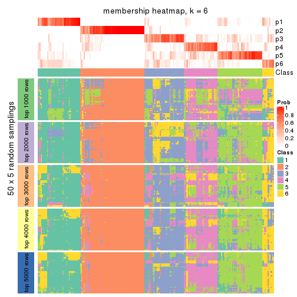</p>

</div>
</div>

As soon as we have had the classes for columns, we can look for signatures
which are significantly different between classes which can be candidate marks
for certain classes. Following are the heatmaps for signatures.


Signature heatmaps where rows are scaled:


<script>
$( function() {
	$( '#tabs-ATC-NMF-get-signatures' ).tabs();
} );
</script>
<div id='tabs-ATC-NMF-get-signatures'>
<ul>
<li><a href='#tab-ATC-NMF-get-signatures-1'>k = 2</a></li>
<li><a href='#tab-ATC-NMF-get-signatures-2'>k = 3</a></li>
<li><a href='#tab-ATC-NMF-get-signatures-3'>k = 4</a></li>
<li><a href='#tab-ATC-NMF-get-signatures-4'>k = 5</a></li>
<li><a href='#tab-ATC-NMF-get-signatures-5'>k = 6</a></li>
</ul>
<div id='tab-ATC-NMF-get-signatures-1'>
<pre><code class="r">get_signatures(res, k = 2)
</code></pre>

<p></p>

</div>
<div id='tab-ATC-NMF-get-signatures-2'>
<pre><code class="r">get_signatures(res, k = 3)
</code></pre>

<p></p>

</div>
<div id='tab-ATC-NMF-get-signatures-3'>
<pre><code class="r">get_signatures(res, k = 4)
</code></pre>

<p></p>

</div>
<div id='tab-ATC-NMF-get-signatures-4'>
<pre><code class="r">get_signatures(res, k = 5)
</code></pre>

<p></p>

</div>
<div id='tab-ATC-NMF-get-signatures-5'>
<pre><code class="r">get_signatures(res, k = 6)
</code></pre>

<p></p>

</div>
</div>


Signature heatmaps where rows are not scaled:


<script>
$( function() {
	$( '#tabs-ATC-NMF-get-signatures-no-scale' ).tabs();
} );
</script>
<div id='tabs-ATC-NMF-get-signatures-no-scale'>
<ul>
<li><a href='#tab-ATC-NMF-get-signatures-no-scale-1'>k = 2</a></li>
<li><a href='#tab-ATC-NMF-get-signatures-no-scale-2'>k = 3</a></li>
<li><a href='#tab-ATC-NMF-get-signatures-no-scale-3'>k = 4</a></li>
<li><a href='#tab-ATC-NMF-get-signatures-no-scale-4'>k = 5</a></li>
<li><a href='#tab-ATC-NMF-get-signatures-no-scale-5'>k = 6</a></li>
</ul>
<div id='tab-ATC-NMF-get-signatures-no-scale-1'>
<pre><code class="r">get_signatures(res, k = 2, scale_rows = FALSE)
</code></pre>

<p></p>

</div>
<div id='tab-ATC-NMF-get-signatures-no-scale-2'>
<pre><code class="r">get_signatures(res, k = 3, scale_rows = FALSE)
</code></pre>

<p></p>

</div>
<div id='tab-ATC-NMF-get-signatures-no-scale-3'>
<pre><code class="r">get_signatures(res, k = 4, scale_rows = FALSE)
</code></pre>

<p></p>

</div>
<div id='tab-ATC-NMF-get-signatures-no-scale-4'>
<pre><code class="r">get_signatures(res, k = 5, scale_rows = FALSE)
</code></pre>

<p></p>

</div>
<div id='tab-ATC-NMF-get-signatures-no-scale-5'>
<pre><code class="r">get_signatures(res, k = 6, scale_rows = FALSE)
</code></pre>

<p></p>

</div>
</div>


Compare the overlap of signatures from different k:

```r
compare_signatures(res)
```


`get_signature()` returns a data frame invisibly. TO get the list of signatures, the function
call should be assigned to a variable explicitly. In following code, if `plot` argument is set
to `FALSE`, no heatmap is plotted while only the differential analysis is performed.

```r
# code only for demonstration
tb = get_signature(res, k = ..., plot = FALSE)
```

An example of the output of `tb` is:

```
#>   which_row         fdr    mean_1    mean_2 scaled_mean_1 scaled_mean_2 km
#> 1        38 0.042760348  8.373488  9.131774    -0.5533452     0.5164555  1
#> 2        40 0.018707592  7.106213  8.469186    -0.6173731     0.5762149  1
#> 3        55 0.019134737 10.221463 11.207825    -0.6159697     0.5749050  1
#> 4        59 0.006059896  5.921854  7.869574    -0.6899429     0.6439467  1
#> 5        60 0.018055526  8.928898 10.211722    -0.6204761     0.5791110  1
#> 6        98 0.009384629 15.714769 14.887706     0.6635654    -0.6193277  2
...
```

The columns in `tb` are:

1. `which_row`: row indices corresponding to the input matrix.
2. `fdr`: FDR for the differential test. 
3. `mean_x`: The mean value in group x.
4. `scaled_mean_x`: The mean value in group x after rows are scaled.
5. `km`: Row groups if k-means clustering is applied to rows.


UMAP plot which shows how samples are separated.


<script>
$( function() {
	$( '#tabs-ATC-NMF-dimension-reduction' ).tabs();
} );
</script>
<div id='tabs-ATC-NMF-dimension-reduction'>
<ul>
<li><a href='#tab-ATC-NMF-dimension-reduction-1'>k = 2</a></li>
<li><a href='#tab-ATC-NMF-dimension-reduction-2'>k = 3</a></li>
<li><a href='#tab-ATC-NMF-dimension-reduction-3'>k = 4</a></li>
<li><a href='#tab-ATC-NMF-dimension-reduction-4'>k = 5</a></li>
<li><a href='#tab-ATC-NMF-dimension-reduction-5'>k = 6</a></li>
</ul>
<div id='tab-ATC-NMF-dimension-reduction-1'>
<pre><code class="r">dimension_reduction(res, k = 2, method = &quot;UMAP&quot;)
</code></pre>

<p></p>

</div>
<div id='tab-ATC-NMF-dimension-reduction-2'>
<pre><code class="r">dimension_reduction(res, k = 3, method = &quot;UMAP&quot;)
</code></pre>

<p></p>

</div>
<div id='tab-ATC-NMF-dimension-reduction-3'>
<pre><code class="r">dimension_reduction(res, k = 4, method = &quot;UMAP&quot;)
</code></pre>

<p></p>

</div>
<div id='tab-ATC-NMF-dimension-reduction-4'>
<pre><code class="r">dimension_reduction(res, k = 5, method = &quot;UMAP&quot;)
</code></pre>

<p></p>

</div>
<div id='tab-ATC-NMF-dimension-reduction-5'>
<pre><code class="r">dimension_reduction(res, k = 6, method = &quot;UMAP&quot;)
</code></pre>

<p></p>

</div>
</div>


Following heatmap shows how subgroups are split when increasing `k`:

```r
collect_classes(res)
```


If matrix rows can be associated to genes, consider to use `GO_Enrichment(res,
...)` to perform function enrichment for the signature genes.


 

## Session info


```r
sessionInfo()
```

```
#> R version 3.6.0 (2019-04-26)
#> Platform: x86_64-pc-linux-gnu (64-bit)
#> Running under: CentOS Linux 7 (Core)
#> 
#> Matrix products: default
#> BLAS:   /usr/lib64/libblas.so.3.4.2
#> LAPACK: /usr/lib64/liblapack.so.3.4.2
#> 
#> locale:
#>  [1] LC_CTYPE=en_US.UTF-8       LC_NUMERIC=C               LC_TIME=en_US.UTF-8       
#>  [4] LC_COLLATE=en_US.UTF-8     LC_MONETARY=en_US.UTF-8    LC_MESSAGES=en_US.UTF-8   
#>  [7] LC_PAPER=en_US.UTF-8       LC_NAME=C                  LC_ADDRESS=C              
#> [10] LC_TELEPHONE=C             LC_MEASUREMENT=en_US.UTF-8 LC_IDENTIFICATION=C       
#> 
#> attached base packages:
#>  [1] grid      parallel  stats4    stats     graphics  grDevices utils     datasets  methods  
#> [10] base     
#> 
#> other attached packages:
#>  [1] genefilter_1.66.0           ComplexHeatmap_2.1.1        markdown_1.1               
#>  [4] knitr_1.26                  cola_1.3.2                  SummarizedExperiment_1.14.1
#>  [7] DelayedArray_0.10.0         BiocParallel_1.18.1         matrixStats_0.55.0         
#> [10] Biobase_2.44.0              GenomicRanges_1.36.1        GenomeInfoDb_1.20.0        
#> [13] IRanges_2.18.3              S4Vectors_0.22.1            BiocGenerics_0.30.0        
#> [16] GetoptLong_0.1.7           
#> 
#> loaded via a namespace (and not attached):
#>  [1] bitops_1.0-6           bit64_0.9-7            doParallel_1.0.15      RColorBrewer_1.1-2    
#>  [5] httr_1.4.1             backports_1.1.5        tools_3.6.0            R6_2.4.1              
#>  [9] DBI_1.0.0              lazyeval_0.2.2         colorspace_1.4-1       withr_2.1.2           
#> [13] tidyselect_0.2.5       gridExtra_2.3          bit_1.1-14             compiler_3.6.0        
#> [17] xml2_1.2.2             microbenchmark_1.4-7   pkgmaker_0.28          slam_0.1-46           
#> [21] scales_1.1.0           NMF_0.23.6             stringr_1.4.0          digest_0.6.23         
#> [25] XVector_0.24.0         pkgconfig_2.0.3        bibtex_0.4.2           highr_0.8             
#> [29] rlang_0.4.2            GlobalOptions_0.1.1    RSQLite_2.1.2          impute_1.58.0         
#> [33] shape_1.4.4            mclust_5.4.5           dendextend_1.12.0      dplyr_0.8.3           
#> [37] RCurl_1.95-4.12        magrittr_1.5           GenomeInfoDbData_1.2.1 Matrix_1.2-17         
#> [41] Rcpp_1.0.3             munsell_0.5.0          viridis_0.5.1          lifecycle_0.1.0       
#> [45] stringi_1.4.3          zlibbioc_1.30.0        plyr_1.8.4             blob_1.2.0            
#> [49] crayon_1.3.4           lattice_0.20-38        splines_3.6.0          annotate_1.62.0       
#> [53] circlize_0.4.9         zeallot_0.1.0          pillar_1.4.2           rjson_0.2.20          
#> [57] rngtools_1.4           reshape2_1.4.3         codetools_0.2-16       XML_3.98-1.20         
#> [61] glue_1.3.1             evaluate_0.14          vctrs_0.2.0            png_0.1-7             
#> [65] foreach_1.4.7          polyclip_1.10-0        gtable_0.3.0           purrr_0.3.3           
#> [69] clue_0.3-57            assertthat_0.2.1       ggplot2_3.2.1          xfun_0.11             
#> [73] gridBase_0.4-7         eulerr_6.0.0           xtable_1.8-4           skmeans_0.2-11        
#> [77] survival_2.44-1.1      viridisLite_0.3.0      tibble_2.1.3           iterators_1.0.12      
#> [81] memoise_1.1.0          AnnotationDbi_1.46.1   registry_0.5-1         GTF_0.0.1             
#> [85] cluster_2.1.0          brew_1.0-6
```


